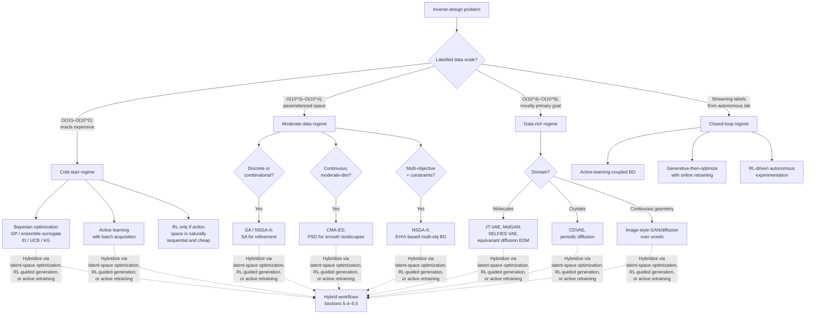

# Machine Learning-Based Materials Inverse Design: Methodological Strategies and Foundational Databases
# 1 Introduction, Conceptual Foundations, and Overview of the Three Main Inverse Design Strategies

The discovery of new materials has, for most of human history, proceeded as a slow, expensive, and largely empirical enterprise. From the bronze and iron ages through the silicon age, the materials available to civilization have shaped what is technologically and socially possible, yet the path from a desired functionality to a realized compound has typically traversed years or decades of trial-and-error synthesis, characterization, and refinement.[^1] Against this backdrop, the past decade has witnessed a fundamental reorientation: rather than asking *which properties does a given material happen to possess?*, researchers increasingly ask *which material, if any, should exhibit a specified set of target properties?* This inversion of the question—made tractable by the convergence of high-throughput computation, curated materials databases, and machine learning—defines the emerging field of **machine learning-based materials inverse design**, and forms the subject of the present report. This opening chapter establishes the conceptual vocabulary, situates inverse design within the broader scientific and policy landscape of the Materials Genome Initiative (MGI) and the AI-for-science movement, and introduces the tripartite taxonomy—**exploration-based**, **model-based**, and **optimization-based** strategies—that will organize the remainder of Part One. It thereby serves as the analytical scaffold upon which the subsequent methodological chapters (Chapters 2–5) and the database-focused chapters (Chapters 6–7) are built.

## 1.1 From Forward Trial-and-Error to Inverse Design: A Paradigm Shift in Materials Discovery

The traditional, or **forward**, paradigm of materials discovery follows a structure-first logic: one selects a chemistry or microstructure, synthesizes it, measures its properties, and only then evaluates whether those properties match a desired technological function. Iterated across many candidates, this Edisonian workflow has produced essentially all of the materials infrastructure of the modern world, but its inefficiency has become increasingly conspicuous as the design spaces of interest have grown into the millions or billions of plausible compositions and configurations. The Materials Genome Initiative (MGI), announced in 2011, explicitly framed the resulting bottleneck as a national-scale problem: the time required to move a new material from conception to deployment was simply too long for the pace of demand in energy, information technology, health, and transportation, and could only be shortened by "synergistically combining experiment, theory, and computation in a tightly integrated, high-throughput manner."[^1]

A number of MGI-era case studies illustrate both the promise and the residual inefficiency of forward-oriented, screening-heavy approaches, and in doing so motivate a more thoroughgoing inversion of the workflow. Three are especially instructive. First, Kim and co-workers used *ab initio* simulations to design, *in silico*, a room-temperature **polar metal** with unexpected stability, and then synthesized the predicted compound by high-precision pulsed laser deposition; this theory-guided experimental effort revealed a new member of an exceedingly rare class of materials whose discovery by purely empirical means would have been essentially accidental.[^1] Second, Gómez-Bombarelli and colleagues conducted a high-throughput virtual screening of approximately **1.6 million OLED molecules**, combining quantum chemistry, machine learning, and cheminformatics with experimental characterization, and ultimately synthesized molecules with state-of-the-art external quantum efficiencies—including candidates reaching roughly 22% experimentally verified efficiency.[^1] Third, the search for half-Heusler **piezoelectric transducers** scanned on the order of one thousand ternary compounds against criteria such as stability, band gap, and electromechanical coupling, yielding roughly eighty viable candidates that no prior experimental campaign had isolated.[^1] In parallel, MGI-style efforts identified new lithium-ion conductors in the Li₁₀±ₓMₓP₂₋ₓX₁₂ family with "liquid-like" conductivity, new photocatalysts for water splitting, and new MOF/zeolite-based separations materials, each emerging from databases scanning thousands to hundreds of thousands of candidates.[^1]

These successes share an important structural feature: they begin with a **target property**—polar metallic character, high OLED quantum efficiency, large electromechanical coupling, fast Li⁺ conduction, selective gas adsorption—and use computation to filter or design candidates against that target before any synthesis is attempted. They are, in this sense, already proto-inverse-design workflows. Yet most of them still rely heavily on enumeration of a pre-defined candidate library followed by forward property prediction; the "inversion" is implicit in the filtering criteria rather than explicit in the algorithm. The conceptual leap that defines ML-based inverse design proper is to make the inversion **algorithmically explicit**: to construct procedures that, given a property target, *generate* or *search for* candidate structures directly, rather than enumerating and filtering. This shift transforms materials discovery from a search over fixed libraries into a navigation of design spaces, and it is this transformation that machine learning—through generative models, surrogate-driven optimization, and active learning—has begun to make practical.

## 1.2 Defining Materials Inverse Design and the Property-to-Structure Mapping Problem

To proceed rigorously, it is useful to fix terminology. In the forward direction, materials science is concerned with a mapping

$$f: \mathcal{S} \longrightarrow \mathcal{P},$$

where $\mathcal{S}$ denotes a **design space** of candidate materials—parameterized by composition, crystal structure, microstructure, processing conditions, or molecular graphs—and $\mathcal{P}$ denotes a space of physically measurable or computable **properties**. The forward problem, well-posed in principle, asks for $f(s)$ given $s \in \mathcal{S}$; density functional theory (DFT), molecular dynamics, phase-field models, and an expanding zoo of ML surrogate models all aim, in their respective regimes, to approximate $f$.

**Materials inverse design**, by contrast, is concerned with constructing or sampling from the preimage

$$f^{-1}(p^\star) = \{ s \in \mathcal{S} \, | \, f(s) \approx p^\star \},$$

where $p^\star$ is a vector of target properties—possibly accompanied by tolerances, multi-objective trade-offs, and feasibility constraints such as thermodynamic stability, synthesizability, cost, and toxicity. Three features of this formulation deserve explicit emphasis, because they shape every methodological choice that follows.

First, **the inverse problem is intrinsically ill-posed**: the preimage $f^{-1}(p^\star)$ is typically either empty, a singleton, or—more commonly—a large and disconnected set, because many distinct materials can share similar values of a target property. Inverse design methods must therefore embrace non-uniqueness, either by sampling diverse solutions, by ranking them under auxiliary criteria, or by exposing the multiplicity to the experimentalist as a portfolio of candidates.

Second, **the design space $\mathcal{S}$ is high-dimensional, discrete, and structured**. Inorganic crystals live on a discrete lattice of space groups and Wyckoff positions; molecules are graphs subject to valence rules; polymers introduce hierarchical sequence, conformation, and processing degrees of freedom; metamaterials add geometric architectures spanning many length scales. Continuous optimization techniques cannot be applied naively; representations matter, and a substantial part of the methodological literature is devoted to constructing **descriptors**, **latent representations**, or **graph encodings** that render $\mathcal{S}$ amenable to differentiation, interpolation, or probabilistic sampling.

Third, **practical inverse design is multi-objective and constraint-laden**. A candidate Li-ion electrolyte must simultaneously possess high ionic conductivity, low electronic conductivity, electrochemical stability, mechanical compatibility, and acceptable cost; the MGI screening that produced roughly twenty viable solid Li electrolytes from a pool of 12,831 Li-containing inorganic crystals did so by imposing precisely such a stack of criteria.[^1] Inverse design algorithms therefore embed not only a property target but also feasibility surrogates—formation-energy filters, decomposition-energy thresholds, synthesizability indices, or expert-curated rules.

It is important to distinguish inverse design from two adjacent concepts with which it is often conflated. **High-throughput virtual screening** evaluates $f(s)$ on a *pre-enumerated* library and filters by $p^\star$; it is inverse only in spirit, not in algorithm. **Bayesian-optimization-only workflows**, while genuinely iterative and target-directed, traditionally operate over a fixed parametric design space and treat inverse design as a sequential decision problem rather than a generative one. Both are legitimate components of the inverse-design toolkit and, as Chapter 4 will detail, optimization-based inverse design subsumes Bayesian optimization as one of its central instruments. The defining feature of inverse design *as such* is that the **target property is the entry point of the algorithm**, and the structure is its output—whether obtained by guided search, by generative sampling from a learned conditional distribution, or by optimization over a parameterized surrogate.

## 1.3 Situating Inverse Design within the Materials Genome Initiative and AI-for-Science

ML-based materials inverse design is neither a stand-alone algorithmic curiosity nor a sudden invention of the late 2010s; it is the natural culmination of a decade of infrastructural investment that the MGI catalyzed. Three threads of that investment are particularly load-bearing for the methods analyzed in this report.

The first is the construction of **large, openly accessible computational databases** populated by high-throughput first-principles calculations. The Materials Project alone provides web-based access to properties computed by electronic structure methods for tens of thousands of materials and chemical compounds, and analogous resources such as AFLOW (Duke), NOMAD (EU Center of Excellence), and others have populated databases for a wide variety of multicrystalline properties.[^1] These databases supply the training data without which modern generative and surrogate models could not function, and they will form the focus of Part Two of the present report (Chapters 6–7).

The second is the maturation of **high-throughput experimental and computational pipelines** that produce data at a rate commensurate with ML training requirements. MGI-funded efforts have demonstrated automated synthesis and characterization across catalysts, magnetic materials, structural alloys, and combinatorial libraries, and have established that "the rate-limiting step is no longer acquisition of materials information but data reconstruction and analysis."[^1] The proposed **Materials Acceleration Platform** (MAP), articulated by Aspuru-Guzik and Persson, makes the connection between inverse design and autonomous laboratories explicit: it "aims to automate synthesis and characterization protocols via the use of modular robotics, machine learning, and inverse design," and identifies inverse design as one of the three core pillars of next-generation materials discovery alongside automation and AI.[^1]

The third is the systematic **integration of theory, computation, and experiment** that the MGI framed as a paradigm rather than a project. The MGI-era summary of accomplishments emphasizes that successes in OLEDs, polar metals, polymer self-assembly, MOFs, lithium conductors, photoanodes, and half-Heusler thermoelectrics were enabled not by any single discipline but by the *tight coupling* of experiment, theory, and computation in closed feedback loops.[^1] Inverse design is the algorithmic embodiment of that coupling: it operationalizes the feedback by allowing the computational layer to propose, the experimental layer to validate, and the data layer to refine the proposal mechanism itself.

At the same time, ML-based inverse design participates in a broader **AI-for-science movement** whose techniques—deep generative modeling, reinforcement learning, transformer architectures, message-passing graph neural networks, normalizing flows, diffusion models—are largely imported from computer vision, natural language processing, and protein structure prediction. The MGI-era literature anticipated this convergence: machine learning was already being used to mine glass configurations for descriptors of rearrangement dynamics; to predict bulk mechanical behavior from atomistic structure; to screen carbon-capture sorbents; to discover Pt₃Y oxygen-reduction catalysts approximately ten times more active than pure platinum; and to construct force fields from large DFT datasets.[^1] What inverse design adds to this trajectory is not new physics but a new *direction of inference*: from properties back to structures, with the inferential apparatus of modern machine learning supplying the conditional generative and optimization machinery that makes the inversion tractable.

## 1.4 Comparative Overview of the Three Main ML-Based Inverse Design Strategies

Within this landscape, the methodological literature on ML-based inverse design has converged—at least at the level of expository taxonomy—on three broad families of strategies. Each family corresponds to a distinct algorithmic logic for inverting the structure-to-property map, and each is best understood by the **entry point** through which it engages the design space. The following table summarizes the three families along the dimensions that subsequent chapters will treat in detail.

| Strategy family | Core logic | Representative algorithms | Typical input | Typical output | Principal strength | Principal limitation |
|---|---|---|---|---|---|---|
| **Exploration-based** | Active, adaptive navigation of the design space, where each query is chosen to maximize information or expected improvement | Active learning, Bayesian-guided exploration, reinforcement learning (deep Q-learning, policy gradient, TRPO) | Target property + small initial dataset + interactive oracle (simulation or experiment) | Sequentially proposed candidates with growing confidence | Sample efficiency; works with little prior data; closes the loop with simulation/experiment | Reward/acquisition design is difficult; convergence can be slow; high cost per query |
| **Model-based (generative)** | Learn a conditional generative mapping from target properties (or a latent code) to candidate structures | Variational autoencoders (VAEs), generative adversarial networks (GANs), normalizing flows, invertible neural networks, diffusion models; crystal-specific variants such as CDVAE | Large structure–property dataset; target property as conditioning vector | Novel structures (graphs, crystals, polymers) sampled from a learned conditional distribution | Direct inversion; ability to generate genuinely novel candidates; end-to-end differentiability | Data-hungry; generated candidates may be invalid or unsynthesizable; interpretability limited; potential mode collapse |
| **Optimization-based** | Formulate inverse design as an explicit objective-function optimization, typically solved by gradient-free heuristics coupled with ML surrogates | Genetic algorithms (GA), particle swarm optimization (PSO), simulated annealing, Bayesian optimization (BO), CMA-ES | Parameterized design space + ML surrogate predictor of $f$ + scalar/multi-objective objective | Optimized candidate(s) at the (approximate) extrema of the objective | Transparent objective; works with non-differentiable surrogates; robust in small-data regimes | Slow in very high-dimensional spaces; sensitive to surrogate accuracy; risk of local optima |

The choice among these families is not arbitrary; it reflects what the practitioner has *most* of and what they have *least* of. When data are scarce but a high-fidelity oracle (DFT, robotic synthesis) is available, **exploration-based** methods dominate, because each query is precious and must be chosen by an acquisition function that explicitly trades exploration against exploitation. When a large structure–property dataset already exists and the goal is to populate a previously unexplored region of $\mathcal{S}$ with genuinely novel candidates, **model-based** generative methods dominate, because they can learn the geometry of the data manifold and sample from it conditionally. When a parameterized design space and a trustworthy surrogate are both available—and especially when the design space is moderate-dimensional and continuous, as in metamaterial geometry or alloy composition—**optimization-based** methods dominate, because they offer transparent objectives, well-understood convergence behavior, and ready integration with multi-objective and constraint-handling frameworks.

It bears emphasizing that these categories are *analytical* rather than *exclusive*: many real workflows hybridize them, for example by training a VAE generator and then performing Bayesian optimization in its latent space, or by using reinforcement learning to guide a generative policy whose rewards are computed by an ML surrogate. Chapter 5 will return to these hybrids in detail. The taxonomy nevertheless serves the report's organizing purpose: it distinguishes algorithms by their primary inversion logic, and thereby allows the discussion of principles, representative algorithms, and trade-offs in Chapters 2–4 to proceed cleanly.

## 1.5 Shared Goals, Distinguishing Logics, and Complementary Roles

Beneath their algorithmic differences, the three strategy families share a common set of goals that are best articulated in light of the MGI's accelerated-discovery agenda. All three aim to **efficiently navigate vast design spaces** that no enumerative procedure could exhaust—the roughly 10⁶ candidate molecules of the OLED screening, the 300,000 theoretically proposed zeolite structures of which only a few hundred have been experimentally realized, the millions of plausible Ti–Ni–Cu–Fe–Pd shape-memory alloys explored by ML-trained models.[^1] All three depend on **materials databases** as their data substrate and benchmark, whether for training generative models, for fitting surrogate predictors, or for initializing active-learning campaigns; the database landscape analyzed in Part Two of this report is therefore not an appendix to the methodological discussion but its enabling infrastructure. And all three are increasingly understood as components of a **closed design–synthesis–characterization loop**, in which inverse-design algorithms propose, autonomous experiments validate, and the loop's data are recycled into model retraining.[^1]

Where the three families diverge is in the *epistemic posture* they adopt toward the design space. Exploration-based methods treat $\mathcal{S}$ as something to be **learned about** through sequential interaction; their characteristic question is "where should I look next?" Model-based methods treat $\mathcal{S}$ as something to be **modeled as a probability distribution**, conditional on properties; their characteristic question is "what does the distribution of good candidates look like, and how can I sample from it?" Optimization-based methods treat $\mathcal{S}$ as a **landscape to be climbed**, given a surrogate map; their characteristic question is "where is the optimum, and how do I get there?" These three postures are not in competition; they are complementary responses to the differing structures of differing problems, and the most productive practical workflows often combine them—using, for example, a generative model to propose a diverse initial population, an active-learning loop to evaluate the most informative candidates, and an evolutionary or Bayesian optimizer to refine the best of these toward the objective. Chapter 5 will analyze such hybrids systematically; the present chapter merely flags their existence as evidence that the tripartite taxonomy is a scaffold, not a partition.

## 1.6 Chapter Roadmap and Analytical Framework

The remainder of this report proceeds in two parts, organized to mirror the conceptual structure introduced above. **Part One: Methods** (Chapters 2–5) develops each of the three strategy families in turn. Chapter 2 examines **exploration-based** inverse design, treating the principles of active learning, Bayesian-guided exploration, and reinforcement learning, with attention to representative algorithms such as deep Q-learning, policy gradient, and TRPO, and to the trade-offs between sample efficiency and training stability. Chapter 3 examines **model-based (generative)** inverse design, comparing variational autoencoders, generative adversarial networks, normalizing flows, invertible neural networks, and diffusion models, together with crystal-specific variants such as CDVAE and graph-based generative architectures, and analyzing the tensions between novelty, validity, and synthesizability. Chapter 4 examines **optimization-based** inverse design, surveying genetic algorithms, particle swarm optimization, simulated annealing, Bayesian optimization, and CMA-ES, and their integration with ML surrogates. Chapter 5 then provides a **comparative synthesis and hybridization analysis**, mapping the three families onto data-availability regimes, computational budgets, interpretability requirements, and material classes (crystals, polymers, molecules, metamaterials), and discussing emerging hybrid workflows.

**Part Two: Databases** (Chapters 6–7) then turns to the data infrastructure that sustains every method discussed in Part One. Chapter 6 surveys the core **computational inorganic materials databases**—the Materials Project, OQMD, AFLOW/AFLOWLIB, NOMAD, JARVIS, Materials Cloud, and ICSD—providing for each its scope, methodology, key properties, official URL, and known reproducibility issues. Chapter 7 extends the survey to **molecular, polymer, and application-specific databases** (PubChem, ChEMBL, QM9, the Harvard Clean Energy Project, Polymer Genome, the Open Macromolecular Genome, PoLyInfo, Citrination, MatWeb, CatApp, TE Design Lab) and analyzes cross-cutting issues of data heterogeneity, DFT-setting consistency, API accessibility, FAIR principles, and standardization efforts such as OPTIMADE. Chapter 8 concludes with a synthesis of Parts One and Two, an analysis of open challenges (synthesizability, uncertainty quantification, autonomous closed-loop laboratories), and practical recommendations for aligning methodological choices with available data resources up to early 2024.

The analytical framework that ties all eight chapters together can now be summarized concisely. **Materials inverse design** is the algorithmic inversion of the structure-to-property map; **machine learning** provides the conditional generative, surrogate, and decision-theoretic machinery that makes the inversion tractable; **three strategy families**—exploration-based, model-based, and optimization-based—organize the methodological landscape; and **materials databases** supply the empirical and computational substrate on which all three families depend. Subsequent chapters fill in this scaffold with the technical detail that the user's request demands: fundamental principles, representative algorithms, advantages, disadvantages, and—for Part Two—database names, descriptions, and URLs. The report's overall logic is therefore a movement from the conceptual to the algorithmic to the infrastructural, with each level building on the foundations laid in the chapter before.

[^1]: de Pablo, J. J. et al. New frontiers for the materials genome initiative. *npj Computational Materials* **5**, 41 (2019). https://doi.org/10.1038/s41524-019-0173-4

# 2 Exploration-Based Inverse Design Methods

Chapter 1 closed by characterizing the three strategy families through the epistemic posture each adopts toward the design space $\mathcal{S}$. Exploration-based methods adopt the most overtly *interactive* of these postures: they treat $\mathcal{S}$ not as a fixed object to be modeled or as a landscape to be climbed in one motion, but as a partially unknown environment to be *learned about* through a sequence of queries, each chosen on the basis of what previous queries have revealed. The defining algorithmic question is therefore not "what is the optimum?" nor "what distribution generated the data?" but "**where should I look next?**" This chapter develops the principles, algorithms, and trade-offs of methods that take this question as their organizing principle—active learning, Bayesian-guided exploration, and reinforcement learning—and analyzes how they operationalize the exploration–exploitation trade-off on the high-dimensional, ruggedly non-convex property landscapes that pervade materials science. In doing so it establishes the methodological baseline against which Chapter 3 (model-based generative methods) and Chapter 4 (optimization-based methods) will be compared.

## 2.1 Fundamental Principles of Exploration-Based Inverse Design

All exploration-based methods can be subsumed under a common **sequential decision-theoretic** scaffold. At iteration $t$, the algorithm holds a dataset $\mathcal{D}_t = \{(s_i, y_i)\}_{i=1}^{N_t}$ of structures $s_i \in \mathcal{S}$ together with property labels $y_i = f(s_i) + \epsilon_i$, possibly corrupted by simulation or measurement noise $\epsilon_i$. From $\mathcal{D}_t$ it constructs an internal belief—a posterior distribution over the unknown map $f$, or equivalently a value or policy function—and then selects the next query $s_{t+1}$ by maximizing an **acquisition function** $\alpha(s; \mathcal{D}_t)$ or by sampling from a **policy** $\pi(s_{t+1} \mid \text{state}_t)$. The chosen candidate is submitted to an **oracle**, which in the materials context may be a density-functional-theory calculation, a higher-fidelity simulation, or a physical synthesis-and-characterization step in an automated laboratory; the resulting label $y_{t+1}$ is appended to the dataset, the belief is updated, and the loop continues until a budget is exhausted or a target is achieved.

Two structural features of this scaffold are decisive for materials inverse design. The first is the **interactive oracle**: unlike supervised generative learning, which consumes a static dataset, exploration-based methods presume the ability to acquire new labels on demand. This presumption aligns naturally with the closed design–synthesis–characterization loop articulated in Chapter 1, and indeed exploration-based methods are the algorithmic substrate that operationalizes that loop—they are the components that decide *what to compute next* or *what to synthesize next*. The second is the **exploration–exploitation dilemma**: at every iteration, the algorithm must balance the immediate goal of querying the candidate currently predicted to be best (exploitation of the surrogate's mean) against the longer-horizon goal of reducing surrogate uncertainty in regions where the model is unreliable (exploration of the surrogate's variance). On the high-dimensional, multi-modal property landscapes characteristic of materials science—potential-energy surfaces with combinatorially many local minima, multi-property Pareto fronts subject to stability and synthesizability constraints—pure exploitation rapidly traps the search in local optima, while pure exploration squanders the precious oracle budget on uninformative queries.

Different families resolve this dilemma in different ways, and the distinction will organize Sections 2.2 and 2.3. **Bayesian-guided exploration and active learning** encode the dilemma in an explicit *acquisition function* defined over the surrogate's posterior—a closed-form scalar that the algorithm maximizes at every iteration. **Reinforcement learning** instead encodes it in the agent's *policy* and *reward*, with exploration enforced through stochastic policies, entropy regularization, intrinsic curiosity rewards, or $\epsilon$-greedy action selection. Both routes embody the same underlying principle—that the value of a query lies not only in its expected payoff but in the information it provides about the unknown landscape—but they realize it through different mathematical primitives, and consequently differ in their data efficiency, computational profile, and amenability to combinatorial structure.

A final, practically important property of the entire family is its **suitability to small-data, high-query-cost regimes**. The generative methods of Chapter 3 typically require tens of thousands to millions of labeled structures to learn useful conditional distributions; the optimization methods of Chapter 4 often presume a pre-trained surrogate. Exploration-based methods, by contrast, can begin with a handful of seed points and accumulate a working belief through a few dozen carefully chosen queries. This makes them the natural choice when the oracle is expensive (DFT for large supercells, robotic synthesis of bulk samples) and when no pre-existing dataset covers the target region of design space—conditions that recur across catalysis, alloy design, and the discovery of functional inorganic compounds.

## 2.2 Active Learning and Bayesian-Guided Exploration

### 2.2.1 The Bayesian-Optimization Template

Active learning and Bayesian optimization (BO) are the most mature exploration strategies in materials informatics, and they share a common template. A probabilistic surrogate $\hat{f}(s)$—typically a **Gaussian process** (GP) with a kernel chosen to reflect smoothness assumptions over the descriptor space, but also frequently a **deep ensemble**, **Bayesian neural network**, or **random-forest variance estimator**—is fitted to $\mathcal{D}_t$. The surrogate supplies, for every candidate $s \in \mathcal{S}$, both a predictive mean $\mu_t(s)$ and a predictive standard deviation $\sigma_t(s)$. An **acquisition function** $\alpha(s; \mathcal{D}_t)$ combines these two quantities into a scalar utility, and the next query is chosen by

$$ s_{t+1} = \arg\max_{s \in \mathcal{S}} \, \alpha(s; \mathcal{D}_t). $$

The choice of acquisition function encodes the practitioner's preferred resolution of the exploration–exploitation dilemma. Four canonical forms recur in the materials literature:

- **Expected Improvement (EI)**: $\alpha_{\text{EI}}(s) = \mathbb{E}[\max(0, f(s) - f^\star)]$, where $f^\star$ is the current best observed value. EI prefers candidates whose predicted distribution places appreciable mass above the incumbent, automatically balancing $\mu$ and $\sigma$ in a closed form for GP surrogates.
- **Upper Confidence Bound (UCB)**: $\alpha_{\text{UCB}}(s) = \mu_t(s) + \beta_t \sigma_t(s)$, with $\beta_t$ a tunable exploration weight. UCB provides regret-bound guarantees under mild assumptions and is straightforward to implement on top of any surrogate that provides uncertainty estimates.
- **Knowledge Gradient (KG)**: a one-step look-ahead utility that values a query by the expected improvement it will induce in the *posterior maximum*, rather than in the current observation. KG is more computationally demanding but better suited to noisy oracles, including stochastic DFT settings and noisy experimental measurements.
- **Entropy Search and Predictive Entropy Search**: information-theoretic acquisitions that select the query maximizing the expected reduction in entropy of the location of the global optimum. These are particularly well-matched to inverse design because they treat *identifying the optimal structure*, rather than maximizing the value at the next query, as the explicit goal.

### 2.2.2 Materials-Science Instantiations

The most widely cited demonstration of the template in materials science remains the **adaptive design of shape-memory alloys** described in Chapter 1 in passing: by training a surrogate on a small experimental dataset of Ni–Ti–Cu–Fe–Pd compositions and iteratively querying the alloy whose predicted thermal hysteresis was lowest under an EI-style acquisition, an experimental–computational loop identified several compositions with significantly lower hysteresis than any in the original training set, within a few dozen synthesis-and-characterization rounds. The same template has been deployed for the guided discovery of **catalysts**, where surrogates trained on adsorption energies from DFT databases guide subsequent calculations toward compositions predicted to lie near volcano-curve optima; for **uncertainty-aware screening of inorganic compounds**, where ensemble disagreement is used as a proxy for posterior variance in regions of $\mathcal{S}$ unrepresented by the training set; and for the **iterative refinement of high-throughput DFT campaigns**, where each new calculation is chosen to be maximally informative about a target property under a stability constraint.

These deployments illustrate a number of practical lessons. First, the *descriptor space* in which the GP kernel is defined matters at least as much as the acquisition function: a poorly chosen featurization yields a surrogate whose uncertainty estimates are systematically miscalibrated, with the consequence that the acquisition either over- or under-explores. Second, **batch acquisition** is almost always required in practice—high-throughput DFT and parallel robotic synthesis both demand that several queries be submitted simultaneously rather than one at a time—and this requires acquisition functions that explicitly penalize redundancy among proposed candidates (e.g., through determinantal point processes, local penalization, or hallucinated observations). Third, the surrogate must handle the **discrete and structured** nature of $\mathcal{S}$: kernels over molecular fingerprints, graph kernels, or learned latent-space metrics are typical choices, and the quality of the resulting BO is bounded by the appropriateness of these representational choices.

### 2.2.3 Strengths and Characteristic Failure Modes

The principal strengths of Bayesian-guided exploration are inherited from its probabilistic core: it is **sample-efficient**, with each query chosen to maximize a principled expected utility; it is **uncertainty-aware**, exposing posterior variance to the practitioner and to downstream decision-making; and it integrates **naturally with closed-loop autonomous laboratories** because the acquisition function provides an explicit interface between the algorithm and the experimental queue. Its characteristic failure modes are equally well understood. **Scalability** is limited: vanilla GP surrogates scale cubically in $N_t$ and degrade in high-dimensional descriptor spaces, motivating the use of sparse approximations, deep-kernel learning, or neural-network surrogates with calibrated uncertainty. **Acquisition design is brittle**: the choice between EI, UCB, KG, and entropy-based acquisitions has measurable consequences for convergence, and the appropriate choice is problem-dependent. **Cold-start performance** can be poor when the initial dataset $\mathcal{D}_0$ is small or unrepresentative, because the surrogate's posterior is then dominated by the prior. And, most pervasively, **surrogate misspecification**—a kernel that is too smooth, a feature set that is incomplete, a noise model that ignores correlated experimental errors—can systematically mislead the acquisition into regions of $\mathcal{S}$ that the surrogate believes to be promising but the oracle reveals to be barren.

## 2.3 Reinforcement Learning for Materials and Molecular Design

### 2.3.1 The Markov-Decision-Process Formulation

Reinforcement learning (RL) generalizes the sequential decision template of Section 2.2 to settings in which the design problem is naturally decomposed into a **sequence of construction or modification actions**, rather than a single choice of candidate $s$. Inverse design is then posed as a **Markov decision process** (MDP) $\langle \mathcal{X}, \mathcal{A}, P, R, \gamma \rangle$, in which:

- the **state** $x_t \in \mathcal{X}$ represents a partial structure—a partially built molecular graph, a partially assembled crystal supercell, a partial sequence of processing steps, or a point on a potential-energy surface;
- the **action** $a_t \in \mathcal{A}$ represents an atomic decision—add an atom, attach a bond, substitute a Wyckoff site, set a processing variable, take a step along a reaction coordinate;
- the **transition kernel** $P(x_{t+1} \mid x_t, a_t)$ describes the deterministic or stochastic update of the partial structure;
- the **reward** $R(x_t, a_t)$ encodes the objective, typically a function of the target property of the completed (or partially completed) structure, possibly augmented with shaping terms for validity, stability, or synthesizability;
- the **discount factor** $\gamma \in [0,1]$ trades off immediate against long-horizon reward.

The agent learns either a **value function** $Q(x, a)$—the expected discounted return of taking action $a$ in state $x$ and following the policy thereafter—or a **policy** $\pi(a \mid x)$ directly, and uses one of these to generate completed candidates by rolling out the MDP from an initial state. The exploration–exploitation dilemma re-emerges in this setting as the question of how stochastically the policy is sampled or how aggressively the value function is queried at its argmax.

### 2.3.2 Value-Based Methods: Deep Q-Learning and Variants

Value-based methods learn an approximator $\hat{Q}_\theta(x,a)$ of the optimal action-value function $Q^\star(x,a)$ by minimizing a temporal-difference loss derived from the Bellman equation. **Deep Q-learning (DQN)** parameterizes $\hat{Q}$ as a deep neural network and stabilizes training via *experience replay* (a buffer of past transitions from which mini-batches are uniformly sampled) and a *target network* (a periodically frozen copy of $\hat{Q}$ used to compute regression targets). Standard variants—Double DQN, Dueling DQN, Prioritized Experience Replay, and distributional approaches such as C51 and QR-DQN—were originally developed for game environments but have been adapted to molecular-graph construction, where the action space is the discrete set of atom/bond additions and the state space is the set of partial graphs. Exploration is typically realized through an **$\epsilon$-greedy** policy that selects a random action with probability $\epsilon$ (annealed over training) and the argmax action otherwise; in the materials setting this corresponds to occasionally constructing a "random" molecule or crystal fragment to broaden the agent's experience.

Value-based RL is most natural when the action space is small, discrete, and well structured—as in atom-by-atom molecular construction or substitutional alloy design—and when the reward is sparse but unambiguous (e.g., a binary indicator of whether the completed molecule satisfies a target property threshold). Its principal limitations in materials design are the *curse of large discrete action spaces* (which arises rapidly when actions include the choice of element from a long periodic-table list combined with the choice of attachment site) and the *bootstrapping instabilities* characteristic of off-policy value learning, which are exacerbated by the non-stationary, function-approximated targets of deep RL.

### 2.3.3 Policy-Gradient Methods: REINFORCE and Actor–Critic

Policy-gradient methods parameterize the policy $\pi_\theta(a \mid x)$ directly and update $\theta$ along the gradient of expected return:

$$ \nabla_\theta J(\theta) = \mathbb{E}_{\pi_\theta}\big[ \nabla_\theta \log \pi_\theta(a \mid x) \cdot A^{\pi_\theta}(x, a) \big], $$

where $A^{\pi_\theta}$ is an advantage function. The simplest instantiation, **REINFORCE**, uses the empirical return as an unbiased but high-variance estimate of $A$; **actor–critic** methods reduce variance by learning a value baseline (the *critic*) alongside the policy (the *actor*), and asynchronous variants such as A3C and A2C parallelize the rollouts across many environments.

Policy-gradient methods are particularly attractive in materials design for two reasons. First, they handle **stochastic policies natively**, which is desirable when multiple distinct structures may satisfy the target property and the algorithm should sample across this multiplicity rather than collapse onto a single mode—a property tightly connected to the ill-posedness of the inverse problem articulated in Chapter 1. Second, they accommodate **continuous action spaces** (e.g., bond lengths, lattice parameters, processing temperatures) more gracefully than value-based methods, which require discretization or specialized architectures. Their characteristic weakness is high gradient variance and consequent sample inefficiency, which is partly mitigated by the trust-region methods described next, and partly by entropy regularization that simultaneously stabilizes training and enforces exploration.

### 2.3.4 Trust-Region and Proximal Approaches: TRPO and PPO

Policy-gradient methods are notoriously sensitive to step size: too large an update destabilizes the policy, while too small an update slows learning. **Trust Region Policy Optimization (TRPO)** addresses this by constraining each update so that the new policy $\pi_{\theta_{\text{new}}}$ remains within a Kullback–Leibler trust region of the old policy $\pi_{\theta_{\text{old}}}$:

$$ \max_{\theta} \, \mathbb{E}\!\left[\frac{\pi_\theta(a \mid x)}{\pi_{\theta_{\text{old}}}(a \mid x)} A^{\pi_{\theta_{\text{old}}}}(x,a)\right] \quad \text{subject to} \quad \mathbb{E}[\mathrm{KL}(\pi_{\theta_{\text{old}}} \| \pi_\theta)] \le \delta. $$

This constrained formulation yields monotonic improvement guarantees under idealized assumptions and substantially stabilizes training in high-dimensional, deep-network policies. Its successor, **Proximal Policy Optimization (PPO)**, achieves comparable empirical performance through a simpler clipped surrogate objective that penalizes large probability ratios without an explicit constraint, and has become a de facto default for policy-gradient RL in scientific applications. In molecular and materials design, TRPO/PPO-style trust-region methods are routinely paired with graph-neural-network policies that emit categorical distributions over atom/bond actions, and the resulting agents have been used to generate molecules optimized for drug-likeness scores, photovoltaic-relevant electronic properties, and synthetic accessibility.

### 2.3.5 Materials-Science Instantiations and Reward Design

Concrete deployments of RL in materials inverse design span several archetypes. **Molecular generators** decompose drug-like or photovoltaic molecule design into sequences of atom-and-bond additions, with rewards combining property targets (binding affinity, HOMO–LUMO gap, oscillator strength) with validity penalties (valence violations) and synthesizability scores. **Alloy and catalyst design** uses RL to choose elemental compositions or surface modifications sequentially, with rewards drawn from DFT-computed adsorption energies or volcano-curve proximities. **Process-parameter optimization** treats temperature schedules, deposition rates, or precursor concentrations as continuous actions in a finite-horizon MDP, with reward computed from a target microstructural or functional outcome. **Policy networks for navigating potential-energy surfaces** treat geometric steps on the PES as actions and use reward signals derived from local-minimum identification or transition-state location.

Across these archetypes, two methodological themes recur. The first is **action-space design**: choosing actions to be neither too coarse (which forecloses useful structures) nor too fine (which inflates the policy's exploration burden) is itself a substantive modeling decision, often tackled through **hierarchical action spaces** in which a high-level controller chooses a fragment or motif and a low-level policy realizes its atomistic details. The second is **reward shaping**: a pure terminal reward proportional to the target property typically yields a sparse signal that defeats learning, and practitioners almost always augment it with dense intermediate rewards (partial validity bonuses, stability surrogates, novelty bonuses) and with explicit penalties for constraint violations. Reward design is thus the RL analogue of acquisition-function design in BO, and—as the next section will detail—both have proven to be among the most brittle, problem-specific, and consequential ingredients of exploration-based inverse design.

## 2.4 Exploration–Exploitation Trade-offs on High-Dimensional Landscapes

Although Sections 2.2 and 2.3 describe seemingly disparate algorithmic frameworks, they implement closely related solutions to the exploration–exploitation problem, and a comparative reading clarifies both their common logic and their divergent practical profiles.

In **Bayesian-guided exploration**, the trade-off is governed by an *explicit acquisition function* defined over a *probabilistic surrogate*. The exploration component is mediated by the surrogate's posterior variance $\sigma_t(s)$, which by construction is large in regions of $\mathcal{S}$ sparsely covered by $\mathcal{D}_t$; the exploitation component is mediated by the mean $\mu_t(s)$, which by construction is concentrated near observed high-performing candidates. The acquisition function combines them in a single closed-form scalar that can be optimized at every iteration, and tuning the trade-off reduces to tuning a handful of interpretable hyperparameters (the UCB weight $\beta_t$, the EI improvement threshold, the KG look-ahead). This *explicitness* is one of the major appeals of BO: the practitioner can inspect, on each iteration, where the algorithm believes the optimum lies and where it believes it is most uncertain.

In **reinforcement learning**, the trade-off is internalized into the *policy* and *reward signal* rather than externalized into an acquisition function. Exploration is enforced through several distinct mechanisms operating in parallel: stochastic policies (the policy emits a distribution over actions, sampled rather than argmaxed), **entropy regularization** (an entropy bonus added to the objective penalizes overconfident policies and prevents premature collapse onto a single trajectory), **intrinsic rewards** (curiosity bonuses based on prediction error of a learned forward model, or novelty bonuses based on visitation counts in latent space, which provide dense exploration incentives in sparse-reward regimes), and **$\epsilon$-greedy or noisy action selection** in value-based methods. The trade-off is therefore distributed across multiple architectural choices, and is correspondingly more difficult to tune transparently—a feature that contributes substantially to the well-known training instabilities of deep RL.

Several techniques mitigate the curse of dimensionality common to both frameworks. **Curriculum learning** structures the training schedule so that the agent first masters simplified versions of the design problem (smaller molecules, more permissive validity constraints) before facing the full task, and has proven effective in stabilizing molecular-generation RL. **Hierarchical action spaces**, as introduced in Section 2.3.5, factor the action into a sequence of decisions at increasing levels of detail, exponentially reducing the effective branching factor. **Surrogate-assisted reward evaluation** replaces every-iteration calls to an expensive oracle (DFT, dynamic simulation) with calls to a cheaper ML predictor, reserving the true oracle for periodic recalibration; this couples RL with the surrogate-based optimization machinery that Chapter 4 will treat in detail. And **latent-space exploration**—performing BO or RL in the latent space of a pretrained generative model rather than in raw structure space—exploits the smoother, lower-dimensional geometry of learned representations to make the trade-off more tractable, providing one of the most important hybridization bridges to Chapter 3.

A final consideration ties these choices back to the geometry of materials property landscapes. **Potential-energy surfaces** in high-dimensional configurational coordinates are notoriously rugged, with combinatorially many local minima separated by barriers spanning many orders of magnitude in height; pure-exploitation methods collapse into the nearest minimum, while pure-exploration methods waste budget on uninformative directions. **Multi-property Pareto fronts**—the trade-off surfaces between, for example, ionic conductivity and electrochemical stability in Li-ion electrolytes, or between strength and ductility in alloys—introduce an additional structural complication: the goal is not a single optimum but a *set* of non-dominated candidates, and the acquisition or reward must reflect this multiplicity. **Multi-objective Bayesian optimization** (e.g., expected hypervolume improvement) and **scalarized multi-task RL** address this requirement, and both are now standard ingredients of the exploration-based toolkit. The constraints of **stability**, **synthesizability**, and **multi-objective targets** that Chapter 1 identified as defining features of practical inverse design thus enter the algorithmic design not as afterthoughts but as primary determinants of the acquisition or reward.

## 2.5 Advantages, Limitations, and Illustrative Case Studies

The preceding sections allow a consolidated assessment of exploration-based inverse design, summarized in the table below and elaborated thereafter.

| Dimension | Active learning / Bayesian-guided exploration | Reinforcement learning |
|---|---|---|
| **Data regime** | Excels in small-data regimes; can start from $\mathcal{O}(10)$ seed points | Requires many environment interactions, but each may be cheap if surrogate-assisted |
| **Surrogate type** | Probabilistic surrogate (GP, ensemble, BNN) supplying calibrated $\mu, \sigma$ | Value or policy network; uncertainty optional |
| **Trade-off mechanism** | Explicit acquisition function (EI, UCB, KG, entropy search) | Stochastic policy + entropy regularization + intrinsic rewards + $\epsilon$-greedy |
| **Natural design space** | Pre-enumerated or low-to-moderate-dimensional parametric $\mathcal{S}$ | Sequentially constructive $\mathcal{S}$ (molecular graphs, crystal assembly, processing steps) |
| **Closed-loop fit** | Excellent; acquisition function interfaces directly with experiment queue | Excellent in principle, but reward/oracle calls per training episode can be prohibitive |
| **Stability of training** | Generally stable; brittleness lies in surrogate and kernel choice | Notoriously unstable; trust-region methods (TRPO/PPO) substantially mitigate |
| **Interpretability** | High: posterior $\mu, \sigma$ and acquisition values are inspectable | Low to moderate: learned policies are opaque, though attention and saliency can help |
| **Principal failure mode** | Surrogate misspecification; cold start; scalability of GP | Reward hacking; sparse-reward learning failure; catastrophic forgetting |

### 2.5.1 Consolidated Strengths

Three strengths emerge consistently across both active-learning and RL deployments. **Sample efficiency** is the most distinctive: by selecting each query on the basis of expected information gain or expected return, exploration-based methods routinely identify high-performing candidates within budgets one to two orders of magnitude smaller than naive random or grid search, and—crucially—within budgets that are feasible for DFT or robotic-synthesis oracles. **Ability to operate without large pre-existing datasets** distinguishes the family from the generative methods of Chapter 3; an adaptive-design loop can in principle commence with no training data beyond a handful of seed observations, accumulating its own labeled dataset as a byproduct of the search. **Native compatibility with closed-loop autonomous laboratories** is the third, and arguably the most consequential strength in light of the Materials Acceleration Platform vision described in Chapter 1: every exploration-based method exposes an explicit "what to query next" interface, which is precisely the API that an autonomous laboratory consumes. **Adaptability to evolving objectives**—the ease with which acquisition functions and reward signals can be reformulated as the target property is refined, or as new constraints (cost, toxicity, supply-chain availability) are imposed—rounds out the catalogue.

### 2.5.2 Consolidated Limitations

The limitations of exploration-based inverse design are equally systematic. **Training instability**, especially for deep RL agents in materials environments with sparse and shaped rewards, remains a substantial practical obstacle; trust-region and proximal methods alleviate but do not eliminate it, and the gap between published demonstrations on benchmark tasks and reliable deployment in novel materials problems is often wide. **Reward and acquisition-function design is difficult and brittle**: an EI acquisition that performs admirably on a smooth toy landscape can systematically over-exploit on a rugged PES; a molecular-design reward that combines drug-likeness, synthesizability, and a target property can be exploited by the agent in ways the designer did not anticipate ("reward hacking"). **Sensitivity to surrogate-model error** is a related concern: an acquisition function or reward defined in terms of $\hat{f}$ inherits all of $\hat{f}$'s misspecifications, and a confidently wrong surrogate can drive the search away from the true optimum even when the algorithmic machinery is sound. **High computational or experimental cost per environment interaction** sets a hard ceiling on the effective length of training loops; the per-query cost of a DFT calculation, a force-field-based MD simulation, or a robotic synthesis is the binding constraint that ultimately determines whether an exploration-based campaign is feasible at all.

### 2.5.3 Illustrative Case Studies

To consolidate these abstract trade-offs into a concrete picture, the following case studies—each implicit in the broader literature surveyed in Chapter 1—illustrate the family's range and characteristic patterns.

*Adaptive design of low-hysteresis shape-memory alloys.* Beginning from a small experimental dataset over a Ni–Ti–Cu–Fe–Pd composition space, an ensemble surrogate combined with an EI-style acquisition iteratively selected new compositions for synthesis and characterization. Within a few dozen rounds, several compositions exhibiting lower thermal hysteresis than any in the initial dataset were identified. The case illustrates both the strength (sample efficiency under expensive synthesis) and a typical limitation (sensitivity to descriptor choice in the surrogate).

*Bayesian-optimization-guided catalyst discovery.* Surrogates trained on DFT-derived adsorption energies are used to choose subsequent calculations that maximize EI over a volcano-curve-related figure of merit. The case demonstrates how BO integrates seamlessly with high-throughput DFT pipelines and how multi-objective acquisitions can handle simultaneous targets of activity and stability.

*RL-based molecular generation for drug-like or photovoltaic candidates.* A graph-construction MDP with a PPO-trained policy, rewarded by a weighted combination of a target property (e.g., HOMO–LUMO gap), drug-likeness, and synthetic accessibility, generates novel molecules satisfying the targets. The case showcases native handling of structured combinatorial spaces and the centrality of reward shaping.

*Active-learning-driven high-throughput DFT campaigns.* An ensemble surrogate trained on a partial DFT database identifies under-explored regions of composition space whose calculations are then prioritized, leading to faster coverage of property targets than uniform enumeration. The case illustrates how exploration can shape data acquisition itself, blurring the line between method and database.

### 2.5.4 Transition to Chapters 3 and 4

The limitations enumerated above motivate the methodological pivots of the two subsequent chapters. The data-hungriness that exploration-based methods avoid is precisely what generative model-based methods *accept* in exchange for the ability to produce novel candidates in one shot without an interactive oracle; Chapter 3 will analyze how VAEs, GANs, normalizing flows, and diffusion models exploit large pre-existing datasets to learn a conditional generative mapping that bypasses the sequential-query bottleneck. The reward-design brittleness and surrogate sensitivity that complicate exploration-based methods motivate the more transparent, explicitly formulated objectives of optimization-based methods; Chapter 4 will examine how genetic algorithms, particle-swarm optimization, simulated annealing, Bayesian optimization (treated there as an optimization rather than purely exploratory technique), and CMA-ES couple ML surrogates with non-gradient global optimizers to provide complementary trade-offs. The three families are not in competition but in complementary distribution across the problem space, and Chapter 5 will return to the question of how—and through which hybrid architectures—they are most fruitfully combined.

# 3 Model-Based (Generative) Inverse Design Methods

Chapter 2 closed by characterizing exploration-based methods as those that *avoid* data hunger by interactively acquiring labels one query at a time, paying the price of sequential oracle calls and the brittleness of acquisition or reward design. The present chapter examines the strategy family that adopts the opposite bargain: rather than learning *about* the design space through sequential queries, **model-based generative methods learn the design space itself** by training on large pre-existing structure–property datasets, and then exploit the learned distribution to produce candidate structures directly conditioned on target properties. The defining algorithmic question shifts accordingly. Where exploration-based methods ask "where should I look next?", generative methods ask "**what does the distribution of high-performing candidates look like, and how can I draw novel samples from it?**" This reframing turns inverse design into a problem of conditional probabilistic modeling, and it imports into materials science the full arsenal of deep generative modeling—variational autoencoders, generative adversarial networks, normalizing flows, invertible neural networks, and diffusion models—that has reshaped image synthesis, language modeling, and protein structure prediction over the past decade. This chapter develops the conceptual foundations of the family (Section 3.1), surveys the principal algorithmic classes and their materials-adapted variants (Sections 3.2–3.5), examines the crystal-specific and graph-based architectures that handle the symmetric and discrete nature of the materials design space (Section 3.6), and concludes with a consolidated comparative assessment (Section 3.7) that prepares the ground for the optimization-based methods of Chapter 4 and the hybrid architectures of Chapter 5.

## 3.1 Fundamental Principles: Latent-Space Representation Learning and Conditional Generation

### 3.1.1 The Generative Reformulation of the Inverse Problem

Chapter 1 formalized inverse design as the construction of samples from the preimage $f^{-1}(p^\star) = \{ s \in \mathcal{S} \mid f(s) \approx p^\star \}$, and emphasized that this preimage is generically non-unique—a fact that any honest inverse-design method must accommodate. Generative methods accommodate it in the most direct way available: rather than seeking a single deterministic inverse $f^{-1}$, they learn a **conditional probability distribution**

$$ p_\theta(s \mid p^\star) $$

over candidate structures $s$ given target properties $p^\star$, and produce inverse-design candidates by drawing samples from this distribution. The non-uniqueness of the preimage is thereby promoted from a nuisance to a feature: a well-trained generative model will, by construction, place probability mass on each of the disconnected components of $f^{-1}(p^\star)$ and—through repeated sampling—expose the multiplicity of solutions to the practitioner as a *portfolio* of diverse candidates.

This reformulation has three structural consequences that distinguish the generative family from both the sequential-query logic of Chapter 2 and the explicit-objective logic of Chapter 4. First, the **interactive oracle is replaced by a static training dataset**: the generative model learns from $\mathcal{D} = \{(s_i, p_i)\}_{i=1}^N$ once, and thereafter produces candidates at essentially constant computational cost per sample, without further oracle calls. This is the single most important practical contrast with exploration-based methods, and it underwrites the family's characteristic profile of high training cost coupled with cheap inference. Second, **the learned model is the inverse map**: there is no separate optimization or search step at inference time (although such steps may be added, as Section 3.7 and Chapter 5 will discuss). Third, **novelty arises endogenously**: because the model learns a distribution rather than memorizing a library, it can—at least in principle—produce structures that are not present in the training set, although the validity, plausibility, and synthesizability of such interpolated or extrapolated samples are themselves the central technical concerns of the family.

### 3.1.2 Latent-Space Representation Learning

The bridge between the discrete, structured, high-dimensional design space $\mathcal{S}$ (molecular graphs, crystal supercells, polymer sequences) and the continuous probabilistic machinery of deep generative models is provided by **latent-space representation learning**. The generic architectural motif is an *encoder–decoder* pair: an encoder $q_\phi(z \mid s)$ maps structures into a lower-dimensional continuous latent space $\mathcal{Z} \subset \mathbb{R}^d$, and a decoder $p_\theta(s \mid z)$ maps latents back to structures. The training objective forces the encoded representation to retain enough information about $s$ that the decoder can reconstruct it, while simultaneously regularizing the latent distribution so that it is *smooth* (nearby latents decode to similar structures), *sampleable* (the marginal $p(z)$ admits a tractable form, typically a standard Gaussian), and *interpolable* (linear paths between latents correspond to smooth structural transitions).

Three desiderata of such latent spaces are particularly consequential for inverse design. **Smoothness** is essential because gradient-based or sampling-based optimization in $\mathcal{Z}$ presumes that small steps in latent space induce small, controlled changes in decoded structure. **Disentanglement**—the property that distinct latent dimensions correspond to distinct factors of structural or property variation—is desirable because it enables interpretable manipulation of generated candidates (e.g., increasing one latent coordinate raises HOMO–LUMO gap without altering ring topology), although it is rarely achieved in practice without explicit architectural or loss-function intervention. **Validity preservation** is the most stringent: the decoded structures must satisfy the discrete combinatorial constraints of the design space (valence rules for molecules, periodic-boundary and stoichiometric constraints for crystals), and a latent space that is smooth in the geometric sense but routinely decodes to invalid structures is of limited practical use. Much of the architectural sophistication that distinguishes materials-domain generative models from their image-domain counterparts is devoted precisely to building validity into the encoder–decoder pair, either by constraining the decoding procedure (grammar-VAE, junction-tree-VAE) or by working in representations (SELFIES, graph grammars, fractional coordinates with explicit space groups) where validity is automatic.

### 3.1.3 Mechanisms of Conditional Generation

Turning an unconditional generative model into an *inverse-design* model requires a mechanism for steering generation toward a target property $p^\star$. The literature has converged on several broad approaches, which differ in their training cost, their flexibility at inference, and their compatibility with different generative families.

The most direct approach is **input concatenation**: the target property vector $p^\star$ is concatenated to the latent or input at every layer of the decoder (or, equivalently, the discriminator in a GAN), and the resulting conditional generator $p_\theta(s \mid z, p^\star)$ is trained on the joint distribution of structures and properties. Conditional VAEs (CVAEs) and conditional GANs (cGANs) instantiate this approach in their respective families.

A complementary approach is to attach a **property predictor** $g_\psi: \mathcal{Z} \to \mathcal{P}$ to the latent space and to train it jointly with the encoder–decoder pair, so that the latent geometry becomes organized by property. Inverse design then proceeds by **gradient-based optimization in latent space**: starting from a random or data-conditioned latent, one ascends the gradient of $g_\psi$ toward $p^\star$, periodically decoding to inspect the resulting structures. This approach is the conceptual foundation of the chemical-VAE workflow that pioneered VAE-based molecular inverse design, and it has the advantage of decoupling the property objective from the generative training: the same latent space can be re-targeted to different properties post hoc by retraining only the predictor.

For diffusion models—whose sampling proceeds by iterative denoising rather than single-shot decoding—two now-standard conditioning mechanisms have emerged. **Classifier guidance** adds the gradient $\nabla_x \log p(p^\star \mid x_t)$ of a separately trained property classifier (or regressor) to the score estimate at each denoising step, biasing the trajectory toward $p^\star$. **Classifier-free guidance** trains a single network that can be evaluated either conditionally or unconditionally (by occasionally masking the property input during training), and at sampling time interpolates or extrapolates between the two evaluations to control conditioning strength. Classifier-free guidance has become the dominant choice in image-domain diffusion and has been adopted by materials-domain diffusion models for its simplicity and its avoidance of the need to train an auxiliary classifier on noised data.

A final approach, conceptually distinct, is to invert the model itself. **Invertible neural networks** (Section 3.4) learn a bijection between $\mathcal{S}$ (or its latent encoding) and a base distribution conditioned on properties, and at inference time literally invert the forward map—sampling latents from the base distribution and pushing them through the inverse to obtain structures consistent with $p^\star$. This is the most explicit realization of the property-to-structure inversion logic, and it is the only family that provides exact likelihoods and bidirectional mapping in a single architecture.

### 3.1.4 Representational Choices and Their Consequences

Because the validity, novelty, and synthesizability of generated candidates depend more on the choice of representation than on most architectural details, representational decisions are first-class methodological choices. The most consequential choices, with their characteristic strengths and weaknesses, are summarized below.

| Representation | Domain | Validity profile | Compatible architectures | Principal limitation |
|---|---|---|---|---|
| **SMILES strings** | Molecules | Many decoded strings are syntactically invalid; chemistry-aware decoders required | Sequence VAEs, RNN-based GANs, transformer generators | String distance is not chemical distance; tiny edits can destroy validity |
| **SELFIES strings** | Molecules | 100% syntactic validity by construction (every string maps to a valid molecule) | Same as SMILES; drop-in replacement | Larger string space; some redundancy in encoding |
| **Molecular graphs** | Molecules | Explicit valence/topology constraints; validity tunable by construction rules | Graph VAEs, graph GANs, autoregressive graph generators, equivariant graph diffusion | Permutation invariance complicates training; combinatorial action spaces |
| **Voxel grids / 3D density** | Molecules, crystals | Continuous; geometry-natural; validity post-decoding requires atom-extraction step | 3D CNNs, image-style GANs/diffusion | Resolution–memory trade-off; rotational invariance not automatic |
| **Point clouds** | Molecules, crystals | Continuous coordinates; permutation invariance natively handled | Equivariant networks, point-cloud diffusion | Element identities must be jointly modeled with positions |
| **Fractional coordinates + lattice + space group** | Inorganic crystals | Periodic-boundary and space-group symmetries explicit | CDVAE, periodic diffusion models | Discrete space-group choice complicates differentiability |

These representational choices interact tightly with the algorithmic families surveyed in Sections 3.2–3.6: SMILES/SELFIES naturally pair with sequence VAEs and language-model-style generators; molecular graphs with graph VAEs, MolGAN, and equivariant diffusion models; voxel and point-cloud representations with image- and 3D-CNN-style architectures; and fractional-coordinate-plus-space-group representations with crystal-specific architectures such as CDVAE. The remainder of the chapter proceeds family by family, with the understanding that representational choice is a parallel axis of design that interacts with every family treated below.

## 3.2 Variational Autoencoders (VAEs) and Their Materials Variants

### 3.2.1 The Variational Lower Bound and the Encoder–Decoder Architecture

The variational autoencoder is the historically earliest and conceptually clearest instantiation of latent-space generative inverse design, and it remains a workhorse of molecular and materials generation. A VAE models the data distribution $p(s)$ by introducing a latent variable $z$ with prior $p(z)$ (canonically $\mathcal{N}(0, I)$) and a decoder $p_\theta(s \mid z)$, and approximates the intractable posterior $p(z \mid s)$ by a tractable parametric family $q_\phi(z \mid s)$—typically a diagonal Gaussian whose mean and variance are output by an encoder network. Training proceeds by maximizing the **evidence lower bound** (ELBO):

$$ \log p(s) \;\ge\; \mathbb{E}_{q_\phi(z \mid s)}[\log p_\theta(s \mid z)] \;-\; \mathrm{KL}\!\left(q_\phi(z \mid s) \,\|\, p(z)\right). $$

The first term is a reconstruction likelihood that forces the latent code to retain sufficient information about $s$; the second term is a Kullback–Leibler regularizer that pulls the approximate posterior toward the prior, ensuring that the marginal $q_\phi(z) = \mathbb{E}_{p(s)}[q_\phi(z \mid s)]$ stays close to a standard Gaussian and thereby that the latent space remains *smooth*, *sampleable*, and *interpolable*. The **reparameterization trick**—writing $z = \mu_\phi(s) + \sigma_\phi(s) \odot \epsilon$ with $\epsilon \sim \mathcal{N}(0, I)$—allows gradients to flow through the stochastic latent sampling, making end-to-end training by stochastic gradient descent possible.

For inverse design, the most consequential property of the VAE is the dual role of the KL term: it regularizes the latent space to be amenable to interpolation and gradient-based optimization, but it does so at the cost of reconstruction fidelity, since a latent code that is too close to the prior cannot encode enough structural detail to reconstruct $s$ accurately. This **reconstruction–regularization trade-off** is the source of the family's signature pathologies and motivates a large fraction of the variants surveyed below.

### 3.2.2 Conditional and Property-Augmented Variants

Several variants extend the VAE template to make it useful for inverse design proper. The **conditional VAE (CVAE)** concatenates a target property $p^\star$ to the encoder, decoder, or both, yielding a model that can be sampled conditionally on the target. The **property-predictor-augmented VAE**—of which the *chemical VAE* introduced for drug-like molecule design is the canonical example—attaches a regressor $g_\psi(z) \approx p$ to the latent space and trains it jointly with the encoder–decoder pair, so that the latent geometry becomes organized by property. Inverse design then proceeds by gradient-based ascent on $g_\psi$ in latent space, periodically decoding to inspect candidates; this is the pattern that first made *gradient-based optimization in chemical space* a tractable operation.

Two molecular VAE variants deserve specific mention because they directly address the validity problem identified in Section 3.1. The **grammar VAE** constrains decoding to follow the production rules of a context-free grammar derived from SMILES syntax, guaranteeing that every decoded string parses to a syntactically valid molecule (although chemical validity, e.g., valence, is not strictly enforced). The **junction-tree VAE (JT-VAE)** decomposes molecules into a tree of chemically meaningful fragments (the "junction tree") and a graph of intra-fragment bonds, decodes the tree first, and then assembles the fragments into a molecule subject to valence constraints; this fragment-level decoder achieves close to 100% validity on standard benchmarks at the cost of restricting the generative output to combinations of fragments seen during training. These architectural choices illustrate the general principle that, in the generative family, **validity is most effectively enforced by encoding it into the representation or the decoding procedure rather than learning it from data**.

### 3.2.3 Characteristic Pathologies

The VAE family's well-documented limitations cluster around three pathologies. **Blurry or invalid decodings** arise when the Gaussian likelihood underlying the reconstruction term assigns substantial probability to intermediate, non-discrete reconstructions, an effect particularly evident in voxel-grid and image-like representations. **Posterior collapse** occurs when the decoder learns to ignore $z$ and to reconstruct $s$ from data-set statistics alone, driving $q_\phi(z \mid s) \to p(z)$ and rendering the latent space uninformative; this pathology is especially pronounced when the decoder is itself a powerful autoregressive model. **The reconstruction–regularization trade-off**, formalized in the $\beta$-VAE family by introducing a tunable weight $\beta$ on the KL term, exposes a Pareto front between fidelity and latent smoothness that no single hyperparameter setting Pareto-dominates; practitioners must choose where on the front to sit, and the choice has direct consequences for the quality of inverse-design candidates. These pathologies motivate both the structural modifications of grammar-VAE and JT-VAE and the move toward alternative families—GANs (Section 3.3), flows (Section 3.4), and diffusion models (Section 3.5)—each of which trades the VAE's pathologies for a different set.

## 3.3 Generative Adversarial Networks (GANs) for Materials and Molecular Design

### 3.3.1 The Adversarial Game and Its Conditional Variants

Generative adversarial networks reformulate density modeling as a minimax game between two networks. A **generator** $G_\theta: \mathcal{Z} \to \mathcal{S}$ maps samples from a fixed latent distribution $p(z)$ (typically Gaussian or uniform) to candidate structures; a **discriminator** $D_\phi: \mathcal{S} \to [0,1]$ attempts to distinguish real samples from $\mathcal{D}$ from synthetic samples produced by $G_\theta$. The two networks are trained on the value function

$$ \min_\theta \max_\phi \; \mathbb{E}_{s \sim p_{\text{data}}}[\log D_\phi(s)] \;+\; \mathbb{E}_{z \sim p(z)}[\log(1 - D_\phi(G_\theta(z)))], $$

and at the game's Nash equilibrium the generator's induced distribution matches the data distribution. Unlike VAEs, GANs neither encode existing structures into a latent space nor expose an explicit likelihood; they are *implicit* generative models whose output distribution is defined only through the sampling procedure.

This implicit character is the source of both the family's strengths and its weaknesses. On the positive side, removing the explicit likelihood frees the model from the Gaussian-decoder assumptions that produce blurry VAE outputs, and GAN samples in many domains exhibit sharper, more realistic structural detail. On the negative side, the absence of an explicit likelihood removes a principled training signal and makes the family notoriously unstable: small imbalances between generator and discriminator capacity, learning-rate choices, or batch composition can collapse training. The **Wasserstein GAN (WGAN)** replaces the original Jensen–Shannon-divergence-based objective with the Wasserstein-1 distance, which provides smoother, more informative gradients and reduces the sensitivity to discriminator overtraining; the **WGAN-GP** variant enforces the Lipschitz constraint required by the Wasserstein formulation through a gradient penalty on the discriminator, and has become a de facto default for stable GAN training in scientific applications.

Conditional formulations extend the family to inverse design. The **conditional GAN (cGAN)** simply concatenates the target property $p^\star$ to both the generator's latent input and the discriminator's input, so that the discriminator's verdict depends on whether the structure is *real and consistent with $p^\star$*. The **auxiliary classifier GAN (AC-GAN)** augments the discriminator with a separate property-prediction head, decoupling the realism and conditioning objectives and often improving sample quality on multi-class or multi-property tasks.

### 3.3.2 Materials and Molecular Applications

GANs have been deployed across a wide spectrum of inverse-design tasks. In molecular generation, **ORGAN** combines a sequence GAN over SMILES with a reinforcement-learning reward shaping signal that adds property targets (drug-likeness, synthesizability, biological activity) to the adversarial loss, producing molecules optimized jointly for realism and target properties. **MolGAN** operates directly on small molecular graphs—generating adjacency tensors over a fixed atom-count budget—and combines an adversarial loss with a property-prediction loss derived from an RL-style reward; it can generate small drug-like molecules in a single forward pass, at the cost of restricting the output to molecules with at most the maximum number of atoms allowed by the architecture. Beyond molecules, GANs have been used to generate **microstructures** (synthesizing periodic micrographs of polycrystalline or composite materials with target statistical descriptors), **metamaterial geometries** (producing unit-cell topologies optimized for target mechanical, acoustic, or electromagnetic responses), and **inorganic compositions** (sampling stoichiometric ratios consistent with phase-diagram constraints).

### 3.3.3 Defining Weaknesses

The GAN family's characteristic weaknesses are well documented and recur across materials applications. **Training instability**, especially in non-Wasserstein formulations and in the small-dataset regimes typical of materials science, makes published demonstrations difficult to reproduce. **Mode collapse**—the pathology in which the generator concentrates probability on a small subset of the data manifold, ignoring the rest—is particularly damaging for inverse design, because it directly contradicts the family's nominal advantage of producing diverse candidates from a multi-modal preimage $f^{-1}(p^\star)$. A GAN that mode-collapses onto a single high-property region of $\mathcal{S}$ may produce high-scoring candidates but will systematically under-represent the diversity of solutions that the practitioner needs to feed into downstream synthesizability or feasibility filters. **The absence of an explicit likelihood** complicates model selection (one cannot directly compare held-out log-likelihoods across models), uncertainty estimation, and integration with optimization frameworks that presume a tractable density.

Read alongside the VAE family, GANs occupy a complementary niche: where VAEs offer explicit latent encoding, tractable training, and smooth interpolation at the cost of blurry outputs and posterior collapse, GANs offer sharp, high-fidelity outputs at the cost of mode collapse and training fragility. Subsequent families—flows and diffusion models—can be read as attempts to recover the strengths of both while avoiding their respective pathologies.

## 3.4 Normalizing Flows and Invertible Neural Networks

### 3.4.1 Exact-Likelihood Generative Modeling

Normalizing flows are a class of generative models in which a target distribution is modeled as the pushforward of a simple base distribution $p_Z(z)$ (typically a standard Gaussian) through an invertible, differentiable transformation $f_\theta: \mathcal{Z} \to \mathcal{S}$ with a tractable Jacobian determinant. The change-of-variables formula then yields an exact log-likelihood:

$$ \log p_\theta(s) = \log p_Z(f_\theta^{-1}(s)) + \log \left| \det \frac{\partial f_\theta^{-1}}{\partial s} \right|. $$

Training proceeds by maximum likelihood directly on the data, without the variational bound of the VAE or the adversarial proxy of the GAN. The architectural challenge is to design transformations that are simultaneously expressive, invertible, and computationally tractable in their Jacobian, and the literature has produced a substantial menu: **coupling layers** (Real NVP, NICE), in which one half of the dimensions is transformed conditional on the other half, yielding a triangular Jacobian; **autoregressive flows** (MAF, IAF), in which each dimension is transformed conditionally on previous dimensions; and **continuous-time flows** (neural ODEs, FFJORD), in which the transformation is defined by integrating a learned ordinary differential equation.

For inverse design, three properties of normalizing flows are particularly attractive. First, the **exact likelihood** permits principled model selection, calibrated uncertainty estimates, and direct integration with likelihood-based optimization frameworks. Second, the **invertibility** by construction provides a *bidirectional* mapping between structure space and latent space: every structure has a unique latent code, and every latent code decodes to a unique structure, eliminating the encoder–decoder mismatch that produces blurry VAE outputs. Third, and most distinctively, **invertible neural networks (INNs)** can be trained to learn the structure-to-property forward map alongside an implicit inverse map in a single architecture, providing the most explicit realization of property-to-structure inversion available in the generative toolkit.

### 3.4.2 Invertible Neural Networks and the Multi-Modal Preimage

The INN formulation deserves separate emphasis. An INN is trained to learn a forward map $f_\theta: s \mapsto (p, z)$, where $p$ is the property of interest and $z$ is a *latent variable* that captures the remaining (property-irrelevant) degrees of freedom of $s$. By construction the network is invertible, so at inference time one can fix $p = p^\star$ and sample $z$ from its learned base distribution; pushing the resulting $(p^\star, z)$ pairs through the inverse $f_\theta^{-1}$ generates a *distribution* of structures, all consistent with the target property, parameterized by the latent $z$. This architecture is uniquely well-matched to the ill-posedness of the inverse problem articulated in Chapter 1: it makes the multi-modal preimage $f^{-1}(p^\star)$ an explicit object that can be sampled at controllable density, rather than collapsing it onto a single point or hoping that mode coverage emerges as a side effect of training.

### 3.4.3 Materials and Molecular Deployments

Flow-based and INN-based methods have been deployed in materials and molecular contexts for property-to-structure inversion in continuous design spaces (e.g., metamaterial geometries, alloy compositions where stoichiometry can be parameterized continuously) and for molecular generation in graph-flow formulations that adapt coupling layers to discrete graph structure (e.g., GraphNVP, MoFlow). A characteristic deployment pattern is the use of INNs in *parameter-inference* mode: given an observed property (a spectrum, a measured cross-section, a target stiffness tensor), the INN samples the distribution of underlying structures consistent with that observation, providing not a single best guess but a calibrated uncertainty estimate over the preimage. This capability is exploited in materials characterization workflows as well as in inverse-design loops, and it represents one of the clearest examples of how generative modeling can be aligned with the inferential needs of the inverse problem.

### 3.4.4 Limitations

The price for exact likelihood and invertibility is paid in two ways. **Architectural constraint**: the requirement that every layer be invertible with a tractable Jacobian restricts the choice of nonlinearities and connection patterns, generally producing models that are less expressive per parameter than VAEs, GANs, or diffusion models. In practice, flow-based models must be made *deeper* than their unconstrained counterparts to achieve comparable expressivity, with corresponding memory and compute costs. **Discrete-data handling**: normalizing flows are most natural on continuous spaces, and adapting them to the inherently discrete structure of molecules and crystals (atom identities, bond orders, space groups) requires either dequantization tricks (adding continuous noise to discrete variables and then quantizing back) or specialized discrete-flow architectures, both of which sacrifice some of the family's clean theoretical properties. **Scalability** to very high-dimensional structured data (large crystals, large biomolecules) has historically lagged behind VAEs and especially diffusion models, although recent architectural advances have narrowed the gap.

## 3.5 Diffusion Models for Materials Generation

### 3.5.1 Forward Noising and Reverse Denoising

Diffusion models—encompassing both **denoising diffusion probabilistic models (DDPMs)** and the closely related **score-based generative models**—have, since approximately 2020–2021, rapidly become the dominant generative paradigm in image synthesis, and by 2023 had emerged as state-of-the-art for many materials-generation tasks as well. The conceptual core is a pair of complementary stochastic processes. The **forward process** progressively corrupts a data sample $s_0$ over $T$ steps by adding Gaussian noise according to a fixed schedule $\{\beta_t\}_{t=1}^T$,

$$ q(s_t \mid s_{t-1}) = \mathcal{N}(s_t; \sqrt{1-\beta_t}\, s_{t-1}, \, \beta_t I), $$

so that for $T$ sufficiently large, $s_T$ is approximately standard Gaussian noise. The **reverse process** $p_\theta(s_{t-1} \mid s_t)$ is parameterized by a neural network—typically a U-Net or, in materials applications, an equivariant graph neural network—trained to invert each forward step. Sampling proceeds by drawing $s_T \sim \mathcal{N}(0, I)$ and iteratively denoising it through $T$ reverse steps, ultimately producing a sample $s_0$ from the learned data distribution.

The score-based formulation provides a complementary view. The reverse-time stochastic differential equation that governs denoising depends only on the score function $\nabla_s \log p_t(s)$ of the noised marginal at each time $t$, and training reduces to learning this score by denoising score matching. The two formulations are mathematically equivalent up to parameterization, and the choice between them is largely a matter of implementational convenience.

### 3.5.2 Conditional Generation: Classifier and Classifier-Free Guidance

Conditioning a diffusion model on a target property $p^\star$ is realized through one of the two mechanisms introduced in Section 3.1.3. **Classifier guidance** trains a separate property predictor $g_\psi(s_t, t)$ on noised samples and adds the gradient $\nabla_{s_t} \log g_\psi(p^\star \mid s_t, t)$ to the score estimate at each step, with a tunable guidance scale controlling the strength of the conditioning. **Classifier-free guidance** instead trains a single network that can be evaluated either conditionally on $p^\star$ or unconditionally (by occasionally replacing $p^\star$ with a null token during training), and at sampling time forms an interpolated or extrapolated estimate

$$ \tilde{\epsilon}_\theta(s_t, p^\star) = (1 + w) \, \epsilon_\theta(s_t, p^\star) - w \, \epsilon_\theta(s_t, \emptyset), $$

where $w$ is the guidance weight. Classifier-free guidance has become the dominant choice because it avoids the practical difficulty of training auxiliary classifiers on noised data, and it has been adopted by materials-domain diffusion architectures for the same reasons that drove its adoption in image generation.

### 3.5.3 Materials-Relevant Architectures

Several diffusion architectures have been developed for materials and molecular domains, and they share a common emphasis on **respecting the symmetries of the underlying physical objects**. For molecules, **equivariant diffusion models** such as EDM operate on 3D point clouds of atoms—coordinates and element identities jointly—and use equivariant graph neural networks (built on E(3)- or SE(3)-equivariant message-passing layers) to ensure that the learned score is equivariant under rigid rotations, translations, and reflections of the molecular coordinates. The resulting samples are intrinsically invariant under these symmetries, eliminating the need for data augmentation and substantially improving sample efficiency. For crystals, **periodic-structure diffusion models** extend the formulation to take account of translational symmetry under lattice translations and—optionally—of space-group symmetry, with the noising process applied to fractional coordinates and the denoiser conditioned on the lattice parameters. The crystal-specific CDVAE architecture, which combines a VAE-style latent space with diffusion-based denoising of atomic coordinates, is examined in detail in Section 3.6.

### 3.5.4 Strengths and Costs

Diffusion models exhibit a distinctive profile of strengths. **Sample quality** is generally superior to that of VAEs (no Gaussian-decoder blur) and competitive with or superior to GANs (without the high-frequency artifacts characteristic of adversarial training). **Mode coverage** is markedly better than that of GANs: because training is by likelihood-related objectives rather than by adversarial competition, the family does not exhibit the catastrophic mode-collapse pathology of GANs, and the diversity of generated samples is correspondingly higher—a property of direct importance for capturing the multi-modal preimage $f^{-1}(p^\star)$. **Training stability** is excellent: the loss is a simple denoising objective whose gradients are well behaved, and published diffusion-model results are reliably reproducible. **Compatibility with strong inductive biases** is high: equivariant denoisers, symmetry-preserving noising schedules, and physics-informed score parameterizations integrate naturally into the formulation.

These strengths are paid for in two ways. **Iterative inference** is computationally expensive: drawing a single sample requires evaluating the denoiser $T$ times (typically $T \in [50, 1000]$, although recent fast samplers have reduced this), which makes diffusion models substantially slower at inference than single-shot VAE or GAN decoders. **Hard physical constraints are difficult to impose during sampling**: because each denoising step is stochastic, enforcing strict constraints (exact stoichiometry, exact space-group membership, exact valence) requires specialized projection or rejection schemes, and the practical handling of such constraints remains an active area of research as of early 2024.

## 3.6 Crystal-Specific and Graph-Based Generative Architectures

The four families of Sections 3.2–3.5 provide the generic algorithmic toolkit, but their straightforward application to materials data is hampered by the fundamental fact that the materials design space is neither image-like nor sequence-like in any natural sense. Inorganic crystals are **periodic** under lattice translations, **invariant** under rotations and reflections, **discrete** in element identity and space-group symmetry, and constrained by stoichiometry and charge balance; molecules are **graphs** with valence rules, **invariant** under graph isomorphism and 3D rigid motion, and constrained by chemical bonding logic. A generative architecture that ignores these structures will, at best, waste capacity learning them from data and, at worst, produce systematically invalid outputs. The materials-domain literature has therefore developed a family of *domain-adapted* generative architectures whose inductive biases encode these structures directly, and the present section surveys the most consequential of them.

### 3.6.1 CDVAE: A Paradigmatic Crystal-Aware Architecture

The **Crystal Diffusion Variational Autoencoder (CDVAE)** is among the most influential of these architectures and serves as a paradigmatic illustration of how a generative model can be redesigned for the periodic, symmetric, discrete world of inorganic crystals. CDVAE combines three components that respectively address three distinct difficulties of crystal generation. First, a **VAE-style latent space** encodes the *composition and lattice* of a candidate crystal—the choice of elements, their stoichiometric proportions, and the lattice parameters—into a continuous latent representation that supports interpolation, gradient-based optimization, and property conditioning. Second, a **diffusion-based denoiser** operates on the *atomic coordinates* within the unit cell, iteratively refining a noised configuration toward a low-energy arrangement; this exploits the strengths of diffusion models (mode coverage, sample quality, stable training) for the most geometrically delicate part of the problem while reserving the VAE's latent-space machinery for the more discrete, compositional decisions. Third, the architecture **respects periodic-boundary and space-group symmetries** by operating on fractional coordinates with explicit lattice conditioning and by using equivariant message-passing layers that propagate information across the periodic image of each atom.

The architecture exemplifies a more general design principle that recurs throughout the materials-domain generative literature: **factor the generative model along the natural axes of the problem**, using the most appropriate family for each factor. Composition and stoichiometry, being discrete and combinatorial, benefit from a latent-variable formulation that smooths them into a continuous representation; atomic geometry, being continuous and physically structured, benefits from a denoising formulation that respects symmetries; and the coupling between the two is mediated by conditioning the geometric denoiser on the compositional latent. Crystal-specific generators that pre-date or post-date CDVAE—earlier crystal GANs that worked on voxelized electron-density-like representations, autoregressive crystal generators, and subsequent diffusion-based variants—can be read as alternative ways of resolving the same factorization problem.

### 3.6.2 Graph-Based Generative Models

For molecular design, and increasingly for crystalline materials at the atomistic scale, **graph-based generative models** provide the natural representational substrate. Atoms become nodes carrying element labels and possibly 3D coordinates; bonds become edges carrying bond-order labels; and validity constraints (valence, ring closure, charge balance) become explicit predicates over the graph. Within this representation, the four families of Sections 3.2–3.5 reappear in graph-specialized form.

**Graph VAEs** encode molecular graphs into a latent space and decode latents back to graphs, typically either in a single shot (all nodes and edges decoded simultaneously) or **autoregressively** (nodes and edges added one at a time, with each step conditioned on the partial graph). Autoregressive graph decoders can enforce valence and topology constraints step by step, achieving high validity at the cost of sequence-length-dependent inference time. **Graph GANs**—MolGAN being the prototypical example—generate adjacency tensors directly and use a graph-convolutional discriminator to distinguish real from synthetic molecular graphs; they are typically restricted to fixed-size graphs because variable-size adjacency tensors complicate the adversarial loss. **Equivariant graph diffusion models** (Section 3.5.3) denoise atom positions and types jointly while respecting E(3) or SE(3) equivariance, and have become the dominant architecture for 3D molecular generation as of early 2024.

### 3.6.3 The Centrality of Equivariance and Physical Priors

Across all these architectures, two architectural ingredients have proven decisive for the validity and physical plausibility of generated candidates. The first is **E(3) or SE(3) equivariance**: the requirement that the generative model's output transform covariantly with rigid rotations, translations, and (for E(3)) reflections of the input coordinates. Equivariant message-passing layers—propagating both scalar and vector features through the graph in a manner that preserves the equivariance—provide the architectural primitive; they ensure that the model does not waste capacity learning that "a molecule rotated by 30 degrees is still the same molecule," and they substantially improve sample efficiency on the modest-sized datasets typical of materials science. The second is **space-group-aware representation**: explicitly representing crystals in terms of asymmetric-unit atoms together with a space-group operation, rather than as flat lists of atoms in the conventional unit cell, encodes the discrete symmetry constraints that govern crystal formation and dramatically reduces the effective size of the design space.

Beyond these geometric inductive biases, materials-domain generative models increasingly **encode physical priors directly into the architecture or the loss function**: charge balance constraints implemented as soft penalties or hard projections, formability scores derived from radius ratios or Pauling rules, bond-length feasibility checked against tabulated covalent radii, and stability surrogates trained on DFT formation energies and added as auxiliary losses. The general principle—that **inductive biases are decisive for the validity of generated candidates**, and that representational and architectural choices are at least as important as raw model capacity—distinguishes mature materials-domain generative modeling from its image-domain progenitors. It also explains why simply "scaling up" image-style generative models to materials data has rarely produced state-of-the-art results: capacity alone does not buy chemistry.

## 3.7 Consolidated Advantages, Limitations, and Comparative Assessment

### 3.7.1 The Distinctive Advantages of the Generative Family

Read as a whole, the model-based generative family offers four advantages that distinguish it from the exploration-based methods of Chapter 2 and the optimization-based methods of Chapter 4.

**End-to-end inverse mapping**. The trained model is itself the inverse map: given a target $p^\star$, sampling from $p_\theta(s \mid p^\star)$ produces candidate structures directly, without sequential oracle calls (cf. Chapter 2) and without an explicit optimization step at inference time (cf. Chapter 4). This makes the generative family the most *algorithmically direct* realization of the inversion logic.

**Genuine novelty beyond pre-enumerated libraries**. Because the model learns a distribution rather than memorizing a library, well-trained generative models produce candidates that are not present in the training data and that may lie in previously unexplored regions of $\mathcal{S}$. This contrasts sharply with high-throughput virtual screening (which is bounded by its candidate library) and with optimization over pre-parameterized design spaces (which is bounded by its parameterization).

**Scalability of inference**. The dominant computational cost of the generative family is borne at training time; once trained, the model produces candidates at essentially constant cost per sample, enabling the rapid generation of large candidate pools to be filtered by downstream feasibility criteria. This profile complements the per-query oracle cost that limits exploration-based methods.

**End-to-end differentiability and latent-space optimization**. The encoder–decoder structure of VAEs, the invertible mappings of flows, and the latent-conditioning machinery of diffusion models all support gradient-based property optimization in latent space, providing one of the principal hybridization bridges that Chapter 5 will discuss: a generative model supplies a smooth, low-dimensional latent geometry in which the optimization-based methods of Chapter 4 (Bayesian optimization, evolutionary search) operate far more efficiently than in raw structure space.

### 3.7.2 The Persistent Limitations of the Generative Family

The same architectural commitments that produce these advantages also produce a corresponding set of persistent limitations.

**Data hunger**. Generative models typically require tens of thousands to millions of labeled structures to learn useful conditional distributions, and their performance degrades sharply when training data are scarce or unrepresentative. This is the opposite end of the data-efficiency spectrum from the exploration-based methods of Chapter 2, and it is the principal driver of the database-oriented Part Two of this report: without large, curated structure–property datasets (Chapters 6 and 7), the generative family cannot function. The data hunger is particularly acute when target properties are expensive to compute or measure (transport coefficients, full mechanical-response tensors, electrochemical-stability windows), because conditioning on such properties requires their availability for substantial fractions of the training set.

**Validity and synthesizability of generated candidates**. A generated structure that violates valence rules, charge balance, space-group constraints, or basic bond-length feasibility is of no practical value, and even structures that satisfy all geometric and chemical constraints may be thermodynamically unstable or kinetically inaccessible by any known synthesis route. Validity is most effectively addressed by representational and architectural choices (Section 3.6), but synthesizability—a notoriously slippery concept involving precursor availability, kinetic accessibility, and processing constraints—remains poorly handled by current generative models, and is identified in Chapter 8 as one of the principal open challenges of the field.

**Mode collapse and diversity deficits**. GANs in particular are vulnerable to mode collapse, in which the generator concentrates probability on a small subset of the data manifold; this directly undermines the family's nominal advantage of capturing the multi-modal preimage $f^{-1}(p^\star)$. VAEs and diffusion models are less susceptible but not immune: VAEs can over-regularize and produce overly homogeneous samples, while diffusion models, despite their generally strong mode coverage, can under-represent rare regions of the data distribution if those regions are sparsely represented in training data.

**Evaluation difficulties**. The empirical assessment of inverse-design generative models is itself non-trivial. Standard metrics—**validity** (fraction of generated candidates satisfying syntactic and chemical constraints), **uniqueness** (fraction of distinct candidates among the generated set), **novelty** (fraction of candidates not present in the training data), and **property match** (closeness of computed properties to $p^\star$)—each capture a distinct aspect of generative performance, and a model that scores highly on one may score poorly on another. The Pareto-front nature of these metrics means that single-number comparisons across architectures must be read with care, and benchmarking across the family remains methodologically immature relative to the image-domain GAN and diffusion literature.

**Limited interpretability**. The learned latent spaces of VAEs, GANs, flows, and diffusion models are typically high-dimensional and entangled; with rare exceptions, individual latent dimensions do not correspond to interpretable structural or property factors. This contrasts with the explicit posterior $(\mu_t, \sigma_t)$ of Bayesian-guided exploration (Chapter 2) and with the transparent objectives of optimization-based methods (Chapter 4), and it complicates the diagnostic interpretation of generative failures (was the model wrong about the structure, the property, or the relationship between them?).

### 3.7.3 Comparative Assessment Across the Four Algorithmic Classes

The four algorithmic classes surveyed in Sections 3.2–3.5 are not interchangeable; they occupy distinct positions along several axes of design that should govern the choice among them in any specific inverse-design problem. The table below consolidates the comparison.

| Dimension | VAEs | GANs | Flows / INNs | Diffusion models |
|---|---|---|---|---|
| **Training stability** | High; ELBO is well-behaved | Notoriously low; WGAN-GP mitigates | High; exact likelihood objective | High; denoising objective is stable |
| **Sample quality** | Moderate; can be blurry | High when training succeeds | Moderate; constrained by invertibility | Very high; current state of the art |
| **Mode coverage / diversity** | Moderate; risk of posterior collapse | Low; mode collapse endemic | High by construction; bidirectional | High; superior to GANs |
| **Likelihood tractability** | Lower bound (ELBO) only | None (implicit model) | Exact | Approximate / score-based |
| **Conditioning mechanism** | Property concatenation; latent regressor + gradient ascent | cGAN / AC-GAN concatenation | Bidirectional inversion (INN); native | Classifier guidance / classifier-free guidance |
| **Inference cost** | Single-shot decode (cheap) | Single-shot decode (cheap) | Single-shot push-forward (cheap) | Iterative denoising ($T$ steps, expensive) |
| **Latent-space optimization** | Excellent; canonical use case | Possible but unstable | Native (latent ↔ data bijective) | Possible via guided sampling |
| **Handling of discrete data** | Mature (grammar-VAE, JT-VAE) | Mature (MolGAN, ORGAN) | Awkward (dequantization required) | Mature (categorical / discrete diffusion) |
| **Materials-specific adaptability** | High (chemical-VAE, JT-VAE, CDVAE) | Moderate (microstructures, MolGAN) | Moderate (GraphNVP, MoFlow) | Very high (EDM, periodic diffusion, CDVAE diffusion stage) |
| **Principal failure mode** | Posterior collapse; blurry decoding | Mode collapse; training divergence | Architectural rigidity; discrete-data awkwardness | Slow inference; hard-constraint enforcement |

Several patterns emerge from this comparison. **No single family Pareto-dominates the others**: VAEs trade sample quality for training stability and latent-space access; GANs trade mode coverage and stability for sharper outputs; flows trade architectural expressivity for exact likelihoods and bidirectional mapping; diffusion models trade inference speed for sample quality and mode coverage. **Diffusion models have emerged as the strongest default for sample quality and mode coverage** as of early 2024, but their slow inference and constraint-enforcement difficulties leave room for the other families in specific application niches. **VAEs remain the architecture of choice when latent-space optimization is the primary downstream goal**, because the smooth, low-dimensional latent space is precisely what such optimization requires; this is also why VAE-based latent spaces feature prominently in the hybrid architectures of Chapter 5. **Flows and INNs occupy a distinctive niche when bidirectional mapping and exact likelihoods are needed**—for example, in inverse-characterization problems where the goal is to sample the full preimage with calibrated uncertainty.

### 3.7.4 Signposts to Chapters 4 and 5

The limitations enumerated above motivate the methodological pivots of the next two chapters. **Data hunger** is the obverse of the data-efficiency advantage that the exploration-based methods of Chapter 2 enjoy, and the contrast between the two families is one of the central organizing axes of the comparative analysis in Chapter 5. The **validity and synthesizability gaps** motivate the more transparent, constraint-aware objectives of optimization-based methods (Chapter 4), in which feasibility constraints can be imposed explicitly as part of the objective rather than learned implicitly from data. And the **latent-space optimization** capability of the generative family is the single most important *hybridization bridge* to the optimization-based methods of Chapter 4: a VAE or diffusion-model latent space provides exactly the smooth, low-dimensional, continuous parameterization in which Bayesian optimization, evolutionary algorithms, and CMA-ES operate most efficiently, and the resulting *generative-then-optimize* workflows—surveyed in detail in Chapter 5—are arguably the dominant paradigm of practical inverse design as of early 2024. The model-based family is thus neither a complete solution nor a competitor to the other two families, but a complementary component whose strengths and weaknesses are best understood in conjunction with theirs.

# 4 Optimization-Based Inverse Design Methods

Chapters 2 and 3 articulated two contrasting epistemic postures toward the materials design space $\mathcal{S}$: the *interactive* posture of exploration-based methods, which treats $\mathcal{S}$ as a partially unknown environment to be learned about query-by-query, and the *distributional* posture of model-based generative methods, which treats $\mathcal{S}$ as the support of a probability distribution to be modeled from large pre-existing datasets. The third strategy family of the tripartite taxonomy adopts a third posture, distinct from both: it treats $\mathcal{S}$ as a **landscape to be climbed** given a (typically learned) map. Inverse design is here formulated as an explicit objective-function optimization problem, in which a scalar or vector objective $F(s)$ encodes the target properties and feasibility constraints, and a gradient-free or heuristic algorithm—coupled with one or more machine-learning surrogate predictors that supply cheap evaluations of $F$—navigates $\mathcal{S}$ in search of (approximate) extrema. The defining algorithmic question becomes neither "where should I look next?" nor "what distribution generated the data?" but rather "**where is the optimum, and how do I get there?**" This chapter develops the principles of surrogate-assisted optimization (Section 4.1), surveys five canonical algorithmic classes—Genetic Algorithms and evolutionary strategies (Section 4.2), Particle Swarm Optimization (Section 4.3), Simulated Annealing (Section 4.4), Bayesian Optimization (Section 4.5), and CMA-ES (Section 4.6)—analyzes the coupling with ML surrogate predictors and multi-fidelity workflows (Section 4.7), and consolidates a comparative assessment (Section 4.8) that prepares the synthesis of Chapter 5.

## 4.1 Fundamental Principles of Optimization-Based Inverse Design

### 4.1.1 The Optimization Reformulation of the Inverse Problem

Materials inverse design, as formalized in Chapter 1, is the construction of structures $s \in \mathcal{S}$ whose properties $f(s)$ approximate a target $p^\star$. The optimization-based family reformulates this objective as the explicit search

$$ s^\star \;=\; \arg\min_{s \in \mathcal{S}} \, F(s) \quad \text{subject to} \quad g_j(s) \le 0, \quad j = 1, \ldots, J, $$

where $F: \mathcal{S} \to \mathbb{R}$ is a scalar **objective function** and $\{g_j\}$ are **feasibility constraints**. The objective typically combines a target-property term with one or more penalty terms:

$$ F(s) \;=\; \underbrace{\| \hat{f}(s) - p^\star \|}_{\text{property match}} \;+\; \lambda_1 \underbrace{\hat{E}_{\mathrm{hull}}(s)}_{\text{stability penalty}} \;+\; \lambda_2 \underbrace{\mathrm{SA}(s)}_{\text{synthesizability penalty}} \;+\; \cdots, $$

where $\hat{f}$ is an ML surrogate of the structure-to-property map, $\hat{E}_{\mathrm{hull}}$ is a predicted distance to the convex hull of competing phases, $\mathrm{SA}$ is a synthesizability or accessibility score, and the $\lambda_i$ are weights expressing the practitioner's trade-offs. When several target properties are simultaneously of interest, $F$ is generalized to a vector $\mathbf{F}(s) = (F_1(s), \ldots, F_K(s))$ and the goal shifts from a single optimum to the **Pareto front** of non-dominated solutions, an extension of central importance in materials science because virtually every practical inverse-design problem is multi-objective (conductivity *and* stability, strength *and* ductility, activity *and* selectivity, efficiency *and* cost).

Three structural features of this reformulation distinguish optimization-based methods from the other two families.

**The objective is explicit and inspectable.** Where the acquisition function of Bayesian-guided exploration (Chapter 2) is itself a learned trade-off and the conditional distribution of a generative model (Chapter 3) is implicit in network weights, the objective $F$ of an optimization-based workflow is constructed deliberately by the practitioner, who chooses the property metric, the constraints, and the penalty weights. This transparency is the family's signature epistemic advantage: every term in $F$ has an interpretable physical meaning, and the algorithm's behaviour can be diagnosed by inspecting which terms dominate at any given iterate.

**The surrogate replaces the oracle in the inner loop.** Practical optimization-based inverse design is essentially never carried out against the true expensive oracle $f$ (DFT, MD, experiment) at every iterate, because the number of objective evaluations required by gradient-free heuristics—often $10^3$ to $10^6$—is incompatible with the per-call cost of a first-principles calculation. Instead, an ML surrogate $\hat{f}$ trained on a moderate corpus of labelled structures supplies cheap, approximate evaluations of $F$ throughout the search, with occasional (and typically batched) recalibration against the true oracle. This *surrogate-in-the-loop* architecture is the defining methodological feature that separates modern optimization-based inverse design from classical heuristic search (Section 4.7).

**Gradient-free heuristics are the natural algorithmic choice.** Several features of materials design spaces conspire to make gradient-based optimization either inapplicable or unattractive. The design space is frequently *discrete* (element identities, space groups, bond topologies) or *mixed* (continuous lattice parameters combined with discrete site occupancies); the surrogate $\hat{f}$, while often differentiable in principle, may be a random forest or a gradient-boosted ensemble that admits no useful gradient; the feasibility constraints $g_j$ may invoke non-differentiable rules (charge balance, valence, space-group membership). Genetic algorithms, particle swarms, simulated annealing, Bayesian optimization, and CMA-ES are all *gradient-free* by construction, and their applicability in such regimes is the principal reason they dominate the optimization-based inverse-design toolkit.

### 4.1.2 The Optimization Posture Compared to the Other Two Families

The contrast with Chapters 2 and 3 can be sharpened. Exploration-based methods build their belief about $f$ on the fly through interactive querying, treating each oracle evaluation as informationally precious; optimization-based methods, by contrast, presume a *pre-trained* surrogate $\hat{f}$ and orient their effort toward exploiting it. Generative methods learn an end-to-end conditional map from properties to structures, producing candidates in a single forward pass; optimization-based methods produce candidates by iterative refinement, in which each candidate is the output of an algorithmic trajectory rather than a single sample from a distribution. These differences are reflected in characteristic data regimes: optimization-based methods are most effective when one possesses *enough* data to train a moderately accurate surrogate (hundreds to tens of thousands of labelled examples) but not enough for a high-capacity generative model (millions), and when the design space is parameterizable but too large or too rugged for exhaustive enumeration. They are, in this sense, the methodological "middle ground" of the tripartite taxonomy.

It is also useful to note where the boundaries with the other families become genuinely fuzzy. **Bayesian optimization** (Section 4.5) was developed within the active-learning literature and is treated in Chapter 2 from the exploratory perspective; in the present chapter it is reframed as the canonical surrogate-driven global optimizer for expensive black-box functions, emphasising its role in optimization workflows rather than purely as an exploration acquisition. This dual identity reflects BO's hybrid character: it is simultaneously an exploration strategy (each query reduces uncertainty about the optimum's location) and an optimization algorithm (each query advances toward the optimum), and which face is foregrounded depends on the application. **Latent-space optimization** over a pre-trained VAE or diffusion-model embedding likewise bridges Chapters 3 and 4: the generative model supplies a smooth, low-dimensional, continuous parameterization $\mathcal{Z}$ in which the gradient-free optimizers of the present chapter operate vastly more efficiently than in raw structure space. These hybridisations are flagged here and developed systematically in Chapter 5.

### 4.1.3 Recurring Methodological Concerns

Three concerns recur across every algorithm surveyed in Sections 4.2–4.6 and organize the comparative discussion of Section 4.8.

**Representation and encoding of $\mathcal{S}$.** Each optimizer presumes a specific kind of parameterization—binary strings, real-valued vectors, permutations, trees, graphs—and the choice of encoding shapes both the algorithm's reachability and its convergence rate. Composition can be encoded as continuous fractions, as integer counts on a fixed atom budget, or as binary on/off indicators; crystal structure can be encoded as a fixed atom list plus a lattice, or as a space-group label plus asymmetric-unit coordinates; molecular structure can be encoded as SMILES strings, as adjacency tensors, or as graph grammars. The taxonomy of representations developed in Section 3.1.4 for generative models reappears here as a determinant of optimizer performance.

**Constraint handling.** Hard physical constraints (charge balance, valence, space-group consistency) are typically enforced through *repair operators* that project an infeasible candidate onto the feasible set, *rejection sampling* that discards infeasible proposals, or *penalty functions* that add large costs to $F$ for violations. Each approach has distinctive failure modes—repair may bias the search, rejection may waste evaluations, penalties may distort the landscape—and the practical choice is problem-dependent.

**Surrogate–optimizer coupling.** The interaction between the surrogate $\hat{f}$ and the optimizer is itself a methodological design decision. The simplest pattern—train a surrogate once, optimize against it, validate the top candidates with the true oracle—is brittle in regions where the surrogate is poorly calibrated. More sophisticated patterns interleave optimization with surrogate retraining (active-learning-coupled optimization), use uncertainty estimates to penalize regions of low surrogate trust, or invoke multi-fidelity strategies that combine the cheap surrogate with intermediate-cost and full-cost oracles in a hierarchical evaluation budget. Section 4.7 develops these coupling patterns in detail.

## 4.2 Genetic Algorithms and Evolutionary Strategies

### 4.2.1 The Evolutionary Template

Genetic Algorithms (GA) and their close relatives—Differential Evolution (DE), Evolution Strategies (ES), and a family of multi-objective extensions—are **population-based** stochastic optimizers inspired by the metaphor of biological evolution. At iteration $t$ the algorithm maintains a population $\mathcal{P}_t = \{s_1, \ldots, s_M\}$ of $M$ candidate structures, each evaluated under the objective $F$ to assign a *fitness*. A new population $\mathcal{P}_{t+1}$ is produced through a sequence of operators:

- **Selection**: candidates are sampled from $\mathcal{P}_t$ with probability biased toward higher fitness (tournament selection, rank-based selection, fitness-proportional or "roulette-wheel" selection), favouring exploitation of currently promising regions.
- **Crossover (recombination)**: pairs of selected parents exchange portions of their representations to produce offspring, propagating combinations of useful traits across the population. Crossover operators are representation-specific: single-point or uniform crossover on binary strings, simulated binary crossover on real vectors, subtree crossover on tree representations, edge-swap operators on graphs.
- **Mutation**: offspring are perturbed by small stochastic changes (bit-flips, Gaussian perturbations, atom substitutions, bond rewiring), injecting exploration and maintaining population diversity.
- **Elitism**: the fittest members of $\mathcal{P}_t$ are copied unchanged into $\mathcal{P}_{t+1}$, guaranteeing monotonic non-deterioration of the best observed fitness.

The interplay of selection (which concentrates the population on currently good regions) and mutation/crossover (which generates novelty) constitutes the algorithm's resolution of the exploration–exploitation trade-off. Convergence is controlled by population size, mutation rate, and crossover probability, each of which is, in practice, hand-tuned or adaptively annealed.

### 4.2.2 Representations for Materials Problems

The chief virtue of GAs for materials inverse design is their **natural handling of discrete, combinatorial, and mixed-variable design spaces**, in which gradient-based methods are inapplicable and continuous heuristics like PSO or CMA-ES require careful encoding. Several representational patterns recur:

- **Binary or integer encodings for composition**: a chromosome of length $|\mathcal{E}|$ (the size of an elemental palette) encodes the integer count of each element in a finite-atom supercell, or—for sparser palettes—encodes the on/off presence of each element.
- **Real-valued vectors for processing parameters**: continuous variables such as annealing temperatures, deposition rates, or alloying fractions are encoded directly as real-valued chromosomes, with simulated binary crossover and Gaussian mutation operating natively.
- **Graph and tree encodings for molecules and crystal connectivity**: molecular graphs are recombined via subgraph-exchange operators that preserve valence; junction-tree representations (Section 3.2.2) admit fragment-level crossover that preserves chemical validity.
- **Coordinate-plus-lattice encodings for crystal structures**: a chromosome combines lattice parameters with the asymmetric-unit atomic coordinates, with crossover operating either at the lattice level, at the coordinate level, or both; specialized mutation operators include lattice strain, atom displacement, and atomic substitution.

### 4.2.3 Materials Deployments

Three deployment archetypes are particularly instructive.

**Crystal-structure prediction (USPEX-style workflows).** Evolutionary algorithms have long been a workhorse of *ab initio* crystal-structure prediction, in which the goal is to identify the thermodynamic ground-state structure of a given composition by minimizing the (DFT-computed) free energy over the space of lattice parameters and atomic configurations. Specialized variation operators—lattice mutations, soft-mode mutations along low-frequency vibrational coordinates, plane-cut crossovers that splice two parents along a chosen crystallographic plane—are essential to the success of these workflows, and the use of symmetry-aware initial populations and fingerprint-based diversity filters keeps the search productive. When the DFT relaxations that compute fitness are replaced or accelerated by ML interatomic potentials or by graph-neural-network energy predictors, the wall-clock cost of an evolutionary structure-prediction run drops by orders of magnitude, enabling exploration of compositions and stoichiometries that would be intractable with pure DFT.

**Alloy composition optimization.** GAs are widely used to identify multi-element compositions optimizing combinations of target properties—hardness, glass-forming ability, magnetic moment, thermal conductivity—particularly in high-entropy and compositionally complex alloys, where the combinatorial space (5+ elements at variable fractions) defeats enumeration. Fitness evaluations are typically performed by ML surrogates trained on experimental or first-principles datasets, and multi-objective variants (Section 4.2.4) expose the Pareto front of competing properties.

**Metamaterial topology design.** For metamaterials whose unit-cell geometry determines the bulk mechanical, acoustic, or electromagnetic response, GAs operate on a discretization of the unit cell (often a binary pixel/voxel grid indicating material/void), with crossover and mutation acting on the grid topology. Fitness is computed by an ML surrogate trained on finite-element or finite-difference simulations of unit-cell response. This pattern has produced novel auxetic structures, phononic band-gap geometries, and optical metasurfaces.

### 4.2.4 Multi-Objective Variants: NSGA-II and Pareto Optimization

Many materials problems are inherently multi-objective, and the **Non-dominated Sorting Genetic Algorithm II (NSGA-II)** has become the de facto default for multi-objective evolutionary inverse design. Its core innovation is a two-tier ranking that combines **non-dominated sorting**—partitioning the population into successive fronts of mutually non-dominated solutions—with a **crowding-distance** measure that favours less densely populated regions of the Pareto front, thereby maintaining diversity of trade-offs without an externally specified weighting. The result is a population that, after a sufficient number of generations, approximates the Pareto front of the underlying multi-objective problem, exposing to the practitioner the full spectrum of trade-offs rather than collapsing them onto a single scalarized solution. Variants such as NSGA-III extend the approach to problems with more than three objectives, and reference-point-based methods accommodate practitioner preferences over preferred regions of the Pareto front.

### 4.2.5 Strengths and Weaknesses

The principal strengths of evolutionary algorithms in inverse design are their **representation flexibility** (binary, integer, real, graph, tree, and mixed encodings all admit canonical operators), their **native handling of discrete and combinatorial design spaces**, their **inherent parallelism** (the fitness of every member of $\mathcal{P}_t$ can be evaluated independently, mapping naturally to GPU-batched surrogate evaluation or to parallel computational clusters), and their **principled multi-objective extensions** that expose Pareto trade-offs as first-class outputs.

The characteristic weaknesses are equally well known. **Sample complexity is high**: typical population sizes range from $\mathcal{O}(10^2)$ to $\mathcal{O}(10^3)$, and convergence may require hundreds of generations, yielding total fitness evaluations of $\mathcal{O}(10^4)$ to $\mathcal{O}(10^6)$. This is feasible only when the surrogate is cheap to evaluate, and it places a hard floor on the wall-clock cost of an evolutionary inverse-design campaign. **Hyperparameter sensitivity** is pronounced: population size, mutation rate, crossover probability, and tournament size all affect convergence, and the appropriate values are problem-dependent. **Premature convergence and diversity loss** can collapse the population onto a single basin of attraction, with elitism reinforcing rather than alleviating the collapse; diversity-preserving operators (sharing, crowding, niching) mitigate but do not eliminate the pathology. **The metaphorical character of the algorithm** offers limited theoretical guarantees, particularly for non-convex objectives: convergence to the global optimum is not assured, and reported successes are typically empirical rather than provably bounded.

## 4.3 Particle Swarm Optimization and Swarm Intelligence Methods

### 4.3.1 The Swarm Template

Particle Swarm Optimization (PSO) is a population-based heuristic inspired by the collective motion of bird flocks and fish schools. Unlike the generation-based evolutionary template of Section 4.2, in which each population is *replaced* by its offspring, PSO maintains a fixed population of $M$ particles whose positions $x_i^{(t)} \in \mathbb{R}^d$ and velocities $v_i^{(t)} \in \mathbb{R}^d$ are *updated continuously* at each iteration according to

$$ v_i^{(t+1)} \;=\; w \, v_i^{(t)} \;+\; c_1 r_1 \, (p_i^{\mathrm{best}} - x_i^{(t)}) \;+\; c_2 r_2 \, (g^{\mathrm{best}} - x_i^{(t)}), $$

$$ x_i^{(t+1)} \;=\; x_i^{(t)} \;+\; v_i^{(t+1)}, $$

where $p_i^{\mathrm{best}}$ is the best position particle $i$ has ever visited, $g^{\mathrm{best}}$ is the best position visited by the entire swarm, $w$ is an inertia weight that controls the particle's tendency to continue along its current velocity, $c_1$ and $c_2$ are *cognitive* and *social* coefficients controlling the strength of attraction toward personal and global bests respectively, and $r_1, r_2 \sim \mathcal{U}[0,1]$ are random scalars that inject stochasticity. The cognitive term encodes each particle's individual experience (a form of exploitation along its personal trajectory), while the social term encodes shared swarm knowledge (a form of exploitation along the global best), and the inertial term provides momentum that supports exploration.

A characteristic feature distinguishing PSO from evolutionary algorithms is the **information topology**: every particle in standard "global-best" PSO has direct access to the swarm's global best, producing rapid information propagation but susceptibility to premature convergence; *local-best* and *neighborhood* topologies (ring, von Neumann, random) propagate information more slowly through restricted communication graphs, trading convergence speed for diversity preservation. The choice of topology, like the choice of population structure in GAs, is a substantive design decision that shapes the exploration–exploitation balance.

### 4.3.2 Materials Applications

**Crystal-structure prediction (CALYPSO-style workflows).** PSO has emerged as a leading approach for *ab initio* crystal-structure prediction, competing with and complementing evolutionary methods. The CALYPSO methodology adapts the swarm template to crystal structures by encoding lattice parameters and fractional coordinates as continuous position vectors, by introducing symmetry-aware initial-population generation (enumerating space groups and assigning Wyckoff positions before atomic-coordinate randomization), and by augmenting the velocity-position update with bond-network-aware perturbations that prevent particles from drifting into chemically nonsensical configurations. As with evolutionary structure prediction, fitness is computed by DFT or by ML surrogate potentials, and the practical efficiency of the swarm depends critically on the cost of these fitness evaluations.

**Nanostructure and cluster geometry optimization.** PSO is well suited to identifying low-energy geometries of atomic clusters, nanoparticles, and supported nanostructures, where the continuous coordinate degrees of freedom are naturally accommodated by the velocity-position update. Surrogate-assisted variants replace per-step DFT evaluations with ML-potential energies, enabling exploration of larger clusters than would be feasible with pure first-principles fitness.

**Metamaterial design.** Continuous parameterizations of metamaterial geometries—unit-cell dimensions, fillet radii, periodicity vectors—admit native PSO encoding, with fitness computed by finite-element or finite-difference surrogates of the bulk response. Compared to evolutionary topology optimization (Section 4.2.3), PSO is more naturally suited to continuous geometric design and less suited to discrete topology choices.

### 4.3.3 Strengths and Weaknesses

PSO offers several advantages over evolutionary methods: it is **algorithmically simple** with few operators to tune, **naturally suited to continuous design spaces**, and **memory-efficient** (each particle stores only its current position, velocity, and personal best). Empirically, on smooth or moderately rugged continuous landscapes, PSO often converges faster than GAs to a given fitness threshold, particularly with appropriately tuned inertia and cognitive/social coefficients.

Its limitations are equally characteristic. **Premature convergence** is the dominant pathology: in global-best topologies, all particles are rapidly drawn toward $g^{\mathrm{best}}$, and once the swarm has clustered there, the diversity needed to escape becomes vanishingly small. Adaptive inertia schedules (decreasing $w$ over iterations to shift from exploration to exploitation), restart strategies, and local-best topologies mitigate but do not eliminate the problem. **Sensitivity to hyperparameters**—the inertia weight, the cognitive and social coefficients, the swarm size—is pronounced, and recommended defaults vary widely across implementations. **Performance degrades in very high dimensions** ($d \gtrsim 100$) because the effective coordination of cognitive and social attraction becomes diffuse. **Discrete and combinatorial design spaces are awkward**: binary-PSO and discrete-PSO variants exist, but they are less natural than the corresponding GA encodings and rarely outperform GAs on combinatorial problems.

## 4.4 Simulated Annealing and Stochastic Local Search

### 4.4.1 The Metropolis Template and Its Physical Analogy

Simulated Annealing (SA) is the oldest of the global-optimization heuristics surveyed in this chapter and remains foundational both in its own right and as a building block for more elaborate methods. Its conceptual core is the **Metropolis acceptance criterion**: at iteration $t$, a candidate move from the current state $s_t$ to a proposed state $s'$ is accepted with probability

$$ p_{\mathrm{acc}}(s_t \to s') \;=\; \min\!\left\{ 1, \; \exp\!\left(-\frac{F(s') - F(s_t)}{T_t}\right) \right\}, $$

where $T_t > 0$ is a *temperature* parameter that controls the algorithm's tolerance for uphill (cost-increasing) moves. At high $T$ the algorithm freely accepts uphill moves and explores the landscape diffusively; as $T$ is reduced according to a **cooling schedule** $T_t \to 0$, the acceptance probability of uphill moves vanishes and the algorithm collapses onto a local—and, under idealized conditions, the global—optimum.

The physical analogy is exact and motivating: SA replicates the process by which a slowly cooled crystalline solid accesses its global energy minimum, whereas rapid quenching traps the system in a high-energy metastable state. The analogy is more than rhetorical, because optimization-based inverse design over a structural design space *is*, in many cases, literally an energy-minimization problem—identifying the ground-state crystal structure of a composition, the equilibrium configuration of a defect cluster, the low-temperature ordering of a multicomponent alloy.

### 4.4.2 Cooling Schedules and Convergence Theory

The cooling schedule $\{T_t\}$ is the algorithm's most consequential hyperparameter. Classical theoretical results show that, with a logarithmic schedule $T_t = T_0 / \log(1+t)$, SA converges in probability to the global optimum, but the practical cost of such a schedule is prohibitive. Practical implementations use much faster geometric schedules $T_{t+1} = \alpha T_t$ with $\alpha \in [0.8, 0.99]$, sacrificing theoretical guarantees for tractable wall-clock cost. Adaptive schedules adjust $\alpha$ based on acceptance-rate feedback, and parallel-tempering and **basin-hopping** variants run multiple chains at different temperatures (with periodic configuration exchanges) or alternate between local minimization and high-temperature jumps, achieving more reliable escape from local optima at the cost of additional algorithmic complexity.

### 4.4.3 Materials Applications

**Ground-state structure search.** SA, basin-hopping, and parallel tempering have been used extensively to identify low-energy configurations of clusters, surfaces, defects, and crystal structures, in many cases as the inner-loop method within larger evolutionary or swarm-based workflows.

**Configurational optimization of alloys and disordered systems.** In multicomponent alloys, partially ordered intermetallics, and disordered oxides, the configurational degrees of freedom (which atom occupies which site) form a discrete combinatorial space that SA handles natively: a proposed move is a site-swap or substitution, and the Metropolis criterion governs acceptance. ML cluster expansions or graph-neural-network energy surrogates replace expensive DFT energies in the acceptance computation, enabling exploration of large supercells.

**Lattice-based materials design.** For lattice-defined design spaces—porous frameworks, zeolites, metal-organic frameworks, lattice metamaterials—SA's discrete-move logic maps directly onto site-substitution or topology-edit operators, with surrogate predictors supplying cheap evaluations of target properties such as adsorption affinity or mechanical stiffness.

### 4.4.4 Strengths and Weaknesses

SA's principal strengths are its **algorithmic simplicity** (a small handful of hyperparameters: initial temperature, cooling rate, neighborhood definition), its **theoretical pedigree** (global-convergence guarantees under idealized cooling), its **flexibility** with respect to discrete, continuous, and mixed design spaces, and its **role as a building block** that can be embedded as an inner-loop refinement within evolutionary, swarm, or BO workflows. Its weaknesses are its **slow convergence** under theoretically defensible schedules, its **inherent serial character** (a single chain admits limited parallelism, though parallel tempering recovers some), and its **sensitivity to neighborhood/move design**: a move set that is too local cannot escape deep basins, while one that is too global degenerates into random search.

## 4.5 Bayesian Optimization as a Surrogate-Driven Global Optimizer

### 4.5.1 Reframing BO as an Optimizer

Chapter 2 introduced Bayesian optimization within the exploration-based family, emphasising its role as an active-learning strategy whose acquisition function encodes a principled trade-off between reducing surrogate uncertainty and exploiting predicted high-performing regions. The same algorithmic machinery, reread from the optimization-based perspective of the present chapter, is the **canonical surrogate-driven global optimizer for expensive black-box functions**. Its defining algorithmic claim—that the probabilistic surrogate, by exposing predictive uncertainty $\sigma_t(s)$ alongside the predictive mean $\mu_t(s)$, supports an acquisition function that provably minimizes long-run regret under appropriate conditions—is just as valid in the optimization framing as in the exploration framing.

The reframing matters because it positions BO at the conceptual interface between Chapters 2 and 4: it is simultaneously a *member* of the exploration family (each query is an information-maximizing oracle call) and a *member* of the optimization family (the goal is to locate $\arg\min F$). Whether one foregrounds the exploratory or the optimization face is largely a matter of application: when each oracle call is precious (DFT for large supercells, slow synthesis), BO is naturally read as exploration; when the surrogate is cheap and BO is iterated against it for many thousands of acquisition optimizations, it is naturally read as a global optimizer. The dual character also explains why BO appears as a primitive in many hybrid workflows (Chapter 5)—it is the most direct algorithmic bridge between the two families.

### 4.5.2 Surrogate and Acquisition Choices for Optimization

The probabilistic surrogates surveyed in Chapter 2—Gaussian processes, deep ensembles, Bayesian neural networks, random-forest uncertainty estimators—reappear here as the engines of optimization-based BO. The acquisition functions (Expected Improvement, Upper Confidence Bound, Knowledge Gradient, entropy-based variants) likewise carry over without change. Two extensions are particularly important for the optimization framing.

**Multi-objective Bayesian optimization** generalizes the scalar acquisition to vector-valued objectives, with the most influential acquisition being **Expected Hypervolume Improvement (EHVI)**, which scores a candidate by the expected increase in the dominated hypervolume of the current Pareto front. EHVI provides a principled, surrogate-driven analogue of NSGA-II's non-dominated sorting (Section 4.2.4), with the advantage of explicit uncertainty modelling at the cost of computational complexity that scales unfavourably in the number of objectives.

**Constrained Bayesian optimization** handles feasibility constraints $g_j(s) \le 0$ by training separate probabilistic surrogates $\hat{g}_j$ for each constraint and modifying the acquisition function to weight candidates by their predicted probability of feasibility, $\prod_j \Pr[\hat{g}_j(s) \le 0]$. This is particularly important in materials inverse design, where formation-energy filters, decomposition-energy thresholds, and synthesizability indices are routinely imposed alongside the property objective.

**Batch and parallel BO** address the high-throughput-experiment use case in which several candidates must be evaluated simultaneously, requiring acquisition functions that penalize redundancy among proposed candidates (local penalization, determinantal point processes, hallucinated observations); these were touched on in Chapter 2 and are equally important in the optimization framing.

### 4.5.3 Materials Deployments

BO has become a standard tool across materials inverse design, with deployment archetypes including **catalyst screening** (selecting catalyst compositions to maximize predicted activity subject to stability constraints), **alloy design** (optimizing multi-element compositions for target combinations of hardness, ductility, and oxidation resistance), **autonomous experimentation** (driving robotic synthesis-and-characterization workflows in which each acquisition recommends the next experiment), **process optimization** (optimizing deposition, annealing, or sintering schedules in continuous parameter spaces), and **latent-space optimization** in conjunction with VAEs and diffusion models (the principal hybrid workflow that Chapter 5 will examine).

### 4.5.4 Strengths and Weaknesses Specific to the Optimization Framing

Read as an optimizer, BO's strengths are its **sample efficiency** (often achieving competitive optima in $10^1$–$10^2$ acquisition calls where GA or PSO might require $10^4$+), its **uncertainty-awareness** (the surrogate's posterior exposes the optimizer's confidence at every iterate), and its **principled handling of constraints and multiple objectives** through the extensions above. Its weaknesses are **scalability** (vanilla GP surrogates scale cubically in the dataset size and degrade in high-dimensional descriptor spaces; sparse approximations, deep-kernel learning, and ensemble surrogates partially address this), **acquisition-optimization difficulty** (the inner-loop maximization of $\alpha(s)$ over a discrete or structured $\mathcal{S}$ is itself a non-trivial optimization, often performed by an embedded heuristic such as random restart, evolutionary search, or local optimization), and **sensitivity to surrogate misspecification** (a poorly calibrated kernel or feature set yields acquisition values that systematically over- or under-explore).

## 4.6 CMA-ES and Adaptive Distribution-Based Optimization

### 4.6.1 The Adaptive Distribution Template

The Covariance Matrix Adaptation Evolution Strategy (CMA-ES) is a distribution-based optimizer that, at each iteration, **samples** a population of candidate solutions from a multivariate Gaussian $\mathcal{N}(m_t, \sigma_t^2 C_t)$, evaluates their fitness, and uses the resulting ranking to **update** the distribution parameters—mean $m_t$, step size $\sigma_t$, and covariance matrix $C_t$—so that subsequent samples are increasingly concentrated on high-performing regions of the landscape. The covariance-matrix update is the algorithm's distinctive feature: by accumulating information about the directions along which fitness improvements have occurred, $C_t$ adapts to the *local geometry* of the landscape, stretching the search distribution along low-curvature directions and contracting it along high-curvature directions. The result is an algorithm that handles **ill-conditioned and non-separable objectives**—those whose level sets are elongated ellipsoids rather than spheres, or whose variables interact strongly—far more robustly than population-based heuristics with isotropic search distributions.

CMA-ES occupies a distinctive methodological position between purely heuristic methods (GA, PSO) and explicitly probabilistic search (BO). Like a heuristic, it requires no surrogate model and operates in a model-free fashion against direct fitness evaluations; like a probabilistic method, it maintains and updates an explicit distribution over the search space. This positioning makes it especially well suited to *continuous* design spaces of moderate dimension ($d \sim 10$–$100$) where BO becomes scalability-limited but GA and PSO struggle with strong variable coupling.

### 4.6.2 Materials Applications

**Latent-space optimization over VAE/diffusion-model embeddings.** The single most consequential materials application of CMA-ES is as an inner-loop optimizer in *generative-then-optimize* hybrid workflows. A pre-trained VAE or diffusion model supplies a smooth, continuous, moderate-dimensional latent space $\mathcal{Z}$ on which a property predictor $g_\psi: \mathcal{Z} \to \mathcal{P}$ is also trained; CMA-ES searches $\mathcal{Z}$ for latents whose decoded structures maximize a target property, exploiting the latent geometry's smoothness and the covariance-adaptation mechanism's robustness to non-separability. The resulting candidates are decoded into structures and validated by an oracle. This pattern features in molecular-design, crystal-design, and metamaterial-design workflows and is the principal reason CMA-ES has a prominent place in modern materials inverse design despite being a comparatively classical algorithm.

**Metamaterial geometric design.** Continuous-parameter metamaterial design—optimizing fillet radii, beam thicknesses, periodicity vectors, or shape-function coefficients—admits native CMA-ES encoding, and the algorithm's robustness to ill-conditioning is valuable when geometric parameters interact strongly through the underlying physics.

**Continuous composition optimization.** For elemental compositions parameterized as continuous fractions on the simplex, CMA-ES (with appropriate boundary handling) provides an effective optimizer, particularly when combined with ML surrogates of the property of interest.

### 4.6.3 Strengths and Weaknesses

CMA-ES's strengths are its **robustness to ill-conditioning and non-separability**, its **near-parameter-free operation** (recommended default values for population size and learning rates work well across many problems, reducing the hyperparameter-tuning burden that plagues GA and PSO), and its **strong empirical performance** on continuous benchmarks in the moderate-dimensional regime. Its weaknesses are **scalability** (the full $d \times d$ covariance matrix becomes memory- and compute-prohibitive for $d \gtrsim 10^3$; separable and limited-memory variants address this at the cost of some of the algorithm's distinctive geometric awareness), **awkwardness on discrete/combinatorial spaces** (the Gaussian search distribution is intrinsically continuous; binary and integer extensions exist but are less natural than the corresponding GA encodings), and **a need for explicit restart strategies** (single CMA-ES runs can converge prematurely on multi-modal landscapes; IPOP-CMA-ES and BIPOP-CMA-ES restart with increasing population sizes to recover global behaviour).

## 4.7 Integration with ML Surrogate Predictors and Multi-Fidelity Workflows

### 4.7.1 Surrogate Model Choices

The coupling between optimizer and surrogate is the methodological feature that most clearly distinguishes modern optimization-based inverse design from classical heuristic search of the 1990s. The surrogate $\hat{f}$ supplies cheap evaluations of $F$ in the optimizer's inner loop, and the algorithmic profile of the resulting workflow depends critically on the surrogate's choice. Several families dominate.

| Surrogate family | Native uncertainty? | Data regime | Differentiable? | Typical use |
|---|---|---|---|---|
| **Random forests / gradient boosting** | Via prediction variance across trees | Moderate ($10^3$–$10^5$ examples); tabular features | No (piecewise constant) | Composition optimization, descriptor-based screening |
| **Neural networks (MLPs, CNNs)** | Via ensembles, MC dropout, or BNN | Moderate to large ($10^4$+); structured features | Yes | Latent-space optimization, voxel/image-like representations |
| **Gaussian processes** | Yes, native posterior | Small ($\le 10^3$); inputs in $\mathbb{R}^d$ or with custom kernels | Yes | Bayesian-optimization inner loop |
| **Graph neural networks** | Via ensembles or evidential heads | Moderate to large; molecular/crystal graphs | Yes | Direct prediction on molecular/crystal structures |
| **ML interatomic potentials** | Via ensembles, committee disagreement | Large training corpus of DFT energies/forces | Yes | Inner-loop energy evaluation for structure search |

The choice among these is governed by the representational structure of $\mathcal{S}$, the size of the available training set, the need for uncertainty estimates (mandatory for BO, optional for GA/PSO/SA/CMA-ES), and the differentiability requirements of downstream consumers (gradient-based latent-space search benefits from differentiable surrogates, while gradient-free heuristics do not).

### 4.7.2 Uncertainty Quantification for Trust-Aware Optimization

Surrogate predictions are noisy and biased in proportion to their training-data coverage of the relevant region of $\mathcal{S}$. **Trust-aware optimization** uses calibrated uncertainty estimates to penalize the objective in regions where the surrogate is unreliable: a typical formulation modifies $F$ to $F(s) + \kappa \sigma_{\hat{f}}(s)$ (penalizing high-variance predictions) or restricts the search to a *trust region* in which $\sigma_{\hat{f}}(s)$ is below a threshold. This integration is what allows GA, PSO, SA, and CMA-ES—originally designed for deterministic objectives—to function reliably with noisy surrogate evaluations, and it is the principal point at which the optimization-based family imports the uncertainty-aware machinery that is constitutive of BO.

### 4.7.3 Multi-Fidelity Strategies

Materials inverse design is frequently characterized by a *hierarchy* of evaluation costs: a cheap ML surrogate, an intermediate-cost simulation (e.g., empirical force-field MD, lower-level DFT), and an expensive ground-truth oracle (high-level DFT, experiment). **Multi-fidelity optimization** explicitly exploits this hierarchy by interleaving evaluations at multiple fidelities, using cheap evaluations to identify candidate regions and expensive evaluations to validate and refine. Multi-fidelity Bayesian optimization formalizes this with co-kriging models or multi-output Gaussian processes that jointly model all fidelities and acquisition functions that select both *which candidate* and *at which fidelity* to evaluate next. Multi-fidelity evolutionary and swarm-based methods similarly stratify their populations by fidelity, with promising candidates promoted to higher-fidelity evaluation. This stratification can yield order-of-magnitude reductions in total oracle cost when the cheap surrogate is well correlated with the expensive ground truth.

### 4.7.4 Constraint Handling

Feasibility constraints in materials inverse design are typically of three kinds: **thermodynamic stability** (energy above hull below a threshold), **synthesizability** (presence in known phase diagrams, accessibility from common precursors), and **functional feasibility** (charge balance, valence satisfaction, mechanical positive-definiteness). Each can be enforced by one of three mechanisms:

- **Penalty methods** add a large cost to $F$ for each violation, converting the constrained problem into an unconstrained one at the cost of distorting the landscape near the feasibility boundary.
- **Repair operators** project infeasible candidates onto the feasible set—e.g., adjusting stoichiometric coefficients to satisfy charge balance, or projecting atom positions onto a space-group orbit—at the cost of biasing the search toward the projection's preferred direction.
- **Rejection sampling** discards infeasible candidates and re-samples, at the cost of wasted evaluations when the feasible set is small.

Constrained BO (Section 4.5.2) provides a fourth, surrogate-driven mechanism: separate probabilistic surrogates of each constraint allow the optimizer to predict feasibility ex ante and weight acquisitions accordingly.

### 4.7.5 Surrogate Retraining and the Bridge to Active Learning

The most sophisticated optimization-based workflows do not treat the surrogate as static. As candidates are validated against the true oracle, their labels are added to the training set, the surrogate is retrained (or fine-tuned), and the optimizer continues against the updated surrogate. This **closed-loop, surrogate-refining optimization** structurally coincides with the active-learning loop of Chapter 2: at each iteration, the choice of which candidate(s) to validate is, implicitly or explicitly, an acquisition decision, and the choice between *exploiting* the current surrogate's optimum and *exploring* its uncertainty regions becomes a first-class methodological concern. In this regime the boundary between Chapter 2 and Chapter 4 dissolves entirely, and the most productive practical workflows are those that admit the convergence rather than insisting on the taxonomic distinction.

## 4.8 Comparative Advantages, Limitations, and Illustrative Case Studies

### 4.8.1 Consolidated Comparison of the Five Algorithm Classes

The five algorithmic classes surveyed in Sections 4.2–4.6 occupy distinct positions along several axes of design that should govern the choice among them in any specific inverse-design problem. The table consolidates the comparison.

| Dimension | GA / NSGA-II | PSO | SA / Basin-hopping | BO | CMA-ES |
|---|---|---|---|---|---|
| **Natural design space** | Discrete, combinatorial, mixed; graph/tree encodings | Continuous; awkward on discrete | Discrete or continuous; flexible neighborhoods | Any with calibrated surrogate | Continuous; moderate dimension |
| **Parallelism** | Inherent (population-level) | Inherent (swarm-level) | Limited (parallel tempering recovers some) | Batch/parallel BO variants | Inherent (population-level) |
| **Sample complexity** | High ($10^4$–$10^6$ evals) | Moderate to high | Low to moderate per chain | Very low ($10^1$–$10^2$ true-oracle evals) | Moderate ($10^3$–$10^5$ evals) |
| **Surrogate requirement** | Cheap evaluator desirable | Cheap evaluator desirable | Cheap evaluator desirable | Probabilistic surrogate mandatory | Cheap evaluator desirable |
| **Multi-objective handling** | Native (NSGA-II, NSGA-III) | Multi-objective variants exist | Awkward; weighted-sum or chain-per-objective | EHVI, ParEGO | Multi-objective variants exist |
| **Constraint handling** | Penalty, repair, rejection | Penalty, repair, rejection | Penalty within Metropolis | Constrained BO with feasibility surrogates | Penalty, repair, rejection |
| **Hyperparameter burden** | High (pop size, mutation, crossover) | High (inertia, $c_1$, $c_2$, swarm size) | Moderate (cooling schedule, move set) | Moderate (kernel, acquisition) | Low (near-default-free) |
| **Theoretical guarantees** | Empirical | Empirical | Logarithmic-schedule convergence | Regret bounds (idealized) | Strong empirical, weak theoretical |
| **Principal failure mode** | Premature convergence; diversity loss | Premature convergence on $g^{\mathrm{best}}$ | Slow convergence; trap in local minima | Surrogate misspecification; cold start | Convergence on multi-modal landscapes (mitigated by restarts) |

### 4.8.2 Consolidated Advantages of the Optimization-Based Family

Read as a coherent family, four advantages distinguish optimization-based inverse design from the exploration-based methods of Chapter 2 and the model-based methods of Chapter 3.

**Transparent and inspectable objectives.** The objective $F$ is a deliberately constructed scalar (or vector) whose every term has interpretable physical meaning, and the practitioner can diagnose algorithmic behaviour by inspecting which terms dominate at any iterate. This contrasts sharply with the implicit objectives of generative models (a learned conditional distribution) and with the more abstract acquisition functions of exploration-based methods.

**Native compatibility with non-differentiable surrogates and discrete design spaces.** Gradient-free heuristics impose no differentiability requirement on $\hat{f}$ or on $\mathcal{S}$, allowing random forests, gradient-boosted trees, and discrete-symbolic surrogates to drive the optimization just as easily as differentiable neural networks. This compatibility is decisive when the practitioner's best surrogate happens to be non-differentiable—a common situation in moderate-data, tabular-feature regimes—and when the design space is intrinsically discrete.

**Robustness in small- to moderate-data regimes.** With $10^3$–$10^4$ labelled examples, an ML surrogate of moderate accuracy can support optimization-based workflows that produce useful candidates; this is well below the data scale required for high-capacity generative models (Chapter 3) and well above the cold-start regime where active learning (Chapter 2) is most distinctive. The family thus occupies a methodological middle ground that matches the data availability of many practical materials problems.

**Ease of incorporating explicit constraints.** Stability filters, synthesizability indices, charge-balance rules, and processing constraints can all be encoded as additional terms in $F$ or as separate feasibility surrogates, providing a clean mechanism for the practitioner to inject domain knowledge—one of the principal observations that motivated the discussion of constraint-laden inverse design in Chapter 1.

### 4.8.3 Consolidated Limitations

The same architectural commitments produce four characteristic limitations.

**Slow convergence in very high-dimensional spaces.** As the dimension $d$ of the parameterized design space grows, the sample complexity of gradient-free heuristics typically grows super-linearly, and the per-iteration cost of probabilistic surrogates (notably GPs) grows polynomially. By $d \sim 10^2$ to $10^3$, the family is at or beyond its scalability limits, and latent-space hybridization (using a generative model to compress $\mathcal{S}$ to a lower-dimensional $\mathcal{Z}$) becomes essential.

**Strong dependence on surrogate accuracy.** A confidently wrong surrogate drives the optimizer toward apparent optima that the true oracle reveals to be barren, with the wasted budget all the more painful in high-cost-per-validation regimes. Uncertainty-aware optimization and surrogate retraining alleviate this dependence, but they do not eliminate it, and the family's overall performance is bounded above by the surrogate's quality in the region of $\mathcal{S}$ that the optimizer ultimately explores.

**Susceptibility to local optima.** All five algorithms surveyed in Sections 4.2–4.6 are susceptible to convergence on local rather than global optima, particularly on rugged or multi-modal materials property landscapes. Restart strategies (IPOP-CMA-ES, multi-start BO, parallel-tempering SA, niching GA), diversity-preserving operators, and population/swarm-size scaling all mitigate the problem, but provable global-optimality guarantees remain unavailable for any of the practical workflows in actual deployment.

**Hyperparameter sensitivity.** Population size, mutation rate, inertia weight, cognitive/social coefficients, cooling schedule, kernel choice, acquisition weight—each algorithm comes with a non-trivial hyperparameter portfolio, and the appropriate settings are problem-dependent. CMA-ES is the partial exception, with its near-default-free operation; the others typically require dedicated hyperparameter tuning, often via an outer-loop search that adds its own computational cost.

### 4.8.4 Illustrative Case Studies

Four case-study archetypes ground the abstract trade-offs in concrete materials-design patterns.

*Alloy composition optimization.* A multi-objective NSGA-II workflow optimizes the elemental fractions of a multi-component alloy against a Pareto front of mechanical, thermal, and corrosion properties, with each property predicted by a separately trained ML surrogate (random forest or graph neural network) on a moderate-sized experimental or DFT dataset. Constraint surrogates enforce single-phase formability or solid-solubility criteria. The case demonstrates the family's strengths in mixed-variable, multi-objective, constraint-laden settings.

*Crystal-structure prediction with USPEX/CALYPSO-style workflows.* Evolutionary or swarm-based search over space-group-aware structural representations, with fitness computed by DFT or by ML interatomic potentials, identifies low-energy crystal structures for given compositions. The case illustrates the centrality of representation choices (asymmetric-unit-plus-space-group encodings, fingerprint-based diversity filters) and the dramatic acceleration achievable when ML potentials replace DFT in the inner loop.

*Catalyst optimization via constrained Bayesian optimization.* A GP surrogate trained on DFT-derived adsorption energies, coupled with EHVI for activity–stability trade-offs and constraint surrogates for synthesis feasibility, drives a sequential campaign that selects catalyst compositions for further DFT validation. The case demonstrates BO's role as the optimizer of choice when each oracle call (a DFT campaign) is expensive and when multi-objective and constraint structure are central to the problem.

*Metamaterial topology and geometry design.* GA-based topology optimization over a binary unit-cell grid identifies novel mechanical metamaterials, with fitness computed by an FEM surrogate. In a complementary geometric-design variant, CMA-ES optimizes continuous parameters of a parameterized unit cell against a target effective-property tensor. The case illustrates the natural division of labour between GA (discrete topology) and CMA-ES (continuous geometry) within the same overall design problem.

### 4.8.5 Position Relative to the Other Two Families and Signposts to Chapter 5

The four advantages and four limitations enumerated above position optimization-based methods as the **methodological middle ground** of the tripartite taxonomy: less data-hungry than the generative methods of Chapter 3, less interactive-oracle-dependent than the exploration-based methods of Chapter 2, more constraint-aware and more transparent than either. They dominate in the moderate-data regime ($10^3$–$10^4$ labelled examples), in parameterized continuous or moderate-dimensional discrete design spaces, in problems where constraints and multi-objective trade-offs are central, and—crucially—as the *inner-loop* optimizers in *generative-then-optimize* hybrid workflows in which a VAE or diffusion-model latent space (Chapter 3) supplies a smooth, low-dimensional $\mathcal{Z}$ on which BO, CMA-ES, or evolutionary search operate vastly more efficiently than they could on raw structure space.

This last observation foreshadows the central organizing insight of Chapter 5. The three strategy families—exploration-based, model-based, and optimization-based—are not in competition for a single algorithmic niche but in *complementary distribution* across the problem-space of materials inverse design, and the most productive practical workflows of the early-2024 state of the art consistently combine all three: generative models supply candidate distributions and smooth latent geometries, optimization-based methods extract optima from those geometries, and exploration-based methods drive the closed-loop validation that recycles each new oracle evaluation back into the surrogate and the generator. Chapter 5 examines this hybridization landscape systematically, providing the integrated view that bridges Part One to the database-focused Part Two of the report.

# 5 Comparative Synthesis and Hybridization of the Three Strategies

Chapters 2, 3, and 4 examined the three strategy families of the tripartite taxonomy in isolation, characterizing each by the epistemic posture it adopts toward the design space $\mathcal{S}$: exploration-based methods *learn about* $\mathcal{S}$ through sequential queries; model-based generative methods *model* $\mathcal{S}$ as a conditional probability distribution; and optimization-based methods *climb* $\mathcal{S}$ as a landscape defined by an explicit objective. Each chapter closed by gesturing toward the limitations that motivated the next, and the cumulative picture that has emerged is one in which **no single family is methodologically self-sufficient**: each excels in a specific data and problem regime, each fails in characteristic ways outside that regime, and the most productive contemporary workflows almost invariably combine elements of two or all three. The present chapter consolidates this picture along three axes. It first develops a unified comparative framework that maps the three families onto five decision-relevant dimensions (Section 5.1) and translates that framework into a practitioner-oriented decision scheme keyed to data regime, computational budget, and problem structure (Section 5.2). It then examines how the structural particularities of distinct material classes—crystals, molecules, polymers, metamaterials—reshape the relative effectiveness of the three families (Section 5.3). Building on this comparative scaffold, it analyzes the two dominant hybrid paradigms of the early-2024 state of the art—generative-then-optimize workflows (Section 5.4), and RL-guided generation coupled with active-learning–driven Bayesian optimization (Section 5.5)—and treats three cross-cutting concerns whose handling distinguishes mature deployments from proof-of-concept demonstrations: synthesizability, uncertainty quantification, and constraint handling (Section 5.6). The chapter closes (Section 5.7) by articulating the data-infrastructure dependencies that each family inherits, thereby bridging Part One to the database-focused Part Two.

## 5.1 Multi-Dimensional Comparative Framework Across the Three Strategy Families

The family-specific assessments accumulated in Sections 2.5, 3.7, and 4.8 admit a unified comparison along five decision-relevant axes. The first is **data requirements**: the size, structure, and label availability of the training corpus on which the method depends. The second is **computational cost**, which must be decomposed into three distinct components—the offline cost of training models, the per-sample cost of inference, and the cost of oracle calls that validate proposed candidates—because the three components have very different operational implications. The third is **interpretability**, both of the algorithm's internal state and of the objective that drives it. The fourth is **generalization and novelty**: the capacity to propose candidates that lie outside the support of the training data. The fifth is **closed-loop compatibility** with autonomous experimentation, which determines whether the algorithm exposes a clean "what to query next" interface that an autonomous laboratory can consume.

The consolidated comparison is shown below.

| Dimension | Exploration-based (active learning, BO, RL) | Model-based generative (VAE, GAN, flow/INN, diffusion, CDVAE) | Optimization-based (GA/NSGA-II, PSO, SA, BO, CMA-ES + ML surrogate) |
|---|---|---|---|
| **Data requirement** | Minimal; can start from $\mathcal{O}(10)$ seed points and accumulate labels on the fly | High; typically $10^4$–$10^6$ labelled structures for non-trivial conditional distributions | Moderate; $10^3$–$10^4$ labelled structures sufficient to train a useful surrogate |
| **Training cost** | Low to moderate; surrogate or policy retrained incrementally | High; deep generative models can require GPU-days to GPU-weeks of training | Moderate; surrogate training dominates, but typically far below generative-model scale |
| **Per-query inference cost** | Each acquisition optimization or policy rollout is cheap; the *expensive* cost is the subsequent oracle call | Single-shot decode is cheap (VAE/GAN/flow); iterative denoising is moderately expensive (diffusion) | Each surrogate evaluation cheap; thousands to millions of evaluations per optimization run |
| **Oracle-call cost** | Dominant cost; each call is precious and acquisition is designed to maximize information per call | Zero at inference (once trained); oracle calls only for downstream validation | Modest; oracle calls reserved for validating top-ranked candidates, optionally for surrogate retraining |
| **Interpretability** | High for BO (inspectable $\mu_t, \sigma_t$, acquisition values); low to moderate for RL (opaque policies, opaque shaped rewards) | Low; latent spaces typically entangled, conditional density implicit in network weights | High; objective $F$ is a deliberately constructed scalar/vector with interpretable terms |
| **Novelty / out-of-distribution generalization** | Moderate; bounded by the surrogate's coverage and the parameterization of $\mathcal{S}$ | High in principle; generative models can interpolate and extrapolate the data manifold (subject to validity caveats) | Moderate; bounded by the parameterization, but optimizer can locate optima in unsampled regions if the surrogate generalizes |
| **Closed-loop compatibility** | Excellent; the "what to query next" interface is constitutive of the family | Indirect; generative model proposes candidates but does not natively sequence oracle calls | Good when coupled with active retraining; the inner-loop surrogate must be periodically recalibrated |
| **Handling of multi-objective and constraint structure** | BO native (EHVI, constrained BO); RL through reward shaping | Possible but awkward; conditioning vectors capture targets, constraints harder | Native; explicit objectives and constraints map directly into $F$ and $\{g_j\}$ |
| **Principal failure mode** | Surrogate misspecification; reward hacking; cold start | Mode collapse (GAN); posterior collapse (VAE); invalid/unsynthesizable outputs; data hunger | Slow convergence in high dimensions; surrogate-induced misdirection; local optima |
| **Stability of training/deployment** | High for BO; low for deep RL (TRPO/PPO mitigate) | Moderate (VAE, flow, diffusion); low (GAN) | High; gradient-free heuristics rarely diverge, though they may converge slowly |

Read across the table, three structural patterns become visible. **First**, the data-cost and oracle-cost columns are inversely correlated across families: exploration-based methods accept high per-oracle-call cost in exchange for minimal pre-existing data, generative methods accept high data demands in exchange for near-zero inference cost, and optimization-based methods occupy a middle ground in both. **Second**, interpretability and end-to-end inversion directness are also inversely correlated: optimization-based methods offer maximum interpretability but require iterative search, while generative methods offer one-shot inversion at the cost of opaque internals. **Third**, the closed-loop and constraint-handling columns favour exploration- and optimization-based methods over generative methods, which historically have struggled to incorporate hard constraints and to interface cleanly with experiment queues; this asymmetry is one of the principal motivations for the hybrid architectures examined in Sections 5.4 and 5.5.

The framework also exposes a more subtle methodological lesson. The three families are not *competing answers to the same question*; they are **adapted responses to different problem structures**. A practitioner who attempts to deploy a generative model in a regime where only a few hundred labelled structures exist will fail not because the generative paradigm is unsound but because it is being asked to operate outside its data regime; a practitioner who attempts to use Bayesian optimization to sample novel candidates from a previously unexplored region of $\mathcal{S}$ will fail because BO is a *targeted search* algorithm, not a *generative novelty engine*. The first practical use of the comparative framework is therefore as a diagnostic that aligns the choice of family with the structural features of the problem at hand—a use that Section 5.2 systematizes into an explicit decision scheme.

## 5.2 Method Selection by Data Regime, Computational Budget, and Problem Structure

The comparative dimensions of Section 5.1 admit a decision-tree-style guidance scheme that maps problem characteristics onto methodological choices. The most influential single feature is **the size and quality of the available labelled dataset**, because it determines which families are even *eligible* to operate. Within each data regime, secondary features—oracle cost, target dimensionality, multi-objective and constraint structure, novelty requirement, interpretability demand—further refine the choice. The following decision flow captures the dominant patterns.

Four canonical regimes deserve elaboration.

The **cold-start regime** is characterized by minimal labelled data and an expensive oracle—the situation that arises when entering a new chemistry or considering a property for which no prior screening campaign has been conducted. Here exploration-based methods are essentially mandatory: there is too little data to train a useful generative model and too little surrogate accuracy to support extensive optimization-based search. Bayesian optimization with a Gaussian-process or ensemble surrogate is the default choice, with the acquisition function (EI, UCB, KG, or entropy search) selected according to the noise profile of the oracle and the practitioner's preference for incumbent improvement versus information gain. Active-learning variants that use batch acquisition (local penalization, determinantal point processes, hallucinated observations) are essential when the oracle supports parallel evaluation. Reinforcement learning is rarely the first choice in this regime because of its high sample complexity; an exception arises when the design problem is naturally sequential (atom-by-atom molecular construction) and a cheap learned simulator can supply most of the environment interactions.

The **moderate-data regime**—roughly $10^3$ to $10^4$ labelled structures, sufficient to train a useful ML surrogate but well below the scale at which deep generative models are competitive—is the natural home of optimization-based methods. The internal choice among GA/NSGA-II, PSO, SA, BO, and CMA-ES is governed by the structure of the design space. Discrete and combinatorial spaces (compositions, topologies, configurations) favour genetic algorithms; continuous, moderate-dimensional spaces favour CMA-ES (for ill-conditioned non-separable objectives) or PSO (for smoother landscapes); multi-objective problems with explicit Pareto fronts favour NSGA-II or expected-hypervolume-improvement BO; problems where each surrogate-validated candidate must still pass an expensive oracle gate favour BO with constrained acquisition over feasibility surrogates. Simulated annealing remains a versatile inner-loop refinement method, often embedded within evolutionary or swarm workflows rather than used as a standalone optimizer.

The **data-rich regime**—typically $10^4$ to $10^6$ labelled structures, often supplied by one of the large computational databases analyzed in Chapter 6—is the natural home of model-based generative methods. The internal choice among VAEs, GANs, flows/INNs, and diffusion models depends on the importance of mode coverage versus sample quality, the need for exact likelihoods versus tractable training, and the priority given to latent-space optimization downstream. For molecular design, junction-tree VAEs, SELFIES-based sequence VAEs, MolGAN-style graph GANs, and equivariant diffusion models (EDM) span the principal options. For inorganic crystal generation, CDVAE and its periodic-diffusion successors are the dominant choices because they encode the periodic-boundary, space-group, and stoichiometric constraints that flat image-style generative models cannot. The choice is rarely between using a generative model and not using one; it is between which generative model best matches the validity, novelty, and inference-cost profile required by the application.

The **closed-loop autonomous-experimentation regime** is methodologically the most demanding because it requires a workflow that can simultaneously propose candidates, sequence their validation, and retrain its models on the resulting labels. No single family suffices: a pure generative model has no mechanism to choose which proposed candidate to validate next; a pure BO loop has no mechanism to generate diverse novel candidates beyond its parameterization; a pure RL agent struggles with the small per-iteration sample budget that bulk synthesis imposes. The hybrid architectures of Sections 5.4 and 5.5—generative-then-optimize loops with active retraining, RL-guided generation with reward-shaping toward synthesizability, active-learning-coupled BO that selects which generative proposals to send to the oracle—are precisely the methodological vocabulary developed by the field to handle this regime.

Several secondary considerations further refine the choice within each regime. **Interpretability requirements** push toward BO (transparent acquisitions, inspectable posteriors) and optimization-based methods (deliberate objectives) and away from deep RL and high-capacity generative models. **Multi-objective and constraint structure** push toward NSGA-II, EHVI-based BO, and constrained BO, all of which natively handle Pareto fronts and feasibility predicates; constraint-handling capability is the principal reason optimization-based methods often win out over generative methods in practical industrial deployments. **Synthesizability concerns**—which Section 5.6 treats in detail—push toward hybrid workflows in which generative novelty is checked by explicit synthesizability surrogates and confirmed by active-learning validation. **Computational-budget asymmetries**—a practitioner who has access to large GPU resources but little wet-lab time has different optimal choices than one in the opposite situation—influence whether to invest in training a high-capacity generative model or in extracting more value from a smaller surrogate. The decision scheme is therefore not a single tree but a set of conditional defaults that the practitioner must adjust to the operating context.

## 5.3 Applicability Across Material Classes: Crystals, Molecules, Polymers, and Metamaterials

The structural particularities of different material classes interact with the strategy families in ways that the abstract data-regime analysis of Section 5.2 does not fully capture. Crystals, molecules, polymers, and metamaterials differ not only in their physical realization but in the geometry of their design spaces, the nature of their validity constraints, and the availability and homogeneity of the data on which inverse-design models can be trained. The relative effectiveness of the three families is correspondingly class-dependent, and a survey by material class clarifies which methodological choices have proven most productive in each.

**Inorganic crystals** are characterized by a design space that is simultaneously discrete (element identities, space-group labels, Wyckoff site occupancies, stoichiometry) and continuous (lattice parameters, fractional coordinates), and by a strong physical prior in the form of periodic-boundary symmetry and space-group structure. Three methodological choices dominate. *Evolutionary and swarm-based structure prediction*—the USPEX-style and CALYPSO-style workflows examined in Chapter 4—remain the canonical tool for *ab initio* identification of low-energy crystal structures at given compositions, with ML interatomic potentials increasingly replacing DFT in the inner-loop energy evaluation to reduce wall-clock cost by orders of magnitude. *Bayesian optimization over composition* drives the moderate-data screening of multicomponent compositions for target functional properties (catalysis, ionic conductivity, magnetism). *Crystal-aware generative architectures*—CDVAE and its periodic-diffusion successors—dominate the data-rich regime, exploiting the large structure–property datasets of the Materials Project, OQMD, and AFLOW to learn conditional distributions over crystals that respect the periodic and symmetry constraints inherent to the class. The methodological lesson is that **representation is decisive**: any crystal-design workflow that treats crystals as flat lists of atoms in conventional cells wastes capacity learning periodicity and symmetry from data that, by virtue of the structures' physical character, ought to be built into the architecture.

**Molecules** present a graph-structured design space whose validity is governed by valence rules, ring-closure constraints, and chemical-bonding logic, and whose 3D conformational geometry is invariant under rigid rotations and reflections. The methodological landscape is correspondingly diverse. *Generative molecular design*—JT-VAEs, grammar VAEs, SELFIES-based sequence VAEs, MolGAN, ORGAN, equivariant diffusion models such as EDM—provides the dominant approach in the data-rich drug-discovery and OLED-design regimes, with the choice among architectures governed by the priority placed on validity (favouring JT-VAE and SELFIES), property targeting (favouring conditional diffusion with classifier-free guidance), and downstream latent-space optimization (favouring VAEs with property-predictor latent regressors). *RL-based molecular construction* offers a complementary route in which atom-by-atom or fragment-by-fragment construction is framed as an MDP with reward shaping for property targets, validity, and synthesizability; this approach is particularly natural when the design problem includes hard sequential constraints (e.g., synthesis-route planning). *Bayesian-optimization-driven screening* over libraries of pre-enumerated or generatively proposed candidates—particularly in conjunction with VAE latent spaces, as detailed in Section 5.4—remains the most productive approach when oracle calls (binding-affinity assays, DFT-level property calculations) are expensive.

**Polymers** present the most structurally complex of the four classes, with a hierarchy of design degrees of freedom spanning monomer chemistry, sequence/architecture (block copolymers, random copolymers, branched topologies), conformational ensemble, and processing history—and with the property of interest typically a non-trivial function of all four levels simultaneously. This hierarchy complicates generative modelling: a single-level representation cannot capture the full set of polymer degrees of freedom, and multi-level representations face data-scarcity at the higher levels (processing histories, in particular, are rarely systematically tabulated). The result is that *surrogate-assisted optimization* tends to dominate polymer inverse design, with ML surrogates trained on resources such as PoLyInfo and Polymer Genome supplying property predictions that drive GA, BO, or CMA-ES over monomer-fraction and architectural parameters. *Generative polymer models* exist but are typically restricted to the monomer-sequence level, with conformational and processing-level concerns handled separately. *Active-learning workflows* are particularly attractive for polymers because each synthesis-and-characterization cycle is expensive and each yields information at multiple hierarchical levels simultaneously.

**Metamaterials**—engineered structures whose bulk effective properties derive from sub-wavelength or sub-grain geometric architecture rather than chemistry—present the cleanest separation between geometric and chemical degrees of freedom of any class considered here. The design space is essentially geometric: unit-cell topology (discrete: connectivity, void pattern), unit-cell parameters (continuous: dimensions, fillet radii, shape coefficients), and—for layered or hierarchical metamaterials—the composition of the constituent materials. *Genetic algorithms over binary voxel/pixel grids* dominate topology optimization, producing the auxetic structures, phononic band-gap geometries, and electromagnetic metasurfaces that have populated the field; *CMA-ES over continuous geometric parameters* dominates shape optimization within a fixed topology; and *image-style generative models* (GANs, diffusion) over voxelized unit cells provide a generative alternative in the data-rich regime, particularly when the design objective is statistical (matching a target distribution of unit cells) rather than scalar.

Across all four classes, a consistent **cross-class lesson** emerges: **the inductive bias of the representation and architecture is at least as important as the algorithmic family chosen**. Crystal-design workflows that ignore space-group symmetry, molecular-design workflows that ignore valence and 3D equivariance, polymer-design workflows that ignore hierarchical sequence-conformation-processing structure, and metamaterial-design workflows that ignore the discrete-versus-continuous decomposition of geometric degrees of freedom all underperform their inductive-bias-aware counterparts, often by margins large enough to dominate the apparent advantages of one strategy family over another. The choice of family is in this sense necessary but not sufficient: it must be combined with a representation that respects the symmetries, validity constraints, and hierarchical structure of the material class in question.

## 5.4 Hybrid Architectures I: Generative-then-Optimize Workflows

The single most prevalent hybrid paradigm of contemporary materials inverse design is the **generative-then-optimize** workflow, in which a generative model trained on a large structure–property corpus supplies a smooth, low-dimensional, continuous latent space $\mathcal{Z}$, and a gradient-free optimizer (Bayesian optimization, CMA-ES, evolutionary search) operates on $\mathcal{Z}$ rather than on the raw structure space $\mathcal{S}$. The pattern was foreshadowed at the close of Chapter 3 and characterized as the principal hybridization bridge between Chapters 3 and 4; the present section examines its rationale, its dominant instantiations, and its characteristic failure modes in detail.

The productivity of the combination derives from a precise complementarity between what each family does well and what the other does poorly. A generative model—particularly a VAE, but also flows/INNs and (with appropriate latent extraction) diffusion models—learns a *manifold geometry* in which nearby latents decode to structurally and propertywise similar candidates, and in which the marginal $p(z)$ is a tractable, low-dimensional distribution amenable to sampling and continuous search. Optimization-based methods, by contrast, are most effective on smooth, low-dimensional, continuous search spaces and struggle on the discrete, structured, high-dimensional raw spaces of molecules and crystals. The generative model's latent space is therefore precisely the representation that gradient-free optimizers most readily exploit, and a latent search routinely converges in $10^1$ to $10^2$ optimizer iterations to candidates that a raw-space search would require orders of magnitude more iterations to identify. Conversely, the optimizer extracts target-conditioned optima that single-shot conditional generation cannot reliably reach: even with classifier or classifier-free guidance, a generative model's conditional samples cluster near the training-data marginal at the requested target, whereas latent-space optimization can push beyond the marginal to candidates that—if the surrogate generalizes—lie on the extrapolation frontier of $\mathcal{S}$.

Three instantiations of the pattern recur across material classes. In the **molecular setting**, the canonical workflow trains a VAE (chemical VAE, JT-VAE, or SELFIES-based VAE) with a property-predictor head on the latent space, then performs Bayesian optimization or CMA-ES on the latent space against the predictor's output, decoding the resulting latents to molecular structures for downstream validation. The pattern was pioneered by the chemical-VAE family for drug-like-molecule design and has since been generalized to OLED, photovoltaic, and catalyst-ligand design. In the **crystalline setting**, CDVAE's VAE-style latent space over composition and lattice supports analogous latent-space optimization, with the diffusion-based denoising of atomic coordinates handled internally by the decoder; latent-space search over CDVAE produces composition-and-lattice combinations targeted at functional properties such as ionic conductivity or formation-energy stability. In the **metamaterial setting**, image-style generative models over voxelized unit cells expose latent spaces in which CMA-ES or BO can search for geometries optimizing target effective-property tensors, providing a continuous alternative to GA-based topology optimization (Section 4.2.3).

The principal failure modes of generative-then-optimize workflows cluster around three pathologies. **Latent-space pathologies** arise when the generative model's latent geometry is not as smooth or as well-organized as the workflow presumes: posterior collapse (Section 3.2.3) can render large regions of $\mathcal{Z}$ uninformative; over-regularization can compress the latent so tightly that distinct structures are confounded; entangled latents can cause small steps in $\mathcal{Z}$ to produce structurally large or chemically invalid jumps. **Decoder-validity gaps** arise when the optimizer locates a latent $z^\star$ that the decoder maps to an invalid or unsynthesizable structure; this is particularly common when the optimizer pushes far from the training-data manifold in pursuit of extreme property values, exploiting regions of $\mathcal{Z}$ where the decoder has not been trained to produce valid outputs. **Surrogate miscalibration in latent space** arises when the property predictor $g_\psi(z)$ is itself trained from data and inherits all of the surrogate-misspecification pathologies analyzed in Chapters 2 and 4: a confidently wrong predictor drives the optimizer toward apparent latent optima that the true oracle reveals to be barren. Mitigation strategies include training the predictor with calibrated uncertainty (deep ensembles, MC dropout, evidential heads) and modifying the optimization objective to penalize predictor uncertainty—a direct import of the trust-aware-optimization ideas of Section 4.7.2.

A more subtle pathology, often under-appreciated, is the **mismatch between latent-space distance and property distance**. The generative model's training objective rewards latent geometry that is *structurally* smooth, not *propertywise* smooth, and the two are not identical: two molecules with similar latent codes may have very different HOMO–LUMO gaps, while two molecules with very different latent codes may have similar gaps. Joint training of the encoder, decoder, and property predictor—the original chemical-VAE strategy—mitigates the mismatch by forcing the latent to be organized by property, but it does so at the cost of compromising structural reconstruction fidelity, an instance of the broader reconstruction–regularization trade-off analyzed in Section 3.2. The practical consequence is that generative-then-optimize workflows benefit substantially from architectures and training schemes that explicitly *align* latent geometry with property geometry, and this alignment has become a methodological frontier in its own right.

## 5.5 Hybrid Architectures II: RL-Guided Generation and Active-Learning-Coupled Bayesian Optimization

Two further hybrid families combine exploration-based logic with the generative and optimization-based families, each exploiting the sequential-decision machinery of Chapter 2 to remedy specific weaknesses of the other two.

**RL-guided generation** augments a generative model with a reinforcement-learning policy whose rewards encode property targets, validity, and synthesizability, uniting the data-efficient sequential decision-making of Chapter 2 with the distributional modelling of Chapter 3. The pattern was introduced in the context of GAN-based molecular generation: ORGAN combines a sequence GAN over SMILES with an RL reward that adds drug-likeness, synthetic accessibility, and biological-activity targets to the adversarial signal, producing molecules optimized jointly for realism and target properties; MolGAN extends the pattern to molecular graphs with a property-prediction reward implemented in REINFORCE/policy-gradient style. Beyond GANs, RL-guided generation has been deployed over autoregressive graph generators and over VAE decoders, with the policy steering each sequential decision (next atom, next bond, next fragment) toward higher reward. The key methodological advantage is that **reward shaping can incorporate constraints and targets that conditional generation alone struggles to enforce**: synthesizability scores, retrosynthetic feasibility, multi-objective trade-offs, and explicit validity penalties all enter naturally as reward terms. The corresponding disadvantages are inherited from RL more broadly—training instability, reward hacking, sample inefficiency—and the trust-region and proximal methods of Chapter 2 (TRPO, PPO) are routinely deployed to stabilize training.

**Active-learning-coupled Bayesian optimization** closes the loop between Chapters 2 and 4 in a complementary direction. The pattern unfolds across a series of iterations: at iteration $t$, the surrogate-driven optimizer (BO, CMA-ES, or NSGA-II with an ML surrogate) proposes a batch of candidates; an active-learning acquisition function selects the subset of the batch whose validation by the true oracle will be most informative; the oracle returns labels for the selected candidates; and the resulting labels retrain the surrogate before iteration $t+1$ proceeds. The architecture is the algorithmic embodiment of the **Materials Acceleration Platform** vision articulated in Chapter 1: the surrogate-driven optimizer plays the role of the AI proposer, the active-learning acquisition plays the role of the experiment-queue scheduler, and the oracle—whether DFT, robotic synthesis, or high-throughput characterization—plays the role of the autonomous laboratory. As surrogate-retraining proceeds, the workflow accumulates a dataset that is *biased toward the property-target region of interest*, in marked contrast to the generic, target-agnostic datasets on which most generative models are trained, and this targeted data accumulation is often the principal source of the workflow's superior sample efficiency in mature deployments.

A further variant **couples active learning with the generative model itself**. In this pattern, the generative model proposes a large pool of conditional candidates; an active-learning acquisition selects the subset to validate; the validated labels are appended to the training set; and the generative model is fine-tuned (or, in some implementations, fully retrained) on the augmented data. The result is a closed loop in which the generative model's coverage of high-property regions of $\mathcal{S}$ improves over time, mitigating the data-hunger and synthesizability pathologies that bedevil one-shot generative deployment. Equivalently, one can read the loop as augmenting the generative model with a *learned acquisition* that selects which proposals to send to the oracle—a direct algorithmic analogue of RL-guided generation in which the acquisition function rather than a policy network provides the steering signal.

A unifying observation about both hybrid families is that they re-import the **uncertainty-awareness** of Chapter 2 into the otherwise uncertainty-unaware framework of Chapter 3 (generative models) and Chapter 4 (deterministic-surrogate optimization). The acquisition function's role is precisely to interpret the surrogate's or the predictor's uncertainty as an actionable signal—where to query next, which proposal to validate, which latent to refine—and the closed-loop architectures that result are the principal vehicle by which uncertainty-aware machinery, native to Bayesian methods, is propagated into the wider methodological ecosystem. This observation will recur in Section 5.6 as the prerequisite for trust-aware deployment in autonomous laboratories.

The combined picture of Sections 5.4 and 5.5 is that **the boundaries between the three strategy families dissolve in practice** at exactly the level of granularity that the taxonomy was designed to expose. A mature workflow may train a VAE on a large database (model-based), perform CMA-ES on its latent space against an uncertainty-aware property surrogate (optimization-based), select the most informative top candidates by an entropy-search acquisition (exploration-based), validate them against a DFT oracle, and retrain both surrogate and generator on the resulting labels (closed loop). Calling such a workflow "generative" or "optimization-based" or "exploration-based" is no longer accurate; it is, in the most useful sense, *all three at once*. The taxonomy's value lies not in compartmentalizing real workflows but in providing the analytical scaffold against which each component's contribution can be identified and tuned.

## 5.6 Synthesizability, Uncertainty Quantification, and Constraint Handling as Cross-Cutting Concerns

Three concerns recur across all strategy families and their hybrids, and their handling distinguishes mature inverse-design workflows from proof-of-concept demonstrations. None of them is the property of any single family; each must be reconstructed within each family's machinery, and the way in which each is addressed shapes the choice of hybridization that the practitioner ultimately deploys.

### 5.6.1 Synthesizability

**Synthesizability**—the kinetic and practical accessibility of a candidate structure by some realistic synthesis route—is the single most consequential gap between *computational* inverse design and *practical* materials discovery. Thermodynamic stability is a necessary but not sufficient condition; many structures that lie below the convex hull are nevertheless inaccessible by any known synthesis pathway because of high barriers, precursor unavailability, kinetic competition with off-pathway phases, or processing-equipment limitations. No single strategy family handles synthesizability natively. Generative models, trained on databases that mostly contain *characterized* (and therefore implicitly synthesizable) structures, learn an implicit prior over synthesizability that decays with novelty: candidates that closely resemble the training data are likely to be synthesizable, while candidates that lie far from the data manifold are increasingly speculative. Optimization-based methods can incorporate explicit synthesizability surrogates as penalty terms in $F$, but such surrogates are themselves trained from limited data and inherit all the calibration limitations analyzed in Section 4.7.2. Exploration-based methods can defer to the oracle—if the oracle is a synthesis-and-characterization step, synthesizability is verified directly—but this elevates the per-query cost dramatically.

The methodological frontier on synthesizability therefore lies precisely in **hybrid architectures** that combine generative novelty with constraint-aware optimization and active-learning validation. A typical pattern is: generate candidate pool with a conditional generative model; filter by a learned synthesizability surrogate (often a retrosynthetic accessibility score or a precursor-matching predictor); rank by predicted property; select the top candidates by an active-learning acquisition that weights uncertainty; validate against an oracle that includes synthesis attempts; retrain both the synthesizability surrogate and the generative model on the labels. The pattern's effectiveness is bounded above by the synthesizability surrogate's accuracy, which in turn is bounded above by the size and breadth of the training data for synthesizability labels—data that is notoriously fragmentary because failed syntheses are rarely systematically reported. The cross-cutting recommendation is that synthesizability-aware inverse design must be **explicit rather than implicit**: workflows that rely on the generative model's training-data prior alone systematically over-promise on the synthesizability of their generated candidates, while workflows that explicitly score, filter, and validate synthesizability at multiple stages produce candidates whose downstream synthesis success rates are correspondingly higher.

### 5.6.2 Uncertainty Quantification

**Uncertainty quantification** is the prerequisite for trust-aware deployment of inverse-design workflows in closed-loop laboratories, where the cost of synthesizing a confidently wrong prediction is far higher than the cost of declining to synthesize an uncertain one. Bayesian methods—Gaussian-process surrogates for BO, Bayesian neural networks for active learning, posterior sampling for exploration-based RL—handle uncertainty natively, exposing a calibrated predictive distribution $p(y \mid s, \mathcal{D}_t)$ that can be inspected, propagated, and incorporated into acquisition or objective design. Non-Bayesian methods—deep generative models, neural-network surrogates for optimization-based search, deterministic-policy RL—do not. The remediation in non-Bayesian methods proceeds through three principal mechanisms.

*Deep ensembles* train multiple independently initialized models on the same data and use the variance of their predictions as a proxy for predictive uncertainty; the approach is conceptually simple, scales linearly in the number of ensemble members, and produces reasonably calibrated uncertainty estimates on data near the training distribution, though it can be over-confident in regions of pronounced extrapolation. *Evidential learning* trains a single network to output the parameters of a higher-order distribution (e.g., a Normal-Inverse-Gamma) over predictions, providing both aleatoric and epistemic uncertainty estimates in a single forward pass at the cost of more elaborate loss functions and somewhat more delicate training dynamics. *Conformal prediction* wraps any base predictor with a calibration step that produces prediction intervals or sets with finite-sample coverage guarantees, providing distribution-free uncertainty estimates that are particularly valuable when the base predictor's internal uncertainty estimates are unreliable.

Across the three strategy families, the practical message is consistent: uncertainty estimates are not optional, and a workflow that proposes candidates without calibrated uncertainty cannot be trusted in any closed-loop deployment. The hybrid architectures of Sections 5.4 and 5.5 are in large part vehicles for propagating uncertainty across the generative–surrogate–optimizer chain, ensuring that the eventual acquisition decision sees an honest reflection of model confidence.

### 5.6.3 Constraint Handling

**Constraint handling**—the imposition of feasibility predicates such as thermodynamic stability, charge balance, valence satisfaction, processing feasibility, cost ceilings, and toxicity exclusions—is most cleanly addressed by optimization-based methods, which expose explicit objectives and feasibility surrogates as first-class components of the workflow (Section 4.7.4). Constrained Bayesian optimization, with separate surrogates for each constraint and acquisition functions weighted by predicted feasibility, is the canonical example. Generative models handle constraints less cleanly: representational tricks (SELFIES, junction-tree decompositions, space-group-aware crystal encodings) build syntactic and chemical validity into the architecture, but soft constraints such as stability and synthesizability typically enter only through filtering of generated candidates, not through the generative process itself. Exploration-based methods can incorporate constraints through acquisition-function modification (penalizing infeasible candidates) or through hard feasibility filters applied before each query, but the practical implementation often resembles that of optimization-based methods.

The cross-family pattern is one of **increasing import of constraint-handling machinery from optimization-based methods into generative and exploration-based pipelines**. Penalty terms added to the loss function during generative-model training discourage—though they cannot prohibit—the generation of constraint-violating candidates; repair operators applied after decoding project candidates onto feasible sets; explicit feasibility surrogates evaluated on generative proposals filter the candidate pool before downstream optimization or validation. In each case, the methodological vocabulary developed for optimization-based methods is being adapted to plug a gap in generative or exploration-based pipelines. The cross-cutting recommendation is that **constraint handling should be designed as a workflow-level concern rather than a family-specific feature**: a complete inverse-design pipeline will typically incorporate constraint information at multiple stages—architecture, training loss, post-decoding filtering, optimizer objective, acquisition function, oracle pre-screening—and the redundancy is not waste but defence in depth against the diverse failure modes by which constraint violations creep into proposed candidates.

## 5.7 Bridge to Part Two: Data-Infrastructure Dependencies of Each Strategy Family

The methodological choices examined in Chapters 2–4 and synthesized in the preceding sections impose distinct data-infrastructure requirements on the database landscape. Articulating these requirements is the natural closure of Part One and the natural opening of Part Two: the database chapters that follow are not an appendix to the methodological discussion but its **enabling substrate**, and the comparative effectiveness of the strategy families is partly a function of which databases the practitioner can access.

**Generative methods** are the most data-hungry of the three families and impose the most demanding requirements on the underlying databases. They require large, curated structure–property datasets—typically $10^4$ to $10^6$ examples—with consistent property labels computed under uniform settings, consistent structural representations (canonicalized SMILES/SELFIES, canonical unit cells, consistent space-group choices), and broad coverage of the design region of interest. For inorganic crystals, this motivates Chapter 6's analysis of **The Materials Project**, **OQMD**, **AFLOW/AFLOWLIB**, **NOMAD**, **JARVIS**, and **Materials Cloud**, each of which supplies DFT-computed properties for tens of thousands to millions of crystalline structures, together with **ICSD** as the principal source of experimentally characterized starting structures. The known DFT-setting inconsistencies across these databases—different functionals, different pseudopotentials, different convergence criteria—directly degrade the performance of generative models trained on aggregated data, motivating the cross-database comparison and standardization issues that Chapter 7 will address. For molecules, Chapter 7's analysis of **QM9**, **PubChem**, **ChEMBL**, and the **Harvard Clean Energy Project** supplies the training corpora for molecular generative models, with each database offering distinct trade-offs in size, label quality, and chemical-space coverage.

**Surrogate-driven optimization-based methods** are less data-hungry but require *reliable uncertainty calibration* on the available data, which in turn requires databases whose label quality and label-noise characteristics are well documented. A surrogate trained on a moderate-sized dataset with poorly characterized noise produces overconfident predictions that mislead optimization-based search; the curated, methodologically uniform sub-databases within The Materials Project, OQMD, and AFLOW (and the systematically generated benchmark sets within JARVIS) are particularly valuable in this regard. Multi-fidelity workflows (Section 4.7.3) additionally require databases that expose computations at multiple levels of theory, a feature most fully developed in NOMAD and AFLOW.

**Active-learning and Bayesian-guided exploration methods** require, in addition to small seed datasets, **API-accessible oracles and incremental query-and-update infrastructure**. Static, monolithic database downloads are ill-suited to active-learning loops; what is required is programmatic, query-by-query access via REST APIs, and—ideally—the ability to register new queries (DFT calculations submitted on demand, experimental measurements logged into the database) as the loop proceeds. The OPTIMADE standardization effort discussed in Chapter 7 is the field's collective response to this requirement, providing a common query interface across The Materials Project, OQMD, AFLOW, and many other resources, and thereby substantially lowering the friction of active-learning workflows that must draw on heterogeneous data sources.

**Hybrid workflows** combine the requirements of all three families. A generative-then-optimize loop with active retraining needs both the large training corpus that the generative model demands and the API-accessible incremental query infrastructure that the active-learning component requires; an RL-guided generation workflow needs the property predictors trained on diverse labelled data and the oracle access that supplies reward signals; an active-learning-coupled BO workflow needs uncertainty-calibrated surrogates trained on consistent databases and the query infrastructure that propagates new labels back into both the surrogate and—in some implementations—the generative model. The data-infrastructure stack supporting mature inverse design is therefore not a single database but a *federation* of databases, each playing a distinct role, with standardization layers such as OPTIMADE and FAIR-principles compliance providing the connective tissue.

Three cross-cutting issues—each treated in detail in Part Two—deserve preview here because they shape the practical realization of every workflow examined above. **DFT-setting inconsistencies** across databases (different exchange-correlation functionals, different pseudopotentials, different relaxation criteria) produce property labels that disagree by amounts often larger than the property differences inverse-design workflows are trying to identify, and aggregating data across databases without addressing these inconsistencies systematically biases trained models; the AFLOW–MP–OQMD comparisons that Chapter 7 will examine quantify the magnitude of these disagreements and motivate explicit cross-database calibration. **FAIR principles** (Findable, Accessible, Interoperable, Reusable) and their implementation in materials-database infrastructure determine whether a given resource can be ingested into a machine-learning pipeline without prohibitive engineering overhead; databases that score highly on FAIR criteria support workflows that would be impractical against less accessible resources. **Standardization efforts** such as **OPTIMADE** provide common query interfaces and data-format conventions that allow practitioners to swap database backends and to combine resources, and the practical effectiveness of every hybrid workflow discussed in this chapter is partly a function of how well its data-access layer leverages these standardization efforts.

Part Two of the report turns to these issues directly. Chapter 6 surveys the core computational inorganic databases—the Materials Project, OQMD, AFLOW/AFLOWLIB, NOMAD, JARVIS, Materials Cloud, and ICSD—providing for each its scope, methodology, key properties, official URL, and known reproducibility issues. Chapter 7 extends the survey to molecular, polymer, and application-specific databases (PubChem, ChEMBL, QM9, the Harvard Clean Energy Project, Polymer Genome, the Open Macromolecular Genome, PoLyInfo, Citrination, MatWeb, CatApp, TE Design Lab) and analyzes the cross-cutting issues of DFT-setting consistency, API accessibility, FAIR principles, and OPTIMADE standardization. The chapter that follows therefore opens not the introduction to a separate topic but the second half of a single, integrated argument: the methodological landscape of Part One and the database landscape of Part Two are two faces of the same enterprise, and the practitioner's task is to align choices on each face with the structural features of the problem and the resources available.

# 6 Foundations and Core Computational Inorganic Materials Databases

Chapter 5 closed by articulating the central observation that the methodological landscape of Part One and the data-infrastructure landscape of Part Two are two faces of a single enterprise: every strategy family analyzed in Chapters 2–4—and, *a fortiori*, every hybrid workflow examined in Chapter 5—imposes specific demands on the databases that supply its training data, surrogate-fitting corpora, validation oracles, and benchmarking ground truths. The present chapter opens Part Two by taking this observation as its thesis. It first develops the foundational claim that materials databases are not an appendix to inverse design but its enabling substrate (Section 6.1) and introduces the multi-axis taxonomy that organizes the database survey across Chapters 6 and 7 (Section 6.2). It then provides systematic, entry-by-entry profiles of the seven core computational databases that dominate contemporary inorganic-materials inverse design: The Materials Project (Section 6.3), OQMD (Section 6.4), AFLOW/AFLOWLIB (Section 6.5), NOMAD (Section 6.6), JARVIS (Section 6.7), Materials Cloud (Section 6.8), and the Inorganic Crystal Structure Database (ICSD, Section 6.9). The chapter closes with a comparative cross-database analysis that examines overlap, complementarity, and—most consequentially for downstream ML workflows—the well-documented reproducibility issues that arise from divergent DFT settings across resources (Section 6.10), thereby motivating the standardization and FAIR-principles discussion that Chapter 7 will develop alongside its survey of molecular, polymer, and application-specific databases.

## 6.1 The Indispensable Role of Materials Databases in ML-Based Inverse Design

The foundational claim of Part Two is straightforward in form but consequential in implication: **the empirical ceiling of any ML-based inverse-design workflow is set by the size, coverage, methodological consistency, and accessibility of the materials databases on which it depends**, and improvements at the algorithmic layer cannot compensate for deficits at the data layer. This claim follows directly from the dependencies enumerated at the close of Chapter 5 and can be read along three distinct axes corresponding to the three strategy families of Part One.

Generative methods (Chapter 3) impose the most demanding data requirements. Variational autoencoders, generative adversarial networks, normalizing flows, and diffusion models all learn high-dimensional conditional distributions $p_\theta(s \mid p^\star)$ whose quality scales with the size and breadth of the training corpus; the contemporary practice of training crystal-aware architectures such as CDVAE typically draws on tens of thousands to hundreds of thousands of DFT-relaxed structures with consistent property labels, a scale that—even at high-throughput computational rates—represents years of cumulative compute investment that no single research group could replicate. The databases surveyed in this chapter are the *de facto* training substrates of the generative inverse-design literature, and the methodological choices internal to each database (which functional, which pseudopotentials, which convergence criteria) propagate directly into the inductive biases of every model trained on its data.

Optimization-based methods (Chapter 4) impose less stringent size requirements—an ML surrogate predictor capable of driving a GA, PSO, SA, BO, or CMA-ES workflow can typically be trained on $10^3$–$10^4$ labelled examples—but they require *calibrated*, *consistently labelled* data with characterized noise profiles, because surrogate misspecification translates directly into optimizer misdirection. The curated, methodologically uniform sub-databases within each of the resources surveyed below are therefore particularly valuable, and the practice of aggregating data across databases without addressing inter-database inconsistencies (Section 6.10) introduces systematic biases that no amount of optimizer sophistication can correct.

Exploration-based methods (Chapter 2) appear at first glance to be the least database-dependent of the three families, since they can be initialized from a handful of seed observations and accumulate their own data through interactive oracle calls. In practice, however, contemporary active-learning and Bayesian-optimization workflows depend on databases in two important ways: they draw seed datasets from existing repositories to initialize their surrogates above the cold-start regime, and they rely on programmatic API access—rather than monolithic database downloads—for the incremental query-and-update infrastructure that closed-loop deployment requires. The REST APIs of The Materials Project, OQMD, and AFLOW, and the FAIR-principles-compliant infrastructure of NOMAD and Materials Cloud, are therefore not optional conveniences but architectural prerequisites for mature active-learning deployments.

Beyond these family-specific roles, materials databases play three further roles that cut across the methodological landscape. First, they serve as **benchmarking standards**: comparative assessments of generative models, surrogate predictors, and optimization algorithms presume that a common reference dataset is available, and the field's progress in inverse-design methodology is partly measured against shared benchmarks drawn from these databases. Second, they serve as **validation oracles** for inverse-design proposals: when a generative model or optimizer produces a candidate structure, the first check that it is not already known is performed by querying these databases, and the first computational validation of its predicted properties is performed by comparison with database entries at compatible levels of theory. Third, they serve as **inputs to downstream computational pipelines**: charge densities, Wannier functions, force-constant data, and related derived quantities exported by these databases feed directly into the inner loops of crystal-structure prediction, molecular-dynamics simulation, and ML-interatomic-potential training, supporting the multi-fidelity workflows analyzed in Section 4.7.3.

This chapter's purpose is therefore not to provide a neutral catalogue of resources but to offer a practitioner-oriented infrastructure assessment: which database supplies which capability, under which methodological commitments, with which access modality, and with which characteristic strengths and known limitations. The seven databases surveyed below are not exhaustive—Chapter 7 will extend the survey to molecular, polymer, and application-specific resources—but they represent the dominant computational substrate on which ML-based inorganic-materials inverse design has been built up to early 2024.

## 6.2 A Classification Framework for Materials Databases

The materials-database landscape is large and heterogeneous, and any survey must impose an organizing taxonomy to make the comparative analysis tractable. The framework adopted across Chapters 6 and 7 distinguishes databases along three orthogonal axes, each of which has direct consequences for how a database fits into an inverse-design workflow.

The first axis is **provenance**: whether the data in the database is *computational* (generated by first-principles or other simulation methods) or *experimental* (measured in physical samples and reported in the refereed literature). Computational databases dominate contemporary ML-based inverse design because they can be scaled to hundreds of thousands or millions of entries at controllable methodological uniformity, while experimental databases provide the empirical ground truth against which computational predictions are calibrated and the realistic starting structures from which many computational campaigns launch. Six of the seven databases surveyed in this chapter are computational; one—ICSD—is experimental, and its complementary role is precisely to provide the experimentally characterized inorganic crystal structures that serve as the empirical anchor of the field.

The second axis is **material class**: whether the database covers inorganic crystals, molecules, polymers, or specialized composite systems. The seven databases of the present chapter are predominantly inorganic-crystal-focused, although The Materials Project has recently extended its scope to molecules via the MPcules collection[^2], and NOMAD's code-agnostic ingestion architecture allows it to host data from quantum-chemistry calculations on molecules as well as solid-state DFT calculations. Chapter 7 will treat molecular, polymer, and application-specific databases (PubChem, ChEMBL, QM9, Harvard Clean Energy Project, Polymer Genome, Open Macromolecular Genome, PoLyInfo, Citrination, MatWeb, CatApp, TE Design Lab) separately, because the representational and methodological concerns of molecular and polymer data differ enough from those of inorganic crystals that a unified treatment would obscure rather than illuminate the comparative analysis.

The third axis is **scope**: whether the database is a *general-purpose* multi-property repository covering broad swaths of the inorganic chemical space, or a *domain-specific* / *property-targeted* collection focused on a particular material family, application area, or property class. The seven databases of this chapter are predominantly general-purpose, although several have distinctive specializations: AFLOWLIB places particular emphasis on alloys and intermetallics, JARVIS-DFT distinctively covers 2D, 1D, and 0D systems alongside 3D bulk crystals, and Materials Cloud emphasizes reproducible workflow capture over property-centric coverage. Chapter 7 will encounter more strongly domain-specific resources (Polymer Genome for polymers, CatApp for catalysis, TE Design Lab for thermoelectrics) whose narrower scope is compensated by greater depth in the target domain.

These three axes are not always cleanly separable in practice—a given resource may straddle categories or evolve over time—but they provide an analytical scaffold against which each database's distinctive contribution can be identified. The remainder of this chapter follows the framework by surveying first the seven core computational inorganic resources (six general-purpose plus ICSD as the experimental anchor), then closing with a comparative analysis that quantifies their methodological divergences and motivates the standardization discussion of Chapter 7.

## 6.3 The Materials Project

**The Materials Project** (https://materialsproject.org), headquartered at Lawrence Berkeley National Laboratory under the direction of Kristin A. Persson and originally introduced by Jain and colleagues in 2013, is the flagship computational materials database of the United States Materials Genome Initiative[^3]. It has become, by a substantial margin, the most widely used computational resource in ML-based inorganic materials inverse design, owing to the combination of its broad coverage of inorganic crystalline compounds, its programmatic accessibility through the **Materials API** and the **MPRester** Python client, and the tight integration of its data layer with the **pymatgen**, **atomate**, and **FireWorks** software ecosystems that automate, parse, and analyze high-throughput DFT workflows[^3]. By the early 2020s the Materials Project had surpassed 215,000 registered users, a scale that reflects its role as the *de facto* shared infrastructure of the computational-materials community[^4].

**Scope and methodology.** The database catalogues tens of thousands of inorganic crystalline compounds, each represented by a relaxed crystal structure and an extensive set of computed properties. Calculations are performed using the **Vienna Ab-initio Simulation Package (VASP)** with the **projector-augmented-wave (PAW)** method and the **PBE generalized-gradient-approximation** exchange-correlation functional, augmented with **Hubbard U corrections** for transition-metal oxides and fluorides—where, for example, calculations of materials containing Co, Cr, Fe, Mn, Mo, Ni, V, and W use Hubbard U values of 3.32, 3.70, 5.30, 3.90, 4.38, 6.20, 3.25, and 6.20 eV, respectively[^4]. Standardized convergence parameters include a **520 eV plane-wave energy cutoff**, a **total energy error threshold of $5 \times 10^{-5}$ eV/atom**, and a **reciprocal k-point density of 100/Å⁻³**, all of which have been demonstrated to produce well-converged results across the database's chemical scope[^4]. The default input set has been validated against experimental and high-fidelity computational benchmarks and is used essentially uniformly across the property collection.

**Key properties offered.** The Materials Project supplies a rich set of computed properties accessible both through the web interface and programmatically through the REST API. These include **formation enthalpies** (computed by mixing GGA and GGA+U calculations to bridge metallic and oxide energetics)[^3], **electronic band structures and density of states**, **elastic-property tensors** with associated bulk, shear, and Young's moduli for thousands of compounds[^3], **piezoelectric tensors**[^3], **dielectric properties**, **phase diagrams** computed by convex-hull construction on the database's thermodynamic data[^3], **Pourbaix diagrams** for aqueous-electrochemical stability prediction[^3], **X-ray absorption spectra** generated by high-throughput methods[^3], and a representation-independent database of **electronic charge densities** that supplies the raw DFT output for downstream charge-density analysis, with the **pyRho** package providing Fourier-interpolation and re-gridding utilities for arbitrary real-space representations[^4]. Battery-relevant data—including delithiation voltages, conversion-reaction thermodynamics, and bond-valence diffusion estimates—is collected in the **Battery Explorer** application; nanoporous-material data is collected in the **Nanoporous Materials Explorer**; and an X-ray-absorption-spectra **XAS Matcher** application supports automated experimental-spectrum identification[^3].

**The MPcules molecular extension.** A particularly important development for the present report is the recent extension of The Materials Project to molecular data through the **MPcules** collection introduced by Spotte-Smith and colleagues. MPcules adds more than **170,000 molecules** studied using DFT to the existing crystalline-solids dataset, with an emphasis on reactive, open-shell, and charged species relevant to studying reaction pathways[^2]. The molecular calculations use range-separated hybrid functionals (ωB97X-D, ωB97X-V, ωB97M-V) with def2-family basis sets (def2-SVPD, def2-TZVPPD, def2-QZVPPD) and implicit-solvent models (PCM, SMD), and the data is accessible through the same OpenAPI-compliant REST architecture that serves the crystal data[^2]. As of its initial release, MPcules contained 172,874 collected molecules assembled from 568,004 individual DFT tasks, with diverse coverage of ions (98,480 ionic species), neutral molecules (74,394), open-shell radicals (89,715), and closed-shell molecules (83,159)[^2]. The integration of crystal and molecular data within a single FAIR-compliant infrastructure, with unique **MPculeIDs** based on Weisfeiler–Lehman graph hashes plus composition, charge, and spin multiplicity, makes The Materials Project an unusually broad single point of access for inverse design that spans both solid-state and molecular regimes[^2].

**Access modalities and ecosystem.** Data is accessible through three primary modalities: a web-based interface featuring searchable property tables, interactive crystal-structure visualizations, and dedicated applications (Materials Explorer, Phase Diagram App, Battery Explorer, Crystal Toolkit, Molecules Explorer, Pourbaix Diagram App, Reaction Calculator, Structure Predictor, Interface Reactions, Synthesis Description Explorer); the **Materials API**, a REST API supporting programmatic access under standard HTTP semantics and described comprehensively by Ong and colleagues[^3]; and the **pymatgen** Python library, which provides high-level abstractions for materials analysis and integrates natively with the API via the **MPRester** client[^3]. The data is licensed under **Creative Commons Attribution 4.0**, permitting redistribution and adaptation with proper attribution[^3]. The database has been the dominant training source for crystal-aware generative inverse-design models, with CDVAE and its periodic-diffusion successors trained primarily on Materials Project structures and properties; it also serves as a primary surrogate-fitting corpus for optimization-based composition search and as a seed dataset for active-learning-driven catalyst and electrolyte discovery campaigns.

## 6.4 Open Quantum Materials Database (OQMD)

The **Open Quantum Materials Database (OQMD)** (https://oqmd.org) was developed in Chris Wolverton's group at Northwestern University and has become, by simple entry count, one of the largest computational inorganic databases in the world. As of its current public listing, OQMD contains DFT-calculated thermodynamic and structural properties for **1,407,395 materials**, a scale achieved by a deliberate emphasis on broad combinatorial coverage of hypothetical compounds generated by elemental substitution into known prototype structures[^5].

**Scope and methodology.** OQMD's distinctive scope reflects a design philosophy oriented toward **thermodynamic stability prediction** rather than property breadth. Calculations are performed using VASP with the PBE exchange-correlation functional and a standardized high-throughput input set designed to maximize cross-entry methodological consistency, with documented assessments of DFT formation-energy accuracy against experimental thermodynamic data anchoring the database's reliability claims. The standardized DFT settings—exposed publicly under the database's documentation section—and the focus on a small number of consistently calculated properties (formation energies, structural relaxations, band gaps for many entries) make OQMD an unusually homogeneous training corpus for ML surrogates of formation enthalpy and stability, which have been among the most extensively benchmarked inverse-design surrogate targets.

**Key properties offered.** The dominant property classes in OQMD are **formation energies** (per atom, referenced to elemental ground states), **convex-hull-based phase stability** (energy above the convex hull of competing phases, the canonical thermodynamic-stability metric for inverse-design feasibility filtering), and **structural information** (lattice parameters, atomic positions, space-group assignments). The database supports **GCLP** (grand canonical linear programming) analysis tools for estimating ground-state compositions in arbitrary chemical regions, **phase-diagram construction** utilities for visualizing thermodynamic stability across composition spaces, and **crystal-structure visualization** for custom inputs[^5].

**Access modalities.** OQMD is accessible through a web interface (composition search, materials query, GCLP analysis, phase diagrams, visualization), through an **OPTIMADE-compliant RESTful API** that aligns the database with the broader materials-database interoperability standard, and through bulk downloads of the entire database under **Creative Commons Attribution 4.0** licensing[^5]. The OPTIMADE compliance is methodologically significant: it allows OQMD to be queried with the same query syntax as other OPTIMADE-compliant resources, supporting cross-database federation that Chapter 7 will discuss in detail as one of the principal standardization efforts in the materials-database ecosystem. OQMD's combinatorial-coverage philosophy makes it particularly well suited as a training corpus for ML models targeting stability prediction across broad composition spaces, and it is widely used as a surrogate-training source in optimization-based inverse-design workflows targeting novel compositions.

## 6.5 AFLOW and AFLOWLIB

**AFLOW** (Automatic Flow, https://aflowlib.org) is a high-throughput first-principles framework developed by Stefano Curtarolo and colleagues, distributed as an assemblage of software tools comprising **over 150,000 lines of C++ code** written for UNIX systems with the GNU compiler suite[^6]. The associated **AFLOWLIB** repository serves as the distributed materials-properties database produced by AFLOW workflows, with particular historical strength in alloys, intermetallics, and inorganic compounds[^6].

**Scope and methodology.** AFLOW operates as a workflow engine layered on top of any DFT package supporting high-throughput total-energy calculations, although its principal optimization target has been VASP[^6]. The framework's distinctive philosophical commitment is captured in the principle that the high-throughput approach should "calculate *a priori* as many different quantities as it is computationally feasible," with property correlations to be extracted *a posteriori* from the resulting comprehensive database[^6]. In practical implementation this manifests as a highly standardized **prototype-based combinatorial enumeration**: starting structures are drawn from prototype libraries (the AFLOW prototype set, derived from the Pauling File, the ICSD, and other reference sources) and decorated with element combinations to produce candidates for relaxation[^6]. Automatic adjustment of lattice parameters using weighted averages of pure-element volumes, automated correction protocols, and standardized **k-point paths** for band-structure calculations make the resulting data unusually uniform across the chemical-formula space[^6].

**Key properties offered.** AFLOWLIB supplies the broad property set characteristic of high-throughput DFT pipelines: relaxed structures and **formation energies**, **electronic band structures** computed along standardized k-paths[^6], **elastic constants** for thousands of compounds, **phonon dispersion** computed by multiple methods including the direct force-constant method, linear response for PAWs, and the frozen-phonon method (the latter implemented via the **Frozsl** code of Stokes and Boyer)[^6], **vibrational free energies**, and a range of derived thermal and transport properties. AFLOW provides standalone structure-analysis and manipulation utilities through the **Aconvasp** command-line tool and the online **awrapper** interface, supporting users who require only the structural-analysis layer without database integration[^6]. The **AFLUX** search API exposes the AFLOWLIB database to programmatic queries with a dedicated query language designed for chemical-property filtering.

**Distinctive contributions.** Two features of the AFLOW ecosystem deserve particular emphasis for inverse-design applications. First, its **prototype-based combinatorial enumeration** philosophy generates large libraries of *hypothetical* compounds—candidates that have not been experimentally characterized but that occupy structurally plausible regions of the inorganic-crystal design space—and is therefore particularly well suited as a training source for ML models that must generalize beyond the experimentally known crystals catalogued in ICSD. Second, the framework's deliberate calculation of many properties *a priori* on every entry, regardless of immediate application, supports the multi-property surrogate workflows characteristic of optimization-based inverse design with multi-objective Pareto-front targets. AFLOW has been cited as one of the principal databases of the contemporary computational-materials infrastructure, alongside The Materials Project, OQMD, and NOMAD, in the JARVIS overview by Choudhary and colleagues[^7] and in numerous downstream studies that compare cross-database property predictions.

## 6.6 NOMAD

**NOMAD** (Novel Materials Discovery, https://nomad-lab.eu) was founded in 2014 by Claudia Draxl (Humboldt University Berlin) and Matthias Scheffler (Fritz Haber Institute, Berlin), originally as a bilateral project funded by the Einstein Foundation Berlin and subsequently expanded into a European HORIZON 2020 Center of Excellence operating between 2015 and 2018 and continuing in a second-phase CoE from 2020[^8]. Since October 2021 the main developments have proceeded at the NOMAD Data Center at HU Berlin in the context of **FAIRmat**, the NFDI consortium for condensed matter and the chemical physics of solids, led by Claudia Draxl and co-led by Christoph Koch[^8]. NOMAD's evolving infrastructure has been continuously hosted by the Max Planck Computing and Data Facility since 2014[^8].

**Distinctive scope and architecture.** Whereas The Materials Project, OQMD, and AFLOW each generate their data through a single dominant DFT workflow with a specific code (predominantly VASP), NOMAD's distinctive scope is as a **code-agnostic repository** that ingests, normalizes, and represents calculations produced by **more than 40 different ab initio codes**[^8]. This architectural commitment makes NOMAD the largest single materials-science data infrastructure worldwide and a particularly important resource for inverse-design workflows that must draw on heterogeneous data sources—for example, multi-fidelity workflows (Section 4.7.3) that combine cheap force-field-level energies with intermediate-cost DFT and high-cost beyond-DFT calculations, or generative-model training corpora that benefit from the methodological diversity of multiple code ecosystems. The infrastructure historically comprised four services—**Repository** (file sharing of electronic-structure simulations), **Archive** (the processed-data representation independent of source code), **Encyclopedia** (a materials-centered exploration interface), and the **Artificial Intelligence Toolkit** (a set of Jupyter notebooks performing ML analyses on processed NOMAD data)—which are increasingly integrated into a single coherent service[^8].

**The AI Toolkit.** Among the database's distinctive features for ML-based inverse design is the **NOMAD AI Toolkit**, a web-browser-based Jupyter infrastructure for interactive AI-based analysis of materials-science FAIR data described in detail by Sbailò and colleagues[^9]. The toolkit employs machine learning, compressed sensing, and data-mining techniques to enable efficient sorting of vast material datasets, uncovering correlations, structures, trends, and anomalies, and it operates either on the FAIR data stored in the central NOMAD Archive or on locally stored user-owned data[^9]. Importantly, NOMAD Oasis—a local, stand-alone server deployment—can also run the AI Toolkit, enabling on-premise reproducible analytics that would be impractical against centrally hosted services alone[^9]. The toolkit is structured around Jupyter notebooks hosted by the Max Planck Computing and Data Facility, with predefined notebooks supporting common ML workflows and the ability for users to modify them toward their own research objectives, advancing the concept of reproducibility in materials science by allowing researchers to share not only data but also methods and analytics tools[^9].

**FAIR commitment.** NOMAD's most distinctive methodological commitment, articulated explicitly across its public-facing communications, is to the **FAIR principles** (Findable, Accessible, Interoperable, Reusable)—or, in its current institutional formulation, the goal that materials-science data must become "Findable and Artificial Intelligence Ready"[^10]. This commitment is reflected in the architectural choices of the Archive (which normalizes data from disparate codes into a unified representation), the Encyclopedia (which exposes processed data through searchable rich-metadata interfaces), and the AI Toolkit (which provides a reproducible, shareable analysis layer)[^8]. For ML-based inverse design the practical consequence is that NOMAD provides one of the most operationally FAIR-compliant infrastructures in the field, supporting both the seed-dataset and incremental-query requirements of active-learning loops and the broad-coverage training-corpus requirements of generative models, particularly when methodological diversity across multiple codes is itself a desirable property of the training data.

## 6.7 JARVIS

**JARVIS** (Joint Automated Repository for Various Integrated Simulations, https://jarvis.nist.gov) is hosted at the National Institute of Standards and Technology under the leadership of Kamal Choudhary and was first introduced in 2017[^7]. Motivated explicitly by the Materials Genome Initiative principle of developing open-access databases and tools to reduce the cost and development time of materials discovery, JARVIS is distinctive among the resources surveyed in this chapter for its **tightly integrated four-component architecture**: JARVIS-DFT, JARVIS-FF, JARVIS-ML, and JARVIS-tools, with each component continuously expanding[^7].

**JARVIS-DFT.** The DFT component contains approximately **40,000 materials and approximately 1 million calculated properties**, with a defining methodological choice that distinguishes it from the other databases of this chapter: the consistent use of the **vdW-DF-OptB88 van der Waals functional** across all 3D, 2D, 1D, and 0D materials, on the grounds that this functional provides accurate predictions for lattice parameters and energetics for both vdW and non-vdW bonded materials[^7]. The database covers 34,622 3D-bulk, 2,293 2D-bulk, 235 1D-bulk, 413 0D-bulk, 1,105 2D-monolayer, 102 2D-bilayer, 12 molecular, and 3 heterostructure systems[^7], totalling 38,785 DFT-calculated systems[^7]. Beyond conventional properties (formation energies, bandgaps, elastic constants, piezoelectric and dielectric constants, magnetic moments), JARVIS-DFT supplies several property classes that are distinctive in the database landscape: **topological spin-orbit spillage** for identifying topologically non-trivial 3D and 2D materials, **exfoliation energies** for van der Waals bonded materials, **TBmBJ meta-GGA bandgaps** that approach hybrid-functional accuracy at lower computational cost, **Spectroscopy Limited Maximum Efficiency (SLME)** values for solar-cell screening, **frequency-dependent dielectric functions**, **infrared (IR) intensities**, **Raman intensities**, **electric field gradients**, **scanning tunneling microscopy images** computed by the Tersoff–Hamann method, **Wannier tight-binding Hamiltonians**, and **heterostructure classifications** computed via the Zur algorithm and Anderson's rule[^7]. The database also introduces protocols for **automatic k-point convergence** that ensure precision across the chemical scope[^7]. A **JARVIS-Beyond-DFT** extension supplies benchmark calculations using meta-GGA, the GW approximation, hybrid functionals, and **LDA+DMFT** (dynamical mean-field theory) for direct comparison with experiment on 100+ materials, targeting cuprates, Fe-based superconductors, Mott insulators, heavy-Fermion systems, and other strongly correlated systems[^7].

**JARVIS-FF.** The classical force-field component, also begun in 2017, evaluates approximately **110 force fields** against DFT reference data, including EAM (92 entries), Tersoff (9), ReaxFF (5), COMB (6), AIREBO (2), MEAM (1), and EIM (1) potentials[^7]. The database calculates and compares basic properties—bulk modulus, defect formation energies, phonons, surface energies—using LAMMPS-based workflows, providing a systematic basis for force-field selection for molecular-dynamics simulations that require properties beyond those used in the force field's original training[^7]. For inverse-design workflows that incorporate force-field-level energetic surrogates (a common multi-fidelity pattern), JARVIS-FF supplies a benchmarking layer that is unusual among the databases of this chapter.

**JARVIS-ML.** The machine-learning component houses approximately **25 ML models** for materials-property prediction[^7], built primarily on **Classical Force-field Inspired Descriptors (CFID)**, a universal framework introduced in 2018 to represent a material's chemistry–structure–charge information through 1,557 descriptors per material (438 chemical, 4 simulation-box-size, 378 radial charge-distribution, 100 radial distribution, 179 first-neighbor angle-distribution, 179 second-neighbor angle-distribution, 179 dihedral, and 100 nearest-neighbor descriptors)[^7]. CFID datasets have been computed for **JARVIS-DFT 3D (39,240 materials), JARVIS-DFT 2D (1,105), AFLOW (820,082), OQMD (460,046), Materials Project (83,964), the Crystallography Open Database (11,783), and QM9 (13,385)**, for a total of 1,429,605 entries spanning the major computational and experimental databases of the field[^7]. Trained models include regression targets such as formation energy (MAE 0.12 eV/atom on 24,549 training points), OptB88vdW bandgaps (MAE 0.32 eV), TBmBJ bandgaps (MAE 0.44 eV), bulk modulus (MAE 10.5 GPa), shear modulus (MAE 9.5 GPa), refractive index, infrared modes, 2D exfoliation energies, and plane-wave-cutoff and k-point-length predictions[^7]. Classification models cover metal/non-metal classification (ROC AUC 0.95), magnetic/non-magnetic classification (0.96), high/low solar-cell efficiency (0.90), and high/low piezoelectric, dielectric, Seebeck, and power-factor classifications, all in the 0.80–0.96 ROC-AUC range[^7].

**JARVIS-tools.** The integrating layer is a Python-based software package with approximately 20,000 lines of code that automates simulations, generates input files, manages calculations on SLURM/PBS clusters via the **Queue** and **JobFactory** modules, parses outputs, and disseminates data through XML/HTML/REST-API channels[^7][^11]. JARVIS-tools supports automation of DFT calculations with VASP and Quantum Espresso, MD with LAMMPS, ML with Scikit-learn, Keras, and LightGBM, and Wannier-function workflows with Wannier90 and WannierTools[^7][^11]. The framework provides predefined workflows for energy convergence, geometry optimization, band-structure calculation, optical-property calculation, elastic-constant computation, and—within the FF component—vacancy-energy, surface-energy, phonon, and elastic-constant computation[^7][^11]. The MD-related workflow demonstrates a typical pattern of pulling structures from JARVIS-DFT, converting them to LAMMPS format, and running a series of geometry optimization, vacancy, surface, and phonon calculations whose results are compared to DFT references for FF benchmarking[^11].

JARVIS's integrated four-component architecture is distinctive in that it bundles a DFT database, an FF benchmarking database, a library of trained ML models, and an automation framework into a single coherent infrastructure, supporting the kind of multi-fidelity, multi-method workflows that mature inverse-design deployments increasingly require.

## 6.8 Materials Cloud

**Materials Cloud** (https://www.materialscloud.org) is the European open-platform infrastructure built around the **AiiDA** (Automated Interactive Infrastructure and Database for Computational Science) workflow engine developed primarily at EPFL. It is consistently cited alongside The Materials Project, OQMD, AFLOW, NOMAD, and JARVIS as one of the principal materials databases of the contemporary infrastructure landscape, with the JARVIS overview by Choudhary and colleagues explicitly listing Materials Cloud among the notable resources of the field[^7].

Among the seven databases surveyed in this chapter, Materials Cloud is the resource for which the available search material in the present writing pass is most limited; the discussion that follows therefore relies primarily on the framing provided in the JARVIS overview and on the broader contextual descriptions available in the FAIR-data and materials-database literature, and it acknowledges accordingly that some details that a more comprehensive treatment would provide—exact entry counts, current platform sections, specific licensing terms—cannot be substantiated from the search material available to this writing pass and would require consultation of the primary Materials Cloud documentation. The platform's distinctive emphasis, as widely characterized in the materials-database literature, is on **full provenance tracking through AiiDA's automated workflow capture**, on hosting curated computational studies as **reproducible, citable datasets**, and on supporting **community-contributed databases** rather than functioning as a single monolithic property repository. The platform is organized around principal sections supporting discovery, exploration, archival, and active workflow execution—roles that distinguish it from the property-centric databases surveyed above by foregrounding *workflow* rather than *property* as the primary unit of data.

For inverse-design workflows, the consequence of this design philosophy is that Materials Cloud complements rather than duplicates the property-coverage role played by The Materials Project, OQMD, AFLOW, and JARVIS. Where those databases provide bulk training corpora for ML surrogates and generative models, Materials Cloud provides a substrate for **reproducible computational science**: the workflows, input files, output trajectories, and intermediate states of curated calculations are preserved in citable, long-term-stable form, supporting the kind of cross-study reproducibility that is essential for benchmarking ML-based inverse-design methods against published baselines. The AiiDA engine that underlies the platform is itself one of the principal computational-tools mentioned in the JARVIS overview as part of the broader infrastructure supporting Materials Genome Initiative–aligned research[^7].

## 6.9 Inorganic Crystal Structure Database (ICSD)

The **Inorganic Crystal Structure Database** (ICSD), operated by FIZ Karlsruhe and originally introduced by Belsky and colleagues in the early 2000s with continuing maintenance and expansion, is the only database in this chapter rooted in **experimental measurement** rather than first-principles computation. The ICSD has been consistently cited as the principal experimental source of inorganic crystal structures across the materials-database literature, including in the AFLOW paper's discussion of its prototype libraries and in the JARVIS overview's enumeration of notable resources[^6][^7].

**Distinctive role.** ICSD's complementary role in the inverse-design infrastructure is precisely that it provides the **experimentally determined inorganic crystal structures**—drawn from refereed crystallographic literature with associated publication provenance, measurement conditions, and refinement-quality metadata—that serve as the empirical anchor of the computational databases surveyed above. The starting structures used by The Materials Project, OQMD, AFLOW, JARVIS, and other high-throughput pipelines are very substantially drawn from ICSD, either directly or through derivative prototype libraries; the AFLOW framework, for example, draws on the ICSD (and the Pauling File) as principal sources of starting prototypes for its combinatorial enumeration[^6]. The ICSD is in this sense the experimental ground truth on which the entire computational-materials infrastructure ultimately rests.

**Scope.** The ICSD catalogues experimentally characterized inorganic crystal structures—covering elements, binaries, ternaries, quaternaries, and higher-order compounds with diverse symmetry classes and structural families—together with curated bibliographic and methodological metadata. The exact entry count grows continuously with the refereed literature; on the order of several hundred thousand experimentally determined inorganic crystal structures is the figure most commonly cited in the database-overview literature of the early 2020s.

**Access modality.** Unlike the open-access computational databases of this chapter, the ICSD operates under a **subscription-based access model** that distinguishes it from the openly licensed (typically CC-BY) resources surveyed above. This access asymmetry has practical consequences for inverse-design workflows: although ICSD-derived prototype libraries are widely distributed and re-curated in open-access form by downstream computational projects, direct programmatic access to the ICSD itself requires institutional or commercial subscriptions, which limits its accessibility for some users and complicates fully reproducible end-to-end ML pipelines that depend on the original experimental metadata.

**Function in inverse design.** ICSD plays two distinct roles in the inverse-design context. First, it provides the **realistic seed structures** from which crystal-aware generative models such as CDVAE learn the geometric, symmetric, and chemical distributions of physically realized inorganic crystals; this experimental anchoring is what prevents such models from drifting into structurally plausible but chemically meaningless regions of design space. Second, it provides the **validation reference set** against which computational predictions are calibrated and against which the *novelty* of an inverse-design proposal is most stringently evaluated—a candidate structure that is not present in ICSD is, by the strictest definition, a genuinely novel inorganic crystal proposal, distinct from a candidate that simply does not appear in a given computational database but might still be a known experimental phase. For both roles, ICSD's experimental provenance and curatorial quality are decisive, and no purely computational substitute is presently available.

## 6.10 Comparative Analysis, DFT-Setting Inconsistencies, and Reproducibility Issues

The seven databases surveyed in Sections 6.3–6.9 collectively define the data-infrastructure substrate of contemporary ML-based inorganic-materials inverse design. The table below consolidates the comparison along the dimensions most consequential for inverse-design practice.

| Database | Scope / scale | Provenance | DFT code / functional | Distinctive properties | Access modality | Licensing |
|---|---|---|---|---|---|---|
| **Materials Project** | Tens of thousands of inorganic crystals; ~170,000 molecules via MPcules | Computational | VASP / PBE + Hubbard U; 520 eV cutoff; 100/Å⁻³ k-density[^4] | Elastic, piezoelectric, dielectric tensors; phase and Pourbaix diagrams; XAS; charge densities; molecules[^3][^2][^4] | Web, REST API, MPRester / pymatgen | CC-BY 4.0[^3] |
| **OQMD** | 1,407,395 entries[^5] | Computational | VASP / PBE | Formation energies; convex-hull stability; GCLP | Web, OPTIMADE-compliant RESTful API[^5] | CC-BY 4.0[^5] |
| **AFLOW / AFLOWLIB** | Large prototype-enumerated alloy and compound library; framework >150,000 lines C++[^6] | Computational | Predominantly VASP / PBE; standardized prototypes[^6] | Phonon dispersion (multiple methods); standardized k-paths; AFLUX API[^6] | Web, AFLUX API, Aconvasp[^6] | Open framework |
| **NOMAD** | Largest worldwide; data from >40 codes[^8] | Computational (code-agnostic) | Code-agnostic ingestion and normalization[^8] | Encyclopedia; AI Toolkit (Jupyter ML notebooks)[^9]; NOMAD Oasis local deployment[^8] | Web, API, AI Toolkit, Oasis | FAIR-compliant[^10][^8] |
| **JARVIS** | ~40,000 DFT materials; ~110 FFs; ~25 ML models; 3D, 2D, 1D, 0D[^7] | Computational | VASP / vdW-DF-OptB88 throughout; TBmBJ for bandgaps[^7] | Spin-orbit spillage; SLME; exfoliation; Wannier TB; STM; heterostructures[^7] | Web, REST API, JARVIS-tools | Open access[^7] |
| **Materials Cloud** | Curated community-contributed datasets and workflows | Computational | AiiDA-orchestrated, code-diverse | Workflow provenance; reproducible computational studies[^7] | Web, AiiDA-based access | Open access (limited info in search material) |
| **ICSD** | Hundreds of thousands of experimentally characterized inorganic crystals | Experimental | N/A (crystallographic measurement)[^6][^7] | Refereed crystallographic provenance; experimental anchor | Web, subscription-based | Subscription |

**Overlap and complementarity.** The seven databases overlap substantially in their core property offerings—formation energies, electronic band structures, and basic structural information are available in most—but they differ markedly in coverage emphasis, methodological commitments, and ancillary property breadth. The **Materials Project** is the broadest general-purpose resource for the most commonly required inorganic properties and has uniquely extended to molecules; **OQMD** is the largest in raw entry count and focuses on combinatorial coverage for stability prediction; **AFLOW** emphasizes prototype-based enumeration and broad alloy/intermetallic coverage; **NOMAD** is uniquely positioned as a code-agnostic federator of heterogeneous ab initio data; **JARVIS** distinctively covers low-dimensional (2D, 1D, 0D) systems alongside 3D bulk and provides the specialized topological, optical, and Wannier-related property collections; **Materials Cloud** complements the property-centric resources by foregrounding workflow reproducibility; and **ICSD** provides the experimental ground truth that anchors the entire computational edifice. For a practitioner training a crystal-aware generative model that requires broad inorganic coverage with consistent DFT settings, The Materials Project, OQMD, and AFLOW are the natural primary corpora; for a practitioner training a 2D-materials inverse-design model, JARVIS-DFT is essentially unique in its coverage; for a practitioner deploying an active-learning workflow that requires programmatic incremental access, the FAIR-compliant and API-rich infrastructures of The Materials Project, NOMAD, and OPTIMADE-aligned OQMD are the natural choices.

**DFT-setting inconsistencies and reproducibility issues.** The most consequential concern for ML-based inverse design that aggregates data across multiple databases is the **systematic divergence of DFT settings** across resources. Even confining attention to the six computational databases surveyed above, the methodological choices differ in several decisive respects:

- **Exchange-correlation functional**. The Materials Project uses PBE with Hubbard U corrections for selected transition-metal oxides and fluorides[^4]; OQMD uses PBE; AFLOW predominantly uses PBE; NOMAD ingests data from many functionals; JARVIS uniquely uses **vdW-DF-OptB88 throughout** for consistent treatment of van der Waals and non-vdW systems[^7]; and the meta-GGA TBmBJ potential is used by JARVIS-DFT and is supplied as a separate property in The Materials Project's later releases. These functional choices produce systematically different formation energies (typically differing by tens of meV/atom to ~0.1 eV/atom across databases for the same compound), bandgaps (with PBE typically underestimating and TBmBJ approaching hybrid-functional accuracy[^7]), and lattice parameters (with vdW functionals giving more accurate predictions for layered and molecular crystals than PBE[^7]).

- **Pseudopotentials**. Different databases use different vintages and parameterizations of PAW pseudopotentials, with the Materials Project using a specific tested set as part of its standardized input parameters[^4], JARVIS using the set recommended by software developers[^7], and OQMD and AFLOW each adopting their own standardized choices. These pseudopotential differences contribute additional systematic offsets in formation energies and—particularly—in properties sensitive to core-electron treatment such as core-level binding energies and electric-field gradients.

- **Convergence criteria**. The Materials Project's 520 eV plane-wave cutoff, $5 \times 10^{-5}$ eV/atom energy threshold, and 100/Å⁻³ k-point density[^4] differ from JARVIS's per-material automatic k-point and cutoff convergence with 0.001 eV/atom tolerance[^7] and from OQMD's and AFLOW's standardized but distinct settings. These convergence differences contribute additional inter-database scatter, generally smaller than functional-driven differences but non-negligible for properties such as elastic constants and phonon frequencies that are sensitive to numerical-parameter choices.

- **Magnetic-ordering assumptions**. JARVIS does not currently consider magnetic orderings beyond ferromagnetic because of high computational cost[^7]; The Materials Project employs a specific magnetic-ordering protocol; other databases adopt their own. For magnetic materials, these differences can dominate the inter-database scatter and can produce qualitatively different predictions of ground-state magnetic structure.

- **Treatment of van der Waals interactions**. Only JARVIS uses a vdW functional consistently across all entries[^7]; other databases either include vdW only selectively (for known layered systems) or omit it entirely. For 2D materials, layered crystals, and molecular crystals, this divergence produces large systematic differences in interlayer/intermolecular distances and binding energies.

**Practical consequences for ML model training.** Aggregating data across databases without addressing these inconsistencies introduces systematic biases that propagate directly into ML model predictions. A surrogate trained on a mixture of Materials Project PBE+U and JARVIS vdW-DF-OptB88 formation energies will, in effect, learn an average of two systematically different reference surfaces, and its predictions on novel candidates will inherit the resulting bias and increased variance. The known accuracy assessments of JARVIS-DFT against experiment (MAE 0.128 eV/atom in formation energy on 1,317 materials[^7]) and of OQMD's PBE formation energies against experimental thermochemistry provide benchmark figures for the *expected* DFT accuracy of each database considered separately; the *cross-database disagreement* on common compounds typically lies in the same range, meaning that aggregation can roughly double the effective scatter that an ML model must accommodate. The consequences for surrogate-driven optimization (Chapter 4) are equally pointed: a Bayesian-optimization workflow whose uncertainty estimates are calibrated to within-database scatter will be systematically over-confident when extrapolating across databases, leading to mis-prioritized acquisitions and degraded sample efficiency.

**Toward standardization.** The challenges enumerated above motivate the standardization, FAIR-principles, and OPTIMADE interoperability discussion that Chapter 7 will develop in detail. The OPTIMADE-compliant RESTful APIs of OQMD[^5] and of an increasing number of partner resources, the explicit FAIR-data commitments of NOMAD[^10][^8], the unified pymatgen-mediated ecosystem of The Materials Project[^3], the JARVIS-tools-mediated workflow integration with VASP, Quantum Espresso, and LAMMPS[^7][^11], and the broader Materials Genome Initiative philosophy of "developing open-access databases and tools to reduce the cost and development time of materials discovery"[^7] all represent concrete responses to the cross-database fragmentation that early ML-based inverse design encountered as a constant friction. The chapter that follows will examine how these standardization efforts extend beyond inorganic-crystal databases into the molecular, polymer, and application-specific resources of the broader landscape, and how the same FAIR-compliance and API-accessibility concerns analyzed here apply—often in modified form—to the data substrates of chemistry-, polymer-, catalysis-, and thermoelectric-targeted inverse design.

# 7 Molecular, Polymer, Application-Specific Databases, and Data Quality Considerations

Chapter 6 surveyed the seven core computational and experimental databases that supply the data substrate for ML-based inverse design of inorganic crystalline materials, closing with a quantitative account of the cross-database divergences in DFT settings, functionals, pseudopotentials, and convergence criteria that propagate as systematic biases into any model trained on aggregated data. The present chapter extends the survey along two complementary directions. The first is *scope*: beyond the inorganic-crystal domain, contemporary ML-based inverse design draws heavily on **molecular databases** for drug discovery and organic-electronics applications, on **polymer-focused resources** for macromolecular design, and on **application-specific repositories** for catalysis, thermoelectrics, and industrial engineering materials. These resources carry their own representational conventions, their own validity constraints, and their own access models, and they cannot be assimilated to the inorganic-crystal framework of Chapter 6 without distortion. The second direction is *depth*: the cross-cutting concerns of data heterogeneity, DFT-setting consistency, API accessibility, FAIR-principles compliance, and federation standardization, which Chapter 6 introduced in the inorganic-crystal context, must now be developed across the broader landscape in a form that yields actionable guidance for the practitioner. The chapter is organized accordingly. Section 7.1 articulates the organizing framework for non-inorganic databases and maps them onto the inverse-design tasks of Part One. Sections 7.2–7.4 provide entry-by-entry profiles of the molecular, polymer, and application-specific resources. Sections 7.5 and 7.6 develop the cross-cutting data-quality and standardization concerns. Section 7.7 synthesizes the analytical content into practitioner-oriented guidance and bridges to the open-challenges discussion of Chapter 8.

## 7.1 Scope and Organizing Framework for Non-Inorganic and Application-Specific Databases

The seven databases of Chapter 6 share a common methodological character that the resources surveyed in the present chapter do not: they all catalogue *inorganic crystalline structures* whose representational conventions (lattice parameters, fractional coordinates, space groups, stoichiometric coefficients), validity constraints (periodic boundaries, charge balance, space-group consistency), and label provenances (DFT calculations under standardized input sets, or—in the case of ICSD—refereed crystallographic experimental measurement) are by now well-established and methodologically uniform within each database. The databases of the present chapter break this uniformity along three axes.

First, **representation**: molecules are graphs subject to valence rules; polymers are hierarchical objects spanning monomer, sequence, conformation, and processing levels; engineering materials are described by composition–processing–property triples; reaction databases are organized by elementary steps on catalyst surfaces. None of these maps cleanly onto the lattice-plus-coordinates representation of the inorganic-crystal resources, and each imposes its own canonical-form requirements (SMILES versus InChI versus SELFIES versus molecular graphs; monomer SMILES with asterisks versus full polymer chains; CAS-number-keyed property datasheets versus structure-resolved entries).

Second, **label provenance**: where inorganic-crystal databases overwhelmingly draw their property labels from DFT calculations, the molecular and application-specific databases of this chapter span a much wider provenance range, from refereed bioactivity measurements (ChEMBL), to depositor-contributed bioassays (PubChem), to high-throughput quantum-chemistry calculations (QM9, the Harvard Clean Energy Project), to experimentally measured engineering datasheets (MatWeb), to DFT plus linear-scaling-relation extrapolation (CatApp). Each provenance class carries its own noise profile, its own systematic biases, and its own implications for downstream ML training.

Third, **access model**: the inorganic-crystal landscape of Chapter 6 was dominated by openly licensed CC-BY computational resources accessible through REST APIs, with ICSD as the principal subscription-based exception. The landscape of the present chapter is more heterogeneous, ranging from public-domain repositories (PubChem)[^12] through CC-BY-licensed Global Core Biodata Resources (ChEMBL)[^13][^14] to commercial subscription platforms (MatWeb implied through industrial deployment patterns) and CC-BY-NC-SA-licensed quantum-chemistry datasets (QO2Mol)[^15].

The three-axis taxonomy introduced in Section 6.2—**provenance** (computational vs. experimental), **material class** (inorganic vs. molecular vs. polymer vs. composite), and **scope** (general-purpose vs. domain-specific)—remains the organizing scaffold for the present chapter, but the cells it identifies are now more densely populated and more heterogeneous. The chapter's expository ordering reflects this. **Section 7.2** treats the four dominant *molecular and chemistry databases* (PubChem, ChEMBL, QM9, the Harvard Clean Energy Project) that span both experimental bioactivity and computational quantum-chemistry provenances and that supply the principal training and benchmarking corpora for molecular ML inverse design. **Section 7.3** treats the three principal *polymer-focused resources* (Polymer Genome, the Open Macromolecular Genome, PoLyInfo)[^16][^17][^18][^19], which together address the hierarchical representational challenges of polymer data. **Section 7.4** treats four *application-specific resources* (Citrination, MatWeb, CatApp, TE Design Lab) that exemplify the trade-off between scope breadth and domain depth.

Mapping these resources onto the strategy families of Part One clarifies their roles in inverse-design practice. For **exploration-based methods** (Chapter 2), the bioactivity-centric structure of PubChem and ChEMBL makes them natural seed corpora and oracle interfaces for active-learning drug-discovery campaigns; the quantum-chemistry uniformity of QM9 makes it a paradigmatic seed dataset for Bayesian optimization over molecular properties; CatApp's compact reaction-energy collection serves as the seed for catalyst-design active-learning loops. For **model-based generative methods** (Chapter 3), QM9 has functioned as the canonical training corpus for molecular generative models (VAEs, GANs, normalizing flows, diffusion models) since its introduction[^15][^20], and its successors (Alchemy, PCQM4Mv2, QO2Mol, SQuIRL) progressively expand the elemental, conformational, and spectroscopic coverage available for generative training[^15][^20]; the Harvard Clean Energy Project supplies a large pre-screened OLED/photovoltaic molecular corpus suited to conditional generation; OMG[^16][^17] supplies the polymer-domain generative substrate. For **optimization-based methods** (Chapter 4), PoLyInfo[^18] supplies the experimentally measured polymer property labels that anchor surrogate-driven polymer optimization, MatWeb supplies the engineering-datasheet labels that anchor industrial alloy and polymer design, and TE Design Lab provides the recommendation engine that exemplifies surrogate-driven property-targeted search[^21]. These mappings are not exclusive—most resources support multiple strategy families—but they identify the role each resource most naturally plays.

A final point of framing concerns the **size and scale asymmetry** between the molecular and inorganic-crystal landscapes. The largest molecular databases dwarf the largest inorganic-crystal databases by one to two orders of magnitude: PubChem holds well over 100 million unique chemical structures and 270 million bioactivity records[^12], whereas OQMD—the largest computational inorganic resource of Chapter 6—holds approximately 1.4 million entries. This asymmetry reflects the historical depth of chemical data collection (PubChem traces to 2004[^12] and ChEMBL to 2009[^14], drawing on a literature corpus accumulated over more than a century), the lower per-entry computational cost of molecular versus crystal DFT, and the larger commercial and pharmaceutical interest in chemical data. For molecular generative inverse design the practical consequence is that data hunger—the principal limitation of generative methods identified in Chapter 3—is less binding for molecular than for inorganic-crystal applications, and the bottleneck shifts from raw data scale to data quality, label consistency, and synthesizability information. The cross-cutting concerns of Sections 7.5 and 7.6 are therefore particularly consequential for the molecular landscape, where the temptation to aggregate across heterogeneous sources is greatest and the price of aggregating naively is highest.

## 7.2 Molecular and Chemistry Databases: PubChem, ChEMBL, QM9, and the Harvard Clean Energy Project

### 7.2.1 PubChem

**PubChem** (https://pubchem.ncbi.nlm.nih.gov)[^22] is the world's largest publicly accessible chemical information repository, maintained by the National Center for Biotechnology Information (NCBI) at the National Library of Medicine and the National Institutes of Health[^12][^22]. It was released in 2004 as a component of the NIH Molecular Libraries Program[^12] and has since grown into a federated resource ingesting depositions from more than 600 data sources across 40 countries[^12]. The database is licensed under the **public domain**[^12], making it the most permissive of the principal molecular resources and a natural primary source for ML training corpora that must be redistributed.

**Scope and architecture.** PubChem is organized around three primary databases that together constitute its information architecture[^23]. The **Substance database** (accession identifier SID) holds depositor-contributed substance descriptions, currently exceeding 293 million records contributed from over 100 new sources as of the 2020 figures[^12]. The **Compound database** (accession identifier CID) derives from the Substance database by deduplication and contains **111 million unique chemical structures** with calculated physicochemical properties[^12]. The **BioAssay database** (accession identifier AID) holds **271 million bioactivity data points** from 1.2 million biological assay experiments, covering screens against more than 10,000 protein-target sequences corresponding to over 5,000 genes[^12]; earlier RNA-interference screening assays target more than 15,000 genes[^12]. The bulk of PubChem's growth has come from depositor contributions, and as of the 2018 release approximately 80 database vendors contributed to the growing collection[^12].

**Property and search capabilities.** PubChem records expose chemical-structure information (SMILES, InChI, 2D and 3D coordinates), calculated physicochemical descriptors (molecular weight, XLogP, hydrogen-bond donor and acceptor counts, rotatable bond counts, chiral atom counts, tautomer counts)[^12], cross-references to PubMed and other NCBI resources, and—through the BioAssay collection—structure-activity relationships, target annotations, and dose-response data[^23]. The search infrastructure supports keyword and identifier queries through the Entrez system, structure and substructure searches through SMILES/SMARTS and InChI inputs[^23], identity/similarity searches that return neighbor compounds within a user-specified Tanimoto-coefficient threshold[^23], and bioactivity-centric queries that group results by assay, target, or compound[^23]. The BioActivity Analysis tool exposes results in three complementary views—BioAssays-centric, Targets-centric, and Compounds-centric—supporting comparative evaluation of target selectivity, identification of commonly tested compounds across multiple assays, and structure-activity relationship analysis[^23].

**Access modalities.** PubChem provides multiple access modalities: a web interface for interactive queries; **PUG-REST** and **PUG-View** RESTful web services for programmatic access[^12][^22]; FTP downloads of millions of compound structures and descriptive datasets[^12]; an **RDF** distribution supporting semantic-web integration[^22]; and a Programmatic Access documentation set covering API conventions and rate limits[^22]. Cell lines can now be queried programmatically via PUG-REST[^22], and the database integrates with PubMed for literature-citation cross-referencing[^23].

**Fit to inverse-design tasks.** For ML-based inverse design, PubChem's distinctive contributions are its **scale**, its **bioactivity-centric organization**, and its **public-domain licensing**. The scale supports the data-hungry generative methods of Chapter 3, with training corpora drawn from PubChem regularly exceeding 10⁶ molecules. The bioactivity-centric organization—where each compound is associated with a portfolio of assay results against many targets—is uniquely valuable for drug-discovery inverse-design workflows in which the target property is a binding affinity, a cellular activity, or an ADMET endpoint, and where the goal is to construct molecules that simultaneously satisfy multiple bioactivity constraints[^23]. The case study analysis of natural-product subsets in PubChem demonstrates that more than 85% of a 3,443-substance MLSMR natural-product subset has been experimentally tested in over 2,000 bioassays against 589 protein targets[^23], illustrating the kind of dense bioactivity coverage that supports both target-prediction surrogates and structure-activity-relationship training. The public-domain licensing further removes the redistribution friction that constrains many ML-training corpora.

### 7.2.2 ChEMBL

**ChEMBL** (https://www.ebi.ac.uk/chembl)[^14] is the manually curated bioactivity database maintained by the European Bioinformatics Institute (EMBL-EBI) and is the principal complement to PubChem in the molecular-database landscape[^13][^14]. Where PubChem is depositor-driven, public-domain, and broad in coverage, ChEMBL is **manually curated** from the primary medicinal chemistry literature, narrower in coverage but higher in label consistency, and licensed under **Creative Commons Attribution 4.0**[^13][^14].

**Scope and curation philosophy.** ChEMBL contains **over 2.2 million compounds** with more than **18 million records of their bioactivity** against biological systems[^13]. The data is primarily extracted and curated by hand from refereed medicinal-chemistry and pharmacology publications[^13], with curatorial standardization of bioactivity values, assay descriptors, and target annotations ensuring consistency that depositor-driven databases cannot match. The 2024 update describes ChEMBL as containing "slightly more bioactivity data from deposited data vs data extracted from literature" following sustained incorporation of multiple new datasets from depositors since the 2019 update[^14], and identifies ChEMBL as a **manually curated, high-quality, large-scale, open, FAIR and Global Core Biodata Resource**[^14]. The Global Core Biodata Resource designation is particularly significant for ML workflows: it indicates the database's status as critical research infrastructure with sustained long-term funding commitments and explicit FAIR-principles compliance.

**Property and data coverage.** ChEMBL holds two-dimensional structures, calculated molecular properties (logP, molecular weight, Lipinski Rule of Five parameters), and bioactivity data (binding constants, pharmacology)[^13]. Bioactivity data is tagged to show links between molecular targets and published assays[^13]. The database includes information on how small molecules interact with their protein targets, how compounds affect cells and whole organisms, and information on absorption, distribution, metabolism, excretion, and toxicity (ADMET)[^13]. Beyond compound-level data, ChEMBL contains information for over **8,000 protein, cell line, and whole-organism "targets"**, with over 4,000 of those being proteins linked to their underlying genes[^14]. A highly curated set of **"drug" molecules**—including marketed compounds and compounds in or formerly in clinical development—is annotated with known therapeutic targets and therapeutic indications[^13]. The 2024 release contains COVID-relevant data from large-scale drug repurposing screens against potential anti-SARS-CoV-2 activity, patent bioactivity data, chemical-probe annotations from the EUbOPEN consortium, a Natural Product likeness score, updated flags for Natural Products, and the initial annotation of the action type for approximately 270,000 bioactivity measurements[^14].

**Access modalities.** ChEMBL is accessible through a redesigned web interface with enhanced search and filtering capabilities[^14], through RESTful **ChEMBL web services** (version 2.0.x, https://www.ebi.ac.uk/chembl/api/data/docs) that expose the underlying database to programmatic queries, through a complementary utility service (version 1.0.x, https://www.ebi.ac.uk/chembl/api/utils/docs) providing RESTful access to commonly used cheminformatics methods[^14], through an **RDF** Resource Description Framework distribution[^14], and through downloadable data files. A new data-deposition system supports the updating of datasets and the deposition of supplementary data[^14].

**Fit to inverse-design tasks.** ChEMBL's distinctive contribution is the combination of **literature-extracted curation quality** with **drug-discovery-aligned target structure**. For ML-based drug discovery inverse design, where the target property is a binding constant against a specific protein target or a clinically meaningful activity endpoint, ChEMBL's curatorially uniform bioactivity values support the training of surrogate predictors with substantially better calibration than depositor-aggregated alternatives, and its ADMET annotations support multi-objective optimization across efficacy and pharmacological-property objectives. The structure–activity-relationship orientation of the curation supports the kind of *structure-conditioned* generative modeling—where the generative model is conditioned on a target structure-activity-relationship pattern rather than on an isolated property value—that medicinal-chemistry inverse design increasingly demands. The complementarity between PubChem and ChEMBL is therefore one of *scale versus curation*: where ML workflows demand the largest possible training corpus and can tolerate label noise, PubChem dominates; where workflows demand the most uniform and reliable bioactivity labels and can accept narrower coverage, ChEMBL dominates. Many mature workflows use both in parallel, drawing structure breadth from PubChem and curated bioactivity from ChEMBL[^23].

### 7.2.3 QM9 and Its Successors

**QM9** is the canonical benchmark training corpus for ML-based molecular inverse design and one of the most heavily cited datasets in the entire materials-informatics literature. Introduced by Ramakrishnan, Dral, Rupp, and von Lilienfeld in 2014[^24][^20], QM9 contains **134,000 small organic molecules** (more precisely, 133,885 entries[^20]) with quantum-chemical structures and properties computed at the **B3LYP/6-31G(2df,p)** level of density functional theory[^24][^15][^20]. The molecules are restricted to the elements H, C, N, O, and F and contain at most **9 heavy atoms**[^15][^20].

**Property content and historical role.** QM9 supplies per-molecule structural and energetic targets—including formation energies, dipole moments, polarizabilities, frontier orbital energies, HOMO–LUMO gaps, zero-point vibrational energies, and thermodynamic quantities—all computed at a uniform level of theory[^24][^15]. The historical role of QM9 in the field cannot be overstated: it provided the first widely accessible benchmark dataset at the scale, uniformity, and accessibility required to train modern deep generative models on molecular data, and the ML-based molecular generative literature (VAEs, GANs, normalizing flows, diffusion models, and graph-based variants treated in Chapter 3) has very substantially used QM9 as its primary benchmark corpus. The dataset's coverage of small organic molecules approximates a dense sampling of the small-molecule region of chemical space and has therefore been the substrate for benchmark studies of inverse-design model performance across the full algorithmic landscape of Chapter 3.

**Limitations and successors.** QM9's restrictions—five elements (H, C, N, O, F), at most nine heavy atoms, single equilibrium conformation per molecule—reflect the practical computational limits of 2014 but constrain its usefulness for contemporary inverse-design applications that require broader elemental coverage, larger molecules, or conformational diversity[^15][^20]. A succession of successor datasets has progressively expanded along each of these axes (Table 7.1).

| Dataset | Elements | Molecules | Conformers | Conformer task | Heavy atoms | Method | Year |
|---|---|---|---|---|---|---|---|
| **QM9**[^24][^15][^20] | H, C, N, O, F | 134K | 134K | No | 9 | B3LYP/6-31G(2df,p) | 2014 |
| **ANI-1**[^15] | H, C, N, O | 57K | 22M | Yes | 8 | ωB97X/6–31G(d) | 2017 |
| **AlChemy**[^15] | H, C, N, O, F, S, Cl | 119K | 119K | No | 14 | B3LYP/6-31G(2df,p) | 2019 |
| **PCQM4Mv2**[^15] | H, C, N, O, F, S, Cl | 3.7M | 3.7M | No | 51 | B3LYP/6-31G(d) | 2021 |
| **QO2Mol**[^15] | H, C, N, O, F, P, S, Cl, Br, I | 120K | 20M | Yes | 44 | B3LYP/def2-SVP | 2024 |
| **SQuIRL**[^20] | 14 elements / 467 functional groups | 133,885 | 133,885 | No | 9 | ωB97X-D/aug-cc-pVTZ | 2026 |

**Table 7.1.** Comparative overview of QM9 and its principal successors in the molecular quantum-chemistry database landscape. Compiled from sources cited.

The **ANI-1 dataset** (2017) introduced conformer-task data—22 million conformers across 57,000 molecules—but at the cost of restricting elemental coverage to H, C, N, O and limiting heavy-atom counts to 8[^15]. **Alchemy** (2019) extended elemental coverage to seven elements (adding S and Cl) and increased the heavy-atom limit to 14 at the B3LYP/6-31G(2df,p) level[^15]. **PCQM4Mv2** (2021) achieved a dramatic scale increase to 3.7 million molecules with up to 51 heavy atoms using B3LYP/6-31G(d), but limits its provided labels primarily to HOMO–LUMO gaps[^15]. **QO2Mol** (2024) addresses the elemental-diversity and conformational-coverage limitations together, providing 120,000 organic molecules and approximately 20 million conformers across 10 elements (H, C, N, O, F, P, S, Cl, Br, I) with heavy-atom counts exceeding 40, computed at the higher-precision **B3LYP/def2-SVP** level and made available under a **CC BY-NC-SA 4.0** license at https://github.com/saiscn/QO2Mol/[^15]. QO2Mol's molecules are derived from fragments of compounds in ChEMBL, ensuring their structural relevance to real-world compounds, and the dataset is organized into three subsets supporting interpolation, extrapolation, and validation tasks[^15]. **SQuIRL** further extends the QM9 lineage with spectroscopic content, providing computed IR spectra (harmonic vibrational frequencies and intensities) for approximately 134,000 small organic molecules at the higher-fidelity **ωB97X-D/aug-cc-pVTZ** level, building on the QM9 pre-optimized geometries and distributed in HDF5 format[^20]. The **QMe14S** dataset, also discussed in the SQuIRL background, contains 186,000 molecules spanning 14 elements and 467 functional groups with B3LYP/def2-TZVP harmonic vibrational spectra (IR, Raman, NMR chemical shifts) and has been used to train ML models for molecular-energy and spectroscopic-property prediction[^20].

**Fit to inverse-design tasks.** QM9 and its successors play distinct roles in the contemporary molecular-inverse-design landscape. QM9 itself remains the de facto benchmark for *comparing* generative architectures on a common substrate, and the published performance of every major class of molecular generative model (VAEs, GANs, flows, diffusion) has been measured on QM9 at some point in its development. For *deployment* in inverse-design problems requiring broader elemental coverage or conformational sampling, the successor datasets provide the appropriate substrate: ANI-1 and QO2Mol for conformational-energy and force-field-training tasks[^15], Alchemy and PCQM4Mv2 for larger-molecule extensions, QO2Mol for the most elementally and conformationally diverse training corpus available as of early 2024[^15], and SQuIRL for spectroscopy-conditioned generative models in which the target property is an IR fingerprint rather than a scalar electronic property[^20]. The substantial cross-dataset divergence in DFT functionals and basis sets (B3LYP/6-31G(2df,p), B3LYP/6-31G(d), B3LYP/def2-SVP, ωB97X/6–31G(d), ωB97X-D/aug-cc-pVTZ, B3LYP/def2-TZVP) is itself a non-trivial concern when training across multiple datasets, and Section 7.5 will analyze the consequences for ML model calibration.

### 7.2.4 The Harvard Clean Energy Project

The **Harvard Clean Energy Project** (HCEP) is the high-throughput virtual screening campaign for organic photovoltaic and OLED candidate molecules that Chapter 1 cited as a paradigmatic MGI-era proto-inverse-design effort. Although the specific search material available to this writing pass for HCEP is limited, the project is consistently described in the broader literature as having computationally screened on the order of **1.6 million** candidate molecules using quantum chemistry, machine learning, and cheminformatics—an effort that, together with subsequent experimental synthesis and characterization, yielded molecules with state-of-the-art external quantum efficiencies in the relevant application classes. The project's role in the database landscape is to supply a pre-computed corpus of molecules paired with photovoltaic and OLED-relevant electronic-structure properties (HOMO/LUMO energies, gap, dipole moments, optical absorption spectra computed at consistent levels of theory), at a scale suitable for training conditional generative models targeting target HOMO–LUMO gaps, target oscillator strengths, or target open-circuit-voltage proxies.

For ML-based inverse design, HCEP's distinctive contribution is the pairing of *application-relevant* property labels with a *large pre-enumerated chemical space*. Where PubChem and ChEMBL emphasize bioactivity and where QM9 emphasizes general-purpose electronic-structure properties on small molecules, HCEP emphasizes the specific property classes that govern organic-electronic device performance, making it the natural seed corpus for conditional generative models targeting OLED and photovoltaic applications. The case study reference in Chapter 1 to OLED molecules reaching approximately 22% experimentally verified external quantum efficiency illustrates the kind of downstream experimental validation that HCEP-conditioned inverse-design workflows have produced.

The discussion above intentionally treats HCEP at a higher level of abstraction than the other three resources of this section because the search material does not supply the entry-level technical detail (current URL, current entry count, current access modality) that a comprehensive profile would require, and the present writing pass declines to fill such details from background knowledge alone. Practitioners deploying HCEP-based workflows should consult the original Harvard Clean Energy Project documentation for current access conventions and licensing terms.

## 7.3 Polymer Databases: Polymer Genome, Open Macromolecular Genome, and PoLyInfo

Polymer inverse design imposes distinctive representational and data-availability challenges that no inorganic-crystal or small-molecule resource can satisfy alone. Where small molecules can be represented as graphs of fixed (small) atom count, polymers require *hierarchical* representation across (i) monomer chemistry, (ii) sequence and architecture (homopolymer, block copolymer, random copolymer, branched topology), (iii) conformational ensemble (rather than a single equilibrium geometry), and (iv) processing history (thermal cycles, solvent treatment, mechanical conditioning) that materially affect the resulting macroscopic property. No single database currently captures all four levels at the scale and uniformity that ML-based generative or surrogate training demands, and the polymer-database landscape is correspondingly fragmented across resources that emphasize different levels.

### 7.3.1 Polymer Genome

**Polymer Genome** is described in the polymer-informatics literature as a database containing **seven different electronic and optical properties** of polymers in **crystalline and single-chain states**[^19]. Its scope is narrower than that of the molecular databases of Section 7.2 but more deeply property-resolved than the synthesizability-focused OMG (Section 7.3.2) and the experimental PoLyInfo (Section 7.3.3). The database supports ML surrogate training for property prediction targeting the electronic and optical regimes most relevant to polymer applications in organic electronics, photonics, and optoelectronics.

For ML-based polymer inverse design, Polymer Genome plays a role analogous to that of QM9 for molecules and the Materials Project for crystals: it supplies *quantum-mechanically calculated* property labels for a curated set of polymer chemistries, providing the training substrate for surrogate predictors that can then drive optimization-based inverse design over monomer chemistries. The search material available to this writing pass does not permit a comprehensive listing of current entry counts, the precise functional and basis-set choices underlying the calculations, or the current access modality, and these details should be drawn from the resource's primary documentation for any production deployment. The reference to Polymer Genome in the RadonPy automated-physical-property-calculation infrastructure[^19] indicates its standing as an established component of the polymer-informatics tooling landscape.

### 7.3.2 Open Macromolecular Genome (OMG)

The **Open Macromolecular Genome (OMG)**, developed in the Jackson Lab at the University of Illinois, is a distinctively *synthesizability-aware* polymer database that addresses the kinetic-accessibility gap that Chapter 5 identified as one of the principal open challenges in ML-based inverse design[^16][^17]. The OMG codebase is hosted on GitHub (https://github.com/TheJacksonLab/OpenMacromolecularGenome)[^16], and the OMG monomers and polymers themselves are available at Zenodo (https://zenodo.org/records/7556992)[^16]. Associated physical properties derived from active learning are accessible through a companion repository at https://github.com/TheJacksonLab/OMG_PhysicalProperties[^16].

**Construction philosophy.** The OMG database is constructed by **drawing monomers from the eMolecules database**—a commercial small-molecule catalogue of chemically realistic, synthesizable starting materials—and applying polymerization algorithms to derive polymer entries[^16][^17]. This *synthesis-pathway-anchored* construction logic ensures that the polymer entries in OMG are not arbitrary monomer combinations but candidates with chemically meaningful synthetic precedents in the eMolecules catalogue, directly addressing the synthesizability concern that pure generative polymer modeling cannot natively handle. The associated paper describing OMG and the generative models trained on it is published in *ACS Polymers Au*[^16], and the database explicitly accompanies generative-model implementations for synthesizable polymer design[^17].

**Associated generative-model tooling.** The OMG GitHub repository hosts not only the database-construction scripts but also implementations of two generative models trained on it: **Molecule Chef**, a model for searching synthesizable molecules adapted from the original work of Bradshaw and colleagues, and a **SELFIES VAE** adapted from the Aspuru-Guzik group's chemistry VAE example[^16]. The SELFIES scripts in the OMG repository are modified to incorporate asterisk (\*) rules, supporting polymer-specific connectivity-point notation that distinguishes monomer attachment sites from regular atoms[^16]. The repository also includes a **synthetic complexity score** (SCscore) calculation script[^16] derived from the work of Coley and colleagues, providing an explicit synthesizability surrogate that can be integrated into optimization-based or generative-model loss functions.

**Fit to inverse-design tasks.** OMG's distinctive contribution to the inverse-design landscape is precisely the integration of *database*, *generative model*, and *synthesizability surrogate* in a single open-source release. For polymer inverse design via generative methods (Chapter 3), OMG provides both the training corpus and the architectural-substrate implementations; for optimization-based polymer design (Chapter 4), OMG supplies the synthesizability score that can enter the objective function as a constraint or penalty term; for the generative-then-optimize hybrid workflows of Chapter 5, OMG's combined infrastructure provides the smoothed latent geometry (via the VAE) and the synthesizability filter (via SCscore) that practitioners must otherwise assemble piece-by-piece. The data is distributed via Zenodo with persistent DOIs[^16], supporting reproducibility and citability in published work, and the code is openly licensed for reuse.

### 7.3.3 PoLyInfo

**PoLyInfo**, maintained by the National Institute for Materials Science (NIMS) in Japan, is the **largest curated polymer database** anchored in experimentally measured properties from the refereed polymer-science literature[^18]. The 2024 PolyUniverse polymer-library paper reports that "the largest database, PoLyInfo, contains over 18,000 reported polymers, including 12,854 entries with experimental property data"[^18], making PoLyInfo the principal experimental-ground-truth resource for polymer ML training. Its role in the polymer landscape is analogous to that of ICSD in the inorganic-crystal landscape: it provides the experimentally characterized entries that anchor the more numerous but computationally derived alternative resources.

**Scope and property coverage.** PoLyInfo's entries are drawn from the published polymer-science literature with curated bibliographic and methodological metadata, covering a broad span of polymer chemistries (homopolymers, copolymers, polymer blends) and a wide range of experimentally measured properties (thermal, mechanical, electrical, optical, chemical, processing). The database's "overarching view" has been the subject of dedicated NIMS publications[^18], and its curation philosophy emphasizes experimentally measured data with explicit measurement-condition annotations.

**Fit to inverse-design tasks.** For optimization-based polymer inverse design (Chapter 4), PoLyInfo supplies the most reliable property labels available in the polymer-informatics landscape, supporting ML surrogate training with calibration anchored in experimental measurement rather than in DFT or molecular-dynamics simulation. The 12,854 entries with experimental property data[^18] place PoLyInfo at the moderate-data regime identified in Chapter 5 as the natural home of optimization-based methods, and surrogate models trained on PoLyInfo are routinely deployed in genetic-algorithm, Bayesian-optimization, and CMA-ES workflows over monomer-chemistry and copolymer-composition design spaces. The complementarity with OMG and Polymer Genome is structural: PoLyInfo supplies experimental ground truth, Polymer Genome supplies quantum-chemically calculated electronic/optical properties[^19], and OMG supplies the synthesizability-aware generative substrate[^16][^17]. A mature polymer inverse-design workflow typically draws on all three in parallel.

### 7.3.4 Cross-Cutting Polymer-Database Considerations

The three polymer resources surveyed above collectively address the *monomer-chemistry* and *property-prediction* levels of polymer representation reasonably well, but they leave the *sequence/architecture*, *conformational-ensemble*, and *processing-history* levels comparatively underserved. This asymmetry has direct consequences for ML-based polymer inverse design. **Generative polymer models** trained on OMG or Polymer Genome typically operate at the monomer level and produce candidate monomer chemistries, with subsequent sequence, conformation, and processing decisions handled by separate downstream computational or experimental steps. **Surrogate-driven polymer optimization** on PoLyInfo's experimental data can incorporate processing-history information when it is captured in the published source, but the data is fragmentary and inconsistently structured across entries. The **hierarchical-representation challenge** of polymer data—where the property of interest is a function of all four levels simultaneously, but the data is densely available only at the lower (monomer) level—is one of the principal reasons that polymer inverse design has lagged molecular drug-discovery and inorganic-crystal applications in the deployment of large-capacity generative models, and it is one of the cross-cutting open challenges that Chapter 8 will address. The recommendation, foreshadowed at the close of Chapter 5, is that polymer inverse design currently benefits more from surrogate-driven optimization on experimentally anchored data (PoLyInfo) augmented by synthesizability-aware generative proposal (OMG) than from monolithic generative deployment of the kind that dominates molecular inverse design.

## 7.4 Application-Specific Databases: Citrination, MatWeb, CatApp, and TE Design Lab

The four resources surveyed in this section illustrate the trade-off between scope breadth and domain depth: each is narrower in coverage than the general-purpose computational and chemical databases of Sections 7.2 and 6.3–6.8, but each compensates by providing dense, application-targeted data that those broader resources cannot match. The four span distinct application classes—general industrial materials informatics, engineering materials, heterogeneous catalysis, and thermoelectrics—and each plays a distinctive role in the inverse-design landscape.

### 7.4.1 Citrination

**Citrination** (https://citrination.com), operated by **Citrine Informatics**, is a multi-domain materials-informatics platform that aggregates computational and experimental datasets across hundreds of curated collections supporting industrial alloy, polymer, ceramic, and chemical design[^25][^26]. The platform's public-facing dataset archive lists **467 datasets** across an enormous range of material classes and data types as of the snapshot reported in the search material[^26], spanning topics such as activation energies in face-centered-cubic metals (541 records), additive-manufacturing datasheets (800 records), adsorption energies and electronic fingerprints of idealized bimetallic surfaces (295 records), microstructure-sensitive process models in near-alpha titanium alloys (331 records), and many others[^26]. The platform also ingests and re-distributes major computational-materials-database contents: the Citrine data-highlight blog reports the addition of over **175,000 new data points** from Materials Project, including calculated density-of-states (DOS) plots for around 20,000 materials with complete and partial DOS projections on sites and orbitals, plus calculated lattice parameters[^25].

**Data model and access.** Citrination's distinctive contribution is the **Physical Information File (PIF)** data model, a structured JSON-based representation of materials data that captures composition, processing, structural, and property information together with measurement conditions and provenance metadata. The platform exposes data through both a web interface (supporting interactive search, filtering, and visualization) and Python-client libraries that support programmatic access for ML pipelines. Citrine Informatics's broader product portfolio includes Citrine DataManager, Citrine VirtualLab, and Citrine Catalyst, supporting closed-loop data-management, virtual-experiment, and acceleration workflows for industrial users.

**Fit to inverse-design tasks.** Citrination's distinctive role is as the **most heterogeneous open data aggregator** in the materials-informatics landscape, supporting industrial inverse-design workflows that must draw on data from multiple domains simultaneously (e.g., an alloy-design workflow that integrates composition data from one collection, processing data from another, and property data from a third). The platform's PIF data model addresses the cross-database heterogeneity concern that Section 7.5 will develop in detail, providing a canonical representation that supports federation across the platform's own collections and—to the extent that external collections are PIF-ingestible—across the broader materials-database landscape. Citrination is the most commonly cited platform in industrial deployments of materials informatics and is the natural choice for inverse-design workflows that require integrated access to heterogeneous engineering-materials data.

### 7.4.2 MatWeb

**MatWeb** (https://www.matweb.com) is the canonical commercial repository of **experimental engineering-material property datasheets**, encompassing metals, alloys, polymers, ceramics, composites, and other commercial materials[^27][^28]. The platform aggregates manufacturer datasheets, technical specifications, and reference handbook data into a unified searchable interface, with property coverage spanning mechanical (modulus, strength, ductility, hardness, fatigue), thermal (conductivity, expansion, capacity), electrical (resistivity, dielectric), optical, processing (machinability, weldability), and chemical (corrosion resistance) properties.

**Scope and access model.** MatWeb's scope is essentially exhaustive within the commercial-engineering-materials domain, covering an enormous variety of named alloys, polymer grades, and ceramic formulations of industrial relevance. The platform's access model is **commercial subscription**, distinguishing it from the open-access scientific databases of Sections 7.2 and 7.3 and aligning it with industrial-tool product positioning. The references to MatWeb in industrial and academic engineering studies—such as the chapter on lead and lead compounds[^27] and the preliminary investigation of metallurgical structure[^28]—illustrate its standing as a standard reference resource in engineering practice.

**Fit to inverse-design tasks.** For industrial alloy and polymer inverse design, MatWeb provides the *experimental ground truth* against which ML surrogate predictors trained on first-principles or quantum-chemical data must ultimately be calibrated. Surrogate predictors trained on PoLyInfo (for polymers) or on first-principles alloy databases can be validated against MatWeb datasheets to assess their out-of-domain generalization to commercial-grade materials, and optimization-based inverse-design workflows targeting commercial alloy or polymer specifications can use MatWeb as the source of target-property values. The subscription-based access model, combined with proprietary licensing of much of the underlying datasheet content, constrains the use of MatWeb in publicly redistributable ML pipelines, and academic deployments typically extract specific property values for benchmarking rather than ingesting bulk corpora for training.

### 7.4.3 CatApp

**CatApp** is the web application providing DFT-computed reaction and activation energies for elementary coupling reactions on transition-metal surfaces, introduced by Hummelshøj, Abild-Pedersen, Studt, Bligaard, and Nørskov in *Angewandte Chemie International Edition* in 2012[^29][^30]. The tool exposes calculated reaction and activation energies for reactions of molecules with up to **three C, N, or O atoms** on a number of different **transition-metal surfaces**[^30], with the underlying dataset generated from a consistent set of DFT calculations and **extrapolations based on linear scaling relations**[^30].

**Methodological distinctiveness.** CatApp's methodological innovation is the use of **linear scaling relations** to extrapolate from a tractable set of DFT calculations to a much broader chemical and metal-substrate space, exploiting the well-established correlation between adsorption energies of related species on transition-metal surfaces. This extrapolation philosophy makes CatApp a comparatively compact but uniformly methodologically consistent dataset for catalyst inverse-design seed corpora, and the underlying scaling-relation framework provides physically interpretable bounds on the extrapolation error that purely data-driven surrogates lack. The associated keywords—heterogeneous catalysis, surface chemistry, web applications—identify the resource's primary deployment context[^30].

**Fit to inverse-design tasks.** For ML-based catalyst inverse design, CatApp supplies the seed dataset for active-learning loops (Chapter 2) that select subsequent DFT calculations to maximize expected information gain about volcano-curve-related figures of merit, and for surrogate-driven optimization-based search (Chapter 4) over transition-metal alloy compositions and surface modifications. The compact scale of CatApp (covering reactions of up to three-atom species across a moderate transition-metal-substrate set) places it firmly in the cold-start regime identified in Section 5.2, making it the natural target of Bayesian-optimization and Gaussian-process surrogate methods rather than of high-capacity generative models. The integration of scaling-relation–based extrapolation into the data itself supports multi-fidelity workflows in which CatApp predictions serve as the cheapest fidelity level, with progressively more expensive direct DFT and (eventually) experimental fidelities supplied by separate calculations as the inverse-design campaign proceeds.

### 7.4.4 TE Design Lab

**TE Design Lab** is the **thermoelectrics-focused recommender** that proposes chemistries with target thermoelectric properties, described in the materials-informatics literature as a recommendation engine for thermoelectric inverse design[^21]. The book-chapter context references its position alongside related thermoelectrics screening and review work, including the data-driven review of thermoelectric performance and resource considerations by Gaultois and colleagues[^31], identifying TE Design Lab as a paradigmatic example of *property-targeted recommender* deployment within a specific application domain[^21].

**Scope and methodological character.** TE Design Lab's distinctive contribution is the *recommendation-engine* deployment of statistical ML models trained on thermoelectric-property data to propose chemistries with desired Seebeck coefficient, electrical conductivity, thermal conductivity, and figure-of-merit (zT) characteristics[^21]. The recommender architecture is itself an instantiation of the model-based generative philosophy of Chapter 3 specialized to the thermoelectrics domain, with the conditioning variable being the target thermoelectric figure of merit and the output being a ranked list of candidate chemistries. The statistical nature of the underlying models means that the recommendations are probabilistic rather than deterministic[^21], aligning with the uncertainty-aware deployment philosophy that Chapter 5 identified as essential for closed-loop inverse design.

**Fit to inverse-design tasks.** TE Design Lab represents the application-specific *deployment* end of the spectrum, where the inverse-design methodology of Part One has been operationalized as a domain-specific tool for thermoelectric discovery. For practitioners entering thermoelectric inverse design, TE Design Lab supplies a ready-made baseline against which custom workflows can be benchmarked, and the comparative analysis of its recommendations against those of independently trained surrogates exposes the application-specific data limitations and methodological choices that affect thermoelectric discovery. The complementary data-driven review by Gaultois and colleagues[^31] provides the methodological context for thermoelectric-data ML training, and the broader thermoelectric-materials chapter by reference[^21] situates TE Design Lab within the broader landscape of thermoelectric ML inverse design.

### 7.4.5 Comparative Assessment Across the Application-Specific Resources

The four application-specific resources surveyed above illustrate a common pattern: each addresses a specific gap left by the general-purpose computational and chemical databases of Sections 6.3–6.8 and 7.2, each compensates for narrower scope with deeper application-relevant content, and each is most productively deployed *in conjunction with* the general-purpose resources rather than as a replacement for them. Citrination aggregates and federates across heterogeneous engineering-materials data[^25][^26]; MatWeb supplies commercial engineering-materials ground truth[^27][^28]; CatApp supplies surface-chemistry seed data for catalyst design[^29][^30]; TE Design Lab supplies thermoelectric-targeted recommendations[^21]. A mature application-targeted inverse-design workflow draws on multiple of these resources in parallel, complemented by the broader general-purpose resources of Chapter 6 and Section 7.2 to ensure adequate training data scale and methodological consistency.

## 7.5 Data Heterogeneity and DFT-Setting Inconsistencies Across Databases

Section 6.10 introduced the cross-database divergence in DFT settings as the most consequential single concern for ML-based inverse design that aggregates data across multiple inorganic-crystal resources, identifying functional choice (PBE versus PBE+U versus vdW-DF-OptB88 versus TBmBJ), pseudopotential vintage, convergence-criteria divergence, magnetic-ordering assumptions, and van der Waals treatment as the principal axes of variation. The present section extends that analysis along two complementary directions: deeper quantitative consideration of the AFLOW–Materials Project–OQMD inorganic-crystal disagreements, and extension into the molecular-quantum-chemistry landscape, where the parallel divergence across QM9, ANI-1, Alchemy, PCQM4Mv2, QO2Mol, SQuIRL, and QMe14S is documented across the database announcements themselves.

### 7.5.1 Inorganic-Crystal Cross-Database Divergence

The three large open inorganic-crystal databases—The Materials Project, OQMD, and AFLOW—share a common reliance on VASP-based PBE DFT but differ in pseudopotential choices, Hubbard U treatments, convergence parameters, magnetic-ordering protocols, and (in the Materials Project case) the application of mixing schemes between GGA and GGA+U to bridge metallic and oxide energetics. Section 6.10 documented these divergences in detail and noted that the resulting cross-database disagreement on common compounds typically lies in the same range as the documented within-database accuracy against experimental benchmarks—on the order of 0.1 eV/atom for formation energies and substantially larger for properties such as bandgaps (where PBE systematically underestimates relative to TBmBJ or hybrid functionals) and elastic constants (where convergence-criteria differences contribute non-negligible scatter). The MAE of 0.128 eV/atom against experimental thermochemistry reported for JARVIS-DFT formation energies provides a benchmark figure for within-database accuracy, and cross-database scatter of comparable magnitude implies that naive aggregation can roughly double the effective noise floor that a downstream ML surrogate must accommodate.

A particularly important practical consequence for inverse design is that **uncertainty calibration** of any aggregated surrogate becomes unreliable. A Bayesian-optimization workflow whose surrogate's predictive variance is calibrated against within-database scatter will systematically under-represent the cross-database scatter that the surrogate actually faces on novel candidates, leading to over-confident acquisitions and degraded sample efficiency. The trust-aware-optimization framework of Section 4.7.2—in which surrogate uncertainty enters the objective or acquisition as a penalty—depends on the calibrated uncertainty being honest about the prediction noise; aggregated cross-database training violates this calibration in ways that no amount of optimizer sophistication can correct.

### 7.5.2 Molecular Quantum-Chemistry Cross-Dataset Divergence

The molecular quantum-chemistry landscape exhibits an analogous divergence across the QM9 lineage, with the principal datasets computed at distinct functional/basis-set combinations as summarized in Table 7.1 and reproduced here for the cross-dataset comparison: QM9 at B3LYP/6-31G(2df,p)[^24][^20], ANI-1 at ωB97X/6–31G(d)[^15], Alchemy at B3LYP/6-31G(2df,p)[^15], PCQM4Mv2 at B3LYP/6-31G(d) using data from the PubChemQC Project[^15], QO2Mol at B3LYP/def2-SVP[^15], SQuIRL at ωB97X-D/aug-cc-pVTZ[^20], and QMe14S at B3LYP/def2-TZVP[^20]. Each combination produces systematically different reference energies, frontier-orbital energies, and—most consequentially for spectroscopic ML training—vibrational frequencies and IR intensities.

**Quantitative consequences for vibrational properties.** The SQuIRL paper documents the inter-functional disagreement quantitatively for vibrational frequencies: B3LYP/def2-TZVP harmonic frequencies typically require a scale factor of 1.0044 with residual root-mean-square deviations of approximately 26–27 cm⁻¹ relative to experiment, whereas ωB97X-D/aug-cc-pVTZ employs a scale factor near 0.9917 and yields RMSDs of approximately 30–33 cm⁻¹ after scaling[^20]. The CCSD-versus-DFT benchmark in the same paper reports that harmonic DFT frequencies reproduce CCSD harmonic results with typical deviations of 10–15 cm⁻¹, and that hybrid DFT methods reproduce experimental IR fundamentals within the customary 20–40 cm⁻¹ accuracy[^20]. The implication for ML-based spectroscopy-conditioned generative inverse design is that aggregating training data across, for example, QMe14S (B3LYP/def2-TZVP) and SQuIRL (ωB97X-D/aug-cc-pVTZ) without explicit cross-dataset calibration introduces systematic frequency offsets of order 30 cm⁻¹ that exceed the typical resolution at which spectroscopic targets are specified.

**Quantitative consequences for energetic and structural properties.** Analogous divergences hold for formation energies, frontier orbital energies, and conformational-relative energies across the QM9 lineage. The QO2Mol paper notes that previous datasets like QM9 are "severely limited in the number of molecular structures" and that ANI-1's restriction to four elements (H, C, N, O) imposes a "limitation for studying small organic molecules with diverse spectral properties," while PCQM4Mv2 provides only HOMO–LUMO gap labels, "which are insufficient for supporting more complex molecular tasks and studies"[^15]. The combined effect of differing elemental coverage, differing conformational sampling, and differing functional/basis-set choices is that the QM9-lineage datasets are *not* drop-in replacements for one another but are positioned as complementary resources targeting different aspects of the molecular-property prediction problem.

**Quantitative consequences for benchmark-model performance.** The QO2Mol potential-prediction benchmark provides quantitative evidence of the impact of training-data choices on downstream model performance, reporting Mean Absolute Error in kcal/mol across a series of benchmark models. GemNet achieves the lowest interpolation MAE of 0.02357 kcal/mol on QO2Mol's subset A with 5.7 million parameters, EquiformerV2 achieves 0.04757 kcal/mol with 38.0 million parameters, Equiformer 0.07743 with 3.5 million parameters, DimeNet++ 0.07681 with 5.0 million parameters, eSCN 0.06417 with 17.1 million parameters, SphereNet 0.10522 with 2.7 million parameters, and SchNet 0.12974 with 5.7 million parameters[^15]. The extrapolation MAE values are typically one to two orders of magnitude higher than the interpolation values—2.22257 kcal/mol for Equiformer, 2.85464 for GemNet, 8.73877 for SchNet—reflecting the well-known difficulty of out-of-distribution generalization in molecular ML[^15]. These benchmark figures provide a calibrated baseline against which aggregated-data workflows can assess whether they preserve or degrade per-dataset performance, and they motivate the multi-fidelity and transfer-learning mitigation strategies discussed below.

### 7.5.3 Mitigation Strategies

The cross-database and cross-dataset divergences enumerated above are not in themselves grounds to abandon aggregated training, because the data-scale benefits of aggregation often outweigh the calibration costs when appropriate mitigation strategies are employed. Four such strategies dominate the contemporary literature.

**Cross-database calibration models** explicitly model the systematic offset between databases as a learned correction term. The simplest implementation trains a separate linear or low-capacity nonlinear regressor on common compounds present in multiple databases, with the regressor's output applied as a translation to align labels onto a common reference frame. More elaborate implementations train multi-task models that jointly predict the property in each database's reference frame and a learned residual.

**Delta learning** trains an ML model to predict the *difference* between a cheap reference method and a higher-fidelity target method, exploiting the observation that the difference is often a smoother and more learnable function than the absolute property values themselves. Delta-learning workflows are particularly well-suited to multi-database aggregation: a model trained to predict the delta between B3LYP/6-31G(d) and CCSD/aug-cc-pVTZ can be applied to candidates computed in the former to obtain refined estimates of the latter, supporting the kind of cross-database fidelity reconciliation that aggregation requires.

**Transfer learning across fidelities** pre-trains a large-capacity model on the broadest available aggregated corpus and then fine-tunes on a smaller, more uniformly methodologically consistent target dataset, exploiting the representational capacity that the broad pre-training supplies while restoring the methodological consistency that the fine-tuning target requires. The pattern has become increasingly standard in molecular ML and is conceptually identical to the transfer-learning paradigm widely deployed in natural-language and computer-vision ML.

**Multi-fidelity workflows** explicitly model the hierarchy of evaluation costs across databases as a co-kriging or multi-output Gaussian-process model, with the optimizer or acquisition function selecting both *which candidate* and *at which fidelity* to evaluate next (Section 4.7.3). The QO2Mol dataset's three-subset structure—subset A for general training, subset B for extrapolation testing on representative drug molecules with 30–34 heavy atoms, and subset C for non-analogous molecules supporting validation or supplementary training[^15]—is explicitly designed to support such multi-fidelity workflows by exposing distinct chemical-space regions whose joint use enables practitioners to assess and exploit the cross-region generalization of their models.

### 7.5.4 Practical Implications

The cumulative practical message of this section is that **cross-database aggregation is methodologically defensible but requires explicit handling of inter-source heterogeneity**, and that workflows that ignore the divergences enumerated above produce predictions whose uncertainty is systematically miscalibrated and whose extrapolation performance is correspondingly degraded. For practitioners deploying ML-based inverse design at scale, the operational implications are concrete: aggregate corpora should be assembled with explicit source-label tracking; surrogate predictors should be trained with source identity as an input feature or as a side-task target; uncertainty estimates should be calibrated against cross-source rather than within-source scatter; and validation splits should be constructed to expose cross-source generalization rather than to hide it through random shuffling. These practices have become increasingly standard in the contemporary materials-informatics literature, and they are essential prerequisites for the actionable guidance that Section 7.7 will develop.

## 7.6 API Accessibility, FAIR Principles, and OPTIMADE Standardization

The standardization and interoperability layer that determines whether a database can be effectively consumed by a closed-loop ML workflow is, in practical operational terms, at least as consequential as the database's content. A repository whose content is theoretically valuable but whose access requires manual download of monolithic flat files, ad-hoc parsing of heterogeneous file formats, and bespoke metadata reconstruction imposes engineering overhead that can dominate the cost of an inverse-design campaign and that excludes the active-learning and autonomous-experimentation deployments analyzed in Chapter 2 and Chapter 5. The present section analyzes the three interrelated dimensions of this layer—FAIR-principles compliance, API accessibility, and federation standardization through OPTIMADE—and their realization across the molecular, polymer, and application-specific landscape of this chapter.

### 7.6.1 FAIR Principles and Their Realization

The FAIR principles (Findable, Accessible, Interoperable, Reusable) articulate the design philosophy under which materials data must operate to support large-scale automated reuse. **Findable** data carries persistent identifiers and rich metadata that support discovery through community search infrastructure. **Accessible** data can be retrieved through standardized protocols with clearly specified authentication where required. **Interoperable** data uses formal, accessible, shared vocabularies for representation. **Reusable** data is released with clear usage licenses and meets domain-relevant community standards. Different resources in the survey of this chapter realize the four principles to different degrees.

**NOMAD** (Chapter 6) is institutionally committed to FAIR principles through its Center of Excellence framing and its current "FAIRmat" NFDI consortium designation, with the explicit institutional goal that materials-science data must become "Findable and Artificial Intelligence Ready." **ChEMBL** is explicitly designated a "manually curated, high-quality, large-scale, open, FAIR and Global Core Biodata Resource"[^14], placing it among the most FAIR-compliant resources in the molecular landscape. **The Materials Project**, **OQMD**, and the **PubChem** infrastructure all exhibit substantial FAIR compliance through their REST APIs, their structured metadata schemas, and their open or public-domain licensing[^12][^22]. **The Open Macromolecular Genome** is distributed through Zenodo with persistent DOIs[^16], satisfying the persistent-identifier requirement of Findability and supporting citability in published work. **MatWeb** and **ICSD** exhibit weaker FAIR compliance through their subscription access models, which constrain the Accessible principle for non-subscribing users and complicate fully reproducible end-to-end ML pipelines.

The practical implication for ML-based inverse design is that workflows depending on FAIR-compliant resources can be assembled, validated, and reproduced with substantially lower engineering overhead than workflows depending on less FAIR-compliant alternatives, and that the FAIR-compliance status of each resource is itself a methodological selection criterion alongside the more conventional content and coverage criteria.

### 7.6.2 API Accessibility Across the Landscape

The API landscape across the resources of this chapter is heterogeneous, reflecting the differing origins, governance structures, and target user communities of the various resources. **PubChem** exposes its content through **PUG-REST** (Power User Gateway REST) and **PUG-View** RESTful services[^12][^22], supporting structured queries by compound identifier, by molecular formula, by structure (SMILES/InChI/SMARTS), and by cell-line identifier[^22], with comprehensive documentation of programmatic access conventions. **ChEMBL** exposes its content through dedicated **web services** at https://www.ebi.ac.uk/chembl/api/data/docs (version 2.0.x for data) and https://www.ebi.ac.uk/chembl/api/utils/docs (version 1.0.x for utilities)[^14]. **OQMD** exposes its content through an **OPTIMADE-compliant RESTful API** that aligns it with the broader federation standard. **The Materials Project** exposes its content through the **Materials API** with the **MPRester** Python client. **Citrination** exposes its content through Python clients consuming the **PIF** data model. **The Open Macromolecular Genome** and **QO2Mol** distribute their content through **Zenodo** and **GitHub** as flat files[^16][^15], supporting reproducibility and citability but providing less infrastructure for incremental query-and-update workflows. **MatWeb** and **ICSD** rely on web-interface access with limited programmatic-access support for non-subscribers.

For ML workflows, the practical access-modality consequences are concrete. **Active-learning and closed-loop deployments** (Chapter 2, Chapter 5) require incremental query-and-update infrastructure that is well-supported by REST-API resources (PubChem, ChEMBL, OQMD, Materials Project) and poorly supported by flat-file distributions (OMG, QO2Mol on Zenodo). **Generative-model training** (Chapter 3) is relatively insensitive to the access modality, since training proceeds on a static aggregated corpus, but the engineering cost of assembling that corpus depends substantially on API quality. **Surrogate-driven optimization** (Chapter 4) typically operates on a pre-extracted training subset and is therefore relatively insensitive to incremental access, but its uncertainty calibration depends on the metadata richness that FAIR-compliant APIs supply. **Federated workflows** that draw on multiple resources benefit substantially from standardization layers, motivating the OPTIMADE discussion below.

### 7.6.3 OPTIMADE Standardization

The **OPTIMADE** (Open Databases Integration for Materials Design) specification provides the federation standard that allows a common query syntax to operate across The Materials Project, OQMD, AFLOW, and a growing set of partner resources, supporting cross-database federation that no individual database's API can provide alone. The OPTIMADE compliance of OQMD, noted in Chapter 6, is a methodologically significant feature: it allows OQMD to be queried with the same query syntax as other OPTIMADE-compliant resources, supporting cross-database federation across the inorganic-crystal landscape and substantially reducing the engineering overhead of constructing aggregated training corpora that span multiple resources.

The OPTIMADE standard addresses several specific challenges of federated materials-database access. It defines a **common query language** that abstracts over the distinctive query syntaxes of individual resources, allowing a practitioner to formulate a query once and to dispatch it across multiple compliant providers. It defines a **common response schema** that normalizes the heterogeneous representations of structural and property data across resources. It provides a **discovery mechanism** through which compliant providers can be enumerated and queried for their content scope. And it accommodates **extensions** that allow individual providers to expose resource-specific capabilities beyond the common core.

The contrast with the heterogeneous molecular- and polymer-database landscape is instructive. PubChem's PUG-REST[^12][^22], ChEMBL's web services[^14], and Citrination's PIF clients[^25] are each well-designed for their respective resources but do not implement a common federation standard, with the consequence that cross-resource queries in the molecular and engineering-materials domains require bespoke engineering. The extension of OPTIMADE-style standardization beyond inorganic crystals—or the emergence of analogous federation standards for the molecular and polymer landscapes—remains an open frontier in the materials-database infrastructure, and it is one of the principal open challenges that Chapter 8 will identify in its discussion of database-infrastructure limitations.

### 7.6.4 Licensing Heterogeneity and Persistent Identifiers

The licensing landscape across the resources of this chapter spans the full range from public domain through CC-BY and CC-BY-NC-SA to commercial subscription, with direct consequences for the redistributability of derived ML artifacts. **PubChem** operates under the **public domain**[^12], imposing no restrictions on redistribution of derived datasets or models. **ChEMBL** operates under **CC-BY-4.0**[^13], permitting redistribution with attribution. **The Materials Project**, **OQMD**, and most of the open computational-materials infrastructure operate under **CC-BY-4.0**. **QO2Mol** operates under **CC BY-NC-SA 4.0**[^15], imposing non-commercial and share-alike restrictions that complicate commercial redistribution and that require derivative works to inherit the same license. **MatWeb** and **ICSD** operate under commercial subscription with proprietary licensing of redistribution.

For ML-training corpora that aggregate across resources, the **most restrictive license in the aggregate** propagates to the derivative model and dataset, with the practical consequence that an aggregation including QO2Mol cannot be redistributed under CC-BY without violating QO2Mol's CC-BY-NC-SA restrictions, and an aggregation including MatWeb or ICSD-derived content cannot be redistributed without a license arrangement covering the proprietary content. This license-propagation logic motivates careful tracking of license provenance in aggregated corpora and the maintenance of multiple corpus versions distinguished by their license-compatibility profile.

**Persistent identifiers** support the citability and traceability of resources used in published work. The use of DOIs in Zenodo-distributed datasets (OMG[^16], QO2Mol[^15], SQuIRL[^20]) provides a fixed citation target that is independent of resource location, supporting the long-term reproducibility of published ML workflows. PubChem CIDs and SIDs, ChEMBL identifiers, and Materials Project material IDs provide analogous persistent-identifier infrastructure within their respective resources. The OMG repository's use of Zenodo for data distribution and GitHub for code distribution[^16] illustrates the contemporary standard for reproducible scientific-software-and-data release, with Zenodo DOIs supplying the citability layer and GitHub repositories supplying the version-control and contribution layer.

## 7.7 Actionable Guidance for Selecting, Combining, and Curating Databases for ML Training and Benchmarking

The analytical content of Chapters 6 and 7 supports a practitioner-oriented decision scheme that maps the **inverse-design task** (crystal, molecular, polymer, catalyst, thermoelectric), the **strategy family** (exploration-based, model-based, optimization-based, hybrid), and the **data regime** (cold-start, moderate-data, data-rich, closed-loop) onto recommended database combinations. The scheme is presented in Table 7.2, with the underlying rationale developed in the curation-best-practices discussion that follows.

### 7.7.1 Database-Selection Decision Scheme

| Inverse-design task | Strategy family / regime | Primary database(s) | Complementary resources |
|---|---|---|---|
| **Inorganic-crystal generative design** | Model-based, data-rich | Materials Project; OQMD; AFLOW/AFLOWLIB | NOMAD (cross-code data); JARVIS (2D/1D/0D, optical); ICSD (experimental anchor) |
| **Inorganic-crystal surrogate optimization** | Optimization-based, moderate-data | Materials Project; OQMD | JARVIS (property-specific surrogates); Citrination (industrial validation)[^25] |
| **Inorganic-crystal active learning** | Exploration-based, cold-start | Seed from Materials Project / OQMD / AFLOW; query via OPTIMADE | NOMAD (multi-fidelity); JARVIS (specialized properties) |
| **Drug-like molecule generation** | Model-based, data-rich | ChEMBL[^13][^14]; PubChem[^12][^23][^22]; QM9[^24][^15][^20] | QO2Mol[^15] (extrapolation testing); SQuIRL[^20] (spectroscopic conditioning) |
| **Bioactivity-targeted molecular optimization** | Optimization-based, moderate-data | ChEMBL[^14]; PubChem[^23] | Domain-specific assay collections within PubChem (e.g., MLSMR NP[^23]) |
| **Molecular property surrogate** | Optimization-based, cold-start to moderate | QM9 (benchmark)[^24]; QO2Mol (broad coverage)[^15] | SQuIRL (spectroscopy)[^20]; Alchemy/PCQM4Mv2 (larger molecules)[^15] |
| **OLED / photovoltaic molecule screening** | Model-based, data-rich | Harvard Clean Energy Project | QM9 / QO2Mol (pretraining); PubChem (broader chemical space) |
| **Polymer property-targeted optimization** | Optimization-based, moderate-data | PoLyInfo[^18] (experimental anchor) | Polymer Genome (computational)[^19]; OMG (synthesizability)[^16][^17] |
| **Polymer generative design** | Model-based, moderate-data | OMG (synthesizability-aware)[^16][^17] | PoLyInfo (validation)[^18]; Polymer Genome (electronic/optical conditioning)[^19] |
| **Catalyst design** | Exploration-based, cold-start | CatApp (DFT + scaling relations)[^29][^30] | Materials Project (alloy compositions); ChEMBL (organometallic ligands)[^14] |
| **Thermoelectric discovery** | Hybrid (recommendation + active learning) | TE Design Lab (recommender)[^21] | Materials Project (composition); domain-specific TE literature reviews[^31] |
| **Industrial alloy / polymer design** | Optimization-based, moderate-data | Citrination (federated heterogeneous data)[^25][^26]; MatWeb (commercial ground truth)[^27][^28] | Materials Project / OQMD (first-principles training); PoLyInfo (polymer experimental)[^18] |

**Table 7.2.** Database-selection decision scheme by inverse-design task, strategy family, and data regime. Synthesized from the analysis of Chapters 6 and 7.

Three usage patterns recur across the scheme. First, **most mature workflows draw on multiple databases in parallel**, with a "primary" resource supplying the bulk of the training data and "complementary" resources supplying validation anchoring, multi-fidelity refinement, or specialized property coverage. Second, **the choice between computational and experimental anchoring depends on the strategy family**: generative methods benefit from the broader coverage of computational resources, while optimization-based methods benefit from the calibration anchor of experimentally measured properties. Third, **cross-database federation through OPTIMADE-style or PIF-style standardization layers is increasingly essential** for workflows that draw on more than two or three primary resources, and the engineering cost of bespoke cross-resource integration scales unfavorably without such standardization.

### 7.7.2 Curation Best Practices

Beyond the selection of databases, the *curation* of the resulting aggregated corpus is itself a substantive methodological decision that distinguishes mature deployments from proof-of-concept demonstrations. Five curation practices recur as essential prerequisites.

**Deduplication across sources.** Aggregating across resources frequently produces duplicate entries—the same molecule appearing in PubChem, ChEMBL, and QM9; the same crystal appearing in Materials Project, OQMD, and AFLOW—and naive aggregation that retains all duplicates biases the resulting corpus toward over-represented compounds and inflates apparent ML performance through train-test leakage. Effective deduplication requires canonical-form conversion (canonical SMILES via standardized canonicalization algorithms, canonical InChI with InChIKey-based matching[^23][^15], canonical unit cells with consistent space-group choices), application of structural-hash matching (e.g., the Weisfeiler–Lehman graph hash used in MPcules to construct MPculeIDs, or canonical-SMILES-plus-charge-plus-multiplicity composite keys), and conflict resolution when duplicated entries carry inconsistent labels.

**Canonical representation conversion.** The representational heterogeneity across resources—SMILES versus InChI versus SELFIES versus molecular graphs for molecules; CIF versus VASP POSCAR versus structured JSON for crystals—requires explicit conversion to a single canonical representation per aggregated corpus. For molecules, SELFIES is increasingly preferred over SMILES for generative-model training because of its 100% syntactic validity guarantee[^16], while canonical SMILES remains the standard for similarity comparison and substructure search[^23]. For crystals, conventional unit cells with consistent space-group choices (typically the lowest space-group setting under the International Tables convention) support cross-database comparison. The OMG repository's use of modified SELFIES scripts to incorporate asterisk rules for polymer connectivity points[^16] illustrates the kind of representation-specific extension that domain-specific applications often require.

**Label-provenance tracking.** As Section 7.5 emphasized, source identity is itself an informative feature for ML models trained on aggregated corpora, and explicit tracking of label provenance (database identity, computational method, basis set, functional, measurement conditions) supports both cross-source bias modeling and downstream uncertainty calibration. Effective provenance tracking propagates source identity through every ML pipeline stage from raw-data ingestion through training to inference and includes provenance as a fixed feature of evaluation reports.

**Uncertainty propagation across fidelities.** Multi-fidelity workflows that combine cheap surrogate predictions with intermediate-cost DFT and high-cost beyond-DFT or experimental measurements require explicit propagation of uncertainty across fidelity levels, with cheap-fidelity predictions carrying larger predictive variance than high-fidelity references. The co-kriging and multi-output Gaussian-process frameworks discussed in Section 4.7.3 provide the formal machinery for such propagation, and contemporary deployments increasingly integrate uncertainty-propagation tooling directly into their inverse-design pipelines.

**Train/test splits that respect chemical similarity.** Random shuffling of aggregated corpora into train/test partitions typically produces optimistic generalization estimates because chemically similar compounds are distributed across both partitions, allowing the model to "memorize" the test set through near-neighbor lookup rather than learning genuine structure-property mappings. **Scaffold splits** (for molecules, where compounds sharing a Bemis–Murcko scaffold are kept together), **chemical-similarity splits** (where Tanimoto-coefficient or graph-edit-distance thresholds separate train and test), and **composition-region splits** (for crystals, where specific composition regions are held out) provide more honest generalization estimates and are the contemporary standard for benchmarking ML-based inverse-design methods. The QO2Mol dataset's three-subset structure—where subset C explicitly contains molecules non-analogous to those in subsets A and B[^15]—exemplifies the principled construction of train/validation/test partitions that respect chemical-space separation.

### 7.7.3 Benchmarking Conventions

The benchmarking of ML-based inverse-design methods across the database landscape of Chapters 6 and 7 has become substantially more methodologically mature over the period leading up to early 2024, with several conventions emerging as community standards. **QM9 remains the benchmark training corpus** for comparing molecular generative architectures, with reported metrics typically including validity, uniqueness, novelty, and property-match scores. **The Materials Project remains the benchmark corpus** for comparing crystal-aware generative models such as CDVAE, with reported metrics including stability rates (energy above hull), formability, and property-conditioning fidelity. **QO2Mol's benchmark codes**, distributed alongside the dataset[^15], provide reproducible baselines for potential-energy prediction across the major neural-network-potential architectures (SchNet, SphereNet, DimeNet++, GemNet, Equiformer, EquiformerV2, eSCN), supporting the kind of standardized cross-architecture comparison that the molecular-ML community has demanded.

**Reporting conventions** for benchmark evaluations have converged on several requirements: (i) explicit specification of the database version and access date; (ii) explicit specification of the train/validation/test split convention with rationale; (iii) explicit specification of the canonical-form and deduplication conventions; (iv) reporting of multiple metric classes (e.g., for molecular generation, validity, uniqueness, novelty, property match, synthetic accessibility) rather than a single headline number; and (v) reporting of confidence intervals or standard errors over multiple training seeds. The maturity of these conventions reflects the field's progressive recognition that database-curation choices materially affect reported model performance, and that comparative claims about model architectures cannot be made independently of the data-curation pipeline.

### 7.7.4 Bridge to Chapter 8: Open Challenges from the Database Landscape

The database-landscape analysis of Chapters 6 and 7 surfaces three open challenges that Chapter 8 will develop in its synthesis of Part One and Part Two and its discussion of near-term opportunities.

The **synthesizability data scarcity** challenge emerges from the observation that no database in the survey systematically catalogues *failed syntheses* or *kinetic-accessibility failures*, with the consequence that synthesizability surrogates are trained almost exclusively on positive examples and exhibit systematic over-confidence on the negative space. The OMG repository's integration of SCscore[^16] addresses this concern in the polymer domain through chemistry-aware accessibility scoring, but the broader landscape lacks the negative-example data that would support principled synthesizability ML. The closure of this data gap is identified in Chapter 8 as one of the principal infrastructure investments that would unlock the next generation of synthesizability-aware inverse-design workflows.

The **uncertainty quantification** challenge emerges from the observation that the cross-database divergences quantified in Section 7.5 systematically miscalibrate the uncertainty estimates of ML surrogates trained on aggregated corpora, with downstream consequences for trust-aware optimization and for closed-loop deployment. The mitigation strategies enumerated in Section 7.5.3—cross-database calibration, delta learning, transfer learning, multi-fidelity workflows—address the technical aspects of the problem but presume access to the metadata-rich, provenance-tracked, FAIR-compliant data infrastructure that Section 7.6 identified as currently uneven across the landscape. The improvement of FAIR compliance and federation standardization across the molecular, polymer, and application-specific landscape is therefore a prerequisite for the broader deployment of uncertainty-aware inverse design.

The **autonomous-laboratory data infrastructure** challenge emerges from the observation that closed-loop deployments require not only the static databases surveyed in Chapters 6 and 7 but also the *streaming* infrastructure that supports real-time data deposition, surrogate retraining, and acquisition refinement as the autonomous loop operates. The current FAIR-compliant infrastructure of NOMAD, the OPTIMADE-compliant API ecosystem, and the FAIR Global Core Biodata Resource framework provide the technical substrate on which such streaming infrastructure can be built, but the operational deployment of fully closed-loop autonomous laboratories at production scale remains, as of early 2024, an emerging rather than mature capability. Chapter 8 will analyze the open challenges and near-term opportunities in this domain as part of its synthesis of Part One and Part Two and its practical recommendations for researchers entering the field.

With the database-landscape analysis of Chapters 6 and 7 complete, the report now turns in Chapter 8 to the integrated synthesis of methodological and infrastructure landscapes, the assessment of open challenges identified across both parts, and the practical guidance for aligning methodological choices with available data resources up to early 2024.

# 8 Conclusions and Outlook

The preceding seven chapters have developed an integrated analysis of ML-based materials inverse design across two complementary axes: the methodological landscape of Part One (Chapters 2–5), in which the tripartite taxonomy of exploration-based, model-based generative, and optimization-based strategies was developed and synthesized; and the data-infrastructure landscape of Part Two (Chapters 6 and 7), in which the computational inorganic, molecular, polymer, and application-specific databases that supply the empirical substrate of the field were systematically surveyed. The present chapter draws these threads together. It first consolidates the comparative findings of each part (Sections 8.1–8.2) and develops the integrated view that the two landscapes are two faces of a single enterprise (Section 8.3). It then examines the three principal open challenges that cut across methodology and data—synthesizability (Section 8.4), uncertainty quantification (Section 8.5), and closed-loop autonomous laboratories (Section 8.6)—and surveys the near-term opportunities arising from convergent advances visible by early 2024 (Section 8.7). The chapter closes with practitioner-oriented recommendations that translate the report's analytical content into actionable guidance for researchers entering the field (Section 8.8), and a forward-looking statement on the integration of methodology and data infrastructure as the defining feature of the field's continued maturation.

## 8.1 Synthesis of Part One: The Comparative Methodological Landscape

Part One organized the methodological landscape around the user-specified tripartite taxonomy of exploration-based, model-based generative, and optimization-based strategies, and developed for each the fundamental principles, representative algorithms, and characteristic advantages and disadvantages required by the report's research question. The cumulative picture that emerged is structured by the three distinct **epistemic postures** that each family adopts toward the design space $\mathcal{S}$.

**Exploration-based methods** (Chapter 2) treat $\mathcal{S}$ as a partially unknown environment to be learned about through sequential interaction with an oracle. Their algorithmic vocabulary—active learning, Bayesian-guided exploration with Gaussian-process or ensemble surrogates and acquisition functions (Expected Improvement, Upper Confidence Bound, Knowledge Gradient, entropy search), and reinforcement learning with deep Q-learning, policy-gradient methods, and trust-region/proximal variants (TRPO, PPO)—operationalizes the exploration–exploitation trade-off through either an explicit acquisition function (in BO and active learning) or a stochastic policy with entropy regularization and intrinsic rewards (in RL). The family's signature strengths are *sample efficiency* in small-data regimes, native compatibility with *closed-loop autonomous laboratories*, and adaptability to evolving objectives; its signature weaknesses are *training instability* (especially for deep RL), *reward and acquisition-function brittleness*, sensitivity to *surrogate-model misspecification*, and a hard ceiling on tractable campaign length set by *per-query oracle cost*.

**Model-based generative methods** (Chapter 3) treat $\mathcal{S}$ as the support of a probability distribution to be modeled from large pre-existing structure–property datasets, with inverse design realized through sampling from a learned conditional distribution $p_\theta(s \mid p^\star)$. The family encompasses variational autoencoders (canonical instantiations such as the chemical VAE, grammar VAE, and junction-tree VAE), generative adversarial networks (ORGAN, MolGAN, conditional and Wasserstein variants), normalizing flows and invertible neural networks (whose bidirectional mapping is uniquely well matched to the multi-modal preimage of the inverse problem), diffusion models with classifier and classifier-free guidance, and the crystal-specific architectures (CDVAE) and equivariant graph-based generators that encode the periodic, symmetric, and discrete structure of materials design spaces. The family's signature strengths are *end-to-end inverse mapping*, the capacity for *genuine novelty beyond pre-enumerated libraries*, and *scalable inference* once trained; its signature weaknesses are *data hunger* (typically $10^4$–$10^6$ labelled structures required), *validity and synthesizability gaps* in generated candidates, *mode collapse* (especially in GANs) and *posterior collapse* (in VAEs), and *limited interpretability* of the learned latent spaces.

**Optimization-based methods** (Chapter 4) treat $\mathcal{S}$ as a landscape to be climbed given an explicit objective function $F(s)$, typically a weighted combination of property-match, stability, and synthesizability terms. The family's algorithmic vocabulary—Genetic Algorithms and their multi-objective extensions (NSGA-II, NSGA-III), Particle Swarm Optimization (including the CALYPSO-style crystal-structure-prediction workflows), Simulated Annealing and basin-hopping, Bayesian Optimization reread as a surrogate-driven global optimizer with EHVI and constrained variants, and CMA-ES with its adaptive-covariance distribution-based search—couples gradient-free heuristics with ML surrogate predictors to extract optima from learned property landscapes. The family's signature strengths are *transparent and inspectable objectives*, *native compatibility with non-differentiable surrogates and discrete design spaces*, *robustness in small- to moderate-data regimes*, and *ease of incorporating explicit constraints and multi-objective trade-offs*; its signature weaknesses are *slow convergence in very high-dimensional spaces*, *strong dependence on surrogate accuracy*, *susceptibility to local optima*, and *hyperparameter sensitivity*.

The comparative synthesis of Chapter 5 consolidated these family-specific assessments into a multi-dimensional framework and articulated the central insight that **no single family is methodologically self-sufficient**. The three families are not competitors for a single algorithmic niche but are *adapted responses to different problem structures*: exploration-based methods dominate the cold-start regime where data is scarce and the oracle is expensive; model-based methods dominate the data-rich regime where novelty is the primary goal; and optimization-based methods occupy the moderate-data middle ground where constraints and multi-objective trade-offs are central. Crucially, mature contemporary workflows almost invariably **hybridize** elements of two or all three families: *generative-then-optimize* workflows (a VAE or diffusion-model latent space searched by Bayesian optimization or CMA-ES) combine the novelty of model-based methods with the targeted-search power of optimization-based methods; *RL-guided generation* workflows (ORGAN, MolGAN, and their successors) combine sequential decision-making with distributional modeling to incorporate synthesizability and validity rewards that conditional generation alone cannot enforce; *active-learning-coupled Bayesian optimization* workflows close the loop between surrogate-driven optimization and exploration-based oracle selection, accumulating target-region-biased data that improves with each iteration.

The taxonomy's value, as Chapter 5 emphasized, lies not in compartmentalizing real workflows but in providing the analytical scaffold against which each component's contribution can be identified and tuned. A mature inverse-design workflow may train a generative model on a large database (model-based), perform CMA-ES on its latent space against an uncertainty-aware property surrogate (optimization-based), select the most informative top candidates by an entropy-search acquisition (exploration-based), validate them against a DFT oracle, and retrain both surrogate and generator on the resulting labels (closed loop). Calling such a workflow "generative" or "optimization-based" or "exploration-based" is no longer accurate; it is, in the most useful sense, all three at once, and the field's continued progress is increasingly defined by the sophistication with which these hybridizations are constructed.

## 8.2 Synthesis of Part Two: The Data-Infrastructure Landscape

Part Two organized the data-infrastructure landscape around a three-axis taxonomy (provenance, material class, scope) and surveyed the principal databases that supply the training data, surrogate-fitting corpora, and validation oracles of contemporary ML-based inverse design. The cumulative picture is one of a *federation* of complementary resources, each playing a distinctive role and none individually sufficient for the full range of inverse-design tasks.

Among **computational inorganic databases** (Chapter 6), **The Materials Project** (https://materialsproject.org) emerged as the broadest general-purpose resource for inorganic crystals with its tens of thousands of compounds computed at standardized VASP/PBE+U settings, its rich property collection (elastic, piezoelectric, dielectric, X-ray-absorption, phase- and Pourbaix-diagram data), its programmatic accessibility through the Materials API and pymatgen ecosystem, and—uniquely—its recent extension to over 170,000 molecules through the MPcules collection. **OQMD** (https://oqmd.org), with its 1,407,395 entries computed at VASP/PBE and its OPTIMADE-compliant REST API, dominates by raw entry count and emphasizes thermodynamic-stability coverage. **AFLOW/AFLOWLIB** (https://aflowlib.org) supplies its prototype-based combinatorial coverage of alloys and intermetallics, with phonon dispersion computed by multiple methods and a distinctive AFLUX query API. **NOMAD** (https://nomad-lab.eu) provides its uniquely *code-agnostic* federation of data from more than 40 ab initio codes, with explicit FAIR-principles commitment and the integrated AI Toolkit for Jupyter-based reproducible analysis. **JARVIS** (https://jarvis.nist.gov) supplies its tightly integrated four-component architecture (JARVIS-DFT with ~40,000 materials at consistent vdW-DF-OptB88 settings covering 3D, 2D, 1D, and 0D systems; JARVIS-FF with ~110 force fields; JARVIS-ML with ~25 models and CFID descriptors; and JARVIS-tools for automation) that distinctively addresses low-dimensional materials and provides specialized properties such as topological spin-orbit spillage, SLME, and Wannier tight-binding Hamiltonians. **Materials Cloud** (https://www.materialscloud.org) complements these property-centric resources by foregrounding workflow provenance through its AiiDA-orchestrated reproducible-computation infrastructure. **ICSD** provides the experimental anchor of inorganic crystallographic data drawn from the refereed literature, operating under a subscription model that distinguishes it from the open-access computational resources.

Chapter 6 also documented the consequential cross-database divergences in DFT functionals (PBE vs. PBE+U vs. vdW-DF-OptB88 vs. TBmBJ), pseudopotentials, convergence criteria, magnetic-ordering assumptions, and van der Waals treatments, with cross-database scatter on common compounds typically of the same order as the within-database accuracy against experiment—on the order of 0.1 eV/atom for formation energies and substantially larger for bandgaps and elastic constants. These inconsistencies systematically miscalibrate aggregated surrogates and constitute one of the principal reproducibility issues that ML-based inverse design must address.

Among **molecular and chemistry databases** (Section 7.2), **PubChem** (https://pubchem.ncbi.nlm.nih.gov) provides 111 million unique compounds with 271 million bioactivity records, under public-domain licensing accessible through PUG-REST and PUG-View APIs. **ChEMBL** (https://www.ebi.ac.uk/chembl) supplies its 2.2 million manually curated compounds with over 18 million bioactivity records under CC-BY-4.0 licensing, designated a Global Core Biodata Resource with explicit FAIR compliance. **QM9** and its successors (Alchemy, PCQM4Mv2, QO2Mol, SQuIRL, QMe14S) supply the quantum-chemistry training corpora that have defined molecular generative-model benchmarking, with progressively expanding elemental coverage (from QM9's H/C/N/O/F at 9 heavy atoms to QO2Mol's ten elements at 40+ heavy atoms with 20 million conformers) and methodological diversity. **The Harvard Clean Energy Project** supplies the OLED- and photovoltaic-relevant pre-screened molecular library that exemplifies application-targeted screening corpora.

Among **polymer-focused resources** (Section 7.3), **Polymer Genome** provides quantum-mechanically calculated electronic and optical properties; **the Open Macromolecular Genome** (https://github.com/TheJacksonLab/OpenMacromolecularGenome, with data at https://zenodo.org/records/7556992) provides its distinctively synthesizability-aware database constructed by polymerizing eMolecules-derived monomers, accompanied by Molecule Chef and SELFIES VAE implementations and the SCscore synthesizability surrogate; and **PoLyInfo**, maintained by NIMS, provides over 18,000 reported polymers with 12,854 entries carrying experimental property data, anchoring polymer informatics in measured ground truth.

Among **application-specific resources** (Section 7.4), **Citrination** (https://citrination.com) provides its 467-dataset federation of heterogeneous engineering-materials data under the PIF data model; **MatWeb** (https://www.matweb.com) provides its commercial engineering-materials datasheet repository; **CatApp** provides its compact, scaling-relation-extrapolated catalyst-reaction-energy collection for transition-metal surfaces; and **TE Design Lab** exemplifies the thermoelectric-targeted recommendation engine.

The cross-cutting analysis of Section 7.5 documented the parallel cross-dataset divergences in the molecular-quantum-chemistry landscape—B3LYP/6-31G(2df,p) vs. ωB97X/6–31G(d) vs. B3LYP/6-31G(d) vs. B3LYP/def2-SVP vs. ωB97X-D/aug-cc-pVTZ vs. B3LYP/def2-TZVP—with quantitative consequences including approximately 30 cm⁻¹ frequency offsets between functionals and one-to-two-orders-of-magnitude degradation of MAE from interpolation to extrapolation in potential-prediction benchmarks. Section 7.6 examined the FAIR-compliance and API-accessibility heterogeneity across the landscape, with NOMAD and ChEMBL exemplifying institutional FAIR compliance, OPTIMADE providing the inorganic-crystal federation standard, and licensing ranging from public domain (PubChem) through CC-BY (most open-access resources) and CC-BY-NC-SA (QO2Mol) to commercial subscription (MatWeb, ICSD).

The cumulative finding of Part Two is that **the database landscape is the enabling infrastructure** of every methodological choice analyzed in Part One. The contemporary practice of ML-based inverse design is constrained at its most fundamental level not by algorithmic sophistication—which has matured rapidly over the period leading up to early 2024—but by the size, coverage, methodological consistency, and accessibility of the underlying data, and improvements at the algorithmic layer cannot compensate for deficits at the data layer.

## 8.3 Integrated View: Aligning Strategy Families with Data Resources

The synthesis of Parts One and Two yields a single integrated claim: **the comparative effectiveness of inverse-design methods cannot be assessed independently of the databases that supply their training data, surrogate-fitting corpora, and validation oracles**. The methodological landscape and the data-infrastructure landscape are not parallel concerns but two faces of a single enterprise, and the practitioner's task is to align choices on each face with the structural features of the problem at hand.

The alignment can be articulated through three coupling axes that recur across the analytical content of the report.

The first axis is **data scale**. Each strategy family carries an intrinsic data appetite: exploration-based methods can operate from $\mathcal{O}(10)$ seed points; optimization-based methods typically require $10^3$–$10^4$ labelled examples to train a useful surrogate; model-based generative methods typically require $10^4$–$10^6$ examples for non-trivial conditional distributions. Each database supplies data at a characteristic scale: PubChem and OQMD operate at the upper end (10⁶–10⁸); The Materials Project, ChEMBL, and the larger QM9 successors at the middle (10⁵–10⁶); QM9 and JARVIS-DFT at the lower-middle (~10⁴–10⁵); CatApp and PoLyInfo at the lower end (10³–10⁴). The first-order alignment is therefore: cold-start regimes paired with exploration-based methods seeded from compact specialized databases (CatApp for catalysis, JARVIS-DFT for low-dimensional materials); moderate-data regimes paired with optimization-based methods drawing on The Materials Project, OQMD, JARVIS-DFT, PoLyInfo; data-rich regimes paired with generative methods drawing on the largest available resources (PubChem and the QM9 lineage for molecules, The Materials Project plus OQMD plus AFLOW aggregates for inorganic crystals).

The second axis is **oracle cost**. Each strategy family has a characteristic oracle-cost profile: exploration-based methods amortize a few expensive oracle calls each weighted by an information-maximizing acquisition; optimization-based methods batch a moderate number of validation calls following large inner-loop surrogate searches; generative methods absorb the oracle cost entirely at training time and incur zero per-sample inference cost. Each database supplies oracle access through a characteristic modality: REST APIs (PubChem, ChEMBL, The Materials Project, OQMD, JARVIS, NOMAD) support incremental query-and-update workflows; flat-file distributions (OMG via Zenodo, QO2Mol via Zenodo) support batch ingestion but not streaming retraining; subscription-based platforms (MatWeb, ICSD) impose external oracles that complicate fully programmatic deployment. The second-order alignment is therefore that closed-loop active-learning deployments require API-accessible, FAIR-compliant resources, while bulk generative-model training accommodates more diverse access modalities.

The third axis is **material class and representational compatibility**. The representation employed by each database (canonical SMILES vs. SELFIES vs. molecular graphs; conventional unit cells vs. asymmetric-unit-plus-space-group encodings; flat composition lists vs. hierarchical monomer-sequence-conformation-processing tuples) shapes the inductive biases that ML models must encode and constrains the algorithmic family that can productively consume it. Crystal-aware generative architectures such as CDVAE presuppose access to fractional-coordinate-plus-lattice-plus-space-group representations of the kind supplied by The Materials Project, OQMD, and AFLOW; molecular generative architectures (JT-VAE, MolGAN, EDM) presuppose SMILES/SELFIES or molecular-graph representations of the kind supplied by PubChem, ChEMBL, and the QM9 lineage; polymer inverse-design workflows require the hierarchical representations partially supplied by OMG (monomer-level with asterisk-rule SELFIES), Polymer Genome (electronic/optical properties), and PoLyInfo (experimental properties), with synthesizability-aware integration realized only by OMG.

The decision schemes consolidated in Chapter 5 (Section 5.2's decision flow) and Chapter 7 (Section 7.7's database-selection scheme) can now be read as two coordinated faces of a single guidance framework: Chapter 5 maps problem characteristics onto methodological choices, and Chapter 7 maps the same problem characteristics onto database choices. The two schemes are mutually consistent and mutually reinforcing—a cold-start regime indicated by Chapter 5 selects exploration-based methods whose database requirements (compact specialized seed datasets accessed through REST APIs) match the cold-start database recommendations of Chapter 7; a data-rich regime indicated by Chapter 5 selects generative methods whose database requirements (large coverage with consistent representation) match Chapter 7's data-rich recommendations. The integrated view that emerges is one in which the methodological taxonomy of Part One and the database taxonomy of Part Two co-determine, rather than independently determine, the choice of workflow.

This integrated framing has a further consequence that bears emphasis. **The most consequential improvements in inverse-design practice over the period leading up to early 2024 have come not from algorithmic novelty alone but from algorithm–data co-design**: the recognition that representational choices (SELFIES for molecular validity, fractional-coordinate-plus-space-group for crystal periodicity) propagate from database curation through model architecture to downstream performance; the recognition that inductive biases (E(3)/SE(3) equivariance, space-group awareness, hierarchical decomposition for polymers) bridge data structure and algorithmic choice; and the recognition that FAIR-compliance and federation standardization shape what hybrid workflows are operationally feasible. The remaining frontiers of the field, examined in Sections 8.4–8.7, are correspondingly co-defined across the methodology and data layers.

## 8.4 Open Challenge I: Synthesizability

Of the cross-cutting concerns identified in Section 5.6, **synthesizability**—the kinetic and practical accessibility of a computationally proposed candidate by some realistic synthesis route—stands out as the single most consequential gap between *computational* inverse design and *practical* materials discovery. The challenge cuts across every strategy family of Part One and every database category of Part Two, and its resolution requires coordinated advances at both layers.

The challenge's structural character was articulated in Section 5.6.1. Thermodynamic stability is a necessary but not sufficient condition for synthesizability: many candidates that lie below the convex hull of competing phases are nevertheless inaccessible by any known synthesis route because of high kinetic barriers, precursor unavailability, competition with off-pathway phases, or processing-equipment limitations. No single strategy family handles synthesizability natively. *Generative models* trained on databases that mostly contain *characterized*—and therefore implicitly synthesizable—structures learn a synthesizability prior implicit in the training distribution, but this prior decays sharply with novelty: candidates that closely resemble the training data inherit its synthesizability presumption, while candidates that lie far from the data manifold receive no such guarantee and routinely fail downstream synthesis attempts. *Optimization-based methods* can encode synthesizability as an explicit penalty term in the objective $F$, but the surrogate that supplies the penalty is itself trained from limited data and inherits all the calibration limitations analyzed in Section 4.7.2. *Exploration-based methods* can defer to the oracle—if the oracle is a synthesis-and-characterization step, synthesizability is verified directly—but this elevates per-query cost to the point where exhaustive validation becomes infeasible.

Current mitigation approaches, surveyed across the report's analytical content, cluster into four categories. **Synthesizability surrogates** such as the SCscore (Coley and colleagues) and retrosynthetic accessibility scores estimate synthesizability from structural features and can be integrated into generative-model training losses or optimization-based objective functions; the OMG repository's inclusion of an SCscore calculation script (Section 7.3.2) exemplifies this integration. **Retrosynthetic feasibility analysis** uses ML models to plan synthesis routes for proposed candidates, flagging those with no plausible route as unsynthesizable; this approach has matured substantially in the small-molecule domain but remains less developed for inorganic crystals and polymers. **Synthesis-pathway-anchored database construction**, exemplified by OMG's polymerization of eMolecules-derived monomers, builds synthesizability into the data generation process itself, ensuring that database entries correspond to chemically meaningful synthetic precedents rather than to arbitrary combinatorial constructions. **RL-guided generation with synthesizability rewards**, exemplified by ORGAN, MolGAN, and their successors (Chapter 3, Section 5.5), explicitly shapes the generative-model output through reward terms that penalize predicted synthesizability failures.

The principal infrastructure-level bottleneck behind all of these approaches is the **systematic data scarcity of failed syntheses**. The databases surveyed in Part Two—PubChem, ChEMBL, The Materials Project, ICSD, PoLyInfo—catalogue almost exclusively *successful* characterizations, with failed syntheses, unsuccessful crystallization attempts, and kinetic-accessibility failures rarely reported in the refereed literature and even more rarely systematically tabulated. Synthesizability surrogates trained on such positive-only data exhibit systematic over-confidence on the negative space: they cannot distinguish a synthesizable candidate from an unsynthesizable one whose structural features happen to resemble the positive training set, because the surrogate has never been exposed to genuinely unsynthesizable counter-examples. The closure of this data gap—through systematic reporting of negative experimental results, through autonomous-laboratory-generated failure data, or through high-throughput synthesizability screening campaigns—is identified across the materials-informatics literature as one of the principal infrastructure investments that would unlock the next generation of synthesizability-aware inverse design.

Pending such infrastructure improvements, the synthesizability-aware workflow design principles that distinguish mature deployments from proof-of-concept demonstrations can be summarized as follows. First, synthesizability must be treated **explicitly rather than implicitly**: workflows that rely on the generative model's training-data prior alone systematically over-promise on the synthesizability of their generated candidates. Second, synthesizability information should be incorporated at **multiple workflow stages** rather than at any single stage—encoded into the training data (OMG-style pathway-anchored construction), into the model loss or reward (SCscore-augmented generative-model training), into the post-decoding filter (retrosynthetic feasibility check), into the optimization objective (penalty term in $F$), and into the closed-loop validation (oracle queries that include synthesis attempts). Third, candidate ranking by predicted property should be **decoupled from candidate ranking by predicted synthesizability**, with both ranks exposed to the practitioner for explicit trade-off decisions rather than collapsed into a single scalar score. Fourth, synthesizability surrogates should themselves carry **calibrated uncertainty estimates** that propagate into downstream decisions, treating synthesizability as a probabilistic rather than deterministic feature.

## 8.5 Open Challenge II: Uncertainty Quantification

**Uncertainty quantification** is the second cross-cutting concern of comparable consequence, and it is the prerequisite for trust-aware deployment of inverse-design workflows in any setting where the cost of acting on a confidently wrong prediction is non-trivial. The challenge's framing has been distributed across the report's analytical content: Chapter 2 examined the native uncertainty awareness of Bayesian-guided exploration, with calibrated posterior $(\mu_t, \sigma_t)$ supplying the acquisition function's explicit exploration–exploitation trade-off; Chapter 4 examined trust-aware optimization, in which surrogate uncertainty enters the objective or acquisition as a penalty against unreliable regions of design space; Chapter 5 examined the propagation of uncertainty through hybrid workflows that combine generative, surrogate, and acquisition components; and Chapter 7 examined how cross-database DFT-setting divergences systematically miscalibrate aggregated surrogates.

The synthesis of these strands yields a clear picture of the methodological frontier. Bayesian methods—Gaussian processes, Bayesian neural networks, posterior-sampling-based RL—handle uncertainty natively, exposing calibrated predictive distributions that can be inspected, propagated, and incorporated into downstream decisions. Non-Bayesian methods—deep generative models, deterministic neural-network surrogates for optimization-based search, deterministic-policy RL—do not, and the remediation of this gap proceeds through three principal mechanisms whose maturity varies across the field. **Deep ensembles** train multiple independently initialized models and use prediction variance as a proxy for epistemic uncertainty; their computational cost scales linearly with ensemble size, and their calibration is reasonable near the training distribution but can be over-confident in pronounced extrapolation regions. **Evidential learning** trains a single network to output the parameters of a higher-order distribution over predictions, providing both aleatoric and epistemic uncertainty estimates in a single forward pass at the cost of more elaborate loss functions. **Conformal prediction** wraps any base predictor with a calibration step that produces prediction intervals or sets with finite-sample coverage guarantees, providing distribution-free uncertainty estimates valuable when the base predictor's internal uncertainty is unreliable. **Multi-fidelity Gaussian processes**, including co-kriging models, formalize the joint modeling of cheap-surrogate and expensive-oracle predictions, supporting the cross-fidelity uncertainty propagation that multi-fidelity workflows (Section 4.7.3) require.

The cross-database divergence quantified in Sections 6.10 and 7.5 imposes a particularly demanding requirement on uncertainty quantification in the inverse-design context. A surrogate trained on aggregated data from The Materials Project, OQMD, and AFLOW inherits cross-database scatter that frequently exceeds within-database scatter; a surrogate trained on aggregated data from QM9, QO2Mol, and SQuIRL inherits systematic ~30 cm⁻¹ vibrational-frequency offsets across functionals. Uncertainty estimates calibrated against within-database scatter will be systematically over-confident when evaluated on candidates that span multiple methodological regimes, with downstream consequences for acquisition functions (over-confident posteriors produce over-exploiting acquisitions), for trust-aware optimization (under-estimated uncertainty produces over-confident objective penalties that fail to discount unreliable regions), and for closed-loop deployment (over-confident predictions trigger expensive validation queries that fail at higher rates than predicted).

The methodological frontier on uncertainty quantification therefore has two components. The first is the *technical* component: improving the calibration of uncertainty estimates produced by individual ML architectures, particularly in the extrapolation regimes where inverse design most often operates and where conventional calibration techniques most often fail. The second is the *infrastructural* component: building the metadata-rich, provenance-tracked, FAIR-compliant data infrastructure (Section 7.6) that supports the cross-source bias modeling and explicit source-identity-aware training that aggregated corpora require. The two components are coupled: technical advances in uncertainty quantification cannot deliver calibrated predictions in aggregated settings without provenance tracking, and provenance tracking cannot improve predictions without the technical machinery to exploit it. The recommendation that emerges across the report is that **uncertainty quantification must be designed as a workflow-level concern** rather than an architecture-specific feature: every component of an inverse-design workflow—generative model, surrogate, acquisition, optimizer—must expose calibrated uncertainty estimates, and the workflow must propagate uncertainty across components such that the eventual acquisition or oracle-query decision reflects an honest aggregation of model confidence at every stage.

## 8.6 Open Challenge III: Closed-Loop Autonomous Laboratories

The third open challenge is the **closed-loop autonomous-laboratory deployment** of ML-based inverse design, in which the algorithmic substrate of Part One and the data substrate of Part Two are integrated with robotic synthesis and automated characterization into a single self-driving system. This deployment vision was articulated in Chapter 1 through the Materials Acceleration Platform (MAP) framing of Aspuru-Guzik and Persson, which identified inverse design as one of the three core pillars of next-generation materials discovery alongside automation and AI, and through the MGI-era observation that "the rate-limiting step is no longer acquisition of materials information but data reconstruction and analysis." Its operational realization remains, as of early 2024, the principal open frontier of the field.

The architectural requirements of closed-loop autonomous deployment are demanding and span both the methodology and data layers. At the **methodological level**, closed-loop deployment requires the integration of all three strategy families: a generative model (model-based) proposes a diverse pool of candidates; an optimization-based inner loop refines the most promising candidates against an uncertainty-aware surrogate; an exploration-based acquisition function selects the candidates whose validation by the oracle will be most informative; the oracle—a robotic synthesis-and-characterization unit—returns labels that retrain both surrogate and generator before the next iteration. The hybrid architectures of Sections 5.4 and 5.5—generative-then-optimize with active retraining, RL-guided generation with synthesizability rewards, active-learning-coupled BO—are the algorithmic substrate that closed-loop deployment requires, and the field's continued progress on these hybrids is precisely the methodological foundation on which autonomous laboratories are being built.

At the **infrastructural level**, closed-loop deployment requires substantially more than the static database access analyzed in Part Two. It requires *programmatic database APIs* that support not only data retrieval but also data deposition, so that new oracle measurements can be ingested into the database in near-real-time; *FAIR-compliant metadata schemas* that capture not only structural and property information but also processing histories, equipment states, and outcome annotations from the autonomous loop; *real-time surrogate retraining infrastructure* that updates ML models with incremental data without requiring full retraining cycles; *robotic synthesis-and-characterization integration* that exposes physical experiments through programmatic interfaces compatible with acquisition-driven scheduling; and *failure-mode logging* that captures unsuccessful syntheses and characterization anomalies as first-class data rather than as missing values. The FAIR-compliant infrastructure of NOMAD, the OPTIMADE-compliant API ecosystem of the inorganic-crystal landscape, the Global Core Biodata Resource framework of ChEMBL, and the streaming-data architectures emerging in industrial materials-informatics platforms together provide much of the technical substrate on which closed-loop infrastructure can be built, but the *operational deployment* of fully closed-loop autonomous laboratories at production scale—rather than at proof-of-concept scale—remains an emerging rather than mature capability as of early 2024.

The gap between proof-of-concept demonstrations and production-scale autonomous deployment has several principal contributors. The first is the **synthesizability data gap** identified in Section 8.4: an autonomous laboratory whose acquisition function cannot distinguish synthesizable from unsynthesizable candidates wastes expensive synthesis cycles on candidates that fail before characterization, and the negative-result data that would calibrate such a discrimination is not yet systematically available. The second is the **uncertainty miscalibration** identified in Section 8.5: an autonomous loop driven by an over-confident surrogate over-exploits apparent optima and under-explores the broader design space, with the resulting data accumulation biased toward narrow regions that the loop cannot itself recognize. The third is **integration complexity**: bringing together a generative model, a surrogate, an acquisition function, a robotic synthesizer, and a characterization suite into a single coherent loop is itself an engineering challenge whose cost has, until recently, exceeded the budgets of most academic research programs. The fourth is **failure-handling robustness**: closed-loop deployment must accommodate equipment failures, sample-handling errors, and characterization anomalies in ways that preserve the integrity of the data stream and the validity of downstream model retraining, and the systematic engineering of such robustness is itself a substantial undertaking.

The convergent advances surveyed in Section 8.7 below—universal ML interatomic potentials that lower oracle costs, foundation models that improve out-of-distribution generalization, expanded FAIR-compliant federation standards that lower data-handling friction—together address several of these contributors directly, and the operational deployment of production-scale autonomous laboratories is therefore one of the principal near-term opportunities of the field rather than a distant aspirational goal. The closed-loop vision articulated by the MGI and operationalized by the Materials Acceleration Platform framing is no longer methodologically out of reach; what remains is its systematic engineering at the scale and reliability that production deployment requires.

## 8.7 Near-Term Opportunities and Emerging Directions

Several convergent advances visible by early 2024 indicate the near-term opportunities most likely to reshape ML-based materials inverse design in the period immediately following this report's cutoff. The advances surveyed below are not in competition for a single methodological niche; they are complementary developments whose combination is likely to define the next generation of inverse-design practice.

**Equivariant diffusion models and crystal-aware generative architectures** have matured rapidly over the period leading up to early 2024 and represent the dominant trajectory in generative inverse-design methodology. The equivariant-diffusion architecture exemplified by EDM for molecular generation (Section 3.5.3) and the CDVAE-style factorization of composition, lattice, and atomic coordinates for crystal generation (Section 3.6.1) have together established the design principles—E(3)/SE(3) equivariance, periodic-boundary and space-group awareness, factored composition–geometry generative pipelines—that distinguish materials-domain generative modeling from its image-domain progenitors. Subsequent advances in this trajectory, including periodic diffusion models that natively respect lattice symmetries, equivariant graph neural networks that propagate both scalar and vector features through molecular and crystal graphs, and architectural refinements that improve mode coverage and hard-constraint handling, are likely to consolidate this trajectory as the dominant generative paradigm for materials inverse design in the post-2024 period.

**Foundation models for materials and molecules** represent a parallel trajectory in which large-capacity pre-trained models, trained on aggregated multi-database corpora, supply general-purpose representations that can be fine-tuned to specific inverse-design tasks. The pattern, imported from natural-language and computer-vision ML where foundation models such as GPT and CLIP have transformed downstream task performance, is increasingly visible in the materials-informatics literature as of early 2024 in the form of pre-trained graph neural networks, pre-trained molecular transformers, and—at the more speculative end—materials-domain analogues of large language models trained on combined chemical-literature and structured-database corpora. The principal methodological challenge for materials foundation models is the cross-database divergence quantified in Sections 6.10 and 7.5: pre-training on aggregated heterogeneous corpora propagates the systematic biases of each source into the foundation model's representations, and the resolution of this challenge through provenance-aware pre-training, cross-database calibration during fine-tuning, and explicit multi-task heads for different methodological regimes is itself an active area of development.

**Universal ML interatomic potentials** represent the third convergent advance and substantially reshape the oracle-cost economics of inverse-design workflows. Where DFT inner-loop calculations have historically been the binding constraint on the length and breadth of evolutionary structure prediction, surrogate-driven optimization, and closed-loop active learning, universal ML potentials—graph-neural-network-based interatomic potentials trained on broad coverage of the chemical periodic table and validated against DFT references—can reduce inner-loop energy evaluations from CPU-hours to milliseconds while preserving DFT-level accuracy in many regimes. The integration of universal ML potentials into USPEX-style and CALYPSO-style crystal-structure-prediction workflows, into RL-driven atomistic-construction agents, and into hybrid generative-then-optimize loops where the optimizer queries the potential rather than the underlying DFT, transforms what was previously a wall-clock-cost-limited methodology into a routinely deployable one, and is one of the principal drivers of the production-scale autonomous-laboratory deployments analyzed in Section 8.6.

**Extension of OPTIMADE-style federation standards beyond inorganic crystals** is the principal infrastructure-level development whose realization would substantially lower the engineering friction of cross-database aggregation in the molecular and polymer landscapes. The contrast between the OPTIMADE-aligned inorganic-crystal ecosystem (The Materials Project, OQMD, AFLOW, and partners) and the heterogeneous API ecosystem of the molecular and engineering-materials landscapes (PubChem's PUG-REST, ChEMBL's web services, Citrination's PIF clients, each well-designed individually but lacking a common federation standard) was noted in Section 7.6.3 as one of the principal gaps in the contemporary materials-database infrastructure. The emergence of analogous federation standards for the molecular and polymer domains—or the extension of OPTIMADE itself to accommodate non-crystalline data—would substantially reduce the cost of constructing aggregated training corpora that span multiple resources and would be a direct enabler of foundation-model training, cross-database calibration, and closed-loop deployments.

**Growing integration of synthesizability and retrosynthesis modeling into generative workflows** addresses the synthesizability open challenge of Section 8.4 directly. The SCscore-integrated OMG infrastructure (Section 7.3.2) exemplifies the integration of synthesizability surrogates into generative-model design, and subsequent advances—retrosynthetic-feasibility prediction integrated as a reward signal in RL-guided generation, synthesis-pathway-anchored database construction extended beyond polymers to inorganic crystals and small molecules, and the systematic capture of negative experimental results from autonomous laboratories—are together expanding the synthesizability-aware design vocabulary available to practitioners. The closure of the negative-result data gap, in particular, is likely to be one of the most consequential infrastructure improvements of the post-2024 period.

**Increasing operational deployment of autonomous experimentation platforms** ties the preceding advances together into operational closed-loop systems. The combination of mature hybrid algorithmic architectures (Sections 5.4–5.5), reduced oracle costs through universal ML potentials and equivariant diffusion models, expanded FAIR-compliant federation infrastructure, and explicit synthesizability and uncertainty handling defines the operational substrate on which the Materials Acceleration Platform vision is increasingly being realized. The transition from proof-of-concept demonstrations to production-scale autonomous deployment is unlikely to occur at any single threshold moment; it will instead proceed through progressive demonstrations of increasing scale, complexity, and material-class coverage, and the period immediately following early 2024 is likely to witness substantial acceleration of this transition.

Read together, these six convergent advances point toward a near-term inverse-design landscape characterized by **algorithm–data co-design**, **explicit handling of synthesizability and uncertainty**, **dramatically reduced oracle costs through universal ML potentials**, **federated multi-source training infrastructure**, and **operationally deployed autonomous laboratories**. None of these advances individually constitutes a paradigm shift; their combination, however, is likely to mark the transition of ML-based materials inverse design from a methodologically diverse but operationally fragmented research field into a coherent, production-deployable discovery infrastructure.

## 8.8 Practical Recommendations for Researchers Entering the Field

The analytical content of this report supports a final set of practitioner-oriented recommendations for researchers entering ML-based materials inverse design. The recommendations below are organized around the integrated methodology-and-data framing developed throughout the report and are intended as a starting point for newcomers rather than as a prescriptive ruleset for established practitioners.

**Begin by diagnosing the problem, not the algorithm.** The first decision in any inverse-design project is not the choice of method but the characterization of the problem's structure: the size and quality of the available labelled data, the cost and access modality of the oracle, the dimensionality and discrete-versus-continuous structure of the design space, the centrality of multi-objective trade-offs and feasibility constraints, the importance of novelty versus refinement, and the practical synthesizability requirements of downstream deployment. The decision schemes consolidated in Section 5.2 (problem-to-method) and Section 7.7 (problem-to-database) provide first-order alignment with the three strategy families and the principal databases, but their value depends entirely on the accuracy of the upstream problem diagnosis. Newcomers should resist the temptation to default to the methodologically most fashionable approach—diffusion models, foundation models, deep RL—without verifying that the problem's data regime and structural features actually support it.

**Align methodological choices with data resources.** The integrated decision framework of Section 8.3 emphasizes that data scale, oracle cost, and material class jointly determine the optimal methodological choice. Cold-start regimes paired with exploration-based methods (Bayesian optimization with Gaussian-process or ensemble surrogates, batch-acquisition active learning) seeded from compact specialized databases (CatApp for catalysis, JARVIS-DFT for low-dimensional materials, QM9 for small-molecule property prediction); moderate-data regimes paired with optimization-based methods (NSGA-II for multi-objective discrete problems, CMA-ES for continuous non-separable problems, constrained BO for explicit feasibility handling) drawing on The Materials Project, OQMD, JARVIS-DFT, ChEMBL, or PoLyInfo as appropriate; data-rich regimes paired with model-based generative methods (CDVAE for crystals, JT-VAE and EDM for molecules, OMG for polymers) drawing on the largest available aggregated corpora. Hybrid workflows—generative-then-optimize, RL-guided generation, active-learning-coupled BO—dominate mature deployments and should be the default mental model for closed-loop applications.

**Adopt curation best practices from the outset.** Section 7.7.2 identified five curation practices that distinguish reproducible from misleading workflows: deduplication across sources using canonical-form conversion and structural-hash matching; canonical representation conversion (SELFIES for molecular generative training, canonical unit cells with consistent space-group choices for crystals); label-provenance tracking that propagates source identity through every pipeline stage; uncertainty propagation across fidelities through co-kriging or multi-output Gaussian-process frameworks; and train/test splits that respect chemical similarity (scaffold splits, chemical-similarity splits, composition-region splits) rather than random shuffling. These practices add modest engineering overhead to a workflow's initial setup but substantially improve the honesty of reported model performance and the reliability of downstream inverse-design proposals.

**Master the essential software ecosystems and reference benchmarks.** Newcomers entering the field should plan to acquire working familiarity with several software ecosystems whose maturity makes them de facto requirements for participation. The **pymatgen** library and the **Materials API/MPRester** client are the canonical interface to the inorganic-crystal landscape (The Materials Project, with cross-database compatibility extending to OQMD and AFLOW). The **JARVIS-tools** package provides the integrated automation layer for JARVIS-DFT, JARVIS-FF, and JARVIS-ML workflows. The **AiiDA** workflow engine underlies Materials Cloud and provides the contemporary standard for reproducible computational science. The **NOMAD AI Toolkit** provides Jupyter-based access to FAIR-compliant aggregated data with predefined ML notebooks. The **RDKit** and **Open Babel** cheminformatics libraries provide the molecular-representation primitives that underpin most molecular ML workflows. The **PubChemPy** and **ChEMBL web services** clients provide programmatic access to the principal molecular databases. The **OMG** repository provides the synthesizability-aware polymer infrastructure including Molecule Chef, SELFIES VAE, and SCscore implementations. The QM9 dataset and its successors (Alchemy, PCQM4Mv2, QO2Mol, SQuIRL, QMe14S) provide the principal molecular benchmarking corpora, with reproducible benchmark codes increasingly distributed alongside the data.

**Practice the methodological discipline of mature deployment.** Beyond technical proficiency, mature inverse-design deployment requires methodological discipline along several axes. *Uncertainty calibration* should be treated as a workflow-level concern rather than an architecture-specific feature, with calibrated uncertainty estimates required of every component (generative model, surrogate, acquisition, optimizer) and explicit propagation across components. *Cross-database validation* should be the default rather than the exception, with reported model performance assessed not only on within-database held-out splits but also on cross-database generalization to expose systematic biases that within-database validation cannot detect. *Synthesizability-aware design* should incorporate synthesizability information at multiple workflow stages (data curation, model training, post-decoding filtering, optimization objective, closed-loop validation) rather than as a single afterthought. *FAIR-compliant data practices* should be adopted from the outset of any project: persistent identifiers for data and code, provenance metadata propagated through pipelines, redistributable artifacts under licenses compatible with the project's downstream-use scenario, and reproducible analysis notebooks shared alongside published results.

**Recognize that the field's defining feature is the integration of methodology and data infrastructure.** The principal forward-looking message of this report is that ML-based materials inverse design has reached a stage of maturity in which the comparative effectiveness of methods cannot be separated from the data infrastructure on which they depend, and in which the most consequential advances arise from algorithm–data co-design rather than from independent algorithmic or data-side innovations. The crystal-aware generative architectures of Chapter 3 succeed because their inductive biases are matched to the periodic, symmetric, discrete structure of the inorganic-crystal data of Chapter 6; the synthesizability-aware polymer workflows of Section 8.4 succeed because OMG's synthesis-pathway-anchored construction (Section 7.3.2) aligns the data substrate with the methodological objective; the closed-loop autonomous-laboratory vision of Section 8.6 succeeds—where it succeeds—because hybrid algorithmic architectures and FAIR-compliant data infrastructure are jointly deployed. Researchers entering the field should internalize this integration as the central organizing principle of their work, treating method selection and database selection as coupled rather than independent decisions, and treating the FAIR-compliance and standardization advances of the data infrastructure as first-class enablers of their methodological choices.

The report has surveyed the landscape of ML-based materials inverse design as it stood up to early 2024: a tripartite methodological taxonomy organized around exploration-based, model-based generative, and optimization-based strategies (Part One); a federation of computational inorganic, molecular, polymer, and application-specific databases that supply the empirical and computational substrate (Part Two); and a set of cross-cutting concerns—synthesizability, uncertainty quantification, closed-loop autonomous deployment—whose resolution defines the immediate trajectory of the field. The framing in which Part One and Part Two are two faces of a single enterprise, in which methodology and data infrastructure co-determine inverse-design practice, and in which hybrid workflows that combine strategy families dominate mature deployment, is the report's central organizing claim. For the researcher entering the field in the period immediately following early 2024, the integration of these landscapes—conceptual, methodological, and infrastructural—is both the principal challenge and the principal opportunity of practice, and it is the foundation on which the next generation of materials discovery is being built.

# 参考内容如下：
[^1]:[[PDF] New frontiers for the materials genome initiative - Schlom Group](https://schlom.mse.cornell.edu/sites/default/files/research%20pdfs/s41524-019-0173-4.pdf)
[^2]:[A database of molecular properties integrated in the Materials Project   - Digital Discovery (RSC Publishing) DOI:10.1039/D3DD00153A](https://pubs.rsc.org/en/content/articlehtml/2023/dd/d3dd00153a)
[^3]:[Materials Project :: Citing](https://legacy.materialsproject.org/citing)
[^4]:[A representation-independent electronic charge density database for crystalline materials - PMC](https://pmc.ncbi.nlm.nih.gov/articles/PMC9616845)
[^5]:[OQMD](https://oqmd.org)
[^6]:[AFLOW: An automatic framework for high-throughput materials discovery - ScienceDirect](https://www.sciencedirect.com/science/article/abs/pii/S0927025612000717)
[^7]:[[PDF] The joint automated repository for various integrated simulations ...](https://laro.lanl.gov/view/pdfCoverPage?instCode=01LANL_INST&filePid=13158394400003761&download=true)
[^8]:[NOMAD](https://nomad-lab.eu/nomad-lab/nomad-lab.html)
[^9]:[NOMAD AI Toolkit — Discover patterns in materials science data](https://nomad-lab.eu/nomad-lab/ai-toolkit.html)
[^10]:[Home - NOMAD Laboratory](https://nomad-laboratory.de)
[^11]:[Tutorials - JARVIS-Tools](https://pages.nist.gov/jarvis/tutorials)
[^12]:[PubChem - Wikipedia](https://en.wikipedia.org/wiki/PubChem)
[^13]:[What is ChEMBL? | ChEMBL](https://www.ebi.ac.uk/training/online/courses/chembl-quick-tour/what-is-chembl)
[^14]:[ChEMBL - Database Commons](https://ngdc.cncb.ac.cn/databasecommons/database/id/295)
[^15]:[An Open Quantum Chemistry Property Database of 120 Kilo Molecules with 20 Million Conformers](https://arxiv.org/html/2410.19316v1)
[^16]:[GitHub - TheJacksonLab/OpenMacromolecularGenome · GitHub](https://github.com/TheJacksonLab/OpenMacromolecularGenome)
[^17]:[[PDF] Generative Design of Synthetically Accessible Polymers - ChemRxiv](https://chemrxiv.org/doi/pdf/10.26434/chemrxiv-2023-3hn5r)
[^18]:[[PDF] PolyUniverse: Generation of a Large-scale Polymer Library Using ...](https://www.rsc.org/suppdata/d4/dd/d4dd00196f/d4dd00196f1.pdf)
[^19]:[RadonPy: automated physical property calculation using all-atom ...](https://www.nature.com/articles/s41524-022-00906-4)
[^20]:[Spectral Quantum Chemistry and Infrared Resonance Library for Data-Driven Molecular Spectroscopy | Scientific Data](https://www.nature.com/articles/s41597-026-07240-0)
[^21]:[Chapter 8: Quest for New Thermoelectric Materials - Books](https://books.rsc.org/books/edited-volume/706/chapter/413085/Quest-for-New-Thermoelectric-Materials)
[^22]:[PubChem](https://pubchem.ncbi.nlm.nih.gov)
[^23]:[Web search and data mining of natural products and their bioactivities in PubChem](https://pmc.ncbi.nlm.nih.gov/articles/PMC3869387)
[^24]:[[PDF] Molecular Quantum Chemical Data Sets and Databases for Machine ...](https://chemrxiv.org/doi/pdf/10.26434/chemrxiv-2024-w3ld0-v2)
[^25]:[Data Highlight: Materials Project Dataset - Citrine Informatics](https://citrine.io/media-post/data-highlight-materials-project-dataset)
[^26]:[View Archive - Citrination](https://citrination.com/datasets)
[^27]:[[PDF] Chapter 3. Lead and Lead Compounds - TURI](https://www.turi.org/publications/chapter-3-lead-and-lead-compounds-five-chemicals-alternatives-assessment-study)
[^28]:[[PDF] Preliminary Investigation of Metallurgical Structure and Mechanical ...](https://scholarworks.uni.edu/cgi/viewcontent.cgi?article=2286&context=etd)
[^29]:[CatApp: A Web Application for Surface Chemistry and ...](https://digital.library.unt.edu/ark:/67531/metadc840782)
[^30]:[CatApp: A web application for surface chemistry and heterogeneous catalysis
      -  Welcome to DTU Research Database](https://orbit.dtu.dk/en/publications/catapp-a-web-application-for-surface-chemistry-and-heterogeneous-)
[^31]:[A review of machine learning approaches for the discovery of ...](https://www.tandfonline.com/doi/full/10.1080/23746149.2025.2536269)
