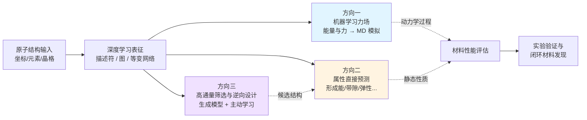
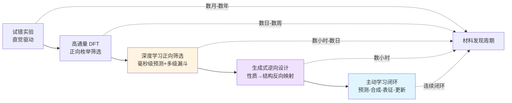

# 基于原子结构的深度学习方法在材料科学中的应用综述（截至2022年初）
# 1 研究背景与综述范围界定

材料科学正经历一场由数据驱动与人工智能引领的方法论变革。在过去半个多世纪中，第一性原理计算与经典力场曾分别在精度与规模两端支撑起整个计算材料学的发展，但二者各自的局限也日益凸显——前者受困于高昂的计算成本难以拓展至大体系与长时间尺度，后者则受限于人为构造的解析势函数难以保证跨体系的迁移精度。与此同时，材料数据库的积累、GPU 算力的普及，以及深度学习算法（尤其是图神经网络与等变神经网络）的快速演进，使得直接以原子结构为输入、以数据驱动方式学习结构-性质映射成为可能。本章将作为全篇综述的开篇，系统阐明这一新兴范式兴起的科学动因、方法论定位与研究边界，并提出贯穿后续章节的三大核心应用方向逻辑框架，为读者建立统一的分析视角。

## 1.1 材料科学计算范式的演进与深度学习的兴起动因

材料计算方法的发展可以看作是一条在"精度"与"规模"之间持续寻求平衡的演进路线。以密度泛函理论（DFT）为代表的第一性原理方法依靠对电子结构的量子力学求解，能够在不依赖经验参数的前提下获得接近实验精度的能量、力、电子态等关键物理量，长期被视为计算材料学的"黄金标准"。然而，DFT 的计算复杂度通常随体系原子数呈三次方乃至更高阶增长，使其在面对数千乃至数万原子的大尺度体系、纳秒级以上的分子动力学模拟、或数十万计候选材料的高通量筛选时显得力不从心。这一精度-成本的内在张力，构成了推动新方法兴起的首要技术驱动力。

为了将原子尺度模拟推进到更大的时空尺度，研究者长期依赖经典力场（如 Lennard-Jones、EAM、Tersoff、ReaxFF 等）。这些方法以解析函数形式描述原子间相互作用，计算效率较 DFT 高出多个数量级，但其函数形式由人工设计，参数需针对特定体系拟合，往往难以同时兼顾不同化学环境、不同相结构与缺陷构型的精度。换言之，经典力场在**跨体系迁移性、对复杂局域环境的描述能力以及对反应过程中键的断裂与生成**等方面存在显著短板。近期面向 α-Fe 一般晶界（GGB）的工作进一步表明，对于复杂多样的晶界结构，传统势函数难以同时再现 DFT 精度的能量、原子结构与动力学行为，而基于机器学习的原子间势函数（MLIP）则可以通过覆盖多样化原子环境的训练集实现 DFT 级别的精度[^1]。这一典型案例反映出经典力场在面向真实工程材料体系时的根本局限，也直接揭示了机器学习方法的方法论价值。

与计算方法局限并行的，是材料研发模式本身的转型需求。面向碳中和、能源转换与存储、半导体器件等重大应用，研究界提出了对高通量筛选、大规模分子动力学、跨尺度多物理建模等场景的迫切需求[^1]。在这一现实背景下，**数据规模、算力提升与算法创新三者形成了协同共振**：以 Materials Project、OQMD、JARVIS-DFT、QM9、ANI-1 等为代表的大规模 DFT 计算数据库提供了可供训练的高质量样本；GPU 与专用加速硬件使深度神经网络的训练与推理成本大幅下降；图神经网络、消息传递网络与等变神经网络等方法学突破，则提供了能够直接处理三维原子结构这一非欧几里得数据的有效工具。这三股力量交汇，最终促成了基于原子结构的深度学习方法在 2017–2022 年间的快速兴起。

## 1.2 基于原子结构的深度学习方法的核心定位

要准确把握本综述的研究对象，首先需要厘清"基于原子结构的深度学习方法"这一术语的内涵与外延。所谓"原子结构"，是指以原子坐标、元素种类、晶格矢量、周期性边界条件等几何与化学信息为基础的结构化描述；其核心特征在于**显式保留了原子级别的三维空间信息**，而非将材料抽象为化学式或将其表征为二维图像。基于这一输入形式，相应的深度学习方法通过描述符工程或端到端图表示，将原子结构编码为神经网络可处理的张量，再借助多层感知机、卷积神经网络、图神经网络或等变神经网络等架构，学习结构与目标物理化学性质之间的复杂非线性映射。

将这一定义与材料信息学中其他常见方法路径进行对照，可以更加清晰地凸显其方法论独特性。第一类对照是**纯组分类方法**：此类方法仅以化学式或元素配比作为输入特征（如 Magpie 描述符、元素嵌入向量等），完全忽略原子的几何排布。其优势在于无需结构信息即可作快速预筛选，但代价是丧失对同构异分相、缺陷结构、表面与界面等结构敏感性质的描述能力。第二类对照是**图像类方法**：此类方法将扫描电镜、透射电镜、X 射线衍射图谱或显微组织图像作为输入，使用卷积神经网络处理。这类方法的输入空间为像素阵列，关注的是介观或微观尺度的形态学特征，与原子级别的精细结构描述存在本质差异。第三类对照是**传统浅层机器学习方法**：包括基于人工特征工程的随机森林、支持向量机、核岭回归等，虽然在小数据集上仍具竞争力，但模型表达能力有限、难以直接处理三维结构信息。

相较之下，基于原子结构的深度学习方法具有三方面的独特优势。其一是**物理可解释性更强**：原子坐标与化学键的几何关系被显式编码，模型预测可以与局域化学环境建立直观联系。其二是**对称性保持能力**：通过等变神经网络与对称函数等设计，模型天然满足平移、旋转、置换不变性乃至旋转等变性，与材料物理的基本守恒律一致。其三是**精度-效率平衡**：相对于 DFT 可实现数个数量级的加速，相对于经典力场则可显著提升跨体系的迁移精度，从而在两个极端之间填补了一个长期存在的方法学空白。

## 1.3 综述的时间、对象与方法边界

为保证综述的聚焦性与可操作性，本文对研究范围作出明确界定。

在**时间边界**上，本综述以 2022 年初为截止节点，覆盖该领域自 Behler-Parrinello 神经网络势（2007）以来逐步成型、并在 2017 年前后随图神经网络兴起而进入快速发展期的奠基性与早期成熟性工作。2022 年中后期及之后涌现的更先进等变模型、大规模通用势场与基础模型类工作，仅在第 8 章"挑战与展望"中作为趋势线索作必要参照，不纳入主体讨论。这一时间设定既能完整呈现领域早期成型阶段的方法学脉络，又有助于在有限篇幅内保证讨论深度。

在**研究对象边界**上，本综述严格限定于以原子坐标、元素种类、晶格信息等三维原子/晶体结构为直接输入的深度学习模型。具体而言，纳入范围包括：以原子结构为输入的图神经网络（如 SchNet、CGCNN、MEGNet、DimeNet、ALIGNN 等）、等变神经网络（如 NequIP、PaiNN 等）、基于结构描述符的深度神经网络（如 Behler-Parrinello 神经网络势、DeePMD、ANI 系列等），以及以原子结构为生成目标的生成式模型。明确排除的范围包括：仅基于化学式或元素配比的纯组分预测方法、基于显微图像或衍射图谱的图像识别方法，以及在 2010 年代早期已得到广泛综述的传统浅层机器学习方法。

在**方法边界**上，本综述将围绕从描述符构造、模型架构设计、训练策略到应用部署的完整方法链展开讨论，并在第 6、7 章以表格形式系统整理领域内常用的公开数据库与开源软件包，为研究者提供可直接复用的资源参考。需要指出的是，二维材料作为该领域的重要应用对象之一，其层状或非层状结构在电子学、催化等方向具有独特性质[^2]，本综述将其纳入到固体晶体类对象统一讨论，不单列章节。

## 1.4 三大核心应用方向的逻辑框架

在上述边界之内，本综述将基于原子结构的深度学习方法的研究图景归纳为三大核心应用方向，并以此组织后续章节的展开。

第一个方向是**机器学习原子间势函数（MLIP / MLFF）开发**（第 3 章）。其目标是利用深度学习模型替代经典解析力场，以接近 DFT 的精度描述原子间相互作用，并支持大尺度、长时间的分子动力学模拟。代表性方法包括 Behler-Parrinello 神经网络势、Deep Potential / DeePMD、SchNet、PaiNN、NequIP，以及基于高斯近似势（GAP）与 SOAP 描述符的非神经网络方法。这一方向直接回应了 1.1 节所述的经典力场迁移性不足问题，已被证明可在金属晶界、合金、催化等复杂体系中实现 DFT 级别的精度[^1]。

第二个方向是**材料属性的直接预测**（第 4 章）。其目标是建立从原子/晶体结构到目标物理化学性质（形成能、带隙、弹性模量、磁矩、超导临界温度等）的端到端映射，绕过显式的电子结构求解。代表性方法包括 CGCNN、MEGNet、SchNet、ALIGNN、iCGCNN 等图神经网络。该方向以单次前向传播取代了完整的 DFT 求解流程，使大规模性质评估成为可能。

第三个方向是**高通量筛选与逆向设计**（第 5 章）。其目标是在预测能力的基础上进一步前移至材料发现的源头，一方面利用属性预测模型对海量候选结构进行快速正向筛选，另一方面借助变分自编码器、生成对抗网络、扩散模型等生成式架构直接产生满足目标性质的新结构，实现从"性质→结构"的逆向映射。该方向还与主动学习、贝叶斯优化、闭环实验等策略深度融合，构成数据驱动材料发现的前沿范式。

三大方向之间并非彼此孤立，而是构成了一条逻辑递进的方法论闭环。下图概括了这一框架及其与传统计算方法的关系：

从该框架中可以读出两条贯穿全文的内在逻辑主线：其一，**从单点性质到动力学过程**——属性预测刻画静态结构-性质映射，力场则将能力扩展至原子的动力学演化过程，二者共同覆盖材料的静、动态行为；其二，**从正向预测到逆向设计**——前两个方向解决"给定结构预测性质"的问题，而生成式逆向设计则解决"给定目标性质寻找结构"的反问题，并通过主动学习闭环将筛选范式从被动评估推进到主动探索。理解这一闭环关系，是把握后续章节代表性模型选择、数据库与软件生态布局以及领域核心挑战的关键视角。

基于以上对计算范式演进的回顾、方法论定位的界定与研究边界的厘清，后续第 2 章将首先深入分析原子结构如何被有效编码为深度学习模型的输入，并系统梳理从早期描述符方法到现代图神经网络与等变神经网络的架构演进逻辑，为理解三大应用方向中的方法选择奠定技术基础。

# 2 原子结构表征与深度学习模型架构演进

第 1 章已确立"基于原子结构的深度学习"这一新兴范式的方法论定位与三大应用方向的逻辑框架。要进一步理解力场开发、属性预测与逆向设计这三类应用为何能在 2017–2022 年间取得突破性进展，必须深入到这一范式赖以成立的两个底层技术要素——**原子结构的数值化表征**与**深度学习模型的网络架构**。本章沿"表征要求 → 手工描述符 → 端到端图表示 → 早期深度架构 → 图神经网络 → 角度与高阶几何特征 → 等变网络"这一历史与逻辑双重递进的脉络，系统梳理该领域的方法学骨架；并在末节归纳出贯穿全章的三条演进主线，为后续第 3–5 章中具体模型选择的合理性分析提供统一的分析视角。

## 2.1 原子结构编码的基本要求与对称性约束

将一个由原子坐标 $\{\mathbf{r}_i\}$、元素种类 $\{Z_i\}$ 与晶格矢量 $\{\mathbf{a}_1, \mathbf{a}_2, \mathbf{a}_3\}$ 描述的物理体系转化为深度学习模型可处理的张量输入，并非简单的数据格式转换，而是需要在**信息完整性**、**对称性保持**与**可微性**这三类约束之间寻求严格平衡的核心工程问题。

首先是对称性约束。任何对总能量、形成能等标量物理量的预测，其结果不应随观察者参照系的选择而改变，这意味着编码必须对**整体平移**与**整体旋转**保持不变性；同时，由于原子是不可分辨的全同粒子，对**同种元素原子的任意置换**也应保持不变性。对周期性体系，编码还需自然处理**周期性边界条件**，即对晶格平移的不变性。对力、偶极矩、应力等矢量或张量物理量，则需要更进一步——预测量必须随坐标系旋转按相应的不可约表示进行**等变**变换。这一从不变性到等变性的层级关系，是 2.7 节将深入展开的等变图神经网络兴起的根本动因。

其次是信息完整性与唯一性。理想的结构编码应能够**单射地区分**任意两个不同的局域化学环境，即两个结构相同当且仅当其编码相同。然而这一理想在工程上极难达成。Parsaeifard 与 Goedecker 通过数值跟踪敏感度矩阵的近零特征向量，发现 SOAP（Smooth Overlap of Atomic Positions）与 Behler-Parrinello 原子中心对称函数（ACSF）这两种被广泛使用的指纹存在**准恒定指纹流形**（manifolds of quasi constant fingerprints）——即在原子位置作有限位移后，描述符值仍近乎不变；而基于多体信息的 Overlap Matrix（OM）指纹则不存在此类流形[^3]。这一发现的方法学意义在于：**SOAP 与 ACSF 在数学上属于二体与三体描述符，其表征能力存在固有盲区，无法完全区分某些拓扑相似但几何不同的局域环境**。这一盲区不仅是描述符设计层面的问题，也直接影响下游模型对结构敏感性质（如缺陷能、相变能差等）的预测上限，并成为后续 DimeNet、ALIGNN 等显式引入高阶几何信息的架构设计的关键驱动力。

最后是可微性。深度学习训练依赖梯度反向传播，对力场而言更需要通过对原子坐标求导直接得到原子受力 $\mathbf{F}_i = -\partial E / \partial \mathbf{r}_i$。这要求编码函数对原子坐标处处可微（至少分段可微且其不连续点不出现在物理相关构型上），从而排除了某些基于阈值切断或离散标签的编码方式，或要求其使用平滑切断函数。

## 2.2 手工描述符方法：从对称函数到 SOAP 与 CFID

在端到端图神经网络兴起之前，材料机器学习领域的主流路径是**手工描述符 + 浅层或前馈神经网络**的两段式架构。其中最具代表性的三类描述符分别面向原子级局域环境（ACSF、SOAP）与晶体级全局结构（CFID）。

**Behler-Parrinello 原子中心对称函数（ACSF）**于 2007 年随 Behler-Parrinello 神经网络势一同提出，其核心思想是为每个原子构造一组以该原子为中心、对所有邻居贡献求和的标量函数。径向部分通常采用高斯型函数 $G_i^{rad} = \sum_{j\neq i} e^{-\eta(r_{ij}-r_s)^2} f_c(r_{ij})$，刻画不同距离尺度上的邻居密度；角度部分采用三体形式 $G_i^{ang} = \sum_{j,k\neq i} (1+\lambda\cos\theta_{ijk})^\zeta \cdots f_c(r_{ij})f_c(r_{ik})f_c(r_{jk})$，刻画键角分布。通过对邻居求和与平滑切断函数 $f_c$ 的引入，ACSF 自然实现了对平移、旋转、置换的不变性以及邻居数量变化的鲁棒性。

**SOAP（Smooth Overlap of Atomic Positions）**则采用更具数学优雅性的构造：将原子邻域的密度展开为高斯函数的叠加，然后投影到径向基函数与球谐函数的张量积上，构造对旋转不变的功率谱。SOAP 在数学上等价于三体描述符，并可通过截断角动量量子数 $l_{max}$ 控制精度与计算成本之间的平衡。在 2.1 节所述的"准恒定流形"研究中，SOAP 与 ACSF 因其二体、三体本质被发现共享类似的表征盲区[^3]。

**经典力场启发描述符（CFID）**则面向晶体级全局描述，将化学组成、键长键角分布、化学价、半径等多种特征拼接为一个长向量，适合传统机器学习管道。

手工描述符方法常与**高斯近似势（GAP）**等核方法或浅层神经网络结合使用，在小数据场景下展现出极强的数据效率与可解释性。然而，其局限同样显著：**(1) 设计依赖专家知识**，需针对体系反复调试径向/角度参数；**(2) 高维化学空间下的可扩展性瓶颈**——对每对元素组合都需要独立的对称函数，元素数 $N$ 时计算量与存储量按 $O(N^2)$ 或更高阶增长，难以胜任跨元素周期表的通用势函数任务；**(3) 表征上限受其二三体本质所限**，难以单独区分某些复杂局域环境。这些瓶颈共同推动了端到端图表示方法的兴起。

## 2.3 端到端图表示方法的兴起

图表示方法的核心洞察在于：**原子结构本质上就是一个图**——原子是节点，化学键或近邻关系是边。这一抽象与传统欧式数据（图像的规则像素网格、文本的线性序列）形成鲜明对比。正如图神经网络综述性文献所指出的，图作为非欧数据的典型代表，其大小任意、拓扑复杂、缺乏空间局部性与节点顺序，传统在数据预处理阶段将图转换为向量的方法会严重丢失结构信息，并使结果严重依赖于预处理策略[^4]。将图神经网络直接架构于图数据之上，能够保留完整结构信息并显著提升处理精度[^4]。

将这一思想迁移到原子结构上，相应的图构造策略大致可分为三类：

- **分子图**：节点为原子，边定义为共价键或基于距离阈值（如截断半径 $r_c$ 内的所有邻居）连接；节点特征包含元素种类、形式电荷等，边特征包含键长、键类型等。
- **晶体图**：考虑周期性边界条件，每个原子与其在 $r_c$ 内的所有镜像邻居建立多重边，从而构成"多边图"。CGCNN 即采用这一策略将三维周期晶体编码为可被 GNN 处理的图结构。
- **线图（line graph）**：将原图的每条边视作线图中的节点，每对共享原子的边在线图中连接成边。线图中节点之间的关系自然刻画了三体键角信息，是 ALIGNN 引入显式角度建模的核心机制。

相对于手工描述符，端到端图表示具有三方面的本质优势：其一，**自动特征学习**——节点与边的初始特征可通过可学习的嵌入层映射到高维空间，并通过消息传递自动提取局域化学环境特征，无需人工设计径向/角度参数；其二，**端到端可优化**——从结构输入到目标性质输出的整个管道在统一损失函数下联合训练，避免了手工描述符与下游模型之间的优化割裂；其三，**天然处理变长输入**——图神经网络对节点数量变化具有内在鲁棒性，无需为不同大小的体系设计不同的输入接口。

## 2.4 深度学习架构的早期形态：MLP 与 CNN

在图神经网络成为主流之前，原子结构深度学习经历了一个以"描述符 + 多层感知机（MLP）"为主、辅以卷积神经网络（CNN）尝试的早期阶段。

**"描述符 + MLP"范式**由 Behler 与 Parrinello 于 2007 年首创。其核心思想是：将体系总能量分解为各原子的局域能量贡献之和 $E = \sum_i E_i$，每个 $E_i$ 由一个共享权重的前馈神经网络以该原子的 ACSF 描述符为输入计算得到。这一架构通过原子能量分解保证了对原子数的尺寸外推性，通过对称函数保证了对称性约束，通过 MLP 提供了非线性函数逼近能力，奠定了机器学习原子间势的基本范式。后续的 ANI-1（2017）改进了对称函数并引入元素分区策略以扩展至 H、C、N、O 等小分子有机化学空间；DeePMD（2018）则用一个可学习的"嵌入网络 + 拟合网络"替代固定描述符，实现了从手工描述符向可学习描述符的过渡。

**CNN 尝试**则受图像识别成功的启发，尝试将原子结构投影到三维体素或二维矩阵后用卷积神经网络处理。这类方法在某些受限场景（如固定大小的小分子、晶面分类）取得了一定成果，但存在三个固有局限：**(1) 体素化破坏了原子级精度并引入采样误差**；**(2) CNN 对旋转不具有内在不变性**，需通过数据增强弥补，效率低下；**(3) 难以处理变长原子数与周期性边界**。这些局限共同促使社区将注意力转向更契合原子结构本质的图神经网络。

## 2.5 图神经网络与消息传递机制的代表性模型

从 2017 年起，图神经网络在原子结构建模中迅速取代"描述符 + MLP"成为主流。这一阶段的代表性工作通过定义不同的**消息传递机制**（Message Passing），共同建立起了 GNN 在材料与分子建模中的基础范式。

**SchNet（2017）**是首个广泛影响该领域的连续滤波 GNN。其核心创新是**连续滤波卷积**：传统 CNN 的滤波器在离散像素网格上定义，而 SchNet 的滤波器是关于原子间距离 $r_{ij}$ 的连续函数（通过径向基函数展开 + MLP 实现），从而自然处理原子位置的连续变化与变长邻居集合。SchNet 严格保持旋转不变性（仅依赖距离标量），并通过多轮消息传递隐式扩大每个原子的感受野。SchNet 在 QM9 与 MD17 等分子基准上一度达到 SOTA，成为后续众多分子 GNN 的基准对照。

**CGCNN（2018）**则是首个面向周期性晶体的端到端 GNN。其将晶体编码为多边图（每对原子在截断半径内的所有镜像邻居均建立独立边），通过门控图卷积更新原子表示，最后通过全局池化得到晶体级特征向量并预测目标性质。CGCNN 在 Materials Project 数据集上对形成能、带隙、弹性模量等 8 种 DFT 属性给出了端到端预测的早期范本，形成能 MAE 在不同子集上报道为 0.039–0.083 eV/atom，带隙 MAE 约 0.384 eV。需要指出的是，CGCNN 的形成能 MAE 在不同文献中存在差异，这主要源于训练集子集筛选与数据清洗策略的不同，是评价该模型时应予注意的方法学细节。

**MEGNet（2019）**进一步统一了分子与晶体的处理框架，并在传统的"节点—边"双重更新基础上引入**全局状态变量**（如温度、压力、整体组成），使其在物理上可显式编码非结构条件。MEGNet 中元素嵌入向量可在不同任务间迁移，是早期跨任务迁移学习的代表性实现，在 Materials Project 形成能 MAE 达 0.051 eV/atom、带隙 MAE 达 0.324 eV，均优于 CGCNN。

这一阶段 GNN 的共同特点是其消息函数仅依赖二体标量信息（距离），即便通过多轮迭代可隐式扩大感受野并间接捕获多体相互作用，但其表达能力在数学上仍受限于二体描述。这与 2.1 节所揭示的二三体描述符存在准恒定流形的现象形成呼应：**仅靠二体距离信息的消息传递架构，在表征结构敏感性质（如形成能的精细差异、带隙）时存在内禀上限**，亟需更高阶几何信息的显式引入。

## 2.6 角度信息与高阶几何特征的引入

为突破二体表征瓶颈，2020 年前后涌现出一批在消息传递框架中**显式引入键角、二面角等高阶几何信息**的架构，这一代表性工作集中体现在 DimeNet、ALIGNN 与 iCGCNN 三个模型上。

**DimeNet/DimeNet++（2020）**提出**方向消息传递**（directional message passing）：传统 GNN 的消息以节点为载体，而 DimeNet 的消息以**有向边**为载体，每条入边的消息更新依赖其所在三元组 $(k, j, i)$ 中边 $k\to j$ 与边 $j\to i$ 所成的键角 $\theta_{kji}$。键角通过**球面贝塞尔基函数**与**球谐函数**联合展开，形成对三体几何完整且物理上合理的编码。DimeNet++ 在效率与精度上进一步优化，在 QM9 多种属性预测上较 SchNet 取得显著精度提升，是首批将显式角度信息成功整合进 GNN 的工作之一。

**ALIGNN（2021）**则采用**原子图 + 线图双重消息传递**架构：原子图节点为原子、边为键，刻画键长；将原图边视作线图节点、相邻边视作线图边后，线图边自然对应键角。两层图上的消息传递交替进行，从而在保持原子图基础架构的同时显式建模键角信息。ALIGNN 在 Materials Project 形成能 MAE 达 0.022 eV/atom、带隙 MAE 达 0.276 eV，相对 MEGNet 与 CGCNN 均有显著提升，在 JARVIS-DFT 等基准上同样表现领先，是 2022 年初材料属性预测的代表性 SOTA 模型之一。

**iCGCNN（2020）**则在 CGCNN 基础上引入 **Voronoi 近邻**与**三体相关性**，通过对邻居关系的更精细几何刻画提升模型表达能力，在 OQMD 稳定性预测上相对 CGCNN 提升约 20%。

这一代模型的共同贡献在于，**通过显式编码三体几何信息，突破了 2.1 节所揭示的二三体描述符准恒定流形所代表的表征瓶颈**。形成能预测精度从 CGCNN 的 0.039–0.083 eV/atom 阶梯式下降到 MEGNet 的 0.051、再到 ALIGNN 的 0.022 eV/atom，带隙预测从 0.384 阶梯式下降到 0.324、再到 0.276 eV，构成了从二体到三体消息传递架构演进的精度阶梯证据链。

## 2.7 等变神经网络与对称性保持的深化

如果说从 SchNet 到 ALIGNN 的演进体现了"在不变性框架下增加更高阶几何信息"，那么从 PaiNN 到 NequIP 的发展则代表了一次更深层的范式跃迁——**从不变性（invariance）走向等变性（equivariance）**。

不变性意味着输出在对称操作下保持不变（如标量能量在旋转下不变），等变性则意味着输出随对称操作按相应表示进行变换（如力矢量在旋转下随之旋转）。在 SchNet/CGCNN 等不变型 GNN 中，所有中间特征均为对旋转不变的标量，难以高效表达力、偶极矩、极化率等矢量/张量量。等变图神经网络通过引入按 SO(3) 群不可约表示变换的**矢量、张量乃至高阶球谐张量**作为节点特征，使中间层的几何信息得以保留并按物理规律变换。

**PaiNN（2021）**采用**等变矢量消息传递**：每个原子除标量特征外还携带矢量特征，矢量特征通过几何上合理的方式（如标量与位移矢量的乘积）更新，从而以最小代价实现 E(3) 等变性。PaiNN 在 QM9 张量性质预测与 HME21 力场基准上均显著优于 SchNet——HME21 能量 MAE 由 SchNet 的 33.6 meV/atom 降至 PaiNN 的 22.9 meV/atom。

**NequIP（2022）**进一步引入**球谐函数 + 张量积消息传递**，将节点特征扩展到任意角动量 $l$ 的不可约表示，通过 Clebsch-Gordan 系数实现等变张量积运算。NequIP 最具突破性的贡献在于其**极高的数据效率**：在 MD17 等基准上以传统模型 1/100 至 1/1000 的训练数据量达到甚至超越 SOTA 精度，这一现象在小数据场景的力场训练中具有决定性意义。Batzner 等人 2022 年发表于 Nature Communications 13, 2453 的工作系统报道了这一结果，并展示了 NequIP 在多种分子与材料体系上的优越外推能力。

需要指出的是，与 NequIP 同期出现的 **Allegro**（2022 预印本）通过完全去除消息传递、采用严格局部等变表示，进一步提升了大体系的可扩展性；**MACE**（2022）则将等变表示与高阶原子簇展开（ACE）结合。这些工作虽略晚于本综述设定的 2022 年初时间边界，但作为同一方法学浪潮的延续，已在第 8 章作为趋势线索讨论。

在多元素体系扩展方面，**REANN**（递归嵌入原子神经网络）的演进具有代表性。其初始的 REANN 1.0 采用物理启发的**不变消息传递架构**，计算效率较高但难以迁移到复杂多元素体系；REANN 2.0 则通过集成**元素嵌入与等变表示**，在各类周期性体系中展现出更强的元素迁移能力、更高的预测精度与更高的计算效率，基于该架构的通用原子预训练模型 REANN-MPTrj 无需微调即可精准预测固态电解质 Li₃YCl₆ 中的锂离子扩散动力学[^5]。REANN 的版本迭代清晰展示了"不变 → 等变 + 元素嵌入"是通用势模型的核心演进方向。

## 2.8 架构演进的内在逻辑与方法选择启示

回顾从 2007 年 BPNN 到 2022 年 NequIP 的十五年发展，可以归纳出贯穿全过程的三条演进主线，这三条主线共同构成了理解后续第 3–5 章模型选择的统一框架。

| 演进维度 | 早期形态（~2017前） | 中期形态（2017–2020） | 后期形态（2020–2022） |
|---|---|---|---|
| **结构表征** | 手工描述符（ACSF、SOAP、CFID） | 端到端图表示（CGCNN、SchNet） | 端到端图 + 显式高阶几何（DimeNet、ALIGNN） |
| **几何信息阶数** | 二体径向 + 三体角度（固定形式） | 二体距离（消息传递隐式扩展） | 显式三体角度，部分含二面角 |
| **对称性处理** | 不变性（构造保证） | 不变性（标量特征） | 等变性（矢量/张量特征，PaiNN/NequIP） |
| **典型形成能 MAE** | — | CGCNN 0.039–0.083；MEGNet 0.051 | ALIGNN 0.022 eV/atom |
| **数据效率** | 小数据高效（GAP-SOAP） | 中等 | 显著提升（NequIP 数据需求降低 ~3 数量级） |

第一条主线是**表征上从手工走向端到端**：从需要专家精心调参的 ACSF/SOAP，到通过可学习嵌入与消息传递自动提取特征的图神经网络，这一转变不仅提升了表达能力，也使大规模跨化学空间的通用模型成为可能。

第二条主线是**感受野上从局域两体走向多体长程**：从二体距离信息（SchNet、CGCNN），到显式三体角度（DimeNet、ALIGNN、iCGCNN），再到多轮消息传递与等变张量积所隐式编码的高阶多体相互作用。这一演进直接回应了 2.1 节所揭示的二三体准恒定流形所代表的表征瓶颈[^3]。

第三条主线是**对称性处理上从不变性走向等变性**：从对旋转不变的标量特征，到按 SO(3) 不可约表示变换的等变矢量/张量特征。等变性不仅是数学上更深刻的对称性体现，更带来了显著的数据效率与外推能力提升，并使力、偶极矩、应力等矢量/张量性质的高精度预测成为可能。

这三条主线对后续章节的模型选择具有直接的指导意义。**在力场开发中**（第 3 章），由于需要同时高精度预测能量与原子力，且训练数据生成成本高昂，等变神经网络（NequIP、PaiNN、Allegro）凭借其数据效率与对力矢量的天然适配，正成为主流方向；同时 DeePMD、BPNN 等"描述符 + MLP"方法因其工程成熟度与计算效率，在大规模分子动力学模拟中仍具优势。**在材料属性预测中**（第 4 章），由于训练数据相对充足（Materials Project、JARVIS-DFT 等百万量级数据库），ALIGNN、MEGNet 等显式角度建模的不变型 GNN 已能在形成能、带隙等任务上达到 SOTA，其计算效率与可解释性使其成为高通量预测的首选。**在高通量筛选与逆向设计中**（第 5 章），属性预测模型作为正向筛子的核心，而生成模型则需要表征的可逆性与可微性，CDVAE 等扩散类生成架构将等变思想与生成式建模相结合，代表了这一方向的前沿。

带着对这一架构演进逻辑的整体把握，下一章将进入第一个具体应用方向——基于原子结构的机器学习力场开发，系统分析代表性方法在能量与力预测精度、对称性约束、数据效率与计算成本之间的权衡，以及其在分子动力学模拟、相变研究与催化反应等场景中的典型应用。

# 3 应用方向一：基于原子结构的机器学习力场（MLFF）开发

在第 2 章建立的"表征—架构—对称性"三维分析框架之上，本章进入三大应用方向中的首个具体方向——机器学习力场（MLFF / MLIP）的开发。如第 1 章所论，传统第一性原理分子动力学（AIMD）受 Kohn-Sham 方程 $O(N^3)$ 求解复杂度所限，只能模拟皮秒时间尺度与数千原子量级的体系[^6]；而以 Lennard-Jones、EAM、ReaxFF 为代表的经典势函数虽可扩展至更大时空尺度，却受困于人工设定键、角、二面角等解析表达式参数所带来的精度不足[^6]。机器学习力场作为一种**线性标度的模拟方法**，既能达到接近 DFT 的精度，又能模拟千万级别原子的系统[^6]，从而在精度-规模的两难选择中开辟了第三条道路。本章将沿"基本范式 → 三类代表方法 → 横向比较 → 应用案例 → 局限"的脉络系统展开，并与第 2 章的架构演进逻辑形成呼应。

## 3.1 机器学习力场的基本范式与方法论定位

机器学习力场的核心思想可以凝练为一句话：**以原子结构为输入，通过数据驱动的方式从第一性原理计算数据中学习势能面（PES），从而实现量子精度的经典分子动力学模拟**[^7][^8]。其方法论价值不仅在于替代某一类工具，更在于打破了精度与规模之间长期存在的根本张力。

从精度-效率的对照来看，DFT 等基于密度泛函理论的第一性原理计算通过求解 Kohn-Sham 方程获得体系能量，具有高精度并能有效验证实验数据，但其计算复杂度 $O(N^3)$ 使其只能模拟时间尺度为皮秒（ps）、空间尺度为数千原子的体系[^6]。经典势函数法（LJ、Coulomb、EAM、ReaxFF 等）速度快，但其精度高度依赖于势函数解析表达式本身及参数的设定，主要问题为**精度不足**[^6]。与之对照，神经网络力场随着神经网络的发展和人们对物理对称性更深入的理解及应用，在多个数据集上已能达到接近 DFT 计算的精度[^6]。

从经典力场的具体局限来看，传统分子动力学模拟所依赖的经验或半经验力场存在四类共性问题：精度受限于其函数形式和参数化过程；在特定体系上训练的力场难以迁移到其他体系；键合关系的固定性限制了对化学反应的描述；以及开发新力场需要大量实验与计算数据[^7]。机器学习力场通过数据驱动方式从第一性原理计算中学习势能面，正是在精度、可迁移性、反应过程描述与开发成本这四个维度上对经典力场形成全面超越[^7]。

在方法论层面，所有机器学习力场都共享三条基本设计原则，构成本章后续比较代表性方法的统一框架：

**第一是局域能量分解原则**。体系总能量被分解为各原子的局域能量贡献之和 $E = \sum_i E_i$，每个 $E_i$ 仅依赖于以该原子为中心、截断半径 $r_c$ 内的局域化学环境。这一分解既符合"近邻相互作用主导"的物理直觉，又保证了模型对原子数的尺寸外推性——同一套参数可直接用于训练集之外的更大体系。

**第二是对称性约束原则**。对总能量这一标量物理量，模型必须对平移、旋转与同种元素置换保持严格不变性；对原子力这一矢量物理量，则要求模型按 E(3) 群对应表示进行等变变换。这一约束既可通过描述符构造（如 ACSF、SOAP）显式实现，也可通过等变网络架构（如 PaiNN、NequIP）内禀保证，正是第 2.7 节所揭示的从不变性到等变性的演进核心。

**第三是可微性原则**。机器学习力场不仅需要输出体系能量，更需要通过对原子坐标求解析梯度直接得到原子受力 $\mathbf{F}_i = -\partial E / \partial \mathbf{r}_i$。这一要求使得编码函数与网络架构必须对原子坐标处处可微，从而排除了基于硬阈值切断或离散标签的编码方式，或要求其使用平滑切断函数。这一原则在 SchNet 等图神经网络力场的"连续滤波"设计中得到了典型体现。

基于上述三原则，本章后续将沿第 2 章所建立的架构演进主线，把代表性方法划分为**描述符固定型**（BPNN、ANI、GAP）、**描述符可学习型**（DeePMD、SchNet）与**等变型**（PaiNN、NequIP）三大类，并辅以多元素体系上的延伸（REANN），进而展开横向比较与应用分析。

## 3.2 描述符固定型神经网络势：从 BPNN 到 ANI

描述符固定型方法是机器学习力场的奠基范式。其核心模式是先通过人工设计的对称函数将原子局域环境编码为固定描述符，再以共享权重的元素特异前馈神经网络拟合原子能量[^6]。这一范式从 2007 年 Behler-Parrinello 神经网络势（BPNN）起步，至 2017 年 ANI-1 进入第二代。

BPNN 由 Behler 与 Parrinello 于 2007 年首次提出，其将体系总能量分解为各原子局域贡献之和，并以原子中心对称函数（ACSF）作为描述符输入到元素特异的前馈神经网络[^7]。在材料科学领域，BPNN 的早期成功体现在相变存储材料 GeTe 的势函数构建上：Sosso、Miceli、Caravati、Behler 与 Bernasconi 于 2012 年发表的工作中，使用基于 DFT 参考计算的神经网络表示构造了 GeTe 体相的原子间势，并证明该势函数对液态、晶态、非晶态 GeTe 的一系列性质提供了接近从头算（ab initio）质量的描述[^9]。这一可靠经典势的可用性使得对相变存储材料技术应用中诸多问题的研究成为可能，而这些问题此前是第一性原理分子动力学模拟能力范围之外的[^9]。BPNN 的方法学贡献在于首次系统性地证明了"局域能量分解 + 描述符 + 神经网络"这一三段式范式能在真实材料体系上同时兼顾精度与规模。

**ANI-1（2017）**则在 BPNN 提出约十年之后对其进行了关键改进，将神经网络力场推进至面向小分子有机化学空间的通用势函数阶段。ANI 模型相对 BPNN 与之后的图神经网络模型而言，最大的特点是在创建嵌入后**对每一种元素使用不同的网络进行预测**[^10]。这一"元素分区"策略在最大程度上利用了原子种类信息，使其能在 H、C、N、O 等元素覆盖的有机分子化学空间内达到接近 DFT 精度的同时保持力场级计算成本[^10]。

具体而言，ANI 相对 BPNN 的两点关键改进在于：**(1) 原子类型区分**——ANI 不再像 BPNN 那样将径向和角度部分简单加和到同一位置，而是按邻居原子种类对嵌入向量进行分块。以甲酸中的碳原子为例，在径向部分截断距离之内有氢、氧两类邻居，ANI 将它们分别放在嵌入向量的对应位置；在角度部分，键角 $\angle HCO$ 被放在 HO 对应的位置上[^10]。这种处理使不同类型的键和键角被显式区分开来，在后续提取时更加精确，从而提升模型精度[^10]。**(2) 径向与角度函数形式的修正**——ANI 在 BPNN 角度函数形式基础上进行了改进，使其更适合在大规模训练数据上学习势能面[^10]。

ANI-1x 作为基于密度泛函理论数据集训练的量子级机器学习势函数，其有效性已在多种实际场景中得到验证。例如，Shirani 与 Hashemianzadeh 将 ANI-1x 神经网络势用于预测白藜芦醇（3,5,4'-trihydroxy-trans-stilbene）这一抗帕金森药物分子的势能面，在极短的计算时间内即可获得 wB97X/6-31G(d) 水平 DFT 验证下的结果，为药物计算研究、药物化学与药物发现设计提供了重要工具[^10]。这一案例典型地展示了"DFT 训练数据 + 描述符固定型神经网络"范式在中小分子量化学计算中的高效价值。

然而，ANI 的元素分区策略也带来了**可扩展性下降**这一固有代价。由于嵌入向量按邻居元素种类分块，对每种原子组合都需要独立的对称函数与网络分支，原子的嵌入向量长度会变得很长[^10]；如果只有 4 个元素（H/C/N/O）还可接受，但如果要引入更多元素，必然会导致维度膨胀和其他问题[^10]。这一**描述符维度的 $O(N^2)$ 增长瓶颈**是描述符固定型方法在跨元素周期表通用化方向上的根本障碍，也是后续 DeePMD（可学习描述符）与等变神经网络（球谐张量积）寻求突破的关键动因。

## 3.3 基于高斯近似势与 SOAP 描述符的核方法路径

与神经网络路径并行发展的，是以高斯近似势（Gaussian Approximation Potential，GAP）为代表的核方法路径。这一路径采用高斯过程回归（Gaussian Process Regression, GPR）拟合参考势能面，将其表示为原子能量之和，每个原子能量近似为以 SOAP（Smooth Overlap of Atomic Positions）描述符刻画的原子局域环境的函数[^11]。

GAP 在硅（Si）这一基础半导体材料上的应用是该方法路径最具代表性的成功案例。Bartók、Kermode、Bernstein 与 Csányi 等人发表的"A Gaussian Approximation Potential for Silicon"工作系统性地展示了 GAP 方法在硅的全相图覆盖能力：势函数被拟合到一个涵盖能量、力与应力的 DFT 数据库，该数据库包括了一系列在零温与有限温模拟中产生的广泛构型——**晶相、液相、非晶态、低配位结构，以及金刚石结构中的点缺陷、位错、表面与裂纹**[^11]。结果显示，GAP-Si 相对 DFT 参考结果在大范围性质上均表现出极高精度，包括低能体相、液体结构以及金刚石结构中的点、线、面缺陷；其精度显著优于此前已发表的 Stillinger-Weber、Tersoff、修正嵌入原子方法（MEAM）与 ReaxFF 等经典势[^11]。

GAP-SOAP 还在硅表面与非晶硅结构研究中展现了独特的方法学价值。基于分子动力学构象数据集构建的 SOAP-GAP 模型，能够在宽泛的温度和压力范围内准确描述块体和缺陷材料的性质；STM 图像表征了重构硅表面的二聚体具有倾斜角（tilt angle），基于 SOAP-GAP 预测并结合 DFT 发现，这一弛豫结构来源于 Jahn-Teller 变形，且倾斜角经模型预测约为 19 度[^12]。Deringer 等人则基于机器学习研究了非晶硅原子结构的量化可行性，利用局部稳定性量化描述了原子最近邻和次近邻结构，并分析了不同淬灭速率下取向度不同的非晶硅网络，将非晶硅的配位缺陷和稳定区域联系在一起，进一步追踪了液态硅在玻璃化过程中的能量过渡状态[^12]。这一系列工作展示了 GAP-SOAP 在**非晶态结构定量分析与玻璃化转变机理研究**中的独特能力。

从方法学定位看，GAP 路径相对神经网络路径具有两方面优势：**其一是高数据效率**，高斯过程回归在小数据场景下相对深度神经网络具有显著的样本效率优势；**其二是天然的不确定性量化**，高斯过程作为贝叶斯方法可直接给出预测的后验方差，为主动学习与外推可靠性评估提供了天然接口。其代价则是核方法在数据规模扩展时计算成本随训练样本数 $O(N^2)$ 或 $O(N^3)$ 增长的固有瓶颈，使其在面对百万量级训练数据时显著劣于神经网络方法。这一精度-数据效率与精度-可扩展性的权衡，构成了 GAP 与后续 DeePMD、NequIP 等深度学习方法的根本分野。

## 3.4 描述符可学习型深度势能方法：DeePMD

如果说 BPNN/ANI 与 GAP 共同代表了"固定描述符"时代的方法学成熟，那么深度势能（Deep Potential，DP）方法的提出则标志着力场开发从手工设计转向端到端学习的范式跃迁。**深度势能分子动力学（Deep Potential Molecular Dynamics, DPMD）是一种将深度学习与分子动力学相结合的计算方法，通过神经网络从第一性原理数据中学习势能面，实现了量子精度的经典分子动力学模拟**[^8]。

DPMD 的提出直接针对计算材料科学中"精度与效率的两难选择"：第一性原理方法精度高但计算成本极高，通常限于数百原子；经验力场速度快但精度有限，难以描述复杂化学环境；传统机器学习势函数则需要手工设计描述符，泛化能力受限[^8]。深度势能方法通过端到端深度学习同时实现了**量子精度**（达到接近 DFT 的精度）这一核心目标[^8]。

从架构层面看，DeePMD 的关键创新在于将描述符固定型方法中人工设计的对称函数替换为可学习的"嵌入网络 + 拟合网络"两段式结构。嵌入网络将每个原子的局域环境（邻居坐标差与元素种类）映射为对称性保持的可学习描述符，拟合网络则将该描述符映射到原子能量。这一替换带来了三方面优势：**其一**，免除了对体系特异的描述符参数调试，使训练流程显著自动化；**其二**，通过端到端学习获得的描述符天然适配下游任务，相对手工描述符具有更高的精度上限；**其三**，可学习描述符在多元素体系上的扩展不再受人工对称函数的 $O(N^2)$ 维度膨胀困扰，为跨元素通用势模型铺平了道路。

DeePMD 方法的两个重要变体进一步扩展了其适用范围。**Deep Potential-Smooth Edition**（DP-SE）针对原始 DP 描述符在截断边界附近的不连续性进行了平滑修正，保证了势能面的处处可微，从而避免了分子动力学积分中的能量与力突变[^8]。**Deep Potential-Long Range**（DP-LR）则通过显式建模电荷分布与长程静电相互作用，扩展了 DP 方法对离子体系、极性体系等长程作用主导场景的描述能力[^8]。这两个变体共同回应了第 3.1 节所述"局域能量分解"原则的内在限制——纯局域模型难以描述长程静电与色散，必须通过额外机制显式补充。

在工程实现层面，**DeePMD-kit 作为该方法的官方实现**，已成为连接深度学习模型与大规模并行分子动力学引擎的关键中间件[^8]。其支持的并行计算策略与与 LAMMPS、GROMACS 等主流 MD 软件的接口集成，使得基于 DeePMD 的量子精度分子动力学模拟可推进到**千万级别原子的系统**[^6]，这一规模在 BPNN/ANI 时代是难以企及的。需要指出的是，DeePMD 的工程成熟度与产业化影响——尤其是其在材料、化学、生物等领域的广泛实际部署——使其成为目前与 BPNN 并列的两大"已工业化机器学习力场"代表，这一点将在第 3.8 节的横向比较中进一步明确。

## 3.5 基于图神经网络的力场：SchNet 及其延伸

在 DeePMD 沿"可学习描述符 + 拟合网络"方向延续 BPNN 范式的同时，另一条更彻底的端到端路线——图神经网络力场——也在 2017 年同步兴起，其代表性工作即为 SchNet。

Schütt、Kindermans、Sauceda、Chmiela、Tkatchenko 与 Müller 于 2017 年提出 SchNet，其核心动机是将深度学习引入量子化学这一结构化数据领域，加速对化学空间的探索[^13]。SchNet 的设计巧妙之处在于：虽然卷积神经网络在图像、音频、视频数据上已是首选，但分子中的原子并不限于规则网格，其精确位置包含本质的物理信息，离散化会丢失这些信息[^13]。为此，SchNet 提出使用**连续滤波卷积层**，能够在不要求数据落在网格上的情况下建模局域相关性，并将其应用于建模分子中的量子相互作用[^13]。

从力场视角看，SchNet 的关键贡献在于其在统一框架下同时输出体系总能量与原子间力，所获模型遵循基本量子化学原理：**包括旋转不变的能量预测以及光滑、可微的势能面**[^13]。这两条性质恰好对应于第 3.1 节所确立的对称性约束与可微性两大基本设计原则——旋转不变性通过仅依赖原子间距离标量保证，光滑可微性通过连续滤波卷积保证。这种从架构设计层面内禀实现物理约束的做法，是图神经网络相对"描述符 + MLP"路径的方法学进步。

SchNet 在基准测试上的表现也奠定了其在分子建模领域的早期 SOTA 地位：原论文报告其在平衡分子与分子动力学轨迹的基准上达到了 SOTA 性能，并引入了带有化学与结构变化的更具挑战性的基准，为后续工作指明了方向[^13]。在材料体系上，SchNet 在 HME21 基准的能量 MAE 为 33.6 meV/atom，这一数值成为后续 PaiNN、NequIP 等等变模型对照的关键基线。

需要明确指出 SchNet 作为图神经网络力场的方法学局限：其消息函数仅依赖二体距离信息这一标量，无法显式编码键角与高阶几何特征。这一局限正是第 2.5 节所论"仅靠二体距离信息的消息传递架构，在表征结构敏感性质时存在内禀上限"的具体体现，也是后续 DimeNet 引入方向消息传递、PaiNN/NequIP 引入等变张量传递的直接动因。SchNet 的方法学意义因此可总结为两点：**其一**，作为首个广泛影响力场领域的连续滤波 GNN，开辟了"原子结构图 → 神经网络"的端到端建模范式；**其二**，作为后续等变模型的对照基线，其在 HME21 等基准上的性能数值为社区评估等变性设计的精度增益提供了量化参考。

## 3.6 等变神经网络力场：PaiNN、NequIP 及其数据效率优势

如果说 SchNet 与 DeePMD 共同代表了"端到端但仍保持不变性"的中期形态，那么 PaiNN 与 NequIP 则代表了"从不变性走向等变性"的方法学跃迁。这一跃迁的关键贡献不仅在于精度提升，更在于**数据效率的数量级飞跃**，从根本上改变了机器学习力场训练数据的成本结构。

**PaiNN（Polarizable Atom Interaction Neural Network, 2021）**由 Schütt、Unke 与 Gastegger 提出，其核心创新是引入**等变矢量消息传递**：每个原子除携带标量特征外，还携带矢量特征，矢量特征通过几何上合理的方式（如标量与位移矢量的乘积、矢量之间的内积与叉积）更新，从而以最小代价实现 E(3) 等变性。这一设计的物理意义在于，中间层不再被强制坍缩为标量，而是允许保留矢量方向信息并按 SO(3) 表示进行变换，进而支持力、偶极矩、极化率等矢量/张量物理量的高精度预测。在 HME21 基准上，PaiNN 将能量 MAE 由 SchNet 的 33.6 meV/atom 降至 22.9 meV/atom，相对降幅约 32%，验证了等变设计的精度增益。

**NequIP（Neural Equivariant Interatomic Potentials, 2022）**由 Batzner 等人在 Nature Communications 13, 2453 上正式发表，其在 PaiNN 的"矢量等变"基础上进一步扩展到**任意角动量 $l$ 的不可约表示**：节点特征通过球谐函数展开为高阶张量，消息传递通过 Clebsch-Gordan 系数实现等变张量积运算。这一更彻底的等变设计带来了 NequIP 最具突破性的贡献——**极高的数据效率**。在 MD17 等基准上，NequIP 以传统模型 1/100 至 1/1000 的训练数据量达到甚至超越了 SOTA 精度，这一现象在小数据场景的力场训练中具有决定性意义：由于训练数据需通过昂贵的 DFT 计算生成，三个数量级的数据效率提升直接意味着三个数量级的训练数据成本下降，使得过去难以企及的高精度专用力场训练在工程上变得可行。

等变神经网络力场在材料科学的下游应用同样令人鼓舞。Gupta、Stulajter、Shaidu、Neaton 与 de Jong 等人将等变神经网络（具体使用 Allegro 架构）应用于**有机分子晶体的晶格能预测**，提出了一种利用等变神经网络的效率与可迁移性以降低计算成本预测分子晶体结构能量的方法[^10]。该方法的关键贡献在于：神经网络以高精度的高斯型轨道（GTO）方法作为目标理论水平在分子簇上训练，从而消除了对昂贵的周期性 DFT 计算的需求，同时获得了对该理论水平所有计算成果的可访问性[^10]。这一案例典型地展示了等变神经网络力场在**复杂分子晶体能量学**这一对精度要求极高场景下的实用价值——传统的基于平面波量子化学方法的 DFT 在分子晶体计算上资源消耗极大，常需在精度与交换关联泛函选择之间作出妥协[^10]，而等变神经网络通过其卓越的数据效率与外推能力，为这一长期难题提供了新的解决路径。

需要指出的是，与 NequIP 同期出现的 **Allegro**（2022 预印本）通过完全去除消息传递、采用严格局部等变表示，进一步提升了大体系的可扩展性，但其严格意义上略晚于本综述设定的"2022 年初"时间边界。**MACE**（2022）则将等变表示与高阶原子簇展开（ACE）结合，亦处于该时间边界的临界位置。这些工作作为同一方法学浪潮的延续，将在第 8 章作为趋势线索进一步讨论。

## 3.7 多元素与通用势场的扩展：REANN 等代表性工作

机器学习力场从面向单一或少元素体系（如 GAP-Si、ANI 的 HCNO 化学空间）扩展到跨元素周期表的通用势场，是该领域 2020 年后最重要的发展方向之一。**REANN（Recursively Embedded Atom Neural Network，递归嵌入原子神经网络）**的版本演进为这一扩展提供了清晰的方法学线索[^5]。

REANN 是一款用于势能和性质表示的通用原子机器学习软件包[^5]。其初始版本 **REANN 1.0** 采用物理启发的**不变消息传递神经网络架构**，专为元素数量有限的体系设计；该版本虽然计算效率较高，但难以迁移应用于更复杂的多元素体系[^5]。这一局限正是本章第 3.2 节所述描述符固定型方法"描述符维度膨胀"瓶颈在消息传递架构中的延续——即使消息传递机制本身是端到端可学习的，但如果不显式区分元素信息，模型仍难以在跨元素体系上保持精度。

**REANN 2.0** 则旨在面向多元素体系与通用势函数，**集成了元素嵌入与等变表示**[^5]。相较于初代版本，REANN 2.0 在各类周期性体系中展现出更强的元素迁移能力、更高的预测精度，并具有更高的计算效率[^5]。特别值得关注的是，基于该架构的通用原子预训练模型 **REANN-MPTrj，无需微调即可精准预测基准固态电解质体系 Li₃YCl₆ 中的锂离子扩散动力学**[^5]。这一下游迁移能力的实证证明了"等变 + 元素嵌入"组合在通用势模型上的核心价值——即模型在大规模异构数据上预训练后，可在未见过的具体材料体系上零样本预测离子动力学这一对精度要求极高的性质。

REANN 1.0 到 2.0 的演进清晰展示了通用势模型的两条核心演进方向：**其一是从不变到等变**——等变表示使中间层保留矢量与张量方向信息，提升表达能力与数据效率；**其二是从隐式元素处理到显式元素嵌入**——通过可学习的元素嵌入向量替代固定的元素特异网络分支，既避免了 ANI 式元素分区的维度膨胀，又保留了元素特异信息。这两个方向的结合代表了 2022 年初通用势模型的方法学共识，并直接预示了第 8 章将讨论的基础模型与大规模预训练范式的兴起。

## 3.8 代表性方法的横向比较与权衡

基于前六节对各代表性方法的分别剖析，本节以表格形式从描述符类型、对称性处理、能量精度、数据效率、计算成本与可扩展性等核心维度对其进行横向比较，旨在归纳出贯穿全章的几条核心权衡关系。

| 模型 | 发表年份 | 描述符类型 | 对称性 | 角度信息 | 数据效率 | 典型能量精度参考 | 适用边界 |
|---|---|---|---|---|---|---|---|
| BPNN | 2007 | 固定（ACSF） | 旋转/平移/置换不变 | 显式三体高斯 | 中（小数据可用） | 单元素/简单体系高精度，如 GeTe 多相统一描述 | 跨体系迁移性差 |
| GAP-SOAP | 2010 | 固定（SOAP + GPR） | 不变 | SOAP 功率谱隐含三体 | 高（小数据友好，含不确定性量化） | Si 多相高精度，覆盖晶/液/非晶/缺陷 | 计算成本随训练集 $O(N^2)$ 增长 |
| ANI-1/1x | 2017 起 | 固定（改进对称函数 + 元素分区） | 不变 | 改进角度对称函数 | 中 | HCNO 小分子接近 DFT，白藜芦醇势能面验证 | 元素覆盖有限，维度膨胀 |
| SchNet | 2017 | 可学习（连续滤波卷积） | 旋转不变 | 无（仅距离） | 中 | HME21 能量 MAE 33.6 meV/atom | 角度区分弱，结构敏感性质上限低 |
| DeePMD | 2018 | 可学习（嵌入网络 + 拟合网络） | 旋转/置换不变 | 隐式 | 中 | 量子精度，已工业化至千万原子规模 | 长程作用需 DP-LR 扩展 |
| PaiNN | 2021 | 可学习（等变矢量消息传递） | E(3) 等变 | 等变张量隐式 | 高 | HME21 能量 MAE 22.9 meV/atom | 张量性质预测能力强 |
| NequIP | 2022 | 可学习（球谐 + 张量积） | E(3) 等变 | 显式（高阶球谐） | 极高（数据需求降低约 3 数量级） | MD17 SOTA，外推能力优异 | 计算开销较大 |
| REANN 2.0 | 2022 后 | 可学习（元素嵌入 + 等变） | 等变 | 等变张量隐式 | 高 | 多元素迁移强，REANN-MPTrj 零样本预测 Li₃YCl₆ | 工程成熟度有限 |

从该比较中可以归纳出三条核心权衡，构成理解机器学习力场方法选择的统一分析框架：

**第一是"精度-数据效率"权衡（等变模型 vs 不变模型）**。从 SchNet 的 33.6 meV/atom 到 PaiNN 的 22.9 meV/atom 形成清晰的精度阶梯，更重要的是 NequIP 在 MD17 上以 1/100 至 1/1000 数据量达到 SOTA 的结果，表明等变模型不仅提供了精度增益，更带来了数据效率的数量级跃迁。这意味着在 DFT 训练数据生成成本高昂的场景下，等变模型已成为事实上的首选。

**第二是"精度-计算效率"权衡（图神经网络 vs 描述符 + MLP）**。SchNet、PaiNN、NequIP 等图神经网络在精度与数据效率上具有优势，但其消息传递机制带来的计算开销显著高于 BPNN/ANI/DeePMD 等"描述符 + MLP"架构。在需要长时间 MD 模拟、千万原子规模仿真的工程场景中，DeePMD 等描述符可学习方法因其与 LAMMPS 等并行引擎的成熟集成而仍具优势[^6]。

**第三是"通用性-工程成熟度"权衡（新兴等变模型 vs 已工业化的 DeePMD/BPNN）**。NequIP、Allegro、MACE 等等变模型代表方法学前沿，但其大规模生产部署的工程生态（如与 LAMMPS、GROMACS、QE 等的接口、千万原子级并行）尚在成熟过程中；而 DeePMD-kit 与 BPNN 系列虽然在精度上略逊于最新等变模型，但其工业化程度（从训练流水线到部署到 MD 引擎的完整工程链）使其在实际研究中仍占据主流地位。这一权衡也预示了第 8 章将讨论的"工程标准化"是该领域走向成熟的关键挑战之一。

## 3.9 典型应用场景案例分析

机器学习力场的应用价值最终体现在具体物理化学问题的解决上。本节沿"静态结构 → 动力学过程 → 化学反应 → 复杂分子体系"的复杂度梯度组织典型案例，展示 MLFF 在不同场景下的方法学价值。

**(1) 相变与非晶态研究：GeTe 相变存储材料的统一多相描述**。如第 3.2 节所述，Sosso 等人 2012 年构建的 GeTe 神经网络势对**液态、晶态与非晶态 GeTe** 的一系列性质给出了接近从头算质量的统一描述[^9]。这一统一性的方法学意义在于：传统经典力场往往针对单一相结构参数化，难以同时描述相变过程中两相之间的演化；而机器学习力场通过覆盖多相构型的训练集，能够在统一参数化下实现对所有相的高精度描述。这种可靠经典势的可用性，使得对相变存储技术应用中诸多此前超出第一性原理分子动力学能力范围的问题的研究成为可能[^9]——这正是 MLFF "数量级加速 + 近 DFT 精度"双重优势在产业相关材料体系上的典型体现。

**(2) 非晶态网络结构与玻璃化转变**。在非晶硅与非晶碳这一对硬度从软到硬的代表性非晶材料上，GAP-SOAP 模型展现了其独特价值。基于机器学习的非晶硅熔融-淬灭过程模拟揭示了**不同淬灭速率下取向度不同的非晶硅网络**，将非晶硅的配位缺陷与稳定区域联系在一起，并追踪了液态硅在玻璃化过程中的能量过渡状态[^12]。对于四面体非晶碳这一在涂层与电极材料中广泛应用却长期受困于复杂原子尺度结构的体系，Deringer 等人将机器学习、密度泛函紧束缚（DFTB）与 DFT 相结合，基于第一性原理建立了一系列四面体非晶碳表面的原子论模型，以**局部结构指纹**作为特征，在不同系统尺度中提供了一系列结构；再利用蒙特卡洛算法与 DFTB 得到的相互作用，可以研究四面体非晶碳的逐步氢化过程[^12]。这些案例展示了 MLFF 在非晶态、玻璃态、表面反应等复杂局域环境主导的体系中的不可替代性。

**(3) 半导体硅的全相图覆盖**。GAP-Si 的工作覆盖了硅在**晶相、液相、非晶态、低配位结构以及金刚石结构中点缺陷、位错、表面与裂纹**等多种结构上的高精度描述，其性能显著优于 Stillinger-Weber、Tersoff、MEAM 与 ReaxFF 等经典势[^11]。这一案例典型地展示了机器学习力场在传统经典势难以兼顾的"低能体相 + 极端构型（缺陷/界面/裂纹）"组合上的统一优势——这种统一性对于研究材料失效、断裂与缺陷工程具有根本意义。

**(4) 大规模复杂体系的分子动力学模拟**。从工程应用规模看，深度神经网络驱动的第一性原理精度分子动力学已经能够模拟**千万级别原子的系统**，打破了第一性原理方法在模拟过程中的时空限制[^6]。这一能力在面向催化、合金、电池电解质等复杂多元素体系时具有决定性意义——例如在 α-Fe 一般晶界这类复杂金属体系上，机器学习原子间势可以同时再现 DFT 精度的能量、原子结构与动力学行为，这正是经典势函数难以企及的。

**(5) 药物分子与有机晶体能量计算**。在药物化学与有机晶体工程方向，ANI-1x 用于**白藜芦醇抗帕金森药物分子**势能面预测的工作展示了机器学习力场在药物计算研究、药物化学、药物发现与设计中的实用价值[^10]：在极短的计算时间内即可获得 wB97X/6-31G(d) 水平 DFT 验证下的可靠势能面。在分子晶体方向，等变神经网络（Allegro 架构）用于**有机分子晶体晶格能预测**的工作则展示了等变架构如何通过分子簇上 GTO 方法训练，消除对昂贵周期性 DFT 计算的需求，同时获得对该理论水平所有计算成果的可访问性[^10]。这两个案例分别从"快速预测"与"高精度预测"两个维度展示了机器学习力场在生物医药相关应用中的成熟度。

综合上述案例，可以观察到机器学习力场的应用价值呈现出清晰的"复杂度递进"特征：在简单体系上提供数量级加速，在复杂体系上提供经典势难以实现的精度兼顾，在跨学科体系（药物、生物、相变存储）上则提供方法学桥梁。这一应用图景与第 3.8 节所归纳的"精度-效率-通用性"三重权衡相互呼应，共同构成了机器学习力场作为新一代原子尺度模拟工具的完整方法论图景。

## 3.10 现存局限与开放问题

尽管机器学习力场在过去十五年中取得了系统性的方法学突破与广泛的应用验证，截至 2022 年初，该领域仍存在若干未被充分解决的核心问题，构成了第 8 章"挑战与展望"将进一步深化讨论的具体技术线索。

**第一是长程相互作用的显式建模仍不充分**。绝大多数机器学习力场遵循第 3.1 节所述的局域能量分解原则，将体系能量近似为截断半径 $r_c$ 内邻居贡献之和。这一近似对短程共价相互作用与金属键合是有效的，但对长程静电（如离子体系、极性分子）、色散相互作用（如 vdW 力主导的层状材料、分子晶体）则存在系统性偏差。DeePMD 通过 DP-LR 版本对长程静电进行了显式处理[^8]，但通用、统一的长程作用建模方案在 2022 年初仍是开放问题。

**第二是训练数据覆盖范围之外的外推可靠性与不确定性量化机制尚不成熟**。机器学习力场作为数据驱动方法，其精度依赖于训练数据对相关构型空间的充分覆盖；在训练分布外的构型上，模型预测可能出现不可预测的偏差。GAP 作为高斯过程方法天然具备后验方差作为不确定性度量，但深度神经网络力场的不确定性量化（如集成模型、贝叶斯近似等）在工程标准化方面仍待完善，这直接影响了 MLFF 在主动学习闭环与稀有事件采样中的可靠应用。

**第三是多元素跨化学空间的通用势场在精度与效率之间仍存在显著权衡**。REANN 2.0 通过"等变 + 元素嵌入"组合证明了通用势模型的可行性，REANN-MPTrj 在 Li₃YCl₆ 上的零样本预测展示了迁移能力的潜力[^5]，但在单一专用势场所能达到的精度水平上，通用模型仍有差距。如何在保持元素覆盖广度的同时不牺牲单点精度，是 2022 年之后大规模预训练力场基础模型的核心研究问题。

**第四是力场训练所需的高质量 DFT 参考数据成本高昂**。即使等变模型如 NequIP 已将数据需求降低约 3 个数量级，但训练一个工业级专用力场仍需数千至数万次 DFT 计算。主动学习、增量训练与数据集复用策略亟待标准化，使得高质量训练数据库能够在不同模型与不同体系之间高效共享。这一问题与第 6 章将讨论的公开数据库生态密切相关——共享数据基础设施的成熟度直接决定了 MLFF 训练流水线的整体效率。

**第五是工程标准化与可复现性**。从第 3.8 节的"通用性-工程成熟度"权衡可见，新兴等变模型与已工业化的 DeePMD/BPNN 之间存在显著的部署成熟度差距。模型训练-验证-部署到 MD 引擎的完整工程链尚未形成统一标准，不同模型的基准测试也常因数据集划分、超参数选择等差异而难以严格可比。这一问题将在第 7 章关于开源软件包的整理中得到进一步呈现。

带着对机器学习力场方法论成熟度、应用广度与现存局限的全面认识，下一章将转入第二个核心应用方向——**材料属性的直接预测**。如第 1 章框架图所示，属性预测刻画静态结构-性质映射，与本章所讨论的力场（动力学过程）共同覆盖材料的静、动态行为。第 4 章将围绕 CGCNN、MEGNet、ALIGNN 等代表性图神经网络在 Materials Project、JARVIS-DFT 等大规模数据库上的精度阶梯，系统展开属性预测方向的方法学图景。

# 4 应用方向二：材料属性的直接预测

第 3 章系统呈现了机器学习力场作为"动态过程模拟器"的方法学图景：通过学习势能面并对原子坐标求导，实现接近 DFT 精度的分子动力学。然而，材料研究的另一半核心需求——**给定一个候选结构，快速判断它是否值得花费昂贵的 DFT 资源去深入计算**——并不需要完整的势能面，而只需要在结构与目标性质之间建立一个高效、可微的端到端映射。这正是本章的主题：基于原子结构的深度学习模型如何以单次前向传播取代完整的 Kohn-Sham 求解流程，直接回归或分类预测材料的形成能、带隙、弹性模量、热导率、磁矩、超导临界温度等关键物理化学属性。本章沿"任务定位 → 基准评价 → 代表性模型的精度阶梯 → 原子嵌入精细化 → 多任务/迁移学习 → 不确定性量化 → 电子结构属性难点 → 典型应用案例"的脉络系统展开，并与第 2 章的架构演进逻辑、第 3 章的精度-效率权衡形成横向呼应。

## 4.1 属性预测任务的定位与基本范式

在第 1 章建立的三大应用方向框架中，属性预测与力场开发共同覆盖了材料的"静态"与"动态"两个维度：力场关心势能面的全局形状与对原子坐标的梯度，从而支持分子动力学这一动态过程；属性预测则聚焦于结构-性质之间的静态映射，输出的是单个标量（或矢量、张量）属性，而非完整的势能面。这一定位差异决定了两者在模型架构选择、训练数据需求与下游应用场景上的差异。

属性预测的基本任务结构可以凝练为：**给定原子坐标 $\{\mathbf{r}_i\}$、元素种类 $\{Z_i\}$ 与晶格矢量 $\{\mathbf{a}_1, \mathbf{a}_2, \mathbf{a}_3\}$，通过端到端深度学习模型 $f_\theta$ 直接输出目标属性 $y = f_\theta(\{\mathbf{r}_i\}, \{Z_i\}, \{\mathbf{a}\})$，无需显式求解 Kohn-Sham 方程或调用任何中间电子结构计算步骤**。从功能上看，属性预测模型可执行两类任务：回归任务输出连续标量（如形成能、带隙、弹性常数、晶格热导率等），分类任务输出离散标签（如金属/半导体判别、磁性/非磁性分类、稳定/不稳定判别等）。CGCNN 作为该范式的早期代表，**通过将晶体中的原子视为节点、化学键视为边构造原子级图表示，端到端从 CIF 晶体文件直接预测材料特性，无需人工特征工程**，并在单一框架内同时支持回归任务（如预测带隙能量）与分类任务（如判断是否为半导体）[^14]。

从目标属性的物理特征看，属性预测任务可归纳为四类典型物理量层级，不同层级对原子结构的敏感度存在显著差异，这直接影响后续模型架构选择：

第一类是**能量类属性**，包括形成能、内聚能、热力学稳定性（凸包距离 $E_\text{hull}$）等。这类属性本质上是势能面的标量值，对结构的依赖关系相对"平滑"——同一构型的小幅扰动通常带来形成能的小幅变化，因此对模型的结构表征精度要求相对宽松，是属性预测领域最早达到工程化精度的任务类型。

第二类是**电子结构类属性**，包括带隙、功函数、介电常数、费米能级等。这类属性涉及电子态的整体特征，对结构的拓扑细节高度敏感——同构异分相、轻微的晶格畸变都可能导致带隙的显著变化甚至金属-半导体跨越，构成 4.7 节将深入讨论的预测难点。

第三类是**力学与输运类属性**，包括弹性模量、剪切模量、热导率、压电系数、热电系数等。这类属性反映原子结构对应力或热扰动的响应，其对结构的敏感度介于能量类与电子结构类之间，且热导率等输运量的高精度 DFT 计算成本极高，使得机器学习预测的"数量级加速"价值尤为突出。

第四类是**功能性质类属性**，包括磁矩、超导临界温度 $T_c$、铁电极化等。这类属性往往涉及电子关联、自旋构型、电子-声子耦合等纯几何信息难以直接刻画的多体效应，是属性预测中难度最高的一类，其预测精度的天花板与第 4.7 节将讨论的物理约束密切相关。

正是这四类属性在结构敏感度上的梯度，使得"二体距离消息传递 → 显式三体角度 → 等变张量"这一架构演进对不同属性的提升幅度各异——形成能等平滑属性在 CGCNN 时代已能达到工程可用精度，而带隙等高敏感属性的精度阶梯则贯穿整个 2018–2022 年的方法演进过程。

## 4.2 主流基准数据集与评价体系

属性预测的方法学进步必须依托标准化的基准数据集与评价体系才能形成可比较、可累积的成果。截至 2022 年初，该领域已形成以三大主流数据集为核心、若干扩展数据库为补充的基准生态。

**Materials Project（MP）** 作为最具影响力的无机晶体数据库，覆盖十余万级别的 DFT 计算结构，提供形成能、带隙、弹性常数、介电常数等多种属性标签，是 CGCNN、MEGNet、ALIGNN 等代表性模型最常用的训练与评估基准。一项基于 17 万级别无机晶体化合物的高通量精确量子力学计算工作显示，该规模数据足以训练具有广泛适用性的形成能预测模型——使用全部数据训练后，DenseNet 类模型可达到 $R^2 = 0.982$、$\text{MAE} = 0.072$ eV/atom 的精度[^15]。

**JARVIS-DFT** 则覆盖三维与二维材料的多属性数据，包括 OptB88vdW、HSE06 等多种交换关联泛函下的形成能、带隙、介电常数、压电系数、热电性质等，是 ALIGNN 等模型验证跨属性泛化能力的关键基准。

**QM9** 是面向小分子有机化学空间的量子化学基准，涵盖约 134k 个分子的 12 种量子化学属性（包括偶极矩、HOMO/LUMO 能级、原子化能、零点振动能等），是 SchNet、DimeNet、PaiNN 等分子图神经网络的标准对照基准。**OQMD、AFLOW、ICSD** 等扩展数据库则分别在开放量子材料、AFLOW 工作流计算与实验晶体结构维度上为属性预测提供了补充训练数据，将在第 6 章系统整理。

在评价指标方面，回归任务以**平均绝对误差（MAE）、均方根误差（RMSE）、决定系数（$R^2$）**为主，分类任务则采用 F1、AUC、准确率等。然而，一个长期困扰该领域的方法学问题是——**不同论文之间报告的 MAE 数值难以直接比较**。例如 CGCNN 在 Materials Project 形成能上的 MAE 在不同文献中报道为 0.039–0.083 eV/atom，这一差异主要源于训练集子集筛选、数据清洗策略与训练/验证/测试划分方式的不同。

为解决数据划分不一致导致精度数值不可比的问题，社区基准框架应运而生。**Matbench Discovery** 作为一个机器学习能量模型评估框架，其核心动机正是"快速发展的机器学习领域呼唤社区共识的基准任务与指标"[^16]。该框架将机器学习模型应用为高通量 DFT 计算稳定无机晶体搜索的预筛选器，并明确处理两个关键脱节问题：**热力学稳定性与形成能之间的方法学差异**，以及**回顾性基准（retrospective benchmarking）与前瞻性发现基准（prospective benchmarking）之间的不同价值取向**[^16]。前者关注模型在已知数据划分上的精度排名，后者则关注模型作为未来发现工具的预测能力。Matbench Discovery 同步发布了 Python 包以辅助未来模型提交，并维护一个在线排行榜，允许用户自适应地对多种性能指标进行加权，使研究者能够根据自身关注的指标进行优先排序[^16]。其初始版本涵盖了随机森林、图神经网络等多种方法论范式的对比[^16]。

值得特别强调的是 Matbench Discovery 揭示的一个反直觉发现：**CGCNN+P**（一种通过加扰动训练以提升对未弛豫结构鲁棒性的变体）在回归 MAE 上表现优于原始 CGCNN，但在下游稳定性分类指标上反而较差。这一现象提醒研究者，**回归精度指标与发现任务指标之间可能存在不一致**，单一 MAE 数值无法完整刻画模型在真实材料发现工作流中的有效性。

## 4.3 代表性图神经网络模型的精度阶梯

沿第 2 章建立的"二体距离消息传递 → 显式三体角度 → 等变张量"架构演进逻辑，本节系统梳理 CGCNN、MEGNet、iCGCNN、SchNet、ALIGNN 等代表性图神经网络在主流基准上的精度阶梯，揭示架构演进对结构敏感属性预测精度的决定性影响。

**CGCNN（Crystal Graph Convolutional Neural Networks, 2018）** 是首个面向周期性晶体的端到端图神经网络。其将晶体编码为原子-键周期图，通过门控图卷积更新原子表示，最后通过全局池化得到晶体级特征向量并预测目标性质[^14]。CGCNN 的方法学意义不仅在于将"计算材料学+深度学习"的交叉范式系统化——其论文引用量已超 5000 次，成为材料信息学领域的里程碑工作——更在于其**提供了一个覆盖形成能、带隙、弹性模量等 8 种关键 DFT 属性的预训练模型库**[^14]，使研究者能够在 15 分钟内完成首次材料特性预测，将传统实验方法中需要数月乃至数年的特性确定过程缩短至毫秒级。CGCNN 在 Materials Project 形成能上的 MAE 报告为 0.039–0.083 eV/atom（依数据集划分而异），带隙 MAE 约 0.384 eV，成为后续工作的关键基线。

**MEGNet（MatErials Graph Network, 2019）** 在 CGCNN 的"节点-边"双重更新基础上引入全局状态变量（如温度、压力、整体组成），使模型在物理上可显式编码非结构条件，并通过元素嵌入向量实现跨任务迁移。MEGNet 在 Materials Project 形成能 MAE 达 0.051 eV/atom、带隙 MAE 达 0.324 eV，相对 CGCNN 取得显著提升。

**iCGCNN（improved CGCNN, 2020）** 则在 CGCNN 基础上集成了三项关键改进：**Voronoi 镶嵌晶体结构信息、邻接组成原子的显式三体相关性，以及优化的晶体图原子间键的化学表示**[^17]。其精度提升体现在两个典型场景上：第一，当在 OQMD 的 18 万训练/2 万验证 DFT 热力学稳定性数据上训练、并在独立的 23 万测试集上评估时，iCGCNN 的预测精度较原始 CGCNN **显著提升 20%**[^17]；第二，当用于辅助 ThCr₂Si₂ 结构类型材料的高通量搜索时，iCGCNN 展现出 **31% 的命中率**，是无指导高通量搜索的 **155 倍**，是原始 CGCNN 的 **2.4 倍**[^17]。使用 CGCNN 与 iCGCNN 两者，研究团队对 13.26 万种具有元素替换的化合物进行了筛选[^17]。这一案例典型地展示了"显式三体相关性"对属性预测精度与下游筛选成功率的双重提升，构成了 2.6 节所论"角度信息引入"的应用层验证。

**ALIGNN（Atomistic Line Graph Neural Network, 2021）** 通过"原子图 + 线图"双重消息传递架构进一步系统化地引入键角信息：原子图节点为原子、边为键；将原图边视作线图节点、相邻边视作线图边后，线图边自然对应键角。ALIGNN 在 Materials Project 形成能 MAE 达 0.022 eV/atom、带隙 MAE 达 0.276 eV，在 JARVIS-DFT 等基准上同样表现领先，成为 2022 年初属性预测的代表性 SOTA 模型之一。

综合上述比较，可形成清晰的精度阶梯：

| 模型 | 发表年份 | 关键架构特征 | MP 形成能 MAE (eV/atom) | MP 带隙 MAE (eV) | 关键应用佐证 |
|---|---|---|---|---|---|
| CGCNN | 2018 | 原子-键周期图，二体距离消息传递 | 0.039–0.083 | 0.384 | 8 种 DFT 属性的预训练模型库[^14] |
| MEGNet | 2019 | 节点-边-全局三级更新，元素嵌入 | 0.051 | 0.324 | 迁移学习友好 |
| iCGCNN | 2020 | Voronoi 近邻 + 显式三体 | — | — | OQMD 稳定性较 CGCNN 提升 20%，ThCr₂Si₂ 命中率 155×[^17] |
| ALIGNN | 2021 | 原子图 + 线图双重消息传递 | 0.022 | 0.276 | JARVIS-DFT 多属性 SOTA |

这一阶梯揭示了一个关键的方法学规律：**从 CGCNN 到 ALIGNN，形成能 MAE 从 ~0.08 eV/atom 下降至 0.022 eV/atom（接近 4 倍精度提升），带隙 MAE 从 0.384 eV 下降至 0.276 eV（约 28% 精度提升）**。两类属性的精度提升幅度存在显著差异——这一差异印证了 4.1 节所述"电子结构类属性对结构精细变化高敏感、其预测精度的天花板受限于纯几何信息所能携带的电子态信息上限"这一物理判断。

作为非主流架构路径的参照，**DenseNet 等基于精心设计的结构依赖描述符（考虑邻接原子电负性差与局域原子结构）的非图架构**也在大规模数据上展现了竞争力。Liang 等人于 2022 年发表的工作基于 17 万种无机晶体化合物的高通量精确量子力学计算数据训练了一个通用形成能预测模型，**与以往研究不同的是，该模型可普遍应用于无机材料的大相空间，因为所有数据均用于训练，模型达到 $R^2 = 0.982$、$\text{MAE} = 0.072$ eV/atom 的较好预测能力**[^15]。该提升源于一组有效的结构依赖描述符，这些描述符精心设计以考虑邻接原子电负性差与局域原子结构信息[^15]。这一结果一方面验证了在足够大数据规模下非图架构亦能达到工程可用精度，另一方面也提示**数据规模、特征工程与架构创新三者之间存在替代关系**——在数据充裕、特征设计精良时，简单架构亦可达到与精巧 GNN 相近的精度。

## 4.4 原子嵌入与表征策略的精细化

如果说 4.3 节呈现的精度阶梯主要由架构演进驱动，那么本节将聚焦另一条相对独立但同样关键的精度提升路径——**原子嵌入策略的精细化**。原子嵌入作为图神经网络的"输入端基础"，其表达质量直接决定了下游消息传递与全局池化的信息天花板。

传统 GNN 中，原子嵌入通常采用简单的**0-1 独热（one-hot）嵌入**作为元素初始特征。这一做法虽然实现简便，但存在两个固有局限。**通常简单采用 0-1 嵌入作为原子嵌入算法是常见做法，这通常会生成不利于模型信息提取的稀疏嵌入矩阵**[^18]。其一是**稀疏性**：每个元素由一个仅有单个非零分量的高维向量表示，使得后续神经网络难以从中提取有效特征；其二是**先验信息缺失**：独热嵌入完全忽略了元素之间的化学相似性（如同主族元素的相似性、相邻周期元素的电子构型规律），将所有元素视为完全无关的离散标签。

复旦大学张浩团队提出的**通用原子嵌入（Universal Atomic Embeddings, UAEs）**策略正是针对上述局限的系统性应对。其核心思想是：**适当的原子嵌入可以加速模型训练，提高预测准确性，并且可以从中导出一些可解释的信息**[^18]。该团队开发了自制的 **CrystalTransformer** 模型，基于 Transformer 架构生成称为 ct-UAEs 的通用原子嵌入，**它为每个原子学习独特的"指纹"，捕捉它们在材料中的角色和交互的本质**[^18]。在固态理论中，晶体或其他凝聚系统中组成原子的特征与空间拓扑排列决定了它们的性质，而这些在深度学习算法中被巧妙地封装到"原子嵌入"实体中——所谓原子嵌入，即将原子特性以数字方式输入晶体模型的过程，这一理念源自自然语言处理中的词嵌入[^18]。

ct-UAEs 在多个主流基准上展现了显著的精度提升。**在使用 Materials Project 数据库的形成能作为目标时，CGCNN 的预测准确率提高了 14%，ALIGNN 提高了 18%**[^18]。这一提升的关键意义在于——**ct-UAEs 是一种"嵌入即插即用"的提升策略**，可在不改动后端 GNN 架构的前提下为不同模型同时带来精度增益，使其在数据稀缺场景下尤具价值。在**杂化钙钛矿数据库**这一典型的数据稀缺、化学体系复杂场景下，**将 ct-UAEs 应用于预测形成能后，实现了准确性的提高，MEGNET 提升了 34%，CGCNN 提升了 16%，展示了它们作为原子指纹解决数据稀缺性挑战的潜力**[^18]。

ct-UAEs 在可解释性上同样具有方法学价值。**基于多任务 ct-UAEs 的聚类分析，周期表中的元素可以进行分类，在原子特征和目标晶体性质之间建立合理联系**[^18]。这一结果意味着通过数据驱动的方式学到的元素嵌入向量在表示空间中自然涌现出与化学周期律一致的聚类结构，为深度学习模型的物理可解释性提供了实证支撑。

与 ct-UAEs 着眼于"元素级"嵌入精细化不同，**ChemGNN（Chemical Environment Graph Neural Network）**则聚焦于"局域化学环境级"的自适应学习。Chen 等人针对石墨相氮化碳（g-C₃N₄）及其掺杂变体光学带隙预测这一具体任务，提出了一种新的机器学习算法 ChemGNN[^5]。**g-C₃N₄ 及其掺杂变体因其作为光学材料的潜力而备受关注**，准确预测其带隙对实际应用至关重要；然而传统量子模拟方法计算昂贵，难以探索可能的掺杂分子结构的庞大空间[^5]。**ChemGNN 利用当前图神经网络的学习能力，能够令人满意地捕捉复杂分子结构背后原子化学环境的特征**，实验结果显示其在 g-C₃N₄ 上的带隙预测精度相对现有 GNN 取得**超过 100% 的提升**，并能精确预测各种掺杂 g-C₃N₄ 结构的带隙，使其成为材料设计与开发中执行高通量预测的有价值工具[^5]。这一案例凸显了**局域化学环境的精细刻画对复杂掺杂体系属性预测的决定性影响**——掺杂体系往往具有强烈的局域畸变与化学环境异质性，传统 GNN 的统一消息传递机制难以充分捕获这种异质性，而专门设计的化学环境自适应机制能够带来质的飞跃。

综合 ct-UAEs 与 ChemGNN 两条精细化路径，可以归纳出原子嵌入与表征策略的两条核心演进方向：**一是元素级嵌入从独热稀疏走向通用化学指纹**，通过 Transformer 等高表达架构与多任务学习生成捕获元素本质交互的密集嵌入；**二是局域化学环境表征从统一消息传递走向自适应学习**，通过专门设计的机制捕获掺杂、缺陷等场景下的化学异质性。这两条路径与 4.3 节所述的架构演进共同构成了属性预测精度提升的双重驱动力，前者提升"输入端基础"，后者优化"传播机制"。

## 4.5 多任务学习、迁移学习与小数据场景

材料属性预测面临一个长期存在的矛盾：**高精度训练数据的获取成本极高，而新型功能材料体系往往恰好处于数据稀缺的化学空间**。多任务学习、迁移学习与通用原子嵌入这三类训练策略，正是为应对这一矛盾而生的方法学工具。

**多任务学习**的核心思想是通过共享底层表示同时学习多个相关属性，使模型能够利用属性之间的相关性获得更鲁棒的特征表示。MEGNet 等模型通过其元素嵌入向量的跨任务复用，是多任务学习在材料属性预测中的早期代表。第 4.4 节所述 ct-UAEs 也正是基于多任务训练生成的通用原子嵌入——其在 Materials Project 与杂化钙钛矿两类截然不同的数据库之间表现出**良好的迁移性**[^18]，证实了多任务学习对数据效率与跨域泛化能力的双重提升。

**迁移学习**则针对一个更具体的工程问题：**当目标属性的高精度数据稀缺时，能否借助同类属性的低精度大规模数据进行预训练，再通过少量高精度数据微调达到工程可用精度**？中国科学院理化技术研究所林哲帅团队针对中红外非线性光学材料筛选中的晶格热导率预测问题，给出了这一策略的典型成功范例。

具体而言，**热导率数据的准确获取较为困难，材料的热输运性能长期受到忽视**——但在非线性光学材料应用中，由于热损伤是激光损伤的重要组成部分，**具有大热导率的非线性光学材料有可能具备高的激光伤阈值**[^5]。因此，以较低代价获得对材料热导率的准确预测对于评估中红外非线性光学材料的抗激光损伤性能至关重要。该团队**结合低精度的热导率半经验方法计算数据和高精度的实验测量数据，利用迁移学习（Transfer Learning, TL）手段，建立了基于晶体图神经网络（CGCNN）算法的晶格热导率回归预测模型，在测试集上获得了与半经验计算方法相当的预测精度，大大减少了粗略评估晶格热输运性能所需的计算资源和时间**[^5]。

这一迁移学习管道的方法学价值在于其展示了一条**"低精度大数据预训练 + 高精度小数据微调"的标准化范式**：先在大规模但精度较低的半经验数据上学习"热导率与晶体结构之间的通用映射规律"，再在少量但精度高的实验数据上微调以校正系统性偏差。该范式可推广至其他实验数据稀缺但半经验/低成本理论数据相对充裕的属性（如介电常数、压电系数、超导临界温度等），是数据稀缺场景下属性预测的核心工具。

研究团队随后将所得 CGCNN 热导率模型投入了具有产业意义的筛选工作流。**研究人员对 Materials Project 数据库中收录的 6000 余种非中心对称硫属化合物进行了晶格热导率预测，根据热导率预测值、带隙和总能等标准筛选出 78 种材料，其中 39 种已被报道为非线性光学材料**[^5]。**通过进一步对未经报道的材料进行第一性原理计算，2 种兼具大倍频效应、高晶格热导率、宽带隙和适宜双折射率的潜在中红外非线性光学材料 Li₂SiS₃ 和 AlZnGaS₄ 被筛选出来，且其第一性原理计算获得的高晶格热导率数值与机器学习预测值相接近，证实了预测工具的可靠性**[^5]。这一案例的完整工作流（6000 余种 → 78 种 → 2 种验证材料）将在 4.8 节作为典型案例进一步剖析。

研究者还基于机器学习模型产生的晶格热导率数据与文献报道的非线性光学性能数据进行了数据分析，**发现硫属化合物中由 4 配位基团组成且其中心阳离子键价和为 +2~+3 并来自 IIIA、IVA、VA 和 IIB 族元素的材料如类金刚石硫属化合物，是具有大的倍频系数和热导率的中红外非线性光学材料的有力候选者**[^5]。这一可解释的结构化学规律展示了属性预测模型不仅能用于数值预测，还能通过对预测结果的数据分析为材料设计提供新的物理洞察。

综合多任务学习、迁移学习与通用原子嵌入这三类训练策略的协同应用价值，可以看到它们共同构成了应对数据稀缺场景的方法学工具箱：**通用原子嵌入解决"输入端先验信息匮乏"问题**，**多任务学习解决"单任务数据不足"问题**，**迁移学习解决"精度-数据规模错配"问题**。这一工具箱在杂化钙钛矿（ct-UAEs 带来 MEGNET 34%、CGCNN 16% 提升[^18]）、新型功能晶体（CGCNN 迁移学习预测热导率[^5]）等数据稀缺场景下的成功应用，已成为 2022 年初属性预测领域应对真实科研需求的方法学共识。

## 4.6 不确定性量化与模型可靠性

随着属性预测模型从基准评估走向真实材料发现工作流，**模型预测的可靠性**成为决定其工程价值的关键因素。在第 5 章将详细讨论的高通量筛选场景下，模型需要对训练分布外的候选结构做出预测，此时单点预测值已不足以指导后续昂贵的 DFT 验证——研究者更需要知道**这个预测有多可信**。这正是不确定性量化（Uncertainty Quantification, UQ）的核心动因。

不确定性量化在属性预测中的工程意义体现在三个层面。**第一是筛选决策的代价控制**：高通量筛选的"漏判"（错过潜在有价值材料）与"误判"（耗费 DFT 资源验证错误候选）成本不对称，后验不确定性度量是精细化代价权衡的基础。**第二是主动学习的样本选择信号**：在数据稀缺场景下，模型应主动请求对其最不确定的样本进行 DFT 计算，以最小数据成本达到最大精度提升，而这一策略的有效性直接依赖于不确定性估计的可校准性。**第三是外推可靠性的早期预警**：当模型遇到训练分布外的候选结构时，可校准的不确定性应给出显著高于训练分布内的方差，从而避免过度自信的错误预测。

主流的不确定性量化策略可归纳为四类。**集成模型（Deep Ensembles）**通过训练多个独立初始化的模型并将其预测方差作为不确定性度量，是工程上最简单有效的方法，但其代价是训练与推理成本随集成规模线性增长。**贝叶斯神经网络近似**通过对权重的后验分布建模获得预测分布，理论上具有更严谨的概率解释，但其优化稳定性与可扩展性仍是工程挑战。**蒙特卡洛 Dropout** 通过在推理时保持 Dropout 激活、多次前向传播获得预测分布，是贝叶斯近似的轻量级实现，但其与真实贝叶斯后验的距离取决于网络结构与 Dropout 率的选择。**基于高斯过程的混合方法**则利用 GP 在小数据上的天然不确定性量化优势，将神经网络作为特征提取器、GP 作为最后预测层，融合了深度学习的表达能力与 GP 的概率严谨性。

需要指出的是，截至 2022 年初，**针对深度学习属性预测模型的不确定性量化方法尚未形成统一的社区标准**，不同模型与不同任务之间的不确定性度量难以直接比较。Matbench Discovery 等社区基准框架正是为应对这一标准化问题而生，其核心理念之一即"机器学习的快速采用呼唤社区共识的最佳实践与基准任务"[^16]。该框架揭示的"CGCNN+P 回归 MAE 优于 CGCNN 但分类指标反而差"现象[^16]，本质上反映了**模型在不同度量维度上的可靠性差异——这正是不确定性量化需要解决的核心问题**。这一问题的成熟解决，将在第 5 章高通量筛选与主动学习闭环中成为决定性能力。

## 4.7 电子结构相关属性预测的难点

回到 4.1 节对四类属性物理特征的分类，电子结构相关属性（带隙、介电常数、磁矩、超导临界温度等）构成了属性预测领域中难度最高的一类。本节深入剖析其难点的物理根源与方法学应对。

**第一类难点是结构敏感性**。电子结构对原子结构的精细变化高度敏感——同构异分相、缺陷态、自旋构型、电子关联效应等均可能导致预测目标的显著变化。例如同一化学组成在不同晶体结构下（如 ZnS 的闪锌矿与纤锌矿相）可能具有差异显著的带隙，而 GNN 基于晶体图的表征虽然原则上能区分这两类结构，但实际精度受限于其消息传递机制对几何细节的捕获能力。**当前基于结构标量特征的 GNN 在表征这些精细差异时存在固有上限**，这正是 ALIGNN 等模型相对 CGCNN 的精度提升在带隙任务上不如形成能任务显著的方法学根源——形成能 MAE 从 ~0.08 降至 0.022 eV/atom（约 4 倍提升），而带隙 MAE 从 0.384 降至 0.276 eV（约 28% 提升）。

**第二类难点是带隙预测的特殊挑战**。带隙预测面临两个互相纠缠的问题：其一是 **DFT 计算带隙本身相对实验值的系统性低估**（即著名的"带隙问题"），使得在 PBE/GGA 级 DFT 数据上训练的模型即使精确再现训练标签，其输出与实验值仍存在系统偏差；其二是 **金属/半导体跨越导致的回归任务不连续性**——对于带隙为零的金属，与带隙为正的半导体，模型在数值上跨越了一个不连续点，简单的回归损失难以正确处理这一边界。一种应对策略是先分类（金属/半导体）后回归（仅对半导体回归带隙数值），但这又引入了分类错误的级联传播问题。

针对带隙预测在掺杂体系中的特殊挑战，第 4.4 节所述 **ChemGNN 在掺杂 g-C₃N₄ 光学带隙预测上的超过 100% 精度提升**[^5]提供了一条方法学路径：通过专门设计能够捕获原子化学环境特征的网络结构，可以在复杂掺杂分子结构上实现质的飞跃，使该工具成为材料设计与开发中高通量预测的有价值工具[^5]。这一案例提示，电子结构属性的精度突破往往需要"针对性架构设计 + 物理化学先验"的组合，而非单纯的通用 GNN 架构扩展。

**第三类难点是磁性与超导等功能性质的多体效应**。磁矩预测中**自旋构型显式编码的缺失**是核心障碍——绝大多数属性预测 GNN 输入仅包含原子坐标与元素种类，并未将自旋自由度作为显式输入。这意味着对于具有多种磁性构型（铁磁、反铁磁、亚铁磁、磁有序-无序转变）的体系，模型只能基于结构信息间接推断"最稳定磁性构型对应的磁矩"，难以在多个磁性构型间作精细区分。超导临界温度 $T_c$ 预测中的**电子-声子耦合等多体效应难以从纯结构信息中提取**——$T_c$ 的微观机制涉及费米面、声子谱、电子-声子耦合矩阵元等高度非局域、高度多体的物理量，仅靠原子结构的局域几何特征难以充分编码这些信息。

**第四类难点是介电与压电等张量属性的等变性需求**。介电常数张量 $\epsilon_{ij}$、压电张量 $d_{ijk}$ 等本质上是按 SO(3) 群以特定不可约表示变换的等变量，传统不变 GNN（CGCNN、MEGNet、ALIGNN）只能输出对旋转不变的标量。预测其分量需要绕开模型架构本身，通过坐标系约定或额外的张量重构步骤来实现，这构成了潜在的精度损失来源。等变 GNN（PaiNN、NequIP）天然支持矢量与张量输出，但其在材料属性预测任务（而非力场任务）上的大规模应用在 2022 年初仍处于早期阶段。

综合上述四类难点，可以理解为何**电子结构属性预测精度仍显著低于热力学属性**这一现状：电子结构属性的精度上限受限于纯结构信息所能携带的电子态信息上限，以及当前模型架构对多体效应、自旋自由度、张量等变性的支持不足。这一现状也直接预示了第 8 章将讨论的若干未来方向，包括将电子结构计算的中间产物（如电荷密度、能带、Hamiltonian 矩阵元）作为模型输入或输出、显式编码自旋自由度的等变神经网络架构、以及多保真度数据融合训练等。

## 4.8 典型应用案例与方法论小结

为综合展示属性预测在真实科研场景中的方法学价值与产业影响，本节梳理三个具有代表性的应用案例，并在此基础上凝练本章的方法论小结。

**案例一：基于 CGCNN + 迁移学习的中红外非线性光学材料筛选完整工作流**。如 4.5 节所述，理化所林哲帅团队建立的工作流从"晶格热导率难以高效计算"这一痛点出发，**结合低精度的热导率半经验方法计算数据和高精度的实验测量数据，利用迁移学习手段建立了基于 CGCNN 的晶格热导率回归预测模型**[^5]。所得模型在 Materials Project 6000 余种非中心对称硫属化合物上完成预测，结合热导率预测值、带隙与总能等标准筛选出 78 种候选材料，其中 39 种已被文献报道为非线性光学材料；通过对未经报道的 39 种候选进行第一性原理计算验证，最终筛选出 **Li₂SiS₃ 和 AlZnGaS₄ 这 2 种兼具大倍频效应、高晶格热导率、宽带隙和适宜双折射率的潜在中红外非线性光学材料**[^5]。**这一工作将机器学习与第一性原理计算、高通量筛选相结合，提出了一套中红外非线性光学材料性能预测和筛选的完整工作流程，揭示了产生大的热导率和倍频系数的结构化学规律**[^5]。该工作的方法学价值集中体现在三点：迁移学习对数据稀缺属性的有效赋能、CGCNN 作为通用图神经网络对特定属性的成功适配、机器学习预测与第一性原理验证的闭环工作流设计。

**案例二：基于 ChemGNN 的掺杂 g-C₃N₄ 光学带隙高通量预测**。Chen 等人针对石墨相氮化碳及其掺杂变体作为光学材料的应用前景，提出 ChemGNN 算法以加速材料属性预测与新材料发现[^5]。该工作的方法学独特性在于其专门针对**复杂掺杂分子结构所背后原子化学环境特征捕获**的设计——传统 GNN 在面对掺杂体系的强烈局域畸变与化学环境异质性时表现不佳，ChemGNN 通过化学环境自适应学习机制实现了对现有 GNN 超过 100% 的精度提升[^5]。**进一步地，通用 ChemGNN 模型能够精确预测各种掺杂 g-C₃N₄ 结构的带隙，使其成为材料设计与开发中执行高通量预测的有价值工具**[^5]。这一案例展示了"针对性架构 + 复杂材料体系"的方法学组合在掺杂功能材料光催化设计加速方面的产业潜力。

**案例三：基于通用原子嵌入（ct-UAEs）的杂化钙钛矿形成能预测**。如 4.4 节所述，复旦大学张浩团队基于 CrystalTransformer 模型生成的 ct-UAEs，**将其应用于预测杂化钙钛矿数据库中的形成能后，实现了准确性的提高，MEGNET 提升了 34%，CGCNN 提升了 16%，展示了它们作为原子指纹解决数据稀缺性挑战的潜力**[^18]。这一案例的方法学价值在于：杂化钙钛矿作为光伏与光电领域的明星材料体系，其有机-无机杂化结构与有限的高质量训练数据共同构成了传统 GNN 的双重挑战；ct-UAEs 通过将在大规模数据上学习到的通用元素嵌入迁移至该数据稀缺场景，实现了即插即用的精度提升，为数据稀缺功能材料的属性预测提供了通用工具。

基于上述三个案例与本章前七节的系统梳理，可以凝练本章的方法论小结如下：

**属性预测精度的提升来自三个维度的协同驱动**。**架构演进维度**：从 CGCNN 的二体距离消息传递、到 iCGCNN 的显式三体相关性、再到 ALIGNN 的原子图+线图双重消息传递，构成了"二体→三体→显式角度"的清晰阶梯，使 Materials Project 形成能 MAE 从 ~0.08 阶梯式下降至 0.022 eV/atom。**嵌入精细化维度**：从传统稀疏的 0-1 独热嵌入、到 ct-UAEs 等通用原子嵌入、再到 ChemGNN 等化学环境自适应学习，提升了模型"输入端基础"的表达能力，使 CGCNN 与 ALIGNN 在 Materials Project 形成能预测上分别获得 14% 与 18% 的精度提升[^18]。**训练策略维度**：从单任务训练到多任务学习、再到迁移学习与通用嵌入的协同应用，使属性预测在数据稀缺场景下（杂化钙钛矿、二维材料、新型功能晶体）仍能保持工程可用精度。

**属性预测作为高通量筛选的"正向筛子"，其精度、效率与不确定性量化能力直接决定了下游材料发现闭环的有效性**。从理化所中红外非线性光学材料工作流可见，CGCNN 热导率预测精度的提升直接决定了从 6000 余种候选到 78 种再到 2 种验证材料这一逐级筛选漏斗的可靠性[^5]；从 iCGCNN 在 ThCr₂Si₂ 结构搜索中**31% 的命中率（无指导搜索的 155 倍）**[^17]可见，属性预测精度的微小提升可转化为筛选成功率的数量级跃迁。

带着对属性预测方法学成熟度、应用广度与现存难点的全面认识，下一章将进入第三个核心应用方向——**高通量筛选与逆向设计**。属性预测模型将作为正向筛选的核心引擎，与基于生成模型（VAE、GAN、扩散模型）的逆向设计路径、以及主动学习与闭环实验策略一道，共同构成数据驱动材料发现的完整方法论图景。

# 5 应用方向三：高通量材料筛选与逆向设计

第 3 章呈现了机器学习力场如何以接近 DFT 的精度模拟原子动力学过程，第 4 章则展示了图神经网络如何将"给定结构预测性质"这一静态映射推进到工程可用精度。然而，材料科学的最终目标并非停留在"评估给定结构"，而是要主动回答更具挑战性的反问题——**面对几乎无限的化学空间，如何高效地找到（或直接生成）那些满足特定性能需求的新材料？** 本章作为三大应用方向的收官，将围绕"正向筛选"与"逆向设计"这两条彼此呼应的核心路径，系统呈现基于原子结构的深度学习如何在材料发现的最前端实现从"被动评估"到"主动探索"的范式跃迁，并通过主动学习与闭环自主实验将"AI 预测—合成—表征—模型更新"串联为完整的发现飞轮，从而呼应第 1 章所建立的三大方向闭环逻辑。

## 5.1 高通量材料发现的方法论演进与深度学习的角色

材料发现的方法论演进，可以看作是一条不断压缩"候选结构空间到验证材料"路径长度的连续轨迹。最早期的范式是**试错实验**——研究者凭借经验、直觉与偶然发现逐一合成与表征候选材料；这一范式的代表性事件如最早的铜基超导体 La-Ba-Cu-O 的发现及随后通过元素替换得到液氮温区以上的 Y-Ba-Cu-O 超导体，正是结构出发、试错驱动的"正向设计"典型案例[^19]。这种方法的根本局限在于其**研发周期非常长，且存在高度偶然性**[^19]，使得在面对碳中和、能源转换、量子器件等系统性新材料需求时显得力不从心。

随着密度泛函理论的成熟与计算机算力的提升，**基于 DFT 的高通量计算筛选**逐渐成为主流。这一范式以已有结构数据库（如 ICSD、Materials Project）为起点，对其中的全部或子集候选材料执行批量 DFT 计算，再按目标性质进行筛选。其方法学价值毋庸置疑——它使大规模、系统化的候选评估成为可能；然而其内禀瓶颈也同样显著。**其一是计算成本随候选材料数量线性增长**：单次 DFT 计算（尤其是 HSE06 等高精度泛函）耗时数小时至数日，面对十万乃至百万级候选时总成本难以承受。**其二是化学空间覆盖受限于已知结构库**：高通量 DFT 本质上仍是从已知结构中"挑选"，难以触及训练库之外的全新化学空间。**其三是"盲筛"命中率低**——正如谢天对这一问题的精辟概括："传统的材料筛选,就是盲筛。你可能为了找一种磁性材料,却筛了上百万个样本,其中99%都跟磁性没关系"[^20]。这种命中率与目标性质的对齐度之低，使得每一次 DFT 计算的边际价值极为有限。

**深度学习加速的高通量筛选**正是为应对上述瓶颈而生。如第 4 章所述，CGCNN、MEGNet、ALIGNN 等图神经网络模型可以在毫秒到秒的量级内完成单材料的形成能、带隙、热导率、弹性模量等多属性预测，相对 DFT 数小时的单次计算实现了**数个数量级的加速**。这一加速使得对百万乃至千万量级候选材料的端到端筛选在工程上成为可行，**深度学习在该范式中扮演的角色是"加速器"与"漏斗"**：通过低成本预测对大规模候选库执行多级筛选，把昂贵的 DFT 验证资源集中到经过深度学习高置信度推荐的小规模候选上，从而显著提升整个发现工作流的资源效率。

然而，加速正向筛选仍未触及"化学空间覆盖"这一更深层瓶颈。真正具有范式革命意义的，是**生成式逆向设计**的出现。东南大学王金兰教授曾在文章中指出，**在传统的机器学习辅助材料设计研究中,大多是预测整个化学空间中候选材料的特性,并进行大规模筛选,以寻找具有目标性能的潜在材料,但逆向设计能够直接沿着最优路径生成合格的化合物,她认为,生成模型是逆向设计材料的一种有效策略**[^19]。这一观点与微软研究院 MatterGen 团队的研究思路不谋而合——**与其在数百万的数据库中"大海捞针",为什么不直接告诉 AI 我们的需求,让它"创造"一个完美的候选材料**[^20]。这一从"筛"到"造"的转变，标志着深度学习在材料发现中从加速工具升级为创造主体，构成了本章的方法论核心。

下图概括了材料发现方法论的整体演进及其与深度学习的关系：

理解这一演进谱系，是把握后续章节中正向筛选标准工作流（5.2 节）、典型领域应用（5.3 节）、生成式逆向设计代表性架构（5.4 节）与闭环自主实验（5.5 节）方法学定位的统一基础。

## 5.2 基于属性预测的正向筛选工作流

基于属性预测的正向筛选已经形成一套相对成熟的标准范式，即**"候选库构建 → 深度学习多目标预测 → 物理化学约束多级筛选 → DFT/实验验证"**这一四环节工作流。本节首先剖析该范式的方法学要素，再以三个典型案例呈现其在不同体系上的成熟度与产业价值。

**第一环节是候选材料库的构建**。其来源主要有三类：一是直接来自 Materials Project、OQMD、JARVIS-DFT 等大规模公开数据库的现有结构（典型规模数千到数十万）；二是通过**元素替换**在已知结构原型上生成衍生候选——如谢天等人的 MatterGen 工作中用于训练 GNoME/MatterGen 基础模型的**全球数据库中超过 60 万种已知的稳定材料**[^20]，以及 iCGCNN 工作中对 13.26 万种通过元素替换得到的化合物进行筛选；三是基于已有结构原型的对称性变换或缺陷工程衍生。这一环节决定了筛选空间的初始上限——正是其有限性，构成了正向筛选相对生成式逆向设计的根本局限，将在 5.6 节进一步讨论。

**第二环节是深度学习模型的多目标属性预测**。如第 4 章所论，CGCNN、MEGNet、ALIGNN 等图神经网络在 Materials Project、JARVIS-DFT 等基准上已能对形成能、带隙、弹性模量、热导率、磁矩等多种属性达到工程可用精度（如 ALIGNN 形成能 MAE 0.022 eV/atom、带隙 MAE 0.276 eV）。在筛选场景下，往往需要同时预测多个属性以支持后续多维约束筛选，这使得 MEGNet 等支持迁移学习与多任务预测的架构，以及 ct-UAEs 等可即插即用的通用原子嵌入策略，成为该环节的方法学骨架。

**第三环节是按物理化学约束的多级筛选**。研究者通常按"约束严苛程度递减"组织筛选漏斗——先以最严苛的约束（如稳定性 $E_\text{hull} < 50$ meV/atom、带隙在特定窗口内）排除大部分候选，再依次按次要约束（如热导率、双折射率、磁性等）进一步缩减。这一漏斗式结构使得多目标筛选能够在保持可解释性的同时实现近线性的计算成本。

**第四环节是 DFT 与实验验证**。深度学习预测在 ms 级别完成大规模候选评估后，剩余的小规模候选交由 DFT 进行高精度验证；若 DFT 结果一致则进入实验合成与表征环节。这一闭环确保了机器学习预测的可信度始终接受第一性原理的硬约束。

理化所林哲帅团队的中红外非线性光学材料筛选工作（第 4.5 节已详细介绍）是这一四环节工作流的典型代表：从 Materials Project 6000 余种非中心对称硫属化合物出发，**通过 CGCNN+迁移学习的热导率预测、结合带隙与总能等约束，多级筛选出 78 种候选，再经 DFT 验证最终得到 Li₂SiS₃ 与 AlZnGaS₄ 这 2 种潜在中红外非线性光学材料**。该工作典型地展示了"数千 → 数十 → 个位数"的逐级漏斗结构如何将深度学习预测的高效率与第一性原理验证的高精度结合起来。

iCGCNN 在 ThCr₂Si₂ 结构类型材料高通量搜索中的应用则展示了"显式三体相关性"对筛选成功率的决定性影响。如第 4.3 节所述，**iCGCNN 在 ThCr₂Si₂ 结构搜索中展现出 31% 的命中率，是无指导高通量搜索的 155 倍，是原始 CGCNN 的 2.4 倍**。这一案例直接量化了属性预测精度的微小提升如何转化为筛选成功率的数量级跃迁：即使形成能 MAE 仅有 20% 的相对改进，其对下游筛选漏斗的累积放大效应可达两个数量级以上——这是属性预测精度阶梯具有实际产业价值的核心机制。

ChemGNN 在掺杂 g-C₃N₄ 光学带隙预测上的工作（第 4.4 节已介绍）则展示了筛选工作流在掺杂功能材料体系上的方法学价值。**通用 ChemGNN 模型能够精确预测各种掺杂 g-C₃N₄ 结构的带隙，使其成为材料设计与开发中执行高通量预测的有价值工具**。在光催化材料的高通量筛选场景下，掺杂位点、掺杂浓度与电子结构之间存在高度组合复杂性，传统 DFT 高通量计算几乎不可能覆盖完整的掺杂空间，而 ChemGNN 等专门设计的化学环境自适应模型使其覆盖成为可行。

需要明确指出正向筛选工作流的两大固有局限。**其一是筛选空间的封闭性**——无论是来自公开数据库还是元素替换的候选库，其本质上仍是对已知结构的"再组合"，难以触及训练分布之外的全新化学空间。**其二是稀有目标的命中率衰减**——当目标性质（如室温超导、高 ZT 热电、高磁密度 + 低毒性 + 低供应链风险等多约束目标）在化学空间中本身极为稀有时，即使深度学习预测精度足够高，正向筛选的命中率也将随约束维度的增加而指数衰减。这两点共同构成了下一节将讨论的生成式逆向设计的根本驱动力。

## 5.3 能源与功能材料的典型筛选场景

能源与功能材料是基于原子结构的深度学习筛选落地最深、案例最丰富的方向。本节按应用领域梳理代表性筛选场景，重点呈现迁移学习在数据稀缺、高精度需求场景下的方法学价值。

### 5.3.1 光伏与半导体材料：迁移学习驱动的高精度 HSE06 带隙预测

带隙作为半导体材料最基本的特征参数之一，其精确预测是光伏、集成电路、航天技术、照明等领域新材料开发的核心需求。然而，**由于实验周期长、计算成本高,半导体的高精度带隙难以获得,这阻碍了新型半导体材料的发展。传统的 PBE 泛函不仅需要较长的计算时间,而且会显著低估带隙**[^21]——这正是第 4.7 节所讨论的"带隙问题"在产业筛选场景下的具体体现。

王志龙等人的工作针对这一痛点提出了一套**基于迁移学习的高精度带隙预测范式**：**研究者开发了一种深度学习模型,能够在毫秒级内为 1503 种二元金属氧化物、氮化物和硫化物预测更精确的 HSE06 带隙,平均绝对误差(MAE) 为 0.35 eV,均方误差(MSE) 为 0.21 eV,决定系数(R) 为 0.98**[^21]。这一精度阶梯本身已经显著优于 PBE 直接预测，使其成为光伏、能源存储半导体超快筛选的实用工具。

更具方法学意义的是其迁移学习设计。**基于迁移学习,只需要 10 种晶体**[^21]即可将 PBE 级别的预训练模型迁移到 HSE06 精度水平。这一极端小样本场景下的高精度迁移直接呼应了第 4.5 节所论"低精度大数据预训练 + 高精度小数据微调"的标准化范式——通过在 PBE 精度的大规模数据上学习"带隙与结构之间的通用映射规律"，再在仅有 10 个高精度 HSE06 样本上完成精度校正，实现了**"超快+高精度"的双重目标**[^21]。这一方法学策略的关键意义在于：它将原本受困于"HSE06 数据稀缺"的高精度筛选场景转化为可工程化的工作流，**对新型半导体能源存储材料的筛选与发现具有重要意义**[^21]。

从该案例可以归纳出能源半导体筛选的核心方法学规律：**当目标精度受限于训练数据获取成本时，迁移学习是连接"低精度可扩展"与"高精度可信赖"两个极端的桥梁**。这一规律对介电常数、压电系数、超导临界温度等其他高精度计算成本极高的能源功能属性同样适用。

### 5.3.2 固态电解质与电池材料：通用势模型的零样本迁移

电池电极与固态电解质材料的发现是能源材料的另一个核心方向。该领域的特殊挑战在于：**离子扩散动力学**这一关键性质需要长时间、大尺度的分子动力学模拟才能精确表征，传统的力场难以兼顾跨化学体系的精度。

第 3.7 节已介绍的 REANN 2.0 通过"等变 + 元素嵌入"组合所构建的通用原子预训练模型 **REANN-MPTrj，无需微调即可精准预测基准固态电解质 Li₃YCl₆ 中的锂离子扩散动力学**。这一零样本迁移能力在筛选场景下的方法学价值尤为突出：在面对成千上万种潜在固态电解质候选时，传统范式需要为每个候选体系单独训练专用力场，工程成本难以承受；而通用势模型只需一次预训练，即可对全部候选执行毫秒级别的动力学性质评估，从而使大规模固态电解质筛选在工程上成为可行。这一案例同时呼应了第 4 章属性预测与第 3 章力场之间的方法学协同——通用势模型既支持力场任务（动力学），又能为筛选场景提供基于动力学性质的快速评估。

### 5.3.3 二维材料、拓扑材料与多功能筛选

二维材料（如 MoS₂、过渡金属硫属化合物、二维磁性材料）与拓扑材料是 2017 年后兴起的两个重要功能材料类别。该方向筛选的核心挑战在于这类材料的电子结构与拓扑性质对原子结构高度敏感，且其数据规模显著小于三维体相材料。

**JARVIS-DFT 数据库**对该方向的支撑作用集中体现在三个方面：其一是其同时覆盖三维与二维材料的多属性 DFT 数据，使得二维材料的形成能、带隙、介电常数、压电系数等关键属性的端到端预测有了标准化训练基础；其二是其包含 OptB88vdW 等专为含 vdW 作用的层状材料设计的交换关联泛函数据，弥补了 PBE 在层状体系中的固有偏差；其三是其支持 ALIGNN 等代表性模型的跨属性基准测试，使二维材料属性预测的方法学进步具有可累积的评估基础。结合第 4.3 节所述 ALIGNN 在 JARVIS-DFT 上的领先表现，可以判断截至 2022 年初，二维材料的高通量属性预测已基本达到工程可用精度。

拓扑材料筛选则呈现出另一种方法学特征：拓扑不变量（如 $Z_2$ 不变量、陈数等）作为目标性质，本质上是非局域的电子结构特征，对纯几何信息的依赖关系比带隙更间接。这构成了拓扑材料筛选的固有难点，也是第 4.7 节所讨论的"电子结构属性预测难点"在拓扑材料上的具体体现。截至 2022 年初，该方向的代表性工作大多采用"先 GNN 预测带隙等中间量、再用拓扑判据筛选"的两段式工作流，端到端的拓扑性质直接预测仍属开放问题。

综合上述三类典型场景，可以观察到能源与功能材料筛选呈现出清晰的"数据丰度-精度需求-方法学选择"映射关系：在数据相对充足的体相能源材料场景中，标准 GNN 加多级筛选即可奏效；在数据稀缺的高精度场景中，迁移学习成为关键策略；在动力学性质主导的场景中，通用势模型的零样本迁移展示了新一代基础模型的潜力。这一映射关系也为下文将讨论的生成式逆向设计在数据稀缺、强约束场景下的潜在优势埋下伏笔。

## 5.4 基于生成模型的逆向设计路径

如果说前述正向筛选是在已知候选库中"找"，那么生成式逆向设计则是直接从目标性质"造"出新结构。这一转变标志着深度学习从"加速工具"升级为"创造主体"，构成本章方法论的核心跃迁。

### 5.4.1 生成式架构的四大类别与原理对照

截至 2022 年初，材料逆向设计领域已形成四类主要的生成式架构。**如今主流的生成模型还包含生成对抗网络 (GANs)、变分自编码器 (VAEs)、自回归模型 (Autoregressive Models) 等,其核心原理都是通过学习数据分布来生成新的样本**[^19]，外加近期崛起的扩散模型，构成四类架构的全图谱。

**变分自编码器（VAE）**通过编码器将原子结构压缩到连续的潜空间，再通过解码器从潜空间重建结构。其方法学优势在于潜空间的连续性使得基于性质的隐变量优化成为可能——研究者可在潜空间中沿性质梯度方向移动潜变量，再解码得到优化后的结构。CDVAE（Crystal Diffusion Variational Autoencoder，2021）是该路径在晶体生成上的代表性工作，其将扩散思想与 VAE 框架结合，是 MatterGen 等纯扩散模型的重要前驱。

**生成对抗网络（GAN）**通过生成器与判别器的对抗训练使生成器学习真实数据分布。在材料逆向设计中，CGAN（条件 GAN）等变体被应用于高熵合金（RHEA）等成分敏感体系的生成，其优势在于训练成熟、生成速度快，但在多原子三维晶体结构生成上面临训练不稳定与模式坍缩等挑战。

**自回归模型**则按序列方式逐个生成原子（先生成第一个原子的元素与坐标，再以前文为条件生成下一个），其方法学优势是生成过程的逐步可控性，但难以天然处理晶体的周期性与置换对称性。

**扩散模型**作为 2022 年前后崛起的新范式，通过对原子类型、坐标、晶格的联合扩散与去噪过程实现稳定结构生成。**MatterGen 基于扩散模型,可以根据目标空间群生成结构,比如在设计多属性磁性材料时,提出了既有高磁密度又具有 low supply-chain risk 化学成分的结构**[^19]。其在材料生成质量、约束可控性与化学空间覆盖广度上展现出相对前三类架构的全面优势，正在迅速成为该方向的主流范式。

### 5.4.2 MatterGen：扩散模型逆向设计的代表性工作

MatterGen 由微软研究院科学智能中心团队提出，是 2022 年之后该方向最具方法学影响力的代表性工作。**MatterGen 是一款基于扩散的 AI 生成模型,该模型可以生成稳定、多样的无机材料,并且可以针对逆向材料设计的广泛下游任务进行微调**[^22]。其方法学创新可归纳为三个关键点。

**第一是原子类型、坐标与晶格的联合扩散过程**。**MatterGen 通过引入原子类型、坐标和晶格的联合扩散过程,解决了此前方法的局限性**[^22]。具体而言，**研究中,谢天等人通过重复单元(即晶胞)来定义晶体材料,这些重复单元包括原子类型 A(即化学元素)、坐标 X 和周期晶格 L。对于每个组件他们都定义了一个破坏过程**[^22]。然后，**他们通过缩放噪声幅度,来调整笛卡尔空间中单元大小对于分数坐标扩散的影响。原子类型会在分类空间中扩散,单个原子则会被破坏成掩蔽状态**[^22]。这一联合扩散设计的关键意义在于它将晶体结构生成中三个本质不同的自由度（离散的原子类型、连续的分数坐标、整体的晶格参数）统一在一个扩散框架下，避免了此前方法中各分量独立处理所带来的不一致性。

**第二是等变分数网络绕开从数据学习对称性**。**为了逆转破坏过程,谢天等人使用了一个分数网络,该网络可以输出原子类型、坐标和晶格的等变分数,从而绕开从数据中学习对称性的需要**[^22]。这一设计直接呼应了第 2.7 节所述等变神经网络的核心方法学贡献——通过架构内禀的等变性，模型不再需要通过数据增强或大规模训练样本去"学会"对称性，而是从一开始就将对称性作为硬约束嵌入模型，从而显著提升数据效率与外推可靠性。这一点在生成式建模中尤为关键，因为生成质量直接依赖于模型对训练数据分布的真实性建模，对称性的内禀保证使得生成的结构天然满足晶体物理的基本规律。

**第三是适配器模块与无分类器引导实现条件可控生成**。**为了设计具有所需属性约束的材料,该团队引入了适配器模块,以用于在附加数据集上针对评分模型进行微调。适配器模块能够根据给定的属性标签改变模型的输出**[^22]。**当微调模型与无分类器引导加以结合,就能引导 MatterGen 的生成趋向目标属性约束,从而能够生成新的材料,并让材料拥有目标化学成分、对称性以及磁密度等标量特性**[^22]。这一"基础模型 + 适配器微调"的架构呼应了大语言模型领域成熟的方法学范式——**团队首先用全球数据库中超过 60 万种已知的稳定材料,训练出一个"基础模型",让它理解了物理世界关于"原子如何稳定组合"的基本规则；然后在"基础模型"之上,用包含特定"性质"(如磁性、硬度)的小型数据集进行"微调",MatterGen 就"学会"了材料结构与特定性质之间的关联**[^20]。这一"杀手锏"的方法学价值在于它使**条件可控生成**成为可能：研究者可针对不同的下游任务（磁性、机械、电子性能）分别训练适配器，而不必从零训练基础模型，从而极大降低了多目标逆向设计的工程成本。

MatterGen 在生成质量上的突破同样具有里程碑意义。**与已有的同类生成模型相比,MatterGen 生成更新颖、更稳定结构的可能性提高两倍,并能将所生成材料的稳定性、独特性和新颖性 (S.U.N., stable, unique, and novel) 的百分比提高一倍多,同时更加接近局部能量最小值**[^22]。**通过针对 MatterGen 进行微调,可以生成能够满足各种属性目标约束的 S.U.N. 结构,其性能优于传统的机器学习力场方法、随机结构搜索方法和机器学习辅助筛选法**[^22]。其后续工作进一步发现了 **277 个稳定独特新颖的新材料结构**[^22]，从工程上证明了生成式逆向设计已超越方法学概念阶段，进入实际新材料发现阶段。

### 5.4.3 生成式逆向设计相对正向筛选的本质优势

从方法学整体看，生成式逆向设计相对正向筛选具有两点不可替代的本质优势。

**第一是化学空间覆盖的开放性**。如 5.2 节末尾所论，正向筛选受限于预先枚举的候选库；而生成模型则可以在训练分布之外生成全新结构。正如 MatterGen 团队所强调的，**它给你提出了一些人类科学家可能不会去往那个方向想的新材料**[^20]。这种"AI 从助手变为创造者"的转变[^20]，使得材料发现不再受限于人类经验或已有结构数据库的范围。

**第二是从"性质→结构"的反向直接映射**。在多目标约束、稀有目标场景下，正向筛选的命中率会随约束维度增加而指数衰减；而条件生成模型则可直接以目标性质为条件分布，生成满足约束的结构，命中率不再随约束维度衰减。MatterGen 在设计多属性磁性材料时**提出了既有高磁密度又具有 low supply-chain risk 化学成分的结构**[^19]这一案例正是典型展示：在同时满足"高磁密度"与"低供应链风险"两个独立约束的稀有目标空间中，生成模型仍能高效产出有意义的候选。

需要指出的是，生成式逆向设计的成熟并不意味着正向筛选的过时。两者在方法学上构成互补关系——生成模型负责"扩展候选空间"，正向筛选模型则负责"筛选与验证生成结果"。在 MatterGen 等工作中，DFT 验证仍然是确认生成结构稳定性的最终标准。这一互补关系也将在 5.6 节的对比分析中得到进一步展开。

## 5.5 主动学习与闭环自主实验

无论是正向筛选还是生成式逆向设计，深度学习预测最终都需要面向昂贵的实验合成与表征环节。在这一现实约束下，**主动学习**作为连接深度学习预测与实验验证的关键策略，决定了"AI 预测—自动合成—自动表征—模型更新"闭环的样本效率上限。

主动学习的方法学核心是**从不确定预测中主动选择最具信息价值的样本进行验证**，从而以最少的实验代价获得最大的模型精度提升。其两类核心信号分别是**基于不确定性的采样**（即对模型预测方差最大的候选进行实验验证，呼应第 4.6 节所讨论的不确定性量化）与**基于贝叶斯优化的期望提升采样**（即对"既具有高目标性质期望值、又具有较高不确定性"的候选进行优先采样）。这两类信号都直接依赖于模型预测不确定性的可靠估计——这也是为什么第 4.6 节将不确定性量化标识为属性预测走向真实材料发现工作流的关键能力。

主动学习在材料发现中的极致体现是**闭环自主实验系统**。Kusne 等人开发的 **CAMEO（Closed-loop Autonomous Materials Exploration and Optimization）**系统是该方向的代表性工作[^23]。CAMEO 将主动学习思想推向极致：**该工作聚焦于一个闭环、主动学习驱动的自主系统,应用于先进材料对抗极其复杂的合成-工艺-结构-性质景观这一重大挑战。该工作展示了一种自主研究方法论（即自主假设定义与评估）,能够将复杂、先进的材料置于触手可及的范围,使科学家能够更聪明地失败、更快地学习、并在研究中花费更少的资源,同时提升对科学结果与机器学习工具的信任**[^23]。

CAMEO 的方法学价值在三个层面具有典型意义。**第一层是闭环的实时性**：**该系统在同步辐射光束线上使用实时闭环自主系统进行材料探索与优化,加速了根本相互关联的快速相图测绘与性质优化任务,每个循环耗时秒级至分钟级**[^23]。这一秒级到分钟级的循环时间，相对传统"科学家观察实验结果—分析—设计新实验"的小时级到天级反馈周期，实现了近三个数量级的加速。**第二层是任务的耦合优化**：传统材料表征通常将"相图测绘"（识别合成产物的相结构）与"性质优化"（在已知相内调优工艺参数）视为顺序任务，而 CAMEO 将其作为相互关联的耦合任务同时主动学习，从信息论角度最大化每次实验的边际信息量。**第三层是产业级新材料发现**：CAMEO 系统**最终实现了新型外延纳米复合相变存储材料的发现**[^23]，从工程上证明了"AI 主动学习 + 自主实验"闭环已不仅是概念演示，而是真实新材料发现的工作引擎。

CAMEO 案例的深层方法学意义在于其揭示了**主动学习对传统"科学家直觉驱动"研究范式的根本变革**。CAMEO 团队特别强调，**该机器人科学还使得"网络化科学"成为可能,减少了科学家与实验室物理分离所带来的经济影响**[^23]。这意味着主动学习闭环不仅是一种算法策略，更是科研组织形态的革命——研究者可以远程指定研究目标，由自主系统执行实验、表征、模型更新与新一轮实验设计的全部环节，从而将科学家从重复性实验劳动中解放出来，专注于科学假设的提出与高层次决策。

主动学习的应用并不局限于实验自主化，它同样深入到机器学习力场训练与属性预测模型增量训练等纯计算场景。在 MLFF 训练数据迭代中，主动学习用于识别"现有训练集覆盖不足的构型"——通常表现为模型集成预测方差大或贝叶斯近似后验方差大的构型——并通过 DFT 计算补充这些构型，使训练集在数据效率最优意义下扩展。这一策略与第 3.6 节所讨论的等变神经网络数据效率优势相结合（NequIP 训练数据需求降低约 3 个数量级），共同构成了高效力场训练的方法学骨架。

从更宏观的角度看，主动学习作为连接深度学习预测与实验验证的"信号枢纽"，是第 1 章三大应用方向逻辑闭环的最终连接点：力场（动力学）、属性预测（静态映射）、生成式设计（逆向映射）三者共同提供候选结构与性质的预测能力，而主动学习则决定了哪些预测应当被实验验证、验证结果如何反哺模型更新——这一闭环将"AI 是工具"的视角彻底升级为"AI 是材料发现飞轮的引擎"，构成深度学习材料科学方法论变革的终极图景。

## 5.6 深度学习筛选范式与传统高通量 DFT 的对比

在前述工作流与代表性案例的基础上，本节从效率、覆盖范围、化学空间探索能力、可解释性四个维度系统对比深度学习筛选范式（含正向筛选与逆向设计）与传统高通量 DFT 筛选，凸显深度学习筛选作为新一代材料发现方法论的不可替代性。

| 对比维度 | 传统高通量 DFT 筛选 | 深度学习正向筛选 | 生成式逆向设计 |
|---|---|---|---|
| **单材料评估时间** | 数小时至数日 | 毫秒至秒级 | 秒至分钟级（生成）+ DFT 验证 |
| **可处理候选规模** | 数千至数万 | 百万至千万级 | 化学空间开放（无候选库限制） |
| **化学空间覆盖** | 已枚举结构库 | 已枚举结构库（同正向 DFT） | 开放空间，可生成训练集外结构 |
| **稀有目标命中率** | 随约束维度指数衰减 | 受预测精度影响，仍受约束维度衰减 | 条件生成下命中率不随维度衰减 |
| **可解释性** | 直接基于物理方程 | 通过嵌入聚类、属性归因等间接获得 | 通过潜空间分析等间接获得 |
| **不确定性量化** | 通过收敛性判据，相对成熟 | 集成/贝叶斯近似，标准化不足 | 生成置信度，标准化不足 |
| **代表性案例** | Materials Project、AFLOW 等 | 理化所非线性光学材料工作流 | MatterGen、CDVAE 等 |

**效率维度**的对比最为直观：CGCNN 等图神经网络模型可在 15 分钟内完成首次材料特性预测（第 4 章），相对单次 DFT 数小时的计算实现了数个数量级的加速；半导体能带预测工作展示了"**毫秒级别为 1503 种二元金属氧化物、氮化物和硫化物预测 HSE06 带隙**"[^21]的极致加速效果，使得在 PB 级数据库上进行实时多属性筛选成为工程现实。

**覆盖范围维度**的差异本质上反映了三种范式的方法论定位。传统高通量 DFT 与深度学习正向筛选在覆盖范围上是等价的——两者都受限于"已枚举的候选库"，区别仅在于评估速度。而生成式逆向设计则在覆盖范围上发生质的飞跃——**MatterGen 是第一个真正试图"跑通"从"性质"到"结构"的 AI 模型**[^20]，**它从一堆"原子噪声"(随机的原子排布)中,"画"出符合人类需求的、结构稳定的"新材料晶体"**[^20]。这种从开放化学空间中创造的能力，是任何枚举式范式都无法达到的。

**化学空间探索能力**维度则进一步分化了三种范式的方法论价值。传统高通量 DFT 与深度学习正向筛选本质上仍是"盲筛"范式——它们在已枚举候选中按目标性质进行后过滤，对于"哪些化学空间区域更可能含有目标材料"缺乏先验指导。生成式逆向设计则实现了**"逆向定向生成"**——通过条件分布将搜索方向直接对齐目标性质，从而避免了盲筛范式中"99% 候选与目标性质无关"的资源浪费[^20]。

**可解释性维度**则呈现出三种范式各有所长但均不完善的图景。传统 DFT 的可解释性根植于物理方程，但难以从大量计算结果中提取宏观规律；深度学习正向筛选可通过嵌入聚类（如第 4.4 节所述 ct-UAEs 多任务嵌入展示出与化学周期律一致的元素聚类）、属性归因等手段获得部分可解释性；生成式逆向设计的可解释性则更间接，主要通过潜空间结构分析与生成轨迹可视化获得，仍属早期阶段。理化所非线性光学材料工作中**揭示了产生大的热导率和倍频系数的结构化学规律**这一发现，表明深度学习筛选不仅是预测工具，还能通过对预测结果的数据分析为材料设计提供新的物理洞察，这一可解释性维度是深度学习筛选范式相对纯黑箱 ML 的独特价值。

综合上述四个维度，可以归纳出深度学习筛选范式对传统高通量 DFT 的根本性变革：**在效率维度实现了数个数量级的加速，在覆盖范围与化学空间探索维度通过生成式架构实现了从"枚举"到"创造"的范式跃迁，仅在可解释性与不确定性量化的标准化方面仍处于发展中**。这一对比结论也直接呼应了 5.1 节所建立的方法论演进谱系——深度学习筛选不是 DFT 的替代品，而是与 DFT 形成互补关系的新一代材料发现工具：DFT 提供物理基石与最终验证，深度学习提供大规模预测与逆向生成能力，主动学习提供连接预测与实验的信号枢纽，三者共同构成完整的材料发现工作流。

## 5.7 现存挑战与方法学开放问题

尽管基于原子结构的深度学习在高通量筛选与逆向设计方向上已取得系统性突破，截至 2022 年初该方向仍存在若干核心挑战，构成第 8 章"挑战与展望"将进一步深化讨论的具体技术线索，并自然过渡到第 6、7 章对数据库与软件生态的系统整理。

**第一是生成模型的可合成性问题**。生成的结构虽然在能量上局部稳定（即接近 DFT 局部能量最小值），但**其实验合成路径与热力学/动力学可行性常缺乏保证**。MatterGen 等扩散模型可生成更加接近局部能量最小值的结构[^22]，但"局部能量最小值"仅意味着该结构是稳态，并不意味着存在可行的合成路线。从生成结构到实际合成的"工艺鸿沟"仍需通过合成路径预测、反应可行性分析等专门工具填补，这一问题在 2022 年初仍处于早期。

**第二是多目标约束下的生成质量权衡**。在同时满足带隙、稳定性、磁性、毒性、供应链风险等多重约束时，生成成功率与新颖性之间的平衡仍是开放问题。MatterGen 在多属性磁性材料设计中**提出了既有高磁密度又具有 low supply-chain risk 化学成分的结构**[^19]展示了双约束生成的可行性，但当约束维度进一步增加（如 5+ 个独立约束）时，无分类器引导的有效性、适配器之间的兼容性、生成多样性的保持等问题仍待系统研究。

**第三是预测-生成-实验闭环的工程标准化不足**。CAMEO 等闭环自主系统展示了"AI 预测—自动合成—自动表征—模型更新"飞轮的可行性[^23]，但该闭环的端到端工程集成在 2022 年初仍处于早期阶段。不同主动学习算法、不同自动合成平台、不同自动表征技术之间的接口标准化、数据回流机制、模型持续更新策略等工程层面的标准化工作，是该方向走向广泛应用的基础设施前提。

**第四是不确定性量化与外推可靠性问题在生成式场景下的进一步放大**。第 4.6 节已讨论的属性预测不确定性量化问题，在生成式场景下被进一步放大——生成模型本身的"生成置信度"、生成结构在属性预测模型上的"分布外预测可靠性"等多层不确定性需要联合建模与校准。当前的生成式逆向设计工作中，生成的候选结构仍需经过 DFT 验证以确认其稳定性与目标性质，但 DFT 验证资源有限，如何用不确定性量化指导"哪些生成结果优先验证"是开放问题。

**第五是数据库与软件生态的覆盖度与互操作性**。深度学习筛选与逆向设计高度依赖于训练数据的覆盖广度与质量，以及代表性模型实现的开源可用性。无论是 MatterGen 训练所需的 60 万级稳定材料数据库[^20]，还是 REANN-MPTrj 通用势模型预训练所需的大规模异构数据，都对公开数据库的规模、质量与跨数据库互操作性提出了新要求；类似地，从 CGCNN、ALIGNN 到 NequIP、MatterGen 的代表性模型实现是否以标准化开源框架发布，直接决定了研究者搭建工作流的工程成本。这一基础设施层面的需求，将在接下来的第 6 章（数据库整理）与第 7 章（开源软件包整理）中得到系统呈现——这两章不仅是工具型参考章节，更是高通量筛选与逆向设计走向工程标准化的核心支撑。

从本章的整体方法学图景来看，**高通量筛选与逆向设计构成了第 1 章所建立三大应用方向的方法论闭环顶点**：力场提供动力学过程模拟能力（第 3 章），属性预测提供静态结构-性质映射能力（第 4 章），而高通量筛选与逆向设计则将这些预测能力前移至材料发现的源头，通过正向筛选漏斗、生成式逆向设计与主动学习闭环，将"被动评估"升级为"主动创造"。这一闭环的最终形态——以 CAMEO 为代表的自主科学发现系统——预示着深度学习不再只是材料科学家的辅助工具，而正在成为材料发现新范式本身的引擎。带着对三大应用方向方法学图景与现存挑战的全面认识，下一章将转入对该领域常用公开数据库的系统整理，为研究者搭建自己的工作流提供直接可用的数据资源参考。

# 6 常用公开数据库汇总

前面五章系统呈现了基于原子结构的深度学习方法在力场开发、属性预测与高通量筛选/逆向设计这三大方向上的方法学图景与典型应用。然而，所有这些方法学进步的共同前提，是**高质量、大规模、可公开访问的原子结构与属性数据库**。从 CGCNN 在 Materials Project 上达到 0.039–0.083 eV/atom 的形成能 MAE，到 ALIGNN 在 JARVIS-DFT 多属性基准上的领先表现，再到 MatterGen 在超过 60 万种已知稳定材料上完成基础模型预训练，无一不依托于这一数据基础设施。本章作为面向研究者的工具型参考章节，将以表格化形式系统整理截至 2022 年初该领域常用的公开数据库资源，分别覆盖固体晶体材料、分子量子化学与力场训练专用三大类，并结合前文方法学讨论简要归纳其差异化定位与选择建议，为研究者搭建工作流提供直接可用的资源参考，亦为下一章开源软件包整理形成数据-工具双层基础设施的衔接。

需要预先说明的是，由于不同数据库以不同节奏持续更新，本章所列数据规模均为基于参考资料的近似快照，研究者在实际使用时应以各数据库官方网站披露的最新数字为准；对于无法从可靠来源核实的字段，将明确标注为"未公开"或在备注中说明数据时点。

## 6.1 固体晶体材料数据库

固体晶体材料数据库是 CGCNN、MEGNet、ALIGNN 等晶体图神经网络的训练与评估基础，也是高通量筛选与逆向设计的候选库来源。该类数据库按数据来源可大致分为三类：以高通量 DFT 计算为主体的**计算库**（Materials Project、OQMD、AFLOW、JARVIS-DFT）、以汇聚多源计算与实验数据为目标的**聚合库**（NOMAD）、以及以实验晶体结构为核心的**实验库**（ICSD、COD）；此外面向二维材料的 C2DB 构成专门细分库。

| 数据库名称 | 数据规模（近似） | 主要内容 / 计算方法 | 官网 / 访问链接 |
|---|---|---|---|
| Materials Project (MP) | 十余万级别无机晶体材料；MPtrj 弛豫轨迹 ~150 万构型 | 高通量 DFT（PBE/GGA 为主，含 HSE 子集）；形成能、带隙、弹性常数、介电常数、压电系数、磁矩、声子等多属性 | https://materialsproject.org |
| OQMD（Open Quantum Materials Database） | 超过 20 万 DFT 计算晶体结构[^24] | 高通量 DFT（PBE）；形成能、热力学稳定性、相图；面向 Li-空气/Li-离子电池、Mg 合金等应用[^24] | http://oqmd.org[^24] |
| AFLOW | 超过 350 万条目（AFLOW.org 报告值 > 3.5M；XtalFinder 报告 > 4M）[^25][^26] | 基于标准化 ab initio 计算（PBE 为主）；带隙、弹性模量、热力学性质、Pearson 符号与原型结构等；提供 AFLUX、REST-API 检索接口[^25][^26] | https://aflow.org[^25] |
| JARVIS-DFT | 数万至十余万级（三维 + 二维材料） | 多泛函 DFT（OptB88vdW、TBmBJ、HSE06、PBE 等）；带隙、弹性、压电、介电、热电、二维材料性质[^27] | https://jarvis.nist.gov/jarvisdft[^27] |
| NOMAD | 上传条目约 1900 万；代表材料约 430 万；文件量约 114.5 TB[^28] | 跨多种 DFT 代码与方法的聚合存储；遵循 FAIR 原则；统一 API 与 60+ 格式解析；用于 AI 训练与跨库再利用[^28] | https://nomad-lab.eu[^28] |
| ICSD（Inorganic Crystal Structure Database） | 超过 18.5 万条已表征无机晶体结构（FIZ 报告 185,000 条；另一来源报告超 15 万）[^29][^30] | 实验测定为主，1913 年起累计；纯元素、矿物、金属/金属间化合物结构；含原子坐标、空间群、合成条件等；每年更新两次约 7000 条新记录[^29][^30] | http://icsd.fiz-karlsruhe.de[^30] |
| COD（Crystallography Open Database） | 超过 25 万条小到中等晶胞晶体结构[^31] | 开放获取的实验晶体结构；含小分子与无机/有机晶体；提供自动数据提交与质量检查[^31] | http://www.crystallography.net[^31] |
| C2DB（Computational 2D Materials Database） | 约 1.7 万条二维材料条目（17001 行）[^32] | DFT 计算（PBE、PBE+U、HSE06、G₀W₀）；带隙、有效质量、激子结合能、磁性、动力学稳定性、铁电性、声子等[^32] | https://c2db.fysik.dtu.dk[^32] |

从该汇总可观察到几条关键的差异化定位规律。**第一，"计算精度-数据规模"两极分化清晰**：AFLOW 与 NOMAD 在数据规模上达到百万乃至千万级（NOMAD 上传条目近 2000 万）[^28]，但多以 PBE/GGA 级 DFT 为主体；ICSD 与 COD 则提供数十万级别的实验测定结构，是计算库初始结构的重要源头之一[^29][^31]；而 C2DB 等专题库虽规模较小（约 1.7 万），却提供了从 PBE、PBE+U、HSE06 到 G₀W₀ 的多精度数据[^32]，对带隙等电子结构属性的高精度基准评估具有独特价值。

**第二，与前文方法学讨论形成清晰对应**：CGCNN、MEGNet、ALIGNN 等代表性图神经网络的基准对照（第 4.3 节所述形成能 MAE 从 0.083 阶梯式下降至 0.022 eV/atom）均以 Materials Project 为主要训练评估基础；iCGCNN 在 OQMD 18 万训练 + 2 万验证 + 23 万测试的稳定性预测上较 CGCNN 提升 20% 的工作（第 4.3 节）则典型展示了 OQMD 在热力学稳定性高通量筛选中的角色[^24]；ALIGNN 在 JARVIS-DFT 多属性基准上的领先表现（第 4.3 节）则体现了 JARVIS-DFT 跨属性、跨泛函数据组织对方法学评估的独特价值[^27]。MatterGen 训练所用"全球数据库中超过 60 万种已知的稳定材料"（第 5.4 节）则在跨库聚合层面体现了 Materials Project、OQMD、AFLOW 等计算库与 ICSD 等实验库的协同价值。

**第三，NOMAD 在跨库互操作性上具有独特定位**[^28]。其遵循 FAIR（Findable、Accessible、Interoperable、Reusable）原则，能够从 60 余种代码与格式中自动解析结构化元数据，并提供统一 API 与 AI 工具包，使得跨数据源的机器学习训练成为工程现实[^28]。这一互操作性能力在 2022 年后大规模通用势模型与基础模型的兴起中愈发关键。

## 6.2 分子与量子化学数据库

分子量子化学数据库面向小分子有机化学空间，是 SchNet、ANI、DimeNet、PaiNN、NequIP 等分子图神经网络与神经网络势的核心训练评估基础。该类数据库在结构组织上与晶体库存在本质差异：分子库往往同时提供平衡构型与非平衡（动力学采样）构型，并标注能量、力、偶极矩、HOMO/LUMO、波函数/哈密顿量等多层级量子化学量。

| 数据库名称 | 数据规模（近似） | 主要内容 / 计算方法 | 官网 / 访问链接 |
|---|---|---|---|
| QM9 | 约 134k 个小分子 | B3LYP/6-31G(2df,p)；12 种量子化学属性（原子化能、偶极矩、HOMO/LUMO、零点振动能、热容等） | http://quantum-machine.org/datasets/ |
| MultiXC-QM9 | 在 QM9 134k 分子上扩展为 228 能量/分子 + 1.62 亿反应能[^33] | 76 种不同 DFT 泛函 × 3 种基组联合计算；提供反应能与键变化标注，支持迁移学习、Δ 学习、多任务学习[^33] | https://www.nature.com/articles/s41597-023-02690-2[^33] |
| ANI-1 / ANI-1x | 覆盖 HCNO 化学空间，构型数百万级 | DFT（ωB97X/6-31G(d) 等）；非平衡构型，专为神经网络势训练设计 | https://github.com/isayev/ANI1_dataset |
| MD17 | 8 种小分子、各 10⁵–10⁶ 量级 MD 构型 | 高精度 DFT 分子动力学轨迹；能量与力联合标注；力场基准核心数据集 | http://quantum-machine.org/datasets/ |
| GEOM | 约 30 万分子，3700 万构型 | 半经验 GFN2-xTB + DFT；含药物分子构象集合 | https://github.com/learningmatter-mit/geom |
| nablaDFT | 大规模类药分子电子结构数据集 | DFT 计算；提供分子能量、构象与哈密顿量数据；面向波函数/哈密顿量学习的新基准[^34] | https://github.com/AIRI-Institute/nablaDFT[^34] |
| ChEMBL | 数百万级生物活性化合物条目（含 18 万非 Lipinski 子集）[^35][^36] | 实验测定的生物活性、ADMET 与靶点信息；FDA 橙皮书、EMA、USAN 等权威来源整合；面向药物发现与 AI 成药性预测[^36] | https://www.ebi.ac.uk/chembl[^36] |
| PubChem | 约 9400 万条目（含 700 万非 Lipinski 子集）[^35] | 化合物结构、生物测定、专利信息；面向化学信息学与药物相关 ML[^35] | https://pubchem.ncbi.nlm.nih.gov |
| COD（小分子子集） | 25 万级实验晶体结构含小分子有机化合物[^31] | 实验小分子晶体结构与晶胞参数；提供化学结构式与片段检索[^31] | http://www.crystallography.net[^31] |

从该汇总可归纳出三条方法学定位规律。**第一，QM9 作为分子机器学习的"事实基准"**：从 SchNet（第 2.5 节、第 3.5 节）到 DimeNet（第 2.6 节）、PaiNN（第 2.7 节、第 3.6 节）的精度阶梯，均以 QM9 12 种属性预测为标准对照，使其成为分子图神经网络方法学进步的核心可比基础。MultiXC-QM9 进一步在 QM9 基础上引入 228 个 DFT 能量与 1.62 亿反应能[^33]，**为迁移学习、Δ学习、多任务学习等训练策略提供了大规模标准化基准**[^33]，呼应了第 4.5 节关于多保真度数据融合训练的方法学讨论。

**第二，MD17 与 ANI-1x 是神经网络力场的核心训练评估基础**。第 3.6 节所述 "NequIP 在 MD17 等基准上以传统模型 1/100 至 1/1000 的训练数据量达到甚至超越 SOTA 精度"这一数据效率突破，正是建立在 MD17 标准化的能量-力联合标注之上；ANI-1x 用于白藜芦醇势能面预测的工作（第 3.2 节）则展示了其在药物分子化学空间扩展中的工程价值。

**第三，nablaDFT 与 ChEMBL/PubChem 体现了分子数据库向两个方向的扩展**。nablaDFT 由俄罗斯 AIRI 团队提出，其方法学独特性在于**精选类药物分子电子结构的大规模数据集，并为多分子环境中分子特性的估计建立新基准**[^34]；研究显示当从单分子设置切换到多分子设置时，机器学习模型的准确性会显著下降，且更大的数据集会在量子化学领域产生更好的 ML 模型[^34]——这一发现直接呼应了第 4.5 节关于数据规模与模型精度协同的讨论。ChEMBL 与 PubChem 则将分子数据库的应用边界拓展至药物发现领域[^35][^36]，**ChEMBL 整合 FDA 橙皮书、EMA、USAN 等来源，串联"适应症-靶点-结构"关联数据，便于研究人员筛选与快速锁定候选化合物**[^36]，是分子机器学习与药物 AI 交叉方向的核心资源。

## 6.3 力场训练专用数据集

力场训练专用数据集相对通用属性数据库的关键差异在于其**针对势能面采样的特殊设计**——不仅提供平衡构型，更系统覆盖非平衡构型、稀有事件、表面/缺陷/界面/相变路径等结构多样性，并以能量-力（与应力）联合标注作为核心标签格式。该类数据集是第 3 章 BPNN、DeePMD、SchNet、PaiNN、NequIP、REANN 等代表性力场训练评估的核心依托。

| 数据集名称 | 构型规模（近似） | 化学体系与构型类型 | 参考 DFT 设置 | 访问链接 |
|---|---|---|---|---|
| OC20（Open Catalyst 2020） | 约 1.3 亿单点计算 + 弛豫轨迹[^37] | 催化表面吸附构型，覆盖大量金属/合金催化剂 + 小分子吸附物[^37] | DFT（VASP，RPBE 为主）；能量、力联合标注[^37] | https://opencatalystproject.org |
| OC22（Open Catalyst 2022） | 在 OC20 基础上扩展，氧化物催化重点[^37] | 氧化物催化剂表面，扩展元素覆盖[^37] | DFT；能量、力、应力联合标注[^37] | https://opencatalystproject.org |
| MPtrj | 约 150 万构型 | Materials Project 弛豫轨迹；覆盖体相无机晶体；REANN-MPTrj 预训练基础 | DFT（PBE）；能量、力、应力联合标注 | 通过 MP API 与配套渠道获取 |
| HME21 | 约 25k 构型 | 多元素体相力场基准；面向通用势模型评估 | DFT（PBE 系）；能量、力联合标注 | https://github.com/preferred-future/hme21（公开发布） |
| MD17 | 8 种小分子，每种 10⁵–10⁶ 构型 | 小分子动力学轨迹；力场数据效率基准核心 | 高精度 DFT MD | http://quantum-machine.org/datasets/ |
| GAP-Si 训练集 | 覆盖晶/液/非晶/缺陷/表面/裂纹 Si 构型 | 单元素硅全相图；面向 GAP-SOAP 训练 | DFT（PBE/PW91 系） | 随 GAP-Si 论文公开发布 |
| GeTe BPNN 训练集 | 液态/晶态/非晶态 GeTe 构型 | 相变存储材料；面向 BPNN 训练 | DFT（PBE 系） | 随 Sosso 2012 等论文发布 |
| α-Fe 晶界 MLIP 数据集 | 覆盖一般晶界（GGB）多样构型 | 金属晶界结构；面向 MLIP 训练 | DFT；能量、力联合标注 | 随相关论文公开发布 |

从该汇总可归纳出力场专用数据集的三个独特价值维度。**第一，构型多样性远超通用属性库**。GAP-Si 训练集覆盖"晶相、液相、非晶态、低配位结构以及金刚石结构中的点缺陷、位错、表面与裂纹"（第 3.3 节），这种"低能体相 + 极端构型"的统一覆盖是经典力场难以企及的，也使得 GAP-Si 在跨相统一精度上显著优于 Stillinger-Weber、Tersoff、MEAM 与 ReaxFF。GeTe BPNN 训练集对液/晶/非晶三相的统一覆盖（第 3.2 节）同样体现了这一价值取向。

**第二，能量-力（与应力）联合标注**。这是力场专用数据集相对属性数据库的标志性差异。OC20 提供约 1.3 亿次 DFT 单点计算 + 弛豫轨迹的能量-力联合标注，是迄今为止用于力场训练的最大开源数据集之一[^37]；其后续 OC22 引入了应力联合标注，使力场可同时学习能量、力与应力三类标签[^37]。MPtrj 作为 Materials Project 弛豫轨迹的开源版本，则将这一标注体系扩展至体相无机晶体，并直接支撑了 REANN-MPTrj 通用原子预训练模型的构建（第 3.7 节），使其在 Li₃YCl₆ 固态电解质上实现零样本扩散动力学预测。

**第三，专题数据集面向特定材料体系深度优化**。α-Fe 晶界 MLIP 数据集（第 1 章引述）针对金属晶界这一对经典势函数极具挑战的复杂局域环境进行专门采样，使机器学习原子间势能够同时再现 DFT 精度的能量、原子结构与动力学行为；HME21 则作为多元素体相力场基准，提供了 SchNet（能量 MAE 33.6 meV/atom）与 PaiNN（22.9 meV/atom）等等变模型对照的标准化基础（第 2.7 节、第 3.6 节）。

需要补充指出的是，2024 年 Meta 发布的 **OMat24 数据集**（包含超过 1.1 亿次以结构和成分多样性为重点的 DFT 计算结果，并构建于 MPtrj、Materials Project、Alexandria 等开源数据集之上）[^37]虽超出本综述 2022 年初的时间边界，但其作为 MPtrj 与 OC20/OC22 路线的延续，预示了大规模通用力场训练数据集的演进方向，将在第 8 章作为趋势参照讨论。

## 6.4 数据库选择与使用的方法学建议

在前三节的表格汇总之上，研究者在实际工作中需根据自身研究任务、精度需求与数据规模约束对数据库作综合选择。本节按"属性预测—力场训练—高通量筛选—逆向设计"四类典型任务归纳关键考量。

**面向属性预测任务**，数据库选择的核心矛盾是"精度层级 vs 数据规模"。对形成能、稳定性、弹性模量等热力学/力学类属性，Materials Project（PBE 精度，十余万级）与 OQMD（PBE 精度，超 20 万）通常是首选，其规模足以训练 ALIGNN 等 SOTA 模型并达到工程可用精度（形成能 MAE 0.022 eV/atom）[^24]。对带隙等电子结构敏感属性，则需考虑 JARVIS-DFT 提供的 OptB88vdW、TBmBJ、HSE06 等多泛函数据[^27]，或借助 C2DB 中的 HSE06、G₀W₀ 数据进行高精度基准评估[^32]；对极端高精度需求（HSE06 级），还可采用第 5.3.1 节所述基于迁移学习的范式——以 PBE 级大数据预训练，再用少量 HSE06 数据微调。FHI-aims 全电子杂化泛函数据库（约 7024 条无机材料）则提供了相对独立的高精度基准[^38]。

**面向力场训练任务**，需优先考虑能量-力联合标注与构型多样性。对体相无机晶体的通用力场，MPtrj 与 OC20/OC22 是核心训练资源；对小分子力场基准评估，MD17 仍是不可或缺的标准；对特定材料体系（如硅、相变存储材料、金属晶界），专题数据集（GAP-Si、GeTe BPNN 训练集、α-Fe 晶界 MLIP 数据集）提供了远高于通用库的构型针对性。结合第 3.6 节 NequIP 在 MD17 上数据效率提升约 3 个数量级的方法学突破，等变模型 + 专题数据集的组合已成为面向特定体系高精度力场训练的主流范式。

**面向高通量筛选任务**，需重点考虑候选库的覆盖广度与跨数据库互操作性。Materials Project 与 AFLOW 在体相无机晶体筛选中占据主导地位，AFLOW 提供 AFLUX、REST-API 等检索接口便于工作流集成[^25][^26]；ICSD 与 COD 则在引入实验测定结构原型方面具有不可替代性[^29][^31]；NOMAD 凭借其 FAIR 原则与统一 API，在多源数据聚合与机器学习训练衔接中具有独特价值[^28]。第 5.3 节所述"理化所中红外非线性光学材料工作流从 MP 6000 余种候选筛选至 2 种"与"iCGCNN 在 OQMD 上 ThCr₂Si₂ 类型 155 倍命中率提升"两个典型案例，分别体现了 MP 与 OQMD 在筛选场景下的差异化定位[^24]。

**面向逆向设计任务**，对训练数据的规模与多样性要求最为严苛。MatterGen 训练所需的"超过 60 万种已知稳定材料"（第 5.4 节）实际上是跨多个数据库聚合的结果，包括 Materials Project、OQMD、AFLOW、ICSD 等。这一聚合实践再次凸显了 NOMAD 等具备 FAIR 数据原则与统一接口的聚合库的战略价值[^28]——它们使得跨库训练在工程上从"高度定制化"转向"工具化"。

从更宏观的方法学视角看，公开数据库生态截至 2022 年初仍存在若干显著局限。**其一是元素覆盖的不均衡**：稀土、锕系、贵金属等元素由于在主流计算库中的代表性不足，使得在这些元素覆盖的化学空间中训练的模型外推可靠性显著低于主族元素。**其二是高精度泛函数据稀缺**：HSE06、G₀W₀ 乃至 CCSD(T) 级数据在公开库中的覆盖远小于 PBE/GGA 级数据，使得高精度属性预测仍高度依赖迁移学习等数据效率策略。**其三是力场训练数据的标准化不足**：除 OC20/OC22、MPtrj、MD17 等少数标准化基准外，大量专题数据集仍以"随论文发布"的非标准化方式分散于各课题组，跨数据集的兼容性、采样策略一致性、参考 DFT 设置可比性等均待规范化。**其四是数据-工具的衔接**：数据库的实际价值高度依赖于与下游工具的衔接，例如 Materials Project 配套的 pymatgen 与 atomate2[^39]、JARVIS-DFT 配套的 JARVIS-Tools[^27]、NOMAD 配套的 AI Toolkit[^28]等。这些数据-工具协同生态，将在下一章对开源软件包的系统整理中得到进一步展开。

需要补充说明的是，材料基因组计划（MGI）在过去十余年间推动了全球范围的高通量计算与数据管理基础设施建设，包括美国劳伦斯伯克利国家实验室的 Materials Project、杜克大学的 AFLOW、丹麦科技大学的 ASE、瑞士洛桑联邦理工的 AiiDA、欧盟的 NOMAD 项目，以及中国的 ALKEMIE 平台等[^40]。**ALKEMIE 作为中国高通量计算和数据管理平台的代表，与国际著名平台 Materials Project、AFLOW、NOMAD 等一起被编入由美国国家科学院、国家工程院和国家医学院三院共同编写的全球材料基因组计划 10 年成就**[^40]。这一全球化数据基础设施的成熟，正是本章所列各数据库能够支撑深度学习材料科学方法学突破的体制性前提。

带着对该领域数据基础设施全貌的把握，下一章将系统整理常用的开源软件包，从"数据"层面过渡到"工具"层面，呈现研究者搭建端到端深度学习材料科学工作流所需的完整资源生态。

# 7 常用开源软件包汇总

第 6 章系统整理了支撑基于原子结构的深度学习方法的公开数据库生态，从 Materials Project、OQMD 等晶体计算库到 QM9、MD17 等分子量子化学基准，再到 OC20、MPtrj 等力场专用数据集，共同构成了该领域研究的"数据基础设施"。然而，仅有数据并不足以支持端到端的研究工作流——研究者还需要一套与数据生态相匹配的开源软件工具，覆盖从原子结构编码、模型训练、属性预测、力场部署、生成式设计直至高通量筛选验证的完整链条。本章作为第 6 章的工具型姊妹章，系统整理截至 2022 年初支持基于原子结构进行深度学习建模的主流开源软件包，按"力场与势能面建模 → 属性预测与图神经网络 → 描述符与对称性算子 → 生成模型与逆向设计 → 综合工作流与数据挖掘平台"五大类组织，最后以跨类别综合对照表与选择建议作为收束，呼应第 6 章"数据-工具协同生态"的整体方法学定位，并为第 8 章对该领域整体挑战与展望的讨论作好衔接。

需要预先说明的是，本章所列各软件的版本特征、依赖关系与功能覆盖均以截至 2022 年初的状态为参考；由于开源项目持续演进，研究者在实际使用时应以各项目官方代码库与文档披露的最新信息为准。

## 7.1 力场与势能面建模类软件包

面向第 3 章所讨论的机器学习力场开发任务，相应的开源软件包需同时满足三类工程需求：**(1)** 支持能量与原子力的联合训练并保持势能面的处处可微；**(2)** 与 LAMMPS、GROMACS、ASE 等主流分子动力学引擎集成以支持大尺度模拟；**(3)** 实现并行训练与高效推理以承载千万原子级别的实际部署。本节按"描述符固定型 → 描述符可学习型 → 图神经网络型 → 等变型"这一与第 3 章方法学演进对应的逻辑梳理代表性工具。

**DeePMD-kit** 作为深度势能方法（Deep Potential）的官方实现，是该方向工程化程度最高的代表性工具之一。其定位为"用于多体势能表示与分子动力学的深度学习包"，底层同时支持 TensorFlow、PyTorch、PaddlePaddle、JAX 等多种深度学习框架，并提供对 LAMMPS、ASE、CP2K、CUDA、ROCm 等主流计算栈的接口集成[^41]。这一广泛的接口覆盖直接支撑了第 3.4 节所述"基于 DeePMD 的量子精度分子动力学模拟可推进到千万级别原子的系统"这一工程能力。DeePMD-kit 的生态中还衍生出 ai2-kit（面向复杂化学体系研究的"AI × ab initio"工具包，集成 VASP、CP2K、LAMMPS 等代码并支持 SLURM 集群工作流）与 deepmd-gnn（DeePMD-kit 的图神经网络插件，集成 MACE、NequIP 等 GNN 模型）等衍生项目[^41]，体现了 DeePMD 生态向上游异构数据采样工作流与下游新一代等变模型的双向延伸。

**TorchANI** 是 ANI 神经网络势的 PyTorch 实现，对应第 3.2 节所述描述符固定型范式的延续。其方法学定位是"PyTorch 上的精确神经网络势能"，将量子化学计算的精度与神经网络的速度相结合，核心优势包括 **PyTorch 原生支持（无缝集成 PyTorch 生态、支持 GPU 加速与自动微分）、基于 ANI 模型的高精度势能面（预测误差接近 DFT 水平）、模块化设计支持自定义网络架构与数据集、以及完整工具链涵盖数据处理到模型训练与推理**[^42]。TorchANI 提供 ANI1x、ANI1ccx、ANI2x 等多种预训练模型供用户按需调用，并可与 ASE（Atomic Simulation Environment）集成进行分子动力学模拟[^42][^43][^44]。在化学反应路径探索、材料性质预测、药物分子模拟等场景中具有广泛应用——第 3.2 节所述白藜芦醇势能面预测正是基于 ANI-1x 模型完成。

**SchNetPack** 是 SchNet 模型及其相关原子级机器学习方法的官方工具箱。SchNetPack 由柏林工业大学机器学习组主导开发，其定位是"用于开发与应用深度神经网络的工具箱，预测分子与材料的势能面与其他量子化学性质，包含原子神经网络的基本构建模块、管理其训练并提供常见基准数据集的简易访问"[^45]。SchNetPack 的核心模型是 SchNet 深度张量神经网络（基于连续空间中的非局域相互作用与连续滤波卷积），同时也实现了 Behler-Parrinello 加权原子中心对称函数，这使得它实际上**在同一框架内涵盖了"描述符 + MLP"与"连续滤波 GNN"两种范式**[^45]。其技术特点包括 SchNet 卷积（通过滤波器权重与原子距离向量在连续空间上卷积，捕捉分子中的动态相互作用）、门控激活单元、模块化设计（数据预处理、模型定义、训练循环、性能评估等模块）、高效并行计算（基于 PyTorch 支持多 GPU 并行）以及与 QM9、Materials Project 等流行数据集的紧密集成[^46]。SchNetPack 既可用于材料属性预测，也可用于力场训练，是第 3.5 节所述"图神经网络力场"路径的工程实现代表。

**NequIP** 是 E(3)-等变原子间势的代表性开源实现，对应第 2.7 节与第 3.6 节所述等变神经网络的方法学突破。其使用 Python 作为主要语言，依赖 PyTorch 框架；项目对依赖项有较严格的版本要求（如要求 PyTorch 1.11.* 或 1.13.* 而不建议使用 PyTorch 2.0 及以上版本），并通过 YAML 配置文件管理训练参数[^47]。这种对核心依赖版本的严格锁定，反映了等变神经网络在工程实现上对底层张量运算与自动微分行为的高度敏感性。

**Allegro** 作为 NequIP 框架的扩展，进一步推进等变神经网络力场的可扩展性。Allegro 专为构建"高度可扩展且准确的等变性深度学习原子间势场"而设计，基于 E(3)-等变神经网络理论，允许对大规模原子动力学进行高效模拟。其工程依赖关系为：**Allegro 基于 NequIP 框架扩展，利用 e3nn 库实现空间群对称性，并通过 pair_allegro 插件与 LAMMPS 分子动力学软件集成（支持 Kokkos 加速与 MPI 并行）**[^48]。这一依赖链清晰展示了等变力场生态的层级结构：e3nn 提供底层等变算子，NequIP 提供完整网络架构，Allegro 在其上构建严格局部等变表示以提升大体系可扩展性，pair_allegro 则负责与 MD 引擎的工程接口。Allegro 在分子力场建模上的典型应用包括预测原子间力与能量，对材料性质预测、药物分子设计与复杂系统动力学研究具有重要价值[^48]，其在有机分子晶体晶格能预测上的成功应用案例已在第 3.6 节呈现。

下表汇总本节所列力场与势能面建模类软件包的核心信息：

| 软件包名称 | 主要应用领域 | 支持的材料类型 | 底层框架 | 开源代码库链接 |
|---|---|---|---|---|
| DeePMD-kit | 多体势能表示与 MD 模拟（描述符可学习型力场） | 分子、固体晶体、表面、催化、电解质等 | TensorFlow / PyTorch / PaddlePaddle / JAX；集成 LAMMPS、ASE、CP2K | https://github.com/deepmodeling/deepmd-kit |
| TorchANI | 神经网络势能计算与 MD（ANI 系列描述符固定型） | 小分子有机化学空间（HCNO 等） | PyTorch；可与 ASE 集成 | https://github.com/aiqm/torchani |
| SchNetPack | 原子级 ML 工具箱（势能面与量子化学属性，含 SchNet 与 ACSF） | 分子、固体晶体 | PyTorch；多 GPU 并行 | https://github.com/atomistic-machine-learning/schnetpack |
| NequIP | E(3)-等变原子间势 | 分子、固体晶体（小数据高精度场景） | PyTorch；依赖 e3nn | https://github.com/mir-group/nequip |
| Allegro | 严格局部等变深度学习原子间势（大规模可扩展） | 分子、固体晶体；可扩展至大体系动力学 | PyTorch；依赖 NequIP 与 e3nn；pair_allegro 集成 LAMMPS | https://github.com/mir-group/allegro |

从该汇总可观察到几条关键的工程定位规律。**第一，"工程成熟度 vs 方法学前沿性"梯度清晰**：DeePMD-kit 与 TorchANI 凭借多年迭代积累与多框架支持，在大规模生产部署上具有显著优势；NequIP 与 Allegro 代表方法学前沿（数据效率提升约 3 个数量级，对应第 3.6 节所述），但其大规模生产部署的工程生态仍在成熟过程中，这一权衡正是第 3.8 节所归纳的"通用性-工程成熟度"权衡在软件生态层面的具体体现。**第二，PyTorch 已成为新一代力场实现的事实标准**：NequIP、Allegro、TorchANI、SchNetPack 均原生基于 PyTorch，DeePMD-kit 也已扩展支持 PyTorch 后端，这一趋势直接源于 PyTorch 在自动微分、动态图与 GPU 加速方面对力场训练（尤其是涉及高阶张量积运算的等变网络）的工程适配性。**第三，与 MD 引擎集成是工程化部署的关键接口**：DeePMD-kit 对 LAMMPS、CP2K 的深度集成与 Allegro 的 pair_allegro LAMMPS 插件，都直接决定了力场能否从"训练后的网络"转化为"实际生产模拟工具"。

## 7.2 属性预测与图神经网络类软件包

面向第 4 章所讨论的材料属性预测任务，相应的开源软件需提供：**(1)** 灵活的图构造接口以支持分子图、晶体周期图与线图等多种结构表示；**(2)** 多属性预测能力（形成能、带隙、弹性、磁性等）；**(3)** 预训练模型库以降低用户入门门槛。本节按第 4.3 节所述精度阶梯逻辑梳理代表性工具。

**CGCNN（Crystal Graph Convolutional Neural Networks）** 是首个面向周期性晶体的端到端图神经网络的官方实现。其软件包定位为"接受任意晶体结构以预测材料性质的 CGCNN 实现"，提供两大主要功能：**使用自定义数据集训练 CGCNN 模型，以及使用预训练 CGCNN 模型预测新晶体的材料性质**[^49][^35]。CGCNN 依赖 PyTorch、scikit-learn 与 pymatgen 等核心组件，配套提供 main.py（训练入口）、predict.py（预测入口）、pre-trained（预训练模型目录）以及 optimize_and_train（超参优化与训练）等模块化结构[^49]。其在 Materials Project 8 种关键 DFT 属性上的预训练模型为研究者快速进行新晶体属性预测提供了即开即用的基础，已成为材料信息学领域的事实基准工具。

**MEGNet（MatErials Graph Network）** 是材料项目虚拟实验室团队（Materials Virtual Lab）开发的图网络框架。其定位为"作为分子与晶体通用机器学习框架的图网络"，核心创新是**将材料结构表示为图网络（原子为节点、化学键为边），通过深度学习模型快速预测材料性质，支持分子与晶体结构的统一处理**[^49]。MEGNet 在 GPU 支持下可在几秒钟内完成对单个材料性质的预测，相比传统计算方法提升数百倍效率[^49]。其提供丰富的预训练模型资源，涵盖 **QM9 分子数据集的 HOMO/LUMO/能隙等 12 种性质，以及 Materials Project 晶体数据上的形成能、带隙、体模量等关键参数**[^49]。其核心架构 MEGNet Block 内部包含密集连接层与 MEGNet 处理层，通过原子-键-状态三个层次的相互作用逐步优化特征表示——这正是第 2.5 节所述"节点-边-全局三级更新"机制的工程实现。MEGNet 提供 Python 接口（如 `load_model("logK_MP_2018")` 加载体模量预测模型、`model.predict_structure(structure)` 直接对 pymatgen Structure 对象预测），并通过 `get_pmg_mol_from_smiles` 等工具支持从 SMILES 字符串构造分子并执行预测[^49]，体现了"晶体与分子统一框架"的实际工程价值。

**ALIGNN（Atomistic Line Graph Neural Network）** 作为第 4.3 节所述截至 2022 年初属性预测领域的代表性 SOTA 模型，其官方实现由 NIST 团队主导开发，集成在 JARVIS-Tools 生态中，将在第 7.5 节作进一步介绍。

**DimeNet/DimeNet++** 与 **PaiNN** 作为第 2.6 节与第 2.7 节所述方向消息传递与等变矢量消息传递的代表性架构，其官方实现分别基于 PyTorch 与 TensorFlow 等框架开源发布；PaiNN 同时被纳入 SchNetPack 工具箱作为其 v2.0 后的核心模型之一，研究者可通过 SchNetPack 统一接口同时使用 SchNet 与 PaiNN 模型。

下表汇总本节所列属性预测类软件包的核心信息：

| 软件包名称 | 主要应用领域 | 支持的材料类型 | 底层框架 | 开源代码库链接 |
|---|---|---|---|---|
| CGCNN | 晶体属性预测（形成能、带隙、弹性等 8 种 MP 属性） | 周期性晶体（无机固体） | PyTorch；依赖 pymatgen | https://github.com/txie-93/cgcnn |
| MEGNet | 分子与晶体属性预测（统一框架，QM9 12 性质 + MP 多属性） | 分子（含高分子）、晶体；多相与非均相系统 | TensorFlow/Keras | https://github.com/materialsvirtuallab/megnet |
| ALIGNN | 多属性预测（截至2022年初 SOTA，集成于 JARVIS 生态） | 三维晶体、二维材料、分子 | PyTorch | https://github.com/usnistgov/alignn |
| DimeNet/DimeNet++ | 分子属性预测（方向消息传递） | 小分子 | PyTorch（社区实现含 TensorFlow） | https://github.com/gasteigerjo/dimenet |
| PaiNN | 分子属性与张量性质预测（等变矢量消息传递） | 分子、固体晶体 | PyTorch；集成于 SchNetPack | 集成于 SchNetPack；https://github.com/atomistic-machine-learning/schnetpack |

从该汇总可观察到几条工程定位规律。**第一，PyTorch 主导但 TensorFlow 仍在材料 GNN 生态中占据一席**：CGCNN、ALIGNN、DimeNet、PaiNN 等主流模型采用 PyTorch，而 MEGNet 则基于 TensorFlow/Keras，反映了该领域早期生态分化的历史延续。**第二，预训练模型库是工具实用性的关键差异化因素**：CGCNN 与 MEGNet 因其完整的预训练模型库（覆盖 MP 多种属性与 QM9 多种属性）而具有突出的"开箱即用"价值，使研究者能在 15 分钟内完成首次预测（如第 4.3 节所述）。**第三，与 pymatgen 等结构操作库的衔接是工程链关键**：CGCNN 与 MEGNet 均原生支持 pymatgen Structure 对象，使其能直接对接 Materials Project API 数据流，构成"数据库—结构操作—模型预测"的端到端管道。

## 7.3 描述符计算与对称性算子库

如果说前两节所列工具是面向"完整模型"的高层框架，那么本节所述工具则是为深度学习模型提供原子结构编码与等变运算底层组件的"基础设施级"库。它们本身不构成端到端模型，却是上层力场、属性预测与生成模型实现的共同基石。

**DScribe** 是面向原子结构指纹生成的代表性 Python 包。其方法学定位是"将复杂的原子结构转化为可固定大小的数值指纹（描述符），这些描述符适用于机器学习、可视化与相似性分析等任务"，由 SINGROUP 开发并维护[^50]。DScribe 实现了多种经典与现代描述符的支持，**包括 Coulomb 矩阵、SOAP 描述符、MBTR、LMBTR 等**，并提供计算描述符谱信息与导数的功能[^50]。这一描述符覆盖直接对应第 2.2 节所述手工描述符方法的工程实现——例如 SOAP 描述符可获取原子周围环境信息，Coulomb 矩阵则捕获电子分布相关特性，可分别用于不同精度需求的机器学习模型训练[^50]。DScribe 的工程特点包括 **支持 numpy 数组与稀疏矩阵、并行计算以处理大规模系统、简洁明了的 API 接口设计，以及涵盖多个经典与现代原子结构表示方法的描述符多样性**[^50]。在材料数据库检索（通过描述符计算材料相似性、快速查找类似结构）、新材料发现（结合高通量计算与机器学习预测有前景的材料组合）、可视化分析（利用描述符谱信息揭示结构-性能关系）等场景中具有广泛应用[^50]。

**e3nn 与 e3nn-jax** 是构建 E(3) 等变神经网络的代表性底层数学库。e3nn 是一个**"用于神经网络与欧几里得对称性的模块化框架"，包含张量积与球谐函数等基础数学运算**[^50]；e3nn-jax 则是其 JAX 版本，**在使用 MACE 等完整模型于 revMD-17 上训练时，相对 PyTorch 版本可实现约 44% 的速度提升**[^51]。e3nn-jax 引入了 IrrepsArray 类作为其核心数据结构，可同时容纳多种不可约表示（如标量 0e、矢量 1o、对称二阶张量 2e 等），并提供标量化（`e3nn.norm`）、张量积（`e3nn.tensor_square`）等核心运算原语[^51]。这些底层算子正是 NequIP 通过球谐函数与 Clebsch-Gordan 张量积实现任意角动量 $l$ 的不可约表示等变性的数学基础（如第 2.7 节所述），也是 Allegro、MatterGen 等后续等变模型与生成模型的共同依赖。

下表汇总本节所列描述符计算与对称性算子库的核心信息：

| 软件包名称 | 主要应用领域 | 支持的材料类型 | 底层框架 | 开源代码库链接 |
|---|---|---|---|---|
| DScribe | 经典与现代原子结构描述符计算（CM、ACSF、SOAP、MBTR、LMBTR） | 分子、固体晶体；面向 ML 模型输入与相似性分析 | Python（numpy / 稀疏矩阵 / 并行） | https://github.com/SINGROUP/dscribe |
| e3nn | E(3) 等变神经网络底层算子（球谐函数、张量积、Clebsch-Gordan） | 通用（分子/晶体/任意原子体系） | PyTorch | https://github.com/e3nn/e3nn |
| e3nn-jax | e3nn 的 JAX 实现（性能优化版本） | 通用 | JAX | https://github.com/e3nn/e3nn-jax |

从该汇总可观察到两条关键定位规律。**第一，"组件级工具" vs "完整模型"分工清晰**：DScribe 与 e3nn 不直接提供端到端预测能力，而是分别承担"输入端编码"与"等变运算原语"的基础设施角色，使上层模型实现者可专注于网络架构创新而无需重复造轮子。**第二，跨框架支持（PyTorch ↔ JAX）成为新趋势**：e3nn 同时维护 PyTorch 与 JAX 两套实现，反映了 JAX 在科学计算（尤其是涉及大量张量代数运算的等变网络）中性能优势的显现，也预示了未来等变模型生态可能逐步向 JAX 迁移。这一组件级工具的成熟，是 2022 年初等变神经网络从论文走向产业实现的关键工程前提。

## 7.4 生成模型与逆向设计类软件包

面向第 5 章所讨论的生成式逆向设计任务，相应的开源软件相对前述类别工程化程度仍处早期阶段，其代表性实现往往与具体研究论文紧密绑定，独立工具包的标准化程度尚待提升。

**CDVAE（Crystal Diffusion Variational Autoencoder）** 是面向周期性晶体结构生成的代表性开源实现，将扩散思想与变分自编码器框架结合，是 MatterGen 等纯扩散模型的重要前驱。其官方实现基于 PyTorch，依赖 e3nn 等等变算子库以保证生成结构的对称性。

**MatterGen** 作为第 5.4 节所述扩散模型逆向设计的代表性工作，由微软研究院科学智能中心团队开发，基于扩散模型框架实现原子类型、坐标与晶格的联合扩散过程，并通过适配器模块与无分类器引导实现条件可控生成。其训练所需的"超过 60 万种已知稳定材料"基础数据集与适配器微调流程构成了完整的端到端生成工作流。

下表汇总本节所列生成模型与逆向设计类软件包的核心信息：

| 软件包名称 | 主要应用领域 | 支持的材料类型 | 底层框架 | 开源代码库链接 |
|---|---|---|---|---|
| CDVAE | 晶体结构生成（扩散 + VAE 框架） | 周期性无机晶体 | PyTorch；依赖 e3nn | https://github.com/txie-93/cdvae |
| MatterGen | 条件可控材料生成（扩散模型；可针对磁性、化学组成、对称性等属性约束微调） | 周期性无机晶体；支持多属性约束生成 | PyTorch；依赖等变算子库 | https://github.com/microsoft/mattergen |

需要明确指出，生成式逆向设计软件生态的开源程度与工程标准化在 2022 年初仍处于早期阶段，与力场（DeePMD-kit、NequIP/Allegro 等）与属性预测（CGCNN、MEGNet、ALIGNN 等）方向已形成的成熟工具谱系存在显著差距。这一差距既是该方向作为新兴范式的自然特征，也构成了第 5.7 节所讨论"预测-生成-实验闭环工程标准化不足"挑战的具体体现。两个工具的共同特点是均依赖等变算子库（e3nn 或类似实现）作为底层基础，再次印证了第 7.3 节所述"组件级工具"对上层模型实现的关键支撑作用。

## 7.5 综合工作流与数据挖掘平台

前四节所列工具大多专注于某一具体方法学环节（力场训练、属性预测、描述符计算、生成）。然而真实研究往往需要打通"数据库访问—描述符计算—模型训练—筛选验证"的完整工作流。本节梳理面向这一全链条需求的综合工作流与数据挖掘平台。

**JARVIS-Tools** 是 NIST 开发的"用于数据驱动原子论材料设计的开源软件包"。其核心定位是 **集成 JARVIS-DFT 数据库访问、描述符计算、ALIGNN 模型接口与多任务工作流，作为"数据-工具一体化"生态的代表**[^36]。JARVIS-Tools 在 GitHub 上由 usnistgov 组织维护，文档涵盖原子操作、QE 输入生成、XANES 计算、弹性常数计算等多种功能[^36]。其方法学价值在于将 JARVIS-DFT 数据库（第 6.1 节）与 ALIGNN 等代表性模型（第 4.3 节）整合于同一平台，使研究者可在统一接口下完成"从数据库取数—生成描述符—训练 GNN 模型—评估属性"的端到端流程。

**Matminer** 是基于 pymatgen 的特征工程与数据挖掘工具包。其定位是"开源材料数据挖掘工具包"，由劳伦斯伯克利国家实验室、阿贡国家实验室、加州大学伯克利分校等多个机构合作开发[^34]。Matminer 提供数百种结构与组分描述符以及与 Materials Project 等主流数据库的对接接口，构成了第 4 章所述"传统 ML + 描述符"路径与第 7.3 节所述 DScribe 之间的桥梁——前者面向材料数据库的高层 API 调用，后者面向具体描述符的计算实现。

**Atomate2** 是基于 pymatgen、custodian 与 jobflow（或 jobflow-remote、FireWorks）的高通量 DFT 工作流框架。其定位是"使用简单 Python 函数执行复杂材料科学工作流的免费开源软件"，核心特性包括 **标准工作流库（涵盖电子能带结构、弹性/介电/压电张量、单次电子-声子相互作用、AMSET 电子输运、phonopy 声子计算、缺陷形成能图、LOBSTER 键合分析等）、单材料到 10 万级材料的可扩展性、工作流修改与链式组合的便捷接口、自动构建可查询的输出属性数据库，以及对作业目录与运行时参数的细致记录**[^39]。Atomate2 采用 jobflow 库编写工作流，通过 Maker 对象提供一致的 API 用于修改输入设置与链式组合，例如运行能带结构工作流可在内部完成 4 次 VASP 计算（结构优化 → 静态自洽 → 非自洽能带 → 后处理）[^39]。Atomate2 在深度学习材料工作流中的价值在于其作为**训练数据自动生成与多属性计算链的工程底座**——它使研究者能够大规模、自动化地生成高质量 DFT 训练数据，进而支撑下游的 CGCNN、ALIGNN、MEGNet 等 GNN 模型训练。

下表汇总本节所列综合工作流与数据挖掘平台的核心信息：

| 软件包名称 | 主要应用领域 | 支持的材料类型 | 底层框架 | 开源代码库链接 |
|---|---|---|---|---|
| JARVIS-Tools | 数据驱动原子论材料设计（数据库访问 + 描述符 + ALIGNN + 多任务工作流） | 三维晶体、二维材料、分子 | Python；与 ALIGNN、JARVIS-DFT 数据库集成 | https://github.com/usnistgov/jarvis |
| Matminer | 材料数据挖掘与特征工程（数百种描述符 + 多数据库对接） | 分子、固体晶体；面向 ML 工作流 | Python；基于 pymatgen | https://github.com/hackingmaterials/matminer |
| Atomate2 | 高通量 DFT 工作流框架（训练数据自动生成、多属性计算链） | 固体晶体；面向高通量计算与数据库构建 | Python；基于 pymatgen、custodian、jobflow | https://github.com/materialsproject/atomate2 |

从该汇总可观察到该类平台的核心价值——**它们打通了"数据库-描述符-模型训练-筛选验证"完整工作流，使原本分散在不同工具中的环节能够在统一接口下协同运作**。JARVIS-Tools 提供从数据库到 ALIGNN 模型的端到端管道，Matminer 提供"描述符工程"层面的标准化接口，Atomate2 则提供"训练数据自动生成"的工程底座。三者协同构成了深度学习材料工作流的"上游基础设施"，与前四节所述"中游模型实现"形成互补。

## 7.6 软件生态全景比较与选择建议

在前五节分类整理基础上，本节首先以一张跨类别综合对照表统一汇总各软件的核心信息，再从研究任务匹配、底层框架兼容性、与第 6 章数据库的衔接、工程成熟度与社区活跃度四个维度提出选择建议，最后归纳截至 2022 年初开源生态的整体局限以衔接第 8 章。

**跨类别综合对照表**：

| 类别 | 软件包名称 | 主要应用领域 | 支持的材料类型 | 底层框架 | 开源代码库链接 |
|---|---|---|---|---|---|
| 力场 | DeePMD-kit | 描述符可学习型 MLFF | 分子、晶体、表面、催化、电解质 | TensorFlow/PyTorch/PaddlePaddle/JAX | https://github.com/deepmodeling/deepmd-kit |
| 力场 | TorchANI | ANI 系列描述符固定型 MLFF | 小分子（HCNO） | PyTorch | https://github.com/aiqm/torchani |
| 力场/属性 | SchNetPack | SchNet + ACSF + PaiNN 通用原子级 ML | 分子、晶体 | PyTorch | https://github.com/atomistic-machine-learning/schnetpack |
| 力场 | NequIP | E(3)-等变原子间势 | 分子、晶体 | PyTorch + e3nn | https://github.com/mir-group/nequip |
| 力场 | Allegro | 严格局部等变可扩展力场 | 分子、晶体（大体系） | PyTorch + NequIP + e3nn；LAMMPS 集成 | https://github.com/mir-group/allegro |
| 属性预测 | CGCNN | 晶体图卷积属性预测 | 周期性晶体 | PyTorch + pymatgen | https://github.com/txie-93/cgcnn |
| 属性预测 | MEGNet | 分子与晶体统一 GNN | 分子、晶体 | TensorFlow/Keras | https://github.com/materialsvirtuallab/megnet |
| 属性预测 | ALIGNN | 原子图+线图双重消息传递 | 三维晶体、二维材料、分子 | PyTorch | https://github.com/usnistgov/alignn |
| 属性预测 | DimeNet/++ | 方向消息传递 | 小分子 | PyTorch | https://github.com/gasteigerjo/dimenet |
| 描述符 | DScribe | 经典与现代描述符计算 | 分子、晶体 | Python | https://github.com/SINGROUP/dscribe |
| 等变算子 | e3nn | E(3) 等变神经网络底层算子 | 通用 | PyTorch | https://github.com/e3nn/e3nn |
| 等变算子 | e3nn-jax | e3nn 的 JAX 版本（~44% 速度提升） | 通用 | JAX | https://github.com/e3nn/e3nn-jax |
| 生成模型 | CDVAE | 周期性晶体扩散+VAE 生成 | 周期性晶体 | PyTorch + e3nn | https://github.com/txie-93/cdvae |
| 生成模型 | MatterGen | 扩散模型条件可控材料生成 | 周期性晶体（多属性约束） | PyTorch | https://github.com/microsoft/mattergen |
| 综合平台 | JARVIS-Tools | 数据-工具一体化生态 | 三维/二维/分子 | Python；集成 ALIGNN、JARVIS-DFT | https://github.com/usnistgov/jarvis |
| 综合平台 | Matminer | 数据挖掘与特征工程 | 分子、晶体 | Python + pymatgen | https://github.com/hackingmaterials/matminer |
| 综合平台 | Atomate2 | 高通量 DFT 工作流框架 | 固体晶体 | Python + pymatgen + jobflow | https://github.com/materialsproject/atomate2 |

**研究任务匹配建议**。**面向力场训练任务**：若目标是大规模 MD 模拟（千万原子级、与 LAMMPS/GROMACS 集成），首选 DeePMD-kit；若目标是小数据场景下的高精度专用势（如新功能材料、稀有事件采样），首选 NequIP 或 Allegro 以利用其 ~3 个数量级的数据效率优势；若目标是小分子势能面（HCNO 等），TorchANI 提供成熟的预训练模型与即用接口；若需在统一框架内同时支持 SchNet 与 PaiNN 等模型对比，SchNetPack 提供最完整的方法学覆盖。**面向属性预测任务**：若需快速对接 Materials Project 数据且偏好预训练模型，CGCNN 与 MEGNet 提供最低入门门槛；若追求 2022 年初的 SOTA 精度（特别是在 JARVIS-DFT 基准上），ALIGNN 是首选；若任务以小分子量子化学属性（QM9 多属性）为主，MEGNet、DimeNet++与 PaiNN（通过 SchNetPack）均为优秀候选。**面向逆向设计任务**：MatterGen 与 CDVAE 提供了截至 2022 年初最具方法学影响力的实现路径，但需注意其工程成熟度仍处早期。**面向综合工作流**：JARVIS-Tools 适合需要"数据库+ALIGNN+多任务"一站式管道的研究者，Matminer 适合传统 ML + 描述符工程路径，Atomate2 则适合需要自动化生成大规模 DFT 训练数据的团队。

**底层框架兼容性建议**。PyTorch 已成为新一代材料深度学习生态的事实标准（涵盖 CGCNN、ALIGNN、NequIP、Allegro、TorchANI、SchNetPack、DimeNet、PaiNN、CDVAE、MatterGen 等），研究者若构建跨工具集成管道应优先选择 PyTorch 生态；TensorFlow/Keras 仍主要承载 MEGNet 等历史悠久的工具；JAX 生态以 e3nn-jax 为代表正在崛起，对于追求极致性能的等变运算任务值得关注。需要特别注意的是，部分工具对底层框架版本有较严格的锁定（如 NequIP 对 PyTorch 1.11.*/1.13.* 的依赖[^47]），跨工具组合时应预先确认版本兼容性。

**与第 6 章数据库的衔接关系**。CGCNN 与 MEGNet 通过 pymatgen 原生对接 Materials Project；ALIGNN 通过 JARVIS-Tools 对接 JARVIS-DFT；DeePMD-kit、NequIP、Allegro 等力场工具则通常对接 OC20/OC22、MPtrj 等力场专用数据集（第 6.3 节）；TorchANI 对接 ANI-1/1x 等小分子数据集；MatterGen 等生成模型则需聚合 Materials Project、OQMD、AFLOW、ICSD 等多个数据库的稳定材料数据。这一"数据库—工具"对应关系是第 6 章与第 7 章共同构成"数据-工具协同生态"的核心内涵。

**工程成熟度与社区活跃度梯度**。DeePMD-kit 在 GitHub 上拥有约 1900 star，其衍生项目 ai2-kit、deepmd-gnn 等也活跃维护[^41]，体现了 DeePMD 生态作为已工业化机器学习力场的代表性影响力。CGCNN、MEGNet、SchNetPack、JARVIS-Tools 等均已积累多年迭代与文档基础，社区支持成熟；NequIP、Allegro、CDVAE、MatterGen 等代表方法学前沿但工程标准化仍在发展中。

**截至 2022 年初开源生态的整体局限**。**第一是基准可比性不足**：第 4.2 节所述 Matbench Discovery 等社区基准框架的出现正是对这一问题的回应，但跨工具、跨数据划分的标准化基准评估在 2022 年初仍处于早期。**第二是接口标准化缺失**：力场模型从训练到部署到 MD 引擎、属性预测模型从训练到推理、生成模型从训练到候选筛选，各环节的接口标准化仍未形成行业共识，研究者跨工具组合时常需投入显著工程成本。**第三是跨框架互操作性有限**：PyTorch、TensorFlow、JAX 三大主流框架之间的模型迁移、参数共享、推理部署仍缺乏成熟方案，使得不同框架下的代表性模型难以在统一管道中协同使用。**第四是文档与可复现性参差不齐**：开源工具的文档完备度、教程覆盖度、版本演进的可追溯性在不同项目之间差异显著，影响了新进研究者的入门效率与已发表结果的可复现性。

这些局限直接构成了第 8 章将进一步讨论的"工程标准化、可复现性、模型与数据基准化"等领域整体挑战的具体技术线索。综合本章与第 6 章的整理可见，**截至 2022 年初，基于原子结构的深度学习方法在材料科学中已形成"数据库—描述符—模型实现—工作流平台"四层结构相对完整的开源资源生态，足以支撑从基础研究到工程应用的端到端工作流**；但其在标准化、互操作性、跨方法学方向的统一基准等关键基础设施层面仍存显著缺口，这构成了下一章对该领域整体挑战、局限与未来展望进行深度分析的方法学起点。

# 8 挑战、局限与未来展望

经过前七章对基于原子结构的深度学习方法在力场开发、属性预测与高通量筛选/逆向设计三大方向上的方法学图景的系统呈现，以及对支撑这一图景的公开数据库与开源软件生态的整理，可以清晰看到该领域在 2007 年 BPNN 至 2022 年初 NequIP/MatterGen 这十五年间所取得的系统性方法学突破。然而，正如第 3.10 节、第 4.6 节、第 5.7 节、第 6.4 节与第 7.6 节所分别归纳的局部挑战所揭示的，截至 2022 年初，该领域仍处于从早期成型阶段迈向成熟期与产业化阶段的关键过渡期，面临着数据、模型、泛化、长程作用、工程实现等多个层面的核心挑战。本章作为全篇综述的方法学收束，将在前文已建立的各章局部讨论基础上，对该领域整体演进脉络作综合性反思与前瞻性研判：先沿"数据 → 可解释性 → 泛化 → 长程作用 → 等变性工程成本"的脉络系统归纳五类核心挑战，再依次展望等变几何深度学习的深化、自监督预训练与基础模型、生成式逆向设计的深化、深度学习与自驱动实验室融合等四条新兴趋势，最后从方法学、应用、基础设施三个维度对全篇进行综合研判，为研究者把握该领域作为材料科学方法论根本变革引擎的长期发展路线提供洞察。本章不引入新的代表性模型或新的应用案例，所有讨论均基于前七章所建立的方法学图景与基础设施整理。

## 8.1 数据层面的核心挑战：稀缺性、质量与分布不均衡

如果将基于原子结构的深度学习视为一座建筑，那么训练数据就是其地基。然而截至 2022 年初，这一地基在三个相互关联的维度上仍存在显著的不平整。

**第一重困境是高精度训练数据的获取成本高昂**。第 6 章对公开数据库的整理清晰展示了该问题：Materials Project、OQMD、AFLOW 等主流计算库以 PBE/GGA 级 DFT 为主体，覆盖十余万至数十万级别的晶体材料；而 HSE06、G₀W₀ 乃至 CCSD(T) 等高精度计算方法的数据规模则显著小于 PBE/GGA 级数据。JARVIS-DFT 虽提供 OptB88vdW、TBmBJ、HSE06 等多泛函数据，但其 HSE06 子集规模仍明显小于其 PBE 子集；C2DB 中虽包含 HSE06 与 G₀W₀ 数据，但其总体规模约 1.7 万条远小于体相计算库。这一精度-规模的反比关系直接源自高精度方法本身的计算成本——HSE06 杂化泛函的计算成本通常较 PBE 高出 1-2 个数量级，G₀W₀ 与 CCSD(T) 则更甚。这一困境在实验测定的功能性质数据上更为突出——如第 4.5 节所述理化所工作所揭示的"热导率数据的准确获取较为困难"，类似情况也出现在超导临界温度、磁有序温度、压电系数等关键功能性质上。

**第二重困境是数据质量的不一致性**。不同数据库之间在交换关联泛函选择、赝势设置、k 点采样密度、平面波截断能、收敛判据等方面存在系统性差异，使得跨库训练存在难以消除的系统偏差。例如 Materials Project 与 OQMD 虽均采用 PBE 泛函，但在赝势选择、Hubbard U 修正参数、磁性初始构型等细节上存在差异，使得同一化合物在两个数据库中的形成能数值可能相差数十 meV/atom。NOMAD 等聚合库虽通过遵循 FAIR 原则与统一 API 缓解了元数据互操作性问题（第 6.1 节），但底层 DFT 计算设置的差异性仍是机器学习训练时难以完全消除的噪声来源。这一质量不一致性问题在第 4.2 节所讨论的"CGCNN 形成能 MAE 在不同文献中报道为 0.039–0.083 eV/atom"现象中得到典型体现——其差异不仅源自训练集划分，也部分源自不同数据快照的计算设置差异。

**第三重困境是化学空间覆盖的不均衡**。如第 6.4 节所归纳，稀土、锕系、贵金属等元素在主流计算库中代表性不足；同时，缺陷、界面、晶界、非晶态、表面吸附等复杂局域环境的样本相对体相平衡构型而言显著稀缺。这种不均衡直接限制了模型在这些化学空间区域的外推可靠性——第 1 章所引述的"传统势函数难以同时再现 α-Fe 一般晶界 DFT 精度的能量、原子结构与动力学行为"问题，本质上即源于晶界构型这一复杂局域环境在通用训练库中的稀缺性。即使是已工业化的 DeePMD 与 NequIP 等力场，其在分布外构型上的可靠性仍受训练数据覆盖广度的根本约束。

应对上述三重困境的方法学路径在前文中已散见呈现：第 4.5 节所述"低精度大数据预训练 + 高精度小数据微调"的迁移学习范式（如理化所基于 CGCNN 的热导率预测、王志龙团队基于 10 种晶体的 HSE06 带隙迁移）是应对高精度数据稀缺的核心策略；第 6 章所述 NOMAD 等聚合库的 FAIR 数据原则与统一 API 是应对跨库质量不一致的基础设施回应；α-Fe 晶界 MLIP 数据集等专题数据集（第 6.3 节）则是针对复杂局域环境覆盖不足的局部补救。然而，**这些策略大多停留在"局部补救"层面，距离系统性解决数据层面的根本挑战仍有显著距离**。一个标准化、跨数据库互操作、覆盖完整化学空间的统一数据基础设施，仍是该领域走向成熟期的关键基础设施缺口。

## 8.2 模型可解释性与物理一致性的不足

深度学习作为典型的数据驱动方法，其"黑箱"特性与材料科学对物理本质的深刻追求之间存在内禀张力。这一张力在 2022 年初的方法学发展中已部分显现出可弥合的迹象，但整体而言仍是制约模型可信度与科学价值的核心局限。

**可解释性方面的初步进展**已在前文若干案例中得到呈现。第 4.4 节所述 ct-UAEs 的多任务嵌入聚类研究发现"周期表中的元素可以进行分类，在原子特征和目标晶体性质之间建立合理联系"——这种通过数据驱动的方式学到的元素嵌入向量在表示空间中自然涌现出与化学周期律一致的聚类结构，为深度学习模型的物理可解释性提供了实证支撑。第 4.5 节与第 4.8 节所述理化所中红外非线性光学材料工作流则进一步揭示，基于机器学习模型产生的预测数据与文献报道的性能数据进行综合分析，能够发现"硫属化合物中由 4 配位基团组成且其中心阳离子键价和为 +2~+3 并来自 IIIA、IVA、VA 和 IIB 族元素的材料如类金刚石硫属化合物，是具有大的倍频系数和热导率的中红外非线性光学材料的有力候选者"这一可解释的结构化学规律——这证明了深度学习不仅是预测工具，还能通过对预测结果的二次分析为材料设计提供新的物理洞察。

然而，**模型预测过程的直接物理解释**仍是开放问题。从输入原子结构到输出目标性质，图神经网络的多轮消息传递、嵌入向量的高维变换、池化层的全局聚合等环节构成了一个高度复杂的非线性映射，其内部决策机制难以与具体物理机制建立直接对应。即使等变神经网络在数学上严格保持 E(3) 对称性，其等变张量积、Clebsch-Gordan 系数运算等也并非直观地与物理学家所熟悉的化学键、电子云、能带等概念对应。这种"机制级可解释性"的缺失，使得当模型预测出现意外结果时，研究者难以从模型内部诊断错误来源并指导改进方向。

**物理一致性方面的另一重挑战**是模型对物理守恒律、热力学约束、量子化学边界条件等硬约束的内禀保证仍不完备。等变神经网络（PaiNN、NequIP、Allegro 等）已通过架构内禀的等变性解决了平移、旋转、置换对称性这一核心约束，但更深层的物理一致性约束——例如能量守恒（在长时分子动力学积分中至关重要）、电荷守恒（在离子体系与电化学界面建模中至关重要）、自旋角动量耦合（在磁性材料与自旋电子学中至关重要）、热力学势的凸性约束等——仍未在主流模型架构中得到内禀保证。

这一不完备性在三类场景中带来直接的可靠性风险。**第一是动力学长时积分**：机器学习力场即使在单步能量与力预测上达到接近 DFT 的精度，但若不保证能量守恒，长时间 MD 积分中累积的能量漂移可能导致非物理的轨迹失真。**第二是相变路径预测**：相变过程涉及热力学势的全局拓扑特征，对模型的热力学一致性要求极高，纯数据驱动的训练难以保证模型在过渡态附近的预测物理合理性。**第三是电子结构敏感属性外推**：如第 4.7 节所述电子结构属性预测难点，自旋构型、电子-声子耦合等多体效应难以从纯结构信息中提取，使得模型在这些属性上的外推可靠性受到根本约束。

应对可解释性与物理一致性挑战的方法学路径仍处探索期：一方面，注意力机制可视化、嵌入空间投影分析、特征归因等可解释 ML 工具正逐步引入材料 GNN 评估；另一方面，物理嵌入式神经网络（physics-informed neural networks）、约束损失函数、显式守恒律内禀架构等"物理 + 数据"混合范式正成为前沿研究热点。这些方向的成熟，将是深度学习材料模型从"高精度预测器"升级为"可信赖科学工具"的关键。

## 8.3 跨化学空间与分布外泛化能力的瓶颈

机器学习模型的精度本质上是对训练分布的拟合精度，其在训练分布外构型上的可靠性是该领域走向"真正新材料发现"目标的根本约束。这一挑战在力场、属性预测、生成式设计三个应用场景中以不同形式呈现，构成一个贯穿全篇的纵向主线。

**在力场场景下**（呼应第 3.10 节），机器学习力场作为数据驱动方法，其精度依赖于训练数据对相关构型空间的充分覆盖；在训练分布外的构型（如键的断裂与生成、相变过渡态、缺陷复合反应、稀有事件采样等）上，模型预测可能出现不可预测的偏差。这一问题在实际 MD 应用中尤为关键——MD 模拟的核心价值之一即在于探索稀有事件，而稀有事件的本质即"不在常规训练样本中"。GAP 作为高斯过程方法天然具备后验方差作为不确定性度量，但深度神经网络力场（DeePMD、SchNet、NequIP 等）的不确定性量化在工程标准化方面仍待完善。这一标准化差距直接影响了 MLFF 在主动学习闭环与稀有事件采样中的可靠应用。

**在属性预测场景下**（呼应第 4.6 节），第 4.2 节所述 Matbench Discovery 框架揭示的"CGCNN+P 在回归 MAE 上表现优于原始 CGCNN，但在下游稳定性分类指标上反而较差"现象，是分布外泛化困难的典型体现——回归 MAE 主要反映模型在训练分布内的拟合精度，而下游稳定性分类指标更接近"真实新材料发现"任务的分布外评估，两者的不一致性提示研究者，**单一 MAE 数值无法完整刻画模型在真实材料发现工作流中的有效性**。当模型遇到新元素组合、新结构原型、新功能体系（如未在训练库中出现的钙钛矿衍生结构、新型层状二维材料等）时，其预测精度通常显著低于训练分布内，使得"高通量筛选发现真正新颖材料"这一目标受到根本性约束。这正是 Matbench Discovery 等社区基准框架将"前瞻性发现基准（prospective benchmarking）"与"回顾性基准（retrospective benchmarking）"明确区分的方法学动因。

**在生成式设计场景下**（呼应第 5.7 节），分布外问题以"新颖性悖论"的形式出现：生成的"新颖结构"在多大程度上真正超越训练数据的语义边界？MatterGen 等扩散模型虽展示了"提出人类科学家可能不会去往那个方向想的新材料"的能力，但其潜空间结构与训练分布的关系仍待深入分析——生成的候选若仅是训练数据的局部插值，则其"新颖性"将打折扣；而若过度外推，则又面临稳定性与可合成性的双重风险。MatterGen 工作中所报告的"S.U.N.（stable, unique, and novel）百分比"指标正是对这一悖论的量化回应，但其方法学标准化仍处早期。

应对跨化学空间与分布外泛化挑战的方法学工具箱包括：**不确定性量化**（如深度集成、贝叶斯近似、蒙特卡洛 Dropout 等，第 4.6 节）作为外推可靠性的早期预警信号；**主动学习**（第 5.5 节）通过对最不确定样本的优先验证迭代扩展训练分布覆盖；**自监督预训练与基础模型**（将在 8.7 节展开）通过在大规模异构数据上学习通用表示提升跨域泛化能力；**多保真度数据融合训练**通过整合不同精度数据源扩展精度-规模覆盖。这些工具的协同应用，是该领域突破"训练分布天花板"的关键方向。

## 8.4 长程相互作用与多尺度建模的方法学困难

第 3.1 节所确立的局域能量分解原则——将体系总能量近似为截断半径 $r_c$ 内邻居贡献求和——是当前绝大多数机器学习力场与属性预测模型的共同方法学基础。这一近似对短程共价键合与金属键合是有效的，但在长程相互作用主导的场景下存在系统性偏差，构成该领域的另一核心方法学局限。

**长程相互作用的典型场景**包括三类。**第一是长程静电相互作用**：在离子体系（如固态电解质、离子液体）、极性分子体系（如有机功能晶体、生物大分子）中，库仑相互作用按 $1/r$ 缓慢衰减，远超过常规 4–6 Å 的截断半径；纯局域模型难以正确描述此类体系的长程电荷-电荷、电荷-偶极、偶极-偶极相互作用。**第二是色散（van der Waals）相互作用**：在层状二维材料（如石墨烯多层、过渡金属硫属化合物）、分子晶体、生物分子界面等场景中，色散相互作用是主导黏附与堆叠的核心力，其按 $1/r^6$ 衰减但在大尺度上累积效应显著。**第三是长程磁交换耦合**：在磁性材料中，自旋之间的长程交换相互作用（如 RKKY 相互作用）对磁有序温度、磁畴结构等关键性质具有决定性影响，纯局域模型难以充分描述。

**局部解决方案**在前文中已有讨论：第 3.4 节所述 **DeePMD-LR（Deep Potential-Long Range）**通过显式建模电荷分布与长程静电相互作用，扩展了 DP 方法对离子体系、极性体系等长程作用主导场景的描述能力；类似地，显式电荷模型、Ewald 求和与机器学习的混合方案、基于物理先验的色散修正项等也已在不同场景下被提出。然而，**通用、统一的长程作用建模框架在 2022 年初仍是开放问题**——不同长程作用机制（静电、色散、磁交换）需要不同的物理处理，难以在单一模型架构中得到统一描述；同时，长程作用的引入往往以牺牲计算效率（如 Ewald 求和的 $O(N\log N)$ 复杂度）或方法学简洁性为代价，与机器学习力场"线性标度"的核心优势之间存在张力。

**多尺度建模的融合挑战**则进一步扩展了这一方法学局限。基于原子结构的深度学习方法所覆盖的尺度通常在原子-纳米尺度（典型模拟规模为纳米级长度、皮秒到纳秒级时间），而真实工程材料应用涉及微观（缺陷、位错、晶界）、介观（多晶组织、相分布）、宏观（部件、结构）等更高层次的尺度。从机器学习力场到连续介质模型（如有限元方法）、相场模型（如多组分相分离）、微观力学模型（如位错动力学）的多尺度耦合，在 2022 年初仍处于早期阶段。

这一多尺度耦合的困难既是方法学的——不同尺度下的物理变量、控制方程、对称性约束差异显著，难以在统一框架下建模；也是工程的——不同尺度模拟工具（如 LAMMPS、ABAQUS、MOOSE 等）之间的接口标准化、数据流互操作性等问题仍待解决。第 7.1 节所述 Allegro 通过 pair_allegro 插件与 LAMMPS 集成已是原子-MD 尺度协同的典型范例，但向更高尺度的扩展仍是开放方向。

应对长程作用与多尺度建模挑战的方法学路径包括：**显式物理项与机器学习的混合架构**（如 ML + Ewald + 色散修正）作为长程作用的工程化解决方案；**消息传递机制的全局化扩展**（如长距离消息传递、全局注意力机制）作为通过架构创新隐式扩展感受野的方向；**多尺度耦合工作流的标准化基础设施**（如 OpenMM、MOOSE、Atomate2 等工作流框架的跨尺度集成）作为工程层面的支撑。这些方向的协同推进，是深度学习方法从"原子-纳米尺度"走向"工程应用尺度"的关键。

## 8.5 等变性与对称性约束的工程实现成本

如第 2.7 节与第 3.6 节所论，等变神经网络通过架构内禀的 E(3) 对称性带来了显著的数据效率优势（NequIP 数据需求降低约 3 个数量级）与精度提升（HME21 能量 MAE 从 SchNet 的 33.6 meV/atom 降至 PaiNN 的 22.9 meV/atom）。然而，这些方法学优势是以显著的工程实现成本为代价的，构成第 3.8 节所归纳"通用性-工程成熟度"权衡的具体技术体现。

**计算开销层面的成本**集中体现在等变张量积运算的复杂度上。等变神经网络的核心操作——球谐函数展开、Clebsch-Gordan 张量积、不可约表示之间的耦合等——涉及高阶张量代数运算，其计算开销显著高于不变型 GNN 中简单的标量消息传递。这一开销随张量阶数 $l$ 的增加呈快速增长——例如 $l = 0$（标量）、$l = 1$（矢量）、$l = 2$（二阶张量）之间的张量积运算所需 Clebsch-Gordan 系数数量按 $l$ 的多项式增长。这一计算开销使得等变模型（NequIP、Allegro、MACE 等）在大规模 MD 模拟与高通量预测场景下的吞吐量显著低于不变型工业化方案（DeePMD、SchNet 等），构成了"精度-效率"权衡的核心来源。

**工程实现层面的成本**则体现在等变模型对底层框架版本、张量运算实现细节的高度敏感性。如第 7.1 节所述，NequIP 对依赖项有较严格的版本要求——要求 PyTorch 1.11.* 或 1.13.* 而不建议使用 PyTorch 2.0 及以上版本，并通过 YAML 配置文件管理训练参数。这种对核心依赖版本的严格锁定反映了等变神经网络在工程实现上对底层张量运算与自动微分行为的高度敏感性——任何底层框架版本的细微变化都可能导致等变性的破坏或数值不稳定性，使得跨平台迁移与生产部署的工程成本远高于传统不变型模型。

**工业部署层面的成本**则体现在等变模型与主流 MD 引擎（LAMMPS、GROMACS）的集成成熟度上。Allegro 通过 pair_allegro 插件已实现与 LAMMPS 的工程化集成（含 Kokkos 加速与 MPI 并行），但相对 DeePMD-kit 多年迭代积累的产业化生态而言，等变模型的大规模生产部署生态仍在成熟过程中。第 3.8 节所归纳的"工程成熟度"权衡——"DeePMD-kit 与 BPNN 系列虽然在精度上略逊于最新等变模型，但其工业化程度使其在实际研究中仍占据主流地位"——在 2022 年初仍是该领域的现实状态。

这一精度-效率-工程成熟度的三重权衡对该领域的方法选择产生深远影响。在数据稀缺、需要高数据效率的小数据专用力场场景中，等变模型已成为事实首选；在大规模生产部署、需要千万原子级 MD 模拟的工业场景中，DeePMD 与 BPNN 等已工业化方案仍占主流；在中等规模的研究场景中，研究者往往需要在两者之间作出权衡。这一选择困境的最终解决，**有赖于等变模型在工程标准化、计算效率优化、与主流 MD 引擎集成等基础设施层面的持续成熟**。e3nn-jax 等 JAX 实现所展示的"约 44% 速度提升"（第 7.3 节）、Allegro 的严格局部等变设计对大体系可扩展性的提升等方向，都在推动这一成熟进程。

带着对上述五类核心挑战的系统认识，下文将转入对四条新兴趋势的展望，分析它们如何回应这些挑战并预示该领域的演进方向。

## 8.6 等变图神经网络与几何深度学习的持续演进

等变神经网络作为该领域 2022 年初的方法学前沿，其后续演进路径已在前文若干处显现端倪。本节作为对这一趋势的综合展望，旨在归纳几何深度学习在材料科学中持续深化的核心方向。

**严格局部等变与可扩展性提升**是第一条演进主线。第 3.6 节已介绍 **Allegro**（2022 预印本）通过完全去除消息传递、采用严格局部等变表示，进一步提升了大体系的可扩展性。这一设计的方法学价值在于：消息传递架构虽然能通过多轮迭代扩展感受野，但其计算成本随轮数与节点数耦合增长，制约了大体系部署；严格局部等变表示则将所有原子能量计算限制在单步局部操作中，使得模型可扩展性随原子数线性增长，从而支持十万乃至百万原子级别的等变 MD 模拟。其通过 pair_allegro 插件与 LAMMPS 的集成（第 7.1 节）进一步降低了大规模等变力场部署的工程门槛。

**等变表示与多体展开的方法学融合**是第二条演进主线。**MACE**（2022）将等变表示与高阶原子簇展开（Atomic Cluster Expansion, ACE）结合，代表了"等变 + 多体展开"的方法学融合方向。ACE 作为一种数学上严谨的多体描述符展开框架，能够在不丧失对称性的前提下系统性引入任意阶多体相互作用；而等变表示则提供了对张量性质的天然适配。两者的融合预期能够在数据效率、多体描述深度、张量性质预测精度等多个维度上同时受益，是 2022 年之后等变力场前沿的代表性方向之一。

**高阶张量与几何信息编码的深化**是第三条演进主线。当前等变模型（PaiNN、NequIP）主要使用至 $l = 2$ 或 $l = 3$ 的不可约表示；进一步引入更高阶张量（$l > 3$）、二面角等更高阶几何信息、张量场神经网络（Tensor Field Networks）等架构，有望进一步提升模型对复杂多体相互作用与高阶几何特征的建模能力。这一方向的方法学潜力在于：高阶张量能够更精细地编码原子周围的角动量分布与几何对称性，为预测复杂电子结构属性（如各向异性介电张量、压电张量、磁各向异性等）提供更强的表达基础。

**等变运算的性能优化基础设施**是第四条演进主线。第 7.3 节所述 **e3nn-jax** 在使用 MACE 等完整模型于 revMD-17 上训练时相对 PyTorch 版本可实现约 44% 的速度提升，预示了 JAX 生态在等变运算性能优化方面的崛起。JAX 的即时编译、向量化映射、自动微分等特性对涉及大量张量代数运算的等变网络尤为友好。未来等变模型生态可能逐步向 JAX 迁移，这一基础设施层面的演进将直接降低 8.5 节所述等变性工程实现成本。

综合上述四条演进主线，几何深度学习在材料科学中的持续演进将沿"可扩展性提升、多体表示深化、高阶几何编码、性能优化基础设施"四个维度同步推进。这一演进对力场训练数据效率、复杂多体相互作用建模、张量性质高精度预测等核心任务的预期贡献是显著的——一旦工程成熟度赶上方法学前沿，等变模型有望从"小数据高精度专用力场"的细分场景扩展至全部主流应用场景，成为新一代材料深度学习的统一架构基础。

## 8.7 自监督预训练、基础模型与跨任务迁移

自然语言处理（如 GPT 系列）与计算机视觉（如 CLIP、SAM 等）领域的发展已证明，**在大规模异构数据上进行自监督预训练以获得通用基础模型，再通过任务特定微调适配下游任务**这一范式具有强大的方法学优势。这一范式向材料科学的延伸，是 2022 年前后该领域的核心新兴趋势之一。

**该范式的初步成功案例**已在前文若干处呈现。第 3.7 节所述 **REANN-MPTrj** 通过在大规模 MPtrj 弛豫轨迹数据（约 150 万构型）上预训练，构建了"通用原子预训练模型"，**无需微调即可精准预测基准固态电解质 Li₃YCl₆ 中的锂离子扩散动力学**——这一零样本迁移能力典型展示了基础模型范式在力场领域的方法学价值。第 5.4 节所述 **MatterGen** 则采用"基础模型 + 适配器"架构：**团队首先用全球数据库中超过 60 万种已知的稳定材料训练出一个"基础模型"，让它理解了物理世界关于"原子如何稳定组合"的基本规则；然后在"基础模型"之上，用包含特定"性质"（如磁性、硬度）的小型数据集进行"微调"**——这一架构使条件可控生成成为可能，研究者可针对不同的下游任务分别训练适配器，而不必从零训练基础模型。

**自监督学习信号设计**是该范式的核心方法学要素。借鉴 NLP 中掩码语言建模与对比学习的成功，材料领域的自监督信号设计已涌现出若干有前景的方向：**掩码原子重建**通过随机掩盖部分原子并要求模型预测其类型或坐标，迫使模型学习原子之间的化学规律；**对比学习**通过构造正负样本对（如同一结构的不同视角作为正对，不同结构作为负对），使模型学习结构相似性的表示空间；**对称性破缺预测**通过预测结构在何种对称操作下保持不变，迫使模型学习几何对称性的内禀理解；**势能面平滑性约束**通过对原子坐标的小扰动应导致能量的连续变化这一物理先验作为自监督信号。这些信号的协同应用，预期能够使基础模型在无需大量标注数据的情况下学习到原子结构的通用表示。

**跨任务迁移能力**是基础模型范式相对专用模型的核心优势。一个高质量的基础模型应当具备在力场预测、属性预测、生成式设计等多个下游任务上的通用迁移能力——这与第 1 章所建立的三大应用方向闭环逻辑高度契合。REANN-MPTrj 同时支持力场任务（动力学）与属性预测的事实（第 5.3 节固态电解质应用），以及 MatterGen 的"基础模型"可适配多种属性约束生成的设计，都预示了"统一基础模型 + 多任务适配"的方法学融合趋势。

**提示学习与小样本适配**是基础模型范式在材料科学中需要进一步发展的前沿方向。在 NLP 中，提示工程（prompt engineering）与少样本学习（few-shot learning）已成为高效适配基础模型的标准范式；类似的范式在材料科学中的成熟形式仍待探索。如第 5.3.1 节所述王志龙团队工作中"基于迁移学习，只需要 10 种晶体即可将 PBE 级别的预训练模型迁移到 HSE06 精度水平"的极端小样本适配能力，已展示了这一方向的方法学价值，但其标准化与广泛适用性仍处早期。

基础模型范式对解决该领域核心挑战的预期贡献集中体现在三个方面：**应对数据稀缺**——通过在大规模异构数据上的自监督预训练，将"数据稀缺"问题转化为"无标注数据丰富 + 少量标注微调"的可行范式；**提升跨化学空间泛化**——通用基础模型在覆盖广度上远超专用模型，有望突破 8.3 节所述分布外泛化瓶颈；**降低工程入门门槛**——研究者可直接基于公开基础模型进行下游任务适配，无需从零训练大规模模型，使深度学习材料工具的可及性显著提升。这一范式的成熟将是该领域从"领域专家工具"走向"普惠科学基础设施"的关键。

## 8.8 生成式逆向设计的深化与多目标约束生成

第 5.4 节已系统呈现生成式逆向设计作为深度学习从"加速工具"升级为"创造主体"的方法学跃迁。本节作为对这一趋势的进一步展望，聚焦其从单一属性约束生成走向多属性、多约束、可合成性导向的深化方向。

**多目标约束生成**是该方向的核心演进趋势。MatterGen 在多属性磁性材料设计中**提出了既有高磁密度又具有 low supply-chain risk 化学成分的结构**（第 5.4 节）已展示了双约束生成的可行性。然而，当约束维度进一步增加（如同时满足带隙窗口、稳定性、磁性、机械强度、毒性约束、供应链风险、合成成本等 5+ 个独立约束）时，无分类器引导的有效性、不同适配器之间的兼容性、生成多样性的保持等问题仍待系统研究。这一挑战在能源材料（同时满足效率、成本、稳定性、环境友好性）、生物医药材料（同时满足靶点亲和、ADMET 性质、可合成性）等真实应用场景中尤为突出。

**约束生成的方法学路径**已在前文有所体现。参考资料中 Long 等人 2022 年发表于 Acta Materialia 的工作提出了**约束晶体深度卷积生成对抗网络（Constrained Crystal Deep Convolutional Generative Adversarial Networks, CCDCGAN）**框架——通过基于可逆晶体图像的连续表示，使其形成能可在潜空间中被优化[^52]。该工作在 Materials Project 的 52,615 个晶体结构上训练 CCDCGAN 模型后，模型能够生成新的晶体结构；当 CCDCGAN 生成 9160 个晶体结构时，其中 8310 个未在训练集中报告过；对 15 个选定材料系统的生成结构进行详细分析显示，其中 6 个系统中可以发现位于凸包以下的未报告晶体结构[^52]。这一成果进一步表明，通过在训练中考虑额外的假设结构，生成效率可以进一步提升，**为执行多组分材料的逆向设计与可能的多目标优化铺平了道路**[^52]。CCDCGAN 与第 5.4 节所述 MatterGen 共同代表了"通过潜空间优化实现多组分体系自动生成"与"通过扩散模型实现条件可控生成"两条互补的多组分逆向设计方法学路径。

**可合成性导向生成**是该方向的另一关键深化方向。如第 5.7 节所述，生成的结构虽然在能量上局部稳定（即接近 DFT 局部能量最小值），但其实验合成路径与热力学/动力学可行性常缺乏保证。MatterGen 工作中所发现的 277 个稳定独特新颖的新材料结构，从能量稳定性角度已是显著突破，但从"实验合成"角度仍需经过合成路径预测、反应可行性分析、前驱体选择等专门工具的补充验证。未来生成式逆向设计需要在三个层面深化：**热力学可行性内禀约束**（通过显式编码凸包距离等热力学量到生成损失中）、**合成路径联合生成**（在生成结构的同时生成合成路径建议）、**反应可行性筛选**（通过专门的反应预测模型对生成结构的合成可行性进行评估）。

**潜空间的物理可解释性**是支撑生成式设计深化的方法学基础。当前生成模型（VAE、GAN、扩散模型）的潜空间结构主要通过数据驱动方式涌现，其与物理化学概念（如化学键类型、电子构型、对称性破缺方向）之间的对应关系仍待系统研究。深化潜空间的物理可解释性将带来两方面价值：**其一是支持基于物理直觉的潜空间编辑**——研究者可在潜空间中沿特定物理方向（如"增加共价性"、"诱导铁电极化"）进行有目的的结构变换；**其二是提供生成结果的可信度评估**——通过潜空间位置与训练分布的关系判断生成结果的可靠性。

**多目标约束维度增加时生成质量与多样性平衡的开放挑战**是该方向的根本难题。约束维度的增加将不可避免地缩小满足全部约束的化学空间体积，使得生成成功率与新颖性之间的权衡变得更加严苛。如何在保持高约束满足率的同时确保生成结构的多样性与新颖性，是 2022 年之后生成式逆向设计领域的核心研究问题之一。其解决路径可能包括：约束分解与逐步引导、多目标 Pareto 前沿生成、基于强化学习的探索-利用平衡、以及与正向筛选模型的联合优化等。

## 8.9 深度学习与自动化实验、闭环材料发现平台的融合

如果说前述各节展望了深度学习方法学本身的演进，那么本节将聚焦深度学习与实验科学融合所构成的更宏大愿景——以"AI 预测—自主合成—自主表征—模型更新"飞轮为核心的闭环材料发现新范式。

**该范式的代表性范例**已在第 5.5 节得到呈现：Kusne 等人开发的 **CAMEO（Closed-loop Autonomous Materials Exploration and Optimization）**系统在同步辐射光束线上实现了秒级到分钟级的闭环自主实验，最终发现了新型外延纳米复合相变存储材料；CAMEO 团队特别强调，"该机器人科学还使得'网络化科学'成为可能，减少了科学家与实验室物理分离所带来的经济影响"——这一观察揭示了闭环自主实验对科研组织形态的深层影响。

**强化学习驱动的实验路径优化**作为该范式的延伸趋势，已在化学合成自动化领域取得新进展。参考资料中 Volk 等人发表于 Nature Communications 14, 1403 (2023) 的 **AlphaFlow** 工作展示了一个基于强化学习的自驱动流体实验室如何实现复杂多步化学路径的自主发现与优化[^53]。AlphaFlow 是一个能够自主发现复杂多步化学的自驱动流体实验室，**使用与模块化微滴反应器集成的强化学习，能够执行可变序列、相分离、洗涤与连续原位光谱监测的反应步骤**[^53]。为展示强化学习对高维多步化学的强大能力，研究者使用 AlphaFlow 发现并优化了核-壳半导体纳米颗粒壳层生长的合成路线，灵感来自胶体原子层沉积（cALD）；**在无先验常规 cALD 参数知识的情况下，AlphaFlow 成功识别并优化了一条新的多步反应路径，包含多达 40 个参数**[^53]。这一工作的方法学意义在于其展示了强化学习如何在数据稀疏的复杂多步化学合成空间中实现自主路径发现——这正是 CAMEO 等基于贝叶斯优化的主动学习闭环所难以胜任的高维多步路径优化问题。

**主动学习与贝叶斯优化的算法成熟度**是支撑闭环自主实验的算法基础。在材料发现的实验闭环中，主动学习负责"哪些实验最有信息价值"的样本选择决策，贝叶斯优化负责"如何高效搜索最优工艺参数"的连续优化决策，强化学习则负责"如何在多步序列决策中权衡探索与利用"。三者在不同决策粒度上的算法成熟度均已达到工程可用水平，但其在材料发现完整工作流中的协同集成、与具体实验平台的接口标准化、对不同物理量测量精度差异的鲁棒处理等工程层面问题仍待深入研究。

**自动合成-表征平台的工程接口标准化**是该范式从概念演示走向广泛应用的关键基础设施。当前自主实验系统多基于具体平台（如 CAMEO 基于同步辐射光束线、AlphaFlow 基于模块化微滴反应器）定制开发，不同平台之间的接口、数据格式、控制协议等缺乏统一标准。未来该领域需要发展类似于半导体行业 SEMI 标准、生物医药行业 SiLA 标准的"自主实验平台互操作性标准"，使不同研究机构开发的自主实验模块能够灵活组合、跨平台部署。

**网络化科学组织形态对科研范式的重塑**是该范式的深远影响。当自主实验系统的可及性达到一定程度时，研究者可以远程指定研究目标，由分布式的自主实验网络执行实验、表征、模型更新与新一轮实验设计的全部环节。这一组织形态既能极大提升科研资源利用效率（实验设备 7×24 小时运行）、降低跨地域合作成本，也将深刻改变科研工作者的角色定位——从"重复性实验执行者"升级为"科学假设提出者与高层次决策者"。如 CAMEO 团队所强调的"减少科学家与实验室物理分离所带来的经济影响"，正是这一深远影响的早期体现。

需要特别关注的是，**机器学习力场作为生物分子建模工具的延伸**也代表了深度学习与实验科学融合的另一个重要方向。参考资料中 Doi:10.1007/s12551-025-01351-5 一文系统回顾了机器学习原子间势在生物分子建模中的原理、架构与应用[^54]：经典力场虽因效率而被广泛使用，但难以准确捕捉反应性与复杂环境；DFT 等量子力学方法精度更高但对大型生物分子计算成本过高；机器学习原子间势（MLIPs）通过以接近 DFT 精度近似势能面同时支持大规模模拟而弥合这一差距[^54]。**MLIPs 直接从量子数据中学习，可在多样化的化学环境中泛化**[^54]。该综述概述了 MLIPs 的理论基础，包括对能量与力数据的训练、对称性约束以及常见架构——从基于描述符的网络到基于图与等变神经网络；并考察了其在生物分子背景下的关键应用：构象采样、酶催化与配体结合[^54]。值得注意的是，**MLIPs 与 OpenMM 和 LAMMPS 等分子动力学软件包的集成日益简化**[^54]——这一观察直接呼应了第 7.1 节所述软件生态成熟度。虽然挑战仍然存在——例如对分布外系统的泛化、有限的可解释性以及数据稀缺——但数据集、混合建模与基础设施的持续进步正在迅速改善实际采用[^54]。这一综述明确指出 MLIPs 代表了分子建模的一次重大转变，是深度学习方法跨学科扩展的有力佐证。

综合以上趋势，深度学习与自动化实验、闭环材料发现平台的深度融合预示着该领域作为"自主科学"基础设施的发展前景——这不仅是技术演进，更是科学方法论本身的范式变革。

## 8.10 领域演进路线的综合研判

作为全篇综述的最终收束，本节从方法学、应用、基础设施三个维度对基于原子结构的深度学习在材料科学中的整体演进路线作综合研判，凝练贯穿全文的核心洞察。

**方法学维度的四条核心演进主线**已在前七章的逻辑展开中清晰显现。**第一条是"从手工描述符到端到端表示"**：从 Behler-Parrinello 对称函数、SOAP、CFID 等需要专家精心调参的手工描述符（第 2.2 节），到 SchNet、CGCNN、MEGNet、ALIGNN 等通过可学习嵌入与消息传递自动提取特征的端到端图神经网络（第 2.5 节、第 2.6 节），这一转变不仅提升了模型表达能力，也使大规模跨化学空间的通用模型成为可能。**第二条是"从二体到高阶几何"**：从 SchNet/CGCNN 仅依赖二体距离信息的消息传递（第 2.5 节），到 iCGCNN/DimeNet/ALIGNN 显式引入三体角度信息（第 2.6 节、第 4.3 节），再到等变模型隐式编码任意阶多体相互作用，这一演进直接回应了第 2.1 节所揭示的二三体描述符准恒定流形所代表的表征瓶颈。**第三条是"从不变性到等变性"**：从对旋转不变的标量特征，到 PaiNN/NequIP/Allegro/MACE 等按 SO(3) 不可约表示变换的等变矢量/张量特征（第 2.7 节、第 3.6 节、第 8.6 节），等变性不仅是数学上更深刻的对称性体现，更带来了显著的数据效率与外推能力提升。**第四条是"从专用模型到基础模型"**：从面向单一体系或属性的专用模型，到 REANN-MPTrj、MatterGen 等在大规模异构数据上预训练的通用基础模型（第 3.7 节、第 5.4 节、第 8.7 节），这一演进将该领域从"领域专家工具"推向"普惠科学基础设施"。

**应用维度上三大方向的深化融合与边界模糊化**是该领域走向成熟期的核心趋势。第 1 章所建立的"力场、属性预测、逆向设计"三方向闭环逻辑，在 2022 年之后正经历从"明确分工"向"深度融合"的演进。**通用势模型将同时支持力场任务与属性预测**——REANN-MPTrj 在固态电解质 Li₃YCl₆ 上的零样本扩散动力学预测（第 3.7 节、第 5.3.2 节）已展示了通用势模型从"势能面"到"动力学性质"的统一支撑能力，未来这一支撑将扩展至更广泛的属性预测任务。**生成模型将与主动学习闭环深度耦合**——MatterGen 等生成模型生成的候选与 CAMEO/AlphaFlow 等自主实验系统的实验验证形成"生成-验证-反馈"的紧密闭环，使生成模型不再是孤立的概念演示，而是材料发现飞轮的有机组成。**三方向之间的边界模糊化**也将进一步深化——力场可作为生成模型的稳定性筛子、属性预测可作为生成模型的条件引导、生成模型可为力场训练提供多样化构型——这种相互渗透将使三方向共同构成一个统一的"原子结构深度学习生态"。

**基础设施维度上数据库与开源软件生态的标准化、互操作性、可复现性建设**是该领域走向成熟期的关键基础。第 6 章与第 7 章所整理的数据库与软件包生态，虽已达到"足以支撑从基础研究到工程应用的端到端工作流"的覆盖水平（第 7.6 节），但其在标准化（统一的数据格式、统一的接口标准、统一的基准评估协议）、互操作性（跨数据库、跨工具、跨框架的无缝集成）、可复现性（标准化的训练协议、版本化的模型快照、可追溯的实验记录）等关键基础设施层面仍存显著缺口。这些缺口的弥合需要社区层面的共同努力——包括 Matbench Discovery 等社区基准框架的进一步发展、FAIR 数据原则在材料科学领域的广泛采纳、标准化训练-推理-部署工作流的形成等。

**综合判断：从加速工具到创造引擎，从被动评估到主动发现，从科学家辅助到自主科学**。回顾基于原子结构的深度学习在材料科学中从 2007 年 BPNN 起步至 2022 年初 NequIP/MatterGen 所走过的十五年路径，可以清晰看到一条贯穿全程的核心叙事——**深度学习正从材料科学家的辅助工具，逐步升级为材料发现新范式本身的引擎**。在力场方向，它从"经典力场的近 DFT 精度替代"升级为"千万原子级量子精度模拟的使能者"；在属性预测方向，它从"加速 DFT 计算的代理模型"升级为"高通量筛选的核心引擎"；在逆向设计方向，它从"基于数据的辅助筛选工具"升级为"开放化学空间的创造主体"。这一演进不仅是技术能力的提升，更是科学方法论本身的根本变革——材料科学正从"基于已知化学规律的设计与试错"逐步过渡到"基于数据驱动的探索与创造"。

展望该领域的长期发展，可以预期三个层次的渐进式跃迁。**短期内（2022–2025）**，等变神经网络与基础模型将逐步从方法学前沿走向工程标准化，与主流 MD 引擎、属性计算工作流、自主实验平台的深度集成将使其大规模生产部署成为可能；同时社区基准框架与 FAIR 数据生态的进一步成熟将提升跨方法、跨数据的可比性与可复现性。**中期内（2025–2030）**，深度学习与自主实验深度融合的"自主科学"范式将在能源材料、生物医药、半导体材料等关键应用领域取得里程碑式突破，"AI 预测—自主合成—自主表征—模型更新"飞轮将成为新一代材料研发的标准工作模式；网络化分布式自主实验生态将进一步重塑科研组织形态。**长期内（2030 年后）**，随着多尺度建模融合、长程作用通用建模、物理一致性内禀架构等开放问题的逐步解决，基于原子结构的深度学习有望与电子结构计算、连续介质模型、相场模型等多尺度方法形成统一的"计算材料学新范式"，最终实现从原子尺度到工程应用尺度的端到端材料设计能力。

带着对截至 2022 年初该领域方法学成熟度、应用广度、基础设施现状与未来演进路径的全面认识，下一章将对全篇综述的核心结论进行最终凝练，归纳基于原子结构的深度学习方法在三大应用方向上的成熟度差异、关键代表性模型与数据/工具生态的发展水平，并指出该阶段性成果对后续材料信息学发展的指导意义。

# 9 结论

经过前八章对基于原子结构的深度学习方法在力场开发、属性预测与高通量筛选/逆向设计三大方向上的方法学图景、典型应用案例、数据库与开源软件生态以及核心挑战与未来展望的系统呈现，本章作为全篇综述的最终收束，将在前文已建立的论证基础上凝练核心结论。本章不引入新的方法或案例，所有结论均建立在前八章已展开的论证之上，旨在为研究者提供把握领域整体发展脉络的统一视角。围绕三大应用方向的成熟度差异、关键代表性模型谱系与数据/工具生态的发展水平作综合性总结，并最终归纳这一阶段性成果对后续材料信息学发展的指导意义。

## 9.1 三大应用方向成熟度的差异化总结

回顾第 1 章所建立的"力场、属性预测、逆向设计"三方向闭环逻辑框架，结合第 3、4、5 章对各方向方法学图景与典型案例的深入剖析，可以清晰地看到三大方向截至 2022 年初呈现出**显著的成熟度梯度差异**——这一差异既源于各方向的方法学历史长度，也源于其与第一性原理计算、实验合成等传统范式之间的衔接难度，构成理解该领域整体发展态势的关键视角。

**力场开发方向已达到工业化部署阶段**。这一方向自 2007 年 Behler-Parrinello 神经网络势提出以来，已积累了十五年的方法学迭代与工程化经验，形成了从描述符固定型（BPNN、ANI、GAP-SOAP）、描述符可学习型（DeePMD）、图神经网络型（SchNet）到等变型（PaiNN、NequIP、Allegro、MACE）的完整方法谱系。代表性方法在真实材料体系上的成功验证已覆盖**相变存储材料（GeTe）、半导体硅全相图、α-Fe 一般晶界、固态电解质 Li₃YCl₆、有机分子晶体、药物分子势能面**等多类典型场景。从工程化程度看，DeePMD-kit 等已工业化方案能够支撑千万原子级别的量子精度分子动力学模拟，与 LAMMPS、GROMACS 等主流 MD 引擎形成成熟集成；从方法学前沿看，NequIP 等等变模型展示了数据需求降低约 3 个数量级的突破性数据效率，使过去难以企及的高精度专用力场训练在工程上变得可行。这一方向的两条主线——"已工业化的 DeePMD/BPNN 生态"与"代表方法学前沿的等变模型"——在精度-效率-工程成熟度的三重权衡下并行发展，共同构成了截至 2022 年初机器学习力场作为新一代原子尺度模拟工具的完整图景。

**属性预测方向已基本达到大规模高通量应用所需精度，但电子结构敏感属性与功能性质仍受多体效应制约**。这一方向的标志性成就是 CGCNN→MEGNet→iCGCNN→ALIGNN 的**精度阶梯**——在 Materials Project 形成能任务上，MAE 从 CGCNN 的 0.039–0.083 eV/atom 阶梯式下降至 MEGNet 的 0.051、ALIGNN 的 0.022 eV/atom，对应于第 2 章所揭示的"二体→三体→显式角度"架构演进。这一精度阶梯不仅是方法学进步的量化标尺，更通过 iCGCNN 在 ThCr₂Si₂ 类型材料高通量搜索中 **31% 命中率（无指导搜索的 155 倍）** 的下游验证（第 4.3 节），证实了属性预测精度的微小提升可转化为筛选成功率的数量级跃迁。同时，原子嵌入精细化（ct-UAEs 使 ALIGNN 在 Materials Project 形成能预测上提升 18%、CGCNN 提升 14%）与训练策略创新（迁移学习、多任务学习、通用嵌入）共同构成了应对数据稀缺场景的方法学工具箱（第 4.4–4.5 节）。然而，**带隙等电子结构敏感属性的精度提升幅度显著低于形成能**（ALIGNN 相对 CGCNN 在带隙上仅提升约 28%，远低于形成能的近 4 倍提升），这一差距源于电子结构属性对结构精细变化的高敏感性、DFT 带隙本身的系统性低估、金属/半导体跨越的不连续性以及磁性/超导等多体效应的内在难度（第 4.7 节），共同构成属性预测方向"工程可用但仍有显著精度天花板"的现状。

**高通量筛选与逆向设计方向呈现"正向筛选已较成熟、生成式逆向设计仍处早期但发展迅猛"的双层态势**。在正向筛选层面，"候选库构建→深度学习多目标预测→物理化学约束多级筛选→DFT/实验验证"的四环节工作流已经成熟，理化所中红外非线性光学材料工作流（从 MP 6000 余种候选筛选至 78 种再至 2 种验证材料 Li₂SiS₃ 与 AlZnGaS₄）、王志龙团队基于 10 种晶体的 HSE06 带隙迁移、ChemGNN 在掺杂 g-C₃N₄ 体系上超过 100% 的精度提升等典型案例（第 5.3 节）已展示其在能源材料、半导体材料、光催化材料等真实科研场景中的产业价值。在逆向设计层面，**MatterGen 等扩散模型实现了从"筛"到"造"的范式跃迁**——通过原子类型、坐标与晶格的联合扩散、等变分数网络与适配器模块的协同设计，已能针对磁性、化学组成、对称性等多属性约束生成稳定独特新颖（S.U.N.）的材料结构，发现 277 个新材料结构的工程实证（第 5.4 节）证明生成式逆向设计已超越方法学概念阶段进入实际新材料发现阶段。同时，CAMEO 等闭环自主实验系统在同步辐射光束线上实现秒级到分钟级的"AI 预测—自主合成—自主表征—模型更新"飞轮，最终发现新型外延纳米复合相变存储材料（第 5.5 节），预示了该方向作为"自主科学"新范式的长期潜力。然而，**生成模型的可合成性问题、多目标约束下的生成质量权衡、预测-生成-实验闭环的工程标准化不足**等核心挑战（第 5.7 节）仍是该方向走向广泛产业应用的关键瓶颈。

综合三大方向的成熟度差异可以观察到一条清晰的演进规律——**方向越靠近材料发现的源头（从"评估给定结构"到"创造新结构"），其方法学成熟度越低但创新空间越大**。这一规律既反映了三方向在方法论复杂度上的客观差异，也预示了未来该领域的方法学突破将更多集中在生成式逆向设计与闭环自主实验这一"创造主体"维度。

## 9.2 关键代表性模型与数据/工具生态的发展水平

支撑三大应用方向取得上述方法学成熟度的，是十五年间逐步形成的**代表性模型谱系与基础设施生态**。本节从模型、数据、工具三个层面对这一支撑体系作系统凝练。

**模型谱系层面**，贯穿全篇的三条核心演进主线已在第 2.8 节作过初步归纳，本节作为最终凝练再次明确——**第一是"手工描述符→端到端图表示→等变神经网络"的三阶段架构演进**：从需要专家精心调参的 ACSF、SOAP、CFID 等手工描述符，到通过可学习嵌入与消息传递自动提取特征的 SchNet、CGCNN、MEGNet、ALIGNN 等端到端图神经网络，再到 PaiNN、NequIP、Allegro、MACE 等通过球谐函数与张量积运算实现内禀等变性的几何深度学习架构。**第二是"二体→三体→高阶几何"的多体描述深化**：从仅依赖原子间距离的二体消息传递，到 iCGCNN、DimeNet、ALIGNN 显式引入键角的三体几何，再到等变模型通过任意角动量 $l$ 的不可约表示隐式编码任意阶多体相互作用。**第三是"不变性→等变性"的对称性处理跃迁**：从对旋转不变的标量特征，到按 SO(3) 不可约表示变换的等变矢量与张量特征，这一跃迁不仅是数学上更深刻的对称性体现，更带来了显著的数据效率与外推能力提升，并使力、偶极矩、应力等矢量/张量性质的高精度预测成为可能。这三条主线相互交织、协同推进，共同构成了截至 2022 年初基于原子结构的深度学习方法的统一架构图景。

**数据生态层面**，第 6 章对公开数据库的系统整理揭示了**"晶体计算库—分子量子化学库—力场训练专用库"三大类构成完整数据基础设施**的现状。在晶体材料方向，Materials Project（十余万级 DFT 计算结构，多属性标签）、OQMD（超 20 万级稳定性数据）、AFLOW（超 350 万条目，标准化 ab initio 计算）、JARVIS-DFT（多泛函数据，覆盖三维与二维材料）、NOMAD（FAIR 原则聚合库）、ICSD/COD（实验晶体结构）、C2DB（二维材料专题库）共同构成了从体相到层状、从理论到实验、从单泛函到多泛函的完整覆盖。在分子方向，QM9（约 134k 小分子 12 种属性）、ANI-1/1x（HCNO 化学空间百万级构型）、MD17（8 种小分子高精度 MD 轨迹）等数据集已成为分子图神经网络与神经网络势训练评估的事实基准。在力场训练方向，OC20（约 1.3 亿单点计算）、OC22（氧化物催化）、MPtrj（约 150 万弛豫轨迹）、HME21、GAP-Si 训练集、GeTe BPNN 训练集等专题数据集，提供了能量-力联合标注与构型多样性远超通用属性库的支撑。这一三层数据基础设施的成熟，是该领域所有方法学突破的共同物质前提。

**工具生态层面**，第 7 章对开源软件包的整理揭示了**"数据库—描述符—模型实现—工作流平台"四层结构相对完整的开源资源生态**。在力场与势能面建模层，DeePMD-kit（描述符可学习型）、TorchANI（ANI 系列）、SchNetPack（SchNet + ACSF + PaiNN 通用工具箱）、NequIP/Allegro（等变神经网络）共同覆盖了从已工业化到方法学前沿的全谱系。在属性预测层，CGCNN、MEGNet、ALIGNN、DimeNet、PaiNN 等代表性 GNN 实现已积累成熟的预训练模型库与文档生态，使研究者能够在 15 分钟内完成首次材料特性预测。在描述符与对称性算子层，DScribe 提供 Coulomb 矩阵、SOAP、MBTR 等经典与现代描述符的统一接口，e3nn 与 e3nn-jax 提供 E(3) 等变神经网络的底层数学库基础。在生成模型层，CDVAE 与 MatterGen 代表了扩散模型与变分自编码器路径的方法学前沿。在综合工作流平台层，JARVIS-Tools 提供"数据库+ALIGNN+多任务"一站式管道，Matminer 提供数百种描述符与多数据库对接的特征工程接口，Atomate2 提供训练数据自动生成的工程底座。这一四层结构的成熟，使**端到端的深度学习材料工作流从"高度定制化研究"转向"工具化生产"**成为可能，是该领域走向广泛应用的关键基础设施前提。

需要指出的是，数据与工具生态的成熟并不意味着其完美——如第 6.4 节与第 7.6 节所归纳，数据层面仍存在元素覆盖不均衡、高精度泛函数据稀缺、力场训练数据标准化不足等问题；工具层面仍存在基准可比性不足、接口标准化缺失、跨框架互操作性有限、文档与可复现性参差不齐等局限。这些基础设施缺口构成了第 8 章所讨论的核心挑战在数据-工具层面的具体体现，也是下文将讨论的"阶段性成果指导意义"的重要构成。

## 9.3 阶段性成果对后续材料信息学发展的指导意义

截至 2022 年初基于原子结构的深度学习方法在材料科学中的阶段性成果，不仅在方法学与应用层面取得了系统性突破，更在方法论与科研范式层面为后续材料信息学的发展提供了深远的指导意义。本节作为全篇综述的最终收束，从四个维度对这一指导意义作综合凝练。

**第一是确立了"对称性优先、数据效率为核、端到端可微"三位一体的核心方法学原则**。"对称性优先"原则源自从 ACSF/SOAP 的构造性不变性到 PaiNN/NequIP 的架构内禀等变性的演进，揭示了**对称性约束不是模型设计的附加项，而是决定数据效率、外推可靠性与物理一致性的根本前提**——这一原则为大规模通用势模型与基础模型的兴起奠定了方法学基础。"数据效率为核"原则源自 NequIP 等等变模型在 MD17 上以 1/100 至 1/1000 训练数据量达到 SOTA 精度的突破，揭示了**在高质量训练数据生成成本高昂的科学计算场景下，数据效率比模型精度更具决定性价值**——这一原则将影响未来所有面向稀缺高精度数据场景的方法学设计。"端到端可微"原则源自从手工描述符到图神经网络的演进，揭示了**从结构输入到目标输出的整个管道在统一损失函数下联合训练，相对手工描述符与下游模型的优化割裂具有根本优势**——这一原则将贯穿后续从基础模型到逆向设计的方法学发展。

**第二是确立了"AI 预测—DFT 验证—实验闭环"的标准工作流范式**。从第 4.5 节所述理化所中红外非线性光学材料工作流（CGCNN 预测 6000 余种 → 多约束筛选 78 种 → DFT 验证 39 种 → 实验关注 2 种）到第 5.5 节所述 CAMEO 同步辐射闭环自主实验、AlphaFlow 强化学习自驱动流体实验室，这一范式已在不同复杂度层次上得到验证。其方法论价值不仅在于工作流的标准化，更在于**确立了机器学习预测、第一性原理验证、实验合成三者之间的层级互补关系**——机器学习提供数量级加速与开放化学空间覆盖，第一性原理提供物理约束的硬验证，实验合成提供最终的可行性裁决。这一三层互补范式为 CAMEO、AlphaFlow 等自主科学系统提供了方法论模板，也将指导未来"AI 预测—合成—表征—模型更新"飞轮的工程标准化建设。

**第三是揭示了数据、可解释性、跨化学空间泛化、长程作用、工程标准化五类核心挑战作为后续突破的关键方向**。这五类挑战已在第 8.1 至 8.5 节作过系统论证，其对后续发展的指导意义在于**为社区资源的优先配置提供了清晰的方向标**：在数据层面，应优先发展跨数据库互操作性标准、高精度数据共享基础设施、复杂局域环境专题数据集；在可解释性与物理一致性层面，应优先发展物理嵌入式神经网络、注意力机制可视化、嵌入空间投影分析等方法学工具；在跨化学空间泛化层面，应优先发展不确定性量化、主动学习、自监督预训练与基础模型；在长程作用建模层面，应优先发展显式物理项与机器学习的混合架构、消息传递机制的全局化扩展；在工程标准化层面，应优先发展接口标准化、跨框架互操作性、可复现性工具链。这五类挑战的协同突破，是该领域从早期成型阶段走向成熟期的关键路径。

**第四是预示了从"加速工具"到"创造引擎"、从"被动评估"到"主动发现"、从"科学家辅助"到"自主科学"的长期演进趋势**，明确了该领域作为材料科学方法论根本变革引擎的战略定位。在力场方向，深度学习从"经典力场的近 DFT 精度替代"升级为"千万原子级量子精度模拟的使能者"；在属性预测方向，从"加速 DFT 计算的代理模型"升级为"高通量筛选的核心引擎"；在逆向设计方向，从"基于数据的辅助筛选工具"升级为"开放化学空间的创造主体"。这一三层跃迁不仅是技术能力的提升，更是**科学方法论本身的根本变革**——材料科学正从"基于已知化学规律的设计与试错"逐步过渡到"基于数据驱动的探索与创造"，从"以人类直觉为核心的科研范式"逐步过渡到"以 AI 飞轮为核心的自主科学范式"。

从更宏观的视角看，截至 2022 年初基于原子结构的深度学习方法所取得的阶段性成果，已远远超越了"为材料科学家提供新工具"这一最初定位。如第 8.10 节所归纳，**深度学习正从材料科学家的辅助工具，逐步升级为材料发现新范式本身的引擎**；如东南大学王金兰教授所言，**生成模型是逆向设计材料的一种有效策略**；如 MatterGen 团队所强调，**与其在数百万的数据库中"大海捞针"，为什么不直接告诉 AI 我们的需求，让它"创造"一个完美的候选材料**。这些观点共同指向同一个深远判断——基于原子结构的深度学习已经成为材料信息学新范式的方法论基石，其后续演进将不仅决定材料科学的研究效率，更将决定材料科学这一学科本身的组织形态、研究范式与发现路径。

回顾 2007 年 Behler-Parrinello 神经网络势提出至 2022 年初 NequIP/MatterGen 这十五年的演进路径，可以清晰看到一个领域从"概念探索"到"方法学成型"再到"产业化部署"逐步迈进的完整轨迹。这一轨迹中所凝练的方法学原则、工作流范式、挑战图谱与战略定位，将作为后续材料信息学发展的方法论遗产，指导该领域在 2022 年之后向更广阔的方法学前沿（如大规模通用势基础模型、多尺度物理一致性建模、自主科学闭环平台等）持续演进。**对于研究者而言，把握这一阶段性成果不仅意味着掌握当前可用的方法学工具与基础设施资源，更意味着理解材料科学正在经历的范式变革本身——这正是本综述作为面向 2022 年初阶段性成果的系统梳理，所希望传递的最核心价值**。

# 参考内容如下：
[^1]:[Machine learning interatomic potential with DFT accuracy for general grain boundaries in α-Fe](https://link.springer.com/article/10.1038/s41524-024-01451-y)
[^2]:[Materials Structure](https://www.sciencedirect.com/topics/materials-science/materials-structure)
[^3]:[Manifolds of quasi constant SOAP and ACSF fingerprints](http://arxiv.org/abs/2102.06915)
[^4]:[世界榜样!《Nature》曝光!材料的局限被打破?机器学习势函数正在掀起计算材料学新革命!](https://www.163.com/dy/article/K1JNULAB05118KMO.html)
[^5]:[Chemical environment adaptive learning for optical band gap prediction of doped graphitic carbon nitride nanosheets](https://link.springer.com/article/10.1007/s00521-024-10775-1)
[^6]:[CGCNN 晶体图卷积神经网络:从原子结构到材料特性预测的深度学习框架](https://blog.csdn.net/gitblog_00990/article/details/154632405)
[^7]:[A Gaussian Approximation Potential for Silicon](http://meetings.aps.org/Meeting/MAR17/Session/C25.5)
[^8]:[【论文阅读】ANI-1:an extensible neural network potential with DFT accuracy at force field computational co](https://blog.csdn.net/huohuoxi/article/details/141321277)
[^9]:[第065篇:深度势能分子动力学](https://blog.csdn.net/weixin_42749425/article/details/158290722)
[^10]:[REANN 2.0: An Efficient Package of Neural Network Potentials for Multi-Element Systems† ](http://cjcp.ustc.edu.cn/hxwlxb/article/id/b15c5d9f-56e7-4745-aacc-a8904981cde5?viewType=citedby-info)
[^11]:[深度神经网络驱动的第一性原理精度分子动力学的研究进展①](http://www.hitech863.com/gjstxcn/ch/reader/create_pdf.aspx?file_no=202511005&journal_id=gjstxcn&year_id=2025)
[^12]:[Machine Learning to Predict Potential Energy Surface of Resveratrol Drug: A Quantum-Level Calculation](http://pubs.acs.org/doi/full/10.1021/acsmedchemlett.4c00382#addtoany)
[^13]:[Equivariant Neural Networks Utilizing Molecular Clusters for Accurate Molecular Crystal Lattice Energy Predictions](https://pubs.acs.org/doi/pdf/10.1021/acsomega.4c07434?ref=article_openPDF)
[^14]:[理化所发展了新型中红外非线性光学材料机器学习辅助的筛选策略](http://www.ipc.ac.cn/xwzx/kyjz/202312/t20231215_6943428.html)
[^15]:[A universal model for accurately predicting the formation energy of inorganic compounds](https://sslab.org.cn/uploads/科研进展/20220728/SCM_2022.pdf)
[^16]:[A framework to evaluate machine learning crystal stability predictions | Nature Machine Intelligence](https://www.nature.com/articles/s42256-025-01055-1)
[^17]:[Developing an improved crystal graph convolutional neural network framework for accelerated materials discovery](http://www.researchgate.net/publication/341810617_Developing_an_improved_crystal_graph_convolutional_neural_network_framework_for_accelerated_materials_discovery)
[^18]:[Nat. Commun. | 通用原子嵌入,晶体材料性质预测迈出新一步](https://hub.baai.ac.cn/view/45056)
[^19]:[直接设计目标属性材料!微软MatterGen模型重磅开源,用生成式AI重新定义材料逆向设计新范式](https://hub.baai.ac.cn/view/42858)
[^20]:[32岁北大校友主导,用AI“造”出新材料!](https://mp.weixin.qq.com/s?__biz=MjM5NDQ3MjgwMA==&mid=2652182387&idx=1&sn=2c75db87984abb1ff6d0b4613caf176e&chksm=bce01efa9f9870d6573201e121855b60694cad7bf4c8491d2390a35e387ebc35b560923aed8b&scene=27)
[^21]:[Deep Learning for Ultra-fast and High Precision Screening of Energy Materials](http://www.sciencedirect.com/science/article/pii/S2405829721001483)
[^22]:[华人学者领衔研发材料生成模型,发现277个稳定独特新颖材料结构](https://baijiahao.baidu.com/s?id=1821538719305317037&wfr=spider&for=pc)
[^23]:[On-the-fly Closed-loop Autonomous Materials Discovery via Bayesian Active Learning](http://www.nature.com/articles/s41467-020-19597-w?utm_campaign=related_content&utm_source=DME&utm_medium=communities&error=cookies_not_supported&code=e3936cd5-1a02-410e-a28a-fbff9c594a4c)
[^24]:[AFLOW Database and APIs: AFLOW.org, AFLUX, AFLOW REST-API](http://aflowlib.duke.edu/aflow-school/past_schools/20210712/05_aflow_school_database_aflux.pdf)
[^25]:[Publications](https://pages.nist.gov/jarvis/publications/)
[^26]:[NOMAD](https://nomad-lab.eu/)
[^27]:[AFLOW-XtalFinder: a reliable choice to identify crystalline prototypes](http://www.nature.com/articles/s41524-020-00483-4?utm_source=other&utm_medium=other&utm_content=null)
[^28]:[Neural scaling of deep chemical models](https://www.nature.com/articles/s42256-023-00740-3)
[^29]:[ICSD](https://library.xmu.edu.cn/info/5231/13543682.htm)
[^30]:[MultiXC-QM9: Large dataset of molecular and reaction energies from multi-level quantum chemical methods](http://doi.org/10.1038/s41597-023-02690-2)
[^31]:[如何快速上手TorchANI:基于PyTorch的神经网络势能计算终极指南](https://blog.csdn.net/gitblog_00073/article/details/147020093)
[^32]:[OPEN Materials Database from Data Descriptor All-electron Hybrid Functional DFT Calculations](https://www.nature.com/articles/s41597-025-05867-z.pdf)
[^33]:[SchNetPack: A Deep Learning Toolbox For Atomistic Systems ](https://www.ncbi.nlm.nih.gov/m/pubmed/30481453/)
[^34]:[【亲测免费】 探索材料科学新纪元:DScribe —— 强大的原子结构指纹生成库](https://blog.csdn.net/gitblog_00099/article/details/139166170)
[^35]:[J. Med. Chem. | 新药研发的“数据金矿”:药物数据库助力下一代药物研发,你用了么?](https://hub.baai.ac.cn/view/50565)
[^36]:[世界上最大的量子化学数据集,助力新材料设计和药物发现](https://baijiahao.baidu.com/s?id=1751364846817356527&wfr=spider&for=pc)
[^37]:[“AI 化”“自动化”“数字化”化学科研最新进展 ⦿ Digital Discovery 6 月号 ](https://mp.weixin.qq.com/s?__biz=MzAxNjE4NTE5MQ==&mid=2651288976&idx=1&sn=7496c90b789e51bf7d234daefb4c0b77&chksm=811e9e9df6f9fd5612124a5c06484324b5336c2d855e58c62fb6edf98e921c103ef6e61bea9f&scene=27)
[^38]:[EricMusa/cgcnn](https://github.com/EricMusa/cgcnn)
[^39]:[Allegro深度学习原子势场构建开源项目教程](https://blog.csdn.net/gitblog_00024/article/details/139555446)
[^40]:[北航孙志梅教授团队:材料高通量集成计算方法与实践 ](https://mp.weixin.qq.com/s?__biz=MjM5MTIxNDMwOQ==&mid=2656296255&idx=1&sn=b6acc71c77edd12343e9d0db8978d16a&chksm=bc15aea38f4fa0c0935dfc040d2823a9c48ca9cbe9af98577c89bad52fd5c802c73a8d410c42&scene=27)
[^41]:[顶会速递 | ICLR 2020录用论文之图神经网络篇](https://blog.csdn.net/sinat_22510827/article/details/112910456)
[^42]:[torchani:高性能的神经网络势能计算库](https://blog.csdn.net/gitblog_00077/article/details/146638353)
[^43]:[UC Berkeley](https://escholarship.org/content/qt6jn170sr/qt6jn170sr.pdf)
[^44]:[GitHub - e3nn/e3nn-jax: jax library for E3 Equivariant Neural Networks](https://github.com/e3nn/e3nn-jax)
[^45]:[Chemical information presentation in the Crystallography Open Database](http://doi.org/10.1107/s2053273314082898)
[^46]:[5分钟掌握MEGNet:材料AI预测的终极指南](https://blog.csdn.net/gitblog_00355/article/details/155434774)
[^47]:[GitHub - Niuxf16/cgcnn: Crystal graph convolutional neural networks for predicting material properties.](https://github.com/Niuxf16/cgcnn)
[^48]:[基于机器学习势函数的沸石框架钠离子导体筛选](https://www.sciopen.com/local/article_pdf/10.14062/j.issn.0454-5648.20240746.pdf)
[^49]:[PubChem and ChEMBL Beyond Lipinski](http://onlinelibrary.wiley.com/doi/abs/10.1002/minf.201900016)
[^50]:[GitHub - materialsproject/atomate2: atomate2 is a library of computational materials science workflows · GitHub](https://github.com/materialsproject/atomate2)
[^51]:[GitHub - e3nn/e3nn: A modular framework for neural networks with Euclidean symmetry](https://github.com/e3nn/e3nn/tree/main)
[^52]:[Inverse design of crystal structures for multicomponent systems](http://www.sciencedirect.com/science/article/pii/S135964542200283X/pdfft?pid=1-s2.0-S135964542200283X-main.pdf)
[^53]:[AlphaFlow: autonomous discovery and optimization of multi-step chemistry using a self-driven fluidic lab guided by reinforcement learning | Nature Communications](https://www.nature.com/articles/s41467-023-37139-y)
[^54]:[Machine learning interatomic potentials in biomolecular modeling: principles, architectures, and applications](http://link.springer.com/article/10.1007/s12551-025-01351-5)
