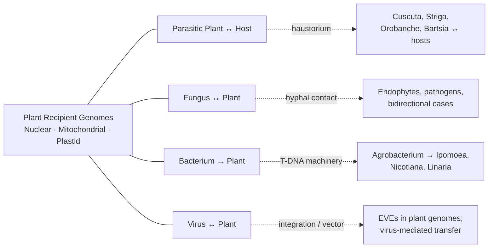
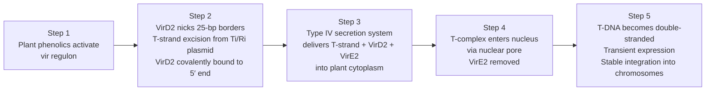
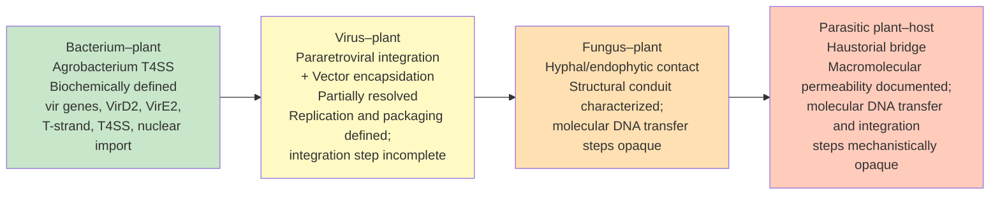

# Horizontal Gene Transfer in the Plant World: A Systematic Review of Pre-2021 Discoveries with a Focus on Parasitic Relationships
# 1 Introduction: Conceptual Framework and Scope of HGT in Plants

The genetic continuity of life has long been pictured as a strictly vertical affair: parents transmit their genomes to offspring, and species accumulate heritable variation through mutation, recombination, and selection along bifurcating lineages. Yet over the past two decades, accumulating evidence from comparative genomics has eroded the universality of this picture, revealing that genetic material can also move *across* the branches of the tree of life — between organisms separated by reproductive barriers, by taxonomic ranks, and even by domains. Nowhere has this reassessment been more consequential, or more contested, than in the plant kingdom, where the discovery of recurrent gene exchange among parasitic plants and their hosts, between fungi and plants, between bacteria and plants, and between viruses and plants has transformed horizontal gene transfer (HGT) from an oddity into a recognized force in plant genome evolution[^1][^2]. This opening chapter establishes the conceptual foundation, terminological boundaries, methodological standards, and analytical scope that will guide the systematic review of pre-2021 findings presented in the chapters that follow.

## 1.1 Defining Horizontal Gene Transfer and Its Distinction from Vertical Inheritance

Horizontal gene transfer, also termed lateral gene transfer (LGT), refers to "the movement of genetic information across normal mating barriers, between more or less distantly related organisms, and thus stands in distinction to the standard vertical transmission of genes from parent to offspring"[^2]. This deceptively simple definition carries several important analytical implications that must be made explicit before any catalogue of plant cases can be evaluated.

First, HGT is defined *operationally* by violation of expected inheritance pathways, not by the identity of the molecule transferred. The genetic material involved may be a complete protein-coding gene, a gene fragment, a transposable element, an intron, a non-coding regulatory sequence, an organellar genome segment, or even — as documented for *Cuscuta* and its hosts — an mRNA transcript that subsequently leaves a genomic footprint. Second, HGT is defined by its *trajectory* between organisms, not by its mechanism. A successful HGT event requires not only the physical movement of nucleic acid from a donor to a recipient cell but also its integration into a heritable compartment (nuclear, mitochondrial, or plastid genome) and its persistence through subsequent generations, ultimately requiring transmission via germline or meristematic tissue in multicellular eukaryotes[^2]. Third, HGT must be distinguished from several related but conceptually separate phenomena with which it is sometimes conflated:

| Phenomenon | Nature of Transfer | Relation to HGT |
|---|---|---|
| **Vertical inheritance** | Parent → offspring within a lineage | The standard against which HGT is contrasted |
| **Endosymbiotic gene transfer (EGT)** | Endosymbiont genome → host nucleus during organelle establishment | A historically massive form of HGT *sensu lato*, but typically treated separately because it accompanied the origin of mitochondria and plastids[^2] |
| **Intracellular gene transfer** | Organelle (mitochondrion/plastid) → nucleus within the same cell, post-organellogenesis | Ongoing in plants but conventionally distinguished from inter-organismal HGT[^2] |
| **Introgression / hybridization** | Cross-species gene flow through sexual reproduction between closely related taxa | Considered "vertical" within a broadened lineage and generally excluded from HGT proper |
| **Contamination artifact** | Apparent foreign sequence due to sample mixing or assembly error | A confounder that must be explicitly excluded before HGT is invoked |

Throughout this report, "HGT" denotes inter-organismal transfer between distinct, sexually incompatible lineages with subsequent stable integration into a heritable plant genome. EGT and routine organelle-to-nucleus transfers are acknowledged as part of the broader landscape but are not the focus of the analysis, which is restricted to the four post-organellogenesis interfaces specified by the User Needs.

## 1.2 From Marginal Curiosity to Evolutionary Force: The Emergence of Plant HGT as a Research Field

For most of the twentieth century, HGT was viewed primarily as a bacterial phenomenon, central to microbial evolution but largely irrelevant to multicellular eukaryotes. Several historical and methodological factors contributed to this perception. The early recognition of the importance of HGT in bacterial evolution overshadowed possible eukaryotic counterparts; most early eukaryotic HGT evidence came from protists, which are studied by relatively few biologists; and an erroneous initial claim of substantial bacteria-to-human HGT in the draft human genome, later refuted, "chilled the field, tarnished more credible claims for eukaryotic HGT, and possibly inhibited scientists from looking for HGT in the many subsequently sequenced animal genomes, and perhaps even in fungal and plant genomes"[^2].

Within plants specifically, two interlocking developments overturned this neglect. First, comprehensive surveys of mitochondrial gene content across angiosperms revealed an extraordinary pattern: "Recent studies indicate that plant mitochondrial genomes are unusually active in HGT relative to all other organellar and nuclear genomes of multicellular eukaryotes"[^1]. While most documented cases initially involved a single transferred gene per recipient species, the basal angiosperm *Amborella trichopoda* emerged as a striking outlier, having acquired "at least a few dozen and probably hundreds of foreign mitochondrial genes" from multiple donors, primarily eudicots and mosses[^1][^2]. The *Amborella* mitochondrial genome is in fact reported to possess "proportionately more foreign DNA than even the most HGT-rich bacterial genomes," with native and foreign copies of the same gene (e.g., *nad5*) coexisting and traceable to angiosperm and moss donors via phylogenetic analysis[^2].

Second, and central to this report, repeated phylogenetic studies implicated parasitic plants as both donors and recipients of mitochondrial genes, providing a biologically plausible conduit for inter-plant gene exchange[^1][^2]. **Parasitic plants establish intimate vascular and cellular connections with their hosts through a specialized organ termed the haustorium**, which physically tethers parasite to host and bridges their respective vascular systems. The image of *Cuscuta* (dodder) entwining the stem of *Glechoma* and forming haustorial connections with the host's vascular system has become emblematic of this interface, and "several cases of mitochondrial HGT between parasitic plants and their hosts have been described" in association with such connections[^2]. The haustorial bridge is not merely a passive structural junction; it is increasingly understood to mediate the bidirectional movement of **water, mineral nutrients, proteins, mRNAs, and even pathogens** between the partners, providing exactly the kind of intimate cytoplasmic and vascular continuity that can deliver foreign nucleic acids into recipient cells where they may be incorporated into heritable genomes.

The mitochondrial *atp1* gene provides one of the clearest illustrations of how the haustorial conduit translates into traceable HGT events. Phylogenetic analyses of angiosperm *atp1* sequences identified instances in which copies of *atp1* had moved between parasitic plants of the genera ***Cuscuta*** and ***Bartsia*** and their host plant ***Plantago***, producing tree topologies that conflict sharply with organismal phylogeny — a hallmark signature of HGT — and providing direct phylogenetic evidence that the parasite–host interface acts as a route for mitochondrial gene exchange[^2]. Such cases collectively established two key points: that the rate and scale of HGT in plant mitochondria are unexpectedly high, and that direct physical contact between donor and recipient plants, particularly through parasitic associations, is "a major route" by which the transfers are accomplished[^2].

Why plant mitochondria, but not plant plastids or (with rarer exceptions) plant nuclear genomes, should be so disproportionately active in HGT has itself become a productive research question. Several non-mutually-exclusive hypotheses have been articulated:

- **Active DNA uptake**: Plant mitochondria possess an active system for uptake of double-stranded DNA via the permeability transition pore complex, whereas no analogous plastid DNA-uptake system has been reported[^2].
- **Organelle fusion**: Plant mitochondria fuse and fission frequently, providing opportunities for foreign DNA introduced via direct organelle contact to be incorporated; plastids fuse far less readily[^2].
- **Streamlining and genome architecture**: The far more compact plastid genome is less tolerant of foreign-DNA insertions, whereas the expansive and recombinogenic plant mitochondrial genome is permissive[^2].
- **Donor compatibility**: Empirically, donors of HGT-acquired plant mitochondrial sequences are almost exclusively other land plants, consistent with mitochondrion-to-mitochondrion transfer via direct fusion rather than uptake from heterogeneous environmental DNA[^2].

These mechanistic features, together with the existence of parasitic conduits, explain the empirical pattern that plant HGT — when it occurs in cytoplasmic genomes — is overwhelmingly a mitochondrial phenomenon, while transfers into nuclear genomes are rarer but functionally consequential (as exemplified by the Agrobacterium-mediated cases that will be addressed in Chapter 4) and chloroplast HGT remains very limited[^1][^2].

## 1.3 Scope of the Review: Four Interfaces and the Pre-2021 Temporal Boundary

This report restricts its systematic analysis to four biological interfaces of HGT in plants, each of which has accumulated a sufficiently mature empirical base by 2020 to permit critical synthesis:

The diagram above summarizes the analytical architecture: parasitic plant–host transfers (central to the User Needs and to the field's evidentiary base, addressed in Chapter 2); fungus–plant transfers, evaluated as a bidirectional system (Chapter 3); bacterium–plant transfers, anchored by the *Agrobacterium* paradigm and natural transgenic crops such as sweet potato (Chapter 4); and virus–plant transfers, encompassing both endogenous viral elements (EVEs) and the use of viruses as vectors for gene movement (Chapter 5). Chapters 6–8 then provide cross-interface synthesis, methodological appraisal, and concluding outlook.

Three boundary conditions on this scope warrant explicit statement. **First**, the temporal cutoff is pre-2021: the report compiles and integrates findings reported in the peer-reviewed literature through the end of 2020. This boundary is deliberately chosen so that the synthesis reflects a coherent body of evidence that can be evaluated by uniform criteria, without extrapolation to subsequent developments. **Second**, the genomic compartments considered differ by interface. For parasitic plant–host and fungus–plant transfers, both mitochondrial and nuclear compartments are relevant, with mitochondrial cases historically more abundant in plant–plant comparisons[^1][^2]. For *Agrobacterium*–plant transfers, the nuclear genome is the canonical target of T-DNA integration. For virus–plant transfers, endogenization typically affects the nuclear genome. **Third**, several categories fall outside the scope: the endosymbiotic origins of mitochondria and plastids and the associated ancient organelle-to-nucleus gene migrations; HGT events in animals, fungi, or protists that do not involve a plant partner; and findings published after 2020.

## 1.4 Criteria and Methods for Identifying Authentic HGT Events

Because HGT claims have a documented history of overreach — most prominently the initially overstated tally of bacterial genes in the human genome — the report applies a stringent and uniform evidentiary framework when evaluating individual cases[^2]. The **gold standard for identifying HGT with confidence is phylogenetic incongruence**: the gene tree of a candidate sequence must exhibit "strong conflict" with the well-supported organismal phylogeny, such that the candidate clusters with sequences from unexpected donor lineages rather than with orthologs of its sister species[^2]. Where the gene tree groups a sequence from a host species (e.g., *Plantago*) deep within a clade of parasitic species (e.g., *Cuscuta*, *Bartsia*), or vice versa, phylogenetic incongruence provides direct positive evidence of horizontal movement[^2].

Surrogate methods — top BLAST hits, anomalous GC content, codon-usage outliers, and presence/absence patterns inconsistent with phylogeny — can identify HGT *candidates* but, as Keeling and Palmer emphasize, "are insufficient unless followed up by formal phylogenetic analysis"[^2]. The cautionary case of the draft human genome, in which top BLAST hits were initially over-interpreted as evidence of ~100 bacteria-to-vertebrate transfers that were subsequently refuted by phylogenetic analysis, is treated throughout this report as the standard against which surrogate-only claims must be measured[^2].

Beyond phylogenetic incongruence, several auxiliary lines of evidence strengthen HGT claims and are explicitly noted in the case studies of later chapters:

- **Loss of introns and/or RNA editing sites** relative to the donor organellar gene, consistent with RNA-mediated transfer of mitochondrial sequences in flowering plants[^2].
- **Acquisition of host-derived flanking elements** (targeting peptides, promoters, regulatory sequences) by recently transferred genes, indicative of functional integration and recombination with resident host loci[^2].
- **Chimeric gene structures** in which segments of native and foreign sequence have recombined into a hybrid, probably functional gene — documented in plant mitochondria[^2].
- **Restricted taxonomic distribution within a single genus or species**, inconsistent with deep ancestral inheritance, characteristic of recent HGT events in plant mitochondria[^2].
- **Coexistence of native and foreign copies** of the same gene within the recipient genome, often with the foreign copy non-functional or pseudogenized[^2].

Equally important are the *confounders* that must be excluded before HGT is accepted. The most consequential, drawn directly from the methodological literature, include: ancestral gene duplication followed by differential loss, which can mimic transfer; phylogenetic reconstruction artifacts from unusual rates or modes of evolution that produce "strongly supported but incorrect trees"; insufficient taxon sampling that obscures the true distribution of a gene; and contamination of sequence assemblies with bacterial or other foreign DNA, particularly relevant when symbiont DNA is routinely (and sometimes mistakenly) filtered out of plant genome projects[^2]. Each case study in later chapters will be evaluated against these standards, with explicit attention paid to whether contemporary studies satisfied them.

## 1.5 Organizing Logic and Key Research Questions of the Report

Built on the foundations laid above, the remaining chapters of the report are organized around a small number of cross-cutting research questions that recur at each interface and against which findings can be compared:

1. **Mechanism**: What physical, cellular, and molecular pathways enable the movement of genetic material from donor to recipient? For parasitic plant–host transfers, the haustorium is the principal conduit; for *Agrobacterium*, it is the *vir*-encoded T-DNA machinery; for viruses, integration and packaging capacities; for fungus–plant exchanges, hyphal contact and endophytic intimacy.
2. **Material**: What kinds of genetic information are transferred — protein-coding genes, mRNAs, transposable elements, regulatory sequences, whole organellar segments — and into which recipient compartment (nuclear, mitochondrial, plastid)?
3. **Directionality and frequency**: Is exchange unidirectional or bidirectional at a given interface? How frequently are events detected, and how does frequency correlate with biological intimacy (e.g., obligate parasitism, endophytism, persistent infection)?
4. **Functional and adaptive consequences**: Are transferred genes expressed, retained, or pseudogenized? Do they confer adaptive advantages such as enhanced pathogenicity, disease resistance, parasitism, or metabolic novelty?
5. **Evolutionary significance**: What do the documented cases imply for plant genome architecture, speciation, niche expansion, and co-evolution?

Chapter 2 will address parasitic plant–host HGT in depth, beginning from the haustorial conduit that this introduction has identified as central. Chapters 3, 4, and 5 will treat fungus–plant, bacterium–plant, and virus–plant interfaces, respectively, with the *Agrobacterium*–sweet potato system and EVEs providing emblematic case studies. Chapter 6 will synthesize across interfaces, Chapter 7 will assess the methodological state of the field, and Chapter 8 will consolidate the pre-2021 picture and identify open questions. Throughout, the evidentiary criteria articulated in §1.4 will be applied uniformly, and the conceptual distinctions of §1.1 maintained, so that the diverse case studies of plant HGT — from the *atp1* gene shuttled between *Cuscuta*, *Bartsia*, and *Plantago* through haustorial connections[^2], to the massively foreign mitochondrial genome of *Amborella*[^1][^2], to the cT-DNAs of cultivated sweet potato — can be evaluated against a single, transparent analytical standard.

# 2 HGT Between Parasitic Plants and Their Hosts

Building on the haustorial conduit framework introduced in Chapter 1, this chapter develops the parasitic plant–host interface as the empirical centerpiece of pre-2021 plant HGT research. The reason for this prominence is biological: among all the routes through which one plant's genetic material can enter another's heritable genome, parasitism uniquely combines prolonged physical attachment, cellular intimacy, and direct vascular continuity. It is precisely because parasites and their hosts share such intimate biological promiscuity that parasitism has emerged as one of the most important documented mechanisms promoting HGT in flowering plants, with case after case demonstrating that genes — whether mitochondrial or nuclear, whether moving as DNA or as mRNA — can cross the species boundary along the parasite–host axis. This chapter dissects the structural premise of that exchange (§2.1), reviews the landmark case studies in root parasites (§2.2) and shoot parasites (§2.3), categorizes the molecular substrates of transfer (§2.4), evaluates directionality and functional outcomes (§2.5), and concludes by testing whether the degree of heterotrophy itself acts as an accelerator of foreign gene acquisition (§2.6).

## 2.1 The Haustorium as the Structural and Physiological Conduit of HGT

Parasitic plants are defined by a specialized organ — the **haustorium** — through which they physically penetrate, attach to, and tap the tissues of their host. The haustorium is not a transient appendage but a developmentally elaborate structure that fuses parasite and host into a single physiological continuum: it pushes through host epidermis, cortex, and endodermis, and ultimately establishes **vascular connections with the host**, splicing parasite xylem (and, in many species, phloem) directly onto host conducting tissue. Once these connections are completed, the haustorium becomes a long-lived bidirectional conduit through which the parasite extracts the resources it needs and through which a remarkable diversity of biological cargo can move in either direction.

Crucially for the question of HGT, the haustorium has been shown to **mediate the transfer of water, mineral nutrients, proteins, mRNAs, and even pathogens** between the partners. This catalogue is biologically decisive: it demonstrates that the haustorial interface is not selectively permeable to small solutes alone but is open to macromolecules — including nucleic acids — and to whole biological entities such as viruses and viroids. The same vascular bridge that delivers sucrose and amino acids from host phloem into the parasite also carries transcripts and proteins, providing exactly the kind of cytoplasmic continuity in which foreign nucleic acids can encounter recipient cells in a state competent for uptake, reverse transcription, recombination, and ultimately germline integration.

Three properties of the haustorial interface jointly explain why it is so unusually permissive to HGT compared with the casual, transient contacts characteristic of non-parasitic plant–plant interactions:

- **Duration**: Haustorial attachment lasts weeks to months (in annual systems) or for the entire life of the parasite (in perennials and obligate parasites), providing an extended window for stochastic uptake events that would be vanishingly improbable in brief encounters.
- **Cellular intimacy**: At the parasite–host interface, parenchyma cells of donor and recipient are often separated only by thin cell walls, with plasmodesmata-like channels and direct symplastic contacts reported, dramatically reducing the physical barriers that ordinarily isolate cytoplasms of different individuals.
- **Vascular continuity**: The splicing of parasite xylem and phloem onto host conducting tissue means that mobile macromolecules normally restricted to within-plant long-distance trafficking — including mRNAs and small RNAs — can cross the species boundary as part of routine vascular flow.

These three features establish the **mechanistic premise** that justifies treating the parasite–host interface as a privileged route for HGT: the haustorium is a long-lived, macromolecularly permeable, cytoplasmically intimate bridge between two genomes, and it is along this bridge that the case studies reviewed in §§2.2–2.3 acquire their biological plausibility.

## 2.2 Root Parasites and Host HGT: *Striga* and *Orobanche* Case Studies

Root-parasitic members of the Orobanchaceae — including the agronomically devastating witchweeds (*Striga* spp.) and broomrapes (*Orobanche* spp.) — establish haustoria on the roots of grasses and dicots, respectively, where they remain attached throughout their parasitic life. Two pre-2021 case studies have become the canonical examples of nuclear HGT into root parasites.

**Striga hermonthica and ShContig9483 from Sorghum bicolor.** Yoshida and colleagues (2010) identified within the *Striga hermonthica* transcriptome a nuclear gene, designated **ShContig9483**, whose sequence aligned at exceptionally high identity to a *Sorghum bicolor* locus rather than to orthologs from related Orobanchaceae or other eudicots. Phylogenetic reconstruction placed the *Striga* copy deep within a clade of grass (Poaceae) sequences — a topology incompatible with the eudicot phylogenetic affinity of *Striga* itself — satisfying the gold standard of phylogenetic incongruence laid out in §1.4 of Chapter 1. Because *S. hermonthica* is an obligate root parasite of *Sorghum* and other cereals, and because the haustorial connection persists throughout the parasite's life cycle, the transfer is biologically intelligible: prolonged xylem–phloem coupling between *Striga* and a monocot host provided the conduit by which a *Sorghum*-derived nuclear sequence became stably integrated into the *Striga* nuclear genome and inherited vertically thereafter. ShContig9483 thus stands as a paradigmatic case of monocot-to-eudicot nuclear HGT mediated by root haustoria.

**Orobanche aegyptiaca, Cuscuta australis, and strictosidine synthase-like genes from Brassicaceae.** Zhang and colleagues (2014) reported that **strictosidine synthase-like (SSL) genes — typically restricted to the Brassicaceae** — have been horizontally acquired by parasitic species outside that family, including the root parasite ***Orobanche aegyptiaca*** and the shoot parasite *Cuscuta australis*. The phylogenetic placement of these acquired SSL sequences within the Brassicaceae clade, despite their occurrence in parasitic species belonging to phylogenetically distant families, again provides the topological signature of HGT rather than vertical inheritance. The biological context is consistent with the haustorial-conduit model: *Orobanche aegyptiaca* is a generalist root parasite that frequently attaches to Brassicaceae hosts, providing repeated opportunities for genetic exchange along its long-lived haustorial interface.

Taken together, the *Striga* and *Orobanche* cases illustrate two key principles. First, root haustoria, like their shoot counterparts, can mediate the integration of nuclear genes from taxonomically distant hosts. Second, **host specificity correlates predictably with the donor lineage**: in both cases, the inferred donor (Poaceae for *Striga*, Brassicaceae for *Orobanche*) corresponds to a documented host group, reinforcing the inference that the haustorial attachment itself — and not some indirect environmental route — is the proximate vehicle of transfer.

## 2.3 Shoot Parasites and Host HGT: The *Cuscuta* System

Among shoot parasites, the genus ***Cuscuta*** (dodder; Convolvulaceae) is by far the most thoroughly studied HGT recipient and donor, and indeed many of the foundational discoveries that established parasite-mediated HGT as a recognized phenomenon involved *Cuscuta* as one of the partners. Stem-twining *Cuscuta* species lack significant photosynthetic capacity, depend entirely on their hosts for water and photosynthate, and form abundant haustoria along the contact zone where their stems wrap around the host stem — a geometry that maximizes the haustorial interface per unit of parasite biomass.

**The mitochondrial *atp1* paradigm.** The first reported case of HGT between parasitic plants and their hosts was the transfer of the mitochondrial ***atp1*** gene, documented by Mower and colleagues in their landmark 2004 *Nature* paper "Plant genetics: Gene transfer from parasitic to host plants". Phylogenetic analyses of *atp1* sequences from a broad sampling of angiosperms revealed that copies of this gene had moved along the parasite–host axis involving the parasitic genera ***Cuscuta*** and ***Bartsia*** and the host plant ***Plantago***, producing gene-tree topologies that grouped *Plantago atp1* sequences within parasite clades (or vice versa) in clear conflict with organismal phylogeny. This study did far more than catalogue a single transfer event: it established the parasite–host haustorial connection as a credible, reproducible route for inter-plant gene exchange and opened the field to systematic phylogenetic searches for analogous cases. Subsequent surveys have confirmed that **HGT of mitochondrial genes is frequent between parasitic plants and their hosts**, making mitochondrial loci the most densely sampled compartment in the *Cuscuta* HGT inventory.

**Nuclear HGT into Cuscuta australis.** Beyond the mitochondrial compartment, *Cuscuta* has also acquired nuclear genes from its hosts. As noted above (§2.2), *Cuscuta australis* possesses **strictosidine synthase-like (SSL) genes phylogenetically nested within the Brassicaceae**, indicating horizontal acquisition from a Brassicaceae host (Zhang et al., 2014). The shared acquisition of SSL genes by both *Cuscuta australis* (a shoot parasite) and *Orobanche aegyptiaca* (a root parasite) from the same donor family is itself striking, hinting either at independent transfer events from a commonly encountered host group or at the existence of more complex transfer histories among parasitic lineages.

**Genome-scale mRNA exchange.** Perhaps the most distinctive feature of the *Cuscuta* system is the magnitude of **bidirectional mRNA trafficking** documented across its haustorial interface. Kim and colleagues (2014) profiled transcripts moving between *Cuscuta pentagona* and its hosts (*Arabidopsis thaliana* and *Solanum lycopersicum*) and reported genome-scale exchange: thousands of mRNAs from each host species were detectable inside the parasite, and a substantial number of *Cuscuta* mRNAs were reciprocally detectable in the host. While this study addresses RNA movement rather than DNA-level integration per se, it is biologically pivotal for HGT: it establishes that the *Cuscuta*–host haustorial bridge routinely carries mRNA in enormous quantities and in both directions, providing exactly the pool of mobile transcripts that — if reverse-transcribed and integrated — would yield the RNA-derived HGT signatures discussed in §2.4. The combination of demonstrated DNA-level integration (e.g., *atp1*, SSL) with documented genome-scale RNA trafficking makes *Cuscuta* the most mechanistically illuminating system in which the molecular logic of parasite–host HGT can be examined.

The contrast between root and shoot parasitic HGT profiles is instructive. Root parasites such as *Striga* and *Orobanche* have so far yielded mostly nuclear HGT cases anchored on a few well-characterized loci, whereas the *Cuscuta* system exhibits both abundant mitochondrial HGT and a uniquely well-documented RNA-trafficking dimension. This is not necessarily a fundamental biological difference but probably reflects the historical depth of phylogenetic sampling and the experimental tractability of *Cuscuta*'s above-ground haustoria.

## 2.4 Molecular Substrates of Transfer: DNA, mRNA, and cDNA Pathways

The case studies reviewed above involve transfers of qualitatively different molecular substrates, and resolving which substrate moved is essential both for mechanistic understanding and for evidentiary evaluation. Pre-2021 work distinguishes three broad categories.

**Nuclear protein-coding DNA.** Transfers such as *Striga*'s acquisition of ShContig9483 from *Sorghum* and the Brassicaceae-derived SSL genes in *Orobanche aegyptiaca* and *Cuscuta australis* are most parsimoniously interpreted as DNA-level integrations into the parasite nuclear genome. The retention of recognizable exonic structure and the absence of obvious cDNA-like signatures (see below) in these acquired loci are consistent with direct DNA transfer, presumably along the haustorial interface via mechanisms that remain mechanistically opaque (a point developed in Chapter 6).

**Mitochondrial gene fragments.** Mitochondrial HGT — exemplified by the *atp1* transfers among *Cuscuta*, *Bartsia*, and *Plantago* — is the most frequently documented category at the parasite–host interface. As noted in Chapter 1, plant mitochondria possess active DNA uptake, undergo frequent fusion and fission, and harbor expansive recombinogenic genomes, all of which make them unusually permissive recipients for foreign DNA introduced through direct mitochondrion-to-mitochondrion contact. The repeated mitochondrial HGT cases in parasitic systems thus represent the intersection of an unusually receptive recipient compartment with an unusually intimate inter-organismal interface.

**mRNA and cDNA-mediated pathways.** Beyond direct DNA transfer, a major hypothesized pathway invokes an **RNA-based transfer mechanism**, in which **mobile mRNAs cross the haustorial interface and are subsequently reverse-transcribed into cDNA before being integrated into the recipient genome**. This hypothesis is empirically grounded by the genome-scale mRNA exchange documented in *Cuscuta*–host systems (§2.3) and by the abundance of mobile transcripts in the haustorial vascular traffic, which provide a plausible intermediate pool from which heritable integrations could be drawn. The hypothesis also has clear diagnostic consequences: because mRNAs lack introns, untranslated regulatory regions are typically curtailed, and post-transcriptional editing has already occurred at the RNA level, **genes that have been horizontally transferred via an RNA intermediate are predicted to lack introns and promoter regions** in the recipient genome, and — in the case of mitochondrial sequences — to lack the RNA editing sites characteristic of the donor mitochondrial gene.

The diagnostic signatures distinguishing DNA-mediated from RNA-mediated transfer can be summarized as follows:

| Diagnostic Feature | DNA-mediated Transfer | RNA-mediated Transfer (via cDNA) |
|---|---|---|
| Introns | Retained (in donor configuration) | Absent (spliced out before reverse transcription) |
| Promoter / 5′ regulatory regions | Often retained or partially retained | Absent or truncated |
| RNA editing sites (mitochondrial) | Editable sites preserved at DNA level | "Pre-edited" — edited residues fixed at DNA level |
| Chimeric structures | Possible via recombination after integration | Possible if cDNA integrates near resident loci |
| Recipient compartment | Nuclear or organellar | Predominantly nuclear (post reverse transcription) |

Several documented parasitic HGT events display the RNA-mediated signature — most notably intron loss and the appearance of pre-edited mitochondrial sequences — and these cases provide some of the strongest mechanistic evidence that the abundant mobile mRNA pool of the haustorial interface is not merely a curiosity of nutrient physiology but an active substrate for heritable genome evolution. The mechanistic implication is that **the haustorium effectively couples two distinct routes to HGT — direct DNA movement and mRNA movement followed by reverse transcription and integration — and that the relative importance of these routes likely varies across parasite–host pairs and genomic compartments**.

## 2.5 Directionality, Frequency, and Functional Outcomes of Transferred Genes

A consistent empirical pattern emerges from the pre-2021 literature: HGT at the parasite–host interface is overwhelmingly **biased toward the host-to-parasite direction**. The *Striga* (←*Sorghum*), *Orobanche aegyptiaca* (←Brassicaceae), and *Cuscuta australis* (←Brassicaceae) cases all involve the parasite acquiring host-derived sequences, and the broader mitochondrial inventory in *Cuscuta* recipients reinforces this directional bias. The reverse direction — parasite-to-host transfer — has been documented (the original Mower et al. 2004 study explicitly described transfers along the parasite–host axis that included movement into host *Plantago* lineages), but it is detected substantially less frequently and typically in mitochondrial rather than nuclear compartments.

Several factors plausibly contribute to this directional asymmetry:

- **Flow asymmetry**: Bulk mass flow in haustorial systems is predominantly from host to parasite, since the parasite depends on host-supplied water, nutrients, and photosynthate; mobile macromolecules including mRNAs are thus carried more abundantly in the host-to-parasite direction.
- **Selective context**: Host-derived genes acquired by parasites can directly contribute to parasitic function (e.g., recognition of host signals, manipulation of host physiology, detoxification of host defense compounds), creating a selective ratchet that retains such acquisitions. Parasite-derived genes in the host lack an obvious analogous adaptive niche.
- **Detection bias**: Parasite genomes have been more intensively scrutinized for foreign sequences than have host genomes adjacent to parasitic infestations, which may inflate the apparent host-to-parasite skew.

Regarding **frequency**, mitochondrial HGT is frequent enough in *Cuscuta* and related lineages to register repeatedly in routine phylogenetic surveys, whereas nuclear HGT events, though biologically consequential, are detected at much lower per-genome rates. Quantitative inventories remain rough, but the qualitative pattern is clear: parasitic angiosperms harbor substantially more foreign genes — particularly in mitochondrial compartments — than non-parasitic angiosperms of comparable taxonomic position.

The **functional fate** of transferred genes varies. Some acquisitions remain as expressed, intact open reading frames — the Brassicaceae-derived SSL genes in *Orobanche* and *Cuscuta* and the *Sorghum*-derived ShContig9483 in *Striga* are reported in this category and have been hypothesized to contribute to parasite metabolism or host interaction. Others, particularly mitochondrial transfers that produce duplicate copies of resident genes (e.g., foreign *atp1* alongside native *atp1*), often pseudogenize over evolutionary time as one copy becomes dispensable. Still others persist as recombinational substrates contributing to **chimeric gene structures** that combine native and foreign sequence, a recurrent feature of plant mitochondrial genomes. The general picture is that **HGT supplies parasitic genomes with raw genetic material whose fate is then determined by ordinary selective and drift processes**, with a meaningful but quantitatively unresolved fraction retained as functional, potentially adaptive loci.

## 2.6 Heterotrophy Level and HGT Rate: Testing the Lifestyle-Frequency Correlation

A central evolutionary question — and one that ties together the case studies of this chapter — is whether the **degree of heterotrophy** itself acts as a determinant of HGT frequency. Parasitic plants span a gradient from facultative hemiparasites, which retain photosynthetic capacity and parasitize hosts opportunistically, through obligate hemiparasites that require host attachment but still photosynthesize, to holoparasites such as *Cuscuta* and *Orobanche* that have lost photosynthetic function and depend entirely on the host. If parasitism is causally associated with elevated HGT, the prediction is straightforward: **HGT frequency should rise with increasing heterotrophy**, because deeper parasitic dependence is accompanied by tighter haustorial coupling, longer attachment durations, and more extensive vascular and cellular continuity.

The pre-2021 empirical picture supports this prediction qualitatively. The richest inventories of host-derived genes are documented in obligate parasites with extensive haustorial systems — *Cuscuta* (holoparasitic), *Orobanche* (holoparasitic), and *Striga* (obligate hemiparasite at germination, with extensive host dependence) — while facultative hemiparasites with looser host associations have yielded comparatively fewer documented transfers. The mitochondrial *atp1* transfers cluster on parasitic branches (*Cuscuta*, *Bartsia*) of the angiosperm tree, and the most extensive nuclear acquisitions (ShContig9483, SSL genes) all involve obligate parasitic lineages.

This pattern carries a striking evolutionary implication: **parasitism is plausibly a self-reinforcing accelerator of HGT**. Each successful host-to-parasite gene acquisition that confers improved capacity to extract resources, evade host defense, or manipulate host physiology tightens the parasitic association, prolongs haustorial contact, and expands host range — all of which increase the opportunity for further HGT. The acquired SSL genes, if functional in parasite metabolism, illustrate this logic: a foreign gene that enhances parasitic competence reinforces the very lifestyle that made its acquisition possible. The result is an evolutionary feedback in which **the parasitic niche and the genomic mosaicism characteristic of parasitic plants co-evolve**, with the haustorium serving simultaneously as the agent of resource extraction and the agent of genome assembly.

Several caveats temper this synthesis. First, the inventory of documented HGT events is heavily skewed toward intensively studied taxa (especially *Cuscuta* and *Orobanche*), and broader sampling of less-studied parasitic lineages is needed before the heterotrophy–frequency correlation can be quantitatively pinned down. Second, the qualitative association between heterotrophy and HGT rate has not been formally controlled for confounders such as genome size, mitochondrial recombination activity, and historical population size. Third, the direction of causality cannot be unambiguously inferred from correlation alone: while it is biologically plausible that deeper heterotrophy enables more HGT, it is equally consistent with the data that certain founder HGT events themselves facilitated transitions to deeper heterotrophy.

What is firmly established by the pre-2021 literature, and what subsequent chapters will use as their comparative anchor, is the following composite picture. The parasitic plant–host interface is the most thoroughly documented and biologically intelligible route of HGT in plants: the haustorium provides a long-lived, macromolecularly permeable, cytoplasmically intimate bridge between donor and recipient; both nuclear and mitochondrial genes have been transferred along this bridge; both DNA-mediated and RNA-mediated (cDNA-integration) pathways are operative; transfers are predominantly directed from host to parasite; mitochondrial transfers are frequent and nuclear transfers are biologically consequential; and the degree of heterotrophy is positively associated with the documented intensity of foreign gene acquisition. Against this empirical core, the fungus–plant, bacterium–plant, and virus–plant interfaces examined in the following chapters can be evaluated for the degree to which their structural conduits, molecular substrates, and evolutionary consequences resemble or diverge from the parasitic paradigm.

# 3 HGT Between Fungi and Plants: Bidirectional Genetic Exchange

The parasitic plant–host interface analyzed in Chapter 2 provides a structurally intuitive route for HGT: two land plants, joined cell-to-cell and vessel-to-vessel by a haustorium, share a continuous physiological space across which nucleic acids can travel. The fungus–plant interface examined in this chapter is biologically more heterogeneous and, in some respects, more demanding to interpret. Fungi and plants are separated by a kingdom-level phylogenetic divide, possess distinct cell-wall chemistries and intracellular architectures, and engage one another in a wide spectrum of ecological modes — from mutualistic mycorrhizal associations, through asymptomatic endophytism, to acute biotrophic and necrotrophic pathogenesis. Yet across this spectrum, fungi and plants live in chronic, often lifelong, cellular contact, and the evidence accumulated by 2020 establishes that **HGT between plants and fungi is genuinely bidirectional**: documented cases run both from fungi into plant genomes and from plants (and other organisms sharing the plant niche) into fungal genomes. This chapter develops the structural premise of fungus–plant exchange (§3.1), reviews fungus-to-plant transfers anchored on the *Fhb7* paradigm and the *Cox1* group I intron (§3.2), examines plant-to-fungus transfers and inter-fungal exchange among plant-associated lineages (§3.3), explores multi-kingdom transfer chains exemplified by the *Epichloë* system (§3.4), and synthesizes the bidirectionality, lifestyle dependence, and evolutionary implications of the interface (§3.5).

## 3.1 Structural and Ecological Conduits of Fungus–Plant Genetic Exchange

Where the parasitic plant–host interface is dominated by a single anatomically defined organ (the haustorium), the fungus–plant interface is realized through a diversified portfolio of cellular structures and ecological associations, each of which provides a distinct opportunity for the cross-kingdom movement of genetic material. Four conduit types organize the empirical literature.

**Hyphal penetration and intracellular invasion.** Pathogenic and many endophytic fungi penetrate plant tissues through directed hyphal growth, often guided by specialized infection structures (appressoria) that breach the cuticle and cell wall and project intracellular hyphae or haustoria into living host cells. Biotrophic pathogens such as rust and powdery mildew fungi form fungal haustoria that invaginate the host plasma membrane and establish an extended interface — the extrahaustorial matrix — across which water, nutrients, effectors, and small RNAs are exchanged for the entire duration of infection. Necrotrophs and hemibiotrophs likewise establish prolonged intracellular contact, though under conditions of progressive host cell damage.

**Endophytic colonization.** Endophytic fungi colonize plant tissues asymptomatically, often persisting through the host's entire life cycle and, in the case of vertically transmitted clavicipitaceous endophytes such as *Epichloë*, being transmitted from generation to generation through host seed. Endophytism combines extraordinary durations of contact — years or decades, across host generations — with intimate localization within intercellular spaces and, in some cases, within living host cells, offering a uniquely permissive setting for the slow, low-probability events that underlie HGT.

**Mycorrhizal symbiotic interfaces.** Arbuscular and ectomycorrhizal symbioses establish specialized intracellular or apoplastic interfaces between fungal and plant partners over the lifetime of the plant root system. Although mycorrhizal interfaces have been less prominent than pathogenic or endophytic systems in documented HGT case studies, they share the same general property of prolonged, intimate cellular contact.

**Saprotrophic and rhizosphere contact.** Even outside symbioses and infections, fungi and plants share environments — leaf surfaces, decomposing litter, rhizosphere soil — in which fungal hyphae directly contact plant debris, seeds, and roots. The relevance of these casual contacts to HGT is more limited but cannot be dismissed *a priori*.

Compared with the parasitic plant haustorium (Chapter 2), fungus–plant conduits share three crucial properties — **duration, cellular intimacy, and macromolecular permeability** — but differ in one respect with major mechanistic implications. The parasitic plant–host interface joins two genomes housed within structurally similar plant cells; the fungus–plant interface joins genomes housed in cells of different kingdoms, with distinct nuclear architectures, intron–exon conventions, codon usage biases, and post-transcriptional machinery. This kingdom-level divergence makes successful integration and functional retention of transferred genes more demanding, but it also makes phylogenetic incongruence (the gold standard articulated in Chapter 1) particularly diagnostic when it does occur, because the chance that a fungus-like sequence in a plant genome (or vice versa) reflects shared ancestry is essentially nil.

## 3.2 Fungus-to-Plant HGT: Disease Resistance and Adaptive Gene Acquisition

Fungus-to-plant HGT has emerged as one of the most agriculturally consequential branches of plant HGT research. Two emblematic cases — one ancient and organellar, one recent and nuclear — frame the analysis.

**The mitochondrial *Cox1* group I intron.** Among the earliest and phylogenetically broadest documented cases of fungus-to-plant HGT is the **group I intron embedded in the mitochondrial cytochrome *c* oxidase subunit 1 (*Cox1*) gene** of numerous angiosperm lineages. Group I introns are self-splicing ribozymes characteristic of fungal mitochondrial genomes, and their sporadic, taxonomically patchy distribution across flowering plants — concentrated on a subset of angiosperm branches and absent in their relatives — is incompatible with vertical inheritance from a deep angiosperm ancestor. Phylogenetic placement of the plant *Cox1* introns nested within fungal intron clades has supported the interpretation that the intron was horizontally acquired, on multiple independent occasions, from fungal donors and propagated thereafter through plant mitochondrial genomes. The *Cox1* intron case is paradigmatic in two respects: it establishes that fungal genetic material can colonize the plant mitochondrial genome, a compartment already shown in Chapter 1 to be unusually permissive to HGT, and it demonstrates that non-protein-coding genetic elements (mobile introns) — not only protein-coding loci — are part of the cross-kingdom transfer landscape.

**Quantitative scope: rare and ancient transfers between plants and fungi.** A systematic phylogenomic survey published by Richards and colleagues in *The Plant Cell* in 2009 — entitled "Phylogenomic Analysis Demonstrates a Pattern of Rare and Ancient Horizontal Gene Transfer between Plants and Fungi" — sought to place these anecdotal cases on a genome-wide footing. By screening complete plant and fungal genomes and applying phylogenetic incongruence as the validation criterion, the study identified a small but well-supported number of HGT events, including **five cases of fungus-to-plant transfer**. The quantitative message of the Richards study has had a lasting influence on the field: HGT between plants and fungi is real and detectable at genome scale, but it is *rare* (small absolute numbers of well-supported events per genome) and *ancient* (transfers deep enough in the phylogeny that they predate major plant or fungal radiations rather than reflecting recent ecological associations). This conclusion has framed all subsequent claims of fungus-to-plant transfer, which must be evaluated against the background that the typical fungus-to-plant transfer is not a frequent, ongoing exchange of recent ecological partners but a sporadic, evolutionarily long-term contribution to the plant genetic toolkit.

**The *Fhb7* paradigm: fungal *Epichloë* origin, wheat disease resistance, and *Thinopyrum elongatum* as intermediate host.** Against this background of "rare and ancient" transfer, the most striking and agronomically important fungus-to-plant HGT case documented before the close of the temporal window of this report is the **horizontal acquisition of the *Fhb7* gene by wheat**. *Fhb7* confers broad-spectrum resistance to Fusarium head blight (FHB), one of the most damaging fungal diseases of cereal crops worldwide, caused by *Fusarium* species that produce trichothecene mycotoxins (e.g., deoxynivalenol) capable of contaminating grain and poisoning livestock and humans. Wang and colleagues, in their 2020 *Science* study entitled "Horizontal gene transfer of *Fhb7* from fungus underlies Fusarium head blight resistance in wheat", traced the evolutionary origin of this resistance gene through phylogenetic analysis and reached a conclusion of striking clarity: **the donor of *Fhb7* is the fungal endophyte *Epichloë***, a clavicipitaceous endophyte of grasses; the gene was first acquired by the wild grass ***Thinopyrum elongatum***, which served as the **intermediate host** in the transfer chain; and from *Thinopyrum elongatum* the *Fhb7* locus was introgressed into cultivated wheat through breeding, where it now functions as the molecular basis of FHB resistance in *Thinopyrum*-derived wheat lines. Mechanistically, *Fhb7* encodes a glutathione *S*-transferase that detoxifies trichothecene mycotoxins by opening their epoxide moiety, neutralizing the principal virulence factor of *Fusarium* species and thereby providing broad resistance.

The *Fhb7* case is the single most compelling pre-2021 example of an HGT-acquired gene becoming the basis of a major agronomic trait, and it illustrates several principles at once:

- **Kingdom-crossing transfer is functional**: a fungal glutathione *S*-transferase, fully foreign in evolutionary origin, has been integrated, expressed, and recruited into a defense role in a host plant against a pathogenic fungus from a different fungal lineage.
- **Endophytism as donor habitat**: the donor is a fungal endophyte, *Epichloë*, whose lifestyle places it in prolonged, intimate, often vertically transmitted contact with grass hosts — exactly the conduit type identified in §3.1 as maximally permissive to HGT.
- **Intermediate-host architecture**: the transfer is not a single fungus-to-wheat jump but a stepwise route, with *Thinopyrum elongatum* serving as the intermediate plant host that first acquired the fungal gene and from which the locus was subsequently moved into cultivated wheat by sexual introgression (a vertical mechanism between closely related Triticeae). This stepwise architecture is biologically realistic and methodologically important, because it warns that the recipient lineage in which an HGT gene is observed today need not be the lineage that originally accepted it from the donor.

**β-1,6-Glucanase acquisition by cool-season grasses.** A second, mechanistically related case is the **horizontal acquisition of a β-1,6-glucanase gene from an ancestral fungal endophyte by cool-season grass hosts**, reported by Shinozuka and colleagues (2017). β-1,6-Glucan is a structural polysaccharide of fungal cell walls; an enzyme degrading it, when present in the genome of a plant host, has obvious adaptive logic, either in remodeling the plant–endophyte interface or in defending against unwanted fungal colonization. Phylogenetic analysis placed the grass-resident gene within a fungal clade, satisfying the incongruence standard. As with *Fhb7*, the donor was an endophytic (or ancestrally endophytic) fungal lineage and the recipient was a Poaceae host. This convergence on **endophyte-to-grass transfer of fungal-cell-wall-related and detoxifying enzymes** is striking and suggests that the prolonged, intimate, and often vertically transmitted nature of grass–endophyte symbioses constitutes a particularly productive corridor for fungus-to-plant HGT in monocot lineages.

**Synthesis.** The fungus-to-plant cases compiled above — the deeply ancient *Cox1* group I intron, the small set of phylogenomically validated transfers identified by Richards et al. (2009), the agronomically pivotal *Fhb7* acquisition documented by Wang et al. (2020), and the β-1,6-glucanase transfer of Shinozuka et al. (2017) — together delineate a coherent profile of the direction. The transferred genetic material spans a non-coding mobile intron, protein-coding metabolic enzymes, and detoxification machinery. The functional outcomes, where investigated, are biased toward **defense and host-defense innovation**: detoxification of fungal mycotoxins, cell-wall remodeling enzymes, and similar capacities. The donor lineages are disproportionately fungi engaged in chronic, intimate interactions with plants — endophytes, biotrophs, and their close relatives — consistent with the structural premise of §3.1.

## 3.3 Plant-to-Fungus HGT and Inter-Fungal Transfer in Plant-Associated Lineages

The reverse direction of fungus–plant exchange — **plant-to-fungus HGT** — has historically been more difficult to validate, in part because fungal genome assemblies have been routinely contaminated with low levels of plant DNA from the cultures or substrates on which fungi are grown, raising contamination concerns that must be rigorously excluded before any claim of plant-to-fungus transfer can be sustained. Nonetheless, pre-2021 work has documented plant-to-fungus cases that satisfy the phylogenetic incongruence standard, and these cases concentrate, suggestively, in fungal lineages that occupy plant hosts as endophytes or pathogens.

**Subtilisin transfer to *Colletotrichum*.** Among the well-supported plant-to-fungus cases is the **horizontal acquisition of a *subtilisin* gene by the genus *Colletotrichum***, a clade of hemibiotrophic plant pathogens responsible for anthracnose diseases on a wide range of crops and wild plants. Subtilisins are serine proteases broadly distributed across bacteria, plants, and fungi, but the *subtilisin* locus identified in *Colletotrichum* clusters phylogenetically with plant rather than fungal homologues, indicating that the gene was acquired horizontally from a plant donor — most plausibly an ancestral host. The functional logic is direct: a plant-derived protease in a plant-pathogenic fungus may contribute to virulence-relevant proteolysis or to immune-evasion activities, although the precise functional role remains the subject of biochemical investigation.

**Leucine-rich repeat (LRR) protein gene transfer to *Pyrenophora*.** A second case involves the **horizontal transfer of a gene encoding a leucine-rich repeat (LRR) protein to the genus *Pyrenophora***, a clade of plant-pathogenic ascomycetes that includes the causal agents of tan spot and net blotch of cereals. LRR domains are the principal recognition modules of the plant immune system, characteristic of plant disease-resistance proteins (NLRs and receptor-like kinases/proteins); the acquisition of a plant-style LRR gene by a fungal pathogen of plants is, on the face of it, biologically suggestive — potentially providing the fungus with plant-style recognition or signaling capacities applicable to manipulating the host. Phylogenetic placement of the *Pyrenophora* LRR sequence within a plant clade is the basis for the HGT interpretation.

**Quantitative scope of plant-to-fungus and inter-fungal transfer.** Both of these cases, together with comparable examples, fit the broader genomic pattern established by surveys of horizontal gene transfer in plant-pathogenic and plant-associated fungi. Such surveys — including the work of Qiu et al. (2016) on extensive HGT among plant-pathogenic fungi — have shown that **fungi that share plant hosts also share genes**: pathogenicity-related loci, secondary metabolite biosynthetic gene clusters, and host-adaptation factors recur across phylogenetically distant fungal lineages whose only common feature is their occupation of plant tissues. The ecological logic is symmetrical to that of the parasitic plant–host interface developed in Chapter 2: shared cellular environments — in this case, the plant apoplast and intracellular spaces — provide repeated opportunities for hyphal contact, anastomosis-like events, or uptake of degraded host or co-infecting fungal DNA, against a background of selection that retains those acquisitions which enhance host exploitation.

**Bacterial-origin transfers at the plant niche.** A complementary line of evidence is the systematic phylogenetic analysis by Metcalf and colleagues (2014), reported in *eLife* under the title "Antibacterial gene transfer across the tree of life", which traced an antibacterial gene family across deep phylogenetic distances and documented HGT events across multiple kingdoms, including transfers involving plant-associated lineages. The study reinforces a key principle: organisms that share a common ecological niche — and the plant body is such a niche, occupied simultaneously by host plant cells, fungal endophytes and pathogens, and bacterial endophytes and pathogens — exhibit cross-kingdom gene exchange at rates and across distances that would be inexplicable on a strict vertical-inheritance framework. The plant niche is, in this sense, a genetic recombination hub spanning multiple kingdoms.

**Methodological caveats.** Three methodological cautions apply with particular force to plant-to-fungus claims and shape how the cases above must be interpreted:

- **Contamination control**: fungal genome assemblies may contain plant DNA contamination if the fungus was cultured on plant tissue; rigorous claims of plant-to-fungus HGT require demonstration that the candidate locus is integrated within fungal scaffolds with appropriate flanking fungal sequence and is present in independently sequenced isolates.
- **Direction ambiguity**: a gene phylogenetically intermediate between plants and fungi can in principle reflect either direction of transfer; explicit phylogenetic rooting and consideration of the broader taxon distribution are essential.
- **Detection asymmetry**: plant genomes have been searched intensively for fungal sequences (motivated by interest in plant disease resistance), whereas systematic searches for plant sequences in fungal genomes have been less common, plausibly leading to under-detection of the plant-to-fungus direction.

Despite these caveats, the *Colletotrichum subtilisin* and *Pyrenophora* LRR cases — together with the broader Qiu et al. (2016) inter-fungal HGT inventory and the cross-kingdom transfers documented by Metcalf et al. (2014) — establish that **plant-to-fungus transfer is a real, if quantitatively secondary, component of the fungus–plant HGT landscape**, and that the plant niche acts as a multi-kingdom corridor across which genes move in multiple directions.

## 3.4 Multi-Kingdom Transfer Chains: The *Epichloë* Case and Endophytism as a Transfer Hub

Several pre-2021 case studies reveal a phenomenon more complex than a single donor-to-recipient jump: **multi-step transfer chains** in which a gene traverses more than two kingdoms or two lineages before reaching the genome in which it is ultimately observed. The fungal endophyte genus ***Epichloë*** — already encountered in §3.2 as the donor of the *Fhb7* gene to wheat via *Thinopyrum elongatum* — provides the most instructive examples.

**Epichloë as recipient of a bacterial-origin insect-toxin gene.** Ambrose and colleagues (2014) documented that an *Epichloë* endophyte has acquired an **insect-toxin gene of bacterial origin**, embedding within the fungal genome a protein-coding sequence whose closest phylogenetic neighbors are bacterial rather than fungal. The transfer is consistent with a scenario in which the bacterial donor and the fungal recipient co-occurred — most plausibly within or upon a shared plant host, where bacterial endophytes and fungal endophytes routinely co-inhabit grass tissues. The acquired toxin gene is biologically meaningful in the context of the grass–*Epichloë* symbiosis, because *Epichloë* endophytes are well known to provide their grass hosts with resistance against insect herbivores, and the chemical basis of this protection includes alkaloids and other bioactive compounds produced by the endophyte. The horizontal acquisition of a bacterial insect-toxin gene adds a foreign, functionally direct contributor to this defensive arsenal.

**The Epichloë → wheat trajectory revisited.** When the Ambrose et al. (2014) finding is read together with the Wang et al. (2020) *Fhb7* result, the *Epichloë*–grass symbiosis emerges as a particularly active node of multi-kingdom HGT: bacterial-origin genes enter the fungal genome from one direction, and fungal genes exit toward the plant genome of grass hosts in the other. The endophyte is, in effect, a **genetic recombination hub** at which genes from bacterial donors, fungal residents, and plant hosts can mix, with the long, vertically transmitted, cellularly intimate symbiosis providing the temporal and spatial conditions under which such mixing can occur.

**Implications for the connectedness of plant-associated gene pools.** Multi-kingdom transfer chains of this kind imply that the gene pool of a plant host is not biologically isolated but is connected, through endophytic and pathogenic intermediates, to the gene pools of associated bacteria, fungi, and (as Chapter 5 will discuss) viruses. The plant body is best conceptualized, for HGT purposes, as a **multi-kingdom metagenome with shared cellular interfaces**, in which any gene of selective value to any participant in the assemblage has, in principle, a pathway by which it may eventually migrate into any other genome that occupies the same space — provided the time scales are long and the selective context permissive. The *Epichloë* case demonstrates that this is not a theoretical possibility but a documented empirical reality at the fungal node of the network.

## 3.5 Bidirectionality, Lifestyle Dependence, and Evolutionary Implications

Synthesizing the case studies of §§3.2–3.4, three principal conclusions emerge regarding the fungus–plant interface.

**Bidirectionality is firmly established but asymmetric.** HGT between plants and fungi is genuinely bidirectional. Fungus-to-plant transfers (the *Cox1* group I intron, *Fhb7*, β-1,6-glucanase, and the broader Richards et al. 2009 inventory) and plant-to-fungus transfers (*subtilisin* in *Colletotrichum*, LRR genes in *Pyrenophora*, the broader Qiu et al. 2016 and Metcalf et al. 2014 datasets) both pass the phylogenetic incongruence standard. Quantitatively, however, the two directions are not symmetric. Pre-2021 inventories suggest that the fungus-to-plant direction has yielded the most agronomically and evolutionarily prominent individual cases (*Fhb7* in particular), while the plant-to-fungus direction has yielded a smaller and methodologically more contested set of well-validated events. Whether this asymmetry reflects true biological difference or detection bias remains, as of 2020, an open question (and is taken up in Chapter 6).

The following table consolidates the principal pre-2021 cases compiled in this chapter and locates each within the fungus–plant exchange landscape.

| Case | Direction | Donor → Recipient | Genetic Material | Functional Role | Key Source |
|---|---|---|---|---|---|
| *Cox1* group I intron | Fungus → plant | Fungal mitochondria → angiosperm mitochondria | Self-splicing group I intron | Mobile intron, non-coding | Multiple phylogenetic studies |
| Phylogenomic survey | Fungus → plant | Various fungal donors → plant genomes | 5 well-supported cases | Various | Richards et al. (2009), *Plant Cell* |
| *Fhb7* | Fungus → plant (via intermediate) | *Epichloë* → *Thinopyrum elongatum* → wheat | Glutathione *S*-transferase | Trichothecene detoxification → FHB resistance | Wang et al. (2020), *Science* |
| β-1,6-Glucanase | Fungus → plant | Ancestral fungal endophyte → cool-season grasses | β-1,6-Glucanase enzyme | Fungal cell-wall remodeling/defense | Shinozuka et al. (2017) |
| Insect-toxin gene in *Epichloë* | Bacterium → fungus (in plant niche) | Bacterium → *Epichloë* | Insect-toxin protein | Herbivore defense in grass symbiosis | Ambrose et al. (2014) |
| *Subtilisin* in *Colletotrichum* | Plant → fungus | Plant → *Colletotrichum* | Serine protease | Putative virulence/proteolysis |   |
| LRR protein in *Pyrenophora* | Plant → fungus | Plant → *Pyrenophora* | Leucine-rich repeat protein | Putative recognition/signaling |   |
| Inter-fungal HGT in plant pathogens | Fungus → fungus (plant niche) | Plant-pathogenic fungi (cross-clade) | Pathogenicity loci, metabolite clusters | Host adaptation, virulence | Qiu et al. (2016) |
| Antibacterial gene transfer | Cross-kingdom (incl. plant niche) | Tree-of-life-spanning | Antibacterial gene family | Antibacterial activity | Metcalf et al. (2014), *eLife* |

**Lifestyle dependence: endophytism as the privileged conduit.** The functional ecology of the fungal partner strongly modulates the probability and biological significance of HGT, paralleling the heterotrophy–frequency relationship developed for parasitic plants in Chapter 2. Both directions of fungus–plant transfer are disproportionately enriched in **endophytic and chronic biotrophic systems**, where the contact between fungal and plant cells is prolonged, cellularly intimate, and often perpetuated across host generations through vertical (seed) transmission. The *Epichloë* node — donor of *Fhb7* to the *Thinopyrum*–wheat lineage and recipient of a bacterial insect-toxin gene — exemplifies this principle in its sharpest form: a vertically transmitted, lifelong, cellularly intimate symbiosis that simultaneously acts as recipient of bacterial-origin genes and donor of fungal genes to plant lineages. The β-1,6-glucanase transfer from an "ancestral fungal endophyte" to cool-season grasses fits the same paradigm. By contrast, transient saprotrophic encounters and short-duration necrotrophic infections, while not excluded, have yielded comparatively few well-supported HGT cases, consistent with the inference that **biological intimacy and duration of contact, not mere ecological co-occurrence, are the rate-limiting variables for cross-kingdom HGT**.

**Evolutionary implications.** Three implications follow from the bidirectional, lifestyle-modulated profile assembled in this chapter:

- **Cross-kingdom borrowing as a route to host-defense innovation.** The *Fhb7* and β-1,6-glucanase cases show that plant defense against fungal pathogens can be assembled in part from genes borrowed from fungi themselves. This represents a deeply paradoxical evolutionary route — using the enemy's machinery to defeat the enemy — and it implies that the plant immune system's classical repertoire of NLRs, receptor-like kinases, and secondary-metabolite enzymes is supplemented, in particular lineages, by acquisitions from non-plant donors that the classical vertical-inheritance framework would not predict.
- **Fungal pathogenicity evolution as a recombination phenomenon.** Conversely, the Qiu et al. (2016) inter-fungal inventory and the plant-to-fungus cases (*Colletotrichum*, *Pyrenophora*) imply that fungal virulence is not merely a product of mutation and vertical descent but is partly assembled from genes acquired horizontally from other fungi, bacteria, or plant hosts sharing the niche. Pathogenicity-related secondary metabolite gene clusters, host-recognition modules, and detoxifying enzymes are particularly mobile categories.
- **Rarity, function, and the asymmetry between count and consequence.** Although fungus–plant HGT is, as the Richards et al. (2009) survey emphasized, *rare and ancient* on a genome scale, individual events can be functionally and economically transformative. *Fhb7* alone provides the molecular basis of resistance to one of the most damaging fungal diseases of cereal crops worldwide. This asymmetry — few events, large consequences — distinguishes the fungus–plant interface from the parasitic plant–host interface analyzed in Chapter 2, where transfers are quantitatively more abundant but functionally heterogeneous.

**Positioning within the comparative framework.** Compared with the parasitic plant–host interface of Chapter 2, the fungus–plant interface differs in three important respects that the comparative synthesis of Chapter 6 will develop further: it crosses a kingdom-level boundary, it operates through a more diverse portfolio of structural conduits, and it yields fewer but functionally more striking events. Compared with the *Agrobacterium*–plant interface examined in Chapter 4, the fungus–plant interface lacks an analogously well-characterized molecular machinery of integration — there is no fungal counterpart to the *vir*-encoded T-DNA transfer apparatus, and the precise molecular steps by which fungal DNA enters and integrates into a plant nuclear or mitochondrial genome (or vice versa) remain mechanistically opaque as of 2020. This mechanistic asymmetry is itself one of the principal open questions identified by the pre-2021 literature, and Chapter 7 will return to the methodological dimensions of the gap. For the present chapter, the firm conclusion is that **fungus–plant HGT is bidirectional, lifestyle-dependent, and evolutionarily consequential** — establishing the second pillar of the comparative architecture against which the bacterium–plant and virus–plant interfaces of the chapters that follow can be evaluated.

# 4 HGT Between Bacteria and Plants: The Agrobacterium Paradigm and Natural Transgenic Crops

The parasitic-plant and fungus–plant interfaces analyzed in Chapters 2 and 3 share an important methodological limitation: although the biological reality of transfer is well established by phylogenetic incongruence, the **molecular machinery** that physically moves DNA from donor to recipient remains mechanistically opaque. Hyphal anastomosis, haustorial trafficking, and mRNA-cDNA pathways are biologically plausible but lack a defined, step-by-step molecular description. The bacterium–plant interface developed in this chapter is fundamentally different in this respect. In the soil-borne pathogens *Agrobacterium tumefaciens* and *A. rhizogenes*, evolution has produced **the only natural inter-kingdom HGT system whose molecular machinery has been resolved at biochemical resolution**, and decades of research have demonstrated that this very machinery has operated not only in laboratory transformations but in evolutionary history, leaving stably integrated, transgenerationally inherited bacterial DNA — termed cellular T-DNA (cT-DNA) — in the nuclear genomes of several flowering plant lineages, including one of the world's most important food crops. The chapter develops this distinctive interface in eight sections, beginning from the system's status as the mechanistic paradigm of plant HGT (§4.1), dissecting its molecular steps (§4.2–§4.3), surveying the natural transgenic plants that carry its evolutionary imprint (§4.4–§4.6), evaluating the adaptive implications of those insertions (§4.7), and positioning the bacterium–plant pillar within the broader comparative architecture of the report (§4.8).

## 4.1 The Agrobacterium T-DNA Transfer System as a Molecular Paradigm of Inter-Kingdom HGT

*Agrobacterium tumefaciens* and *A. rhizogenes* are plant-pathogenic soil bacteria whose pathogenicity is **inseparable from their capacity for inter-kingdom horizontal gene transfer**. Unlike fungal or parasitic-plant transfers, whose HGT signatures are detected long after the event by phylogenetic analysis, agrobacterial pathogenesis *is* HGT in real time: the diseases these bacteria cause — crown gall (induced by *A. tumefaciens*) and hairy root (induced by *A. rhizogenes*) — arise directly from the transfer of a defined DNA fragment, the **T-DNA**, from the bacterial cell into the plant nuclear genome, where its stable integration and subsequent expression reprograms the host cell to proliferate and to synthesize bacterial-specific metabolites that nourish the colonizing bacterial population[^3]. The capacity for this natural inter-kingdom gene transfer has been described as a process that "contributes to exploitation of the plant host by *Agrobacterium* bacterial pathogens" — a formulation that captures the dual identity of T-DNA transfer as both a virulence mechanism and an evolutionary genetic phenomenon[^3].

The bacterial component of the system is encoded by two large plasmids that distinguish virulent from avirulent strains. *A. tumefaciens* carries a **tumor-inducing (Ti) plasmid**, while *A. rhizogenes* carries a **rhizogenic (Ri) plasmid**, and on each plasmid the transferred DNA region (T-DNA) is delimited by **direct 25-base-pair border repeat sequences** that serve as the substrate for the bacterial endonuclease initiating the transfer process[^3]. T-DNA delineation by these border repeats is the only structural prerequisite for transfer competence: the sequences *between* the borders — natively encoding genes for plant growth-regulator biosynthesis (causing tumor or hairy-root phenotypes) and for synthesis of opines (bacterial-specific nitrogen sources) — are not themselves required for transfer, a fact that has been exploited extensively in plant biotechnology to deliver arbitrary engineered cargo into plant genomes[^3]. The transfer machinery itself is encoded outside the T-DNA region, by the **virulence (*vir*) gene regulon**, a set of bacterial operons that are induced when the bacterium senses plant-derived signals at wound sites and that produce the protein apparatus required to excise, transport, and deliver the T-DNA into the plant cell.

Three features of the Agrobacterium system distinguish it from all other documented routes of HGT in plants and justify its treatment as the canonical paradigm against which other interfaces are measured:

- **Defined molecular machinery**: the bacterial proteins (VirD1, VirD2, VirE2, VirB complex, VirF) and their plant partners have been individually characterized through decades of genetic, biochemical, and structural work, providing a step-by-step mechanistic description that has no counterpart in parasitic-plant or fungus–plant HGT.
- **Exclusive nuclear-genome targeting**: T-DNA is delivered to the plant nucleus and integrated into nuclear chromosomes, in contrast to the parasitic-plant HGT inventory of Chapter 2, where mitochondrial transfers dominate.
- **Evolutionary continuity from pathogenesis to germline integration**: because the same molecular process that causes crown gall in laboratory inoculations has, in evolutionary history, occasionally produced germline insertions inherited across plant generations, the Agrobacterium system bridges directly observable HGT events with their long-term genomic consequences in a way that no other plant HGT system does.

It is on this bridge between mechanism and evolution that the analysis of natural transgenic crops in §4.4–§4.6 ultimately rests, and that the Agrobacterium paradigm contributes its uniquely sharp evidentiary profile to the comparative architecture of the report.

## 4.2 Molecular Machinery of T-DNA Processing, Transfer, and Nuclear Import

The bacterial pathway from Ti/Ri-plasmid template to plant-nuclear T-strand is best described as a series of discrete biochemical steps, each carried out by an identified protein or protein complex and validated by mutational analysis. The following diagram, adapted from the integrated mechanistic description developed in the recent literature on Agrobacterium T-DNA transformation[^3], summarizes the five canonical steps; each is then dissected in turn.

**Step 1: Vir gene activation by plant phenolics.** The transfer process is initiated when *Agrobacterium* senses wound-released phenolic compounds (notably acetosyringone) emanating from injured plant tissue. These phenolic signals activate the *vir* regulon, switching on the bacterial protein machinery dedicated to T-DNA excision, transport, and integration[^3]. Activation is thus tightly coupled to the existence of a competent host wound, which is one reason why natural Agrobacterium transformation is biologically restricted and rarely encountered outside the context of injury.

**Step 2: VirD2-mediated nicking, T-strand generation, and 5′-end protection.** Once the *vir* regulon is induced, the **border-specific endonuclease VirD2** nicks the T-DNA region on each of its 25-bp flanking direct repeats[^3]. Nicking occurs **between nucleotides 3 and 4 of the 25-bp border sequences**, releasing a single-stranded DNA molecule — the **T-strand** — from the Ti or Ri plasmid template[^3]. During this nicking reaction, VirD2 becomes **covalently linked to the 5′ end of the T-strand**, an attachment that persists throughout subsequent transport and protects the 5′ terminus from exonucleolytic degradation; the resulting T-strand carries nucleotides 1–3 of the right border at its 5′ end and nucleotides 4–25 of the left border at its 3′ end[^3]. The 3′ end, lacking the protective VirD2 covalent adduct, is consequently more frequently subject to nucleolytic erosion both before and during integration — a structural asymmetry that leaves recognizable signatures at T-DNA/plant DNA junctions in the recipient genome[^3].

**Step 3: Type IV secretion system–mediated transfer into the plant cytoplasm.** The VirD2–T-strand conjugate is then delivered into the plant cell **together with additional virulence proteins, principally VirE2**, through a dedicated **type IV secretion system (T4SS)** assembled from the products of the *virB* operon[^3]. VirE2 is a single-strand DNA-binding protein that is hypothesized to coat the T-strand once it has entered the plant cytoplasm, forming a nucleoprotein "T-complex" of T-strand, VirD2 (covalent at 5′), and VirE2 (cooperatively along the length of the molecule)[^3]. It should be noted that, although the T-complex model is widely used and biochemically reconstituted in vitro, complexes of the predicted composition "have never been identified in *Agrobacterium*-infected plants" in their integral form — a caveat that the contemporary mechanistic literature has explicitly recorded[^3].

**Step 4: Nuclear import.** The T-complex moves through the plant cytoplasm and **enters the nucleus via nuclear pores**[^3]. Nuclear import is mediated in part by nuclear localization signals carried on the bacterial proteins, with VirD2 contributing the principal targeting determinant. Once inside the nucleus, **VirE2 is thought to be removed**, leaving the T-strand (still 5′-linked to VirD2) available for further processing[^3]. Although a model has been proposed in which the host bZIP transcription factor VIP1 bridges VirE2 to host nucleosomes and thereby directs the T-complex toward chromatin, two recent publications have demonstrated that "neither VIP1 nor its orthologs are required for *Agrobacterium*-mediated transformation," throwing into doubt the centrality of VIP1 in the canonical pathway[^3]. The mechanistic details of how the T-strand reaches its eventual integration site within the genome therefore remain an active area of revision.

**Step 5: Conversion, transient expression, and the substrate for integration.** Within the nucleus, the T-DNA can be **converted into a double-stranded molecule, in linear or circular form, and can transiently express its encoded genes**[^3]. Two fates are then possible for the introduced DNA: it may persist as an unintegrated extrachromosomal molecule that is eventually lost as the cell divides (the transient transformation outcome), or it may be **stably integrated into the plant chromosome**, in which case the integrated T-DNA is replicated and transmitted to daughter cells, ultimately producing a stably transformed plant lineage[^3]. The molecular basis of this fork — what determines whether a given T-strand ends as a transient genetic ghost or as a heritable insertion — is the central unsolved question developed in §4.3.

The plant cell itself is therefore not a passive recipient. Host factors contributed by the recipient — chromatin remodelers, histone variants, DNA repair machinery, and proteins regulating the nuclear environment — actively shape the outcome of transformation, and contemporary work has shown that **the importance of particular plant genes can differ markedly between germ-line and somatic transformation contexts**[^3]. This asymmetry, which Chapter 5 will not pursue further, is biologically central to the question developed in the next section: which plant pathway converts a transferred T-strand into a permanently integrated genomic insertion.

## 4.3 T-DNA Integration into the Plant Nuclear Genome: Illegitimate Recombination and DNA-Repair Pathways

The final step of the Agrobacterium HGT process — the **integration of T-DNA into a plant chromosome** — is at once the most consequential and the most mechanistically contested. It is consequential because integration converts a transient cytoplasmic-nuclear visitor into a permanent feature of the recipient genome, inheritable across cell divisions and, if integration occurs in the germline, across generations. It is contested because, although decades of work have catalogued the *characteristics* of integrated T-DNA insertions in extraordinary detail, no single plant DNA repair pathway has been demonstrated to be necessary and sufficient for integration to occur, and the field has produced a long succession of partly contradictory results regarding the contributions of individual repair proteins[^3].

**Integration is illegitimate, not homologous.** A first principle, firmly established by 2020, is that T-DNA integration in plants does **not** proceed through homologous recombination. "Despite many kilobases of homology between plant DNA and engineered T-DNA, integration into homologous sequences in the plant genome occurs extremely rarely" — sharply distinguishing the plant pathway from the situation in yeast, where homologous recombination predominates when T-DNA and host genome share sequence identity[^3]. What remains for plants is therefore "some form of non-homologous end-joining (NHEJ) in which T-DNA integration occurs in the absence of large regions of homology, although targeting by microhomology may be used in some circumstances"[^3]. This conclusion, which makes T-DNA integration in plants a paradigm of **illegitimate recombination**, has been independently reinforced by the structural features of recovered integration sites.

**Hallmarks of T-DNA/plant DNA junctions.** Integrated T-DNAs carry, at their junctions with flanking plant DNA, a recurrent constellation of structural features that taken together strongly suggest a DNA double-strand-break-repair origin:

- **Deletions** of T-DNA termini and/or plant DNA at the integration site, more extensive at the unprotected 3′ end of the T-strand than at the VirD2-protected 5′ end;
- **Filler DNA** of variable length inserted at the junction, often derived from elsewhere in the plant genome, from the Ti/Ri plasmid backbone, or from other *Agrobacterium* replicons such as the cryptic pAtC58 plasmid;
- **Microhomology** of one to several base pairs between T-DNA border sequences and the plant pre-integration site, present at a substantial fraction of recovered junctions; and
- **Major plant genome rearrangements** — inversions, translocations, and other complex restructurings — associated with the integration event, with approximately 19% of examined lines from the SALK *Arabidopsis* T-DNA mutant collection containing translocations[^3].

These features mirror the products of **mis-repair of DNA double-strand breaks**, immediately suggesting that T-DNA integration exploits the host's break-repair machinery[^3]. Direct experimental support for this suggestion comes from studies in which **rare-cutting meganucleases (I-SceI, I-CeuI) or CRISPR/Cas9 systems** were used to introduce double-strand breaks at defined plant genomic loci during Agrobacterium infection: in these settings T-DNA was preferentially "trapped" in the engineered break sites at frequencies up to several percent of integration events, demonstrating that double-strand breaks act as effective T-DNA magnets[^3]. Whether Agrobacterium passively exploits naturally occurring breaks or actively induces them remains incompletely resolved, but recent work indicates that *Arabidopsis* cells exposed to *Agrobacterium* but not stably transformed nevertheless "contain a higher number of in/dels than would be expected from the natural frequency of such mutations," suggesting that "incubation of cells with *Agrobacterium* is inherently mutagenic, causing double-strand DNA breaks that are mis-repaired"[^3].

**Competing repair-pathway models.** Two major NHEJ pathways have been investigated as candidate mediators of integration. The **classical or Ku-dependent NHEJ pathway** employs the Ku70/Ku80 heterodimer to protect broken DNA ends and the XRCC4/XLF/DNA ligase IV complex to seal the break, producing characteristic small deletions or insertions but rarely involving microhomology. The **alternative or microhomology-mediated end-joining (MMEJ) pathway** instead uses microhomologies of several base pairs between the broken end and a nearby (or distant) sequence, employs the MRN complex, the WRN helicase, and — distinctively — **DNA polymerase θ (Polθ)**, whose unusual combination of helicase and polymerase domains and propensity to "template switch" allow it to copy DNA from another genomic region into the break site, generating exactly the filler-DNA signature observed at T-DNA junctions[^3]. MMEJ is "highly mutagenic, frequently generating deletions as sequences flanking DNA break sites search for homologous sequences with which to join" and "also generates chromosomal rearrangements such as inversions and translocations" — features commonly associated with T-DNA integration[^3].

The Polθ hypothesis received what was initially regarded as a definitive endorsement when **van Kregten et al. (2016)** reported in *Nature Plants* that *Arabidopsis polQ* (Polθ) mutants could not be stably transformed by either flower-dip or root-segment protocols, concluding that "T-DNA integration in plants results from polymerase-θ-mediated DNA repair"[^3]. Subsequent work, however, has substantially complicated this picture. **Nishizawa-Yokoi et al. (2020)** reinvestigated the same *Arabidopsis polQ* mutants and additionally engineered *polQ* mutants in rice, finding that stable transformation of *Arabidopsis* via the floral-dip (germ-cell) route remained essentially abolished in *polQ* mutants — confirming a strong germ-line dependence — but that stable transformation of *Arabidopsis* roots and rice calli (somatic cells) occurred at 15–55% of wild-type frequencies, with T-DNA/plant DNA junctions structurally indistinguishable from those of wild-type plants[^3]. The interpretation that "host factors controlling T-DNA integration are different in somatic and germinal plant cells" thereby emerged as the most parsimonious reading of the combined data[^3].

The contradictions extend beyond Polθ. Mutations in classical NHEJ genes (*Ku70*, *Ku80*, DNA *Lig4*) have been reported by some laboratories to substantially reduce T-DNA integration while having no detectable effect according to others; *xrcc1*, *parp2*, *xpf*, and combinations thereof have likewise produced inconsistent outcomes; and **simultaneous mutation of multiple repair pathways still fails to abolish integration** — a finding that, by 2020, had led leading reviewers to conclude that either "multiple known DNA repair pathways can be used for integration, or some yet unknown pathway must exist to facilitate T-DNA integration into the plant genome"[^3]. The "octopus or nopalus" metaphor captures the two surviving alternatives: T-DNA may, like the multi-armed octopus, grab whatever repair pathway is available, no single one being essential; or, like the mythical nopalus, T-DNA may exploit some pathway not yet characterized[^3].

| Plant repair pathway | Key proteins | Effect of mutation on T-DNA integration | Verdict (as of 2020) |
|---|---|---|---|
| Classical NHEJ | Ku70, Ku80, XRCC4, DNA ligase IV | Inconsistent — reduced (Friesner & Britt; Li et al.) vs. unchanged or even increased integration (van Attikum et al.; Vaghchhipawala et al.; Park et al.) | Contributes in some contexts but not strictly required[^3] |
| MMEJ (alternative NHEJ) | XRCC1, PARP2, MRN, WRN | *parp2* mutation increased T-DNA integration 2- to 10-fold in non-selected cells | Not required; may even inhibit integration[^3] |
| DNA polymerase θ (Polθ / *polQ*) | POLQ/TEBICHI | Germ-line (flower-dip): integration essentially abolished; Somatic: integration reduced to 15–55% of wild-type, junctions structurally normal | Required for germ-line, dispensable in somatic cells[^3] |
| Homologous recombination | RAD51, etc. | Irrelevant: kilobases of homology rarely used | Not the pathway for integration in plants[^3] |
| Combined / unknown | — | Quadruple mutants (*ku80 xrcc1 xpf xrcc2*) still permit integration | Multi-pathway redundancy or an unidentified pathway must exist[^3] |

**Where the plant genome receives T-DNA.** A parallel literature has examined whether T-DNA integrates preferentially into particular regions of the plant genome. Early studies suggested preferential targeting of transcriptionally active genes, promoter regions, and high-A+T sequences, but these conclusions were subsequently traced to **selection bias** — antibiotic and herbicide selection marker genes in the T-DNA region are expressed only when integration occurs into transcriptionally permissive chromatin, so the recovered insertion libraries systematically under-represented integrations into heterochromatin, centromeres, and rDNA loci[^3]. When integration sites were sampled **without selection**, in *Arabidopsis* root-segment and high-throughput post-infection assays, "T-DNA did not preferentially integrate into any particular sequence context or region of gene expression"; rDNA, centromeres, telomeres, and highly repeated DNA all received T-DNA in proportion to their genome representation[^3]. Microhomology between T-DNA border regions and pre-integration sites, and slight local A+T enrichment, remained the only consistent features of pre-integration sites[^3].

**The integration question as the principal mechanistic gap.** The synthesis is straightforward and bears directly on the comparative framework of the report. At every step *prior* to integration — *vir* activation, T-strand excision, T4SS transport, nuclear import — the Agrobacterium system delivers a mechanistically resolved description that has no counterpart in parasitic-plant or fungus–plant HGT. At the final integration step, however, the system reaches a mechanistic frontier shared with the other interfaces: integration depends on plant DNA-repair pathways whose precise contributions remain only partially resolved, and the existence of either a multi-pathway redundancy or an unknown integration mechanism cannot be excluded by the pre-2021 literature[^3]. This is the **principal mechanistic gap** that Chapter 4 contributes to the cross-interface synthesis of Chapter 6.

## 4.4 Natural Transgenic Plants: Discovery and Verification of Cellular T-DNAs (cT-DNAs)

A central insight of pre-2021 plant HGT research is that the molecular pathway dissected in §§4.2–4.3 has not operated only in laboratory transformations performed by experimentalists. Over evolutionary time, the same biochemistry has occasionally produced T-DNA integrations into plant germlines, and a subset of these germline insertions has persisted as **cellular T-DNAs** — bacterial DNA segments stably embedded in plant nuclear genomes and inherited transgenerationally as ordinary Mendelian loci. The existence of cT-DNAs converts the Agrobacterium system from a pathogenesis machinery into an **agent of plant genome evolution**, and provides the bridge between the mechanistic description above and the evolutionary case studies developed in §§4.5–4.7.

Conceptually, cT-DNA verification rests on a stricter evidentiary standard than ordinary HGT claims, because the donor and recipient kingdoms are extraordinarily distant, and the signature sequences are characteristic of a specific bacterial machinery. Four diagnostic criteria, drawn from the cumulative literature, are routinely applied:

- **Sequence homology to known Agrobacterium T-DNA loci**: the candidate plant-genomic segment must align unambiguously to characterized Ti or Ri plasmid genes, beyond the level of background homology to bacterial sequences in general.
- **Border-region remnants**: the presence of residual 25-bp border-like sequences flanking the integrated segment provides direct structural evidence that the insertion originated through the Agrobacterium T-DNA machinery rather than from generic bacterial contamination.
- **Vertical inheritance and fixation in the genome**: the candidate insertion must be present in all individuals of the species (or at least in a defined and reproducible distribution across cultivars or accessions) and must occupy a defined chromosomal location, ruling out recent contamination.
- **Phylogenetic distribution consistent with ancient germline transfer**: when related species or genera all carry homologous cT-DNAs at orthologous positions, the inference of an ancient, ancestral transfer event followed by vertical inheritance is greatly strengthened.

Application of these criteria to angiosperm genome data has revealed cT-DNAs in several lineages, with the cultivated sweet potato providing the most thoroughly documented and biologically consequential case (§4.5), and the genera *Nicotiana* and *Linaria* providing complementary examples that extend the taxonomic reach of the phenomenon (§4.6). Across these systems, the key biological conclusions of pre-2021 research are that **bacterial T-DNA can integrate into the plant germline, be transmitted across plant generations, and remain transcriptionally active over evolutionary time**, establishing that the Agrobacterium machinery has been a recurrent contributor to angiosperm nuclear-genome evolution.

## 4.5 The Sweet Potato (*Ipomoea batatas*) Case and Extension Across the Series *Batatas*

The single most consequential discovery in the cT-DNA literature is the demonstration that **cultivated sweet potato (*Ipomoea batatas*) is a naturally occurring transgenic food crop**. The landmark study, published by **Kyndt and colleagues in 2015 in the *Proceedings of the National Academy of Sciences* under the title "The genome of cultivated sweet potato contains *Agrobacterium* T-DNAs with expressed genes: An example of a naturally transgenic food crop"**, established beyond reasonable doubt that the genome of cultivated sweet potato carries Agrobacterium-derived T-DNA sequences integrated, fixed across the cultivated species, and actively expressed in storage roots — the tissue that constitutes the harvested crop. The result is doubly striking: it demonstrates that natural Agrobacterium-mediated germline HGT has occurred on a timescale relevant to angiosperm domestication, and it places the most agronomically iconic of all "natural" crops within the same genetic category as the engineered transgenic plants of modern biotechnology.

The Kyndt et al. (2015) findings are particularly notable for the **specific repertoire of bacterial loci** found in the sweet potato genome, which derives from the Ri-plasmid lineage (i.e., from *A. rhizogenes*-type T-DNAs) rather than from the Ti-plasmid lineage of *A. tumefaciens*. The integrated repertoire identified in cultivated sweet potato comprises six known T-DNA loci:

| cT-DNA gene | Native bacterial function | Status in sweet potato |
|---|---|---|
| *Acs* (agrocinopine synthase) | Opine biosynthesis in transformed plant cells | Integrated and expressed |
| *C-prot* (cysteine protease–related) | T-DNA-encoded protease activity | Integrated and expressed |
| *IaaH* (indole-3-acetamide hydrolase) | Auxin biosynthesis (second step) | Integrated and expressed |
| *IaaM* (tryptophan-2-monooxygenase) | Auxin biosynthesis (first step) | Integrated and expressed |
| *RolB* (root locus B) | Root-growth induction (Ri-plasmid hairy-root oncogene) | Integrated and expressed |
| *ORF18* | Uncharacterized Ri-plasmid ORF | Integrated and expressed |

The functional implications of this repertoire are biologically suggestive. The *IaaH/IaaM* pair encodes the canonical bacterial pathway for auxin biosynthesis from tryptophan — a pathway that, in the context of the original T-DNA infection, drives the abnormal cell proliferation characteristic of crown gall and hairy-root disease. The *RolB* locus is one of the principal "root oncogenes" of the Ri plasmid, capable of inducing morphogenic and developmental changes in the transformed plant tissue. The *Acs* gene contributes to the synthesis of agrocinopines, a class of opines that normally serve as bacterial-specific nitrogen sources for the colonizing *Agrobacterium*. The retention and expression of these particular loci in cultivated sweet potato — rather than their pseudogenization, the more common fate of foreign DNA over evolutionary time — invite the hypothesis that the integrated T-DNA has been **co-opted into host function**, particularly in the storage-root tissue that defines the agronomic value of the crop. Whether this co-option was a *cause* of domestication (favoring selection by early cultivators) or a *consequence* (the bacterial loci providing useful function only after the species had been domesticated for other reasons) is a question that pre-2021 work could not definitively settle, but the timing and the tissue-specific expression are strongly consistent with at least a contributory role.

The full evidentiary force of the sweet potato cT-DNA discovery rests on its **uniform presence across cultivated germplasm**: Kyndt et al. (2015) examined all 291 cultivated sweet potato accessions available to them and detected the T-DNA segments in every one, establishing that the insertions are fixed across the cultivated species and ruling out any explanation in terms of recent contamination, modern transformation, or restricted geographic origin. The transfer event therefore must predate the domestication and global diffusion of the crop, embedding the integrated bacterial DNA into the deep evolutionary history of *I. batatas*.

A subsequent extension by **Quispe-Huamanquispe and colleagues (2019)** broadened the investigation to **wild relatives of cultivated sweet potato in the series *Batatas***, examining whether the cT-DNA segments characterized in cultivated *I. batatas* also occur in its wild congeners. The finding that homologous cT-DNAs are detectable across multiple wild species of the series *Batatas* — though with distribution patterns that vary by locus — pushes the inferred date of the original transfer further back into the evolutionary history of the genus *Ipomoea*, predating both domestication and the divergence of cultivated sweet potato from its closest wild relatives. The series-wide distribution thereby reinforces the inference of an ancient, germ-line-fixed transfer event, and provides material for inferring the phylogenetic relationships among *Ipomoea* species through the comparative pattern of T-DNA presence, absence, and divergence.

The sweet potato system therefore exemplifies, in the clearest possible form, the conclusion that **bacterial genes can integrate into a plant nuclear genome through natural Agrobacterium-mediated HGT, be vertically inherited through angiosperm evolution, and remain expressed in modern crop plants** — connecting the molecular mechanics of §§4.2–4.3 directly to the agronomically central question of how the genome of a major food crop has been assembled.

## 4.6 Additional cT-DNA-Bearing Lineages: *Nicotiana* and *Linaria*

The sweet potato is the most thoroughly characterized natural transgenic crop, but it is not unique. Two further angiosperm lineages have provided independent confirmation that Agrobacterium-mediated germline integration has occurred in plant evolutionary history, and the comparative pattern across these lineages strengthens the inference that the phenomenon is recurrent rather than singular.

**Nicotiana glauca and Ri-plasmid-homologous regions.** The genus *Nicotiana* (Solanaceae) — the tobacco genus — contains the species ***Nicotiana glauca*** (tree tobacco), whose nuclear genome **carries regions homologous to the Ri plasmid of *Agrobacterium rhizogenes***. The integrated sequences in *N. glauca* exhibit characteristic Ri-plasmid signatures, including remnants of T-DNA border sequences and homology to identified Ri-plasmid loci, and the integration is sufficiently ancient and structurally consolidated to be present as a fixed feature of the *N. glauca* genome rather than as a recent transformation artifact. The *N. glauca* case has historically served as one of the foundational pieces of evidence for the cT-DNA concept, and it predates the sweet potato discovery in the literature, providing one of the first concrete demonstrations that the bacterial machinery analyzed mechanistically in §§4.2–4.3 has a documented evolutionary footprint in angiosperm nuclear genomes.

**Linaria vulgaris, *mikimopine synthase*, and *rolC*.** A second, taxonomically distant example is provided by ***Linaria vulgaris*** (common toadflax; Plantaginaceae), whose nuclear genome **contains sequences homologous to *A. rhizogenes* T-DNA**. The integrated T-DNA in *L. vulgaris* includes among the transferred and retained loci the **opine-biosynthetic gene *mikimopine synthase* (*mis*)** and the **root-locus oncogene *rolC***. Mikimopine is a member of the opine family — bacterial-specific compounds produced in transformed plant cells as a nitrogen and carbon source for the colonizing *Agrobacterium* — and the persistence of an opine-synthesis gene in a host genome long after the originating bacterial infection is, on the face of it, biologically curious, raising the question of whether the locus retains some function in the recipient or has been gradually decaying. The *rolC* gene encodes one of the *A. rhizogenes* "root locus" proteins involved in inducing the hairy-root phenotype, and its co-occurrence with *mis* in *L. vulgaris* indicates that an integrated Ri-type T-DNA cassette has been retained in this lineage as a multi-gene unit.

**Comparative pattern across *Ipomoea*, *Nicotiana*, and *Linaria*.** Three observations emerge from juxtaposing these cases. First, **the Ri-plasmid lineage of *A. rhizogenes* dominates the documented cT-DNA inventory**: the sweet potato repertoire (*Acs*, *C-prot*, *IaaH*, *IaaM*, *RolB*, *ORF18*), the *N. glauca* insertions, and the *L. vulgaris* cassette (*mis*, *rolC*) all derive from *A. rhizogenes*-type T-DNAs rather than from *A. tumefaciens*-type Ti-plasmid sequences. Second, **the integrated loci are functionally specialized**: opine-synthesis genes (*Acs*, *mis*), plant growth-regulator-related genes (*IaaH*, *IaaM*, *RolB*, *rolC*), and accessory ORFs, rather than a random sampling of the T-DNA region — suggesting either that these particular loci were retained under selection or that they happen to occupy the parts of the T-DNA most often transferred in successful germline events. Third, **the taxonomic distribution is wide**: *Ipomoea* (Convolvulaceae), *Nicotiana* (Solanaceae), and *Linaria* (Plantaginaceae) belong to three different angiosperm families, indicating that Agrobacterium-mediated germline HGT has been a recurrent rather than a singular evolutionary phenomenon, operating across diverse eudicot lineages.

The combined cT-DNA inventory therefore supports the inference that, on evolutionary timescales, **the Agrobacterium T-DNA machinery has acted as a generative force in angiosperm nuclear-genome architecture**, episodically introducing bacterial loci that are subsequently retained, modified, and in some cases co-opted by the host.

## 4.7 Evolutionary and Adaptive Implications of Ancient T-DNA Insertions

The evolutionary significance of the cT-DNA inventory rests on three connected questions: whether retained T-DNA loci have functional consequences for their host genomes, whether those consequences have been adaptive (and therefore selectively retained), and what the existence of natural transgenic crops implies for the conceptual boundary between "natural" and "engineered" plant genomes.

**Functionality: expression and tissue-specificity.** The pre-2021 evidence is unambiguous that at least some cT-DNA loci are not pseudogenes but **transcriptionally active genes producing detectable mRNAs and, by inference, proteins**. The Kyndt et al. (2015) demonstration that the six identified Agrobacterium-derived genes in cultivated sweet potato (*Acs*, *C-prot*, *IaaH*, *IaaM*, *RolB*, *ORF18*) are expressed — particularly in the storage roots that constitute the harvested tuber — provides the clearest case. Expression is the necessary, though not sufficient, precondition for adaptive function: it implies that the integrated bacterial sequences retain intact promoter, coding, and polyadenylation determinants compatible with the plant transcriptional machinery, and it identifies these loci as candidates for active contribution to host phenotype rather than as silent vestiges.

**Functional categories and the logic of retention.** The functional categories represented in the cT-DNA inventory are also informative. **Auxin-biosynthesis genes** (*IaaH*, *IaaM*) encode the bacterial pathway from tryptophan to indole-3-acetic acid; expression of these genes in plant tissues plausibly modulates local auxin pools, with consequences for cellular proliferation, tissue patterning, and storage-organ development. The **"root locus" oncogenes** (*RolB* in sweet potato, *rolC* in *Linaria*) are known from heterologous expression experiments to induce profound morphological and developmental changes in plant tissues. The **opine-synthesis genes** (*Acs* in sweet potato, *mis* in *Linaria*) are biologically unusual in the host context, because the opines they produce serve as bacterial-specific nutrient sources and have no obvious endogenous function in the plant — raising the question of whether they have been repurposed as defensive or signaling metabolites, or whether they reflect a less stringent selective constraint on this fraction of the integrated cassette. The convergence on these functional categories across multiple, phylogenetically distant cT-DNA-bearing lineages suggests that **growth-regulator and opine-metabolism loci are the components of the bacterial T-DNA that are most readily retained under natural selection** — consistent with their providing detectable phenotypic effects on the host.

**Domestication and species divergence.** A particularly intriguing question, raised acutely by the sweet potato system, is whether the cT-DNA has contributed to domestication itself. The presence of expressed *RolB*, *IaaH*, and *IaaM* loci in storage-root tissue of cultivated *I. batatas* is at least consistent with the hypothesis that the integrated bacterial pathway contributes to the auxin-mediated cellular proliferation underlying tuber formation, and the uniform fixation of these loci across all 291 examined cultivated accessions is compatible with their having been under positive selection during domestication. Quispe-Huamanquispe et al. (2019) extended the analysis across the wild series *Batatas* and showed that the loci predate domestication, but the question of whether selection during domestication acted specifically on the cT-DNA genes — rather than on linked or unlinked host loci — remained open as of 2020. More broadly, the cT-DNA inventory suggests that **Agrobacterium-mediated germline HGT may have contributed episodically to angiosperm speciation** by depositing functionally distinctive bacterial loci that, when retained, modify host development and reproductive biology in ways that distinguish recipient lineages from their relatives.

**The "natural transgenic crop" framing.** The Kyndt et al. (2015) discovery of natural T-DNA insertions in sweet potato carries implications that extend beyond evolutionary biology into questions of regulation and public perception. The conceptual boundary between "natural" plant genomes and "engineered" transgenic plants — central to several decades of agricultural policy and consumer discourse — is destabilized once it is recognized that one of the world's most important food crops, cultivated and consumed for millennia, carries integrated bacterial genes from the very same bacterial species used in modern plant transformation. The framing of *I. batatas* as "an example of a naturally transgenic food crop" in the title of the Kyndt et al. paper is deliberate: it asserts that the molecular distinction between "transgenic" and "natural" cannot be drawn on the basis of bacterial-DNA content alone, because nature has already crossed that line, repeatedly, over evolutionary time. The implications for regulatory frameworks and for the public understanding of plant biotechnology are substantial, though not the principal subject of this report.

**An ancient HGT case beyond the Agrobacterium paradigm.** A wider context for the cT-DNA cases is provided by **ancient bacterium-to-plant HGT events that do not involve the Agrobacterium machinery**, of which the most striking example documented before 2021 is the **horizontal transfer of a *TAL-type transaldolase* gene from actinobacteria to land plants**. The *TAL-type transaldolase* case is unconnected to Ti or Ri plasmids and presumably operated through some independent mechanism early in land-plant evolution; it illustrates that bacterium-to-plant gene transfer is not limited to the Agrobacterium paradigm and that the broader bacterium–plant gene flow includes both mechanistically defined cases (Agrobacterium-mediated cT-DNAs) and mechanistically unresolved ancient transfers. The Agrobacterium paradigm is therefore best understood as the **mechanistically defined tip of a larger bacterium-to-plant HGT iceberg**, the deeper portions of which remain visible only in the form of phylogenetic incongruence between particular plant genes and their nearest bacterial homologs.

## 4.8 Comparative Positioning of the Bacterium–Plant Interface within the Plant HGT Landscape

The bacterium–plant interface, as illuminated by the Agrobacterium paradigm and the cT-DNA inventory, contributes a uniquely sharp profile to the comparative landscape of plant HGT developed in Chapters 2 and 3. Its distinctive features can be summarized along the dimensions that have organized the analysis throughout the report.

| Dimension | Parasitic plant–host (Ch. 2) | Fungus–plant (Ch. 3) | Bacterium–plant (Ch. 4) |
|---|---|---|---|
| Structural conduit | Haustorium (long-lived vascular bridge) | Hyphal penetration, endophytic colonization | T-DNA machinery via T4SS at wound sites |
| Molecular machinery | Mechanistically opaque | Mechanistically opaque | **Biochemically defined** (vir regulon, VirD2, VirE2, T4SS) |
| Recipient genomic compartment | Mitochondrial > nuclear | Mitochondrial and nuclear | **Exclusively nuclear** |
| Substrate of transfer | DNA and mRNA (cDNA-mediated) | DNA, mobile introns | **Single-stranded DNA (T-strand)** |
| Directionality | Predominantly host → parasite | Bidirectional, asymmetric | Strictly bacterium → plant |
| Frequency (per genome) | High for mitochondrial transfers in obligate parasites | Rare and ancient | Rare on evolutionary timescales but mechanistically reproducible |
| Functional outcomes | Parasitism, metabolism | Defense innovation, pathogenicity | Growth regulation, opine synthesis, domestication-relevant |
| Documented natural cases | *Cuscuta*, *Striga*, *Orobanche*, *Bartsia* | *Fhb7* (wheat), β-1,6-glucanase (grasses), *Colletotrichum*, *Pyrenophora* | *Ipomoea batatas*, *Nicotiana glauca*, *Linaria vulgaris* |

Four points of comparative emphasis emerge from this synthesis. **First**, the bacterium–plant interface is the only one whose molecular machinery is resolved at biochemical resolution. The mechanistic description of *vir* activation, T-strand processing, T4SS transport, and nuclear import has no counterpart in parasitic-plant or fungus–plant HGT, and this asymmetry alone justifies treating the Agrobacterium system as the canonical paradigm. **Second**, the bacterium–plant interface is the only one that targets the plant nuclear genome exclusively, in contrast to the mitochondrially dominated parasitic-plant inventory and the compartmentally mixed fungus–plant inventory. **Third**, although natural Agrobacterium-mediated germline transfers are rare on evolutionary timescales — bounded by the requirements for wound exposure, vir activation, germ-line accessibility, and post-integration retention — when they occur, the resulting cT-DNAs can have functional and agronomic consequences out of proportion to their numerical abundance, as the sweet potato case decisively demonstrates. **Fourth**, the bacterium–plant interface uniquely connects laboratory transformation directly to evolutionary outcome: the very same molecular pathway that researchers exploit daily to engineer plants has, in nature, episodically engineered the genomes of crop ancestors over the millennia.

The bacterium–plant pillar therefore complements rather than duplicates the parasitic-plant and fungus–plant pillars. Where parasitic-plant HGT illustrates the quantitatively richest transfer regime mediated by a defined anatomical conduit (the haustorium), and fungus–plant HGT illustrates the kingdom-crossing transfer regime whose rare but consequential events have shaped both crop defense (*Fhb7*) and fungal pathogenicity, the bacterium–plant interface illustrates the mechanistically tractable transfer regime whose extension into evolutionary time has produced the most agronomically central naturally transgenic crops. The principal mechanistic gap that this chapter contributes to the cross-interface synthesis of Chapter 6 — **the unresolved question of which plant repair pathway(s) ultimately integrate T-DNA into chromosomes, and whether a unique mechanism exists at all** — sets the stage for the methodological appraisal of Chapter 7 and the integrative conclusions of Chapter 8.

# 5 HGT Between Viruses and Plants: Endogenization and Viruses as Vectors

The three preceding chapters have traced plant horizontal gene transfer through donors of increasing biological remoteness from the recipient: from other land plants joined by haustoria (Chapter 2), through fungi attached to plant tissue across a kingdom boundary (Chapter 3), to soil bacteria delivering single-stranded DNA via the Agrobacterium T-strand machinery (Chapter 4). This chapter examines the fourth and final interface in the pre-2021 plant HGT landscape, in which the donor is not an autonomous cellular organism at all but an obligate molecular parasite — a virus. The virus–plant interface is analytically distinctive in two respects. First, viruses themselves can leave heritable genomic footprints inside their hosts, becoming **endogenous viral elements (EVEs)** that are vertically inherited across plant generations and contribute, episodically and sometimes consequentially, to host genome architecture. Second, viruses possess the molecular properties — integration competence, packaging of nucleic acid into particles, ability to encapsidate host-derived sequences — that allow them to function not only as transferable cargo but as **active vectors** of horizontal exchange between hosts, carrying transposable elements (TEs) and host gene fragments across taxonomic boundaries that other HGT pathways cannot bridge as easily. The chapter develops these two strands in parallel, applying the evidentiary criteria of Chapter 1 (phylogenetic incongruence, restricted taxonomic distribution, integration signatures) and respecting the pre-2021 temporal boundary throughout.

## 5.1 Conceptual Framework: Endogenization, Integration, and the Vector Role of Viruses

Before reviewing the empirical inventory, three conceptual distinctions must be made explicit. The first separates **endogenization** from active infection. An ordinary viral infection involves entry into a plant cell, replication of the viral genome as an episomal or polysomal cytoplasmic entity, packaging into virions, and cell-to-cell or systemic spread; throughout this process the viral genome remains epigenetic to the host germline and is not transmitted to plant progeny except by reinfection. Endogenization occurs when, by an accidental or mechanistically distinctive route, a copy of the viral genome — full-length, partial, or recombined — becomes covalently integrated into a host chromosome of a cell that contributes to the germline, so that the integrated viral segment is replicated together with host DNA, transmitted through meiosis, and inherited by all descendants of the original recipient cell. The resulting **endogenous viral element** is, by the definitions of Chapter 1, a *bona fide* horizontal gene transfer event: a nucleic acid originating in one organism (the virus) has crossed normal mating barriers and become a heritable component of another organism's genome (the plant).

The second distinction separates **endogenization** from the **vector role**. In endogenization, the virus is itself the cargo: the integrated sequence is viral in origin, and the HGT event is the transfer of viral genetic information into the host genome. In the vector role, the virus is the *agent* of transfer: a viral particle picks up, packages, or transduces a sequence belonging to one host (a TE, a host gene fragment, or even a foreign sequence the virus encountered in a prior infection) and delivers it to a different host, where the cargo — not the virus — is the substrate of interest. These two roles are biologically and analytically separate, although they share the same molecular toolkit (integration competence, encapsidation) and operate on overlapping evolutionary timescales.

The third distinction concerns the **integration capabilities of different plant viruses**. Plant viruses are dominated, in terms of species number and disease impact, by RNA viruses, but RNA viruses generally **lack native integration machinery** and replicate exclusively in the cytoplasm. Their endogenization is therefore mechanistically non-trivial, requiring reverse transcription by host or co-infecting retroelement reverse transcriptases and integration via illegitimate or microhomology-mediated routes that are not part of the virus's natural replication cycle. By contrast, **plant DNA viruses of the family Caulimoviridae** — including the pararetroviruses (caulimoviruses *sensu lato*) and the badnaviruses — possess properties that make endogenization mechanistically more accessible. Although caulimovirids replicate via a reverse-transcribed DNA genome that is normally maintained episomally and does **not require integration for replication**, their double-stranded DNA genomes, their reverse-transcription step, and their occasional accidental integration events have nonetheless produced the dominant signature of EVEs in plant genomes. This asymmetry between the species-rich RNA-virus community and the integration-prone DNA-virus minority structures the empirical inventory developed in §5.2 and underlies the apparent paradox that the most prominent plant EVEs derive from a comparatively narrow set of viral families.

A final framing note: the broader landscape of cross-kingdom genetic exchange documented in Chapters 2–4 has revealed that **organisms sharing the plant niche routinely exchange genetic material with one another** — bacteria with fungi, fungi with plants, parasitic plants with their hosts. Viruses inhabit this same shared cellular space and, as the analysis below will develop, both contribute and capture genetic material as they move through it. The virus–plant interface is therefore not an isolated phenomenon but the molecular layer of a multi-kingdom genetic recombination hub whose other layers were dissected in the preceding chapters.

## 5.2 Endogenous Viral Elements in Plant Genomes: Pararetroviral Footprints

The empirical inventory of plant EVEs accumulated by the close of 2020 is dominated by sequences derived from pararetroviruses of the family Caulimoviridae. Two well-characterized cases — both relevant to crops of major agronomic importance — anchor the inventory and illustrate the diagnostic logic by which EVEs are identified and validated.

**Endogenous pararetroviral sequences in rice (*Oryza sativa*).** Detailed examination of the rice nuclear genome has revealed the presence of endogenous pararetroviral-like sequences that are **homologous to rice tungro virus**, the causal agent of rice tungro disease — one of the most economically damaging viral diseases of cultivated rice in South and Southeast Asia. The diagnostic evidence supporting an EVE interpretation in this case follows the framework established in Chapter 1: the integrated sequences display unambiguous sequence homology to the known tungro virus genome, occur at defined chromosomal locations within the rice nuclear genome, and exhibit a phylogenetic distribution that is incompatible with their having entered the *Oryza* lineage by any route other than germline integration following past viral infection. The rice tungro EVEs are paradigmatic of the broader class of endogenous caulimovirids: they are pararetroviral in origin, integrated into a major crop genome, and document a long-standing history of virus–plant interaction whose footprint persists in the modern crop long after the original integration event.

**Florendoviruses and the broader pararetroviral footprint.** Beyond the rice case, a phylogenetically broader contribution to the EVE landscape is provided by the **florendoviruses**, a group of pararetroviruses whose virus-like sequences have been found embedded in **various plant genomes**. The wide taxonomic distribution of florendovirus-derived sequences across plant lineages — distinct from the single-genus rice tungro case — provides comparative evidence that pararetroviral endogenization is not a peculiarity of any one plant family but a recurrent phenomenon in angiosperm genome evolution. Several features of the florendovirus inventory bear on the diagnostic logic of EVE identification:

- **Sequence homology to characterized pararetroviral genomes** establishes the viral origin of the integrated segments.
- **Distribution across multiple, phylogenetically distant plant lineages** indicates that pararetroviral integration has occurred independently and repeatedly in plant evolutionary history rather than being inherited from a single ancestral event.
- **The absence of an obligate integration step in the pararetroviral replication cycle** highlights that the integrations recovered as EVEs represent accidental, off-pathway events rather than the routine outcome of viral infection — a property shared with the rice tungro EVEs.

The juxtaposition of the rice tungro case (deep, lineage-specific endogenization in a single crop genus) with the florendovirus case (broad distribution across diverse plant lineages) establishes two complementary points. First, **pararetroviral endogenization is a recurrent phenomenon**: it occurs across the angiosperm tree and contributes to the genome architecture of unrelated lineages. Second, **the dominance of pararetroviruses among plant EVEs is consistent with the mechanistic asymmetry noted in §5.1**: the DNA-genome character of caulimovirids, combined with their reverse-transcription step and their tendency toward accidental integration, makes them disproportionately likely to leave genomic footprints relative to the much larger but cytoplasmically confined RNA-virus community. The bulk of plant EVEs documented by 2020 therefore concentrate within a comparatively narrow viral taxonomic window, even though the diversity of plant-infecting viruses is enormous.

## 5.3 Functional Consequences of EVE Insertion and Host Co-option of Viral Genes

The mere existence of EVEs in plant genomes establishes that viral integration has occurred and been transgenerationally inherited; their **functional consequences** for the recipient genome are a separate question, and one that the pre-2021 literature has begun to answer through both disruptive and constructive case studies. Together, these studies establish that EVEs can range across a spectrum from **inactive fossil remnants**, through **disruptive insertions** that inactivate host loci, to **functional genes** that have been **exapted** by the host into useful roles.

**Viral genes existing as "fossil" remnants versus functional exapted genes.** A crucial conceptual distinction that the pre-2021 literature has drawn — and that this chapter applies systematically to its case studies — is between two evolutionary fates of integrated viral sequences. In the **fossil scenario**, an integrated viral segment accumulates mutations, accumulates stop codons, loses promoter integrity, and eventually persists only as a recognizable but non-functional remnant of past infection, comparable to a pseudogene. The bulk of pararetroviral EVE sequences in plant genomes — including the rice tungro and florendovirus inventories discussed in §5.2 — most likely fall predominantly into this category, contributing to genome size and architecture without exerting active phenotypic effects. In the **exaptation scenario**, by contrast, an integrated viral gene retains a functional open reading frame, remains transcriptionally active, and is incorporated into a host biological process — sometimes through co-option into a defensive role against further viral infection, sometimes through repurposing of the encoded protein activity for cellular functions unrelated to the virus's original biology. The distinction is biologically essential because it determines whether a given EVE inventory should be interpreted as a passive record of past viral pressures or as an active contributor to ongoing host biology.

**Functional viral-gene transfer to *Arabidopsis thaliana* and *Festuca pratensis*.** A particularly illuminating case in this regard is provided by the documented transfer and **functional retention of viral genes** — specifically the **capsid protein gene** and the **RNA-dependent RNA polymerase (RdRp) gene** — into the genomes of **the plant species *Arabidopsis thaliana* and *Festuca pratensis*** (meadow fescue). The recovery of these two genes — encoding the viral structural protein responsible for encapsidating the viral genome and the central enzyme of RNA-virus replication — in plant nuclear genomes, with intact reading frames and indications of functional retention, represents one of the clearest examples of viral genes that have **moved beyond the fossil category**. The biological logic of exaptation is direct: a host that has co-opted a viral capsid or RdRp gene may, in principle, deploy that activity in antiviral defense (e.g., participating in small-RNA-based immunity), in gene silencing pathways that handle endogenous repetitive sequences, or in other regulatory roles where viral protein activities are mechanistically congenial. The recipient species themselves are taxonomically distant — *Arabidopsis thaliana* being a Brassicaceae eudicot and *Festuca pratensis* a Poaceae monocot — indicating that the functional transfer of viral genes into plant genomes is not restricted to a single lineage but is a phenomenon detectable across major angiosperm clades.

**Disruptive insertion: badnaviral integration into the *R1a* late blight resistance gene in *Solanum melongena*.** At the opposite end of the functional spectrum, EVE insertion can directly inactivate a host gene. A paradigmatic case documented by Serfraz and colleagues (2021) is the **badnaviral DNA insertion that disrupts the *R1a* late blight resistance gene in *Solanum melongena*** (eggplant/aubergine). The *R1a* locus is a member of the canonical NLR-type plant disease-resistance gene family, conferring recognition of effectors from the oomycete pathogen *Phytophthora infestans* — the agent of late blight, historically and presently one of the most devastating diseases of solanaceous crops. The insertion of a badnaviral DNA segment within this resistance gene physically interrupts the locus, generating a non-functional allele and abolishing the immunity that the intact gene would otherwise provide. This case carries three implications. First, it confirms that **badnaviruses contribute to the plant EVE inventory** alongside the broader pararetroviral lineage discussed in §5.2. Second, it demonstrates that **EVE integration is mutagenic** — capable of disrupting host loci with phenotypic consequences of major agronomic significance, in this case eliminating a disease-resistance gene whose functional integrity is directly relevant to crop protection. Third, the *R1a* disruption establishes that the functional consequences of viral integration in plants extend beyond the regulatory or expression-level effects of EVE transcription to include **straightforward loss-of-function mutagenesis** at agronomically central loci.

**Transcriptionally active EVEs: *EgEVE_1* in *Eucalyptus*.** A complementary case study is provided by the work of Marcon and colleagues (2017), who identified and characterized the **transcriptionally active endogenous viral element EgEVE_1 in *Eucalyptus* genomes**. EgEVE_1 is an EVE that has not been silenced into evolutionary inertia; it retains active transcription within its host plant, and its expression profile suggests potential roles in *Eucalyptus* biology that go beyond the passive presence of viral fossil DNA. The EgEVE_1 case is biologically pivotal because it falsifies the simple assumption that all EVEs are pseudogenized remnants of past infections. Some EVEs — and EgEVE_1 is the clearest plant example documented before 2021 — retain transcriptional activity, produce RNA products that may participate in host gene-expression networks, and constitute candidates for **exaptation** in the same sense as the *Arabidopsis* and *Festuca* viral-gene cases discussed above.

**Synthesis of the functional spectrum.** Taken together, the case studies developed in this section delineate a functional spectrum across which EVEs are distributed:

| Functional category | Example | Functional consequence |
|---|---|---|
| Fossil remnants | Bulk of pararetroviral / florendovirus EVE inventory | Passive genome architecture, no active phenotypic effect |
| Disruptive insertion | Badnaviral DNA in *R1a* of *Solanum melongena* (Serfraz et al., 2021) | Inactivation of late blight resistance gene |
| Transcriptionally active | EgEVE_1 in *Eucalyptus* (Marcon et al., 2017) | Active transcription; candidate for participation in host expression networks |
| Functional exapted genes | Capsid protein and RdRp genes in *Arabidopsis thaliana* and *Festuca pratensis* | Viral genes retained as functional host genes — implying exaptation |

The biological message of this spectrum is that **the evolutionary fate of EVEs is not predetermined**: integration deposits viral genetic material into the host genome, after which ordinary selection, drift, mutation, and regulatory rewiring determine whether the insertion will decay, disrupt, persist as a transcribed element, or be co-opted into host function. The contrast between the *R1a* disruption (loss of an immunity gene with potential agronomic cost) and the *Arabidopsis*/*Festuca* viral-gene exaptation (gain of functional viral protein activity by the host) makes this point with particular clarity: the same molecular event — viral integration into a plant genome — can produce diametrically opposite phenotypic outcomes, and the long-term effect on the host depends entirely on the post-integration trajectory.

## 5.4 Viruses as Vectors of Horizontal Gene Transfer: Encapsidation of Host Sequences

The second analytical question of this chapter — whether viruses act as active vectors of HGT, carrying genetic material between hosts rather than merely contributing their own genomes as cargo — has been developed in the pre-2021 literature through both experimental documentation of host-sequence encapsidation and broader theoretical frameworks (Gilbert & Cordaux, 2017; Gilbert & Feschotte, 2018) emphasizing the molecular properties that make viruses effective transfer agents. Two empirical studies are particularly diagnostic of the vector role.

**Cucumber necrosis virus encapsidates TEs from *Nicotiana benthamiana*.** A direct demonstration that plant viruses can package host-derived sequences into virion-like particles is provided by the work of Ghoshal and colleagues, who published in the *Journal of Virology* in 2015 the study entitled **"Encapsidation of Host RNAs by Cucumber Necrosis Virus Coat Protein during both Agroinfiltration and Infection"**[^4]. The key finding is that cucumber necrosis virus (CNV) — a plant tombusvirus — can **encapsidate transposable elements (TEs) from its host *Nicotiana benthamiana***, packaging host-derived nucleic acid sequences into viral coat-protein particles alongside (or in some cases instead of) the canonical viral genome. This empirical result is biologically pivotal for the vector hypothesis: it establishes that a plant virus, in the ordinary course of its replication and assembly, captures and packages host-genome sequences, including the most mobile category of host elements — transposable elements. Once packaged, such sequences are in principle competent to be delivered to a new host cell by ordinary viral transmission mechanisms (vector insects, mechanical inoculation, or, in laboratory contexts, agroinfiltration), at which point they enter the recipient cell as nucleic acid cargo carried by a viral capsid. The CNV–*N. benthamiana* system thereby provides a directly observable, biochemically validated instance of the molecular operation underlying virus-mediated HGT: **host TE capture and packaging by a plant virus**.

**Continuous influx of host DNA into a moth baculovirus.** A complementary and quantitatively striking case — concerning an insect virus rather than a plant virus, but biologically integral to the vector hypothesis — is provided by **Gilbert and colleagues in their 2016 *PLoS Genetics* study entitled "Continuous Influx of Genetic Material from Host to Virus Populations"**[^5]. **Deep sequencing of moth baculovirus populations** in this study revealed that **4.8% of the viruses contained host sequences** — that is, that approximately one in twenty individual virus particles in the sampled population carried host-derived DNA in addition to (or recombined with) its own viral genome. The result is consequential in two respects. First, it confirms that **host-sequence capture by viruses is not a rare laboratory artifact but a continuous, ongoing process** detectable at quantitatively meaningful frequencies in natural viral populations. Second, the per-particle frequency of ~4.8% places host-DNA-carrying viruses well above the threshold of mechanistic relevance: any sustained transmission of such a viral population to new hosts would, with substantial probability, deliver host-DNA cargo into the recipient organism, providing exactly the substrate that virus-mediated HGT requires.

**The general framework: viruses as integration- and packaging-competent vehicles.** The CNV and baculovirus cases together exemplify the broader theoretical framework, developed in the works of Gilbert & Cordaux (2017) and Gilbert & Feschotte (2018), in which **viruses are uniquely positioned to act as vectors of horizontal gene transfer** because they combine three molecular capacities that other potential vectors lack in combination:

- **Integration competence**: at least some viral families (and certainly the pararetroviruses and DNA-virus lineages relevant to plant EVE formation) possess the molecular machinery — directly or via host-supplied recombination — to integrate nucleic acid into host chromosomes.
- **Encapsidation capability**: viral capsids package nucleic acid into protected, transmissible particles, with the empirical evidence above showing that this packaging is not strictly specific to viral genomes but can incorporate host TEs and host gene fragments.
- **Inter-host transmission**: viruses spread between hosts via mechanisms (vector insects, mechanical contact, seed transmission, and others) that operate over distances and across taxonomic boundaries that other potential HGT vectors — such as direct parasitic-plant haustorial contact (Chapter 2) or wound-mediated Agrobacterium infection (Chapter 4) — cannot easily span.

These three capacities, in combination, make viruses **mechanistically plausible vehicles for cross-kingdom and long-distance HGT**, including the transfer of TEs and host gene fragments that — once delivered to a new host — may integrate into the recipient genome and persist as heritable additions to host genome architecture. The contribution of such virus-mediated transfers to plant genome evolution has been emphasized in the broader review of Bock (2010) on the role of HGT in plant genome diversification: virus-mediated TE mobility is one of the routes by which the repetitive-element content of plant genomes — a major component of total genome size and a substantial contributor to genomic novelty — has been assembled and reshuffled across evolutionary time.

**Distinguishing the vector role from endogenization.** It is worth re-emphasizing the conceptual separation between this analytical question and the endogenization inventory of §§5.2–5.3. In the endogenization scenario, the *virus itself* is the cargo: a viral sequence enters the plant genome and persists as an EVE. In the vector scenario, the *virus is the agent*: a host TE or host gene fragment is packaged into a viral particle, transmitted to a new host, and (in successful events) integrated into the recipient genome — with the viral coat protein and capsid serving as the delivery vehicle, not as the substrate of HGT. The CNV–*N. benthamiana* result is paradigmatic of the vector role precisely because the cargo packaged into the viral capsid is a host TE rather than the viral genome alone, and the baculovirus result quantifies the frequency at which such non-canonical packaging occurs in natural viral populations. Both cases together establish that the vector role is **empirically grounded** in directly observed molecular events, not merely a theoretical extrapolation from viral biochemistry.

## 5.5 Evolutionary Significance and Comparative Positioning of the Virus–Plant Interface

The synthesis of §§5.2–5.4 establishes a coherent picture of the virus–plant interface as a fourth, distinctive pillar of the pre-2021 plant HGT landscape. Three properties characterize this interface and distinguish it from the parasitic-plant, fungus–plant, and bacterium–plant interfaces analyzed in Chapters 2–4.

**Recurrent endogenization with a functional spectrum.** EVE integration is a recurrent phenomenon across the angiosperm tree, dominated by pararetroviral and badnaviral sources but extending to other viral lineages whose integration has been less systematically catalogued. The functional spectrum of EVEs — from fossil remnants (the majority of the pararetroviral inventory), through disruptive insertions (the badnaviral disruption of *R1a* in *Solanum melongena*), through transcriptionally active elements (EgEVE_1 in *Eucalyptus*), to functionally exapted viral genes (capsid protein and RdRp genes in *Arabidopsis thaliana* and *Festuca pratensis*) — establishes that integrated viral sequences are not a uniform class but a heterogeneous category whose evolutionary trajectories depend on post-integration selection. The clear evidentiary separation between fossil remnants and functionally exapted genes is one of the principal conceptual contributions of the virus–plant interface to the comparative architecture of the report: it makes explicit a distinction that is implicit in, but less sharply drawn at, the other interfaces.

**Empirically grounded vector role.** Unlike the parasitic-plant and fungus–plant interfaces — where the mechanistic basis of inter-organismal DNA transfer remains opaque (Chapters 2 and 3) — the virus–plant interface contributes a molecularly characterized vector function. The Ghoshal et al. (2015) demonstration of host-TE encapsidation by cucumber necrosis virus[^4] and the Gilbert et al. (2016) demonstration that ~4.8% of moth baculoviruses carry host DNA sequences[^5] together provide direct empirical foundations for the inference that viruses act as transfer agents in nature. The vector role thereby establishes a mechanistically plausible pathway for **cross-kingdom and long-distance HGT** — transfers that the haustorial conduit (Chapter 2), the hyphal interface (Chapter 3), and the wound-mediated T4SS apparatus (Chapter 4) cannot easily accomplish over the same taxonomic or geographic ranges.

**Comparative positioning along the four-pillar architecture.** Locating the virus–plant interface against the parasitic-plant, fungus–plant, and bacterium–plant pillars developed in Chapters 2–4 yields the following comparative profile:

| Dimension | Parasitic plant–host (Ch. 2) | Fungus–plant (Ch. 3) | Bacterium–plant (Ch. 4) | Virus–plant (Ch. 5) |
|---|---|---|---|---|
| Structural conduit | Haustorium (vascular bridge) | Hyphal penetration, endophytic colonization | T-DNA machinery via T4SS at wound sites | Viral infection cycle; encapsidation; integration |
| Mechanistic resolution | Largely opaque | Largely opaque | Resolved to integration step | Partial — integration in pararetrovirids; vector role empirically grounded |
| Genomic compartment targeted | Mitochondrial > nuclear | Mitochondrial and nuclear | Exclusively nuclear | Predominantly nuclear (EVEs); recipient-dependent for vector cargo |
| Substrate of transfer | DNA and mRNA (cDNA-mediated) | DNA, mobile introns | Single-stranded DNA (T-strand) | Viral genomes (DNA or via reverse transcription); host TEs and gene fragments as vector cargo |
| Directionality | Predominantly host → parasite | Bidirectional, asymmetric | Strictly bacterium → plant | Virus → plant (endogenization); virus-mediated host-to-host (vector) |
| Frequency / scale | High for mitochondrial transfers in obligate parasites | Rare and ancient | Rare on evolutionary timescales | Recurrent EVE integration across diverse plant lineages; vector events less systematically quantified |
| Functional outcomes | Parasitism, metabolism | Defense innovation, pathogenicity | Growth regulation, opine synthesis, domestication | Disruption (e.g., *R1a*), transcriptional contribution (e.g., EgEVE_1), exaptation (capsid, RdRp) |
| Documented natural cases | *Cuscuta*, *Striga*, *Orobanche*, *Bartsia* | *Fhb7*, β-1,6-glucanase, *Colletotrichum*, *Pyrenophora* | *Ipomoea batatas*, *Nicotiana glauca*, *Linaria vulgaris* | Rice tungro EVEs, florendoviruses, *R1a* disruption in *Solanum melongena*, EgEVE_1 in *Eucalyptus*, capsid/RdRp exaptation in *Arabidopsis* and *Festuca*, CNV–*N. benthamiana* TE encapsidation, baculovirus host-DNA capture |

Four points of comparative emphasis emerge. **First**, the virus–plant interface uniquely combines two analytically separate HGT modalities — endogenization (virus as cargo) and the vector role (virus as agent) — within a single biological system. Neither the parasitic-plant nor the bacterium–plant interface exhibits this dual character; the fungus–plant interface approaches it only weakly through the multi-kingdom transfer chains discussed in Chapter 3. **Second**, the virus–plant interface is the only one of the four pillars that provides a mechanistically plausible route for **cross-kingdom HGT mediated by an external delivery vehicle**, since neither haustoria nor hyphae nor T-DNA machinery can traverse the geographic and taxonomic ranges across which viruses routinely move. **Third**, the functional consequences of virus–plant HGT span the full spectrum from disruptive (loss of disease resistance at *R1a*) to constructive (exaptation of capsid protein and RdRp genes by *Arabidopsis* and *Festuca*), echoing the heterogeneity of outcomes documented at the other interfaces but adding the distinctive twist that the disruptive direction can directly compromise host immunity — a phenotypic category not prominent at the other interfaces. **Fourth**, the mechanistic resolution of the virus–plant interface is intermediate between the well-defined Agrobacterium paradigm of Chapter 4 and the mechanistically opaque parasitic-plant and fungus–plant interfaces of Chapters 2–3: the molecular properties enabling endogenization (in pararetrovirids) and encapsidation (across diverse viral families) are characterized, but the integration step itself and the per-event probabilities of successful germline incorporation remain only partially resolved.

**Open questions carried forward.** Several questions raised by the virus–plant analysis remain unresolved as of 2020 and will be carried into the cross-interface synthesis of Chapter 6 and the methodological appraisal of Chapter 7. The relative contributions of fossil decay, disruption, and exaptation to the long-term fate of EVE inventories have not been quantitatively partitioned. The mechanistic basis of pararetroviral and badnaviral integration into plant nuclear chromosomes — whether mediated by viral activities, host repair pathways, or accidental recombination — is incompletely defined. The frequency at which virus-mediated TE and gene-fragment transfers actually establish heritable insertions in recipient plant genomes, as opposed to being delivered but not integrated, remains under-quantified. And the broader question of whether virus-mediated HGT has measurably contributed to plant genome evolution beyond its identifiable EVE footprint — for example through ancient TE introductions whose viral mediation has since become undetectable — remains an inference grounded in molecular plausibility (Bock, 2010; Gilbert & Cordaux, 2017; Gilbert & Feschotte, 2018) rather than in case-by-case demonstration. These open questions, together with the parallel mechanistic gaps identified in Chapters 2–4 (the molecular pathway of haustorial DNA transfer, the integration mechanism of fungal DNA in plant genomes, the precise repair pathway underlying T-DNA integration), define the synthetic agenda of the chapters that follow.

The virus–plant pillar therefore completes the four-interface architecture of the report, contributing the molecularly distinctive combination of endogenization-as-fossil-or-exaptation and virus-as-vector that has no analogue at the other interfaces, and supplying the empirical and conceptual material for the cross-interface comparisons developed next.

[^4]: Ghoshal, K., et al. (2015). Encapsidation of Host RNAs by Cucumber Necrosis Virus Coat Protein during both Agroinfiltration and Infection. *Journal of Virology*.

[^5]: Gilbert, C., et al. (2016). Continuous Influx of Genetic Material from Host to Virus Populations. *PLoS Genetics*.

# 6 Cross-Interface Synthesis: Comparative Patterns, Mechanisms, and Evolutionary Significance

The four preceding chapters have separately developed the parasitic plant–host, fungus–plant, bacterium–plant, and virus–plant interfaces of plant HGT, each with its own structural conduit, mechanistic profile, empirical inventory, and evolutionary signature. By the close of the pre-2021 literature, these four pillars had accumulated enough comparable case material to permit not merely a side-by-side juxtaposition but a genuinely integrative synthesis: an analysis that asks which features are shared across interfaces, which are interface-specific, and what the conjunction of patterns implies for the role of HGT in plant genome evolution. This chapter performs that synthesis. It examines the structural anatomy of the four conduits (§6.1), the quantitative profiles of frequency and directionality (§6.2), the molecular substrates and genomic compartments involved (§6.3), the gradient of mechanistic resolution from biochemically defined to wholly opaque (§6.4), the functional categories of transferred genes and the convergent adaptive themes that emerge across systems (§6.5), the shared evolutionary outcomes for adaptation, niche expansion, and speciation (§6.6), and an integrative comparative matrix that consolidates the four-pillar architecture and frames the cross-interface open questions that the methodological appraisal of Chapter 7 and the concluding outlook of Chapter 8 will take forward (§6.7).

## 6.1 Comparative Anatomy of Structural Conduits and Cellular Intimacy

The four interfaces deploy structurally different molecular and anatomical apparatuses to bring donor and recipient genomes into transferable proximity, yet a unifying biological logic — **prolonged, intimate, often lifelong cellular association** — runs through all of them. The differences and the unifying principle are best appreciated by aligning the four conduits along a common set of axes.

| Conduit | Anatomical/molecular nature | Typical contact duration | Cellular intimacy | Macromolecular permeability | Taxonomic reach |
|---|---|---|---|---|---|
| Parasitic plant haustorium | Specialized organ splicing xylem (and often phloem) of parasite onto host vasculature | Weeks to lifelong; entire parasite life in obligate holoparasites | High — parenchyma contacts, plasmodesmata-like channels, symplastic continuity | High — water, nutrients, proteins, mRNAs, viruses cross | Confined to physical attachment range; donor and recipient must be in direct contact |
| Fungal hyphal / endophytic interface | Hyphae penetrating plant tissue; haustoria invaginating host plasma membrane; intercellular and intracellular colonization | Days (acute pathogens) to lifelong/transgenerational (vertically transmitted endophytes such as *Epichloë*) | High where haustoria or endophytic intracellular contacts form; extrahaustorial matrix in biotrophs | High — effectors, small RNAs, nutrients exchanged across the interface | Confined to colonized tissue; but vertical seed transmission in clavicipitaceous endophytes extends temporal reach across host generations |
| *Agrobacterium* T-DNA machinery | *vir*-encoded T4SS at wound sites; delivers VirD2–T-strand–VirE2 complex into plant cytoplasm | Acute (single infection events); but the *resulting* integration is permanent in transformed cells | High at the bacterium–plant cell junction; transient direct molecular conduit | Highly substrate-specific: a defined single-stranded DNA cargo plus accompanying virulence proteins | Constrained by wound exposure and host range of *Agrobacterium*; mechanistically defined but ecologically narrow |
| Viral particle / capsid delivery | Encapsidated nucleic acid transmitted via vector insects, mechanical contact, seed, or other routes | Acute infection; but EVE endogenization renders cargo permanent in germline-integrated cases | Indirect — the virus enters cells, but donor and recipient hosts need never come into direct contact | High — viral genomes routinely enter the nucleus and, in pararetrovirids and badnaviruses, occasionally integrate; host TEs and fragments can be co-packaged | **Uniquely long-range** — viruses traverse geographic and taxonomic distances that haustoria, hyphae, and T4SS cannot |

Three comparative observations emerge from this anatomy.

**First, contact duration and cellular intimacy are the rate-limiting variables shared across three of the four interfaces.** The parasitic-plant inventory of Chapter 2 concentrates HGT cases in obligate holoparasites with lifelong haustorial coupling (*Cuscuta*, *Orobanche*); the fungus–plant inventory of Chapter 3 concentrates its functionally striking transfers in endophytic and chronic biotrophic systems (*Fhb7* from *Epichloë*; β-1,6-glucanase from an ancestral fungal endophyte); the bacterium–plant inventory of Chapter 4 produces evolutionarily fixed cT-DNAs at very low per-event rates but consolidates them in lineages where the rare germ-line integration events have been retained over millions of years (*Ipomoea*, *Nicotiana*, *Linaria*). In each case, the *probability* of a successful heritable transfer scales with the *duration and intimacy* of the donor–recipient cellular contact, and the empirical pattern that obligate parasites and chronic endophytes dominate the case lists is best read as direct consequence of this scaling. This shared rate-limitation justifies treating **"biological intimacy"** — duration × cellular proximity × macromolecular permeability — as the central organizing principle linking otherwise disparate transfer systems.

**Second, the virus–plant interface uniquely supplements intimacy with long-distance transmissibility.** Where the other three conduits require physical co-occurrence of donor and recipient — a parasite must touch its host, a hypha must invade host tissue, a bacterium must encounter a plant wound — viral particles are designed for inter-host dispersal and can carry their cargo across geographic distances and taxonomic boundaries that no other plant HGT conduit can span. This explains an otherwise puzzling feature of the EVE inventory of Chapter 5: pararetroviral and badnaviral footprints are recurrent across **diverse, phylogenetically distant plant lineages**, despite the integration step itself being mechanistically off-pathway for caulimovirids. The dispersal capacity of viral particles compensates, at the population level, for the low per-event integration probability, producing the broad taxonomic distribution of EVEs documented in §5.2.

**Third, the four conduits represent a fundamental tradeoff between mechanistic specificity and biological scope.** The *Agrobacterium* T4SS is the most molecularly specific conduit in the inventory, delivering a defined single-stranded DNA cargo through a biochemically resolved apparatus — but it operates only at wound sites within the host range of the bacterium, requires phenolic signal activation, and produces successful germ-line integrations only rarely on evolutionary timescales. At the opposite extreme, the haustorial and hyphal interfaces are biologically broad — capable of accepting essentially any nucleic acid that crosses them — but mechanistically diffuse, with no defined molecular pathway by which a particular foreign sequence is selected, delivered, and integrated. The virus–plant interface occupies an intermediate position: substrate specificity is moderate (viral genomes are preferentially packaged, but host TEs and gene fragments can be co-packaged at frequencies on the order of 4.8% in some sampled populations), and biological scope is the broadest of the four.

The unifying conclusion of this comparative anatomy is that **the four interfaces are best understood not as alternative mechanisms competing for the same explanatory role, but as complementary modalities** operating on different timescales, at different taxonomic reaches, and with different per-event probabilities. The haustorium dominates quantitatively where two plants are in chronic physical contact; the hyphal interface dominates where a fungus shares its host's lifespan; the T4SS contributes mechanistically tractable but rare evolutionary insertions; and the viral particle bridges the distances that the other conduits cannot.

## 6.2 Frequency, Directionality, and Quantitative Asymmetries Across Interfaces

The per-interface profiles of HGT frequency and directionality, when juxtaposed, reveal a coherent landscape in which **quantitative abundance and functional consequence are decoupled**. The interfaces with the highest per-genome event counts are not necessarily those whose individual transfers have been agronomically or evolutionarily most consequential, and vice versa.

**Parasitic plant–host transfers: quantitatively the densest interface, anchored by mitochondrial transfers and a growing nuclear inventory.** The systematic phylogenomic survey by Yang and colleagues (2016), which screened transcriptomes of three parasitic Orobanchaceae plus the free-living *Lindenbergia*, identified **52 high-confidence horizontal transfer events in 42 orthogroups** in the three parasites, after stringent filtering of an initial pool of 192 candidate gene trees[^6]. The distribution across the three parasites is itself diagnostic: **only one likely HGT was detected in the free-living *Lindenbergia*; two HGT events were detected in *Triphysaria versicolor* (facultative hemiparasite); ten orthogroups supported HGTs in *Striga hermonthica* (obligate hemiparasite), of which seven were derived from grasses (Poaceae); and a majority — 34 orthogroups — were detected in *Phelipanche aegyptiaca* (obligate holoparasite)**[^6]. Donor lineages reflected documented host ranges: all grass-derived HGTs were recovered in *Striga* (which parasitizes Poaceae), while *Phelipanche* recipients drew donors from a wide range of dicot families, predominantly Rosaceae and Fabaceae[^6]. The directional bias of these transfers is overwhelmingly **host-to-parasite**: the authors explicitly noted that "no parasite-to-host transfers were identified using the same approach," and interpreted the absence of nuclear parasite→host transfers as evidence that "such transfers are generally not functional"[^6].

**Fungus–plant transfers: rare and ancient at the genome scale, but functionally consequential.** As established in Chapter 3, the Richards et al. (2009) survey set the quantitative scale of fungus–plant transfer at a small number of well-supported events per genome — but the *Fhb7* paradigm and the β-1,6-glucanase case demonstrate that individual transfers can have transformative agronomic significance. The fungus–plant interface thus exhibits the most extreme **decoupling between count and consequence** of any of the four pillars: a numerically modest inventory in which single events have produced major functional outcomes. Directionality is bidirectional but asymmetric, with the fungus-to-plant direction yielding the most agronomically prominent cases and the plant-to-fungus direction yielding a smaller, methodologically more contested set of events.

**Bacterium–plant transfers: evolutionarily sporadic Agrobacterium-mediated cT-DNA events.** The Agrobacterium-mediated cT-DNA inventory consists of a small number of ancient germ-line integrations — six T-DNA loci in cultivated sweet potato (Kyndt et al., 2015), Ri-plasmid-homologous regions in *Nicotiana glauca*, and the *mis*/*rolC* cassette in *Linaria vulgaris* — that are fixed across the recipient species and inherited transgenerationally. Frequency is strictly bacterium-to-plant (the T-DNA machinery does not operate in reverse) and the per-evolutionary-time-unit rate is low, but the retention of integrated loci over millions of years means that the apparent inventory consolidates rare events into a stable evolutionary record.

**Virus–plant transfers: recurrent pararetroviral endogenization with documented vector activity.** Pararetroviral EVEs are detectable across diverse, phylogenetically distant angiosperm lineages, indicating that endogenization is a recurrent rather than sporadic phenomenon. Vector-mediated transfers — the encapsidation of host TEs by cucumber necrosis virus, the ~4.8% host-DNA content of baculovirus populations — are documented at the per-particle level but are less systematically quantified in terms of successful heritable insertions in recipient genomes.

**The lifestyle–frequency correlation as a cross-interface principle.** A striking convergent pattern unites the parasitic-plant and fungus–plant interfaces: in both cases, HGT frequency rises with the degree of intimate biological association between donor and recipient. In parasitic plants, this takes the form of the **heterotrophy–frequency correlation** documented quantitatively by Yang and colleagues (2016), who reported the strict monotonic relationship — one HGT in the free-living *Lindenbergia*, two in the facultative hemiparasite, ten in the obligate hemiparasite, thirty-four in the obligate holoparasite — and explicitly interpreted it as evidence "that parasitic (heterotrophic) interactions lead to more HGT events than occurs between free-living organisms"[^6]. In fungus–plant systems, the parallel takes the form of the **endophytism dependence** developed in Chapter 3: vertically transmitted, lifelong endophytes such as *Epichloë* dominate the functionally important fungus-to-plant transfers, while transient saprotrophic encounters have yielded comparatively few well-supported cases. The shared logic is the same in both interfaces — **biological intimacy as the rate-limiter of HGT** — and its quantitative expression in the Orobanchaceae phylogenomic dataset provides one of the cleanest empirical tests of the principle available in the pre-2021 literature.

**Detection biases shaping the empirical inventory.** Three caveats must be attached to all per-interface quantitative comparisons. First, parasite genomes have been more intensively scrutinized for foreign sequences than host genomes adjacent to parasitic infestations, plausibly inflating the apparent host-to-parasite skew. Second, fungal genome assemblies are routinely contaminated with low levels of plant DNA, raising the false-positive risk for plant-to-fungus claims and biasing the inventory against detection of the reverse direction. Third, the most robust HGT detection pipelines — exemplified by the Yang et al. (2016) phylogenomic protocol — apply such stringent filtering that **78% of initial candidates were ultimately excluded as artifacts, low-support trees, or contamination**, with the primary source of artifacts being insufficient taxon sampling[^6]. The quantitative inventories at each interface should therefore be read as **conservative lower bounds**, calibrated by methodological stringency, not as exhaustive enumerations.

## 6.3 Molecular Substrates and Genomic Compartments: DNA, mRNA/cDNA, and Mobile Elements

The four interfaces transfer molecularly heterogeneous cargo — protein-coding nuclear DNA, mitochondrial gene fragments, mRNA-derived cDNA, transposable elements, mobile introns, single-stranded T-strands, and viral genomes — into compartments that vary by interface and by event. The comparison along this axis is mechanistically informative because the substrate identity often constrains, and sometimes determines, the available integration pathway.

**Diagnostic signatures distinguishing DNA-mediated from RNA-mediated transfer.** Chapter 2 introduced the diagnostic logic by which the substrate of a parasitic-plant HGT event can be inferred from the structure of the recipient sequence: **DNA-mediated transfers retain donor introns and may retain promoter and regulatory regions, whereas RNA-mediated transfers (via cDNA integration following reverse transcription of a mobile mRNA) lack introns, exhibit pre-edited mitochondrial sequences where editing occurred at the RNA level, and may carry remnant poly-A tails**. The application of this diagnostic logic in the Yang et al. (2016) phylogenomic dataset has produced one of the most empirically grounded inferences in the pre-2021 plant HGT literature: among the 24 HGT orthogroups in their inventory for which donor and recipient CDS introns could be examined, **all 13 orthogroups with full-length gene assemblies showed congruence of CDS structure between donor and recipient**, and intron-only phylogenies were congruent with exon-only phylogenies in three resolvable cases, "providing strong support of a genomic fragment-mediated HGT"[^6].

The single most diagnostic case in this dataset is **orthogroup 4067 (tRNAHis guanylyltransferase)**, in which the *Phelipanche* HGT gene exhibits not only ~74% CDS similarity to its inferred *Fragaria* donor but also ~51% intron-sequence similarity in the seventh intron — a level of intron conservation that is in fact higher than that observed between the vertically inherited parasite gene and its closest non-parasitic relative in *Mimulus* (~21%)[^6]. The intron-based phylogeny of orthogroup 4067 places the HGT intron with its donor's intron at 98% bootstrap support, with both CDS and intron data converging on the same donor lineage — an evidentiary configuration achievable only if the transferred substrate carried the intron with it, i.e., if a **genomic DNA fragment, not an mRNA**, was the substrate of transfer[^6].

The broader inferential consequence drawn by Yang and colleagues is striking: although massive mRNA exchange between parasitic plants and hosts is well documented (e.g., the Kim et al. 2014 *Cuscuta* system discussed in Chapter 2), **"all of the resolvable HGT events were likely mediated by genomic fragments containing the donor genes rather than by RT-mediated transfer"**, and the authors hypothesize that "compared with mRNA, transfers of genomic fragments will more often result in functional transfers because genomic regions can contain intact promoters that may be recognized by the recipient plant species"[^6]. Importantly, this analysis revises an earlier interpretation in the field: the Yoshida et al. (2010) ShContig9483 transfer from *Sorghum* into *Striga hermonthica*, originally proposed by its authors to have been mRNA-mediated based on the apparent absence of introns and the presence of a remnant poly-A signal, was re-examined by Yang and colleagues, who identified a 284-bp high-identity intron in the 3′-UTR of the same transferred sequence, "suggesting that this event (like the majority of cases reported here) was mediated by a genomic fragment rather than an mRNA"[^6]. This revision is a textbook illustration of how expanded data and refined methods can overturn an initial mechanistic interpretation while leaving the underlying HGT claim intact.

**The cross-interface substrate inventory.** The substrate landscape across all four interfaces, with diagnostic signatures and compartment targets, can be summarized as follows.

| Interface | Substrate | Diagnostic signature | Recipient compartment | Representative case |
|---|---|---|---|---|
| Parasitic plant–host (nuclear) | Genomic DNA fragments | Intron retention (donor configuration); intact promoter; CDS/intron phylogenetic congruence | Nuclear | *Phelipanche* tRNAHis guanylyltransferase from *Fragaria* (orthogroup 4067)[^6] |
| Parasitic plant–host (nuclear) | mRNA-derived cDNA (hypothesized; mostly displaced by intron evidence) | Intron loss; poly-A remnants | Nuclear | Originally hypothesized for ShContig9483; subsequently revised to genomic-fragment origin upon discovery of 3′-UTR intron[^6] |
| Parasitic plant–host (mitochondrial) | DNA and RNA-mediated | Loss of RNA editing sites; pre-edited residues at DNA level | Mitochondrial | *atp1* transfers among *Cuscuta*, *Bartsia*, *Plantago* (Chapter 2) |
| Parasitic plant–host (TE) | Transposable elements | Phylogenetic clustering with donor TE family | Nuclear | Brassicaceae-derived hAT transposon in *Phelipanche aegyptiaca*; Pong-like TE in *Striga*[^6] |
| Fungus–plant | Protein-coding DNA; mobile introns | Phylogenetic incongruence; intron mobility | Nuclear and mitochondrial | *Fhb7* glutathione *S*-transferase; *Cox1* group I intron (Chapter 3) |
| Bacterium–plant (Agrobacterium) | Single-stranded T-strand | 25-bp border-repeat remnants; characteristic junction features | Exclusively nuclear | cT-DNAs in *Ipomoea batatas* (Chapter 4) |
| Bacterium–plant (non-Agrobacterium ancient) | DNA (mechanism unresolved) | Phylogenetic incongruence only | Nuclear | *TAL-type transaldolase* from actinobacteria to land plants (Chapter 4) |
| Virus–plant (endogenization) | Viral genome (DNA or via reverse transcription) | Sequence homology to viral genomes; phylogenetic distribution | Predominantly nuclear | Rice tungro EVEs; florendoviruses; badnaviral *R1a* disruption (Chapter 5) |
| Virus–plant (vector role) | Host TEs and gene fragments packaged in viral capsids | Encapsidation in viral particles; host-DNA-carrying viral populations | Recipient-dependent | CNV–*N. benthamiana* TE encapsidation; baculovirus ~4.8% host-DNA carrying particles (Chapter 5) |

**Substrate determines mechanism in distinctive ways at each interface.** Three substrate-driven mechanistic constraints stand out. First, the **single-stranded character of the Agrobacterium T-strand** dictates the form of the integration substrate (a VirD2-coated single-stranded DNA molecule, distinct from any other plant HGT substrate) and explains the characteristic 25-bp border remnants that diagnose cT-DNA origin. Second, the **dual substrate nature of viral systems** — viral genomes as cargo *and* host sequences packaged in viral particles as vector cargo — produces the dual modality (endogenization and vector role) that uniquely characterizes the virus–plant interface. Third, the **predominance of genomic-fragment integration in parasitic-plant nuclear HGT**, established by the intron-retention analysis of Yang et al. (2016)[^6], implies that the mechanistically uncharacterized haustorial pathway delivers DNA, not RNA, despite the massive mRNA flux known to cross the haustorial bridge — a finding that reorients the mechanistic question away from reverse-transcription-based hypotheses toward the still-unresolved question of how foreign genomic DNA enters parasite cells, traverses to the nucleus, and integrates.

**The compartment distribution.** The recipient compartment varies by interface in ways that are themselves mechanistically informative: parasitic-plant HGT is mitochondrially abundant and nuclearly biased toward functional retention; fungus–plant HGT spans both mitochondrial (the *Cox1* intron) and nuclear (*Fhb7*) compartments; the Agrobacterium pathway is strictly nuclear; and virus–plant endogenization is predominantly nuclear. The mitochondrial dominance in plant–plant transfers reflects the unusual permissiveness of the plant mitochondrial genome documented in Chapter 1 (active DNA uptake, frequent fusion, recombinogenic architecture), while the nuclear targeting of Agrobacterium and EVEs reflects the structural design of the T4SS pathway and the nuclear-import character of pararetroviral replication, respectively.

## 6.4 Mechanistic Resolution Gradient: From Defined Machinery to Opaque Pathways

The four interfaces span a gradient of mechanistic resolution that constitutes one of the most informative comparative features of the pre-2021 landscape.

**The defined end of the spectrum: the Agrobacterium paradigm.** As developed in Chapter 4, the Agrobacterium system delivers a step-by-step biochemical description from phenolic-signal-induced *vir* activation, through VirD2-mediated nicking and T-strand excision, through type IV secretion of the VirD2–T-strand–VirE2 complex into the plant cytoplasm, to nuclear import via nuclear-pore-targeted localization signals. This level of resolution has no counterpart elsewhere in the plant HGT landscape and provides the canonical reference against which other interfaces are measured.

**The partially resolved middle: viral systems.** The virus–plant interface (Chapter 5) sits at intermediate resolution. The molecular biology of viral replication, capsid assembly, and host-cell entry is well characterized for the major plant-virus families relevant to EVE formation. Pararetroviral reverse transcription is mechanistically defined. Encapsidation of host TEs by cucumber necrosis virus is biochemically documented. What remains incompletely resolved is the **integration step itself** — the molecular pathway by which a pararetroviral or badnaviral DNA molecule becomes covalently joined to plant chromosomal DNA. Since caulimovirids lack an integrase analogous to the retroviral enzyme, integration must proceed via accidental, off-pathway events that exploit host machinery, but the precise molecular details remain incompletely described.

**The opaque end: parasitic and fungal interfaces.** At the opaque end of the spectrum, the parasitic plant–host (Chapter 2) and fungus–plant (Chapter 3) interfaces share a similar mechanistic profile: the **structural conduits are anatomically and physiologically characterized** (haustoria with documented vascular and macromolecular permeability; hyphal penetration and intracellular invasion with documented exchange of effectors and small RNAs), but the **molecular steps** by which a particular DNA segment from a donor cell enters a recipient cell, traverses cytoplasm and nuclear envelope, and integrates into a recipient chromosome remain undefined. Several mechanistic hypotheses have been proposed for the parasitic interface — direct DNA uptake from xylem/phloem traffic, plasmodesmata-mediated symplastic transfer, mitochondrion-to-mitochondrion fusion, vesicle-mediated trafficking — but as of 2020 none has been demonstrated as the operative pathway for any specific documented HGT event.

**The convergent unresolved frontier: chromosome integration.** Crucially, even at the most mechanistically defined interface (Agrobacterium), the **integration step itself** remains the principal unsolved problem. As detailed in Chapter 4, the precise plant DNA-repair pathway responsible for T-DNA integration is contested: classical NHEJ, microhomology-mediated end-joining, and polymerase-θ-mediated repair have all been implicated in some studies and discarded in others; the van Kregten et al. (2016) attribution to Polθ has been substantially complicated by Nishizawa-Yokoi et al. (2020), who demonstrated tissue-specific (germ-line versus somatic) differences in pathway dependence; and combined knockouts of multiple repair pathways still permit integration to occur at residual frequencies, leaving open the possibility that **either multiple redundant pathways operate or an as-yet-unidentified pathway exists** (the "octopus or nopalus" alternatives).

This convergence is profoundly important for the cross-interface synthesis. The integration step is the **shared mechanistic bottleneck** at all four interfaces: regardless of whether the substrate arrives via a haustorium, a hypha, a T4SS, or a viral capsid, it must ultimately become covalently joined to recipient chromosomal DNA for heritable HGT to occur. And the candidate mechanisms — **illegitimate recombination, non-homologous end-joining (classical and microhomology-mediated), and polymerase-θ-mediated repair** — are not interface-specific but are general features of eukaryotic DNA repair that are recruited (or coincidentally exploited) wherever foreign DNA finds itself in a recipient nucleus. The junction features documented for Agrobacterium T-DNA insertions (deletions, filler DNA, microhomology, plant-genome rearrangements) closely resemble the products of mis-repair of double-strand breaks, and analogous junction signatures are increasingly being recognized at integration sites of other foreign DNA in plant genomes.

The synthesis can therefore be stated sharply: **mechanistic opacity in plant HGT is concentrated at the integration step, not at the delivery step**, and this is a shared, not interface-specific, scientific challenge. The Agrobacterium system has fully resolved the delivery problem while leaving the integration problem unresolved; the parasitic-plant and fungus–plant interfaces have not even resolved the delivery problem; the virus–plant interface has resolved delivery (in the form of viral replication and capsid assembly) but leaves integration partially open. **The unifying frontier across all four interfaces is the molecular logic by which illegitimate recombination, in its various forms, captures foreign nucleic acid into recipient chromosomes**, and progress on this question at any one interface is likely to illuminate the others.

## 6.5 Functional Categories of Transferred Genes and Convergent Adaptive Themes

When the validated HGT-acquired genes from all four interfaces are cross-tabulated by functional category, a set of **convergent adaptive themes** emerges that no single interface, considered in isolation, would have revealed. The pre-2021 literature documents systematic biases in which categories of genes are preferentially transferred, retained, and expressed, and these biases recur across interfaces with a regularity that strongly implies the operation of common selective pressures.

**The convergent functional categories.** The principal categories represented in the cross-interface inventory, with examples drawn from the case studies of Chapters 2–5, can be summarized as follows.

| Functional category | Parasitic plant–host examples | Fungus–plant examples | Bacterium–plant examples | Virus–plant examples |
|---|---|---|---|---|
| Defense and disease resistance | Cytochrome P450 (orthogroup 226), cysteine-rich receptor-like kinase (orthogroup 1685), NB-ARC disease resistance (orthogroup 23343), BTB/POZ (orthogroup 14624), ankyrin-repeat immunity protein (orthogroup 1886) — all in *Phelipanche* and *Striga*[^6] | *Fhb7* glutathione *S*-transferase (FHB resistance in wheat); β-1,6-glucanase in cool-season grasses; LRR protein in *Pyrenophora* (Ch. 3) | — | Capsid protein and RdRp exaptation (*Arabidopsis*, *Festuca*) — candidate antiviral roles |
| Metabolism and detoxification | Hyoscyamine 6-dioxygenase-like (orthogroup 11841)[^6]; SSL genes from Brassicaceae | *Fhb7* mycotoxin detoxification; β-1,6-glucanase fungal cell-wall remodeling | TAL-type transaldolase (ancient bacterium-to-plant) | — |
| Translation and transcription machinery | Valyl-tRNA synthetase (orthogroup 806); methionyl-tRNA synthetase (orthogroup 2270); tRNAHis guanylyltransferase (orthogroup 4067); histidine-tRNA ligase (orthogroup 10050); ribosomal protein S13 (orthogroup 13892); poly(A) polymerase (orthogroup 8888); nucleolin-2-like (orthogroup 18709)[^6] | — | — | — |
| Growth regulation and developmental control | Cytosolic purine 5-nucleotidase (orthogroup 9613; cytokinin biosynthesis-related) in *Phelipanche*[^6] | — | *IaaH* and *IaaM* auxin biosynthesis; *RolB* / *rolC* root oncogenes in sweet potato, *Nicotiana*, *Linaria* (Ch. 4) | — |
| Opine and secondary-metabolite synthesis | Albumin I (insect-toxin homolog, orthogroup 15246) in *Phelipanche*[^6] | Bacterial insect-toxin gene acquired by *Epichloë* (multi-kingdom chain, Ch. 3) | *Acs* agrocinopine synthase; *mis* mikimopine synthase (Ch. 4) | — |
| Nutrient transport | ABC transporter C family member 3 (orthogroup 17) in *Phelipanche*[^6] | — | — | — |
| Transposable elements | hAT transposons (orthogroups 218, 1021, 5002, 15149); MULE transposase (orthogroup 14230); Pong-like TE (orthogroup 12835); harbinger transposase-derived nuclease[^6] | — | — | Host TEs encapsidated by viruses (CNV–*N. benthamiana*); virus-mediated TE mobility (Bock 2010 framework) |
| Disruptive insertions | (Not characteristic of nuclear HGT in this dataset) | — | — | Badnaviral disruption of *R1a* late blight resistance in *Solanum melongena* (Ch. 5) |

**Three convergent adaptive themes emerge.**

**Theme 1: Defense innovation is a cross-interface signature.** Defense-related genes appear prominently at three of the four interfaces. In the parasitic-plant inventory of Yang et al. (2016), **eight of the 42 HGT orthogroups encode defense-related functions**, including cytochrome P450, cysteine-rich receptor-like kinase, NB-ARC disease resistance protein, BTB/POZ domain protein, and ankyrin-repeat immunity protein[^6]. The interpretation offered by the authors — that "HGTs related to defense responses may provide a mechanism to attenuate the attack of the host plant immune system against the parasite during haustorial formation" or alternatively that "parasite invasion sites are more susceptible to microbial pathogens, in which case enhanced defense responses may reduce the risk of infection"[^6] — provides a biologically coherent explanation for why parasites should be especially enriched in horizontally acquired defense loci. In the fungus–plant inventory, the *Fhb7* case represents the same theme in inverse form: a plant has acquired a fungal detoxification enzyme that now defends it against an unrelated fungal pathogen. The convergence is striking: **regardless of donor and recipient identity, HGT recurrently supplies defense machinery to recipient genomes**, suggesting that the selective pressure to elaborate the defensive repertoire is universal enough to retain foreign genes whenever they contribute to it.

**Theme 2: Translation, transcription, and protein-synthesis machinery is a parasite-specific enrichment.** A particularly striking feature of the Yang et al. (2016) parasitic-plant dataset is the over-representation of HGT genes encoding components of the translation and transcription apparatus — **valyl-tRNA synthetase, methionyl-tRNA synthetase, tRNAHis guanylyltransferase, histidine-tRNA ligase, ribosomal protein S13, poly(A) polymerase, and nucleolin-2-like — six of which are highly expressed in haustoria of *Phelipanche aegyptiaca***, the species with the greatest host dependence[^6]. The authors hypothesize that "horizontal transfers of such gene functions help *Phelipanche* efficiently mobilize host resources transported through haustorial tissues," noting that haustoria exhibit "a high metabolic rate associated with loading host nutrients"[^6]. This category does not appear at the other interfaces in the same form, and its concentration in parasitic plants suggests an interface-specific adaptive logic: **the haustorium as a high-throughput nutrient-loading organ requires elevated translation and transcription capacity**, and HGT supplies redundant copies of the relevant machinery that augment the vertically inherited apparatus precisely where its demand is greatest.

**Theme 3: Growth-regulator manipulation is the signature of the bacterium–plant interface.** The cT-DNA inventory (sweet potato *IaaH*, *IaaM*, *RolB*; *Linaria rolC*) concentrates on plant growth-regulator biosynthesis and root-locus oncogenes — a functional bias absent from the other three interfaces. The biological logic is direct: the original function of these T-DNA loci in the bacterial pathogenesis context was to reprogram host cell proliferation, and their retention in evolutionary lineages descendant from successful germ-line integrations reflects the durable phenotypic consequences of having such loci active in plant tissues. The convergence of *IaaH*/*IaaM*/*RolB* in sweet potato with *rolC* in *Linaria* — across phylogenetically distant angiosperm families — indicates that this functional class is **preferentially retained** when Agrobacterium-derived sequences become germ-line-fixed.

**Tissue-specific expression as a shared signature.** A particularly diagnostic shared feature of functional HGT genes is **interface-specific or recipient-organ-specific expression**. In the parasitic-plant dataset, the HGT genes of *Phelipanche aegyptiaca* exhibit a "distinctive cluster of interface-specific expression" and "an equal number with abundant expression in haustorial tissues"[^6] — meaning that the products of horizontally acquired genes accumulate exactly at the parasite–host interface where parasitic function is most demanding. The functional logic is direct: a foreign gene that is expressed where it can contribute to host exploitation is more likely to be retained under selection than a gene expressed at random. The parallel at the bacterium–plant interface is the **storage-root expression** of cT-DNA loci in cultivated sweet potato documented by Kyndt et al. (2015): the integrated bacterial genes are not transcribed indiscriminately throughout the plant body but concentrate their expression in the tissue that defines the agronomic value of the crop. At the virus–plant interface, the transcriptional activity of EgEVE_1 in *Eucalyptus* (Marcon et al., 2017) represents a third instance of the same theme — retained foreign sequences that remain transcriptionally active in specific host contexts. **Tissue-specific expression of HGT-acquired sequences therefore emerges as a cross-interface signature of functional retention**, distinguishing biologically meaningful insertions from silenced or pseudogenized fossils.

**Selection on transferred sequences: purifying selection with adaptive sites.** A consistent finding across the most rigorously analyzed datasets is that **HGT-acquired genes evolve under purifying selection, consistent with functional retention, with occasional positively selected sites suggesting adaptive remodeling after integration**. In the Yang et al. (2016) parasitic-plant dataset, Dn/Ds analyses indicated that "the same or even stronger levels of purifying selection in parasitic HGT genes were observed in 27 orthogroups," and "HGT-encoded proteins are largely evolving under strong constraint, indicating a likely functional role in parasitic plants"[^6]. The same study identified **13 of 15 examined orthogroups with potentially adaptive sites in the HGT branches**, and noted that "the signatures of adaptive sites and their retention as haustorial genes in the genome suggest that these changes in HGT proteins are under positive selection and may have provided novel functions contributing to increased parasite fitness"[^6]. This combination — predominant purifying selection with episodic adaptive remodeling — recurs in the *Fhb7* case (where the fungal-origin gene has become a major resistance locus in wheat under presumed strong selection) and is implicit in the conservation and expression of cT-DNA loci in sweet potato. **Cross-interface, HGT-acquired genes are not neutrally drifting but are constrained by selection consistent with active function**, which is the strongest single argument that the documented inventory represents biologically meaningful evolutionary contributions rather than transient genomic noise.

## 6.6 Shared Evolutionary Outcomes: Adaptation, Niche Expansion, and Speciation

The cross-interface synthesis of mechanism, substrate, and function converges on a coherent picture of evolutionary outcomes. Across all four interfaces, the documented HGT events have contributed to **adaptation, niche expansion, and lineage-specific genomic mosaicism**, in patterns that no strict vertical-inheritance model would predict.

**Adaptation to specific environmental challenges.** The clearest single example of HGT-mediated adaptation in the pre-2021 plant literature is the **Fhb7-conferred Fusarium head blight resistance in wheat**, in which a fungal glutathione *S*-transferase, acquired by *Thinopyrum elongatum* from *Epichloë* and subsequently introgressed into cultivated wheat, has become the molecular basis of resistance to one of the world's most damaging cereal diseases (Chapter 3). The functional logic of this case is striking: a horizontally acquired enzyme that detoxifies the principal virulence factor of a fungal pathogen has provided the agronomic foundation for combating the very disease that the pathogen causes. The analogous theme at the parasitic-plant interface is the role of horizontally acquired translation/transcription machinery in supporting the elevated metabolic demands of the haustorial nutrient-loading function (§6.5), and at the virus–plant interface the exaptation of capsid protein and RdRp genes by *Arabidopsis thaliana* and *Festuca pratensis* — candidates for antiviral defense functions assembled from viral parts.

**Niche expansion and the deepening of biological dependence.** The parasitic-plant inventory of Chapter 2 documents a self-reinforcing relationship between heterotrophy and HGT: deeper parasitic dependence elevates HGT rates, and each successful acquisition that improves host exploitation, evades host defense, or expands host range tightens parasitic dependence. The Yang et al. (2016) phylogenomic dataset provides quantitative support for this self-reinforcement: HGT events in the obligate holoparasite *Phelipanche aegyptiaca* outnumber those in the obligate hemiparasite *Striga hermonthica* by more than threefold, which in turn outnumber those in the facultative hemiparasite *Triphysaria versicolor* by fivefold[^6]. The inferred causal logic — that biological intimacy enables HGT, and that HGT-acquired genes can themselves deepen biological intimacy — produces what Chapter 2 described as a self-reinforcing accelerator. **The same logic is detectable, though less quantitatively elaborated, at the fungus–plant interface**, where vertically transmitted, lifelong endophytic symbioses (the *Epichloë* node) act simultaneously as recipients of bacterial-origin genes and as donors of fungal genes to plant lineages, producing a multi-kingdom recombination hub at which the symbiotic association is itself stabilized by the gene flow it enables.

**Domestication-relevant traits.** The bacterium–plant interface contributes a distinctive outcome category: the documented presence of expressed Agrobacterium-derived loci in the storage roots of all 291 examined accessions of cultivated sweet potato (Kyndt et al., 2015) raises the possibility that **cT-DNA-encoded growth-regulator biosynthesis contributed to the development of the tuberous storage-root phenotype that defines the agronomic value of the crop**. Whether the cT-DNA was a cause of domestication (favoring selection by early cultivators) or a consequence (functionally relevant only after the species had been brought into cultivation for other reasons) cannot be definitively resolved by pre-2021 data, but the Quispe-Huamanquispe et al. (2019) extension across the wild series *Batatas* establishes that the loci predate domestication, leaving open the hypothesis that they provided a pre-existing genetic substrate on which selection during domestication then acted. The parallel themes at other interfaces — *Fhb7* underlying agronomic disease resistance, parasite HGTs underlying agronomically destructive parasitism, EVE disruptions underlying loss of crop disease resistance — together establish that **HGT has shaped the genomes of agriculturally important plants in ways that are still being fully characterized**.

**Lineage-specific genomic mosaicism and speciation.** The cT-DNA inventory across *Ipomoea*, *Nicotiana*, and *Linaria* documents a phenomenon that, considered across interfaces, suggests a broader principle: **angiosperm lineages can be distinguished from their relatives by the foreign genetic material they have acquired and retained**. The same is true of the parasitic-plant lineages whose host-derived genes track their host ranges (the grass-derived HGTs in *Striga*; the Rosaceae- and Fabaceae-derived HGTs in *Phelipanche*; the Brassicaceae-derived SSL and hAT-transposon genes in *Phelipanche* and *Orobanche*), of the fungus-acquiring grass lineages (cool-season grasses bearing endophyte-derived β-1,6-glucanase; *Thinopyrum*-derived wheats bearing *Epichloë*-derived *Fhb7*), and of EVE-bearing lineages whose viral footprints distinguish them from related species. The unifying observation is that **HGT contributes to the differentiation of lineages by introducing foreign genetic material that, once retained, becomes a fixed feature of the recipient's genomic identity**.

**The plant body as a multi-kingdom genetic recombination hub.** The synthesis across interfaces supports a conceptual reframing of the plant body itself. Considered together, the four interfaces establish that **a single plant individual is in continuous, often lifelong genetic exchange with multiple categories of cellular and molecular partners**: parasitic plants attached to its tissues, fungal endophytes and pathogens colonizing its body, bacterial pathogens at wound sites, and viral particles entering through diverse routes. Each of these partners shares the plant's cellular space, accesses its nuclear and organellar genomes (directly or indirectly), and contributes to a **multi-kingdom genetic recombination hub** in which any gene of selective value to any participant has, in principle, a pathway by which it may migrate into any other genome that occupies the same space. The pre-2021 literature has documented examples of essentially every direction of flow in this hub: plant-to-parasitic-plant, fungus-to-plant, plant-to-fungus, bacterium-to-plant, bacterium-to-fungus (via plant), virus-to-plant (endogenization), and virus-mediated host-to-host (vector role). The integrative picture that emerges is that **plant genome evolution is not adequately captured by a strict vertical-inheritance framework**, but must instead be understood as the joint outcome of vertical descent and a sporadic, lifestyle-dependent, intimacy-driven flux of foreign genetic material across the four interfaces analyzed in this report.

## 6.7 Integrative Comparative Matrix and Open Questions for the Pre-2021 Synthesis

The synthesis developed across §§6.1–6.6 can be consolidated into a single integrative comparative matrix that aligns the four interfaces along all the dimensions developed in the chapter.

| Dimension | Parasitic plant–host | Fungus–plant | Bacterium–plant (Agrobacterium) | Virus–plant |
|---|---|---|---|---|
| **Structural conduit** | Haustorium (long-lived vascular bridge) | Hyphal penetration, endophytic colonization, fungal haustoria | T-DNA machinery via T4SS at wound sites | Viral particle (encapsidated nucleic acid); long-distance dispersal |
| **Mechanistic resolution (delivery)** | Opaque | Opaque | Resolved (vir genes, VirD2, VirE2, T4SS, nuclear import) | Resolved for replication and packaging |
| **Mechanistic resolution (integration)** | Opaque | Opaque | Partially resolved (illegitimate recombination; NHEJ/MMEJ/Polθ contributions contested) | Partially resolved (off-pathway integration in pararetrovirids) |
| **Recipient compartment** | Mitochondrial > nuclear | Mitochondrial and nuclear | Exclusively nuclear | Predominantly nuclear (EVEs); recipient-dependent (vector cargo) |
| **Substrate of transfer** | Genomic DNA fragments (predominant); mitochondrial fragments; mRNA-mediated cDNA in some mitochondrial cases; TEs | Protein-coding DNA; mobile group I introns | Single-stranded DNA T-strand with 25-bp border remnants | Viral genomes; host TEs and gene fragments (vector) |
| **Directionality** | Predominantly host → parasite; no functional parasite → host nuclear transfers detected[^6] | Bidirectional but asymmetric (fungus → plant numerically and functionally dominant) | Strictly bacterium → plant | Virus → plant (endogenization); virus-mediated host → host (vector) |
| **Frequency (per genome)** | 1–34 events scaling monotonically with heterotrophy (Yang et al. 2016)[^6] | Rare and ancient (few well-supported events per genome) | Rare on evolutionary timescales; small inventory of fixed cT-DNAs | Recurrent endogenization across diverse plant lineages; vector events at ~4.8% per-particle in some viral populations |
| **Lifestyle dependence** | HGT rate scales with parasitic dependency | Endophytism is the privileged conduit | Wound-mediated; rare germ-line events | Dependent on viral lifestyle and host range |
| **Functional categories of transferred genes** | Defense (8/42 orthogroups); translation/transcription (haustorial expression); metabolism; nutrient transport; TEs[^6] | Detoxification (*Fhb7*); cell-wall remodeling (β-1,6-glucanase); mobile introns (*Cox1*); virulence loci | Growth regulators (*IaaH*, *IaaM*); root-locus oncogenes (*RolB*, *rolC*); opine synthesis (*Acs*, *mis*) | Fossil remnants (majority); disruptive insertions (badnavirus → *R1a*); transcriptionally active EVEs (EgEVE_1); exapted viral genes (capsid, RdRp) |
| **Selection regime** | Predominantly purifying selection (27 orthogroups) with adaptive sites (13 of 15 examined)[^6] | Strong selection on functional retention (*Fhb7*) | Selection on retained loci (uniform fixation in cultivated sweet potato) | Variable — fossil decay to functional exaptation |
| **Tissue/context specificity of expression** | Interface- and haustorial-specific in *Phelipanche*[^6] | Endophyte-symbiosis specific (*Fhb7* in *Thinopyrum*-derived wheat) | Storage-root expression in sweet potato (Kyndt et al. 2015) | Transcriptionally active in specific hosts (EgEVE_1 in *Eucalyptus*) |
| **Evolutionary outcome** | Self-reinforcing accelerator of parasitism; haustorial function | Crop disease resistance; fungal pathogenicity assembly | Domestication-relevant traits; species-level genomic mosaicism | Disruption to exaptation spectrum; contribution to genome architecture |
| **Paradigmatic case studies** | *Cuscuta*–*Bartsia*–*Plantago* *atp1*; ShContig9483 in *Striga*; Brassicaceae SSL in *Orobanche* and *Cuscuta*; *Phelipanche* HGT inventory[^6] | *Fhb7* in wheat; β-1,6-glucanase in grasses; *Cox1* intron; *Colletotrichum subtilisin*; *Pyrenophora* LRR | cT-DNAs in *Ipomoea batatas*; Ri-plasmid sequences in *Nicotiana glauca*; *mis*/*rolC* in *Linaria vulgaris* | Rice tungro EVEs; florendoviruses; badnaviral *R1a* disruption; EgEVE_1 in *Eucalyptus*; capsid/RdRp exaptation; CNV–*N. benthamiana* TE encapsidation |

**Principal cross-interface open questions remaining as of 2020.** The synthesis surfaces a set of unresolved questions whose resolution will require methodological and conceptual developments beyond the pre-2021 toolkit. These questions, grouped by analytical domain, define the agenda that Chapter 7 (methodological appraisal) and Chapter 8 (concluding outlook) will take forward.

- **The integration mechanism.** Across all four interfaces, the molecular logic by which foreign nucleic acid is covalently joined to recipient chromosomal DNA remains the principal shared mechanistic gap. The Agrobacterium system has resolved every step *prior* to integration but cannot identify the responsible plant DNA-repair pathway with confidence; the parasitic-plant and fungus–plant systems have not even resolved the delivery step. Whether a unique integration mechanism exists, whether multiple redundant pathways operate, or whether interface-specific variations on illegitimate recombination predominate is unresolved as of 2020.
- **The substrate question: DNA versus RNA.** The Yang et al. (2016) demonstration that all resolvable nuclear HGT events in three Orobanchaceae parasites were mediated by genomic fragments rather than by mRNA intermediates[^6] — including the revision of the originally mRNA-mediated interpretation of ShContig9483 — has substantially shifted the field's center of gravity toward DNA-fragment models, but the relative roles of DNA versus RNA intermediates across the broader plant HGT landscape remain incompletely partitioned, particularly for mitochondrial transfers where pre-edited residues continue to suggest an RNA-mediated route.
- **The quantitative partition between fossil and exapted outcomes.** The functional spectrum of EVEs (§5.3) makes explicit a question that recurs at every interface: what fraction of integrated foreign sequences are fossilized remnants, what fraction disrupt host loci, and what fraction are functionally exapted? Reliable quantitative partitions of these outcomes have not been established for any interface, and the dominant impression that fossils predominate may itself reflect detection bias against functionally retained sequences that have diverged sufficiently to escape phylogenetic recognition.
- **The true scale of underdetected transfer directions.** The parasitic-plant inventory documents an absence of functional parasite-to-host nuclear transfers, but as Yang and colleagues themselves caveat, this conclusion rests on a detection methodology calibrated for the opposite direction, and "we expect that horizontal transfers also occurred from parasite to host"[^6]. The plant-to-fungus direction is similarly underdetected, plausibly because fungal genome assemblies have been less systematically screened for plant-derived sequences than the reverse. Resolving these asymmetries requires methodological developments that Chapter 7 will examine.
- **Detection biases in the empirical inventory.** The Yang et al. (2016) study reported that **78% of initial HGT candidates were ultimately excluded as artifacts, low-support trees, or contamination** — with insufficient taxon sampling as the primary source of artifacts — and explicitly stated that "our methods likely have underestimated the number of horizontally transferred genes"[^6]. Across all four interfaces, the documented inventory should be understood as a methodologically conservative lower bound, calibrated by the stringency of detection, and the magnitude of the undetected fraction is itself unresolved.
- **The mechanistic basis of lifestyle-frequency correlations.** The empirical correlation between biological intimacy (parasitic dependency, endophytism) and HGT frequency is robust, but its mechanistic underpinnings — whether intimacy increases delivery, increases germ-line accessibility, increases retention probability, or all three — have not been experimentally dissected. Chapter 2's discussion of seedling-stage haustorial contact in obligate parasites versus delayed parasitism in facultative parasites[^6] identifies one plausible component (germ-line accessibility), but the relative contributions of the candidate components remain unmeasured.
- **The contribution of HGT to plant speciation.** The lineage-specific genomic mosaicism documented across the four interfaces is compatible with HGT having contributed to plant speciation, but the empirical evidence remains correlational rather than causal: documented HGT events distinguish recipient lineages from their relatives, but it has not been shown that the HGT events themselves were the proximate causes of reproductive isolation or lineage divergence.

**Positioning of the synthesis within the report architecture.** This chapter has consolidated the empirical material of Chapters 2–5 into a unified comparative framework organized around five structural axes (conduit, mechanism, substrate, function, evolutionary outcome) and has identified the principal cross-interface open questions. The four-pillar architecture established here serves two further purposes in the report. **First**, it provides the analytical foundation for the methodological appraisal of Chapter 7, which will examine in detail the phylogenomic, sequence-similarity, integration-site, and contamination-control standards by which the case studies of Chapters 2–5 have been validated, and which will assess the differential application of these standards across interfaces. **Second**, it furnishes the consolidated picture against which the concluding outlook of Chapter 8 will identify what was firmly established about plant HGT by the end of 2020, what remained open, and what research directions emerging from the pre-2021 literature pointed toward as the agenda for the years immediately following. The synthesis stands, therefore, as the bridge between the empirical chapters that precede it and the methodological and concluding chapters that follow.

# 7 Methodological Considerations and Evidentiary Standards in Pre-2021 HGT Research

The six preceding chapters have assembled an empirical landscape of plant horizontal gene transfer spanning four biological interfaces, dozens of validated case studies, and a quarter-century of accumulating literature. Throughout this assembly, the evaluation of individual claims has rested implicitly on a methodological framework that distinguishes well-supported HGT events from artifacts, contamination, and over-interpretation. This chapter makes that framework explicit. Its purpose is not to introduce new empirical material but to provide the analytical lens through which the strength of evidence for each case discussed in earlier chapters can be judged, and to expose the methodological asymmetries and detection biases that condition any inference drawn from the pre-2021 inventory. The chapter develops six analytical strands in sequence: the hierarchy of detection methods from surrogate approaches to phylogenetic incongruence (§7.1); the auxiliary diagnostic signatures that corroborate and mechanistically discriminate among validated events (§7.2); the confounders and false-positive sources that have historically undermined HGT claims (§7.3); the interface-specific adaptations of the general evidentiary framework (§7.4); a critical reappraisal of landmark studies against this framework (§7.5); and the systematic detection biases that shape, and limit, the empirical record (§7.6).

## 7.1 Hierarchy of Detection Methods: From Surrogate Approaches to Phylogenetic Incongruence

The methodological literature on HGT detection has converged, over the past two decades, on a clear hierarchy of evidentiary strength. At the base of this hierarchy lie **surrogate methods** that flag candidate transfers on the basis of compositional or distributional anomalies; at its apex lies **phylogenetic incongruence**, the only single line of evidence widely accepted as positive proof of horizontal transfer. The pre-2021 literature has repeatedly emphasized that surrogate signals are valuable for *generating* hypotheses but are insufficient on their own to *establish* HGT, and that no candidate can be elevated from suspicion to confirmation without formal phylogenetic analysis.

**Surrogate detection methods.** The principal surrogate approaches operate by identifying genomic features of a candidate locus that are inconsistent with its presumed evolutionary origin. They include:

- **Top BLAST hit anomalies**: a gene in species X whose closest BLAST matches are not in X's relatives but in a phylogenetically distant lineage is a candidate HGT.
- **Anomalous GC content or codon usage**: a locus whose nucleotide composition or codon-usage statistics differ markedly from the genomic background of the species in which it is found may have been recently acquired and not yet ameliorated to local composition.
- **Restricted taxonomic distribution and presence/absence patterns**: a gene present in one species (or a small set of species) but absent from its near relatives, while present in a distant donor lineage, suggests transfer rather than vertical descent followed by gene loss.

Each of these surrogates is biologically informative but individually inconclusive. As Keeling and Palmer have emphasized in their authoritative review of eukaryotic HGT, surrogate methods "are insufficient unless followed up by formal phylogenetic analysis"[^2]. The reasoning is that every surrogate signal admits competing non-HGT explanations: top BLAST hits may reflect convergent sequence evolution, accelerated divergence in some lineages, or simply incomplete database sampling; anomalous composition may reflect lineage-specific mutation biases or selection for particular protein properties; and restricted taxonomic distribution may reflect ancestral gene duplication followed by differential loss rather than horizontal acquisition.

**The cautionary case of the human genome.** The pre-2021 literature has consistently invoked one historical episode as the canonical illustration of surrogate over-interpretation: the initial draft human genome paper's claim that the genome contained approximately one hundred genes acquired by bacteria-to-vertebrate HGT. As Keeling and Palmer summarize, "the widely publicized but overstated claim in 2001 that the draft human genome contained about one hundred genes acquired from bacteria at the onset of or during vertebrate evolution illustrates this problem: top BLAST hits were used to identify human genes, the closest 'relatives' of which were bacterial homologues, but subsequent phylogenetic analysis often negated this relationship"[^2]. The claim was further undermined when "closer homologues" were found in "incompletely sequenced eukaryotic genomes, supporting gene loss" as the actual explanation[^2]. The episode "chilled the field, tarnished more credible claims for eukaryotic HGT, and possibly inhibited scientists from looking for HGT in the many subsequently sequenced animal genomes, and perhaps even in fungal and plant genomes"[^2] — a methodological caution that has shaped the conservative evidentiary standards applied to plant HGT claims ever since.

**Phylogenetic incongruence as the gold standard.** At the apex of the detection hierarchy stands phylogenetic incongruence. The principle, articulated by Keeling and Palmer, is that "the gold standard for identifying HGT with confidence is phylogenetic incongruence — this occurs if there is strong conflict between the phylogenies of the gene and of the organism"[^2]. When a gene tree places a sequence from species X within a clade of donors from a phylogenetically distant lineage Y — with high branch support and adequate taxon sampling — and this topology is incompatible with the organismal phylogeny that places X far from Y, the discrepancy is interpretable as positive evidence that the gene moved horizontally from a Y-related donor into the X lineage. The strength of the inference depends on three conditions:

- **Adequate taxon sampling**: "to confidently detect phylogenetic incongruence requires a level of taxonomic sampling for the gene in question that is often lacking at present, and therefore some HGTs will be overlooked"[^2]. Sparse sampling can both miss real HGT events (by failing to recover the donor clade) and generate false positives (by producing artifactual topologies that disappear when more taxa are added).
- **Robust branch support**: well-supported nodes in both the gene tree and the organismal tree are required; an incongruence supported only by weakly resolved branches is not diagnostic.
- **Resolved organismal phylogeny**: the inference of HGT depends on confidence in the organismal phylogeny against which the gene tree is compared; where the organismal tree is itself unresolved or contested, claims of incongruence become correspondingly uncertain.

Even when these conditions are met, several confounders may still produce strongly supported but incorrect gene trees: "In some cases, HGT is difficult to distinguish from ancestral gene duplication and differential gene loss. In other cases, unusual trees are simply misleading because they are artefacts of phylogenetic reconstruction owing to an unusual mode or rate of evolution (which can yield strongly supported but incorrect trees)"[^2]. The full treatment of these confounders is reserved for §7.3.

**The integrated detection workflow.** The combined operation of surrogate and phylogenetic methods in pre-2021 plant HGT research has typically followed a two-stage workflow: candidate generation by surrogate screens (top BLAST hits, anomalous composition, restricted distribution), followed by formal phylogenetic analysis to validate or reject each candidate. Where additional auxiliary evidence is available — intron retention or loss, junction signatures, fixation across species — it is brought to bear at a third stage to discriminate among mechanistic interpretations and to assess the timing and route of transfer. This three-stage framework — surrogate candidate generation, phylogenetic validation, auxiliary corroboration — provides the methodological backbone of the case studies developed in Chapters 2–5 and the appraisal that follows in §7.5.

## 7.2 Auxiliary Evidence and Diagnostic Signatures Strengthening HGT Claims

Phylogenetic incongruence establishes that horizontal transfer has occurred but does not, by itself, identify the molecular substrate, the directionality, the recipient compartment, the timing, or the mechanism of integration. The pre-2021 literature has therefore developed a portfolio of auxiliary diagnostic signatures that, when present, sharpen mechanistic inference and strengthen confidence in the underlying HGT claim. Six categories of auxiliary evidence have proven particularly informative.

**Intron retention versus intron loss.** Perhaps the most diagnostic single signature for distinguishing DNA-mediated from RNA-mediated transfer is the configuration of introns in the recipient sequence relative to the donor configuration. The logic, developed in Chapter 1 and elaborated in Chapter 2, rests on the molecular fact that mature mRNAs lack introns; a gene that has been transferred via an mRNA intermediate followed by reverse transcription and cDNA integration is therefore predicted to lack the introns characteristic of the donor genomic locus. Conversely, retention of introns in donor configuration in the recipient strongly indicates that a genomic DNA fragment, not an mRNA, was the substrate of transfer. The application of this diagnostic in the parasitic-plant phylogenomic dataset of Yang and colleagues (2016), as developed in Chapter 6, provided some of the strongest pre-2021 evidence that **the majority of nuclear HGT events in obligate parasitic Orobanchaceae are genomic-fragment-mediated rather than mRNA-mediated**, with the *Phelipanche* tRNAHis guanylyltransferase case (orthogroup 4067) standing as the paradigmatic example in which intron sequence conservation between donor and recipient (~51% in the seventh intron) directly demonstrated DNA-fragment transfer.

**RNA-editing-site preservation or loss in mitochondrial transfers.** A parallel diagnostic operates in plant mitochondrial HGT. Plant mitochondrial transcripts are subject to extensive post-transcriptional C-to-U RNA editing at characteristic sites, and the editing status of a horizontally transferred sequence is informative about whether transfer was DNA- or RNA-mediated. As Keeling and Palmer note, "the frequent transfer of mitochondrial genes in angiosperms seems to be largely an RNA-mediated process, as most functionally transferred genes are distinguishable from their mitochondrial progenitors by the lack of introns and/or RNA editing sites"[^2]. A transferred mitochondrial gene that lacks both introns and editable C residues at characteristic editing sites — with the corresponding T residues already in place at the DNA level (the "pre-edited" configuration) — implies that the transfer occurred via a processed RNA intermediate that captured the post-editing sequence. This diagnostic does not apply to all transferred mitochondrial genes; some retain editable sites, consistent with DNA-mediated transfer, and the heterogeneity of editing patterns across transferred loci is itself informative about the multiplicity of operating pathways.

**Chimeric gene structures.** Several of the most striking pre-2021 plant HGT cases involve **chimeric gene structures** in which segments of native and foreign sequence have recombined into a hybrid locus. Keeling and Palmer's review records that "a few intriguing cases have been described in which a foreign gene has recombined with the native copy, creating a chimeric, probably functional gene, and many more cases of 'chimeric HGT' await publication"[^2]. Chimeric structures are doubly diagnostic: they provide direct structural evidence that the foreign sequence is integrated into the recipient genome (rather than being a contaminating fragment), and they imply that homologous or microhomology-mediated recombination has operated at the integration site to join the foreign and native segments. The recognition of chimeric configurations therefore strengthens both the HGT claim and the inference that **illegitimate recombination in some form is the operative integration pathway**.

**Acquisition of host-derived flanking elements.** A foreign gene that arrives in a recipient genome lacking its own promoter, regulatory sequences, or targeting peptide can only become functionally integrated if it acquires these elements from resident host loci. The detection of such host-derived flanking elements in recently transferred genes is diagnostic of functional integration and provides circumstantial evidence that the integration event occurred long enough ago for selection on functional expression to have operated. Keeling and Palmer note that "many recently transferred [mitochondrial] genes acquired their targeting sequences — and probably their upstream promoter and regulatory sequences — from long-standing nuclear genes for proteins that are targeted to the same compartment"[^2]. This pattern emphasizes the **fluidity of nuclear genomes and the potential of fortuitous recombination events to create properly expressed and targeted genes**[^2], and the recognition of acquired flanking elements supplies one of the more robust indicators that an HGT-acquired sequence has crossed the threshold from passive presence to active function.

**Restricted taxonomic distribution.** A foreign gene whose distribution is restricted to a single genus, species, or small subset of related taxa — inconsistent with deep ancestral inheritance — is most parsimoniously explained as a recent HGT event followed by vertical descent within the recipient lineage. The diagnostic value of restricted distribution is particularly strong in plant mitochondrial HGT, where Keeling and Palmer record that "most transfers are recent events, being restricted to a single plant genus or even a limited subset of species within a genus"[^2]. The restricted-distribution signature is methodologically powerful because it is structurally independent of the phylogenetic-incongruence signature: a candidate that satisfies both — placement in a foreign clade *and* restricted distribution in the recipient lineage — accumulates two independent lines of support for the HGT interpretation.

**Coexistence of native and foreign copies.** A related signature is the **coexistence of a native and a foreign copy of the same gene** within the recipient genome, often with the foreign copy non-functional or pseudogenized. Keeling and Palmer note that "most transferred genes published so far seem to be non-functional and to coexist with a native, functional homologue"[^2]. The coexistence pattern is diagnostic because it rules out one major confounder — namely, that the foreign-looking sequence in the recipient is merely a divergent ortholog inherited vertically — by demonstrating that a separate, native ortholog is also present at its expected genomic location. The coexistence pattern, particularly when one copy is pseudogenized while the other is functional, is also informative about the evolutionary fate of HGT-acquired sequences: it indicates that the modal outcome is gradual decay of the redundant copy, with functional retention as a less common but biologically more consequential alternative.

**Integration-site features in Agrobacterium-mediated transfers.** A specialized subset of auxiliary evidence applies to the Agrobacterium-mediated bacterium-to-plant interface examined in Chapter 4. The characteristic **25-base-pair border-repeat remnants** flanking integrated cT-DNAs, the recurrent **microhomology** of one to several base pairs at T-DNA/plant DNA junctions, the **filler DNA** of variable length inserted at junctions, and the structural junction signatures consistent with mis-repair of double-strand breaks together provide a structurally rich diagnostic toolkit that identifies cT-DNAs not merely as foreign DNA but specifically as products of the Agrobacterium machinery. The application of these criteria to the sweet potato, *Nicotiana glauca*, and *Linaria vulgaris* cases (developed in Chapter 4) exemplifies how interface-specific auxiliary signatures can elevate evidentiary confidence beyond the level achievable by phylogenetic incongruence alone.

**Iterative refinement: the ShContig9483 revision.** A particularly instructive illustration of how auxiliary evidence operates iteratively to refine mechanistic interpretation while leaving the core HGT claim intact is the **revision of the ShContig9483 case**. The original Yoshida et al. (2010) study, as developed in Chapter 2, identified a *Sorghum*-derived nuclear sequence in *Striga hermonthica* and, on the basis of an apparent absence of introns and the presence of a remnant poly-A signal, proposed an mRNA-mediated transfer mechanism. The subsequent phylogenomic re-examination by Yang and colleagues (2016), as discussed in Chapter 6, identified a 284-bp high-identity intron in the 3′-UTR of the same transferred sequence, supporting the inference that the transfer was actually genomic-fragment-mediated rather than mRNA-mediated. **Crucially, this revision did not undermine the underlying HGT claim**: phylogenetic incongruence remained robust, and the *Sorghum*-derived nature of the *Striga* sequence was unaltered. What changed was the mechanistic interpretation of the substrate, refined by the discovery of an auxiliary signature (intron retention) that had been missed in the initial analysis. The episode illustrates a general principle: **the gold-standard phylogenetic evidence for HGT is typically robust to subsequent reanalysis, while mechanistic interpretations are appropriately revisable as auxiliary evidence accumulates**.

The auxiliary signatures developed in this section are summarized in the following table, which aligns each diagnostic with the mechanistic question it addresses and the interface(s) at which it has been most informative.

| Auxiliary signature | Mechanistic question addressed | Principal interface(s) | Illustrative case |
|---|---|---|---|
| Intron retention vs. loss | DNA vs. RNA substrate (nuclear) | Parasitic plant–host; fungus–plant | *Phelipanche* tRNAHis guanylyltransferase (orthogroup 4067); ShContig9483 revision |
| RNA-editing-site loss | DNA vs. RNA substrate (mitochondrial) | Parasitic plant–host (mitochondrial) | Plant mitochondrial transfers generally[^2] |
| Chimeric gene structures | Operation of recombination at integration | Parasitic plant–host (mitochondrial); fungus–plant | Plant mitochondrial chimeric HGT cases[^2] |
| Acquired host-derived flanking elements | Functional integration; promoter/targeting recruitment | Multiple | Recently transferred mitochondrial genes[^2] |
| Restricted taxonomic distribution | Recent versus ancient transfer | Parasitic plant–host (mitochondrial); virus–plant | Plant mitochondrial transfers restricted to single genera[^2] |
| Coexistence of native and foreign copies | Distinction from divergent orthologs | Parasitic plant–host (mitochondrial) | Most published mitochondrial HGT cases[^2] |
| 25-bp border remnants, microhomology, filler DNA | Agrobacterium-mediated origin | Bacterium–plant | cT-DNAs in *Ipomoea*, *Nicotiana*, *Linaria* (Ch. 4) |
| Junction features consistent with double-strand-break mis-repair | Illegitimate recombination at integration | Bacterium–plant; potentially universal | Agrobacterium T-DNA integration sites (Ch. 4) |

## 7.3 Confounders and Sources of False Positives in HGT Inference

The history of HGT research is littered with claims that did not survive scrutiny, and a critical methodological literature has accumulated identifying the principal confounders that can mimic genuine HGT signatures. This section dissects six categories of false-positive sources that must be explicitly excluded before any plant HGT claim is accepted.

**Ancestral gene duplication followed by differential gene loss.** The single most general phylogenetic confounder of HGT inference is the alternative scenario in which a gene was duplicated in a deep ancestor of the lineages under comparison, after which differential loss of one paralog or the other in different descendant lineages produced a present-day distribution and tree topology that mimics HGT. Keeling and Palmer record that "in some cases, HGT is difficult to distinguish from ancestral gene duplication and differential gene loss"[^2], and they note specifically that with greater taxonomic sampling, "genes that previously seemed to be the result of relatively simple HGT with replacement or duplication have, with greater sampling, been revealed to be more consistent with multiple losses or multiple transfers between eukaryotes"[^2]. The implication for plant HGT inference is that **a candidate transfer must be tested against an explicit alternative model of duplication-and-loss**, and that the strength of evidence for HGT scales inversely with the plausibility of the duplication-and-loss alternative given the available data. In practice, this means that HGT claims become more robust as taxon sampling improves, because broader sampling either reveals the duplication-and-loss pattern (by recovering the orthologs that the alternative model predicts in additional lineages) or excludes it (by demonstrating that the gene is genuinely absent from the lineages where the duplication-and-loss model requires it to be present).

**Phylogenetic reconstruction artifacts.** A second major confounder is the production of strongly supported but incorrect gene trees by phylogenetic reconstruction artifacts. As Keeling and Palmer caution, "unusual trees are simply misleading because they are artefacts of phylogenetic reconstruction owing to an unusual mode or rate of evolution (which can yield strongly supported but incorrect trees)"[^2]. The principal sub-categories of reconstruction artifacts include:

- **Long-branch attraction**, in which fast-evolving lineages cluster together regardless of their true evolutionary affinities, potentially producing an apparent incongruence that reflects rate heterogeneity rather than genuine HGT;
- **Compositional bias**, in which lineages with convergent nucleotide or amino-acid composition group together on the basis of compositional similarity rather than common ancestry;
- **Saturation and homoplasy at deep nodes**, particularly for fast-evolving genes, which can erode the phylogenetic signal needed to discriminate HGT from other scenarios.

These artifacts can be mitigated, but rarely eliminated entirely, by careful model selection, by use of evolutionary models that accommodate rate heterogeneity and compositional variation, and by replicate analyses using independent phylogenetic methods. The robustness of an HGT claim is correspondingly enhanced when phylogenetic incongruence persists across multiple reconstruction methods and across alternative model specifications.

**Insufficient taxon sampling.** The dominant single source of false positives in pre-2021 plant HGT inference, as quantified by the Yang et al. (2016) phylogenomic survey developed in Chapter 6, is **insufficient taxon sampling**. The same study reported that 78% of initial HGT candidates were excluded as artifacts, low-support trees, or contamination after stringent filtering, with insufficient taxon sampling identified as the primary source of artifacts. The mechanism by which sparse sampling generates false positives is straightforward: in a gene tree built from a small number of taxa, a candidate sequence may appear to cluster with a distant donor lineage simply because the closer relatives that would attract it back to its native position have not been sequenced or have not been included in the analysis. The addition of intermediate taxa frequently dissolves the apparent incongruence by re-positioning the candidate within its native clade. This sensitivity to sampling has two methodological corollaries: HGT inferences from sparsely sampled gene families should be regarded as provisional, and the iterative re-evaluation of historical HGT claims as broader sequence databases become available is a productive and necessary activity.

**Convergent evolution at the sequence level.** Sequence-level convergence — in which independent lineages evolve similar sequences under similar selective pressures — can produce apparent phylogenetic incongruence in the absence of HGT. This confounder is particularly problematic for genes encoding proteins whose function constrains them to occupy a narrow region of sequence space (e.g., active-site residues of conserved enzymes, structural elements of nucleic-acid-binding proteins). The mitigation requires careful examination of whether the basis for tree topology is concentrated in functionally constrained sites or distributed across the entire alignment; an apparent HGT signal driven entirely by convergent substitution at conserved sites is unreliable.

**Contamination of sequence assemblies.** A confounder of special importance in plant HGT research is the contamination of sequence assemblies with foreign DNA. Three distinct contamination scenarios apply:

- **Bacterial contamination of plant assemblies**: plant genome and transcriptome assemblies routinely contain low levels of bacterial sequence reads, derived from epiphytic, endophytic, or environmental bacteria associated with the sampled tissue. Such reads, if mis-assigned to the plant genome, can produce spurious bacterium-to-plant HGT signals.
- **Plant contamination of fungal assemblies**: fungal genome assemblies, particularly those derived from fungi cultured on plant tissue or recovered from plant material, may contain low levels of plant DNA contamination. The risk that this contamination is mis-interpreted as plant-to-fungus HGT is sufficiently serious that Chapter 3 emphasized "contamination control" as the first methodological caution applying to plant-to-fungus claims: "rigorous claims of plant-to-fungus HGT require demonstration that the candidate locus is integrated within fungal scaffolds with appropriate flanking fungal sequence and is present in independently sequenced isolates".
- **Symbiont DNA**: the Keeling and Palmer review records the cautionary lesson from Wolbachia–insect studies that "many cases of recent bacterial-to-nuclear HGT might be overlooked if bacterial sequences are routinely excluded from nuclear sequence assemblies from the many lineages containing such symbionts"[^2]. The symbiosis-mediated confounder cuts in both directions: bacterial sequences may be erroneously *filtered out* of plant assemblies (causing recent HGT events to be missed) or *mistakenly retained* as plant sequences (causing contamination to be mis-classified as HGT).

The mitigation of contamination requires demonstration that candidate HGT sequences are embedded within recipient genomic scaffolds with appropriate flanking sequence, are present in multiple independently sequenced individuals of the recipient species, and are localized to defined chromosomal positions consistent with stable integration. The application of these criteria has been variable across pre-2021 plant HGT studies, contributing to the asymmetry in evidentiary stringency that §7.4 examines in detail.

**The cumulative impact of confounders: a 78% false-positive rate after stringent filtering.** The empirical magnitude of the confounder problem in plant HGT inference is dramatically illustrated by the Yang et al. (2016) finding that **78% of initial HGT candidates were excluded as artifacts**, with insufficient taxon sampling as the primary source. The corresponding fraction in less stringently filtered studies is presumably higher. The methodological implication is that any inventory of plant HGT events compiled without comparable filtering should be treated as inflated by an unknown but potentially substantial false-positive fraction, and that the most reliable pre-2021 datasets are those that have been subjected to the most demanding multi-stage filtering pipelines.

## 7.4 Interface-Specific Evidentiary Standards and Their Differential Application

The general evidentiary framework developed in §§7.1–7.3 is applied differentially across the four interfaces examined in Chapters 2–5, reflecting both the distinctive biological features of each interface and the historical contingencies of how each subfield has developed. This section assesses how the framework has been adapted to each interface and exposes the methodological asymmetries that may bias the empirical inventory.

**Parasitic plant–host interface: phylogenetic incongruence supplemented by biogeographic and host-range data.** The parasitic-plant interface has historically benefited from a distinctive auxiliary line of evidence: **biogeographic and host-range data** that independently corroborate the phylogenetic inference of HGT. As Keeling and Palmer record, "five studies provide evidence from phylogeny and sometimes biogeography or life history, that a major route involves direct contact between donor and recipient plants. In all these cases, a parasitic flowering plant is involved as either the transfer donor or as recipient from its obligate host plant"[^2]. The diagnostic logic is direct: when the inferred donor lineage of a parasitic-plant HGT event corresponds to a documented host group of the recipient parasite, the inference of haustorial-mediated transfer is reinforced by the demonstrated biological opportunity. The Yang et al. (2016) Orobanchaceae dataset, as developed in Chapter 6, exemplified this auxiliary use: all seven grass-derived HGTs were recovered in *Striga hermonthica*, which parasitizes Poaceae hosts, while the *Phelipanche aegyptiaca* recipients drew donors from dicot families (Rosaceae, Fabaceae, Brassicaceae) consistent with its documented host range. The donor-host correspondence signature is methodologically powerful because it provides a biologically independent check on the phylogenetic inference: phylogenetic incongruence establishes the topological signature of transfer; donor-host correspondence establishes that the biological opportunity for transfer existed.

**Fungus–plant interface: heightened contamination controls and integration verification.** The fungus–plant interface presents distinctive contamination challenges that demand particularly stringent evidentiary standards. The routine co-occurrence of fungal and plant DNA in laboratory cultures — fungi cultured on plant tissue, plants colonized by endophytic fungi, environmental samples containing both — means that low-level cross-contamination is a constant risk. As emphasized in Chapter 3, rigorous fungus-plant HGT claims require:

- **Demonstration of integration within recipient genomic scaffolds**, with appropriate flanking sequence of the recipient genome rather than the donor;
- **Independent confirmation across multiple sequenced isolates**, ruling out contamination of a single assembly;
- **Phylogenetic placement that is robust to alternative explanations** such as ancestral gene retention in the recipient lineage or contamination from co-cultured material.

The methodological asymmetry between fungus-to-plant and plant-to-fungus directions is itself diagnostic: plant genomes have been less systematically scrutinized for plant DNA contamination than fungal assemblies have been scrutinized for fungal contamination, partly because the former direction is intuitively less suspect to investigators. The consequence is that the empirical inventory of plant-to-fungus HGT is more methodologically contested than the fungus-to-plant inventory, with the *Colletotrichum subtilisin* and *Pyrenophora* LRR cases discussed in Chapter 3 representing the best-validated examples but still requiring continued cross-isolate verification.

**Bacterium–plant interface: cT-DNA verification criteria.** The bacterium-to-plant interface, dominated by Agrobacterium-mediated cT-DNAs as developed in Chapter 4, applies a structurally distinctive evidentiary framework that exploits the mechanistic specificity of the T-DNA machinery. Four cT-DNA verification criteria, drawn from the cumulative literature, were applied to the sweet potato, *Nicotiana glauca*, and *Linaria vulgaris* case studies:

- **Sequence homology to known T-DNA loci**: the candidate plant-genomic segment must align unambiguously to characterized Ti or Ri plasmid genes, beyond the level of background homology to bacterial sequences in general.
- **25-bp border-region remnants**: residual border-like sequences flanking the integrated segment provide direct structural evidence that the insertion originated through the Agrobacterium T-DNA machinery rather than from generic bacterial contamination.
- **Vertical inheritance and fixation**: the candidate insertion must be present in all individuals of the species (or in a defined and reproducible distribution across cultivars or accessions) and must occupy a defined chromosomal location, ruling out recent contamination.
- **Phylogenetic distribution consistent with ancient germline transfer**: when related species or genera carry homologous cT-DNAs at orthologous positions, the inference of an ancient ancestral transfer event followed by vertical inheritance is greatly strengthened.

The structural specificity of these criteria — particularly the 25-bp border-remnant signature — provides an unusually strong evidentiary foundation for cT-DNA claims. The Kyndt et al. (2015) demonstration that all 291 examined cultivated sweet potato accessions carry the same six T-DNA loci is paradigmatic of how the fixation criterion can be deployed to exclude any contamination explanation: contamination cannot plausibly produce the same insertions, at the same chromosomal positions, in 291 independently sampled individuals. The cT-DNA evidentiary framework therefore represents the most mechanism-specific application of HGT verification standards in the pre-2021 plant literature.

**Virus–plant interface: distinguishing EVEs from active infection remnants and validating vector claims.** The virus–plant interface, examined in Chapter 5, applies evidentiary criteria adapted to the dual analytical questions of endogenization (virus-as-cargo) and the vector role (virus-as-agent). For endogenization, the principal evidentiary criteria parallel the cT-DNA framework but emphasize:

- **Sequence homology to characterized viral genomes**, establishing viral origin;
- **Integration into host chromosomes with appropriate flanking host sequence**, distinguishing EVEs from cytoplasmic viral genomes present in active infection;
- **Phylogenetic distribution across multiple host individuals and lineages**, supporting vertical inheritance rather than recent infection or contamination;
- **Recovery from independently sequenced individuals**, ruling out contamination of a single assembly.

The distinction between an EVE and a cytoplasmic remnant of active infection is mechanistically important and methodologically demanding: viral nucleic acid recovered from an infected plant tissue is not, in itself, evidence of integration; demonstration that the viral sequence is covalently joined to host chromosomal DNA, present in defined chromosomal positions, and inherited vertically is required to establish the EVE interpretation. For vector-mediated transfer claims, the evidentiary requirements are different: the demonstration that a virus has encapsidated host-derived sequence (as in the Ghoshal et al. 2015 cucumber necrosis virus case discussed in Chapter 5) requires biochemical isolation of viral particles and direct sequencing of their encapsidated nucleic acid content, with appropriate controls to exclude exogenous contamination.

**Synthesis of differential stringency.** The interface-specific evidentiary frameworks summarized above reveal **substantial heterogeneity in the stringency and structural specificity of HGT verification across the four interfaces**. The bacterium-to-plant cT-DNA framework, with its mechanism-specific border-remnant signature and its fixation-across-individuals criterion, represents the most stringent application of the general framework. The parasitic plant–host framework, with its biogeographic and host-range corroboration, achieves comparable confidence through biological rather than structural specificity. The fungus–plant and virus–plant frameworks confront the most challenging contamination and active-infection-remnant problems, and the corresponding inventories should be regarded as more methodologically contingent. The cross-interface comparison developed in Chapter 6 should therefore be read with this differential stringency in mind: apparent quantitative differences in HGT frequency across interfaces may reflect, in part, the differential exclusion of false positives by interface-specific filtering practices, rather than purely biological differences in transfer rate.

## 7.5 Assessing Confidence in Landmark Pre-2021 Studies

Applying the evidentiary framework developed in §§7.1–7.4 to the landmark studies cited throughout the report provides a structured assessment of where the strongest pre-2021 plant HGT claims stand on the spectrum from speculative to firmly established. The following appraisal evaluates eight emblematic studies against the criteria of phylogenetic incongruence, auxiliary support, confounder exclusion, and interface-specific verification.

**Mower et al. (2004): *atp1* transfer between *Cuscuta*, *Bartsia*, and *Plantago*.** The foundational Mower et al. (2004) study established parasite–host HGT as a recognized phenomenon by documenting phylogenetic incongruence of mitochondrial *atp1* sequences among the parasitic genera *Cuscuta* and *Bartsia* and the host *Plantago*. The evidentiary strength of this case derives from several converging lines of support: phylogenetic incongruence is well supported and topologically clear; the biogeographic and host-range correspondence is direct (*Cuscuta* and *Bartsia* are known to parasitize *Plantago* hosts); the plant mitochondrial genome is independently established as the most HGT-permissive plant compartment; and the restricted taxonomic distribution of the transferred sequence is consistent with recent transfer. Confidence in the underlying HGT claim is therefore **high**; the principal residual uncertainty concerns the precise mechanism of mitochondrial DNA movement across the haustorial interface, which remains mechanistically opaque (as discussed in Chapter 2).

**Yoshida et al. (2010): ShContig9483 in *Striga hermonthica* and its 2016 revision.** The Yoshida et al. (2010) identification of a *Sorghum*-derived nuclear sequence in *Striga hermonthica* combined phylogenetic incongruence with the host-range correspondence between *Striga* and its grass hosts. The original mechanistic interpretation — mRNA-mediated transfer based on apparent intron absence and a remnant poly-A signal — was subsequently revised by Yang and colleagues (2016), who identified a 284-bp intron in the 3′-UTR and reinterpreted the transfer as genomic-fragment-mediated. The case is methodologically instructive in two respects: it demonstrates that **the core HGT inference (phylogenetic incongruence with grass donors) is robust to mechanistic revision**, while the mechanistic interpretation (substrate identity) is appropriately revisable as auxiliary evidence accumulates. Confidence in the HGT claim itself is **high**; confidence in the mechanistic interpretation has been recalibrated by the 2016 revision toward genomic-fragment transfer.

**Kyndt et al. (2015): natural transgenic status of cultivated sweet potato.** The Kyndt et al. (2015) demonstration that cultivated sweet potato (*Ipomoea batatas*) carries Agrobacterium-derived T-DNAs satisfies all four cT-DNA verification criteria with unusual completeness: sequence homology to Ri-plasmid loci is unambiguous; 25-bp border-region remnants are present at integration sites; the insertions are fixed across all 291 examined cultivated accessions, ruling out any contamination explanation; and the extension by Quispe-Huamanquispe et al. (2019) across the wild series *Batatas* establishes a phylogenetic distribution consistent with ancient germline transfer predating domestication. The transcriptional activity of six identified loci (*Acs*, *C-prot*, *IaaH*, *IaaM*, *RolB*, *ORF18*) in storage roots provides additional functional corroboration. Confidence in the underlying HGT claim is **very high**, and the cT-DNA framework's mechanism-specific signatures make this one of the most rigorously verified HGT cases in the pre-2021 plant literature. Residual uncertainties concern the precise evolutionary timing, the route by which the original transfer entered the *Ipomoea* germline, and the question of whether the cT-DNA contributed causally to domestication-relevant traits.

**Wang et al. (2020): *Fhb7* transfer from *Epichloë* to wheat via *Thinopyrum elongatum*.** The Wang et al. (2020) demonstration that the wheat Fusarium head blight resistance locus *Fhb7* originated by horizontal transfer from the fungal endophyte *Epichloë* — first into *Thinopyrum elongatum* and subsequently into cultivated wheat by sexual introgression — rests on phylogenetic incongruence between the *Thinopyrum*-encoded glutathione *S*-transferase and its fungal homologs, combined with biochemical demonstration that the encoded enzyme detoxifies trichothecene mycotoxins. The stepwise transfer architecture — fungal donor → intermediate plant host → cultivated crop — adds biological coherence but also adds complexity to the verification, since the inference requires confidence that the *Thinopyrum*-resident sequence is genuinely of fungal origin rather than reflecting some other evolutionary scenario. Confidence in the underlying HGT claim is **high**, supported by phylogenetic incongruence, biochemical functional verification, and the agronomic correlation between *Fhb7* presence and FHB resistance. The case is paradigmatic of how kingdom-crossing HGT can be established by combining phylogenetic, biochemical, and functional lines of evidence.

**Richards et al. (2009): rare and ancient plant–fungus HGT.** The Richards et al. (2009) phylogenomic survey identified a small but well-supported number of plant–fungus HGT events, including five fungus-to-plant cases, by applying phylogenetic incongruence as the validation criterion across complete plant and fungal genomes. The study's conservative methodology — requiring well-supported phylogenetic incongruence and adequate taxon sampling — produced a numerically modest inventory whose quantitative message ("rare and ancient") has framed subsequent fungus–plant HGT research. Confidence in the validated events is **high** within the methodological scope of the study; the principal residual question is whether more sensitive detection methods would reveal additional, more recent transfers that the conservative 2009 framework missed.

**Ghoshal et al. (2015) and Gilbert et al. (2016): virus-mediated host-sequence capture.** The Ghoshal et al. (2015) demonstration that cucumber necrosis virus encapsidates host transposable elements from *Nicotiana benthamiana*, and the Gilbert et al. (2016) finding that 4.8% of moth baculoviruses in natural populations contain host sequences, together establish the **biochemical foundations of the virus-as-vector role**. Confidence in the underlying findings is **high**: both studies rest on direct biochemical and sequencing-based observation of host nucleic acid within viral particles, with appropriate controls to exclude exogenous contamination. The methodologically more demanding question — whether virus-mediated transfers establish heritable integrations in recipient genomes at biologically meaningful frequencies — remains less systematically validated, and the inferential gap between "viruses package host DNA" and "viruses cause HGT events that produce heritable insertions" was not fully closed by the pre-2021 literature.

**Yang et al. (2016): Orobanchaceae phylogenomic survey.** The Yang et al. (2016) survey applied the most stringent multi-stage filtering pipeline developed in the pre-2021 plant HGT literature, generating an initial pool of 192 candidate gene trees, applying phylogenetic incongruence and auxiliary-evidence filters, and ultimately retaining 52 high-confidence HGT events in 42 orthogroups — a 78% rejection rate that quantifies the false-positive burden on less stringently filtered datasets. The retained inventory satisfies multiple converging evidentiary criteria: phylogenetic incongruence, donor-host correspondence, intron retention in resolvable cases (supporting genomic-fragment substrate), tissue-specific expression patterns, and selection-regime signatures consistent with functional retention. Confidence in the individual events identified by this pipeline is **very high**; the corresponding individual case studies in Chapter 6 stand as among the most methodologically rigorous in the pre-2021 plant HGT literature.

**Comparative appraisal across the eight studies.** The table below consolidates the confidence assessments for the eight studies appraised in this section.

| Study | Phylogenetic incongruence | Auxiliary evidence | Confounder exclusion | Confidence in HGT claim |
|---|---|---|---|---|
| Mower et al. (2004) — *atp1* | High | Host-range correspondence; restricted distribution | Sound | High |
| Yoshida et al. (2010) — ShContig9483 | High | Host-range correspondence; mechanism revised by Yang et al. (2016) | Sound | High (HGT); mechanistic interpretation refined |
| Kyndt et al. (2015) — sweet potato cT-DNAs | High | Border remnants; fixation across 291 accessions; transcriptional activity; series-wide extension by Quispe-Huamanquispe et al. (2019) | Very strong (fixation excludes contamination) | Very high |
| Wang et al. (2020) — *Fhb7* | High | Biochemical detoxification; agronomic correlation; stepwise transfer architecture | Sound | High |
| Richards et al. (2009) — plant–fungus survey | High | Conservative threshold; multiple converging events | Strong | High for retained events |
| Ghoshal et al. (2015) — CNV encapsidation | N/A (biochemical, not phylogenetic) | Direct nucleic-acid sequencing of viral particles | Sound | High for biochemical claim |
| Gilbert et al. (2016) — baculovirus host-DNA | N/A (population-level sequencing) | Quantitative per-particle frequencies | Sound | High for biochemical claim |
| Yang et al. (2016) — Orobanchaceae | Highest stringency | Intron retention; tissue-specific expression; selection signatures; donor-host correspondence | Stringent (78% rejection rate) | Very high for retained events |

The principal conclusion of this appraisal is that **the central pre-2021 plant HGT claims rest on solid evidentiary foundations**, with confidence calibrated by interface and by the specific evidentiary tools available. Mechanistic interpretations — substrate identity, integration pathway, evolutionary timing — remain appropriately revisable as auxiliary evidence accumulates, but the core HGT inferences (phylogenetic incongruence between gene tree and organismal tree) have generally proven robust to subsequent reanalysis.

## 7.6 Detection Biases, Methodological Limitations, and Their Impact on the Empirical Inventory

The empirical inventory of pre-2021 plant HGT is, in its assembled form, a methodologically calibrated record rather than an exhaustive enumeration. This concluding section examines the systematic biases that have shaped the inventory and articulates how those biases condition the inferences drawn from it.

**Asymmetry between intensively scrutinized recipients and less examined potential recipients.** A pervasive methodological asymmetry across the four interfaces is the differential intensity with which candidate recipient genomes have been screened for foreign sequences. **Parasite genomes** have been intensively scrutinized for host-derived genes, driven by interest in the molecular basis of parasitism; **host genomes adjacent to parasites** have been less systematically examined for parasite-derived genes. As Keeling and Palmer note for the analogous case of bacterial-to-eukaryote HGT, "studies that begin either by a BLAST search to identify all genes in a given genome that have best hits matching bacterial genes (followed by phylogenetic analysis of all candidate cases of HGT) or by identifying genes that are present only in the organism under study (relative to all eukaryotes or to a set of related ones) and then asking whether they are of bacterial origin" have inherent biases that "strongly shape the perception" of HGT frequencies and directions[^2]. The same logic applies to plant HGT inference: the host-to-parasite directional skew documented in Chapter 2 and reinforced by the Yang et al. (2016) finding that "no parasite-to-host transfers were identified using the same approach" cannot be cleanly separated from the detection asymmetry between intensively examined parasite genomes and less examined host genomes.

**Filtering of bacterial sequences from plant assemblies.** The Wolbachia–insect cautionary lesson recorded by Keeling and Palmer — that "many cases of recent bacterial-to-nuclear HGT might be overlooked if bacterial sequences are routinely excluded from nuclear sequence assemblies from the many lineages containing such symbionts"[^2] — applies with full force to plant HGT inference. Plant genome assemblies routinely include filtering steps that remove sequence reads classified as bacterial in origin, on the assumption that such reads represent contamination by epiphytic or environmental bacteria. The unintended consequence is that **recent bacterium-to-plant HGT events** — sequences of genuinely bacterial phylogenetic affinity that have integrated into the plant nuclear genome — may be systematically excluded from the assembled genomes used for downstream HGT analysis. The cT-DNA cases documented in Chapter 4 escaped this filter because their bacterial origin had been independently characterized and their genomic integration sites had been mapped; the broader category of unsuspected recent bacterium-to-plant transfers may be substantially under-detected. The methodological implication is that the bacterium-to-plant inventory should be regarded as **strongly biased toward ancient, evolutionarily fixed events** (for which filtering is irrelevant because the bacterial signature has been ameliorated to plant composition over evolutionary time) and **against recent events** (for which the bacterial signature remains pronounced and is at risk of being filtered).

**Selection biases in T-DNA integration-site studies.** The historical pattern in T-DNA integration-site analysis, dissected in Chapter 4, provides one of the most quantitatively documented examples of how methodological biases can produce systematically misleading inferences. Early studies of where T-DNA integrates in plant genomes used antibiotic and herbicide selection to recover transformed cells, and reported preferential integration into transcriptionally active genes, promoter regions, and high-A+T sequences. These conclusions were subsequently traced to selection bias: selection-marker genes within the T-DNA region are expressed only when integration occurs into transcriptionally permissive chromatin, so the recovered insertion libraries systematically under-represented integrations into heterochromatin, centromeres, and rDNA loci. When integration sites were sampled without selection, T-DNA was found to integrate without strong preference for any particular sequence context or region of gene expression. The general methodological lesson — that **selection-dependent recovery methods can produce systematically biased inventories that are corrected only by selection-independent sampling** — applies broadly across plant HGT research and should be borne in mind whenever case inventories have been assembled by methods that select for particular functional outcomes.

**Stringency-sensitivity trade-off in HGT detection pipelines.** The methodological literature on plant HGT confronts a fundamental trade-off between **stringency** (which minimizes false positives but inflates false negatives) and **sensitivity** (which captures more true events but admits more artifacts). The Yang et al. (2016) pipeline, with its 78% rejection rate, represents an explicit choice for the stringency end of the spectrum, and the authors themselves caveat that "our methods likely have underestimated the number of horizontally transferred genes" — implying that the published inventory should be regarded as a **conservative lower bound** rather than an exhaustive enumeration. The corresponding implication is that **the true plant HGT inventory is, with high probability, larger than the documented inventory**, and that estimates of HGT frequency derived from stringent pipelines should be interpreted as floors rather than as central estimates.

**Differential sensitivity across interfaces.** The trade-off between stringency and sensitivity applies differentially across the four interfaces, contributing to apparent quantitative differences that may partly reflect methodological rather than biological causes. The Agrobacterium cT-DNA framework, with its mechanism-specific border-remnant signature, achieves high stringency without sacrificing sensitivity to its target class of events but cannot detect non-Agrobacterium bacterium-to-plant transfers; the parasitic-plant phylogenomic framework is methodologically demanding but yields a quantitatively rich inventory because the underlying biological signal (host-to-parasite transfer in obligate parasites) is itself robust; the fungus–plant framework imposes heavy contamination-control burdens that reduce sensitivity, particularly in the plant-to-fungus direction; and the virus–plant framework confronts the analytically demanding task of distinguishing endogenized from active-infection sequences. The cross-interface frequency comparisons developed in Chapter 6 should therefore be read with the recognition that **the four interfaces have been screened by methodologically heterogeneous pipelines with differential sensitivity profiles**, and that the apparent quantitative ranking (parasitic > virus > fungus > bacterium in terms of documented per-genome events) is at least partially conditioned by this methodological heterogeneity.

**Detection of ancient versus recent transfers.** A further bias, recorded by Keeling and Palmer, is the differential detectability of transfers as a function of evolutionary age: "the more ancient a transfer, the harder it is to detect because a narrow distribution and a close relationship to donor are characteristics that make evidence for transfer most compelling, but they both deteriorate with age"[^2]. Conversely, the search strategies most commonly used "have a sampling bias that favours detection of relatively recent transfers"[^2]. The combined effect of these opposing biases is non-trivial: very ancient transfers are detection-suppressed by signal decay, very recent transfers are detection-suppressed by filtering (especially for bacterium-to-plant), and the pre-2021 inventory therefore concentrates on **intermediate-age transfers** — old enough to have been retained and fixed in recipient genomes, young enough to retain phylogenetic signal — while events at either temporal extreme are systematically under-represented.

**The empirical inventory as a methodologically calibrated record.** The cumulative effect of the biases catalogued in this section is that the pre-2021 plant HGT inventory must be understood as a **methodologically calibrated record** whose quantitative features reflect the joint operation of biological transfer processes and detection-pipeline filtering. The qualitative validity of the inventory's core claims — that HGT occurs at all four interfaces, that the parasitic-plant interface is quantitatively dense, that bacterium-to-plant transfers leave evolutionarily stable cT-DNA footprints, that virus-mediated endogenization and vector activity are biochemically real — is not undermined by these biases. What is conditioned by the biases is the **quantitative ranking and frequency calibration** of the four interfaces, the **inferred directionality asymmetries**, and the **detection probability of recent versus ancient events**.

**Methodological developments needed.** Several methodological developments would substantially improve the empirical inventory and were already anticipated in the pre-2021 literature. The most important include:

- **Systematic re-examination of plant genome assemblies without bacterial-sequence filtering**, to recover recent bacterium-to-plant transfers that current pipelines exclude;
- **Symmetric screening of donor and recipient genomes at each interface**, to correct the directional detection asymmetries that have biased apparent host-to-parasite skews;
- **Selection-independent sampling of integration events**, building on the lessons of T-DNA integration-site analysis, to remove functional-outcome biases from the recovered inventories;
- **Standardized phylogenomic pipelines applicable across interfaces**, to permit cross-interface frequency comparisons calibrated by uniform stringency;
- **Improved taxon sampling for candidate HGT gene families**, given that insufficient sampling is the dominant source of false positives in plant HGT inference.

**Synthesis: positioning the methodological appraisal within the report.** The methodological appraisal developed in this chapter complements the cross-interface synthesis of Chapter 6 by making explicit the evidentiary architecture on which the empirical synthesis rests. The four-pillar inventory consolidated in Chapter 6 — the parasitic-plant, fungus–plant, bacterium–plant, and virus–plant interfaces with their respective conduits, mechanisms, substrates, functions, and evolutionary outcomes — has been assembled by application of phylogenetic incongruence supplemented by interface-specific auxiliary signatures, filtered against the confounders catalogued in §7.3, and calibrated by the biases dissected in §7.6. The most rigorously verified claims (Kyndt et al. 2015 on sweet potato cT-DNAs; Yang et al. 2016 on Orobanchaceae HGT; Mower et al. 2004 on *atp1*; Wang et al. 2020 on *Fhb7*) stand on multiply converging lines of evidence and are robust to subsequent reanalysis at the level of the HGT claim itself, even where mechanistic interpretations have been refined. The methodological gaps and biases identified in this chapter define, in turn, the agenda that the concluding outlook of Chapter 8 will consolidate: which questions were firmly settled by 2020, which remained open, and which methodological developments were already pointed toward as the prerequisites for resolving the residual uncertainties of the pre-2021 plant HGT landscape.

# 8 Conclusions and Outlook (as of 2020)

The seven preceding chapters have traced plant horizontal gene transfer (HGT) from its conceptual foundations and evidentiary framework through four biological interfaces, a cross-interface synthesis, and a methodological appraisal. The cumulative picture that emerges is of a research field that, by the close of 2020, had moved decisively beyond its earlier status as a marginal curiosity in plant biology. What was once a contested phenomenon, viewed with the skepticism inherited from the over-corrected aftermath of the draft human genome's overstated bacterial-HGT claim[^7], had become a recognized, multi-faceted evolutionary force whose imprint is detectable across angiosperm genomes from the basal *Amborella trichopoda* to the cultivated sweet potato. This concluding chapter consolidates that picture along five connected axes: what was firmly established by the end of 2020 (§8.1), why the parasitic plant–host interface remained the empirical and conceptual centerpiece of the field (§8.2), what mechanistic questions concerning integration remained unresolved (§8.3), what evolutionary questions concerning the fate and significance of transferred genes remained open (§8.4), what methodological developments the pre-2021 literature itself had identified as the natural next steps (§8.5), and finally what overarching synthesis the pre-2021 platform provides as a coherent evidentiary base for subsequent research (§8.6). Throughout, the outlook is strictly bounded by the 2020 temporal cutoff and confined to inferences derivable from the evidentiary base assembled in Chapters 1–7.

## 8.1 Firmly Established Findings on Plant HGT by the End of 2020

By the end of 2020, a core set of conclusions about plant HGT had passed the multi-layered evidentiary tests articulated in Chapter 7 — phylogenetic incongruence, auxiliary diagnostic signatures, confounder exclusion, and interface-specific verification — sufficiently often and across sufficiently diverse case studies to be regarded as firmly established. These conclusions span the four biological interfaces analyzed in Chapters 2–5 and integrate into the comparative synthesis developed in Chapter 6.

**HGT is real, recurrent, and consequential across all four plant interfaces.** The empirical inventory assembled in this report documents validated HGT events at each of the four interfaces: parasitic plant–host (Chapter 2), fungus–plant (Chapter 3), bacterium–plant (Chapter 4), and virus–plant (Chapter 5). At every interface, the gold-standard criterion of phylogenetic incongruence has been satisfied by multiple converging case studies, and the cumulative weight of evidence has overturned the long-standing presumption that eukaryote-to-eukaryote and inter-kingdom HGT involving plants is too rare to be evolutionarily significant. The most influential systematic statement of this reassessment — the Keeling and Palmer (2008) review of horizontal gene transfer in eukaryotic evolution, which has accumulated over 1,600 citations and remains the canonical reference for the field — articulated the conceptual framework within which all subsequent plant-HGT research has operated[^7].

**The parasitic plant–host interface is quantitatively the densest route.** Among the four interfaces, the parasitic plant–host interface has yielded the most numerically abundant catalogue of well-supported events. The phylogenomic survey by Yang and colleagues identified **52 high-confidence horizontal transfer events in 42 orthogroups** across three parasitic Orobanchaceae, after a stringent multi-stage validation pipeline that excluded 78% of initial candidates as artifacts, low-support trees, or contamination[^6]. The haustorium — the specialized organ through which parasitic plants splice their vascular and cellular machinery onto host tissue — provides the structural premise that explains this quantitative density: prolonged, intimate, vascularly continuous contact between donor and recipient genomes creates exactly the conditions under which foreign nucleic acids can encounter recipient cells in a state competent for uptake and integration.

**Fungus-to-plant HGT has yielded agronomically transformative individual cases.** Although fungus–plant HGT is, on a genome-wide scale, "rare and ancient" relative to the parasitic-plant interface, individual events have proven agronomically and evolutionarily consequential. The horizontal acquisition of the *Fhb7* glutathione *S*-transferase gene from the fungal endophyte *Epichloë* — first into the wild grass *Thinopyrum elongatum* and subsequently into cultivated wheat by sexual introgression — provides the molecular basis of resistance to Fusarium head blight, one of the most damaging fungal diseases of cereal crops worldwide. The case demonstrates that fungus-to-plant HGT can supply genuinely novel, kingdom-foreign machinery that is integrated, expressed, and recruited into host defense against fungal pathogens.

**Natural Agrobacterium-mediated germline HGT has produced fixed cellular T-DNAs (cT-DNAs) in major crops.** The bacterium–plant interface, paradigmatically illustrated by the Agrobacterium T-DNA machinery, has produced evolutionarily stable insertions in the nuclear genomes of multiple angiosperm lineages. The discovery that **cultivated sweet potato (*Ipomoea batatas*) carries six *Agrobacterium*-derived T-DNA loci (*Acs*, *C-prot*, *IaaH*, *IaaM*, *RolB*, *ORF18*) that are fixed across all examined cultivated accessions, transcriptionally active, and preferentially expressed in storage roots** established the existence of a "naturally transgenic food crop" and extended the cT-DNA inventory documented earlier in *Nicotiana glauca* and *Linaria vulgaris*. The series-wide extension across wild relatives in the series *Batatas* placed the insertion event before domestication, anchoring the case as the most rigorously verified bacterium-to-plant HGT in the pre-2021 literature.

**Virus–plant HGT operates through both endogenization and vector activity.** Pararetroviral and badnaviral endogenous viral elements (EVEs) are documented across diverse, phylogenetically distant angiosperm lineages, and the functional spectrum of EVEs extends from inert fossil remnants, through disruptive insertions (e.g., badnaviral disruption of the *R1a* late-blight-resistance gene in *Solanum melongena*), to transcriptionally active elements (e.g., *EgEVE_1* in *Eucalyptus*) and exapted viral genes (capsid protein and RdRp genes in *Arabidopsis thaliana* and *Festuca pratensis*). In parallel, viruses act as vectors for inter-host genetic exchange, biochemically demonstrated by the encapsidation of host transposable elements by cucumber necrosis virus and quantified by the finding that approximately 4.8% of baculovirus particles in natural populations carry host DNA.

**Biological intimacy is the rate-limiting variable for HGT frequency.** A cross-interface empirical correlation, robustly documented across the four pillars, is that **HGT frequency scales with the duration and intimacy of donor–recipient contact**. In parasitic plants, this takes the form of the monotonic heterotrophy–frequency relationship documented quantitatively by Yang and colleagues — one HGT in the free-living *Lindenbergia*, two in the facultative hemiparasite *Triphysaria versicolor*, ten in the obligate hemiparasite *Striga hermonthica* (seven from grasses, consistent with its Poaceae host range), and 34 in the obligate holoparasite *Phelipanche aegyptiaca*[^6]. In fungus–plant systems, the parallel is the dominance of endophytic conduits in the functionally important transfers (the *Epichloë* node donating *Fhb7* and receiving bacterial-origin insect-toxin genes). The convergence of these patterns across mechanistically distinct interfaces establishes biological intimacy — duration × cellular proximity × macromolecular permeability — as a cross-interface organizing principle.

**Transferred genes evolve predominantly under purifying selection with episodic adaptive remodeling.** The most rigorously analyzed inventory of HGT-acquired genes — the 42 orthogroups validated by Yang and colleagues — demonstrates that **HGT-encoded proteins are largely evolving under strong constraint**, with the same or even stronger levels of purifying selection in parasitic HGT genes than in the non-HGT background in 27 orthogroups, and with adaptive sites detected in 13 of 15 examined orthogroups[^6]. The cross-interface implication is that **HGT-acquired sequences are not neutrally drifting genomic noise but are constrained by selection consistent with active function**, supplying recipient genomes with raw material that is preferentially retained when it contributes to fitness.

**Functional categories of transferred genes converge across interfaces.** The convergent adaptive themes documented in Chapter 6 — defense and disease-resistance loci recurring at three of the four interfaces; growth regulators concentrating at the bacterium–plant interface; translation and transcription machinery enriched in obligate parasitic plants; tissue-specific expression as a shared signature of functional retention — establish that HGT recurrently supplies recipient genomes with **functionally biased rather than random subsets of donor genes**, consistent with the operation of common selective pressures across mechanistically distinct transfer routes.

These eight conclusions, taken together, constitute the firmly established core of the pre-2021 plant HGT field. They are not provisional inferences pending further data but conclusions that rest on multiple converging lines of evidence assembled by uniform analytical criteria. The remainder of this chapter examines, in turn, why the parasitic plant–host interface deserves particular emphasis within this established core (§8.2), and what remains open for investigation beyond it (§§8.3–8.5).

## 8.2 The Central Role of Parasitic Relationships in the Pre-2021 HGT Landscape

Across the four interfaces examined in this report, the parasitic plant–host system occupies a position of distinctive importance that justifies its treatment as the empirical centerpiece and conceptual paradigm of pre-2021 plant HGT research. This centrality is not merely a matter of historical accident or of agricultural relevance; it rests on a coherent set of biological and evidentiary properties that no other interface combines as fully.

**A historically foundational position in the field.** The recognition that parasitic plants and their hosts exchange genetic material was one of the watershed discoveries that lifted plant HGT from the status of marginal curiosity to recognized evolutionary force. **The first reported case of HGT between parasitic plants and their hosts was the transfer of the mitochondrial *atp1* gene**, documented in landmark phylogenetic analyses of angiosperm mitochondrial sequences and reviewed in the Davis and Xi (2015) synthesis of horizontal gene transfer in parasitic plants[^6]. This foundational case — in which copies of *atp1* were shown to have moved between the parasitic genera *Cuscuta* and *Bartsia* and the host plant *Plantago*, producing gene-tree topologies in clear conflict with organismal phylogeny — established the parasite–host haustorial connection as a credible, reproducible route for inter-plant gene exchange and opened the field to systematic phylogenetic searches for analogous cases. From this single mitochondrial transfer, the field expanded to encompass the dozens of nuclear and organellar HGT cases catalogued in Chapter 2 and to inspire the phylogenomic frameworks that have since been applied at the other three interfaces.

**The haustorium as the mechanistically intuitive structural conduit.** Among the four conduits compared in §6.1, the haustorium is by some margin the most biologically intelligible. It is an anatomically defined organ whose function is to splice the vascular and cellular systems of two plants into a single physiological continuum, with documented permeability to water, mineral nutrients, proteins, mRNAs, and even pathogens. Once the haustorial bridge is established, the cytoplasmic and vascular continuity it provides is exactly the condition under which foreign nucleic acids can encounter recipient cells in a state competent for uptake and integration. The structural specificity of the haustorium also makes parasite-host HGT mechanistically less puzzling than fungus-plant or virus-plant transfers, where the molecular pathway by which donor DNA reaches recipient germline cells is more diffuse.

**The quantitatively richest empirical inventory.** The phylogenomic survey by Yang and colleagues, repeatedly cited throughout this report, has produced the most stringently filtered and methodologically rigorous inventory of HGT events at any of the four interfaces. The retained set of 52 high-confidence horizontal transfer events in 42 orthogroups across three parasitic Orobanchaceae satisfies multiple converging evidentiary criteria — phylogenetic incongruence, donor-host correspondence, intron retention in resolvable cases, tissue-specific expression patterns, and selection-regime signatures consistent with functional retention — and stands as the most comprehensive single-interface plant HGT inventory in the pre-2021 literature[^6]. Beyond this central dataset, the parasitic-plant interface contributes the *Cuscuta–Bartsia–Plantago* *atp1* paradigm, the ShContig9483 transfer from *Sorghum bicolor* to *Striga hermonthica* (with its instructive 2016 mechanistic revision), the Brassicaceae-derived strictosidine synthase-like genes in *Orobanche aegyptiaca* and *Cuscuta australis*, the genome-scale mRNA exchange between *Cuscuta pentagona* and its hosts, and the multiple hAT and MULE transposable elements horizontally acquired by *Phelipanche aegyptiaca* — a cumulative case inventory unrivalled in scope at any of the other three interfaces[^6].

**The monotonic heterotrophy–frequency correlation as a quantitative test of the lifestyle hypothesis.** The single most decisive empirical result in the pre-2021 plant HGT literature, in terms of its capacity to validate a biological hypothesis through quantitative pattern, is the **monotonic scaling of HGT frequency with heterotrophic dependence** documented by Yang and colleagues. The dataset — one HGT in the free-living *Lindenbergia*, two in the facultative hemiparasite *Triphysaria versicolor*, ten in the obligate hemiparasite *Striga hermonthica*, and 34 in the obligate holoparasite *Phelipanche aegyptiaca* — provides a clean quantitative confirmation of the prediction that **biological intimacy elevates HGT frequency**[^6]. The authors explicitly framed this result as a test of the hypothesis "that parasitic plants act as nexus points for HGT and that HGT will be more frequent in more nutritionally dependent parasite species," and concluded that "the absence of HGT events involving the nonparasitic common ancestor of the Orobanchaceae supports the hypothesis that parasitic (heterotrophic) interactions lead to more HGT events than occurs between free-living organisms"[^6]. No comparable quantitative test of the lifestyle-frequency principle has been carried out at any of the other three interfaces, leaving the parasitic-plant interface as the empirical anchor of the cross-interface generalization.

**Predominance of genomic-fragment-mediated transfer over mRNA-mediated routes.** A particularly important pre-2021 result with substantial methodological and biological implications is the demonstration, again from the Yang et al. dataset, that **all of the resolvable nuclear HGT events in obligate parasitic Orobanchaceae were likely mediated by genomic fragments containing the donor genes rather than by RT-mediated transfer**[^6]. This conclusion rests on direct intron-retention analysis: of the 24 HGT orthogroups for which donor and recipient coding-sequence introns could be examined, 13 with full-length gene assemblies all showed congruence of CDS structure between donor and recipient, and intron-only phylogenies were congruent with exon-only phylogenies in the three resolvable cases — providing strong support of genomic-fragment-mediated HGT[^6]. The paradigmatic case is **orthogroup 4067 (tRNAHis guanylyltransferase)**, in which the *Phelipanche* HGT gene exhibits approximately 74% CDS similarity to its inferred *Fragaria* donor and approximately 51% intron-sequence similarity in the seventh intron — higher than the 21% intron similarity between the vertically inherited parasite gene and its closest non-parasitic relative in *Mimulus*[^6]. The methodological implication is striking: although massive mRNA exchange between parasitic plants and hosts is well documented, the substrate of *functional* HGT integration is predominantly genomic DNA rather than mRNA-derived cDNA. The biological hypothesis offered for this asymmetry — that "compared with mRNA, transfers of genomic fragments will more often result in functional transfers because genomic regions can contain intact promoters that may be recognized by the recipient plant species"[^6] — is mechanistically elegant and remains one of the principal interpretive contributions of the pre-2021 parasitic-plant literature.

**Predominant host-to-parasite directional bias.** The directional asymmetry of parasitic plant–host HGT — overwhelmingly biased toward the host-to-parasite direction in the nuclear compartment — was reinforced rather than challenged by the most rigorous pre-2021 analyses. The Yang et al. study explicitly noted that "no parasite-to-host transfers were identified using the same approach," and offered the interpretation that "a lack of nuclear transfers from parasite to host suggests that such transfers are generally not functional"[^6]. The authors themselves caveated this conclusion by noting that "we expect that horizontal transfers also occurred from parasite to host" but that such transfers may be selected against or otherwise under-detected[^6]. The directional asymmetry is consistent with three plausible factors developed in Chapter 2: bulk mass flow predominantly from host to parasite in haustorial systems; selective ratchets that retain host-derived genes in parasites where they enhance parasitic function but lack an obvious adaptive niche in hosts; and detection asymmetry favoring parasite-genome screening over host-genome screening.

**A self-reinforcing feedback between parasitism and HGT.** The integration of mechanism, substrate, frequency, and functional outcome at the parasitic plant–host interface yields a coherent picture of **a self-reinforcing evolutionary feedback** in which the parasitic niche and the genomic mosaicism characteristic of parasitic plants co-evolve. Each successful host-to-parasite gene acquisition that confers improved capacity to extract resources, evade host defense, or manipulate host physiology tightens the parasitic association, prolongs haustorial contact, and expands host range — all of which increase the opportunity for further HGT. The functional categories enriched in the Yang et al. inventory — defense-related genes potentially attenuating host immune attack during haustorial formation, translation and transcription machinery supporting the elevated metabolic rate of haustorial nutrient loading, and nutrient-transport proteins[^6] — together describe a genomic toolkit assembled by HGT in service of the parasitic lifestyle that made its acquisition possible. As Yang and colleagues observed in their summary, "similar to the 'you are what you eat' model in explaining the eubacterial origin of nuclear genes of phagotrophic protists, the massive HGT we identified in parasitic plants from their hosts again reflect the feeding habit of parasitic organisms"[^6].

**The paradigm against which the other interfaces are evaluated.** The parasitic plant–host interface has, in consequence of the properties enumerated above, functioned throughout this report as the **comparative anchor** against which the fungus–plant, bacterium–plant, and virus–plant interfaces have been evaluated. Each of the other three interfaces has contributed distinctive features — kingdom-crossing transfer and individually transformative cases at the fungus–plant interface (Chapter 3); biochemically defined molecular machinery and exclusive nuclear targeting at the bacterium–plant interface (Chapter 4); the unique combination of endogenization and long-distance vector activity at the virus–plant interface (Chapter 5) — but none has matched the parasitic-plant interface in the combination of quantitative density, mechanistic intuitiveness, and quantitative test of the lifestyle-frequency principle. The pre-2021 synthesis therefore reaches its empirical and conceptual center of gravity in the parasitic-plant case studies, with the other three interfaces serving as complementary modalities that establish the broader pattern of plant HGT as a multi-channel evolutionary phenomenon.

## 8.3 Open Questions on Integration Mechanisms Beyond the Agrobacterium System

The cross-interface synthesis of Chapter 6 and the methodological appraisal of Chapter 7 converge on a single, decisive observation: **the integration step is the principal unresolved mechanistic frontier shared across all four interfaces of plant HGT**. While the delivery problem has been resolved with extraordinary completeness at the bacterium–plant interface and partially at the virus–plant interface, the molecular logic by which foreign nucleic acid is covalently joined to recipient chromosomal DNA remains contested even where the delivery pathway is best characterized, and is wholly unresolved where the delivery pathway is itself opaque.

**The Agrobacterium integration problem as a paradigm of the broader frontier.** The most striking illustration of the integration gap is provided by the Agrobacterium T-DNA system itself. Despite decades of intensive biochemical, genetic, and structural research, the final step of the T-DNA integration process — the conversion of an unintegrated T-strand into a permanently chromosomally integrated insertion — remains incompletely characterized. The cumulative evidence reviewed in Chapter 4 supports several firm conclusions: integration proceeds via illegitimate recombination rather than homologous recombination despite available sequence homology; T-DNA/plant DNA junctions exhibit characteristic features of mis-repair of double-strand breaks (deletions, filler DNA, microhomology, plant-genome rearrangements); and double-strand breaks at engineered loci act as effective T-DNA magnets. But the candidate repair pathways — classical NHEJ, microhomology-mediated end-joining (MMEJ), and polymerase-θ-mediated repair — have all been implicated in some studies and discarded in others, with combined knockouts of multiple pathways still permitting integration to occur at residual frequencies. The contemporary status — "either multiple known DNA repair pathways can be used for integration, or some yet unknown pathway must exist to facilitate T-DNA integration into the plant genome" — captures the residual mechanistic uncertainty in its sharpest form: the "octopus or nopalus" alternatives identified in Chapter 4 had not been adjudicated by the close of 2020. The 2020 reinvestigation by Nishizawa-Yokoi and colleagues, which demonstrated that polymerase-θ is required for germ-line but not for somatic T-DNA integration in *Arabidopsis* and rice, added a further layer of complexity by establishing that **host factors controlling T-DNA integration are different in somatic and germ-line plant cells**, a finding with substantial implications for the evolutionary dimension of the integration question.

**Convergent recognition that illegitimate recombination is the shared mechanistic frontier.** The Agrobacterium integration problem is mechanistically continuous with the integration questions at the other three interfaces. At the parasitic plant–host interface, the molecular pathway by which foreign DNA delivered through the haustorium becomes integrated into the parasite's nuclear or mitochondrial genome is entirely unresolved as of 2020. At the fungus–plant interface, the molecular steps by which fungal DNA enters and integrates into a plant nuclear or mitochondrial genome (or vice versa) remain mechanistically opaque, with no fungal counterpart to the *vir*-encoded T-DNA machinery and no defined pathway by which a particular fungal sequence is selected, delivered, and integrated into a recipient plant chromosome. At the virus–plant interface, the off-pathway integration of pararetroviral and badnaviral DNA into plant nuclear chromosomes — given that caulimovirids lack a native integrase — requires recruitment of host DNA repair or recombination machinery, but the specific molecular details are partially resolved at best.

The convergent recognition emerging from this cross-interface comparison is that **illegitimate recombination, in its various forms, is the shared mechanistic frontier** across all four plant HGT interfaces. Regardless of how a foreign nucleic acid arrives in a recipient cell — through haustorial vascular traffic, through hyphal penetration, through T4SS delivery, or through viral capsid entry — its ultimate integration into a heritable plant chromosome appears to depend on the same general categories of host DNA-repair and recombination machinery that operate during the routine handling of double-strand breaks and other DNA damage. The characteristic junction signatures documented at Agrobacterium T-DNA insertions — microhomology, filler DNA, deletions, genome rearrangements — are increasingly being recognized at integration sites of other foreign DNA in plant genomes, suggesting that the integration problem at all four interfaces converges on a shared molecular logic that has not yet been resolved at any single one of them.

**The delivery problem remains wholly opaque at the parasitic-plant and fungus–plant interfaces.** While the integration step is the shared frontier, the delivery step is itself unresolved at the two interfaces that have contributed the most empirically rich case inventories. At the parasitic plant–host interface, the documented massive bidirectional mRNA exchange between *Cuscuta* and its hosts demonstrates that the haustorial bridge is macromolecularly permeable in operation, but the molecular pathway by which foreign genomic DNA fragments (the substrate now established by intron-retention analysis to dominate the functional nuclear HGT inventory[^6]) enter parasite cells, traverse to the nucleus or mitochondria, and become available for integration remains unresolved. Several candidate mechanisms have been proposed in the pre-2021 literature — direct DNA uptake from xylem/phloem traffic, plasmodesmata-mediated symplastic transfer, mitochondrion-to-mitochondrion fusion, vesicle-mediated trafficking, or active DNA uptake via the mitochondrial permeability transition pore complex for the mitochondrial cases — but none has been demonstrated as the operative pathway for any specific documented HGT event. The same opacity characterizes the fungus–plant interface, where the hyphal and endophytic interfaces are anatomically and physiologically characterized but the molecular DNA transfer steps remain undefined.

**Progress on the integration question at any one interface is likely to illuminate the others.** A practical implication of the convergent recognition that illegitimate recombination is the shared frontier is that **mechanistic progress at any of the four interfaces should propagate across the others**. Resolution of the polymerase-θ versus classical-NHEJ versus MMEJ contributions to Agrobacterium T-DNA integration, for instance, would directly bear on the integration of pararetroviral DNA at the virus–plant interface, where the same host repair machinery is presumably recruited; conversely, mechanistic insights into the parasitic-plant haustorial transfer pathway would clarify whether the delivery and integration steps are partially or wholly coupled. The integration question is therefore not a collection of four interface-specific puzzles but a single unified problem with four empirical entry points, and the pre-2021 literature had explicitly positioned this question as the principal mechanistic frontier requiring further work.

The integration mechanism is therefore the **first major open question** that the pre-2021 plant HGT field had identified for future investigation. Until the molecular pathways by which foreign DNA is captured into recipient chromosomes are resolved, the description of plant HGT must remain a description of phylogenetic outcomes and functional consequences rather than a complete causal account.

## 8.4 Open Questions on the Functional Fate and Evolutionary Significance of Transferred Genes

Beyond the mechanistic integration frontier, a second cluster of open questions concerns what happens to foreign sequences *after* they have been integrated into recipient genomes. The pre-2021 literature has documented examples spanning the full functional spectrum from inert fossils to adaptively exapted host genes, but the quantitative and causal architecture of this spectrum remains incompletely characterized.

**The quantitative partition between fossil decay, disruptive insertion, transcriptional retention, and adaptive exaptation has not been established for any interface.** The functional spectrum of plant HGT outcomes is empirically rich. At the virus–plant interface, the spectrum is documented most explicitly: the bulk of pararetroviral and florendovirus EVE inventories most likely persist as fossil remnants contributing to genome architecture without exerting active phenotypic effects; specific badnaviral insertions disrupt host loci with major phenotypic consequences (as in the *R1a* late-blight-resistance disruption in *Solanum melongena*); EVEs such as *EgEVE_1* in *Eucalyptus* retain transcriptional activity and constitute candidates for exaptation; and capsid protein and RdRp viral genes have been functionally exapted into the *Arabidopsis thaliana* and *Festuca pratensis* genomes (Chapter 5). At the parasitic plant–host interface, the analogous spectrum is partially characterized: 37 of 49 examined HGT genes in the Yang et al. inventory show expression with maximum FPKM greater than 5 in at least one developmental stage, indicating that most are actively transcribed; six of the HGT genes in defense-related orthogroups show elevated expression in haustoria; and the haustorial expression bias of HGT genes in *Phelipanche aegyptiaca* is one of the strongest indicators that these acquired sequences contribute to active parasitic function[^6]. But the **quantitative partition between fossil, disruptive, transcriptionally retained, and adaptively exapted outcomes** has not been established for any interface, and the dominant impression that fossils predominate may itself reflect detection bias against functionally retained sequences that have diverged sufficiently to escape phylogenetic recognition.

**The contribution of HGT to plant speciation remains correlational rather than causal.** The lineage-specific genomic mosaicism documented across the four interfaces is empirically compatible with HGT having contributed to plant speciation: documented HGT events distinguish recipient lineages from their relatives (host-derived genes tracking host ranges in parasitic plants[^6]; cT-DNAs differentiating *Ipomoea batatas* from non-cT-DNA-bearing congeners; *Fhb7*-bearing wheat lineages differentiated from non-*Fhb7* relatives). But the inferential step from these correlational distinctions to a causal role for HGT events in producing reproductive isolation or lineage divergence has not been demonstrated. The pre-2021 literature has identified this gap but has not closed it, and the broader question of **whether and how HGT-acquired loci contribute to angiosperm speciation** remains open as of 2020.

**The role of HGT-acquired loci in domestication-relevant traits is biologically suggestive but mechanistically incomplete.** Two of the most agronomically striking pre-2021 HGT cases — the sweet potato cT-DNAs and the *Fhb7* wheat resistance locus — raise the question of how HGT-acquired loci have contributed to traits relevant to crop domestication and improvement. For sweet potato, the uniform fixation of six expressed Agrobacterium-derived loci across all 291 examined cultivated accessions, with preferential expression in storage roots, is at least consistent with a contributory role of cT-DNA in the development of the tuberous storage-root phenotype that defines the agronomic value of the crop; the extension across the wild series *Batatas* documents that the insertion predates domestication, leaving open the hypothesis that it provided a pre-existing genetic substrate on which selection during domestication then acted. For *Fhb7*, the demonstrated biochemical activity of the encoded glutathione *S*-transferase in detoxifying trichothecene mycotoxins establishes a clear causal pathway from the HGT-acquired gene to the agronomic resistance phenotype. But for both cases — and for the broader category of HGT-acquired loci in crop genomes — the **mechanistic contribution to domestication-relevant traits** has not been fully characterized, and the broader pattern of how HGT has shaped the genomes of agriculturally important plants is only beginning to be systematically described.

**The broader evolutionary impact of HGT on plant diversification, niche expansion, and host-defense assembly remains under-quantified.** Three categories of broader evolutionary impact emerge from the cross-interface synthesis but remain incompletely characterized as of 2020. **First**, the contribution of HGT to **plant diversification** at the macroevolutionary scale has not been quantitatively partitioned: the documented cases establish that HGT contributes to genome architecture and lineage differentiation, but the fraction of angiosperm genomic novelty attributable to HGT relative to vertical descent, gene duplication, and other sources remains unmeasured. **Second**, the contribution of HGT to **niche expansion** is empirically suggested by cases such as the host-derived gene acquisitions in *Striga* tracking grass parasitism, the SSL gene acquisitions in *Orobanche* and *Cuscuta* tracking Brassicaceae parasitism[^6], and the *Fhb7*-mediated wheat colonization of *Fusarium*-rich environments; but the causal architecture of how HGT enables niche expansion — whether by providing essential function, by tightening biological dependence, or by both — has not been fully dissected. **Third**, the contribution of HGT to the **assembly of host-defense repertoires** is documented at multiple interfaces (the *Fhb7* case as the clearest example, but also the eight defense-related orthogroups in the parasitic-plant inventory[^6] and the exapted viral genes in *Arabidopsis* and *Festuca*) and suggests that the classical model of plant immunity assembled exclusively by vertical descent from NLR and receptor-like-kinase founders must be supplemented by horizontally acquired contributions. The quantitative scope of this supplementation remains under-determined.

**The status of underdetected transfer directions.** A particular open question concerns the **magnitude of underdetected transfer directions**. The host-to-parasite directional bias documented at the parasitic plant–host interface and the fungus-to-plant numerical dominance at the fungus–plant interface are both consistent with biological asymmetries, but neither has been cleanly separated from the detection asymmetries that bias the empirical inventory in those directions (Chapter 7). Whether parasite-to-host transfers occur at substantial but undetected frequencies, whether plant-to-fungus transfers are more abundant than current contamination-controlled inventories indicate, and whether host genomes adjacent to parasitic infestations carry undetected parasite-derived sequences — all remain open as of 2020 and would require methodological developments beyond the pre-2021 toolkit to resolve.

**The magnitude of the undetected fraction in the empirical inventory.** The methodological appraisal of Chapter 7 established that the pre-2021 plant HGT inventory should be understood as a **conservative lower bound**, calibrated by the stringency of detection pipelines. The Yang et al. (2016) study, which applied the most stringent multi-stage filtering and rejected 78% of initial candidates as artifacts, low-support trees, or contamination, explicitly caveated that "our methods likely have underestimated the number of horizontally transferred genes" because the phylogenomic approach relies on complete and accurate construction of gene family phylogenies, large and complex gene families do not always produce well-resolved trees, and the search of possible donor lineages was restricted to distantly related monocot and rosid groups for enhanced signal-to-noise ratio[^6]. The corresponding implication is that **the true plant HGT inventory is, with high probability, larger than the documented inventory**, but the magnitude of the undetected fraction remains an inference rather than a measured quantity.

These functional and evolutionary open questions, together with the mechanistic integration question discussed in §8.3, define the principal residual uncertainties of the pre-2021 plant HGT landscape. The methodological developments needed to address them are taken up next.

## 8.5 Methodological Frontiers and Anticipated Research Directions from the Pre-2021 Literature

The pre-2021 literature itself had identified, with substantial clarity, the methodological developments required to resolve the residual uncertainties documented in §§8.3–8.4. This section consolidates those directions, drawing on the explicit recommendations articulated by the leading studies cited throughout the report and respecting the temporal boundary that precludes extrapolation beyond 2020.

**Expanded phylogenomic sampling of parasitic lineages.** The most directly articulated research direction in the pre-2021 parasitic-plant HGT literature is the call for **broader phylogenomic sampling of parasitic taxa from Orobanchaceae and other parasitic lineages of varying ages and degrees of nutritional dependence**[^6]. The Yang et al. study, which generated the most rigorously filtered HGT inventory in the field, explicitly proposed this expansion as the necessary next step to test the heterotrophy–frequency correlation more quantitatively and to assess whether the patterns documented in three Orobanchaceae generalize across the at least 11 independent origins of plant parasitism. The authors concluded their study by noting that the empirical pattern of increased HGT among related species with increased heterotrophic dependence "could be corroborated with rigorous HGT identification in a much larger sampling of parasitic taxa from Orobanchaceae and other parasitic lineages of varying ages and degrees of nutritional dependence"[^6]. The implication is that the heterotrophy–frequency correlation, while qualitatively robust in the three-species comparison, requires expanded sampling to be quantitatively pinned down and to be tested for confounding by genome size, mitochondrial recombination activity, and historical population size.

**Experimental validation of foreign-promoter recognition in parasitic plants.** A more specific methodological direction articulated by Yang and colleagues concerns the **experimental validation of the genomic-fragment versus mRNA-mediated transfer hypothesis**. The proposed test is direct: "These hypotheses could be tested experimentally by comparing the capacity of Orobanchaceae parasites to recognize and transcribe sequences with foreign promoters (from other eudicots and from monocots) versus the likelihood of substantial transcription of a randomly inserted cDNA"[^6]. The biological logic of this test is that the predominance of genomic-fragment transfer over mRNA-mediated transfer is hypothesized to reflect the superior likelihood of functional expression when intact promoters are co-transferred with coding sequences; an experimental test of whether parasitic plants recognize foreign promoters would provide direct mechanistic evidence for or against this hypothesis. The proposed experiment had not been performed by the close of 2020, but it stands as one of the most concretely articulated next-step recommendations in the pre-2021 literature.

**Systematic re-examination of plant genome assemblies without bacterial-sequence filtering.** The methodological appraisal of Chapter 7 identified bacterial-sequence filtering as a systematic source of bias in the bacterium–plant inventory, with the Wolbachia–insect cautionary lesson establishing that recent bacterium-to-eukaryote HGT events can be systematically excluded from assembled genomes by routine contamination-filtering steps. The corresponding methodological direction is the **systematic re-examination of plant genome assemblies with bacterial reads retained**, specifically targeting the recovery of recent bacterium-to-plant transfers that current pipelines exclude. Such re-examination would extend the bacterium–plant inventory beyond the ancient, evolutionarily fixed cT-DNAs that dominate the current case list and would test whether recent transfers occur at substantial but currently undetected frequencies.

**Symmetric screening of donor and recipient genomes.** A second cross-interface methodological direction is the **symmetric screening of donor and recipient genomes at each interface** to correct directional detection asymmetries. As established in Chapter 7, parasite genomes have been more intensively screened for host-derived sequences than host genomes adjacent to parasitic infestations have been screened for parasite-derived sequences; plant genomes have been more intensively screened for fungal sequences than fungal genomes have been screened for plant sequences. Symmetric screening would test whether the documented host-to-parasite and fungus-to-plant directional biases reflect biological asymmetries or detection asymmetries — a question that, as developed in §8.4, cannot be resolved within the pre-2021 evidentiary base.

**Standardized phylogenomic pipelines applicable across interfaces.** The cross-interface frequency comparisons developed in Chapter 6 are conditioned by methodological heterogeneity across the four interfaces, with each interface having developed its own evidentiary framework calibrated to its specific contamination risks and verification challenges. The corresponding methodological direction is the **development and application of standardized phylogenomic pipelines** that apply uniform stringency criteria across all four interfaces, permitting the documented frequency rankings to be calibrated by consistent rather than heterogeneous filtering. The Yang et al. multi-stage pipeline, with its phylogenetic incongruence filter, scoring scheme for confidence assignment, manual examination of branch lengths and sequence alignments, and validation by increased taxon sampling[^6], provides a methodological template that could be extended across interfaces.

**Expanded taxon sampling to reduce false-positive rates.** As documented in Chapter 7, insufficient taxon sampling is the dominant single source of false positives in plant HGT inference, accounting for 106 of 150 rejected candidates in the Yang et al. dataset[^6]. The methodological direction is straightforward in principle: **systematic expansion of taxon sampling, particularly within the orders containing recipient parasites and donor lineages**, would reduce the artifact-driven false-positive rate and allow more events that are currently rejected at the low-confidence stage to be either validated or definitively excluded. The Yang et al. study itself demonstrated this principle by using expanded taxon sampling from 1KP transcriptomes and additional sequenced genomes to validate or reject candidates from the initial phylogenomic screen[^6], and the broader application of this principle across interfaces was already anticipated by the pre-2021 literature.

**Mechanistic dissection of the integration step shared across interfaces.** The most theoretically demanding research direction articulated by the pre-2021 literature is the **mechanistic dissection of the integration step itself**, recognized as the convergent unresolved frontier across all four plant HGT interfaces (§8.3). Within the Agrobacterium system, the unresolved roles of classical NHEJ, MMEJ, and polymerase-θ, the tissue-specific dependence on Polθ in germ-line versus somatic cells, and the residual integration that persists in combined-knockout backgrounds all define active research questions. The propagation of mechanistic insight from the Agrobacterium paradigm to the other three interfaces — testing whether the same host repair pathways operate at parasitic-plant, fungus–plant, and virus–plant integration sites — represents one of the most theoretically productive directions available, and the pre-2021 literature had explicitly framed this as the natural next step.

**Functional dissection of HGT-acquired genes.** A complementary direction concerns the **functional dissection of individual HGT-acquired genes** to test their adaptive contributions to recipient organisms. The pre-2021 literature documents abundant correlational evidence — tissue-specific expression patterns, purifying selection signatures, retention across recipient lineages, biochemical activity in heterologous expression systems for individual cases such as *Fhb7* — but lacks systematic experimental tests of whether the documented HGT-acquired genes confer measurable fitness advantages in the recipient organisms. Reverse-genetic dissection (knock-out, knock-down, complementation, and field-trait evaluation) of HGT-acquired loci in parasitic plants, crops bearing cT-DNAs, and other recipient systems represents a methodologically demanding but conceptually direct research direction that the pre-2021 literature had begun to articulate but had not systematically implemented.

**Comprehensive characterization of EVE function and the fossil-versus-exaptation partition.** At the virus–plant interface, the principal methodological direction articulated by the pre-2021 literature is the **comprehensive characterization of EVE inventories across plant genomes** to quantify the partition between fossil decay, disruptive insertion, transcriptional retention, and adaptive exaptation. The empirical extremes — fossil pararetroviral remnants on one hand, functionally exapted viral genes in *Arabidopsis* and *Festuca* on the other — define the spectrum, but the quantitative population of intermediate categories has not been systematically established for any plant genome.

**Synthesis of the methodological directions.** The research directions consolidated in this section define the prerequisites for resolving the residual uncertainties identified throughout the report. They are not speculative future agendas but were articulated in the pre-2021 literature as the natural next steps emerging from the empirical and methodological foundations the field had assembled. The cumulative methodological agenda — expanded taxon sampling, symmetric screening of donor and recipient genomes, standardized cross-interface pipelines, mechanistic dissection of integration and delivery, functional validation of acquired genes, and comprehensive characterization of EVE function — defines what would be required for the pre-2021 evidentiary platform to be extended into a more complete account of plant HGT in subsequent years. The articulation of these directions within the pre-2021 literature itself, rather than as post-hoc extrapolation, establishes the methodological coherence of the field as it stood at the close of 2020.

## 8.6 Synthetic Outlook: Plant HGT as a Recognized Force in Genome Evolution

The synthesis assembled across this report establishes that by the close of 2020, plant horizontal gene transfer had achieved a status fundamentally different from the marginal curiosity it had occupied at the turn of the millennium. The reassessment is not a matter of accumulating individual case studies into an ever-larger inventory; it is a conceptual reframing of how plant genomes are understood to evolve. The pre-2021 evidentiary platform, viewed in its integrative entirety, supports a coherent overarching message that this concluding section makes explicit.

**The four-pillar architecture establishes plant HGT as a multi-channel evolutionary phenomenon.** The empirical synthesis of Chapters 2–5, consolidated by the cross-interface analysis of Chapter 6 and the methodological appraisal of Chapter 7, demonstrates that plant HGT operates through four mechanistically and biologically distinctive channels — parasitic plant–host transfer via the haustorial conduit, fungus–plant exchange via hyphal and endophytic interfaces, bacterium–plant transfer via the Agrobacterium T-DNA machinery and ancient non-Agrobacterium pathways, and virus–plant transfer via endogenization and vector activity. The four channels are neither alternative explanations competing for the same phenomena nor independent processes operating in isolation; they are **complementary modalities** that together establish HGT as a multi-channel evolutionary phenomenon operating across diverse mechanistic regimes, taxonomic distances, and temporal scales.

**The parasitic plant–host interface anchors the empirical core.** Among the four channels, the parasitic plant–host interface provides the **empirical core** of the field as developed in §8.2. The quantitative density of validated events, the mechanistic intuitiveness of the haustorial conduit, the foundational role of the *atp1* transfer paradigm in lifting plant HGT from marginal curiosity to recognized phenomenon[^6], the quantitative heterotrophy–frequency correlation that validates the lifestyle hypothesis[^6], and the predominance of genomic-fragment-mediated transfer demonstrated by intron-retention analysis[^6] together establish the parasitic-plant interface as the most thoroughly developed and conceptually mature single pillar of the pre-2021 field. The other three interfaces — the fungus–plant interface with its kingdom-crossing and individually transformative cases, the bacterium–plant interface with its biochemically defined molecular machinery and natural transgenic crops, the virus–plant interface with its unique combination of endogenization and long-distance vector activity — supply complementary properties that no single interface, considered in isolation, could provide.

**Lifestyle dependence as the cross-interface organizing principle.** The most generalizable single conclusion to emerge from the cross-interface synthesis is that **biological intimacy is the rate-limiting variable for HGT frequency across all four interfaces**. The monotonic heterotrophy–frequency relationship documented quantitatively in parasitic Orobanchaceae[^6], the dominance of endophytic conduits in functionally important fungus–plant transfers, the dependence of natural Agrobacterium-mediated germ-line transfers on wound exposure and prolonged bacterial-plant contact, and the contribution of chronic viral infection to EVE endogenization all converge on the same biological principle: **duration × cellular proximity × macromolecular permeability** determines the probability of successful heritable HGT. This principle, derived from cross-interface convergence rather than from any single case study, constitutes one of the principal conceptual contributions of the pre-2021 plant HGT field.

**The plant body as a multi-kingdom genetic recombination hub.** The integrative implication of the four-pillar architecture is a conceptual reframing of the plant body itself, developed in §6.6. Considered together, the four interfaces establish that a single plant individual is in continuous, often lifelong genetic exchange with multiple categories of cellular and molecular partners — parasitic plants attached to its tissues, fungal endophytes and pathogens colonizing its body, bacterial pathogens at wound sites, and viral particles entering through diverse routes. The pre-2021 literature has documented examples of essentially every direction of flow in this hub: plant-to-parasitic-plant, fungus-to-plant, plant-to-fungus, bacterium-to-plant, bacterium-to-fungus (via plant), virus-to-plant (endogenization), and virus-mediated host-to-host (vector role). The integrative picture is that **a plant is not a closed genetic system but a participating node in a multi-kingdom genetic recombination network**, with each interface providing a distinct route for the migration of genes that have selective value to any participant in the assemblage.

**The classical vertical-inheritance framework is insufficient.** A direct conceptual implication of the four-pillar architecture is that **plant genome evolution cannot be adequately captured by a strict vertical-inheritance framework**. The classical Darwinian-Mendelian picture in which plant genomes diverge through vertical descent modified by mutation, recombination, gene duplication, and selection remains the dominant explanatory framework, but it must be supplemented by the sporadic, lifestyle-dependent, intimacy-driven flux of foreign genetic material documented across the four interfaces. The supplementation is not a marginal correction; it accounts for individually transformative phenotypes (Fusarium head blight resistance in wheat[^7]), for the foreign content of major crop genomes (cT-DNAs in sweet potato, *Nicotiana glauca*, and *Linaria vulgaris*), for the assembly of host-defense repertoires in parasitic plants (eight defense-related orthogroups in the Yang et al. inventory[^6]), and for the genomic mosaicism that distinguishes specific angiosperm lineages from their relatives. The pre-2021 synthesis therefore replaces the question "is HGT a real phenomenon in plant genome evolution" with the more productive question "how does HGT operate in concert with vertical descent to produce the genomic diversity of modern angiosperms," and identifies the answer as: **through four mechanistically distinct channels operating with intimacy-modulated frequencies and producing functionally biased subsets of transferred genes that contribute to defense, metabolism, growth regulation, and lineage-specific adaptation**.

**The pre-2021 platform as a coherent evidentiary base.** The cumulative achievement of the pre-2021 plant HGT field, viewed retrospectively as a coherent body of research, is the assembly of a **methodologically calibrated evidentiary platform** on which future research can build. The platform consists of: the uniform analytical criteria articulated in Chapter 1 (phylogenetic incongruence as the gold standard, supplemented by interface-specific auxiliary signatures, with explicit exclusion of confounders); the empirical case inventories assembled at each of the four interfaces (Chapters 2–5); the cross-interface comparative framework developed in Chapter 6; the methodological appraisal that calibrates confidence and exposes detection biases in Chapter 7; and the open questions consolidated in this concluding chapter. The platform is **bounded by the 2020 temporal cutoff** and reflects the state of the field as it stood at that point. It does not extrapolate beyond that point, does not anticipate developments emerging after 2020, and does not commit the field to particular subsequent trajectories. What it does provide is a coherent base — assembled by uniform criteria, integrated across four mechanistically distinct interfaces, and explicit about its remaining uncertainties — on which subsequent research, beyond the scope of this report, would build.

**Closing the pre-2021 chapter.** The transformation of plant HGT from marginal curiosity to recognized evolutionary force, accomplished over the two decades from the late 1990s to the close of 2020, rests on the cumulative weight of evidence assembled in this report. The foundational discovery of mitochondrial *atp1* transfer between *Cuscuta*, *Bartsia*, and *Plantago*[^6] opened a research program that, by 2020, had assembled dozens of validated case studies, established the parasitic plant–host interface as the empirical centerpiece, documented natural transgenic crops including cultivated sweet potato, identified the molecular basis of agronomically critical traits such as Fusarium head blight resistance in wheat[^7], and articulated a coherent four-pillar framework for understanding how foreign genetic material enters and persists in plant genomes. The mechanistic integration question, the functional fate question, and the methodological frontiers identified in this concluding chapter define the agenda that the pre-2021 platform bequeaths to its successors. The synthesis concludes here, at the temporal boundary it has been constructed to respect, with the recognition that **plant horizontal gene transfer, by the close of 2020, had become a recognized force in genome evolution whose investigation had matured from the documentation of individual curiosities into a methodologically rigorous, multi-interface field of research**, anchored by the parasitic plant–host paradigm and extending across the four biological interfaces analyzed in this report.

[^7]: *Horizontal gene transfer in the innovation and adaptation of land plants* — categorization of HGT-acquired genes by putative functions and biological processes, addressing the importance of HGT in plant evolution.

[^7]: Keeling, P. J., & Palmer, J. D. (2008). Horizontal gene transfer in eukaryotic evolution. *Nature Reviews Genetics*, 9(8), 605–618.

[^6]: Davis, C. C., & Xi, Z. (2015). Horizontal gene transfer in parasitic plants. *Current Opinion in Plant Biology*, 26, 14–19.

[^6]: Yang, Z., Zhang, Y., Wafula, E. K., Honaas, L. A., Ralph, P. E., Jones, S., Clarke, C. R., Liu, S., Su, C., Zhang, H., Altman, N. S., Schuster, S. C., Timko, M. P., Yoder, J. I., Westwood, J. H., & dePamphilis, C. W. (2016). Horizontal gene transfer is more frequent with increased heterotrophy and contributes to parasite adaptation. *Proceedings of the National Academy of Sciences*, 113(45), E7010–E7019.

# 参考内容如下：
[^1]:[Horizontal gene transfer in the innovation and adaptation of land ...](https://www.tandfonline.com/doi/full/10.4161/psb.24130)
[^2]:[‪Patrick Keeling‬ - ‪Google Académico‬](https://scholar.google.no/citations?user=bBOB74IAAAAJ&hl=pt-PT)
[^3]:[Horizontal gene transfer in plants - PubMed](https://pubmed.ncbi.nlm.nih.gov/17030541)
[^4]:[[PDF] Is there a unique integration mechanism of Agrobacterium T-DNA ...](https://hal.science/hal-03843954/file/text%20V2.pdf)
[^5]:[Plant DNA Repair and Agrobacterium T−DNA Integration - PMC](https://pmc.ncbi.nlm.nih.gov/articles/PMC8395108)
[^6]:[[PDF] UC Davis - eScholarship.org](https://escholarship.org/content/qt4bh47842/qt4bh47842.pdf)
[^7]:[[PDF] Rethinking convergence in plant parasitism integrating molecular ...](https://ecoevorxiv.org/repository/object/4703/download/10135)
