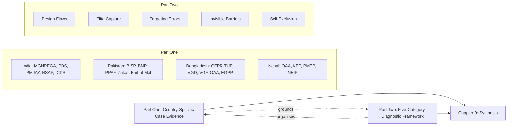

# Why Social Protection Fails the Ultra-Poor in South Asia: A Comparative Analysis of Program Failures in India, Pakistan, Bangladesh, and Nepal
# 1 Introduction, Research Framework, and the South Asian Social Protection Landscape

South Asia is simultaneously home to some of the world's largest and most innovative social protection programs and to the world's largest concentration of people living in extreme deprivation. Over the past two decades, India, Pakistan, Bangladesh, and Nepal have collectively invested unprecedented fiscal resources, institutional energy, and political capital into building safety nets ranging from employment guarantees and unconditional cash transfers to food subsidies, health insurance, and ultra-poor "graduation" programmes. Yet a persistent and uncomfortable paradox haunts the region: even as headline coverage figures climb and program budgets swell, the very poorest households—those living below the conventional poverty line in conditions of chronic destitution—remain disproportionately invisible to, and underserved by, these systems. This chapter sets the analytical foundation for a report that asks why this is so, and what can be done about it.

## 1.1 Research Rationale, Objectives, and Scope

The central research question of this report is straightforward but consequential: **why do South Asia's social protection programs, despite decades of expansion and reform, systematically fail to reach the ultra-poor?** The question matters because the ultra-poor are not merely a more extreme subset of the poor; they are structurally different—often landless, asset-less, chronically ill or disabled, female-headed, geographically isolated, or socially marginalised in ways that make standard program designs ill-suited to their realities. A program that performs well in aggregate coverage statistics can simultaneously produce severe exclusion at the lower tail of the welfare distribution, and it is precisely at this tail that policy attention is most urgently needed.

The report's scope is deliberately comparative and bounded. It focuses on four countries—India, Pakistan, Bangladesh, and Nepal—that together account for the overwhelming majority of South Asia's poor population, share important colonial and post-independence policy legacies, and yet diverge significantly in political economy, fiscal capacity, governance architecture, and program design philosophy. This combination of shared context and meaningful variation makes the four-country frame analytically productive: similarities allow generalisation about regional dynamics, while differences permit identification of country-specific drivers of exclusion.

The report's objectives are threefold. First, in **Part One**, it provides program-specific case evidence on flagship social protection schemes in each country—identifying who is excluded and through what concrete mechanisms. India's Mahatma Gandhi National Rural Employment Guarantee Act (MGNREGA), described by Nobel laureate Joseph Stiglitz as "the single most innovative programme from India and a lesson to the whole world," anchors the Indian case[^1], alongside the Public Distribution System, Ayushman Bharat health insurance, the National Social Assistance Programme, and the Integrated Child Development Services. The Pakistani case examines the Benazir Income Support Programme (BISP) and its conditional and nutrition-linked components, the Pakistan Poverty Alleviation Fund (PPAF), the older Zakat system, the Pakistan Bait-ul-Mal, and the Sehat Sahulat health card[^2]. The Bangladesh case interrogates BRAC's Challenging the Frontiers of Poverty Reduction–Targeting the Ultra-Poor (CFPR-TUP) graduation programme alongside large state-run schemes such as Vulnerable Group Development (Vulnerable Women Benefit), Vulnerable Group Feeding, the Old Age Allowance, the Employment Generation Programme for the Poorest, and Open Market Sales[^3]. The Nepal case covers categorical pensions and allowances, the Karnali Employment Programme, the Prime Minister Employment Programme, the National Health Insurance Programme, and targeted scholarship schemes.

Second, in **Part Two**, the report categorises and diagnoses the recurring causes of failure under a five-category framework: program design flaws, elite capture, targeting errors, invisible barriers, and self-exclusion. This diagnostic lens allows the report to move beyond country-specific narratives and identify generalisable mechanisms of exclusion.

Third, the report consolidates its findings into a comparative summary table and a set of policy implications oriented toward making South Asian social protection genuinely inclusive of the ultra-poor.

The report's intended contribution lies less in unearthing new empirical data than in **integrating dispersed program-level evidence into a coherent diagnostic architecture**, one capable of explaining why technically well-designed programs can nonetheless reproduce the very exclusion they aim to remedy.

## 1.2 Conceptual Definitions and Analytical Vocabulary

To ensure analytical consistency across chapters, the report adopts a shared conceptual vocabulary.

**Social protection** is understood broadly as the set of public, quasi-public, and non-state interventions that protect individuals and households against shocks, smooth consumption, build human capital, and promote livelihoods. Operationally, it encompasses six dominant modalities in South Asia: (i) *workfare* or public-works employment guarantees (e.g., MGNREGA, EGPP, Karnali Employment Programme); (ii) *unconditional cash transfers* (e.g., BISP, Old Age Allowances); (iii) *conditional cash transfers* tied to behaviours such as school attendance or health check-ups (e.g., Waseela-e-Taleem/Ehsaas Taleemi Wazaif, Bangladesh's stipend programs)[^2][^3]; (iv) *food subsidies and in-kind assistance* (e.g., India's PDS, Bangladesh's VGF, OMS, and Food For Work)[^3]; (v) *health insurance and fee-waiver schemes* (e.g., Ayushman Bharat, Sehat Sahulat, Nepal's National Health Insurance); and (vi) *ultra-poor graduation programmes* combining asset transfers, training, and stipends (notably CFPR-TUP).

**Ultra-poverty** denotes a condition of deprivation below the conventional poverty line, typically characterised by: persistent inability to meet basic caloric needs; near-total absence of productive assets; reliance on highly precarious or seasonal labour; multidimensional deprivations across health, education, and shelter; and chronic vulnerability to shocks. The ultra-poor are not simply the "poorest of the poor" by income—they are also households for whom standard development interventions (microcredit, formal employment, conditional transfers requiring co-payments) are structurally inaccessible. This distinction matters because most South Asian social protection instruments were designed with the broader poor in mind, and their tools, thresholds, and conditionalities often fit poorly with ultra-poor realities.

The diagnostic vocabulary of program failure rests on five interlinked concepts:

- **Exclusion errors (Type II)**: the failure to enrol eligible ultra-poor households—the dominant concern of this report.
- **Inclusion errors (Type I)**: the enrolment of non-eligible, non-poor households, which dilutes program impact and crowds out the ultra-poor. Evaluations of large schemes routinely document substantial inclusion errors; for example, an evaluation of India's Rashtriya Swasthya Bima Yojana (RSBY) found that **47% of enrolled households were non-poor**, indicating that nearly half of beneficiaries fell outside the program's intended target group.
- **Elite capture**: the appropriation of program resources, selection decisions, or benefit flows by locally powerful actors (landlords, contractors, panchayat members, union parishad officials, zakat committee heads, political brokers).
- **Invisible barriers**: structural obstacles that are rarely captured in program documents but that systematically obstruct ultra-poor access—gender norms, identification requirements, geographical remoteness, hidden monetary costs, literacy and language barriers, and disability-related access constraints.
- **Self-exclusion**: the (often rational) decision by eligible ultra-poor individuals not to engage with programs, in response to anticipated stigma, harassment, bribes, repeated rejection, or perceived futility.

These five concepts are not mutually exclusive; they interact and compound. A core argument of the report, developed in Chapter 9, is that exclusion of the ultra-poor is rarely the product of any single failure but rather a self-reinforcing combination of all five.

## 1.3 Analytical Framework: Case Evidence and Five-Category Diagnostic Structure

The report adopts a **two-layer analytical architecture** designed to balance empirical specificity with cross-country generalisation.

**Part One (Chapters 2–5)** proceeds country by country, examining flagship programs in their specific institutional, political, and fiscal contexts. This layer answers descriptive questions: *Which programs operate? Who is excluded? Through what concrete mechanisms?* By grounding the analysis in named programs, documented evaluations, and country-specific evidence, Part One ensures that the diagnostic categories of Part Two are not abstractions imposed on the data but generalisations derived from it.

**Part Two (Chapters 6–8)** reorganises the program-specific evidence under five thematic diagnostic categories: design flaws, elite capture, targeting errors, invisible barriers, and self-exclusion. This layer answers analytical questions: *What kinds of failure recur across programs and countries? Which causal mechanisms are most damaging for the ultra-poor? Where do they originate—in policy design, implementation, social structure, or beneficiary behaviour?*

The interaction between the two layers is essential. Program-specific evidence prevents the diagnostic framework from becoming a checklist of generic critiques, while the thematic framework prevents Part One from devolving into a catalogue of disconnected national case studies. Chapter 9 then closes the loop by tracing causal chains across the categories—for example, how design flaws (e.g., MGNREGA's manual-labour requirement) enable elite capture (contractor networks), which produces targeting errors (job-card deletions of the genuinely poor), which in turn generates self-exclusion (workers giving up after repeated wage-payment delays).

This architecture allows the report to address the user's stated needs in their full structure: Part One identifies programs and exclusion mechanisms; Part Two organises the analysis under the five requested diagnostic categories; and the concluding chapter synthesises the findings into a comparative table and policy implications.

## 1.4 Historical Evolution of Social Protection in South Asia

South Asian social protection regimes share important colonial and post-independence roots but have diverged in significant ways since the 1990s. The colonial era bequeathed a legacy of famine codes and emergency relief works rather than universal entitlements, and for several decades after independence, poverty alleviation in the region relied chiefly on subsidised food, scattered employment schemes, and centrally administered welfare programs.

**India** moved earliest and farthest toward a rights-based architecture. Beginning with the National Rural Employment Programme and Maharashtra's Employment Guarantee Scheme, India's employment guarantee tradition culminated in the passage of the National Rural Employment Guarantee Act in 2005 (renamed MGNREGA in 2009), which transformed wage employment from a discretionary scheme into a justiciable right[^1]. Parallel evolution saw the Public Distribution System narrow into a Targeted PDS in 1997 in pursuit of fiscal prudence and pro-poor focus[^4], and later expand under the 2013 National Food Security Act. Health insurance scaled from RSBY (launched 2008) to the much larger Pradhan Mantri Jan Arogya Yojana under the Ayushman Bharat umbrella.

**Pakistan**'s trajectory began with the Zakat and Ushr Ordinance of 1980, institutionalising religiously framed redistribution, and the Pakistan Bait-ul-Mal in 1991. The launch of the Benazir Income Support Programme in July 2008 marked a watershed: a federal unconditional cash transfer aimed at women in the poorest households, supported by the National Socio-Economic Registry (NSER) established in 2011 and a Biometric Verification System from 2017[^2]. The 18th Constitutional Amendment in 2010 devolved substantial social-protection responsibilities to the provinces, producing a more fragmented architecture. BISP has since spawned a family of programs—Waseela-e-Taleem/Ehsaas Taleemi Wazaif, Benazir Nashonuma, Ehsaas Kafaalat—and the Pakistan Poverty Alleviation Fund has expanded community-driven infrastructure and resilience-building[^2].

**Bangladesh** built one of the densest safety-net portfolios in the region, mixing state programs (Old Age Allowance, Allowances for the Widow, Deserted and Destitute Women, VGD/VWB, VGF, EGPP, OMS, stipend schemes) with large-scale NGO innovations, most prominently BRAC's CFPR-TUP graduation programme launched in 2002[^3]. Total social safety-net allocations have reached the order of 2.5–3.1% of GDP in recent fiscal years[^3], among the highest in South Asia in proportional terms.

**Nepal** has pursued a primarily categorical approach—universal-but-categorical pensions and allowances for the elderly, single women, persons with disabilities, and children in certain districts and communities—supplemented by area-based employment schemes (notably the Karnali Employment Programme), the Prime Minister Employment Programme, and a National Health Insurance Programme. Federalisation under the 2015 Constitution devolved significant delivery responsibilities to local governments, introducing both opportunities for proximity and risks of clientelism.

Across the four countries, common drivers of expansion include democratic politics that reward visible welfare delivery, rising fiscal capacity, donor and ideational influences (notably the conditional-cash-transfer movement and the BRAC graduation model), and the political salience of poverty in electoral competition. Divergent pathways reflect differences in state capacity, fiscal space, federal architecture, and the relative weight of religious, categorical, and rights-based framings.

## 1.5 Comparative Overview of Dominant Program Modalities

The four countries deploy a strikingly similar menu of program modalities, but with significant variation in scale, fiscal weight, and institutional sophistication. The table below summarises the dominant modalities and key examples; subsequent chapters interrogate their performance in detail.

| Modality | India | Pakistan | Bangladesh | Nepal |
|---|---|---|---|---|
| Workfare / Public Works | MGNREGA (100 days/household; rights-based) | PPAF community infrastructure | EGPP, Food For Work, Work For Money, Test Relief | Karnali Employment Programme, PMEP |
| Unconditional Cash Transfer | NSAP pensions | BISP / Ehsaas Kafaalat | Old Age Allowance, Widow/Deserted Women Allowance | Old Age Allowance, Single Women's, Disability Allowance |
| Conditional Cash Transfer | — (limited) | Waseela-e-Taleem / Ehsaas Taleemi Wazaif | Primary/secondary stipends | Targeted scholarships |
| Food / In-kind Assistance | PDS (NFSA 2013), ICDS | Targeted wheat flour subsidy (BISP database) | VGF, VGD/VWB, OMS, Food Friendly Program | Karnali food-related transfers |
| Health Insurance | PMJAY (Ayushman Bharat), formerly RSBY | Sehat Sahulat | Limited public schemes | National Health Insurance Programme |
| Nutrition / Mother-Child | ICDS | Benazir Nashonuma (BNP) | Mother and Child Benefit Program | Child Grant |
| Ultra-Poor Graduation | — | PPAF poverty graduation components | CFPR-TUP (BRAC) | Pilot adaptations |
| Religious / Faith-Based | — | Zakat, Bait-ul-Mal | — | — |

The fiscal weight of these portfolios varies substantially. **Bangladesh** allocated approximately 17.83% of its total FY2022–23 budget and **2.55% of GDP** to social safety nets (down from 3.11% in FY2020–21 owing largely to a rebased GDP series), with total allocations exceeding BDT 113,576 crore[^3]. **Pakistan**, by contrast, spends only about **0.41% of GDP** on social assistance programs, reflecting both lower fiscal capacity and the fragmentation introduced by the 18th Amendment; BISP itself reached only about 7.7% of the population in the period assessed, against a poverty headcount of roughly 40%[^2]. Even within BISP, the Finance Division's indicative budget allocation has been reported at around 85% of the requirement for FY2023, with the gap projected to widen[^5]. **India**'s MGNREGA budget allocations have fluctuated significantly over time, complicated by wage payment delays that affect a large share of workers[^1]. **Nepal** combines modest categorical pensions with sub-national employment programs whose adequacy is sharply limited: the Karnali zone's food-related interventions and Nepal's "Food-for-Work" project have been documented to provide insufficient rice, **meeting only 15% of a household's food needs**—an early signal of the benefit-adequacy problem that recurs across the region.

Institutional arrangements differ in important ways. India has a heavily federalised structure with state-level implementation and a strong central legal framework. Pakistan's federal-provincial fragmentation post-18th Amendment has impeded data integration and harmonised delivery, even as the BISP-NSER infrastructure provides a relatively sophisticated targeting platform anchored in a 27-million-household door-to-door census from 2010[^2]. Bangladesh operates a centrally coordinated but ministerially fragmented portfolio spanning at least nine implementing ministries and divisions, plus large NGO partnerships[^3]. Nepal's federalised post-2015 system has placed substantial delivery weight on under-resourced local governments.

## 1.6 Profile of the Ultra-Poor in South Asia

The ultra-poor in South Asia are not a residual category but a structurally distinct group with several defining features.

**Geographic concentration.** The ultra-poor cluster in specific ecological and administrative spaces: India's drought-prone, tribal, and remote forest districts (parts of Odisha, Jharkhand, Chhattisgarh, the north-eastern states); Pakistan's arid Balochistan, southern Punjab, and flood-affected riverine areas; Bangladesh's char (riverine sandbar) and haor (low-lying wetland) regions and the Chittagong Hill Tracts; and Nepal's Karnali zone, far-western mountain districts, and Terai pockets. These geographies share a combination of physical remoteness, weak market integration, and limited state presence—features that interact with program design to produce systematic under-coverage.

**Livelihood patterns.** Ultra-poor households typically rely on a precarious combination of casual agricultural labour, marginal sharecropping, gathering and foraging, petty trade, and seasonal migration. They usually own no productive assets beyond minimal household items, and many are entirely landless. This profile is incompatible with several common program designs: workfare programs requiring sustained manual labour exclude the elderly, disabled, and chronically ill among them; conditional transfers requiring school enrolment or health attendance impose opportunity costs they cannot absorb; and graduation programmes with asset-ownership thresholds may screen them out.

**Gender, caste, and social marginalisation.** Female-headed households, widows, deserted women, transgender persons, Dalits in India and Nepal, religious minorities in Pakistan, and Scheduled Tribes in India are disproportionately represented among the ultra-poor. Documentation gaps compound this marginalisation: ultra-poor women frequently lack CNICs in Pakistan, citizenship certificates in Nepal, or fully validated Aadhaar linkages in India.

**Multidimensional deprivation.** Ultra-poverty is not only an income condition. It manifests in chronic undernutrition, stunting (which Bangladesh's BNP analogue programs in Pakistan such as BNP explicitly target)[^2], higher disease burdens, low literacy, child labour, and shelter insecurity. Programs targeting only one dimension—income via cash transfers, food via subsidies, education via stipends—often fail to address the compounded vulnerabilities that keep these households trapped.

**Vulnerability to shocks.** The ultra-poor are highly exposed to climate shocks (floods, droughts, cyclones, glacial melt) and economic shocks (food price spikes, illness-induced asset depletion). South Asian social protection systems remain weakly responsive to such shocks: assessments of Pakistan's flagship programs, for example, found that none of BISP, BNP, or PPAF embeds explicit anticipatory response or early-warning trigger mechanisms[^2]. This weakness disproportionately harms the ultra-poor, who lack the savings buffers to absorb shocks while waiting for ex post relief.

Taken together, these features explain why the ultra-poor are *structurally* hardest to reach: their livelihood, geographic, demographic, and documentation profiles intersect with program design choices in ways that produce systematic exclusion even when programs are otherwise functioning.

## 1.7 Structural Commonalities and Divergences Across the Four Countries

Despite their varied trajectories, the four social protection regimes share several structural features that recur as causes of ultra-poor exclusion in subsequent chapters.

**Common structural features.** First, all four countries exhibit a degree of **institutional fragmentation**, with multiple programs run by different ministries, weakly coordinated, often using incompatible databases. Pakistan's post-18th-Amendment devolution has produced "fragmented responsibility for social protection" with no national-level coordinating body and weak provincial–federal data integration[^2]; Bangladesh's safety-net portfolio spans cash transfers, food security, stipends, special-community assistance, and development projects across at least nine ministries[^3]; India's programs operate across the Ministries of Rural Development, Consumer Affairs, Health, Women and Child Development, and others; Nepal's federalisation has multiplied delivery layers.

Second, **fiscal constraints** bind tightly. Pakistan's 0.41% of GDP on social assistance and BISP's indicative budget shortfalls illustrate severe under-resourcing[^2][^5]. Even Bangladesh's relatively generous 2.55% of GDP must cover a sprawling portfolio of 80+ programs, diluting per-beneficiary adequacy[^3].

Third, all four countries rely heavily on **proxy targeting tools** with documented weaknesses—proxy means tests (BISP, Ehsaas), Socio-Economic Caste Census data (India), community-based targeting (CFPR-TUP, VGD), and categorical targeting (Nepal pensions). Inclusion errors such as the 47% non-poor share among RSBY enrolees and exclusion errors arising from outdated registries are common.

Fourth, **climate responsiveness is weak**. ASPIRE assessments of Pakistan's three flagship programs scored their use of anticipatory risk-financing instruments, contingency funds, layered-risk approaches, and early-warning system integration consistently at the lowest level[^2]. Analogous gaps exist elsewhere in the region.

Fifth, **benefit adequacy is often inadequate** to ultra-poor needs. The Nepal Food-for-Work figure—15% of household food needs—and the BISP's "limited reach to combat inflation"[^2] illustrate a recurring problem: nominal entitlements that, in practice, fall well short of subsistence requirements.

**Divergences.** India stands out for its rights-based legal architecture (MGNREGA, NFSA) and for the political salience of judicial enforcement. Pakistan stands out for its biometric-NSER infrastructure and faith-based redistributive components (Zakat), but also for the lowest fiscal commitment among the four. Bangladesh stands out for the breadth of its program portfolio and the unique role of NGOs (notably BRAC) in delivering ultra-poor graduation. Nepal stands out for its categorical-universal orientation and its post-2015 federalised delivery, with the attendant capacity challenges this entails.

These commonalities and divergences establish the baseline against which the remainder of the report assesses program-level failures: structural fragmentation, fiscal under-resourcing, weak targeting tools, climate insensitivity, and inadequate benefit levels are not random pathologies but recurring features that shape who is reached and who is left behind.

## 1.8 Report Structure and Chapter Roadmap

The remainder of the report is organised in two analytical parts followed by a synthetic chapter.

**Part One – Program Failures by Country (Chapters 2–5).** Chapter 2 examines India, including MGNREGA's wage payment delays and job-card deletions, the PDS, PMJAY, NSAP, and ICDS. Chapter 3 turns to Pakistan, analysing Zakat, BISP and its sub-programs, Bait-ul-Mal, the Punjab Ehsaas Programme, and Sehat Sahulat, including failures of the proxy means test and the role of patronage networks. Chapter 4 examines Bangladesh, including BRAC's CFPR-TUP, VGD/VWB, VGF, the Old Age Allowance and Widow's Allowance, EGPP, and OMS, focusing on community-based targeting errors, elite capture by union parishad members, and restrictive selection criteria. Chapter 5 examines Nepal's Old Age Allowance, other categorical cash transfers, the Karnali Employment Programme, PMEP, and the National Health Insurance Programme.

**Part Two – Diagnostic Synthesis (Chapters 6–8).** Chapter 6 analyses program design flaws and targeting errors—including the methodological failures of PMT, community-based targeting, and categorical approaches, and the design choices (manual-labour requirements, religious eligibility frames, narrow asset thresholds, categorical bypassing) that disadvantage the ultra-poor. Chapter 7 analyses elite capture across the four countries, drawing on evidence of MGNREGA contractor networks, Zakat committee patronage, ghost beneficiaries in BISP, VGD card capture, and clientelism in Nepal's local governments. Chapter 8 analyses invisible barriers and self-exclusion, covering gender norms, identification gaps, geographical remoteness, hidden costs, and the discouraged-worker dynamics that lead the ultra-poor to disengage from programs they are nominally entitled to.

**Chapter 9 – Cross-Cutting Synthesis and Policy Implications.** The final chapter traces how the five diagnostic categories interact and reinforce one another, presents a structured summary table of all major programs analysed (Country, Program Name, Program Type, Program Description), and proposes principles for redesigning South Asian social protection to reach the ultra-poor—including rights-based entitlements with proactive outreach, decoupling benefits from contested identification systems, addressing gendered and geographical barriers, strengthening grievance redress and social audit, mitigating elite capture through transparency, and integrating graduation pathways.

Methodologically, the report draws on official program documents and budget statements (e.g., Bangladesh's Social Security Programs FY2022–23, Pakistan's NSER and ASPIRE assessments)[^3][^2], published evaluations and audit reports, peer-reviewed and grey-literature studies on individual programs[^1], and comparative secondary sources on South Asian welfare regimes[^4]. Where sources conflict on data or interpretation, the report prioritises more authoritative, recent, and program-specific evidence, and acknowledges contested points explicitly. With this analytical scaffolding in place, the report now turns in Chapter 2 to the first of its four country cases: the practical failures of India's flagship social protection programs.

# 2 Part One – Program Failures in India: MGNREGA and Beyond

India has built what is arguably the most ambitious legal and institutional architecture for social protection in South Asia—a rights-based employment guarantee, a statutory food entitlement, the world's largest publicly funded health insurance scheme, a categorical pension network, and a universal maternal-and-child nutrition programme operating through more than a million anganwadi centres. Yet the gap between this architecture's promise and its delivery to the ultra-poor has widened, not narrowed, in recent years. The proximate cause is not policy abandonment but a peculiar combination of fiscal compression, administrative rationing, and the aggressive insertion of biometric and digital authentication into every link of the welfare chain. The cumulative effect has been to convert what was conceived as a rights-based system into a documentation-mediated one, in which the most marginalised—those with worn fingerprints, no smartphones, no validated Aadhaar, no consistent address, or no spelling match across multiple registers—are most likely to be filtered out.

This chapter dissects the operational failures of five flagship Indian schemes—MGNREGA, the Targeted Public Distribution System (TPDS) under the National Food Security Act, the Pradhan Mantri Jan Arogya Yojana (PMJAY) under Ayushman Bharat, the National Social Assistance Programme (NSAP), and the Integrated Child Development Services (ICDS)—in light of these dynamics. It identifies, for each programme, who is excluded and through what concrete mechanisms, drawing on field-level evidence from Odisha, Jharkhand, Rajasthan, Telangana, Uttar Pradesh and the southern states. It then steps back, in section 2.6, to identify the recurring mechanisms of exclusion that cut across all five schemes, providing the empirical foundation for the diagnostic synthesis in Part Two. Two of India's other major programmes warrant brief mention here for completeness: the **Integrated Rural Development Programme (IRDP)**, India's principal asset-transfer scheme through the 1980s and 1990s, and the **Swarnajayanti Gram Swarozgar Yojana (SGSY)**, its self-employment successor launched in 1999—both of which generated some of the earliest systematic evidence of how poorly Indian programmes reach the ultra-poor, and to which we return at several points below.

## 2.1 MGNREGA: Wage Delays, Job-Card Deletions, and the Weaponisation of Technology

The Mahatma Gandhi National Rural Employment Guarantee Act, enacted in 2005, transformed wage employment from a discretionary scheme into a justiciable right of every rural household: 100 days of unskilled manual work per year on demand, at the statutory minimum wage, with payment due within 15 days of work completion. Nearly two decades on, however, the gap between the Act's statutory architecture and its operational performance has widened on multiple fronts, with consequences that fall disproportionately on the ultra-poor.

### Coverage and access failures at the lower tail of the welfare distribution

The most fundamental indictment of MGNREGA's performance is that it has consistently failed to cover the very households the Act was designed to protect. Independent evaluations of the scheme have documented that the programme **failed to cover 68% of the poorest quintile** of its target population, and that **over 25% of poor households actively seeking work under MGNREGA were unable to obtain it**. These two figures sit uneasily alongside the scheme's headline narrative of being "the largest employment guarantee programme in the world": in aggregate the programme is enormous, but at the lower tail of the welfare distribution—precisely where its design intent was most pressing—it leaves a majority of the poorest behind. The shortfall reflects a combination of administrative rationing of work at the panchayat level, suppressed demand owing to wage-payment delays, the manual-labour requirement that excludes the elderly, disabled, and chronically ill, and the documentation hurdles examined below.

This pattern of regressive coverage is not unique to MGNREGA. Earlier evaluations of the **Integrated Rural Development Programme** had already concluded that targeting under the IRDP and analogous schemes systematically excluded rightful beneficiaries from the BPL category[^6]. A sample evaluation of the **Swarnajayanti Gram Swarozgar Yojana (SGSY)** found an even more extreme pattern: **no beneficiaries in the sample were ultra-poor, and over half of the participants were from high-income households that nevertheless possessed BPL cards**. The SGSY experience prefigures a recurring theme of this chapter—the simultaneous coexistence of severe Type-II (exclusion) errors against the ultra-poor and substantial Type-I (inclusion) errors favouring the non-poor.

### Chronic wage-payment delays

The statutory 15-day wage-payment cycle has, in practice, become a fiction. The MGNREGA payment process is divided into two stages: Stage 1, in which the panchayat/block generates and uploads a Fund Transfer Order (FTO) within 8 days of work completion, and Stage 2, in which the Government of India processes the FTO and transfers wages to workers' accounts within a further 7 days[^7]. A LibTech India analysis of a random 10% sample of FTOs from ten states between April and September 2021 found that **71% of Stage-2 transactions exceeded the mandated 7-day window, 44% took more than 15 days, and 14% experienced delays of more than 30 days**[^7]. In economically disadvantaged states such as Jharkhand, nearly two-thirds of transactions exceeded the 15-day mark[^7]. Compounding the problem, the GoI calculates statutory delay compensation only for Stage-1 delays beyond 15 days; Stage-2 delays are not even computed in the MGNREGA software, let alone paid, and of the under-calculated Stage-1 compensation, only **3.76% had actually been disbursed** as of late 2021[^7].

For ultra-poor households living hand-to-mouth, a wage delayed by 30 days is, in welfare terms, a wage denied: the household must either borrow at high informal interest, deplete what little remains of its productive base, or seek work elsewhere. Each of these responses depresses subsequent MGNREGA demand, generating a self-reinforcing dynamic in which delays produce withdrawal, withdrawal depresses recorded "demand," and depressed demand is then cited by policymakers as evidence of weakening relevance.

### Aadhaar-Based Payment System and the manufacturing of ineligibility

The most consequential single change to MGNREGA's delivery architecture in the past five years has been the imposition of the Aadhaar-Based Payment System (ABPS) as the sole mode of wage payment. Although Aadhaar-based payments had been available alongside the older account-based system for several years, ABPS became compulsory in stages from February 2023 onward, with the final deadline arriving on 1 January 2024 after five extensions[^8][^9][^10]. Compliance requires three distinct steps: Aadhaar seeding of the worker's job card; Aadhaar authentication, cross-referencing the NREGA Management Information System (MIS) with the Unique Identification (UID) database; and the linking of the worker's bank account with Aadhaar followed by mapping in the National Payments Corporation of India (NPCI) database[^7].

The cumulative effect of these requirements on coverage has been devastating. As of 27 December 2023, **8.9 crore (89 million) registered workers—34.8% of the total 25.69 crore registered—remained ineligible for ABPS**, alongside 1.8 crore (12.7%) of the 14.33 crore "active" workers[^9][^10]. LibTech India's later assessment, drawing on official portal data as of 8 April 2024, confirmed that only around **69% of all workers and 92% of active workers** were ABPS-eligible despite multiple deadline extensions[^7]. The official statement that "ABPS is applicable only in case a registered beneficiary turns up for wage employment" has been characterised by NREGA Sangharsh Morcha as "an absolute mockery of the legislation," because it relies on a categorical sleight of hand—classifying workers who have not received work in the preceding three years as merely "registered" rather than "active," and then declaring their ineligibility irrelevant[^10].

The mechanisms of ABPS-induced exclusion are individually mundane but cumulatively catastrophic. Aadhaar authentication requires strict matching between the job card and the UID database; minor spelling differences in a worker's name or a misrecorded gender result in authentication failure[^8]. NPCI mapping is complicated by the proliferation of bank accounts: many workers hold multiple accounts because community service providers from competing banks have enrolled them to meet their own targets, and ABPS routes wages only to the latest-mapped account, which workers often cannot identify[^8]. The 22-year-old worker "Anjappa" from Narayanpet district in Telangana, whose case was documented in detail by *The News Minute*, illustrates the typical pattern: despite possessing a job card, an Aadhaar card and a bank account, his job card was deleted mid-season; he was informed only after a month's work that his card had been cancelled; he was given no clear explanation and never received the wages for the work he had done; he ultimately migrated to Hyderabad[^8].

### Mass deletion of job cards

A second and closely related mechanism is the wholesale deletion of job cards. LibTech India's multi-state analysis documented that **8.06 crore (80.6 million) workers were deleted from the MGNREGA database in the 24 months covering FY 2022–23 and FY 2023–24**, with annual deletion rates rising precipitously from 1.83% of registered workers in FY 2019–20 to **20.47% in FY 2022–23**, before easing slightly to 9.87% in FY 2023–24[^7][^11]. By the Congress party's count, drawing on the same MIS data, 7.6 crore registered workers had been deleted between April 2022 and December 2023, with 1.9 crore deleted in the first nine months of FY 2023–24 alone[^9][^10].

These deletions are formally justified on grounds of death, permanent migration, duplicate or fake cards, or "unwillingness to work." Yet, as both LibTech India and field activists have documented, block-level officials routinely use the "unwilling to work" and "dead" categories to dispose of cases where the underlying problem is administrative—an Aadhaar mismatch that the officials cannot resolve within the timelines imposed by the central ministry[^8][^7]. The Annual Master Circular 2022–23 explicitly prohibits cancellation on grounds of non-demand or non-reporting, and requires independent verification by the District Programme Officer and public presentation to the Gram/Ward Sabha before any deletion[^8]. National Secretary of the Dalit Bahujan Front P. Shankar has remarked that "the process is seldom carried out, and workers' job cards are being illegally deleted"[^8]. The asymmetry between deletions and inclusions is striking: while the deletion rate surged to 20.47% in FY 2022–23, the rate of new worker inclusion has been declining, from 4.45% in FY 2021–22 to 4.18% in FY 2023–24[^7].

### National Mobile Monitoring System and digital attendance

The third technology layer is the National Mobile Monitoring System (NMMS), launched by the Ministry of Rural Development in May 2021 and made mandatory for marking attendance from 1 January 2023[^8][^7]. The app requires MGNREGA "mates" to photograph and geo-tag workers twice daily on a smartphone. The design has three exclusionary consequences. First, the fixed-time photograph requirement abolishes the flexible-hours arrangement on which many female and elderly workers depended; if a worker is not present at the photograph moment, the day's work is not recorded and not paid[^8][^7]. Second, the prerequisite that mates own personal smartphones has excluded many of the women previously eligible to serve as mates, narrowing the gender-inclusive leadership pipeline the Act envisaged[^7]. Third, poor rural connectivity routinely defeats the app, leading to recurring failures to log attendance in real time[^8].

### Budget compression and the 100-day chimera

Underpinning all three technology-mediated exclusion mechanisms is a steady compression of the fiscal envelope. The Union Budget 2023 cut MGNREGA's allocation to ₹60,000 crore, a reduction of nearly 33% compared with the revised estimates of the previous year[^8][^10]. As a share of GDP, the allocation has fallen to roughly **0.2% in FY 2023–24**, below the pre-COVID level of 0.35% in FY 2019–20 and far below the FY 2020–21 peak[^7]. Set against this, the NREGA Sangharsh Morcha has estimated that a minimum allocation of ₹2.72 lakh crore would be needed to deliver the full 100-day entitlement to active workers—approximately 4.5 times the current budget[^8]. The consequence is that, despite the legal 100-day entitlement, the average days of employment per household provided in FY 2022–23 was **only 48 days**, with similar averages in adjacent years (50 days in FY 2021–22, 52 days in FY 2020–21, 48 days in FY 2019–20, 51 days in FY 2018–19)[^8]. Average rationing of half the statutory entitlement is, in practice, a quiet repudiation of the rights-based model on which MGNREGA was founded.

### A self-reinforcing exclusion mechanism

The four mechanisms—wage-payment delays, ABPS-induced ineligibility, mass job-card deletions, and NMMS digital attendance—compound rather than substitute. A worker whose Aadhaar fails to authenticate is marked inactive; an inactive worker is more likely to be deleted; a deleted worker cannot demand work; a worker who does succeed in working faces wage delays of one to three months, often more, which encourage migration; a migrated worker is in turn marked "permanently shifted" and deleted. Each technological layer was justified on grounds of efficiency and the elimination of ghost workers, but, as LibTech India's analysis of 3.2 crore wage transactions has demonstrated, "there is no statistically significant difference in the time taken to process account and Aadhaar based payments by the Union government," nor in rejection rates between the two systems[^9]. The empirical case for ABPS as an efficiency intervention is therefore weak. Its functional effect, by contrast, has been to manufacture ineligibility at scale.

## 2.2 Public Distribution System: Aadhaar-Linkage, Ration-Card Deletions, and Hunger Deaths

The Targeted Public Distribution System (TPDS), operating under the National Food Security Act 2013 (NFSA), is India's largest food-based safety net, intended to cover roughly two-thirds of the population with subsidised foodgrains. As with MGNREGA, the most consequential transformation of the PDS in the past decade has not been a change in entitlements but in the architecture of authentication. The mandatory linkage of Aadhaar with ration cards, biometric verification at point-of-sale (PoS) machines, and the recent push for periodic e-KYC have together produced documented patterns of exclusion that, in their most extreme manifestations, have proved fatal.

### Aadhaar authentication failures and starvation deaths

The grimmest evidence of PDS exclusion lies in the recurring record of Aadhaar-related hunger deaths in interior tribal districts of Jharkhand and Odisha. The case of Lukhi Murmu, a 30-year-old woman who died on 23 January 2018 in Dhawadangal village in Pakur district of Jharkhand, is paradigmatic. Murmu's family had held an Antyodaya ration card under the NFSA, but around June 2017 the card was silently converted to the "Priority" category—a reclassification that reduced the household's monthly entitlement by 15 kg of grain[^12]. From October 2017 onwards, her younger sister Phulin repeatedly visited the ration shop a kilometre away but was turned away each time because her biometric authentication on the PoS machine failed; another sister was refused rations because her Aadhaar had not been seeded with the family's card[^12]. The family went without PDS grain for four months. On the day of Murmu's death, Phulin had again gone to the shop and again returned empty-handed[^12].

Murmu's was the third such death documented in Jharkhand in two months. Etwariya Devi, a 67-year-old widow, died of starvation in Sonpurwa village in Garhwa district on 25 December 2017, and Premani Kunwar, 64, died from hunger and exhaustion in Danda block of Garhwa on 1 December 2017 owing to glitches in the Aadhaar–bank integration system[^12]. The earlier case of Santoshi Kumari at Simdega in September 2017 had prompted the food ministry to issue a notification clarifying that ration dealers must distribute foodgrains to eligible households even where biometric authentication failed or Aadhaar was absent; yet, as the Right to Food Campaign documented in Pakur, dealers routinely claimed ignorance of the notification and continued to deny rations[^12]. Activist documentation reviewed by Rethink Aadhaar tallied **27 deaths in Jharkhand in the five years following the mandatory linkage of Aadhaar with welfare schemes**[^13].

These deaths are not closing episodes of a past pathology. In October 2025, the Right to Food Campaign Odisha reported the death of Risa Mankadia, an elderly man from a Particularly Vulnerable Tribal Group (PVTG) community, after he failed to complete the Aadhaar linking and e-KYC for his Antyodaya ration card. As the sole person on his card, he attempted the procedure multiple times without success, was denied rations from June 2025 onwards, and died on 22 October 2025[^13]. The seven-year span between Murmu's death in 2018 and Mankadia's in 2025 indicates that the mechanism is not transitional but structural.

### Ration-card deletions and the e-KYC frontier

The same architecture that produces individual-level authentication failures also produces aggregate-level deletions. In July 2025 the Odisha government announced its intention to suspend **20.58 lakh ration cards** for failure to complete e-KYC verification, with cardholders required to appear in person at PDS shops on threat of deactivation[^14]. The pattern repeats earlier episodes in Odisha (where 19 lakh beneficiaries were excluded after the initial mandatory Aadhaar linkage to ration cards) and in Jharkhand (where studies have demonstrated that the bulk of deleted "fake" ration cards were in fact genuine)[^8][^14]. LibTech India's parallel research on e-KYC and the public distribution system has documented that the process requires every member listed on a ration card to undergo biometric or iris authentication through e-PoS machines at fair-price shops, and that mandatory Aadhaar OTPs—introduced in Jharkhand—create new hurdles for women, the elderly, and others with poor digital literacy[^14].

### Demographic concentration of PDS exclusion

The demographic profile of those most exposed to PDS exclusion maps closely onto the profile of the ultra-poor introduced in Chapter 1. Single-person ration cards (such as Mankadia's) cannot be salvaged when the lone authentication fails; PVTGs in interior villages are disproportionately exposed because of the documentary thinness of their administrative records; the elderly and chronically ill cannot always travel to PoS machines, and even when they can, their fingerprints frequently fail to authenticate; widowed or deserted women without independent documentation face compounded barriers. Activist Siraj Dutta's documentation of the Jharkhand pattern emphasises that the affected communities are precisely those in "interior villages" where digital infrastructure is thinnest and chronic under-nutrition is most severe—conditions that mean each instance of denied ration carries higher welfare consequences than it would for less vulnerable households[^13].

The PDS case illustrates a recurring theme of this chapter: the gap between policy circulars at the centre and dealer-level practice at the periphery. The food ministry's repeated assurances that no household will be denied entitlement on account of Aadhaar failure have not, on the documented evidence, percolated reliably to the fair-price shops at which the entitlement is realised. The architecture of exclusion is therefore not located in policy text but in the implementation interface, where authentication technology, dealer discretion, and beneficiary vulnerability intersect.

## 2.3 Pradhan Mantri Jan Arogya Yojana (Ayushman Bharat): Eligibility Mismatches, Awareness Gaps, and Geographical Inequity

Launched on 23 September 2018 as the second component of Ayushman Bharat, the Pradhan Mantri Jan Arogya Yojana (PMJAY) is the world's largest publicly funded health insurance scheme by intended coverage, offering enrolled families an annual cover of up to ₹5,00,000 (about US$6,670) for secondary and tertiary inpatient services with no cap on family size, age, or gender[^15]. PMJAY was designed to absorb and significantly expand its predecessor, the Rashtriya Swasthya Bima Yojana (RSBY, 2008–2018), and to reach the poorest 40% of India's population—approximately 107.4 million households—based on the Socio-Economic Caste Census (SECC) 2011[^15]. Its early-implementation record, however, exhibits three distinct layers of failure that combine to produce systematic under-reach to the ultra-poor.

### Eligibility frozen in a decade-old register

PMJAY eligibility for rural households requires fulfilment of at least one of six deprivation criteria (such as only one room with kucha walls and roof, no adult between 16–59, female-headed with no able-bodied male, scheduled caste or scheduled tribe, landlessness with manual casual labour as main income source); urban households must belong to one of eleven specified occupational categories such as ragpicker, beggar, domestic worker, manual scavenger, or sanitation worker; the homeless are automatically covered[^15]. The criteria are conceptually defensible but operationally frozen: they draw on the SECC of 2011, which is now well over a decade out of date.

The consequences are visible in stark mismatches between contemporary state poverty headcounts and SECC eligibility. Meghalaya, with a poverty headcount of 12%, has an SECC eligibility rate of over 62%, indicating substantial inclusion of the non-poor; Uttar Pradesh, with a 30% poverty rate, has only 38% SECC eligibility—substantial exclusion of the contemporary poor[^15]. Verification rates—the share of SECC-eligible beneficiaries whose identity has actually been verified and who can therefore access services—are even more uneven: Uttar Pradesh sits at around 6%, Bihar at around 4%, and Arunachal Pradesh at effectively 0% despite high poverty headcounts in each[^15]. States that operated their own pre-PMJAY insurance schemes generally achieved higher coverage; states without such legacy infrastructure have struggled[^15].

The legacy of RSBY illuminates the same pattern in a different way. As noted in Chapter 1, an evaluation of RSBY found that **47% of enrolled households were non-poor**[^15], an inclusion-error rate that combined with low aggregate enrolment (less than 50% in most districts even after five years of operation) to produce a programme that simultaneously failed to reach the poor and substantially subsidised the non-poor. PMJAY inherited the architectural and political infrastructure of RSBY; the SECC freeze institutionalises a comparable risk of mistargeting.

### Awareness gaps and the ₹30 e-card fee

Even where households are formally eligible, the proportion who are aware of the scheme and able to navigate the enrolment process is strikingly low in several large states. A survey of 2,700 eligible households across Bihar, Haryana and Tamil Nadu found that only 10%, 12% and 59% respectively were aware of PM-JAY[^15]. Among those aware, comprehension of the actual beneficiary-identification procedure was much lower—14% in Bihar, 66% in Haryana, 83% in Tamil Nadu—and many households that had received Pradhan Mantri letters distributed by Accredited Social Health Activists (ASHAs) had not even opened them[^15]. Many were also unaware which hospitals in their vicinity had been empanelled[^15]. Awareness deficits are not confined to beneficiaries: an assessment at a tertiary hospital in Uttarakhand found that medical residents and faculty scored poorly on awareness and readiness assessments for PM-JAY[^15].

A second under-appreciated friction is the **₹30 fee charged for the e-card** that is required to access services under the scheme. For an ultra-poor household, this nominal sum—together with the transport costs of reaching an enrolment centre and the opportunity cost of lost wages—can be a non-trivial barrier to entry[^15].

### Geographical and supply-side inequity

PMJAY's portability—the right to seek treatment at any empanelled hospital in the country—is meaningless where empanelled hospitals do not exist locally. Empanelment is heavily concentrated: states with higher poverty rates and disease burdens consistently see lower hospital empanelment per 100,000 eligible individuals[^15]. The 115 "Aspirational Districts" identified by the GoI as most deserving of socio-economic support have empanelled hospitals that are smaller in bed capacity, significantly less specialised, and rarely accredited by the National Accreditation Board for Hospitals and Healthcare Providers (NABH)[^15]. Over 72% of private empanelled hospitals under PM-JAY are located in just seven states[^15].

Private hospitals deliver roughly 53% of admissions but account for 62% of total claim value; their average claim of ₹17,260 is nearly double the public-sector average of ₹9,869[^15]. The differential reflects in part the more complex case-mix private hospitals handle, but audits have also documented practices of provider capture and double-billing—submitting claims while illegally charging out-of-pocket co-payments, or directing patients to purchase drugs outside the hospital[^15]. A detailed study of Chhattisgarh, despite the state's relatively strong PFHI infrastructure (87% PM-JAY plus 13% state-scheme coverage), found that the incidence of catastrophic health expenditure was similar between PM-JAY enrolees and non-enrolees, and that no significant association existed between PM-JAY enrolment and the size of out-of-pocket expenditure[^15].

### The structural omission of outpatient care

The deepest design-level limitation is that PMJAY, like RSBY before it, **excludes outpatient services**, despite outpatient costs accounting for roughly 60% of India's out-of-pocket health expenditure[^15]. For the ultra-poor, whose interactions with the health system are predominantly outpatient and whose ability to absorb the multiplicative costs of medicines, consultation, transport and lost wages is minimal, this omission removes the most welfare-relevant share of health spending from the scheme's protective ambit. Even the Health and Wellness Centres (HWCs) intended to provide complementary primary care had operationalised only about 21,000 of the 52,744 approved as of September 2019[^15].

Several states have additionally launched their own analogues. Tamil Nadu's **Chief Minister's Comprehensive Health Insurance Scheme** is a state-level **health insurance** scheme that **aims to cover the costs of medical and surgical treatment for Below Poverty Line households in Tamil Nadu at designated hospitals**, complementing the broader PMJAY architecture. The existence of such state schemes—and the persistence of substantial inclusion errors in PMJAY's BPL-anchored predecessor—reinforces the point that even India's most ambitious health-financing reform has not closed the protection gap for the ultra-poor.

## 2.4 National Social Assistance Programme: Documentation Barriers and Inadequate Pensions

The National Social Assistance Programme (NSAP), introduced in 1995, consolidates a set of categorical cash-transfer schemes for the elderly poor, widows, persons with disabilities, and bereaved families. Its principal components are the Indira Gandhi National Old Age Pension Scheme (IGNOAPS), the Indira Gandhi National Widow Pension Scheme, the Indira Gandhi National Disability Pension Scheme, and the National Family Benefit Scheme. Although NSAP is, in principle, a targeted entitlement for the elderly and bereaved poor, evaluations have consistently documented severe Type-II errors and substantial Type-I errors operating in tandem.

### A 74% exclusion rate and a regressive incidence

The single most damning finding on NSAP performance is that, in evaluations of India's **National Old Age Pension Scheme**, **74% of eligible beneficiaries did not receive their pension**, while simultaneously **50% of recipients belonged to the top two income quartiles**. The first figure documents a near-three-quarters failure of the scheme to reach its intended elderly poor population; the second documents that, of the minority who do receive the pension, half are not poor in the income sense at all. Together they describe a categorical programme whose effective incidence is closer to that of a politically allocated transfer than that of a targeted safety net for the elderly destitute.

The mechanisms that generate this outcome are familiar from the MGNREGA and PDS discussions but operate with particular force on an elderly clientele. The BPL list that anchors NSAP eligibility is dated and patchily maintained; newly impoverished, migrant, and informal-sector elderly poor are systematically absent from it. Aadhaar-based identification, which has been progressively introduced into pension disbursal, generates documented exclusions at the front end—elderly applicants whose fingerprints are too worn or whose iris scans fail, dispossessed people whose proof of residence has been lost, and those whose names or birth dates do not match across multiple registers.

### KYC, "golden data," and lethal documentation gaps

Documentation-mediated exclusion of pensioners has, in several instances, produced fatal consequences. As Jean Dreze has documented in the case of an elderly man named Ramman in Uttar Pradesh, the customer ID verification (KYC) framework that uses Aadhaar to revalidate bank accounts has resulted in poor people being locked out of their own accounts owing to minor mismatches, with no prior notice and significant stress, in some cases proving fatal[^14]. The Rajasthan government's "golden data" digital-governance initiative provides a parallel example: vulnerable elders were wrongly declared "dead" or "absent" in the digital records and consequently denied their pensions, with companies running the systems benefiting while elders bore the cost[^14].

The architectural feature common to these cases is the assumption that a digital record is more authoritative than the embodied person it purports to describe. Where the record fails to authenticate the person—through age-related biometric degradation, spelling inconsistencies inherited from hasty early-Aadhaar enrolment drives, or simple data-entry error—the person is administratively disappeared, and reinstating them requires a level of bureaucratic navigation that the elderly poor are least equipped to perform.

### Inadequate benefit levels and state-level fragmentation

A secondary but cumulatively decisive failure is benefit adequacy. The central NSAP pension amounts have remained nominally low and have not been indexed to inflation; state top-ups vary widely, producing wide horizontal inequities in the effective transfer received by an elderly widow in, say, Bihar compared with one in Tamil Nadu or Goa. Combined with the geographical and documentation barriers above, the inadequacy of the transfer reduces both the welfare significance of inclusion and the incentive for eligible households to bear the application costs in the first place—an early instance of the self-exclusion dynamic that Chapter 8 examines in greater depth.

## 2.5 Integrated Child Development Services: Nutrition Coverage, Facial Recognition, and the Marginalisation of the Ultra-Poor Mother-Child Dyad

The Integrated Child Development Services (ICDS), launched in 1975, is India's flagship maternal-and-child-nutrition programme, delivered through more than 1.3 million anganwadi centres. Its services—supplementary nutrition, immunisation, health check-ups, pre-school education, and nutrition and health education for mothers—are designed to be locally accessible and universal in coverage of the 0–6 age group and of pregnant and lactating women. In practice, however, ICDS exhibits a distinct set of exclusion mechanisms that fall disproportionately on ultra-poor mothers and children.

### Geographic exclusion in tribal and remote areas

Anganwadi infrastructure is sparse and frequently non-functional in tribal, forest, char, and hill geographies. In the precise regions where ultra-poverty is concentrated—the tribal interior of Odisha, Jharkhand, and Chhattisgarh; the char and haor regions of border states; the upland districts of the north-east—centre availability, staff retention, and service regularity are weakest. The structural mismatch between ICDS's centre-based delivery model and the dispersed residence patterns of ultra-poor families means that the children most in need of supplementary nutrition are also those most likely to live beyond reasonable walking distance of a functioning anganwadi.

### Documentation, biometric, and facial-recognition barriers

The same documentation infrastructure that has reshaped MGNREGA, PDS and NSAP has progressively been imposed on ICDS. Aadhaar linkage has been made effectively mandatory for take-home rations (THR) in several states, and a recently introduced **facial-recognition system** has been deployed at anganwadi centres for the distribution of "take-home rations" to pregnant women, causing considerable hardship in cases documented at scale[^14]. The facial-recognition requirement adds a new modality of authentication that fails for women in burqa or veil, in poor lighting, with technical glitches, or with insufficient network connectivity. As civil society commentators reacted in 2025, this imposition extends the architecture of biometric exclusion into the most welfare-critical stage of the life-cycle: pregnancy and early infancy[^14].

Migrant women, who form a substantial share of the ultra-poor in urban and peri-urban settings, suffer compounded exclusion. The continuity of services that ICDS requires—monthly weighing, attendance for THR, pre-school registration—is disrupted by any movement of residence across panchayat or district boundaries. Without portability arrangements analogous to "One Nation One Ration Card," migrant pregnant women and infants fall through the cracks.

### Linkages with the Mid-Day Meal Scheme

The exclusion architecture extends beyond ICDS to the closely related Mid-Day Meal (MDM) Scheme. In Uttar Pradesh, the requirement that mid-day-meal beneficiaries be linked to Aadhaar has threatened the inclusion of children in school nutrition, with reports of children being kept out of the classroom because of unmet Aadhaar deadlines[^14]. In Maharashtra, tribal children have been turned away from school for lack of Aadhaar identity[^14]. The school-going dimension of nutrition policy is therefore subject to the same Aadhaar-related filtration as the pre-school dimension.

### Funding, staffing, and the gendered cost of access

Underlying these specific failures is chronic under-funding and staff shortage. The architecture of ICDS depends on the unpaid or under-paid labour of Anganwadi Workers (AWWs) and Helpers (AWHs)—almost entirely women—whose own welfare entitlements have been the subject of recurrent strikes (notably in Andhra Pradesh in 2024)[^14]. The structural feature common to ICDS, NSAP, MGNREGA and PDS is that the burden of complying with documentation, biometric, and facial-recognition systems falls disproportionately on ultra-poor women, who must navigate multiple authentication regimes on behalf of children, the elderly, and the household as a whole.

## 2.6 Cross-Cutting Mechanisms of Exclusion in India's Social Protection Architecture

Stepping back from the five anchor schemes—and the older IRDP/SGSY experience that prefigured several of their pathologies—it is possible to identify five recurring mechanisms of ultra-poor exclusion that cut across India's social protection architecture and that provide the empirical foundation for Part Two's diagnostic synthesis.

**1. The weaponisation of Aadhaar and digital authentication as an exclusionary filter.** The single most consequential institutional change of the past decade has been the systematic insertion of Aadhaar seeding, authentication, NPCI mapping, biometric verification, e-KYC, NMMS digital attendance, and—most recently—facial recognition into every link of the welfare chain. The mechanisms operate at different points in different schemes, but the demographic incidence is consistent: those most likely to fail authentication are also those most likely to be ultra-poor—manual labourers with worn fingerprints, elderly people with degraded biometrics, illiterate women without independent documentation, migrants whose names appear inconsistently across registers, tribal communities with thin administrative records, and single-person households for whom no within-household substitution is possible. The empirical evidence reviewed in this chapter—8.9 crore MGNREGA workers ineligible for ABPS as of December 2023[^10]; 8.06 crore worker deletions in 24 months[^7][^11]; the 20.58 lakh ration cards slated for suspension in Odisha for incomplete e-KYC[^14]; the documented hunger deaths of Lukhi Murmu, Etwariya Devi, Premani Kunwar and Risa Mankadia[^12][^13]; the lethal lock-outs of pensioners under "golden data" digital governance[^14]—indicates that authentication failure has ceased to be an episodic glitch and has become a structural mechanism of exclusion.

**2. Administrative rationing through budget compression and mass deletions.** Fiscal scarcity in India's social protection architecture is rarely expressed as an overt reduction in entitlements. Instead, it manifests as administrative rationing: budget cuts that translate into reduced average days of MGNREGA employment (48 days against the 100-day entitlement[^8]); mass deletions of workers and ration cards that adjust the denominator of "active" beneficiaries downward without formally narrowing eligibility; SECC freezes that exclude the contemporary poor from PMJAY without admitting an eligibility reduction; and pension benefit levels that have not been indexed to inflation. The cumulative effect is that statutory entitlements are honoured nominally while their effective incidence shrinks—a classic case of what Chapter 6 will discuss as the divergence between de jure and de facto entitlement.

**3. Outdated targeting registers.** PMJAY's reliance on SECC 2011, NSAP's reliance on dated BPL lists, and the inherited inclusion errors of RSBY all illustrate the difficulty of running a contemporary safety net on a decade-old enumeration. The SGSY evaluation finding—that no beneficiaries were ultra-poor while over half were from high-income households possessing BPL cards—and the RSBY finding of 47% non-poor enrolment, demonstrate that the combination of stale targeting data and weak verification produces dual Type-I and Type-II errors that compound rather than offset.

**4. Geospatial exclusion of tribal, char, hill, and inner-village PVTG settlements.** The geographies of ultra-poverty—tribal interior districts, char and haor settlements, hill and forest belts, PVTG villages—are also the geographies in which state administrative presence is thinnest, where PMJAY empanelment is sparse and unaccredited, where anganwadi centres are non-functional, where PoS-based PDS authentication most frequently fails, and where MGNREGA worksite distance is most acute. Geographic exclusion is therefore not a separate mechanism additive to documentation and authentication failures, but a multiplier of them.

**5. Gender, caste, disability, and life-cycle dimensions of exclusion.** Across all five anchor schemes and across both the IRDP/SGSY legacy and the more recent additions, the demographic incidence of exclusion concentrates on single women, widows, Dalits, Adivasis, PVTGs, persons with disabilities, and the very elderly. The case studies reviewed—from "Anjappa" in Narayanpet[^8] to Lukhi Murmu in Pakur[^12] to Risa Mankadia in Odisha[^13] to Ramman in Uttar Pradesh[^14]—are not idiosyncratic but representative of the underlying demographic logic of an authentication-mediated welfare system.

These five mechanisms anticipate, in their distinct ways, the diagnostic categories of Part Two: design flaws (the manual-labour requirement, SECC freeze, BPL-list anchoring); targeting errors (PMT and SECC-style mistargeting compounded by mass deletions); invisible barriers (documentation gaps, e-card fees, transport costs, facial-recognition failures); and self-exclusion (the discouraged-worker effect produced by repeated wage delays, the abandonment of pension claims after multiple failed KYC attempts, and the well-documented withdrawal of MGNREGA workers from a system that no longer reliably pays them). The fifth diagnostic category—elite capture—will emerge more visibly in the country cases of Pakistan and Bangladesh in Chapters 3 and 4, but is already implicit in the SGSY finding of substantial BPL-card capture by high-income households.

Chapter 3 turns to Pakistan, where many of these mechanisms reappear in distinct institutional forms. The architecture of biometric authentication in BISP, the documentation barriers facing women without CNICs, the patronage networks surrounding the Zakat committees, and the fiscal under-resourcing of the entire social-assistance envelope all echo, in Pakistani idiom, the pathologies that this chapter has documented for India. The point of the comparative exercise is to demonstrate that ultra-poor exclusion in South Asia is not an Indian peculiarity—nor a Pakistani, Bangladeshi, or Nepali one—but a regional pattern produced by the interaction of broadly similar program designs with broadly similar structural inequalities.

# 3 Part One – Program Failures in Pakistan: Zakat, BISP, and Allied Schemes

Pakistan's social protection architecture occupies an unusual position in South Asia: it combines one of the region's oldest faith-based redistributive systems (the Zakat and Ushr Ordinance of 1980) with one of its most technologically sophisticated targeting platforms (the National Socio-Economic Registry coupled with NADRA's biometric identity infrastructure), yet it operates on one of the slimmest fiscal envelopes in the region—roughly 0.3–0.41% of GDP, against Bangladesh's 2.55% and Brazil's 0.5% for Bolsa Família alone[^16]. The gap between architectural ambition and effective reach is consequently wider in Pakistan than in any of the other three countries this report examines. Where India's exclusion mechanisms in Chapter 2 were rooted primarily in the *weaponisation* of an otherwise capacious entitlement architecture, Pakistan's mechanisms are rooted both in *under-resourcing* and in design and implementation choices that, from inception, have systematically misaligned with the structural profile of the ultra-poor.

This chapter dissects, scheme by scheme, the operational failures of Pakistan's principal social protection instruments in reaching the ultra-poor: the Zakat and Ushr system and the Pakistan Bait-ul-Mal; the Benazir Income Support Programme (BISP) and its conditional and nutrition-linked sub-programs (Waseela-e-Taleem and Benazir Nashonuma); the provincial Ehsaas extensions and complementary schemes; and the Sehat Sahulat health card. It then steps back, in section 3.8, to extract the cross-cutting mechanisms of ultra-poor exclusion that recur across these programmes and that feed into Part Two's diagnostic synthesis. As in Chapter 2, the objective is not to enumerate every documented shortcoming, but to identify the *patterns* through which the structurally distinct ultra-poor profile—female-headed, undocumented, disabled, chronically ill, geographically remote, religiously or sectarianly marginalised—intersects with programme design and implementation in ways that produce systematic exclusion.

## 3.1 Zakat and Bait-ul-Mal: Faith-Based Targeting, Sectarian Exclusion, and Committee Patronage

Pakistan's oldest institutionalised redistribution mechanisms are the Zakat and Ushr system, formalised under the Zakat and Ushr Ordinance of 1980, and the Pakistan Bait-ul-Mal, established in 1991. Both predate BISP by nearly three decades and continue to operate as parallel channels of poverty-targeted transfers, but both exhibit a distinctive set of exclusion mechanisms anchored in their faith-based eligibility frame, their reliance on locally constituted committees, and the broader political-economy context of sectarian polarisation that has marked Pakistan since the Zia era.

### Religious framing and the structural exclusion of minorities

The Zakat system is, by constitutional and statutory design, a redistribution of wealth among Muslims, collected through a compulsory 2.5% annual levy on bank deposits and disbursed through local Zakat committees. The non-Muslim minorities recognised in Pakistan's Constitution—Christians, Hindus, Sikhs, Parsis, Buddhists, Ahmadis (defined as non-Muslim for legal purposes since 1974), and Bahais—are therefore structurally outside the eligibility frame of the scheme, irrespective of their poverty status[^17]. Given that Pakistan's religious minorities are disproportionately concentrated among the ultra-poor—Christian sanitation workers, scheduled-caste Hindus in interior Sindh, Ahmadi families subject to legal restrictions on employment and public life—the religious framing of Pakistan's largest faith-based scheme produces a categorical exclusion that no targeting refinement can correct[^17].

The exclusion is further hardened by the broader environment of religious intolerance documented since the Zia regime's Islamisation drive. Pakistani non-Muslims, as Hudson Institute scholars have noted, have moved from being "equal citizens" envisioned by Jinnah to a status closer to *dhimmis* in the eyes of the leading clerical establishment, with Islamist leaders explicitly arguing that non-Muslims "will have no voice in the making of the law, no right to administer the law and no right to hold public offices"[^17]. This ideological substrate matters for social protection because it shapes the disposition of the local committees that decide who, among the Muslim poor, will be selected as Zakat beneficiaries—and because it removes from minorities any expectation that they can claim a share of the country's principal religiously framed redistributive instrument.

### The Shia opt-out and intra-Muslim sectarian dynamics

The exclusionary dynamic of Zakat extends inside the Muslim population. When General Zia's regime imposed compulsory Zakat collection on bank deposits in 1980, Shia Muslims objected on the grounds that their fiqh required a different form of religious giving (*khums*), and after mass protests in Rawalpindi in July 1980 the decree was amended to allow exemption on the basis of declared faith[^17]. The Shia opt-out resolved the immediate constitutional question but had two longer-term consequences for redistribution. First, it institutionalised a sectarian register at the heart of the system: the act of claiming Zakat (whether as contributor or beneficiary) became a public declaration of Sunni identity, with attendant exposure in a country where, over an eighteen-month period in 2012–2013, Shias were subject to 67 attacks including suicide bombings during religious observances[^17]. Second, the Zia regime's response to the Shia protests was to cultivate Sunni sectarian organisations, and the local Zakat committees in subsequent decades increasingly served, as Vali Nasr has documented, as part of the "patronage network for Sunni Islamist parties"[^17].

### Committee patronage and beneficiary selection

The mechanism that converts Zakat from a faith-based entitlement into a patronage instrument operates at the level of local Zakat committees. These committees—locally constituted, with strong representation of clerics and politically connected notables—exercise wide discretion in identifying eligible Muslim *mustahaqeen* (deserving recipients) and in allocating the modest transfers (typically guzara allowances for the destitute, marriage assistance, educational stipends, and rehabilitation grants). In an environment where, as the Sajid et al. evaluation cited in the Pakistani social protection literature has documented, **40% of Zakat beneficiaries were non-poor** and **80% of eligible beneficiaries were unaware of the benefits to which they were entitled**, the inference that selection is driven by clerical and political connections rather than by need is difficult to escape.

These two findings—an inclusion error of 40% non-poor recipients and an exclusion-by-information rate of 80% among the eligible—define the upper bound of how badly a discretionary, locally administered, faith-framed scheme can perform on both Type-I and Type-II dimensions simultaneously. The 40% figure indicates that nearly half the resources flow to households outside the intended target group, while the 80% awareness gap indicates that the vast majority of those entitled to benefits do not even enter the queue. The combination is structurally similar to what Chapter 2 documented for India's SGSY (no ultra-poor beneficiaries; over half from high-income households), but the underlying mechanism differs: where SGSY exclusion ran through BPL-card capture, Zakat exclusion runs through clerical-cum-political discretion and informational asymmetry.

### Pakistan Bait-ul-Mal

The Pakistan Bait-ul-Mal, established in 1991 as a non-religiously framed complement to Zakat, was intended to extend discretionary assistance—Food Support Programme transfers, Individual Financial Assistance for medical and educational needs, and support for sweet homes and women's empowerment centres—to the destitute irrespective of faith. In principle, Bait-ul-Mal addresses the religious-framing problem of Zakat. In practice, its allocations remain small and fragmented relative to BISP and Zakat, its disbursements are heavily discretionary at the district level, and it operates without an independent targeting infrastructure analogous to the NSER. The substantive consequence is that the religious-minority and ultra-poor households nominally covered by Bait-ul-Mal in fact face an application process dominated by personal networks and political referrals, producing patterns of clientelist allocation that mirror, on a smaller scale, those of Zakat. Pakistan's overall fragmentation across more than 120 federal and provincial schemes, only 12% of which report beneficiary data, means that Bait-ul-Mal's discretionary grants are also poorly integrated with other channels of support[^16].

### Transgender persons and the limits of the eligibility frame

A final and under-recognised dimension of Zakat and Bait-ul-Mal exclusion concerns transgender (*khwajasara*) persons. Although Pakistan's 2018 Transgender Persons (Protection of Rights) Act recognised the right of transgender citizens to self-identified gender on official documents, the implementation of this recognition at the local-committee level—where Zakat eligibility is operationalised—has been uneven, and the religiously framed Zakat eligibility templates do not easily accommodate non-binary categorisation. For transgender persons who are ultra-poor and often dependent on precarious informal livelihoods, the combination of contested documentation, social stigma, and discretionary committee selection produces effective exclusion from both Zakat and Bait-ul-Mal, even where eligibility is not formally denied.

## 3.2 BISP and the Proxy Means Test: NSER Targeting Failures and Ultra-Poor Exclusion

The Benazir Income Support Programme, launched in July 2008, is Pakistan's flagship federal unconditional cash transfer. As of recent assessments, BISP delivers transfers to roughly 7.3 million women each month at PKR 2,750 (approximately USD 9.80) per household, anchored in the National Socio-Economic Registry (NSER) maintained by BISP itself and increasingly integrated with NADRA's biometric verification system[^16]. The Ehsaas Kafaalat extension covers 6.7 million women at PKR 3,000 per month[^16]. Despite the scale of the programme and the relative sophistication of its targeting infrastructure, BISP exhibits a distinctive set of exclusion patterns that fall disproportionately on the ultra-poor.

### Exclusion errors, inclusion errors, and regional concentration

The most fundamental indictment of BISP's targeting performance is documented in the recent Pakistan Poverty and Equity Assessment evidence: **22% of eligible households are excluded** because they remain off the NSER's outdated poverty registries, while **15% of non-poor households are mistakenly enrolled**[^16]. An earlier and more critical assessment by Cheema, Khwaja and Naseer found that BISP excluded as much as 40% of eligible households because of stale poverty data on the NSER[^16]. The exclusion-error figure is comparable to the regional pattern documented in Chapter 1 (47% non-poor enrolment in India's RSBY) and indicates that even with biometric verification and a 38-million-household NSER census, the structural-targeting problem persists.

The regional concentration of exclusion is sharper still. In Balochistan—Pakistan's poorest and most geographically remote province, with arid terrain, weak administrative penetration, and a thinly distributed population—the exclusion rate exceeds **50%**[^16]. The ex-FATA (former Federally Administered Tribal Areas, now merged with Khyber Pakhtunkhwa) and similar frontier zones exhibit analogous gaps. Conversely, urban areas receive only 35% of social safety net benefits despite hosting 60% of the urban poor, reflecting a rural-bias in the targeting infrastructure that is now being challenged by Pakistan's rapid urbanisation[^16]. The geographical mismatch echoes Chapter 2's finding that India's PMJAY empanelment is concentrated in seven states; in both countries, the geographies of greatest need are the geographies of weakest programme presence.

### The methodological failure of static-asset PMT for the ultra-poor

The deeper analytical problem with BISP's targeting lies in the methodology of the Proxy Means Test (PMT) that underlies the NSER. The PMT computes a household's eligibility score from a set of observable, slow-moving indicators—housing materials, asset ownership (refrigerator, motorcycle, livestock), household composition, education levels of adults, and similar proxies. These indicators were chosen because they are difficult to misreport and because they correlate reasonably well with permanent income at the population mean. For households at the mean, the PMT performs acceptably. For the ultra-poor, it performs poorly for two distinct reasons.

First, the static-asset nature of the indicators means that the PMT cannot capture *transient* ultra-poverty—the household that has just been pushed below subsistence by a flood, an illness-induced asset depletion, or the death of a primary earner. The Pakistani literature has explicitly recognised that the NSER reduced exclusion errors from 40% in 2011 to 22% by 2023 in aggregate, but that "15% of beneficiaries remain misclassified because they have static indicators (e.g., asset ownership) that do not reflect transient poverty"[^16]. For a country in which the 2022 floods alone pushed 9 million people into poverty against an SSN coverage expansion of only 1.2 million[^16], the inability of the targeting tool to track shock-induced ultra-poverty is a first-order failure.

Second, even at steady state, the PMT systematically under-rewards the deprivations that define structural ultra-poverty. Households in the bottom 5% of the distribution—the ultra-poor in the sense developed in Chapter 1—are often missed because their asset profile may be indistinguishable from the moderately poor on a checklist measure, while their multidimensional deprivations (chronic illness, disability, female headship without male earners, complete landlessness, geographic isolation) are not adequately weighted. The empirical signature of this design failure is the most striking finding in BISP's longitudinal evaluation literature: **ultra-poor households (bottom 5%) experience a poverty reduction of only 4.2 percentage points from BISP transfers, against 8.7 points for the moderately poor**[^16]. The programme is therefore not merely failing to reach the ultra-poor; even when it does reach them, it is producing approximately half the welfare gain achieved for households higher up the distribution.

### Disability and the ultra-poor

The exclusion of households with disabled members compounds these targeting failures. **Disabled households experience 92% smaller consumption gains from BISP transfers than non-disabled recipient households**[^16]. The mechanism is partly direct (disabled members generate higher medical and care expenditure that absorbs the transfer) and partly structural (disabled households face additional barriers to complying with the documentation, biometric, and visit requirements that govern access). The 92% figure is among the most extreme documented in any of the four countries this report examines and constitutes a quantitative confirmation of the qualitative argument developed in Chapter 1: the standard social-protection toolkit is not designed for the structurally distinct ultra-poor profile.

### Political interference and beneficiary-list distortion

A further layer of targeting failure is political. Khan and Mohmand's analysis of patronage and clientelism in Pakistan's social protection has documented that **18% of BISP funds have been diverted to non-priority districts during election years** in areas with a solid ruling-party presence, with beneficiary lists in such areas increasing by 18% in election years[^16]. A separate estimate suggests that 20% of BISP funds have been misallocated to non-poor households during electoral cycles, and that 30% of BISP staff appointments reflect political affiliation more than merit[^16]. These distortions are layered on top of the underlying PMT errors and amplify them: a stale registry is more readily exploitable for political insertion than a current one, and political insertion in turn delays the registry updates that would correct the underlying errors.

### Coverage relative to the headcount

The cumulative effect of these targeting weaknesses, combined with fiscal under-resourcing (section 3.7), is that BISP covers a small fraction of the population in need. Pakistan's headline social safety nets—BISP and Ehsaas combined—reach approximately 15% of the population, well below the country's poverty headcount and well below Bangladesh's 28% coverage of the poor under social protection[^16]. The 15% coverage figure should be read in conjunction with the 22% exclusion rate among eligible households: a programme that reaches one-seventh of the population while excluding more than a fifth of those it ought to cover is, in aggregate, missing the bulk of the deprivation it was designed to address.

## 3.3 CNIC, Biometric Verification, and the Documentation Exclusion of Women and the Undocumented

The architecture of identification that anchors BISP, Ehsaas, Sehat Sahulat, and an increasing share of Pakistan's social and financial services is the Computerised National Identity Card (CNIC) issued by NADRA. NADRA's coverage is impressive in aggregate—**over 96% of Pakistan's adult population is registered**[^18]—and the integration of the CNIC into biometric authentication for cash transfers, e-KYC for bank accounts, mobile-wallet payments, and voter rolls has materially reduced opportunities for ghost beneficiaries and fraudulent claims[^18]. NADRA verification of BISP beneficiaries since 2017, together with electronic payments into mobile wallets and bank accounts, has shifted the implementation architecture away from manual lists and paper-based disbursement[^18].

The same architecture, however, has produced its own logic of exclusion, in patterns that mirror the Aadhaar-driven exclusions documented for India in Chapter 2.

### Women without CNICs

The single most consequential exclusion mechanism in Pakistan's identification architecture concerns women who lack independent CNICs. Although NADRA registration is high at the adult-population level, ultra-poor women—particularly in rural Balochistan, southern Punjab, and remote Khyber Pakhtunkhwa—face compounded barriers to independent registration: the requirement of a male relative's CNIC for verification, mobility restrictions that prevent travel to NADRA Mega Centres, the documentary thinness of marriage and birth records in rural districts, and conservative social norms that discourage independent civic registration. Because BISP transfers are explicitly paid to female household heads, the absence of a female CNIC simultaneously excludes the household from the transfer altogether. The asymmetry is sharp: a male-anchored CNIC system is layered onto a transfer mechanism that requires female identification, producing a mismatch that disproportionately excludes the ultra-poor female-headed households that BISP was specifically designed to reach.

### Widows, the displaced, and contested documentation

Widows whose marital documentation is contested—because nikah-namas are missing, because succession disputes have not been resolved, or because their husband's CNIC cannot be retrieved—face protracted delays in being registered as heads of household for BISP purposes. Internally displaced persons from conflict-affected areas (former FATA, parts of Khyber Pakhtunkhwa) and those displaced by climate shocks (the 2022 floods displaced millions in Sindh and Balochistan) frequently lose their physical CNICs and the supporting documentation needed to reissue them. NADRA's reissuance procedures, although in principle accessible, in practice require travel to district centres, fees, and time that the displaced ultra-poor cannot easily marshal.

### Transgender persons and uneven gender recognition

Although Pakistan's 2018 legislation provides for transgender gender recognition on CNICs, implementation has been uneven and the social cost of seeking re-identification—encountering staff resistance at NADRA centres, exposure to harassment in queues, and subsequent visibility to local authorities—has discouraged uptake. For transgender persons who are ultra-poor and dependent on informal livelihoods, the CNIC barrier compounds the Zakat-eligibility exclusion analysed in section 3.1, producing a multi-layered exclusion from both faith-based and secular safety nets.

### Biometric failure in low-connectivity areas

The biometric authentication required at BISP payment campsites and at agent points fails in patterns familiar from the Indian experience: worn fingerprints among manual labourers and the elderly, intermittent connectivity in rural Balochistan and the mountainous north, and software glitches at peripheral payment points. The 2025 commentary on NADRA's identity infrastructure has acknowledged that "Pakistan's digital divide is still wide, especially in rural and underserved regions" and that "without a robust telecom infrastructure, many citizens remain disconnected from the digital economy, regardless of whether they possess a CNIC"[^18]. For the ultra-poor in remote districts, the conjunction of CNIC possession with reliable biometric authentication is far less universal than aggregate registration statistics suggest.

### The structural parallel with Aadhaar

The structural parallel with the Aadhaar-driven exclusions documented in Chapter 2 is exact in form, though distinct in detail. In both India and Pakistan, an identification infrastructure marketed as inclusive—and genuinely impressive in its aggregate coverage—has become a filter that screens out the most marginalised at the point of welfare delivery. The Pakistani case adds a gendered dimension that the Indian case has more diffusely: because BISP is explicitly anchored on female recipients, the under-registration of ultra-poor women in NADRA's database is not a peripheral problem but a central design failure.

## 3.4 Waseela-e-Taleem, Benazir Nashonuma, and Conditional Components: Compliance Costs and Ultra-Poor Bypass

The unconditional core of BISP has, since 2012, been supplemented by conditional sub-programmes designed to leverage cash transfers for human-capital investment. The two principal components are Waseela-e-Taleem (rebranded as Ehsaas Taleemi Wazaif), which provides PKR 250–350 per month per child as a school-attendance incentive, and Benazir Nashonuma (BNP), which provides nutrition-linked transfers to approximately 1.2 million pregnant and lactating women and children under two[^16]. These conditional components have generated measurable behavioural effects but also a distinctive set of ultra-poor exclusion mechanisms.

### Compliance costs and the ultra-poor 15%

The Pakistani literature has explicitly documented that **the costs of conditionality compliance excludes the most vulnerable 15% of households** from the conditional components of the BISP family[^16]. The mechanism is straightforward: compliance with school-attendance, growth-monitoring, or health-visit conditionalities requires functioning supply-side infrastructure (schools, health centres, EPI services), the means to reach it (transport, time), and the documentary capacity to demonstrate compliance (attendance registers, growth charts, immunisation cards). The ultra-poor 15% are disproportionately concentrated in geographies where the supply-side infrastructure is weakest (rural Balochistan, hill districts of Khyber Pakhtunkhwa, riverine Sindh), and they are disproportionately constrained on the means of access (no household member available to accompany children, no transport budget, no flexibility in seasonal labour).

The administrative-cost burden compounds the problem. **CCT administrative costs absorb 22% of programme budgets in Pakistan, against 9% for unconditional programmes**[^16]. The differential reflects the higher monitoring, verification, and supply-side coordination requirements of conditional schemes. From a welfare-economics perspective, this means that the conditional sub-programmes deliver a smaller share of expenditure to beneficiaries than the unconditional base programme—precisely while excluding the most vulnerable households from participation.

### The gendered burden of conditionality

A qualitative dimension of conditionality compliance falls disproportionately on women. Khan and Mohmand's recent work on conditionality's gendered burdens has documented that **34% of women respondents in qualitative research reported increased care work** owing to the time demands of accompanying children to school, attending growth-monitoring sessions, and meeting documentation requirements[^16]. For ultra-poor women already managing multiple precarious livelihood activities—agricultural piecework, livestock care, water-fetching, domestic labour—the additional care burden imposed by conditionality is a meaningful welfare cost, frequently invisible to programme designers and rarely compensated.

### Behavioural impacts where conditionality reaches

Where conditionalities do reach their target population, the behavioural impacts are non-trivial. Waseela-e-Taleem has been associated with an 11-percentage-point increase in primary school enrolment for girls; Ehsaas Nashonuma has been linked to a 27% higher vaccination rate compared with unconditional programmes and a 6-percentage-point reduction in child stunting in selected districts; and the broader nutrition-sensitive transfer architecture has been credited with an 18% reduction in anaemia, against 9% for cash-only programmes[^16]. These effects are real and important. But they are realised among the households *not* excluded by compliance costs—the moderately poor rather than the ultra-poor—and they therefore do not address the chapter's central concern of reaching the lower tail of the welfare distribution.

### Benazir Nashonuma and supply-side gaps

Benazir Nashonuma's design—linking transfers to growth-monitoring visits and nutrition counselling—presumes the existence of functioning Facilitation Centres in proximity to ultra-poor households. In practice, the geographical distribution of Nashonuma Facilitation Centres is uneven, with thinner coverage in precisely those high-stunting districts (rural Balochistan, parts of Sindh, ex-FATA) where the need is greatest. UNICEF assessments have noted that the programme reaches 45% of underweight children in 15 highest-risk districts in Balochistan, leaving the majority uncovered even in the priority districts[^16]. The supply-side dependence of Nashonuma means that the ultra-poor mother-child dyad most in need of nutrition support is also the dyad most likely to live beyond the reach of a Facilitation Centre.

### The absence of shock-responsive triggers

A final and under-recognised limitation of the conditional sub-programmes is their lack of anticipatory or shock-responsive design. Conditional cash transfers are, by design, slow-moving instruments calibrated to long-term behavioural change. When acute shocks occur—the 2022 floods, recurrent heat waves, sudden food-price inflation—conditional programmes cannot rapidly expand coverage or relax compliance requirements without compromising their core conditional logic. The Pakistani literature has noted that none of BISP, BNP, or PPAF embeds explicit anticipatory response or early-warning trigger mechanisms (as discussed further in section 3.7). For the ultra-poor, whose vulnerability to shocks is by definition more acute, the conjunction of compliance-based exclusion in normal times and trigger-less inflexibility in crisis times means that the conditional architecture operates in a particularly regressive way.

## 3.5 Punjab Ehsaas, Provincial Schemes, and Devolution-Induced Fragmentation

The 18th Constitutional Amendment of 2010 devolved substantial social-protection responsibilities to Pakistan's provinces, producing a more fragmented architecture in which federal flagship programmes (BISP, Ehsaas) coexist with a proliferation of provincial schemes. The intended logic was that provinces, with greater proximity to local needs, would deliver more responsive social protection. The actual outcome has been a mosaic of more than 120 federal and provincial schemes whose coordination and targeting alignment are weak[^16].

### The provincial portfolio

Punjab operates the Panagah shelter programme, which provides free accommodation and food to approximately 12,000 homeless people per day, alongside provincial Ehsaas extensions[^16]. Sindh operates a BISP Complementary Initiative that adds 20% to federal transfer allocations for approximately 1.5 million households[^16]. Khyber Pakhtunkhwa operates the Insaf Food Card targeting 850,000 households with subsidised food supplies[^16]. Balochistan participates in Ehsaas Nashonuma at the district level, reaching 45% of underweight children in 15 high-risk districts[^16]. These provincial programmes address real gaps in the federal architecture—the Panagah scheme reaches a population entirely outside BISP's household-based frame; the Insaf Food Card extends food-based assistance in a province where BISP's cash transfers have limited purchasing power.

### Coordination and duplication

The coordination problem is, however, severe. **Only 30% of provincial programmes align with the federal NSER poverty registry**, and the absence of common targeting databases produces **15% duplicate beneficiaries** across schemes[^16]. The same household may appear on multiple beneficiary lists while genuinely eligible households appear on none. Of the more than 120 parallel schemes, **only 12% report beneficiary data** in a manner that permits cross-scheme reconciliation[^16]. The fragmentation problem is therefore not merely one of administrative inefficiency; it is one of opacity that obstructs both targeting refinement and accountability.

### Political-economy distortions

The political-economy effects of provincial fragmentation compound the coordination problem. The diversion of **18% of BISP funds to non-priority districts during election years** documented in section 3.2 is paralleled at the provincial level, where ruling parties direct resources towards politically valuable constituencies[^16]. The misallocation of approximately 20% of resources to non-poor households during electoral cycles indicates that the political logic of provincial spending overrides the targeting logic of the NSER[^16]. Provincial programmes, lacking the (relatively) depoliticised PMT infrastructure of BISP, are typically more susceptible to such distortions than the federal flagship.

### Urban bias and the rural-bias paradox

The geographical distribution of provincial spending exhibits a paradox. On one measure—the share of social safety net benefits flowing to urban areas—urban areas receive 35% of benefits while hosting 60% of the urban poor, indicating an *urban under-representation* in benefit incidence[^16]. On a separate measure—the share of total SSN resources allocated to rural versus urban areas—rural areas receive 65% of resources despite urban poverty now accounting for a rising share of total poverty[^16]. The apparent tension between these figures reflects the underlying point that the targeting infrastructure was designed for an era when poverty was overwhelmingly rural and has not been recalibrated to Pakistan's rapid urbanisation. For the urban ultra-poor—daily wage workers, informal-sector home workers, slum residents—the consequence is double exclusion: from a federal targeting system that under-represents urban deprivation, and from provincial schemes whose patronage logic privileges rural electoral constituencies.

### The Panagah exception and homelessness

The Panagah shelters in Punjab illustrate one of the few provincial innovations explicitly designed for a category of ultra-poor that federal household-based schemes cannot reach. By providing shelter and food to the homeless and itinerant—street labourers, beggars, internal migrants without rental housing—Panagah addresses a gap that BISP's CNIC-and-household frame leaves uncovered. Yet the programme covers less than 5% of Pakistan's homeless population[^16], and the absence of analogous national-scale schemes leaves the bulk of this ultra-poor segment outside any safety net.

## 3.6 Sehat Sahulat Programme: Coverage Architecture and Supply-Side Gaps for the Ultra-Poor

Pakistan's flagship publicly funded health insurance—the Sehat Sahulat Programme, formerly Prime Minister's National Health Programme—provides cashless inpatient treatment at empanelled public and private hospitals up to a defined annual ceiling for eligible households. The scheme's expansion across Khyber Pakhtunkhwa, parts of Punjab, and federal territories represents the most significant Pakistani attempt to address the catastrophic-health-expenditure dimension of poverty.

### Eligibility, the CNIC, and the documentation interaction

Sehat Sahulat eligibility is anchored on the CNIC and, in most provincial implementations, on a poverty-targeted base drawn from the NSER. The documentation interaction is therefore double: a household must possess CNICs for the principal beneficiaries, and the household must appear (or be added) to the relevant poverty register. The exclusion mechanisms documented in section 3.3—women without CNICs, contested marital documentation, transgender persons with uneven recognition, displaced populations without proof of residence—therefore operate as access barriers to Sehat Sahulat as well, on top of the targeting errors documented for BISP/NSER in section 3.2.

### Geographical disparities in empanelment

The geographical pattern of empanelled-hospital availability mirrors the pattern documented for India's PMJAY in Chapter 2. Punjab and Khyber Pakhtunkhwa, with their more developed private hospital sectors, host the bulk of empanelled facilities. Balochistan and ex-FATA, with their thin private-sector presence and weak public tertiary care infrastructure, host disproportionately few. For ultra-poor households in remote districts, the nominal entitlement to Sehat Sahulat is therefore frequently undeliverable in practice: the nearest empanelled hospital is too distant to reach in an emergency, and the transport, accommodation, and ancillary costs of travelling for elective procedures exceed what the household can absorb.

### The outpatient omission and out-of-pocket costs

As with PMJAY in India, Sehat Sahulat is structurally limited to inpatient care, excluding the outpatient costs that constitute the bulk of poor households' health expenditure. For the ultra-poor—whose interactions with the health system are predominantly outpatient, whose chronic conditions require sustained medication and follow-up rather than dramatic inpatient interventions, and whose ability to absorb the multiplicative costs of consultation, medicines, transport and lost wages is minimal—the omission removes the most welfare-relevant share of health spending from the scheme's protective ambit. Out-of-pocket costs at empanelled hospitals (informal payments, medicines purchased outside the hospital, diagnostic charges) further dilute the protective value of the scheme for households at the lower tail of the welfare distribution.

### Awareness and the female-headed household problem

Awareness deficits compound the supply-side and documentation gaps. Ultra-poor households—particularly female-headed and remote households—are systematically less likely to know that they are entitled to Sehat Sahulat benefits, less likely to know which hospitals are empanelled, and less likely to navigate the registration process at the point of need. The Zakat awareness gap of 80% documented in section 3.1 indicates the scale of informational exclusion that the Pakistani social protection system as a whole exhibits; Sehat Sahulat operates in the same informational environment.

### The supply-side mismatch and the ultra-poor health profile

The deepest analytical problem with Sehat Sahulat from an ultra-poor perspective is the mismatch between the programme's design (catastrophic inpatient coverage at tertiary facilities) and the ultra-poor's health profile (chronic, outpatient-intensive, often related to occupational hazards and undernutrition). A scheme structured around hospital admissions cannot, in the absence of a parallel investment in primary care, address the conditions that drive most ultra-poor health expenditure. The combination of supply-side concentration in better-off provinces, documentation-mediated access barriers, and the outpatient omission means that the ultra-poor are disproportionately uncovered by what is otherwise one of the most ambitious health-financing reforms in Pakistan's history.

## 3.7 Fiscal Under-Resourcing, Inflation Erosion, and Climate Shock Insensitivity

The macro-fiscal context binds all the schemes analysed in this chapter and shapes their performance more decisively than any single design choice. Three macro-features are particularly consequential: the slim share of GDP devoted to social assistance; the inflation-driven erosion of nominal benefit values; and the absence of shock-responsive triggers in an environment of recurrent climate emergencies.

### The fiscal envelope in comparative perspective

Pakistan's total social-assistance spending is reported variously at **0.3% of GDP** (BISP and Ehsaas combined) or, on a broader definition, **0.41% of GDP**[^16]. Both figures are well below the 0.5% of GDP that Brazil devotes to Bolsa Família alone, well below Bangladesh's 2.55% of GDP allocation to social safety nets, and well below the 1.5% average for lower-middle-income countries[^16]. The under-resourcing has both direct and indirect consequences. Directly, it caps the benefit levels and coverage that the programmes can deliver: at PKR 2,750 per month, BISP's transfer covers only about 15% of a household's basic food expenditure[^16]. Indirectly, it forces heavy donor dependence: **58% of Pakistan's social protection budget** is funded by the World Bank and ADB, with consequent vulnerability to external conditionality[^16].

### Inflation erosion of benefit values

The nominal stipend of PKR 2,750 per month has been substantially eroded by inflation since 2018. The State Bank of Pakistan's analysis of inflation and social transfer values has documented that **the real purchasing power of the BISP stipend has fallen by 40% since 2018**, such that the transfer that once covered a meaningful share of household food needs now covers only a fraction[^16]. To restore the 2018 real value, the monthly stipend would need to rise to approximately PKR 4,100, which would simultaneously lift an estimated 2.3 million additional people out of poverty[^16]. The absence of an automatic inflation-indexing mechanism means that the real value of the safety net erodes between discretionary upward adjustments, and the burden of erosion falls hardest on the ultra-poor, for whom the transfer represents the largest share of consumption.

### Donor dependence and IMF conditionality

The 58% donor share in the social protection budget translates into recurrent disruption when external financing tightens. The **2022 IMF programme imposed conditionality that resulted in a 23% reduction in Ehsaas expansion plans**[^16]. The macro-stabilisation logic of such conditionality—reducing fiscal deficits, restraining current expenditure—operates in tension with the welfare logic of expanding social protection during a period of acute climatic and economic distress. The ultra-poor bear a disproportionate share of the burden because their consumption is the most directly dependent on the transfer.

### Climate shock insensitivity and the 2022 floods

The most concrete demonstration of shock insensitivity is the response (or non-response) to the 2022 floods. The floods pushed approximately **9 million additional people into poverty**, against an SSN coverage expansion of only **1.2 million**[^16]. The arithmetic exposes a fundamental architectural feature of Pakistan's safety net: it is designed for chronic poverty with slow-moving targeting, not for the rapid shock-induced increases in deprivation that climate change is making routine. The Pakistani literature's assessment that none of BISP, BNP, or PPAF embeds explicit anticipatory response or early-warning trigger mechanisms is consistent with this architectural feature. For the ultra-poor—whose vulnerability to floods, droughts, heat waves, and food-price spikes is most acute—the absence of shock-responsive mechanisms means that the programmes provide ex post relief at best, after the asset depletion and morbidity costs of the shock have already been borne.

### The fiscal logic of ultra-poor exclusion

The macro-fiscal features described in this section are not independent of the targeting and design failures analysed in earlier sections; they jointly determine ultra-poor exclusion. A slim fiscal envelope forces administrative rationing of coverage; rationing concentrates exclusion at the lower tail because the lower tail is hardest to verify and reach; inflation erosion further reduces the welfare significance of inclusion; donor conditionality periodically compresses coverage during precisely the periods when shocks are increasing the size of the ultra-poor population. The aggregate result is a safety net whose effective reach is structurally smaller than its nominal architecture, with the gap concentrated at the lower tail of the distribution.

## 3.8 Cross-Cutting Mechanisms of Ultra-Poor Exclusion in Pakistan

Stepping back from the six anchor analyses—Zakat and Bait-ul-Mal, BISP and the PMT, CNIC-and-biometric documentation, conditional sub-programmes, provincial fragmentation, and Sehat Sahulat—it is possible to identify six recurring mechanisms of ultra-poor exclusion that cut across Pakistan's social protection architecture and that feed into Part Two's diagnostic synthesis.

**1. Religious and sectarian eligibility filters.** Zakat's faith-based framing structurally excludes non-Muslim minorities (Christians, Hindus, Sikhs, Ahmadis, Bahais), and the Shia opt-out arrangement embeds sectarian categorisation at the heart of the country's principal religiously framed redistributive scheme[^17]. The exclusion is hardened by the documented sectarian intolerance that has marked Pakistani public life since the Zia era—67 attacks on Shias in eighteen months in 2012–2013, 54 attacks on Ahmadis, 37 on Christians, 16 on Hindus[^17]—and by the use of local Zakat committees as patronage networks for Sunni Islamist parties[^17]. Bait-ul-Mal's smaller, more discretionary architecture does not adequately compensate for these exclusions.

**2. PMT and stale-registry targeting errors compounded by political interference.** BISP's NSER-anchored PMT exhibits 22% exclusion of eligible households and 14–15% inclusion of non-poor households, with exclusion rates exceeding 50% in Balochistan, ultra-poor (bottom 5%) poverty-reduction effects of only 4.2 points against 8.7 points for the moderately poor, and 92% smaller consumption gains for disabled households[^16]. These methodological failures are compounded by political distortion—18% of BISP funds diverted to non-priority districts in election years, 30% of staff appointments politically rather than meritocratically determined[^16]. The static-asset character of PMT indicators is fundamentally mismatched to the structurally distinct ultra-poor profile developed in Chapter 1.

**3. CNIC and biometric documentation gaps.** Despite NADRA's 96% adult registration coverage[^18], the documentation requirements of BISP (female CNICs), Sehat Sahulat (CNIC plus poverty register), and the broader Ehsaas family screen out ultra-poor women, widows with contested marital documentation, transgender persons with uneven gender recognition, internally displaced and flood-affected populations, and remote populations in low-connectivity areas. The structural parallel with the Aadhaar-driven exclusions documented for India in Chapter 2 is exact; the Pakistani case adds a sharper gendered dimension because BISP is explicitly anchored on female recipients.

**4. Local-committee and patronage capture.** Where selection is locally discretionary (Zakat committees, provincial schemes with weak NSER alignment), the political-economy mechanisms of clientelism, kinship, sectarian affiliation, and partisan loyalty convert eligibility into a function of access to local elites rather than need. The 40% non-poor share of Zakat beneficiaries documented by Sajid et al. (2019), the 80% awareness gap among the eligible, the 18% election-year diversion of BISP funds, and the broader urban-bias / rural-bias paradox of provincial spending all reflect this mechanism in different institutional forms.

**5. Supply-side and geographic exclusion of Balochistan, ex-FATA, and inner-village populations.** The geographies of greatest deprivation—Balochistan, ex-FATA, riverine Sindh, the upland districts of Khyber Pakhtunkhwa—are also the geographies of weakest programme presence. Balochistan exhibits BISP exclusion rates above 50%[^16]; Sehat Sahulat empanelment is thin in Balochistan and ex-FATA; Benazir Nashonuma Facilitation Centres are unevenly distributed; biometric authentication fails most frequently in low-connectivity areas. Geographic exclusion is therefore a multiplier of documentation and targeting failures, not an additive mechanism.

**6. Fiscal under-resourcing, inflation erosion, and shock insensitivity.** Pakistan's 0.3–0.41% of GDP commitment, 40% real-terms erosion of BISP's monthly stipend since 2018, 58% donor dependence, IMF-conditionality-driven coverage reductions, and the 1.2-million SSN expansion against 9 million new poor from the 2022 floods together describe a macro-fiscal architecture that systematically under-provides protection at precisely the lower tail of the welfare distribution most exposed to inflation and climate shocks[^16].

### Mapping to the Part Two diagnostic categories

These six mechanisms map onto the five diagnostic categories of Part Two as follows. **Design flaws**: Zakat's religious eligibility frame, BISP's static-asset PMT, Sehat Sahulat's outpatient omission, the conditional sub-programmes' compliance-cost barriers, and the absence of shock-responsive triggers. **Targeting errors**: BISP's 22% exclusion / 15% inclusion errors, Zakat's 40% non-poor enrolment and 80% awareness gap, and the regional concentration of exclusion in Balochistan. **Elite capture**: Zakat committee patronage, BISP's election-year diversions, political appointments in BISP staffing, and clientelist allocation in provincial schemes. **Invisible barriers**: female CNIC gaps, biometric failures in low-connectivity areas, transport and ancillary costs of Sehat Sahulat access, the 22% administrative-cost burden of CCTs, and the gendered care burden of conditionality compliance. **Self-exclusion**: the 80% awareness gap that prevents eligible Zakat beneficiaries from claiming, the discouragement of ultra-poor women without CNICs from attempting registration, and the rational withdrawal of households for whom the eroded PKR 2,750 stipend does not justify the compliance and documentation costs.

The Pakistani case demonstrates, in patterns that complement but do not duplicate the Indian case, that ultra-poor exclusion is the product of interaction between programme designs predicated on the moderately poor and structural features—religious minority status, sectarian polarisation, gender inequality, geographic remoteness, weak administrative penetration, fiscal scarcity, and climate vulnerability—that define the lower tail of the welfare distribution. Chapter 4 turns to Bangladesh, where many of these dynamics reappear in different institutional clothing: the discretionary character of Zakat committees finds an analogue in union parishad elite capture of VGD cards; the documentation barriers facing Pakistani women without CNICs find an analogue in the community-based targeting biases of CFPR-TUP; and the fiscal under-resourcing of Pakistani BISP gives way to a relatively generous Bangladeshi safety-net envelope that nonetheless produces its own distinctive failures of ultra-poor reach.

# 4 Part One – Program Failures in Bangladesh: CFPR-TUP and the Safety Net Architecture

Bangladesh occupies a paradoxical position in South Asia's social protection landscape. On the one hand, it allocates one of the region's most generous safety-net envelopes—approximately 2.5–3.1% of GDP across more than 80 programmes spanning at least nine implementing ministries—and has pioneered the world's most rigorously evaluated ultra-poor graduation model in BRAC's CFPR-TUP. On the other hand, the operational performance of its flagship schemes exhibits a distinctive set of exclusion patterns that, while different in mechanism from the authentication-mediated filters of India and the under-resourced faith-based architecture of Pakistan, produce a comparably regressive incidence at the lower tail of the welfare distribution. The Bangladeshi case is therefore important not because the country has done less than its neighbours, but because it shows that even an unusually rich and innovative portfolio can systematically miss the destitute when its design logic privileges productivist transformation, its targeting is delegated to local political bodies, and its in-kind delivery chains pass through layered intermediaries with discretionary authority over the poor.

This chapter dissects, scheme by scheme, the operational failures of Bangladesh's principal social protection instruments in reaching the ultra-poor. Section 4.1 examines BRAC's Challenging the Frontiers of Poverty Reduction–Targeting the Ultra-Poor (CFPR-TUP) graduation programme, weighing its documented impacts against the structural exclusion mechanisms embedded in its selection criteria. Sections 4.2 and 4.3 turn to the food-and-cash transfer architecture: Vulnerable Group Development (VGD) and Vulnerable Women Benefit (VWB), Vulnerable Group Feeding (VGF), the Food Friendly Program (FFP), and Open Market Sales (OMS), drawing on IFPRI's evaluation of the FFP to quantify targeting errors and leakage. Section 4.4 addresses the categorical cash transfers (Old Age Allowance, Widow's Allowance). Section 4.5 examines the Employment Generation Programme for the Poorest (EGPP) and allied workfare schemes. Section 4.6 analyses the geographic dimension of exclusion in char, haor, and Chittagong Hill Tracts regions. Section 4.7 turns to portfolio-level fragmentation, and section 4.8 extracts the cross-cutting mechanisms that feed into Part Two's diagnostic synthesis.

## 4.1 CFPR-TUP: Graduation Model Successes and the Exclusion of the Destitute Ultra-Poor

BRAC's **Challenging the Frontiers of Poverty Reduction–Targeting the Ultra-Poor (CFPR-TUP)**, launched in 2002, is widely regarded as one of the most significant social-protection innovations to emerge from South Asia in the past two decades. Conceived as a **microfinance-anchored intervention**, the programme **aims to help the ultra-poor engage in sustainable entrepreneurial activities through education, training, and small loans**, complemented by asset transfers, monthly stipends for subsistence, and customised health support. Its design philosophy responded directly to the empirical observation that standard microcredit—BRAC's own historical core—fails to reach the ultra-poor because the harsh repayment discipline of microfinance institutions is incompatible with the irregular resource flows of destitute households, who fear cash transactions and require an explicit safety net before they can absorb productive credit.[^19]

### Design logic and documented impact

The first phase of CFPR-TUP covered all 21 upazilas of three purposively selected famine- and flood-prone districts in northern Bangladesh—**Rangpur, Kurigram, and Nilphamari**—identified from prior poverty mapping as containing the highest concentration of extreme-poor households in the country. Beneficiary selection combined participatory wealth-ranking (PWR) exercises at the village level with a brief verification survey by BRAC field staff. Of 92,010 households across 38 area offices subjected to PWR, 23,521 (about 25.6%) were identified as ultra-poor; of these, approximately one-fifth (5,000 households) were ultimately enrolled into the programme in 2002 after application of formal inclusion and exclusion criteria.[^19]

Once selected, female members of ultra-poor households received two or more income-generating enterprise options (poultry-rearing, livestock, vegetable farming, horticulture nursery, or non-farm activities), with necessary materials and training provided as grants. The intervention package—delivered over an 18-month cycle at a cost of approximately **US$278 per household, or US$15 per month**—included an asset transfer of Tk 3,000–9,000 (US$50–150), a monthly subsistence stipend of Tk 10 per day for 12–15 months, regular skills refreshers, technical follow-up, social-development components addressing legal awareness and early marriage, mobilisation of local elites through seminars and popular theatre, and a customised health intervention targeting the income-erosion effect of catastrophic morbidity.[^19]

The documented impacts have been substantial. An 18-month evaluation by BRAC's Research and Evaluation Division reported that **63% of households maintained asset growth and joined (or intended to join) a regular microcredit programme**, while a quasi-experimental endline survey in 2005 found that **69% of participating ultra-poor households improved their poverty status** following the intervention. The share of households below the one-dollar-a-day extreme-poverty line fell from 89% to 59% among Selected Ultra-Poor (SUP) households, against a more modest decline from 86% to 73% among Not-Selected Ultra-Poor (NSUP) comparison households. Food and calorie consumption rose significantly; the SUP population's overall food intake of 748 g per capita per day exceeded the national average for the bottom 20% (721 g); healthcare-seeking shifted from self-care toward formal allopathic providers; and approximately **55% of participants successfully transitioned into mainstream microcredit** at the close of the intervention cycle.[^19]

Subsequent randomised evaluation by J-PAL affiliates—Bandiera, Burgess, Gulesci, Rasul and co-authors, beginning in 2007 when the programme expanded to 270,000 new recipients—confirmed and extended these findings at scale. The evaluation found that the programme enabled the poorest women to shift out of farm labour and into small businesses, **increasing their earnings by an average of 38% four years after the productive asset transfer**, with surveys conducted in 2018 showing that beneficiary women were more likely to be self-employed, own assets, earn more, and consume more even eleven years after the original transfer. The model has since been adapted by Bandhan in India, evaluated by Banerjee, Chattopadhyay, Duflo and Shapiro—who documented five-fold increases in livestock revenue and persistent gains in income, consumption and food security ten years after intervention—and replicated across Ethiopia, Ghana, Honduras, Pakistan, and Peru, scaling through BRAC to over 2.3 million households in Bangladesh and over one million households in 14 other countries.[^20]

### The structural exclusion of the destitute

The programme's evident effectiveness for those it reaches, however, sits uneasily with the structural design choice that defines its target population. CFPR-TUP's inclusion criteria require households to satisfy at least two of five conditions: total land owned less than 10 decimals, adult women selling labour, the main male income-earner disabled or unable to work, school-going children selling labour, or no productive assets. Critically, exclusion criteria mandatorily disqualify households already borrowing from a microcredit-providing NGO or receiving benefits from government programmes. The clear analytical purpose of these criteria—to identify ultra-poor households previously bypassed by development inputs—nonetheless produces a specific architectural feature: the programme's productivist logic presumes that at least one physically able woman in the household can engage in productive enterprise.[^19]

The author of the CFPR-TUP capability-development study acknowledges this limitation directly: "there is a danger that the targeting approach followed for identifying the ultra-poor, for example, the requirement that at least one physically-able woman is available in the household can bypass the extremely-vulnerable destitute, for example, those too weak to engage in productive activities". The implication is that the lower tail of the ultra-poor distribution—the chronically ill, the severely disabled, the very elderly without able-bodied female household members, and the deeply destitute who cannot manage even a poultry-rearing enterprise—is structurally outside the programme's frame.[^19]

A further and analytically distinct concern surrounds the **sustainability** of the outcomes that the programme does produce. While the BRAC evaluation literature documents substantial gains in income, assets, food consumption and health-seeking behaviour over the 18-month cycle plus a one-year grace period, the broader graduation literature and field experience indicate that for a non-trivial share of beneficiaries the gains were **not sustained over the longer term**, with many participants eventually reverting to baseline occupations such as begging, casual domestic labour, or other forms of precarious wage employment. This is a separate concern from the inclusion question: even where the programme correctly targets ultra-poor women, the trajectory back to subsistence-level activities for some beneficiaries indicates that an 18-month intensive intervention may be insufficient to overcome the structural constraints—land scarcity, market integration weakness, recurrent illness, climatic shock—that produced destitution in the first place. Earlier evidence from BRAC's predecessor scheme, the **Income Generation for Vulnerable Group Development (IGVGD)**, similarly indicated that microcredit-anchored interventions for the ultra-poor face significant sustainability challenges and require longer time horizons than initially envisaged.[^19]

The 55% graduation rate into mainstream microcredit therefore needs to be read alongside its complement: 45% of CFPR-TUP participants did not graduate into the regular microcredit programme at the end of the intervention cycle, and within the graduated cohort there remained meaningful heterogeneity in the durability of asset gains.[^19] The conclusion is not that CFPR-TUP has failed—on the contrary, the J-PAL randomised evidence shows substantial long-term gains for many participants[^20]—but that the programme, by virtue of both its inclusion criteria and its productivist design logic, leaves an identifiable segment of the destitute ultra-poor outside its protective frame and would require **complementary, non-productivist safety nets** to reach those for whom enterprise-based graduation is structurally infeasible.

### The exclusion-by-design dilemma

The CFPR-TUP case captures a recurring dilemma in ultra-poor social protection. A programme that selects exclusively on the basis of the most extreme deprivation will, by construction, also screen for the structural inability to make use of productive transfers—because the most extreme deprivation is often produced precisely by chronic illness, disability, or the absence of able-bodied household members. A programme that selects on a slightly less extreme profile, allowing for productive uptake, will necessarily exclude the most destitute. CFPR-TUP resolves this dilemma in favour of productive uptake, with documented welfare consequences for those it reaches; but the same resolution institutionalises the exclusion of the lowest tail. This design-level exclusion mechanism, distinct from the targeting and capture failures examined in the remaining sections, is the principal lesson of the CFPR-TUP case for Part Two's diagnostic synthesis.

## 4.2 VGD and VWB: Community-Based Targeting, Elite Capture, and Union Parishad Patronage

The **Vulnerable Group Development (VGD)** programme—rebranded in recent years as the Vulnerable Women Benefit (VWB)—is Bangladesh's longest-serving food-and-development transfer scheme for poor women and serves as the institutional template against which more recent schemes such as the Food Friendly Program have been benchmarked.[^21] VGD provides monthly food rations (typically 30 kg of rice or wheat) together with associated development services (training, savings mobilisation) to selected poor rural women for a fixed cycle, with beneficiaries identified by local government representatives at the union parishad (UP) level.

### Community-based targeting and its discretionary architecture

The defining feature of VGD targeting is its reliance on **community-based selection administered by UP chairmen and members**. As the FFP evaluation has noted in its discussion of the older programme, beneficiary selection under VGD relies on "local knowledge and local information rather than conducting any surveys to verify the characteristics of households or conducting any sort of means testing". Inclusion criteria—poverty, functional landlessness, female headship through widowhood, divorce, desertion, or destitution—are verifiable in principle, but in practice the absence of a proxy means test or a centralised registry means that UP-level discretion determines who is enrolled.[^21]

This discretionary architecture produces two related failures. First, **elite capture**: politically connected households, kin networks of UP officials, and clients of ruling-party brokers are over-represented among beneficiaries, while genuinely destitute female-headed households without political intermediation are under-represented. The dynamic is mechanically similar to that documented for Pakistan's Zakat committees in Chapter 3: where selection authority is local, discretionary, and unaudited against an external register, the political-economy logic of clientelism systematically displaces the welfare logic of need.[^22] Second, **female-headed households without male intermediaries**—precisely the demographic group VGD was nominally designed to serve—face compounded barriers. Without a male relative to advocate at the UP office, to navigate documentation requirements, and to participate in the informal social networks through which UP-level discretion is exercised, ultra-poor widows, deserted, and divorced women are disproportionately likely to be screened out at the selection stage.

### Documentation, residence, and the displacement problem

VGD eligibility additionally requires demonstrated permanent residence within the UP and possession of a national identity card, requirements that screen out internal migrants, the displaced (including those displaced by river erosion in char areas, examined in section 4.6), and the undocumented poor. The structural parallel with India's Aadhaar-mediated exclusions (Chapter 2) and Pakistan's CNIC-mediated exclusions (Chapter 3) is exact in form, although the Bangladeshi documentation regime is less biometrically aggressive than its neighbours'. The cumulative effect is that the documentation profile of the destitute—frequently characterised by lost or never-issued documents, contested residence, and absence of male family members able to assist in re-issuance—aligns poorly with the documentation requirements of access.

### Limited duration and the recurrence problem

A further structural limitation is that VGD cycles are time-limited, typically running for two years before the beneficiary list is reconstituted. For households whose destitution is chronic rather than episodic—the bottom tail of the ultra-poor distribution—graduation out of VGD does not correspond to graduation out of poverty. Whether a former beneficiary is re-enrolled in the next cycle depends again on UP-level discretion, reintroducing the elite-capture and documentation barriers at each reselection. The result is a cyclical exposure to exclusion that, over the long run, disadvantages those least equipped to navigate the political and administrative environment of the union parishad.

## 4.3 VGF, Food Friendly Program, and OMS: Targeting Errors, Leakage, and Geographic Inequity in Food Transfers

Bangladesh's in-kind food transfer architecture comprises three principal instruments. **Vulnerable Group Feeding (VGF)** provides emergency and festive-season food distributions; **Open Market Sales (OMS)** sells subsidised grain through fixed dealers in urban and selected rural locations; and the **Food Friendly Program (FFP, Khaddo Bandhob Karmasuchi)**, launched in 2016 and described as **a school enrollment and food subsidy programme** in some characterisations of the broader food-security portfolio, delivers 30 kg of subsidised rice per month to eligible rural households at 20–30% of the prevailing market price during the two pre-harvest lean seasons (Boro: March–April; Aman: September–November).[^21] Bangladesh's broader food-and-education transfer tradition includes earlier schemes such as **Food-for-Education**, the **school-enrolment and food-subsidy programme** that **aimed to provide free grain rations to school children from poor households to encourage enrollment**—an explicit precursor to the human-capital-linked components of more recent transfer programmes. The FFP itself is intended to gradually replace VGD, VGF, and Gratuitous Relief, although in practice all four operate in parallel, generating the duplication problems examined in section 4.7.[^21]

The IFPRI evaluation of the FFP, based on a nationally representative survey of 4,528 beneficiaries across 226 unions in 175 upazilas covering 61 of Bangladesh's 64 districts, provides the most rigorous quantitative assessment of any in-kind transfer programme in the country and serves as the empirical backbone of this section.[^21]

### Inclusion and exclusion errors

The FFP's targeting criteria—poverty, functional landlessness, female headship through widowhood, divorce, desertion, or old age, day-labour as primary occupation—closely resemble those of VGD. In practice, the IFPRI evaluation found that **97.4% of enrolled beneficiaries satisfied at least one of the main eligibility conditions**, indicating that the inclusion criteria were broadly being applied. However, the **inclusion error based on Proxy Means Test (PMT) scores was 14.6%**, meaning that approximately one-seventh of FFP beneficiaries are not poor by predicted welfare and would not have qualified under a stricter welfare-based test. The PMT-based inclusion error is increased by household land ownership: about 3% of beneficiaries owned more than one acre of land, and 8% owned more than 0.5 acre—the conventional threshold for functional landlessness.[^21]

Exclusion errors at the district level were more severe. Using the **upper poverty line, the exclusion error was 22.4%**; using the **lower poverty line, it was 10.8%**.[^21] These figures—comparable in magnitude to those documented for Pakistan's BISP in Chapter 3 (22% exclusion of eligible households)—indicate that even with a community-based targeting process explicitly oriented toward seasonal poverty and predominantly female heads of household, more than a fifth of those who ought to be receiving subsidised rice are not.

### Leakage between TCFs, dealers and beneficiaries

The in-kind nature of FFP creates a delivery chain through which leakage can occur at multiple points. Rice is allocated to upazilas, transferred to Thana Food Controllers (TCFs), released to dealers (one per UP per 500 beneficiaries), and finally distributed to households at dealer shops twice or thrice a week. The IFPRI evaluation quantified leakage at each stage.[^21]

In 99.7% of cases the listed beneficiary actually existed (the rate of "ghost beneficiaries" was therefore very low); 93.4% of identified beneficiaries possessed an official FFP card; 97% of listed beneficiaries reported receiving rice in the surveyed cycle. However, the **average beneficiary received 56.85 kg over the two-month cycle against an entitlement of 60 kg, a shortfall of approximately 5.3%**. Disaggregated, beneficiaries received the full amount in 86% of cases, received about 4 kg less in 7% of cases, received 30 kg or less in 2.5% of cases, and received no rice at all in 3.5% of cases despite being listed.[^21]

Between dealers and TCFs, leakage was 2.4% on average: dealers received the full quantity in 90% of cases, received about 3 kg less in 5%, between 3 and 30 kg less in 2%, and less than half the allocation in 2% of cases. The cumulative effect, as the IFPRI authors compute, is that **for every taka spent by the government on FFP, approximately 0.88 taka reaches eligible beneficiaries**—the residual 0.12 taka leaking between dealers and beneficiaries, between TCFs and dealers, or transferring to ineligible beneficiaries (the 14.6% inclusion error).[^21]

The headline targeting-efficiency figure of 88 paisa per taka is, in regional comparison, relatively good. But it should be read alongside the disaggregation: the 0.12 taka of leakage is not evenly distributed across the beneficiary population. The 3.5% of beneficiaries receiving no rice at all, and the additional 2.5% receiving 30 kg or less out of a 60 kg entitlement, suffer a near-total failure of the programme to deliver its nominal benefit. For an ultra-poor household for whom the 60 kg ration represents a substantial share of monthly food intake, receiving nothing or less than half is, in welfare terms, indistinguishable from being excluded altogether.

### Spatial heterogeneity and the remote-district penalty

The IFPRI evaluation's most analytically important finding is the **spatial heterogeneity of exclusion and under-provision**. Exclusion error rises sharply with remoteness: in districts located less than 100 km from Dhaka the exclusion error is about 16%; at 100 to less than 200 km it rises to 22%; and **at 200 km and beyond, the exclusion rate reaches 38%**. The underlying mechanism operates through both the targeting and the allocation steps. Beneficiary allocation as a share of district population is non-linear in remoteness: 3.8% in areas less than 100 km from Dhaka, 4.6% at 100 to less than 200 km, but only 3.5% beyond 200 km—precisely where the poverty headcount is highest. **Under-provision** (FFP beneficiaries minus total poor, divided by total population) reaches **approximately 33% at 200 km and beyond**, against around 13% in the least remote districts.[^21]

The remoteness penalty operates additionally on the leakage dimension. Missing rice between TCFs and dealers is **strongly associated with both higher poverty rates and greater distance from Dhaka**: for every 1% increase in the upper-poverty-line headcount, dealers receive approximately 1 kg less rice per beneficiary, and for every additional kilometre of distance from Dhaka, dealers receive 0.05 kg less. The result is that the poorest and most remote districts—precisely those most ecologically vulnerable to seasonal lean periods and climate shock—simultaneously suffer (i) lower per-capita beneficiary allocation, (ii) higher exclusion error within their nominally eligible population, and (iii) higher leakage in what is delivered.[^21]

For the ultra-poor located in northern Rangpur, Kurigram, Nilphamari, the haor regions of Sunamganj and Habiganj, and the chars along the major river systems, the cumulative effect of these three regressivity mechanisms is that the FFP's headline targeting-efficiency figure substantially over-represents the welfare reach of the programme to the lower tail of the welfare distribution. The structural mismatch between centralised UPZ/UP allocation committees—which apportion beneficiary slots on the basis of administrative reach rather than the lived geography of ultra-poverty—and the actual ecological distribution of the destitute is one of the most consequential design features of the in-kind food transfer architecture.

### OMS and the urban-rural inversion

The Open Market Sales programme, distributing subsidised grain through fixed dealers in urban and selected rural locations, presents a structurally different exclusion pattern. OMS is open-access in principle but operates on a first-come-first-served basis at specific dealer locations during limited hours, with queuing required. The mechanism privileges those able to absorb the time and travel costs of queuing—predominantly urban informal-sector workers whose work patterns permit mid-morning queuing—over the rural ultra-poor and over the urban informal-sector workers whose work cannot be interrupted. OMS therefore reaches a slightly different segment of the poor than VGD/FFP but exhibits similar regressivity at the lower tail of the welfare distribution: the destitute, whose mobility, energy, and time-flexibility are constrained by chronic illness, child-care responsibilities, or disability, are systematically less likely to claim the entitlement that the programme nominally offers.

## 4.4 Old Age Allowance, Widow's Allowance, and Categorical Cash Transfers: Coverage Gaps and Benefit Adequacy

Bangladesh's categorical cash-transfer schemes—the **Old Age Allowance (OAA)** and the **Allowance for Widowed, Deserted and Destitute Women**—are intended to reach demographically defined vulnerable populations that the household-based food-transfer programmes do not adequately cover. Both schemes pay modest monthly cash benefits to beneficiaries selected by UP-level committees, with quota-based rationing determining the number of slots available in each union.

### Coverage caps and quota-based rationing

The first structural limitation is that quota-based rationing produces effective exclusion at the union level even where eligible applicants exist. Each UP receives a fixed allocation of OAA and Widow's Allowance slots, typically far below the number of demographically eligible residents. The mechanism converts what is nominally a categorical entitlement (any elderly poor person; any widowed/deserted/destitute woman) into a discretionary one: the UP committee must choose among eligible candidates. The structural similarity with the discretionary architecture of VGD (section 4.2) is unsurprising, since both rely on the same UP-level institutional infrastructure; the consequences for elite capture and patronage allocation are correspondingly similar.

### Documentation and contested status

Eligibility for OAA requires age verification, which for the ultra-poor elderly—whose birth records are often non-existent and whose national ID card may record an inaccurate or contested date of birth—can be a non-trivial barrier. Eligibility for the Widow's Allowance requires proof of marital status, which for ultra-poor women whose marriage was not formally registered, whose nikah-nama has been lost, or whose abandonment by a husband has not been legally documented, can be difficult to establish. Residence certificates further screen out those who have migrated within Bangladesh in response to climate shock, river erosion, or labour-market opportunity. The documentation profile of the destitute elderly and the destitute widow systematically misaligns with the documentation requirements of access.

### Benefit inadequacy

A second structural limitation is benefit adequacy. The nominal monthly benefit levels of both schemes have lagged behind inflation, and for households whose primary livelihood has collapsed (elderly without children to support them; widows without male earners), the transfer covers only a small fraction of subsistence needs. The structural parallel with the inflation erosion of Pakistan's BISP stipend documented in Chapter 3 is exact in mechanism: nominal stipends that are not indexed to inflation produce a continuously deteriorating real-terms benefit value, with the burden of erosion falling hardest on those for whom the transfer represents the largest share of consumption.

### Compounded exclusion at the intersection of categories

A particularly acute pattern of exclusion affects households at the intersection of multiple categorical vulnerabilities. An elderly widowed woman with no male children, living in a char village, with no national ID card, falls simultaneously within the nominal coverage of OAA, the Widow's Allowance, possibly VGD, and possibly FFP—but in practice may be excluded from all four by the same combination of documentation, discretionary selection, geographic remoteness, and quota-rationing mechanisms. The fragmentation of the safety-net portfolio (examined in section 4.7) means that the welfare system as a whole offers no consolidated entry point for such compounded vulnerability; instead, each scheme imposes its own gatekeeping process, and the destitute elderly widow in the char must navigate each separately.

## 4.5 EGPP and Public Works: Manual-Labour Requirements and the Exclusion of the Non-Working Poor

The **Employment Generation Programme for the Poorest (EGPP)**, together with allied workfare schemes—**Food For Work**, **Test Relief**, and **Work For Money**—constitutes Bangladesh's principal public-works architecture, intended to provide seasonal manual-labour employment to ultra-poor households during agricultural lean periods. The schemes operate on a workfare logic similar in form to India's MGNREGA (Chapter 2): wage employment is offered at, near, or below prevailing agricultural wages, with self-targeting through the manual-labour requirement intended to screen out the non-poor.

### The manual-labour requirement as exclusion mechanism

The manual-labour requirement, while economically rational as a self-targeting device, structurally excludes precisely the demographic segments most concentrated among the ultra-poor: the elderly, the chronically ill, persons with disabilities, and female-headed households without an able-bodied adult male available for heavy outdoor labour. The mechanism is the same one identified in CFPR-TUP's "physically-able woman" criterion (section 4.1) and in MGNREGA's manual-labour design (Chapter 2): a programme that operationalises ultra-poor targeting through the capacity for productive work cannot, by construction, reach households for whom the absence of productive capacity is precisely the source of destitution.

For female-headed households in particular, the workfare model imposes additional barriers. Worksite norms, the absence of child-care facilities, the distance and timing of worksites, and the social stigma associated with women's participation in heavy public works combine to depress female participation below what either the demographic profile of ultra-poverty or the formal gender-neutrality of programme rules would predict.

### UP-level worker selection and patronage capture

Selection of EGPP workers is administered by UP-level committees, which produces the same dual exclusion pattern documented for VGD in section 4.2: politically connected households capture worksite slots (Type-I inclusion error of the non-poor), while genuinely destitute applicants without UP-level intermediation are screened out (Type-II exclusion of the eligible). UP members also certify attendance, creating space for ghost workers, attendance fraud, and the diversion of wages. The structural similarity with the MGNREGA contractor-capture pattern documented for Andhra Pradesh in Chapter 2 is close in form, although the Bangladeshi case operates through UP officials rather than through licensed labour contractors.

### Wage rates, seasonality, and benefit adequacy

EGPP wage rates have historically been set at or slightly below prevailing agricultural wages, ostensibly to preserve the self-targeting property but also reflecting fiscal constraints. For ultra-poor households who depend on EGPP work during the lean season when agricultural wages collapse, the nominal wage may be inadequate to meet subsistence needs even when full attendance is recorded. The seasonality of work availability—concentrated in non-monsoon months—does not align fully with the seasonality of ultra-poor distress, which peaks both in the lean periods and during monsoon-induced disruption of casual labour markets.

### Geographic under-allocation to char and haor regions

The allocation of EGPP slots across districts follows administrative rather than ecological logic, with the consequence that char and haor regions—where seasonal flooding intensifies labour-demand needs but worksite access is most physically constrained—receive proportionately fewer slots than their poverty headcount would justify. The pattern parallels the FFP under-provision in remote districts documented in section 4.3 (with under-provision rising to 33% at 200 km and beyond from Dhaka) and reflects the same underlying mechanism: centralised allocation committees with limited visibility into the ecological geography of ultra-poverty produce systematically regressive geographic incidence.

## 4.6 Invisible Barriers in Char, Haor, CHT and Climate-Vulnerable Geographies

The geographic dimension of ultra-poor exclusion in Bangladesh is severe enough to warrant separate analytical treatment. Three ecological zones concentrate the country's ultra-poverty: the **char** regions (riverine sandbar islands along the major river systems, particularly the Jamuna, Padma, and Brahmaputra), the **haor** regions (low-lying wetland basins in the north-east, particularly Sunamganj, Habiganj, Kishoreganj, and Netrokona), and the **Chittagong Hill Tracts (CHT)** in the south-east. In each of these zones, the structural mismatch between programme design and lived geography produces patterns of exclusion that compound the targeting, capture, and benefit-adequacy failures documented for individual schemes.

### Char regions: erosion, displacement, and documentation loss

Char households inhabit unstable land formed by river deposition and subject to recurrent erosion. Households are frequently displaced from one char to another or to the mainland, losing physical documents (national ID, ration cards, school records) and contested residence claims in the process. The permanent-residence requirements of VGD, OAA, and the Widow's Allowance (section 4.2, 4.4) interact with the constant geographical mobility of char populations to produce systematic exclusion from categorical entitlements: an erosion-displaced widow has neither the documents to demonstrate identity nor the residence history to claim entitlement at her new location. Seasonal isolation during monsoon months further severs char populations from UP offices, FFP dealer shops, and EGPP worksites for extended periods.

### Haor regions: seasonal flooding and the inversion of access

Haor regions experience seasonal inundation that converts ordinary agricultural land into a vast inland sea for several months each year. The infrastructure of programme delivery—UP offices, dealer shops, worksites—is concentrated on higher ground that is accessible during the dry season but cut off from beneficiary villages during the inundation. The inversion of access during the monsoon coincides with the period of greatest ultra-poor distress (collapse of agricultural employment, food-price spikes, increased exposure to waterborne disease), producing a temporal misalignment between need and delivery that the slow-moving administrative architecture cannot accommodate.

### Chittagong Hill Tracts: ethnic minority status and administrative thinness

The CHT region presents a compounded exclusion pattern arising from ethnic-minority status, linguistic difference, the residue of past insurgency and post-Accord political tensions, and the thinness of state administrative presence in upland villages. Indigenous communities (Chakma, Marma, Tripura, and others) face documentation barriers analogous to those documented for tribal communities in India and Pakistan: thin birth records, contested land tenure, and frequently incomplete national ID coverage. The geographic distance between hill villages and lowland administrative centres further increases the transaction costs of programme access.

### Climate shock and the architectural mismatch

The deeper analytical problem in all three geographies is the **mismatch between a slow-moving programme architecture and the rapid-onset character of climate shocks**. Cyclones in the coastal zones, floods in the chars and haors, and landslides in the CHT produce sudden bursts of ultra-poverty—households pushed into destitution within days—that the annual or cyclical reselection processes of VGD, OAA, and FFP cannot accommodate. The parallel with Pakistan's 2022 floods, which pushed approximately 9 million additional people into poverty against an SSN coverage expansion of only 1.2 million (Chapter 3), is exact in mechanism: a safety net designed for chronic poverty cannot absorb shock-induced expansions in the size of the ultra-poor population without anticipatory or trigger-based mechanisms that are largely absent from Bangladesh's portfolio.

### District-level targeting and the within-district concentration of ultra-poverty

A final and methodologically important point concerns the geographic targeting tools themselves. Bangladesh's poverty data—Household Income and Expenditure Survey estimates—are representative at the district level but cannot capture the sharp within-district concentration of ultra-poverty in specific ecological pockets (chars within Kurigram, haors within Sunamganj, hill villages within Khagrachari). The FFP allocation logic, which apportions beneficiary slots to upazilas on the basis of district-level poverty headcount, therefore under-allocates to ecological pockets whose poverty intensity exceeds the district average and over-allocates to less-poor upazilas within poor districts. The within-district mistargeting problem operates as a multiplier of the across-district under-allocation documented in section 4.3.

## 4.7 Portfolio Fragmentation, Ministerial Coordination, and the Absence of an Integrated Beneficiary Registry

Bangladesh's social safety net spans **more than 80 programmes across at least nine implementing ministries and divisions**, including the Ministry of Food (FFP, OMS), the Ministry of Disaster Management and Relief (VGF, EGPP, Test Relief), the Ministry of Women and Children Affairs (VGD/VWB), the Ministry of Social Welfare (OAA, Widow's Allowance), the Ministry of Primary and Mass Education (stipend schemes), and others. The breadth of the portfolio is a strength in principle—it allows differentiated instruments to address differentiated dimensions of vulnerability—but in the absence of integrating institutional infrastructure it produces persistent failures of coordination.

### The absence of a unified beneficiary registry

The single most consequential institutional gap is the **absence of a unified beneficiary registry** analogous to Pakistan's National Socio-Economic Registry (NSER) or, to a lesser extent, India's Socio-Economic Caste Census. Each scheme maintains its own beneficiary list, generated through scheme-specific selection processes (UP-level community-based targeting for VGD, OAA, EGPP; centrally allocated quotas with UP-level beneficiary identification for FFP; participatory wealth ranking for CFPR-TUP). The lists are not cross-referenced in real time, and the absence of a common identifier across schemes (despite the existence of the national ID infrastructure) means that double-dipping and gaps cannot be systematically detected.

### Documented double-dipping

The IFPRI evaluation of the FFP provides direct evidence of the double-dipping problem. FFP's design explicitly disqualifies households whose members are current VGD beneficiaries, on the principle that scarce resources should not be concentrated on doubly enrolled households. Nonetheless, the evaluation found that **about 3% of FFP beneficiary households also contained a VGD recipient**, indicating that the verification process between schemes is not operative. This is a relatively low rate—the evaluation noted that the overwhelming majority of FFP beneficiaries did meet the eligibility criteria—but it illustrates the more fundamental point that without an integrated registry, exclusion criteria that depend on non-participation in other schemes cannot be reliably enforced.[^21]

### Ministerial coordination and accountability dilution

Coordination across the at-least-nine implementing ministries is weak. Each ministry operates its own monitoring and reporting infrastructure, its own targeting protocols, its own budgetary and political accountability lines. The absence of a single coordinating authority means that when a beneficiary is excluded—when, say, an elderly char-resident widow is denied VGD by the UP, denied OAA on documentation grounds, denied Widow's Allowance on the quota, and reaches an FFP dealer whose rice has leaked—there is no consolidated grievance mechanism through which her cumulative exclusion can be redressed. Accountability is diluted across institutional silos, and the burden of navigating the fragmentation falls on the beneficiary least equipped to do so.

### The NGO-state partnership and its limits

The fragmentation of the state portfolio is partially compensated by Bangladesh's dense ecosystem of NGOs, of which **BRAC** is the largest and most influential. BRAC's CFPR-TUP (section 4.1), Grameen Bank's microcredit operations, and the work of smaller NGOs in health, education, and skills training fill gaps that the state portfolio cannot reach. The structural strength of this NGO-state ecosystem—and the fact that BRAC's flagship intervention is itself targeted at the ultra-poor—is a defining feature of the Bangladeshi case relative to India, Pakistan, and Nepal.

The limits of NGO coverage, however, are real. NGO interventions are concentrated in geographies where NGO operational infrastructure already exists, which leaves remote chars, haors, and CHT settlements under-served. NGO interventions also operate predominantly on a microcredit-compatible profile: households able to absorb productive transfers, manage enterprise risk, and participate in group-based service delivery. The destitute outside this profile—the chronically ill, the severely disabled, the very elderly, the households without able-bodied women—fall outside both the state's quota-rationed categorical schemes and the NGOs' productivist interventions. The compounded exclusion documented in section 4.4 at the intersection of multiple categorical vulnerabilities therefore persists despite the breadth of the combined state-and-NGO portfolio.

### Health-sector complements: Shasthyo Shuroksha Karmasuchi

A final institutional element worth noting is the **Shasthyo Shuroksha Karmasuchi (SSK)**, Bangladesh's **healthcare subsidy** scheme **aimed at reducing catastrophic out-of-pocket healthcare expenditures for Below Poverty Line households**. Conceived as a publicly funded health-financing instrument targeting BPL households, SSK addresses the income-erosion effect of catastrophic illness that the cash-transfer and food-transfer schemes do not. Its piloting and gradual expansion represent an attempt to complement the existing portfolio with health protection analogous to Pakistan's Sehat Sahulat (Chapter 3) and India's PMJAY (Chapter 2). However, SSK's coverage remains geographically limited at the time of writing, its eligibility is anchored in BPL identification (with the same UP-level discretionary architecture documented for VGD and OAA), and its outpatient and primary-care coverage is structurally constrained in ways that parallel the limitations of inpatient-focused schemes elsewhere in the region. The structural lesson is that adding new instruments to the portfolio does not, on its own, address the deeper coordination and targeting failures that produce ultra-poor exclusion across the system.

## 4.8 Cross-Cutting Mechanisms of Ultra-Poor Exclusion in Bangladesh

Stepping back from the seven preceding analyses, five recurring mechanisms of ultra-poor exclusion cut across Bangladesh's social protection architecture and feed into Part Two's diagnostic synthesis.

**1. Restrictive design criteria that exclude the destitute.** CFPR-TUP's requirement of at least one physically-able woman, EGPP's manual-labour requirement, the categorical age and marital-status filters of OAA and the Widow's Allowance, and the productivist enterprise logic shared across the graduation tradition all operate on a common architectural premise: ultra-poor targeting is operationalised through the capacity for productive work or through narrowly defined demographic categories. The premise misaligns with the structural profile of the destitute, whose deprivation is precisely the absence of productive capacity. The lower tail of the ultra-poor distribution—the chronically ill, the severely disabled, the very elderly without able-bodied female household members—is therefore systematically outside the protective frame of the principal schemes.[^19][^20]

**2. Community-based targeting errors compounded by UP-level elite capture.** Across VGD, OAA, Widow's Allowance, FFP, EGPP, and OMS, beneficiary selection is delegated to UP-level committees with substantial discretion and limited external auditing. The discretionary architecture produces both Type-I inclusion of politically connected households—visible in the 14.6% PMT-based inclusion error in FFP and the documented presence of beneficiaries with more than 0.5 acre of land—and Type-II exclusion of the genuinely destitute who lack political intermediation. The mechanism is structurally similar to Pakistan's Zakat committee patronage (Chapter 3) but operates through secular UP institutions rather than religious bodies.[^22][^21]

**3. Leakage in in-kind transfer chains between TCFs, dealers, and beneficiaries.** The IFPRI evaluation's quantification of FFP leakage—roughly 0.12 taka of every taka spent failing to reach eligible beneficiaries, with 3.5% of listed beneficiaries receiving no rice and an additional 2.5% receiving 30 kg or less of a 60 kg entitlement—indicates that in-kind delivery chains are vulnerable to discretionary diversion at each handoff. The asymmetric distribution of leakage—concentrated in remote and poor districts where dealer oversight is weakest—means that the welfare cost of leakage falls disproportionately on the ultra-poor.[^21]

**4. Geographic under-coverage of char, haor, CHT, and remote northern districts.** The FFP evaluation's documentation of **38% exclusion rates at 200 km and beyond from Dhaka, 33% under-provision relative to local poverty headcount, and the strong association of leakage with both poverty rate and remoteness** establishes empirically what the qualitative geography suggests: the ecological pockets where ultra-poverty concentrates are systematically under-served. The mismatch between district-level targeting tools and the within-district concentration of ultra-poverty in specific ecological zones operates as a methodological multiplier of across-district under-allocation. Climate shock—monsoon flooding, river erosion, cyclones—further misaligns the slow-moving programme architecture with the rapid-onset character of ultra-poor distress.[^21]

**5. Institutional fragmentation across 80+ programmes that prevents integrated targeting.** The absence of a unified beneficiary registry, the dispersion of administrative responsibility across at least nine ministries, the documented 3% double-dipping between FFP and VGD, and the dilution of accountability across institutional silos collectively prevent the safety-net portfolio from functioning as an integrated system. The breadth of the portfolio, which on paper is one of the densest in South Asia, in practice translates into a labyrinth of scheme-specific gatekeeping that the destitute are least equipped to navigate.[^21]

### Mapping to the Part Two diagnostic categories

These five mechanisms map onto the diagnostic categories of Part Two as follows. **Design flaws**: CFPR-TUP's able-bodied-woman requirement and productivist enterprise logic, EGPP's manual-labour requirement, the categorical filters of OAA and Widow's Allowance, the absence of shock-responsive triggers, and the inadequate inflation indexation of cash benefits. **Targeting errors**: FFP's 14.6% PMT-based inclusion error, 22.4% upper-poverty-line exclusion error, and 10.8% lower-poverty-line exclusion error, alongside the documented 3% double-dipping between FFP and VGD.[^21] **Elite capture**: UP-level discretionary selection in VGD, OAA, Widow's Allowance, EGPP and FFP; the over-representation of land-owning households among FFP beneficiaries; and the patronage dynamics of UP-level beneficiary selection. **Invisible barriers**: documentation requirements (national ID, residence proof, age verification, marital-status proof) screening out the displaced and the undocumented; geographic remoteness producing 38% exclusion in districts beyond 200 km; the seasonal isolation of chars and haors; and the linguistic and ethnic-minority barriers in CHT. **Self-exclusion**: the discouragement of female-headed households without male intermediaries from approaching UP committees; the abandonment of categorical-entitlement claims after repeated quota-based rejection; and the disengagement of erosion-displaced char households whose documentation has not survived the displacement.

### The Bangladeshi pattern in regional context

The Bangladeshi case differs from the Indian and Pakistani cases in three analytically important respects. First, the **fiscal envelope is relatively generous**—the 2.5–3.1% of GDP commitment substantially exceeds Pakistan's 0.3–0.41% (Chapter 3) and is broadly comparable to India's aggregate social-protection spending. Second, the **NGO-led graduation tradition**, anchored in CFPR-TUP and its J-PAL-validated replications, is unique to Bangladesh in its scale and rigor of evaluation.[^19][^20] Third, the **targeting architecture is less authentication-mediated** than India's Aadhaar-driven system or Pakistan's NADRA-CNIC infrastructure, with greater reliance on UP-level community-based selection than on biometric verification.

Yet the resulting exclusion patterns are not less severe than those documented for India or Pakistan—they are differently structured. Where India's authentication-mediated exclusions filter out the documentationally marginal at the point of delivery (Chapter 2), and where Pakistan's faith-based and under-resourced architecture filters out the religiously and geographically marginal at the point of design (Chapter 3), Bangladesh's UP-mediated and ecologically-blind architecture filters out the politically unconnected and the geographically remote at the points of both selection and delivery. The common analytical lesson—that ultra-poor exclusion is the product of interaction between programme designs predicated on the moderately poor and the structurally distinct profile of the destitute—reappears in Bangladeshi idiom with its own institutional specificities.

Chapter 5 turns to Nepal, where the categorical-universal architecture of pension and allowance schemes, the federalised post-2015 delivery system, and the geography of mountain and Karnali poverty produce yet another distinct configuration of the same underlying exclusion dynamic.

# 5 Part One – Program Failures in Nepal: Social Pensions, Karnali, and Health Schemes

Nepal's social protection trajectory is, in regional terms, a paradox. The country was the **first in South Asia to introduce a universal old-age allowance, in 1995, as a right for all senior citizens**[^23], two decades before Pakistan and Bangladesh institutionalised comparable categorical pensions at scale, and it has since elaborated this architecture into a portfolio of universal-but-categorical cash transfers covering the elderly, single women, persons with disabilities, and—through the Child Grant—specific caste-and-geography-defined groups of children. Yet this architectural precocity coexists with one of the region's most acute and geographically concentrated ultra-poverty profiles, with the Karnali zone and the far-western mountain districts hosting destitution rates that exceed national averages by wide margins, with food insecurity persisting in the very districts where Food-for-Work and Karnali Employment programmes are most active, and with chronic deprivation among Dalits, Janajati communities, and migrant-origin populations of the Terai whose access to entitlements is mediated by a citizenship-certificate regime that systematically disadvantages those without male-lineage documentation.

The Nepali case is consequential for this report precisely because it represents a distinct fourth model of ultra-poor exclusion. Where India's exclusions in Chapter 2 are predominantly *authentication-mediated*—filtered through Aadhaar, biometric verification, and digital attendance systems—Nepal's exclusions are predominantly *categorical-and-documentation-mediated*, filtered through age thresholds, gender categories, disability certification, caste identification, and the citizenship certificate that anchors entire eligibility chain. Where Pakistan's faith-based and under-resourced architecture (Chapter 3) and Bangladesh's UP-mediated community-based targeting (Chapter 4) operate principally through selection committees, Nepal's predominantly universal-categorical model nominally avoids selection discretion altogether—only to reintroduce equivalent or worse exclusionary effects through the structural mismatch between categorical eligibility frames and the demographic profile of ultra-poverty. The chapter examines these mechanisms in turn before, in section 5.8, extracting the cross-cutting patterns that feed into Part Two's diagnostic synthesis.

## 5.1 Old Age Allowance: Universal Categorical Design, Benefit Inadequacy, and the Age-Threshold Bypass

The Nepali Old Age Allowance (OAA) was first announced on 26 December 1994 by then-Prime Minister Manmohan Adhikari and disbursed for the first time on 2 July 1995, initially as a universal flat pension of Rs 100 per month to all citizens aged 75 and above, administered through Village Development Committees (VDCs) and ward offices under the Ministry of Local Development[^24]. The eligibility age has since been progressively lowered and the benefit amount raised: from Rs 100 in 1995 to Rs 150 in 1999 (the International Year of Older Persons), with further upward adjustments over the subsequent two decades, and with the establishment of the Helpless Widows Allowance for widows aged 60 and above and a Disabled Pension during the Nepali Congress's 1996–97 tenure[^24]. From its inception, therefore, Nepal's flagship pension was a **rights-based, categorical, age-anchored universal entitlement**—a design that distinguishes it sharply from the means-tested and politically discretionary cash transfers operating in much of the region.

### Categorical coverage and the appearance of inclusion

On the metric most commonly invoked by Nepali policymakers—the share of the eligible elderly receiving the allowance—the OAA's performance is genuinely impressive. Estimates from 2001–2002 placed the **coverage of eligible elderly above 75 between 83% and 86%**, with the gap explained by illiteracy, inaccessibility of remote areas, and difficulty in obtaining the citizenship certificate required to prove eligibility[^24]. Both Estimate I and Estimate II computations on the 2001 census base indicated coverage rates that, in cross-national perspective, are among the highest documented for any categorical pension in a low-income country[^24]. By 2001–02, **191,953 elderly persons above 75 were receiving the monthly allowance**, alongside 227,694 helpless widows and 3,667 disabled persons[^24].

From a Type-I/Type-II perspective, this is a striking inversion of the pattern documented for India's NSAP in Chapter 2 (where 74% of eligible beneficiaries did not receive their pension while 50% of recipients belonged to the top two income quartiles). The OAA's universal-categorical design largely eliminates the inclusion-error problem: above the age threshold, eligibility is automatic, and selection discretion at the VDC or ward level is constrained to age verification rather than to need assessment. The architectural choice—giving up the targeting precision of a means test in exchange for the administrative simplicity and political legitimacy of a universal age-based entitlement—has therefore produced a programme whose categorical reach is excellent.

### The benefit-adequacy problem

The first major failure of the OAA from an ultra-poor perspective is benefit adequacy. The monthly allowance of Rs 150 in 2001–02 represented approximately **11% of the per capita monthly income of a Nepali citizen, equivalent to two and a half days' wages of an agricultural labourer, and equal in purchasing power to roughly 10 kilograms of rice or wheat**[^24]. As a contribution to a household's monthly subsistence requirements for an elderly person—who typically requires not only food but also fuel, clothing, medicines, and increasingly transport to access basic services—this is a manifestly inadequate transfer. Although the nominal amount has been raised in subsequent decades, the analysis of the OAA over its 25-year evolution concludes that **"when assessing the OAA in terms of objective criteria, it does not meet its objectives, notably in terms of the monetary value of the benefit"**[^23].

The benefit-adequacy problem is structurally similar to the inflation erosion of Pakistan's BISP stipend documented in Chapter 3 and the inadequate inflation indexation of Bangladesh's categorical allowances documented in Chapter 4, but it operates with particular force in the Nepali case for two reasons. First, the OAA's **minimal share in the fiscal budget and in GDP** is recognised even by sympathetic commentators as meaning that the scheme "risks plastering over the social cleavages, and creating a fake buy-in"; the analysis explicitly concludes that the OAA "needs to be substantially upgraded—both in terms of benefit amount and eligibility—and integrated into a systemic approach to social policy overall"[^23]. Second, the fiscal envelope has trended downward in relative terms: between 1995–96 and 2001–02, the ratio of OAP expenditure to total government expenditure **fell from approximately 0.60% to 0.35%**[^24], with much of the relative compression attributable to the diversion of resources to defence and the maintenance of law and order during the Maoist insurgency.

### The age-threshold bypass

The second and analytically more consequential failure is what may be called the **age-threshold bypass**: the systematic exclusion of the ultra-poor whose destitution is unrelated to old age. The OAA's eligibility frame defines need exclusively through age: a 76-year-old citizen with a comfortable family pension, multiple sons in remunerative employment, owner-occupied permanent housing, and intact food security is eligible; a 50-year-old chronically ill landless labourer whose subsistence has collapsed is not. The architectural premise—that age serves as an adequate proxy for vulnerability—holds reasonably for the demographic group it targets but, by construction, leaves outside the protective frame the large share of the ultra-poor population whose deprivation is driven by landlessness, chronic illness, disability below the threshold of certification, female headship, ethnic marginalisation, or geographic remoteness rather than by chronological age.

The field-level evidence on the OAA's social impact reinforces this point in an indirect way. Survey work in Nepal found that 94% of OAA recipients lived with their children and grandchildren and that an overwhelming majority of children were "very happy with the pension"[^24]. This pattern—the OAA functioning as a supplement to multi-generational household economies rather than as a primary lifeline for destitute individuals—indicates that the typical beneficiary is not the elderly poor person living alone in absolute destitution but rather an integrated household member whose pension supplements existing family support arrangements. The truly isolated and destitute elderly, by contrast, are precisely those most likely to lack the citizenship certificate, to be unable to travel to the VDC office to register, and to be among the 14–17% of nominally eligible elderly that the coverage figures imply remain outside the system[^24].

### The citizenship-certificate gatekeeping

The third failure operates at the documentation interface. **The benefit of the OAA is "strictly based on the age mentioned in the Nepalese Citizenship certificate"**, and although the system has accommodated alternative proofs (election identity cards, horoscopes containing date of birth) for elderly applicants without citizenship cards, the underlying gatekeeping principle remains documentation-anchored[^24]. The 14–17% residual exclusion at the upper coverage estimate is explicitly attributed to "**illiteracy, inaccessibility and difficulty in obtaining the Nepalese citizen certificate to prove their eligibility**"[^24]. These residual exclusions are not randomly distributed across the eligible population: they concentrate among the geographically remote (mountain villages where the citizenship-issuance process requires multi-day travel to district centres), among the historically marginalised (Dalit and Janajati elderly whose administrative records are thin), and among women whose citizenship certificates require male-lineage verification.

### Implementation gaps under fiscal stress

A fourth and recurring failure concerns the regularity of payment. Field interviews with VDC chairmen and secretaries during the Maoist insurgency period documented that, while VDCs paid the allowance for all 12 months in 1995, 1996, 1997, 1999 and 2000, payment was made for only **eight months in 1998 and ten months in 2001** because central grants were not received in full; District Development Committees in 2001–02 sanctioned only 80% of the required money[^24]. Survey respondents reported that **VDC and Ward officials were "not prompt in informing the allowance recipients about the disbursement of money"** and that recipients had to make repeated trips to the VDC office to enquire about payment; some VDCs and Wards asked beneficiaries to sign for four months' allowance of Rs 600 but paid only Rs 400 or 500[^24]. The structural feature is familiar from the MGNREGA wage-payment delays documented in Chapter 2: nominal entitlement does not translate into reliable cash flow at the lower tail of the welfare distribution.

### Subjective gains and the social-prestige dimension

These critical findings should be qualified by a genuine welfare effect that the OAA produces even where its monetary value is inadequate. The analysis observes that **"in terms of subjective assessment, many seniors find that the OAA gives them both a basic income and some social prestige"**[^23], and the field evidence indicates that 96% of survey respondents owned their own houses, 94% had electricity, and an overwhelming majority lived in multi-generational households where the pension played a meaningful symbolic role[^24]. The OAA, in this sense, is not a failed programme so much as a programme that succeeds at the categorical task it was designed for while failing the broader task—reaching ultra-poor destitution irrespective of demographic category—that an effective social protection system should perform. This distinction will recur in the cross-cutting synthesis in section 5.8.

## 5.2 Single Women's Allowance, Disability Allowance, and Child Grant: Categorical Filters and the Dalit Targeting Question

The Nepali categorical-cash-transfer architecture extends the OAA's age-based universalism into three additional categorical dimensions: marital status (the Single Women's Allowance), physical capability (the Disability Allowance), and the combination of caste-and-geography (the Child Grant). Each of these schemes addresses a real dimension of structural vulnerability, and the explicit inclusion of historically marginalised groups in their design is, in regional perspective, a substantial achievement. Yet each scheme also reproduces, in distinct form, the age-threshold-bypass logic of the OAA: by selecting on a category, the scheme inevitably excludes the structurally ultra-poor whose deprivation does not align with the category, while the documentation requirements of category verification produce their own filters of access.

### Single Women's Allowance and the marital-status frame

The **Helpless Widows Allowance**, introduced in 1996–97 for widows above 60 years of age satisfying means-tested criteria—those who "have crossed the age of 60 and do not have any economic sources, those who don't get any care from the family members and widows who don't get the pension of their late husbands"[^24]—was the earliest instance of Nepal's marital-status-based cash transfer. The scheme has since evolved into the broader Single Women's Allowance with reduced age thresholds, but its design logic remains rooted in widowhood and destitution-by-bereavement. As of 2001–02, **227,694 widows were receiving the helpless widows assistance, with the monthly allowance of approximately Rs 83—a level the analysis described as "not at all adequate"** relative to subsistence needs[^24].

The marital-status frame produces three categories of exclusion. First, ultra-poor women whose husbands are alive but absent (long-term labour migration to India or the Gulf, abandonment, separation without formal divorce) are not widows in the legal sense and are therefore outside the scheme's frame, despite often facing economic conditions indistinguishable from widowhood. Second, ultra-poor unmarried women—particularly Dalit women in rural districts whose marriage prospects are constrained by caste and economic factors—are excluded by the scheme's marital-anchoring. Third, even genuine widows face documentation barriers: the death certificate of the husband, the marriage certificate, and the widow's own citizenship certificate must each be produced, and for the ultra-poor widow whose marriage was not formally registered, whose husband died in undocumented circumstances (a labour migrant lost abroad, a death during the insurgency without official record), or whose own citizenship has never been verified, the cumulative documentation burden can exceed the welfare value of the transfer.

### Disability Allowance and the certification barrier

The **Disabled Pension**, introduced in 1996–97 at Rs 100 per month, applies to "the disabled Nepalese citizens having the following physical infirmities and completed sixteen years of age: blind, who do not have both hands or who have hands but don't work, who do not have both legs or who have legs but don't work"[^24]. The scheme's eligibility frame is therefore anchored in **visible, severe, and certifiable physical disability**—a frame that excludes the much larger share of disability that takes other forms (chronic illness, mental health conditions, hearing or speech impairment, intellectual disability, partial mobility limitations).

Coverage of even this narrowly defined eligible population has been thin: 3,667 disabled persons received the pension in 2001–02[^24], a small fraction of even the most conservative estimates of the population with severe physical disability in Nepal. The mechanism that produces this under-coverage operates through certification: claiming the disability pension requires a medical certificate of disability, which in turn requires access to a district hospital with the relevant medical officer, transportation to and from the hospital, supporting documentation including the citizenship certificate, and the time and resources to navigate a multi-step administrative process. For an ultra-poor disabled person in a remote mountain village, each of these steps is a formidable barrier. The pattern reproduces, in Nepali idiom, the finding from BISP in Chapter 3 that disabled households experience 92% smaller consumption gains than non-disabled recipients: the standard social-protection toolkit is not designed for the structurally distinct profile of disability, and the targeting tools that translate eligibility into receipt systematically screen out the most marginalised within the eligible category.

### The Child Grant and the Dalit targeting question

The **Child Grant**, introduced more recently in the categorical-cash-transfer portfolio, addresses a different category: children under five in specified geographies and from specified communities. The scheme's design is explicit about its dual logic: it targets all children in the Karnali zone (Nepal's poorest region) regardless of caste, and it targets **Dalit children nationally regardless of geography**, with the explicit objective of compensating for the historical exclusion of these populations from state services.

The inclusion logic is compelling. Dalit households face a documented combination of caste-based exclusion, economic destitution, and geographic marginalisation that no caste-blind universal pension can adequately address; an explicit Dalit-targeted child transfer represents one of the few instances in South Asian social protection of a programme designed around a historically marginalised identity group rather than around an income or asset threshold. The Karnali geographic targeting similarly reflects evidence that the zone's poverty profile is sharp enough to justify zone-level rather than household-level targeting.

The exclusion consequences are nonetheless real. **Ultra-poor non-Dalit children outside the Karnali zone**—Janajati children in mid-hill districts whose families are equally or more destitute than the average Dalit family in the Tarai, Madhesi children in border districts whose economic position is precarious, ultra-poor Brahmin/Chhetri children in remote western districts—are categorically outside the scheme's frame. The combination of caste-and-geography filtering, while administratively efficient, cannot identify the cross-categorical ultra-poor child.

A second and analytically distinct exclusion operates at the documentation interface. **Dalit families unable to demonstrate caste status**—because the relevant administrative records are thin, because the citizenship certificate does not record caste, or because the local-government officer responsible for verification is unwilling to issue the supporting document—are screened out at the application stage. The Child Grant's effectiveness as a Dalit-targeted instrument depends on the integrity and accessibility of the caste-certification process at the local-government level, which under federalisation (section 5.6) has become increasingly variable.

The available evaluation evidence on the Child Grant's reach to Dalit households indicates that the programme functions more effectively at the symbolic and inclusionary-recognition level than at the welfare-significance level: nominal coverage among eligible Dalit children is reasonable, but the transfer amount represents a small share of household subsistence needs, and the cumulative documentation and administrative burden of claiming the benefit relative to its monetary value produces a non-trivial rate of voluntary non-uptake among the most marginalised Dalit households.

### Compounded exclusion at the intersection of categories

The deeper problem with the categorical architecture is that it cannot consolidate the compounded vulnerability that defines much of ultra-poverty in Nepal. An ultra-poor elderly Dalit widow in a remote mountain village in the far-west is simultaneously eligible for the OAA (above the age threshold), the Single Women's Allowance (widowed), and possibly other categorical schemes if she has a disability or grandchildren under five. The fragmented categorical architecture presents her with multiple separate application processes, each with its own documentation requirements, each administered through a different bureaucratic channel, and each producing its own modest stipend that, individually, falls well below the threshold of welfare-significance. The administrative cost of claiming all the entitlements to which she is nominally entitled can exceed the cumulative welfare value of the transfers, particularly when the citizenship-certificate, caste-certification, marital-documentation, and disability-certification requirements interact.

The structural problem is the absence of a consolidated entry point through which compounded categorical eligibility can be processed once. This is a design problem that no improvement in individual scheme administration can resolve; it requires the kind of integrated registry approach that Pakistan has begun to develop through NSER (Chapter 3) and that Bangladesh notably lacks (Chapter 4). Nepal's federalised post-2015 architecture, examined in section 5.6, has not produced such an integrated registry, and the practical consequence is that the compounded categorical entitlement of the destitute remains administratively dispersed and unclaimed.

## 5.3 Karnali Employment Programme and Prime Minister Employment Programme: Area-Based Workfare, Manual-Labour Barriers, and Inadequate Coverage

The categorical-cash-transfer architecture is complemented in Nepal by two principal public-works schemes: the **Karnali Employment Programme (KEP)**, an area-based workfare scheme targeting Nepal's poorest zone, and the **Prime Minister Employment Programme (PMEP)**, a nationwide guaranteed-employment scheme launched in 2019. Together with earlier and more limited workfare programmes—the Food Corporation of Nepal's grain distribution channels and a Nepali "Food-for-Work" programme—they constitute the principal public-works architecture available to the working-age ultra-poor. Each exhibits its own specific failures of reach to the destitute, but together they reproduce a pattern familiar from the MGNREGA case in Chapter 2 and the EGPP case in Chapter 4: the manual-labour requirement that operationalises self-targeting also operationalises exclusion of those whose ultra-poverty is rooted in the absence of productive capacity.

### The Food-for-Work and Food Corporation failures

Among the most severe documented failures of any Nepali in-kind transfer programme concerns the **Food Corporation of Nepal's distribution channel**. The programme was designed to subsidise grain for poor households in food-insecure mountain districts, but its implementation produced two distinct and devastating exclusion mechanisms. First, the **warehouse network was located at sites whose remoteness from Dalit settlements meant that beneficiaries from these historically marginalised communities met only 2% of their food needs through the programme**—a near-total failure of geographic and social reach. The mechanism is the classic mismatch between programme infrastructure (located at administratively convenient sites for state logistics) and the lived geography of the ultra-poor (concentrated in dispersed hamlets at substantial distance from administrative centres).

Second, and even more strikingly, **a large quantity of rice originally intended for the poor was diverted to local hotel owners for brewing alcohol**. The diversion mechanism—local elite capture of in-kind grain transfers for non-poverty uses, in this case for commercial alcohol production—is a textbook instance of the elite-capture dynamic that operates wherever in-kind transfer chains pass through layered intermediaries with discretionary authority. The structural parallel with the FFP leakage between TCFs, dealers and beneficiaries documented for Bangladesh in Chapter 4 is exact in form, with the difference that the Nepali case involves direct conversion of the staple grain into a luxury commodity at the elite-capture point.

The Nepali **Food-for-Work programme** produced a third and equally consequential failure. The programme provided rice as wages for participation in community public-works projects, but the **quantity of rice transferred was insufficient to meet a household's food needs, meeting only approximately 15% of household food requirements**. The structural meaning of this figure is severe: a programme designed to address food insecurity for working-age ultra-poor households delivered a benefit covering less than one-sixth of the food needs of the participating household, so that the labour input of the worker generated returns substantially below subsistence even before accounting for the opportunity costs of the work itself. For an ultra-poor household whose alternatives included casual agricultural labour, gathering, and seasonal migration, the Food-for-Work programme produced a net welfare gain that was at best marginal and at worst negative, with predictable consequences for sustained participation.

These two figures—2% of Dalit food needs met through Food Corporation distribution, and 15% of household food needs met through Food-for-Work—together establish the empirical foundation for the benefit-adequacy dimension of ultra-poor exclusion in Nepal. They indicate that the problem is not only one of categorical bypass and documentation gatekeeping, but also of the **fundamental mismatch between nominal benefit levels and the subsistence requirements of the destitute**, compounded by elite-capture diversions that reduce the share of nominal benefits actually reaching intended beneficiaries.

### Karnali Employment Programme: area-based targeting and its limits

The **Karnali Employment Programme** addresses these failures, at least in principle, by combining geographic targeting (concentration in the Karnali zone where ultra-poverty is most acute) with the rights-based logic of guaranteed work. The zone-level targeting is analytically defensible: Karnali's poverty profile is sharp enough that the within-zone variation is smaller than the across-zone differential with the rest of Nepal, so that a targeted area-based programme captures most of the marginal ultra-poverty without requiring household-level means testing.

However, the operational performance of KEP exhibits failures familiar from the analogous workfare schemes examined in earlier chapters. The manual-labour requirement excludes elderly, chronically ill, and disabled members of ultra-poor households, who in Karnali constitute a disproportionate share of household members owing to the cumulative effects of decades of food insecurity, harsh terrain, and inadequate health services. Female-headed households without able-bodied adult males face the same worksite-access and gender-norm barriers documented for EGPP in Chapter 4 and MGNREGA in Chapter 2. The number of guaranteed work days is limited relative to the unemployment and underemployment of the Karnali ultra-poor, so that even full take-up of available work delivers a transfer well below subsistence needs.

Local-government discretion in worker selection, an inevitable feature of the decentralised delivery model, has produced patronage and clientelist dynamics under federalisation, with documented variation across local governments in the rigour with which selection criteria are applied and in the political affiliations of selected workers.

### Prime Minister Employment Programme

The **PMEP**, launched in 2019 as a nationwide complement to KEP, was conceived as a rights-based employment guarantee for unemployed Nepali citizens, with registered job-seekers entitled to a defined number of work days per fiscal year. In design, the scheme is comparable to a scaled-down MGNREGA, and in early implementation it has faced analogous problems: the gap between nominal entitlement (the guaranteed work days) and actual employment provided has been wide, with budget constraints and limited project pipelines reducing the average days of work to a fraction of the nominal entitlement; selection at the local-government level has produced clientelist allocation; documentation requirements (citizenship certificate, unemployment registration) have screened out the undocumented and the migrant-origin ultra-poor.

PMEP's design assumption—that the working-age ultra-poor will register as job-seekers and demand work through formal channels—presupposes a level of administrative engagement, documentation capacity, and confidence in state institutions that the destitute frequently lack. The discouraged-worker dynamic documented for MGNREGA in Chapter 2 has its analogue in Nepal: an ultra-poor would-be applicant facing the prospect of multiple visits to the local-government office, contested documentation, uncertain payment, and limited actual work days has a rational basis for non-participation, particularly where seasonal migration or local informal labour offers more reliable, if precarious, alternatives.

## 5.4 National Health Insurance Programme: Enrolment Barriers, Premium Burdens, and Supply-Side Gaps for the Ultra-Poor

Nepal's **National Health Insurance Programme (NHIP)**, rolled out progressively from the mid-2010s, represents the country's principal attempt to address the catastrophic-health-expenditure dimension of poverty. The scheme operates on a contributory premium model, with annual premiums payable by enrolled households and subsidised or waived for designated categories of ultra-poor and vulnerable households. Service delivery is anchored in empanelled public and private health facilities, with covered services including inpatient and—unlike PMJAY in India and Sehat Sahulat in Pakistan—some outpatient care.

### Enrolment friction and the premium problem

The first major failure from an ultra-poor perspective operates at the enrolment interface. Although the scheme provides for premium subsidies or waivers for ultra-poor households, the **administrative process of claiming the subsidy generates its own documentation and verification friction** that disproportionately excludes the destitute. Demonstrating eligibility for premium waiver typically requires the citizenship certificate (the recurring gatekeeping document, examined in section 5.6), a poverty certification from the local government, and in some implementations a household-level verification visit. For an ultra-poor household in a remote mountain village, the cumulative administrative cost of obtaining premium waiver—measured in time, transport, and lost labour days—can exceed the premium itself, producing a perverse incentive structure under which the nominally subsidised household either pays the premium it cannot afford or remains uninsured.

Even where the premium subsidy is successfully claimed, the structural mismatch between the scheme's design (annual premium, household-level coverage, defined benefit ceiling) and the ultra-poor's health profile (irregular income, mobile household composition, chronic outpatient-intensive conditions) produces low effective utilisation. An ultra-poor household whose primary health concerns are chronic undernutrition, recurrent respiratory and diarrhoeal illness, and pregnancy-related complications requires sustained, low-acuity, outpatient-and-primary-care access rather than the high-acuity, inpatient-anchored protection that characterises insurance-based schemes. The structural lesson is identical to that drawn for PMJAY in Chapter 2 and Sehat Sahulat in Chapter 3: insurance-based health-financing instruments are mismatched to the ultra-poor health profile, and the addition of partial outpatient coverage in NHIP does not fundamentally close the gap.

### Geographic inequity in empanelment

The supply-side dimension of NHIP exclusion operates through the geographic distribution of empanelled facilities. As with PMJAY's concentration in seven Indian states and Sehat Sahulat's concentration in Punjab and Khyber Pakhtunkhwa, **empanelment in Nepal is geographically uneven, with denser networks in urban and accessible districts and thinner coverage in the mountain districts, Karnali zone, and remote Terai areas** where ultra-poverty is most concentrated. For an enrolled ultra-poor household in a remote district, the nearest empanelled hospital may be several days' travel away, and the transport, accommodation, and opportunity costs of accessing care frequently exceed the welfare value of the insurance cover.

The structural mismatch is therefore double: insurance is mismatched to the health profile of the ultra-poor, and empanelment is mismatched to the geography of the ultra-poor. The combined effect is that the nominal entitlement to NHIP coverage delivers a much smaller welfare gain to the destitute than aggregate enrolment statistics imply.

### Comparative analogue: Pakistan's Community Midwife Program

A structurally illuminating comparative reference is **Pakistan's Community Midwife Program**, which was designed to deliver maternal health services in rural and underserved communities through the deployment of trained community midwives. The programme's documented failure illustrates a different facet of the supply-side problem: **the midwives, in order to sustain their own livelihoods, had to charge fees of 10 to 20 times the recommended fee of $0.66, with the consequence that the nominal protection the programme offered to ultra-poor pregnant women evaporated at the point of service**. The mechanism—a programme design that provides for cost-free or low-cost service but fails to ensure adequate compensation to the front-line provider, with the gap filled by informal user charges that exclude the destitute—is one that recurs across South Asian health-financing schemes. Nepal's NHIP does not exhibit the precise mechanism in identical form, but the broader lesson holds: the gap between policy text and frontline practice is the principal site at which supply-side failures translate into ultra-poor exclusion.

### Documentation gatekeeping and the citizenship interface

The third major failure of NHIP from an ultra-poor perspective is the interaction between scheme enrolment and the broader documentation regime. Enrolment in NHIP requires the citizenship certificate of the household head and, in most implementations, of additional adult household members. The same documentation barriers that screen out the ultra-poor from the OAA, the Single Women's Allowance, the Disability Allowance, the PMEP, and the Child Grant therefore operate at the NHIP enrolment interface. The cumulative effect is that an undocumented or partially documented ultra-poor household is systematically outside the protective frame of the country's principal social protection schemes across cash-transfer, employment, and health-insurance dimensions.

## 5.5 Targeted Scholarships and Education Stipends: Documentation Barriers and the Marginalisation of Out-of-School Ultra-Poor Children

Nepal's portfolio of targeted scholarships and education stipends—covering Dalit children, girls, children with disabilities, and children from designated marginalised communities—represents a meaningful attempt to address the human-capital dimension of inter-generational poverty. The schemes typically provide modest cash or in-kind support conditional on school enrolment and, in some implementations, on continued attendance.

### The school-enrolment precondition and out-of-school exclusion

The structural failure of these schemes from an ultra-poor perspective operates through the school-enrolment precondition. **A scholarship payable to enrolled children, by construction, cannot reach children who are not enrolled**, and the children most likely to be out of school are precisely those whose ultra-poor household circumstances make schooling unaffordable: children engaged in child labour (particularly in the brick kilns of the Terai, in domestic service, in subsistence agriculture, and in the carpet and textile sectors), children in remote settlements without an accessible school, children whose families cannot absorb the opportunity costs of school attendance (the lost labour input, the costs of uniforms and supplies, the travel time), and children whose health and nutrition status preclude regular school attendance.

The structural mismatch is similar to that documented for Bangladesh's **Food-for-Education** scheme in Chapter 4, which **aimed to provide free grain rations to school children from poor households to encourage enrollment** but in practice rewarded households able to enrol their children rather than households whose children were structurally outside the schooling system. The Nepali scholarship architecture replicates this pattern: it functions effectively as a conditional incentive to keep enrolled children in school, but it does not reach the out-of-school ultra-poor child for whom the gateway condition is itself the binding constraint.

### Documentation requirements and the layering of categorical filters

The documentation requirements for targeted scholarships layer multiple categorical filters: caste certification for Dalit-targeted scholarships, citizenship certification for the household, school enrolment records for the child, and—for disability-targeted scholarships—medical certification of disability. Each filter operates as an exclusion mechanism for the ultra-poor families whose documentary capacity is thinnest. A Dalit child in a remote village without a caste certificate, in a school that does not maintain reliable enrolment records, in a family without citizenship certification, faces a multi-layered documentation barrier that the modest welfare value of the scholarship is unlikely to justify navigating.

### The compounded exclusion of girls in remote districts

A particularly acute pattern of exclusion affects ultra-poor girls in remote mountain districts. The formal eligibility frame—gender-targeted scholarships for girls, particularly Dalit and Janajati girls—nominally favours this group. In practice, however, **the combination of household responsibilities (water-fetching, fuelwood collection, childcare), mobility restrictions arising from gender norms, distance to the nearest school, and the seasonal disruption of mountain road and trail access produces school attendance patterns that fall below the threshold required for scholarship eligibility**. The scheme that was designed to compensate for historical exclusion thus fails to reach the most marginalised within its target group, precisely because the formal eligibility criteria presuppose a level of school participation that the lived geography and gender norms preclude.

The structural lesson, which will recur in the cross-cutting synthesis, is that **categorical targeting of marginalised groups, however well-intentioned, does not by itself overcome the within-group concentration of ultra-poverty among those whose deprivation is severe enough to preclude meeting the eligibility preconditions**. The scholarship architecture functions for the moderately poor children of designated marginalised groups; it fails for the ultra-poor children within those same groups.

## 5.6 Citizenship Certificates, Federalisation, and Local-Government Capacity: The Architecture of ID-Based Exclusion

The recurring gatekeeping document across all the Nepali schemes examined in sections 5.1–5.5 is the **citizenship certificate**, issued by the Ministry of Home Affairs through district administrative offices. The certificate's centrality in the Nepali social protection architecture is so pervasive that it deserves separate analytical treatment, alongside the post-2015 federalisation that has reshaped the institutional environment within which the document is issued and verified.

### The structural exclusion of the undocumented

The categories of ultra-poor most systematically excluded by the citizenship-certificate regime are five.

First, **women whose certificates require male-lineage verification**. Nepali citizenship law has historically privileged male-lineage transmission of citizenship, with women requiring documentation of their father's or husband's citizenship to claim their own. For ultra-poor women whose fathers' or husbands' citizenship is undocumented, who have been abandoned or widowed in circumstances that have not been formally recorded, or whose marital histories cross district boundaries, the cumulative barriers to citizenship verification can be insurmountable. The exclusion from citizenship cascades into exclusion from the OAA, the Single Women's Allowance, NHIP, PMEP, and the entire social protection architecture.

Second, **descendants of migrant-origin populations in the Terai**, particularly Madhesi communities whose ancestors migrated from north India during earlier centuries and whose citizenship status has been the subject of recurring political and administrative contestation. For ultra-poor Madhesi Dalits in particular—a population characterised by extreme economic destitution layered on caste-based exclusion—the citizenship interface produces a compounded marginalisation that no scheme-level reform can address.

Third, **indigenous and Janajati communities in remote areas with thin administrative records**. Communities historically peripheral to the Kathmandu-centric state—particularly in the mid-hills, the far-west, and parts of the Himalayan highlands—have administrative records that are thin not from individual deficiency but from systemic state under-presence. The citizenship-certificate regime treats absence of records as evidence of non-citizenship, with predictable consequences for ultra-poor members of these communities.

Fourth, **internal migrants whose residence-based eligibility lapses with movement**. Many Nepali social protection schemes require demonstrated residence in the district or local government area of application. For ultra-poor households whose livelihood strategies involve seasonal migration (across district lines within Nepal, or across the open border to India), the residence requirement screens out precisely those whose mobility is itself a manifestation of ultra-poverty.

Fifth, **the cross-border migrant-origin and undocumented populations of the southern Terai**, whose status has been the subject of contested categorisation and whose access to citizenship certificates has been variable across districts and across political administrations. For ultra-poor members of these populations, the social protection architecture is effectively closed.

### Federalisation and the dispersion of capacity

The 2015 Constitution's federalisation of the Nepali state has placed substantial delivery weight on local governments (gaunpalikas, nagarpalikas) that vary enormously in administrative capacity, fiscal resources, and political composition. The implications for social protection are double-edged.

On the positive side, federalisation has the potential to bring scheme administration closer to beneficiaries, reducing the distance between ultra-poor households and the institutional gatekeepers of entitlement. Local governments with strong leadership and committed staff have, in some districts, used the proximity to expand reach to historically excluded populations, to streamline documentation processes, and to integrate scheme administration across multiple categorical entitlements.

On the negative side, the dispersion of capacity has produced **variable enforcement of eligibility across local governments**, with the consequence that an ultra-poor household's effective access to entitlements depends substantially on the capacity and political composition of its local government. The structural feature is familiar from Bangladesh's UP-mediated targeting (Chapter 4): where selection authority is local and discretionary, the political-economy logic of clientelism systematically displaces the welfare logic of need. Under federalisation, the same dynamic operates in Nepal, with the additional complication that the variation across local governments is wider than across Bangladeshi UPs because Nepali local governments have greater autonomy and fewer external oversight mechanisms.

A second negative consequence is the **fragmentation of grievance-redress architecture**. Under the pre-federalised system, complaints about scheme administration could be channelled through district and ministry-level mechanisms. Under federalisation, the principal grievance-redress responsibility lies with the local government itself—the same body that may have produced the exclusion in the first place. For an ultra-poor household whose exclusion has been engineered by local-government discretion, the avenue for redress is structurally compromised.

A third consequence is **opportunities for local-government clientelism in the absence of integrated registries**. The combination of substantial local-government autonomy, fiscal resources passed through from federal grants, and discretion over scheme administration creates conditions in which local political networks can shape benefit allocation. The mechanism is analytically similar to the BISP election-year diversions documented for Pakistan in Chapter 3 and the UP-level capture documented for Bangladesh in Chapter 4, but it operates through the institutional infrastructure of constitutional federalism rather than through ad-hoc patronage.

## 5.7 Geographic Exclusion in Karnali, Far-Western Mountains, and Terai Pockets

The geographic concentration of Nepal's ultra-poverty parallels in structure—though not in detail—the char/haor/CHT concentration in Bangladesh and the Balochistan/ex-FATA concentration in Pakistan. Three ecological-and-administrative zones host disproportionate shares of the country's destitution.

### The Karnali zone

The **Karnali zone**—Nepal's poorest region, encompassing remote mid-hill and high-mountain districts—is geographically remote from Kathmandu, weakly integrated into national markets, and characterised by harsh terrain that constrains agricultural productivity, raises the cost of all imported goods, and limits the reach of state services. The zone's ultra-poverty is multidimensional: food insecurity is chronic, with the Food Corporation distribution failures documented in section 5.3 illustrating the gap between policy and frontline reality; health and education infrastructure is thin; and the documentary thinness of administrative records compounds the documentation-based exclusions documented in section 5.6.

The KEP's zone-level targeting addresses this geography in principle, but the operational failures documented earlier—the manual-labour requirement, the inadequate work days, the patronage dynamics under federalisation—mean that even the explicitly Karnali-targeted scheme produces under-coverage of the zone's destitute.

### The far-western mountain districts

The **far-western mountain districts**—Bajura, Bajhang, Achham, Doti, Darchula, and adjacent areas—share Karnali's structural features and add their own: cross-border integration with Indian labour markets has produced extensive seasonal male migration, leaving female-headed households as the de facto economic units for much of the year; the burden of household responsibilities falls disproportionately on women and children; and the documentation environment is particularly weak. Ultra-poverty in these districts intersects with gender, caste, and migration in ways that the categorical architecture is poorly equipped to address.

### Terai pockets and Madhesi Dalit destitution

The **Terai pockets**—particularly among Madhesi Dalits and migrant-origin populations in the southern lowlands—present a structurally different but equally severe profile of ultra-poverty. The combination of caste-based exclusion, contested citizenship, economic marginalisation in the agrarian labour market, and political under-representation produces a population whose access to social protection is mediated by all the documentation, categorical, and discretionary filters examined in earlier sections. The Madhesi Dalit ultra-poor population is, in regional perspective, among the most consistently excluded from social protection across all the four countries this report examines.

### Seasonal disruption and climate-shock vulnerability

In all three zones, **seasonal disruption** misaligns programme delivery cycles with ultra-poor distress. Monsoon road closures in the mountain districts, winter snowfall in the high Himalayas, and seasonal flooding in the Terai produce predictable periods during which administrative access between ultra-poor households and the institutional gatekeepers of social protection is constrained. The annual or cyclical reselection processes of categorical schemes, the periodic disbursement cycles of cash transfers, and the project-pipeline timing of public works all assume a continuity of administrative access that the lived geography frequently denies.

**Climate shocks**—glacial melt, landslides, floods, droughts—produce rapid-onset ultra-poverty that the slow-moving categorical architecture cannot accommodate. The structural mismatch is the same as that documented for Pakistan's 2022 floods in Chapter 3 (9 million additional poor against an SSN expansion of only 1.2 million) and for the climate-shock dimension of Bangladesh's char and haor regions in Chapter 4: a safety net designed for chronic, categorically defined vulnerability cannot absorb shock-induced expansions in the size of the ultra-poor population without anticipatory or trigger-based mechanisms, which are largely absent from Nepal's portfolio.

## 5.8 Cross-Cutting Mechanisms of Ultra-Poor Exclusion in Nepal

Stepping back from the seven preceding analyses, six recurring mechanisms of ultra-poor exclusion cut across Nepal's social protection architecture and feed into Part Two's diagnostic synthesis.

**1. The universal-but-categorical design and the age/gender/disability/caste bypass.** The defining architectural choice of Nepali social protection—universal entitlement within tightly defined categories (age, marital status, disability, caste-and-geography)—delivers excellent categorical coverage but systematically bypasses the ultra-poor whose deprivation does not align with the categorical filters. The 83–86% coverage rate of the OAA above 75[^24] is matched by an effective zero coverage of the under-75 destitute who fall outside other categorical schemes. The age-threshold bypass, the marital-status frame of the Widow's Allowance, the certification barrier of the Disability Allowance, and the caste-and-geography filtering of the Child Grant each individually identify a real dimension of vulnerability but collectively leave outside the protective frame the cross-categorical ultra-poor.

**2. The citizenship-certificate gatekeeping.** The recurring requirement for the citizenship certificate across all major schemes produces a documentation-mediated exclusion analogous in form, though distinct in mechanism, to the Aadhaar-driven exclusions documented for India in Chapter 2 and the CNIC-driven exclusions documented for Pakistan in Chapter 3. The populations most systematically excluded—women requiring male-lineage verification, descendants of migrant-origin populations in the Terai, indigenous and Janajati communities with thin administrative records, internal migrants, and the contested-citizenship populations of the southern Terai—are also among the populations most concentrated in ultra-poverty. The structural feature is that an identification regime designed to verify membership in the polity has become the principal gatekeeper of access to welfare, with the consequence that exclusion from citizenship cascades into exclusion from all social protection.

**3. Benefit inadequacy and the absence of inflation indexation.** The recurring inadequacy of nominal benefits relative to subsistence needs—the OAA's Rs 150 covering only 11% of per-capita monthly income[^24], the Helpless Widows Allowance characterised as "not at all adequate"[^24], the Food-for-Work programme meeting only 15% of household food needs, the Food Corporation distribution meeting only 2% of Dalit food needs—indicates a programme architecture in which the welfare value of inclusion is structurally low, even before the documentation and administrative costs of access are deducted. The OAA assessment that the scheme "does not meet its objectives, notably in terms of the monetary value of the benefit"[^23] generalises across the categorical-cash-transfer portfolio.

**4. Manual-labour requirements and the productive-capacity assumption.** The KEP and PMEP workfare schemes operationalise self-targeting through manual-labour requirements that, by construction, exclude the elderly, chronically ill, disabled, and female-headed-without-able-bodied-male ultra-poor households—precisely the demographic segments most concentrated among the destitute. The pattern is identical to that documented for MGNREGA in Chapter 2, EGPP in Chapter 4, and BISP's conditional sub-programmes in Chapter 3: the productive-capacity assumption mismatches the structural profile of the ultra-poor.

**5. Local-government discretion under federalisation and the clientelism risk.** The post-2015 federalisation has dispersed delivery capacity across local governments of variable capacity and political composition, producing variable enforcement of eligibility, opportunities for clientelist allocation, and a fragmented grievance-redress architecture. The mechanism is analytically similar to the UP-mediated capture documented for Bangladesh in Chapter 4 and the local-committee patronage documented for Pakistan's Zakat in Chapter 3, but it operates through the institutional infrastructure of constitutional federalism. The Food Corporation diversion of rice to local hotel owners for alcohol production illustrates the elite-capture dynamic in its most direct form.

**6. Geographic mismatch and climate-shock insensitivity.** The concentration of ultra-poverty in the Karnali zone, the far-western mountain districts, and the Madhesi Dalit pockets of the Terai aligns poorly with the geographic distribution of empanelled health facilities, the timing of programme delivery cycles, and the project pipelines of public works. Seasonal disruption (monsoon, winter) misaligns the slow-moving administrative architecture with the rhythm of ultra-poor distress, and the absence of shock-responsive mechanisms means that climate-induced rapid-onset ultra-poverty cannot be absorbed through the existing schemes.

### Mapping to the Part Two diagnostic categories

These six mechanisms map onto Part Two's five diagnostic categories as follows.

| Diagnostic category | Nepali expression |
|---|---|
| **Design flaws** | The universal-but-categorical architecture that bypasses non-categorical ultra-poor; benefit-inadequacy and absence of inflation indexation; manual-labour requirements in KEP and PMEP; insurance-based NHIP mismatched to chronic outpatient-intensive ultra-poor health profile; school-enrolment precondition for scholarships excluding the out-of-school ultra-poor |
| **Targeting errors** | The categorical filters' failure to identify cross-categorical ultra-poor; the Child Grant's geographic restriction excluding non-Karnali non-Dalit ultra-poor children; the inability of the architecture to consolidate compounded categorical entitlement; the 14–17% residual non-coverage even of the eligible elderly[^24] |
| **Elite capture** | The Food Corporation diversion of poor-targeted rice to local hotel owners for alcohol brewing; local-government clientelism under federalisation in scheme administration; documented payment irregularities at VDC and ward level[^24]; patronage dynamics in KEP and PMEP worker selection |
| **Invisible barriers** | The citizenship-certificate gatekeeping across all major schemes; the documentation thinness of women, Madhesi Dalits, Janajati communities, and migrant-origin populations; the geographic remoteness of Karnali and the far-western mountains; seasonal disruption of administrative access; the cumulative administrative cost of claiming compounded categorical entitlements |
| **Self-exclusion** | Voluntary non-uptake by ultra-poor households for whom the administrative and documentation costs exceed the welfare value of the transfer; the discouraged-applicant dynamic in PMEP; the abandonment of NHIP premium-subsidy claims after multi-step verification processes; the withdrawal of Dalit households from caste-certification processes administered by local officials with whom they have adversarial histories |

### The Nepali pattern in regional context

The Nepali case differs from the Indian, Pakistani and Bangladeshi cases in three analytically important respects. First, the **architectural premise is universal-categorical rather than means-tested or community-targeted**. This produces excellent categorical coverage (best-in-region for the elderly above 75) but systematic bypass of the cross-categorical ultra-poor in a way that the targeted architectures of the other three countries do not, even with their own substantial targeting failures. Second, the **principal gatekeeping document is the citizenship certificate rather than Aadhaar or CNIC**, producing documentation-mediated exclusions that operate through lineage, ethnicity, and contested citizenship rather than through biometric authentication. Third, the **post-2015 federalised delivery architecture** is more thoroughgoing than the comparable decentralisation in any of the other three countries, with the consequence that local-government capacity and political composition shape access more directly.

Yet the resulting exclusion patterns share with the other three countries a common analytical lesson, which the next chapter develops formally. **Social protection programmes designed for the moderately poor—even when their architectural choices are sophisticated, their fiscal commitments substantial, and their categorical reach impressive—systematically fail the structurally distinct ultra-poor**. The mechanisms differ: authentication in India, faith and fiscal scarcity in Pakistan, community-based targeting and ecological remoteness in Bangladesh, categorical bypass and citizenship gatekeeping in Nepal. The lesson is the same. Chapter 6, the first of Part Two, develops this lesson into a systematic analysis of design flaws and targeting errors, drawing on the country-specific evidence accumulated across Chapters 2–5 to identify the recurring methodological and operational failures that the diagnostic categories of design and targeting share across the region.

# 6 Part Two – Design Flaws and Targeting Errors: When Blueprints and Identification Tools Fail the Ultra-Poor

The four country chapters that conclude Part One end on a common analytical observation: the mechanisms through which South Asia's social protection programmes fail the ultra-poor differ in institutional clothing across India, Pakistan, Bangladesh, and Nepal, but they share a deeper structural logic. The exclusion of the destitute is not, in the main, a product of corrupt officials betraying well-designed programmes, nor of well-designed programmes meeting unforeseeable implementation obstacles. It is, more often than not, a structural consequence of *foundational design choices and identification methodologies that were calibrated for the moderately poor* and that systematically misclassify, bypass, or filter out a structurally distinct ultra-poor population whose deprivation profile—chronic illness, disability, female headship without able-bodied males, complete asset depletion, documentary thinness, geographic remoteness, social marginalisation—was never the design centre of the programmes that nominally serve them.

Part Two of the report reorganises the country-specific evidence accumulated in Chapters 2–5 under the five diagnostic categories introduced in Chapter 1. This chapter, the first of Part Two, examines the first two of those categories—**programme design flaws** and **targeting errors**—and argues that they are the *generative* layer of the exclusion architecture: the layer that creates the structural openings into which the political-economy dynamics of elite capture (Chapter 7) and the access barriers and behavioural responses of invisible barriers and self-exclusion (Chapter 8) subsequently insert themselves. Design and targeting failures, in other words, are not items in a list of independent pathologies but the architectural conditions that make the other pathologies possible.

The chapter proceeds in three movements. Sections 6.1–6.6 dissect seven specific design pathologies that recur across the region: the workfare manual-labour trap; the compliance-cost burden of conditionality; the categorical-filter bypass; the demand-driven-plus-documentation-mediated assumption; and the inadequacy-erosion-shock-insensitivity triad. Sections 6.7–6.10 then turn to the methodological and operational failures of the four dominant *targeting tools*—Proxy Means Testing, BPL/SECC registers, community-based targeting, and categorical targeting—analysing their characteristic Type-I and Type-II error profiles and the accuracy-cost-coverage trade-offs they impose. Section 6.11 consolidates the analysis into a comparative diagnostic matrix and articulates the analytical handoff to Chapter 7.

## 6.1 The Architecture of Design Failure: How Programme Blueprints Disadvantage the Ultra-Poor

Programme design choices encode, often implicitly, a set of assumptions about who the poor are, how they make decisions, what they can do, and how they relate to state institutions. These assumptions are rarely articulated in the design documents themselves; they are embedded in the eligibility criteria, the conditionalities, the benefit modalities, the documentation requirements, and the delivery channels. When the assumptions hold for the population the programme reaches, the programme performs well; when they do not, the programme produces exclusion that no amount of administrative improvement can fully correct, because the exclusion is *generated by the design itself*.

It is useful to distinguish five architectural families that dominate South Asian social protection, each encoding its own characteristic set of assumptions:

- **Workfare designs** (MGNREGA, EGPP, KEP, PMEP, Food For Work) assume that the poor possess productive capacity for sustained manual labour, that they can travel to worksites, and that the wage rate suffices as a self-targeting filter against the non-poor. The architectural premise is that *capacity for labour* is the marker of need.
- **Means-tested cash transfers** (BISP, Ehsaas Kafaalat) assume that household welfare can be reliably inferred from observable static-asset indicators captured in a periodic enumeration, that the household composition is stable enough for a single registry update to remain accurate over multiple years, and that the recipient (typically a woman) can be reliably authenticated through national identification.
- **Community-targeted designs** (CFPR-TUP, VGD, OAA in Bangladesh, FFP, EGPP at the UP level) assume that local communities possess accurate knowledge of relative deprivation and that local selection committees will deploy this knowledge in a manner that aligns with need rather than with political-economy interest.
- **Conditional designs** (Waseela-e-Taleem, Benazir Nashonuma, ICDS THR, targeted scholarships) assume that behavioural conditions on school attendance, growth monitoring, or health visits will produce the desired human-capital outcomes, and that the compliance costs of meeting the conditions are absorbable by the targeted households.
- **Universal-categorical designs** (Nepal's OAA, Widow's Allowance, Disability Allowance, Child Grant; India's NSAP) assume that demographic categories (age, marital status, disability, caste-and-geography) function as adequate proxies for vulnerability, eliminating the need for case-by-case selection.

Each architectural premise is defensible for the typical case. Each fails systematically at the lower tail of the welfare distribution—not because of accident but because the structurally distinct ultra-poor profile, as developed in Chapter 1 and concretised across Chapters 2–5, *violates the architectural premise itself*. The ultra-poor lack productive labour capacity (workfare premise fails); their welfare-relevant deprivations are multidimensional and transient in ways static-asset indicators cannot capture (PMT premise fails); they are politically unconnected to local selection committees (community-targeting premise fails); they cannot absorb compliance costs even of nominally pro-poor conditions (conditional premise fails); and their deprivation is frequently cross-categorical, falling outside any single demographic filter (categorical premise fails).

This is what the chapter terms **design-induced exclusion**: exclusion that is produced not at the implementation interface (where elite capture, documentation gatekeeping, and self-exclusion operate, as analysed in Chapters 7 and 8) but at the architectural level, before implementation begins. The distinction matters because the policy implications differ: design-induced exclusion cannot be remedied by better administration, stronger audit, or improved grievance redress; it requires the redesign of the programme blueprint itself. The remainder of this chapter develops seven specific design pathologies and four targeting-tool methodologies through which design-induced exclusion operates.

## 6.2 Self-Targeting Through Manual Labour: The Workfare Design Trap

The manual-labour requirement that characterises South Asia's principal workfare schemes—MGNREGA, EGPP, KEP, PMEP, Food For Work, and the workfare components of PPAF—is the region's most elegant and most extensively replicated piece of design economics. The logic is simple and apparently compelling: by setting the wage at or slightly below prevailing agricultural rates and requiring unskilled manual work in exchange, the programme creates a self-selection filter under which the non-poor screen themselves out (because the work is unattractive relative to their outside options) while the poor screen themselves in (because they have few alternatives). MGNREGA, in particular, was conceived in this spirit: a **workfare program that pays a worker minimum wage for unskilled manual work**, which makes it a **self-targeting or demand-driven program** that **helps the poor who have few alternatives with low paying work** and thereby provides a social security net and aids poverty alleviation[^25].

The elegance of the design is matched by its destructiveness at the lower tail of the welfare distribution. The same mechanism that operationalises self-targeting also operationalises *self-exclusion of the structurally distinct ultra-poor*, for whom the absence of productive labour capacity is the very source of destitution. The elderly without able-bodied adult children, the chronically ill, persons with disabilities, female-headed households without adult males, and the severely malnourished cannot perform sustained unskilled manual labour at the pace and intensity that worksites require. They are not screened in by the wage rate; they are screened out by the labour requirement.

The empirical signature of this design failure is the most striking quantitative finding in the MGNREGA evaluation literature: the programme **failed to cover 68% of the poorest quintile** of its target population, and **over 25% of poor households actively seeking work under MGNREGA were unable to obtain it**, as documented in Chapter 2. The 68% figure indicates that nearly seven in ten of the poorest households—the population whose destitution most urgently called for protection—remained outside the programme's effective reach. The figure understates the design problem because it pools the structurally non-working ultra-poor (whom workfare cannot serve) with the working ultra-poor who are administratively rationed out; the share of the structurally non-working among the missing 68% indicates the magnitude of the architectural mismatch.

Even where workfare does reach able-bodied workers, the rationing-by-budget that the self-targeting design encourages produces severe gaps between nominal entitlement and effective provision. The average days of employment per household under MGNREGA was only **48 days in FY 2022–23**, with similar averages in adjacent years—well below the 100-day statutory entitlement—and average rationing of approximately half the statutory entitlement, as documented in Chapter 2. The phenomenon is general across the regional workfare portfolio: Bangladesh's EGPP rations slots at the union-parishad level; Nepal's KEP delivers a fraction of nominally guaranteed work days; PMEP has delivered far less than its design pipeline; Pakistan's PPAF workfare components reach only a small share of the working-age poor. The architectural feature is that *workfare's elegant self-targeting depends on workers being available when work is offered*, but its fiscal architecture provides work to fewer workers and for fewer days than the design promises.

A second and more recent complication of the workfare design assumption emerges from the interaction between cash transfers and workfare demand. Empirical work using the Tata-Cornell Institute survey in Chandrapur district, Maharashtra, has documented that **the cash transfer under PM-KISAN reduces MGNREGS workdays by approximately 13 days per beneficiary household per year**, with the difference-in-differences estimate statistically significant at the 1% level[^26]. Translated into welfare terms, the **PM-KISAN beneficiary household in Maharashtra foregoes more than 44 percent of the INR 6,000 PM-KISAN benefit by doing less work under MGNREGS**[^26], with the foregone-wage share rising to over 61% in higher-wage states such as Haryana. The wider analytical importance of the finding lies less in the specific magnitude than in what it reveals about the demand assumption underpinning workfare design: **MGNREGS demand is not exogenous economic distress but is itself responsive to the household's portfolio of welfare options**, with conditionality around time and effort playing a vital role in the participation decision[^26].

This has two consequences for the design critique. First, the substitution finding indicates that workfare's nominal "demand" is not a pure measure of unmet labour-market need but a mixed signal of need, available alternatives, and the relative compliance costs of different welfare instruments; a falling demand for MGNREGA work after the introduction of an unconditional cash transfer is not evidence that distress has fallen, but that the relative attractiveness of the workfare option has fallen given the household's time and energy constraints. Second, and more important for the ultra-poor question, **the substitution effect is itself a marker of the workfare compliance-cost problem**: households compare the time and energy costs of MGNREGA participation (job-card application, work request, supervised work, wage-payment delays, grievance redressal) against the alternative welfare options and rationally choose the lower-compliance-cost instrument. For the ultra-poor, whose time-and-energy budgets are most constrained, the compliance-cost differential is largest, and the workfare instrument is correspondingly least attractive.

The cumulative diagnosis is that workfare's self-targeting elegance encodes three interlocking exclusion mechanisms: (i) **architectural exclusion** of those without manual-labour capacity; (ii) **fiscal rationing** that converts the 100-day entitlement into a 48-day average; and (iii) **compliance-cost differential** that depresses ultra-poor demand relative to lower-compliance alternatives. None of these is implementation failure in the conventional sense; all are consequences of the design choice to operationalise targeting through labour capacity. The implication is not that workfare should be abandoned—the CEDA evidence reviewed in Chapter 2 confirms its critical safety-net role during the COVID-19 distress and the 2020–21 surge in employment[^25]—but that workfare alone cannot serve the structurally non-working ultra-poor, and that a comprehensive social protection architecture must provide complementary, non-productive-capacity-anchored instruments for those whom workfare's design logic systematically bypasses.

## 6.3 Conditionality, Compliance Costs, and the Ultra-Poor Bypass

Where workfare conditions transfers on labour, conditional cash transfer programmes condition them on behaviours—school attendance, growth monitoring, health visits, immunisation, savings, asset management. The architectural premise is that the conditionalities will produce the desired human-capital outcomes while preserving the transfer's poverty-alleviation function. The premise holds for households whose constraints are primarily informational or motivational; it fails for households whose constraints are structural.

Chapter 3 documented the most quantitatively explicit instance of conditionality-induced exclusion in the regional literature: in Pakistan's Waseela-e-Taleem and Benazir Nashonuma, **the costs of conditionality compliance exclude the most vulnerable 15% of households**, and the administrative-cost burden of CCT programmes absorbs **22% of programme budgets against 9% for unconditional programmes**. The 15% figure is a design-failure statistic in the strict sense: it identifies a segment of the eligible population whose deprivation precludes meeting the compliance conditions and who are therefore architecturally excluded from the protection the programme nominally offers. The 22% administrative-cost figure is structurally complementary: conditional programmes deliver a smaller share of expenditure to beneficiaries than unconditional programmes, *while excluding the most vulnerable households from participation*. The combination is regressive in both directions.

The mechanism of compliance-cost exclusion is straightforward. Compliance with school-attendance, growth-monitoring, or health-visit conditionalities requires (i) functioning supply-side infrastructure within reasonable reach; (ii) the means to access it (transport budget, time, accompanying household members); (iii) the documentary capacity to demonstrate compliance (attendance registers, growth charts, immunisation cards); and (iv) the household-level flexibility to absorb the resulting opportunity costs. The ultra-poor 15% are disproportionately concentrated in geographies where supply-side infrastructure is weakest (rural Balochistan, hill districts of Khyber Pakhtunkhwa, riverine Sindh in Pakistan; the Karnali zone and far-western mountains in Nepal; the chars and haors in Bangladesh; tribal interior districts in India), they face the tightest constraints on means of access, and they have the least documentary capacity to demonstrate compliance.

The pattern recurs across the regional conditional portfolio in distinct institutional forms. Bangladesh's primary and secondary stipend schemes and the **Food-for-Education** scheme—which **aimed to provide free grain rations to school children from poor households to encourage enrollment**, as noted in Chapter 4—condition the transfer on school enrolment, with the consequence that children whose ultra-poor household circumstances preclude enrolment are systematically outside the protective frame. Nepal's targeted scholarships condition transfers on continued school attendance, with the consequence (analysed in Chapter 5) that out-of-school ultra-poor children—engaged in brick-kiln labour, domestic service, subsistence agriculture, or carpet manufacture—cannot reach the gateway condition. India's ICDS conditions take-home rations and supplementary nutrition on attendance at functioning anganwadi centres, with the consequence that children in tribal interior districts where anganwadi centres are non-functional cannot claim the entitlement even where they are formally eligible.

A second and analytically distinct dimension of conditionality-induced exclusion is the **gendered care burden** that conditionality imposes on women. Chapter 3 cited the finding that **34% of women respondents in qualitative research on Pakistan's conditional cash transfers reported increased care work** owing to the time demands of accompanying children to school, attending growth-monitoring sessions, and meeting documentation requirements. For ultra-poor women already managing multiple precarious livelihood activities—agricultural piecework, livestock care, water-fetching, fuelwood collection, domestic labour—the additional care burden is a meaningful welfare cost that is frequently invisible to programme designers and rarely compensated in the cash transfer itself. The design choice to operationalise human-capital investment through conditional behaviour thus transfers an uncompensated time burden from the state to women in the ultra-poor household, with the consequence that the marginal welfare gain of the conditional transfer net of the time-cost burden is meaningfully smaller than the nominal transfer suggests.

The deeper analytical point about conditional designs is that they presuppose a functional supply-side infrastructure that they do not themselves provide. A conditional school-enrolment transfer cannot create schools where none exist; a conditional growth-monitoring transfer cannot create health centres in remote districts; a conditional immunisation transfer cannot extend EPI services to dispersed hamlets. Where the supply-side infrastructure exists, conditional designs can leverage it to produce behavioural change among the moderately poor; where the supply-side infrastructure is thin, conditional designs operate as instruments that *reward the relatively advantaged within the targeted population* (those who can comply because their geography happens to host the supply-side infrastructure) while systematically bypassing the absolutely most marginalised (those whose geography is precisely defined by the absence of supply-side infrastructure). This is a design pathology, not an implementation failure: it is a consequence of the choice to make transfers contingent on behaviours whose preconditions the programme itself does not guarantee.

## 6.4 Categorical Filters, Quotas, and Financial Caps: The Bypass of Cross-Categorical Ultra-Poverty

A third family of design failures operationalises eligibility through narrow demographic, religious, occupational, or asset-based categories. The architectural premise—that membership in a defined category is an adequate proxy for vulnerability—holds reasonably for the typical case within the category and breaks down for the structurally distinct ultra-poor whose deprivation is *cross-categorical*: produced by the intersection of multiple vulnerabilities none of which individually defines a recognised eligibility category.

Several variants of the categorical-filter design pathology recur across the region. Zakat's **faith-based eligibility frame** structurally excludes non-Muslim minorities (Christians, Hindus, Sikhs, Ahmadis, Bahais) irrespective of their poverty status, as analysed in Chapter 3, and the Shia opt-out arrangement embeds sectarian categorisation at the heart of Pakistan's principal religiously framed redistributive scheme. Nepal's universal-categorical architecture operationalises eligibility through age (OAA's threshold at 75, subsequently lowered), marital status (Helpless Widows Allowance for widows above 60 with means-test conditions), physical capability (Disability Allowance for the certifiably blind or limb-impaired above 16), and caste-and-geography (Child Grant for Dalit children nationally and all children in the Karnali zone), with the consequence—developed in Chapter 5—that the cross-categorical ultra-poor whose deprivation does not align with any single filter are systematically bypassed. CFPR-TUP's narrow **asset-ownership and able-bodied-woman criteria** screen out the destitute whose absence of asset signals their vulnerability but whose absence of an able-bodied woman places them outside the productive-capacity frame the programme requires, as analysed in Chapter 4. Bangladesh's OAA and Widow's Allowance ration eligibility through union-parishad-level quotas that convert what is nominally a categorical entitlement into a discretionary one. India's PMJAY anchors eligibility in the SECC 2011 deprivation categories (rural) and occupational categories (urban), with the consequence (analysed in Chapter 2) that the contemporary poor outside the SECC 2011 frame are not captured.

Three sub-mechanisms compound the categorical-filter pathology and deserve specific treatment.

**First, financial and structural caps reduce protection at the upper bound of welfare-significant events.** PMJAY's ₹5,00,000 annual cover is generous in absolute terms but caps household exposure to catastrophic medical events at a level that does not address the full distribution of major-illness costs; the **outpatient omission** in PMJAY, Sehat Sahulat, and (to a lesser extent) Nepal's NHIP removes from the protective ambit the predominant share of poor households' health expenditure, which is outpatient rather than inpatient. As noted in Chapter 2, outpatient costs account for roughly 60% of India's out-of-pocket health expenditure, and for the ultra-poor—whose interactions with the health system are predominantly outpatient and whose chronic conditions require sustained medication and follow-up rather than dramatic inpatient interventions—the omission is welfare-decisive. The design choice to operationalise health protection through inpatient insurance, however administratively tractable, structurally mismatches the ultra-poor health profile.

**Second, the certification interface compounds categorical filters by adding a documentation requirement to the eligibility category.** A nominally categorical entitlement to a disability pension becomes operationally inaccessible to the ultra-poor disabled person who cannot reach a district hospital to obtain a medical certificate; a nominally categorical Child Grant for Dalit children becomes operationally inaccessible to the Dalit family unable to demonstrate caste status because the relevant administrative records are thin or the local-government officer responsible for verification is unwilling to issue the supporting document; a nominally categorical Widow's Allowance becomes operationally inaccessible to the widow whose marriage was not formally registered or whose husband died in undocumented circumstances. The certification interface is, in this sense, a second-order targeting failure compounding the first-order categorical bypass: it ensures that even *within* the categorical filter, those most marginalised are screened out.

**Third—and most consequentially from an ultra-poor perspective—compounded categorical vulnerability is administratively dispersed across multiple schemes, none of which addresses the cumulative deprivation.** An elderly disabled Dalit widow living in a remote mountain village in the Karnali zone is simultaneously eligible for the OAA, the Widow's Allowance, the Disability Allowance, and possibly other categorical schemes; she faces multiple separate application processes, each with its own documentation requirements, each administered through a different bureaucratic channel, and each producing its own modest stipend that, individually, falls well below the threshold of welfare-significance. The administrative cost of claiming all the entitlements to which she is nominally entitled can exceed the cumulative welfare value of the transfers. The structural problem—the absence of a consolidated entry point through which compounded categorical eligibility can be processed once—is a design failure that no improvement in individual scheme administration can resolve.

The architectural lesson of the categorical-filter pathology is that **categorical designs operationalise inclusion through identification with a recognised vulnerability and produce exclusion through non-identification with any single recognised vulnerability**. The ultra-poor whose deprivation is cross-categorical—the under-75 chronically ill landless labourer; the abandoned-not-widowed woman; the disabled without certification; the Madhesi Dalit child outside Karnali; the non-Muslim destitute in Pakistan—fall outside the architectural frame even when their cumulative deprivation exceeds that of any individual categorical eligibility. The implication is that comprehensive ultra-poor protection requires *cross-categorical aggregation* mechanisms that the dominant categorical designs structurally lack.

## 6.5 The Demand-Driven Assumption and the Documentation-Mediated Entitlement

A fourth design pathology, cutting across most of the architectural families above, is the **demand-driven assumption**: the architectural premise that eligible poor households will actively register, apply, and claim entitlements through formal administrative channels. MGNREGA's job-card application logic, BISP's NSER registration and household-level survey response, Nepal's pension and allowance application processes, Bangladesh's UP-level beneficiary identification, and India's PMJAY enrolment through ASHA-distributed letters and ₹30 e-card purchase all presuppose that the eligible poor will engage with the administrative machinery through which the entitlement is claimed.

The demand-driven assumption embeds four sub-assumptions about the poor: that they possess sufficient *documentary capacity* (national ID, birth certificate, marriage certificate, caste certificate, residence proof) to satisfy verification; that they possess sufficient *administrative literacy* to navigate the multi-step application process; that they possess sufficient *mobility and time* to reach application centres, queue, and follow up; and that they possess sufficient *confidence in state institutions* to engage productively with bureaucratic intermediaries who have, often, repeatedly disappointed them in the past. Each sub-assumption holds reasonably for the moderately poor; each fails systematically for the ultra-poor, whose documentary thinness, administrative unfamiliarity, mobility constraints, and rational distrust of state institutions are themselves manifestations of their deprivation.

The most consequential sub-assumption concerns *documentation*. Across all four countries, the principal social protection instruments are now anchored in a national identification regime: Aadhaar in India, the CNIC and NADRA biometric infrastructure in Pakistan, the citizenship certificate in Nepal, and the national ID card in Bangladesh. The architectural premise of these regimes is that universal identification enables universal entitlement; the empirical consequence, documented across Chapters 2–5, is that documentation-mediated entitlement systematically excludes the documentationally marginal at the point of welfare delivery.

The exclusion mechanisms map systematically onto the demographic profile of the ultra-poor. In India, the Aadhaar-Based Payment System rendered **8.9 crore (89 million) registered MGNREGA workers—34.8% of the total 25.69 crore registered—ineligible for ABPS as of 27 December 2023**, with the mechanisms of exclusion operating through spelling mismatches between the job card and the UID database, NPCI mapping failures, and biometric authentication failures concentrated among manual labourers with worn fingerprints and the elderly with degraded biometrics, as documented in Chapter 2. In Pakistan, BISP's NSER-anchored targeting **excludes 22% of eligible households** because they remain off outdated poverty registries, with **exclusion rates exceeding 50% in Balochistan**, and the female-CNIC requirement for BISP's female-recipient design generates a sharper gendered exclusion than the analogous Aadhaar regime in India. In Nepal, the citizenship certificate functions as the recurring gatekeeping document across all major schemes, with the residual non-coverage of **14–17% of nominally eligible elderly** under the OAA explicitly attributed to illiteracy, inaccessibility, and difficulty in obtaining the citizenship certificate. In Bangladesh, the national ID and residence-proof requirements of VGD, OAA, the Widow's Allowance, and FFP screen out internal migrants, the erosion-displaced char populations, and the documentationally marginal.

The PMJAY case adds a small but instructive cost dimension. The **₹30 fee charged for the e-card** required to access PMJAY services, together with the transport costs of reaching an enrolment centre and the opportunity cost of lost wages, can be a non-trivial barrier for an ultra-poor household. The design choice to recover a nominal administrative cost from the beneficiary, however reasonable in mean-population terms, operates as a regressive filter at the lower tail of the welfare distribution.

The deeper structural feature of the demand-driven-plus-documentation-mediated design is that **documentation gaps and weak administrative confidence are themselves manifestations of ultra-poverty**, not independent obstacles to it. A demand-driven design that conditions entitlement on the resolution of these gaps therefore makes the resolution of ultra-poverty a *precondition* of the protection that ultra-poverty is supposed to qualify the household for. The architectural mismatch is severe: the protection mechanism presupposes the very capacities whose absence defines the population the mechanism is supposed to protect.

The alternative—a **proactive outreach or rights-based-with-active-identification design**—would invert the architectural premise: rather than waiting for the eligible to claim entitlement through formal channels, the programme would actively identify eligible households through enumeration, would assist them in resolving documentation gaps as part of the enrolment process, and would deliver entitlement without requiring the household to navigate the administrative machinery. Some elements of this alternative are visible in BISP's door-to-door NSER census, in CFPR-TUP's participatory wealth ranking followed by field-staff verification, and in some Indian state programmes' proactive enrolment drives. But the dominant regional design logic remains demand-driven, with the consequence that documentation-mediated exclusion is the largest single channel through which design-induced ultra-poor exclusion operates.

## 6.6 Benefit Inadequacy, Inflation Erosion, and Shock Insensitivity as Design Failures

The fifth design pathology concerns the **welfare significance of inclusion** even where inclusion has been successfully achieved. Across the regional portfolio, nominal benefit levels have repeatedly proved inadequate relative to subsistence needs, the absence of automatic inflation indexation has produced continuous real-terms erosion of welfare value, and the absence of shock-responsive triggers has rendered the architecture insensitive to the rapid-onset climate and economic shocks that disproportionately affect the ultra-poor. Each of these is a design choice rather than a fiscal accident, and each operates with particular force at the lower tail of the welfare distribution.

The empirical evidence on benefit inadequacy is consistent across countries. In Pakistan, the BISP stipend of PKR 2,750 per month has experienced a **40% real-terms erosion since 2018**, and covers only about **15% of a household's basic food expenditure** at current levels, as documented in Chapter 3. In Nepal, the OAA's Rs 150 monthly allowance represented approximately **11% of per capita monthly income** and was characterised in the OAA evaluation as failing to meet its objectives "notably in terms of the monetary value of the benefit"; the Helpless Widows Allowance at approximately Rs 83 monthly was assessed as "not at all adequate", as documented in Chapter 5. India's NSAP pension amounts have remained nominally low and have not been indexed to inflation, with state top-ups producing wide horizontal inequities. Bangladesh's categorical allowances exhibit similar inflation-erosion patterns.

The most extreme and analytically informative case of benefit inadequacy is the Nepali in-kind transfer experience. Two figures from Chapter 5 deserve restatement here for their diagnostic significance. First, Nepal's **Food-for-Work programme provided a quantity of rice that was insufficient to meet a household's food needs, meeting only approximately 15% of household food requirements**. Second, the **Food Corporation of Nepal's warehouse network was located at sites whose remoteness from Dalit settlements meant that beneficiaries from these historically marginalised communities met only 2% of their food needs through the programme**, with a large quantity of rice originally intended for the poor having been diverted to local hotel owners for brewing alcohol. The 15% figure documents inadequacy as a property of the design (the benefit was set below subsistence-relevant levels); the 2% figure documents the *compounding* of design inadequacy with implementation pathologies (the inadequate benefit reached only a fraction of even the geographically proximate population). For an ultra-poor Dalit household nominally protected by both programmes, the design-and-implementation interaction produced effective coverage of food needs at near-zero levels.

The inflation-erosion problem deserves separate analytical treatment because it converts inadequacy from a fixed design choice into a *continuously deteriorating one*. Where benefits are not indexed to inflation, the real value of the transfer falls between discretionary upward adjustments, and the burden of erosion falls hardest on those for whom the transfer represents the largest share of consumption—the ultra-poor. The architectural feature is that nominal-only benefit setting *transfers inflation risk from the state to the beneficiary*, with the consequence that the welfare significance of inclusion deteriorates over time even where the beneficiary list remains stable. The State Bank of Pakistan's analysis cited in Chapter 3 indicated that restoring the 2018 real value of the BISP stipend would require an upward adjustment to approximately PKR 4,100, which would simultaneously lift an estimated 2.3 million additional people out of poverty. The figure quantifies the welfare cost of the absence of automatic indexation; the implicit fiscal saving from non-indexation is borne disproportionately by those at the lower tail.

The shock-insensitivity problem is a third dimension of the inadequacy pathology. Across the regional portfolio, social protection schemes have been designed for chronic, categorically defined vulnerability rather than for the rapid-onset shocks that climate change is making routine. The most concrete demonstration is Pakistan's 2022 floods, which **pushed approximately 9 million additional people into poverty against an SSN coverage expansion of only 1.2 million**, as documented in Chapter 3. The arithmetic exposes a fundamental architectural feature of the regional safety net: it is designed for slow-moving targeting at steady state, not for the rapid expansions in the size of the ultra-poor population that shocks produce. Bangladesh's char and haor regions exhibit analogous misalignments between programme delivery cycles and the rhythm of climate-induced ultra-poor distress, as documented in Chapter 4; Nepal's mountain districts and Terai pockets exhibit comparable patterns, as documented in Chapter 5. None of the regional flagship programmes embeds explicit anticipatory response or early-warning trigger mechanisms in its core design.

The design lesson is that **adequacy, indexation, and shock-responsiveness are not implementation refinements but architectural primitives**: they determine whether inclusion in a programme translates into welfare-significant protection, or whether nominal coverage masks welfare-irrelevant transfers at the lower tail. A programme that successfully enrolls the ultra-poor but transfers them an inadequate, inflation-eroded, shock-insensitive benefit has solved the targeting problem only in the most formal sense; its substantive contribution to ultra-poor welfare may be negligible.

## 6.7 Proxy Means Testing: Methodological Limits for the Ultra-Poor

The chapter now turns from architectural pathologies to the methodological limits of the four dominant **targeting tools** used to operationalise eligibility within the architectural families above. The first and most analytically prominent is the Proxy Means Test (PMT), the dominant targeting tool in Pakistan (BISP/NSER), in parts of Bangladesh (FFP overlay analysis), and increasingly in India. The PMT computes a household's eligibility score from a set of observable, slow-moving indicators—housing materials, asset ownership (refrigerator, motorcycle, livestock), household composition, education levels of adults, and similar proxies—chosen because they are difficult to misreport and because they correlate reasonably well with permanent income at the population mean.

The PMT's methodological appeal is real. It avoids the political-economy distortions of community-based targeting; it is cheaper than full income or consumption measurement; it is updatable through periodic enumeration; and it produces a defensible eligibility threshold that can be audited against the underlying indicators. For the population at the mean of the welfare distribution, the PMT performs acceptably. For the ultra-poor, it performs poorly for three distinct methodological reasons.

**First, the static-asset character of the indicators cannot capture transient ultra-poverty.** A household pushed into ultra-poverty by a flood, an illness-induced asset depletion, the death of a primary earner, or a sudden food-price spike retains, in the short to medium term, much of the static-asset profile (housing materials, livestock ownership at the moment of enumeration) that placed it above the eligibility threshold at the previous census. The PMT, as Chapter 3 documented for Pakistan, has been explicitly recognised as reducing exclusion errors from 40% in 2011 to 22% by 2023 in aggregate while leaving **15% of beneficiaries misclassified because they have static indicators (e.g., asset ownership) that do not reflect transient poverty**. For a country in which the 2022 floods alone pushed 9 million additional people into poverty against an SSN expansion of only 1.2 million, the inability of the targeting tool to track shock-induced ultra-poverty is a first-order failure.

**Second, even at steady state, the PMT under-rewards the multidimensional deprivations that define structural ultra-poverty.** Households in the bottom 5% of the welfare distribution—the ultra-poor in the sense developed in Chapter 1—are often misclassified because their asset profile may be indistinguishable from the moderately poor on a checklist measure, while their multidimensional deprivations (chronic illness, disability, female headship without male earners, complete landlessness, geographic isolation) are not adequately weighted. The empirical signature of this methodological failure is the most striking finding in BISP's longitudinal evaluation literature, restated from Chapter 3: **ultra-poor households (bottom 5%) experience a poverty reduction of only 4.2 percentage points from BISP transfers, against 8.7 points for the moderately poor**. The programme is not merely failing to reach the ultra-poor; even when it does reach them, it produces approximately half the welfare gain achieved for households higher in the distribution. The doubling of welfare gain at the moderately poor tier indicates that the PMT-anchored targeting and the static-benefit design jointly privilege the moderately poor over the destitute.

**Third, the PMT systematically misclassifies households whose deprivation manifests through dimensions the indicator set was not designed to measure.** The most quantitatively explicit case concerns disability: **disabled households experience 92% smaller consumption gains from BISP transfers than non-disabled recipient households**, as restated from Chapter 3. The mechanism operates partly through direct cost burden (disabled members generate higher medical and care expenditure that absorbs the transfer) and partly through structural barriers (disabled households face additional barriers to complying with the documentation, biometric, and visit requirements that govern access). The PMT's indicator set does not weight disability proportionally to its welfare-erosion effect, with the consequence that disabled ultra-poor households are simultaneously more likely to be misclassified at enrolment and less able to convert any transfer into welfare gain.

The Balochistan exclusion rate—**above 50%**, against a national BISP exclusion rate of 22%—illustrates the methodological limits of the PMT in geographic application. The PMT was calibrated on a national sample whose mean characteristics differ substantially from the population of arid, sparsely populated, weakly administered Balochistan; applied to Balochistan, the same indicator set produces systematically higher exclusion of the eligible. The methodological lesson is that **PMT calibration on national means produces systematically biased application at geographic extremes**, with the bias falling on the side of exclusion of the ultra-poor in regions where the population profile diverges from the national mean.

The accuracy–administrative-cost trade-off that the PMT navigates is real, and its alternatives are not without costs of their own. A full income or consumption measure would be more accurate but prohibitively expensive at scale; a community-based selection would be cheaper but vulnerable to elite capture (section 6.9); a categorical filter would be administratively simplest but would bypass cross-categorical ultra-poverty (section 6.10). The methodological assessment of the PMT is therefore not that it should be abandoned but that **its limits at the lower tail of the welfare distribution should be explicitly acknowledged and complemented by parallel mechanisms designed to reach the populations the PMT systematically misses**: shock-responsive triggers for transient ultra-poverty, multidimensional-deprivation supplementary indicators for the chronically ill and disabled, and geographic-equity corrections for regions whose population profiles diverge from the national mean.

## 6.8 BPL/SECC Registers and Outdated Targeting Databases

The second targeting tool is **register-based targeting**, deployed most prominently in India through the SECC 2011 anchoring PMJAY, the BPL lists anchoring NSAP and successive welfare programmes, and the legacy registers anchoring RSBY and other pre-PMJAY schemes. Bangladesh's UP-maintained beneficiary lists for VGD, OAA, the Widow's Allowance, and FFP function as a localised analogue. The architectural premise is that a centralised enumeration produces a stable list of eligible households against which multiple downstream schemes can target.

The methodological limits of register-based targeting are of two kinds: **structural mismatches with contemporary poverty** and **inclusion-and-exclusion error compounds**.

The structural mismatch problem is most clearly visible in PMJAY's reliance on the SECC 2011, now well over a decade old. As Chapter 2 documented, contemporary state poverty headcounts diverge sharply from SECC eligibility shares: **Meghalaya, with a poverty headcount of 12%, has an SECC eligibility rate of over 62%**, indicating substantial inclusion of the non-poor; **Uttar Pradesh, with a 30% poverty rate, has only 38% SECC eligibility**—substantial exclusion of the contemporary poor. The verification rates—the share of SECC-eligible beneficiaries whose identity has actually been verified and who can therefore access services—are even more uneven: Uttar Pradesh sits at around 6%, Bihar at around 4%, and Arunachal Pradesh at effectively 0% despite high poverty headcounts in each. The structural impossibility of running contemporary safety nets on decade-old enumerations is documented quantitatively in these mismatches.

The inclusion-and-exclusion error compound is most explicitly documented in two pieces of pre-PMJAY evidence. First, an evaluation of India's predecessor health-insurance scheme **Rashtriya Swasthya Bima Yojana (RSBY) found that 47% of enrolled households were non-poor**, an inclusion-error rate that combined with low aggregate enrolment (less than 50% in most districts even after five years of operation) to produce a programme that simultaneously failed to reach the poor and substantially subsidised the non-poor. Second—and more starkly—a sample evaluation of the **Swarnajayanti Gram Swarozgar Yojana (SGSY) found that no beneficiaries in the sample were ultra-poor, and over half of the participants were from high-income households that nevertheless possessed BPL cards**, as documented in Chapter 2.

The SGSY finding deserves particular analytical emphasis because it documents the *simultaneous* failure of register-based targeting on both Type-I and Type-II dimensions in an extreme form. A targeting tool that produces zero coverage of the intended ultra-poor population while concentrating benefit on high-income households that nevertheless possess BPL cards has failed in both directions: it has fully missed the population it was designed for *and* fully captured a population it was designed to exclude. The mechanism—**BPL-card capture by high-income households**—reflects both the staleness of the BPL list (which permitted households whose welfare position had improved to retain BPL cards) and the political-economy dynamics through which BPL cards were originally allocated (which permitted high-income households with local political connections to obtain cards in the first place). The same dual capture is visible in Karnataka, where evidence indicates that **70% of ineligible households possess Below Poverty Line (BPL) cards** while **13% of eligible households do not possess BPL cards**. The Karnataka figures provide a quantitatively precise statement of the BPL register failure: the inclusion error (70% of the ineligible holding cards) is severe, and the exclusion error (13% of the eligible lacking cards) compounds it, with both errors operating on the *same underlying register* that anchors multiple downstream schemes.

The trade-off between register stability (administrative tractability—the same list can be used by multiple schemes over multiple years) and register currency (welfare relevance—the list reflects contemporary deprivation) is the central methodological question of register-based targeting. Stale registers are administratively cheap to maintain but welfare-regressive; current registers require continuous or near-continuous enumeration that approaches the cost of a full census. The PMT's static-asset enumeration discussed in section 6.7 sits at one resolution of this trade-off (periodic re-enumeration with relatively cheap indicators); the BPL/SECC register at another (longer cycles with broader content). Neither resolution is satisfactory for the ultra-poor, whose transient and multidimensional deprivation requires more responsive identification than either approach reliably delivers.

The compounding of register staleness with implementation discretion produces particularly regressive outcomes. As Chapter 2 documented, the Indian register-based system has been progressively weaponised in recent years through mass deletions of ration cards and MGNREGA job cards, with **8.06 crore (80.6 million) workers deleted from the MGNREGA database in the 24 months covering FY 2022–23 and FY 2023–24** and **20.58 lakh ration cards** slated for suspension in Odisha for incomplete e-KYC. Mass deletion of register entries adjusts the denominator of beneficiaries downward without formally narrowing eligibility, with the consequence that the welfare-regressive incidence of register staleness is compounded by the welfare-regressive incidence of administrative rationing.

## 6.9 Community-Based Targeting: Local Knowledge, Discretionary Bias, and Type-I/Type-II Compounding

The third targeting tool is **community-based targeting (CBT)**, deployed in CFPR-TUP's participatory wealth ranking, Bangladesh's UP-level selection for VGD, OAA, the Widow's Allowance, EGPP, and FFP, Pakistan's Zakat committee selection, and Nepal's local-government discretion under federalisation. The architectural premise is that local communities possess accurate knowledge of relative deprivation—better, in particular, than centralised enumeration—and that local selection committees can deploy this knowledge to identify the most deserving beneficiaries at low administrative cost.

The methodological appeal of CBT is real. Local knowledge is, in principle, superior to remote enumeration for capturing the multidimensional and within-community deprivations that PMT and register-based tools systematically miss. The administrative cost of local selection is lower than the cost of door-to-door surveys. And the participatory dimension of local selection can produce legitimacy and accountability effects that are absent from technocratic targeting. CFPR-TUP's participatory wealth ranking, in particular, has been substantially refined through a methodology that combines PWR with brief verification surveys by BRAC field staff, producing a hybrid that draws on local knowledge while constraining its discretionary bias.

The methodological limits of CBT are nonetheless severe and operate through three distinct mechanisms.

**First, local information is biased toward the politically connected.** Local selection committees—whether UP committees in Bangladesh, Zakat committees in Pakistan, or local-government bodies in Nepal under federalisation—are themselves embedded in political-economy networks that systematically over-represent the locally powerful. The information that flows through these networks is filtered through clientelist, kinship, caste, sectarian, and partisan affiliations. Politically connected households are more visible to selection committees, more able to advocate for their inclusion, and more able to mobilise the social networks through which selection discretion is exercised. The genuinely destitute—who are by definition socially marginal—are systematically under-represented in the information flows that selection committees draw on.

The empirical signatures of this bias are documented across the regional CBT literature. In Pakistan, the Sajid et al. evaluation cited in Chapter 3 documented that **40% of Zakat beneficiaries were non-poor** and **80% of eligible beneficiaries were unaware of the benefits to which they were entitled**—a combination of severe Type-I inclusion of the non-poor (driven by selection through clerical and political connections) and severe Type-II exclusion of the eligible (driven by informational asymmetry that the selection mechanism does not address). In Bangladesh, the IFPRI evaluation of the FFP, drawing on a nationally representative survey of 4,528 beneficiaries across 226 unions in 175 upazilas, documented a **PMT-based inclusion error of 14.6%**, an **upper-poverty-line exclusion error of 22.4%**, and a **lower-poverty-line exclusion error of 10.8%**, with **3% of FFP beneficiary households also containing a VGD recipient** despite the formal disqualification of multiple beneficiaries—indicating that the verification process between schemes was not operative. The 14.6% inclusion error and 22.4% exclusion error are direct quantifications of CBT's combined Type-I and Type-II failures even in a relatively well-administered programme.

**Second, CBT's discretionary architecture is acutely vulnerable to elite capture**, which is the principal subject of Chapter 7. Anticipating that analysis here, it suffices to note that the same selection authority that gives CBT its information advantage also gives it its capture vulnerability: where selection is local, discretionary, and unaudited against an external register, the political-economy logic of clientelism systematically displaces the welfare logic of need. Chapter 7 develops this analysis through evidence on Andhra Pradesh contractor networks in MGNREGA, Zakat committee patronage in Pakistan, VGD card capture in Bangladesh, clientelist allocation in Nepal's local governments, and the Food Corporation of Nepal's diversion of poor-targeted rice to local hotel owners for alcohol production. The point for the present section is that CBT's methodological appeal—low administrative cost, local information advantage—is structurally inseparable from its capture vulnerability, with the consequence that the cost saving relative to PMT or full enumeration is partly recovered through the welfare loss of capture.

**Third, CBT performs particularly poorly in the geographies where ultra-poverty concentrates.** The IFPRI FFP evaluation documented that exclusion error rises sharply with remoteness: in districts located less than 100 km from Dhaka the exclusion error is about 16%; at 100 to less than 200 km it rises to 22%; and **at 200 km and beyond, the exclusion rate reaches 38%**, as restated from Chapter 4. The mechanism operates partly through the methodological vulnerability of CBT to the thinness of administrative supervision in remote districts and partly through the under-allocation of beneficiary slots to remote districts at the centralised allocation step. The cumulative effect is that the ecological geographies of ultra-poverty—chars, haors, mountain districts, tribal interior—are also the geographies in which CBT's discretionary bias is most pronounced.

The PWR-plus-verification methodology of CFPR-TUP partially addresses these limits by combining local information with external field-staff verification, and the documented impact evidence (the J-PAL randomised evaluation showing 38% earnings gains four years after the productive asset transfer, with persistent gains eleven years later) indicates that hybrid approaches can substantially reduce the capture vulnerability of pure CBT. But CFPR-TUP's own structural exclusion of the destitute through its able-bodied-woman and asset-ownership criteria (section 6.4) is not a CBT problem; it is a categorical design problem operating on top of the targeting tool. The deeper methodological lesson is that **CBT's information advantage holds only where the local social network through which information flows is reasonably aligned with the structure of deprivation**, and that this alignment is precisely what local political-economy networks systematically disrupt.

## 6.10 Categorical Targeting: Demographic Filters and the Cross-Categorical Ultra-Poor

The fourth targeting tool is **categorical targeting**, the architectural premise of Nepal's social protection (OAA, Widow's Allowance, Disability Allowance, Child Grant), India's NSAP, and Bangladesh's OAA and Widow's Allowance. The architectural premise—that age, marital status, disability certification, and caste-and-geography filters function as adequate proxies for vulnerability, eliminating the need for case-by-case selection—was developed at length in section 6.4 from a design-flaw perspective. This section examines the same architecture from the targeting-tool perspective, asking what kinds of Type-I and Type-II errors categorical targeting produces and how the certification interface compounds them.

The principal methodological feature of categorical targeting is its near-elimination of Type-I error within the category. Above the age threshold, eligibility is automatic; selection discretion is constrained to age verification rather than to need assessment. The architectural choice—giving up the targeting precision of a means test in exchange for the administrative simplicity and political legitimacy of a universal age-based entitlement—has produced, in Nepal, a programme whose categorical reach is genuinely excellent: estimates from 2001–02 placed **coverage of eligible elderly above 75 between 83% and 86%**. The 14–17% residual exclusion is attributed primarily to documentation and accessibility problems rather than to selection bias within the categorical frame. In cross-national perspective, this is among the highest categorical coverage rates documented for any pension in a low-income country.

The methodological cost of this Type-I elimination is **a Type-II error structure that operates not on the eligible population within the category but on the cross-categorical ultra-poor outside it**. The under-75 chronically ill landless labourer, the abandoned-not-widowed woman, the Madhesi Dalit child outside Karnali, the non-Muslim destitute in Pakistan, the disabled person below the threshold of severity for certification—all are outside the categorical frame and therefore outside the targeting tool. The Type-II error is not measured against the eligible (where coverage is excellent) but against the *deprived* (where coverage by the categorical frame may be modest). The categorical targeting tool, in other words, optimises for within-category coverage at the cost of cross-categorical bypass, and the structurally distinct ultra-poor whose deprivation is cross-categorical pay the cost of the optimisation.

The certification interface compounds the categorical-frame bypass through a second-order targeting failure. A nominally categorical entitlement becomes operationally inaccessible to the ultra-poor whose deprivation precludes meeting the certification requirements. The disability pension requires a medical certificate of disability, which requires access to a district hospital, which requires transport, time, supporting documentation, and the resources to navigate a multi-step administrative process. The Widow's Allowance requires proof of widowhood, which requires the husband's death certificate, the marriage certificate, and the widow's own citizenship certificate. The Dalit-targeted Child Grant requires caste certification, which requires administrative records and the willingness of local-government officers to issue supporting documents. Each certification step operates as a filter that screens out the most marginalised within the eligible category.

The interaction between the categorical frame and the certification interface produces the **compounded categorical bypass** developed in section 6.4: an elderly disabled Dalit widow nominally eligible for multiple categorical schemes faces multiple separate certification processes, each producing modest stipends that individually fall below welfare-significance, with cumulative administrative costs that can exceed the cumulative welfare value of the transfers. The targeting tool that was supposed to simplify selection through administratively tractable filters produces, at the lower tail of the welfare distribution, an administrative labyrinth that systematically defeats the destitute.

A methodologically important comparative observation is that the regional categorical-targeting experience does not exhibit the catastrophic capture failures documented for community-based targeting in section 6.9. The 83–86% OAA coverage in Nepal contrasts favourably with the 60% non-poor Zakat enrolment in Pakistan or the 14.6% PMT-based inclusion error in Bangladesh's FFP, because the categorical frame leaves less room for selection discretion. But the cross-categorical exclusion of the ultra-poor whose deprivation does not align with any single category is at least as severe as the within-category exclusion produced by other targeting tools, and the regional categorical-targeting evidence supports the methodological judgment that **categorical targeting is a high-precision, low-recall tool**: it identifies the demographically defined eligible with high accuracy and the cross-categorical ultra-poor with very poor accuracy.

The methodological alternatives—broadening categorical filters to cover more cross-categorical vulnerabilities, lowering certification thresholds, integrating multiple categorical entitlements into consolidated processing—are all available but all involve substantial administrative cost and political-economy contestation. Nepal's progressive lowering of the OAA age threshold from 75 to lower ages illustrates one strategy; broader Dalit-targeting of the Child Grant illustrates another; integrated processing of compounded categorical eligibility through a unified registry illustrates a third. None of these has been comprehensively adopted in the region, with the consequence that the methodological limits of categorical targeting continue to define the principal design pathology of Nepal's social protection and contribute substantially to the analogous pathology of categorical components elsewhere.

## 6.11 Comparative Synthesis: A Diagnostic Matrix of Design and Targeting Failures

The chapter's findings can be consolidated into a comparative diagnostic matrix that maps each major programme analysed in Chapters 2–5 to its principal design flaws and targeting failures, with quantitative documentation of Type-I and Type-II errors where available. The matrix is presented in two parts: first, a synthesis of recurring design pathologies (Table 6.1); second, a methodological comparison of the four targeting tools (Table 6.2). Together they identify the architectural and methodological generators of ultra-poor exclusion that the country chapters documented in institutional detail.

**Table 6.1 — Design pathologies and their cross-country manifestations**

| Design pathology | India | Pakistan | Bangladesh | Nepal |
|---|---|---|---|---|
| Workfare manual-labour self-targeting | MGNREGA: 68% of poorest quintile uncovered; 48-day average vs 100-day entitlement; PM-KISAN substitution of ~13 workdays/yr | PPAF workfare components reach small share of working-age poor | EGPP: manual-labour requirement excludes elderly, ill, disabled, FHH; UP-level rationing | KEP, PMEP: limited work days; manual-labour bypass of structurally non-working ultra-poor |
| Conditionality compliance costs | ICDS THR conditioned on functional anganwadi; tribal interior bypass | Waseela-e-Taleem/Nashonuma: 15% most vulnerable excluded; 22% admin cost; 34% women report increased care burden | Food-for-Education and stipend schemes condition on school enrolment; out-of-school ultra-poor child bypass | Targeted scholarships condition on attendance; out-of-school ultra-poor child bypass |
| Categorical filters and quotas | NSAP categorical age/marital/disability frames; PMJAY ₹5 lakh cap and outpatient omission | Zakat faith-based eligibility; Bait-ul-Mal small discretionary allocations; Sehat Sahulat outpatient omission | OAA and Widow's Allowance: UP-level quota rationing; CFPR-TUP able-bodied-woman and asset criteria | OAA (age), Widow's Allowance (marital), Disability Allowance (certification), Child Grant (caste+geography); NHIP partial outpatient |
| Demand-driven + documentation gatekeeping | Aadhaar/ABPS/NMMS: 89M MGNREGA workers ABPS-ineligible; 80.6M deleted in 24 months; PDS e-KYC; ₹30 PMJAY e-card | CNIC required; 96% adult registration masks ultra-poor gaps; female-CNIC barrier for BISP | National ID + residence proof for VGD/OAA/Widow's; erosion-displaced char populations excluded | Citizenship certificate gatekeeping; 14–17% residual non-coverage of eligible elderly; lineage-and-ethnicity-mediated exclusion |
| Benefit inadequacy and inflation erosion | NSAP nominal pensions not indexed; state-level variation | BISP PKR 2,750 = 40% real erosion since 2018; covers 15% of food expenditure | Categorical allowances not indexed | OAA = 11% of per-capita monthly income; Widow's allowance "not at all adequate"; Food-for-Work meets 15% of household food needs |
| Shock insensitivity | No anticipatory triggers in major schemes | 2022 floods: 9M new poor vs 1.2M SSN expansion; none of BISP/BNP/PPAF has anticipatory triggers | Char/haor monsoon disruption misaligned with annual cycles | Mountain seasonal disruption; no shock-responsive design |
| Supply-side mismatch | PMJAY empanelment in 7 states; Aspirational District thinness | Sehat Sahulat thin in Balochistan and ex-FATA; Community Midwife Program fee inflation 10–20× recommended | OMS queuing privileges urban; remote-district dealer thinness | NHIP empanelment urban-concentrated; Food Corporation warehouses remote from Dalit settlements (2% food-needs coverage) |

The matrix makes visible a recurring structural feature: the same design pathologies manifest across all four countries in distinct institutional forms but with quantitatively comparable exclusionary effects. Workfare manual-labour bypass operates through MGNREGA in India, EGPP in Bangladesh, KEP and PMEP in Nepal, and PPAF in Pakistan; categorical-filter bypass operates through Zakat in Pakistan, NSAP and PMJAY in India, OAA and Widow's Allowance in Bangladesh, and the categorical-pension portfolio in Nepal; documentation-mediated gatekeeping operates through Aadhaar in India, CNIC in Pakistan, the national ID and residence regime in Bangladesh, and the citizenship certificate in Nepal. The institutional clothing differs; the architectural logic is shared.

The compounded categorical-bypass mechanism documented in section 6.4 and the recurring documentation-mediated gatekeeping documented in section 6.5 deserve particular emphasis because they jointly explain why the ultra-poor are systematically harder to reach than aggregate coverage statistics suggest. The structurally distinct ultra-poor profile—chronic illness, disability, female headship without able-bodied males, documentary thinness, geographic remoteness, social marginalisation—violates the architectural premises of every dominant design family. There is no single category, no single asset profile, no single document, and no single behavioural condition under which the cross-categorical destitute can be reliably identified by the existing toolkit.

**Table 6.2 — Targeting tools, methodological strengths, and Type-I/Type-II error profiles**

| Targeting tool | Methodological strength | Type-I (inclusion) error | Type-II (exclusion) error | Ultra-poor-specific failure |
|---|---|---|---|---|
| Proxy Means Testing (PMT) | Defensible, auditable, cheaper than full income measure | BISP NSER: 14–15% non-poor enrolment | BISP NSER: 22% eligible household exclusion; >50% in Balochistan | Static-asset blindness to transient and multidimensional deprivation; 4.2-point poverty reduction for bottom 5% vs 8.7 for moderately poor; 92% smaller consumption gains for disabled |
| BPL/SECC register-based | Stable list usable across schemes; modest per-scheme administrative cost | RSBY: 47% non-poor enrolment; Karnataka BPL: 70% of ineligible hold cards; SGSY: >50% beneficiaries from high-income BPL-card holders | PMJAY: UP 38% eligibility vs 30% poverty; verification rates 4–6% in Bihar/UP; SGSY: zero ultra-poor coverage; Karnataka: 13% of eligible lack BPL cards | Decade-old enumeration cannot track contemporary deprivation; mass deletions compound staleness with rationing |
| Community-based targeting (CBT) | Local-knowledge advantage; low administrative cost; participatory legitimacy | Zakat: 40% non-poor; FFP: 14.6% PMT-based inclusion error; FFP: 3% double-dipping with VGD | Zakat: 80% awareness gap among eligible; FFP: 22.4% upper-poverty-line exclusion; 38% exclusion at 200km+ from Dhaka | Politically connected over-represented; remote-district under-allocation; capture by UP/zakat/local-government elites |
| Categorical targeting | High within-category coverage; minimal selection discretion; political legitimacy | Generally low within category (Nepal OAA above 75: 83–86% coverage of eligible) | Cross-categorical ultra-poor systematically bypassed; certification interface screens out marginalised within category | The architecturally dominant ultra-poor-bypass mechanism in Nepal; high precision, low recall; certification compounds bypass |

The targeting-tool comparison clarifies a fundamental trade-off frontier: each tool optimises for a different dimension of targeting and bears its own characteristic error structure at the lower tail. PMT minimises political-economy bias but suffers static-asset blindness and indicator-mismatch with multidimensional deprivation. Register-based targeting offers cross-scheme stability but suffers severe staleness penalties. CBT exploits local information but bears capture vulnerability. Categorical targeting eliminates within-category discretion but bypasses cross-categorical deprivation. There is no single targeting tool that performs well on all dimensions; *the choice of tool is necessarily a choice about which kinds of error the programme is willing to tolerate*. The regional evidence reviewed in this chapter indicates that all four tools currently in use tolerate forms of error that fall disproportionately on the ultra-poor.

The accuracy–administrative-cost–ultra-poor-reach frontier can be summarised informally: tools that are administratively cheaper (CBT, categorical targeting) tend to produce larger Type-I or cross-categorical Type-II errors; tools that are more accurate at the population mean (PMT) tend to under-perform at the lower tail; tools that are most stable across schemes (register-based) tend to be the slowest to update. *None of the points on the frontier currently in use is calibrated for the ultra-poor*; reaching the lower tail requires either innovation along the frontier (multidimensional-deprivation PMT, shock-responsive triggers, hybrid PWR-plus-verification methodologies) or movement off the frontier through parallel mechanisms (proactive outreach, integrated cross-scheme registries, certification-process simplification, automatic indexation, anticipatory shock financing).

The architectural and methodological generators of ultra-poor exclusion identified in this chapter are not, however, the full story. The design flaws and targeting errors documented here create the *structural openings* into which the political-economy mechanisms of elite capture and the access-and-behavioural mechanisms of invisible barriers and self-exclusion subsequently insert themselves. Workfare's discretionary worksite-allocation produces openings for contractor and panchayat capture; CBT's selection authority produces openings for UP and zakat-committee patronage; register staleness produces openings for political-list manipulation; categorical certification produces openings for gatekeeping rents. Chapter 7 develops the political-economy analysis of these openings, drawing on evidence from MGNREGA contractor networks in Andhra Pradesh, Zakat committee patronage in Pakistan, ghost beneficiaries in BISP, VGD card capture in Bangladesh, and the Food Corporation of Nepal's diversion to local hotel owners. Chapter 8 then completes the diagnostic triad by examining how documentation gaps, geographic remoteness, hidden costs, gender norms, and the rational discouragement of repeatedly rejected applicants produce the invisible barriers and self-exclusion patterns through which the destitute disengage from the protection nominally on offer.

The analytical handoff is therefore precisely framed. Design flaws and targeting errors generate the structural conditions of exclusion; elite capture operationalises them through political-economy mechanisms; and invisible barriers and self-exclusion close the exclusion loop at the beneficiary-behaviour interface. Chapter 9, the synthesis, will trace the causal chains across all five diagnostic categories and identify the combinations through which design-induced exclusion at the architectural level compounds into the self-reinforcing exclusion of the ultra-poor that Part One's country evidence so consistently documented.

# 7 Part Two – Elite Capture: How Power Diverts Programs from Their Intended Beneficiaries

The diagnostic argument of Part Two advances by stages. Chapter 6 established that the dominant programme designs and targeting tools of South Asian social protection systematically generate *structural openings* through which the ultra-poor are bypassed—the manual-labour requirement that excludes the non-working destitute, the static-asset PMT that misclassifies the multidimensionally deprived, the categorical filter that bypasses the cross-categorical ultra-poor, the demand-driven application logic that defeats the documentationally marginal, the discretionary selection authority embedded in community-based and register-based targeting. These architectural openings, however, do not by themselves explain *who* ends up displacing the ultra-poor from beneficiary lists, *who* captures the wage payments that workfare nominally allocates to the landless, and *who* converts in-kind grain transfers into commercial commodities at the elite-capture point. The conversion of structural opening into concrete welfare loss requires actors with the political-economy authority and motive to operationalise it. This chapter is the analysis of those actors and that operationalisation.

The actors are familiar across the regional landscape and have been visible at the margins of Chapters 2–5: licensed labour contractors and panchayat sarpanches in India, Zakat committee heads and ruling-party brokers in Pakistan, union parishad chairmen and Thana Food Controllers in Bangladesh, Village Development Committee and now gaunpalika officials in Nepal. What the case evidence in Part One could not fully develop—because each chapter was anchored on a particular country's institutional context—is the comparative claim that these actors operate through a *common political-economy logic*. They capture, they ration, they intermediate, they extract gatekeeping rents, and they convert programme resources into instruments of clientelist exchange. The mechanisms differ in institutional dressing; the underlying logic does not.

The chapter proceeds in three movements. Sections 7.1 and 7.2 develop the conceptual framing and the actor-and-mechanism typology that will scaffold the country analyses. Sections 7.3–7.6 then trace capture in operation across India, Pakistan, Bangladesh, and Nepal, anchoring the analysis in the quantitative evidence accumulated in Part One. Sections 7.7 and 7.8 synthesise the political-economy mechanisms, identify the recurring cross-cutting patterns, and articulate the analytical handoff to Chapter 8's analysis of invisible barriers and self-exclusion.

## 7.1 Conceptualising Elite Capture in South Asian Social Protection

Elite capture, as the term is used in this report, denotes the **appropriation of programme resources, selection authority, or benefit flows by locally powerful actors whose private interests displace the welfare logic that the programme was designed to serve**. The definition is deliberately broad enough to encompass three distinguishable empirical patterns: (i) the outright diversion of resources from intended beneficiaries to unintended ones; (ii) the manipulation of selection authority to favour the politically connected non-poor at the cost of the genuinely destitute; and (iii) the extraction of informal rents from beneficiaries at the certification, attendance, or disbursement interface as a precondition of receiving entitlements that are nominally free.

It is useful at the outset to distinguish elite capture from four related but conceptually distinct phenomena. **Corruption** in the narrower sense refers to the misappropriation of public funds for personal gain, often through ghost-beneficiary insertion or invoice fraud; capture is a broader category that includes corruption but also encompasses lawful-but-distortive uses of discretionary authority. **Leakage** refers to the gap between resources released by the programme and resources received by intended beneficiaries; leakage may be the consequence of capture (as in the IFPRI FFP finding that 0.12 taka of every taka spent fails to reach eligible beneficiaries) but may also reflect administrative inefficiency, theft by third parties, or technical losses in in-kind transfer chains. **Patronage** refers to the use of public resources by political actors to reward supporters and punish opponents; patronage and capture overlap substantially in the South Asian case because much of the capture this chapter documents is patronage-driven, but capture also operates through non-political channels (kinship, caste, sectarian affiliation, clerical authority) that the term patronage does not fully capture. **Clientelism** refers to the broader system of personalised, asymmetric exchange relations between politically powerful patrons and dependent clients; capture is the operational mechanism through which clientelist relations are sustained in the social protection domain.

The chapter's analytical framework rests on five structural preconditions that, in combination, make capture possible. **First, discretionary selection authority**: where the selection of beneficiaries is delegated to local actors (UP committees, Zakat committees, panchayat sarpanches, federalised local governments) without binding external standards, the discretion is itself the resource that capture exploits. **Second, weak external audit and accountability**: where the selection decisions and the disbursement flows are not subject to systematic verification against external registers, against public hearings, or against independent oversight, the costs of capture for the captor are low. **Third, informational asymmetry**: where eligible beneficiaries are unaware of their entitlements (the 80% awareness gap among Pakistani Zakat eligibles is the canonical case), the capture-exposed population cannot exercise the political voice that would deter capture. **Fourth, fiscal scarcity that intensifies competition for benefits**: where benefit envelopes are smaller than nominal eligibility, rationing decisions become valuable in themselves, and the political-economy contest over rationing displaces the welfare logic of need. **Fifth, the absence of integrated beneficiary registries**: where each scheme maintains its own beneficiary list with no cross-referencing, the doubled or politically inserted beneficiary cannot be systematically detected.

These preconditions are precisely the structural openings that Chapter 6 traced to design and targeting choices. Community-based targeting institutionalises discretionary selection authority; register-based targeting with weak verification institutionalises informational asymmetry; fragmented portfolios across multiple ministries institutionalise the absence of integrated registries; fiscal compression—whether the Pakistani 0.3–0.41% of GDP commitment or the Indian MGNREGA budget cuts to 0.2% of GDP—institutionalises competitive rationing. Elite capture is therefore not an aberration grafted onto otherwise sound programmes; it is the *predictable political-economy response* to a programme architecture that places valuable discretionary authority in local hands with limited oversight.

A final conceptual point concerns the distinction between elite capture and what might be called *bureaucratic gatekeeping*. The two operate through related mechanisms—both convert administrative authority into welfare-relevant rents—but they differ in their political-economy structure. Elite capture proper involves locally embedded actors (panchayat members, UP chairmen, Zakat committee heads, gaunpalika officials) whose authority derives from political mobilisation, kinship networks, or religious legitimacy. Bureaucratic gatekeeping involves appointed officials (Gram Rozgar Sewaks, block development officers, Thana Food Controllers, district programme officers) whose authority derives from administrative position. In the regional evidence, the two interact extensively: appointed bureaucrats facilitate or constrain capture by elected local actors, and elected local actors mobilise political networks to influence bureaucratic discretion. The chapter treats both under the broader category of capture, while noting where their mechanisms diverge.

## 7.2 Typology of Capture Actors and Mechanisms Across the Region

The actors who operationalise capture in South Asian social protection can be organised into six analytically distinct categories, each with characteristic capture mechanisms and characteristic institutional anchors.

**Landlords and large farmers** constitute the oldest and most economically rooted category. Their capture mechanism is the conversion of social protection resources into instruments of agrarian labour control: capturing MGNREGA work allocations to depress local agricultural wage rates, redirecting public-works projects to their own land holdings, and using their economic leverage over landless dependants to direct beneficiary selection toward their kinship and clientelist networks. The category's institutional anchor is the agrarian power structure that pre-dates the formal social protection architecture and that the architecture has, in many cases, failed to displace.

**Licensed and informal labour contractors** constitute a category more specifically associated with workfare schemes. Their capture mechanism is intermediation between programme officials and poor workers: fabricating muster rolls, inserting ghost workers, capturing wages before disbursement to actual workers, and demanding informal payments as a precondition of being included on the worksite. The category's institutional anchor is the pre-MGNREGA tradition of contractor-driven public works, which the 2005 Act explicitly sought to dismantle through the prohibition of contractors but which has reasserted itself through informal channels.

**Elected local representatives** constitute the most institutionally diverse category, encompassing panchayat sarpanches and members in India, union parishad chairmen and members in Bangladesh, gaunpalika and nagarpalika officials in Nepal's post-2015 federalised system, and—in a different institutional form—the locally constituted Zakat committee chairs in Pakistan. Their capture mechanism is the discretionary exercise of selection authority that the programme architecture explicitly delegates to them: VGD card allocation, OAA quota assignment, EGPP worker selection, MGNREGA job-card issuance and deletion, KEP work assignment, FFP beneficiary identification, and the certification of marital status, caste, and disability that gates access to multiple categorical schemes. The category's institutional anchor is the constitutional and legal framework of decentralised governance that, across all four countries, has been progressively strengthened over the past three decades.

**Appointed bureaucrats** constitute the category through which the formal administrative apparatus interacts with capture. Their roles range from facilitating capture by elected actors (Gram Rozgar Sewaks who certify fraudulent muster rolls, block development officers who endorse politically motivated job-card deletions) to operating their own capture rents (district programme officers who demand informal payments for grievance redress, Thana Food Controllers who divert grain allocations between dealers, civil-registry officers who extract rents at the certification interface). The category's institutional anchor is the layered bureaucratic structure inherited from the colonial period and only partially reformed under post-independence administrative reform programmes.

**Clerical and committee heads** constitute a category more specific to Pakistan's religiously framed social protection, but with analogues elsewhere. Their capture mechanism is the conversion of religious or quasi-religious selection authority into political patronage: Zakat committee chairs allocating *guzara* allowances along sectarian and partisan lines, mosque-based selection committees prioritising kin and clientelist networks, and—at the limit—the documented operation of local Zakat committees as patronage networks for Sunni Islamist parties since the Zia era. The category's institutional anchor is the post-1980 Islamisation of Pakistani redistributive policy that has placed religious authority at the heart of formal social protection.

**Dealer and shopkeeper networks** constitute the final category, operating principally at the in-kind transfer interface. Their capture mechanism is the diversion of grain or fuel between formal allocation and beneficiary delivery: PDS fair-price-shop dealers who under-weigh rations, FFP dealers who deliver less than the 60 kg entitlement, OMS shopkeepers who divert subsidised grain to commercial channels, and—in the most extreme documented case—the Nepali Food Corporation distribution chain through which a large quantity of rice originally intended for the poor was diverted to local hotel owners for brewing alcohol[^27]. The category's institutional anchor is the licensed-dealer system through which in-kind transfers reach the last mile in all four countries.

The principal capture mechanisms operating across these actor types can be summarised in seven recurring forms. **Ghost beneficiary insertion** adds non-existent or non-eligible names to beneficiary lists with their disbursements captured by the inserter. **Beneficiary list manipulation** displaces eligible names from lists in favour of politically connected ones, with the deletion mechanism varying from outright removal (MGNREGA job-card deletion) to quota-based rationing (UP-level VGD allocation). **Attendance and muster-roll fraud** records work or service utilisation that did not occur, with the wages or service entitlement captured. **In-kind transfer diversion** converts grain, fuel, or other in-kind benefits into commercial commodities or alternative uses. **Selection-stage clientelism** uses the discretionary selection process itself to channel benefits to political supporters. **Gatekeeping rents** extract informal payments at the certification, attendance, or disbursement interface as a precondition of receiving nominally free entitlements. **Electoral-cycle diversion** concentrates benefit flows in politically valuable constituencies during election periods. Each of these mechanisms is examined in operation across the four country cases that follow.

## 7.3 India: MGNREGA Contractor Networks, Panchayat Capture, and Ration-Card Politics

India's flagship programmes operate within a constitutional framework that, on paper, places strong constraints on elite capture. MGNREGA explicitly prohibits the involvement of labour contractors, requires monthly squaring of accounts subject to public scrutiny, designates social audits as central to its implementation, and mandates Gram Sabha-level public presentation of beneficiary lists before any deletion[^27]. The framework's empirical performance has nonetheless been uneven, with capture mechanisms reasserting themselves through informal channels in three principal domains.

### Contractor networks and the persistent shadow of pre-MGNREGA workfare

The most institutionally significant historical pattern is the persistence of informal contractor networks in MGNREGA implementation, most extensively documented in Andhra Pradesh prior to the systematic introduction of social audits and persistently present in Telangana, Jharkhand, Bihar, and Madhya Pradesh. Although the Act prohibits contractors, the pre-MGNREGA tradition of contractor-driven public works—through the Jawahar Rozgar Yojana, the Sampoorna Grameen Rozgar Yojana, the Employment Assurance Scheme, and earlier schemes—established networks of licensed and informal intermediaries whose authority over the rural labour market did not dissolve with the passage of the 2005 Act[^27]. These networks operated in MGNREGA's early years through a recurring set of practices: fabricating muster rolls to record work that had not been performed, inserting ghost workers whose wages the contractor captured, intermediating between panchayat officials and actual workers in the allocation of work, and—where the contractor controlled site logistics—demanding informal payments as a precondition of being included on the worksite.

The Andhra Pradesh experience is the most fully documented in the regional literature because the state was also the principal site of the social-audit movement that subsequently constrained these practices. The contrast between pre-social-audit and post-social-audit Andhra Pradesh provides the regional benchmark for what institutionalised public verification can achieve: the World Bank study cited in Chapter 2's review of social audits found that public awareness about NREGA in Andhra Pradesh increased from about 30% before the social audit to about 99% after, and that the efficacy of NREGA implementation rose from an average of about 60% to about 97%[^27]. The improvement is not principally about awareness as such; it is about the operational closure of the discretionary openings through which capture had previously operated. The 'janasunani' or public hearing—at which official records obtained through the Right to Information Act are read out and beneficiaries verify their own attendance, wage payments, and inclusion against the formal record—directly confronts the muster-roll fraud and ghost-worker mechanisms that contractor networks had relied on[^27]. The mass social audits on NREGA works in Rajasthan, analogously, documented "less than 2 per cent corruption in the form of fudging of muster rolls"[^27], indicating that where the audit machinery is operative, the contractor-style capture is meaningfully constrained.

Two qualifications immediately attach to this finding. First, the geographic uptake of social audits has been deeply uneven. By 2014, a large number of localities did not conduct NREGA social audits[^27]; CAG data indicated that close to 50% of gram panchayats failed to conduct social audits in 2014–15[^27]; and "the overall social audit effects on reducing easy-to-detect malpractices was mostly absent" in many areas[^27]. Even where social audits exist on paper, only seven states have the institutional capacity to facilitate the social audits as per prescribed norms[^27], and the quality of audit retrievability has been weak[^27]. The Andhra Pradesh and Rajasthan results therefore document what social audits *can* achieve under favourable institutional conditions, not what they generally do. Second, the contractor-network mechanism has, in the years since the Andhra Pradesh experience, been partially substituted by panchayat-level capture mechanisms whose operational logic differs but whose welfare incidence is similar.

### Panchayat capture, job-card deletions, and the discretionary allocation of work

The shift in capture locus from contractor networks to panchayat officials is in part a consequence of MGNREGA's own architecture. The Act designates Gram Panchayats as the principal implementing agency[^27], with sarpanches and Gram Rozgar Sewaks holding substantial discretion over work allocation, attendance certification, and—most consequentially—the issuance and deletion of job cards. The discretion is intended to be constrained by the social audit machinery and by the Annual Master Circular's prohibition on cancellation on grounds of non-demand or non-reporting, which requires independent verification by the District Programme Officer and public presentation to the Gram Sabha before any deletion. As Chapter 2 documented, however, "the process is seldom carried out, and workers' job cards are being illegally deleted", with **8.06 crore (80.6 million) workers deleted from the MGNREGA database in the 24 months covering FY 2022–23 and FY 2023–24** and annual deletion rates rising from 1.83% of registered workers in FY 2019–20 to **20.47% in FY 2022–23**.

The political economy of these deletions has multiple layers. At the block and panchayat level, officials face administrative pressure to resolve Aadhaar-mismatch cases within compressed timelines imposed by the central ministry; the "unwilling to work" and "dead" categories provide categorical cover for what are in reality administrative failures. At the same time, the discretionary character of the deletion authority creates space for political insertion—the deletion of names from politically unaligned households and the protection of names belonging to clientelist networks. Chapter 2's documented case of "Anjappa" in Narayanpet district of Telangana—the 22-year-old worker whose job card was deleted mid-season without explanation despite possessing all required documentation and whose wages for completed work were never disbursed—illustrates the typical pattern: deletion operates as a low-visibility discretionary act whose welfare incidence falls on workers without the political voice to contest it.

The capture dimension of panchayat discretion extends to the **utilisation of MGNREGA-funded labour for the private projects of locally powerful actors**. In documented cases including Panchnagaram village, **Gram Panchayat members have utilised government-funded labour for private farms and other private projects**, with labour appropriation resulting in **one-third of the local programme funding being allocated towards projects on Gram Panchayat members' private lands** in the village examined. The mechanism converts what is nominally a public-works programme into a private subsidy: MGNREGA wages compensate workers, but the resulting infrastructure—land development, irrigation channels, water harvesting structures—accrues to the private holdings of the panchayat members rather than to the public assets the Act was designed to create. The structural feature is that the panchayat's dual role as work allocator and project selector creates a conflict of interest that the Act's audit and verification provisions only partially constrain.

A second and analytically distinct dimension of panchayat capture operates through the **systematic appropriation of employment opportunities by the locally well-off**. Evaluations of MGNREGA's beneficiary incidence have documented that **in the Mahatma Gandhi National Rural Employment Guarantee Scheme, the wealthiest quintile not only took over employment opportunities intended for the landless, illiterate, and poor but also earned a higher daily wage** than the ostensibly target demographic. The mechanism is consistent with the panchayat-discretion logic: where work allocation depends on the sarpanch's choice among applicants, the politically connected wealthy quintile is over-represented among selected workers, and the more powerful workers also command informal wage premia that the formal entitlement does not authorise. The structural similarity with the SGSY finding documented in Chapter 2—that no beneficiaries in a sample evaluation were ultra-poor while over half of the participants were from high-income households possessing BPL cards—is direct: both cases document the simultaneous Type-I capture of benefits by the politically connected non-poor and Type-II exclusion of the ultra-poor through the same discretionary architecture.

### Patronage relationships at the certification interface: NOAPS and ration-card politics

The third domain of Indian elite capture operates at the certification interface for pension and food-security entitlements. The phenomenon takes its clearest empirical form in the documentation that **participation in India's National Old Age Pension Scheme requires social connections**—that is, the formal categorical eligibility for the pension does not by itself translate into receipt, and the conversion of eligibility into entitlement depends on the applicant's ability to mobilise the social and political networks that gate access. This is, in the analytical framework of this chapter, **elite capture achieved through patronage relationships and gatekeeper roles**. The eligible elderly applicant who lacks political connections, or whose connections are aligned against the locally dominant political faction, faces a multi-step certification process at which gatekeepers at each stage can demand informal payments, demand evidence of partisan loyalty, or simply allow the application to languish until the applicant abandons it. The same mechanism explains the NSAP evaluation's finding documented in Chapter 2 that **74% of eligible beneficiaries did not receive their pension** while **50% of recipients belonged to the top two income quartiles**: the architecture of patronage gatekeeping simultaneously produces severe exclusion of the eligible poor and concentration of receipt among households with access to the networks through which gatekeeping is navigated.

The PDS dealer network operates a parallel patronage architecture at the food-security interface. The Karnataka evidence cited in Chapter 6—that **70% of ineligible households possess BPL cards while 13% of eligible households do not**—documents a register that has been thoroughly capture by the politically connected non-poor. The ration-shop dealer, who in many states is a politically appointed intermediary with substantial discretion over weighing, timing, and customer prioritisation, occupies a strategic position in the capture architecture: the dealer's compliance with the formal entitlement structure depends on whether the beneficiary household has the political voice to enforce compliance, and the dealer's incentives align with diversion to commercial channels (the documented "leakage" of PDS grain to private rice mills) and informal under-weighing.

A final dimension of Indian capture concerns the use of MGNREGA expenditure as an instrument of electoral mobilisation. The academic literature on MGNREGA's political economy is mixed: a study of Andhra Pradesh concluded that "while politics may influence programme expenditure in some places and to a small extent, this is not universally true and does not undermine the effective targeting and good work of the scheme at large"[^27], indicating that the political-cycle dynamic operates but does not dominate. Parallel studies of Rajasthan and West Bengal have documented analogous but state-specific patterns[^27]. The structural feature is that the rights-based architecture of MGNREGA places statutory constraints on the most extreme forms of political diversion—the entitlement is justiciable, and excessive political concentration of resources can be challenged—but the discretionary openings at the panchayat and block level provide channels through which electoral cycles can nonetheless shape the marginal allocation of effort and attention.

## 7.4 Pakistan: Zakat Committee Patronage, BISP Ghost Beneficiaries, and Election-Year Diversions

Pakistan's social protection architecture exhibits a structurally distinctive pattern of elite capture in which religious authority, sectarian polarisation, and partisan affiliation operate as compounding overlays on the underlying discretionary architecture of Zakat committees and the proxy-means-test infrastructure of BISP. The aggregate consequence is that Pakistan's already slim fiscal commitment to social protection is further attenuated by capture mechanisms that systematically advantage the politically and religiously connected at the expense of the ultra-poor.

### Zakat committee patronage and the sectarian gatekeeping of redistribution

The Zakat and Ushr system, as analysed in Chapter 3, was institutionalised under the 1980 Ordinance and operates through locally constituted committees with substantial discretion over the selection of *mustahaqeen* (deserving recipients). The capture mechanism operates through the conversion of clerical and political authority into selection discretion. The committees—dominated by religiously legitimised local figures and politically connected notables—allocate guzara allowances, marriage assistance, educational stipends, and rehabilitation grants among a population that, in aggregate, lacks both awareness of its entitlements (the documented 80% awareness gap among eligible beneficiaries) and the political voice to contest selection outcomes.

Chapter 3 documented that **40% of Zakat beneficiaries were non-poor** in the evaluation evidence reviewed. The two figures together—40% non-poor enrolment alongside 80% awareness gap among the eligible—define the upper bound of how comprehensively a discretionary, locally administered, faith-framed scheme can capture both Type-I and Type-II dimensions. The 40% non-poor share documents that the committees systematically select beyond the formal eligibility frame, channelling resources to households whose connection to the committee members—clerical, kinship, sectarian, or partisan—displaces the welfare logic of deservingness. The 80% awareness gap documents that the population eligible by the formal criteria does not enter the queue, with the consequence that the visible competition for selection is dominated by those already inside the patronage network.

The sectarian dimension of Zakat capture deserves particular emphasis because it institutionalises capture at the level of religious identity rather than at the level of individual selection. The Shia opt-out arrangement, secured after the 1980 Rawalpindi protests, removed Shia depositors from the contributory base of the system; the consequence for distribution was that the committees became, in practice, Sunni-dominated selection bodies, and the cultivation of Sunni sectarian organisations during the Zia regime's response to the Shia protests reinforced the connection between religious authority and patronage allocation. As Chapter 3 noted, the local Zakat committees in subsequent decades increasingly served as part of the patronage network for Sunni Islamist parties, with the implication that an ultra-poor Sunni applicant whose political and clerical connections aligned with the dominant local faction was systematically advantaged relative to applicants outside those networks. For ultra-poor Shia applicants—nominally able to opt back in but exposed to the sectarian visibility of the act in a country where, as Chapter 3 documented, Shias were subject to 67 attacks in eighteen months in 2012–2013—the cost of seeking Zakat access could be physical safety, not merely administrative inconvenience.

### Ghost beneficiaries, electoral cycles, and the political diversion of BISP

The Benazir Income Support Programme presents a different capture architecture, anchored in the National Socio-Economic Registry and the National Database and Registration Authority's biometric infrastructure rather than in committee discretion. The technological architecture has materially constrained certain forms of capture: as Chapter 3 documented, NADRA verification of BISP beneficiaries since 2017, combined with electronic payments into mobile wallets and bank accounts, has shifted implementation away from manual lists and paper-based disbursement, reducing opportunities for ghost beneficiaries and fraudulent withdrawals. The 99.7% beneficiary-existence rate documented in the IFPRI FFP evaluation in Bangladesh (Chapter 4) has its Pakistani analogue: at the technological interface, ghost beneficiaries are now rare.

What the technological architecture has not constrained is the upstream selection-stage and electoral-cycle capture. The most quantitatively explicit documentation of this pattern is in Khan and Mohmand's analysis cited in Chapter 3: **18% of BISP funds have been diverted to non-priority districts during election years** in areas with a solid ruling-party presence, with beneficiary lists in such areas increasing by 18% in election years. A parallel estimate suggests that **20% of BISP funds have been misallocated to non-poor households during electoral cycles**, and that **30% of BISP staff appointments reflect political affiliation more than merit**. The combination is analytically informative: the technological architecture has secured the disbursement interface against ghost beneficiaries, but the political control over the selection process (through politically affiliated staff appointments) and the registry-update process (through electoral-cycle list expansions in ruling-party constituencies) has displaced capture upstream rather than eliminating it. The captured rents now flow through the formal registry rather than through informal fabrication, but the demographic incidence of capture remains regressive: the 22% of eligible households excluded from BISP's NSER (with the Balochistan exclusion rate exceeding 50%) and the 14–15% non-poor inclusion produce a joint pattern in which the politically connected non-poor enter the registry while the politically marginal ultra-poor remain outside it.

A second and structurally important capture mechanism in BISP operates through provincial fragmentation. As Chapter 3 documented, only 30% of provincial programmes align with the federal NSER, and the absence of common targeting databases produces 15% duplicate beneficiaries across schemes. Of the more than 120 parallel federal and provincial schemes, only 12% report beneficiary data in a manner that permits cross-scheme reconciliation. The opacity of this fragmented architecture creates capture opportunities at multiple levels: a household with political connections in multiple jurisdictions can appear on multiple lists, a politically inserted beneficiary can be protected from cross-scheme verification, and the absence of integrated reporting prevents the kind of external accountability that would otherwise constrain provincial-level patronage allocation.

### Bait-ul-Mal as parallel patronage channel

The Pakistan Bait-ul-Mal, established in 1991 as a non-religiously framed complement to Zakat, operates through district-level discretionary allocations that, in the absence of an independent targeting infrastructure analogous to the NSER, are heavily dependent on personal networks and political referrals. The institutional logic mirrors that of Zakat but without the religious framing: an applicant for Individual Financial Assistance for medical or educational needs depends on the discretion of district officials whose decisions are not subject to the registry-based verification that constrains BISP. The consequence is that Bait-ul-Mal functions as a parallel patronage channel that absorbs a small share of total social-assistance expenditure but operates with greater discretionary latitude than the larger schemes—producing capture patterns on a smaller scale but with comparable demographic incidence.

The CNIC and NADRA biometric infrastructure deserves a final analytical note. The infrastructure has, as the Pakistani literature has documented, materially reduced certain forms of fraud (duplicate CNICs, fraudulent withdrawals at disbursement points) and has provided the foundation for the relatively rigorous beneficiary verification that distinguishes BISP from earlier Pakistani schemes. What it has not done is dissolve the underlying patronage architecture of selection: a household that enters the NSER through a politically motivated update cycle is biometrically verified once it is inside the system, and the biometric verification provides no protection against the upstream political capture of the registry itself. The structural lesson is that technological infrastructure can constrain the more visible mechanisms of capture (ghost beneficiaries, fraudulent disbursement) while leaving the less visible but more consequential mechanisms (selection-stage clientelism, electoral-cycle diversion) substantially intact.

## 7.5 Bangladesh: Union Parishad Capture of VGD/FFP Cards and In-Kind Transfer Leakage

Bangladesh's safety-net architecture concentrates capture vulnerability in a single institutional node—the union parishad—whose chairmen and members hold discretionary authority over beneficiary selection across the principal cash-transfer and in-kind transfer schemes. The institutional concentration is administratively efficient but creates a structural single point of capture failure, with consequences that the IFPRI evaluation of the Food Friendly Program has quantified with unusual precision.

### Union parishad selection authority and the political-economy of card allocation

Chapter 4 documented that beneficiary selection under VGD relies on "local knowledge and local information rather than conducting any surveys to verify the characteristics of households or conducting any sort of means testing", with inclusion criteria verifiable in principle but operationally dependent on UP-level discretion. The structural similarity to the Pakistani Zakat committees is direct: where selection authority is local, discretionary, and unaudited against an external register, the political-economy logic of clientelism systematically displaces the welfare logic of need. The Bangladeshi case differs in institutional form—UPs are secular elected bodies rather than religious committees—but operates through the same compounding overlays of kinship, partisan affiliation (Awami League and BNP networks), and personal patronage relations.

The principal capture mechanism at the UP level is **selection-stage clientelism**: politically connected households, kin networks of UP officials, and clients of ruling-party brokers are over-represented among VGD, OAA, Widow's Allowance, EGPP, and FFP beneficiaries, while genuinely destitute female-headed households without political intermediation are under-represented. The mechanism is reinforced by the absence of an integrated beneficiary registry across the at-least-nine implementing ministries, which prevents the kind of cross-scheme verification that would otherwise expose multiple enrolment by politically connected households or systematic exclusion of unconnected ones. The IFPRI evaluation's documentation that 3% of FFP beneficiary households also contained a VGD recipient—despite FFP's design explicitly disqualifying current VGD beneficiaries—provides a small but analytically informative quantification: even where the formal rules prohibit double-dipping, the institutional infrastructure to enforce the prohibition does not exist.

A second and quantitatively more striking dimension of UP-level capture is the documented presence of landholding households among nominal FFP beneficiaries. The IFPRI evaluation cited in Chapter 4 found that **about 3% of beneficiaries owned more than one acre of land, and 8% owned more than 0.5 acre**—the conventional threshold for functional landlessness. The 14.6% PMT-based inclusion error documented in the same evaluation provides the aggregate quantification of the capture pattern: approximately one-seventh of FFP beneficiaries fall outside the predicted-welfare threshold that the eligibility criteria nominally enforce. The mechanism through which these households obtained beneficiary cards is the UP selection process, in which their political connections, land-based economic leverage, and kinship networks systematically out-competed unconnected eligible applicants.

### The in-kind transfer leakage chain and dealer-level capture

The second major capture domain in Bangladesh operates downstream of the UP selection process, in the in-kind transfer delivery chain. As Chapter 4 documented in detail, the IFPRI evaluation quantified leakage at multiple stages of the FFP delivery infrastructure. Between dealers and beneficiaries, the **average beneficiary received 56.85 kg over the two-month cycle against an entitlement of 60 kg, a shortfall of approximately 5.3%**. Disaggregated, beneficiaries received the full amount in 86% of cases, received about 4 kg less in 7% of cases, received 30 kg or less in 2.5% of cases, and received no rice at all in 3.5% of cases despite being listed. Between dealers and Thana Food Controllers, leakage was 2.4% on average: dealers received the full quantity in 90% of cases, received about 3 kg less in 5%, between 3 and 30 kg less in 2%, and less than half the allocation in 2% of cases. The cumulative computation indicates that **for every taka spent by the government on FFP, approximately 0.88 taka reaches eligible beneficiaries**.

The 0.12-taka-per-taka leakage figure is, in regional comparison, relatively modest. What makes it analytically important from a capture perspective is its **distributional structure**. The leakage is not evenly distributed across the beneficiary population. The 3.5% of beneficiaries receiving no rice at all and the additional 2.5% receiving 30 kg or less out of a 60 kg entitlement suffer a near-total failure of the programme to deliver its nominal benefit. For an ultra-poor household for whom the 60 kg ration represents a substantial share of monthly food intake, the welfare consequence of receiving nothing is severe and indistinguishable, in welfare terms, from being formally excluded.

The IFPRI evaluation's analysis of the geographic structure of leakage adds a further capture dimension. **Missing rice between TCFs and dealers is strongly associated with both higher poverty rates and greater distance from Dhaka**: for every 1% increase in the upper-poverty-line headcount, dealers receive approximately 1 kg less rice per beneficiary, and for every additional kilometre of distance from Dhaka, dealers receive 0.05 kg less. The pattern indicates that capture along the in-kind transfer chain is most intense precisely where external supervision is thinnest and where the beneficiary population is least able to mobilise voice—the remote and poor districts in which the supply-side oversight infrastructure (district administrators, civil society monitors, media presence) is weakest. The structural lesson is the same as in the panchayat-deletion pattern documented for India: capture intensifies where oversight is weakest, and the geographies of greatest deprivation are also the geographies of greatest capture risk.

### Bangladesh's electoral and partisan dynamics

The capture patterns documented above operate within Bangladesh's broader political-economy context, in which UP elections are mobilised through ruling-party and opposition networks, and the resources of social protection schemes function as instruments of local political mobilisation. The institutional concentration of selection authority at the UP level creates strong electoral incentives for politically aligned distribution: a UP chairman whose authority depends on local political mobilisation has direct incentives to channel VGD, OAA, EGPP, and FFP slots through party networks, and the absence of effective external auditing (despite Bangladesh's institutional capacity in other dimensions) leaves these incentives substantially unchecked. The fragmentation across at least nine implementing ministries compounds the problem: a beneficiary excluded by UP-level capture from VGD has no integrated alternative channel through which to seek redress, and the documented 3% double-dipping rate indicates that the system as a whole does not enforce the formal exclusion rules even when they would benefit unconnected applicants.

A particularly clear empirical signature of this distortion is the documented operation of Bangladesh's earlier **Food-for-Education programme**, the school-enrolment and food-subsidy scheme designed to provide free grain rations to school children from poor households to encourage enrolment. The programme's intended welfare logic was straightforward: ultra-poor families face acute trade-offs between sending children to school and capturing the household-labour value of their children's time, and a grain ration would offset the opportunity cost. Field-level investigation, however, documented a sharply different operating pattern: **in Bangladesh's Food-for-Education project, the wealthy captured benefits, using them as wages for their poor servants**. The mechanism converts what was nominally a conditional human-capital transfer into a wage subsidy for the labour of the destitute working in the households of the wealthy. The grain that was supposed to compensate the ultra-poor family for the opportunity cost of sending its child to school instead compensates the wealthy employer for the labour of the ultra-poor child or adult working in the employer's household; the welfare incidence is therefore inverted from the programme's design intent.

This case is analytically important for two reasons. First, it documents the most direct form of **elite capture** in the regional evidence: the wealthy do not merely displace the ultra-poor from beneficiary lists, they convert ultra-poor entitlements into instruments of their own labour-cost management. Second, it illustrates the **structural vulnerability of in-kind transfers to capture by employers with leverage over poor employees**. The mechanism operates because the grain transfer is fungible—once delivered to the household, it can be redirected to any use—and because the political-economic relationship between wealthy employer and ultra-poor employee provides the leverage through which the redirection is enforced. The case sits in the same analytical family as the Nepali Food Corporation diversion examined in section 7.6, but operates at the level of individual household-employer relationships rather than at the level of warehouse-and-dealer logistics.

## 7.6 Nepal: Federalised Clientelism, VDC-Era Payment Irregularities, and the Food Corporation Diversion

Nepal's elite capture architecture has evolved across two distinct institutional eras: the pre-federalisation Village Development Committee system that operated until the 2015 Constitution, and the post-2015 federalised system under which substantial delivery authority has been transferred to gaunpalikas and nagarpalikas. Both eras exhibit characteristic capture patterns, but the post-federalisation pattern is structurally distinct because the institutional locus of capture has shifted from a relatively centralised VDC apparatus to a dispersed network of local governments with substantially greater autonomy.

### VDC-era payment irregularities and the dependence on local-government discretion

Chapter 5 documented the pre-federalisation pattern of payment irregularities in some detail. Field interviews with VDC chairmen and secretaries during the Maoist insurgency period documented that, while VDCs paid the OAA for all 12 months in 1995, 1996, 1997, 1999 and 2000, payment was made for only eight months in 1998 and ten months in 2001 because central grants were not received in full; District Development Committees in 2001–02 sanctioned only 80% of the required money. Survey respondents reported that **VDC and Ward officials were not prompt in informing the allowance recipients about the disbursement of money**, and that recipients had to make repeated trips to the VDC office to enquire about payment; **some VDCs and Wards asked beneficiaries to sign for four months' allowance of Rs 600 but paid only Rs 400 or 500**. The pattern is analytically distinct from outright theft: the formal documentation records full payment while the beneficiary receives less, with the differential captured by the disbursement-stage intermediary.

The most consequential dimension of pre-federalisation capture, however, concerns the **role of programme personnel in delaying payments and redirecting funds for personal benefit**. The documented pattern in Nepal's **Dalit Child Grant** is particularly illuminating: **programme personnel delayed payments, redirecting funds into personal accounts to collect interest**. The mechanism converts a categorical entitlement to a marginalised group into a source of private financial return for the disbursement-stage intermediary: the funds are formally allocated for transfer to Dalit families, but their actual transfer is delayed long enough for the intermediary to earn interest income on the temporarily held balance. The welfare cost to the Dalit family is the time-value of the delayed transfer plus the costs of repeated visits to enquire about disbursement; the welfare gain to the intermediary is the captured interest income.

The case is structurally informative for three reasons. First, it documents a capture mechanism that operates without any formal alteration of the beneficiary list, the entitlement amount, or the official records: the formal entitlement is delivered eventually, but the temporal manipulation of the delivery interval captures economic value. Second, it operates against precisely the population the programme was designed to compensate for historical exclusion—Dalit families whose marginalisation should have made their entitlements the most politically protected. Third, it illustrates a more general pattern in the regional evidence: capture mechanisms adapt to whatever oversight infrastructure exists, finding the openings that formal verification does not address. Where the verification machinery checks beneficiary lists, capture moves to the disbursement timing; where verification checks disbursement timing, capture moves to the certification interface; where verification checks the certification interface, capture moves to the documentation requirements that gate certification.

### The Food Corporation diversion: the most direct case of in-kind capture in the regional evidence

The most extreme and analytically informative case of elite capture in Nepal's social protection architecture concerns the Food Corporation of Nepal's in-kind transfer chain. As Chapter 5 documented, **a large quantity of rice originally intended for the poor was diverted to local hotel owners for brewing alcohol** in the operation of the Food Corporation's distribution programme. The mechanism is a textbook case of in-kind capture: grain allocated for poverty-reduction objectives is, at some point along the warehouse-to-beneficiary chain, redirected to commercial use by local economic actors whose relationship to the distribution infrastructure provides the leverage for the redirection.

Two analytical observations attach to this case. First, the redirection of staple grain to alcohol brewing is not a marginal leakage but a transformation of the use-value of the transfer: the rice that should have addressed Dalit and other ultra-poor food insecurity in the Karnali zone and adjacent mountain districts instead became the input to a commercial alcohol industry, with the profit accruing to the hotel owners and the welfare loss accruing to the ultra-poor whose food needs the programme was designed to meet. The Chapter 5 documentation that **Dalit beneficiaries met only 2% of their food needs through the Food Corporation programme**—because warehouses were located at sites whose remoteness from Dalit settlements created geographic barriers to access—suggests that the diversion operated against a population already structurally excluded by the programme's geographic infrastructure. The 2% food-needs figure quantifies the welfare significance of the residual delivery to Dalit settlements; the alcohol diversion documents where the remaining 98% of nominal allocation went.

Second, the case illustrates the **interaction between geographic exclusion and elite capture**. The warehouse-location decisions that placed the distribution infrastructure at sites remote from Dalit settlements were not, in themselves, elite-capture decisions; they reflected logistical and administrative considerations of warehouse siting. But the geographic remoteness of the warehouses from the intended beneficiaries created the operational space within which the local-hotel-owner capture could operate: with limited beneficiary access to the warehouses and limited external supervision of warehouse operations, the rice that nominally entered the distribution chain could be redirected to commercial buyers without the documented beneficiaries having either the proximity or the political voice to detect or contest the diversion. The structural feature is identical to that documented in Bangladesh's FFP: capture intensifies where geographic remoteness reduces oversight, and the geographies of greatest deprivation are also the geographies of greatest capture risk.

### Post-2015 federalisation and the dispersion of capture loci

The 2015 Constitution's federalisation of the Nepali state has transferred substantial social protection delivery authority to gaunpalikas and nagarpalikas of variable capacity, fiscal resources, and political composition. The transfer has been double-edged from a capture perspective. On the positive side, the proximity of local governments to beneficiaries can, where local-government leadership is committed and capable, reduce the geographic remoteness that enabled the Food Corporation diversion and similar pre-federalisation captures. On the negative side, the dispersion of authority across hundreds of local governments has multiplied the institutional loci at which capture can operate and has weakened the central oversight infrastructure through which previous capture patterns could (in principle) be detected.

The post-federalisation capture pattern operates through the same family of mechanisms documented in earlier sections: selection-stage clientelism in KEP and PMEP worker selection; certification-interface gatekeeping for OAA, Widow's Allowance, and Disability Allowance applications; partisan-affiliated allocation of NHIP premium-waiver certification; and politically motivated decisions in Child Grant caste verification. The mechanisms are not new but their institutional anchor has shifted. Where pre-federalisation capture was concentrated in the VDC system and the Food Corporation infrastructure, post-federalisation capture operates through gaunpalika and nagarpalika decisions whose external oversight is mediated by the federal political dynamics of relations between Kathmandu and the local-government level.

A particularly important post-federalisation pattern concerns the **fragmentation of grievance-redress architecture**. Under the pre-federalisation system, complaints about VDC-level capture could be channelled through district-level mechanisms and ultimately through ministry-level oversight. Under federalisation, the principal grievance-redress responsibility lies with the local government itself—the same body whose decisions may have produced the exclusion. For an ultra-poor household whose entitlement has been displaced by gaunpalika clientelism, the avenue for redress runs through the institutional structure that produced the original capture. The structural feature is one that Chapter 5 identified explicitly: federalisation has not eliminated the political-economy logic of clientelism but has reorganised the institutional channels through which it operates, with the consequence that capture has become more dispersed and more difficult to challenge from outside.

## 7.7 Political-Economy Mechanisms: Vote-Buying, Kinship, Caste, Sectarian and Partisan Affiliation

The comparative country evidence developed in sections 7.3–7.6 reveals that elite capture operates through a small set of recurring political-economy mechanisms whose specific institutional manifestations differ but whose underlying logic is shared across the four countries. This section synthesises the evidence into a comparative analysis of five principal mechanisms, before concluding with the central observation that these mechanisms function not as alternatives but as compounding overlays through which the demographic incidence of capture is determined.

**Vote-buying and electoral-cycle dynamics** constitute the most institutionally explicit mechanism. The Pakistani evidence documenting 18% election-year diversion of BISP funds to ruling-party-dominant districts, 18% increases in beneficiary lists in such areas during election years, and 20% misallocation of funds to non-poor households during electoral cycles provides the most quantitatively explicit documentation. The Indian evidence is more nuanced, with state-level studies of Andhra Pradesh, Rajasthan and West Bengal documenting that "politics may influence programme expenditure in some places and to a small extent, this is not universally true and does not undermine the effective targeting and good work of the scheme at large"[^27], indicating that the electoral-cycle dynamic operates but is constrained by the rights-based architecture and—where institutionalised—by social audits. The Bangladeshi UP-level dynamic operates through similar electoral logic but is institutionally concentrated at the local-government level rather than at the national one. The Nepali post-federalisation pattern is the most recently emerging and the least quantitatively documented, but the same incentive structure operates: where the political authority of local elected officials depends on their ability to channel resources through patronage networks, the electoral cycle creates predictable patterns of resource concentration and beneficiary-list adjustment.

**Kinship and clan-based allocation** constitute a second mechanism that operates beneath and through the electoral-cycle dynamic. UP chairman networks in Bangladesh, biradari networks in Pakistan, jati and gotra networks in India, and lineage-based access in Nepal's hill districts all operate through the same underlying logic: selection authority is exercised in favour of households connected to the selecting actor by kinship ties, with the demographic incidence falling on households outside those kinship networks. The mechanism is institutionally invisible in the sense that it does not appear in any formal selection criterion; it operates through the informal relationships that shape how discretion is exercised in practice. The empirical signature is the documented over-representation of selecting-actor-connected households in beneficiary lists and the corresponding under-representation of unconnected applicants, even where the formal eligibility criteria would predict the opposite pattern.

**Caste-based exclusion and capture** constitute a third mechanism whose institutional dressing varies across the four countries but whose underlying dynamic is comparable. In India, the mechanism operates through Dalit and Adivasi exclusion from MGNREGA worksites controlled by dominant-caste panchayat officials, from PDS access mediated by dominant-caste ration-shop dealers, and from the broader certification infrastructure for social protection entitlements. In Pakistan, scheduled-caste Hindu exclusion in interior Sindh operates through analogous mechanisms in a context where the caste structure overlaps with religious-minority status. In Nepal, the Dalit-targeted Child Grant—designed precisely to compensate for historical caste-based exclusion—has nonetheless been subject to capture through programme-personnel manipulation of disbursement timing for personal interest collection, with the welfare loss accruing to the population the programme was designed to protect. The Bangladeshi case exhibits less explicit caste dynamics owing to the country's different social structure, but the underlying mechanism of social-status-based exclusion operates through the analogous local-elite networks that exclude female-headed households without male intermediaries from UP-level selection processes.

**Sectarian and religious affiliation** constitute a fourth mechanism that operates with particular force in the Pakistani case but with analogues elsewhere. The Sunni-Shia dynamics of Pakistani Zakat selection, the institutional exclusion of non-Muslim minorities from the faith-framed scheme, and the documented operation of local Zakat committees as patronage networks for Sunni Islamist parties since the Zia era collectively define a sectarian-religious capture architecture that has no precise analogue in the other three countries. The Indian, Bangladeshi, and Nepali analogues operate at a smaller scale and through different institutional channels—communal dynamics in PDS access in some Indian states, religious-minority exclusion from local-government decision-making in some Bangladeshi UPs, and the implicit Hindu-majoritarian dynamics of some Nepali certification interfaces—but the underlying political-economy logic of religiously framed selection authority is consistent across the regional pattern.

**Partisan affiliation** constitutes a fifth mechanism that interacts with each of the preceding four. The 30% politically motivated share of BISP staff appointments in Pakistan, the Awami League and BNP UP networks in Bangladesh, the party-aligned gaunpalika administration in post-federalisation Nepal, and the state-level partisan dynamics of MGNREGA expenditure in India all operate through the same logic: where the institutional staffing of social protection delivery is determined by partisan political processes, the resulting administrators have predictable incentives to channel resources through party networks. The mechanism compounds with the others: a politically affiliated UP chairman who is also embedded in dominant kinship and caste networks operates with multiple overlapping incentive structures, each of which independently predicts the same demographic incidence of capture.

The central analytical observation of this comparative synthesis is that these five mechanisms are **not alternatives but compounding overlays**. An ultra-poor household is typically excluded through the simultaneous operation of multiple capture logics, with caste, kinship, sectarian, and partisan affiliations reinforcing one another at the selection interface. A Dalit Hindu woman without male relatives in interior Sindh faces capture pressure from religious-minority exclusion from Zakat, caste-based exclusion from local-government selection processes, kinship-network exclusion from UP-style discretionary allocation, and electoral-cycle dynamics that channel resources toward more politically valuable constituencies. The cumulative incidence is multiplicative rather than additive: the probability of inclusion declines sharply with each compounding overlay, and the structural concentration of multiple overlays among the same demographic groups produces the systematic exclusion of the cross-categorical ultra-poor that Chapter 6 identified as the central failure of the regional architecture.

## 7.8 Cross-Cutting Patterns, Demographic Incidence, and the Handoff to Invisible Barriers

The chapter's findings can be consolidated into a comparative diagnostic table that maps capture actors, mechanisms, quantitative evidence, and the demographic incidence of welfare loss across the four countries. Table 7.1 presents this synthesis; the discussion that follows it identifies five recurring cross-cutting patterns and articulates the analytical handoff to Chapter 8.

**Table 7.1 — Elite capture actors, mechanisms, and quantitative evidence across the region**

| Country | Principal capture actors | Principal mechanisms | Quantitative evidence | Demographic incidence |
|---|---|---|---|---|
| India | Informal labour contractors (post-MGNREGA prohibition); panchayat sarpanches and members; Gram Rozgar Sewaks; PDS dealers; certification gatekeepers for NSAP | Muster-roll fraud; ghost workers; job-card deletions (8.06 crore in 24 months); panchayat-member appropriation of MGNREGA labour for private projects (one-third of Panchnagaram village funding); wealthy-quintile capture of MGNREGA worksite slots and higher daily wages; NOAPS social-connection gatekeeping; BPL card capture (Karnataka: 70% of ineligible hold cards; 13% of eligible lack them) | NSAP: 74% of eligible do not receive pension; 50% of recipients in top two income quartiles; SGSY: zero ultra-poor coverage, >50% from high-income BPL holders | Single elderly without political networks; Dalits and Adivasis in panchayats dominated by upper castes; migrant workers without local residence; chronically ill ineligible for manual labour |
| Pakistan | Zakat committee heads (clerical-political); ruling-party brokers; politically affiliated BISP staff; district Bait-ul-Mal officials | Selection-stage clientelism; sectarian gatekeeping; election-year list expansion (18% in ruling-party districts); 20% misallocation to non-poor in electoral cycles; political-affiliation criterion in 30% of BISP staff appointments; ghost beneficiary insertion (largely closed by NADRA verification at disbursement stage but persistent upstream) | Zakat: 40% non-poor share; 80% awareness gap among eligible; BISP: 18% election-year fund diversion; only 30% of provincial schemes aligned with NSER; 15% duplicate beneficiaries across schemes | Non-Muslim religious minorities (Christians, Hindus, Sikhs, Ahmadis, Bahais); Shia Muslims; women without political intermediation; Balochistan and ex-FATA populations (BISP exclusion >50% in Balochistan); transgender persons |
| Bangladesh | Union parishad chairmen and members; Thana Food Controllers; FFP/VGD/OAA dealers; ruling-party brokers; wealthy employers of poor servants | UP-level discretionary selection; landholding-household inclusion in nominally landless schemes (8% of FFP beneficiaries hold >0.5 acre); in-kind transfer leakage along TCF-to-dealer-to-beneficiary chain; wealthy capture of Food-for-Education benefits used as servant wages; double-dipping (3% FFP-VGD overlap) | FFP: 14.6% PMT-based inclusion error; 22.4% upper-poverty-line exclusion; leakage 0.12 taka per taka spent; 3.5% of listed beneficiaries receive no rice; 2.5% receive ≤30 kg of 60 kg entitlement; leakage rises with poverty and remoteness | Female-headed households without male intermediaries; char and haor populations (38% exclusion at 200km+ from Dhaka); CHT indigenous communities; displaced and erosion-affected populations; ultra-poor servants of wealthy households |
| Nepal | VDC chairmen and ward secretaries (pre-2015); gaunpalika and nagarpalika officials (post-2015); Food Corporation warehouse operators; local hotel owners and commercial buyers; programme personnel managing disbursement | VDC payment irregularities (8–10 month payments in some years; Rs 400–500 paid against Rs 600 signed); Dalit Child Grant payment delays with funds redirected to personal accounts for interest collection; Food Corporation rice diversion to local hotel owners for alcohol brewing; post-2015 federalised selection-stage clientelism; certification-interface gatekeeping | OAA: 14–17% residual non-coverage of eligible elderly attributable in part to administrative and documentation gatekeeping; Food Corporation distribution: Dalit beneficiaries met only 2% of food needs; Food-for-Work meets only 15% of household food needs | Dalit families (target population of Child Grant subjected to delayed disbursement); ultra-poor mountain communities; women without male-lineage citizenship documentation; Madhesi populations with contested citizenship; remote-district populations beyond gaunpalika reach |

The table makes visible five recurring cross-cutting patterns that consolidate the chapter's argument.

**First, capture is most severe where selection authority is local and discretionary.** The pattern is consistent across the four countries: the schemes that delegate beneficiary selection to local actors with substantial discretion (Zakat, VGD/FFP, OAA at the UP level, certification interfaces in Nepal, panchayat-level work allocation in MGNREGA) exhibit the most severe capture incidence, while the schemes that constrain local discretion through external verification (BISP at the disbursement stage post-NADRA, MGNREGA where social audits operate effectively) exhibit reduced capture at the constrained stages. The structural implication is precisely that of Chapter 6's analysis of community-based targeting: the discretion that gives local selection its information advantage is the same discretion that political-economy actors exploit for capture.

**Second, capture compounds with fiscal scarcity because shrinking benefit envelopes intensify competition for capture rents.** Pakistan's 0.3–0.41% of GDP commitment produces a relatively small benefit envelope whose distribution generates intense political competition; the 18% election-year diversion is a predictable response to a context in which marginal benefit allocation is politically valuable. India's MGNREGA budget compression to 0.2% of GDP, combined with quota-based rationing of work, intensifies the contest over the rationed slots and increases the relative value of capture for the politically connected. Bangladesh's relatively generous 2.5–3.1% of GDP envelope is partially offset by its fragmentation across more than 80 programmes, with the consequence that competition for capture rents operates at the level of each scheme rather than at the level of the aggregate envelope. Nepal's modest fiscal commitment compounded by federalisation produces analogous competitive pressures at the local-government level.

**Third, capture is most regressive in remote geographies where external oversight is thinnest.** The IFPRI evaluation's documentation that FFP leakage rises with both poverty and distance from Dhaka, the Pakistani evidence that BISP exclusion rates exceed 50% in Balochistan, the documented Food Corporation diversion in Nepal's mountain districts, and the persistent capture patterns in tribal interior districts of India all point to the same structural feature. The geographies in which the ultra-poor are concentrated—chars, haors, Karnali, mountain districts, Balochistan, ex-FATA, tribal interior—are also the geographies in which media presence, civil society monitoring, district-administration oversight, and judicial reach are thinnest. Capture intensifies in the institutional spaces where these external accountability mechanisms are weakest, with the consequence that the demographic incidence of capture concentrates on the same populations whose structural deprivation makes them ultra-poor in the first place.

**Fourth, capture interacts with documentation regimes such that the same households excluded by documentation gaps are also those most easily displaced from beneficiary lists by political insertion.** The Aadhaar-based authentication failures documented in Chapter 2, the CNIC gaps documented in Chapter 3, the national-ID-and-residence-proof requirements documented in Chapter 4, and the citizenship-certificate gatekeeping documented in Chapter 5 all operate as filters that screen out the documentationally marginal ultra-poor. The same documentation thinness that excludes these households also makes them easier to displace from beneficiary lists when politically connected households need to be inserted: a household whose documentation cannot be reliably authenticated cannot effectively contest its deletion or replacement by a politically favoured alternative. The mechanisms are analytically distinct but operationally compounding, with the consequence that the structural vulnerability to documentation-based exclusion and the structural vulnerability to capture-based exclusion are concentrated in the same population.

**Fifth, capture produces both Type-I inclusion of the politically connected non-poor and Type-II exclusion of the destitute, with the two errors operating as joint products of the same discretionary architecture rather than as independent failures.** The SGSY finding (zero ultra-poor coverage with over half from high-income BPL holders), the Karnataka BPL evidence (70% of ineligible hold cards while 13% of eligible lack them), the Zakat finding (40% non-poor share alongside 80% awareness gap), and the FFP finding (14.6% PMT-based inclusion error alongside 22.4% upper-poverty-line exclusion error) all document this joint structure. Capture is not a story of inclusion errors alone or exclusion errors alone but of their simultaneous production: every slot allocated to a politically connected non-poor household is one slot unavailable for an unconnected ultra-poor applicant, and the same discretionary mechanism produces both errors.

### The analytical handoff to Chapter 8

The chapter's structural argument can now be consolidated. Chapter 6 identified the architectural openings through which exclusion is generated at the design level: workfare manual-labour requirements, conditional compliance costs, categorical filters, demand-driven and documentation-mediated entitlement, benefit inadequacy, shock insensitivity, and the methodological limits of PMT, register-based, community-based, and categorical targeting. This chapter has identified the political-economy actors who exploit those openings and the mechanisms through which exploitation operates: contractor networks, panchayat and UP capture, Zakat committee patronage, electoral-cycle diversions, in-kind transfer chain leakage, certification-interface gatekeeping, and the conversion of poor-targeted resources into instruments of clientelist and commercial exchange. Together, design openings and capture mechanisms account for a substantial share of the systematic exclusion of the ultra-poor that Part One's country evidence documented.

Chapter 8 will complete the diagnostic triad by examining the third operational layer of exclusion: the **invisible barriers** that obstruct ultra-poor access even where nominal eligibility is preserved, and the **self-exclusion** through which the ultra-poor rationally disengage from programmes they are entitled to. The analytical sequence is precisely framed. Design flaws and targeting errors create structural openings; elite capture operationalises those openings through political-economy mechanisms that displace the ultra-poor from beneficiary lists and divert their entitlements; invisible barriers and self-exclusion close the exclusion loop at the beneficiary-behaviour interface, where the cumulative welfare costs of attempting to claim contested entitlements produce rational disengagement among precisely those whose deprivation the architecture was nominally designed to address. Chapter 9 will then trace the causal chains across all five diagnostic categories and identify the combinations through which the three operational layers compound into the self-reinforcing exclusion of the ultra-poor that the regional evidence so consistently documents.

# 8 Part Two – Invisible Barriers and Self-Exclusion: Why the Ultra-Poor Remain Out of Reach

The two preceding chapters of Part Two have traced the first two operational layers of ultra-poor exclusion in South Asia. Chapter 6 identified the *architectural openings* generated by design choices—the workfare manual-labour trap, the static-asset PMT, the categorical filter, the demand-driven-plus-documentation-mediated entitlement, the inadequacy-erosion-shock-insensitivity triad—and by the methodological limits of the four dominant targeting tools. Chapter 7 identified the *political-economy actors and mechanisms* through which those openings are operationalised into concrete welfare loss: contractor networks, panchayat and union parishad capture, Zakat committee patronage, electoral-cycle diversions, in-kind transfer chain leakage, and the conversion of poor-targeted resources into instruments of clientelist and commercial exchange. Yet even when design openings have been narrowed and capture mechanisms have been constrained, a third operational layer of exclusion remains—one that operates not at the policy table or in the patronage network but at the interface between the eligible ultra-poor household and the welfare bureaucracy itself. This chapter is the analysis of that third layer.

The layer comprises two analytically distinct but operationally entangled categories. **Invisible barriers** are the structural access obstacles—documentation gaps, geographic remoteness, gendered mobility restrictions, hidden monetary and time costs, literacy and language barriers, and disability-related access constraints—that programme documents rarely acknowledge but that decisively shape who can in practice claim a nominal entitlement. **Self-exclusion** is the rational disengagement of eligible beneficiaries from programmes whose cumulative welfare costs, in their lived experience, exceed the expected welfare gain of attempting to claim. The two categories interact: invisible barriers raise the cost of claiming entitlement; once that cost exceeds the perceived welfare gain, the rational household disengages. The chapter's central interpretive argument is that this disengagement is not a behavioural failing of the poor—as the conventional "awareness gap," "low uptake," or "beneficiary apathy" framings imply—but a *rational response to systemic dysfunction* whose deeper causes lie in the design and capture mechanisms analysed in Chapters 6 and 7.

The chapter proceeds in three movements. Sections 8.1–8.6 develop the conceptual framing and analyse six families of invisible barriers across the four countries. Sections 8.7–8.9 turn to self-exclusion, anchoring the analysis in the most rigorously documented empirical instance in the regional literature (the discouraged-worker effect in MGNREGA) and extending the framework to the broader political-economy and behavioural mechanisms through which rational disengagement operates. Section 8.10 consolidates the chapter's findings into a comparative diagnostic matrix and articulates the analytical handoff to Chapter 9.

## 8.1 Conceptualising Invisible Barriers and Self-Exclusion: Beyond Design and Capture

The diagnostic categories analysed in Chapters 6 and 7 share an important feature: they operate primarily on the *supply side* of the welfare relationship. Design flaws are choices made by policymakers about programme architecture; targeting errors are methodological properties of identification tools; elite capture is the conduct of political-economy actors who divert resources from intended beneficiaries. In each case, the locus of analysis is the institutional apparatus that delivers (or fails to deliver) social protection. Invisible barriers and self-exclusion, by contrast, operate at the *interface* between this apparatus and the eligible household—the point at which the household must convert nominal entitlement into actual receipt by navigating documentation, travel, queuing, certification, attendance, and disbursement processes whose cumulative welfare costs are borne not by the state but by the household itself.

It is useful at the outset to distinguish the two categories from one another and from the diagnostic categories of preceding chapters.

**Invisible barriers** are structural obstacles to access that are *external* to the formal programme design and *external* to the capture conduct of political-economy actors, but that nonetheless systematically obstruct the conversion of nominal eligibility into actual receipt. They are "invisible" in the specific sense that they rarely appear in programme documents, design evaluations, or aggregate coverage statistics, even though they are decisively visible in the lived experience of the ultra-poor. The recurring categories—documentation requirements, geographic remoteness, gendered mobility restrictions, hidden costs, literacy and language barriers, and disability-related access constraints—are not themselves design choices in the architectural sense developed in Chapter 6 (a programme can in principle be designed without them) and not themselves capture mechanisms in the political-economy sense developed in Chapter 7 (they operate even where capture has been constrained), but they interact intensively with both. Documentation requirements are a design choice whose welfare incidence is invisible-barrier-like because the documentary thinness of the ultra-poor is structural rather than addressable through programme reform alone; geographic remoteness is a feature of the lived geography of ultra-poverty that interacts with the supply-side concentration of programme infrastructure; gender norms operate independently of any single programme but compound exclusion across every programme.

**Self-exclusion**, by contrast, is the *rational disengagement* of eligible beneficiaries from programmes whose cumulative costs of engagement—measured in money, time, energy, dignity, and risk—exceed the expected welfare gain of attempting to claim. Self-exclusion is analytically distinct from administrative exclusion (where the apparatus refuses the eligible household) and from designed exclusion (where the architecture screens the household out at the design level); it is the *household's own decision* to disengage. But the decision is structurally produced: it is a rational response to the cost-benefit calculus that the design flaws of Chapter 6, the capture mechanisms of Chapter 7, and the invisible barriers developed in this chapter jointly impose. The interpretive payoff of distinguishing self-exclusion from these other categories is precisely to relocate explanatory responsibility from the household's behaviour to the systemic dysfunction that makes disengagement rational.

The conceptual relationship among the five diagnostic categories of Part Two can be summarised in a simple causal sequence. Design flaws and targeting errors generate the architectural conditions under which exclusion becomes possible. Elite capture operationalises those conditions through political-economy mechanisms that displace the ultra-poor from beneficiary lists and divert their entitlements. Invisible barriers raise the access cost faced by households whose entitlements have not been formally displaced. Self-exclusion is the household's rational response to the cumulative cost—the point at which the eligible ultra-poor household ceases to engage. The five categories are not alternatives to one another but compounding layers of a single exclusion architecture, with each layer reinforcing the others. An ultra-poor household displaced from a beneficiary list by capture (Chapter 7) is also a household whose documentation is thin (invisible barrier), whose lived geography is remote (invisible barrier), whose energies and time are constrained by chronic illness and caregiving (invisible barriers), and whose prior experience of repeated rejection has produced rational distrust of state institutions (self-exclusion).

The implications of this layered conceptualisation for diagnosis and policy are direct. Where exclusion is generated principally by design, reform requires architectural change at the design level; where exclusion is generated by capture, reform requires political-economy interventions (social audit, transparency, integrated registries, restricted discretionary authority); where exclusion is generated by invisible barriers, reform requires systemic change at the access interface (proactive outreach, documentation simplification, decentralised delivery, hidden-cost subsidisation); and where exclusion is generated by self-exclusion, *no reform that fails to address the underlying cost-benefit calculus can succeed*. Awareness campaigns, doorstep registration drives, and grievance-redress reforms can only reach the rationally disengaged where the underlying calculus has been transformed. The interpretive lesson developed across this chapter is that disengagement is rational, and rational disengagement responds to system change rather than to behavioural-change interventions.

## 8.2 Documentation Gaps and Digital Exclusion: Aadhaar, CNIC, and Citizenship Certificates as Access Filters

The first and most extensively documented family of invisible barriers in the regional evidence concerns the documentation regimes that anchor access to social protection across all four countries. The architectural premise of these regimes, as developed in Chapter 6, is that universal identification enables universal entitlement; the empirical consequence, documented across Chapters 2–5, is that documentation-mediated entitlement systematically excludes the documentationally marginal at the point of welfare delivery. This section consolidates that evidence into a comparative analysis of how identification regimes function as invisible barriers at the access interface, drawing on quantitative experimental evidence and on the most severe documented manifestations of authentication-mediated exclusion.

### Aadhaar authentication and the experimental evidence from Jharkhand PDS

The most rigorous quantitative evidence on documentation-mediated exclusion in South Asian social protection comes from a large-scale randomised control trial evaluating the integration of Aadhaar into the Public Distribution System in the state of Jharkhand, covering 132 blocks in 10 districts and 15.1 million people, with administrative data on disbursals matched to nearly 16,000 original household surveys.[^28] The evaluation found that, although Aadhaar-Based Biometric Authentication (ABBA) produced little impact on average corruption or the value of PDS goods received in aggregate, the **zero average impacts masked a 10% reduction in benefits for the 23% of beneficiaries who had not linked an Aadhaar card to benefit rolls, with 2.8% receiving no benefits at all**.[^28] In addition, beneficiaries paid the costs of having to make multiple trips to obtain grains, with an **average increase of 17% (Rs. 7) in transaction costs**.[^28] The experimental evidence therefore documents both the demographic incidence of authentication-mediated exclusion (concentrated on the 23% of beneficiaries without Aadhaar linkage at the time of ABBA introduction) and the hidden-cost penalty borne by the broader beneficiary population through repeated trips to fair-price shops.

The analytical importance of the Jharkhand RCT findings extends beyond the specific magnitudes. The 2.8% of beneficiaries receiving no benefits at all are not a marginal residual: they correspond, when scaled to the affected population, to hundreds of thousands of households whose entitlement was effectively cancelled by the introduction of an authentication requirement that the underlying design did not adequately anticipate. The 10% benefit reduction for the 23% without Aadhaar linkage is a quantitatively precise statement of the cost imposed by a single documentation interface on a substantial minority of nominal beneficiaries. And the 17% transaction-cost increase—on the order of Rs. 7 per visit—operates as a regressive hidden cost that falls hardest on those for whom Rs. 7 represents the largest share of disposable income. The findings ground the more qualitative documentation of hunger deaths and ration-card deletions developed in Chapter 2 in rigorous experimental quantification, demonstrating that the documentation interface produces exclusion at scale even where the underlying programme architecture remains formally intact.

The most extreme manifestations of authentication-mediated exclusion are the documented Aadhaar-related hunger deaths in interior tribal districts of Jharkhand and Odisha analysed in Chapter 2: Lukhi Murmu in Pakur district in January 2018, Etwariya Devi and Premani Kunwar in Garhwa district in late 2017, the earlier Santoshi Kumari case at Simdega, and as recently as October 2025 the death of Risa Mankadia from a Particularly Vulnerable Tribal Group community after failing to complete e-KYC verification. These cases, though numerically small relative to the affected population, are structurally informative: they document the welfare consequence of the documentation interface in its most acute form, and they consistently locate that consequence on the same demographic profile—elderly, single-person ration cards, tribal interior, PVTG, female-headed, chronically ill—that defines the ultra-poor population across the regional evidence.

### CNIC gatekeeping and the gendered exclusion of BISP

Pakistan's Computerised National Identity Card (CNIC) regime, anchored by NADRA's biometric infrastructure with over 96% adult registration coverage, has produced analogous patterns of documentation-mediated exclusion despite its impressive aggregate registration statistics. As Chapter 3 documented, the single most consequential CNIC-based exclusion mechanism concerns ultra-poor women in rural Balochistan, southern Punjab, and remote Khyber Pakhtunkhwa who lack independent CNICs because of the requirement of a male relative's CNIC for verification, mobility restrictions that prevent travel to NADRA Mega Centres, the documentary thinness of marriage and birth records in rural districts, and conservative social norms that discourage independent civic registration. Because BISP transfers are explicitly paid to female household heads, the absence of a female CNIC simultaneously excludes the household from the transfer altogether—a structural asymmetry in which a male-anchored CNIC system is layered onto a transfer mechanism that requires female identification.

The structural feature, classified within Part Two's diagnostic framework, is precisely an **invisible barrier of the gender-norms type**: the lived restriction on women's independent mobility, combined with the conservative norms that discourage independent registration, prevents the documentary capacity that the CNIC regime presupposes. The same barrier, operating in concert with the documentation gatekeeping documented for widows whose marital documentation is contested and for transgender persons whose gender recognition has been unevenly implemented, produces the 22% BISP exclusion rate among eligible households—rising above 50% in Balochistan—that Chapter 3 documented.

### Citizenship certificates as lineage-mediated gatekeeping in Nepal

Nepal's citizenship-certificate regime presents a third variant of the documentation-mediated exclusion pattern, operating through lineage and ethnicity rather than through biometric authentication. As Chapter 5 documented at length, the OAA's residual non-coverage of **14–17% of nominally eligible elderly** is explicitly attributed to "illiteracy, inaccessibility and difficulty in obtaining the Nepalese citizen certificate to prove their eligibility," with the populations most systematically excluded being women whose certificates require male-lineage verification, descendants of migrant-origin populations in the Terai (particularly Madhesi communities), indigenous and Janajati communities with thin administrative records, internal migrants whose residence-based eligibility lapses with movement, and the cross-border migrant-origin populations of the southern Terai whose citizenship status remains contested.

The structural feature is that an identification regime designed to verify membership in the polity has become the principal gatekeeper of access to welfare across the OAA, the Single Women's Allowance, the Disability Allowance, the Child Grant, the PMEP, and the NHIP. Exclusion from citizenship therefore cascades into exclusion from all social protection, with the cascading effect concentrated on populations whose citizenship marginalisation is itself a manifestation of their broader social marginalisation. The mechanism differs in form from the Aadhaar and CNIC cases but is functionally identical: a documentation interface designed for the typical citizen operates as a filter that screens out the documentationally marginal ultra-poor.

### Bangladesh's national-ID and residence-proof regime

Bangladesh's documentation regime, less biometrically aggressive than its neighbours' but anchored in national ID and residence-proof requirements, produces analogous exclusions concentrated on the erosion-displaced char populations, internal migrants, and the displaced. As Chapter 4 documented, char households inhabit unstable land formed by river deposition and subject to recurrent erosion, with households frequently losing physical documents (national ID, ration cards, school records) and contested residence claims in the process. The permanent-residence requirements of VGD, OAA, and the Widow's Allowance interact with the constant geographical mobility of char populations to produce systematic exclusion from categorical entitlements: an erosion-displaced widow has neither the documents to demonstrate identity nor the residence history to claim entitlement at her new location.

### Documentation gaps as manifestations of ultra-poverty

The deeper structural feature of documentation-mediated exclusion across all four countries is that **documentation gaps are themselves manifestations of ultra-poverty rather than independent obstacles to it**. A demand-driven design that conditions entitlement on the resolution of these gaps therefore makes the resolution of ultra-poverty a precondition of the protection that ultra-poverty is supposed to qualify the household for. The architectural mismatch is severe: the protection mechanism presupposes the very capacities whose absence defines the population the mechanism is supposed to protect. The invisible-barrier nature of documentation regimes lies precisely in this circularity: at the policy-text level the requirements appear administratively reasonable, but at the lived-experience level they operationalise the systematic exclusion of those whose documentary marginalisation is inseparable from their material deprivation.

## 8.3 Geographic Remoteness and the Ecological Geography of Exclusion

The second family of invisible barriers concerns the geographic dimension of access exclusion—the structural mismatch between the lived geography of ultra-poverty and the supply-side concentration of programme infrastructure. The mismatch is consistent across the four countries: the ecological zones where ultra-poverty concentrates are also the zones in which empanelled hospitals are absent, anganwadi centres non-functional, MGNREGA worksites geographically distant, BISP campsites and NADRA Mega Centres difficult to reach, Sehat Sahulat facilities thinly distributed, NHIP empanelled providers urban-clustered, FFP dealer points seasonally inaccessible, and VDC and gaunpalika offices remote from dispersed hamlets.

The ecological pockets that concentrate ultra-poverty have been documented throughout Part One. In India, they include the tribal interior of Odisha, Jharkhand, and Chhattisgarh, the upland districts of the north-east, and the PVTG settlements in interior forest belts—precisely the geographies in which PMJAY empanelment is sparse and unaccredited, anganwadi centres are non-functional, PoS-based PDS authentication most frequently fails, and MGNREGA worksite distance is most acute. In Pakistan, the geographies of greatest deprivation—Balochistan, ex-FATA, riverine Sindh, the upland districts of Khyber Pakhtunkhwa—are also the geographies of weakest programme presence, with Balochistan exhibiting BISP exclusion rates above 50%, Sehat Sahulat empanelment thin in Balochistan and ex-FATA, and Benazir Nashonuma Facilitation Centres unevenly distributed. In Bangladesh, the char regions along the major river systems, the haor regions of the north-east, and the Chittagong Hill Tracts concentrate ultra-poverty in zones where seasonal flooding, river erosion, and physical distance from administrative centres compound the access barriers. In Nepal, the Karnali zone, the far-western mountain districts, and the Madhesi Dalit pockets of the Terai exhibit analogous patterns.

The quantitative evidence on the geographic dimension of exclusion was developed at length in Chapter 4's analysis of the IFPRI evaluation of Bangladesh's Food Friendly Program, which documented that exclusion error rises sharply with remoteness—from 16% in districts less than 100 km from Dhaka, to 22% at 100 to less than 200 km, to **38% at 200 km and beyond**—and that under-provision (FFP beneficiaries minus total poor, divided by total population) reaches approximately 33% in the most remote districts. The pattern is reinforced by analogous evidence from the other three countries: BISP's exclusion rates above 50% in Balochistan, the documented Food Corporation of Nepal failure in which Dalit beneficiaries met only 2% of their food needs because warehouses were located at sites whose remoteness from Dalit settlements created geographic barriers to access, and the consistent under-coverage of MGNREGA, PDS, and PMJAY in India's tribal interior districts.

Three sub-mechanisms compound the basic geographic remoteness pattern. **First, seasonal disruption** misaligns programme delivery cycles with ultra-poor distress. Monsoon flooding in the chars and haors, winter snowfall in the Himalayan highlands, river erosion in the Brahmaputra system, and monsoon road closures in the Karnali zone produce predictable periods during which administrative access between ultra-poor households and the institutional gatekeepers of social protection is severed. The annual or cyclical reselection processes of categorical schemes, the periodic disbursement cycles of cash transfers, and the project-pipeline timing of public works all assume a continuity of administrative access that the lived geography frequently denies.

**Second, supply-side concentration in already-served geographies** compounds the under-coverage of remote zones. PMJAY empanelment is concentrated in seven Indian states, with **over 72% of private empanelled hospitals located in just seven states**, as documented in Chapter 2. Sehat Sahulat empanelment is concentrated in Punjab and Khyber Pakhtunkhwa; Nepal's NHIP empanelment is concentrated in urban and accessible districts; Bangladesh's OMS dealer points privilege urban informal-sector workers. The structural feature is that the supply-side infrastructure of programme delivery follows the geography of administrative convenience rather than the geography of ultra-poverty, with the consequence that the nominal entitlement to coverage is frequently undeliverable in practice for the ultra-poor in remote districts.

**Third, the multiplicative interaction with capture** identified in Chapter 7 intensifies the geographic exclusion. The IFPRI evaluation's documentation that missing rice between Thana Food Controllers and dealers is strongly associated with both higher poverty rates and greater distance from Dhaka—with dealers receiving 1 kg less rice per beneficiary for every 1% increase in the upper-poverty-line headcount, and 0.05 kg less for every additional kilometre—indicates that capture intensifies precisely where external supervision is thinnest. The geographies of greatest deprivation are therefore simultaneously the geographies of greatest design-induced under-provision, of greatest capture-induced leakage, and of greatest access-induced barrier accumulation. The cumulative incidence is multiplicative rather than additive.

The analytical lesson is that geographic remoteness is not a single barrier additive to other exclusion mechanisms but a *multiplier* that amplifies the welfare cost of every other barrier. An ultra-poor household in a remote district faces higher documentation costs (because reaching certification offices requires multi-day travel), higher hidden costs (because transport to FPS dealers and hospitals is more expensive), higher exposure to capture (because external supervision is weaker), and higher information asymmetry (because awareness campaigns reach remote zones last). The ecological geography of ultra-poverty thus operates as a structural condition under which the entire architecture of exclusion intensifies.

## 8.4 Gender Norms, Mobility Constraints, and the Gendered Burden of Access

The third family of invisible barriers concerns the gendered dimension of access exclusion. Across all four countries, ultra-poor women face compounded barriers at every stage of the welfare relationship—registration, application, certification, attendance, disbursement, and grievance redress—whose cumulative incidence is heaviest precisely on the structurally distinct ultra-poor women whose protection the architecture often nominally privileges. The barriers operate through several distinct but compounding mechanisms.

### Socio-geographical restrictions on women's mobility

The most direct manifestation of gender-based barriers concerns the restrictions on women's mobility that prevent them from accessing programme infrastructure. The pattern operates at two levels: the restrictions on female beneficiaries reaching the programme, and the parallel restrictions on female programme personnel reaching beneficiaries.

The most quantitatively documented case of the second mechanism concerns Pakistan's deployment of female community health workers in maternal-and-child-health programmes. The documented operational failure of these programmes is that **female community health workers, due to socio-geographical restrictions arising from gender norms, were unable to move freely and could not serve the ultra-poor living in 'restricted areas' such as brick kilns (bhattas)**. The mechanism is analytically informative. Brick kilns concentrate some of the most extreme ultra-poverty in Pakistan: bonded labour, debt servitude, dangerous working conditions, and child labour, with women in kiln-worker households typically prohibited by their employers and by the social geography of the kiln compound from leaving the worksite. Female health workers, in turn, face gender-norm restrictions that prevent them from entering these enclosed working environments without male intermediation. The supply of the service and the demand for the service are therefore both filtered through the same gender-norm constraint, with the consequence that the ultra-poor population most in need of maternal-and-child-health support is structurally outside the reach of the programme designed to provide it.

The classification of this barrier within Part Two's framework is unambiguous: it falls under **invisible barriers of the gender type**. The gender norms that restrict female health workers' mobility are not a programme design choice (the programme nominally aspires to universal reach), not a capture mechanism (no actor is appropriating resources for private gain), and not a self-exclusion (the women in the brick kilns would, if reached, accept the service). They are a lived social-geographical restriction that the programme architecture has not been calibrated to overcome.

### Female-headed households without male intermediaries

The second mechanism of gender-based exclusion operates through the structural disadvantage faced by female-headed households in selection processes that depend on male intermediation. As Chapter 4 documented, female-headed households without male relatives to advocate at UP offices, to navigate documentation requirements, and to participate in the informal social networks through which UP-level discretion is exercised are disproportionately likely to be screened out at the selection stage for VGD, OAA, Widow's Allowance, EGPP, and FFP. The mechanism intersects with elite capture (Chapter 7) but is analytically distinct: even where capture has been constrained, the absence of male intermediation continues to operate as an access barrier because the institutional infrastructure of selection presupposes male advocacy.

The same mechanism operates in BISP, where the structural asymmetry between the male-anchored CNIC regime and the female-recipient transfer design produces the gendered exclusion documented in section 8.2. It operates in Nepal, where the citizenship certificate's historical lineage anchoring through male relatives screens out ultra-poor women whose male-lineage documentation is contested or absent. It operates in India, where pension and ration-card certification processes have, in many states, presupposed male household-head documentation that ultra-poor widows and abandoned women cannot easily marshal.

### The smartphone barrier and the NMMS exclusion of female mates

A more recently emerging mechanism of gender-based exclusion concerns the digital infrastructure requirements that have been progressively introduced into MGNREGA implementation. As Chapter 2 documented, the National Mobile Monitoring System (NMMS) requires MGNREGA mates to photograph and geo-tag workers twice daily on a personal smartphone. The prerequisite that mates own personal smartphones has excluded many of the women previously eligible to serve as mates, narrowing the gender-inclusive leadership pipeline the Act envisaged. The mechanism operates as an invisible barrier in the precise sense developed in section 8.1: the smartphone-ownership requirement is not formally a gender criterion, but its operational incidence falls disproportionately on women in ultra-poor households whose access to mobile-phone ownership is mediated by male family members and by intra-household resource allocation patterns that disadvantage female ownership of high-value durables.

The mechanism extends to female workers as well as to mates. The fixed-time photograph requirement abolishes the flexible-hours arrangement on which many female and elderly workers depended; if a worker is not present at the photograph moment, the day's work is not recorded and not paid. For ultra-poor women managing childcare, water-fetching, fuelwood collection, and domestic labour alongside MGNREGA participation, the rigid-attendance requirement is a structural barrier that excludes them from work they could otherwise have performed.

### The gendered care burden of conditionality compliance

The fourth mechanism of gender-based exclusion was developed quantitatively in Chapter 3's analysis of Pakistan's conditional cash transfer programmes. The documented finding was that **34% of women respondents in qualitative research on Pakistan's CCTs reported increased care work** owing to the time demands of accompanying children to school, attending growth-monitoring sessions, and meeting documentation requirements. The mechanism operates as an invisible barrier in two distinct senses. First, it imposes an uncompensated time cost on ultra-poor women that the cash transfer does not adequately offset, reducing the net welfare gain of the conditional benefit. Second, it shifts the supply-side burden of human-capital investment from the state to women in the household, with the consequence that programmes nominally designed to support women in fact transfer additional labour from women to the state's human-capital objectives.

The barrier operates across the regional CCT portfolio in distinct institutional forms. ICDS take-home rations and the recently introduced facial-recognition system for take-home rations to pregnant women add documentation and authentication burdens whose compliance costs fall on women's time. The facial-recognition requirement specifically excludes women in burqa or veil, in poor lighting, and where technical glitches or network connectivity issues occur. Bangladesh's primary and secondary stipend schemes condition transfers on school enrolment, with the resulting attendance documentation typically requiring mothers' presence at school events. Nepal's targeted scholarships impose analogous compliance burdens that fall predominantly on mothers.

The aggregate effect is that gender-based barriers operate at multiple stages of every major social protection scheme and compound across schemes. An ultra-poor woman seeking to claim BISP for her household, ICDS for her child, NSAP for her elderly mother-in-law, and a state-level housing scheme faces gendered barriers at each interface, with the cumulative time and energy cost falling on her uncompensated labour. The structural feature is that the welfare architecture nominally privileges women through female-recipient designs, female-headed-household categorical eligibility, and gender-targeted scholarships, but operationally imposes a gendered access cost that the female-targeting designs do not address.

## 8.5 Hidden Costs, Opportunity Costs, and the Out-of-Pocket Burden of Claiming Entitlements

The fourth family of invisible barriers concerns the non-trivial monetary and time costs that the ultra-poor must bear to access nominally free entitlements. These costs are "hidden" in the specific sense that they do not appear in programme budgets, beneficiary statistics, or coverage calculations, but they are decisively visible in the lived cost-benefit calculus of the ultra-poor household. They take five principal forms.

### Transport costs to programme infrastructure

The most basic hidden cost is the transport burden of reaching the supply-side infrastructure: application centres, FPS dealers, empanelled hospitals, certification offices, NADRA Mega Centres, district administrative offices, and disbursement points. For an ultra-poor household in a remote district, the transport cost of a single visit can absorb a meaningful share of monthly income, and the cumulative cost of the multiple visits typically required for application, verification, certification, and disbursement can exceed the welfare value of the transfer itself. The Jharkhand PDS experimental evidence cited in section 8.2 documented an **average 17% increase in transaction costs—roughly Rs. 7 per visit—from the introduction of Aadhaar-based authentication**,[^28] indicating the magnitude of even modest additional travel imposed by a single documentation interface.

The transport cost compounds with the geographic remoteness barrier developed in section 8.3: the ultra-poor in remote districts face higher per-visit transport costs (longer distances, more limited public transport, higher unit fares) and more visits required (because of the geographic concentration of supply-side infrastructure away from their settlements). The multiplicative interaction means that the hidden transport cost falls hardest on the population whose other barriers are also highest.

### Informal payments, bribes, and gatekeeping rents

The second hidden cost takes the form of informal payments demanded at the certification, attendance, and disbursement interface. These payments operate as gatekeeping rents in the sense developed in Chapter 7: bureaucrats and intermediaries with discretionary authority over access convert that authority into informal income, with the cost borne by the beneficiary as a precondition of receiving the nominally free entitlement.

The most quantitatively explicit articulation of this mechanism in the regional evidence concerns the cumulative welfare cost faced by the ultra-poor in accessing services. **The poor have to pay bribes or lose a day's wage to access services**, with both costs operating as out-of-pocket burdens that are absent from programme cost calculations but central to beneficiary cost-benefit calculus. The mechanism falls within Part Two's framework as an **invisible barrier of the hidden-cost type**: the bribe demand is not a formal programme requirement, but it operates as a structural feature of the access interface that the architecture has failed to dismantle. Where bribes are demanded at certification offices, at FPS dealer points, at empanelled hospital admission desks, or at MGNREGA worksite registration, the cumulative cost can exceed the welfare value of the benefit, producing access exclusion that is invisible in policy texts but decisive in lived experience.

The lost-day-of-wages mechanism operates with particular force on the ultra-poor because their daily wage represents the largest share of their income relative to higher-income groups: an ultra-poor household losing a day's wage to attend a registration or certification appointment incurs a welfare cost that may exceed an entire month's worth of the transfer being claimed. The structural feature is that the time architecture of programme access—with its working-hours-only application windows, multi-step verification processes, and multiple required visits—assumes a labour-market flexibility that the ultra-poor manifestly lack.

### Documentation fees and the ₹30 PMJAY e-card

The third hidden cost takes the form of small but cumulatively significant documentation and access fees. The most explicit instance documented in the regional evidence is the **₹30 fee charged for the e-card** required to access PMJAY services, as Chapter 2 documented. For an ultra-poor household, this nominal sum—together with the transport costs of reaching an enrolment centre and the opportunity cost of lost wages—can be a non-trivial barrier to entry. The design choice to recover a nominal administrative cost from the beneficiary, however reasonable in mean-population terms, operates as a regressive filter at the lower tail of the welfare distribution.

Analogous fees operate across the regional portfolio: photocopy and certification fees at certification offices, passport-photograph fees for documentation, application-form fees in some sub-national contexts, and CNIC reissuance fees in Pakistan for ultra-poor women and the displaced. Each fee individually is small; the cumulative incidence on a household pursuing multiple categorical entitlements can be substantial.

### Out-of-pocket charges despite cashless coverage

The fourth hidden cost operates at the point of service delivery, where supposedly cashless health insurance schemes generate substantial out-of-pocket expenditure for ultra-poor beneficiaries. Chapter 2 documented that audits of PMJAY-empanelled hospitals have recorded practices of provider capture and double-billing—submitting claims while illegally charging out-of-pocket co-payments, or directing patients to purchase drugs outside the hospital. The detailed study of Chhattisgarh cited in Chapter 2 found that the incidence of catastrophic health expenditure was similar between PM-JAY enrolees and non-enrolees, and that no significant association existed between PM-JAY enrolment and the size of out-of-pocket expenditure.

The most analytically informative parallel from the regional evidence concerns Pakistan's Community Midwife Program documented in Chapter 5. The programme was designed to deliver maternal health services in rural and underserved communities through trained community midwives, with the nominal expectation of low or no charges to beneficiaries. The documented operational failure was that **the midwives, in order to sustain their own livelihoods, had to charge fees of 10 to 20 times the recommended fee of $0.66**, with the consequence that the nominal protection the programme offered to ultra-poor pregnant women evaporated at the point of service. The mechanism—a programme design that provides for cost-free or low-cost service but fails to ensure adequate compensation to the front-line provider, with the gap filled by informal user charges that exclude the destitute—is one that recurs across South Asian health-financing schemes.

### Cumulative cost-benefit inversion

The deeper structural feature of hidden costs is their **cumulative incidence**. An ultra-poor household pursuing a single entitlement may bear transport, fee, informal-payment, and opportunity costs that together represent a meaningful fraction of the transfer's value. A household pursuing multiple compounded categorical entitlements—as the elderly disabled Dalit widow developed in Chapter 5 must—bears the cumulative cost across each scheme, with the aggregate hidden-cost burden frequently exceeding the cumulative welfare value of the transfers. The structural lesson, developed analytically in section 8.9, is that the cost-benefit calculus that the ultra-poor face is systematically more adverse than the nominal benefit levels suggest, with the consequence that voluntary disengagement becomes the rational response.

## 8.6 Literacy, Language, and Disability-Related Access Barriers

The fifth family of invisible barriers comprises a cluster of less-quantified but structurally important obstacles that share the common feature of falling disproportionately on the demographic groups already disadvantaged by the documentation, geographic, and gender barriers analysed in preceding sections. These compounding barriers warrant separate analytical treatment because they intensify the access exclusion produced by the other mechanisms.

### Literacy and numeracy obstacles

Low literacy and numeracy among the ultra-poor obstruct navigation of application forms, grievance procedures, beneficiary lists posted at panchayat offices and union parishads, certification documents, and digital interfaces that increasingly mediate the welfare relationship. The mechanism operates at multiple stages of the access process: at the application stage, where forms in administrative language must be completed; at the verification stage, where supporting documentation must be assembled and submitted; at the disbursement stage, where bank account statements and ATM interactions presuppose numeracy; and at the grievance stage, where formal complaint procedures presuppose the ability to articulate grievance in writing.

The mechanism is invisible in the formal architecture (programmes nominally provide assistance to illiterate applicants) but decisive in operation (the assistance is uneven, the queues are longer, and the rates of error and rejection are higher for illiterate applicants). For ultra-poor adults whose literacy is itself a manifestation of the educational deprivation that defines ultra-poverty, the literacy barrier compounds with every other barrier in a way that the supply-side assistance architecture only partially addresses.

### Linguistic exclusion in multilingual contexts

The linguistic dimension of access exclusion operates where programme communication is conducted in dominant languages (Hindi, Urdu, Bangla, Nepali) that are inaccessible to tribal, Adivasi, Madhesi, Janajati, and minority-language communities. Application forms, beneficiary notifications, attendance verification systems, and grievance procedures presuppose linguistic facility in the dominant language. For ultra-poor populations whose first language is one of the many tribal, indigenous, or minority languages of the region, the linguistic barrier operates as an access filter even before the documentation, geographic, and gender barriers come into play.

The mechanism intersects with the geographic and ethnic concentrations of ultra-poverty in important ways: India's tribal interior districts, Bangladesh's Chittagong Hill Tracts, Pakistan's Balochistan, and Nepal's Madhesi pockets and Janajati communities are precisely the geographies in which linguistic exclusion is most acute, and they are also the geographies in which other barriers are most severe. The compounding incidence is consistent with the multiplicative interaction pattern documented across this chapter.

### Biometric authentication failures among manual labourers and the elderly

A specific and increasingly significant access barrier concerns biometric authentication failures concentrated among the demographic groups whose work or age has degraded the biometric markers on which the authentication infrastructure depends. As Chapter 2 documented, manual labourers with worn fingerprints and elderly persons with degraded biometrics consistently fail Aadhaar-based authentication at PoS machines for PDS, at empanelled hospital admission desks for PMJAY, and at MGNREGA worksite verification points. The mechanism is structurally regressive in a specific way: the same physical work and age conditions that define a substantial share of the ultra-poor population also produce the biometric degradation that excludes them from authentication-mediated entitlement.

The mechanism extends to the female-CNIC documentation issues documented for Pakistan in section 8.2 and to the facial-recognition requirements introduced into ICDS in India. Each authentication modality has its own characteristic failure profile, and each profile falls disproportionately on the structurally distinct ultra-poor.

### Physical accessibility for persons with disabilities

The physical infrastructure of programme delivery—worksites, FPS shops, anganwadi centres, hospitals, certification offices—is, across the regional portfolio, frequently inaccessible to persons with disabilities. The mechanism intersects with the disability-certification barriers analysed in Chapter 6 (section 6.4) but is analytically distinct: even where a person with a disability has obtained certification and is formally enrolled, the physical inaccessibility of the supply-side infrastructure operates as an ongoing access barrier.

The quantitative signature of disability-based exclusion was developed in Chapter 3: **disabled households experience 92% smaller consumption gains from BISP transfers than non-disabled recipient households**. The 92% figure is among the most extreme documented disparities in any of the regional programmes, and it integrates the direct cost burden (disabled members generate higher medical and care expenditure that absorbs the transfer), the structural barriers (disabled households face additional barriers to complying with documentation, biometric, and visit requirements), and the physical accessibility constraints that prevent disabled members from claiming services they are nominally entitled to.

### Compounded marginalisation

The deeper structural feature of these barriers is that they concentrate on the same demographic groups already disadvantaged by documentation, geographic, gender, and cost barriers. An ultra-poor illiterate tribal disabled woman in a remote mountain village faces compounding barriers across every dimension of the access interface, with the cumulative incidence multiplying rather than adding. The architectural feature is that no single barrier-removal intervention can address the compounded marginalisation: literacy support without geographic outreach, geographic outreach without gender accommodation, gender accommodation without disability adaptation each leaves the compounded ultra-poor profile substantially outside reach. Comprehensive ultra-poor protection requires simultaneous attention to the entire barrier cluster, an architectural ambition that the regional portfolio has not yet substantially realised.

## 8.7 The Discouraged Worker Effect: Empirical Evidence from MGNREGA on Rational Disengagement

The chapter now turns from invisible barriers to self-exclusion proper. The most rigorously documented instance of self-exclusion in South Asian social protection comes from the empirical analysis of the discouraged-worker effect in MGNREGA, developed by Narayanan, Das, Liu, and Barrett using nationally representative data from the 66th Round (2009–10) and 68th Round (2011–12) of India's National Sample Survey, combined with relevant district-level data from various other sources to test for a discouraged-worker effect at both the household and district levels.[^29] The study provides the analytical foundation for the broader argument that disengagement from social protection is a rational response to systemic dysfunction rather than a behavioural failing.

### The central empirical finding

The central finding of the Narayanan-Das-Liu-Barrett analysis is that implementation failures—specifically administrative rationing of work and delays in wage payments—systematically depress subsequent demand for MGNREGA employment. At the household level, the study finds that **a 10% increase in a district's administrative rationing rate decreases the probability that a household seeks work by 3.4–3.5%**, and that **for poor households, the discouragement effect of administrative rationing appears somewhat stronger, 3.8–3.9%**.[^29] At the district level, the analogous estimate is even larger: **the district level demand rate decreases by 8.9–9.2% in response to a 10% increase in rationing rate**.[^29] The linear probability model estimates indicate a decline in work-seeking probability relative to a 10% increase in rationing rate in the range of 8.4–9.2%.[^29]

The structural meaning of these estimates is precisely what the chapter's argument requires. **Workers are less likely to seek work when the probability of getting work is lower**—a finding that mirrors the classical "discouraged worker effect" documented in developed-country labour markets but operates here in the specific institutional context of a rights-based public employment guarantee. The benefit-cost calculus of seeking work shifts adversely as rationing rates rise: the application effort, the time cost, and the uncertainty become less worthwhile when the probability of actually obtaining work has fallen. The rational response is to "wait passively and take up work if and when it is supplied" rather than to actively demand work through formal channels.[^29] The stronger discouragement effect among poor households (3.8–3.9% versus 3.4–3.5% for the full sample) is analytically informative: the populations whose deprivation most urgently calls for protection are also the populations most sensitive to the cost-benefit shift, because their alternative livelihood opportunities and their tolerance for unproductive application effort are most constrained.

### Wage payment delays and the rainfall-shock interaction

The second principal finding of the study concerns the role of wage payment delays. The study finds that **delayed wage payments seem to matter significantly during rainfall shocks**, indicating that "individual workers' confidence in MGNREGA as a safety net is lessened by payments delays and gets reflected in district demand rates" when negative rainfall shocks have intensified household reliance on MGNREGA earnings.[^29] The interaction effect is structurally informative: payment delays operate as discouragement most strongly precisely when the welfare cost of waiting is highest, which is when households are already suffering from rainfall-induced agricultural distress and most dependent on MGNREGA earnings for essential cash liquidity. The mechanism is consistent with the liquidity-constrained welfare logic of the ultra-poor: a wage delayed by one to three months is, in welfare terms during a shock period, far more costly than the same delay during a normal period.

The supporting field evidence cited in the Narayanan-Das-Liu-Barrett analysis quantifies the magnitude of the underlying implementation failures. The **2013 Public Evaluation of Entitlement Programmes (PEEP) Survey asked MGNREGA workers across twenty districts in ten states how many days of employment they would like to have over the year, assuming that they are paid on time; an overwhelming majority (83%) answered '100 days', the maximum entitlement, but only 8% had actually done 100 days of MGNREGA work in 2012–13**.[^29] In an earlier survey, **only 13% of the survey households in the six Hindi speaking states secured 100 days of work**.[^29] In the PEEP Survey, **around 66% of respondents waited over 15 days for payment** against the Act's statutory 15-day window, with delays ranging anywhere between three months to over a year.[^29] In Surguja in Chhattisgarh, a relatively well-performing district in terms of the average number of person days of employment generated, **32.7% of sample workers reported that they faced problems getting any work**, and close to 48% claimed they faced problems regarding timely payments.[^29]

### Identifying causal direction

A methodologically important feature of the Narayanan-Das-Liu-Barrett analysis is its identification strategy, which addresses the endogeneity of past rationing and payment delays through instrumental variables: staffing constraints (proportion of block-level MGNREGA positions vacant, block-level staff per village) for lagged rationing rates, and commercial bank branch expansion for wage payment delays.[^29] The IV estimates confirm the causal direction implied by the discouragement hypothesis: it is not merely that households facing rationing also have lower latent demand for work, but that rationing itself causes the subsequent depression of demand. The instrument-validity tests support the causal interpretation, and the Shorrocks-Shapley decomposition of the pseudo-R-squared from the IV-Probit model indicates that **lagged rationing rate accounts for about 38.6% of the pseudo R-squared**, whereas the variables associated with delayed payments account for about 4%.[^29] Rationing, in other words, is the consistently dominant discouragement mechanism, with payment delays operating as a secondary mechanism most active during shock periods.

### The reinterpretation of declining MGNREGA participation

The analytical importance of the Narayanan-Das-Liu-Barrett findings extends beyond the specific MGNREGA case. As the authors observe, MGNREGA's decline since 2009 has been a focus of debate, with two principal interpretations offered. The first holds that **"MGNREGA has done its job" and is perhaps no longer needed**, with declining demand reflecting growth in attractive alternative opportunities for workers who self-select out of MGNREGA work more than they did previously.[^29] The second holds that the programme is **better targeted now**, with exposure to the programme over time reducing uncertainty over program costs and benefits and inducing many people to self-select out.[^29] Both interpretations imply that the decline in MGNREGA's scale is natural and desirable.

The discouraged-worker evidence directly contradicts both interpretations. As the authors argue, the evidence indicates that **poor implementation—specifically, unmet demand for work and payment delays—has undermined the demand-driven design of the employment guarantee, discouraging workers from actively seeking work**.[^29] In principle, MGNREGA is a demand-driven program where anyone who seeks work would have to be granted work according to prescribed guidelines, failing which they are entitled to an allowance; in its implementation in many parts of India, however, **the program appears to be supply-driven so that work is provided by the local administration and workers do not proactively seek work**.[^29] The reinterpretation is consequential: declining MGNREGA participation is a marker of *system decay rather than programme success*, with the implication that the apparent fall in demand should be read as evidence of intensified discouragement among the ultra-poor rather than as evidence of their improving outside opportunities.

The authors make the broader analytical point explicitly: "The presence of a discouraged worker effect in public works programs such as the MGNREGA offers a cautionary tale in assigning causes to program uptake, especially those that are purported to be demand driven. It is, in theory, possible that a decline in participation is misconstrued as a measure of the success of the program when it could mean the opposite, implying decay instead."[^29]

### Generalisation to PMEP, KEP, and EGPP

The discouraged-worker mechanism documented for MGNREGA generalises directly to the analogous workfare schemes in the other three countries analysed in Part One. Nepal's Prime Minister Employment Programme, launched in 2019 as a nationwide rights-based employment guarantee, operates on the same demand-driven assumption as MGNREGA and faces analogous implementation failures: the gap between nominal entitlement and actual employment provided, budget constraints reducing average work days to a fraction of the nominal entitlement, and documentation requirements screening out the migrant-origin ultra-poor. The PMEP's design assumption that the working-age ultra-poor will register as job-seekers and demand work through formal channels presupposes the level of confidence in state institutions that the discouraged-worker mechanism systematically erodes. The Karnali Employment Programme exhibits analogous dynamics under the additional constraint of geographic remoteness and federalised local-government clientelism. Bangladesh's EGPP, with its UP-level rationing and patronage dynamics, produces the same architectural conditions under which rational discouragement of unconnected ultra-poor applicants is the predictable response.

The structural lesson is that **the demand-driven design assumption that anchors workfare schemes across the region is empirically violated by the discouragement dynamic, with the consequence that observed demand systematically understates latent need**. Programmes whose evaluation logic interprets falling demand as evidence of falling need are therefore systematically misreading the data: the falling demand is the rational response of the ultra-poor to the cumulative dysfunction of the system, and the latent need is far larger than the observed demand suggests.

## 8.8 Stigma, Distrust, Fear of Retaliation, and Anticipated Harassment

The discouraged-worker effect documents one specific mechanism of self-exclusion—the rational withdrawal of work-seeking effort in response to administrative rationing and payment delays. But self-exclusion operates through a broader family of behavioural and political-economy mechanisms whose cumulative incidence reinforces the basic discouragement dynamic. This section examines five additional mechanisms.

### Social stigma associated with public receipt of aid

The first additional mechanism concerns the social stigma associated with publicly receiving aid, particularly in caste- and status-conscious communities. The mechanism operates with particular force in the Pakistani context, where the documented operational feature of the Zakat programme is that **beneficiaries chose self-exclusion because the application process was humiliating, making them feel like the government viewed them as 'beggars'**. The mechanism is analytically informative: the welfare cost of receiving the transfer includes not merely the time, transport, and documentation costs but also the dignity cost of being publicly categorised as deserving of charitable relief. For an ultra-poor household whose social standing is precarious and whose reputation is one of the few assets it retains, the dignity cost can exceed the welfare value of the transfer.

The mechanism applies with particular force to faith-framed schemes such as Zakat, where the religious vocabulary of *mustahaqeen* (deserving recipients) and the associated theological framing places the recipient in a publicly visible position of deserving charity. It applies analogously to in-kind food transfer schemes where collection occurs at public dealer points, to MGNREGA worksite participation in front of higher-caste co-villagers, and to public-hearing components of social audit processes that, while institutionally valuable for accountability, can also expose beneficiaries to social visibility they would otherwise avoid.

### Cumulative distrust of state institutions after repeated rejection

The second additional mechanism is the cumulative distrust of state institutions that develops among populations who have experienced repeated rejection, lost documents, ghost-beneficiary insertion, and unpaid wages. The mechanism operates as a kind of learned futility: an ultra-poor household whose previous applications have been rejected on documentation grounds, whose previous registrations have been deleted without notice, whose previous wage claims have not been paid, and whose previous grievance complaints have not produced redress develops a rational prior that future engagement will produce analogous outcomes. The expected value of the next application falls accordingly, and the rational response is to disengage.

The mechanism is reinforced by the architectural feature documented across Chapters 2–5: that the documentation, certification, and verification regimes operate with limited transparency about why specific applications are rejected, when specific registrations are deleted, and how specific grievances will be processed. The opacity of the system means that the household cannot diagnose what went wrong with previous applications and therefore cannot rationally invest in addressing the diagnosed problem. The rational response to opacity-plus-failure is withdrawal rather than persistent investment in a system whose behaviour is not learnable.

### Fear of retaliation by local elites

The third mechanism operates through the fear of retaliation by local elites where claiming entitlement may threaten patronage relationships, sharecropping arrangements, or labour-market access. The mechanism extends the analysis of Chapter 7's capture dynamics: where local elites (panchayat members, UP chairmen, Zakat committee heads, gaunpalika officials) have a material interest in determining who receives entitlement, an ultra-poor household that asserts a claim against the elite-determined allocation risks not merely the rejection of the specific claim but the broader disruption of the patron-client relationship on which the household's other livelihood arrangements depend.

For a sharecropper whose tenancy depends on the goodwill of a panchayat-connected landlord, an MGNREGA work demand that requires panchayat certification may threaten the tenancy arrangement. For a Dalit labourer whose seasonal employment depends on dominant-caste employers, a PDS grievance complaint may produce retaliation in the labour market that exceeds the welfare value of the contested entitlement. For an ultra-poor woman whose household survival depends on credit from a local moneylender, a claim against capture in a benefit-allocation decision may produce credit withdrawal whose welfare cost exceeds the benefit. The mechanism converts the welfare calculus of claiming from a single-transaction calculation to a relational calculation, with the relational costs frequently exceeding the transactional benefits.

### Anticipated harassment and informal-payment demands

The fourth mechanism is the anticipated harassment and informal-payment demands that ultra-poor applicants face at the certification, attendance, and disbursement interface. Where prior experience or community knowledge indicates that gatekeepers routinely demand bribes, where the rejection of bribes results in arbitrary rejection of the application, and where the size of the demanded bribe is unpredictable, the rational ultra-poor household may decline to initiate the engagement at all. The cost-benefit calculation is straightforward: the expected bribe cost plus the expected transaction cost plus the probability of rejection-after-bribe-payment, weighed against the discounted expected transfer, may produce a negative expected value.

The mechanism intersects with the hidden-cost analysis of section 8.5 but operates ex ante rather than ex post: the household does not bear the bribe cost (because it does not engage), but the *anticipation* of the bribe cost produces the disengagement. The structural feature is that the ex ante anticipation can produce exclusion that no ex post audit can detect, because the household never appears in any administrative record.

### Cultural, religious, and gendered reservations

The fifth mechanism comprises cultural and religious reservations that produce voluntary disengagement on grounds that the architecture does not address. Caste-based reluctance to access shared distribution channels (where Dalit beneficiaries face caste-discriminatory practices at FPS dealer points or at empanelled hospitals), gendered restrictions on entering male-dominated spaces (where ultra-poor women are precluded from MGNREGA worksites or from public benefit-distribution events), and minority-community avoidance of state institutions perceived as hostile (where religious minorities in Pakistan, Madhesi communities in Nepal, or specific tribal communities in India anticipate discriminatory treatment from majoritarian state institutions) all operate as sources of rational disengagement.

The mechanism is structurally distinct from the simple cost-benefit calculation because it operates through identity-based rather than purely material considerations. But the response—voluntary disengagement—is rational in the broader welfare sense: the cumulative cost of engagement, including the identity and dignity costs, exceeds the welfare value of the entitlement.

### The cumulative reinforcement of exclusion

The five mechanisms combine with the basic discouraged-worker effect documented in section 8.7 to produce a cumulative pattern of self-exclusion that systematically reinforces the exclusion it responds to. An ultra-poor household that disengages from MGNREGA because of rationing and payment delays is also a household that loses the institutional foothold that future demand assertion would require; a household that disengages from Zakat because of the dignity cost of the application process is also a household that does not enter the awareness network through which future entitlements would be communicated; a household that disengages because of fear of retaliation by local elites is also a household that does not generate the public record of engagement that would constrain future capture. The cumulative effect is that self-exclusion, individually rational at each decision point, structurally reproduces the institutional conditions that made disengagement rational in the first place.

## 8.9 Self-Exclusion as Rational Response to Systemic Dysfunction: Reframing the Behavioural Narrative

The cumulative evidence developed in sections 8.7 and 8.8 supports the chapter's central interpretive argument: **self-exclusion is not a behavioural failing of the poor but a rational response to the cumulative welfare costs imposed by the design flaws of Chapter 6, the capture mechanisms of Chapter 7, and the invisible barriers developed earlier in this chapter**. The argument is consequential because the dominant policy framings of low uptake in South Asian social protection—the "awareness gap," the "beneficiary apathy," the "low motivation," the "behavioural barriers" framings—locate explanatory responsibility on the ultra-poor themselves and prescribe behavioural-change interventions (awareness campaigns, financial-literacy training, behavioural nudges, motivational outreach) as the appropriate remedy.

### The empirical case for rational disengagement

The empirical case for the rational-disengagement framing rests on the convergence of several quantitative findings developed across Part One and the present chapter. The **80% awareness gap among eligible Zakat beneficiaries** documented in Chapter 3, far from being a marker of beneficiary ignorance to be addressed through information campaigns, is structurally consistent with a rational response to a system in which the application process is humiliating, the selection is captured by clerical-political networks, and the probability of receiving the benefit conditional on application is dominated by political connections rather than need. The **discouraged-worker effect documented quantitatively for MGNREGA** by Narayanan, Das, Liu, and Barrett—with rationing rates causing 3.4–3.9% declines in household work-seeking and 8.9–9.2% declines in district-level demand per 10% rationing increase—directly demonstrates that withdrawal from public works is the rational response to administrative dysfunction.[^29] The **64% of households without ration cards in evaluations of India's Targeted Public Distribution System who did not apply** because they were concerned that administrative delays would interfere with work and subsequent earnings is a precise statement of the rational cost-benefit calculation that produces self-exclusion. The 64% figure is analytically informative because it identifies the specific cost component—the opportunity cost of administrative delays interfering with wage labour—that drove the disengagement decision; it is not ignorance of the entitlement or absence of motivation that produced the non-application, but the documented expectation that engagement would cost more than the benefit was worth.

The Pakistani Zakat evidence reinforces the same point in a different institutional setting. The finding that **80% of eligible beneficiaries were unaware of the benefits they were entitled to** is structurally consistent with the rational-disengagement framing once the corresponding context is incorporated: the application process was humiliating, the awareness-distribution mechanism was filtered through clerical-political networks, and the probability of selection conditional on awareness was dominated by political connections. The 80% gap is therefore not a simple information problem amenable to communication interventions; it is a manifestation of a system whose access architecture produces rational withdrawal from the information network itself.

The Karnataka BPL evidence developed in Chapter 6—that **13% of eligible households do not possess BPL cards** while 70% of ineligible households do—documents the joint operation of capture (the ineligible obtaining cards through political networks) and rational disengagement (the eligible foregoing the application process whose anticipated cost exceeded the expected benefit). The abandonment of NSAP claims after repeated KYC failures, documented in Chapter 2 through the case of Ramman in Uttar Pradesh and the Rajasthan "golden data" digital-governance failures, illustrates the same dynamic operating in the pension domain: ultra-poor elderly applicants whose previous KYC verifications have failed make a rational decision not to re-engage with a system that has repeatedly disappointed them. The withdrawal of erosion-displaced char households from VGD reselection cycles documented in Chapter 4 illustrates the analogous dynamic operating in the in-kind transfer domain: a household whose previous applications have failed because of contested residence makes a rational decision not to bear the application costs again.

### Policy implications of the rational-disengagement framing

The interpretive shift from behavioural-failing to rational-disengagement framings has direct policy implications. **Self-exclusion that is rational responds to system change rather than to behavioural-change interventions**. Awareness campaigns can inform households of entitlements they have rationally chosen to forego, but they cannot change the underlying cost-benefit calculation. Behavioural nudges can address the cognitive frictions of complex application processes, but they cannot dismantle the documentation, transport, bribe, and dignity costs that the application process imposes. Doorstep registration drives can reduce the access cost of initial enrolment, but they cannot guarantee that the resulting entitlement will be honoured at the disbursement interface.

The policy implication is that reversing self-exclusion requires changing the architecture that made disengagement rational. This means dismantling the documentation barriers that the eligible cannot navigate, decoupling benefits from contested identification systems, reducing the geographic distance and transport cost of access through decentralised delivery, indexing benefits to inflation so that the welfare value of inclusion is preserved over time, embedding shock-responsive triggers that align programme timing with the rhythm of ultra-poor distress, constraining elite capture through transparency and integrated registries, and—critically—simplifying the compounded compliance burden by integrating multiple categorical entitlements through a single consolidated entry point.

The corollary of the rational-disengagement framing, central to the policy synthesis of Chapter 9, is that **declining participation in nominally pro-poor schemes is often a marker of system failure rather than diminished need**. The discouraged-worker reinterpretation of MGNREGA's decline since 2009 generalises across the regional portfolio: where awareness gaps persist despite information campaigns, where uptake remains low despite expanded eligibility, where renewal rates fall despite continued nominal need, the appropriate diagnosis is not that the population in need has shrunk but that the cost-benefit calculus of engagement has deteriorated to the point at which rational disengagement is the dominant response. This diagnostic shift has direct implications for programme evaluation, fiscal allocation, and the political-economy interpretation of social protection's "success" in the region.

### The interpretive lesson and the analytical handoff

The interpretive lesson developed across this chapter consolidates the analytical argument of Part Two. Ultra-poor exclusion is not the product of any single failure—architectural, political-economic, or behavioural—but the joint product of five compounding layers whose causal interactions Chapter 9 will trace formally. Design flaws and targeting errors create the structural conditions of exclusion (Chapter 6); elite capture operationalises those conditions through political-economy mechanisms (Chapter 7); invisible barriers raise the access cost at the beneficiary interface (sections 8.1–8.6); and rational disengagement closes the exclusion loop at the behavioural interface (sections 8.7–8.9). The five categories function not as a list of independent pathologies but as a self-reinforcing system, with each layer producing the conditions under which the next layer operates. The implication for the synthesis of Chapter 9 is that comprehensive reform requires attention to all five layers simultaneously, with the recognition that interventions targeting any single layer in isolation are likely to produce limited improvement because the unaddressed layers will continue to reproduce the exclusion.

## 8.10 Cross-Cutting Mechanisms and the Compounded Exclusion of the Ultra-Poor

The chapter's findings can be consolidated into a comparative diagnostic matrix that maps invisible barriers and self-exclusion mechanisms across the four countries and identifies the recurring patterns through which they compound with one another and with the design flaws and capture mechanisms of preceding chapters. Table 8.1 presents this synthesis; the discussion that follows identifies the cross-cutting patterns and articulates the analytical handoff to Chapter 9.

**Table 8.1 — Invisible barriers, self-exclusion mechanisms, and quantitative evidence across the region**

| Barrier or self-exclusion mechanism | India | Pakistan | Bangladesh | Nepal |
|---|---|---|---|---|
| Documentation gaps (Aadhaar / CNIC / national ID / citizenship certificate) | Jharkhand PDS RCT: 10% benefit reduction for 23% unlinked, 2.8% receive nothing, 17% transaction cost increase[^28]; 8.9 crore ABPS-ineligible (34.8%); 80.6 million MGNREGA workers deleted in 24 months; Aadhaar-related hunger deaths (Murmu, Devi, Kunwar, Mankadia) | BISP female-CNIC gap; widows with contested marital documentation; transgender persons with uneven gender recognition; 22% BISP exclusion (>50% in Balochistan); flood-displaced losing CNICs | National ID + residence-proof requirements; erosion-displaced char populations losing documents; quota-rationed OAA and Widow's Allowance with documentation gatekeeping | Citizenship certificate gatekeeping across OAA, Widow's, Disability, Child Grant, NHIP, PMEP; 14–17% residual non-coverage of eligible elderly; male-lineage verification bias |
| Geographic remoteness | PMJAY empanelment concentrated in 7 states; tribal interior anganwadi non-functionality; PoS failures in remote PVTG villages; MGNREGA worksite distance | BISP exclusion >50% in Balochistan; Sehat Sahulat thinness in Balochistan and ex-FATA; Nashonuma Facilitation Centre unevenness | FFP exclusion rates: 16% (<100km from Dhaka), 22% (100–200km), 38% (≥200km); 33% under-provision in remote districts; char/haor seasonal isolation; CHT thinness | Food Corporation 2% Dalit food-needs coverage; Food-for-Work 15% household food needs; Karnali zone remoteness; far-western mountain isolation |
| Gender norms and mobility constraints | NMMS smartphone requirement excluding female mates; rigid attendance abolishing flexible-hours for female workers; facial-recognition failures for veiled women in ICDS | Brick-kiln women unreachable by female community health workers due to socio-geographical restrictions; female-CNIC barrier; 34% women report increased CCT care burden; CMW fee inflation 10–20× | Female-headed households without male intermediaries excluded from UP-mediated VGD/OAA/Widow's selection | Male-lineage citizenship verification excluding women; widows with contested marital documentation; gendered restrictions on mountain mobility |
| Hidden monetary and time costs | ₹30 PMJAY e-card fee; 17% PDS transaction-cost increase from Aadhaar[^28]; bribes and lost wages to access services; out-of-pocket charges at empanelled PMJAY hospitals despite cashless coverage | Bribes at certification interface; CMW fees at 10–20× recommended $0.66; documentation reissuance costs | Transport costs to remote FPS dealer points; informal payments at UP-level selection; queuing time costs for OMS | Multi-day travel to citizenship-certificate offices; multiple visits to VDC/gaunpalika for OAA disbursement enquiry; bribes at certification interface |
| Literacy, language, disability | Biometric failures among manual labourers and elderly; linguistic exclusion in tribal-language communities; facial-recognition failures; physical inaccessibility of anganwadi centres for disabled | Disabled households: 92% smaller BISP consumption gains; biometric failures in low-connectivity rural Balochistan; linguistic exclusion in minority-language zones | Linguistic exclusion in CHT indigenous communities; physical inaccessibility of FPS dealer points for disabled | Disability certification barrier (3,667 disabled persons covered in 2001–02); linguistic exclusion in Madhesi, Janajati, mountain-minority communities |
| Discouraged-worker effect (rationing-induced disengagement) | MGNREGA: 10% rationing increase causes 3.4–3.9% decline in household work-seeking (3.8–3.9% among poor), 8.9–9.2% decline in district demand[^29]; 83% want 100 days, only 8% receive[^29]; 66% face payment delays >15 days[^29]; 64% of TPDS households without ration cards did not apply due to administrative-delay concerns interfering with work | Analogous discouragement in PPAF workfare components | EGPP UP-level rationing producing analogous discouragement; documented withdrawal of erosion-displaced char households from VGD reselection | PMEP and KEP rationing producing analogous discouragement; documented passive disengagement from PMEP registration |
| Stigma, distrust, retaliation fear, harassment anticipation, cultural reservations | NSAP claim abandonment after repeated KYC failures (Ramman case in UP, Rajasthan "golden data" failures); ration-card withdrawal after repeated PoS rejection; Dalit avoidance of dominant-caste-controlled FPS shops | Zakat self-exclusion due to humiliating application process making beneficiaries feel viewed as 'beggars'; 80% Zakat awareness gap structurally consistent with rational withdrawal; Shia avoidance of sectarian-visibility costs; non-Muslim avoidance of faith-framed scheme | Female-headed-household withdrawal from UP-level claim contests; char-displaced household disengagement after residence-proof rejection | Dalit family withdrawal from caste-certification processes administered by hostile local officials; Madhesi avoidance of contested-citizenship verification; widow withdrawal from male-lineage verification requirements |

The matrix makes visible six cross-cutting patterns that consolidate the chapter's argument.

**First, invisible barriers concentrate on the same demographic groups across all four countries.** The structurally distinct ultra-poor profile developed in Chapter 1—female-headed, undocumented, disabled, chronically ill, geographically remote, religiously or ethnically marginalised—appears repeatedly as the demographic incidence of every barrier family. Documentation gaps fall on the documentationally marginal, geographic remoteness on the geographically marginal, gender barriers on women without male intermediation, hidden costs on those whose marginal-utility of small sums is highest, and literacy and disability barriers on the educationally and physically marginal. The concentration is not accidental: it reflects the underlying structural feature that the multiple dimensions of ultra-poor marginalisation are mutually reinforcing.

**Second, the barriers compound multiplicatively rather than additively.** An ultra-poor illiterate tribal disabled widow in a remote mountain village faces documentation barriers (no citizenship certificate, no marriage certificate, no disability certification), geographic barriers (multi-day travel to certification offices), gender barriers (no male intermediary for the certification process), cost barriers (transport and bribes that exceed the welfare value of the transfer), literacy barriers (cannot complete application forms), and disability barriers (physical inaccessibility of the certification office). The cumulative probability of successful access is the product of the probabilities of overcoming each barrier individually, with the consequence that the cumulative incidence is far worse than any single barrier statistic suggests.

**Third, invisible barriers interact with the design and capture mechanisms of preceding chapters to produce the multiplicative cumulative incidence developed throughout Part Two.** Documentation requirements (design choice, Chapter 6) compound with documentation gaps (invisible barrier, this chapter) compound with the gatekeeping rents extracted at certification interfaces (capture mechanism, Chapter 7). Geographic remoteness (invisible barrier) compounds with the supply-side concentration of programme infrastructure (design choice) compounds with the elite capture of in-kind transfers in remote districts (capture mechanism). The five diagnostic categories of Part Two function as integrated layers of a single exclusion architecture, with each layer producing the conditions under which the next layer operates.

**Fourth, self-exclusion is the rational response to the cumulative cost imposed by the preceding layers.** The discouraged-worker evidence quantifies the response in the MGNREGA context with unusual precision; the broader behavioural mechanisms documented in section 8.8—stigma, distrust, retaliation fear, harassment anticipation, cultural reservations—extend the response across the regional portfolio. The 64% of TPDS households who did not apply due to concerns about administrative delays, the 80% awareness gap among Zakat-eligible beneficiaries, the abandonment of NSAP claims after repeated KYC failures, and the documented disengagement from BISP, NHIP, and NSAP under analogous conditions all instantiate the same underlying logic. The interpretive reframing—self-exclusion as rational response rather than behavioural failing—is essential to correct diagnosis and effective reform.

**Fifth, the demographic incidence of barriers and self-exclusion concentrates precisely on the populations whose protection the architecture nominally prioritises.** Female-recipient designs (BISP) face the most acute barriers among women without independent CNICs; faith-based redistribution (Zakat) faces the most acute self-exclusion through humiliation costs that affect those most needing assistance; rights-based employment guarantees (MGNREGA) face the most acute discouragement among the poor whose alternative livelihood options are most constrained; categorical disability schemes face the most acute certification barriers among those most severely disabled. The architectural mismatch between the nominal target population and the actual incidence of exclusion is the central pathology that the report's policy synthesis must address.

**Sixth, the cumulative welfare cost is substantially larger than any single barrier or self-exclusion mechanism would suggest in isolation.** The 4.2-point poverty reduction for the ultra-poor bottom 5% from BISP transfers (against 8.7 for the moderately poor), the 92% smaller consumption gains for disabled households, the 2% Dalit food-needs coverage under the Nepali Food Corporation, the 38% FFP exclusion in remote districts, and the 80% Zakat awareness gap together describe a regional architecture whose welfare reach to the ultra-poor is substantially smaller than its nominal coverage suggests. The cumulative welfare cost of the layered exclusion is the structural condition that the synthesis of Chapter 9 must trace and that the policy implications of the report's concluding sections must address.

### The analytical handoff to Chapter 9

The chapter's structural argument can now be consolidated into the analytical handoff to the synthesis. Chapter 6 identified design flaws and targeting errors as the architectural openings through which exclusion is generated. Chapter 7 identified elite capture as the political-economy mechanism through which those openings are operationalised. This chapter has identified invisible barriers and self-exclusion as the access-and-behavioural mechanisms that close the exclusion loop at the beneficiary interface. The three operational layers—design and targeting, capture, and barriers-and-self-exclusion—function as integrated components of a single self-reinforcing exclusion system whose causal chains the synthesis chapter will trace.

The handoff to Chapter 9 is precisely framed. The synthesis must identify how design choices (e.g., MGNREGA's manual-labour requirement, the Aadhaar-based authentication architecture, the citizenship-certificate gatekeeping in Nepal) enable elite capture (contractor and panchayat appropriation, certification-interface rents, gaunpalika clientelism), which produces targeting errors (job-card deletions, ration-card capture by the non-poor, exclusion of cross-categorical ultra-poor from compounded eligibility), which generates invisible barriers (cumulative documentation and access costs concentrated on the marginalised), which triggers self-exclusion (rational disengagement quantified in the discouraged-worker effect and the 64% TPDS non-application rate and the 80% Zakat awareness gap). The synthesis must further consolidate the regional evidence into a structured summary table presenting the major programmes analysed across the four countries by program type and description, and must propose principles for redesigning South Asian social protection to genuinely reach the ultra-poor. The principles must address all five diagnostic categories simultaneously—rights-based entitlements with proactive outreach, decoupling benefits from contested identification systems, addressing gendered and geographical barriers, strengthening grievance redress and social audit, mitigating elite capture through transparency, and integrating graduation pathways—with the recognition, central to the rational-disengagement framing developed in section 8.9, that single-layer interventions cannot succeed where the underlying cumulative cost-benefit calculus remains unchanged.

# 9 Cross-Cutting Synthesis, Summary Table, and Policy Implications for Reaching the Ultra-Poor

The preceding eight chapters of this report have moved from country-specific program failures (Part One) through a thematic five-category diagnostic framework (Part Two), assembling a body of evidence that is at once disturbingly consistent across India, Pakistan, Bangladesh, and Nepal and institutionally distinctive in each country's particular configuration. This concluding chapter brings the report to its analytical close by performing four integrative tasks. First, it traces the causal chains through which the five diagnostic categories—design flaws, elite capture, targeting errors, invisible barriers, and self-exclusion—compound into a single self-perpetuating exclusion architecture rather than functioning as a list of independent pathologies. Second, it consolidates the program-level evidence accumulated in Part One into a structured comparative summary table covering all major schemes analysed. Third, it translates the diagnostic synthesis into six interlocking redesign principles and country-specific priority reforms aimed at making South Asian social protection genuinely inclusive of the destitute. Fourth, it identifies priority directions for future research and offers concluding reflections on what the regional evidence implies for the broader project of reaching the ultra-poor.

The chapter's overarching interpretive argument, foreshadowed in earlier chapters and consolidated here, is straightforward: reaching the ultra-poor in South Asia is not principally a problem of inadequate fiscal commitment or absent political will—although both contribute substantially in specific country contexts—but of *architectural choices that systematically privilege the moderately poor over the structurally distinct destitute*, and of an integrated exclusion architecture whose mutually reinforcing layers cannot be dismantled through interventions targeting any single layer in isolation. Genuine inclusion requires the redesign rather than the expansion of the existing portfolio.

## 9.1 Tracing Causal Chains: How the Five Diagnostic Categories Compound into Self-Perpetuating Exclusion

The five diagnostic categories developed in Part Two are not parallel descriptions of independent failure modes; they are sequential layers of a single causal architecture. Design flaws generate the structural openings through which exclusion becomes possible. Elite capture operationalises those openings into concrete welfare loss. Targeting errors are the empirical signatures of the operationalised exclusion at the beneficiary-identification interface. Invisible barriers raise the cost faced by households whose entitlements have not been formally displaced. And self-exclusion closes the loop at the behavioural interface, where the cumulative cost of attempting to claim contested entitlements produces rational disengagement among precisely those whose deprivation the architecture was nominally designed to address. The causal sequence is not strictly unidirectional—each layer feeds back upon the others—but its forward logic is identifiable and analytically essential.

### The forward causal chain

The forward chain operates through a sequence of structural conversions. **Design choices encode the architectural conditions of exclusion.** MGNREGA's manual-labour requirement encodes self-targeting through productive capacity, the static-asset PMT encodes static-snapshot welfare measurement, the categorical filters of Nepal's pension and allowance portfolio encode demographic proxies for vulnerability, the demand-driven application logic encodes the assumption of household administrative engagement, and the documentation-mediated entitlement regime encodes the universalisation of national identification as access gatekeeper. Each choice was defensible in its design context and each produces predictable structural openings at the lower tail of the welfare distribution.

**These openings enable specific forms of elite capture.** The manual-labour requirement, combined with panchayat-level discretion over worksite allocation, generates the contractor-and-panchayat capture documented in Chapter 7—including the appropriation of MGNREGA-funded labour for the private projects of locally powerful actors, with one-third of the local programme funding in the Panchnagaram case allocated towards projects on Gram Panchayat members' private lands, and the wealthiest quintile capturing employment opportunities intended for the landless. Static-asset PMT combined with stale registries generates the dual capture pattern visible in the SGSY finding (no ultra-poor beneficiaries; over half from high-income BPL holders) and the Karnataka BPL evidence (70% of ineligible households holding cards while 13% of eligible households lack them). The categorical filter combined with discretionary certification authority generates the gatekeeping rents extracted at certification interfaces. Demand-driven application combined with weak external oversight generates the selection-stage clientelism through which 18% of BISP funds are diverted to non-priority districts during election years. Documentation-mediated entitlement combined with thin administrative records generates the systematic exclusion of those whose marginalisation manifests partly through documentary thinness.

**Capture, operating on the openings created by design, produces the targeting errors that the regional evaluation literature consistently documents.** The IFPRI evaluation of Bangladesh's Food Friendly Program documented a 14.6% PMT-based inclusion error and a 22.4% upper-poverty-line exclusion error operating on the *same underlying selection architecture*; the Pakistani Zakat literature documented 40% non-poor beneficiary share alongside 80% awareness gap among the eligible operating on the *same locally constituted committee structure*; the Indian NSAP evaluation documented 74% of eligible beneficiaries not receiving pension while 50% of recipients belonged to the top two income quartiles operating on the *same patronage-mediated certification interface*. The simultaneous Type-I inclusion of the politically connected non-poor and Type-II exclusion of the destitute is not the joint product of two independent failures but the integrated empirical signature of a single discretionary selection architecture.

**The targeting errors are reinforced at the access interface by invisible barriers.** The Jharkhand PDS randomised evaluation documented that the introduction of Aadhaar-based biometric authentication produced a 10% benefit reduction for the 23% of beneficiaries who had not linked an Aadhaar card and a 17% increase in transaction costs for the broader beneficiary population. The Bangladeshi FFP exclusion rate rises from 16% in districts less than 100 km from Dhaka to 38% in districts at 200 km and beyond. Pakistan's female-CNIC barrier excludes the very women whom BISP's female-recipient design nominally privileges. Nepal's citizenship certificate produces residual non-coverage of 14–17% of nominally eligible elderly. Disabled households experience 92% smaller consumption gains from BISP transfers than non-disabled recipients. Each barrier individually filters out a segment of the eligible; cumulatively, they multiply rather than add, with the concentration falling on the same demographic groups identified in the targeting-error data.

**The cumulative cost of these stacked barriers produces rational self-exclusion.** The Narayanan-Das-Liu-Barrett analysis of MGNREGA quantified the discouraged-worker mechanism with unusual precision: a 10% increase in a district's administrative rationing rate causes a 3.4–3.5% decrease in the probability that a household seeks work, with the effect strengthening to 3.8–3.9% for poor households and to 8.9–9.2% at the district level. The 80% awareness gap among Zakat-eligible Pakistanis is structurally consistent with rational withdrawal from an application process that beneficiaries described as humiliating and that channels resources through clerical-political networks rather than need. The 64% of TPDS households who did not apply because of concerns that administrative delays would interfere with work and subsequent earnings instantiates the same logic in the Indian food-security context. The abandonment of NSAP pension claims after repeated KYC failures, the withdrawal of erosion-displaced char households from VGD reselection, and the documented disengagement of Dalit families from caste-certification processes administered by hostile local officials extend the pattern across the regional portfolio.

### The feedback loops that produce self-perpetuation

The forward chain is reinforced by feedback loops that convert one-time exclusion into structural self-perpetuation. **Self-exclusion produces administrative signals that justify the design choices that generated the exclusion in the first place.** Declining MGNREGA demand, interpreted as evidence that "MGNREGA has done its job" or that the programme is "better targeted now," provides political cover for budget compression that further intensifies rationing, which further depresses demand. As Chapter 8 documented, the empirical evidence indicates that declining participation is, more often than not, a marker of system decay rather than programme success—but the diagnostic shift required to read the data correctly has not occurred at the political-economy level. The 48-day average employment per household in FY 2022–23, against the 100-day statutory entitlement, and the budget compression to roughly 0.2% of GDP, are jointly produced by and jointly reinforce the discouragement dynamic.

**Capture sustains itself by depressing the political voice of the excluded.** A household displaced from a beneficiary list by capture is also a household without the institutional foothold to contest the displacement; an applicant whose previous applications have been rejected on documentation grounds is also an applicant who has learned that the system does not respond to its claims; a beneficiary who has paid bribes to access services is also a beneficiary who is implicated in the corruption that sustains capture. The cumulative effect is that the population most exposed to capture is also the population least able to mobilise the political voice that would constrain capture.

**Invisible barriers reproduce the documentary thinness that makes them effective.** A household excluded from a citizenship certificate cannot easily acquire it; a household excluded from Aadhaar authentication because of worn fingerprints cannot easily reverse the biometric degradation that produced the failure; a household excluded from CNIC registration because of gender norms cannot easily generate the political-economic conditions under which the norms relax. The barrier's effectiveness derives from the structural feature it filters on, and the structural feature is itself a manifestation of the deprivation the architecture was designed to address.

The integrated system thus *reproduces the conditions of its own operation*. Design choices generate openings; capture operationalises them; targeting errors emerge; invisible barriers stack; self-exclusion closes the loop; and the resulting administrative signals legitimate the design choices that started the sequence. The architecture is self-perpetuating not because any single actor designs it to be so, but because its component layers are mutually reinforcing in ways that no individual reform addresses.

### Country-specific configurations of the integrated architecture

The five-layer architecture operates in distinct institutional configurations across the four countries, and the diagnosis of the most damaging combination differs accordingly.

**India's distinctive configuration is the authentication-mediated capture-and-discouragement loop.** The architectural innovation of the past decade has been the systematic insertion of Aadhaar seeding, NPCI mapping, biometric verification, e-KYC, NMMS digital attendance, and facial recognition into every link of the welfare chain. Each layer was justified as an efficiency intervention and an anti-fraud measure; cumulatively, they have rendered 8.9 crore registered MGNREGA workers ABPS-ineligible (34.8% of the total), produced 8.06 crore worker deletions in 24 months, and threatened the suspension of 20.58 lakh ration cards in Odisha alone for incomplete e-KYC. The capture dimension operates through the panchayat-and-block discretion that decides whose deletion is reversed and whose is enforced; the discouragement dimension operates through the rational withdrawal documented quantitatively in the MGNREGA literature and qualitatively in the abandonment of repeated PDS, PMJAY, and NSAP claims. The combination that is most damaging is the closure of multiple channels at once—a household excluded from MGNREGA work, from PDS rations, from PMJAY enrolment, and from NSAP pension faces compounded welfare loss that any single restoration cannot address.

**Pakistan's distinctive configuration is faith-based capture compounded by fiscal scarcity and climate shock insensitivity.** The Zakat architecture produces sectarian-and-clerical capture at the 40% non-poor enrolment and 80% awareness gap levels documented in Chapter 3, with structural exclusion of non-Muslim minorities (Christians, Hindus, Sikhs, Ahmadis, Bahais) and the layered exclusion of Shia Muslims through opt-out visibility costs. BISP's NSER-anchored PMT exhibits 22% exclusion of eligible households (above 50% in Balochistan), and the 18% election-year diversion of funds to ruling-party districts compounds the methodological errors with political ones. The fiscal envelope at 0.3–0.41% of GDP, the 40% real-terms erosion of the BISP stipend since 2018, and the 1.2-million SSN expansion against 9 million new poor from the 2022 floods together describe a system whose welfare reach is structurally smaller than its nominal coverage and whose shock response is grossly inadequate. The combination that is most damaging is the intersection of religious-minority status, gender, and remoteness—an ultra-poor non-Muslim woman in rural Balochistan faces compounded exclusion across every layer.

**Bangladesh's distinctive configuration is UP-mediated capture amplified by ecological remoteness and portfolio fragmentation.** The institutional concentration of selection authority at the union parishad level creates a single point of capture failure that the IFPRI FFP evaluation has documented with unusual precision: 14.6% PMT-based inclusion error, 22.4% upper-poverty-line exclusion error, leakage of 0.12 taka per taka spent, and exclusion rates rising from 16% in districts under 100 km from Dhaka to 38% in districts at 200 km and beyond. The fragmentation across 80+ programmes and at least nine implementing ministries prevents the integrated cross-scheme verification that would constrain UP-level capture. The CFPR-TUP graduation model, though impressive in its J-PAL-validated impacts among those it reaches, structurally bypasses the destitute through its able-bodied-woman and asset-ownership criteria. The Food-for-Education case documented in Chapter 4—in which the wealthy captured benefits, using them as wages for their poor servants—illustrates the most direct form of elite capture in the regional evidence: the conversion of ultra-poor entitlements into instruments of the wealthy employer's labour-cost management. The combination that is most damaging is the intersection of female headship, ecological remoteness, and political unconnectedness—an erosion-displaced widow in a char village 250 km from Dhaka, without UP-level intermediation, faces near-complete exclusion across the portfolio.

**Nepal's distinctive configuration is categorical-bypass compounded by citizenship-certificate gatekeeping and federalisation-induced clientelism.** The universal-but-categorical architecture produces excellent within-category coverage (83–86% of eligible elderly above 75 under the OAA) at the cost of systematic bypass of the cross-categorical ultra-poor whose deprivation does not align with any single demographic filter. The citizenship-certificate regime operates as the recurring gatekeeping document across all major schemes, with documented exclusion of women requiring male-lineage verification, Madhesi populations with contested citizenship, indigenous and Janajati communities with thin administrative records, and the cross-border migrant-origin populations of the southern Terai. The Food Corporation case—in which a large quantity of rice originally intended for the poor was diverted to local hotel owners for brewing alcohol—is the regional evidence's most direct documentation of in-kind capture, illustrating both the diversion mechanism and its intersection with the geographic remoteness that meant Dalit beneficiaries met only 2% of their food needs through the programme. The Food-for-Work programme's delivery of rice meeting only 15% of household food needs adds the benefit-inadequacy dimension. The post-2015 federalisation has dispersed capture loci across gaunpalikas of variable capacity and political composition, with documented payment irregularities (some VDCs paying Rs 400–500 against signed Rs 600) and the case of programme personnel delaying Dalit Child Grant disbursements to collect interest in personal accounts. The combination that is most damaging is the intersection of cross-categorical ultra-poverty, contested citizenship, and geographic remoteness—a Madhesi Dalit ultra-poor woman in the southern Terai whose deprivation aligns with no single categorical filter and whose citizenship is contested.

### The implication: single-layer interventions cannot succeed

The integrated character of the architecture has a direct implication for reform. Interventions targeting any single layer—better PMT calibration without addressing capture, social audit without addressing design, doorstep enrolment without addressing benefit adequacy, awareness campaigns without addressing the cost-benefit calculus that produces rational disengagement—cannot succeed because the unaddressed layers will continue to reproduce the exclusion. The Andhra Pradesh social audit experience documented in Chapter 7, in which public awareness rose from approximately 30% to approximately 99% and implementation efficacy from approximately 60% to approximately 97%, illustrates what comprehensive multi-layer intervention can achieve when statutory, institutional, and informational elements operate together. The contrast with the states in which social audits exist on paper but operate weakly—where the CAG documented that close to 50% of gram panchayats failed to conduct social audits in 2014–15—illustrates the cost of fragmentary reform. The diagnostic synthesis therefore implies an integrated reform agenda whose principles are developed in section 9.3 and whose country-specific priorities are developed in section 9.4.

## 9.2 Comparative Summary Table of Major Programs Across the Four Countries

The program-level evidence accumulated in Part One can be consolidated into a structured summary table that captures, for each major scheme, its country, name, program type, and a brief description. The table presented below covers the schemes anchoring this report's analysis, organised by country and within each country by program type. It is intended to function both as a reference resource and as the empirical substrate against which the cross-country comparisons that follow are anchored.

### The summary table

| Country | Program Name | Program Type | Program Description |
|---|---|---|---|
| India | Mahatma Gandhi National Rural Employment Guarantee Act (MGNREGA) | Employment Guarantee / Workfare | Rights-based workfare scheme providing 100 days of unskilled manual work per rural household per year at statutory minimum wage; self-targeting through manual-labour requirement; payment within 15 days statutorily mandated; the world's largest publicly funded employment guarantee. |
| India | Targeted Public Distribution System (TPDS) under NFSA 2013 | Food Subsidy / In-Kind Assistance | Statutory food entitlement under the National Food Security Act 2013 providing subsidised foodgrains (rice, wheat) to approximately two-thirds of the population through fair-price shops; Aadhaar-linked biometric authentication at PoS machines. |
| India | Pradhan Mantri Jan Arogya Yojana (PMJAY) / Ayushman Bharat | Health Insurance | Publicly funded health insurance providing annual cover of up to ₹5,00,000 per family for secondary and tertiary inpatient treatment at empanelled hospitals; targeted to approximately 107.4 million households based on SECC 2011 deprivation and occupational criteria; the world's largest health-insurance scheme by intended coverage. |
| India | National Social Assistance Programme (NSAP) | Social Pension / Unconditional Cash Transfer | Categorical cash-transfer scheme comprising the Indira Gandhi National Old Age, Widow, and Disability Pension Schemes and the National Family Benefit Scheme; provides modest monthly transfers to elderly poor, widows, persons with disabilities, and bereaved families. |
| India | Integrated Child Development Services (ICDS) | Nutrition / Mother-Child | Maternal-and-child nutrition programme delivered through more than 1.3 million anganwadi centres; provides supplementary nutrition, immunisation, health check-ups, pre-school education, and nutrition education to children 0–6 and pregnant and lactating women. |
| India | Integrated Rural Development Programme (IRDP) | Asset Transfer | Principal asset-transfer scheme for the rural poor through the 1980s and 1990s, providing subsidised credit and assets to BPL households; predecessor to SGSY. |
| India | Swarnajayanti Gram Swarozgar Yojana (SGSY) | Self-Employment / Asset Transfer | Self-employment programme launched in 1999 for the rural poor, providing subsidised credit and assets for income-generating enterprises; successor to IRDP. |
| India | Tamil Nadu Chief Minister's Comprehensive Health Insurance Scheme | Health Insurance | State-level health insurance scheme aimed at covering the costs of medical and surgical treatment for Below Poverty Line households in Tamil Nadu at designated hospitals, complementing the broader PMJAY architecture. |
| Pakistan | Zakat and Ushr System | Faith-Based Redistribution / Cash Transfer | Faith-framed redistributive scheme institutionalised under the Zakat and Ushr Ordinance 1980, collecting 2.5% of bank deposits annually and disbursing through local committees to Muslim *mustahaqeen* (deserving recipients) as *guzara* allowances, marriage assistance, educational stipends, and rehabilitation grants. |
| Pakistan | Pakistan Bait-ul-Mal | Discretionary Cash Transfer / In-Kind | Non-religiously framed complement to Zakat established in 1991, providing discretionary Individual Financial Assistance for medical and educational needs, Food Support Programme transfers, and support for sweet homes and women's empowerment centres. |
| Pakistan | Benazir Income Support Programme (BISP) / Ehsaas Kafaalat | Unconditional Cash Transfer | Federal unconditional cash transfer launched in July 2008, paying transfers to women in the poorest households (PKR 2,750 per month per household for approximately 7.3 million women in BISP and PKR 3,000 for 6.7 million women under Ehsaas Kafaalat); anchored in the National Socio-Economic Registry and NADRA biometric verification. |
| Pakistan | Waseela-e-Taleem / Ehsaas Taleemi Wazaif | Conditional Cash Transfer | BISP sub-programme providing PKR 250–350 per month per child conditional on school attendance, targeting school enrolment and retention of children in poor households. |
| Pakistan | Benazir Nashonuma Programme (BNP) | Conditional Cash Transfer / Nutrition | BISP sub-programme providing nutrition-linked transfers to approximately 1.2 million pregnant and lactating women and children under two, with quarterly transfers conditional on growth-monitoring and health-visit attendance at Facilitation Centres. |
| Pakistan | Sehat Sahulat Programme | Health Insurance | Publicly funded health insurance providing cashless inpatient treatment at empanelled hospitals up to a defined annual ceiling, expanded across Khyber Pakhtunkhwa, parts of Punjab, and federal territories; formerly Prime Minister's National Health Programme. |
| Pakistan | Pakistan Poverty Alleviation Fund (PPAF) | Community-Driven Development / Graduation Components | Apex institution channelling donor and government funds to NGO partners for community-driven infrastructure, microcredit, and poverty-graduation interventions in poor districts. |
| Pakistan | Punjab Panagah Programme | Shelter / In-Kind Assistance | Provincial shelter programme providing free accommodation and food to approximately 12,000 homeless people per day in Punjab. |
| Pakistan | Khyber Pakhtunkhwa Insaf Food Card | Food Subsidy / In-Kind Assistance | Provincial food-card programme targeting 850,000 KP households with subsidised food supplies, complementing the federal BISP cash architecture. |
| Pakistan | Community Midwife Program | Maternal Health Service | Programme designed to deliver maternal health services in rural and underserved communities through trained community midwives deployed at the village level; structurally limited by under-compensation of midwives, who in practice had to charge 10 to 20 times the recommended fee of $0.66 to sustain their livelihoods. |
| Bangladesh | Challenging the Frontiers of Poverty Reduction – Targeting the Ultra-Poor (CFPR-TUP) | Graduation Programme | BRAC's flagship ultra-poor graduation model launched in 2002, combining asset transfers, monthly stipends for 12–15 months, skills training, social-development support, and customised health intervention over an 18-month cycle; aims to help the ultra-poor engage in sustainable entrepreneurial activities through education, training, and small loans; scaled to over 2.3 million households in Bangladesh and replicated in 14 other countries. |
| Bangladesh | Vulnerable Group Development / Vulnerable Women Benefit (VGD / VWB) | Food Subsidy / Development Support | Long-running food-and-development transfer scheme for poor women providing monthly rations (typically 30 kg of rice or wheat) plus associated training and savings mobilisation over a fixed cycle; beneficiaries selected by union parishad committees through community-based targeting. |
| Bangladesh | Vulnerable Group Feeding (VGF) | Food Subsidy / In-Kind Assistance | Emergency and festive-season food-distribution scheme providing in-kind grain transfers to poor households during lean periods and disasters. |
| Bangladesh | Food Friendly Program (FFP) / Khaddo Bandhob Karmasuchi | Food Subsidy / In-Kind Assistance | Food-subsidy programme launched in 2016 providing 30 kg of subsidised rice per month at 20–30% of market price to eligible rural households during the two pre-harvest lean seasons (Boro and Aman); intended to gradually replace VGD, VGF, and Gratuitous Relief. |
| Bangladesh | Open Market Sales (OMS) | Food Subsidy / In-Kind Assistance | Open-access programme distributing subsidised grain through fixed dealers in urban and selected rural locations on a first-come-first-served basis. |
| Bangladesh | Food-for-Education | School Enrolment / Food Subsidy | School-enrolment and food-subsidy programme that aimed to provide free grain rations to school children from poor households to encourage enrollment, conditioning the transfer on continued school attendance; an explicit precursor to subsequent human-capital-linked components of the broader food-security portfolio. |
| Bangladesh | Old Age Allowance (OAA) | Social Pension / Unconditional Cash Transfer | Categorical cash transfer providing monthly stipends to elderly poor selected by UP-level committees under quota-based rationing. |
| Bangladesh | Allowance for Widowed, Deserted and Destitute Women | Unconditional Cash Transfer | Categorical cash transfer providing monthly stipends to widowed, deserted, and destitute women selected by UP-level committees. |
| Bangladesh | Employment Generation Programme for the Poorest (EGPP) | Employment Guarantee / Workfare | Public-works scheme providing seasonal manual-labour employment to ultra-poor households during agricultural lean periods, complemented by Food For Work, Test Relief, and Work For Money schemes. |
| Bangladesh | Shasthyo Shuroksha Karmasuchi (SSK) | Health Insurance | Publicly funded healthcare subsidy scheme aimed at reducing catastrophic out-of-pocket healthcare expenditures for Below Poverty Line households, piloted in selected upazilas as a complement to existing safety-net programs. |
| Nepal | Old Age Allowance (OAA) | Social Pension / Unconditional Cash Transfer | Universal categorical pension introduced in 1995 for all citizens above an age threshold (originally 75, since progressively lowered); the first universal old-age allowance in South Asia, administered through Village Development Committees and now gaunpalikas. |
| Nepal | Single Women's Allowance (Helpless Widows Allowance) | Unconditional Cash Transfer | Categorical cash transfer introduced in 1996–97 for widows above 60 satisfying means-tested criteria, subsequently broadened to single women; provides modest monthly stipends. |
| Nepal | Disability Allowance (Disabled Pension) | Unconditional Cash Transfer | Categorical cash transfer introduced in 1996–97 for Nepali citizens above 16 with certified severe physical infirmities (blindness, absence or non-functioning of both hands or both legs). |
| Nepal | Child Grant (including Dalit Child Grant) | Unconditional Cash Transfer | Categorical cash transfer for children under five in the Karnali zone regardless of caste and for Dalit children nationally regardless of geography, designed to compensate for historical exclusion of these populations. |
| Nepal | Karnali Employment Programme (KEP) | Employment Guarantee / Workfare | Area-based workfare scheme targeting Nepal's poorest zone (Karnali) with rights-based guaranteed manual-labour work days; administered through local governments. |
| Nepal | Prime Minister Employment Programme (PMEP) | Employment Guarantee / Workfare | Nationwide guaranteed-employment scheme launched in 2019 for unemployed Nepali citizens, with registered job-seekers entitled to a defined number of work days per fiscal year. |
| Nepal | National Health Insurance Programme (NHIP) | Health Insurance | Contributory health-insurance scheme with annual premiums payable by enrolled households, subsidised or waived for designated ultra-poor and vulnerable categories; covers inpatient and some outpatient care at empanelled facilities. |
| Nepal | Targeted Scholarships and Education Stipends | Conditional Cash Transfer / Education | Portfolio of scholarships and stipends targeting Dalit children, girls, children with disabilities, and children from designated marginalised communities, conditional on school enrolment and continued attendance. |
| Nepal | Food Corporation of Nepal Distribution / Food-for-Work | Food Subsidy / In-Kind Assistance | Food distribution programme in food-insecure mountain districts and Karnali zone, with grain delivered through Food Corporation warehouses; the Food-for-Work component provided rice as wages for participation in community public-works projects. |

### Cross-country comparison on fiscal weight, coverage, and adequacy

The aggregate fiscal weight of the regional portfolios varies substantially. Bangladesh allocates approximately 2.55% of GDP (FY2022–23) to social safety nets across its 80+ programmes—down from 3.11% in FY2020–21 owing largely to a rebased GDP series—with total allocations exceeding BDT 113,576 crore. India's MGNREGA allocation alone has fallen to approximately 0.2% of GDP in FY 2023–24, below the pre-COVID level of 0.35% in FY 2019–20 and well below the FY 2020–21 peak; total social-protection spending across MGNREGA, PDS, PMJAY, NSAP, ICDS, and other schemes is substantially larger but has not been consistently reported in a comparable aggregate. Pakistan spends only approximately 0.41% of GDP on social assistance programmes—on a narrower definition, 0.3% covering BISP and Ehsaas alone—with the figure well below Brazil's 0.5% for Bolsa Família alone, well below the 1.5% average for lower-middle-income countries, and far below Bangladesh's regional commitment. Nepal's OAP expenditure ratio to total government expenditure fell from approximately 0.60% in 1995–96 to approximately 0.35% in 2001–02 during the insurgency period, with categorical-pension spending remaining modest relative to total government expenditure in subsequent decades.

The regional pattern can usefully be benchmarked against the IMF's South Asia social-protection analysis. Social protection coverage of the poorest quintile in South Asia averages about 51%, exceeding the 30% coverage in most low-income developing countries but falling short of the 87% coverage reported for most emerging market economies[^30]. Within the region, India achieves higher aggregate coverage than its neighbours owing principally to the breadth of MGNREGA, PDS, ICDS, and NSAP combined, while Bhutan's coverage ratios are very low[^30]. The benefit-adequacy picture is less favourable: many countries in South Asia have a lower adequacy share of benefits in their poorest quintile relative to the median of LIDCs and EMEs, with Bangladesh, India, and Nepal showing the lowest adequacy shares; average transfer amounts to beneficiaries are likely lower in South Asia as a result of covering a large pool of beneficiaries with a limited budget allocation[^30]. Importantly, many South Asian countries have lower adequacy shares in the bottom quintile relative to higher post-transfer income quintiles—the case in Bangladesh, Bhutan, Nepal, and Sri Lanka—indicating that the social protection system is less generous to beneficiaries belonging to the poorest quintile than to those in some higher ones[^30].

The benefits-incidence picture exhibits similar limits. While most South Asian countries show pro-poor benefit incidence in the bottom quintile, the overall progressivity of their social protection systems remains constrained: the benefit-incidence ratio for the richest quintile exceeds that of the second, third, and fourth quintiles for most countries in the region[^30]. The IMF analysis notes that progressivity could improve to better target poor and vulnerable households in several countries because the benefit incidence in the bottom two quintiles is lower than 40%[^30]. The cumulative picture is one of safety nets that are formally pro-poor but operationally tilted toward the moderately poor and the politically connected, consistent with the diagnostic argument developed throughout Part Two of this report.

The composition of social-assistance spending also differs substantially across the region in ways the IMF analysis documents: Nepal allocates more than 80% of its social assistance to social pensions, India allocates about 70% to food and in-kind support, and Bangladesh's allocation of 25% of its social-assistance budget to public works is the highest among the LIDC and EME peer groups[^30]. Most South Asian countries tend to concentrate spending on a single category of assistance, while countries with the median social-assistance spending among EMEs and LIDCs are more diversified across the different types of assistance[^30]. The implication is that the regional portfolios exhibit not only quantitative under-resourcing but also a structural concentration of expenditure on single instruments whose ultra-poor reach is institutionally bounded.

The benchmarking exercise reinforces a finding that recurs throughout this report: the regional portfolios deliver substantially less ultra-poor welfare than their nominal architecture and fiscal commitment would suggest. The 22% BISP exclusion (above 50% in Balochistan), the 74% NSAP exclusion of the eligible elderly, the 38% FFP exclusion at 200km+ from Dhaka, the 14–17% OAA residual non-coverage in Nepal, and the 4.2-point poverty reduction for the ultra-poor (against 8.7 for the moderately poor) from BISP transfers all describe a system whose welfare reach to the lower tail is structurally smaller than its aggregate coverage statistics imply.

## 9.3 Principles for Redesigning Social Protection to Reach the Ultra-Poor

The diagnostic synthesis developed in section 9.1 implies an integrated reform agenda whose principles must address all five diagnostic categories simultaneously. Six interlocking redesign principles emerge from the regional evidence, each grounded in the diagnostic synthesis and each oriented toward dismantling specific components of the self-reinforcing exclusion architecture.

### Principle 1: Rights-based entitlements with proactive outreach and active identification

The most fundamental redesign principle is the *inversion of the demand-driven architectural premise* that has implicitly anchored most regional schemes. The empirical case for inversion is decisive: a demand-driven design that conditions entitlement on the household's ability to navigate documentation, transport, certification, and grievance-redress processes makes the resolution of ultra-poverty a precondition of the protection that ultra-poverty was supposed to qualify the household for. The architectural mismatch is severe and, as Chapter 8 documented, produces rational disengagement at scale—the 64% TPDS non-application rate, the 80% Zakat awareness gap, the discouraged-worker effect quantified for MGNREGA.

The alternative is a *rights-based entitlement with active identification*: rather than waiting for the eligible to claim through formal channels, the programme actively identifies eligible households through enumeration, assists them in resolving documentation gaps as part of the enrolment process, and delivers entitlement without requiring the household to navigate the administrative machinery alone. Elements of this approach are visible in BISP's door-to-door NSER census, in CFPR-TUP's participatory wealth ranking combined with field-staff verification, in India's MGNREGA statutory entitlement combined with social audit, and in Nepal's OAA universal-categorical approach. The redesign principle is to generalise these elements—rights-based statutory entitlement, proactive enumeration, active identification of the documentationally marginal, and verification independent of beneficiary application effort—across the regional portfolio.

The principle has direct implications for evaluation: declining participation should be interpreted as a marker of system failure rather than diminished need until the alternative interpretation is positively demonstrated. The discouraged-worker reinterpretation of MGNREGA's decline generalises across the regional portfolio, with the implication that programme evaluation must invest specifically in identifying the cross-categorical ultra-poor whom administrative data systematically miss.

### Principle 2: Decoupling benefits from contested identification systems

The documentation-mediated exclusion documented across all four countries—Aadhaar in India, CNIC in Pakistan, the national ID and residence-proof regime in Bangladesh, and the citizenship certificate in Nepal—operates because each regime functions as a *single-document gatekeeper* whose failure modes cascade across multiple welfare entitlements. The Jharkhand PDS experimental evidence quantified the welfare cost of this architecture (10% benefit reduction for the 23% of beneficiaries without Aadhaar linkage at the introduction of ABBA, with 2.8% receiving no benefits at all); the cumulative Aadhaar-related hunger deaths in interior tribal districts of Jharkhand and Odisha document its most acute manifestation.

The redesign principle is to *decouple benefits from contested identification systems* through three operational interventions. First, alternative verification protocols must be statutorily mandated for cases of authentication failure—paper-based attendance and ration records, witness testimony, biometric exception-handling procedures with clear accountability for misuse—so that no single document failure cascades into welfare denial. Second, multiple identification pathways must be accepted for any given entitlement, with the household's own choice of pathway respected rather than being mandated by central policy. Third, the documentation interface must include explicit assistance to the documentationally marginal—mobile registration drives in tribal interior districts, simplified citizenship-certificate procedures for women requiring male-lineage verification, exception protocols for transgender persons whose gender recognition has been unevenly implemented. The Gelb-Mukherjee analysis of India's Aadhaar-based reforms cited in the IMF South Asia analysis stressed that technology is not infallible and that clear protocols for exception management and clear accountability for handling cases of technological failure are essential to prevent exclusion[^30]; the regional evidence reviewed in this report indicates that the implementation of such protocols has lagged substantially behind the technological deployment they should have accompanied.

The principle has particular force for the gendered exclusions documented in Chapter 8. The female-CNIC gap in Pakistan, the male-lineage citizenship requirement in Nepal, and the facial-recognition failures for veiled women in India's ICDS each operate because gender-sensitive exception protocols have not been institutionalised. The redesign principle is that gender-sensitive verification must be an architectural primitive rather than an implementation afterthought.

### Principle 3: Addressing gendered and geographical barriers through decentralised delivery and ecological-pocket targeting

The geographic dimension of ultra-poor exclusion is consistent across the regional evidence: the ecological pockets where ultra-poverty concentrates—chars and haors in Bangladesh, the Karnali zone and far-western mountains in Nepal, Balochistan and ex-FATA in Pakistan, tribal interior in India—are also the geographies in which programme infrastructure is thinnest. The IFPRI FFP evaluation documented exclusion rates rising from 16% to 38% with distance from Dhaka; Pakistan's BISP exclusion rates exceeded 50% in Balochistan; the Nepali Food Corporation distribution delivered only 2% of Dalit food needs because of warehouse remoteness from Dalit settlements.

The redesign principle is to address these barriers through *decentralised delivery* and *ecological-pocket targeting*. Decentralised delivery means moving the programme infrastructure closer to ultra-poor settlements through mobile registration, doorstep disbursement (with appropriate safeguards), seasonal scheduling that aligns with monsoon and harvest cycles, and the use of community health workers, anganwadi workers, and analogous front-line cadres as the active interface with the household. Ecological-pocket targeting means moving below district-level aggregates to identify within-district concentrations of ultra-poverty in specific chars, haors, hill pockets, tribal hamlets, and PVTG settlements. The IFPRI FFP evaluation's finding that district-level poverty data cannot capture within-district concentration of ultra-poverty in specific ecological pockets is structurally informative: the within-district mistargeting problem operates as a multiplier of the across-district under-allocation, and addressing both requires targeting tools sensitive to sub-district variation.

The gender dimension intersects directly with the geographic. Female community health workers' inability to reach ultra-poor women in Pakistan's brick kilns owing to socio-geographical restrictions, the female-CNIC barrier for ultra-poor Balochi women, and the gendered care burden of conditionality compliance all operate at the intersection of gender and geography. Decentralised delivery with female-friendly access points—female enumerators for door-to-door registration, female-only access windows at FPS shops and certification offices, female community workers with explicit mandates to enter restricted spaces with appropriate accompaniment—is therefore an essential complement to geographic decentralisation.

### Principle 4: Strengthening grievance redress and social audit

The Andhra Pradesh social-audit experience demonstrates what comprehensive grievance-redress and public-accountability machinery can achieve when statutory, institutional, and informational elements operate together: public awareness rose from approximately 30% to approximately 99% and implementation efficacy from approximately 60% to approximately 97%. The mass social audits on NREGA works in Rajasthan documented less than 2% corruption in the form of fudging of muster rolls. The structural feature that produces these results is the *institutionalised public hearing*—the 'janasunani' at which official records obtained through the Right to Information Act are read out and beneficiaries verify their own attendance, wage payments, and inclusion against the formal record. The mechanism directly confronts the muster-roll fraud and ghost-worker mechanisms through which contractor networks had previously operated.

The redesign principle is to *generalise institutionalised public hearings and independent verification* across the regional portfolio. The principle has three operational components. First, social audit must be statutorily mandated, independently financed, and operationally capable of conducting public hearings at the lowest administrative level (panchayat, UP, ward, gaunpalika). Second, beneficiary-list verification must occur through public reading of official records, with documented protocols for handling deletions, additions, and contested entries. Third, grievance-redress channels must be accessible to the documentationally marginal—oral complaint accepted, ombudsman-style independent investigation funded, and accountability protocols for officials whose decisions produce documented exclusion enforced. The CAG finding that close to 50% of gram panchayats failed to conduct social audits in 2014–15 and that only seven Indian states have the institutional capacity to facilitate the social audits as per prescribed norms indicates the scale of the implementation gap that the principle would close.

The principle's particular relevance to Nepal's post-federalisation architecture deserves explicit note. The fragmentation of grievance-redress responsibility to gaunpalikas—the same body whose decisions may have produced the exclusion—structurally compromises the avenue for redress. The redesign principle implies a federal-level independent grievance-redress channel that operates as an external check on local-government decisions, with analogous external-check mechanisms institutionalised in Bangladesh's UP-mediated system, Pakistan's provincial portfolio, and India's panchayat-and-block apparatus.

### Principle 5: Mitigating elite capture through transparency, integrated registries, and constraints on local discretionary authority

The political-economy mechanisms documented in Chapter 7 operate because the structural preconditions for capture—discretionary selection authority, weak external audit, informational asymmetry, fiscal scarcity intensifying competition for benefits, and the absence of integrated beneficiary registries—are institutionalised features of the regional architecture rather than aberrations. The redesign principle is to *dismantle these preconditions systematically* through three operational interventions.

First, *integrated cross-scheme beneficiary registries* are essential to constrain the double-dipping, ghost-beneficiary insertion, and selection-stage clientelism that the current fragmentation enables. The IFPRI FFP finding that 3% of FFP beneficiary households also contained a VGD recipient despite explicit programmatic disqualification illustrates the cost of unintegrated registries; Pakistan's documented 15% duplicate beneficiaries across schemes and 12% of more than 120 federal and provincial schemes reporting beneficiary data are analogous indicators. Integration must operate across schemes within a country (the Bangladeshi 80+ programmes across at least nine ministries; the Pakistani 120+ federal and provincial schemes; the Indian portfolio across multiple ministries; the Nepali categorical-pension portfolio) and must include automatic cross-referencing at the enrolment and verification stages.

Second, *transparency requirements*—publication of beneficiary lists, real-time disbursement tracking, online grievance complaint and resolution data, and routine independent audits—must be statutorily mandated and operationally enforced. The principle has particular force at the in-kind transfer interface, where the documented FFP leakage of 0.12 taka per taka spent and the Nepali Food Corporation diversion of rice to local hotel owners for alcohol brewing demonstrate the cost of opaque delivery chains.

Third, *constraints on local discretionary authority* must accompany decentralised delivery to prevent the dispersion of capture loci that has accompanied federalisation in Nepal and that operates analogously at the UP, panchayat, and Zakat-committee level elsewhere. The principle does not imply re-centralisation but rather the institutionalisation of external checks on local discretion: external verification of selection decisions, audit of disbursement records, and accountability protocols for officials whose decisions produce documented capture.

### Principle 6: Integrating graduation pathways with non-productivist safety nets

The CFPR-TUP graduation model has documented substantial impact among the population it reaches—the J-PAL randomised evaluation found 38% earnings gains four years after the productive asset transfer, with persistent gains eleven years later—but its productivist enterprise logic structurally excludes the destitute whose deprivation is rooted in the absence of productive capacity. The redesign principle is to *integrate graduation pathways with non-productivist safety nets* that reach the structurally non-working destitute.

The principle has three operational components. First, graduation programmes must be paired with permanent safety nets for the chronically ill, the severely disabled, the very elderly without able-bodied household members, and other categories for whom enterprise-based graduation is structurally infeasible. The Bangladeshi categorical OAA, Widow's Allowance, and analogous schemes provide a partial template, but their benefit inadequacy and UP-mediated quota rationing limit their welfare significance. Second, graduation programmes themselves must include *adaptive design elements* that accommodate household members whose productive capacity is constrained—care-work substitution, group-enterprise variants that distribute labour burden across members, and longer intervention cycles for households whose recovery from extreme deprivation requires more than the standard 18-month CFPR-TUP cycle. Third, the boundary between graduation and permanent safety net must be permeable: households whose graduation reverts to baseline (a non-trivial share, as Chapter 4 documented) must be able to re-enter permanent safety nets without prejudice, and households whose productive capacity emerges from permanent support must be able to access graduation pathways.

The principle's broader implication is that comprehensive ultra-poor protection requires *cross-categorical aggregation* mechanisms that the dominant categorical designs structurally lack. The compounded categorical bypass documented for Nepal—the elderly disabled Dalit widow nominally eligible for multiple schemes but practically excluded by the cumulative administrative cost—requires a consolidated entry point through which compounded eligibility can be processed once. The integration of graduation pathways with non-productivist safety nets is one operational expression of this broader requirement.

### The interlocking character of the six principles

The six principles function not as a menu of optional reforms but as an interlocking architecture whose effectiveness depends on simultaneous implementation. Rights-based entitlements with proactive outreach (Principle 1) cannot succeed where contested identification systems remain single-document gatekeepers (Principle 2); decoupling from contested identification (Principle 2) cannot succeed where gendered and geographical barriers raise the access cost above the welfare value (Principle 3); decentralised delivery (Principle 3) cannot succeed where elite capture operates at the local level (Principle 5); transparency and integrated registries (Principle 5) cannot succeed where grievance-redress is structurally compromised (Principle 4); and graduation pathways (Principle 6) cannot succeed where the underlying safety net architecture continues to bypass the cross-categorical destitute. The redesign agenda is therefore comprehensive rather than incremental, and the country-specific reforms developed in section 9.4 are sequenced and prioritised within this integrated frame.

## 9.4 Country-Specific Priority Reforms

The six redesign principles must be translated into priority reform agendas calibrated to each country's distinctive institutional context and dominant exclusion pattern. The translations developed below identify, for each country, the highest-priority interventions that the diagnostic synthesis implies—not as exhaustive reform agendas but as the specific entry points at which the architecture's self-perpetuating dynamic can most effectively be interrupted.

### India: reversing the weaponisation of digital infrastructure and restoring rights-based delivery

India's distinctive configuration—authentication-mediated capture-and-discouragement compounded by budget compression—suggests four priority reforms.

First, **reversing the weaponisation of Aadhaar across MGNREGA, PDS, NSAP, and ICDS** by reinstating account-based payment as a parallel option to ABPS, statutorily prohibiting deletion of job cards and ration cards solely on grounds of Aadhaar mismatch, mandating exception-handling protocols for biometric authentication failures (with the burden of proof on the system to demonstrate non-eligibility rather than on the beneficiary to prove eligibility), and decommissioning facial-recognition deployment in ICDS until gender-and-veil-sensitive alternatives have been validated. The 8.9 crore MGNREGA workers ABPS-ineligible as of December 2023 and the 8.06 crore worker deletions in 24 months indicate the scale of the immediate restoration that the reform implies.

Second, **restoring rights-based budgeting to MGNREGA** by committing budgetary allocations sufficient to deliver the full 100-day statutory entitlement to active workers. The NREGA Sangharsh Morcha estimate of approximately ₹2.72 lakh crore as the minimum allocation required—approximately 4.5 times the current budget—provides the fiscal benchmark. Beyond the fiscal commitment, the reform implies statutory compensation mechanisms for both Stage-1 and Stage-2 wage payment delays (currently, Stage-2 delays are not computed in the MGNREGA software, and only 3.76% of under-calculated Stage-1 compensation had been disbursed as of late 2021), and operational reforms to convert the 48-day average employment per household into something approaching the statutory 100-day entitlement.

Third, **updating the SECC 2011 anchor for PMJAY** through periodic re-enumeration that captures contemporary deprivation, accompanied by reforms to address the supply-side inequities documented in Chapter 2—particularly the concentration of empanelled hospitals in seven states and the structural omission of outpatient care that accounts for roughly 60% of India's out-of-pocket health expenditure. The state-level analogue schemes such as Tamil Nadu's Chief Minister's Comprehensive Health Insurance Scheme illustrate complementary approaches whose integration with PMJAY would expand effective coverage.

Fourth, **expanding the Andhra Pradesh-style social audit machinery nationally**. The CAG finding that close to 50% of gram panchayats failed to conduct social audits in 2014–15 and that only seven states have the institutional capacity to facilitate the social audits as per prescribed norms indicates the implementation gap. The reform implies statutorily independent social-audit institutions with secure financing, trained personnel, and operational capacity to conduct public hearings at the panchayat level across all states.

### Pakistan: closing the fiscal gap, indexing benefits, and reforming the Zakat architecture

Pakistan's distinctive configuration—faith-based capture compounded by fiscal scarcity and climate shock insensitivity—suggests five priority reforms.

First, **closing the fiscal gap from 0.3–0.41% of GDP toward regional norms**. The benchmark of approximately 1.5% of GDP for lower-middle-income countries provides the comparative reference; the immediate target of restoring BISP coverage and adequacy to pre-2022-flood capacity implies fiscal commitments substantially above current levels. The reform must be sequenced with the IMF programme conditionality that produced the 23% reduction in Ehsaas expansion plans in 2022; this requires either renegotiated fiscal frameworks that protect social-protection floors or domestic revenue mobilisation that does not depend on external financing.

Second, **indexing BISP to inflation** through an automatic annual adjustment mechanism that restores the 40% real-terms erosion since 2018. The State Bank of Pakistan's estimate that restoring the 2018 real value would require raising the monthly stipend to approximately PKR 4,100 and would lift an estimated 2.3 million additional people out of poverty quantifies the welfare cost of non-indexation and the welfare gain of reform.

Third, **reforming the Zakat architecture's faith-based and committee-discretionary character**. The reform has two components. Operationally, the local-committee selection authority must be subjected to external verification against the NSER and to public-audit requirements that constrain the documented 40% non-poor enrolment and the patronage allocation through clerical-political networks. Structurally, the faith-based eligibility frame must be complemented by parallel non-religiously framed redistributive mechanisms (an expanded Bait-ul-Mal with NSER-anchored targeting, or new schemes designed explicitly to cover non-Muslim minorities) so that religious-minority status does not produce categorical exclusion from the country's principal redistributive instruments.

Fourth, **strengthening shock-responsive triggers** following the 2022 floods. The arithmetic of 9 million additional poor against a 1.2 million SSN expansion captures the architecture's shock insensitivity; the reform implies embedding anticipatory response, contingency funds, layered-risk approaches, and early-warning system integration in BISP, BNP, and PPAF. The principle of pre-positioned scalability—pre-identified expansion lists, pre-funded contingency envelopes, and pre-agreed trigger criteria—must replace the current discretionary post-shock response architecture.

Fifth, **bridging female-CNIC gaps** through mobile registration drives in rural Balochistan, southern Punjab, and remote Khyber Pakhtunkhwa, with explicit female-friendly access protocols, exception-handling for women without male-lineage documentation, and accelerated procedures for widows whose marital documentation is contested and for displaced and flood-affected populations whose physical documents have been lost. The reform should extend to transgender persons under the 2018 legislation, with explicit accountability protocols for NADRA centres whose implementation of gender recognition has been uneven.

### Bangladesh: integrating registries, constraining UP-level capture, and complementing CFPR-TUP

Bangladesh's distinctive configuration—UP-mediated capture amplified by ecological remoteness and portfolio fragmentation—suggests four priority reforms.

First, **constructing an integrated beneficiary registry across the 80+ programmes and nine ministries**. The reform's operational objective is automatic cross-referencing at the enrolment and verification stages to detect the documented 3% double-dipping between FFP and VGD and analogous patterns across other schemes, and to enable the systematic verification that the current fragmentation prevents. The reform should anchor on the national ID infrastructure while incorporating the gender-and-displacement-sensitive exception protocols developed in Principle 2.

Second, **constraining UP-level discretionary capture in VGD, FFP, OAA, Widow's Allowance, and EGPP**. The reform implies three operational interventions: external verification of UP selection decisions against PMT or analogous welfare indicators (with the IFPRI FFP evaluation's 14.6% PMT-based inclusion error and 22.4% upper-poverty-line exclusion error providing the benchmark for the magnitude of correction required); institutionalised public hearings at the UP level analogous to the Andhra Pradesh social-audit model, with publication of beneficiary lists and public reading at union-level meetings; and constraints on the political-affiliation criterion in UP committee composition, with explicit representation of female-headed-household and minority-community interests.

Third, **complementing CFPR-TUP with non-productivist instruments for the destitute** whose deprivation precludes the able-bodied-woman and asset-ownership criteria. The complement should include expanded permanent OAA-type categorical pensions with adequate benefit levels, dedicated cash-and-care transfers for chronically ill and severely disabled members of ultra-poor households, and care-work-sensitive variants of the graduation model that accommodate household members whose productive capacity is structurally constrained. The principle of permeability between graduation and permanent safety nets developed in Principle 6 should be operationalised through formal pathways between CFPR-TUP, VGD, OAA, and other instruments.

Fourth, **addressing the 38% remote-district exclusion in food transfers** documented in the IFPRI FFP evaluation. The reform implies sub-district-level allocation revision to capture within-district concentration of ultra-poverty in chars, haors, and CHT settlements; seasonal scheduling that aligns with monsoon and harvest cycles; dealer-rotation and external-audit mechanisms to address the documented leakage rising with poverty and remoteness; and mobile-distribution protocols for seasonally isolated communities. The Shasthyo Shuroksha Karmasuchi health-financing pilot should be expanded with explicit attention to outpatient and primary-care coverage that complements the inpatient orientation of insurance-based schemes.

### Nepal: reforming citizenship gatekeeping, raising benefit levels, and consolidating categorical entitlements

Nepal's distinctive configuration—categorical-bypass compounded by citizenship-certificate gatekeeping and federalisation-induced clientelism—suggests five priority reforms.

First, **reforming the citizenship-certificate gatekeeping regime** through three operational interventions: alternative verification protocols (election identity cards, horoscopes containing date of birth, witness testimony) statutorily accepted for OAA, Widow's Allowance, Disability Allowance, Child Grant, NHIP, and PMEP without further administrative discretion; gender-sensitive certificate procedures that do not require male-lineage verification for ultra-poor women whose father's or husband's citizenship is undocumented; and accelerated procedures for Madhesi populations with contested citizenship and for indigenous and Janajati communities with thin administrative records. The 14–17% residual non-coverage of nominally eligible OAA elderly attributed substantially to citizenship-certificate difficulty quantifies the welfare cost of the current regime.

Second, **raising and indexing categorical benefit levels** to address the documented benefit-inadequacy problem. The OAA's monthly allowance at 11% of per capita monthly income, the Helpless Widows Allowance characterised as "not at all adequate", the Food-for-Work programme delivering only 15% of household food needs, and the Food Corporation distribution meeting only 2% of Dalit food needs collectively describe an architecture whose welfare significance of inclusion is structurally low. The reform implies an immediate upward adjustment to subsistence-relevant levels and an automatic annual indexation mechanism that prevents future inflation erosion.

Third, **consolidating compounded categorical entitlements through a single entry point**. The administrative dispersion that imposes multiple separate application processes on the elderly disabled Dalit widow nominally eligible for multiple schemes must be replaced by a consolidated registration process at the gaunpalika level, with single-window processing of compounded eligibility and unified disbursement. The reform implies an integrated categorical-entitlement registry analogous to the cross-scheme integration developed under Principle 5, calibrated to Nepal's specific categorical architecture.

Fourth, **addressing post-federalisation clientelism risks** through federal-level external oversight of gaunpalika administration of social-protection schemes. The documented payment irregularities (some VDCs paying Rs 400–500 against signed Rs 600), the case of programme personnel delaying Dalit Child Grant disbursements to collect interest in personal accounts, and the dispersion of grievance-redress responsibility to the same gaunpalikas whose decisions may have produced exclusion together indicate the need for an independent federal-level grievance-redress channel that operates as an external check on local-government discretion. The Andhra Pradesh social-audit model provides operational reference for the institutional design.

Fifth, **reforming the Food Corporation distribution and Food-for-Work architecture** to address both the geographic-remoteness problem (warehouses located at sites remote from Dalit settlements) and the elite-capture problem (documented diversion of rice to local hotel owners for alcohol brewing). The reform implies sub-district warehouse siting calibrated to ultra-poor settlement patterns rather than to administrative convenience, transparent disbursement protocols with external audit, and benefit-adequacy reforms that raise the Food-for-Work grain quantity from the documented 15% of household food needs to a subsistence-relevant level.

### The cross-country sequencing logic

The priority reforms identified for each country are sequenced within a common logic: the highest-priority interventions are those that interrupt the most damaging feedback loop in the country's specific exclusion architecture. In India, the feedback loop runs through authentication-mediated exclusion that produces self-exclusion that legitimates budget compression; the priority reforms target the authentication interface first. In Pakistan, the feedback loop runs through fiscal scarcity that produces inadequate benefits that produce ultra-poor disengagement; the priority reforms target the fiscal commitment first. In Bangladesh, the feedback loop runs through UP-mediated capture that produces targeting errors that produce ultra-poor exclusion in remote districts; the priority reforms target the UP-level discretion first. In Nepal, the feedback loop runs through categorical bypass compounded by citizenship gatekeeping that produces compounded ultra-poor exclusion; the priority reforms target the citizenship interface first. The sequencing logic implies that single-layer reforms cannot succeed where the dominant feedback loop remains unaddressed, and that the comprehensive reform agendas implied by the six redesign principles must be calibrated to each country's specific architecture.

## 9.5 Directions for Future Research and Concluding Reflections

The diagnostic synthesis and reform agenda developed in this chapter rest on a body of evidence that, while substantial, contains identifiable gaps. This closing section identifies priority directions for future research and offers concluding reflections on the report's broader contribution.

### Priority directions for future research

Five gaps in the existing evidence base warrant particular attention.

**First, the rigorous evaluation of shock-responsive and anticipatory social-protection mechanisms** in the region is substantially under-developed. The 2022 Pakistani flood experience—9 million new poor against a 1.2 million SSN expansion—and analogous shock episodes in Bangladesh's chars and haors, Nepal's mountain districts, and India's coastal cyclone zones together describe an architecture whose shock-response capacity is grossly inadequate. The IMF South Asia analysis explicitly identified that countries with limited fiscal space will need to enable South Asia's social protection systems to be easily expandable when adverse shocks occur, and that well-designed poverty registries could enhance the shock responsiveness of the social-safety-net design[^30]. Yet rigorous comparative evaluation of specific shock-responsive design elements—pre-positioned beneficiary lists, automatic trigger criteria, contingency-fund architectures, anticipatory cash transfers based on early-warning indicators—remains thin in the regional literature. Future research should prioritise experimental and quasi-experimental evaluation of these elements, with particular attention to the climate-shock contexts that disproportionately affect the ultra-poor.

**Second, longitudinal tracking of the cross-categorical ultra-poor whom existing administrative data systematically miss** is essential to correct the diagnostic blindness that the discouraged-worker reinterpretation of MGNREGA's decline illustrates. The cross-categorical ultra-poor—the under-75 chronically ill landless labourer, the abandoned-not-widowed woman, the Dalit child outside Karnali, the non-Muslim destitute in Pakistan—are by construction absent from the administrative data of programmes whose categorical filters exclude them. Future research should invest in independent household-level enumeration that does not rely on programme administrative data, combined with longitudinal follow-up that traces the trajectory of cross-categorical households over time. The methodological challenge is substantial—the population is by definition hard to reach—but the diagnostic value is decisive: without independent enumeration, the architecture's blindness to its own exclusion is structurally entrenched.

**Third, experimental evaluation of integrated-registry and proactive-outreach pilots** would directly inform the Principle 1 (rights-based entitlements with proactive outreach) and Principle 5 (integrated cross-scheme registries) reform components. The Jharkhand PDS Aadhaar RCT provides a methodological template for the kind of rigorous quantitative evaluation that the regional architecture would benefit from at multiple intervention points. Specific pilots warranting evaluation include door-to-door registration drives in tribal interior districts, integrated cross-scheme beneficiary verification at the union-parishad and gaunpalika levels, female-friendly access points at NADRA Mega Centres, alternative-verification protocols for citizenship-certificate failures, and shock-responsive trigger mechanisms in flood-prone districts. The accumulation of rigorous evaluation evidence on these interventions would substantially strengthen the empirical basis for the comprehensive reform agenda.

**Fourth, analysis of the political economy of reform itself**—why the documented diagnostic failures persist despite their visibility—warrants priority attention. The regional evidence reviewed in this report describes failures that have been documented for decades in peer-reviewed publications, evaluation reports, audit findings, and civil-society analyses. The persistence of these failures despite their visibility suggests that the political-economy conditions for reform are themselves structurally constrained. Future research should investigate the specific political-economy mechanisms through which capture-sustaining arrangements are reproduced—the constituencies that benefit from the current architecture, the electoral incentives that protect specific failures, the institutional veto points that block reform, and the conditions under which reform has succeeded (as in Andhra Pradesh's social-audit experience). The analytical objective is to identify the political-economy entry points at which reform agendas can most effectively be advanced.

**Fifth, comparative work on how digital and biometric infrastructures can be designed to extend rather than constrict ultra-poor reach** is essential given the regional trajectory of authentication-mediated welfare delivery. The Indian Aadhaar experience, the Pakistani CNIC-and-NADRA architecture, the Bangladeshi national ID infrastructure, and the Nepali citizenship-certificate regime each illustrate distinct configurations of digital-and-biometric gatekeeping. Future research should investigate the specific design features that determine whether such infrastructures extend or constrict reach: alternative-verification protocols, exception-handling architectures, accountability mechanisms for technological failure, gender-and-disability-sensitive variants, and the integration of biometric authentication with rather than substitution for paper-based and witness-based alternatives. The Gelb-Mukherjee analysis cited in the IMF South Asia review emphasised that technology is not infallible and that clear protocols for exception management and clear accountability for handling cases of technological failure are essential to prevent exclusion[^30]; the future research agenda should specify what such protocols look like in operational detail across the variety of regional configurations.

### Concluding reflections

The report's overarching contribution can be stated in a sentence: **reaching the ultra-poor in South Asia is not principally a problem of inadequate fiscal commitment or absent political will but of architectural choices that systematically privilege the moderately poor over the structurally distinct destitute, and of an integrated exclusion architecture whose self-reinforcing layers cannot be dismantled through interventions targeting any single layer in isolation**. The diagnostic argument developed across nine chapters traces this central claim through the country-specific case evidence of Part One and the thematic five-category framework of Part Two, culminating in the integrated reform agenda of this synthesis chapter.

Three concluding observations deserve emphasis.

**First, the regional evidence consistently demonstrates that the ultra-poor are not a residual category to be addressed through the eventual expansion of existing schemes but a structurally distinct population whose protection requires architectural redesign rather than incremental expansion.** The compounded categorical bypass documented for Nepal, the authentication-mediated exclusion documented for India, the faith-based-and-fiscal-scarcity configuration documented for Pakistan, and the UP-mediated capture documented for Bangladesh together describe an architecture whose protective reach to the lower tail of the welfare distribution is bounded by features that fiscal expansion alone cannot dissolve. The IMF South Asia analysis observed that South Asia's social protection programs could be made more progressive by strengthening the allocations provided to the poorest quintiles, and that the social protection system is less generous to beneficiaries belonging to the poorest quintile relative to those belonging to some of the higher ones in several countries including Bangladesh, Bhutan, Nepal, and Sri Lanka[^30]; this report's diagnostic synthesis identifies the specific architectural mechanisms through which this regressive incidence is produced and the specific redesign components through which it can be addressed.

**Second, the integrated character of the exclusion architecture has direct implications for evaluation and accountability.** Programme evaluations that focus on aggregate coverage, average benefit levels, or generic targeting performance systematically miss the lower-tail dynamics that determine whether the architecture reaches the ultra-poor. The discouraged-worker reinterpretation of MGNREGA's decline, the cross-categorical bypass of Nepal's universal-categorical pensions, the documentation-mediated exclusion of India's PDS and NSAP, and the compounded gendered-and-geographical exclusion of Pakistan's BISP are all empirically detectable—but only by evaluation methodologies that disaggregate explicitly to the cross-categorical ultra-poor profile and that interpret declining engagement as a marker of system failure until the alternative interpretation is positively demonstrated. The accountability implication is that the evaluation infrastructure of the regional architecture must itself be redesigned: independent household-level enumeration, longitudinal tracking, rigorous experimental and quasi-experimental evaluation, and explicit lower-tail disaggregation must become institutional norms rather than research-community aspirations.

**Third, the regional architecture exhibits both the capacity for genuine ultra-poor reach and the structural impediments to it.** The CFPR-TUP graduation model has produced documented welfare gains among the population it reaches; the Andhra Pradesh social-audit experience has demonstrated what comprehensive accountability machinery can achieve; the Nepali universal OAA has secured 83–86% within-category coverage of the eligible elderly; the Pakistani NSER infrastructure has provided a relatively sophisticated targeting platform; the Indian rights-based statutory architecture has institutionalised justiciable entitlement at scale. These elements are not failures but achievements, and the diagnostic argument of this report is not that South Asian social protection has been ineffective in aggregate but that its protective reach to the structurally distinct ultra-poor has been bounded by the architectural choices and political-economy mechanisms that the preceding chapters have documented. The reform agenda developed in this synthesis chapter is therefore not a counsel of despair but a structured agenda for converting the architecture's existing capacity into genuine ultra-poor inclusion.

The destitute of South Asia—the elderly widowed Dalit woman in a remote Karnali village, the chronically ill landless labourer in tribal Jharkhand, the Madhesi Dalit mother in the southern Terai, the Christian sanitation worker in Lahore, the erosion-displaced char widow in northern Bangladesh, the disabled brick-kiln worker in southern Punjab—are not a residual to be reached through the eventual expansion of existing schemes. They are the population whose protection should be the architectural centre of any social protection system that claims to address poverty in its severest forms. That this population remains systematically outside the protective frame of programmes nominally designed to address poverty is the report's central finding; that the architecture's own features explain why is its central diagnostic claim; and that the integrated reform agenda developed in this chapter offers a structured path toward genuine inclusion is its central policy implication. The destitute of South Asia have been the report's analytical subject throughout; they must also be the architecture's substantive subject if social protection in the region is to deliver on its promise.

# 参考内容如下：
[^1]:[Introduction | Springer Nature Link](https://link.springer.com/chapter/10.1007/978-981-10-6262-9_1)
[^2]:[[PDF] Pakistan readiness assessment: delivering anticipatory social ...](https://www.iied.org/sites/default/files/pdfs/2023-10/21936iied.pdf)
[^3]:[[PDF] Social Security Programs: Fiscal Year 2022-23](http://file-chittagong.portal.gov.bd/uploads/acbc1606-3137-43c2-88f4-bfa19529b57c//634/e58/599/634e58599c50c660500898.pdf)
[^4]:[The Evolution of India's Social Welfare Regime and Future Challenges](https://casi.sas.upenn.edu/iit/andaleeb-rahman)
[^5]:[[PDF] Integrated Social Protection Development Program: Financial Analysis](https://www.adb.org/sites/default/files/linked-documents/45233-007-fa.pdf)
[^6]:[MGNREGA - jstor](https://www.jstor.org/stable/27281603)
[^7]:[[PDF] UnpackingMGNREGA - LibTech India](https://libtech.in/wp-content/uploads/2024/07/India-MGNREGA-Report-2019-24-Eng.pdf)
[^8]:[Why lakhs of NREGA workers are still ineligible for wages under Aadhaar-based system](https://www.thenewsminute.com/news/why-lakhs-nrega-workers-are-still-ineligible-wages-under-aadhaar-based-system-181226)
[^9]:[Aadhaar-based MGNREGA payments PM's cruel new year gift that excludes poorest, says Congress](https://www.newindianexpress.com/india/2024/Jan/01/aadhaar-based-mgnrega-paymentspms-cruel-new-year-gift-that-excludes-poorest-says-congress-2646798.html)
[^10]:[NREGA Sangharsh Morcha Flays Linking of MNREGA to Aadhaar; Congress Calls it Cruel – Janata Weekly](https://janataweekly.org/nrega-sangharsh-morcha-flays-linking-of-mnrega-to-aadhaar-congress-calls-it-cruel/)
[^11]:[80 Million Workers Delisted from MGNREGS in 2 Years: Report - Newsreel Asia](https://newsreel.asia/articles/80-million-workers-delisted-from-mgnregs-in-2-years-report)
[^12]:[Aadhaar Glitch: Another Woman Dies of Hunger in Jharkhand After Being Denied Ration, Say Activists - The Wire](https://m.thewire.in/article/politics/aadhaar-glitch-another-woman-dies-hunger-jharkhand-denied-ration-say-activists)
[^13]:[Yet another Aadhaar related hunger death — Rethink Aadhaar](https://rethinkaadhaar.in/testimonials/2025/10/30/yet-another-man-killed-by-denial-of-food-and-social-security-in-aadhaar-related-hunger-death)
[^14]:[Press Coverage — Rethink Aadhaar](https://rethinkaadhaar.in/press-coverage)
[^15]:[[PDF] Early experiences of Pradhan Mantri Jan Arogya Yojana (PM-JAY ...](https://centerforpolicyimpact.org/wp-content/uploads/sites/18/2021/02/PMJAY_FINAL.pdf)
[^16]:[[PDF] Abstract - Advance Social Science Archive Journal](https://www.assajournal.com/index.php/36/article/download/492/726/760)
[^17]:[Pakistan's Descent into Religious Intolerance | Hudson Institute](https://www.hudson.org/national-security-defense/pakistan-s-descent-into-religious-intolerance)
[^18]:[Identity for all](https://www.thenews.com.pk/print/1368711-identity-for-all)
[^19]:[[PDF] Capability Development among the Ultra-poor in Bangladesh](https://banglajol.info/index.php/JHPN/article/view/3399/2846)
[^20]:[Targeting the ultra-poor to improve livelihoods | The Abdul Latif Jameel Poverty Action Lab](https://www.povertyactionlab.org/case-study/targeting-ultra-poor-improve-livelihoods)
[^21]:[[PDF] Targeting Errors and Leakage in a Large-Scale In-Kind Transfer ...](https://cgspace.cgiar.org/bitstreams/387fc6f7-71b6-49cf-ad1c-62abecec73c5/download)
[^22]:[SCRUTINIZING INCLUSION AND EXCLUSION ERRORS IN VGD ...](https://www.researchgate.net/publication/282696344_SCRUTINIZING_INCLUSION_AND_EXCLUSION_ERRORS_IN_VGD_PROGRAM_OF_BANGLADESH)
[^23]:[The Trajectory of Universal Social Pensions in Nepal | Springer Nature Link](https://link.springer.com/rwe/10.1007/978-981-16-1914-4_19-1)
[^24]:[[PDF] oldage allowance program in nepal - Chronic Poverty](https://www.chronicpoverty.org/uploads/publication_files/CP_2003_Rajan.pdf)
[^25]:[MGNREGA: The Rescue Act in Need of Assistance » CEDA](https://ceda.ashoka.edu.in/mgnrega-the-rescue-act-in-need-of-assistance/)
[^26]:[[PDF] DOES PARTICIPATION IN TWO LIVELIHOOD PROGRAMS MAKE ...](https://ecommons.cornell.edu/bitstreams/d9d8251d-6c8f-4c3d-9a16-b9b0bddcc38d/download)
[^27]:[Mahatma Gandhi National Rural Employment Guarantee Act, 2005 - Wikipedia](https://en.wikipedia.org/wiki/Mahatma_Gandhi_National_Rural_Employment_Guarantee_Act,_2005)
[^28]:[Balancing corruption and exclusion: Incorporating Aadhaar into PDS](https://www.ideasforindia.in/topics/poverty-inequality/balancing-corruption-and-exclusion-incorporating-aadhaar-into-pds)
[^29]:[[PDF] The "Discouraged Worker Effect" in Public Works Programs ... - igidr](http://www.igidr.ac.in/pdf/publication/WP-2016-027.pdf)
[^30]:[Chapter 4 Social Protection Reforms in South Asia in](https://www.elibrary.imf.org/display/book/9781513587219/CH004.xml)
