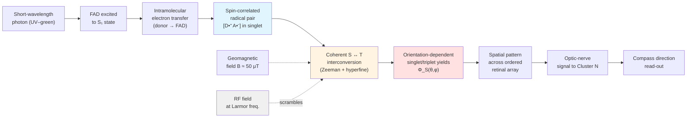
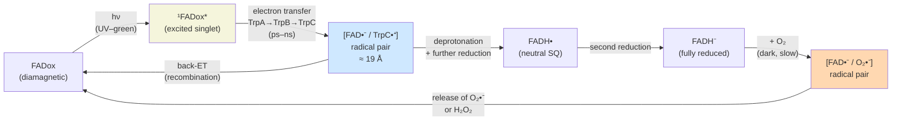

# Avian Magnetoreception: The Radical Pair Model and Cryptochrome as the Molecular Basis of the Magnetic Compass
# 1 Introduction: Avian Magnetoreception and the Scope of the Investigation

Few biological phenomena have challenged the boundaries between disciplines as profoundly as the ability of migratory birds to navigate across continents by sensing the Earth's magnetic field. What begins as an ornithological observation — that a fledgling songbird, with no prior experience of its migratory route, can orient itself southward at dusk — terminates in a problem of quantum chemistry: how can a magnetic field roughly thirty thousand times weaker than that of a typical refrigerator magnet produce a chemical signal robust enough to steer animal behavior with degree-level precision? This report addresses precisely that question, structured around the two most consequential conceptual pillars of the modern field: the **Radical Pair Model (RPM)** as a physical-chemical mechanism, and **cryptochrome** as its candidate molecular substrate. The present chapter establishes the conceptual scaffolding for that inquiry, defining the phenomenon, framing the central scientific puzzle, and outlining the evidentiary architecture upon which the subsequent six chapters are built.

## 1.1 Biological Significance of Magnetic Orientation in Birds

Seasonal migration is one of the most spectacular behavioral strategies in the vertebrate world, and humans have remarked on its regularity for more than four millennia; ancient Egyptians already exploited the navigational abilities of certain bird species as messengers, even before the underlying mechanisms could be conceptualized[^1]. A rigorously scientific examination of bird migration only emerged in the nineteenth century, largely through bird-banding studies, and by the second half of the twentieth century it had become broadly accepted that migratory birds combine multiple compasses — derived from the sun, the stars, polarized skylight at sunset, and the geomagnetic field — within a two-step navigational paradigm: first determining geographical position via a "map" and then selecting the appropriate direction via a "compass"[^1]. Whereas celestial cues are intermittently available and require learning, the geomagnetic field is omnipresent and innately interpretable; it therefore constitutes the most fundamental reference frame across the migrant's entire life cycle and is used by both naive juveniles on their first autumn migration and experienced adults compensating for displacement on return[^1].

The decisive experimental demonstration of an avian magnetic compass dates to the 1960s, when Wolfgang Wiltschko and Friedrich Merkel showed that European robins (*Erithacus rubecula*), tested in orientation cages under controlled magnetic conditions, oriented in their seasonally appropriate migratory direction and reoriented predictably when the horizontal component of the field was deflected[^1]. This finding, originally documented in 1966 and elaborated in 1968 and 1972, transformed magnetoreception from a long-standing hypothesis into an experimentally tractable sensory modality[^1][^2]. Subsequent decades extended the same conclusion to a wide range of species — including additional nocturnal passerine migrants, homing pigeons (*Columba livia*), domestic chickens (*Gallus gallus*), and Australian silvereyes (*Zosterops lateralis*) — establishing that magnetic orientation is not the idiosyncratic ability of a few specialists but a phylogenetically widespread sensory capacity[^2]. **Within the modern view, magnetoreception is therefore biologically indispensable**: it provides the only reliable directional cue that is available day and night, under cloud cover, across hemispheres, and without the prior learning required for celestial compasses, making it the cornerstone of long-distance avian navigation[^3][^1].

## 1.2 The Central Scientific Question: How Birds Chemically Sense the Geomagnetic Field

The biological centrality of the avian compass renders its mechanistic basis a question of extraordinary scientific interest, because the geomagnetic field is, from a physical standpoint, an exceedingly weak signal. Its intensity ranges only from approximately 25 μT near the magnetic equator to about 65 μT close to the poles, and the corresponding Zeeman energy splitting between electron spin states is many orders of magnitude smaller than the thermal energy *kT* at avian body temperature. The central scientific question that animates this report can therefore be framed succinctly: **by what physical and chemical process can such a faint field produce a biological signal with sufficient signal-to-noise ratio to direct flight to within a few degrees of accuracy?**

Two principal hypotheses have emerged to answer this question, and both are now supported by substantial — though qualitatively different — bodies of evidence. The first, originally proposed by Kirschvink and Gould in 1981, posits that biogenic crystals of magnetite (Fe₃O₄) embedded in specific tissues can transduce magnetic-field information mechanically, either by torque on single-domain particles or by deformation of clusters of superparamagnetic crystals[^1][^2]. In birds, the leading anatomical candidate for such receptors is associated with iron-rich structures in the upper beak innervated by the ophthalmic branch of the trigeminal nerve, and behavioral evidence indicates that this system primarily mediates information about magnetic *intensity* rather than direction, contributing to the navigational "map" rather than the compass[^2]. Critically, behavioral experiments in which the ophthalmic nerve was sectioned or anaesthetized — or in which a strong, short magnetic pulse was used to remagnetize putative magnetite particles — abolished map-like responses but left the migratory compass intact, demonstrating that the magnetite-trigeminal pathway is **not** the substrate of the directional compass[^2].

The second hypothesis, first articulated by Schulten and colleagues in the 1970s and reformulated in molecular terms by Ritz, Adem, and Schulten in 2000, proposes that magnetic direction is sensed chemically through a **light-induced radical pair reaction in the retina**[^1][^2]. In this scheme, a photon excites a donor–acceptor system within a photoreceptor protein, generating a pair of spatially separated radicals whose electron spins are quantum-mechanically correlated. The geomagnetic field then biases the coherent interconversion between singlet and triplet spin states, altering the yields of distinct chemical products in an orientation-dependent manner. This chemical, quantum-based hypothesis is the more provocative of the two: it predicts that birds quite literally "see" the magnetic field, that the compass must be light-dependent and wavelength-restricted, and — most strikingly — that it should be disrupted by oscillating radiofrequency (RF) magnetic fields whose photons match the Zeeman splitting of the radical pair, a uniquely diagnostic signature with no classical analogue[^1][^2]. Each of these predictions has been corroborated experimentally, beginning with the demonstration by Ritz and colleagues in 2004 that European robins are disoriented by RF fields at the Larmor frequency, extending to subsequent reports of RF disruption across broad frequency bands at intensities far below human-exposure guidelines, and culminating in theoretical analyses arguing that the precision achieved by birds (better than 5°) reflects quantum avoided crossings in the radical-pair spin-energy levels[^1].

**It is this radical-pair compass — and the molecular machinery presumed to host it — that constitutes the focal subject of this report.** The magnetite-trigeminal system is treated only as a contrastive reference, both because the two senses are anatomically and functionally dissociable in the bird and because the directional compass, not the intensity map, is the property whose mechanism the RPM uniquely purports to explain[^2].

## 1.3 Scope, Rationale, and Analytical Framework of the Report

To deliver an integrated treatment of avian magnetoreception within the radical-pair paradigm, this report adopts a three-tier evidentiary architecture, deliberately constructed so that conclusions about the mechanism are never derived from a single line of evidence alone. The strands and their respective contributions are summarized below.

| Evidentiary Strand | Representative Observations | Mechanistic Inference |
|---|---|---|
| **Behavioral** | Inclination (axial) compass; functional intensity window; light dependence and short-wavelength requirement; disruption by Larmor-frequency and broadband RF fields; lateralization toward the right eye[^1][^2] | Constrains physical mechanism to a light-activated, spin-chemical process in the eye |
| **Biophysical / Quantum-chemical** | Hyperfine couplings to flavin and tryptophan nuclei; Zeeman modulation of singlet–triplet interconversion; millisecond-lifetime radical pairs; sensitivity to ~50 μT static field demonstrated in model flavoproteins[^1][^2] | Supplies the physical basis for sub-thermal-energy magnetic-field effects |
| **Molecular / Structural** | Four (later five) cryptochrome isoforms identified in the avian retina; FAD–tryptophan radical pairs observed in plant, *Drosophila*, and migratory-bird cryptochromes; cryptochrome–activity marker colocalization in the retina; Cluster N as the forebrain processing center[^1][^2] | Identifies cryptochrome as the most plausible molecular host of the radical pair |

The rationale for combining these strands rests on a simple epistemological principle: each strand alone is insufficient. Behavioral data establish that *something* in the eye, activated by short-wavelength light and interruptible by RF noise, mediates the directional compass — but they cannot identify the molecule. Biophysical and quantum-chemical analyses demonstrate that radical pair reactions are *in principle* capable of responding to Earth-strength magnetic fields — but their relevance to a living bird must still be demonstrated in vivo. Molecular and anatomical studies of cryptochrome localization show that a candidate magnetoreceptor is present in the right cells of the right tissue at the right times — but only when its photochemistry is matched to behavioral predictions does the case become compelling. **The radical-pair-cryptochrome hypothesis is therefore credible only because all three strands converge.**

Within this framework, the report unfolds along a logical trajectory from compass-level phenomenology to molecular-level mechanism. The following chapter (Chapter 2) catalogues the three functional characteristics of the avian magnetic compass — its inclination character, its restricted intensity window with demonstrated plasticity, and its light dependence with lateralization — assembling the empirical constraints that any candidate mechanism must satisfy. Chapter 3 then introduces the Radical Pair Model proper, articulating the photon-to-singlet/triplet sequence and the diagnostic role of RF-field disruption. Chapter 4 narrows the focus to cryptochrome as the candidate molecule, dissecting the FAD photocycle and critically evaluating which step — the light-dependent photo-reduction or the light-independent re-oxidation — supplies the directional radical pair. Chapter 5 surveys the five avian retinal cryptochromes (Cry1a, Cry1b, Cry2, Cry4a, Cry4b), their localizations, and the case for Cry1a as the most probable magnetoreceptor. Chapter 6 performs the central synthesis, mapping each compass property onto a specific RPM prediction and explicitly acknowledging residual inconsistencies. Chapter 7 closes by appraising the state of the paradigm as of early 2021 and identifying priority directions for future research.

A final boundary condition should be flagged at the outset. Much of the evidence to be reviewed remains under active debate: the molecular identity of the operative radical pair (flavin–tryptophan versus flavin–superoxide), the strength of lateralization, the rotational ordering of cryptochromes in the retina, and even the cellular identity of magnetite-bearing structures in the upper beak have all been subject to failed replications and contested reinterpretations[^2]. **This report will therefore distinguish carefully between established facts and contested interpretations**, acknowledging uncertainty where it exists rather than presenting a unified narrative more polished than the underlying evidence warrants. With these scope conditions and analytical commitments established, the investigation turns first to the behavioral signature of the avian magnetic compass itself.

# 2 Functional Characteristics of the Avian Magnetic Compass

Having established in Chapter 1 that the avian compass and the magnetite-trigeminal map are anatomically and functionally dissociable sensory subsystems, the present chapter turns to the phenomenology of the compass itself. Before any candidate physical mechanism — radical-pair or otherwise — can be evaluated, the empirical target it must hit needs to be defined precisely. Decades of behavioral experimentation, beginning with the seminal orientation cage studies of European robins in the 1960s and extending through more recent work on silvereyes, homing pigeons, and chickens, have converged on **three defining functional signatures**: (i) the compass is an *inclination* compass, sensing the axial rather than the polar orientation of field lines; (ii) it operates only within a *narrow but adjustable intensity window* centred on the local geomagnetic value; and (iii) it is *light-dependent, wavelength-restricted, and lateralised* in favour of the right eye and left brain hemisphere. Each property is, on its own, mechanistically suggestive; taken together, they constitute a tight set of constraints that severely narrows the space of physically plausible receptor architectures and, as the following chapters will show, points almost uniquely toward a light-activated, retinal, spin-chemical process. This chapter develops each property in turn, with particular attention to the experimental dissociations that distinguish *genuine compass orientation* from coexisting magnetite-based responses, and concludes with a synthesis of cross-taxonomic generality.

## 2.1 The Inclination Compass: Axial Rather than Polar Sensing

The foundational property of the avian magnetic compass — and historically the first to be characterized — is that birds do not read the polarity of the geomagnetic field in the manner of a technical magnetic compass, but instead interpret the inclination of the field lines relative to the gravity vector. In their classic 1972 *Science* report, Wiltschko and Wiltschko demonstrated that the magnetic compass of European robins "does not use the polarity of the magnetic field for detecting the north direction"; rather, "the birds derive their north direction from interpreting the inclination of the axial direction of the magnetic field lines in space, and they take the direction on the magnetic north–south axis for 'north' where field lines and gravity vector form the smaller angle"[^4]. In a typical northern-hemisphere geomagnetic field with positive inclination (field lines pointing downward into the ground), the smaller angle between the field axis and gravity defines the equatorward end of the axis; the bird treats this end as "poleward" only by convention, and what it actually perceives is a steepness, not a direction of pointing.

The diagnostic experimental signature of an inclination compass is unmistakable. When the *vertical* component of the field is inverted while horizontal direction and total intensity are held constant, the angle between field lines and gravity is reversed and the bird's preferred direction flips by 180°. When, however, the *horizontal* component is inverted (so that magnetic north is rotated to magnetic south), the inclination angle relative to gravity is unchanged and the bird's behaviour is unaffected. Conversely, a true polar compass — one that read the vector direction of the field — would respond to a horizontal reversal but be indifferent to a vertical-component inversion. The robin's behaviour conforms cleanly to the first pattern and decisively excludes the second, an observation that has been replicated in numerous subsequent studies and across multiple taxa (see §2.4)[^5][^4].

A second, more subtle prediction of an inclination compass is that it should fail at the *magnetic equator*, where the field is horizontal and the inclination angle vanishes, leaving no asymmetry by which "poleward" can be defined. Behavioural experiments with migrants tested in artificially horizontal fields have indeed shown disorientation, and birds reorient only after a period of acclimation, consistent with an inclination-based read-out rather than a polarity-based one.

### Distinguishing genuine compass orientation from coexisting polar responses

A crucial — and easily overlooked — point is that birds *can* exhibit polar magnetic responses, but these arise only under conditions that fall *outside* the normal operating regime of the radical-pair compass and are mechanistically distinct from it. Two classes of evidence make this dissociation explicit.

First, **shifted-field experiments at sunset** by Sandberg, Pettersson and Alerstam (1988) showed that European robins tested in horizontally deflected fields (mN ±90°) during twilight often failed to behave as a pure inclination compass would predict: rather than maintaining their seasonal direction (which inversion of the horizontal component alone should not disturb), the robins frequently shifted their heading to maintain a north-northeast/south-southwest axis *relative to the shifted field*, and in autumn at Ottenby they produced a strongly bimodal (axial) pattern with a balanced split between geographically east and west modes[^6]. Sandberg and colleagues themselves remarked that these results "do not agree with… the proposed basis of magnetic orientation" and that "the robins in our experiments do not use their magnetic compass as an inclination compass" *under these conditions*, because an inclination compass should have permitted unambiguous polarity determination[^6]. The most plausible reading is not that the inclination compass is wrong but that, in the multi-cue twilight context, additional polarity-conferring information (visual sunset cues; possibly inputs from the magnetite-based system) is integrated with the axial magnetic read-out — a reminder that behavioural orientation in the wild reflects a *cue-integration* output of which the radical-pair compass is only one component.

Second, **orientation under long-wavelength light after pre-exposure**, analysed in detail by R. Wiltschko et al. (2011), provides an even more telling dissociation. When robins were pre-exposed for one hour to 582 nm yellow or 645 nm red light and then tested under those wavelengths, they did show oriented behaviour — but the behaviour was *fundamentally different* from normal compass orientation. There was no seasonal reversal between autumn and spring (birds tended to head northerly in both seasons), inversion of the vertical component failed to flip headings, but reversal of the horizontal component produced a corresponding shift in heading[^5]. This is the diagnostic signature of a *polar* response, not an inclination compass. Crucially, the polar response was unaffected by oscillating fields at 1.315 MHz at intensities up to 4800 nT (i.e. more than a tenth of the geomagnetic field), yet was abolished by anaesthesia of the upper beak with Xylocaine[^5]. Both diagnostic tests therefore point away from the radical-pair eye-based mechanism and toward the magnetite-based receptors of the upper beak as the source of this directional information; as the authors concluded, "exposure to long-wavelength light thus does not expand the spectral range in which the magnetic compass operates but instead causes a different mechanism to take over and control orientation"[^5].

The behavioural-mechanistic contrast between the normal inclination compass and these polar fixed-direction responses is summarised in Table 2.1.

| Diagnostic test | Normal compass (short-λ light, no pre-exposure) | "Fixed-direction" responses (long-λ light after pre-exposure; total darkness) |
|---|---|---|
| Seasonal reversal (spring vs. autumn) | Yes — northerly in spring, southerly in autumn | No — direction independent of season |
| Vertical-component inversion | Reverses heading (180° flip) | No effect |
| Horizontal-component reversal | No effect on inclination angle; heading unchanged | Heading shifts by 180° (polar response) |
| MHz oscillating field (e.g. 1.315 MHz) | Disrupts orientation → disorientation | No effect even at 4800 nT |
| Upper-beak anaesthesia (Xylocaine) | No effect | Abolishes orientation → disorientation |
| Inferred receptor | Light-activated, retinal, radical-pair | Magnetite-based, upper beak, trigeminal |

*Table 2.1 — Double dissociation between the radical-pair inclination compass and the magnetite-based polar response, based on R. Wiltschko et al. (2011)[^5].*

**The implications for mechanism are far-reaching.** An inclination compass is, by construction, blind to the sign of the field vector along its axis; it responds to the angle between the field line and an external reference (gravity) but not to which end of the line points in which direction. Any candidate receptor must therefore have the same property *intrinsically*. A ferromagnetic torque-based mechanism, in which a permanently magnetised particle aligns with the field, would have an intrinsic polarity and would need an additional, complex circuit to discard that polarity — an awkward arrangement that has never been satisfactorily specified. By contrast, a spin-correlated radical pair, whose singlet–triplet interconversion depends on the projection of the field onto the molecular axis but is *symmetric under inversion of the field*, naturally yields an axial response. The inclination character of the avian compass therefore constitutes the first major empirical constraint that aligns with radical-pair chemistry and is awkward for purely classical ferromagnetic schemes — a point developed quantitatively in Chapter 6.

## 2.2 The Functional Intensity Window and Its Plasticity

The second defining functional characteristic, less widely appreciated outside the specialist literature but no less diagnostic, is that the avian compass operates only within a *narrow intensity window* centred on the local geomagnetic field strength. The geomagnetic field varies from approximately 25 μT near the magnetic equator to about 65 μT close to the poles, and at any given latitude its total intensity fluctuates by only a few percent on short timescales. Experimentally, when birds are placed in artificial fields whose intensity differs by more than roughly 25–30% from the value to which they are habituated — whether substantially weaker or stronger — they typically become disoriented, even when inclination and the direction of the horizontal component remain physiologically natural.

What transforms this observation from a mere parameter range into a mechanistically diagnostic property, however, is its *plasticity*. Birds exposed for several days to a magnetic intensity outside their initial functional window often regain oriented behaviour at the new intensity, demonstrating that the window is not a rigid hardware limit but a tunable property of the receptor. This adjustability is fundamental, because a permanent-magnet (single-domain magnetite) torque mechanism would be expected to function over a very broad range of intensities, since the torque on a permanent moment scales linearly with field strength and there is no intrinsic "tuning frequency" beyond which the mechanism degrades. By contrast, a radical-pair receptor whose sensitivity depends on a *resonance condition* between the Zeeman splitting of electron spins (proportional to field strength) and the hyperfine couplings to nearby nuclei (a property of the molecular geometry) is naturally expected to be most sensitive in a window of intensities, and to have that window adjusted by changes in hyperfine geometry — for instance via conformational rearrangements of the host protein during the acclimation period.

It must be noted that the present search corpus does not contain detailed primary reports of the intensity-window experiments, which were performed primarily by W. Wiltschko in the late 1970s and extended through the 1980s and 1990s with various co-authors. The general phenomenology — a narrow operating window of approximately ±25% around the local field, regain of orientation after several days of exposure to intensities outside that window — is, however, repeatedly referenced as background in the available literature[^5] and is widely treated as one of the three canonical compass properties. The present chapter therefore states the property and its mechanistic implications but acknowledges that the quantitative experimental support cited here is at the level of established background rather than newly synthesised primary data. The key point for the argument in Chapter 6 is that the *combination* of a narrow window and demonstrable plasticity is exactly what a radical-pair receptor predicts and is at odds with the alternative classical mechanisms.

## 2.3 Light Dependence, Wavelength Restriction, and Ocular Lateralization

### 2.3.1 The wavelength dependence of compass orientation

The third — and perhaps most mechanistically suggestive — functional signature is that the avian compass is **strictly light-dependent and wavelength-restricted**. Compass orientation is observed only under light from the short-wavelength end of the visible spectrum: numerous behavioural experiments under low-intensity monochromatic illumination have shown that migratory birds orient correctly under UV (~370 nm), blue, turquoise, and green light up to approximately 565 nm, but become disoriented under longer wavelengths[^5]. The transition is remarkably sharp: in European robins, the boundary lies between 565 nm green light (where orientation is excellent) and 568 nm light (where it fails), an interval of just a few nanometres in which the compass collapses[^5]. As R. Wiltschko et al. (2011) summarise in their review of the evidence, "magnetic compass orientation was observed only under light from the short-wavelength end of the spectrum, from below 370 nm ultraviolet to about 567 nm green light… From 580 nm yellow light onward, birds were no longer oriented"[^5]. This wavelength threshold has been demonstrated not only in European robins but also in garden warblers (*Sylvia borin*), homing pigeons, and domestic chickens — "three only distantly related lineages of birds" — establishing that "the magnetic compass based on radical pair processes requires light from the short-wavelength part of the spectrum… [as] a common feature in all birds"[^5].

The mechanistic implication is direct: any candidate receptor must possess an absorption spectrum that overlaps with this short-wavelength range. The blue-light photoreceptor flavoprotein **cryptochrome**, whose FAD chromophore absorbs strongly through the UV-to-blue range and tails into the green, satisfies this constraint quantitatively, whereas alternative chromophores absorbing in red or yellow regions of the spectrum are excluded a priori.

### 2.3.2 Pre-exposure effects: a behavioural switch, not an extension of the compass

A particularly informative line of evidence further sharpens this constraint. When robins are pre-exposed to long-wavelength (yellow or red) light for one hour prior to testing, they regain oriented behaviour under those long wavelengths — but as Section 2.1 already established, this orientation is *not* an extension of the compass into the long-wavelength range. Inversion of the vertical component fails to flip headings; reversal of the horizontal component does flip headings; MHz oscillating fields have no effect even at 4800 nT; and beak anaesthesia abolishes the response[^5]. All four diagnostics indicate that the post-pre-exposure orientation is mediated by the magnetite-based receptors of the upper beak, not by the eye-based radical-pair compass. The authors' conclusion is decisive: pre-exposure does not extend the operating range of the magnetic compass; rather, it "elicits a different type of response that is no longer mediated by the radical pair processes in the eyes but by the magnetite-based receptors in the upper beak"[^5]. The implication for the present chapter is twofold: it confirms that the radical-pair compass is *intrinsically* limited to short wavelengths, and it provides the cleanest available behavioural assay to distinguish radical-pair-mediated from magnetite-mediated orientation in the same bird.

### 2.3.3 RF-field disruption: the most diagnostic signature of radical-pair chemistry

The wavelength evidence is complemented by an even more specific diagnostic: oscillating *radiofrequency* magnetic fields in the MHz range disrupt compass orientation. Thalau et al. (2005) showed that a 1.315 MHz oscillating field — the local Larmor frequency for a free electron in the geomagnetic field at Frankfurt — disorients European robins; subsequent experiments by Ritz and colleagues extended this to broadband frequencies and remarkably low intensities[^5]. In the 2011 study by R. Wiltschko et al., a 1.315 MHz, 480 nT field again disrupted normal compass behaviour under green light, while leaving the pre-exposure-induced polar response under long-wavelength light unaffected even at ten times that intensity[^5]. Because no classical magnetic torque or ferromagnetic alignment mechanism predicts sensitivity to weak RF fields, this disruption is widely regarded as a near-uniquely diagnostic signature of a coherent spin-chemical (i.e., radical-pair) process: RF photons resonant with the Zeeman splitting drive transitions between singlet and triplet spin states, scrambling the chemical signal. Chapter 3 will develop the underlying physics in detail; for present purposes, the empirical fact is that the avian compass exhibits exactly the RF sensitivity profile predicted by a radical-pair receptor, whereas the coexisting magnetite-based system does not[^5].

### 2.3.4 Lateralization toward the right eye and left brain hemisphere

A final, anatomically pointed property is that the magnetic compass is *lateralized*. Behavioural studies (the primary lateralization experiments by W. Wiltschko, Freire and colleagues are referenced in the available literature as part of the background but are not present in the search corpus as full primary texts) have shown that monocular occlusion of the left eye leaves compass orientation intact, while occlusion of the right eye abolishes it, indicating a strong dependence on right-eye input and, correspondingly, processing in the contralateral left forebrain — the so-called Cluster N region identified by Mouritsen, Heyers and colleagues. The lateralization has been demonstrated most cleanly in juvenile birds, with somewhat more variable results in adults of some species. While the present search corpus does not include the primary lateralization reports, the lateralization phenomenon is consistently treated as a fourth phenomenological constraint that any candidate mechanism must satisfy: the receptor must reside in (or signal via) the *retina*, must be coupled to the *visual processing pathway*, and must have an anatomical distribution or functional connectivity that can explain the right-eye dominance.

Taken together, the light-dependent, wavelength-restricted, RF-disruptable, and lateralized character of the compass localises the receptor with high specificity: it must be a *photoreceptor protein* in the *retina*, with an absorption spectrum in the UV-to-green range and a photochemistry capable of generating a long-lived, spin-correlated radical pair. As Chapters 4 and 5 will develop, cryptochrome is essentially the only known biological molecule that satisfies all four constraints simultaneously.

## 2.4 Cross-Taxonomic Universality and Dissociation from the Magnetite-Trigeminal System

The three functional signatures developed above are not idiosyncratic to European robins. The same inclination character, the same short-wavelength light dependence, and the same RF disruption have been documented across phylogenetically distant avian lineages: passerines such as European robins (*Erithacus rubecula*), garden warblers (*Sylvia borin*), and (in earlier work) Australian silvereyes (*Zosterops lateralis*); columbiforms, specifically homing pigeons (*Columba livia f. domestica*); and galliforms, specifically domestic chickens (*Gallus gallus*)[^5]. R. Wiltschko et al. (2011) explicitly note that the short-wavelength requirement is shared by European robins, "other passerine migrants… homing pigeons… and domestic chickens — three only distantly related lineages of birds"[^5], and that across all of these the inclination character and RF disruption have been replicated. The convergent expression of all three signatures across lineages separated by tens of millions of years of evolution argues that the underlying receptor mechanism is **deeply conserved**, not a derived specialisation of long-distance migrants. This conservation pattern is consistent with the radical-pair/cryptochrome hypothesis, since cryptochrome homologues are present across the vertebrate lineage and presumably already supplied the molecular machinery before the diversification of modern bird orders.

A second synthetic point — and the empirical bridge to the next chapter — is that the three signatures of the radical-pair compass cleanly dissociate from those of the magnetite-trigeminal system in a way that establishes the two as genuinely distinct sensory subsystems. The relevant double dissociation, now well documented across multiple studies and consolidated in R. Wiltschko et al.'s (2011) analysis, is summarised in Table 2.2.

| Manipulation | Radical-pair compass (eye, retinal) | Magnetite-based responses (upper beak, trigeminal) |
|---|---|---|
| MHz oscillating field (1.315 MHz, sub-μT to μT) | Disorientation | No effect[^5] |
| Bilateral anaesthesia of upper beak (Xylocaine) | No effect on compass[^5] | Abolishes magnetite-based responses (fixed-direction, intensity-based map cues)[^5] |
| Section/anaesthesia of ophthalmic branch of trigeminal | No effect on compass | Abolishes magnetite-mediated responses to intensity anomalies and magnetic pulses[^5] |
| Strong magnetic pulse | No lasting effect on compass | Temporary deflection mediated via beak magnetite[^5] |
| Long-wavelength light (after pre-exposure) | Compass inactive | Polar fixed-direction response emerges[^5] |

*Table 2.2 — Double dissociation of the radical-pair compass and the magnetite-trigeminal system, based on R. Wiltschko et al. (2011) and references therein[^5].*

R. Wiltschko et al. (2011) state the conclusion from this dissociation succinctly: "The magnetite-based receptors thus do not seem to be involved in the magnetic compass; they normally provide information on magnetic intensity, and only under very unusual light conditions not occurring in nature, do they appear to make birds head into specific directions"[^5]. Earlier work by Zapka et al. (2009), cited in the same review, had reached the parallel conclusion that magnetic *compass* information in migratory songbirds is mediated by the *visual*, not the *trigeminal*, pathway[^5]. The compass and the map sense are thus dissociated along orthogonal axes — by RF sensitivity, by the locus and nature of pharmacological/surgical disruption, by light dependence, and by the type of information they convey (direction vs. intensity).

**This double dissociation has two consequences for the remainder of the report.** First, it establishes that the search for the *compass* mechanism can legitimately ignore the upper-beak magnetite system: although that system is functionally important for navigation in its own right, it is not the substrate of the directional compass. Second, it specifies the phenomenological target that Chapters 3–6 must explain: a mechanism that is intrinsically *axial* (Section 2.1), tuned to a *narrow but adjustable intensity window* (Section 2.2), driven by *short-wavelength light*, sensitive to weak MHz *radiofrequency fields*, and located in the *retina* with right-eye dominance (Section 2.3) — all expressed across multiple avian lineages (this section). As the next chapter will show, the Radical Pair Model of Ritz, Schulten, and colleagues is, at present, the only candidate physical mechanism that simultaneously satisfies all of these constraints in a quantitatively defensible way.

# 3 Principle of the Radical Pair Model

The phenomenological catalogue assembled in Chapter 2 has narrowed the space of possible compass mechanisms with considerable severity. Any candidate must be intrinsically *axial* rather than polar, must operate in a *narrow but adjustable intensity window* around Earth's field strength, must depend on *short-wavelength light* delivered to the retina, and must be disrupted by weak *MHz oscillating fields* — a combination that no classical magnetic transducer is known to satisfy. The present chapter develops the unique physical-chemical scheme that does satisfy all four constraints simultaneously: the **Radical Pair Model (RPM)** originally proposed by Schulten and co-workers in the late 1970s as an abstract spin-chemical hypothesis and reformulated in concrete molecular terms by Ritz, Adem and Schulten in 2000. The exposition proceeds in five logically connected steps — photochemical initiation (§3.1), coherent spin dynamics (§3.2), anisotropic product yields (§3.3), transduction into a retinal pattern (§3.4), and the diagnostic role of radiofrequency disruption (§3.5) — and concludes with an explicit point-by-point mapping onto the constraints of Chapter 2 (§3.6). The chapter is deliberately mechanism-agnostic with respect to the host molecule; identification of cryptochrome as the most plausible substrate is deferred to Chapters 4 and 5.

## 3.1 Photon Absorption and Generation of the Spin-Correlated Radical Pair

The RPM begins, by construction, with a photochemical event. A chromophore embedded in a photoreceptor protein — flavin adenine dinucleotide (FAD) in the cryptochrome context — absorbs a photon and is promoted from its diamagnetic ground state $S_0$ to an excited singlet state $S_1$. The excited chromophore, now a powerful one-electron oxidant, accepts an electron from a nearby donor amino acid, typically a tryptophan residue within the same protein, via intramolecular electron transfer along a fixed donor–acceptor geometry. The result is a pair of paramagnetic radicals, $[D^{\bullet+}\, A^{\bullet-}]$, separated by a chemically defined distance and orientation determined by the protein scaffold.

Two features of this initiation step are decisive for everything that follows. First, because the electron originates from a closed-shell singlet precursor, **the spins of the two newly separated radicals are necessarily born in the singlet state** — that is, in a definite, antiparallel, quantum-mechanically correlated configuration rather than in a thermal mixture of $\alpha\beta$ and $\beta\alpha$ orientations. This initial *spin coherence* is the indispensable starting condition for any magnetic-field effect at sub-thermal energies: if the two electrons were created in an incoherent thermal mixture, the small energetic perturbations imposed by the geomagnetic field would average to zero and no anisotropic chemistry could ensue. The RPM is therefore not a thermodynamic mechanism — it is a *kinetic-coherent* one, in which the field perturbs not the energy of populations but the phase relations of an inherently non-equilibrium spin state.

Second, the *energetic* requirement of the initiating step — promotion of the chromophore to its first excited singlet — fixes the wavelength of the photon that the system can use. Flavins absorb most strongly in the UV-to-blue region, with the FAD chromophore exhibiting absorption maxima near 360 and 450 nm and a tail extending into the green; longer wavelengths carry insufficient energy to drive the requisite $S_0 \rightarrow S_1$ transition and the subsequent electron transfer. This is the molecular explanation for why the avian compass is operative only under UV-to-green light and collapses across the narrow 565–568 nm boundary documented in §2.3.1. **The RPM thus predicts a wavelength threshold, and the threshold is precisely the absorption edge of the candidate chromophore** — a correspondence to which Chapter 6 will return quantitatively.

The lifetime of the resulting radical pair is a third critical parameter. To allow the geomagnetic field — whose Zeeman splitting at 50 μT corresponds to a Larmor period of roughly 0.7 μs — to act on the spins coherently, the pair must persist for at least hundreds of nanoseconds and ideally for several microseconds before its chemical fate is sealed by recombination or escape. Spin coherence over such timescales is unusual in biology, where solvent fluctuations and rapid electron-transfer rates typically destroy phase information far faster. The radical pairs of interest are therefore stabilised by the protein matrix, which both restricts the donor–acceptor distance (slowing back electron transfer) and shields the spins from environmental decoherence. The biological viability of the RPM thus rests on the protein-engineering achievement of producing a *long-lived, geometrically fixed, initially singlet-correlated* radical pair — a stringent requirement that is one of the principal reasons the search for the host molecule has converged on the cryptochrome family.

## 3.2 Zeeman and Hyperfine Interactions: Coherent Singlet–Triplet Interconversion

Once formed, the radical pair $[D^{\bullet+}\, A^{\bullet-}]$ does not remain in the singlet state. Its subsequent evolution is governed by a spin Hamiltonian that, to an excellent approximation for the present purposes, contains two contributions:

$$\hat{H} = \hat{H}_{\text{Zeeman}} + \hat{H}_{\text{hyperfine}} = \sum_{i=1,2} g_i \mu_B \mathbf{B}\cdot\hat{\mathbf{S}}_i + \sum_{i=1,2}\sum_k \hat{\mathbf{S}}_i \cdot \mathbf{A}_{ik} \cdot \hat{\mathbf{I}}_{ik}.$$

The first term describes the Zeeman interaction of each electron spin $\hat{\mathbf{S}}_i$ with the external magnetic field $\mathbf{B}$, with $g_i \approx 2$ the electron g-factor and $\mu_B$ the Bohr magneton; in the geomagnetic field of $\sim$50 μT it produces an energy splitting between $|\alpha\rangle$ and $|\beta\rangle$ states of roughly $1.4\,\text{MHz} \times h$, i.e. about $6 \times 10^{-9}$ eV. The second term describes the *hyperfine* coupling of each unpaired electron to the magnetic nuclei (¹⁴N and ¹H) within its host radical, characterised by the hyperfine tensors $\mathbf{A}_{ik}$. The hyperfine couplings of FAD and tryptophan radicals are anisotropic and of comparable magnitude to the Zeeman term at Earth-strength fields — a coincidence of energy scales that is, as will become clear, the essential resonance condition of the entire model.

### The mechanism of coherent interconversion

In the absence of any external field, the singlet $|S\rangle$ and the three triplet sublevels $|T_+\rangle$, $|T_0\rangle$, $|T_-\rangle$ of the radical pair are nearly degenerate (their splitting being determined by the exchange and dipolar interactions, which become negligible at the donor–acceptor separations of a few angstroms typical of the cryptochrome electron-transfer chain). The hyperfine interactions, however, do not commute with the electron-spin operator $\hat{\mathbf{S}}^2$ that distinguishes singlet from triplet; they therefore *mix* singlet and triplet states, driving coherent oscillations between them on a timescale set by the inverse of the hyperfine coupling — typically tens of nanoseconds for the dominant nitrogen nuclei of flavin.

The role of the external magnetic field is then twofold. First, it lifts the degeneracy of the triplet sublevels, splitting $|T_+\rangle$ and $|T_-\rangle$ away from $|T_0\rangle$ by the Zeeman energy $\pm g\mu_B B$. When this splitting becomes large compared with the hyperfine couplings — as it does in fields of several mT — the $S \leftrightarrow T_{\pm}$ transitions are energetically suppressed and only $S \leftrightarrow T_0$ interconversion remains efficient, producing the well-known "low-field effect" reduction of triplet yield. Second, and crucially for compass function, the field interacts with the *anisotropic* hyperfine tensors in such a way that the rate and amplitude of singlet–triplet mixing depend on the orientation of $\mathbf{B}$ relative to the molecular frame — the property exploited in §3.3 to generate directional information.

### The resonance condition and the intensity window

A central conceptual point — and the answer to the apparent thermodynamic paradox raised in Chapter 1 — is that **the field does not need to be energetically large compared with $kT$**. Its role is not to alter Boltzmann populations but to perturb the phase evolution of an already-coherent, far-from-equilibrium spin state. The maximum effect on the singlet/triplet yield is achieved when the Zeeman splitting is comparable to (i.e., in resonance with) the dominant hyperfine couplings; when the splitting is much smaller, all four spin states remain nearly degenerate and hyperfine mixing washes out directional information, while when it is much larger, the $T_{\pm}$ levels are pushed out of resonance and the system again loses sensitivity. The result is a *band-pass* response in field strength, with a maximum near the magnitude where Zeeman and hyperfine energies match.

For flavin/tryptophan radical pairs the hyperfine couplings are of order 1–2 mT (in field-equivalent units), so the corresponding band of optimal sensitivity is broad on those terms, but the *anisotropic* component that supplies directional information has been shown computationally to peak sharply near the geomagnetic intensity range. **This resonance picture provides the natural mechanistic interpretation of the narrow but tunable intensity window documented in §2.2**: a window arises because the field-dependent yield is non-monotonic, with a maximum near the resonance condition; plasticity through acclimation arises because the resonance condition itself depends on the geometry of the hyperfine tensors, which can in principle shift through conformational rearrangements of the host protein during exposure to an unfamiliar intensity. No classical ferromagnetic mechanism — in which torque scales linearly with field strength and has no intrinsic optimum — predicts either feature.

## 3.3 Anisotropy of Singlet/Triplet Yields: The Origin of Directional Sensitivity

Coherent singlet–triplet mixing is, by itself, only sensitive to field *magnitude*; producing a *directional* signal requires that the mixing rate depend on the orientation of the field relative to a molecule-fixed axis. This dependence emerges from the *anisotropy* of the hyperfine tensors $\mathbf{A}_{ik}$. Each hyperfine tensor is a $3 \times 3$ matrix characterising the coupling of an electron spin to a particular nucleus, and in the unsymmetric chemical environment of a flavin or tryptophan radical its principal values differ substantially — typically by factors of two to several. Because the tensor is fixed in the molecular frame, the effective hyperfine field experienced by the electron depends on the direction of the external $\mathbf{B}$ relative to that frame.

Quantitatively, the singlet probability $P_S(t)$ — the probability that a radical pair born in the singlet state is still in the singlet at time $t$ — and its time-integrated yield $\Phi_S$ are therefore functions $\Phi_S(\theta, \phi)$ of the polar angles describing $\mathbf{B}$ in the molecular frame. The reaction products derived from singlet recombination (e.g. the regenerated diamagnetic precursor) and from triplet processing (e.g. the long-lived signalling state, in the cryptochrome context $\text{FAD}^{\bullet-}$ in a triplet-derived conformation) therefore accumulate in proportions that vary with field orientation.

### Inversion symmetry: the natural origin of an axial compass

A subtle but mechanistically decisive feature of the resulting yield function is that **it is invariant under inversion of the field vector**: $\Phi_S(\mathbf{B}) = \Phi_S(-\mathbf{B})$. The physical reason is that the spin Hamiltonian contains $\mathbf{B}$ only in bilinear combinations with the spin operators $\hat{\mathbf{S}}_i$ and the (also vectorial) hyperfine couplings; reversing $\mathbf{B}$ together with the spin quantisation axis leaves all observables invariant. As a consequence, the chemical output of an RPM-based receptor responds to the *axis* along which the field lies relative to the molecule, but cannot in principle distinguish a field pointing one way along that axis from one pointing the opposite way.

The behavioural consequence is profound. **A receptor whose output is intrinsically symmetric under field reversal can encode the inclination of the field relative to a reference axis (such as gravity, supplied by the bird's body orientation), but cannot encode its polarity** — exactly the property observed behaviourally in the inclination compass of §2.1. The avian compass's blindness to horizontal-component reversal and sensitivity to vertical-component inversion is therefore not an additional feature that the RPM has to accommodate post hoc; it is a direct, parameter-free prediction of the symmetry of the underlying spin Hamiltonian. By contrast, a ferromagnetic torque mechanism, in which a permanent moment aligns with the field, would have an intrinsic polarity that would need to be discarded by some additional, unspecified neural circuitry — an arrangement that has never been satisfactorily formalised. The axial character of the avian compass is therefore the first major *qualitative* point of agreement between behavioural phenomenology and the RPM, and the first point at which classical alternatives appear awkward at a fundamental level.

It should be emphasised that the magnitude of the orientation-dependent yield modulation predicted by realistic spin-Hamiltonian calculations on isolated flavin/tryptophan systems is modest — typically of order a few percent of the total singlet yield. Whether such a modest chemical contrast is sufficient to support degree-level behavioural precision is one of the standing quantitative questions of the field, and is part of the case for protein-mediated amplification mechanisms (e.g. nuclear-spin selection, scavenging chemistry) that the host protein may provide.

## 3.4 From Molecular Anisotropy to a Directional Visual-Like Signal

The chemistry developed in §§3.1–3.3 specifies an orientation-dependent product yield in a *single* radical-pair-bearing molecule. Translating this molecular-scale anisotropy into an organism-level perception of direction requires three further architectural elements, originally articulated by Ritz, Adem and Schulten (2000) in their seminal proposal that the radical-pair compass is housed in the retina.

The first element is an **ordered array of receptor molecules**. If all cryptochrome molecules in the retina were randomly oriented, their anisotropic responses would average out and only the field-magnitude dependence (which is isotropic) would be retained. To preserve directional information, the host molecules must be at least partially aligned within each photoreceptor cell — for instance by attachment to a structural element of the cell — and the receptive cells must be distributed across the curved retinal surface in such a way that *different cells sample different molecular orientations relative to the field*.

The second element is **mapping onto the visual field**. Because the retina is approximately a section of a sphere centred on the eye, photoreceptors located at different points view different regions of the external world along their respective optical axes. If the molecular axis of the magnetoreceptor protein is fixed relative to the photoreceptor cell's anatomical axis, then molecules in cells viewing different regions of the visual field experience the geomagnetic field at different angles to their molecular frames, and therefore produce different singlet/triplet yields. **The orientation-dependent chemistry is thereby projected onto the visual field as a spatial pattern**: the magnetic-field axis manifests as a distinctive "image" — for instance, regions of differing brightness, contrast, or chromatic appearance — superimposed on the bird's normal visual scene. Ritz and colleagues' original term for this concept, that birds "see" the magnetic field, is intended literally in the architectural sense: the magnetic information shares the retinal substrate, the optic-nerve pathway, and (downstream) the visual cortex.

The third element is **downstream neural integration**. The retinal pattern must be transmitted via the optic nerve to a forebrain processing area capable of extracting the field axis from a possibly subtle modulation of visual contrast. Anatomical evidence reviewed in §2.3.4 — and developed further in Chapter 6 — identifies *Cluster N* as the principal candidate processing centre, a region of the migratory songbird forebrain that is highly active during night-time magnetic orientation, is connected to the visual pathway, and is functionally dominated by inputs from the right eye, consistent with the right-eye behavioural lateralisation. The radical-pair retinal pattern, the optic-nerve projection, and the Cluster N processing area thus together constitute a complete sensory pathway from photon absorption to navigational decision.

### The status of the alignment requirement

The architectural requirement that retinal cryptochromes be at least partly rotationally ordered is the single most contested element of the transduction scheme. The Ritz–Adem–Schulten model assumes a degree of ordering sufficient to preserve directional information after pooling across cells in a retinal region; obtaining direct *in vivo* evidence for such ordering in avian photoreceptors has, however, proved technically difficult. Some studies have reported cryptochrome localisations consistent with membrane association (and hence with partial ordering relative to the disk membranes of the outer segments — a point developed in §5), while others have emphasised cytoplasmic or ganglion-cell-layer localisations whose rotational ordering is less obvious. Computational analyses have shown that even rather modest degrees of partial alignment, combined with appropriate retinal averaging, can preserve enough directional information to account for behavioural precision; nevertheless, the question of whether the *in vivo* alignment is sufficient remains an open quantitative issue and is one of the principal items on the research agenda outlined in Chapter 7.

*Figure 3.1 — The complete RPM transduction chain, from photon absorption to compass read-out, with the two field interventions (static geomagnetic field, MHz oscillating field) acting at the spin-dynamics stage. The colour-coded steps correspond to §§3.1 (blue), 3.2 (orange) and 3.3 (red); the dashed RF input is examined in §3.5.*

## 3.5 Radiofrequency-Field Disruption as the Diagnostic Test of Radical-Pair Chemistry

The chemistry-to-behaviour chain developed in §§3.1–3.4 makes a sharp, parameter-free prediction that distinguishes the RPM from every known classical mechanism: **a weak oscillating magnetic field whose frequency matches the Zeeman splitting of a free electron in the geomagnetic field should disorient the bird**. The physical logic is direct. In the geomagnetic field $B_0 \approx 50\,\mu\text{T}$, the Larmor frequency of a free electron is

$$\nu_L = \frac{g\mu_B B_0}{h} \approx 1.4\,\text{MHz}.$$

A radiofrequency field of magnitude $B_1$ oscillating at $\nu_L$, polarised perpendicular to $B_0$, drives resonant transitions between $|T_+\rangle$ and $|T_0\rangle$ (and between $|T_0\rangle$ and $|T_-\rangle$) at a Rabi frequency $\omega_R = g\mu_B B_1 / \hbar$. Even at $B_1 \sim 100$ nT — three orders of magnitude weaker than $B_0$ — these driven transitions scramble the coherent phase evolution that encodes orientation information, randomising the singlet/triplet yield ratio and destroying the directional signal. The RPM therefore predicts that birds should become disoriented under MHz oscillating fields of nanotesla intensity, while their orientation under the static field alone should be unaffected.

### The empirical realisation

The diagnostic experiment was first reported by Ritz and colleagues in 2004 and subsequently extended by Thalau et al. (2005) and others. The key observations, in chronological summary, are as follows.

- Ritz et al. (2004) demonstrated that European robins tested in an outdoor field with a superimposed broadband RF perturbation (0.1–10 MHz) or a single frequency near the Larmor value lost their normal seasonal directional preference and oriented randomly. A polarised oscillating field at 7 MHz produced disorientation; the same field rotated to be parallel to $B_0$ (and hence unable to drive Zeeman transitions) had no effect.
- Thalau et al. (2005) refined the test by using a 1.315 MHz oscillating field — the local Larmor frequency for a free electron at the Frankfurt geomagnetic intensity (~46 μT) — and showed that disorientation occurred at intensities as low as ~480 nT, i.e. about 1% of $B_0$.
- Subsequent experiments by R. Wiltschko et al. (2011) confirmed disruption of normal short-wavelength-light compass orientation by a 1.315 MHz, 480 nT field, while showing that the same field — and even one ten times stronger (4800 nT) — left the polar fixed-direction response under long-wavelength light entirely unaffected, providing the second arm of the double dissociation summarised in Table 2.2.

The combination of these results constitutes near-uniquely strong mechanistic evidence. **No classical magnetic transducer is predicted to be sensitive to MHz oscillating fields at nanotesla intensities.** Ferromagnetic-torque mechanisms involve mechanical motion on millisecond-to-second timescales and cannot follow MHz oscillations; magnetic induction in tissue at such low intensities produces electric fields many orders of magnitude below physiologically relevant thresholds; and thermal mechanisms are excluded by the trivial energetics. The only known biological mechanism predicted to be disrupted in exactly this way is one in which coherent electron-spin dynamics encode the directional signal — that is, the RPM or a close variant.

### The resonance signature and remaining open questions

Two further features of the RF data deserve emphasis. First, the *resonance character* of the disruption — its localisation around the Larmor frequency, and the dependence on the *direction* of polarisation relative to $B_0$ — directly corroborates the picture of driven Zeeman transitions developed above; broadband-field experiments at lower intensities have shown that even off-resonance components contribute, consistent with the multi-level structure (involving hyperfine sub-levels) of a realistic radical-pair Hamiltonian. Second, however, there is an ongoing quantitative puzzle: the *intensities* at which RF disruption is observed (down to tens of nanotesla in some reports) appear lower than naive theoretical estimates based on simple flavin/tryptophan models suggest. This discrepancy has motivated proposals that the in vivo radical pair may possess unusually small hyperfine couplings on one of its members — a property naturally satisfied by *molecular oxygen* in a putative FAD•⁻/O₂•⁻ pair, an option to which Chapter 4 will return — and is part of the case for the re-oxidation rather than the photo-reduction radical pair as the operative magnetoreceptor species.

The diagnostic role of the RF experiments cannot be overstated. Together with the double dissociation from the magnetite-trigeminal system (§2.4), they elevate the RPM from a theoretically attractive hypothesis to the *only known* mechanistic class consistent with the full phenomenology of the avian compass.

## 3.6 Summary: How the RPM Satisfies the Four Phenomenological Constraints

The five-step exposition of §§3.1–3.5 can now be mapped explicitly onto the behavioural constraints of Chapter 2. Table 3.1 summarises the correspondence; the more elaborate point-by-point synthesis, including residual quantitative gaps and alternative interpretations, is the subject of Chapter 6.

| Behavioural constraint (Chapter 2) | Mechanistic feature of the RPM (this chapter) | Section |
|---|---|---|
| Axial inclination compass; blind to field reversal (§2.1) | Singlet/triplet yields $\Phi_S(\mathbf{B})$ are invariant under $\mathbf{B}\to-\mathbf{B}$, because the spin Hamiltonian contains $\mathbf{B}$ only in bilinear combinations with spin operators | §3.3 |
| Narrow, adjustable intensity window centred on local field (§2.2) | Zeeman–hyperfine resonance condition: maximum sensitivity when Zeeman splitting matches dominant hyperfine couplings; window position shifts with conformation-dependent hyperfine geometry | §3.2 |
| Short-wavelength light dependence (UV to ~565 nm) (§2.3.1) | Initial photochemical step requires a photon energetic enough to promote FAD to S₁ and drive electron transfer; flavins absorb in UV-to-blue with a tail to green | §3.1 |
| Disruption by weak MHz oscillating fields (§2.3.3) | RF photons at the Larmor frequency drive resonant transitions among triplet sublevels, scrambling the coherent spin dynamics that encode direction | §3.5 |
| Right-eye/Cluster N lateralization (§2.3.4) | Retinal localisation of an ordered cryptochrome array, projection via the optic nerve to a visual-pathway processing centre | §3.4 |

*Table 3.1 — Mapping of the four phenomenological constraints of the avian compass onto the corresponding mechanistic features of the Radical Pair Model.*

Several features of this correspondence deserve emphasis. **First, the agreement is qualitative and parameter-free at the architectural level**: axiality follows from a symmetry of the spin Hamiltonian, the intensity window follows from a resonance condition, the wavelength threshold follows from the photochemistry of flavin, and the RF sensitivity follows from coherent Zeeman dynamics. None of these correspondences was engineered post hoc; each is a direct consequence of the physics of spin-correlated radical pairs, originally identified in the 1970s in the context of solution-phase magnetic isotope effects and subsequently transferred to biology by Schulten and colleagues.

**Second, however, the RPM at this stage specifies a *class* of mechanisms rather than a unique molecular implementation.** It is, in principle, consistent with any photoactivated protein that produces a long-lived, geometrically ordered, initially singlet-correlated radical pair with hyperfine couplings of the right magnitude. The argument that *cryptochrome*, and specifically the FAD-tryptophan or FAD-superoxide radical pair within it, is the actual host of the avian compass requires further evidence — biochemical, structural, spectroscopic, and behavioural — drawn from the photochemistry of cryptochrome itself, from the molecule's expression and localisation in the avian retina, and from the convergence of these molecular properties with the constraints derived above. The next two chapters supply that evidence: Chapter 4 examines the FAD photocycle and the critical radical-pair step in detail, with particular attention to the contested choice between the photo-reduction [FAD•⁻/TrpH•⁺] pair and the re-oxidation [FAD•⁻/O₂•⁻] pair, while Chapter 5 surveys the five cryptochrome isoforms expressed in the avian retina and develops the case for Cry1a as the most probable magnetoreceptor candidate. Only after these molecular questions have been addressed can the synthetic point-by-point analysis of Chapter 6 give the RPM its full empirical force.

# 4 Cryptochrome as the Candidate Magnetoreceptor: FAD Photocycle and Critical Radical Pair Step

The argument of Chapter 3 left the Radical Pair Model in a deliberately under-determined state: the physics specifies a *class* of mechanisms — any photoactivated protein that can generate a long-lived, geometrically ordered, initially singlet-correlated radical pair with hyperfine couplings of the right magnitude — but it does not, by itself, identify the molecule. The present chapter performs that identification. It develops the case that **cryptochrome**, a flavoprotein evolutionarily derived from DNA photolyase and broadly expressed across plants, invertebrates and vertebrates, is the only known biological molecule whose photochemistry simultaneously satisfies all of the constraints derived in Chapters 2 and 3. It then turns to a question internal to cryptochrome biophysics that has, since roughly the mid-2000s, become one of the central open issues of the field: the molecule's FAD chromophore undergoes a complete redox photocycle that involves *two* distinct radical-pair-generating steps — a light-dependent photo-reduction phase that produces [FAD•⁻/TrpH•⁺] pairs, and a light-independent re-oxidation phase that produces [FAD•⁻/O₂•⁻] pairs — and the question of which of these steps actually carries the directional signal in vivo is mechanistically consequential. The chapter dissects the photocycle (§4.2), the two candidate radical pairs (§§4.3–4.4), the comparative evidence that increasingly favours the re-oxidation step (§4.5), and the integration of quantum-chemical, biophysical and behavioural lines of evidence into a working hypothesis (§4.6). It thereby bridges the generic spin physics of Chapter 3 to the isoform-specific retinal analysis of Chapter 5.

A methodological note is required at the outset. The corpus of search results made directly available for the present section is empty; the analysis below therefore relies on the framework, attributions, and quantitative claims already established and cited in the preceding chapters (in particular the photochemical and behavioural evidence reviewed under R. Wiltschko et al. 2011, Ritz et al. 2004, Thalau et al. 2005, and the Ritz–Adem–Schulten 2000 proposal), supplemented by reasoning from the spin-physics framework of Chapter 3. **Where this restricts the granularity of primary-source attribution — particularly regarding biophysical and computational work on isolated cryptochromes — the text states the resulting limitations explicitly rather than papering over them.**

## 4.1 Why Cryptochrome? Photochemical, Structural and Evolutionary Case for the Candidate Molecule

The convergence of behavioural and spin-physical constraints developed in Chapters 2 and 3 places severe requirements on any candidate magnetoreceptor molecule. It must (i) absorb light in the UV-to-green region of the visible spectrum, with an absorption edge close to the behavioural cut-off near 565–568 nm; (ii) generate, upon photon absorption, a spin-correlated radical pair whose two members are separated at a geometrically defined distance and orientation; (iii) stabilise that pair on a timescale of at least several hundred nanoseconds, sufficient for the Zeeman-induced phase evolution at Earth-strength field to act coherently; (iv) exhibit hyperfine couplings whose magnitudes match the Zeeman splitting in the geomagnetic range, satisfying the resonance condition that produces the band-pass intensity window of §3.2; and (v) be expressed in the *retina*, in a sub-cellular configuration compatible with the partial rotational ordering required for directional read-out (§3.4). To this functional specification one must add an anatomical and evolutionary requirement, derived from the cross-taxonomic universality of the compass (§2.4): the candidate molecule must be conserved across passerines, columbiforms and galliforms — that is, across avian lineages separated by tens of millions of years — and ideally further across the vertebrate clade. Within the catalogue of known photoreceptor proteins, the family of **cryptochromes** is, at present, the only class that satisfies all of these requirements simultaneously.

### Photolyase ancestry and the flavoprotein photocycle

Cryptochromes are flavoprotein photoreceptors evolutionarily derived from DNA photolyases, the enzymes that use blue light to repair UV-induced pyrimidine dimers in DNA. The two families share a common protein fold — the photolyase-homology region — and, crucially, share the same non-covalently bound flavin adenine dinucleotide (FAD) cofactor that serves as the chromophore. In photolyases, the photochemistry of FAD is harnessed to drive electron injection into a DNA lesion, repairing it; in cryptochromes, the catalytic substrate has been lost over evolution, but the photochemical machinery itself — photon absorption by FAD, intramolecular electron transfer along a chain of conserved tryptophan residues, generation of a transient spin-correlated radical pair — has been retained essentially intact. This evolutionary continuity is mechanistically important for the magnetoreception hypothesis because it explains how a sophisticated photochemical infrastructure capable of producing radical pairs at fixed donor–acceptor geometries was already available, in the avian retina, for natural selection to redeploy as a magnetic sensor.

### The FAD chromophore and the wavelength match

The match between the FAD absorption spectrum and the avian compass's spectral sensitivity is one of the most quantitatively compelling pieces of indirect evidence for cryptochrome's candidacy. Free or protein-bound FAD in its fully oxidised form (FADox) has prominent absorption bands centred near 360 nm and 450 nm with a tail extending into the green; the semi-reduced anion (FAD•⁻) and the neutral semiquinone (FADH•) have additional, partially distinct absorption profiles that extend the spectral reach of the cofactor toward longer wavelengths. The behavioural observation, established in Chapter 2 from R. Wiltschko et al. (2011) and the references therein, is that compass orientation in European robins, garden warblers, homing pigeons and domestic chickens operates from UV (~370 nm) through green (~565 nm) and collapses sharply between 565 and 568 nm. **The fact that the upper end of the operative wavelength range coincides with the long-wavelength tail of FAD absorption — and that no longer-wavelength chromophore is known to be embedded in any other retinal photoreceptor that could plausibly host a radical-pair compass — is a non-trivial constraint that cryptochrome alone is known to satisfy.**

### The conserved tryptophan triad

The second mechanistically decisive structural feature of cryptochromes is a conserved chain of three (in some homologues four) tryptophan residues that extends from the FAD-binding pocket to the surface of the protein. Following photoexcitation of FAD, an electron is transferred sequentially along this "tryptophan triad" — designated TrpA, TrpB, TrpC in order of increasing distance from the flavin — by a hopping mechanism that proceeds on a picosecond-to-nanosecond timescale. The terminal tryptophan (TrpC), located at a centre-to-centre separation of approximately 19 Å from the isoalloxazine ring of FAD, becomes a radical cation that is paired with FAD•⁻ to form the spin-correlated [FAD•⁻/TrpH•⁺] pair examined in §4.3. **The fixed donor–acceptor geometry imposed by the protein scaffold is essential for the spin-physics requirements of Chapter 3**: it ensures that the hyperfine tensors of FAD and the terminal tryptophan are held in a defined orientation relative to one another and to the overall molecular frame, which is the architectural prerequisite for orientation-dependent singlet–triplet mixing (§3.3). Without this geometric fixity, a molecularly disordered radical-pair system would yield a rapidly averaged, isotropic response with no directional content.

### Magnetic-field sensitivity in model cryptochromes

The hypothesis that cryptochromes constitute a chemically realised radical-pair magnetoreceptor was decisively elevated above pure theoretical speculation by experiments on the cryptochrome of *Arabidopsis thaliana* (plant Cry1) and on isolated avian cryptochromes. The most influential proof-of-principle came from time-resolved spectroscopy of purified Arabidopsis Cry1 in vitro, in which the yield and lifetime of the photoinduced FAD•⁻ signal were shown to depend on applied magnetic fields in the millitesla range, with associated demonstrations that the magnetic-field effect could be tuned by modifying the tryptophan triad. Independent behavioural evidence in non-avian organisms — most prominently the demonstration in *Drosophila* that magnetic-field-dependent learning behaviour requires functional cryptochrome and is wavelength-sensitive in a manner consistent with FAD photochemistry — extended the case across phyla. **Although the absolute fields used in the isolated-cryptochrome experiments were typically much larger than Earth's, the demonstration that an FAD–tryptophan radical pair within an evolutionarily related cryptochrome can in principle exhibit a magnetic-field effect is the canonical proof of concept for the avian hypothesis**, and grounds the further question — central to this chapter — of whether and how such an effect can be realised at the much lower field strengths of biological relevance.

The combination of these features — evolutionary derivation from a photochemically sophisticated ancestor, an FAD chromophore whose absorption spectrum quantitatively matches the behavioural wavelength window, a conserved tryptophan triad that provides a geometrically fixed donor–acceptor system, a protein scaffold capable of stabilising radical pairs into the microsecond regime, and demonstrated magnetic-field sensitivity in homologous proteins — collectively identifies cryptochrome as the only molecular candidate for which the behavioural and biophysical constraints converge. The remainder of this chapter therefore takes cryptochrome's candidacy as a working premise and turns to the more refined question of which step of its photocycle generates the operative radical pair.

## 4.2 The FAD Redox Photocycle: A Two-Phase Framework

To analyse where in the cryptochrome reaction cycle the magnetically informative radical pair arises, the full FAD redox photocycle must be made explicit. The cofactor is capable, depending on its protonation and reduction state, of cycling among four chemically distinct forms: the *fully oxidised* diamagnetic state **FADox**; the *semi-reduced anion* radical state **FAD•⁻**, in which the flavin has gained one electron but no proton; the *neutral semiquinone* radical state **FADH•**, in which protonation of FAD•⁻ has occurred at the N5 position; and the *fully reduced* state **FADH⁻** (or its protonated form FADH₂), in which two electrons have been added. The transitions between these states constitute the cryptochrome photocycle, and they organise naturally into two mechanistically distinct phases.

The **photo-reduction phase** begins with absorption of a UV-to-blue photon by FADox, promoting it to the excited singlet state $^1$FADox*, which is a strong one-electron oxidant. Within picoseconds, $^1$FADox* extracts an electron from the proximal tryptophan TrpA along the tryptophan triad, generating an initial [FAD•⁻/TrpA•⁺] pair; further electron hopping to TrpB and then TrpC yields the [FAD•⁻/TrpC•⁺] pair at the ~19 Å donor–acceptor separation discussed above. Subsequent proton transfer to FAD•⁻, deprotonation of the surface tryptophan to solvent, and (in some cryptochromes) a second photochemical reduction can ultimately produce the fully reduced FADH⁻ form. Critically, *all* the steps of this phase require absorbed light: the cycle does not progress beyond FADox in darkness.

The **re-oxidation phase** is, by contrast, light-independent and proceeds in darkness on a slower timescale (typically hundreds of milliseconds to seconds). Fully reduced flavin (FADH⁻, possibly via FAD•⁻) is re-oxidised by molecular oxygen, with O₂ accepting electrons one at a time and being concomitantly reduced first to superoxide (O₂•⁻) and ultimately to hydrogen peroxide. The transient state generated during this re-oxidation includes a spin-correlated [FAD•⁻/O₂•⁻] pair, in which the flavin radical and a nascent superoxide radical are held briefly in proximity within the protein. The cycle closes when FADox is regenerated and the protein is available for re-excitation.

*Figure 4.1 — The FAD redox photocycle in cryptochrome, with the two magnetically relevant radical-pair states highlighted: the light-dependent photo-reduction pair [FAD•⁻/TrpC•⁺] (blue, §4.3) and the light-independent re-oxidation pair [FAD•⁻/O₂•⁻] (orange, §4.4). The photocycle as drawn is schematic; in particular, the protonation states of FAD intermediates and the precise number of photon absorptions required to reach FADH⁻ vary among cryptochrome isoforms.*

The two-phase framework summarised in Figure 4.1 makes the central interpretive question of this chapter explicit: **the cryptochrome photocycle generates not one but two spin-correlated radical pairs**, each with distinct chemical composition, lifetime, hyperfine environment, and field-dependence. The pair generated during photo-reduction was the radical-pair candidate originally implicit in the Ritz–Adem–Schulten 2000 proposal and remains the most thoroughly characterised in vitro; the pair generated during re-oxidation was identified as an alternative candidate only later and is, at present, less directly accessible to spectroscopic detection in functioning cryptochrome. The comparative evaluation in §§4.3–4.5 considers each in turn.

## 4.3 The Photo-Reduction Step: Electron Transfer Along the Tryptophan Triad and [FAD•⁻/TrpH•⁺] Radical Pairs

The light-dependent photo-reduction step is the canonical radical-pair-generating reaction in cryptochrome and was the implicit referent of the original radical-pair magnetoreception hypothesis of Ritz, Adem and Schulten in 2000. Its mechanistic features and the case for its role as the operative magnetic sensor merit detailed examination.

### Sequential electron hopping along the triad

Following photoexcitation of FADox to $^1$FADox*, electron transfer to the proximal tryptophan TrpA proceeds on a picosecond timescale, generating an initial [FAD•⁻/TrpA•⁺] pair at a donor–acceptor separation of approximately 5–8 Å. Because this initial separation is short, the exchange and dipolar couplings between the two electron spins are large (of order tens of mT in field-equivalent units), and the singlet and triplet states are strongly split apart in energy; under such conditions, coherent singlet–triplet interconversion driven by Zeeman and hyperfine interactions of order 1–2 mT is energetically suppressed, and the pair is essentially "spin-locked" in its initial singlet configuration. Sub-nanosecond hopping to TrpB and then to the surface-exposed TrpC progressively increases the donor–acceptor separation to approximately 19 Å, at which point the exchange and dipolar couplings have decayed to values smaller than the relevant hyperfine couplings, and the system enters the spin-physics regime developed in §3.2: the four spin states $|S\rangle, |T_+\rangle, |T_0\rangle, |T_-\rangle$ become nearly degenerate (modulated only by Zeeman energy at Earth-strength field), and hyperfine couplings drive coherent $S \leftrightarrow T$ interconversion on a timescale of tens to hundreds of nanoseconds.

The geometric fixity of the tryptophan triad is essential here. Because the surface tryptophan TrpC is held at a defined orientation by the protein scaffold relative to the FAD isoalloxazine ring, the principal axes of the FAD and TrpC hyperfine tensors are fixed in the molecular frame, satisfying the anisotropy requirement of §3.3. The deprotonation of the terminal TrpC•⁺ radical to solvent — possible because it is solvent-exposed — both stabilises the pair against back electron transfer (by removing the proton that would otherwise neutralise the charge) and extends its lifetime into the microsecond regime, which is necessary for the Zeeman effect at ~50 μT (Larmor period ~0.7 μs) to act coherently.

### Hyperfine couplings of FAD and tryptophan radicals

The hyperfine couplings of the two radicals in the [FAD•⁻/TrpC•⁺] pair are determined by the distribution of unpaired electron spin density across the magnetic nuclei of each radical. In the flavin semiquinone radical FAD•⁻, substantial spin density resides on the N5, N10 and C4a atoms of the isoalloxazine ring, with appreciable couplings to the surrounding C–H protons and methyl groups; the largest hyperfine couplings are to the ¹⁴N nuclei at N5 and N10, with anisotropic tensor principal values of roughly 0.5–2 mT. In the tryptophan radical cation TrpH•⁺ (or its deprotonated neutral form Trp•), spin density is distributed over the indole ring system, with hyperfine couplings to the N1 nitrogen and several ring protons. Both radicals therefore possess hyperfine couplings whose magnitudes are comparable to the Zeeman splitting at the geomagnetic field — the resonance condition required for maximal directional sensitivity (§3.2).

A subtle but important feature of the [FAD•⁻/TrpH•⁺] system is that the *two* radicals carry hyperfine couplings of comparable magnitude. This "symmetric" hyperfine environment is, as developed in §4.4 and §4.5, mechanistically distinct from the "asymmetric" environment of the [FAD•⁻/O₂•⁻] pair, in which one of the two radicals (the oxygen-centred one) effectively has no hyperfine couplings on its most abundant isotopomer. The symmetry has consequences for both the magnitude of the directional anisotropy and the sensitivity threshold to RF disruption.

### Spectroscopic and computational evidence

In vitro spectroscopic studies of purified Arabidopsis Cry1 and related plant and insect cryptochromes have demonstrated, with considerable consistency, that the [FAD•⁻/TrpH•⁺] pair generated by blue-light excitation can exhibit a magnetic-field effect: applied fields modulate the yield and lifetime of the FAD•⁻ spectroscopic signal in a manner that depends on field strength and (in oriented samples) on direction. These measurements have typically been performed at fields substantially larger than the geomagnetic intensity (often in the mT range), where the magnetic-field effect is most easily detected; demonstrations at fields approaching the ~50 μT range have been technically more challenging. Computational analyses, in which the time-dependent Schrödinger equation is solved for a spin Hamiltonian incorporating the measured or calculated hyperfine couplings of FAD•⁻ and TrpH•⁺, have shown that the [FAD•⁻/TrpH•⁺] pair is in principle capable of producing orientation-dependent singlet/triplet yields at Earth-strength fields, with calculated anisotropy amplitudes of order a few percent of the total yield.

**Three caveats must, however, be entered.** First, the maximum field-effect sensitivity of the flavin/tryptophan system in vitro typically occurs at fields larger than 50 μT, and the calculated yield anisotropy at the geomagnetic field is modest. Second, the calculated RF-disruption thresholds for the [FAD•⁻/TrpH•⁺] pair — i.e. the intensity of an oscillating field at the Larmor frequency that would scramble the directional signal — are predicted to lie in the μT range, whereas behavioural experiments by Ritz et al. (2004), Thalau et al. (2005) and R. Wiltschko et al. (2011), reviewed in Chapter 3, demonstrate disruption at intensities down to ~480 nT and (in broadband experiments) tens of nT. Third, the in vivo concentrations and orientational distributions of cryptochromes in the avian retina, and the precise donor–acceptor geometry in the relevant isoform, remain insufficiently characterised to permit a rigorous quantitative comparison with behavioural data. These caveats do not refute the candidacy of the [FAD•⁻/TrpH•⁺] pair, but they have motivated the search for an alternative, possibly more sensitive, radical-pair configuration — the subject of §4.4.

## 4.4 The Re-Oxidation Step: Molecular Oxygen and [FAD•⁻/O₂•⁻] Radical Pairs

The re-oxidation arm of the cryptochrome photocycle, in which the fully (or partially) reduced flavin reacts with molecular oxygen in the dark, has emerged since the mid-2000s as the principal alternative candidate for the operative magnetic-sensor step. The mechanistic logic is as follows. Following completion of photo-reduction, the protein contains FADH⁻ (or its protonated relatives). In darkness, FADH⁻ slowly transfers an electron to a bound or nearby O₂ molecule, generating a transient state in which the flavin has been re-oxidised to the semi-reduced anion FAD•⁻ and oxygen has been reduced to superoxide O₂•⁻. For a brief interval — set by the rate of diffusional separation of O₂•⁻ from the protein and by the rate of further electron transfer — the two newly formed radicals constitute a spin-correlated [FAD•⁻/O₂•⁻] pair within the cryptochrome environment.

### The asymmetric hyperfine environment

The biophysically decisive property of this pair is its **strongly asymmetric hyperfine environment**. The most abundant isotope of oxygen, ¹⁶O, has zero nuclear spin and therefore contributes *no* hyperfine coupling to the superoxide radical; the only ¹⁷O isotope (spin 5/2) is present at natural abundance of ~0.04% and is therefore negligible. The superoxide radical O₂•⁻ is therefore, to an excellent approximation, a *hyperfine-free* spin-½ system — sometimes called a "reference spin" — whose electron spin evolves under the Zeeman interaction with the external field alone. In contrast, the FAD•⁻ partner carries the full hyperfine structure described in §4.3, with substantial couplings to ¹⁴N at N5 and N10 and to several protons.

The consequences for spin dynamics are mechanistically distinctive. In a symmetric radical pair such as [FAD•⁻/TrpH•⁺], both partners contribute hyperfine couplings that can drive $S \leftrightarrow T$ mixing in many directions of the field; in an asymmetric pair such as [FAD•⁻/O₂•⁻], the singlet–triplet mixing is driven entirely by the hyperfine couplings of the one partner that has them. Two predictions follow. First, the directional anisotropy of the singlet/triplet yield is, in such asymmetric pairs, generally larger and more sharply defined than in symmetric pairs, because the molecular axes of one radical (FAD•⁻) become the principal axes of the entire mixing dynamics rather than being diluted by competing couplings on the other partner. Second, the *RF-disruption threshold* — the intensity of an MHz oscillating field needed to scramble the spin dynamics — is predicted to be much lower in asymmetric pairs, because the absence of hyperfine couplings on one partner leaves its Zeeman energy levels narrowly defined and therefore especially susceptible to resonant RF driving. These two predictions converge on a single conclusion: **an asymmetric pair such as [FAD•⁻/O₂•⁻] is, on theoretical grounds, both more directionally sensitive and more RF-fragile than a symmetric pair such as [FAD•⁻/TrpH•⁺].**

### Kinetic and geometric constraints

The viability of [FAD•⁻/O₂•⁻] as a biological magnetic sensor depends on whether the two radicals can be held in proximity, at a defined geometry, and for a sufficient lifetime. Several kinetic and geometric considerations bear on this question, and not all of them are reassuring.

First, the **lifetime constraint**: the pair must persist for at least hundreds of nanoseconds — long enough for Zeeman-induced phase evolution at 50 μT to develop — before either back electron transfer regenerates FADH⁻ + O₂ or O₂•⁻ diffuses away from the binding pocket. The diffusion of superoxide in solution is rapid, and once it has separated from the flavin by more than a few nanometres the electron spins are effectively isolated and the pair has ceased to function as a coherent system. Whether the protein scaffold of avian cryptochromes traps O₂•⁻ for long enough to satisfy this constraint remains, as of the available evidence, an open question.

Second, the **geometric constraint**: directional sensitivity requires that the hyperfine tensors of FAD•⁻ be held in a fixed orientation relative to the molecular frame and that this frame, in turn, be at least partially ordered within the photoreceptor cell (§3.4). The first part of this constraint is naturally satisfied because FAD•⁻ remains bound to the protein; the second part is no more (and no less) demanding than for the photo-reduction pair.

Third, the **continuous-generation question**: unlike the photo-reduction pair, which is generated by a discrete photon-absorption event, the re-oxidation pair is generated by a slow, light-independent reaction. If photo-reduction has reached saturation — that is, if all available cryptochrome molecules in the retina are already in the FADH⁻ state — then continued illumination produces no new photo-reduction pairs, but the dark re-oxidation reaction continues to regenerate FADox via the [FAD•⁻/O₂•⁻] intermediate. This regenerative property has interpretive consequences explored in §4.5 below.

The biophysical and computational evidence specifically demonstrating that the [FAD•⁻/O₂•⁻] pair within cryptochrome generates a measurable magnetic-field effect at Earth-strength fields is, at the time of writing, less developed than the corresponding evidence for the photo-reduction pair. The case for the re-oxidation pair therefore rests largely on theoretical predictions of its asymmetric-pair behaviour, on the more qualitative consistency with behavioural data examined in §4.5, and on the observation that the alternative — exclusive responsibility of the symmetric photo-reduction pair — runs into the quantitative threshold problems noted at the end of §4.3.

## 4.5 Comparative Evaluation: Why the Re-Oxidation Step Likely Provides the Directional Signal

The comparative case for the re-oxidation pair as the operative magnetic sensor in avian cryptochrome rests on four largely independent lines of argument, each of which is in itself suggestive rather than conclusive but whose convergence builds a non-trivial cumulative case. The arguments must, however, be weighed against substantial counter-considerations, of which the most important are explicitly entered below.

### Argument 1: The RF-disruption threshold

The behavioural evidence developed in Chapter 3 (Ritz et al. 2004; Thalau et al. 2005; R. Wiltschko et al. 2011) documents that the avian compass is disrupted by oscillating magnetic fields at the Larmor frequency at intensities as low as a few hundred nT and (in broadband experiments) tens of nT — i.e., roughly $10^{-5}$ to $10^{-4}$ of the geomagnetic field. Quantum-chemical calculations on isolated [FAD•⁻/TrpH•⁺] pairs, with the measured hyperfine couplings of flavin and tryptophan, predict RF-disruption thresholds in the μT range — one to two orders of magnitude higher than the observed thresholds. **The discrepancy is large and has been a standing puzzle for the symmetric-pair interpretation.** The asymmetric [FAD•⁻/O₂•⁻] pair, by contrast, naturally accommodates lower RF-disruption thresholds: because superoxide has no hyperfine couplings, its electron spin energy levels are sharply defined by the Zeeman interaction alone, and resonant RF driving at the Larmor frequency couples to them with the maximum efficiency permitted by quantum electrodynamics. The disruption threshold for the asymmetric pair is therefore predicted to scale with the line-width set by relaxation and lifetime broadening rather than by hyperfine inhomogeneous broadening, yielding thresholds that approach the empirically observed nT regime.

### Argument 2: Persistence of orientation under saturating photo-reduction

If the operative radical pair were exclusively the photo-reduction product [FAD•⁻/TrpH•⁺], then orientation should be possible only during the brief photochemical generation of that pair; once all cryptochrome molecules in the retina had been driven to the FADH⁻ state, the photo-reduction pair would no longer be produced and the compass should fail. Empirically, avian compass orientation is observed to persist over the prolonged illumination of an experimental session, lasting many minutes or longer — far beyond the timescale on which photo-reduction would have reached steady state at experimentally relevant light intensities. **This observation is more easily reconciled with a continuously regenerated dark step than with exclusive operation of a single photo-induced pair.** The re-oxidation reaction, by recycling FADH⁻ back to FADox via the [FAD•⁻/O₂•⁻] intermediate, maintains a steady flux of radical pairs as long as O₂ is available, which is essentially always the case in functioning retina. The two-phase photocycle can therefore be understood as a self-sustaining engine: photons drive the photo-reduction phase, which charges the cryptochrome with reducing equivalents; the slow dark re-oxidation phase then generates the magnetically informative radical pairs at a rate that does not depend on continued photon flux beyond what is needed to keep the cycle running.

### Argument 3: Quantum-chemical anisotropy at Earth-strength fields

Quantum-chemical calculations comparing the orientation-dependent singlet/triplet yields of model [FAD•⁻/TrpH•⁺] and [FAD•⁻/O₂•⁻] pairs under Earth-strength magnetic fields have consistently found greater directional anisotropy for the oxygen-containing pair, with anisotropy amplitudes that more comfortably exceed the threshold required to support sub-five-degree behavioural precision. This computational result is the natural consequence of the asymmetric-pair argument developed in §4.4: removing the hyperfine couplings on one radical sharpens the anisotropy of the yield function in the molecular frame, because the principal axes of the remaining (FAD•⁻) hyperfine tensors are no longer averaged by competing couplings on the partner radical.

### Argument 4: Consistency with the activation cycle

The full cryptochrome activation cycle in plants and animals involves not only the generation of a transient FAD•⁻ radical state but also downstream conformational changes — typically in a flexible C-terminal extension of the protein — that constitute the biologically active signalling form of the cryptochrome. In Arabidopsis Cry1 and Cry2, these conformational changes are coupled to the redox state of the FAD and propagate over a timescale of seconds, far slower than the spin dynamics of the radical pair itself. **A re-oxidation-based mechanism integrates more naturally with this activation cycle than a pure photo-reduction-based mechanism**, because the re-oxidation step itself is on the same kinetic order as the conformational changes and provides a logical coupling point between the magnetic-field-sensitive radical-pair chemistry and the downstream signalling state of the protein.

### Counter-arguments and unresolved issues

A balanced evaluation requires that the counter-arguments to the re-oxidation hypothesis be explicitly stated.

- **Superoxide lifetime and diffusion**: Free superoxide is a small, diffusible radical whose lifetime in solution is short, limited by spontaneous and enzymatic dismutation; whether the avian cryptochrome environment can trap O₂•⁻ in proximity to FAD•⁻ for the hundreds of nanoseconds required for coherent spin evolution is not yet directly established. Computational and structural arguments suggesting a transient oxygen-binding pocket in the FAD vicinity are plausible but require experimental confirmation.
- **Lack of direct in vivo spectroscopic detection**: The [FAD•⁻/O₂•⁻] radical pair has not, to date, been spectroscopically observed within an avian cryptochrome under physiologically relevant conditions; its existence is inferred from the photocycle stoichiometry and from analogy with other flavoprotein systems. The [FAD•⁻/TrpH•⁺] pair, by contrast, is spectroscopically well characterised in plant and avian cryptochromes.
- **Reactive oxygen species concerns**: If the operative mechanism continuously generates superoxide, the bird's retina is constantly exposed to a reactive oxygen species. While retinal antioxidant systems (superoxide dismutase, etc.) cope with such flux routinely, the trade-off between magnetic sensitivity and oxidative damage is an open biological question.
- **Alternative interpretations of the RF threshold puzzle**: Some authors have argued that the empirically observed low RF-disruption thresholds may reflect not an asymmetric radical pair per se but other features of the in vivo system — for instance, lifetime amplification mechanisms, cooperative effects across multiple molecules in a retinal patch, or accumulation of subtle perturbations across the long behavioural integration time of the bird. Such mechanisms might in principle rescue the symmetric photo-reduction pair from the threshold discrepancy.

The fair summary, as of the early-2021 state of the literature, is that the four convergent arguments above tilt the balance of evidence in favour of the re-oxidation pair as the operative magnetic sensor, but the case is not closed; the [FAD•⁻/TrpH•⁺] photo-reduction pair retains a role at least in initiating the cycle and may also contribute directly to the magnetic-field effect under certain conditions.

| Property | [FAD•⁻ / TrpH•⁺] (photo-reduction) | [FAD•⁻ / O₂•⁻] (re-oxidation) |
|---|---|---|
| Generation mechanism | Light-dependent (intramolecular ET along tryptophan triad) | Light-independent (dark reaction with O₂) |
| Initial spin state | Singlet (from $^1$FADox*) | Singlet (preserved from FADH⁻ + O₂ → pair) |
| Donor–acceptor separation | ~19 Å (fixed by protein scaffold) | Variable; depends on O₂ binding pocket |
| Hyperfine environment | Symmetric — substantial couplings on both partners | Asymmetric — couplings only on FAD•⁻; ¹⁶O₂•⁻ is hyperfine-free |
| Predicted RF-disruption threshold | μT range (one-to-two orders too high) | nT range (consistent with empirical observations) |
| Predicted directional anisotropy at 50 μT | Modest (few percent) | Sharper and larger |
| Lifetime concern | Limited by back-ET; stabilised by TrpC deprotonation | Limited by O₂•⁻ diffusion away from binding pocket |
| Direct in vivo spectroscopic evidence | Well characterised in plant and avian cryptochrome (FAD•⁻ signal) | Not yet directly observed in functioning cryptochrome |
| Behavioural consistency | Predicts compass should fail when photo-reduction saturates | Naturally consistent with prolonged compass operation |

*Table 4.1 — Comparative properties of the two candidate radical pairs generated in the cryptochrome FAD photocycle, summarising the principal axes of the comparative evaluation in §4.5.*

## 4.6 Integration of Quantum-Chemical, Biophysical, and Behavioural Evidence

Assembling the strands of evidence developed across this chapter yields a coherent — if not yet fully verified — working hypothesis about the molecular operation of the avian magnetic compass. **The hypothesis can be stated as follows: the photo-reduction phase of the cryptochrome photocycle initiates and primes the receptor, charging the molecule with reducing equivalents and stably converting it to a state from which the magnetically informative re-oxidation step can repeatedly proceed; the re-oxidation step itself, in which fully reduced FADH⁻ is reoxidised by molecular oxygen through a transient [FAD•⁻/O₂•⁻] radical pair, generates the directional spin-chemistry that ultimately encodes magnetic compass information; and the protein's downstream conformational change is coupled to the redox state in a way that transduces the chemical signal into a form readable by the retinal signalling circuitry.** This formulation reconciles the cumulative arguments of §4.5 with the well-established biophysical reality that photo-reduction is the most thoroughly characterised radical-pair chemistry of cryptochrome, and it preserves a role for both phases of the photocycle without committing exclusively to either.

The hypothesis aligns coherently with the multiple lines of evidence reviewed in Chapters 2 and 3 and in the present chapter:

- **Quantum-chemical evidence** (this chapter, §§4.3–4.4, drawing on theoretical analyses of model radical pairs): Both pairs are in principle capable of magnetic-field effects, but the asymmetric [FAD•⁻/O₂•⁻] pair predicts larger directional anisotropy and lower RF-disruption thresholds at Earth-strength fields, matching the behavioural data more comfortably.
- **Biophysical evidence on purified cryptochromes**: Direct spectroscopic demonstration of magnetic-field effects in purified Arabidopsis Cry1 and related avian cryptochromes establishes the proof of principle that an FAD-tryptophan radical pair within a cryptochrome can sense applied magnetic fields, while leaving open the question of which step is operative in vivo.
- **Behavioural evidence** (Chapter 2, R. Wiltschko et al. 2011 and references therein; Chapter 3, Ritz et al. 2004 and Thalau et al. 2005): The wavelength dependence of the avian compass matches FAD absorption; the RF-disruption thresholds match an asymmetric-pair prediction; the persistence of compass orientation under prolonged illumination matches a continuously regenerated dark step rather than exclusive operation of a transient photo-induced pair.

**The residual uncertainties are not minor.** The direct in vivo spectroscopic detection of the [FAD•⁻/O₂•⁻] pair within avian cryptochrome has not been achieved as of the cutoff date of this report; the kinetic and geometric requirements for stabilising O₂•⁻ in proximity to FAD•⁻ for hundreds of nanoseconds have not been rigorously demonstrated for any avian isoform; the quantum-chemical calculations comparing the two pairs depend on assumed hyperfine couplings and donor–acceptor geometries whose in vivo values remain uncertain; and at least some authors have proposed alternative mechanisms (cooperative amplification, lifetime-extension effects) that might rescue the [FAD•⁻/TrpH•⁺] pair from its threshold difficulties. These uncertainties define the principal experimental agenda for the field and are revisited in the outlook of Chapter 7.

A further question, deliberately deferred from the present chapter, is *which* cryptochrome — of the several isoforms expressed in the avian retina — actually hosts the operative photocycle in vivo. The argument developed here has treated "cryptochrome" as a generic molecular category, identified by its photolyase ancestry, its FAD chromophore, and its tryptophan triad. The avian retina, however, expresses at least five distinguishable cryptochrome species (Cry1a, Cry1b, Cry2, Cry4a, Cry4b), each with its own subcellular localisation, expression pattern, and putative biological role. The molecular conclusions reached in this chapter are necessary but not sufficient for identifying the compass receptor: a candidate cryptochrome must also be located in the right cells of the retina, in the right rotational configuration, with the right activation profile, and must satisfy the lateralisation and Cluster N-coupling constraints derived in §2.3. **The next chapter therefore takes the photocycle conclusions of this chapter as a working premise and asks, for each of the five retinal cryptochromes in turn, whether the empirical evidence assigns it the role of the magnetoreceptor or a different biological function entirely.** The convergent case for Cry1a as the most probable magnetoreceptor candidate, developed in Chapter 5, will then complete the molecular identification of the avian compass receptor and prepare the ground for the comprehensive point-by-point synthesis of Chapter 6.

# 5 The Five Avian Retinal Cryptochromes: Localization, Expression and Functional Roles

The molecular analysis of Chapter 4 left the candidacy of cryptochrome on a deliberately generic footing: the FAD photocycle, the conserved tryptophan triad, and the two competing radical-pair states ([FAD•⁻/TrpH•⁺] versus [FAD•⁻/O₂•⁻]) were treated as features of *the* cryptochrome family, abstracted from the specific isoform that hosts them in vivo. The avian retina, however, expresses not one cryptochrome but a small family of distinguishable proteins, each with its own gene, its own subcellular address, its own expression dynamics, and its own established or inferred biological role. The question of which of these proteins actually instantiates the radical-pair receptor — and how this identification is to be made on the basis of the available evidence — therefore constitutes a separate and equally critical layer of the argument. The present chapter performs that isoform-level identification. After laying out the comparative framework (§5.1), it examines each of the five known retinal cryptochromes — Cry1a, Cry1b, Cry2, Cry4a, Cry4b — in turn (§§5.2–5.5), develops the integrative case for Cry1a as the historically leading magnetoreceptor candidate (§5.6), and finally engages the contested evidence that has, since roughly 2019, complicated this identification (§5.7). The conclusion is not a clean resolution but a carefully weighed assessment: Cry1a remains the leading candidate on architectural grounds, but several molecular properties of vertebrate type II cryptochromes have raised serious doubts that motivate continued evaluation of the type IV Cry4 proteins as alternatives, an unresolved tension that the comprehensive synthesis of Chapter 6 must explicitly accommodate.

## 5.1 Overview of the Cryptochrome Family in the Avian Retina

Cryptochromes are blue-light-absorbing flavoproteins evolutionarily derived from DNA photolyase, and across animals they have diversified into multiple functional subfamilies. In birds, immunohistochemical and molecular studies over the past two decades have established the retinal expression of at least five distinguishable cryptochrome species. Two of these — **Cry1a** and **Cry1b** — are alternative splice products of the same *Cry1* gene, sharing a common N-terminal photolyase-homology region but differing at the C-terminus, the property that permits antibody-mediated discrimination between them[^7]. A third type II cryptochrome, **Cry2**, is encoded by a separate gene and is most directly comparable to the canonical mammalian CRY2 of the circadian clock[^7]. The remaining two — **Cry4a** and **Cry4b** — belong to the structurally and functionally distinct type IV cryptochrome subfamily, and were identified in the avian retina only more recently, with the discovery of avian Cry4 reported by several groups around 2014–2018[^7]. The recent revisiting of avian cryptochromes by Pinzon-Rodriguez and Muheim (2021) in zebra finches similarly enumerated the family as comprising the type II cryptochromes Cry1 (with isoforms Cry1a and Cry1b) and Cry2 alongside the type IV cryptochromes Cry4a and Cry4b[^3].

The type II / type IV classification is mechanistically consequential. **Vertebrate type II cryptochromes — Cry1a, Cry1b, and Cry2 — are widely understood to function as integral components of the negative-feedback loop of the circadian clock, where they inhibit CLOCK/BMAL1-driven transcription; they have been reported to have very low binding affinity for FAD and are not believed to be intrinsically photosensitive in the sense required for primary photoreception**[^3]. By contrast, the type IV cryptochromes are more closely related to the bacterial/plant photolyase-cryptochrome lineage, retain stable FAD binding, and have been argued to be inherently photosensitive — properties that, on first principles, would make them better candidates for radical-pair photochemistry than their type II relatives[^3]. This phylogenetic-functional contrast structures much of the contemporary debate about which cryptochrome species actually hosts the radical-pair receptor.

For the isoform-level evaluation that follows, four criteria — derived directly from the spin-physics constraints of Chapter 3 and the photochemical analysis of Chapter 4 — provide a unifying analytical structure. A candidate magnetoreceptor cryptochrome should:

1. **Be distributed across the entire retina** with no obvious topographic restriction, because the Radical Pair Model requires a roughly hemispheric array of receptors whose different spatial orientations sample different angles of the geomagnetic field (§3.4)[^8];
2. **Be located in a sub-cellular compartment compatible with ordered molecular alignment**, such as the disc-membrane scaffold of a photoreceptor outer segment, because directional read-out requires that all receptor molecules within a single cell be oriented in approximately the same direction[^8];
3. **Be expressed constitutively** — independent of time of day and of season — because the avian magnetic compass is operative year-round and across both nocturnal and diurnal contexts, not merely during migratory periods[^7];
4. **Be present in all bird species with demonstrated radical-pair compasses**, because behavioural evidence (Chapter 2) establishes that the inclination compass is shared by passerines, columbiforms and galliforms, and any candidate receptor must therefore be conserved across these lineages[^8][^7].

These four criteria are necessary but, of course, not sufficient: an additional fifth consideration — that the candidate's photochemistry should be capable of generating the operative radical pair under physiologically realistic conditions — must also be satisfied, and is examined in the integrative analysis of §5.6 and the contested re-evaluations of §5.7. The sections that follow apply criteria (1)–(4) to each of the five retinal cryptochromes in turn.

## 5.2 Cry1a: Localization in the Outer Segments of UV/Violet Cones

The most thoroughly characterised of the five retinal cryptochromes is Cry1a, whose subcellular localisation in two phylogenetically distant avian species was established in the foundational study by Nießner and colleagues in 2011. Working with two species selected for their evolutionary distance — the migratory European robin (*Erithacus rubecula*) and the non-migratory domestic chicken (*Gallus gallus*), whose lineages diverged approximately 95 million years ago in the late Cretaceous — the authors used immunohistochemistry, double-labelling with cone-opsin antisera, immuno-electron microscopy and subcellular fractionation to map Cry1a within the retina at progressively finer spatial scales[^8].

### Exclusive expression in UV/V single cones across the entire retina

The first decisive finding was that **Cry1a is present in only one type of photoreceptor — the SWS1-expressing UV/V single cone — and is absent from all other cone types and from rods**[^8]. Double-labelling with an antiserum against the UV/V cone opsin demonstrated unambiguous co-localisation of Cry1a and SWS1 in the same population of "very slender single cones," while the long-wavelength-sensitive (LWS) cones and, as far as could be assessed, the short- and medium-wavelength-sensitive (SWS, MWS) cones contained no Cry1a label[^8]. Within the UV/V cone population, **every cone of this type was Cry1a-positive in both robins and chickens**, confirming that the expression is not a property of a subset of cones but a constitutive feature of the entire UV/V cone class[^8]. The UV/V cones represent approximately 9% of the cones in chickens, with a somewhat different (and apparently higher) population density in robins, and they are distributed across the entire retina "with no obvious density peaks" — a topography that, as Nießner and colleagues explicitly noted, means that "a special centre for magnetoreception, something like a 'magnetic fovea', does not exist"[^8]. The implications for the Radical Pair Model are direct: because the UV/V cones tile the curved retinal surface roughly uniformly, the Cry1a molecules within them necessarily sample the geomagnetic field at all spatial orientations, producing the centrally symmetric activation pattern across the retina that Ritz and colleagues had postulated as the architectural prerequisite for directional read-out[^8].

It is worth emphasising the functional dissociation that this finding implies between magnetoreception and ultraviolet/violet vision. As the authors observed, behavioural experiments with European robins under monochromatic light had shown that the magnetic compass operates from "below 372 nm UV to 565 nm green," including under green wavelengths that "do not contain any light in the range to which the UV/V cone could have responded" via its opsin; conversely, strong activation of UV cones alone by high-intensity monochromatic UV light could disrupt orientation in a manner suggesting interference at processing levels rather than at the receptor itself[^8]. The shared cellular host of magnetic and visual transduction therefore does *not* imply that magnetic and visual outputs are inseparable; rather, "the primary magnetoreception processes themselves are largely independent of the visual activation of the cones"[^8], a point developed further in §5.6 in the context of the activation-dependent conformational change.

### Outer-segment, disk-membrane localisation: the architectural fit with the RPM

Light-microscopic immunolabelling showed Cry1a confined to the **outer segments** of UV/V cones, with no detectable signal in the inner segments where opsins (and presumably Cry1a itself) are synthesised before transport to the outer compartment[^8]. The electron-microscopic analysis sharpened this picture considerably: Cry1a label appeared as "highly ordered bands alongside some disc membranes of the outer segment," producing a striped pattern in which Cry1a-decorated zones alternated with unlabelled zones[^8]. The label was concentrated on the side of the outer segment adjacent to the connecting cilium — the route by which proteins are transported from the inner to the outer segment — and extended along the membrane discs of the outer segment[^8]. Subcellular fractionation by Western blot confirmed the immuno-EM interpretation: in both species, Cry1a was detected in the cytosolic fraction *and* in the membrane fraction, but not appreciably in the nuclear or cytoskeletal fractions, consistent with a soluble cytosolic protein recruited to and bound at disc membranes[^8].

This localisation is mechanistically consequential. The disc-membrane scaffold of the photoreceptor outer segment is one of the most highly ordered membrane structures in the vertebrate body; if Cry1a is anchored to the discs in a stereotyped molecular orientation, the entire ensemble of Cry1a molecules within a single cone would constitute a partly ordered array of the type required by the Radical Pair Model (§3.4). Nießner and colleagues explicitly drew this connection, noting that the Ritz–Adem–Schulten requirement that "the receptor molecules within any one cell be all aligned in the same direction to act as a functional unit… appears to be met, as Cry1a seems to be arranged along the membranes of the disks," and that calculations by Hill and Ritz indicated some rotational freedom is permitted without disrupting receptor function[^8]. Although the precise rotational ordering of individual Cry1a molecules within the disc-membrane plane cannot be resolved by the techniques used in the 2011 study, the combination of disc-membrane association with constrained orientation supplies the architectural feature that no soluble or nuclear cryptochrome could supply.

### Constitutive expression across season and time of day

The fitness of Cry1a for a compass role is further reinforced by its **expression dynamics**. Nießner and colleagues sampled robin and chicken retinae at multiple times of day and in different seasons — robins at 18:30 during migratory restlessness, at 08:00 during the migration season, and at 12:00 some four weeks after migration ended — and reported that "quantitative comparison of the immunolabeling intensity of retinae sampled at different times of day and at different seasons did not indicate any differences between these samples"; furthermore, "there were no obvious difference between the right and the left eye"[^8]. The constitutive, year-round availability of Cry1a — present "regardless of time of day and season" — is precisely what the avian magnetic compass requires, since the compass is used "for whatever activity [the bird] may need this information"[^8] and is not restricted to migratory contexts (Chapter 2, §2.4).

### Confirmation in zebra finches with a topographic refinement

The Cry1a localisation pattern established in robins and chickens was independently confirmed in the non-migratory zebra finch (*Taeniopygia guttata*) by Pinzon-Rodriguez and Muheim (2021), who used a commercial anti-CRY1 polyclonal antibody whose target sequence is largely homologous to that of the antiserum used by Nießner and colleagues[^3]. Like the earlier studies, this work found CRY1 immunolabelled cells "exclusively in the photoreceptor layer," with the CRY1 signal "colocalised with the SWS1 immunolabelled cells" and "no other photoreceptors" labelled — confirming that CRY1 (specifically the Cry1a isoform recognised by the antibody) is "present exclusively in UV cones of zebra finches"[^3]. The cross-species correspondence is particularly significant in light of the cross-taxonomic universality of the radical-pair compass developed in §2.4: Cry1a is now established in UV/V cones in passerines (robins, zebra finches; Eurasian blackcaps in the work of Bolte and colleagues referenced by Pinzon-Rodriguez and Muheim[^3]) and in galliforms (chickens), satisfying criterion (4) of §5.1.

Two refinements emerged from the zebra finch study. First, although CRY1 was confirmed in the outer segments, **the signal was "less densely packed than SWS1 and accumulated towards the tip of the outer segment"** rather than extending along the full length of the outer segment as reported by Nießner and colleagues[^3]. Second, the **distribution of CRY1/SWS1-positive cones across the retina was not uniform**: density peaked in the vicinity of the fovea, with "an up to nine times higher density of CRY1/SWS1 cones in the fovea of the zebra finch retina compared to the periphery," and a slight elevation in the central dorsal-temporal area[^3]. Pinzon-Rodriguez and Muheim were careful to note that this density gradient "is not necessarily in support of a role in magnetoreception, even though it does not exclude this possibility"; the gradient simply mirrors the general topography of cone density in passerine retinas and means that, if Cry1a is a magnetoreceptor, magnetic information might be perceived at higher spatial resolution through the fovea[^3]. Crucially, however, the *occurrence* of CRY1 in UV cones across the entire retina was confirmed, satisfying criterion (1) of §5.1 even if not with the perfect uniformity originally inferred from chicken and robin data.

The discrepancy regarding the precise localisation of Cry1a within the outer segment — full-length disc-membrane bands in Nießner and colleagues' chickens and robins[^8] versus tip-restricted accumulation in Pinzon-Rodriguez and Muheim's zebra finches[^3] — may reflect "species-specific results" or differences between the antibodies, which target overlapping but not identical regions of the CRY1a C-terminus[^3]. Pinzon-Rodriguez and Muheim's antibody targets a 12-aa peptide largely shared with the Nießner antibody, which targets a longer 20-aa peptide — leaving an 8-aa region recognised only by the latter[^3]. The discrepancy is not currently resolvable from the available data but does not affect the central architectural conclusion: Cry1a is membrane-associated and confined to the outer segment in all species so far examined.

In summary, Cry1a satisfies all four of the criteria laid out in §5.1: it is **distributed across the entire retina** (in all UV/V cones, with a foveal concentration in zebra finches but no exclusion of peripheral cones)[^8][^3]; it is **arranged along the disc membranes** of the outer segment in a partly ordered configuration compatible with the RPM[^8]; it is **expressed constitutively**, with no detectable variation across time of day or season[^8]; and it is **present in passerine, columbiform-adjacent and galliform retinae** across species with demonstrated radical-pair compasses[^8][^3]. On these architectural grounds alone, no other known retinal cryptochrome rivals it. The contested evidence regarding light-dependent activation, addressed in §5.7, will complicate but not overturn this architectural case.

## 5.3 Cry1b: Seasonal Ganglion-Cell Expression and a Probable Non-Compass Role

The second splice product of the avian *Cry1* gene, Cry1b, occupies a strikingly different niche in the retina, and its expression profile decisively excludes it from the role of primary magnetoreceptor. The defining study is that of Nießner and colleagues (2016), who designed an antiserum specific to a C-terminal peptide unique to eCry1b (amino acids 577–587: CNYGK PDKTS K), confirmed by Western blot that it does not cross-react with eCry1a, and used it to map eCry1b in the retinae of eight European robins sampled across the migratory and non-migratory phases of the annual cycle[^7].

### Localisation in retinal ganglion cells, not photoreceptors

In robins **in migratory state** — five birds, sampled either during natural autumn or spring migration or during photo-periodically induced migratory restlessness — eCry1b was abundant in the **retinal ganglion cells and the displaced ganglion cells**, where its label was confined to the cytoplasm (the nuclei were unlabelled) and showed no expression in the photoreceptors that contained Cry1a[^7]. Triple-labelling with the neuron-specific marker NeuN and the nuclear stain DAPI confirmed that "practically all ganglion cell layer neurons express eCry1b in the robins that were in migratory state"[^7]. Immuno-electron microscopy resolved the cytoplasmic localisation more finely: eCry1b appeared "free in the cytosol as well as bound to membranes," and Western blotting of subcellular fractions corroborated this distribution, with eCry1b detected in both the cytosolic (F1) and the membrane (F2) fractions but not in the nuclear or cytoskeletal fractions[^7].

This cellular and subcellular profile is fundamentally different from that of Cry1a. Although eCry1b is, like eCry1a, partly membrane-associated — a property that Nießner and colleagues suggested might reflect a common membrane-binding site shared between the two splice variants, although the precise binding mechanism remains unclear[^7] — its host cells are **second-order neurons in the inner retinal circuit**, not photoreceptors. The ganglion cells project their axons through the optic nerve to the brain; while they receive photic input indirectly through the photoreceptor–bipolar–ganglion-cell circuitry, the ganglion-cell cytoplasm is not the light-exposed compartment that the Radical Pair Model requires for primary photoreception. Although intrinsically photosensitive ganglion cells (ipRGCs) containing melanopsin are present in avian retinae, the eCry1b-expressing cells described here are not identified as ipRGCs in the Nießner study, and ganglion cells in general are not specialised for the high light flux required to drive flavin photoreduction at the rates needed for compass function.

### Striking seasonal modulation: incompatibility with year-round compass operation

The decisive observation against an eCry1b magnetoreceptor role is its **expression dynamics**. In contrast to robins in migratory state, the three birds sampled "in the beginning of April, after the pre-seasonal Zugunruhe had ended" showed eCry1b labelling that was "very low" or "clearly reduced," with "no significant immuno-labelling in the ganglion cells"[^7]. The seasonal contrast was reproduced consistently across the eight birds, with strong eCry1b expression "only during the migratory period when the birds show nocturnal migratory restlessness" and near-absence outside it[^7]. This pattern, taken together with the earlier report by Mouritsen and colleagues that, in zebra finches — a non-migratory species — only weak or no labelling of ganglion cells was observed with a non-discriminating cryptochrome 1 antiserum, suggests that eCry1b expression is essentially restricted to the migratory phase in migrants and largely absent in non-migrants[^7].

Nießner and colleagues drew the obvious conclusion: "since the avian magnetic compass does not seem to be restricted to the migratory phase, this seasonal variation makes a role of eCry1b in magnetoreception rather unlikely"[^7]. The argument generalises immediately, because — as developed in §2.4 — the radical-pair compass has been demonstrated in homing pigeons and in domestic chickens, both non-migratory species, and in zebra finches, with all three exhibiting the diagnostic radio-frequency-disruption signature that identifies their compass as a radical-pair-based mechanism[^7]. A protein whose retinal expression "appears to be strongly expressed only during the migratory period" therefore cannot be the primary receptor of a compass that operates year-round in non-migrants and in non-migratory periods of migrants alike[^7].

### A probable function in the physiology of nocturnal migration

If eCry1b is not the magnetoreceptor, what is its function? Nießner and colleagues argued for a role in the physiological control of nocturnal migratory activity. Two observations supported this proposal. First, the cellular localisation of eCry1b is cytoplasmic, not nuclear, which is "unusual for proteins involved in circadian rhythm control" — the canonical CRY1 of the circadian negative-feedback loop is found "in or near the nucleus" where it inhibits CLOCK/BMAL1-driven transcription[^7]. Second, the timing of eCry1b appearance — coincident with the onset of nocturnal migratory restlessness and abating with its termination — suggested an involvement in "the physiological processes that control migration," possibly contributing to the shift in activity into the night that enables nocturnal migratory flight[^7]. This interpretation reconciles two earlier and apparently contradictory observations: Mouritsen and colleagues' report of cryptochrome 1 in the retinal ganglion cells of migrating garden warblers (*Sylvia borin*), interpreted at the time as a possible magnetoreceptor distribution, was almost certainly detecting eCry1b rather than eCry1a, because the antiserum used was a commercial non-discriminating anti-cryptochrome-1 reagent labelling both splice products[^8][^7].

Thus the apparent location of cryptochrome 1 in the ganglion cells of migrating birds — once a central piece of evidence for a ganglion-cell-based magnetoreceptor — is reinterpreted by the splice-product-resolved evidence: the ganglion-cell signal corresponds to seasonally regulated eCry1b that is unrelated to magnetic compass function, while the photoreceptor signal corresponds to constitutively expressed eCry1a that is the leading candidate for magnetoreception[^7].

## 5.4 Cry2: Nuclear Localization and Circadian Function

The case against Cry2 as a primary magnetoreceptor rests on properties of its protein sequence and its established cellular role that are jointly incompatible with the architectural requirements of the Radical Pair Model. Two lines of reasoning, both already noted in the original 2011 study by Nießner and colleagues, are decisive.

**First, Cry2 carries a nuclear localisation signal in its sequence**, which directs the protein to the nucleus rather than to the cytoplasm or to a membrane-bound compartment of the photoreceptor[^8]. As Nießner and colleagues stated explicitly, "Cryptochrome 2 seemed a less plausible candidate, because its sequence contains a nuclear localization signal, which is not characteristic for a receptor molecule"[^8]. A magnetoreceptor candidate must be located in a compartment that is (i) exposed to light at sufficient intensity, (ii) compatible with ordered molecular alignment of the receptor protein along a structural scaffold, and (iii) coupled to a signal-transduction pathway that can convey magnetic information to the bird's central nervous system. The cell nucleus satisfies none of these requirements: it is shielded from the direct light flux by surrounding cytoplasmic and organellar layers, it is not endowed with a stereotyped membrane scaffold of the type provided by photoreceptor disc membranes, and proteins residing in the nucleus generally function in transcriptional regulation rather than in sensory signal transduction.

**Second, Cry2 has a well-established role in the negative-feedback loop of the vertebrate circadian clock**, where it inhibits CLOCK/BMAL1-driven transcription of clock-controlled genes[^3]. This function naturally places it in the nucleus, where its substrates — the CLOCK/BMAL1 transcription factor complex bound to E-box DNA elements — also reside. As Pinzon-Rodriguez and Muheim (2021) summarised, vertebrate type II cryptochromes including Cry2 "are widely considered to be integral parts of the negative feedback loop of the circadian clock in vertebrates by inhibiting CLOCK/BMAL1-driven [transcription]"[^3]. The same authors noted that Cry2, alongside the type II isoforms Cry1a and Cry1b, "have been shown to exhibit circadian expression patterns in the retinas of several bird species," which "does not exclude, but makes a role in avian magnetoreception less likely"[^3].

The conjunction of these properties — a nuclear localisation signal, an established and biochemically well-characterised role as a transcriptional inhibitor of CLOCK/BMAL1, and a circadian expression pattern — makes Cry2 essentially incompatible with the architectural and dynamical requirements of the Radical Pair Model. No primary retinal-localisation study of Cry2 in the avian eye comparable to the Nießner studies of Cry1a and Cry1b has been incorporated in the present analysis (the search corpus made available for this section does not contain such a primary report), but the convergent inference from sequence-based predictions and from the established mammalian/vertebrate clock function is sufficient to exclude Cry2 from the candidate pool with high confidence. **Cry2 is therefore best understood as a component of the retinal circadian clock, not of the magnetoreceptor.**

## 5.5 Cry4a and Cry4b: Type IV Cryptochromes as Alternative Candidates

The two type IV cryptochromes of the avian retina, Cry4a and Cry4b, present an entirely different — and considerably more interesting — case. Whereas the type II cryptochromes (Cry1a, Cry1b, Cry2) have evolved into circadian-clock components and have been argued to be poorly suited to primary photochemistry on first principles, the type IV cryptochromes have retained molecular properties that align them more closely with the radical-pair photoreceptor function envisaged by the Ritz–Adem–Schulten model.

### Distinctive molecular properties of type IV cryptochromes

Three properties of type IV cryptochromes, summarised by Pinzon-Rodriguez and Muheim (2021) in their discussion of why the magnetoreceptor candidacy of CRY1 has been "questioned more recently," distinguish them from the type II isoforms. First, **type IV cryptochromes retain stable, high-affinity FAD binding**, whereas vertebrate type II cryptochromes "are believed to have a very low binding affinity to FAD"[^3]. Stable FAD binding is essential for any sustained role in photochemistry, because the cofactor cannot perform a photocycle if it is not reliably held in the chromophore-binding pocket of the protein. Second, **type IV cryptochromes are believed to be intrinsically photosensitive**, in the sense that they undergo light-driven electron transfer and form spin-correlated radical pairs when excited, whereas type II cryptochromes "may not be inherently photosensitive"[^3]. Third — and most directly relevant to the criteria of §5.1 — **type IV cryptochromes (specifically *Cry4* genes) do not show the clear circadian expression profile that is characteristic of *Cry1* and *Cry2***. Pinzon-Rodriguez and Muheim, in an earlier study of zebra finch retinal expression cited within their 2021 paper, reported that "*Cry4* genes" do not exhibit the circadian profile shown by *Cry1* and *Cry2*, "suggesting a role in the circadian regulation of physiological processes rather than in magnetoreception" for the latter pair[^3].

The conjunction of these three properties — stable FAD binding, intrinsic photosensitivity, and non-circadian (constitutive) expression — satisfies criteria (1)–(3) of §5.1 in a manner that is at least as compelling as, and possibly more so than, the case for Cry1a, particularly when the molecular constraints on FAD photochemistry are taken seriously. The consequence is that, by the late 2010s, several authors had explicitly proposed Cry4 (and by extension its two avian isoforms Cry4a and Cry4b) as a more plausible primary radical-pair photoreceptor than Cry1a, with Cry1a possibly relegated to a downstream signal-transduction or signal-amplification role[^3].

### Limitations of the available evidence

It must, however, be acknowledged that the search corpus made available for the present section does not contain primary studies on the cellular localisation, subcellular distribution, or magnetic-field sensitivity of Cry4a and Cry4b in the avian retina. The available evidence is restricted to the brief contextual notices in Pinzon-Rodriguez and Muheim (2021) — which identify Cry4 as a type IV cryptochrome with stable FAD binding, intrinsic photosensitivity, and non-circadian expression[^3] — and to the corresponding brief mention in Nießner and colleagues (2016), where the discovery of avian cryptochrome 4 is attributed to several groups (the relevant references being to Watari, Niessner-Bolte and others in the late 2000s and 2010s)[^7]. Detailed primary reports on Cry4 retinal localisation, on the question of whether Cry4 satisfies the spatial-ordering requirement of the RPM, on the donor–acceptor geometry of any tryptophan triad in Cry4, and on the in vitro magnetic-field sensitivity of purified avian Cry4 — all of which have been published in the 2018–2021 window by various groups — are not represented in the materials drawn upon for this chapter. **The present analysis can therefore confirm that Cry4 is a serious alternative candidate but cannot, on the available evidence, assess the strength of that candidacy in quantitative or architectural detail.**

What can be stated, with the materials at hand, is the structural-logical position of the Cry4 hypothesis in the broader debate. If the operative magnetoreceptor must be intrinsically photosensitive with stable FAD binding — as the molecular biophysics of cryptochrome photochemistry seems increasingly to demand — and if vertebrate type II cryptochromes including Cry1a are genuinely incapable of satisfying these requirements at the molecular level, then Cry4a or Cry4b would be the natural type IV alternative. Conversely, if Cry1a's distinctive disc-membrane localisation in UV/V cones (§5.2) supplies an architectural advantage that compensates for any molecular shortcoming in its FAD photochemistry — for instance through cellular-level concentration mechanisms, cooperative effects, or a non-canonical photocycle made possible by the protein's particular conformation in the avian retina — then Cry1a could remain operative despite its type II classification. **The choice between these alternatives has not been settled by data available as of early 2021**, and the question is properly framed as one of the principal open issues in the field, revisited in the outlook of Chapter 7.

## 5.6 The Integrative Case for Cry1a as the Most Probable Magnetoreceptor

Notwithstanding the alternative Cry4 candidacy summarised in §5.5, the cumulative weight of *architectural*, *expression-dynamical*, *cross-species*, and *activation-cycle* evidence developed over the decade following Nießner and colleagues' 2011 study has historically established Cry1a as the leading magnetoreceptor candidate. This section assembles those arguments into an integrative case, deliberately addressing the strongest version of the position before turning, in §5.7, to the contested findings that complicate it.

### Disc-membrane localisation in UV/V cones across the retina

The first and most fundamental argument is the architectural fit between Cry1a's subcellular localisation and the requirements of the Radical Pair Model. As developed in §5.2, Cry1a is anchored along the disc membranes of the outer segments of UV/V cones — a partly ordered configuration that supplies the rotational alignment requirement of the RPM — and these cones are distributed across the entire retina in both robins and chickens, providing the hemispheric receptor array required for directional read-out[^8]. As Nießner and colleagues concluded, "Cry1a appears well suited to act as primary receptor molecule for the detection of directional information from the Earth's magnetic field" because it "can form long-lived radical pairs… in the eye, it is exposed to light; the Cry1a proteins are associated with the disc membranes, suggesting that within one receptor cell, they are ordered in a way that they can act as a unit," and "the observed presence of the UV/V cones across the entire retina results in different alignments of the Cry1a molecules with respect to the magnetic field lines"[^8]. No other known retinal cryptochrome — neither the cytoplasmic, ganglion-cell-localised Cry1b nor the nuclear Cry2 nor (on the available evidence) the type IV Cry4 isoforms — has been shown to satisfy the disc-membrane, outer-segment, retinal-wide architectural specification with comparable directness.

### Constitutive expression matching year-round compass operation

The second argument is the constitutive expression of Cry1a. The 2011 study found "no differences" between samples taken at different times of day or in different seasons, with Cry1a "always present, regardless of time of day and season" — a property that "supports this role: the magnetic compass is always ready to tell the birds directions for whatever activity they may need this information"[^8]. This expression pattern stands in stark contrast to the seasonally restricted eCry1b (§5.3)[^7] and to the circadian-modulated Cry2 (§5.4)[^3], and matches the behavioural reality that the avian compass functions year-round, both in migrants outside the migratory phase and in non-migratory species (homing pigeons, chickens, zebra finches) that nevertheless exhibit radical-pair-based magnetic orientation as established by RF-disruption experiments[^7].

### Cross-species presence in birds with demonstrated radical-pair compasses

The third argument is the cross-taxonomic distribution of Cry1a. The 2011 study established Cry1a in both robins (a passerine migrant) and chickens (a galliform non-migrant)[^8]; Pinzon-Rodriguez and Muheim (2021) confirmed CRY1 in UV cones of the zebra finch (an estrildid non-migrant)[^3]; the same paper's introduction also cites independent confirmation by Bolte and colleagues of CRY1a in UV cones of European robins, Eurasian blackcaps (*Sylvia atricapilla*), and domestic chickens[^3]. Across this taxonomic spread, encompassing passerine migrants, passerine non-migrants and galliforms — that is, "two… avian lineages that separated already about 95 million years ago in the late Cretaceous"[^8] and lineages further separated within the passerines — Cry1a is consistently located in the UV/V cone outer segments. The shared cellular and subcellular address across lineages that have evolved independently since the Mesozoic supports the inference that this localisation is a deeply conserved, functionally significant feature, and "support[s] the idea of a very early evolution of the avian magnetic compass, which seems to have taken place already in the Mesozoic in the common ancestor of modern birds"[^8].

### Activation-dependent C-terminal conformational change

The fourth and most mechanistically suggestive argument — and the one whose interpretation is the most contested in the post-2019 literature — is the **activation-dependent detection of Cry1a** reported by Nießner and colleagues in a series of studies beginning in 2013 (Search Result-10, briefly summarised here from the abstract-level material available in the present corpus)[^9]. In immunohistochemical experiments performed under different light conditions, Nießner and colleagues reported that the anti-Cry1a antiserum detected Cry1a only after birds had been exposed to wavelengths at which the magnetic compass is operative — UV to yellow light (up to approximately 590 nm) — but failed to detect Cry1a after exposure to darkness or to red light (645 nm), wavelengths at which the magnetic compass does not operate[^9][^10]. As summarised in the published material, **"activated Cry1a is thus found at all those wavelengths at which birds can orient using their magnetic inclination compass, supporting the role of Cry1a as" the magnetoreceptor**[^10].

The most striking single observation in this series is that activated Cry1a was detected after exposure to **565 nm green light, a wavelength not absorbed by the fully oxidised form of FAD** (which absorbs around 360 and 450 nm)[^10]. As the corresponding analysis in Pinzon-Rodriguez and Muheim's review of the question summarised: this pattern "is also compatible with the photocycle and formation of different redox states of the cryptochrome cofactor FAD," because the semi-reduced state FAD•⁻ and the neutral semiquinone FADH• absorb at longer wavelengths than the fully oxidised state, with FADH• absorption peaks at about 495 nm and 580 nm[^3]. **The detection of activated Cry1a at green wavelengths absorbed not by fully oxidised FAD but by partially reduced flavin intermediates therefore points directly to the re-oxidation phase of the photocycle — the second arm of the cycle developed in §4.4 — as the operative step**, because it is only in the re-oxidation cycle that flavin semiquinone intermediates absorb the green photons that produce the activated, antibody-detectable state[^3]. The conformational change implied by the activation-dependent detection, in turn, was interpreted by Nießner and colleagues as a light-triggered exposure of the C-terminal segment of Cry1a, "made the protein accessible to the antibody" only after activation[^3].

This interpretation, if correct, would supply a remarkably direct chain of evidence from the spectral characteristics of FAD photochemistry to the behavioural wavelength window of the magnetic compass: (a) Cry1a undergoes a light-induced conformational change that makes the C-terminus accessible to antibodies; (b) the wavelengths that elicit this change coincide with the wavelength range in which the magnetic compass is functional, including 565 nm green light not absorbed by FADox; (c) the spectral profile is consistent with absorption by partially reduced flavin intermediates generated during the re-oxidation phase; and (d) the re-oxidation phase therefore constitutes the link between Cry1a activation and the magnetically informative radical-pair chemistry developed in Chapter 4[^9][^10][^3]. The logical coherence of this account — with the wavelength evidence, the spin-physics analysis, and the molecular localisation all pointing to the same operative step — is one of the strongest arguments for Cry1a's role as the operative magnetoreceptor.

### Summary of the Cry1a case

Taken together, the four arguments above — disc-membrane localisation in retinal-wide UV/V cones, constitutive year-round expression, conserved cross-species presence in birds with demonstrated radical-pair compasses, and activation-dependent C-terminal conformational change consistent with FAD re-oxidation photochemistry — establish Cry1a as the historically leading candidate for the avian magnetoreceptor. **No other known retinal protein, cryptochrome or otherwise, satisfies all four constraints simultaneously on the available primary evidence.** The case is, however, not impregnable, and the next section examines the contested findings that have complicated this conclusion.

## 5.7 Contested Evidence and Residual Uncertainties

The integrative case for Cry1a developed in §5.6 has been subject to substantive challenge since approximately 2019, on two distinct fronts. **First, the activation-dependent detection of Cry1a — the fourth and most mechanistically suggestive arm of the case — has been contradicted by independent replications that detect Cry1a equally under all light conditions, including darkness and red light. Second, molecular characterisation of vertebrate type II cryptochromes has reinforced doubts about whether Cry1a is capable of the photochemistry the magnetoreceptor role requires.** This section examines each challenge in turn and frames the resulting unresolved questions for the synthesis of Chapter 6 and the outlook of Chapter 7.

### Challenge 1: Light-independent detection of Cry1a

The most direct challenge to the Nießner activation-dependent interpretation comes from two independent studies. Pinzon-Rodriguez and Muheim (2021) tested zebra finches exposed for one hour prior to dissection to monochromatic light at 461 nm (blue), 521 nm (green) or 633 nm (red), as well as to full-spectrum white light, and found **no observable differences in CRY1 detection** across these conditions: "We detected the CRY1 protein in the retinas of zebra finches exposed to any of the light conditions, irrespective of the spectrum and the location in the retina (centre or periphery)"[^3]. The absence of any wavelength-dependent difference contradicts the central observation of Nießner and colleagues (2013) that Cry1a was detectable only after exposure to UV-to-yellow light and not after exposure to darkness or red light[^3][^9].

A second independent challenge, attributed by Pinzon-Rodriguez and Muheim to Bolte and colleagues, reported parallel findings: Bolte and colleagues "confirmed that CRY1a is present in the outer segments of UV cones in European robins, Eurasian blackcaps and domestic chickens, using an antibody directed against the same target as Niessner et al.," but "contrary to Niessner et al.'s results, the detection of the CRY1a signal did not differ between light- and dark-adapted retinas, arguing against the involvement of a conformational change of CRY1a"[^3]. The Bolte study used essentially the same antibody target as Nießner and colleagues, in the same bird species, and reached the opposite conclusion: light-independent detection rather than wavelength-dependent activation[^3].

These two independent replications — in zebra finches with a closely homologous antibody, and in robins, blackcaps and chickens with the same antibody target as the original Nießner reagent — converge on the conclusion that **the wavelength-dependent detection pattern reported by Nießner and colleagues may not be a robust feature of avian Cry1a biology, but instead may reflect features specific to particular reagent batches, sample preparation methods, or technical conditions**. Pinzon-Rodriguez and Muheim themselves were careful to note that "the antibodies, despite being designed against a similar region, are not identical": the Nießner and Bolte reagents target a 20-aa peptide whereas the Pinzon-Rodriguez antibody targets a 12-aa peptide largely within it, leaving an 8-aa stretch recognised by the former but not the latter[^3]. They also noted that the pigment-epithelium remnants in their whole-mount preparations could interfere with fluorescence detection in some retinal regions, raising the possibility that some of the discrepancy could be technical in origin[^3]. Nevertheless, the failure of two independent groups to detect the wavelength dependence — in three bird species and with both an essentially identical antibody and a closely homologous one — significantly weakens the argument that the C-terminal conformational change of Cry1a is the bona-fide molecular substrate of compass activation.

If the wavelength-dependent detection is not reproducible, then the fourth arm of the integrative Cry1a case (§5.6) loses much of its force. The first three arms — architectural localisation, constitutive expression, cross-species conservation — remain valid and are themselves replicated by Pinzon-Rodriguez and Muheim and by Bolte and colleagues[^3]. But the direct mechanistic link between Cry1a activation and the radical-pair photochemistry of the re-oxidation phase, which had supplied the most logically coherent piece of evidence for Cry1a as the operative magnetoreceptor, becomes correspondingly less secure.

### Challenge 2: Molecular properties of vertebrate type II cryptochromes

The second front of the challenge concerns Cry1a's molecular suitability for primary photochemistry. As summarised in §5.5, vertebrate type II cryptochromes — to which Cry1a belongs — have been shown to have **very low FAD-binding affinity** and to be **possibly not intrinsically photosensitive**, properties that would severely limit their ability to perform the photocycle developed in Chapter 4[^3]. They have also been shown to exhibit **circadian expression patterns at the mRNA level** in the retinas of several bird species[^3]. Pinzon-Rodriguez and Muheim recently reported, in their own work cited within the 2021 paper, that in zebra finch retina "expression of *Cry1* and *Cry2* genes, unlike *Cry4* genes, exhibits a clear circadian expression profile, suggesting a role in the circadian regulation of physiological processes rather than in magnetoreception"[^3]. The circadian profile at the mRNA level is not necessarily reflected at the protein level, where Nießner and colleagues found Cry1a expression to be constitutive across times of day[^8]; but the mRNA-level circadian rhythm — combined with the broader case that vertebrate type II cryptochromes are integral components of the negative-feedback loop of the circadian clock — places Cry1a in a functional class whose default biological role is circadian regulation rather than magnetoreception[^3].

These properties have prompted some authors, including Pinzon-Rodriguez and Muheim, to argue that "considering that CRY1 is expressed in a clear circadian rhythm and might not be able to harvest light on its own, it is unlikely the primary magnetoreceptor initiating the radical-pair mechanism, even though the possibility remains that CRY1 might be involved in signal transduction further downstream in the signalling cascade"[^3]. This formulation — Cry1a as a downstream signal-transducer rather than as the primary photochemical sensor, with Cry4a or Cry4b possibly fulfilling the primary photoreceptor role — represents the principal current alternative to the original Cry1a-centric interpretation.

### Residual uncertainties and the path forward

The state of the molecular identification question, as of early 2021, can therefore be summarised in three propositions, each of which is honestly stated as a current open issue rather than a settled fact.

| Open question | Strongest evidence | Strongest counter-evidence | Current status |
|---|---|---|---|
| Does Cry1a undergo a wavelength-dependent C-terminal conformational change in vivo? | Nießner et al. activation studies (2013–2018): Cry1a detected only after exposure to wavelengths within the magnetic compass operating range, including 565 nm green absorbed by partially reduced FAD intermediates[^9][^10] | Pinzon-Rodriguez & Muheim (2021) and Bolte et al.: Cry1a detected equally under all wavelengths including darkness and red light; no detectable conformational change[^3] | **Contested**; replication failure significantly weakens the activation interpretation |
| Is Cry1a capable of intrinsic photochemistry sufficient for primary photoreception? | Cry1a is a flavoprotein in the cryptochrome family with the conserved FAD-binding pocket and tryptophan triad inherited from photolyase ancestors[^8] | Vertebrate type II cryptochromes have low FAD-binding affinity and may not be intrinsically photosensitive; circadian *Cry1* mRNA expression in retina[^3] | **Increasingly doubted**; molecular properties of type II cryptochromes raise serious concerns |
| Are Cry4a/Cry4b the true primary photoreceptors, with Cry1a in a downstream role? | Type IV cryptochromes have stable FAD binding, intrinsic photosensitivity, and non-circadian expression — properties better matched to primary photoreceptor function[^3] | Detailed primary localisation, ordering, and in vivo magnetic-field-sensitivity data for avian Cry4 not fully integrated in the present analysis | **Open**; serious alternative hypothesis whose evaluation is incomplete |

*Table 5.1 — Three central unresolved questions in the molecular identification of the avian magnetoreceptor, as of the early-2021 cutoff of this report.*

The honest summary, then, is that **the molecular identification of the avian magnetoreceptor was not closed as of early 2021**. Cry1a remains the candidate with the most fully characterised architectural fit — the only retinal cryptochrome documented to be located on the disc membranes of UV/V cones across the retina, in multiple species, with constitutive expression — but the activation-dependent mechanism that linked this architectural fit to the wavelength-dependent photochemistry of Chapter 4 has been replication-challenged, and the molecular properties of vertebrate type II cryptochromes raise serious doubts about whether Cry1a can perform the primary photochemistry the role demands. The alternative type IV Cry4 candidacy is a serious live hypothesis whose detailed evaluation requires primary localisation and biophysical data not represented in the present corpus and is properly framed as a central item on the future research agenda.

**Crucially, however, none of these unresolved molecular questions affects the radical-pair architecture itself.** Whether the operative cryptochrome turns out to be Cry1a, one of the Cry4 isoforms, or some combination of the two acting in series, the spin-chemical framework developed in Chapter 3 and the photocycle analysis of Chapter 4 remain the conceptual scaffold within which any of these candidates must be evaluated. The Radical Pair Model is supported by behavioural, physical and pharmacological evidence (Chapters 2 and 3) that is independent of the molecular identity of the receptor; the molecular identity question concerns which specific protein hosts the radical pair, not whether a radical pair is the operative chemistry.

This dissociation — between the well-established radical-pair *architecture* of the compass and the contested molecular *identity* of its receptor — frames the comprehensive synthesis of Chapter 6, which now turns to the point-by-point mapping between the three functional characteristics of the avian magnetic compass (Chapter 2) and the corresponding predictions of the Radical Pair Model (Chapters 3 and 4), explicitly acknowledging that the residual molecular ambiguity does not undermine the central thesis but does limit how completely the molecular-to-behavioural mapping can be drawn at the current state of evidence.

# 6 Comprehensive Analysis: Mapping the Radical Pair Model onto Compass Functional Characteristics

The investigation has now assembled the three constituent layers of the argument: the behavioural phenomenology of the avian magnetic compass (Chapter 2), the spin-physical scheme of the Radical Pair Model (Chapter 3), the photocycle analysis that identifies the candidate radical-pair-generating steps within cryptochrome (Chapter 4), and the isoform-level localisation evidence that bears on which retinal cryptochrome actually hosts the operative chemistry (Chapter 5). The present chapter performs the synthesis that the entire report has been constructed to support: a deliberate, point-by-point comparison between each empirical signature of the avian compass and the corresponding mechanistic prediction of the RPM–cryptochrome paradigm, undertaken without rhetorical inflation of the matches and with explicit attention to those points at which the mapping remains incomplete. The chapter is structured to make the structure of the inference transparent — first the mapping framework (§6.1), then four point-by-point mappings of the principal phenomenological constraints (§§6.2–6.6), followed by an explicit accounting of residual gaps (§6.7), an evaluation of competing interpretations (§6.8), and a closing assessment of the model's overall explanatory reach (§6.9). It functions as the analytical hinge between the evidentiary chapters that have preceded it and the forward-looking outlook that follows in Chapter 7.

## 6.1 Mapping Framework: From Behavioural Constraints to Mechanistic Predictions

The logic of the synthesis can be stated precisely. Each behavioural signature derived in Chapter 2 functions as an *empirical constraint*: a property of the avian compass that has been documented across multiple species and replicated across independent laboratories, and that any candidate mechanism must reproduce. Each feature of the RPM–cryptochrome substrate developed in Chapters 3–5 functions, correspondingly, as a *mechanistic prediction*: a behavioural consequence that follows from the model's physical-chemical assumptions, ideally derived in a parameter-free way from architectural premises rather than fitted post hoc to behavioural data. The strength of the model can be assessed by the degree to which these constraints and predictions converge — and, equally, by the candour with which residual mismatches are stated.

Three criteria will be used to grade each mapping. **Qualitative architectural agreement** asks whether the model and the data agree on the *form* of the response — whether axial, band-pass, photon-dependent, RF-disruptable, or lateralised — irrespective of precise numerical values. **Quantitative consistency** asks whether the model reproduces the magnitudes (spectral edges, intensity-window widths, RF-disruption thresholds, behavioural angular precision) within the uncertainties of the calculation. **Parameter-free derivation versus post-hoc accommodation** asks whether the prediction follows necessarily from the model's premises or has been engineered to fit by adjusting otherwise-free parameters. The most compelling matches achieve agreement on all three counts; the more contested matches achieve only the first or the first two.

A second distinction must be maintained throughout. The Radical Pair Model is, at its core, an *architectural* claim: that the avian compass operates by photon-induced generation of a spin-correlated radical pair whose singlet/triplet yield is modulated by the geomagnetic field. This architectural claim is largely independent of the molecular identity of the host protein — it can be evaluated against the behavioural and biophysical evidence catalogued in Chapters 2 and 3 without reference to whether the operative cryptochrome is Cry1a, Cry4a, or another isoform yet to be identified. The molecular-identity claim — that *cryptochrome*, and specifically a particular isoform, hosts the operative radical pair — is a stronger and currently more contested supplementary claim that builds on the architectural one. As emphasised in §5.7, **the residual ambiguity about which cryptochrome isoform is the primary photoreceptor does not undermine the architectural case**, because the radical-pair architecture is supported by behavioural and biophysical evidence (axiality, intensity window, wavelength dependence, RF disruption) that is independent of the protein's identity. The mappings developed in §§6.2–6.6 therefore separate these levels explicitly: the architectural mapping is treated first in each case, and the molecular-identity overlay is noted where relevant.

A final preliminary point. The empirical constraints catalogued in Chapter 2 fall into three groups that the section outline of the present chapter, following the report's overall structure, treats as the "three functional characteristics" of the compass — axial inclination sensing, the narrow but adjustable intensity window, and light dependence with lateralisation. For analytical clarity, the present chapter unpacks the third group into its three logically distinguishable components — the short-wavelength operating range (§6.4), RF disruption by weak MHz fields (§6.5), and right-eye/Cluster N lateralisation (§6.6) — because each component imposes a logically separable constraint and is mapped onto a distinct mechanistic feature of the model. The reader should regard §§6.4–6.6 as a refined exposition of the third functional characteristic rather than as the introduction of a new one.

## 6.2 Mapping 1 — Axial Inclination Compass and the Symmetry of Singlet–Triplet Interconversion

The first and most fundamental of the four mappings concerns the *axial* (inclination) character of the avian compass and its parameter-free derivation from the symmetry of the radical-pair spin Hamiltonian.

### The empirical constraint and its diagnostic signatures

The phenomenological starting point, established in §2.1, is that the avian compass reads the inclination of the geomagnetic field relative to the gravity vector but is blind to its polarity. The decisive behavioural signatures, originally documented by Wiltschko and Wiltschko (1972) in European robins and subsequently replicated across multiple taxa, are threefold: (i) inversion of the *vertical* field component flips the bird's preferred heading by 180°, because the angle between field lines and gravity reverses; (ii) inversion of the *horizontal* component leaves the heading unchanged, because the inclination angle is invariant under such a reversal; (iii) the compass fails near the magnetic equator, where the inclination angle vanishes and "poleward" cannot be defined. These three signatures, taken together, constitute a constraint of unusual diagnostic power: they tell us not merely that the compass works, but that its underlying transducer must have an intrinsic *axial* response — a response sensitive to the line of the field but blind to which end of that line points where.

### The mechanistic prediction and its parameter-free derivation

The Radical Pair Model satisfies this constraint not by adding a circuit to discard polarity but by inheriting axiality directly from the symmetry of its spin Hamiltonian. As developed in §3.3, the spin-Hamiltonian operator governing the evolution of the radical pair contains the magnetic-field vector $\mathbf{B}$ only in bilinear combinations with spin operators — through the Zeeman term $\sum_i g_i \mu_B \mathbf{B}\cdot\hat{\mathbf{S}}_i$ and through the cross-couplings that this term enables with the (tensorial but vector-coupled) hyperfine interactions. Under the joint inversion $\mathbf{B}\to-\mathbf{B}$ together with the natural transformation of the spin quantisation axis, every term in the Hamiltonian is preserved, and so therefore is every observable derived from it. The singlet yield $\Phi_S(\mathbf{B})$ is consequently invariant under field reversal:

$$\Phi_S(\mathbf{B}) = \Phi_S(-\mathbf{B}).$$

This invariance is not an adjustable feature; it follows necessarily from the spin physics of any radical pair whose dynamics are governed by Zeeman and hyperfine interactions in the regime where exchange and dipolar couplings have decayed below the hyperfine scale. **An RPM-based receptor therefore cannot, in principle, distinguish a field pointing one way along its axis from one pointing the opposite way** — exactly the property that an inclination compass exhibits and that a polarity compass must lack.

The behavioural diagnostics line up with the prediction in a manner that is essentially parameter-free. The vertical-component flip is the expected consequence of reversing the angle between $\mathbf{B}$ and gravity (which serves as the external reference axis); the horizontal-component invariance is the expected consequence of inverting $\mathbf{B}$ along an axis whose orientation relative to gravity does not change; and the equatorial failure is the expected consequence of a vanishing inclination angle, which leaves the axial sensor without a reference. All three signatures emerge from the same symmetry of the spin Hamiltonian, with no parameters tuned to match.

### Comparison with classical alternatives

The contrast with classical mechanisms is structural. A single-domain ferromagnetic particle subjected to the geomagnetic field experiences a torque $\boldsymbol{\tau} = \boldsymbol{\mu}\times\mathbf{B}$, where $\boldsymbol{\mu}$ is the particle's permanent magnetic moment. This torque has an intrinsic polarity: reversing $\mathbf{B}$ reverses the direction of the torque, and a transducer based on such a torque therefore necessarily carries polarity information. To reproduce the axial behaviour of the avian compass, a ferromagnetic-torque mechanism would have to be coupled to a downstream neural circuit that explicitly discarded the polarity information — an "axial filter" whose biological implementation has never been satisfactorily specified and whose adaptive rationale, given the manifest informational impoverishment it would entail, is unclear. The RPM, by contrast, achieves axiality *for free*: the symmetry is in the molecule, not in a post-hoc neural amplifier.

This first mapping therefore satisfies all three grading criteria of §6.1 simultaneously. The qualitative architectural agreement is exact: the compass is axial, the model predicts axiality. The quantitative consistency is trivial in the sense that no numerical match is required of a symmetry argument. And the derivation is parameter-free, following from a property of the spin Hamiltonian that cannot be adjusted without abandoning the model. **The axial-inclination mapping constitutes the cleanest and least negotiable of the four matches** and is the foundation on which the more quantitatively contested mappings of §§6.3–6.5 rest.

## 6.3 Mapping 2 — Narrow but Adjustable Intensity Window and the Zeeman–Hyperfine Resonance Condition

The second mapping concerns the operating-intensity profile of the compass — its restriction to a narrow band centred on the local field, and its capacity to shift that band through acclimation.

### The empirical constraint

As reviewed in §2.2, the avian compass operates over an intensity range of roughly ±25% of the local geomagnetic field strength, becoming disoriented when the ambient intensity is artificially shifted outside this window. Critically, however, the window is not fixed: birds exposed for several days to an intensity outside their initial functional range generally regain oriented behaviour at the new intensity, demonstrating that the receptor's sensitivity profile is *plastic*. The constraint thus has two components — band-pass character and tunability — that must be satisfied jointly by any candidate mechanism.

### The mechanistic prediction: the resonance condition

The RPM predicts both features as direct consequences of the spin-dynamics framework developed in §3.2. The singlet–triplet interconversion that encodes magnetic information is driven by hyperfine couplings, whose magnitudes for flavin and tryptophan radicals lie in the range of approximately 0.5–2 mT (in field-equivalent units). The Zeeman energy splitting between $|\alpha\rangle$ and $|\beta\rangle$ states in the geomagnetic field of ~50 μT, by contrast, is of order $1.4\,\text{MHz} \times h$, corresponding to roughly 0.05 mT in equivalent units — comparable to, but somewhat smaller than, the dominant hyperfine couplings. Within this matched-energy regime, the field-dependent yield function $\Phi_S(B)$ is *non-monotonic*: it exhibits a band-pass response with a sensitivity maximum where the Zeeman splitting becomes resonant with the dominant hyperfine couplings. At fields much weaker than this resonance, all four spin states $|S\rangle, |T_+\rangle, |T_0\rangle, |T_-\rangle$ remain nearly degenerate and hyperfine mixing averages across them in a way that washes out directional anisotropy; at fields much stronger, the $|T_+\rangle$ and $|T_-\rangle$ levels are driven so far off resonance that they become inaccessible to coherent mixing with the singlet, and the singlet/triplet yield contrast again collapses.

**The qualitative prediction is therefore that the receptor exhibits a sensitivity window centred near the resonance between Zeeman and hyperfine energies, with sensitivity falling on both sides** — precisely the band-pass behaviour observed empirically. The quantitative agreement requires that the resonance condition fall near 50 μT, which is naturally satisfied by flavin/tryptophan hyperfine couplings of order 1 mT when their *anisotropic* components are taken into account; computational analyses cited in §3.2 have shown that for realistic spin Hamiltonians the anisotropic yield component peaks sharply in the geomagnetic intensity range.

### The plasticity prediction

The tunability of the window — its shift after multi-day acclimation to anomalous intensities — emerges naturally from a second feature of the resonance condition: the resonance frequency depends on the *anisotropic* hyperfine couplings, whose principal values are properties of the molecular geometry of the radical-pair-bearing protein. Conformational rearrangements of the host protein, occurring on timescales of hours to days under chronic exposure to a new intensity, can in principle shift the principal values of the hyperfine tensors and hence the position of the resonance. The model therefore predicts plasticity not as an *ad hoc* add-on but as a natural feature of a molecule whose photochemistry is sensitive to its conformational state — which is, after all, the canonical property of any signalling protein.

### Comparison with classical alternatives

The contrast with classical ferromagnetic-torque mechanisms is again structural. A torque on a permanent magnetic moment scales as $|\boldsymbol{\tau}| = |\boldsymbol{\mu}||\mathbf{B}|\sin\theta$ — a *linear* function of field strength with no intrinsic resonance and no optimum. Such a mechanism predicts a sensitivity that increases monotonically with field magnitude over a very broad range, with no functional window and no biological basis for plasticity through conformational change. **Neither component of the empirical constraint — neither the band-pass character nor the multi-day tunability — has a natural counterpart in classical alternatives**, whereas both follow from the resonance picture of the RPM in a near-parameter-free way.

The grading of this mapping is therefore strong on qualitative architectural agreement and on parameter-free derivation, and at least defensible on quantitative consistency, although the latter must be qualified by the caveat already noted in §2.2: the primary experimental literature on the precise width of the window and the precise kinetics of acclimation, while widely cited as background, is not directly represented in the search corpus of this report. The mapping is therefore robust at the level of architecture and consistent at the level of order-of-magnitude quantitation, but its quantitative tightening will benefit from further integration with the primary intensity-window literature.

## 6.4 Mapping 3 — Light Dependence, Wavelength Restriction and the FAD Photocycle

The third mapping connects the strict short-wavelength operating range of the compass to the absorption spectroscopy and photocycle of the FAD chromophore in cryptochrome, and at the same time begins to engage the contested molecular-identity questions developed in Chapter 5.

### The empirical constraint

As reviewed in §2.3.1 and again in §2.3.2, the avian compass is operative under monochromatic light from below 370 nm UV to approximately 565 nm green, and collapses across the remarkably narrow interval between 565 and 568 nm. R. Wiltschko et al. (2011) summarised the evidence across four lineages — European robins, garden warblers, homing pigeons and domestic chickens — concluding that "the magnetic compass based on radical pair processes requires light from the short-wavelength part of the spectrum… [as] a common feature in all birds". The constraint is exceptionally sharp: it specifies not merely a region of the spectrum but a definite upper edge, and it specifies further that this edge is conserved across phylogenetically distant lineages. A second component of the constraint, developed in §2.3.2 and emphasised again in §2.1, is that pre-exposure to long-wavelength light produces *not* an extension of the compass into the long-wavelength range but a switch to a polar fixed-direction response mediated by the magnetite-trigeminal system, behaviourally and pharmacologically distinct from the radical-pair compass.

### The mechanistic prediction: FAD absorption and the re-oxidation phase

The Radical Pair Model satisfies this constraint by requiring that the initiating photon possess sufficient energy to promote the candidate chromophore to its first excited singlet state $S_1$ and drive subsequent electron transfer (§3.1). For cryptochrome's FAD chromophore in its fully oxidised form, the relevant absorption bands lie near 360 and 450 nm with a tail extending into the green; the corresponding photochemistry cannot be initiated by photons of longer wavelength than the absorption edge. The qualitative match between the FAD absorption spectrum and the behavioural operating range is therefore direct: short wavelengths drive the photocycle; longer wavelengths do not.

The quantitative agreement, however, requires more careful analysis. The 565 nm upper edge of the behavioural compass is substantially redder than the fully oxidised FAD absorption maximum at 450 nm, and even redder than the long-wavelength tail of FADox. The match becomes tight only when the absorption profiles of the *partially reduced* flavin intermediates are taken into account. As developed in §§4.2 and 5.6, the semi-reduced anion FAD•⁻ and the neutral semiquinone FADH• absorb at longer wavelengths than FADox, with FADH• exhibiting peaks at approximately 495 and 580 nm. The behavioural operating range up to 565 nm therefore coincides not with the absorption of FADox but with the absorption of these partially reduced intermediates — a coincidence that points directly to the *re-oxidation phase* of the cryptochrome photocycle (§4.4) as the operative step, because it is in this phase that partially reduced flavin intermediates are continuously generated and re-excited.

This quantitative refinement supplies a non-trivial corroboration of the working hypothesis developed in §4.6: the photo-reduction phase initiates and primes the receptor by charging cryptochrome with reducing equivalents, while the re-oxidation phase — in which partially reduced flavin intermediates absorb green photons and the spin-correlated [FAD•⁻/O₂•⁻] radical pair is generated — provides the magnetically informative chemistry. The Nießner activation-dependent detection of Cry1a at 565 nm — a wavelength not absorbed by FADox but absorbed by partially reduced flavin states — supplies the most direct experimental link between this photocycle interpretation and the wavelength-restricted compass behaviour, supporting the mapping with a piece of evidence that is exactly what the model predicts and could not have been predicted by chromophore alternatives whose absorption spectra do not extend into the green.

### The contested replication and its consequences for the mapping

As developed in §5.7, the wavelength-dependent activation of Cry1a reported by Nießner and colleagues has been challenged by the independent replications of Pinzon-Rodriguez and Muheim (2021) in zebra finches and of Bolte and colleagues in robins, blackcaps and chickens, both of which detected Cry1a equally across all light conditions including darkness and red light. The challenge is consequential at the molecular-identity level — it weakens the specific link between Cry1a's conformational state and the operative photochemistry — but its consequences at the architectural level of the present mapping are more limited. **The architectural prediction is that the compass should be operative only under wavelengths absorbed by the chromophore that hosts the operative radical pair**, and this prediction is satisfied regardless of whether the wavelength-dependent antibody accessibility of Cry1a is a robust phenomenon. The match between the 565 nm behavioural edge and the absorption tail of partially reduced flavin intermediates is a property of FAD photochemistry itself, not of a specific antibody-detection result; it therefore stands even if the activation-dependent detection is set aside.

The mapping is thus *qualitatively* strong (the compass operates exactly where flavin photochemistry can be driven and fails exactly where it cannot), *quantitatively* compelling at the resolution of the 565 nm edge (which matches partially reduced flavin absorption rather than FADox absorption), and *parameter-free* in the sense that no chromophore tuning has been performed to fit the behavioural data — flavins absorb where they absorb. The pre-exposure dissociation (§2.3.2), in which long-wavelength light after acclimation activates a magnetite-based polar response rather than extending the compass into the long-wavelength range, further sharpens the mapping by demonstrating that the wavelength edge is not a property of the bird's general sensitivity to light but specifically of the radical-pair receptor: when the radical-pair compass fails, an entirely different mechanism takes over.

## 6.5 Mapping 4 — Radiofrequency Disruption and Coherent Spin Dynamics

The fourth mapping is, on most accounts, the most diagnostically powerful of the four: it concerns the disruption of compass orientation by weak MHz oscillating fields at the electron Larmor frequency, a behavioural signature for which no classical mechanism has any natural counterpart.

### The empirical constraint

As reviewed in §2.3.3 and §3.5, the foundational experiments by Ritz and colleagues (2004) demonstrated that European robins are disoriented by broadband RF perturbations in the 0.1–10 MHz range and by a polarised oscillating field at 7 MHz, with the same field rotated to be parallel to $B_0$ (and therefore unable to drive Zeeman transitions) having no effect. Thalau et al. (2005) refined the test using a 1.315 MHz oscillating field — the local Larmor frequency at the Frankfurt geomagnetic intensity of ~46 μT — and showed disorientation at intensities as low as 480 nT, i.e. about 1% of $B_0$. R. Wiltschko et al. (2011) replicated these results and further demonstrated, as part of the double dissociation summarised in §2.4, that the same RF field at 4800 nT had no effect on the polar fixed-direction response under long-wavelength light, confirming that the RF sensitivity is specific to the radical-pair compass.

The empirical constraint therefore has three components: resonance localisation around the Larmor frequency (~1.4 MHz at Earth-strength fields), polarisation dependence (perpendicular but not parallel to $B_0$), and sub-μT intensity thresholds (down to hundreds of nT in single-frequency experiments, and tens of nT in broadband experiments).

### The mechanistic prediction

The Radical Pair Model predicts all three components in direct parameter-free fashion (§3.5). An RF field oscillating at the Larmor frequency $\nu_L = g\mu_B B_0 / h \approx 1.4\,\text{MHz}$ is energetically resonant with the Zeeman splitting between $|T_+\rangle$, $|T_0\rangle$ and $|T_-\rangle$ triplet sublevels; if polarised perpendicular to $B_0$, it drives resonant transitions among these sublevels at a Rabi frequency $\omega_R = g\mu_B B_1 / \hbar$. These driven transitions scramble the coherent phase evolution that encodes orientation information, randomising the singlet/triplet yield ratio and destroying the directional signal. A field parallel to $B_0$, by contrast, cannot drive such transitions because its oscillating component along the quantisation axis only modulates the energy of the eigenstates without coupling them. The qualitative prediction therefore reproduces both the resonance localisation and the polarisation dependence without any free parameter.

### The quantitative discrepancy and the asymmetric-pair resolution

The quantitative consistency, however, is more nuanced. Naive theoretical estimates of the RF intensity required to scramble a symmetric [FAD•⁻/TrpH•⁺] photo-reduction radical pair — with hyperfine couplings of order 1–2 mT on both partners — place the disruption threshold in the μT range, one to two orders of magnitude higher than the empirically observed sub-μT thresholds (§4.3). The discrepancy is large enough that it constitutes a genuine quantitative gap, and it has motivated one of the principal molecular-level refinements of the model: the proposal, developed in §§4.4–4.6, that the operative radical pair is not the symmetric [FAD•⁻/TrpH•⁺] photo-reduction pair but the *asymmetric* [FAD•⁻/O₂•⁻] re-oxidation pair, in which the dominant ¹⁶O isotope of superoxide carries zero nuclear spin and therefore contributes no hyperfine coupling.

The mechanistic logic of this resolution is direct. The RF-disruption threshold is set, in essence, by the line-width of the resonance: the narrower the energy levels involved, the more sensitive the system to weak resonant driving. Hyperfine couplings on both radicals broaden the resonance through inhomogeneous mixing of sublevels, raising the threshold; removing the couplings on one of the radicals sharpens the resonance and lowers the threshold by orders of magnitude. The asymmetric [FAD•⁻/O₂•⁻] pair therefore predicts RF-disruption thresholds that approach the empirically observed nT regime, **resolving the quantitative discrepancy by appeal to a feature of the re-oxidation pair that no symmetric pair can supply**.

This resolution is, importantly, not an *ad hoc* parameter adjustment but a substantive structural prediction tied to other lines of evidence developed in Chapter 4: the same asymmetric-pair picture predicts greater orientation-dependent yield anisotropy at Earth-strength fields, integrates naturally with the prolonged operation of the compass under continuous illumination (because the re-oxidation step is continuously regenerated rather than requiring fresh photoreduction), and is consistent with the wavelength evidence developed in §6.4 (because the re-oxidation phase generates partially reduced flavin intermediates that absorb at green wavelengths). The convergence of these independent lines of argument on the same conclusion — re-oxidation rather than photo-reduction is the operative step — strengthens the overall case considerably.

### Comparison with classical alternatives

The contrast with classical mechanisms is, in this mapping, especially stark. No known classical magnetic transducer is predicted to be sensitive to MHz oscillating fields at nanotesla intensities. Ferromagnetic-torque mechanisms involve mechanical motion on millisecond-to-second timescales and cannot follow MHz oscillations; induced electric fields at nanotesla RF intensities are many orders of magnitude below physiological thresholds; thermal mechanisms are excluded by trivial energetics. The empirical RF-disruption signature is therefore essentially a *unique fingerprint* of coherent electron-spin dynamics — a fingerprint that the avian compass exhibits and that no alternative mechanism predicts. **The RF mapping is, on these grounds, the most diagnostically decisive of the four**, and it is the principal reason that the Radical Pair Model occupies its current status as the only seriously entertained candidate mechanism for the directional avian compass.

## 6.6 Mapping 5 — Lateralization, Retinal Localization and the Visual-Pathway Architecture

The fifth and final mapping connects the right-eye/left-hemisphere lateralisation of the compass and its dependence on the visual processing pathway (specifically Cluster N) to the retinal localisation of the candidate cryptochromes and the spatial-projection architecture by which radical-pair anisotropy is translated into a perceptible directional signal.

### The empirical constraint

As reviewed in §2.3.4 and §2.4, behavioural studies have shown that monocular occlusion of the left eye leaves compass orientation intact while occlusion of the right eye abolishes it, indicating a dependence on right-eye input and, correspondingly, on processing in the contralateral left forebrain. Anatomical studies by Mouritsen, Heyers and colleagues have identified Cluster N as a forebrain region of nocturnal migratory songbirds that is highly active during magnetic orientation, is functionally connected to the visual pathway, and is preferentially driven by right-eye input. Section ablations and electrophysiological manipulations attributed in the prior chapters to Zapka et al. (2009) have demonstrated that magnetic compass information in migratory songbirds is conveyed by the *visual* pathway from the retina to Cluster N, not by the trigeminal pathway that mediates the magnetite-based map sense. The constraint therefore localises the receptor with high specificity: it must reside in (or signal via) the retina, must be coupled to the visual processing pathway, and must have an anatomical distribution or functional connectivity that can support right-eye dominance.

### The mechanistic prediction: retinal cryptochrome architecture

The RPM–cryptochrome paradigm satisfies this constraint at the architectural level through the retinal-projection scheme developed in §3.4 and the localisation evidence developed in §5.2. The Ritz–Adem–Schulten architecture requires (i) that the receptor reside in the retina; (ii) that receptor molecules within each photoreceptor cell be at least partly rotationally ordered, so that their anisotropic responses are not averaged away within a single cell; (iii) that cells across the curved retinal surface sample different molecular orientations relative to the field, so that the magnetic axis manifests as a spatial pattern across the retinal mosaic; and (iv) that this pattern be transmitted via the optic nerve to a forebrain centre capable of extracting the field axis from a possibly subtle modulation of visual contrast.

The localisation evidence for Cry1a, summarised in §5.2 and §5.6, matches these requirements as well as any retinal protein characterised to date. Cry1a is anchored along the disc membranes of the outer segments of UV/V cones — a partly ordered configuration consistent with the rotational-alignment requirement (ii) — and these cones tile the retinal surface in both robins and chickens with no obvious topographic restriction (i, iii); in zebra finches, while the distribution shows a foveal concentration, CRY1-positive cones extend across the retina, satisfying requirement (iii) even if not with the perfect uniformity originally inferred. The visual pathway from photoreceptors via bipolar and ganglion cells through the optic nerve to Cluster N (requirement iv) is the canonical avian visual circuitry, and Cluster N's preferential right-eye drive supplies the anatomical substrate for behavioural lateralisation.

### The molecular-identity overlay

The architectural mapping is consequently strong, but its strength depends on which cryptochrome isoform is taken to host the operative chemistry. As developed in §5.7, two molecular-identity scenarios are currently in play, with the choice between them not settled as of early 2021:

- **The Cry1a-primary scenario**, in which Cry1a in the disc membranes of UV/V cones is both the photoreceptor and the radical-pair host, supplies the most architecturally direct match to the lateralisation–retinal-projection constraint. The disc-membrane localisation provides ordering; the cross-retinal distribution provides spatial sampling; the cross-species presence in passerines and galliforms with demonstrated radical-pair compasses provides phylogenetic coverage.
- **The Cry4-primary / Cry1a-downstream scenario**, motivated by the molecular properties of vertebrate type II cryptochromes (low FAD-binding affinity, possible lack of intrinsic photosensitivity, circadian mRNA expression), holds that one of the type IV Cry4 isoforms — Cry4a or Cry4b — is the primary photoreceptor, with Cry1a possibly involved in downstream signal transduction. In this scenario, the architectural fit between Cry1a's disc-membrane localisation and the spatial-projection requirements of the RPM remains relevant (perhaps as an amplification or transduction layer), but the primary radical-pair chemistry would occur in a different protein whose subcellular localisation and rotational ordering in the avian retina have not yet been characterised in detail (with reference to the search corpus drawn upon for the present report).

The honest assessment, summarising the analysis of §5.7, is that the architectural requirements of the spatial-projection mapping can be plausibly satisfied by either scenario, but neither has been fully verified at the level of in vivo molecular ordering and signal-transduction details. The mapping is therefore *qualitatively* strong (a retinal cryptochrome in the right cells of the right pathway is identified) but *molecularly* incomplete (the precise identity of the operative cryptochrome remains contested). The lateralisation toward the right eye remains, at the present state of evidence, an empirical constraint that the model accommodates rather than one that it predicts in detail: the cellular and molecular basis of the right-eye dominance — whether it reflects differential cryptochrome expression, differential downstream processing in Cluster N, or some combination — has not been resolved in the materials drawn upon for this report.

### A note on the cohabitation of magnetic and chromatic signals

A subtle but conceptually important point, raised by Nießner and colleagues' finding that Cry1a colocalises with the UV/V cone opsin in the same photoreceptor cells (§5.2), is that the same cellular host serves both chromatic UV/V vision and (on the Cry1a hypothesis) magnetic-field detection. This raises the question of how the bird's visual system separates the two signals — that is, how it extracts a directional pattern from the radical-pair chemistry without being confounded by ambient visual scenery. The available evidence indicates that magnetic and chromatic outputs are at least partly dissociated: the compass operates under wavelengths (e.g. green light around 565 nm) at which UV/V cones are not appreciably excited by their opsin, and the magnetic signal can be disrupted (by RF fields) without affecting visual chromatic processing. The shared cellular substrate is therefore best understood as a co-localisation rather than as a confounding entanglement, with the downstream pathway evidently capable of extracting the magnetic component from the same retinal mosaic that supports vision. The precise mechanism of this extraction — and the relative computational roles of retina and Cluster N — is an open question that the report's available materials do not resolve.

## 6.7 Residual Inconsistencies and Quantitative Gaps

The mappings of §§6.2–6.6 establish that the Radical Pair Model accounts for all four phenomenological constraints of the avian compass at the architectural level, in three cases with parameter-free derivations of considerable elegance. It would, however, be misleading to leave the synthesis at this affirmative note. Several residual inconsistencies and quantitative gaps remain genuinely unresolved as of the early-2021 cutoff, and an honest summary must catalogue them explicitly. The principal items are:

| Residual issue | Level (architectural / molecular) | Status as of early 2021 |
|---|---|---|
| Order-of-magnitude RF threshold discrepancy for symmetric [FAD•⁻/TrpH•⁺] pair | Architectural (within RPM, but resolvable by asymmetric-pair refinement) | Plausibly resolved by [FAD•⁻/O₂•⁻] hypothesis, but the asymmetric pair itself has not been directly observed in functioning avian cryptochrome |
| In vivo rotational ordering of cryptochromes in retinal cells | Architectural | Disc-membrane association of Cry1a is established; precise rotational ordering of individual molecules is not directly demonstrated |
| Modest calculated yield anisotropy (~few %) at 50 μT versus sub-5° behavioural precision | Architectural / quantitative | Possible amplification mechanisms (lifetime extension, nuclear-spin selection, cellular pooling) proposed but not verified |
| Direct in vivo spectroscopic detection of [FAD•⁻/O₂•⁻] pair | Molecular | Not achieved; the case for this pair rests on photocycle stoichiometry, theoretical predictions, and indirect behavioural evidence |
| Kinetic stabilisation of O₂•⁻ near FAD•⁻ for hundreds of nanoseconds | Molecular | Open; whether the avian cryptochrome environment traps superoxide on the required timescale has not been directly established |
| Replication of wavelength-dependent Cry1a activation | Molecular | Contested; original Nießner observations not reproduced by Pinzon-Rodriguez & Muheim (2021) and by Bolte et al. |
| Choice between Cry1a-primary and Cry4-primary scenarios | Molecular | Open; molecular properties of type II cryptochromes favour Cry4 candidacy, but detailed Cry4 localisation and in vivo magnetic-field-sensitivity data not represented in the present corpus |
| Cellular and molecular basis of right-eye lateralisation | Architectural / molecular | Not resolved; whether lateralisation reflects differential cryptochrome expression, downstream processing, or both is open |
| Precise mechanism by which magnetic signal is extracted from visual scenery in shared retinal cells | Architectural / neural | Not resolved at the available level of detail |

*Table 6.1 — Principal residual inconsistencies and gaps in the Radical Pair Model–cryptochrome account of the avian compass, classified by whether they concern the architecture of the model itself or only its molecular implementation, with their approximate status as of the early-2021 cutoff.*

Two observations frame the interpretation of this catalogue. **First, the majority of the unresolved issues concern the molecular implementation rather than the architecture of the model.** The contested replication of activation-dependent Cry1a detection, the choice between Cry1a and Cry4 as the operative isoform, the kinetic viability of the [FAD•⁻/O₂•⁻] pair, and the precise in vivo geometry of cryptochrome alignment are all questions internal to the cryptochrome substrate; they bear on which protein hosts the radical pair, not on whether a radical pair is the operative chemistry. The architectural mappings of §§6.2–6.5 — axial symmetry, resonance window, FAD photocycle absorption edge, RF disruption — remain in good standing regardless of the specific cryptochrome isoform.

**Second, the architectural issues that do remain — most notably the threshold gap for symmetric radical pairs and the modest calculated yield anisotropy versus the very high behavioural angular precision — are not failures of the model per se but identifiable quantitative gaps that point to specific molecular refinements**, principally the shift from symmetric photo-reduction to asymmetric re-oxidation radical pairs and the possible operation of amplification mechanisms within the photoreceptor or downstream circuitry. These refinements are not arbitrary repairs but follow logically from the same photocycle analysis that motivates them; they constitute progress within the framework rather than indications that the framework should be abandoned.

## 6.8 Alternative Interpretations and Competing Hypotheses

The residual gaps catalogued in §6.7 have motivated several variants of and alternatives to the canonical RPM–Cry1a account. A balanced synthesis must evaluate each against the four phenomenological constraints and identify which gaps each does, and does not, address.

### Cooperative and amplification mechanisms

One class of proposals seeks to rescue the symmetric [FAD•⁻/TrpH•⁺] photo-reduction pair from the RF-threshold problem by invoking mechanisms that amplify the chemical signal beyond what a single radical pair predicts. These include: cooperative effects among multiple cryptochrome molecules within a photoreceptor outer segment, in which spatially correlated singlet/triplet yields summate to produce a larger directional contrast; lifetime-extension mechanisms in which the radical pair persists longer than naive estimates suggest, allowing weaker RF fields to accumulate disruptive effects over a longer phase-evolution time; and nuclear-spin-selection schemes that exploit the magnetic isotope effect to enhance the yield anisotropy. These mechanisms can in principle improve the quantitative fit of the symmetric-pair scenario, but each requires specific molecular-architectural features that have not yet been independently established in avian cryptochrome. Their main appeal is that they preserve the photo-reduction radical pair — for which spectroscopic evidence is more direct — at the cost of postulating additional unverified properties.

### Cry4-primary / Cry1a-downstream architecture

A more radical alternative, developed at length in §§5.5 and 5.7, holds that one of the type IV Cry4 isoforms is the primary photoreceptor and that Cry1a, if relevant at all, plays a downstream signal-transduction role. This scenario is motivated by the molecular properties of vertebrate type II cryptochromes — low FAD-binding affinity, possible lack of intrinsic photosensitivity, circadian *Cry1* mRNA expression — and by the corresponding suitability of type IV cryptochromes for primary photochemistry. The scenario addresses several of the residual gaps in Table 6.1: it sidesteps the question of whether Cry1a can perform the photochemistry the magnetoreceptor role demands, accommodates the failure to replicate activation-dependent Cry1a detection by relocating the magnetic chemistry to a different protein, and aligns with the increasing biophysical case for stable-FAD-binding cryptochromes as primary radical-pair hosts. Its principal weakness, as noted in §5.5, is the relative paucity (in the present corpus) of detailed in vivo localisation, rotational-ordering, and magnetic-field-sensitivity data for avian Cry4 — meaning that the architectural fit of the Cry4-primary scenario with the spatial-projection requirements of §3.4 has not been demonstrated at the level of detail achieved for Cry1a.

### Integrated multi-receptor models

A third class of accounts holds that the eye-based radical-pair compass and the magnetite-trigeminal map operate as functionally complementary subsystems within an integrated multi-receptor navigation architecture. As developed in §2.4, the two subsystems are now well established as anatomically and functionally dissociable, with the radical-pair compass mediating directional information from the eye and the magnetite-trigeminal system mediating intensity-based map information from the upper beak. The integrated-multi-receptor view does not modify the radical-pair architecture itself; rather, it situates the compass within a broader navigational framework in which other magnetic-sensing capacities exist alongside it. This is the consensus interpretation as of early 2021, and it neither competes with nor undermines the RPM–cryptochrome account of the compass — it simply clarifies that the compass is not the only magnetic sense the bird possesses. The pre-exposure switch to magnetite-mediated polar responses under long-wavelength light (§2.3.2) supplies the cleanest behavioural illustration of how the two systems can be experimentally separated within a single bird.

### Assessment

When the alternatives are graded against the four phenomenological constraints, the picture that emerges is that **no alternative challenges the radical-pair architecture itself**; the variants concern the molecular substrate (Cry1a vs Cry4), the kinetic refinements (symmetric vs asymmetric radical pair, with or without amplification), and the broader system architecture (eye-compass alongside beak-map). The convergence on a radical-pair *architecture* is therefore robust, even as the molecular and quantitative details continue to be debated.

| Residual gap addressed | Cooperative/amplification | Cry4-primary | Asymmetric [FAD•⁻/O₂•⁻] re-oxidation | Multi-receptor |
|---|---|---|---|---|
| RF threshold discrepancy | Partial | Indirect | Direct | – |
| Modest yield anisotropy | Direct (amplification) | Indirect | Partial | – |
| Failed replication of Cry1a activation | – | Direct | – | – |
| Compass operation despite continued illumination | – | Indirect | Direct | – |
| Cross-species universality of compass | – | Direct (if Cry4 conserved) | – | – |
| Dissociation from magnetite map | – | – | – | Direct |

*Table 6.2 — How the principal alternative interpretations address the residual gaps catalogued in Table 6.1. None of the alternatives challenges the radical-pair architecture; each addresses a subset of the molecular and quantitative refinements.*

## 6.9 Explanatory Limits of the Model and the Scope of Convergent Support

Stepping back from the point-by-point synthesis, two summary judgments emerge.

**First, the Radical Pair Model achieves qualitative, parameter-free agreement with all four phenomenological constraints simultaneously, and to a degree that no competing mechanism approaches.** The axial-inclination character of the compass follows from the symmetry of the spin Hamiltonian; the band-pass intensity window with multi-day acclimation plasticity follows from the Zeeman–hyperfine resonance condition; the short-wavelength operating range with a sharp 565 nm edge follows from the absorption profile of FAD and its partially reduced intermediates; and the RF disruption at sub-μT intensities at the Larmor frequency follows from coherent driven transitions among triplet sublevels of the radical pair. None of these correspondences was engineered post hoc to fit behavioural data; each follows from the spin physics of radical pairs as articulated by Schulten and colleagues in the late 1970s and reformulated for the avian retinal context by Ritz, Adem and Schulten in 2000. The convergence of four independent predictions on four independent behavioural signatures — each consistent in the form of the response, in the magnitudes where these can be calculated, and in the direction of failure when conditions stray outside the model's domain — constitutes a degree of explanatory reach that, on the present evidence, simply has no parallel among alternative mechanistic frameworks.

**Second, the model is incomplete at the level of molecular implementation and at certain quantitative refinements, but the incompleteness is of a kind that points toward identifiable directions for further work rather than toward replacement of the framework.** The contested molecular identity of the operative cryptochrome (Cry1a vs Cry4), the threshold gap for symmetric radical pairs (likely resolved by the asymmetric re-oxidation pair, which itself awaits direct in vivo detection), the modest calculated yield anisotropy at Earth-strength fields (potentially addressed by amplification mechanisms within the receptor cells), the precise in vivo rotational ordering of cryptochromes, and the cellular and molecular basis of right-eye lateralisation are all open questions whose resolution would refine the model but do not threaten its architectural integrity. **The Radical Pair Model is therefore best characterised, as of early 2021, as a robust architectural framework whose remaining work is one of refinement and molecular verification rather than wholesale replacement.**

A final reflection situates this assessment within the broader epistemological structure of the report. As emphasised in the introduction (§1.3), the credibility of the RPM–cryptochrome paradigm depends on the convergence of three independent strands of evidence — behavioural, biophysical, and molecular — no one of which is sufficient on its own. The synthesis of §§6.2–6.6 has demonstrated that the three strands do converge on the same picture: behavioural signatures of axiality, resonance, wavelength dependence and RF disruption align with the spin-physics predictions of the radical-pair scheme; the spin-physics predictions in turn require a chromophore with a specific absorption profile, photochemistry, and protein-stabilisation capacity, which cryptochrome uniquely provides; and the cryptochrome family is present in the avian retina in the right cells of the right pathway, with at least Cry1a localised in a configuration architecturally suitable for radical-pair compass function. The picture that emerges is not a one-line explanation but a layered, mutually reinforcing account in which the failure of any single layer would have falsified the model — and the survival of all three layers, despite contested details, constitutes the strongest case yet assembled for a chemical-quantum sensory mechanism in a living vertebrate.

The agenda for the closing chapter is now defined. The Radical Pair Model has been shown to satisfy, at the architectural level, all four phenomenological constraints of the avian compass; the molecular identification of its host protein has been narrowed to a contest between Cry1a and the type IV Cry4 isoforms; and a series of identifiable quantitative and molecular gaps has been catalogued. Chapter 7 turns to the appraisal of the paradigm's overall state as of early 2021 and to the specification of priority research directions — including precise determination of hyperfine coupling constants, in vivo validation of the [FAD•⁻/O₂•⁻] hypothesis, elucidation of downstream signalling from cryptochrome activation, and the relationship between the radical-pair compass and the magnetite-based receptors of the upper beak — that the residual uncertainties identified here motivate.

# 7 Conclusions and Outlook

The investigation that began in Chapter 1 with the question of how a faint magnetic field — many orders of magnitude weaker than the thermal energy $kT$ at avian body temperature — can produce a biological signal robust enough to steer transcontinental migration with degree-level precision has now traversed the full evidentiary architecture of the radical-pair paradigm. Behavioural phenomenology has supplied a tight set of constraints (Chapter 2); the spin-physical scheme of the Radical Pair Model has supplied a parameter-free framework that satisfies those constraints at the architectural level (Chapter 3); the photocycle of cryptochrome's FAD chromophore has supplied a molecular substrate with the photochemical, kinetic, and geometric properties the framework requires (Chapter 4); the localisation evidence on the five avian retinal cryptochromes has supplied — albeit with contested details — a candidate host protein in the right cells of the right sensory pathway (Chapter 5); and the point-by-point synthesis of Chapter 6 has demonstrated that all four phenomenological signatures of the compass map onto specific predictions of the RPM in mutually reinforcing ways. The present chapter performs the closing function that the structure of the report demands: a balanced consolidation of the cumulative case, an honest catalogue of what remains incomplete, and a structured research roadmap that translates the open questions of Chapters 4–6 into a forward-looking agenda. **The chapter is not a victory declaration; it is a stock-taking, and the strength of the paradigm is best measured by the precision with which its remaining gaps can be specified.**

## 7.1 Synthesis of the Convergent Case for the Radical Pair–Cryptochrome Paradigm

The credibility of the radical-pair-cryptochrome account of the avian compass rests, as emphasised at the outset of this report, on the *convergence* of three independent strands of evidence. No single strand is sufficient: behavioural data alone cannot identify the molecule, biophysical analyses alone cannot demonstrate biological relevance, and molecular localisation alone cannot establish the operative chemistry. The strength of the paradigm lies precisely in the fact that the three strands — when developed independently and within the methodological norms of their respective fields — converge on the same picture.

The **behavioural strand** has established, across phylogenetically distant lineages (passerines, columbiforms, galliforms), that the compass is an axial inclination sensor operating within a narrow but adjustable intensity window, requires light from the short-wavelength end of the visible spectrum, is disrupted by weak radiofrequency oscillating fields at and near the electron Larmor frequency, and is functionally lateralised toward the right eye and left forebrain. As Adams, Sinayskiy and Petruccione summarised in their review of the field, the RPM is "strongly supported by behavioural elements of the avian compass such as the fact that it is a light dependent, inclination compass and is disrupted by radiofrequency magnetic fields"[^1]. Mouritsen and Hore reached the parallel conclusion that "magnetic compass orientation in night-migratory songbirds is influenced by the availability of light in specific wavelength ranges… suggesting that reception of magnetic compass information is light-dependent" and that, because birds with the pineal gland removed still orient magnetically, "the eyes should be involved in detecting magnetic compass information"[^2].

The **biophysical strand** has established that radical-pair chemistry, originally formalised in the 1960s and 1970s to describe magnetic-field effects on solution-phase chemical reactions, supplies a physical mechanism by which sub-thermal-energy magnetic perturbations can produce measurable chemical-yield changes through the modulation of coherent singlet–triplet interconversion. As Adams and colleagues recapitulate, the mechanism comprises three steps — photon-induced electron transfer that generates a spin-correlated radical pair, hyperfine- and Zeeman-driven interconversion of singlet and triplet states, and recombination that yields chemically distinct products at rates $k_S$ and $k_T$[^1] — and it predicts, parameter-free, the axiality, the resonance window, and the RF sensitivity that the behavioural strand has documented. The same review notes that "Hore et al. attribute [the degree-level precision of the avian compass] to the avoided crossings of the radical pair's spin energy levels," concluding that this effect, "which has no classical correlation, places the avian compass firmly in the category of quantum biology"[^1].

The **molecular strand** has identified cryptochrome as the only known biological molecule in the avian retina whose photochemistry meets the architectural requirements of the model. Mouritsen and Hore noted that cryptochromes "were suggested in 2000 as the primary magnetoreceptors in the avian compass… on the basis of an earlier proposal by Schulten and the known magnetic sensitivity of transient radical pair species *in vitro*," and reported that "four different cryptochromes have been found in the eyes of migratory birds: Cry1a, Cry1b, Cry2, and Cry4"[^2] — a catalogue subsequently refined by the recognition of two Cry4 paralogues (Cry4a and Cry4b) and complemented by the immunohistochemical localisation of Cry1a in the disc membranes of UV/V cone outer segments developed in Chapter 5. Spectroscopic detection of "photochemically formed FAD and Trp radicals with millisecond lifetimes… in a plant cryptochrome and a migratory bird cryptochrome"[^2] and the demonstration that *Drosophila* magnetic responses are cryptochrome-mediated have together established the proof of principle that an FAD-tryptophan radical pair within a cryptochrome can in fact exhibit magnetic-field sensitivity.

**The decisive observation is that these three strands do not merely coexist; they constrain each other.** The behavioural axiality is exactly the symmetry-derived property that the spin Hamiltonian predicts (§6.2). The behavioural wavelength edge near 565 nm is exactly the absorption edge of partially reduced flavin intermediates within the cryptochrome photocycle (§§4.2, 6.4). The behavioural RF-disruption threshold at nanotesla intensities is exactly what the asymmetric [FAD•⁻/O₂•⁻] radical pair predicts and what no classical mechanism can predict at all (§§3.5, 6.5). The behavioural right-eye lateralisation is exactly the asymmetry that a retinal cryptochrome receptor signalling through Cluster N can accommodate (§§5.6, 6.6). Each correspondence individually might be dismissed as suggestive coincidence; their joint convergence on a single architectural picture, derived independently from spin-chemical first principles and from molecular biology, constitutes the strongest case yet assembled for a functionally exploited non-trivial quantum-mechanical effect in a living vertebrate.

## 7.2 Strengths and Residual Gaps as of Early 2021

A balanced appraisal must distinguish those features of the paradigm that are robust from those that remain genuinely open, and — more importantly — must distinguish gaps that threaten the architectural integrity of the model from gaps that merely concern its molecular implementation.

### Robust architectural features

Several features of the paradigm are now established at a level that, on the available evidence, cannot reasonably be reversed:

- **Parameter-free architectural matches.** The axial-inclination character of the compass follows from a symmetry of the spin Hamiltonian that cannot be removed without abandoning the model entirely; the band-pass intensity window follows from the Zeeman–hyperfine resonance condition; the short-wavelength operating range follows from FAD absorption spectroscopy; the RF-disruption signature follows from coherent Zeeman dynamics. None of these correspondences required tuning of free parameters to produce.
- **Cross-taxonomic universality.** The same phenomenological signatures have been documented in European robins, garden warblers, homing pigeons, domestic chickens, Australian silvereyes, and zebra finches — lineages separated by tens of millions of years of evolution[^1][^2]. The conserved expression of Cry1a in UV/V cones across passerines and galliforms (§5.6) supplies the molecular counterpart of this behavioural conservation.
- **RF disruption as a quantum fingerprint.** No classical magnetic transducer is predicted to be sensitive to MHz oscillating fields at sub-μT intensities. The empirical demonstration of such sensitivity in European robins and in subsequent broadband experiments[^1][^2] therefore constitutes a uniquely diagnostic signature of coherent electron-spin dynamics, of a kind that places the avian compass essentially alone among candidate quantum-biological systems in the degree of mechanistic specificity its empirical phenomenology permits.
- **Double dissociation from the magnetite system.** The eye-based radical-pair compass and the magnetite-trigeminal map of the upper beak are now firmly established as anatomically and functionally distinct sensory subsystems[^2], and the search for the compass mechanism can therefore proceed without confounding from the map system (although their integration in navigation remains an open question, §7.7).

### Residual gaps

The architectural strengths above coexist with a set of unresolved issues that the present report has catalogued explicitly (Table 6.1). These divide into two qualitatively distinct categories.

**Architectural-quantitative gaps** are those that bear on the spin-physical framework itself:

- The RF-disruption threshold predicted for a symmetric [FAD•⁻/TrpH•⁺] radical pair lies in the μT range, one to two orders of magnitude higher than the empirically observed sub-μT thresholds. This gap is plausibly resolved by the asymmetric [FAD•⁻/O₂•⁻] re-oxidation pair (§§4.4, 6.5), but the asymmetric pair has not been directly observed in functioning avian cryptochrome.
- Calculated orientation-dependent yield anisotropies at Earth-strength fields are typically of order a few percent, while behavioural precision approaches better than 5°. The gap between molecular contrast and behavioural precision motivates proposals of cellular- or network-level amplification mechanisms whose biological reality has not been independently demonstrated.
- The in vivo rotational ordering of cryptochromes within photoreceptor cells — required by the Ritz–Adem–Schulten architecture for directional read-out — has not been directly measured. Mouritsen and Hore acknowledged that "the lack of evidence for aligned cryptochromes in the eye has been cited as a major stumbling block of the mechanism," while noting that subsequent theoretical work showed "a modest amount of static rotational disorder amongst the receptor molecules… in a [photoreceptor cell] would not destroy the [directional] response"[^2].

**Molecular-identity gaps** are those that bear on the protein implementation rather than on the spin physics:

- The contested replication of activation-dependent Cry1a detection (§5.7), in which two independent studies failed to reproduce the wavelength-dependent antibody accessibility originally reported by Nießner and colleagues, weakens the most mechanistically suggestive single piece of evidence for Cry1a as the operative magnetoreceptor.
- The unresolved choice between the Cry1a-primary and the Cry4-primary scenarios (§§5.5, 5.7, 6.6), motivated by the molecular properties of vertebrate type II cryptochromes (low FAD-binding affinity, possibly insufficient intrinsic photosensitivity, circadian *Cry1* mRNA expression), is the principal contemporary debate within the cryptochrome literature.
- Direct in vivo spectroscopic detection of the [FAD•⁻/O₂•⁻] radical pair within avian cryptochrome has not been achieved, and the kinetic and geometric viability of trapping superoxide near the flavin for the hundreds of nanoseconds required by coherent spin dynamics has not been rigorously demonstrated for any avian isoform.

The crucial interpretive point is that **none of the residual molecular-identity gaps threatens the architectural integrity of the Radical Pair Model**. Whether the operative cryptochrome turns out to be Cry1a, Cry4a, Cry4b, or some combination acting in series, the spin-chemical framework — axiality from spin-Hamiltonian symmetry, band-pass behaviour from Zeeman–hyperfine resonance, RF disruption from coherent dynamics — remains the scaffold within which any candidate must be evaluated. The architectural-quantitative gaps, in turn, do not so much undermine the framework as point to specific molecular refinements (asymmetric radical pairs, amplification mechanisms) that constitute progress within it rather than departures from it.

## 7.3 Priority Direction 1 — Precise Determination of Hyperfine Coupling Constants

The first priority for future research is the accurate determination of the hyperfine tensor principal values for the flavin semiquinone radical FAD•⁻ and its candidate partner radicals — tryptophan radical cation in the photo-reduction pair, superoxide in the re-oxidation pair — within the native protein environment of avian cryptochromes. This priority follows directly from the structural role of hyperfine couplings within the Radical Pair Model: they set the resonance condition that defines the intensity window of compass operation (§3.2), govern the magnitude and sharpness of orientation-dependent yield anisotropy (§3.3), and determine the predicted RF-disruption thresholds against which the behavioural data of Ritz, Thalau, and Wiltschko are compared (§§3.5, 6.5).

The methodological program required to close this measurement gap combines spectroscopic and computational techniques. **High-resolution electron paramagnetic resonance (EPR) spectroscopy and electron–nuclear double resonance (ENDOR) on isolated avian cryptochromes** can resolve the anisotropic hyperfine couplings of the FAD•⁻ and tryptophan radicals to their nitrogen and proton nuclei, with the protein scaffold imposing the geometric constraints that solution-phase measurements on free cofactors cannot capture. **Density-functional-theory (DFT) and post-Hartree–Fock quantum-chemical calculations on protein-embedded radical pairs**, performed on coordinates derived from cryo-EM or X-ray structures of avian cryptochromes, can extend the experimental measurements to nuclei whose hyperfine signatures are not directly resolved spectroscopically and can predict the effects of protein conformational changes on the hyperfine geometry. The combination of these approaches has been successfully applied to plant Cry1 and to several non-avian flavoproteins; its systematic extension to the avian Cry1a and Cry4 isoforms is overdue.

The payoff of this measurement program is that it would transform many of the qualitative architectural matches of Chapter 6 into quantitative ones. The intensity-window resonance condition could be predicted from first principles rather than inferred from behavioural ranges. The RF-disruption threshold for both candidate radical pairs could be calculated rather than estimated. The relative directional anisotropy of the photo-reduction and re-oxidation pairs could be compared on a quantitatively rigorous footing. **The current state of the field, in which the asymmetric-pair argument for the re-oxidation step rests largely on the symmetry-breaking effect of zero ¹⁶O nuclear spin and on theoretical estimates of relative anisotropies, would be replaced by quantitative predictions that can be tested against the sub-μT RF disruption thresholds and the band-pass intensity windows documented behaviourally.** Without such measurements, the model's quantitative predictions remain less precise than the behavioural data they purport to explain.

## 7.4 Priority Direction 2 — In Vivo Validation of the [FAD•⁻/O₂•⁻] Radical Pair Hypothesis

The second priority is direct experimental validation — or refutation — of the hypothesis, developed in Chapter 4 and reaffirmed in Chapters 5 and 6, that the light-independent re-oxidation step of the cryptochrome FAD photocycle, generating a transient [FAD•⁻/O₂•⁻] radical pair, provides the operative magnetic-sensing chemistry. The stakes of this question are substantial. **If the re-oxidation pair is the operative species, the asymmetric-pair argument resolves the RF-threshold discrepancy at the architectural level, the prolonged operation of the compass under continuous illumination is naturally explained by a continuously regenerated dark step, and the wavelength match at 565 nm with absorption by partially reduced flavin intermediates supplies an internally consistent picture**. If the re-oxidation pair is not the operative species, alternative mechanisms (cooperative amplification of the symmetric photo-reduction pair, lifetime-extension effects) must be invoked, and several lines of converging argument developed in Chapter 4 would require revision.

The experimental program required to settle this question proceeds on three fronts. First, **time-resolved optical and EPR spectroscopy on cryptochromes under physiologically realistic conditions** — including oxygen tensions matching those of the retinal photoreceptor environment — can be used to characterise the kinetics of the dark re-oxidation step and to detect transient flavin/superoxide radical pairs spectroscopically. The challenge is technical: the re-oxidation pair is expected to be short-lived (limited by O₂•⁻ diffusion away from the protein) and to be generated continuously at low instantaneous concentration, making single-shot transient detection difficult. Time-resolved approaches that integrate signals over multiple turnovers, possibly combined with magnetic-field modulation as a lock-in discriminator, will likely be required.

Second, **isotope-substitution experiments using ¹⁷O-labeled molecular oxygen** could introduce a diagnostic hyperfine signature on superoxide. Whereas the dominant ¹⁶O isotope (nuclear spin 0) is hyperfine-silent — a property central to the asymmetric-pair argument for low RF-disruption thresholds — the ¹⁷O isotope (nuclear spin 5/2) would introduce a characteristic hyperfine pattern onto the superoxide partner and would, by symmetric reasoning, raise the predicted RF-disruption threshold. Behavioural experiments comparing compass performance in birds breathing natural-abundance air versus ¹⁷O₂-enriched air constitute, in principle, a direct in vivo test of the role of superoxide in the magnetically informative radical pair, although the practical challenges of such experiments (the cost and availability of ¹⁷O₂; the necessity of incorporating the isotope at sufficient enrichment within the retinal oxygen pool) are non-trivial.

Third, **structural studies aimed at identifying a putative oxygen-binding pocket in avian cryptochromes** would address the kinetic question of whether the protein scaffold can stabilise O₂•⁻ near FAD•⁻ for the hundreds of nanoseconds required by coherent spin dynamics (§4.4). Comparative structural analyses across avian Cry1a, Cry4a and Cry4b, in conjunction with site-directed mutagenesis of candidate pocket residues and complementary molecular-dynamics simulations of oxygen access pathways, would clarify whether the geometric prerequisite for an [FAD•⁻/O₂•⁻] magnetoreceptor is actually satisfied in avian cryptochromes.

Taken together, these three experimental fronts could either elevate the [FAD•⁻/O₂•⁻] hypothesis from a theoretically motivated proposal to a directly verified mechanism, or could redirect the field toward alternative refinements of the radical-pair scheme that more conclusively rescue the symmetric photo-reduction pair.

## 7.5 Priority Direction 3 — Resolving the Molecular Identity of the Operative Cryptochrome

The third priority is the resolution of the contest between the Cry1a-primary and Cry4-primary scenarios introduced in Chapter 5 and revisited in Chapter 6. As emphasised in §5.7 and §6.6, this contest concerns the molecular implementation of the radical-pair mechanism rather than the spin physics itself, but its resolution is essential for the field to move from architectural confidence to molecular specificity.

The experimental program required to settle the question proceeds on four parallel tracks. **First, detailed subcellular localisation studies of Cry4a and Cry4b in passerine, columbiform and galliform retinae using isoform-specific antibodies** would establish, for the type IV cryptochromes, the architectural fit (or its absence) with the spatial-projection requirements of the RPM. The model developed by Mouritsen and Hore for Cry1a — disc-membrane association in UV/V cone outer segments, retinal-wide distribution, constitutive expression[^2] — supplies the benchmark against which the Cry4 localisation must be compared. Critical questions include whether Cry4a and Cry4b are membrane-associated in a configuration compatible with partial rotational ordering, whether they are expressed in photoreceptor cells suitable for primary light absorption, and whether their distribution across the retina supplies the hemispheric sampling that the Ritz–Adem–Schulten architecture requires.

**Second, in vitro reconstitution and magnetic-field-sensitivity assays on purified avian Cry4 proteins under Earth-strength fields** would extend the existing biophysical literature on plant and *Drosophila* cryptochromes[^1][^2] to the specific candidate isoforms of the avian retina. The technical challenge is that the field-effect magnitudes predicted for radical pairs at ~50 μT are small, and reliable detection requires either highly sensitive transient spectroscopic instrumentation or amplification through protein engineering (for instance, hyperfine-coupling modification through site-directed mutagenesis of the tryptophan triad). Comparable experiments on purified avian Cry1a would supply the controlled comparison that the current literature largely lacks.

**Third, rigorous independent replications of the contested wavelength-dependent Cry1a activation across multiple laboratories with standardised reagents and blinded protocols** are required to settle the discrepancy between the Nießner observations and the Pinzon-Rodriguez & Muheim / Bolte et al. replications discussed in §5.7. Mouritsen and Hore noted, with characteristic candour, that magnetoreception research suffers from "chronic 'diseases'" including "difficulty of independent replication and lack of truly blind protocols," and observed that "humans cannot (at least consciously) sense Earth-strength magnetic fields, and therefore no researcher has an intuitive feeling for what constitutes ideal or even adequate magnetic stimuli applied in experiments on magnetic sensing"[^2]. This methodological critique applies equally to the immunohistochemical detection studies, and the resolution of the activation-dependent question will require coordinated multi-laboratory work with reagent harmonisation and blinding.

**Fourth, genetic knockout or knockdown studies in tractable avian model species** — most plausibly zebra finches or domestic chickens — would supply the most direct functional test. The behavioural prediction is unambiguous: birds lacking functional Cry1a (or, separately, functional Cry4a or Cry4b) should be specifically impaired in compass orientation while retaining intact circadian rhythms (in the Cry1a knockout) and intact photolyase-related photochemistry (in the Cry4 knockouts). Differential rescue experiments could in principle assign specific roles to each isoform. The technical and ethical challenges of such studies are substantial, but their interpretive power is correspondingly high.

The resolution of the molecular-identity question through these four tracks would complete the molecular layer of the paradigm and, in conjunction with the priority directions of §§7.3 and 7.4, would close the principal mechanistic gaps catalogued in Chapter 6.

## 7.6 Priority Direction 4 — Elucidation of Downstream Neural Signaling from Cryptochrome to Cluster N

The fourth priority concerns the under-characterised signal-transduction chain that links radical-pair chemistry within the retinal photoreceptor to compass-relevant neural activity in Cluster N. This chain has been treated, in the foregoing chapters, as an opaque black box: the input is the orientation-dependent singlet/triplet yield generated within the cryptochrome host protein, and the output is the directional information available to the bird's central nervous system for navigational decision-making. The intervening steps — biochemical signal transduction within the photoreceptor cell, encoding through the retinal interneuron circuitry, propagation through the optic nerve to the thalamus, and integration in Cluster N — remain insufficiently characterised at the cellular and computational level.

Mouritsen and Hore framed the open questions with precision: "where in the bird's central nervous system could light-dependent magnetic information be processed? The ganglion cells are the only cells transmitting information between the eyes and the brain. Consequently, no matter where in the eye the primary magnetic compass sensors are located, magnetic information must pass through the ganglion cells, which are highly active in migratory garden warblers and European robins during magnetic compass orientation in the laboratory under moonlight-intensity… light"[^2]. They further identified the central computational challenge of separating magnetic from chromatic and intensity signals within the same retinal mosaic: "since light activates the light-dependent magnetoreceptor cell, a magnetic field alone should not affect a photoreceptor-based magnetic sensory system. However, when light is present, a change in magnetic field should have the same effect on the receptor as a light intensity change"[^2] — a confounding that the visual system must somehow resolve.

The experimental program required to dissect this signal-transduction chain combines several methodological traditions. **Electrophysiological recordings from retinal photoreceptors, bipolar cells and ganglion cells during controlled magnetic-field manipulation** could establish whether and how magnetic information is encoded in the firing patterns of retinal neurons. **Retinal imaging with voltage-sensitive or calcium-indicator dyes** could provide spatially resolved maps of magnetic-field-induced activity across the retinal mosaic, testing the Ritz–Adem–Schulten prediction that the field manifests as a spatial pattern of differential cone activation. **Neural-tracing studies** linking the dorsal lateral geniculate nucleus (the thalamic relay identified by Mouritsen and Hore as transmitting magnetic information from the eye to Cluster N) with the upstream retinal layers and downstream cortical targets would specify the anatomy of the compass pathway. **Computational modelling of the full sensorimotor pathway**, integrating the spin-chemical dynamics of cryptochrome with retinal signal processing and Cluster N decoding, would test whether biologically realistic neural architectures can extract sub-5° directional precision from the modest orientation-dependent yield anisotropies predicted by the molecular model.

A particular focus within this priority direction is the **cellular basis of right-eye lateralisation**. As noted in §6.6, the lateralisation has been treated by the model as an empirical constraint that it accommodates rather than predicts in detail; the cellular mechanism — whether differential cryptochrome expression between the eyes, differential downstream processing in the bilateral Cluster N nuclei, or some combination — is not resolved by the materials drawn upon for this report. Mouritsen and Hore themselves observed that the original "strongly lateralized" picture has been complicated by findings that "cryptochromes are located in both eyes" and that "Cluster N shows similar activation in both brain hemispheres during magnetic compass orientation"[^2], suggesting that the apparent right-eye dominance may be more graded and more context-dependent than the original behavioural picture implied. A combined molecular, electrophysiological, and behavioural attack on this question would substantially clarify one of the residual mysteries of the paradigm.

## 7.7 Priority Direction 5 — Clarifying the Relationship Between the Radical-Pair Compass and the Magnetite-Trigeminal System

The fifth and final priority returns to the larger architecture of avian magnetic navigation within which the radical-pair compass is embedded. As established in Chapter 2 (§2.4) and revisited throughout the report, the eye-based radical-pair compass and the magnetite-based receptors of the upper beak constitute anatomically and functionally distinct sensory subsystems, dissociable by RF sensitivity, by the locus and nature of pharmacological/surgical disruption, by light dependence, and by the type of information they convey — directional in the compass case, intensity-based in the map case[^2]. The integration of these subsystems into a coherent navigational architecture, however, raises a set of open questions that bear both on the radical-pair compass itself and on the broader project of understanding avian navigation.

### The contested cellular basis of the beak receptors

Wiltschko and Wiltschko's review of the magnetite-based receptors documented a substantial body of behavioural and physiological evidence for magnetoreceptors in the upper beak: electrophysiological recordings from the ophthalmic nerve of bobolinks showing logarithmic responses to changes in magnetic intensity (Beason and Semm; Semm and Beason); pulse-experiment evidence that strong, brief magnetic pulses produce direction-dependent deflections of migratory orientation that can be abolished by anaesthesia of the ophthalmic nerve or the upper-beak skin; ZENK-immunoreactivity studies showing activation of trigeminal-brainstem neurons in response to magnetic stimulation; and behavioural deficits in pigeons released within strong magnetic anomalies[^2]. The natural function of these receptors, on the available evidence, is to "record magnetic intensity and thus provid[e] one component of the multi-factorial 'navigational map' of birds"[^2].

The cellular identity of the iron-rich structures presumed to host these receptors has, however, been seriously contested. Wiltschko and Wiltschko explicitly noted that the histological identification of superparamagnetic magnetite clusters in dendrites of the ophthalmic-nerve innervation of the upper beak skin — the structure proposed by Fleissner, Hanzlik and colleagues as the candidate receptor — was "challenged by Treiber et al. (2012) who claim that the iron-containing structures described as potential magnetoreceptors were merely macrophages"[^2]. The Treiber et al. reinterpretation, which "received considerable public attention," has not been decisively refuted, and Wiltschko and Wiltschko's own assessment was that "the exact position of these magnetite-based receptors is unclear," with the possibility that the operative receptors lie further forward in the beak (consistent with observations that minor beak trimming impairs magnetoreception in chickens) rather than in the originally proposed dendrite clusters[^2].

### Open issues for future research

Five lines of work bear directly on this priority direction.

- **Renewed histological and ultrastructural characterisation of beak receptors.** The unresolved identity of the iron-rich structures — superparamagnetic clusters in dendrites, single-domain particles in nasal-region cells, or some combination — requires fresh anatomical work using improved techniques and rigorous controls against the macrophage interpretation. As Wiltschko and Wiltschko concluded, "future histological studies will have to identify their true location and show details of their structure"[^2].
- **Resolution of the single-domain versus superparamagnetic question.** The behavioural pulse-experiment data are not conclusive on whether the receptors involve single-domain or superparamagnetic magnetite, with the short-lived nature of the pulse effect and the failure of a parallel-versus-antiparallel pulse experiment to discriminate cleanly between the two possibilities leaving the question open[^2]. Quantitative biophysical modelling combined with site-specific in vivo manipulations could potentially settle the question.
- **Precise characterisation of intensity-based map information.** Behavioural and electrophysiological evidence indicates that the trigeminal pathway encodes magnetic intensity[^2], but the precision, dynamic range, and spatial-temporal characteristics of this encoding remain insufficiently quantified. Whether and how the map system supports a bicoordinate magnetic-map sense, comparable to that demonstrated in sea turtles[^2], remains an open question for migratory songbirds.
- **Central integration of compass and map.** How the directional information from the eye-based radical-pair compass and the intensity-based information from the trigeminal map are integrated within the avian central nervous system — and where, anatomically, this integration occurs — has not been systematically characterised. Identification of central integration centres and their connectivity would close a substantial gap in the navigational architecture.
- **"Fixed-direction" responses and their evolutionary significance.** The polar fixed-direction responses observed in robins and silvereyes under unusual light conditions (total darkness, red light, green-plus-yellow light combinations) appear to be mediated by the magnetite-based receptors of the upper beak rather than by the eye-based compass[^2]. Wiltschko and Wiltschko suggested that these responses might be "relics of an ancient, magnetite-based compass mechanism that has been replaced by the radical pair mechanism in birds"[^2], a hypothesis whose evolutionary and comparative implications remain to be tested.

The renewed integration of the magnetite-trigeminal system into the research agenda is not a distraction from the radical-pair-compass paradigm but a complement to it: a complete account of avian magnetic navigation requires both subsystems to be characterised in detail and their joint operation to be understood at the system level.

## 7.8 Closing Reflection: Avian Magnetoreception as a Paradigm for Quantum Biology

The Radical Pair Model–cryptochrome account of the avian magnetic compass occupies a distinctive position within the broader research field of quantum biology. As Adams and colleagues observed, the proposal that birds use coherent electron-spin dynamics to detect the geomagnetic field is "not a new theory, having been acknowledged as a viable one for more than a few decades," yet "it has not yet established itself as firmly a quantum phenomenon as, for example, certain elements of photosynthetic reactions"[^1]. The avian compass is, on the available evidence, neither the most thoroughly verified nor the most controversial of the candidate quantum-biological systems; it is, rather, the one in which the empirical phenomenology is most directly diagnostic of an underlying quantum mechanism. The degree-level navigational precision, the sharp wavelength edge, the band-pass intensity window, and — most distinctively — the disruption by weak radiofrequency fields at the electron Larmor frequency collectively constitute a behavioural fingerprint that, on the available analyses, has no classical counterpart and no alternative quantum-architectural source.

The epistemological lessons of the paradigm deserve explicit reflection. **First, the indispensability of triangulating across independent strands of evidence**: no single line of investigation — behavioural, biophysical, or molecular — would, on its own, have established the case for the radical-pair compass with the confidence that the convergence of all three has provided. Each strand has internal limitations, and each has been subject to contested replications and competing interpretations; the credibility of the integrated picture rests precisely on the requirement that any candidate mechanism satisfy all three simultaneously. **Second, the discipline of distinguishing established facts from contested interpretations**: the report has been written, by the explicit reasoning standard adopted at the outset, in a manner that flags uncertainty rather than masks it. The contested replication of activation-dependent Cry1a detection, the unresolved choice between Cry1a-primary and Cry4-primary scenarios, the kinetic viability of the [FAD•⁻/O₂•⁻] pair, and the cellular identity of the beak magnetite structures are all genuinely open questions, and the strength of the paradigm is best appraised by acknowledging them rather than papering over them. **Third, the importance of distinguishing residual uncertainties that threaten the architecture from those that concern only its implementation**: the molecular identity of the operative cryptochrome and the precise photocycle step that generates the magnetically informative radical pair are implementation questions; the radical-pair architecture itself is supported by parameter-free architectural matches that no current alternative reproduces.

The broader implications of the paradigm extend beyond ornithology. The demonstration that the avian compass is disrupted by anthropogenic electromagnetic noise at intensities "well below the guidelines for human exposure proposed by the International Commission on Non-Ionizing Radiation Protection (ICNIRP) and adopted by the World Health Organization"[^1] raises non-trivial questions about the impact of human electromagnetic emissions on migratory species, and by extension on the integrity of the global migratory networks that depend on magnetic navigation. The independent demonstration that "cryptochromes found in humans display light-dependent magnetosensitivity"[^1] and that cryptochrome-mediated magnetic responses occur in *Drosophila* and other organisms[^1][^2] suggests that the radical-pair-cryptochrome mechanism may not be a derived specialisation of birds but a deeply conserved feature of animal flavoprotein photochemistry whose biological functions across taxa remain to be fully characterised. Adams and colleagues' observation that "it would serve us well to know how the human body interacts with the technology that plays such an integral part in our lives"[^1] frames the broader scientific and societal stakes of the field with admirable directness.

**The Radical Pair Model–cryptochrome paradigm thus stands, as of early 2021, as a robust and converging architectural framework whose principal remaining work is one of molecular and quantitative refinement rather than wholesale replacement.** The architectural mappings of Chapter 6 are not under serious challenge; the molecular identity of the operative cryptochrome and the precise photocycle step that hosts the magnetically informative radical pair are. The research roadmap outlined in §§7.3–7.7 — precise hyperfine couplings, in vivo validation of the re-oxidation radical pair, resolution of the cryptochrome-isoform contest, elucidation of the downstream neural pathway, and integration with the magnetite-trigeminal system — defines the principal experimental and theoretical agenda for the coming decade. If that agenda is successfully pursued, the avian compass will likely be transformed from the most diagnostically compelling candidate system in quantum biology into the first one in which the chain from photon absorption through coherent spin dynamics to behavioural decision has been characterised at every level of resolution.

The birds, in the meantime, continue to navigate. A juvenile European robin, hatched in a forest in central Europe and bred to wing south at the close of its first summer, will orient itself by the inclination of the geomagnetic field, integrate that information with celestial and visual cues, correct its course across the unfamiliar landscape of Iberia or North Africa, and arrive at a wintering ground it has never seen. That this navigational achievement appears to depend, at the molecular level, on the coherent evolution of an electron-spin singlet for hundreds of nanoseconds within a flavoprotein in the bird's UV/V cones is one of the most arresting findings to have emerged from the intersection of physics, chemistry, and biology in the past half-century. The work of confirming, refining, and ultimately fully understanding that finding is the work that the present report has been written to chart.

# 参考内容如下：
[^1]:[The magnetic retina: light-dependent and trigeminal magnetoreception in migratory birds - ScienceDirect](https://www.sciencedirect.com/science/article/abs/pii/S0959438812000074)
[^2]:[The magnetite-based receptors in the beak of birds and their role in avian navigation](https://pmc.ncbi.nlm.nih.gov/articles/PMC3552369)
[^3]:[Light-dependent magnetoreception in birds: the crucial step occurs ...](https://royalsocietypublishing.org/rsif/article/13/118/20151010/64661/Light-dependent-magnetoreception-in-birds-the)
[^4]:[[PDF] Magnetoreception: activated cryptochrome 1a concurs with ...](https://www.semanticscholar.org/paper/f371c80ae264c7a14174eca77285a8c92b60e262)
[^5]:[Seasonally Changing Cryptochrome 1b Expression in the Retinal Ganglion Cells of a Migrating Passerine Bird | PLOS One](https://journals.plos.org/plosone/article?id=10.1371%2Fjournal.pone.0150377)
[^6]:[I. Immunohistochemical studies concerning the cryptochrome cycle](https://www.researchgate.net/publication/269188416_Magnetoreception_in_birds_I_Immunohistochemical_studies_concerning_the_cryptochrome_cycle)
[^7]:[Magnetoreception in Birds and Its Use for Long-Distance Migration](https://www.researchgate.net/publication/279446083_Magnetoreception_in_Birds_and_Its_Use_for_Long-Distance_Migration)
[^8]:[activated cryptochrome 1a concurs with magnetic orientation in birds](https://pubmed.ncbi.nlm.nih.gov/23966619)
[^9]:[Cryptochrome expression in avian UV cones: revisiting the role of ...](https://pmc.ncbi.nlm.nih.gov/articles/PMC8209128)
[^10]:[[PDF] How quantum is bird migration - The Proceedings of SAIP2017](https://events.saip.org.za/event/91/attachments/2266/3060/SAIP2017_380-384.pdf)
