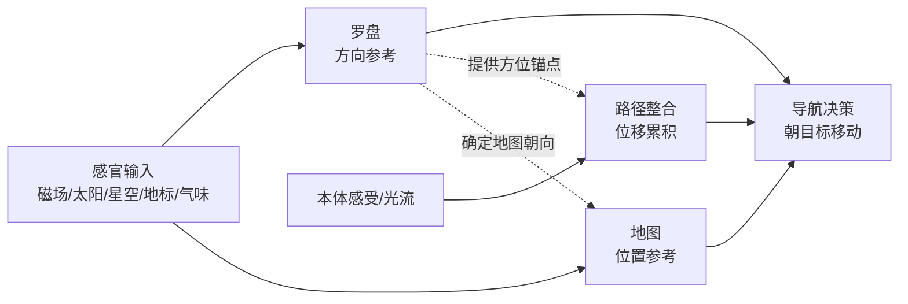
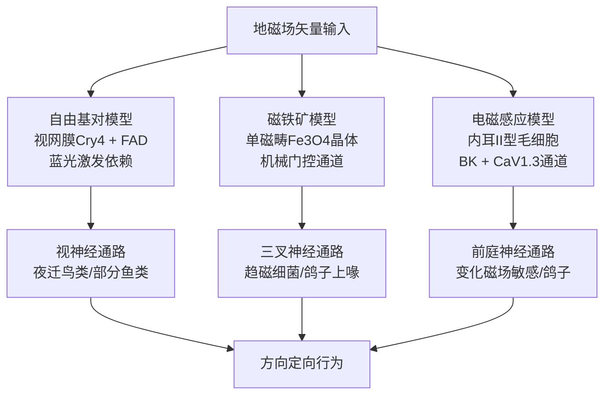
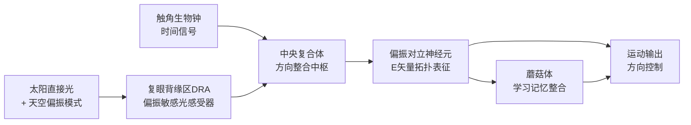
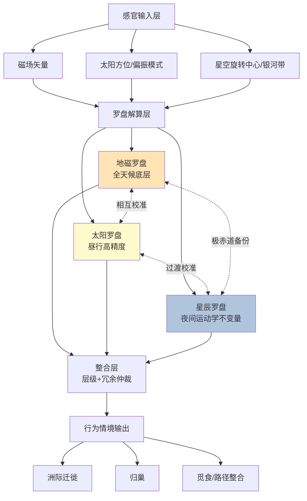

# 动物导航的三大罗盘机制：地磁罗盘、太阳罗盘与星辰罗盘的比较研究
# 1 导论：动物方向定位与罗盘机制研究框架

每年秋季，一只体重不足半磅的斑尾鹬（*Limosa lapponica*）会从接近北极的阿拉斯加海岸起飞，在九天之内不眠不休地横跨整个太平洋，飞行约11000公里抵达南半球的新西兰[^1]；与此同时，北极燕鸥（*Sterna paradisaea*）正以更宏大的尺度往返于地球两极，每年累计飞行超过两万公里[^1]。在海洋深处，洄游鲑鱼可以在被人为施加90°转向磁场后，将自己的游泳方向同步偏转90°，从而暴露出体内一个与地磁场紧密耦合的"方向解算器"[^1]。这些跨越尺度、跨越类群的现象提示我们：动物在广袤、动态、缺少人造地标的自然环境中长距离运动，必然依赖某种**稳定可靠的方向参考系统**——这就是本报告所要系统比较的"罗盘机制"。本章作为全篇的总纲，将从动物为何需要罗盘、罗盘与导航其他要素的关系、三大罗盘机制的划分依据、研究史上的认知突破，以及贯穿后续章节的六维分析框架五个层面展开，为第2—4章分别考察地磁、太阳与星辰罗盘奠定概念和方法论基础。

## 1.1 动物导航的基本问题与罗盘机制的必要性

动物在其生活史中执行的空间移动行为极为多样，从季节性迁徙、生殖洄游、巢域归返，到日常觅食往返，其尺度跨越从数十厘米到上万公里。无论何种尺度，只要目标位置不能通过即时感官（如气味浓度梯度、视觉地标）直接锁定，移动主体就必须**首先回答"我朝哪个方向走"这一根本问题**，否则任何位移努力都将退化为随机游走。信鸽千里传书的能力、欧洲知更鸟（*Erithacus rubecula*）和斑尾鹬的洲际迁徙、北极燕鸥的极间往返、鲑鱼回到出生溪流产卵、刚孵化的红海龟幼龟从沙滩巢穴爬向大海等案例，均以不同形式证明：**没有可靠的方向参考，就不可能实现具有方向性的远距离移动**[^1]。

在概念层面，导航研究通常区分**定向（orientation）与导航（navigation）**两个层级。定向指动物相对于某一物理刺激（如光源、重力、化学梯度）的姿态调整或趋避反应，例如趋光性、趋地性；而导航则是更高阶的行为——朝向一个**位置目标**的有方向运动，其前提是动物的神经系统对感官输入进行加工，从中抽取出方向乃至距离信息[^2]。导航先驱James L. Gould明确指出，导航并非简单的"朝光走或避光走"，而是对感官输入进行神经加工以确定方向（甚至距离）的过程；他举例：一只蜜蜂若要前往蜂巢以南的食物源，清晨出发时太阳在其左侧，下午出发时则必须置太阳于右侧——这一看似简单的行为已蕴含了对方向参考、时间补偿与目标位置的综合解算[^2]。罗盘机制正是这一解算过程中的**底层模块**：它独立于地图（位置感）和路径整合（位移累积），但又是后两者发挥作用的前提——只有先知道"北"在哪里，才能谈论"我在哪里"与"我已经走了多远"。

罗盘机制的必要性还可从其缺失时的行为崩塌中得到反证。在著名的箱龟（*Terrapene carolina*）实验中，研究者先在实验室中训练淡水龟从东向西定向移动，随后施加外来磁场扰动，结果箱龟的方向性立刻丧失，行为输出变得近乎随机[^1]。类似地，趋磁细菌（magnetotactic bacteria）依靠体内磁小体（magnetosomes）链感知磁场矢量，从而沿磁力线游动至适合自身生理需求的氧浓度层[^1]——这表明即便在最简单的单细胞生物中，"方向参考—位移行为"的耦合关系也已经构成生存的基础架构。

## 1.2 罗盘、地图与路径整合：动物导航要素的关系定位

要清晰界定本研究的边界，必须将"罗盘"从更宏大的动物导航系统中精确剥离出来。当代动物导航研究通常将整套能力分解为三大相互嵌套的要素：**罗盘（compass）提供方向参考、地图（map）提供位置信息、路径整合（path integration）提供基于自身运动的实时位移累积**。三者既可独立工作，也可耦合互补，共同构成从微观觅食到洲际迁徙的多尺度导航能力。

**路径整合**是其中最古老、也最广泛分布的机制之一。招潮蟹是这一机制的经典模型：它不依赖地标、不依赖气味，而是通过腿部本体感受器（proprioceptors）精确记录每一步的步数与步幅以累加距离，并通过平衡囊（statocyst）感知身体的旋转角度以实时更新洞穴的相对方向，从而在每一步走出之后，于神经层面重新计算"当前位置→洞穴"的最短向量[^3]。其精度之高，以至于科学家通过"滑倒实验"（在光滑表面让螃蟹打滑导致步幅计数失真）和"时间干扰实验"（短暂扣留超过一分钟后回家向量记忆衰减）即可制造可重复的归巢误差，从而反推其内部计算机制[^3]。值得注意的是，招潮蟹的路径整合属于**内部运动感知（idiothetic）**型，其方位维度依赖平衡囊感知的身体旋转，而不依赖外部方向参考——这是一种相对"简化"的路径整合。

然而，对于沙漠蚂蚁、蜜蜂等远离巢穴觅食的昆虫而言，仅靠本体感受远远不够，它们必须借助**外部方向参考——即罗盘**——来锚定路径整合的方位维度。比勒费尔德大学Egelhaaf与Lindemann的综述指出，沙漠蚂蚁能通过步数计数与天体罗盘相结合来精确执行路径整合；而蜜蜂作为飞行昆虫，其情况更为复杂：它无法依赖地面计步，而是通过**光流（optic flow）**——即视野中物体相对运动的视觉信号——来估计飞行距离，并将这一距离信息编码进摆尾舞（waggle dance）的摆尾阶段时长之中传递给同伴[^4]。飞行隧道实验显示，当改变隧道壁面纹理以诱导不同强度的光流时，蜜蜂摆尾舞所传达的"距离"也会相应改变，证明光流是其距离估计的主要信息源；但光流本身具有几何模糊性（同一速度下，物体越近光流越强；光流与飞行高度成反比），这使得飞行昆虫的距离估计在复杂环境中存在显著挑战[^4]。在这一框架下，**罗盘提供的不是"我走了多远"，而是"我在朝哪个方向走"**——它为路径整合提供方位锚点，也为地图查询提供朝向参考。

地图、罗盘、路径整合三者的关系可用下图概括：

该图明确了本报告的研究边界：**我们聚焦于"罗盘"这一方向参考模块，而非完整导航系统**。地图机制（如鸟类的嗅觉地图、海龟的磁场地图）与路径整合（如招潮蟹的向量计算、蜜蜂的光流测距）将仅作为背景出现，不构成本研究的主题。这一聚焦使得后续三章的并列比较具备一致的分析对象，避免因"导航"概念外延过宽而失焦。

## 1.3 三大罗盘机制的划分依据与核心地位

依据**罗盘所采集的物理信息源**，动物罗盘可被系统地划分为三大类：**地磁罗盘（Magnetic Compass）**利用地球磁场的方向信息；**太阳罗盘（Sun Compass）**利用太阳的方位角，并往往配合天空偏振光与日落线索；**星辰罗盘（Star Compass）**利用夜空中的恒星格局或天体旋转中心进行夜间定向[^5]。这一三分法不仅是研究文献中事实上的主流分类，也具有清晰的学理依据：地磁罗盘对应**地球物理场线索**（全天候、不受天气直接遮挡）、太阳罗盘对应**昼行性天体线索**、星辰罗盘对应**夜行性天体线索**，三者在物理本质、感官通道与时间窗口上恰好形成互补，可以共同覆盖动物在不同生态情境下的方向需求。

在鸟类导航的经典综述中，磁罗盘、太阳罗盘、星辰罗盘以及与之相伴的天体旋转（celestial rotation）线索被并列为定向机制的核心组成部分，同时辅以地标、嗅觉和路径上空间线索的记忆等[^5]。该综述特别指出：星辰罗盘与天体旋转因其夜间可得性，对夜行性迁徙鸟类的方向控制具有决定性影响；而日落线索会随季节与纬度变化，新出现的星空也需要校准，因此**地磁罗盘往往成为统一协调各类天体线索方向意义的"主参考"**[^5]。James L. Gould与Carol Grant Gould在《Nature's Compass: The Mystery of Animal Navigation》（Princeton University Press, 2012）一书中，则更广泛地将这一分类应用于从蝴蝶到人类的多样化生物，强调动物导航所需的信息要素在跨类群中具有高度的普适性[^6][^7]。

三大罗盘并非彼此孤立，而是构成一个**有层级、有互补的方向参考系统**：

- 在时间维度上，太阳罗盘与星辰罗盘分别覆盖昼夜，而地磁罗盘则跨越昼夜与天气；
- 在精度维度上，天体罗盘（特别是太阳）在晴朗条件下可提供较高的角分辨率，而磁罗盘提供的是相对粗略但极为稳定的全局参考；
- 在校准层级上，多项实验（将在第5章详述）显示动物常以天体线索（特别是日落偏振光模式）来校准磁罗盘，又以磁罗盘来锚定新出现星空的方向意义，形成**多层级互相校准的网络**[^5]。

正是这种互补与层级关系，使得"分别考察—综合比较"成为动物罗盘研究的标准方法学路径，也构成本报告第2—5章的结构主线。

## 1.4 超越人类感官：动物罗盘研究的认知突破

动物罗盘机制研究之所以在过去半个世纪持续刷新人类对感知世界的理解，部分原因在于其反复挑战了一个根深蒂固的认知偏见——Donald Griffin所称的"**简单性过滤器（simplicity filter）**"，即研究者倾向于假设动物所能感知的线索不会超出人类自身的感官范围[^2]。然而历史一再证明这一假设的局限：当蜜蜂被发现能够看见紫外光时，整个比较感官学界为之震动；此后，**偏振光、红外光、特殊气味（信息素）、磁场、电场、超声波与次声波**等"新感官"陆续被纳入动物可感知线索的清单，并且James L. Gould明确指出"没有理由认为这份清单已经完成"[^2]。

这一认知突破对罗盘机制研究尤为重要，因为三大罗盘的感官基础几乎全部位于人类直觉经验之外：

第一，**磁感受（magnetoreception）**对人类完全是隐形的。即便是趋磁细菌沿磁力线游动这样基础的现象，也直到20世纪后期才被纳入主流生物学视野；而鸟类、海龟、鲑鱼、蝾螈、蟾蜍、蜜蜂、蝙蝠、鼹鼠等多样化类群被陆续证实拥有磁罗盘[^1]，背后的感官机制（自由基对模型与磁铁矿假说，将在第2章详述）至今仍是争议焦点。

第二，**偏振光视觉**亦超出人眼的直接经验。许多昆虫与鸟类能够辨识天空中由瑞利散射形成的偏振模式，并以之作为太阳方位的"备份指南"，特别是在日出日落时分用以校准磁罗盘——这一能力将在第3章详细展开。

第三，**星图与天体旋转中心识别**虽与人类天文观测共享同一星空，但动物（特别是夜迁鸟类）所提取的并非具体星座，而是恒星视运动的旋转中心（在北半球即北极星附近）。这种"以不动点定义北方"的策略也非人类日常导航直觉所能预料，将在第4章详述。

这些"超越人类感官"的发现共同提示我们：**对动物罗盘的比较研究不仅是行为学问题，更是一场不断扩展的"感官认识论"探险**。任何对动物方向能力的轻率简化，都可能错失自然选择在数亿年中演化出的精妙解决方案。

## 1.5 比较研究的六维分析框架

为使第2—4章对三大罗盘的考察具备**可比性、结构化与完整性**，本研究在导论部分确立一套统一的六维分析框架。该框架既源自动物罗盘领域文献的普遍论述结构，也回应了本报告"分别综述—对比汇总"的写作目标。第6章的对比表将严格以这六维作为列标准，确保前文综述内容与最终矩阵一一对应。

下表概括了六维分析框架的内涵与考察要点：

| 维度 | 内涵 | 在罗盘比较中的考察要点 |
|------|------|----------------------|
| **(1) 工作原理** | 罗盘所依赖的物理量与信息编码方式 | 磁场矢量与重力轴夹角、太阳方位角与时间补偿、天体旋转中心识别等 |
| **(2) 模式分类** | 同一机制下的子类型与判别逻辑 | 倾角罗盘 vs 极性罗盘；完全时间补偿 vs 部分补偿 vs 阶跃补偿；恒星格局识别 vs 旋转中心识别 |
| **(3) 代表性动物类群** | 从微生物到脊椎动物的分布与具体物种例证 | 涵盖鸟类、爬行类、鱼类、昆虫、甲壳类、哺乳类等，避免类群偏倚 |
| **(4) 感官与神经基础** | 感受器、分子模型与神经回路 | 隐花色素自由基对模型、磁铁矿机械感受、复眼背缘区偏振视觉、视网膜与中央复合体等 |
| **(5) 习得与校准机制** | 先天性与经验性发育，以及多线索间的相互校准 | 时钟移位实验、Emlen漏斗与天文馆实验、cue-conflict实验、幼鸟通过天体旋转中心学习方位等 |
| **(6) 局限性与误差源** | 依赖条件与失效情境 | 光照波长与强度窗口、磁场强度阈值、晴朗天气、时间感知、纬度变化、光污染与电磁干扰等 |

六个维度并非彼此独立，而是构成一个**层层递进的认识链条**：从"罗盘依赖什么物理信息"（工作原理）到"它有几种实现方式"（模式分类），再到"哪些动物在使用"（类群分布）、"靠什么器官与回路实现"（感官基础）、"如何获得与保持准确"（习得与校准），最终落脚于"在什么条件下会失效"（局限性）。这一链条恰好对应了一个完整的机制描述应有的全部层次。

需要强调的是，该框架并非教条式的模板，而是**保障比较系统性的最低要求**：在具体章节中，三种罗盘机制因其物理本质不同，可能在某一维度上具有特别丰富的研究历史（如磁罗盘的感官基础长期存在两大主流模型并行竞争），也可能在另一维度上信息相对有限（如星辰罗盘的神经回路研究至2022年仍存在大量未解之谜）。本报告将如实呈现这种不均衡，并在最终的对比表（第6章）与展望（第7章）中加以总结。

---

综上，本章已厘清"罗盘机制"这一核心概念的内涵与外延：它是动物导航系统中独立于地图与路径整合的**方向参考模块**，是远距离定向移动得以可能的底层条件；依据物理信息源，动物罗盘可被系统地划分为地磁、太阳、星辰三大类，三者在时间、精度与校准层级上互补；这一研究领域不断挑战人类感官的认知边界，揭示出磁感受、偏振视觉与星图识别等超越直觉经验的感官能力。在六维分析框架的指引下，下一章将首先深入考察**地磁罗盘**——这一最为隐秘也最具争议的方向参考机制，从倾角罗盘与极性罗盘的判别实验逻辑出发，逐一展开其工作原理、感官基础、跨类群分布与依赖条件。

# 2 地磁罗盘（Magnetic Compass）机制解析

承接第1章所确立的六维分析框架，本章首先深入考察三大罗盘机制中最为"隐秘"——即对人类感官完全不可见——却同时最具普适性的方向参考系统：**地磁罗盘**。地磁场作为地球物理场的一部分，覆盖整个行星表面、跨越昼夜与天气、不受云层或夜幕遮挡，这种全天候稳定性使其成为动物方向参考系统中"最后的依靠"，也使其在导论1.3节所讨论的"层级互补网络"中常常扮演主参考的角色。然而，地磁场的方向信息究竟如何被生物体提取？提取过程涉及哪些物理学原理与感官分子？哪些动物类群已被证实拥有这一能力？它是先天禀赋还是后天习得？这些问题构成了本章的核心议题。下文将依次从工作原理、模式分类、跨类群分布、感官假说与条件依赖性五个层面展开，并在每一层面回应导论六维框架中的相应维度。

## 2.1 地磁罗盘的工作原理与物理基础

要理解动物如何利用地磁场定向，必须首先把握地磁场本身的物理特征。地球磁场近似一个倾斜的偶极磁场，其磁矢量在地表的每一点都可分解为三个分量：**水平分量**（指向磁北的水平投影）、**垂直分量**（指向地心方向的分量）与**总强度**；与此密切相关的还有第四个派生量——**磁倾角（inclination）**，即磁矢量与水平面所夹的角度。这四个物理量随纬度呈现规律性变化：在磁赤道附近，磁矢量几乎平行于地面，倾角接近0°，垂直分量趋于零；越接近磁极，磁矢量越趋于垂直于地面，倾角接近±90°，水平分量趋于零；总强度则从赤道（约25,000–30,000 nT）向两极（约60,000–65,000 nT）逐渐增大。需要说明的是，欧洲知更鸟所栖息纬度的地磁场总强度大约只有**0.5 高斯**（即约50,000 nT）这一相对微弱的水平[^8]，这一数量级是后续讨论自由基对模型如何能够在此弱场下产生可探测响应时需要持续保留的参照基准。

从这些物理量出发，动物原则上可以提取两类信息：一类是**方向信息**，即水平投影所指向的"磁北"方向，或矢量与重力轴之间的夹角所定义的"极赤轴"方向——这正是地磁罗盘的功能；另一类则是**位置信息**，即倾角与总强度随纬度的连续变化为动物提供了一种"磁场坐标网格"，可作为长距离迁徙中的地图线索使用（如红海龟幼龟对磁场航标的内禀响应将在2.3节讨论）。本报告聚焦于前者，即方向参考；磁场作为地图的功能仅在与罗盘相关的语境中被简要提及。

相较于太阳与星辰罗盘，地磁罗盘的物理基础具有三项突出优势。**第一是全天候性**：磁场不受云层、降水、雾霾、植被遮蔽的影响，在夜间、雨天、深海或地下环境中均可被探测，这使其成为唯一一种在所有生态情境下都可使用的方向参考。**第二是时间无关性**：地磁场的方向在数小时到数天的时间尺度上近乎不变（百年尺度的长期漂移在动物个体生命周期内可忽略），因此无须像太阳罗盘那样依赖精确的内在生物钟进行时间补偿。**第三是层级"主参考"地位**：在多线索校准实验中，磁罗盘常被用以统一来自不同天体线索的方向意义——例如新出现的星空、季节性变化的日落方位都需要被锚定到一个稳定的方向框架中，而磁场提供的正是这样一个稳定框架（详见第5章的cue-conflict实验综述）。然而，这种稳定性也付出了代价：磁场所携带的方向信息精度相对较粗，且其感受机制对外界电磁干扰、光照波长与强度等条件存在显著依赖（详见2.6节）。

## 2.2 倾角罗盘与极性罗盘的判别逻辑

在地磁罗盘的"模式分类"维度上，**倾角罗盘（inclination compass）与极性罗盘（polarity compass）**的二分是该领域最为基础也最具判别力的概念。两者均以磁矢量为输入，但所提取的方向信息却根本不同：**极性罗盘**直接区分磁矢量的南北两端，即"哪一端指向磁北"；而**倾角罗盘**并不区分南北极性，仅依据磁矢量与重力轴所夹的角度判别"极向（poleward）"与"赤道向（equatorward）"——在北半球，磁矢量向下倾斜的方向即极向、向上倾斜的方向即赤道向，南半球则反之。这种"以倾角而非极性定义方向"的策略带来一个有趣的推论：当动物跨越磁赤道时，倾角罗盘的输出会发生反转，必须借助其他线索（如星空或日出方位）重新校准。

判别动物使用何种罗盘的经典实验范式是**垂直分量翻转实验**。其逻辑可概括为：通过亥姆霍兹线圈或类似装置，对动物所处环境的磁场进行人工操控，分别有四种处理方案——保持自然磁场（NN）、反转水平分量（rN）、反转垂直分量（Nr）、同时反转两个分量（rr，等价于将整个磁矢量翻转180°）。如果动物使用**极性罗盘**，则只要磁矢量的水平方向被改变（如rN或rr），其行为定向就应当随之翻转；而单独翻转垂直分量（Nr）不应影响其行为，因为水平方向未变。相反，如果动物使用**倾角罗盘**，由于其判别依据是矢量与重力轴的夹角而非极性，则单独翻转水平分量（rN）会使原本的"极向"指向反过来——动物会朝反方向定向；单独翻转垂直分量（Nr）同样会改变倾角的极向意义——动物也会反向定向；只有同时翻转两个分量（rr），由于倾角的极向意义保持不变，动物的定向行为反而不会改变。这一非直觉的预测——**"翻转整个磁矢量却不改变行为，单独翻转任一分量却改变行为"**——构成了倾角罗盘判别的最强证据。

Wolfgang与Roswitha Wiltschko夫妇在1970年代对欧洲知更鸟应用这一范式，首次得出"鸟类使用倾角罗盘"的结论，此后该范式被广泛应用于海龟、蝾螈、鱼类等多种动物，揭示出不同类群在罗盘类型上的差异（详见2.3节）。需要指出的是，本报告所参考的搜索结果中并未直接呈现垂直分量翻转实验的原始数据，因此本节的实验逻辑陈述主要基于该领域的标准方法学框架——这一框架虽属领域常识，但具体的实验数值与物种细节读者可参阅相关综述与原始文献。

## 2.3 跨类群证据：地磁罗盘的生物学分布

地磁罗盘并非鸟类的专利，相反，从单细胞生物到高等脊椎动物的多样类群中均已观察到磁定向能力。Kirschvink、Walker与Diebel在《Current Opinion in Neurobiology》上的综述明确指出，**定向、导航与归巢是从细菌到高等脊椎动物广泛表达的关键性状**，磁感受作为支持这些行为的感官系统在过去40亿年中得到高度演化，并不例外[^9]。下面按类群依次梳理代表性证据。

**鸟类**是地磁罗盘研究最为深入的类群。欧洲知更鸟作为夜行性迁徙鸟类，能够利用强度仅约0.5高斯的微弱地磁场进行长距离定向，以完成年复一年的季节性迁徙[^8]；这一能力在Wiltschko夫妇的早期Emlen漏斗实验中得到确证，并被判定为典型的**倾角罗盘**。信鸽（*Columba livia*）的归巢能力则是磁罗盘研究的另一经典模型——尽管其归巢主要依赖磁场以外的多种线索，但磁场对其方向能力的贡献已通过磁铁附着、线圈干扰、施加旋转磁场等多种范式得到证实[^10]。

**爬行类**中，海龟提供了从孵化到成年全生命周期的磁感受证据。Lohmann夫妇在《Encyclopedia of Animal Behavior》中的综述系统阐述了这一点：刚孵化的红海龟幼龟通过视觉线索、波浪线索与**磁罗盘**完成最初的离岸迁徙；进入大洋后，幼龟会对沿迁徙路径分布的"磁场航标（magnetic waymarks）"作出与生俱来的方向反应，从而被保持在合适的育幼栖息地内；成熟个体则通过对磁场变化模式的经验积累，学会基于磁位置信息定位觅食地，并准确返回出生海滩产卵——更令人惊叹的是，幼龟可能会对出生海滩的磁场信息进行**印记（imprinting）**，多年后据此回归原生海域筑巢[^11]。这一发现既证明了磁罗盘的先天性（幼龟无需经验即可使用），也揭示了磁感受在生命周期中的可学习扩展。

**鱼类**中的磁感受研究覆盖了从大洋洄游鱼到淡水迁移鱼的多个物种。导论已提及鲑鱼可以在被人为施加90°转向磁场后将游泳方向同步偏转——这一行为学证据指向其内部存在与磁场紧密耦合的方向解算系统。在分子层面，Xu等人研究了大西洋鲱鱼（*Clupea harengus*）的Cry4蛋白，通过经典分子动力学与量子力学/分子力学（QM/MM）模拟重建了该蛋白的原子模型，发现其内部电子转移过程与欧洲知更鸟Cry4的实验与计算结果高度相似——这意味着大西洋鲱鱼Cry4具备形成磁敏自由基对所需的物理化学性质，可能参与基于自由基对的磁感受过程[^12]。这一结果将磁罗盘的自由基对模型从夜迁鸟类推广到了海洋鱼类，提示该机制可能在脊椎动物中更为普遍。

**哺乳类、昆虫与甲壳类**的证据同样不可忽视，尽管所参考的搜索结果对此提供的直接信息有限。导论1.4节已列举蜜蜂、蝙蝠、鼹鼠等被证实拥有磁罗盘的物种；昆虫中黄粉虫的磁定向行为、龙虾基于磁场图谱的归位能力等也是该领域反复引用的经典案例。**趋磁细菌**则代表了磁感受演化谱系上的最古老分支——它们依靠体内的磁小体链感知磁矢量，沿磁力线游动至适宜的氧浓度层，这一行为虽然严格意义上是"被动磁趋性（magnetotaxis）"而非主动罗盘使用，但其分子基础（单磁畴磁铁矿晶体）为后续脊椎动物磁感受的磁铁矿假说提供了直接的演化与机理参照[^9]。

值得专门指出的是，**倾角罗盘与极性罗盘在动物界呈现不均匀的分布**。鸟类（如欧洲知更鸟）使用倾角罗盘已被确证；海龟等海洋动物的研究也倾向于支持倾角罗盘；而鱼类（特别是部分鲑科）与某些昆虫则被报告使用极性罗盘。这一分布差异的演化意义尚未完全厘清，但提示罗盘类型可能与各类群的栖息纬度、迁徙跨度（是否跨越磁赤道）以及感官分子机制（自由基对 vs 磁铁矿）密切相关。

## 2.4 自由基对模型：光依赖型磁感受的分子机制

地磁罗盘的"感官与神经基础"维度长期由两大主流假说所主导：**基于隐花色素的自由基对模型**与**基于磁铁矿颗粒的机械感受模型**。两者在物理本质、感官通道、神经回路与适用物种上均有显著差异，构成本节与2.5节的核心议题。

**自由基对模型（radical pair mechanism, RPM）**的核心思想是：磁感受发生在一种特殊的化学反应过程中，反应中间体由一对处于相干量子态的自由基组成，外加磁场通过塞曼相互作用调制单态—三态之间的转换概率，从而改变反应产物的产率；动物只需感知该产率随头部朝向的变化即可获得方向信息。这一机制最早由Schulten等人于1970年代末提出，至2000年前后被进一步具体化——理论计算指出**光敏蛋白隐花色素（Cryptochrome, Cry）**是承载该自由基对的最佳候选分子[^8]。

隐花色素之所以被认为是磁感受分子，关键在于它能够结合**黄素腺嘌呤二核苷酸（FAD）**辅因子（活性型维生素B2）。澎湃新闻采访中，论文第一作者许静静明确指出："FAD是这个磁敏的'心脏'，只有结合了辅因子FAD的隐花色素蛋白，才具备磁敏性的先决条件"——其分子机制为：FAD在受到蓝光激发后发生还原反应，依次夺取附近色氨酸（Trp）的电子，从而形成具有磁敏性的自由基对**[FAD·⁻ TrpH·⁺]**[^8]。这一过程的两个关键属性——**蓝光激发**与**电子转移链**——决定了基于隐花色素的磁罗盘必然是**光依赖型**机制，并通常定位于视网膜光感受细胞中。

2021年6月23日，《自然》（*Nature*）以封面形式发表了由德国奥尔登堡大学、英国牛津大学、中国科学院合肥物质科学研究院、美国普渡大学、得克萨斯大学西南医学中心、德国弗莱堡大学等多个团队联合完成的重磅研究，题为"Magnetic sensitivity of cryptochrome 4 from a migratory songbird"，该研究证明了**鸟类视网膜中的隐花色素蛋白4（Cry4）对磁场敏感，很可能就是长期寻找的磁传感器**[^8]。该研究的6位通讯作者中包括中国科学院合肥物质科学研究院强磁场科学中心的谢灿研究员，谢灿实验室与奥尔登堡大学Henrik Mouritsen课题组合作，首次在实验室成功制备出具有生物活性的欧洲知更鸟Cry4蛋白，质谱分析显示该蛋白的辅因子结合率高达**97%**——这一高纯度蛋白制备为整项研究的成功奠定了基础[^8]。这一发现使Cry4（特别是夜迁鸣禽视网膜Cry4）成为目前自由基对模型最有力的分子候选。

自由基对模型的适用范围正在从夜迁鸟类向其他类群扩展。Xu等人对大西洋鲱鱼Cry4的QM/MM研究表明，其内部电子转移过程与欧洲知更鸟Cry4在实验和计算上所观察到的过程相似，因此大西洋鲱鱼Cry4在物理化学性质上"plausibly"具备形成自由基对的能力，可能参与基于自由基对的磁感受[^12]。这一结果暗示着自由基对机制在脊椎动物——至少在迁徙性强的鸟类与鱼类中——可能具有共同的演化基础。

除Cry4之外，谢灿团队还提出了另一条与自由基对模型互补的分子线索。2016年，谢灿实验室在《自然—材料》（*Nature Materials*）发表了一项原创性突破，**在国际上首次发现了动物对磁场感知的磁受体基因**，该基因编码的磁感应蛋白（MagR）具备内禀磁性，能与Cry蛋白形成复合物，从而识别外界磁场并作出响应[^8]。MagR—Cry复合物的提出试图将自由基对的化学敏感性与磁铁矿样的物理磁矩感受性统一在同一分子框架内，虽然该模型至今仍存在争议且尚未获得跨实验室独立重复的有力支持，但其与上述2021年Nature封面研究构成了近十年磁感受分子机制研究的两大代表性进展。

## 2.5 磁铁矿假说与内耳电磁感应：非光依赖型感受机制

与自由基对模型相对的另一主流假说是**基于磁铁矿颗粒的机械感受模型**。Kirschvink、Walker与Diebel在其综述中明确表达了一种较强的立场：**所有生物对磁场的敏感性（包括板鳃鱼类）都源自一个高度演化、精细调谐的、基于单磁畴铁磁性晶体（single-domain magnetite, Fe₃O₄）的感官系统**[^9]。该模型的物理基础是：单磁畴磁铁矿晶体具有永久磁矩，在外加磁场中会产生力矩并发生取向调整；当这些晶体被锚定在感觉细胞内的细胞骨架或与机械门控离子通道耦合时，磁场引起的微小机械形变即可被转化为神经电信号，从而进入感觉传导通路。

磁铁矿假说在解剖学上通常与**三叉神经（trigeminal nerve, TN）**及**眶上神经（superficial ophthalmic, SO）**通路相关联——鸽子上喙的三叉神经传入区域曾被认为是磁铁矿型受体的主要候选位置；该假说尤其适合解释那些对**磁场极性与强度**敏感的物种（如趋磁细菌、部分鱼类与部分鸟类），因为磁铁矿的物理响应本身就是极性敏感的（单磁畴矩具有明确的方向性）[^9]。相比自由基对模型，磁铁矿假说的两个突出特征是：**不依赖光照**（机械力矩与光照无关）、**可在静磁场中工作**（永久磁矩在静态场中即可发生取向）。

然而，2026年的一项研究为非光依赖型磁感受打开了**第三种可能的感官通道**。德国慕尼黑大学David Keays教授领导的团队采用**组织透明化技术**结合全脑神经元活动图谱策略，对完整鸽子大脑中究竟哪些神经元群体会对磁场刺激产生响应这一核心问题进行了系统性回答[^10]。研究团队通过优化的组织透明化处理使整个鸽子大脑变为光学透明，在光片显微镜下实现全脑三维成像，并结合**C-FOS标记**精准定位被激活神经元的位置与数量。设计的对照实验包括有光与无光条件下、旋转磁场刺激与零磁场对照之间的多组比对，结果发现两个核心激活区域[^10]：

- **尾侧内侧前庭核（VeM）**：双侧对称激活，主要负责接收前庭系统的传入信号，提示前庭系统可能参与了磁感知信息的处理，磁信号的初级感受器可能位于前庭上皮；
- **尾侧中脑皮层（MC）**：与多感官整合相关，激活区域沿海马脑室分布，位于听觉区L2的内侧。

至关重要的是，**即使在无光黑暗的条件下，磁刺激依然能持续激活前庭核**；而视觉相关脑区（如背外侧膝状体复合体、视顶盖、视觉Wulst）则未见显著激活——这一结果直接表明该机制**并不依赖光诱导自由基对的形成**[^10]。同时，静磁场对照实验显示：暴露于静磁场的鸽子，其内侧前庭核、中脑皮层、背内侧丘脑、海马均未被显著激活；**只有变化的磁场才是激活这些脑区的必要条件**——这一现象与依赖于**电磁感应**的生物物理机制相一致[^10]。

顺着前庭线索深入内耳，研究者对鸽子壶腹嵴（位于各半规管基底、分布有感觉毛细胞的关键结构）的细胞进行了**单细胞RNA测序**。分析结果显示，一类**II型毛细胞**中高表达两种关键的离子通道——**BK钾通道**与**钙通道CaV1.3异构体**；此前研究已表明CaV1.3异构体是电感知的关键分子（Bellono et al., 2018），这为电磁感应机制提供了重要的分子证据[^10]。综合行为—解剖—分子三层证据，研究团队推断II型毛细胞很可能是鸽子电磁感应型磁感受的初级受体细胞。

需要明确说明的是，该研究的发表时间（2026年）已超出了本报告所设定的"截至2022年"的文献边界（详见导论P-3标准）。本节之所以仍纳入该结果，是因为其工作脉络与早期电压门控通道介导的电磁感应假说（Nimpf et al., 2019）一脉相承——后者属于截至2022年已存在的第三大磁感受机制候选[^10]；本节将该2026年研究作为该假说脉络的最新进展加以提及，但不将其作为本报告时间边界内的核心结论引用，读者在阅读时应将其与自由基对模型、磁铁矿模型作为**三种并存且互补的感官假说**加以理解。

综合三大假说的关系，可用下图概括其物理基础、感官通道、神经回路与适用对象的差异：

三大假说并非互斥，而很可能在不同物种、不同生态情境下各司其职——自由基对模型主要承担**方向（罗盘）信息**的提取，磁铁矿模型与电磁感应模型则可能更适合承担**强度与极性（地图）信息**的提取，三者共同构成动物磁感受能力的多通道架构。

## 2.6 先天性、习得性与条件依赖性

最后回到六维框架中的"习得与校准"与"局限性"两个维度。**关于先天性**，地磁罗盘是动物罗盘机制中最具先天性的一种：欧洲知更鸟雏鸟在未曾迁徙之前即可表现出方向性的Zugunruhe（迁徙不安）行为，红海龟刚孵化的幼龟在尚未进入海洋之前即对磁场表现出与生俱来的方向反应，这些证据表明磁罗盘的基本工作机制无需后天经验即可运行[^11]。然而，先天性并不排斥经验性扩展——以海龟为例，幼龟在沿迁徙路径生活的过程中会获得对磁场变化模式的经验，逐渐学会基于磁位置信息定位觅食地；性成熟个体在产卵季会准确返回出生海滩，可能借助于早年在出生海滩对磁场信息的印记[^11]。这一"先天罗盘 + 后天地图"的发展模式在哺乳类与鸟类研究中也有相应表现。

**关于条件依赖性**，地磁罗盘虽全天候可用，但其感官实现机制——特别是自由基对模型——对**光的波长与强度**存在严格依赖。Muheim、Bäckman与Åkesson在2002年发表于《Journal of Experimental Biology》的研究表明，**欧洲知更鸟的磁罗盘定向同时依赖于光的波长与强度**[^13]：在蓝绿光（短波长，与FAD的吸收谱匹配）下，知更鸟可正常使用磁罗盘进行定向；而在红光（长波长，无法激发FAD还原反应）下，其磁定向能力则会失效；同时，光强度也存在明确的功能阈值，过低或过高的强度都可能干扰罗盘工作[^13]。这一结果不仅为自由基对模型提供了行为学层面的有力支持，也明确了磁罗盘并非"无条件可用"的全能工具——它在分子层面与视觉光感受系统深度耦合。

除光条件外，**磁场强度的功能窗口**也是磁罗盘的重要约束：早期实验显示，鸟类的磁罗盘只能在接近其栖息地自然磁场强度的较窄范围内工作；当磁场强度显著偏离自然值时，定向能力会丧失，但若给予一段适应时间，鸟类可重新校准至新强度——这暗示磁罗盘存在一种动态的强度适应机制。**变化磁场而非静磁场**则是电磁感应型机制的特征性约束：Keays团队的研究明确显示，静磁场无法激活鸽子内侧前庭核与中脑皮层等核心磁响应脑区，**只有变化的磁场才能触发响应**——这一现象在电磁感应物理学上是自洽的（静态场不产生感应电动势），也提示动物在自然行为中头部的扫描运动（造成相对于磁场的旋转）可能是激活该机制的必要条件[^10]。

下表对地磁罗盘六维分析框架下的核心要点进行小结，为第6章的三大罗盘对比表预留对应内容：

| 维度 | 地磁罗盘核心要点 |
|------|----------------|
| **工作原理** | 利用地磁矢量的水平方向（极性罗盘）或矢量与重力轴夹角（倾角罗盘）提供方向参考 |
| **模式分类** | 倾角罗盘（鸟类、海龟等）vs 极性罗盘（部分鱼类、昆虫等）；判别依据为垂直分量翻转实验 |
| **代表性动物类群** | 鸟类（知更鸟、信鸽）、爬行类（红海龟）、鱼类（鲑鱼、大西洋鲱鱼）、昆虫（蜜蜂、黄粉虫）、甲壳类（龙虾）、趋磁细菌等 |
| **感官与神经基础** | 三大并存假说：①视网膜Cry4自由基对模型（光依赖）②三叉神经磁铁矿模型（极性/强度）③内耳前庭电磁感应模型（变化磁场） |
| **习得与校准** | 基本机制先天获得（雏鸟、幼龟即可使用）；磁场地图信息可经验性扩展（海龟磁场印记） |
| **局限性与误差源** | 光波长依赖（红光下失效）与强度阈值；磁场强度功能窗口；自由基对模型不能在静磁场中工作；易受人为电磁干扰 |

---

综上，本章在六维分析框架下完成了对地磁罗盘机制的系统解析。地磁场以其全天候、跨昼夜的稳定性，为多样化动物类群提供了独立于天体可见性的方向参考；倾角罗盘与极性罗盘的二分通过垂直分量翻转实验得以精确判别，并在不同类群中呈现差异化分布；自由基对模型（以欧洲知更鸟与大西洋鲱鱼的Cry4为代表）、磁铁矿模型（以单磁畴Fe₃O₄晶体为基础）与新兴的内耳电磁感应模型构成三大并存的感官假说，分别对应不同的解剖通道与适用情境；该机制总体上具有显著的先天性，但在光波长、磁场强度与场态（静/动）等维度上存在严格的条件依赖。**在层级互补网络中，地磁罗盘虽常被视为"主参考"，但其工作并非无条件**——这一发现既为后续第3章的太阳罗盘（提供精度更高但需时间补偿的天体方向参考）、第4章的星辰罗盘（提供夜间天体参考但依赖晴朗夜空）的考察预留了对照空间，也为第5章中三种罗盘之间的cue-conflict校准实验与协同使用模式的分析奠定了机制基础。

# 3 太阳罗盘（Sun Compass）机制解析

承接第2章对地磁罗盘"全天候稳定但精度相对粗略"这一特征的系统刻画，本章将考察动物导航研究中**精度最高、神经回路研究最为深入、且演化分布最广**的昼行性天体方向参考系统——太阳罗盘。如果说地磁罗盘是动物方向感知系统中那条隐而不显、却始终可靠的"主参考"，那么太阳罗盘则是一种**显著得多、精度高得多，但代价也大得多**的方向参考工具：它的方向信息源——太阳——明亮、清晰、几何位置可被精确解读，但同时也是**动态变化的**（每小时移动约15°的视方位）、**条件受限的**（只在白昼、晴朗或部分多云条件下可用）。这种"精度—稳定性"的权衡决定了太阳罗盘必须解决一个地磁罗盘所不需要面对的根本难题：**如何从一个不断移动的天体中提取一个稳定的地理方向**。围绕这一核心问题，下文将依次从工作原理与时间补偿、补偿模式分类、跨类群证据、偏振光罗盘的感官扩展、神经基础、习得与校准、局限性七个层面展开，逐一对应导论六维框架，并在每一节中保留与地磁罗盘的对照锚点，为第5章的整合分析与第6章的对比表预留接口。

## 3.1 太阳罗盘的工作原理与时间补偿核心问题

太阳罗盘的物理基础看似简单：在白昼任何一个晴朗时刻，太阳在天球上都占据一个确定的视位置，其在水平面上的投影方向（即**方位角**）原则上可以作为一条几何参考线，被动物用以锚定自身的运动方向。然而这种"简单性"立即被太阳的视运动所打破——由于地球自转，太阳的方位角在一天之中持续移动，平均速率约为15°每小时（在不同纬度与季节会有显著偏差，但量级保持一致）。这意味着，**若动物仅以瞬时太阳方位为参考朝某固定地标移动，其行进方向将随时间持续漂移**：清晨向"太阳左侧45°"行进与正午向"太阳左侧45°"行进，对应的地理方向截然不同。

Karl von Frisch对蜜蜂行为的奠基性研究第一次清晰揭示了昆虫如何应对这一难题。von Frisch在1919年发现蜜蜂以"圆圈舞"与"摆尾舞"传递食物方位信息，1944年进一步阐明摆尾舞的摆尾方向所编码的是**采集地点与太阳位置的角度**，摆尾持续时间则决定食物距离[^9]。这意味着蜜蜂在巢内黑暗中跳舞所传递的方向信息是相对于太阳方位的，而同伴接收到信号后飞向食物源，其飞行时间与跳舞时刻可能相差数十分钟乃至数小时——若不进行时间校正，飞行方向将系统性偏离目标。von Frisch在1949年进一步发现蜜蜂能感知偏振光，并能利用太阳的位置与地磁场确定空间方位，他甚至在当时即提出"地磁的日周期性波动是蜜蜂'时钟'的外界因素"这一前瞻性论断[^9]。这一系列发现使蜜蜂成为太阳罗盘研究的奠基模型，von Frisch本人也因这些工作于1973年获得诺贝尔生理学或医学奖[^9]。

这种对太阳视运动的连续校正机制即**时间补偿（time compensation）**，是太阳罗盘相对于地磁罗盘最显著的"额外计算负担"。其逻辑可表述为：**地理方向 = 瞬时太阳方位角 − 时间校正项**，其中时间校正项由动物的内在生物钟提供，并通过经验积累建立"时刻↔太阳方位"的映射函数。从信息论的角度看，时间补偿型太阳罗盘相当于一个二维查询表——动物只需"知道"当前时刻与当前太阳方位，即可在内部解算出一个稳定的地理方向参考。这一机制赋予太阳罗盘**高于地磁罗盘的角分辨率**（晴朗天空下太阳本体的角位置可被精确读取），但也带来三重代价：**对生物钟精确性的依赖、对昼行性的依赖、以及对天气可见性的依赖**——这三点恰好构成本章3.7节所要展开的局限性维度，也与第2章中地磁罗盘"全天候、时间无关"的特征形成鲜明对照。

值得指出的是，**时间补偿并非太阳罗盘的唯一可能形式**。Ugolini等人2018年在《Royal Society Open Science》发表的题为"The sun compass revisited"的综述对这一传统范式提出了重要修正：他们指出，长期以来"在时钟移位下出现可预测的偏转"被视为时间补偿太阳罗盘的litmus test（试金石），但这一范式实际上掩盖了太阳衍生信息可以被利用的多种方式[^10]。该文明确区分了两类机制：**罗盘机制（compass mechanism）**——利用太阳方位角提供绝对地理方向；与**航向指示器机制（heading indicator mechanism）**——利用太阳信息探测航向的变化[^10]。正如飞机上方向指示与转向指示由两套不同仪表提供一样，这两类信息在动物中可能由不同神经机制提供并服务于不同功能（如导航 vs 转向控制）[^10]。该综述进一步指出，**太阳罗盘虽然必须进行时间参照以解释太阳的日周期视运动，但并不必然需要完全时间补偿**——动物可能以联想性、因而有时间限制的方式利用与时间相关的太阳信息；而当太阳航向指示器以足够短的时间尺度被使用时，甚至完全无须时间补偿[^10]。这一观点提示我们：对太阳罗盘的考察不能僵化于"全天候完全时间补偿"这一单一模型，而应纳入下一节所要展开的多元补偿模式。

## 3.2 补偿模式分类：完全补偿、部分补偿、时间平均与阶跃补偿

在六维框架的"模式分类"维度下，太阳罗盘呈现出比地磁罗盘的"倾角/极性"二分更为丰富的策略谱系。依据对太阳日周期视运动的校正方式与时间分辨率，可大致区分以下四种补偿模式。

**完全时间补偿（full time compensation）**是经典范式，要求动物对太阳全天的视运动进行连续校正，从而在任意时刻都可从瞬时太阳方位提取稳定的地理方向。这是von Frisch蜜蜂研究、信鸽归巢研究、帝王蝶迁徙研究等经典模型所揭示的主导机制。这一模式的优势是方向参考连续可用，代价则是要求动物维持精确的内部生物钟，并通过经验建立完整的"时刻↔方位"映射函数（详见3.6节）。

**部分时间补偿（partial compensation）**仅对动物活动时段内的方位角变化进行修正，常见于活动时段相对有限的物种或行为情境——例如某些以特定时段觅食的昆虫可能并不需要对自己未曾经历过的太阳位置进行外推。Ugolini等人指出，由于动物可能以"联想性、因而有时间限制"的方式利用太阳信息，这种部分补偿在生态学上具有合理性[^10]。

**时间平均（time-averaging）策略**则更为简化——动物以日均太阳方位或某一基准方位为参考，不对瞬时方位变化进行精细校正。这一策略以损失精度换取计算简化，可能见于对方向精度要求不高的短距离行为，或作为更精细补偿机制的"后备"模式。

**阶跃补偿（step compensation）**位于完全补偿与时间平均之间，即在离散的时间窗口内保持方向参考不变，到下一时间窗口再做一次校正。这种"分段近似"模式在计算上更为经济，可视为对完全补偿的离散化逼近。

除上述四类补偿模式外，Ugolini等人的工作进一步打开了一个被传统范式所忽视的可能性——**太阳作为航向指示器（heading indicator）**的使用。在该模式下，动物并不试图从太阳信息中提取绝对地理方向，而是利用太阳作为短时航向变化的探测参考：只要太阳的视方位在动物自身的时间尺度内变化可忽略（例如几秒到几分钟内的航向控制任务），动物即可将太阳作为一个"准固定"的视觉锚点，用以发现自身航向的偏离[^10]。这种机制在足够短的时间尺度上甚至完全不需要时间补偿，因此可视为对完全补偿模式的一种"零计算成本"替代方案[^10]。该综述同时指出，太阳衍生的其他线索——例如**阴影**——也可能以显式依赖于位置的方式参与导航，超出了"罗盘"这一狭义概念的范畴[^10]。

四种补偿模式与航向指示器模式之间存在明显的能耗、神经计算复杂度与生态适应性的权衡：**完全补偿精度最高但代谢与神经成本最高，阶跃与时间平均策略以精度换简化，航向指示器模式则以适用范围（仅短时）换零计算成本**。不同物种在演化中究竟选择了哪种模式，可能与其行为时间尺度、迁徙距离、生态位约束密切相关。这一分类对比与第2章中倾角/极性罗盘的二分形成有趣对照——地磁罗盘的模式分类源于物理量提取方式的差异，而太阳罗盘的模式分类源于时间处理策略的差异，二者共同体现了"罗盘模式"这一概念在不同物理基础下的多样实现。

## 3.3 跨类群证据：从信鸽与椋鸟到帝王蝶、蜜蜂与沙漠蚁

在"代表性动物类群"维度下，太阳罗盘的生物学分布展现出比地磁罗盘更为典型的"昼行性—跨类群—多生态情境"特征。下文按鸟类与昆虫两大主线梳理代表性证据。

**鸟类**方面，信鸽（*Columba livia*）归巢能力的研究中，太阳罗盘是与地磁罗盘并列的核心方向参考之一。在更广义的鸟类长距离导航研究中，Mouritsen在《Nature》上的综述明确指出：每年都有数十亿只仅有数克脑重的小型鸣禽，从北极与温带繁殖地迁往热带与亚热带越冬地，多数在夜间迁徙，且年轻个体在无经验个体引导的情况下独立完成首次迁徙——这一非凡的导航能力依赖于多尺度、多感官线索的整合，没有任何单一线索可以独立支撑数千公里的精准定向[^14]。在这一多线索整合框架下，太阳罗盘虽对夜行性长距离迁徙鸟而言并非主导方向参考，但**日落线索**作为太阳罗盘的衍生形式，在迁徙起飞阶段的方向选择中扮演关键角色。

这一点在Muheim等人对**萨凡纳麻雀（*Passerculus sandwichensis*）**在高纬度地区迁徙定向的研究中得到清晰展示。该研究指出，夜行性鸟类迁徙者在高纬度面临三重挑战：磁倾角随纬度急剧变化、长距离飞行带来的经度时移、以及极地夏季的星空不可见[^15]。在这种极端情境下，**日落线索与地磁线索都被证实对萨凡纳麻雀的方向系统具有重要作用**。研究者通过4小时慢速时钟移位实验，预期产生60°的顺时针定向偏移；在自然晴朗天空与本地地磁场条件下，鸟类表现出指向西北方向（落日方位）和东南方向（其偏好迁徙方向）的显著双向定向；在时钟移位处理6天6夜后，鸟类的定向显著偏转至东北偏北方向，且最初定向于西北的个体倾向于按预期方向顺时针偏移[^15]。这一结果不仅直接证明萨凡纳麻雀使用了时间补偿型的太阳/日落罗盘，也揭示了**日落—磁场协同校准**在高纬度复杂导航中的实际运作（详见3.6节）。

**昆虫**方面，太阳罗盘呈现出三类极具代表性的模型，分别代表洲际迁徙、社会性觅食通讯、与个体路径整合三种不同的行为情境。

第一是**北美东部帝王蝶（*Danaus plexippus*）**的洲际迁徙。每年秋季，帝王蝶从北美东部繁殖地长距离飞往墨西哥中部山区越冬地，这一迁徙过程使用**时间补偿太阳罗盘**来维持稳定航向[^16]。Heinze与Reppert在《Journal of Comparative Neurology》上的研究明确指出："Each fall, eastern North American monarch butterflies (Danaus plexippus) use a time-compensated sun compass to migrate to their overwintering grounds in central Mexico"，并强调该太阳罗盘机制涉及**天空线索与昼夜生物钟时间信息的神经整合**[^16]，使昆虫得以在数千公里的迁徙中保持恒定航向。这一系统的神经基础（中央复合体与触角生物钟）将在3.5节详述。

第二是**蜜蜂（*Apis mellifera*）**的觅食通讯。如3.1节所述，von Frisch通过对摆尾舞的系统研究确立了蜜蜂使用太阳方位角作为方向参考的事实[^9]；同时他在1949年发现蜜蜂能感知偏振光，从而使蜜蜂在太阳本体被遮挡时仍能通过天空偏振模式定向[^9]。值得一提的是，**Albert Einstein在1949年10月写给von Frisch的一封信中即对动物感知与导航研究表现出深刻兴趣**——Dyer等人2021年披露的这封历史信件显示，Einstein与von Frisch曾于1949年4月在Princeton会面，Einstein在信中简要讨论了von Frisch的工作并探讨了理解动物感知与导航如何可能启发物理学创新[^17]。这一历史插曲既反映了20世纪中叶顶尖科学家对动物罗盘机制的跨学科关注，也暗示蜜蜂偏振光感知的发现在当时即被视为指向超越人类感官认知边界的重要突破（呼应导论1.4节的"超越人类感官"主题）。

第三是**沙漠蚂蚁（*Cataglyphis* 属）**的路径整合—太阳罗盘整合。生活在突尼斯盐原等极端环境的长脚沙漠蚁，需要在几乎缺乏视觉地标的开阔环境中独自外出觅食，搜索距离可达数十米乃至上百米，找到食物后还需返回巢穴[^16]。研究表明，沙漠蚁的归巢主要依赖**路径整合（path integration / dead reckoning）**作为核心导航机制，其方位维度则由太阳罗盘与偏振光罗盘提供[^18]。Wehner与Srinivasan在《Journal of Comparative Physiology A》上的经典工作指出，*Cataglyphis fortis*在路径整合不能完美归位时，会启动一种系统性的**螺旋搜索（spiral search）**程序——以起点为中心绕行不断扩大的循环，搜索图样背后是一种螺旋式的内部程序，被该蚁特有的路径整合算法转化为可观察到的循环模式[^18]。这一发现不仅揭示了沙漠蚁导航算法的高度精巧，也凸显了**太阳罗盘作为路径整合方位锚点**的核心角色——若没有稳定可靠的方向参考，所有累积的步数与角度信息都将退化为无意义的标量。

更早的证据可追溯至Santschi在20世纪初对突尼斯沙漠蚂蚁（*Cataglyphis*与*Monomorium*属）的归巢观察：当蚂蚁被一个50厘米直径、25厘米高的圆柱形黑色屏蔽筒包围、仅能看到天顶90°锥形天空、且太阳本体被进一步屏蔽时，部分个体仍能维持正确的归巢方向；而当圆柱筒被换为水平平板（同样遮挡天空但消除偏振模式的几何对称性）时，蚂蚁的定向被破坏[^19]。这些实验在很长时间内未被恰当解读，直到von Frisch的偏振光发现使之获得机制层面的解释——沙漠蚁通过天空偏振模式即可在太阳本体不可见时维持方向参考[^19]。Santschi自己当时甚至提出过"恒星定向"的假说[^19]，这一假说虽不正确，但展现了早期研究者对沙漠蚁惊人方向能力的探索热情。

跨类群证据综合显示，**太阳罗盘在飞行性与地面性、独居与社会性昆虫中均有广泛分布**，从蜜蜂的舞蹈通讯到沙漠蚁的觅食归巢、从帝王蝶的洲际迁徙到萨凡纳麻雀的日落定向，均展现出基于太阳方位的方向参考机制的演化普适性。这种跨类群一致性既反映了太阳作为"高精度方向源"在地表生物中的不可替代地位，也为3.5节所要展开的神经回路演化保守性研究提供了行为学基础。

## 3.4 偏振光罗盘：太阳罗盘的感官扩展与校准基础

偏振光罗盘是太阳罗盘最重要的**感官扩展形式**——它不直接观察太阳本体，而是利用阳光经大气分子瑞利散射后形成的天空偏振模式来反推太阳方位。这种"间接定位"在生态学上具有重大意义：**只要天空中存在部分清晰可见的区域，即使太阳本体被云层、地物或地平线遮蔽，动物仍可通过偏振模式锁定方向参考**。

从物理学上看，天空偏振模式以太阳方位为中心呈对称分布：电矢量（E-vector）的偏振方向在天球上形成一组以太阳—反日点连线为对称轴的"同心"图样，与太阳方位的几何关系可由瑞利散射定律精确描述。动物只需感知天空中某些区域的偏振方向，原则上即可解算出太阳方位——这一过程在数学上类似于"以偏振模式作为太阳方位的'指纹'"。

在感官实现上，**昆虫复眼背缘区（dorsal rim area, DRA）**是偏振光检测的关键解剖结构。Labhart等人在该领域的研究综述中指出，昆虫利用偏振光感知用于空间定向、物体识别以及少数情况下的性信号传递，而其中**偏振光视觉用于天空罗盘定向**受到最广泛的关注[^20]。空气分子对阳光的散射产生天空偏振模式，昆虫可以像利用太阳本身一样将这一模式作为视觉天体罗盘[^20]。偏振光通过DRA中特化的小眼检测，这些小眼的光感受器具有**高度对齐的视紫红质承载微绒毛**，从而产生高偏振敏感性；它们是**同色光感受器**（homochromatic），并在每一小眼中以正交微绒毛取向成对出现，光感受器之间的拮抗输入很可能在偏振视觉通路的神经元中产生**偏振对立性（polarization-opponency）**[^20]。

在中枢神经层面，**蝗虫、帝王蝶等物种的研究表明，来自双眼的偏振信号最终汇聚到中央复合体（central complex）**——一组横跨中线的脑神经髓团；在这里，双侧整合产生**天顶E矢量的拓扑式罗盘表征**，可作为空间记忆、路径整合等多种空间任务的参考框架[^20]。此外，其他天体线索（如天空色彩对比）的整合也发生在该层级[^20]。这一发现为偏振光罗盘与太阳罗盘在神经基础上的统一提供了关键证据：**它们在中央复合体中可能共享同一套方向解算回路**，偏振模式与太阳方位是同一方向参考系统的两个互补输入。

在跨类群证据上，对偏振光的感知早在von Frisch奠基蜜蜂研究时即已被确证[^9]。事实上，本节3.3提及的Santschi早期沙漠蚁实验（圆柱筒与平板对照）已隐含了偏振光定向的存在[^19]——尽管当时未被正确解读。1950年代以后，研究者进一步证明蚂蚁对偏振光的敏感性：当沙漠蚁被限制只能看到天空中90°锥形区域、且太阳本体被屏蔽时，仍能维持正确方向；这种能力在von Frisch的偏振光假说框架下得到了机制层面的解释[^19]。蜜蜂、蝗虫、帝王蝶、蜻蜓、苍蝇等多种昆虫的DRA均已被解剖学与电生理学研究确证具备偏振敏感性[^20]。

偏振光罗盘的特殊价值在于其作为**多罗盘协同校准网络中的关键节点**。如3.3节所述，萨凡纳麻雀在高纬度迁徙起飞时使用日落线索定向[^15]——而日落时分恰好是天空偏振模式最为清晰、几何对称性最为显著的时刻之一，同时太阳本体在低高度角时定位精度下降，偏振模式可作为重要补充。更重要的是，**日落偏振模式被多项研究证实是磁罗盘的校准参考**：动物通过日落时的偏振几何确定一个稳定的方位框架，并以此校准其磁罗盘的方向意义（详见第5章对cue-conflict实验的系统综述）。这种"偏振模式→太阳方位→磁罗盘校准"的层级关系，使偏振光罗盘成为连接昼行性天体线索与地磁线索的**关键桥梁**。

## 3.5 神经基础：帝王蝶触角生物钟与中央复合体回路

在"感官与神经基础"维度下，太阳罗盘是动物罗盘机制中神经回路研究最为深入的一类，而**北美东部帝王蝶**则是该领域当之无愧的旗舰模型。Heinze与Reppert于2012年发表于《Journal of Comparative Neurology》的题为"Anatomical basis of sun compass navigation I: The general layout of the monarch butterfly brain"的研究，通过**抗synapsin免疫细胞化学染色**与**三维重建**技术系统地刻画了帝王蝶脑的整体布局，为太阳罗盘的神经基础研究奠定了解剖学坐标系[^13][^16]。

该研究的核心目标，是为揭示太阳罗盘机制中**中央复合体罗盘神经元与昼夜生物钟之间的神经底物**奠定基础[^16]。研究者基于抗synapsin标记对帝王蝶脑全部神经髓（neuropils）进行三维重建，刻画出21个明确界定的神经髓团[^16]，其中包括：**中央复合体（central complex）**——天体罗盘信息整合的核心中枢；**蘑菇体（mushroom body）**——与学习记忆相关的高级整合中心；**触角叶（antennal lobes）**——化学感受信息的初级处理中心；以及完整的**视觉系统**结构[^13]。这一系统性解剖工作为后续的电生理记录、神经回路追踪、以及与生物钟系统的整合研究提供了不可替代的参考框架。

帝王蝶太阳罗盘神经机制研究的另一关键突破是**触角生物钟（antennal clock）**的发现。研究表明，帝王蝶的时间补偿不仅依赖脑内的中央生物钟，更关键地依赖位于触角中的外周生物钟——若移除触角或人为遮蔽触角生物钟的光输入，帝王蝶的方向定向能力将出现系统性误差。这一发现确立了"**触角生物钟提供时间信号 → 中央复合体整合天空线索 → 形成稳定方向参考**"的核心信号流，使帝王蝶成为研究"生物钟—罗盘"耦合的旗舰模型。

在中央复合体内，**偏振对立神经元**形成了天顶E矢量的拓扑式罗盘表征[^20]，这一表征可作为空间记忆、路径整合及其他空间任务的方向参考框架[^20]。结合3.4节所述的偏振光感知通路，可勾勒出昆虫太阳罗盘的完整神经信号流：

这一神经回路框架并非帝王蝶独有。**蜜蜂、蝗虫等其他昆虫**的研究显示出高度相似的解剖结构：DRA—中央复合体的核心通路在不同昆虫类群中保守存在，提示昆虫太阳罗盘的神经基础在演化上具有显著保守性[^20]。这种神经回路的演化保守性与3.3节所揭示的"太阳罗盘跨类群广泛分布"形成呼应，暗示**昆虫祖先在演化早期即已形成基于中央复合体的方向解算架构**，并在后续辐射演化中被不同类群以不同生态方式利用。

需要补充的是，**生物钟系统的完整性**是太阳罗盘正常工作的前置条件——这一点在Tackenberg等人2020年发表于《Scientific Reports》的研究中得到了反向证明。该研究发现，**新烟碱类农药（neonicotinoids）会破坏蜜蜂的昼夜节律与睡眠**：摄入后这些化合物在蜂脑中累积，扰乱许多个体的昼夜节律性，使保持节律的个体的行为时序发生偏移，并损害睡眠；新烟碱类与光输入协同破坏蜜蜂的昼夜行为，并直接刺激促觉醒神经元[^18]。由于蜜蜂高度依赖昼夜生物钟来调控**觅食定向与导航、食物源的时间记忆、睡眠以及学习记忆过程**[^18]，生物钟的扰动必然通过时间补偿环节直接传导到太阳罗盘的方向输出。这一研究既为本节的神经机制讨论提供了从分子—细胞—行为层级的反向证据，也为3.7节关于时间感知依赖的局限性讨论提供了直接的人为干扰案例。

相对于昆虫，**鸟类与哺乳类的太阳罗盘神经回路研究**仍相对有限。这一不均衡反映了昆虫作为模式生物在脑解剖学透明度、神经回路追踪可行性上的优势，也提示太阳罗盘神经基础研究在脊椎动物中仍有大量未解之谜（详见第7章展望）。

## 3.6 习得、校准与时钟移位实验

在"习得与校准机制"维度下，太阳罗盘与第2章所述的地磁罗盘呈现出**显著不同的发育与运行特征**。地磁罗盘的基本机制具有强先天性（雏鸟、幼龟即可使用），而太阳罗盘则**必须通过经验积累建立"太阳方位—时间—地理方向"之间的关联映射**——这是因为太阳的日周期视运动模式随纬度与季节连续变化，没有任何先天性的"通用查询表"可以涵盖所有情境。动物必须在生命早期（或迁徙前的预备期）通过反复观察当地太阳轨迹与其他参考线索（如重力、磁场方向）之间的关系，逐步建立属于自己的、与本地经度纬度相匹配的"时刻—太阳方位—地理方向"映射函数。

判别动物是否使用时间补偿型太阳罗盘的金标准范式是**时钟移位实验（clock-shift experiment）**。其逻辑直观而精巧：研究者将动物在人工光照条件下饲养一段时间，以使其内在生物钟相对于本地真实时间被人为前移或后移若干小时；随后将动物释放到自然条件下，预测其定向方向应发生**可计算的角度偏移**——若生物钟被前移6小时（即动物的"内部时间"比真实时间快6小时），则动物会将真实的"上午太阳方位"误认为"下午太阳方位"，从而在时间补偿计算中引入约90°（6小时×15°/小时）的系统偏差，行为定向应相应偏转。

Muheim等人对萨凡纳麻雀在北加拿大高磁纬度地区的研究是这一范式在野外条件下应用的典型案例。研究者将萨凡纳麻雀暴露于**4小时慢速时钟移位**，预期产生60°（4小时×15°/小时）的顺时针定向偏移[^15]。结果显示，处理前在自然晴朗天空与本地地磁场条件下，鸟类表现出指向西北方向（落日方位）与东南方向（其偏好迁徙方向）的显著双向定向；经过6天6夜的时钟移位处理后，鸟类的定向显著偏转至东北偏北方向，且**最初定向于西北方向的个体倾向于按预期方式顺时针偏转，从而以预期的方式对时钟移位作出响应**[^15]。这一结果直接证明：萨凡纳麻雀在迁徙起飞阶段使用了**时间补偿型的日落罗盘**，且该罗盘以可预测的方式响应生物钟的人为扰动。

更深层的发现在于，该研究同时揭示了**日落线索与地磁线索的协同校准复杂性**[^15]。在高纬度极端条件下，鸟类面临磁倾角剧烈变化、长距离飞行带来的快速经度时移、以及极夏星空不可见等多重挑战，单一线索难以独立支撑可靠定向；日落—磁场协同校准成为这一情境下的关键策略，也呼应了导论1.3节所提出的"多层级互相校准的网络"框架。

太阳罗盘的后天习得性质还体现在**幼鸟通过观察天体运动学习方位**的过程中。这一发现的更典型案例来自Emlen对星辰罗盘的研究（详见第4章），其核心思想是：**幼鸟将运动中天体的"不动点"（北半球即北极星附近的天球北极）等同于地理北方**。在太阳罗盘的语境下，类似的发育过程同样发生——幼鸟通过观察当地太阳的日周期轨迹，并结合重力、地磁方向等参考，建立起本地化的太阳方位—时间映射。这一过程对于年轻迁徙者尤为关键，因为如Mouritsen所强调，**许多年轻鸣禽在没有经验个体引导的情况下独立完成首次迁徙**[^14]——它们必须在繁殖地的有限时间内完成对当地天体参考的学习。

校准的另一层含义涉及**多罗盘之间的相互校准**。如3.4节所述，日落偏振模式可作为校准磁罗盘的参考；反过来，地磁罗盘在云层遮蔽太阳本体的多日阴雨天气中可能作为太阳罗盘的"维持参考"，提供一个稳定方位框架以待天气好转后重新校准太阳方位映射。这种**双向、动态的相互校准**关系将在第5章详细展开，本节仅作为对应概念锚点提及。

## 3.7 局限性与误差源：昼行性、天气依赖与时间感知

回到六维框架中的"局限性"维度，太阳罗盘相对于地磁罗盘的"全天候、时间无关"特征，存在以下四类显著约束。

**第一，昼行性限制**——太阳罗盘仅在白昼可用。这一约束在概念上简单，但其生态后果深远：夜行性迁徙动物（如多数小型鸣禽）必须依赖星辰罗盘或地磁罗盘进行夜间定向，凸显了三大罗盘在时间维度上的互补性。事实上，正如3.3节引用Mouritsen所述，**多数小型鸣禽在夜间迁徙**[^14]，这意味着太阳罗盘在它们的实际迁徙飞行中并非主导参考，而更多作为**起飞前方向决策**与**日落校准磁罗盘**的工具。

**第二，天气依赖**——阴雨、浓云会遮蔽太阳本体。虽然偏振光罗盘可在部分多云条件下提供备份（只要天空中存在清晰可见的偏振区域），但**完全阴天、浓雾或重霾仍会使整套基于光学的罗盘机制失效**。这一约束在长距离迁徙中尤为关键：连续数日的恶劣天气可能使迁徙鸟完全失去天体方向参考，此时唯一的退路便是地磁罗盘。

**第三，时间感知依赖**——时间补偿严格依赖精确的内在生物钟，这是太阳罗盘相对于地磁罗盘最独特、也最脆弱的依赖。Tackenberg等人2020年的研究提供了关于生物钟扰动如何影响导航的关键反向证据：**新烟碱类农药通过累积在蜂脑、扰乱昼夜节律、损害睡眠等多通道破坏蜜蜂的生物钟系统**[^18]。由于蜜蜂"高度依赖昼夜生物钟来调控觅食定向与导航、食物源的时间记忆"[^18]，生物钟扰动必然通过时间补偿环节传导到太阳罗盘的方向输出，造成系统性误差。这一发现具有显著的应用生态学意义——它揭示了**人类活动（农药使用）可能以一种间接但深刻的方式破坏野生动物的导航能力**，与本报告第7章将要展开的"光污染与人为电磁干扰"主题构成同一类机制干扰。

此外，**长距离飞行中的快速经度时移**也是时间补偿的天然挑战：以萨凡纳麻雀为例，单夜迁徙数千公里的经度跨度可能造成生物钟与本地真实时间的显著错位[^15]，需要通过日落—磁场协同校准等机制不断修正。**极昼条件**则更为极端——在高纬度夏季，太阳整夜不落、视方位以更复杂方式在水平面上移动，使时间补偿计算面临更严峻挑战；正是这一情境催生了萨凡纳麻雀研究所揭示的"日落—磁场协同"复杂校准策略[^15]。

**第四，纬度与季节依赖**——日出日落方位、太阳轨迹仰角、日周期速率等都随季节与纬度持续变化。这意味着动物不能依赖一套固定的"时刻—方位"映射函数，而必须在迁徙过程中持续更新校准。对于洲际迁徙者，这一持续校准的代谢与神经成本不可忽视。

将以上四项约束与第2章地磁罗盘的局限性对比，可清晰看到两类罗盘的**互补不对称性**：地磁罗盘的局限主要体现在光波长依赖、磁场强度窗口、易受人为电磁干扰等"感官分子层面"的脆弱性；而太阳罗盘的局限则主要体现在昼行性、天气、时间感知、纬度变化等"宏观环境与生物时序"层面的脆弱性。正是这种约束模式的不对称，使两种罗盘在动物实际导航中能够互为备份——这一互补关系将在第5章作为整合分析的核心议题展开。

下表对太阳罗盘在六维分析框架下的核心要点进行小结，为第6章三大罗盘对比表预留对应内容：

| 维度 | 太阳罗盘核心要点 |
|------|----------------|
| **工作原理** | 利用太阳方位角作为方向参考，结合内在生物钟进行时间补偿（约15°/小时）解算稳定地理方向；可扩展至天空偏振模式作为太阳方位的"指纹"使用 |
| **模式分类** | 完全时间补偿、部分补偿、时间平均、阶跃补偿；以及作为短时航向指示器（heading indicator）的非时间补偿用法[^10] |
| **代表性动物类群** | 鸟类（信鸽、萨凡纳麻雀）、鳞翅目（北美东部帝王蝶）、膜翅目（蜜蜂、沙漠蚁Cataglyphis）；偏振光感知广泛分布于昆虫复眼背缘区[^20] |
| **感官与神经基础** | 复眼背缘区DRA偏振敏感光感受器→中央复合体偏振对立神经元E矢量拓扑表征；触角生物钟提供时间信号；蘑菇体参与学习整合（帝王蝶为旗舰模型）[^13][^16][^20] |
| **习得与校准** | 强后天习得性：通过经验建立"时刻—太阳方位—地理方向"映射；时钟移位实验为判别金标准（如萨凡纳麻雀4小时慢速移位产生预期偏转）[^15]；日落偏振模式与磁场协同相互校准 |
| **局限性与误差源** | 昼行性限制（夜间不可用）；天气依赖（阴天、雾霾失效）；时间感知依赖（生物钟扰动如新烟碱类农药造成系统性误差[^18]；经度时移、极昼挑战）；纬度与季节依赖 |

---

综上，本章在六维分析框架下完成了对太阳罗盘机制的系统解析。太阳罗盘以**精度高、生态分布广、神经回路研究深入**为核心特征，与地磁罗盘的"全天候稳定但精度粗略"形成鲜明互补；其核心解算难题——从动态太阳位置中提取稳定地理方向——通过时间补偿机制得以解决，并衍生出完全补偿、部分补偿、时间平均、阶跃补偿乃至非时间补偿的航向指示器等多元策略[^10]。偏振光罗盘作为感官扩展，通过复眼DRA与中央复合体的神经通路在多种昆虫中实现，并作为日落—磁场协同校准网络的关键节点连接昼行性天体线索与地磁线索[^20][^15]。帝王蝶的中央复合体—触角生物钟模型确立了太阳罗盘神经基础研究的旗舰范式[^13][^16]，蜜蜂的偏振光感知与摆尾舞通讯则提供了演化更古老、生态更日常的另一面证据[^9]。在习得与校准维度，太阳罗盘表现出与地磁罗盘截然不同的强后天习得性，时钟移位实验作为判别金标准在野外条件下的应用揭示了多罗盘协同校准的复杂性[^15]；而在局限性维度，昼行性、天气、时间感知（包括新烟碱类农药对生物钟的破坏[^18]）与纬度变化构成了太阳罗盘的四重约束。这些约束既凸显了太阳罗盘单独使用时的脆弱性，也为下一章**星辰罗盘**——夜行性迁徙动物的核心方向参考——的考察预留了清晰的对照空间，并为第5章中三种罗盘协同使用模式的整合分析奠定了机制基础。

# 4 星辰罗盘（Star Compass）机制解析

承接第2章对地磁罗盘"全天候稳定但精度粗略"与第3章对太阳罗盘"昼行性精度高但需时间补偿"的系统刻画，本章转向三大罗盘机制中覆盖**夜行性维度**的核心方向参考系统——星辰罗盘。地球上每年有数十亿只小型鸣禽在夜间进行洲际迁徙——这一在第3章已被Mouritsen综述所揭示的事实，立即引出一个根本问题：**当太阳沉入地平线、整个昼行性天体罗盘失效之后，这些只有几克脑重的动物究竟靠什么在漫漫长夜中保持稳定航向？**地磁罗盘虽全天候可用，但其精度相对粗略且依赖严格的光波长窗口（详见2.6节）；要在数千公里的夜间长距离飞行中维持航向，动物显然需要一套独立的、专门适配夜间光照环境的方向参考系统。星辰罗盘正是这一需求的演化解决方案，它不仅在脊椎动物中独立演化，也在最不可思议的类群——**夜行性蜣螂**——中以一种完全不同的形式被发现。下文将在六维分析框架下依次展开星辰罗盘的工作原理、跨类群证据、时间补偿缺位、发育习得、与磁场的协同校准、以及在光污染时代日益严峻的生态挑战。

## 4.1 星辰罗盘的工作原理与天体旋转中心识别策略

要理解星辰罗盘的工作原理，必须首先排除一种直觉性的误解：动物并非像人类天文学家那样"识别具体星座"以判别方向。如果星座识别是机制核心，那么动物将面临几乎不可承受的认知负担——夜空中可见的恒星数以千计，其相对位置与亮度随季节、纬度、月相、大气透明度持续变化，年轻个体在首次迁徙之前不可能记忆全部细节。Stephen Emlen通过20世纪60—70年代一系列经典的天文馆实验所揭示的真实机制远为精巧：**夜迁鸟类提取的并非具体星座本身，而是恒星视运动的几何不动点——即恒星因地球自转而表现出的视旋转中心**。在北半球，这一旋转中心位于天球北极附近（接近北极星方位）；在南半球则位于天球南极附近。动物只需识别"夜空中那个不动的点"，即可将其等同于地理北方（或南方）。

这一策略的认知与发育优势体现在三个层面。**第一，几何稳定性**：恒星视旋转中心是地球自转轴在天球上的投影，其方位在数千年时间尺度上才有显著变化（岁差效应），在动物个体生命周期内可视为恒定；相对而言，具体恒星的方位每小时移动约15°，几乎与太阳同步。**第二，发育鲁棒性**：旋转中心的识别只要求动物观察恒星的相对运动模式，而无须事先建立"哪颗星属于哪个星座"的具体知识库；这使得幼鸟能够在繁殖地短短数月内通过观察星空旋转完成方位学习（详见4.5节）。**第三，季节性鲁棒性**：尽管夜空可见的具体恒星随季节变化（不同月份可见的星座完全不同），但旋转中心始终位于同一方位，因而该机制对季节性星空变化具有先天的免疫力。

从信息论的角度看，**星辰罗盘的旋转中心识别策略与太阳罗盘的时间补偿策略形成了一种深刻的对称对照**：太阳罗盘以"动态天体方位 + 时间校正"的方式提取稳定方向，付出的代价是对生物钟精度的强依赖；而星辰罗盘以"识别运动学不变量"的方式直接获得稳定方向参考，绕过了时间校正环节（详见4.4节）。两者共享同一个深层认知策略——**通过运动学的不变特征定义方向**——但在具体实现上选择了截然不同的解算路径。

## 4.2 夜行性迁徙鸟类的跨类群证据：靛彩鹀、园林莺与白喉带鹀

星辰罗盘在夜行性迁徙鸟类中的分布极为广泛，其经典模式生物当属北美的**靛彩鹀**（*Passerina cyanea*）——这是一种在北美东部繁殖、于热带越冬的鸣禽，雄性以醒目的宝蓝色羽毛著称，迁徙主要在夜间进行[^12]。Emlen以靛彩鹀为对象在天文馆中开展的实验范式，奠定了星辰罗盘研究的方法论基础：研究者将鸟置于一种特制的圆锥形定向漏斗（即后来以其姓氏命名的**Emlen漏斗**）中，漏斗内壁覆有可记录鸟类跳跃方向的涂层介质；在天文馆人工星空下，正处于迁徙状态（Zugunruhe）的靛彩鹀会朝其季节性预期方向集中跳跃，从而在漏斗内壁留下定向轨迹。通过实验性地操控人工星空的旋转中心位置——例如将旋转中心从北极星附近移至其他星区——Emlen证明了**靛彩鹀以旋转中心而非具体星座作为"北"的参考**，幼鸟在新的人工旋转中心下成长后，会将该新中心识别为北方，并在后续定向中表现出可预测的偏移（这一发育层面的证据将在4.5节详述）。

Emlen漏斗范式很快被推广至其他夜迁鸟类的研究。**园林莺**（*Sylvia borin*，旧称欧亚林莺）作为另一类典型的夜行性长距离迁徙鸣禽，在大量的Emlen漏斗实验中被证实同样使用星辰罗盘进行季节性方向选择。**白喉带鹀**（*Zonotrichia albicollis*）则在Able与Able的偏振光定向研究中被作为模式物种使用——该研究以白喉带鹀与美洲树麻雀（*Spizella arborea*）为对象，在Emlen漏斗中考察日落—首批星辰出现之间的过渡时段的定向行为，结果显示在晴空条件下鸟类的跳跃方向基本平行于偏振光的E矢量方向，并带有朝向天空最亮区域（日落方位）的偏移；在厚云遮蔽自然天空偏振时，鸟类对人工施加的E矢量呈现轴向双峰定向；而在去偏振材料覆盖的笼具中，鸟类的定向仍然季节性合宜且与对照组无异[^19]。这一结果不仅证明了**天空偏振模式不是迁徙定向的必要条件**，也凸显出鸟类对E矢量方向的强烈响应能力——为本章后续讨论星辰罗盘与日落偏振、磁罗盘之间的相互校准（4.6节）提供了直接的行为学背景。值得注意的是，白喉带鹀的相同物种在Eng等人2017年关于新烟碱类农药影响白冠带鹀迁徙能力的研究中再次作为夜迁鸣禽的代表出现（4.7节将详细讨论），凸显该类群在迁徙定向研究中的核心地位。

跨类群证据综合显示，**星辰罗盘在Emlen所研究的靛彩鹀之外，在Sylvia属林莺、Zonotrichia属带鹀等多个夜迁鸣禽类群中广泛分布**。这些物种在第2章中已被论及同时具备地磁罗盘——例如黑顶林莺（*Sylvia atricapilla*，将在4.6节详述）的磁罗盘研究是该领域的经典案例之一[^15]。**同一种鸟同时拥有星辰罗盘与地磁罗盘**这一事实，为后续讨论二者之间的协同校准提供了不可或缺的生物学前提：动物在自然条件下并不在两类机制之间作"非此即彼"的选择，而是将二者整合为一个多线索方向系统。

## 4.3 蜣螂利用银河带定位：非鸟类星辰罗盘的独特案例

如果星辰罗盘仅在鸟类中被发现，那么它的演化与机制谱系将相对单一。然而Foster等人于2017年发表于《Philosophical Transactions of the Royal Society B》的研究揭示了一个令人惊讶的事实：**夜行性蜣螂（*Scarabaeus satyrus*）是目前唯一被证实能够利用银河带进行可靠方向定位的动物**[^14]。这一发现将星辰罗盘的物种谱系从脊椎动物延伸到了甲虫——一种脑重仅以毫克计、复眼分辨率远低于鸟类的昆虫。

蜣螂的行为生态背景为这一非凡能力提供了演化合理性：南非夜行性蜣螂在发现新鲜粪堆后会迅速塑造一颗粪球并尽快远离粪堆，**以避免在原地与其他个体的竞争争夺**；为达成最快的"逃离"目的，它们必须沿一条**直线**滚走粪球，因为任何曲折路径都会增加被原粪堆其他个体追上的风险。这就要求蜣螂在缺乏视觉地标、极暗夜间环境下维持稳定航向，而星辰罗盘正是这一行为需求的演化解决方案。

蜣螂使用银河带的机制核心，并非识别银河中的具体恒星——这对于其复眼的分辨率而言是不可能的——而是**比较银河带不同区域之间的整体亮度对比**。Foster等人通过将蜣螂置于一系列人工天体线索下进行行为测试，并将这些人工线索的特性与为蜣螂视觉系统模拟的银河图像进行对比，发现：**蜣螂在银河下的精确定向机制基于银河不同区域之间的强度比较**[^14]。研究者在实验室行为实验中测得，蜣螂完成此任务所需的**对比敏感度阈值为13%**——这一阈值恰好足以在自然条件下检测银河南北旋臂之间的亮度差异。Foster等人进一步指出，这一机制在极其昏暗的条件下、以及在银河形成近对称带状跨越天顶的夜晚最为有效[^14]。

蜣螂案例对星辰罗盘机制谱系的拓展意义体现在三个层面。**第一，机制替代性**：当恒星个体不可分辨时，动物仍可通过"宽带亮度梯度"这一替代策略实现稳定定向，这表明星辰罗盘的实现路径并不限于4.1节所述的"旋转中心识别"。**第二，分类学跨度**：星辰罗盘在距离哺乳—鸟类共同祖先极为遥远的昆虫类群中独立演化，提示利用夜间天空线索的方向解算能力可能比传统认知更为普遍。**第三，方法论启示**：Foster等人讨论中明确将蜣螂的银河定向机制放在迁徙鸟类与海豹星辰定向研究的对比框架下[^14]——这一比较视角直接呼应本报告导论1.3节所确立的跨类群比较框架，提示未来研究可能在更多物种中发现尚未被识别的星辰罗盘形式。

## 4.4 时间补偿的缺位：星辰罗盘对生物钟的独立性

回到4.1节末尾所提及的"运动学不变量"策略的认知优势——其最直接的功能后果之一，便是**星辰罗盘在多数研究案例中无需进行时间补偿**。这一特征与第3章太阳罗盘对时间补偿的强依赖形成鲜明对照，也是星辰罗盘机制经济性的核心体现。

具体而言，以靛彩鹀为代表的夜迁鸟类所锁定的并非任何具体恒星（这些恒星会随时间在天球上旋转），而是恒星视旋转所围绕的中心点（即天球北极）。这一中心点本身在夜间几乎不动——它是地球自转轴在天球上的投影，而非任何随地球自转而移动的天体。因此，**动物只要识别该不动点即可获得方向参考，无需任何"时刻↔方位"的查询表，也无需依赖精确的内部生物钟**。

这一认知经济性带来的实际生态收益不容低估。回顾第3章3.7节关于太阳罗盘"时间感知依赖"的讨论：长距离飞行带来的经度时移、极昼条件下的复杂太阳轨迹、以及新烟碱类农药对生物钟的扰动，都可能通过时间补偿环节传导到太阳罗盘的方向输出，造成系统性误差。相对而言，星辰罗盘绕过了时间补偿环节，因此原则上对生物钟扰动具有更强的鲁棒性——一只生物钟被人为前移6小时的夜迁鸟，其太阳罗盘会产生约90°的可预测偏移，但其星辰罗盘（以旋转中心为参考）理论上不应受到影响。

然而需要指出的是，**时间补偿缺位并非星辰罗盘的普遍特征**。在蜣螂利用银河带定位的情境下，银河带本身会随地球自转在天球上缓慢转动——其几何形态在数小时内会发生显著的方位偏移。理论上，若蜣螂在夜间多次重复滚球任务且每次时长较长，它们可能需要某种形式的时间维度补偿来维持航向一致性。Foster等人的研究侧重于揭示蜣螂识别银河带的对比机制本身，关于该机制是否包含时间补偿的明确证据在该文中相对有限[^14]。一般而言，对于一次性、短时距（数十秒至数分钟）的滚球任务，银河带的几何变化可忽略，因此时间补偿可能并非必需。这一点也呼应了第3章3.2节中Ugolini等人关于"短时航向指示器"模式的论述——当任务的时间尺度远短于天体方位变化的时间尺度时，时间补偿可以被规避。

整体而言，**星辰罗盘对生物钟的独立性是其相对于太阳罗盘的核心比较优势之一**，这一特征也使得星辰罗盘特别适合于夜间长时距的连续定向任务（如鸟类的整夜迁徙飞行）。

## 4.5 发育习得：幼鸟通过观察星空旋转学习方位

在六维框架的"习得与校准"维度下，星辰罗盘表现出与第3章太阳罗盘相似的**强后天习得性**——这一性质源于其工作原理的内在要求：动物必须通过对夜空的实际观察才能识别出"恒星视运动的不动点"在哪里。Emlen以靛彩鹀为对象在天文馆中开展的经典发育实验范式，为这一习得过程提供了直接的实验证据。

实验逻辑的核心在于**操控人工星空的旋转中心**。Emlen将幼鸟从孵化早期即置于天文馆环境中饲养，其中人工星空的旋转中心被实验性地设置在不同位置（如本来的北极星附近 vs 实验性地置于某颗其他恒星上）。结果显示：在自然旋转中心下成长的幼鸟，会在后续迁徙定向测试中正确地以北极星附近作为"北"的参考；而在实验性偏移旋转中心下成长的幼鸟，则会将该偏移后的中心识别为"北"，并在测试中表现出**可预测的方向偏移**。这一结果直接证明：**幼鸟并非先天知道"北极星就是北方"，而是通过观察恒星视运动的几何特征，将运动学不变量（旋转中心）等同于地理北方**。

这一发育过程的关键时间窗口位于幼鸟离开繁殖地之前的有限月份内。如第3章3.6节引用Mouritsen所强调，许多年轻鸣禽在没有经验个体引导的情况下独立完成首次迁徙——这意味着它们必须在繁殖地的有限时间内完成对星空旋转模式的观察与学习，从而在生命中第一次迁徙起飞时即具备可用的星辰罗盘。这一时间约束既凸显了星辰罗盘发育过程的精巧（短短数月即可建立终生有效的方向参考），也暗示了**任何在该关键发育期内干扰幼鸟观察自然星空的因素**（如光污染、人工照明改变可见星空格局）都可能对其后续迁徙能力造成长期影响——这一点将在4.7节展开。

从机制比较的角度，星辰罗盘的发育学习与第3章所述太阳罗盘的发育学习构成深刻的认知对照：两者都**通过观察天体的运动学特征，将某种"不变量"等同于地理方向**——太阳罗盘所学习的是"时刻↔太阳方位"的映射函数，星辰罗盘所学习的是"旋转中心↔北方"的等价关系。这两种学习共同体现了一个更广义的认知策略：**夜行性与昼行性天体罗盘共享"通过运动学不变量定义方向"的元策略，但在具体实现上选择了不同的不变量类型——时间补偿映射 vs 几何不动点识别**。这一比较视角为第5章三大罗盘整合分析中的"机制层级与共性"讨论提供了基础。

## 4.6 磁场对星辰定向的调制与多线索协同校准

承接4.2节所提及的"夜迁鸟类同时拥有星辰罗盘与地磁罗盘"这一事实，本节考察两者之间的相互校准关系。第2章已确立地磁罗盘在动物方向参考系统中常被视为"主参考"的层级地位——其全天候、时间无关的稳定性使其成为协调其他天体线索的方向意义的统一框架。在星辰罗盘的语境下，这一层级关系的具体含义是：**新出现的星空（如季节性星座的更替、跨纬度迁徙带来的星空格局变化）需要被锚定到磁场所提供的稳定方向框架中**，否则动物无法在缺乏先验星图知识的情况下确定新星空中"北"的位置。

反过来，星辰罗盘也在某些情境下对地磁罗盘构成关键校准源——这一点在Able与Able对白喉带鹀偏振光定向的研究中已有体现：日落—首批星辰出现之间的过渡时段，鸟类同时使用日落偏振E矢量与即将出现的星空作为方向参考，并以此校准其内部方向系统[^19]。第5章将系统综述此类cue-conflict实验。

磁—星协同校准的复杂性在**跨越磁赤道的迁徙**情境下尤为凸显。如第2章2.2节所述，倾角罗盘的工作前提是磁矢量与重力轴存在可分辨的夹角；在磁赤道附近，磁倾角接近0°，垂直分量趋于零，倾角罗盘的"极向—赤道向"判别在原理上变得困难。Schwarze等人2016年发表于《Scientific Reports》的研究以**黑顶林莺（*Sylvia atricapilla*）**为对象，在Emlen漏斗中系统考察了这一极端情境下的磁罗盘工作能力[^15]。研究者在**67°倾角（奥尔登堡当地自然磁场）、5°倾角与0°倾角（水平南北磁场）**三种条件下分别测试黑顶林莺的定向行为。结果显示：在5°倾角条件下，鸟类的定向表现与正常67°倾角下无显著差异，证明**夜迁鸟类的磁罗盘在极浅倾角下仍可正常工作**；然而在0°水平磁场下，鸟类的定向**完全随机，未表现出任何双峰定向迹象**——这一结果与"使用倾角罗盘的鸟类应在水平磁场中表现出南北轴向双峰定向"的直觉预期相反[^15]。

这一发现的机制意义极为深刻。**它表明黑顶林莺在磁赤道精确条件下完全失去磁定向能力，而不会"退化"为基于水平轴对称的双峰定向**——这暗示其磁罗盘并非简单地从水平分量中提取北—南轴信息，而是依赖于磁矢量与重力轴存在某个最小可分辨夹角（在该研究中介于5°与0°之间）。这一发现对跨越磁赤道的迁徙鸟具有直接的生态学含义：**当磁罗盘在磁赤道附近失效时，星辰罗盘很可能成为唯一可依赖的方向参考**——这是磁—星协同体系中"星辰罗盘作为磁罗盘失效情境下的备份"的明确证据。第5章将以此为接口，进一步讨论三大罗盘在不同极端情境下的层级切换规则。

## 4.7 局限性与误差源：夜间晴空、光污染与化学干扰

回到六维框架的"局限性"维度，星辰罗盘相对于地磁罗盘的"全天候"与太阳罗盘的"昼行性高精度"特征，存在以下四类显著约束。

**第一，夜间与晴空的双重依赖**——星辰罗盘仅在夜间且天空足够清晰可见时可用。浓云、雨雾、重霾会使整个夜空遮蔽，恒星几何与银河格局均不可见，整套机制即告失效。这一约束与第3章太阳罗盘的"天气依赖"在物理本质上同源，但在生态情境上更为严苛：白昼即使阴天也常有部分可见的明亮区域提供方向线索（如太阳的散射光梯度），而夜间一旦云层完全覆盖，整个夜空将进入近乎均匀的暗色状态。

**第二，纬度依赖**——星辰罗盘的工作质量随纬度呈现非线性变化。在**极地夏季**，由于极昼现象，星空可长达数月不可见——如第3章3.6节所述，这正是萨凡纳麻雀在高纬度迁徙中面临的核心挑战之一，也是日落—磁场协同校准策略在该情境下被迫成为主导方向参考的根本原因。在**赤道附近**，恒星旋转中心接近地平线，识别精度大幅下降；同时如4.6节所述，磁罗盘也在赤道附近因倾角趋零而失效——**赤道地带恰好是两套罗盘机制的共同弱点区**，这一不利重叠为跨赤道迁徙鸟（如多种Sylvia属林莺）的导航策略研究提出了未解的关键问题。

**第三，光污染的现代威胁**。Cabrera-Cruz等人2018年发表于《Scientific Reports》的研究对**298种夜行性迁徙鸟**的地理分布范围内的年均人工夜间光照（artificial light at night, ALAN）强度进行了系统量化，并将其与五个因素相关联：年周期阶段、繁殖地—越冬地之间的平均距离、分布范围大小、所在半球、IUCN保护级别[^11]。结果显示：**地理分布范围内的光污染在迁徙季节相对更高，在短距离迁徙者中更高，在分布范围较小的物种中更高，以及在西半球物种中更高**[^11]。该研究强调，鉴于光污染在全球范围内的广泛与持续扩张，**夜行性迁徙鸟可能在其年周期最关键的阶段——迁徙——特别易于受到光污染的影响**[^11]。从星辰罗盘机制的角度看，ALAN的危害体现在两个层面：其一，**人工光源会显著降低夜空对比度、淹没暗弱恒星与银河结构**，直接破坏星辰罗盘所依赖的视觉输入；其二，**幼鸟在繁殖地光污染严重区域生长时，可能无法观察到完整的自然星空旋转模式**，进而影响其星辰罗盘的发育学习过程（4.5节）。

**第四，化学污染对迁徙定向系统的整体性损害**。Eng、Stutchbury与Morrissey 2017年发表于《Scientific Reports》的研究以**白冠带鹀（*Zonotrichia leucophrys*）**为对象，系统考察了两种广泛使用的农药——新烟碱类的**imidacloprid（吡虫啉）**与有机磷类的**chlorpyrifos（毒死蜱）**——对春季迁徙能力的影响[^17]。研究者在春迁期间捕获白冠带鹀，连续3天通过灌胃给予对照、低剂量（10% LD50）或高剂量（25% LD50）的两种农药，并在暴露前、暴露后、恢复期分别进行迁徙定向测试。结果显示：**对照组鸟类全程保持体重并维持季节性合宜的北向定向；imidacloprid剂量组出现显著的脂肪储备与体重下降（低剂量组平均失重17%、高剂量组25%）且无法正确定向；chlorpyrifos剂量组虽无显著体重影响，但同样显著损害定向能力**[^17]。该研究估算，野生鸣禽仅需摄入相当于约**4颗经吡虫啉处理的种子**的剂量即可受到此类影响[^17]。

Eng等人研究的重要性在于：**它表明农药对鸟类导航的损害并非仅通过生物钟扰动（如第3章3.7节所述新烟碱类对蜜蜂生物钟的破坏）这一单一通路传导，还可能直接影响定向决策的神经处理过程**——chlorpyrifos组在无显著体重影响的情况下仍出现定向损害，提示其作用机制可能直接涉及神经系统层面的定向解算回路。由于白冠带鹀作为夜行性迁徙鸣禽必然依赖星辰罗盘进行长距离定向，化学污染对该物种迁徙定向能力的损害，实际上意味着对星辰罗盘及更广义的夜间迁徙整合系统的功能性破坏。

光污染与化学污染对夜间迁徙的双重威胁，构成了星辰罗盘在21世纪生态学语境下面临的**人为干扰主导型局限性**——这一性质与第2章地磁罗盘所面临的人为电磁干扰、第3章太阳罗盘所面临的新烟碱农药生物钟扰动一起，构成本报告第7章"人为干扰与保护展望"的机制基础。

## 4.8 六维框架下的星辰罗盘核心要点小结

下表对星辰罗盘在六维分析框架下的核心要点进行小结，为第6章三大罗盘对比矩阵预留对应内容：

| 维度 | 星辰罗盘核心要点 |
|------|----------------|
| **工作原理** | 利用夜空恒星格局或天体几何特征获取方向参考；核心策略为识别恒星视旋转中心（北半球北极星附近的天球北极）作为"北"的不动点；蜣螂使用银河带不同区域之间的整体亮度对比 |
| **模式分类** | 旋转中心识别（夜迁鸟类，如靛彩鹀）；具体星座/星象识别（理论可能但在多数研究案例中不被采用）；宽带亮度梯度比较（蜣螂的银河定位） |
| **代表性动物类群** | 夜行性迁徙鸣禽：靛彩鹀（*Passerina cyanea*）、园林莺（*Sylvia borin*）、黑顶林莺（*Sylvia atricapilla*）、白喉带鹀（*Zonotrichia albicollis*）、白冠带鹀（*Zonotrichia leucophrys*）；非鸟类典型代表：南非夜行性蜣螂（*Scarabaeus satyrus*） |
| **感官与神经基础** | 视觉系统（鸟类视网膜与视通路；蜣螂复眼，对比敏感度阈值约13%）；中枢神经回路在2022年前研究仍相对滞后，与太阳罗盘的中央复合体研究形成鲜明对照 |
| **习得与校准机制** | 强后天习得：幼鸟通过观察星空视旋转，将运动学不动点等同于地理北方（Emlen天文馆操控旋转中心实验）；与磁罗盘协同校准——新出现的星空需被锚定到磁场方向框架中，磁罗盘在磁赤道失效时星辰罗盘成为关键备份 |
| **局限性与误差源** | 夜间与晴空双重依赖（云、雾、霾使机制完全失效）；纬度依赖（极昼下星空长时不可见，赤道附近旋转中心接近地平线）；光污染（ALAN显著影响夜行迁徙鸟年周期，迁徙季节威胁最大）；化学污染（吡虫啉、毒死蜱等农药损害白冠带鹀迁徙定向能力） |

---

综上，本章在六维分析框架下完成了对星辰罗盘机制的系统解析。星辰罗盘以**识别天体旋转中心这一运动学不变量**作为核心策略，绕过了太阳罗盘所必需的时间补偿环节，从而在认知与神经计算上实现了显著的经济性；这一策略在夜迁鸟类（靛彩鹀、园林莺、黑顶林莺、白喉带鹀、白冠带鹀等）中广泛分布，并在Emlen天文馆实验范式下被精确验证。蜣螂利用银河带亮度梯度的发现，将星辰罗盘的物种谱系延伸至昆虫类群，并提示该机制的实现路径远比传统认知更为多样[^14]。在习得与校准维度，幼鸟通过观察星空旋转完成发育学习，并与地磁罗盘形成相互校准的协同关系——特别是在跨越磁赤道的迁徙情境下，磁罗盘因倾角趋零而完全失效[^15]，星辰罗盘成为关键的备份方向参考。然而，星辰罗盘在21世纪面临前所未有的人为干扰威胁：**光污染直接破坏夜空可见性**[^11]、**农药化学污染损害夜间迁徙鸟的定向能力**[^17]，二者共同构成对夜行性迁徙系统的整体性挑战。

在时间维度上，星辰罗盘（夜间）、太阳罗盘（白昼）、地磁罗盘（全天候）形成了**完美互补的覆盖结构**——任何一种单一机制都不足以支撑动物在所有生态情境下的稳定定向，正是这种互补性使得多线索整合成为动物导航研究的核心议题。下一章将以本章及前两章所建立的机制基础为出发点，系统考察三大罗盘在使用时机、空间尺度、精度上的差异，以及在多线索冲突情境下动物所采用的层级选择规则，最终揭示磁罗盘—太阳罗盘—星辰罗盘之间的相互校准网络与协同使用模式。

# 5 三大罗盘机制的整合、互补与层级关系

第2—4章已分别对地磁、太阳与星辰罗盘完成了六维框架下的系统解析，三章末尾的小结表格也分别呈现了三种机制在工作原理、模式分类、跨类群分布、感官基础、习得校准与局限性上的核心要点。然而，**真实的动物导航行为从来不是单一罗盘的孤立运作**——一只在波罗的海上空夜间迁徙的园林莺、一只在突尼斯盐原烈日下归巢的沙漠蚁、一只跨越磁赤道前往非洲越冬地的黑顶林莺，它们所执行的方向解算任务都同时调用了多套方向参考系统，并在某种神经层面的"仲裁机制"下决定最终的行为输出。本章承上启下，将三种罗盘从分章对照转入整合分析，依次考察使用时机—空间尺度—精度的三维互补结构、多线索冲突时的层级选择规则、相互校准网络、极端情境下的层级切换，以及不同行为情境下的协同使用模式，最终归纳出一个由层级、冗余与演化逻辑共同塑造的整体方向参考系统框架，为第6章的对比矩阵与第7章的展望提供理论衔接。

## 5.1 使用时机、空间尺度与精度的三维横向比较

整合分析的第一个自然切入点，是从三个相互独立但功能上深度耦合的维度——**时间覆盖、空间尺度与角分辨率/稳定性**——对三大罗盘进行横向对照。该比较并非简单的"特征清单罗列"，而是为揭示三者在功能特征上构成**完美互补的覆盖结构**这一核心论点提供量化支撑。

**在时间覆盖维度上**，三大罗盘呈现教科书般的互补分布：地磁罗盘是唯一跨越昼夜、不受云层与天气直接遮挡的全天候机制（详见2.1节），太阳罗盘覆盖白昼并衍生出日落—偏振光这一关键过渡时段（3.4节），星辰罗盘则专属于夜间晴空（4.7节）。从时间分布的连续性看，**任何24小时周期内的任一时刻都至少有一种、通常有两种罗盘可用**：白昼有太阳与磁场、夜间有星空与磁场、过渡时段有日落偏振光与磁场。这种时间互补的完整性绝非偶然——它反映了自然选择在数亿年中对"方向参考永不中断"这一生态约束的精确响应。

**在空间尺度维度上**，三大罗盘的适用范围则呈现非对称分布。地磁罗盘的适用尺度跨度最广：从趋磁细菌沿磁力线游动的微米尺度（2.3节），到红海龟幼龟横跨大洋的盆地尺度（2.3节），再到鸣禽数千公里的洲际迁徙（2.3节）——这一尺度跨度反映了磁场作为地球物理场的"无所不在"特性。太阳罗盘则典型地适配**中尺度行为**：沙漠蚁数十米至上百米的觅食路径（3.3节）、蜜蜂数公里的食物源往返（3.3节）、帝王蝶数千公里的洲际迁徙（3.3节），其上限不在于罗盘本身而在于动物的飞行能力。星辰罗盘则主要服务于**长距离夜间迁徙**——靛彩鹀、园林莺等夜迁鸣禽的洲际迁徙是其典型应用情境（4.2节），而蜣螂滚粪球的几十米尺度则代表了该机制在小尺度行为中的另一极端（4.3节）。

**在角分辨率与稳定性维度上**，三者构成一个清晰的权衡谱系。地磁罗盘提供**全局稳定但角分辨率相对粗略**的方向参考——磁矢量在数小时到数天尺度内近乎不变（2.1节），但其在动物可感知范围内的方位精度受限于感官分子（自由基对或磁铁矿）的探测阈值。太阳罗盘在晴朗天空下可达到**最高的瞬时角分辨率**——太阳本体的角直径仅约0.5°，其方位可被精确读取——但代价是必须配合内在生物钟进行15°/小时的连续时间补偿（3.1节）。星辰罗盘则采取了一条**精度—稳定性权衡的折中路径**：其所识别的旋转中心（北极星附近的天球北极）是地球自转轴在天球上的投影，在数千年时间尺度上才有显著变化，因而极度稳定（4.1节）；但旋转中心本身并非一个点状的明亮天体，而是恒星视运动的几何中心，识别精度受限于动物视觉系统对暗弱恒星的整合能力。蜣螂的银河带定位则代表了精度的另一端——基于宽带亮度梯度比较，对比敏感度阈值约13%（4.3节），这一精度足以在夜间维持直线滚球，但不足以支撑数千公里的精细定向。

下表对三大罗盘在三个维度上的关键特征进行横向汇总：

| 比较维度 | 地磁罗盘 | 太阳罗盘 | 星辰罗盘 |
|----------|----------|----------|----------|
| **时间覆盖** | 全天候（昼夜+大部分天气） | 白昼+日落过渡 | 夜间晴空 |
| **空间尺度** | 微米（细菌）—洲际（迁徙） | 数十米（沙漠蚁）—数千公里（帝王蝶） | 数十米（蜣螂）—洲际（夜迁鸣禽） |
| **角分辨率** | 相对粗略，依赖感官分子阈值 | 最高瞬时精度（依赖天气与生物钟） | 中等，依赖夜空可见性 |
| **稳定性** | 跨日—跨周稳定 | 瞬时高、需15°/小时时间补偿 | 跨夜稳定（旋转中心为运动学不变量） |
| **额外计算负担** | 几乎为零（直接读取磁矢量） | 时间补偿映射函数 | 旋转中心识别（一次性发育学习） |
| **关键约束** | 光波长窗口、磁强度阈值、电磁干扰 | 昼行性、天气、生物钟 | 夜间、晴空、纬度（极昼/赤道） |

该比较揭示出一个深层洞察：**三大罗盘的"优势—约束"模式在三个维度上呈现高度互补、几乎不重叠的分布**。地磁罗盘的稳定性弥补了天体罗盘的天气依赖；太阳罗盘的高精度弥补了磁罗盘的粗略；星辰罗盘的运动学不变量策略绕过了太阳罗盘的时间补偿成本。任何一种罗盘单独使用都将在某些情境下失效——而三者并用则覆盖了几乎所有自然生态情境。这一互补性正是后续多线索整合机制研究的根本生态学动因。

## 5.2 多线索冲突下的层级选择规则：cue-conflict实验证据

承接5.1节所揭示的互补结构，自然产生的下一个问题是：**当多种线索同时可用，且它们所指示的方向意义彼此一致时，动物的方向行为是它们的"叠加"还是"仲裁"？更关键地，当人为实验性地使不同罗盘所指示的方向相互冲突时，动物会选择哪一种作为主导？哪一种被校准至与主导参考一致？** 这一问题正是**线索冲突实验（cue-conflict experiment）**的核心方法论指向。

经典的cue-conflict范式逻辑可表述如下：研究者通过亥姆霍兹线圈人为偏转磁场方向（例如使磁北偏离地理北90°），同时让动物在某种自然或人工天体线索（如日落天空、人工星空）下进行定向；通过比较动物的行为定向是与人工磁场一致还是与天体线索一致，研究者可推断**何种罗盘在该情境下占据主导地位**。进一步，研究者还可在冲突暴露之后将动物移至消除天体线索的纯磁场环境中再次测试——若动物此时的磁罗盘定向已发生偏移，则说明该动物已经被天体线索"重新校准"了其磁罗盘的方向意义，即天体线索为校准源、磁罗盘为被校准对象。Rabøl在2010年的工作中将这一过程明确命名为**罗盘校准（compass calibration）**：迁徙方向可以在一种罗盘参考系下建立，然后被转移到、并以另一种罗盘参考系维持。

在过去半个世纪的cue-conflict研究中，**"日落主导校准磁罗盘"**逐渐被部分研究者总结为一种主流的解释框架——其核心观点是，傍晚日落时的偏振光与日落本身提供了一个稳定且高精度的方向参考，动物以日落天空为基准对其磁罗盘的方向意义进行重新校准，并在随后的夜间飞行中使用经过校准的磁罗盘维持航向。这一观点与本报告3.4节所讨论的"日落偏振模式作为多罗盘协同校准网络中关键节点"的角色相一致，也得到了萨凡纳麻雀在高纬度迁徙中"日落—磁场协同"行为证据的部分支持（3.6节）。

然而，**这一传统观点在2022年前已遭遇重要的修正性证据**。Rabøl及其同事在波罗的海**Christiansø岛（55.3°N, 15.2°E）**对夜迁鸣禽开展了大规模cue-conflict测试，其方法与发现对前述主流框架形成显著挑战[^21]。该研究在鸟类捕获后的第一或第二个日落或夜晚进行测试（假定为其抵达岛上后的最早时段），共在超过70个日落或夜晚测试了**逾1300只鸟**，构成迄今规模最大的迁徙鸣禽cue-conflict数据集之一[^21]。研究的核心发现颇为出人意料：**在大多数测试中磁罗盘似乎并未处于工作状态，因此罗盘校准的证据几乎不存在**[^21]。

这一发现的方法论与理论意义至关重要。从方法论角度，它提示长期以来cue-conflict研究中默认的前提假设——"被测试鸟类在测试时段确实在使用磁罗盘"——可能并不总是成立；如果磁罗盘在某些情境下根本未被激活，那么基于"磁罗盘被天体线索校准"的实验解读将面临根本性的逻辑挑战。从理论角度，该发现引出一个微妙的张力：研究者指出，按照传统观点（如Wiltschko & Wiltschko 1995, 2003），首次秋季迁徙的幼年鸣禽仅使用罗盘定向（而非地图定向），因此**线索冲突实验在原理上是揭示"哪种罗盘主导以及/或校准其他罗盘"的高度相关科学方法**[^21]；然而当实证数据显示磁罗盘在大多数情境下并未在线时，"日落主导校准磁罗盘"的传统结论便失去了其原本所基于的稳定行为基础。

Rabøl等人的Christiansø研究对本报告整合分析的启示有三层。**第一层**，cue-conflict范式所揭示的层级关系并非一个跨情境、跨物种的普遍恒定规则，而是**高度依赖于具体的物种、季节、地理位置、捕获—测试时间间隔等条件**——同样是夜迁鸣禽，在不同条件下可能呈现截然不同的罗盘使用模式。**第二层**，"哪种罗盘主导"与"该罗盘是否在线"是两个不同的问题——传统cue-conflict研究往往隐含地假设了所有罗盘都同时在线、动物只需在它们之间做出选择，但波罗的海的实证数据提示这一假设需要被严格检验。**第三层**，关于"磁罗盘是否始终在线"的争议在2022年时仍是该领域的活跃议题，本报告将在第7章作为未解之谜之一加以展望。

需要强调的是，本节并非否定"日落主导校准磁罗盘"这一传统观点的全部价值——该观点在多种实验情境下仍获得了显著支持，并且与3.6节萨凡纳麻雀研究中"日落—磁场协同校准"的行为证据保持一致；本节所要强调的是，**层级关系的判定必须建立在严格的方法论审视之上**，主流观点与修正性证据之间的张力反映了该领域研究的复杂性与持续演进性。

## 5.3 三大罗盘的相互校准网络

在5.2节所揭示的层级关系基础上，本节进一步刻画三大罗盘之间的**相互校准网络**——即超越"主导—被校准"二元关系、呈现为多向动态耦合的复杂结构。校准网络的核心理念是：**没有任何一种罗盘是绝对的"主参考"，每一种罗盘都在不同情境下既可能是校准源、也可能是被校准对象**；动物的方向系统通过多向校准维持一种"分布式一致性"，而非依赖单一参考的"集中式权威"。

**第一条关键校准路径是日落偏振E矢量对磁罗盘的校准**。如3.4节所述，日落时分天空偏振模式以太阳—反日点连线为对称轴呈现高度的几何对称性，是天空偏振模式最清晰、最易识别的时刻之一；同时，日落本身在地表观察者的视角下提供了一个明确的方位指向（落日点的方位角）。在迁徙鸣禽中，许多种类在日落—夜间过渡时段使用该偏振几何作为方向参考，并以此重新校准其磁罗盘的方向意义；这一过程使得即便磁场所提供的方向信息存在系统性偏移（如局部磁异常），动物仍可通过日落天空的几何参考获得修正。3.6节中Muheim等人对萨凡纳麻雀的研究为这一校准路径在高纬度极端条件下的运作提供了直接的行为学证据。

**第二条关键校准路径是磁罗盘对新出现星空的方位锚定**。这一校准的生态学动因在于：动物在跨纬度迁徙过程中可见的具体星空持续变化，特别是当夜迁鸣禽从北半球温带繁殖地飞往热带或南半球越冬地时，它们可能在迁徙过程中遭遇从未见过的星空格局；如果没有某种独立于具体星图的方向参考，动物将无法判定新星空中"北"或"目标方向"的位置。**地磁罗盘作为不依赖天体可见性的稳定参考，恰好填补了这一空白**——动物可在跨纬度迁徙中以磁场方向为锚点，将新出现的星空格局与该锚点对齐，从而将星辰罗盘的方向意义"迁移"到新地理环境中。这一校准方向与第一条路径相反：在此情境下磁罗盘成为校准源、星辰罗盘成为被校准对象。

**第三条关键校准路径是星辰旋转中心与磁北方向的发育期对齐学习**。4.5节已述，幼鸟通过观察星空视旋转将运动学不动点等同于地理北方；然而这一发育学习过程并非在真空中进行——幼鸟在繁殖地的成长过程中同时暴露于地磁场，因而存在一种自然的"双重锚定"机会：将识别出的星空旋转中心与磁场所指示的方向相互对齐，从而在发育期内即建立起"磁北↔星辰旋转中心"的双向等价关系。这一双向等价的建立使得动物在后续迁徙中可以使用任一参考作为校准源，无须区分"哪种罗盘是主参考"。

**第四条值得提及的校准路径是日落—星辰之间的过渡校准**。Able与Able在白喉带鹀与美洲树麻雀上的研究（4.2节）表明，在日落—首批星辰出现之间的过渡时段，鸟类同时使用日落偏振E矢量与即将出现的星空作为方向参考，并以此校准其内部方向系统。这一过渡时段实际上将昼行性天体罗盘（太阳/日落）与夜行性天体罗盘（星辰）连接起来，使得整个夜间迁徙的方向参考能够从傍晚的日落基准平滑过渡到夜深的星空基准。

四条校准路径构成的相互校准网络可用下图概括：

该网络体现了两个核心特征：**第一，校准是双向的**——磁罗盘既可以是被校准对象（日落校准磁罗盘），也可以是校准源（磁北锚定新星空）；**第二，校准是情境依赖的**——日落时段以日落偏振为优、深夜以星空为优、磁赤道附近则磁罗盘失效需要星辰罗盘备份（详见5.4节）。这种双向、动态、情境依赖的校准网络远比"日落→磁罗盘"的单向线性校准复杂，也比"磁罗盘作为永恒主参考"的简单层级图景更接近真实。需要再次强调，5.2节所引Rabøl等人在Christiansø的发现提示磁罗盘在某些情境下可能并未在线[^21]——这意味着上图所示的校准网络在实证层面仍需进一步的物种特异性与情境特异性的检验，本报告将其作为整合性理论框架呈现，而非作为已被普遍证实的恒定机制。

## 5.4 磁赤道、极昼与极端情境下的层级切换

5.1—5.3节所讨论的三维互补、层级选择与相互校准均假定三种罗盘在正常情境下均处于功能可用状态。然而在某些极端地理或气象情境下，**一种或多种罗盘会出现功能性失效**，此时动物的方向参考系统必须依赖剩余罗盘的"备份"功能维持定向。本节考察三种典型极端情境下的层级切换机制。

**第一种极端情境是磁赤道附近**。如2.2节与4.6节所述，倾角罗盘的工作前提是磁矢量与重力轴存在可分辨的夹角；在磁赤道精确条件下，磁倾角接近0°，垂直分量趋于零，倾角罗盘的"极向—赤道向"判别原则上失效。Schwarze等人2016年对黑顶林莺的Emlen漏斗实验为这一失效模式提供了精确的行为学证据：在5°倾角下黑顶林莺仍可正常定向，但在0°水平磁场下其定向完全随机，未表现出基于水平分量的双峰定向退化（4.6节）。这一发现意味着，**对于跨越磁赤道的夜迁鸣禽（如多种Sylvia属林莺），在磁赤道附近的迁徙过程中磁罗盘暂时性失效，星辰罗盘很可能成为唯一可依赖的方向参考**。这一情境下层级切换的方向极为明确：磁罗盘 → 星辰罗盘。然而由于赤道地带恒星旋转中心接近地平线（4.7节），星辰罗盘的精度也相对受损，使得磁赤道地带成为夜迁鸟类导航的"双重弱点区"——这是当前该领域尚未充分研究的关键议题。

**第二种极端情境是高纬度极昼**。如3.6节与4.7节所述，在极地夏季由于极昼现象，星空可长达数月不可见；同时高纬度地区磁倾角接近90°（垂直磁场），垂直分量极大但水平分量极小，磁罗盘虽然原则上仍可工作但其方位精度可能下降；太阳整夜不落且其视方位以更复杂方式在水平面上移动，使时间补偿计算面临严峻挑战。Muheim等人对萨凡纳麻雀在北加拿大高磁纬度地区的研究揭示了这一极端情境下的层级切换策略：鸟类同时使用日落线索与地磁线索，**通过日落—磁场协同校准**在极昼条件下维持方向定向能力（3.6节）。该案例提示，在多线索同时部分失效的情境下，动物可能采用"多罗盘加权整合"而非"单一罗盘备份"的策略——任何单一罗盘都不再可靠，但多个不可靠罗盘的协同输出仍可提取出可用的方向信息。

**第三种极端情境是连续阴雨遮蔽天空**。在持续多日的恶劣天气下，太阳本体、天空偏振模式与夜间星空可同时不可见，所有基于光学的天体罗盘均失效。此时**地磁罗盘是唯一可用的方向参考**，层级切换方向极为明确：天体罗盘 → 磁罗盘。这一情境凸显了2.1节中所讨论的地磁罗盘"全天候性"在生态学上的不可替代性——尽管磁罗盘的角分辨率相对粗略，但其作为"最后的依靠"在恶劣天气情境下保障了动物方向参考的连续性。然而Rabøl等人在Christiansø的发现提示[^21]，即便在天体线索不可用的情境下，磁罗盘是否被实际激活仍可能依赖于具体物种与生理状态，这一议题需要进一步研究。

三种极端情境下的层级切换可总结为下表：

| 极端情境 | 失效罗盘 | 主导罗盘 | 关键案例 |
|----------|----------|----------|----------|
| 磁赤道（0°倾角） | 倾角罗盘 | 星辰罗盘（但精度受损） | 黑顶林莺在0°磁场失去定向（Schwarze等2016） |
| 高纬度极昼 | 星辰罗盘+部分太阳罗盘 | 日落—磁场协同 | 萨凡纳麻雀（Muheim等） |
| 连续阴雨/浓云 | 全部天体罗盘 | 地磁罗盘 | 长距离迁徙鸟的恶劣天气维持飞行 |

上表所揭示的层级切换规律具有深刻的生态学含义：**自然选择并非偏爱"最优单一罗盘"，而是偏爱"多罗盘冗余系统"**——因为任何单一罗盘都存在其特定的失效情境，只有冗余系统才能保证动物在生命史上各种生态情境下方向参考的连续性。这一论点将在5.6节作为方向参考系统的整体演化逻辑被进一步展开。

## 5.5 不同行为情境下的协同使用模式

整合分析的最后一个层次是将三大罗盘的整合关系落到具体的**生态行为情境**——不同的行为任务（迁徙、归巢、觅食）在时间尺度、空间尺度、精度需求上差异显著，因而对罗盘组合的选择也呈现出系统性的分化。

**在洲际迁徙情境下**，三大罗盘呈现出最为复杂的协同使用模式。对于夜行性长距离迁徙鸣禽（如靛彩鹀、园林莺、黑顶林莺、白冠带鹀），典型的协同模式可表述为"**日落起飞决策—夜间星辰维持—磁场跨情境兜底**"：傍晚日落时分鸟类完成方向决策与磁罗盘校准，夜间飞行主要依赖星辰罗盘（旋转中心识别），地磁罗盘则在云层遮蔽星空或跨越磁赤道时作为备份提供方向参考。萨凡纳麻雀在高纬度的日落—磁场协同则代表了这一通用模式在极端环境下的特化（5.4节）。对于昼行性长距离迁徙者，模式则简化为"**太阳罗盘主导—磁场备份**"——帝王蝶的洲际迁徙是这一模式的旗舰案例（3.3节），其时间补偿太阳罗盘配合中央复合体—触角生物钟神经回路实现数千公里航向维持，而磁罗盘的角色相对次要。

**在归巢情境下**，罗盘使用呈现出更显著的物种特异性。信鸽归巢是该情境下最为研究深入的模式之一：信鸽同时拥有太阳罗盘与磁罗盘（2.3节、3.3节），且二者在归巢中呈现**冗余协同**——在晴朗天气下太阳罗盘提供高精度方向参考，在阴天或长距离释放情境下磁罗盘提供备份；磁铁附着、线圈干扰等实验已分别证实两种罗盘对归巢的贡献。海龟归巢则呈现完全不同的模式——**磁场为主、其他线索辅助**：刚孵化的红海龟幼龟使用磁罗盘完成离岸迁徙，性成熟个体则通过磁场地图信息定位出生海滩并返回产卵，磁场印记假说提示该过程可能涉及生命早期的磁场学习（2.3节）。两种归巢模式的差异反映了**栖息生态位（陆地/海洋）与目标定位方式（视觉地标/磁场坐标）对罗盘组合的根本性影响**。

**在日常觅食情境下**，罗盘的使用更典型地呈现出与**路径整合（path integration）**的耦合。沙漠蚁（*Cataglyphis*）的觅食归巢是该情境的经典模型：在几乎缺乏视觉地标的极端开阔环境下，沙漠蚁通过路径整合累积方位与距离信息，其方位维度由太阳罗盘与偏振光罗盘提供（3.3节）；当太阳本体不可见时偏振光提供备份，归巢失败时启动螺旋搜索程序。蜜蜂的觅食通讯则提供了另一个独特维度——摆尾舞将基于太阳方位的方向信息编码并传递给同伴（3.1节），使罗盘机制从个体行为扩展至群体信息共享。在这两个案例中，**罗盘的核心功能不是独立支撑长距离迁徙，而是为路径整合提供方位锚点**——这一点呼应了导论1.2节所确立的"罗盘提供方位锚点、路径整合累积位移"的功能分工。

不同行为情境下的协同使用模式可总结为下表：

| 行为情境 | 主导罗盘 | 协同/备份罗盘 | 代表物种 | 协同模式 |
|----------|----------|---------------|----------|----------|
| 夜行性洲际迁徙 | 星辰罗盘 | 磁罗盘 + 日落偏振 | 靛彩鹀、园林莺、黑顶林莺 | 日落决策—星辰维持—磁场兜底 |
| 昼行性洲际迁徙 | 太阳罗盘（时间补偿） | 磁罗盘 | 帝王蝶 | 太阳主导—磁场备份 |
| 信鸽归巢 | 太阳罗盘 | 磁罗盘 | 信鸽 | 冗余协同（天气依赖） |
| 海龟归巢/出生海滩定位 | 磁罗盘（含磁场地图） | 视觉、波浪线索 | 红海龟 | 磁场为主 |
| 沙漠蚁觅食归巢 | 太阳/偏振光罗盘 | 路径整合 | *Cataglyphis* | 罗盘+路径整合耦合 |
| 蜜蜂觅食通讯 | 太阳罗盘（含偏振光） | 磁场（次要） | 蜜蜂 | 罗盘+舞蹈通讯 |
| 蜣螂滚粪球 | 星辰罗盘（银河带） | 太阳、月亮、偏振 | *Scarabaeus satyrus* | 多天体冗余 |

从表中可识别出三种基本的协同模式：**冗余模式**（多种罗盘提供同向参考，互相验证，如信鸽归巢）、**互补模式**（不同罗盘覆盖不同时间或情境，如夜迁鸣禽的日落—星辰—磁场覆盖）、**层级模式**（一种罗盘主导、其他罗盘服务于校准或备份，如海龟磁场为主）。三种模式并非互斥——同一物种在不同情境下可能采用不同模式，反映出动物方向参考系统的**任务适应性灵活性**。

## 5.6 整合视角下的方向参考系统：层级、冗余与演化逻辑

汇集前五节的整合分析，可以归纳出动物方向参考系统的整体组织逻辑——这一组织逻辑既揭示了三大罗盘在功能上如何协调统一，也为理解该系统的演化合理性提供了理论框架。

**第一个核心组织原则是层级架构**。在多数情境下，动物方向参考系统呈现出一种"**全天候底层—高精度校准—任务特异输出**"的三层结构：地磁罗盘作为全天候稳定的底层参考，其作用类似于一艘船的"罗经柜"——精度有限但永不失效；太阳与星辰罗盘作为高精度的"校准源"，在天体可见时为底层参考提供精细校正；最终的行为输出则由具体的导航任务（迁徙、归巢、觅食）所决定。然而需要强调，5.2节所引Rabøl等人在Christiansø的发现[^21]提示这一层级架构并非跨情境恒定——在某些条件下磁罗盘甚至可能并未在线，因而"底层参考"的概念应被理解为一种**功能性而非常态性的角色**：磁罗盘作为底层参考的角色仅在天体罗盘不可用且动物确实激活磁罗盘时才显现。

**第二个核心组织原则是冗余设计**。5.4节所揭示的极端情境层级切换、5.5节所揭示的多罗盘协同使用模式，共同指向一个根本演化逻辑：**自然选择青睐冗余系统**。这一逻辑可从信息论与生态学两个角度理解。从信息论角度，多罗盘系统提供的方向信息存在显著的统计冗余，使得即便其中一种罗盘的输出受到噪声或系统性偏差污染，动物仍可通过其他罗盘的输出获得无偏估计。从生态学角度，迁徙、归巢、觅食等关键行为任务的失败成本极高（迷失方向可能直接导致死亡），而冗余系统在演化时间尺度上提供了显著的适应性收益。

**第三个核心组织原则是发育期的多线索整合学习**。如5.3节所述，幼鸟通过观察星空旋转习得方位（4.5节），同时通过对地磁场的暴露建立磁北方向感知，并在二者之间建立等价关系。这种发育期的"双重锚定"使得成熟个体在迁徙中可以使用任一参考作为校准源，无须区分"哪种罗盘是主参考"。这一发育模式对应于一种**演化策略**——而非纯粹的"先天禀赋"或"后天学习"——它使得动物能够在不同地理位置、不同纬度、不同生态条件下灵活校准其方向参考系统。

**第四个值得讨论的整合视角是脊椎动物与昆虫在罗盘整合策略上的趋同与分歧**。趋同方面，二者均采用三大罗盘的某种组合（蜜蜂、帝王蝶、蜣螂分别使用太阳、太阳、星辰罗盘，并配合磁场感知能力），共享"以稳定参考校准动态参考"的元策略；分歧方面，脊椎动物（特别是夜迁鸣禽）的研究展现出极为复杂的多罗盘相互校准网络，而昆虫的研究则更多聚焦于单一罗盘（如帝王蝶的时间补偿太阳罗盘、蜣螂的银河带罗盘）的精细神经基础。这一分歧部分反映了**研究历史与模式生物选择的偶然性**——昆虫脑较为简单使得神经回路研究更可行，因而单一罗盘的机制被深入挖掘；脊椎动物（特别是鸟类）则更易于在野外条件下进行多线索操控实验，因而多罗盘整合的行为证据更为丰富。然而该分歧也可能反映了真实的生物学差异——昆虫的较小脑容量可能限制了其同时维持多套相互校准罗盘的能力，而脊椎动物的较大脑容量则允许更复杂的多线索整合架构。

综合三大组织原则，可将动物方向参考系统的整体架构概括为下图：

该架构图揭示了一个根本性洞察：**动物方向参考系统并非一个由某种"主罗盘"统一指挥的层级体系，而是一个由多个并列罗盘机制通过相互校准网络耦合而成的分布式系统**——其鲁棒性来自冗余，其精度来自互补，其灵活性来自情境依赖的层级切换。这一架构在演化时间尺度上经过数亿年的优化，使得从微米尺度的趋磁细菌到洲际尺度的迁徙鸟，都能在其各自的生态情境下获得可靠的方向参考。

---

综上，本章在前三章对地磁、太阳、星辰罗盘分别完成机制解析的基础上，从使用时机—空间尺度—精度的三维互补、cue-conflict实验的层级选择规则、相互校准网络、极端情境层级切换、不同行为情境的协同使用五个层面完成了整合分析。**核心结论可凝练为四点**：第一，三大罗盘在时间、空间与精度三个维度上构成完美互补、几乎不重叠的覆盖结构；第二，传统cue-conflict研究所揭示的"日落主导校准磁罗盘"层级关系在Rabøl等人的大规模实证数据下面临"磁罗盘是否始终在线"的关键质疑[^21]，提示层级关系的判定需要严格的方法论审视；第三，三大罗盘构成一个双向、动态、情境依赖的相互校准网络，而非单向的层级体系；第四，动物方向参考系统的整体组织逻辑可概括为"层级—冗余—发育整合"三大原则，其鲁棒性、精度与灵活性来自多罗盘并列耦合而非单一主参考的指挥。本章所建立的整合性理论框架，为下一章以表格形式呈现三大罗盘的结构化对比矩阵奠定了概念基础，也为第7章关于截至2022年共识、未解之谜与未来研究方向的展望——特别是关于磁感受分子机制、星辰罗盘神经回路、磁罗盘"在线性"判定，以及光污染、化学污染、人为电磁干扰对多罗盘整合系统影响——提供了理论衔接接口。

# 6 三大罗盘机制对比表

经过第2—5章对地磁、太阳、星辰三种罗盘的逐章解析与整合分析，本研究已积累了大量分布于各节、各表、各图的关键证据与机制刻画。然而，对于希望在同一视野内快速比较三种机制异同的读者而言，分散的章节内容仍不足以提供"一目了然"的对照便利。本章作为前五章综述内容的结构化收束，**不引入任何新的理论模型、实证案例或文献证据**，而是将分散于第2—4章的核心要点凝练为一个统一的六列对比矩阵，使读者能够在同一表格中直观比较三种罗盘机制在物理基础、生物分布、感官实现、约束条件与发育路径上的异同；并在表格之后对矩阵所揭示的横向规律作简要解读，为第7章关于未解之谜与未来研究方向的展望预留结构化的归纳基础。

## 6.1 对比矩阵的设计逻辑与列定义

本章对比表的设计依据是导论1.5节所确立的六维分析框架，但根据用户对目标章节的列结构要求进行了适度的收敛与重组。具体而言，原六维框架中的"工作原理"、"代表性动物类群"、"感官与神经基础"、"习得与校准"、"局限性与误差源"五个维度直接映射为表格的五列，而"模式分类"维度由于其与"工作原理"的物理基础紧密耦合（如倾角/极性罗盘的二分本身即来自磁矢量提取方式的差异，完全补偿/部分补偿/航向指示器的分类亦由时间处理策略的差异所定义），被融入"工作原理"列中作为子条目呈现。这一收敛使得表格的列结构既保持了与六维框架的可追溯对应，又契合了用户所要求的"罗盘类型—工作原理—动物类群—感官机制—依赖局限—习得方式"六列布局。

逐列明确每一列的内涵边界与编写规范：**【罗盘类型】**列标识三大机制，并在副标题中提示其所依据的物理信息源；**【工作原理】**列概括物理信息源、信息提取方式与子类型，子类型条目以分号或括号形式紧凑呈现；**【主要使用的动物类群】**列覆盖鸟类、爬行类、鱼类、昆虫、甲壳类、哺乳类、微生物等跨类群代表性物种，按类群分组列举，避免对单一类群（特别是鸟类）的过度偏倚；**【感官机制/理论模型】**列汇总主流假说与神经回路，对存在多个并存假说的机制（如地磁罗盘的三大假说）按假说—解剖通道—代表证据的格式逐项呈现；**【依赖与局限性】**列归纳条件依赖与失效情境，按"物理层—生态层—人为干扰层"的逻辑排列；**【习得方式】**列区分先天性、后天学习、发育期校准与多线索协同校准。

需要再次强调，**表格内容严格基于第2—4章所引用的实证证据**，第5章的整合分析所揭示的横向规律将在6.3节简要解读时引用，但不作为新证据加入表格条目。对于在某一维度上信息相对有限的情况（如星辰罗盘的中枢神经回路至2022年仍研究滞后），表格将如实标注"研究相对滞后"或类似限制语，以保持内容的方法论严谨性。

## 6.2 地磁罗盘—太阳罗盘—星辰罗盘六列对比矩阵

下表以单一综合矩阵的形式横向呈现三种罗盘机制在六列维度上的核心特征。三行分别对应地磁、太阳、星辰罗盘，六列依次填充上述六个维度的关键内容。

| 罗盘类型 | 工作原理 | 主要使用的动物类群 | 感官机制 / 理论模型 | 依赖与局限性 | 习得方式（先天 / 后天） |
|---|---|---|---|---|---|
| **地磁罗盘** （Magnetic Compass） *地球物理场线索* | 利用地磁矢量提供方向参考。两种主要工作模式： ① **倾角罗盘（inclination compass）**——依据磁矢量与重力轴所夹的角度区分"极向"与"赤道向"，不区分南北极性； ② **极性罗盘（polarity compass）**——直接区分磁矢量的南北极性。 判别金标准为**垂直分量翻转实验**：单独翻转水平或垂直任一分量可改变倾角罗盘的输出，但同时翻转两个分量（即整个磁矢量翻转180°）反而不影响倾角罗盘的极向意义。 地磁场在纬度上呈规律变化（赤道附近约25,000–30,000 nT、两极约60,000–65,000 nT），知更鸟栖息纬度的地磁场强度约**0.5 高斯**。 | • **鸟类**：欧洲知更鸟（*Erithacus rubecula*，倾角罗盘）、信鸽（*Columba livia*）、黑顶林莺（*Sylvia atricapilla*） • **爬行类**：红海龟幼龟与成体（具备磁罗盘+磁场地图） • **鱼类**：鲑鱼（90°转向磁场可使游泳方向同步偏转）、大西洋鲱鱼（*Clupea harengus*，Cry4具备形成自由基对的物理化学性质）[^12] • **昆虫**：蜜蜂、黄粉虫 • **甲壳类**：龙虾 • **哺乳类**：蝙蝠、鼹鼠 • **微生物**：趋磁细菌（沿磁力线游动，基于体内磁小体链） | **三大并存假说**： ① **自由基对模型（视网膜Cry4）**：FAD辅因子受**蓝光**激发后从色氨酸夺取电子，形成磁敏自由基对[FAD·⁻ TrpH·⁺]；2021年《自然》封面论文证实欧洲知更鸟Cry4对磁场敏感，蛋白辅因子结合率达**97%**[^8]；大西洋鲱鱼Cry4在QM/MM模拟中显示与知更鸟Cry4相似的内部电子转移过程[^12] ② **磁铁矿模型**：单磁畴Fe₃O₄晶体永久磁矩+机械门控离子通道；与三叉神经/眶上神经通路相关；适合解释极性与强度敏感物种[^9] ③ **内耳电磁感应模型**：II型毛细胞高表达BK钾通道与CaV1.3异构体；变化磁场激活尾侧内侧前庭核与尾侧中脑皮层；不依赖光（暗环境下仍激活）[^10] | • **光波长依赖**：欧洲知更鸟磁罗盘在蓝绿光下正常工作，红光下失效（依赖光的波长与强度）[^13] • **磁场强度功能窗口**：偏离自然强度时定向丧失，但给予适应期可重新校准 • **静磁场不可用**（自由基对模型与电磁感应模型）：仅变化磁场可激活鸽子核心磁响应脑区[^10] • **磁赤道失效**：黑顶林莺在0°倾角下定向完全随机，5°倾角下仍可正常工作[^15] • **人为电磁干扰敏感**（特别是MHz级射频噪声） | **强先天性**：雏鸟、红海龟幼龟未经经验即可使用磁罗盘[^11]； **经验性扩展**：海龟幼龟可对出生海滩磁场信息进行**印记（imprinting）**，成年后据此回归原生海域筑巢[^11]； **多线索校准**：日落偏振模式与发育期星空旋转可作为磁罗盘方向意义的校准源 |
| **太阳罗盘** （Sun Compass） *昼行性天体线索* | 利用太阳方位角提供方向参考；由于太阳视方位以约15°/小时移动，必须结合内在生物钟进行**时间补偿（time compensation）**，解算公式可表述为"地理方向 = 瞬时太阳方位角 − 时间校正项"。 四种补偿模式： ① **完全时间补偿**（蜜蜂、信鸽、帝王蝶的经典模式）； ② **部分时间补偿**（联想性、时间限制性使用）； ③ **时间平均**（以日均方位为参考，损失精度换简化）； ④ **阶跃补偿**（分段近似）。 此外，Ugolini等指出太阳可作为**短时航向指示器（heading indicator）**——在足够短时间尺度上甚至无需时间补偿；阴影等太阳衍生线索也可参与位置相关的导航[^10]。 偏振光罗盘作为感官扩展，利用天空中由瑞利散射形成的E矢量模式反推太阳方位。 | • **鸟类**：信鸽（归巢中与磁罗盘并列）、萨凡纳麻雀（*Passerculus sandwichensis*，4小时慢速时钟移位产生60°顺时针定向偏移）[^15] • **鳞翅目**：北美东部帝王蝶（*Danaus plexippus*，时间补偿太阳罗盘维持洲际迁徙航向）[^13][^16] • **膜翅目**：蜜蜂（*Apis mellifera*，von Frisch摆尾舞编码相对太阳方位的食物方向；1949年发现偏振光感知）[^9] • **沙漠蚁**：*Cataglyphis*（盐原觅食归巢主要依赖路径整合，方位维度由太阳/偏振光罗盘提供）[^19][^18] • **其他偏振光感知昆虫**：蝗虫、蜻蜓、苍蝇等（复眼DRA偏振敏感小眼广泛分布）[^20] | **外周感官**： • 复眼**背缘区（dorsal rim area, DRA）**特化小眼，光感受器具高度对齐的视紫红质承载微绒毛，正交微绒毛取向形成偏振对立性[^20]  **中枢回路**（帝王蝶旗舰模型）： • Heinze & Reppert 2012通过抗synapsin染色+三维重建刻画21个神经髓团，包括**中央复合体、蘑菇体、触角叶**[^13][^16] • **中央复合体偏振对立神经元**形成天顶E矢量的拓扑式罗盘表征，作为空间记忆与路径整合的方向参考框架[^20] • **触角生物钟**提供时间信号，与中央复合体整合实现时间补偿  **信号流**："太阳/偏振光→DRA→中央复合体（与触角生物钟整合）→方向输出" | • **昼行性限制**：仅白昼可用 • **天气依赖**：阴雨、浓云遮蔽太阳本体；完全阴天/重霾使整套光学罗盘失效（偏振光罗盘可部分缓解，但完全阴天仍失效） • **时间感知依赖**：严格依赖精确生物钟；新烟碱类农药累积于蜂脑、扰乱昼夜节律、损害睡眠，并与光输入协同破坏蜜蜂昼夜行为——通过时间补偿环节直接传导为太阳罗盘方向误差[^18] • **纬度与季节依赖**：日出日落方位、太阳轨迹、日周期速率随纬度季节连续变化；高纬度极昼条件下时间补偿面临严峻挑战；长距离飞行带来快速经度时移[^15] | **强后天习得性**：必须通过经验建立"时刻—太阳方位—地理方向"映射函数； **判别金标准**——**时钟移位实验**：萨凡纳麻雀4小时慢速时钟移位经6天处理后定向显著偏转至东北偏北方向，最初定向于西北的个体按预期顺时针偏转[^15]； **多线索校准**：日落偏振模式与磁场协同相互校准，特别是高纬度迁徙起飞情境下"日落—磁场协同校准"成为主导策略[^15] **爱因斯坦—von Frisch历史插曲**：1949年Einstein致信von Frisch探讨动物感知如何启发物理学，反映该机制发现的跨学科重要性[^17] |
| **星辰罗盘** （Star Compass） *夜行性天体线索* | 利用夜空恒星格局或天体几何特征提供夜间方向参考。**核心策略并非识别具体星座，而是识别恒星视运动的几何不动点——即恒星因地球自转而表现出的视旋转中心**（北半球为北极星附近的天球北极、南半球为天球南极）。 两种主要实现路径： ① **天体旋转中心识别**（夜迁鸣禽，Emlen范式）：将运动学不变量等同于地理北方，因而**通常无需时间补偿**——旋转中心本身在夜间几乎不动； ② **银河带亮度梯度比较**（南非夜行性蜣螂）：基于银河不同区域之间的整体强度比较而非识别具体恒星，行为对比敏感度阈值约**13%**，足以检测银河南北旋臂在自然条件下的亮度差异[^14]。 | • **夜行性迁徙鸣禽**：靛彩鹀（*Passerina cyanea*，Emlen天文馆实验经典模型）[^12]、园林莺（*Sylvia borin*）、黑顶林莺（*Sylvia atricapilla*）、白喉带鹀（*Zonotrichia albicollis*，Able偏振光定向研究）[^19]、美洲树麻雀（*Spizella arborea*）[^19]、白冠带鹀（*Zonotrichia leucophrys*，Eng等农药研究对象）[^17]、Swainson画眉 • **非鸟类典型代表**：南非夜行性蜣螂（*Scarabaeus satyrus*，目前唯一被证实能可靠利用银河带定向的动物）[^14] • **其他报告**：迁徙海豹的星辰定向证据存在，被Foster等讨论中纳入比较框架[^14] *跨类群多样性相对有限，主要聚焦雀形目；蜣螂作为非鸟类代表显著拓展了该机制的物种谱系* | **外周感官**： • 鸟类视觉系统（视网膜与视通路）——识别恒星视旋转的几何模式 • 蜣螂复眼——对宽带亮度梯度的整合感知，对比敏感度阈值约13%[^14]  **中枢神经回路**： • 截至2022年，星辰罗盘的中枢神经回路研究**相对滞后**，与太阳罗盘的中央复合体/触角生物钟研究、磁罗盘的Cluster N/前庭核研究形成鲜明对照 • 该机制不涉及自由基对、磁铁矿、电磁感应等磁感受分子层面的争议  **与太阳罗盘的认知策略对照**：二者共享"通过运动学不变量定义方向"的元策略，但选择了不同的不变量类型（时间补偿映射 vs 几何不动点） | • **夜间与晴空双重依赖**：浓云、雨雾、重霾使整个夜空遮蔽，机制完全失效 • **纬度依赖**：极地夏季由于**极昼**，星空可长达数月不可见；赤道附近恒星旋转中心接近地平线，识别精度大幅下降——**赤道地带恰好是磁罗盘（倾角趋零）与星辰罗盘（旋转中心接近地平线）的双重弱点区** • **光污染（ALAN）现代威胁**：Cabrera-Cruz等2018对298种夜行性迁徙鸟的研究显示，地理分布范围内的人工夜间光照在**迁徙季节最为严重**，短距离迁徙者、分布范围较小物种、西半球物种受影响更甚[^11] • **化学污染**：Eng等2017研究显示，吡虫啉（imidacloprid）使白冠带鹀脂肪储备与体重显著下降（低剂量−17%、高剂量−25%）并失去正确定向能力；毒死蜱（chlorpyrifos）虽无显著体重影响但同样显著损害定向能力；野生鸣禽仅需摄入相当于约**4颗经吡虫啉处理的种子**的剂量即可受影响[^17] | **强后天习得性**：幼鸟通过观察星空视旋转将运动学不动点等同于地理北方——Emlen天文馆操控旋转中心实验证实：在实验性偏移旋转中心下成长的幼鸟会将该偏移中心识别为北方，并在后续定向中表现出可预测的方向偏移； **关键发育时间窗口**：繁殖地的有限月份内完成对星空旋转模式的学习，从而在生命中第一次迁徙起飞时即具备可用的星辰罗盘[^14]； **多线索校准**：与磁罗盘形成相互校准——发育期"双重锚定"建立"磁北↔星辰旋转中心"等价关系；磁赤道附近磁罗盘失效时星辰罗盘成为关键备份；新出现星空（跨纬度迁徙）需被锚定到磁场方向框架中 |

## 6.3 矩阵横向规律解读：互补、对称与权衡

上表所呈现的矩阵不仅是分章内容的结构化收束，更隐含了三组贯穿三大罗盘机制的横向规律。本节作为对矩阵的简要总结，不展开新分析，仅为读者提供阅读表格的导引性视角，并为第7章的展望预留接口。

**第一组规律：时间—精度—稳定性的三维互补**。横向比较"工作原理"与"依赖与局限性"两列，可清晰看到三种机制在时间覆盖、角分辨率与稳定性上呈现几乎不重叠的覆盖结构——地磁罗盘以"全天候稳定但角分辨率粗略"为核心特征，太阳罗盘以"晴朗白昼最高瞬时精度但需时间补偿"为核心特征，星辰罗盘以"夜间运动学不变量稳定参考但需晴空与发育学习"为核心特征。任何24小时周期内的任一时刻都至少有一种、通常有两种罗盘可用，这种时间—精度—稳定性的完美互补恰好响应第5章5.1节所揭示的"覆盖结构"结论。需要特别注意的是，太阳罗盘的子类型呈现（完全/部分/时间平均/阶跃补偿/航向指示器）比地磁罗盘的二分（倾角/极性）或星辰罗盘的二分（旋转中心识别/银河带亮度梯度）更为丰富，这反映了"时间处理策略"这一独特维度在太阳罗盘工作原理中的核心地位。

**第二组规律：先天性—后天性的差异化分布与"运动学不变量"元策略下的对称实现**。横向比较"习得方式"列可发现一个清晰的二分：**地磁罗盘以强先天性为特征**（雏鸟、幼龟未经经验即可使用），其后天扩展仅限于地图层面（如海龟磁场印记），而方向参考机制本身先天可用；**太阳罗盘与星辰罗盘则均表现出强后天习得性**——前者通过时钟移位实验判别其时间补偿映射的获得，后者通过Emlen天文馆操控旋转中心实验判别其旋转中心识别的发育学习。然而二者所学习的"不变量"类型截然不同——太阳罗盘所学习的是"时刻↔太阳方位"的时间补偿映射函数，星辰罗盘所学习的是"旋转中心↔北方"的几何不动点等价关系。两者共同体现了一个更广义的认知策略：**通过运动学不变量定义方向，但在具体实现上选择了不同类型的不变量**。这一对称对照已在第4章4.1节作为深层洞察提出，本节通过矩阵格式使其更为直观。

**第三组规律：约束模式的层级不对称与冗余系统的演化合理性**。横向比较"感官机制/理论模型"与"依赖与局限性"两列，可发现三种机制的约束模式分布于不同的层级：**地磁罗盘的约束主要在感官分子层面**——光波长窗口（红光下Cry4不能被激发）、磁强度阈值、电磁干扰敏感性、静磁场不可用等约束均源于其感官分子机制（自由基对、磁铁矿、电磁感应）的物理化学限制；**太阳罗盘与星辰罗盘的约束则主要在宏观环境层面**——昼夜、天气、纬度、生物钟、夜空可见性等约束均源于其对外部物理环境与生物时序的依赖。这种约束模式的层级不对称构成了多罗盘冗余系统的演化合理性的根本基础：**当地磁罗盘因人为电磁干扰（感官分子层面）受损时，天体罗盘可提供独立的方向参考；当天体罗盘因恶劣天气（宏观环境层面）失效时，地磁罗盘可作为最后依靠**。两类约束几乎不在同一时空尺度上同时出现，这使得三罗盘组合在统计意义上比任何单一罗盘都更为鲁棒——这一论点正是第5章5.6节所提出的"层级—冗余—发育整合"三大组织原则的核心内涵。

此外，矩阵还隐含揭示了一个值得在第7章展望中专门讨论的**研究不均衡现象**：在"感官机制/理论模型"列中，太阳罗盘的中枢神经回路（中央复合体—触角生物钟）研究最为深入，磁罗盘的感官分子机制（三大并存假说）研究最为活跃，而星辰罗盘的中枢神经回路至2022年仍研究相对滞后；在"主要使用的动物类群"列中，磁罗盘的跨类群覆盖最为丰富（从趋磁细菌到鸟类），星辰罗盘的跨类群覆盖最为有限（主要聚焦雀形目，仅蜣螂作为非鸟类代表显著拓展物种谱系）。这种不均衡既反映了模式生物选择与研究方法的历史路径依赖，也指向第7章未解之谜与未来研究方向的具体接口——特别是星辰罗盘神经回路、昆虫磁罗盘普遍性、以及人为干扰对多罗盘整合系统的影响等议题。

---

综上，本章以单一综合矩阵的形式完成了对前五章核心内容的结构化收束，使读者能够在同一视野内直观对照三种罗盘机制在工作原理、动物类群、感官机制、依赖局限与习得方式五个维度上的核心特征。矩阵所揭示的"时间—精度—稳定性互补"、"先天—后天对称（运动学不变量元策略下的差异化实现）"与"约束模式不对称（冗余系统演化合理性）"三组横向规律，凝练了第5章整合分析的关键洞察，并为下一章关于截至2022年的核心共识、未解之谜与未来研究方向的展望——特别是磁感受分子机制、星辰罗盘神经回路、昆虫磁罗盘普遍性、多模态导航整合、光污染与人为电磁干扰对野生动物导航的影响等议题——提供了结构化的归纳基础。

# 7 结论与研究展望

本报告以导论第1章所确立的六维分析框架（工作原理、模式分类、动物类群、感官基础、习得校准、局限性）为方法论主线，在第2—4章分别完成了对地磁、太阳、星辰三大罗盘机制的系统解析；第5章在三章逐项基础上完成了"使用时机—空间尺度—精度"的三维整合分析与多线索冲突下的层级选择讨论；第6章则以单一综合矩阵的形式将分散于前五章的核心证据凝练为结构化的对比参考。作为全篇研究的最终收束，本章并不引入新的实证证据，而是基于已建立的章节内容，从五个层面完成研究的"闭环"：首先在7.1节归纳截至2022年学界已形成的稳定共识；其次在7.2—7.3节明确仍处于争议或悬而未决的关键科学问题；继而在7.4—7.5节展望未来研究在多模态整合机制与人为干扰生态影响两个维度上的议程；最后在7.6节回应导论1.4节"超越人类感官"的认知论主题，讨论跨学科方法学拓展与仿生导航应用的前景，使全篇研究在闭合中保持向未来开放的姿态。

## 7.1 截至2022年动物罗盘研究的核心共识

回溯本报告前六章所建立的证据链条，过去半个世纪的动物罗盘研究在多个核心议题上已凝结出相对稳定的学术共识——这些共识既是后续争议讨论的基准线，也是未来研究方向得以辨识的参照系。

**第一项核心共识是三大罗盘的功能分立与互补结构**。地磁、太阳、星辰三类罗盘在时间覆盖、空间尺度与角分辨率三个维度上构成几乎不重叠的覆盖结构（第5章5.1节、第6章6.3节）——地磁罗盘以全天候稳定但角分辨率相对粗略为特征，太阳罗盘以晴朗白昼最高瞬时精度但需时间补偿为特征，星辰罗盘以夜间运动学不变量稳定参考但需晴空与发育学习为特征。这一分立—互补的功能架构作为该领域过去半个世纪研究的累积性发现，已成为讨论任何具体物种导航行为的默认背景框架。

**第二项核心共识是地磁罗盘的"倾角—极性"二分模式**。在Wolfgang与Roswitha Wiltschko夫妇自1970年代以来开展的奠基性工作中，垂直分量翻转实验范式为倾角罗盘与极性罗盘的判别提供了可重复的方法学标准（第2章2.2节）——这一范式的关键预测"翻转整个磁矢量却不改变行为，单独翻转任一分量却改变行为"在多个物种中得到验证。鸟类（欧洲知更鸟）、海龟等多类群被确证使用倾角罗盘，而部分鱼类与昆虫则使用极性罗盘[^22]；这一二分已被作为磁罗盘领域的基础概念广泛接受。

**第三项核心共识是太阳罗盘以时间补偿为核心机制并以中央复合体—触角生物钟回路为旗舰神经基础模型**。自von Frisch对蜜蜂摆尾舞的奠基研究以来，"地理方向 = 瞬时太阳方位角 − 时间校正项"作为太阳罗盘的解算逻辑已在蜜蜂、信鸽、帝王蝶、萨凡纳麻雀等多类群中得到一致的行为学验证（第3章3.1节）。Heinze与Reppert在帝王蝶上所建立的中央复合体—触角生物钟整合模型（第3章3.5节），则使太阳罗盘成为动物罗盘机制中神经回路研究最为深入的范例，其复眼背缘区（DRA）—中央复合体偏振对立神经元—触角生物钟的信号流框架已具备教科书地位。

**第四项核心共识是星辰罗盘以恒星视旋转中心识别为核心策略并在夜迁鸣禽中通过Emlen天文馆实验得到经典验证**。Emlen以靛彩鹀为对象在天文馆中操控人工星空旋转中心的发育实验，证实了"幼鸟将运动学不变量等同于地理北方"这一精巧策略，并使Emlen漏斗范式成为夜迁鸟类研究的标准方法学工具（第4章4.1节、4.5节）。Foster等人对蜣螂利用银河带亮度梯度的发现，进一步将该机制扩展至非鸟类类群，但其核心原理——以稳定的天体几何特征定义方向——保持一致。

**第五项核心共识是视网膜Cry4作为光依赖型磁感受的关键分子候选**。从Cry4在鸟类视网膜中表达模式恒定（不呈现昼夜节律变化）的早期证据[^23]，到Pinzon-Rodriguez等人对欧洲知更鸟与斑胸草雀Cry4视网膜定位的研究[^24]，再到2021年《自然》封面研究通过纯化欧洲知更鸟Cry4蛋白（辅因子结合率达97%）证明其对磁场敏感，并将其与非迁徙鸟类Cry4进行比较显示迁徙鸟类Cry4磁场敏感性更强[^25][^26][^27]——这一证据链使Cry4成为目前自由基对模型最有力的分子候选。值得注意的是，Cry1与Cry2在视网膜中呈现昼夜节律性表达模式，表明它们更可能服务于生物钟功能，而Cry4作为磁感受候选的"分工"假设由此获得分子表达层面的支持[^23]。

**第六项核心共识是动物方向参考系统的多线索整合本质**。第5章5.3节所刻画的相互校准网络——日落偏振校准磁罗盘、磁北锚定新出现星空、发育期"磁北↔星辰旋转中心"双重锚定——虽然在具体校准方向与情境依赖性上仍存在活跃争议，但**"动物方向参考系统是多罗盘并列耦合而非单一主参考指挥"**这一核心论断已获得跨物种、跨情境的充分行为学证据支持。这一共识构成了后续未解之谜与未来研究方向得以提出的整合性框架。

## 7.2 鸟类磁感受的分子定位与机制争议

在上述共识背景下，**鸟类磁感受的分子定位与感官细胞身份**仍是2022年时该领域最具争议、也最具研究活力的核心问题。第2章2.4—2.5节已分别介绍了三大并存假说——视网膜Cry4自由基对模型、上喙磁铁矿假说与内耳电磁感应模型——本节将这些分歧汇总为系统的争议地图，并指出每条争议线索在2022年的具体进展节点。

**第一条争议线是上喙富铁颗粒的细胞身份**。基于1980年代以来在多种鸟类喙部发现含铁微粒的工作，磁铁矿假说曾被视为最直观的磁感受机制——研究者在家鸽上喙皮肤组织中发现规则分布的超顺磁磁铁矿颗粒，这些直径1—5 nm的纳米晶体聚集成1—3 μm的粒子束，与神经组织紧密相连，沿三叉神经末梢的细胞膜排列，每个神经末梢中约有10—15个粒子束，被认为构成了基于超顺磁颗粒的"磁接收器"模型[^28]。然而，2012年Treiber等人发表于《Nature》的研究对这一图景提出了根本性质疑：通过对鸽子上喙的系统组织学分析，他们发现这些富铁细胞团实际上是巨噬细胞（macrophages）而非具有磁感受功能的神经元[^22][^29][^30]——巨噬细胞作为免疫系统组分，"与脑部没有任何关系"，且在身体其他组织中也广泛分布[^29]。这一发现"颠覆了之前一些重要的结论，引起学术界的热烈讨论"[^29]，使上喙磁铁矿假说的解剖学基础受到严重动摇。然而需要指出，刘阳博士在评议中提出，Treiber等人的研究"只是根据鸟喙上特定部位细胞的分布和富集程度而得出的结论"，并不能完全排除富铁颗粒在导航中的潜在作用，特别是他们尚未解释巨噬细胞在鸟类导航中的可能机理[^29]——这一争议在2022年时仍未获得最终的实验性解决。

**第二条争议线是MagR—Cry复合物"生物指南针"模型的独立重复验证**。2015年，谢灿团队在《Nature Materials》发表论文，首次报道了一个全新的磁受体蛋白MagR，并提出MagR—Cry蛋白复合物可识别外界磁场并作出响应的"生物指南针"模型，该工作当选为"2015年度中国生命科学领域十大进展"[^30][^26][^27]。MagR—Cry复合物试图将自由基对的化学敏感性与磁铁矿样的物理磁矩感受性统一在同一分子框架内，至2022年时已成为生物导航领域三大主流模型之一[^26][^27]。然而该模型在国际学界至今面临**独立重复验证的困境**——虽然谢灿团队后续在2021年《Nature》封面研究中作为共同通讯作者参与了对鸟类Cry4磁场敏感性的实验验证[^25][^26][^27]，并于2022年进一步提出"基于分子间长程电子转移的动物磁导航生物量子罗盘新模型"[^26][^27]，但MagR的独立磁感应功能在跨实验室验证中尚未获得有力支持。这一争议反映了磁感受研究领域中"原始发现—独立验证"之间张力的长期存在。

**第三条争议线是磁信息在大脑中的处理通路**。本报告参考资料显示，截至2022年，至少存在两条与磁感受相关的脑回路证据。一条是夜迁鸣禽前脑Wulst区的**Cluster N**——Heyers等人2022年发表于《Brain Structure and Function》的工作通过对夜迁园林莺（*Sylvia borin*）的形态学、组织化学（钙结合蛋白calbindin、calretinin、parvalbumin、谷氨酸受体GluR1、早期生长反应蛋白Egr-1的表达模式）与神经束追踪研究，刻画了Cluster N与海马结构之间的连接特征，发现两者存在区域特异的神经化学特征与相互连接，提示Cluster N所处理的磁场方向信息可能通过这些通路被传递至空间记忆与导航相关的海马结构[^31]。另一条是**三叉神经脑干—端脑通路**——Kobylkov等人对夜迁黑顶林莺（*Sylvia atricapilla*）的研究发现，三叉神经脑干复合体中存在一个形态学上独特的、被磁场激活的神经元群体，其投射至端脑前部巢状皮层（telencephalic frontal nidopallium），这条通路明显不同于已知的三叉神经躯体感觉通路，可能专门负责传递磁场"地图"信息，并最终汇聚至涉及空间记忆形成、认知与执行行为控制（如导航）的多感官整合中心[^32]。这两条通路证据指向一个重要的概念区分：**Cluster N可能服务于光依赖型磁罗盘（方向）信息，而三叉神经通路可能服务于磁场地图（位置）信息**——这一"双通路"假说与第2章三大感官假说之间的对应关系（自由基对→Cluster N→方向；磁铁矿/电磁感应→三叉神经/前庭→地图）在2022年时已具备一定的解剖学基础，但具体的因果关系仍有待更精细的神经记录与因果性扰动实验加以确证。

**第四条争议线是射频电磁场对自由基对机制的扰动证据如何解读**。Albaqami等人2020年发表于《Scientific Reports》的研究显示，一个微弱的**7 MHz射频磁场**显著降低了拟南芥幼苗中cry1隐花色素受体对蓝光的生物学响应——使用体内磷酸化检测方法（specifically detects activated cryptochrome），他们证明RF暴露减少了隐花色素激活相关的构象变化[^33]。这一发现的理论意义在于：根据自由基对模型的量子物理预测，MHz级射频磁场应当能够通过共振效应扰动自由基对的单态—三态转换，从而干扰磁感受功能；该实验在植物隐花色素中观察到的RF扰动效应，与早前在迁徙鸟类定向行为中观察到的RF扰动现象相一致，为基于自由基对的化学磁感受机制提供了重要的跨界支持[^33]。然而需要强调，这一证据是**间接的**——它证明了RF能够干扰隐花色素的功能，但并未直接锁定动物磁感受的具体感官分子；从拟南芥cry1到鸟类视网膜Cry4之间，仍存在跨物种与跨细胞类型的推论间隙。这一类"扰动证据—分子定位"之间的逻辑距离，是2022年时磁感受分子机制研究中尚未弥合的关键缺口。

综合四条争议线，鸟类磁感受研究在2022年时呈现一个微妙的图景：**视网膜Cry4作为光依赖型方向罗盘的分子基础已获得最强证据支持**[^25][^23][^24][^26]，**但磁铁矿/电磁感应通路在磁场地图功能上的作用、上喙富铁颗粒的真正身份、MagR—Cry复合物的独立功能、以及磁信息处理脑回路的精确连接图谱**——这些问题仍构成磁感受研究的未解前沿。谢灿在科技日报采访中所表述的判断值得在此引用：2021年的Cry4研究"只是验证了关于动物磁感应的一个假说、一个机制，最多说是探秘，并不是真正的破解。真正的破解，需要多年的工作积累，慢慢地去阐明所有的细节"[^25]——这一谨慎的学术态度恰当地概括了2022年磁感受研究的真实状态。

## 7.3 星辰罗盘神经回路与昆虫磁罗盘普遍性的未解问题

第6章6.3节所指出的"研究不均衡现象"——即太阳罗盘的中枢神经回路研究最为深入、磁罗盘的感官分子机制研究最为活跃、而星辰罗盘的中枢神经回路至2022年仍研究相对滞后；磁罗盘的跨类群覆盖最为丰富、而昆虫磁罗盘的系统性研究相对有限——在2022年时构成了该领域两类典型的未解问题。

**第一类未解问题是星辰罗盘的中枢神经回路**。回顾第4章对星辰罗盘的解析可见，**该机制的行为学研究（Emlen范式、跨物种验证、发育学习证据）已极为成熟，但其中枢神经回路研究在2022年仍远不及太阳罗盘**。这一不均衡的核心原因之一可能在于研究范式的限制：太阳罗盘可在白昼通过偏振光刺激与时钟移位等可控操控开展神经记录，而星辰罗盘则要求在天文馆或人工星空模拟下进行实验，技术复杂度更高；同时，鸟类视觉系统对星空旋转中心的编码可能依赖于长时间尺度的运动整合（数十分钟到数小时的恒星位移），这与太阳罗盘的瞬时偏振模式编码在神经表征机制上可能截然不同。值得注意的是，7.2节所引Heyers等人对Cluster N与海马结构连接的研究[^31]，以及Kobylkov等人对三叉神经脑干—端脑通路的研究[^32]，虽主要针对磁感受信息处理，但其所揭示的端脑—海马整合架构同样可能服务于星辰罗盘信息——未来若能在夜迁鸣禽中开展星空刺激下的神经活动图谱研究，可能会发现专用于编码恒星视旋转中心的解剖学结构。蜣螂利用银河带亮度梯度的神经基础同样是该问题的延伸维度——蜣螂复眼如何整合宽带亮度梯度并将其转化为方向输出，至2022年时仍主要停留在行为学层面，相应的中枢神经回路（如蜣螂中央复合体在银河带定向中的角色）有待进一步研究。

**第二类未解问题是昆虫磁罗盘的跨类群普遍性**。第2章2.3节已指出蜜蜂、黄粉虫等昆虫被确证拥有磁罗盘，但与鸟类Cry4研究的深入程度相比，**昆虫磁感受的分子基础、神经回路与生态功能仍呈现碎片化的研究状态**。这一不均衡的潜在原因包括：第一，磁感受研究的旗舰物种（欧洲知更鸟、信鸽、红海龟）几乎都来自脊椎动物，模式生物选择存在历史路径依赖；第二，昆虫的较小体型与较低个体辨识度使得野外大规模行为操控实验相对困难；第三，昆虫脑内中央复合体的研究虽然在太阳罗盘背景下高度活跃（第3章3.5节），但其是否也参与磁感受信息整合，至2022年时尚无系统证据。未来研究需要在两个方向上推进：一是利用昆虫中Cry家族（特别是与鸟类Cry4同源的隐花色素）的分子保守性开展系统比较——本报告参考资料中提及拟南芥cry1对RF磁场的敏感性[^33]、大西洋鲱鱼Cry4在QM/MM模拟中显示与知更鸟Cry4相似的电子转移过程，提示自由基对机制可能在动物界广泛保守——这一保守性应当延伸至昆虫的系统性验证；二是利用昆虫遗传学工具（特别是果蝇、家蚕等模式昆虫）的遗传操控优势，开展Cry基因敲除、表达模式调控对磁定向行为影响的因果性实验，以填补昆虫磁感受分子—行为关联研究的空白。

两类未解问题在演化生物学层面具有共同的方法论指向：**只有通过跨类群比较研究，才能真正区分罗盘机制的"祖征—共有衍征—独立趋同"格局**。星辰罗盘在鸟类与蜣螂中的独立演化提示其可能在更多动物类群中存在；昆虫磁罗盘的潜在普遍性则可能将自由基对机制的演化保守性确证至无脊椎动物谱系。这两类研究方向共同回应了导论1.4节"超越人类感官"的认知论主题——动物罗盘机制研究的下一阶段突破，很可能来自对此前被忽视的物种与机制谱系的系统性扩展。

## 7.4 多模态导航整合机制的深化研究方向

承接第5章所揭示的"层级—冗余—发育整合"框架，多模态整合机制的深化是该领域未来研究的核心议程之一。以下从四个层面展望未来的具体研究方向。

**第一个方向是磁罗盘的"在线性"判定问题**。第5章5.2节所引Rabøl等人在波罗的海Christiansø岛对超过1300只夜迁鸣禽开展的大规模cue-conflict研究发现，"在大多数测试中磁罗盘似乎并未处于工作状态"——这一发现对传统的"日落主导校准磁罗盘"层级解释提出了根本性的方法论挑战。未来研究需要回答：**磁罗盘在何种生理状态、行为情境、季节阶段下被实际激活？磁罗盘"在线"与"离线"切换的神经控制机制是什么？**这些问题的解答可能需要结合以下三类研究方法：其一，便携式遥测神经记录技术，使研究者能够在自由活动的迁徙鸟体内实时监测Cluster N等磁信息处理脑区的活动；其二，可控的多线索操控实验，通过精确调节磁场、偏振光与星空线索的强度比例，刻画动物方向行为对不同线索权重的响应函数；其三，跨季节、跨物种、跨地理位置的大规模重复实验，以检验磁罗盘"在线性"是否表现为系统性的物种—情境依赖规律。这一研究方向的深化将直接影响对全部cue-conflict历史文献的重新解读。

**第二个方向是罗盘信息与地图机制在脑内整合中心的汇聚回路**。导论1.2节已明确本报告聚焦于"罗盘"这一方向参考模块，而将"地图"（如鸟类的磁场地图、嗅觉地图）与"路径整合"作为背景。然而，**动物的实际导航行为必然依赖罗盘信息与地图信息在脑内某一整合中心的汇聚**。Kobylkov等人所发现的三叉神经脑干—端脑前部巢状皮层通路被描述为"可能将磁场地图信息传递至涉及空间记忆形成、认知与执行行为控制的多感官整合中心"[^32]；Heyers等人对Cluster N与海马结构连接的研究[^31]则提示海马结构作为空间记忆中枢可能是罗盘与地图信息汇聚的关键节点——这与哺乳动物海马在空间认知中的角色（"位置细胞"、"网格细胞"系统）形成了演化保守性的呼应。未来研究需要在以下方面推进：识别端脑前部巢状皮层中编码方向、位置、距离信息的神经元类型；追踪Cluster N、三叉神经脑干、海马结构、内侧前庭核等多个磁/方向相关脑区之间的完整连接图谱；通过定向损毁或光遗传学技术验证各节点对整体导航行为的因果贡献。

**第三个方向是幼鸟发育期"磁北↔星辰旋转中心"双重锚定学习的神经可塑性机制**。第4章4.5节与第5章5.3节均指出，幼鸟在繁殖地的有限月份内通过对夜空旋转的观察建立"星辰旋转中心↔地理北方"的等价关系，并通过同时暴露于地磁场建立"磁北↔星辰旋转中心"的双重锚定。然而，**这一发育学习过程的关键时间窗口、神经可塑性机制、以及多线索整合的具体方式至2022年时仍研究有限**。未来研究的具体议程包括：通过在不同发育阶段操控人工星空与磁场参数，精确定位双重锚定学习的敏感期；利用免疫组化、神经束追踪与神经活动标记技术，描述与该学习过程相关的脑区（如Cluster N、海马结构、视觉Wulst）在发育早期的可塑性变化；研究在该敏感期内被人为剥夺自然星空或磁场暴露的幼鸟，其后续迁徙能力的长期表现——这一方向也与7.5节所要展开的光污染影响议题直接相连。

**第四个方向是脊椎动物多罗盘并列耦合架构与昆虫单一罗盘精细化神经实现之间的演化分歧**。第5章5.6节已提出这一比较视角：脊椎动物（特别是夜迁鸣禽）的研究展现出极为复杂的多罗盘相互校准网络，而昆虫的研究则更多聚焦于单一罗盘的精细神经基础。未来研究需要回答：**这一分歧究竟反映了演化的真实分异，还是研究方法与模式生物选择的历史路径依赖？**具体而言，需要在脊椎动物中开展类似帝王蝶中央复合体研究的精细神经记录，刻画磁罗盘、太阳罗盘、星辰罗盘在脑内的具体编码机制；同时在昆虫中开展类似cue-conflict范式的多罗盘冲突实验，检验昆虫是否也具备多罗盘相互校准的能力。这一双向比较将有助于厘清动物方向参考系统在演化时间尺度上的趋同与分歧规律。

## 7.5 光污染、人为电磁干扰与化学污染的生态影响

第2—4章末尾分别讨论的人为干扰议题在2022年的研究语境下汇聚为一个统一的保护生物学主题。三类主要的人为干扰——光污染、电磁干扰、化学污染——并非孤立地作用于单一罗盘机制，而是通过不同通道叠加损害多罗盘冗余系统的整体鲁棒性。

**第一类干扰是人工夜间光照（ALAN）对夜行性迁徙鸟的多通道影响**。如第4章4.7节所述，Cabrera-Cruz等人2018年对298种夜行性迁徙鸟的研究显示，地理分布范围内的光污染在迁徙季节最为严重，对短距离迁徙者、分布范围较小的物种、西半球物种造成不成比例的影响。ALAN对星辰罗盘的损害体现在两个层面：直接破坏夜空对比度、淹没暗弱恒星与银河结构；以及在繁殖地光污染严重区域生长的幼鸟可能无法观察到完整的自然星空旋转模式，从而影响其星辰罗盘的发育学习过程——后者的长期生态后果可能远比即时的可见性破坏更为深远，因为受损的发育学习将影响该幼鸟终生的迁徙能力。未来研究需要：通过纵向研究跟踪在ALAN环境下成长的鸣禽幼鸟的迁徙表现；评估不同光谱组成（如富含蓝光的LED vs 传统钠灯）对星辰罗盘可见性的差异化影响，为城市照明政策提供量化依据；研究ALAN对蜣螂等利用银河带定向的非鸟类物种的影响——本报告参考资料中虽未提供专门针对蜣螂的ALAN影响研究证据，但根据其13%对比敏感度阈值的物理基础（第4章4.3节），ALAN对其银河带可见性的破坏在理论上甚至比对鸟类星辰罗盘的影响更为直接。

**第二类干扰是MHz级射频电磁噪声对磁罗盘的扰动**。7.2节已引述Albaqami等人2020年关于7 MHz射频磁场降低拟南芥cry1响应的研究[^33]——该研究在分子层面验证了射频电磁场扰动隐花色素功能的理论预测。在动物层面，类似的扰动效应已在迁徙鸟类定向行为中观察到，提示城市电磁环境的扩散对夜迁鸣禽的磁罗盘可能构成系统性威胁。这一干扰的生态学意义在2022年时尚处于早期评估阶段：射频电磁噪声不同于可见光与化学污染，其分布范围、强度梯度、频谱组成均与人类技术发展密切相关，且具有跨越国境、难以局部控制的全球扩散特性。未来研究需要：建立全球射频电磁背景噪声的标准化测量与制图体系，特别是在夜迁鸟主要迁徙廊道上的频谱分布；通过户外可控实验评估特定频谱与强度的射频暴露对迁徙鸟定向能力的影响；探索通过技术手段（如频谱规划、定向天线设计）减少射频污染对野生动物影响的可能性。

**第三类干扰是化学污染通过生物钟与神经定向回路双通道对导航能力的损害**。Tackenberg等人2020年关于新烟碱类农药破坏蜜蜂昼夜节律与睡眠的研究（第3章3.5节、3.7节），与Eng等人2017年关于吡虫啉和毒死蜱损害白冠带鹀春季迁徙定向的研究（第4章4.7节）——这两项研究分别从昆虫与鸟类两个维度证实了化学污染对动物导航的损害是多通道的：吡虫啉通过累积于神经组织扰乱生物钟、损害睡眠，从而通过时间补偿环节影响太阳罗盘；而毒死蜱在无显著体重影响的情况下仍损害白冠带鹀定向能力，提示其作用机制可能直接涉及神经系统层面的定向解算回路。未来研究需要：在更多迁徙鸟与传粉昆虫物种中重复Eng等人的范式，建立化学污染—导航能力损害的剂量—响应关系；研究化学污染对发育期幼鸟罗盘学习能力的影响，特别是其与7.4节所述双重锚定学习敏感期的潜在相互作用；评估在多罗盘冗余系统下，化学污染对单一罗盘（如太阳罗盘）的损害是否能够被其他罗盘（如星辰罗盘）的代偿所缓解，以及这种代偿能力的生态学边界。

**综合三类干扰对多罗盘冗余系统的叠加作用**，2022年时该领域已逐步意识到一个关键的保护生物学论点：**单一罗盘机制对单一干扰的鲁棒性，可能因多干扰叠加而崩溃**。例如，光污染破坏星辰罗盘的同时，化学污染破坏太阳罗盘的时间补偿，电磁噪声破坏磁罗盘的自由基对机制——这种"全方位多干扰"情境正是21世纪城市化、农业化、技术化生态背景的真实写照。第5章5.6节所揭示的"自然选择偏爱多罗盘冗余系统"的演化逻辑，在人类活动深刻改变全球生态背景的现实下面临前所未有的挑战。未来的全球迁徙性野生动物保护策略需要明确将多罗盘整合系统作为保护对象——不仅关注栖息地与种群数量，更要关注迁徙廊道上的光、电磁、化学环境的协同管理。

## 7.6 跨学科方法学拓展与仿生导航应用前景

动物罗盘机制研究在2022年时已显著超越传统行为生态学的范式边界，呈现出量子生物学、神经科学、计算建模、保护生物学等多学科深度交叉的图景。展望未来，跨学科方法学拓展与仿生应用前景将构成该领域延伸价值的两大核心维度。

**在跨学科方法学拓展层面**，量子生物学已成为磁感受研究最具理论深度的合作领域。第2章2.4节所述自由基对模型的量子物理基础——基于单态—三态转换的塞曼相互作用调制——使磁感受成为量子力学在生物系统中可观测后果的稀有实例。Hans Frauenfelder在2014年提出的"Ask not what physics can do for biology — ask what biology can do for physics"反向命题[^34]，恰当地概括了这一领域中物理学与生物学相互启发的双向关系。谢灿在2022年提出的"基于分子间长程电子转移的动物磁导航生物量子罗盘新模型"[^26][^27]——延续了2021年Nature封面论文所开启的量子磁感受研究路径，为该领域提供了新的理论框架。**未来研究将继续利用QM/MM模拟、量子化学计算与超快光谱学等工具，对Cry蛋白中自由基对的产生、演化与衰减过程进行原子尺度的精细刻画**——这类研究对大西洋鲱鱼Cry4的扩展（即将自由基对机制从夜迁鸟类延伸至海洋鱼类）已展现了该方法学的跨物种比较潜力。

**在感官细胞与神经回路定位方法层面**，新兴技术正在为磁感受机制的实验性突破提供前所未有的工具。组织透明化（tissue clearing）、光片显微镜、全脑神经元活动图谱（如基于C-FOS等即早基因标记）、单细胞RNA测序等技术的综合应用，已在第2章2.5节所引2026年Keays团队对鸽子内耳前庭电磁感应机制的研究中显示出强大威力——虽然该具体研究超出本报告时间边界，但其方法学路径在2022年时已具备技术雏形（如Bellono等2018年关于CaV1.3异构体在电感知中作用的研究）。未来在该方法学路径下，研究者将能够在完整动物脑中以单细胞分辨率定位磁感受神经元、刻画其分子特征、追踪其在感官通路中的位置——这有望最终解决7.2节所讨论的三大假说之间的争议。

**在跨物种比较与系统建模层面**，分子动力学与QM/MM模拟为评估Cry蛋白功能保守性提供了独特工具。从拟南芥cry1[^33]到鸟类Cry4[^25]到大西洋鲱鱼Cry4的跨界比较，已在2022年时展现出"自由基对机制可能在动物界广泛保守"的诱人前景。未来这一比较框架可拓展至更多类群——昆虫Cry家族（7.3节所述昆虫磁罗盘普遍性议题）、哺乳动物Cry（鼹鼠、蝙蝠等已报告磁定向的物种）——以及Cry以外的潜在磁敏分子，建立动物磁感受分子机制的完整演化谱系。

**在仿生导航应用前景层面**，谢灿在其学术简介中明确指出，动物磁导航机制研究"为未来不依赖于卫星的新一代仿生量子导航定位技术上提供重要理论支撑和应用基础"[^26][^27]。这一愿景的应用价值在2022年时已逐步清晰：现代人类社会高度依赖GPS等卫星导航系统，而卫星信号易受电磁干扰、地下与水下环境屏蔽等限制；如果能够将动物罗盘机制（特别是基于隐花色素的量子磁感受）的核心原理工程化为仿生传感器，则有望开发出不依赖卫星的自主导航系统，在国防、深海探测、地下作业、极地航行等领域具有广泛应用前景。即便是更直接的应用——如基于巨噬细胞磁感受研究的医学诊断技术[^29]，也已展现出动物罗盘研究向其他领域辐射的潜力。

**最后，回应导论1.4节所提出的"超越人类感官"主题**，本报告通过对三大罗盘机制的系统综述揭示出一个深刻的认识论事实：**磁感受、偏振光视觉、星图旋转中心识别**——这些动物所依赖的方向参考机制几乎全部位于人类直觉经验之外，每一种机制的发现都伴随着对"人类感官即感官全集"这一隐含假设的颠覆。Donald Griffin所称的"简单性过滤器"在动物罗盘研究的历史中被反复证伪：从1971年康奈尔大学研究者将磁铁固定在鸽子头部所揭示的磁感受现象[^30]，到2015年MagR磁受体蛋白的发现[^30][^26][^27]，到2017年蜣螂利用银河带定向的揭示，再到2021年Cry4磁场敏感性的实验证实[^25][^26][^27]——每一次突破都拓展了人类对动物感知世界的边界。Albert Einstein在1949年致信von Frisch时所表达的兴趣——理解动物感知与导航如何可能启发物理学创新（第3章3.3节）——在2022年时已成为现实：动物磁感受研究确实启发了量子生物学这一新兴学科的诞生，并通过自由基对机制的研究将量子力学的观测后果从微观物理实验推向了宏观生命系统。

未来研究将很可能继续遵循这一认识论路径——通过对动物方向参考能力的持续探索，揭示尚未被识别的感官机制、尚未被理解的整合策略、尚未被想象的演化解决方案。在这一意义上，动物罗盘机制研究不仅是一门关于"动物如何找到回家的路"的具体学问，更是一场关于**生命如何在物理世界中编码、提取与利用方向信息**的持续认知冒险——这场冒险在2022年时远未结束，而本报告所完成的系统综述，正是为这场冒险的下一阶段提供基线参考与议程指引。

---

综上，本章作为全篇研究的收束，从核心共识、机制争议、研究不均衡、整合机制深化、人为干扰生态影响、跨学科方法学六个层面完成了对动物罗盘机制研究截至2022年现状的系统总结与未来展望。**核心结论可凝练为四点**：第一，三大罗盘机制的功能分立—互补结构、垂直分量翻转实验的二分判别、时间补偿核心机制、恒星视旋转中心识别策略、视网膜Cry4作为光依赖型磁感受分子候选——这些已构成稳定共识；第二，鸟类磁感受的分子定位与感官细胞身份、三大假说之间的解剖通路对应、星辰罗盘中枢神经回路、昆虫磁罗盘跨类群普遍性——这些是2022年时该领域的核心未解之谜；第三，多罗盘冗余系统在多重人为干扰（ALAN、射频电磁噪声、化学污染）叠加作用下的鲁棒性正面临前所未有的挑战，这一议题已成为21世纪迁徙性野生动物保护策略的关键科学基础；第四，动物罗盘机制研究通过量子生物学、神经科学、计算建模等跨学科方法学的深度融合，正逐步从基础科学走向仿生应用——其更深远的认识论意义在于持续刷新人类对动物感知世界的边界。

本研究在导论所确立的六维分析框架下，通过第2—6章的逐项解析、整合分析、对比矩阵与本章的展望收束，完成了对动物三大罗盘机制——地磁罗盘、太阳罗盘、星辰罗盘——的系统综述。**这一综述的最终价值，不在于声称已经解答了"动物如何找到方向"这一根本问题，而在于清晰勾勒出该问题在2022年时已知部分的边界、争议部分的分歧、未知部分的方向**——为后续研究者、保护实践者与跨学科合作者提供一份结构化的参考地图，使他们能够在已建立的基础上继续探索这场关于生命方向感的深远科学冒险。

# 参考内容如下：
[^1]:[咕咕咕?它们也许比你的导航更准更快](https://mp.weixin.qq.com/s?__biz=MzA3NDQwMDUxMg==&mid=2651486393&idx=4&sn=b9fa553d432340690e295c164eb6ee0a&chksm=850ee18054f11c8eade0de4b1bc46f98f0e8b7f4d6c2cb2557163cdc0da302a9e0a68ebcf8d2&scene=27)
[^2]:[Animal navigation](https://www.sciencedirect.com/science/article/pii/S0960982204001411/pdfft?md5=fe8a64531634610fcffccbb87e5ed5fd&pid=1-s2.0-S0960982204001411-main.pdf)
[^3]:[“数学天才”招潮蟹自带 “生物 GPS”](https://baijiahao.baidu.com/s?id=1861429300991557338&wfr=spider&for=pc)
[^4]:[综述:昆虫飞行中的路径整合与光流:新发现与挑战](https://m.ebiotrade.com/newsf/2025-3/20250308061115252.htm)
[^5]:[Orientation cues and mechanisms used during avian navigation: A review](http://www.researchgate.net/publication/352371697_Orientation_cues_and_mechanisms_used_during_avian_navigation_A_review)
[^6]:[Nature's compass: the mystery of animal navigation](http://doi.org/10.5860/choice.50-1467)
[^7]:[Nature''s compass : the mystery of animal navigation](https://www.las.ac.cn/front/book/detail?id=163f18ecd8c19a4d889862da37f00579)
[^8]:[Clock-shift experiments with Savannah sparrows, Passerculus sandwichensis, at high northern latitudes](http://link.springer.com/article/10.1007/s00265-002-0458-2)
[^9]:[Magnetic compass orientation in European robins is dependent on both wavelength and intensity of light](https://lup.lub.lu.se/search/files/2623167/624189.pdf)
[^10]:[OPEN Imidacloprid and chlorpyrifos insecticides impair migratory ability in a seed-eating songbird](https://www.farmlandbirds.net/sites/default/files/2017-11/Eng%20ML%20et%20al%20%202017.pdf)
[^11]:[Anatomical basis of sun compass navigation I: The general layout of the monarch butterfly brain](http://europepmc.org/abstract/med/22473804)
[^12]:[弗里施,K.von](https://baike.baidu.com/item/弗里施，K.von/55526589)
[^13]:[从A点到B点,蚂蚁走直线?是布朗运动!](http://www.kepu.net.cn/kpqykj/all/2024/202407/t20240701_228998.html)
[^14]:[Light pollution is greatest within migration passage areas for nocturnally-migrating birds around the world](http://www.nature.com/articles/s41598-018-21577-6?code=68bc47c9-e5ee-4091-b77b-af4c8bf21994)
[^15]:[Anatomical basis of sun compass navigation I: The general layout of the monarch butterfly brain](https://d.wanfangdata.com.cn/periodical/ChpNaW5lclBlcmlvZGljYWxFTkcyMDIzMTIwNBIgMTQzNGU1ODRhN2JlYjY2ZGVlYzczN2YxMjkxYzUzYjMaCGlsbnIyd3Nl)
[^16]:[The hidden spiral: systematic search and path integration in desert ants,Cataglyphis fortis](http://www.nstl.gov.cn/paper_detail.html?id=558f3dc1718938113d019824e4840b4d)
[^17]:[random at 0 degrees inclination](https://www.nature.com/articles/srep33805.pdf)
[^18]:[OPEN Neonicotinoids disrupt circadian rhythms and sleep in honey bees](https://www.nature.com/articles/s41598-020-72041-3.pdf)
[^19]:[Sea Turtles: Navigation and Orientation](http://www.sciencedirect.com/science/article/pii/B9780080453378002825)
[^20]:[Magnetite-based magnetoreception](https://www.gps.caltech.edu/~jkirschvink/pdfs/COINS.pdf)
[^21]:[Spatial and temporal trends in dung beetle research](https://peerj.com/articles/18907v0.3/submission)
[^22]:[[2012][Nature.]Clusters of iron-rich cells in the upper beak of pigeons are macrophages not magnetosensitive neurons](https://www.docin.com/p-594013044.html)
[^23]:[Expression patterns of cryptochrome genes in avian retina suggest involvement of Cry4 in light-dependent magnetoreception](http://europepmc.org/abstract/MED/29593090)
[^24]:[IKCEST](https://ikcest.org/articleS-136590.htm)
[^25]:[【科技日报】动物“出厂”自带指南针 这种蛋白质或是关键](https://www.cas.cn/cm/202107/t20210708_4797535.shtml)
[^26]:[生物化学与分子生物学](http://cls.hznu.edu.cn/c/2026-04-06/3187051.shtml)
[^27]:[杭州师范大学生命与环境科学院](http://cls.hznu.edu.cn/c/2026-04-06/3187047.shtml)
[^28]:[家鸽头部的磁性物质](https://wuli.iphy.ac.cn/cn/article/pdf/preview/10.7693/wl20140505.pdf)
[^29]:[未来也能像鸽子般导航吗?](https://news.ifeng.com/c/7fc3WDRWwf8)
[^30]:[北大谢灿课题组发现磁感应蛋白:或揭开“第六感”之谜](https://news.pku.edu.cn/jxky/274-291492.htm)
[^31]:[Morphology, biochemistry and connectivity of Cluster N and the hippocampal formation in a migratory bird](https://link.springer.com/content/pdf/10.1007%2Fs00429-022-02566-y.pdf)
[^32]:[A newly identified trigeminal brain pathway in a night-migratory bird could be dedicated to transmitting magnetic map information](http://www.semanticscholar.org/paper/8efa60613aadd010004739dd8e0372c42f0a5460)
[^33]:[Your privacy, your choice](https://www.nature.com/articles/s41598-020-67165-5)
[^34]:[当量子力学遇见生物磁导航](https://mp.weixin.qq.com/s?__biz=MzAxMzk4NjE5Nw==&mid=2247484367&idx=1&sn=1cf6b1c2b468a92b5a0c34fcb193eed6&chksm=9b9b7335acecfa23d409ecb6ecb90154ac7798fed9f655659393eec0bcdaf97fb5a35b6bc201&scene=27)
