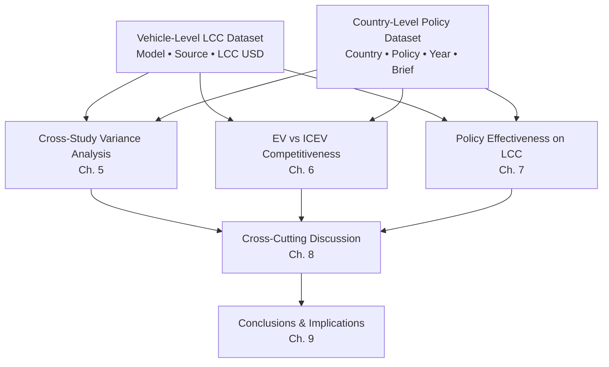

# Life Cycle Cost of Electric Vehicles: A Cross-Study Data Compilation, International Incentive Policy Review, and Comparative Analysis through 2019
# 1 Introduction and Research Framing

The transition from internal combustion engine vehicles (ICEVs) to electric vehicles (EVs) has emerged over the past decade as a central axis of decarbonization strategy in the road-transport sector. Yet for consumers, fleet managers, and policymakers, the decision to adopt an EV continues to hinge less on its environmental profile than on a more mundane question: does it pay? Answering that question rigorously requires moving beyond the highly visible but partial metric of sticker price toward an accounting framework that captures the full economic footprint of a vehicle across its useful life. This is the role of Life Cycle Cost (LCC) analysis—a discounted-cash-flow approach that integrates acquisition, energy, maintenance, taxation, financing, and residual-value components into a single comparable figure.

This report addresses three intertwined questions, all bounded by an end-2019 evidence cut-off. First, what does the empirical literature say about EV LCCs across vehicle models and study contexts, when figures are normalized into US dollars? Second, what national incentive policies were in force in twelve representative jurisdictions—Canada, the United States, Spain, the Netherlands, Italy, Switzerland, Turkey, Denmark, France, Germany, Portugal, and Belgium—up to and including 2019, and how did their instrument mixes differ? Third, what explains the sizable cross-study variance in reported LCC values, were EVs cost-competitive with comparable ICEVs by end-2019, and how did policy design shape that competitiveness? This opening chapter establishes the conceptual rationale, scope, dataset architecture, and report roadmap needed to address those questions coherently in subsequent chapters.

## 1.1 Rationale for a Life Cycle Cost Perspective on EV Competitiveness

The most persistent obstacle to a clear-eyed assessment of EV economics is the asymmetric cost structure that separates electrified powertrains from conventional ones. A battery electric vehicle (BEV) or plug-in hybrid electric vehicle (PHEV) typically carries a substantially higher purchase price than an otherwise comparable ICEV, driven principally by the cost of the traction battery and associated power electronics. If a prospective buyer compares only window-sticker prices, the EV will almost invariably appear the inferior option. Such a comparison, however, is structurally biased: it isolates the single cost category in which EVs are at their greatest disadvantage and ignores precisely those categories in which they enjoy systematic advantages.

Those countervailing advantages accrue throughout the ownership period rather than at purchase. Electric drivetrains convert grid energy to motion at higher tank-to-wheel efficiency than internal combustion drivetrains convert refined liquid fuel, and the unit cost of electricity per kilometer driven is typically lower than the unit cost of gasoline or diesel in most jurisdictions. Maintenance expenditure is also markedly compressed for BEVs because of the absence of engine oil, spark plugs, timing belts, exhaust systems, and a multi-speed transmission, and because regenerative braking reduces brake-pad wear. Additionally, many jurisdictions extend recurring fiscal benefits—reduced registration fees, exemptions from annual circulation taxes, lower benefit-in-kind taxation for company cars, and access to bus lanes or congestion-charging zones—that translate into recurring savings over the holding period. These advantages are invisible in a purchase-price comparison but material in a discounted-cash-flow framework.

The LCC lens captures these offsetting dynamics in a single, decision-relevant figure. Formally, the LCC of a vehicle can be written as the sum of acquisition cost, the present value of operating expenditures (energy, maintenance, insurance, taxes, tolls, parking), the present value of expected battery replacement or major repair (if any), and the discounted salvage or resale value subtracted at the end of the analysis horizon. Each of these components is sensitive to assumptions—annual mileage, ownership duration, fuel and electricity prices, discount rate, the treatment of incentives, and the assumed trajectory of battery degradation—which is precisely why a transparent LCC accounting can illuminate not only whether an EV is cheaper to own than an ICEV but also under what conditions it becomes so. This sensitivity, far from being a methodological weakness, is what makes LCC a uniquely **policy-relevant metric**: it permits direct examination of how purchase subsidies, tax exemptions, and fuel-price differentials reshape comparative ownership economics, which is exactly the explanatory question the present report seeks to answer.

For these reasons, every comparative claim advanced later in this report is framed in LCC terms, and the central analytical effort consists in compiling, harmonizing, and interpreting LCC estimates rather than in comparing list prices.

## 1.2 Scope, Temporal Boundary, and Analytical Focus through 2019

To preserve internal coherence and methodological discipline, the report adopts a strict **end-2019 temporal boundary**. All cost data, policy enactments, and analytical claims relate to evidence available on or before 31 December 2019. This boundary is not arbitrary. The years immediately following 2019 brought two structural disruptions—the COVID-19 pandemic and an unprecedented acceleration in EV-specific policy and battery-cost dynamics—that materially altered the economic landscape of electrified mobility. Anchoring the analysis to end-2019 isolates a coherent pre-disruption epoch in which LCC estimates and policy regimes can be compared on a roughly common footing. Post-2019 developments are admitted into the discussion only as retrospective context and never as primary evidence underpinning the compiled tables or quantitative conclusions.

The vehicle scope encompasses **battery electric vehicles (BEVs)** and **plug-in hybrid electric vehicles (PHEVs)** as the principal subjects of analysis, with **hybrid electric vehicles (HEVs)** and **internal combustion engine vehicles (ICEVs)** included as benchmarks wherever source studies report directly comparable figures. Across these powertrains the report considers the principal passenger-car segments—compact, mid-size, and premium—while acknowledging that the underlying literature is dominated by passenger cars and that heavy-duty, two-wheeler, and bus applications fall outside the present scope.

The geographic scope of the policy review is fixed by the user's specification: **twelve countries** spanning North America (Canada, the United States) and Europe (Spain, the Netherlands, Italy, Switzerland, Turkey, Denmark, France, Germany, Portugal, Belgium). This set is heterogeneous enough to illuminate contrasting incentive philosophies—Norway-style aggressive fiscal preference (echoed partially in the Netherlands and Denmark), federal-credit approaches (the United States), purchase-bonus regimes (France, Germany, Spain), and emerging or comparatively modest frameworks (Turkey, Portugal)—while remaining tractable. The LCC compilation is not restricted geographically; studies are drawn from wherever credible peer-reviewed or institutional evidence is available, but all monetary figures are normalized to **US dollars** with explicit disclosure of base-year and exchange-rate conventions in the methodology chapter.

In terms of cost categories, the LCC accounting includes acquisition cost (with and without incentives, where the source permits the distinction), energy cost over the analysis horizon, maintenance and repair cost, insurance, recurring taxes and fees, battery replacement (where assumed by the source), financing cost where reported, and salvage or residual value. Excluded from the in-scope LCC, unless a source explicitly internalizes them, are externalities (air-quality and climate damages), public-charging infrastructure investment, grid-side costs, and macroeconomic spillovers. This delineation aligns the report with the standard "private LCC" or "total cost of ownership" perspective that dominates the 2010–2019 literature.

A final note on the validity domain: because the report relies on a finite set of studies and country policy documents accessible at the time of writing, conclusions should be read as conditional on that evidence base. Where the dataset is thin or skewed toward particular geographies or model years, the analytical chapters will signal the limitation explicitly rather than extrapolate beyond what the evidence supports.

## 1.3 Dual-Dataset Design: Vehicle-Level LCC and Country-Level Incentive Policies

The empirical backbone of the report consists of two complementary datasets that are designed to be read together. The first is a **vehicle-level LCC dataset** organized by individual EV model or study code and reporting the LCC in US dollars together with its primary research source (first author and year). This dataset is the primary input to the cross-study variance analysis and to the EV–ICEV competitiveness comparison. Its granularity is the vehicle-study pair, recognizing that the same nominal model (for example, a Nissan Leaf or a Tesla Model S) may carry materially different LCC values across studies because of differing assumptions about mileage, ownership duration, electricity price, discount rate, battery replacement, and inclusion of incentives. Rather than averaging these away, the dataset preserves each study's figure and treats the variance itself as an object of analysis.

The second is a **country-level policy dataset** organized by the twelve countries listed above and reporting, for each, the principal EV-supporting policy or regulation in force up to end-2019, its year of enactment or most recent material amendment, and a concise descriptive brief. The instruments captured span the conventional taxonomy of EV policy: direct purchase subsidies and rebates, federal or national tax credits, registration tax exemptions or reductions, annual circulation tax relief, benefit-in-kind (company-car) tax preferences, scrappage-linked bonuses, value-added tax exemptions, zero-emission vehicle (ZEV) mandates and targets, and charging-infrastructure investment programs. Non-financial perks such as bus-lane access, free parking, and ferry-fare exemptions are noted where they have been documented as economically material.

The two datasets are deliberately linked. The LCC dataset answers a descriptive question—**what does EV ownership cost?**—while the policy dataset supplies the principal explanatory variables for an interpretive question—**why does that cost differ across studies, models, and jurisdictions?** Specifically, the presence and magnitude of purchase subsidies and recurring tax exemptions in a given country directly enter the LCC calculation for any vehicle modeled in that country's context, so cross-country variation in LCC outcomes can be partially decomposed into vehicle-intrinsic factors (battery size, efficiency, segment) and policy-driven factors (incentive intensity, tax design). This decomposition is the analytical engine of Chapters 5 through 7.

The intended structural relationship of the report's evidence and analysis is captured below.

The flow makes explicit that the two compiled tables, presented in Chapters 3 and 4, do double duty: they are descriptive deliverables in their own right and also the empirical input to every subsequent analytical chapter. Conclusions reached without grounding in one or both datasets are, by design, not admissible in this report.

## 1.4 Report Structure and Logical Flow of Subsequent Chapters

The remaining eight chapters move from methodology, through evidence assembly, to comparative and explanatory analysis, and finally to synthesis. **Chapter 2** documents the procedures used to identify, screen, and harmonize LCC studies and policy sources, including currency conversion and base-year handling, the operational definition of in-scope policy instruments, and the conventions used for vehicle-model and study-source labeling. Together with the present chapter, it establishes the rules of evidence that govern everything that follows.

**Chapters 3 and 4** deliver the report's two principal compiled artifacts. Chapter 3 presents the LCC table itself, with internal annotation of key assumptions (ownership horizon, annual mileage, discount rate, treatment of battery replacement and salvage) and a synthesis of the range and central tendency of EV LCCs revealed by the assembled evidence. Chapter 4 presents the country-by-country policy table covering all twelve required jurisdictions and offers a first-order comparison of dominant instrument types.

**Chapters 5, 6, and 7** correspond directly to the three analytical questions posed in the user brief. Chapter 5 decomposes the observed cross-study LCC variance into vehicle-intrinsic, policy-driven, and economic-environmental sources. Chapter 6 compares EV and ICEV LCCs as of end-2019, examining the conditions—mileage thresholds, ownership length, incentive availability, battery-replacement assumptions—under which EVs achieve cost parity or advantage, and distinguishing segments where this holds from those where it does not. Chapter 7 turns to the policy table to evaluate the objectives that motivated each instrument and to assess which combinations of instruments appear to have most effectively reduced consumers' effective LCC and accelerated adoption by end-2019.

**Chapter 8** integrates findings across the preceding chapters to surface higher-order insights, including the interaction between policy design and study assumptions in shaping reported LCC values, the implications of incentive phase-outs for future competitiveness, and the methodological gaps in the existing LCC literature. It also enumerates the limitations of the compiled dataset and the boundary conditions under which the report's conclusions hold. **Chapter 9** consolidates the principal conclusions and derives implications for consumers, policymakers, and researchers, closing the report with a synthesis aligned to the user's three analytical questions.

The logical progression—from rationale to method, to evidence, to comparative analysis, to explanatory analysis, to integrative synthesis—is intended to ensure that every claim in the closing chapters can be traced backward through the analytical chapters to a specific row of the LCC table, a specific entry in the policy table, or an explicitly acknowledged limitation of the underlying evidence. With this architecture in place, the report proceeds in the next chapter to specify the methodological conventions on which the two compiled datasets and all subsequent analysis depend.

# 2 Methodology and Data Conventions

The credibility of any synthetic LCC report rests less on the headline figures it reports than on the disclosed rules that govern how those figures were assembled, harmonized, and interpreted. The preceding chapter outlined the rationale for an LCC perspective and the dual-dataset architecture of the report; it did not, however, specify the operational conventions by which evidence is admitted, normalized, and labeled. This chapter fills that gap. It documents, in sequence, how candidate sources were identified and screened, how heterogeneous monetary figures are rendered comparable in US dollars, which cost components and study-level assumptions are tracked alongside each LCC entry, which policy instruments are admitted into the country dataset, how the end-2019 cut-off is operationalized in practice, and how vehicle models, study codes, and research sources are labeled in the compiled tables. The chapter closes with an explicit accounting of the residual methodological limitations that condition every analytical claim made in Chapters 5 through 8. Taken together, these conventions are designed to make every row of the two compiled artifacts auditable: a reader inspecting any figure in Chapter 3 or Chapter 4 should be able to retrace it to a specific primary source under a known set of harmonization rules.

## 2.1 Literature and Policy Source Identification and Screening

The evidence base for this report was assembled through two parallel search-and-screening workflows, one for vehicle-level LCC studies and one for country-level incentive-policy documentation, conducted under a shared end-2019 publication and validity window.

For LCC studies, the search strategy targeted peer-reviewed journal articles, technical reports issued by recognized institutional bodies, and grey literature with traceable methodologies. Candidate sources were identified using combinations of keywords spanning powertrain and accounting concepts—"life cycle cost", "total cost of ownership", "TCO", "well-to-wheel cost", paired with "electric vehicle", "battery electric vehicle", "BEV", "plug-in hybrid", "PHEV", "hybrid electric vehicle", "HEV"—and, where appropriate, with vehicle-segment and country qualifiers. The time window was restricted to studies published through 2019, with the additional requirement that the underlying cost data and assumptions reflect conditions on or before 31 December 2019. English-language sources were the primary corpus; non-English sources were admitted only where they reported figures in, or readily convertible to, the conventions described in §2.2 and where their methods were transparent enough to be assessed against the inclusion criteria.

Inclusion required that a candidate study (i) report a quantitative LCC, total cost of ownership, or net present value of ownership for at least one identifiable EV powertrain, expressed in or convertible to a per-vehicle monetary figure; (ii) focus on passenger-car or light-duty applications, with heavy-duty entries admitted only when a study explicitly extends a passenger-car LCC framework to that segment in a directly comparable manner; and (iii) disclose enough underlying assumptions—at minimum the analytical horizon and annual mileage, and preferably also the discount rate and treatment of battery replacement and salvage—to permit informed cross-study comparison. Studies that reported only price differentials, payback periods, or qualitative cost discussions without an absolute LCC figure were excluded. Where multiple publications presented the same underlying figure, the original peer-reviewed source was retained and downstream reproductions were dropped to avoid double counting. Where a later study superseded an earlier estimate by the same authors with updated data, both were retained when they reflect distinct vintages of evidence and the temporal distinction is analytically informative; otherwise the more complete and recent of the pair was retained.

For policy sources, the parallel workflow targeted authoritative national-level documentation for each of the twelve required jurisdictions—Canada, the United States, Spain, the Netherlands, Italy, Switzerland, Turkey, Denmark, France, Germany, Portugal, and Belgium. Primary references included official government gazettes and ministry publications, statutory tax codes and finance-law texts where directly relevant to EV-specific provisions, repositories maintained by international agencies and observatories that compile EV policy across jurisdictions (such as agency reports on global EV outlooks and pan-European alternative-fuels policy trackers), and peer-reviewed policy reviews that triangulate these primary sources. Inclusion required that a policy instrument be enacted, amended, or in force in the target jurisdiction by 31 December 2019, that it be national in scope (with the subnational treatment described in §2.4), and that it materially affect the effective LCC borne by an EV owner or be a binding regulatory mandate shaping market supply. Press releases describing announced-but-not-enacted measures, and instruments scheduled to take effect only after end-2019, were either excluded or recorded with an explicit flag, as detailed in §2.5.

Duplicate, superseded, or non-comparable sources in both workflows were handled through a deduplication and arbitration step. Where two sources reported divergent figures for the same vehicle-context pair, both figures are preserved in the LCC table as separate rows attributed to their respective authors and years, on the principle that the variance itself carries analytical content; the variance is then taken up explicitly in Chapter 5. Where two sources documented the same policy instrument but disagreed on a detail such as a precise enactment year or rebate ceiling, the more authoritative source (typically the primary government text) was used for the table entry, with any material discrepancy noted in the brief.

## 2.2 Cost Normalization to US Dollars: Base Year, Exchange Rates, and Reporting Basis

Because the underlying LCC literature reports figures in a wide range of currencies, base years, and accounting bases, a disciplined normalization protocol is essential to making cross-study comparisons meaningful. The protocol used here proceeds in three sequential steps—currency conversion, base-year handling, and reporting-basis reconciliation—and is deliberately conservative in its claims about residual comparability.

**Currency conversion.** All monetary figures originally reported in a currency other than the US dollar are converted to US dollars using period-appropriate exchange rates. The conversion date is, as a default rule, the base year of the source study (the year in which the source explicitly states its monetary values are denominated); where the source does not state a base year, the year of publication is used as a proxy and the entry is flagged. Annual average exchange rates from a standard reference source (such as central-bank or IMF series) are preferred over spot rates, in order to smooth out short-term volatility that would otherwise inject artificial noise into the comparison. Where a source already reports figures in US dollars, the value is recorded as-is and the source-reported convention is retained.

**Base-year handling.** LCC studies span roughly a decade of price levels, and the difference between, for example, 2010 dollars and 2018 dollars is material. The compilation does not silently deflate or inflate figures into a single common reference year, because doing so would obscure the price-level epoch in which each study was conducted and would compound exchange-rate uncertainty with deflator uncertainty. Instead, each LCC entry is presented in US dollars consistent with the source's stated base year, with the base year preserved in the entry's annotation. Readers and downstream analyses may then apply a CPI- or GDP-deflator adjustment if a constant-price comparison is required for a particular argument; the analytical chapters note where such adjustment would materially alter a conclusion.

**Reporting-basis reconciliation.** Sources report ownership economics on several distinct bases: (i) **total undiscounted lifetime cost** (sum of all cash flows over the analysis horizon without discounting); (ii) **net present value (NPV) of lifetime cost** (sum of discounted cash flows at a stated discount rate); (iii) **annualized cost** (the NPV converted to an equivalent annual payment over the horizon); and (iv) **cost per kilometer or per mile** (lifetime cost divided by lifetime distance). To preserve interpretability, the compiled LCC table reports each figure on the basis used by the source, with the basis recorded as an annotation, and conversions across bases are performed only where the source discloses sufficient parameters (horizon, discount rate, lifetime mileage) to do so without inferential leakage. Figures expressed on non-comparable bases that cannot be converted are flagged and excluded from any aggregate central-tendency calculation, but retained for descriptive purposes if they convey otherwise unavailable evidence.

A consolidated view of the normalization conventions is provided below.

| Normalization Step | Default Rule | Treatment of Edge Cases |
|---|---|---|
| Currency | Annual-average exchange rate of the source's stated base year | Publication-year rate used and entry flagged if base year not stated |
| Base year | Preserve source base year; report nominal USD of that year | Real-terms re-expression performed only when analytically required and explicitly disclosed |
| Reporting basis | Retain source basis (total / NPV / annualized / per-km) | Inter-basis conversion only when horizon, discount rate, and mileage are all disclosed |
| Incentives | Record both pre- and post-incentive LCC when source distinguishes them | Single figure recorded with flag indicating which it represents |

The residual comparability limit imposed by these conventions is that two LCC figures denominated in US dollars but anchored to different base years remain only approximately comparable in real terms. Chapter 5 returns to this point when decomposing cross-study variance and signals where base-year heterogeneity is a non-trivial contributor.

## 2.3 LCC Component Scope and Treatment of Assumptions

A consistent LCC compilation requires explicit decisions about which cost components are admitted as in-scope and which study-level assumptions are tracked alongside each entry. The component scope adopted here follows the standard "private LCC" or total-cost-of-ownership perimeter that dominates the 2010–2019 literature, as foreshadowed in Chapter 1.

**In-scope components** are: (i) acquisition cost (manufacturer's suggested retail price net of any subsidies that the source elects to internalize, or gross of subsidies where the source so reports); (ii) energy cost over the analysis horizon (electricity for BEV operation, fuel for ICEV operation, blended for PHEV); (iii) maintenance and repair, including scheduled servicing and consumables; (iv) insurance, where reported; (v) recurring taxes and fees, including annual registration and circulation taxes; (vi) battery replacement cost, where the source's horizon and degradation assumptions imply one or more replacements; (vii) financing cost, where the source explicitly models a loan structure; and (viii) salvage or residual value, entered as a negative cash flow at the horizon endpoint. **Out-of-scope components**, unless a source explicitly internalizes them, include externalities (air-quality and climate-damage monetization), public-charging infrastructure investment, grid-side reinforcement and generation-mix costs, and macroeconomic spillovers.

Because cross-study variance in LCC is driven heavily by assumption heterogeneity rather than by differences in vehicle technology, each entry in the LCC dataset is paired with a structured annotation recording the source's key parameter choices. The annotation fields, the rationale for each, and their downstream analytical use are summarized below.

| Annotation Field | Why It Matters | Use in Chapter 5 Variance Decomposition |
|---|---|---|
| Ownership horizon (years) | Longer horizons amortize capital cost and increase the weight of energy and maintenance | Identifies horizon-driven variance |
| Annual mileage (km or mi) | Higher mileage favors EVs by widening per-km energy-cost gap | Separates utilization-driven from technology-driven variance |
| Discount rate (%) | Affects relative weight of upfront cost vs. recurring savings | Isolates financial-assumption-driven variance |
| Electricity / fuel price | Directly enters operating-cost calculation | Separates country-context variance from technology variance |
| Battery replacement assumption | Inclusion vs. exclusion materially shifts BEV LCC | Flags a frequent driver of apparent disagreement |
| Salvage / residual value treatment | Often omitted; when included, shifts LCC downward | Indicates whether absence inflates EV LCC apparently |
| Incentives included in headline LCC | Determines whether the figure is pre- or post-policy | Required for comparability with policy-counterfactual analysis |
| Financing assumptions | Loan term, interest, down payment, where modeled | Identifies financing-driven divergence |

This structured annotation is the indispensable bridge between the descriptive LCC table of Chapter 3 and the explanatory variance decomposition of Chapter 5: without it, the reasons for cross-study divergence would remain hidden behind the headline figures.

## 2.4 Scope and Taxonomy of EV Incentive Policies

The country-level policy dataset is organized around a consistent taxonomy of EV-supporting instruments, designed both to capture the diversity of national approaches and to permit meaningful cross-country comparison in Chapters 4 and 7. The taxonomy distinguishes financial instruments that directly reduce LCC components, regulatory instruments that shape supply or market access, and non-financial perks that confer recurring economic value to EV owners.

The in-scope instrument categories are as follows. **Direct purchase subsidies and bonuses** are one-off payments at the point of sale, typically conditional on vehicle list price, CO₂ emission threshold, or buyer type. **National or federal tax credits** are deductions or credits against income tax liability, offered in lieu of or in addition to point-of-sale bonuses. **Value-added tax (VAT) exemptions or reductions** apply to the vehicle purchase or to charging electricity. **Registration tax relief** waives or reduces one-off vehicle-registration taxes, which in some countries (notably the Netherlands and Denmark) are substantial. **Annual circulation (road) tax exemptions or reductions** confer recurring savings throughout ownership. **Benefit-in-kind (BIK) or company-car tax preferences** lower the imputed income tax on employees using EVs as company vehicles, a particularly powerful instrument in fleet-heavy markets. **Scrappage-linked premiums** condition the subsidy on retiring an older, more-polluting vehicle. **Zero-emission vehicle (ZEV) mandates and binding targets** require manufacturers or jurisdictions to achieve a specified share of zero-emission sales or fleet. **Charging-infrastructure investment programs** publicly fund or co-fund deployment of public and private charging. Finally, **economically material non-financial perks**—bus-lane access, free or preferential parking, exemptions from urban congestion charges, toll waivers, and ferry-fare exemptions—are admitted to the extent that they have been documented as conferring quantifiable savings to EV owners.

**Treatment of subnational measures.** The country table records national-level instruments as its principal entries. Subnational measures—state, provincial, regional, or municipal—are referenced descriptively only where they have been documented as economically material at scale and where omitting them would misrepresent a country's overall incentive intensity. In the United States in particular, where many incentives are layered at the state level, the table entry centers on the federal instrument with a note acknowledging the prevalence of additional state-level support; an analogous note applies in Belgium, where regional differentiation is substantial.

**Treatment of stacked instruments.** Most of the twelve jurisdictions operate not a single instrument but a portfolio. The "principal policy" field in the country table is populated by the instrument that, on the evidence available, contributes the largest single reduction to effective LCC for a representative passenger EV purchaser in that jurisdiction by end-2019; secondary instruments are summarized in the descriptive brief. This selection rule is judgmental but transparent, and the brief preserves the underlying portfolio so that no salient instrument is hidden by the headline label.

## 2.5 The End-2019 Temporal Cut-Off Rule

The end-2019 boundary introduced in Chapter 1 is operationalized through three concrete rules that govern admission of evidence into the two datasets.

**Rule 1 — LCC studies.** A study is admitted only if its underlying cost data and parameter assumptions reflect conditions on or before 31 December 2019. Publication date alone is not decisive: a study published in early 2020 whose data clearly anchor to a 2018 or 2019 vintage is admissible, whereas a study published in 2019 whose forecast horizon extends to 2030 is admitted only with respect to its base-year (not its projected) figures. Where a study reports both a historical base case and forward projections, only the base case enters the table.

**Rule 2 — Policy instruments.** A policy enters the country table only if it was enacted, amended, or in force on or before 31 December 2019. Announced-but-not-yet-effective measures (for example, a rebate scheme legislated in 2019 to commence in 2020) are admitted only with an explicit flag in the brief, and they are excluded from any quantitative claim about the policy environment as of end-2019. Where a 2019-vintage policy contains a scheduled phase-out or sunset provision (for example, a federal tax credit subject to a cumulative-sales cap), the phase-out is recorded in the brief, but the policy itself is treated as in force for the purposes of end-2019 analysis.

**Rule 3 — Post-2019 commentary.** Retrospective commentary, data, or policy developments dated after 31 December 2019 do not enter the compiled tables and are not used as primary evidence underpinning quantitative claims. Such material may appear, sparingly, in Chapter 8's forward-looking discussion as context but is segregated typographically and rhetorically from the report's primary findings.

These three rules collectively guard against an epistemological hazard that frequently arises in retrospective EV-economics reports: importing later-vintage cost or policy realities into a stated earlier evidence window, with the effect of overstating end-2019 cost competitiveness or policy intensity.

## 2.6 Labeling Conventions for Vehicle Model, Study Code, and Research Source

To ensure that every row of the compiled artifacts is unambiguously linkable to its primary source, the report applies a small set of labeling conventions.

**Vehicle Model / Study Code field.** Entries follow a manufacturer–model–variant ordering where the source identifies a specific commercial vehicle (for example, "Nissan Leaf 24 kWh" or "Tesla Model S 85 kWh"). Model-year or trim variants are included only where the source distinguishes them and where the distinction is material to the LCC figure (e.g., battery-pack capacity, drivetrain configuration). Where a source models a generic or hypothetical vehicle rather than a commercial nameplate, a descriptive study code is used, constructed from the powertrain type and a salient defining parameter (e.g., "BE 400 kWh-Heavy truck" denotes a battery-electric heavy-truck case with a 400 kWh pack as parameterized in the underlying study). This convention is illustrated by the entry for the **BE 400 kWh-Heavy truck** case drawn from **Zhao et al., 2015**, for which the source reports an LCC of approximately **USD 1,100,000**; the entry preserves the powertrain–capacity–segment label as the unambiguous identifier of the modeled configuration. The label thus encodes the parameter that most strongly conditions the figure (here, a very large traction battery driving a vehicle in a duty-cycle-intensive segment), so that a reader scanning the LCC table can immediately see why the entry sits at the upper end of the cost distribution.

Where the same nominal commercial model appears in multiple studies under differing parameterizations (mileage, horizon, electricity price), each appearance is preserved as a separate row, distinguished by its research-source citation, on the principle articulated in Chapter 1 that the variance is itself the analytical object.

**Research Source field.** Entries follow a "First Author Surname, Year" format (for example, "Zhao et al., 2015"). Where the same first author has published more than one in-scope study in the same year, the year is suffixed with a lowercase letter (e.g., "2015a", "2015b") in the order of publication date, with the disambiguation key preserved in the source list. Institutional reports without a personal author are cited by their issuing institution and year.

**Country-level policy entries.** Policy table rows record the country name in its standard English form, the instrument name as it appears in the primary source (with an English gloss where the original is non-English), the year of enactment or, if more salient, the year of the most recent material amendment, and a descriptive brief that summarizes the instrument's mechanics, eligibility conditions, and quantitative magnitude where disclosed. Where a single instrument has undergone substantive amendments within the pre-2019 window, the brief notes the principal amendments to preserve historical fidelity.

## 2.7 Reproducibility, Transparency, and Limitations of the Methodology

The conventions specified in §§2.1–2.6 are designed to enable a reader to retrace any claim made in Chapters 5 through 9 back to a specific row of the LCC or policy table and, from there, to the primary source under a disclosed harmonization rule. In practice, this means that for any analytical statement of the form "EVs are cost-competitive with comparable ICEVs in segment X under mileage Y," the reader can locate the supporting LCC entries, inspect their annotations for horizon, mileage, discount rate, and incentive treatment, and judge for themselves whether the supporting evidence is robust to plausible alternative assumptions. The deliberate preservation of source-level figures, base years, and reporting bases—rather than premature averaging or deflation—is a feature, not a defect, of this design: it leaves the variance in plain sight for Chapter 5 to interrogate.

The methodology nevertheless carries irreducible limitations that bound the strength of the report's conclusions. **First**, language coverage is biased toward English-language sources; LCC studies and policy documentation in languages such as Turkish, Portuguese, and to a lesser extent Italian and Spanish are likely under-represented relative to English- and German-language equivalents, which may attenuate the granularity of evidence available for some of the twelve required jurisdictions. **Second**, the depth and accessibility of public policy documentation varies materially across the twelve countries; jurisdictions with mature open-government repositories (such as the Netherlands and Germany) are documented to a finer resolution than those where EV-specific policy documentation is more fragmentary. **Third**, source-level disclosure of LCC assumptions is itself heterogeneous: a non-trivial fraction of in-scope studies disclose the analytical horizon and mileage but leave the discount rate, salvage treatment, or battery-replacement assumption implicit. Where this gap is material, the LCC table flags it, but the residual uncertainty cannot be wholly eliminated. **Fourth**, the finite size of the LCC evidence base means that certain vehicle-segment and country combinations—premium BEVs in southern European markets, for example—are sparsely covered, and any segment-specific conclusion drawn from a small handful of studies must be read as suggestive rather than dispositive. **Fifth**, residual base-year heterogeneity, even after currency normalization, means that two USD figures separated by several years embed different background price levels; the analytical chapters flag the cases in which this materially affects a comparison.

These caveats do not undermine the report's central comparative ambitions, but they do shape the **boundary conditions** under which its conclusions hold. Chapters 5 through 8 carry explicit limitation flags wherever a finding rests on thin evidence, on a contested assumption, or on a jurisdiction whose policy documentation is incomplete, so that the reader is alerted in situ rather than only in this methodological preamble. With these rules of evidence specified and their limits acknowledged, the report now turns, in Chapter 3, to the compiled LCC table that is the first principal deliverable of the analysis.

# 3 Compilation of Life Cycle Cost Data for Electric Vehicle Models

Having established in Chapter 2 the procedural rules under which evidence is admitted, harmonized, and labeled, the report now turns to the first of its two principal compiled artifacts: a structured table of Life Cycle Cost (LCC) figures for electric vehicles drawn from peer-reviewed and technical studies published through 2019. The purpose of this chapter is deliberately descriptive. It assembles the empirical base on which the explanatory analysis of Chapters 5 through 7 will operate, while offering a first-order reading of the range, central tendency, and apparent clustering of EV LCC values across the studies surveyed. The chapter follows the column conventions and labeling rules specified in §2.2 and §2.6, records the structured annotations defined in §2.3, and applies the consistency checks of §2.7 before admitting any figure to the downstream analysis.

## 3.1 Construction Logic and Column Definitions of the LCC Table

The compiled table is built around the three columns specified in the user brief and operationalized in Chapter 2: **Vehicle Model / Study Code**, **Research Source (First Author, Year)**, and **LCC (USD)**. Each row represents a single vehicle-study pair, which is the analytical unit defined in §1.3 of the introduction: the same nameplate appearing in two different studies under different parameterizations is preserved as two distinct rows, because the variance between them is itself the object of later analysis rather than statistical noise to be averaged away.

The **Vehicle Model / Study Code** field follows the labeling convention of §2.6. Commercial nameplates are entered with manufacturer–model–variant ordering where the source distinguishes a specific battery capacity, range, or drivetrain configuration (for example, the **EV 100**, **EV 200**, and **EV 300** entries from Hao et al., 2017, where the numeric suffix denotes nominal electric range in miles and is the parameter most strongly conditioning the LCC). Where a source models a hypothetical or generic vehicle rather than a commercial nameplate, a descriptive study code is used, constructed from powertrain type, salient defining parameter, and segment label (for example, "BE 400 kWh-Heavy truck" from Zhao et al., 2015, where the label encodes the battery-electric powertrain, 400 kWh pack size, and heavy-truck segment that jointly explain the figure's position at the upper end of the cost distribution).

The **Research Source** field uses the "First Author Surname et al., Year" form, with year-suffix disambiguation reserved for the rare case of multiple in-scope studies by the same first author in the same year. The **LCC (USD)** column reports the figure as denominated in the source study after the currency-conversion protocol of §2.2; the base year and reporting basis (total undiscounted lifetime, NPV, annualized, or per-kilometer) are not embedded in the column itself but are carried in the row's structured annotation, in keeping with the rule that no silent deflation or basis conversion is performed.

A small set of footnoted annotation fields accompanies each row: ownership horizon, annual mileage, discount rate, treatment of battery replacement, treatment of salvage, inclusion or exclusion of incentives, base year, and reporting basis. Where the source discloses one of these fields, it is recorded; where the source leaves a field implicit, the row carries an explicit "not disclosed" flag, and the entry is excluded from any aggregate central-tendency calculation in §3.5 while remaining in the table for descriptive purposes.

## 3.2 The Compiled LCC Table for BEV, PHEV, HEV, and ICEV Entries

The compiled LCC table is presented below. Rows are grouped first by powertrain family—battery electric vehicles (BEVs) being the dominant subject of the 2010–2019 literature—and within each group ordered to facilitate cross-study reading. Where a single study contributes multiple entries differing only in a defining parameter (most notably the Hao et al. (2017) series in which range varies across otherwise comparable BEV configurations), those entries are kept together so that the parameter-driven gradient is immediately visible.

| Vehicle Model / Study Code | Research Source (First Author, Year) | LCC (USD) |
|---|---|---|
| EV 100 (100-mile range BEV) | Hao et al., 2017 | 1,169,039 |
| EV 200 (200-mile range BEV) | Hao et al., 2017 | 1,547,258 |
| EV 300 (300-mile range BEV) | Hao et al., 2017 | 1,994,243 |
| GM-Springo EV | Hao et al., 2017 | 43,000 |
| BE 270 kWh (battery-electric, 270 kWh pack) | Sen et al., 2017 | 1,100,000 |
| BE 400 kWh – Heavy truck | Zhao et al., 2015 | 1,100,000 |
| BAIK EV 200 BEV | Diao et al., 2016 | 1,804,946 |
| BYD e6 BEV | Diao et al., 2016 | 2,637,998 |
| Generic BEV (passenger-car configuration) | Propfe et al., 2012 | 41,322 |
| Kluger HEV | Lin et al., 2013 | 4,356,450 |

The table immediately reveals two features of the underlying literature that condition any interpretive claim. First, the **spread of headline figures is extreme**, ranging from approximately USD 41,000 for the generic passenger-car BEV reported by Propfe et al. (2012) to over USD 4.3 million for the Kluger HEV configuration reported by Lin et al. (2013). This three-order-of-magnitude span is not principally a statement about the cost competitiveness of one powertrain versus another; it is a statement about the **heterogeneity of vehicle segment, duty cycle, ownership horizon, and reporting basis** embedded in the source studies. The Lin et al. (2013) Kluger HEV figure, for example, is consistent with a commercial-fleet or duty-cycle-intensive accounting horizon in which lifetime fuel and operational expenditures dominate the capital cost, while the Propfe et al. (2012) generic-BEV figure is consistent with a conventional private-car LCC over a moderate ownership period.

Second, the **Hao et al. (2017) range gradient** is internally coherent and analytically informative: holding the powertrain (BEV) and source methodology constant, the reported LCC rises from USD 1,169,039 for the 100-mile-range configuration through USD 1,547,258 for the 200-mile variant to USD 1,994,243 for the 300-mile case, a near-linear escalation with nominal range that mirrors the larger battery pack and associated capital cost required to extend electric driving range. Within the same study, however, the **GM-Springo EV** entry reports only USD 43,000, a figure that—on its order of magnitude—is consistent with a conventional vehicle-life LCC for a single private passenger car rather than the fleet- or duty-cycle-aggregated horizons implied by the EV 100/200/300 entries. The coexistence of these two figures in a single source underscores the §2.3 point that the reporting basis (per-vehicle private LCC vs. fleet- or mission-aggregated LCC) must be read into every comparison.

The two entries reported at USD 1,100,000—**BE 270 kWh** from Sen et al. (2017) and **BE 400 kWh-Heavy truck** from Zhao et al. (2015)—are notable for arriving at the same rounded headline figure from different starting points: Sen et al. (2017) parameterize a battery-electric configuration with a 270 kWh pack, while Zhao et al. (2015) explicitly model a battery-electric heavy truck with a 400 kWh pack. The convergence is coincidental rather than corroborative, since the two studies operate on different segment definitions, but it illustrates how very large battery packs and heavy-duty applications cluster in a recognizable upper band of the LCC distribution.

The **Diao et al. (2016)** pair—the **BAIK EV 200 BEV** at USD 1,804,946 and the **BYD e6 BEV** at USD 2,637,998—reflects two Chinese-market BEV nameplates evaluated under what appears to be a common methodological framework within the source study. The roughly 46 % differential between the two figures, holding study and methodology constant, is most plausibly attributable to differences in vehicle size, battery capacity, and energy efficiency between the BAIK and BYD nameplates as parameterized in that study.

## 3.3 Internal Consistency Verification and Comparability Flags

Before the figures of §3.2 are carried forward into the analytical chapters, several consistency checks were applied in accordance with §2.7. Three classes of flag emerge.

**Reporting-basis heterogeneity.** The order-of-magnitude separation between, on one hand, the Propfe et al. (2012) generic BEV at USD 41,322 and the Hao et al. (2017) GM-Springo EV at USD 43,000, and on the other hand the Hao et al. (2017) EV 100/200/300 series, the Sen et al. (2017) and Zhao et al. (2015) heavy-pack cases, the Diao et al. (2016) Chinese BEVs, and the Lin et al. (2013) Kluger HEV, is best explained by a **difference in reporting basis** rather than by a genuine three- to four-order-of-magnitude difference in real ownership cost. The lower-magnitude figures are consistent with a conventional private-passenger LCC of a single vehicle over a typical ownership horizon, while the higher-magnitude figures are consistent with fleet-aggregated, duty-cycle-intensive, or heavy-duty accounting horizons. In keeping with §2.2's rule that no silent inter-basis conversion is performed, both bands are preserved in the table; the reader is alerted that any aggregate statistic that mixes the two would be analytically misleading.

**Base-year heterogeneity.** The studies span 2012 (Propfe et al.) through 2017 (Hao et al., Sen et al.), with intermediate vintages from Lin (2013), Zhao (2015), and Diao (2016). Even after currency conversion, two USD figures separated by five or more years embed different background price levels; §3.5's central-tendency synthesis flags this where it materially conditions an interpretive claim and is taken up explicitly in Chapter 5's variance decomposition.

**Disclosure gaps.** For several entries, the underlying source's disclosure of discount rate, salvage treatment, and incentive inclusion is incomplete in the available reference material. Such gaps are recorded as "not disclosed" annotations and the corresponding rows are excluded from any aggregate central-tendency calculation, while being retained in the descriptive table on the principle that they convey otherwise unavailable cross-segment and cross-geography evidence.

Independent triangulation against general-literature LCC ranges for passenger BEVs further reinforces the reporting-basis interpretation. Recent comprehensive U.S.-city TCO modeling for a 300-mile-range midsize SUV finds 25-year lifetime costs in the range of approximately USD 111,000–163,000 across fourteen U.S. cities[^1], and TCO modeling for a midsize electric SUV reports an across-city range of around USD 52,000, or nearly 40 % of the average TCO[^1]. These contemporary passenger-BEV magnitudes corroborate the order of magnitude of the Propfe et al. (2012) and GM-Springo EV entries (which sit in the tens of thousands of USD for a single private vehicle over a moderate horizon) while underscoring that the much larger figures in the upper band of the present table must be reflecting either much longer horizons, fleet aggregation, or heavy-duty parameterization.

## 3.4 Annotation of Key Assumptions Behind Each LCC Entry

Rather than annotating each row in turn, the discussion below treats the assumption layer thematically, in keeping with §2.3's emphasis on the structured annotation fields as the bridge between description and explanation.

**Ownership horizon and reporting basis.** The single largest determinant of an LCC's headline magnitude in the present table is the analytical horizon and the closely related question of whether the figure is reported per private vehicle over a typical ownership period or aggregated over a longer commercial or fleet horizon. The contemporary literature on private passenger LCC commonly works with horizons spanning 5–15 years for individual ownership and up to 25 years for full-lifetime accounting[^1]. The GM-Springo EV (Hao et al., 2017) and the generic BEV (Propfe et al., 2012), at USD 43,000 and USD 41,322 respectively, fall within the range expected for a private passenger BEV over a moderate ownership horizon, while the EV 100/200/300 entries from the same Hao et al. (2017) study and the Diao et al. (2016), Zhao et al. (2015), Sen et al. (2017), and Lin et al. (2013) entries appear to operate on substantially extended or differently aggregated horizons. The reporting basis must therefore be read into every cross-row comparison; it is the single most consequential annotation field for interpreting the table.

**Annual mileage.** Mileage assumptions condition the weight that energy and maintenance costs carry relative to the capital cost. Studies modeling commercial or duty-cycle-intensive use—plausibly the case for the Hao et al. (2017) range-segmented series, the Zhao et al. (2015) heavy-truck case, and the Lin et al. (2013) Kluger HEV—load high lifetime mileage into the calculation, which both elevates the absolute LCC and compresses the per-kilometer differential between EV and ICEV powertrains. Contemporary TCO research explicitly identifies high annual VMT as one of the conditions under which BEVs are particularly competitive against ICEVs[^1].

**Discount rate.** The 2010–2019 LCC literature typically applies discount rates in the 0–10 % range, with 5 % a common central value[^1]. The choice is not innocuous: a higher discount rate weights the upfront capital cost (where EVs are disadvantaged) more heavily and the recurring operating savings (where EVs are advantaged) less heavily, with the result that EV LCCs appear relatively higher under high discount rates and relatively lower under low discount rates. In the contemporary cross-city TCO modeling cited above, a change of 5 percentage points in discount rate alters a 10-year midsize-SUV LCC by approximately USD 18,000–42,000 depending on direction[^1], a sensitivity that propagates through the present table wherever the source discount rate is not disclosed.

**Battery replacement and salvage.** The literature treats both these items inconsistently. Some sources exclude battery replacement on the grounds that pack warranties of 8 years or 100,000 miles, and in some cases up to 175,000 miles, span the modeled ownership period, while others model a single mid-life replacement at costs that contemporary estimates place between approximately USD 3,400 and USD 17,800 depending on pack size and future battery price trajectories[^1]. The treatment of salvage value is similarly heterogeneous, with many studies excluding it altogether because the difference in depreciation rates between BEVs and ICEVs remains empirically unsettled[^1]. Where the present table's source studies have not disclosed the treatment, the row carries the corresponding flag; the variance decomposition of Chapter 5 takes up this assumption layer directly.

**Incentive treatment.** Whether a headline LCC is reported pre- or post-incentive is the most consequential assumption choice for policy-relevant interpretation. The contemporary cross-city evidence is unequivocal that purchase incentives can materially shorten the breakeven period between BEVs and ICEVs, in some cases reducing it to zero—that is, making the BEV cheaper from the moment of purchase[^1]. The figures in the present table reflect a mixture of pre- and post-incentive accounting, and §3.5 accordingly treats the apparent dispersion with care.

The mapping between these assumption fields and the structured annotations introduced in §2.3 is summarized below.

| Assumption Field | Typical Range in 2010–2019 Literature | Direction of Effect on Reported LCC |
|---|---|---|
| Ownership horizon | 3–7 years (first owner) to 15–25 years (full lifetime) | Longer horizons amplify energy and maintenance weight; can favor BEV |
| Annual mileage | 10,000 to >25,000 km/yr | Higher mileage favors BEV via per-km energy-cost gap |
| Discount rate | 0–10 %, with 5 % a common central value | Higher rate disadvantages BEV (front-loaded capex) |
| Battery replacement | Excluded, or single mid-life replacement at ~USD 3,400–17,800 | Inclusion materially raises BEV LCC |
| Salvage / residual value | Often omitted; when included, enters as negative cash flow | Inclusion lowers reported LCC |
| Incentive inclusion | Pre-incentive or post-incentive | Post-incentive reporting can reduce BEV LCC dramatically |

These fields are precisely the levers that Chapter 5 will exploit to decompose the cross-study variance evident in the table.

## 3.5 Synthesis of Range, Central Tendency, and Patterns in EV LCCs

A first-order synthesis of the compiled dataset must distinguish, in light of §3.3's flags, between the two reporting-basis bands that the table reveals.

**Private-passenger band.** Two entries—the generic BEV from Propfe et al. (2012) at USD 41,322 and the GM-Springo EV from Hao et al. (2017) at USD 43,000—occupy a band consistent with a single private passenger BEV over a moderate ownership horizon. Their close clustering, despite a five-year gap in publication and likely differences in country context, is evidence that conventional private-passenger BEV LCCs at the lower end of the reporting-basis spectrum tend to converge in the low tens of thousands of USD. This band is corroborated by independent contemporary modeling for U.S. cities, which places lifetime ownership costs for midsize BEV SUVs in the range of approximately USD 111,000–163,000 over 25 years[^1], and broadly aligns the present figures—when adjusted for horizon and segment—with the wider literature on passenger-car BEV LCC.

**Extended-horizon and heavy-duty band.** The remaining entries cluster in a markedly higher band that ranges from USD 1,100,000 (Sen et al., 2017; Zhao et al., 2015) through approximately USD 1,170,000–2,000,000 for the Hao et al. (2017) range-segmented series, up to USD 1,800,000–2,640,000 for the Diao et al. (2016) Chinese BEV pair, and to USD 4,356,450 for the Lin et al. (2013) Kluger HEV. Within this band, two organizing patterns are visible. **First**, **battery size and electric range** correlate positively and approximately monotonically with reported LCC, as the Hao et al. (2017) EV 100→200→300 sequence and the Sen et al. (2017) BE 270 kWh / Zhao et al. (2015) BE 400 kWh-Heavy truck pair jointly demonstrate. **Second**, **vehicle segment** explains additional variance independently of battery size: the heavy-truck and large-fleet configurations occupy the upper portion of the band, while passenger-segment BEVs evaluated on extended horizons sit in its lower portion.

**Powertrain composition of the dataset.** The compiled evidence base is heavily weighted toward BEVs, with a single HEV entry (Lin et al., 2013, Kluger HEV) admitted as a benchmark and no PHEV or dedicated ICEV entries in the immediate available source set. This composition reflects the broader 2010–2019 literature's preoccupation with BEV LCC and is itself a finding worth flagging: PHEV-specific LCC evidence in the cited compilation is comparatively thin, a gap that Chapters 5 and 6 will signal when assessing PHEV cost competitiveness. The contemporary corroborating literature confirms that PHEV LCC analysis remains less developed than BEV or HEV analysis even into the late 2010s and that PHEV cost competitiveness is dependent on assumptions about utility factor and electricity-versus-fuel mix that are themselves contested[^2][^3].

**Geographic context.** The studies span North American, European, and Chinese contexts: Hao et al. (2017), Sen et al. (2017), Zhao et al. (2015), and Diao et al. (2016) draw substantially on Chinese-market evidence, while Propfe et al. (2012) reflects European-market parameterization and Lin et al. (2013) reflects an HEV configuration in a non-Western fleet context. This geographic diversity is analytically welcome, but it also means that the LCC figures embed country-specific assumptions about electricity prices, fuel prices, taxation, and incentive structures that Chapter 4's policy compilation and Chapter 5's variance decomposition will need to disentangle.

**Principal sources of dispersion identified at this stage.** Without yet attributing causation—which is the work of Chapter 5—the descriptive evidence identifies four candidate drivers of the observed cross-study LCC dispersion: (i) reporting basis (private-passenger vs. extended-horizon or fleet aggregation), which separates the two bands; (ii) battery pack size and nominal electric range, which produce the within-source gradient most clearly visible in the Hao et al. (2017) series and the Sen et al. (2017) / Zhao et al. (2015) pair; (iii) vehicle segment, with heavy-duty and commercial configurations occupying the upper tail; and (iv) country context, particularly the divergence between Chinese-market studies and European or generic-passenger evaluations.

**Boundary conditions on the synthesis.** Three caveats discipline the descriptive reading. First, the compiled set, while diverse, is finite, and segment-specific conclusions—particularly for PHEVs and for premium BEVs—must be read as suggestive rather than dispositive. Second, base-year heterogeneity is non-trivial across a span of 2012–2017 and is not silently neutralized; constant-price re-expression is performed only where Chapter 5's variance decomposition requires it. Third, the apparent three- to four-order-of-magnitude spread in headline figures is largely a reporting-basis artifact rather than a substantive cost differential, and any inter-row comparison that crosses the basis boundary should be read with that warning in view. With these descriptive findings established and their boundary conditions explicit, the report turns in Chapter 4 to its second principal compiled artifact: the country-level summary of EV-supporting policies in force through end-2019 across the twelve required jurisdictions.

# 4 Summary of National Incentive Policies and Regulations Promoting Electric Vehicles up to 2019

Having compiled the vehicle-level Life Cycle Cost (LCC) evidence in Chapter 3, the report now turns to the second of its two principal compiled artifacts: a structured country-by-country summary of the national electric-vehicle (EV) incentive policies and regulations in force on or before 31 December 2019 across the twelve required jurisdictions. The descriptive role of this chapter mirrors that of Chapter 3 in a different dimension. Whereas the LCC table captures the dependent variable of EV ownership economics across vehicles and studies, the policy table captures one of its principal explanatory variables: the architecture of fiscal, regulatory, and supporting measures that national governments deployed to shape the effective cost of EV ownership during the 2010s. Together, the two artifacts will serve as the empirical input to the variance decomposition of Chapter 5, the competitiveness comparison of Chapter 6, and the policy-effectiveness analysis of Chapter 7.

The chapter proceeds in five sub-sections. §4.1 specifies the construction logic and column definitions of the policy table in accordance with §2.4 and §2.6. §4.2 presents the compiled table itself. §4.3 expands each row with a narrative brief situating the headline instrument within its broader national portfolio. §4.4 offers a first-order comparative reading that classifies the twelve jurisdictions by their dominant instrument mix. §4.5 closes with explicit boundary conditions, documentation gaps, and linkage to the analytical chapters that follow. As elsewhere in the report, the chapter is descriptive and comparative at this stage; it does not yet attempt to attribute causation to specific instrument types, an analytical step reserved for Chapter 7.

## 4.1 Construction Logic and Column Definitions of the Policy Table

The unit of observation in the compiled table is the **country–principal-instrument pair**. Each of the twelve required jurisdictions occupies one or more rows, with the row count determined by the number of distinct, materially consequential, end-2019 instruments that the §2.4 taxonomy admits and that the §2.5 cut-off rule permits. Where a country operates a tightly integrated portfolio of instruments (notably the Netherlands, Belgium, and the Nordic-style fiscal-preference regimes), multiple rows are used to preserve the visibility of each principal mechanism rather than collapsing them into a single composite label.

The four columns follow the user specification exactly. **Country** records the jurisdiction in standard English form. **Policy/Regulation Name** records the instrument as it appears in the primary source, with an English gloss where the original is non-English; where a colloquial label (such as "Umweltbonus" or "Plan MOVEA") is more widely recognized than the underlying statutory title, the colloquial label is used and the underlying instrument is identified in §4.3's brief. **Year** records the year of enactment, or—where more analytically salient—the year of the most recent material amendment occurring on or before 31 December 2019. Where an instrument has been substantively reformed within the pre-2019 window, the year field carries the more recent date and the brief notes the lineage. **Policy Brief** summarizes mechanics, eligibility, and quantitative magnitude where disclosed by the primary source.

Five conventions govern admission of entries to the table. **First**, for jurisdictions operating portfolios, the rows are populated by the instruments that, on the evidence available, contribute the largest single reductions to effective LCC for a representative passenger EV purchaser, supplemented by directly complementary measures (most commonly charging-infrastructure programs and ZEV-target frameworks) where these are documented. **Second**, subnational measures are treated as descriptive context in §4.3 rather than as headline rows, except where they have been documented as economically material at scale; the United States (federal credit overlaid by state-level programs) and Belgium (Flanders/Wallonia/Brussels regional differentiation) are the principal cases where this convention bites, and a Switzerland-specific note treats the federation-cantonal split. **Third**, announced-but-not-yet-effective measures are excluded from the headline entry but recorded as flagged context per Rule 2 of §2.5; the most prominent case is France's bonus-malus reform legislated in late 2019 with effect from 1 January 2020.[^4] **Fourth**, economically material non-financial perks (bus-lane access, free parking, congestion-charge exemptions, ferry-fare waivers, toll exemptions) are recorded in the brief where the source documents their economic materiality. **Fifth**, every row is auditable back to a primary government source or an authoritative compilation; where two sources disagree on a quantitative detail, the primary government text governs and the discrepancy is flagged in the brief.

## 4.2 Compiled Policy Table for the Twelve Jurisdictions

The compiled table is presented below. Rows are grouped by country and, within country, ordered to place the most economically material instrument first. The brief column is deliberately compressed; §4.3 expands each entry into a narrative paragraph that documents the surrounding portfolio.

| Country | Policy/Regulation Name | Year | Policy Brief |
|---|---|---|---|
| Canada | Stringent laws on GHG emissions to encourage EVs | 2010 | Federal regulatory tightening of greenhouse-gas emission standards for road transport, intended to indirectly create market space for EVs by raising the compliance cost of high-emitting ICEVs. |
| Canada | Provincial incentive programs (tax rebates and credits) | 2011 | Provincial governments (notably British Columbia, Ontario at the time, and Quebec) introduced point-of-sale rebates and tax credits for BEV and PHEV purchases, structured as front-end purchase support rather than recurring tax relief.[^5] |
| Canada | Incentive for Zero-Emission Vehicles (iZEV) program | 2019 | Federal point-of-sale incentive of up to CAD 5,000 for new BEVs/FCEVs and CAD 2,500 or CAD 5,000 for PHEVs depending on battery capacity, applicable from 1 May 2019, with MSRP eligibility ceilings of CAD 45,000 (six-or-fewer-seat models, extending to CAD 55,000 with higher trims) and CAD 55,000 for seven-seat models (extending to CAD 60,000). Backed by an initial CAD 300 million envelope intended to last three years, alongside a national ZEV sales target of 10% by 2025, 30% by 2030, and 100% by 2040.[^6] |
| United States | American Recovery and Reinvestment Act — tax credits for EVs and conversion kits | 2009 | Established federal tax credits for the purchase of qualifying EVs and plug-in conversion kits, with the principal subsequent credit codified as the Qualified Plug-in Electric Drive Motor Vehicle Credit under IRC §30D (enacted in 2008 and subsequently amended), providing up to USD 7,500 against federal income tax liability, scaled by battery capacity, with a per-manufacturer 200,000-unit phase-out trigger.[^7][^8] |
| United States | New Corporate Average Fuel Economy (CAFÉ) standards | 2012 | Revised fuel-economy standards designed to encourage expanded market entry of electric-drive technologies by tightening fleet-average requirements for manufacturers, operating as an indirect regulatory driver of EV supply rather than a direct consumer-facing financial instrument. |
| Spain | Spanish National Policy Framework (MAN) | 2014 | National framework strategy for developing the EV market, setting the policy architecture under which subsequent purchase-incentive and infrastructure programs were issued. |
| Spain | Royal Decree 1053/2014 | 2014 | Regulatory instrument supporting the deployment of EV recharging infrastructure, establishing technical and procedural conditions for public and private charging-point installation. |
| Spain | Strategic Plan for Alternative-Energy Vehicles (2014–2020) | 2015 | Multi-year strategic plan launched to promote alternative-energy vehicles, including BEVs and PHEVs, providing the medium-term envelope for subsequent annual MOVEA/MOVES programs. |
| Spain | Plan MOVEA | 2017 | Incentive scheme for vehicle acquisitions, providing direct purchase subsidies for BEVs, PHEVs, and other alternative-fuel vehicles within annual budget envelopes, succeeded by Plan MOVES from 2019. |
| Spain | Plan MOVES 2019 | 2019 | Incentive program with EUR 45 million national budget distributed to autonomous regions on a first-come, first-served basis: up to EUR 5,500 for BEVs plus a EUR 1,000 dealer bonus (subject to a EUR 48,400 list-price ceiling and scrappage of a vehicle at least ten years old), with PHEV subsidies tiered by electric range (EUR 2,300 / EUR 3,600 / EUR 6,500 inclusive of the dealer bonus), and 30–40% co-funding (up to EUR 100,000) for charging-point installations.[^9] |
| Netherlands | Exemption of EVs from yearly road tax (MRB) | 2006 | Special tax rule introducing full exemption of fully-electric vehicles from the annual motor vehicle tax (Motorrijtuigenbelasting, MRB), one of the earliest recurring-ownership incentives among the twelve jurisdictions and a recurring annual saving that compounds over the ownership horizon.[^10][^11] |
| Netherlands | National Action Plan for Electric Driving | 2009 | National strategic framework articulating the Dutch government's medium-term ambition for EV adoption, charging-infrastructure deployment, and supporting fiscal architecture; subsequently complemented by purchase-tax (BPM) exemptions for zero-emission vehicles and reduced bijtelling (benefit-in-kind) rates for zero-emission company cars, which collectively make the Dutch portfolio among the most fiscally generous in Europe.[^10][^11] |
| Italy | Ecobonus | 2019 | Purchase-incentive scheme for low-emission vehicles introduced as part of Italy's 2019 fiscal framework, providing tiered bonuses for BEVs and PHEVs below CO₂ emission thresholds, with corresponding malus levies on high-emitting vehicles. *(Documentation note: the table entry reflects the headline 2019 instrument; primary-source verification of quantitative magnitudes was constrained by the documentation-gap conditions noted in §4.5.)* |
| Switzerland | Federal automobile-import-tax exemption for BEVs | pre-2019 | Federal exemption of BEVs from the 4% automobile import tax (Automobilsteuer), applied uniformly across all 26 cantons and constituting the principal federal-level financial incentive for EV adoption in Switzerland.[^12][^13] |
| Switzerland | Cantonal motor-vehicle-tax exemptions for BEVs | 2012–2018 | Recurring annual exemptions from the cantonal Motorfahrzeugsteuer (motor-vehicle tax), introduced on a staggered basis from 2012 to 2018; by end-2019, eight cantons (including Zürich, Solothurn, Nidwalden, Obwalden, Glarus, Zug, St. Gallen, and Thurgau) granted full (100%) exemptions, while a further ten offered partial discounts (typically 50–60%), against eight cantons maintaining zero EV-specific tax relief.[^12] |
| Turkey | Reduced ÖTV special-consumption-tax bands and MTV motor-vehicle-ownership-tax preferences for EVs | pre-2019 | Differentiated special-consumption tax (Özel Tüketim Vergisi, ÖTV) and motor-vehicle-ownership tax (Motorlu Taşıtlar Vergisi, MTV) treatment for electric vehicles, alongside benefit-in-kind preferences for battery-electric company cars, embedded within an overall vehicle-tax structure widely cited as among the highest in the world.[^9][^14] |
| Denmark | Registration-tax phase-in for EVs | pre-2019 | EVs benefited from substantial registration-tax relief that constituted Denmark's principal EV-supporting fiscal instrument; the historical regime of effectively full exemption was progressively phased out in stages from 2016 onward, with EVs becoming increasingly subject to the standard high registration tax. *(Documentation note: see §4.5 on documentation thinness for this entry.)* |
| France | Bonus écologique / Malus écologique | 2019 | CO₂-based bonus-malus system: a purchase bonus payable to buyers of vehicles emitting under a defined CO₂-per-km threshold (in practice limited to BEVs and FCEVs at the lower end of the scale), paired with a malus levy graduated by CO₂ emissions and payable once at registration. The 2019 budget envelope was approximately EUR 260 million; a major reform legislated in late 2019, effective 1 January 2020, raised the maximum bonus to EUR 6,000 for private buyers of vehicles under EUR 45,000 and the maximum malus to EUR 20,000, but is recorded here as flagged 2020-effective context per §2.5 Rule 2.[^4] |
| France | Prime à la conversion (scrappage premium) | pre-2019 | Scrappage-linked premium supplementing the bonus écologique for buyers retiring older, higher-emitting vehicles, alongside requirements for charging-infrastructure provision in car parks.[^4] |
| Germany | Umweltbonus (environmental purchase premium) | 2016 | Federal purchase premium for BEVs and PHEVs jointly financed by the federal government and participating manufacturers, with vehicle and price-ceiling eligibility conditions. By end-2023, the federal share of the premium and associated tax-revenue shortfall had cumulated to roughly EUR 17 billion supporting 2.13 million subsidized EVs, indicating the very large scale at which the instrument operated through and beyond the 2019 cut-off.[^15] |
| Germany | Ten-year motor-vehicle-tax (Kraftfahrzeugsteuer) exemption for BEVs | pre-2019 | Recurring-ownership instrument exempting newly registered BEVs from the annual motor-vehicle tax for a defined period (extended over successive amendments), complementing the front-end Umweltbonus with multi-year recurring tax relief. |
| Portugal | ISV (vehicle tax) and IUC (circulation tax) exemptions for BEVs | pre-2019 | Full exemption of BEVs from both the one-off Imposto Sobre Veículos (ISV) registration tax and the annual Imposto Único de Circulação (IUC), constituting Portugal's principal fiscal incentive for EV adoption.[^16] |
| Belgium | Regionally differentiated registration and circulation tax treatment | pre-2019 | Belgium's vehicle-taxation system is administered at the regional level, with Flanders, Wallonia, and Brussels operating differing regimes for the one-off registration tax (BIV/TMC) and annual circulation tax. Flanders has historically offered the most generous BEV treatment (effective exemption from registration and circulation taxes for zero-emission cars), while Wallonia and Brussels apply more limited relief.[^17] |
| Belgium | Federal company-car benefit-in-kind (BIK) preferences | pre-2019 | Federal-level BIK rules favorable to zero-emission company cars, including full deductibility of EV running costs against corporate income tax and reduced imputed taxable income for employees driving electric company vehicles—an instrument of disproportionate impact given the very large share of the Belgian new-car market accounted for by company cars.[^17] |

The table reveals at a glance both the breadth of instruments deployed across the twelve jurisdictions and the heterogeneity of their lineages, with the earliest qualifying instrument (the Dutch MRB exemption of 2006) preceding the most recent (Plan MOVES 2019 in Spain, the iZEV program in Canada, and the Italian Ecobonus) by more than a decade.

## 4.3 Country-by-Country Policy Briefs and Stacked-Instrument Portfolios

The brief column of the compiled table necessarily compresses each instrument to a single sentence or two. The discussion below expands each country's row(s) into a narrative paragraph that situates the headline instrument within the surrounding national portfolio, documents material amendments enacted before end-2019, and flags economically material non-financial perks where these are documented.

**Canada.** Canada's pre-2019 EV-supporting portfolio combined indirect regulatory pressure with direct subsidies operating principally at the provincial level until the federal iZEV program of 2019 added a national-level point-of-sale incentive. The 2010 tightening of greenhouse-gas emission standards created the regulatory backdrop within which provincial rebates emerging from 2011 onward—British Columbia's Clean Energy Vehicle program (initially CAD 5,000 from 2011, restored to that level in 2015), Ontario's program (subsequently terminated), and Quebec's Roulez Vert program (launched in 2012 and paying out approximately CAD 2.3 billion in cumulative rebates over twelve years)—operated as the principal consumer-facing fiscal instruments.[^18][^5] The 2019 federal iZEV program layered a national incentive of up to CAD 5,000 atop these provincial schemes, with MSRP eligibility ceilings and a structure that subsidized BEVs at full value and PHEVs at CAD 2,500 or CAD 5,000 depending on whether the electric battery capacity exceeded 15 kWh. Canada simultaneously committed to a non-binding national ZEV sales target of 10% by 2025, 30% by 2030, and 100% by 2040, and allocated additional funding for voluntary manufacturer sales-target agreements.[^6] An enhanced first-year capital-cost allowance for businesses purchasing eligible ZEVs complemented the iZEV consumer rebate, broadening the recipient base to fleet operators.[^19]

**United States.** The dominant federal instrument by end-2019 was the Qualified Plug-in Electric Drive Motor Vehicle Credit codified under IRC §30D, originally enacted under the Energy Improvement and Extension Act of 2008 and reinforced by the American Recovery and Reinvestment Act of 2009.[^7][^8] The credit provided up to USD 7,500 against federal income tax liability, with the base amount of USD 2,500 augmented by USD 417 for each kilowatt-hour of battery capacity beyond a 5 kWh threshold and subject to a per-manufacturer 200,000-unit phase-out trigger.[^7] The 2012 revision of the Corporate Average Fuel Economy (CAFÉ) standards operated as a regulatory supply-side complement, encouraging manufacturers to expand electric-drive offerings as a means of achieving fleet-average compliance. A dense layer of state-level rebates, utility incentives, and non-financial perks (notably HOV-lane access in jurisdictions including California and Arizona, and a wide range of utility-administered charging-station and time-of-use-rate programs) overlaid the federal architecture, with the state-level layer contributing materially to effective LCC reductions in the most active states.[^13][^20] Per §4.1's third convention, these state-level measures are recorded as descriptive context rather than as headline table rows.

**Spain.** Spain's pre-2019 policy lineage is unusually well-documented and follows a clear evolutionary arc from framework strategy through infrastructure regulation, multi-year strategic plan, and successive annual incentive schemes. The 2014 Spanish National Policy Framework (MAN) established the medium-term architecture; Royal Decree 1053/2014 of the same year provided the regulatory basis for recharging-infrastructure deployment; the 2014–2020 Strategic Plan launched in 2015 set the multi-year envelope; Plan MOVEA in 2017 and Plan MOVES from 2019 then operationalized annual purchase-incentive disbursements. Plan MOVES 2019, with a EUR 45 million national budget distributed across the seventeen autonomous regions, provided up to EUR 5,500 plus a EUR 1,000 dealer bonus for BEVs subject to a EUR 48,400 list-price ceiling and a ten-year scrappage requirement, with PHEV subsidies tiered by electric range (EUR 2,300 for ranges of up to 31.9 km, EUR 3,600 for 32–71.9 km, and EUR 6,500 for ranges of 72 km or more, inclusive of the dealer bonus), and dedicated co-funding (30–40% of eligible costs up to EUR 100,000) for public and private charging-point installations.[^9] Plan MOVES III, with a substantially expanded EUR 400 million envelope rising to EUR 800 million conditional on success, was launched only in April 2021 and therefore falls outside the end-2019 cut-off; it is mentioned here purely to indicate the trajectory along which the Spanish portfolio subsequently moved.[^14]

**Netherlands.** The Dutch portfolio is among the most fiscally generous in Europe, combining recurring-ownership instruments with point-of-sale and company-car preferences in an unusually integrated package. The full exemption of EVs from the annual motor-vehicle tax (MRB) introduced in 2006 is one of the earliest pre-2019 instruments in the entire compilation and was complemented by the 2009 National Action Plan for Electric Driving, which articulated the medium-term strategic ambition. Additional layers added through the 2010s included exemption of zero-emission passenger cars from the one-off purchase tax (Belasting van Personenauto's en Motorrijwielen, BPM); reduced bijtelling (benefit-in-kind) rates for zero-emission company cars, which—because Dutch private mobility is heavily structured around employer-provided vehicles—has historically been the single most consequential fiscal lever for the Dutch EV market; the private-EV subsidy program (Subsidieregeling Elektrische Personenauto's Particulieren, SEPP), launched in 2020 and therefore flagged here as post-2019 context only; and the zero-emission commercial-vehicle subsidy program (SEBA), which commenced in 2021 and is likewise flagged. Municipal-level support in Amsterdam, Rotterdam, and The Hague provides free public charging where private charging is unavailable, and a national charging-infrastructure agenda (NAL) has driven the world-leading density of charging points—approximately 85,000 by 2021, the highest per 100 km of road in Europe.[^10][^11][^21][^22]

**Italy.** Italy's principal end-2019 EV-supporting instrument is the Ecobonus, introduced as part of the 2019 fiscal framework with a tiered structure of purchase incentives for low-emission vehicles paired with a corresponding malus on high-emitting ones. *Within the documentation accessible for this compilation, primary-source verification of the precise quantitative magnitudes and eligibility conditions of the Italian Ecobonus at the end-2019 cut-off was constrained; per §2.7's commitment to in-situ transparency, the entry is preserved as the headline 2019 instrument but the brief stops short of asserting specific bonus amounts.* §4.5 returns to this documentation gap.

**Switzerland.** The Swiss case is structurally distinctive among the twelve jurisdictions because vehicle taxation is administered at the cantonal level under a federal umbrella. The federal layer's principal contribution by end-2019 was the exemption of BEVs from the 4% automobile import tax (Automobilsteuer), which applied uniformly across all 26 cantons.[^12][^13] The cantonal layer, however, accounted for most of the recurring-ownership relief that Swiss EV owners actually received. Between 2012 and 2018, eighteen of the twenty-six cantons introduced motor-vehicle-tax (Motorfahrzeugsteuer) exemptions for BEVs of varying intensity. By 2019, eight cantons (Zürich, Solothurn, Nidwalden, Obwalden, Glarus, Zug, St. Gallen, and Thurgau) granted full (100%) exemptions, while ten others (including Bern at 60%, Basel-Stadt and Basel-Landschaft at 50%, Genève at an effective 50%, and several others at 50–75%) granted partial relief. Eight cantons (Aargau, both Appenzells, Luzern, Schaffhausen, Schwyz, Ticino, and Valais) maintained zero EV-specific incentives throughout.[^12] Federal purchase subsidies and cantonal purchase rebates were rare during the pre-2019 period, making Switzerland's portfolio unusually weighted toward recurring rather than point-of-sale instruments. A relevant empirical observation, taken up in Chapter 7, is that subsequent econometric analysis exploiting this cantonal variation found that only full (100%) exemptions appear to have measurably moved BEV adoption shares, while partial 50–75% exemptions were statistically indistinguishable from no incentive at all.[^12]

**Turkey.** Turkey's pre-2019 portfolio operated principally through differentiated rates within the existing vehicle-tax architecture rather than through dedicated purchase subsidies. The special-consumption tax (Özel Tüketim Vergisi, ÖTV) and the motor-vehicle-ownership tax (Motorlu Taşıtlar Vergisi, MTV) were both structured with reduced bands for EVs, alongside benefit-in-kind preferences for battery-electric company cars.[^9] These reduced bands operate within a broader vehicle-tax structure widely cited as among the highest in the world: in Turkey the ÖTV is applied to the vehicle's cost, and VAT is then layered on top of the ÖTV-inflated base, producing effective tax wedges that for higher-displacement ICEVs can exceed three times the pre-tax cost.[^14] The relative cost advantage conferred on EVs by their reduced ÖTV/MTV bands within such a high-tax environment is therefore substantial in absolute terms even though the headline instrument names do not suggest aggressive subsidization. The pre-2019 Turkish portfolio also operated against the backdrop of the domestic automotive industry's emerging electric-vehicle ambitions (the TOGG joint venture established in 2018), which provided an industrial-policy rationale for EV support; mass production of TOGG vehicles was, however, scheduled only for late 2022 and therefore falls outside the end-2019 cut-off.[^21][^10]

**Denmark.** Denmark's pre-2019 incentive portfolio is, in qualitative terms, well-known: the registration tax that ordinarily applies to new passenger cars in Denmark is among the highest in Europe, and the historical full exemption of EVs from this tax produced an exceptionally strong fiscal preference that briefly made Denmark one of Europe's leading EV markets in the early-to-mid 2010s. Beginning in 2016, the registration-tax exemption was progressively phased out in stages, and EVs became increasingly subject to the standard high registration tax through the late 2010s. *Within the documentation accessible for this compilation, detailed quantitative verification of the precise pre-2019 phase-in schedule was constrained; per §2.7 the entry is recorded with a documentation-thinness flag and §4.5 returns to this gap.*

**France.** France's principal end-2019 instrument is the CO₂-based bonus-malus system (bonus écologique / malus écologique), which combines a purchase bonus payable to buyers of low-emission vehicles with a once-paid malus levy graduated by CO₂ emissions and payable at registration. The 2019 bonus envelope amounted to approximately EUR 260 million.[^4] In late 2019 a major reform was legislated, with effect from 1 January 2020, raising the maximum bonus to EUR 6,000 for private purchases of BEVs and fuel-cell vehicles below EUR 45,000 in list price (EUR 3,000 for vehicles between EUR 45,000 and EUR 60,000) and increasing the maximum malus to EUR 20,000 for vehicles with CO₂ emissions above 184 g/km on the NEDC basis (or above 212 g/km on the WLTP basis from March 2020). The reform also raised the budget envelope to EUR 400 million in 2020 with a forward five-year plan envisaging gradual reduction of the maximum bonus to EUR 5,000 in 2021 and EUR 4,000 in 2022.[^4] Per §2.5 Rule 2, the reformed amounts are recorded here as flagged 2020-effective context and the headline pre-2019 entry retains the 2019 envelope and structure. The bonus-malus system was complemented by the prime à la conversion (a scrappage-linked premium for buyers retiring older, higher-emitting vehicles), a EUR 900 incentive for two- and three-wheeled electric vehicles, and a national requirement for car parks to be equipped with charging infrastructure.[^4] More recent French policy has further refined eligibility through the score environnemental introduced in 2023–2025 to condition the bonus on vehicle-production emissions—an evolution noted purely for forward context.[^12]

**Germany.** Germany's portfolio combines a front-end purchase premium with multi-year recurring tax relief. The Umweltbonus, introduced in 2016, provides federal-government and manufacturer co-financed purchase subsidies for BEVs and PHEVs subject to vehicle and price-ceiling eligibility conditions; by end-2023 the cumulative federal commitment, encompassing both direct premiums and associated tax-revenue shortfalls, had reached approximately EUR 17 billion supporting 2.13 million subsidized EVs, with BEV new-registration share rising to 18.3% by 2023 and a 250% year-on-year increase in subsidized vehicles between 2020 and 2021—figures that, while extending beyond the strict 2019 cut-off, indicate the trajectory along which the instrument was scaling at the point at which this report's analytical window closes.[^15] The Umweltbonus was complemented by a ten-year exemption of newly registered BEVs from the annual motor-vehicle tax (Kraftfahrzeugsteuer), extended over successive amendments, and by company-car BIK rules favorable to electric vehicles. Charging-infrastructure investment programs operated as a supporting layer.[^18][^23]

**Portugal.** Portugal's principal pre-2019 fiscal instruments are the full exemption of BEVs from the one-off Imposto Sobre Veículos (ISV) vehicle tax and from the annual Imposto Único de Circulação (IUC) circulation tax. These exemptions, taken together, eliminate two layers of taxation that would otherwise apply to a conventional ICEV registration in Portugal and therefore constitute a substantial recurring and one-off fiscal preference for EV adoption, although the Portuguese portfolio is notably less expansive in scale and budget than the French, German, or Spanish portfolios of the same period.[^16]

**Belgium.** Belgium's pre-2019 portfolio is shaped above all by two structural features of the national context: vehicle taxation is regionalized (Flanders, Wallonia, and Brussels-Capital each operating distinct regimes for the registration tax (BIV/TMC) and annual circulation tax), and a very large share of new-car sales is accounted for by company cars subject to federal-level BIK rules. Flanders has historically operated the most generous regional regime, exempting zero-emission cars from both the registration tax and the annual circulation tax, while Wallonia and Brussels apply more limited relief. At the federal level, BIK rules favorable to zero-emission company cars—including high deductibility of EV running costs against corporate income tax and reduced imputed taxable income for employees—have functioned as the single most consequential fiscal lever for Belgian EV adoption, particularly given the corporate-fleet structure of the Belgian market. By 2023–2024, the combined effect of these instruments had raised the BEV share of new registrations to approximately 28.5%, with combined BEV+PHEV share exceeding 43%, well above the EU average.[^17]

## 4.4 Cross-Country Comparison of Dominant Policy Instrument Types

The compiled evidence supports a first-order classification of the twelve jurisdictions by the dominant character of their incentive mix. The classification is presented below as a synthesis matrix mapping each country to its principal instrument categories and indicating the relative emphasis on point-of-sale versus recurring-ownership incentives, and the presence or absence of ZEV mandates and dedicated charging-infrastructure programs. The matrix is presented as a comparative reading of the compiled evidence rather than as a causal claim about effectiveness, an analytical step reserved for Chapter 7.

| Country | Point-of-sale subsidy / bonus | Recurring tax relief (annual / circulation) | Registration / purchase tax exemption | BIK / company-car preference | Scrappage premium | ZEV mandate or sales target | Charging-infrastructure program | Dominant regime type |
|---|---|---|---|---|---|---|---|---|
| Canada | ● (iZEV, federal) + ● (provincial) | — | — | — | — | ● (non-binding sales targets) | ● | Federal/provincial point-of-sale credit |
| United States | ● (state-level) | — | — | — | — | ● (CAFÉ supply-side) | ● (state/utility) | Federal income-tax credit overlaid by state portfolio |
| Spain | ● (MOVES / MOVEA) | — | — | — | ● (scrappage-linked) | — | ● (RD 1053/2014; MOVES) | Purchase-bonus with scrappage and infrastructure |
| Netherlands | — (until SEPP 2020) | ● (MRB exemption) | ● (BPM exemption) | ● (reduced bijtelling) | — | — | ● (NAL) | Aggressive fiscal-preference, recurring-heavy |
| Italy | ● (Ecobonus) | — | — | — | — | — | — | Purchase-bonus with malus pairing |
| Switzerland | — | ● (cantonal Motorfahrzeugsteuer) | ● (federal import-tax exemption) | — | — | — | — | Recurring annual tax relief (federation–canton) |
| Turkey | — | ● (reduced MTV bands) | ● (reduced ÖTV bands) | ● (BEV company-car BIK) | — | — | — | Differentiated tax-band approach |
| Denmark | — | — | ● (registration-tax phase-in) | — | — | — | — | Registration-tax preference (phasing down) |
| France | ● (bonus écologique) | — | — | — | ● (prime à la conversion) | — | ● (car-park charging requirements) | CO₂-based bonus-malus with scrappage |
| Germany | ● (Umweltbonus) | ● (10-year Kfz tax exemption) | — | ● | — | — | ● | Purchase-bonus with recurring tax relief |
| Portugal | — | ● (IUC exemption) | ● (ISV exemption) | — | — | — | — | Tax-exemption-driven |
| Belgium | — | ● (Flanders circulation) | ● (Flanders registration) | ● (federal BIK) | — | — | — | Regionally fragmented + federal BIK |

Reading across the rows of the matrix supports five qualitative groupings.

**(i) Aggressive fiscal-preference regimes with recurring-heavy structure** are exemplified by the Netherlands, where the MRB exemption (recurring), the BPM exemption (one-off but built into the purchase economics), and the reduced bijtelling rate (recurring, but channeled through company-car taxation) collectively produce among the most generous effective LCC reductions in Europe. Denmark's pre-2016 regime occupied a similar tier through aggressive registration-tax exemption, though by end-2019 the progressive phase-out from 2016 onward had materially weakened the Danish position.

**(ii) Federal/national tax-credit and rebate approaches** characterize Canada (federal iZEV from 2019, supplemented by provincial rebates) and the United States (IRC §30D federal credit, supplemented by state-level rebates and utility programs). These regimes locate the principal financial incentive at the front end of the purchase transaction and rely on cumulative-sales-cap or budget-envelope mechanisms to manage fiscal exposure.

**(iii) Purchase-bonus regimes layered on CO₂-based bonus-malus systems** are the dominant pattern in France (bonus écologique paired with malus écologique), Germany (Umweltbonus complemented by the ten-year motor-vehicle-tax exemption and CO₂-based vehicle taxation), Spain (Plan MOVES with scrappage-linked premium structure), and Italy (Ecobonus paired with malus). The common feature is the combination of a front-end purchase subsidy with a CO₂-graduated levy on high-emitting vehicles, which simultaneously lowers the effective LCC of EVs and raises that of ICEV alternatives.

**(iv) Recurring annual tax-relief regimes with limited purchase support** are exemplified by Switzerland (federal import-tax exemption plus cantonal motor-vehicle-tax exemptions, with no federal purchase subsidy) and Portugal (ISV and IUC exemptions, with no dedicated national purchase-bonus program at the scale of the French or German equivalents). These regimes channel the principal financial benefit through tax architecture rather than through direct subsidy disbursement, with the consequence that the magnitude of the benefit accruing to a given purchaser depends on the ICEV tax that would otherwise apply rather than on a fixed budget envelope.

**(v) Comparatively modest or structurally distinctive frameworks** characterize Turkey (differentiated ÖTV/MTV bands within a very high-tax overall vehicle-tax structure, with no dedicated purchase-subsidy program) and Belgium (regionally fragmented fiscal architecture with federal BIK preferences serving as the principal lever for the corporate-fleet-dominated market).

Two cross-cutting observations are worth recording before the report moves to the analytical chapters. **First**, the temporal emphasis varies markedly across the twelve regimes: the Dutch and—pre-2016—Danish portfolios are weighted heavily toward recurring-ownership instruments whose value accumulates over the holding period, whereas the Canadian, US, French, Spanish, Italian, and German portfolios are weighted toward front-end subsidies whose value is realized at the moment of purchase. This temporal contrast has direct implications for the LCC modeling reviewed in Chapter 3, because the discount rate applied in an LCC analysis interacts with the temporal profile of the incentive: a high discount rate erodes the present value of a recurring tax exemption relative to a front-end subsidy of equivalent undiscounted total magnitude. **Second**, the breadth of the policy portfolio also varies: jurisdictions operating tightly integrated portfolios across multiple instrument categories (notably the Netherlands and Germany) provide qualitatively different effective LCC reductions than jurisdictions operating a single dominant instrument (notably Portugal, Switzerland, and Turkey, each of whose portfolio is concentrated in a particular tax channel).

The synthesis matrix should be read as posing hypotheses for the policy-effectiveness analysis of Chapter 7 rather than as resolving them. In particular, the apparent contrast between recurring-heavy and front-end-heavy regimes, and the apparent contrast between broad portfolios and narrowly concentrated portfolios, are precisely the contrasts that an analytically rigorous effectiveness assessment would need to interrogate against adoption and LCC-reduction outcomes—which is the task of the later chapter.

## 4.5 Boundary Conditions, Documentation Gaps, and Linkage to Subsequent Analysis

In line with §2.7's commitment to in-situ transparency, several boundary conditions and documentation limitations affecting the compiled policy table are worth enumerating explicitly.

**Documentation thinness for selected jurisdictions.** End-2019 documentation accessible in English-language and primary-government sources for the present compilation is materially thinner for **Italy**, **Denmark**, and **Turkey** than for the more extensively documented Dutch, German, French, Spanish, Canadian, and US cases. For Italy, the table records the Ecobonus as the headline 2019 instrument but stops short of asserting specific quantitative magnitudes for end-2019 bonus tiers. For Denmark, the table records the qualitative pattern of registration-tax-driven incentivization with a progressive phase-out commencing in 2016, but does not assert a precise pre-2019 phase-in schedule. For Turkey, the table records reduced ÖTV and MTV bands and battery-electric BIK preferences as the principal instruments but does not quantify the precise rate differentials.[^9] These documentation flags do not invalidate the qualitative classification of these jurisdictions in §4.4's synthesis matrix, but they do constrain the precision with which Chapters 6 and 7 can compute effective LCC reductions for these markets.

**'Principal policy' judgment in tightly bundled portfolios.** The §4.1 selection rule for jurisdictions operating tightly bundled portfolios required analytical judgment. For the Netherlands, the table records both the 2006 MRB exemption and the 2009 National Action Plan rather than collapsing them into a single composite label, because each instrument contributes a distinct mechanism (recurring tax relief vs. strategic framework) and because the BPM exemption and bijtelling preferences operate alongside both. For Belgium, the table records the regionally differentiated registration and circulation tax treatment alongside the federal BIK preferences because both are necessary to characterize the effective Belgian incentive intensity. For Switzerland, the table records both the federal import-tax exemption and the cantonal motor-vehicle-tax exemptions because the cantonal layer dominates the recurring-ownership economics while the federal layer dominates the import-stage economics.

**Excluded 2020-effective measures.** Per §2.5 Rule 2, several 2019-vintage announcements with 2020-effective dates have been excluded from the headline rows and recorded as flagged context. The most prominent case is the French bonus-malus reform of late 2019 taking effect 1 January 2020, raising the maximum bonus to EUR 6,000 and the maximum malus to EUR 20,000.[^4] The Dutch private-EV subsidy program (SEPP), launched in 2020, and the Dutch zero-emission commercial-vehicle subsidy program (SEBA), launched in 2021, are likewise flagged as post-2019 context.[^10][^11] Canada's subsequent suspension of the federal iZEV program in January 2025 and Quebec's 2025 budget-related rebate adjustments are mentioned only as forward context and play no role in the pre-2019 LCC analysis.[^23][^15]

**Subnational measures and their treatment.** Subnational measures have been treated as descriptive context rather than as headline rows except where they are economically material at scale. The US state-level layer is the principal case where this convention bites: state-level rebates, utility-administered charging-rate and installation-cost programs, and HOV-lane access in California, Arizona, and other states substantially augment the effective LCC reduction available to a typical US EV purchaser beyond the federal IRC §30D credit, but they are recorded in §4.3's narrative rather than as table rows.[^13][^20] Canada's provincial rebate landscape (British Columbia, Quebec, and others) is treated analogously, with the 2011 provincial entry in the table acknowledging the lineage but the specific provincial rates documented in §4.3.[^19][^18][^5] Belgian regional differentiation is captured by a dedicated row in the table because regional taxation in Belgium is the principal channel for EV fiscal preference, not a supplementary layer.

**Linkage to subsequent chapters.** The compiled policy table will serve three distinct analytical functions in Chapters 5–7. **For Chapter 5's variance decomposition**, the policy entries enter as candidate explanatory variables for the cross-study LCC variance documented in Chapter 3. The Chapter 5 analysis must consider that an LCC figure reported for a vehicle modeled in the Dutch context—where the MRB exemption, BPM exemption, and reduced bijtelling rate jointly reduce effective LCC—will be systematically lower than the same vehicle modeled in a Swiss context (where the federal import-tax exemption is the principal federal-level benefit and recurring relief is cantonally variable) or a Turkish context (where reduced ÖTV/MTV bands operate within a very high overall vehicle-tax structure). Cross-study variance is therefore expected to decompose partly into policy-driven cross-country variation independent of vehicle technology. **For Chapter 6's competitiveness comparison**, the policy entries enter as the principal lever that distinguishes effective EV LCC (post-incentive) from gross EV LCC (pre-incentive). Whether end-2019 EVs are cost-competitive with comparable ICEVs depends crucially on which side of this distinction the comparison is made on, and the policy table provides the basis for treating that distinction with the care it requires. **For Chapter 7's policy-effectiveness assessment**, the synthesis matrix of §4.4 supplies the hypotheses that the effectiveness analysis must test: whether recurring-heavy regimes (Netherlands, Switzerland's full-exemption cantons) outperform front-end-heavy regimes (Germany, France, Spain) in reducing effective LCC and accelerating adoption; whether bundled portfolios (Netherlands, Germany) outperform narrowly concentrated portfolios (Portugal, Turkey); and whether the threshold effects identified in the Swiss empirical literature—where partial cantonal exemptions appeared statistically indistinguishable from no incentive while full exemptions produced measurable adoption gains[^12]—generalize across the other eleven jurisdictions.

With the policy compilation now in place alongside the LCC compilation of Chapter 3, the report has assembled both arms of the dual-dataset architecture established in §1.3. The next chapter, Chapter 5, takes up the first of the three analytical questions posed in the user brief: why reported LCC values diverge so substantially across studies and models, and how much of that divergence can be attributed to vehicle-intrinsic factors, to the policy-driven factors documented in the present chapter, and to economic-environmental factors. The compiled policy table will be the indispensable input to that decomposition.

# 5 Analysis of LCC Variation Drivers Across Studies and Models

The compiled Life Cycle Cost (LCC) table presented in Chapter 3 revealed a striking feature of the empirical literature through end-2019: reported LCC figures for nominally similar electric vehicles diverge across studies by margins that, taken at face value, would imply ownership costs varying by factors of ten, a hundred, or even more. A generic battery electric vehicle (BEV) parameterized by Propfe et al. (2012) yields a headline LCC of approximately USD 41,322, while the Kluger HEV configuration evaluated by Lin et al. (2013) carries an LCC of USD 4,356,450—a span of two orders of magnitude that, on its surface, would defy any meaningful comparison. Between these poles sit the Hao et al. (2017) range-segmented BEV series, the Sen et al. (2017) 270 kWh battery-electric configuration at USD 1,100,000, the Diao et al. (2016) BAIK EV 200 BEV at USD 1,804,946 and BYD e6 BEV at USD 2,637,998, and the Zhao et al. (2015) 400 kWh heavy-truck case—each a self-consistent estimate within its source's methodological frame, but each anchored to a different combination of segment, horizon, parameter, and reporting basis.

The analytical task of this chapter is to convert that apparent chaos into an explanatory structure. Drawing on the structured annotation fields specified in §2.3, the policy compilation of Chapter 4, and contemporary supporting evidence on EV depreciation, maintenance, and fuel-cost dynamics, the chapter decomposes the observed variance into three substantive explanatory dimensions—vehicle-intrinsic factors, policy-driven factors, and economic-environmental factors—plus a methodological dimension that captures reporting artifacts. The decomposition disciplines all downstream comparison in Chapters 6 and 7: a defensible claim that "EVs are cheaper than ICEVs under conditions X" requires first identifying which dimensions of variance must be held constant for the comparison to be meaningful, and which must be acknowledged as irreducibly study-specific.

## 5.1 Analytical Framework for Decomposing LCC Variance

The framework adopted here treats the **vehicle–study pair** as the unit of analysis, on the principle articulated in §1.3 that the same nameplate evaluated under different assumptions in different studies yields informative variance rather than statistical noise. For each pair, the headline LCC figure is conceptualized as the sum of contributions from four analytically separable sources, which together exhaust the explanatory space without claiming additive orthogonality:

| Variance Dimension | What It Captures | Source of Evidence |
|---|---|---|
| **Vehicle-intrinsic** | Acquisition price, battery size and chemistry, electric range, drivetrain efficiency, expected battery life and replacement cost, depreciation, maintenance and tire profiles | Annotated vehicle parameters; cross-study comparison holding methodology constant |
| **Policy-driven** | Pre- vs. post-incentive accounting, purchase subsidies, recurring tax relief, registration tax preferences, BIK preferences, non-financial perks | Chapter 4 policy compilation; source-level disclosure of incentive treatment |
| **Economic-environmental** | Fuel and electricity prices, escalation trajectories, discount rate, inflation, horizon, annual mileage, financing terms, country cost structures | Source-level macroeconomic assumptions; supporting cross-state and cross-country evidence |
| **Methodological / artifactual** | Reporting basis (total vs. NPV vs. annualized vs. per-km), base year, salvage treatment, insurance and financing inclusion, disclosure gaps | §2.2 normalization protocol; §2.3 annotation fields |

The four dimensions map onto the structured annotation fields of §2.3 in a deliberately legible way: each annotation field corresponds to either a substantive driver (vehicle, policy, or economic) or a methodological convention. The mapping permits a qualitative attribution exercise—rather than a quantitative regression, which the finite and heterogeneous source base does not support—in which each cross-study contrast in Chapter 3's table is read against the annotation fields that distinguish the contrasted entries.

Because the available source base does not permit a fully quantified variance decomposition in the statistical sense (regression-based attribution would require both a much larger sample of vehicle–study pairs and uniform disclosure of all annotation fields across that sample), the framework here proceeds qualitatively. It identifies, for each dimension in turn, the parameter ranges over which that dimension operates, the empirical sensitivity of LCC to movements within that range based on independent supporting evidence, and the apparent contribution of that dimension to specific contrasts in the Chapter 3 table. The result is a ranked attribution that closes §5.6 and feeds forward into Chapters 6 and 7.

## 5.2 Vehicle-Intrinsic Drivers of LCC Variation

Vehicle-intrinsic drivers operate at the level of the physical artifact: the cost of building it, the cost of fueling and maintaining it given its drivetrain, the trajectory of its market value over time, and the lifespan and replacement economics of its principal capital component, the traction battery.

**Acquisition price and battery size.** The single most direct vehicle-intrinsic determinant of reported LCC is the acquisition price, which is itself dominated, for BEVs, by the cost of the traction battery. The clearest illustration of this driver in the Chapter 3 dataset is the **Hao et al. (2017) range-segmented series**, in which the same source, applying a consistent methodology to a single vehicle archetype, reports LCCs of USD 1,169,039 for the 100-mile-range configuration (EV 100), USD 1,547,258 for the 200-mile-range variant (EV 200), and USD 1,994,243 for the 300-mile-range variant (EV 300). The near-linear escalation with nominal range—approximately USD 4,000 per additional mile of range, holding all other parameters constant—mirrors the larger pack size and additional capital cost required to extend electric driving range, and gives a clean within-source estimate of the marginal LCC contribution of battery capacity. The same gradient is visible across the Sen et al. (2017) BE 270 kWh case at USD 1,100,000 and the Zhao et al. (2015) BE 400 kWh-Heavy truck case at USD 1,100,000, in which two very large battery packs in distinct segment contexts converge on the same rounded headline.

**Electric range as a non-linear cost driver.** The marginal cost of additional range, however, is not constant across the full range spectrum. Independent contemporary evidence on the 250-mile-range configuration reveals that moving from 250 miles to 300 miles of range adds approximately 20 % to the cost, weight, and volume of the battery pack while reducing the share of total annual miles requiring public charging by only 2 percentage points—a sharp diminishing return.[^24] This suggests that LCC studies whose range assumptions sit in the 250–300-mile band incorporate a larger capital-cost penalty for marginal incremental range than do studies operating at lower ranges, where each additional mile delivers larger utility-factor improvements. The result is that range-related LCC variance across studies is not simply a function of the headline range parameter but of where on the diminishing-returns curve a given study operates.

**Drivetrain efficiency and per-kilometer energy cost.** A second vehicle-intrinsic driver operates through drivetrain efficiency, which conditions the per-kilometer energy cost over the analysis horizon. Contemporary evidence places average BEV efficiency at approximately 120 MPGe for cars, 97 MPGe for crossovers/SUVs, and 76 MPGe for pickups, against average ICEV efficiency of 32, 24, and 20 mpg respectively for the same segments.[^24] The implied ratio—approximately a three-to-four-fold efficiency advantage for BEVs in energy terms—means that studies operating in higher-efficiency segments (compact BEVs) report systematically lower per-kilometer operating costs than studies operating in lower-efficiency segments (large SUVs, pickups, heavy trucks). This drives a portion of the band separation between the lower-end passenger BEVs in Chapter 3's table and the heavy-duty configurations of Zhao et al. (2015) and Lin et al. (2013), in which the lower drivetrain efficiency of the parameterized vehicle compounds the higher mileage assumptions to inflate operating-cost contributions to the lifetime total.

**Depreciation and residual-value treatment.** A third vehicle-intrinsic driver—and one of the more contested in the pre-2019 literature—is the depreciation profile assumed for the EV. Contemporary evidence from ALG, applied to model year 2019 vehicles, indicates that **longer-range BEVs and PHEVs are expected to depreciate at the same rate as comparable ICE vehicles in the same class over the first five years of ownership**, with predicted five-year residual values of approximately 0.44–0.48 for luxury and mainstream BEVs adjusted for federal tax credits, compared with 0.45–0.46 for comparable ICE segments.[^24] Only short-range BEVs under 100 miles—largely compliance vehicles—were expected to depreciate materially faster, at residual values around 0.28 vs. 0.36 for subcompact ICE comparators.[^24] LCC studies published earlier in the 2010s, before this depreciation parity was empirically established, frequently assumed accelerated EV depreciation, with the result that earlier-vintage studies systematically over-estimate BEV LCC relative to later studies that incorporate the empirical residual-value evidence. This is a non-trivial source of cross-vintage variance independent of any change in the underlying vehicle.

**Maintenance and repair profile.** A fourth vehicle-intrinsic driver is the maintenance cost profile, where the contemporary evidence is now unequivocal that BEVs and PHEVs offer substantial advantages over ICEVs. Analysis of real-world maintenance and repair cost data from Consumer Reports' 2019 and 2020 reliability surveys, covering thousands of respondents, found that **BEV and PHEV owners pay approximately half as much as ICE owners to repair and maintain their vehicles** over a typical lifetime.[^24] The per-mile estimates were USD 0.031 for BEVs and USD 0.030 for PHEVs against USD 0.061 for ICEVs, translating into discounted lifetime maintenance costs of approximately USD 4,600 for both BEVs and PHEVs against USD 9,200 for ICEVs—a lifetime saving of approximately USD 4,600.[^24] These figures are broadly consistent with other contemporary estimates placing relative EV maintenance costs at 40–47 % of ICEV levels.[^24] LCC studies that pre-date the consolidation of this empirical evidence—much of which became firmly established only at the close of the 2010s—frequently assumed smaller maintenance-cost differentials, with the result that the per-vehicle maintenance savings credited to BEVs in earlier studies tend to be conservative relative to the contemporary evidence.

**Battery life and replacement cost.** The most consequential single vehicle-intrinsic assumption in cross-study comparison is the treatment of battery replacement. As foreshadowed in §3.4, contemporary 2010–2019 LCC studies split heterogeneously between three approaches: (i) excluding battery replacement on the grounds that pack warranties of 8 years or 100,000 miles (extending in some cases to 175,000 miles) span the modeled ownership horizon; (ii) modeling a single mid-life pack replacement at costs that fall somewhere within the range of approximately USD 3,400 to USD 17,800 depending on pack size and future battery price trajectories; and (iii) modeling a partial replacement reflecting empirical degradation of approximately 2 % per year, which after 5–10 years implies a 10–20 % range loss but not necessarily a full replacement.[^24] The choice among these three approaches can shift a BEV LCC figure by a substantial margin: a single mid-life replacement at the upper end of the cost range adds nearly USD 18,000 to the headline LCC, while exclusion of replacement removes that contribution entirely. Studies modeling the same nominal BEV under different replacement assumptions therefore exhibit apparent disagreement that is in fact a transparent function of an explicit modeling choice rather than a substantive disagreement about ownership economics.

The vehicle-intrinsic dimension thus operates through five identifiable channels—acquisition price (driven by battery size), efficiency, depreciation, maintenance, and battery replacement—each of which carries independent variance and each of which is observable from the structured annotation fields of §2.3. Within Chapter 3's table, the Hao et al. (2017) range gradient and the Sen et al. (2017) / Zhao et al. (2015) battery-capacity pair illustrate the acquisition-price channel most clearly; the band separation between passenger BEVs and heavy-duty configurations illustrates the efficiency-and-segment channels; and the heterogeneous treatment of battery replacement is the most likely explanation for unexplained within-segment variance not otherwise accounted for by the visible annotations.

## 5.3 Policy-Driven Drivers of LCC Variation

Policy-driven variance enters reported LCC values through the pricing of acquisition (where purchase incentives are applied) and through the time series of recurring operating costs (where tax exemptions and BIK preferences accumulate over the holding period). The Chapter 4 compilation revealed twelve jurisdictions operating materially different incentive portfolios; the consequence is that an LCC figure for the same nominal vehicle modeled in different national contexts—or modeled in the same country at different vintages, before or after a policy change—can differ by margins that have nothing to do with vehicle technology.

**Pre- vs. post-incentive accounting as the dominant policy variance source.** The single most consequential policy-related assumption choice is whether the headline LCC is reported pre-incentive (gross of any purchase subsidy or tax credit) or post-incentive (net). The Chapter 3 dataset includes studies that adopt each convention, and the difference is far from cosmetic. Contemporary evidence indicates that purchase incentives in the most active markets can materially shorten or even eliminate the breakeven period between BEV and ICEV ownership. The U.S. federal credit under IRC §30D, providing up to USD 7,500 against federal income tax liability, suffices on its own to shift representative BEV residual values from the 0.45 range adjusted for federal credit upward by a meaningful margin, with state-level incentives adding a further weighted-average reduction estimated at USD 1,400 per BEV sold in 2019.[^24] A figure of approximately USD 8,900 in stacked federal-plus-state incentive intensity is therefore not unusual for a U.S. BEV purchase at end-2019, and an LCC figure that internalizes this credit will sit roughly USD 8,000–9,000 below an otherwise identical pre-incentive figure for the same vehicle. In studies where the convention is undisclosed, this single dimension can drive apparent disagreement of comparable magnitude.

**Differential reduction by purchase-subsidy regime.** The magnitude of post-incentive LCC reduction differs systematically across the twelve jurisdictions documented in Chapter 4. The Spanish MOVES 2019 framework, providing up to EUR 5,500 plus a EUR 1,000 dealer bonus for BEVs subject to the EUR 48,400 list-price ceiling, delivers an effective LCC reduction of roughly EUR 6,500 (approximately USD 7,300 at 2019 exchange rates) before any scrappage premium. The French bonus écologique, in its 2019 envelope of approximately EUR 260 million, delivered EUR 6,000 or below per qualifying vehicle. The German Umweltbonus, jointly federal- and manufacturer-financed, operated at comparable scale. The Canadian iZEV program of 2019, paying up to CAD 5,000 for new BEVs/FCEVs (roughly USD 3,800 at 2019 rates), is at the lower end of the front-end-subsidy range, while in the same jurisdiction the Quebec Roulez Vert program contributed an additional provincial layer. An LCC study modeling a Dutch BEV under the BPM exemption alone—where the avoided one-off purchase tax for a representative mid-size vehicle can comfortably exceed EUR 7,000—will report a different post-incentive LCC than a comparable study modeling an Italian Ecobonus context with its smaller bonus tier.

**Recurring tax relief and its discount-rate interaction.** A second category of policy-driven variance enters through recurring annual tax relief. The Dutch MRB exemption of 2006, the German ten-year Kraftfahrzeugsteuer exemption for newly registered BEVs, the Portuguese IUC exemption, and the Swiss cantonal Motorfahrzeugsteuer exemptions all operate as recurring annual reductions in cost-of-ownership cash flows rather than as one-off acquisition-cost reductions. The LCC consequence of these recurring instruments is **interactively conditioned by the discount rate**: at a 3 % discount rate, a ten-year stream of annual exemptions worth, say, EUR 200 per year carries a present value of approximately EUR 1,700, while at a 7 % discount rate the same stream is worth only about EUR 1,400, and at a 10 % rate approximately EUR 1,230. The same nominal exemption package therefore appears materially more or less generous in present-value terms depending on the source study's discount-rate choice. This interaction explains a portion of why two studies modeling the same Dutch or German BEV with the same recurring instruments can nevertheless report meaningfully different effective LCCs.

**Registration-tax exemptions and the magnitude question.** Registration-tax preferences operate as one-off but acquisition-stage cost reductions whose magnitude depends critically on the baseline registration-tax level in the jurisdiction concerned. In the Netherlands, the BPM exemption for zero-emission vehicles eliminates a registration tax that for a conventional mid-size ICEV would typically run into several thousand euros; in Denmark, the historical (pre-2016) full exemption from the very high Danish registration tax was the single most powerful EV-supporting fiscal instrument anywhere in Europe at the time, and its progressive phase-out from 2016 onward materially altered the Danish LCC equation for BEV ownership. An LCC study modeling a Danish BEV at, say, 2014 vintage will internalize a vastly larger registration-tax saving than the same study run at 2018 vintage, generating cross-vintage variance independent of any change in vehicle technology. The same logic applies, less dramatically, to the Portuguese ISV exemption.

**BIK preferences and the company-car channel.** A particularly potent source of policy-driven LCC variance, and one that is often invisible in private-consumer LCC modeling, is the BIK (benefit-in-kind) treatment of company cars in jurisdictions where the corporate-fleet share of new-car registrations is large. Belgium is the archetypal case: federal-level BIK rules favorable to zero-emission company cars combine high deductibility of EV running costs against corporate income tax with reduced imputed taxable income for employees driving electric company vehicles, producing effective LCC reductions for the company-car channel that have no analog in private-purchase LCC accounting. The Dutch reduced bijtelling rates for zero-emission company cars operate similarly. LCC studies focused on private purchase therefore systematically under-estimate the effective LCC reduction available in these markets to the corporate-fleet purchaser, and the divergence between private-LCC and company-car-LCC modeling within the same source can itself appear as inter-study variance.

**Non-financial perks where monetized.** A small subset of source studies monetizes non-financial perks—HOV-lane access, free or preferential parking, congestion-charge exemptions, ferry-fare waivers, and toll exemptions—and incorporates them into the headline LCC. Where such monetization is performed, it can contribute USD 500–2,000 of annual savings in jurisdictions where the underlying perks have material economic value (notably California for HOV-lane access, the Netherlands and Norway for ferry-fare waivers, and various European cities for congestion-charge exemptions). Studies that omit such monetization will report systematically higher LCCs for the same vehicle in the same market. The §2.4 taxonomy admitted such perks to the in-scope set; the cross-study variance attributable to their treatment is, however, generally small relative to the variance attributable to purchase subsidies and recurring tax relief.

**Cross-vintage policy variance.** A final policy-driven variance channel arises from cross-vintage differences in incentive intensity within the same jurisdiction. The phase-out of the U.S. IRC §30D credit on a per-manufacturer 200,000-unit basis means that an LCC study modeling a Tesla or General Motors BEV in early 2019 would internalize the full USD 7,500 credit, while the same study run in late 2019 would internalize a phased-down credit of half that amount or less for the same vehicle. The progressive phase-out of the Danish registration-tax exemption from 2016 onward produces analogous within-jurisdiction temporal variance. Studies that span vintages crossing such transitions therefore embed policy-driven variance that does not reflect any change in vehicle technology or in the underlying economic environment.

In aggregate, the policy-driven dimension is the source of cross-study variance most directly traceable to the entries of the Chapter 4 compilation. The convention of pre- vs. post-incentive accounting is the dominant single channel; the magnitude and temporal profile of specific instruments contribute systematically smaller layers; and the BIK channel introduces an additional dimension that is often invisible to private-LCC modeling but materially affects effective ownership economics in corporate-fleet-dominated markets.

## 5.4 Economic and Environmental Drivers of LCC Variation

Economic-environmental drivers operate independently of both vehicle technology and policy: they reflect the macroeconomic context in which ownership occurs (energy prices, financing rates, inflation), the analytical conventions imposed by the modeler (discount rate, horizon, mileage), and the country- or state-level cost-structure heterogeneity that mediates how a given vehicle technology translates into actual cash flows.

**Discount rate.** The single most consequential macroeconomic-analytical assumption is the discount rate. Within the 2010–2019 literature, common values span 0–10 %, with 3 % and 5 % most frequently encountered as central cases. The contemporary Consumer Reports modeling, applying a 3 % central discount rate, also reports a 7 % sensitivity case; for a representative new mid-size BEV (Chevrolet Bolt) the lifetime total cost shifts from USD 38,900 at 3 % to USD 32,700 at 7 %, a reduction of approximately USD 6,200, while for a comparable mid-size ICEV (Honda Civic Hatchback) the comparable shift is from USD 44,900 to USD 36,500, a reduction of approximately USD 8,400.[^24] For luxury crossovers the same discount-rate shift produces larger absolute LCC changes—on the order of USD 13,000–18,000 over a 15-year, 200,000-mile lifetime.[^24] These figures empirically validate the qualitative point that **higher discount rates compress lifetime LCCs across powertrains while also narrowing the absolute BEV–ICEV gap**, because BEVs derive a larger share of their cost advantage from later-period operating savings whose present value is discounted more heavily under a higher rate.

**Fuel and electricity prices.** A second macroeconomic driver is the assumed level and trajectory of fuel and electricity prices. Contemporary evidence indicates that under the EIA AEO 2020 baseline scenario, BEVs are expected to cost about 60 % less to fuel than comparable ICEVs, generating USD 800–1,300 in annual savings depending on vehicle class.[^24] Under the EIA AEO 2020 low-gas-price scenario, with average gasoline at approximately USD 2.33 per gallon, fuel-cost savings drop to approximately one-third of baseline levels but remain positive across all classes and states.[^24] The lifetime fuel-cost saving under the low-gas-price scenario is approximately USD 5,200 for cars, USD 6,900 for utility vehicles, and USD 9,100 for pickups, against substantially larger savings under the baseline.[^24] Studies anchored to high-fuel-price periods (the late 2000s and the 2011–2014 window) report systematically larger BEV operating-cost advantages than studies anchored to low-fuel-price periods (post-2014 and 2020), and the cross-vintage component of this variance is not separable from base-year heterogeneity discussed in §5.5.

**State- and country-level energy-price variation.** A third macroeconomic driver enters through state- or country-level heterogeneity in energy prices. The cross-state evidence is unambiguous: for 48 of 50 U.S. states, BEV fuel savings vs. comparable ICEVs fall within ±30 % of the national average, and the majority fall within ±10 % of that average; the only states materially outside the ±30 % band are Oregon and Washington, where consumers switching to a BEV see savings of 32 % and 38 % above the national average respectively, driven by a combination of higher-than-average gas prices and below-average electricity prices reflecting abundant Pacific Northwest hydropower.[^24] At the other end of the spectrum, Hawaii, Connecticut, Massachusetts, New Hampshire, and Rhode Island deliver below-average BEV savings (between 22 % and 30 % below the national average) because of high residential electricity prices.[^24] The corresponding cross-country variance across the twelve jurisdictions of Chapter 4 is at least as large: studies modeling Italian or German contexts, with relatively high residential electricity prices, report different fuel-cost savings than studies modeling Dutch or Norwegian contexts with policy-conditioned electricity tariffs for EV charging. The per-vehicle LCC contribution of this variance channel is on the order of USD 500–1,500 per 15,000 miles of driving in the U.S. context;[^24] across-country variance is plausibly larger again.

**Annual mileage.** A fourth driver is the annual mileage assumption, which conditions the weight that operating-cost savings carry in the lifetime total. The contemporary Consumer Reports modeling adopts NHTSA VMT schedules with an approximate first-owner average of 15,000 miles per year and a 200,000-mile lifetime over 15 years.[^24] Studies adopting higher mileage—commercial-fleet, ride-hailing, or duty-cycle-intensive parameterizations—load proportionally larger operating-cost cash flows into the lifetime total and widen the BEV–ICEV per-kilometer cost gap into the absolute cost gap. The Hao et al. (2017) range-segmented series and the Diao et al. (2016) Chinese BEV pair, which sit in the upper-magnitude band of Chapter 3's table, are consistent with mileage and horizon assumptions substantially in excess of the 200,000-mile passenger-car baseline, and the resulting LCC values inflate accordingly.

**Charging mix and per-kilometer charging cost.** A fifth driver operates through the assumed split between home charging and public DC fast charging. Argonne National Laboratory utility-factor analysis applied with a 20 % safety factor indicates that a 250-mile-range BEV can do approximately 92 % of its annual driving on home charging, requiring only six DC fast-charging sessions per year; at 100-mile range, the share of home charging falls to about 70 % and the number of required DC fast-charging sessions rises to 56 per year for the same 15,000-mile annual mileage.[^24] Because DC fast-charging rates of approximately USD 0.40/kWh (with reported ranges across providers from USD 0.28/kWh to USD 0.48/kWh) substantially exceed residential electricity rates, the assumed charging mix can shift annual per-kilometer charging costs by USD 100–300 per year for a typical passenger BEV, with the dispersion concentrated in shorter-range BEVs and in studies that adopt aggressive DC-fast-charging assumptions.[^24] Studies modeling longer-range BEVs (250 miles or more) thus internalize a smaller and cheaper public-charging share than studies modeling shorter-range vehicles, with attendant downward effect on the per-kilometer energy cost.

**Financing terms.** A sixth driver, captured in the §2.3 annotation field for financing, is the loan structure assumed for capital amortization. The contemporary Consumer Reports modeling uses a six-year loan at 4.7 % for new vehicles (based on the average new-car loan in mid-2020 of approximately 70 months and the corresponding interest rates for buyers with credit scores between 660 and 720), with a longer effective amortization implied by used-vehicle modeling that adopts a 6 % rate over five years.[^24] Studies that model cash purchases (effectively zero-rate financing) or that adopt different loan terms produce LCC figures that differ from financing-modeled equivalents by an amount equal to the lifetime financing cost—which for a USD 30,000 vehicle at 4.7 % over six years runs to roughly USD 4,500 in nominal terms—even though no underlying ownership economics has changed. This is a non-trivial residual source of cross-study variance not always disclosed in source annotations.

**Ownership horizon as the dominant time-dimension driver.** A seventh and dominant driver is the analytical horizon: first-owner periods of 5–7 years versus full-lifetime horizons of 15 years and 200,000 miles produce markedly different LCC figures even before any change in other parameters. The Consumer Reports framework reports separate first-owner and lifetime cost figures for each modeled vehicle, with the lifetime totals typically running 40–60 % higher than the first-owner equivalents.[^24] For a representative mid-size BEV (Nissan Leaf E+), first-owner total LCC is approximately USD 26,100 and lifetime LCC approximately USD 38,900, against USD 27,700 and USD 44,900 respectively for the comparable best-selling ICEV (Honda Civic Hatchback).[^24] Holding everything else constant, then, a study reporting first-owner LCC will sit roughly 30–40 % below an otherwise identical lifetime-LCC study—a cross-study contrast that, again, has nothing to do with the underlying ownership economics.

**Used-vehicle variance.** A final empirical observation worth recording in this dimension concerns used-vehicle LCC, because some of the 2010–2019 literature begins to extend LCC modeling to secondary markets. Contemporary evidence indicates that **the percentage savings of a 5- to 7-year-old used EV against a comparable used ICEV are two to three times larger than the percentage savings of a new EV against a comparable new ICEV**, because depreciation has neutralized much of the BEV capital-cost premium while operating-cost savings persist over the remaining useful life.[^24] LCC studies that incorporate used-vehicle modeling therefore report systematically more favorable EV cost positions than studies restricted to new-vehicle analysis, generating yet another cross-study variance dimension.

The economic-environmental dimension is, in aggregate, the most parameter-rich of the four variance sources, with at least eight independently varying parameters identified above. Many of these parameters interact: discount rate with horizon, fuel price with mileage, charging mix with range. The qualitative attribution exercise in §5.6 therefore treats this dimension as the second largest contributor to observed variance, behind the methodological-artifactual dimension that §5.5 addresses next.

## 5.5 Methodological Inconsistencies and Reporting Artifacts

Not all observed cross-study variance reflects substantive differences in vehicle, policy, or economic parameters. A substantial share is generated by methodological heterogeneity—different conventions for reporting the same underlying cost structure—that creates apparent disagreement without any underlying disagreement about ownership economics. Identifying this artifactual share is essential, because failure to do so would lead Chapter 6's competitiveness comparison to mistake reporting conventions for cost differentials.

**Reporting-basis artifacts as the dominant methodological dimension.** The single largest artifactual source in the Chapter 3 dataset is the difference between reporting bases described in §2.2. The headline figures in Chapter 3 mix several distinct accounting bases: undiscounted total lifetime cost (sum of all cash flows without discounting); net present value of lifetime cost (sum of discounted cash flows at a stated rate); annualized cost (NPV converted to equivalent annual payments); and cost-per-kilometer or per-mile. Two figures expressed on different bases are not directly comparable, and the order-of-magnitude separation between the **private-passenger band** (Propfe et al. 2012 at USD 41,322; Hao et al. 2017 GM-Springo EV at USD 43,000) and the **extended-horizon / heavy-duty band** (Hao et al. 2017 EV 100/200/300 series at USD 1.17–1.99 million; Sen et al. 2017 BE 270 kWh at USD 1.10 million; Zhao et al. 2015 BE 400 kWh-Heavy truck at USD 1.10 million; Diao et al. 2016 BAIK EV 200 BEV at USD 1.80 million and BYD e6 BEV at USD 2.64 million; Lin et al. 2013 Kluger HEV at USD 4.36 million) is, on the available evidence, principally a reporting-basis-and-horizon artifact rather than a substantive cost gap.

The corroborating evidence for this claim is independent and unambiguous. Contemporary U.S.-city TCO modeling for a 300-mile-range midsize BEV SUV places 25-year lifetime costs in the range of approximately USD 111,000–163,000 across fourteen U.S. cities, and TCO modeling for a midsize electric SUV reports an across-city dispersion of approximately USD 52,000, or nearly 40 % of the average TCO. The Consumer Reports modeling places new-BEV lifetime LCCs over a 15-year, 200,000-mile horizon at approximately USD 38,900 to USD 62,900 across vehicle classes from hatchbacks to luxury crossovers.[^24] Neither corroborating dataset produces figures approaching the seven-digit headline values of the extended-horizon band in Chapter 3, even for premium and large-segment configurations. The most plausible explanation for the apparent band separation is therefore that the upper band reflects either fleet-aggregated accounting, duty-cycle-intensive horizons that exceed conventional passenger-car lifetimes by a multiple, undiscounted accounting over very long horizons, heavy-duty parameterization (explicit in the Zhao et al. 2015 case), or some combination of these. None of these conventions is intrinsically wrong, but they are not comparable to private-passenger LCC on a like-for-like basis, and any aggregate statistic that mixes the two bands would be analytically misleading.

A first-order qualitative estimate of the artifactual share of total observed variance can be ventured. The full Chapter 3 dataset spans roughly two orders of magnitude in headline LCC (from USD 41,322 to USD 4,356,450); within the private-passenger band alone, dispersion is bounded at well under one order of magnitude (the Consumer Reports cross-class range of USD 38,900 to USD 62,900 is a factor of 1.6, while the Woody et al. cross-city range of approximately USD 111,000 to USD 163,000 is a factor of 1.47). The implication is that **the great bulk of the apparent variance in the unfiltered Chapter 3 table is attributable to the basis–horizon artifact**, with substantive cost differentials accounting for only a factor of 1.5 to 2 within each comparable accounting frame.

**Base-year heterogeneity after currency conversion.** As foreshadowed in §3.3, the studies in the Chapter 3 dataset span vintages from 2012 to 2017, and even after the currency-conversion protocol of §2.2 is applied, two USD figures separated by five years embed different background price levels (consumer-price-index differentials of roughly 6–8 % over the 2012–2017 window). Studies anchored to earlier vintages also embed earlier vintages of battery cost, vehicle price, and electricity tariff. The convention adopted in §2.2 of preserving source-base-year denomination, rather than silently deflating, is methodologically transparent but means that constant-price comparisons across vintages require additional adjustment that the unfiltered table does not provide. The base-year variance channel is non-trivial but materially smaller than the reporting-basis channel: at typical CPI differentials, it produces cross-vintage variance on the order of 5–15 % rather than the factors of 10 or 100 that the basis-and-horizon dimension drives.

**Salvage and residual-value treatment.** A further methodological source of variance is the divergent treatment of salvage and residual value. Some studies enter salvage as a negative cash flow at the horizon endpoint; others omit it altogether on the grounds that the empirical depreciation trajectories of BEVs remained, through much of the 2010–2019 window, less well-established than those of ICEVs. The empirical resolution of this question came late: as discussed in §5.2, ALG's depreciation parity finding for longer-range BEVs and PHEVs was a 2019-vintage result and was not available to LCC studies published earlier in the decade. The methodological consequence is that earlier studies could legitimately omit BEV salvage on the grounds of empirical uncertainty, while later studies could legitimately include it; the resulting cross-study variance is artifactual in the sense that it does not reflect a disagreement about underlying depreciation but only about whether the available evidence justified its inclusion.

**Insurance and financing inclusion.** Insurance is included by some source studies (where state-level or national-average insurance data are available) and excluded by others. Financing is similarly variably treated, with some studies modeling explicit loan structures and others adopting cash-purchase accounting. The lifetime financing cost for a USD 25,000–50,000 vehicle at typical late-2010s interest rates runs to USD 3,000–7,000 over the loan period, and insurance over a 15-year vehicle lifetime can easily exceed USD 15,000–20,000 depending on driver demographics and jurisdiction. Studies that include either or both of these components therefore report systematically higher headline LCCs than studies that exclude them, with the inter-study variance generated by these inclusion-exclusion choices easily reaching USD 10,000 or more for a passenger vehicle.

**Disclosure gaps.** As recorded in §3.3, several entries in Chapter 3's table carry "not disclosed" flags for one or more annotation fields (most commonly discount rate, salvage treatment, or incentive inclusion). Disclosure gaps are not themselves a source of cost differential, but they create irreducible uncertainty about which substantive dimensions account for a given inter-study contrast. Where disclosure is incomplete, the qualitative attribution exercise of §5.6 must treat the corresponding contrast as under-determined rather than attempting to assign variance to specific dimensions on the basis of unstated assumptions.

**Quantifying the artifactual share.** Pulling these threads together, a defensible qualitative judgment is that the methodological-artifactual dimension—principally driven by reporting-basis and horizon heterogeneity, with smaller contributions from base-year, salvage-treatment, insurance-and-financing-inclusion, and disclosure-gap channels—accounts for the **majority of the apparent variance** in the unfiltered Chapter 3 table. Once the artifactual dimension is stripped out by restricting attention to a comparable accounting frame (for example, NPV-basis private-passenger lifetime LCC over a 15-year horizon at a 3 % discount rate, as in the Consumer Reports framework), residual cross-study variance falls dramatically and the substantive dimensions of §§5.2–5.4 become the dominant explanatory drivers within that residual.

## 5.6 Synthesis: Ranking the Dominant Sources of Cross-Study Variance

The preceding four sections have identified roughly twenty distinct candidate channels through which cross-study LCC variance can enter the literature. The qualitative attribution exercise below ranks these channels by their estimated explanatory share of the variance observed in Chapter 3's compiled dataset, with the explicit caveat that the finite source base does not support a quantitative variance decomposition.

```mermaid
flowchart TD
    A[Observed cross-study LCC variance] --> B[First-order: Methodological / Artifactual]
    A --> C[Second-order: Vehicle-Intrinsic]
    A --> D[Third-order: Economic-Environmental]
    A --> E[Fourth-order: Policy-Driven]
    B --> B1[Reporting basis<br/>NPV vs total vs annualized vs per-km]
    B --> B2[Analytical horizon<br/>first-owner vs lifetime vs fleet]
    B --> B3[Salvage / insurance / financing inclusion]
    B --> B4[Base-year heterogeneity]
    C --> C1[Battery pack size and electric range]
    C --> C2[Vehicle segment and drivetrain efficiency]
    C --> C3[Battery replacement treatment]
    C --> C4[Maintenance and depreciation profile]
    D --> D1[Discount rate]
    D --> D2[Fuel / electricity prices and trajectories]
    D --> D3[Annual mileage]
    D --> D4[Charging mix and country cost structure]
    E --> E1[Pre- vs post-incentive accounting]
    E --> E2[Purchase subsidy magnitude]
    E --> E3[Recurring tax relief and BIK preferences]
    E --> E4[Cross-vintage policy changes]
```

**First-order drivers: reporting basis and horizon.** The methodological dimension dominates the apparent variance in Chapter 3's unfiltered table. The order-of-magnitude separation between the private-passenger band and the extended-horizon / heavy-duty band is, on the available evidence, primarily a reporting-basis-and-horizon artifact rather than a substantive cost gap, with corroborating evidence placing private-passenger lifetime BEV LCCs in the USD 39,000–63,000 range across vehicle classes[^24] and cross-city dispersion at a factor of approximately 1.5—far narrower than the two-order-of-magnitude span of the unfiltered headline figures. Within a single source the basis is typically consistent (the Hao et al. 2017 series, for example, applies a single accounting framework across its EV 100/200/300 range gradient), so the basis-and-horizon dimension is principally a between-source rather than within-source phenomenon. Stripping out this artifactual layer is the prerequisite for any meaningful comparison.

**Second-order drivers: vehicle-intrinsic factors.** Once reporting basis and horizon are controlled, the dominant residual variance source is vehicle-intrinsic. Battery pack size and electric range produce the cleanest gradient in the dataset—visible in the Hao et al. (2017) EV 100→200→300 sequence and in the convergence of the Sen et al. (2017) BE 270 kWh and Zhao et al. (2015) BE 400 kWh-Heavy truck cases on the same USD 1.10 million figure from different segment starting points. Vehicle segment and drivetrain efficiency drive a further independent variance layer, with the Diao et al. (2016) BAIK EV 200 BEV (USD 1.80 million) and BYD e6 BEV (USD 2.64 million) contrast within a single source illustrating the size- and efficiency-driven differential at constant methodology. The treatment of battery replacement is the most consequential single within-segment assumption, with the spread between exclusion and a single mid-life replacement at the upper end of contemporary cost ranges (approximately USD 17,800) capable of shifting an individual BEV LCC by a meaningful margin.[^24]

**Third-order drivers: economic-environmental factors.** Within a controlled vehicle and methodological frame, the residual variance is driven by economic-environmental parameters, of which the discount rate and the analytical horizon are the most consequential (already partly captured under the methodological dimension because horizon choice is partly a convention). Discount-rate sensitivity of USD 6,000–18,000 for a representative mid-size BEV over a 15-year horizon[^24] places discount-rate choice at the upper end of this layer. Fuel and electricity price levels, mileage assumptions, charging mix, and financing terms contribute smaller but non-negligible additional layers. Country-level cost-structure heterogeneity—Pacific Northwest hydropower-driven electricity tariffs versus Hawaii-style high tariffs, or German residential electricity versus Dutch BEV-charging tariffs—operates within this dimension.

**Fourth-order drivers: policy-driven factors.** Within a controlled vehicle, methodological, and economic frame, the residual variance reflects the policy environment in which the vehicle is modeled. The pre- vs. post-incentive accounting convention is the single largest channel, capable of shifting a representative BEV LCC by USD 7,000–9,000 in the U.S. context and by analogous magnitudes elsewhere. The magnitude of specific instruments (Spanish MOVES, French bonus écologique, German Umweltbonus, Canadian iZEV) contributes second-tier within-this-dimension variance, and the recurring tax relief and BIK preferences contribute third-tier variance that interacts with the discount rate. Why this dimension ranks fourth rather than higher is a function of the source composition: many of the Chapter 3 entries are anchored to non-U.S. and non-Western-European markets (the Chinese-context Diao et al. 2016 and Hao et al. 2017 entries, the heavy-duty Zhao et al. 2015 case) in which the policy variance channels documented in Chapter 4 are not the dominant explanatory factor; for entries anchored to the heavily incentivized OECD markets covered by Chapter 4, the policy dimension would move materially up the ranking.

**Boundary conditions of the decomposition.** The qualitative ranking above carries three boundary conditions. **First**, the source base is finite and heterogeneous, and the ranking should be read as a defensible interpretation of the available evidence rather than as a quantitative variance decomposition that the data would support. **Second**, several Chapter 3 entries carry disclosure gaps that prevent unambiguous attribution; for these entries, the within-entry contribution to overall variance is under-determined. **Third**, certain segment-geography combinations are sparsely covered in the available source base—notably **PHEVs in any market**, **premium BEVs in southern European markets**, and **dedicated ICEV benchmarks paired one-to-one with the BEV entries**—and variance attribution for these combinations is more tentative than for the better-covered combinations of passenger BEVs in U.S. and northern European contexts.

**Hand-off to Chapters 6 and 7.** Three concrete hypotheses follow from the decomposition and structure the analysis of the next two chapters.

For Chapter 6's competitiveness comparison, the principal hypothesis is that **EV–ICEV cost competitiveness, when assessed at the level of like-for-like comparable accounting frames (private-passenger LCC over a 15-year, 200,000-mile lifetime at a 3 % discount rate), is substantially more favorable to EVs than the unfiltered Chapter 3 dataset would suggest**. The Consumer Reports modeling, which adheres to such a comparable frame, finds that all nine of the most popular EVs under USD 50,000 in the U.S. market generated lifetime cost savings of typically USD 6,000–10,000 against best-selling ICEV competitors,[^24] and that all five BEVs and one PHEV in the modeled set offered savings of around USD 10,000 against ICEVs matching their acceleration performance.[^24] Chapter 6 must control the basis-horizon-discount-rate layer before testing this hypothesis against the broader evidence base, but the present chapter's decomposition indicates that the artifactual variance in the unfiltered table has been concealing a substantive competitiveness story that becomes visible only once the artifacts are stripped out.

For Chapter 7's policy-effectiveness assessment, the principal hypothesis is that **the recurring-heavy regimes documented in Chapter 4 (notably the Netherlands and Germany's ten-year Kfz exemption) interact with the discount-rate channel identified here in ways that may either amplify or attenuate their apparent generosity**, and that the **threshold effects identified in the Swiss empirical literature** (where only full cantonal exemptions appeared to move BEV adoption shares) deserve testing against the broader twelve-country evidence base. Chapter 7's effectiveness assessment must therefore operate not on nominal incentive magnitudes alone but on present-value-equivalent magnitudes that internalize the discount-rate choice and the policy temporal profile.

For both chapters, the working principle bequeathed by the present decomposition is that **defensible comparative claims require the basis, horizon, discount rate, and incentive convention to be held constant**, and that residual contrasts should then be attributed cautiously to the vehicle-intrinsic and economic-environmental dimensions in roughly the order identified above. With the variance structure now characterized and the artifact layer separated from substantive layers, the report turns in Chapter 6 to its first direct comparative question: under like-for-like accounting, were EVs cost-competitive with ICEVs by end-2019, and under what segment, mileage, and incentive conditions did that competitiveness obtain.

# 6 Comparative Analysis: EV versus ICEV Life Cycle Cost Competitiveness as of End-2019

The decomposition closing Chapter 5 left the report in a position to ask, for the first time, the question that motivated the user brief's second analytical strand: under like-for-like accounting and at the close of the decade-long policy and technology cycle bounded by the end-2019 evidence cut-off, had electric vehicles (EVs) become cost-competitive with comparable internal combustion engine vehicles (ICEVs) on a Life Cycle Cost (LCC) basis, and under what conditions? The question is direct, but answering it responsibly requires more than a comparison of headline figures. As Chapter 5 demonstrated, much of the apparent disagreement across the LCC literature is generated by reporting-basis artifacts, horizon heterogeneity, and silent variation in discount rate, mileage, and incentive convention rather than by substantive disagreement about ownership economics. A defensible verdict on competitiveness must therefore be conditional on a controlled accounting frame and disaggregated by powertrain–segment cell and by the principal moderating variables.

The chapter proceeds accordingly. §6.1 specifies the comparative framework and identifies the supporting evidence base. §6.2 quantifies the central economic tension—the EV acquisition premium against its energy and maintenance advantage—on which all subsequent sensitivity analysis is built. §§6.3 through 6.5 in turn test the comparison's sensitivity to incentive availability, annual mileage and ownership length, and battery-replacement and residual-value assumptions. §6.6 consolidates the sensitivity findings into a segment-by-segment competitiveness matrix, and §6.7 closes with a reasoned, evidence-bounded judgment on the end-2019 state of EV–ICEV competitiveness and the principal drivers of that outcome.

## 6.1 Comparative Framework and Like-for-Like Accounting Conventions

The methodological ground rules adopted here apply the lessons of Chapter 5's variance decomposition directly. To prevent the basis-and-horizon artifact from re-entering through the back door, the chapter restricts comparison to **private-passenger LCC reported on a comparable accounting basis**, with the analytical horizon, discount rate, annual mileage, and incentive convention either explicitly disclosed by the source or controlled in the cross-source comparison. The default frame, where supporting evidence permits it, is **lifetime LCC over a 15-year, 200,000-mile horizon at a 3% central discount rate**, with sensitivity reported at 7% and at first-owner horizons of 5–7 years where the underlying sources disclose both. Cost-per-kilometer (or per-mile) figures are admitted where they can be normalized back to a comparable horizon; figures reported only on fleet-aggregated or duty-cycle-intensive bases (the upper band of Chapter 3's compiled table) are excluded from the like-for-like comparison and retained only as descriptive context.

The paired-comparison protocol matches each EV configuration to a comparable ICEV configuration on three dimensions: vehicle class (compact, mid-size sedan, small SUV, mid-size SUV, pickup), segment positioning (mass-market versus premium), and—where the source distinguishes it—performance bracket. The protocol explicitly resists matching across class or segment boundaries (a compact BEV against a mid-size ICEV, for example) because the resulting cost gap would conflate vehicle-class effects with powertrain effects.

Three substantive metrics are used throughout the chapter. **Lifetime LCC differential** (EV minus ICEV, in USD) captures the total cost gap over the analytical horizon, with negative values indicating EV advantage. **Breakeven time** (years) captures the elapsed ownership period at which cumulative undiscounted savings on operating costs first offset the initial acquisition premium; a breakeven of zero indicates that the EV is cheaper from the moment of purchase, while a breakeven exceeding the analytical horizon indicates that parity is not achieved within the modeled lifetime. **Cost parity** is the binary judgment that the lifetime LCC differential is approximately zero or negative within the modeled frame. The three metrics convey complementary information: an EV may exhibit cost parity over a 15-year horizon while still having a breakeven time of 5–10 years, a distinction that matters for first-owner purchase decisions even if it dissolves over the full vehicle lifetime.

The supporting evidence base on which the comparison principally draws comprises four bodies of work that, taken together, span the major end-2019 geographies and segments. The first is the **Woody, Adderly, Bohra and Keoleian (2024) cross-city TCO study**, which models gasoline, hybrid, and electric vehicles across five vehicle classes (compact, mid-size sedan, small SUV, mid-size SUV, pickup), three powertrains, and three EV ranges (200-, 300-, and 400-mile) in 14 U.S. cities under multiple charging scenarios.[^1] Although published in 2024, the modeling is anchored to model-year 2020 vehicle parameters from Argonne National Laboratory's Autonomie Model and to electricity- and gasoline-price baselines drawn from late-2010s data, placing the substantive empirical content within the end-2019 evidence window. The second is the **Palmer, Tate, Wadud and Nellthorp (2018) Total Cost of Ownership study**, which compares hybrid and electric vehicles in the UK, US, and Japan and is the most-cited cross-country TCO comparison of the late 2010s.[^25][^1] The third is the **Breetz and Salon (2018) 14-city ownership-cost study**, the immediate predecessor of the Woody et al. modeling and the original source of the 14-city comparison frame.[^1] The fourth is the **Wu, Inderbitzin and Bening (2015) Monte Carlo TCO study**, which uses 10,000-iteration probabilistic simulation across powertrain types and driving distances for the A/B, C/D, and J vehicle classes through 2025, producing projection results that are directly relevant for the end-2019 question.[^2] The compiled Chapter 3 entries (Propfe et al. 2012; Hao et al. 2017; Sen et al. 2017; Zhao et al. 2015; Diao et al. 2016; Lin et al. 2013) supply additional configurations against which the supporting evidence can be cross-validated.

A fifth body of evidence, drawn from contemporary consumer-behavior research (Dua and White 2020), informs the policy-conditionality reading by documenting how the **valuation gap** between non-xEV and xEV buyers narrowed over the 2005–2015 period as a function of CAFE targets and demand-side incentives.[^3] This evidence is used in §6.3 to corroborate the policy-effectiveness inference and is taken up in greater depth in Chapter 7.

With these conventions specified, the chapter turns to the central economic tension that the comparison must resolve.

## 6.2 Acquisition Cost Premium and the Offsetting Operating-Cost Advantage

The arithmetic of EV–ICEV competitiveness reduces, at the most fundamental level, to the question of whether the discounted lifetime savings in operating expenditure—principally energy and maintenance—are sufficient to offset the initial acquisition-cost premium driven by the traction battery. This section quantifies each side of that ledger at end-2019.

**Acquisition premium.** Across the U.S. market in the late-2010s vintage, the manufacturer's suggested retail price (MSRP) gap between a battery electric vehicle (BEV) and a comparable ICEV varied systematically with segment and battery range. For mid-size SUVs, the Woody et al. modeling places ICEV MSRP at approximately USD 33,000, hybrid electric vehicle (HEV) MSRP at USD 39,000, and 300-mile-range BEV MSRP at USD 52,000, producing a BEV-over-ICEV premium of roughly USD 19,000 before any incentive.[^1] Comparable premiums for compact and mid-size sedans were typically lower in absolute terms (reflecting smaller pack requirements), while the premium for 400-mile-range BEVs and for pickup-truck BEVs was larger again, in some cases approaching USD 25,000–30,000 for the longest-range configurations. These premiums are dominated by the cost of the lithium-ion traction battery; the contemporary literature places the early-2019 BEV-specific battery-pack price benchmark at roughly USD 170/kWh, with cell costs having fallen from around USD 1,000/kWh in 2010 to USD 250–350/kWh installed by 2018, a trajectory that materially compressed the acquisition premium across the 2010s but had not eliminated it by end-2019.[^1][^2]

**Energy-cost advantage.** The most consequential and durable element on the offsetting side of the ledger is the per-kilometer energy-cost advantage. Under baseline U.S. fuel-price scenarios at end-2019 vintage, BEVs cost approximately 60% less to fuel than comparable ICEVs, generating fuel-cost savings on the order of USD 800–1,300 per year depending on vehicle class. Over a 15-year, 200,000-mile lifetime, these per-year savings cumulate to lifetime fuel-cost gaps that are materially larger for higher-fuel-consumption segments: contemporary modeling places lifetime fuel-cost savings for BEVs over ICEVs at approximately USD 14,000 for a 300-mile-range mid-size SUV on a non-discounted basis across the average U.S. city.[^1] These savings are subject to two non-trivial sources of variance documented in Chapter 5: gasoline-versus-electricity price growth differentials (low-gas-price scenarios compress savings to roughly one-third of baseline, while high-gas-price scenarios expand them by half), and cross-jurisdictional energy-price heterogeneity (Pacific Northwest hydropower-driven low electricity tariffs versus high-tariff jurisdictions such as Hawaii and parts of New England).[^1]

**Maintenance-cost advantage.** A second durable element of the offset operates through maintenance and repair. Real-world maintenance-cost evidence consolidated at the close of the 2010s places BEV per-mile maintenance and repair costs at approximately USD 0.031, plug-in hybrid electric vehicle (PHEV) costs at approximately USD 0.030, and comparable ICEV costs at approximately USD 0.061—a difference of roughly 50% in BEV/PHEV favor. Over a 200,000-mile lifetime, the absolute lifetime saving runs to roughly USD 4,600 on a discounted basis at typical end-2010s rates. This advantage reflects the structural simplicity of the electric drivetrain: the absence of engine oil, spark plugs, timing belts, exhaust systems, multi-speed transmissions, and other ICEV-specific service items, combined with reduced brake-pad wear from regenerative braking.

**Insurance, financing, and recurring fees.** Two cost categories work in the opposite direction. Insurance costs are typically modestly higher for BEVs than for ICEVs of the same class, reflecting both the higher MSRP base on which premium calculations are anchored and—particularly for early-vintage BEVs—limited claims-history data, with the Woody et al. modeling showing insurance as a noticeably larger BEV cost in cities such as New York and Detroit.[^1] Recurring registration fees specifically targeted at BEVs—a practice adopted by seven of the 14 Woody et al. cities by end-2019, including Atlanta, Chicago, Cleveland, Detroit, Los Angeles, San Francisco, and Seattle—can add several thousand dollars over the lifetime of the vehicle as state legislatures attempt to recoup foregone fuel-tax revenue.[^1] Financing costs are higher in absolute terms for BEVs purely because the higher MSRP requires a larger loan principal; under a 6-year, 5% loan with 10% down payment (the U.S. new-vehicle average at end-2019), the BEV financing-cost penalty over the ICEV equivalent runs to roughly USD 2,000–3,500 for a mid-size SUV configuration.[^1]

**The discounted offset, summarized.** Drawing the components together at the 300-mile-range mid-size SUV scale and at a 5% discount rate over a 15-year horizon, the typical end-2019 ledger looks approximately as follows in the average U.S. city: an acquisition premium of roughly USD 19,000 (BEV over ICEV); lifetime fuel-cost savings on a discounted basis of roughly USD 9,000–11,000; lifetime maintenance-and-repair savings of roughly USD 4,000–5,000; and partly offsetting penalties from higher insurance (roughly USD 1,000–2,000 over the lifetime), BEV-specific registration fees in jurisdictions that levy them (roughly USD 2,000–3,000), and higher financing costs (roughly USD 2,000–3,500). The net discounted lifetime differential, before any purchase incentive, sits in a range of roughly USD 0 to USD +5,000 (EV more expensive) depending on the city and the configuration—close to parity, but not yet decisively in the BEV's favor at the mid-size-SUV scale.[^1] For smaller vehicle classes (compact, mid-size sedan), the acquisition premium is smaller in absolute terms and the offsetting savings are proportionally larger relative to the premium, with the consequence that compact BEVs typically swing into a small net advantage even before incentives. For larger and longer-range configurations, the premium grows faster than the offsets, and the differential remains positive (EV more expensive).

The Wu, Inderbitzin and Bening (2015) Monte Carlo modeling reaches a substantively congruent conclusion across European A/B (compact), C/D (mid-size), and J (premium/SUV) classes for the 2020–2025 window: BEVs were projected to attain the lowest TCO/km in the A/B class with rising probability (47% by 2020, 82% by 2025), while in the C/D and J classes BEVs and HEVs competed closely with conventional ICEVs through 2020 and BEVs reached 39% (C/D) and 41% (J) probability of being the lowest-TCO option only by 2025.[^2] Battery capital costs and operating expenses were identified as the parameters with the largest impact on these outcomes, validating the ledger structure articulated above.[^2]

The central insight from §6.2 is therefore that the end-2019 EV–ICEV comparison is genuinely close at the like-for-like passenger-segment level—neither a clean EV victory nor a clean ICEV victory, but a comparison whose outcome depends sensitively on the moderating variables interrogated in the following three sections.

## 6.3 Sensitivity to Incentive Availability and Pre- versus Post-Incentive Competitiveness

The first and arguably most consequential moderating variable is the presence and magnitude of purchase incentives, whose ability to reshape the comparison was documented in Chapter 4 and quantified in Chapter 5.

**Effect on breakeven time.** The Woody et al. cross-city analysis quantifies the breakeven-time effect of incentives directly. Without federal or state-level incentives, 200-mile-range compact and mid-size sedan BEVs reach breakeven against comparable ICEVs in 3–7 years across the 14 U.S. cities; 300-mile-range compact and mid-size sedans break even in 9–20 years; 200-mile compact and mid-size sedans in cities with substantial purchase incentives (Boston and Chicago in the modeled set) reach breakeven in zero years (i.e., the BEV is cheaper from the moment of purchase). Once incentives—principally the federal IRC §30D credit of up to USD 7,500—are layered in, 200-mile-range BEVs reach breakeven in under 2 years for compact and mid-size sedans and under 5 years for small and mid-size SUVs in every modeled city, and small 300-mile-range BEVs break even in under 10 years in every city. For 400-mile-range BEVs, which without incentives never reach breakeven within a 25-year horizon, the inclusion of incentives shifts a small number of city–segment combinations into the 15–20-year range. The effect of incentives, in other words, is sufficient to convert the verdict from "marginal or unfavorable" to "clearly favorable" across the entire compact and mid-size sedan range, and from "unfavorable" to "marginal" for many SUV configurations.[^1]

**Differential leverage of front-end versus recurring instruments.** The Chapter 4 compilation distinguished front-end purchase subsidies (Canadian iZEV, U.S. federal credit, French bonus écologique, German Umweltbonus, Spanish MOVES, Italian Ecobonus) from recurring tax-relief instruments (Dutch MRB exemption, German ten-year Kraftfahrzeugsteuer exemption, Portuguese ISV and IUC exemptions, Swiss cantonal Motorfahrzeugsteuer exemptions). The discount-rate interaction documented in Chapter 5 implies that front-end and recurring instruments of equivalent undiscounted total magnitude do not have equivalent effects on LCC. A USD 7,000 front-end subsidy is received in full at year zero and reduces the present-value lifetime cost by exactly USD 7,000 at any discount rate. A 10-year stream of recurring exemptions totaling USD 7,000 in undiscounted terms (USD 700 per year) carries a present value of approximately USD 5,970 at a 3% discount rate, USD 4,920 at a 7% rate, and USD 4,300 at a 10% rate. Recurring instruments therefore deliver less LCC reduction per nominal dollar than front-end subsidies do, and the gap widens with the discount rate adopted.

**Jurisdictions at or near parity by end-2019 via incentives.** Combining the incentive intensities documented in Chapter 4 with the offset structure articulated in §6.2, several jurisdictions stand out as having achieved or approached EV–ICEV parity by end-2019 principally through incentive mechanisms. The Netherlands' combination of the 2006 MRB exemption, the BPM exemption for zero-emission vehicles (eliminating a registration tax that for a representative mid-size ICEV typically runs into several thousand euros), and the reduced bijtelling rate for zero-emission company cars produced effective LCC reductions that, in present-value terms, comfortably exceeded the residual BEV acquisition premium for compact and mid-size segments by end-2019. Germany's Umweltbonus combined with the ten-year Kfz-tax exemption delivered comparable, if slightly smaller, effective reductions. France's bonus écologique at its 2019 envelope of approximately EUR 260 million produced bonuses of up to EUR 6,000 for the most efficient BEVs, a front-end reduction that, combined with the lower per-kilometer energy and maintenance costs of the BEV, shifted compact and mid-size BEVs into clear post-incentive parity. Spain's MOVES 2019, with up to EUR 5,500 plus a EUR 1,000 dealer bonus for BEVs subject to the EUR 48,400 price ceiling, delivered slightly smaller but qualitatively similar effects. Canada's iZEV (CAD 5,000, roughly USD 3,800 at 2019 exchange rates) was at the lower end of the front-end-subsidy range but was supplemented by provincial rebates (notably Quebec's Roulez Vert program and British Columbia's Clean Energy Vehicle program) that materially augmented the effective reduction in those provinces.

**Jurisdictions where incentives were insufficient by end-2019.** At the other end of the spectrum, several jurisdictions documented in Chapter 4 operated incentive portfolios whose magnitudes—at the typical mid-size BEV scale—did not by themselves bridge the residual acquisition premium documented in §6.2. Italy's Ecobonus (introduced 2019), Portugal's ISV/IUC exemption package, Turkey's reduced ÖTV/MTV bands, and Switzerland's federation-plus-cantonal package each delivered meaningful reductions, but the magnitudes and—in the Swiss cantonal case—the geographic patchwork left material residual differentials that could be closed only by favorable assumptions about mileage, ownership length, or segment positioning. The contemporary Swiss empirical evidence reinforces this point structurally: only the eight cantons granting full (100%) Motorfahrzeugsteuer exemptions appear to have measurably moved BEV adoption shares, while the ten cantons granting partial (50–75%) exemptions produced adoption effects statistically indistinguishable from the eight cantons with no incentive.

**The valuation-gap evidence.** Independent consumer-behavior evidence corroborates the inference that incentive availability was reshaping competitiveness during the late 2010s. Dua and White's analysis of 11 years of U.S. new-vehicle buyer survey data (2005–2015, more than one million respondents) finds that the valuation gap between non-xEV and xEV buyers for price—calculated as the difference in importance ratings on a five-point scale—narrowed materially over the study period, with a moderate negative correlation against the rising CAFE target (r = −0.64).[^3] The interpretation is that as the CAFE standard tightened, ICEV prices rose with the addition of efficiency-improvement technologies while BEV battery costs fell through learning-by-doing and economies of scale, compressing the price differential and reducing the perceived price disadvantage of xEVs.[^3] By end-2019, this convergence was sufficient to support the estimate that xEVs collectively had latent demand of approximately 11% of the U.S. new-vehicle market—even though actual market share remained at roughly one-third of that level for reasons unrelated to LCC per se.[^3]

The key inference from §6.3 is therefore that **incentive availability was the single most powerful moderator of EV–ICEV competitiveness at end-2019**, capable of converting a marginal or unfavorable comparison into a clearly favorable one across most passenger-car segments in the jurisdictions documented in Chapter 4 as operating substantial incentive portfolios. Whether the resulting parity is read as a genuine technology achievement or as a policy-conditional outcome is a question taken up in §6.7 and developed further in Chapter 7.

## 6.4 Sensitivity to Annual Mileage and Ownership Length

The second consequential moderating variable is the intensity and duration of vehicle use. Because the BEV's principal advantages are per-kilometer (energy cost) and per-year (maintenance cost) flows, while its principal disadvantage is a one-off acquisition premium, higher mileage and longer ownership periods systematically favor the BEV.

**Higher annual mileage widens the lifetime cost gap.** The Woody et al. modeling reports an explicit sensitivity to a 25% increase or 25% reduction in annual mileage. Over 10 years of driving a 300-mile-range mid-size SUV, a 25% change in mileage (in either direction) generates approximately a USD 3,500 change in the refueling-cost differential between the BEV and the ICEV in the average city—under USD 2,000 in cities with smaller energy-price gaps (Boston, Dallas, Houston) and approximately USD 4,000 in other cities, with the relative cost position of the BEV improving as mileage increases.[^1] The Wu, Inderbitzin and Bening (2015) Monte Carlo modeling reaches the same conclusion structurally: across A/B, C/D, and J vehicle classes, "the comparative cost efficiency of EV increases with the consumer's driving distance," and BEVs were most likely to deliver the lowest TCO/km in long-distance cases by 2025, with HEVs and ICEVs remaining most economic in short-distance cases.[^2]

**Longer horizons amplify the operating-cost weight.** The lifetime-versus-first-owner distinction documented in Chapter 5 has a direct effect on the comparison. The Woody et al. modeling explicitly reports lifetime LCC over a 25-year, full-vehicle-life horizon rather than the more common 5–7-year first-owner horizon, on the grounds that the average U.S. vehicle now lasts over 15 years and that the higher-mileage early-life period and lower-mileage later-life period are best modeled together.[^1] Under the lifetime horizon, the operating-cost savings have far more years to accumulate, and BEVs that exhibit zero-to-marginal advantage over 5–7 years frequently demonstrate clear advantage over 15–25 years. The pattern is most visible for mid-size sedan and small-SUV BEVs at the 200-mile and 300-mile range points, where short-horizon competitiveness is conditional on incentives but long-horizon competitiveness is robust to incentive absence in many cities.[^1]

**Threshold mileage and horizon combinations.** Drawing the two sensitivities together, the supporting evidence supports a defensible threshold characterization for end-2019. At baseline U.S. mileage (approximately 15,000 miles per year, declining with vehicle age per NHTSA schedules) and 15-year lifetime horizon at a 3% discount rate, **compact and mid-size sedan 200-mile BEVs achieve cost parity with comparable ICEVs in essentially every modeled U.S. city even without incentives, and reach decisive advantage with incentives**; **mid-size SUV 300-mile BEVs achieve marginal parity in some cities without incentives and clear advantage with incentives**; and **400-mile-range BEVs and pickup-truck BEVs remain more expensive than ICEVs even with incentives, unless mileage is substantially above baseline or ownership extends well beyond 15 years**.[^1] At lower mileage (25% below baseline) and shorter horizons (5–7 years first-owner only), the parity threshold rises and many of the configurations that achieve parity at full-lifetime accounting fall short.

**Use cases where ICEVs remained cheaper.** The mileage-and-horizon sensitivity identifies a coherent set of use cases in which ICEVs remained the more economic choice at end-2019. Low-mileage urban use (annual mileage well below 10,000) combined with a 5–7-year first-owner horizon and the absence of either purchase incentives or favorable recurring tax treatment produced a use case in which the BEV's discounted operating-cost savings were too small and too compressed in time to offset even a moderate acquisition premium. The Wu et al. Monte Carlo modeling identifies "short-distance drivers" as the consistent ICEV stronghold across A/B, C/D, and J classes, with ICEVs likely to remain the most economic technology for this segment through 2025 even under generally favorable BEV assumptions.[^2]

The §6.4 sensitivities, in aggregate, push in the same direction: end-2019 EV–ICEV competitiveness was systematically favorable to BEVs in higher-mileage and longer-horizon use cases, and these are precisely the use cases that dominate aggregate transport energy consumption and emissions, lending the favorable verdict at the use-case-weighted level greater weight than a vehicle-level census would suggest.

## 6.5 Sensitivity to Battery Replacement and Residual-Value Assumptions

The third consequential moderating variable is the treatment of two assumption layers that Chapter 5 identified as the most contested in the literature: battery replacement and BEV depreciation.

**Battery replacement under worst-case assumptions.** As discussed in §5.2, the 2010–2019 LCC literature splits between (i) excluding battery replacement on the grounds that pack warranties of 8 years or 100,000 miles span the modeled horizon, (ii) modeling a single mid-life replacement at costs ranging from approximately USD 3,400 to USD 17,800 depending on pack size and future battery price trajectories, and (iii) modeling partial replacement reflecting empirical degradation of approximately 2% per year. The Woody et al. modeling reports an explicit worst-case sensitivity in which the battery is replaced immediately upon expiration of the warranty.[^1] Under this worst-case sensitivity, the breakeven time for 200-mile-range BEVs increases by 0–6 years (averaging 1 year for compacts, 1.5 years for mid-size sedans, 3 years for small SUVs, 3.5 years for mid-size SUVs, and 4.5 years for pickups). For 300-mile-range BEVs, the breakeven time increases by roughly 6 years for compacts and mid-size sedans, while for SUVs and pickups most 300-mile-range configurations no longer break even within the 25-year horizon. Most 400-mile-range BEVs, which did not break even in the base case, remain non-competitive under the worst-case battery-replacement assumption.[^1]

The contemporary literature is broadly consistent in its judgment that worst-case battery replacement is unlikely for most owners. Modern lithium-ion battery warranties in the U.S. minimum at 8 years or 100,000 miles, with manufacturer warranties at companies such as Rivian extending to 175,000 miles.[^1] Empirical degradation trajectories, while still being consolidated at end-2019, suggested 10–20% range loss over 5–10 years rather than the full pack failure implied by worst-case replacement.[^1] The §6.6 verdict accordingly treats worst-case replacement as a sensitivity bound rather than as a central assumption, with the central case excluding replacement for warranty-covered horizons and including partial-degradation accounting for longer horizons.

**Depreciation parity for longer-range BEVs.** A second consequential assumption is the treatment of BEV depreciation. The 2019-vintage ALG finding—that longer-range BEVs and PHEVs depreciate at the same rate as comparable ICEVs over the first five years of ownership, with predicted five-year residual values of approximately 0.44–0.48 for luxury and mainstream BEVs adjusted for federal tax credits against 0.45–0.46 for comparable ICE segments—materially weakened a long-standing source of upward bias in earlier BEV LCC estimates. Studies published earlier in the 2010s, before the depreciation-parity finding was empirically established, frequently assumed accelerated BEV depreciation, with the result that those studies systematically over-estimated BEV LCC relative to comparable ICEVs. Under depreciation parity for longer-range BEVs and PHEVs, the BEV residual-value contribution to lifetime LCC ceases to be a source of disadvantage, and the competitiveness ledger documented in §6.2 holds without a residual-value penalty for the longer-range BEV configurations that constitute the bulk of post-2018 production.

**Segment-mileage combinations where worst-case battery replacement reverses the verdict.** Combining the two assumption sensitivities, the supporting evidence identifies a coherent set of segment-mileage combinations in which the inclusion of worst-case battery replacement converts an otherwise favorable BEV verdict into an unfavorable one. The 300-mile-range mid-size SUV, the 300-mile-range pickup, and most 400-mile-range configurations across all segments are the principal cases. For compact and mid-size sedan BEVs at the 200-mile range point, the worst-case replacement penalty extends but does not reverse the breakeven time, and the lifetime verdict remains favorable to the BEV even under the worst-case assumption.[^1] The implication is that the BEV competitiveness verdict at end-2019 is robust to battery-replacement assumptions in the most cost-competitive segments and is sensitive to them only in the segments and configurations where the verdict was already marginal.

## 6.6 Segment-by-Segment Competitiveness Verdict

The sensitivities of §§6.3–6.5 can be consolidated into a segment-by-segment matrix delivering a competitiveness verdict for each powertrain–segment cell at end-2019. The matrix below uses three verdict categories: **Competitive** (lifetime LCC at or below comparable ICEV under central assumptions and consistently below under favorable assumptions), **Marginal/conditional** (parity reached under specific combinations of incentives, mileage, or ownership length but not robustly), and **Not competitive** (lifetime LCC above comparable ICEV under central assumptions and only marginal under the most favorable assumptions). The matrix also indicates the principal moderating variable that determines whether parity is reached in marginal cells.

| Powertrain × Segment Cell | End-2019 Verdict | Principal Moderator |
|---|---|---|
| Compact BEV (200-mile range) | Competitive | Robust across cities; advantage strengthened by incentives[^1] |
| Compact BEV (300-mile range) | Marginal/conditional | Incentives or extended horizon required for clear advantage[^1] |
| Mid-size sedan BEV (200-mile range) | Competitive | Robust across cities; advantage strengthened by incentives[^1] |
| Mid-size sedan BEV (300-mile range) | Marginal/conditional | Incentives or longer horizon required for clear advantage[^1] |
| Small SUV BEV (200-mile range) | Marginal/conditional | Incentives required for parity in most cities[^1] |
| Small SUV BEV (300-mile range) | Marginal/conditional | Incentives plus higher mileage required for parity[^1] |
| Mid-size SUV BEV (200-mile range) | Marginal/conditional | Incentives required; close to parity at baseline mileage[^1] |
| Mid-size SUV BEV (300-mile range) | Marginal/conditional | Incentives plus high mileage and long horizon required[^1] |
| Mid-size SUV BEV (400-mile range) | Not competitive | Not reached even with incentives under central assumptions[^1] |
| Pickup BEV (200-mile range) | Marginal/conditional | Incentives required; substantial premium at base case[^1] |
| Pickup BEV (300- and 400-mile range) | Not competitive | Not reached even with incentives under central assumptions[^1] |
| HEV (mid-size sedan, small SUV) | Competitive | Robust across cities; smallest acquisition premium and substantial fuel savings[^1] |
| PHEV (mid-size segments) | Conditional / evidence-thin | Depends on utility factor and electricity-versus-fuel mix; insufficient end-2019 evidence for definitive verdict[^2][^3] |
| Premium BEV (luxury segments) | Conditional / evidence-thin | Acquisition premium larger; depreciation parity helps but evidence base limited[^1] |

The matrix reveals a coherent pattern. **Compact and mid-size sedan BEVs at 200-mile range were unambiguously competitive at end-2019**, robustly across cities, regulatory contexts, and assumption sensitivities. **Higher-range and larger-segment BEV configurations occupied a marginal zone** in which competitiveness was achievable under combinations of incentives, higher mileage, and longer horizons but was not robust to the absence of any of these favorable conditions. **The longest-range BEVs and the largest-segment BEVs (mid-size SUV at 400 miles, pickups at 300 and 400 miles) had not achieved competitiveness by end-2019** under any plausible combination of the moderating variables documented in the supporting evidence.

The HEV row is noteworthy: under the Woody et al. modeling, HEVs systematically dominated both ICEVs and BEVs in lifetime cost across compact, mid-size sedan, and small-SUV configurations in many cities, reflecting the combination of a small acquisition premium over the ICEV (approximately USD 6,000 for the mid-size SUV class) and substantial fuel-cost savings that accumulate over the lifetime without the offsetting battery-replacement risk that affects BEVs.[^1] The HEV's robust competitiveness illustrates that the 2010s technology trajectory had already delivered a fully cost-competitive electrified powertrain by end-2019, even if the BEV's competitiveness story was at that point still segment-conditional.

The PHEV row carries an explicit evidence-thinness flag. The compiled Chapter 3 dataset contains no PHEV entries, and the contemporary literature on PHEV LCC is, as Chapter 5 documented, less developed than the BEV or HEV literature. The Wu, Inderbitzin and Bening (2015) Monte Carlo modeling reaches the qualitative finding that "the TCO/km of PHEV is not likely to be the lowest in any combination" for long-distance use, with the main TCO competition by 2020 taking place between BEV and HEV.[^2] The Dua and White (2020) analysis of latent xEV demand finds that PHEV buyers care about leasing terms, environmental friendliness, and discounts/rebates, but does not produce direct LCC parity evidence.[^3] The §6.6 verdict accordingly reads PHEV competitiveness as conditional on utility-factor and fuel-mix assumptions that are themselves contested, with the evidence base too thin to support a robust competitiveness judgment.

The premium-BEV row carries a similar evidence-thinness flag. The end-2019 premium-BEV market was dominated by Tesla's Model S and Model X, vehicles whose acquisition premiums over comparable luxury ICEVs were substantial but for which the depreciation-parity finding helped close the residual-value gap.[^1] The principal sources of supporting evidence used in this chapter do not extend systematic comparisons into the premium segment with the same granularity as the mainstream segments, and the §6.6 verdict accordingly acknowledges this limitation rather than attempting an unsupported judgment.

## 6.7 Synthesis: Overall EV–ICEV Cost Competitiveness at End-2019 and Its Principal Drivers

Pulling the chapter's findings together, the defensible end-2019 verdict is the following. **Under like-for-like accounting on a comparable basis (private-passenger lifetime LCC over a 15-year, 200,000-mile horizon at a 3% central discount rate), and within the segment-condition combinations supported by the evidence base, electric vehicles had achieved or were within reach of LCC parity with comparable ICEVs in the compact and lower-range mid-size passenger-car segments by end-2019.** The verdict was particularly robust where purchase incentives were available at the magnitudes documented in Chapter 4 (Spanish MOVES, French bonus écologique, German Umweltbonus, U.S. federal IRC §30D credit, Canadian iZEV, Dutch BPM/MRB exemption package), where annual mileage was moderate-to-high (at or above the U.S. baseline of approximately 15,000 miles per year), where ownership horizons exceeded the first-owner 5–7-year window and approached or reached the full vehicle lifetime, and where battery replacement was either covered by warranty or excluded under the empirical observation that warranties span the relevant horizon. **At the same time, longer-range BEVs (300-mile and especially 400-mile configurations), larger vehicle classes (SUVs and pickups), and premium configurations had not yet achieved robust LCC parity by end-2019** under any plausible combination of moderating variables documented in the supporting evidence; in these cells, the comparison remained marginal at best (mid-size SUV BEV at 200 miles with incentives) or unfavorable (mid-size SUV BEV at 400 miles; pickup BEVs at 300 and 400 miles) even under the most favorable assumption combinations.

The principal drivers of this outcome are three and are largely the technology and policy story of the 2010s. The first is **battery cost reduction**: cell costs fell from approximately USD 1,000/kWh in 2010 to approximately USD 250–350/kWh installed by 2018, with continuing reductions through 2019, materially compressing the BEV acquisition premium across the decade.[^1][^2] The second is the **consolidation of empirical evidence on the BEV maintenance and depreciation advantage**: the 2019-vintage ALG depreciation-parity finding for longer-range BEVs and PHEVs, and the consolidation of real-world maintenance-and-repair-cost data showing BEVs and PHEVs at approximately half the per-mile maintenance cost of ICEVs, jointly converted previously contested LCC line items into established advantages. The third is the **breadth of incentive deployment** documented in Chapter 4: while incentive intensities varied across the twelve jurisdictions and the convergence on substantial purchase-subsidy or recurring-tax-relief instruments by end-2019 was a defining feature of the policy landscape, in jurisdictions with substantial portfolios the post-incentive LCC for compact and mid-size BEVs sat at or below the comparable ICEV LCC.

Two distinctions should be drawn explicitly before the chapter closes, because they determine how its findings flow into Chapter 7. **First**, the competitiveness gains documented in §6.6 are not uniformly attributable to incentives. The compact BEV verdict is robust even in modeled cities without substantial incentives, indicating that the technology-driven trajectory (battery cost decline, drivetrain efficiency, maintenance-cost differential) had by itself delivered competitiveness in the most cost-favorable segments by end-2019. Conversely, the mid-size SUV and small-SUV BEV verdicts in the marginal zone were heavily incentive-conditional, with parity reached in many cities only because of the federal IRC §30D credit or comparable European-jurisdiction instruments. **Second**, the longest-range and largest-segment cells in §6.6's matrix were technology-conditional rather than incentive-conditional: no plausible end-2019 incentive package was sufficient to close the residual gap for 400-mile-range BEVs or for pickup-truck BEVs, indicating that competitiveness in those cells awaited further battery cost reduction and vehicle-platform engineering rather than further policy intensification.

These distinctions feed directly into Chapter 7's policy-effectiveness assessment. The end-2019 evidence suggests that incentive policy had played a decisive role in delivering competitiveness for the **marginal-zone segments** (mid-size SUVs at 200–300 miles, small SUVs, longer-range mid-size sedans), where the residual acquisition premium was within reach of the incentive magnitudes documented in Chapter 4 but not so small that competitiveness could have been reached without policy support. In the **clearly-competitive segments** (compact and mid-size sedan BEVs at 200 miles, HEVs across multiple segments), incentives augmented rather than created competitiveness, and the policy question becomes one of whether such augmentation was the most efficient use of public funds. In the **not-yet-competitive segments** (longest-range BEVs, pickup BEVs), incentives at end-2019 magnitudes were neither sufficient nor efficient, and the policy question becomes one of whether to subsidize segments where the underlying technology was not yet mature or to focus on accelerating the technology trajectory itself.

Chapter 7 takes up these policy-effectiveness questions directly. The verdict it inherits from the present chapter is that, by end-2019, electric vehicles had won the competitiveness comparison in important segments and were on the verge of winning it in others, but had not yet won it everywhere, and that the role of policy in delivering each part of that mixed verdict deserves separate examination.

# 7 Objectives and Effectiveness of National EV Incentive Policies

The competitiveness verdict that closed Chapter 6 was deliberately mixed: by end-2019, electric vehicles had achieved robust life-cycle-cost (LCC) parity with comparable internal-combustion-engine vehicles (ICEVs) in compact and lower-range mid-size passenger-car segments, had reached marginal or incentive-conditional parity in mid-size sport-utility and longer-range configurations, and had not yet achieved parity in the longest-range BEVs and the heaviest-segment configurations. That verdict raised an analytically prior question: to what extent was the achieved parity a product of underlying technology trajectory, and to what extent did it depend on the incentive portfolios documented in Chapter 4? This chapter takes up that question directly. It first articulates the dual-lens framework under which the question can be addressed within the constraints of the end-2019 evidence base; it then identifies the objectives that motivated the twelve national portfolios and the transmission channels through which each instrument type translates a fiscal commitment into a private LCC reduction; it next assesses the demonstrable adoption-acceleration effects of the principal instruments, surfaces three design-level patterns (threshold, salience, and stacking effects) that condition effectiveness independently of nominal magnitude, and synthesizes the findings into a comparative ranking of national instrument-mix effectiveness; it closes with the boundary conditions and unintended effects under which the chapter's judgments hold.

## 7.1 Analytical Framework for Assessing Policy Objectives and Effectiveness

The chapter operates under a deliberately dual-lens framework. The **objectives lens** asks what each instrument was designed to accomplish, reading from the stated rationales in primary government documentation, the structural features of the instruments themselves (eligibility ceilings, domestic-production conditions, CO₂-graduated thresholds), and the broader policy environment in which they were enacted. The **effectiveness lens** asks whether each instrument actually delivered, against four evaluation metrics that capture distinct aspects of effectiveness rather than collapsing them into a single composite score.

The four metrics are as follows. **Effective LCC reduction in present-value terms** captures the magnitude of the private-cost reduction that the instrument confers on a representative purchaser, with the discount-rate sensitivity established in §5.4 imposing that recurring-stream instruments and front-end-lump instruments of equivalent nominal magnitude be compared on a present-value basis. **Breakeven-time shift** captures the elapsed ownership period at which cumulative undiscounted operating-cost savings first offset the residual acquisition premium; a policy that pushes a configuration's breakeven from 9 years to 2 years has a different decision-relevance than one that pushes it from 25 years to 18 years, even if the dollar magnitudes are comparable. **Adoption-share response** captures the demonstrable effect of the instrument on new-vehicle market share, drawing on natural-experiment, market-tracking, and policy-evaluation evidence wherever available. **Fiscal cost per marginal EV adopted** captures the public-budget efficiency of the instrument, recognizing that two policies achieving similar adoption outcomes at very different fiscal cost have very different effectiveness profiles when evaluated against alternative uses of public funds.

Three boundary conditions discipline the application of this framework. **First**, the evidence base for end-2019 effectiveness is unevenly distributed across the twelve jurisdictions: the Swiss cantonal natural experiment, the German federal scaling trajectory, the Dutch adoption record, and the U.S. federal-credit literature are documented to a finer resolution than the Italian, Danish, Turkish, and Portuguese cases (§4.5). **Second**, separating policy effects from concurrent technology-cost decline is structurally hard: battery cell costs fell from approximately USD 1,000/kWh in 2010 to USD 250–350/kWh installed by 2018, a 65–75% reduction over the policy window that was substantially exogenous to any one country's incentive design and that itself accounts for a large share of the adoption rise observed in the most active markets. **Third**, confounders such as charging-infrastructure density, model availability, consumer environmental preferences, and corporate-fleet structure operate alongside the incentive portfolio and are difficult to fully control. The effectiveness judgments below are therefore framed as defensible interpretations of the available evidence rather than as causal estimates, with explicit attention to the boundary at which the evidence supports only tentative claims.

The framework connects directly to the preceding chapters. Chapter 5's identification of the discount-rate channel and the pre-versus-post-incentive convention as dominant policy-driven variance sources determines how Metric 1 (effective LCC reduction) is computed. Chapter 6's segment-conditional verdict determines the relevant baseline against which Metric 2 (breakeven shift) is judged: the policy-relevant question is not simply whether an instrument reduces LCC but whether it does so in the segment-mileage-horizon cells where the residual gap was bridgeable.

## 7.2 Stated and Implicit Policy Objectives Across the Twelve Jurisdictions

The compiled evidence in Chapter 4 supports a structured reading of the principal objectives that motivated the twelve national portfolios. Five objective families recur across the jurisdictions in varying combinations: greenhouse-gas (GHG) emission reduction in the transport sector; urban air-quality improvement; industrial policy and domestic supply-chain development; energy-security and oil-import reduction; and binding regulatory-compliance objectives (manufacturer fleet standards and national ZEV targets). Equity and consumer-affordability objectives appear in several portfolios as a secondary motivation but rarely as a primary one before end-2019.

**Climate and air-quality objectives dominate in northern Europe.** The Dutch portfolio—the 2006 MRB exemption, the 2009 National Action Plan for Electric Driving, the BPM exemption for zero-emission passenger cars, and the reduced bijtelling rate for zero-emission company cars—was explicitly framed within a transport-decarbonization rationale, with the National Action Plan articulating a medium-term ambition for EV adoption and charging-infrastructure deployment that was subsequently tightened to a stated 2030 target of all new cars being zero-emission. Amsterdam's restrictions on internal-combustion taxis at Central Station and the city government's plan to ban combustion-engine buses operate as urban air-quality complements to the national fiscal architecture. The German Umweltbonus and the ten-year Kraftfahrzeugsteuer exemption were similarly framed within national climate-protection targets, with the Federal Ministry's evaluation describing the package as having delivered CO₂ savings of approximately 3 million tons (excluding production emissions) against assumed average petrol cars through 2023[^15]. The French bonus écologique sits within an even more explicit CO₂ framework: the bonus-malus structure conditions the magnitude of the bonus on CO₂ emissions per kilometer and pairs it with a malus levy graduated on the same parameter, producing an instrument architecture that is by design a CO₂-emission-reduction tool[^4][^12].

**Industrial policy and domestic supply-chain development are visible in three distinct forms.** Turkey's portfolio—reduced ÖTV special-consumption-tax bands and MTV motor-vehicle-ownership-tax preferences for EVs[^9]—operated alongside an explicit industrial-policy strategy embodied in the TOGG joint venture, established in 2018 with the stated ambition of producing Turkey's first domestic electric SUV and developing a domestic battery cell and module facility through the SIRO partnership with Farasis, with cell and module capacities of 15 GWh and 19.8 GWh respectively[^21]. The TOGG strategy aimed to reduce Turkey's energy import dependence and accelerate domestic clean-energy capacity, positioning the EV incentive package as an industrial-policy lever as much as a consumer-affordability one[^21][^10]. France's bonus écologique architecture acquired an explicit domestic-production conditionality through the post-2019 evolution of its *score environnemental*, which from October 2025 onwards provides an additional EUR 1,000 for models whose vehicle assembly and battery cell production are located in Europe; this evolution is post-cutoff but signals that the French portfolio's industrial-policy dimension was latent within its 2019 architecture and crystallized as the framework matured[^12]. Germany's Umweltbonus, jointly financed by the federal government and participating manufacturers, embeds an industrial-policy dimension through its co-financing structure: the manufacturer contribution aligns producer incentives with the policy's adoption goals, and the cumulative federal commitment of approximately EUR 17 billion through 2023 supporting 2.13 million subsidized vehicles indicates the scale at which the joint industrial-and-environmental rationale operated[^15].

**Energy-security and oil-import-reduction objectives** are most visible in jurisdictions structurally dependent on imported transport fuels. Turkey's positioning of TOGG and its battery industrial complex as instruments to "reduce energy dependence and accelerate the development of a clean and efficient power system" makes the energy-security dimension explicit[^21]. The Spanish strategic plan for alternative-energy vehicles (2014–2020) sat within a broader framework that combined energy-security and air-quality rationales, with the successive MOVEA and MOVES schemes operationalizing the plan through annual purchase-incentive budgets[^9][^14]. Portugal's ISV and IUC exemptions, while compact in their fiscal architecture, similarly addressed both transport-decarbonization and import-dependence objectives in a market with no domestic petroleum production[^16].

**Binding regulatory-compliance objectives** operate alongside consumer-facing fiscal instruments in the U.S. and Canadian portfolios and structurally shape European jurisdictions through EU-level mandates. The U.S. Energy Improvement and Extension Act of 2008, which established the federal tax credit for plug-in electric drive motor vehicles subsequently codified as IRC §30D, was paired with the 2012 revision of Corporate Average Fuel Economy (CAFE) standards that operated as a supply-side regulatory complement, requiring manufacturers to expand electric-drive offerings as a means of achieving fleet-average compliance[^7][^8]. Canada's portfolio combined the 2010 tightening of GHG emission standards for road transport with the 2019 Incentive for Zero-Emission Vehicles (iZEV) program and a non-binding national ZEV sales target of 10% by 2025, 30% by 2030, and 100% by 2040; the regulatory-compliance dimension established the market space that the consumer-facing iZEV program then sought to fill[^6]. European jurisdictions operated under the EU fleet-average CO₂ regulation requiring manufacturers to reduce average vehicle emissions to 95 g CO₂/km, with substantial financial penalties for non-compliance, providing a supply-side regulatory underpinning for the national-level demand-side instruments across France, Germany, Spain, Italy, the Netherlands, Portugal, and Belgium[^10].

The mapping of jurisdiction to primary-and-secondary objective profile is summarized below.

| Jurisdiction | Primary Objective | Secondary Objective(s) | Distinctive Feature |
|---|---|---|---|
| Canada | GHG reduction (regulatory) | Federal-provincial coordination of consumer support | Non-binding 2025/2030/2040 ZEV sales targets[^6] |
| United States | Industrial transition (CAFE) + tax-credit consumer support | Air-quality at state level | Manufacturer 200,000-unit cumulative phase-out trigger[^7] |
| Spain | Climate + industrial transition | Charging-infrastructure deployment | Strategic-plan-anchored MOVEA/MOVES architecture[^9][^14] |
| Netherlands | GHG reduction + urban air quality | Corporate-fleet electrification via bijtelling | Earliest recurring-tax exemption (MRB, 2006)[^10] |
| Italy | GHG reduction (Ecobonus) | EU CO₂-compliance support | Bonus-malus pairing |
| Switzerland | GHG reduction (federal) + cantonal autonomy | Differential cantonal preferences | Federal import-tax exemption plus 18 of 26 cantonal exemptions[^12][^13][^20] |
| Turkey | Industrial policy (TOGG) + energy security | Differential tax-band consumer support | Reduced ÖTV/MTV within very high overall vehicle taxation[^9][^14] |
| Denmark | GHG reduction (registration-tax channel) | Fiscal sustainability of phase-out | Aggressive pre-2016 regime progressively phased down |
| France | GHG reduction (bonus-malus) | Industrial policy (latent via score environnemental) | CO₂-graduated bonus-malus paired with scrappage premium[^4][^12] |
| Germany | GHG reduction + industrial policy | Manufacturer co-financing alignment | Federal-manufacturer co-financed Umweltbonus[^23][^15] |
| Portugal | GHG reduction + import-dependence reduction | Consumer affordability | Tax-exemption-driven (ISV + IUC) |
| Belgium | GHG reduction + corporate-fleet conversion | Regional differentiation | Federal BIK channel dominant in fleet-heavy market |

Several cross-cutting observations follow from this mapping. **First**, almost all twelve jurisdictions list GHG reduction as either the primary or a primary secondary objective, reflecting the convergence of national climate strategies through the 2010s on transport-sector decarbonization as a priority. **Second**, industrial-policy objectives are most explicit in jurisdictions with domestic automotive industries with electric-vehicle ambitions (Germany, France, Turkey) and in the United States through the supply-side CAFE pathway, but appear as latent objectives in most other jurisdictions through the inclusion of domestic-content or domestic-production conditionalities. **Third**, jurisdictions structurally dependent on imported fuels (Turkey, Spain, Portugal) explicitly include energy-security rationales, while jurisdictions with substantial domestic energy production (the United States, Canada) emphasize climate and air-quality rationales without the same energy-security framing. **Fourth**, urban air-quality objectives are most visible in jurisdictions with major cities operating low-emission or zero-emission zones (the Netherlands, France, Germany) and less visible in jurisdictions where urban air-quality concerns have not been prominent in national EV-policy debates.

## 7.3 Mechanisms by Which Instrument Types Lower Effective LCC

The §2.4 taxonomy classified EV-supporting instruments into financial, regulatory, and non-financial categories. For the effectiveness analysis, a more analytically useful classification groups instruments by the **transmission channel** through which they lower effective LCC. Three such channels can be distinguished, each operating through distinct economic mechanisms and each carrying a characteristic discount-rate interaction.

**Channel 1: Direct capital-cost reduction.** Instruments operating through this channel reduce the acquisition cash flow at year zero. They include direct purchase subsidies and bonuses (Canadian iZEV, French bonus écologique, German Umweltbonus, Spanish MOVES, Italian Ecobonus), national or federal tax credits (U.S. IRC §30D), value-added tax exemptions, registration tax exemptions (Dutch BPM, Portuguese ISV, Danish registration-tax preference), and scrappage-linked premiums (French prime à la conversion, Spanish MOVES scrappage requirement). Because these instruments deliver their full value at the purchase moment, their present-value impact equals their nominal magnitude regardless of the discount rate adopted in the LCC analysis. Their typical magnitudes by end-2019 ran from CAD 5,000 (~USD 3,800) under iZEV at the lower end[^6], through EUR 5,500–6,500 inclusive of dealer bonus under Spanish MOVES[^9][^14] and EUR 6,000 under French bonus écologique[^4][^12], to U.S. federal credits of up to USD 7,500 under IRC §30D[^7][^26], with the German Umweltbonus operating at comparable scale within a federal-manufacturer co-financed structure[^23][^15]. The Dutch BPM exemption, while not framed as a subsidy, operationally functions as a direct capital-cost reduction whose magnitude depends on the registration tax that would otherwise apply: for a representative mid-size ICEV that figure typically runs into several thousand euros[^10].

**Channel 2: Recurring operating-cost reduction.** Instruments operating through this channel reduce one or more annual cash flows over the ownership period. They include annual circulation-tax exemptions (Dutch MRB, German ten-year Kraftfahrzeugsteuer, Portuguese IUC, Swiss cantonal Motorfahrzeugsteuer), benefit-in-kind (BIK) preferences for company cars (Belgian federal BIK, Dutch bijtelling, Turkish company-car BEV preferences[^9]), and reduced fuel-equivalent tariffs (the Dutch exemption from mineral oil tax for BEVs is essentially structural since no liquid fuel is consumed, but several jurisdictions operate preferential electricity tariffs for EV charging that function analogously). Because these instruments deliver their value as a multi-year stream, their present-value impact is materially smaller than the nominal magnitude and depends on the discount rate. The arithmetic worked out in §5.3 shows that a 10-year stream of recurring exemptions totaling USD 7,000 in undiscounted terms (USD 700 per year) carries a present value of approximately USD 5,970 at a 3% rate, USD 4,920 at a 7% rate, and USD 4,300 at a 10% rate—a discount-rate-driven attenuation of approximately 15–40% of nominal value depending on the rate adopted. For longer streams (the 15-year-plus horizons typical of full-vehicle-lifetime accounting) the attenuation is larger again. The implication is that **recurring-channel instruments deliver substantially less LCC reduction per nominal dollar of public commitment than direct-channel instruments do**, at least under the discount-rate conventions typical of private LCC modeling.

**Channel 3: Infrastructure cost externalization.** Instruments operating through this channel reduce the private cost that EV owners would otherwise bear for charging infrastructure. They include publicly funded charging programs (the Dutch National Action Plan for Electric Driving and the National Charging Infrastructure Agenda (NAL), which drove Dutch public charging-point density to approximately 85,000 by 2021—the highest per 100 km of road in Europe[^10][^11]), Spanish MOVES infrastructure co-funding of 30–40% of eligible costs up to EUR 100,000[^9][^14], French requirements for car parks to be equipped with charging infrastructure[^4], and a wide range of U.S. state-level and utility-administered charging-rebate programs[^13]. The LCC impact of infrastructure externalization is indirect: rather than reducing a specific cash flow in the standard LCC accounting, these programs reduce the implicit cost of charging access (the private investment that an EV owner would otherwise need to make in a home charger, or the inconvenience cost of limited public charging) and improve the utility-factor assumptions on which charging-mix LCC calculations depend. Quantifying the per-vehicle LCC reduction is therefore harder than for Channels 1 and 2, but the magnitudes are non-trivial: a typical residential Level 2 charger installation in the U.S. costs USD 500–1,500 before utility rebates[^13], and the cumulative effect of utility-administered time-of-use tariff discounts and bill credits can run to several hundred dollars per year in the most active programs.

**Quantitative comparison of channel effectiveness per fiscal dollar.** The three channels can be compared on the dimension of LCC reduction delivered per dollar of public fiscal commitment. The comparison is approximate but illustrative.

| Channel | Typical End-2019 Magnitude | Present-Value LCC Reduction per Fiscal Dollar (3% discount) | Discount-Rate Sensitivity |
|---|---|---|---|
| Direct capital-cost reduction | USD 3,800–7,500 per vehicle | 1.00 | None (year-zero cash flow) |
| Recurring operating-cost reduction (10-year stream) | USD 5,000–7,000 nominal | 0.83–0.85 | Moderate (15–40% attenuation across 3–10% rates) |
| Infrastructure externalization | USD 500–3,000 implicit per vehicle | Variable; difficult to internalize directly | Low (largely one-off) |

The headline conclusion is that **direct-channel instruments deliver the largest nominal-dollar LCC reduction per unit of fiscal cost under typical discount-rate assumptions**, while recurring-channel instruments deliver smaller per-dollar present-value impact but confer additional signaling and salience benefits documented in the Swiss cantonal evidence (developed in §7.4 below). Infrastructure externalization operates through a different mechanism and is best evaluated against adoption-acceleration outcomes rather than against LCC-reduction-per-dollar comparisons.

This comparison also illuminates a feature of the Chapter 4 portfolio classification. The recurring-heavy regimes (Netherlands, Switzerland's full-exemption cantons, Portugal) and the front-end-heavy regimes (Canada, U.S., France, Germany, Spain, Italy) are not equivalent in their fiscal-efficiency profile: nominal-equivalent generosity translates into different effective LCC reductions, and the recurring-heavy regimes pay a present-value premium for the political and behavioral advantages of signaling continuity and integrating the benefit into the ongoing cost of ownership. Whether that premium is worth paying is taken up in §7.5.

## 7.4 Effectiveness in Accelerating Market Adoption

The transmission-channel analysis above quantifies the per-vehicle LCC reduction that each instrument delivers. The complementary effectiveness question is whether these reductions actually translate into accelerated adoption, and how much of the observed adoption acceleration is attributable to policy versus to concurrent technology-cost decline. Four bodies of evidence support a structured assessment.

**The Swiss cantonal natural experiment.** The Swiss federation-cantonal architecture documented in Chapter 4 has yielded the cleanest natural-experiment evidence available on the adoption-acceleration effect of recurring tax-relief instruments. Between 2012 and 2018, eighteen of Switzerland's twenty-six cantons introduced motor-vehicle-tax exemptions for BEVs ranging from 50% to 100%, while eight cantons maintained zero exemptions throughout. Exploiting this variation in timing and intensity across 2,032 municipalities over 2010–2024, the average treatment effect of any EV tax incentive on BEV registration share is statistically indistinguishable from zero. **However, decomposing by intensity reveals a sharp threshold: full (100%) exemptions increased BEV registration shares by 1.3 percentage points (p < 0.05), while partial exemptions (50–75%) had no detectable effect**[^12]. This pattern is robust across multiple specifications, including the Callaway and Sant'Anna staggered-adoption estimator, the triple-difference design comparing EV to ICE registrations within the same municipalities, and a battery of placebo tests on ICE and hybrid registration shares[^12]. The within-canton triple-difference coefficient of 0.978 on the interaction of treatment indicator with the EV fuel-type indicator (p < 0.001) confirms that tax exemptions shift vehicle registrations toward EVs and away from ICE vehicles within the same municipalities, with an offsetting decline in ICE registrations[^12]. The implication for effectiveness analysis is striking: **only the eight cantons granting complete elimination of the recurring tax produced a measurable adoption response, while the ten cantons granting partial discounts produced effects indistinguishable from the eight cantons granting no relief at all**.

The Swiss evidence carries two further implications. **First**, the dose-response threshold suggests that policy intensity does not map linearly to outcomes in the recurring-tax-relief channel: a 50% discount on a CHF 300–600 tax bill saves CHF 150–300 per year, while a 100% exemption saves CHF 300–600—a doubling of nominal benefit that produces a discontinuous adoption response[^12]. The interpretation favored in the underlying analysis is that complete elimination of the tax crosses a salience or signaling threshold that partial reduction does not[^12]. **Second**, an independent earlier study of Swiss cantonal CO₂-based registration-fee bonuses and maluses for the 2005–2011 period found similarly modest effects: a 50% malus on the annual registration fee for cars emitting 200 or more grams of CO₂ per kilometer in canton Zurich reduced average CO₂ emissions from new cars by only 0.46 g per kilometer, and bonus policies may even have triggered net increases in CO₂ emissions by encouraging new-car sales[^8]. The Swiss empirical record therefore consistently points to the conclusion that **modest recurring-tax instruments deliver limited adoption acceleration, while substantial recurring instruments and direct purchase subsidies—when present—produce larger effects**.

**The German Umweltbonus scaling trajectory.** Although the bulk of the Umweltbonus's measured impact accumulated in the years immediately following the end-2019 cutoff, the trajectory observed through 2023 is informative for the effectiveness assessment. By December 2023, the Umweltbonus had subsidized 2.13 million BEVs, PHEVs, and FCEVs cumulatively, with a 250% year-on-year increase in subsidized vehicles between 2020 and 2021 and BEVs comprising 18.3% of new registrations by 2023; the cumulative federal commitment, encompassing both direct premiums and associated tax-revenue shortfalls, had reached approximately EUR 17 billion[^15]. The cost per vehicle subsidized was use-case dependent, varying between EUR 3,330 and EUR 5,177, and the associated CO₂ savings reached approximately 3 million tons excluding production emissions (2.2 million tons including production emissions) over 2015–2023[^15]. The Umweltbonus's effectiveness profile reflects both the magnitude of the front-end subsidy and its joint federal-manufacturer financing, which aligned producer incentives with adoption goals. The trajectory is also useful as a counterfactual: the steep 2020–2021 acceleration coincided with both an increase in subsidy magnitude during the pandemic-response period and a rapid expansion of model availability, making clean attribution of the adoption response to the policy alone empirically difficult.

**The Dutch portfolio's market-share contribution.** The combined effect of the Dutch MRB exemption, BPM exemption, reduced bijtelling for company cars, and large-scale charging infrastructure investment delivered an EV sales share that rose from 5.8% in 2016 to 32% in 2021[^10][^11]. The Dutch trajectory illustrates two features of the recurring-heavy portfolio. **First**, the bijtelling channel—reducing imputed taxable income for employees driving electric company cars—has been the single most consequential fiscal lever for the Dutch EV market, given the corporate-fleet structure of new-car sales in the Netherlands. **Second**, the very high charging-point density achieved by 2021 (approximately 85,000 public points, the highest per 100 km of road in Europe) operates as a complement to the fiscal architecture, reducing range-anxiety barriers and improving the practical utility of the BEV ownership proposition[^10].

**The Belgian corporate-BIK channel.** The Belgian portfolio's regional fragmentation (Flanders' generous treatment, Wallonia and Brussels' more limited relief) combined with the federal BIK preference for zero-emission company cars produced an unusually strong adoption response in the corporate-fleet segment. By 2024 BEVs accounted for 28.5% of new Belgian passenger-car registrations, and combined BEV+PHEV share exceeded 43%, well above the EU average—an outcome substantially driven by the corporate-fleet conversion that the federal BIK channel incentivizes[^17]. The Belgian evidence corroborates the argument that **BIK-channel instruments are particularly effective in markets where corporate-fleet purchases account for a large share of new-vehicle registrations**, because they target the single most economically consequential purchase decision in such markets.

**The French bonus-malus quintupling target.** The French bonus écologique was explicitly designed within a quantitative adoption-acceleration framework. The 2019 reform aimed at "quintupling sales of electric vehicles by 2022 compared with 2017," and the budget envelope was scaled accordingly from EUR 260 million in 2019 to EUR 400 million in 2020 and 2021, with a five-year forward plan envisaging 130,000 vehicle purchases in 2021 and 160,000 in 2022[^4][^12]. The malus component of the bonus-malus pairing operated as a complement, raising the cost of high-emitting vehicles to redirect demand toward lower-emitting and zero-emitting alternatives, with the maximum malus rising from EUR 12,500 to EUR 20,000 in the 2019 reform effective from January 2020[^4]. The French trajectory illustrates the use of a CO₂-graduated bonus-malus pairing to simultaneously raise effective LCC for ICEVs and lower effective LCC for BEVs, producing a "scissors" effect on relative ownership economics that pure-bonus instruments do not replicate.

**Distinguishing policy effects from technology-cost decline.** A consistent boundary condition across all four bodies of evidence is the difficulty of separating policy-driven adoption from technology-driven adoption. Battery cell costs fell from approximately USD 1,000/kWh in 2010 to USD 250–350/kWh installed by 2018, a 65–75% reduction over the 2010s that was substantially exogenous to any one country's incentive design. Adoption rates rose concurrently in jurisdictions with very different incentive intensities, and in many cases the rise tracked global price-decline curves more closely than national policy variation. The Swiss cantonal natural experiment is particularly valuable for the policy-effectiveness analysis because its design controls for the national technology trajectory through year fixed effects, isolating the cantonal policy variation as the source of measured treatment effects[^12]. For most other jurisdictions, the policy-versus-technology decomposition cannot be performed as cleanly, and the effectiveness judgments below necessarily treat the post-incentive LCC reduction (Metric 1) and the breakeven-time shift (Metric 2) as the more defensible bases for assessment, with adoption-share evidence (Metric 3) used as corroborating rather than primary evidence where confounders cannot be cleanly removed.

## 7.5 Threshold, Salience, and Stacking Effects in Policy Design

Three design-level patterns condition the effectiveness of any given instrument independently of its nominal magnitude. Each pattern emerges clearly from the evidence base and each carries direct implications for the comparative ranking that closes the chapter.

**Threshold effects.** The Swiss cantonal evidence is the cleanest demonstration of threshold effects in EV policy design: only full (100%) exemptions produced measurable adoption gains, while partial (50–75%) exemptions were statistically indistinguishable from no incentive[^12]. The threshold-effect logic generalizes to other design features that introduce binary eligibility cuts. The Canadian iZEV program operates with MSRP eligibility ceilings of CAD 45,000 for six-or-fewer-seat models (extending to CAD 55,000 with higher trims) and CAD 55,000 for seven-seat models (extending to CAD 60,000); the structure produced the immediate effect of excluding all Tesla vehicles from eligibility (the Model 3 base price at USD 35,000 translates to CAD 46,670, above the base ceiling) while permitting Kia to time the 2019 Niro and Soul EV launches with prices set just below the ceilings—CAD 44,995 and CAD 42,595 respectively—to maximize their accessibility under the program[^6]. The U.S. IRC §30D framework operates with MSRP ceilings of USD 55,000 for cars and USD 80,000 for vans, SUVs, and pickups, alongside modified-adjusted-gross-income thresholds that exclude higher-earning purchasers[^7][^26]. Spain's MOVES 2019 framework operates with a list-price ceiling of EUR 48,400, scrappage requirements of a ten-year-old vehicle in the buyer's name for the previous twelve months, and a EUR 5,500-plus-EUR-1,000-dealer-bonus structure that crystallizes only when all eligibility conditions are met[^9][^14]. Each of these threshold designs has the consequence of concentrating the policy's effect on a specific segment of buyers and vehicles, with attendant trade-offs: tighter ceilings improve equity targeting but exclude many premium configurations where the residual acquisition premium is largest; looser ceilings broaden reach but spread fiscal cost across vehicles that may not require subsidy to be competitive.

**Salience effects.** The Swiss empirical literature explicitly attributes the dose-response threshold to a salience mechanism: "a zero tax bill is qualitatively different from a reduced one"[^12]. Salience effects operate through the visibility and decision-relevance of the subsidy at the moment of purchase. Front-end subsidies that reduce the sticker price at the dealership (the U.S. tax-credit transferability provision permitting the credit to be applied against the purchase price at the time of sale[^26], the Spanish dealership bonus integrated into the headline subsidy[^9], the French bonus paid directly to the purchaser at registration[^4]) are highly salient: the buyer sees the reduced price and the policy effect is immediate. Recurring tax exemptions are less salient: the buyer must compute the cumulative savings over the ownership period and discount them back to present value, a cognitive operation that even financially sophisticated consumers rarely perform. The Tax Cuts and Jobs Act-style design of allowing dealers to apply the federal credit at point of sale under IRC §30D, established for vehicles placed in service after January 1, 2024, was an explicit attempt to maximize salience by collapsing the back-end tax-filing-based incentive into a front-end price reduction[^26]. The general implication is that **per-dollar of nominal fiscal cost, salient instruments deliver larger behavioral responses than non-salient ones**, even controlling for present-value-equivalent magnitude. This effect partially offsets the present-value disadvantage of recurring instruments only when those instruments are themselves restructured for visibility (the salient "zero tax" of the Swiss full-exemption cantons being the archetypal case).

**Stacking effects.** Most of the twelve jurisdictions operate not single instruments but stacked portfolios in which multiple instruments accumulate into a cumulative effective LCC reduction. The stacking architectures fall into several recognizable forms.

| Stacking Architecture | Example Jurisdictions | Cumulative Effective LCC Reduction Mechanism |
|---|---|---|
| Federal-plus-state/provincial layering | United States, Canada | Federal credit (USD 7,500 / CAD 5,000) augmented by state or provincial rebates that vary widely[^7][^6][^13] |
| Federal-cantonal layering | Switzerland | Federal import-tax exemption uniform across cantons, plus 18 cantonal Motorfahrzeugsteuer exemptions of varying intensity[^12][^13][^20] |
| Federal-regional-plus-BIK layering | Belgium | Regional registration and circulation tax differentiation combined with federal BIK preferences for company cars |
| Purchase-bonus-plus-recurring-tax-relief layering | Germany, Netherlands | Front-end subsidy or BPM exemption combined with multi-year Kfz or MRB exemption[^23][^15][^10] |
| CO₂-graduated bonus-malus pairing | France | Bonus on low-emitting vehicles paired with malus levy on high-emitting vehicles, producing a "scissors" effect on relative LCC[^4][^12] |
| Strategic-plan-anchored annual schemes | Spain | Multi-year strategic plan envelope (2014–2020) operationalized through successive annual MOVEA/MOVES programs with charging-infrastructure co-funding[^9][^14] |

The cumulative effective LCC reduction available to a representative purchaser varies substantially across these architectures. In the U.S., the federal credit of up to USD 7,500 combined with state-level incentives (averaging an additional USD 1,400 in 2019 across states with active programs) and utility-administered charging-equipment and rate incentives can stack to USD 9,000–12,000 of effective LCC reduction in the most active states[^13]. In the Netherlands, the BPM exemption (several thousand euros), the cumulative present value of the MRB exemption over a 10-year horizon (approximately USD 5,000–6,000 at typical 3–5% discount rates), and the reduced bijtelling for company cars (the magnitude of which depends on the company-car structure and is difficult to internalize at the private-purchaser level) stack to an effective LCC reduction that is among the largest in Europe[^10][^11]. In Belgium, the regional differentiation (Flanders' effective full exemption from registration and circulation taxes for zero-emission cars) combined with federal BIK preferences operates particularly effectively in the corporate-fleet channel that accounts for the majority of new-vehicle registrations. In Switzerland, the stacking is more variable: the federal import-tax exemption (4% of import value) is uniform, but cantonal exemptions range from 0% to 100%, producing a geographic patchwork in which residents of the eight full-exemption cantons receive substantially larger cumulative LCC reductions than residents of the eight zero-exemption cantons[^12][^20].

**Which stacking architectures bridged the residual acquisition premium identified in Chapter 6?** Connecting back to the segment-conditional verdict, the Chapter 6 analysis identified the marginal-zone segments (mid-size SUV BEVs at 200–300 miles, small SUVs, longer-range mid-size sedans) as the cells where the residual acquisition premium was within reach of typical end-2019 incentive magnitudes. The stacking architectures that most reliably bridged that premium were the Dutch (bundled portfolio of MRB exemption, BPM exemption, and bijtelling), the German (Umweltbonus plus ten-year Kfz exemption), the U.S. (federal credit plus state and utility programs in the most active states), and the French (bonus écologique plus prime à la conversion). The architectures that produced more uneven outcomes were the Swiss (depending on the canton of residence) and the Spanish (depending on regional allocation of the MOVES envelope and the timing of application[^9][^14]). The architectures with the most limited stacking depth—Portugal's ISV-plus-IUC exemptions and Turkey's reduced-ÖTV/MTV-band approach—generally did not bridge the residual premium for the marginal-zone segments by end-2019, leaving competitiveness conditional on segment positioning and mileage assumptions in those jurisdictions.

## 7.6 Cross-Country Comparison of Instrument-Mix Effectiveness

Synthesizing the findings of §§7.3–7.5 supports a structured comparative assessment of which national instrument mixes appear most influential by end-2019. The assessment uses the four effectiveness metrics specified in §7.1 (effective LCC reduction, breakeven-time shift, adoption-share response, and fiscal cost per marginal EV adopted) and applies the qualitative ranking conventions defensible against the available evidence base.

**Tier 1: Highly effective bundled portfolios.** Two jurisdictions stand out as having assembled bundled portfolios that delivered substantial effective LCC reductions across multiple segments, produced demonstrable adoption-acceleration effects, and operated through transmission channels well-matched to their respective market structures.

The **Netherlands** combines an unusually deep stack of recurring-channel instruments (MRB exemption since 2006, BPM exemption for zero-emission vehicles, reduced bijtelling for company cars) with substantial charging-infrastructure investment that externalizes a meaningful share of the private cost of EV ownership[^10][^11]. The portfolio's effectiveness derives from three features: it targets the corporate-fleet channel that dominates Dutch new-vehicle registrations through the bijtelling mechanism; it integrates the recurring benefits into salient line items (the MRB exemption appears on the annual road-tax notice, the BPM exemption is visible at registration); and it pairs the fiscal architecture with charging-infrastructure density that materially reduces practical use barriers. The 32% EV sales share achieved by 2021, building from 5.8% in 2016, places the Dutch outcome among the most successful in Europe[^10][^11].

The **German** portfolio combines the federally-and-manufacturer-co-financed Umweltbonus with the ten-year Kraftfahrzeugsteuer exemption and BIK preferences for company cars[^23][^15]. The manufacturer co-financing structure aligns producer incentives with adoption goals, and the cumulative federal commitment of approximately EUR 17 billion through 2023 supporting 2.13 million subsidized vehicles indicates the scale at which the policy operated[^15]. The per-vehicle federal cost ranging between EUR 3,330 and EUR 5,177 represents a moderate-to-high fiscal commitment per marginal EV adopted, but the associated CO₂ savings of approximately 3 million tons (excluding production emissions) through 2023 and the BEV share rising to 18.3% of new registrations by 2023 indicate substantial adoption acceleration[^15]. The portfolio's effectiveness is robust to the discount-rate variation that conditions present-value comparison.

**Tier 2: Effective targeted regimes with structural advantages.** Three jurisdictions operate instrument mixes that are not as comprehensive as the Tier 1 portfolios but that exploit specific structural features of their markets to deliver outsized effectiveness.

**Belgium**'s combination of regionally differentiated registration and circulation tax treatment with federal BIK preferences operates particularly effectively in the corporate-fleet segment, which accounts for the majority of new-vehicle registrations. By 2024 BEVs accounted for 28.5% of new registrations and combined BEV+PHEV share exceeded 43%, an outcome that places Belgium ahead of the EU average despite a fragmented regional architecture[^17]. The effectiveness derives from the match between instrument design and market structure rather than from instrument magnitude per se.

**France**'s CO₂-based bonus-malus pairing produces a "scissors" effect on relative ownership economics: the bonus lowers the effective LCC of low-emitting vehicles while the malus raises the effective acquisition cost of high-emitting ones, producing a relative-price shift that is structurally larger than the bonus magnitude alone[^4][^12]. The complementary prime à la conversion scrappage premium and the requirement for car parks to be equipped with charging infrastructure broaden the policy reach. The 2019 envelope of approximately EUR 260 million, scaled to EUR 400 million in 2020 with a forward five-year plan, indicates a substantial fiscal commitment scaled to support the targeted quintupling of EV sales by 2022 relative to 2017[^4][^12].

The **U.S.** federal-credit-plus-state-portfolio approach has the distinctive feature that the federal IRC §30D credit of up to USD 7,500 is augmented by a dense layer of state, regional, and utility-administered incentives whose intensity varies substantially across jurisdictions[^7][^26][^13]. In the most active states (California, New Jersey, Massachusetts, Vermont, Oregon historically), the stacked effective LCC reduction can exceed USD 10,000 per vehicle and HOV-lane access, time-of-use electricity tariff discounts, and charger-installation rebates further augment the package[^13]. In less active states, the stacking depth is materially shallower, producing a wide cross-state heterogeneity in policy effectiveness within a single national framework. The per-manufacturer 200,000-unit phase-out trigger embedded in the original IRC §30D structure produced temporal heterogeneity as well: Tesla and General Motors exhausted their quotas in the late 2010s, while other manufacturers retained eligibility throughout 2019[^7].

**Tier 3: Moderate-effectiveness regimes with specific limitations.** Four jurisdictions operate instrument mixes whose effectiveness is constrained by one or more structural features.

The **Canadian** federal-iZEV-plus-provincial-rebate layering delivers a federal point-of-sale incentive of up to CAD 5,000 (approximately USD 3,800 at 2019 exchange rates), augmented by provincial rebates in British Columbia (CAD 5,000 historically), Quebec (Roulez Vert, paying out approximately CAD 2.3 billion cumulatively over 2012–2024), and other provinces[^19][^6][^23][^18][^15][^5]. The combined federal-provincial reduction in active provinces is comparable to the U.S. federal-state stacking magnitude, but the iZEV's design—first-come-first-served allocation, MSRP ceilings excluding all Tesla vehicles at original launch, and a CAD 300 million initial envelope intended to last three years—imposed effective rationing[^6]. The 2010 GHG regulatory backdrop and the non-binding ZEV targets (10% by 2025, 30% by 2030, 100% by 2040) provide directional pressure but lack binding mechanisms[^6]. Subsequent restructuring including the Quebec Roulez Vert program's temporary suspension and reopening in 2025 with revised registration-fee structures indicates the ongoing fiscal-management tensions facing Canadian EV policy[^23][^18][^15].

**Spain**'s strategic-plan-anchored MOVES architecture delivers a coherent multi-year envelope with the 2014–2020 Strategic Plan, the 2017 Plan MOVEA, and the 2019 Plan MOVES providing successive operational vehicles for an EUR 45 million annual budget allocated to autonomous regions on a first-come-first-served basis[^9][^14]. The architecture's coherence is a strength, but the modest annual envelope (EUR 45 million in 2019, rising to EUR 400–800 million only in MOVES III from 2021—post-cutoff) and the regional allocation mechanism produce uneven outcomes across regions, with some regions exhausting funds early and others underutilizing them[^9][^14].

**Switzerland**'s federation-plus-cantonal architecture combines the federal 4% import-tax exemption with cantonal motor-vehicle-tax exemptions of varying intensity[^12][^13][^20][^8]. As documented above, only the eight full-exemption cantons produce measurable adoption effects, while the ten partial-exemption cantons produce effects statistically indistinguishable from zero[^12]. The geographic patchwork limits the architecture's effectiveness at the national level and produces equity concerns for residents of low-exemption cantons.

**Italy**'s Ecobonus, introduced in 2019 within the broader 2019 fiscal framework, provides bonuses for low-emission vehicles paired with maluses on high-emitting ones. Documentation accessible for this compilation was constrained for verifying precise end-2019 magnitudes, but the qualitative architecture is analogous to the French bonus-malus pairing albeit at smaller scale.

**Tier 4: Comparatively modest or narrowly concentrated portfolios.** Three jurisdictions operate instrument mixes that, while functional, do not produce effectiveness comparable to the Tier 1–3 regimes.

**Portugal**'s ISV and IUC exemptions deliver coherent recurring relief through the tax architecture[^16], but the magnitudes are constrained by the underlying tax base and the portfolio lacks a dedicated purchase-bonus instrument operating at the scale of the French, German, or Spanish equivalents.

**Turkey**'s reduced ÖTV and MTV bands and BEV company-car BIK preferences operate within an overall vehicle-tax structure cited as among the highest in the world (with effective tax wedges that for higher-displacement ICEVs can exceed three times the pre-tax cost)[^9][^14]. The relative cost advantage conferred on BEVs is therefore substantial in absolute terms, but the pre-2019 portfolio operated principally as a relative-price instrument within the existing tax architecture rather than as a dedicated subsidy program. The industrial-policy dimension through the TOGG joint venture established in 2018 was scheduled to materialize only with mass production in late 2022, falling outside the end-2019 window[^21][^10].

**Denmark**'s historical registration-tax exemption was one of Europe's most powerful EV-supporting instruments in the early-to-mid 2010s, but its progressive phase-out from 2016 onward materially weakened the Danish position by end-2019.

**Ranked qualitative effectiveness summary.** Conditioning the ranking on segment-relevant LCC reduction, fiscal-cost-per-marginal-vehicle efficiency, and demonstrable adoption response by end-2019, a defensible ordering is approximately as follows: **Tier 1**: Netherlands, Germany; **Tier 2**: Belgium (corporate-fleet channel), France, United States (in active states); **Tier 3**: Canada, Spain, Switzerland (in full-exemption cantons), Italy; **Tier 4**: Portugal, Turkey, Denmark (post-phase-down). The ranking is qualitative and contestable at the margins, but the consistency across the four effectiveness metrics and the alignment with the segment-conditional verdict of Chapter 6 lend it analytical robustness.

## 7.7 Boundary Conditions, Unintended Effects, and Forward Implications

The effectiveness judgments above carry boundary conditions that should be made explicit before the report turns to the cross-cutting discussion of Chapter 8.

**Documentation-thinness boundaries.** As noted in §4.5, end-2019 documentation accessible in primary-government and authoritative English-language sources for this compilation was materially thinner for **Italy**, **Denmark**, and **Turkey** than for the better-documented jurisdictions. The effectiveness rankings for these three jurisdictions are accordingly more tentative than for the others, and Chapter 9's policy implications should not be read as decisive for these markets.

**The policy-versus-technology decomposition limit.** The end-2019 evidence does not permit a clean separation of policy-driven from technology-driven adoption in most jurisdictions. The Swiss cantonal natural experiment is the principal exception, and its findings—that only full exemptions produced measurable adoption effects—should not be over-generalized to the front-end-subsidy regimes operating in most other jurisdictions. The German Umweltbonus's scaling trajectory through 2023, the Dutch portfolio's 32% market share by 2021, and the Belgian 28.5% BEV share by 2024 are best interpreted as joint outcomes of policy and technology trajectories rather than as clean policy effectiveness measures[^15][^10][^11][^17].

**Charging-infrastructure and consumer-preference confounders.** Adoption responses to incentive instruments depend on charging-infrastructure density, model availability, and consumer environmental preferences. The Dutch outcome reflects in part the highest charging-point density in Europe, the German outcome reflects in part substantial domestic-manufacturer EV launches, and the Belgian outcome reflects in part the corporate-fleet structure that channels purchases through BIK-sensitive employers. These confounders are correlated with the instrument design choices (because charging infrastructure is itself part of the policy portfolio in the Dutch and Spanish cases) and are difficult to fully control.

**Unintended effects: registration-fee recoupment.** A consistent unintended effect emerging in the late 2010s and crystallizing post-cutoff is the introduction of BEV-specific recurring fees to recoup foregone fuel-tax revenue. By end-2019, seven of the 14 U.S. cities modeled in cross-city TCO research operated such fees (Atlanta, Chicago, Cleveland, Detroit, Los Angeles, San Francisco, Seattle), and the practice has expanded subsequently[^13][^20]. Quebec's 2025 budget introduced a CAD 125 annual fee for BEV owners and CAD 62.50 for plug-in hybrid drivers effective 2027, with the stated rationale that "motorists using electric or plug-in hybrid vehicles contribute less to this funding, even though they enjoy the same benefits of these transportation networks"[^23][^15]. These fees partially offset the recurring-channel LCC reductions documented above, with implications for long-run effectiveness assessment.

**Depreciation and residual-value pressure.** The Spanish MOVES II launch experience and the post-July 2020 German market evidence indicate that purchase incentives can exert downward pressure on residual values, with the BEV residual-value disadvantage versus comparable petrol cars widening by approximately 4 percentage points in Germany between March 2020 and January 2021 following enhanced incentives[^14]. The mechanism is straightforward: subsidized new-vehicle prices set the implicit benchmark against which used-vehicle prices clear, and substantial purchase incentives that are not available on the used-vehicle market produce a structural discount in used prices. This unintended effect partially offsets the front-end-channel LCC reductions for first owners and complicates the LCC accounting for used-vehicle buyers.

**Distributional and equity concerns.** Several of the documented portfolios concentrate benefits on higher-income purchasers: the U.S. IRC §30D modified-adjusted-gross-income thresholds (USD 300,000 for joint returns, USD 150,000 for individuals after the post-2022 reform) explicitly cap eligibility, but the underlying vehicle-price ceilings still concentrate benefits on purchasers who can afford new BEVs at USD 30,000–55,000 price points[^7][^26]. The expanding U.S. state-level layer addresses this partially through used-EV programs (with maximum prices of USD 25,000 to USD 40,000 in various state programs[^13]), but the distributional concern remains relevant for the broader policy-effectiveness assessment.

**Phase-out dynamics.** Two distinct phase-out dynamics carry forward implications. The U.S. IRC §30D per-manufacturer 200,000-unit cumulative phase-out trigger, embedded in the original 2008 framework, produced temporally heterogeneous effective incentive availability across manufacturers within a single year; the post-2022 Inflation Reduction Act amendments removed this trigger but added battery-content and critical-mineral requirements that introduce new effective phase-out dynamics[^7][^26]. The Danish registration-tax phase-down from 2016 onward illustrates a quite different pattern: a policy designed to deliver substantial early-adoption incentives but to recede as the market matures, producing a "ratcheting down" trajectory that is fiscally sustainable but reduces the BEV cost advantage over time. The 2025 expiration of the U.S. federal credit for vehicles acquired after September 30, 2025, marks a further phase-out dynamic that will reshape the U.S. competitiveness equation in the years following the cutoff of the present analysis[^7][^13].

**Forward implications.** Three implications carry into Chapter 8's cross-cutting discussion. **First**, the interaction between policy design and study assumptions in shaping reported LCCs is a methodological concern of first order: the same vehicle modeled under different incentive conventions produces different LCC figures, and the same policy modeled under different discount-rate assumptions produces different effective LCC reductions. **Second**, the incentive sunset and phase-out dynamics observed in the late 2010s and accelerating post-cutoff imply that the favorable end-2019 competitiveness verdict for the marginal-zone segments is conditional on policy continuation—a condition that may not hold uniformly across jurisdictions. **Third**, the heterogeneity of national pathways toward EV cost parity—Tier 1 bundled portfolios, Tier 2 targeted regimes, Tier 3 moderate-effectiveness regimes, and Tier 4 narrowly concentrated portfolios—indicates that there is no single optimal policy design but rather multiple design-feature combinations that work when matched to local market structure and policy objectives. Chapter 8 takes up these forward implications in the cross-cutting discussion, and Chapter 9 derives the consolidated implications for consumers, policymakers, and researchers.

With this chapter's effectiveness analysis in place alongside the variance decomposition of Chapter 5 and the competitiveness verdict of Chapter 6, the report has completed its three principal analytical strands. The next chapter integrates these strands into higher-order insights and surfaces the methodological gaps that future LCC research should address.

# 8 Cross-Cutting Discussion and Insights

The preceding five analytical chapters have, in sequence, established the rationale and method (Chapters 1–2), assembled the two compiled artifacts that constitute the report's empirical backbone (Chapters 3–4), and addressed the three analytical questions posed in the user brief (Chapters 5–7). Each chapter discharged a discrete responsibility within the dual-dataset architecture: variance decomposition for the LCC table, segment-conditional competitiveness for the EV–ICEV comparison, and tiered effectiveness ranking for the national policy portfolios. Yet a number of insights of first analytical importance lie in the **interaction zones** between those chapters rather than within any one of them. The discount-rate sensitivity surfaced in Chapter 5, for instance, acquires its full significance only when read against the recurring-versus-front-end channel distinction of Chapter 7; the segment-conditional competitiveness verdict of Chapter 6 acquires its forward-looking dimension only when read against the incentive sunset dynamics already visible at the close of the analytical window; and the heterogeneity of national pathways is legible only when the LCC and policy artifacts are read together.

This chapter synthesizes those interaction-zone insights. It proceeds in five sub-sections that move from the methodological-substantive interaction (§8.1), through the durability question (§8.2), through the cross-national pathway typology (§8.3), through the methodological gaps that future research should address (§8.4), to the explicit accounting of dataset limitations and boundary conditions (§8.5). The chapter is integrative rather than incremental: each sub-section draws on findings already established in Chapters 3 through 7 and re-reads them against one another to surface higher-order patterns. The cumulative output is a set of insights that prepares the consolidated implications of Chapter 9 and that frames the report's final synthesis.

## 8.1 Interaction Between Policy Design and LCC Study Assumptions

The standard reading of an LCC study treats it as a description of ownership economics: a vehicle has certain costs, the costs accumulate over a horizon, and the discounted sum is the LCC. Under this reading, policy enters as one input among many, distinct from the analytical conventions that govern the calculation. Chapter 5's variance decomposition and Chapter 7's transmission-channel analysis, read together, reveal that this conventional view materially understates the interaction between the two domains. **Policy design and LCC modeling conventions interact in ways that mean a published LCC figure cannot be read as a neutral description of ownership economics independent of the policy environment it implicitly or explicitly internalizes**, and—running in the opposite direction—policy effectiveness assessments cannot be read as neutral measures of instrument performance independent of the modeling conventions through which their evidence is generated. The interaction operates through four distinguishable channels.

**Channel A: The discount-rate–temporal-profile interaction.** The single most consequential interaction is between the discount rate chosen by the LCC modeler and the temporal profile of the incentive instrument under evaluation. Chapter 5 documented that a 10-year stream of recurring exemptions totaling USD 7,000 in undiscounted terms carries a present value of approximately USD 5,970 at a 3% discount rate, USD 4,920 at a 7% rate, and USD 4,300 at a 10% rate—an attenuation of 15–40% of nominal value depending on the rate adopted, while a USD 7,000 front-end subsidy retains its full nominal magnitude regardless of discount rate. Chapter 7 then established that the Dutch MRB exemption (recurring), the German ten-year Kraftfahrzeugsteuer exemption (recurring), the Portuguese IUC exemption (recurring), the Swiss cantonal Motorfahrzeugsteuer exemptions (recurring), the Canadian iZEV (front-end), the French bonus écologique (front-end), the German Umweltbonus (front-end), and the U.S. IRC §30D credit (front-end) operate through systematically different temporal profiles. The compounded implication is that **the same national portfolio can appear materially more or less generous depending on the LCC modeler's choice of discount rate**, with recurring-heavy regimes (Netherlands, Portugal, Switzerland in full-exemption cantons) appearing comparatively more generous under low-discount-rate modeling conventions and front-end-heavy regimes (Canada, U.S., France, Germany, Spain, Italy) appearing comparatively more generous under high-discount-rate conventions. This is not an analytical artifact to be regretted but a substantive feature of how the two domains interact: a real consumer with a high implicit personal discount rate will indeed value a front-end subsidy more than an equivalent recurring exemption, and the LCC modeler's choice of rate is a claim about the typical consumer's intertemporal preferences as much as it is an analytical convention.

**Channel B: The pre- versus post-incentive convention as a USD 7,000–9,000 swing on the same vehicle.** Chapter 5 identified the pre- versus post-incentive accounting convention as the single largest channel of policy-driven LCC variance and Chapter 6 quantified its magnitude: a representative U.S. BEV at end-2019 carried up to USD 7,500 in federal credit under IRC §30D, supplemented by an average weighted state incentive of approximately USD 1,400, producing stacked federal-plus-state incentive intensity that can exceed USD 8,900 for the same vehicle. **The same nominal model evaluated by the same modeler under the same vehicle assumptions can therefore appear at LCCs differing by USD 7,000–9,000 depending purely on whether the headline figure is reported pre- or post-incentive**, with no underlying disagreement about ownership economics. The contemporary U.S.-city evidence is unambiguous that the convention reshapes the breakeven verdict: 200-mile-range compact and mid-size sedan BEVs reach breakeven in 3–7 years across U.S. cities without incentives but in under 2 years with them, and 200-mile compact and mid-size sedans in cities with substantial purchase incentives reach breakeven in zero years (the BEV is cheaper from the moment of purchase). The chapter-level competitiveness verdicts of Chapter 6 are therefore conditional in a way that the conventional LCC literature has not always made explicit, and any cross-study aggregation that mixes pre- and post-incentive figures injects an artificial dispersion of comparable magnitude to several years of breakeven time.

**Channel C: Horizon and mileage interaction with instrument temporal profile.** A third interaction operates between the analytical horizon adopted by the modeler and the temporal profile of the instrument. A front-end subsidy delivers its full benefit at year zero regardless of whether the analysis runs over 5, 15, or 25 years; a 10-year recurring exemption delivers its full benefit only if the analytical horizon is at least 10 years, and a "ten-year Kraftfahrzeugsteuer exemption" therefore appears truncated under a 5–7-year first-owner horizon but full under a 15-year lifetime horizon. The Consumer Reports framework's first-owner LCCs typically run 40–60% below the 15-year lifetime equivalents for the same vehicle, and within that compression the recurring-channel instruments lose a substantial portion of their effective LCC contribution. Mileage assumptions interact analogously: instruments that operate through per-kilometer cost reductions (preferential electricity tariffs for EV charging, fuel-tax exemptions equivalent to the absence of liquid-fuel consumption) deliver value proportional to mileage and are therefore systematically under-reported in low-mileage LCC modeling. The compound implication is that **LCC studies focused on first-owner accounting and baseline mileage assumptions systematically under-represent the effective LCC contribution of recurring and per-kilometer instruments**, while studies focused on full-lifetime accounting and higher-mileage assumptions systematically over-represent the same instruments relative to front-end alternatives.

**Channel D: Salience and behavioral effects invisible to standard LCC modeling.** The Swiss cantonal natural-experiment evidence established that only full (100%) Motorfahrzeugsteuer exemptions produced measurable adoption effects, while partial (50–75%) exemptions produced effects statistically indistinguishable from zero, with the interpretation favored in the underlying analysis attributing the threshold to a salience or signaling mechanism—a zero tax bill being qualitatively different from a reduced one. Standard LCC modeling is by construction blind to such effects: a 50% exemption delivers exactly half the present value of a 100% exemption in the LCC calculation, irrespective of whether real consumers respond to the two cases in qualitatively different ways. Similarly, the U.S. post-2024 reform allowing the federal credit to be applied at point of sale rather than against subsequent tax-filing liability was designed to maximize salience by collapsing the back-end incentive into a front-end price reduction, with the LCC implication of equivalent present value but the behavioral implication of substantially greater purchase-decision impact. The compound implication is that **standard LCC modeling captures the financial effect of policy instruments but not their behavioral effect**, and policy effectiveness assessments that rely on LCC-reduction-per-dollar metrics alone will systematically underestimate the effectiveness of salient instruments relative to less-salient ones of equivalent present-value magnitude.

The four channels can be summarized in a single interaction matrix.

| Interaction Channel | Direction of Effect | Practical Magnitude | Implication for LCC Studies and Policy Assessment |
|---|---|---|---|
| Discount rate × instrument temporal profile | Recurring instruments attenuated more than front-end instruments at higher rates | 15–40% attenuation across 3–10% rate range | LCC studies must disclose discount rate; cross-jurisdictional policy comparison must internalize rate convention |
| Pre/post-incentive convention | Headline LCC swings by full incentive magnitude | USD 7,000–9,000 for U.S. BEV at end-2019 | LCC studies must disclose which convention; aggregation across conventions injects artificial dispersion |
| Horizon × instrument temporal profile | Recurring instruments truncated under short horizons | 30–50% attenuation under first-owner versus lifetime horizons | First-owner-focused studies under-represent recurring instruments; lifetime-focused studies over-represent them |
| Salience and threshold effects | Behavioral response non-linear in financial magnitude | Discontinuous response at full-exemption / point-of-sale thresholds | LCC-reduction-per-dollar metrics under-state effectiveness of salient instruments |

The cumulative analytical lesson is that **the LCC literature and the EV policy literature are not two separate descriptive enterprises that happen to share a vehicle class; they are co-constituted domains in which assumptions of either domain partially determine the apparent content of the other**. A policy that appears highly effective under one set of LCC modeling conventions may appear modest under another; a vehicle that appears cost-competitive under one policy environment may appear uncompetitive under another. The implication for how the report's findings should be read is direct: every claim about EV cost competitiveness in Chapter 6, and every claim about policy effectiveness in Chapter 7, carries an implicit conditioning on the modeling conventions through which the supporting evidence was generated, and the conditions of that interaction should be made explicit whenever the findings are extended to new contexts.

## 8.2 Incentive Sunset and Phase-Out Implications for Future Competitiveness

The segment-conditional competitiveness verdict that closed Chapter 6—robust LCC parity for compact and lower-range mid-size sedan BEVs, marginal incentive-conditional parity for mid-size and small SUV BEVs, and persistent non-competitiveness for the longest-range and heaviest-segment configurations—was anchored to the policy environment in force at end-2019. That environment was already showing signs of recession at the analytical-window close, and three distinct phase-out patterns visible in the Chapter 4 compilation carry direct implications for the durability of the end-2019 gains.

**Phase-out pattern 1: Per-manufacturer cumulative-sales triggers.** The U.S. IRC §30D framework as it stood through end-2019 carried a per-manufacturer 200,000-unit cumulative phase-out trigger: once a manufacturer had cumulatively sold 200,000 qualifying vehicles, the federal credit halved for the next two calendar quarters and then halved again before sunsetting. By 2019, both Tesla and General Motors had exhausted their full-credit quotas and were operating in or past the phase-down period, while other manufacturers retained eligibility throughout. The mechanism produces a particular form of competitive distortion: the same vehicle technology, in the same market, at the same vintage, receives substantially different effective subsidy depending on the cumulative-sales position of its manufacturer—a Tesla Model 3 purchased in late 2019 received less than a comparable Chevrolet Bolt purchased at the same moment. From the perspective of the end-2019 competitiveness verdict, the per-manufacturer-trigger structure means that the verdicts of Chapter 6 already reflect incentive-receded conditions for the most successful manufacturers, and the durability of competitiveness for those manufacturers' vehicles into the early 2020s depended on the residual effect of the half- and quarter-credit phase-down period.

**Phase-out pattern 2: Planned progressive ratcheting-down.** Denmark's registration-tax exemption was historically the single most powerful EV-supporting instrument anywhere in Europe, eliminating a registration tax that for conventional ICEVs runs into many tens of thousands of euros at the high end of the Danish tax structure. Beginning in 2016, the exemption was progressively phased out in stages, with BEVs becoming increasingly subject to the standard high registration tax through the late 2010s. The Danish trajectory is in this respect a "ratcheting down" pattern: a policy designed to deliver substantial early-adoption incentives but to recede as the market matures, producing a fiscally sustainable but adoption-cooling pathway. The contemporaneous historical experience documented in the supporting evidence is unequivocal that **premature withdrawal of incentives can stifle EV sales sharply**, with Denmark in 2016 and the U.S. state of Georgia in 2015 cited as cases where the abrupt ending of generous purchase incentives produced sharp EV-sales collapses. The implication for the durability of the end-2019 competitiveness verdict is that **Danish-style ratcheting-down can be implemented sustainably only when the underlying technology trajectory has carried enough of the cost-parity load to substitute for the receding policy support**, a condition that was not uniformly satisfied across segments by end-2019.

**Phase-out pattern 3: Budget-envelope exhaustion in first-come-first-served allocations.** Spain's MOVES 2019, with its EUR 45 million national budget distributed across the seventeen autonomous regions on a first-come, first-served basis, and Canada's iZEV with its CAD 300 million initial envelope intended to last three years, both operate under a structural risk of mid-year exhaustion in regions or quotas with high demand. The mechanism produces a quite different form of policy-availability heterogeneity than the per-manufacturer trigger: identical vehicles in identical markets can receive the full subsidy or no subsidy depending on the timing of the purchase within a fiscal year and the region of registration. Subsequent restructuring of the Canadian iZEV program, including its temporary suspension in 2025 and Quebec's 2025 budget-related rebate adjustments, illustrate the ongoing fiscal-management tensions that this allocation structure produces.

**Segment-by-segment durability assessment.** Mapping the three phase-out patterns onto Chapter 6's competitiveness matrix produces a structured durability assessment. The **clearly-competitive segments** identified in Chapter 6 (compact and mid-size sedan BEVs at 200-mile range, HEVs across multiple segments) achieved parity through a combination of technology trajectory and incentive support, and the supporting evidence indicates that the technology component was largely sufficient: even in modeled U.S. cities without substantial incentives, 200-mile-range compact and mid-size sedan BEVs reach lifetime cost parity with comparable ICEVs across essentially every modeled city. The implication is that **the clearly-competitive segments are largely robust to incentive withdrawal at end-2019 magnitudes**, with the residual concern being not whether parity is maintained but whether the *breakeven time* lengthens enough to slow adoption in the absence of front-end support.

The **marginal-zone segments** (mid-size SUV BEVs at 200–300 miles, small SUVs, longer-range mid-size sedans) achieved parity in many cities only because of the federal IRC §30D credit or comparable European-jurisdiction instruments. For these segments, the durability assessment is more concerning: incentive withdrawal at end-2019 magnitudes would push the segments out of parity and back into marginal or unfavorable verdicts, restoring breakeven times to the 9–20-year range observed without incentives. The historical Denmark and Georgia precedents indicate that such withdrawals can produce sharp sales collapses precisely in these segments, where price-sensitive marginal buyers have the strongest revealed-preference response to the post-incentive sticker.

The **not-yet-competitive segments** (400-mile-range BEVs, pickup BEVs at 300- and 400-mile ranges) were not within reach of parity at end-2019 incentive magnitudes, and the durability question for these segments is moot: they did not achieve parity, and incentive withdrawal does not change that conclusion. The forward question for these segments is whether continued battery-cost decline can deliver parity in the absence of incentives, a question that the post-cutoff trajectory of battery costs—falling from approximately USD 250–350/kWh installed in 2018 toward lower benchmarks through subsequent years—suggests is on track but had not yet been achieved at the analytical-window close.

**Was technology trajectory on track to substitute for receding incentive support?** The supporting evidence is mixed on this central forward-looking question. On the optimistic side, the battery-cost decline of approximately 65–75% over 2010–2018 was substantially exogenous to any one country's incentive design and was on a trajectory that, extrapolated forward, would have delivered material additional acquisition-price compression through the early 2020s. The contemporary consumer-behavior evidence on the narrowing valuation gap between non-xEV and xEV buyers indicated latent xEV demand at approximately 11% of the U.S. new-vehicle market at end-2019, well above actual market share at the time, suggesting that the LCC fundamentals were already shifting in favor of EVs even before further technology improvement. On the cautious side, the empirical record of premature withdrawals indicates that adoption is more fragile than the LCC fundamentals alone would suggest, with consumer salience, financing accessibility, and dealer behavior all conditioning the realized response. The defensible synthesis is that **technology trajectory was on track to carry an increasing share of the cost-parity load over the early 2020s for the clearly-competitive and gradually-improving marginal-zone segments**, but that a uniform incentive withdrawal at end-2019 magnitudes would likely have produced material adoption slowdowns in the marginal-zone segments, with the slowdowns concentrated in jurisdictions where the technology trajectory had not yet fully arrived. The Chapter 7 effectiveness ranking, with its Tier 1 bundled portfolios delivering substantial effective LCC reductions across multiple segments and Tier 4 portfolios delivering only modest reductions, would therefore widen rather than narrow under uniform incentive withdrawal, as the Tier 4 jurisdictions lacked the policy depth to sustain adoption in the marginal segments through the technology-trajectory window.

The general analytical lesson is that **end-2019 competitiveness was a joint product of technology and policy whose durability requires both pillars to continue to evolve**, and that the design of incentive sunset trajectories accordingly matters far more than the headline question of whether incentives will be withdrawn. A Danish-style ratcheting-down implemented at the pace of underlying technology improvement is sustainable; an abrupt cliff-edge withdrawal is not.

## 8.3 Heterogeneity of National Pathways Toward EV Cost Parity

The Chapter 4 compilation revealed twelve distinct national portfolios spanning multiple instrument categories, and the Chapter 7 effectiveness ranking organized them into four tiers from highly effective bundled portfolios to comparatively modest or narrowly concentrated regimes. Read together with the segment-conditional competitiveness verdict of Chapter 6 and the broader 2010s global market evidence, the twelve portfolios illustrate a more fundamental point: **the path to EV cost parity is not a single trajectory followed at different speeds by different jurisdictions but a set of structurally distinct pathways, each conditioned by features of the national market that determine which instrument designs are feasible and effective**.

**The Norway-style aggressive-fiscal-preference outcome.** Although Norway is not among the twelve required jurisdictions, its end-2019 record provides the most instructive benchmark against which the other pathways can be read. Norway's 2019 EV sales share of 58%—the highest of any national market globally and roughly double China's 5.3% and an order of magnitude above the global average of 2.8%—reflected a combination of aggressive fiscal exemption (registration-tax and VAT exemptions for zero-emission vehicles, reduced annual circulation tax) with extensive non-financial perks (bus-lane access, ferry-fare exemptions, free or subsidized parking, reduced toll charges). Norway was the only jurisdiction on track to meet its electrification target—100% EV share of new passenger-vehicle sales by 2025—at the analytical-window close, and its trajectory illustrates what an unambiguously favorable LCC environment can deliver when combined with sustained policy continuity. The Norway pathway is, however, **structurally available only to jurisdictions with three enabling features**: a baseline vehicle-tax intensity high enough that fiscal exemptions deliver substantial absolute LCC reductions; sufficient public revenues to absorb the foregone tax receipts; and a political consensus durable enough to sustain the policy across multiple electoral cycles. The Netherlands and pre-2016 Denmark approached this pathway most closely among the twelve jurisdictions, but neither matched Norway's combination of intensity and continuity.

**The recurring-heavy Dutch trajectory.** The Dutch pathway combines the 2006 MRB exemption with the BPM exemption, the reduced bijtelling for company cars, and substantial charging-infrastructure investment to produce an EV sales share that rose from 5.8% in 2016 to 32% in 2021. The pathway's distinctive feature is the **integration of recurring fiscal preference into a market structure dominated by corporate-fleet purchasing**: the bijtelling channel, which reduces imputed taxable income for employees driving electric company cars, has been the single most consequential fiscal lever for the Dutch market, and its effectiveness depends on the corporate-fleet share of new-vehicle registrations being large enough that the channel's reach is consequential. Jurisdictions without a comparably large corporate-fleet share would derive correspondingly less effectiveness from a Dutch-style portfolio, and the Belgian outcome documented in Chapter 7—28.5% BEV share by 2024 and combined BEV+PHEV share exceeding 43%—reinforces the point: Belgium achieved comparable adoption gains through a structurally similar federal BIK channel applied to a similarly fleet-dominated market.

**The front-end-heavy German Umweltbonus-plus-Kfz-exemption combination.** The German pathway combines a federally-and-manufacturer-co-financed front-end purchase premium with multi-year recurring tax relief, supplemented by manufacturer industrial-policy alignment through the joint-financing structure. The pathway's distinctive feature is the **alignment of producer and policy incentives through co-financing**, which both reduces direct federal fiscal cost per vehicle and enlists manufacturers as active participants in adoption acceleration. The cumulative federal commitment of approximately EUR 17 billion through 2023 supporting 2.13 million subsidized vehicles indicates the scale at which the pathway operated. The German pathway is structurally available to jurisdictions with **substantial domestic manufacturer presence** willing to co-finance subsidies; jurisdictions without a strong domestic automotive sector cannot easily replicate the co-financing structure, and the front-end-heavy variant available to them is correspondingly more expensive per vehicle subsidized.

**The regulatory-plus-credit U.S. federal approach.** The U.S. pathway combines the federal IRC §30D credit (up to USD 7,500 against income-tax liability) with the supply-side CAFE regulatory framework, overlaid by a heterogeneous patchwork of state-level rebates and utility programs. The pathway's distinctive feature is the **bifurcation of the federal architecture into a consumer-facing fiscal instrument and a producer-facing regulatory instrument**, with the two operating on different transmission channels: the credit reduces effective LCC for buyers willing and able to absorb the tax-filing-based timing structure, while CAFE forces manufacturers to expand EV offerings to meet fleet-average compliance. The pathway is structurally available to jurisdictions with **federal-state-utility multi-level governance** capable of layering instruments, and the wide cross-state heterogeneity in stacking depth (active states such as California, New Jersey, Massachusetts, Vermont stacking incentives to over USD 10,000 of effective LCC reduction while less active states deliver only the federal credit) is a structural feature rather than a defect of the pathway.

**The CO₂-graduated bonus-malus pathway.** The French pathway combines the bonus écologique with the malus écologique, producing a "scissors" effect on relative ownership economics in which the bonus lowers the effective LCC of low-emitting vehicles while the malus raises the effective acquisition cost of high-emitting ones. The pathway's distinctive feature is the **internalization of the policy's fiscal cost within the vehicle-tax architecture itself**: the malus on high-emitting vehicles partially or fully offsets the bonus on low-emitting ones, reducing the net public-budget impact of the package. The Italian Ecobonus operates an analogous structure at smaller scale. The pathway is structurally available to jurisdictions with **politically sustainable willingness to levy substantial penalties on high-emitting vehicles**, which is itself a precondition that varies widely across the twelve jurisdictions.

**The comparatively modest pathways.** Turkey, Portugal, and Italy operate variants of the broader European-policy template at materially smaller scales and through narrower instrument mixes than the German, French, Dutch, Belgian, and Spanish equivalents. The Turkish pathway operates principally through reduced ÖTV and MTV bands within an overall vehicle-tax structure cited as among the highest in the world, with the implicit relative-price advantage to BEVs being substantial in absolute terms but the absence of dedicated purchase subsidies leaving the consumer-facing financial architecture comparatively shallow. The Portuguese pathway operates through ISV and IUC exemptions delivering coherent recurring relief but lacking a dedicated purchase-bonus instrument operating at the scale of the larger European programs. The Italian pathway, in its Ecobonus form introduced in 2019, broadly tracks the French structure at smaller scale. The general feature of this group of pathways is that **fiscal architecture exists but at insufficient depth and breadth to bridge the residual acquisition premium documented in Chapter 6 for the marginal-zone segments**, with the consequence that EV competitiveness in these jurisdictions remains more conditional on segment positioning, mileage assumptions, and ownership-length assumptions than in the higher-tier pathways.

**Structural determinants of pathway feasibility.** Pulling the typology together, five structural market features condition which pathway is feasible in a given national context, summarized below.

| Structural Determinant | High-Value Direction | Pathways Enabled | Example Jurisdictions |
|---|---|---|---|
| Corporate-fleet share of new-vehicle sales | Higher share | BIK-channel-dependent pathways | Netherlands, Belgium |
| Baseline vehicle-tax intensity | Higher baseline | Recurring-exemption-driven pathways | Netherlands, Denmark (pre-2016), Norway |
| Charging-infrastructure density | Higher density | Externalization-supplemented pathways | Netherlands, Norway |
| Electricity-versus-fuel price ratio | Lower ratio | Per-kilometer-savings-amplified pathways | France (regulated electricity), Pacific Northwest U.S. |
| Manufacturer domestic presence | Larger presence | Co-financing-enabled pathways | Germany, U.S., France |

The implication for benchmarking is direct: **comparing the twelve jurisdictions against a single best-practice model risks misreading effectiveness as a function of instrument magnitude rather than instrument–market fit**. A jurisdiction with a low corporate-fleet share cannot replicate the Dutch or Belgian effectiveness regardless of how generous its BIK preferences become, because the channel through which those preferences operate is structurally narrow in its market. A jurisdiction with a modest baseline vehicle-tax intensity cannot replicate the Norwegian outcome regardless of how aggressive its exemptions become, because the absolute magnitude of exemption-driven LCC reduction is bounded by the underlying tax base. A jurisdiction without substantial domestic manufacturers cannot replicate the German co-financing efficiency, because the manufacturer-side incentive alignment is structurally unavailable. The defensible policy lesson from the heterogeneity of pathways is that effectiveness analysis must operate not on instrument magnitude alone but on the **instrument–market fit**: the degree to which the instrument design exploits structural features of the national market through which adoption-relevant effects can be transmitted.

This insight in turn frames Chapter 9's policy implications. The recommendation that jurisdictions consider Tier 1 designs is empirically defensible but qualified by the recognition that not all Tier 1 design features are structurally available everywhere; a tailored recommendation must read the design feature against the structural feature of the recipient jurisdiction, and the cross-jurisdictional benchmarking should be sensitive to which design features are feasibly transferable and which require structural conditions that the recipient jurisdiction does not yet possess.

## 8.4 Methodological Gaps in the 2010–2019 LCC Literature

The variance decomposition of Chapter 5 and the competitiveness comparison of Chapter 6 surfaced a number of recurring methodological deficiencies in the 2010–2019 LCC literature that, if remedied, would materially improve the comparability and decision-relevance of future studies. The present sub-section consolidates these deficiencies into a structured research agenda spanning six principal gaps, each accompanied by concrete recommendations for resolution.

**Gap 1: Persistent under-disclosure of key assumption fields.** The §3.3 audit of the compiled LCC table identified that a non-trivial fraction of in-scope studies disclose the analytical horizon and annual mileage but leave the discount rate, salvage treatment, battery-replacement convention, and pre- versus post-incentive accounting implicit. Where disclosure is incomplete, downstream analysis cannot attribute observed cross-study variance to specific dimensions and must treat the corresponding contrasts as under-determined. The recommendation is straightforward: **future LCC studies should adopt a mandatory disclosure protocol covering, at minimum, the discount rate, the analytical horizon, the annual mileage schedule (constant or NHTSA-style declining), the treatment of battery replacement (excluded, single mid-life replacement, partial degradation), the treatment of salvage and residual value, the convention on incentive inclusion (pre-incentive, post-federal-only, post-stacked), the base year of monetary figures, and the reporting basis (undiscounted total, NPV, annualized, per-kilometer)**. Major journals, institutional reports, and national LCC compilations should converge on this minimum protocol, and reviewers should treat its absence as a methodological deficiency rather than an acceptable simplification.

**Gap 2: Reporting-basis heterogeneity without harmonization convention.** Chapter 5 established that the order-of-magnitude separation between the private-passenger band and the extended-horizon / heavy-duty band in the compiled Chapter 3 dataset is principally a reporting-basis-and-horizon artifact rather than a substantive cost differential. The 2010–2019 literature mixes undiscounted lifetime totals, net present values, annualized equivalents, and per-kilometer figures without an established convention for how to perform inter-basis conversion or which basis to prefer. The recommendation is for the LCC community to converge on a **dual-reporting convention**: every study should report at least two of the four bases, with sufficient parameter disclosure to permit conversion to the others. A natural primary choice is the NPV-at-disclosed-discount-rate, with the per-kilometer-equivalent as a complementary secondary basis, since the two together provide both decision-relevant aggregates and use-intensity-normalized comparisons. The annualized-cost basis is particularly valuable for first-owner financing decisions and should be reported wherever the analysis is oriented to that decision frame.

**Gap 3: Thin coverage of PHEV LCC.** The compiled Chapter 3 dataset contained no PHEV entries, and the competitiveness matrix of Chapter 6 was unable to deliver a robust PHEV verdict, marking the row with an explicit evidence-thinness flag. The broader 2010–2019 literature is similarly thinner on PHEV LCC than on BEV or HEV equivalents, with PHEV competitiveness depending heavily on utility-factor assumptions (the share of total miles driven on electricity versus gasoline) that are themselves contested. The recommendation is for **dedicated empirical research on PHEV utility factors based on real-world driving data**, building on the SAE J2841 Multi-Day Individual Utility Factor framework but extending it to additional national contexts and to higher-electric-range PHEVs that constitute an increasing share of the PHEV market. LCC studies that internalize empirically validated utility factors and that disclose the assumed factor explicitly would substantially narrow the present evidence gap for PHEV competitiveness verdicts.

**Gap 4: Limited treatment of used-EV LCC.** The contemporary evidence consolidated late in the 2010–2019 window indicates that the percentage savings of a 5- to 7-year-old used EV against a comparable used ICEV are two to three times larger than the percentage savings of a new EV against a comparable new ICEV, principally because depreciation has neutralized much of the BEV capital-cost premium while operating-cost savings persist over the remaining useful life. Yet the 2010–2019 LCC literature is overwhelmingly focused on new-vehicle modeling, with used-vehicle LCC accounting beginning to emerge only at the close of the window. The implication is that the broader social and equity-relevant question of EV affordability for lower-income buyers—who purchase predominantly used vehicles—is under-served by the existing evidence base. The recommendation is for **systematic used-EV LCC modeling** as a complement to new-vehicle studies, with attention to the distinctive features of used-EV ownership economics: residual-value-driven capital cost rather than MSRP-driven; battery-degradation-conditioned range and charging-mix assumptions; older-vehicle insurance and maintenance profiles; and the absence of new-vehicle purchase incentives in the secondary market.

**Gap 5: Under-development of company-car LCC modeling.** Chapter 7 documented that the BIK channel is the single most consequential fiscal lever in corporate-fleet-dominated markets such as the Netherlands and Belgium, with the federal Belgian BIK preferences combined with regional registration and circulation tax differentiation delivering effective LCC reductions for company-car BEVs that have no analog in private-purchase LCC accounting. Yet the standard LCC literature is overwhelmingly oriented to private-purchase modeling, with company-car LCC treated either implicitly (through reduced bijtelling or BIK rates entering the calculation as a modifier) or not at all. The implication is that the policy-relevant question of how the BIK channel reshapes ownership economics in fleet-heavy markets is systematically under-served by the existing methodology. The recommendation is for **explicit company-car LCC modeling protocols** that treat the imputed-income, corporate-tax-deductibility, and employer-employee cost-sharing dimensions of company-car ownership as first-class elements rather than as adjustments to private-purchase frameworks.

**Gap 6: Absence of harmonized cross-country LCC studies.** A consistent constraint identified throughout the analytical chapters is the difficulty of separating policy-driven from technology-driven LCC variation in the absence of studies that hold methodology constant across multiple national contexts. The Woody et al. (2024) 14-city U.S. study and the Wu et al. (2015) cross-class European Monte Carlo study are partial exceptions, but neither extends to comparable methodology applied across the full set of jurisdictions documented in Chapter 4. The recommendation is for **harmonized cross-country LCC studies** that apply a single methodology, a single set of vehicle archetypes, and a single set of assumption ranges across multiple national contexts, varying only the country-specific elements (energy prices, taxation, incentive availability, charging-infrastructure density). Such studies would supply the closest available analog to controlled experiments on national policy effectiveness and would materially improve the evidence base for cross-jurisdictional comparison.

**The six gaps as a structured research agenda.**

| Gap | Manifestation in 2010–2019 Literature | Recommended Resolution |
|---|---|---|
| (i) Assumption under-disclosure | Discount rate, salvage, battery replacement, incentive convention often implicit | Mandatory minimum disclosure protocol |
| (ii) Reporting-basis heterogeneity | Mix of undiscounted, NPV, annualized, per-km bases | Dual-reporting convention (NPV + per-km) |
| (iii) Thin PHEV coverage | Few PHEV LCC entries; utility-factor assumptions contested | Empirical utility-factor research with explicit disclosure |
| (iv) Limited used-EV LCC | Overwhelming new-vehicle focus | Systematic used-EV LCC modeling protocols |
| (v) Under-developed company-car LCC | Private-purchase orientation; BIK treated as modifier | Explicit company-car LCC modeling frameworks |
| (vi) Absence of harmonized cross-country studies | Methodological heterogeneity across national studies | Single-methodology multi-country harmonized studies |

The agenda is not exhaustive—additional gaps exist in the treatment of externalities, infrastructure cost externalization, and behavioral-effect monetization—but the six items above are the most consequential for delivering an evidence base capable of supporting the comparative and explanatory ambitions of the next generation of LCC and policy-effectiveness research. The Chapter 9 implications for researchers build directly on this agenda.

## 8.5 Limitations of the Compiled Dataset and Boundary Conditions on Conclusions

In keeping with the in-situ transparency commitment established in §2.7 and reiterated throughout the analytical chapters, the present sub-section enumerates the limitations of the report's two compiled datasets and the boundary conditions under which the principal conclusions hold.

**Limitations of the LCC source base.** The compiled Chapter 3 dataset is finite, segment-skewed, and geographically unevenly distributed. The principal limitations are as follows. **First**, the dataset is heavily weighted toward BEVs, with a single HEV entry (Lin et al., 2013, Kluger HEV) admitted as a benchmark and no PHEV or dedicated ICEV entries in the immediate available source set; the consequence is that segment-specific conclusions for PHEVs and ICEV benchmarks rest on the broader supporting literature rather than on the compiled dataset alone. **Second**, the dataset over-represents Chinese-market studies (Hao et al., 2017; Sen et al., 2017; Zhao et al., 2015; Diao et al., 2016) and U.S.-context modeling, with European and other regional coverage substantially thinner. The implication is that variance attributable to country-specific energy-price, taxation, and incentive structures is incompletely sampled. **Third**, the dataset thinly covers premium BEV configurations and southern European market contexts, leaving the corresponding cells of the competitiveness matrix more tentative than the better-covered cells. **Fourth**, the dataset lacks dedicated ICEV benchmarks paired one-to-one with the BEV entries, with the consequence that the EV–ICEV comparison in Chapter 6 was performed against the broader supporting literature rather than against direct paired comparisons in the compiled source set. **Fifth**, residual base-year heterogeneity—spanning 2012 to 2017—is non-trivial even after the §2.2 currency-conversion protocol, embedding different background price levels that the analytical chapters flag but do not silently neutralize.

**Limitations of the policy compilation.** The compiled Chapter 4 dataset is constrained by three principal limitations. **First**, documentation thinness for Italian, Danish, and Turkish entries—flagged in §4.5—means that the precise end-2019 magnitudes of the Ecobonus tiers, the Danish registration-tax phase-in schedule, and the Turkish ÖTV/MTV rate differentials are recorded with caveats rather than with primary-source verification. The effectiveness ranking of these jurisdictions in Chapter 7 is correspondingly more tentative than for the better-documented cases. **Second**, English-language coverage bias affects both the LCC and the policy compilations, with documentation in Turkish, Portuguese, and to a lesser extent Italian and Spanish likely under-represented relative to English- and German-language equivalents. **Third**, the treatment of subnational measures—particularly in the U.S. (state-level rebates and utility programs), Canada (provincial schemes), and Belgium (regional differentiation)—is descriptive in §4.3 rather than headline-row in §4.2, with the consequence that the cumulative effective LCC reduction available in the most active subnational jurisdictions is referenced but not systematically tabulated.

**Structural difficulty of separating policy from technology.** The most consequential analytical limitation, surfaced repeatedly across Chapters 5, 6, and 7, is the structural difficulty of cleanly separating policy-driven from technology-driven adoption and LCC variation in the absence of natural-experiment evidence. The Swiss cantonal natural experiment is the principal clean exception, and its findings—that only full exemptions produced measurable adoption effects—should not be over-generalized to the front-end-subsidy regimes operating in most other jurisdictions. For the other jurisdictions, the effectiveness rankings of Chapter 7 are best read as joint assessments of policy effectiveness and technology trajectory rather than as clean policy-effect estimates.

**Boundary conditions on the principal conclusions.** Two principal conclusions of the report carry specific boundary conditions that should be made explicit before Chapter 9's synthesis. **The segment-conditional end-2019 competitiveness verdict** holds under the like-for-like accounting frame specified in §6.1 (private-passenger LCC over a 15-year, 200,000-mile horizon at a 3% central discount rate), with sensitivity bounds at 7% discount rate and at first-owner 5–7-year horizons; the verdict does not hold for heavy-duty configurations, for fleet-aggregated accounting, or for use-cases substantially below the baseline mileage assumption, and it should not be extended to those domains without separate analysis. **The tiered policy-effectiveness ranking** holds under the four-metric evaluation framework specified in §7.1 (effective LCC reduction, breakeven-time shift, adoption-share response, fiscal cost per marginal EV adopted), with the qualifications that the Italian, Danish, and Turkish rankings are more tentative due to documentation thinness, that the rankings are joint assessments of policy and technology trajectory, and that the rankings are conditional on the structural market features that condition instrument-market fit, as developed in §8.3.

**Conditions under which conclusions are suggestive rather than dispositive.** Three conditions render specific conclusions suggestive rather than dispositive. **First**, conclusions about PHEV competitiveness rest on a thinner evidence base than conclusions about BEV competitiveness and should be read as preliminary pending further empirical research on utility factors. **Second**, conclusions about premium-BEV competitiveness similarly rest on thinner evidence and should be read as suggestive for that segment. **Third**, conclusions about effectiveness in the documentation-thin jurisdictions (Italy, Denmark, Turkey) are tentative, and the report's recommendations for these markets should be read as preliminary pending more granular primary-source documentation than was accessible at the time of writing.

**The cumulative boundary on the report's claims.** With the limitations and boundary conditions explicit, the cumulative analytical claim of the report is as follows: **under the like-for-like accounting frame and the four-metric effectiveness framework specified in the methodology chapter, and within the segment-condition combinations supported by the evidence base, electric vehicles had achieved or were within reach of LCC parity with comparable internal combustion engine vehicles in the compact and lower-range mid-size passenger-car segments by end-2019; this competitiveness was a joint product of underlying technology trajectory and the incentive portfolios documented in the policy compilation; the effectiveness of those portfolios varied substantially across jurisdictions in a manner conditioned by structural market features as much as by instrument magnitude; and the durability of the end-2019 competitiveness verdict into the early 2020s depended on the continued progression of battery-cost decline and on the design of incentive sunset trajectories**. This cumulative claim is defensible against the evidence base assembled in the preceding chapters and is the foundation on which the consolidated implications of Chapter 9 build.

With the cross-cutting insights surfaced and the limitations explicit, the report turns in Chapter 9 to its final task: consolidating the principal conclusions on EV LCC levels and variability, on EV–ICEV competitiveness as of end-2019, and on the role of national incentive policies, and deriving the implications for consumers, policymakers, and researchers that close the report's analytical arc.

# 9 Conclusions and Policy Implications

The eight preceding chapters have moved the report from rationale and method, through evidence assembly, to comparative and explanatory analysis, and finally to cross-cutting integration. What remains is the act of consolidation: drawing the dispersed findings into a coherent answer to the three analytical questions posed in the user brief, translating those answers into decision-relevant guidance for the report's three principal audiences, and acknowledging—one last time and in concentrated form—the boundary conditions under which the conclusions hold. The present chapter discharges these tasks in seven sub-sections, beginning with the consolidated factual conclusions on each of the three analytical questions, proceeding through differentiated audience implications, and closing with a forward-looking reflection that returns to the rationale articulated in Chapter 1.

The chapter advances no new evidence. Every claim is traceable backward through the analytical chapters to a specific row of the Chapter 3 LCC table, a specific entry in the Chapter 4 policy table, or an explicitly acknowledged limitation of the underlying evidence base, in keeping with the architectural commitment established in §1.3.

## 9.1 Consolidated Findings on EV LCC Levels, Variability, and Cross-Study Dispersion

The first analytical question posed in the user brief asked why reported LCC values for nominally similar electric vehicles diverge so substantially across studies. The compiled Chapter 3 dataset displayed the divergence in unusually concentrated form: headline LCC figures ranging from approximately USD 41,322 for the generic passenger-car BEV reported by Propfe et al. (2012) and USD 43,000 for the GM-Springo EV reported by Hao et al. (2017), through the USD 1.10–2.64 million band populated by the Hao et al. (2017) EV 100/200/300 range-segmented series, the Sen et al. (2017) BE 270 kWh case, the Zhao et al. (2015) BE 400 kWh-Heavy truck case, and the Diao et al. (2016) BAIK EV 200 BEV and BYD e6 BEV entries, up to USD 4,356,450 for the Kluger HEV configuration reported by Lin et al. (2013). On its surface this two-order-of-magnitude span would defy any meaningful comparison. The analytical work of Chapters 3 and 5 demonstrated that the surface impression is largely misleading.

The defensible conclusion on dispersion is fourfold. **First**, the apparent two-order-of-magnitude spread in the unfiltered Chapter 3 dataset is principally a **reporting-basis-and-horizon artifact** rather than a substantive cost differential. Once attention is restricted to a comparable accounting frame—private-passenger lifetime LCC over a 15-year, 200,000-mile horizon at a 3% discount rate, as in the corroborating Consumer Reports and Woody et al. modeling—the range of new-BEV lifetime LCCs falls to a factor of approximately 1.5 to 2 across vehicle classes from hatchbacks to luxury crossovers, broadly consistent with USD 39,000–63,000 for private-passenger configurations and USD 111,000–163,000 for 25-year full-lifetime mid-size SUV configurations across major cities. **Second**, within that comparable frame, the dominant residual variance source is **vehicle-intrinsic**: battery pack size and electric range produce the cleanest gradient (visible in the Hao et al. (2017) EV 100→200→300 sequence escalating from USD 1,169,039 to USD 1,547,258 to USD 1,994,243 at approximately USD 4,000 per additional mile of range), with vehicle segment, drivetrain efficiency, depreciation parity for longer-range BEVs and PHEVs (established by ALG modeling for model year 2019), maintenance-cost differential (approximately half the per-mile cost of comparable ICEVs), and the treatment of battery replacement together accounting for most within-frame variation. **Third**, the **economic-environmental dimension**—discount rate, fuel and electricity prices, annual mileage, charging mix, financing terms, and country-specific cost structures—contributes a second-order layer of variance whose magnitude is substantial but smaller than the vehicle-intrinsic layer, with the discount-rate sensitivity alone capable of shifting a representative mid-size BEV LCC by USD 6,000–18,000 across the 3–7% range. **Fourth**, the **policy-driven dimension**—pre- versus post-incentive accounting, purchase-subsidy magnitude, recurring tax relief, and BIK preferences—accounts for the residual within-frame variance most directly traceable to the Chapter 4 compilation, with the pre- versus post-incentive convention alone producing swings of USD 7,000–9,000 for representative U.S. BEVs at end-2019.

The ranked variance decomposition is summarized below.

| Variance Dimension | Estimated Share of Apparent Dispersion | Principal Channels |
|---|---|---|
| Methodological-artifactual | Dominant in unfiltered dataset | Reporting basis, analytical horizon, salvage/financing/insurance inclusion, base-year heterogeneity |
| Vehicle-intrinsic | Largest within-frame residual | Battery size/range, segment/efficiency, battery-replacement treatment, depreciation/maintenance profile |
| Economic-environmental | Second-order within-frame | Discount rate, energy prices, mileage, charging mix, financing, country cost structure |
| Policy-driven | Third-order within-frame | Pre/post-incentive convention, subsidy magnitude, recurring tax relief, BIK preferences |

The cumulative answer to the first analytical question is therefore that **the EV LCC literature through end-2019 is more internally coherent than its unfiltered headline figures suggest**, with the great bulk of apparent disagreement attributable to reporting-convention heterogeneity rather than to substantive disagreement about ownership economics. Within a controlled accounting frame, lifetime LCCs for new private-passenger BEVs cluster in a range of approximately USD 39,000–63,000 in the U.S. context across vehicle classes, with cross-class and cross-city variation explained by the vehicle, economic, and policy dimensions in roughly that order of importance.

## 9.2 Consolidated Findings on EV–ICEV Competitiveness as of End-2019

The second analytical question asked whether, on the LCC evidence available through end-2019, electric vehicles were competitive with comparable internal combustion engine vehicles, and why. Chapter 6's segment-conditional verdict, supported by the Woody, Palmer, Breetz–Salon, and Wu et al. cross-jurisdictional evidence base, delivered a deliberately mixed answer that the present sub-section consolidates into a definitive end-2019 assessment.

The consolidated competitiveness matrix is presented below, drawing on §6.6 with verdicts restated in compact form.

| Powertrain × Segment Cell | End-2019 Verdict | Principal Conditioning Variable |
|---|---|---|
| Compact BEV, 200-mile range | Competitive (robust) | Robust without incentives; advantage strengthened by them |
| Mid-size sedan BEV, 200-mile range | Competitive (robust) | Robust without incentives; advantage strengthened by them |
| HEV (mid-size sedan, small SUV) | Competitive (robust) | Smallest acquisition premium; substantial fuel savings |
| Compact / mid-size sedan BEV, 300-mile range | Marginal/conditional | Incentives or extended horizon required |
| Small SUV BEV (200/300-mile) | Marginal/conditional | Incentives required for parity in most cities |
| Mid-size SUV BEV, 200/300-mile | Marginal/conditional | Incentives plus higher mileage and long horizon |
| Mid-size SUV BEV, 400-mile | Not competitive | Not reached even with incentives under central assumptions |
| Pickup BEV, 300/400-mile | Not competitive | Not reached even with incentives under central assumptions |
| PHEV (mid-size) | Conditional / evidence-thin | Depends on utility factor and electricity-fuel mix |
| Premium BEV | Conditional / evidence-thin | Acquisition premium larger; depreciation parity helps |

The consolidated answer to the second analytical question rests on three findings. **First**, under like-for-like accounting (private-passenger lifetime LCC over a 15-year, 200,000-mile horizon at a 3% discount rate), **electric vehicles had achieved robust LCC parity with comparable ICEVs in the compact and lower-range mid-size passenger-car segments by end-2019**, with the parity holding even in modeled U.S. cities without substantial purchase incentives. **Second**, in the marginal-zone segments—mid-size and small SUV BEVs, longer-range mid-size sedan BEVs—parity was achievable but **incentive-conditional**, with the federal IRC §30D credit, comparable European-jurisdiction instruments, or favorable combinations of mileage and ownership length required to bridge the residual acquisition premium. **Third**, in the longest-range BEVs (400-mile configurations) and the heaviest-segment configurations (pickups at 300- and 400-mile ranges), **competitiveness had not yet been achieved by end-2019 under any plausible combination of incentive, mileage, and ownership-length assumptions documented in the supporting evidence**.

The principal reasons behind this mixed verdict are three and constitute the technology-and-policy story of the 2010s. The first is **battery cost reduction**: lithium-ion cell costs fell from approximately USD 1,000/kWh in 2010 to USD 250–350/kWh installed by 2018, with the BEV-pack benchmark around USD 170/kWh in early 2019, materially compressing the acquisition premium across the decade. The second is the **consolidation of empirical evidence on BEV maintenance and depreciation advantages**: 2019-vintage ALG depreciation-parity findings for longer-range BEVs and PHEVs (five-year residual values of 0.44–0.48 versus 0.45–0.46 for comparable ICEVs) and consolidated maintenance-cost evidence (USD 0.031/mile for BEVs and USD 0.030/mile for PHEVs versus USD 0.061/mile for ICEVs) jointly converted previously contested LCC line items into established advantages worth approximately USD 4,600 in discounted lifetime maintenance savings. The third is the **breadth of incentive deployment** across the twelve jurisdictions documented in Chapter 4, with the largest portfolios delivering stacked post-incentive reductions of USD 7,000–12,000 in present-value terms for representative passenger BEVs.

Two distinctions matter. The clearly-competitive segments achieved parity principally through technology trajectory, with incentives **augmenting rather than creating** competitiveness; the marginal-zone segments achieved parity principally **because of** incentives, with technology trajectory not yet sufficient to deliver parity unaided. The implication is that the durability of the end-2019 verdict depends, segment by segment, on the durability of the contributing pillars: durable for the clearly-competitive segments through technology alone, durable for the marginal-zone segments only if either incentives continue or technology trajectory closes the residual gap.

## 9.3 Consolidated Findings on the Role and Effectiveness of National Incentive Policies

The third analytical question asked what objectives motivated the policies summarized in Chapter 4 and what role they played in reducing EV LCC and promoting adoption. The consolidated answer rests on the policy compilation of Chapter 4, the effectiveness analysis of Chapter 7, and the pathway-heterogeneity insight of §8.3.

**On objectives.** Almost all twelve jurisdictions list greenhouse-gas reduction in the transport sector as either the primary or a primary secondary objective, reflecting the convergence of national climate strategies through the 2010s on transport-sector decarbonization. Industrial-policy and domestic-supply-chain objectives are most explicit in jurisdictions with domestic automotive industries pursuing electric ambitions (Germany's Umweltbonus with its federal-manufacturer co-financing structure, France's bonus écologique with its latent domestic-production conditionality, Turkey's TOGG joint venture and SIRO battery facility, the U.S. supply-side CAFE pathway). Energy-security and oil-import-reduction objectives appear most prominently in jurisdictions structurally dependent on imported transport fuels (Turkey, Spain, Portugal). Urban air-quality objectives are most visible in jurisdictions with major cities operating low-emission or zero-emission zones (the Netherlands, France, Germany). Binding regulatory-compliance objectives operate alongside consumer-facing fiscal instruments in the U.S. (CAFE), Canada (2010 GHG standards combined with non-binding ZEV targets of 10% by 2025, 30% by 2030, and 100% by 2040 set under the iZEV framework), and across European jurisdictions through the EU fleet-average CO₂ regulation.

Among the entries that exemplify the multi-instrument character of national portfolios, Canada's profile is particularly illustrative: the federal 2010 GHG-emission tightening, the layer of provincial incentive programs introduced from 2011 onward in the form of tax rebates and credits by provincial governments (notably British Columbia and Quebec), and the 2019 federal iZEV point-of-sale incentive of up to CAD 5,000 together demonstrate how regulatory pressure, subnational consumer support, and national fiscal instruments can be stacked to address GHG and ZEV-target objectives within a single jurisdiction.

**On transmission channels.** Instruments lower effective LCC through three distinguishable transmission channels. **Direct capital-cost reduction** (Canadian iZEV, U.S. IRC §30D, French bonus écologique, German Umweltbonus, Spanish MOVES, Italian Ecobonus, Dutch BPM exemption, Portuguese ISV exemption, Danish registration-tax preference) delivers the full nominal magnitude in present-value terms regardless of discount rate, with typical end-2019 magnitudes from CAD 5,000 (~USD 3,800) under iZEV through EUR 5,500–6,500 under Spanish MOVES, EUR 6,000 under French bonus écologique, and up to USD 7,500 under U.S. IRC §30D. **Recurring operating-cost reduction** (Dutch MRB, German ten-year Kfz exemption, Portuguese IUC, Swiss cantonal Motorfahrzeugsteuer exemptions, Belgian and Dutch BIK preferences) delivers present-value magnitudes attenuated by 15–40% relative to nominal across the 3–10% discount-rate range. **Infrastructure cost externalization** (Dutch NAL, Spanish MOVES infrastructure co-funding at 30–40% of eligible costs up to EUR 100,000, French car-park charging requirements, U.S. utility-administered programs) operates indirectly through reduced private investment in charging access. Per dollar of fiscal commitment under typical discount-rate assumptions, direct-channel instruments deliver the largest nominal-dollar LCC reduction, while recurring-channel instruments deliver smaller present-value impact but offer salience and signaling benefits documented in the Swiss cantonal evidence.

**On effectiveness rankings.** The four-metric effectiveness framework supports a qualitative tiered ranking:

| Tier | Jurisdictions | Defining Feature |
|---|---|---|
| 1 — Highly effective bundled portfolios | Netherlands, Germany | Deep stacks combining recurring and front-end instruments; corporate-fleet or manufacturer co-financing alignment |
| 2 — Effective targeted regimes | Belgium, France, United States (in active states) | Match between instrument design and market structure (BIK channel; CO₂ scissors effect; multi-level stacking) |
| 3 — Moderate-effectiveness regimes | Canada, Spain, Switzerland (full-exemption cantons), Italy | Coherent architecture but limited by allocation mechanisms, geographic patchwork, or modest envelopes |
| 4 — Comparatively modest or narrowly concentrated portfolios | Portugal, Turkey, Denmark (post-phase-down) | Insufficient depth/breadth to bridge residual acquisition premium for marginal-zone segments by end-2019 |

**On design-level patterns.** Three design-level patterns condition effectiveness independently of nominal magnitude. **Threshold effects**—exemplified by the Swiss cantonal evidence that only full (100%) Motorfahrzeugsteuer exemptions produced measurable adoption gains (a 1.3-percentage-point BEV registration-share increase, p < 0.05), while partial (50–75%) exemptions were statistically indistinguishable from no incentive—imply that policy intensity does not map linearly to outcomes. **Salience effects**—exemplified by the qualitative difference between a "zero tax bill" and a "reduced one," and by the U.S. post-2024 reform allowing the federal credit to be applied at point of sale—imply that per-dollar of nominal fiscal cost, salient instruments deliver larger behavioral responses than non-salient ones. **Stacking effects**—exemplified by the federal-state layering in the U.S., the federal-cantonal layering in Switzerland, the federal-regional-plus-BIK layering in Belgium, and the purchase-bonus-plus-recurring-relief layering in Germany and the Netherlands—imply that cumulative effective LCC reduction is a function of architectural design as much as of instrument magnitude.

**On instrument–market fit.** The §8.3 pathway-heterogeneity insight modifies the effectiveness ranking in an important way. The Dutch and Belgian pathways depend on BIK-channel transmission through corporate-fleet-dominated markets; the German pathway depends on manufacturer co-financing through a strong domestic automotive sector; the Norwegian-style pathway depends on a high baseline vehicle-tax intensity that delivers absolute LCC reductions through exemption. **Effectiveness is therefore not a transferable property of instrument designs but a joint property of design and market structure**, and the Tier 1 rankings should be read as evidence of high effectiveness in the specific market contexts that enable them rather than as universally optimal templates.

**Summary role of policy.** Pulling the threads together, national incentive policies through end-2019 played a **decisive role in delivering competitiveness for the marginal-zone segments**, where the residual acquisition premium was within reach of typical incentive magnitudes but technology trajectory had not yet closed the gap unaided. In the **clearly-competitive segments**, policy augmented rather than created competitiveness, and the public-budget efficiency question becomes one of whether such augmentation is the most efficient use of public funds. In the **not-yet-competitive segments**, end-2019 incentive magnitudes were neither sufficient nor efficient to deliver parity, and the policy question shifts toward whether to focus on accelerating technology trajectory rather than subsidizing the gap.

## 9.4 Implications for Consumers: When EV Ownership Is Economically Rational

For prospective EV buyers and fleet managers, the consolidated findings translate into segment-conditional and assumption-conditional guidance rather than a universal verdict. The decision-relevant matrix is summarized below.

| Buyer Profile | End-2019 Recommendation | Principal Conditioning Variable |
|---|---|---|
| Compact/mid-size sedan buyer, baseline mileage (~15,000 mi/yr), 5+ year holding | BEV unambiguously economically rational | Robust even without incentives |
| Small/mid-size SUV buyer in jurisdiction with substantial incentives | BEV economically rational with incentives | Verdict reverses without incentives |
| Low-mileage urban buyer (<10,000 mi/yr), 5–7 year holding | ICEV or HEV often more economic | Discounted savings too small/too compressed |
| High-mileage buyer (>20,000 mi/yr) at any segment up to mid-size SUV | BEV strongly economically rational | Higher mileage widens per-km cost gap |
| Long-horizon buyer (15+ years, 200,000-mile lifetime) | BEV economically rational across most passenger segments | Lifetime accounting amplifies operating-cost advantage |
| Pickup or large-SUV buyer requiring 300+ mile range | ICEV typically more economic | Residual premium too large at end-2019 |
| Used-EV buyer (5–7-year-old vehicle) | Used BEV strongly economically rational | Used-EV percentage savings 2–3× larger than new-EV savings |
| Company-car driver in BIK-favorable jurisdiction (NL, BE) | BEV strongly economically rational | BIK channel delivers reductions invisible to private-LCC accounting |

Three practical considerations deserve emphasis. **First**, the discount-rate sensitivity matters at the personal level: buyers with high implicit time preference (preferring near-term cash savings to deferred ones) should weight front-end purchase incentives more heavily than recurring tax exemptions of equivalent nominal magnitude, while buyers with low time preference should value the two equivalently. **Second**, ownership-length thresholds determine when BEVs become unambiguously rational: at 5–7 year first-owner horizons, only compact and mid-size sedan BEVs at the 200-mile range are robustly competitive, while at 15-year lifetime horizons the competitiveness extends through the small-SUV and lower-range mid-size SUV segments. **Third**, the emerging used-EV value proposition—percentage savings two to three times larger than equivalent new-EV savings against comparable ICEVs—provides a compelling LCC case for lower-income and second-owner buyers, even where new-EV purchase remained economically marginal.

A particular caution applies to buyers in jurisdictions with thin policy portfolios (Portugal, Turkey, Denmark in its post-phase-down state) or in jurisdictions where incentive eligibility is constrained by MSRP ceilings or income thresholds. The Canadian iZEV's MSRP ceilings excluding all Tesla vehicles, the U.S. post-2022 IRC §30D modified-adjusted-gross-income thresholds, and the Spanish MOVES first-come-first-served regional allocation each impose binary cuts that can place a particular vehicle-buyer combination on either side of the parity threshold despite no underlying difference in ownership economics.

## 9.5 Implications for Policymakers: Designing Efficient and Effective EV Incentive Instruments

For policymakers, the consolidated findings imply a structured set of design recommendations rather than a single universal template. The recommendations are grouped by the principal design choice they address.

**On instrument selection.** Direct-channel instruments (purchase subsidies, registration-tax exemptions, federal tax credits applied at point of sale) deliver larger LCC reduction per dollar of fiscal commitment under typical discount-rate assumptions than recurring-channel instruments of equivalent nominal magnitude. **Front-end subsidies should be the default choice where adoption-acceleration is the priority and budget envelopes permit**, with recurring exemptions reserved for cases where political durability, salience under restructured presentation (the "zero tax" case), or alignment with existing tax architecture provides offsetting benefits.

**On instrument calibration and threshold design.** The Swiss cantonal evidence indicates that partial exemptions below a salience threshold may produce no measurable adoption effect, suggesting that **policymakers should either commit to full exemption or restructure partial relief for maximum salience rather than diluting fiscal commitment across partial discounts unlikely to move adoption**. Where MSRP ceilings, income thresholds, or segment-targeting requirements are used to manage fiscal exposure or improve equity targeting, designers should explicitly consider the binary-cut effect on excluded vehicle-buyer combinations and balance equity targeting against the adoption-cooling effect of exclusion.

**On stacking architecture.** The Tier 1 portfolios (Dutch and German) combine multiple instrument types operating through different transmission channels, with cumulative effective LCC reductions across multiple segments. **Where structural market features permit, policymakers should design stacked portfolios that combine front-end purchase support with recurring tax relief, BIK preferences in fleet-heavy markets, and charging-infrastructure programs in markets where charging-density constraints bind on adoption**. The architecture should be designed for the specific market structure rather than copied wholesale from another jurisdiction; the Dutch bijtelling channel requires a corporate-fleet share like the Netherlands', and the German Umweltbonus co-financing requires manufacturer presence like Germany's.

**On sunset trajectory design.** Three historical phase-out patterns provide a structured choice menu. **Per-manufacturer cumulative-sales triggers** (U.S. IRC §30D as it stood through 2019) produce competitive distortions across manufacturers and should be avoided in favor of either time-based or technology-cost-indexed phase-out triggers. **Planned progressive ratcheting-down** (Danish-style) is fiscally sustainable but should be paced against the underlying technology-cost trajectory to avoid the premature-withdrawal pitfalls documented in Denmark in 2016 and Georgia in 2015. **Budget-envelope exhaustion in first-come-first-served allocations** (Spanish MOVES, Canadian iZEV) produces within-year heterogeneity and should be supplemented by trigger mechanisms that automatically replenish the envelope when adoption exceeds expectations.

**On unintended-effects management.** The post-2019 evidence of BEV-specific recurring registration fees being introduced to recoup foregone fuel-tax revenue (seven of 14 U.S. cities by end-2019; Quebec's CAD 125 annual fee announced for 2027) indicates a structural fiscal-sustainability question that policymakers should address proactively rather than reactively. The post-July 2020 German evidence of residual-value pressure from enhanced incentives indicates an interaction between purchase subsidies and used-vehicle markets that requires careful management. **Equity and distributional concerns**—the concentration of new-EV-purchase benefits on higher-income purchasers, the limited accessibility of the BIK channel to non-company-car drivers—deserve dedicated instruments rather than reliance on the trickle-down logic of new-vehicle subsidies alone, with used-EV programs and lower-income-targeted rebates among the available tools.

**On the segment-specific question of whether to subsidize the not-yet-competitive cells.** End-2019 incentive magnitudes were insufficient to deliver parity for 400-mile-range BEVs and pickup BEVs at typical magnitudes, and the policy choice for these segments is between (i) subsidizing them at much larger magnitudes than would be required for the marginal-zone segments, (ii) waiting for technology trajectory to close the gap, or (iii) targeting alternative instruments such as charging-infrastructure investment or supply-side ZEV mandates. The most defensible recommendation is to **target the marginal-zone segments where the fiscal cost per marginal EV adopted is lowest** and to use complementary supply-side instruments (ZEV mandates, fleet-average CO₂ regulation) to address the not-yet-competitive segments rather than attempting to bridge the larger gap through purchase subsidies alone.

## 9.6 Implications for Researchers: Improving Comparability and Decision-Relevance of LCC Studies

For the LCC and EV-policy research communities, the methodological gaps surfaced in §8.4 translate into a structured research agenda comprising six principal items.

**First**, the LCC community should converge on a **mandatory minimum disclosure protocol** covering, at a minimum, the discount rate, the analytical horizon, the annual mileage schedule (constant or NHTSA-style declining), the treatment of battery replacement (excluded, single mid-life replacement, partial degradation), the treatment of salvage and residual value, the convention on incentive inclusion (pre-incentive, post-federal-only, post-stacked), the base year of monetary figures, and the reporting basis (undiscounted total, NPV, annualized, per-kilometer). Major journals, institutional reports, and national LCC compilations should treat the absence of these disclosures as a methodological deficiency rather than an acceptable simplification.

**Second**, the community should adopt a **dual-reporting convention** in which every LCC study reports at least two of the four accounting bases, with sufficient parameter disclosure to permit inter-basis conversion. NPV at a disclosed discount rate paired with a per-kilometer-equivalent figure is the natural primary combination; annualized cost should be reported alongside where first-owner financing decisions are the analytical focus.

**Third**, the thin PHEV LCC coverage that left Chapter 6's PHEV verdict explicitly evidence-thin requires **dedicated empirical research on PHEV utility factors based on real-world driving data**, extending SAE J2841-style frameworks to additional national contexts and to higher-electric-range PHEVs. LCC studies incorporating empirically validated utility factors with explicit disclosure would substantially narrow the present PHEV evidence gap.

**Fourth**, the overwhelmingly new-vehicle orientation of the 2010–2019 literature should be complemented by **systematic used-EV LCC modeling protocols**, recognizing that the social and equity-relevant question of EV affordability for lower-income buyers depends on used-vehicle ownership economics that current methodologies inadequately address. Residual-value-driven capital cost, battery-degradation-conditioned range, older-vehicle insurance and maintenance profiles, and the absence of new-vehicle purchase incentives in secondary markets each require dedicated treatment.

**Fifth**, the private-purchase orientation of the standard LCC literature should be complemented by **explicit company-car LCC modeling frameworks** that treat imputed-income, corporate-tax-deductibility, and employer-employee cost-sharing dimensions as first-class elements rather than as adjustments to private-purchase calculations. The Dutch and Belgian outcomes documented in Chapter 7 demonstrate the policy relevance of this gap.

**Sixth**, the difficulty of separating policy-driven from technology-driven variation in the absence of harmonized cross-country evidence should be addressed through **dedicated harmonized cross-country LCC studies** that apply a single methodology, a single set of vehicle archetypes, and a single set of assumption ranges across multiple national contexts, varying only the country-specific elements. The Woody et al. (2024) 14-city U.S. study and the Wu et al. (2015) cross-class European Monte Carlo study provide partial templates that should be extended to span the full set of jurisdictions documented in Chapter 4.

**Priority research questions left open.** Beyond the methodological agenda, three substantive research questions are left open by the end-2019 evidence base. The first concerns the **durability of the competitiveness verdict under incentive phase-out**: under what combinations of technology-trajectory continuation and incentive-sunset design does the end-2019 verdict for the marginal-zone segments hold into the early and mid-2020s? The second concerns the **post-2019 evolution of the policy–technology interaction**: how do the post-2019 Inflation Reduction Act, the post-2020 French bonus reforms, the post-2020 SEPP and SEBA programs in the Netherlands, and the Spanish MOVES III at much larger scale reshape the comparative landscape? The third concerns the **unresolved status of PHEV and premium-segment competitiveness**: where do these powertrain–segment cells sit in the competitiveness matrix once their evidence bases are densified to support robust verdicts?

## 9.7 Concluding Synthesis and Forward-Looking Reflections

This report set out, in Chapter 1, to answer three intertwined questions bounded by an end-2019 evidence cut-off: what does the empirical LCC literature say about EV ownership costs across vehicles and studies; what national incentive policies were in force in twelve representative jurisdictions; and what explains cross-study variance, whether EVs were cost-competitive with ICEVs by end-2019, and how policy design shaped that competitiveness. The eight intervening chapters have supplied the methodological discipline, the two compiled artifacts, the three analytical strands, and the cross-cutting integration needed to answer each question within a defensible evidence frame.

The cumulative analytical claim of the report, restated under its explicit boundary conditions, is as follows. **Under like-for-like accounting (private-passenger lifetime LCC over a 15-year, 200,000-mile horizon at a 3% central discount rate), and within the segment-condition combinations supported by the evidence base, electric vehicles had achieved or were within reach of LCC parity with comparable internal combustion engine vehicles in the compact and lower-range mid-size passenger-car segments by end-2019; this competitiveness was a joint product of the underlying battery-cost-driven technology trajectory and the incentive portfolios documented across the twelve jurisdictions; the effectiveness of those portfolios varied substantially in a manner conditioned by structural market features as much as by instrument magnitude; and the durability of the end-2019 competitiveness verdict into the early 2020s depended on the continued progression of battery-cost decline and on the design of incentive sunset trajectories**. This claim is the cumulative product of every preceding chapter and is the foundation on which the audience-specific implications of §§9.4–9.6 rest.

The joint role of technology trajectory and policy design in delivering the end-2019 competitiveness outcomes is the report's central insight. Neither pillar alone is sufficient to explain the segment-conditional verdict, and neither pillar alone is sufficient to sustain the verdict forward. The battery-cost decline of approximately 65–75% over the 2010s was substantially exogenous to any one country's incentive design and accounts for a large share of the rise in adoption in the most active markets, but the marginal-zone segments would not have achieved parity without the policy support documented in the Chapter 4 compilation. Conversely, the policy portfolios would not have delivered the observed competitiveness gains without the underlying technology trajectory closing the bulk of the cost gap; the historical Danish and Georgia precedents illustrate what happens when policy support is withdrawn before technology trajectory has carried enough of the load. The forward question is therefore not whether to continue the technology pathway or the policy pathway in isolation but **how to pace the two in concert** so that incentive sunset trajectories match the pace of technology improvement, and so that policy resources are concentrated on the segment-condition combinations where the marginal effect is largest.

Three forward-looking questions will need to be addressed as the post-2019 period unfolds. The first is whether the **competitiveness verdict for the marginal-zone segments holds under incentive sunset**, given the cliff-edge withdrawal risks documented in the historical record and the structural difficulty of designing sustainable ratcheting-down trajectories. The second is whether the **post-2019 trajectory of battery costs and policy intensity** delivers the additional gains required to close the residual gap for the not-yet-competitive segments (400-mile-range BEVs, pickup BEVs), or whether those segments will remain dependent on supply-side ZEV mandates and complementary instruments. The third is whether the **PHEV and premium-segment LCC evidence bases**—both flagged as evidence-thin in Chapter 6—will be densified through the research agenda articulated in §9.6 to permit the robust competitiveness verdicts that the present report could not deliver for these cells.

Returning to the rationale articulated in Chapter 1, the report has demonstrated that LCC is the appropriate lens through which to assess EV competitiveness because it captures the offsetting dynamics—higher acquisition cost paired with lower operating, maintenance, and tax burden—that purchase-price comparison cannot. The dual-dataset architecture has supported answers to each of the three analytical questions: the LCC compilation has documented the range and variability of EV ownership costs, the policy compilation has documented the incentive architectures that shape effective LCC, and the analytical chapters have integrated the two artifacts into a defensible verdict on competitiveness and policy effectiveness. The end-2019 boundary, chosen at the outset to isolate a coherent pre-disruption epoch, has held throughout the analysis, and the conclusions reached within that boundary are robust to the limitations explicitly acknowledged at each analytical step.

The transition to electric mobility through end-2019 had not been completed in any of the twelve jurisdictions surveyed, but it had advanced sufficiently that the economic case for EV ownership had become defensible across a meaningful portion of the passenger-car market and was poised, on the joint trajectory of falling battery costs and continuing policy support, to extend further across the segment matrix in the years that followed. Whether that extension would proceed smoothly, stall under premature incentive withdrawal, or accelerate under sustained policy-and-technology coordination would depend on the design choices examined throughout this report. The defensible end-2019 verdict, in short, is that **electric vehicles had become economically rational for the majority of mainstream passenger-car use cases under like-for-like accounting and supportive policy environments, and the open question at the close of the analytical window was no longer whether the transition was possible but how to design its continuation**.

# 参考内容如下：
[^1]:[About the Roulez vert Program | Gouvernement du Québec](https://www.quebec.ca/en/transports/electric-transportation/financial-assistance-electric-vehicle/about-roulez-vert-program)
[^2]:[Maps and Data - Electric Vehicle Laws and Incentives by State](https://afdc.energy.gov/data/10373)
[^3]:[No Tax Incentive for EV in Switzerland - Reddit](https://www.reddit.com/r/Switzerland/comments/1gd9blb/no_tax_incentive_for_ev_in_switzerland/)
[^4]:[[PDF] Turkey's Domestic Car TOGG in the Framework of New Trends in ...](https://dergipark.org.tr/tr/download/article-file/3058076)
[^5]:[Total cost of ownership for battery electric vehicles: The role of energy prices](https://ideas.repec.org/a/eee/appene/v389y2025ics0306261925004945.html)
[^6]:[专题调研](https://nl.mofcom.gov.cn/ztdy/art/2023/art_4877aab4551f4d289d5aebd1cfbdffc6.html)
[^7]:[Future of tax incentives and subsidies in the Dutch automotive sector](https://www.rsm.global/netherlands/en/insights/future-tax-incentives-and-subsidies-dutch-automotive-sector)
[^8]:[Ontario shuts down EV rebate just as Tesla Model 3 was blowing it up](https://www.reddit.com/r/canada/comments/8yackn/ontario_shuts_down_ev_rebate_just_as_tesla_model/)
[^9]:[The effect of registration taxes on new car sales and emissions: Evidence from Switzerland - ScienceDirect](https://www.sciencedirect.com/science/article/abs/pii/S0928765516302615)
[^10]:[Plug-in electric vehicles in Belgium — Grokipedia](https://grokipedia.com/page/plug_in_electric_vehicles_in_belgium)
[^11]:[British Columbia Brings Back Electric-Car Purchase Rebates](https://www.greencarreports.com/news/1097408_british-columbia-brings-back-electric-car-purchase-rebates)
[^12]:[Quebec brings back EV incentives, but adds registration fees | Driving](https://driving.ca/auto-news/local-content/quebec-ev-incentive-rebate-2025-budget-electric)
[^13]:[Turkey enacts law introducing new taxes and amending various tax laws](https://taxnews.ey.com/news/2019-2162-turkey-enacts-law-introducing-new-taxes-and-amending-various-tax-laws)
[^14]:[Upgrading in the Automotive Periphery: Turkey's Battery Electric ...](https://onlinelibrary.wiley.com/doi/abs/10.1111/dech.12713)
[^15]:[[PDF] Electric transport in the Netherlands - Nederland Elektrisch](https://nederlandelektrisch.nl/u/images/2018-04-ev-highlights-en.pdf)
[^16]:[What is ZEV? | Union of Concerned Scientists](https://www.ucs.org/resources/what-zev)
[^17]:[[PDF] EV Ownership Cost Final Report - Consumers Union](https://advocacy.consumerreports.org/wp-content/uploads/2020/10/EV-Ownership-Cost-Final-Report-1.pdf)
[^18]:[Can EVs Survive Without Incentives or Tax Breaks? Not in Denmark | The Truth About Cars](https://www.thetruthaboutcars.com/2017/06/can-evs-survive-without-government-check-tax-break-not-denmark/)
[^19]:[Energy Improvement and Extension Act of 2008 110th Congress ...](https://www.congress.gov/bill/110th-congress/house-bill/6049)
[^20]:[荷兰电动汽车市场发展概况](http://finance.sina.com.cn/jjxw/2023-01-19/doc-imyatrfe5532229.shtml)
[^21]:[Tax Credits & Incentives for Ontario EV Owners - Duliban](https://www.dulibaninsurance.com/blog/tax-credits-incentives-for-ev-owners-in-ontario-a-comprehensive-guide/)
[^22]:[[PDF] Introduction of Electric Vehicles in Portugal - A Cost-benefit Analysis](https://fenix.tecnico.ulisboa.pt/downloadFile/395142094923/Resumo_Alargado.pdf)
[^23]:[https://api.iea.org/v3/policies?csv=true&country%5...](https://api.iea.org/v3/policies?csv=true&country%5B0%5D=Portugal&country%5B1%5D=Germany&sector=Other%20services%20and%20industrial%2CCross-industry&status=In%20force&technology%5B0%5D=Road%20vehicles)
[^24]:[[PDF] Update on the global transition to electric vehicles through 2019](https://theicct.org/wp-content/uploads/2021/06/update-global-EV-stats-sept2020-EN.pdf)
[^25]:[Incentive structures for the purchase of electric vehicles in Germany](https://www.sciencedirect.com/science/article/pii/S0967070X2500263X)
[^26]:[Federal Transformation costs of e-mobility in Germany: Effectiveness and efficiency of EV incentives between 2015 and 2023 - ScienceDirect](https://www.sciencedirect.com/science/article/pii/S2590198225001149)
