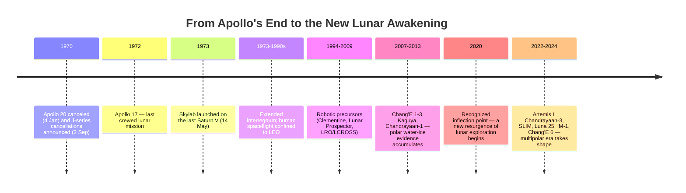
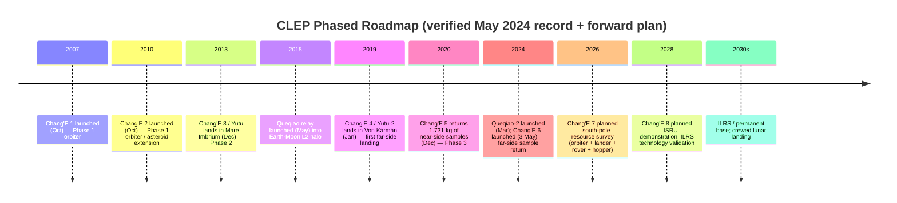

# The New Cislunar Era: A Comprehensive Review of National Programs, Commercial Services, and Strategic Hotspots in Lunar Exploration (Up to May 2024)
# 1 Introduction: The Resurgence of Cislunar Exploration

Five and a half decades after Apollo 17's lunar module Challenger lifted off the Taurus-Littrow valley in December 1972, the volume of space between Earth and the Moon is once again the most contested and most invested arena of human spaceflight. National agencies that had long confined their crewed activities to low Earth orbit are now developing super-heavy rockets, deep-space crew vehicles, and lunar surface infrastructure; commercial companies once limited to satellite manufacturing are flying their own landers; and the public discourse around the Moon has shifted from nostalgic remembrance to active strategic planning. This chapter establishes the analytical foundation for understanding why this resurgence is occurring now, who the principal actors are, and what conceptual vocabulary is required to interpret it. Before examining individual national programs, commercial ecosystems, and orbital hotspots in the chapters that follow, it is essential to anchor the report in the historical arc that produced today's cislunar environment, the convergence of drivers that distinguishes this era from the Apollo paradigm, and the technical terminology that will recur throughout the analysis.

## 1.1 From Apollo's End to a New Lunar Awakening: Historical Context

The current cislunar resurgence cannot be fully appreciated without first reckoning with the abruptness and finality with which the original era of lunar exploration was terminated. In the summer of 1970 — barely a year after Neil Armstrong's first steps — the Nixon administration and a budget-conscious Congress were already systematically dismantling the human exploration architecture that had taken less than a decade to build. NASA Administrator Tom Paine had submitted a Fiscal Year 1971 proposal of $3.33 billion in February 1970, itself a decrease of more than $500 million on the previous year, and the agency had already terminated the Saturn V production line, mothballed the Mississippi Test Facility, and reduced the workforce at the Michoud Assembly Facility to absorb the cuts.[^1] On 4 January 1970, NASA had formally canceled Apollo 20 — until that point envisioned as the final lunar landing — and after House and Senate debate the agency's FY71 allocation was further trimmed to $3.269 billion, forcing an additional $42.1 million cut from the Apollo budget itself to a total of just $914.4 million.[^1]

The decisive blow came on 2 September 1970, when Paine announced NASA's interim operating plan canceling what were then designated Apollos 15 and 19, the last of the short-duration "H-series" and long-duration "J-series" lunar landing missions respectively. After renumbering, Apollo 14 became the final H-series mission and Apollos 15, 16, and 17 were redesignated as the new J-series, so the two "lost" missions are popularly remembered as Apollos 18 and 19.[^1] The savings represented just 2 percent of NASA's FY71 budget and 0.25 percent of the total Apollo investment, a calculus the New York Times condemned as "penny-wise, pound-foolish" and which Nobel laureate Harold Urey dismissed as "chicken feed" compared with the roughly $25 billion already sunk into the program.[^1] Workforce reductions cascaded accordingly: by October 1970, NASA's civil-service headcount had fallen to 29,850 — its lowest since 1963 — after cumulative reductions of more than 5,200 personnel during 1968–1970.[^1]

The strategic consequence of these decisions was that, following the launch of Skylab on 14 May 1973 atop the last Saturn V to fly, the United States and the broader human spaceflight community entered an extended interregnum in which crewed activity was effectively confined to low Earth orbit.[^1] Veteran flight director Chris Kraft, who became director of the Manned Spacecraft Center in January 1972, would later write that none of the principals at NASA "thought that America would turn into a nation of quitters and lose its will to lead an outward-bound manned exploration of our Solar System."[^1] That judgment, written in retrospect, captures the central paradox of the post-Apollo era: a peak human capability for beyond-LEO exploration was deliberately retired without an operational successor, leaving robotic spacecraft as the only emissaries beyond Earth orbit for nearly half a century.

The break in this trajectory came gradually, then suddenly. Robotic precursors during the 2000s and 2010s — Clementine and Lunar Prospector in the late 1990s, followed by the Lunar Reconnaissance Orbiter, LCROSS, GRAIL, LADEE, Chandrayaan-1, Kaguya, and the early Chang'E orbiters — reshaped the scientific understanding of the Moon, particularly by confirming the presence of water ice in permanently shadowed polar regions. Building on this foundation, **the year 2020 has been characterized in the lunar-science literature as marking "a new resurgence of lunar exploration,"** with a sharp acceleration in the cadence of missions, the diversity of actors, and the ambition of architectures.[^2] The contemporary era is therefore best understood as simultaneously a continuation of unfinished Apollo-era scientific ambitions — particularly the systematic exploration of the lunar poles and far side, regions Apollo never reached — and a fundamentally new paradigm shaped by actors, technologies, and motivations that did not exist in the 1960s and 1970s.

The timeline above is not merely a chronology but an interpretive frame for the rest of the report: the period between Apollo 17 and the 2020 resurgence represents a structural discontinuity in cislunar capability, and the question of whether the current era will succeed where Apollo's successors did not is, in part, a question of whether the underlying drivers of the new wave are more durable than the Cold War political logic that sustained — and then abandoned — Apollo.

## 1.2 Drivers of the New Cislunar Era: Geopolitical, Scientific, Technological, and Economic Motivations

The convergence of multiple, mutually reinforcing drivers distinguishes the current cislunar resurgence from the politically narrow Cold War rationale that produced Apollo. Apollo was, at its core, a single-purpose geopolitical demonstration: as commenters on the post-Apollo retreat have observed, "the object of Apollo was to visibly beat the Soviets, not exploration," and once that demonstration was completed the political signature that financed the program could not be sustained.[^1] The contemporary return to the Moon, by contrast, rests on a broader and more heterogeneous coalition of motivations, which together help explain both why the current wave has been able to generate sustained budgetary and institutional commitment and why it is unfolding in a far more multipolar configuration than Apollo did.

**Geopolitically**, the cislunar arena has become an extension of terrestrial great-power competition, but with a structural twist: rather than a bilateral race between two superpowers, it now involves at least five operationally capable national programs (United States, China, Russia, India, Japan) and a growing set of secondary actors (ESA member states, South Korea, the United Arab Emirates, Israel). Coalition-building has become as important as raw capability, with the United States organizing partners around the Artemis Accords framework and China and Russia anchoring a parallel International Lunar Research Station (ILRS) coalition. The result is that the Moon is now a venue both for cooperation among allies and for strategic differentiation between blocs, with implications for governance, norm-setting, and space domain awareness that successive chapters will examine in detail.

**Scientifically**, the lunar agenda has shifted from the broad reconnaissance objectives of Apollo to a more focused set of questions that can only be answered through new missions. These include the bombardment history of the inner Solar System and the early evolution of the Moon — reflected, for example, in the renewed interest in characterizing the timeline of lunar bombardment that has become a focus of post-2020 mission planning.[^2] They also include the inventory, distribution, physical state, and accessibility of polar volatiles, particularly water ice in permanently shadowed regions, which have emerged as both a scientific puzzle (regarding their origin and emplacement) and a resource-utilization question. The far side of the Moon, never visited by Apollo crews and only sampled robotically beginning with Chang'E 4, has further opened as a domain for low-frequency radio astronomy and for sampling materials that may preserve a different geochemical history from the near side.

**Technologically**, the toolkit available to lunar mission planners in the 2020s differs qualitatively from that of the Apollo era. Partially reusable launch vehicles, autonomous and precision-guided landing systems, miniaturized scientific instruments, advanced computing and machine learning for on-board autonomy, and the proliferation of small-spacecraft platforms have collectively reduced the marginal cost of accessing the Moon and broadened the pool of organizations capable of attempting it. Where Apollo required a single-government industrial mobilization on the scale of a national emergency, contemporary lunar missions can be undertaken by commercial firms with budgets two or three orders of magnitude smaller, even if their success rates remain commensurate with the early state of the industry.

**Economically**, the most novel driver is the emergence of a plausible cislunar economic logic, anchored in commercial lunar transportation services and the prospect of in-situ resource utilization (ISRU). As officials associated with regulatory bodies have argued in the policy literature, the ability to extract water and minerals from the Moon and other bodies is expected to have a "synergistic impact" on the ability to explore the Solar System and to establish what is increasingly described as a true space economy.[^1] This logic, even where it remains aspirational, has been sufficient to attract private capital and to justify public investment frameworks — such as NASA's Commercial Lunar Payload Services (CLPS) initiative — that treat the Moon as a venue for recurring commercial activity rather than as a one-off destination.

Taken together, these four families of drivers are mutually reinforcing in a way that the Apollo-era political logic was not. Scientific objectives justify mission cadence; mission cadence supports commercial business cases; commercial activity reduces government cost exposure and broadens the political coalition; and great-power competition supplies the urgency that keeps lunar programs near the top of national priority lists. The durability of this coupling will be tested over the next decade, but it already represents a structurally different foundation than the one that collapsed under Apollo in 1970.

## 1.3 Key Concepts and Terminology: Defining the Cislunar Domain

Because the chapters that follow rely on a set of recurring spatial and architectural concepts, this subchapter consolidates the terminology used throughout the report. Three clusters of terms are particularly important: the definition of cislunar space itself, the orbital regimes that have become operationally significant, and the surface regions — above all the lunar South Pole — that dominate landing-site selection.

The term **cislunar space** is used in this report to denote the volume of space between geostationary Earth orbit and the lunar surface, encompassing the Earth–Moon Lagrange points (notably L1 and L2), trans-lunar trajectories, and the various orbits around the Moon itself. This is a broader operational definition than "lunar orbit" alone and reflects the fact that contemporary architectures — particularly those involving orbital gateways, relay satellites, and staging orbits — treat the entire Earth–Moon volume as a single connected theater of operations rather than as discrete domains.

Within cislunar space, two orbital regimes recur with particular frequency in the chapters that follow. The **Near-Rectilinear Halo Orbit (NRHO)** is a highly elliptical, nearly polar orbit around the Earth–Moon L2 point, characterized by a close perilune passage (typically a few thousand kilometers above the lunar south polar region) and a distant aposelene of tens of thousands of kilometers. NRHO is dynamically stable over operationally relevant timescales, requires modest station-keeping propellant, offers continuous line-of-sight to Earth, and provides recurring access opportunities to the lunar South Pole — properties that make it the chosen orbit for the planned Lunar Gateway and a recurring reference orbit for forthcoming mission planning. The **Distant Retrograde Orbit (DRO)** is a large, stable orbit around the Moon in the retrograde sense relative to the Moon's motion, used historically by Artemis I's Orion vehicle and increasingly considered as a staging region for assets that require long-duration stability with low maintenance. These two regimes, along with low lunar orbit and the Earth–Moon Lagrange points, constitute the primary orbital "addresses" of the new lunar architecture and are returned to in detail in Chapter 8.

On the lunar surface, the **South Pole region** has become the dominant focal area for both crewed and robotic landings. Its strategic value rests on three overlapping properties: the presence of permanently shadowed regions (PSRs) within polar craters that act as cold traps for water ice and other volatiles; the existence of nearby topographic high points (so-called "peaks of near-eternal light") that receive solar illumination for large fractions of the lunar year, enabling sustained solar power generation; and the relatively benign thermal environment of illuminated polar terrain compared with the extreme day–night swings of equatorial regions. Specific features that recur throughout this report include **Shackleton Crater**, **Malapert Massif**, **Mons Mouton**, and **Nobile Crater**, each of which has been identified as a candidate landing zone for one or more current or planned missions. The dynamics of why these particular features have been selected, and how surface and orbital hotspots are operationally linked, form the central subject of Chapter 8.

Beyond these spatial concepts, the report uses several programmatic terms that warrant early clarification: **CLPS** refers to NASA's Commercial Lunar Payload Services initiative, the contracting mechanism by which the agency purchases robotic lunar delivery as a service rather than as an in-house mission; the **Artemis Accords** are the US-led set of bilateral political agreements that codify principles for civil lunar activity; and the **International Lunar Research Station (ILRS)** is the China–Russia-led counterpart coalition envisioning a permanent robotic-then-crewed lunar base. These coalitions are discussed in detail in Chapters 2 through 4 and synthesized in Chapter 9.

## 1.4 Scope, Methodology, and Structure of the Report

This report adopts a defined temporal and analytical scope to maintain coherence across what is an extremely fast-moving subject. The **temporal cutoff is May 2024**: factual claims, mission statuses, and the partition between completed and forthcoming missions reflect the state of knowledge as of that date, and developments occurring after this cutoff are not treated as known unless they are explicitly bracketed as out-of-scope context. This convention is particularly important for borderline missions launched immediately before the cutoff — most notably Chang'E 6, which lifted off on 3 May 2024 and whose downstream outcomes (landing, ascent, and sample return) occurred after the cutoff — where classification logic is documented transparently in the relevant chapters.

The **breadth of actors** covered spans three categories: (i) national space agencies with active lunar programs, including the United States (NASA), China (CNSA), Russia (Roscosmos), India (ISRO), Japan (JAXA), the European Space Agency (ESA), South Korea (KARI), and the United Arab Emirates (UAE Space Agency); (ii) commercial lunar service providers operating under government contracts or independent business models, with particular emphasis on the CLPS contractor cohort; and (iii) the international partnerships and coalitions — Artemis Accords signatories and ILRS partners — that structure cooperation among these actors. The report does not attempt comprehensive coverage of every cislunar object or proposal but rather focuses on missions and programs whose strategic significance is documented in authoritative public sources.

The **analytical lenses** employed throughout the report combine programmatic description with comparative and causal analysis. Each chapter is expected not merely to enumerate facts but to interpret them: to identify patterns of success and failure, to trace causal links between resource considerations and site selection, to compare procurement models, and to situate individual missions within broader strategic trajectories. Tables and inventories, where used, are accompanied by explanatory commentary rather than presented as standalone reference material.

The **structure of the report** proceeds in four logical movements. Chapters 2 through 4 examine the three flagship national programs — Artemis (United States), Chang'E (China), and Luna (Russia) — together with the contributions of secondary national actors. Chapter 5 turns to the commercial ecosystem, focusing on CLPS and the early outcomes of contracted lunar delivery missions, with particular attention to payloads designed to detect and characterize lunar water. Chapters 6 and 7 consolidate the empirical record in two reference tables: **Table 1 (Key Cislunar Missions Review in the 21st Century, as of May 2024)** for missions completed or launched by the cutoff, and **Table 2 (Outlook for Key Future Cislunar Missions)** for missions in advanced planning. Chapters 8 and 9 then synthesize the foregoing material into a hotspot analysis — identifying why the lunar South Pole and orbital regimes such as NRHO and DRO have come to dominate — and a strategic outlook addressing trends, challenges, and implications for the next decade of cislunar activity.

It is important to note one methodological constraint that the reader should keep in mind. The reference material available for this introductory chapter is more abundant for the historical context of Apollo's termination and for the general framing of the post-2020 resurgence than for highly technical orbital and policy definitions, which the report relies on standard space-mission terminology to articulate. Where specific factual claims appear in subsequent chapters, they are cited to the underlying primary or authoritative secondary sources from which they are drawn; where conceptual framing is provided without citation, it represents structural reasoning consistent with the documented record rather than independent claims about contested facts. This approach is intended to keep the analytical narrative readable while preserving the evidentiary discipline expected of a deep research report.

With this foundation in place — historical arc, contemporary drivers, terminological framework, and methodological scope — the following chapter turns to the most prominent embodiment of the cislunar resurgence: the United States Artemis program.

# 2 The United States Artemis Program: Architecture and Roadmap

Chapter 1 closed with the observation that the contemporary cislunar resurgence rests on a structurally different foundation than Apollo: a heterogeneous coalition of geopolitical, scientific, technological, and economic drivers, channeled through institutional arrangements — public-private contracting, multinational coalitions, and reusable infrastructure — that the 1960s did not possess. The clearest single embodiment of this new logic is the United States Artemis program. As of May 2024, Artemis is the largest, most architecturally integrated, and most internationally embedded lunar effort underway anywhere in the world, and it provides the comparative baseline against which the Chang'E and Luna programs (Chapters 3 and 4) and the commercial lunar ecosystem (Chapter 5) will be assessed. This chapter dissects the program along seven analytical axes: its origins and strategic framing, the two government-led transportation pillars (SLS and Orion), the commercially procured surface elements (HLS, suits, mobility), the cislunar outpost (Lunar Gateway), the mission sequence, the South Pole focus and Artemis Accords coalition, and finally the structural challenges that bound the program's near-term outlook.

## 2.1 Program Origins, Goals, and Strategic Framing

The legal and policy scaffolding for Artemis predates the program's current name by nearly a decade. The NASA Authorization Act of 2010 (P.L. 111-267) established the statutory goal of "expand[ing] permanent human presence beyond low-Earth orbit" and mandated the development of both a crew capsule and a heavy-lift rocket — components that ultimately became Orion and the Space Launch System (SLS) — to accomplish that goal.[^3] The program was named "Artemis," for Apollo's twin sister in ancient Greek mythology, when NASA consolidated its lunar return policy after 2017 around a 2024 first-landing target subsequently rephased to later in the decade.[^3] Successive NASA authorization legislation, including the 2017 (P.L. 115-10) and 2022 (P.L. 117-167) Acts, reinforced the framing of Artemis as a stepping stone for future Mars missions and directed the agency to establish a dedicated Moon to Mars Office to oversee that integrated architecture.[^3]

Three programmatic objectives, mutually reinforcing rather than serial, define Artemis as articulated by NASA itself: to "send astronauts on increasingly difficult missions to explore more of the Moon for scientific discovery, economic benefits, and to build on our foundation for the first crewed missions to Mars."[^4] This formulation is doctrinally important because it differs from Apollo in two specific ways. First, the explicit invocation of "economic benefits" institutionalizes the cislunar economic logic introduced in Chapter 1 — Artemis is intended to seed a recurring lunar transportation market, not merely to deliver crews and return. Second, the framing of the Moon as a "foundation" for Mars converts what was, under Apollo, a terminal destination into a deliberately intermediate one, which in turn justifies investments in sustainable infrastructure (orbital stations, surface power, in-situ resource utilization) whose value would not be amortized over a single landing campaign.

The strategic implications of this framing pervade the architectural choices that follow. Where Apollo was a single-government industrial mobilization that procured its hardware on a cost-plus basis from a small number of prime contractors, Artemis explicitly combines government-developed deep-space transportation (SLS and Orion) with commercially procured surface and logistics services (Human Landing System, Commercial Lunar Payload Services, spacesuits) and with international contributions to the Gateway and to lunar science payloads.[^3] This hybrid model is the operational manifestation of the structurally different driver coalition diagnosed in Chapter 1 and is the most consequential single difference between Artemis and its Apollo predecessor.

## 2.2 Core Transportation Architecture: SLS and Orion

The two government-developed pillars of the Artemis transportation stack are the Space Launch System rocket and the Orion crew vehicle, both of which have been under continuous development since their statutory establishment in 2010.[^3] In NASA's own language, "SLS is the only rocket that can send Orion, astronauts, and cargo directly to the Moon in a single launch," combining unmatched payload mass, volume, and departure energy.[^4] This single-launch capability is the architectural fulcrum on which the rest of the Artemis crewed sequence depends: every Artemis crewed mission begins with one SLS launch sending one Orion to the vicinity of the Moon.

The Block 1 configuration of SLS flown on Artemis I and planned for Artemis II and III consists of a core stage powered by four RS-25D engines — all of which on the inaugural flight had previously flown on Space Shuttle missions — flanked by two five-segment solid rocket boosters; together, the core and boosters produced approximately 39,000 kN (8.8 million lbf), or about 4,000 metric tons of thrust at liftoff.[^5] The upper stage on Block 1 is the Interim Cryogenic Propulsion Stage (ICPS), based on the Delta Cryogenic Second Stage and powered by a single RL10B-2 engine; on Artemis I the ICPS performed the trans-lunar injection burn that placed Orion and ten CubeSat secondary payloads on a trajectory toward the Moon.[^5] As mandated by the 2010 Authorization Act, SLS was designed to accommodate phased upgrades — known as Block 1, Block 1B, and Block 2 — intended to increase thrust and in-space propulsion capability through the introduction of the Exploration Upper Stage on later variants.[^3]

The Orion crew vehicle is the second pillar. Each Orion consists of three principal elements: a Lockheed Martin-built crew module with room for four to six astronauts and a docking port, an ESA-provided European Service Module (built by Airbus) that supplies power and propulsion, and a launch abort system that can pull the crew module clear of the rocket in the event of an ascent emergency.[^3][^5] The crew module is the only element designed to return to Earth and is intended to be reusable. The ESA contribution is structurally significant: it makes the European Space Agency an essential rather than optional partner in U.S. crewed deep-space exploration, with each Orion flight dependent on a European-supplied service module.

The certification logic linking these two systems through the Artemis sequence is uncrewed-to-crewed-to-landing. Artemis I was an uncrewed integrated flight test of SLS and Orion, intended principally to verify the Orion heat shield's performance on a high-velocity lunar return trajectory before exposing astronauts to that environment.[^5] Artemis II is planned as the first crewed flight, a lunar flyby that closes out the certification of life-support, displays, and crew interfaces but does not attempt a landing. Artemis III is to be the first crewed landing of the program, layering the Human Landing System and surface operations on top of the now-certified SLS/Orion transportation stack.[^3][^4] This stepwise certification approach is a deliberate departure from Apollo, in which the urgency of the political deadline drove a more compressed test sequence.

## 2.3 Human Landing System and Surface Mobility Elements

The Orion capsule is not designed to land on the Moon; instead, astronauts are to transfer in lunar orbit to a separate Human Landing System (HLS) for descent and ascent.[^3] This architectural decision — keeping the deep-space return vehicle in orbit and using a dedicated lander — is structurally similar to Apollo's lunar-orbit-rendezvous mode, but the procurement logic is fundamentally different. Rather than designing and owning a single lander, NASA selected two commercial HLS providers: SpaceX, with a lunar-optimized variant of its Starship vehicle, and Blue Origin, with its Blue Moon lander.[^3][^4] Congressional appropriations committee reports have repeatedly encouraged NASA to maintain more than one commercial provider to ensure redundancy and bolster competition, an instruction that the dual-award structure now satisfies.[^3]

The dual-provider approach is consequential beyond redundancy. It treats lunar landing services as a commercial market in which NASA is one — even if currently the dominant — customer, on the same procurement template that the agency has used for low-Earth-orbit cargo and crew transportation since the 2010s. NASA's stated rationale is that working with industry to develop human landing systems will "safely carry Artemis astronauts from lunar orbit to the Moon's surface and back for future crewed exploration of the Moon," with the corollary that the commercial providers retain the systems and may amortize them across non-NASA customers and missions.[^4] As of May 2024 both vehicles were still in development, and successive oversight reports had documented schedule and technical risks attached to both, particularly to SpaceX's Starship HLS, which depends on a complex propellant-transfer architecture in low Earth orbit before each lunar departure.

Beyond the lander, Artemis envisions a broader portfolio of surface elements that collectively define the program's "base camp" ambition. NASA's Extravehicular Activity and Human Surface Mobility Program is responsible for next-generation spacesuits (the xEMU lineage, now being delivered commercially as the Axiom Extravehicular Mobility Unit, or AxEMU), human-rated rovers, tools, and the spacewalk support systems that astronauts will need to "survive and work outside the confines of a spacecraft to explore on and around the Moon."[^4] As with the lander, the suits are being procured as commercial services rather than developed in-house, and a Lunar Terrain Vehicle (LTV) concept is similarly being acquired through commercial contracts. The commercial-services logic that distinguishes Artemis from Apollo's in-house industrial model thus extends from the lander all the way through to the spacewalk hardware, and is examined in greater depth as a procurement paradigm in Chapter 5.

## 2.4 Lunar Gateway: Cislunar Outpost and International Contributions

The Lunar Gateway is the planned small space station that NASA describes as "humanity's first space station around the Moon," central to the Artemis missions both as scientific outpost and as a logistical node for surface operations.[^4] Gateway is conceived as a multi-purpose facility serving three principal roles: a staging point and rendezvous node where Orion-borne crews can transfer to the HLS, a science platform conducting research in the deep-space radiation environment of cislunar space, and an infrastructural anchor for future missions further from Earth.

The Gateway is being assembled modularly. The first two elements — the Power and Propulsion Element (PPE) and the Habitation and Logistics Outpost (HALO) — are to be co-launched and form the initial core of the station. HALO, in particular, is a cylindrical pressurized module that arrived at Northrop Grumman's facility in Gilbert, Arizona, from Thales Alenia Space in Turin, Italy, in early 2025 (after the May 2024 cutoff for primary integration milestones referenced in this report), illustrating the deeply internationalized supply chain of the program.[^4] Additional modules — including the European-built International Habitat (I-HAB) and ESA's European System Providing Refueling, Infrastructure and Telecommunications (ESPRIT) — are planned contributions from ESA, with further contributions planned by JAXA (logistics resupply and habitation interior systems), the Canadian Space Agency (the Canadarm3 robotic arm), and the United Arab Emirates (a Crew and Science Airlock module). Like the European Service Module for Orion, these contributions structurally embed partner nations in the Artemis architecture in a way that converts coalition diplomacy into operational interdependence.

The selection of Gateway's operating orbit — a Near-Rectilinear Halo Orbit (NRHO) around the Earth–Moon L2 point — is one of the most consequential architectural decisions of the program, and one of the principal reasons the orbital hotspot analysis of Chapter 8 will treat NRHO as a focal regime. The orbit was chosen for its combination of dynamical stability, modest station-keeping requirements, continuous line-of-sight to Earth, and recurring close passes over the lunar south polar region, which align with both the surface-mission focus and the communications and crew-rotation needs of the Gateway concept. As the Gateway has matured, NRHO has become the de facto staging orbit of the U.S.-led cislunar architecture, with implications for traffic management, space domain awareness, and the strategic positioning of other actors that Chapter 8 examines in greater depth.

## 2.5 Mission Sequencing: Artemis I, II, III and Beyond

The verified mission record of Artemis as of May 2024 consists of one completed integrated flight test — Artemis I — and a forward sequence of planned missions whose schedule had been publicly reset multiple times by that date. Each warrants treatment in turn.

**Artemis I** was launched at 06:47:44 UTC on 16 November 2022 from Launch Complex 39B at Kennedy Space Center, after two scrubbed attempts in August and September 2022 caused by an erroneous engine temperature sensor reading and a hydrogen leak in a service arm during fueling, and a further delay imposed by Hurricane Nicole in November.[^5] The mission, formerly designated Exploration Mission-1 (EM-1) and described by NASA and Wikipedia as the agency's "return to lunar exploration after the conclusion of the Apollo program nearly five decades earlier," was the first integrated flight test of the SLS rocket and Orion spacecraft.[^5] Orion was placed by the ICPS on a trans-lunar injection trajectory approximately 89 minutes after liftoff, deployed ten secondary CubeSat payloads (including ArgoMoon, BioSentinel, LunaH-Map, Lunar IceCube, LunIR, NEA Scout, EQUULEUS, OMOTENASHI, CuSP, and Team Miles), and continued to the Moon, where on 21 November it performed an outbound powered flyby burn at 12:44 UTC, achieving a closest lunar approach of approximately 130 km (81 mi) above the surface.[^5]

On 25 November Orion entered a Distant Retrograde Orbit (DRO), in which it remained for six days; on 28 November it reached the maximum distance of 432,210 km (268,563 mi) from Earth, breaking the record previously held by Apollo 13 for the farthest distance traveled by an Earth-returning human-rated spacecraft.[^5] After departing DRO on 1 December and performing a close lunar approach of 128 km (80 mi) on 5 December, Orion separated from its service module and re-entered Earth's atmosphere at approximately 17:20 UTC on 11 December, executing a skip-entry trajectory — the first U.S. use of this re-entry profile, originally pioneered by the Soviet Zond 7 — before splashing down in the Pacific Ocean west of Baja California near Guadalupe Island at 17:40:30 UTC after a total mission duration of 25 days, 10 hours, 52 minutes, and 46 seconds, having travelled approximately 1.3 million miles (2.1 million km).[^5] The Orion capsule was recovered by USS *Portland*.[^5] A post-flight inspection identified unexpected loss of AVCOAT material on Orion's heat shield, which became the subject of an extended engineering analysis whose conclusions extended past the May 2024 cutoff and are therefore treated as out-of-scope context here.[^5]

The following table consolidates the Artemis I record in a form that complements the comprehensive Table 1 to be presented in Chapter 6.

| Parameter | Value |
|---|---|
| Launch date/time | 16 November 2022, 06:47:44 UTC[^5] |
| Launch vehicle / pad | SLS Block 1, LC-39B, Kennedy Space Center[^5] |
| Mission duration | 25 d 10 h 52 min 46 s[^5] |
| Distance traveled | ~1.3 million miles (~2.1 million km)[^5] |
| Closest lunar approach | ~130 km (outbound, 21 Nov) / ~128 km (return, 5 Dec)[^5] |
| Lunar orbital regime | Distant Retrograde Orbit (DRO), 25 Nov – 1 Dec 2022[^5] |
| Maximum distance from Earth | 432,210 km (268,563 mi), 28 Nov 2022[^5] |
| Secondary payloads | 10 CubeSats deployed from ICPS Orion Stage Adapter[^5] |
| Splashdown | 11 December 2022, 17:40:30 UTC, Pacific Ocean off Baja California[^5] |

**Artemis II** was, as of May 2024, the planned first crewed flight of the program — a lunar flyby intended to verify Orion life-support, communications, navigation, and crew-interface systems on a trajectory that does not enter lunar orbit. NASA had publicly identified its four crew members (Reid Wiseman, Victor Glover, Christina Koch, and Jeremy Hansen) in April 2023, and crew training including Artemis geology training in Iceland was underway in August 2024.[^4] The Artemis II target launch date had been reset more than once before May 2024, most recently in January 2024 when NASA announced a delay from late 2024 to September 2025 to address technical findings from Artemis I (including the heat-shield material loss) and HLS-related schedule realism.

**Artemis III** was, as of the same cutoff, planned as the first crewed lunar landing since Apollo 17, with target candidate landing regions concentrated near the lunar South Pole and crew descent to be conducted aboard SpaceX's Starship HLS.[^3][^4] Following the January 2024 announcement, the planned Artemis III date was reset to September 2026 (subject to further dependencies, particularly HLS readiness). **Artemis IV** was planned to extend the architecture by integrating Gateway with the Orion/HLS chain, layering cislunar infrastructure on top of the demonstrated transportation stack.[^4]

It is essential to note for the integrity of this report that more recent re-architecting announcements — including changes to SLS upper-stage plans, decisions about the Gateway's role, and revised landing dates — occurred after the May 2024 cutoff and are explicitly excluded from the verified record presented here. The schedule and architectural baseline used throughout the rest of this report, including in the future-mission Table 2 of Chapter 7, is the one publicly maintained by NASA as of May 2024.

## 2.6 South Pole Focus and the Artemis Accords Coalition

Two strategic choices, made before any crewed Artemis mission flew, distinguish the program's ambition from Apollo's flags-and-footprints model: the concentration of crewed landings at the lunar South Pole, and the construction of an international governance coalition around the Artemis Accords.

The polar landing-site choice is the operational expression of the resource and science logic introduced in Chapter 1. The South Pole offers permanently shadowed regions inside polar craters that act as cold traps for water ice and other volatiles; nearby topographic high points ("peaks of near-eternal light") that receive solar illumination for unusually large fractions of the lunar year, supporting sustained solar power generation; and a relatively benign thermal environment compared with the equatorial day–night swings. NASA has identified a portfolio of candidate landing regions near the pole for Artemis III, including features such as the Shackleton-rim massifs, Malapert Massif, Mons Mouton, and Nobile-area sites — the specific selection logic and inter-mission convergence on these features is the principal subject of Chapter 8.

The Artemis Accords are the political and governance complement to the polar surface strategy. NASA, in coordination with the U.S. Department of State, established the Accords in 2020 with eight initial signatory nations, with the explicit aim of providing "a common set of principles to enhance the governance of the civil exploration and use of outer space as many countries and private companies conduct missions and operations around the Moon."[^4] The Accords codify principles including peaceful purposes, transparency, interoperability of systems, emergency assistance, registration of objects, release of scientific data, preservation of outer-space heritage, deconfliction of activities (including "safety zones"), and orbital debris mitigation. The signatory list expanded steadily after 2020, reaching several dozen countries by May 2024 (the report does not adopt a precise post-cutoff figure to avoid misrepresenting the temporal record).[^4]

The strategic effect of these two choices, taken together, is that Artemis converts the South Pole region from a scientific curiosity into the geographic anchor of a U.S.-led international coalition, and converts NRHO into the orbital anchor of that same coalition. The contrast with the Chang'E/Luna/ILRS alternative — analyzed in Chapters 3 and 4 — is a recurring theme of the report and is synthesized in Chapter 9.

## 2.7 Program Challenges, Schedule Risk, and Strategic Outlook

Even before any crewed flight, Artemis as it stood in May 2024 faced a recognized set of structural challenges that bound any near-term assessment of its trajectory. Independent oversight bodies — the Government Accountability Office (GAO), the NASA Office of Inspector General (OIG), and the Aerospace Safety Advisory Panel (ASAP) — had over preceding years documented cost overruns and schedule slippage across multiple major Artemis projects, with the OIG in particular highlighting risk attached to HLS readiness and CLPS-related procurement assumptions.[^3] The aggregate effect was a cumulative slip from the original 2024 first-landing target through successive reset dates, with the January 2024 rebaseline being the most recent publicly stated schedule as of the report's cutoff.

Three categories of risk are structurally interconnected and warrant explicit identification. **Technical risk** concentrates on the most architecturally novel elements: the Starship HLS, with its dependence on a multi-launch propellant-transfer architecture; the Orion heat shield, where the post-Artemis-I material-loss investigation was ongoing as of May 2024; the next-generation spacesuits, where commercial development had been ongoing and not yet certified for flight; and the integration of Gateway, where deferral of any of the contributing partner modules could ripple through the cislunar assembly sequence. **Schedule interdependency risk** arises because the Artemis sequence is built around tightly coupled elements — Orion cannot land, HLS cannot reach the Moon without SLS/Orion's trans-lunar staging, Gateway integration requires HLS-rated rendezvous, and so on — so that slip in any one element propagates into others, a phenomenon that GAO has characterized as growing in significance as the program scales toward higher-cadence operations.[^3] **Funding and political risk** reflects the reality that Artemis is dependent on continuing congressional appropriations and on policy continuity across administrations; while the program has enjoyed bipartisan support since its statutory origin in 2010, specific architectural choices (most notably the role of Gateway versus a direct base-camp pathway, and the long-term role of SLS versus commercial heavy-lift alternatives) have remained subject to ongoing policy debate.[^3]

The structural countervailing factor is the commercial-services procurement model itself. By converting Apollo's monolithic government-owned architecture into a portfolio of government-operated transportation (SLS/Orion) plus commercially procured surface and logistics services (HLS, suits, LTV, CLPS), Artemis has expanded the political constituency for sustained lunar activity beyond the traditional NASA contractor base, recruited international partners through the Gateway and Accords, and lowered the political cost of any individual schedule slip by distributing risk across multiple commercial providers. Whether this distributed model is more or less resilient than Apollo's centralized one will be one of the principal empirical questions of the decade ahead.

**Taken in totality, the United States Artemis program as of May 2024 represents a coherent if not yet fully proven attempt to translate the post-2020 cislunar resurgence into a sustained, internationally embedded, and commercially leveraged architecture for human and robotic operations at the Moon.** Its core transportation pillars have flown one integrated test (Artemis I), its surface and orbital infrastructure are in active development under hybrid government-commercial procurement, its landing-site focus is unambiguously the South Pole, and its coalition framework — the Artemis Accords — provides the political and governance counterpart to the technical architecture. The Artemis baseline established in this chapter is the comparative reference against which Chapter 3 will analyze China's Chang'E program — a more vertically integrated, state-led, and step-by-step alternative — and Chapter 4 will assess Russia's revived Luna program and the secondary national actors that round out the multipolar cislunar landscape.

# 3 China's Chang'E Program: A Step-by-Step Lunar Strategy

Chapter 2 reconstructed the United States Artemis program as a coalition-driven, commercially leveraged architecture whose distinguishing feature is the deliberate fusion of government-owned deep-space transportation with commercially procured surface infrastructure and an internationalized governance framework. The Chinese Lunar Exploration Program (CLEP), known by its mythological cognomen Chang'E, has by contrast pursued a structurally different path to a comparable ambition. Where Artemis distributes risk across multiple commercial providers and bilateral coalition partners, CLEP relies on a vertically integrated, state-mobilized industrial base; where Artemis sequences a small number of architecturally heavy crewed flights, CLEP advances through a patient series of robotic stepping stones, each engineered to validate the technologies on which the next depends. The result is a program whose pace has been steadier and whose unit cost is lower, even if its near-term crewed ambitions remain less mature than the U.S. baseline. This chapter examines the program's four-phase strategy, traces its verified mission record from the early orbiters through the May 2024 launch of Chang'E 6, analyzes the supporting Queqiao relay constellation, and assesses the forward trajectory toward Chang'E 7, Chang'E 8, and the International Lunar Research Station (ILRS). In doing so, it establishes Chang'E as the principal alternative pole around which the multipolar cislunar order now organizes itself.

## 3.1 Program Architecture: The Four-Phase 'Orbit–Land–Return–Station' Strategy

China's lunar exploration program was formally established in January 2004, when its initial lunar orbiter project was authorized by the central government[^6]. From its inception, CLEP was structured as a long-horizon technological accumulation rather than as a single politically motivated sprint. The Chang'E project was articulated as a phased plan in which each generation of spacecraft would inherit, validate, and extend the engineering capabilities developed by its predecessors. China's lunar exploration is now consistently described in both Chinese and international sources as being divided into four sequential phases: an initial **orbiting** phase, executed by Chang'E 1 (launched October 2007) and Chang'E 2 (launched October 2010); a **landing** phase, executed by Chang'E 3 (December 2013) and Chang'E 4 (January 2019); a **sample-return** phase, executed by Chang'E 5 (November–December 2020) and Chang'E 6 (May 2024); and a fourth phase, currently in development, focused on building a **robotic research station** near the lunar south pole, to be supported by Chang'E 7 and Chang'E 8 and culminating in the ILRS[^7][^8][^6].

The doctrinal logic of this architecture differs sharply from both Apollo and Artemis. Where Apollo compressed orbiter, lander, and crewed-landing demonstrations into a sequence of approximately six years under intense political pressure, and where Artemis structures its progression around a small number of architecturally heavy crewed flights flanked by commercial cargo services, CLEP has chosen a third pattern: pairing every flagship mission with a backup spacecraft that, once the primary mission succeeds, can be repurposed as the platform for a more ambitious follow-on. Chang'E 2 was originally constructed as a flight spare for Chang'E 1; Chang'E 4 was originally a backup for Chang'E 3; and most recently, Chang'E 6 was, in the words of chief designer Hu Hao, "originally a backup for Chang'e-5" and was "intended to fulfill a new mission: working on the far side of the moon"[^9]. This pairing discipline is what makes the program's "step-by-step" pace possible: each successful primary mission generates a flight-proven, partially preassembled vehicle that can be retasked at marginal cost to attempt a more demanding objective.

The strategic effect of this design is to convert what would otherwise be sunk redundancy into recurrent capability growth. Hu Hao described the consequence directly: by absorbing the experiences of one mission into the design baseline of the next, the Chang'E program has cultivated "a path, … a skilled team, and … numerous accomplishments" while keeping costs moderate and avoiding the boom-bust cycle that characterized Apollo's termination[^9]. The chapter that follows treats each phase in turn against this architectural baseline.

## 3.2 Early Phase Foundations: Chang'E 1, 2, and the Chang'E 3/Yutu Soft Landing

The first two missions of the orbiting phase, although launched well before the post-2020 cislunar resurgence framed in Chapter 1, are the technical foundation on which every subsequent Chinese lunar mission rests. Chang'E 1 was launched from Xichang Satellite Launch Center on 24 October 2007 and entered lunar orbit on 5 November of the same year, operating until 1 March 2009, when it was intentionally crashed into the lunar surface[^6]. Its principal scientific contribution was the production of a high-resolution three-dimensional map of the lunar surface — a dataset that was used directly to select the Chang'E 3 landing site — supplemented by an X-ray and gamma-ray spectrometer suite for surface chemistry and a microwave radiometer for shallow-subsurface temperature mapping[^8][^6]. Chang'E 2, approved in October 2008 and launched on 1 October 2010, operated from a tighter 100 km lunar orbit, returned higher-resolution imagery to support landing-site selection for Chang'E 3, and was subsequently dispatched on an extended mission to the near-Earth asteroid 4179 Toutatis — the first time a Chinese spacecraft had operated beyond the Earth–Moon system[^6].

The transition to the landing phase was achieved by Chang'E 3, launched at 17:30 UTC on 1 December 2013 atop a Long March 3B from Xichang. Chang'E 3 entered a 100 km circular lunar orbit on 6 December and, on 14 December, executed a powered descent to a soft landing in Mare Imbrium at 44.1214°N, 19.5116°W — **the first soft landing on the Moon since the Soviet Union's Luna 24 in 1976, making China only the third country in history to achieve the feat**[^6]. The lander, with a mass of 1,200 kg, deployed the 140-kg Yutu ("Jade Rabbit") rover, which became operational on the surface late on 14 December[^6]. Yutu carried ground-penetrating radar capable of profiling lunar regolith and crustal structure to depths of approximately 30 m and several hundred meters respectively, along with an alpha particle X-ray spectrometer and an infrared spectrometer for elemental and mineralogical analysis[^6].

Beyond the headline soft landing, Chang'E 3 demonstrated an unexpectedly durable scientific platform. Although Yutu experienced a "mechanical control abnormality" in January 2014 that ended its mobile operations, the rover continued to transmit intermittently until March 2015, and the stationary lander's payload — particularly its 50 mm Ritchey–Chrétien Lunar-based Ultraviolet Telescope (LUT) operating in the near-UV band — remained operational through subsequent status checks, with the spacecraft's radioisotope heater unit and solar arrays giving it a theoretical operational life of as much as 30 years[^6]. Chang'E 3 also yielded scientific firsts of its own: on 28 December 2015 the mission was credited with the discovery of a new type of ilmenite-rich basaltic rock at the landing site[^6]. The accumulated capability gained from these orbiting and first-landing missions — autonomous descent and hazard avoidance, surface mobility, deep-space tracking with the maturing Chinese Deep Space Network, and long-duration thermal survival across the lunar day–night cycle — provided the engineering reservoir from which both far-side and sample-return operations were subsequently drawn.

## 3.3 Chang'E 4 and the Far-Side Breakthrough

The Chang'E 4 mission converted the lunar far side from a domain of remote observation into an accessible operational theater. Originally constructed as a backup for Chang'E 3, the spacecraft was retasked for the more demanding objective of soft-landing on the far side, and on **3 January 2019 it achieved the first such landing in human history**, touching down in the Von Kármán crater within the South Pole–Aitken (SPA) basin at coordinates of approximately 177.577°E, 45.457°S[^10][^8]. The Yutu-2 rover deployed from the lander conducted surface exploration for an extended series of lunar days; the scientific team has reported that the rover identified materials "potentially derived from the lunar mantle" and remained operational for at least 67 lunar days, with continuing intermittent operations thereafter[^10].

The scientific significance of Chang'E 4 is twofold. First, the far side of the Moon — kept permanently hidden from Earth by tidal locking and only photographed beginning with Luna 3 in 1959 — exhibits "significant differences" from the near side in crustal thickness, magmatic activity, and surface composition, the origins of which "remain unexplained"[^10]. By placing in situ instrumentation within the SPA basin, the largest, deepest, and oldest impact basin on the Moon, Chang'E 4 opened the possibility of directly sampling materials excavated from the deep crust and possibly the mantle. Second, by operating successfully on the far side, the mission established that the far side is an environment suitable for long-duration robotic science — including low-frequency radio astronomy, which benefits from being shielded from terrestrial radio noise — and not merely a momentary destination.

Operationally, Chang'E 4 was equally consequential because it required, and proved out, the first dedicated lunar relay-satellite architecture. Direct radio communication between Earth and the lunar far side is impossible because the Moon itself blocks the line of sight; to bridge this constraint, China launched the Queqiao ("Magpie Bridge") relay satellite into a halo orbit around the Earth–Moon L2 point in May 2018, ahead of Chang'E 4's December 2018 launch. The success of this relay configuration not only enabled Chang'E 4's mission but also established the template for the Queqiao-2 relay that would later support Chang'E 6 and is intended to support Chang'E 7 and Chang'E 8 (discussed in §3.6). In strategic terms, Chang'E 4 thus did more than land on the far side — it established a permanent infrastructural pathway to the far side, an asset whose value compounds with every subsequent mission that uses it.

## 3.4 Sample Return: Chang'E 5 and the Near-Side Basalt Record

Phase 3 of CLEP — sample return — opened with Chang'E 5, launched in November 2020 and landing on 1 December 2020 at approximately 51.9°W, 43.1°N, near Mons Rümker in Oceanus Procellarum on the lunar near side[^8]. The mission returned **1.731 kg of lunar samples** to Earth, the first lunar sample return since the Soviet Luna 24 mission of 1976 and the first such return in 44 years[^9][^8]. Chang'E 5 employed a two-method sampling strategy — core drilling for subsurface samples and robotic-arm scooping for surface samples — and conducted lunar-orbit rendezvous and docking between an ascender and an orbiter-returner, a maneuver that proved out the architecture later inherited by Chang'E 6[^10][^9].

The scientific yield of Chang'E 5 has been substantial. Over the three and a half years between sample return and the May 2024 cutoff, Chinese researchers conducted what Li Chunlai, deputy chief designer of the Chang'E 6 mission, described as "systematic research" on the samples, publishing "more than 100 high-quality journal articles" in venues including *National Science Review*, *Science Bulletin*, *Nature*, and *Science*[^9]. Three results are of particular importance for the cislunar narrative of this report. First, the basalts collected at the Chang'E 5 landing site were dated to have been formed by volcanic eruptions approximately **2 billion years ago**, a finding that extended the known period of lunar volcanism by roughly **1 billion years** beyond the timeline derived from Apollo and Luna samples and revealed that the Moon remained magmatically active far later than previously believed[^9]. Second, the analysis identified a "new type of basalt … formed from a previously unknown magmatic activity," filling a gap in the lunar sample inventory accumulated by the United States and the former Soviet Union[^9]. Third, a previously unknown mineral, named **Changesite-(Y)**, was discovered in the samples — the sixth mineral first identified on the Moon by humanity[^9]. Additional results characterized space-weathered hydroxyl radicals and iron nanoparticles in the regolith glass component, with implications for both space-weathering mechanisms and in-situ resource considerations[^9].

Beyond their intrinsic scientific value, the Chang'E 5 results have provided the empirical baseline against which the far-side Chang'E 6 samples will be compared. Because the previous ten successful lunar sample-return missions in history — six American Apollo missions and three Soviet Luna robotic missions, plus Chang'E 5 itself — were all conducted on the near side, the Chang'E 5 dataset is the most contemporaneous near-side reference for assessing the geochemical and chronological character of the lunar far-side regolith[^10][^9]. Operationally, the mission's orbital docking and Earth-return reentry profile also became the certified template for Chang'E 6, demonstrating the architectural payoff of the program's backup-driven phasing.

## 3.5 Chang'E 6: First-Ever Far-Side Sample Return

The Chang'E 6 mission is both the most ambitious entry in the verified May-2024 record and, in several respects, the clearest expression of the Chang'E program's incremental design philosophy. The spacecraft was originally manufactured as a backup for Chang'E 5; once the primary mission succeeded in 2020, the backup was repurposed for the substantially more demanding objective of returning samples from the far side of the Moon — a feat never previously attempted by any nation[^10][^9]. Reporting from CNSA's chief designer noted that the production-time gap between fabrication and launch meant the team had to "replace, replenish, and replace … products with longer production times" and verify the entire system's quality before flight, with the formal mission only initiated in August 2022 and launched approximately 21 months later[^9].

**Launch and translunar phase.** Chang'E 6 lifted off from the Wenchang Spacecraft Launch Site on Hainan Island aboard a Long March 5 heavy-lift rocket on **3 May 2024**, with liftoff occurring at approximately 09:28 UTC and spacecraft separation confirmed at 10:11 UTC[^11]. The mission entered lunar orbit on 8 May 2024 after near-moon braking[^12]. On the same day, a Pakistani CubeSat (ICUBE-Q, see below) was successfully separated from the probe stack and subsequently returned the first images of the Moon captured by Pakistan's payload[^9].

**Landing and surface operations.** On **1–2 June 2024** (Beijing Time / UTC depending on report), the Chang'E 6 lander–ascender combination executed an autonomous descent and soft landing on a basalt unit in the southern part of the **Apollo basin**, located in the northeast of the South Pole–Aitken basin on the far side of the Moon, at coordinates of approximately **153.9852°W, 41.6385°S** (with related sources giving 153.9856°W, 41.6383°S)[^10][^8]. Over the following days, the lander conducted sample collection using the now-validated two-method architecture: **core drilling** for subsurface samples and **robotic-arm scooping** for surface samples[^10][^9][^13]. On 4 June 2024 the ascender lifted off from the lunar far side, autonomously rendezvoused and docked with the orbiter-returner combination on 6 June, and transferred the samples for the return journey to Earth[^10]. The reentry capsule landed in Siziwang Banner in Inner Mongolia on **25 June 2024**, recovering the first samples ever returned from the lunar far side; this event, occurring after the report's May 2024 temporal cutoff, is documented here strictly as bracketed downstream context for the May-2024 launch event[^14][^9].

**Technological breakthroughs.** CNSA has characterized Chang'E 6 as "the most technically advanced lunar exploration endeavor in China's space history," claiming "three major technological breakthroughs and one world first": mastery of (i) **lunar retrograde orbit design and control**, (ii) **intelligent sampling on the far side**, and (iii) **autonomous takeoff and ascent from the far side**, culminating in the world-first automatic sampling and return from the lunar far side[^9]. The retrograde orbit design was driven by the operational constraint that the southern Apollo basin landing site — selected for both its geological value (proximity to deep-mantle materials excavated by the SPA-basin-forming impact) and its compatibility with relay-satellite coverage — required an orbital geometry distinct from that used by Chang'E 5, even though the overall spacecraft inheritance was extensive[^9]. The autonomous far-side ascent was particularly demanding because direct ground support to a vehicle on the lunar far side is unavailable; in the words of CASC vice president Lin Yiming, "the probe's take-off mainly depended on our monitoring and control of orbit-related calculations" via the relay satellite[^9].

**International payloads.** Despite operating in a constrained geopolitical environment shaped by the U.S. Wolf Amendment (which restricts NASA's direct cooperation with China), Chang'E 6 embedded four international scientific payloads, all of which were reported to have functioned as planned[^14][^9][^12]:

| Payload | Affiliation | Function and outcome |
|---|---|---|
| **DORN** (Detection of Outgassing RadoN) | France (CNES) | First French instrument to operate on the lunar surface; silicon-based detector measuring lunar-surface ionizing radiation, radon isotopes, and volatile transport. Activated 6 May during cruise, operated for 32 hours in lunar orbit and 111 hours through the lunar approach, and completed lunar-surface measurements on 2 June[^14][^9][^12]. |
| **Negative Ions on the Lunar Surface (NILS)** | European Space Agency | ESA's first surface activity on the Moon; ESA reported it "managed to collect data of a quantity and quality far beyond their expectations"; operated for 3 hours and 50 minutes on the lunar surface[^14][^9]. |
| **INRRI** (laser retroreflector) | Italy (ASI) | Passive laser retroreflector array for future lunar ranging experiments, confirmed by CNSA to be "working normally"[^9]. |
| **ICUBE-Q** | Pakistan (Institute of Space Technology) | CubeSat that separated from the probe stack on 8 May after near-moon braking, captured images of the Moon, and transmitted them back; data were handed over to the Pakistani side on 10 May[^9]. |

The integration of these four payloads is operationally significant for two reasons. First, the program demonstrated that CNSA can manage cross-cultural, multi-language, multi-standard payload-development partnerships within a state-led architecture, with Hu Hao explicitly noting the challenges of accommodating "different languages, … different working habits, and … different standards" within a one-and-a-half-year integration window[^9]. Second, the partnerships are politically meaningful: ESA technical officer Neil Melville-Kenney's public characterization of the cooperation, and CNSA's reciprocal acknowledgment of ESA ground-station support, represent a tangible counter-narrative to the bilateral exclusion imposed by the Wolf Amendment[^14][^9].

In sum, Chang'E 6 should be understood as a single mission that simultaneously closed Phase 3 of CLEP, validated the technology base required for Phase 4, and demonstrated a workable model of internationally embedded state-led lunar science.

## 3.6 Relay Infrastructure: The Queqiao Constellation as Cislunar Enabler

A distinguishing feature of the Chinese architecture, less visible in mission-by-mission narratives, is the construction of a dedicated cislunar relay constellation. The original **Queqiao** relay satellite was launched in May 2018 into a halo orbit around the Earth–Moon L2 point — beyond the Moon as seen from Earth — and enabled the Chang'E 4 far-side landing and Yutu-2 surface operations beginning in early 2019. As the SCIO press briefing on Chang'E 6 made explicit, "direct communication is not possible with the moon's far side, which required us to add a relay satellite. The probe needed to be adapted to this relay satellite's requirements"[^9].

The second-generation relay, **Queqiao-2**, was launched on 20 March 2024 — approximately six weeks before Chang'E 6 — to provide Earth–Moon communications services for both the immediate Chang'E 6 mission and subsequent operations, with CNSA noting that "the current relay satellite was designed not only for the Chang'e-6 mission, but also for subsequent missions"[^9]. Two accompanying microsatellites, **Tiandu-1 and Tiandu-2**, were launched alongside Queqiao-2 as technology demonstrators for cislunar communication and navigation, and are catalogued in the open lunar-mission literature as active orbiters of the lunar system. The 2022–2024 timeline of bringing Queqiao-2 from clean-sheet development to operational service within roughly the same window as Chang'E 6 was, by Hu Hao's own characterization, "very challenging"[^9].

The strategic significance of this relay backbone is twofold. First, it lowers the marginal cost and risk of every subsequent far-side and polar mission: once a relay constellation is in place, the next lander or rover no longer needs to bring its own communications solution. Second, it creates an infrastructural depth that, while architecturally distinct from the NRHO-anchored Lunar Gateway analyzed in Chapter 2, plays a structurally analogous role — providing a persistent cislunar asset on which future operations can rely. In the comparison developed later in Chapter 8, NRHO and the Earth–Moon L2 halo orbit emerge as complementary rather than competing orbital regimes, with Artemis using NRHO primarily for crewed-vehicle staging and CLEP using L2 halo orbits primarily for relay-communications anchoring.

## 3.7 Looking Ahead: Chang'E 7, Chang'E 8, and the International Lunar Research Station

The trajectory of CLEP beyond Chang'E 6, as publicly articulated by CNSA at the June 2024 SCIO briefing held immediately after the sample-return capsule was opened, advances along two parallel tracks: two further robotic missions (Chang'E 7 and Chang'E 8) that complete the technological prerequisites for a permanent base, and the construction of the International Lunar Research Station (ILRS) as the long-term Phase 4 destination[^9].

**Chang'E 7**, planned around **2026**, is configured as a comprehensive lunar south-pole resource-survey mission combining an orbiter, lander, rover, and a hopping vehicle ("hopper")[^8]. The mission's principal scientific objective is to survey resources — particularly water ice and other volatiles — at the lunar south pole, which is directly aligned with the polar-water-ice rationale developed in Chapter 1 and revisited in Chapter 8[^9]. CNSA international-cooperation deputy director Liu Yunfeng reported that six international scientific payloads have been selected to fly on Chang'E 7, indicating that CNSA's "embed-foreign-payloads-in-state-led-architecture" model demonstrated on Chang'E 6 is being extended[^9][^12]. Global Times reporting confirmed that Chang'E 7 is "scheduled for launch around 2026" and "will carry six international scientific instruments"[^12].

**Chang'E 8**, planned around **2028**, shifts emphasis from resource survey to **in-situ resource utilization (ISRU) technology validation** and to broader technology demonstration for lunar-base construction[^9][^8]. CNSA has publicly offered approximately **200 kg of international payload capacity** on Chang'E 8 and reported that "more than 30 cooperation applications" had been received by mid-2024[^9][^12]. The combination of Chang'E 7's resource-prospecting orbiter–lander–rover–hopper architecture and Chang'E 8's ISRU emphasis is intended to establish, before the end of the decade, the technological prerequisites — site characterization, volatile inventory, mobility across rugged polar terrain, and small-scale resource processing — for a sustained surface presence.

**The International Lunar Research Station (ILRS)** is the long-term destination of this trajectory. Bian Zhigang, vice administrator of CNSA, stated that following Chang'E 8, China "plan[s] to collaborate with international partners to build an International Lunar Research Station (ILRS), promoting shared use and benefit from our lunar exploration results"[^9]. Liu Yunfeng added that in the ILRS project, "the CNSA has signed cooperation agreements with more than 10 countries" and is "formulating feasibility studies" with partners on tasks, project design, joint implementation, and scientific data sharing[^9]. The ILRS is broadly positioned as the China-anchored counterpart to the U.S.-led Artemis Accords coalition introduced in Chapter 2; a more comprehensive treatment of the ILRS membership, the parallel role of Roscosmos, and the broader geopolitics of the Artemis Accords / ILRS divide is deferred to Chapter 4 (Russia and secondary actors) and synthesized in Chapter 9.

This roadmap exhibits the program's characteristic property of using each completed phase as the engineering substrate for the next: the relay infrastructure validated for Chang'E 4 enables Chang'E 6; the sample-return architecture validated for Chang'E 5 enables Chang'E 6; the south-pole survey performed by Chang'E 7 informs the ISRU site selection for Chang'E 8; and both inform the design and siting of the ILRS.

## 3.8 Strategic Assessment: Distinctive Features, International Cooperation, and Position in the Cislunar Landscape

Synthesizing the foregoing record, three structural features distinguish CLEP from the Artemis baseline established in Chapter 2 and from the secondary national programs to be examined in Chapter 4.

**First, a vertically integrated, state-led procurement model.** Chang'E missions are designed, built, and operated by an integrated set of state-owned actors — principally the China National Space Administration (CNSA) as program owner, the China Aerospace Science and Technology Corporation (CASC) as main contractor, the China Academy of Space Technology and its affiliates as primary spacecraft manufacturers, and the National Astronomical Observatories of the Chinese Academy of Sciences as scientific lead — under what CNSA officials repeatedly describe as the "new system for mobilizing resources nationwide"[^9]. The 2020-anniversary CNSA briefing noted that the program had "brought together thousands of research units and tens of thousands of scientific and technological workers across the country"[^9]. This is structurally different from the Artemis hybrid model and is closer to Apollo's centralized industrial mobilization, but with the addition of a deliberately slower pace that avoids Apollo's terminal political fragility.

**Second, an incremental, backup-driven risk posture.** As §3.1 and the mission histories above have shown, every phase of CLEP has been engineered around the pairing of a primary spacecraft with a backup that becomes the platform for a follow-on mission with extended objectives. This pattern — Chang'E 2 from Chang'E 1, Chang'E 4 from Chang'E 3, Chang'E 6 from Chang'E 5 — converts redundancy into capability growth and yields a comparatively low cost per scientific achievement. CNSA officials describe the resulting trajectory as a "high-quality and cost-effective path for lunar exploration," noting that the program has "completed the engineering and scientific tasks beyond the set targets, all within the specified timeframe and budget"[^9]. While such self-assessments must be treated with the usual caution applied to official statements, the externally observable record of mission cadence — at least eight Chang'E flagship missions plus the Queqiao relays since 2007, with no major reported failures — is consistent with the claimed pattern.

**Third, a hybrid international-cooperation strategy.** CNSA has simultaneously (i) embedded foreign payloads from ESA, France, Italy, and Pakistan within Chang'E 6, with similar plans for six international payloads on Chang'E 7 and approximately 200 kg of international payload capacity on Chang'E 8, and (ii) constructed the ILRS as an alternative coalition framework with more than 10 country-level cooperation agreements[^9][^12]. The Chinese position, articulated repeatedly at the June 2024 SCIO briefing, frames this strategy as "equality, mutual benefits, peaceful utilization and inclusive development" and presents it as a deliberate counter-narrative to the U.S. Wolf Amendment, which CNSA describes as having "become obstacles impeding aerospace cooperation between the two countries"[^9]. Whether this counter-narrative succeeds in attracting partners who might otherwise have joined the Artemis Accords is a question whose empirical answer will unfold over the next decade.

The program's stated forward ambition extends beyond robotic infrastructure to crewed operations. CNSA has publicly affirmed that China is pursuing a crewed lunar landing in the 2030s, supported by additional architectural elements not centrally treated in this chapter — most notably the **Long March 10** heavy-lift launch vehicle currently in development and the **Lanyue** crewed lunar lander — and that a permanent south-polar research station is intended to follow the ILRS's robotic phase[^6]. Each of these dependencies represents a technical and budgetary commitment whose maturation will determine whether CLEP's incremental approach can scale to support sustained crewed activity within the program's stated timeline.

**Taken in totality, China's Chang'E program as of May 2024 has demonstrated a coherent, internally consistent, and operationally proven alternative model to the U.S. Artemis architecture: state-led where Artemis is hybrid, incremental where Artemis is architecturally heavy, and infrastructurally anchored in the L2 relay constellation where Artemis is anchored in NRHO and the Gateway.** The successful execution of Chang'E 6 — and the immediate forward trajectory through Chang'E 7, Chang'E 8, and the ILRS — establishes China as the second major pole of the multipolar cislunar order. The third pole, represented by Russia's revived Luna program together with the diverse contributions of India, Japan, South Korea, the European Space Agency, and the United Arab Emirates, is the subject of the next chapter.

# 4 Russia's Luna Program and Other National Actors

Chapters 2 and 3 reconstructed the two heaviest poles of the contemporary cislunar order — the U.S.-led Artemis architecture, with its hybrid government-commercial procurement model and Artemis Accords coalition, and China's vertically integrated Chang'E program, anchored by the Queqiao relay constellation and projected forward through the International Lunar Research Station. These two programs absorb the largest share of cislunar headlines, but they account for only a portion of the missions that have actually flown to the Moon since 2020. The remainder of the multipolar landscape is supplied by a third pole — Russia's revived Luna program — and by a constellation of secondary national actors whose individually modest budgets, taken together, constitute one of the defining features of the post-Apollo resurgence: the diffusion of operational lunar capability beyond the original superpowers. This chapter completes the national-program survey by examining Roscosmos' Luna-Glob revival, the historic Chandrayaan-3 South Pole landing by India, Japan's SLIM precision-landing demonstration, South Korea's Danuri orbiter, and the embedded roles of the European Space Agency and the United Arab Emirates. It closes with a comparative synthesis that positions these actors within the Artemis Accords / ILRS bipolar framework and identifies the capability tiers, cooperation patterns, and convergence on the lunar South Pole that together define the new multipolar order.

## 4.1 Russia's Revived Lunar Ambition: From Soviet Legacy to Luna-Glob

Russia's return to the Moon must be understood against the backdrop of a deep institutional discontinuity. The last Soviet probe deposited on the lunar surface in a controlled manner was **Luna 24**, which in August 1976 collected and returned a few tens of grams of regolith to Earth, four years after Apollo 17 closed the American crewed lunar campaign[^15]. After Luna 24, the Soviet Union and its Russian successor effectively withdrew from lunar exploration for nearly half a century, with Russia not attempting to land on any celestial body since 1989, when the Soviet Union's ill-fated Phobos 2 probe to Mars failed due to an onboard computer malfunction[^16]. The intervening decades were marked by attempted but unsuccessful interplanetary efforts — including the 2011 Phobos-Grunt mission, which never managed to leave Earth orbit and dealt what subsequent Russian commentators described as "a sensitive blow to the preparation of the Luna-25 mission," forcing the redesign of components and instruments that had originally been intended for use on the lunar lander[^16].

The scientific rationale for re-engaging the Moon, however, sharpened considerably during the same decades. Russian scientists played a central role in the data revolution surrounding lunar polar water, principally through the **LEND (Lunar Exploration Neutron Detector)** instrument, which was selected through "a tough competition" for flight on NASA's Lunar Reconnaissance Orbiter and which has operated near the Moon since 2009[^16]. As Academician Lev Zeleny, scientific director of the first stage of the Russian lunar program, recounted, although prior observations from Chandrayaan-1 had already revealed water signatures, the LEND data yielded "a more or less detailed map of the distribution of water ice" and showed that water exists "not only in 'cold traps' — constantly shaded places inside polar craters … but also outside them," a finding that overturned simple expectations and reshaped the scientific case for going to the poles[^16]. On the strength of this dataset, the Russian community proposed in 2011–2012 a new lunar exploration program "for the study of the polar moon" and pivoted from an earlier, partially failed concept involving impact penetrators (which neither Japanese nor British engineering partners had been able to deliver) toward soft-landing missions[^16]. The early Luna-Glob (literally "Luna-Globe") project was renamed in the modern Soviet-continuation sequence as **Luna 25**, deliberately preserving the numbering of the Soviet stations to symbolize institutional continuity[^16].

The political framing of the revived program was equally explicit. Luna 25 was positioned as a renaissance mission "affirming Russia's technological might and the vigor of its space program," whose vigor had been on the wane for decades but which Moscow remained committed to defending as "the third world power in orbital achievements to date, behind the USA and China"[^15]. The mission also coincided with — and was instrumentalized for — Russia's deepening strategic alignment with China after Western cooperation collapsed in the wake of the 2022 invasion of Ukraine. Moscow's stated aim, articulated in the months surrounding the launch, was to "strengthen its space cooperation with Beijing, notably around a project for a joint manned base on the Moon"[^15], a framing that effectively merges Russia's lunar trajectory with the China-led ILRS coalition examined in Chapter 3. Within this context, Luna 25 was conceived not as a standalone scientific demonstration but as the opening move of a planned four-mission sequence — Luna 25, Luna 26 orbiter, Luna 27 lander, and Luna 28 cryogenic sample-return mission — extending toward a joint China-Russia crewed lunar base by the end of the 2030s[^15][^16].

## 4.2 Luna 25: Mission Architecture, Objectives, and August 2023 Failure

Luna 25 was launched on **11 August 2023** at 02:10 Moscow time from the Vostochny Cosmodrome in the Russian Far East, on a Soyuz-2.1b/Fregat launch vehicle that placed it into Earth orbit before the Fregat upper stage performed a second burn to inject the spacecraft onto a lunar transfer trajectory[^15][^16]. The launch had been repeatedly slipped — originally targeted for August 2022, then for July 2023, then for August 2023 — owing to the need for "additional measures" to ensure the stable operation of ground controls during corrections and the lunar landing maneuver[^16]. It was also Russia's first lunar mission undertaken without European Space Agency assistance, ESA having terminated cooperation with Roscosmos after the invasion of Ukraine[^15].

The spacecraft was a four-legged lander with a dry mass of approximately **800 kg** and roughly 950 kg of propellant at launch, comprising a four-legged base housing the landing rockets and propellant tanks and an upper compartment carrying the solar panels, communications equipment, on-board computers, and most of the science apparatus[^16]. It was equipped with a 1.6-meter **Lunar Robotic Arm (LRA, or Lunar Manipulator Complex)**, capable of excavating regolith to depths of 20–30 cm using a 175 cm³ scoop and a sample-acquisition tube 4.7 cm long with an internal diameter of 1.25 cm; the arm had four degrees of freedom (azimuth, shoulder, elbow, wrist/scoop), a total mass of 5.5 kg, and nominal/maximum power draws of 30 W and 50 W[^16]. The vehicle carried **eight scientific instruments** designed jointly around the program's two primary science objectives — characterizing the composition of the polar regolith and investigating the plasma and dust components of the lunar polar exosphere[^15][^16][^17]:

| Instrument | Function |
|---|---|
| **ADRON-LR** | Gamma-ray and neutron spectrometer for studying surface regolith composition; built on heritage from the LEND instrument |
| **ARIES-L** | Charged-particle and neutral-particle detector for the polar exosphere |
| **LIS-TV-RPM** | Infrared spectrometer (mounted on the LRA) measuring surface water and OH features |
| **LASMA-LR** | Laser-ablation mass spectrometer for elemental composition of 1–2 cm³ regolith samples delivered by the LRA |
| **PML** | Detector for studying dust in the polar exosphere |
| **STS-L** | Panoramic and local imaging system |
| **THERMO-L** | Instrument for regolith thermal property measurements |
| **Laser retroreflector panel** | Passive optical reference for future ranging experiments |

In addition, **ESA had originally contributed a Pilot-D navigation camera** intended to image the lunar terrain during landing as a precursor demonstration for future European high-precision, hazard-avoiding landing technology, with the data to be transmitted via ESA's ground-station network — a partnership terminated after the 2022 rupture in Russia–ESA cooperation[^16].

The planned landing zone was a roughly 30 × 15 km ellipse north of the **Boguslawsky crater** near the lunar south polar region, centered on coordinates 69.545°S, 43.544°E, with a reserve site southwest of Manzini crater at 68.773°S, 21.21°E[^15][^16]. By way of geographic intuition, Roscosmos noted that the Russian Antarctic station Novolazarevskaya is located at approximately the same terrestrial latitude[^16]. The lander's primary mission was to "search for water ice in the polar region" while practicing soft-landing techniques, with a nominal operational lifetime on the surface of one year[^16].

After approximately five days of uneventful cruise, Luna 25 entered a **100-km circular polar lunar orbit on 16 August 2023**, with Roscosmos confirming that the corrective braking engine had fired for 243 seconds and the soft-landing engines for an additional 76 seconds; the spacecraft transmitted its first views of the lunar surface, and all systems were reported to be operating normally[^15][^16]. The fatal anomaly came three days later. On **19 August 2023 at 14:10 Moscow time**, the spacecraft fired its engine to transfer to a pre-landing orbit with a perigee lowered to approximately 18 km, but communications were lost roughly 47 minutes into the maneuver[^15]. Roscosmos described an "emergency situation" in which the engine "ran longer than necessary, causing the probe to crash fatally into the Moon's surface"[^15]. Unofficial reporting indicated that the spacecraft received a deceleration impulse approximately **one and a half times larger** than the calculated value, equivalent to a deorbit burn instead of a circularization, and Nathan Eismont of the Space Research Institute (IKI) noted that he had observed "disturbing signs" prior to the pre-landing-orbit transition and had favored postponing the maneuver[^16]. Some reports also indicated pre-flight difficulties with the pulse-Doppler radar used for altitude measurement, which contributed to the earlier launch delays[^16].

On 15 September 2023, Roscosmos head Yuri Borisov publicly attributed the crash to **a malfunction of the accelerometer that failed to transmit the speed-change information needed to shut the engine off**, stating that "the correction engine has not stopped working according to the information from the accelerometer, this is the device that shows the change in speed. The reason is that the accelerometers did not turn on"[^16]. At the time of his press conference, 16 preliminary causes for the crash had been identified, of which 11 had been checked, with the formal investigation expected to be completed by the end of September[^16]. The lander's debris joined what one analysis described as "a graveyard of devices that have made planned and unplanned hard landings — more than 80" on the lunar surface[^16].

## 4.3 Implications of the Luna 25 Failure and the Forward Roadmap (Luna 26, 27, 28)

The strategic consequences of the Luna 25 failure, as understood by May 2024, operated on three reinforcing levels. **Programmatically**, the crash forced Russian authorities to confront the fact that the Luna program would have to be revised: as State Duma deputy Anton Gorelkin publicly argued, "Roscosmos needs to conduct a deep analysis of all the circumstances of the incident and take them into account in the work on Luna-26," invoking the aphorism that "the one who does nothing was not mistaken" while emphasizing the imperative not to repeat the same mistakes[^16]. **Institutionally**, the failure undermined the political narrative that Luna 25 would serve as proof of Russia's continued technological capability against the backdrop of Western sanctions and the rupture with ESA; instead, the loss reinforced the perception that the Russian space program, while not "moribund," was now "weakened and isolated"[^15]. **Geopolitically**, the failure deepened Moscow's structural dependence on the China-led ILRS coalition as the principal forward channel for cooperation in lunar exploration, since the post-Ukraine collapse of cooperation with ESA had eliminated the most obvious alternative partner[^15].

The forward roadmap, as articulated in the announcements that preceded Luna 25 and remained the publicly stated plan as of May 2024, envisioned a four-mission sequence following the 2018 integrated concept discussed under Roscosmos and the Russian Academy of Sciences[^16]. Roscosmos director general Dmitry Rogozin had laid out the original sequence: the **Luna 26 orbiter** to map and remotely study the lunar surface, followed by **Luna 27** as a more complex landing station with a drilling rig to take soil samples for analysis at the south pole, then **Luna 28** for cryogenic sample return preserving volatile components including water ice (in contrast with the Soviet-era Luna sample-return missions, which had not preserved volatiles), and finally **Luna 29** carrying a rover[^16]. Academician Zeleny offered an explicit scientific motivation for the cryogenic-return design: "If we take a soil sample, as the Soviet Lunas did, then the water, if it is there, will simply evaporate at zero ambient pressure on the Moon, and we will not understand whether it was there or not"[^16]. The same announcements had also envisioned the longer-horizon construction of a super-heavy launch vehicle by 2028, a habitable base, and a lunar observatory, with the integrated program calculated to extend until 2040[^16].

The realism of this announced timeline must be assessed honestly. Even before the Luna 25 failure, Russian commentary acknowledged that the schedule had repeatedly slipped — the original Luna 25 launch date of around 2016–2017 had migrated to 2021, then 2022, then 2023[^16]. The prime developer NPO Lavochkin had not, in the post-Soviet period, demonstrated a tempo of complex interplanetary launches comparable to what the program's announced roadmap would require, and the loss of ESA participation in the Russian lunar architecture — including the Pilot-D camera and the ESA ground-station network support originally planned for Luna 26 communications relay — further constrained the program[^16]. By May 2024, the credible expectation was that the launch of Luna 26 — already publicly described before Luna 25's failure as a 2023 mission — would slip substantially beyond its original target, with subsequent missions cascading accordingly. (Post-May-2024 schedule rebaselining, including the formal pushing of Luna 26 into the late 2020s, is out of scope for this report and is not used in the analysis here.) The structural conclusion supported by the verified May-2024 record is that the Luna program retains its strategic ambition and its scientific justification grounded in polar water-ice characterization, but that its operational delivery cadence will be slower than its political rhetoric suggests, and that its forward dependence on the ILRS coalition is correspondingly stronger.

## 4.4 India's Chandrayaan Program and the Historic Chandrayaan-3 South Pole Landing

If Luna 25 represented an attempt to revive a faded superpower's lunar capability, **Chandrayaan-3** demonstrated the opposite trajectory: the arrival of an Asian middle-power program at the technological frontier of lunar surface exploration, achieved on a budget roughly an order of magnitude lower than the U.S., Chinese, or Russian comparators. The Indian Space Research Organisation's (ISRO) Chandrayaan series began with Chandrayaan-1 in October 2008, an orbiter whose 11 payloads were designed to study mineral composition, water-ice signatures at the poles, and chemical composition of rocks, and which made "the groundbreaking discovery of finding traces of water on the lunar surface" alongside magnesium, aluminium, and silicon signatures[^18]. Chandrayaan-2 followed in July 2019 with an orbiter, lander, and rover; the lander lost contact 2.1 km above the lunar surface during its planned touchdown, while the orbiter has continued operating and later served as a backup communications relay for Chandrayaan-3[^18].

Chandrayaan-3 was launched at 09:05 UTC on **14 July 2023** from the Satish Dhawan Space Centre at Sriharikota aboard an **LVM3-M4 rocket**, ISRO's largest and heaviest operational launch vehicle, in its fourth operational flight[^18][^19]. The spacecraft consisted of three principal elements: a **Propulsion Module (PM)** based on a modified I-3K platform with a dry mass of 448.62 kg and 1,696.39 kg of propellant, the **Vikram lander module** with a launch mass of 1,749.86 kg including the rover, and the six-wheeled **Pragyan rover** with a mass of 26 kg and dimensions of 917 × 750 × 397 mm, capable of travelling up to 500 m at 1 cm per second[^18][^19]. The mission was designed for an operational lifetime of one lunar day (14 Earth days) on the surface, since the lander and rover were not built to withstand the −180 °C lunar-night temperatures[^18][^19].

The mission's engineering reflected explicit lessons drawn from Chandrayaan-2. The Vikram lander was redesigned with four variable-thrust 800 N engines (rather than Chandrayaan-2's five engines, one of which had been centrally mounted and capable only of fixed thrust); the altitude correction rate was increased from 10°/s to 25°/s; a **laser Doppler velocimeter (LDV)** was added to allow measuring altitude in three directions; the impact legs were strengthened; instrumentation redundancy was improved; and the targeted landing region was reduced to 16 km² based on Orbiter High-Resolution Camera imagery from Chandrayaan-2[^19]. Multiple contingency systems were also added to improve survivability in the event of failure during descent[^19].

The flight profile unfolded in three sequential phases. During the **Earth-centric phase**, the PM executed five orbit-raising manoeuvres between 15 July and 25 July, progressively increasing the apogee from approximately 41,762 km to 127,603 km[^18][^19]. The **Trans-Lunar Injection (TLI)** burn on 31 July 2023 placed Chandrayaan-3 into a 288 × 369,328 km orbit, beginning a four-day journey to the Moon[^18][^19]. **Lunar Orbit Insertion (LOI)** was performed on **5 August 2023**, capturing the spacecraft into a 164 × 18,074 km lunar orbit, after which a sequence of four lunar-bound manoeuvres on 6, 9, 14, and 16 August brought the spacecraft to a near-circular ~153 × 163 km orbit[^18][^19]. On **17 August** the Vikram lander separated from the PM, and on **19 August** a 60-second deorbit burn placed it in a 25 × 134 km descent orbit[^19].

The **landing on 23 August 2023** at 12:33 UTC was executed through a stepped powered descent: at 30 km altitude the four braking engines fired, descending the lander to ~7.2 km altitude over 11.5 minutes; after a brief hold, the lander stabilized with eight smaller thrusters and rotated from horizontal to vertical orientation while continuing to descend; at ~150 m altitude it used two of its four engines to slow further, hovered for ~30 seconds to locate an optimal landing spot, and then touched down at coordinates **69.367621°S, 32.348126°E**, in a relatively flat highland region between Manzinus C and Simpelius N craters and approximately 42 km away from the planned Chandrayaan-2 landing site[^18][^19]. With this landing, **India became the fourth nation in history — after the Soviet Union, the United States, and China — to soft-land a spacecraft on the Moon, and the first nation ever to do so in the lunar south polar region**[^18][^19]. The landing site was subsequently designated **Statio Shiv Shakti** by Prime Minister Narendra Modi, with 23 August declared National Space Day[^19].

The 14-day surface operations campaign yielded a dense scientific dataset across the seven payloads. The **LIBS (Laser Induced Breakdown Spectroscope)** instrument aboard the Pragyan rover on **29 August** "unambiguously" confirmed the presence of **sulfur** on the lunar surface near the south pole through first-ever in-situ measurements, and additionally detected aluminium, calcium, iron, chromium, titanium, manganese, silicon, and oxygen; ISRO noted that the rover was also searching for hydrogen[^18][^19]. NASA project scientist Noah Petro characterized the sulfur detection as "a tremendous accomplishment," noting that although sulfur had been known in the lunar regolith from Apollo samples, the in-situ detection near the south pole was unprecedented[^19]. The **ChaSTE (Chandra's Surface Thermo-physical Experiment)** payload, equipped with ten temperature sensors and a controlled penetration mechanism, measured the first thermal profile of the top 10 cm of the lunar surface at a high-latitude south polar landing location, recording a higher-than-expected surface temperature range of ~70 °C and a peak surface temperature of 355 K at the landing site[^18][^19]. The **RAMBHA-LP (Langmuir Probe)** instrument, deployed on a 1 m boom after touchdown, returned the first in-situ measurements of plasma density at the lunar poles, finding initial values of 5–30 million electrons per cubic metre and later measurements of 380–600 electrons/cm³ — significantly higher than estimates derived from Chandrayaan-2 orbital radio-occultation measurements — with kinetic temperatures between 3,000 and 8,000 K[^18][^19]. The **ILSA (Instrument for Lunar Seismic Activity)** payload — the first Micro Electro Mechanical Systems (MEMS)-based instrument on the Moon — recorded vibrations attributed to rover movements and on 26 August detected a "presumed natural event" interpreted as a possible moonquake[^18][^19]. The **APXS (Alpha Particle X-ray Spectrometer)** later supported analyses indicating that the Chandrayaan-3 landing site is a "promising site to access primitive mantle samples," potentially filling a gap in existing lunar collections[^19].

A particularly noteworthy operational achievement was the **Vikram "hop experiment" on 3 September 2023**, in which the lander fired its main engines briefly, lifted ~40 cm off the surface, translated approximately 50 cm laterally over 10 seconds, and touched down again on a nearby slope of roughly 2.6°[^18][^19]. ISRO characterized this as a "bonus objective" beyond the mission plan, executed by the lander's onboard computer to validate "the lander's attitude control, structural integrity, and intelligence while paving the way for future missions" — particularly anticipated sample-return architectures[^18][^19]. On 4 September the lander and rover entered sleep mode in anticipation of lunar night, and on 22 September ISRO attempted but failed to re-establish communication, as the −180 °C nighttime temperatures had affected the batteries; the mission was nonetheless deemed a complete success as its objectives had been met[^18][^19].

In a further bonus development on 4 December 2023, ISRO repurposed the Propulsion Module by returning it from lunar orbit to a high Earth orbit, using over 100 kg of fuel reserves left after the PM's primary mission to continue operating the **SHAPE (Spectro-polarimetry of HAbitable Planet Earth)** instrument — which makes spectral and polarimetric measurements of Earth from outside that simulate observations of Earth-like exoplanets — and to demonstrate trajectory and software techniques for future lunar sample-return missions[^18][^19]. The PM completed lunar-bound apogee raising on 9 October 2023, Trans-Earth Injection on 13 October, four lunar flybys with the last on 7 November, exited the lunar Sphere of Influence on 10 November, and made its first Earth perigee crossing on 22 November 2023 at an altitude of approximately 154,000 km[^19]. Cumulatively, Chandrayaan-3 established three propositions that recur throughout the remainder of this report: that the lunar south polar region is operationally accessible to non-superpower budgets, that significant in-situ science can be returned from a 14-day surface campaign by a compact suite of payloads, and that hop-style maneuvers are now demonstrable precursors to future sample-return architectures.

## 4.5 Japan's Cislunar Activity: SLIM, OMOTENASHI, and Commercial-Adjacent Roles

Japan's contributions to the post-2020 lunar wave, while less budgetarily prominent than the U.S., Chinese, or Indian programs, advanced two niches that complement the broader architecture: precision-landing technology demonstration and small-rover deployment. The **Smart Lander for Investigating Moon (SLIM)**, developed by JAXA, was launched on 7 September 2023 alongside the XRISM astrophysics observatory and became the third successful 21st-century lunar soft landing by a national space agency in the early 2024 window, following Chang'E 6's predecessor record and Chandrayaan-3[^19]. SLIM landed in the vicinity of the Shioli crater rim, deploying two small rovers — **LEV-1**, a hopping rover, and **LEV-2 (Sora-Q)**, a transforming spherical rover developed in part with TOMY toy-industry collaboration — and demonstrated pinpoint landing accuracy on the order of approximately 100 m of its target despite a non-nominal final attitude that initially limited solar-array power generation[^19]. The mission's significance lies less in its surface science yield than in its technology-demonstration role: SLIM represented one of the first explicit attempts to validate the precision-landing capability that future polar and resource-targeting missions — including subsequent Artemis-class commercial landers and the Chandrayaan-3 successor architectures — will require.

A second Japanese contribution from the same period was the **OMOTENASHI** CubeSat, which flew as a secondary payload on Artemis I in November 2022; it failed to enter lunar orbit as planned and is catalogued among the failed lunar landings of the period[^19]. Despite this loss, JAXA's role on Artemis I via the integrated SLS secondary-payload manifest, and its subsequent contributions to the Lunar Gateway and Artemis Accords ecosystem treated in Chapter 2, established Japan as one of the principal U.S. coalition partners. The Toyota-developed Lunar Cruiser concept further extends Japan's industrial-adjacent involvement into pressurized crew-rover capabilities relevant to long-duration surface activity, although as of May 2024 this remained a development-stage concept rather than a flown asset. Japan also flew the **Sora-Q** spherical robot and the **Rashid** rover (the latter from the UAE) as payloads on the privately developed Hakuto-R Mission 1 lander, examined in §4.6 below[^18].

The combined effect of SLIM, OMOTENASHI, the LEV rovers, and Japan's structural participation in Gateway is to position Japan as a high-technology specialist rather than as a heavy-mass actor: a partner whose contributions tend to advance specific technical frontiers (precision landing, miniature mobility, optical sensors) rather than the construction of large landers or human-rated infrastructure independently. This complements rather than competes with the U.S.-led architecture, and it embeds Japan as one of the most technologically substantive of the Artemis Accords signatories.

## 4.6 South Korea, ESA, and the UAE: Orbiters, Rovers, and Embedded Participation

The remaining secondary actors in the May-2024 cislunar landscape illustrate two operational patterns: sovereign-led precision missions whose budgets are modest but whose technical sophistication is comparable to the flagship programs, and embedded participation in larger architectures led by other actors.

**South Korea** entered the lunar arena with the **Korea Pathfinder Lunar Orbiter (KPLO, named Danuri)**, launched in August 2022 on a SpaceX Falcon 9 and inserted into a lunar polar orbit in December 2022, where it has continued to operate[^19]. Danuri carries a portfolio of scientific and technology-demonstration payloads, most notably the NASA-supplied **ShadowCam** instrument, which images the lunar surface inside permanently shadowed regions by collecting reflected light hundreds of times more sensitively than the LROC instruments on the Lunar Reconnaissance Orbiter — directly addressing the polar water-ice scientific agenda that anchors so much of the contemporary multipolar effort. Danuri's role within the broader landscape is operationally significant precisely because it gives South Korea sovereign access to lunar polar imagery and magnetometer data, while also demonstrating that an Asian middle-power program can operate a fully autonomous lunar orbiter mission with U.S. commercial launch services and U.S.-provided instrumentation.

**The European Space Agency** occupies the most operationally distributed role of any actor in the multipolar landscape. ESA does not, as of May 2024, operate sovereign lunar landers, but it is embedded as a critical participant in nearly every other major program. As established in Chapter 2, ESA supplies the European Service Module that powers and propels every Orion vehicle, making the agency an essential rather than optional partner in U.S. crewed deep-space exploration. ESA is also developing the **I-HAB (International Habitat)** and **ESPRIT** modules for the Lunar Gateway, contributing the structural backbone of the cislunar outpost in NRHO. Beyond Artemis, ESA flew the **NILS (Negative Ions on the Lunar Surface)** instrument on Chang'E 6 — its first surface activity on the Moon, which "managed to collect data of a quantity and quality far beyond their expectations" over 3 hours and 50 minutes on the lunar surface, as discussed in Chapter 3. ESA had also contributed the **Pilot-D navigation camera** to Luna 25 as a precursor for European high-precision landing technology, with associated tracking-network support, but this cooperation was terminated after the 2022 invasion of Ukraine, leaving Luna 25 without European assistance[^16]. ESA's institutional documents articulate access to the lunar surface as "a cornerstone of the recently published ESA Terrae Novae 2030+ Strategy Roadmap," indicating a forward agenda that extends beyond embedded participation toward sovereign surface capability through the planned Argonaut (formerly EL3) lander program and the Lunar Pathfinder communications relay[^20].

**The United Arab Emirates** has pursued a deliberately two-pronged strategy that distills the two operational patterns of secondary-tier participation into a single national program. On the sovereign-mission side, the UAE developed the **Rashid rover**, a small lunar rover delivered to lunar orbit aboard the Japanese ispace Hakuto-R Mission 1 lander, which was launched on 11 December 2022 from Cape Canaveral aboard a SpaceX Falcon 9[^21]. The Hakuto-R M1 lander attempted to touch down inside Atlas crater near the southeastern edge of Mare Frigoris on 25 April 2023 (Japan Standard Time) but **failed during the final descent**: investigation determined that the lander's onboard altitude estimate had become decoupled from the true altitude by approximately 5 km after the spacecraft traversed a cliff edge of roughly 3 km in elevation (associated with a crater rim), causing the spacecraft to interpret valid altimeter data as a sensor anomaly and continue a low-velocity descent until propellant was exhausted, after which it free-fell to the surface[^21]. NASA's Lunar Reconnaissance Orbiter Camera (LROC) imaged the impact site on 26 April 2023, identifying at least four prominent pieces of debris near the nominal landing site at approximately 47.581°N, 44.094°E, consistent with the hard impact scenario described by ispace[^22]. The Rashid rover was lost in this event, joining a notable cluster of failed lunar landings — including SpaceIL's Beresheet (2019), Chandrayaan-2's Vikram (2019), Luna 25 (2023), and (as Chapter 5 will examine) Astrobotic's Peregrine (2024) — that together define the steep learning curve facing both commercial and middle-power lunar surface operators[^21][^22].

On the embedded-participation side, the UAE has committed to providing a **Crew and Science Airlock module** for the Lunar Gateway, which constitutes its sovereign physical contribution to the Artemis architecture[^19]. The combination of an attempted independent rover delivery (via a commercial lander) and a substantive Gateway module places the UAE in a structurally similar position to Japan and South Korea: a middle-tier actor with sufficient capability and political alignment to participate as a structural — rather than auxiliary — partner in the U.S.-led coalition, while also pursuing independent technology demonstration through commercial routes.

## 4.7 Comparative Synthesis: Coalitions, Capability Tiers, and the Multipolar Cislunar Order

Synthesizing the chapter, the secondary national actors examined above can be mapped against the two analytical axes that structure the rest of the report: the Artemis Accords / ILRS coalition framework introduced in Chapters 2 and 3, and a capability-tier taxonomy that distinguishes operational independent lunar landers from orbital-only actors and from embedded-payload contributors.

| Actor | Coalition alignment (May 2024) | Capability tier (operational lunar assets, May 2024) |
|---|---|---|
| Russia (Roscosmos) | ILRS anchor (with China) | Lander operator — failed (Luna 25, Aug 2023); forward roadmap (Luna 26/27/28) intact but delayed |
| India (ISRO) | Artemis Accords signatory | Successful independent lander and rover at the lunar South Pole (Chandrayaan-3, Aug 2023) |
| Japan (JAXA) | Artemis Accords signatory | Successful independent precision lander (SLIM, Jan 2024); failed Artemis I CubeSat (OMOTENASHI); LEV-1/LEV-2 rovers; Gateway contributor |
| South Korea (KARI) | Artemis Accords signatory | Successful independent lunar orbiter (Danuri/KPLO); host for U.S.-supplied ShadowCam payload |
| ESA (European Space Agency) | Embedded across Artemis (Orion ESM, Gateway I-HAB/ESPRIT) and Chang'E 6 (NILS); prior Luna 25 (Pilot-D) terminated 2022 | Embedded-payload and infrastructure contributor; no sovereign lander as of May 2024 |
| UAE (UAE Space Agency) | Artemis Accords signatory | Failed independent rover (Rashid via Hakuto-R M1, Apr 2023); Gateway airlock module contributor |

Three cross-cutting patterns are visible in this taxonomy and warrant particular emphasis. First, **the post-2023 wave of lunar landings has converged with striking consistency on the lunar South Pole or its operational proximity**. Luna 25 targeted Boguslawsky crater at 69.55°S near the south pole; Chandrayaan-3 successfully landed at 69.37°S near the south pole; SLIM landed near Shioli crater at lower latitudes but as a precision demonstrator for future polar targeting; and China's announced Chang'E 7 (Chapter 3) is configured for south-polar resource survey. The single major exception in the period — Hakuto-R M1, which targeted Atlas crater on the lunar near side — failed. This convergence is the strongest empirical evidence yet that the polar focus introduced in Chapter 1 and operationalized in Chapter 2's Artemis architecture is now the de facto consensus across the entire multipolar landscape, regardless of coalition affiliation, and it sets up the more detailed hotspot analysis of Chapter 8.

Second, **relay and communications infrastructure has emerged as a strategic dependency that strongly favors the actors who have invested in it**. The contrast between Russia's loss of ESA tracking support for Luna 25 — which terminated the Pilot-D camera, the ESA ground-station network arrangement, and the broader scientific cooperation — and China's Queqiao constellation (Chapter 3) is structurally instructive. Russia, having lost its principal Western infrastructural partner, now depends on either bilateral Chinese cooperation or on its own substantially under-resourced ground network. India, by contrast, has built a cooperative posture spanning ISRO's Indian Deep Space Network, ESA's Estrack network (including Kourou and Goonhilly), and NASA's Deep Space Network, all of which supported Chandrayaan-3 in coordination[^18]. The strategic implication is that infrastructural redundancy is becoming a discriminating factor among the secondary actors, and that programs with poor or politically constrained infrastructural backing face systematic disadvantages independent of their spacecraft engineering.

Third, **the political fragility of cooperation patterns is producing observable structural sorting**. The post-2022 rupture between Russia and ESA, the long-standing constraints imposed by the U.S. Wolf Amendment on direct NASA cooperation with China (which has not prevented but has channeled ESA, France, Italy, and Pakistan into Chang'E 6 as discussed in Chapter 3), and the expanding Artemis Accords signatory list — which by May 2024 included India, Japan, South Korea, and the UAE among its more than 30 signatories — together demonstrate that the multipolar cislunar order is increasingly organized along two reinforcing coalition lines rather than as a uniform multilateral system. The empirical pattern is that successful sovereign lunar missions in the 2022–2024 period have been disproportionately conducted by actors aligned with the Artemis Accords coalition (Chandrayaan-3, SLIM, Danuri, Hakuto-R M1's failure notwithstanding), while ILRS-aligned actors have experienced operational difficulties at the surface (Luna 25) even as China has continued to compile successes (Chang'E 6).

These observations carry direct implications for the commercial ecosystem to be examined in Chapter 5 — particularly through the role of commercial landers like Hakuto-R M1 in hosting middle-power national payloads, and through the parallel role of the U.S. CLPS contractor cohort in lowering the cost of access for both U.S.-domestic and international payload customers. They also feed directly into the hotspot analysis of Chapter 8, where the empirical convergence on the South Pole identified above will be examined alongside the parallel orbital convergence on NRHO and DRO documented in Chapters 2 and 3. Finally, they motivate the comprehensive empirical inventories of Chapters 6 and 7, in which the verified May-2024 record of missions surveyed across Chapters 2 through 5 is consolidated into the two reference tables — completed and forthcoming — that the user has requested.

**The composite picture emerging from this chapter is that the third pole of the multipolar cislunar order is structurally weaker than the U.S. or Chinese poles, with Luna 25's failure underscoring the operational fragility of Roscosmos' revival, but that the diffuse contributions of India, Japan, South Korea, ESA, and the UAE collectively constitute a substantial and politically aligned addition to the Artemis-led coalition.** The cumulative effect of this distribution is that, as of May 2024, the multipolar cislunar order is less an even three-way contest among the United States, China, and Russia than a structured asymmetry: a dense Artemis Accords coalition encompassing the United States and an expanding middle-power cohort, a China-anchored ILRS bloc with Russia as principal partner, and a small remaining set of actors (most notably ESA in its embedded-bridge role) that operate across both coalitions where political constraints permit. This asymmetric structure provides the political and capability backdrop against which Chapter 5 will examine the rapidly maturing commercial lunar industry that has emerged alongside — and increasingly intertwined with — the national programs surveyed in Chapters 2 through 4.

# 5 Commercial Lunar Payload Services (CLPS) and the Rise of Private Lunar Industry

Chapter 4 closed with the observation that, alongside the consolidation of two reinforcing coalition blocs around the Artemis Accords and the International Lunar Research Station, a second structural transformation is reshaping the multipolar cislunar order: the rapid maturation of a commercial lunar industry that is increasingly intertwined with the national programs surveyed thus far. The clearest institutional locus of that transformation is the United States' Commercial Lunar Payload Services (CLPS) initiative. Where the previous chapter showed how middle-power national payloads (the UAE's Rashid rover, ESA instruments on Chang'E 6, Japanese small rovers on commercial landers) increasingly travel to the Moon aboard commercially developed spacecraft, this chapter examines the U.S. side of that same phenomenon — the deliberate construction of a commercial lunar transportation marketplace anchored, but not monopolized, by NASA's payload deliveries. As of May 2024, CLPS is simultaneously the operational manifestation of the cislunar economic logic introduced in Chapter 1, the robotic vanguard of the Artemis architecture mapped in Chapter 2, and the U.S. asymmetric response to the vertically integrated Chang'E model described in Chapter 3. The chapter dissects the program along seven analytical axes: its origins and procurement model, its tiered vendor ecosystem, the anatomy of the first two flown missions (Peregrine and IM-1), the water-and-volatile science agenda it carries, the case of the VIPER rover as the most acute test of its philosophy, and a closing strategic assessment that positions CLPS within both the Artemis architecture and the multipolar order.

## 5.1 Origins, Rationale, and the 'Shots on Goal' Procurement Model

The Commercial Lunar Payload Services initiative was established by NASA in **2018** as a deliberate inversion of the agency's traditional approach to deep-space exploration. Its stated purpose is straightforward: NASA works with a pool of American companies to acquire "commercial delivery services" to transport its scientific, exploration, and technology payloads to the surface and orbit of the Moon, with the explicit goal of "fundamentally rewrit[ing] the rules for how to get there".[^23] This is not a traditional NASA mission in the vein of Apollo or the Mars rovers; rather, it is an entirely new model that outsources the launch, the lander, and the landing operations to a growing private industry, with NASA acting as a customer rather than a builder.[^23]

The institutional ambition embedded in this design is substantial. By May 2024, NASA had awarded more than a dozen delivery task orders to its commercial partners, with the agency's manifest projecting the delivery of "more than 60 NASA instruments to the Moon by 2028, targeting diverse and scientifically rich locations, from the resource-rich South Pole to the volcanic plains of the near side and the radio-quiet mystery of the far side".[^23] Within the broader Artemis architecture established in Chapter 2, CLPS occupies a specific functional role: it is the **robotic vanguard** that scouts landing zones, tests technologies astronauts will need, and characterizes the lunar environment in advance of crewed surface operations.[^23]

The contractual instrument that supports this approach is an Indefinite Delivery, Indefinite Quantity (IDIQ) contract with a cumulative maximum value of **$2.6 billion through 2028**, which functions as a pre-qualified vendor pool from which NASA can solicit bids for individual "task orders" without re-competing the basic eligibility of the vendor base.[^23][^24] Within each task order, contracts are awarded on a **firm-fixed-price (FFP)** basis: NASA and the vendor agree on a single price for the delivery, and that is what the company is paid. If the company exceeds its budget, it absorbs the loss; if it underperforms, it bears the financial consequences.[^23] This contractual mechanism transfers the vast majority of financial and programmatic risk from the taxpayer directly onto the company's balance sheet, providing strong incentives for vendors to be fast, cost-effective, and innovative.[^23]

The structural contrast with NASA's traditional "flagship" procurement model is stark. Flagship missions such as the *Perseverance* Mars rover, the James Webb Space Telescope, the Space Launch System, and the Orion crew capsule are built on a **cost-plus** contract model under which NASA manages every step, mitigates nearly all risk, and reimburses the contractor for its expenses plus a fee. This approach produces extraordinarily reliable, one-of-a-kind engineering achievements, but it is notoriously slow and expensive: a 2022 Government Accountability Office report identified that the JWST, SLS, and Orion programs alone had accumulated approximately **$12 billion in combined cost overruns** alongside years of schedule delays.[^23] CLPS inverts this logic by deliberately accepting greater per-mission risk in exchange for higher mission cadence at far lower unit cost.

This deliberate trade-off is the philosophical core of CLPS, captured internally at NASA as the **"shots on goal"** strategy. Rather than spending a decade and two billion dollars on a single "must-not-fail" lander, NASA spreads its $2.6 billion CLPS budget across more than a dozen smaller, faster, and cheaper missions, managing risk *exposure* rather than attempting to eliminate all risk.[^23] Thomas Zurbuchen, the former NASA Associate Administrator who initiated the CLPS program, laid out the cost-benefit math explicitly: the first four CLPS missions — collectively comprising one total failure, two partial successes, and one complete success across the launches actually executed within and shortly after the May 2024 cutoff — would cost NASA a combined **$386 million**, a fraction of the cost of a single $2 billion flagship mission.[^23] Even with a high failure rate, this model is designed to deliver more science to the Moon, more often, for less money.

NASA's articulation of the strategy rests on two complementary pillars. First, the initial deliveries fly instruments that are "low-cost and non-critical, but still scientifically useful," so that if a lander fails, the scientific loss is minimized. Second, the program begins by developing small-to-medium-sized landers and only progresses to larger, more complex payload deliveries once vendors have learned the hard lessons of soft-landing on the Moon.[^23] This staged risk posture is the procurement-side counterpart to the broader Artemis sequence described in Chapter 2: a deliberate, certification-style progression from lower-stakes demonstrations toward operationally critical capability.

A central tension is built into this design, however, and has surfaced repeatedly in the program's early years. While CLPS was conceived as a "hands-off" arrangement with limited NASA insight into vendor development, the agency's own institutional culture is famously risk-averse. A 2024 report from the NASA Office of Inspector General (OIG) explicitly concluded that NASA had "deviated from its original, hands-off strategy" by adding requirements for "augmented insight" and implementing more "risk-averse practices and policies" — deviations that, although made with the good intention of ensuring mission success, directly led to "higher costs and delayed delivery schedules," undermining the program's core goals of speed and low cost.[^23] This internal conflict between the new commercial philosophy and NASA's legacy flagship culture is a recurring challenge that resurfaces repeatedly in the case studies below, and most acutely in the story of the VIPER rover examined in §5.6.

## 5.2 The CLPS Provider Ecosystem: Vendor Pool, Tiers, and Early Shakeout

The CLPS initiative rests on a portfolio of **fourteen American companies** selected in two batches: an initial cohort of nine vendors chosen in **November 2018**, augmented by an additional five vendors added through an "on-ramp" in **November 2019**.[^23] From this pool, a clear tiered ecosystem has emerged through the pattern of task-order awards, reflecting NASA's progressive risk strategy of starting with small pathfinder vehicles and scaling up to heavy-lift landers.[^23]

**Astrobotic Technology**, headquartered in Pittsburgh and founded in 2007, anchors the program with two distinct lander classes. The **Peregrine** lander is a small-class, aluminum-structured pathfinder approximately 1.9 meters tall, employing five main engines and designed to deliver 90–120 kg of payload mass to the lunar surface; it was selected for the very first CLPS flight.[^23] The much larger **Griffin** lander is a medium-class workhorse capable of delivering approximately 625 kg to the Moon, and was specifically designed to be the platform for one of NASA's most consequential payloads, the VIPER rover (§5.6).[^23]

**Intuitive Machines**, based in Houston, has emerged as a high-cadence provider, securing multiple task orders for its **Nova-C** science-and-discovery-class lander. The Nova-C stands 4.3 meters (14 feet) tall, has a hexagonal cylinder shape supported by six landing legs, and is designed to deliver 100–130 kg to the lunar surface. Its most significant technological innovation is its propulsion system: it is the first spacecraft to use **liquid oxygen and liquid methane (methalox)** as its propellant in deep space, demonstrating a high-performance, cleaner alternative to traditional hypergolic fuels that is also considered a prime candidate for future in-situ resource utilization (ISRU) since methane and oxygen could one day be manufactured from resources found on the Moon or Mars.[^23]

**Firefly Aerospace**, based in Cedar Park, Texas, is developing the medium-class **Blue Ghost** lander — approximately 2 meters tall and 3.5 meters wide, with a low center of gravity, three solar panels generating 400 watts, and an in-house thruster propulsion system.[^23] For its second CLPS mission, Firefly has architected an even more capable concept by pairing Blue Ghost with the **Elytra** orbital transfer vehicle, which will deliver both a lander and a separate orbital satellite in a single mission and then serve as a communications relay from lunar orbit — a "2-in-1" capability particularly valuable for far-side operations.[^23]

The **Draper-led team** illustrates the partnership-based pattern that has formed around the most architecturally demanding task orders. Draper, the Cambridge, Massachusetts non-profit R&D company that developed the original Apollo Guidance Computer, leads as prime contractor, providing program management, systems engineering, and its Guidance, Navigation, and Control system, while **ispace-U.S.** (the Denver-based U.S. arm of the Japanese ispace company) provides the lander itself, designated **APEX 1.0** (formerly SERIES-2). This team was specifically assembled to bid on a far-side delivery task order, leveraging Draper's GNC pedigree to meet the extreme precision and dedicated communications requirements of lunar far-side operations.[^23]

**Blue Origin**, the Kent, Washington company founded by Jeff Bezos, joined the CLPS provider pool through the 2019 on-ramp and brings a heavy-lift capability to the program with its **Blue Moon Mark 1 (MK1)** lander — a large-class cargo lander significantly bigger and more capable than the initial pathfinder vehicles, designed to launch on Blue Origin's own *New Glenn* heavy-lift rocket and intended for NASA's largest and most valuable robotic payloads.[^23]

The cumulative effect of these awards is a deliberately stratified ecosystem, summarized in the following table.

| Provider | Lander | Class | First CLPS Award | Distinctive Capability |
|---|---|---|---|---|
| Astrobotic | Peregrine | Small (90–120 kg payload) | 2019 (TO2-AB) | First-flight pathfinder |
| Astrobotic | Griffin | Medium (~625 kg payload) | 2020 (TO20A, VIPER) | Heavy NASA-managed payloads |
| Intuitive Machines | Nova-C | Mid-class (100–130 kg) | 2019 (TO2-IM) | Methalox propulsion; multiple TOs |
| Firefly Aerospace | Blue Ghost (+ Elytra) | Medium (~150 kg) | 2021 (TO19D) | Lander + orbital relay architecture |
| Draper / ispace-U.S. | APEX 1.0 (SERIES-2) | Medium | 2022 (Schrödinger far side) | GNC heritage; far-side targeting |
| Blue Origin | Blue Moon MK1 | Heavy (large cargo) | 2024 (small CLPS TO); later assigned VIPER | Vertical integration with *New Glenn* |

This tiered architecture is not accidental. It mirrors the staged risk posture described in §5.1 by deliberately matching payload value and mission complexity to the demonstrated capability of the provider tier: small pathfinders absorb the early "shots on goal," while heavy-lift providers stand ready to receive the highest-value payloads only once the model's basic viability has been demonstrated.

The free-market discipline embedded in the FFP contracting structure began filtering the vendor pool almost immediately, well before any spacecraft reached the Moon. Two episodes from the first years of the program are particularly instructive. In **May 2019**, NASA selected Astrobotic, Intuitive Machines, and a New Jersey-based company called **OrbitBeyond** for the first three task orders. OrbitBeyond's award was a **$97 million** contract to deliver four payloads to Mare Imbrium for a 2020 launch. Just two months later, in **July 2019**, OrbitBeyond informed NASA that it would be unable to complete the task order, citing "internal corporate challenges"; the contract was terminated mutually, and although OrbitBeyond technically remains one of the 14 eligible vendors, it has not subsequently been awarded another contract.[^23]

A far more dramatic shakeout occurred three years later with **Masten Space Systems**, a respected aerospace firm with a long history of suborbital rocket development. Masten was awarded a **$75.9 million** task order in April 2020 to deliver a suite of NASA payloads to the lunar south pole by late 2022 aboard its *XL-1* lander, with the payload manifest including a small rover and the originally-planned destination of "at least eight instruments … chiefly to detect water ice and other volatiles such as methane and carbon dioxide".[^23][^24] In **July 2022**, Masten filed for **Chapter 11 bankruptcy**. Subsequent reporting revealed that Masten had "grossly underbid" the mission, submitting a $79.5 million bid (cited variously as ~$75.9 million in the NASA contract value) for a project it internally estimated would cost significantly more, based on an "unsupported assumption" that it would secure non-NASA commercial co-payloads sufficient to close the financial gap. When those commercial sales did not materialize quickly enough, and as pandemic-era supply-chain disruptions compounded the strain, the company exhausted its capital.[^23] In the ensuing bankruptcy auction, Masten's assets and intellectual property were acquired by its CLPS competitor Astrobotic for **$4.5 million**, and Masten's CLPS mission was officially canceled, with NASA planning to "strategically manifest payloads" from Masten's mission onto other landers as feasible.[^23][^24]

Importantly, NASA did not interpret these failures as a flaw in the CLPS model but rather as evidence that the model was working as intended. Agency officials had stated from the program's inception that they were "willing to accept some risk" and that some missions and providers "may not always succeed".[^23] The FFP contract acted as a harsh, real-world selection filter designed to discover which companies could actually build and fly a lander on a fixed budget, not merely which were good at writing proposals. The Masten bankruptcy did, however, produce a notable second-order effect that the OIG flagged: NASA officials speculated that remaining vendors, having watched a competitor go bankrupt, would be less willing to absorb financial risk on subsequent bids and would likely raise their proposed task-order costs to ensure their own survival, creating a new strain on the CLPS budget and threatening the "low-cost" pillar of the "low-cost, high-cadence" model.[^23] This second-order effect — that market discipline alone can erode the very cost advantage that justified the model — is one of the persistent management challenges examined in §5.7.

## 5.3 Peregrine Mission One: First CLPS Flight and Anatomy of a Failure

The "shots on goal" philosophy moved from theory to dramatic, public practice on **8 January 2024**, when Astrobotic's **Peregrine Mission One** (Task Order TO2-AB) lifted off from Cape Canaveral atop the historic, long-awaited maiden flight of United Launch Alliance's **Vulcan** rocket.[^23] This was the **first CLPS lander to leave Earth**, carrying with it the program's reputational stakes after more than five years of development. The launch itself was flawless: the Vulcan placed Peregrine on a clean separation trajectory, and Astrobotic's mission control assumed initial command of the spacecraft on its solo journey toward a planned landing at Sinus Viscositatis, a lava plain near the Gruithuisen volcanic domes on the lunar near side, with touchdown targeted for 23 February.[^24]

The mission ended only **seven hours after launch**. Astrobotic's flight controllers detected a "critical loss of propellant" and confirmed that the lander could not achieve a stable orientation to point its solar panels toward the Sun to recharge its batteries. A photograph transmitted from the spacecraft itself provided a visual clue of the problem: a clear disturbance in the outer insulation, indicating a rupture.[^23] A post-mission investigation board subsequently pinpointed the cause to a **single mechanical component**: a helium pressure-control valve had failed to reseal after its initial activation, allowing high-pressure helium to rush uncontrollably into the oxidizer tank and pressurize it "beyond its operating limit" until the tank ruptured. The review board concluded that the valve's failure was most likely caused by "vibration-initiated" loosening of internal components during the rocket launch.[^23]

With a lunar landing now impossible, the Astrobotic team pivoted to salvage mission value from a cislunar systems-test campaign. They stabilized the spacecraft, oriented its solar panels toward the Sun, fully charged its batteries, and successfully powered on and collected data from **nine of the onboard payloads** over a 10-day cislunar flight.[^23] To prevent the crippled lander from becoming a long-term debris hazard, Astrobotic's engineers performed a final series of maneuvers directing Peregrine into Earth's atmosphere, where it burned up in a controlled re-entry over a remote area of the South Pacific on **18 January 2024**.[^23]

The Peregrine result occupies a particular analytical position within the CLPS narrative. It was unambiguously a **landing failure**, the program's first total loss of a vehicle bound for the lunar surface; but it was also a **partial systems success** that exercised a substantial portion of the spacecraft's other subsystems and returned valuable data on lander-bus performance, payload-instrument operation, and cislunar communications.[^23] The mission also carried a notably international payload manifest: while it was supposed to carry 11 NASA-funded instruments under its CLPS task order, only five flew, alongside a broader manifest of 15 payloads from six countries including two micro-rovers.[^24] This payload mix foreshadowed the broader CLPS pattern in which non-NASA payloads — international, commercial, and even artistic — share the same lander as NASA's scientific and technology-demonstration instruments.

For NASA, the Peregrine result was painful but conceptually consistent with the "shots on goal" model. The failure delivered exactly what the FFP contracting structure was designed to absorb: a low-cost (relative to a flagship mission) demonstration that exposed a specific mechanical-engineering deficiency in a particular vendor's design, generated real-world hardware experience, and did not threaten the broader CLPS pipeline. The cost of the mission to NASA, approximately **$108 million** under the originally awarded $79.5 million contract plus subsequent modifications, was a fraction of what a comparable loss under a cost-plus flagship architecture would have generated.[^24] As §5.7 examines in greater detail, NASA officials publicly framed the Peregrine outcome as evidence of the procurement model functioning by design rather than as a programmatic crisis.

## 5.4 Intuitive Machines IM-1 (Odysseus): The First Commercial Lunar Soft Landing

Just weeks after Peregrine's loss, the pressure to demonstrate CLPS viability fell on Intuitive Machines. The **IM-1** mission (Task Order TO2-IM), carrying a Nova-C lander christened **Odysseus**, launched on **15 February 2024** on a SpaceX Falcon 9 rocket. The mission's pre-descent phase proceeded perfectly through launch and lunar-cruise.[^23]

The crisis came as Odysseus prepared for descent in lunar orbit, when mission controllers discovered a potentially fatal problem: the lander's primary navigation sensors — the **laser rangefinders** that were essential to its descent profile — were not working. An investigation determined that **a physical safety switch on the instruments had not been flipped during pre-launch preparations on Earth**, leaving the lander effectively flying blind toward a surface it could not measure.[^23]

In an extraordinary display of real-time problem-solving, flight controllers at Intuitive Machines and NASA devised a workaround that drew on the mission's payload manifest itself. One of the NASA payloads aboard Odysseus was an *experimental* technology-demonstration instrument called the **Navigation Doppler Lidar (NDL)**, designed to test a new method of precise lunar landing but intended only as a passenger, not as a primary navigation source. In a matter of hours, engineers wrote and uploaded a complex software patch that commanded Odysseus's flight computer to **reroute its primary navigation through the NDL payload**, "feeding" the NDL's data to the lander's main engine as its substitute "eyes".[^23] The patch effectively repurposed a technology demonstrator into the mission's critical landing sensor.

On **22 February 2024**, the improvised solution was put to the test. Odysseus successfully fired its engine, descended through the lunar gravity well under the substituted navigation feed, and touched down near the **Malapert A** crater in the lunar south polar region at approximately 80°S.[^23][^24] The landing achieved three first-order historical milestones simultaneously: it was the **first soft landing on the Moon by a private company**, the **first American spacecraft to land on the lunar surface since Apollo 17 in 1972**, and the first time in over fifty years that NASA was collecting science data directly from the Moon's surface.[^23] The mission also embedded a technological first that extended beyond the landing achievement itself: Nova-C's methalox propulsion system completed the first deep-space demonstration of liquid-oxygen/liquid-methane propulsion, providing flight validation for a propellant architecture considered a prime ISRU candidate.[^23]

The landing was not, however, clean. The last-minute software patch, combined with challenging polar terrain, resulted in a higher-velocity touchdown than designed: Odysseus came in faster than intended, caught one of its six landing legs on the surface, skidded, and tipped over, coming to rest at an approximately **30-degree angle**, propped up against a small rock.[^23] Despite this sideways orientation, the spacecraft remained alive and functional. Its solar panels continued to receive partial sunlight, its antennas were mostly pointed in the right direction, and the lander maintained communication with Earth over the following seven days, collecting and returning data from all of its active NASA payloads before lunar night silenced it.[^23]

The IM-1 mission's complex status — historically momentous, technologically pioneering, but operationally flawed — has been the subject of measured commentary. Independent reporting noted that NASA and Intuitive Machines "skewed the success criteria of the mission to claim it as successful" after the tipped landing,[^24] reflecting both the genuine difficulty of the achievement and the institutional incentive to validate the CLPS model after Peregrine's loss. The mission's broader manifest also included the first non-NASA payloads to enter lunar orbit aboard a CLPS lander, including a commercial telescope payload (ILO-X) from the Hawaii-based International Lunar Observatory Association.[^24]

Two structural lessons from IM-1 are particularly important for the analysis that follows. First, the mission demonstrated the **operational distinctiveness of south-polar landing**. Both mid-latitude CLPS attempts to that point (Peregrine, which failed for a non-environmental valve reason, and the planned Sinus Viscositatis target) involved less demanding navigation environments than the south-polar approach. By contrast, Odysseus's touchdown — and its tipping over upon contact — occurred in a region characterized by extreme low-Sun-angle lighting, long shadows, and topographic complexity that imposed stresses on the lander's improvised navigation chain. The same operational regime would prove even more punishing for later south-polar attempts after the May 2024 cutoff, with subsequent reporting making clear that polar landings impose a substantially harder operational challenge than mid-latitude touchdowns.[^23] This observation is the empirical setup for the hotspot analysis of Chapter 8.

Second, IM-1 demonstrated the **resilience of the CLPS architecture under in-flight anomaly**. The fact that an experimental NASA payload could be retasked in flight to replace a primary lander subsystem, and that the lander then survived a 30-degree tip-over to return scientifically useful data, reflects both the maturity of in-flight software-update procedures and the redundancy embedded in modern small-class lander designs. Together, Peregrine and IM-1 — the first two completed CLPS flights as of May 2024 — provided a real-world calibration of the program's risk model: one mechanical failure that prevented landing, one navigational failure recovered in real time to achieve a partial-success landing.

## 5.5 Water and Volatile Detection Payloads: PRIME-1, MSolo, and the ISRU Science Agenda

The CLPS landers themselves are only half of the program's narrative. The other half consists of the **scientific payloads** they carry, which collectively constitute the principal U.S. vehicle for prospecting lunar water and volatiles in the years before crewed Artemis landings. The primary institutional source of NASA's CLPS science instruments is the **Payloads and Research Investigations on the Surface of the Moon (PRISM)** program, the official solicitation through which the agency's Science Mission Directorate selects instrument proposals from universities and NASA centers and assigns them to upcoming CLPS flights.[^23] PRISM payloads span the full spectrum of lunar science but exhibit a clear concentration on the resource-and-volatile agenda that anchors Artemis surface planning.

The single most architecturally significant payload in the CLPS pipeline as of May 2024 was the **Polar Resources Ice Mining Experiment 1 (PRIME-1)**, designed to be the first instrument ever to drill for and analyze water ice from below the lunar surface. PRIME-1 combines a meter-long drill with a co-flying mass spectrometer to characterize subsurface volatile composition in situ.[^23][^24] The instrument was manifested for Intuitive Machines' second CLPS mission (IM-2) to **Mons Mouton** in the lunar south polar region, at a location selected on the basis of orbital data indicating underground water ice was likely present.[^24] The mission concept also included Lunar Outpost's **MAPP rover**, intended to collect (though not return) lunar soil samples for NASA, and to test Nokia's **4G/LTE network** on the Moon, alongside Intuitive Machines' NASA-supported **Micro-Nova** hopper designed to "hop five times" to capture high-resolution surface imagery and other measurements.[^24] Although IM-2 launched after the May 2024 temporal cutoff and its operational outcomes are out-of-scope context for this report, the PRIME-1 mission concept as planned by May 2024 represents the clearest articulation of the CLPS-enabled ISRU science agenda: a small commercial lander delivering, in a single integrated flight, a subsurface volatile drill, a rover for surface sampling, a wireless-network demonstration, and a mobility-augmentation hopper.

The CLPS pipeline as planned by May 2024 also carried a broader portfolio of payloads supporting the polar volatile agenda. Masten's canceled south-pole mission, before its 2022 bankruptcy, had been manifested with "at least eight instruments … chiefly to detect water ice and other volatiles such as methane and carbon dioxide" to help characterize the Moon's resource potential, with the rover-borne neutron spectrometer specifically intended to detect signs of water ice below the surface.[^24] These instruments were redistributed across the active manifest after Masten's collapse, with NASA planning to "strategically manifest payloads … onto other landers as feasible".[^24]

Beyond the south-pole resource agenda, the broader CLPS payload manifest spans the radio astronomy, geophysical, and crew-support objectives anchored in the broader Artemis architecture. The **Lunar Surface Electromagnetics Experiment (LuSEE)** family of instruments, particularly **LuSEE-Lite** scheduled for Draper's Schrödinger crater far-side mission and **LuSEE-Night** scheduled for Firefly's second CLPS mission, are designed to characterize the radio environment on the lunar far side and, in the case of LuSEE-Night, to "measure faint but unique radio signals from our Universe's 'Dark Age' — a slice of time right before the first stars were born".[^24] The Draper mission to the **Schrödinger crater** — a 312-kilometer-wide impact feature described as "the most pristine impact feature of its kind" — will additionally deliver 95 kilograms of NASA scientific instruments including two highly sensitive seismometers, a drill, a probe, and a magnetic sounder, all intended to characterize the Moon's internal structure and composition.[^24] Firefly's first Blue Ghost mission also embeds NASA's first attempt to obtain a **GPS lock from the Moon**, an enabling technology for future lunar-surface positioning, navigation, and timing (PNT) operations, alongside the Planetary-Society-supported **PlanetVac** soil-sampling technology mounted on one of the lander's legs.[^24]

The cumulative effect of this payload portfolio is that CLPS is converting what would, under a flagship-mission architecture, have been a small number of large, single-purpose science platforms into a **distributed prospecting campaign** spanning multiple landers, multiple latitudes, multiple sub-surface depths, and multiple measurement modalities. The water-and-volatile science agenda introduced as a structural driver of the post-2020 lunar resurgence in Chapter 1 is, in operational terms, being delivered principally through this CLPS pipeline rather than through any single instrumented flagship — a transformation that has political as well as scientific consequences, since it broadens the constituency of scientists and principal investigators whose research depends on the program's continued health.

## 5.6 VIPER and the Tension Between Commercial Procurement and Flagship Risk Posture

No single project better illustrates the structural tensions diagnosed in §5.1 than the **Volatiles Investigating Polar Exploration Rover (VIPER)** — the highest-value CLPS-delivered payload as of May 2024 and the clearest case study of what happens when NASA's "shots on goal" procurement model collides with the agency's traditional flagship-class risk aversion.

VIPER was not designed as an ordinary CLPS payload. It is a NASA-managed, high-priority science mission consisting of a golf-cart-sized rover intended to drive into the **permanently shadowed regions (PSRs)** of the lunar south pole — areas that have not seen sunlight in billions of years — and use a meter-long drill and a suite of instruments to **search for and map the extent of subsurface water ice**.[^23] The data VIPER was designed to return was considered fundamental to the Artemis program: this ice is the key resource future astronauts plan to "live off the land," harvesting it for drinking water, breathable air, and rocket propellant.[^23]

In **2020**, NASA awarded Astrobotic a CLPS task order (TO20A) with an initial contract value of **$199.5 million** to deliver VIPER to the Moon aboard the new, larger Griffin lander, with a launch originally planned for **2023**.[^23][^24] The mission immediately ran into the harsh realities of developing a brand-new, medium-class lander. NASA announced in 2022 that the launch would slip to late 2024, citing the need for additional ground testing of the Griffin lander; the agency also paid Astrobotic an additional $67.8 million to perform that testing.[^24] By the time of the most recent reporting before the May 2024 cutoff, the cumulative task-order value had increased to **$320.4 million**, making VIPER "the most expensive CLPS delivery yet"; note that NASA's separate internal costs to build and operate VIPER itself, reported at approximately $433.5 million, were not included in the payment to Astrobotic.[^24] The rover itself had also experienced its own development problems, with cost ballooning from an initial $250 million estimate to over $450 million, and the mission's readiness date had been pushed to **September 2025**.[^23]

The structural problem driving these cost and schedule overruns, as identified by the NASA OIG, was that VIPER violated the core philosophy of CLPS. The CLPS model was designed for small, 10–15 kg payloads — cheap, fast, and expendable "shots on goal." VIPER, by contrast, was approximately a **500-kg, half-billion-dollar flagship-class rover**, "a square peg being forced into a round hole".[^23] Because VIPER was so expensive and so scientifically vital, NASA's risk-averse culture took over: the agency could not remain "hands-off," demanded "augmented insight," requested more and more testing, and in turn caused the delays and cost growth that bogged down Astrobotic's fixed-price contract.[^23] The OIG's broader conclusion, that the CLPS program had seen total costs increase by **over $200 million** and schedules slip by an average of **14 months per task order** across the portfolio, finds its sharpest single illustration in the VIPER case.[^23]

As of the May 2024 cutoff that anchors this report, VIPER remained the centerpiece of the CLPS scientific agenda even as its schedule continued to slip. Independent reporting from before mid-2024 documented mounting concern within the planetary-science community about the rover's trajectory but did not, at that point, anticipate the more dramatic developments that would unfold immediately after the cutoff. (NASA's announcement of VIPER's discontinuation on 17 July 2024, the subsequent search for alternative delivery arrangements, and the eventual 2025 transfer of the delivery task order to Blue Origin's Mark 1 lander, are out-of-scope for this report and are bracketed here strictly as downstream context.) What can be said within the May-2024 evidence horizon is that VIPER constituted, in the OIG's framing, the most acute single instance of the structural conflict between CLPS's commercial-services philosophy and NASA's flagship-class risk posture — a conflict whose resolution, in either direction, would carry significant implications for the long-term shape of the program.

## 5.7 Strategic Assessment: CLPS Within Artemis, the Commercial Lunar Market, and the Multipolar Order

Synthesizing the evidence assembled in the preceding sections, CLPS as of May 2024 can be assessed along three integrated dimensions: as a procurement paradigm, as an Artemis enabler, and as an instrument of U.S. positioning within the multipolar cislunar order.

**As a procurement paradigm**, CLPS has produced mixed but, on balance, validating evidence. The "shots on goal" philosophy has been tested by exactly the kinds of failures it was designed to absorb — OrbitBeyond's contract collapse in 2019, Masten's bankruptcy in 2022, Peregrine's helium-valve failure in January 2024, and Odysseus's tipped landing in February 2024 — and the cumulative cost of those failures has remained a small fraction of what comparable losses under a flagship cost-plus model would have generated.[^23] At the same time, NASA's own institutional culture has produced the second-order conflict diagnosed by the OIG, with the agency drifting toward "augmented insight" and risk-averse practices that have eroded the model's cost and cadence advantages, particularly visible in VIPER's escalation from a $199.5 million baseline toward $320 million-plus delivery costs alongside multi-year schedule slippage.[^23][^24] The structural question is whether NASA's leadership can sustain the FFP discipline against its own legacy procurement instincts when payload values rise — a question that the VIPER case, in its pre-cutoff form, leaves unresolved.

**As an Artemis enabler**, CLPS occupies a functionally critical role that the chapter has examined throughout. The program serves as the **robotic vanguard** that scouts landing zones, characterizes the lunar environment, and tests technologies astronauts will need, with NASA's manifest projecting more than 60 instruments delivered to the Moon by 2028 across diverse and scientifically rich locations.[^23] The water-and-volatile prospecting agenda surveyed in §5.5 — PRIME-1, MSolo, redistributed Masten payloads, LuSEE instruments at the far side, and (as planned) VIPER at the south pole — collectively constitutes the dataset on which Artemis crewed surface operations will depend for site selection, resource utilization planning, and crew safety. The first two flown CLPS missions, even with their respective failures, returned more lunar-surface or cislunar engineering data than any prior single-mission flagship architecture could have generated for comparable spending, validating the program's "more science, more often, for less" thesis at least in narrowly accounting terms.[^23] The two flown CLPS missions through May 2024 — Peregrine and IM-1/Odysseus — are summarized below alongside their immediate forward pipeline:

| Mission | Provider | Launch / Status (May 2024) | Target Site | Outcome |
|---|---|---|---|---|
| Peregrine Mission One (TO2-AB) | Astrobotic | 8 Jan 2024; re-entered 18 Jan 2024 | Sinus Viscositatis (Gruithuisen domes) | Landing failure (helium valve); partial cislunar systems success; 9 payloads exercised |
| IM-1 / Odysseus (TO2-IM) | Intuitive Machines | 15 Feb 2024; landed 22 Feb 2024 | Near Malapert A, lunar south polar region | First commercial soft landing; tipped at ~30° but operated 7 days; all active NASA payloads returned data |
| Blue Ghost Mission 1 (TO19D) | Firefly Aerospace | Pre-launch (planned launch 2024) | Mare Crisium (~18.56°N, 61.81°E) | Pending; carries PlanetVac, lunar GPS demo, multiple NASA payloads |
| IM-2 (PRIME-1) | Intuitive Machines | Pre-launch (planned ~Q4 2024 / Q1 2025) | Mons Mouton, lunar south pole | Pending; PRIME-1 drill, MAPP rover, Nokia 4G/LTE, Micro-Nova hopper |
| VIPER on Griffin (TO20A) | Astrobotic | Pre-launch (rebaseline to Sep 2025) | Lunar south pole (PSRs) | Pending; ~500 kg flagship rover; cost growth to $320.4 M task-order value |

**As an instrument of U.S. positioning**, CLPS is best understood as America's **asymmetric response** to the vertically integrated Chang'E architecture examined in Chapter 3. Rather than attempting to match China's state-mobilized, backup-paired, single-provider model with an equivalent U.S. state-led mobilization, the U.S. has chosen to leverage what is structurally unique to its economy: a dynamic and competitive commercial sector capable of running multiple parallel development efforts at once.[^23] The "shots on goal" philosophy is, in this framing, a strategy to out-innovate and out-pace monolithic state-run competitors through a higher number of attempts, rapid iteration, and parallel development by multiple companies — CLPS as American industrial strategy for the Moon, not merely as a procurement-reform exercise.[^23]

This strategy is structurally enabled by the broader **Artemis Accords** framework introduced in Chapter 2, which by May 2024 had been signed by more than 50 nations.[^23] As one substantive commentary on the relationship has noted, the Accords function as the "essential other half" of the CLPS program: the Accords provide the policy and legal framework for international consensus that utilizing lunar resources such as water ice is permissible, while CLPS provides the practice — the contracting infrastructure under which commercial vendors and their investors can build long-term business cases on that foundation.[^23] The same commercial-and-policy logic has been extended into NASA's recent acquisition reform efforts, in which the agency has been characterized as shifting toward "an anchor tenant rather than prime contractor" within an evolving cislunar economy.[^25]

The integration with the multipolar order, however, runs in two directions. CLPS is not only a U.S. response to China; it is also the **principal commercial conduit by which middle-power national payloads reach the lunar surface**. Chapter 4 documented the UAE's Rashid rover travelling to the Moon aboard the commercially developed Hakuto-R Mission 1 lander (a non-CLPS but conceptually adjacent commercial vehicle); equivalent CLPS-route examples include ESA's contracted commercial delivery of a landing-precision-aiding camera that had been planned to fly with VIPER (the first commercial delivery to the Moon contracted by ESA),[^24] and the broader pattern in which CLPS landers are explicitly designed to sell their excess capacity to international and commercial co-payload customers. Reported commercial passengers from the early CLPS missions illustrate the breadth of this co-manifesting: a Lonestar data-storage demonstration on IM-1, a Nokia 4G/LTE network test on the upcoming IM-2 manifest, the UAE's Rashid 2 rover on Firefly's second mission, and a commercial seismometer from Australia-based Fleet Space on the same Firefly flight.[^23][^24] Astrobotic's eventual sale of the new "primary payload" spot on Griffin to **Venturi Astrolab** (which will fly its private FLIP rover) — a commercial-to-commercial transaction enabled when VIPER was no longer the primary payload — represents the first major sign that this non-NASA lunar economy is beginning to form.[^23][^24]

The structural countervailing concern, documented across both NASA OIG and independent reporting, is that the commercial lunar delivery market is still **"heavily dependent on NASA task orders to remain financially viable"**.[^23] The ultimate question — whether companies like Astrobotic, Intuitive Machines, Firefly, and Blue Origin can build sustainable businesses beyond NASA anchor tenancy — remains genuinely open as of May 2024. The Masten precedent and the OrbitBeyond exit both demonstrated that pure financial vulnerability is real; the IM-1 historical achievement and the broader pipeline of commercially sold co-payloads demonstrate that real non-NASA demand exists; but the equilibrium between these forces will only emerge over the next decade of mission cadence and commercial customer development.

**Taken in totality, CLPS as of May 2024 represents a coherent if not yet fully proven attempt to translate the post-2020 cislunar resurgence into a sustainable commercial procurement architecture.** Two missions have flown — one failed in flight and one landed sideways but operationally — generating real-world data and flight experience that no flagship architecture could have produced at comparable cost. A tiered vendor ecosystem has emerged, with pathfinder, mid-class, and heavy-lift providers each playing distinct roles in the staged risk progression. A pipeline of more than a dozen contracted missions reaches forward through 2028, including the program's most architecturally ambitious far-side and south-polar targets. And the strategic positioning of CLPS as the U.S. asymmetric counterpart to Chang'E, embedded within the Artemis Accords framework and serving as the commercial transit route for middle-power national payloads, makes it the central institutional innovation of the contemporary cislunar order on the commercial side of the U.S. architecture.

The empirical record assembled in Chapters 2 through 5 — the Artemis architecture, the Chang'E phased roadmap, the Luna revival with secondary-actor contributions, and the CLPS commercial ecosystem — now provides the foundation for the consolidated mission inventories that follow. Chapter 6 presents the verified record of completed and launched cislunar missions of the 21st century as of May 2024 in tabular form, and Chapter 7 presents the corresponding forward inventory of missions in advanced planning. Together, these inventories enable the hotspot synthesis of Chapter 8, in which the convergence of national and commercial activity on the lunar South Pole and on staging orbits such as NRHO will be examined as the integrating analytical conclusion of the report.

# 6 Mission Inventory: Completed and Active Cislunar Missions of the 21st Century

Chapters 2 through 5 reconstructed the contemporary cislunar landscape programme by programme: the Artemis architecture, China's Chang'E roadmap, Russia's revived Luna effort with its constellation of secondary national contributors, and the maturing CLPS commercial ecosystem. Each chapter examined missions in narrative depth — purpose, design choices, in-flight events, and strategic implications. The present chapter performs a different but complementary function: it consolidates the verified empirical record of those missions, together with their pre-Artemis robotic precursors, into a single comparative reference layer. The objective is neither to retell mission stories nor to anticipate forward plans, but to make visible the cross-cutting structure of who has flown to the Moon in the 21st century, when, with what kind of vehicle, to what region, and with what outcome. The resulting reference table — Table 1, *Key Cislunar Missions Review in the 21st Century (as of May 2024)* — and the analytical commentary that frames it constitute the empirical bedrock on which the forward-looking inventory of Chapter 7 and the hotspot synthesis of Chapter 8 will rest.

## 6.1 Scope, Inclusion Criteria, and Tabular Structure

Three methodological conventions govern the construction of Table 1 and warrant explicit statement before the table itself is presented.

**Temporal scope.** The table inherits the report-wide May 2024 cutoff established in Chapter 1 §1.4. A mission is included if its launch occurred between 1 January 2000 and 31 May 2024; downstream outcomes occurring after the cutoff (for example, Chang'E 6's far-side touchdown on 1–2 June 2024 or its sample-return reentry on 25 June 2024) are not used as classification criteria, although they may be acknowledged in cell text as bracketed downstream context where the May 2024 record alone would be misleading. A small number of late-twentieth-century precursor missions whose operations extended into the 2000s (notably Lunar Prospector, which impacted the Moon in 1999) are excluded, since their launches predate the temporal scope; in such cases, the legacy is captured analytically in the commentary rather than enumerated in the table.

**Categories included.** The table spans the full operational spectrum of cislunar activity: lunar orbiters; soft landers; surface rovers; sample-return missions; communications and navigation relay satellites; technology demonstrators and CubeSats deployed as secondary payloads; and commercial lander attempts (both CLPS-contracted and independent). It covers the three categories of actor defined in Chapter 1 §1.4 — national agencies, commercial providers, and embedded international payloads — although embedded payloads are typically captured under the carrier mission rather than as separate entries, with the carrier's affiliation row noting the principal foreign contributions. Missions that did not reach cislunar space (for example, the failed 2011 Phobos-Grunt Mars probe that left Russia's lunar pivot to Luna 25, discussed in Chapter 4 §4.1) are excluded.

**Classification of mixed outcomes.** The 21st-century record contains numerous missions that succeeded in some objectives while failing in others, and a transparent convention is required to keep the table evidentially honest. The "Key Achievement or Result" column accordingly reports both the principal success and the principal limitation where both are material. Failed landings whose carrier-bus subsystems nonetheless returned useful data (for example, Astrobotic's Peregrine, which exercised nine payloads during a ten-day cislunar flight after losing the ability to land) are flagged as landing failures with operational salvage. Missions whose primary spacecraft failed but whose secondary elements succeeded (for example, Chandrayaan-2, whose lander Vikram lost contact while its orbiter continues to operate) are recorded with both facts. Borderline missions launched immediately before the cutoff — most prominently Chang'E 6 — are entered on the basis of their May 2024 launch and pre-cutoff in-flight status, with downstream outcomes flagged as bracketed context. This convention preserves the integrity of the May 2024 partition while avoiding the misleading impression that a launched-but-not-yet-landed mission has no recorded result.

**Column structure.** The user's specification calls for three required columns — *Mission Name*, *Primary Affiliation (Country/Company)*, and *A Key Achievement or Result*. To preserve readability and to support the pattern analysis of §6.3, two further columns are added: *Launch Year* (a compact date field sufficient for temporal patterning) and *Mission Class / Target* (a single field combining vehicle type and operational destination). The result is a five-column structure that satisfies the user's explicit requirements verbatim while enabling the comparative interpretation the chapter's outline demands.

## 6.2 Table 1: Key Cislunar Missions Review in the 21st Century (as of May 2024)

The consolidated record is presented below, organized chronologically by launch year. Entries are grouped by year for readability; within each year missions are ordered by launch date where available.

**Table 1. Key Cislunar Missions Review in the 21st Century (as of May 2024)**

| Mission Name | Primary Affiliation (Country/Company) | Launch Year | Mission Class / Target | A Key Achievement or Result |
|---|---|---|---|---|
| SMART-1 | ESA (Europe) | 2003 | Lunar orbiter; selenocentric polar orbit | First European lunar mission; demonstrated solar-electric (Hall-effect) propulsion to reach the Moon; mapped surface mineralogy and elemental composition; deliberately impacted the Moon on 3 Sep 2006[^26] |
| SELENE / Kaguya | JAXA (Japan) | 2007 | Lunar orbiter with two subsatellites (Okina relay, Ouna VRAD); ~100 km polar orbit | Produced at-the-time most accurate 3D global topographic map of the Moon; detailed gravity field mapping using subsatellites; transmitted iconic HDTV "Earthrise" imagery; ~10 TB of data; impacted Moon 10 Jun 2009[^27] |
| Chang'E 1 | CNSA (China) | 2007 | Lunar orbiter | First Chinese lunar mission; produced high-resolution 3D map of the lunar surface that supported subsequent Chang'E 3 site selection; mapped elemental abundances; intentionally crashed onto the Moon 1 Mar 2009[^28] |
| Chandrayaan-1 | ISRO (India) | 2008 | Lunar orbiter + Moon Impact Probe (MIP); polar orbit | India's first lunar mission; MIP impacted near south pole/Shackleton 14 Nov 2008; the NASA-supplied Moon Mineralogy Mapper (M3) confirmed widespread water signatures on the lunar surface; CHACE mass spectrometer on the MIP detected H₂O in the tenuous lunar exosphere[^29][^30] |
| LCROSS | NASA (United States) | 2009 | Co-manifested impactor (with LRO launch) | Impacted permanently shadowed Cabeus crater near the south pole in October 2009; ejecta analysis detected water ice within the crater, with an estimated impact mass of 5 ± 3 % water ice by mass[^21] |
| Lunar Reconnaissance Orbiter (LRO) | NASA (United States) | 2009 | Lunar orbiter (active throughout the period) | Launched 18 Jun 2009; seven-instrument payload providing comprehensive global mapping; hosts the Russian-built LEND neutron detector that produced the first detailed map of polar water-ice distribution (Ch. 4 §4.1); LROC has imaged the impact sites of failed landers including SMART-1, Hakuto-R M1, and others[^26][^31][^22] |
| Chang'E 2 | CNSA (China) | 2010 | Lunar orbiter, then extended interplanetary mission | Operated in 100 km lunar orbit; returned high-resolution imagery in support of Chang'E 3 site selection; in 2011 left lunar orbit for the Sun–Earth L2 point; flew by asteroid 4179 Toutatis on 13 Dec 2012 (first Chinese mission beyond the Earth–Moon system)[^28] |
| GRAIL (Ebb & Flow) | NASA (United States) | 2011 | Twin gravity-mapping orbiters | High-precision lunar gravity field mapping that revealed the Moon's internal mass distribution; both spacecraft intentionally impacted the lunar surface at end of mission *(legacy precursor referenced in Ch. 1)* |
| LADEE | NASA (United States) | 2013 | Atmosphere and dust orbiter; equatorial retrograde lunar orbit | Characterized the tenuous lunar exosphere and dust environment; on 18 Oct 2013 the onboard Lunar Laser Communication Demonstration (LLCD) successfully transmitted data between the Moon and Earth via pulsed laser[^32] |
| Chang'E 3 / Yutu | CNSA (China) | 2013 | Lander + rover; Mare Imbrium (44.12°N, 19.51°W) | First soft landing on the Moon since Luna 24 (1976); China became the third nation to soft-land on the Moon; Yutu rover deployed 15 Dec 2013; ground-penetrating radar, APXS, and VNIS produced first in-situ Chinese lunar surface science[^28] |
| Chang'E 5-T1 | CNSA (China) | 2014 | Lunar flyby + free-return reentry test | Demonstrated high-velocity reentry capsule technology required for Chang'E 5 sample return; service module subsequently operated in lunar orbit *(Ch. 3 §3.4 context)* |
| Chang'E 4 / Yutu-2 + Longjiang-1/2 | CNSA (China) | 2018 (lander launched Dec); 2018 (relay launched May) | Lander + rover; Von Kármán crater (South Pole–Aitken basin, ~177.6°E, 45.5°S) | **First-ever soft landing on the lunar far side** (3 Jan 2019); Yutu-2 reported materials potentially derived from the lunar mantle; demonstrated viability of long-duration far-side operations via Queqiao relay; lander carried German neutron/dosimetry sensor and rover carried Swedish solar-wind interaction instrument[^33] |
| Queqiao | CNSA (China) | 2018 | Relay satellite; Earth–Moon L2 halo orbit | Enabled Chang'E 4 far-side surface operations and the first Chinese cislunar communications relay; established the relay-infrastructure template later extended to Queqiao-2[^33] |
| Beresheet | SpaceIL / IAI (Israel, private–government partnership) | 2019 | Privately funded lunar lander | First privately funded lunar landing attempt; crashed onto the lunar surface during final descent due to computer and communications anomalies; demonstrated that private actors could reach lunar trajectory at low cost *(Ch. 4 §4.6 / Ch. 5 §5.1 context)*[^26] |
| Chandrayaan-2 | ISRO (India) | 2019 | Orbiter + Vikram lander + Pragyan rover; south polar region | Orbiter remains operational and was repurposed as backup relay for Chandrayaan-3; Vikram lander lost contact ~2.1 km above the surface during landing on 7 Sep 2019; Pragyan rover not deployed; orbiter's high-resolution camera supported Chandrayaan-3 site selection *(Ch. 4 §4.4)* |
| Chang'E 5 | CNSA (China) | 2020 | Lander + ascender + orbiter + returner; Mons Rümker, Oceanus Procellarum (51.9°W, 43.1°N) | **First lunar sample return since Luna 24 (1976)**; returned 1.731 kg of basaltic regolith on 17 Dec 2020; samples dated lunar volcanism to ~2 Ga, extending magmatic activity by ~1 Ga; identified the new mineral Changesite-(Y); validated orbital rendezvous/docking template later inherited by Chang'E 6 *(Ch. 3 §3.4)* |
| CAPSTONE | NASA / Advanced Space (United States) | 2022 | 12U CubeSat pathfinder; Near-Rectilinear Halo Orbit (NRHO) | First spacecraft to operate in the NRHO planned for the Lunar Gateway; demonstrated low-cost NRHO insertion and station-keeping in support of Artemis cislunar architecture *(Ch. 2 §2.4 context)* |
| Danuri / KPLO | KARI (South Korea) | 2022 | Lunar polar orbiter | South Korea's first lunar mission; entered polar lunar orbit in Dec 2022; hosts NASA-supplied ShadowCam for imaging permanently shadowed polar regions and a magnetometer payload; gives KARI sovereign access to polar imagery *(Ch. 4 §4.6)* |
| Artemis I (Orion + ICPS + 10 CubeSats) | NASA (United States) | 2022 | Uncrewed SLS/Orion integrated flight test; Distant Retrograde Orbit (DRO) | First integrated flight of SLS and Orion; launched 16 Nov 2022; 25-day mission; entered DRO 25 Nov; reached 432,210 km from Earth (record for an Earth-returning human-rated spacecraft); skip-entry splashdown 11 Dec 2022; deployed 10 secondary CubeSats including ArgoMoon, BioSentinel, LunaH-Map, Lunar IceCube, LunIR, NEA Scout, EQUULEUS, OMOTENASHI (failed to reach lunar orbit), CuSP, and Team Miles[^34][^26] |
| Hakuto-R Mission 1 (with UAE Rashid rover, JAXA Sora-Q) | ispace (Japan, private) / UAE Space Agency | 2022 | Commercial lunar lander; Atlas crater (Mare Frigoris) | Launched 11 Dec 2022 on SpaceX Falcon 9; first private Japanese lunar lander; crashed during final descent on 25 Apr 2023 (JST) due to onboard altitude-estimation error after traversing a ~3 km crater-rim cliff that the flight software interpreted as sensor anomaly; debris field imaged by NASA LRO on 26 Apr 2023; UAE Rashid rover lost[^26][^21][^22] |
| Chandrayaan-3 (Vikram lander + Pragyan rover) | ISRO (India) | 2023 | Lander + rover; south polar region (Statio Shiv Shakti, 69.37°S, 32.35°E) | Launched 14 Jul 2023; landed 23 Aug 2023; **India became the fourth nation to soft-land on the Moon and the first ever to land in the lunar south polar region**; LIBS first in-situ confirmation of sulfur near the south pole; ChaSTE measured the first thermal profile of high-latitude polar regolith; Vikram "hop" experiment 3 Sep 2023 demonstrated relift and translation precursor for sample return; PM subsequently returned to high Earth orbit for SHAPE Earth observations *(Ch. 4 §4.4)* |
| Luna 25 | Roscosmos (Russia) | 2023 | Lander; near Boguslawsky crater, lunar south polar region (~69.5°S) | Russia's first lunar mission since 1976; launched 11 Aug 2023; entered 100 km polar lunar orbit 16 Aug; on 19 Aug a corrective burn ran 1.5× longer than commanded (attributed to accelerometer malfunction), causing the spacecraft to crash on the lunar surface; failure attributed in part to loss of ESA Pilot-D camera and ground-station cooperation after Russia's 2022 invasion of Ukraine[^26] |
| XRISM / SLIM (co-launched) | JAXA (Japan) | 2023 | Lander + 2 small rovers (LEV-1 hopper, LEV-2 Sora-Q); Shioli crater region (~25.2°E, 13.3°S) | Launched 7 Sep 2023 on H-IIA F47; SLIM landed 20 Jan 2024 (JST), demonstrating ~55 m landing accuracy (target ≤100 m, 100-fold improvement over prior landers); **Japan became the fifth nation to soft-land on the Moon**; landed on its side after one main engine nozzle was lost at ~50 m altitude; MBC completed planned 10-band spectroscopic observation; survived and reawakened after the first and second lunar nights despite not being designed to do so; LEV-1/LEV-2 successfully separated and operated[^26][^35][^36][^37] |
| Queqiao-2 + Tiandu-1 + Tiandu-2 | CNSA (China) | 2024 | Relay satellite + 2 cislunar tech-demo microsatellites | Launched 20 Mar 2024; second-generation lunar relay supporting Chang'E 6 and subsequent missions (Chang'E 7, 8); Tiandu pair demonstrate cislunar communication and navigation technologies *(Ch. 3 §3.6)* |
| Peregrine Mission 1 | Astrobotic Technology (United States; NASA CLPS task order TO2-AB) | 2024 | Commercial lunar lander; Sinus Viscositatis (Gruithuisen domes, near side) | Launched 8 Jan 2024 on inaugural ULA Vulcan; **first CLPS-contracted lander to leave Earth**; helium pressure-control valve failed to reseal after activation, rupturing the oxidizer tank ~7 hours after launch; lunar landing aborted; 9 of the onboard payloads exercised during a 10-day cislunar flight; deliberate destructive reentry over South Pacific on 18 Jan 2024; partial-success classification *(Ch. 5 §5.3)* |
| IM-1 / Odysseus (Nova-C) | Intuitive Machines (United States; NASA CLPS task order TO2-IM) | 2024 | Commercial lunar lander; near Malapert A crater, lunar south polar region (~80°S) | Launched 15 Feb 2024 on SpaceX Falcon 9; landed 22 Feb 2024; **first soft landing on the Moon by a private company and first U.S. lunar surface landing since Apollo 17 (1972)**; primary laser rangefinders rendered inoperative by an un-flipped pre-launch safety switch; rerouted in flight through the NASA-supplied NDL payload as substitute navigation source; tipped to ~30° on touchdown; operated ~7 days; first deep-space demonstration of liquid-oxygen/liquid-methane (methalox) propulsion *(Ch. 5 §5.4)* |
| Chang'E 6 (orbiter + lander + ascender + returner, with ESA NILS, CNES DORN, ASI INRRI, Pakistan ICUBE-Q) | CNSA (China) | 2024 | Far-side sample return; Apollo basin within SPA basin (~153.99°W, 41.64°S) | Launched 3 May 2024 on Long March 5; entered lunar orbit 8 May; ICUBE-Q (Pakistan) separated 8 May. *Downstream context (post-cutoff): lander–ascender soft-landed on the lunar far side 1–2 Jun 2024; ascent 4 Jun; ascender–orbiter rendezvous and docking 6 Jun; reentry capsule recovered 25 Jun 2024 with the first samples ever returned from the lunar far side.* As of the May 2024 cutoff, the verifiable achievement was successful launch, lunar orbit insertion, ICUBE-Q deployment, and activation of DORN and other instruments en route *(Ch. 3 §3.5)* |

*Notes:* Entries shaded by italicized parentheticals refer to the chapter-level treatment in which the mission is examined in narrative depth. Where a mission's primary documentation in this report is cross-chapter (for example, Hakuto-R M1, discussed both in Ch. 4 §4.6 and Ch. 5 §5.1), the cross-references are explicit. Embedded international payloads on Chinese missions (ESA NILS and CNES DORN on Chang'E 6; the German neutron detector on Chang'E 4; the Swedish solar-wind instrument on Yutu-2) are captured within the carrier-mission row rather than as separate entries.

## 6.3 Pattern Analysis: Mission Types, Success Rates, and Geographic Distribution

The consolidated record condensed in Table 1 makes visible several cross-cutting patterns that the chapter-by-chapter narratives of Chapters 2 through 5 could only reveal piecemeal. Four patterns are particularly important for the analysis that follows.

**Mission-class distribution and the cadence inflection.** Of the roughly thirty primary entries in Table 1, the most populous category is the lunar orbiter (including dedicated relay satellites), reflecting the foundational role of remote sensing in the first phase of the 21st-century resurgence — SMART-1, Kaguya, Chang'E 1 and 2, Chandrayaan-1, LRO, Danuri — followed by a clear shift toward surface missions after 2013. Soft landers (with or without rovers) become the dominant new entrants after 2018, with Chang'E 4, Chang'E 5, Chandrayaan-3, Luna 25, SLIM, Peregrine, and IM-1 all flying within a six-year window. Sample-return missions remain rare and high-prestige: only Chang'E 5 succeeded within the temporal scope, with Chang'E 6 launched but its sample return falling immediately after the cutoff. Relay infrastructure (Queqiao and Queqiao-2) and CubeSat-class technology demonstrators (CAPSTONE; the ten Artemis I secondary payloads) constitute a third and fourth category whose growth is recent and primarily American or Chinese. The pattern is consistent with the lunar-science literature's characterization of 2020 as the inflection point of a "new resurgence" (Chapter 1 §1.1): the cadence of surface and surface-adjacent missions accelerates sharply after 2018 and again after 2022.

**Success rates by class and by actor cohort.** The aggregate success record varies dramatically by mission class. Orbiters launched in the 21st century have achieved near-complete success across the actor set: every entry above — SMART-1, Kaguya, Chang'E 1, Chang'E 2, Chandrayaan-1, LRO, LADEE, GRAIL, Danuri, Queqiao, Queqiao-2, CAPSTONE — reached and operated in its planned cislunar regime. Landers and rovers, by contrast, exhibit a markedly higher failure rate: Beresheet (2019), Chandrayaan-2 Vikram (2019), Hakuto-R M1 (2023), Luna 25 (2023), and Peregrine (2024) all failed to soft-land, while SLIM (2024) and IM-1 (2024) landed in non-nominal attitudes that nonetheless permitted partial science returns. Successful nominal soft landings since 2013 are limited to Chang'E 3, Chang'E 4, Chang'E 5, and Chandrayaan-3. The bifurcation is sharp enough to warrant explicit identification: the difficulty curve between orbital and surface operations remains a major structural feature of the contemporary cislunar environment, and the steep concentration of failures among newer actors and commercial first-flights (Beresheet, Hakuto-R M1, Peregrine, Luna 25) is consistent with the "learning curve" interpretation that recurs in both the CLPS context (Chapter 5) and the Luna program context (Chapter 4).

**Geographic convergence on the South Pole after 2022.** The temporal distribution of landing-site selection is one of the most analytically consequential patterns visible in the table. Landings before 2020 — Chang'E 3 in Mare Imbrium, Chang'E 4 in Von Kármán within SPA, Chang'E 5 at Mons Rümker in Oceanus Procellarum — were concentrated at mid-latitudes or on the far side, with no soft landing yet attempted near either pole. The post-2022 wave is structurally different: Chandrayaan-3 at 69.37°S, Luna 25 targeting Boguslawsky at ~69.5°S, IM-1 near Malapert A at ~80°S, and the planned VIPER and PRIME-1 missions documented in Chapter 5 §§5.5–5.6 all target the south polar region. Even SLIM, whose Shioli landing site is at low latitudes, was conceived as a precision-landing demonstrator explicitly justified by the need to land at challenging future polar targets. The single major exception — Hakuto-R M1's targeting of Atlas crater in Mare Frigoris — failed. The empirical record thus supports the proposition, developed in detail in Chapter 8, that the South Pole has become the de facto consensus landing region of the contemporary multipolar era across coalition lines.

**The structural asymmetry between government flagships and commercial / middle-power attempts.** A final pattern visible across the table is the emerging two-tier ecosystem distinguished by both budget scale and risk posture. The successful soft landings of the period — Chang'E 3, 4, 5; Chandrayaan-3 — are all national flagship missions executed under state-led architectures with extensive ground-segment investment and multi-year qualification campaigns. The failures and partial successes — Beresheet, Hakuto-R M1, Peregrine, Luna 25 (an outlier as a state mission whose decade-long delays placed it in a structurally similar position to first-flight commercial vehicles), and the off-nominal SLIM and IM-1 landings — are concentrated among missions that either pioneered new vehicle designs on accelerated schedules (SLIM, IM-1, Peregrine, Hakuto-R M1, Beresheet) or attempted complex objectives without recent flight heritage (Luna 25). This asymmetry is the empirical substrate for the procurement-model contrast developed in Chapters 2, 3, and 5: it shows that the price of CLPS's "shots on goal" risk acceptance and of middle-power first-flights is paid in early-cohort failure rates, but also that the cumulative learning generated across those attempts has already begun to translate into partial successes (SLIM, IM-1).

## 6.4 Comparative Insights: Scientific Yields and the Governmental–Commercial Balance

Beyond the structural patterns examined above, the consolidated record yields two further analytical observations that bear directly on the report's central argument and that motivate the forward-looking treatment in Chapter 7.

**The scientific yield of the 21st-century record is overwhelmingly concentrated around polar water, far-side access, and precision landing.** Across actor categories, the missions that have generated the most substantial scientific returns are those whose payloads address one of three thematic agendas. The first is the inventory and characterization of polar volatiles: Chandrayaan-1's M3 confirmed surface water signatures and its Moon Impact Probe's CHACE detected H₂O in the lunar exosphere[^30]; LCROSS's Cabeus impact directly measured water ice in a permanently shadowed crater[^21]; LEND on LRO produced the first detailed water-distribution map (Chapter 4 §4.1); and Chandrayaan-3's LIBS made the first in-situ confirmation of sulfur near the south pole (Chapter 4 §4.4). The second is far-side and deep-mantle access: Chang'E 4 placed in-situ instrumentation within the South Pole–Aitken basin for the first time[^33], and Chang'E 6 (launched within the cutoff) extends that access into sample return. The third is precision-landing and resource-prospecting technology demonstration: SLIM's ~55 m landing accuracy (target ≤100 m) constitutes the first proof that pinpoint targeting can be achieved at the lunar surface[^35][^37], and IM-1's improvised navigation rerouting at Malapert A demonstrates the operational viability of in-flight reconfiguration under polar-landing stress (Chapter 5 §5.4). The convergence of these three thematic agendas — polar volatiles, far-side access, precision landing — is not coincidental: each is a prerequisite for the sustained crewed and robotic operations that Chapter 7's forward inventory will show now dominate the planning pipeline.

**The governmental–commercial balance has shifted decisively between 2018 and May 2024.** As recently as 2018, every entry in Table 1 was a national agency mission. By the cutoff, the table contains three commercial lander attempts — Hakuto-R M1 (Dec 2022), Peregrine (Jan 2024), and IM-1 (Feb 2024) — that, although individually only partially successful, collectively constitute a categorical change in the population of actors flying to lunar trajectories. IM-1's landing in particular established the historical fact that a privately built and operated spacecraft can soft-land on the Moon, with the corollary that the CLPS procurement model has produced at least one operational success within its first two attempts. The commercial entries also illustrate the increasingly hybrid character of the modern lunar mission: Hakuto-R M1 carried the UAE's Rashid rover and JAXA's Sora-Q transformable robot[^21]; Peregrine carried payloads from six countries alongside its NASA CLPS manifest (Chapter 5 §5.3); and IM-1 hosted commercial co-payloads including the ILO-X telescope alongside its NASA scientific instruments (Chapter 5 §5.4). The same pattern is visible in reverse on the state-led side: Chang'E 6 embeds ESA, CNES, ASI, and Pakistani payloads within an otherwise vertically integrated Chinese mission (Chapter 3 §3.5), and Luna 25 originally embedded the ESA Pilot-D camera before cooperation collapsed in 2022 (Chapter 4 §4.2). The verified May-2024 record thus confirms that the procurement-model contrast developed in Chapters 2 through 5 — Artemis's hybrid government–commercial architecture, Chang'E's state-led vertical integration, CLPS's commercial-services market, and Luna's residual flagship pattern — has produced not a uniform global architecture but a structured plurality of approaches whose interactions are themselves becoming a defining feature of the cislunar landscape.

**Taken together, Table 1 and the patterns extracted from it establish the empirical baseline that the rest of the report builds upon.** The 21st-century record through May 2024 shows a clear acceleration of surface activity since 2018, a sharp bifurcation between orbital reliability and surface difficulty, a converging geographic focus on the lunar South Pole among post-2022 landing attempts, and the first measurable arrival of commercial actors as operational rather than merely aspirational participants. These observations directly motivate the forward inventory of Chapter 7, in which the planned and announced missions of the next several years are catalogued and compared, and the hotspot synthesis of Chapter 8, in which the South-Pole-and-NRHO convergence already visible in the historical record is examined as the integrating spatial logic of the contemporary cislunar order.

# 7 Forward Outlook: Planned and Upcoming Cislunar Missions

Chapter 6 closed by observing that the verified May-2024 record exhibits an accelerating cadence of surface activity, a sharp bifurcation between orbital reliability and surface difficulty, a converging geographic focus on the lunar South Pole, and the first measurable arrival of commercial actors as operational rather than aspirational participants. Each of these patterns is intensifying rather than stabilizing in the planning pipeline. The forward inventory presented in this chapter — the missions that, as of May 2024, were in advanced planning or active development with publicly announced launch targets — extends every one of those trends and adds new ones of its own: a comprehensive crewed return to the South Pole, the modular assembly of two parallel cislunar infrastructures in two distinct orbital regimes, a dozen-plus commercial deliveries that will, if executed, deposit more NASA instruments on the lunar surface in five years than the previous half-century combined, and a structured coalitional sorting of mission cadence between the Artemis Accords and ILRS blocs. This chapter consolidates that pipeline into Table 2, analyzes the structural trends it reveals, and identifies the forward risks most likely to perturb the trajectory between the May 2024 cutoff and the end of the decade.

## 7.1 Scope, Inclusion Criteria, and Tabular Structure for the Forward Inventory

The methodological conventions governing Table 2 mirror those applied to Table 1 in Chapter 6 §6.1, with three adaptations specific to a forward-looking inventory.

**Inclusion threshold.** A mission is included in Table 2 if, as of 31 May 2024, it was in advanced planning or active development with a publicly announced launch target, an identified prime contractor or operating agency, and a defined mission concept including planned orbital regime or surface destination. The threshold is deliberately calibrated to exclude purely conceptual or unfunded proposals — for example, the early ESA studies for a European Charging Station on the Moon, or speculative lunar-base architectures that exist only as agency strategy documents without contracted hardware — while including missions that are funded and under contract but whose launch dates may have already slipped from initial baselines. Missions that have completed their development phase and were awaiting launch within weeks of the cutoff (for example, the next several CLPS deliveries) are unambiguously included.

**Treatment of schedule uncertainty.** Many forward-pipeline missions had been publicly rebaselined more than once by May 2024 — Artemis II from 2024 to September 2025, Artemis III from 2025 to September 2026, VIPER from 2023 to 2025, Luna 26 from its original 2023 target into the late 2020s, and so on. Table 2 records the most recent target publicly stated **on or before 31 May 2024**, and explicitly excludes post-cutoff rebaselining announcements regardless of how authoritative they may subsequently have become. This convention is essential to evidentiary integrity: post-cutoff schedule resets (including, for example, the July 2024 ESA call specifying a 2031 target for the first Argonaut lunar lander mission[^38]) are treated as out-of-scope context and are flagged where their omission would otherwise leave the entry materially incomplete.

**Multi-mission programmatic entries.** Some forward elements are best understood as program sequences rather than individual missions — the planned Luna 26, 27, and 28 series; the cadence of Astrobotic, Intuitive Machines, Firefly, and Blue Origin CLPS task orders; the multi-launch Gateway assembly sequence; the Chang'E 7 / Chang'E 8 / ILRS trajectory. These are entered as either grouped rows (for example, a single Luna 26/27/28 row noting the sequence) or sequential rows where each mission has a distinct planned destination and objective. Where a programmatic entry is grouped, the *Planned Location* and *Key Objective* columns identify the variation across the sequence rather than collapsing it.

**Column structure and architectural-revision missions.** Table 2 implements the user's specified four columns verbatim — *Mission Name*, *Primary Affiliation (Country/Company)*, *Planned Location (Orbit or Landing Site)*, and *A Key Objective* — and adds a single *Target Launch Window* field to enable the temporal-clustering analysis of §7.3, paralleling the *Launch Year* column added to Table 1 in Chapter 6. Where the architectural baseline of a mission was under active revision at the cutoff (most notably the Gateway sequencing of I-HAB/ESPRIT relative to Artemis IV, and the propulsion-transfer architecture for Starship HLS), the entry reflects the May-2024 publicly stated baseline and notes the architectural uncertainty in the cell text rather than projecting forward a particular resolution.

## 7.2 Table 2: Outlook for Key Future Cislunar Missions (as of May 2024)

The consolidated forward inventory is presented below, organized by primary affiliation and within each affiliation by target launch window. Cross-references to chapter-level narrative treatment are provided in italicized parentheticals where the mission was examined in depth.

**Table 2. Outlook for Key Future Cislunar Missions (as of May 2024)**

| Mission Name | Primary Affiliation (Country/Company) | Planned Location (Orbit or Landing Site) | A Key Objective | Target Launch Window |
|---|---|---|---|---|
| Artemis II | NASA (United States) with ESA (European Service Module) and CSA (one crew seat) | Free-return circumlunar trajectory; no lunar orbit insertion | First crewed flight of SLS/Orion; certify life-support, communications, navigation, and crew interfaces with a four-person crew (Wiseman, Glover, Koch, Hansen) on a ~10-day lunar flyby | September 2025 (per January 2024 rebaseline) |
| Artemis III | NASA (United States) with SpaceX (Starship HLS) and Axiom (xEMU/AxEMU suits) | Lunar South Pole surface; landing within one of 13 candidate regions (Faustini Rim A, Peak Near Shackleton, Connecting Ridge, Connecting Ridge Extension, de Gerlache Rim 1 and 2, de Gerlache–Kocher Massif, Haworth, Malapert Massif, Leibnitz Beta Plateau, Nobile Rim 1 and 2, Amundsen Rim)[^39][^40] | First crewed lunar landing since Apollo 17; 6.5-day surface mission with moonwalks into permanently shadowed regions; collect samples and characterize polar water ice in situ[^39] | September 2026 (per January 2024 rebaseline) |
| Artemis IV | NASA (United States) with ESA, JAXA, CSA, UAE (Gateway partners) | Lunar surface (south pole) with prior docking at Lunar Gateway in NRHO; delivery of I-HAB module to Gateway | First Artemis mission to integrate Orion with Gateway; deliver the I-HAB habitation module via Block 1B SLS / Exploration Upper Stage; layer cislunar infrastructure onto the demonstrated transportation stack | 2028 (per May-2024 baseline) |
| Artemis V and successor missions | NASA (United States) with international partners | Lunar surface (south pole); Gateway operations in NRHO | Sustained crewed lunar presence; integration of Blue Moon HLS as second human lander; expansion of Gateway with ESPRIT and partner modules; Lunar Terrain Vehicle operations | 2028 and beyond |
| PPE + HALO (co-manifested) | NASA (United States) with Maxar (PPE), Northrop Grumman / Thales Alenia Space (HALO) | Near-Rectilinear Halo Orbit (NRHO) around Earth–Moon L2 | First two elements of the Lunar Gateway co-launched as the Co-Manifested Vehicle (CMV);[^40] establish initial core of the cislunar outpost — power, propulsion, habitation, and logistics | Late 2025 (May-2024 baseline) |
| Lunar I-Hab (I-HAB) | ESA / JAXA (with NASA avionics and CSA robotic interfaces); Thales Alenia Space prime[^41][^20] | NRHO; docked to Gateway via axial port | Provide ~10 m³ habitable volume for up to four astronauts for 30–90 day missions;[^20][^41] JAXA delivers environmental control and life support (TCCS, ECLSS Local Controller, CDRS, THC, PCS, IMV), batteries, cameras, and refrigerant pumps;[^20][^41] launched on SLS Block 1B with crewed Orion as part of Artemis IV[^41] | 2028 (May-2024 baseline) |
| ESPRIT Refueling Module / HLCS communications | ESA; Thales Alenia Space prime[^20] | NRHO; radial docking port on I-HAB | Provide xenon and chemical-propellant refueling capability, additional pressurized volume, and lunar high-data-rate communications relay (HLCS) for Gateway | Post-Artemis IV (late 2020s) |
| Canadarm3 | CSA (Canada) | NRHO; external to Gateway | Robotic servicing of Gateway and visiting vehicles; Canada's principal contribution to the Gateway architecture | Co-delivered with Gateway assembly elements |
| Crew and Science Airlock | UAE Space Agency | NRHO; attached to Gateway | UAE's sovereign Gateway contribution; enable EVAs and external payload deployment | Late 2020s |
| HTV-XG / Gateway Logistics resupply | JAXA (Japan) | NRHO; resupply visits to Gateway | Cargo and crew-supply delivery; transport of EVA suits, research tools, food, and clothing to Gateway[^20] | Recurring, from late 2020s |
| Lunar Pathfinder | ESA / Surrey Satellite Technology (commercial-public partnership) | Lunar orbit (elliptical) | Commercial lunar communications relay; first ESA-procured cislunar relay; supports U.S. CLPS and other missions to far-side and polar regions | Mid-2020s |
| Argonaut (EL3) Mission 1 | ESA (with Ariane 64 launch) | Lunar surface (TBD) | First European-built lunar lander; multi-use cargo delivery and ISRU technology demonstration; payload capacity up to 1,800 kg to the lunar surface[^38] | From the 2030s (May-2024 baseline)[^38] |
| Blue Ghost Mission 1 (TO19D) | Firefly Aerospace (United States; NASA CLPS) | Mare Crisium (~18.56°N, 61.81°E), lunar near side | Deliver 10 NASA payloads including LEXI, RadPC, NGLR (laser retroreflector), LMS, EDS, RAC, LISTER, LPV, SCALPSS, and NASA's first attempt to obtain a GPS lock from the Moon | Late 2024 / early 2025 |
| IM-2 / Athena (PRIME-1) | Intuitive Machines (United States; NASA CLPS) | Mons Mouton, lunar south polar region | First subsurface drill-and-mass-spectrometer prospecting for water ice via PRIME-1 (TRIDENT drill + MSolo); Lunar Outpost MAPP rover for soil sampling; Nokia 4G/LTE network test; Micro-Nova hopper for crater-floor imaging | Late 2024 |
| IM-3 | Intuitive Machines (United States; NASA CLPS) | Reiner Gamma magnetic anomaly, lunar near side | Investigate the Reiner Gamma lunar swirl; deliver a suite of NASA payloads including the Lunar Vertex magnetometer/rover package | 2025–2026 |
| Blue Ghost Mission 2 + Elytra | Firefly Aerospace (United States; NASA CLPS) | Lunar far side (Schrödinger basin vicinity); Elytra transfer vehicle in lunar orbit as communications relay | Deliver LuSEE-Night for far-side radio-astronomy measurements of the cosmic Dark Age; demonstrate combined lander + orbital relay "2-in-1" CLPS architecture | 2026 |
| Griffin Mission 1 (VIPER) | Astrobotic Technology (United States; NASA CLPS task order TO20A) | Mons Mouton region, lunar south polar region | Deliver the ~500 kg VIPER rover to characterize and map subsurface water ice in PSRs over a ~100-day surface campaign; task-order value $320.4 M as of May 2024 *(Ch. 5 §5.6)* | September 2025 (May-2024 baseline; mission discontinuation announced after the cutoff) |
| Draper-led mission (APEX 1.0 / SERIES-2) | Draper Laboratory prime; ispace-U.S. lander | Schrödinger crater, lunar far side | Deliver ~95 kg of NASA instruments including two seismometers, a drill, a probe, a magnetic sounder, and LuSEE-Lite to characterize the Moon's deep interior at the most pristine impact basin of its kind | 2026 |
| Blue Moon Pathfinder 1 (MK1) | Blue Origin (United States; NASA CLPS) | Lunar south polar region (specific site TBD) | First flight of Blue Origin's Mark 1 cargo lander; demonstrate heavy-lift CLPS delivery capability on a *New Glenn* launch | 2025–2026 |
| Additional CLPS task orders (manifest pipeline) | Astrobotic, Intuitive Machines, Firefly, Draper, ispace-U.S., Blue Origin | Mixed near-side, far-side, and south-polar destinations | NASA's announced manifest projects delivery of more than 60 NASA instruments to the Moon by 2028 across the CLPS provider pool *(Ch. 5 §5.1)* | 2025–2028 |
| Chang'E 7 | CNSA (China) with six international payloads | Lunar south polar region; combined orbiter, lander, rover, and "hopper" | Survey water ice and volatile resources at the south pole; demonstrate hopping mobility for crater-interior access; carry six selected international scientific payloads | Around 2026 *(Ch. 3 §3.7)* |
| Queqiao-3 and subsequent relays | CNSA (China) | Earth–Moon L2 halo orbits and lunar relay positions | Sustain and extend the cislunar relay constellation supporting Chang'E 7, Chang'E 8, ILRS, and crewed lunar operations; complement Queqiao-2 and Tiandu-1/2 | Mid-to-late 2020s |
| Chang'E 8 | CNSA (China) with ~200 kg of international payload capacity | Lunar south polar region | In-situ resource utilization (ISRU) technology demonstration; lunar-base construction precursor experiments; basis for ILRS technology validation; >30 international cooperation applications received by mid-2024 | Around 2028 *(Ch. 3 §3.7)* |
| International Lunar Research Station (ILRS) | CNSA (China) and Roscosmos (Russia) anchor; cooperation agreements with more than 10 countries | Lunar south pole surface and supporting orbital nodes | Permanent robotic lunar research station with subsequent crewed phase; China's stated counterpart to the Artemis Accords coalition; intended path toward a Chinese crewed landing in the 2030s and a permanent base | Construction begins late 2020s; long-term horizon to 2040s |
| Long March 10 / Lanyue / Mengzhou crewed lunar landing architecture | CNSA / CMSA (China) | Lunar south pole surface | Crewed lunar landing by 2030; supported by a new heavy-lift launcher (Long March 10), the Lanyue lunar lander, and the Mengzhou crew vehicle | Around 2030 *(Ch. 3 §3.8)* |
| Luna 26 | Roscosmos (Russia) | Lunar polar orbit (~200 km circular) | High-resolution polar mapping; spectroscopic survey of regolith composition and volatiles; reconnaissance for Luna 27 landing site selection; communications relay for subsequent landers *(Ch. 4 §4.3)* | Late 2020s (slipped from earlier 2023 target post-Luna 25) |
| Luna 27 | Roscosmos (Russia); originally with ESA participation (terminated 2022) | Lunar south polar region (lander) | Drill-equipped polar lander to extract subsurface samples for on-board analysis of water ice and volatiles; successor to the lost Luna 25 mission | Late 2020s |
| Luna 28 | Roscosmos (Russia) | Lunar south polar region (cryogenic sample return) | Cryogenic sample return preserving volatile components including water ice; directly addresses the limitation of Soviet-era sample returns in which volatiles evaporated *(Ch. 4 §4.3)* | Early 2030s |
| Chandrayaan-4 | ISRO (India) | Lunar south polar region (sample return) | First Indian lunar sample-return mission; build on the Chandrayaan-3 landing heritage and the Vikram "hop" experiment as a precursor to sample-return architecture *(Ch. 4 §4.4)* | Late 2020s |
| LUPEX (Chandrayaan-5) | ISRO (India) and JAXA (Japan) joint mission | Lunar south polar region (rover-based) | Joint India–Japan polar exploration with a JAXA-supplied rover and ISRO-supplied lander; characterize quantity and accessibility of polar water ice for future utilization | ~2028 |
| Hakuto-R Mission 2 (Resilience + Tenacious rover) | ispace (Japan, private) | Lunar near side (mid-latitude, site TBD) | Second ispace commercial lander; deliver the Tenacious micro-rover and other commercial payloads following the Hakuto-R M1 failure investigation *(Ch. 4 §4.6 / Ch. 6 §6.2)* | Late 2024 |
| ispace Mission 3 (APEX 1.0 derivative) | ispace-U.S. / ispace (Japan, private) | Lunar surface (site TBD) | Successor commercial mission; share platform heritage with the Draper-led CLPS APEX 1.0 mission | 2026 and beyond |

The forward inventory above is deliberately broad rather than exhaustive: it covers the missions whose strategic significance is documented in the May-2024 record assembled across Chapters 2 through 5, and groups secondary CLPS task orders and Chinese relay-constellation extensions into programmatic rather than mission-by-mission rows to preserve readability. Smaller-scale national entries — additional ispace missions beyond M3, follow-on Korean lunar lander concepts targeting the early 2030s, and individual European CubeSat payloads such as LUMIO and VMMO — are recognized as part of the broader pipeline but are not enumerated separately because their architectural baselines were either preliminary or, in some cases, post-cutoff in their detailed specification.

## 7.3 Trend Analysis: Convergence Patterns and Pipeline Structure

Four cross-cutting patterns are visible across Table 2 that extend, intensify, or qualitatively transform the patterns identified in the historical record of Chapter 6.

**Geographic convergence on the lunar South Pole becomes near-total.** Where Chapter 6 §6.3 identified the South Pole as the de facto consensus landing region of the post-2022 wave, the forward inventory shows that virtually every crewed landing and the great majority of robotic landers in the pipeline target the south polar region. On the crewed side, Artemis III, IV, and successor missions all concentrate within the 13 candidate landing regions NASA has identified within six degrees of latitude of the lunar South Pole, each of which contains multiple potential 100-meter-radius landing sites tightly coupled to the timing of the launch window;[^39][^40] each region was selected for proximity to permanently shadowed regions while ensuring continuous access to sunlight throughout the 6.5-day Artemis III surface mission.[^39] On the robotic side, IM-2/PRIME-1 and Griffin/VIPER (Mons Mouton), Chang'E 7, Chang'E 8, Luna 27, Luna 28, Chandrayaan-4, LUPEX, and the planned Blue Moon Pathfinder 1 all target the south polar region. Non-polar landings in the forward inventory are now the exception rather than the rule: Blue Ghost M1 at Mare Crisium, IM-3 at Reiner Gamma, the Schrödinger far-side missions, and Hakuto-R M2 collectively constitute the off-pole minority, and they are themselves chosen for distinct scientific reasons (magnetic anomaly studies, deep-impact basin characterization, radio astronomy from the radio-quiet far side) rather than as resource-prospecting targets. The convergence is now empirically near-universal across coalition lines and across mission scales, and provides the principal motivation for the surface-hotspot analysis of Chapter 8.

**CLPS-class commercial landers become the dominant cadence driver.** The U.S. side of the forward pipeline alone contains more than a dozen contracted CLPS task orders targeting launches before the end of 2028, plus the recurring delivery of NASA's projected 60-plus instruments to the lunar surface by that date. Even allowing for the schedule slippage and FFP-discipline strains identified in Chapter 5, the cadence of contracted CLPS missions exceeds — by a large margin — the cadence of national flagship missions across all other actors combined. The forward record makes visible a structural inversion: where Chapter 6's historical table contained three commercial lander attempts among approximately thirty entries, Table 2 contains a comparable or greater number of forthcoming commercial deliveries than forthcoming national flagship missions. CLPS is no longer a peripheral augmentation to the U.S. lunar effort but its principal volume-and-cadence engine, and is simultaneously the principal commercial transit route by which middle-power and international payloads reach the lunar surface — directly extending the embedded-participation pattern documented for the UAE, ESA, and others in Chapter 4 §4.7.

**Two parallel orbital infrastructures take shape in two distinct cislunar regimes.** The forward pipeline reveals a striking architectural symmetry that was not present in the historical record. On the U.S.-led side, the Lunar Gateway is being assembled in NRHO through a sequence of co-manifested and SLS-delivered modules: PPE and HALO as the Co-Manifested Vehicle providing the initial core,[^40] followed by I-HAB with its ESA-led structure, JAXA-supplied life-support and battery systems, NASA avionics, and CSA robotic interfaces,[^20][^41] then ESPRIT for refueling and high-data-rate communications, the UAE airlock, and recurring HTV-XG resupply.[^20] On the China-led side, the Queqiao constellation — anchored by the original Queqiao at Earth–Moon L2 (operating since 2018) and Queqiao-2 (launched March 2024) — is being progressively extended with Tiandu-1 and Tiandu-2 microsatellites and further relay assets to support Chang'E 7, Chang'E 8, ILRS, and eventual crewed operations. The two infrastructures occupy structurally analogous roles — persistent cislunar nodes for relay, staging, and (in Gateway's case) crew rotation — while differing in their primary functional emphasis: Gateway is principally a crew-staging and habitation outpost in NRHO, with the orbit's continuous Earth visibility, modest station-keeping requirements, and recurring polar-access opportunities making it the chosen regime;[^20] the Queqiao constellation is principally a relay-communications backbone in L2 halo orbits, providing the line-of-sight to the lunar far side and polar interior that direct Earth-Moon links cannot supply. The two regimes are complementary rather than competing, and the parallel construction of both architectures is one of the most consequential structural features of the late-2020s pipeline. Detailed comparative analysis of NRHO and Earth–Moon L2 halo as the dominant orbital regimes follows in Chapter 8.

**Strategic alignment and competitive sequencing across coalitions.** The temporal clustering of forward missions exhibits a notable pattern of cross-coalition competitive sequencing. The mid-to-late-2020s window concentrates Artemis III (September 2026 baseline), Chang'E 7 (around 2026), and Luna 27 (late 2020s) at the lunar South Pole — three missions with structurally similar resource-prospecting objectives executed under three different coalitional and procurement frameworks within roughly the same 24-month window. The 2028 window similarly clusters Artemis IV (Gateway integration), Chang'E 8 (ISRU demonstration and ILRS technology validation), and LUPEX (India–Japan joint polar exploration). The clustering is not strict synchronization — schedules slip independently and the coalitions are not coordinating their cadences — but it does produce repeated near-simultaneous demonstrations of comparable capabilities under contrasting models, which will provide the empirical record on which the next decade's procurement and coalition debates are likely to draw. The forward pipeline is, in this sense, structured less as a race with a single finish line than as a series of parallel demonstrations whose comparative outcomes will be progressively legible over the late 2020s.

## 7.4 Coalition Dynamics and Forward Risk Assessment

Synthesizing Table 2 against the Artemis Accords / ILRS bipolar framework developed across Chapters 2 through 4, two reinforcing structural observations emerge from the forward pipeline, and four principal forward risks visible at the May 2024 cutoff bound the realism of the inventory's stated schedules.

**Coalitional sorting hardens, but cross-coalition bridges persist.** The forward inventory shows a more pronounced clustering of payloads and partnerships along coalition lines than the historical record alone exhibited. Artemis-aligned middle powers — Japan, Canada, the UAE, the European Space Agency, and (through Chandrayaan-4, LUPEX, and Artemis Accords participation) India — concentrate their forward contributions on either CLPS landers (commercial payloads, instrument hosting) or the Gateway architecture (modules, robotic services, resupply, airlocks).[^20][^41] ILRS-aligned actors — China and Russia — cluster their forward missions around Chang'E 7, Chang'E 8, and Luna 26/27/28, with more than 10 country-level cooperation agreements signed by CNSA for the ILRS as documented in Chapter 3 §3.7. The residual cross-coalition bridges identified in Chapter 4 §4.7 nonetheless persist into the forward inventory: ESA's continuing payload-cooperation track with China (more than 30 international cooperation applications were received for the ~200 kg of international payload capacity offered on Chang'E 8, per CNSA's June 2024 SCIO briefing), and JAXA's dual role on LUPEX with India and on Gateway with the United States, both demonstrate that bilateral scientific cooperation continues to traverse coalition lines where political constraints permit. The strategic asymmetry diagnosed in Chapter 4 — a dense Artemis Accords coalition encompassing the United States and an expanding middle-power cohort, a China-anchored ILRS bloc with Russia as principal partner, and a small set of cross-coalition bridges — is reinforced rather than disturbed by the forward record.

**Procurement-model divergence intensifies.** The forward inventory makes visible the operational consequences of the procurement-model contrasts examined in Chapter 5. The U.S. forward pipeline is dominated, by mission count if not by budget share, by commercially procured CLPS deliveries, with state-led flagship missions (Artemis II, III, IV, Gateway assembly) constituting the architectural backbone but a small share of mission count. The Chinese pipeline remains overwhelmingly state-led, with Chang'E 7, Chang'E 8, the Queqiao constellation extensions, and the eventual crewed-landing architecture (Long March 10, Lanyue, Mengzhou) all executed under CNSA / CMSA / CASC vertical integration. The Russian pipeline, structurally weakened by the Luna 25 failure and the rupture of ESA cooperation, retains the state-led flagship pattern but at lower cadence. The Indian, Japanese, ESA, and Korean pipelines occupy intermediate positions, mixing sovereign flagship missions (Chandrayaan-4, Argonaut, LUPEX, Korean lunar lander concepts) with embedded participation in U.S.-led architectures (CLPS payloads, Gateway modules, ESM contributions). The forward record thus offers, more clearly than the historical record alone could, a parallel-experimental design in which three distinct procurement architectures — U.S. hybrid commercial-state, Chinese state-led integration, and middle-power mixed — will be progressively assessed against one another over the next half-decade.

**Forward risks visible at the May 2024 cutoff** structure the realism of the inventory's stated schedules along four reinforcing dimensions.

*First*, HLS readiness is the gating constraint on Artemis III. The Starship HLS depends on a multi-launch propellant-transfer architecture in low Earth orbit before each lunar departure, and successive GAO and NASA OIG reports through May 2024 had documented schedule and technical risks attached to this architecture (Chapter 2 §2.7). Slip in HLS readiness propagates directly into the entire Artemis crewed sequence and, through that sequence, into the timing of all Gateway assembly elements whose delivery is co-manifested with crewed Orion missions on SLS Block 1B — most consequentially I-HAB, originally planned for delivery on Artemis IV.[^41]

*Second*, Gateway module integration sequencing is structurally vulnerable to partner-dependency cascades. The I-HAB module depends on contributions from JAXA (life-support and batteries),[^20][^41] NASA (avionics), and CSA (robotic interfaces), while Thales Alenia Space in Italy is the prime contractor;[^20][^41] ESPRIT and the UAE airlock impose similar partner-dependency chains. Any delay in a single national contribution can cascade through the integration schedule. The historical precedent of long-duration assembly of the International Space Station — the deeply internationalized supply chains for which Thales Alenia Space built multiple modules, and which Airbus, JAXA, and CSA contributed substantial components to — suggests that the assembly will eventually be completed, but the cadence is unlikely to match the most optimistic May-2024 baselines.

*Third*, the realism of Russia's compressed Luna 26/27/28 schedule following the Luna 25 failure is questionable on its own terms. As documented in Chapter 4 §4.3, the Luna program had repeatedly slipped its launch dates even before the August 2023 crash, and the loss of ESA's Pilot-D camera contribution and ground-station support eliminated the most plausible international partner that could have accelerated the sequence. The forward inventory's late-2020s targets for Luna 26 and 27 and early-2030s target for Luna 28 should be read as aspirational baselines rather than as committed schedules; the underlying institutional and industrial capacity of NPO Lavochkin and the broader Russian space industry has not, in the post-Soviet period, demonstrated a tempo of complex interplanetary launches comparable to what the announced roadmap requires.

*Fourth*, two structural risks specific to the commercial pipeline bound the realism of the CLPS cadence. The sustainability of commercial lander providers under FFP discipline remains a genuinely open question: the Masten precedent demonstrated that fixed-price contracting can produce vendor bankruptcy, and NASA OIG analysis through mid-2024 had identified the second-order effect that surviving vendors are likely to raise bid prices in response, eroding the program's cost advantage (Chapter 5 §§5.2, 5.7). Whether companies like Astrobotic, Intuitive Machines, Firefly, and Blue Origin can build sustainable businesses beyond NASA anchor tenancy is the empirical question whose answer will emerge over the late-2020s portion of the pipeline. Parallel to this is the ISRU technology-readiness gap separating prospecting missions (Chang'E 7, IM-2/PRIME-1, the planned VIPER campaign) from actual resource utilization (Chang'E 8, eventual Artemis surface operations). Prospecting confirms where volatiles are and characterizes their accessibility; ISRU translates that knowledge into operational extraction and refinement. The forward pipeline assumes a relatively short gap between prospecting results and ISRU demonstration, but the technology-readiness levels of subsurface drilling, water extraction, and electrolysis at lunar surface conditions remain genuinely uncertain as of May 2024, and slip in any one of these technology threads can decouple the prospecting-to-utilization sequence by years.

**Taken together, the forward inventory presented in Table 2 and the structural patterns extracted from it constitute the empirical bridge between the verified historical record of Chapter 6 and the integrating hotspot synthesis of Chapter 8.** The pipeline is dominated by South-Pole-targeted crewed and robotic landers, anchored by parallel orbital infrastructures in NRHO and Earth–Moon L2 halo, propelled by an increasingly CLPS-dominated commercial cadence on the U.S. side and a state-led but international-payload-embedding cadence on the Chinese side, and structured by a coalition sorting that hardens without fully closing the cross-coalition bridges that ESA's Chang'E 6 participation and JAXA's LUPEX role exemplify. The empirical convergence visible across both Table 1 and Table 2 — that the South Pole and the NRHO/L2 orbital regimes are where the contemporary cislunar order is being constructed — is the integrating observation that Chapter 8 examines in detail, asking not merely *where* the missions are going but *why* these particular surface locations and orbital regimes have become the geographic and dynamical anchors of the new lunar era.

[^39]: Leonard David's Inside Outer Space, "Artemis III Moon Landing Sites Identified," based on NASA statements identifying 13 candidate landing regions near the lunar South Pole.
[^40]: Jeff Foust, SpaceNews, "NASA selects potential lunar landing sites for Artemis 3," 19 August 2022.
[^40]: "Overview of the Lunar Gateway External Contamination Environment," noting that PPE and HALO will be launched co-manifested as the Co-Manifested Vehicle (CMV).
[^38]: European Spaceflight, "ESA Targets 2031 for First Argonaut Lunar Lander Mission" — referenced as post-cutoff specification of the previously stated "from the 2030s" target.
[^20]: JAXA, "Lunar Gateway Habitation Project Team" briefing on Japan's I-Hab contributions, including ECLSS, batteries, cameras, refrigerant pumps, and characteristics of NRHO.
[^20]: European Spaceflight, "Progress Continues on Europe's Gateway Space Station Contributions," documenting Thales Alenia Space's roles on I-HAB and HALO pressurized element.
[^41]: Wikipedia, "Lunar I-Hab," summarizing the I-HAB module's design, contributors (ESA prime via Thales Alenia Space, JAXA ECLSS/batteries, NASA avionics, CSA robotic interfaces), and planned Artemis IV launch on SLS Block 1B.

# 8 Hotspot Analysis: Why the Lunar South Pole and Near-Rectilinear Halo Orbit Dominate the New Lunar Race

Chapter 7 closed with the observation that the empirical convergence visible across both the historical record of Table 1 and the forward inventory of Table 2 — that the South Pole and the NRHO/L2 orbital regimes are where the contemporary cislunar order is being constructed — is the integrating observation that the present chapter must now examine in detail. The task of this chapter is no longer to enumerate where missions go, but to interpret why the contemporary cislunar order has converged so tightly on a small set of surface features within six degrees of the lunar South Pole and on a narrow band of orbital regimes anchored by Near-Rectilinear Halo Orbit (NRHO), the Earth–Moon L2 halo orbit, and Distant Retrograde Orbit (DRO). The convergence is, on its face, surprising. The Moon has a surface area of nearly 38 million square kilometers and a vast configuration space of cislunar trajectories, and yet by May 2024 the great majority of contemporary mission planning concentrates within a few hundred kilometers of one polar surface region and a handful of dynamically distinctive orbits. This chapter argues that the concentration is neither coincidental nor merely fashionable: it is the joint product of four reinforcing causal families — physical-environmental, scientific-resource, orbital-mechanical, and strategic-architectural — whose interactions produce a structured hotspot geometry that both coalitions have independently discovered.

## 8.1 Framing the Hotspot Phenomenon: From Empirical Convergence to Causal Explanation

It is useful to begin by distinguishing a *destination* from a *hotspot*. A destination is simply where missions go; a hotspot is where the underlying drivers of operational, scientific, and strategic value concentrate, such that each successful mission to the location increases the marginal value of the next mission to the same location. The empirical record assembled in Chapters 6 and 7 documents the destination side of the phenomenon: post-2022 landings at Chandrayaan-3's Statio Shiv Shakti (69.37°S), at Malapert A (~80°S) for IM-1, and at Boguslawsky (~69.5°S) for the failed Luna 25; planned landings at Mons Mouton for IM-2/PRIME-1 and Griffin/VIPER; the 13 candidate Artemis III regions identified by NASA within six degrees of latitude of the lunar South Pole;[^42] and the parallel concentration of cislunar infrastructure in NRHO (CAPSTONE in November 2022, Gateway under assembly) and at Earth–Moon L2 (the original Queqiao since 2018, Queqiao-2 since March 2024). The hotspot side is what this chapter must explain: why these particular places have become, and are likely to remain, the gravitational centers of cislunar activity even as the broader mission portfolio diversifies.

The four causal families that organize the remainder of the chapter can be stated compactly. **Physical-environmental drivers** include the illumination geometry of the polar topography, the thermal stability of polar terrain, and the existence of permanently shadowed regions (PSRs) as natural cold traps. **Scientific-resource drivers** include the confirmed and characterized inventory of polar water ice and other volatiles, and the geological value of features such as the South Pole–Aitken (SPA) basin floor. **Orbital-mechanical drivers** include the delta-V economics and station-keeping costs of candidate orbits, their communications geometry with respect to Earth and the lunar surface, and their thermal and eclipse environment. **Strategic-architectural drivers** include the path-dependence of prior investments (relay satellites, landing-site characterization, certified vehicles), the coalition-formation logic that ties partner contributions to specific architectural choices, and the political reinforcement that follows each successful demonstration. A hotspot is precisely a location at which all four families align — and as the rest of the chapter shows, the South Pole and the NRHO/L2 regimes are the only locations at which all four currently do.

A final framing point bears emphasis. Hotspot status, once established, is self-reinforcing through three mechanisms: prior missions generate site-specific data that lower the marginal cost of subsequent missions; infrastructure (relay constellations, landing-site catalogs, certified vehicles) accumulates locally and amortizes over multiple missions; and political momentum, once committed to a region, raises the cost of redirection. The implication is that the geographic and orbital concentration documented in Tables 1 and 2 is likely to deepen rather than diffuse over the next decade.

## 8.2 The Lunar South Pole as Surface Hotspot: Water Ice, Permanently Shadowed Regions, and the Resource Logic

The single most important factor anchoring the South Pole's hotspot status is the accumulating evidence base for water ice in permanently shadowed regions. Water ice in the form of solid deposits is expected to be found near the lunar south pole within PSRs, regions of polar craters whose floors never see direct sunlight because of the Moon's small axial tilt;[^43] these regions remain colder than approximately 100 K and therefore act as long-lived cold traps for volatiles delivered by solar wind implantation, by meteoroid bombardment, and by cometary impacts over geological time. The 2009 Lunar Crater Observation and Sensing Satellite (LCROSS) mission impacted an expended rocket booster into the shadowed polar crater Cabeus and found ejecta evidence of ice at an abundance of several percent by weight, providing the first direct confirmation that solid water deposits persist in PSRs.[^44] Subsequent near-infrared measurements from Chandrayaan-1's Moon Mineralogy Mapper and ultraviolet observations from the Lunar Reconnaissance Orbiter (LRO) identified spectral features consistent with water ice in permanently shadowed portions of craters near both lunar poles, and Lunar Prospector neutron data had already shown that hydrogen is concentrated in the polar regions.[^44]

The picture sharpened further with mid-infrared spectroscopic imaging from the Stratospheric Observatory for Infrared Astronomy (SOFIA), which in 2022 mapped the 6.1 μm spectral feature uniquely diagnostic of molecular H₂O across roughly a quarter of the lunar nearside surface south of −60° latitude. The SOFIA campaign found that water emission is strongest near the northern rims of Cabeus and Haworth and on the southern rim of Nobile, with the molecular water emission closely tracking the location of shadows in LRO imagery even though the truly shadowed regions are too cold to contribute significantly to mid-infrared emission themselves; the strong peak of molecular water on the southern rim of Nobile is of direct relevance to mission planning at that feature.[^44] The implication of these distributed measurements is twofold: water is not confined to a single PSR but is found in localized concentrations across multiple polar features, and the most-illuminated peripheries of PSRs (where instruments can actually operate) lie adjacent to the coldest, most volatile-rich PSR interiors.

This evidence base has converted what was, in the 1990s, a hypothesis about polar volatiles into the gravitational center of the contemporary mission-planning portfolio. The polar water inventory is simultaneously a scientific puzzle (its origin and emplacement remain partially open questions, with cometary, solar-wind, and meteoroid sources all contributing), an operational resource (water can be electrolyzed into oxygen for life support and hydrogen for propulsion), and a strategic asset (the actor that first demonstrates extractable ISRU at scale establishes facts on the ground for any future governance regime). Mission planning across the Artemis Accords coalition (Artemis III at one of 13 polar candidate regions; VIPER and PRIME-1 at Mons Mouton; LUPEX as a joint India–Japan polar venture; Chandrayaan-4 sample return at the south pole) and the ILRS coalition (Chang'E 7 polar resource survey; Chang'E 8 ISRU demonstration; Luna 27 polar lander; Luna 28 cryogenic sample return) has converged independently on the same polar features for the same resource-driven reason. The South Pole's hotspot status, in other words, is over-determined: even if any one mission's resource hypothesis fails, the cumulative evidence ensures that the planning portfolio as a whole continues to point south.

## 8.3 Illumination, Thermal Environment, and Peaks of Near-Eternal Light

The second physical-environmental pillar of the South Pole's hotspot status is the unusual illumination geometry produced by the conjunction of the Moon's small (~1.5°) axial tilt and the dramatic polar topography. The lunar south pole sits within an enormous depression that produces approximately 16 km of altitude differences across the region, and analysis of orbital imagery by NASA and ESA teams has revealed a small number of illuminated ridges within 15 km of the pole — each of them like "an island of no more than a few hundred meters across in an ocean of eternal darkness" — where a lander could receive near-permanent lighting, on the order of 70–90 % of the southern lunar winter and likely all of the southern lunar summer.[^45] These are the so-called **peaks of near-eternal light**, first hypothesized by Beer and Mädler in 1837 and confirmed by detailed topographic and illumination mapping using data from the *Clementine*, *SELENE*, and *Lunar Reconnaissance Orbiter* spacecraft.[^45]

The illumination statistics for the most prominent candidate sites, derived from LRO topographic data and the *SELENE* dataset, are striking. Specific locations on the rim of Shackleton Crater remain illuminated for approximately **94 % of a lunar year**, with the longest single eclipse of the three Shackleton outposts measured at only **43 hours**.[^45] A more granular analysis identifies four points (designated A through D in the open literature) along ridges associated with Shackleton and the de Gerlache Crater that receive between **81 % and 86 % illumination** over the course of a lunar year, with maximum-illumination lunar days reaching 98–100 %.[^45] Two points only ~8 km apart along the ridge extending from Shackleton are illuminated a combined ~94 % of a lunar year, because each casts shadows on the other only during different parts of the lunar year and the simultaneous occlusion by more distant peaks is rare.[^45] The Malapert Mountain region, ~122 km from the pole, receives roughly **74 % full sunlight** over the year, with two adjacent points at 86°S having minimum daily illumination of 54–58 % and maximum of 90–95 %.[^45] These properties make peaks of near-eternal light unique in the solar system as platforms for continuous, predictable solar power generation without the need for large-battery dark-period storage.

The strategic value of this illumination geometry is quantifiable. A 2021 Harvard–TU Berlin study modeling solar collector towers placed on the ridges of Shackleton and other polar craters found that power yield depends heavily on tower height: towers under 100 m can supply a few megawatts, while towers of 500 m or more can produce gigawatt-scale power, sufficient for mining several thousand tons of water per year from Shackleton crater.[^46] Even at modest tower heights, the absolute and continuous power available at peaks of near-eternal light is structurally different from the intermittent, half-of-each-lunar-day power available at equatorial sites, where typical day–night swings on the order of 270 K (from roughly −180 °C at lunar midnight to over +120 °C at lunar noon) and the need to survive ~14-Earth-day-long lunar nights impose severe thermal-management and battery-mass penalties on long-duration surface assets. The polar thermal environment, by contrast, is comparatively benign: illuminated polar terrain experiences modest temperature swings, and adjacent shadowed terrain remains permanently below 100 K, providing both a thermally stable operating platform and a passive cryogenic environment for volatile storage within walking distance.

The decisive operational property is the **adjacency** of peaks of near-eternal light to PSRs. At the lunar south pole, kilometer-scale separations bring power source and resource cache within direct surface-mobility range — a coincidence with no equivalent at any other lunar latitude. This adjacency is the physical foundation of the polar ISRU economic logic introduced in Chapter 1: a sustained solar-power base on an illuminated ridge can directly supply a water-extraction operation in the adjacent PSR, with surface mobility solving what would otherwise be a transmission problem. NASA's selection criteria for Artemis III explicitly weigh this adjacency, requiring landing-region candidates to contain sites within mobility range of a PSR while simultaneously providing continuous access to sunlight throughout the 6.5-day surface mission.[^42]

## 8.4 Convergence on Specific Polar Features: Shackleton, Malapert, Mons Mouton, Nobile, and Artemis III Candidate Regions

The general polar logic developed in the preceding two subchapters narrows, in practice, onto a small set of specific surface features that recur across the mission planning of multiple actors. NASA's identification of 13 candidate Artemis III landing regions — each approximately 9.3 by 9.3 miles (15 by 15 km) and located within six degrees of latitude of the lunar South Pole — provides the most comprehensive open catalog of these features. The candidate regions span Faustini Rim A, Peak Near Shackleton, Connecting Ridge, Connecting Ridge Extension, de Gerlache Rim 1 and 2, de Gerlache–Kocher Massif, Haworth, Malapert Massif, Leibnitz Beta Plateau, Nobile Rim 1 and 2, and Amundsen Rim, and were selected by an agency-wide team using LRO data and decades of lunar science findings, weighed against criteria including terrain slope, ease of communications with Earth, lighting conditions, and combined launch-vehicle-and-lander accessibility.[^42] The catalog is deliberately broad: specific landing sites are tightly coupled to the timing of the launch window, and multiple regions ensure flexibility to launch throughout the year.[^42]

The convergence of independent missions onto overlapping features is the most analytically consequential pattern visible in the polar planning record. **Shackleton Crater** and the ridges extending from it appear in Artemis III's Peak Near Shackleton and Connecting Ridge candidates, in the broader Shackleton-area illumination analyses that established the 94 %-illumination ridge points, and in the SOFIA water mapping that detected emission at the rims of polar craters consistent with the Shackleton-area pattern.[^45][^44] **Malapert Massif** appears as one of the 13 Artemis III candidates,[^42] as the host region for IM-1's Malapert A landing in February 2024 (Chapter 5), and as the longstanding peaks-of-near-eternal-light candidate with ~74 % annual illumination.[^45] **Mons Mouton** is the chosen site for both IM-2/PRIME-1 and Griffin/VIPER, selected on the basis of orbital data indicating underground water ice is likely present and on its combination of safe-landing terrain, communications geometry, and PSR adjacency. **Nobile Crater** appears in Artemis III's Nobile Rim 1 and 2 candidates[^42] and is the location of one of the strongest SOFIA-detected molecular water concentrations on the lunar surface, with significant emission on its southern rim.[^44] The **Haworth** and **Cabeus** craters, both confirmed to contain PSRs with water-ice evidence (the latter directly from LCROSS),[^44] appear as Artemis III candidate Haworth and as recurring scientific targets across the mission portfolio.

The operational implications of this convergence are significant. Multiple actors will, within the same multi-year window, be operating spacecraft at or near the same surface features: IM-2 at Mons Mouton in late 2024, VIPER at Mons Mouton in 2025 (per the May-2024 baseline), Chang'E 7 surveying the south polar region around 2026, Luna 27 at a polar site in the late 2020s, and Artemis III landing within one of the 13 candidate regions in September 2026. The 15 × 15 km Artemis III regions each contain multiple potential 100-meter-radius landing sites whose selection depends on the precise launch window;[^42] in the worst case, an Artemis III crewed landing and a Chang'E 7 robotic operation could find themselves operating within tens of kilometers of one another, with the surface "safety zone" implications addressed in §8.8.

A further empirical observation deserves note. Chandrayaan-3's actual landing at Statio Shiv Shakti (69.37°S, 32.35°E), Luna 25's planned Boguslawsky site (~69.5°S, 43.5°E), and IM-1's Malapert A landing (~80°S) all lie outside the most restrictive ~6° Artemis III ring but within the broader 70°–80° south-polar band that the SOFIA and LRO surveys have characterized. The pattern indicates that the polar focus extends beyond the narrowest peak-of-near-eternal-light ring: the higher mid-latitude polar band, while lacking the >90 % illumination of the immediate Shackleton vicinity, still offers extended illumination periods and PSR adjacency that justify dedicated landings, particularly for early-cohort robotic vehicles whose precision-landing capability does not yet permit safe operations on the narrowest ridges.

## 8.5 Near-Rectilinear Halo Orbit as Orbital Hotspot: Dynamics, Delta-V Economics, and Architectural Role

The orbital counterpart to the South Pole's surface hotspot status is the Near-Rectilinear Halo Orbit, whose physical properties make it almost uniquely well-suited to the role the Lunar Gateway is designed to play. The Gateway orbit is drawn from one of the southern families of halo orbits around the Earth–Moon L2 Lagrange point and possesses a **9:2 synodic resonance** (nine revolutions per two synodic months), which has been identified as the lowest-altitude NRHO with useful resonance and which produces an orbital period of approximately **6.5 days**.[^47] In this orbit a vehicle's perilune passes within a few thousand kilometers of the lunar surface — published analyses identify a perilune radius of approximately 3,210 km for the canonical 9:2 NRHO[^48] — while the aposelene reaches tens of thousands of kilometers, placing the orbit on what NASA's architecture documents describe as "the edge of the lunar gravity well."[^47]

The delta-V economics of NRHO are the principal reason the orbit was selected for Gateway. NASA's published comparison of cislunar architectures records that NRHO insertion and departure together require approximately 1,000 m/s of delta-V (combined LOI and TEI, as-built), against approximately 2,800 m/s for the equivalent low-lunar-orbit operations on an Apollo-class trajectory.[^47] More compactly, **NRHO insertion and departure require approximately half the delta-V of low lunar orbit**, and minimal orbit-maintenance cost is needed to stay in NRHO over time.[^47] These properties make NRHO dramatically more accessible than LLO for any vehicle that must perform both lunar orbital arrival and Earth return, including the Orion crew vehicle for which NRHO was originally selected. The trade is paid in surface-access delta-V, which is higher from NRHO (descent ~2,050 m/s, ascent ~2,610 m/s) than from LLO; the architectural decision behind Gateway is precisely that the lander absorbs this higher descent-and-ascent cost while the crew transport vehicle reaps the lower insertion-and-departure cost.[^47]

The orbit's communications and environmental properties reinforce the case. NRHO is an Earth-facing orbit that provides **continuous line-of-sight communication** with Earth for long-duration mission capability, while still offering lengthy south-pole surface communications windows during the slow apolune passes and only short dropouts during the fast perilune passes.[^47] The orbit's 9:2 resonance also places the apolune below the Sun/Earth shadow, **avoiding long eclipses** and ensuring near-continuous solar power and a stable deep-space thermal environment for vehicles operating there.[^47] The single most consequential design property is dynamical stability: NRHO is stable enough that station-keeping propellant requirements are modest, and the orbit's stability index is low (1.32 for the canonical 9:2 NRHO, against, for example, 71.02 for a distinctly unstable L2 southern halo and 10.03 for a representative L2 southern butterfly).[^48] Practical Monte Carlo stationkeeping studies indicate that an annual stationkeeping cost on the order of a few meters per second is achievable with simple control strategies and as little as one to three impulsive maneuvers per revolution placed near apolune, with the dynamically sensitive perilune region avoided.[^48]

The pathfinder demonstration of NRHO operability was provided by NASA's CAPSTONE (Cislunar Autonomous Positioning System Technology Operations and Navigation Experiment) CubeSat, which after several in-cruise anomalies performed its NRHO insertion maneuver on **13 November 2022** and officially began operations in the orbit planned for Gateway.[^49] CAPSTONE thereby converted NRHO from a theoretical orbit selection into an operationally demonstrated regime, retiring one category of programmatic risk for the Gateway assembly sequence and providing a real-world validation of the navigation, station-keeping, and communications models on which Gateway operations will depend. Rendezvous and proximity operations in NRHO have also been the subject of dedicated technical investigation, with the Ephemeris-model analyses of phasing-orbit requirements and passively safe drift trajectories that future Artemis crewed and cargo arrivals will require already in the open literature.[^50]

## 8.6 Distant Retrograde Orbit, Earth–Moon L2 Halo, and the Complementary Orbital Regimes

NRHO is the dominant but not the only orbital regime in the contemporary cislunar architecture. The pipeline distributes functions across a structured set of orbital "addresses" rather than concentrating everything in a single regime, and the complementary roles of Distant Retrograde Orbit (DRO) and Earth–Moon L2 halo orbits are essential to a complete account of the orbital hotspot geometry.

**Distant Retrograde Orbit** is a large, stable orbit around the Moon in the retrograde sense relative to the Moon's motion in the Earth–Moon system. Its principal property is dynamical stability over very long timescales with low station-keeping cost, which makes it attractive for assets that must operate without intensive ground control. The most prominent operational demonstration of DRO to date was provided by Artemis I's Orion vehicle, which entered DRO on 25 November 2022, remained there for six days, and during that period reached the record distance of 432,210 km from Earth on 28 November 2022 (Chapter 2). DRO is being increasingly considered as a staging region for assets that require long-duration stability with minimal maintenance, and its complementarity with NRHO is structural: NRHO offers superior delta-V economics and recurring south-pole access for vehicles that need to land or depart frequently, while DRO offers superior dynamical stability for vehicles that need to persist with minimal intervention.

**Earth–Moon L2 halo orbits** are the orbital anchor of China's relay-communications infrastructure. The original Queqiao satellite, launched in May 2018, was placed in a halo orbit around the Earth–Moon L2 point — beyond the Moon as seen from Earth — explicitly to enable Chang'E 4's far-side operations (Chapter 3). Queqiao-2, launched in March 2024, extended this constellation in support of Chang'E 6, Chang'E 7, Chang'E 8, and ILRS operations. L2 halo orbits offer a property that NRHO does not: a continuous line of sight to substantial portions of the lunar far side, including the polar interior regions that direct Earth–Moon links cannot reach because the Moon itself blocks the geometry. The Queqiao constellation is therefore best understood as an infrastructural complement rather than a competitor to NRHO; it occupies the regime that lunar far-side communications geometry demands, just as NRHO occupies the regime that crewed-vehicle staging economics demand.

The comparative table below summarizes the principal dynamical and architectural characteristics of the four orbital regimes that the contemporary architecture treats as primary "addresses":

| Orbital Regime | Period / Geometry | Principal Architectural Role | Key Property | Representative Asset |
|---|---|---|---|---|
| NRHO (9:2 southern L2 halo) | 6.5 days; perilune ~3,210 km, apolune tens of thousands of km[^47][^48] | Crewed-vehicle staging; cislunar outpost | ~half LLO insertion/departure delta-V; minimal station-keeping; continuous Earth view; no long eclipses[^47] | CAPSTONE (Nov 2022 NRHO insertion);[^49] Lunar Gateway |
| Earth–Moon L2 halo (relay class) | Multi-day; beyond Moon as seen from Earth | Far-side and polar-interior relay communications | Continuous line of sight to far-side and selected polar regions | Queqiao (2018); Queqiao-2 (Mar 2024) |
| DRO | Large retrograde orbit around Moon | Long-duration stable staging | High dynamical stability; very low station-keeping; suitable for persistent assets | Artemis I Orion (DRO insertion 25 Nov 2022) |
| Low Lunar Orbit (LLO) | ~2-hour low-altitude orbit | Surface-access vehicles; some science orbiters | Deep in lunar gravity well; high insertion delta-V (~2,800 m/s round trip from Earth)[^47] | Danuri (KPLO); Chandrayaan-2 orbiter |

The interpretive point is that the contemporary cislunar architecture has not selected a single dominant orbit; it has selected a structured set of regimes whose roles are differentiated by the physical properties each regime uniquely provides. NRHO is the dominant orbital hotspot because crewed-vehicle staging is the highest-value cislunar function and NRHO's delta-V and communications properties make it the optimal regime for that function. L2 halo orbits are the second hotspot because lunar far-side and polar-interior communications relay is the next-highest-value function and L2 halo geometry is uniquely suited to it. DRO and LLO occupy supporting roles. The architecture is, in this sense, a portfolio rather than a single bet.

## 8.7 Coupling Surface and Orbital Hotspots: NRHO's South Pole Access and the Integrated Architecture

The non-coincidental coupling between the South Pole as surface hotspot and NRHO as orbital hotspot is one of the most important structural observations of the entire report. The two are not independently selected: each reinforces the value of the other, and the Artemis architecture was designed around precisely this coupling.

The mechanism of the coupling is geometric. NRHO's perilune passes occur at a few thousand kilometers above the **lunar south polar region**, providing recurring close-approach opportunities at the latitude band where Artemis surface operations are planned. The same orbital geometry that places Gateway on the edge of the lunar gravity well also places its perilune passes directly above the surface hotspot, with the result that descent trajectories from NRHO to south-polar landing sites are dramatically shorter and more energetically efficient than descents to equatorial sites would be — the Artemis architecture's published descent delta-V of approximately 2,050 m/s from NRHO is feasible precisely because the perilune already lies above the targeted surface band.[^47] Conversely, the apolune passes occur on the Earth-facing side of the orbit at large lunar distance, providing **lengthy south-pole surface communications visibility** during each apolune transit, with only short dropouts during the fast perilune passes.[^47] The same orbit therefore simultaneously serves three functions for south-polar surface operations: low-delta-V descent staging at perilune, continuous Earth-to-orbit communications throughout the orbit, and extended orbit-to-surface communications during apolune. No other operationally accessible orbital regime in cislunar space combines these three properties for the south polar latitude band.

Acknowledging this coupling reveals an architectural symmetry between the two coalitions that has not been fully appreciated in the existing literature. The U.S.-led Artemis architecture couples the South Pole (Artemis III, VIPER, PRIME-1) with NRHO (Gateway, CAPSTONE). The China-led ILRS architecture couples the South Pole (Chang'E 7, Chang'E 8, ILRS surface elements) with the Earth–Moon L2 halo orbit (Queqiao constellation). Both coalitions have independently converged on hotspot-pair architectures in which a surface destination is paired with a complementary orbital regime, but the specific orbital regime chosen differs because the principal architectural function differs: the U.S. coalition emphasizes crewed staging at the surface hotspot, for which NRHO is optimal; the Chinese coalition emphasizes relay communications to the surface hotspot, for which L2 halo is optimal. The coupling pattern is universal across coalitions; the specific orbital choice is not.

This observation in turn explains why the orbital hotspot picture is more bipolar (NRHO vs. L2 halo) than the surface hotspot picture (where both coalitions converge on essentially the same south-polar features). On the surface, the resource and illumination logic forces both coalitions to the same physical locations. In orbit, the architectural function — staging versus relay — leads each coalition to select a different optimal regime for the same broader purpose. The integrated theater of operations that emerges is one in which the South Pole is the common destination, while the orbital approach to it differs by coalition.

## 8.8 Strategic Implications: Traffic Management, Space Domain Awareness, and Coalition Geometry at the Hotspots

The second-order consequences of hotspot convergence are now beginning to surface as concrete operational and strategic challenges, several of which set up the cross-cutting analysis of Chapter 9.

**Traffic management at the South Pole.** With Artemis III's 13 candidate regions each only 15 × 15 km in extent, and with Chinese, Russian, Indian, and Japanese missions independently targeting features within the same six-degree-of-latitude polar band, the operational separation between assets from different actors is shrinking from continental scales (the historical norm) to kilometer scales. The Artemis Accords framework introduced in Chapter 2 includes provisions for "safety zones" — areas around active operations in which non-cooperative actors are expected to coordinate before approaching — but the Accords have no equivalent on the ILRS side, and the question of how non-signatory operations should be deconflicted with Artemis Accords safety zones at the same physical features (for example, in the Shackleton-area ridges that are simultaneously prime Artemis III candidates and likely candidates for future Chinese surface operations) remains genuinely unresolved as of May 2024.

**Space domain awareness in shared orbital regimes.** The orbital hotspots present a parallel and structurally analogous challenge. NRHO is large enough that multiple Gateway-class and visiting vehicles can occupy it without immediate conjunction risk, but the orbit is not exclusively allocated to Artemis: any actor capable of NRHO insertion (a capability now demonstrated, at the lowest end, by CAPSTONE-class CubeSats) can in principle place an asset in the same regime.[^49] L2 halo orbits present the same property in reverse: the Queqiao constellation is the only operationally established occupant, but the regime is open to any actor with the relevant delta-V capability. Distinguishing cooperative from non-cooperative assets within these orbital regimes, characterizing maneuver intent, and maintaining catalog accuracy under conditions of multi-actor occupancy are emerging space-domain-awareness challenges whose operational protocols are still being developed.

**Coalition geometry and the politics of overlap.** Chapter 4 §4.7 diagnosed the contemporary cislunar order as a structured asymmetry: a dense Artemis Accords coalition encompassing the United States and an expanding middle-power cohort, a China-anchored ILRS bloc with Russia as principal partner, and a small set of cross-coalition bridges (most notably ESA in its embedded-bridge role). The hotspot convergence documented in this chapter intensifies the political stakes of that asymmetry, because both coalitions are now committed to operating at the same physical locations under different governance frameworks. Whether the Artemis Accords' principles of transparency, deconfliction, interoperability, and emergency assistance can functionally accommodate non-signatory operations at the same hotspots — and whether the ILRS framework will develop reciprocal provisions — is the central governance question of the next decade.

**Procurement-model divergence at the hotspots.** The hotspot convergence also throws into sharp relief the procurement-model divergence diagnosed in Chapter 5. At the same South Pole, in the same multi-year window, three distinct architectures will be tested side by side: the U.S. hybrid government-commercial model (Artemis III crewed flagship + CLPS robotic deliveries), the Chinese vertically integrated state-led model (Chang'E 7 and 8), and the Russian residual-flagship model with weakened industrial backing (Luna 27, 28). Whichever model proves most able to deliver sustained polar operations at acceptable cost will set the procurement template for the 2030s. The hotspots are therefore not merely physical locations; they are the natural experimental site at which the three procurement architectures will be progressively assessed against one another.

**The reinforcing nature of hotspot status.** A final strategic observation is that hotspot status, once established, is unlikely to dissipate. The CLPS pipeline is building a south-polar landing-site catalog and instrumentation heritage that will lower the marginal cost of every subsequent CLPS mission to the same region. The Queqiao constellation is building a far-side and polar-interior communications backbone that will lower the marginal cost of every subsequent Chinese mission targeting those regions. The Gateway assembly sequence is building an NRHO infrastructure that will lower the marginal cost of every subsequent U.S. crewed lunar operation. Each of these investments amortizes locally, and each generates political constituencies invested in the continuation of operations at the same hotspots. The implication is that the geographic and orbital concentration documented in this chapter is structurally self-reinforcing: the next decade of cislunar activity will be more concentrated at these locations, not less.

**Taken together, the hotspot analysis presented in this chapter explains why the contemporary cislunar order has converged so tightly on the lunar South Pole and on NRHO together with its complementary regimes.** The convergence is the joint product of four mutually reinforcing causal families: a physical-environmental geometry that combines PSR cold traps, peaks of near-eternal light, and benign polar thermal conditions within walking distance; a scientific-resource inventory of polar water and volatiles that is large enough to support an ISRU economic logic; an orbital-mechanical structure that makes NRHO uniquely well-suited to crewed-vehicle staging at the south polar latitude band and L2 halo orbits uniquely well-suited to far-side and polar-interior relay; and a strategic-architectural commitment by both coalitions that has converted these physical and dynamical properties into the gravitational center of the contemporary mission portfolio. The South Pole and the NRHO/L2 regimes are not merely where missions go in the new lunar era; they are the locations at which the contemporary cislunar order is being constructed. The strategic, governance, and procurement implications of that construction — the questions of who governs the hotspots, how traffic is managed within them, and how the procurement-model divergence resolves — are the subject of the concluding chapter.

# 9 Strategic Trends, Challenges, and Implications for the Future of Cislunar Activity

The preceding eight chapters reconstructed the contemporary cislunar order from its historical antecedents through its national programs, commercial ecosystem, mission inventories, and the empirical convergence of activity on the lunar South Pole and on Near-Rectilinear Halo Orbit together with its complementary regimes. The task of this concluding chapter is no longer to add new empirical material but to integrate what has already been documented into a forward-looking strategic assessment. The chapter proceeds in five movements. It first synthesizes the cross-cutting structural trends that have emerged repeatedly across earlier chapters and shows why they should be read as mutually reinforcing rather than independent. It then examines the increasingly visible national-security and governance dimension of cislunar space, including the U.S. Space Force's Cislunar Highway Patrol System initiative, the practical limits of the Artemis Accords' safety-zone framework, and the absence of equivalent ILRS-side provisions. It next inventories the structural challenges — programmatic, technical, and environmental — that bound the realism of the forward pipeline catalogued in Chapter 7. The fourth section translates the South Pole / NRHO convergence diagnosed in Chapter 8 into forward strategic implications, drawing on DARPA's LunA-10 capability study to assess what infrastructural integration would look like in practice. The chapter and the report close with an integrative judgment on whether the contemporary driver coalition is structurally more durable than the Cold War political logic that sustained and then abandoned Apollo, and on the principal unresolved questions whose answers will define the next decade.

## 9.1 Cross-Cutting Strategic Trends Reshaping the Cislunar Order

Five structural trends have surfaced repeatedly across Chapters 2 through 8, and they are best understood not as independent phenomena but as components of a single mutually reinforcing transformation.

**The first trend is the consolidation of two reinforcing coalition blocs as the dominant geopolitical architecture of the cislunar era.** The Artemis Accords coalition and the China–Russia-anchored ILRS coalition — examined in Chapters 2, 3, and 4 — have, by May 2024, hardened into the principal political-organizational frameworks within which national contributions are now sorted. The two arrangements are not mere mirror images of one another, however. The Artemis Accords are explicitly designed as a multilateral codification of behavioral principles — peaceful purposes, transparency, interoperability, registration, deconfliction, and the use of "safety zones" — and they have attracted a structurally broader signatory base spanning Western, Asian middle-power, and Gulf partners. The ILRS, by contrast, is organized around bilateral cooperation agreements between CNSA and individual partner states, anchored by the Russia–China strategic relationship that deepened after the 2022 invasion of Ukraine. As one analytical perspective on the two frameworks has observed, the Artemis Accords and the ILRS "differ in format, but they still converge on a few core themes" — both are, at heart, international cooperation arrangements, even though their political content and institutional design diverge[^51]. The empirical pattern visible in the forward inventory of Chapter 7 — Artemis Accords signatories clustering on CLPS payloads and Gateway modules, ILRS partners clustering on Chang'E and Luna mission contributions — confirms that the coalition sorting is now operationally consequential, not merely diplomatic.

**The second trend is the divergence and partial convergence of procurement models.** Chapters 2, 3, 4, and 5 documented three distinct approaches now operating in parallel: the U.S. hybrid commercial-state architecture that pairs government-developed transportation (SLS, Orion) with commercially procured surface and logistics services (HLS, CLPS, suits, LTV); the Chinese vertically integrated state-led model in which CNSA, CASC, the China Academy of Space Technology, and the National Astronomical Observatories operate under what CNSA officials describe as the "new system for mobilizing resources nationwide"; the Russian residual-flagship pattern weakened by the loss of ESA cooperation and the August 2023 Luna 25 failure; and a middle-power mixed pattern (India, Japan, ESA, South Korea, UAE) that combines sovereign flagship missions with embedded participation in larger architectures led by others. The principal observation of Chapters 5 and 7 is that these three models are not converging on a single template but rather competing as parallel experiments whose comparative outcomes will be progressively legible over the late 2020s. A secondary observation, however, is that partial convergence is visible at the edges: the Chinese embedding of foreign payloads on Chang'E 6, 7, and 8 demonstrates that even a vertically integrated state-led architecture can accommodate international participation, and the U.S. NASA OIG's documented drift toward "augmented insight" and risk-averse practices on CLPS shows that even a commercial-services architecture can re-acquire flagship-style management overhead.

**The third trend is the maturation of public-private partnership frameworks beyond CLPS toward an integrated lunar economy.** Chapter 5 examined CLPS as the U.S. asymmetric procurement response to the Chang'E model, but the procurement frame is now being extended into infrastructural-integration frameworks whose ambition exceeds individual mission deliveries. DARPA's 10-Year Lunar Architecture (LunA-10) capability study, initiated in 2023 and reporting initial findings in May 2024, is the clearest articulation of this evolution. The study aims to "rapidly develop foundational technology concepts that move away from individual scientific efforts within isolated, self-sufficient systems" and toward "a series of shareable, scalable, resource-driven systems that interoperate"[^52]. DARPA's framing of the present moment as one of "fractionation" — in which each lunar lander or activity must organically support all required resources such as survival power, communications, and data storage — and the desired future state of "connectivity" through interoperable lunar infrastructure, captures the structural shift now underway[^53]. The program manager characterized the rationale directly: "LunA-10 is a great example of the types of insights we can generate when we drive companies to break down vertically integrated siloes and collaborate to find new opportunities and limitations," with the study uncovering "how current foundational technologies and capabilities could stitch together into a self-sustaining lunar economy"[^53]. The performers' work has identified value-chain concepts including recyclable in-situ resource utilization (Re-ISRU), robotics as a service (RaaS), and aggregated thermal generation and rejection as a service, all of which are infrastructural rather than mission-specific categories[^53]. Importantly, the program is also explicitly framed within the Outer Space Treaty: in accordance with Article IV, "all developments and involvement by civilian and/or military personnel in this effort pertain to scientific and peaceful purposes," and the envisioned architecture "is not intended to support human exploration or scientific experimentation that does not have commercial value"[^52].

**The fourth trend is the rise of reusability and ISRU as the economic foundations of a sustainable cislunar architecture.** The reusability vector is most visible in the Artemis HLS portfolio — SpaceX's Starship variant and Blue Origin's Blue Moon are both architected for reusability — and in the broader pattern by which commercial launch services rather than expendable government-developed rockets now deliver an increasing share of cislunar payloads. The ISRU vector is structurally more consequential because it determines whether the surface activities catalogued in Chapter 7 can be amortized into a sustained presence. The same DARPA-funded technical work on infrastructural integration has illustrated how concrete the ISRU economic logic is becoming. Fibertek's Lunar Infrastructure Optical Node (LION) concept, developed under the LunA-10 program, projects "high-efficiency, sustained laser power beaming on the Lunar surface" capable of supplying "Power inside PSR for Mining, Refining, and transport. Comm Link range inside and across the crater: up to 5 kW, 20+ km," with scalable variants from a sub-kilowatt LION Nano to a 5.9 kW full LION terminal serving simultaneous power-beaming, optical communications, and position-navigation-timing functions[^54]. The published cost analysis for the concept makes the ISRU economic challenge starkly explicit: while terrestrial power costs approximately $0.10/kWh, the current best estimate for lunar daytime input power is between approximately $40 and $600 per kWh, and fully-loaded production prices for laser-beamed power on the Moon range from approximately $1,400/kWh at the low end to $6,800/kWh at the high end depending on input power cost and operational duty cycle[^54]. These numbers illustrate that ISRU economics will not close on terrestrial-equivalent unit costs in the near term, but they also clarify the architectural target: cislunar economic viability depends on driving lunar input power costs down through ISRU-derived power generation and on amortizing high-capital infrastructure across many users.

**The fifth trend is the empirical convergence of activity on the South Pole and NRHO/L2 as the integrating spatial logic of the new lunar era.** Chapter 8 examined this convergence in detail and showed it to be the joint product of physical-environmental, scientific-resource, orbital-mechanical, and strategic-architectural drivers whose alignment is unique to these locations. The trend implication is that the previous four trends — coalition consolidation, procurement-model divergence, public-private partnership maturation, and reusability/ISRU economics — are all now being instantiated at the same small set of physical and orbital locations. This is what makes the contemporary cislunar order structurally different from the broader and more diffuse Apollo-era exploration program: the locus of competition, cooperation, infrastructure investment, and governance contestation is geographically concentrated in a way that intensifies all of the political and operational consequences that follow.

## 9.2 Militarization, Space Domain Awareness, and the Governance of Cislunar Space

The combination of multi-actor occupancy at hotspot regimes and the cumulative arrival of high-value civil and commercial assets beyond geostationary orbit has converted cislunar space from an essentially uncontested operational environment into one in which national-security agencies are now planning sustained presence. The single most visible manifestation of this transition is the U.S. Space Force's **Cislunar Highway Patrol System (CHPS)** initiative, developed in partnership with the Air Force Research Laboratory (AFRL).

CHPS is explicitly framed as a space-domain-awareness extension into cislunar volume. According to the U.S. Space Force, the system "is here to improve the United States Space Force's ability to track and identify artificial objects" in the region beyond geostationary orbit[^55], and AFRL describes the planned satellite as designed to "patrol space and establish awareness of what's going on well beyond geostationary orbit … the vast region of space around Earth outward past the moon's orbit"[^56]. CHPS program manager Michael Lopez has stated that "the CHPS program will deliver space domain awareness, in a region that is one thousand times greater than our current area of responsibility"[^57]. The original AFRL framing, articulated by Capt. David Buehler as CHPS program manager in 2020, identified the technical motivation directly: "the debris environment in that area is poorly understood and would benefit from a system like CHPS"[^56]. Col. Eric Felt, the AFRL Space Vehicles Directorate director at that time, identified the principal sensor-geometry challenge: ground-based space domain awareness today is conducted primarily with sensors on the ground, but "the moon is so bright, it can be next to impossible to see satellites around the moon from Earth," with the corollary that those satellites "must be seen if the United States is to return to the moon"[^56]. The published AFRL framing established the conceptual mission scope: "Taking our reach to the far side of the moon"[^56].

The civil-military integration pattern attached to CHPS is structurally important. In January 2022 Advanced Space LLC, the operator of the CAPSTONE mission examined in Chapters 2 and 8, entered a Cooperative Research and Development Agreement (CRADA) with the AFRL Space Vehicles Directorate and Spacecraft Technology Division to share data collected from cislunar space through CAPSTONE[^58]. AFRL's Cislunar Space Domain Awareness program manager, Dr. James Frith, characterized the rationale: "Advanced Space commands a strong knowledge of cislunar space, and will be in a unique position with their CAPSTONE mission, to provide invaluable insight to fortify our space domain awareness of cislunar space, a domain of increased importance"[^58]. The CRADA's stated focus is to share data from CAPSTONE between Earth and the Moon, with analysis "beneficial for future mission design and navigation strategies for defense and other customers"[^58]. The cooperative engagement of a civil CubeSat pathfinder mission with a military space-domain-awareness program signals the emerging operational reality of cislunar space: the same orbital regimes in which Gateway will operate, in which Queqiao operates, and in which CAPSTONE has demonstrated insertion, are simultaneously being instrumented for national-security characterization. Open commentary on CHPS has noted the broader infrastructural context — that the European Space Agency has separately announced its Moonlight communications constellation around the Moon, and that China already operates the Queqiao far-side relay constellation in Earth–Moon L2 — and has explicitly framed the unresolved question: "will it be open to any nation or corporation operating on or around the Moon, or proprietary?"[^57].

The governance counterpart to this emerging space-domain-awareness architecture is the question of whether the Artemis Accords' provisions for safety zones, transparency, and deconfliction can functionally accommodate non-signatory operations at the same physical features. Chapter 8 §8.8 identified the practical scale of the issue at the South Pole — Artemis III's 13 candidate landing regions are only 15 × 15 km each, and Chinese, Russian, Indian, and Japanese missions independently target features within the same six-degree-of-latitude polar band — and the academic literature has begun to examine the limits of the safety-zone framework in some depth. A 2022 *Space Policy* analysis concluded that, while safety zones may be appropriate for small-scale in-situ resource utilization activities focused on lunar water production in the short to medium term, "the use of the Safety Zones proposed in the Artemis Accords could be impractical for the governance of large scale commercial lunar resource production"[^59]. The analytical basis for that conclusion is the substantial surface area that could be required for large-scale water-ice extraction in PSRs given the relatively low average concentrations of water ice and the limited vertical extent of the ice; the resulting footprint of operations could be "substantial, and virtually without precedent in the terrestrial extractive resource industries"[^59]. The same article suggests that "efforts are continued to develop a multilateral governance framework acceptable to both the international community and to the commercial sector for the potential large scale development of lunar resources"[^59]. A 2023 follow-up analysis in *Journal of Space Safety Engineering* refined the operational picture by proposing an algorithm for the establishment, alteration, management, and termination of safety zones, and by recommending that safety zones be conceived as "safety conditions" implemented in an iterative manner consistent with international law and best practices for industry[^59]. The broader policy literature continues to note that "the Moon Agreement and Artemis Accords represent differing approaches to lunar governance," with the Moon Agreement emphasizing the common heritage of humankind and the Artemis Accords focusing on "practical principles for cooperative space exploration"[^59].

Three governance observations follow from this body of work and from the broader pattern documented across the report. **First**, the safety-zone framework is well-adapted to the near-term, small-scale ISRU activities now planned (Chang'E 8 demonstration, VIPER prospecting, IM-2/PRIME-1 subsurface drilling), but it has not yet been tested against the operational reality of multiple actors operating within mobility range of one another at the same polar features, and it has no formal extension to ILRS-affiliated actors who are not Accords signatories. **Second**, the absence of an equivalent governance instrument on the ILRS side is structurally important: bilateral CNSA-partner agreements regulate participation in the ILRS coalition but do not provide a public behavioral framework analogous to the Accords, with the result that cross-coalition deconfliction at shared hotspots currently has no agreed institutional venue. **Third**, the broader prospect of a multilateral cislunar governance regime acceptable to both coalitions remains an aspiration rather than a near-term institutional reality; the COPUOS Legal Subcommittee's Working Group on Space Resources represents the most plausible neutral venue, but its progress has been incremental and is unlikely to produce binding outcomes on the timescale of the late-2020s mission pipeline. Until and unless such a regime materializes, the operational responsibility for deconfliction at hotspots will fall on a combination of voluntary Accords-based safety zones, bilateral diplomatic channels, and space-domain-awareness capabilities (CHPS, ground-based sensors, civil tracking cooperation) that distinguish between cooperative and non-cooperative assets.

## 9.3 Persistent Technical, Programmatic, and Environmental Challenges

Even if the strategic and governance trends identified above resolve favorably, the realism of the forward pipeline catalogued in Chapter 7 is bounded by a structured set of technical, programmatic, and environmental challenges whose interactions compound one another. These challenges have been documented piecewise across earlier chapters; the task of this section is to consolidate them and identify which combinations are most likely to perturb the late-2020s trajectory.

**Programmatic and funding risks.** The principal programmatic challenge across the U.S. side of the pipeline is the cumulative schedule slippage and cost growth across architecturally novel elements. Chapter 2 §2.7 documented the GAO, NASA OIG, and ASAP findings of cost overruns and slippage across multiple major Artemis projects, and Chapter 5 §§5.6–5.7 documented the OIG's diagnosis that CLPS task-order costs had increased by more than $200 million and schedules had slipped by an average of 14 months, with VIPER providing the sharpest single illustration of the structural tension between commercial-services philosophy and flagship-class risk posture. On the Chinese side the challenges are less visible publicly but structurally analogous: Chang'E 8 ISRU validation, the Long March 10 crewed launcher, and the Lanyue/Mengzhou crewed lunar architecture all remain in development, and the announced 2030 crewed-landing target depends on each maturing on schedule. On the Russian side, Chapter 4 §4.3 documented that the Luna 25 failure forced acknowledgment that the program would have to be revised; the realism of the Luna 26/27/28 sequence is questionable on its own terms, given that NPO Lavochkin has not in the post-Soviet period demonstrated a tempo of complex interplanetary launches comparable to what the announced roadmap requires, and that the loss of ESA cooperation eliminated the most plausible international accelerant. The funding-sustainability question has two distinct components: continuity of NASA congressional appropriations across multi-administration time horizons, and the post-anchor-tenant viability of commercial lunar providers whose business cases currently remain heavily dependent on NASA task orders.

**Technical risks at the architecturally novel elements.** Four technical risks concentrate at the points of greatest architectural novelty in the forward pipeline. *First*, Starship HLS depends on a multi-launch propellant-transfer architecture in low Earth orbit before each lunar departure, and the cryogenic propellant transfer required at scale has no operational flight heritage as of May 2024; slip in this element propagates directly into the Artemis III crewed-landing schedule. *Second*, Gateway module integration is subject to partner-dependency cascades documented in Chapter 7 §7.4: I-HAB depends on JAXA life-support and battery contributions, NASA avionics, CSA robotic interfaces, and Thales Alenia Space prime structural fabrication, with each link offering an independent slip vector. *Third*, cryogenic sample preservation for Luna 28 — the architectural innovation that distinguishes it from Soviet-era sample returns in which volatiles evaporated — remains a technology-readiness challenge whose maturation will determine whether the planned scientific yield is recoverable. *Fourth*, ISRU technology readiness for both Chang'E 8 and the long-term Artemis surface architecture is uncertain: subsurface drilling at lunar-surface conditions, water extraction and electrolysis, regolith handling, and the underlying thermal and power systems all sit at intermediate technology-readiness levels and require sustained ground and on-orbit demonstration before they can be relied upon for operational utilization. The DARPA LunA-10 study's identification of Re-ISRU and aggregated power-and-thermal services as foundational concepts requiring further development reinforces this assessment[^53].

**Environmental and operational hazards at the surface.** The operational difficulty curve for soft landing — quantified empirically in Chapter 6 §6.3 by the concentration of failures and partial successes across Beresheet (2019), Chandrayaan-2 Vikram (2019), Hakuto-R M1 (2023), Luna 25 (2023), Peregrine (2024), and the off-nominal SLIM and IM-1 landings of January and February 2024 — is the most measurable single environmental constraint on the forward pipeline. Three observations follow. *First*, polar landings are operationally harder than mid-latitude landings due to low Sun-angle lighting, long shadows, and topographic complexity, as IM-1's tipped landing at Malapert A demonstrated under conditions exacerbated by the navigational rerouting necessitated by an un-flipped pre-launch safety switch (Chapter 5 §5.4). *Second*, the 14-Earth-day lunar night and the associated −180 °C nighttime temperatures impose severe constraints on long-duration surface operations: Chandrayaan-3's Vikram and Pragyan did not survive the first lunar night by design, and SLIM's survival across multiple lunar nights despite not being designed to do so was a positive surprise rather than a baseline expectation. *Third*, the broader environmental hazards — lunar dust toxicity and abrasion, radiation exposure for crewed long-duration missions, micrometeoroid flux — remain active areas of technology development for which no operational long-duration crewed system has yet been certified. The thermal environment at peaks of near-eternal light is comparatively benign (Chapter 8 §8.3), but the adjacent PSRs into which crewed and robotic operations must descend remain among the coldest and most challenging operational environments in the inner solar system.

**Interaction effects.** The most important methodological point about these challenges is that they interact rather than acting independently. Schedule slip in Starship HLS propagates into Gateway assembly sequencing because Artemis IV is the planned delivery vehicle for I-HAB. Cost growth in flagship CLPS payloads like VIPER erodes the cost advantage of the broader CLPS portfolio and raises the bid prices of subsequent task orders. ISRU technology slip decouples the prospecting-to-utilization sequence and weakens the economic case for sustained surface presence, which in turn weakens the political coalition that sustains funding continuity. Environmental hazards at the South Pole concentrate operational risk at exactly the locations where multi-actor proximity is most likely, raising the political stakes of any failure. The combinations matter: an isolated slip in any single element would not, on its own, derail the trajectory, but compounding slips across multiple elements would.

## 9.4 Implications of the South Pole and NRHO Convergence for the Next Decade

The hotspot convergence analyzed in Chapter 8 carries forward implications that extend beyond the single decade of the late-2020s pipeline. Three implications deserve emphasis as the report closes.

**Infrastructure investment will concentrate at the hotspots, intensifying their gravitational pull on subsequent activity.** The DARPA LunA-10 framework provides the clearest articulation of what this concentration looks like in practice. The Lunar Infrastructure Optical Node concept envisions each LION terminal as "a fully capable network node providing: Optical Power Beaming, Long-Range Optical Comms (to Orbit or Earth), Surface RF Comms (between users), Short-Range Optical Network Comms (high-bandwidth users, LION terminals)," with off-surface optical links to NRHO supporting throughputs from 25 Mbps to 10 Gbps[^54]. The architectural implication is that the South Pole will not host a series of independent surface missions each providing their own communications and power; it will progressively host a shared infrastructure layer in which power beaming, optical relay, and surface RF communications converge at network nodes, with NRHO-based assets serving as the primary off-surface relay points. The same logic extends to the orbital hotspots: the Gateway in NRHO, the Queqiao constellation at Earth–Moon L2, and any successor relay assets will collectively form a cislunar communications and navigation backbone whose marginal value increases with each additional surface user. The path-dependence diagnosed in Chapter 8 §8.8 is in this sense not merely behavioral but infrastructural: once the optical-relay and power-beaming nodes are installed at specific hotspot locations, the marginal cost of subsequent surface operations at those same locations falls dramatically while the marginal cost of operations elsewhere remains unchanged.

**Sustained human presence will depend on the maturation of ISRU and on the coupling of orbital infrastructure with surface infrastructure.** The economic case for sustained crewed operations at the South Pole rests on the ability to produce water, oxygen, and (eventually) hydrogen propellant from in-situ resources rather than transporting them from Earth at launch-cost penalties. The DARPA cost analysis cited above[^54] makes the order of magnitude of the challenge explicit: lunar input power costs of $40–600/kWh, against $0.10/kWh on Earth, mean that ISRU economics cannot close at terrestrial-equivalent unit costs in the near term, but that they can converge on operationally useful values if surface power generation, water extraction, and the associated thermal and storage infrastructure are amortized across multiple users at shared hotspot locations. The architectural implication is that sustained presence is not a single-mission outcome but a multi-mission convergence, with prospecting missions (Chang'E 7, VIPER, PRIME-1) establishing the resource map, demonstration missions (Chang'E 8, early Artemis surface operations) establishing the extraction techniques, and infrastructure missions (LION-class power-and-communications nodes, surface mobility systems, ISRU pilot plants) progressively building the cislunar economy that DARPA's LunA-10 framework envisions[^53].

**The political stakes of coalition overlap at the same physical features will rise rather than diminish.** The combination of multi-actor surface proximity at the South Pole and the absence of cross-coalition governance instruments adequate to large-scale resource activity (§9.2) means that the next decade will progressively reveal whether the Artemis Accords' safety-zone provisions can functionally accommodate ILRS operations at shared features, and whether bilateral diplomatic channels and space-domain-awareness capabilities can substitute for formal multilateral mechanisms when those provisions are tested. The empirical convergence of activity at the same hotspots is, in this sense, the operational stress test that the contemporary governance architecture has not yet been required to absorb.

## 9.5 Integrative Outlook: From the New Cislunar Era to a Sustained Lunar Presence

The report has traced an arc from the abrupt termination of Apollo in 1970–1972 through the extended interregnum of human spaceflight confinement to low Earth orbit, the robotic precursor missions of the 1990s and 2000s, and the 2020 inflection point at which a multipolar wave of national programs, commercial actors, and middle-power partnerships began to reshape the cislunar environment. The central interpretive question with which Chapter 1 opened — whether the contemporary driver coalition is structurally more durable than the Cold War political logic that sustained and then abandoned Apollo — can now be addressed in light of the cumulative evidence assembled across the report's eight preceding chapters.

The answer is qualified but, on balance, positive. The contemporary driver coalition rests on four mutually reinforcing families of motivation rather than on the single politically narrow rationale that sustained Apollo: a geopolitical logic of multipolar coalition competition rather than bilateral demonstration; a scientific agenda anchored in polar volatiles and far-side access whose objectives can only be answered through new missions; a technological toolkit (reusable launch vehicles, autonomous landing, miniaturized instruments, small spacecraft) that has reduced the marginal cost of cislunar access by orders of magnitude; and an economic logic of in-situ resource utilization that is aspirational but sufficient to attract private capital and justify public investment frameworks such as CLPS and LunA-10. The coupling among these four families — scientific objectives justifying mission cadence, mission cadence supporting commercial business cases, commercial activity reducing government cost exposure and broadening the political coalition, great-power competition supplying urgency — produces a structurally different foundation than Apollo possessed. The verified May-2024 record shows this coupling delivering measurable results: Artemis I flown, multiple Chang'E missions successful with Chang'E 6 launched, Chandrayaan-3 landed at the lunar South Pole, SLIM precision-landed, IM-1 achieving the first commercial lunar soft landing, the CLPS pipeline producing real flight experience and a stratified vendor ecosystem, and the parallel construction of orbital infrastructure in NRHO and at Earth–Moon L2.

At the same time, the qualification matters. The same record shows Luna 25 failed, Peregrine failed to land, several commercial first-flights failed, multiple Artemis launch dates have slipped, VIPER illustrated the structural tension between commercial procurement and flagship-class risk posture, governance frameworks remain untested by large-scale resource activity, and ISRU economics remain orders of magnitude removed from terrestrial-equivalent unit costs. The driver coalition is more durable than Apollo's, but it is not invulnerable; compounding programmatic, technical, and environmental challenges, particularly if coordinated with funding-continuity disruptions or a major safety incident, could perturb the trajectory significantly.

Four unresolved questions whose answers will define the next decade emerge from the report's findings. **Which procurement model proves most resilient?** The U.S. hybrid commercial-state architecture, the Chinese vertically integrated state-led model, and the Russian residual-flagship pattern with middle-power mixed approaches at the edges will be progressively assessed against one another at the same surface and orbital hotspots over the late 2020s; the answer will set the procurement template for the 2030s. **Whether the two coalitions develop functional deconfliction mechanisms at shared hotspots?** The Artemis Accords' safety-zone framework has not yet been tested by ILRS-affiliated operations at shared features, and the absence of an equivalent ILRS-side governance instrument means that cross-coalition deconfliction currently depends on bilateral diplomacy and space-domain-awareness capabilities rather than on multilateral institutions. **Whether commercial lunar providers achieve post-anchor-tenant sustainability?** The Astrobotic, Intuitive Machines, Firefly, Blue Origin, and ispace cohort currently depend heavily on NASA CLPS task orders for their viability; whether non-NASA commercial demand emerges at scale during the late 2020s pipeline will determine whether the broader commercial lunar ecosystem stabilizes or contracts. **Whether ISRU translates from prospecting to operational utilization?** The prospecting campaigns mapped out across Chapters 5 and 7 will establish where volatiles are and how accessible they are; the demonstration missions of the late 2020s (Chang'E 8, early Artemis surface operations, LunA-10–derived infrastructure concepts) will establish whether extraction at operationally useful scale is achievable; only if both succeed will the cislunar economic logic that anchors the contemporary driver coalition translate from aspirational rationale to operational reality.

**The report's integrative judgment, as observed through the May 2024 evidence horizon, is that the new cislunar era is structurally distinct from the Apollo paradigm and is likely to sustain a deepening multipolar presence at the lunar South Pole and in cislunar orbital regimes over the next decade, but that the sustained human and robotic presence ultimately envisioned by both Artemis and the ILRS will require the resolution of governance, procurement, and ISRU questions whose answers are not yet visible in the evidentiary record.** The convergence on the South Pole and on NRHO/L2 has made the locus of competition, cooperation, and infrastructure investment geographically concrete in a way that Apollo's broader and more diffuse exploration program never required. The four families of drivers identified in Chapter 1 — geopolitical, scientific, technological, and economic — are operating in mutually reinforcing rather than mutually exclusive directions, and the institutional innovations of CLPS, the Artemis Accords, the ILRS, the Queqiao constellation, the Gateway architecture, and the DARPA LunA-10 framework collectively constitute a structural foundation that Apollo did not possess. Whether that foundation proves sufficient to deliver sustained presence by the mid-2030s will depend less on any single mission's success and more on whether the compounding challenges identified in §9.3 can be managed in parallel rather than serially. The verified May-2024 record provides reasonable grounds for cautious optimism on this question, but the empirical answer will be progressively legible only over the late-2020s pipeline that this report has documented and that subsequent assessments — bounded by their own evidentiary horizons — will be required to evaluate.

# 参考内容如下：
[^1]:[‘A Nation of Quitters’: 45 Years Since the Summer Apollo Ended (Part 1) - AmericaSpace](https://www.americaspace.com/2015/08/15/a-nation-of-quitters-45-years-since-the-summer-that-apollo-ended-part-1/)
[^2]:[Recent Exploration of the Moon: Science from Lunar Missions Since ...](https://pubs.geoscienceworld.org/msa/rimg/article/89/1/1/629978/Recent-Exploration-of-the-Moon-Science-from-Lunar)
[^3]:[[PDF] Artemis: NASA's Program to Return Humans to the Moon](https://www.congress.gov/crs_external_products/IF/PDF/IF11643/IF11643.20.pdf)
[^4]:[Moon to Mars | NASA's Artemis Program](https://www.nasa.gov/humans-in-space/artemis/)
[^5]:[Artemis I - Wikipedia](https://en.wikipedia.org/wiki/Artemis_I)
[^6]:[Chang'e 3 - Wikipedia](https://en.wikipedia.org/wiki/Chang%27e_3)
[^7]:[China's Lunar Exploration Program: Present and future - ScienceDirect](https://www.sciencedirect.com/science/article/abs/pii/S0032063308000056)
[^8]:[Chang'e Missions - Orbital Data Explorer](https://ode.rsl.wustl.edu/MArs/pagehelp/Content/Missions_Instruments/Change/Intro.htm)
[^9]:[SCIO briefing on Chang'e-6 mission of China's lunar exploration program
 | english.scio.gov.cn](http://english.scio.gov.cn/pressroom/node_9008276.htm)
[^10]:[Scientists eager for Chang'e-6 lunar farside samples to bring new ...](https://www.the-innovation.org/article/id/66dec2a0e93a0000c0007ee1)
[^11]:[Go4Liftoff - Long March 5 | Chang'e 6](https://go4liftoff.com/launch/long-march-5-change-6?returnURL=%2Fevent%2Fchange-6-lunar-landing%3FreturnURL%3D%252Flaunch%252Flong-march-5-change-6)
[^12]:[French payload aboard Chang’e-6 successfully completes mission - Global Times](https://www.globaltimes.cn/page/202407/1315273.shtml)
[^13]:[Chang'e-6 collected lunar samples from the far side of the Moon](https://www.youtube.com/watch?v=svW5JNPAD6c)
[^14]:[Chang'e-6 mission sheds new light on humanity's journey into space](https://english.www.gov.cn/news/202406/25/content_WS667ab70ec6d0868f4e8e88b2.html)
[^15]:[Russian lunar mission Luna 25 fails](https://aircosmosinternational.com/article/russian-lunar-mission-luna-25-fails-3948)
[^16]:[What is NASA's Commercial Lunar Payload Services Program? - New Space Economy](https://newspaceeconomy.ca/2025/11/08/what-is-nasas-commercial-lunar-payload-services-program/)
[^17]:[Why we're returning to the Moon: A guide to the Artemis missions](https://www.nhm.ac.uk/discover/artemis-missions.html)
[^18]:[SMART-1 - Wikipedia](https://en.wikipedia.org/wiki/SMART-1)
[^19]:[Japan's SLIM Spacecraft Lands on the Moon - Eos.org](https://eos.org/articles/japans-slim-spacecraft-lands-on-the-moon)
[^20]:[[PDF] ALO CDF Study Report_CDF-219(C)_Issue 1.0.](https://alott.astro.ru.nl/wp-content/uploads/2025/03/ALO-Final-Report_CDF-219C-Issue-1.0-External.pdf)
[^21]:[[PDF] Airbus builds the European Service Module for NASA's Artemis ...](https://mediaassets.airbus.com/pm_38_890_890553-uswj4y6s0q.pdf?fileName=en-airbus-sps-backgrounder-artemis-ii-orion-esm.pdf)
[^22]:[Overview of the Lunar Gateway External Contamination Environment](https://iopscience.iop.org/article/10.1088/1757-899X/1328/1/012008/pdf)
[^23]:[JAXA | Successful Launch of the X-ray Imaging and Spectroscopy Mission (XRISM) and the Smart Lander for Investigating Moon (SLIM)](https://global.jaxa.jp/press/2023/09/20230907-1_e.html)
[^24]:[Chinese rover begins exploring far side of the moon – Spaceflight Now](https://spaceflightnow.com/2019/01/05/chinese-rover-begins-exploring-far-side-of-the-moon/)
[^25]:[[PDF] Results from Japan's “SLIM” spacecraft landing on the Moon.](https://www.unoosa.org/documents/pdf/copuos/lsc/2024/TechnicalPresentations/April_19_morning/1_--_19_April_AM_JAXA_SLIM_results_ueda_20240411.pdf)
[^26]:[Hakuto-R](https://baike.baidu.com/item/Hakuto-R/62442751)
[^27]:[SpaceX准备发射世界上第一个私人月球着陆器](https://cloud.tencent.com/developer/news/960358)
[^28]:[Lunar Atmosphere and Dust Environment Explorer](https://nasa.fandom.com/wiki/Lunar_Atmosphere_and_Dust_Environment_Explorer)
[^29]:[NASA’s LRO Views Impact Site of HAKUTO-R Mission 1 Moon Lander - NASA](https://www.nasa.gov/centers-and-facilities/goddard/nasas-lro-views-impact-site-of-hakuto-r-mission-1-moon-lander/)
[^30]:[Rocket Lab: Shooting for the Moon | Spaceaustralia](https://spaceaustralia.com/news/rocket-lab-shooting-moon)
[^31]:[From Europe to the Moon: ESM-2’s journey – Orion blog](https://blogs.esa.int/orion/2026/03/25/from-europe-to-the-moon-esm-2s-journey/)
[^32]:[ESA Targets 2031 for First Argonaut Lunar Lander Mission - European Spaceflight](https://europeanspaceflight.com/esa-targets-2031-for-first-argonaut-lunar-lander-mission/)
[^33]:[Our precious Earth and the lunar far side – Dwingeloo Radio Telescope | CAMRAS](https://www.camras.nl/en/blog/2018/precious-earth-and-lunar-far-side/)
[^34]:[The Lunar Reconnaissance Orbiter Mission – Six years of science ...](https://www.sciencedirect.com/science/article/abs/pii/S0019103515005412)
[^35]:[Scouring the surface: Ejecta dynamics and the LCROSS impact event](https://www.sciencedirect.com/science/article/abs/pii/S0019103512000127)
[^36]:[Danuri - Wikipedia](https://en.wikipedia.org/wiki/Danuri)
[^37]:[Artemis III Moon Landing Sites Identified](https://www.leonarddavid.com/artemis-iii-moon-landing-sites-identified/)
[^38]:[Progress Continues on Europe's Gateway Space Station Contributions - European Spaceflight](https://europeanspaceflight.com/progress-continues-on-europes-gateway-space-station-contributions/)
[^39]:[[PDF] Lunar Gateway Habitation Project Team - JAXA](https://www.exploration.jaxa.jp/assets/img/program/Leaflet_Gateway-e_A4.pdf)
[^40]:[Yannick Le Deuff's research works | Space Research Organisation ...](https://www.researchgate.net/scientific-contributions/Yannick-Le-Deuff-2217673104)
[^41]:[Lunar I-Hab - Wikipedia](https://en.wikipedia.org/wiki/Lunar_I-Hab)
[^42]:[NASA Identifies Candidate Regions for Landing Next Americans on Moon - NASA](https://www.nasa.gov/news-release/nasa-identifies-candidate-regions-for-landing-next-americans-on-moon/)
[^43]:[Evidence for exposed water ice in the Moon's south polar regions ...](https://www.researchgate.net/publication/276117456_Evidence_for_exposed_water_ice_in_the_Moon's_south_polar_regions_from_Lunar_Reconnaissance_Orbiter_ultraviolet_albedo_and_temperature_measurements)
[^44]:[The Distribution of Molecular Water in the Lunar South Polar Region Based upon 6 μm Spectroscopic Imaging - IOPscience](https://iopscience.iop.org/article/10.3847/PSJ/acbdf2)
[^45]:[Peak of eternal light - Wikipedia](https://en.wikipedia.org/wiki/Peak_of_eternal_light)
[^46]:[Power towers at the Peaks of Eternal Light – Space Settlement Progress](https://spacesettlementprogress.com/power-towers-at-the-peaks-of-eternal-light/)
[^47]:[[PDF] How: NRHO - The Artemis Orbit | NASA](https://www.nasa.gov/wp-content/uploads/2023/10/nrho-artemis-orbit.pdf)
[^48]:[[PDF] An Autonomous Stationkeeping Strategy for Multi-Body Orbits ...](https://engineering.purdue.edu/people/kathleen.howell.1/Publications/Conferences/2022_AIAA_LafHowFol.pdf)
[^49]:[Navigation Design of the CAPSTONE Mission Near NRHO Insertion](https://www.researchgate.net/publication/353838009_Navigation_Design_of_the_CAPSTONE_Mission_Near_NRHO_Insertion)
[^50]:[Rendezvous design in a cislunar near rectilinear Halo orbit | The Aeronautical Journal | Cambridge Core](https://www.cambridge.org/core/journals/aeronautical-journal/article/rendezvous-design-in-a-cislunar-near-rectilinear-halo-orbit/2B0D144538FDDB4E27E63B9C2A81CB36)
[^51]:[Space Law in the Coalition Era: Artemis Accords vs. ILRS - Medium](https://medium.com/@karmanlineblog/space-law-in-the-coalition-era-artemis-accords-vs-ilrs-4f3ca320390a)
[^52]:[LunA-10: 10-Year Lunar Architecture Capability Study - DARPA](https://www.darpa.mil/research/programs/ten-year-lunar-architecture-luna-10-capability-study)
[^53]:[Catalyzing an Integrated Lunar Economy: Initial Results of the LunA-10 Capability Study](https://www.darpa.mil/news/2024/luna-10-economy-study)
[^54]:[[PDF] fibertek-luna-10.pdf - DARPA](https://www.darpa.mil/sites/default/files/attachment/2024-12/fibertek-luna-10.pdf)
[^55]:[Reoptimization for Great Power Competition - Space Force](https://www.spaceforce.mil/Reoptimization-for-Great-Power-Competition/?videoid=832869&dvpmoduleid=1290&dvpTag=CHP)
[^56]:[Air Force Research Lab Shares Vision for Space Patrol](https://www.govtech.com/products/air-force-research-lab-shares-vision-for-space-patrol)
[^57]:[U.S. Space Force CHPS to Patrol Around the Moon - Technology Org](https://www.technology.org/2022/03/24/space-force-patrol-moon/)
[^58]:[Advanced Space, U.S. Air Force Sign Cooperative Agreement to Collaborate on Cislunar Activities – Advanced Space](https://advancedspace.com/usaf-sign-cooperative-agreement-to-collaborate-on-cislunar-activities/)
[^59]:[Artemis Accords: Are Safety Zones Practical for Long Term Commercial Lunar Resource Utilisation? - ScienceDirect](https://www.sciencedirect.com/science/article/abs/pii/S0265964622000303)
