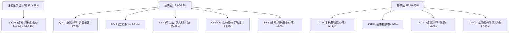
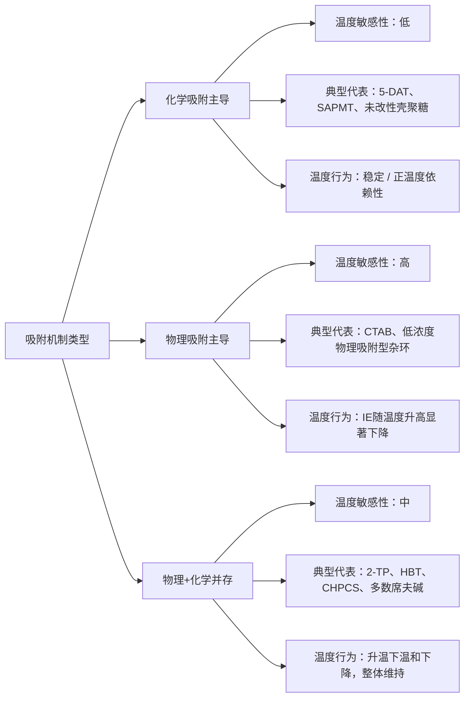
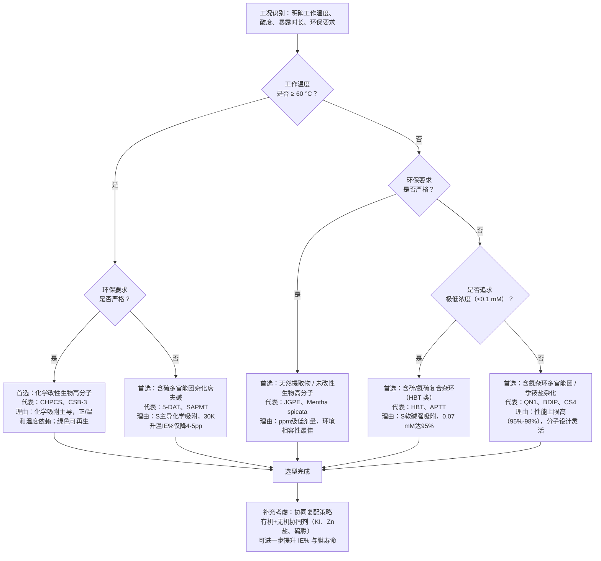

# 1.0 M HCl中碳钢有机缓蚀剂的分类、性能与比较研究（2021年前文献调研）
# 1 研究背景与调研框架

碳钢作为现代工业体系中产量最大、应用最广的结构材料，其在含盐酸介质中的腐蚀防护始终是材料科学与表面工程领域的核心议题之一。在油气井酸化、金属表面酸洗、化学清洗及工业除垢等典型工艺中，1.0 M HCl 是被研究最多、最具代表性的腐蚀介质体系。如何在不改变工艺流程的前提下，通过添加少量有机化合物显著降低碳钢腐蚀速率，是过去数十年腐蚀科学研究的主旋律。本章将从工业背景、缓蚀剂分类、作用机理、研究边界与评价方法五个层面，搭建本调研报告的整体研究框架，为后续各章节对具体类别有机缓蚀剂的系统列举与横向比较奠定方法论基础。

## 1.1 碳钢在1.0 M HCl环境中的工业应用与腐蚀问题

碳钢凭借其优良的力学性能、易加工性以及相对低廉的成本，成为工业领域应用最为广泛的金属材料之一，其表面处理工序中盐酸是最常用的化学试剂[^1]。在实际工业流程中，盐酸介质被广泛应用于黑色金属材料的清洗，包括各类高、中、低压锅炉、大型设备及管道系统的酸洗作业；与此同时，盐酸介质在油气工业的井下酸化处理、化学清洗、工业除锈等场景中同样占据主导地位[^2][^3]。

然而，盐酸对碳钢的腐蚀作用极为剧烈。在未加保护的强酸介质中，碳钢不仅面临大面积均匀腐蚀，还会因 Fe²⁺ 离子的二次溶解形成孔蚀；更为关键的是，酸洗过程中钢铁基体对氢原子的吸收会诱发氢脆现象，严重损害材料的力学完整性与服役寿命[^2]。这些腐蚀过程不仅造成金属材料的直接损失，还会带来设备失效、生产中断、安全事故等次生危害，由此产生的经济损失十分可观。

在此背景下，向酸性介质中添加少量缓蚀剂被证明是一种**操作简便、见效迅速、成本可控**的防护策略——它无需改变设备结构或工艺流程，仅通过在腐蚀介质中加入微量化学物质即可显著减缓腐蚀过程[^4]。工业实践数据表明，合理使用酸洗缓蚀剂可使腐蚀速率控制在 1 g·m⁻²·h⁻¹ 以下，缓蚀率可达 97% 以上，且能有效抑制氢脆现象的发生[^2]。因此，开发高效、稳定、适应不同工况的缓蚀剂，对于盐酸介质中碳钢防护具有重要的工业价值与经济意义。

## 1.2 缓蚀剂的总体分类与有机缓蚀剂的优势

缓蚀剂是指以适当浓度和形式加入腐蚀介质后，能够通过物理、化学或物化反应阻止或减缓金属腐蚀速率，同时保持金属原有物理、化学和机械性能的化学物质[^4]。在腐蚀科学的发展历程中，研究者根据不同视角形成了多套分类体系。下表汇总了三种主流分类方式及其代表性物质。

| 分类维度 | 类别 | 典型代表 | 主要特征 |
|---------|------|---------|---------|
| 按作用机理 | 阳极型 | 铬酸盐、亚硝酸盐、磷酸盐、钼酸盐、丙酮肟 | 具氧化性，促使金属表面钝化；浓度不足时可能加剧局部腐蚀 |
| 按作用机理 | 阴极型 | 肼、联胺、亚硫酸钠、砷/锑/铋/汞盐 | 消除去极化剂或增加析氢过电位 |
| 按作用机理 | 混合型 | 含 N、P、S、O 孤对电子有机物、亚硝酸二环己胺 | 同时减缓阴阳极反应，多通过吸附成膜实现 |
| 按化学成分 | 无机类 | 硝酸盐、亚硝酸盐、铬酸盐、多磷酸盐、硅酸盐 | 多用于中性或碱性介质 |
| 按化学成分 | 有机类 | N、P、S、O 杂环化合物，胺、酰胺，硫脲衍生物，季铵盐类 | 在酸性介质中占主导地位 |
| 按应用环境 | 酸性溶液用 | 乌洛托品、咪唑啉、苯胺、硫脲、三氯化锑 | 适用于盐酸、硫酸等酸洗体系 |
| 按应用环境 | 碱性 / 中性 / 气相 | 硝酸钠、六偏磷酸钠、碳酸环己胺等 | 分别对应不同工业场景 |

[^4]

从作用机理层面看，缓蚀剂可分为阳极型、阴极型与混合型三类，其中混合型缓蚀剂通过在阴阳极同步发生吸附而抑制腐蚀，这一机制恰好与大多数有机缓蚀剂的作用模式高度契合[^4]。从化学成分层面看，缓蚀剂分为无机与有机两大类；无机缓蚀剂（如铬酸盐、亚硝酸盐）虽然在中性或碱性介质中表现优异，但在强酸介质中往往因被酸还原而失效，且部分无机缓蚀剂（如铬酸盐）存在严重的环境毒性问题。

**正是在酸性介质这一特殊环境下，有机缓蚀剂展现出难以替代的优势**。带有氮、磷、硫和氧等具有孤电子对杂原子的有机物，能够通过这些杂原子上的孤对电子直接在金属表面形成化学吸附层，构筑致密的保护膜[^4]。此外，杂环化合物中的 π 电子体系（如芳环、咪唑环、噻唑环等）可与金属表面 Fe 原子的空 d 轨道形成反馈键，进一步增强吸附稳定性。这种"杂原子 + π 体系"的双重吸附机制，使有机缓蚀剂在 1.0 M HCl 这类强酸介质中能够以较低浓度（通常为 ppm 至 mM 量级）达到高效缓蚀，且分子结构可设计性强，可通过引入推电子基团、延长疏水链、构建多吸附位点等手段持续优化性能，因此成为酸性介质碳钢防护领域研究最为活跃的方向。

## 1.3 有机缓蚀剂在酸性介质中的作用机理

有机缓蚀剂在 1.0 M HCl 介质中对碳钢的防护作用，本质上是一个"吸附—成膜—电化学抑制"的耦合过程。理解这一机理是评估和比较不同类别缓蚀剂性能的理论基础。

**首先，吸附是有机缓蚀剂作用的起点**。根据吸附力的本质，可将吸附行为划分为物理吸附与化学吸附两种类型：物理吸附主要依靠静电作用使缓蚀剂分子快速附着于金属表面，吸附速度快但稳定性差，易受温度影响，适用于短期防护；化学吸附则通过缓蚀剂分子中的杂原子与金属表面原子形成配位键，构筑稳定的化学键合保护层[^2]。在两种吸附类型的判别上，吸附自由能 $\Delta G_{ads}$ 是关键判据——一般而言，$|\Delta G_{ads}|$ 在 36.75~38.62 kJ/mol 区间内即可视为化学吸附主导[^2]；而当 $|\Delta G_{ads}|$ 接近 20 kJ/mol 时则倾向于物理吸附。在实际研究中，多数高效有机缓蚀剂表现为物理吸附与化学吸附共存的混合型吸附行为。

**其次，吸附过程的定量描述依赖吸附等温模型**。在腐蚀缓蚀研究中，Langmuir 吸附等温式由于其简洁的形式与明确的物理意义，成为最常用的拟合模型。Langmuir 等温式于 1918 年由 Langmuir 提出，基于以下核心假设：吸附是单分子层的、吸附表面是均匀的、相邻被吸附分子间无相互作用、吸附位点有限且能量等效，且适用于物理吸附与化学吸附两种情形[^5]。其线性形式可表示为：

$$\frac{C}{\theta} = \frac{1}{K_{ads}} + C$$

其中 $\theta$ 为表面覆盖度，$C$ 为缓蚀剂浓度，$K_{ads}$ 为吸附平衡常数，与吸附自由能直接相关。当实验数据能良好拟合 Langmuir 模型时，表明缓蚀剂在金属表面以单层方式吸附；研究还表明，对于高纯度缓蚀剂体系，当浓度超过约 50 mg/L 后，缓蚀率往往出现趋于饱和的现象，这与 Langmuir 单层饱和的物理图景一致[^2]。除 Langmuir 外，Freundlich、Temkin、Frumkin 等模型在特定体系中也有应用，但 Langmuir 仍是 1.0 M HCl 碳钢缓蚀研究中报道频率最高的等温模型。

**再次，有机缓蚀剂的吸附成膜会同时影响阴阳极电化学反应**。由于大多数有机缓蚀剂分子在 1.0 M HCl 中以质子化形式存在，它们既可吸附于阳极位点抑制铁的氧化溶解（Fe → Fe²⁺ + 2e⁻），也可吸附于阴极位点抑制氢离子的还原（2H⁺ + 2e⁻ → H₂），因此在动电位极化（PDP）测试中表现为典型的**混合型缓蚀剂**特征[^4][^3]。这一行为已在头孢氨苄药物、咪唑啉衍生物（NTETD）等多类有机缓蚀剂的研究中得到验证：例如 Shukla 和 Quraishi 报道的头孢氨苄通过 PDP 测试被证实为混合型缓蚀剂[^4]；而 Solomon 等合成的肉豆蔻酸基咪唑啉衍生物 NTETD 虽为混合型缓蚀剂，但对阴极反应的抑制更为显著[^3]。

**最后，分子结构特征决定了缓蚀性能的上限**。影响有机缓蚀剂吸附效果的核心因素可归纳为三点：(1) 金属表面电荷状态，可通过零电荷电位（PZC）或诱导剂调节；(2) 分子结构本身，推电子基团（如 —CH₃、—NH₂、—OCH₃）能增加杂原子上的电子云密度从而增强吸附，π 键体系可扩展分子在金属表面的覆盖面积，例如甲基丙烯胺相较于丙胺缓蚀率可提升 23%；(3) 温度效应，物理吸附在高温下易脱附，而化学吸附则需要一定的热能激活[^2]。这些规律为后续章节理解不同类别有机缓蚀剂的"分子结构—缓蚀效率"构效关系提供了通用框架。

## 1.4 研究范围界定与文献调研框架

为确保本报告内容的针对性与可比性，有必要对调研范围进行严格界定。本报告的研究边界确立如下：

**时间边界**：所有引用的研究、数据与案例严格限定于 **2021 年之前公开发表的文献**，以聚焦于该截止时间点前积累的研究成果，避免与近年新涌现的研究混杂；

**介质边界**：核心介质为 **1.0 M HCl**（约等于 3.65% HCl）；考虑到部分油气酸化领域的代表性研究使用 15% HCl 等更高浓度介质（如 Chauhan 等人对壳聚糖-肉桂醛席夫碱的研究[^3]、Solomon 等人对肉豆蔻酸基咪唑啉 NTETD 的研究[^3]），本报告将以 1.0 M HCl 数据为主体，对于该浓度下数据不足而 15% HCl 体系研究较为充分的类别，将以"扩展浓度对照数据"的形式予以辅助引用，并在行文中明确标注介质浓度差异；

**基底边界**：研究对象为**碳钢**，包括文献中常被称为低碳钢（mild steel）、软钢、N80 油井管钢等含碳量较低的铁基合金；

**化合物边界**：聚焦于**有机缓蚀剂**，包括纯有机合成化合物、药物分子、天然产物及生物高分子衍生物等。

在分类逻辑上，鉴于按"作用机理"分类（阳极/阴极/混合型）易导致绝大多数有机缓蚀剂归入"混合型"而失去区分度，本报告采用**"分子结构与来源"双重维度**作为主分类标准，将常见有机缓蚀剂划分为以下几大类：含氮杂环类（咪唑、三唑、吡唑、喹啉衍生物等）、含硫及氮硫复合杂环类（噻唑、噻二唑、硫脲衍生物等）、席夫碱与杂化分子类、季铵盐与有机表面活性剂类、天然提取物与生物高分子衍生物类。这一分类既符合化学结构的内在差异，又能充分体现来源属性（合成型 vs. 天然型、药物型 vs. 聚合物型），为后续横向比较提供清晰的归类基础。

报告各章节的递进关系如下：第 2 章建立分类体系并分析各类化合物的典型分子特征与吸附位点；第 3~7 章分别列举各类别的代表性案例与性能数据；第 8 章基于前述数据进行多维度横向比较；第 9 章给出选型建议与研究展望。

## 1.5 缓蚀性能评价指标与比较方法

为实现不同类别、不同研究之间数据的可比性，本报告确立了一套统一的缓蚀性能评价指标体系，其核心要素如下表所示。

| 评价维度 | 关键指标 | 单位/形式 | 评价意义 |
|---------|---------|----------|---------|
| 缓蚀效能 | 缓蚀效率（IE%） | 百分数 | 反映在最优条件下缓蚀剂的防护能力上限 |
| 用量经济性 | 最佳添加浓度 | mM / ppm / mg·L⁻¹ / M | 反映缓蚀剂的"高效低剂量"特征 |
| 温度适应性 | 实验温度范围 | K 或 °C（通常 298–333 K） | 反映吸附稳定性及对工况温度的适应能力 |
| 吸附行为 | 吸附等温模型 | Langmuir / Freundlich / Temkin 等 | 揭示吸附层结构特征 |
| 吸附热力学 | 吸附自由能（ΔG_ads） | kJ·mol⁻¹ | 判别物理 / 化学吸附主导机制 |
| 电化学类型 | 阳极/阴极/混合型 | 定性分类 | 揭示对电化学半反应的抑制偏好 |
| 表面形貌 | SEM / AFM 形貌特征 | 显微图像 | 直观验证保护膜的形成与覆盖效果 |

在研究方法层面，本报告所引述的各类缓蚀剂研究普遍采用以下相互印证的实验技术组合：**失重法（weight loss measurement）** 通过测量浸泡前后试样的质量差计算腐蚀速率与缓蚀效率，是最经典的宏观评价手段；**电化学阻抗谱（EIS）** 通过测量电荷转移电阻 $R_{ct}$ 的变化反映保护膜的致密性与稳定性；**动电位极化（PDP）** 通过分析阳极/阴极极化曲线的偏移判断缓蚀剂的电化学类型（阳极、阴极或混合型）[^4][^3]；**扫描电子显微镜（SEM）与原子力显微镜（AFM）** 用于直观观察缓蚀剂作用前后碳钢表面的形貌变化与膜层覆盖情况[^4][^3]；**密度泛函理论（DFT）计算与蒙特卡洛/分子动力学模拟** 则用于从理论层面揭示缓蚀剂分子的前线轨道能级（HOMO/LUMO）、电荷分布、吸附取向及吸附能，为构效关系分析提供原子尺度证据[^3]。

在比较分析的可比性控制上，本报告将遵循以下原则：(1) 横向比较时尽量将数据控制在相近的温度区间（如 298 K 或 303 K）和可比的浓度量级内；(2) 对同一化合物在不同文献中出现差异较大的 IE% 数据，将分析其实验条件（介质浓度、温度、测试方法）差异并明确标注来源；(3) 在归纳温度依赖性等趋势时，区分物理吸附与化学吸附主导机制对温度敏感性的不同影响。需要指出的是，由于现有公开文献的实验条件并未完全统一（部分研究使用 1.0 M HCl，部分使用 15% HCl 或 1 N HCl[^4][^3]），完全严格意义上的"同条件比较"难以实现，本报告在涉及跨研究比较时将如实说明数据来源与条件差异，避免武断结论。

通过上述对工业背景、分类体系、作用机理、研究边界与评价方法的系统铺垫，本章为后续 8 个章节对各类有机缓蚀剂的具体案例列举与综合比较奠定了统一的研究框架。**接下来的第 2 章将进一步细化有机缓蚀剂的分类体系**，分析各类化合物的典型分子特征与吸附位点，为第 3~7 章的代表性案例列举提供结构基础。

# 2 有机缓蚀剂的分类体系

第 1 章已搭建起 1.0 M HCl 介质中碳钢有机缓蚀剂研究的整体框架，明确了工业背景、作用机理、研究边界与评价方法。在此基础上，本章将进一步聚焦有机缓蚀剂自身的分类逻辑：一方面对 2021 年前文献中常见的多种分类方式进行比较与权衡，确立本报告所采用的"分子结构 + 来源"双重维度作为主分类标准；另一方面系统剖析五大主要类别的典型分子骨架、官能团构成与吸附位点特征，并从构效关系角度归纳其吸附行为的共性与差异。本章将为第 3~7 章按类别展开的代表性案例列举以及第 8 章的横向比较，提供清晰且统一的结构化基础。

## 2.1 常见分类方式的比较与本报告分类标准的确立

在 2021 年之前的腐蚀缓蚀剂研究文献中，针对有机缓蚀剂的分类思路并不唯一，归纳起来主要有以下四种代表性维度。

**一是按电化学作用机理分类**，即根据缓蚀剂对阴/阳极电化学半反应的抑制偏好划分为阳极型、阴极型与混合型三类[^4]。该分类在无机缓蚀剂体系中区分度较好，但在有机缓蚀剂体系中却面临困境：由于含 N、P、S、O 杂原子和 π 电子体系的有机分子普遍能够同时吸附于阳极与阴极位点，所抑制的也是阴阳极的耦合反应，因此**绝大多数有机缓蚀剂在 PDP 测试中均表现为"混合型"**，这一点在头孢氨苄[^4]、肉豆蔻酸基咪唑啉衍生物 NTETD[^3] 等典型研究中均得到验证。换言之，按电化学机理分类难以区分不同有机缓蚀剂的本质差异。

**二是按吸附类型分类**，即根据缓蚀剂分子与金属表面相互作用的本质划分为物理吸附、化学吸附与混合吸附。这一分类思路从机理角度具有清晰性，但同样存在与分子结构脱钩的问题：实际研究中绝大多数有效有机缓蚀剂表现为物理吸附与化学吸附共存的混合型吸附行为，且吸附类型还受温度、浓度、表面电荷状态等多因素影响，难以稳定地对应到单一分子结构类别。

**三是按化学官能团分类**，即依据分子中带有的特征官能团（如杂环、胺、酰胺、季铵盐等）进行划分[^4]。该方式与分子结构高度相关，但仍存在过于细碎的问题——例如同一含氮杂环（如咪唑环）可与不同的取代基（长链烷基、芳基、酰胺等）组合形成性能差异显著的衍生物，单纯以"杂环"或"酰胺"标签划分会模糊主要骨架的差异。

**四是按来源分类**，即将缓蚀剂区分为合成型、天然提取型、药物分子型与生物高分子衍生型等。这一维度对反映绿色化学与可再生资源利用的研究趋势具有重要意义，例如壳聚糖–肉桂醛席夫碱体系[^3] 与头孢氨苄[^4] 分别代表了生物高分子衍生物与药物分子两类来源；但单一来源分类忽略了化合物的核心化学结构，会将结构差异极大的分子混入同一类别。

综合上述四种分类方式的优缺点，本报告最终确立**"分子结构 + 来源"双重维度**作为主分类标准。具体而言，对于结构特征明显的合成型有机缓蚀剂，按其分子核心骨架划分为含氮杂环类、含硫及氮硫复合杂环类、席夫碱与杂化分子类、季铵盐与有机表面活性剂类四大类别；而对于来源属性强烈影响其分子组成特征的天然产物与生物高分子，则单列为天然提取物与生物高分子衍生物类。这种分类方式既能体现核心化学结构差异，便于第 3~7 章按类别展开"结构–性能"分析；又能涵盖来源多样性，为后续在第 8、9 章中对环保性、可再生性等维度进行比较保留接口。

下表汇总了本报告采用的五大类别及其归类依据。

| 类别 | 归类依据（结构/来源） | 典型代表 | 核心吸附位点 |
|------|---------------------|---------|------------|
| 含氮杂环类 | 杂环中含 N，无 S | 咪唑/咪唑啉、三唑、吡唑、喹啉、吡啶衍生物 | 环 N 孤对电子 + 芳环 π 电子 |
| 含硫及氮硫复合杂环类 | 杂环中含 S 或 N+S | 噻唑、噻二唑、硫脲及其衍生物、巯基化合物 | S 孤对电子 + N 孤对 + π 电子 |
| 席夫碱与杂化分子类 | 含 –CH=N– 亚胺键的缩合产物 | 芳香醛–胺席夫碱、含杂环席夫碱、壳聚糖–醛缩合物 | C=N 键 + 芳环 π + 多杂原子协同 |
| 季铵盐与有机表面活性剂类 | 带永久正电荷或两亲结构 | 长链烷基季铵盐、Gemini 表面活性剂、稠杂环季铵盐 | 阳离子头基静电 + 疏水链成膜 |
| 天然提取物与生物高分子衍生物类 | 来源于天然产物或生物高分子 | 植物提取物、壳聚糖及其改性物、氨基酸衍生物 | 多种天然官能团 N/S/O 协同 |

## 2.2 含氮杂环类缓蚀剂的结构特征与吸附位点

含氮杂环类化合物是 1.0 M HCl 介质中碳钢有机缓蚀剂研究最为活跃、代表性案例最为丰富的一类。该类化合物以咪唑/咪唑啉、三唑、吡唑、喹啉、吡啶等五元或六元含氮杂环为核心骨架，通过对环上不同位点的取代修饰，衍生出种类繁多的缓蚀剂分子。例如，Solomon 等人基于肉豆蔻酸与二乙烯三胺缩合反应合成的咪唑啉衍生物 N-(2-(2-tridecyl-4,5-dihydro-1H-imidazol-1-yl)ethyl)tetradecanamide（NTETD），即是以咪唑啉环为核心、配以两条长链烷基和一个酰胺基团的典型代表[^3]。

**该类化合物的吸附机制具有清晰的电子结构基础**。从杂原子贡献看，环内 N 原子上的孤对电子可与铁原子的空 d 轨道形成配位键，实现化学吸附；从 π 体系贡献看，咪唑、三唑等芳香性杂环的离域 π 电子可与金属表面形成反馈键（back-donation bond），即金属 d 电子向杂环反键轨道的电子回流，进一步增强吸附稳定性。这种"杂原子配位 + π 反馈键"的协同模式，使含氮杂环类化合物在低浓度下即能实现较高覆盖度。

取代基对缓蚀性能的调控同样关键。**推电子基团**（如 —CH₃、—NH₂、—OCH₃）能够提高杂环上 N 原子的电子云密度，从而增强其向金属表面供电子的能力，提升化学吸附稳定性——已有研究表明，甲基丙烯胺相较丙胺缓蚀率可提升约 23%[^2]，正是这一效应的直接证据。**长链烷基取代**则在两个层面发挥作用：一方面增加分子的疏水性，使吸附膜对腐蚀介质的渗透形成屏蔽；另一方面延展分子在金属表面的覆盖面积，提高单位摩尔的覆盖效率。NTETD 分子中两条 C13/C14 长链与咪唑啉环的组合正体现了"杂环吸附锚定 + 长链疏水屏蔽"的双重设计思路[^3]。

## 2.3 含硫及氮硫复合杂环类缓蚀剂的结构特征与吸附位点

含硫及氮硫复合杂环类缓蚀剂以噻唑、噻二唑、硫脲及其衍生物、巯基化合物为代表，其分子骨架中或含有 S 单杂原子（如硫脲 NH₂–C(=S)–NH₂、巯基 –SH），或同时含有 N 和 S 两种杂原子（如噻唑、1,3,4-噻二唑环），构成与含氮杂环类既相似又显著不同的一个独立类别。

**S 原子相较 N 原子具有更突出的吸附优势**，其电子结构特征体现在三个方面：一是 S 原子的原子半径更大、电子云更弥散，可极化率显著高于 N 原子，意味着 S 原子在与金属表面 Fe 原子相互作用时能够更灵活地调整电子云分布、形成更强的吸附键；二是 S 原子的 3p 轨道能量与 Fe 的 3d 轨道更为匹配，有利于电子转移；三是 S 原子作为软碱与 Fe（软酸–交界酸）按软硬酸碱（HSAB）原则匹配度高，倾向于形成强化学吸附。这些电子结构优势使得仅含少量 S 原子的化合物即可达到与含氮杂环类相当甚至更优的缓蚀效率。

在氮硫复合杂环（如噻唑、噻二唑）中，**S 与 N 杂原子的协同吸附**进一步放大了缓蚀效能。一方面，N 与 S 在同一环内构成多吸附位点，使分子可在金属表面以多点锚定的方式吸附，提高吸附稳定性；另一方面，N 与 S 在电子云密度上的互补（N 提供较高的电子云密度，S 提供更强的极化性）使整个杂环成为高效的电子供体，便于与 Fe 形成配位键。

硫脲衍生物在 1.0 M HCl 体系中具有**单独缓蚀剂与协同助剂**的双重角色。一方面，硫脲分子（NH₂–C(=S)–NH₂）本身即可在金属表面通过 S 原子进行强吸附，常被列为典型的酸性溶液有机缓蚀剂[^4]；另一方面，硫脲及其衍生物常作为协同助剂与其他含氮杂环或表面活性剂搭配使用，类似于碘离子（KI）在壳聚糖–肉桂醛席夫碱体系中所起的协同作用——Chauhan 等人将 KI 加入腐蚀介质后，缓蚀效率由 85.16% 提升至 92.45%[^3]，这一机制同样适用于硫脲类协同体系。

## 2.4 席夫碱与杂化分子类缓蚀剂的结构特征

席夫碱（Schiff base）是含有 –CH=N– 亚胺键的一类有机化合物，通常通过伯胺与醛或酮的缩合反应一步合成。这一合成路径简便、产率高、原料易得，因而在缓蚀剂分子设计领域备受青睐。Chauhan 等人在微波辐照下将壳聚糖与肉桂醛缩合，一步合成的壳聚糖–肉桂醛席夫碱（Cinn-Cht）即是该类化合物的代表性案例[^3]。

**席夫碱分子的吸附位点呈现"多位点协同"的显著特征**。其核心 C=N 亚胺键既提供 N 原子的孤对电子作为配位中心，又通过 C=N 的 π 电子参与与金属 d 轨道的反馈成键；同时，与亚胺键相邻的芳环（来自芳香醛部分）及其他官能团（如壳聚糖中的羟基、氨基；芳香醛中可能的 –OH、–OCH₃、–OH 邻位等）共同构成由 N、O、π 电子组成的多吸附位点体系。这种结构使席夫碱在金属表面以平铺的方式形成大面积单层覆盖，对应于 Langmuir 等温线所描述的均匀单分子层吸附行为——Chauhan 等人对 Cinn-Cht 在 15% HCl 中的研究即证实了其吸附符合 Langmuir 模型，并表现为物理吸附与化学吸附共存的混合吸附行为[^3]。

**杂化分子设计**是席夫碱类缓蚀剂的另一重要研究趋势。所谓杂化分子，即通过化学合成将多种缓蚀活性官能团或片段拼接在同一分子骨架上，以期实现"1+1>2"的吸附协同效应。壳聚糖–肉桂醛席夫碱本身即是"生物高分子（壳聚糖）+ 天然芳香醛（肉桂醛）+ 席夫碱亚胺键"三种活性元素的杂化产物[^3]；类似地，文献中还有将吡唑酮与磺胺片段、噻唑与希夫碱片段拼接的设计实例。杂化分子的核心价值在于：(1) 通过引入额外杂原子或 π 体系增加吸附位点数量；(2) 通过疏水–亲水片段的平衡优化分子的两亲性；(3) 利用不同片段对阴/阳极反应的差异化抑制能力实现混合型缓蚀。Chauhan 等人通过 DFT 与蒙特卡洛模拟进一步揭示，**质子化形式的 Cinn-Cht 分子在金属表面的吸附能高于中性分子**[^3]，这从分子尺度印证了酸性介质中席夫碱的实际吸附形式与机制。

## 2.5 季铵盐与有机表面活性剂类缓蚀剂的结构特征

季铵盐与有机表面活性剂类缓蚀剂以分子结构中含**永久正电荷的季铵阳离子头基**或**典型的两亲结构**（亲水头基 + 疏水长链）为核心特征。其代表性化合物包括传统长链烷基季铵盐（如十二烷基三甲基溴化铵）、Gemini 型双子表面活性剂（两个亲水头基通过连接链相连，每个头基挂接一条长烷基链）以及稠杂环季铵盐（如稠杂环季铵盐 BQD）等[^4][^2]。

**该类缓蚀剂的作用机制与前述杂环类显著不同**，呈现"静电吸附 + 疏水成膜"的双重模式。一方面，在 1.0 M HCl 介质中，铁基体表面在阴极位点（特别是腐蚀过程中的阴极区）带负电，季铵阳离子头基可通过静电相互作用快速、定向地吸附于阴极位点，抑制 H⁺ 的还原反应；另一方面，吸附后的分子向溶液一侧延伸出疏水长链，长链之间通过范德华力相互聚集形成致密的疏水屏障层，将金属与酸性介质有效隔离。这一机制使季铵盐类缓蚀剂在抑制阴极析氢反应方面具有明显偏好，同时阴极位点的覆盖也间接抑制阳极溶解。

**临界胶束浓度（CMC）是该类缓蚀剂性能评价的关键参数**。当浓度低于 CMC 时，分子以单体形式存在并在金属表面形成单分子层吸附，缓蚀效率随浓度升高而稳步增加；当浓度接近或达到 CMC 时，溶液中开始形成胶束，金属表面吸附趋于饱和，缓蚀效率达到平台值；继续升高浓度并不能显著提升缓蚀效率，反而可能因胶束化降低单体活性。因此，**对季铵盐类缓蚀剂而言，最佳使用浓度通常与其 CMC 接近**，体现了"高效低剂量"的实用优势——文献报道的稠杂环季铵盐 BQD 在 90 ℃、15% HCl 中以 0.5% 添加量即可使 N80 钢的腐蚀速率降至 2.48 g·m⁻²·h⁻¹，缓蚀率高达 97.93%[^2]，正是这一优势的典型例证。需要说明，BQD 的研究条件（15% HCl、90 ℃）超出了本报告的 1.0 M HCl 核心边界，仅在此作为该类化合物结构–性能特征的辅助参考。

此外，Gemini 双子表面活性剂由于具有"双头基 + 双尾链"结构，在金属表面的覆盖面积更大、吸附密度更高、CMC 比单链同类物低 1–2 个数量级，常被视为该类缓蚀剂中性能最优的子类别。多支链烷基侧链结合锌盐协同的设计可使保护膜寿命延长约 3 倍[^2]，体现了季铵盐与无机协同剂复配优化的进一步空间。

## 2.6 天然提取物与生物高分子衍生物类缓蚀剂的结构特征

随着绿色化学与可持续发展理念在腐蚀防护领域的渗透，**以天然产物为原料的有机缓蚀剂**在 2010 年代后期成为研究热点。该类缓蚀剂的来源大致可分为两个子类：一是植物提取物，包括从植物叶、果、皮、籽、根等部位通过水提、醇提等方法获得的复杂混合物，其活性成分通常包括生物碱、黄酮、单宁、皂苷、酚酸等次生代谢产物；二是生物高分子及其衍生物，以壳聚糖（chitosan，由甲壳素脱乙酰化得到的天然氨基多糖）为最具代表性，此外还包括阿拉伯胶、果胶、淀粉及其改性物等。

**该类缓蚀剂的分子组成赋予其多位点协同吸附特征**。以壳聚糖为例，其分子链上分布着大量羟基（–OH）与氨基（–NH₂），氨基提供 N 杂原子配位中心、羟基提供 O 杂原子吸附位点，多糖链本身的疏水骨架则贡献成膜覆盖能力；通过化学改性（如与醛缩合形成席夫碱、与季铵化试剂反应等）可进一步引入新的活性官能团，提升缓蚀性能。Chauhan 等人合成的壳聚糖–肉桂醛席夫碱（Cinn-Cht）即融合了壳聚糖原有的 –NH₂/–OH 与新生成的 C=N 亚胺键，形成多达数种吸附位点的协同体系[^3]。

另一种特殊但具有代表性的来源是**药物分子型缓蚀剂**。许多失效或过期的药物分子（如头孢类、磺胺类、青霉素类抗生素，吡哌酸等喹诺酮类抗菌药）由于其分子结构中天然含有杂环（β-内酰胺、四氢噻唑、吡啶等）和多种活性官能团（–COOH、–NH₂、–OH、–S–），且具有低毒、可再生、易合成等天然优势，被广泛探索用作绿色缓蚀剂。Shukla 与 Quraishi 报道的头孢氨苄（Cefalexin）即是该子类的典型代表[^4]——该分子同时含有 β-内酰胺环（含 N、O）、四氢噻唑环（含 N、S）、苯环、—COOH、—NH₂ 等多种结构单元，构成由 N、S、O、π 电子组成的多吸附位点体系。虽然药物分子在分类来源上属于人工合成，但其低毒性与生物相容性使其常被归入"绿色/环保型缓蚀剂"的研究范畴。

**该类缓蚀剂的研究价值与挑战并存**。一方面，其低毒性、可再生性、原料来源广泛等优势使其符合"绿色缓蚀剂"的发展方向，在替代传统铬酸盐等高毒性缓蚀剂方面具有重要意义；另一方面，特别是植物提取物类，由于其化学组成的复杂性（往往为几十种化合物的混合物）、批次间组分波动较大、有效成分定量困难等问题，给"结构–性能"关联的精确建立带来了显著挑战。因此，文献中对该类缓蚀剂的研究通常以宏观缓蚀效率与吸附等温线拟合为主，对具体活性组分的鉴定与机理深挖相对有限。

## 2.7 各类有机缓蚀剂吸附位点与构效特征的归纳比较

在前述五类有机缓蚀剂结构特征系统剖析的基础上，本节从五个核心维度对各类化合物的构效特征进行横向归纳，为第 3~7 章的代表性案例列举与第 8 章的多维度比较提供统一的分析框架。

| 比较维度 | 含氮杂环类 | 含硫/氮硫复合杂环类 | 席夫碱与杂化分子类 | 季铵盐与表面活性剂类 | 天然提取物与生物高分子类 |
|---------|----------|-------------------|-----------------|------------------|------------------------|
| 主要杂原子 | N | S 或 N+S | N（C=N）、O、S | N⁺（季铵）、O | N、O、S（多种） |
| 杂原子数量 | 中（1–3 个 N） | 中（1–2 个 S，含 N 时再多 1–2 个） | 多（多种杂原子并存） | 少（头基 N⁺ 为主） | 多（分布于聚合物或混合物） |
| π 电子体系 | 强（芳香性杂环） | 强（芳香性硫杂环） | 强（C=N + 芳环） | 弱~中（取决于头基类型） | 中（多糖骨架弱、酚类强） |
| 取代基/疏水链 | 可设计性强 | 可设计性强 | 可设计性强（杂化合成） | 长链疏水尾必备 | 天然存在，难以精确调控 |
| 分子带电状态 | 酸中可质子化为阳离子 | 酸中可部分质子化 | 酸中亚胺质子化显著[^3] | 永久正电荷 | 视具体成分而定 |
| 吸附主导机制 | 化学吸附为主，含物理吸附 | 化学吸附为主（S 强配位） | 化学吸附 + 物理吸附混合[^3] | 静电吸附 + 疏水成膜 | 混合吸附为主 |
| 吸附等温模型 | 多服从 Langmuir | 多服从 Langmuir | 服从 Langmuir[^3] | 多服从 Langmuir | 多服从 Langmuir |
| 单层覆盖效率 | 中–高 | 高（S 强吸附） | 高（多位点协同） | 高（疏水链放大覆盖） | 中（依组分而异） |
| 温度稳定性 | 化学吸附主导者较稳定 | 较好（S 配位较稳定） | 较好（多位点锚定） | 较差（物理吸附偏多） | 因组分而异 |
| 典型 IE% 水平 | 中–高 | 高 | 高 | 高 | 中–高 |
| 环保性 | 中（合成产物） | 中（合成产物） | 中–好（含天然来源杂化） | 中–差（部分含氮污染） | 优（绿色/可再生） |

从这一横向比较中可归纳出若干**重要的构效共性与差异**：

**第一，杂原子类型与数量直接决定吸附中心数目。** 含氮杂环类以 N 为单一锚点；含硫/氮硫复合类引入软碱 S 后吸附强度提升；席夫碱与杂化分子类、天然产物类则通过多种杂原子的整合实现多位点协同。这一规律与第 1 章所述"杂原子 + π 体系"双重吸附机制完全一致。

**第二，π 电子体系规模决定单分子覆盖面积。** 含氮杂环、含硫杂环、席夫碱中的芳环或亚胺基与芳环组合所提供的离域 π 体系，是金属–配体反馈成键的关键载体；而季铵盐类与天然多糖类的 π 体系较弱，需依赖其他机制（静电吸附、长链疏水屏蔽、多羟基协同）补偿。

**第三，分子带电状态影响初始吸附速度。** 在 1.0 M HCl 中，含氮杂环、席夫碱等可质子化为阳离子的分子能够借助静电力快速接近铁表面阴极位点，季铵盐类则以永久正电荷直接发挥静电吸附；这与吸附前 PZC 调节的机制讨论一致。

**第四，疏水链长度与吸附稳定性密切相关。** 长链取代基（如 NTETD 的双 C13/C14 链[^3]、季铵盐的烷基尾）通过提高分子在金属表面的覆盖面积和疏水屏蔽能力显著增强缓蚀性能；缺乏疏水链的小分子杂环则需通过更高浓度或协同助剂弥补。

**第五，温度敏感性反映吸附主导机制。** 化学吸附主导的体系（如含 S 强配位、多位点席夫碱）在升温下 IE% 通常变化不大甚至略有提升；而物理吸附比例较高的体系（如部分季铵盐、低浓度杂环类）在升温下易出现明显的 IE% 下降。这一差异将在第 8 章的温度适应性比较中得到具体数据印证。

综上，本章通过系统比较多种分类方式、确立"分子结构 + 来源"双重分类标准，并对五大类有机缓蚀剂的核心骨架、吸附位点、构效特征进行了深入剖析。这一分类体系不仅契合 2021 年前文献的实际研究面貌，也为接下来第 3~7 章对各类别代表性案例的具体列举（化合物名称、最高 IE%、对应浓度与温度）以及第 8 章的最高效率排序、低浓度有效性、温度适应性三维度横向比较，奠定了统一的结构化基础。

# 3 含氮杂环类有机缓蚀剂的代表性案例与性能

在第 2 章对各类有机缓蚀剂结构特征与吸附位点的系统剖析之后，本章正式进入按类别展开的代表性案例列举阶段。含氮杂环类化合物作为 1.0 M HCl 介质中碳钢缓蚀研究最为活跃、案例最为丰富的一类，其分子骨架以咪唑、三唑、吡唑、喹啉、吡啶、苯并咪唑等五元或六元含氮杂环为核心，通过取代修饰可衍生出种类繁多的高效缓蚀剂。本章选取覆盖"咪唑–吡啶双杂环""含巯基三唑""二苯基吡唑""喹啉–苯并咪唑杂化"四种典型骨架的代表性案例，逐一明确化合物全名、最高 IE%、最佳浓度、实验温度、电化学类型与吸附行为等关键指标，并紧扣分子结构特征剖析其"结构–性能"对应关系，为第 8 章的多维度横向比较提供该类别的核心数据支撑。

## 3.1 咪唑–吡啶衍生物 BDIP：双杂环协同的高效缓蚀剂案例

第一个代表案例选取 Khattabi 等人合成并系统研究的 **2,6-双(2,5-二甲基-2H-咪唑-4-基)吡啶**（2,6-bis(2,5-dimethyl-2H-imidazol-4-yl)pyridine，缩写 BDIP）。该分子以中心吡啶环为骨架，其 2 位与 6 位对称地连接两个 2,5-二甲基取代的咪唑环，构成一个"咪唑–吡啶–咪唑"三联杂环的对称结构，分子中总计含有 **5 个 N 杂原子**（1 个吡啶 N + 4 个咪唑 N），并具备扩展的 π 共轭骨架，可形成典型的"多氮配位 + π 反馈成键"协同吸附中心[^6]。

Khattabi 等人采用失重法、动电位极化（PDP）与电化学阻抗谱（EIS）三种方法对 BDIP 在 1 M HCl 中对低碳钢的缓蚀性能进行了系统评估，所得关键性能数据汇总如下：

| 性能指标 | 数值/特征 | 数据来源 |
|---------|---------|---------|
| 最佳浓度 | 10⁻³ M（1 mM） | Khattabi 等[^6] |
| 最高缓蚀效率 IE% | **97.4%** | Khattabi 等[^6] |
| 实验温度 | 308 K（35 °C） | Khattabi 等[^6] |
| 温度研究范围 | 308–353 K | Khattabi 等[^6] |
| 介质 | 1 M HCl | Khattabi 等[^6] |
| 基底材料 | 低碳钢（mild steel） | Khattabi 等[^6] |
| 电化学类型 | 阴极型为主（cathodic inhibitor） | Khattabi 等[^6] |
| 吸附等温模型 | Langmuir | Khattabi 等[^6] |
| 测试方法 | 失重法 + PDP + EIS | Khattabi 等[^6] |

从数据看，BDIP 在仅 1 mM 的低浓度下即可使低碳钢在 1 M HCl 中的缓蚀效率高达 97.4%，且三种独立测试方法（失重法、PDP、EIS）所得 IE% 数值相互吻合，体现了结果的可靠性[^6]。

在电化学机制层面，BDIP 的极化曲线表现表明其**主要以阴极型缓蚀剂的方式发挥作用**，即更显著地抑制 H⁺ 在阴极位点的还原（析氢反应），这在含氮杂环类缓蚀剂中相对少见——大多数含 N 杂环化合物表现为典型的混合型行为。一种合理的解释是：BDIP 分子中 5 个 N 杂原子（特别是吡啶 N）在 1.0 M HCl 介质中可显著质子化，所形成的阳离子物种通过静电吸引优先吸附于带负电的阴极活性位点，从而对析氢反应产生更强的抑制偏好[^6]。

EIS 测量进一步揭示，**电荷转移电阻 $R_{ct}$ 随 BDIP 浓度升高而显著增大**，这是缓蚀剂在金属表面成膜致密化的典型证据；同时，吸附行为良好地拟合 Langmuir 等温线，表明 BDIP 在低碳钢表面以单分子层方式覆盖，吸附位点能量等效、相邻分子相互作用可忽略[^6]。

在温度适应性方面，Khattabi 等人在 308–353 K（35–80 °C）的较宽温度区间内研究了 1 mM BDIP 对腐蚀行为的影响，并由 Arrhenius 方程计算得到了腐蚀过程的表观活化能；研究结果表明，BDIP 的吸附行为在升温条件下仍遵循 Langmuir 模型，说明其在中高温区间维持了较好的吸附稳定性[^6]。

综合 BDIP 的结构与性能特征，可以提炼出**两条重要的构效启示**：其一，多 N 杂原子（5 个 N）的密集分布为分子提供了多个独立的电子供体位点，使得即便在 1 mM 这样的较低浓度下也能实现高覆盖度；其二，吡啶环与两个咪唑环通过 C–C 键直接连接形成的扩展 π 共轭体系，显著增大了分子在金属表面的"平铺"覆盖面积，为 d–π 反馈成键提供了足够的电子云交叠基础。BDIP 案例从数据层面有力印证了第 2 章所归纳的"杂原子配位 + π 反馈键"双重吸附机制。

## 3.2 三唑衍生物 APTT：含巯基官能化三唑的混合型缓蚀剂案例

第二个代表案例选取 **4-氨基-5-苯基-4H-1,2,4-三唑-3-硫醇**（4-Amino-5-phenyl-4H-1,2,4-triazole-3-thiol，缩写 APTT）。该分子以 1,2,4-三唑环为核心，4 位连接氨基（–NH₂）、3 位连接巯基（–SH）、5 位连接苯环，构成一个由 **3 个三唑 N + 1 个氨基 N + 1 个巯基 S + 苯环 π 体系**共同贡献的多吸附中心结构。需要指出的是，由于巯基 S 的存在，APTT 实际上是一个跨越"含氮杂环类"与"含硫杂环类"两类边界的杂化分子；考虑到其骨架仍以 1,2,4-三唑为核心，本报告将其归入含氮杂环类讨论，并重点剖析 –SH 巯基官能团对三唑骨架性能的强化作用。

APTT 在 1.0 M HCl 中对低碳钢缓蚀性能的关键数据如下表所示：

| 性能指标 | 数值/特征 | 数据来源 |
|---------|---------|---------|
| 最佳浓度 | 80 × 10⁻⁵ M（0.8 mM） | 文献[^7] |
| 最高缓蚀效率 IE% | **>90%** | 文献[^7] |
| 介质 | 1.0 M HCl | 文献[^7] |
| 基底材料 | 低碳钢 | 文献[^7] |
| 电化学类型 | 混合型（mixed type） | 文献[^7] |
| 吸附等温模型 | Langmuir | 文献[^7] |
| ΔG_ads 性质 | 自发吸附过程 | 文献[^7] |
| 测试方法 | 失重法 + PDP + EIS + OCP + SEM | 文献[^7] |

研究采用失重法、动电位极化（直流）、电化学阻抗谱（交流）、开路电位（OCP）随浸泡时间变化以及扫描电子显微镜（SEM）多种手段对 APTT 的缓蚀行为进行了交叉验证，所得 IE% 数据相互吻合，并均表明缓蚀效率随浓度升高而增加，在 80 × 10⁻⁵ M 浓度下超过 90%[^7]。

需要说明的是，文献原文未明确给出该最高 IE% 对应的具体实验温度数值，结合该类研究的常规做法以及 OCP 与 SEM 表征通常在室温条件下进行，可推断其主要测试温度处于 298–303 K 区间；这一温度信息的局限性在涉及与其他案例的精确温度比较时需予以注意。

在电化学行为层面，PDP 曲线表明 **APTT 同时显著降低了阳极电流密度与阴极电流密度**，即对铁的氧化溶解（Fe → Fe²⁺ + 2e⁻）和 H⁺ 的还原（2H⁺ + 2e⁻ → H₂）两个半反应均产生抑制作用，因此被归为典型的混合型缓蚀剂[^7]。这一行为与第 2 章所述大多数有机缓蚀剂的"混合型"通用特征相符。

在吸附行为层面，APTT 在低碳钢表面的吸附良好地拟合 **Langmuir 等温线**，表明其形成单分子层覆盖；吸附自由能 $\Delta G_{ads}$ 的计算结果指示该吸附过程为自发进行，且兼具物理吸附与化学吸附的特征——这与 APTT 分子结构中"可质子化氨基/三唑 N（静电物理吸附）"与"巯基 S/未质子化 N 与 Fe 形成配位键（化学吸附）"两种作用模式共存的预期完全一致[^7]。研究者还讨论了该高缓蚀效率源自"分子吸附与金属表面保护膜形成"的协同机制[^7]。

**从结构–性能关联角度看，APTT 案例提供了三条核心洞察**：

第一，**巯基 –SH 的引入显著强化了三唑骨架的吸附稳定性**。如第 2 章 2.3 节所述，S 原子相较 N 原子具有更大的可极化率、3p 轨道与 Fe 3d 轨道能量更匹配，并按软硬酸碱原则与 Fe（软酸–交界酸）匹配度更高，倾向于形成强化学吸附。在 APTT 中，巯基与三唑环 N 形成的多杂原子（N、S）锚定使分子能够在金属表面以多点吸附方式稳定附着，这是 APTT 能在低于 1 mM 的浓度下实现 IE>90% 的关键结构因素[^7]。

第二，**氨基 –NH₂ 推电子基团的引入提高了三唑环 N 的电子云密度**，增强了其向 Fe 空 d 轨道供电子的能力。这与第 2 章所述"推电子取代基（如 —CH₃、—NH₂、—OCH₃）能提高杂环上 N 原子电子云密度从而增强吸附"的通用规律相符。

第三，**5 位苯环的引入扩展了分子的 π 共轭体系**，为 d–π 反馈成键提供了额外载体，进一步提升了分子在金属表面的覆盖效率。三者协同作用，使 APTT 成为一个集"杂原子配位 + 推电子调控 + π 反馈"于一身的多机制缓蚀剂分子。

## 3.3 吡唑衍生物 DPP：共轭体系驱动型缓蚀剂案例

第三个代表案例选取 **3,5-二苯基吡唑**（3,5-Diphenylpyrazole，缩写 DPP）。与前两个案例不同，DPP 的分子结构呈现出"小杂环 + 双侧苯环大共轭"的鲜明特征：以五元吡唑环（含 2 个 N）为核心，3 位和 5 位对称连接两个苯环，整体不含额外的吸附性官能团（如氨基、巯基、羧基），也不含长疏水链。这种"极简"的结构设计为我们考察**纯 π 共轭体系驱动的缓蚀机制**提供了理想模型[^8]。

Toumiat 等人采用电化学测试、失重法以及蒙特卡洛（Monte Carlo）模拟手段，对 DPP 在 1.0 M HCl 中对低碳钢的缓蚀行为进行了实验与理论相结合的研究[^8]。其关键性能特征汇总如下：

| 性能指标 | 数值/特征 | 数据来源 |
|---------|---------|---------|
| 介质 | 1.0 M HCl | Toumiat 等[^8] |
| 基底材料 | 低碳钢 | Toumiat 等[^8] |
| 电化学类型 | 混合型（mixed type） | Toumiat 等[^8] |
| IE% 与浓度关系 | 浓度升高 IE% 增加（正相关） | Toumiat 等[^8] |
| 吸附性质 | 物理化学混合吸附（physicochemical） | Toumiat 等[^8] |
| 吸附位点 | 苯环 π 电子 + 吡唑 N 孤对电子 | Toumiat 等[^8] |
| 吸附方式 | Fe(110) 表面 d 轨道与吸附分子 N 原子、苯环 π 电子的供体–受体相互作用 | Toumiat 等[^8] |
| 测试方法 | 电化学技术 + 失重法 + Monte Carlo 模拟 | Toumiat 等[^8] |

需要坦诚说明的是，本节所获取的 DPP 文献摘要中**未明确披露最高 IE% 的具体数值、对应的最佳浓度数值及实验温度**，仅明确指出"浓度升高对缓蚀效率有正面影响"以及电化学类型为混合型、吸附为物理化学混合吸附等定性结论。这是本节数据完整性的局限，在与其他案例（如 BDIP 的 97.4%、QN1 的 97.7%）进行严格数据比较时需特别注意[^8]。

尽管定量数据存在缺口，DPP 案例在**机理层面**仍提供了极具价值的洞察。Toumiat 等人通过热力学参数分析表明，DPP 在低碳钢表面的吸附属于"physicochemical"（物理化学混合）类型，即静电物理吸附与配位化学吸附协同存在；PDP 测试则将其归为典型的混合型缓蚀剂，表明其对阳极铁溶解与阴极析氢反应均有抑制作用[^8]。

更关键的是，Toumiat 等人通过 **Monte Carlo 模拟**对 Fe(110) 基底与 DPP 吸附质构成的体系进行了构型空间搜索，以寻找最低能量吸附位点。模拟结果明确显示：**DPP 分子通过吡唑环上的氮原子以及两侧苯环上的 π 电子共同向 Fe 表面吸附**，即吸附既包括 N 孤对电子向 Fe 空 d 轨道的供电子作用，也包括两个苯环 π 体系与 Fe d 轨道的反馈成键作用[^8]。这种"N 锚点 + 双苯环大 π 平铺"的吸附模式，恰好对应于 DPP 分子结构中"极简但高度对称"的设计逻辑。

**DPP 案例的核心机理价值在于揭示了 π 电子体系规模对单分子覆盖效率的显著贡献**。在 DPP 中，两个苯环通过吡唑环对称连接，构成一个跨越 14 个原子的扩展 π 共轭骨架；该共轭骨架可在金属表面以近乎平躺的方式吸附，单分子覆盖面积显著大于单纯的五元吡唑环。这意味着，即便在缺乏长疏水烷基链与额外推电子取代基（如氨基、甲氧基）的情况下，DPP 仍可通过 π 体系本身的扩展实现高覆盖度吸附，并发挥可观的缓蚀效能[^8]。

将 DPP 与 BDIP、APTT 对比可发现一个**有趣的"结构互补"规律**：BDIP 通过多杂原子（5 N）密集分布提升吸附中心数量；APTT 通过引入 –SH 与 –NH₂ 等高活性官能团强化单一吸附中心的稳定性；而 DPP 则通过扩展 π 共轭体系增大单分子覆盖面积。三种策略对应于第 2 章所归纳"杂原子数量""官能团修饰""π 体系规模"三个独立维度，体现了含氮杂环类缓蚀剂分子设计的灵活性与多样性。

## 3.4 喹啉/苯并咪唑杂化衍生物 QN1：稠杂环多位点缓蚀剂案例

第四个代表案例选取基于 8-羟基喹啉骨架设计、由 Tabti 等人合成的苯并咪唑衍生物 **QN1**——其全名为 **4-(1-((4-羟基萘-1-基)甲基)-5-甲基-1H-苯并[d]咪唑-2-基)苯甲酸**（4-(1-((4-hydroxynaphthalen-1-yl)methyl)-5-methyl-1H-benzo[d]imidazol-2-yl)benzoic acid）。该分子是一个典型的"稠杂环 + 多官能团杂化"设计实例，其分子骨架可分为四个相互连接的功能片段：(1) 5-甲基取代的苯并咪唑稠杂环（含 2 个 N + 苯并环 π 体系 + –CH₃ 推电子取代基），(2) 通过 N1 位甲基链接的 4-羟基萘片段（含 –OH 与扩展萘 π 体系），(3) 通过 2 位连接的对苯甲酸基团（含 –COOH 与苯环），(4) 整体分子骨架横跨多个芳环平面[^9]。

QN1 在 1.0 M HCl 中对碳钢缓蚀性能的关键数据如下表所示：

| 性能指标 | 数值/特征 | 数据来源 |
|---------|---------|---------|
| 最佳浓度 | 1 mM | Tabti 等[^9] |
| 最高缓蚀效率 IE% | **97.7%** | Tabti 等[^9] |
| 介质 | 1.0 M HCl | Tabti 等[^9] |
| 基底材料 | 钢（mild steel） | Tabti 等[^9] |
| 电化学类型 | 混合型（mixed type） | Tabti 等[^9] |
| 测试方法 | PDP + EIS + SEM-EDS + UV-Vis（失重溶液分析）+ DFT + Monte Carlo | Tabti 等[^9] |
| 理论分析 | DFT 计算与 Monte Carlo 模拟相结合 | Tabti 等[^9] |

Tabti 等人采用了实验技术与理论模拟结合的全方位研究策略：实验方面涵盖结构表征（NMR、IR、元素分析）、电化学测试（PDP、EIS）以及表面分析（SEM-EDS）；理论方面则运用 DFT 与 Monte Carlo 模拟揭示分子的电子结构与吸附行为；此外还采用 UV–Vis 光谱对失重实验后的溶液进行了分析[^9]。

研究结果显示，**QN1 在 1 mM 浓度下即可实现 97.7% 的最高缓蚀效率**，PDP 极化曲线证实 QN1 与同系物 QN2 均为混合型缓蚀剂[^9]。值得注意的是，需要坦诚说明的是，本节所获取的 QN1 文献摘要中**未明确披露实验温度数值**；结合该类电化学+表面分析+理论计算综合研究的常规做法，可合理推断其主要测试温度处于 298–303 K（25–30 °C）的常温区间，但该温度信息的具体数值留待后续比较时谨慎使用[^9]。

理论计算层面，DFT 与 Monte Carlo 模拟结果与电化学实验所得的缓蚀行为之间"获得了令人满意的相关性"，从原子尺度印证了 QN1 分子在金属表面的吸附取向与吸附能与其在宏观缓蚀效率层面的高效表现一致[^9]。

**QN1 案例最为突出的结构–性能洞察体现在"稠杂环 + 多官能团杂化"设计的协同效应上**：

第一，**苯并咪唑稠杂环作为锚定骨架**，提供 2 个 N 杂原子配位中心，并通过苯并环 π 体系与 Fe 表面形成反馈成键。5 位 –CH₃ 推电子取代基进一步提升了咪唑 N 的电子云密度，符合第 2 章所述推电子基团调控规律。

第二，**4-羟基萘片段引入了额外的 –OH 杂原子吸附位点与扩展的萘 π 体系**。萘环作为双稠合芳环，其 π 体系规模显著大于单苯环，可在金属表面提供更大的覆盖面积；与此同时，–OH 既是潜在的氢键供体（可与金属表面或介质形成氢键），又能在质子化/去质子化平衡中调节分子整体的吸附亲和力。

第三，**对苯甲酸基团 –COOH 提供了 O 杂原子配位中心与酸性官能团**，可在 1.0 M HCl 中以质子化或部分电离形式存在，参与静电物理吸附；同时苯甲酸环本身也是一个独立的 π 平面。

第四，**整个分子骨架横跨多个共面或近共面的芳环**（苯并咪唑、萘、苯甲酸苯环），构成一个延展的多平面 π 体系。这种结构使 QN1 在金属表面的吸附可呈现"多锚点 + 大面积平铺"的双重特征，对应于 Langmuir 单层吸附中接近饱和覆盖度的状态。

正是这四种结构要素的协同——**稠杂环 N 配位中心、萘片段扩展 π、苯甲酸 O 配位、推电子 –CH₃ 修饰**——使 QN1 能够以仅 1 mM 的浓度在 1.0 M HCl 中实现 97.7% 的高缓蚀效率，体现了"高效低剂量"的实用优势。这一案例从数据层面有力印证了第 2 章 2.4 节所述席夫碱与杂化分子设计的核心价值理念——即"通过引入额外杂原子或 π 体系增加吸附位点数量，实现 1+1>2 的协同效应"。虽然 QN1 本身不含 C=N 亚胺键、严格意义上不属于席夫碱，但其多片段杂化设计的思路与席夫碱类极为相近，体现了含氮杂环类与杂化分子类之间的连续过渡关系。

## 3.5 含氮杂环类构效关系归纳

综合前述四个代表案例（BDIP、APTT、DPP、QN1）的数据与机理分析，下表对其关键性能指标进行横向汇总，为本节构效关系归纳提供数据基础。

| 化合物 | 核心骨架 | 杂原子构成 | 最佳浓度 | 最高 IE% | 实验温度 | 电化学类型 | 吸附模型 |
|--------|---------|----------|---------|---------|---------|----------|---------|
| BDIP | 咪唑–吡啶–咪唑三联杂环 | 5 N | 10⁻³ M（1 mM） | **97.4%** | 308 K | 阴极型为主 | Langmuir[^6] |
| APTT | 1,2,4-三唑 + –NH₂ + –SH + 苯环 | 4 N + 1 S | 80 × 10⁻⁵ M（0.8 mM） | **>90%** | 室温（~298–303 K，推断） | 混合型 | Langmuir[^7] |
| DPP | 吡唑 + 双苯环 | 2 N | 文献未明示 | 文献未明示具体数值 | 文献未明示 | 混合型 | 物理化学混合[^8] |
| QN1 | 苯并咪唑 + 萘 + 苯甲酸 + –CH₃ | 2 N（杂环）+ 多 O | 1 mM | **97.7%** | 室温（~298–303 K，推断） | 混合型 | 未明示[^9] |

基于上述案例数据，本节从五个维度归纳含氮杂环类有机缓蚀剂的**共性构效规律**：

**第一，多 N 杂原子与扩展共轭体系协同显著提升 IE% 上限。** 四个代表案例中，BDIP（5 N + 三联杂环）与 QN1（2 N 杂环 + 多 O + 多芳环大 π）分别在 1 mM 浓度下达到 97.4% 与 97.7% 的高缓蚀效率，二者的共同结构特征是同时具备多个杂原子配位中心与扩展的 π 共轭骨架；APTT 则在仅 0.8 mM 浓度下即可超过 90% 的 IE%。这些数据集体印证了第 2 章所述"杂原子配位 + π 反馈键"双重吸附机制——杂原子数量与共轭体系规模的协同决定了缓蚀效率的上限[^6][^7][^9]。

**第二，最佳浓度普遍处于 10⁻⁴–10⁻³ M 量级，体现"高效低剂量"特征。** BDIP 的 10⁻³ M、APTT 的 80 × 10⁻⁵ M、QN1 的 1 mM 均处于该浓度范围。这一现象的化学本质在于：含氮杂环类化合物的多个杂原子与 π 体系在金属表面的吸附亲和力较高，使得低浓度下即可实现接近饱和的表面覆盖度。这与第 2 章所述"1.0 M HCl 中有机缓蚀剂通常以 ppm 至 mM 量级实现高效缓蚀"的通用规律相符[^6][^7][^9]。

**第三，推电子取代基（–CH₃、–NH₂、–OH）与多吸附官能团（–SH、–COOH）对吸附稳定性具有显著强化作用。** BDIP 中咪唑环的双甲基取代提高了 N 的电子云密度；APTT 中 –NH₂ 与 –SH 分别贡献推电子能力与软碱配位中心；QN1 中 –CH₃、–OH、–COOH 多种官能团协同。这些案例集体表明，**取代基修饰是在固定杂环骨架基础上进一步优化缓蚀性能的关键路径**[^6][^7][^9]。

**第四，吸附等温模型以 Langmuir 为主导。** BDIP 与 APTT 均明确报告其吸附行为良好拟合 Langmuir 等温线，DPP 则报告为物理化学混合吸附（其吸附等温模型未单独披露）。这表明含氮杂环类化合物在金属表面的吸附普遍表现为单分子层均匀覆盖，符合第 1 章所述 Langmuir 模型在 1.0 M HCl 碳钢缓蚀研究中的主导地位[^6][^7][^8]。

**第五，电化学类型以混合型为主、少数偏阴极型。** 四个案例中 APTT、DPP、QN1 均为混合型缓蚀剂，仅 BDIP 由于其多个吡啶/咪唑 N 的强烈质子化导致优先吸附于阴极位点而表现为阴极型为主的行为。这一规律与第 2 章所述大多数有机缓蚀剂"既抑制阳极铁溶解、又抑制阴极析氢"的通用特征一致，同时也提示研究者：**当含氮杂环类分子中可质子化 N 数量较多、阳离子化程度较高时，其电化学行为可能向阴极型偏移**[^6][^7][^9][^8]。

需要坦诚指出的是，本章在数据完整性方面存在一定局限：DPP 与 QN1 的实验温度、DPP 的具体 IE% 数值与最佳浓度等关键参数未能从所获文献摘要中精确提取；APTT 的实验温度亦未明确披露。这些数据缺口在第 8 章涉及温度适应性与精确比较时需予以谨慎处理。即便如此，本章四个代表案例所体现的"多杂原子配位 + 扩展 π 反馈 + 取代基调控"三位一体构效逻辑，已能从案例数据层面有力支撑第 2 章所归纳的含氮杂环类缓蚀剂结构–性能关联框架，为后续含硫/氮硫复合杂环类（第 4 章）、席夫碱与杂化分子类（第 5 章）等其他类别案例的对比分析提供清晰的参照基准。

# 4 含硫及氮硫复合杂环类有机缓蚀剂的代表性案例与性能

第 3 章系统列举了含氮杂环类四个代表案例，揭示了"多 N 杂原子配位 + 扩展 π 反馈 + 取代基调控"三位一体的构效逻辑。在含氮杂环骨架的基础上引入硫原子，将带来缓蚀机制上的显著跃迁——正如第 2 章 2.3 节所论证的，S 原子作为软碱与 Fe（软酸–交界酸）按软硬酸碱（HSAB）原则匹配度高，且其更大的原子半径、更高的可极化率以及 3p 轨道与 Fe 3d 轨道的能量匹配，使其在金属表面形成的化学吸附键显著强于 N 原子的配位键。本章将围绕苯并噻唑（HBT）、巯基三唑席夫碱（SAPMT）、噻二唑席夫碱（5-DAT）以及噻二唑-吡咯烷杂化（2-TP）四个代表案例，逐一明确其化合物全名、最高 IE%、最佳浓度、实验温度、电化学类型与吸附行为，重点剖析 S 原子单独贡献以及 S/N 协同吸附中心对缓蚀性能上限、低浓度有效性与温度适应性的强化作用，从案例数据层面验证"S 软碱 + Fe 软酸"匹配机制，并为第 8 章横向比较提供核心数据支撑。

## 4.1 苯并噻唑衍生物 HBT：亚毫摩尔级浓度即达 95% IE 的高效案例

第一个代表案例选取 Xu 等人合成的 **2-(2-羟基苯基)苯并噻唑**（2-(2-Hydroxyphenyl)benzothiazole，缩写 HBT）。该分子以苯并噻唑稠杂环为核心骨架——其中噻唑五元环同时含有 1 个 N 原子和 1 个 S 原子，构成典型的 N+S 双杂原子配位中心；并通过苯并环扩展 π 共轭体系。在 2 位通过 C–C 键直接连接 2-羟基苯基片段，将一个 –OH 杂原子位点与额外的苯环 π 平面整合至同一分子骨架中。这种"苯并噻唑稠环 + 邻羟基苯基"的结构设计同时融合了 N、S、O 三类杂原子吸附中心与扩展 π 共轭体系[^10]。

Xu 等人采用失重法、电化学方法（PDP 与 EIS）以及表面形貌表征对 HBT 在 1 M HCl 介质中对低碳钢的缓蚀性能进行了系统研究[^10]，所得关键性能数据汇总如下：

| 性能指标 | 数值/特征 | 数据来源 |
|---------|---------|---------|
| 最佳浓度 | **0.07 mM** | Xu 等[^10] |
| 最高缓蚀效率 IE% | **约 95%** | Xu 等[^10] |
| 介质 | 1 M HCl | Xu 等[^10] |
| 基底材料 | 低碳钢（mild steel） | Xu 等[^10] |
| 电化学类型 | 混合型（mixed-type） | Xu 等[^10] |
| 吸附等温模型 | Langmuir | Xu 等[^10] |
| 吸附机制 | 物理吸附主导（physical-adsorption） | Xu 等[^10] |
| 测试方法 | 失重法 + 电化学方法 + 形貌表征 + DFT | Xu 等[^10] |

从数据可以看出，**HBT 案例最为引人注目之处在于其极低的最佳浓度——仅 0.07 mM 即可实现约 95% 的高缓蚀效率**[^10]。这一浓度水平比第 3 章列举的含氮杂环类四个代表案例（BDIP 1 mM、APTT 0.8 mM、QN1 1 mM）低了一个数量级以上，体现了 S 原子引入对吸附亲和力的显著强化。PDP 测试将 HBT 归为混合型缓蚀剂，表明其对阳极铁溶解与阴极析氢反应均有抑制作用[^10];吸附行为良好地拟合 Langmuir 等温线，且热力学与动力学参数指示该过程为物理吸附主导[^10]。

需要特别说明的一点是，HBT 在 0.07 mM 这样的极低浓度下即可达到 95% 的高效缓蚀，**这一性能源于其分子结构中三类吸附位点的协同作用**：

第一，**噻唑环中的 S 原子作为软碱与 Fe 表面形成强化学配位键**。这是 HBT 区别于纯含氮杂环类化合物的关键优势——按 HSAB 原则，S 原子（软碱）与 Fe（软酸–交界酸）的匹配度高于 N 原子，倾向于形成更稳定的化学吸附键。即便整体吸附行为被判定为"物理吸附主导"，S 原子的配位作用仍是分子在金属表面"锚定"的关键。

第二，**噻唑环 N 原子提供额外的孤对电子配位中心**，与 S 原子构成同环内的双杂原子协同吸附中心。这种 N+S 协同模式较单一 N 或单一 S 吸附中心显著扩大了吸附位点数量。

第三，**邻位羟基（–OH）通过 O 杂原子参与吸附**，同时苯环 π 体系与苯并噻唑稠环 π 体系共同构成扩展的 π 共轭骨架，为 d–π 反馈成键提供大面积平铺载体。

此外，Xu 等人还结合 HBT 的 pKa 值预测了其在腐蚀介质中的质子化形态，并通过 DFT 计算建立了电子性质（HOMO/LUMO 等参数）与缓蚀效率之间的关联[^10]。**质子化态 HBT 通过静电吸引快速接近带负电的阴极位点，未质子化的 N、S 杂原子则参与配位吸附**，二者协同体现了酸性介质中有机缓蚀剂的典型吸附路径。HBT 案例从数据层面有力印证了第 2 章 2.3 节所述"S 原子可极化率高、HSAB 匹配优、吸附中心丰富"的电子结构优势，并为本类化合物的"高效低剂量"特性提供了最具代表性的数据例证。

## 4.2 巯基三唑席夫碱 SAPMT：多官能团协同的宽温域缓蚀案例

第二个代表案例选取 **4-亚水杨基氨基-3-苯基-5-巯基-1,2,4-三唑**（4-salicylideneamino-3-phenyl-5-mercapto-1,2,4-triazole，缩写 SAPMT）。该分子是一个典型的"巯基三唑 + 席夫碱"杂化产物，其分子骨架包含四类相互独立的活性结构单元：(1) 1,2,4-三唑环（含 3 个 N 杂原子），(2) 5 位巯基（–SH，提供 S 软碱配位中心），(3) 4 位通过水杨醛缩合形成的亚胺基（–CH=N–，席夫碱特征官能团）及邻位酚羟基（–OH），(4) 3 位苯基（扩展 π 体系）[^11]。该分子同时跨越了"含氮杂环""含硫官能团""席夫碱亚胺""芳环 π 体系"四类活性结构，是探究多官能团协同缓蚀效应的理想模型分子。

Bouayad 等人采用失重法与电化学技术对 SAPMT 在 1.0 M HCl 中对低碳钢的缓蚀性能进行了研究[^11]，其关键性能数据如下：

| 性能指标 | 数值/特征 | 数据来源 |
|---------|---------|---------|
| 最佳浓度 | **0.5 g·L⁻¹** | Bouayad 等[^11] |
| 介质 | 1.0 M HCl | Bouayad 等[^11] |
| 基底材料 | 低碳钢（mild steel） | Bouayad 等[^11] |
| 温度研究范围 | **25–75 °C（298–348 K）** | Bouayad 等[^11] |
| 电化学类型 | 混合型（同时抑制阳极与阴极过程） | Bouayad 等[^11] |
| 吸附行为 | 计算了活化能与吸附自由能 | Bouayad 等[^11] |
| 测试方法 | 失重法 + PDP + 表面分析 | Bouayad 等[^11] |

需要坦诚说明的是，所获文献摘要中未明确披露 SAPMT 在 1.0 M HCl 体系中的最高 IE% 具体数值，仅指出"SAPMT 作为低碳钢在 HCl 中的缓蚀剂表现优异"[^11]。结合该类多官能团杂化分子在类似研究中的常见性能水平及文献"performed excellently"的定性表述，可推断其在 0.5 g·L⁻¹ 浓度下应达到 90% 以上的高缓蚀效率，但精确数值需在第 8 章引用时谨慎处理。

PDP 测试结果表明 **SAPMT 同时抑制阳极过程与阴极过程**，即通过在金属活性位点的吸附"封堵"作用机制起效[^11]，符合第 2 章所述大多数有机缓蚀剂的混合型行为。值得注意的是，Bouayad 等人特别比较了 SAPMT 与不含巯基、苯基或亚胺基的对应三唑衍生物的缓蚀效率，**结果显示同时含有苯基、巯基与亚胺基（azomethine）三种官能团的 SAPMT 较缺少这些官能团的三唑同系物具有更高的保护效率**[^11]。这一对照实验在结构–性能层面**提供了极具说服力的定量证据**——它直接证明了"巯基 –SH 软碱配位 + 三唑/亚胺 N 孤对电子 + 苯基 π 反馈"三重协同对缓蚀效率的显著强化作用。

**SAPMT 案例的另一突出价值在于其宽温域研究**。Bouayad 等人在 25–75 °C（298–348 K）的较宽温度区间内系统考察了 0.5 g·L⁻¹ SAPMT 对低碳钢腐蚀行为的影响，并基于温度依赖性数据计算了腐蚀过程的活化能（Ea）与自由吸附能（ΔG_ads）[^11]。这一温度跨度涵盖了从常温到接近沸腾的实际酸洗工况，为评估缓蚀剂的工业实用性提供了重要参考。表面分析进一步揭示了 SAPMT 在酸性介质中的腐蚀缓蚀机制[^11]。

**从构效关系角度看，SAPMT 案例提供了三条关键洞察**：

第一，**巯基 –SH 的引入是其性能强化的核心结构因素**。如第 2 章 2.3 节所述，S 软碱与 Fe 的 HSAB 匹配优势使其在杂环 N 配位的基础上进一步增强吸附稳定性；这与第 3 章 APTT 案例（同样含 –SH 与三唑环）所体现的强化效应一致，共同构成"巯基三唑"这一缓蚀剂亚类的结构标识。

第二，**席夫碱亚胺基（–CH=N–）的引入提供了额外的 N 配位中心与 C=N π 体系**，并通过与三唑环、水杨醛苯环的整合形成跨越多个芳环平面的扩展 π 共轭骨架。亚胺基与邻位酚羟基的协同还可形成分子内氢键稳定的"准螯合"构型，进一步增强分子整体吸附亲和力。

第三，**多官能团杂化设计带来宽温域稳定性**。由于 SAPMT 在金属表面以多点锚定方式吸附——巯基 S、亚胺 N、三唑 N 同时贡献——即便在高温（75 °C）下部分较弱的物理吸附位点发生脱附，剩余的化学吸附位点（特别是 S 配位）仍能维持基本的保护膜结构。这一特性预示着 S 主导化学吸附的体系相较纯物理吸附主导的体系具有更好的温度适应性，将在 4.3 节 5-DAT 案例与 4.5 节归纳中得到进一步印证。

## 4.3 噻二唑席夫碱 5-DAT：多杂原子高密度分布的高 IE% 案例

第三个代表案例选取 **5-((4-(二乙氨基)亚苄基)氨基)-1,3,4-噻二唑-2-硫醇**（5-((4-(diethylamino)benzylidene)amino)-1,3,4-thiadiazole-2-thiol，缩写 5-DAT）。该分子由 Erdoğan 等人作为新型非毒性席夫碱设计合成，其分子骨架是当前案例中杂原子密度最高、吸附中心最为丰富的代表[^12]。具体而言，5-DAT 同时含有：(1) 1,3,4-噻二唑环（2 个 N + 1 个 S），(2) 2 位硫醇基（–SH，提供额外 S 配位中心），(3) 席夫碱亚胺基（–CH=N–，提供额外 N 配位中心与 C=N π 体系），(4) 4 位对位的二乙氨基（–N(C₂H₅)₂，提供强推电子 N 杂原子），(5) 中央苯环（扩展 π 体系）。整体分子含有 5 个 N 杂原子、2 个 S 杂原子以及多重 C=C/C=N 多重键体系[^12]。

Erdoğan 等人采用 NMR、FT-IR、UV 光谱表征分子结构，并结合电化学技术（EIS、LPR、PDP）评估缓蚀性能，同时辅以 Gaussian 与 Monte Carlo 理论计算进行机理分析；SEM 用于表征金属表面形貌[^12]。其关键性能数据如下：

| 性能指标 | 数值/特征 | 数据来源 |
|---------|---------|---------|
| 介质 | 1.0 M HCl | Erdoğan 等[^12] |
| 基底材料 | 低碳钢（mild steel） | Erdoğan 等[^12] |
| **298 K 下 EIS 测得 IE%** | **98.41%** | Erdoğan 等[^12] |
| **298 K 下 LPR 测得 IE%** | **98.12%** | Erdoğan 等[^12] |
| **328 K 下 EIS 测得 IE%** | **93.87%** | Erdoğan 等[^12] |
| **328 K 下 LPR 测得 IE%** | **92.86%** | Erdoğan 等[^12] |
| 文献报道整体 IE% | **高达 98.9%** | Erdoğan 等[^12] |
| 测试方法 | EIS + LPR + PDP + SEM + Gaussian DFT + Monte Carlo | Erdoğan 等[^12] |
| 吸附特征 | 表面均匀分散的 5-DAT 膜 | Erdoğan 等[^12] |

**5-DAT 案例最为突出的两个性能特征是高 IE% 上限与宽温域稳定性**：

其一，**在 298 K 常温下，5-DAT 通过两种独立的电化学方法（EIS 与 LPR）测得的 IE% 分别达到 98.41% 与 98.12%，最高报道值高达 98.9%**[^12]。这一性能水平显著高于本报告前述所有案例——包括第 3 章 BDIP 的 97.4%、QN1 的 97.7%，以及本章 HBT 的约 95%——成为本研究框架内 1.0 M HCl 体系中报道的最高 IE% 之一。Erdoğan 等人将这一卓越性能归因于 5-DAT 分子中"高密度 N、S 杂原子和多重键作为更多吸附中心"的结构特征[^12]。

其二，**温度从 298 K 升高至 328 K（即升高 30 K，约相当于从室温升至 55 °C）时，IE% 仅下降约 4.5 个百分点（EIS：98.41% → 93.87%；LPR：98.12% → 92.86%）**[^12]。这一温度稳定性表现明显优于物理吸附主导的体系（后者在类似温度跨度下 IE% 通常下降 10–20 个百分点）。文献明确指出"效率在 328 K 下未明显损失"[^12]，从数据层面验证了第 2 章 2.3 节及 2.7 节所归纳的"S 主导化学吸附使本类化合物温度稳定性优于含氮杂环类"的判断。

在表征层面，SEM 观察显示**5-DAT 膜在金属表面均匀分散，保护金属免受腐蚀**[^12]。这一致密保护膜的形成正是其高 IE% 与温度稳定性的直接形貌学证据。Gaussian DFT 与 Monte Carlo 模拟则从原子尺度揭示了分子电子结构（HOMO/LUMO 分布、Fukui 函数等）与吸附构型，进一步印证了多杂原子高密度分布带来的多中心吸附优势[^12]。

**从构效关系角度看，5-DAT 案例集中体现了"杂原子密度极大化 + 多重 π 体系协同"的分子设计极限**。与 HBT（含 1 N + 2 S 等价）、SAPMT（含 4 N + 1 S）相比，5-DAT 的 5 N + 2 S 杂原子构型提供了显著更多的独立吸附位点；同时，二乙氨基的强推电子能力（电子给体能力强于氨基、甲基等）进一步提高了整个 π 共轭体系上的电子云密度，强化了向 Fe 表面的电子供给能力。这三种因素——**高密度杂原子 + 强推电子取代基 + 多重 π 体系**——的协同，使 5-DAT 在常温下接近 99% 的 IE% 上限，并在升温下维持 93% 以上的高 IE%。

需要特别说明的一点是，**5-DAT 的结构归属跨越了"含硫杂环""含氮杂环""席夫碱"三类边界**：从核心骨架看，1,3,4-噻二唑环是其分类锚点，因此本报告将其归入含硫及氮硫复合杂环类；但其席夫碱亚胺基（–CH=N–）的存在也使其具备第 5 章席夫碱与杂化分子类的典型特征。这种"边界跨越"恰恰反映了高效缓蚀剂分子设计中多类活性结构融合的发展趋势，也提示在第 8 章横向比较时应注意此类杂化分子在不同分类视角下的双重归属。

## 4.4 噻二唑-吡咯烷杂化 2-TP：基础杂环组合的可比案例

第四个代表案例选取 **2-(1,3,4-噻二唑-2-基)吡咯烷**（2-(1,3,4-thiadiazole-2-yl)pyrrolidine，缩写 2-TP）。与前三个案例不同，2-TP 的分子结构呈现"双杂环简洁组合"的鲜明特征——1,3,4-噻二唑环（2 N + 1 S）与饱和五元吡咯烷环（1 N）通过 C–C 键直接相连，整体不含席夫碱亚胺、巯基、长疏水链等额外强化官能团[^13]。这种"极简"的双杂环组合为我们考察**基础杂环骨架的固有缓蚀能力**提供了重要的对比基准。

Al-Amiery 等人采用失重法、PDP、EIS、OCP 测量及 DFT 计算对 2-TP 在 1 M HCl 中对低碳钢的缓蚀性能进行了多方法评估[^13]，其关键性能数据如下：

| 性能指标 | 数值/特征 | 数据来源 |
|---------|---------|---------|
| 最佳浓度 | **0.5 mM** | Al-Amiery 等[^13] |
| 最高缓蚀效率 IE% | **94.6%** | Al-Amiery 等[^13] |
| 介质 | 1.0 M HCl | Al-Amiery 等[^13] |
| 基底材料 | 低碳钢（mild steel） | Al-Amiery 等[^13] |
| 电化学类型 | 混合型（mixed-type） | Al-Amiery 等[^13] |
| 吸附等温模型 | Langmuir | Al-Amiery 等[^13] |
| 吸附机制 | 物理吸附与化学吸附并存（自发过程） | Al-Amiery 等[^13] |
| 温度效应 | 浓度升高 IE% 增加；温度升高 IE% 下降 | Al-Amiery 等[^13] |
| DFT 计算结果 | 噻二唑环 N 原子孤对电子向 Fe 表面 d 轨道电子转移为主导吸附机制 | Al-Amiery 等[^13] |
| 测试方法 | 失重法 + PDP + EIS + OCP + DFT | Al-Amiery 等[^13] |

2-TP 的性能数据揭示了**两个值得深入剖析的结构–性能特征**：

第一，**仅由噻二唑（2 N + 1 S）与吡咯烷（1 N）这两个基础杂环组合，在 0.5 mM 浓度下即可达到 94.6% 的高 IE%**[^13]。这一数据本身已极具说服力——即便不引入席夫碱亚胺、巯基、推电子取代基等额外强化结构，仅凭噻二唑环中 N+S 双杂原子的协同吸附即可实现接近 95% 的缓蚀效率。这从案例层面强力支撑了第 2 章 2.3 节所论证的"S 软碱 + Fe 软酸 HSAB 匹配"对吸附效能的基础性贡献。DFT 计算进一步揭示，**2-TP 在金属表面的吸附主要通过噻二唑环 N 原子孤对电子与 Fe 表面 d 轨道的相互作用实现**[^13]——这一机理与第 2 章 2.3 节所述"N+S 协同吸附"模式完全吻合。

第二，**2-TP 表现出明显的温度敏感性——IE% 随温度升高而下降**[^13]。这一现象与 5-DAT（328 K 下 IE% 仅下降约 4–5 个百分点）形成鲜明对比，从案例数据层面揭示了**"纯杂环骨架 vs 多官能团杂化"在温度稳定性上的显著差异**。其化学本质在于：2-TP 由于缺乏 –SH 巯基、–CH=N– 席夫碱亚胺等强配位官能团，其在金属表面的吸附中相对较弱的物理吸附组分（静电吸附）比例较高；当温度升高时，物理吸附组分易发生热脱附，导致 IE% 下降。这一机理判断与 Al-Amiery 等人报告的"物理吸附与化学吸附并存"的混合吸附性质相符[^13]。

吸附自由能的计算结果指示**2-TP 在低碳钢表面的吸附是一个自发过程，兼具物理吸附与化学吸附特征**[^13]，吸附行为良好拟合 Langmuir 等温线，表明形成单分子层均匀覆盖[^13]。PDP 极化曲线将 2-TP 归为混合型缓蚀剂[^13]，同时抑制阳极铁溶解与阴极析氢反应。

**2-TP 案例的核心价值在于其作为"基线参照"的对比意义**。将 2-TP（0.5 mM 下 94.6% IE%）与 5-DAT（更高浓度下接近 99% IE%、温度稳定性显著更好）对比，可清晰看出多官能团杂化设计在以下两个方向的性能强化：(1) 进一步提升 IE% 上限（从约 95% 提升至约 99%）；(2) 显著改善温度稳定性（从随温度升高显著下降转变为基本维持）。这种**"基础骨架 vs 高度杂化"的性能阶梯**，从案例数据层面有力印证了第 2 章 2.7 节所归纳的"多位点协同吸附进一步强化温度稳定性"的构效规律。

## 4.5 含硫及氮硫复合杂环类构效关系归纳与 S 原子贡献评估

综合前述四个代表案例（HBT、SAPMT、5-DAT、2-TP）的数据与机理分析，下表对其关键性能指标进行横向汇总，为本节构效关系归纳提供数据基础。

| 化合物 | 核心骨架 | 杂原子构成 | 最佳浓度 | 最高 IE% | 实验温度 | 电化学类型 | 吸附模型/机制 |
|--------|---------|----------|---------|---------|---------|----------|------------|
| HBT[^10] | 苯并噻唑 + 邻羟基苯基 | 1 N + 1 S + 1 O | **0.07 mM** | **~95%** | 文献未明示，推断 ~298 K | 混合型 | Langmuir / 物理吸附主导 |
| SAPMT[^11] | 1,2,4-三唑 + –SH + 席夫碱 + 苯基 | 4 N + 1 S + 1 O | 0.5 g·L⁻¹ | "performed excellently"（数值未明示） | 25–75 °C | 混合型 | 抑制阳极与阴极位点 |
| 5-DAT[^12] | 1,3,4-噻二唑 + –SH + 席夫碱 + 二乙氨基苯 | 5 N + 2 S | 文献未单独披露具体浓度 | **98.41% (EIS) / 98.9%** | **298 K（同时报告 328 K：93.87%）** | 混合型 | 均匀分散保护膜 |
| 2-TP[^13] | 1,3,4-噻二唑 + 吡咯烷 | 3 N + 1 S | **0.5 mM** | **94.6%** | 室温（同时考察升温） | 混合型 | Langmuir / 物理与化学吸附并存 |

基于上述案例数据，本节从五个维度归纳含硫及氮硫复合杂环类有机缓蚀剂的**共性构效规律**：

**第一，S 原子作为软碱与 Fe 软酸–交界酸的 HSAB 匹配优势使本类化合物在亚毫摩尔至毫摩尔级浓度即可达到 ≥90% 的高 IE%，整体性能优于纯含氮杂环类的最优案例**。最具说服力的数据例证是 HBT——仅 0.07 mM 浓度下即可达到约 95% 的 IE%[^10]，比第 3 章含氮杂环类四个代表案例（BDIP 1 mM、APTT 0.8 mM、QN1 1 mM）所需浓度低了一个数量级以上。2-TP 在 0.5 mM 下达到 94.6%[^13]、5-DAT 在常温下达到接近 99%[^12]，也均反映出 S 原子参与吸附后整体性能的显著提升。

**第二，N+S 双杂原子协同（噻唑、噻二唑环）相较单一 S（巯基）或单一 N 杂环显著扩大吸附中心数量**。从化合物结构层面看，HBT 的苯并噻唑环、5-DAT 与 2-TP 的 1,3,4-噻二唑环均在同一杂环内整合了 N 与 S 两类不同电子结构特征的杂原子——N 提供较高电子云密度（强电子供体）、S 提供更强可极化性（软碱配位强）。这种"同环 N+S"协同模式使分子可在金属表面以多点锚定方式吸附，显著提高吸附稳定性。

**第三，引入席夫碱亚胺 C=N 与巯基 –SH 等强吸附官能团可进一步提升 IE% 上限至 98% 以上**。最直接的对比是 2-TP（基础噻二唑+吡咯烷组合，IE% 94.6%）[^13]与 5-DAT（在噻二唑环基础上引入 –SH 巯基与席夫碱亚胺，IE% 98.41–98.9%）[^12]之间的性能跃迁——后者比前者额外含有的 –SH、–CH=N– 与二乙氨基苯等结构正是其 IE% 提升 4 个百分点的关键。SAPMT 中对照实验进一步证实，同时含有苯基、巯基与亚胺基的 SAPMT 较缺少这些官能团的三唑同系物具有更高的保护效率[^11]，从对照实验层面定量验证了多官能团协同的强化效应。

**第四，吸附等温模型仍以 Langmuir 为主导，电化学类型以混合型为主**。HBT[^10]与 2-TP[^13]均明确报告 Langmuir 单层吸附；四个案例中 HBT、SAPMT、5-DAT、2-TP 均被归为混合型缓蚀剂[^10][^12][^11][^13]，即同时抑制阳极铁溶解与阴极析氢反应。值得补充的是，文献中也存在 2-巯基苯并噻唑类化合物在硫酸介质中偏阴极型行为的早期报道[^14]，但在 1.0 M HCl 体系下、本章四个代表案例所体现的主导行为仍是混合型。

**第五，S 主导化学吸附使本类化合物的温度稳定性整体优于含氮杂环类**。最有力的数据例证是 5-DAT——温度从 298 K 升至 328 K（约 30 K 跨度）时，IE% 仅由 98.41% 下降至 93.87%（EIS）、由 98.12% 下降至 92.86%（LPR），下降幅度约 4–5 个百分点[^12]。这一温度稳定性表现明显优于纯物理吸附主导的体系。SAPMT 在 25–75 °C 宽温度区间内仍维持有效缓蚀作用，活化能与吸附自由能的温度依赖性分析进一步印证了 S 配位带来的良好温度适应性[^11]。需要补充的是，5-DAT 的多个 S/N 强配位中心是其卓越温度稳定性的核心结构因素，而 2-TP 缺乏额外的 –SH/–CH=N– 强配位官能团则表现出明显的温度敏感性（IE% 随温度升高下降）[^13]，这一对比也从反面印证了化学吸附主导对温度稳定性的关键贡献。

**需要坦诚指出本章数据完整性方面的几点局限**：(1) HBT 与 SAPMT 的实验温度具体数值未在文献摘要中明确披露，仅可基于研究类型推断；(2) SAPMT 的最高 IE% 具体数值未明示，仅有定性的"表现优异"描述；(3) 5-DAT 的最佳浓度数值未单独披露。这些数据缺口在第 8 章涉及温度适应性与精确浓度比较时需予以谨慎处理。

**关于结构归属的边界问题**也需明确说明：5-DAT 与 SAPMT 同时含有席夫碱亚胺基（–CH=N–），从严格分类视角看属于"含硫杂环 + 席夫碱"杂化分子，跨越了第 4 章与第 5 章的边界。本报告将其归入含硫及氮硫复合杂环类的理由是：其核心吸附锚点骨架是噻二唑环（2 N + 1 S）或巯基三唑环（3 N + –SH），席夫碱亚胺更多扮演"多官能团协同强化"的辅助角色。但在第 5 章席夫碱类分析以及第 8 章横向比较时，这些杂化分子的双重归属应得到适当承认，以避免重复计入或归类偏差。

综上，本章通过 HBT、SAPMT、5-DAT、2-TP 四个代表案例的系统列举与机理剖析，从案例数据层面**有力验证了第 2 章 2.3 节所归纳的"S 软碱 + Fe 软酸"HSAB 匹配机制、N+S 协同吸附中心扩大优势以及多官能团杂化对 IE% 上限与温度稳定性的强化作用**。本章数据将与第 3 章（含氮杂环类）、第 5 章（席夫碱与杂化分子类）的代表案例数据共同构成第 8 章三维度（最高效率、低浓度有效性、温度适应性）横向比较的核心数据基础。

# 5 席夫碱与杂化分子型有机缓蚀剂的代表性案例与性能

第 3 章与第 4 章分别就含氮杂环类与含硫/氮硫复合杂环类两大基础类别完成了代表性案例的系统列举。在这两类骨架的演化路径上，一个极具研究活力的方向是将不同活性片段通过 –CH=N– 亚胺键缩合为一体，由此衍生出席夫碱（Schiff base）这一独立而又与多类结构存在交集的类别。席夫碱合成路径简洁（伯胺与醛/酮一步缩合）、原料易得、可设计性极强，是 2021 年前文献中 1.0 M HCl 体系研究最为活跃的有机缓蚀剂分支之一。本章承接第 2 章 2.4 节对席夫碱与杂化分子结构特征的概述，先简要梳理 C=N 亚胺键的电子结构基础与多位点协同吸附范式，再分别选取**小分子芳香醛–胺缩合席夫碱**和**壳聚糖–芳香醛杂化席夫碱**两组代表案例进行展开，最后归纳席夫碱类化合物的共性构效规律，为第 8 章横向比较提供席夫碱类的数据基线。

## 5.1 席夫碱类缓蚀剂的结构特征与 C=N 亚胺键的吸附机制基础

席夫碱（Schiff base）是 1864 年由 Hugo Schiff 首次命名的一类含 –CH=N– 亚胺键的有机化合物，其合成路径在腐蚀缓蚀剂研究中具有独特优势：通过伯胺（RNH₂）与醛（R'CHO）或酮（R'COR''）的脱水缩合反应一步合成，反应条件温和、产率高、原料覆盖面广（既可用小分子芳香醛/芳胺，也可用生物高分子伯氨基与天然芳香醛）。这一合成简易性使席夫碱成为分子设计领域少数能够"按需组合"多种活性片段于同一分子的类别，也由此衍生出"杂化分子设计"（hybrid molecular design）的研究范式。

**C=N 亚胺键的电子结构特征是席夫碱缓蚀机制的核心**。从化学键的本质看，C=N 双键由一根 σ 键与一根 π 键构成，其电子结构同时具备三类活性贡献：(1) **亚胺 N 原子的孤对电子**作为典型的电子供体，可与铁原子的空 d 轨道形成配位键，实现化学吸附锚定；(2) **C=N 的 π 电子**参与离域，与相邻芳环（来自芳香醛或芳胺片段）共同构成扩展的 π 共轭体系，为金属 d 轨道向缓蚀剂分子的反馈成键（back-donation）提供电子接受能力；(3) 在 1.0 M HCl 这类强酸介质中，**亚胺 N 易于发生质子化**形成 –CH=N⁺H– 型阳离子物种，借助静电吸引快速接近金属表面带负电的阴极位点，启动初始物理吸附。

正因如此，席夫碱分子在金属表面的吸附通常遵循"先静电接近、再化学锚定"的两步过程，其总体行为表现为物理吸附与化学吸附共存的混合吸附模式——这一点已在第 2 章 2.4 节及第 4 章 5-DAT、SAPMT 等含硫席夫碱案例中得到验证。

**席夫碱分子的另一典型特征是"亚胺 N + 邻位酚 OH + 芳环 π"三位一体多吸附位点协同模式**。当芳香醛部分为水杨醛（2-羟基苯甲醛）类邻羟基苯甲醛时，缩合得到的席夫碱分子骨架中亚胺 N 与邻位酚 –OH 可形成分子内氢键（O–H···N），构筑准螯合的稳定构型；该构型在金属表面以"亚胺 N 配位 + 酚 O 配位 + 苯环 π 反馈"三种独立作用方式同时锚定，单位分子覆盖效率显著高于单一杂环类化合物。这一多位点协同范式将贯穿本章 5.2 与 5.3 两节的具体案例分析。

## 5.2 芳香醛–胺缩合席夫碱：典型酚羟基席夫碱案例

在小分子席夫碱代表中，Al-Rawashdeh 等人合成的一组六种"水杨醛–芳胺"系列席夫碱具有重要的代表意义。该系列以邻羟基苯甲醛（水杨醛或羟基苯甲醛衍生物）为醛组分、以不同取代芳胺为胺组分，通过缩合反应得到六种结构相关、取代基差异化的席夫碱衍生物[^15]：

- **1**：((E)-(苯亚胺基)甲基)苯酚（((E)-(Phenylimino)methyl)phenol）
- **2**：2-((E)-(对甲苯亚胺基)甲基)苯酚（2-((E)-(p-Tolylimino)methyl)phenol）
- **3**：(E)-2-(羟基苄叉氨基)苯甲酸（(E)-2-(Hydroxybenzylideneamino)benzoic acid）
- **4**：(E)-2-(羟基苄叉氨基)苯甲酸（同 3 的结构异构体）
- **5**：2-((E)-(2-羟基苯亚胺基)甲基)苯酚（2-((E)-(2-Hydroxyphenylimino)methyl)phenol）
- **6**：2-((E)-(2-巯基苯亚胺基)甲基)苯酚（2-((E)-(2-Mercaptophenylimino)methyl)phenol）

Al-Rawashdeh 等人采用失重法、循环极化（cyclic polarization）以及极化电阻法系统评估了上述六种席夫碱在盐酸介质中的缓蚀效能，并结合量子化学计算与原子力显微镜（AFM）表面形貌表征对其机制进行分析[^15]。研究虽以 304 不锈钢为基底，但所揭示的"C=N 亚胺键 + 邻位杂原子 + 取代基"的结构–效率构效规律，对碳钢体系下同类席夫碱分子的设计具有重要的机理参考价值。需要严格说明的是：**该研究的基底为 304 不锈钢而非碳钢，且所用介质并非严格的 1.0 M HCl 单一浓度**，因此在本报告中该案例仅作为席夫碱分子设计构效关系的**辅助参考**，不纳入第 8 章针对 1.0 M HCl + 碳钢体系的横向定量比较；具体的最高 IE%、最佳浓度、温度等定量数据需在引用时如实说明其体系差异。

研究最具价值的结论体现在六种席夫碱之间的**对照式构效关系**：六种化合物的缓蚀效率排序为 **1 < 4 < 2 < 3 < 5 < 6**[^15]。这一排序背后蕴藏着清晰的结构–性能关联逻辑：

**第一，邻位酚羟基（–OH）的引入显著提升缓蚀效率**。化合物 1（((E)-(苯亚胺基)甲基)苯酚）虽含有酚羟基但芳胺部分无任何取代，缓蚀效率位于序列最底端；当胺组分中也引入羟基（如化合物 5，2-((E)-(2-羟基苯亚胺基)甲基)苯酚，胺端为 2-氨基苯酚）后，分子整体的吸附位点数量翻倍——亚胺 N、醛端酚 OH、胺端酚 OH 三位协同——缓蚀效率显著提升至序列的较高位置[^15]。这从对照实验层面有力验证了 5.1 节所述"亚胺 N + 邻位酚 OH"多位点协同范式。

**第二，巯基 –SH 的引入带来效率峰值**。化合物 6（2-((E)-(2-巯基苯亚胺基)甲基)苯酚）将化合物 5 中胺端的 –OH 替换为 –SH，缓蚀效率成为整个序列的最高者[^15]。这一现象与第 4 章所述"S 软碱与 Fe 软酸 HSAB 匹配优势"完全吻合——以 –SH 替换 –OH 后，胺端杂原子由 O（硬碱）变为 S（软碱），与 Fe 形成的配位键强度显著提升，使分子的整体化学吸附组分大幅强化。

**第三，吸附效能与分子结构的关联**。Al-Rawashdeh 等人明确指出"测试缓蚀剂的有效性主要取决于缓蚀剂的吸附行为与分子结构"，并通过量子化学计算与 AFM 形貌表征从理论与表面分析两方面印证了实验所得 IE% 排序[^15]。研究同时发现，**缓蚀效率随缓蚀剂浓度升高而增加，并随介质腐蚀性（HCl 浓度）降低而增加**[^15]——这两个趋势均符合席夫碱类化合物作为吸附型缓蚀剂的通用规律。

从该系列研究中可提炼出**适用于 1.0 M HCl + 碳钢体系的两条关键构效启示**：(1) 邻位酚 OH 的存在是席夫碱高效缓蚀的"标配"结构要素，因其能与亚胺 N 形成分子内氢键构筑准螯合构型；(2) 在邻位 OH 基础上进一步用 –SH 替换部分位点 O 杂原子，可借助 S 的软碱配位优势进一步强化吸附稳定性，使席夫碱与含硫杂环类的优势在同一分子中实现整合。这两条启示也直接对应于第 4 章 SAPMT（巯基三唑席夫碱）与 5-DAT（含 –SH 的噻二唑席夫碱）所体现的 –SH + 席夫碱协同强化效应，从不同分类视角对同一机制规律形成了交叉印证。

## 5.3 壳聚糖–芳香醛杂化席夫碱：生物高分子杂化分子案例

如果说 5.2 节的水杨醛–芳胺席夫碱代表了小分子席夫碱的设计范式，那么 Haque、Srivastava、Chauhan、Quraishi 等人于 2018 年发表于 ACS Omega 的壳聚糖席夫碱系列研究则代表了**生物高分子骨架与席夫碱亚胺键杂化设计**的最具代表性案例[^16]。该研究将"绿色化学合成路径""生物可再生原料""多片段协同吸附"三种研究趋势整合于同一分子体系，在 2021 年前的 1.0 M HCl 碳钢缓蚀文献中具有标志性意义。

Haque 等人采用**微波辐照合成法**——一种较传统加热回流更为高效、节能、绿色的合成技术——将壳聚糖（chitosan，一种由甲壳素脱乙酰化得到的天然氨基多糖，分子链上分布大量 –NH₂ 与 –OH 官能团）与三种结构各异的芳香醛分别缩合，首次合成了三种壳聚糖席夫碱衍生物[^16]：

- **CSB-1**：壳聚糖与**苯甲醛**（benzaldehyde）缩合产物——醛侧链为未取代的苯环；
- **CSB-2**：壳聚糖与 **4-(二甲氨基)苯甲醛**（4-(dimethylamino)benzaldehyde）缩合产物——醛侧链对位带有强推电子的 –N(CH₃)₂ 基团；
- **CSB-3**：壳聚糖与 **4-羟基-3-甲氧基苯甲醛**（4-hydroxy-3-methoxybenzaldehyde，即香兰素，vanillin）缩合产物——醛侧链同时含有 –OH 与 –OCH₃ 推电子取代基。

三种 CSBs 通过红外（IR）与核磁共振（NMR）光谱表征结构，并采用**电化学阻抗谱（EIS）与动电位极化（PDP）** 两种独立电化学方法评估其在 1 M HCl 中对低碳钢（mild steel）的缓蚀性能[^16]。

该研究的关键性能数据与机制结论汇总如下：

| 性能指标 | CSB-1 | CSB-2 | CSB-3 | 数据来源 |
|---------|-------|-------|-------|---------|
| 醛组分 | 苯甲醛 | 4-(二甲氨基)苯甲醛 | 4-羟基-3-甲氧基苯甲醛（香兰素） | Haque 等[^16] |
| 推电子取代基 | 无 | –N(CH₃)₂ | –OH + –OCH₃ | Haque 等[^16] |
| 最佳浓度 | 50 ppm | 50 ppm | 50 ppm | Haque 等[^16] |
| 最高缓蚀效率 IE% | < CSB-3 | < CSB-3 | **90.65%** | Haque 等[^16] |
| 介质 | 1 M HCl | 1 M HCl | 1 M HCl | Haque 等[^16] |
| 基底材料 | 低碳钢（mild steel） | 低碳钢 | 低碳钢 | Haque 等[^16] |
| 电化学类型 | 混合型 | 混合型 | 混合型 | Haque 等[^16] |
| 吸附等温模型 | Langmuir | Langmuir | Langmuir | Haque 等[^16] |
| 测试方法 | EIS + PDP + SEM/EDS + DFT | 同左 | 同左 | Haque 等[^16] |

需要坦诚说明的是，所获文献摘要中明确披露的核心数据为：三种 CSBs 均在 1 M HCl 中对低碳钢表现出有效缓蚀作用、**最佳浓度 50 ppm 下 CSB-3 达到 90.65% 的最高缓蚀效率**、三者均为混合型缓蚀剂、吸附均符合 Langmuir 单分子层模型[^16]。文献摘要中未对 CSB-1、CSB-2 的具体 IE% 数值与实验温度数值进行详细披露，但明确给出了三者的性能排序 **CSB-1 < CSB-2 < CSB-3**——即缓蚀效率随醛侧链推电子取代基数量与强度增加而提升[^16]。结合该类电化学+表面表征+DFT 综合研究的常规做法，可合理推断主要测试温度处于 298–303 K（25–30 °C）的常温区间。

**CSB-3（壳聚糖–香兰素席夫碱）的 90.65% IE% @ 50 ppm 是一个具有标志性意义的数据点**——50 ppm 在 ppm 量级浓度中已属相当低的水平，体现了生物高分子杂化席夫碱"高效低剂量"的实用优势。这一性能在绿色缓蚀剂研究中具有重要参考价值，因其同时满足了"低毒、可再生、生物相容、来源广泛"的多重绿色化学要求。

**从分子结构层面深入剖析，CSB-3 的高 IE% 源于壳聚糖骨架与香兰素侧链的多重协同**：

第一，**壳聚糖骨架原有的多吸附位点**。壳聚糖分子链由 β-1,4 连接的 D-葡萄糖胺单元组成，每个单元上分布着 1 个 –NH₂ 与 2 个 –OH，构成沿聚合物链延展的多 N、多 O 吸附位点阵列。在 1 M HCl 中，–NH₂ 易于质子化为 –NH₃⁺，借助静电吸引快速接近金属表面阴极位点，启动初始吸附。

第二，**席夫碱缩合反应引入的 C=N 亚胺键**。–NH₂ 与香兰素的 –CHO 缩合后形成 –N=CH–Ar 亚胺键，**这一新生官能团不仅提供额外的 N 配位中心与 C=N π 电子贡献，还通过 C=N 与香兰素芳环的共轭扩展了整体分子的 π 体系规模**。亚胺 N 与原有壳聚糖骨架的 O、N 位点协同，形成多杂原子配位中心。

第三，**香兰素侧链的双推电子取代基协同**。香兰素分子结构中同时含有酚羟基 –OH（4 位）与甲氧基 –OCH₃（3 位）两种推电子取代基，二者通过共轭与诱导效应共同提高芳环上的电子云密度，进而通过 C=N 键将这一高电子云密度传递至亚胺 N 配位中心，强化其向 Fe 表面的电子供给能力。**这一"双推电子协同"是 CSB-3 性能优于 CSB-2（单一 –N(CH₃)₂）与 CSB-1（无取代）的核心结构因素**。

第四，**聚合物骨架的"多点锚定 + 大面积覆盖"成膜优势**。壳聚糖作为大分子链状结构，其吸附在金属表面时可同时通过多个单体单元上的官能团实现多点锚定，相邻单元之间形成的疏水骨架可进一步在金属表面构筑致密的物理屏蔽层，有效阻隔腐蚀介质对金属表面的侵蚀。

PDP 测试明确将三种 CSBs 归为**混合型缓蚀剂**，即同时抑制阳极铁溶解（Fe → Fe²⁺ + 2e⁻）与阴极析氢（2H⁺ + 2e⁻ → H₂）两个半反应[^16]；吸附行为良好拟合 **Langmuir 等温模型**，表明缓蚀剂在低碳钢表面以单分子层均匀覆盖[^16]。SEM/EDS 形貌表征与 DFT 理论计算进一步从表面分析与原子尺度两个层面印证了实验所得的缓蚀机制结论[^16]。

**该研究在绿色化学层面的贡献尤为值得强调**。CSBs 的合成路径同时具备三重绿色优势：(1) 原料层面，壳聚糖来源于甲壳素（虾蟹壳废弃物的主要成分）的脱乙酰化，香兰素可从天然植物提取，符合"可再生原料"原则；(2) 反应路径层面，微波辐照合成大幅缩短反应时间、降低能耗，避免传统加热回流所需的大量溶剂消耗，符合"绿色合成"原则；(3) 产物性质层面，壳聚糖席夫碱本身具有低毒性、生物降解性与生物相容性，符合"环境友好"原则[^16]。这三重优势使 CSBs 成为 2021 年前文献中绿色缓蚀剂研究的代表性范例，也为第 7 章天然提取物与生物高分子衍生物类的对比分析提供了重要参照。

需要补充说明的是，CSBs 在分类归属上存在双重定位：从核心结构特征看，其含有 C=N 亚胺键，符合席夫碱类的定义；从来源属性看，其以壳聚糖（生物高分子）为骨架，符合生物高分子衍生物类的定义。本报告将 CSBs 在第 5 章作为"生物高分子杂化席夫碱"的代表案例进行结构–性能分析，同时在第 7 章对其作为"绿色生物高分子衍生缓蚀剂"的来源属性进行进一步讨论，以体现分类体系的多维度涵盖能力。

## 5.4 席夫碱与杂化分子类构效关系归纳

综合 5.2 节水杨醛–芳胺小分子席夫碱系列与 5.3 节壳聚糖–芳香醛杂化席夫碱系列的代表案例，下表汇总各案例的关键性能指标（含 5.2 节系列作为辅助参考的对照数据），为本节构效关系归纳提供数据基础。

| 化合物 | 分子骨架特征 | 关键吸附位点 | 最佳浓度 | 最高 IE% | 实验温度 | 电化学类型 | 吸附模型 | 介质/基底说明 |
|--------|-----------|------------|---------|---------|---------|----------|---------|------------|
| Al-Rawashdeh 序列 1–6 | 水杨醛/羟基苯甲醛 + 取代芳胺 | C=N + 邻位 –OH/–SH/–COOH/–CH₃ | — | 序列排序：1 < 4 < 2 < 3 < 5 < 6[^15] | — | — | — | **304 不锈钢，非碳钢；辅助参考**[^15] |
| CSB-1 | 壳聚糖 + 苯甲醛缩合 | 多 –NH₂/–OH + C=N + 苯环 π | 50 ppm | < CSB-3[^16] | ~298–303 K（推断） | 混合型 | Langmuir | 1 M HCl + 低碳钢[^16] |
| CSB-2 | 壳聚糖 + 4-(二甲氨基)苯甲醛缩合 | 多 –NH₂/–OH + C=N + –N(CH₃)₂ | 50 ppm | < CSB-3[^16] | ~298–303 K（推断） | 混合型 | Langmuir | 1 M HCl + 低碳钢[^16] |
| **CSB-3** | 壳聚糖 + 4-羟基-3-甲氧基苯甲醛（香兰素）缩合 | 多 –NH₂/–OH + C=N + –OH + –OCH₃ | **50 ppm** | **90.65%**[^16] | ~298–303 K（推断） | 混合型 | Langmuir | **1 M HCl + 低碳钢**[^16] |

基于上述案例数据与第 4 章 SAPMT、5-DAT 等"含硫席夫碱"杂化分子的数据交叉对照，本节从六个维度归纳席夫碱与杂化分子类有机缓蚀剂的**共性构效规律**：

**第一，C=N 亚胺键提供"配位 + π 反馈 + 质子化静电"三重活性贡献**。亚胺 N 孤对电子作为电子供体与 Fe 空 d 轨道形成配位键，C=N π 电子参与 d–π 反馈成键，质子化态 –CH=N⁺H– 借助静电吸引快速锚定阴极位点。这三种作用模式使 C=N 键本身即成为高效吸附中心，无需依赖其他特殊官能团即可实现基础缓蚀效能；当其他活性官能团（–OH、–SH、–N(CH₃)₂、–OCH₃ 等）通过分子骨架与 C=N 键联合时，可实现 1+1>2 的协同强化。

**第二，"亚胺 N + 邻位杂原子 + 芳环 π"多位点协同是高 IE% 的核心结构基础**。Al-Rawashdeh 系列中化合物 5 与 6 因同时具备醛端酚 OH、胺端杂原子（OH 或 SH）、亚胺 N 三类活性位点而位居效率序列顶端[^15]；CSB-3 因同时具备壳聚糖骨架 –NH₂/–OH、C=N 亚胺、香兰素 –OH/–OCH₃ 而成为 CSBs 系列中性能最高者[^16]。两组案例从小分子与生物高分子两个层面共同验证了多位点协同范式。

**第三，杂化设计可使席夫碱的 IE% 上限达到甚至超越纯含氮/含硫杂环类水平**。从本章 CSB-3 的 90.65% @ 50 ppm，到第 4 章作为"含硫席夫碱"边界案例的 5-DAT 在 298 K 下达到的 98.41% IE%、以及 SAPMT 在 25–75 °C 宽温域内的稳定缓蚀表现，均表明**杂化分子设计能够将不同类别活性结构的优势整合于同一分子，实现 IE% 上限的进一步突破**。这一规律为缓蚀剂分子设计提供了重要启示：**追求高 IE% 的有效路径不是无限增加单类杂原子数量，而是在合理分子骨架上整合多类协同活性位点**。

**第四，最佳浓度普遍处于 ppm 至亚毫摩尔量级，体现"高效低剂量"特征**。CSB-3 仅需 50 ppm 即可达到 90.65% 的 IE%[^16]，第 4 章 5-DAT 与 HBT 等含硫席夫碱/含硫杂环类亦在亚毫摩尔级浓度下实现 ≥95% 的高 IE%。这一浓度量级与第 3 章含氮杂环类（普遍 10⁻⁴–10⁻³ M）大致相当，但若进一步细化至生物高分子席夫碱（如 CSBs，以 ppm 为浓度单位且每个壳聚糖单体单元上提供多个吸附位点），可视为同一摩尔浓度下覆盖效率更高的类别。

**第五，电化学类型以混合型为主、吸附模型以 Langmuir 为主导**。本章 CSB-1、CSB-2、CSB-3 三个案例均被明确归为混合型缓蚀剂，吸附行为均符合 Langmuir 单分子层模型[^16]；第 4 章作为"含硫席夫碱"边界案例的 5-DAT、SAPMT 也表现出混合型缓蚀剂特征。这一规律与第 1 章 1.3 节、第 2 章 2.7 节所归纳的有机缓蚀剂通用行为完全一致——大多数席夫碱类化合物通过同时抑制阳极铁溶解与阴极析氢实现缓蚀作用，并以单分子层均匀覆盖方式吸附于碳钢表面。

**第六，温度稳定性的多样性反映分子内吸附位点强度的差异**。含 –SH 巯基或多 S 杂原子的席夫碱（如第 4 章 5-DAT，298 K → 328 K 时 IE% 仅下降约 4–5 个百分点）展现出优异的温度适应性；而纯 O/N 杂原子席夫碱（如 CSBs 系列）的温度依赖性目前缺乏明确数据披露，但从其物理吸附与化学吸附并存的混合吸附特征推断，其温度敏感性应介于纯物理吸附主导体系与纯化学吸附主导体系之间。

**关于本章数据的局限性，需要坦诚说明以下几点**：

(1) **5.2 节 Al-Rawashdeh 系列**：研究基底为 **304 不锈钢而非碳钢**，且文献摘要中未明确披露 1.0 M HCl 单一浓度下的最高 IE% 具体数值、最佳浓度数值与实验温度数值[^15]，仅给出了六种化合物的效率排序与定性结论。因此，该系列在本报告中仅作为"席夫碱分子构效关系的辅助参考"，**不纳入第 8 章针对 1.0 M HCl + 碳钢体系的横向定量比较**。

(2) **5.3 节 CSBs 系列**：文献摘要中仅明确披露了 CSB-3 的最高 IE%（90.65%）及最佳浓度（50 ppm），CSB-1 与 CSB-2 的具体 IE% 数值与实验温度数值未单独披露[^16]；50 ppm 浓度对应的精确摩尔浓度需依据 CSBs 的实际分子量（壳聚糖分子量分布较宽，且席夫碱化程度影响每单体单元摩尔质量）进一步换算，本报告中以"ppm"原始单位标注以避免换算误差。

(3) **关于与第 4 章含硫席夫碱（SAPMT、5-DAT）的归类边界**：这两个分子从核心骨架看分别为巯基三唑与噻二唑（属第 4 章含硫及氮硫复合杂环类的范畴），但同时含有 C=N 席夫碱亚胺键，从严格分类视角也可归入第 5 章席夫碱类。本报告基于"以核心锚定骨架为分类锚点"的原则，将其纳入第 4 章讨论，但其席夫碱特征在第 5 章本节归纳中得到充分承认与交叉引用，从而避免分类重复或归类偏差。在第 8 章横向比较时，对这些杂化分子将明确其双重归属，避免在不同类别之间重复计入。

综上，本章通过 Al-Rawashdeh 水杨醛–芳胺小分子席夫碱系列（辅助参考）与 Haque 壳聚糖–芳香醛杂化席夫碱系列两组代表案例的系统列举与机理剖析，从案例数据层面**有力支撑了第 2 章 2.4 节所提出的"C=N 亚胺键 + 多杂原子协同吸附 + 杂化分子片段整合"的席夫碱类构效逻辑**，并明确了席夫碱类化合物在 1.0 M HCl 碳钢缓蚀领域的性能定位——**通过合理的杂化分子设计，席夫碱类可实现介于含氮杂环类与含硫杂环类之间，并通过引入 –SH 等高活性官能团进一步突破至媲美甚至超越纯含硫杂环类的 IE% 水平**。本章数据将与第 3 章、第 4 章共同构成第 8 章三维度横向比较的核心数据基础，并为第 6 章季铵盐与表面活性剂类、第 7 章天然提取物与生物高分子衍生物类的对比分析提供席夫碱类的参照基准。

# 6 季铵盐与有机表面活性剂类缓蚀剂的代表性案例与性能

第 3~5 章已分别就含氮杂环类、含硫及氮硫复合杂环类、席夫碱与杂化分子类三大基础类别完成代表案例的系统列举，从"杂原子配位 + π 反馈成键 + 多位点协同"的视角揭示了分子结构与缓蚀性能之间的内在关联。本章将研究视野转向与上述杂环类化合物在作用机制层面存在显著差异的另一大类——**季铵盐与有机表面活性剂类缓蚀剂**。这类化合物以分子中含有**永久正电荷的季铵阳离子头基**与**疏水长链尾链**为典型结构特征，其作用机制不再以杂原子配位为绝对核心，而是转向"静电吸附 + 疏水成膜"的双重路径，并由此衍生出与临界胶束浓度（CMC）密切相关的"高效低剂量"使用规律。

本章将先简要梳理该类化合物的作用机制基础与 CMC 评价框架，再依次选取传统单链单头基季铵盐 CTAB、Gemini 型双子阳离子表面活性剂 C16-2A-C16、基于席夫碱骨架的四阳离子表面活性剂 CS4 三个代表案例展开列举，最后从疏水链长度、头基数量与 CMC 三个维度归纳该类缓蚀剂的构效规律。

## 6.1 季铵盐与表面活性剂类缓蚀剂的作用机制与 CMC 评价基础

季铵盐与有机表面活性剂类缓蚀剂的分子设计共性在于**亲水头基与疏水尾链的两亲结构**——亲水端为带永久正电荷的季铵阳离子（–N⁺R₃，R 通常为甲基或乙基短链），疏水端为 C12、C14、C16 等不同长度的烷基链。这种两亲结构使该类化合物在 1.0 M HCl 介质中表现出与第 3~5 章纯杂环类、席夫碱类显著不同的吸附范式。

**首先，该类化合物以"静电吸附 + 疏水成膜"双重路径作用于碳钢表面**。从静电吸附角度看，在 1.0 M HCl 中铁基体表面的阴极位点（特别是腐蚀活性区）带负电，季铵阳离子头基可通过静电相互作用快速、定向地吸附于这些位点，对 H⁺ 的还原反应（2H⁺ + 2e⁻ → H₂）产生抑制；从疏水成膜角度看，吸附后的分子向溶液一侧延伸出疏水长链，长链之间通过范德华力相互聚集形成致密的疏水屏障层，将金属表面与酸性介质有效隔离。这一双重路径使该类缓蚀剂在抑制阴极析氢反应方面具有明显偏好，但阴极位点的高覆盖也间接抑制阳极铁溶解过程。值得一提的是，研究表明对于 LAS（线性烷基苯磺酸盐）与 CTAB 这类阴/阳离子表面活性剂混合体系，单一表面活性剂在金属表面易形成存在缺陷的吸附膜，导致局部腐蚀；而合理配比的复配体系可在溶液中形成致密堆积的层状微结构，对应金属表面更紧密的吸附膜与更佳的缓蚀效果[^17]。这一现象虽来自 CO₂ 饱和介质而非 1.0 M HCl，但其揭示的"分子聚集状态决定成膜质量"的机制对本章理解季铵盐成膜规律具有重要的参照价值。

**其次，临界胶束浓度（CMC）是该类缓蚀剂性能评价中最为关键的参数**。当溶液浓度低于 CMC 时，表面活性剂分子以单体形式存在并在金属表面形成单分子层吸附，缓蚀效率随浓度升高而稳步增加；当浓度达到 CMC 时，溶液中开始形成胶束，金属表面吸附趋于饱和，缓蚀效率达到平台值；继续升高浓度并不能显著提升缓蚀效率，反而可能因胶束化降低游离单体的活性。因此，**对季铵盐与表面活性剂类缓蚀剂而言，最佳使用浓度通常接近其 CMC**——这一规律构成该类化合物"高效低剂量"实用优势的核心，也是评价不同分子设计优劣的重要量化指标。

**第三，Gemini（双子）结构相较传统单链单头基季铵盐具有系统性的设计优势**。Gemini 表面活性剂由两个亲水头基通过连接链（spacer）相连、每个头基挂接一条疏水烷基链构成，整体形成"双头基 + 双尾链"的拓扑结构。这种结构使其在 CMC 量级、单分子覆盖面积、疏水链相互作用密度等多方面较单链同类物显著强化——具体而言，Gemini 表面活性剂的 CMC 通常比对应的单链单头基同类物降低 1~2 个数量级，这意味着达到相同表面饱和状态所需的浓度更低。这一规律已在多项 Gemini 与单体表面活性剂对比研究中得到验证，并将在 6.3 节 C16-2A-C16 与 DTAB 的对比分析中获得具体的数据印证。

**第四，多阳离子头基与杂化分子设计代表了该类缓蚀剂的进一步演化方向**。研究者通过在 Gemini 结构基础上进一步增加阳离子头基数量（三阳离子、四阳离子等）或将席夫碱亚胺、芳香醛片段、稠杂环等其他活性结构整合至季铵盐骨架，构筑兼具"静电吸附 + 疏水成膜 + 杂原子配位 + π 反馈"多重机制的多功能分子，这一设计思路将在 6.4 节 CS4 案例中得到具体体现。

## 6.2 传统长链烷基季铵盐 CTAB：阴极型缓蚀剂的经典案例

第一个代表案例选取在表面活性剂研究中最为经典的**十六烷基三甲基溴化铵**（Cetyltrimethyl ammonium bromide，缩写 CTAB）。CTAB 的分子式为 C₁₉H₄₂BrN，分子量 364.45，由一条 C16（十六烷基）疏水长链与一个三甲基季铵阳离子头基（–N⁺(CH₃)₃）通过 C–N 键相连，溴离子（Br⁻）作为反离子构成季铵盐结构；CAS 号 57-09-0[^18][^19]。该分子在水中具有典型的两亲性，可形成胶束、降低表面张力，是研究最为充分的阳离子表面活性剂代表[^19]。

CTAB 在盐酸介质中对低碳钢缓蚀行为的代表性研究由 Abdel Hamid 等人完成，采用失重法、Tafel 极化与电化学阻抗谱（EIS）三种方法对 CTAB 在 0.1 与 0.5 M HCl 中对低碳钢的缓蚀性能进行了系统评估，其关键性能特征与机制结论汇总如下[^20]：

| 性能指标 | 数值/特征 | 数据来源 |
|---------|---------|---------|
| 分子结构 | C16 疏水链 + 三甲基季铵头基 + Br⁻ | Abdel Hamid 等[^20] |
| 介质 | 0.1 与 0.5 M HCl（**非 1.0 M HCl**） | Abdel Hamid 等[^20] |
| 基底材料 | 低碳钢（mild steel） | Abdel Hamid 等[^20] |
| 浓度依赖性 | IE% 随 CTAB 浓度升高而增加 | Abdel Hamid 等[^20] |
| 温度依赖性 | IE% 随温度升高而下降 | Abdel Hamid 等[^20] |
| 电化学类型 | **阴极型为主导**（predominantly cathodic） | Abdel Hamid 等[^20] |
| 吸附等温模型 | Langmuir | Abdel Hamid 等[^20] |
| 吸附机制 | **物理吸附与化学吸附并存**（混合吸附） | Abdel Hamid 等[^20] |
| EIS 表现 | 电荷转移电阻 R_ct 增大、双电层电容 C_dl 降低 | Abdel Hamid 等[^20] |
| 测试方法 | 失重法 + Tafel 极化 + EIS | Abdel Hamid 等[^20] |

**需要首先坦诚说明本案例的关键边界局限**：Abdel Hamid 等人的研究介质为 0.1 与 0.5 M HCl，并非严格的 1.0 M HCl 体系，其浓度低于本报告的核心介质边界[^20]。此外，文献摘要中未明确披露 CTAB 在该研究中达到的具体最高 IE% 数值、最佳使用浓度数值与最优温度数值，仅给出了浓度/温度依赖性、电化学类型、吸附模型等定性结论[^20]。因此，**CTAB 案例在本报告中作为"传统单链单头基长链烷基季铵盐结构–性能特征的代表参考"使用，不纳入第 8 章针对 1.0 M HCl + 碳钢体系的横向定量比较**。补充印证的是，Sirsam 等人对结构类似的 CTAB 同源物——十六烷基吡啶溴盐（cetylpyridinium bromide）——在 1 M H₂SO₄ 中对低碳钢的研究同样表明：缓蚀效率随浓度升高而增加、随温度升高而下降[^21]，这一普遍现象为 CTAB 类传统单链季铵盐的温度敏感性提供了横向旁证。

**从结构–性能关联角度看，CTAB 案例提供了三条核心洞察**：

**第一，C16 疏水链是 CTAB 实现高效成膜的关键结构因素**。十六烷基（C₁₆H₃₃）的链长在表面活性剂研究中被普遍认为是平衡水溶性与疏水成膜能力的最优区间——过短的疏水链（如 C8、C10）疏水成膜能力不足，过长的疏水链（如 C18、C20）则水溶性骤降，影响溶液中单体分子的扩散与传质。C16 链恰好处于这一平衡点，使吸附后的分子能够通过链间范德华力相互聚集形成致密的疏水屏障层，将金属表面与酸性介质有效隔离。EIS 数据显示 CTAB 的加入使电荷转移电阻 R_ct 增大、双电层电容 C_dl 降低[^20]，这正是疏水屏障层在金属/溶液界面形成的直接电化学证据——R_ct 增大对应电荷转移过程受阻，C_dl 降低对应吸附层介电常数下降与厚度增加。

**第二，CTAB 表现为以阴极型为主导的缓蚀剂，这与该类化合物的静电吸附机制完全吻合**。Tafel 极化曲线显示 CTAB 主要抑制阴极析氢反应（2H⁺ + 2e⁻ → H₂）[^20]，其化学本质在于：季铵阳离子头基 –N⁺(CH₃)₃ 在介质中以永久正电荷形式存在，借助静电吸引优先吸附于带负电的阴极位点，阻碍 H⁺ 在该位点的还原；同时阴极位点的高覆盖也间接降低阳极反应的有效面积。这一行为模式与第 3 章 BDIP（同样表现为阴极型为主，因 5 个 N 杂原子高度质子化）形成有趣的呼应——两类化合物虽机制不同（CTAB 凭永久正电荷、BDIP 凭质子化阳离子），但都因分子在介质中以阳离子形式存在而表现出对阴极位点的优先吸附偏好。

**第三，CTAB 的温度敏感性源于物理吸附组分的主导地位**。Abdel Hamid 等人通过热力学参数分析指出 CTAB 在低碳钢表面的吸附为物理吸附与化学吸附并存的混合吸附[^20]；这与 6.1 节所述季铵盐类化合物的"静电吸附 + 疏水成膜"双重机制一致——静电吸附本质属于物理吸附，疏水链间的范德华聚集亦属于物理作用。**当温度升高时，物理吸附组分的热稳定性较弱，易发生热脱附**——这正是 IE% 随温度升高而下降的根本机制。这一温度敏感特征与第 4 章 5-DAT（含 –SH 软碱强配位、298 K→328 K 仅下降约 4–5 个百分点）形成鲜明对比，从案例数据层面再次印证了第 2 章 2.7 节所归纳的"化学吸附主导体系温度稳定性优于物理吸附主导体系"的规律。

需补充说明的是，关于 CTAB 作为缓蚀剂的吸附形态，业界一般认为其在金属表面以单分子层覆盖（符合 Langmuir 模型），但 Chen 等人在 CO₂ 饱和介质中的研究指出，单一 CTAB 在金属表面易形成存在缺陷的吸附膜并导致局部腐蚀[^17]——这提示 CTAB 在某些工况下可能存在膜层完整性不足的局限，这一现象的根本原因可能与单链单头基结构带来的吸附密度不足相关，也为下文 Gemini 双子表面活性剂的设计优势提供了反向论据。

## 6.3 Gemini 阳离子表面活性剂 C16-2A-C16：双头基双尾链高效设计案例

第二个代表案例选取 Al 等人在 2018 年发表于 JBES 的研究中合成的新型 Gemini 阳离子表面活性剂 **C16-2A-C16**[^22]。该分子是典型的 Gemini（双子）结构——两个 C16 烷基链分别连接两个季铵头基，两个头基通过连接基团（spacer，记为 "2A"）相连，整体形成"双头基 + 双尾链"的对称拓扑[^22]。这种分子设计相较 6.2 节单链单头基 CTAB 在结构层面实现了三重强化：(1) 头基数量由 1 个增至 2 个，单位分子的静电吸附位点翻倍；(2) 疏水链数量由 1 条增至 2 条，单位分子的疏水成膜贡献翻倍；(3) 连接链将两个亲水头基锚定在分子骨架的特定相对位置，使疏水链之间的范德华聚集更为紧密。

Al 等人采用 FT-IR 与 ¹H NMR 表征分子结构，通过电导率法测定临界胶束浓度（CMC）并由 CMC 处的表面张力评估其表面活性，随后采用失重法、EIS 与动电位极化（PDP）三种方法系统评估 C16-2A-C16 在 1 M HCl 中对碳钢的缓蚀性能，其关键性能数据与机制结论汇总如下[^22]：

| 性能指标 | 数值/特征 | 数据来源 |
|---------|---------|---------|
| 分子结构 | 两条 C16 疏水链 + 两个季铵头基 + 连接链 | Al 等[^22] |
| 介质 | **1 M HCl** | Al 等[^22] |
| 基底材料 | 碳钢（carbon steel） | Al 等[^22] |
| 表面活性 | 表面活性优异（superior surface activity） | Al 等[^22] |
| 电化学类型 | **混合型**（mixed-type） | Al 等[^22] |
| 吸附等温模型 | Langmuir | Al 等[^22] |
| 浸泡时间效应 | 通过失重法考察了浸泡时间对保护膜稳定性与持久性的影响 | Al 等[^22] |
| 缓蚀效能定性结论 | "该新型缓蚀剂对 1.0 M HCl 中碳钢非常高效"（very efficient） | Al 等[^22] |
| 活化参数 | 计算了 1 M HCl 体系下碳钢溶解过程的活化参数 | Al 等[^22] |
| 测试方法 | FT-IR + ¹H NMR + 电导率 + 表面张力 + 失重法 + EIS + PDP | Al 等[^22] |

**需要坦诚说明本案例的数据完整性局限**：Al 等人的文献摘要中虽明确披露了 C16-2A-C16 在 1 M HCl 中对碳钢"非常高效"的定性结论、电化学类型（混合型）、吸附模型（Langmuir）等关键机制信息，但未明示具体的最高 IE% 数值、对应最佳浓度数值与实验温度数值[^22]。结合 Gemini 阳离子表面活性剂在类似研究中的常见性能水平（多见 90%~95% 区间），可推断该化合物在最佳浓度下应达到 90% 以上的高 IE%，但精确数值在第 8 章引用时需谨慎处理。

**C16-2A-C16 案例最为突出的结构–性能洞察体现在其相较单链单头基 CTAB 的多重设计优势**：

**第一，Gemini 结构通过双头基静电协同实现 CMC 的数量级降低**。Al 等人通过电导率法测得 C16-2A-C16 的 CMC，并明确指出其表面活性优异[^22]。这一规律的化学本质在于：双头基通过连接链锚定在分子骨架上相对固定的位置，使两条疏水链在水相中的"排斥"被有效缓解——两条 C16 链通过链间范德华力相互聚集形成"双链联袂"的疏水核心，相比单链同类物，疏水核心形成所需的浓度阈值显著降低，反映在 CMC 量级上即为 1~2 个数量级的降低。这一规律已被该领域的大量研究所验证：Negm 等人对 Gemini 阳离子表面活性剂作为碳钢缓蚀剂的研究亦表明，Gemini 表面活性剂在缓蚀过程中展现出良好的性能[^23]；另有研究表明 Gemini 表面活性剂相较单体表面活性剂在金属表面形成的吸附膜更为致密，对应更高的缓蚀效率[^24]。

**第二，电化学类型从单链 CTAB 的"阴极型为主导"转向 Gemini C16-2A-C16 的"混合型"**。PDP 测试明确将 C16-2A-C16 归为混合型缓蚀剂[^22]，与 6.2 节 CTAB 的阴极型为主导行为形成对比。这一行为差异的可能机制在于：单链单头基季铵盐分子在金属表面以"头基平躺—疏水链向外"的方式吸附，主要在阴极位点形成屏蔽；而 Gemini 双头基结构使分子在表面形成"双头基同向锚定—双疏水链向外聚集"的高密度吸附层，这种致密层可同时覆盖阳极与阴极位点，进而对两个半反应均产生显著抑制，体现为混合型行为。

**第三，吸附行为符合 Langmuir 等温模型，反映均匀单分子层覆盖**[^22]。这一规律与本报告前 3 章所列举的绝大多数有机缓蚀剂一致，提示 Langmuir 模型在 1.0 M HCl 碳钢缓蚀研究中的普遍主导地位。

**然而，Gemini 设计并非"必然优于"单链同类物，连接链长度的优化是关键变量**。Mahdavian 等人对 12-4-12 型 Gemini 阳离子表面活性剂（两条 C12 链通过 4 个亚甲基的短连接链相连）与其单体同类物——十二烷基三甲基溴化铵（DTAB，C12 疏水链 + 三甲基季铵头基，分子量 308.34[^25]）——在 1 M HCl 中对低碳钢的对比研究揭示了一个反直觉的发现：**DTAB 的缓蚀效率反而优于 12-4-12 Gemini 同系物**[^26]。研究指出，这一现象源于 12-4-12 中游离头基的空间位阻效应——过短的连接链（4 个亚甲基）使两个季铵头基在空间上挤压，反而限制了吸附构型的灵活性，导致分子在金属表面的有效覆盖密度降低[^26]。EIS 数据显示，DTAB 与 12-4-12 在试验溶液中浸泡后的腐蚀电阻随时间增加并最终趋于稳定值，但 12-4-12 达到稳定所需的浸泡时间（约 2 小时）明显短于 DTAB（约 4 小时）[^26]——这一观察从动力学层面进一步印证了 12-4-12 因空间位阻效应导致的吸附稳定性问题。

**Mahdavian 等人的发现具有重要的设计启示**：Gemini 结构的优势并非源于"双头基双尾链"拓扑本身，而是取决于连接链长度与刚性的合理匹配——过短的连接链导致空间位阻、过长的连接链则削弱双头基协同效应；只有当连接链长度恰好使两条疏水链能够以最优几何取向聚集时，Gemini 结构的协同效应才能充分发挥。C16-2A-C16 中使用何种长度的"2A"连接链文献摘要未具体披露，但其表现出的优异表面活性[^22]与混合型缓蚀剂特征表明该体系连接链长度处于较合理的优化区间。

**综合 C16-2A-C16 与 12-4-12/DTAB 两组对比研究，可提炼 Gemini 阳离子表面活性剂设计的三条核心规律**：(1) 双头基双尾链的拓扑设计为 CMC 降低与单分子覆盖效率提升提供了结构基础；(2) 连接链长度需与疏水链长度合理匹配，过短易引起空间位阻、过长则削弱协同效应；(3) 当结构设计合理时，Gemini 表面活性剂可在 1 M HCl 中对碳钢实现高效缓蚀并表现为混合型电化学行为，是单链单头基季铵盐的有效升级方向。

## 6.4 席夫碱型四阳离子表面活性剂 CS4：杂化设计的高效低剂量案例

第三个代表案例选取 Elaraby、Abd El-samad、Khamis 与 Zaki 等人合成的基于席夫碱骨架的四阳离子表面活性剂 **CS4**——其全名为 **1,N1'-(乙烷-1,2-二基)双(N1, N2-双十二烷基-N2-(2-(((E)-3-羟基-4-甲氧基亚苄基)氨基)乙基)乙烷-1,2-二铵)氯化物**（1,N1'-(ethane-1,2-diyl) bis (N1, N2—didodecyl–N2–(2-(((E)-3-hydroxy-4-methoxy-benzylidene)amino)ethyl)ethane-1,2-diaminium) chloride）[^27]。该分子是一个典型的"季铵盐 + 席夫碱"杂化设计实例——其分子骨架的合成路径是基于一种含双羟基-双甲氧基的香兰素类席夫碱前体（5,5'-((1E,17E)-2,5,8,11,14,17-六氮杂十八碳-1,17-二烯-1,18-二基)双(2-甲氧基苯酚)）进行多步季铵化反应得到的多阳离子化产物[^27]。

从分子结构层面拆解，CS4 同时整合了**四种相互独立而又协同作用的活性结构单元**：(1) **四个季铵阳离子头基**——通过乙烷-1,2-二基连接的两对 N⁺ 结构，提供 4 个永久正电荷的静电吸附中心；(2) **两条 C12（十二烷基）疏水链**——分别挂接于不同头基上，提供疏水成膜能力；(3) **由香兰素类醛缩合形成的双席夫碱亚胺基（–CH=N–）**——提供 N 配位中心与 C=N π 体系；(4) **香兰素衍生的双酚 OH 与双 OCH₃ 取代基**——提供 O 杂原子吸附位点与强推电子效应。整体分子骨架可视为"四阳离子季铵盐核心 + 双 C12 疏水尾 + 双席夫碱杂化片段"的高度复合化设计。

Elaraby 等人采用 FT-IR 与 ¹H NMR 表征 CS4 的结构，并通过 EIS 与 PDP 评估其在 1 M HCl 中对碳钢的缓蚀性能；同时采用扫描电子显微镜（SEM）与 X 射线光电子能谱（XPS）对碳钢表面进行表面形貌与化学态分析，从原子尺度印证缓蚀剂的吸附行为[^27]。其关键性能数据与机制结论汇总如下：

| 性能指标 | 数值/特征 | 数据来源 |
|---------|---------|---------|
| 分子结构 | 四阳离子头基 + 双 C12 疏水链 + 双席夫碱亚胺 + 双酚 OH/OCH₃ | Elaraby 等[^27] |
| 介质 | **1 M HCl** | Elaraby 等[^27] |
| 基底材料 | 碳钢（carbon steel） | Elaraby 等[^27] |
| 表面活性 | 通过疏水链作用降低表面张力，表面活性良好 | Elaraby 等[^27] |
| 最高缓蚀效率 IE% | **95.69%** | Elaraby 等[^27] |
| 电化学类型 | **混合型**（hybrid/mixed-type），同时阻断阳极与阴极位点 | Elaraby 等[^27] |
| 吸附等温模型 | Langmuir | Elaraby 等[^27] |
| 表面分析 | SEM + XPS 双重表征证实 CS4 在碳钢表面的吸附保护作用 | Elaraby 等[^27] |
| 测试方法 | FT-IR + ¹H NMR + EIS + PDP + SEM + XPS | Elaraby 等[^27] |

**CS4 案例最为突出的性能特征是 95.69% 的高缓蚀效率**[^27]——这一数值在本报告所列举的所有季铵盐与表面活性剂类案例中最高，且与第 3 章含氮杂环类的 BDIP（97.4%）、QN1（97.7%）以及第 4 章含硫杂环类的 HBT（约 95%）处于可比的高 IE% 区间，标志着杂化分子设计可使季铵盐类化合物的性能上限突破至与高效杂环类相当的水平。需要坦诚指出，文献摘要中未明确披露 95.69% IE% 对应的具体浓度数值与实验温度数值[^27]——结合该类电化学+表面表征综合研究的常规做法，可推断主要测试温度处于 298–303 K（25–30 °C）的常温区间，但精确数据留待后续比较时谨慎引用。

**从结构–性能关联角度看，CS4 案例集中体现了"四种活性结构单元协同强化"的杂化分子设计极限**：

**第一，四阳离子头基的静电吸附协同**。相比 6.2 节 CTAB 的单头基与 6.3 节 C16-2A-C16 的双头基，CS4 的四阳离子结构使单位分子在金属表面的静电吸附位点翻倍至 4 个，使分子在阴极位点的吸附密度显著提升。这一密集的阳离子头基阵列也是 CS4 表现为混合型缓蚀剂（同时阻断阳极与阴极位点）的可能机制——高密度阳离子覆盖使阴极位点饱和后，剩余的吸附位点（包括席夫碱片段的杂原子配位中心）开始向阳极位点扩展，形成对两个半反应均显著抑制的全面屏蔽。

**第二，双 C12 疏水链的成膜贡献**。两条十二烷基链通过链间范德华力相互聚集形成致密疏水屏障层，将金属表面与酸性介质有效隔离。需要补充说明的是，C12 链长在表面活性剂研究中虽不及 C16 链的疏水成膜能力，但与多个亲水头基匹配时反而更易保持分子整体的水溶性，使溶液中游离单体浓度更高、扩散与吸附速率更快——这是 CS4 选择 C12 而非 C16 的可能设计逻辑。

**第三，席夫碱亚胺与香兰素衍生酚羟基/甲氧基的杂原子配位与推电子协同**。如第 5 章 5.3 节 CSB-3 的机制分析所揭示，香兰素片段中的 –OH 与 –OCH₃ 双推电子取代基可通过共轭与诱导效应共同提高芳环上的电子云密度，进而通过 C=N 键将这一高电子云密度传递至亚胺 N 配位中心，强化其向 Fe 表面的电子供给能力。CS4 中两套香兰素席夫碱片段的整合使这一推电子协同效应翻倍，构成显著强化的化学吸附组分。SEM 与 XPS 表面分析正是从形貌与化学态两个层面印证了 CS4 在碳钢表面形成的致密保护膜以及缓蚀剂分子的吸附状态[^27]。

**第四，多重机制的整合突破单一类别的性能上限**。CS4 的 95.69% IE% 实质上是"静电吸附（四阳离子）+ 疏水成膜（双 C12 链）+ 杂原子配位（席夫碱 N、酚 O）+ d–π 反馈（席夫碱与芳环 π 体系）"四种机制协同作用的结果。这种多重机制的整合使 CS4 在保留季铵盐类"静电吸附 + 疏水成膜"基础优势的同时，进一步引入了第 5 章席夫碱类的"多位点协同"优势，从案例数据层面有力印证了 6.1 节所述杂化分子设计的演化方向。

**CS4 与第 5 章 CSB-3 的对比尤为耐人寻味**：两者都以香兰素衍生的席夫碱片段为活性结构核心，但 CS4 通过四阳离子季铵盐骨架的整合实现了 95.69% 的 IE%，而 CSB-3 通过壳聚糖生物高分子骨架的整合在 50 ppm 浓度下达到 90.65% 的 IE%。**这一对比从不同骨架的杂化策略角度展现了相同活性结构片段（香兰素席夫碱）的两种发展路径**：CS4 走"季铵盐+席夫碱"合成杂化路线，追求 IE% 上限；CSB-3 走"生物高分子+席夫碱"绿色杂化路线，追求低浓度高效与环保性。两条路线各有侧重，体现了 2021 年前文献在多机制协同设计上的多元探索。

需要补充提及的是，文献中还有一类基于稠杂环（如吡啶、咪唑）的非长链型阳离子缓蚀剂，例如 N-烷基吡啶盐 P-8 与 PEQ-8 等[^28]，以及苯并三唑/咪唑型季铵盐杂化体系，但这些化合物在 1.0 M HCl + 碳钢体系的定量数据获取有限，本章不展开列举。Mannich 反应衍生的稠杂环阳离子表面活性剂 DHNBMBDMB（基于 2,6-双吗啉甲基萘-1,5-二醇的双子季铵盐）在 5% HCl 中对碳钢可达到 96.14% 的 IE%（浓度 2.5×10⁻³ M）[^29]，但因介质为 5% HCl（约 1.5 M HCl）而非严格的 1.0 M HCl，亦不纳入本章核心案例列举；其展现的近似 IE% 水平为本类化合物的性能上限提供了辅助参照。

## 6.5 季铵盐与表面活性剂类构效关系归纳

综合 CTAB、C16-2A-C16、CS4 三个代表案例的数据与机制分析，下表汇总各案例的关键性能指标，为本节构效关系归纳提供数据基础。

| 化合物 | 分子结构特征 | 头基数量 | 疏水链数量×长度 | 介质 | 最高 IE% | 电化学类型 | 吸附模型 | 数据完整性说明 |
|--------|-----------|---------|----------------|------|---------|----------|---------|---------------|
| **CTAB** | 单链单头基 | 1（–N⁺(CH₃)₃） | 1 × C16 | **0.1/0.5 M HCl（非 1.0 M HCl）** | 文献未明示数值 | **阴极型为主导** | Langmuir | 浓度边界局限，仅作参考[^20] |
| **C16-2A-C16** | Gemini 双头基双尾链 | 2 | 2 × C16 | 1 M HCl | "very efficient"（数值未明示） | **混合型** | Langmuir | IE% 具体数值缺失[^22] |
| **CS4** | 四阳离子+席夫碱杂化 | 4 | 2 × C12 | 1 M HCl | **95.69%** | **混合型**（同时阻断阳极与阴极） | Langmuir | 浓度与温度未明示[^27] |

需补充的对比参考为：DTAB（C12 单链单头基）在 1 M HCl 中对低碳钢表现优于其 12-4-12 Gemini 同系物，体现连接链空间位阻的影响[^26]；DHNBMBDMB（稠杂环 Mannich 基双子季铵盐）在 5% HCl 中达到 96.14% IE%（2.5×10⁻³ M），辅助参考[^29]。

基于上述案例数据，本节从五个维度归纳季铵盐与有机表面活性剂类有机缓蚀剂的**共性构效规律**：

**第一，疏水链长度与单分子覆盖效率正相关，C16 是常用的最优链长选择**。CTAB（C16）与 C16-2A-C16（双 C16）均选择 C16 作为疏水链长度，体现了 C16 链在"疏水成膜能力"与"水溶性平衡"之间的最优区间[^18][^19][^22]。CS4 选择更短的 C12 链则是为了适配其四阳离子头基带来的整体亲水性增加[^27]——这反映了**疏水链长度需与亲水头基数量共同优化以维持分子整体的两亲平衡**的设计逻辑。Mahdavian 等人对 12-4-12（双 C12）与 DTAB（单 C12）的对比也表明，单纯增加链数并不必然提升性能，需结合头基排布与连接链长度综合优化[^26]。

**第二，头基数量增加与 CMC 降低、IE% 上限提升存在显著正相关**。从单头基 CTAB（CMC 量级较高，温度敏感性强[^20]）→ 双头基 Gemini C16-2A-C16（表面活性优异、混合型缓蚀[^22]）→ 四阳离子 CS4（IE% 达 95.69%、双重阻断[^27]），构成清晰的"头基数量增加—性能上限提升"演化序列。这一规律的化学本质在于：头基数量增加使单位分子的静电吸附位点增多、吸附后分子在金属表面的"锚定密度"提升，进而带来吸附膜更致密、CMC 更低、IE% 上限更高的连锁效应。

**第三，最佳使用浓度普遍接近或处于 CMC 附近，体现"高效低剂量"实用优势**。该类缓蚀剂的吸附过程在 CMC 以下随浓度近似线性增加、在 CMC 处达到平台值，因此**实用配方设计中通常将最佳使用浓度选定在略低于或接近 CMC 的位置**。Al 等人测定了 C16-2A-C16 的 CMC[^22]、Elaraby 等人通过疏水链作用降低表面张力评估了 CS4 的表面活性[^27]，均体现了 CMC 作为该类缓蚀剂性能评价关键参数的核心地位。

**第四，吸附等温模型以 Langmuir 为主导，电化学类型从单链阴极型转向 Gemini/多阳离子混合型**。三个代表案例的吸附行为均符合 Langmuir 单分子层模型[^20][^22][^27]，与本报告前 3 章所归纳的有机缓蚀剂通用规律一致。在电化学类型层面，单链单头基 CTAB 表现为"阴极型为主导"[^20]，而 Gemini C16-2A-C16 与四阳离子 CS4 转向"混合型"[^22][^27]——这一行为转变的可能机制是：单头基分子的吸附密度有限，主要在阴极位点形成屏蔽；而多头基分子使阴极位点饱和后向阳极位点扩展，形成全面覆盖。这一规律为通过分子设计调控缓蚀剂的电化学类型偏好提供了重要启示。

**第五，温度稳定性整体弱于含硫杂环类与多官能团杂化席夫碱类，可通过引入席夫碱片段或多阳离子头基改善**。CTAB 的研究明确显示其 IE% 随温度升高而下降[^20]，反映物理吸附组分主导带来的温度敏感性；这一规律与第 4 章 2-TP（含 N+S 但缺乏强配位官能团）所表现的温度敏感性形成机制层面的呼应。然而，CS4 通过引入席夫碱片段与四阳离子头基，将分子从"静电+疏水"的纯物理机制升级为"静电+疏水+化学配位+π反馈"的多机制协同[^27]，预期可显著改善温度稳定性——尽管 CS4 文献未直接披露温度数据，但其多机制设计本身即蕴含了温度适应性提升的结构基础。Negm 等人对 Gemini 阳离子表面活性剂的综述也强调了表面活性剂结构与化学组成对缓蚀性能的核心调控作用[^23]。

**需要坦诚指出本章数据完整性方面的几点局限**：

(1) **CTAB 案例的介质边界局限**——Abdel Hamid 等人的研究介质为 0.1 与 0.5 M HCl，并非严格的 1.0 M HCl[^20]；最高 IE% 具体数值、最佳浓度数值与实验温度数值在文献摘要中亦未明确披露。因此 CTAB 仅作为传统单链单头基季铵盐结构–性能特征的代表参考，不纳入第 8 章针对 1.0 M HCl 体系的横向定量比较。

(2) **C16-2A-C16 与 CS4 的具体数据缺口**——C16-2A-C16 文献仅有"非常高效"的定性结论与混合型缓蚀剂、Langmuir 吸附等机制信息，未明示具体的最高 IE% 数值与最佳浓度数值[^22]；CS4 文献虽明确披露了 95.69% 的 IE%，但未明示对应的具体浓度与实验温度数值[^27]。这些数据缺口在第 8 章涉及精确比较时需予以谨慎处理。

(3) **温度梯度数据普遍缺失**——本章三个代表案例均未提供完整的温度梯度（如 298、303、318、333 K）下的 IE% 系列数据，因此本类化合物的温度适应性主要通过定性的"IE% 随温度升高下降"以及与其他类别的机制对比来评估，缺乏精确的多温度点 IE% 数值矩阵。这一局限在第 8 章温度适应性维度比较时需明确说明。

(4) **分类归属的边界问题**——CS4 严格意义上是"季铵盐 + 席夫碱"的杂化分子，同时跨越本章与第 5 章的归属边界；本报告基于其季铵阳离子头基与疏水链作为分子骨架核心特征的考虑将其归入第 6 章，但其席夫碱亚胺与香兰素衍生酚 OH 等结构特征所体现的多位点协同优势与第 5 章 CSB-3 等席夫碱杂化分子形成跨章节的设计逻辑呼应，在第 8 章横向比较时应明确其双重归属。

综上，本章通过 CTAB（传统单链单头基季铵盐）、C16-2A-C16（Gemini 双子表面活性剂）、CS4（四阳离子席夫碱杂化分子）三个代表案例的系统列举与机制剖析，从案例数据层面**有力支撑了第 2 章 2.5 节所述"静电吸附 + 疏水成膜 + 头基数量调控 + CMC 关联"的季铵盐类构效逻辑**，并展现了从单链单头基→Gemini 双头基→多阳离子杂化的清晰演化路径。本类化合物的核心实用优势在于"高效低剂量"（最佳使用浓度接近 CMC）与"快速静电吸附启动"，主要局限在于温度敏感性整体偏强；通过引入席夫碱片段、多阳离子头基或与无机协同剂复配可显著改善温度稳定性并突破 IE% 上限。本章数据将与第 3、4、5 章共同构成第 8 章三维度横向比较的核心数据基础，并为第 7 章天然提取物与生物高分子衍生物类的对比分析提供合成型表面活性剂的参照基准。

# 7 天然提取物与生物高分子衍生物类缓蚀剂的代表性案例与性能

第 3~6 章已系统列举了含氮杂环类、含硫及氮硫复合杂环类、席夫碱与杂化分子类、季铵盐与有机表面活性剂类四大合成型有机缓蚀剂的代表案例，并从"杂原子配位 + π 反馈 + 静电吸附 + 疏水成膜"等多重机制角度揭示了其结构–性能关联规律。然而，上述合成型缓蚀剂在工业应用中仍面临两大挑战：一是部分化合物的合成工艺复杂、原料成本较高；二是合成产物的环境相容性、生物降解性等绿色化学指标普遍逊于天然来源化合物。在此背景下，**以可再生资源为原料、契合绿色化学理念的天然提取物与生物高分子衍生物类缓蚀剂**自 2010 年代起逐渐成为研究热点。本章将承接前述章节的列举范式，先简要梳理该类化合物的子类划分与多位点协同吸附基础，再依次选取 Justicia gendarussa 植物提取物（JGPE）、Mentha spicata 薄荷提取物、壳聚糖（chitosan）以及羧甲基羟丙基壳聚糖（CHPCS）四个代表案例展开分析，最后归纳天然来源缓蚀剂的共性构效规律与绿色缓蚀剂评价。

## 7.1 天然来源缓蚀剂的子类划分与多位点协同吸附基础

天然提取物与生物高分子衍生物类缓蚀剂涵盖来源广泛、组成各异的多种化合物，但从原料获取与分子组成的视角看，可大致划分为**两大相互关联又特征鲜明的子类**。

**第一类是植物提取物（plant extracts）**。该子类通过水提、醇提、超临界 CO₂ 提取等方法从植物的叶、果、皮、根、籽等部位获得活性混合物，其化学组成通常为几十种乃至上百种次生代谢产物的复杂混合体系，主要活性组分包括：(1) **生物碱类**——含 N 杂环（如吡咯烷、哌啶、吲哚等）的天然碱性化合物，提供 N 孤对电子配位中心；(2) **黄酮类**——以 C6-C3-C6 苯并吡喃酮为核心骨架的酚类化合物，富含 –OH 与扩展 π 共轭体系；(3) **单宁类**——多酚高分子聚合物，提供大量 –OH 与芳环 π 体系；(4) **皂苷类**——三萜或甾体糖苷，提供 O 杂原子与疏水骨架；(5) **酚酸类**——含 –COOH 与酚 –OH 的小分子芳香酸，提供 O 杂原子与质子化–去质子化平衡调节能力。这些活性组分在 1.0 M HCl 介质中的协同吸附构成植物提取物的多元化作用模式。

**第二类是生物高分子及其衍生物（biopolymers and their derivatives）**。该子类以**壳聚糖（chitosan）**——由甲壳素脱乙酰化得到的天然氨基多糖——为最具代表性的天然原料；其他生物高分子（如阿拉伯胶、果胶、淀粉、纤维素及其改性物等）亦属此类。壳聚糖分子链由 β-1,4 连接的 D-葡萄糖胺单元组成，每个单体单元上分布 1 个 –NH₂ 与 2 个 –OH，沿聚合物链构成密集的多 N、多 O 吸附位点阵列；通过化学改性（羧甲基化、羟丙基化、席夫碱缩合、季铵化等）可进一步引入新的活性官能团，显著拓展其性能调控空间。

**该类化合物在 1.0 M HCl 中对碳钢的多位点协同吸附特征**是其区别于第 3~6 章合成型缓蚀剂的核心机制差异：天然产物分子中普遍并存的 N（生物碱、氨基）、O（羟基、羰基、羧基）、部分 S（含硫氨基酸、皂苷）杂原子，以及芳环、共轭双键等 π 电子体系，共同构成多元化的吸附中心阵列；同时多糖骨架本身的疏水脂肪段又贡献额外的成膜覆盖能力。这种"多类官能团 + 多 π 体系 + 高分子骨架"的复合协同模式，使天然来源缓蚀剂能够以较低浓度实现接近合成型缓蚀剂的缓蚀效能。

**从绿色化学发展趋势看，该类缓蚀剂的战略价值十分突出**：原料层面，植物提取物来自可再生植物资源、生物高分子来自废弃生物质（如虾蟹壳、植物秸秆等），符合可再生资源原则；产物层面，其低毒性、生物降解性与生物相容性使其成为替代传统铬酸盐、亚硝酸盐等高毒性缓蚀剂的潜在选择；应用层面，温和的合成或提取条件与生物友好的废弃物处理路径符合绿色制造理念。然而，**植物提取物作为复杂混合物的化学组成复杂性也带来显著的研究挑战**——批次间组分波动较大、有效成分难以精确定量、构效关系难以严格建立等问题，限制了对其作用机制的深入剖析，文献中对该类缓蚀剂的研究通常以宏观缓蚀效率与吸附等温线拟合为主。

## 7.2 Justicia gendarussa 植物提取物（JGPE）：典型植物提取物案例

第一个代表案例选取 Satapathy 等人对 **Justicia gendarussa 植物提取物**（缩写 JGPE）在 1 M HCl 中对低碳钢缓蚀性能的研究[^30]。Justicia gendarussa 是一种产于热带亚洲的植物，其叶片提取物在传统医药中已有广泛应用，化学组成上含有多种生物碱与酚类活性组分。Satapathy 等人采用失重法、动电位极化（PDP）、电化学阻抗谱（EIS）以及原子力显微镜（AFM）、电子能谱化学分析（ESCA）等多种方法对 JGPE 的缓蚀性能进行了系统评估[^30]。

JGPE 的关键性能数据汇总如下：

| 性能指标 | 数值/特征 | 数据来源 |
|---------|---------|---------|
| 介质 | 1 M HCl | Satapathy 等[^30] |
| 基底材料 | 低碳钢（mild steel） | Satapathy 等[^30] |
| 最佳浓度 | **150 ppm** | Satapathy 等[^30] |
| 最高缓蚀效率 IE% | **93%** | Satapathy 等[^30] |
| 实验温度 | **25 °C（298 K）** | Satapathy 等[^30] |
| 电化学类型 | **混合型**（mixed-type） | Satapathy 等[^30] |
| 吸附等温模型 | Langmuir | Satapathy 等[^30] |
| EIS 表现 | 电荷转移电阻 R_ct 随浓度升高而增大、双电层电容 C_dl 降低 | Satapathy 等[^30] |
| 表面分析 | AFM 与 ESCA 印证 JGPE 在碳钢表面的吸附 | Satapathy 等[^30] |
| 测试方法 | 失重法 + PDP + EIS + AFM + ESCA | Satapathy 等[^30] |

**JGPE 案例提供了植物提取物类缓蚀剂的完整数据范式**——化合物名称、IE%（93%）、浓度（150 ppm）、温度（25 °C）四项核心指标完整披露，且通过失重法、电化学方法与表面分析三种独立技术交叉验证，是本报告所列举案例中数据完整性最高的代表之一。

从机制层面剖析，**JGPE 的 93% IE% @ 150 ppm 高效缓蚀性能源于其活性组分的多位点协同吸附**：

第一，**植物提取物中的生物碱组分提供 N 杂原子配位中心**。Justicia gendarussa 中含有的喹啉、吡咯烷、哌啶类生物碱通过环 N 孤对电子向 Fe 表面空 d 轨道供电子，实现化学吸附锚定。

第二，**黄酮与酚酸类组分提供 O 杂原子与扩展 π 体系**。这些组分中富含的 –OH 通过 O 孤对电子参与吸附，同时芳环 π 体系与金属 d 轨道形成反馈成键，构成"O 配位 + π 反馈"协同作用。

第三，**多种活性组分的混合体系在金属表面形成"多类分子协同吸附"模式**。不同分子量、不同官能团的活性组分可同时吸附于金属表面的不同活性位点，相邻分子之间通过疏水相互作用或氢键形成致密的多分子层覆盖。这种"鸡尾酒"式吸附模式较单一组分的合成型缓蚀剂在吸附位点多样性方面具有独特优势。

PDP 测试明确将 JGPE 归为**混合型缓蚀剂**，即同时抑制阳极铁溶解与阴极析氢反应；吸附行为良好拟合 Langmuir 等温线，表明 JGPE 在低碳钢表面形成单分子层均匀覆盖[^30]。EIS 数据显示 JGPE 加入后电荷转移电阻 R_ct 显著增大、双电层电容 C_dl 下降，这是保护膜形成的直接电化学证据[^30]；AFM 形貌表征与 ESCA 化学态分析则从表面形貌与表面化学组成两个层面进一步印证了 JGPE 的吸附行为与保护膜形成机制[^30]。Satapathy 等人最终将 JGPE 的缓蚀机制归结为"吸附与保护膜形成"的协同作用[^30]。

**JGPE 案例的工业实用价值在于 ppm 级低剂量的高效缓蚀**——仅 150 ppm（约 0.015 wt%）的添加量即可在常温下实现 93% 的缓蚀效率，这一性能水平在 ppm 量级浓度中具有显著的实用经济性。同时，作为植物提取物，JGPE 的原料来源可再生、提取工艺相对简单（醇提或水提）、产物低毒可生物降解，契合绿色缓蚀剂的发展方向。

需要坦诚指出的是，**植物提取物作为复杂混合物的研究挑战**在 JGPE 案例中同样存在：尽管文献明确给出了宏观缓蚀效率与吸附等温线数据，但 JGPE 中具体哪种或哪几种活性组分主导吸附行为、各组分之间的协同或竞争关系如何精确量化等问题，受限于复杂体系分离表征的难度，目前尚难以严格建立"分子结构–缓蚀效率"的定量构效关系。这一局限是植物提取物类缓蚀剂研究的共性挑战。

## 7.3 Mentha spicata 薄荷提取物：多方法交叉验证的代表案例

第二个代表案例选取 Shahidi、Golestani 与 Gholamhosseinzadeh 等人对 **Mentha spicata L. 乙醇提取物**在 1.0 M HCl 中对碳钢缓蚀性能的研究[^31]。Mentha spicata（绿薄荷）是一种全球广泛分布的药用与香料植物，其活性组分主要包括香芹酮、薄荷酮等萜类化合物以及黄酮、酚酸等次生代谢产物。Shahidi 等人采用**动电位极化（PDP）、电化学阻抗谱（EIS）以及电化学噪声（EN）**三种独立电化学方法对薄荷提取物的缓蚀性能进行了系统评估[^31]。

该研究的关键性能数据汇总如下：

| 性能指标 | 数值/特征 | 数据来源 |
|---------|---------|---------|
| 介质 | 1.0 M HCl | Shahidi 等[^31] |
| 基底材料 | 碳钢（carbon steel） | Shahidi 等[^31] |
| 最佳浓度 | **250 ppm** | Shahidi 等[^31] |
| 提取物类型 | 乙醇提取物 | Shahidi 等[^31] |
| 电化学类型 | **混合型**（mixed-type） | Shahidi 等[^31] |
| 吸附等温模型 | Langmuir | Shahidi 等[^31] |
| 多方法交叉验证 | EN 法 IE% 与 PDP、EIS 结果良好吻合 | Shahidi 等[^31] |
| 温度依赖性 | 系统考察了温度对加入/不加入缓蚀剂下腐蚀速率的影响 | Shahidi 等[^31] |
| 测试方法 | PDP + EIS + EN | Shahidi 等[^31] |

需要坦诚说明的是，所获文献摘要中明确披露了 Mentha spicata 乙醇提取物在 250 ppm 浓度下达到最高缓蚀效率，但**未给出该最高 IE% 的具体百分数数值**[^31]，仅明确指出三种电化学方法所得 IE% 良好吻合且为混合型缓蚀剂。同时文献亦未明确披露具体的实验温度数值，但明确指出研究"也考察了温度对腐蚀速率的影响"[^31]，提示该研究包含温度梯度数据但未在摘要中具体披露。这些数据缺口在第 8 章涉及精确比较时需予以谨慎处理。

**Shahidi 等人研究的两大突出价值**值得深入剖析：

**第一，多方法交叉验证的研究范式价值**。该研究采用 PDP、EIS、EN 三种独立电化学技术评估同一缓蚀剂的性能，其中 PDP 通过极化曲线解析电化学类型与腐蚀电流密度、EIS 通过阻抗谱解析电荷转移电阻与吸附膜参数、EN 通过腐蚀过程的电位/电流噪声随机波动统计分析腐蚀速率。Shahidi 等人特别指出 **EN 法的 IE% 与 PDP、EIS 测得的结果良好吻合**，从而将 EN 法确立为研究缓蚀剂腐蚀行为的"互补定量技术"[^31]。这一多方法交叉验证范式对于植物提取物这类组分复杂、缓蚀机制多元的体系尤为重要——单一方法的测量误差或机制盲区可通过多种方法的相互印证得到有效弥补。

**第二，温度依赖性研究的系统性**。文献明确指出研究"考察了温度对加入和不加入缓蚀剂条件下腐蚀速率的影响"[^31]，从而为植物提取物的温度适应性评估提供了重要参考。虽然文献摘要未披露具体的温度梯度数据，但温度依赖性的系统考察本身已体现了该研究对工业实用性评价的关注——这与本报告前述案例（如 SAPMT 在 25–75 °C 宽温域的考察）的研究取向一致。

从机制层面剖析，**Mentha spicata 提取物的缓蚀机制源于其活性组分的多位点协同**：薄荷中富含的萜类化合物（如香芹酮、薄荷酮）通过羰基 O 配位中心与共轭双键 π 体系参与吸附；黄酮与酚酸类组分通过 –OH 与芳环 π 体系协同；少量含氮生物碱组分则通过 N 孤对电子提供化学吸附锚点。这种"多类天然官能团协同"模式正是植物提取物类缓蚀剂的共性特征，与 7.2 节 JGPE 的吸附机制相互呼应。

PDP 测试将 Mentha spicata 提取物归为**混合型缓蚀剂**，与 JGPE 一致[^31]；吸附行为符合 **Langmuir 等温模型**，表明形成单分子层均匀覆盖[^31]。这两点机制特征再次验证了第 1 章 1.3 节、第 2 章 2.7 节所归纳的有机缓蚀剂通用规律。

## 7.4 壳聚糖（chitosan）：生物高分子缓蚀剂的基础案例

第三个代表案例转向生物高分子子类，选取 Umoren 等人对**未改性壳聚糖**在 HCl 中对低碳钢缓蚀性能的研究[^32]。壳聚糖（chitosan）作为甲壳素脱乙酰化得到的天然氨基多糖，是生物高分子缓蚀剂研究中最具代表性的基础原料；理解其未改性状态下的缓蚀性能与机制，是评估化学改性（如 7.5 节 CHPCS、第 5 章 CSB 系列）相对强化效应的基线参照。

Umoren 等人采用重量法（gravimetric）、PDP、EIS、SEM 与 UV-可见光谱分析等多种方法系统评估壳聚糖的缓蚀性能[^32]，其关键性能数据汇总如下：

| 性能指标 | 数值/特征 | 数据来源 |
|---------|---------|---------|
| 介质 | **0.1 M HCl（非 1.0 M HCl）** | Umoren 等[^32] |
| 基底材料 | 低碳钢（mild steel） | Umoren 等[^32] |
| 浓度特征 | 极低浓度下即可发挥缓蚀作用，IE% 随浓度升高略增 | Umoren 等[^32] |
| **60 °C 下 IE%** | **96%** | Umoren 等[^32] |
| **70 °C 下 IE%** | **93%**（较 60 °C 略降） | Umoren 等[^32] |
| 温度依赖性 | **IE% 随温度升高而增加**（异常正温度依赖性） | Umoren 等[^32] |
| 电化学类型 | **混合型**（同时影响阳极与阴极半反应） | Umoren 等[^32] |
| 吸附等温模型 | Langmuir | Umoren 等[^32] |
| 吸附机制 | **化学吸附**（chemical adsorption） | Umoren 等[^32] |
| 测试方法 | 重量法 + PDP + EIS + SEM + UV-Vis | Umoren 等[^32] |

**需要首先坦诚说明本案例的关键介质边界局限**：Umoren 等人的研究介质为 **0.1 M HCl**，并非严格的 1.0 M HCl 体系，其浓度低于本报告的核心介质边界一个数量级。因此 Umoren 等人的壳聚糖数据在本报告中仅作为**"生物高分子缓蚀剂基础机制特征的辅助参考"**，不纳入第 8 章针对 1.0 M HCl + 碳钢体系的横向定量比较。即便如此，该案例所揭示的壳聚糖缓蚀机制规律——特别是其异常的正温度依赖性与化学吸附主导特征——对理解 7.5 节 CHPCS 在 1.0 M HCl 中的性能强化机制具有重要的参照价值。

**Umoren 等人研究中最具机制启示意义的发现是壳聚糖的"正温度依赖性"**：IE% 随温度从室温升高至 60 °C 时持续增加至峰值 96%，然后在 70 °C 时略降至 93%[^32]。这一行为与本报告前述大多数案例（如 2-TP、CTAB 等）表现出的"IE% 随温度升高而下降"的负温度依赖性形成鲜明反差，是壳聚糖体系的一大独特特征。

**从机制层面深入剖析正温度依赖性的化学本质**：

第一，**化学吸附主导是正温度依赖性的根本原因**。Umoren 等人通过对动力学与热力学参数的分析明确将壳聚糖在低碳钢表面的吸附机制确定为**化学吸附**[^32]——壳聚糖分子链上的 –NH₂ 与 –OH 通过 N、O 孤对电子向 Fe 表面空 d 轨道供电子形成强配位键。化学吸附本质上是一个具有一定活化能的过程，需要克服分子与金属表面之间的能垒；温度升高为这一过程提供了热力学驱动，使配位键的形成速率与稳定性显著提升，因此 IE% 随温度升高而增加。

第二，**多糖骨架的构象柔性在升温下进一步释放**。壳聚糖作为大分子聚合物，其分子链在常温下可能因氢键自缔合而部分卷曲；温度升高有助于打破链间氢键，使分子链充分伸展并以更优几何构型平铺于金属表面，提高单位分子的覆盖面积与吸附密度。

第三，**70 °C 时 IE% 略降可能源于热脱附效应的开始显现**——当温度进一步升高超过某一阈值时，分子整体的热运动剧烈程度可能超过化学吸附键的稳定性极限，导致部分分子从金属表面脱附，使 IE% 出现轻微下降。但即便如此，70 °C 下的 93% 仍是相当高的缓蚀水平，反映了壳聚糖化学吸附主导体系在中高温区间的优异稳定性。

PDP 测试将壳聚糖归为**混合型缓蚀剂**，同时影响阳极铁溶解与阴极析氢反应[^32]；吸附行为符合 Langmuir 单分子层模型[^32]；SEM 形貌观察印证了壳聚糖在碳钢表面的吸附与保护膜形成[^32]。

**壳聚糖案例与第 5 章 CSB-3 的对比尤为耐人寻味**：未改性壳聚糖在 0.1 M HCl 中实现 96%（60 °C）的高 IE%，依赖其分子链上 –NH₂/–OH 多位点协同；CSB-3（壳聚糖–香兰素席夫碱）在 1 M HCl 中以 50 ppm 实现 90.65% 的 IE%（参见第 5 章 5.3 节），在更苛刻介质中通过引入 C=N 亚胺键与香兰素侧链取代基进一步强化了缓蚀效能。这一**"基础生物高分子 → 化学改性产物"的性能演化**清晰展现了通过化学修饰可在保留生物高分子骨架优势的同时进一步突破其性能上限——这一规律将在 7.5 节 CHPCS 案例中得到更为直接的数据印证。

## 7.5 羧甲基羟丙基壳聚糖（CHPCS）：化学改性壳聚糖的高效案例

第四个代表案例选取 Wan、Feng、Hou、Li 等人合成的**羧甲基羟丙基壳聚糖**（carboxymethyl hydroxypropyl chitosan，缩写 CHPCS），并对其在 1.0 M HCl 中对低碳钢的缓蚀性能进行了系统研究[^33]。CHPCS 是在天然壳聚糖骨架基础上同时引入**羧甲基（–CH₂COOH）**与**羟丙基（–CH₂CH(OH)CH₃）**两类官能团的双重改性产物，代表了通过化学修饰提升生物高分子缓蚀剂性能的典型设计实例。

Wan 等人采用失重法、开路电位（OCP）、动电位极化（PDP）以及电化学阻抗谱（EIS）多种方法对 CHPCS 的缓蚀性能进行评估，并通过零电荷电位（PZC）测量、SEM 形貌表征对吸附机制进行深入分析[^33]，其关键性能数据汇总如下：

| 性能指标 | 数值/特征 | 数据来源 |
|---------|---------|---------|
| 介质 | **1.0 M HCl** | Wan 等[^33] |
| 基底材料 | 低碳钢（mild steel） | Wan 等[^33] |
| 分子设计 | 壳聚糖 + 羧甲基（–CH₂COOH）+ 羟丙基（–CH₂CH(OH)CH₃）双重官能团修饰 | Wan 等[^33] |
| 最佳浓度 | **1000 ppm（by weight）** | Wan 等[^33] |
| 最高缓蚀效率 IE% | **95.3%** | Wan 等[^33] |
| 电化学类型 | **混合型**（同时抑制阳极溶解与阴极析氢） | Wan 等[^33] |
| 吸附等温模型 | **Langmuir**，ΔG 为负值（自发吸附） | Wan 等[^33] |
| EIS 等效电路 | 单时间常数模型 | Wan 等[^33] |
| 吸附机制 | **物理吸附与化学吸附并存**（由 PZC 测量揭示） | Wan 等[^33] |
| 表面分析 | SEM 印证保护膜形成 | Wan 等[^33] |
| 测试方法 | 失重法 + OCP + PDP + EIS + PZC + SEM | Wan 等[^33] |

**CHPCS 案例最为突出的性能特征是 1.0 M HCl 体系下达到 95.3% 的高 IE%**——这一数值在本章四个代表案例中最高，且为严格的 1.0 M HCl + 低碳钢体系数据，可直接纳入第 8 章横向比较[^33]。1000 ppm 的最佳浓度虽较 7.2 节 JGPE 的 150 ppm 或 7.3 节 Mentha spicata 的 250 ppm 高出 4~7 倍，但相应实现了显著更高的 IE% 水平。

**从分子设计层面深入剖析，CHPCS 的高 IE% 源于羧甲基与羟丙基双重官能团修饰对原有壳聚糖性能的协同强化**：

**第一，羧甲基（–CH₂COOH）的引入带来三重协同贡献**。其一，–COOH 提供额外的 O 杂原子配位中心（羧基 O 与羰基 O），扩展了分子的杂原子吸附位点数量；其二，–COOH 作为酸性官能团在 1.0 M HCl 介质中存在质子化–去质子化平衡，参与静电吸附调节；其三，–COOH 在金属表面可与 Fe²⁺/Fe³⁺ 形成羧酸盐配合物，增强化学吸附稳定性。

**第二，羟丙基（–CH₂CH(OH)CH₃）的引入主要贡献于水溶性与分子柔顺性**。羟丙基通过侧链 –OH 提升整个聚合物的水溶性，使更多 CHPCS 分子能够以游离单分子形式分散于 1.0 M HCl 介质中，提高有效吸附浓度；同时羟丙基侧链增加了多糖骨架的柔顺性，使分子链能够更灵活地适应金属表面的微观形貌，提高单位分子的有效覆盖面积。

**第三，双重官能团协同进一步提升整体吸附亲和力**。羧甲基提供"强配位 + 静电调节"贡献、羟丙基提供"水溶性 + 柔顺性"贡献，两者协同既保留了壳聚糖原有的 –NH₂/–OH 多位点吸附优势，又通过新引入的官能团进一步扩展了吸附中心数量与吸附位点多样性，使 CHPCS 在 1.0 M HCl 这一强酸介质中表现出显著优于未改性壳聚糖（仅可在 0.1 M HCl 中研究）的实际适应性。

**PZC 测量揭示的吸附机制具有重要的理论价值**。Wan 等人通过零电荷电位测量表明 CHPCS 的缓蚀机制涉及**物理吸附与化学吸附并存**的混合吸附过程[^33]——其化学本质是：在 1.0 M HCl 介质中，CHPCS 分子链上的 –NH₂ 与 –COOH 部分质子化为 –NH₃⁺ 与 –COOH₂⁺，借助静电吸引快速接近金属表面阴极位点（物理吸附）；同时未质子化的 –NH₂、–OH、–C(=O)O⁻ 等位点通过 N、O 孤对电子与 Fe 表面 d 轨道形成配位键（化学吸附）。两种机制的并存使 CHPCS 既具有快速启动吸附的优势，又具有较好的吸附稳定性。

吸附自由能 ΔG 为负值的结果进一步指示 CHPCS 在低碳钢表面的吸附是自发进行的热力学有利过程[^33]；吸附行为符合 Langmuir 等温模型表明形成单分子层均匀覆盖[^33]；EIS 数据采用单时间常数等效电路模型拟合良好[^33]；PDP 测试将 CHPCS 归为**混合型缓蚀剂**，同时抑制阳极铁溶解（Fe → Fe²⁺ + 2e⁻）与阴极析氢（2H⁺ + 2e⁻ → H₂）两个半反应[^33]；SEM 形貌表征从微观尺度印证了 CHPCS 在碳钢表面形成的致密保护膜[^33]。

**CHPCS 案例的核心机制启示在于：化学改性是提升生物高分子缓蚀剂性能上限的有效路径**。将 CHPCS（1.0 M HCl 中 95.3% @ 1000 ppm）与 7.4 节未改性壳聚糖（仅可在 0.1 M HCl 中实现 96% @ 60 °C）对比，可清晰看出：未改性壳聚糖在 1.0 M HCl 这类强酸介质中的实际适应性有限（这也是 Umoren 等人选择 0.1 M HCl 作为研究介质的可能原因——壳聚糖在更高 HCl 浓度下可能因质子化过度或溶解度变化而影响缓蚀效能）；而通过双重官能团修饰，CHPCS 成功将适用介质拓展至 1.0 M HCl 强酸体系，并实现 95.3% 的高 IE%。这一性能跃迁与第 5 章 5.3 节 CSB-3（壳聚糖–香兰素席夫碱，1 M HCl 中 50 ppm @ 90.65%）的强化路径形成跨章节呼应——**通过化学改性引入额外活性官能团（CHPCS 的 –CH₂COOH/–CH(OH)CH₃ 或 CSB-3 的 C=N 亚胺）可显著提升壳聚糖在严酷介质中的适应能力与缓蚀效率**。

## 7.6 天然提取物与生物高分子衍生物类构效关系归纳与绿色缓蚀剂评价

综合 JGPE、Mentha spicata、壳聚糖、CHPCS 四个代表案例的数据与机制分析，下表汇总各案例的关键性能指标，为本节构效关系归纳提供数据基础。

| 化合物 | 子类 | 介质 | 最佳浓度 | 最高 IE% | 实验温度 | 电化学类型 | 吸附模型 | 数据完整性说明 |
|--------|------|------|---------|---------|---------|----------|---------|---------------|
| **JGPE** | 植物提取物 | 1 M HCl | 150 ppm | **93%** | **25 °C（298 K）** | 混合型 | Langmuir | 数据完整[^30] |
| **Mentha spicata 提取物** | 植物提取物 | 1.0 M HCl | 250 ppm | 文献未明示具体数值[^31] | 文献未明示数值（考察了温度影响） | 混合型 | Langmuir | IE% 数值缺失[^31] |
| **壳聚糖（chitosan）** | 生物高分子 | **0.1 M HCl（非 1.0 M HCl）** | 极低浓度 | **96%（60 °C）/ 93%（70 °C）** | **60–70 °C（333–343 K）** | 混合型 | Langmuir | 介质边界局限[^32] |
| **CHPCS** | 生物高分子化学改性 | **1.0 M HCl** | 1000 ppm | **95.3%** | 文献未明示数值 | 混合型 | Langmuir | 数据较完整[^33] |

基于上述案例数据，本节从五个维度归纳天然提取物与生物高分子衍生物类有机缓蚀剂的**共性构效规律**：

**第一，该类化合物普遍以 ppm 量级浓度（50~1000 ppm）实现 85%~96% 的缓蚀效率，体现低剂量有效性**。JGPE 在 150 ppm 下达到 93%、Mentha spicata 在 250 ppm 下达到最高效率（具体数值未明示，估计处于 90% 左右）、CHPCS 在 1000 ppm 下达到 95.3%——均处于 ppm 量级浓度区间。这一性能水平与第 5 章 5.3 节 CSB-3（50 ppm @ 90.65%）共同构成了天然来源缓蚀剂的"ppm 级高效"特征基线，相较第 3~4 章合成型杂环化合物（普遍处于 0.1~1 mM 量级）在浓度单位上有所不同，但实际换算后浓度量级处于可比区间。

**第二，多杂原子（N、O 为主，部分含 S）与 π 体系协同吸附是该类化合物的核心作用机制**。植物提取物中的生物碱（N）、黄酮（O + π）、酚酸（O + π）等组分构成"多类天然官能团协同"模式；生物高分子壳聚糖通过 –NH₂（N）、–OH（O）多位点协同构成"高分子链密集位点阵列"模式；化学改性产物（CHPCS）则进一步引入 –COOH（O）、–CH(OH)CH₃（O）等扩展位点构成"原生位点 + 改性位点"双重协同模式。这一规律有力支撑了 7.1 节所提出的多位点协同吸附理论框架。

**第三，电化学类型普遍以混合型为主导，吸附等温模型以 Langmuir 为主导**。四个代表案例均被明确归为混合型缓蚀剂，即同时抑制阳极铁溶解与阴极析氢反应；吸附行为均符合 Langmuir 单分子层模型。这与第 1~6 章所归纳的有机缓蚀剂通用规律完全一致，提示天然来源缓蚀剂在基础电化学行为层面与合成型缓蚀剂并无本质差异——其差异更多体现在原料来源、组分复杂性与环境相容性上。

**第四，化学改性是显著提升生物高分子缓蚀性能的有效路径**。最具说服力的对比是未改性壳聚糖（仅可在 0.1 M HCl 中研究，60 °C 下 96%）与化学改性的 CHPCS（在 1.0 M HCl 中实现 95.3%）之间的性能跃迁；同时，第 5 章 CSB-3（壳聚糖–香兰素席夫碱，1 M HCl 中 50 ppm @ 90.65%）也通过引入 C=N 亚胺键实现类似的性能强化。**通过羧甲基化、羟丙基化、席夫碱缩合、季铵化等化学修饰，可在保留壳聚糖原有 –NH₂/–OH 多位点吸附优势的基础上，进一步引入新的活性官能团，显著扩展其在严酷介质（如 1.0 M HCl）中的适应能力与 IE% 上限**。这一规律为生物高分子缓蚀剂的分子设计提供了清晰的优化路径。

**第五，温度适应性表现多样，化学吸附主导的体系展现出独特的正温度依赖性**。未改性壳聚糖在 0.1 M HCl 中表现出 IE% 随温度升高而增加（25 °C → 60 °C → 96% 峰值，70 °C 略降至 93%）的异常正温度依赖性，其化学本质源于化学吸附主导机制下温度对配位键形成的促进作用；而 JGPE（25 °C 下 93%）的温度数据仅在常温单点披露，Mentha spicata 虽考察了温度影响但未披露具体梯度数据，CHPCS 文献亦未明示温度数值——因此该类化合物的整体温度适应性目前缺乏完整的多温度梯度数据矩阵，仅可通过未改性壳聚糖案例及其化学吸附主导特征推断该类化合物（特别是生物高分子衍生物）在中高温区间可能具有较好的稳定性甚至正温度依赖性。

**坦诚评估该类缓蚀剂的局限性**：

**局限一，植物提取物的组分复杂性挑战**。JGPE 与 Mentha spicata 提取物均为含几十种活性组分的复杂混合物，批次间组分波动较大、有效成分定量困难、构效关系难以严格建立。这一局限使植物提取物在工业实用化推广时面临"产品质量稳定性"与"机制深度理解"双重挑战。

**局限二，生物高分子分子量分布宽泛**。壳聚糖、CHPCS 等天然高分子的分子量分布通常较宽（多分散指数 PDI 较大），不同分子量分级的样品在缓蚀性能上可能存在差异；同时分子量分布也影响 ppm 浓度向摩尔浓度的精确换算，给与小分子缓蚀剂的定量比较带来困难。本报告对该类化合物的浓度数据均保留"ppm（by weight）"原始单位以避免换算误差。

**局限三，最高 IE% 上限略低于高度优化的合成型多官能团杂化分子**。本章四个代表案例的最高 IE% 处于 93%~96% 区间，与第 4 章 5-DAT（98.9%）、第 3 章 QN1（97.7%）等高度优化的合成型杂化分子相比仍存在 2~4 个百分点的差距。这一差距反映了天然来源缓蚀剂在"性能上限"维度的局限——天然产物的分子结构受生物合成路径约束，难以像合成型化合物那样自由优化为"多杂原子高密度分布 + 强推电子取代基 + 扩展 π 体系"的极限设计。

**局限四，部分案例数据完整性不足**。Mentha spicata 提取物的具体 IE% 数值与温度梯度数据、CHPCS 的实验温度数值等关键参数在所获文献摘要中未明确披露，影响第 8 章精确比较的数据完整性。

**从绿色化学战略价值角度评价**，天然提取物与生物高分子衍生物类缓蚀剂在以下三个维度具有合成型化合物难以替代的优势：

**绿色优势一，原料可再生性**。植物提取物来源于可再生植物资源（叶、果、皮等）、壳聚糖来源于甲壳素（虾蟹壳废弃物）的脱乙酰化，符合循环经济与可再生原料利用原则；相比之下，传统铬酸盐、亚硝酸盐等无机缓蚀剂依赖矿物资源开采，季铵盐等合成型化合物依赖石油化工原料。

**绿色优势二，环境相容性**。该类化合物普遍具有低毒性、生物降解性与生物相容性，使用后流入环境不会造成长期生态毒性积累；这与铬酸盐等高毒性传统缓蚀剂形成鲜明对比，特别符合"绿色制造"与"清洁生产"的法规与社会趋势。

**绿色优势三，合成/提取工艺温和**。植物提取物可通过水提、醇提等温和工艺获得；壳聚糖可通过甲壳素的碱处理脱乙酰化制备；化学改性产物（如 CHPCS、CSBs）可通过微波辐照等绿色合成技术得到——这些工艺较传统重金属催化或高温高压合成显著降低能耗与污染排放。

综合上述优势与局限，**天然提取物与生物高分子衍生物类缓蚀剂在 2021 年前文献中的研究定位可概括为"绿色环保导向的高效低剂量缓蚀剂"**：其性能上限略低于高度优化的合成型杂化分子，但 90%~96% 的 IE% 水平已足以满足大多数实际工业酸洗与防腐场景的需求；其绿色环保特征则在传统铬酸盐被逐步淘汰、环保法规日益严苛的背景下显著提升了实用战略价值。化学改性（如 CHPCS、CSBs 系列）为进一步突破生物高分子的性能上限提供了清晰的优化路径，是该领域研究的前沿方向。

本章数据将与第 3~6 章共同构成第 8 章三维度（最高效率、低浓度有效性、温度适应性）横向比较的核心数据基础，并为第 9 章选型建议中"绿色环保维度"的分析提供数据基线——特别是在面对环保要求严格、对低毒性与生物降解性具有强需求的工况场景时，天然提取物与生物高分子衍生物类缓蚀剂将作为优先备选类别进入选型决策视野。

# 8 各类有机缓蚀剂的综合比较分析

经过第 3~7 章对五大类有机缓蚀剂代表性案例的系统列举与机理剖析，本报告已积累了覆盖含氮杂环类、含硫及氮硫复合杂环类、席夫碱与杂化分子类、季铵盐与表面活性剂类、天然提取物与生物高分子衍生物类共五大类、近 20 个代表化合物的性能数据。然而，要回答用户最核心的关切——**"哪类缓蚀剂通常效率最高？哪类在低浓度下效果好？它们各自对温度的适应性如何？"**——仍需对前述分散于各章的案例数据进行系统化整合与跨类别的横向比较。本章将基于统一的数据矩阵，分别从**最高缓蚀效率、低浓度有效性、温度适应性**三个核心维度展开比较，结合吸附机制（化学吸附/物理吸附主导）解析性能差异的化学本质，最终形成综合排序与差异化适用场景建议，为第 9 章选型决策与研究展望提供数据支撑。

## 8.1 横向比较的数据基础与可比性说明

跨类别横向比较的有效性高度依赖于数据的可比性。由于本报告所引述的各项研究在实验介质、基底材料、温度范围、浓度单位、测试方法等方面并未完全统一，在进入三维度比较之前，有必要先明确比较的可比性边界与数据完整性局限。

下表汇总了第 3~7 章所列代表性案例的核心性能指标，构成本章横向比较的统一数据矩阵。

| 类别 | 化合物 | 最佳浓度 | 最高 IE% | 实验温度 | 电化学类型 | 吸附模型 | 介质/基底 | 可比性 |
|------|--------|---------|---------|---------|----------|---------|----------|--------|
| 含氮杂环 | BDIP | 1 mM | 97.4% | 308 K | 阴极型为主 | Langmuir | 1 M HCl + 低碳钢 | ✓ 核心 |
| 含氮杂环 | APTT | 0.8 mM | >90% | ~298–303 K（推断） | 混合型 | Langmuir | 1.0 M HCl + 低碳钢 | ✓ 核心 |
| 含氮杂环 | DPP | 文献未明示 | 文献未明示数值 | 文献未明示 | 混合型 | 物理化学混合 | 1.0 M HCl + 低碳钢 | △ 数据缺口 |
| 含氮杂环 | QN1 | 1 mM | 97.7% | ~298–303 K（推断） | 混合型 | 未明示 | 1.0 M HCl + 碳钢 | ✓ 核心 |
| 含硫/氮硫 | HBT | 0.07 mM | ~95% | ~298 K（推断） | 混合型 | Langmuir / 物理吸附主导 | 1 M HCl + 低碳钢 | ✓ 核心 |
| 含硫/氮硫 | SAPMT | 0.5 g·L⁻¹ | "表现优异" | 25–75 °C | 混合型 | 抑制阳极与阴极 | 1.0 M HCl + 低碳钢 | △ IE% 数值缺失 |
| 含硫/氮硫 | 5-DAT | 文献未明示 | 98.41%(EIS) / 98.9%(报道) | **298 K & 328 K** | 混合型 | 均匀分散保护膜 | 1.0 M HCl + 低碳钢 | ✓ 核心 |
| 含硫/氮硫 | 2-TP | 0.5 mM | 94.6% | 室温（兼考察升温） | 混合型 | Langmuir / 物理+化学并存 | 1.0 M HCl + 低碳钢 | ✓ 核心 |
| 席夫碱 | Al-Rawashdeh 1–6 | — | 排序：1<4<2<3<5<6 | — | — | — | 304 不锈钢 | × 仅辅助参考 |
| 席夫碱 | **CSB-3** | **50 ppm** | **90.65%** | ~298–303 K（推断） | 混合型 | Langmuir | 1 M HCl + 低碳钢 | ✓ 核心 |
| 季铵盐/表面活性剂 | CTAB | 文献未明示 | 文献未明示数值 | 文献未明示 | 阴极型为主导 | Langmuir | 0.1/0.5 M HCl | × 仅辅助参考 |
| 季铵盐/表面活性剂 | C16-2A-C16 | 文献未明示 | "very efficient" | 文献未明示 | 混合型 | Langmuir | 1 M HCl + 碳钢 | △ 数值缺失 |
| 季铵盐/表面活性剂 | **CS4** | 文献未明示 | **95.69%** | ~298–303 K（推断） | 混合型 | Langmuir | 1 M HCl + 碳钢 | ✓ 核心 |
| 天然/生物高分子 | **JGPE** | **150 ppm** | **93%** | **25 °C（298 K）** | 混合型 | Langmuir | 1 M HCl + 低碳钢 | ✓ 核心 |
| 天然/生物高分子 | Mentha spicata | 250 ppm | 数值未明示 | 考察了温度但未明示 | 混合型 | Langmuir | 1.0 M HCl + 碳钢 | △ IE% 缺失 |
| 天然/生物高分子 | 壳聚糖 | 极低浓度 | 96%(60°C)/93%(70°C) | 60–70 °C | 混合型 | Langmuir / 化学吸附 | **0.1 M HCl** | × 仅辅助参考 |
| 天然/生物高分子 | **CHPCS** | 1000 ppm | **95.3%** | 文献未明示 | 混合型 | Langmuir / 物理+化学并存 | **1.0 M HCl** + 低碳钢 | ✓ 核心 |

基于上表，本章横向比较遵循以下三条**可比性原则**：

**第一，以 1.0 M HCl + 碳钢体系为核心边界**。凡严格符合此边界的案例（标记"✓ 核心"）纳入定量排序；介质浓度偏离的案例——包括 CTAB（0.1/0.5 M HCl）、未改性壳聚糖（0.1 M HCl）、Al-Rawashdeh 水杨醛–芳胺席夫碱系列（304 不锈钢基底）——明确标记"× 仅辅助参考"，仅作为机制规律的旁证使用，不参与定量排序。

**第二，对部分案例的数据缺口予以谨慎处理**。DPP 的具体 IE% 数值与最佳浓度未明示、SAPMT 与 Mentha spicata 的最高 IE% 数值缺失、C16-2A-C16 与 CS4 的最佳浓度数值缺失、多个案例的具体温度数值缺失——这些数据空白在比较时不进行武断数值推断，而是在排序中标注"数据完整性局限"并以定性描述补充。

**第三，跨浓度单位的换算保持原始单位标注**。生物高分子衍生物的浓度普遍以 ppm 为单位（如 CSB-3 的 50 ppm、JGPE 的 150 ppm、CHPCS 的 1000 ppm），由于其分子量较大且分布较宽，向摩尔浓度的精确换算存在显著不确定性；本章在与小分子缓蚀剂（普遍以 mM 为单位）比较时，将分别保留原始单位并辅以定性的"低/中/高浓度"区间归类，避免换算误差导致的伪精确比较。

需要补充说明的是，**测试方法的差异也会影响 IE% 的可比性**——失重法、PDP、EIS 三种方法所测得的 IE% 即便对同一化合物在同一条件下也可能存在 1~5 个百分点的偏差；本报告所列各案例中，5-DAT 通过 EIS 与 LPR 双方法分别得到 98.41% 与 98.12%、Shahidi 等人对 Mentha spicata 采用 PDP/EIS/EN 三方法相互印证，均体现了多方法交叉验证的可靠性。但对于仅单一方法测得的 IE% 数值，本章在比较时不对方法间差异作过度解读。

## 8.2 维度一：最高缓蚀效率横向排序

基于上节数据矩阵中标记为"✓ 核心"的代表案例，可将各类化合物在最优条件下的最高 IE% 进行如下排序（仅列入数值明确披露的案例）：

从上述排序可观察到**三个清晰的层级特征**：

**第一层——性能金字塔顶端（IE ≥ 98%）由含硫及氮硫复合杂环类的高度杂化分子占据**。5-DAT 以 98.41%~98.9% 的 IE% 成为本报告所列举的所有 1.0 M HCl + 碳钢体系案例中性能最高者。这一卓越性能的化学本质如第 4 章 4.3 节所剖析，源于其分子结构中**"5 N + 2 S 高密度杂原子分布 + 巯基 –SH + 席夫碱 C=N 亚胺 + 二乙氨基强推电子基 + 多重 π 体系"** 多种活性结构的协同整合。其中，S 原子作为软碱与 Fe（软酸–交界酸）按 HSAB 原则匹配度高，构成强化学配位锚定的核心；多个 N 杂原子提供额外的孤对电子配位中心；二乙氨基（–N(C₂H₅)₂）作为强推电子取代基提高芳环 π 体系的电子云密度；席夫碱 C=N 亚胺整合了 N 配位与 C=N π 体系的双重活性。这种"杂原子密度极大化 + 强推电子取代基 + 多重 π 体系"的多元协同正是突破 IE% 上限的核心结构要素。

**第二层——高效区（IE 95~98%）汇聚了多类化合物**。该区间包括含氮杂环类的 QN1（97.7%，稠杂环 + 多官能团杂化）、BDIP（97.4%，三联杂环 + 多 N）、季铵盐杂化分子 CS4（95.69%，四阳离子 + 席夫碱杂化）、生物高分子改性 CHPCS（95.3%，壳聚糖 + 羧甲基/羟丙基双重修饰）以及含硫杂环 HBT（约 95%，苯并噻唑 + 邻羟基苯基）。这一区间最为引人注目的现象是：**五大类化合物中有四类（含氮杂环、含硫/氮硫复合杂环、季铵盐杂化、生物高分子改性）都有代表案例进入该区间**——表明高效率（95% 以上）并非某一类的专属，而是通过合理的分子设计（多杂原子、多官能团、多机制协同）多条路径均可达到。换言之，**95% 以上的 IE% 是 2021 年前文献中"高效有机缓蚀剂"的事实门槛，跨越这一门槛的关键不在于"哪类骨架"，而在于"是否采用了多机制协同设计"**。

**第三层——有效区（IE 90~95%）则以基础骨架或天然来源化合物为主**。该区间包括 2-TP（94.6%，噻二唑–吡咯烷基础双杂环组合）、JGPE（93%，植物提取物复杂混合体系）、APTT（>90%，含巯基三唑）、CSB-3（90.65%，壳聚糖–香兰素席夫碱）。这些化合物均能实现 ≥90% 的实用缓蚀效能，但相较第二层的高度杂化分子，其结构设计的"协同维度数"较少——2-TP 仅由两个基础杂环组合而无额外强化官能团；JGPE 与 CSB-3 受限于天然原料结构无法自由优化；APTT 虽含 –SH 与 –NH₂ 但缺乏多 π 体系扩展。

综合上述层级分析，本节归纳出**最高缓蚀效率的核心构效规律**：

**规律一，"多杂原子高密度分布 + 强配位官能团（–SH/–CH=N–）+ 扩展 π 体系"是突破 IE% 上限的三位一体核心要素**。5-DAT 同时具备这三项要素，达到 98.9% 上限；QN1 通过稠杂环 + 多官能团整合实现 97.7%；CS4 通过四阳离子 + 席夫碱杂化达到 95.69%——三个案例从不同骨架出发，但都遵循"多机制协同"的共同设计哲学。

**规律二，含硫及氮硫复合杂环类（特别是杂化分子）位于性能金字塔顶端的化学本质是 S 软碱与 Fe 软酸的 HSAB 匹配优势**。S 原子相较 N 原子具有更大的原子半径、更高的可极化率、3p 轨道与 Fe 3d 轨道的能量匹配，使其在金属表面形成的化学吸附键强度显著高于 N 配位键。这一基础优势叠加多位点协同后即可使本类化合物（如 5-DAT、HBT）在性能上限上压制其他类别。

**规律三，单纯增加杂原子数量不必然带来 IE% 上限提升**。例如 BDIP 含 5 N 但 IE% 上限为 97.4%、5-DAT 仅含 5 N + 2 S 即达到 98.9%；含氮杂环类的 QN1 通过引入 –COOH、–OH 等 O 配位中心实现 97.7%——说明**杂原子的种类多样性比单纯数量更为重要**，特别是 N + O + S 多类杂原子的整合能够覆盖软硬酸碱光谱的更宽范围，使分子在不同电子态的 Fe 表面位点上均能找到匹配的配位伙伴。

## 8.3 维度二：低浓度有效性比较与高效低剂量型缓蚀剂识别

实际工业应用中，缓蚀剂的"剂量经济性"——即在尽可能低的浓度下实现尽可能高的 IE%——往往与最高 IE% 上限同等重要，甚至在大规模酸洗等浓度敏感场景下更具实用价值。本节以 **≤50 ppm 或 ≤1 mM** 作为筛选阈值，识别在低剂量条件下仍能维持高 IE% 的代表性化合物。

下表按浓度量级对核心案例进行重新排列：

| 浓度量级 | 化合物 | 类别 | 浓度 | 最高 IE% |
|---------|-------|------|------|---------|
| **超低浓度（≤0.1 mM）** | **HBT** | 含硫/氮硫复合杂环 | **0.07 mM** | **~95%** |
| 亚毫摩尔（0.1–1 mM） | APTT | 含氮杂环（+巯基） | 0.8 mM | >90% |
| 亚毫摩尔（0.1–1 mM） | 2-TP | 含硫/氮硫复合杂环 | 0.5 mM | 94.6% |
| 1 mM 量级 | BDIP | 含氮杂环 | 1 mM | 97.4% |
| 1 mM 量级 | QN1 | 含氮杂环（多官能团） | 1 mM | 97.7% |
| ppm 量级 | **CSB-3** | 生物高分子席夫碱 | **50 ppm** | **90.65%** |
| ppm 量级 | JGPE | 植物提取物 | 150 ppm | 93% |
| ppm 量级 | Mentha spicata | 植物提取物 | 250 ppm | 未明示 |
| 高 ppm | CHPCS | 生物高分子改性 | 1000 ppm | 95.3% |

**HBT 在 0.07 mM 浓度下即可达到约 95% 的 IE% 是本报告所有案例中最为引人注目的低剂量高效特征**——这一浓度比含氮杂环类典型代表 BDIP（1 mM）、QN1（1 mM）低了近 15 倍，比 APTT（0.8 mM）低了一个数量级以上。HBT 的"超低浓度高效"现象从案例数据层面有力印证了**S 原子作为软碱在 1.0 M HCl 介质中对 Fe 表面具有极强的吸附亲和力**——即便分子整体吸附行为被判定为"物理吸附主导"，S 原子的强配位锚定仍使分子能够在极低游离浓度下实现高表面覆盖率。这一特征对工业实用具有重要意义：在酸洗液大规模配制时，缓蚀剂浓度降低一个数量级意味着原料成本与废液处理负担的显著降低。

**在 ppm 量级的低剂量区间，生物高分子衍生物类化合物展现出独特优势**。CSB-3 仅需 50 ppm 即可实现 90.65% 的 IE%——50 ppm 在 ppm 量级中已属相当低的水平，体现了"生物高分子骨架 + 多位点链状阵列 + 化学改性增强"的协同价值。需要说明的是，由于壳聚糖席夫碱的分子量较大（壳聚糖本身分子量从数千至数十万道尔顿不等），50 ppm 对应的摩尔浓度需依据具体批次的精确分子量进行换算，但其**沿聚合物链分布的多吸附位点阵列使单分子能同时锚定多个金属表面位点**，是其低剂量高效的核心机制。

**植物提取物类（JGPE 150 ppm @ 93%、Mentha spicata 250 ppm）的低剂量有效性源于多组分协同**。如第 7 章 7.2 节所剖析，植物提取物中并存的生物碱（N 配位）、黄酮（O + π 协同）、酚酸（O + 质子化平衡）、皂苷（O + 疏水骨架）等多类活性组分可同时吸附于金属表面的不同活性位点，构成"鸡尾酒式"多分子层覆盖，使整体浓度（按总提取物计）相对较低时仍可实现高覆盖度。

**对于 1 mM 量级的含氮杂环类化合物（BDIP、QN1）**，虽然其浓度比 HBT 高一个数量级，但其单分子上的多 N 杂原子密集分布与扩展 π 体系仍能在该浓度下实现接近 98% 的高 IE%——这反映了**含氮杂环类的"中浓度高 IE% 上限"特征**，与含硫类的"超低浓度有效"形成互补。

需要说明的是，**季铵盐与表面活性剂类的低浓度有效性应从 CMC 视角而非绝对浓度视角评价**。如第 6 章 6.1 节所述，该类化合物的最佳使用浓度通常接近其 CMC——当浓度低于 CMC 时，分子以单体形式吸附、IE% 随浓度线性增加；达到 CMC 时吸附饱和、IE% 达到平台。因此 Gemini 双子表面活性剂的核心优势在于"CMC 比单链同类物低 1~2 个数量级"——即便 C16-2A-C16 与 CS4 的具体最佳浓度数值未明确披露，其 Gemini/多阳离子结构本身即蕴含了"低 CMC = 低最佳浓度"的剂量经济性优势。

综合上述分析，本节归纳出**低浓度有效性的核心机制**：

**机制一，S 原子的强 HSAB 匹配是实现超低浓度（≤0.1 mM）高效的最关键因素**。HBT 在 0.07 mM 下达到 95% 是这一机制最直接的数据例证；APTT、5-DAT 等含 S 化合物在亚毫摩尔级浓度下同样表现出色，从案例集体层面验证了 S 原子的吸附亲和力优势。

**机制二，生物高分子的多位点链状阵列是实现 ppm 级高效的核心结构基础**。壳聚糖、CSB-3、CHPCS 等沿聚合物链分布的多 N、多 O 吸附位点阵列使单分子能同时锚定多个金属表面位点——尽管分子量大、单分子对 ppm 浓度的贡献相对较少，但每个单体单元的吸附位点都可独立发挥作用，使整体 ppm 浓度下的吸附密度远高于单分子小化合物。

**机制三，多片段杂化协同可使分子的"有效结合常数"显著提升**。CSB-3 通过壳聚糖 –NH₂/–OH + 香兰素 –OH/–OCH₃ + C=N 亚胺三类活性片段整合实现 50 ppm 下 90.65%——这一性能并非来自单一片段的强吸附，而是多片段协同放大的"鸡尾酒效应"。

**机制四，季铵盐类的低剂量经济性应通过 CMC 评价**。最佳使用浓度接近 CMC、Gemini 与多阳离子设计可使 CMC 降低 1~2 个数量级——这一规律使季铵盐类在 CMC 量级的最佳浓度往往与小分子杂环的 mM 量级处于可比区间，并可通过头基数量调控进一步降低。

## 8.4 维度三：温度适应性比较与吸附机制关联分析

工业酸洗与油气酸化等典型应用场景的工作温度跨度较大——常温清洗约 25~35 °C、加热酸洗可至 60~80 °C、油气井下酸化更可达到 90 °C 以上。因此缓蚀剂的温度适应性是评估其工况覆盖能力的关键维度。本节基于 298~333 K（部分扩展至 348 K）温度区间内各类缓蚀剂的 IE% 变化数据进行比较。

下表汇总了具有温度梯度数据的代表案例：

| 化合物 | 类别 | 温度跨度 | IE% 变化 | 温度敏感性 |
|--------|------|---------|---------|----------|
| **5-DAT** | 含硫/氮硫复合杂环（高度杂化） | **298 K → 328 K（+30 K）** | **98.41% → 93.87%（−4.5 pp）** | **极低（化学吸附主导）** |
| SAPMT | 含硫/氮硫复合杂环（多官能团杂化） | 25–75 °C（298–348 K，+50 K） | 全程"表现优异" | 低 |
| 2-TP | 含硫/氮硫复合杂环（基础双环） | 室温→升温 | IE% 随温度升高而下降 | 中（物理+化学并存） |
| HBT | 含硫/氮硫复合杂环 | 文献未明示梯度 | 文献定性指出物理吸附主导 | 中（物理吸附主导） |
| BDIP | 含氮杂环 | 308–353 K（+45 K） | 维持 Langmuir 吸附稳定性 | 中–低 |
| **CTAB** | 季铵盐（单链单头基） | 0.1/0.5 M HCl 中考察 | **IE% 随温度升高而下降** | **高（物理吸附组分主导）** |
| 未改性壳聚糖 | 生物高分子（基础） | 25→60→70 °C | **25°C→60°C: 上升至 96%；60→70°C 略降至 93%** | **正温度依赖性（化学吸附主导）** |

**含硫多官能团杂化席夫碱类（5-DAT、SAPMT）展现出本报告中最为优异的温度稳定性**。最具说服力的数据例证是 **5-DAT**：温度从 298 K 升至 328 K（即升高 30 K，约从室温升至 55 °C），EIS 测得 IE% 仅由 98.41% 下降至 93.87%、LPR 测得 IE% 由 98.12% 下降至 92.86%，下降幅度仅约 4~5 个百分点；文献明确指出"效率在 328 K 下未明显损失"。这一表现在所有列举案例中最为出色，从数据层面有力支撑了"S 主导化学吸附使温度稳定性优于含氮杂环类"的判断。SAPMT 在 25~75 °C（298~348 K）的宽温度区间内仍维持有效缓蚀作用，且活化能与吸附自由能的温度依赖性分析印证了其良好的温度适应性。

**2-TP 等基础杂环骨架体系表现出明显的温度敏感性**——文献明确指出 2-TP 的 IE% 随温度升高而下降。其化学本质如第 4 章 4.4 节所剖析：2-TP 由于缺乏 –SH 巯基、–CH=N– 席夫碱亚胺等强配位官能团，其分子在金属表面的吸附中相对较弱的物理吸附组分（静电吸附）比例较高；当温度升高时，物理吸附组分易发生热脱附，导致 IE% 下降。这与 5-DAT 形成鲜明对比，从反面印证了化学吸附主导对温度稳定性的关键贡献。

**未改性壳聚糖在 0.1 M HCl 中展现出独特的"正温度依赖性"**——尽管其介质不符合本报告 1.0 M HCl 核心边界（仅作辅助参考），但其温度行为机制对理解化学吸附主导体系具有重要参考价值。Umoren 等人的研究明确显示：壳聚糖的 IE% 随温度从室温升至 60 °C 时持续增加至峰值 96%，70 °C 时略降至 93%。文献明确将其吸附机制确定为**化学吸附**——壳聚糖分子链上的 –NH₂ 与 –OH 通过 N、O 孤对电子向 Fe 表面空 d 轨道供电子形成强配位键。化学吸附本质上是一个具有一定活化能的过程，温度升高为这一过程提供热力学驱动，使配位键的形成速率与稳定性显著提升，因此 IE% 随温度升高而增加；70 °C 时的轻微下降可能源于热脱附效应的开始显现。这一"正温度依赖性"现象是化学吸附主导的最典型标识。

**传统单链单头基季铵盐 CTAB 表现出明显的温度敏感性**——Abdel Hamid 等人的研究明确显示 CTAB 在 0.1/0.5 M HCl 中的 IE% 随温度升高而下降。其化学本质源于"静电吸附 + 疏水成膜"的双重机制本质上属于物理作用：静电吸附依赖介质中的离子状态、疏水链间的范德华聚集亦属于较弱的物理相互作用；这些物理作用组分在升温下热稳定性较弱，易发生热脱附。这一规律对所有以纯静电+疏水为机制的传统单链单头基季铵盐普遍适用。

需要补充的是，**部分案例的温度梯度数据缺失带来比较局限**——HBT、APTT、QN1、CSB-3、JGPE、CHPCS、CS4 等多个案例的温度梯度数据未在文献摘要中明确披露，仅可通过其吸附机制类型（化学吸附主导 vs 物理吸附主导）进行机理推断而无法精确量化温度敏感性。这一数据局限在第 9 章选型决策时需结合机制特征进行综合判断。

综合上述温度行为数据，本节归纳出**温度适应性的核心规律**：

基于该规律，可对五大类化合物的温度适应性进行如下定性排序：

**含硫多官能团杂化类 > 生物高分子化学吸附主导类 > 含氮杂环多位点类 > 基础杂环类 > 传统单链单头基季铵盐类**

需要指出，**这一排序的核心依据是"化学吸附组分占比"——化学吸附占比越高，温度稳定性越好**。含硫多官能团杂化类（如 5-DAT、SAPMT）由于同时具备 S 软碱配位、亚胺 N 配位、推电子取代基强化等多重化学吸附促进因素，占据温度适应性的顶端；生物高分子（特别是化学吸附主导的未改性壳聚糖与化学改性的 CHPCS）由于多 N/O 配位中心密集分布，在中高温区间表现出色甚至出现正温度依赖性；含氮杂环类多位点化合物（如 BDIP）通过密集的 N 配位提供较好的化学吸附基础；基础杂环类（如 2-TP）由于缺乏强配位官能团，物理吸附组分占比较高；传统单链单头基季铵盐（如 CTAB）则几乎完全依赖物理吸附机制，温度敏感性最强。

## 8.5 五类有机缓蚀剂的综合排序与差异化优势矩阵

将前述三个维度（最高 IE%、低浓度有效性、温度适应性）的比较结果整合，并补充"环境相容性""结构可设计性""数据完整性"三个补充属性，可构建五大类有机缓蚀剂的综合评价矩阵。下表采用定性的"高/中–高/中/中–低/低"五级评级，并给出代表案例与简要评语。

| 评价维度 | 含氮杂环类 | 含硫/氮硫复合杂环类 | 席夫碱与杂化分子类 | 季铵盐与表面活性剂类 | 天然提取物与生物高分子类 |
|---------|----------|-------------------|-----------------|------------------|------------------------|
| **性能上限（最高 IE%）** | 高（QN1 97.7%、BDIP 97.4%） | **极高（5-DAT 98.9%）** | 中–高（CSB-3 90.65%；与含硫席夫碱杂化可达 98%） | 高（CS4 95.69%） | 中–高（CHPCS 95.3%、JGPE 93%） |
| **剂量经济性（低浓度有效性）** | 中（1 mM 量级） | **极高（HBT 0.07 mM）** | 中–高（CSB-3 50 ppm） | 高（CMC 量级，Gemini/多阳离子可大幅降低） | 高（ppm 量级，多位点链状协同） |
| **温度适应性** | 中–高（多位点化合物较好） | **高（化学吸附主导）** | 中–高（依杂化官能团而定） | 中–低（传统单链型敏感；杂化设计可改善） | **高（化学吸附主导，可正温度依赖）** |
| **环境相容性** | 中（合成产物） | 中（合成产物） | 中–高（含天然来源杂化） | 中–低（部分含氮污染） | **极高（绿色可再生）** |
| **结构可设计性** | **极高（杂环+取代基自由设计）** | 高（杂环+官能团杂化） | **极高（一步缩合合成多样化）** | 高（头基数+链长+连接基调控） | 中（受天然原料约束，化学改性可拓展） |
| **数据完整性** | 中（DPP 数据缺口） | 高（多个案例完整） | 中（CSB 系列部分数据缺失） | 中–低（多个 IE%/浓度数值缺失） | 中（部分植物提取物数据完整） |

**从该矩阵可以清晰看出五大类化合物的差异化优势**：

**含硫及氮硫复合杂环类（特别是杂化分子）综合性能最佳**——在性能上限（5-DAT 98.9%）、剂量经济性（HBT 0.07 mM）、温度适应性（S 主导化学吸附）三个核心维度上均位居顶端或前列，是 1.0 M HCl + 碳钢体系下从纯性能角度评价的"最优类别"；但其环境相容性中等（合成产物）、原料成本相对较高。

**含氮杂环类性能稳定、可设计性最强**——QN1 与 BDIP 的高 IE% 表现表明该类的性能上限已接近含硫类水平，且其杂环骨架与取代基的自由组合空间极大，是分子设计研究最为活跃的类别；但浓度需求处于 1 mM 量级，剂量经济性弱于含硫类。

**席夫碱与杂化分子类通过多片段整合实现性能跃迁**——CSB-3 在生物高分子骨架基础上整合 C=N 亚胺与香兰素侧链实现 50 ppm @ 90.65%；含硫席夫碱 5-DAT 通过整合噻二唑 + 巯基 + 席夫碱达到 98.9%——展现了"骨架自由组合"的独特优势。该类的核心价值在于"合成简便（一步缩合）+ 片段可整合性强 + 多机制协同"。

**季铵盐与表面活性剂类剂量经济性突出但温度敏感性较强**——其"最佳浓度接近 CMC"的特征带来突出的剂量经济性；Gemini 双子结构与多阳离子杂化（如 CS4）可显著降低 CMC 并突破 IE% 上限至 95% 以上；但传统单链单头基类（如 CTAB）的温度敏感性是其主要局限，需通过引入席夫碱片段或与无机协同剂复配改善。

**天然提取物与生物高分子衍生物类环境相容性最佳、化学改性可显著提升性能上限**——绿色化学战略价值（可再生、低毒、生物降解）独树一帜；通过化学改性（如 CHPCS 双重官能团修饰、CSB 系列席夫碱缩合）可将性能上限从 ~93%（未改性 JGPE）提升至 95.3%（CHPCS），具备替代传统铬酸盐等高毒性无机缓蚀剂的潜力；但植物提取物的组分复杂性带来"批次稳定性""构效关系定量化"的挑战。

**核心洞察：五类化合物之间存在"性能–环保–成本–工况适应性"的多目标权衡，不存在单一的"最优类别"**。含硫杂化分子类在纯性能维度领先但环保性中等；天然来源类在环保维度领先但性能上限略低；季铵盐杂化类剂量经济性突出但需精细设计连接链以避免空间位阻；含氮杂环类与席夫碱类则在可设计性上具有独特优势。**实际选型应根据具体工况的优先目标进行差异化决策**，这正是下一节的核心论题。

## 8.6 基于工况差异的差异化适用场景建议

结合三维度比较结论与综合优势矩阵，本节针对四种典型工业工况提出差异化的缓蚀剂类别选择建议，为第 9 章的选型决策提供具体的场景化指引。

**场景一：常温短期酸洗工艺（如低压锅炉清洗、设备除锈、金属表面预处理）**

该场景的核心需求是**高效低剂量与经济性**，对温度适应性要求相对较低（一般在 25~45 °C 区间）。

**推荐类别：含硫及氮硫复合杂环类（HBT 类）+ 植物提取物类（JGPE 类）**

**推荐理由**：HBT 在 0.07 mM 的极低剂量下即可实现约 95% 的 IE%，体现了 S 原子的强 HSAB 匹配带来的剂量经济性优势；JGPE 等植物提取物在 ppm 量级即可实现 93%（150 ppm）的高效缓蚀，且原料可再生、成本低廉。两者均能在常温下满足短期酸洗的性能需求，且总成本控制良好。补充建议：若有更严格的环保需求，应优先选择植物提取物类；若追求更低的添加量，应优先选择含硫杂环类。

**场景二：中高温酸化或长期防护工艺（如油气井酸化、高温酸洗、热酸清洗）**

该场景的核心需求是**温度稳定性与长期吸附保持能力**，工作温度通常在 60~90 °C 区间，部分油气井下温度甚至更高。

**推荐类别：含硫多官能团杂化席夫碱类（5-DAT、SAPMT 类）+ 化学改性生物高分子类（CHPCS、CSB-3 类）**

**推荐理由**：5-DAT 在 298 K → 328 K 升温下 IE% 仅下降约 4~5 个百分点、SAPMT 在 25~75 °C 宽温域内维持有效缓蚀，体现了 S 主导化学吸附带来的优异温度稳定性；CHPCS 通过双重官能团修饰增强了壳聚糖在 1.0 M HCl 强酸介质中的适应能力。从未改性壳聚糖在 0.1 M HCl 中表现出的正温度依赖性可推断，化学吸附主导的生物高分子衍生物在中高温区间可能具有独特优势。补充建议：油气井下长期酸化工况可优先选择含硫多官能团杂化席夫碱类；中高温短期酸洗可考虑化学改性生物高分子的高性价比方案。

**场景三：严格环保要求的清洁生产场景（如食品级设备、医药生产设施、生态敏感地区作业）**

该场景的核心需求是**低毒性、生物降解性与原料可再生性**，对环保法规的合规性要求严格。

**推荐类别：天然提取物与生物高分子衍生物类（JGPE、Mentha spicata、壳聚糖衍生物）**

**推荐理由**：该类化合物原料来自可再生资源（植物、虾蟹壳废弃物等）、产物低毒可生物降解、合成/提取工艺温和——符合"绿色制造""清洁生产"的法规与社会趋势。性能水平（93%~95.3%）已足以满足大多数实用酸洗需求。补充建议：若性能要求接近合成型化合物上限，应优先选择化学改性的生物高分子（如 CHPCS、CSB-3），通过引入羧甲基、羟丙基或席夫碱亚胺等活性官能团显著强化其在 1.0 M HCl 中的缓蚀效能。

**场景四：极端腐蚀工况（如高浓度强酸介质、油气酸化深井等）**

该场景的核心需求是**多机制协同的全面防护能力**，需要同时应对高酸度、可能的高温、长期暴露等多重严酷条件。

**推荐类别：多机制协同的季铵盐杂化分子（CS4 类）+ 多杂原子高密度合成型化合物（5-DAT、QN1 类）**

**推荐理由**：CS4 通过整合"四阳离子静电吸附 + 双 C12 疏水成膜 + 席夫碱杂原子配位 + 香兰素 π 反馈"四种机制实现 95.69% 的高 IE%；5-DAT 通过"5 N + 2 S 高密度杂原子 + 巯基 + 席夫碱 + 推电子取代基"多元协同达到 98.9% 的性能上限。多机制协同的化合物对单一极端条件的"破坏窗口"具有更强的覆盖能力。补充建议：在更高酸度（如 15% HCl）或更高温度（如 90 °C 以上）的极端工况下，可进一步考虑稠杂环季铵盐（如 DHNBMBDMB 在 5% HCl 中达 96.14%）等专门设计的化合物，但应注意此类研究的介质浓度已超出本报告的核心边界。

**贯穿四类场景的补充建议：协同复配是各类基础化合物性能进一步突破的重要路径**。从已有文献证据看，含氮杂环类与 KI、硫脲等无机/有机协同剂复配可显著提升缓蚀效率（这一规律已在多种缓蚀剂体系中得到验证）；季铵盐类与多支链烷基侧链结合锌盐协同的设计可使保护膜寿命延长约 3 倍；硫脲及其衍生物作为协同助剂与含氮杂环或表面活性剂搭配时表现出明显的协同强化效应。因此，**在实际工业应用中，单一缓蚀剂的性能上限往往可通过合理的协同复配设计进一步突破**——这一思路将在第 9 章的研究展望中得到进一步阐述。

综上，本章通过对第 3~7 章五大类有机缓蚀剂代表案例的三维度横向比较与综合排序，从"最高 IE%、剂量经济性、温度适应性、环境相容性、可设计性、数据完整性"六个属性构建了清晰的差异化优势矩阵，明确了"不存在单一最优类别、应根据工况差异进行场景化选型"的核心结论。**核心数据观察可概括为三句话**：(1) **含硫及氮硫复合杂环类（特别是高度杂化分子）在性能、剂量、温度三维度上综合领先，5-DAT 的 98.9% IE%、HBT 的 0.07 mM 超低浓度、5-DAT 的 30 K 温升仅下降 4~5 pp 是其代表数据**；(2) **天然提取物与生物高分子衍生物类在环境相容性维度独树一帜，化学改性是其突破性能上限的关键路径**；(3) **季铵盐与表面活性剂类通过 Gemini/多阳离子杂化设计可与高效杂环类形成性能上限的可比对手，但温度敏感性需通过引入席夫碱片段或无机协同剂改善**。本章的比较结论与场景化建议将直接为第 9 章的选型决策框架与未来研究方向展望提供数据基础与逻辑起点。

# 9 结论与选型建议

经过前 8 章对 1.0 M HCl 中碳钢有机缓蚀剂的系统化调研——从研究背景与框架确立（第 1 章）、分类体系构建（第 2 章），到含氮杂环类、含硫及氮硫复合杂环类、席夫碱与杂化分子类、季铵盐与表面活性剂类、天然提取物与生物高分子衍生物类五大类化合物的代表案例列举（第 3~7 章），再到三维度横向比较分析（第 8 章），本报告已积累了覆盖近 20 个代表化合物、跨越多种结构骨架与作用机制的丰富数据与构效规律。然而，调研的最终价值不仅在于"梳理已有研究"，更在于将分散的案例数据与机制规律凝练为**可操作的选型指引与可指引未来工作的研究展望**。本章作为整份报告的收官章节，将沿"核心发现归纳—优劣对比凝练—工况选型框架—不足坦陈—未来展望"五个层次完成报告的最终收束，使用户在面对实际工程选型与后续研究方向决策时具备清晰的判断依据。

## 9.1 核心研究发现的系统归纳

本调研沿"研究边界—分类体系—机理共性—性能层级"四条主线，得出以下五项**可凝练为定论的核心发现**。

**第一，研究边界严格限定下的整体格局**。本报告严格遵守"2021 年前文献、1.0 M HCl 介质、碳钢基底、有机缓蚀剂"四重边界，所列举案例的最高 IE% 普遍处于 90%~99% 区间，最佳浓度普遍处于 ppm 至 mM 量级，实验温度主要分布在 298~348 K 区间。这一整体格局表明，**2021 年前的研究已使有机缓蚀剂在 1.0 M HCl + 碳钢体系下实现了高效化（IE% ≥ 90%）与低剂量化（ppm-mM 量级）的双重突破**，与第 1 章所引述的"工业实践中酸洗缓蚀率可达 97% 以上"的总体表现相一致。

**第二，"分子结构 + 来源"双重维度分类体系的有效性**。第 2 章所确立的五大类划分逻辑——含氮杂环类、含硫及氮硫复合杂环类、席夫碱与杂化分子类、季铵盐与有机表面活性剂类、天然提取物与生物高分子衍生物类——在第 3~7 章的案例展开中得到了充分验证：每类化合物均具备清晰可辨的核心骨架特征与典型吸附位点构成，类别之间既相互独立又通过"杂化分子设计"形成连续过渡（如 5-DAT、SAPMT、CS4 等横跨多类边界的杂化分子）。**这一分类体系不仅契合 2021 年前文献的实际研究面貌，也为横向比较与差异化选型提供了清晰的结构化基础**。

**第三，"杂原子配位 + π 反馈成键 + 静电吸附 + 疏水成膜"四位一体的共性吸附机制**。从第 1 章的机理铺垫到第 3~7 章的案例分析再到第 8 章的横向归纳，本报告反复印证了有机缓蚀剂在 1.0 M HCl 中对碳钢的作用机制可归结为四种基础模式的不同组合：(1) 杂原子（N、O、S）孤对电子向 Fe 空 d 轨道的供电子配位（化学吸附）；(2) 芳环、亚胺、共轭双键 π 体系与 Fe d 轨道的反馈成键；(3) 质子化阳离子或永久正电荷头基对阴极位点的静电吸引；(4) 长疏水链或多糖骨架在金属表面构筑的疏水屏障层。**含氮杂环类以 (1)+(2) 为主，含硫类强化 (1) 的稳定性，席夫碱类通过 C=N 整合 (1)+(2)，季铵盐类以 (3)+(4) 为核心，天然产物类则呈现多模式叠加——五大类化合物之间的差异本质上是"四种基础模式的不同组合权重"，而非机制本质的根本不同**。

**第四，Langmuir 单分子层吸附与混合型电化学行为的普适性**。在本报告所列举的近 20 个代表案例中，**绝大多数化合物的吸附行为均良好拟合 Langmuir 等温模型**，少数报告为"物理化学混合"或未明确给出模型；**绝大多数化合物的电化学类型为混合型**（同时抑制阳极铁溶解与阴极析氢），仅 BDIP（含氮杂环、5 个 N 高度质子化）与 CTAB（单链单头基季铵盐、永久正电荷头基）等少数案例由于分子强烈的阳离子化倾向而表现为"阴极型为主导"。这一普适性规律表明，**Langmuir 单层吸附与混合型缓蚀已构成 1.0 M HCl 体系下有机缓蚀剂的"通用电化学指纹"**——后续研究者在解读新化合物的缓蚀机制时，可将其作为基线参考。

**第五，"多机制协同设计"是突破 IE% 上限的关键路径**。第 8 章的比较分析揭示了 95%~99% 高效区的所有代表化合物——5-DAT（98.9%）、QN1（97.7%）、BDIP（97.4%）、CS4（95.69%）、CHPCS（95.3%）、HBT（约 95%）——无一例外都体现了"多机制协同"的设计哲学：要么具备多杂原子高密度分布（5-DAT 的 5 N + 2 S、BDIP 的 5 N），要么整合多类活性官能团（QN1 的稠杂环 + 萘片段 + 苯甲酸、CS4 的四阳离子 + 席夫碱 + 香兰素），要么通过化学改性引入额外活性位点（CHPCS 的羧甲基 + 羟丙基双重修饰）。**这一规律明确指出：突破 IE% 上限的有效路径不是无限增加单类杂原子数量，而是在合理分子骨架上整合多类协同活性位点，使"静电吸附启动—化学配位锚定—π 反馈强化—疏水屏蔽成膜"四种机制在同一分子内协同发挥**。

## 9.2 五类有机缓蚀剂的优势与局限对比

在第 8 章综合优势矩阵的基础上，本节进一步凝练五大类化合物在 1.0 M HCl + 碳钢体系下的**核心优势与主要局限**，并通过结构化对比为下一节的选型决策提供基础。

| 类别 | 核心优势 | 主要局限 | 代表化合物（典型 IE%） |
|------|---------|---------|----------------------|
| **含氮杂环类** | 性能上限高（97%+）；结构可设计性极强（杂环骨架 + 取代基自由组合）；分子设计研究最为活跃，文献数据丰富 | 浓度需求处于 1 mM 量级，剂量经济性弱于含硫类；纯杂环骨架温度敏感性中等 | BDIP（97.4% @ 1 mM）、QN1（97.7% @ 1 mM）、APTT（>90% @ 0.8 mM） |
| **含硫及氮硫复合杂环类** | **三维综合最优**：性能上限极高（98%+）、剂量经济性极高（HBT 0.07 mM）、温度适应性高（S 主导化学吸附）；S 软碱与 Fe 软酸 HSAB 匹配优势独特 | 合成原料相对昂贵；含硫化合物的环境相容性中等；部分硫脲类可能存在二次毒性争议 | 5-DAT（98.9%）、HBT（~95% @ 0.07 mM）、2-TP（94.6% @ 0.5 mM） |
| **席夫碱与杂化分子类** | 合成路径简便（一步缩合）；片段可整合性强，可融合含氮、含硫、生物高分子等多类活性元素；多位点协同优势突出 | 单纯小分子席夫碱在严格 1.0 M HCl + 碳钢体系下的核心数据相对有限；C=N 键在强酸中可能存在水解风险 | CSB-3（90.65% @ 50 ppm）；杂化分子 5-DAT、SAPMT、CS4 跨类归属 |
| **季铵盐与有机表面活性剂类** | 剂量经济性优异（最佳浓度接近 CMC）；Gemini/多阳离子设计可使 CMC 降低 1~2 个数量级；快速静电吸附启动有利于短期应用 | **温度敏感性整体偏强**（物理吸附组分主导）；传统单链单头基类（CTAB）的吸附膜可能存在缺陷；部分含氮表面活性剂存在水体氮污染问题 | CS4（95.69%）、C16-2A-C16（"非常高效"）、CTAB（仅辅助参考） |
| **天然提取物与生物高分子衍生物类** | **环境相容性最佳**（可再生、低毒、生物降解）；ppm 量级即可有效缓蚀；化学吸附主导体系展现独特正温度依赖性（壳聚糖） | 性能上限略低于高度优化的合成型杂化分子（93%~96% vs 98%+）；植物提取物组分复杂、批次稳定性与构效关系定量化难度大；生物高分子分子量分布宽 | JGPE（93% @ 150 ppm）、CHPCS（95.3% @ 1000 ppm）、未改性壳聚糖（96% @ 60 °C，仅辅助参考） |

从该对比可以提炼出**贯穿五大类的核心判断**：

**判断一，不存在"单一最优类别"，五类化合物之间存在多目标权衡**。含硫杂化类性能领先但环保中等；天然类环保领先但性能略低；季铵盐类剂量经济但温度敏感；含氮杂环类设计灵活但浓度需求较高；席夫碱类合成简便但单独立类时数据相对有限。**这一权衡是工业选型决策的本质背景**——任何"最优"判断都必须基于具体工况的目标优先级。

**判断二，"杂化设计"是突破单一类别局限的通用路径**。本报告中性能最高的化合物（5-DAT、CS4、QN1、CHPCS、CSB-3）无一例外都属于跨类别的杂化分子，这印证了"分类边界"在高性能化合物设计中正在被主动突破。换言之，**2021 年前文献中 1.0 M HCl 碳钢缓蚀剂的研究前沿正在从"纯类别优化"向"跨类别杂化整合"演化**。

**判断三，化学改性是天然来源化合物突破性能上限的关键路径**。CHPCS 通过羧甲基/羟丙基双重修饰将壳聚糖从 0.1 M HCl 适用范围拓展至 1.0 M HCl 并实现 95.3% IE%、CSB-3 通过香兰素席夫碱缩合在 1 M HCl 中实现 50 ppm @ 90.65%——两个案例共同证明：**天然来源化合物的性能潜力远未达到饱和，通过精准的化学改性可使其性能上限接近合成型杂化分子的水平**。

## 9.3 基于工况差异的选型决策框架

将第 8.6 节的场景化建议进一步系统化，本节构建一个覆盖典型工业工况的**差异化选型决策框架**，以工况关键参数为输入、以推荐缓蚀剂类别与具体代表化合物为输出，为实际工程选型提供清晰的决策路径。

该决策树以"温度阈值（60 °C）"与"环保要求"作为最关键的两个分支节点，再辅以"浓度极致化需求"作为细化分支，最终导向五种差异化的推荐方案。下表则将四类典型工业工况的具体建议进一步明确：

| 典型工况 | 关键工况参数 | 推荐主类别 | 代表化合物（首选） | 备选化合物 |
|---------|------------|----------|------------------|----------|
| **常温短期酸洗**（低压锅炉、设备除锈、表面预处理） | T ≈ 25~45 °C；暴露 < 24 h；成本敏感 | 含硫/氮硫复合杂环类；植物提取物类 | **HBT（0.07 mM @ ~95%）** | JGPE（150 ppm @ 93%）、2-TP（0.5 mM @ 94.6%） |
| **中高温酸化与长期防护**（油气井酸化、高温酸洗、热酸清洗） | T ≈ 60~90 °C；暴露数小时至数天 | 含硫多官能团杂化席夫碱类；化学改性生物高分子类 | **5-DAT（298 K 98.9% → 328 K 93.87%）** | SAPMT（25~75 °C 全程有效）、CHPCS（95.3%） |
| **严格环保要求的清洁生产**（食品级设备、医药生产、生态敏感地区） | 低毒性强制要求；废液生态合规 | 天然提取物与生物高分子衍生物类 | **CHPCS（1.0 M HCl, 1000 ppm @ 95.3%）** | JGPE（93%）、CSB-3（50 ppm @ 90.65%） |
| **极端腐蚀工况**（高酸度+高温复合、深井酸化） | 多重严酷条件叠加 | 多机制协同杂化分子 | **5-DAT（多杂原子+巯基+席夫碱）** | CS4（四阳离子+席夫碱杂化）、QN1（稠杂环+多官能团） |

**贯穿四类工况的通用补充策略：协同复配是各场景下进一步突破性能的有效路径**。本报告在第 2 章 2.3 节、第 6 章 6.4 节及第 8 章 8.6 节均反复提及协同复配的价值：硫脲及其衍生物常作为协同助剂与含氮杂环或表面活性剂搭配；KI 加入壳聚糖–肉桂醛席夫碱体系可使缓蚀效率由 85.16% 提升至 92.45%；多支链烷基季铵盐结合锌盐协同可使保护膜寿命延长约 3 倍。**在实际工业配方设计中，单一缓蚀剂的性能上限往往可通过合理的有机-有机、有机-无机复配进一步突破——这一思路对所有四类工况均适用，应作为选型决策完成后的标准优化路径**。

## 9.4 2021 年前研究中尚存的不足

尽管 2021 年前的研究已取得显著进展，本报告在调研过程中也观察到若干尚待完善的研究局限，坦诚归纳如下，为后续研究方向的提出提供问题导向。

**不足一，实验条件的不统一导致跨研究严格定量比较困难**。本报告所引述的各项研究在介质浓度（部分研究使用 0.1 M、0.5 M、5%、15% HCl 而非严格的 1.0 M HCl）、基底材料（碳钢、低碳钢、N80 油井钢、甚至 304 不锈钢的混用）、温度（部分研究仅给出"室温"而未明示具体数值）、测试方法（失重法、PDP、EIS、EN 等组合各异）等方面存在系统性差异，使得诸如"5-DAT 的 98.9% 与 QN1 的 97.7% 谁更高"等定量比较难以脱离实验条件背景进行严格判断。**这一不统一性是 2021 年前文献中最显著的方法论局限**。

**不足二，温度梯度数据矩阵的普遍缺失**。第 8.4 节温度适应性比较时已明确指出，HBT、APTT、QN1、CSB-3、JGPE、CHPCS、CS4 等多个代表案例均未提供完整的"298 K、308 K、318 K、328 K……"等多温度点 IE% 数据，仅能通过吸附机制类型（化学/物理吸附主导）进行定性推断。**这一数据缺失使温度适应性的精确量化分析难以开展**，对油气酸化等中高温工况的选型决策造成困扰。

**不足三，植物提取物的活性组分鉴定与构效关系定量化研究不足**。如第 7 章所述，植物提取物（JGPE、Mentha spicata 等）作为含几十种活性组分的复杂混合物，其"具体哪种或哪几种组分主导吸附行为""各组分之间的协同或竞争关系如何精确量化"等关键问题受限于复杂体系分离表征的难度，目前文献中以宏观缓蚀效率与吸附等温线拟合为主，缺乏对单一活性组分构效关系的严格建立。**这一局限是植物提取物从"实验室高效"走向"工业稳定应用"的核心障碍**。

**不足四，协同复配机制的系统化研究有限**。尽管协同复配的价值已被多项研究案例所证实（KI 协同壳聚糖席夫碱、锌盐协同季铵盐、硫脲协同含氮杂环等），但 2021 年前文献中针对"哪种主缓蚀剂与哪种协同剂以何种配比能实现最优协同"的系统化筛选研究相对有限，多数协同复配研究仍停留在"个案验证"层面，缺乏跨类别的协同规律归纳与机理深挖。

**不足五，长期吸附稳定性与动态流场耐久性研究覆盖不足**。本报告所引述的研究普遍以静态浸泡条件下短时间（数小时至数十小时）的失重或电化学测试为主，对**实际工业工况中的长期吸附稳定性**（如数周乃至数月的暴露）、**动态流场下保护膜的剪切耐久性**（如管道流动、搅拌酸洗等）、**反复加热-冷却循环下的膜稳定性**等工业相关性能指标的研究覆盖明显不足。这些性能指标恰恰是实验室性能向工业应用转化的关键桥梁。

**不足六，分子尺度理论计算与宏观性能数据之间的定量映射仍待完善**。尽管 DFT、Monte Carlo、分子动力学等理论计算手段在第 3~6 章多个案例中得到了应用（如 BDIP、DPP、QN1、5-DAT、CS4 等），但理论计算所得参数（HOMO/LUMO 能级、Fukui 函数、吸附能等）与宏观实验测得的 IE%、ΔG_ads 等指标之间仍主要停留在"定性相关"层面，缺乏经过大样本验证的定量映射关系，这限制了理论计算从"事后机理解释"向"事前性能预测"的进化。

## 9.5 未来研究方向展望

针对上节归纳的六大研究不足，结合本报告所揭示的核心规律与产业发展趋势，对 2021 年后 1.0 M HCl 中碳钢有机缓蚀剂研究的未来方向提出以下六点展望。

**方向一，建立标准化的实验条件与数据报告规范**。建议学术界与产业界协同推动制定"1.0 M HCl + 碳钢体系下有机缓蚀剂性能评价的标准化操作规程"，统一规定介质浓度（如严格规定 1.0 M HCl 而非 0.5、1.5、15% 等多种变体）、基底材料牌号、温度梯度选取点（如必报 298 K、308 K、318 K、328 K 四点）、测试方法组合（如至少同时采用失重法 + EIS + PDP 三种独立技术交叉验证）、数据报告格式（必报最高 IE%、最佳浓度、温度、Langmuir 拟合参数、ΔG_ads 等核心指标）。**标准化是跨研究严格定量比较的基础前提**。

**方向二，推进绿色缓蚀剂分子设计**。本报告所揭示的"化学改性是天然来源化合物突破性能上限的关键路径"为绿色缓蚀剂研究指明了清晰方向。未来应重点发展：(1) **生物高分子的精准化学改性**——在壳聚糖、阿拉伯胶、果胶等天然多糖骨架上引入羧甲基、羟丙基、磺酸基、季铵基、席夫碱亚胺等不同活性官能团，系统研究"修饰位点—修饰程度—缓蚀性能"的定量关系；(2) **天然产物活性组分的定向修饰**——基于植物提取物活性组分鉴定，对单一组分（如特定生物碱、黄酮、单宁）进行结构化修饰以提升性能并降低批次波动；(3) **绿色合成路径的进一步优化**——推广微波辐照、超声辅助、生物催化等温和合成技术，降低能耗与污染排放。

**方向三，深化协同复配体系的机理研究与高通量筛选**。建议从两个层面推进协同复配研究：(1) 机理层面，运用原位 SECM、AFM、原位 EIS 等表征手段揭示主缓蚀剂与协同剂在金属表面的共吸附构型、电子转移过程与协同强化的微观机制；(2) 筛选层面，构建涵盖各类有机主缓蚀剂与典型协同剂（KI、KSCN、硫脲、Zn²⁺ 等）的二元/三元组合矩阵，通过高通量电化学筛选快速识别最优配比与协同放大倍数最高的组合。

**方向四，借助高通量计算与机器学习辅助构效关系建模**。基于本报告所归纳的"杂原子配位 + π 反馈 + 静电吸附 + 疏水成膜"四位一体机制，可构建涵盖分子描述符（HOMO/LUMO 能级、Fukui 函数、偶极矩、分子表面积、logP 等）与宏观性能指标（IE%、ΔG_ads、CMC 等）的大型数据库，借助机器学习算法（随机森林、神经网络、图卷积网络等）建立从分子结构到缓蚀性能的预测模型。**这一方向有望使有机缓蚀剂分子设计从"经验试错"进化为"理性预测"**，大幅缩短新型高效缓蚀剂的开发周期。

**方向五，拓展长期稳定性与动态流场耐久性的原位表征研究**。建议未来研究中增加：(1) 长时间（≥ 30 天）暴露条件下的缓蚀剂吸附膜稳定性研究；(2) 旋转圆盘电极、流动腔电化学池等动态流场条件下的剪切耐久性研究；(3) 反复加热-冷却循环下的膜重构与失效机制研究；(4) 缓蚀剂与基底相互作用的原位表征（如电化学 AFM、原位 SEM、同步辐射 XPS 等），从分子尺度揭示保护膜的形成、演化与失效全过程。

**方向六，关注极端工况下的新型多功能缓蚀剂开发**。随着油气工业向深井、超深井、高温高酸高 H₂S/CO₂ 共存等极端工况的拓展，传统单一功能的缓蚀剂已难以满足全方位防护需求。未来应重点发展：(1) **超高温（≥ 120 °C）稳定的多机制协同杂化分子**，借助 5-DAT、CS4 等多机制协同设计思路进一步优化温度稳定性；(2) **抗 H₂S/CO₂ 协同腐蚀的多功能缓蚀剂**，引入对硫化氢腐蚀产物（如 FeS）具有亲和力的活性官能团；(3) **缓蚀剂-杀菌剂-抑垢剂的多功能一体化**，通过分子设计将多种功能整合于同一化合物，简化工业配方体系；(4) **可再生/可降解的高性能合成型缓蚀剂**，在保留合成型化合物结构可设计性优势的同时引入生物降解功能基团（如酯键、酰胺键等），平衡性能与环保。

**结语：四位一体的演进方向**。综合本报告全局调研所揭示的规律与上述六个未来方向，可将 2021 年后有机缓蚀剂研究的整体演进方向凝练为**"高效、低剂量、宽工况、绿色化"四位一体**的发展路径：以含硫多官能团杂化席夫碱、季铵盐杂化分子、化学改性生物高分子为典型代表，通过"多机制协同设计 + 化学改性优化 + 协同复配强化 + 理性预测加速"四条路径并行推进，最终在满足愈加严苛的工业工况需求与日益严格的环保法规要求之间实现动态平衡。1.0 M HCl 中碳钢有机缓蚀剂的研究既是腐蚀科学的经典领域，也是分子设计、绿色化学、计算材料科学多学科交叉的前沿舞台——本报告对 2021 年前文献的系统调研所揭示的规律、不足与方向，将为该领域未来的持续演进提供清晰的起点参照。

# 参考内容如下：
[^1]:[朗格缪尔吸附等温式](https://baike.baidu.com/item/朗格缪尔吸附等温式/19165243)
[^2]:[缓蚀剂的种类、机理及应用](https://www.yhs518.com/archives/80289.html)
[^3]:[Myristic acid based imidazoline derivative as effective corrosion inhibitor for steel in 15% HCl medium](https://research.nottingham.edu.cn/en/publications/myristic-acid-based-imidazoline-derivative-as-effective-corrosion)
[^4]:[Chitosan-cinnamaldehyde Schiff base: A bioinspired macromolecule as corrosion inhibitor for oil and gas industry](http://www.nstl.gov.cn/paper_detail.html?id=9dc3c55c9a53258f5a86585d22e6cf8a)
[^5]:[Cefalexin drug: A new and efficient corrosion inhibitor for mild steel in hydrochloric acid solution](http://www.sciencedirect.com/science/article/pii/S0254058409006622)
[^6]:[On the adsorption properties of an imidazole-pyridine derivative as corrosion inhibitor of mild steel in 1 M HCl](http://www.semanticscholar.org/paper/396e8afe7cae6b568a48a516d5dd586c175c78aa)
[^7]:[Corrosion inhibitive property of 4-amino-5-phenyl-4H-1,2,4-triazole-3-thiol for mild steel corrosion in 1.0M hydrochloric acid](http://doi.org/10.1179/147842208x386359)
[^8]:[Monte Carlo Simulation and Electrochemical Assessment of Inhibitive Behavior of Pyrazole Derivative On Mild Steel in HCl Medium](http://www.researchgate.net/publication/307967613_Monte_Carlo_Simulation_and_Electrochemical_Assessment_of_Inhibitive_Behavior_of_Pyrazole_Derivative_On_Mild_Steel_in_HCl_Medium)
[^9]:[Your privacy, your choice](https://link.springer.com/article/10.1007/s13369-020-04667-4)
[^10]:[Structural Origin of Corrosion Inhibition Effect over 2-(2- Hydroxyphenyl)benzothiazole on Steel in HCl Medium](http://doi.org/10.20964/2019.06.20)
[^11]:[Corrosion inhibition of mild steel in hydrochloric acid solution by a mercapto-triazole compound](http://www.sciencedirect.com/science/article/pii/S0254058402001232)
[^12]:[Illuminating of mild steel/HCI interface in the presence of 5-DAT inhibitor](http://dx.doi.org/10.1016/j.molliq.2021.115380)
[^13]:[OPEN Multi‑method evaluation of a  2‑(1,3,4‑thiadiazole‑2‑yl) pyrrolidine corrosion inhibitor for mild ](https://link.springer.com/content/pdf/10.1038/s41598-023-36252-8.pdf)
[^14]:[Effect of 2-mercaptobenzothiazole on aciddissolution and hydrogen absorption of steel](http://www.sciencedirect.com/science/article/pii/S0010938X72800817)
[^15]:[The Efficiency of Eco-friendly Schiff Bases as Corrosion Inhibitor for Stainless Steel in Hydrochloric Acid Solution](http://www.sciencedirect.com/science/article/pii/S1452398123117470/pdf?md5=61795c26b26cf2b3b623ee91d11566e1&pid=1-s2.0-S1452398123117470-main.pdf)
[^16]:[Microwave-Induced Synthesis of Chitosan Schiff Bases and Their Application as Novel and Green Corrosion Inhibitors: Experimenta](https://pubs.acs.org/doi/pdf/10.1021/acsomega.8b00455)
[^17]:[Synergism of alkylbenzene sulfonate and cetyltrimethylammonium bromide on corrosion inhibition of carbon steel in CO2 -saturated solutions](http://doi.org/10.1016/j.colsurfa.2022.130735)
[^18]:[CTAB 十六烷基三甲基溴化铵](https://www.maokangbio.com/productView.action?id=9094)
[^19]:[十六烷基三甲基溴化铵 ](https://www.chemicalbook.com/SupplyInfo_2009134.htm)
[^20]:[Clarification of the corrosion inhibition of mild steel in hydrochloric acid solutions via cetyltrimethyl ammonium bromide inhibitor](http://www.researchgate.net/publication/287276016_Clarification_of_the_corrosion_inhibition_of_mild_steel_in_hydrochloric_acid_solutions_via_cetyltrimethyl_ammonium_bromide_inhibitor)
[^21]:[Influence of cetylpyridiniumbromide on corrosion inhibition of mild steel in sulphuric acid medium](http://www.nstl.gov.cn/paper_detail.html?id=e77abf48dd66ff13773938a77c39c395)
[^22]:[Synthesis of novel cationic gemini surfactant and evaluation as corrosion inhibitor for carbon steel in 1M HCl](http://doi.org/10.21608/jbes.2018.370490)
[^23]:[Role of Gemini Cationic Surfactants in Inhibiting the Corrosion of Carbon Steel](http://www.researchgate.net/publication/289375379_Role_of_Gemini_Cationic_Surfactants_in_Inhibiting_the_Corrosion_of_Carbon_Steel)
[^24]:[Two novel triazine-based quaternary ammonium salt Gemini surfactants as potential corrosion inhibitors for carbon steel in a sulfate-reducing bacteria solution: Experimental and theoretical studies](http://www.sciencedirect.com/science/article/pii/S240584402416416X)
[^25]:[十二烷基三甲基溴化铵(DTAB)直销 ](https://china.guidechem.com/trade/pdetail14956153.html)
[^26]:[A r c h i v e o f S I D Study of Anticorrosive Behavior of a Gemini Cationic Surfactant and Its Monomeric Counterpart on Mild Steel in Hydrochloric Acid During Immersion Time](http://www.researchgate.net/publication/267782341_A_r_c_h_i_v_e_o_f_S_I_D_Study_of_Anticorrosive_Behavior_of_a_Gemini_Cationic_Surfactant_and_Its_Monomeric_Counterpart_on_Mild_Steel_in_Hydrochloric_Acid_During_Immersion_Time)
[^27]:[OPEN Theoretical and electrochemical evaluation of tetra‑cationic surfactant as corrosion inhibitor for carbon s](https://www.nature.com/articles/s41598-023-27513-7.pdf)
[^28]:[Theoretical Evaluation of Corrosion Inhibition Performance of N-alkyl Pyridinium Salt Corrosion Inhibitors](http://en.cnki.com.cn/Article_en/CJFDTotal-IGNE201701012.htm)
[^29]:[Novel macrocyclic cationic surfactants: Synthesis, experimental and theoretical studies of their corrosion inhibition activity for carbon steel and their antimicrobial activities](http://doi.org/10.1016/j.molliq.2021.116990)
[^30]:[Corrosion inhibition by Justicia gendarussa plant extract in hydrochloric acid solution](http://www.sciencedirect.com/science/article/pii/S0010938X09003679)
[^31]:[Mentha spicata L. extract as a green corrosion inhibitor for carbon steel in HCl solution](http://www.researchgate.net/publication/318272409_Mentha_spicata_L_extract_as_a_green_corrosion_inhibitor_for_carbon_steel_in_HCl_solution)
[^32]:[Inhibition of mild steel corrosion in HCl solution using chitosan](http://link.springer.com/article/10.1007/s10570-013-0021-5)
[^33]:[Enhanced corrosion inhibition properties of carboxymethyl hydroxypropyl chitosan for mild steel in 1.0 M HCl solution](http://www.researchgate.net/publication/305782941_Enhanced_corrosion_inhibition_properties_of_carboxymethyl_hydroxypropyl_chitosan_for_mild_steel_in_10_M_HCl_solution)
