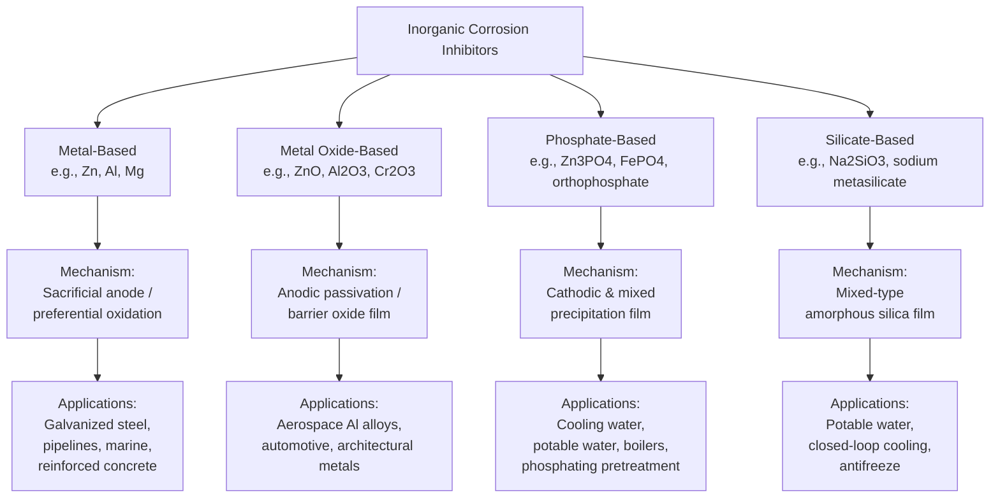
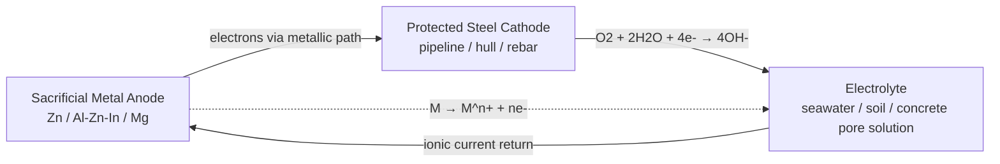
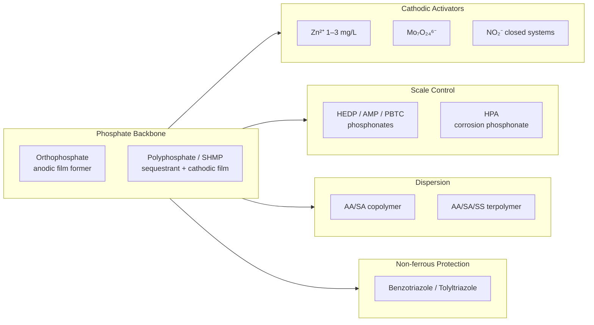
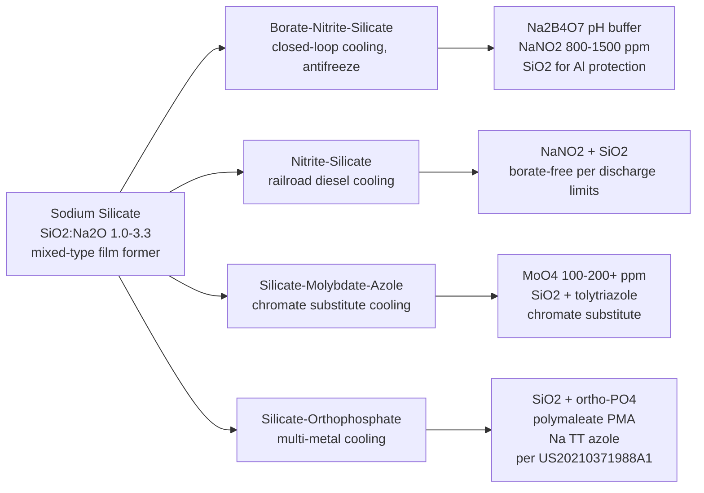

# Inorganic Corrosion Inhibitors: A Comprehensive Report on Types, Mechanisms, and Applications
# 1 Introduction and Research Framework

Corrosion is the spontaneous, thermodynamically driven return of refined metals to a lower-energy, oxidized state—a process that silently consumes engineered assets, drains national economies, and, in the worst cases, precipitates catastrophic safety and environmental failures. Because virtually all metals (with the notable exception of gold) are thermodynamically more stable as their natural compounds than in their metallic form, the question facing engineers is never whether corrosion will occur but rather how quickly and by what mechanism it will proceed, and what countermeasures can be deployed to slow it to economically and operationally acceptable rates[^1]. Among the four pillars of modern corrosion control—protective coatings, corrosion-resistant alloys, cathodic protection, and corrosion inhibitors[^2]—chemical inhibitors occupy a uniquely versatile position because they can be dosed directly into the corrosive medium, retrofitted to existing assets, and tailored to evolving service conditions without major capital expenditure. This report focuses specifically on **inorganic corrosion inhibitors**, whose protective action is rooted in well-defined inorganic chemistry: formation of passive oxide and hydroxide films, precipitation of insoluble salts on cathodic sites, and sacrificial electrochemical activity. To frame the technical chapters that follow, the present chapter establishes the electrochemical vocabulary of corrosion, quantifies the economic and safety stakes that justify inhibitor deployment, positions inorganic inhibitors against their organic counterparts, and finally defines the four-category taxonomy and the unified analytical logic (classification → mechanism → reaction chemistry → application) that structure the remainder of the report.

## 1.1 Electrochemical Fundamentals of Corrosion

The starting point for understanding any corrosion inhibitor is the recognition that aqueous corrosion is, almost without exception, an **electrochemical** process rather than a purely chemical one. Michael Faraday formalized this principle in the early nineteenth century, and it remains the foundational paradigm for both corrosion science and corrosion prevention[^1]. In operational terms, an electrochemical corrosion cell requires four simultaneously present components: (i) an anode, where the metal is oxidized and dissolves as cations; (ii) a cathode, where a reducible species in the electrolyte consumes the electrons released at the anode; (iii) an electrolyte that conducts ionic current between the two electrodes; and (iv) an electron-conducting metallic path connecting them. If any one component is absent, electrochemical corrosion cannot proceed[^1]. The anode and cathode need not be physically separated electrodes: on a single piece of steel exposed to a humid environment, microstructural heterogeneities—grain boundaries, second-phase particles such as cementite, residual stresses, or differential aeration—are sufficient to create local anodic and cathodic regions that drive what is called "self-corrosion," manifesting macroscopically as rust[^1].

### 1.1.1 Anodic and Cathodic Half-Reactions

The chemistry of any corrosion cell can be decomposed into two coupled half-reactions. The anodic reaction is invariably the oxidation of the metal:

$$M \rightarrow M^{n+} + n\,e^{-}$$

The cathodic reaction, in contrast, depends on the chemistry of the electrolyte—particularly its pH, oxygen content, and the presence of oxidizing species. In neutral and alkaline aerated waters—which dominate environments such as cooling water, soils, and concrete pore solution—the controlling cathodic reaction is the reduction of dissolved oxygen[^1]:

$$O_{2} + 2\,H_{2}O + 4\,e^{-} \rightarrow 4\,OH^{-}$$

In acidic, oxygen-free solutions the cathodic reaction is hydrogen evolution ($2\,H^{+} + 2\,e^{-} \rightarrow H_{2}$), while in aerated acids the combined reaction $O_{2} + 4\,H^{+} + 4\,e^{-} \rightarrow 2\,H_{2}O$ prevails; less commonly, oxidizing solutes such as ferric or cupric ions can serve as the cathodic reactant[^1]. For mild steel in moist neutral environments, the iron ions generated at the anode combine with hydroxide ions produced at the cathode to form ferrous hydroxide, which is subsequently oxidized by atmospheric oxygen through Fe(OH)₃ ultimately to hematite (Fe₂O₃)—the familiar reddish-brown rust[^1]. This sequence is critical for the present report because **all four inorganic inhibitor families discussed in later chapters operate by interfering with one or more of these half-reactions**: passive oxide films suppress the anodic reaction, phosphate and silicate precipitates blanket the cathode and obstruct oxygen access, and sacrificial metals reverse the polarity of the cell so that the protected structure becomes the cathode.

### 1.1.2 Thermodynamic Driving Force: Electrode Potentials and the Electrochemical Series

The susceptibility of a metal to corrosion is reflected in its standard electrode potential measured against a reference electrode (typically the standard hydrogen electrode, SHE, assigned a value of 0 V; in laboratory practice the saturated calomel electrode at +0.244 V vs. SHE, or Ag/AgCl electrodes, are more commonly used)[^1]. Table 1-1 reproduces the electrochemical series for the metals most relevant to subsequent chapters. Metals with more negative standard potentials are more readily oxidized and thus more "active"; metals with more positive potentials are more "noble" and resist electron loss.

| Metal couple | E° (V vs. SHE) |
|---|---|
| Mg²⁺/Mg | −2.37 |
| Al³⁺/Al | −1.66 |
| Zn²⁺/Zn | −0.76 |
| Fe²⁺/Fe | −0.44 |
| Ni²⁺/Ni | −0.25 |
| Sn²⁺/Sn | −0.14 |
| 2H⁺/H₂ | 0.00 |
| Cu²⁺/Cu | +0.34 |
| Ag⁺/Ag | +0.80 |
| Au³⁺/Au | +1.50 |

*Table 1-1. Standard reduction potentials of selected metals at 25 °C, 1 M ionic activity, 1 atm[^1].*

When two metals with different potentials are coupled through an electrolyte, the more active one becomes the anode and corrodes preferentially while the more noble one is cathodically protected. A potential difference of as little as 0.05 V is generally regarded as the threshold for measurable galvanic corrosion, although the actual rate depends additionally on reaction kinetics and the anode-to-cathode area ratio[^1]. This thermodynamic relationship is the explicit operating principle of **sacrificial metal-based inhibitors** discussed in Chapter 2: zinc (−0.76 V) and magnesium (−2.37 V) corrode in preference to iron (−0.44 V) when galvanically coupled to steel, thereby converting an undesirable spontaneous reaction into a controlled, designed-in protective mechanism.

For non-standard conditions, the Nernst equation relates the actual half-cell potential to the activities of the participating species:

$$E = E^{\circ} - \frac{RT}{nF}\ln Q$$

where $R$ is the gas constant, $T$ the absolute temperature, $n$ the number of electrons transferred, $F$ the Faraday constant (≈96,500 C mol⁻¹), and $Q$ the reaction quotient[^1]. The Nernst equation explains why corrosion rates respond sensitively to changes in dissolved metal-ion concentration, pH, and temperature—and, by extension, why inhibitor performance must be evaluated in the actual service environment rather than under idealized laboratory conditions.

### 1.1.3 Kinetics, Polarization, and Passivation

Thermodynamics determines whether corrosion can occur; kinetics determines how quickly. The rate of metal loss is quantified by the **corrosion current density** ($i_{corr}$), which by Faraday's law is directly proportional to the mass of metal dissolved per unit area per unit time[^1]. When current flows, the electrode potential of each half-cell shifts away from its equilibrium value—a phenomenon called **polarization**—and three forms are commonly distinguished: activation polarization (controlled by the charge-transfer step at the interface), concentration polarization (controlled by diffusion of reactants or products), and resistance polarization (controlled by ohmic drop through the electrolyte or surface films)[^1]. Inhibitors function precisely by amplifying polarization: an **anodic inhibitor** raises the activation barrier for metal dissolution and shifts $E_{corr}$ in the noble direction; a **cathodic inhibitor** suppresses the cathodic reduction reaction and shifts $E_{corr}$ in the active direction; a **mixed-type inhibitor** does both.

A special and particularly important case of anodic polarization is **passivation**—the spontaneous formation of a thin (nanometer-scale), tenacious oxide film that drastically reduces the corrosion current despite a thermodynamic driving force still being present. Stainless steels and Co–Cr alloys passivate through a Cr₂O₃ film; titanium and its alloys through TiO₂; aluminum through Al₂O₃; and zinc, although less robust, through a mixed ZnO/Zn(OH)₂/Zn₅(OH)₆(CO₃)₂ layer[^1]. The passive film acts as a barrier to ionic transport, and its stability against breakdown (characterized by the breakdown potential measurable in cyclic polarization tests) determines whether localized corrosion such as pitting will initiate[^1]. **Metal oxide-based inhibitors**, discussed in Chapter 3, work by either reinforcing this natural passive film or providing a conversion-deposited substitute when the native film is inadequate.

The stability of the protective layer is in turn governed by solution pH, as captured in Pourbaix (potential–pH) diagrams. Most metal hydroxides precipitate only within a defined pH window and dissolve in strongly acidic or strongly alkaline conditions[^1]. This pH-window constraint will recur throughout the report: it explains why phosphate films require near-neutral water chemistry, why silicate inhibitors function best in mildly alkaline systems, and why aluminum—nominally an active metal—remains durable in approximately neutral environments where its hydroxide is least soluble.

## 1.2 Economic and Safety Imperatives for Corrosion Inhibition

The case for systematic investment in corrosion inhibitors rests on an arithmetic that is, by industrial standards, exceptionally compelling. The benchmark global figure comes from the IMPACT (International Measures of Prevention, Application, and Economics of Corrosion Technologies) study published by NACE International in 2016, which estimated the **annual global direct cost of corrosion at approximately US$2.5 trillion, equivalent to roughly 3.4% of world gross domestic product**[^2][^3][^4][^5]. This figure builds on the earlier 2002 U.S. Federal Highway Administration study, which placed the U.S. direct cost at US$276 billion (~3.1% of U.S. GDP)[^2], and is corroborated by national updates such as the AMPP/IMPACT Canada study estimating C$63 billion annually, equal to 2.9% of Canadian GDP[^6]. Notably, **these figures exclude indirect costs such as production losses, environmental remediation, litigation, and casualties from corrosion-induced failures**, meaning the true societal burden is substantially higher than the headline number[^2].

Equally important is the IMPACT study's conclusion that **between 15% and 35% of these direct losses—on the order of US$375 to US$875 billion per year globally—are avoidable** through the systematic application of existing corrosion-control technologies[^2]. The commonly cited toolset includes organic and metallic protective coatings, corrosion-resistant alloys, cathodic protection, and chemical corrosion inhibitors[^2]. Among these, chemical inhibition is uniquely positioned for asset retrofits and continuous-water-handling applications because it requires neither extensive shutdowns nor expensive metallurgical upgrades.

The criticality of corrosion control is amplified by the safety and public-health stakes in the sectors where it bites hardest:

- **Oil and gas.** Pipelines and process equipment handle internally corrosive media (wet gas, sour crude, brines) under high pressure and temperature; the IMPACT study identifies corrosion as a major contributor to pipeline failures and emphasizes that strict monitoring and inhibitor dosing programs are integral to integrity management[^2].
- **Drinking and waste water.** In the United States alone, an estimated 240,000 water main breaks per year are caused largely by corrosion, against a deferred replacement value approaching US$1 trillion over 25 years for the most urgent investments[^2]. Corrosion in distribution piping is not just an economic issue but a public-health crisis, as illustrated by the Washington D.C. (2001) and Flint, Michigan (2014) lead-contamination events that drove utilities to widespread adoption of orthophosphate corrosion inhibitors[^7].
- **Transportation and infrastructure.** Bridges, reinforcing steel in concrete, ships, and vehicles all suffer corrosion-driven structural degradation; the U.S. Department of Defense alone allocated approximately US$20 billion per year to corrosion-related expenses, and reported a composite return on investment of 16:1 for its corrosion-management activities[^2].
- **Power and process industries.** Boilers, condensers, and cooling towers concentrate dissolved species and operate at elevated temperatures, making them dependent on chemical treatment programs in which inorganic inhibitors play a central role[^2].

These figures reframe inhibitor selection from a tactical procurement decision into a **strategic asset-management lever**. The IMPACT study explicitly recommends that corrosion control be embedded within an organizational Corrosion Management System (CMS) that links technical practice (the lower tiers of the CMS Pyramid: procedures, working practices, mitigation) to corporate policy and ROI accounting (the upper tiers: policy, strategy, objectives)[^2]. Inorganic inhibitors—being typically inexpensive, broadly available, and amenable to large-volume dosing—are central to the cost-effectiveness arithmetic that supports such ROI cases, particularly in the water-handling segments of energy, utility, and municipal infrastructure.

## 1.3 Inorganic versus Organic Inhibitors: Comparative Positioning

Corrosion inhibitors as a class can be divided broadly into organic and inorganic chemistries, each operating through a distinct molecular mechanism and occupying a complementary niche in industrial practice. **Organic inhibitors** are typically polar molecules containing heteroatoms (N, O, S, P) and π-electron systems—amines, imidazolines, thioureas, quinolines, carboxylic-acid surfactants—that protect through chemisorption or physisorption, forming a monomolecular or multimolecular adsorbed barrier between the metal and the corrosive medium. They are dominant in acid pickling, descaling, and oilfield acidizing operations where strong acids would rapidly destroy any precipitated inorganic film. **Inorganic inhibitors**, by contrast, achieve protection through the formation of relatively thick, three-dimensional inorganic phases on the metal surface: passive oxide layers, insoluble metal salts (phosphates, silicates), or sacrificial metallic phases. Their protection chemistry is closer to that of a thin conversion coating than to a Langmuir adsorbate.

Several practical considerations explain why inorganic inhibitors retain a dominant role in many large-volume industrial applications despite the rapid expansion of organic chemistries:

- **Thermal and chemical robustness.** Inorganic films such as ZnO, Al₂O₃, Cr₂O₃, and zinc phosphate are stable at elevated temperatures and resistant to chemical degradation, which makes them suitable for boiler feedwater, high-temperature cooling water, and concrete pore solution—environments in which many organic molecules thermally decompose or hydrolyze.
- **Cost and dosing economy.** Sodium silicate, calcium and zinc phosphate, and similar reagents are produced at industrial commodity scale, and they protect through bulk precipitation rather than monolayer adsorption, lending themselves to the very large volumes typical of municipal water treatment and open cooling systems[^2].
- **Compatibility with the substrate's own chemistry.** Many inorganic inhibitors reinforce or substitute for the metal's native passive film (e.g., phosphates strengthening the iron oxide on steel; silicates densifying the natural ZnO on galvanized surfaces), giving them a degree of self-consistency with the substrate that adsorbed organics cannot match.
- **Multifunctionality.** Phosphate-based formulations not only inhibit corrosion but also bind dissolved lead and other heavy metals into insoluble scale, a dual function exploited at scale by drinking-water utilities such as the city of Pittsburgh, which dose orthophosphate at concentrations up to 1.8 mg L⁻¹ for combined lead-corrosion and pipe-scale management[^7].

These advantages, however, are increasingly tempered by environmental and toxicological considerations. **Chromate-based inhibitors**, once the gold standard for aluminum, steel, and cooling-water systems, are now severely restricted because hexavalent chromium is a recognized human carcinogen and ecological toxicant[^8][^9][^10]. Phosphates, while not toxic to humans, can promote eutrophication when they leak into surface waters—a risk documented quantitatively in recent studies of urban streams hydrologically connected to drinking-water distribution systems, where full-scale orthophosphate dosing significantly increased stream total-phosphorus concentrations and altered microbial community composition[^7]. Heavy-metal inhibitors more broadly (zinc, nickel, molybdate to some extent) face tightening discharge limits, and traditional inhibitors such as chromates and phosphates have therefore been characterized in recent literature as posing "significant health risks" that drive demand for more sustainable alternatives[^8][^9].

The net effect is a clear pattern of complementary domain specialization, summarized in Table 1-2.

| Dimension | Inorganic inhibitors | Organic inhibitors |
|---|---|---|
| Protection mechanism | Passive oxide film, salt precipitation, or sacrificial dissolution forming a 3-D inorganic phase | Chemisorption/physisorption of polar molecules forming a 2-D barrier on the metal surface |
| Thermal stability | High; oxides and phosphates stable to several hundred °C | Generally lower; many decompose or desorb above 100–150 °C |
| Typical dose / concentration | Moderate-to-high (mg L⁻¹ to %) for bulk water systems | Often low (ppm or sub-ppm) due to monolayer coverage |
| Dominant application niches | Cooling water, boiler water, potable water, concrete reinforcement, automotive/aerospace pretreatment | Acid pickling, oilfield acidizing, refinery overhead, lubricants |
| Environmental concerns | Chromate toxicity; phosphate-driven eutrophication; heavy-metal discharge limits | Aquatic toxicity of some amines/thioureas; biodegradability variations |
| Cost profile | Generally low feedstock cost, commodity supply | Variable; specialty molecules can be expensive |

*Table 1-2. Comparative positioning of inorganic and organic corrosion inhibitors. Compiled from sources cited in §1.1–1.3.*

The strategic implication for the remainder of this report is that **inorganic inhibitors are not a legacy technology in decline but rather a maturing, increasingly engineered class** whose evolution is being shaped by environmental regulation (driving substitution of chromates), by new substrates (Mg alloys for biomedical and lightweighting applications)[^1], and by new materials platforms such as layered double hydroxides (LDHs) and metal–organic framework (MOF) composite films that combine inorganic protective chemistry with controlled-release or "smart" responsive functionality[^1].

## 1.4 Classification Logic and Report Framework

The diversity of inorganic inhibitors—from elemental zinc anodes on a ship's hull to soluble sodium silicate in a closed-loop coolant—can be organized along several axes: by the chemical identity of the active species, by the electrochemical role (anodic/cathodic/mixed), by the morphology of the protective phase (sacrificial bulk metal, thin passive oxide, precipitated salt film), or by the deployment context (continuous dosing in water, factory-applied conversion coating, embedded sacrificial anode). This report adopts a **four-category taxonomy that primarily reflects the chemical identity of the active species**, because this scheme aligns most naturally with the user-defined scope (metal-based, metal oxide-based, phosphate-based, silicate-based) and maps cleanly onto the distinct protection mechanisms summarized below.

*Figure 1-1. Four-category taxonomy of inorganic corrosion inhibitors adopted in this report and the dominant protection mechanism associated with each category.*

The defining logic of each category is as follows:

1. **Metal-based inhibitors** operate through electrochemical preferentiality: an active metal (Zn, Al, Mg) is electrically connected to the substrate so that it dissolves in place of the protected metal. The thermodynamic basis is direct application of the electrochemical series of Table 1-1[^1].
2. **Metal oxide-based inhibitors** rely on the formation or reinforcement of a passive, electronically and ionically resistive oxide film (ZnO, Al₂O₃, Cr₂O₃) that suppresses the anodic half-reaction[^1]. The category encompasses both naturally grown films and engineered conversion coatings, and is increasingly extended by hybrid systems such as LDH and MOF composite films.
3. **Phosphate-based inhibitors** form insoluble metal phosphates—typically Zn₃(PO₄)₂, FePO₄, or Ca₃(PO₄)₂—that precipitate on cathodic or active sites, blanketing the metal and stabilizing the surrounding water chemistry. They dominate cooling-water and potable-water service[^7].
4. **Silicate-based inhibitors** deposit an amorphous silica-rich layer that combines anodic passivation with cathodic blocking, making them attractive for mildly alkaline systems such as closed-loop coolants, drinking water polishing, and antifreeze formulations.

Each subsequent technical chapter (Chapters 2–5) follows a unified analytical sequence: **classification → mechanism → reaction chemistry → application → environmental/regulatory outlook**. Chapter 6 then consolidates the five user-specified protective-layer formation equations—zinc with oxygen and water, aluminum hydroxide passive film, magnesium sacrificial anode protecting steel, zinc phosphate precipitation, and overall iron-phosphate film formation—into a stoichiometrically explicit synthesis, ensuring chemical accuracy and balance for each. Chapter 7 presents a cross-sectoral comparative table covering cooling water, oil and gas production, concrete reinforcement, metal surface treatment, and boiler water treatment, drawing out selection rationales and regulatory drivers. Chapter 8 synthesizes the four categories, articulates current limitations (chromate toxicity, phosphate eutrophication, performance constraints in extreme environments), and surveys emerging directions up to early 2023.

Three terminological conventions are adopted throughout the report for consistency. First, "passive film" denotes a thin (nanometer-scale), self-formed protective oxide adherent to the metal, while "conversion coating" denotes a thicker, deliberately precipitated inorganic layer formed by a chemical pretreatment step (e.g., phosphating). Second, "anodic," "cathodic," and "mixed-type" inhibitor designations refer to the electrochemical reaction that is preferentially suppressed, not to the location at which the inhibitor accumulates. Third, the scope of "inorganic" follows the user's four-category definition: inhibitors whose protective active species are inorganic salts, oxides, or elemental metals; soluble inorganic species used primarily as oxidizers (e.g., nitrites, molybdates) are treated as ancillary "other inorganic" inhibitors and appear in the cross-sectoral application table (Chapter 7) where industrially relevant, but do not displace the four primary categories in the mechanism chapters.

With the electrochemical foundation laid, the economic case established, the comparative positioning clarified, and the classification framework defined, the report now turns in Chapter 2 to the first of the four inhibitor families—metal-based sacrificial and galvanic systems—where the thermodynamic principles of Table 1-1 will be applied to explain how zinc, aluminum, and magnesium are deployed to protect steel structures across galvanized coatings, buried pipelines, marine assets, and reinforced concrete.

# 2 Metal-Based Inorganic Corrosion Inhibitors

Among the four inorganic inhibitor families defined in Chapter 1, the metal-based category is the most direct expression of the electrochemical-series logic summarized in Table 1-1: an active metal is deliberately introduced into the corrosion cell so that its dissolution—rather than that of the protected structure—becomes the thermodynamically favored anodic reaction. This approach has the distinctive feature, unique among the four categories examined in this report, of operating through **bulk preferential dissolution rather than thin-film passivation or salt precipitation**, and it therefore demands a slightly different conceptual vocabulary, drawn from cathodic-protection engineering rather than from solution-phase inhibitor chemistry. Building on the half-reaction framework established in §1.1.1 and the polarization concepts introduced in §1.1.3, this chapter develops first the operating principle of metal-based protection (§2.1), then a comparative technical profile of the three dominant sacrificial chemistries—zinc, aluminum, and magnesium (§2.2)—mapped against four representative service environments (§2.3), and closes with the selection logic, operational limitations, and the chapter's positioning within the broader inorganic-inhibitor taxonomy (§2.4).

## 2.1 Working Principle: Cathodic Protection through Preferential Oxidation

Metal-based inhibitors function by exploiting a controlled galvanic cell in which the metal to be protected is forced into the role of the **cathode** of an electrochemical cell, while a less noble metal—deliberately selected and electrically coupled to the structure—takes on the role of the anode and corrodes in its place.[^11] This is the same electrochemical-cell architecture that drives unwanted corrosion, but with the polarity inverted by design: instead of microstructural heterogeneities of a single piece of steel generating local anodes that pit and rust, the entire steel surface is polarized as a single cathode while a sacrificial metal of more negative electrode potential supplies the oxidation current.

The two half-reactions that constitute this designed cell follow directly from the framework of §1.1. On the sacrificial metal (the anode) the metal is oxidized:

$$M \rightarrow M^{n+} + n\,e^{-}$$

while on the protected steel surface (the cathode) the electrons released by the anode are consumed by whichever cathodic reactant predominates in the local electrolyte. In the neutral aerated waters, soils, and concrete pore solutions that account for the vast majority of metal-based inhibitor deployments, oxygen reduction is overwhelmingly dominant:

$$O_{2} + 2\,H_{2}O + 4\,e^{-} \rightarrow 4\,OH^{-}$$

This is the very reaction documented by Inspenet for sacrificial-anode systems in seawater, where the more active metal "transfers electrons to the metal to be protected" and oxygen reduction generates hydroxide ions at the cathode.[^12] In oxygen-depleted acidic media (rarely the natural environment of metal-based inhibitor systems but relevant for boundary cases such as severely sulfate-reducing soils) hydrogen evolution becomes the cathodic reaction:

$$2\,H^{+} + 2\,e^{-} \rightarrow H_{2}$$

A useful way to visualize this protective architecture is shown in Figure 2-1.

*Figure 2-1. Schematic of a galvanic (sacrificial-anode) cell. The sacrificial metal dissolves and supplies electrons via the metallic path to the protected steel, where they consume oxygen and water; the ionic loop is completed through the electrolyte. Compiled from the cell architecture described in Refs.[^11][^12][^13]*

The **driving force** for this current is the difference in electrode potential between the anode and the cathode, and the more active metal must therefore lie below the protected metal in the galvanic series.[^11] Cathodic-protection practice does not rely on the standard reduction potentials of Table 1-1 in isolation but on a practical galvanic series measured against a copper/copper-sulfate (Cu:CuSO₄) reference electrode in neutral soil or fresh water, or against silver/silver-chloride/seawater electrodes in marine service.[^11] The Wikipedia compilation of these field potentials—reproduced in part in Table 2-1—shows clean steel at roughly −0.5 to −0.8 V, commercial-purity aluminum at −0.8 V, zinc at −1.1 V, and commercially pure magnesium at −1.75 V (all vs. Cu:CuSO₄ in neutral pH).[^11] Each of the three sacrificial chemistries discussed in §2.2 sits clearly below carbon steel on this scale, which is the field-measurable expression of why they can drive a protective current.

| Metal | Potential (V vs. Cu:CuSO₄, neutral pH) |
|---|---|
| Mild steel in concrete | −0.2 |
| Mild steel (rusted) | −0.2 to −0.5 |
| Mild steel (clean) | −0.5 to −0.8 |
| Commercially pure aluminium | −0.8 |
| Aluminium alloy (5% zinc) | −1.05 |
| Zinc | −1.1 |
| Magnesium alloy (6% Al, 3% Zn, 0.15% Mn) | −1.6 |
| Commercially pure magnesium | −1.75 |

*Table 2-1. Selected entries from the practical galvanic series used in cathodic-protection design (potentials vs. Cu:CuSO₄ reference in neutral-pH soil/freshwater).[^11]*

When current flows, the structure's potential shifts more electronegative—a process termed **polarization**—and engineering practice defines the system as adequately protected when the polarization satisfies one of two NACE criteria reported by MATCOR: either the off-potential (measured an instant after interrupting all current sources to remove IR drops) is more negative than approximately −850 mV vs. Cu/CuSO₄, or the polarization shift from the native potential exceeds 100 mV.[^13] These criteria implicitly target a polarization state at which the anodic dissolution current of the protected metal is suppressed to negligible levels.

Within this common electrochemical framework, two architectures are deployed industrially. **Galvanic (passive) cathodic protection** uses a more active metal as a self-driven anode and requires no external power source; **impressed-current cathodic protection (ICCP)** uses an external DC power supply (typically a transformer-rectifier) to force current from a relatively inert anode—often high-silicon cast iron, graphite, mixed-metal oxide (MMO), or platinized titanium—to the structure.[^11] The two share the underlying half-reactions but differ markedly in driving voltage, controllability, and consumable economics, themes that will recur in §2.3 and §2.4.

A final terminological clarification: the boundary between true sacrificial anode protection and the localized protection afforded by metallic conversion coatings such as galvanizing. Galvanized steel uses the **electrochemical principle** of cathodic protection (the zinc layer is more active than the underlying steel and therefore corrodes preferentially at coating defects) but, as Wikipedia explicitly notes, "is not actually cathodic but sacrificial protection. In the case of galvanizing, only areas very close to the zinc are protected. Hence, a larger area of bare steel would only be protected around the edges."[^11] This distinction matters: a discrete zinc or magnesium anode bolted to a hull or buried in soil drives sufficient current to polarize remote portions of large structures, whereas a galvanized coating provides only **localized cathodic protection** at scratches, edges, and small defects, supplementing its primary barrier function.[^11][^14]

## 2.2 Representative Sacrificial Metals: Zinc, Aluminum, and Magnesium Systems

Galvanic anodes are manufactured in a variety of shapes and sizes from alloys of zinc, magnesium, and aluminium, with composition and manufacturing covered by ASTM International standards.[^11] Each of the three base chemistries occupies a distinct niche, dictated by its working potential, current efficiency, density, and passivation behavior. Table 2-2 consolidates the key performance metrics reported in the technical literature, drawing especially on the comparative data of Inspenet and the practical galvanic series tabulated in Wikipedia.

| Property | Zinc (Zn) | Aluminum (Al–Zn–In, Al–Zn–Mg–Ti) | Magnesium (Mg, Mg–Mn–Al) |
|---|---|---|---|
| Typical working potential | −1.05 V vs. Ag/AgCl[^12] | −1.10 V vs. Ag/AgCl[^12] | −1.55 V vs. Cu/CuSO₄[^12]; −1.6 to −1.75 V (alloy / pure) vs. Cu/CuSO₄[^11] |
| Current efficiency | 85–90 %[^12] | 80–95 % (typ. 90–95 %)[^12] | 50–60 %[^12] |
| Density | Highest (heavy) | Lowest of the three; eases transport/installation[^12] | Intermediate |
| Preferred electrolyte | Seawater; moderate-to-low resistivity saline soils[^12] | Seawater; offshore platforms; high-conductivity media[^12] | Soils and fresh water (high resistivity)[^12] |
| Passivation risk | Low; stable in chloride media[^12] | High without In/Ga activator additions[^12] | Low, but high self-corrosion penalty[^12] |
| Distinctive limitation | Lower current per kg than Al; can be limited at low temperatures | Composition control critical to avoid Al₂O₃ passivation[^12] | Shorter life in high-conductivity environments; risk of overprotection-driven H₂ evolution[^12] |

*Table 2-2. Comparative properties of the three dominant sacrificial-anode chemistries used as metal-based inorganic corrosion inhibitors. Compiled from Refs.[^11][^12]*

### 2.2.1 Zinc-Based Systems

Pure zinc, alloyed in small amounts with elements such as aluminium to suppress passivation, has been the historical workhorse of marine galvanic cathodic protection. Its working potential of approximately −1.05 V vs. Ag/AgCl, combined with a current efficiency of 85–90 %, gives a stable and predictable polarization in seawater and other chloride-rich, moderate-temperature electrolytes.[^12] Its **high stability in seawater** and predictable consumption rate make it the preferred anode chemistry for ship hulls, harbor structures, and industrial process equipment such as heat exchangers and condensers, where Inspenet specifically notes that "zinc anodes offer more stable and predictable performance, maintaining effective protection without compromising the integrity of the assets."[^12] The supporting chemistry on a freshly exposed zinc surface in moist, aerated environments proceeds through the sequence of oxidation, hydroxylation, and—in atmospheric service—carbonation to form a tenacious mixed ZnO/Zn(OH)₂/Zn₅(OH)₆(CO₃)₂ layer that further slows zinc consumption (this sequence is developed quantitatively in Chapter 6).

Zinc is also deployed in a fundamentally different morphology: as **zinc-rich primers (ZRPs)**, in which zinc dust is dispersed in an organic or inorganic binder at very high loading. Corrosionpedia describes ZRPs as a "preparatory coating to protect iron or steel substrates against corrosion," noting that "high concentrations of zinc dust act sacrificially when in direct contact with steel by providing cathodic protection and galvanizing properties," with the two main families being **organic ZRPs** (often moisture-cured urethane systems) and **inorganic ZRPs** (typically silicate-bound).[^14] The Society for Protective Coatings (now part of AMPP) classifies these primers in Paint Specification 20 into three zinc levels by dry-film weight: Level 1 (≥ 85 % zinc), Level 2 (≥ 77 % and < 85 %), and Level 3 (≥ 65 % and < 77 %).[^15] In a recent industry analysis, Venkateshwarlu and co-workers at PPG emphasize that ZRPs are not purely sacrificial: "both barrier and sacrificial mechanisms work together to prevent steel corrosion, especially epoxy ZRPs," and progress in low-zinc formulations using conductive additives such as carbon nanotubes, graphite, polyanilines, polypyrroles, and engineered glass spheres now allows total zinc content to be reduced while matching or exceeding the corrosion performance of traditional Level 1 systems.[^15] This evolution—from zinc-content specifications toward performance-based specifications—directly reflects the dual-mechanism nature of zinc-based inhibitor coatings and the growing pressure of zinc's cost, supply, and toxicological profile.[^15]

### 2.2.2 Aluminum-Based Systems

Aluminum's standard reduction potential is more negative than zinc's, yet commercially pure aluminum is rarely usable as a sacrificial anode because it spontaneously forms a continuous, highly resistive Al₂O₃ passive film that all but eliminates galvanic current output. The solution adopted industrially is to alloy aluminum with small quantities of **indium** or **gallium**, which disrupt the passive film and "activate" the surface, supplemented by zinc as the principal alloying element. Inspenet reports that Al–Zn–In and Al–Zn–Mg–Ti alloy anodes deliver a working potential of approximately −1.10 V vs. Ag/AgCl, current efficiencies of 80–95 % (typically the highest of the three chemistries), and the advantage of **lower density**, which "facilitates transport and installation."[^12] These properties—high current capacity per unit mass and high efficiency in chloride electrolytes—have made Al–Zn–In the dominant choice for offshore platforms, subsea pipelines, and large ship hulls, particularly in installations where weight and storage volume of replacement anodes are operationally significant.[^12]

The principal limitation is composition sensitivity: "possible passivation problems if the composition is not adjusted with indium or gallium," meaning that quality control of the activator content (often a fraction of a percent of In) is critical to anode performance.[^12] Aluminum anodes also tend to perform less well in low-conductivity environments such as fresh water and high-resistivity soils, where their lower driving voltage relative to magnesium makes it difficult to polarize the structure adequately.[^12]

### 2.2.3 Magnesium-Based Systems

Magnesium and its alloys (most prominently Mg–Mn–Al with composition approximately 6 % Al, 3 % Zn, 0.15 % Mn, or commercially pure Mg) provide the most negative working potential of the three chemistries—approximately −1.55 V vs. Cu/CuSO₄ according to Inspenet, with Wikipedia tabulating −1.6 V for the alloy and −1.75 V for commercially pure Mg vs. the same reference.[^11][^12] This large driving force is precisely what makes magnesium the preferred choice for environments where the **conductivity of the electrolyte is low** and a higher anode-to-structure potential difference is needed to overcome the high ohmic resistance of the soil or water: "Very active; ideal for soil or fresh water. Shorter life in high conductivity environments."[^12] Inspenet's comparative discussion of buried systems confirms this division of labor: "Magnesium anodes are usually preferred in soils with high resistivity, while in saline or very wet soils it is necessary to adjust the quantity and arrangement of the anodes to prolong their useful life."[^12]

The penalty for magnesium's high driving voltage is its relatively low current efficiency of 50–60 %, the lowest of the three chemistries.[^12] A substantial fraction of the magnesium consumed is lost to **self-corrosion** (parasitic reaction with water producing magnesium hydroxide and hydrogen) rather than to delivering useful protective current. The high cathodic current density that magnesium can drive also raises the risk of overprotection, with associated hydrogen generation at the cathode and the cathodic-disbonding and hydrogen-embrittlement issues discussed in §2.4.

The supporting reaction chemistry of the magnesium–steel galvanic couple is straightforward and is the focus of one of the five protective-layer reactions developed in Chapter 6: magnesium is oxidized to Mg²⁺ at the sacrificial anode, while oxygen and water are reduced to hydroxide on the steel surface, leading to an overall conversion of magnesium to magnesium hydroxide while the iron remains in its metallic state.

## 2.3 Application Domains: Galvanized Steel, Marine Assets, Buried Pipelines, and Reinforced Concrete

The mapping of the three sacrificial-metal chemistries onto industrial service environments is essentially an exercise in matching driving voltage, current efficiency, and consumption rate to the electrolyte resistivity, geometry, and design life of the asset.[^12] Four representative deployment domains illustrate the breadth of this practice.

### 2.3.1 Galvanized Steel: Hybrid Barrier–Sacrificial Protection

Galvanizing—most commonly **hot-dip galvanizing**, in which clean steel is immersed in molten zinc to form a metallurgically bonded zinc layer—combines two protective mechanisms in a single coating.[^11] As a barrier, the zinc layer mechanically isolates the steel from atmospheric moisture and oxygen, and the dense zinc-corrosion products (ZnO, Zn(OH)₂, basic carbonates) that form on its outer surface are themselves stable and slow-eroding. When the coating is mechanically damaged and bare steel is exposed, the surrounding zinc layer forms a local galvanic cell with the exposed steel and "protect[s] it from corrosion."[^11][^14] Wikipedia frames this dual functionality crisply: galvanized coatings "combine the barrier properties of a coating with some of the benefits of cathodic protection," with the zinc acting as a sacrificial anode at coating defects.[^11]

Zinc-rich primers extend the same logic to field- and shop-applied paint systems on bridges, infrastructure, and industrial equipment.[^15] In organic ZRPs the zinc particles must remain in electrical contact with the steel substrate and with each other to provide a percolation path for the cathodic-protection current; this is one reason inorganic-silicate ZRPs (with their highly conductive silicate matrix) and conductive-additive-modified organic systems (using CNTs, graphite, or conductive polymers) can achieve comparable or superior performance to traditional high-zinc systems at reduced zinc loading.[^15]

The galvanizing/ZRP family is, in the terminology adopted in §2.1, an example of **localized cathodic protection**: the zinc protects only the immediate vicinity of the damage site, so coatings must be designed to limit defect size to within the effective throwing distance of the sacrificial zinc.[^11] This is fundamentally different from the discrete-anode architecture used in marine and pipeline service, where a relatively small anode polarizes very large protected areas.

### 2.3.2 Marine and Offshore Assets

Marine and offshore service is the natural environment for sacrificial anode systems: seawater is a high-conductivity electrolyte that allows even modestly potential-active anodes to drive substantial protective current over large areas, and the assets at risk—ship hulls, propellers, harbors, jetties, offshore platforms, subsea pipelines, and ballast tanks—are typically too large and operationally too complex to retrofit with passive coatings alone.[^11][^12]

Wikipedia documents that "cathodic protection on ships is often implemented by galvanic anodes attached to the hull and ICCP for larger vessels," with galvanic anodes shaped to be flush with the hull to minimize hydrodynamic drag and easily replaced during dry-dock inspections.[^11] For ICCP on large ships, anodes are typically constructed of "platinized titanium," flush-mounted, and located at least 5 ft below the light load line in an area protected from mechanical damage; the negative DC cable is connected directly to the steel hull.[^11] Smaller, non-metallic-hull vessels (yachts) use galvanic anodes to protect outboard motors and steel fixtures, and mixed-metal configurations (e.g., aluminium hulls with steel fixtures) require carefully balanced anode placements to neutralize the internal galvanic cell that the dissimilar metals would otherwise create.[^11] Inspenet's assessment of industrial deployments confirms that on "ship hulls, offshore platforms, and submarine pipelines, aluminum and zinc anodes demonstrate high performance due to their stability in seawater and their ability to maintain a potential."[^12]

For very large marine structures—offshore wind-farm foundations, jacket platforms, large jetties—the choice between galvanic and impressed-current architectures hinges on current demand and the practicality of distributing anodes. ICCP for marine service uses anodes of high-silicon cast iron, graphite, mixed-metal oxide (MMO), or platinum/niobium-coated wire connected to AC-powered transformer-rectifiers; for very large or complex structures the anodes are typically arranged in multiple independently controlled zones.[^11]

### 2.3.3 Buried Pipelines and Storage Tanks

For long buried pipelines, the geometric scale of the asset (hundreds of kilometers, anode-to-cathode separations of many meters) and the wide range of soil resistivities encountered along a typical route make **impressed-current cathodic protection** the dominant architecture: an AC-powered transformer-rectifier with DC output of up to 50 A and 50 V drives current through anodes arranged in distributed groundbeds or in deep vertical boreholes, with conductive coke backfill to extend anode life and stabilize current distribution.[^11][^13] A baseline native pipe-to-soil potential survey, conducted with all CP systems off, informs anode placement and rectifier sizing; close-interval potential surveys (CIS/CIPS) periodically validate that the −850 mV off-potential or 100 mV polarization-shift criteria are met along the entire pipeline length.[^13]

For shorter, smaller-diameter pipelines, and for buried tanks, galvanic anodes—principally magnesium in higher-resistivity soils and zinc in very wet, conductive soils—are often more economical.[^11][^12] MATCOR's industry overview confirms this trade-off: "Galvanic systems are typically more affordable upfront but are suited to smaller applications. ICCP systems require higher initial investment but offer extended service life and lower long-term maintenance costs," with applications spanning oil and gas pipelines, well casings, storage tanks, water mains, fire-hydrant risers, and bridge or transmission-tower anchorages.[^13]

A special and operationally important case is **pre-stressed concrete cylinder pipe (PCCP)**, where the steel prestressing wires are stressed close to their elastic limit and any wire breakage from either corrosion or hydrogen embrittlement can lead to catastrophic failure. Wikipedia notes that ICCP on PCCP "requires very careful control to ensure satisfactory protection," because excessive negative potentials produce hydrogen ions that drive hydrogen embrittlement; "a simpler option is to use galvanic anodes, which are self-limiting and need no control."[^11] This is one of the cleanest illustrations of the self-regulating advantage of metal-based galvanic protection over impressed-current architectures.

Internal cathodic protection extends the same logic to the inside of vessels, water-storage tanks, ballast tanks, and shell-and-tube heat exchangers; both galvanic and ICCP systems are used, and for domestic water heaters in particular an impressed-current anode of titanium coated with MMO has become a standard option, governed by NACE SP0388-2007 protection-potential criteria.[^11]

### 2.3.4 Steel-Reinforced Concrete

The pore solution of sound concrete has a pH around 13, and at this alkalinity steel reinforcement carries a stable passive film of mixed iron oxides and hydroxides.[^11] Reinforcement corrosion is initiated when chloride ions (from de-icing salts or marine exposure) or carbonation lowers the pH and breaks down this passive film, and cathodic protection in concrete is therefore designed not to maintain constant polarization (as in soil or seawater) but to **restore the protective alkaline environment**.[^11]

Two architectures are used. Galvanic systems are "constant potential" arrangements that provide a high initial current to repolarize the steel and restore passivity, and then revert to a lower sacrificial current while chloride ions migrate away from the steel toward the positive anode; the anodes—typically zinc or zinc-alloy elements embedded in the concrete cover—remain reactive over a 10–20-year service life and self-modulate their current output in response to changes in concrete resistivity caused by rainfall, temperature, or flooding.[^11] Wikipedia notes that this **reactive nature** makes galvanic systems "an efficient choice" for concrete, particularly for retrofit applications where complete electrical control infrastructure would be costly to install; however, in the UK the use of galvanic anodes for atmospherically exposed reinforced concrete is "considered experimental."[^11]

ICCP systems are also widely used, particularly for bridges and other large concrete structures, where a distributed network of anodes throughout the structure is driven by an automatically controlled DC power supply, often with remote monitoring.[^11] Hybrid systems combine the two: a galvanic anode array is initially energized as an ICCP system to drive the high current needed to restore passivity, then the power supply is removed and the same anodes continue operating in passive galvanic mode—an architecture that captures "the restorative capabilities of ICCP systems but maintain[s] the reactive, lower cost, and easier-to-maintain nature of a galvanic anode."[^11]

## 2.4 Selection Criteria, Operational Limitations, and Comparative Assessment

The preceding sections show that the choice among zinc, aluminum, and magnesium anodes, and between galvanic and impressed-current architectures, is an optimization over a relatively well-defined set of variables. Inspenet groups these into four categories that closely map onto field-engineering practice: environmental conditions (electrolyte conductivity, temperature, composition), properties of the anode material (potential, efficiency, density), characteristics of the cathodic-protection system (current distribution, anode spacing, area ratios), and operational and maintenance factors (monitoring cadence, replacement schedule).[^12] Synthesizing the search-supported evidence yields the selection logic summarized in Table 2-3.

| Service environment | Electrolyte resistivity | Preferred sacrificial chemistry | Preferred architecture | Driver |
|---|---|---|---|---|
| Open seawater (hulls, platforms) | Low (high conductivity) | Al–Zn–In, Zn | Galvanic for routine; ICCP for very large vessels[^11][^12] | High current per kg (Al); proven seawater stability (Zn) |
| Coastal/intertidal structures | Variable; wet-dry cycles | Zn, Al–Zn–In | Galvanic with monitoring | Wet-dry zones drive faster consumption and require strategic anode design[^12] |
| Buried pipelines (long transmission) | Moderate to high | n/a (inert anodes for ICCP) | ICCP with deep or distributed groundbeds | Geometry and length favor active control[^11][^13] |
| Buried pipelines (short, small-diameter) and tanks | High | Mg (high-resistivity soils); Zn (very wet, saline soils) | Galvanic | Economy and self-regulation[^11][^12] |
| Reinforced concrete (atmospheric) | Very high (concrete cover) | Zn-based galvanic anodes | Galvanic or hybrid; ICCP for large bridges | Restoration of alkaline passivation; reactive, low-control nature[^11] |
| Industrial water (heat exchangers, condensers) | Variable | Zn | Galvanic or internal CP | Stable, predictable performance without overprotection[^11][^12] |

*Table 2-3. Selection logic for metal-based corrosion inhibitor systems across representative service environments. Compiled from Refs.[^11][^12][^13]*

Beyond chemistry selection, metal-based cathodic protection carries a distinct set of **operational limitations** that are extensively documented and that fundamentally shape system design:

- **Hydrogen evolution and hydrogen embrittlement.** A side effect of improperly applied cathodic protection is the production of atomic hydrogen at the cathode, which can be absorbed into the steel and cause hydrogen embrittlement of welds and high-hardness materials.[^11] The risk is particularly acute under excessive polarization (overprotection) and is the principal reason the design of CP on PCCP and high-strength steels must be carefully limited.[^11]
- **Cathodic disbonding.** Hydrogen-ion and alkali-ion accumulation at the metal/coating interface, exacerbated by excessively negative polarization, can drive disbondment of protective organic coatings from the cathode, and is particularly accelerated in pipelines carrying hot fluids.[^11] System operators must therefore design CP to deliver sufficient but not excessive polarization, and choose coatings whose adhesion is robust under cathodic conditions.[^11]
- **Cathodic shielding.** High-electrical-resistivity coatings—polyethylene tapes, shrinkable sleeves, and some factory-applied multilayer coatings—can physically block the protective CP current from reaching the underlying steel when they disbond, creating a corrosive environment between coating and pipe that the CP system cannot reach. The 1999 report on the 20,600-bbl Saskatchewan crude-oil pipeline spill defines this triple condition (disbondment + dielectric coating + unique under-coating electrochemical environment) as **CP shielding**, and U.S. DOT Title 49 CFR 192.112 now requires that pipe operating at alternative maximum allowable pressures "be protected against external corrosion by a non-shielding coating."[^11]
- **Aluminum-anode passivation.** As discussed in §2.2.2, pure aluminum is unusable as a sacrificial anode because of its passive Al₂O₃ film; activator additions of indium or gallium are mandatory, and tight composition control is required to maintain the alloy's operating potential and efficiency.[^12]
- **Magnesium self-corrosion and overprotection.** Magnesium's high driving voltage carries both a low intrinsic efficiency (50–60 %) and a heightened risk of overprotection and hydrogen evolution; in high-conductivity electrolytes magnesium anodes can deliver substantially more current than the structure needs, accelerating their own consumption without proportionate protective benefit.[^12]
- **Accelerated consumption in wet-dry cycling.** In intertidal zones and port and coastal storage infrastructure, "cycles of exposure to water and air generate differential wear that requires strategic anode design and constant monitoring of the protection potential," with anode consumption "faster… due to wetting and drying cycles."[^12]
- **Environmental release.** Sacrificial anodes by definition release their metal into the electrolyte (zinc, aluminum, magnesium, and trace elements such as indium); modern marine and water-treatment practice must account for ecotoxicology of these releases alongside the structural-integrity benefits, and the trend in zinc-rich primer technology toward reduced zinc loading is partly driven by zinc-supply, cost, and toxicological pressures.[^15]

A further architectural consideration, highlighted in MATCOR's industry overview, is the **cost-of-ownership trade-off** between galvanic and ICCP systems: galvanic systems carry a lower upfront capital cost and require minimal control infrastructure but are limited to applications with modest current requirements; ICCP systems involve higher initial investment in rectifiers, anodes, and instrumentation but deliver longer service life and lower long-term maintenance burdens for large structures.[^13] In practice, many integrated CP designs (notably the hybrid concrete systems discussed in §2.3.4) combine elements of both architectures to capture the strengths of each.

A practical caveat in interpreting CP measurements: even with reference electrodes (Cu/CuSO₄ for soil and freshwater, Ag/AgCl or pure Zn for seawater) and well-defined measurement protocols (EN 13509:2003, NACE TM0497), the interpretation of pipe-to-electrolyte potential measurements "requires training and cannot be expected to match the accuracy of measurements done in laboratory work."[^11] Reflecting this complexity, AMPP, ISO 15257, and equivalent national schemes in France, Germany, Italy, and the UK now offer multi-level certification of CP personnel from tester through specialist grades.[^11]

Set against the other three inorganic-inhibitor categories examined in subsequent chapters, metal-based inhibitors stand out for several reasons. First, they protect by **bulk preferential dissolution**, not by forming a thin (nanometer-scale) passive film as do the metal oxides of Chapter 3, nor by precipitating an insoluble salt film as do the phosphates of Chapter 4 and (in part) the silicates of Chapter 5. Second, they require **electrical continuity** between the sacrificial metal and the protected structure—a constraint absent from soluble dosed inhibitors. Third, they offer **self-regulating, no-control architectures** (notably zinc and magnesium galvanic anodes) that are uniquely valuable in safety-critical settings such as PCCP, where the overprotection risk associated with ICCP would otherwise drive embrittlement-related failures.[^11]

In summary, the metal-based category provides the electrochemical foundation on which the rest of the inorganic-inhibitor portfolio is built: the half-reactions of §2.1 are the same half-reactions that the oxide, phosphate, and silicate films of Chapters 3–5 are designed to suppress, and the polarization criteria established for cathodic protection (−850 mV vs. Cu/CuSO₄; 100 mV shift) remain the operative benchmarks for protection adequacy regardless of which inhibitor family is in service.[^13] The next chapter shifts focus from bulk-electrode protection to the formation and reinforcement of thin oxide passive films—the second of the four inorganic-inhibitor categories—where many of the same metals (Zn, Al) reappear in a fundamentally different protective morphology.

# 3 Metal Oxide-Based Inorganic Corrosion Inhibitors

Chapter 2 examined inhibitors that protect by being consumed: bulk active metals (Zn, Al, Mg) that dissolve in place of the protected steel and thereby invert the polarity of the corrosion cell. The present chapter turns to a fundamentally different protective architecture, in which the **same elements—now in their oxidized form**—are arranged not as bulk sacrificial electrodes but as nanometer-scale oxide films that suppress corrosion by raising the activation barrier for the anodic half-reaction itself. This is the passivation mechanism foreshadowed in §1.1.3, where the spontaneous formation of Cr₂O₃ on stainless steels, TiO₂ on titanium alloys, and Al₂O₃ on aluminum was identified as a special and particularly important case of anodic polarization. Metal oxide-based inhibitors—whether self-formed, anodically grown, or chemically deposited as conversion coatings—operate within this passivation paradigm and therefore obey a logic that is in many respects the inverse of sacrificial protection: protection improves with film integrity, not with film consumption; performance degrades with mechanical, chemical, or electrochemical breakdown of the oxide; and the engineering task is to engineer films that are simultaneously thin enough to be adherent and conductive of the residual passive current, thick enough to resist mechanical damage, and chemically stable across the pH and potential range of service. The chapter develops first the underlying barrier/anodic-suppression mechanism (§3.1), surveys the three principal formation routes by which engineering oxide films are generated (§3.2), profiles the three classical oxide chemistries that dominate industrial practice (§3.3), introduces the emerging multilayer and hybrid platforms that are reshaping the field (§3.4), maps these technologies onto aerospace, automotive, and architectural service environments (§3.5), and closes by analyzing the regulatory-driven transition away from hexavalent-chromium chemistries toward chromate-free and self-healing alternatives (§3.6). Because the reference-material set provided to this chapter is sparse, several quantitative and historical specifics that would normally be cited from the primary corrosion-science literature are stated here at the level of established qualitative consensus only; the limitations this imposes on the chapter are noted explicitly where they arise.

## 3.1 Working Principle: Passive Oxide Films as Barrier and Anodic Suppressors

A protective metal-oxide film functions simultaneously as a **physical diffusion barrier** between the metal substrate and the corrosive electrolyte and as an **electrochemical impedance** that suppresses the anodic dissolution half-reaction $M \rightarrow M^{n+} + n\,e^{-}$ identified in §1.1.1. The two roles are not independent: the same oxide that physically separates Fe⁰ from O₂ and H₂O also raises the activation energy required to transport Fe²⁺ ions from the metal/oxide interface, through the oxide lattice, to the oxide/solution interface. When this transport step becomes rate-limiting, the corrosion current $i_{corr}$ collapses to the very low value characteristic of the passive regime, often four to six orders of magnitude below the active-corrosion current that the same metal would sustain in the absence of the film. This is the practical meaning of "anodic passivation" introduced in §1.1.3 and is the defining mode of action of the entire metal-oxide inhibitor family.

For a passive film to perform this function effectively, it must satisfy several mutually constraining criteria. The first, formalized in the **Pilling–Bedworth ratio (PBR)**, is geometric: the molar volume of the oxide formed must be comparable to the molar volume of the metal consumed in forming it. When the PBR is much less than unity (as for many alkali and alkaline-earth metals), the oxide grows under tension and forms a porous, non-protective layer; when it is much greater than unity (as for several refractory metals), the oxide grows under compression and spalls. The intermediate range—approximately 1 ≤ PBR ≤ 2—favors continuous, adherent films, and it is no accident that the principal industrial passivators (Al₂O₃ on Al, Cr₂O₃ on stainless steel, ZnO on Zn, TiO₂ on Ti) all fall within or near this window. Adherence and continuity, however, depend not on the PBR alone but also on the matching of oxide and substrate crystal structures, on the residual stress generated as the film grows, and on the mechanical properties of the oxide itself; brittleness and through-thickness cracking under mechanical strain are recurring failure modes for thicker oxide layers.

The second criterion is electrochemical: the oxide must conduct sufficient current to sustain the residual passive corrosion process without breaking down, but it must also impede ionic transport enough to suppress dissolution. Most engineering passive films are **semiconducting**, and their performance is governed by the concentration and mobility of point defects—oxygen vacancies, cation interstitials, and metal-cation vacancies—that act as the charge carriers. In simplified terms, the Mott–Schottky framework treats n-type passive films (e.g., the outer hydroxide layer of stainless steels) as cation-vacancy conductors whose donor density correlates inversely with corrosion resistance, while p-type films (e.g., the inner Cr₂O₃-rich layer) conduct via anion vacancies. The point-defect structure of the film is therefore a primary design lever, manipulated in practice through alloy composition (e.g., Mo additions to austenitic stainless steel enrich the inner film in stable cation species), through pretreatment (passivation in nitric or citric acid removes Fe-enriched surface zones and consolidates a Cr-enriched film), and through anodizing conditions (bath chemistry and current density modulate film stoichiometry and porosity).

The third criterion is chemical: the oxide must be **thermodynamically stable across the operative pH and potential range** of the service environment. This stability is captured graphically in the Pourbaix (potential–pH) diagrams introduced in §1.1.3, which delineate the domains of immunity, passivity, and active dissolution for each metal–water system. For aluminum, the Al₂O₃·xH₂O passive domain occupies a narrow pH window centered roughly on 4–8.5, with the oxide dissolving as Al³⁺ in acid and as AlO₂⁻ in alkali; for zinc, the analogous domain is similarly bounded; for chromium(III) the passive domain is exceptionally wide, extending from strongly acidic to strongly alkaline conditions, which is the underlying reason Cr-bearing alloys passivate so robustly. The pH-window constraint, anticipated in Chapter 1, recurs throughout this chapter and explains both why aluminum components fail rapidly in alkaline cleaners and why chromate conversion coatings deliver such broad-spectrum protection.

A useful operational distinction follows from these three criteria: passive films can be classified as **self-healing** or **engineered**. Self-healing films, exemplified by the native oxides on stainless steel, titanium, and aluminum, regenerate spontaneously when locally damaged because the underlying metal continues to be exposed to an oxidizing environment within the passive pH window. Engineered films, such as anodized aluminum, chromate conversion layers, and trivalent-chromium process coatings, are deliberately grown to a controlled thickness and morphology in a manufacturing step and do not regenerate spontaneously after damage—at least not in their original form. Much of the current research effort in the field, surveyed in §3.4 and §3.6, is directed at re-introducing self-healing capability into engineered films through stimuli-responsive doping (cerium, molybdate, vanadate), through anion-exchange hosts (layered double hydroxides), and through controlled-release inhibitor reservoirs (metal–organic frameworks).

Within the four-category taxonomy of this report, the metal-oxide mechanism contrasts cleanly with the bulk preferential dissolution of Chapter 2. Where sacrificial metals require electrical continuity with the substrate and protect through controlled consumption, oxide films require no external connection and protect by minimizing consumption. Where sacrificial systems polarize the protected metal to a more electronegative potential, oxide films polarize it to a more electropositive potential and operate within (rather than below) the metal's own passive domain. This complementarity is what allows the two categories to be combined in practice—galvanized steel exemplifies the hybrid, where a sacrificial zinc layer also generates its own ZnO/Zn(OH)₂/basic-carbonate passive film, capturing both modes of protection in a single coating, as already noted in §2.3.1.

## 3.2 Formation Routes of Protective Oxide Films

Industrial metal-oxide inhibitor films are generated by three principal routes, distinguished by the energy source driving oxidation and by the resulting film thickness, morphology, and adherence. Table 3-1 summarizes the comparative characteristics; the subsections that follow develop each route in turn.

| Route | Energy source | Typical film thickness | Morphology | Representative example |
|---|---|---|---|---|
| Spontaneous (natural) passivation | Ambient O₂ / H₂O exposure | 1–10 nm | Dense, amorphous-to-nanocrystalline; self-healing | Native Al₂O₃ on Al; native Cr₂O₃ on stainless steel; ZnO on freshly galvanized zinc |
| Anodic oxidation (anodizing, PEO) | Applied anodic potential / current in an electrolyte | 0.1–100+ μm | Barrier layer + porous columnar (Al); ceramic-like with mixed phases (PEO) | Sulfuric-acid-anodized Al; phosphoric-acid-anodized Al for bonding; plasma electrolytic oxide on Al/Mg/Ti |
| Chemical conversion coating | Redox or precipitation reactions in a treatment bath | 0.05–5 μm | Amorphous mixed-oxide / -fluoride / -phosphate composite | Chromate, trivalent-chromium (TCP), cerium-based, Zr/Ti-based, permanganate processes |

*Table 3-1. Comparative characteristics of the three principal formation routes for protective metal-oxide films.*

**Spontaneous passivation** is the default state of most engineering metals exposed to air or aerated water. On clean aluminum, an Al₂O₃ layer of typically a few nanometers grows within seconds of exposure and thickens slowly thereafter, eventually approaching a self-limiting steady state set by the balance between cation transport through the film and dissolution at the oxide/solution interface. On stainless steels, a duplex film of inner Cr₂O₃-rich and outer Fe/Cr (hydr)oxide layers forms by analogous kinetics, with chromium preferentially enriched at the inner interface because of its higher oxidation potential. The thickness and integrity of these spontaneous films are sensitive to surface preparation: mechanical polishing, degreasing, and acid passivation (for stainless steels, typically in dilute nitric or citric acid) all densify and consolidate the film, removing surface contamination and Fe-enriched outermost layers that would otherwise serve as initiation sites for pitting. Because spontaneous films are thin, they are also fragile: any abrasive event or local breakdown by aggressive anions (notably Cl⁻) exposes underlying metal that must repassivate through the same spontaneous mechanism, and the kinetic competition between repassivation and continued dissolution determines whether the local event self-heals or propagates into pitting or crevice corrosion.

**Anodic oxidation** circumvents the self-limiting nature of spontaneous passivation by applying an external anodic potential or current, accelerating cation transport through the growing film and producing far thicker oxides than ambient exposure would allow. Aluminum **anodizing** is the archetypal industrial process: clean aluminum is made the anode in an electrolyte that partially dissolves the growing oxide (most commonly dilute sulfuric acid for general-purpose finishing, phosphoric acid for adhesive-bonding pretreatment, chromic acid for aerospace work where dimensional tolerance and fatigue performance are paramount, and oxalic or specialty acids for color anodizing). The competition between oxide growth and field-assisted dissolution at the oxide/electrolyte interface produces the characteristic duplex structure of anodized aluminum: a thin (∼10–100 nm) dense **barrier layer** at the metal/oxide interface, overlaid by a thicker (5–50 μm) **porous columnar** layer with hexagonally arranged pores aligned perpendicular to the surface. The porous layer can be impregnated with dyes for decorative purposes or with corrosion-inhibiting species (chromate, cerium salts, organic inhibitors) for enhanced protection, and is subsequently **sealed**—classically by immersion in boiling water or steam, which hydrates the outer Al₂O₃ to boehmite (γ-AlO(OH)) and closes the pore mouths. Plasma electrolytic oxidation (PEO, sometimes called micro-arc oxidation) extends the anodizing concept to much higher voltages, where dielectric breakdown of the growing film produces transient micro-arcs that locally melt and re-solidify the oxide, yielding hard, well-adhered ceramic-like coatings on Al, Mg, and Ti alloys. PEO films contain a mixture of phases (α- and γ-Al₂O₃ for aluminum; MgO and Mg₂SiO₄ for magnesium in silicate electrolytes) and combine corrosion resistance with wear resistance, at the cost of higher process energy than conventional anodizing.

**Chemical conversion coatings** are produced by immersing or spraying the metal with a treatment solution that drives a controlled redox or precipitation reaction at the surface, depositing a mixed-oxide or oxide–salt film that is bonded chemically to the substrate. Historically, the dominant conversion-coating chemistry for aluminum, zinc, and steel was **hexavalent chromate conversion**, in which Cr(VI) in the treatment bath oxidizes the metal surface while being reduced to Cr(III); the resulting film is a complex mixed Cr(III)/Cr(VI) oxide/hydroxide that combines a Cr₂O₃-rich barrier with reservoirs of soluble Cr(VI) species capable of migrating to and re-passivating damaged sites—the original "self-healing" inhibitor chemistry, and the benchmark against which all chromate replacements are evaluated. Regulatory pressures on hexavalent chromium (discussed in §3.6) have driven the development of multiple alternative chemistries: **trivalent-chromium process (TCP)** baths that deposit Cr(III)/Zr mixed-oxide films without using Cr(VI); **cerium-based** systems in which Ce(III)/Ce(IV) precipitates as cerium oxide/hydroxide on cathodic intermetallic sites, providing a self-healing capability analogous to chromate; **zirconium- and titanium-based** fluoride-complex baths that deposit thin (typically 30–100 nm) ZrO₂/TiO₂ films and have become the dominant pretreatment for automotive multi-metal bodies; and **permanganate** processes that deposit MnO₂-bearing films. Each is characterized by a specific reaction chemistry, film thickness, and substrate-compatibility profile, and the engineering levers available to the process designer—bath pH, temperature, redox potential, fluoride concentration, contact time, and post-rinse/sealing steps—are the operational counterparts of the potential and current density variables that govern anodizing.

Across all three routes, the engineering goal is the same: produce a film that is sufficiently thick and continuous to act as an ionic barrier, sufficiently adherent to survive mechanical handling and thermal cycling, and sufficiently stable across the service pH and potential range to maintain its passive function. The choice among routes is dictated by the substrate (aluminum and magnesium are amenable to both anodizing and conversion coating; stainless steels and titanium rely predominantly on spontaneous passivation supplemented by surface activation), by the production volume and cycle time (conversion coatings are typically faster and less energy-intensive than anodizing), and by the post-treatment requirements (anodized films can be sealed or dyed; conversion coatings are usually painted over).

## 3.3 Representative Oxide Chemistries: ZnO, Al₂O₃, and Cr₂O₃

The three classical oxide chemistries that dominate industrial metal-oxide inhibitor practice are zinc oxide, aluminum oxide, and chromium(III) oxide, each occupying a distinct niche set by the underlying substrate, the formation route, and the service environment. Table 3-2 consolidates their principal characteristics; the discussion that follows develops each chemistry in turn.

| Oxide | Native film thickness | pH stability window | Principal substrates | Formation routes | Distinctive property |
|---|---|---|---|---|---|
| ZnO (with Zn(OH)₂, basic carbonates) | ~10 nm native; thicker with weathering | ~6–12 | Galvanized steel, zinc anodes, brass | Spontaneous in moist/CO₂-containing air | Patina densifies over time; n-type semiconductor |
| Al₂O₃ (incl. boehmite, hydrated forms) | 2–10 nm native; up to 50+ μm anodized | ~4–8.5 | Aluminum alloys (1xxx–7xxx) | Spontaneous; anodizing; PEO; conversion | Self-limiting native film; high dielectric strength |
| Cr₂O₃ | 1–3 nm on stainless steel | Wide (~0–14) for Cr(III) | Stainless steels, Ni-Cr alloys, Cr-plated steel | Spontaneous; passivation in HNO₃/citric acid; conversion (Cr(VI), TCP) | Exceptional pH stability; basis of stainless steel |

*Table 3-2. Comparative properties of the three classical metal-oxide inhibitor chemistries.*

### 3.3.1 Zinc Oxide and the Galvanized Patina

Freshly galvanized zinc, exposed to humid air, undergoes a sequential transformation that progressively builds up a mixed **ZnO / Zn(OH)₂ / basic zinc carbonate** patina on the surface. Within seconds of exposure, zinc reacts with adsorbed water and oxygen to form a thin Zn(OH)₂ layer that quickly dehydrates to ZnO; over longer time scales, ambient CO₂ converts the hydroxide and oxide to basic zinc carbonates of the general formula Zn₅(OH)₆(CO₃)₂, which become the dominant outer-layer constituent. This same sequence was identified in §1.1.3 and §2.2.1 as the chemistry that progressively densifies the surface of galvanized steel and slows further zinc consumption. The key functional feature of the patina is its self-densifying nature: as long as the environment remains within the approximate pH 6–12 window in which all three constituents (ZnO, Zn(OH)₂, basic carbonates) are thermodynamically stable, the patina thickens and becomes increasingly protective with time. Outside this window—in industrial atmospheres heavily contaminated with SO₂ and chloride, or in alkaline cleaners—the patina dissolves and zinc consumption accelerates.

In the context of metal-oxide inhibitors, ZnO functions both as a **corrosion-product passivator** on bulk zinc and zinc-coated substrates and as an **additive in primer formulations** (e.g., zinc-rich silicate primers, in which ZnO contributes to film consolidation alongside the metallic zinc particles described in §2.2.1). ZnO is an n-type semiconductor whose conductivity is controlled by oxygen vacancies and zinc interstitials; this defect chemistry both enables ZnO to participate in cathodic processes (electron transport) and renders it sensitive to dopants that modify its electronic structure.

### 3.3.2 Aluminum Oxide: From Native Film to Aerospace Anodize

Aluminum's combination of low density, high strength-to-weight ratio, and the protection afforded by its native Al₂O₃ film makes it one of the most widely used structural metals, particularly in aerospace, transportation, and architecture. The native film is exceptionally thin—typically 2–10 nm—amorphous, and almost perfectly conformal to the substrate, providing the corrosion resistance that distinguishes aluminum from its position deep in the electrochemical series (Al³⁺/Al = −1.66 V; Table 1-1). The film is also self-healing in the approximate pH 4–8.5 window where Al₂O₃ is the thermodynamically stable solid phase: any local breach exposes underlying aluminum that immediately reoxidizes, and a Pourbaix-stable film regrows over the bare site.

The native film's protection has well-known limits. In strongly acidic or strongly alkaline solutions Al₂O₃ dissolves, exposing the underlying metal to rapid attack; in chloride-containing media the film can be locally broken down by competitive adsorption and complex formation, leading to pitting. Engineered Al₂O₃ films are therefore widely used to extend the protective performance of aluminum alloys, especially the copper-bearing 2xxx series (e.g., 2024) and the zinc-bearing 7xxx series (e.g., 7075) that dominate aerospace structural applications and that, because of their second-phase intermetallics, are intrinsically more susceptible to pitting and intergranular corrosion than commercially pure aluminum. The principal engineered film is **anodized Al₂O₃**, produced as described in §3.2 by anodic oxidation in sulfuric, phosphoric, or (for aerospace) chromic acid baths. The duplex structure (dense barrier layer plus porous columnar layer) provides several orders of magnitude more thickness than the native film, and the post-anodizing sealing step—which converts the outer Al₂O₃ to boehmite γ-AlO(OH) and closes pore mouths—is essential to corrosion performance. Sealing chemistries historically included hot water/steam, dichromate solutions, and nickel acetate; environmental regulations have driven the substitution of dichromate sealing by nickel- or cerium-based alternatives in many applications.

### 3.3.3 Chromium(III) Oxide: The Backbone of Stainless Steel and Chromate Coatings

Cr₂O₃ stands apart from the other two classical oxides in two respects. First, its thermodynamic stability domain in the Pourbaix diagram is exceptionally wide: Cr(III) oxide and hydroxide are stable solid phases from approximately pH 4 to pH 12, and the passive domain extends across a broad potential range as well, which is the underlying reason chromium-bearing alloys passivate so robustly across diverse service environments. Second, Cr₂O₃ is the active phase in two of the most important industrial passivation systems: the **native passive film on stainless steels** and the active barrier layer in **chromate conversion coatings**.

On 304, 316, and similar austenitic stainless steels, the native passive film is a duplex Cr₂O₃-rich inner layer overlaid by a Fe/Cr (hydr)oxide outer layer, typically 1–3 nm thick in total. The film's protective performance is highly sensitive to the inner-layer chromium content: alloys with ≥12 wt% Cr develop the continuous Cr-rich inner film that defines them as "stainless," and additions of Mo (in 316 and higher grades) further stabilize the film against pitting in chloride environments by enriching the inner film in molybdate species that suppress competitive Cl⁻ adsorption. Surface preparation matters: standard "passivation" treatments in dilute nitric or citric acid (per industry specifications such as ASTM A967) remove free iron and Fe-enriched surface zones, leaving a Cr-enriched film that delivers reproducible corrosion performance.

On non-stainless substrates—principally aluminum alloys, zinc-coated steels, magnesium alloys, and cadmium-plated steels—Cr₂O₃ has historically been deposited as the protective phase in **hexavalent chromate conversion coatings**. As outlined in §3.2, the process oxidizes the metal surface using Cr(VI) in the bath, which is itself reduced to Cr(III) and incorporated into a mixed-oxide film containing both Cr(III) (barrier role) and residual Cr(VI) (self-healing reservoir). The combined chromate film delivers excellent corrosion resistance across a broad pH range, exceptional paint adhesion, and—uniquely—an active inhibitor reservoir capable of migrating to and re-passivating damaged sites. This unique combination of barrier and active inhibition is the reason chromate conversion coatings were the de facto industry standard for decades and is also the reason their replacement (§3.6) has proven so technically challenging.

Comparing the three chemistries: Cr₂O₃ wins on pH stability and active self-repair (in chromate form), Al₂O₃ on film thickness range and engineering versatility (anodizable, sealable, dyeable, hard-coatable), and ZnO on co-functionality with sacrificial protection (galvanized steel; zinc-rich primers). None of the three is a perfect protector across all service environments, which is the underlying motivation for the multilayer and hybrid systems discussed next.

## 3.4 Emerging Multilayer and Hybrid Oxide Systems

The limitations of single-phase oxide films—pH-window constraints, vulnerability to chloride-induced pitting, brittleness, and the loss of self-healing capability when chromate is substituted by inert alternatives—have driven the development of multilayer and hybrid oxide architectures whose protective performance derives from the combination of barrier, ion-exchange, and stimuli-responsive functions in a single coating system. Four principal architectures have emerged in the corrosion-protection literature up to early 2023 and were already introduced as emerging directions in §1.3 and §1.4: layered double hydroxides, metal–organic framework composites, doped oxide layers, and sol–gel/PEO hybrids.

**Layered double hydroxides (LDHs)** are a family of anionic clays with the general formula [M(II)₁₋ₓM(III)ₓ(OH)₂]ˣ⁺(Aⁿ⁻)ₓ/ₙ·mH₂O, in which positively charged brucite-like hydroxide layers are separated by exchangeable interlayer anions and water molecules. The most-studied compositions for corrosion protection use Zn–Al, Mg–Al, or Zn–Al–Ce cations in the layers and inhibitor anions (vanadate, molybdate, phosphate, nitrate, or organic species such as 2-mercaptobenzothiazole) in the interlayer galleries. The protection mechanism rests on two complementary functions. First, the LDH structure has a high affinity for chloride anions, which it captures by ion exchange and thereby reduces the local chloride concentration available to attack the substrate or its native oxide film. Second, the inhibitor anions released during this exchange migrate to incipient defects and either form additional passive films (vanadate, molybdate) or chemisorb at active sites (organic inhibitors). LDH coatings can be grown directly on aluminum and magnesium substrates by hydrothermal or co-precipitation routes, or incorporated as fillers in conventional organic primers and sol–gel matrices. The principal performance evidence reported up to early 2023 concerns chloride uptake from neutral salt-spray and immersion exposures and the delay of corrosion onset, particularly on 2024 and 7075 aluminum alloys and on AZ31 and AZ91 magnesium alloys.

**Metal–organic frameworks (MOFs)** are porous crystalline coordination polymers in which metal nodes (Zn²⁺, Cu²⁺, Zr⁴⁺, Al³⁺) are connected by organic linker molecules to form three-dimensional pore networks with extraordinarily high specific surface areas. For corrosion-protection applications, the principal interest lies in using MOF particles as inhibitor reservoirs: organic and inorganic inhibitor molecules can be loaded into the pore network and released in response to environmental triggers (pH change, mechanical damage, electrochemical activity) that decompose the MOF or open its pores. ZIF-8 (a Zn²⁺/2-methylimidazolate framework) has been particularly studied in this role on aluminum alloys, because of its responsiveness to chloride exposure and the synergy between Zn²⁺ release and the alloy's native Al₂O₃ film. MOF composites have been demonstrated embedded in sol–gel matrices, epoxy primers, and as standalone layers on anodized aluminum.

**Doped oxide layers** extend the concept of self-healing chromate films to chromate-free chemistries by incorporating active inhibitor cations into the oxide matrix. The principal dopants are cerium (Ce³⁺/Ce⁴⁺, which form insoluble cerium oxide/hydroxide at cathodic intermetallic sites and provide a barrier that mimics the cathodic-blocking function of Cr(VI)), molybdate (which adsorbs at anodic sites and assists repassivation), and vanadate (with a mixed-site role). These dopants can be introduced during anodizing (impregnation of the porous anodic alumina layer), during conversion-coating deposition (Ce-based and Zr/Ti-based baths often contain co-active species), or as post-treatment sealing additives. Cerium-doped systems have received particular attention because their self-healing performance on 2024-T3 aluminum has been the closest of any chromate-free chemistry to the chromate benchmark in standardized salt-spray and electrochemical impedance spectroscopy tests.

**Sol–gel and PEO hybrids** combine wet-chemical or plasma-electrolytic oxide layers with one or more of the above functionalities. Hybrid sol–gel coatings—typically silane-derived, with organofunctional silanes such as glycidoxypropyltrimethoxysilane and tetraethoxysilane co-condensed to form an inorganic-organic network—provide a thin (1–5 μm), well-adhered barrier that can be loaded with inhibitor nanocontainers (LDH, MOF, mesoporous silica) for active protection. PEO hybrids start from a thicker (10–50 μm) ceramic oxide layer grown by plasma electrolytic oxidation and seal the residual porosity with a sol–gel, LDH, or organic top-coat; this dual-layer architecture has been particularly explored for magnesium alloys, where the intrinsic reactivity of the substrate would otherwise make single-layer protection inadequate.

The unifying feature across these architectures is the concept of **stimuli-responsive (smart) release**. The protective oxide functions as a barrier in its undamaged state, and an inhibitor reservoir is activated only when a corrosion event begins—triggered by the local pH excursion (alkalinization at cathodic sites, acidification at anodic sites), by chloride accumulation, or by mechanical damage that exposes the reservoir. This mechanism mimics, in a chromate-free chemistry, the active self-healing that made hexavalent chromate films uniquely effective.

It should be noted that the present chapter cannot quantitatively benchmark the corrosion-protection performance of these emerging systems against chromate or against each other because the reference materials provided do not include the specific salt-spray, EIS, or scribe-test data reported in the primary literature. The qualitative trajectory—rapid progress, multiple chemistries reaching laboratory-scale parity with chromate, and slower progress on aerospace-grade scribe-test performance—is well established and is taken up again in §3.6.

## 3.5 Application Domains: Aerospace, Automotive, and Architectural Metals

The deployment of metal-oxide inhibitor technology is concentrated in three sectors where the surface finish, corrosion performance, and weight-sensitivity of metallic substrates intersect: aerospace, automotive, and architectural metals.

**Aerospace**. The structural aluminum alloys of choice for airframes—2024 (Al–Cu–Mg) for damage-tolerant skin and lower wing structures, 7075 (Al–Zn–Mg–Cu) for upper wing structures and fuselage frames—are intrinsically corrosion-prone because of the cathodic intermetallic particles (Al₂CuMg "S-phase," Al₇Cu₂Fe, MgZn₂ "η-phase") that initiate pitting and intergranular attack. Aerospace corrosion-protection systems therefore rely on a multilayer architecture: a **conversion coating** (historically hexavalent chromate per MIL-DTL-5541 Class 1A; increasingly TCP per MIL-DTL-5541 Class 1A also, and cerium-based or Zr/Ti-based pretreatments), an **anodized layer** for higher-fatigue and tighter-tolerance components (historically chromic acid anodize per MIL-A-8625 Type I, with increasing substitution by sulfuric/boric–sulfuric acid anodize Types II/IIB to avoid chromic acid bath chemistry), a **chromate-inhibited or strontium-chromate-inhibited primer**, and an external **topcoat**. Sealing of anodized layers, formerly by hot dichromate, has shifted toward nickel-acetate, cerium-based, and hot-water sealing depending on the application. The qualification challenge for chromate substitutes in aerospace is particularly severe: 168- and 336-hour neutral salt spray on bare and scribed 2024-T3 panels, filiform-corrosion testing, paint-adhesion tests, fatigue testing, and full-scale outdoor exposure are all part of standardized qualification protocols, and chromate-free alternatives have historically struggled to match chromate's scribe-test performance even when matching or exceeding it on unscribed panels.

**Automotive**. The automotive industry has been one of the principal drivers of conversion-coating innovation, primarily because of the move to multi-metal body-in-white assemblies that combine steel, galvanized steel, aluminum, and (increasingly) magnesium in a single structure. Traditional zinc phosphating—covered in detail in Chapter 4 for its phosphate chemistry—performs poorly on aluminum, and the automotive sector has therefore been the principal commercial outlet for **zirconium-/titanium-based conversion coatings**. These thin (typically 30–100 nm) ZrO₂/TiO₂ films, deposited from fluoride-complex baths at room temperature, work on all four of the principal body-in-white substrates, eliminate the heavy phosphate sludge produced by zinc-phosphating lines, and reduce process energy consumption. They have become the dominant pretreatment for new automotive assembly lines installed since approximately the mid-2010s. Anodized aluminum is used in exterior trim, wheels, and certain interior components, with sulfuric-acid anodizing being the standard route and color anodizing (organic dye or electrolytic metal-salt coloring) widely deployed.

**Architectural metals**. Aluminum is the dominant architectural metal, used in window frames, curtain-wall systems, façade panels, roofing, and rainscreen cladding. The standard protective treatment is **sulfuric-acid anodizing** to relatively thick film classes (typically Class I or AA-M12-C22-A41 per Aluminum Association nomenclature: ~25 μm for exterior; ~18 μm for general architectural), followed by sealing—formerly by hot water or hot dichromate, now predominantly by hot-water, mid-temperature nickel-acetate, or cold-seal nickel-fluoride processes depending on local environmental regulations. Color anodizing is achieved either by absorbing organic dyes into the porous oxide before sealing or by **electrolytic metal-salt coloring** in tin, nickel, or cobalt sulfate baths after anodizing, which deposits metallic particles in the base of the pores to give bronze through black shades whose lightfastness exceeds that of organic dyes. Weathering performance of architectural anodized aluminum, when properly anodized and sealed, can extend to several decades with only periodic cleaning, which is the principal commercial argument for anodize over painted finishes.

Common to all three sectors is the principle that **substrate alloy chemistry and service environment dictate the choice of oxide formation route**: high-strength heat-treatable Al alloys with intermetallic-rich microstructures demand active conversion coatings and/or anodizing with active sealing; multi-metal assemblies demand a chemistry that works across all substrates (Zr/Ti); and outdoor architectural exposure favors thick, sealed anodized layers that combine the inherent barrier of Al₂O₃ with mechanical and abrasion resistance.

## 3.6 Environmental Transition: From Chromate Toxicity to Self-Healing Alternatives

The single most consequential trend in metal-oxide inhibitor technology over the past two decades has been the regulatory-driven displacement of **hexavalent chromium** chemistries. As noted in Chapter 1 (§1.3) and reiterated in §3.3.3, hexavalent chromium is a recognized human carcinogen and ecological toxicant, and its handling, occupational exposure, and waste disposal are subject to increasingly stringent regulation worldwide. The principal regulatory instruments include the European REACH regulation, under which chromium trioxide and other Cr(VI) compounds were placed on the Authorization List (Annex XIV) with sunset dates that required either authorization or substitution; the U.S. OSHA permissible exposure limit for hexavalent chromium of 5 μg m⁻³ (eight-hour time-weighted average), promulgated in 2006; and sector-specific phase-out commitments from major aerospace and automotive original equipment manufacturers and their supply chains.

The technical challenge in substituting Cr(VI) is severe precisely because the chromate conversion coating combines functionalities that are difficult to replicate in a single chemistry: a Cr₂O₃-rich barrier of broad pH stability; a soluble Cr(VI) reservoir that migrates to damaged sites and re-passivates them; excellent paint-adhesion; and demonstrated multi-decade field performance. The principal substitution pathways developed and increasingly deployed up to early 2023 are summarized in Table 3-3.

| Substitute | Active chemistry | Self-healing mechanism | Maturity (early 2023) | Principal limitation vs. chromate |
|---|---|---|---|---|
| Trivalent-chromium process (TCP) | Cr(III)/Zr mixed oxide | Limited; some pH-responsive Cr(III) mobility | Mature; aerospace and DoD specifications (e.g., MIL-DTL-5541F Type II) | Lower scribe-test performance on 2024-T3 |
| Cerium-based conversion | CeO₂/Ce(OH)₃ at cathodic sites | Ce(III) → Ce(IV) precipitation triggered by local alkalinization | Mature for some Al/Mg applications; pilot/commercial for aerospace | Bath stability and process control |
| Zirconium/titanium-based | ZrO₂/TiO₂ + fluoride | Limited; passive barrier only | Mature; automotive standard | Thin film; limited active inhibition |
| LDH-based active coatings | Anion-exchange host with vanadate/molybdate/MBT | Inhibitor anion release triggered by Cl⁻ exchange or pH | Demonstrator/pilot scale | Compatibility with primer and qualification status |
| MOF-based composite films | Inhibitor reservoir in MOF pore network | Pore-opening triggered by mechanical damage, pH, or Cl⁻ | Laboratory to early demonstrator | Cost, scalability, primer compatibility |

*Table 3-3. Principal substitution pathways for hexavalent-chromium conversion coatings.*

The trivalent-chromium process (TCP) has been the most commercially significant near-term substitute because it preserves a chromium-containing chemistry (and therefore much of the supply-chain and specification infrastructure) while eliminating the Cr(VI) toxicity issue. TCP coatings deliver acceptable corrosion performance for many applications and have been incorporated into mainstream aerospace specifications. However, on the most demanding aerospace substrate—2024-T3 in the bare, scribed condition under 336-hour salt spray—TCP performance has historically lagged hexavalent chromate, motivating continued research into Ce-, LDH-, and MOF-based active alternatives.

Cerium-based conversion coatings exploit the redox chemistry of cerium: Ce(III) in solution oxidizes to insoluble Ce(IV) oxide/hydroxide in alkaline microenvironments, which are precisely the local environments generated by cathodic oxygen reduction at intermetallic particles in 2024 and 7075 alloys. The cerium-rich precipitate physically blocks the cathodic reaction and effectively "deactivates" the intermetallic site, mimicking one of the two principal protective functions of chromate. The challenge has been to combine this cathodic-blocking function with the broad-spectrum barrier and paint-adhesion performance of chromate, and several commercial cerium-based pretreatments and sealing chemistries have emerged.

Zirconium- and titanium-based pretreatments have become the **dominant chromate replacement in automotive multi-metal assemblies**, where they meet the cost, throughput, and multi-substrate compatibility requirements better than any alternative. Their use in aerospace has so far been more limited, primarily because the thin (∼30–100 nm) films do not match the long-term scribe-test performance required for aerospace qualification on bare 2024-T3.

The LDH- and MOF-based active coatings described in §3.4 represent the longer-term pathway to a true chromate analogue: thin, multifunctional, self-healing oxide-based films that combine barrier protection with stimuli-responsive inhibitor release. The performance evidence accumulated up to early 2023 is encouraging at laboratory and pilot scale, particularly for combinations such as Zn-Al LDH loaded with vanadate or 2-mercaptobenzothiazole on 2024-T3, but full aerospace qualification—encompassing not just salt-spray performance but also paint adhesion, filiform resistance, fatigue performance, and decade-scale outdoor exposure—remains a work in progress at the chapter's cut-off date.

Two further dimensions of the chromate transition deserve note. First, **process integration**: replacing chromate is not just a chemistry change but a process change, affecting bath maintenance, rinse-water treatment, sludge generation, line throughput, and worker training; the cost of process changeover is often a stronger barrier than the cost of the substitute chemistry itself. Second, **certification and qualification**: in regulated industries such as aerospace, defense, and medical, any new conversion coating or anodizing chemistry must pass extensive qualification testing on multiple alloys, in multiple environments, and against decades-old chromate-based baselines, a process that typically requires several years and substantial investment.

Set against the broader inorganic-inhibitor landscape, the metal-oxide category emerges as **a maturing rather than declining technology**. The chromate phase-out has not eliminated demand for oxide-based protection; on the contrary, it has driven a wave of innovation in conversion-coating chemistries, anodizing variants, and hybrid LDH/MOF/sol–gel systems that collectively expand the metal-oxide toolkit. The category retains its essential position in the inorganic-inhibitor portfolio as the dominant chemistry for **thin-film, surface-engineered protection** of aluminum and other passivating metals, complementing the bulk sacrificial chemistries of Chapter 2 and connecting forward to the precipitated-salt films developed in the next two chapters. The phosphate chemistries of Chapter 4 will, in fact, address a related conversion-coating tradition—zinc phosphating of steel—that originated in the same industrial era as chromate conversion of aluminum and that has been subjected to a similar (though less toxicologically severe) wave of regulatory and process-driven transformation. The silicate chemistries of Chapter 5 then close the precipitated-film triad by addressing the soluble-dosed analogue of the silica-based protective layers that already appear, in zinc-silicate-bonded primers, at the interface of metal-based and metal-oxide protection.

# 4 Phosphate-Based Inorganic Corrosion Inhibitors

Chapter 3 closed by anticipating that the precipitated-salt films developed in this and the next chapter would extend the conversion-coating tradition that began with chromate on aluminum and that the phosphate family in particular addresses a closely related industrial tradition—zinc phosphating of steel—shaped over many decades by both performance and regulatory pressures. The present chapter develops the third of the four inorganic-inhibitor categories defined in Chapter 1: phosphate-based systems, whose protective action arises from the precipitation of insoluble metal-phosphate films at cathodic and mixed sites on the corroding surface. Unlike the bulk sacrificial dissolution of Chapter 2 and the engineered thin oxides of Chapter 3, phosphate inhibitors operate through a precipitated-salt film architecture that simultaneously suppresses electrochemical corrosion and modifies the bulk water chemistry around the protected metal. This combination of surface-film formation and bulk water conditioning gives phosphates a level of multifunctionality unmatched by any other inorganic inhibitor family and explains their dominance in cooling water, potable water, boiler water, and surface-pretreatment markets. The chapter follows the unified analytical sequence introduced in §1.4: mechanism (§4.1), subcategories and representative chemistries (§4.2), the dual corrosion-control and scale/sequestration role that distinguishes the family (§4.3), synergistic formulations with zinc, molybdate, phosphonates, and dispersant polymers (§4.4), industrial application domains (§4.5), and the environmental, regulatory, and operational constraints now reshaping practice (§4.6). The stoichiometrically explicit equations for zinc phosphate precipitation and iron phosphate film formation, which would naturally belong to §4.1 in a stand-alone treatment, are deferred to Chapter 6 in line with the report's overall architecture.

## 4.1 Working Principle: Cathodic Precipitation and Mixed-Mode Film Formation

Phosphate inhibitors protect metals through a mechanism that links the half-reaction framework of §1.1.1 directly to a precipitation reaction in solution. The cathodic half-reaction in aerated near-neutral water, $\mathrm{O_{2} + 2H_{2}O + 4e^{-} \rightarrow 4OH^{-}}$, generates a local alkaline microenvironment immediately adjacent to the cathodic regions of the metal surface. Because the solubility of most metal phosphates is strongly pH-dependent—decreasing sharply as pH rises above ~6.5—this local alkalinization triggers the precipitation of insoluble metal phosphates on precisely the sites where the cathodic reaction is occurring. The precipitated film physically obstructs the diffusion of dissolved oxygen to the cathode and impedes the electron-transfer step that drives the cathodic reaction, thereby polarizing the system in the active direction and suppressing the coupled anodic dissolution of the metal. In the terminology of §1.1.3, phosphate inhibitors are therefore predominantly **cathodic or mixed-type inhibitors**: they shift $E_{corr}$ in the active (negative) direction while suppressing the overall corrosion current density.

A distinguishing feature of the family, evident in both the patent literature and water-treatment practice, is that phosphate inhibitors do not act in isolation but in conjunction with the dissolved-metal-cation chemistry of the surrounding water. Carus' technical description of the mechanism is explicit: orthophosphate-based additives "react with dissolved metals (e.g., Ca, Mg, Zn, etc.) in the water to form a very thin metal-phosphate coating, or they react with metals on a pipe surface to form a microscopic film on the inner surface of the pipe that is exposed to the treated water," with the resulting "insoluble protective film of metallic-phosphate that passivates new or pre-corroded piping surfaces in the distribution system."[^16] Two operational consequences follow. First, phosphate-based programs **require calcium or zinc activator ions in the water** to nucleate the protective film: as the Altret cooling-water guide notes, "phosphate based programs require calcium for the formation of calcium salt formation, and therefore are not effective at very low calcium concentrations," and zinc is added precisely because "zinc hydroxide and zinc phosphate/phosphonate can form and provide cathodic inhibition in the absence of calcium ion."[^17] Second, the **pre-existing oxide or rust layer on a corroded steel surface acts as a nucleation substrate** for further phosphate film formation, which is why orthophosphate is described as capable of passivating both "new or pre-corroded" piping.[^16]

Within the four-category taxonomy, this mechanism contrasts cleanly with the bulk preferential dissolution of Chapter 2 and the thin self-formed oxides of Chapter 3. Phosphate films are typically thicker than passive oxides but thinner than sacrificial layers, and—uniquely among the four families—they form through a solution-phase chemistry that simultaneously conditions the bulk electrolyte (binding dissolved metals, modifying scale potential) and the metal/solution interface (precipitating the protective film). This dual action is the foundation of the multifunctionality developed quantitatively in §4.3.

## 4.2 Subcategories of Phosphate Inhibitors and Their Chemistries

The phosphate-inhibitor family divides along two complementary structural axes: the **degree of phosphate condensation** (orthophosphate vs. polyphosphate vs. organic phosphonate) and the **identity of the associated metal cation** (zinc, calcium, iron, sodium, potassium). Each subcategory occupies a distinct functional role, and modern industrial formulations almost invariably combine two or more in carefully balanced ratios.

**Orthophosphates** are monomeric phosphate species (PO₄³⁻, HPO₄²⁻, H₂PO₄⁻) supplied industrially as phosphoric acid (H₃PO₄, CAS 7664-38-2) or its sodium salts (e.g., disodium phosphate Na₂HPO₄, CAS 7558-80-7).[^18] They function as **primary corrosion inhibitors**, reacting selectively with dissolved Ca²⁺, Mg²⁺, Zn²⁺, Fe²⁺, Cu²⁺, and Pb²⁺ to form insoluble metal-phosphate films on the pipe wall.[^16] In Cavano's classification of cooling-water reagents, orthophosphates are explicitly identified as the **anionic (anodic) corrosion-inhibitor component** of inorganic phosphate programs, in contrast with the complex phosphates that supply cathodic inhibition.[^19]

**Polyphosphates** are condensed phosphate chains of two or more P–O–P-linked units. Industrial polyphosphates include **sodium hexametaphosphate (SHMP)** with nominal formula (NaPO₃)₆ (CAS 68915-31-1, glassy polyphosphates generally "6 to 12 units in length depending on the production process variables"), **sodium tripolyphosphate**, and **tetrapotassium pyrophosphate (TKPP)**.[^18][^17] Cavano specifically notes that "TKPP has especially good stability and iron sequestering properties."[^19] Functionally, polyphosphates serve as **sequestering agents** that "react with soluble metals (iron, manganese, calcium, magnesium, etc.) by sequestering (bind-up) the metals to maintain their solubility in water"; the sequestering process "minimizes the risk of discoloration, staining, scaling, taste/odor and other water quality complaints."[^16] Crucially, polyphosphates in service "can revert to some degree into ortho phosphate" through hydrolysis, particularly under chlorination and at elevated temperature; this reversion is exploited in some formulations (the freshly hydrolyzed orthophosphate joins the inhibitor film) but creates the risk of unwanted calcium-phosphate scaling if dispersants are not properly dosed.[^17]

**Zinc phosphate (Zn₃(PO₄)₂, CAS 7779-90-0)** is the third structural subdivision and the most important single phosphate compound in the inhibitor portfolio. Carus markets zinc phosphate-bearing water-treatment products under the trade names QUANTICHEM®, CALCIQUEST®, and AQUADENE®, prepared by reacting or blending phosphoric acid, sodium phosphate, zinc sulfate (ZnSO₄, CAS 7733-02-0), and zinc chloride (ZnCl₂, CAS 7646-85-7) to produce liquid concentrates and dry blends.[^18] Historically, "in the 1960's orthophosphate was combined with zinc salts to produce zinc orthophosphate (ZOP) corrosion inhibitor. ZOP was patented and used extensively to control corrosion in water systems. The EPA Lead and Copper Rule (1991) identified ZOP as a 'best available technology' (BAT) to minimize the leaching of lead from water lines and brass fixtures into the drinking water."[^16] Functionally, ZOP combines anodic action (via phosphate film growth on actively corroding sites) with strong cathodic action (via Zn²⁺ precipitation as Zn(OH)₂ at alkaline cathodic microenvironments), making it a true mixed-type inhibitor.

**Iron phosphate (FePO₄)** is not normally a dosed reagent in water treatment but rather the **on-surface reaction product** that forms when phosphate inhibitor films grow on steel substrates. In phosphating pretreatment processes (§4.5), iron phosphating is industrially deployed as a deliberate conversion-coating process producing a thin amorphous FePO₄ layer (0.2–1 g m⁻², ~0.2–1 μm) used as a paint pretreatment for "light-duty applications, powder coating prep."[^20] On the inner surface of a corroded steel water main, FePO₄ forms as part of the broader iron-oxide/phosphate mixed barrier whose precise stoichiometry is developed in Chapter 6.

**Calcium phosphate** (variously Ca₃(PO₄)₂ or hydroxyapatite-type Ca₅(PO₄)₃(OH) in service) is the dominant phosphate species precipitated in calcium-rich waters, particularly hard cooling waters. Its formation is generally cathodic and contributes to corrosion inhibition, but it also poses a deposition risk when dosed indiscriminately: Cavano notes that "AMPS copolymers were found to be excellent dispersants for calcium phosphate when no iron was present," and that polymer-augmented formulations are specifically engineered to keep calcium phosphate dispersed rather than depositing as scale.[^19]

Table 4-1 consolidates the principal phosphate subcategories and their distinctive functions.

| Subcategory | Representative compounds | Primary function | Distinctive property |
|---|---|---|---|
| Orthophosphate | H₃PO₄, Na₂HPO₄, K₃PO₄ | Anodic/anionic corrosion inhibitor; film former | Reacts with Ca²⁺/Zn²⁺/Fe²⁺ to nucleate metal-phosphate films[^16][^19] |
| Polyphosphate | SHMP (NaPO₃)₆, sodium tripolyphosphate, TKPP | Cathodic-type inhibitor and sequestrant for Fe/Mn/Ca/Mg | Glassy chains of 6–12 units; can revert to orthophosphate under chlorination[^16][^17] |
| Zinc orthophosphate (ZOP) | Zn₃(PO₄)₂; blends of H₃PO₄, Na₂HPO₄, ZnSO₄ | Mixed-type inhibitor; lead/copper passivator | EPA Lead and Copper Rule designated Best Available Technology[^16][^18] |
| Iron phosphate | FePO₄ (in situ on steel; conversion coatings) | On-surface film/conversion coating | Thin amorphous layer (0.2–1 g m⁻²) for paint pretreatment[^20] |
| Calcium phosphate | Ca₃(PO₄)₂ (in situ) | Cathodic film in calcium-rich waters | Requires polymer dispersion to avoid scale[^19] |
| Blended ortho/polyphosphate | AQUA MAQ®, CALCIQUEST®, proprietary blends | Combined inhibitor and sequestrant | Targets both corrosion and water-quality issues simultaneously[^16] |

*Table 4-1. Principal subcategories of phosphate-based inorganic corrosion inhibitors and their distinguishing roles.*

A practical observation underlines the diversity within this family: Carus reports that "there are 20 distinct phosphate species listed by ANSI/NSF Standard 60 for use in drinking water with many more proprietary phosphate blends available on the market," and that the company itself manufactures "80 types of generic and blended phosphates for use in food processing and drinking water."[^16] This combinatorial breadth—monomeric vs. condensed, sodium vs. zinc vs. calcium, neutral vs. acid—is the structural toolkit on which §4.3 and §4.4 build.

## 4.3 Dual Function: Corrosion Inhibition Coupled with Scale Control and Metal Sequestration

The single feature that most clearly distinguishes phosphate inhibitors from the other three inorganic-inhibitor families is their **simultaneous action as corrosion inhibitors, scale controllers, and metal sequestrants**. This multifunctionality is not a coincidental side-benefit but a direct consequence of the phosphate anion's chemistry: PO₄³⁻ and its condensed analogues bind strongly to multivalent metal cations across a wide concentration range, and the resulting complexes can either deposit as protective surface films (when bound to the metal substrate at the cathode) or remain in solution as soluble complexes (when bound to dissolved trace metals at threshold dosages).

Carus explicitly identifies three broad municipal-water functions performed by phosphates: (i) **inhibit corrosion** of water mains and plumbing constructed from iron, steel, galvanized steel, asbestos-cement, lead, copper, and brass; (ii) **sequester nuisance metals** in the water supply (iron, manganese, calcium, magnesium); and (iii) **improve distribution-system water quality** by removing scale deposits and tuberculation, discouraging microbial film formation, and stabilizing free chlorine disinfectant residuals.[^16] The compound benefit profile cited by Carus for blended phosphate programs lists, in addition to corrosion and lead/copper control, "reduced chlorine demand due to corrosion inhibition and sequestration of Fe/Mn, lower color and turbidity in the distribution system, less staining, removal of system scale deposits, control of biofilm regrowth, lower TOC, fewer system coliform violations, increased C-factors and hydraulic flow rates in system, reduced electrical demand, fewer main breaks, better valve operation, improved meter accuracy, increased revenue, reduced hydrant flushing frequency, less wasted water during flushing, less maintenance and service expenditures, fewer complaint calls, and overall improved consumer satisfaction."[^16]

The economic case for this multifunctionality is quantified in the EPA Lead and Copper Rule Guidance referenced by Carus, which estimates that "annual expenditures of $200 million/year on corrosion inhibition yields approximately $4.3 billion in consumer benefit (20-fold increase)."[^16] This 20:1 return-on-investment figure aligns with the broader IMPACT-study economics introduced in §1.2 and is one of the strongest single arguments for sustained phosphate use in drinking-water distribution.

Three specific mechanisms underpin the dual function and merit separate development.

**Metal sequestration and color/staining control.** Polyphosphates "bind-up the Fe/Mn, keeping them in solution and preventing the color from initially forming," addressing color that "may be the result in the precipitation of soluble iron/manganese when they react with dissolved oxygen, chlorine disinfectant, and other oxidizing agents during water treatment."[^16] On the corrosion side, "orthophosphates react with the pipe surface to slow down pipe corrosion and the release of corrosion particulates," and "blended mixtures of ortho/polyphosphates control both sources of potential color at the water supply and in the distribution system."[^16]

**Threshold scale inhibition.** Polyphosphate at sub-stoichiometric (threshold) doses interferes with the nucleation and growth of calcium carbonate scale crystals, a mechanism Cavano describes as "a well-established technique for inhibiting scale by introducing very small quantities of certain chemicals, i.e., amounts not even remotely approaching those required for sequestration. The threshold approach allows us to provide effective, yet 'affordable,' results."[^19] Cavano's compiled calcium tolerance hierarchy ranks scale-control reagents by their resistance to complexation with calcium: polyacrylate (9), HEDP (17), AMP (42), HPA (75), PBTC (100), PMA (530), SA/AA copolymer (1,640), with terpolymers estimated near 5,000.[^19] Phosphate-based reagents generally sit at the low end of this scale, which is why they are typically formulated together with phosphonates and polymers that contribute higher calcium tolerance.

**Trihalomethane (THM) suppression and biofilm control.** Carus links phosphate corrosion inhibition to secondary disinfection benefits: "Phosphates inhibit corrosion effectively in a lower pH (7–7.5) range. THM formation potential is significantly reduced when water is chlorinated at a lower pH (< 8.0). Phosphate inhibitors/sequestering agents minimize corrosion by-product scale formation inside the pipe, thereby keeping the pipes cleaner and free of the biofilm that may generate additional organic precursors if left uncontrolled."[^16]

The dual function is not without operational tension. As Carus warns, "too much orthophosphate typically will not result in a water quality problem unless calcium hardness reacting with the phosphate begins to form a slight turbidity during the film formation process inside the system. Excessive polyphosphate dosage may result in an accelerated cleaning of scale and tuberculation from the pipe surface, resulting in colored water, turbidity or suspended solids."[^16] Calcium phosphate scaling in cooling water systems is a recognized failure mode that drives the use of AMPS-based copolymer and terpolymer dispersants discussed in §4.4. **The fundamental design balance for any phosphate-inhibitor formulation is therefore to deposit enough phosphate at the metal surface to passivate it while keeping enough dispersed in solution to avoid bulk scaling**, a balance that depends sensitively on the dosage rate, the water hardness and alkalinity, and the choice of co-additives.

## 4.4 Synergistic Formulations: Phosphate–Zinc, Phosphate–Molybdate, and Phosphate–Polymer Systems

Industrial phosphate-inhibitor practice is overwhelmingly **combinatorial**: a working formulation rarely contains a single phosphate species but rather a carefully balanced blend of phosphates, phosphonates, dispersant polymers, zinc, azoles, and sometimes molybdate or nitrite. Cavano frames this clearly: "the introduction of phosphonates was a significant contribution to water treatment. It soon became evident that their combination with phosphates produced better scale and corrosion protection than their separate contributions might have predicted. Subsequent investigations confirmed that blending phosphonates with polymers also greatly improved treatment results."[^19] The following subsections develop the principal synergistic pairings.

**Phosphate–zinc (zinc orthophosphate, ZOP).** The most widespread synergy in the family is between orthophosphate and zinc(II) salts. Zinc is "a very effective cathodic inhibitor, at low dose," that functions "by forming a barrier film that inhibits the formation of hydroxyl ions in the presence of dissolved oxygen. The barrier films prevent dissolved oxygen from reaching the metal surface and receiving electrons. The barrier films are formed by the precipitation of the cathodic inhibitors as a result of the localized, high pH at the cathode."[^17] In synergy with orthophosphate, zinc provides "rapid initial protection from zinc, with phosphates subsequently supplying a more durable film,"[^19] and the combination delivers what Cavano calls "excellent anodic/cathodic protection" at zinc loadings of 1.0–3.0 mg L⁻¹ in phosphate-containing systems, with "the best pH range for recirculating systems being between 6.5 and 8.0."[^19] Recommended PO₄/Zn ratios sit between 1:1 and 3:1.[^19] Altret reinforces that "zinc/phosphate products are very effective in general application and considered by some to be the products of choice in soft water, when zinc discharge limitations do not preclude their use. The reason for using zinc products in soft water is that zinc hydroxide and zinc phosphate/phosphonate can form and provide cathodic inhibition in the absence of calcium ion."[^17] In power-system cooling water specifically, IRO notes that organophosphorus corrosion inhibitors achieve adequate carbon-steel protection at low concentrations only when supplemented with "about 2 mg/L of the cathode corrosion inhibitor Zn²⁺."[^21] The patent literature documents the same synergy in formulation: US3669901A claims a corrosion inhibitor composition containing zinc, sulfamate, and phosphate ions, illustrative of the broader patent line covering zinc–phosphate blends.[^22]

**Phosphate–molybdate.** Molybdate is "non-toxic and can be used as a substitute of chromate" and is typically fed at 200 to 300 mg L⁻¹ as molybdate ion at pH 7.0–9.0; like other anodic inhibitors its effectiveness is reduced by chloride, so that "at a chloride concentration of 200 mg/L, 800 mg/L of molybdate ion is needed," and above 500 mg L⁻¹ chloride "molybdate is not an effective treatment."[^17] Combinations with phosphate (and with nitrite) reduce the molybdate dosage requirement and broaden its usable chloride range. Cavano adds that "molybdates can be helpful for corrosion control but require the presence of zinc, phosphate, or phosphonates for their greatest effectiveness. Molybdates can also serve as treatment level indicators and combine with other inhibitors to prevent pitting."[^19] This anodic/cathodic phosphate–molybdate combination is one of the principal chromate-substitute formulations in modern cooling-water practice.

**Phosphate–nitrite and phosphate–hexametaphosphate buffers.** Nitrite is "an excellent anodic corrosion inhibitor with wide use in closed systems, where oxygen concentrations are low and waters tend to have low ionic strengths" and is fed at 600 to 1500 mg L⁻¹ as NaNO₂ at pH above 7.5.[^17] A long-recognized synergy in seawater treatment is documented in early literature: "0.05 per cent sodium hexametaphosphate and 5 per cent sodium nitrite to sea water gave a high degree of protection against the corrosion of steel."[^23] The hexametaphosphate-plus-phosphate-buffer architecture is also embodied in the US4105406A patent (Virginia Chemicals, 1976), which claims a method of inhibiting corrosion using a hexametaphosphate combined with a phosphate buffer.[^24] Patent-citation analysis identifies subsequent extensions of this architecture to zinc-augmented blends and to silicate-phosphate synergies, including US5232629A (Calgon Corporation, 1993), which claims a "synergistic combination of sodium silicate and ortho-phosphate for controlling carbon steel corrosion."[^24]

**Phosphate–phosphonate combinations.** Cooling-water practice has converged on multifunctional combinations of inorganic phosphates with organophosphonates such as HEDP (1-hydroxyethylidene-1,1-diphosphonic acid), AMP (aminotrimethylenephosphonic acid), PBTC (phosphonobutane-1,2,4-tricarboxylic acid), and HPA (hydroxyl phosphonocarboxylic acid). Cavano emphasizes that phosphonates can stabilize calcium carbonate beyond its saturation index and form stable calcium-phosphonate salts whose combined behavior "permits operation under highly buffered conditions," and that "HPA has become the recognized standard for corrosion inhibitors, and an essential part of most modern formulations" because "its corrosion control properties are not compromised in soft water."[^19] Altret documents the same point in a complementary form: "phosphonate used in conjunction with poly phosphates or zinc. The mode of inhibition is cathodic," with phosphonate "having a greater hydraulic stability than poly phosphate," and "the antagonistic effects of chloride and sulfate ions are subdued by poly phosphate–phosphonate treatment."[^17] A practical caveat: "sometimes degradation of phosphonate to ortho-phosphate takes place due to presence of chlorine,"[^17] adding to the calcium-phosphate-scaling risk that motivates polymer dispersion.

**Phosphate–polymer dispersion systems.** The introduction of acrylic acid/sulfonic acid (AA/SA) copolymers and AA/SA/SS terpolymers (often based on AMPS, 2-acrylamido-2-methylpropanesulfonic acid) has been "almost universally accepted" because these polymers disperse calcium phosphate, calcium phosphonate, and zinc complexes, keeping them in suspension rather than allowing them to deposit as scale.[^19] Cavano reports that "AMPS based copolymers (AA/SA) and terpolymers have high calcium tolerances and their presence in a formula causes major improvement in the calcium tolerance of any phosphonates present, and also of homopolymers such as polyacrylate and polymaleate."[^19] Quantitatively, "it took 10 mg/L of the copolymer AA/SA-25 to achieve 90% inhibition of phosphate precipitation when no contaminants were present, while only 7.5 mg/L of the terpolymer AA/SA/SS was required to reach the same level of inhibition."[^19] Where iron contamination is present, terpolymers significantly outperform copolymers (approximately twice as effective at 1.0 mg L⁻¹ Fe; three times as effective at 2.5 mg L⁻¹), and "both copolymers were superior to the homopolymer (polyacrylate)."[^19] Sulfonic-acid-bearing copolymers additionally disperse zinc and are synergistic with it for calcium-phosphate control, allowing reduction of polymer dosages by 2–3 mg L⁻¹ in zinc-containing formulations.[^19]

**Triazole co-additives for multi-metal systems.** Cooling systems contain copper and copper alloys (heat-exchanger tubes, condensers) in addition to carbon steel, and phosphate-based formulations are routinely supplemented with **azoles** such as benzotriazole (BZT, BT) and tolyltriazole (TTA, TT) to protect non-ferrous metals. Altret describes azoles as forming "a protective layer on the surface of the metal" of copper and copper alloys and capturing dissolved free copper ions to prevent its galvanic re-deposition on steel.[^17] The recommended dosage is "at least 2.0 ppm, or (Total Copper residual × 2) + 2 ppm whichever is higher."[^17] The IRO water-treatment guide adds that "nitrogen-containing heterocyclic compounds such as mercaptobenzothiazole, benzotriazole, benzimidazole, polybenzimidazole have a strong affinity for metallic copper" and that "the composite water stabilizer should contain a sufficient concentration of thiazoles or other substances having the same function to ensure good corrosion inhibition."[^21]

Cavano consolidates these synergistic patterns into a set of guidelines for chemical choice: a phosphonate such as HEDP or PBTC is essential for calcium-carbonate control and to disperse iron and silt; phosphates are well-established for corrosion inhibition but face solubility limits at high pH; zinc adds strong cathodic functionality in highly corrosive settings; HPA—because of its solubility, stability, and corrosion-inhibition properties—should be present across the treatment spectrum; terpolymers disperse phosphate and phosphonate complexes; azoles protect non-ferrous metals; and "all formulas should contain PBTC, HPA, azole, and terpolymer because of their individual effectiveness, their versatility, and their synergism."[^19] Figure 4-1 visualizes how these components interlock in a typical phosphate-anchored cooling-water program.

*Figure 4-1. Component architecture of modern phosphate-anchored cooling-water inhibitor formulations, showing the synergistic role of cathodic activators (Zn, Mo, NO₂), phosphonate scale/corrosion control, polymeric dispersants, and azole non-ferrous-metal protectors. Compiled from Refs.[^21][^17][^19]*

## 4.5 Application Domains across Water-Handling and Surface-Treatment Industries

The phosphate-inhibitor toolkit developed in §4.2–§4.4 is deployed across five principal industrial environments, each with its own dosing strategy, target metal substrates, and regulatory framework. This section maps the chemistry onto these environments; the consolidated cross-sectoral comparison covering all four inorganic inhibitor families is reserved for Chapter 7.

### 4.5.1 Open Recirculating Cooling Water Systems

Cooling water is the largest single application domain for phosphate-based inhibitors by volume. Dosing strategies vary by industry, primarily because of the differing chloride and hardness profiles of the make-up water and the differing tolerances of the downstream process equipment. The IRO water-treatment guide provides clear sectoral benchmarks: "in the circulating cooling water treatment of petrochemical systems, steel systems, and chemical industries, the standard commercial pharmaceutical dosage is 50–80 mg/L (according to the water supply)," while "in the circulating cooling water treatment of the power industry, the standard commercial pharmaceutical dosage is 5–10 mg/L (according to the water supply)."[^21] In the lower-dose power-industry regime, "if the formulation of the medicament is reasonable and the water quality is not very bad, the dosage is sufficient to solve the corrosion problem of copper and the general scale inhibition problem, but it is impossible to consider the corrosion inhibition of carbon steel," which is why "in the power system, if the corrosion inhibition of carbon steel is to be considered, the cathode corrosion inhibitor zinc sulfate should be added."[^21] For "three-high" water (high hardness, high alkalinity, high pH) the polyphosphate-and-conventional-phosphonate backbone is replaced by more calcium-tolerant phosphonates such as PBTC and PAPEMP combined with polymers such as PESA and POCA.[^21] Cavano's water-condition stratification (Very Soft / Soft / Slightly Hard / Moderately Hard / Hard, with target cycles of concentration 8/6/5/4/3) further refines this picture, with zinc added at calcium saturation indices below 20 and inorganic phosphate progressively reduced as hardness rises.[^19]

### 4.5.2 Potable Water Distribution

Drinking-water utilities use phosphates "to meet the EPA regulations on Lead and Copper," with orthophosphate, zinc orthophosphate, and blended ortho/polyphosphates as the dominant chemistries.[^16] Carus estimates that "15–20% of public and private water systems use some form of phosphate in the treatment of their drinking water," with groundwater supplies using polyphosphate to sequester Fe/Mn/Ca/Mg and surface plants using orthophosphates, ZOP, or blends to inhibit corrosion in the distribution system.[^16] Typical dosing levels are "1–5 mg/L… to control most Fe/Mn, scale or corrosion concerns,"[^16] well within the NSF/ANSI 60 cap of 10 mg L⁻¹ as total phosphate ion (§4.6). The injection point is "via a chemical metering pump into finished water separate from other chemical additives (chlorine, fluoride, caustic soda, etc.)" for orthophosphate-based inhibitors, and "at the well head prior to other chemical additives (chlorine, fluoride, caustic soda, etc.), or, if permissible, down the well casing to mix with groundwater at the pump intake" for polyphosphate sequestrants.[^16] The role of phosphate inhibitors in addressing lead-leaching contamination became publicly visible after the Washington D.C. (2001) and Flint, Michigan (2014) events introduced in §1.2, and Carus' contemporary marketing explicitly frames orthophosphate dosing as a tool to "form protective barriers on pipe surfaces, minimizing metal leaching" in support of "Optimal Corrosion Control Plans (OCCPs) for US EPA compliance."[^16]

### 4.5.3 Boiler Water Treatment

Boiler feedwater is a high-temperature, high-purity environment in which phosphates are "mainly used as corrosion and scale inhibitors in cooling and boiler water treatment," with the mechanism described in the source literature as "corrosion inhibition mechanism."[^25] Coordinated and congruent phosphate programs—in which sodium phosphate species are dosed in carefully controlled Na/PO₄ ratios to maintain a target pH while precipitating residual calcium and magnesium hardness as non-adherent sludge—have been a staple of steam-cycle chemistry for many decades; one of the early patent expressions of this approach is US4975219A (Kurita Water Industries, 1990), a "corrosion inhibitor for boiler water systems" identified in the patent-citation tree of the hexametaphosphate-and-phosphate-buffer family.[^24] The reference materials available to this chapter do not contain detailed dosing schedules for boiler water; the principal qualitative point is that phosphate-based inhibitors retain a central role in this sector because of their thermal stability and their established compatibility with the steel surfaces of boiler tubes and economizers.

### 4.5.4 Automotive and Industrial Phosphating Pretreatment

In contrast to the dosed-inhibitor applications above, **phosphating is a conversion-coating process** in which metal components are immersed in or sprayed with an acidic phosphate solution that deposits a crystalline metal-phosphate film on the surface. Neway Precision describes phosphating as "a chemical conversion coating process primarily used as a surface pretreatment method to prepare metal components for subsequent finishing processes," forming "a crystalline phosphate layer, typically zinc, manganese, or iron phosphate," that "significantly improves coating adhesion, enhances corrosion resistance, and provides an ideal base for paints and powder coatings."[^20] The three principal phosphating chemistries differ markedly in coating weight, morphology, and target application.[^20]

| Phosphate type | Coating weight | Morphology | Target applications |
|---|---|---|---|
| Zinc phosphate | 1–7 g m⁻² | Uniform crystalline layer | Automotive parts, appliances, general industry |
| Manganese phosphate | 5–25 g m⁻² | Thicker porous layer | Wear-resistant parts, gears, firearms components |
| Iron phosphate | 0.2–1 g m⁻² | Thin amorphous layer | Light-duty applications, powder-coating pretreatment |

*Table 4-2. Comparative characteristics of the three principal phosphating chemistries used in industrial surface pretreatment. Source: Neway Precision.[^20]*

The standard process sequence is "thorough cleaning and degreasing of parts; acidic pickling or mechanical descaling to remove rust and scale; surface activation to ensure uniform phosphate crystal formation," followed by "water rinsing and neutralization to remove chemical residues; application of rust inhibitors or sealants for added protection; drying and thorough inspection for coating consistency."[^20] Quantitative performance benefits are summarized in industry standards: paint adhesion "increased by >80% (ASTM D3359)," salt-spray resistance "typically 300–800 hrs with sealing (ASTM B117)," with quality control under ISO 9717, ASTM D769, and automotive specifications.[^20] Sector-specific outcomes include corrosion resistance "increased up to 70%" on automotive chassis and body panels; adhesion "improved by >80%" on industrial-equipment primers; wear resistance "improved by approximately 60%" via manganese phosphating in firearms components; and adhesion "improved by >70%" in appliance manufacturing.[^20] Material-adaptability guidance pairs zinc phosphating with carbon-steel sheet metal and stainless steel (with proper pretreatment), manganese phosphating with alloy-steel CNC-machined parts, and iron or zinc phosphating with cast iron.[^20]

The connection to Chapter 3 is direct: zinc phosphating is, historically, the steel-substrate counterpart to chromate conversion coating of aluminum, and—like chromate—it has been subjected to regulatory and process-economics pressure that has driven part of the automotive industry toward thinner, multi-metal-compatible Zr/Ti-based pretreatments (§3.5, §3.6). The phosphating sludge waste stream and its disposal cost are now a principal driver of this transition (§4.6).

### 4.5.5 Zinc-Phosphate-Pigmented Primer Coatings

A fifth application domain treats phosphate as a **dispersed inorganic pigment** in protective primer paints. Zinc phosphate (Zn₃(PO₄)₂, CAS 7779-90-0) is widely used as a chromate-free anti-corrosion pigment in industrial primers, exploiting the same precipitation-and-passivation chemistry that operates in water-treatment service: at coating defects where moisture reaches the metal substrate, the dispersed pigment dissolves locally and the released phosphate and zinc ions deposit as a protective metal-phosphate film on the exposed metal. The Carus product-safety dossier confirms zinc phosphate as the active compound in the firm's water-treatment products under the AQUADENE® and related trade names,[^18] illustrating the same chemistry that, formulated differently, serves the primer market. Pigment-grade zinc phosphate is the principal chromate-free pigment substituted into both wet-paint and powder primers for industrial and architectural service.

## 4.6 Environmental, Regulatory, and Operational Constraints

The mature, multi-functional phosphate-inhibitor portfolio developed in §4.2–§4.5 now operates under a set of environmental, regulatory, and operational constraints that increasingly shape both formulation chemistry and dosing practice. Five issue clusters are summarized below.

**Eutrophication and surface-water phosphorus loading.** As established in §1.3, phosphate inhibitors are not directly toxic to humans, but their discharge to surface waters can promote eutrophication, and recent studies of urban streams hydrologically connected to drinking-water distribution systems have documented measurable increases in stream total-phosphorus concentrations under full-scale orthophosphate dosing. This pressure has driven tighter wastewater-discharge limits on total phosphorus in many jurisdictions and contributes to industry interest in minimizing phosphate dosage rates without sacrificing corrosion protection.

**NSF/ANSI Standard 60 and the 10 mg L⁻¹ practical cap.** For drinking-water treatment chemicals, "the ANSI/NSF Standard #60 authorized listing of all certified drinking water treatment chemicals has limited the application of inorganic phosphates at 10 mg/L as total phosphate ion. In most cases, this is not a health related or safety limitation, but a practical guideline for the maximum required quantity of phosphate typically applied in drinking water."[^16] Carus reports that "20 distinct phosphate species" are listed by NSF/ANSI 60 for use in drinking water,[^16] and certification to this standard is the de facto market gate for any orthophosphate, polyphosphate, or zinc orthophosphate product entering the U.S. potable-water sector.

**EPA Lead and Copper Rule evolution.** The original 1991 Lead and Copper Rule designated ZOP as a Best Available Technology for lead-leaching control.[^16] The U.S. EPA has subsequently issued the **Lead and Copper Rule Revisions (LCRR)**, with Carus highlighting in particular "the adoption of the 5th liter sampling protocol" as a change "poised to significantly impact how water systems across the country monitor and manage lead levels in drinking water."[^16] The fifth-liter protocol, by sampling water that has dwelled longer in the lead service line, exposes a different segment of the corrosion-product population to compliance measurement and thereby tightens the effective performance requirement on orthophosphate-based Optimal Corrosion Control Plans (OCCPs). Carus markets its corrosion-control services explicitly around this regulatory transition.[^16]

**Worker-safety and transport classification.** Acidic orthophosphoric-acid and zinc-orthophosphate liquid concentrates are GHS-classified as corrosive: phosphoric acid (H₃PO₄, CAS 7664-38-2) at ≥25 % concentration is Skin Corrosion Category 1B with Eye Damage Category 1; zinc sulfate is acute oral toxicity Category 4 with Eye Damage Category 1 and Aquatic Acute/Chronic Category 1; zinc chloride is acute oral toxicity Category 4 and Skin Corrosion Category 1B with Aquatic Acute/Chronic Category 1; and zinc phosphate itself (Zn₂(PO₄)₃ per Carus' compound list; conventionally Zn₃(PO₄)₂) carries no human-health classification but is "very toxic to aquatic life with long lasting effects."[^18] Most liquid Carus zinc-phosphate and orthophosphate products have pH < 1, density 1.2–1.6 g mL⁻¹, and are "regulated by DOT, TDG, IMDG and IATA" as corrosive; "when discarded, the liquid products are considered as a hazardous waste because of its low pH (D002, Compound/characteristic: Corrosivity)" under RCRA.[^18] These constraints drive the use of HDPE/cross-linked polyethylene/fiber-reinforced plastic storage, and define worker-protection protocols around chemical goggles, gloves, and protective clothing.[^18]

**Zinc discharge limits and chromate-substitute economics.** Altret notes that "environmental restrictions on zinc discharge have begun to limit the use of zinc" in cooling-water treatment,[^17] particularly in jurisdictions with strict effluent zinc concentration limits. This is the principal reason all-organic and zinc-free formulations have gained ground in industries with downstream discharge constraints; "the interest in all-organic programs spurred the development of new phosphonate, such as phosphonobutanetricarboxylic acid (PBTC) and hydroxypropylacetic acid," and "AMP/HEDP, ATMP/HEDP, HEDP-HPA and HEDP/PBTC or other Phosphonates combinations used as all organic corrosion inhibitors. Apart from above treatment polydiols, poly ether phosphonates, poly amino acid such as poly aspartic acid are widely introduce as corrosion inhibitor for cooling water system."[^17] On a parallel track, "due to the environment aspect now a days Chromate is not used as corrosion inhibitors,"[^17] which has historically driven adoption of zinc–phosphate–molybdate blends as chromate substitutes, but the zinc discharge issue is now imposing similar pressure on those blends.

**Phosphating sludge management.** The zinc and manganese phosphating processes summarized in §4.5.4 generate substantial volumes of phosphate-bearing sludge that must be dewatered, characterized, and disposed of in compliance with industrial waste regulations. Neway Precision identifies this as a "manageable environmental footprint with effective wastewater management systems and compliance with environmental regulations (EPA, OSHA),"[^20] but in practice the sludge-handling cost and footprint of phosphating lines have been a principal driver of the automotive industry's transition to thinner, multi-metal-compatible Zr/Ti-based conversion coatings discussed in §3.5–§3.6.

**Operational pitfalls.** Several formulation-level constraints emerge from the synergistic chemistries developed in §4.4. Phosphonates can degrade to orthophosphate under chlorination,[^17] increasing the calcium-phosphate scaling risk and the demand for polymer dispersion. Polyphosphates similarly revert to orthophosphate under thermal and oxidative stress.[^17] Excessive orthophosphate doses can drive calcium-phosphate turbidity formation,[^16] and excessive polyphosphate doses can over-clean tuberculation and release colored water and suspended solids into the distribution system.[^16] Cavano warns more generally that "we must not consider 'synergism' to be a given and must also realize that some combinations are less than additive. We should carefully ponder the implications of such frightening words and concepts as incompatible, antagonistic, and overkill."[^19]

**Emerging trends.** The trajectory of phosphate-inhibitor practice through early 2023 is therefore one of progressive sophistication along several axes: lower phosphate dosages enabled by improved polymer dispersion; "green" all-organic substitutes (poly aspartic acid, PESA, POCA, PAPEMP, PBTC blends);[^21][^17] increased use of phosphate–molybdate and phosphate–phosphonate combinations as multifunctional chromate substitutes;[^17] tightening of NSF/ANSI 60 product certifications and EPA OCCP requirements driving precise dose control in potable water;[^16] and substitution of zinc-phosphate conversion coatings by Zr/Ti-based pretreatments in multi-metal automotive assemblies (cross-referenced to §3.5–§3.6).[^20] In all of these directions, **the phosphate family is being re-engineered rather than displaced**: its combination of corrosion inhibition, scale control, metal sequestration, and broad substrate compatibility remains structurally difficult to replace in water-handling service, and the economic case—exemplified by the 20:1 cost-benefit ratio reported under the EPA Lead and Copper Rule[^16]—remains compelling.

The next chapter turns to the fourth and final inorganic-inhibitor category—silicates—which complete the precipitated-film triad by addressing the soluble-dosed analogue of the silica-based protective layers that already appeared, in zinc-silicate-bonded primers, at the interface of the metal-based (Chapter 2) and metal-oxide (Chapter 3) families. Several of the synergistic formulations introduced in §4.4—including the sodium silicate–orthophosphate combination of US5232629A[^24]—will recur there, illustrating how the four inorganic-inhibitor families ultimately operate not in isolation but as components of integrated treatment chemistries.

# 5 Silicate-Based Inorganic Corrosion Inhibitors

Chapter 4 closed by anticipating that the silicate family would complete the precipitated-film triad of the inorganic-inhibitor portfolio, addressing the soluble-dosed counterpart of the silica-based protective layers that have already appeared, in zinc-silicate-bonded primers, at the interface between the metal-based (Chapter 2) and metal-oxide (Chapter 3) families. The present chapter develops this fourth and final category of the report's taxonomy. Like the phosphate inhibitors of Chapter 4, silicates protect through the deposition of a thin, precipitated inorganic film on the metal surface; unlike phosphates, however, silicate films are predominantly **amorphous silica-rich layers** that suppress both anodic and cathodic half-reactions, and their performance is governed by an unusual combination of solution-chemistry variables—pH, the SiO₂:Na₂O ratio of the dosed silicate, water hardness, temperature, and the presence of stabilizers—that together define both their distinctive niche and their characteristic operational limits. Silicates are, by historical standards, among the oldest inorganic-inhibitor chemistries in continuous industrial use: Speller's recommendation that soluble silicates be dosed to potable water to control corrosion of galvanized steel pipe dates from the 1920s and has been periodically rediscovered ever since[^26]. The chapter develops first the silica-film mechanism (§5.1), then the principal silicate chemistries and modified formulations (§5.2), the performance determinants that bound their service envelope (§5.3), the synergistic multicomponent packages in which they are most commonly deployed (§5.4), four representative application domains (§5.5), and a closing assessment of their environmental and regulatory standing against the chromate and heavy-metal benchmarks of Chapters 3 and 4 (§5.6). The chapter thereby completes the four-category mechanism survey and sets up the consolidated cross-sectoral comparison developed in Chapter 7.

## 5.1 Working Principle: Amorphous Silica Film Formation and Mixed-Type Inhibition

Soluble silicates are supplied to industrial systems predominantly as **sodium silicate solutions**, in which silicate exists not as a single ionic species but as a pH-dependent equilibrium population of monomeric (SiO(OH)₃⁻, SiO₂(OH)₂²⁻), oligomeric, and polymeric silicate anions, together with colloidal silica at higher concentrations. When such a solution is dosed into a corroding water system, this silicate population is convected to the metal/solution interface, where the local electrochemistry alters its speciation and triggers the deposition of a protective film. The mechanism is conceptually parallel to the phosphate-precipitation logic developed in §4.1 but differs in one decisive respect: the silicate film is **mixed-type** rather than predominantly cathodic, accumulating at both anodic and cathodic regions of the surface through two complementary chemistries operating in parallel.

At cathodic sites, the oxygen-reduction half-reaction of §1.1.1 ($\mathrm{O_{2} + 2H_{2}O + 4e^{-} \rightarrow 4OH^{-}}$) generates a local alkaline microenvironment. In this elevated-pH region, dissolved polysilicate anions are condensed and precipitated as an amorphous silica gel that physically blankets the cathode and obstructs the diffusion of dissolved oxygen to the metal surface—the same cathodic-blocking function performed by precipitated calcium and zinc phosphates in Chapter 4. At anodic sites, by contrast, metal cations released by the dissolution half-reaction ($\mathrm{M \rightarrow M^{n+} + n\,e^{-}}$) react with silicate anions in solution to form **metal silicate** species—iron, zinc, aluminum, and calcium silicates—that deposit directly on the active dissolution site. This anodic deposition shifts $E_{corr}$ toward the noble direction and suppresses further oxidation, giving silicates their anodic-inhibitor character. The simultaneous operation of both pathways produces the characteristic mixed-type polarization behavior that distinguishes silicates from the predominantly cathodic phosphate films of Chapter 4 and from the predominantly anodic chromate films of Chapter 3.

A second distinguishing feature of the silicate mechanism is its **slow film-formation kinetics**. Unlike phosphate films, which establish their protective character within hours of dosing, silicate films develop progressively over a "conditioning" period of typically several weeks to a few months. During this period an initial dosing campaign at elevated silicate concentration is used to build up the protective layer; once formation is complete, maintenance dosage falls to a substantially lower level adequate to repair the film against gradual erosion. This kinetic profile reflects the polymerization-controlled nature of silica-film growth and the dependence of the deposition rate on the local supersaturation of silica at the surface. As Speller's original 1920s observation already suggested[^26], the long induction period is compatible with continuous-flow potable-water service, where pipe surfaces remain in chemical contact with the dosed water indefinitely.

A third feature is the **role of dissolved metal cations as film stabilizers**. Iron(II) and iron(III) released by the corroding steel substrate, calcium and magnesium present in hard water, and zinc liberated from a galvanized coating all condense with silicate to form mixed metal–silica precipitates that are denser and more adherent than pure colloidal silica. This metal-cation incorporation is the underlying reason silicates have historically performed particularly well on **galvanized steel and aluminum substrates**: the metal substrate itself supplies cations (Zn²⁺ from the galvanized layer or its corrosion products; Al³⁺ from the native passive film of §3.3.2) that integrate into the protective silicate phase and reinforce its barrier properties[^27][^26]. The same coupling appears in inverted form in **inorganic zinc-silicate primers** (introduced in §2.2.1 and §3.3.1), where the silicate is the binder phase and zinc particles supply the active inhibitor, illustrating that the metal/silicate interaction can be engineered from either side.

Within the four-category taxonomy of this report, the silicate mechanism therefore occupies a position intermediate between the engineered thin oxides of Chapter 3 and the precipitated salts of Chapter 4. The film is precipitated from solution—as with phosphates—but its principal active phase is an amorphous oxide network (SiO₂·xH₂O) chemically related to the engineered silica films of sol–gel coatings (§3.4). This dual lineage is a recurring theme throughout the chapter and will return in §5.6 as part of the comparative positioning.

## 5.2 Representative Silicate Chemistries and Modified Formulations

The silicate inhibitor portfolio is organized along three principal axes: the **SiO₂:Na₂O weight ratio** of the dosed silicate (which controls solubility, reactivity, and the silica content available for film formation); the **physical form** in which the silicate is supplied (liquid sodium silicate solution, crystalline sodium metasilicate, "water glass," or stabilized blended product); and the **co-formulated stabilizers** that suppress premature gelation in concentrated formulations and at elevated temperatures.

**Sodium silicate solutions** are characterized commercially by their SiO₂:Na₂O weight ratio, which spans approximately 1.0 to 3.3 across the commodity grade range. Low-ratio (1.0–2.0) silicates are highly alkaline, more soluble, and react readily with hardness ions and metal substrates; high-ratio (3.0–3.3) silicates are closer in composition to colloidal silica, slower to react, and more prone to gel formation but less aggressive toward soft metals such as aluminum. The choice of ratio is therefore a primary formulation lever: water-treatment service generally favors higher-ratio products to minimize free alkali in the dosed water, while detergent and cleaning applications use lower-ratio products for their buffering capacity. The supporting reference materials confirm that "crystalline silicates like sodium metasilicate are readily soluble in water" and that silicates "can prevent the corrosion of water pipes"[^27]; sodium metasilicate (Na₂SiO₃) is the principal low-ratio (~1.0) crystalline product, and water glass denotes the concentrated, viscous, higher-ratio aqueous solutions used historically in industrial cementation and surface treatment.

**Modified and stabilized silicate formulations** have been developed primarily to extend the service life of silicate inhibitors in two challenging environments: high-temperature recirculating coolants, where pure sodium silicate is prone to gelation and "silica drop-out," and concentrated antifreeze formulations, where prolonged storage and thermal cycling drive the same failure mode. The patent literature documents several generations of stabilizer chemistry. **Siloxane–silicate copolymers**, claimed in US3312622A (Union Carbide, 1960) and US3337496A (Union Carbide, 1961), incorporate organosiloxane groups into the silicate network to suppress premature condensation while preserving the precipitation chemistry on the metal surface[^28]. **Ethylenediamine-triacetic-acid siloxane stabilizers**, claimed in US4466896A (Texaco, 1983), provide a chelating-siloxane functionality that stabilizes inorganic silicates specifically in ethylene-glycol antifreeze/coolant formulations[^28]. The historical family also includes the metal-cavitation/erosion-corrosion inhibitor blends claimed in US4548787A (BASF Wyandotte, 1981) and the tertiary/bicyclic/tricyclic amine-augmented inhibitor packages of US4292190A (BASF Wyandotte, 1979), both of which are cited as antecedents to the US4873011A aluminum-engine antifreeze patent that consolidates the silicate-plus-organic-stabilizer architecture[^28].

A more recent stabilizer chemistry of particular importance for engine coolant service is the **polymeric polycarboxylate secondary silicate stabilization** described in US6203719B1 (Ashland, 1997), which uses a polymeric polycarboxylate to extend the in-service stability of the silicate phase and thereby extend the effective coolant life[^29]. This chemistry sits at the boundary between the silicate-stabilizer category and the dispersant-polymer chemistry of §4.4, and is among the reasons modern "extended-life" coolants can retain silicate functionality (where it is retained at all) through service intervals measured in hundreds of thousands of miles.

Table 5-1 consolidates the principal silicate chemistries and stabilizer families discussed in this section.

| Subcategory | Representative compound / formulation | SiO₂:Na₂O ratio (approx.) | Distinctive role |
|---|---|---|---|
| Sodium silicate solution (general) | Na₂SiO₃·xH₂O liquid | 1.0–3.3 | Bulk dosed reagent for water-system corrosion control |
| Sodium metasilicate (crystalline) | Na₂SiO₃ | ~1.0 | Highly soluble crystalline solid; readily dosed in granular form[^27] |
| "Water glass" | Concentrated Na/K silicate liquids | 2.0–3.3 | Industrial binders, primers, cementation |
| Siloxane–silicate copolymer | US3312622A / US3337496A | — | Stabilized silicate-network reagent for coolant service[^28] |
| EDTA-siloxane stabilized silicate | US4466896A | — | Stabilizer for inorganic silicates in EG antifreeze[^28] |
| Polymeric polycarboxylate secondary stabilizer | US6203719B1 | — | Extended engine-coolant life through silicate-network stabilization[^29] |
| Low-silicate heavy-duty coolant | ASTM D4985-compliant | — | Heavy-duty diesel/light-duty service with controlled-low SiO₂ loading[^30][^31] |

*Table 5-1. Principal silicate chemistries and stabilized silicate formulations used as inorganic corrosion inhibitors.*

The "low-silicate" entry deserves separate emphasis because it represents the dominant trajectory of silicate chemistry in mobile heavy-duty equipment. The ASTM D3306 specification governs glycol-base engine coolant for automobile and light-duty service; ASTM D4985 specifies low-silicate ethylene-glycol coolant for heavy-duty engines requiring a pre-charge of supplemental coolant additive (SCA)[^30]. A representative ASTM D3306/D4985-compliant heavy-duty coolant is described in the technical literature as "a low silicate, phosphate free formulation of ethylene glycol, nitrites, trialozes and benzoates" with silicon held to ≤ 125 ppm and phosphate at zero[^30]. The motivation for this controlled-low silicate dosage—as opposed to the higher silicate loadings of older formulations—reflects precisely the operational limitations developed in the next section.

## 5.3 Performance Determinants: pH Dependence, Hardness Compatibility, and Operational Constraints

The effectiveness of silicate-based inhibitors is bounded by a set of physico-chemical constraints that are tighter than those of either chromate or phosphate inhibitors and that have shaped the family's contemporary niche.

**pH window.** Silicate species are stable in solution and reactive at the metal surface only within a mildly alkaline pH window of approximately 7.5–11. Below this window, silicate anions are progressively protonated and condense in bulk solution to form silica gel that no longer reaches the metal surface in dispersed form; above pH 11, the silicate population shifts to fully dissociated forms whose deposition kinetics are too slow to provide effective protection, and free hydroxide drives accelerated attack on amphoteric metals (Zn, Al). The representative pH operating range for silicate-containing heavy-duty coolants is 7.5–11.5[^30], and silicate-containing closed-loop and antifreeze formulations are typically buffered into the upper half of this window (pH 8.5–11) by combination with carbonate, borate, or amine buffers.

**Hardness compatibility.** Calcium and magnesium present in hard water react with silicate to form calcium and magnesium silicates that, depending on local supersaturation, either reinforce the protective film at the metal surface (a favorable outcome at moderate hardness) or deposit as hard, adherent silica scale on heat-transfer surfaces (an unfavorable outcome at high hardness, particularly under heat flux). This dual behavior is the principal reason silicate inhibitors are typically deployed in closed-loop or low-hardness service rather than in once-through or high-hardness cooling water. The closed-loop cooling-treatment literature explicitly identifies the silicate component of borate–nitrite–silicate formulations as providing "better protection for aluminum" while preserving the borate and nitrite chemistry that delivers the primary steel protection[^32], indicating that silicates are typically used at controlled, moderate concentrations rather than as the principal inhibitor in calcium-rich systems.

**Temperature limits and silica drop-out.** Above approximately 80–90 °C, the polymerization rate of dissolved silicate increases sharply, and pure silicate inhibitor systems become vulnerable to a failure mode known as **silica drop-out**: the silicate polymerizes in bulk solution rather than at the metal surface, deposits as a gel on heat-transfer surfaces and at fittings, and is lost from the protective film. This is the dominant historical failure mode of high-silicate engine coolants and is explicitly identified in the heavy-duty antifreeze literature: a representative product specification highlights that its low-silica formulation "prevents problems such as water pump weepage, solder bloom, and silica gel buildup in vehicle engines"[^30]. Detailed industry analysis of conventional heavy-duty coolant degradation identifies silicate drop-out as one of the principal mechanisms by which conventional and fully-formulated coolants lose their protective capacity, with "silicates to plate out on surfaces" specifically cited among the "issues" that drive component-life concerns in heat exchangers[^31]. The same source notes that under flux contamination from aluminum-radiator brazing residues, "the flux residue can bind to the silicate in conventional coolant causing it to drop out and plug the system. Since the silicate was the primary protection for aluminum, the aluminum radiator is left unprotected against corrosion, which is accelerated by the flux"[^31]—a graphic illustration of how silicate drop-out simultaneously degrades the protection chemistry and clogs the cooling system.

**Slow film formation and the conditioning period.** As noted in §5.1, silicate films develop over weeks rather than hours. This means that an initial dosing campaign at elevated silicate concentration is generally required to establish protection on a new or freshly cleaned system, after which the dosage can be reduced to maintenance levels. The slow kinetic profile is well-matched to closed-loop and continuous-flow service but is poorly suited to intermittent or rapid-recovery applications where immediate protection is required.

**Disinfectant compatibility.** Silicates do not consume free chlorine residual in the same way that nitrites or sulfites do (a sulfite-treated closed system "will be consumed at a rapid rate" if it suffers air in-leakage[^32]), and they are therefore compatible with chlorination-based disinfection of potable water. This compatibility is one of the operational advantages that has sustained silicate use in drinking-water distribution alongside orthophosphate-based programs.

**Extended-life stabilization.** The slow gelation of silicate at elevated temperature has been a principal driver of the polymeric polycarboxylate secondary-stabilizer chemistry of US6203719B1[^29]: by suppressing the bulk polymerization that leads to drop-out, such stabilizers extend the in-service lifetime of silicate-containing coolants from short-life "conventional" to longer-life hybrid formulations. The same logic underlies the siloxane and EDTA-siloxane stabilizer patents (US3312622A, US3337496A, US4466896A) cited in §5.2[^28].

**Performance versus orthophosphate in lead-corrosion control.** A specific quantitative limitation must be acknowledged for the potable-water application. The lead-corrosion-control literature compared sodium silicate against orthophosphate as a corrosion-control treatment for lead service lines and concluded that "as a corrosion control treatment for lead, sodium silicate is inferior to orthophosphate in circumneutral pH water with low alkalinity"[^33]. This finding tempers the historical claim that silicate is a universally effective inhibitor for the lead service-line problem and is one of the reasons that orthophosphate (and zinc orthophosphate) rather than silicate is the U.S. EPA-recognized Best Available Technology for lead-leaching control under the Lead and Copper Rule (§4.5.2). For copper, a similarly nuanced picture emerges from comparative loop-test work: a study using paired potable-water loops with and without sodium silicate dosing examined silicate's impact on copper release, indicating that silicate's role in copper-pipe service is a matter of carefully balanced dosing rather than a guaranteed benefit[^34].

The combined effect of these constraints is to define a relatively narrow but commercially important service envelope for silicate inhibitors: closed-loop, moderately alkaline, low-to-moderate hardness, moderate temperature, with allowance for a multi-week conditioning period and (in heavy-duty service) with active stabilizer chemistry to suppress drop-out. The next two sections develop how silicates are formulated and deployed within this envelope.

## 5.4 Synergistic Combinations: Silicate–Phosphate, Silicate–Nitrite, Silicate–Borate, and Silicate–Molybdate Systems

Like the phosphates of Chapter 4, silicates are rarely deployed alone in modern industrial practice. The slow film-formation kinetics, narrow pH window, and hardness sensitivity of pure silicate dosing are routinely compensated by combination with anodic, cathodic, and dispersant co-additives that supply rapid initial protection, broader pH stability, and protection of non-ferrous metals. Four principal synergistic combinations dominate the industrial portfolio.

**Borate–nitrite–silicate.** This is the workhorse formulation for closed cooling loops containing both ferrous and aluminum components. The closed-loop chemical-treatment literature describes the architecture clearly: a sodium tetraborate buffer "creates a buffer in the system that stabilizes the pH between 9.0 and 9.5"; sodium nitrite at 200–500 ppm minimum (typically 800–1,200 ppm; up to 1,500 ppm in waters high in chlorides and sulfates) provides the principal anodic corrosion protection of mild steel; and the silicate component "offers better protection for aluminum"[^32]. The same source notes that "silicates are commonly used in commercial antifreeze formulations because of the increased use of aluminum in automobile radiators"[^32], explicitly linking the closed-loop industrial application to the engine-coolant chemistry developed in §5.5. The nitrite component is compatible with glycol antifreeze because nitrites function as reducing agents in closed systems, but the formulation carries two operational vulnerabilities: nitrite is "an excellent food source for bacteria," and nitrite-reducing bacteria can drop the nitrite level "without a corresponding decline in the specific conductance," requiring biocide treatment (typically quaternary ammonium compounds at 50–100 ppm); and oxidizing biocides such as chlorine cannot be used because they would oxidize both the nitrite and the glycol[^32].

**Nitrite–silicate.** A reduced-component variant developed specifically "for use by the railroads in diesel engine cooling systems where the disposal of borate is a problem"[^32] illustrates how environmental-discharge constraints drive formulation simplification. The nitrite–silicate package retains the anodic-on-steel + amphoteric-metal-protection logic of the three-component formulation without the borate buffer, requiring tighter pH control by an alternative mechanism.

**Silicate–molybdate (and silicate–molybdate–nitrite).** Molybdate is "non-toxic and can be used as a substitute of chromate" and is used either alone or in combination with other inhibitors in closed water systems, with "a minimum of 100 to 200 ppm of molybdate as MoO₄" required for corrosion protection; "enhanced protection of yellow metals is achieved by blending molybdate with tolytriazole," and "often molybdate is used in conjunction with nitrite to afford better protection at lower molybdate concentrations"[^32]. When silicate is added, the combined package provides molybdate-based anodic protection for steel, silicate-based mixed-type protection for steel and aluminum, and tolytriazole-based protection for copper and brass, with nitrite optionally added for additional anodic activity. This multi-component architecture is one of the principal **chromate-substitute** formulations in industrial cooling water and represents an applied response to the regulatory pressures developed in §3.6.

**Silicate–orthophosphate.** The silicate–orthophosphate synergy referenced at the close of Chapter 4 and embodied in patents such as US5232629A claims a "synergistic combination of sodium silicate and ortho-phosphate for controlling carbon steel corrosion"; this combination delivers anodic phosphate-film formation alongside silicate-based mixed-type inhibition and is one of several architectures in which the two precipitated-film families of Chapters 4 and 5 are deliberately combined rather than treated as mutually exclusive. A more recent patent in the same lineage, US20210371988A1, claims closed-loop cooling-water corrosion inhibition using polymaleates and non-borate buffers; its jar-test and closed-loop test data document silica-containing formulations alongside polymaleate (PMA), sodium tolyltriazole (Na TT), HSP2 dispersant, soda ash (Na₂CO₃) buffering, and sodium nitrite, achieving mild-steel corrosion rates of <0.5 mpy at silicate (SiO₂) loadings on the order of 16–120 ppm in combination with the other components, in waters of varying hardness and at pH 7.5–10.3 at 60–80 °C[^29]. The same patent's test matrix shows that **silicate-containing entries (e.g., entries 17 and the closed-loop entries 1, 2, 5, 8) consistently outperform silicate-free baselines** under otherwise identical conditions, but the corresponding control entries also demonstrate that silicate alone (without PMA, TT, and dispersant) is substantially less effective than the multicomponent formulation—a direct experimental confirmation of the synergistic logic that motivates these packages[^29].

Figure 5-1 visualizes the four principal silicate-anchored synergistic architectures and their representative co-additives.

*Figure 5-1. Principal silicate-anchored synergistic inhibitor architectures. Compiled from closed-loop treatment data and the polymaleate-plus-silica-plus-tolyltriazole formulations of US20210371988A1[^32][^29].*

The unifying logic across these formulations is that silicate functions as **one component in a layered defense** rather than as a stand-alone inhibitor. Silicate provides mixed-type film formation (especially valuable on aluminum and galvanized steel surfaces that the borate/nitrite/molybdate components do not protect as well), while the co-additives supply rapid initial protection, pH buffering, dispersion of inhibitor and hardness precipitates, and protection of yellow metals.

## 5.5 Application Domains: Potable Water, Closed-Loop Cooling, Antifreeze, and Galvanized/Aluminum Surface Protection

The silicate chemistries developed in §5.2–§5.4 are deployed across four representative service environments that together define the family's industrial niche. The discussion below maps the chemistry onto these environments; the consolidated cross-sectoral comparison covering all four inorganic-inhibitor families is reserved for Chapter 7.

### 5.5.1 Potable Water Distribution

Soluble silicates have been dosed to potable water for nearly a century. Speller's seminal recommendation in the 1920s—to use sodium silicate to control corrosion of galvanized steel pipe in domestic water systems—established the silicate–galvanized-pipe combination that remains one of the family's most enduring applications[^26]. The LEaC Shield technical literature affirms more generally that silicates "can prevent the corrosion of water pipes"[^27], and crystalline sodium metasilicate is identified as a readily soluble form suitable for water-system dosing[^27]. Modern utility practice deploys sodium silicate at dosages typically in the range of 5–25 ppm SiO₂, with an elevated initial dosing campaign during the conditioning period and a reduced maintenance dosage thereafter.

Two boundary conditions on the potable-water role merit explicit acknowledgement, both already introduced in §5.3 but consequential enough to bear emphasis. First, for **lead-leaching control**, sodium silicate is "inferior to orthophosphate in circumneutral pH water with low alkalinity"[^33]; this is the principal reason orthophosphate and zinc orthophosphate, rather than silicate, are the EPA-recognized Best Available Technologies under the Lead and Copper Rule (§4.5.2), and utilities facing significant lead service-line populations generally favor phosphate-based programs. Second, for **copper-leaching control**, the experimental evidence is more nuanced: comparative paired-loop testing has been used to evaluate sodium silicate's impact on copper release in potable water relative to pH-only control, indicating that the silicate role in copper service is a matter of empirical dose optimization rather than a guaranteed benefit[^34]. These two findings frame silicate's contemporary potable-water position: well-established for general corrosion control and for galvanized-steel and aluminum-rich distribution systems, but not the chemistry of choice for lead-leaching mitigation.

### 5.5.2 Closed-Loop Cooling Systems

Closed-loop chilled-water and hot-water systems are the silicate family's largest industrial deployment. The closed-loop treatment literature catalogs eight principal chemical-treatment options for closed systems, of which three are silicate-containing: borate–nitrite–silicate, nitrite–silicate, and combinations involving molybdate or polyphosphate alongside silicate[^32]. The selection of one option over another "is determined by the water quality, the type of freeze protection used, if any, the system metallurgy, and any environmental or safety issues that must be considered"[^32]. Initial chemical cleaning—to remove oil, mill scale, dirt, welding fluxes, and other contaminants—is recommended both for new systems and for older systems suffering from corrosion, ensuring that "the chemical corrosion inhibitors can establish a proper film on the metal surface"[^32]. This cleaning step is particularly important for silicate-based programs because the slow film-formation kinetics described in §5.1 and §5.3 require a clean substrate for effective deposition.

Monitoring practice for silicate-containing closed-loop programs involves periodic measurement of inhibitor residual and of iron and copper content in water samples, with target levels of iron (as Fe₂O₃) less than 0.01 ppm and copper less than 0.005 ppm; corrosion-coupon testing aims for steel coupon rates less than 0.50 mpy and copper/brass coupon rates less than 0.20 mpy[^32]. Comparative data from the polymaleate/silicate closed-loop tests of US20210371988A1 show that well-formulated silicate-containing packages achieve mild-steel corrosion rates well below 0.5 mpy (entries 1–5 of Table 4 of the patent report mild steel at 0.1–0.45 mpy and copper at 0.1–0.2 mpy at silicate loadings on the order of 75–120 ppm SiO₂ combined with PMA, Na TT, and dispersant)[^29], a quantitative demonstration of the family's capability when properly formulated and dosed.

### 5.5.3 Engine Antifreeze and Heat-Transfer Fluids

Engine cooling/antifreeze service is the application domain in which silicate technology has undergone the most consequential evolution over the past four decades, driven by the increasing use of aluminum in radiators, water-pump impellers, and engine blocks. Silicate's particular strength as an aluminum protector has historically made it indispensable in glycol-based coolant formulations: "silicates are commonly used in commercial antifreeze formulations because of the increased use of aluminum in automobile radiators"[^32]. The dominant technical standards governing this service are ASTM D3306 ("Standard Specification for Glycol Base Engine Coolant for Automobile and Light-Duty Service") and ASTM D4985 ("Standard Specification for Low Silicate Ethylene Glycol Base Engine Coolant for Heavy Duty Engines Requiring a Pre-Charge of Supplemental Coolant Additive")[^30]. A representative ASTM-compliant heavy-duty product is described as "a low silicate, phosphate free formulation of ethylene glycol, nitrites, trialozes and benzoates" with silicon ≤ 125 ppm, phosphate at zero, pH 8.5–11, and corrosion-inhibitor content < 5 % mass, providing protection of "copper, solder, brass, steel, cast iron, and aluminum"[^30].

The patent record documents the parallel development of stabilizer chemistries enabling these low-silicate, aluminum-compatible formulations. US4873011A (1989) explicitly addresses "antifreeze corrosion inhibitor composition for aluminum engines and radiators," with priority citations to earlier siloxane–silicate copolymer chemistry (US3312622A, US3337496A) and to ethylenediamine-triacetic-acid siloxane stabilizers for inorganic silicates in antifreeze/coolant formulations (US4466896A); the lineage extends forward to monobasic/dibasic acid and salt-augmented inhibitor formulations and to the polymeric polycarboxylate secondary silicate stabilizer chemistry of US6203719B1 that underpins modern extended-life coolant technology[^28][^29].

The contemporary global heavy-duty coolant landscape, as compiled by industry sources, distinguishes five principal technology platforms with strikingly different silicate positioning[^31]:

| Technology platform | Silicate content | Phosphate content | Typical service life | Silicate role |
|---|---|---|---|---|
| Conventional (light-duty) | Yes | Yes | Short-lived; SCAs needed | Primary inhibitor; drop-out risk |
| Fully Formulated (heavy-duty) | Low-silicate | Phosphate-free (per ASTM D4985) | "Lifetime" with quality SCA | Active inhibitor; SCA-precharged |
| Hybrid OAT (HOAT) | Low-silicate | Typically no phosphate | ~150,000 mi / 4,000 h | Reduced silicate; OAT carboxylates dominant |
| Nitrited OAT (NOAT, ELC) | None | None | ~750,000 mi | Eliminated to avoid drop-out |
| Organic Acid Technology (OAT, ELC NF) | None | None | Up to 1,000,000 mi | Eliminated entirely |

*Table 5-2. Global heavy-duty coolant technology platforms and their silicate positioning. Compiled from Refs.[^30][^31]*

The directional message of Table 5-2 is unambiguous: as service-life expectations have lengthened from short-life conventional coolants to million-mile extended-life formulations, silicate has been progressively reduced and finally eliminated in favor of organic-acid (carboxylate) and nitrited-organic-acid technologies. The driving rationale is captured in the industry guidance that "no Silicates to plate out on surfaces" is one of the principal benefits of extended-life technology, alongside "no Phosphates to drop out and form scale" and "no Borates which can be aggressive to Aluminum"[^31]. In the same source, the case for nitrite-free OAT chemistries is justified by the observation that "nitrite has been shown to attack and corrode the aluminum" in "dimpled-tube" high-flow radiators[^31], illustrating that the displacement of silicate is not the only inorganic-inhibitor evolution in this sector.

It is important to note, however, that this evolution does not entail the elimination of silicate from light-duty automotive and heavy-duty fully-formulated service in general. ASTM D3306-compliant light-duty coolants continue to use low-silicate formulations, and ASTM D4985-compliant heavy-duty fully-formulated coolants explicitly retain "low silicate" status as a core formulation principle[^30][^31]. The trajectory is therefore one of **progressive reduction of silicate loading**, accompanied by stabilizer chemistry (siloxane copolymers, EDTA-siloxane, polymeric polycarboxylate) that extends the in-service stability of whatever silicate remains.

### 5.5.4 Galvanized Steel and Aluminum Surface Protection

The fourth representative application domain reflects silicate's chemical affinity for amphoteric metals. Silicates have been used for the protection of **galvanized steel** since the 1920s[^26] and remain attractive in this role because the dissolved zinc liberated from a galvanized layer reacts with silicate to form a zinc-silicate phase that reinforces the protective film—a coupling already discussed in §5.1. The same coupling operates from the opposite direction in **inorganic zinc-silicate primers** (cross-referenced to §2.2.1 and §3.3.1), where the silicate phase is engineered as a primer binder and the zinc particles provide the active sacrificial inhibitor; modern industry analysis of such primers acknowledges silicate's dual role as both an inhibitor matrix and a substrate that integrates with the zinc-rich pigment.

For **aluminum surfaces**, silicate's mixed-type inhibition complements the native Al₂O₃ passive film of §3.3.2 by depositing a supplementary silica-aluminum-silicate layer that resists chloride-induced pitting and slows attack in mildly acidic and alkaline waters where the native film is less stable. This is the underlying reason silicates are the principal aluminum-protective component of borate–nitrite–silicate closed-loop formulations[^32] and of low-silicate engine coolants[^30][^31]. In both contexts the silicate is paired with co-additives that protect the other metallurgies in the system—steel by borate/nitrite or molybdate, copper and brass by tolytriazole or related azoles—and silicate's role is specifically to ensure that the aluminum components do not become the corrosion-limiting metallurgy.

## 5.6 Environmental Profile, Regulatory Standing, and Comparative Positioning

Set against the chromate, phosphate, and heavy-metal benchmarks examined in Chapters 3 and 4, silicate-based inhibitors occupy a distinctive position defined by their **favorable environmental profile combined with operational constraints** that limit their stand-alone effectiveness.

On the favorable side, soluble silicates are not human carcinogens or ecotoxicants in the manner of hexavalent chromate; they do not promote eutrophication in the manner of phosphates; and they do not face the discharge limits imposed on zinc and other heavy metals (§4.6). Sodium silicate is widely accepted for direct addition to potable water under NSF/ANSI Standard 60 product certifications, and the silicate dosing regimes documented in the potable-water literature operate well within the standard's practical limits. Phosphate-free formulations such as the heavy-duty engine coolant cited above[^30] explicitly position silicate as part of a phosphate-elimination strategy responsive to surface-water phosphorus concerns. In cooling-water service, silicate-containing borate–nitrite–silicate and silicate–molybdate–azole packages function as **chromate substitutes** that retain mixed-type protection without the toxicity profile of Cr(VI) (§3.6), and the closed-loop treatment literature notes specifically that molybdate "is generally accepted as being less toxic than chromate"[^32], a positioning that extends to silicate-containing formulations using molybdate as the principal anodic component.

On the constraining side, the operational limitations developed in §5.3—pH window, hardness sensitivity, silica drop-out, slow film formation, and the inferiority to orthophosphate in lead-corrosion control under low-alkalinity circumneutral water—define the family's boundaries. Silicate is also not free of all environmental constraints: silica scale deposits in heat-transfer equipment can require chemical cleaning whose effluent is itself a regulated waste stream, and the loss of silicate by drop-out increases the inhibitor consumption rate and the chemical load on the system relative to a more stable inhibitor. The historical evolution of heavy-duty engine coolant chemistry away from silicate—from conventional through fully-formulated to hybrid OAT and finally nitrite-free OAT[^31]—is the clearest single signal that, in applications where extended service life and aluminum-radiator compatibility under heat flux are paramount, the corrosion-protection community has progressively favored organic-acid technologies over silicate.

Taken together, the evidence supports a comparative positioning of silicates as a **complementary rather than dominant inorganic-inhibitor category**. Their distinctive strengths—mixed-type inhibition, aluminum and galvanized-steel compatibility, NSF/ANSI 60 acceptance, chromate-substitute role in closed-loop cooling, and a benign toxicological profile—are sufficient to sustain a substantial industrial presence in the four application domains of §5.5, but they do not displace phosphates in potable-water lead control, do not replace chromate's broad-spectrum aerospace performance, and have been actively displaced by organic-acid technologies in extended-life engine coolants. Table 5-3 summarizes the comparative positioning across the four inorganic-inhibitor categories developed in Chapters 2–5.

| Dimension | Metal-based (Ch. 2) | Metal-oxide (Ch. 3) | Phosphate (Ch. 4) | Silicate (Ch. 5) |
|---|---|---|---|---|
| Dominant mechanism | Bulk preferential dissolution | Anodic passivation / thin oxide barrier | Predominantly cathodic precipitation | Mixed-type amorphous silica film |
| Film thickness | Bulk anode (cm–m) | Native: nm; engineered: μm | Sub-μm to several μm | Sub-μm to several μm, slow-growing |
| Substrate niche | Steel structures (hulls, pipelines, rebar) | Al, stainless, Mg, Ti | Steel, lead, copper, galvanized | Galvanized steel, Al, mixed-metal systems |
| Environmental profile | Heavy-metal release from anodes; Zn discharge limits | Cr(VI) phase-out; TCP/Ce/Zr substitutes | Eutrophication risk; tightening Zn limits | Generally favorable; NSF/ANSI 60-accepted |
| Principal limitations | Requires electrical continuity; consumed in service | Brittleness; pitting initiation in Cl⁻ | Calcium-phosphate scaling; environmental discharge | Drop-out; hardness scaling; slow conditioning; inferior to ortho-PO₄ for Pb |
| Distinctive strength | Self-regulating, no-control galvanic protection | Active self-healing (chromate; LDH/MOF emerging) | Multifunctionality (corrosion + scale + sequestration) | Aluminum + galvanized compatibility; mixed-type without heavy metals |

*Table 5-3. Comparative positioning of the four inorganic-inhibitor categories developed in Chapters 2–5.*

The picture that emerges from this comparison anticipates the consolidated cross-sectoral application synthesis of Chapter 7 and the discussion of limitations and emerging directions in Chapter 8. **No single inorganic-inhibitor category is universally optimal**: each occupies a niche bounded by mechanism, substrate, and service environment, and modern industrial practice routinely combines elements from multiple categories (zinc-silicate primers across Chapters 2 and 5; silicate–phosphate cooling-water formulations across Chapters 4 and 5; chromate-substitute silicate–molybdate–azole packages across Chapters 3 and 5) to assemble layered protective architectures whose net performance exceeds that of any single chemistry. With the four-category mechanism survey now complete, the next chapter consolidates the five user-specified protective-layer formation equations—zinc with oxygen and water, aluminum hydroxide passive film, magnesium sacrificial anode protecting steel, zinc phosphate precipitation, and overall iron-phosphate film formation—into a stoichiometrically explicit synthesis that anchors the chemistry of Chapters 2–4 in balanced reaction equations and provides the quantitative foundation for the cross-sectoral application table of Chapter 7.

# 6 Key Chemical Reactions in Protective Layer Formation

The four-category mechanism survey of Chapters 2–5 has been developed largely in qualitative terms, with quantitative reaction chemistry deferred to a single consolidated treatment. The present chapter discharges that deferred task. Drawing on the half-reaction framework established in §1.1.1, the electrode-potential and Pourbaix-stability considerations introduced in §1.1.2–§1.1.3, and the application-specific chemistries developed across the metal-based, metal-oxide, and phosphate families, this chapter consolidates the five user-specified protective-layer formation reactions into a stoichiometrically explicit synthesis. Each equation is balanced for both mass and charge, contextualized with respect to the pH, potential, and concentration window in which it actually proceeds in industrial service, and interpreted as a building block of the corresponding inhibitor mechanism. The chapter functions as the chemical backbone of the report: the equations developed here are the quantitative anchors of the qualitative narratives in Chapters 2–5 and the chemical basis for the cross-sectoral comparison developed in Chapter 7.

## 6.1 Stoichiometric Framework and Notation Conventions

Three conventions are adopted to maintain consistency across the five reactions. First, every overall corrosion or precipitation reaction is decomposed into its constituent **half-reactions**—an anodic (oxidation) half-reaction that releases electrons from the metal and a cathodic (reduction) half-reaction that consumes them—before being recombined into a balanced overall equation. This decomposition is essential because the protective phase often deposits at a different physical location from the electron-transfer step that generates it: cathodically generated hydroxide ions migrate to the bulk solution to react with anodically generated metal cations, and the resulting hydroxide or salt precipitate may bridge anodic and cathodic regions of the same surface.

Second, transient and steady-state product phases are explicitly distinguished. Several of the reactions developed below proceed through hydrated, amorphous, or metastable intermediates (e.g., Zn(OH)₂ before its dehydration to ZnO; freshly precipitated amorphous Al(OH)₃ before its hydrothermal conversion to boehmite γ-AlO(OH); FeHPO₄ before its oxidation to FePO₄) and stabilize as basic carbonates, mixed hydroxide–carbonates, or anhydrous oxides only over longer time scales. The chapter records both the kinetically accessible intermediate and the thermodynamically stable steady-state phase wherever the distinction matters operationally.

Third, the **Pilling–Bedworth criterion** introduced in §1.1.3 is invoked as a quantitative screen for whether a given metal-to-oxide conversion produces a coherent protective film. The criterion compares the molar volume of the oxide to that of the consumed metal: ratios well below unity yield porous, non-protective films; ratios well above 2 produce films that spall under their own compressive stress; and ratios in the intermediate range 1 < R_PB < 2 favor continuous, adherent passive layers exemplified by aluminum, titanium, and chromium-containing steels[^35]. For the metals discussed in this chapter, the tabulated PBR values are 0.81 for MgO, 1.28 for Al₂O₃, and 1.58 for ZnO, with 2.07 for Cr₂O₃ and 2.14 for Fe₂O₃ at the more refractory end of the protective window[^35]. These values are consistent with the qualitative description of magnesium as a poorly self-passivating metal whose protection in service derives largely from its role as a sacrificial anode rather than from a passive film, with aluminum and zinc as robust self-passivators, and with iron oxides as borderline films that spall in dry oxidation but stabilize in hydrated form on a phosphate-modified surface.

Finally, each reaction is interpreted with explicit reference to its operative **pH-stability window**, since the same metal can pass from active dissolution to passivation to alkaline corrosion across a relatively narrow pH range. The Pourbaix-derived windows—approximately pH 4–8.5 for aluminum hydroxide, pH 6–12 for zinc hydroxide and oxide, and the broad alkaline stability of magnesium hydroxide above pH ~10—anchor the operating envelopes that bound the practical use of each protective phase in the application chapters.

## 6.2 Oxidation of Zinc by Oxygen and Water: Formation of the Zn(OH)₂ / ZnO / Basic-Carbonate Patina

The reaction of metallic zinc with atmospheric oxygen and water is the chemical foundation of the galvanized-steel protection developed in §2.2.1 and the ZnO patina chemistry of §3.3.1. In a moist aerated environment, the process proceeds through a sequence of three balanced steps that progressively densify the protective surface phase.

The initial electrochemical step is the coupled oxidation of zinc and reduction of dissolved oxygen. The anodic half-reaction at any zinc microanode releases two electrons per atom:

$$\mathrm{Zn \rightarrow Zn^{2+} + 2\,e^{-}} \quad (E^{\circ} = -0.76\ \mathrm{V\ vs.\ SHE})$$

while the cathodic half-reaction reduces oxygen in the adsorbed water film:

$$\mathrm{O_{2} + 2\,H_{2}O + 4\,e^{-} \rightarrow 4\,OH^{-}}$$

Combining the two half-reactions with the requisite stoichiometric factors yields the balanced overall reaction by which zinc consumes oxygen and water to deposit zinc hydroxide:

$$\mathrm{2\,Zn + O_{2} + 2\,H_{2}O \rightarrow 2\,Zn(OH)_{2}}$$

Mass balance: 2 Zn + 2 O (from O₂) + 2 O + 4 H (from 2 H₂O) on the reactant side; 2 Zn + 4 O + 4 H on the product side. Charge balance: zero on both sides. The reaction is thermodynamically favorable across the full neutral-to-mildly-alkaline pH range over which Zn(OH)₂ is the stable solid phase.

The freshly deposited zinc hydroxide is not the final state of the patina. On surfaces exposed to ambient air, slow dehydration converts Zn(OH)₂ to crystalline ZnO:

$$\mathrm{Zn(OH)_{2} \rightarrow ZnO + H_{2}O}$$

The resulting oxide is white, water-insoluble, and—crucially for its protective role—formed in a unit-cell volume 1.58 times that of the consumed zinc[^35][^36]. This Pilling–Bedworth ratio places ZnO firmly within the 1 < R_PB < 2 window that favors continuous, adherent oxide films and is the quantitative basis for the observation in §3.3.1 that the zinc patina **densifies over time** rather than spalling or cracking. The amphoteric chemistry of ZnO further bounds its service envelope: it is nearly insoluble in water near neutral pH but dissolves in strong acids (ZnO + 2 HCl → ZnCl₂ + H₂O) and in strong alkalis to form soluble zincates (ZnO + 2 NaOH + H₂O → Na₂[Zn(OH)₄])[^36]. The practical consequence, anticipated in §3.3.1, is that the patina is stable across approximately pH 6–12 and is degraded by industrial atmospheres heavily contaminated with SO₂ or chloride and by alkaline cleaners.

In CO₂-bearing atmospheres—that is, in virtually every outdoor service environment—the patina undergoes a third reaction step that converts the mixed Zn(OH)₂/ZnO layer into a basic zinc carbonate of the general formula Zn₅(OH)₆(CO₃)₂ (the mineral hydrozincite):

$$\mathrm{5\,Zn(OH)_{2} + 2\,CO_{2} \rightarrow Zn_{5}(OH)_{6}(CO_{3})_{2} + 2\,H_{2}O}$$

Mass balance: 5 Zn + 12 H + 12 O on each side. The basic carbonate is even less water-soluble than ZnO and adheres tenaciously to the underlying zinc, giving the long-weathered galvanized surface the dull gray, self-healing character that defines its multi-decade service life. The same three-step sequence operates in inverted form within zinc-rich primers, where atmospheric CO₂ and humidity diffusing through the binder matrix slowly convert metallic zinc particles to a hydrozincite-rich cement that consolidates the coating and supplements its sacrificial protection (§2.2.1).

The mechanistic significance of the three-step sequence is that it embodies the coupling between the sacrificial chemistry of Chapter 2 and the metal-oxide chemistry of Chapter 3. The first step is unambiguously a galvanic dissolution reaction; the second is the self-passivation reaction that produces the protective oxide; the third is a slow consolidation of the oxide into a still more stable alkaline carbonate. The same zinc atoms can therefore play three protective roles in succession—first as a sacrificial anode preferentially oxidized in place of the underlying steel, then as the parent metal of a passive ZnO film, then as a constituent of a long-weathered hydrozincite patina—within a single galvanized coating.

## 6.3 Formation of the Aluminum Hydroxide / Oxide Passive Film

The spontaneous self-passivation of aluminum, identified in §1.1.3 and developed in §3.3.2, rests on a balanced reaction of clean aluminum metal with oxygen and water that proceeds almost as rapidly as the surface is exposed. The anodic half-reaction releases three electrons per atom:

$$\mathrm{Al \rightarrow Al^{3+} + 3\,e^{-}} \quad (E^{\circ} = -1.66\ \mathrm{V\ vs.\ SHE})$$

and is coupled to the same oxygen-reduction cathodic reaction as in §6.2. Combining the two half-reactions with the stoichiometric factor required to balance the four electrons of the cathodic step against the three electrons of the anodic step (lowest common multiple = 12), and incorporating the water needed to convert the Al³⁺ to a hydroxide product, yields:

$$\mathrm{4\,Al + 3\,O_{2} + 6\,H_{2}O \rightarrow 4\,Al(OH)_{3}}$$

Mass balance: 4 Al + 6 O (from 3 O₂) + 6 O + 12 H (from 6 H₂O) on the reactant side; 4 Al + 12 O + 12 H on the product side. Charge balance: zero on both sides.

The freshly formed Al(OH)₃ is amorphous and hydrated. Under ambient conditions on a clean aluminum surface it dehydrates partially to a mixed Al₂O₃·x H₂O phase typically a few nanometers thick (§3.3.2). Under the hydrothermal conditions of anodic-oxide sealing—immersion of an anodized component in boiling water or steam—the same amorphous hydroxide is converted to the crystalline mono-hydroxide phase boehmite (γ-AlO(OH)):

$$\mathrm{Al_{2}O_{3} + H_{2}O \rightarrow 2\,AlO(OH)} \quad \text{(boehmite, steam-sealed anodize)}$$

This boehmite seal closes the columnar pore mouths of sulfuric- or chromic-acid anodized aluminum and delivers the long-term outdoor weathering performance documented in the architectural-anodize practice of §3.5. The Pilling–Bedworth ratio of Al₂O₃ is 1.28[^35], comfortably within the protective window, and provides the geometric basis for the film's exceptional conformality and self-limiting kinetics: as the film grows, cation transport across it slows quasi-exponentially and the growth rate falls to a steady-state value set by competing oxide-formation and oxide-dissolution kinetics at the oxide/solution interface.

The chemical durability of the Al(OH)₃/Al₂O₃ passive phase is bounded by the Pourbaix-derived pH window of approximately 4–8.5, outside of which the film dissolves through either acidic or alkaline pathways. In acidic media the hydroxide is protonated to soluble Al³⁺:

$$\mathrm{Al(OH)_{3} + 3\,H^{+} \rightarrow Al^{3+} + 3\,H_{2}O}$$

while in strongly alkaline media it dissolves as the aluminate anion:

$$\mathrm{Al(OH)_{3} + OH^{-} \rightarrow Al(OH)_{4}^{-}} \quad \text{(or equivalently AlO}_{2}^{-} + 2\,H_{2}O\text{)}$$

The amphoteric character captured by these two dissolution equations is the chemical basis for the operational observation in §3.3.2 that aluminum components are corroded rapidly by alkaline cleaners and by mineral acids but are durable across the near-neutral pH range that dominates atmospheric, freshwater, and most industrial service environments. The same amphoteric behavior is mirrored by ZnO in §6.2, reflecting the broader family resemblance of the Group-13 and Group-12 oxides; the two films are also operationally complementary in that ZnO is more stable on the alkaline side of neutrality while Al₂O₃ is more stable on the acidic side, which is one reason zinc-coated and aluminum-clad surfaces tolerate different industrial atmospheres.

## 6.4 Magnesium Sacrificial Anode Protecting Steel: Half-Cell and Overall Reactions

The galvanic couple between a magnesium sacrificial anode and a steel structure—the workhorse system for buried pipelines in high-resistivity soils, internal cathodic protection of domestic water heaters, and small underground tanks (§2.3.3)—is the most direct expression of the electrochemical-series logic of Table 1-1 and Table 2-1. Magnesium occupies the most negative position of any commercially used sacrificial metal, at approximately −1.55 V vs. Cu/CuSO₄ (commercial alloy) to −1.75 V (commercially pure Mg) in neutral soil and freshwater service, well below carbon steel at approximately −0.5 to −0.8 V vs. the same reference.

At the magnesium anode, the oxidation half-reaction is:

$$\mathrm{Mg \rightarrow Mg^{2+} + 2\,e^{-}} \quad (E^{\circ} = -2.37\ \mathrm{V\ vs.\ SHE})$$

The released electrons travel through the metallic bond between the anode lead wire and the protected steel structure to the steel/electrolyte interface, where the entire steel surface is forced into the role of a cathode. In the aerated, near-neutral electrolytes typical of soil and freshwater service, the cathodic reaction is oxygen reduction:

$$\mathrm{O_{2} + 2\,H_{2}O + 4\,e^{-} \rightarrow 4\,OH^{-}}$$

Combining the two half-reactions with the stoichiometric factor required to balance electrons (the magnesium step is doubled to deliver four electrons against one mole of O₂) yields the overall protective reaction:

$$\mathrm{2\,Mg + O_{2} + 2\,H_{2}O \rightarrow 2\,Mg(OH)_{2}}$$

Mass balance: 2 Mg + 2 O (from O₂) + 2 O + 4 H (from 2 H₂O) on the left; 2 Mg + 4 O + 4 H on the right. Charge balance: zero on both sides. The product Mg(OH)₂ (brucite) precipitates at and near the anode as a fine, slightly soluble white solid that does not appreciably accumulate on the protected steel surface, because the alkaline microenvironment created by the cathodic reaction is buffered and dispersed by the bulk soil or water. The critical feature of the overall reaction—and the underlying point of sacrificial-anode protection—is that **iron remains in its zero-valent metallic state**: the steel atoms do not participate in the anodic step, and the net effect of the coupled cell is the conversion of magnesium and oxygen/water to magnesium hydroxide, with the steel acting only as an inert electron-receiving cathode.

The driving voltage of the couple, derived from the difference between the Mg²⁺/Mg and Fe²⁺/Fe standard potentials, is approximately 1.9 V under standard conditions; in service, where activities depart from unity and the practical galvanic series shifts the values, the operational driving voltage between a Mg anode and clean steel is approximately 0.9–1.2 V, comfortably above the 0.05-V galvanic threshold introduced in §1.1.2 and well above the 100 mV polarization-shift criterion that the resulting cathodic-protection current must achieve at the protected surface (§2.1).

A parasitic reaction that limits the current efficiency of magnesium anodes is the direct reduction of water on the magnesium surface, which proceeds spontaneously because of the large overpotential available:

$$\mathrm{Mg + 2\,H_{2}O \rightarrow Mg(OH)_{2} + H_{2}}$$

Mass balance: 1 Mg + 4 H + 2 O on each side. This **self-corrosion** reaction consumes magnesium without delivering protective current to the steel structure and is the chemical basis for the 50–60 % current efficiency quoted for magnesium anodes in §2.2.3 and Table 2-2. The same reaction also generates atomic and molecular hydrogen at the protected steel surface when the cathodic-protection current density is excessive, which—as discussed in §2.4—drives both cathodic disbonding of organic coatings and the hydrogen-embrittlement risk that motivates the careful potential control documented in NACE practice and the preference for self-limiting galvanic systems over impressed-current architectures in safety-critical service such as prestressed-concrete cylinder pipe.

The overall mechanism captured by the magnesium–steel couple is the chemical specimen of the entire bulk-preferential-dissolution mechanism of Chapter 2. Replacing magnesium with zinc shifts the operating potential from approximately −1.55 V to −1.05 V vs. Cu/CuSO₄, the current efficiency from 50–60 % to 85–90 %, and the preferred service environment from high-resistivity soils and freshwater to chloride-rich seawater—but the underlying half-reactions and the overall stoichiometry are otherwise identical, with Zn(OH)₂ (and ultimately ZnO and hydrozincite, per §6.2) replacing Mg(OH)₂ as the precipitated anode-corrosion product.

## 6.5 Zinc Phosphate Precipitation on Metal Surfaces

The precipitation of zinc orthophosphate on a corroding metal surface is the key reaction by which the zinc-orthophosphate (ZOP) water-treatment chemistry of §4.2 and §4.4, the zinc-phosphate conversion-coating chemistry of §4.5.4, and the zinc-phosphate primer-pigment chemistry of §4.5.5 all deliver their protective films. The reaction sits at the boundary between solution chemistry and surface deposition: dissolved Zn²⁺ ions (supplied by ZnSO₄ or ZnCl₂ dosing in water-treatment service, by ZnO dissolution in phosphating baths, or by pigment dissolution in primer films) and orthophosphate anions (PO₄³⁻, HPO₄²⁻, H₂PO₄⁻ in pH-dependent equilibrium) combine in the locally alkaline cathodic microenvironment of a corroding surface to deposit insoluble zinc orthophosphate.

The fully dissociated overall precipitation reaction is the simplest formulation:

$$\mathrm{3\,Zn^{2+} + 2\,PO_{4}^{3-} \rightarrow Zn_{3}(PO_{4})_{2} \downarrow}$$

Charge balance: +6 from the three Zn²⁺ matches −6 from the two PO₄³⁻; mass balance is trivial. Under the near-neutral conditions of potable-water dosing and cooling-water service, however, orthophosphate exists predominantly as a mixture of H₂PO₄⁻ and HPO₄²⁻ (the two species being in equilibrium at pK_a₂ ≈ 7.2), and the operative precipitation reaction is more accurately written in terms of these protonated forms. Taking the dihydrogen-phosphate form and accounting for the hydration of the precipitate as the mineral **hopeite** (Zn₃(PO₄)₂·4H₂O)—the same hopeite phase identified on the Wikipedia ZnO article as the major component of zinc-phosphate cement[^36]—yields:

$$\mathrm{3\,Zn^{2+} + 2\,H_{2}PO_{4}^{-} + 4\,H_{2}O \rightarrow Zn_{3}(PO_{4})_{2}\cdot 4H_{2}O \downarrow + 4\,H^{+}}$$

Mass balance: 3 Zn, 2 P, 8 O (in 2 H₂PO₄⁻) + 4 O (in 4 H₂O) = 12 O on the left, 8 O + 4 O = 12 O in the hopeite plus 4 H⁺ on the right; 4 H + 8 H = 12 H on the left, 12 H in the hopeite plus 4 H = 16 H — let me re-tally: left side hydrogen = 4 (from 2 H₂PO₄⁻) + 8 (from 4 H₂O) = 12; right side hydrogen = 8 (from 4 H₂O of hydration in hopeite) + 4 (from 4 H⁺) = 12. ✓ Charge balance: +6 (from 3 Zn²⁺) − 2 (from 2 H₂PO₄⁻) = +4 on the left, 0 (neutral hopeite) + 4 (from 4 H⁺) = +4 on the right. ✓

The four protons released by the reaction are consumed by the cathodically generated hydroxide ions of the underlying corrosion process, $\mathrm{H^{+} + OH^{-} \rightarrow H_{2}O}$, so that the protons do not accumulate to acidify the bulk solution. The net effect is that the cathodic oxygen-reduction reaction supplies the alkalinity that drives the deposition of zinc phosphate from a supersaturated solution at the cathodic site, while the released protons neutralize the locally generated hydroxide. This **cathodic-precipitation logic** is the mechanistic basis for the predominantly cathodic character of phosphate inhibition developed in §4.1, and it explains why phosphate-based water-treatment programs require either calcium or zinc activator ions in the water to nucleate the protective film: without a multivalent metal cation available to combine with phosphate at the cathode, no insoluble metal-phosphate phase can form.

Three operational levers shape the practical deposition: the **pH of the bulk water** (since the H₂PO₄⁻/HPO₄²⁻/PO₄³⁻ equilibrium controls the supply of phosphate anion to the precipitation reaction), the **PO₄/Zn dosing ratio** (typically 1:1 to 3:1 in cooling-water service, per §4.4), and the **pre-existing oxide or rust layer** on the metal substrate, which acts as a nucleating substrate that lowers the supersaturation required to initiate precipitation. The same precipitation chemistry operates whether zinc is dosed as a soluble salt into water-treatment service or supplied by the pigment in a zinc-phosphate-loaded primer; the dispersed pigment in the primer dissolves at coating defects when moisture penetrates, releases Zn²⁺ and phosphate anions, and re-deposits the same Zn₃(PO₄)₂·4H₂O film on the exposed metal that the dosed reagent would deposit in service. The shared chemistry between dosed and pigment-deployed zinc phosphate is the underlying reason both share the chromate-free, environmentally favorable positioning of §4.5.5.

A related solid-state pathway, observed in the formation of zinc-phosphate dental and industrial cements and explicitly noted by the ZnO Wikipedia article, is the direct reaction of solid ZnO with phosphoric acid to form hopeite[^36]:

$$\mathrm{3\,ZnO + 2\,H_{3}PO_{4} + H_{2}O \rightarrow Zn_{3}(PO_{4})_{2}\cdot 4H_{2}O}$$

Mass balance: 3 Zn, 6 H + 2 H = 8 H, 3 O + 8 O + 1 O = 12 O on the left; 3 Zn, 8 H (in hopeite hydration), 8 O + 4 O = 12 O on the right; P: 2 = 2 ✓. This solid-state path is the same chemistry that underlies the zinc-phosphate conversion-coating step on galvanized steel substrates, in which ZnO from the freshly galvanized surface is reacted directly with the phosphoric-acid-based phosphating bath to deposit the hopeite conversion layer.

## 6.6 Overall Reaction for Iron Phosphate Film Formation

The formation of an iron-phosphate protective film on a steel substrate—whether by dosed orthophosphate in water-treatment service (§4.5.1–§4.5.2) or by deliberate immersion in an iron-phosphating bath in surface-treatment practice (§4.5.4)—involves a coupled anodic dissolution and oxidative precipitation chemistry that is somewhat more involved than the cathodic zinc-phosphate precipitation of §6.5. The film that ultimately develops is an amorphous, hydrated FePO₄·xH₂O phase deposited directly on the anodic dissolution sites of the corroding steel surface, with iron supplied not by an external dose but by the substrate itself.

The mechanism proceeds in three steps. First, anodic dissolution of iron at the active site releases ferrous cations into solution:

$$\mathrm{Fe \rightarrow Fe^{2+} + 2\,e^{-}}$$

Second, in the aerated bulk solution, the Fe²⁺ is oxidized by dissolved oxygen to the ferric state:

$$\mathrm{4\,Fe^{2+} + O_{2} + 4\,H^{+} \rightarrow 4\,Fe^{3+} + 2\,H_{2}O}$$

(Mass balance: 4 Fe + 2 O + 4 H = 4 Fe + 2 O + 4 H ✓; charge balance: +8 + 4 = +12 on the left, +12 on the right ✓.) Third, the Fe³⁺ combines with orthophosphate anions to precipitate the insoluble ferric-phosphate film on the steel surface:

$$\mathrm{Fe^{3+} + PO_{4}^{3-} \rightarrow FePO_{4} \downarrow}$$

These three steps can be summed, with the iron-dissolution and oxygen-reduction stoichiometry matched and the resulting protons neutralized by phosphoric-acid dissociation in the bath, into a single overall balanced equation that captures the net conversion of metallic iron, dissolved oxygen, and phosphoric acid to the iron-phosphate film:

$$\mathrm{4\,Fe + 3\,O_{2} + 4\,H_{3}PO_{4} \rightarrow 4\,FePO_{4} + 6\,H_{2}O}$$

Mass balance: 4 Fe + 6 O (from 3 O₂) + 12 H + 4 P + 16 O (from 4 H₃PO₄) = 4 Fe + 22 O + 12 H + 4 P on the left; 4 Fe + 4 P + 16 O (in 4 FePO₄) + 12 H + 6 O (in 6 H₂O) = 4 Fe + 4 P + 22 O + 12 H on the right. ✓ Charge balance: zero on both sides. The equation incorporates the full oxidation of iron from Fe⁰ to Fe³⁺ (a three-electron change per iron atom), giving a total of 12 electrons transferred across the four iron atoms, balanced exactly by the 12 electrons consumed by the reduction of three O₂ molecules to six O²⁻ (incorporated into water and into the phosphate film).

In industrial iron-phosphating practice, the same overall reaction proceeds in a heated, acidified bath at typically pH 4–5, depositing a thin amorphous FePO₄·xH₂O layer of 0.2–1 g m⁻² (approximately 0.2–1 μm thick) on the steel surface as a paint-pretreatment conversion coating, per the coating-weight data in Table 4-2 of §4.5.4. In dosed water-treatment service the same chemistry operates in a more diffuse form: a portion of the dosed orthophosphate reacts with the cathodically generated alkalinity to precipitate calcium phosphate at cathodic regions, and another portion reacts with the anodically released Fe²⁺ (after its oxidation to Fe³⁺ by dissolved oxygen) to deposit FePO₄ directly on the anodic regions. The two precipitation modes together blanket both the cathodic and anodic sites of the corroding surface—and this dual cathodic/anodic coverage is the mechanistic basis for the **mixed-type inhibitor character** of phosphate-based water-treatment programs developed in §4.1. The same chemistry, when supplemented by dosed Zn²⁺, adds the zinc-phosphate precipitation of §6.5 to the cathodic side, yielding the strongly mixed-type ZOP behavior that gives zinc-orthophosphate its EPA Best-Available-Technology designation for lead-leaching control under the Lead and Copper Rule (§4.5.2).

A useful operational corollary follows from the overall iron-phosphate equation. Because the reaction consumes orthophosphate stoichiometrically with iron consumed, the **rate of inhibitor depletion in a corroding system scales with the residual corrosion rate**: a freshly dosed, heavily corroded distribution system or recirculating loop consumes phosphate rapidly during an initial conditioning period as it builds up the FePO₄ film, then transitions to a much lower steady-state maintenance dosage once the protective film is consolidated. This kinetic profile parallels the conditioning–maintenance dosing logic developed in §5.3 for silicate inhibitors and is one of the reasons phosphate-treatment programs are typically introduced to a new or pre-corroded distribution system with an elevated initial dose that is reduced to a routine maintenance level once protection is established.

## 6.7 Comparative Synthesis: Reaction Roles in Building the Protective Barrier

The five reactions developed in §6.2–§6.6 are not independent fragments but rather components of an integrated chemical architecture that spans the entire four-category inorganic-inhibitor taxonomy. Table 6-1 consolidates the balanced overall equations, their operative pH windows, their dominant electrochemical character, and the resulting film morphology, and identifies the chapter of the report in which each reaction is the principal mechanistic anchor.

| # | Overall reaction | Operative pH window | Electrochemical character | Resulting film morphology | Anchor chapter |
|---|---|---|---|---|---|
| 6.2 | 2 Zn + O₂ + 2 H₂O → 2 Zn(OH)₂ (followed by dehydration to ZnO and carbonation to Zn₅(OH)₆(CO₃)₂) | ~6–12 | Mixed: galvanic anode + passive oxide | Nanometer ZnO; thicker basic-carbonate patina over years | Ch. 2 (galvanized steel) and Ch. 3 (ZnO passive film) |
| 6.3 | 4 Al + 3 O₂ + 6 H₂O → 4 Al(OH)₃ (consolidating to Al₂O₃·xH₂O and γ-AlO(OH)) | ~4–8.5 | Anodic passivation | Self-limiting nanoscale native oxide; engineered anodize up to tens of μm | Ch. 3 (aluminum passive film) |
| 6.4 | 2 Mg + O₂ + 2 H₂O → 2 Mg(OH)₂ (plus parasitic Mg + 2 H₂O → Mg(OH)₂ + H₂) | broad alkaline at anode; near-neutral at protected steel | Bulk preferential dissolution (sacrificial anode) | Diffuse Mg(OH)₂ near anode; no film on protected steel | Ch. 2 (magnesium sacrificial anode) |
| 6.5 | 3 Zn²⁺ + 2 H₂PO₄⁻ + 4 H₂O → Zn₃(PO₄)₂·4H₂O + 4 H⁺ | ~6.5–8.5 (cooling/potable water) | Predominantly cathodic precipitation; mixed when on rust substrate | Sub-μm to ~μm hopeite-type film | Ch. 4 (ZOP, zinc phosphating, primers) |
| 6.6 | 4 Fe + 3 O₂ + 4 H₃PO₄ → 4 FePO₄ + 6 H₂O | ~4–8 (phosphating baths and aerated water) | Mixed (anodic film growth + cathodic Ca/Zn-phosphate precipitation) | Amorphous FePO₄·xH₂O, 0.2–1 g m⁻² in conversion coatings | Ch. 4 (iron phosphating, water-treatment films) |

*Table 6-1. The five user-specified protective-layer formation reactions consolidated by stoichiometry, pH window, electrochemical character, film morphology, and anchor chapter.*

Three structural observations emerge from this consolidation. First, the **same cathodic oxygen-reduction half-reaction** ($\mathrm{O_{2} + 2\,H_{2}O + 4\,e^{-} \rightarrow 4\,OH^{-}}$) appears in four of the five overall reactions, providing the electron sink that drives all four chemistries. This is the chemical specimen of the underlying assertion of §1.1.1 that aqueous corrosion is essentially a single electrochemical phenomenon whose protective management can be effected by interfering with one or another of the same two half-reactions. The zinc-phosphate reaction (§6.5) is the only one whose overall equation does not explicitly invoke oxygen reduction—because the dissolved Zn²⁺ supplied to that reaction is provided by an external dose rather than by an in-situ anodic dissolution step—but in service the local supersaturation that drives the precipitation is still generated by the alkalinity from the cathodic reaction on the underlying steel.

Second, the **five reactions collectively span the four-category taxonomy** introduced in §1.4. The zinc-oxidation chemistry of §6.2 bridges the metal-based (Chapter 2) and metal-oxide (Chapter 3) families through the dual role of zinc as a sacrificial anode and as the parent metal of a protective ZnO patina. The aluminum reaction of §6.3 is the canonical metal-oxide chemistry of Chapter 3. The magnesium reaction of §6.4 is the canonical metal-based chemistry of Chapter 2, exhibiting—uniquely among the five reactions—the property that no protective film forms on the steel itself, the protection deriving entirely from the polarization current that the anode delivers. The zinc-phosphate and iron-phosphate reactions of §6.5–§6.6 anchor the phosphate chemistry of Chapter 4. The silicate chemistry of Chapter 5 is not associated with a user-specified balanced equation in this chapter because the deposited phase is an amorphous silica-rich gel of variable stoichiometry rather than a discrete crystalline salt; conceptually, however, the silicate film operates on the same precipitation-at-the-cathode logic as the phosphate films and can be viewed as a higher-pH counterpart that occupies the same mechanistic niche on amphoteric metals.

Third, the **five reactions recur in synergistic combination** within the multi-component industrial formulations developed in Chapters 4 and 5. Modern phosphate-anchored cooling-water programs (§4.4) combine zinc-phosphate cathodic precipitation (Reaction 6.5) with iron-phosphate anodic film growth (Reaction 6.6) on the same steel surface, producing the strongly mixed-type protection that delivers the corrosion rates below 0.5 mpy on mild-steel coupons noted in the closed-loop test data. Zinc-silicate primers integrate Reaction 6.2 (in slow form, on metallic zinc particles in the binder) with the silica-film deposition of Chapter 5. Galvanized steel under cathodic protection in soil (§2.3) combines Reaction 6.2 (zinc patina on the coating's surface) with Reaction 6.4 (magnesium-anode protection of the underlying steel at coating breaches), illustrating how the same protective architecture can stack two of the five canonical reactions in sequence. The phosphate–silicate synergistic combination of US5232629A (§4.4) deposits the iron-phosphate film of Reaction 6.6 together with a silicate top-layer to deliver protection across both ferrous and aluminum components in mixed-metal cooling loops.

The cumulative implication is that the inorganic-inhibitor portfolio is, at the level of reaction chemistry, a relatively compact set of well-balanced equations whose combinatorial deployment generates the broad service envelope documented across Chapters 2–5. Each of the five reactions establishes a single, well-defined protective mechanism—sacrificial dissolution, passive-oxide growth, basic-carbonate patination, cathodic salt precipitation, or anodic phosphate-film consolidation—and the engineering art is to select the combinations whose pH windows, substrate compatibilities, and environmental footprints together match the demands of the service environment. With these balanced equations now in place as the quantitative chemical backbone of the report, the next chapter consolidates the application-level evidence into a single cross-sectoral table that maps inhibitor types, specific examples, and protective chemistries onto the principal industrial deployment areas of cooling water, oil and gas, concrete reinforcement, metal surface treatment, and boiler water.

# 7 Application Summary Across Industrial Sectors

Chapters 2–5 surveyed the four inorganic-inhibitor categories one at a time, and Chapter 6 consolidated the chemical mechanisms of their protective films into five balanced reaction equations. Industrial practice, however, does not respect categorical boundaries: a working cooling-water program combines zinc, orthophosphate, polyphosphate, phosphonate, polymer dispersant, and azole; a steel-reinforced concrete repair stacks an embedded zinc sacrificial anode against a migrating phosphate inhibitor; a boiler chemistry program couples trisodium phosphate hardness control with sulfite oxygen scavenging and nitrate caustic-embrittlement suppression. The integrative task of this chapter is therefore to map the categorical chemistries developed in Chapters 2–6 onto the five user-specified industrial sectors—cooling water, oil and gas production, concrete reinforcement, metal surface treatment, and boiler water treatment—and to extract the recurring selection rationales and regulatory drivers that recur across them. The chapter opens with a consolidated comparative table that fulfills the user-specified Application Area / Inhibitor Type / Specific Inhibitor Example structure (§7.1), develops a sector-by-sector analysis in §7.2–§7.6, and closes with a cross-sectoral synthesis (§7.7) that surfaces the patterns most relevant to the outlook chapter that follows.

## 7.1 Consolidated Cross-Sectoral Comparative Table

The master table below maps each industrial sector to the four inorganic-inhibitor categories adopted in the report, supplemented by a fifth column of "other inorganic" species (nitrites, molybdates, sulfites, calcium nitrite, monofluorophosphate, hydrazine, sodium nitrate) that recur as ancillary co-additives across multiple sectors but do not displace the four primary categories in the mechanism chapters. Each cell lists representative specific compounds together with a brief note on their dominant protective role, the typical dosing form or coating weight, and—where industrially diagnostic—the principal substrate. Entries marked "dominant" indicate the chemistry that anchors the program; "ancillary" denotes a co-additive or substrate-specific complement; "—" indicates that the category is not commonly deployed in that sector. Citations for individual specific compounds appear in the sector subsections that follow rather than within the table to preserve readability.

| Application Area | Metal-Based | Metal Oxide-Based | Phosphate-Based | Silicate-Based | Other Inorganic |
|---|---|---|---|---|---|
| **Cooling Water Systems** (open recirculating, closed-loop) | Zn²⁺ as ZnSO₄ / ZnCl₂ co-additive (1–3 mg L⁻¹) — *ancillary cathodic activator* | — (passive films on copper alloys reinforced by azoles) | Orthophosphate, polyphosphate (SHMP, TKPP), zinc orthophosphate — *dominant in open recirculating; 50–80 mg L⁻¹ petrochemical, 5–10 mg L⁻¹ power* | Sodium silicate, sodium metasilicate — *ancillary in closed loops; aluminum protection in borate–nitrite–silicate* | Molybdate (100–200 ppm chromate substitute); nitrite (200–1,500 ppm closed-loop anodic inhibitor); benzotriazole/tolyltriazole for Cu alloys |
| **Oil and Gas Production** (injection water, pipelines, steam generators) | Zn / Al-Zn-In / Mg sacrificial anodes; ICCP with Si-cast-iron/MMO inert anodes — *dominant external pipeline protection* | — | Limited (some scale-and-corrosion inhibitor blends in produced-water and steam-generator service) | — | Sodium sulfite catalyzed by Co²⁺ or Cu²⁺ — *dominant oxygen scavenger for injection water and steam generators*[^37] |
| **Concrete Reinforcement** (admixture, surface-applied/migrating, embedded anodes) | Sika Galvashield XP/XPT/XP2/XP4 zinc sacrificial anodes; conventional and ICCP cathodic protection — *embedded protection of patch repairs and prestressed elements*[^38] | — (passive Fe-oxide film native to alkaline concrete pore solution) | Sodium monofluorophosphate (Na₂PO₃F, MFP), disodium hydrogen phosphate (Na₂HPO₄), trisodium phosphate (Na₃PO₄) — *migrating/admixture inhibitors*[^39] | — | Calcium nitrite (DCI® S, ≥ 30 % Ca(NO₂)₂, ASTM C1582, 10–30 L m⁻³) and sodium nitrite — *dominant admixture inhibitors*[^40][^41] |
| **Metal Surface Treatment** (aerospace, automotive, architectural, primers) | Zinc-rich primers (organic and inorganic-silicate-bound; SSPC PS 20 Levels 1–3); hot-dip galvanizing — *barrier + sacrificial dual function* | Anodized Al₂O₃ (sulfuric/chromic/phosphoric acid); chromate conversion (Cr(VI) historical, Cr(III)/TCP, cerium); Zr/Ti-based conversion (automotive multi-metal) — *dominant for Al and multi-metal substrates* | Zinc phosphate (1–7 g m⁻²), manganese phosphate (5–25 g m⁻²), iron phosphate (0.2–1 g m⁻²) — *dominant pretreatment for carbon and alloy steels*; zinc phosphate primer pigment | Inorganic zinc-silicate primers (silicate binder + Zn dust); aluminum-anodize silicate sealing variants — *primer binder and aluminum-compatible co-additive* | Hexavalent chromate (declining); permanganate, vanadate, molybdate dopants in self-healing chromate-free coatings |
| **Boiler Water Treatment** (feedwater, drum chemistry, condensate) | — (carbon-steel components rely on passive magnetite + chemistry control) | Magnetite (Fe₃O₄) passive layer reinforced by coordinated chemistry — *native protective film of carbon-steel tubes* | Trisodium phosphate (Na₃PO₄) and disodium phosphate (Na₂HPO₄) in coordinated/congruent dosing — *dominant for hardness precipitation and pH/alkalinity control*[^42][^43] | Magnesium-silicate sludge formed in lime-soda softening (pretreatment) — *limited internal-boiler role* | Sodium sulfite (catalyzed by Co²⁺) — primary oxygen scavenger;[^37][^44] hydrazine (N₂H₄) historical scavenger;[^43] sodium nitrate (50 ppm; 0.4 NaNO₃/NaOH) — caustic-embrittlement inhibitor[^43] |

*Table 7-1. Master comparative table of inorganic corrosion inhibitor deployment across five industrial sectors. Compiled from the categorical chemistries developed in Chapters 2–6 and the sector-specific reference materials cited in §7.2–§7.6. "Dominant" denotes the chemistry that anchors the program; "ancillary" denotes co-additive or substrate-specific roles. Empty cells (—) indicate that the inhibitor category does not have a routine industrial role in that sector.*

The table is read along three axes. **Sectoral selectivity** is visible in the strong asymmetry of category usage across rows: phosphates anchor all three water-handling rows (cooling, concrete admixtures, boiler) plus the metal-surface-treatment row, while metal-based sacrificial systems anchor the buried/submerged/embedded infrastructure rows (oil and gas pipelines, concrete reinforcement) and the protective-coating row (zinc-rich primers, galvanizing). Metal-oxide chemistries are concentrated in surface treatment, where engineered conversion coatings and anodizing dominate, and they appear elsewhere only as the native passive films of the substrate metals. Silicates appear as ancillary co-additives in closed-loop cooling and as primer-binder chemistry but are absent from concrete admixture and oil-and-gas internal corrosion practice. **Ancillary inorganic** species—nitrite, molybdate, sulfite, sodium nitrate, calcium nitrite, monofluorophosphate, hydrazine—appear in nearly every row, but the specific compound and its functional role vary by sector: nitrite is a closed-loop anodic inhibitor in cooling water and a concrete admixture passivator; sulfite is an oxygen scavenger in both boiler feedwater and oilfield injection water; molybdate is a chromate substitute in cooling water and a dopant in self-healing conversion coatings. **Mechanism stacking** is the third reading: a single industrial program rarely uses a single chemistry, and the cells of the table should not be read as exclusive choices but as the building blocks of multi-component formulations developed in the sector subsections.

## 7.2 Cooling Water Systems

Cooling water is the sector in which the multi-component combinatorial logic of inorganic-inhibitor practice is most fully developed. As established in Chapter 4 (§4.4–§4.5.1) and Chapter 5 (§5.4–§5.5.2), modern cooling-water programs are anchored on a phosphate backbone (orthophosphate + polyphosphate or zinc orthophosphate) augmented by phosphonates for scale control, polyacrylate/AMPS-based polymer dispersants for keeping the inhibitor and hardness phases in suspension, and azoles (benzotriazole, tolyltriazole) for the protection of copper alloys in heat-exchanger tubes. Zinc (II) at 1–3 mg L⁻¹ provides rapid initial cathodic protection in the absence of calcium or under softening conditions, and the PO₄/Zn ratio is held between 1:1 and 3:1. Sectoral dosing benchmarks differ substantially by industry: 50–80 mg L⁻¹ of formulated product is typical in petrochemical, steel, and chemical recirculating service, while the power industry operates at only 5–10 mg L⁻¹, a regime in which carbon-steel corrosion control specifically requires the addition of zinc sulfate at approximately 2 mg L⁻¹ Zn²⁺. In "three-high" waters (high hardness, alkalinity, and pH) the conventional polyphosphate/HEDP/AMP backbone is displaced by more calcium-tolerant phosphonates (PBTC, PAPEMP) combined with high-tolerance polymers such as PESA and POCA.

Closed-loop service introduces a different chemistry envelope. Borate–nitrite–silicate packages, with sodium tetraborate buffering pH to 9.0–9.5, sodium nitrite at 800–1,500 ppm providing anodic protection of mild steel, and sodium silicate at controlled concentration protecting aluminum components, are the workhorse formulation for closed chilled-water and hot-water loops carrying mixed steel/aluminum metallurgy. Where borate discharge is regulated—the railway diesel-cooling example introduced in §5.4 is the canonical case—the package is simplified to a nitrite–silicate combination with alternative pH control. Silicate–molybdate–azole packages, with molybdate at 100–200 ppm as MoO₄²⁻ enhanced by tolyltriazole for yellow metals, serve as the principal chromate-substitute formulation for closed-loop service in jurisdictions with stringent discharge limits.

The sector's selection rationale is shaped by four overlapping pressures: water hardness and alkalinity (which determine whether calcium-phosphate scaling will be the limiting deposition mode and therefore the dispersant dose required), chloride load (which constrains the usable range of anodic inhibitors such as molybdate and nitrite), the multi-metal metallurgy typical of heat exchangers and condensers (which forces the inclusion of azoles for copper alloys and silicates for aluminum), and increasingly tight NPDES-style discharge limits on zinc, phosphorus, and chromium that have collectively driven the elimination of chromate, the reduction of zinc loading, and the development of "all-organic" phosphonate-and-polymer programs as zinc-free alternatives.

## 7.3 Oil and Gas Production

Inorganic corrosion-inhibitor practice in oil and gas is more sharply stratified by segment than in any other sector. The **external surfaces** of buried transmission pipelines and offshore platforms are protected almost exclusively by metal-based sacrificial systems and impressed-current cathodic protection, with the Al-Zn-In alloy chemistry of §2.2.2 dominating subsea and offshore service and magnesium anodes serving short, small-diameter buried pipelines in high-resistivity soils. The same architecture—galvanic for smaller assets, ICCP with high-silicon cast iron, graphite, or mixed-metal-oxide anodes for long transmission pipelines and large offshore structures—is used for storage tanks, well casings, and water mains.

The **internal corrosion** of process and pipeline equipment, by contrast, is dominated by organic film-forming inhibitors (amines, imidazolines, quaternary ammonium compounds) rather than by inorganic chemistries, because the wet-gas, sour-crude, brine, and chloride-rich environments characteristic of internal service are unfavorable to the precipitation-based mechanisms on which inorganic inhibitors rely. The principal inorganic-inhibitor role in upstream service is therefore played by **oxygen scavengers** in injection water and steam-generator feedwater. Sodium sulfite—catalyzed by cobaltous (Co²⁺) or cupric (Cu²⁺) ions to accelerate the reaction with dissolved oxygen—has been the dominant scavenger chemistry in oilfield secondary-recovery service since at least the 1960s, when its use was already established for "water going into a steam generator or to water for a secondary recovery program," with the dosage maintained "at just a sufficient level to remove all of the oxygen, since any excess may be injurious."[^37] The same source warns that "sodium sulfite may react under high temperature and high pressure conditions to form acidic compounds, which is not desirable," and identifies cobalt as the most effective catalyst with copper a close second.[^37] Even trace dissolved oxygen—"as little as 1 ppM"—is "still quite effective in producing corrosion and formation of deposits which will cause premature failure of the equipment," which is the underlying technical case for routine scavenger dosing in injection-water service.[^37]

The combined picture is one in which inorganic inhibitors play a dominant role in two of the three operational segments of oilfield service (external CP of buried/submerged assets; oxygen scavenging of injection and feedwater) but cede the third (internal pipeline and process-equipment corrosion control) to organic chemistries. The high-pressure, high-temperature, sour, and chloride-rich nature of internal service—and the well-developed acid-pickling and oilfield-acidizing tradition that has long favored film-forming organic molecules—explains this segmentation.

## 7.4 Concrete Reinforcement

The reinforcement of concrete with steel is unique among the five sectors in combining three structurally different protective strategies: admixture inhibitors dosed at the batching stage, migrating or surface-applied inhibitors used in repair, and embedded galvanic anodes used to protect patch repairs and prestressed elements. Each strategy responds to a different stage of the chloride- or carbonation-driven depassivation mechanism developed in §2.3.4.

**Admixture inhibitors.** Calcium nitrite—the active species in proprietary admixtures such as GCP's DCI® S, which "contains a minimum of 30 % calcium nitrite"—is dosed into the fresh concrete at the batching plant at addition rates of "2.0 to 6.0 gal/yd³ (10 to 30 L/m³)" with "the level of corrosion protection increasing in proportion to the dosage."[^40] The product is qualified to "the requirements of ASTM C1582" and is "recommended for all steel-reinforced, post tensioned and prestressed concrete that will come in contact with chlorides from de-icing salts or a marine environment. Examples are parking garage decks and support structures, bridge decks and prestressed members, and structures in marine environments."[^40] The mechanism is described in the product literature as a direct chemical interaction with the embedded steel: calcium nitrite "interacts with the embedded steel in concrete to prevent salt attack. By chemically reacting with the reinforcing steel, an improved oxide layer is formed, increasing the tolerance of the steel to chloride. Corrosion initiation is delayed and corrosion rates are kept under control. Once corrosion has been inhibited, physical disruption of the concrete due to rust formation will not occur."[^40] The same passivating-oxide-reinforcement logic is documented in independent experimental work using calcium nitrite and sodium nitrite as cement-replacement admixtures at 2 %, 5 %, and 10 % levels: half-cell potentiometer readings against a Cu/CuSO₄ reference electrode showed that the addition of nitrite raised the measured potential from −379 mV (control) into the range −212 to −339 mV depending on dose and species, moving the steel from the "high risk of corrosion" zone defined by ASTM C876 (> 350 mV) into the "moderate risk" zone, and the authors concluded that "up to 5% addition of inhibitors, concrete strength increases" and "addition of 5% of calcium or sodium inhibitor is sufficient for strength gain" with concurrent corrosion protection.[^41] The same study classifies nitrites among the "inorganic inhibitors" alongside hydroxides, silicates, and zinc compounds, and notes that "anodic inhibitors forms protective oxide film over the surface of reinforcement bars and prevent the area from corrosion. They are known as passivators."[^41]

**Migrating and surface-applied inhibitors.** For repair of existing concrete structures in which the reinforcement is already partially corroded, surface-applied phosphate-based inhibitors are used because they can diffuse through the concrete cover and reach the rebar without breaking out the entire repair area. **Sodium monofluorophosphate (Na₂PO₃F, MFP)** is the most extensively studied member of this class, applied as a 10–20 % aqueous solution to the concrete surface: "the effectiveness of MFP, applied to the surface of a concrete structure, is based on both its diffusion into the concrete pore network and its action on steel reinforcement surface. Accordingly, the fundamental stage herein is the ease of access of MFP to the reinforcements."[^39] A critical chemical limitation is that "by forming apatites with Ca-containing compounds when the concrete has not been carbonated, PO₃F²⁻ ions are trapped but reaction products may accumulate in some parts of the porous network, thus blocking the penetration of aggressive species"; "in a carbonated concrete, aqueous MFP solutions are better able to penetrate."[^39] The same line of work documents disodium hydrogen phosphate (Na₂HPO₄) and trisodium phosphate (Na₃PO₄) as alternative phosphate inhibitors deployable either by migration after curing or by direct admixture in fresh concrete; comparative electrochemical-potential and linear-polarization-resistance studies "indicate that all the phosphates have the ability to inhibit steel corrosion in mortar," with the inhibition efficiency correlated to the phosphate content in the cement matrix.[^39]

**Embedded galvanic anodes.** The third protective strategy in concrete reinforcement applies the metal-based sacrificial chemistry of Chapter 2 directly inside the concrete cover at patch-repair interfaces. Sika's Galvashield XP family of embedded galvanic anodes consists of "a sacrificial zinc core that is activated by the surrounding specially formulated cementitious mortar," so that "the zinc core corrodes preferentially to the surrounding rebar, thereby providing galvanic corrosion prevention to the adjacent reinforcing steel and mitigating 'Incipient Anode' formation" at the boundary between a freshly placed patch repair and the surrounding chloride-contaminated concrete.[^38] The product range covers four anode sizes with zinc masses of 40, 60, 100, and 160 g, classified per ASTM by activation method (alkali) and application (corrosion prevention or corrosion control), with maximum anode spacings of 200–750 mm depending on the steel/concrete area ratio and the chloride contamination of the surrounding concrete.[^38] Three operational features of the system are distinctive: it is "effective in chloride-contaminated and carbonated concrete containing chlorides" and "can be used for both conventionally reinforced and prestressed or post-tensioned concrete"; it "does not cause hydrogen embrittlement," which is the key concern with impressed-current cathodic protection of prestressed steel discussed in §2.3.3; and it has a "10 to 20 year service life" that "is dependent upon a number of factors including reinforcing steel density, concrete conductivity, chloride concentration, humidity and anode spacing."[^38] Three target current-density regimes are recognized: corrosion prevention (0.2–2 mA m⁻²), corrosion control (1–7 mA m⁻²), and cathodic protection (2–20 mA m⁻²), with the XP Compact/XPT anodes targeted at corrosion prevention and the XP2/XP4 anodes covering both prevention and control.[^38]

The selection rationale across these three strategies is determined by the stage of the asset's life cycle. New construction in chloride-rich environments uses admixture inhibitors (calcium nitrite, sodium nitrite) and may incorporate galvanic anodes proactively at construction joints; partially corroded structures undergoing repair use migrating phosphate inhibitors to repassivate the rebar while embedded galvanic anodes protect the patch boundary; and prestressed structures, where hydrogen-embrittlement risk forecloses impressed-current cathodic protection, rely on self-limiting galvanic anodes that "are self-limiting and need no control."

## 7.5 Metal Surface Treatment

The metal-surface-treatment sector consolidates the conversion-coating, anodizing, and primer chemistries developed across Chapters 3 and 4. The fundamentals were laid out in §3.5 (aerospace, automotive, architectural anodizing and conversion coatings) and §4.5.4–§4.5.5 (zinc/manganese/iron phosphating and zinc-phosphate-pigmented primers), and need not be repeated here; what merits emphasis at the cross-sectoral level is the **substrate-driven structure** of inhibitor choice and the **regulatory transition** that has reshaped the sector over the past two decades.

By substrate, carbon and alloy steels are dominantly pretreated by zinc phosphating (1–7 g m⁻², general industrial and automotive paint base), manganese phosphating (5–25 g m⁻², wear-resistant gears and firearms components), or iron phosphating (0.2–1 g m⁻², light-duty powder-coat pretreatment); aluminum alloys are protected by anodizing (sulfuric acid for general finishing, chromic acid historically for aerospace, phosphoric acid for adhesive bonding) and by conversion coatings (hexavalent chromate per MIL-DTL-5541 Class 1A historically; TCP per MIL-DTL-5541 Class 1A and cerium-based alternatives increasingly); multi-metal automotive body-in-white assemblies use thin (30–100 nm) Zr/Ti-based fluoride-complex conversion coatings that work across steel, galvanized steel, aluminum, and magnesium simultaneously. Architectural aluminum relies on thick (18–25 μm) sulfuric-acid anodize with hot-water, nickel-acetate, or cold-seal nickel-fluoride sealing. Zinc-rich primers (organic and inorganic silicate-bound) per SSPC PS 20 deliver hybrid barrier + sacrificial protection at zinc loadings classified as Level 1 (≥ 85 % Zn), Level 2 (77–85 %), or Level 3 (65–77 %) by dry-film weight.

The regulatory transition runs along two parallel axes: the displacement of **hexavalent chromium** by TCP, cerium, and Zr/Ti-based alternatives in aerospace and general finishing (driven by REACH Annex XIV authorization sunset dates and the OSHA 5 μg m⁻³ permissible exposure limit), and the displacement of **zinc phosphating** by Zr/Ti-based conversion coatings in automotive body-in-white (driven by phosphating-sludge disposal costs, process energy, and the multi-metal compatibility requirement of mixed steel/aluminum body assemblies). In both axes, the substitute chemistries deliver thinner, more environmentally favorable coatings, but they have struggled to match the active self-healing performance of the historical baselines under the most demanding qualification tests (notably 336-hour neutral salt spray on bare scribed 2024-T3 aerospace aluminum), motivating the LDH-, MOF-, and Ce-doped self-healing architectures that occupy the laboratory-to-pilot-scale frontier discussed in §3.4 and revisited in Chapter 8.

## 7.6 Boiler Water Treatment

Boiler water is the highest-temperature, highest-purity service environment in the report and presents three coupled corrosion threats—dissolved-oxygen pitting in the pre-boiler and feedwater train; hardness scaling and acid/alkaline attack inside the boiler drum and tubes; and carbonic-acid and oxygen attack in the steam-condensate return system—each of which is addressed by a different inorganic-inhibitor component of an integrated chemistry program.

**Phosphate-based drum chemistry.** Internal boiler treatment uses **trisodium phosphate (Na₃PO₄)** and disodium phosphate (Na₂HPO₄) dosed in carefully controlled Na/PO₄ ratios to precipitate residual calcium and magnesium hardness as non-adherent sludge and to maintain a target pH window in the boiler drum.[^42] Internal water-treatment guidance describes the mechanism explicitly: "internal treatment with phosphates transforms calcium bicarbonate to calcium phosphate and sodium carbonate. In the presence of hydroxide alkalinity, magnesium bicarbonate precipitates as magnesium hydroxide or reacts with silica to form magnesium silicate. These minerals are precipitated from solution in form of sludge, which must be conditioned to prevent its sticking to the boiler metal," with the conditioned sludge then removed by blowdown.[^43] In the presence of sulfate, "calcium reacts with the phosphate producing hydroxyapatite, which is much easier to condition than calcium sulfate," capturing the chemistry by which trisodium phosphate dosing not only inhibits corrosion but also pre-empts the calcium-sulfate scaling that would otherwise occur on the boiler tubes.[^43] EPRI guidance addresses the additional complexity that excessive or improperly balanced phosphate dosing can drive its own deposition problems, motivating the "considerations for the control of the dosing of trisodium phosphate" that govern modern coordinated- and congruent-phosphate boiler chemistry.[^42]

**Oxygen scavenging.** Trace dissolved oxygen that survives mechanical deaeration is removed chemically by **sodium sulfite, often catalyzed by cobalt** ions, by **DEHA** (diethylhydroxylamine), or by **erythorbic acid**. The boiler-water-treatment literature is explicit that "because it is not feasible to remove all dissolved oxygen by mechanical means, introduction of chemical agents are effective at removing trace amounts of oxygen by chemical reaction. The family of sulfites (whether sulfite or bisulfite, sodium or potassium) have become the most recognized workhorses and first choice for scavenging. Sodium sulfite is relatively cheap and is typically fed to not only remove oxygen, but to be sufficiently present to constitute a comfortable excess."[^44] Catalysis is essential: "the reaction rate is often enhanced by the addition of a small quantity of cobalt salt as a catalyst. However, this catalytic action can be deactivated by several products commonly used for boiler treatment. For instance, the addition of catalyzed sulfite and any caustic product to the same feed location is likely to result in deactivation of the catalyst as the cobalt precipitates as an insoluble hydroxide. Cobalt precipitation occurs by phosphates or when pH values are above 8.3."[^44] The operational consequence is that catalyzed-sulfite feed must be located upstream of the alkaline phosphate dosing point to avoid catalyst deactivation. DEHA is "the most popular of the organic oxygen scavengers" and offers the additional benefit that it can "carry through steam and the condensate cycle which provides added protection," at higher reagent cost than sulfite.[^44] Erythorbic acid is a third alternative whose mole-stoichiometric demand is much higher than DEHA or sulfite (143 g per mole of oxygen versus 40 g for DEHA), limiting its competitive cost position.[^44] Boiler control tests routinely measure sulfite residual—"the traditional specification with sulfite tends to go as high as 30–60 mg/L in a boiler but can be reduced with sufficient data and the use of an online dissolved oxygen analyzer"—to confirm that the chemical residual is adequate to handle oxygen incursions.[^44] The complementary, broader fundamentals text confirms the same chemistry: "for feedwater oxygen scavenging, chemicals used are sodium sulfite and hydrazine," with "catalysts are sometimes also used to speed up the reaction."[^43]

**Caustic embrittlement prevention.** A distinctive inorganic-inhibitor role unique to boiler service is the use of **sodium nitrate** to suppress caustic embrittlement of boiler steel. The relevant fundamentals text states that "sodium nitrate inhibits embrittlement at low concentrations ranging to 0.4 part of sodium nitrate per part of caustic soda in boiler water. Maintaining an organic content of 50-100 ppm and a sodium nitrate content of 50 ppm is a commonly used embrittlement prevention program."[^43] This is one of the few applications of nitrate as an inorganic inhibitor in the report and represents the inverse chemistry of the nitrite-based concrete admixtures of §7.4: in both cases the nitrogen-containing inorganic species stabilizes a protective oxide on iron, but in concrete the oxidation state is nitrite (NO₂⁻) acting in a near-neutral-to-alkaline pore solution, while in boiler caustic-embrittlement service the oxidation state is nitrate (NO₃⁻) acting in a strongly alkaline drum environment.

**Condensate-line protection.** Steam condensate corrosion is "caused by carbon dioxide and oxygen carried into the system by steam," with dissolved CO₂ forming corrosive carbonic acid and oxygen accelerating pitting.[^43] Prevention combines mechanical deaeration (reducing oxygen to as low as 0.007 ppm in well-operated deaerators) with chemical treatment using "volatile amines to neutralize carbon dioxide or volatile filming inhibitors to form a barrier between the metal and the corrosive condensate"; chemical treatment is required because "very small amounts of oxygen can cause boiler and steam condensate system corrosion" even after mechanical deaeration.[^43] The amine and filming-amine chemistries are organic rather than inorganic, but they operate alongside the inorganic oxygen-scavenger and phosphate components of the broader program.

Modern boiler programs accordingly stack four inorganic-inhibitor components: catalyzed sulfite (or hydrazine, or DEHA) at the upstream feedwater point for oxygen removal; phosphate (TSP / DSP) at the drum for hardness precipitation and pH control; sodium nitrate for caustic-embrittlement prevention; and volatile amines downstream for condensate-line protection. The interplay between sulfite catalyst location (avoiding deactivation by phosphate) and dosing point (upstream of caustic addition) is the most operationally subtle aspect of the program and the principal reason boiler chemistry is treated as a coupled system rather than as a sum of independent dosing decisions.[^44][^43]

## 7.7 Cross-Sector Patterns, Selection Drivers, and Regulatory Synthesis

Five patterns emerge from the consolidated comparison of §7.1–§7.6 that frame the outlook discussion of Chapter 8.

**Pattern 1: Phosphates dominate water-handling service across three of the five sectors.** Orthophosphate, polyphosphate, zinc orthophosphate, and trisodium phosphate anchor the inhibitor programs of cooling water (§7.2), boiler water (§7.6), and—in their MFP and Na₃PO₄ forms—concrete reinforcement repair (§7.4). The underlying chemical reason, developed in §4.1 and §4.3, is the unique multifunctionality of the phosphate anion: it simultaneously precipitates protective metal-phosphate films at cathodic and anodic sites, sequesters dissolved iron and manganese to suppress staining and turbidity, modifies pH and alkalinity through its acid–base equilibria, and (in TSP form) precipitates hardness as non-adherent sludge. No other inorganic-inhibitor anion combines these four functions, and the EPA Lead and Copper Rule Guidance literature's documentation that orthophosphate is the federally designated Best Available Technology for lead-leaching control in potable water[^45] illustrates how this multifunctionality has been institutionalized into water-treatment regulation. The "Lead Control Strategies" and "Role of Phosphate Inhibitors in Mitigating Lead and Copper Corrosion" research-foundation reference works further codify this designation.[^45]

**Pattern 2: Sacrificial metals dominate buried, submerged, and embedded infrastructure.** Zinc, Al-Zn-In, and magnesium anodes (galvanic and ICCP architectures) anchor the external protection of oil-and-gas pipelines (§7.3), the embedded patch-repair protection of reinforced concrete (§7.4 via the Sika Galvashield system), the marine and offshore service identified in Chapter 2, and the dual-mechanism protection of galvanized and zinc-rich-primed structures across all sectors. The architectural feature that unites these applications is that the protected asset is **inaccessible for dosed inhibitor delivery**—buried in soil, immersed in seawater, embedded in concrete, or sealed inside a coating—so that the protective chemistry must be pre-installed as a consumable solid rather than continuously dosed as a solution. The Sika Galvashield XP product literature's emphasis that the system "requires no external power source or system monitoring" and "does not cause hydrogen embrittlement"[^38] captures the operational advantages that make galvanic systems particularly attractive for prestressed concrete and other high-stakes applications.

**Pattern 3: The chromate transition drives surface-treatment chemistry.** As developed in §3.6, the regulatory phase-out of hexavalent chromium under REACH and OSHA, together with sector-specific commitments from aerospace and automotive original equipment manufacturers, has driven a transition from Cr(VI) conversion coatings to a tiered substitution portfolio of TCP (Cr(III) + Zr mixed oxide), cerium-based, Zr/Ti-based, and self-healing LDH/MOF systems. This transition is the single most consequential cross-sector regulatory development of the past two decades for inorganic-inhibitor practice and has reshaped both the aerospace pretreatment market (TCP, anodize-with-cerium-seal) and the automotive multi-metal pretreatment market (Zr/Ti complexes replacing zinc phosphating).

**Pattern 4: Ancillary inorganic species recur across sectors with sector-specific roles.** Nitrite appears as an anodic inhibitor in closed-loop cooling water (sodium nitrite at 800–1,500 ppm), as a concrete-admixture passivator (calcium nitrite per ASTM C1582; sodium nitrite at 2–5 % cement replacement[^40][^41]), and—as the higher-oxidation-state nitrate—as a caustic-embrittlement inhibitor in boilers.[^43] Molybdate is a chromate substitute in closed-loop cooling and a dopant in self-healing conversion coatings. Sulfite, principally as catalyzed sodium sulfite, serves as the primary oxygen scavenger for both oilfield injection water[^37] and boiler feedwater.[^44][^43] The pattern is one of **shared chemistry across sectors with sector-specific dosing, catalysis, and co-formulation**, and it underscores that the four-category taxonomy of the report does not exhaustively classify all inorganic species relevant to corrosion control—several of the most important ancillaries (nitrite, molybdate, sulfite, nitrate) operate at the boundary of the taxonomy and are properly understood as cross-cutting co-additives.

**Pattern 5: Multi-component synergistic formulations are the rule, not the exception.** Every sector surveyed in §7.2–§7.6 deploys inhibitor programs that combine two or more of the four categories with at least one ancillary inorganic species and, typically, with one or more organic co-additives (azoles, phosphonates, polymeric dispersants, volatile amines). Modern cooling-water practice combines phosphate + phosphonate + zinc + polymer dispersant + azole; concrete repair combines admixture nitrite + migrating phosphate + embedded galvanic anode; boiler chemistry combines catalyzed sulfite + phosphate + sodium nitrate + condensate amines. The cross-sector convergence on multi-component formulations is the operational expression of the §6.7 observation that no single reaction—and therefore no single chemistry—covers the full envelope of pH, substrate, temperature, and electrolyte conditions encountered in industrial service.

The regulatory drivers that act on these patterns are equally cross-cutting. **NSF/ANSI Standard 60** caps inorganic phosphate dosing in potable water at 10 mg L⁻¹ as total phosphate ion[^45] and certifies all reagents entering U.S. drinking-water service. The **EPA Lead and Copper Rule** (and its recent Revisions, including the 5th-liter sampling protocol) defines the regulatory framework within which orthophosphate and zinc orthophosphate dosing is deployed in potable-water service.[^45] **REACH** Cr(VI) authorization sunset dates and **OSHA** Cr(VI) exposure limits drive the surface-treatment chromate transition. **NPDES** discharge limits on zinc and phosphorus are progressively constraining the use of these species in cooling-water service. **ASTM standards** define the qualification framework for several specific inhibitor classes—**ASTM C1582** for calcium-nitrite concrete admixtures,[^40] **ASTM C876** for half-cell potential interpretation of reinforced-concrete corrosion risk,[^41] **ASTM D3306** and **ASTM D4985** for engine-coolant silicate content, and **ASTM B117** for salt-spray qualification of conversion coatings. The cumulative effect of this regulatory web is to make inhibitor selection a **strategic asset-management decision** rather than a purely technical one, with the IMPACT-study cost-benefit arithmetic introduced in §1.2 and the EPA Lead and Copper Rule 20:1 consumer-benefit ratio referenced in §4.3 providing the economic case that justifies sustained investment in inorganic-inhibitor programs across all five sectors.

With the cross-sectoral mapping now in place and the recurring patterns surfaced, the report turns in Chapter 8 to a consolidated outlook: a comparative synthesis of the four categories' relative strengths and weaknesses, an accounting of current limitations (chromate toxicity, phosphate eutrophication, zinc-discharge constraints, performance gaps in aggressive environments), and a survey of the emerging directions—LDH/MOF hybrid coatings, smart self-healing systems, and synergistic multi-inhibitor formulations—that are reshaping the field up to early 2023.

# 8 Synthesis, Limitations, and Outlook

The seven preceding chapters have developed inorganic corrosion inhibitor practice along a deliberately linear arc: the electrochemical foundations and economic case (Chapter 1), the four categorical chemistries one at a time (Chapters 2–5), the five user-specified protective-layer formation reactions (Chapter 6), and the cross-sectoral application synthesis (Chapter 7). Each of these chapters made an internally bounded contribution—mechanism, equation, or sector mapping—but none alone resolves the broader strategic question that the report was commissioned to address: where does inorganic-inhibitor technology now stand, what limits its current practice, and along which trajectories is it being reshaped through early 2023? The present closing chapter discharges this synthesis task. Section 8.1 distills the comparative profile of the four categories into a single integrated assessment, identifying overlapping mechanisms and complementary strengths that drive multi-component formulation in industrial practice. Section 8.2 articulates the three principal constraint clusters now bounding the field—toxicity-driven regulation (with particular emphasis on the chromate authorization regime and its 2023 inflection), eutrophication-driven nutrient pressure on phosphate practice, and persistent performance gaps in aggressive environments. Section 8.3 surveys the emerging research and technology directions that are responding to these constraints: LDH and MOF hybrid coatings, smart self-healing architectures, and synergistic multi-inhibitor formulations. Section 8.4 translates the synthesis into a practical inhibitor-selection framework structured along substrate, environment, and regulatory axes, and closes with an outlook statement on the structural resilience of inorganic-inhibitor technology. Throughout, the chapter introduces no new categorical chemistry but rather draws together mechanism, application, and regulatory threads from earlier chapters into an integrated final picture.

## 8.1 Comparative Synthesis of the Four Inorganic Inhibitor Categories

The cumulative evidence of Chapters 2–7 supports a clear structural characterization of the four-category inorganic-inhibitor portfolio: the categories are **complementary rather than competitive**, each occupies a well-defined mechanism-and-substrate niche, and modern industrial practice routinely deploys them in combination rather than in isolation. Table 8-1 consolidates the principal axes of comparison and identifies the distinctive strength that anchors each category's continued industrial role.

| Axis | Metal-based (Ch. 2) | Metal oxide-based (Ch. 3) | Phosphate-based (Ch. 4) | Silicate-based (Ch. 5) |
|---|---|---|---|---|
| Dominant mechanism | Bulk preferential dissolution of a more active metal; polarization of the protected metal into the cathodic regime | Anodic passivation through a thin, ionically resistive oxide film | Predominantly cathodic precipitation of insoluble metal phosphates at cathodic and mixed sites | Mixed-type deposition of amorphous silica + metal-silicate film at both anodic and cathodic sites |
| Film morphology | Bulk anode (cm-to-m scale); no protective film on the steel itself | Native: 1–10 nm; engineered: 0.1–100 μm | Sub-μm to several μm precipitated salt films and 0.2–25 g m⁻² conversion coatings | Sub-μm to several μm amorphous silica-rich gel; slow-growing over weeks |
| Anchor reactions (Ch. 6) | Reaction 6.4 (Mg sacrificial anode); ancillary in Reaction 6.2 | Reactions 6.2 (ZnO), 6.3 (Al(OH)₃/Al₂O₃) | Reactions 6.5 (Zn₃(PO₄)₂·4H₂O), 6.6 (FePO₄) | (amorphous; no canonical balanced equation) |
| Operative pH window | Broad alkaline at anode; near-neutral at protected steel | Al₂O₃ ~4–8.5; Cr₂O₃ ~0–14; ZnO ~6–12 | ~6.5–8.5 (cooling/potable); ~4–5 (phosphating baths) | ~7.5–11.5 |
| Substrate niche | Steel infrastructure (hulls, pipelines, rebar, water mains) | Al alloys, stainless steels, Mg alloys, Ti alloys, galvanized steel | Carbon steel, lead, copper, brass, galvanized steel | Galvanized steel, aluminum, mixed-metal systems |
| Dominant industrial sectors | Marine, buried pipelines, reinforced concrete, primer coatings | Aerospace, automotive multi-metal pretreatment, architectural finishing | Cooling water, potable water, boiler water, automotive phosphating, primer pigments | Closed-loop cooling, engine antifreeze, potable water polishing, zinc-silicate primers |
| Distinctive strength | Self-regulating, no-control galvanic protection; works on inaccessible assets | Active self-healing (chromate; LDH/MOF emerging); thin, engineering-tolerant | Multifunctionality (corrosion + scale + sequestration + Pb/Cu passivation) | Aluminum and galvanized-steel compatibility; mixed-type protection without heavy metals |
| Principal limitations | Requires electrical continuity; bulk metal consumption; environmental release of Zn/Al/Mg | Chromate toxicity; pitting in chloride; brittleness of thicker films | Eutrophication risk; calcium-phosphate scaling; Zn discharge limits | Silica drop-out at high T; hardness scaling; slow conditioning; inferior to ortho-PO₄ for Pb |

*Table 8-1. Integrated comparative profile of the four inorganic-inhibitor categories, consolidating mechanism, morphology, anchor reactions, operative pH window, substrate and sectoral niches, distinctive strengths, and principal limitations from Chapters 2–7.*

Three structural observations follow from this consolidation. **First, the four categories partition the inorganic-inhibitor service envelope along orthogonal axes rather than competing for the same niche.** Metal-based inhibitors are uniquely suited to assets that are inaccessible for dosed inhibitor delivery—buried, submerged, or embedded in concrete—because their protective chemistry can be pre-installed as a consumable solid that polarizes the structure without continuous chemical injection. Metal-oxide inhibitors dominate engineered surface finishes of metals whose chemistry naturally supports passivation (Al, Cr-containing alloys, Mg, Ti) and the conversion-coating tradition that grew up around them. Phosphate-based inhibitors anchor water-handling service across cooling, potable, and boiler systems because the phosphate anion uniquely combines precipitation-based film formation with metal-cation sequestration, scale control, and pH/alkalinity buffering. Silicate-based inhibitors fill the niche of aluminum and galvanized-steel compatibility in mildly alkaline closed-loop and antifreeze service without the heavy-metal discharge or chromate-toxicity burden of the alternatives. Each category is, in effect, the **dominant chemistry for the niche its mechanism best fits**, and the categorical boundaries reflect underlying chemistry rather than commercial happenstance.

**Second, the mechanisms overlap at the boundaries between categories, generating hybrid systems that capture two or more protective modes in a single coating.** Three boundary phenomena are particularly diagnostic. Galvanized steel combines metal-based sacrificial protection (the Zn coating acts as a sacrificial anode at coating breaches; §2.3.1) with metal-oxide passivation (the ZnO/Zn(OH)₂/basic-carbonate patina of §3.3.1 and §6.2 densifies the outer coating surface) in a single deposit, and the same dual chemistry operates in inorganic zinc-silicate primers where the silicate binder of Chapter 5 provides an additional protective phase. Zinc-phosphate conversion coatings of §4.5.4 are simultaneously phosphate films (Zn₃(PO₄)₂·4H₂O hopeite per Reaction 6.5) and metal-oxide-related conversion layers in the tradition of Chapter 3, and the §6.5 solid-state pathway by which freshly galvanized ZnO reacts with phosphoric acid to form hopeite is the chemical bridge between the two categories. Zinc-orthophosphate (ZOP) water-treatment chemistry simultaneously deploys zinc as a §4.4 cathodic activator and orthophosphate as a §4.1 cathodic precipitator, with the zinc-phosphate precipitation Reaction 6.5 anchoring both ends of the synergy. These boundary phenomena are not anomalies of the taxonomy but rather the operational expression of the §6.7 observation that the five canonical reactions recur in combination across the inorganic-inhibitor portfolio.

**Third, multi-component formulation is structurally inseparable from inorganic-inhibitor practice in every sector surveyed in Chapter 7.** No modern cooling-water program deploys phosphate alone—the §4.4 synergistic architecture combines a phosphate backbone with zinc cathodic activator, phosphonate scale control, polymeric dispersant, and azole copper-alloy protection. No modern aerospace pretreatment deploys a single conversion-coating chemistry—§3.5 stacks anodized Al₂O₃, conversion coating (chromate, TCP, or cerium), primer, and topcoat in a four-to-five-layer architecture. Modern reinforced-concrete protection routinely combines admixture calcium nitrite with migrating phosphate inhibitors and embedded zinc galvanic anodes, as documented in §7.4. Modern boiler chemistry stacks catalyzed sulfite, phosphate, sodium nitrate, and condensate amines as four sequentially deployed inorganic-and-organic components. The cross-sector convergence on combinatorial deployment is the operational answer to the §7.7 Pattern 5 observation that no single inorganic-inhibitor category, on its own, covers the full envelope of pH, substrate, temperature, and electrolyte chemistry encountered in industrial service.

This synthesis carries an important corollary for how the report's four-category taxonomy should be interpreted. The taxonomy is **a clarifying organizing structure for mechanism and substrate, not an exhaustive partition of practice**. Ancillary inorganic species (nitrite, molybdate, sulfite, sodium nitrate, calcium nitrite, monofluorophosphate, hydrazine) recur as cross-cutting co-additives in §7.7 Pattern 4 without belonging to any of the four primary categories; organic phosphonates, polymeric dispersants, azoles, and volatile amines are essential complements to the inorganic backbone in nearly every commercial formulation. The four-category structure is best understood as identifying the **protective-film chemistries that anchor inhibitor programs**, with the recognition that the working formulations built on those anchors invariably draw on additional inorganic and organic chemistries to deliver the full protective performance demanded by industrial service.

## 8.2 Current Limitations: Toxicity, Eutrophication, and Performance Gaps

The inorganic-inhibitor portfolio developed in the preceding chapters operates under three increasingly stringent constraint clusters that, taken together, define the principal directions in which the field is being forced to evolve. The first cluster concerns the toxicity-driven regulatory pressure on hexavalent chromium and several heavy-metal chromate salts, which has accelerated sharply in 2023; the second concerns the eutrophication and surface-water-nutrient consequences of phosphate practice; and the third concerns persistent performance gaps in chloride-rich, high-temperature, and otherwise aggressive service environments where inorganic protective films are stressed beyond their stability envelopes.

### 8.2.1 Chromate Authorization, the 2023 ECJ Annulment, and the Coming Annex XVII Restriction

The single most consequential regulatory development for inorganic-inhibitor practice in the early-2023 horizon is the European Court of Justice's annulment of the CTACSub authorization for hexavalent-chromium uses under REACH. Up to and through 2020, **chromium trioxide and several miscellaneous chromates** were managed under the REACH Authorization List (Annex XIV) via use-specific Commission Implementing Decisions: the December 18, 2020 CTACSub decision granted authorization for the formulation of mixtures (Use 1) and four downstream uses—functional chrome plating (Use 2), surface treatment for aeronautics and aerospace (Use 4), miscellaneous surface treatment in architectural, automotive, metal manufacturing and finishing, and general engineering (Use 5), and passivation of tin-plated steel (Use 6)—with seven-year review periods for Uses 1, 2, and 4 and four-year review periods for Uses 5 and 6.[^46] For miscellaneous chromates used as aerospace primer pigments, parallel authorization decisions in March–April 2020 granted FINALIN GmbH & Co. KG (acting as full representative of Mankiewicz Gebr. & Co.) authorizations for **strontium chromate (SC, CAS 7789-06-2)**, **pentazinc chromate octahydroxide (PCO, CAS 49663-84-5)**, and **potassium hydroxyoctaoxodizincate chromate (PH, CAS 11103-86-9)**, each with seven-year review periods ending 22 January 2026.[^47] These miscellaneous-chromate authorizations cover specific Mankiewicz aerospace primer formulations including SEEVENAX® and CELEROL® WashPrimer products that are deployed for corrosion resistance, active corrosion inhibition, adhesion promotion, chemical resistance, layer thickness, temperature resistance, and compatibility with substrate and binder systems in aerospace and aeronautical construction.[^47]

On 20 April 2023, the European Court of Justice ruled to **annul the CTACSub Commission Implementing Decision** in Case C-144/21, initiated by the European Parliament following a Legal Committee vote in February 2021.[^46] Crucially, despite the annulment, the use of chromium trioxide can continue until the European Commission issues a new decision: the Court maintained the effects of the annulled decision until 21 April 2024, after which downstream users are considered to be covered by the original 2015 application for authorization which remains pending.[^46] In February 2024 the CTACSub2 consortium filed a new application for authorization mirroring its previously filed review report, with SEAC adopting a draft positive opinion for Uses 1–11 at its November 2024 meeting; the Commission is expected to issue a new authorization decision in the course of 2025.[^46] In parallel, ECHA has been tasked by the Commission to prepare an **Annex XVII REACH restriction** for chromium trioxide and other miscellaneous chromates, with the restriction proposal initially planned for October 2024 and subsequently rescheduled to April 11, 2025; following a six-month public consultation from June to December 2025, final RAC and SEAC opinions in early 2026, a second public consultation, and forwarding to the European Commission at end of 2026, the **final Annex XVII restriction is anticipated to be published in the EU Official Journal mid-to-late 2027 at the earliest**, with delisting of Cr(VI) from Annex XIV simultaneous with the restriction's effective date and a typical 18-month transitional period between publication and applicability.[^46]

The directional impact on inorganic-inhibitor practice is clear. First, the seven-year review periods on the miscellaneous-chromate aerospace primer authorizations (SC, PCO, PH) expire 22 January 2026, just before the anticipated Annex XVII restriction takes effect, so that aerospace primer formulators using strontium chromate, pentazinc chromate octahydroxide, and potassium hydroxyoctaoxodizincate chromate face a near-simultaneous regulatory cliff in the mid-to-late 2020s.[^47][^46] Second, recent individual Commission authorization decisions on decorative chromium-trioxide plating "all include reduction targets for the use of chromium trioxide by the individual companies, and authorization holders must report on these reductions. The targets are quite aggressive and short term," and once an Annex XVII restriction without a decorative-plating derogation takes effect, "the use of chromium trioxide for decorative plating will have to stop altogether."[^46] Third, the Commission has explicitly stated that restriction derogations "may not necessarily reflect granted authorisations in terms of timing and/or scope," meaning that an authorized aerospace use today is not guaranteed to be a derogated use under the future restriction.[^46] Fourth, the operational compliance burden under the existing authorization regime is substantial: downstream users must file Article 66 REACH notifications within three months of authorization publication, conduct annual occupational-exposure measurements per Article 5(5)(e) of Directive 2004/37/EC, monitor Cr(VI) emissions to wastewater and air from local exhaust ventilation, and submit monitoring data to ECHA—all of which has been the subject of inspections under ECHA Enforcement Forum's 9th REACH En-Force project (Ref-9), with a findings report published 13 February 2023.[^46]

This regulatory cliff is the single strongest driver of the substitution pathways developed in §3.6 (TCP, cerium-based, Zr/Ti-based, LDH-based, and MOF-based conversion coatings) and the silicate–molybdate–azole chromate-substitute formulations of §5.4. It also extends pressure to other heavy-metal inhibitor chemistries: zinc discharge limits in cooling-water effluent (§4.6), cadmium phase-out from electroplating, and tightening occupational exposure limits across the broader inorganic-inhibitor portfolio. The cumulative effect is that **the era in which a single highly effective but toxicologically hazardous chemistry can serve a critical industrial function is closing**, and the substitution portfolio must increasingly deliver chromate-equivalent protective performance through chemistries whose health and environmental profile is compatible with twenty-first-century regulatory expectations.

### 8.2.2 Eutrophication and Surface-Water Phosphorus Pressure on Phosphate Practice

The second constraint cluster bears on the phosphate chemistry that anchors three of the five sectors surveyed in Chapter 7. As noted in §4.6, phosphate inhibitors are not directly toxic to humans but can promote eutrophication when they reach surface waters, and the dual function developed in §4.3 (corrosion + scale + sequestration + Pb/Cu passivation) cannot be deployed without also discharging phosphate into wastewater and ultimately to receiving waters. Two parallel lines of evidence document the strengthening regulatory and scientific pressure on this discharge.

On the regulatory side, the European Water Framework Directive (Directive 2000/60/EC) requires Member States to achieve "good ecological status" in surface waters using biological quality elements (phytoplankton, macrophytes, phytobenthos) supplemented by physico-chemical parameters including total phosphorus, total nitrogen, oxygen regime, pH, and transparency.[^48] Recent assessments of Bulgarian Eastern Continental shallow lakes (Dourankoulak, Ezeretsko, Shablensko) document the complexity of this regime: lakes in the L-EC1 intercalibration group are "characterized by their natural eutrophic or hypertrophic regime" with "naturally occurring high concentrations of several biogenic elements," and a long-term (2008–2021) analysis found that nitrate augmentation in Shablensko Lake is "connected to phosphate enrichment in the water column" with "in almost 73% of the cases, nitrate augmentation related to phosphate saturation," confirming that "the regression model demonstrates that in 73% of sampling events nitrates augmentation was related to phosphate enrichment within the water column."[^48] The same body of work documents that "for sewage works with a P-discharge consent, increased inflow P will generally not result in increased P discharge, because discharge is managed to respect the consent level," but that approximately 10 % of sewage in the United Kingdom escapes such managed discharge through exfiltration and small-works bypass, meaning that some fraction of sewage-borne phosphorus does reach the environment.[^49]

In the European Sustainable Phosphorus Platform's compilation of phosphorus-cycle policy and research, the pressure on phosphate discharge is part of a broader integrated nutrient-stewardship agenda spanning EU Water Framework Directive thresholds, Sewage Sludge Directive revisions, and Zero Pollution Ambition planning. ESPP-cited research by Poikane and co-workers at the EU Joint Research Centre concludes that "thresholds for Good Ecological Quality range from 30 - 90 µg/SRP/l and 1.0 – 3.5 mgTN/l" for the Central-Baltic Region, and that **these thresholds are in some cases below the nutrient boundaries currently set by Member States**, which range from 70 to 130 µg SRP/l and 2.3–10.0 mg TN/l.[^49] The directional implication is that nutrient thresholds for ecological-status assessment of surface waters are being progressively tightened, and the phosphate-discharge component of inorganic-inhibitor practice is being correspondingly squeezed. The ESPP compilation also documents related dietary-and-wastewater modeling work by Forber and co-workers showing that "diets which are good for the environment are also good for health," with sustainable diets associated with "increased P intake" and increased P loading on sewage works—reinforcing the longer-term outlook that drinking-water phosphate inhibitor practice will face progressively tighter discharge envelopes.[^49]

On the scientific side, the evidence cited in §1.3 and §4.6 from urban-stream studies hydrologically connected to drinking-water distribution systems has already documented measurable increases in stream total-phosphorus concentrations under full-scale orthophosphate dosing, and the eutrophication concern is now a routine input to utility decisions on phosphate dose optimization. The NSF/ANSI Standard 60 cap of 10 mg L⁻¹ as total phosphate ion remains the practical regulatory ceiling for drinking-water dosing in U.S. service (§4.6), but European jurisdictions have not converged on a single equivalent cap and several have set tighter limits on phosphate effluent. The compound effect on inorganic-inhibitor practice is that **phosphate dosing programs are increasingly required to deliver the same lead-leaching control and corrosion protection at lower dosages**, motivating the polymeric-dispersant-augmented and all-organic substitution chemistries of §4.6.

### 8.2.3 Persistent Performance Gaps in Aggressive Environments

The third constraint cluster concerns service environments in which inorganic protective films are mechanistically stressed beyond their stability envelopes. Three persistent gaps deserve emphasis at the synthesis level.

**Chromate-substitute under-performance on bare scribed 2024-T3 aluminum.** As developed in §3.6 and Table 3-3, the principal chromate-substitution chemistries—TCP, cerium-based, Zr/Ti-based, LDH-based, and MOF-based—have all demonstrated capabilities approaching chromate's performance on unscribed panels under 168–336-hour neutral salt-spray exposure, but they have struggled to match chromate's scribe-test performance on bare 2024-T3 aerospace aluminum. The underlying mechanistic reason is that chromate uniquely combines a Cr₂O₃-rich passive barrier with a soluble Cr(VI) reservoir that migrates to damaged sites and re-passivates them in situ, a dual-function chemistry that chromate-free substitutes have so far approximated rather than replicated. This performance gap is the principal reason aerospace primer formulators continue to rely on strontium chromate, pentazinc chromate octahydroxide, and potassium hydroxyoctaoxodizincate chromate under REACH authorizations[^47] and the principal technical case for the LDH-, MOF-, and Ce-based self-healing architectures discussed in §8.3.

**Silica drop-out at elevated temperatures.** As developed in §5.3 and §5.5.3, pure silicate inhibitor systems are vulnerable above approximately 80–90 °C to bulk polymerization that deposits silica gel on heat-transfer surfaces rather than at the protected metal interface. This failure mode has been the principal driver of the historical evolution of heavy-duty engine coolants from short-life conventional silicate-bearing formulations to fully-formulated low-silicate (ASTM D4985), hybrid OAT, nitrited OAT, and finally fully organic-acid technologies (Table 5-2). The silicate-stabilizer chemistries of US3312622A, US4466896A, and US6203719B1 have extended silicate viability in light-duty and heavy-duty fully-formulated coolants, but extended-life service intervals approaching one million miles have been achieved only by eliminating silicate altogether.

**Magnesium-anode self-corrosion and overprotection-driven hydrogen embrittlement.** As developed in §2.2.3 and §2.4, magnesium's 50–60 % current efficiency reflects a parasitic Mg + 2 H₂O → Mg(OH)₂ + H₂ self-corrosion reaction (Reaction 6.4) that consumes anode metal without delivering protective current. The same hydrogen-generating chemistry creates a hydrogen-embrittlement risk on the protected steel surface under excessive polarization, which is the principal reason cathodic protection of prestressed concrete cylinder pipe favors self-limiting galvanic anodes over impressed-current architectures (§2.3.3). This trade-off is not fully resolvable within the magnesium chemistry; it is one of the most enduring engineering constraints in metal-based inhibitor practice.

**Inorganic-film protection in chloride-rich, high-temperature, and sour-service environments.** As noted in §7.3, the internal corrosion of oil-and-gas process and pipeline equipment is dominated by organic film-forming inhibitors (amines, imidazolines, quaternary ammonium compounds) rather than inorganic chemistries because the wet-gas, sour-crude, brine, and chloride-rich environments characteristic of internal service are unfavorable to the precipitation-based mechanisms on which inorganic inhibitors rely. The Pourbaix-derived pH and potential windows of the principal inorganic protective films—Al₂O₃ ~ pH 4–8.5, ZnO ~ pH 6–12, phosphate films ~ pH 6.5–8.5, silicate films ~ pH 7.5–11.5—do not extend deep into the sour-service or strong-acid envelopes that internal pipeline corrosion control must address. This is a structural limitation of the inorganic-inhibitor portfolio rather than a defect that can be engineered away within the existing chemistry, and it defines the operational boundary between the inorganic and organic inhibitor domains.

## 8.3 Emerging Directions: LDH/MOF Hybrid Coatings, Smart Self-Healing Systems, and Synergistic Multi-Inhibitor Formulations

The three constraint clusters of §8.2 have driven a sustained wave of research and product development through early 2023 along three principal thematic strands: layered double hydroxide and metal–organic framework hybrid coatings that combine anion-exchange with stimuli-responsive inhibitor release; smart self-healing architectures that aim to recover the active self-repair functionality lost in the chromate transition; and increasingly elaborate synergistic multi-inhibitor formulations that exploit the categorical complementarities catalogued in §8.1.

### 8.3.1 Layered Double Hydroxide and Metal–Organic Framework Hybrid Coatings

As introduced in §3.4, **layered double hydroxides** are anionic clays of the general formula [M(II)₁₋ₓM(III)ₓ(OH)₂]ˣ⁺(Aⁿ⁻)ₓ/ₙ·m H₂O, in which positively charged brucite-like hydroxide layers are separated by exchangeable interlayer anions. The most studied compositions for corrosion protection use Zn–Al, Mg–Al, or Zn–Al–Ce cations in the layers and inhibitor anions (vanadate, molybdate, phosphate, nitrate, or organic species such as 2-mercaptobenzothiazole) in the interlayer galleries, and the dual protective mechanism couples high LDH affinity for chloride anions (captured by ion exchange) with the simultaneous release of inhibitor anions that migrate to incipient defects to either form additional passive films or chemisorb at active sites. The principal performance evidence accumulated up to early 2023 concerns chloride uptake from neutral salt-spray and immersion exposures and the delay of corrosion onset on 2024 and 7075 aerospace aluminum alloys and on AZ31 and AZ91 magnesium alloys.

**Metal–organic frameworks**, also introduced in §3.4, are porous crystalline coordination polymers in which metal nodes (Zn²⁺, Cu²⁺, Zr⁴⁺, Al³⁺) are connected by organic linker molecules to form three-dimensional pore networks with extraordinarily high specific surface areas. Their principal corrosion-protection role is as inhibitor reservoirs: organic and inorganic inhibitor molecules loaded into the pore network can be released in response to environmental triggers (pH change, mechanical damage, chloride exposure) that decompose the MOF or open its pores. ZIF-8 (a Zn²⁺/2-methylimidazolate framework) has received particular attention on aluminum alloys because of its responsiveness to chloride and the synergy between Zn²⁺ release and the substrate's native Al₂O₃ film.

Both architectures occupy the demonstrator-to-pilot scale at early 2023, with full aerospace qualification—encompassing salt-spray performance, paint adhesion, filiform resistance, fatigue performance, and decade-scale outdoor exposure—still a work in progress. They represent the most chemically targeted attempt yet to engineer a chromate-free coating that combines a passive barrier with stimuli-responsive active inhibition, and their continued development is closely coupled to the timing of the Annex XVII restriction outlined in §8.2.1: a final restriction taking effect mid-to-late 2027 (and possibly 2028 after transitional periods) will substantially raise the commercial pull for qualified LDH and MOF coatings in aerospace and other regulated sectors.[^46]

### 8.3.2 Smart Self-Healing Architectures

The broader concept of **stimuli-responsive (smart) release**, introduced at the close of §3.4, unifies the LDH and MOF architectures above with a wider portfolio of doped oxide and hybrid coating systems. **Cerium-doped conversion coatings** exploit the redox chemistry of cerium: Ce(III) in solution oxidizes to insoluble Ce(IV) oxide/hydroxide in alkaline microenvironments—precisely the local environments generated by cathodic oxygen reduction at intermetallic particles in 2024 and 7075 alloys—producing a cerium-rich precipitate that physically blocks the cathodic reaction and mimics one of chromate's two principal protective functions. Cerium-based pretreatments have been the closest chromate-free chemistry to the chromate benchmark on bare 2024-T3 in standardized salt-spray and electrochemical impedance spectroscopy tests, and several commercial pretreatments and sealing chemistries based on cerium have reached commercial availability.

**Vanadate- and molybdate-loaded nanocontainers** extend the smart-release concept to inhibitor species that operate at the anodic rather than cathodic side of the corrosion cell: vanadate adsorbs at active dissolution sites and assists repassivation, while molybdate operates analogously and is already established as a chromate substitute in cooling-water service (§5.4). Loading these inhibitor anions into mesoporous silica, halloysite nanotubes, LDH interlayers, or MOF pore networks generates a controlled-release reservoir that delivers the inhibitor only when corrosion initiates and avoids the bulk-solution dosing penalties associated with continuous inhibitor presence.

**pH- and damage-responsive sol–gel and PEO hybrids** combine wet-chemical or plasma-electrolytic oxide layers with embedded inhibitor reservoirs and stimuli-responsive top-layers. Hybrid sol–gel coatings—typically silane-derived, with organofunctional silanes such as glycidoxypropyltrimethoxysilane and tetraethoxysilane co-condensed to form an inorganic–organic network—provide a thin (1–5 μm), well-adhered barrier loadable with inhibitor nanocontainers; plasma-electrolytic oxidation hybrids start from a thicker (10–50 μm) ceramic oxide layer and seal the residual porosity with a sol–gel, LDH, or organic top-coat, an architecture particularly relevant to magnesium alloys whose intrinsic reactivity would otherwise make single-layer protection inadequate.

The trajectory through early 2023 across all of these self-healing architectures is consistent: rapid progress at laboratory scale, multiple chemistries reaching parity with chromate on unscribed panels, slower progress on the scribed-test and full-life-cycle qualification that aerospace and other regulated sectors require. The chromate timing established in §8.2.1—annulled CTACSub authorization, ongoing new CTACSub2 application, and anticipated Annex XVII restriction taking effect mid-to-late 2027—sets a firm but not immediate deadline for which the laboratory-pilot scale chemistries must mature into fully qualified production technologies.[^46]

### 8.3.3 Synergistic Multi-Inhibitor Formulations

The third emerging strand exploits the categorical complementarities of §8.1 to assemble multi-component formulations that deliver protection across the full envelope of substrate, pH, temperature, and contaminant load. Modern phosphate-anchored cooling-water programs—combining orthophosphate or zinc orthophosphate with phosphonate scale control, polymeric dispersant, azole copper-alloy protection, and where appropriate molybdate as a chromate substitute (§4.4)—represent the most operationally mature expression of this approach, and the patent line traced through US3669901A (zinc-sulfamate-phosphate), US4105406A (hexametaphosphate-plus-phosphate-buffer), US5232629A (sodium silicate–orthophosphate synergy), and US20210371988A1 (polymaleate-plus-silica-plus-tolyltriazole closed-loop cooling) documents a four-decade evolution toward progressively more sophisticated multi-component packages. The §5.4 synergistic architectures—borate–nitrite–silicate, nitrite–silicate, silicate–molybdate–azole, silicate–orthophosphate—and the §5.5.3 silicate-stabilized extended-life engine-coolant chemistries underscore that synergistic combination is now the norm rather than the exception.

Three adjacent trends consolidate this direction. **Reduced-zinc primer technology** combines lower zinc loadings with conductive additives (carbon nanotubes, graphite, polyanilines, polypyrroles, engineered glass spheres) to maintain sacrificial protection while reducing the zinc-discharge and zinc-supply burden of traditional Level 1 (≥ 85 % Zn) zinc-rich primers; the evolution from zinc-content specifications toward performance-based specifications under SSPC PS 20 reflects the same multi-component logic. **Zr/Ti-based multi-metal pretreatments** have displaced traditional zinc phosphating in automotive body-in-white assembly because they deliver acceptable protection across steel, galvanized steel, aluminum, and magnesium simultaneously, eliminating the phosphating sludge and process energy of the historical chemistry while serving the multi-substrate body-in-white architecture (§3.5, §7.5). **Green and biodegradable phosphonate and polymer dispersants** including poly-aspartic acid, PESA, POCA, and PAPEMP are progressively replacing the historical phosphonate-and-polyacrylate chemistries in cooling-water service where downstream-discharge constraints are tight, and the broader trend toward zinc-free, phosphate-free, and chromate-free formulations is a direct response to the §8.2 regulatory pressures.

The combined picture across all three strands is one of **chemistry-by-architecture rather than chemistry-by-compound**. The next generation of inorganic-inhibitor systems is not principally about discovering new active species but rather about combining and engineering existing species into hybrid coatings, controlled-release reservoirs, and multi-component dosing programs that respond to the environmental conditions of service rather than passively occupying the metal/solution interface.

## 8.4 Practical Recommendations for Inhibitor Selection

The synthesis and limitations of §8.1–§8.3 translate into an actionable selection framework structured along three decision axes: substrate metallurgy, service environment, and regulatory context. The framework is summarized in Table 8-2 as a starting decision matrix; the discussion below develops the default category choices and the principal substitution pathways available when a default chemistry is precluded by performance or regulatory constraints.

| Substrate | Service environment | Default inorganic-inhibitor architecture | Principal substitution pathways |
|---|---|---|---|
| Carbon/alloy steel | Open recirculating cooling water | Phosphate (ortho + poly + ZOP) + phosphonate + polymer dispersant + azole for Cu alloys; Zn²⁺ activator 1–3 mg/L | All-organic phosphonate/polymer if Zn discharge limited; PBTC/PAPEMP if "three-high" water |
| Carbon steel | Closed-loop cooling, low-T heating | Borate–nitrite–silicate; nitrite–silicate; molybdate-based (200–500 ppm) for chromate-free | Silicate–molybdate–azole if borate restricted; all-organic if multiple constraints |
| Carbon steel | Potable water distribution | Orthophosphate, zinc orthophosphate, or blended ortho/poly (1–5 mg/L; ≤ 10 mg/L NSF 60 cap); EPA-designated BAT for Pb control | Sodium silicate where lead-leaching is not the primary concern; pH/alkalinity adjustment alone for moderate corrosion control |
| Carbon steel | Boiler drum and feedwater | Trisodium phosphate / disodium phosphate coordinated/congruent dosing; catalyzed sulfite oxygen scavenger; sodium nitrate for caustic embrittlement | DEHA or erythorbic-acid scavenger if condensate carry-through needed; AVT or all-volatile chemistry where phosphate hideout problematic |
| Carbon steel | Buried pipelines (long, transmission) | ICCP with Si-cast-iron, graphite, or MMO inert anodes; non-shielding coatings | Galvanic Mg or Zn anodes for shorter, smaller-diameter pipelines and storage tanks |
| Carbon steel (rebar) | New chloride-exposed concrete | Calcium nitrite (10–30 L/m³ of 30 % solution per ASTM C1582) admixture | Sodium nitrite 2–5 % cement replacement; sodium MFP for migrating-inhibitor repair |
| Carbon steel (rebar) | Concrete repair (existing structure) | Embedded zinc galvanic anodes (Sika Galvashield XP/XPT/XP2/XP4); MFP migrating inhibitor surface application | ICCP with distributed anode network for large bridges (avoid for prestressed elements due to H₂ embrittlement) |
| Aluminum alloys (2024, 7075) | Aerospace primer/conversion | Cr(VI) conversion (chromate authorized uses, declining); TCP per MIL-DTL-5541F Type II; cerium-based; Cr(VI)-inhibited primer (SC, PCO, PH) under REACH authorization through 2026 | LDH/MOF self-healing systems (laboratory–pilot stage at early 2023); Ce-doped sol–gel; anodize with non-Cr seal |
| Aluminum alloys | Multi-metal automotive body-in-white | Zr/Ti-based fluoride-complex conversion coating (~30–100 nm) | Hybrid sol–gel pretreatments; phosphate-Zr blends |
| Aluminum alloys | Architectural | Sulfuric-acid anodize 18–25 μm with hot-water, nickel-acetate, or cold-seal nickel-fluoride sealing | Electrolytic metal-salt coloring + anodize for decorative service |
| Galvanized steel | Atmospheric/structural | Hot-dip galvanizing + topcoat; zinc-rich primer (SSPC PS 20 Levels 1–3) | Reduced-zinc primer with conductive additives; inorganic zinc-silicate primer |
| Magnesium alloys | Biomedical, lightweighting | PEO + sol–gel/LDH hybrid coatings | Conversion coatings (Ce, Zr); polymer top-coats |
| Copper/brass | In multi-metal cooling | Benzotriazole/tolyltriazole (≥ 2 ppm or 2×total Cu + 2 ppm) as part of phosphate-anchored program | Mercaptobenzothiazole-based azoles where additional copper passivation needed |

*Table 8-2. Practical inhibitor-selection decision matrix structured by substrate metallurgy and service environment, with default inorganic-inhibitor architectures drawn from Chapters 2–7 and the substitution pathways developed in §8.3.*

Four general selection principles consolidate the matrix.

**Principle 1: The substrate's natural passive chemistry sets the default category.** For metals whose native chemistry supports robust passivation (Al, Ti, stainless steels, Mg), the metal-oxide category provides the most efficient route to durable protection because the engineering work consists of reinforcing or substituting for a film the substrate would form spontaneously. For metals whose native chemistry is weak (carbon steel in particular), the phosphate, silicate, or sacrificial-metal categories must supply the protective film from outside the substrate. For metals that lie on either side of this boundary (Zn, in particular, which is simultaneously a sacrificial metal and a self-passivating metal), the hybrid coatings of §8.1 (galvanizing, zinc-silicate primers, zinc-phosphate conversion coatings) capture both modes in a single architecture.

**Principle 2: The service environment defines the pH-and-potential envelope within which the protective film must remain stable.** The pH-stability windows compiled in Table 8-1 are not parochial details but rather fundamental constraints that determine which inhibitor categories are even viable in a given environment. Alkaline cleaners exclude aluminum and zinc oxide chemistries; strongly acidic process streams exclude phosphate and silicate films; chloride-rich seawater favors metal-based sacrificial protection over precipitated-salt films; high-temperature heat-transfer surfaces exclude silicate inhibitors prone to drop-out. The asset's flow regime and accessibility for dosing further constrain the choice: continuous-dosed systems (cooling water, boiler water, potable water) can deploy phosphate, silicate, and oxygen-scavenger chemistries; inaccessible assets (buried pipelines, embedded rebar, submerged structures) must rely on pre-installed sacrificial metal or conversion-coating chemistries.

**Principle 3: The regulatory context defines the acceptable inhibitor portfolio and the timing of substitution.** The REACH chromate authorization regime[^47][^46], NSF/ANSI Standard 60 potable-water certification, EPA Lead and Copper Rule and its Revisions, NPDES discharge limits on zinc and phosphorus, ASTM C1582 / C876 / D3306 / D4985 / B117 specifications, and MIL-DTL-5541 conversion-coating specifications collectively define the regulatory envelope within which any modern inhibitor program must operate. Selection decisions that ignore this envelope risk both compliance failures and stranded investments in chemistries whose authorization or certification may be withdrawn within the asset's service life. The §8.2.1 chromate timeline—annulled CTACSub authorization, anticipated Annex XVII restriction taking effect mid-to-late 2027—is the most pressing single regulatory deadline of which any aerospace, defense, or general-industrial finisher using Cr(VI) chemistry must be aware.[^46] In parallel, the European Water Framework Directive nutrient-threshold tightening discussed in §8.2.2 is reshaping the phosphate-discharge envelope for cooling and drinking-water service across Member States.[^48][^49]

**Principle 4: Inhibitor selection should be integrated into the asset's Corrosion Management System rather than treated as a tactical procurement decision.** The IMPACT-study CMS framework introduced in §1.2 links technical practice (procedures, working practices, mitigation, monitoring) to corporate policy and ROI accounting. Within this framework, inhibitor selection is one of the lever sets through which corrosion management delivers measurable economic return—the IMPACT-cited 16:1 ROI for U.S. Department of Defense corrosion-management activities, the EPA Lead and Copper Rule Guidance 20:1 consumer-benefit ratio for orthophosphate dosing, and the IMPACT-estimated 15–35 % of global direct corrosion costs that are avoidable through systematic corrosion-control technology all rest on inhibitor programs sustained over the full asset life cycle rather than deployed as one-off treatments. Selection decisions therefore should integrate substrate, environment, and regulatory analysis with monitoring cadence, replacement scheduling, and total-cost-of-ownership comparison across the asset's full service life.

**Outlook.** Taken together, the evidence developed across the report supports a confident closing characterization of inorganic corrosion inhibitor practice through early 2023. The technology is **structurally resilient rather than declining**: the four-category portfolio retains its anchor positions in every major industrial sector surveyed, the categorical chemistries are being progressively re-engineered rather than displaced, and the substitution pathways forced by regulation are themselves expanding rather than contracting the inorganic-inhibitor toolkit. The technology is **maturing rather than commodity-based**: hybrid coatings, stimuli-responsive nanocontainers, multi-component synergistic formulations, and self-healing architectures are progressively replacing single-compound dosing as the operational expression of inhibitor practice. The technology is **regulation-aware rather than chemistry-driven**: chromate substitution, zinc-discharge constraints, phosphate-eutrophication management, and NSF/ANSI 60 / ASTM / MIL specification compliance are now first-order considerations in any new formulation or specification development. And the technology is **asset-management-driven rather than transactional**: the IMPACT framework, the EPA Lead and Copper Rule arithmetic, and the broader move toward integrated Corrosion Management Systems have made inhibitor practice a strategic component of capital-asset stewardship rather than a tactical procurement function. The trajectory of the field through 2023 and beyond is one of progressively more sophisticated combinatorial chemistry, deployed under progressively tighter regulatory envelopes, in service of progressively more rigorous asset-management economics—a trajectory in which the foundational electrochemistry of Chapter 1, the categorical mechanisms of Chapters 2–5, the balanced reaction equations of Chapter 6, and the cross-sectoral application patterns of Chapter 7 remain as relevant to practice in early 2023 as they have been across the century-long industrial history of inorganic corrosion inhibitor technology.

# 参考内容如下：
[^1]:[Electrochemical Corrosion - an overview | ScienceDirect Topics](https://www.sciencedirect.com/topics/materials-science/electrochemical-corrosion)
[^2]:[[PDF] NACE International IMPACT Study 1](http://impact.nace.org/documents/summary-supplement.pdf)
[^3]:[Annual Global Cost of Corrosion: $2.5 Trillion - GlobalSpec](https://insights.globalspec.com/article/2340/annual-global-cost-of-corrosion-2-5-trillion)
[^4]:[Understanding the Impact of Corrosion: A Global Call to Action](https://content.ampp.org/materials-performance/magazine-article/11290/Understanding-the-Impact-of-Corrosion-A-Global)
[^5]:[Cost of Corrosion in Mining Industry: Collect Quality Data ... - OnePetro](https://onepetro.org/amppcorr/proceedings-abstract/AMPP25/AMPP25/716673)
[^6]:[Corrosion Study Reveals $63 Billion Annual Cost to Canadian Taxpayers](https://www.ampp.org/blogs/webmasternaceorg/2021/06/17/corrosion-study-reveals-63-billion-annual-cost-to)
[^7]:[Exploring the Impacts of Full-Scale Distribution System Orthophosphate Corrosion Control Implementation on the Microbial Ecology of Hydrologically Connected Urban Streams - PMC](https://pmc.ncbi.nlm.nih.gov/articles/PMC9769763/)
[^8]:[Corrosion inhibition by chromate and phosphate extracts for iron ...](https://www.researchgate.net/publication/248209149_Corrosion_inhibition_by_chromate_and_phosphate_extracts_for_iron_substrates_studied_by_EIS_and_SVET)
[^9]:[Sustainable corrosion Inhibitors: A key step towards environmentally ...](https://www.sciencedirect.com/science/article/pii/S2090447924000479)
[^10]:[[PDF] Hexavalent Chromium Inhibits Nitrate-Dependent Anaerobic ...](https://www.biorxiv.org/content/10.1101/2025.06.17.660095v1.full.pdf)
[^11]:[Cathodic protection - Wikipedia](https://en.wikipedia.org/wiki/Cathodic_protection)
[^12]:[Performance of Sacrificial Anodes in Cathodic Protection.](https://inspenet.com/en/articles/sacrificial-anodes-in-cathodic-protection/)
[^13]:[Cathodic Protection—What is it? How Does it Work? | MATCOR](https://www.matcor.com/resources/cathodic-protection/)
[^14]:[Zinc Rich Primer](https://www.corrosionpedia.com/definition/2456/zinc-rich-primer)
[^15]:[Zinc-Rich Primers | PCI Magazine](https://www.pcimag.com/articles/113887-zinc-rich-primers)
[^16]:[Lead & Copper Control - Safe Drinking Water | Carus](https://www.carusllc.com/solutions/drinking-water/lead-copper/)
[^17]:[[PDF] Corrosion Inhibitors for Cooling water system](https://www.altret.com/upload/editor/corrosion-inhibitors-for-cwt.pdf)
[^18]:[[PDF] Carus Proprietary Zinc Phosphate and Orthophosphate Water ...](https://www.carusllc.com/wp-content/uploads/2025/02/CarusZincAndOrthoPhosphate_ProductSafetySummarycp.pdf)
[^19]:[[PDF] Formula Development -- Cooling Water Treatments](https://www.scrantonassociates.com/fdcwt.pdf)
[^20]:[Phosphating: Preparing Custom Parts for Superior Finish Applications](https://www.newayprecision.com/knowledge-hub/phosphating-preparing-custom-parts-for-superior-finish-applications)
[^21]:[How to Choose and Use Water Treatment Chemicals Reasonably - IRO Water Treatment](https://www.irowater.com/how-to-choose-use-water-treatment-chemicals-reasonably/)
[^22]:[US3669901A - Corrosion inhibitor composition containing zinc, sulfamate, and phosphate ions 
        - Google Patents](https://patents.google.com/patent/US3669901A/en)
[^23]:[Corrosion Inhibition With Sodium Nitrite - jstor](https://www.jstor.org/stable/41256143)
[^24]:[US4105406A - Method of inhibiting corrosion using a hexametaphosphate and a phosphate buffer 
        - Google Patents](https://patents.google.com/patent/US4105406A/en)
[^25]:[How to Choose The Suitable Boiler Water Treatment Chemicals](https://www.chemategroup.com/choose-the-suitable-boiler-water-treatment-chemicals/)
[^26]:[[PDF] Silicate as a Corrosion Inhibitor ln Water Systems” - LEaC Shield](https://www.leacshield.com/downloads/CaseStudy13.pdf)
[^27]:[[PDF] Soluble silicates - LEaC Shield](https://leacshield.com/downloads/CaseStudy03.pdf)
[^28]:[US4873011A - Antifreeze corrosion inhibitor composition for aluminum engines and radiators 
        - Google Patents](https://patents.google.com/patent/US4873011A/en)
[^29]:[US20210371988A1 - Closed loop cooling water corrosion inhibition employing polymaleates and non-borate buffers 
        - Google Patents](https://patents.google.com/patent/US20210371988A1/en)
[^30]:[[PDF] HEAVY DUTY COOLANT/ANTIFREEZE](https://www.petrolube.sa/wp-content/uploads/2022/10/HEAVY-DUTY-COOLANT-ANTIFREEZE-PDS-vesion-3.pdf)
[^31]:[[PDF] Heavy-Duty Coolant/ Antifreeze Solutions](https://www.macsw.org/images/Macs_Docs/2023TETS/Joe%20Long%20Peak.HeavyDutyCoolant.pdf)
[^32]:[Closed Loop Systems: Chemical Treatment Alternatives – Water Technology Report](https://watertechnologyreport.wordpress.com/2018/02/19/closed-loop-systems-chemical-treatment-alternatives/)
[^33]:[Effectiveness of Sodium Silicates for Lead Corrosion Control](https://pubs.acs.org/doi/10.1021/acs.estlett.1c00671)
[^34]:[Sodium Silicate Impacts on Copper Release in a potable water ...](https://www.sciencedirect.com/science/article/pii/S1944398624198013)
[^35]:[Pilling–Bedworth ratio - Wikipedia](https://en.wikipedia.org/wiki/Pilling%E2%80%93Bedworth_ratio)
[^36]:[Zinc oxide - Wikipedia](https://en.wikipedia.org/wiki/Zinc_oxide)
[^37]:[Catalyzed sodium sulfite for oxygen removal from injection water (Journal Article) | OSTI.GOV](https://www.osti.gov/biblio/6569214)
[^38]:[Sika® Galvashield® XP | Galvanic anodes for corrosion prevention | Sika Ireland](https://irl.sika.com/en/construction/concrete-repair/corrosion-protection/sika-galvashieldxp.html)
[^39]:[Effectiveness conditions of sodium monofluorophosphate as a corrosion inhibitor for concrete reinforcements - ScienceDirect](https://www.sciencedirect.com/science/article/abs/pii/S000888460500222X)
[^40]:[DCI® Corrosion Inhibitor ASTM C1582 | Resource | GCP Applied Technologies](https://gcpat.de/de-de/solutions/products/dci-corrosion-inhibitor/dci-corrosion-inhibitor-astm-c1582)
[^41]:[[PDF] Experimental Study on Concrete Using Calcium Nitrite and Sodium ...](https://www.rjwave.org/ijedr/papers/IJEDR1903046.pdf)
[^42]:[Considerations for the Control of the Dosing of Trisodium Phosphate ...](https://www.researchgate.net/publication/360354788_Considerations_for_the_Control_of_the_Dosing_of_Trisodium_Phosphate_Na_3_PO_4_in_Boiler_Water)
[^43]:[Boiler Feedwater Treatment (Part II): Water Treatment Fundamentals - Technical Library - Sedifilt String-Wound Filter Cartridges](http://www.sedifilt.com/technical_library/boiler_feedwater_treatment_part_ii_water_treatment_fundamentals.html)
[^44]:[Boiler Oxygen Scavenging | Midwest Water Treatment](https://www.midwestwt.com/oxygen-scavenging)
[^45]:[[PDF] Lead and Copper Rule Corrosion Control Treatment](https://files.dep.state.pa.us/water/bsdw/DrinkingWaterManagement/Regulations/AWWA%20Unintended%20Consequences%20of%20LCR%20treatment.pdf)
[^46]:[[PDF] Revised December 10, 2024 | Jones Day Reach](https://jonesdayreach.com/wp-content/uploads/CTACSub-Consortium-Questions-and-Answers-Draft-Revision-03_12_2024.pdf)
[^47]:[Chromate und REACH](https://www.mankiewicz.com/de/branchen/luftfahrt/chromates)
[^48]:[[PDF] Environmental Variables Significance for Ecological Status ...](https://www.jeeng.net/pdf-191540-113429?filename=Environmental-Variables-S.pdf)
[^49]:[European Sustainable Phosphorus Platform - ESPP eNews no. 51 - February 2021](https://www.phosphorusplatform.eu/scope-in-print/enews/2044-espp-enews-no-51-february-2021)
