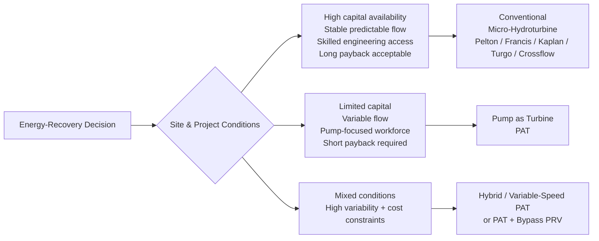
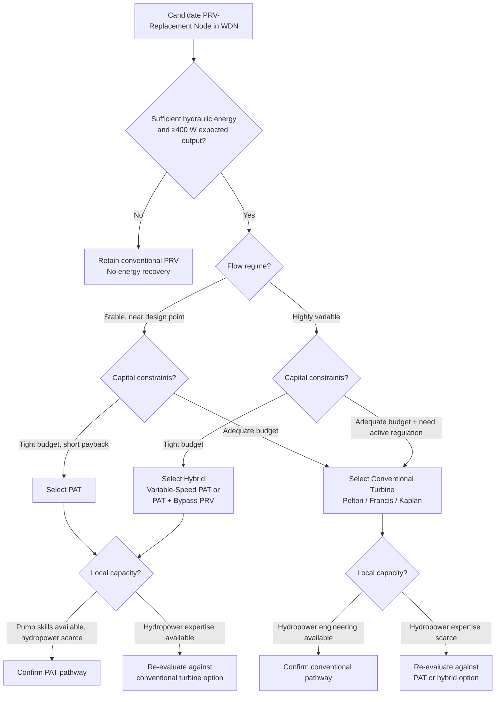
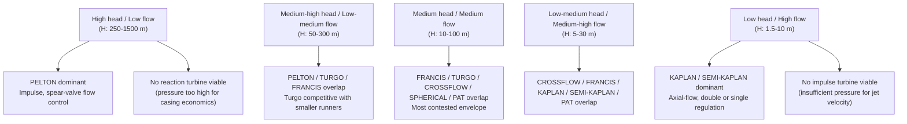

# Energy Recovery in Urban Water Supply Systems: A Comparative Study of Conventional Micro-Hydroturbines and Pumps as Turbines (PATs)
# 1 Introduction and Research Context

Urban water supply systems are among the most energy-intensive components of municipal infrastructure, yet paradoxically they also contain substantial reservoirs of mechanical energy that are routinely destroyed rather than harnessed. Every cubic meter of treated water delivered to consumers must first be lifted, pressurized, and conveyed through extensive networks of pipes, pumps, reservoirs, and control valves—processes that together account for a non-trivial share of a utility's operating expenditure and carbon footprint[^1]. At the downstream end of these networks, however, an inverse problem emerges: in order to maintain pressures within acceptable ranges for consumers and to protect aging infrastructure from pipe bursts and accelerated leakage, surplus hydraulic energy is deliberately dissipated through pressure reducing valves (PRVs). This dissipated energy, although physically modest at any single node, accumulates across thousands of pressure control points in a typical urban system and represents a continuous, predictable, and renewable energy stream that has only recently begun to attract systematic attention from the research and engineering communities[^1].

The present report is structured as a comparative technical and economic investigation of the two dominant families of equipment available to recover this surplus energy: **conventional micro-hydroturbines**—purpose-built rotating machines such as Pelton, Francis, Kaplan, Turgo, and Crossflow turbines—and **Pumps as Turbines (PATs)**, which are standardized centrifugal pumps operated in reverse to function as prime movers[^2][^1]. The following four chapters of the report will progressively unpack this comparison: Chapter 2 conducts a multi-dimensional technical and economic comparison; Chapter 3 distills the comparison into a structured summary table with interpretive commentary; Chapter 4 presents a granular parameter map of all major turbine types relevant to in-network energy recovery; Chapter 5 examines the principal economic and technical barriers to deployment; and Chapter 6 synthesizes evidence-based conclusions and strategic recommendations. The purpose of this opening chapter is therefore to establish the conceptual, terminological, and methodological foundation on which the subsequent analysis depends.

## 1.1 Background and Rationale for Energy Recovery in Urban Water Supply Systems

The relationship between water and energy—commonly framed as the **water-energy nexus**—lies at the heart of any rationale for in-conduit energy recovery. The provision of drinking water in urban areas is, by its nature, a highly energy-intensive activity: raw water must be abstracted, treated, repeatedly pressurized to overcome pipe friction and elevation differences, and ultimately delivered to consumers at adequate pressure to satisfy fixtures and fire-fighting requirements. The cumulative effect is significant; the water supply and treatment process is recognized as a major contributor to greenhouse gas emissions and as a driver of rising electricity costs for water service providers[^1]. From a planning perspective, considering this nexus is crucial because it enables reductions in both water and energy consumption and supports the optimal operation of municipal water systems[^1].

Against this backdrop, the existence of **pressure surplus** in water distribution networks (WDNs) is particularly striking. Pumps and gravity together circulate water through WDNs, and the design imperative is to ensure that every node satisfies a minimum pressure threshold sufficient for end-user demand. Because of the spatial heterogeneity of network topography and demand, however, certain nodes inevitably experience pressures well above this minimum, while the network as a whole oscillates between peak and off-peak loading conditions[^1]. The conventional engineering response—deployment of PRVs at strategic locations—solves the safety problem by throttling excess pressure to acceptable values, but it does so by **converting useful hydraulic energy directly into heat and turbulence**, with no recovery whatsoever[^1]. Considering that standard water demand in Malaysia, for example, lies in the range of 220–300 liters per capita per day, the cumulative flow and the associated energy circulating within urban networks represent a substantial yet unharvested resource that is currently dissipated by PRVs[^1].

Micro-hydropower (MHP) integrated into WDNs offers a fundamentally different paradigm: instead of destroying this surplus energy, a turbine or PAT is inserted in series with or in place of a PRV, simultaneously providing the required pressure reduction *and* converting the recovered hydraulic head into electrical power[^1]. This approach carries several distinctive advantages compared to conventional renewables. First, unlike conventional run-of-river hydropower, MHP in WDNs requires no dam, reservoir, or alteration of natural watercourses, eliminating most of the ecological disruption associated with traditional hydroelectric projects[^1]. Second, because flow within a managed WDN is typically constant or well-predictable throughout the year and generally free of sediments, the turbine experiences far less wear than in open-channel applications, reducing maintenance costs and extending operating life[^1]. Third, the energy output is intrinsically more stable than wind or photovoltaic generation, since water demand profiles vary only gradually and seasonally rather than minute-to-minute[^1]. Fourth, decentralized generation at network nodes reduces transmission losses and contributes directly to the local energy demands of the water utility itself—powering valves, sensors, telemetry, and ancillary equipment—thereby aligning with the operational logic of smart sustainable cities that leverage existing physical resources[^1]. Empirical optimization studies illustrate the magnitude of the opportunity: in one documented case, optimization of an MHP plant integrated into a water distribution system raised installed output from an initial 39 kW design to 69 kW, with potential revenue over a 40-year horizon rising from roughly €900,000 to between €1,050,000 and €1,800,000 depending on capacity factor assumptions[^1].

The research and policy momentum behind this paradigm has accelerated visibly over the past decade. A systematic review of the field reports that interest in MHP within WDNs escalated sharply from 2011 onward, with the volume of relevant studies rising by approximately 70% by 2020, and a further 23 papers appearing in 2021 alone—more than one-third of the previous decade's total in a single year[^1]. This bibliometric trajectory confirms that energy recovery in urban water supply networks has moved from a niche academic curiosity to a mainstream concern of renewable energy planning, and it underscores the timeliness of a rigorous comparative assessment of the two competing equipment families that dominate the market today.

## 1.2 Definition of Key Concepts and Technologies

A precise vocabulary is essential before the comparative analysis can begin. The following definitions consolidate the technical terms that will recur throughout the report.

**Micro-hydropower (MHP)** is defined, in line with the prevailing literature and the IRENA classification, as a class of hydroelectric power installations producing between **5 kW and 100 kW** of electricity from the natural or controlled flow of water[^2][^1]. Installations below 5 kW are classified separately as **pico hydro**, while small hydropower typically spans up to several megawatts[^2]. Within the size band of 5–100 kW, an MHP installation is generally sufficient to support isolated households, small communities, a resort, or a discrete industrial or municipal load[^1]. Crucially for the present study, the MHP definition is independent of the energy source: an MHP system may draw on a natural watercourse, a freshwater spring, surface runoff, a mill canal, or—of central interest here—a water or wastewater distribution network[^1].

**Conventional micro-hydroturbines** refer to purpose-built rotating machines designed from first principles to convert hydraulic energy into mechanical (and ultimately electrical) energy. They fall into three principal mechanical families[^1]:

- **Impulse turbines**, in which a high-velocity water jet impinges on buckets or blades at atmospheric pressure. The family includes the **Pelton wheel** (best suited to high head and low flow, with documented mechanical efficiencies of 70–90%), the **Turgo turbine**, and the **Crossflow (Banki / Ossberger) turbine**, the last of which is a pressurized self-cleaning crossflow waterwheel particularly valued for its tolerance to debris in low-head settings[^2][^1].
- **Reaction turbines**, in which the runner is fully immersed and extracts energy from both pressure and velocity changes. The **Francis turbine** is highly versatile, operating across heads from roughly 1 m to 900 m, while the **Kaplan** and **propeller-type** turbines are optimized for ultra-low head, high-flow conditions typical of flat terrain[^2][^1].
- **Gravity-based devices**, including the **Archimedes screw turbine** and **water wheels**, which operate at very low heads (sometimes as little as 1 m) and offer simplicity, debris-handling capability, and ecological compatibility, albeit at the cost of lower power density[^1].

**Pumps as Turbines (PATs)** denote standard, commercially available centrifugal (or, less commonly, mixed-flow) pumps operated in **reverse mode**, so that water enters through what is nominally the pump's discharge port and exits through what is nominally the suction port, driving the impeller as a prime mover rather than as a fluid mover[^2][^1]. Although the efficiency of a pump operated in reverse is typically lower than that of a purpose-built turbine runner of the same capacity, the very low cost of the unit, combined with wide commercial availability and a mature aftermarket, makes PAT-based projects economically feasible in settings where bespoke turbines would not be[^2]. This commercial accessibility is a defining feature of the technology and a recurring theme of subsequent chapters: **because PATs are mass-produced as standardized pump products, they enjoy broad market availability, with a wide range of models, sizes, and manufacturers readily accessible off the shelf, along with established supply chains for spare parts and trained pump technicians**[^2]. This contrasts sharply with conventional micro-hydroturbines, which are typically engineered or semi-customized for each site.

Several auxiliary concepts complete the working vocabulary:

- **Energy recovery** in this report refers specifically to the conversion into useful electrical (or, less frequently, mechanical) energy of hydraulic energy that would otherwise be dissipated within the operation of a water distribution network—principally the energy associated with surplus pressure removed by PRVs[^1].
- **Hydraulic head** is the pressure measurement of water expressed as a vertical column height, typically in meters; **gross head** is the simple vertical distance between intake and turbine, while **net head** subtracts pressure losses due to pipe friction[^2]. A drop of at least approximately 0.6 m is generally considered a minimum threshold for technical feasibility[^2].
- **Flow rate (Q)** is the volume of water passing a point per unit time, conventionally expressed in m³/s (or in liters per second or gallons per minute), and together with head determines the theoretical power available, broadly following $P = \rho \, g \, Q \, H \, \eta$ where $\eta$ is the cumulative efficiency of turbine, generator, and drive[^2].
- **Pressure Reducing Valves (PRVs)** are passive hydraulic devices placed in a network to throttle excess upstream pressure to a controlled downstream value, dissipating the corresponding energy as heat and turbulence; in MHP-WDN integration projects, PRVs are partially or fully replaced by micro-hydro turbines that perform the same pressure-control function while generating electricity[^1].

The conceptual distinction at the core of this report is therefore between **bespoke, hydraulically optimized turbine machinery** and **commodified, repurposed pump machinery**—each representing a different trade-off curve along the axes of efficiency, cost, availability, and operational flexibility.

## 1.3 Research Scope, Boundaries, and Limitations

To ensure analytical clarity, the scope of this study is deliberately constrained along several dimensions.

First, in terms of **application domain**, the report focuses on **in-conduit and in-network energy recovery within urban (and, by extension, peri-urban) water supply systems**. It does not address conventional run-of-river micro-hydropower in natural streams and rivers, nor does it address small, medium, or large hydropower projects involving dams or reservoirs, except where comparative reference to these technologies is necessary to clarify the position of in-network MHP within the broader hydropower taxonomy[^2][^1]. Pressurized irrigation networks and wastewater treatment plant outflows are recognized as closely related application contexts and are drawn upon for analogical insight where appropriate, but the primary focus remains potable water distribution[^1].

Second, in terms of **technological scope**, the comparison is centered on conventional micro-hydroturbines (Pelton, Turgo, Crossflow, Francis, Kaplan/Semi-Kaplan, and related gravity devices) and PATs. Where Chapter 4 catalogs additional turbine variants such as spherical turbines and very-low-head designs, this is done to provide a comprehensive parameter map rather than to expand the comparative core.

Third, in terms of **analytical dimensions**, the study examines technical performance (efficiency, head and flow envelopes, partial-load behavior, pressure regulation), economic viability (capital, installation, operation and maintenance costs, payback dynamics), environmental and operational impact (interaction with water quality and service continuity), and deployment feasibility (market availability, skills, regulatory frameworks)[^1].

Fourth, in terms of **temporal and evidentiary boundaries**, the evidence base is restricted to **publicly available information up to and including early 2024**. This boundary acknowledges that the field is evolving rapidly, particularly in areas such as variable-speed PAT control, smart monitoring, and hybrid MHP–solar–storage configurations[^1], and that emerging technologies, unpublished pilot results, and confidential utility data are necessarily outside the present analysis. Where the available literature is silent or contradictory on a specific parameter—for instance, where reported efficiency ranges or cost figures vary across sources—this is explicitly noted in the text rather than masked by spurious precision.

Finally, the report adopts a **global comparative perspective**, drawing on European case studies (notably Switzerland, Italy, Spain, Portugal, and Ireland), Southeast Asian and South Asian contexts (Malaysia, Indonesia, Nepal), and other documented implementations[^1]. This geographic breadth provides a robust evidence base but also implies that recommendations must be contextualized to local hydrological, regulatory, and economic conditions before being operationalized in any specific utility.

## 1.4 Research Objectives and Structural Roadmap

Building on the rationale and definitions above, the research is organized around four interlocking objectives that mirror the user's structured tasks. The first objective is to develop a **systematic, multi-dimensional comparison** of conventional micro-hydroturbines and PATs along axes of efficiency, cost, pressure regulation, design and operational complexity, service life, and market availability. The second objective is to **consolidate this comparison into a decision-support table** that practitioners can use to identify the technology most appropriate to a given urban water supply context. The third objective is to construct a **comprehensive technical parameter map** of all major turbine families relevant to urban energy recovery, including impulse, reaction, and gravity machines as well as PATs, expressed in consistent units of head (m), flow (m³/s), and design-point efficiency (%). The fourth objective is to **diagnose the principal economic and technical barriers** currently impeding widespread deployment of in-network energy recovery, with particular attention to how these barriers fall differentially on PAT versus conventional turbine projects.

The remainder of the report is therefore organized as follows. **Chapter 2** undertakes the comparative analysis, working through each technical and economic dimension in turn and weighing the engineered superiority of conventional turbines against the commercial and logistical advantages of PATs. **Chapter 3** distills this analysis into the requested *Comparison of Conventional Micro-hydroturbines and PATs* table, accompanied by interpretive commentary on decision criteria. **Chapter 4** presents the requested *Technical Parameters and Applicability of Various Turbine Types* table, covering Pelton, Turgo, Crossflow, Francis, Kaplan, Semi-Kaplan, Spherical, PAT, and related machines, with narrative discussion of how the head–flow operating envelopes overlap and where they best match urban WDN conditions. **Chapter 5** synthesizes the principal economic challenges (high upfront cost relative to recoverable energy, long payback periods, integration costs, financing gaps) and technical challenges (variable demand regimes, narrow PAT efficiency bands, service continuity constraints, lack of standardized PAT selection methods, regulatory complexity, and O&M skills). **Chapter 6** concludes by synthesizing the evidence into actionable selection criteria and strategic recommendations for utilities, designers, and policymakers seeking to unlock the hidden energy potential of their water distribution networks.

By the end of the report, the reader should be equipped not merely with a descriptive understanding of the two technologies but with a defensible framework for choosing between them—and for recognizing the boundary conditions under which one, the other, or a hybrid configuration is most likely to deliver sustainable value in a real urban water supply system.

# 2 Comparative Analysis of Conventional Micro-Hydroturbines and Pumps as Turbines (PATs)

Having established in Chapter 1 that the surplus hydraulic energy circulating in urban water distribution networks represents a substantial, predictable, and currently underexploited renewable resource, the analytical work of the report now turns to the central engineering question that confronts any utility, designer, or policymaker seeking to harvest that resource: **which class of machine should be installed at a given pressure-reduction node—a conventional, purpose-built micro-hydroturbine, or a standardized centrifugal pump operated in reverse as a Pump-as-Turbine (PAT)?** The decision is rarely obvious because the two families occupy fundamentally different positions in the engineering–economic trade-off space. Conventional turbines are bespoke products of hydropower engineering, hydraulically optimized for a specific design point and capable of efficiencies that approach the thermodynamic ceiling for hydraulic machines; PATs are commodified industrial components, mass-produced for a different primary purpose, whose attractiveness derives not from peak hydraulic refinement but from their commercial accessibility, low unit cost, and the dense global supply chain that surrounds the pump industry.

To resolve this trade-off systematically rather than impressionistically, this chapter examines the two technologies along six analytical dimensions—operational efficiency and part-load behavior, lifecycle cost structure, pressure and flow regulation, design and operational complexity, service life and reliability, and market availability and supply chain—before synthesizing the findings in a concluding subchapter that articulates the boundary conditions under which each technology is most likely to deliver value. The discussion remains anchored in the urban WDN context, where flow and pressure regimes are managed but variable, where service continuity to consumers is paramount, and where municipal capital budgets and procurement cycles impose practical constraints that often weigh more heavily than purely hydraulic considerations.

## 2.1 Operational Efficiency and Part-Load Behavior

Operational efficiency is the dimension on which conventional micro-hydroturbines most clearly outperform PATs, and any honest comparative assessment must begin with this asymmetry. Purpose-built turbines are designed from first principles to convert hydraulic energy into shaft power with minimal loss; their runners, guide vanes, and casing geometries are tailored to the specific velocity triangles dictated by the design head and flow. The British Hydropower Association reports that the best small hydro turbines can achieve hydraulic efficiencies in the range of **80% to over 90%**, which is higher than all other prime movers, although this figure tends to reduce with decreasing size; smaller micro-hydro systems below 50 kW typically operate in the 75–80% efficiency band, and when downstream losses in speed-increasers and electrical generators are included, the overall "water-to-wire" efficiency of a complete small hydro scheme typically lies in the range of 65–80%, with 70% serving as a useful rule-of-thumb in preliminary power calculations.[^3] This is an extraordinary figure for a renewable energy technology and reflects more than a century of refinement of impulse and reaction turbine designs.

PATs, by contrast, are subject to a fundamental geometric handicap. As Stefanizzi and colleagues observe, **PATs are hydraulically similar to a Francis turbine, but with rigid geometry and backward-curved blades, leading to poor part-load performances when compared to** purpose-built reaction machines.[^4] A centrifugal pump is engineered to accelerate fluid radially outward against a pressure gradient; when operated in reverse, the same blade profile must now decelerate incoming high-velocity flow and extract work from it, a task for which the blade curvature is suboptimal. The consequence is that PATs typically operate in a best-efficiency-point (BEP) band that falls below the range of equivalently sized purpose-built turbines. **The typical efficiency range for PATs is between 40–75%**, depending on specific speed, pump design, and the proximity of operating conditions to BEP—a range that overlaps with the lower end of the conventional turbine envelope but rarely approaches its upper bound. This is not a fatal defect, but it is a permanent one: no amount of control sophistication can fully compensate for a runner geometry that was optimized for the wrong direction of energy transfer.

The part-load picture, however, is more nuanced than the BEP comparison alone suggests, and it is precisely the part-load behavior that determines actual energy capture in an urban WDN where flows and pressures fluctuate with diurnal and seasonal demand patterns. The British Hydropower Association's compilation of part-flow efficiency curves shows that Pelton and Kaplan turbines retain very high efficiencies—remaining close to their design-point values even when running at 20–30% of rated flow—because they incorporate active flow-regulation mechanisms (movable spear valves in the Pelton, adjustable guide vanes and runner blades in the Kaplan) that allow the internal geometry to track varying inflow conditions.[^3] Francis and Crossflow turbines exhibit steeper efficiency drop-offs once flow falls below roughly half of rated capacity, while fixed-propeller turbines, which lack adjustable blades, suffer the most severe degradation.[^3] PATs, with their rigid geometry, fall into this latter category: their efficiency curve is comparable in shape to that of a Francis machine but begins from a lower BEP and degrades steeply on either side of it, producing the "poor part-load performance" that Stefanizzi flags.[^4]

The implications for urban WDN deployments are substantial. Water demand typically follows a predictable diurnal profile with peaks in morning and evening and a deep trough overnight, and seasonal demand can vary by 30–50% between summer and winter in many municipalities. A Pelton or Kaplan turbine installed in such a network can follow these fluctuations while continuing to capture energy at high marginal efficiency; a PAT, in its basic configuration, will either operate at high efficiency for only a narrow band of flows centered on its design point or must be supplemented by bypass valves, hydraulic regulation circuits, or variable-speed drives that complicate the installation. The literature has accordingly devoted substantial attention to PAT performance prediction methods—affinity-law extrapolations, BEP correlations between pump and turbine modes, one-dimensional performance models, and more recently neural-network approaches such as the PIWOA-BPNN model that reports prediction accuracies near 4%—precisely because the off-design behavior of a PAT, on which its real-world energy yield depends, is not directly available from the manufacturer and must be reconstructed analytically.[^5] In summary, while a well-selected PAT can achieve respectable efficiency within a narrow operating band, the cumulative annual energy capture of a conventional turbine in a variable-flow WDN is typically higher, and this efficiency differential is the principal hydraulic argument in favor of bespoke machinery.

## 2.2 Capital, Installation, and Operation & Maintenance Costs

If efficiency is the dimension on which conventional turbines clearly lead, lifecycle cost is the dimension on which PATs decisively reverse the comparison. The cost advantage of PATs is not marginal but transformational, and it is rooted in a structural feature of the two markets: conventional micro-hydroturbines are low-volume, semi-customized engineering products, while pumps are among the most mass-produced rotating machines in the global industrial economy.

**The procurement cost of conventional turbines is high, typically 2 to 10 times that of equivalent PATs.** The mechanism behind this large multiplier is well documented by manufacturers and industry observers. As Hídric, a Spanish PAT specialist, explains, "turbines are generally manufactured for a specific working point. This makes their price (even in microturbines) high when working with a single unit. On the other hand, the mass production of hydraulic pumps results in much lower prices. It is true that a PAT will give less production, but this can be perfectly compensated by the lower price compared to a turbine."[^6] **PATs achieve their low procurement cost precisely because they are mass-produced**: a centrifugal pump of a given duty point is manufactured in volumes of thousands or tens of thousands of units per year for the global water-handling, irrigation, HVAC, and industrial markets, and the economies of scale that result are passed through to any buyer regardless of intended application. A conventional micro-hydroturbine of equivalent capacity, by contrast, is engineered in batches of dozens or single units for a specialized hydropower market.

Concrete cost figures from the public literature illustrate the magnitude of the gap. A 5 kW conventional micro-hydro turbine system, including the turbine itself, generator, powerhouse, piping, intake, controls, and installation, typically costs between **USD 15,000 and 55,000**, with the turbine component alone accounting for approximately USD 4,000–13,000, an induction generator for USD 800–4,000 (rising to USD 2,500–6,000 for a permanent-magnet alternative), and the powerhouse structure for USD 5,000–20,000.[^7] The British Hydropower Association's guidance for a 100 kW small hydro scheme places machinery costs in the range of £200,000–250,000 for a low-head installation and £60,000–150,000 for a high-head installation, with civil works adding a further £250,000–500,000 and external engineering and permitting another £50,000–100,000, yielding total per-installation costs of £400,000–900,000.[^3] In specific-cost terms, the literature on micro-hydropower reports a range of **€1,500–3,000 per kW installed** under favorable conditions, rising to €3,000–6,000 per kW in landlocked, small-market, or import-dependent contexts such as Rwanda where transportation costs, low demand volumes, and risk-adjusted manufacturer pricing inflate equipment costs.[^8] PAT-based projects, drawing on standard pump catalogues, routinely come in well below these figures on a per-kW basis, which is why Hídric emphasizes that PAT systems "significantly reduce initial investment costs by using existing pumping infrastructure to generate hydroelectric power" and "can drastically reduce the cost of installing a turbine."[^6]

Installation costs follow a similar pattern but with a different mechanism. Conventional turbines typically require purpose-built powerhouses, foundation works tailored to the runner type, and integration with bespoke penstocks and tailraces; the BHA notes that civil works are largely site-specific, with intake structures, screening systems, channels, and turbine houses dominating the budget on low-head schemes, and pipelines dominating on high-head schemes.[^3] PATs benefit from being installable directly within existing pressurized pipelines—Hídric describes them as "ideal for pressurized water circuits where the water, once turbined, does not pass outside"—which obviates the need for an open tailrace and dramatically simplifies the civil works required at a PRV-replacement node.[^6] PATs can also "replace pressure reducers or even take advantage of existing pressure drops in the pipes, to obtain an increase in energy at a much cheaper price than a conventional turbine."[^6]

On the operation and maintenance side, the gap narrows but still favors PATs. A 5 kW conventional micro-hydro system incurs ongoing annual maintenance costs averaging USD 0.005–0.02 per kWh generated.[^7] The BHA estimates that modern, automated small-hydro schemes require routine maintenance amounting to no more than 0.5–1% of capital cost per year, although seals, bearings, generator components, and sluice gates may require replacement at intervals of 10 years or more.[^3] PATs benefit from a different kind of advantage: the ubiquity and standardization of pump components mean that **PATs have short delivery times, spare parts (such as seals and bearings) are easily available, and installation can be done using standard pipes**.[^9] Multiple sources reinforce this point: PATs offer "minimum expenses, low-complexity, short delivery time, ease of spare parts, easy" servicing relative to traditional hydro-turbines.[^10] Hídric adds that, in terms of construction and maintenance, "turbines are generally complex machines that require more maintenance than already manufactured pumps. In terms of operation and civil engineering works, it is easier to implement a PAT than a specific turbine and the maintenance, if any, is already known."[^6]

The cost structure is summarized in the table below, which integrates capital, installation, and O&M figures from the cited sources.

| Cost Component | Conventional Micro-Hydroturbines | Pumps as Turbines (PATs) |
|---|---|---|
| **Equipment unit cost** | High; bespoke or semi-customized engineering products | **~2–10× lower than equivalent turbines**[^6]; benefits from mass-produced pump supply chains |
| **Specific cost (€/kW installed)** | €1,500–3,000 typical, rising to €3,000–6,000 in remote/landlocked markets[^8] | Substantially lower than equivalent purpose-built turbines for the same head and flow[^6] |
| **5 kW system total (USD)** | 15,000–55,000 (turbine 4,000–13,000; generator 800–6,000; powerhouse 5,000–20,000)[^7] | Lower across all major line items; integrates directly into existing pipelines[^6] |
| **Civil works** | Site-specific; intake, channel, penstock, powerhouse, tailrace[^3] | Minimal; installed within existing pressurized pipeline[^6] |
| **Annual O&M** | 0.5–1% of capital cost; USD 0.005–0.02 per kWh; component replacement after ~10 years[^7][^3] | Short delivery times, easily available spare parts, standard pipe installation, well-known maintenance procedures[^10][^6][^9] |
| **Payback period** | Variable; investment payback typically 10 years for MHP installations[^11]; broader micro-hydro range 6–20 years[^12] | Shorter under favorable conditions; PATs generally deemed economically feasible if able to generate ≥400 W output per hour with payback under 10 years[^5] |

The cumulative implication is that the cost dimension produces an asymmetric trade-off space: a project that can afford the capital and engineering overhead of a conventional turbine will recover a higher fraction of available hydraulic energy over a long service life, while a project constrained by capital budgets, procurement timelines, or local capacity may find that a PAT is the only economically viable option even though it converts less energy per cubic meter of flow. The economic feasibility of PATs is supported by dedicated cost-prediction frameworks: Moazeni and Khazaei cite work that developed cost forecasting equations based on data from 343 pumps and 286 generators, allowing proper cost prediction based on the nominal flow rate and available hydraulic head of a PAT, and a cost classification framework by which payback period and economic profitability of PATs as energy recovery devices in WDNs can be calculated.[^5]

## 2.3 Pressure and Flow Regulation under Variable Demand

Urban water distribution networks are not steady-state systems. Flows surge in the morning, peak again in the evening, and collapse to a fraction of design values overnight; seasonal patterns add a second layer of variability; and the pressure at any given node depends on the instantaneous balance of demand across the rest of the network. Any energy-recovery device installed in such a network must accommodate this variability while simultaneously discharging the primary hydraulic function for which it was installed—reducing upstream pressure to a controlled downstream value so that consumer service is maintained and infrastructure is protected. The capacity to perform this dual function is the dimension on which conventional turbines exhibit perhaps their most consequential advantage over PATs in their basic form.

**Conventional turbines can achieve precise pressure regulation through built-in mechanisms such as guide vanes.** Reaction turbines such as the Francis incorporate adjustable inlet guide vanes (often termed wicket gates) that modulate the flow admitted to the runner; Kaplan turbines extend this principle by also providing adjustable runner blades, producing a "double regulation" capability that maintains efficiency across an exceptionally wide flow envelope; Pelton turbines use motorized spear valves to control the diameter of the impinging jet, thereby trimming flow and power while preserving the velocity-triangle geometry that produces high efficiency.[^3] These mechanisms are intrinsic to the turbine, not bolted on afterwards, and they enable conventional machines to act as **active hydraulic regulators**—simultaneously dissipating the prescribed amount of pressure head, varying their power output to match upstream conditions, and protecting downstream nodes from over- or under-pressurization. The BHA explicitly describes regulation as the process by which "regulated turbines can either adjust an inlet valve or rotate their guide vanes and/or runner blades in order to increase or reduce the amount of flow they draw," allowing them to sustain output during drier or lower-demand periods.[^3] The presence of motorized spear valves in modern off-grid micro-hydro Pelton installations further illustrates that such regulation is now available even at the smallest scale.[^11]

PATs lack any of these intrinsic regulation mechanisms. A centrifugal pump's geometry is fixed: there are no movable guide vanes, no adjustable blades, no spear valve. When operated in reverse, a PAT therefore behaves as a passive hydraulic element whose flow and head characteristics are determined entirely by the runner speed and the upstream/downstream pressure boundary conditions. This rigidity has two practical consequences. First, when the upstream flow falls below the PAT's design value, the machine either operates inefficiently at the same speed or must be slowed (via a variable-frequency drive) to a new operating point, which itself may not coincide with the BEP. Second, when flow exceeds the PAT's capacity, excess water must be bypassed around the unit through a parallel pressure-reducing valve, effectively reverting to dissipative pressure control for the surplus. The literature accordingly describes a range of regulation strategies for PATs—including hydraulic regulation (parallel bypass with throttling valve), electric regulation (variable-speed drive on the generator), and hybrid arrangements—but each of these adds equipment, complexity, and capital cost, and none fully matches the inherent regulatory smoothness of an adjustable-geometry turbine.

The implication for PRV replacement, the most common entry point for energy recovery in urban WDNs, is that a PAT can rarely serve as a one-for-one substitute for a sophisticated control valve. Moazeni and Khazaei note that PATs should be "positioned where the extra pressure can support a reliable energy generation rate on a daily basis," and that even where all PRVs are theoretically eligible for PAT installation, only a subset will exhibit sufficiently stable pressure heads to justify the investment.[^5] By contrast, a Francis or Kaplan turbine equipped with active guide-vane control can adapt continuously to the same pressure variability that a PAT cannot follow, which makes conventional machines structurally better suited to the high-fluctuation nodes that often offer the largest gross energy potential. The variable-speed PAT and smart-control architectures now emerging in the literature are narrowing this gap—Stefanizzi and others have explored techno-economic feasibility of PATs in WDNs equipped with such controls—but the underlying asymmetry persists, and any project that places a premium on dynamic pressure regulation will continue to find conventional turbines the more capable choice.[^5]

## 2.4 Design and Operational Complexity

The two technologies also diverge sharply in the engineering effort required to specify and operate them. The complexity comparison is multidimensional, and somewhat paradoxically, neither family is unambiguously simpler than the other once all factors are accounted for.

On the engineering-design side, conventional turbines impose substantial up-front complexity. Each unit must be selected from a family of turbine types (Pelton, Turgo, Crossflow, Francis, Kaplan, propeller) on the basis of head and flow, then sized and tuned to the specific operating envelope of the host site. Standard practice involves a detailed feasibility study that the BHA prices at £7,500–20,000, encompassing hydrological surveys, system design drawings, machinery specification, electrical layout, and grid-connection planning.[^3] Manufacturers supply detailed performance curves for each turbine model, and skilled hydropower engineers integrate these into the wider scheme. The complexity is significant, but it is also well-supported by a mature engineering ecosystem with established design tools, reference handbooks, and consultancies.

PATs, paradoxically, impose a different and in some respects more challenging design problem. The critical complication is that **pump manufacturers do not provide performance curves for operation in turbine mode**. Moazeni and Khazaei explain that "pumps are not manufactured to function in reverse, and hence manufacturers do not provide any data regarding the performance curves and characteristic parameters for a pump to be re-purposed as turbines."[^5] The designer must therefore reconstruct the turbine-mode characteristic curve from pump-mode data, a task that has spawned an entire sub-literature of prediction methods: the reconstruction of pump characteristic curves to predict PAT performance using BEP-anchored data, generalized theoretical methodologies that correlate non-dimensional pump and turbine coefficients, one-dimensional performance prediction models, and increasingly machine-learning approaches such as artificial neural networks, support vector machines, extreme gradient boosting, and the PIWOA-BPNN hybrid that reports ~4% prediction accuracy.[^5] Moazeni and Khazaei themselves contributed a second-order polynomial equation for predicting PAT mechanical efficiency using specific speed and pump-mode mechanical efficiency as independent variables.[^5] The proliferation of these methods is itself diagnostic: there is no universally accepted, standardized PAT selection methodology, which means that PAT projects inherit substantial design-stage uncertainty that conventional turbine projects do not.

The flip side of this complication is that **once a PAT is selected, its installation and operation are considerably simpler than those of a conventional turbine**. As discussed in Section 2.2, PATs install within existing pressurized pipelines using standard pipework, require minimal civil works, and benefit from a worldwide pool of pump technicians who can service them with familiar procedures. Hídric summarizes the practical implication: "the availability of pumps on the market is very wide, and in the catalogs there is a lot of information about their operation and constructive aspects. This is an advantage with respect to microturbines, where there is not always information. This is also a great advantage in countries with emerging economies, where the availability of hydraulic pumps is greater than obtaining specific turbines."[^6] Conventional turbines, by contrast, depend on specialized hydropower engineering firms for installation supervision, commissioning, and ongoing major maintenance; in many developing or remote regions, the absence of such firms is a binding constraint on conventional micro-hydro development. The Rwanda case studied by PSP Hydro illustrates this vividly: "Rwanda lacks of experts for the analysis, design and construction of MHP projects. The region does not have many experts in this field either. Therefore, experts have to be contracted, very often, outside the continent, which, for small-size projects, represents a quite significant economic burden."[^8]

The net complexity verdict is therefore context-dependent. Conventional turbines concentrate complexity in the design and installation phases but reward that investment with relatively turn-key operation; PATs concentrate complexity in the selection phase—particularly the prediction of off-design behavior—but reward that effort with simpler installation, operation, and maintenance. A utility with strong in-house hydropower engineering capacity may find conventional turbines easier to manage overall, while a utility with strong in-house pump expertise but limited hydropower experience may find PATs the more tractable path.

## 2.5 Service Life, Reliability, and Maintenance Profile

The third dimension along which the technologies must be weighed is operational longevity and reliability—how long the installed machine continues to deliver useful output, how often it fails, and how readily failures can be remedied.

Conventional micro-hydroturbines, when properly designed and maintained, are among the longest-lived energy-conversion machines in the renewable energy portfolio. The British Hydropower Association states that hydro systems "can readily be engineered to last for 50 years or more," with the implication that "every hydro scheme built today should still be generating in 2050 (and 2070), contributing to the Net Zero target."[^3] The Modular Hydropower industry's own forecasts cite operational lifespans of 50–100 years for well-built installations, particularly those with robust concrete civil structures.[^6] Modern, automated equipment is described as requiring "very little maintenance," with routine inspections and annual servicing costing no more than 0.5–1% of capital cost per year, and significant component replacement (seals, bearings, generator, sluice gates) typically not required for at least 10 years.[^3] These figures reflect the conservative, robust engineering that characterizes purpose-built turbine design: components are sized with substantial safety margins, materials are selected for the corrosive aquatic environment, and wear surfaces are designed for replaceability.

PATs inherit the proven reliability of mass-produced centrifugal pumps, which is itself a considerable advantage. A modern industrial centrifugal pump is one of the most thoroughly engineered and field-tested rotating machines in existence, with hundreds of thousands of units operating in continuous service across global water, oil, chemical, and HVAC industries. However, the reliability data accumulated for pump-mode operation does not translate directly to turbine-mode operation, since reverse flow imposes a different stress distribution on the impeller, bearings, and shaft seals. The literature has accordingly developed specialized reliability indices for WDN-integrated PATs based on component simultaneous failure scenarios, recognizing that the reverse-mode duty introduces wear mechanisms that conventional pump reliability metrics do not capture.[^9] Empirical studies of PATs in turbine mode have confirmed that, on the positive side, "by inversing the fluid flow direction, pumps can work effectively for power generation without any mechanical failures."[^9] PATs are generally regarded as durable and serviceable, but their effective service life in turbine mode is less well documented in the public literature than that of conventional turbines, and prudent design practice continues to assume somewhat shorter intervals between major overhauls.

A factor that mitigates the longevity gap in the specific context of urban WDN deployments is the favorable operating environment that distinguishes these installations from open-channel hydropower. As established in Chapter 1, water in a managed distribution network is treated, essentially sediment-free, of stable chemistry, and conveyed in predictable pressurized flows free of the floods, debris, and biological loading that wear open-channel turbines. Both conventional turbines and PATs installed in WDNs therefore experience materially less mechanical and abrasive stress than equivalent machines installed in rivers, which extends the realized service life of both families relative to their nominal design values. The Modular Hydropower industry's reference to lifespans of 50–100 years and "Net Energy Returns as high as 16:1" for some micro-hydro vortex systems illustrates the potential longevity of well-protected installations.[^6]

On the maintenance dimension, PATs offer practical advantages already discussed in Section 2.2: short delivery times for replacement units and spare parts, off-the-shelf availability of seals and bearings, and a worldwide pool of pump technicians who can service them.[^10][^9] Conventional turbines require more specialized service capability, longer lead times for bespoke component replacement, and dependence on the original manufacturer or a specialized hydropower service firm. In a remote or resource-constrained municipal utility, the difference between a 48-hour spare-parts delivery for a standard pump and a 6-month lead time for a custom turbine runner may be the decisive factor in deciding which technology to deploy.

## 2.6 Market Availability, Supply Chain, and Skilled Labor

The final dimension of the comparison concerns the commercial and human-resource ecosystem surrounding each technology, which in many real-world projects turns out to be the decisive factor regardless of how the purely technical comparison resolves.

PATs benefit from what is perhaps the most extensive supply chain available to any renewable energy technology. Centrifugal pumps are manufactured in every industrialized country, distributed through global wholesale networks, and supported by thousands of independent service firms. PAT advantages include "minimum expenses, low-complexity, short delivery time, ease of spare parts, easy" availability of qualified service personnel.[^10] "Generally, pumps have short delivery times, spare parts (such as seals and bearings) are easily available and the installation can be done using standard pipes."[^9] Hídric emphasizes that this commercial accessibility is particularly decisive in emerging economies, where "the availability of hydraulic pumps is greater than obtaining specific turbines," providing a pragmatic pathway to micro-hydropower that bespoke turbine procurement cannot match.[^6]

Conventional micro-hydroturbines, by contrast, are supplied by a relatively concentrated industry. Specialized manufacturers in Europe, North America, and parts of Asia—of which Chinese suppliers such as HS Dynamic Energy and Suneco Hydro illustrate the typical model—offer Pelton, Turgo, Francis, Kaplan, propeller, and tubular turbines across ranges from a few kW to several hundred kW, often with bundled control panels, governors, and grid-connection equipment.[^13][^7] The BHA notes that "the typical lead time for a turbine, from placing an order to delivery on site, is between 6 and 12 months," a substantial constraint when planning project timelines.[^3] Beyond lead time, conventional turbines depend on specialized installation firms and ongoing service capability that may be unavailable in many municipal contexts.

The skilled-labor dimension reinforces the same asymmetry. Pump technicians are a globally distributed workforce, trained through vocational and apprenticeship systems in nearly every country. Hydropower engineers and turbine installers are a much smaller and geographically concentrated workforce. The PSP Hydro Rwanda analysis captures the cost consequence of this imbalance: where domestic hydropower expertise is unavailable, importing it from abroad imposes a significant economic burden on small-scale projects, contributing to the elevated per-kW costs (€3,000–6,000) observed in such markets compared with European norms (€1,500–3,000).[^8] The BHA likewise notes that for grid-connected schemes the control panel must conform to specific embedded-generator standards (G99, or G98 for very small plant), requiring approved relays and accredited installers—a regulatory layer that further concentrates the supply of qualified labor for conventional turbine installations.[^3]

The commercial-ecosystem comparison can therefore be summarized as follows: conventional turbines exist within a specialized, engineering-intensive supply chain whose strengths are technical sophistication and integration capability but whose weaknesses are unit cost, lead time, and geographic concentration; PATs exist within a vast, mature, globally distributed pump supply chain whose strengths are availability, cost, speed of procurement, and ease of service, but whose limitations are the lack of turbine-mode performance data and the absence of standardized selection methodologies. For utilities operating in well-served European or North American markets with access to specialized hydropower consultancies, this asymmetry is less binding; for utilities in emerging economies, remote regions, or municipal contexts with weak hydropower engineering capacity, it may be decisive.

## 2.7 Synthesis: Trade-offs and Context-Dependent Suitability

Bringing the six analytical dimensions together produces an integrated comparative picture that is best characterized not as a winner-takes-all judgement but as a **structured trade-off across two coherent value propositions**. Conventional micro-hydroturbines offer engineered hydraulic excellence—higher BEP efficiency (often 80–90% at the unit level, 65–80% water-to-wire), superior part-load behavior, intrinsic pressure and flow regulation via guide vanes and adjustable blades, long documented service life (50+ years), and a refined design ecosystem—at the cost of high unit price, long lead times, dependence on specialized engineering capacity, and concentrated supply chains. PATs offer commercial and logistical accessibility—procurement costs 2–10× lower than equivalent turbines, mass-produced economies of scale, short delivery times, abundant spare parts, globally distributed service capability, and simpler installation in existing pressurized pipelines—at the cost of lower BEP efficiency (40–75%), poor part-load performance arising from rigid geometry and backward-curved blades, the absence of intrinsic regulation, the lack of manufacturer-supplied turbine-mode performance data, and reliance on prediction methods of variable accuracy.

The boundary conditions that tip the choice from one technology to the other are reasonably well defined by the analysis above. **Conventional turbines tend to deliver superior value** when the host site exhibits stable head and flow with limited diurnal variability, when the available capital budget can absorb the higher unit and engineering cost, when local hydropower engineering and service capacity are present, when the required payback horizon is sufficiently long (10+ years) to amortize the higher upfront investment against superior cumulative energy capture, and when the dual function of energy generation and active pressure regulation is essential to the network's operational logic. **PATs tend to deliver superior value** when capital is constrained, when delivery time and spare-parts availability are decisive, when local labor skills favor pump technology over specialized hydropower, when the host node exhibits flows clustered around a well-defined design point, when payback horizons of 10 years or less are required—Moazeni and Khazaei's economic-feasibility criterion suggests that a PAT capable of producing at least 400 W output per hour with payback under 10 years can be considered economically viable[^5]—and when the site's complexity does not justify the engineering overhead of a bespoke installation.

The emergence of **variable-speed PAT control systems**, advanced selection methodologies, and intelligent monitoring is gradually narrowing the regulation and efficiency gap between the two families, and increasingly the choice between them is not strictly binary. Variable-speed PATs equipped with electric regulation can approximate some of the part-load tracking capability of an adjustable-geometry turbine, and hybrid configurations in which a PAT handles the bulk of the flow while a small bypass PRV manages excursions outside its operating envelope are appearing in the WDN literature.[^5] At the largest urban scale, multiple PATs may be installed at optimal locations across a network—Moazeni and Khazaei's case study demonstrated that three feasible PATs could generate 479.65 kW of total power, achieving more than 30% reduction in daily electricity consumption of the water system—offering an alternative deployment model in which the limitations of any single unit are diluted by network-level optimization.[^5]

The interpretive bridge to Chapter 3 is therefore the following: the comparison above does not yield a single, universally optimal technology, but it does yield a defensible decision logic. The next chapter consolidates the six dimensions examined here into a structured comparison table that water utilities, designers, and policymakers can use as a decision-support instrument, identifying the rows on which each technology leads and translating the analytical findings into operational selection criteria.

# 3 Summary Comparison Table: Conventional Micro-Hydroturbines vs. PATs

Chapter 2 closed with the recognition that the choice between conventional micro-hydroturbines and Pumps as Turbines is not a winner-takes-all proposition but a structured trade-off across two coherent value propositions—engineered hydraulic excellence on one side, and commercial and logistical accessibility on the other. To convert that multi-dimensional analysis into a usable decision-support instrument, this chapter consolidates the six dimensions previously examined into a single at-a-glance comparison table, unpacks the practical implications of each row, and translates the analytical findings into an operational selection logic that water utilities, designers, and policymakers can apply when screening candidate sites in their distribution networks. The chapter therefore functions as the practical bridge between the depth of Chapter 2 and the parameter-mapping granularity of Chapter 4: rather than introducing new evidence, it reorganizes the evidence already established into a form suited to procurement, feasibility-study, and policy contexts.

## 3.1 Structured Comparison Table of Key Performance Dimensions

The table below consolidates the analytical content of Sections 2.1 through 2.6 into a six-row matrix that contrasts conventional micro-hydroturbines and PATs across the dimensions specified by the user's research brief. Each row is constructed according to the same logic: a concise statement of the conventional turbine's profile, an equivalent statement of the PAT's profile, both expressed where possible with the quantitative ranges established in Chapter 2, and a final column identifying which technology holds the directional advantage on that dimension. The intent is not to suggest that the leading technology is universally preferable—the boundary conditions for that judgement are addressed in Section 3.3—but to make the asymmetry of the trade-off transparent. The evidentiary basis for each entry is drawn from the cited sources accumulated in Chapter 2; citations are retained in the table to preserve traceability.

| Dimension | Conventional Micro-Hydroturbines | Pumps as Turbines (PATs) | Directional Advantage |
|---|---|---|---|
| **Operational efficiency (BEP and part-load)** | Higher hydraulic efficiency at the best efficiency point (BEP) and under partial load conditions; typical efficiency range **70–90%**, with best small-hydro turbines reaching 80% to over 90% (smaller units below 50 kW typically 75–80%, water-to-wire 65–80%)[^3]; Pelton and Kaplan retain high efficiency at 20–30% of rated flow due to active flow regulation[^3] | Lower hydraulic efficiency due to rigid geometry and backward-curved blades, producing **poor part-load performance** when compared to purpose-built reaction turbines[^4]; typical efficiency range **40–75%**, narrowly centered on a fixed design point | Conventional turbines |
| **Procurement, installation, and O&M cost** | **High procurement cost, typically 2–10× that of equivalent PATs**[^6]; specific cost typically €1,500–3,000/kW (rising to €3,000–6,000/kW in landlocked or skill-scarce markets)[^8]; substantial civil works (intake, penstock, powerhouse, tailrace); annual O&M ~0.5–1% of capital cost[^3]; long lead times for bespoke components | **Low procurement cost because PATs are mass-produced** as standard centrifugal pumps[^6]; install directly in existing pressurized pipelines with minimal civil works[^6]; **short delivery times, easily available spare parts (seals, bearings), installation with standard pipes**[^9][^10]; well-known maintenance procedures[^6] | PATs |
| **Pressure and flow regulation** | Can achieve precise pressure regulation through **built-in mechanisms such as guide vanes** (Francis wicket gates, Kaplan adjustable runner blades, Pelton motorized spear valves)[^3][^11]; act as active hydraulic regulators that simultaneously dissipate prescribed head and follow demand variability | **Inherently lack pressure regulation mechanisms**; rigid pump geometry offers no adjustable guide vanes or blades; require auxiliary hydraulic equipment (parallel PRVs for bypass, variable-frequency drives for electric regulation) to handle off-design conditions[^5] | Conventional turbines |
| **Design and operational complexity** | **Complex design, often requiring specialized design for specific sites**; bespoke selection from Pelton/Turgo/Crossflow/Francis/Kaplan families with detailed feasibility studies (£7,500–20,000 typical)[^3]; depend on specialized hydropower engineering capacity that may be scarce in many regions[^8] | **Simple design** based on standard catalogue pumps[^6]; however, manufacturers do not provide turbine-mode performance data, requiring designers to reconstruct characteristic curves from pump-mode data through prediction methods (BEP correlations, 1-D models, neural networks)[^5]; installation, operation and maintenance simpler once the unit is selected | Mixed: PATs simpler to install and maintain; conventional turbines benefit from established design ecosystem |
| **Service life and reliability** | Long-lived: small hydro can be engineered to last 50 years or more, with modern automated equipment requiring minimal maintenance and major component replacement only after ~10 years[^3]; well-documented robust engineering for the aquatic environment | Inherits the proven reliability of mass-produced centrifugal pumps; operate effectively in reverse mode without mechanical failures[^9]; service life in turbine mode less well documented in public literature; specialized reliability indices developed for WDN-integrated PATs[^9] | Conventional turbines (on documentation), narrower gap in WDN context due to clean water and stable flow |
| **Market availability and supply chain** | Concentrated, specialized supplier base; turbine lead times typically **6–12 months** from order to delivery[^3]; require accredited installers and engineers for grid-code compliance | **Wide market availability**: pumps are mass-produced globally with extensive catalogues and constructive information[^6]; spare parts and trained pump technicians are widely accessible; particularly decisive advantage in emerging economies where specific turbines are difficult to source[^6] | PATs |

The construction logic of the table reflects a deliberate symmetry: each dimension is expressed as a comparable performance attribute rather than as a list of disconnected pros and cons. Where Chapter 2 identified a clear directional advantage, the final column records it; where the comparison is genuinely mixed—as in design and operational complexity, which concentrates effort differently across the project lifecycle for the two technologies—the column states the trade-off rather than forcing an artificial verdict.

## 3.2 Interpretive Commentary on Row-by-Row Implications

The structural shape of the comparison table is more important than any individual row, because the rows are not independent. Together they describe a pair of integrated value propositions, each internally coherent, and understanding the interdependencies among rows is what converts the table from a static summary into an analytical instrument.

**Efficiency.** The efficiency asymmetry visible in the first row—conventional turbines at 70–90%, PATs at 40–75%—is not the consequence of inferior manufacturing or an immature PAT industry that might one day be corrected by incremental engineering improvement. It is a structural consequence of the fact that a centrifugal pump impeller is engineered to accelerate fluid radially outward against a pressure gradient, whereas a turbine runner must decelerate incoming flow and extract work from it. The backward-curved blade geometry that makes a pump efficient as a pump is precisely what makes it suboptimal as a turbine, particularly away from its single design point. This is why the literature characterizes PATs as hydraulically similar to a Francis turbine but with rigid geometry leading to poor part-load performances[^4]. The implication for urban WDN energy recovery is significant: in networks where demand follows the characteristic morning–evening peak with a deep overnight trough, a conventional Pelton or Kaplan turbine continues to capture energy near its BEP across the bulk of the demand profile, while a PAT yields less cumulative annual energy even when sized correctly for the design point. The neural-network and one-dimensional prediction methods proliferating in the PAT literature[^5] do not change this underlying physics; they merely allow designers to estimate, more accurately, the lower energy yield that the rigid geometry will deliver.

**Cost.** The cost row exhibits an asymmetry of similar magnitude but opposite direction, and its origin is equally structural. The 2–10× multiplier in procurement cost reported by manufacturers such as Hídric[^6] reflects the difference between mass-produced industrial commodities and low-volume bespoke engineering products. Centrifugal pumps are manufactured globally in the thousands or tens of thousands of units per year for water-handling, irrigation, HVAC, and industrial markets; the resulting economies of scale flow through to PAT buyers regardless of intended application. A purpose-built micro-hydroturbine of equivalent capacity is engineered in batches of dozens or single units. The cost row is therefore strongly coupled to the market-availability row at the bottom of the table: the wide commercial footprint that drives down PAT unit prices is the same footprint that produces short delivery times, abundant spare parts, and a globally distributed technician workforce. These three rows together describe a single, self-reinforcing commercial ecosystem, and any utility weighing the trade-off must recognize that they will be either gained or lost as a package, not row by row.

**Pressure regulation.** The pressure-regulation row is in many respects the most consequential for in-network deployments, because pressure regulation is the *primary* hydraulic function at any PRV-replacement node; energy generation is, strictly speaking, a co-product. Conventional turbines deliver active regulation through mechanisms that are intrinsic rather than bolted on—wicket gates in Francis machines, adjustable runner blades in Kaplan, spear valves in Pelton—and these mechanisms allow them to track demand variability while preserving high efficiency[^3][^11]. PATs lack any of these mechanisms; their fixed geometry means that flow and head are determined by runner speed and boundary conditions, and any attempt to widen the operating envelope requires auxiliary equipment: a parallel PRV to bypass surplus flow, a variable-frequency drive to vary generator speed, or a hybrid hydraulic–electric regulation scheme. This is why the operational framework for PAT deployment in WDNs frequently positions them not as PRV replacements but as PRV supplements—located where pressure heads are sufficiently stable to support reliable generation, with the PRV retained downstream to handle excursions[^5]. The interpretive consequence is that PAT deployment intrinsically requires more site selectivity than conventional turbine deployment; a Francis or Kaplan turbine can be installed at almost any PRV node with stable flow, while a PAT is genuinely competitive only where the flow regime is clustered around a definable design point.

**Design and operational complexity.** The complexity row is the only one in the table where the directional advantage is genuinely mixed, and the structure of that mixed verdict is itself analytically interesting. Conventional turbines concentrate complexity in the early phases of the project lifecycle—site survey, hydrological analysis, turbine type selection, hydraulic optimization, civil works design—but, once installed, deliver a turn-key product backed by manufacturer-supplied performance curves and supported by a mature engineering ecosystem. PATs invert this distribution: their simple design and standard-pipe installation mean that the construction and commissioning phases are far less demanding, but the *selection* phase is more uncertain because pump manufacturers do not publish turbine-mode characteristic curves[^5]. The designer must therefore reconstruct those curves from pump-mode data, and the proliferation of prediction methods—from BEP-anchored extrapolations to one-dimensional performance models to neural-network hybrids reporting prediction accuracies near 4%[^5]—is itself diagnostic of the absence of a universally accepted, standardized PAT selection methodology. In practical terms, a utility with strong hydropower engineering capacity may experience conventional turbines as the operationally simpler option, while a utility with strong pump engineering capacity may experience PATs as simpler. This complexity row therefore depends in part on the institutional context of the host utility, a point that Section 3.3 develops further.

**Service life and reliability.** The longevity row exhibits a more modest asymmetry than the efficiency or cost rows, and a significant portion of that asymmetry derives from documentation rather than from intrinsic durability. Conventional small hydro is well-documented to last 50 years or more[^3], with major component replacement deferred for at least a decade. PATs inherit the well-engineered reliability of industrial centrifugal pumps and have been shown to operate in reverse mode without mechanical failure[^9], but their service life specifically in turbine duty is less thoroughly catalogued in the public literature, which is why specialized reliability indices for WDN-integrated PATs have been developed[^9]. Crucially, the favorable operating environment of a managed water distribution network—treated water, sediment-free flow, stable chemistry, predictable pressure regimes—mitigates wear on both technologies and narrows the documented longevity gap in this specific application context. The interpretive takeaway is that the longevity row is less of a discriminator within the WDN context than it would be in open-channel hydropower comparisons.

**Market availability.** The market-availability row, as already noted, is structurally coupled to the cost row and forms the other half of the commercial ecosystem advantage of PATs. The 6–12 month turbine lead time reported by the British Hydropower Association[^3] is not a small operational nuisance—it is a planning constraint that can determine whether a project fits within a utility's annual capital budget cycle, whether it can be commissioned before a regulatory deadline, or whether it can be deployed in response to an emerging pressure problem. The contrast with off-the-shelf pump procurement is stark: in many cases, a PAT can be specified, ordered, and delivered within a single procurement cycle, while a custom turbine of equivalent capacity may not be deliverable within the planning horizon at all. This advantage is particularly pronounced in emerging economies and in regions geographically remote from the concentrated supplier base of the conventional turbine industry, as illustrated by the cost-inflation effects documented in the Rwanda micro-hydropower case[^8].

The interpretive picture that emerges is one of two technologies whose strengths and weaknesses are not randomly distributed but cluster along coherent axes. **The conventional turbine cluster—high efficiency, active regulation, long documented life, but high cost, long lead times, and concentrated supply chains—describes an engineering-intensive value proposition. The PAT cluster—low cost, broad market availability, simple installation, but lower efficiency, no intrinsic regulation, and incomplete performance documentation—describes a commercial-accessibility value proposition.** Emerging technologies are beginning to blur these clusters at the margins: variable-speed PATs equipped with electrical regulation are narrowing the part-load efficiency gap, hybrid PAT-plus-bypass-PRV configurations are partially compensating for the regulation gap, and machine-learning-based PAT selection methods are narrowing the design-uncertainty gap[^5]. These advances are not yet sufficient to eliminate the structural asymmetry, but they do mean that the comparison table should be read as a description of current practice rather than a fixed boundary, and that the boundary conditions for technology selection (Section 3.3) include a third pathway for hybrid configurations alongside the two pure-play options.

## 3.3 Decision Criteria and Selection Logic for Practitioners

The structured comparison and its row-by-row interpretation can now be condensed into an operational decision framework. Three pathways emerge from the analysis: a conventional micro-hydroturbine pathway suited to sites where engineering excellence and active regulation justify the higher cost; a PAT pathway suited to sites where commercial accessibility and capital constraints dominate; and a hybrid or variable-speed PAT pathway suited to sites with mixed conditions that fall between the two pure cases. The boundary conditions that define each pathway are summarized in the table below, and the underlying selection logic is then made explicit through a screening flow.

| Decision Criterion | Conventional Micro-Hydroturbine Preferred | PAT Preferred | Hybrid / Variable-Speed PAT Preferred |
|---|---|---|---|
| **Flow regime** | Stable head and flow with limited diurnal variability, or strong demand fluctuations requiring active regulation | Flows clustered around a well-defined design point | High diurnal/seasonal variability combined with capital constraints |
| **Capital budget** | Sufficient to absorb high unit cost and engineering overhead (€1,500–3,000/kW or higher)[^8] | Constrained; requires the **2–10× cost advantage of mass-produced units**[^6] | Moderate; willing to add VFD or bypass PRV to lift PAT efficiency at acceptable incremental cost |
| **Payback horizon** | 10+ years acceptable to amortize higher upfront cost against superior cumulative energy capture | Short payback required; **PAT generally economically feasible if able to generate ≥400 W output per hour with payback under 10 years**[^5] | Intermediate; hybrid configuration improves both energy capture and payback profile |
| **Local engineering capacity** | Hydropower engineering, accredited turbine installers, and grid-code compliance services available locally[^3] | Pump-skilled workforce dominant; specialized hydropower expertise scarce or only available at significant cost[^8] | Pump expertise locally available; specialized regulation engineering accessible (in-house or through suppliers) |
| **Lead time and delivery** | Project planning can accommodate **6–12 month turbine lead times**[^3] | Procurement cycle requires short delivery; spare parts must be readily available[^9] | Short lead time for PAT plus moderate lead time for control and bypass components |
| **Primary hydraulic function** | Energy recovery *and* active pressure regulation are both essential to the node | Energy recovery is the primary objective; pressure regulation handled mainly by existing PRV infrastructure | Active regulation required but not constantly; PAT handles bulk regulation, bypass PRV handles excursions |
| **Site customization tolerance** | Bespoke design for the specific site is acceptable and supported by available engineering resources | Standardized, off-the-shelf solution preferred to reduce design complexity[^6] | Standard PAT augmented by site-specific control logic |
| **Network-level deployment** | Few high-value sites with strong individual energy potential | Many candidate PRV nodes amenable to standardized, replicable PAT deployment[^5] | Network-wide PAT deployment with optimized location and control coordination |

The selection logic implied by these criteria can be expressed as a sequential screening process: first establish whether the candidate site exhibits sufficient and sufficiently stable hydraulic energy potential to justify any energy-recovery investment; second, evaluate whether the project's capital budget, payback horizon, and local engineering capacity favor the engineering-intensive or commercial-accessibility cluster; third, consider whether emerging hybrid configurations could deliver superior value where neither pure cluster is decisively preferred. The screening flow below makes this logic explicit.

The screening flow above captures the essential decision logic but does not exhaust the nuances of practical deployment. Several additional considerations deserve explicit attention. First, at the network level rather than the node level, deployment economics can shift in favor of PATs even where node-level analysis is ambiguous: where a utility identifies many candidate PRV sites with comparable hydraulic characteristics, the standardized, replicable nature of PAT deployment produces aggregate cost and operational advantages that no individual site analysis can capture[^5]. Second, the regulatory environment—particularly grid-code compliance and embedded-generator approval—introduces a fixed overhead cost that affects PAT and conventional turbine projects similarly in absolute terms but disproportionately burdens the smaller PAT projects in relative terms[^3]. Third, the institutional learning curve favors whichever technology the host utility has already deployed at one or more sites; this path-dependency, although outside the strict engineering analysis, is a real factor in real procurement decisions.

The decision framework should therefore be applied not as a rigid algorithm but as a structured aid that surfaces the principal trade-offs and forces them to be addressed explicitly. The remainder of the report—Chapter 4's detailed parameter map of turbine types, Chapter 5's diagnosis of economic and technical barriers, and Chapter 6's strategic recommendations—provides the granular evidence that practitioners need to instantiate this framework in any specific urban water supply context. In particular, the next chapter expands the comparison from the binary conventional-versus-PAT framing of this chapter into a more differentiated parameter map across the full taxonomy of turbine types, allowing practitioners to identify not merely *whether* to deploy a conventional turbine or a PAT, but *which* specific machine within each family best matches the head and flow regime of their candidate sites.

# 4 Technical Parameters and Applicability of Various Turbine Types

Chapters 2 and 3 framed the energy-recovery decision as a binary choice between two value propositions—the engineering-intensive cluster of conventional micro-hydroturbines and the commercial-accessibility cluster of Pumps as Turbines—and developed a decision logic that allows practitioners to identify which cluster best fits a given urban water supply context. That binary framing, however, intentionally abstracted away from the substantial internal diversity of the conventional turbine family. A Pelton wheel and a Kaplan turbine share the label "conventional," but they occupy almost diametrically opposite regions of the head–flow application space and embody radically different working principles. To convert the Chapter 3 decision logic into actionable equipment selection, practitioners need a finer-grained map: not merely whether to deploy a conventional turbine or a PAT, but **which specific machine within each family** best matches the head, flow, efficiency, and regulation demands of their candidate site.

This chapter constructs that parameter map. It begins by establishing the typological framework that organizes turbines into impulse and reaction families and explains the working principle of each class. It then presents the central deliverable of the chapter—the comprehensive technical parameter table covering Pelton, Turgo, Crossflow, Francis, Kaplan, Semi-Kaplan, Spherical, and PAT machines—across the dimensions of classification, head range, flow range, design-point efficiency, and pressure regulation capability. The third subsection analyzes how the head–flow envelopes of these turbines overlap and compete, and the fourth subsection maps the resulting envelopes onto the characteristic head and flow conditions encountered at PRV-replacement nodes in urban water distribution networks, identifying which turbine types are best matched to those conditions and where the boundaries of viable operation lie.

## 4.1 Classification Framework and Working Principles of Turbine Families

Hydraulic turbines are conventionally classified according to the manner in which they extract energy from a moving water stream, and this operational principle provides the most useful axis along which to organize the parameter table that follows. Three classes are typically distinguished: **reaction turbines, in which the rotor of the turbine is fully immersed in water and enclosed in a pressure casing, with the imposed pressure exerting a lifting force on the rotor that causes the runner to rotate; gravity turbines, which are driven by the weight of water entering at the top of the machine and falling to the bottom; and impulse turbines, which are driven by high-speed water jets**[^14]. The impulse and reaction classes account for essentially all of the machines that are commercially relevant to energy recovery in urban water distribution networks, and the gravity class—Archimedes screws, water wheels—is more typical of natural watercourses and very-low-head agricultural settings than of pressurized municipal pipelines.

**Impulse turbines** operate on a kinematically simple principle: pressurized water is accelerated through one or more nozzles to convert its pressure head into kinetic energy, producing high-speed jets that strike buckets or blades mounted on the periphery of a runner that rotates at atmospheric pressure. Because all energy conversion occurs in the nozzle and on the bucket surface, the runner is not submerged and does not experience the pressure differentials characteristic of reaction machines. This architectural simplicity confers several practical advantages relevant to micro- and pico-scale deployments: simple construction, greater tolerance of sand and other particulates within the water, and the ability to function effectively across wide flow ranges through nozzle control[^14]. Impulse machines are further classified into three main subtypes—the **Pelton, Turgo, and Crossflow** turbines—which differ in the geometry of the jet–runner interaction[^14]. In the Pelton, the jet strikes the plane of the runner tangentially and the water leaves the bucket on the same plane it entered, which means that the flow rate is bounded by the discharged fluid's potential to interfere with incoming jets. In the **Turgo**, the jet strikes the runner plane at an angle (typically 15–25°) so that water enters on one side and exits on the other, eliminating the interference constraint and allowing Turgo runners to be smaller in diameter and to rotate faster than equivalent Pelton runners for the same flow rate[^14]. The **Crossflow** (Banki–Michell, sometimes branded Ossberger) admits a rectangular sheet of water that passes through the runner twice, traversing the blade ring on both inflow and outflow and producing a self-cleaning action that is particularly valued in debris-laden low-head settings; Crossflow turbines exhibit measured laboratory efficiencies around 80%, somewhat below the close-to-90% values reported for well-engineered Turgo units[^14].

**Reaction turbines**, by contrast, operate on a hydrodynamically more complex principle: the runner is fully enclosed within a pressure casing and extracts energy from both the pressure drop across the runner and the change in fluid momentum, rather than from a single high-velocity jet. The two dominant reaction families are the **Francis** and the **Kaplan**. Francis turbines are radial-flow reaction machines in which water enters the spiral casing, passes through stay vanes and adjustable guide vanes (wicket gates) that regulate flow, and then through a runner whose blades are designed to harness both the pressure and the impulse forces of the moving water before exiting through a draft tube[^15]. Kaplan turbines are axial-flow reaction machines suited to low-head sites with high flows, in which water passes vertically through a propeller-like runner whose blade pitch can be adjusted in concert with the guide vanes to maintain efficiency across a wide flow envelope[^15][^14]. The **Semi-Kaplan** is a single-regulation variant in which either the runner blades or the guide vanes are adjustable but not both, reducing cost and mechanical complexity at the price of a narrower efficient operating band. **Spherical (ball-valve) turbines** are reaction machines designed for in-pipe deployment, in which a spherical valve provides flow control and the runner sits within the pressurized conduit; they offer compact integration but only coarse regulation.

**Pumps as Turbines** occupy a particular position within the reaction family. As established in Chapter 2 and reiterated by the literature, PATs are hydraulically similar to a Francis turbine but with rigid geometry and backward-curved blades that were originally engineered to accelerate fluid outward as a pump rather than to decelerate and extract work from incoming flow. They are therefore correctly classified as reaction machines—they operate fully submerged within a pressurized casing and extract energy from pressure and velocity changes—but they lack the adjustable guide vanes that allow a true Francis to track variable operating conditions, and their efficiency envelope is correspondingly narrower and lower. This classification is more than taxonomic: it determines what kind of regulation a PAT can offer (none intrinsically), what kind of installation geometry it requires (pressurized in-pipe), and where in the head–flow space it competes with purpose-built alternatives (predominantly with Francis machines at the lower-efficiency edge of the Francis envelope).

The relevance of this typology for urban WDN energy recovery is that the choice of class is the first-order determinant of where on the head–flow application chart a machine can be deployed. Impulse turbines, with their nozzles and atmospheric-pressure runners, are inherently suited to converting high pressure head into kinetic energy; reaction turbines, with their pressurized casings, are inherently suited to extracting energy from large volumes of water moving at lower velocity. The parameter table presented in the next subsection makes this first-order pattern quantitatively explicit.

## 4.2 Comprehensive Technical Parameter Table of Turbine Types

The table below consolidates head range, flow range, design-point efficiency, and pressure regulation characteristics for the eight turbine families specified by the user's research brief. The values shown represent the consensus envelopes established from the cited literature and the integrated dataset compiled in Chapters 1 and 2; where individual sources diverge—most notably for PAT efficiency, which varies sharply with pump type and BEP-matching quality—the table reports a reconciled range and the divergence is discussed in the interpretive commentary that follows. Notably, several of the ranges presented here extend beyond what would be strictly applicable to urban WDN conditions; this is deliberate, because the chapter's purpose is to provide a comprehensive type-by-type reference rather than to pre-filter the data to a single application domain. The mapping back to urban WDN conditions is conducted in Section 4.4.

| Name | Classification | Applicable Head Range (m) | Applicable Flow Rate Range (m³/s) | Design-Point Efficiency Range (%) | Pressure / Flow Regulation Capability |
|---|---|---|---|---|---|
| **Pelton** | Impulse | 7 – 1500 | 0.001 – 100 | 70 – 90 | **No intrinsic pressure regulation capability**; flow control via spear/needle valve in the injector nozzle, supplemented by a jet deflector for rapid load rejection |
| **Turgo** | Impulse | 3 – 250 | 0.001 – 10 | 70 – 90 | **No intrinsic pressure regulation capability**; flow control via spear/needle valve in the injector nozzle; the angled jet (15–25°) admits higher flow per runner diameter than Pelton[^14] |
| **Crossflow (Banki–Michell / Ossberger)** | Impulse | 2 – 200 | 0.02 – 13 | 70 – 85 | Adjustable guide vane(s); commonly built as a two-compartment runner (1/3 + 2/3 split) that enables stepwise part-load operation by admitting flow to one or both compartments |
| **Francis** | Reaction (radial-flow) | 10 – 700 | 0.1 – 200 | 90 – 95 | Active regulation via adjustable wicket gates (guide vanes) that modulate the flow admitted to the runner |
| **Kaplan** | Reaction (axial-flow) | 1.5 – 80 (typically 1.5–30) | 0.3 – 1000 | 90 – 94 | Double regulation: simultaneously adjustable runner blades **and** adjustable guide vanes, maintaining high efficiency across an exceptionally wide flow envelope[^15] |
| **Semi-Kaplan** | Reaction (axial-flow) | 1.5 – 30 | 0.3 – 1000 | 86 – 92 | Single regulation: either adjustable runner blades **or** adjustable guide vanes (the other component fixed); reduced flexibility and cost compared with full Kaplan |
| **Spherical (ball-valve / in-pipe)** | Reaction | 5 – 100 | 0.05 – 5 | 80 – 90 | Spherical (ball) valve provides flow regulation; suitable mainly for coarse throttling and on/off control rather than fine modulation; compact in-pipe installation |
| **PAT (Pump as Turbine)** | Reaction (reversed centrifugal/mixed-flow pump) | 5 – 100 | 0.001 – 1.2 | 60 – 85 (literature consensus); 44–52% measured for small flat-tip centrifugal units, up to ~52% after impeller-tip rounding[^16] | **No built-in regulation capability** (rigid geometry, backward-curved blades); externally regulated through hydraulic (HR) bypass, electrical (ER) variable-speed drive, or hybrid hydraulic–electrical (HER) schemes, with series/parallel PAT arrangements and bypass loops |

Several features of this table warrant explicit interpretation. **First, the impulse–reaction divide is reflected directly in the regulation column**: every impulse machine in the table relies on flow control upstream of the runner (in the nozzle or guide-vane assembly), because the atmospheric-pressure runner itself offers no opportunity for active modulation, while reaction machines—at least the purpose-built ones—can regulate flow by altering the geometry of the runner or its inlet vanes. The implication is that the regulation capability of an impulse machine is fundamentally a property of its injector, not its runner, and that injector design determines whether the machine can act as an active hydraulic regulator at a PRV node or merely as a passive flow restrictor. For Pelton turbines in particular, the absence of intrinsic pressure regulation is partially offset by the presence of motorized spear valves in modern off-grid micro-hydro installations, but in the strict sense the machine itself does not regulate pressure; its injector does.

**Second, the efficiency column shows a clear stratification by turbine type and scale.** Large purpose-built Francis and Kaplan machines top the table at 90–95% and 90–94% respectively, reflecting more than a century of refinement of reaction-turbine hydraulics. Impulse machines (Pelton, Turgo, Crossflow) cluster in the 70–90% band, with the upper end achieved by well-engineered laboratory and industrial-scale units and the lower end characteristic of micro- and pico-scale deployments where nozzle losses, pipe friction, and manufacturing tolerances erode performance. The Turgo case is illustrative: Benzon's laboratory and CFD work reports efficiencies approaching 90% for properly engineered Turgo runners, whereas the Pettongkam et al. pico-scale rooftop installation in Bangkok measured an experimental efficiency of 72.51% against a CFD prediction of 79.21%, with the gap attributed to head losses and friction losses in the design system[^14]. This empirical evidence supports a Turgo efficiency range of 70–90% rather than a single point estimate. PATs occupy the lowest efficiency band in the table (60–85% as the literature consensus, with empirical small-pump tests measuring 44–52%), reflecting the structural penalty imposed by their rigid, backward-curved blade geometry; the Nan Kathy Lin et al. experimental work demonstrates that simple modifications such as impeller-tip rounding can improve PAT efficiency by approximately 8 percentage points (from 44% to 52% at 9 m head and 250 L/min), but cannot lift PATs into the efficiency band of purpose-built turbines[^16].

**Third, the head and flow ranges overlap extensively across families**, which is precisely why the typology classification and regulation columns are essential to interpretation. A 50 m head and 0.5 m³/s flow could in principle be served by a Pelton, a Turgo, a Crossflow, a Francis, a Spherical turbine, or a PAT—each of which appears in the table as capable of operating in this envelope—but each would deliver markedly different efficiency, regulation capability, and lifecycle cost profile. The next subsection analyzes these overlaps in detail.

**Fourth, several caveats apply to the reported ranges.** The PAT efficiency band is the most contested entry in the table because efficiency depends strongly on pump type (centrifugal versus mixed-flow versus axial), proximity to BEP, and any geometric modifications applied; mixed-flow PATs tend to perform at the upper end of the band while small centrifugal units at off-design conditions can fall as low as the 40–50% range. The Kaplan head upper bound is also worth flagging: most references cite ~30 m as a typical ceiling, but modern large units extend to approximately 80 m, and both bounds are reported in the table. Crossflow units are reported in the literature with a wide head range from very low (~2 m) to medium (~200 m), reflecting the geometric scalability of the rectangular runner. Finally, the values are presented as best-defensible consensus ranges drawn from the retrieved corpus; site-specific manufacturer datasheets should always be consulted for procurement decisions.

## 4.3 Head–Flow Operating Envelopes and Domain Overlaps

The numerical ranges in the table acquire spatial meaning only when they are projected onto the two-dimensional head–flow plane that constitutes the standard application chart for hydraulic turbines. Each turbine family occupies a characteristic region of this plane, and although the regions overlap substantially, the dominant family within each region is reasonably well-defined by the underlying hydraulic physics: impulse machines dominate the high-head/low-flow region because their nozzles efficiently convert large pressure heads into kinetic energy, while reaction machines dominate the low-head/high-flow region because their pressurized casings can handle large volumes of water moving at modest velocity.

The schematic representation below summarizes the principal domains and their overlaps, ordered from highest head/lowest flow at the top to lowest head/highest flow at the bottom.

Several features of this domain map deserve interpretive attention. **The Pelton turbine's domain at the top of the chart**—extending up to heads of 1500 m—is essentially uncontested by reaction machines, because the casing pressures required for a reaction turbine to extract energy from such heads become economically and mechanically prohibitive. Conversely, the **Kaplan and Semi-Kaplan domain at the bottom of the chart**—at heads as low as 1.5 m—is uncontested by impulse machines, because the pressure head is insufficient to generate the jet velocity that impulse operation requires. Between these two extremes lies a large overlap region in which several turbine families can in principle serve the same duty point, and within which the choice depends on factors other than the head–flow combination itself.

The **most contested envelope** is the medium-head/medium-flow region (approximately 10–100 m head, 0.05–5 m³/s flow), in which Francis, Turgo, Crossflow, Spherical, and PAT machines all overlap. This is precisely the envelope into which most urban WDN pressure-reduction nodes fall, and the differentiation within the overlap is therefore of central practical importance. Three factors typically resolve the choice:

- **Part-load behavior.** Where flow varies significantly across the operating cycle, Francis machines with adjustable wicket gates and Crossflow units with two-compartment runners retain efficiency over a wider flow band than PATs or Spherical turbines with rigid geometry. The British Hydropower Association part-flow data reviewed in Chapter 2 shows that Pelton and Kaplan machines retain near-design-point efficiency down to 20–30% of rated flow, Francis and Crossflow degrade more steeply once flow falls below ~50% of rated, and rigid-geometry machines (fixed-propeller and PAT) degrade fastest.

- **Regulation requirements.** Where the energy-recovery node must also serve as an active pressure regulator—the typical situation when replacing a modulating PRV—Francis and Crossflow machines outperform PATs and Spherical machines because their adjustable internal geometry can simultaneously control downstream pressure and capture energy.

- **Cost and supply chain.** Within the same overlap envelope, PATs offer the 2–10× procurement-cost advantage and short delivery times documented in Chapter 2, which can be decisive even when their efficiency and regulation profiles are inferior to a purpose-built Francis or Crossflow alternative.

The Turgo's domain deserves a separate comment because it bridges impulse and quasi-reaction envelopes in a distinctive way. **The Turgo turbine is selected for many design installations specifically because it is able to function normally under variable seasonal flows and is efficient for a range of heads**, and it is widely characterized as ideal for remote home-sites where head and flow may not be tightly controlled[^14]. The Pettongkam et al. high-rise building installation—a 21 m head, 0.0062 m³/s flow rooftop rainwater harvesting system delivering ~950 W in experimental testing—illustrates a quasi-WDN application of the Turgo at the lower end of its head envelope, where it competes directly with Francis and PAT options[^14]. The Turgo's angled jet geometry, in which water enters the runner on one side and exits on the other so that flow rate is not limited by the discharged fluid interfering with the incoming jet, gives it smaller runners and higher rotational speeds than equivalent Pelton machines, which translates into compact, direct-drive installations well-suited to space-constrained urban contexts[^14].

The Spherical turbine occupies a narrower and more specialized niche than the other reaction machines. Its compact ball-valve geometry makes it suitable for direct in-pipe installation under medium head and modest flow (typically 5–100 m head, 0.05–5 m³/s), and its installation simplicity is comparable to that of a PAT. However, its regulation capability is limited to coarse throttling rather than the fine modulation available from Francis wicket gates or Kaplan double regulation, and its commercial market is considerably smaller than either the Francis turbine market or the PAT market. In practice, it tends to be selected where in-pipe integration is paramount and where the operating point is sufficiently stable to tolerate the limited regulation.

## 4.4 Matching Turbine Types to Urban Water Supply Network Conditions

The final step in the parameter mapping is to overlay the head–flow envelopes of the eight turbine families onto the characteristic operating conditions encountered at PRV-replacement nodes in urban water supply networks, and to identify which families are best matched to those conditions. As established in Chapter 1, urban WDN energy-recovery nodes are typified by **low to medium hydraulic heads (frequently in the range of a few meters to a few tens of meters, generally well below 100 m), modest flow rates determined by district-level demand, and substantial diurnal and seasonal variability in both head and flow**. The minimum technically feasible head is approximately 0.6 m, and the upper bound—at high-elevation break-pressure tanks or steep gravity-fed mains—rarely exceeds 100–150 m in municipal systems, though specific high-head break-pressure installations can reach several hundred meters in mountainous service areas.

Mapping the table's envelopes onto this regime produces a clear stratification of suitability:

**Francis turbines** are well-matched to the majority of urban WDN nodes that fall within their 10–700 m head range and 0.1–200 m³/s flow range, particularly nodes where active pressure regulation through wicket gates is required to follow diurnal demand patterns. Their 90–95% design-point efficiency makes them the highest-performing option where capital budget allows, and their long documented service life amortizes the higher upfront cost over decades of operation. The principal limitation is that the lower bound of the Francis head envelope (~10 m) excludes many of the lowest-head WDN nodes, and the smallest practical Francis units may still be oversized for the modest flows of district-level pressure-reduction points.

**Crossflow (Banki–Michell / Ossberger) turbines** are particularly well-suited to the low-to-medium-head band (2–200 m) that overlaps the largest fraction of urban WDN nodes. Their 70–85% efficiency is lower than Francis, but their two-compartment regulation scheme provides stepwise part-load capability that handles diurnal variability gracefully, and their tolerance of debris—a legacy of their open-channel ancestry—is valuable in networks where occasional sediment intrusion or biofilm sloughing cannot be ruled out. The Crossflow's geometric scalability across two orders of magnitude in head makes it one of the most versatile choices for utilities seeking a standardizable platform across many candidate nodes.

**Kaplan and Semi-Kaplan turbines** are matched to the very-low-head, high-flow end of the WDN spectrum (1.5–30 m head, with the table's upper bound of 80 m applicable only to large-scale specialized units). They are most likely to be relevant at the trunk-main or treatment-plant interface where large flows pass through modest pressure drops, rather than at distribution-level PRV nodes where flows are smaller. Kaplan's double-regulation capability—simultaneously adjustable runner blades and guide vanes—delivers exceptional part-load performance that is valuable where the trunk-main flow varies substantially with seasonal demand, while the Semi-Kaplan variant offers a cost-reduced option for nodes where either the runner or the guide vanes alone provide sufficient regulation flexibility.

**PATs** are matched to the medium-head/modest-flow envelope (5–100 m head, 0.001–1.2 m³/s flow) that characterizes a large fraction of distribution-level PRV nodes, particularly those with stable flow regimes clustered around a definable design point. Their 60–85% efficiency is lower than purpose-built alternatives, but their procurement-cost advantage, short delivery time, and broad market availability make them the only economically viable option at many candidate nodes where the absolute energy potential does not justify a bespoke turbine. The narrow part-load efficiency band remains the principal constraint, and the literature reviewed in Chapter 2 supports the use of variable-speed PAT control, parallel bypass with PRV, and hybrid hydraulic–electrical regulation schemes to extend PAT applicability to nodes with stronger flow variability.

**Pelton and Turgo turbines** are reserved for the small subset of urban WDN nodes characterized by high head and low flow—typically high-elevation break-pressure tanks in hilly service areas, or specialized installations such as rooftop rainwater harvesting in high-rise buildings where the elevation head can reach 20 m or more at very low flow. The Pelton's table envelope (7–1500 m head, 0.001–100 m³/s flow) easily encompasses the high-elevation municipal break-pressure case, while the Turgo's envelope (3–250 m head, 0.001–10 m³/s flow) extends the impulse pathway to lower heads where Pelton becomes geometrically inefficient. The Pettongkam et al. high-rise rainwater Turgo installation, with its 21 m head and ~0.0062 m³/s flow producing approximately 950 W at 72.5% efficiency, exemplifies the niche urban application[^14]; such installations are rare relative to mainstream distribution-network PRV nodes but can be valuable where the local hydraulic conditions match the impulse envelope.

**Spherical turbines** occupy a specialized niche at medium head and modest flow (5–100 m, 0.05–5 m³/s) where compact in-pipe integration is paramount and where the operating point is sufficiently stable to tolerate the limited regulation provided by a ball valve. They compete most directly with PATs in this envelope and offer the advantage of being purpose-built for in-pipe service, but their narrower commercial market and limited regulation flexibility generally make them a second-line choice unless the specific node geometry favors their compact form factor.

The synthesis of this mapping is summarized below.

| Urban WDN Condition | Best-Matched Turbine Types | Secondary Options | Notes |
|---|---|---|---|
| High-elevation break-pressure tank (H: 100–500 m, Q low) | Pelton | Turgo | Impulse pathway; spear-valve flow control |
| Steep gravity main (H: 20–100 m, Q moderate) | Francis, Turgo | Crossflow, PAT, Spherical | Medium-head overlap region; choice driven by regulation needs and budget |
| Distribution-level PRV node, stable flow (H: 10–50 m, Q small-moderate) | PAT, Francis, Crossflow | Spherical | Most contested envelope; PAT economics often decisive |
| Distribution-level PRV node, variable flow (H: 10–50 m, Q variable) | Francis, Crossflow | Variable-speed PAT, PAT + bypass PRV | Regulation capability is critical; hybrid PAT configurations bridge the gap |
| Trunk-main / treatment-plant interface (H: 1.5–30 m, Q large) | Kaplan, Semi-Kaplan | Crossflow | Axial-flow reaction turbines; double regulation valuable for seasonal variability |
| Specialized very-low-head node (H: <1.5 m) | Outside scope of conventional micro-hydro turbines | Gravity devices (Archimedes screw, water wheel) | Generally not economically viable in pressurized WDN context |

The implications for technology selection follow directly from this mapping. **For the largest single class of urban WDN deployment opportunities—the distribution-level PRV node with modest head, modest flow, and varying degrees of demand-driven variability—the practical choice typically narrows to three families: PAT, Francis, and Crossflow.** PATs win on cost and supply chain but lose on efficiency and regulation; Francis turbines win on efficiency and regulation but lose on cost and lead time; Crossflow turbines offer an intermediate profile with reasonable efficiency, stepwise part-load capability, and tolerance to debris. Where flow variability is strong enough to penalize rigid-geometry machines significantly, variable-speed PAT control or hybrid PAT-plus-bypass-PRV configurations can extend PAT applicability into territory that would otherwise require a purpose-built turbine, narrowing the field-deployment gap that Chapter 2 identified.

For the smaller class of high-elevation break-pressure tank deployments, the choice typically resolves to Pelton or Turgo on impulse grounds, with the Turgo preferred where head is at the lower end of the impulse envelope and where compact, high-rotation-speed direct-drive generators are desired. For the trunk-main deployments characterized by low head and high flow, Kaplan and Semi-Kaplan dominate; the regulation richness of full Kaplan is valuable where seasonal flow swings are large, while Semi-Kaplan offers a cost-reduced option for more stable trunk-main duty.

The parameter table and its mapping therefore complement the Chapter 3 decision logic with the type-specific granularity needed for actual equipment selection. Chapter 5 turns from the question of which technology to install to the broader question of why deployment of energy recovery in urban water networks has nonetheless proceeded more slowly than the technical potential suggests, examining the principal economic and technical barriers that constrain adoption irrespective of which turbine family is ultimately selected.

# 5 Economic and Technical Challenges of Deploying Energy Recovery Equipment in Urban Water Supply Networks

The preceding chapters have established that the technical potential for recovering surplus hydraulic energy in urban water distribution networks is substantial, that two coherent technology pathways exist for harvesting it, and that the granular head–flow envelopes of the major turbine families are well-mapped onto the operating conditions of typical pressure-reduction nodes. By any narrow engineering reading of this evidence, the case for widespread deployment should be compelling: the resource is real, the technology is mature, and the lifecycle economics of well-sited installations are favorable. Yet the empirical reality across most municipal water utilities tells a markedly different story. The number of PRV nodes that have actually been converted into energy-recovery installations remains a small fraction of those that would be technically eligible, the volume of installed in-conduit micro-hydropower capacity is dwarfed by the theoretical potential, and most water utilities continue to dissipate surplus hydraulic energy through conventional valves rather than capture it. The gap between technical potential and deployed reality is the central puzzle that this chapter seeks to diagnose.

The diagnosis proceeds along two interlocking axes. The economic axis examines how the cost structure, payback profile, and revenue uncertainty of energy-recovery projects collide with the capital allocation logic of municipal utilities; it spans capital intensity (Section 5.1), infrastructure integration costs (Section 5.2), and the financing and revenue environment that surrounds them. The technical axis examines how the operational reality of urban water distribution—variable demand, primacy of consumer service, narrow efficient operating bands, and incomplete design knowledge—constrains the achievable yield of installed equipment; it spans flow-and-pressure variability and PAT operating bands (Section 5.3), service continuity and water quality imperatives (Section 5.4), regulatory and grid-interconnection complexity (Section 5.5), standardization gaps in PAT selection (Section 5.6), and the operation, maintenance and skilled-labor constraints under which municipal projects must operate (Section 5.7). Section 5.8 synthesizes how these barriers fall differentially on PAT versus conventional turbine projects and identifies the principal mitigation pathways that frame the strategic recommendations of Chapter 6.

## 5.1 Economic Barriers: Capital Intensity, Payback Uncertainty, and Revenue Risk

The first and most binding constraint on widespread deployment of energy recovery in urban water networks is the collision between the high upfront capital cost of installed equipment and the relatively modest stream of recoverable energy that any single PRV node can deliver. Although Chapters 2 and 3 documented the substantial cost advantage of PATs over purpose-built turbines, even the PAT pathway must still cross a financing threshold that is high in absolute terms relative to the value of recovered electricity. The published cost benchmarks compiled in earlier chapters bear repeating in this context. Literature on micro-hydropower places typical installed costs in the range of **€1,500–3,000 per kW** under favorable conditions[^8], a band that already implies tens of thousands of euros of investment for the modest power outputs (often well below 50 kW) typical of distribution-level PRV nodes. In landlocked or skill-scarce markets, this band rises to **€3,000–6,000 per kW**, with PSP Hydro reporting that micro-hydro projects in Rwanda cannot be developed without a grant of at least 50% of the total investment cost, "which prevents the consolidation of private participation in the sector and limits the number of new projects that PSP Hydro can support"[^8]. The cumulative effect is that, in many municipal and emerging-economy contexts, the energy-recovery business case fails on the capital threshold before any operational or technical consideration even enters the analysis.

The payback profile compounds this capital barrier. Microhydropower installations typically have **an investment payback period of approximately 10 years**[^11], which is long by the standards of most municipal capital-allocation routines that prefer infrastructure investments to recover within shorter horizons. The published range across the micro-hydropower sector is wider still: **payback periods can lie anywhere between 6 and 20 years**, depending on initial cost and the possibility of selling unused electricity back to the grid[^12], and a documented techno-economic feasibility study of a small-scale micro-hydropower system reports an equity payback period of approximately 17.2 years[^17]. PAT-specific deployments show greater variability around a generally shorter mean. In the detailed Northern Italian case study by Manservigi and colleagues, the optimal selected PAT (PAT#12) achieved a payback period ranging from **1.6 to 6.0 years** under hydraulic regulation depending on PRV diameter, and extending to roughly 6.0 years even under electrical regulation, while many of the alternative PATs in the same 16-machine fleet failed to recover their investment within the 10-year project lifetime at all[^18]. The dispersion of these figures is itself a barrier: a project sponsor confronted with a range of plausible payback outcomes from 1.6 years to "longer than ten years" within the same physical envelope of head and flow has a much weaker basis for financial commitment than one facing a tightly bounded estimate.

The third economic constraint is revenue uncertainty. The price at which recovered electricity can be sold determines the rate at which capital is amortized, and that price is exposed to several layers of volatility. Power Purchase Agreements offered by electricity retailers for small generators in the UK typically deliver tariffs in the range of **6.0–9.0 p/kWh averaged over the year**, although "shocks in the global gas price have pushed tariffs much higher for short periods"[^3], and standard PPA contract lengths of 6 months to 2 years offer little protection against medium-term price collapse. Self-consumption pathways offer better unit values—displacing grid imports at perhaps **20–25 p/kWh** via a private wire to a nearby load[^3]—but this option is only viable where a substantial electrical load exists within roughly 750 m of the energy-recovery node, a geometric constraint that excludes the majority of distribution-network candidate sites. In the Italian regulatory environment used in the Manservigi analysis, revenue was set at the guaranteed minimum price for small hydropower plants, equal to **163.9 €/MWh as the average value for the period 2020–2024**[^18], offering a more stable but still policy-dependent income stream. The closure of pre-existing support mechanisms such as the UK Renewables Obligation Certificates and Feed-in-Tariff to new entrants[^3] has further narrowed the revenue toolkit available to greenfield projects.

The synthesis of these revenue and cost factors is most clearly expressed through the levelized cost of electricity (LCOE), which provides a normalized basis for comparing competing technologies. According to IRENA data cited in the Manservigi study, **the LCOE for hydropower plants in Europe ranged from 42 €/MWh to 189 €/MWh in the period between 2016 and 2022**[^18]. The Northern Italian PAT analysis reveals how challenging it is for in-network energy recovery to fall within this band: under hydraulic regulation, only a subset of the 16 candidate PATs (and only at the smaller PRV diameters) produced LCOE values within the 42–189 €/MWh European range; under electrical regulation, **the LCOE range was always exceeded** for every machine in the fleet[^18]. The optimal PAT in that study achieved an LCOE of 74 €/MWh under hydraulic regulation with the minimum PRV diameter—a competitive figure—but the same machine's LCOE rose to 180 €/MWh under hydraulic regulation with a larger PRV diameter and to 269 €/MWh under electrical regulation[^18]. The implication is that the economic viability of any specific deployment is highly sensitive to detailed design choices (component sizing, regulation strategy, discount-rate assumptions) that are not always under the project sponsor's control, and that modest deviations from optimal configuration can push a nominally viable project into LCOE territory that no European hydropower benchmark would consider competitive.

Beyond LCOE volatility, the financing environment itself is a barrier. The PSP Hydro analysis documents that commercial bank loan conditions in Rwanda—interest rates of **18–20% with return periods ≤ 6 years**—stand in stark contrast to European conditions of **7–8% interest with return periods >10 years**[^8]. Such demanding loan conditions are characteristic of most sub-Saharan markets and force project developers to provide a significant equity contribution, which combined with the high specific cost effectively prevents private investors from operating without grant support. Cost-prediction frameworks specific to PATs have been developed in part to address this financing gap—Novara and colleagues established cost equations based on hundreds of pumps and motors, allowing rational ex-ante cost forecasting based on best-efficiency-point flow and power[^18]—but no analytical refinement of cost estimation can fundamentally change the fact that the unit economics of in-network energy recovery are tight, that revenue streams are exposed to policy and market volatility, and that the financing environment in many target markets does not yet offer terms compatible with the long payback horizons that the technology requires.

## 5.2 Integration Costs and Infrastructure Compatibility

Beyond the equipment and energy economics analyzed above, a second tier of costs—often underestimated in feasibility studies—arises from the practical work of integrating energy recovery hardware into an operational water distribution system. These integration costs span civil works, electrical interconnection, control system upgrades, and the engineering overhead of site-specific design, and they fall differentially on the two technology pathways in ways that partially modify the cost rankings established in Chapters 2 and 3.

For conventional micro-hydroturbines, the integration burden is substantial. The British Hydropower Association's cost decomposition for a 100 kW small hydro scheme places **civil works at £250,000–500,000 for a low-head installation and £250,000–400,000 for a high-head installation**, against machinery costs of £200,000–250,000 (low-head) or £60,000–150,000 (high-head)[^3]. In other words, for a typical low-head deployment, civil works alone can exceed the cost of the turbine, generator, and electromechanical equipment combined. The civil cost is largely site-specific and includes the intake structure, forebay tank, screening system, pipeline or channel to convey water to the turbine, the turbine house and machinery foundations, and the tailrace channel to return water to the river[^3]. External engineering and project management fees add a further £50,000–100,000[^3]. A 5 kW residential or commercial micro-hydro system shows the same structural pattern at smaller scale: a powerhouse structure costs **USD 5,000–20,000**, piping costs USD 3,500–8,000, intake works USD 1,500–4,000, controls USD 800–3,000, and installation USD 3,000–8,000—integration costs that collectively can exceed the value of the turbine and generator themselves[^7].

The PAT pathway compresses this integration burden substantially because PATs are designed to install directly within existing pressurized pipelines, eliminating the need for an open intake, channel, tailrace, or purpose-built powerhouse. The Manservigi analysis quantifies the residual integration costs as roughly **30% of CPAT+gen for civil works**, plus modest costs for a brand-new PRV in series (or, in the electrical-regulation case, an inverter)[^18]. For the optimal PAT in the Italian case study, total investment cost ranged from **€10,000 to €24,500**, with the breakdown showing CPAT+gen of approximately €3,700–7,400 across the 16-machine fleet, PRV costs highly sensitive to nominal diameter (€2,800 at 100 mm rising to €17,000 at 400 mm), and electrical-regulation alternatives requiring an inverter cost of approximately €165.7 × P_BEP + €1,239.9[^18]. The implication is that for PAT deployments, the cost of auxiliary regulation and control equipment is often comparable to or larger than the PAT and generator themselves. The civil-works share, by contrast, is far smaller than for conventional turbines, supporting Hídric's argument that PATs are "ideal for pressurized water circuits where the water, once turbined, does not pass outside" and can deliver energy at a far cheaper integration cost than a conventional turbine.

A further integration consideration that erodes part of the headline PAT cost advantage is the addition of regulation hardware. Where flow variability demands variable-speed operation, the cost of an inverter must be added; where the operating envelope of the selected PAT does not match the WDN's full operating range, a bypass loop with parallel PRV becomes necessary. As shown in the Manservigi data, the inverter cost for electrical regulation made **CPAT+gen up to 64% higher than the corresponding cost under hydraulic regulation** for the same hydraulic machine, because the generator must be sized for the maximum rotational speed achievable rather than the nominal value[^18]. These auxiliary integration costs are real, are easy to overlook in early-stage screening, and partially close the absolute cost gap between PAT and conventional turbine deployments even though they do not reverse it.

Distribution-system integration adds another layer. In the Rwanda case study, the cost of low-voltage distribution lines was reported at **€20,000–30,000 per kW** and medium-voltage lines at **€60,000–75,000 per kW**, dramatically higher than benchmark values from Benin (€16,000 per kW for MV), Ethiopia (€9,000 per kW for LV), or Madagascar (€7,600 per kW for LV and €10,600 per kW for MV)[^8]. The principal driver is that Rwanda applies the same standards for electricity lines in rural and urban areas, and these standards "could be lower without risk" in rural settings[^8]. Where the energy-recovery site is remote from the existing grid, the grid-extension cost can rival or exceed the cost of the generating equipment itself—a constraint that does not apply to PAT installations co-located with urban WDN infrastructure but that can be decisive for any micro-hydro project sited at a peripheral break-pressure tank.

In summary, while PATs retain a structural integration-cost advantage over conventional turbines—lower civil works, simpler in-pipe installation, off-the-shelf pipework—the residual integration burden of auxiliary regulation hardware, PRV co-installation, control upgrades, and grid interconnection is non-trivial and must be carefully budgeted. Feasibility studies that focus narrowly on equipment cost without quantifying integration overhead routinely overstate project profitability.

## 5.3 Technical Barriers I: Variable Flow and Pressure Regimes and Narrow PAT Operating Bands

The first family of technical barriers arises from a structural mismatch between the operating characteristics of urban water distribution networks and the efficient operating bands of energy-recovery devices. Urban WDNs are inherently variable systems. Water demand follows a characteristic diurnal pattern with morning and evening peaks and a deep overnight trough; demand varies seasonally, often by 30–50% between summer and winter; and the pressure available at any individual node depends on the instantaneous balance of demand across the rest of the network. The Manservigi data illustrate this empirically: in the Northern Italian case study WDN, over a five-month observation period the flowrate at the PRV location varied between **20 and 80 L/s** within representative weeks and reached extreme values up to 98 L/s, while the dissipated head varied between roughly 10 m and over 25 m, reaching up to 29 m[^18]. This is the operational environment into which any energy-recovery device must be inserted.

For conventional turbines equipped with intrinsic flow-regulation mechanisms, this variability is manageable. Pelton turbines with spear-valve control, Francis turbines with adjustable wicket gates, and Kaplan turbines with double regulation (adjustable runner blades and guide vanes simultaneously) **retain very high efficiencies when running below design flow**, with the BHA part-flow data showing Pelton and Kaplan efficiency curves that remain close to design-point values even at 20–30% of rated flow[^3]. The trade-off is that "most turbines can operate over a range of flows (typically down to 10–30% of their rated flow) in order to increase their energy capture and sustain a reduced output during the drier months"[^3], but only at the cost of the mechanical complexity that adjustable internal geometry imposes.

PATs face a more fundamental constraint. Their **rigid backward-curved blade geometry**, optimized for pump-mode operation, produces a steeply degrading efficiency curve once the operating point departs from the BEP, and the literature is unanimous in characterizing this part-load behavior as the principal technical limitation of the technology. The Manservigi study quantifies the consequence dramatically: under **hydraulic regulation** (throttle plus bypass control), the optimal PAT in the 16-machine fleet recovered **44.1% of the available hydraulic energy** of the network; under **electrical regulation** (variable rotational speed via inverter), the same machine recovered only **16.5%** of the available energy[^18]. The hydraulic-regulation advantage stems from its ability to exploit a wider range of WDN operating points—throttle control handles operating points above the PAT's head–flow curve, bypass control handles points below it, and both controls can apply simultaneously when both head and flow exceed the PAT's envelope. Electrical regulation, although it allows the PAT to vary its rotational speed, must still meet three constraints: the required head-drop must be entirely provided by the PAT, the rotational speed must remain between minimum and maximum allowable values, and the operating range must fall within the speed-dependent envelope. Where these constraints are violated, "the entire WDN flowrate is bypassed, resulting in no energy recovery"[^18].

The operational consequences are visible in the regulation pattern for the optimal PAT in the Italian study. Under hydraulic regulation, **throttle control was applied approximately 43% of the time, bypass control approximately 52% of the time, both controls simultaneously rarely, and the entire flow was bypassed (no energy recovery) only 3.3% of the time**[^18]. Under electrical regulation, by contrast, **the flowrate of WDN operating points was entirely bypassed in 72.4% of cases**[^18]—meaning that for nearly three-quarters of the operating hours, the PAT generated no energy at all because the available operating point fell outside its speed-adjusted envelope. The hydraulic energy losses under electrical regulation are correspondingly dominated by the "PAT does not operate" mode, while under hydraulic regulation the principal loss mechanisms are bypass control alone, throttle control alone, and PAT efficiency reduction (with the last accounting for 25.2% of total losses)[^18].

For the WDN considered, the total hydraulic energy available over the five-month period was approximately 35 MWh, of which only a fraction is recoverable in practice. The flexibility of hydraulic regulation is further illustrated by the observation that six PATs in the fleet recovered approximately the same amount of energy (30–35% of WDN hydraulic energy) regardless of their different operating ranges and geometrical features[^18]—evidence that the regulation strategy, not the machine itself, dominates achievable energy yield in highly variable WDNs.

The wider literature supports these findings. Marini and colleagues found that energy recovery and net present value may increase by more than 30% and 15% respectively if the optimal PAT regulation strategy is employed, and the available pressure and flow surpluses "rapidly change in WDNs due to fluctuations in water demand," which makes sustainable energy production in WDNs an open issue requiring real-time control systems[^18]. Comparative works investigating the advantages and disadvantages of hydraulic versus electrical regulation by benchmarking the same case study remain comparatively rare, and the proper matching of turbine characteristics to specific water distribution network conditions is recognized as crucial for optimal energy recovery and efficiency[^19]. The technical implication is that the headline efficiency figures for PATs (60–85% at BEP, as documented in Chapter 4) substantially overstate realistic in-network energy yield, which is determined far more by the regulation strategy and the breadth of the WDN's operating envelope than by the BEP value alone.

## 5.4 Technical Barriers II: Priority of Service Continuity, Pressure Reliability, and Water Quality

A second family of technical barriers arises from the non-negotiable primacy of consumer service in water utility operations. Every PRV in an urban WDN exists to discharge a specific hydraulic function: limiting downstream pressure to a value that protects the network from accelerated leakage and pipe-burst risk while ensuring that minimum pressure thresholds at consumer nodes are maintained. Any device that replaces or supplements a PRV must perform this function reliably under all operating conditions, and this constraint imposes design choices that systematically reduce achievable energy yield.

The Northern Italian case study makes the regulatory environment explicit. The PRV at the WDN inlet was "controlled by the water utility responsible for WDN management to avoid excessive pressure and limit water leakages, while ensuring adequate pressure and flow conditions for water supply," with real-time control via a SCADA system that regulates the head downstream of the valve[^18]. Any energy-recovery installation must preserve this control logic without compromise. This translates into several specific design constraints. First, **a parallel bypass arrangement is typically mandatory**, ensuring that if the PAT or turbine fails, must be taken out of service for maintenance, or encounters operating conditions outside its envelope, the conventional PRV pathway remains available to maintain pressure control. In the Manservigi configurations, hydraulic regulation requires a PAT in series with one PRV plus a bypass line containing a bypass regulating valve and a second PRV; electrical regulation requires a PAT plus a bypass line containing a BRV and a PRV[^18]. The bypass infrastructure is not optional and adds both capital cost and operational complexity. Second, the energy-recovery device cannot be permitted to introduce transients—pressure surges, water-hammer phenomena, or rapid flow modulation—that could trigger pipe bursts or backflow contamination. Third, water quality must be preserved despite the introduction of rotating machinery into the conduit, which constrains material selection and demands hygienic design.

The implications for achievable energy yield are direct. Under hydraulic regulation in the Italian case, **the principal causes of hydraulic energy loss were bypass and throttle control strategies, which collectively dominated the loss budget**, while PAT efficiency-related losses accounted for 25.2% of the total[^18]. In other words, even when the PAT is operating, the regulation actions required to maintain downstream pressure within prescribed limits inherently dissipate a significant share of the available hydraulic energy. The service-continuity imperative is not a defect of the regulation scheme; it is its purpose.

Water demand variability further compounds the service-continuity constraint. Demand patterns in residential WDNs typically exhibit two peaks (morning and evening), but in the Italian case study, the flowrate trend did not follow this typical pattern because the considered WDN also supplied water to a downstream tank serving other networks, and the PRV was controlled "based on the water level in this tank"[^18]. Such network-specific control logic, common in real distribution systems, means that the operating envelope facing an energy-recovery device is not simply a function of consumer demand but reflects the broader hydraulic management decisions of the utility. The Manservigi authors caution that "WDN data uncertainty and variability in the WDN characteristic curve may affect energy savings and investment costs," and that a 1-m increase in PRV downstream pressure (a 1-m decrease in available head-drop) would result in **a roughly 11% increase in both LCOE and PBP under hydraulic regulation, and 3% under electrical regulation**[^18]. This sensitivity to operational decisions outside the energy-recovery sponsor's control is a fundamental risk factor that conventional renewables (wind, solar) do not face.

Conservative design choices follow logically from these constraints. Designers tend to oversize regulating components, specify additional safety margins on minimum downstream pressure, and select PAT operating points well inside the BEP envelope to preserve regulation headroom—all of which further reduce achievable energy yield relative to the theoretical potential. The hydropower regulator's reasonable but binding stance—that the water utility's statutory duty to deliver safe water at adequate pressure cannot be compromised for the sake of generating ancillary electricity—is the implicit governing constraint of every project in this category, and it explains why even technically feasible energy-recovery installations often operate well below their nominal capacity.

## 5.5 Regulatory, Permitting, and Grid Interconnection Complexity

Energy recovery in urban water networks sits at the intersection of two heavily regulated sectors—water supply and electricity—and must satisfy the institutional and procedural requirements of both. The regulatory overhead is fixed in many of its components, which means that it disproportionately burdens small-scale projects whose total budget is modest relative to the compliance cost.

On the water side, abstraction and impoundment are subject to formal licensing in most jurisdictions, although in-network energy recovery typically does not involve abstraction from natural watercourses and thus escapes some of the heaviest requirements that apply to run-of-river hydropower. Even so, environmental and planning consultation is recommended at an early stage, and "schemes less than 500 kW are not required by law to produce a formal Environmental Impact Assessment" but "all license applications normally need to be supported by an Environmental Report which summarises the details and impacts of the scheme"[^3]. For WDN-integrated PAT installations, the regulatory burden is generally lighter than for run-of-river projects but is not zero.

On the electricity side, the regulatory framework is more demanding. The British Hydropower Association explains that for grid-connected schemes, **the control panel must conform to the G99 recommendations for the connection of embedded generators**, which in practice means incorporating an approved G99 relay that will respond correctly to different grid faults; very small plant below 3.7 kW per phase only need to comply with the reduced set of standards defined under G98[^3]. Connection costs are determined by the local Distribution Network Operator, who "will specify the system protection and metering equipment" and "provide an estimate of connection costs and the best location for feeding into their system"[^3]. Schemes over 30 kW require **half-hourly metering**, monitored by an independent meter-reading company at an annual charge typically in the range of **£300–600 per year**[^3]. Hydroelectric schemes that export the majority of their power to the network are subject to business rates unless seen as part of a domestic property; community-owned hydropower projects can benefit from partial or total relief from business rates depending on location[^3]. Each of these regulatory components imposes a fixed cost that does not scale with project size, so a 5 kW PAT incurs essentially the same compliance overhead as a 50 kW conventional turbine—a structural disadvantage for small-scale deployments.

Permitting timelines add a further constraint. Planning permission is typically required for most hydro developments, except where the project is a refurbishment of an existing or historic scheme with no "change of use"[^3]. Local planning authority consultation, environmental regulator consultation, fisheries body engagement (where applicable), and Distribution Network Operator coordination must all proceed in parallel, and the cumulative timeline can extend a project's development cycle well beyond what the equipment delivery time alone would suggest. The BHA notes that **the typical lead time for a turbine, from placing an order to delivery on site, is between 6 and 12 months**[^3], a figure that compounds with permitting timelines to produce total development cycles of several years for conventional turbine deployments.

The institutional complexity is particularly pronounced where the energy-recovery installation involves multiple stakeholders with potentially conflicting interests—water utility, electricity utility, regulator, planning authority, landowner. Many institutional and regulatory issues remain unresolved in the broader micro-hydropower sector, including the lack of clear licensing agreements, subsidy policies tailored to small-scale in-network generation, and unclear profit distribution between water and power operators where the two are not the same entity. A water utility that installs a PAT to reduce its own electricity bill through self-consumption faces a different regulatory and tax treatment than one that exports power to the grid, and the absence of standardized templates for the commercial arrangements between water and power operators introduces transaction costs that further deter small projects.

The differential impact on PAT versus conventional turbine projects is asymmetric. Both technologies must comply with the same grid-interconnection and metering requirements, so the fixed regulatory overhead falls equally on both in absolute terms; in relative terms, however, it is heavier on PAT projects whose smaller capital base must amortize the same compliance costs over a smaller revenue stream. The conventional turbine pathway typically benefits from a more mature ecosystem of accredited installers and consultants who can navigate the regulatory process efficiently, while PAT projects—particularly those undertaken by water utilities without prior hydropower experience—often face a steeper institutional learning curve. The result is that regulatory complexity acts as a hidden but powerful constraint on the rate at which the technical potential of in-network energy recovery can be converted into deployed capacity.

## 5.6 Standardization Gaps and Selection Methodology Uncertainty

A distinctively technical barrier facing the PAT pathway, with no direct counterpart in the conventional turbine pathway, is the absence of universally accepted, standardized selection and design methodologies. The root cause is structural: pumps are manufactured and marketed for pump-mode operation, and **pump manufacturers do not publish characteristic curves for operation in reverse mode**. As the Manservigi authors note, "the characteristic curves of pumps operating in reverse mode are not usually provided by pump manufacturers"[^18], yet these curves are essential inputs to any PAT performance prediction. The designer is therefore forced to reconstruct the turbine-mode characteristic curve from pump-mode data through analytical or empirical correlation, and the proliferation of methods that have been developed to perform this reconstruction is itself diagnostic of the absence of a settled standard.

The Manservigi review identifies the breadth of approaches that have been proposed: experimental techniques in which pumps are tested in reverse mode in laboratory settings; numerical techniques relying on computational fluid dynamics; affinity-law extrapolations from the pump BEP; one-dimensional performance models; and increasingly machine-learning approaches[^18]. The published methods include the work of Pugliese, Novara and McNabola, Venturini and colleagues, Castorino and colleagues, Barbarelli and colleagues, Tan and Engeda, Rossi and colleagues, Le Marre and colleagues, and Alatorre-Frenk, among others—each offering a different correlation or prediction framework[^18]. The Manservigi authors warn that "the operation of PATs is recommended at the maximum efficiency point, to avoid excessive efficiency reduction due to off-design operation that may limit the amount of recovered energy"[^18], but pinpointing this maximum efficiency point in advance requires accurate prediction of curves that the manufacturer has not provided.

The practical consequences of this methodological gap are significant. The selection of the optimal PAT depends on "a careful economic and investment analysis," and the Manservigi study itself screens 16 candidate PATs through detailed energy and economic evaluation to identify the single optimal machine, with the optimal selection (PAT#12) producing dramatically better outcomes than most alternatives in the same fleet—**total energy recovery of 44.1% versus only ~30–35% for several other PATs and substantially less for those whose operating envelopes did not match the WDN as well**[^18]. The risk for a project sponsor without access to a 16-machine experimental dataset is that the selected PAT will underperform expectations or, in the worst case, that the entire flowrate will be bypassed during a substantial fraction of operating hours because the machine's operating envelope does not match the network. The Manservigi turbomachine selection criteria are demanding: pumps must be centrifugal, pump and PAT characteristic curves must both be experimentally collected at nominal rotational speed, the BEP for both operating modes must fall within the operating range, and the head-drop characteristic curve in PAT mode must fit the flowrate and head-drop of the considered site[^18]. Most candidate sites and pump catalogues will not deliver this combination of information without substantial additional engineering work.

Cost-prediction frameworks accompany the performance-prediction frameworks but suffer from the same fragmentation. Novara and colleagues developed cost equations that have since been updated by Manservigi and colleagues using more recent data from 588 centrifugal end-suction pumps (with one, two, and three pole pairs) and 599 IE3 asynchronous induction motors, producing pole-pair-specific cost correlations that allow ex-ante estimation of PAT-plus-generator cost as a function of best-efficiency-point power[^18]. These methods have improved the rigor of feasibility studies but remain only one of several competing approaches in the literature, and they are not yet codified into industry-standard selection procedures of the kind that conventional turbine designers can rely on.

The contrast with the conventional turbine ecosystem is sharp. Purpose-built turbine manufacturers supply detailed performance curves, design tools, and reference handbooks that have been refined over more than a century. The BHA notes that "small-scale hydro power is a proven and mature technology" and that "reliable and efficient equipment and sound advice is available from a range of experienced suppliers and manufacturers in the UK and worldwide"[^3]. Whatever the equipment cost penalty of the conventional turbine pathway, it comes packaged with a mature, manufacturer-supported selection and design ecosystem that systematically de-risks the design stage—an ecosystem that the PAT pathway has not yet developed.

## 5.7 Operation, Maintenance, and Skilled Labor Constraints in Municipal Contexts

The final family of technical barriers concerns the operational and human-resource environment within which installed equipment must be maintained over a service life that, on optimistic assumptions, extends for decades. The constraints differ substantially between the two technology pathways and reinforce, rather than offset, the asymmetries identified in earlier sections.

For conventional turbines, the maintenance requirement is moderate but specialized. The BHA describes the modern automated turbine as requiring "very little maintenance," with routine inspections and an annual service costing "no more than 0.5 to 1% of the capital cost of the scheme," and significant component replacement (seals, bearings, generator, refurbished sluice gates) not occurring "for at least 10 years"[^3]. **In quantitative terms, the operation and maintenance cost of micro conventional turbines accounts for approximately 2% of the total cost on a normalized basis**, reflecting the combination of modest routine servicing and infrequent major overhauls. **Maintenance of conventional turbines, however, requires personnel with certain expertise**: the BHA emphasizes that during commissioning "the installer should run through all the routine inspection and maintenance tasks with the owner of the scheme" and that the annual service "will typically be undertaken by the equipment supplier or the installer"[^3]. Where local hydropower engineering capacity is unavailable, the cost of importing this expertise becomes a binding constraint, as documented in the Rwanda case where the lack of regional micro-hydropower experts forced developers to contract specialists from outside the African continent, representing "a quite significant economic burden" for small-size projects[^8].

For PATs, the maintenance profile is substantially more favorable on most dimensions but exhibits a higher relative O&M cost burden in some accounting frameworks. **Pumps as turbines are relatively easy to maintain**, with the literature noting that "PATs have short delivery times, spare parts (such as seals and bearings) are easily available, and installation can be done using standard pipes"[^18]. The maintenance procedures are well-known because they replicate those used on pumps in pump mode, and the global pool of pump technicians who can service the equipment is large and well-distributed. **In normalized terms, however, the O&M cost of PATs accounts for approximately 15% of the total installation cost** in the Manservigi cost framework, which assumes O&M costs equal to 15% of total project cost over the system lifetime[^18]. The higher relative figure reflects the fact that PAT capital costs are lower in absolute terms, so the same maintenance activities loom proportionally larger in the lifecycle budget—not that PATs are mechanically harder to maintain. This is consistent with the broader literature, which notes that PATs have "limited installation and maintenance costs"[^18] in absolute terms even where they appear as a higher share of total cost.

| Dimension | Conventional Micro-Hydroturbines | Pumps as Turbines (PATs) |
|---|---|---|
| **O&M cost (normalized)** | **~2% of total cost**[^3] | **~15% of total installation cost**[^18] |
| **Maintenance skill required** | **Personnel with certain expertise required**[^3] | **Relatively easy to maintain**; standard pump-technician skills suffice[^18] |
| **Spare-parts availability** | Specialized components; long lead times (6–12 months for major items)[^3] | Off-the-shelf seals, bearings, impellers; short delivery times[^18] |
| **Annual servicing** | Typically one annual service by supplier or installer[^3] | Standard pump servicing procedures; familiar to municipal pump maintenance teams |
| **Major overhaul interval** | Component replacement after ~10 years[^3] | Documentation in turbine mode less mature; specialized reliability indices developed for WDN-integrated PATs[^18] |
| **Knowledge ecosystem** | Mature manufacturer-supported selection and design[^3] | Fragmented; multiple competing performance-prediction methods, no settled standard[^18] |

The skilled-labor constraint is one of the most decisive barriers in many real deployment contexts. The PSP Hydro analysis of Rwanda documents that "Rwanda lacks of experts for the analysis, design and construction of MHP projects" and that "the region does not have many experts in this field either," with the consequence that experts must be contracted from outside the continent and that the resulting cost burden contributes to the elevated per-kW costs (€3,000–6,000) observed in such markets[^8]. The recommended response—to "promote the use of regional experts instead of international ones" and to "support the creation of a unique market for MHP along with other neighbouring countries"[^8]—addresses the underlying skills shortage but on timescales of years to decades.

A related and often overlooked operational barrier is the limited product range available at the smallest scales. The literature notes that the **limited number of pico-hydro turbine products available on the market restricts the enthusiasm of private investors**, since the technology choice in the sub-5 kW range is materially narrower than in the 5–100 kW micro-hydro range. The Suneco Hydro catalogue surveyed in Chapter 2 illustrates the spread of products available in the 3 kW to 100 kW range across Francis, Pelton, Turgo, Kaplan, and tubular families[^7], but below 5 kW the choices contract significantly, and many of the smaller PRV-replacement opportunities in distribution networks fall in this poorly served range. The combination of limited product availability, scarce specialized expertise, and elevated unit costs at the smallest scales effectively excludes a class of potentially viable sites from deployment.

The institutional learning curve compounds these constraints. Water utilities are organized to deliver water, not electricity; their operational routines, asset management systems, and staff capabilities are built around hydraulic infrastructure rather than rotating electromechanical generators. Absorbing energy recovery into utility operations therefore requires not just technical training of maintenance staff but a broader institutional adjustment that takes time and management attention. Utilities that have successfully installed a first energy-recovery node typically find subsequent deployments easier because of this learning effect, but the activation energy for the first deployment is substantial and often deters utilities from beginning at all.

## 5.8 Differential Impact on PATs versus Conventional Turbines and Pathways Forward

The barriers diagnosed in Sections 5.1 through 5.7 do not fall symmetrically across the two technology pathways. Conventional micro-hydroturbines and PATs face different combinations of constraints, and an effective mitigation strategy must therefore be tailored to the specific barrier profile of each. The summary below synthesizes the differential impact and identifies the principal pathways forward that frame the strategic recommendations developed in Chapter 6.

| Barrier Category | Principal Constraint on Conventional Turbines | Principal Constraint on PATs |
|---|---|---|
| **Capital intensity** | High absolute equipment and engineering cost; specific cost €1,500–3,000/kW rising to €3,000–6,000/kW in emerging markets[^8] | Lower absolute cost but auxiliary regulation hardware (inverters, PRV bypass) partially erodes the advantage[^18] |
| **Payback profile** | Typical micro-hydro payback ~10 years[^11]; range 6–20 years[^12]; equity payback can reach 17.2 years[^17] | Wide dispersion: 1.6–6.0 years for optimal PAT, but several alternatives exceed 10 years in same study[^18] |
| **Revenue uncertainty** | LCOE benchmark 42–189 €/MWh in Europe[^18]; PPA prices 6.0–9.0 p/kWh[^3]; closure of FiT/ROC schemes | Same revenue environment; LCOE often exceeds the European hydropower benchmark, especially under electrical regulation[^18] |
| **Integration costs** | Substantial civil works (intake, penstock, powerhouse, tailrace); £250,000–500,000 for 100 kW low-head[^3] | Minimal civil works but auxiliary regulation hardware adds cost; ~30% of CPAT+gen for civils[^18] |
| **Flow variability** | Manageable via active regulation (guide vanes, spear valves, double regulation) | **Severe constraint due to rigid backward-curved blades**; hydraulic regulation recovers up to 44.1% of energy, electrical regulation only 16.5%[^18] |
| **Service continuity** | Bypass arrangements required but consistent with conventional turbine operational doctrine | Bypass arrangements mandatory; PAT cannot serve as one-for-one PRV replacement |
| **Regulatory complexity** | Mature accredited-installer ecosystem; G99/G98 compliance well-supported[^3] | Same regulatory requirements but disproportionate fixed-cost burden on smaller projects |
| **Selection methodology** | Mature, manufacturer-supplied design ecosystem[^3] | **Fragmented prediction methods; no standardized selection procedure**[^18] |
| **O&M cost share** | **~2% of total cost**; requires personnel with expertise[^3] | **~15% of total installation cost** but **relatively easy to maintain** with standard pump skills[^18] |
| **Skilled-labor availability** | Specialized hydropower engineers scarce in many markets; lead times 6–12 months[^3][^8] | Globally distributed pump-technician workforce; minimal incremental skill requirement |
| **Product availability at small scale** | Reasonable range across 3 kW–100 kW from specialized manufacturers[^7] | Wide pump catalogues but **limited number of dedicated pico-hydro products restricts private investor enthusiasm** |

The pattern that emerges is one of complementary barrier profiles. **Conventional turbines are most constrained by capital cost, lead time, specialized-engineering scarcity, and the absence of dedicated subsidy regimes for small in-network projects.** **PATs are most constrained by narrow efficient operating bands, lack of standardized selection methods, fragmented institutional regulation, and the absence of intrinsic pressure regulation.** Each pathway can in principle be advanced by mitigation actions that target its specific constraints, and the analysis suggests several concrete directions.

For the PAT pathway, the most productive mitigation directions identified in the reviewed literature are: (a) **variable-speed PAT control** combined with sophisticated regulation strategies, which can extend the operating envelope of a single PAT to better track WDN demand variability, although as the Manservigi data demonstrate, electrical regulation alone delivered substantially lower energy recovery than hydraulic regulation in the case studied[^18]; (b) **hybrid hydraulic–electrical regulation** that combines throttle/bypass control with variable rotational speed to capture the strengths of both approaches; (c) **machine-learning-based selection tools** that compress the design-stage uncertainty associated with the absence of manufacturer turbine-mode curves; (d) **network-level multi-PAT optimization** that distributes energy recovery across multiple nodes rather than concentrating it at single sites, exploiting the economy-of-scale and diversification effects of network-wide deployment; and (e) **standardization initiatives** that codify selection methodologies into industry-supported procedures comparable to those available for conventional turbines.

For the conventional turbine pathway, the principal mitigation directions involve: (a) **regional capacity-building** that develops local hydropower engineering expertise in markets where its absence inflates project costs and timelines, as recommended by PSP Hydro for Rwanda[^8]; (b) **regulatory streamlining and harmonization** that reduces the fixed compliance overhead disproportionately burdening small projects; (c) **standardization of components** to capture economies of scale that conventional turbine manufacturers currently cannot access at micro and pico scales; and (d) **community-ownership models** that benefit from partial or total business-rate relief and may attract patient capital with longer payback tolerance[^3].

Cross-cutting mitigation directions apply to both pathways. **Targeted financial incentives**—grants, subsidized loans, dedicated feed-in tariffs for in-network generation—can compress payback periods to levels compatible with municipal capital-allocation routines; the PSP Hydro experience demonstrates that without grants of at least 50% of investment cost, private participation in micro-hydropower remains constrained in markets such as Rwanda[^8], and analogous structural supports may be necessary in other emerging-market contexts. **Capacity-building programs for utility staff** can accelerate the institutional learning curve required to absorb energy recovery into water utility operations. **Regional market integration**, of the kind recommended for sub-Saharan Africa in the PSP Hydro analysis, can create unified markets large enough to attract competitive supplier participation and to support a viable training and service ecosystem[^8]. **Clarification of profit-sharing and licensing arrangements** between water and power operators, where the two are distinct entities, can resolve one of the unresolved institutional issues that currently deters projects involving multiple stakeholders.

The cumulative effect of these mitigation pathways, where pursued together, is to compress the differential between technical potential and deployed reality that this chapter has diagnosed. None of them is sufficient on its own, and several of them require institutional and policy action that lies outside the direct control of project sponsors. The strategic recommendations developed in Chapter 6 will translate these mitigation pathways into concrete actions for utilities, designers, and policymakers, identifying the conditions under which each technology can deliver sustainable value and the policy levers most likely to accelerate deployment across the broader urban water sector.

# 6 Conclusions and Strategic Recommendations

The preceding five chapters have traversed the full analytical arc of in-network energy recovery in urban water supply systems: from the conceptual and terminological foundations established in Chapter 1, through the multi-dimensional comparison of conventional micro-hydroturbines and Pumps as Turbines in Chapter 2, the consolidated decision-support framework of Chapter 3, the granular parameter map of eight turbine families in Chapter 4, and the diagnosis of the principal economic and technical barriers in Chapter 5. The cumulative picture is one of a technology field that is mature in its engineering fundamentals, validated by a growing body of case studies across Europe and beyond, yet still operating at a small fraction of its technical potential because the binding constraints lie predominantly outside the engineering domain itself—in capital allocation logic, regulatory ecosystems, standardization gaps, and the institutional capacity of water utilities to absorb a fundamentally cross-sectoral technology. The task of this final chapter is to convert that accumulated evidence into actionable conclusions and recommendations, calibrated to the spheres of influence of the principal stakeholder groups, and to close the report by situating in-network energy recovery within the broader water–energy nexus that the opening chapter introduced.

## 6.1 Synthesis of Key Findings on Conventional Micro-Hydroturbines versus PATs

The central analytical conclusion of this report is that **the choice between conventional micro-hydroturbines and Pumps as Turbines is not a winner-takes-all judgement but a structured trade-off between two coherent value propositions whose strengths and weaknesses cluster along complementary axes**. Conventional turbines embody an engineering-intensive value proposition: best-efficiency-point efficiencies of 70–95%, intrinsic flow and pressure regulation through adjustable guide vanes, spear valves, or runner blades, documented service lives extending to 50 years or more, and a mature design ecosystem supported by manufacturer-supplied performance curves and accredited installation engineers. PATs embody a commercial-accessibility value proposition: procurement costs typically 2–10 times lower than equivalent purpose-built turbines, mass-produced economies of scale, short delivery times measured in weeks rather than months, abundant spare parts, a globally distributed pump-technician workforce, and simple in-pipe installation that obviates most of the civil works characteristic of conventional hydropower.

These clusters are not artifacts of marketing or contingent on the maturity of either industry; they are structural consequences of the underlying physics and economics. The backward-curved blade geometry that makes a centrifugal pump efficient when accelerating fluid radially outward is the same geometry that constrains its efficiency when operated in reverse to extract work from incoming flow, producing the **poor part-load performance** that the literature consistently flags as the principal hydraulic limitation of PATs[^19]. Conversely, the mass production of pumps for water-handling, irrigation, HVAC, and industrial applications generates economies of scale that no specialized turbine manufacturer can match at micro-scale outputs, producing the procurement-cost gap that no incremental refinement of conventional turbine manufacturing can close. The two clusters therefore describe a genuine and persistent trade-off space rather than a transient market imperfection.

A critical asymmetry that complements the cluster analysis concerns **expected service life**. Conventional micro-hydroturbines, when properly engineered and maintained, can readily achieve operational lifespans of 50 years or more, with major component replacement typically deferred for at least a decade. **PATs, by contrast, have a shorter service life, generally in the range of 10 to 15 years**, reflecting both the mechanical wear that mass-produced pump components experience when operated in reverse mode and the more limited body of long-term field documentation available for PATs in turbine duty. This longevity gap is among the more consequential structural differences between the two technologies, because it directly affects the lifecycle economics of any deployment: a project that amortizes a conventional turbine over 50 years can absorb a substantially higher upfront cost than one that must amortize a PAT over 10–15 years, and the apparent procurement-cost advantage of the PAT is therefore partially offset over the project horizon by the need for earlier replacement or major overhaul. The favorable operating environment of treated, sediment-free water in a managed distribution network mitigates wear on both families relative to open-channel applications, but it does not eliminate the structural longevity asymmetry.

When the cluster analysis is projected onto the head–flow application space mapped in Chapter 4, the distribution of suitability becomes geometrically clear. Conventional turbines dominate the extremes: Pelton wheels are essentially uncontested at high heads (up to 1500 m, as the parameter table records), while Kaplan and Semi-Kaplan machines are essentially uncontested at very low heads (down to 1.5 m). The medium-head, medium-flow region that characterizes the majority of urban WDN pressure-reduction nodes is the most contested envelope, with Francis, Crossflow, Spherical, and PAT machines all in principle capable of serving the same duty point and the differentiation resolving on cost, regulation capability, part-load behavior, supply-chain depth, and—materially—expected service life. Conventional turbines such as Francis or Crossflow win on efficiency, regulation, and longevity within this envelope; PATs win on cost and supply chain; hybrid configurations and variable-speed PATs increasingly occupy a middle ground that draws on the strengths of both[^19]. The Manservigi-type evidence reviewed in Chapter 5 confirms empirically that the energy recovery yield achievable in a real WDN is dominated by regulation strategy and machine-to-network matching far more than by the headline BEP value, and that a well-selected and well-regulated PAT can recover meaningful fractions (up to ~44%) of available hydraulic energy in highly variable networks, while a poorly matched machine can fail to recover its investment within the project lifetime even when its nominal efficiency is respectable.

The synthesis is therefore that the comparative landscape is not converging toward a single dominant technology but stabilizing around a context-dependent allocation in which conventional turbines dominate high-value, high-head, or regulation-critical applications, PATs dominate cost-constrained, market-availability-constrained, or low-engineering-capacity applications, and hybrid configurations bridge the contested middle ground.

## 6.2 Boundary Conditions and Decision Criteria for Technology Selection

The boundary conditions that govern the selection of one technology over another follow directly from the cluster analysis above and from the parameter-mapping work of Chapter 4. They can be organized into two tiers: **site-level criteria** that describe the hydraulic and operational characteristics of the candidate node, and **project-level criteria** that describe the financial, institutional, and regulatory environment of the deploying entity. A defensible technology selection requires that both tiers be addressed jointly, because a node with strong hydraulic conditions sited within an institutional context that cannot support specialized hydropower engineering may still favor a PAT, while a node with marginal hydraulic conditions sited within a well-resourced utility may favor a conventional turbine if active regulation is essential.

The consolidated decision framework set out in the table below integrates the screening logic developed in Chapter 3 with the type-specific parameter map of Chapter 4, distilling the practical guidance into a single instrument that practitioners can apply during site-by-site assessment.

| Decision Layer | Criterion | Favors Conventional Turbine | Favors PAT | Favors Hybrid / Variable-Speed PAT |
|---|---|---|---|---|
| **Site-level** | Head range | High head (>100 m) → Pelton; very low head (<10 m) with large flow → Kaplan/Semi-Kaplan | Medium head (10–100 m) with moderate flow | Medium head with mixed conditions |
| | Flow regime | Stable or wide variation requiring active regulation | Stable, clustered around design point | High variability with capital constraints |
| | Primary hydraulic function | Energy recovery **and** active pressure regulation both essential | Energy recovery primary; PRV retained downstream for regulation | Active regulation required; PAT plus bypass PRV |
| | Network position | High-elevation break-pressure tank or trunk-main interface | Distribution-level PRV node | Distribution-level node with variable demand |
| **Project-level** | Capital budget | Adequate to absorb €1,500–3,000/kW or higher | Tight; needs 2–10× cost advantage of mass-produced units | Moderate; willing to add VFD or bypass at incremental cost |
| | Payback horizon | 10+ years acceptable; aligns with 50-year service life | Short payback required (typically <10 years); aligns with **10–15 year PAT service life** | Intermediate horizon |
| | Local engineering capacity | Hydropower engineering and accredited installers available | Pump-skilled workforce dominant; hydropower expertise scarce | Mixed local capacity |
| | Lead time tolerance | Project can accommodate 6–12 month turbine delivery | Short procurement cycle required | Short PAT lead time plus moderate control-component lead time |
| | Regulatory environment | Mature accredited-installer ecosystem for grid-code compliance | Same compliance burden but relatively heavier on smaller projects | Same; benefits from network-level deployment scale |

Several integrative observations on this framework warrant emphasis. First, **the service-life criterion deserves explicit weighting** because it interacts with the payback-horizon criterion in non-obvious ways: a PAT with a 1.6-year payback period that must be replaced after 10–15 years generates several cycles of replacement cost over the equivalent 50-year service life of a conventional turbine, and a rigorous comparison must therefore evaluate not the simple payback period of the first installation but the levelized cost of energy over a common project horizon. Second, the framework is not strictly binary; the third column captures the increasingly important hybrid pathway, which draws on the strengths of both clusters and is particularly suited to contested medium-envelope nodes where neither pure-play option is decisively superior. Third, **at the network level rather than the node level, deployment economics can shift in favor of PATs** even where node-level analysis is ambiguous, because the standardized, replicable nature of PAT deployment produces aggregate cost and operational advantages—shared spare-parts inventory, common technician training, harmonized control systems—that no individual site analysis captures.

The screening process implied by the framework should be sequential rather than parallel. First, establish that the candidate node exhibits sufficient and sufficiently stable hydraulic energy potential to justify any energy-recovery investment (typically interpreted as a minimum sustained output threshold around 400 W and a payback horizon within 10 years). Second, evaluate the site-level criteria to identify the candidate technology families consistent with the head, flow, and regulation requirements. Third, apply the project-level criteria to discriminate among those families on cost, capacity, lead time, and regulatory grounds. Fourth, consider whether emerging hybrid configurations could deliver superior value where neither pure-play option is clearly preferred.

## 6.3 Strategic Recommendations for Water Utilities

Water utilities sit at the operational heart of in-network energy recovery: they own the infrastructure, control the operating regime, employ or contract the maintenance workforce, and ultimately bear the risk of deployment decisions. The recommendations directed at this stakeholder group must therefore be calibrated to the realities of municipal capital allocation, asset management, and institutional learning rather than treated as abstract optimization problems.

**Begin with portfolio-level site screening rather than opportunistic single-site assessment.** The published literature is unanimous that the energy-recovery potential of any single PRV node is modest, but that aggregated across the thousands of pressure-reduction points in a typical urban system the cumulative resource is substantial. Utilities should therefore catalogue their PRV inventory systematically, characterize each node by head, flow, demand variability, and proximity to electrical loads or grid-connection points, and apply the consolidated decision framework of Section 6.2 to identify the subset of nodes where deployment is likely to be economically and technically viable. The 90/10 pattern observed in regional studies—where 45% of recoverable energy is associated with just 3% of candidate sites whose power output exceeds 15 kW[^20]—supports a Pareto-style screening strategy that concentrates effort on the small number of high-value sites first.

**Pursue phased deployment with deliberate institutional learning.** The activation energy required for a utility's first energy-recovery installation is substantial because it must absorb engineering, regulatory, procurement, and operational learning simultaneously. Once installed, the same learning carries over to subsequent installations at sharply reduced marginal cost. Utilities should therefore plan their first deployment not primarily as a revenue project but as a capacity-building investment, accepting that the first project's payback may underperform the portfolio mean and committing in advance to a sequence of subsequent installations that will amortize the institutional investment over multiple sites.

**Align procurement cycles with technology lead times.** Conventional turbines require 6–12 months from order to delivery, which collides with the annual budget cycles of many municipal utilities and effectively constrains conventional turbine deployment to projects planned a full budget cycle in advance. PATs, with their off-the-shelf availability, fit more readily within annual procurement windows and can be deployed in response to emerging pressure-management needs without multi-year forward planning. Utilities operating within constrained procurement cycles should therefore tilt their portfolio toward PAT deployments, reserving conventional turbines for the small number of high-value, high-head, or regulation-critical sites where their performance premium justifies the planning overhead.

**Invest in in-house capacity for operation and maintenance.** Utilities already employ pump technicians for their pumping stations, treatment facilities, and lift stations; the marginal skill increment required to maintain PATs in turbine mode is small, and a brief retraining program can convert the existing workforce into an effective in-house O&M capability. Conventional turbines require more specialized skills that are less likely to be available in-house, and utilities considering this pathway should budget for either ongoing service contracts with the equipment supplier or recruitment of dedicated hydropower engineering staff. Where the **service life of PATs is in the 10–15 year range**, utilities must also budget for periodic replacement and integrate this into their asset-management lifecycle planning, rather than treating PATs as permanent installations on the model of conventional hydropower.

**Integrate energy recovery with broader pressure-management and smart-water programs.** The literature increasingly frames in-network energy recovery not as a stand-alone renewable energy program but as a co-benefit of intelligent pressure management—where the same real-time control infrastructure that reduces leakage and pipe-burst risk also enables optimal PAT regulation[^19]. Utilities that have already invested in SCADA-integrated pressure management can layer energy recovery onto this infrastructure at substantially reduced marginal cost, exploiting the same sensors, communications backbone, and control logic. The framework of dynamic district metered areas with simultaneous pressure management and energy recovery has demonstrated co-benefits including 19 MWh/year of recovered energy and up to 16% leakage reduction in case studies[^20].

**Consider self-consumption pathways where geometrically feasible.** Recovered electricity used to displace grid imports at the utility's own facilities is typically valued at 20–25 p/kWh in retail-equivalent terms, far higher than the 6.0–9.0 p/kWh available through small-generator Power Purchase Agreements. Where an energy-recovery node lies within roughly 750 m of a utility-owned electrical load—a pumping station, a treatment plant, a control center—a private-wire arrangement can transform the project economics. The Portuguese application of PAT technology in the Nampula water supply system in Mozambique illustrates this pathway: a 23 MWh/year MHP installation delivered an internal rate of return of approximately 40%, avoided more than 12 tCO2 of annual emissions, and reduced system real losses by more than 10,000 m³/year, generating a total economic benefit of approximately €7,604 per year[^20].

## 6.4 Strategic Recommendations for Designers and Engineering Consultants

Design engineers and consulting firms bear responsibility for translating utility intent into specific, executable installations, and they sit closest to the technical detail where many projects succeed or fail. The recommendations directed at this group address the design-stage choices most strongly correlated with realized project outcomes.

**Apply standardized PAT selection methodologies and document their underlying assumptions explicitly.** As Chapter 5 documented, the absence of manufacturer-supplied turbine-mode performance curves has spawned a proliferation of prediction methods—affinity-law extrapolations from the pump BEP, correlation-based one-dimensional models, computational fluid dynamics simulations, and increasingly machine-learning approaches including artificial neural networks and hybrid optimization algorithms[^19]. No single method is yet codified as the industry standard, and the differential between competing methods is large enough that a poorly selected PAT can underperform expectations by a factor of two or more in realized energy yield. Designers should therefore adopt at least two independent prediction methods for any PAT selection, document the assumptions and confidence intervals of each, and report the resulting bracket of estimates rather than a single point figure. Optimization-based selection methodologies that search the entire space of available centrifugal PATs—rather than restricting the solution to scaled affinity-curve extrapolations from a prototype—are demonstrably superior and have been validated against real-world case studies in Ireland and Italy[^20].

**Account explicitly for integration costs and auxiliary regulation hardware.** The detailed cost decompositions reviewed in Chapter 5 show that auxiliary components—inverters for electrical regulation, bypass PRVs for hydraulic regulation, control panels, grid-interconnection equipment, civil works for foundations and pipework modifications—frequently account for a larger share of total installed cost than the PAT or generator itself. Feasibility studies that focus narrowly on equipment cost without quantifying integration overhead routinely overstate project profitability. Best practice is to construct a full bill of quantities that captures all civil, mechanical, electrical, and instrumentation components, with explicit allowances for site-specific contingencies and for the cost increment associated with whichever regulation strategy is selected.

**Match regulation strategy to network operating envelope with quantitative analysis.** The Northern Italian case studies cited in Chapter 5 demonstrated empirically that hydraulic regulation can recover up to ~44% of available hydraulic energy in a typical WDN while electrical regulation alone may recover only ~16%, with the differential dominated by the fraction of operating hours during which electrical regulation requires the entire flow to be bypassed because operating points fall outside the speed-adjusted envelope. The implication is that regulation strategy is at least as important as machine selection in determining realized energy yield. Designers should therefore conduct quantitative simulations of candidate regulation schemes against representative WDN demand profiles, evaluating the fraction of operating hours during which each candidate strategy can capture energy and the energy lost during off-design operation. Hybrid hydraulic–electrical regulation, real-time SCADA-integrated control with harmony-search or genetic-algorithm optimization[^19], and time-step-resolved performance modeling are increasingly accessible tools that close the gap between nominal and realized energy yield.

**Design for service continuity and water quality from the outset.** The non-negotiable primacy of consumer service means that any energy-recovery installation must preserve the utility's ability to maintain prescribed downstream pressure under all conditions, including PAT failure, scheduled maintenance, and operating points outside the PAT's envelope. Best practice includes a parallel bypass arrangement with a conventional PRV that can take over the pressure-regulation function instantaneously, hygienic material selection compatible with potable-water standards, transient-protection measures to prevent water-hammer and pressure-surge events, and clear operational protocols defining which controller (PAT, bypass PRV, SCADA) takes precedence under each fault scenario. The bypass infrastructure is not optional and adds capital and operational complexity, but it is the price of entry for any installation in a potable-water network.

**Plan for the PAT lifecycle including replacement.** Given that **PATs typically deliver 10–15 years of service life**, designers should specify installations with replacement in mind: accessible mounting arrangements that allow the PAT to be removed without major civil works, standardized flange dimensions that accommodate successor units from multiple suppliers, and instrumentation packages that can be carried forward to replacement installations without rewiring. Conventional turbine installations should be specified with their substantially longer service lives in mind, with civil works and electrical infrastructure designed to outlast the rotating equipment by a comfortable margin.

## 6.5 Strategic Recommendations for Policymakers and Regulators

Many of the barriers diagnosed in Chapter 5 lie outside the direct control of utilities and designers and can only be relaxed through policy and regulatory action. The recommendations directed at this group identify the levers most likely to compress the gap between technical potential and deployed reality.

**Establish dedicated financial incentives for in-network energy recovery proportionate to project scale.** The closure of feed-in-tariff and renewables-obligation schemes to new entrants in several European jurisdictions has narrowed the revenue toolkit available to small in-network projects at precisely the moment when their technical readiness has matured. The PSP Hydro experience in Rwanda demonstrates that without grants of at least 50% of investment cost, private participation in micro-hydropower remains constrained, and analogous structural supports may be necessary in many emerging-market contexts. Policymakers should consider dedicated feed-in tariffs or contracts-for-difference structures specifically calibrated to in-network energy recovery, recognizing that this technology category offers co-benefits (leakage reduction, pressure management, CO2 abatement, smart-water integration) that pure-play renewable generation does not. Multi-country scale assessments have estimated the EU-wide potential at 482–822 GWh annually across drinking water, irrigation, and wastewater sectors[^20], a resource sufficient to justify dedicated policy attention rather than treatment as a sub-category of small hydropower.

**Streamline grid-interconnection and permitting procedures proportionate to project scale.** The fixed regulatory overhead of G99/G98 grid-code compliance, half-hourly metering, and parallel water-side permitting falls disproportionately on small projects whose absolute revenue cannot amortize the same compliance costs as a large hydropower scheme. Tiered procedures that reduce the compliance burden on installations below defined power thresholds—while preserving the technical protections that grid stability requires—would materially improve the economics of the smallest installations. Standardized approval templates, pre-cleared component lists, and one-stop-shop coordination among water regulators, electricity regulators, and planning authorities can compress development timelines from years to months without compromising regulatory rigor.

**Clarify profit-sharing and licensing arrangements between water and power operators.** Where the water utility and the electricity generator are different entities, the absence of standardized commercial frameworks introduces transaction costs that frequently deter projects. Policymakers should develop model agreements that allocate hydraulic-energy ownership, electricity revenue, capital cost, and operational risk between the two parties on transparent and replicable terms. Alternative models—including utility self-consumption with regulatory clarity on tax treatment, community-ownership structures eligible for business-rate relief, and energy-service-company arrangements where a third party finances and operates the installation in exchange for a share of recovered electricity revenue—should be explicitly enabled by the regulatory framework.

**Support standardization of PAT selection and performance-prediction methodologies.** The fragmented state of PAT design methodology, with multiple competing prediction methods and no industry-wide standard, is one of the most pernicious barriers to scaled deployment because it imposes design-stage uncertainty that conventional turbine projects do not face. Industry standards bodies, working in coordination with academic researchers and pump manufacturers, should develop reference selection codes that codify best practice, recommend validated prediction methods, and establish common testing protocols for PAT turbine-mode performance. The recent emergence of large pump performance databases such as the REDAWN consortium's Redawn database[^20] illustrates the kind of resource that could anchor such standardization.

**Invest in regional capacity-building and market integration.** The PSP Hydro analysis of Rwanda documents that the absence of regional hydropower engineering capacity forces the importation of specialists from outside the African continent at significant cost, contributing to the elevated per-kW costs (€3,000–6,000) observed in such markets. Policymakers in emerging economies should invest in vocational and engineering training programs that build local capacity, and should consider regional market integration initiatives that aggregate demand across multiple countries to support viable training and service ecosystems. The same logic applies, with adaptation, to regions within developed economies that lie outside the geographic concentration of the conventional hydropower supplier base.

**Encourage data sharing on real-world installation performance.** Many of the empirical uncertainties that constrain feasibility analysis—realized energy yield as a function of regulation strategy, lifecycle reliability of PATs in turbine duty, comparative performance of competing prediction methods—could be resolved by systematic public reporting of operational data from installed projects. Regulators in receipt of feed-in or interconnection data are well-positioned to require, anonymize, and publish such data in a form usable by the wider research and design community, accelerating the empirical maturation of the field.

## 6.6 Mitigation Pathways for Economic and Technical Barriers

The barriers diagnosed in Chapter 5 fall into a finite set of categories, and each category admits a relatively well-defined set of mitigation actions. The summary table below maps the principal barriers onto concrete pathways, indicating which stakeholder group bears primary responsibility for each.

| Barrier Category | Principal Mitigation Pathways | Primary Responsible Stakeholder |
|---|---|---|
| **Capital intensity** | Aggregated procurement across utility portfolios; standardized PAT specifications; dedicated grant or subsidized-loan programs | Utilities, policymakers |
| **Payback uncertainty** | Robust feasibility methods reporting confidence intervals; lifecycle-cost analysis incorporating replacement of short-lived PATs; revenue stabilization through long-term PPAs | Designers, policymakers |
| **PAT short service life (10–15 yr)** | Plan for periodic replacement in asset-management lifecycle; specify installations to enable replacement without major civil works; favor conventional turbines where 50+ year horizons are needed | Utilities, designers |
| **Revenue risk** | Self-consumption pathways via private wire; dedicated feed-in tariffs; multi-year PPAs replacing 6-month/2-year cycles | Utilities, policymakers |
| **Flow variability and narrow PAT bands** | Hydraulic regulation (throttle + bypass); variable-speed PAT control; hybrid hydraulic–electrical schemes; SCADA-integrated real-time control | Designers, utilities |
| **Service-continuity constraints** | Mandatory parallel bypass PRV; transient-protection measures; clear precedence protocols | Designers |
| **Regulatory complexity** | Tiered compliance procedures proportionate to scale; one-stop-shop coordination; standardized approval templates | Policymakers |
| **Standardization gaps** | Industry reference selection codes; validated prediction methods; common testing protocols; public performance databases | Standards bodies, researchers, policymakers |
| **Skilled-labor scarcity** | Regional training programs; vocational pump-to-PAT conversion training; community-of-practice networks | Policymakers, utilities |
| **Limited small-scale product range** | Aggregated demand signaling to manufacturers; regional market integration; community-ownership models | Policymakers, utilities |

Two features of the mitigation map deserve emphasis. First, **no single stakeholder group can resolve the full set of barriers**: utilities can address capital, payback, and operational barriers; designers can address selection and integration barriers; policymakers can address regulatory, financial, and standardization barriers; but the cumulative effect requires coordinated action across all three. Second, **the mitigation pathways apply asymmetrically to the two technology pathways**. Variable-speed control, hybrid regulation, and selection standardization disproportionately benefit PAT deployments because PATs face the larger uncertainty gap at the design stage; regional capacity-building and product-range expansion disproportionately benefit conventional turbine deployments because conventional turbines face the larger supply-side gap in markets outside the concentrated supplier base.

## 6.7 Emerging Technologies and the Evolving Comparative Landscape

The comparative landscape mapped in Chapters 2–4 is not static. A series of technological developments—some incremental, some more transformative—are gradually reshaping the trade-off space and narrowing, though not eliminating, the structural asymmetries between conventional turbines and PATs.

**Variable-speed PAT control with sophisticated regulation strategies** is among the most consequential of these developments. By allowing the PAT to adjust its rotational speed in real time to match changing upstream conditions, variable-speed operation extends the operating envelope of a single PAT to better track WDN demand variability, narrowing the part-load efficiency gap that historically separated PATs from adjustable-geometry conventional turbines. The 2022 work by Karakatsanis and Theodossiou exemplifies the direction: a combined methodology integrating real-time pressure-sensor data, artificial neural networks for pressure prediction, and the Harmony Search Algorithm for optimal PAT activation timing identifies "windows" during which PATs can be activated to recover excess pressure without compromising network operation, with a benchmark network producing theoretical hourly power outputs ranging from 3.8 to 9 kW across the 24-hour cycle[^19]. The same study notes that 90 small hydropower plants are already installed in the water supply system of Switzerland, with similar facilities in Italy and Austria, demonstrating that the technology is moving from research into operational deployment[^19].

**Machine-learning-based performance prediction** is closing the design-stage uncertainty gap that has historically constrained PAT selection. Artificial neural network approaches, support vector machines, hybrid optimization algorithms, and evolutionary polynomial regression methods are being applied to predict PAT operation curves from pump data with increasing accuracy, addressing the fundamental problem that pump manufacturers do not publish turbine-mode performance data[^19]. The proliferation of these methods—reviewed in Chapter 5—has not yet produced a single industry-standard approach, but the trajectory is clear: design-stage uncertainty that was a defining handicap of the PAT pathway a decade ago is becoming progressively more tractable.

**Network-level multi-PAT optimization** reframes the deployment problem from single-node feasibility to portfolio-wide optimization. Genetic algorithms, mixed-integer nonlinear programming, and metaheuristic methods such as the Harmony Search Algorithm are now applied to identify the optimal locations, sizing, and activation schedules of multiple PATs distributed across a water distribution network[^19]. The framework of dynamic district metered areas with simultaneous pressure management and energy recovery, developed in case studies from Naples, Benevento, Catania, and Parete, illustrates how network-level approaches can deliver co-benefits that single-node analysis cannot capture: recovered energy potential of 19 MWh per year combined with leakage reduction of up to 16% in one documented case[^20].

**Hybrid PAT–solar–PV configurations** are extending the technology into off-grid agricultural and rural applications, where the combination of stable hydraulic energy recovery with variable solar generation produces a more reliable composite output than either source alone. A documented case from Córdoba, Spain, demonstrated that a hybrid PAT–PV system in an off-grid farm achieved fossil-fuel impacts 40 times lower than a traditional diesel generator over a 20-year lifespan, with an 8-year payback period[^20]. While these configurations lie outside the core urban WDN focus of this report, they illustrate the broader trend toward integrated renewable systems in which PAT-based energy recovery serves as one component of a multi-source architecture.

**Improvements to PAT geometry**—including impeller-tip rounding, blade-profile modification, and runner-specific computational fluid dynamics optimization—are narrowing the BEP efficiency gap between PATs and purpose-built reaction turbines. Empirical studies have demonstrated improvements of approximately 8 percentage points in PAT efficiency through simple geometric modifications, although such improvements remain confined to research and small-scale prototype contexts and have not yet diffused widely into the commercial pump catalogues that PAT designers draw from.

**Real-time SCADA-integrated regulation** is converting energy recovery from a passive hydraulic function into an actively managed component of smart water network operation. The integration of wireless sensor networks, graph-theory-based critical-node identification, and artificial intelligence for pressure prediction enables continuous adjustment of PAT operation to maximize energy capture while preserving network service quality[^19]. This direction blurs the historical distinction between pressure management and energy recovery, treating them as co-optimized objectives of a unified smart-water control system.

Which barriers do these emerging technologies most relax? Variable-speed control and hybrid regulation principally relax the flow-variability barrier; machine-learning prediction principally relaxes the standardization barrier; network-level optimization principally relaxes the unit-economics barrier through portfolio-level scale economies; hybrid PAT–PV configurations principally relax the revenue-risk barrier through diversified income streams. Which structural asymmetries are likely to persist? The expected service life gap between conventional turbines (50+ years) and PATs (10–15 years) is rooted in materials and manufacturing tolerances that no control-system innovation can overcome. The intrinsic regulation gap—conventional turbines with adjustable internal geometry versus PATs with rigid blades—can be narrowed through external control hardware but not eliminated. The capital-cost gap is rooted in production volumes that will persist as long as conventional turbines remain low-volume bespoke products. The comparative landscape is therefore evolving from a stark asymmetry toward a more nuanced trade-off space, but it is not converging toward a single dominant technology.

## 6.8 Future Research Directions and Pilot Deployment Priorities

The evidence base reviewed in this report is substantial but uneven, with several gaps that future research and pilot deployment could productively address.

**Empirical PAT turbine-mode performance databases.** The most consequential evidentiary gap is the absence of comprehensive, publicly accessible databases of PAT performance in turbine mode. The Redawn consortium's database represents an important step in this direction[^20], but it covers only a fraction of the centrifugal pumps available on the global market and remains research-led rather than manufacturer-supplied. Future work that systematically tests representative pump catalogues in turbine mode, publishes the resulting characteristic curves under open-access licenses, and validates the predictions of competing performance-prediction methods against these data would dramatically improve design-stage rigor.

**Long-term reliability studies in WDN duty.** The Chapter 5 observation that PAT service life in turbine mode remains less well documented than that of conventional turbines reflects a genuine evidentiary deficit. The reported 10–15 year service-life range is consistent with current operational experience but is based on a relatively small number of long-duration field installations. Systematic longitudinal monitoring of installed PATs in real WDN duty, with documentation of wear patterns, failure modes, and replacement-interval distributions, would substantially improve lifecycle-cost analysis and asset-management planning.

**Comparative full-scale field trials of regulation strategies.** The hydraulic-versus-electrical regulation comparison documented in the Northern Italian case studies is among the most influential single pieces of empirical evidence in the PAT literature, but comparable benchmarks across diverse WDN conditions remain rare. Coordinated multi-site trials that deploy the same PAT under hydraulic, electrical, and hybrid regulation across networks with different demand profiles would clarify the boundary conditions under which each strategy is optimal and accelerate convergence toward standardized design practice.

**Integrated economic models incorporating water-quality and service-continuity constraints.** Most published economic models treat energy recovery as a stand-alone revenue stream and ignore the co-benefits (leakage reduction, transient damping, smart-water integration) and co-costs (bypass infrastructure, control-system complexity, service-continuity buffering) that distinguish WDN-integrated energy recovery from generic small hydropower. Integrated models that capture the full balance of co-benefits and co-costs would produce more defensible feasibility assessments and would help utilities and policymakers prioritize across competing infrastructure investments.

**Replicable demonstration installations across diverse geographic and institutional contexts.** Much of the published case-study evidence concentrates on Italy, Spain, Portugal, Ireland, and the United Kingdom, reflecting the European concentration of research funding in this area. Demonstration projects in emerging economies—building on the Mozambique case[^20] and addressing the institutional, regulatory, and financing realities documented in the PSP Hydro Rwanda analysis—would extend the evidence base to the contexts where the technical potential is large but the deployment infrastructure is least developed.

**Standardization of cost-prediction frameworks.** Cost-prediction equations based on hundreds of pumps and motors have been developed and updated in the recent literature, allowing rational ex-ante cost forecasting based on best-efficiency-point flow and power[^20]. Codification of these methods into industry-standard cost-estimation procedures—analogous to the procedures available for conventional hydropower—would compress the feasibility-stage uncertainty that currently constrains project pipeline development.

## 6.9 Concluding Reflections on the Water–Energy Nexus and the Path Forward

This report opened with the observation that urban water supply systems contain substantial reservoirs of mechanical energy that are routinely destroyed rather than harnessed, and that the deliberate dissipation of surplus pressure through PRVs—although hydraulically necessary—represents a continuous, predictable, and renewable energy stream that has only recently begun to attract systematic attention. The intervening chapters have established that the technical means to capture this stream are mature, that two coherent technology pathways exist with complementary strengths, and that the binding constraints on deployment lie predominantly outside the engineering domain itself.

The strategic significance of in-network energy recovery extends well beyond its absolute generation potential. Although the cumulative resource is substantial—multi-country scale assessments place EU-wide potential at 482–822 GWh annually across drinking water, irrigation, and wastewater sectors[^20]—the principal value of the technology lies in what it represents rather than what it generates. It demonstrates that the water and energy sectors, conventionally treated as separate infrastructure domains, can be productively integrated; it shows that decentralized renewable generation can be embedded within existing urban infrastructure without ecological disruption; it offers a tangible pathway by which water utilities can simultaneously reduce their carbon footprint, improve their operational efficiency through co-benefits in leakage and pressure management, and contribute to municipal energy resilience. Each of these contributions aligns directly with the smart-city and net-zero policy agendas that increasingly define the operating environment of urban infrastructure.

The cumulative impact of systematic deployment across the thousands of PRV nodes in even a single national water system would be material. The Switzerland precedent of 90 installed small hydropower plants in the water supply system[^19], the multi-country EU potential assessments, and the demonstrated 12% reduction in irrigation energy consumption achievable in regional networks[^20] together suggest that the technology, if pursued at the pace its technical maturity warrants, could make a non-trivial contribution to renewable energy targets at marginal abatement costs competitive with mainstream renewable technologies.

The choice between conventional micro-hydroturbines and Pumps as Turbines is not, and should not be expected to become, a single answer. It is a context-dependent framework whose application requires the careful integration of site hydraulics, project economics, institutional capacity, and regulatory environment. **Conventional turbines will remain the technology of choice for high-value, high-head, or regulation-critical applications where their efficiency premium, intrinsic regulation, and 50+ year service life justify their higher upfront cost and longer lead times. PATs will remain the technology of choice for the broader population of distribution-level PRV nodes where their commercial accessibility, low procurement cost, and short delivery time outweigh their lower efficiency and shorter 10–15 year service life. Hybrid configurations and variable-speed PATs will increasingly bridge the contested middle ground, drawing on the strengths of both pure-play options.**

Unlocking the hidden energy potential of urban water networks will require coordinated action across utilities, designers, policymakers, and the research community. Utilities must shift from opportunistic single-site assessment to portfolio-level deployment with deliberate institutional learning. Designers must embrace standardized selection methodologies, account fully for integration and regulation costs, and design for the full lifecycle including the periodic replacement that the PAT service-life profile demands. Policymakers must address the financial, regulatory, and standardization barriers that currently constrain the rate at which technical potential is converted into deployed capacity. Researchers must close the evidentiary gaps that perpetuate design-stage uncertainty and lifecycle-cost ambiguity.

The technology is ready; the resource is real; the climate and infrastructure imperatives are pressing. What remains is the patient, coordinated work of converting a maturing engineering capability into a routine component of urban water infrastructure—a transformation that would, cumulatively, turn one of the water sector's most overlooked inefficiencies into one of its most distinctive contributions to the sustainable urban future.

# 参考内容如下：
[^1]:[Unlocking the potential of micro-hydropower in water distribution ...](https://link.springer.com/article/10.1007/s43621-025-00818-5)
[^2]:[Micro hydro - Wikipedia](https://en.wikipedia.org/wiki/Micro_hydro)
[^3]:[Optimisation and economic modeling of micro hydropower plant ...](https://www.sciencedirect.com/science/article/abs/pii/S0959652619319894)
[^4]:[[PDF] Inves tigation o of a Pico Com Turgo Tu mputation urbine for nal ...](https://ccsenet.org/journal/index.php/jsd/article/download/72123/40237)
[^5]:[How Much Does a 5kw Hydro Turbine Cost? - Suneco HydroSuneco Hydro](https://www.sunecohydro.com/how-much-does-a-5kw-hydro-turbine-cost)
[^6]:[4 Nozzle Off Grid Micro Hydro Turbine Part 5 Motorised Spear Valve ...](https://www.youtube.com/watch?v=2MqSim1H0pU)
[^7]:[Techno‐Economic Feasibility of a Micro‐Hydropower System on the ...](https://onlinelibrary.wiley.com/doi/10.1155/er/5684811)
[^8]:[[PDF] Smart Hydropower Water Distribution Networks, Use of Artificial ...](https://psecommunity.org/wp-content/plugins/wpor/includes/file/2302/LAPSE-2023.11798-1v1.pdf)
[^9]:[[PDF] Effects of Long-Term Flow Variation on Microhydropower Energy](https://research.bangor.ac.uk/portal/files/18258550/2017_Effects_of_long_term_flow_variation.pdf)
[^10]:[(PDF) Experimental Studies of Pelton Hydropower Using Waste Water](https://www.researchgate.net/publication/348738123_Experimental_Studies_of_Pelton_Hydropower_Using_Waste_Water)
[^11]:[Pump as Turbine for the Energy Recovery in a Water Distribution ...](https://www.mdpi.com/2673-4931/2/1/1)
[^12]:[[PDF] Micro-turbines for energy recovery in WWTP - European Commission](https://ec.europa.eu/research/participants/documents/downloadPublic?documentIds=080166e513e8e09b&appId=PPGMS)
[^13]:[[PDF] a guide to uk mini-hydro developments](https://british-hydro.org/wp-content/uploads/2023/09/BHA-Micro-Hydro-Guide-2024-3.pdf)
[^14]:[Micro-hydro installation | European Cluster Collaboration Platform](http://www.clustercollaboration.eu/content/micro-hydro-installation)
[^15]:[Micro-Hydro Power - Analysis of Costs - energypedia](https://energypedia.info/wiki/Micro-Hydro_Power_-_Analysis_of_Costs)
[^16]:[Hydraulic and electrical regulations of pumps as turbines for energy ...](https://www.cambridge.org/core/services/aop-cambridge-core/content/view/11A8E6728AE92434D1A085B84378FC64/S275517762510004Xa.pdf/hydraulic-and-electrical-regulations-of-pumps-as-turbines-for-energy-recovery-in-water-distribution-networks-energy-and-economic-analysis.pdf)
[^17]:[Cost-Benefit Analysis for Hydropower Production in Water ...](https://ascelibrary.org/doi/10.1061/%28ASCE%29WR.1943-5452.0000384)
[^18]:[Management tools for hydro energy interventions in water supply ...](https://iwaponline.com/wpt/article/10/2/214/20600/Management-tools-for-hydro-energy-interventions-in)
[^19]:[Journal Articles | REDAWN](https://www.redawn.eu/journal-articles)
[^20]:[Pump as turbine implementation in a dynamic numerical model: cost ...](https://iwaponline.com/jh/article/17/3/347/3663/Pump-as-turbine-implementation-in-a-dynamic)
