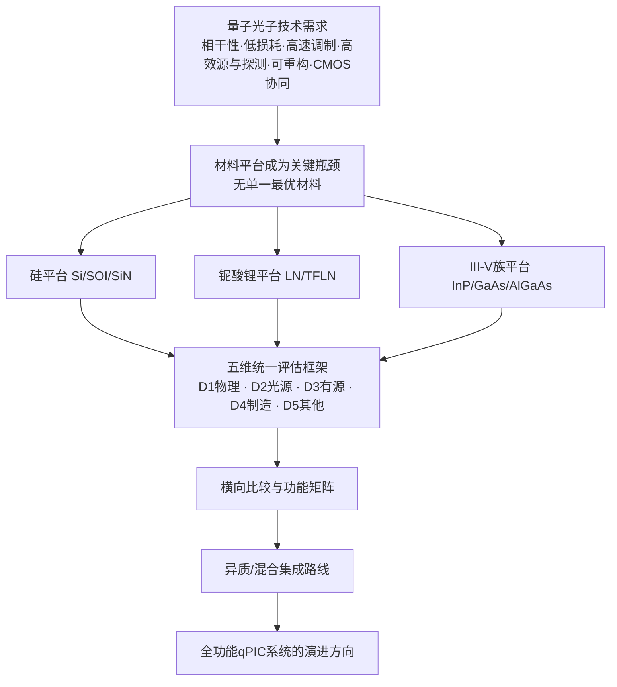
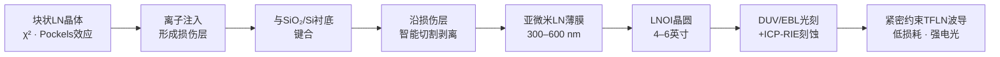
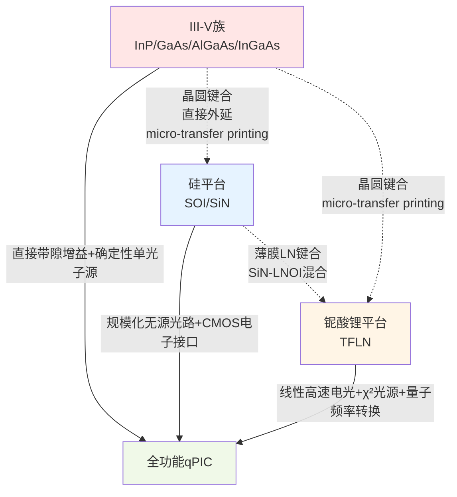
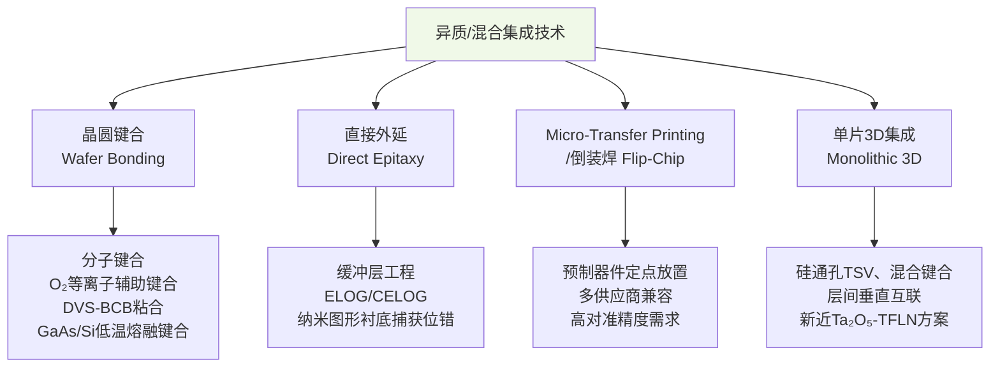
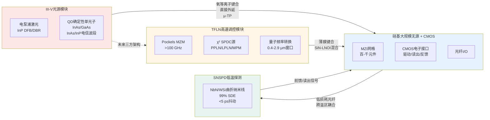

# 量子技术领域集成光子平台技术综述：硅、铌酸锂与III-V族半导体的比较研究（截至2022年初）
# 1 引言：集成光子学驱动量子技术的研究背景与平台评估框架

量子信息技术正逐步从实验室概念走向工程化实现，而光子作为天然的"飞行量子比特"，凭借其在室温下的长相干性、抗退相干能力以及天然适配长距离传输的属性，成为量子通信、量子计算、量子模拟与量子精密测量四大方向的核心物理载体之一。然而，要将基于体光学元件搭建的桌面级量子光路转化为可大规模部署的实用系统，仅依赖分立元件的拼接已难以为继——元件数量的线性增长会带来相位漂移、对准误差与系统占用空间的指数级恶化。正是在此背景下，**集成光子学作为量子技术规模化的关键使能技术**，承担起将量子光源、量子线路、调制控制与单光子探测统一在芯片尺度上的历史任务。本章将作为全篇综述的开篇与方法论基准，梳理集成量子光子学的发展脉络、量子应用对集成平台提出的核心需求、材料选择构成关键瓶颈的根源，并据此提出贯穿全报告用以横向比较硅、铌酸锂与III-V族三大主流平台的统一评估维度，最终明确本研究的范围、时间边界与章节逻辑。

## 1.1 集成量子光子学的发展脉络与战略地位

集成量子光子学（Integrated Quantum Photonics）作为一门独立的技术方向，其公认起点可追溯至2008年前后——以片上波导取代体光学元件实现两光子量子干涉的开创性演示开启了这一领域[^1]。在随后的十余年间，该领域沿着"元件规模—光子数—可重构性"三条主线持续扩展：从最初仅包含几个分束器与移相器、仅能操控两个光子的固定功能电路，逐步演进到**包含近1000个元件、能够片上产生多光子态的可编程量子光子集成电路（qPIC）**[^1]。这种规模与复杂度的跃升，使得集成光量子技术（IPQT）已经具备承载量子通信、量子计算、玻色采样以及线性光学量子信息处理等多类应用的能力[^1]。

与体光学方案相比，量子光子集成电路在工程实现层面的优势是结构性的、不可替代的。综合多源综述与路线图文献的归纳，qPIC的核心优势可概括为以下几个相互耦合的方面[^2]：其一，**小尺寸下的可扩展与快速可重构架构**，使得复杂线性光学网络（如基于马赫-曾德尔干涉仪MZI网格的通用幺正变换电路）能够以晶圆级密度集成在毫米至厘米尺度的芯片上[^2][^3]；其二，通过纳米腔与周期极化结构等手段实现**按需增强的光-物质相互作用**，为高效非线性光子源与确定性单光子发射提供物理基础[^2]；其三，单片封装天然提供**远超体光学系统的相位与机械稳定性**，这对依赖多光子干涉可见度的量子协议至关重要[^2]；其四，可与**高效单光子探测器（如超导纳米线SNSPD）直接片上接口或协同集成**，从而消除光纤耦合带来的额外损耗[^2]；其五，得益于与CMOS电子学的工艺兼容潜力，可在芯片上实现**经典电子读出与实时前馈控制**，这是测量诱导式量子计算、量子纠错与自适应量子协议的硬件前提[^2]。

正是上述五项核心特性的叠加，使集成光子学从"经典通信器件的延伸"演变为"量子技术体系的使能层"。Pelucchi等人在《Nature Reviews Physics》发表的路线图中明确指出，集成量子光子学不仅服务于直接利用光的量子特性的应用，同时也将深刻影响那些以原子、离子、超导比特为载体的量子技术——后者同样依赖对激光波长、频率、相位、偏振、功率以及集成频率/微梳的精细芯片级控制[^4][^2]。换言之，**集成光子学的战略地位已经超出"光量子计算的载体"这一狭义范畴，扩展为整个量子技术生态的基础硬件层**。

## 1.2 量子光子技术对集成平台的核心需求

将量子光子技术从实验室演示推向可工程化部署，对集成平台提出的需求远比经典通信用光子集成电路苛刻。可以将这些需求归纳为以下相互制约、需要协同优化的指标族。

**第一，光子相干性与不可区分性的保持**。多光子量子协议（包括玻色采样、融合型量子计算、纠缠交换等）的核心资源是不同光子之间在频谱、偏振、时间模式上的全同性。任何片上波导的散射、非弹性吸收或波长依赖的色散都会引入"which-path"信息，破坏量子干涉可见度。这一需求直接对应到平台的**波导传输损耗（通常以 dB/cm 衡量）与模式失真控制**。

**第二，超低损耗与高效率的端到端光路**。在量子领域，损耗的危害远超过经典通信场景：信号衰减无法通过放大恢复（无克隆定理），且任何随机损耗会直接降低多光子事件的成功率。因此，**端到端损耗预算**（涵盖波导传输、片上光路插入损耗、光纤耦合、探测器效率）成为衡量平台量子可用性的首要硬指标。

**第三，高速、高保真的光场调制能力**。量子比特的快速编码、随机基矢切换、反馈前馈控制都依赖电光或全光调制。对应的关键性能为**调制带宽（GHz）、半波电压-长度积（Vπ·L，V·cm）、调制器插入损耗与消光比**。在量子密钥分发等高速应用中，调制器自身不能引入显著的额外噪声光子。

**第四，高质量光子源**。量子光路需要片上产生具有高亮度、高纯度（接近1的 g²(0) 反向抑制）、高不可分辨性（接近1的Hong-Ou-Mandel可见度）以及可控光谱特性的单光子或纠缠光子对。对应到平台层面，这要求材料同时具备强非线性（χ²或χ³）或具有适配的发射体（如量子点）及其光-物质耦合增强结构[^2]。

**第五，高效单光子探测的协同集成**。SNSPD等超导单光子探测器代表了当前探测效率（>90%）、暗计数与时序抖动的最优组合，但其低温工作温度与平台衬底的兼容性是关键工程难点[^2]。

**第六，规模化集成密度与可重构性**。可编程量子光路要求平台能够支持**数百至上千个移相器与耦合器的密集集成**，并通过电控、热控等方式实现快速重构[^3]。比利时根特大学Bogaerts等人在Nature发表的综述中，对基于MZI网格的可编程光子电路架构（三角形网络、矩形网络、二叉树以及循环网络）做了系统梳理，揭示了**可编程性已是PIC技术成熟度的核心标尺之一**[^3]。

**第七，与CMOS电子学的协同集成能力**。包括驱动电路、读出电路、控制DAC/ADC、以及与经典处理器的实时反馈通道，都需要在芯片或封装层级与光子部分高效耦合。

这些需求之间存在显著的**内在张力**：例如，提升非线性强度往往要求更高折射率对比、更小模式截面，但这通常伴随更高的散射损耗；提升调制速率往往以增加电光相互作用区长度为代价，而后者与集成密度直接冲突；高密度元件意味着更严格的工艺良率要求，但量子级别的相位精度容忍度又远高于经典系统。任何单一材料都无法同时极化所有指标，这正是下一节要论证的"材料平台成为关键瓶颈"的物理与工程根源。

## 1.3 材料平台选择作为关键瓶颈的成因分析

集成量子光子学的当前阶段，已经不再受限于"能否做出量子光路"，而是受限于"在何种材料上做、能做到何种规模与性能"。这一判断背后的成因，可以从材料的本征物理性质与工艺现实两个层面展开。

从**本征物理性质**看，不同材料体系在以下几个相互独立的维度上存在数量级的差异：（1）带隙与发射能力，决定了材料是否能作为电泵浦激光器与确定性单光子源的载体——III-V族直接带隙半导体（GaAs、InP、InGaAs等）拥有不可替代的发光能力，而硅作为间接带隙半导体在天然条件下几乎不发光；（2）二阶非线性系数χ²，决定了是否能高效实现自发参量下转换（SPDC）、二次谐波产生与电光（Pockels）效应——具有非中心对称晶格的铌酸锂、磷化铟、磷化镓铝等材料天然支持χ²过程，而具有中心对称金刚石结构的硅在体材料层面**严格意义上无χ²效应**；（3）三阶非线性系数χ³，决定了基于自发四波混频（SFWM）的光子对产生效率与片上克尔频率梳的实现能力——硅与氮化硅在这一维度上具有优势；（4）电光系数，决定了高速调制器的半波电压与带宽——铌酸锂的Pockels系数（r₃₃≈30 pm/V）使其在高速电光调制上处于领先地位；（5）双光子吸收（TPA）与自由载流子吸收，决定了在量子工作波长（通常为1550 nm附近的电信波段）下的非线性效率上限——硅在该波段存在显著TPA，而铌酸锂与氮化硅几乎不受影响；（6）声子损耗与折射率对比度，共同决定了波导的传输损耗与模式尺寸下限。

从**工艺现实**看，平台间的差异则体现在晶圆尺寸、CMOS兼容性、刻蚀工艺成熟度、代工厂PDK（Process Design Kit）可得性与制造良率上。硅光子受益于近三十年微电子产业的积累，在8英寸/12英寸晶圆代工生态、设计自动化EDA工具与PDK标准化方面遥遥领先；铌酸锂虽然电光性能优异，但其干法刻蚀工艺、薄膜化（LNOI）的晶圆尺寸（典型4–6英寸）与代工服务可及性仍处于发展阶段；III-V族半导体则面临更小的晶圆尺寸（典型2–4英寸）、更高的单位面积成本与更严格的缺陷密度控制挑战。

由上述本征物理与工艺现实的双重维度可见，**任何单一平台都无法同时满足量子光子系统所需的全部功能**：硅光子规模化能力最强但缺乏高效光源与强电光效应；铌酸锂电光与χ²非线性出众但缺乏电泵浦增益介质与成熟探测器集成；III-V族能提供确定性量子发射体与片上激光器但难以规模化、与CMOS生态融合困难。这一"无单一最优平台"的物理事实，直接推动了**单片集成、混合集成与异质集成三条技术路线的并行发展**[^2]。Pelucchi等人的路线图明确指出，qPIC的实现路径同时涵盖单片、混合与异质三种集成方式，并需要利用经典光子集成平台的现有进展来加速落地[^2]。这也意味着，对硅、铌酸锂与III-V族三大候选平台进行系统化、可比化的横向评估，已不仅是学术综述的需要，更是后续异质集成路线选择的论据基础。

## 1.4 硅、铌酸锂、III-V族三平台的统一评估维度

为确保后续各平台章节具备一致的论述粒度与可比较性，本报告提出贯穿全篇的**五维统一评估框架**。该框架既覆盖材料本征物理与器件性能，又延展至工艺成熟度与产业链兼容性，力图避免将平台比较简化为单一指标的对照。

下表汇总了五个维度及其下属的可量化或可结构化对比的关键指标。

| 评估维度 | 关键子项 | 典型量化或对比指标 |
|---------|---------|------------------|
| **D1 核心物理特性** | 折射率对比、非线性系数、电光系数、双光子吸收、波长透明窗口、声子损耗 | n、Δn；χ²/χ³（pm/V、m²/W）；r₃₃（pm/V）；βTPA（cm/GW）；透明范围（μm）；波导传输损耗（dB/cm） |
| **D2 片上光子源** | 自发参量过程源（SFWM/SPDC）、确定性量子点源、可工程化光谱特性 | 光子对产生率（pairs/s/mW²）、单光子纯度 g²(0)、HOM不可分辨性可见度、谱纯度、提取效率 |
| **D3 有源器件集成** | 调制器与单光子探测器 | 调制带宽（GHz）、Vπ·L（V·cm）、插入损耗（dB）、消光比；探测效率、暗计数率（Hz）、时序抖动（ps）、与衬底的工艺兼容性 |
| **D4 芯片集成与规模化制造** | 晶圆尺寸、CMOS兼容性、刻蚀工艺、PDK可得性、可编程元件数 | 晶圆直径（英寸）、代工厂可及性、片上集成元件数、热/电控相移器密度、良率指标 |
| **D5 其他关键性能** | 功耗、占用面积、与经典光子学产业链兼容性、典型应用适配度 | 单移相器功耗（mW）、单元件面积（μm²）、供应链成熟度、量子通信/计算/传感适配度 |

需要说明的是，这五个维度并非彼此孤立，而是存在内在耦合关系：D1的材料本征参数直接决定了D2与D3的器件性能上限，D4的工艺成熟度则约束了D2/D3指标能在何种规模下被复现，而D5则是D1–D4综合作用在产业层面的投影。后续第2、3、4章将分别针对硅、铌酸锂与III-V族平台展开五维剖析，第5章将以该框架为骨架进行横向对比，并据此在第6章论证异质集成路线的必要性与可行性。

为进一步明晰本报告的整体逻辑，下图给出从"量子需求"到"平台评估"到"集成路线"的分析脉络。



该框架的应用意味着：每一个平台都将被置于同一组指标维度下"审视"，避免出现"以硅平台之长比铌酸锂之短"或"以III-V之有源能力盖过其规模化短板"的片面评价。这也正是本综述与单纯罗列各平台成果的报告之间的核心方法论差异。

## 1.5 报告研究范围、时间边界与章节逻辑

本研究将范围严格限定在以下三类集成光子平台在量子技术领域的应用现状：（1）**硅基平台**，涵盖绝缘体上硅（SOI）与氮化硅（SiN）两类典型材料体系；（2）**铌酸锂平台**，重点关注以薄膜铌酸锂（Thin-Film Lithium Niobate, TFLN/LNOI）为代表的新一代实现形式，兼顾传统钛扩散铌酸锂；（3）**III-V族半导体平台**，涵盖InP、GaAs、AlGaAs以及InGaAs等典型材料体系。其他在量子光子学中具有研究价值的体系（如金刚石氮空位中心、碳化硅、二维材料等）虽具备一定潜力，但因其规模化集成水平在本研究时点尚未与上述三大主流平台形成同台对比的成熟度，因此不纳入本综述的核心比较对象。

**时间边界方面**，本报告聚焦至2022年初的技术发展水平，以反映该时点上集成量子光子学从"百元件量级单片演示"向"近千元件可编程多光子系统"过渡阶段的研究图景[^1]。这意味着本研究中所引用的关键性能指标、代表性器件演示与代工生态成熟度评估，均以截至2022年初的公开学术与产业资料为依据；对2022年之后的最新进展不做超前展望性引用，以保持研究边界的清晰与可验证性。

**章节逻辑方面**，全报告共分八章，采用"**分平台深入剖析—横向比较—集成路径展望—收束结论**"的递进式组织：第2章至第4章分别按统一的五维框架对硅、铌酸锂与III-V族三大平台展开独立的深度分析；第5章基于前三章的结构化输出进行横向对比，构建涵盖量化指标与应用适配度的功能矩阵，归纳"无单一最优平台"的判断依据；第6章聚焦异质与混合集成路径，论证多平台协同如何超越单一平台的能力边界；第7章梳理三平台共性的关键瓶颈与未来发展趋势；第8章作为收束章节，凝练面向不同量子应用场景的平台选择决策逻辑与演进方向。

本章作为整篇综述的方法论基准，确立了"为什么要比较、比什么、怎么比、比到何时"的四个基本立足点。后续章节将严格在本章所建立的五维评估框架与时间边界内展开，使本报告整体呈现一致的分析粒度与可比性，最终服务于研究者在量子集成光子平台选择与异质集成路线决策中的战略判断。

# 2 硅光子平台在量子技术中的能力与边界

承接第1章建立的五维统一评估框架（D1核心物理特性、D2片上光子源、D3有源器件集成、D4芯片集成与规模化制造、D5其他关键性能），本章作为分平台深度剖析的第一章，对硅基集成光子平台在量子技术中的能力与边界展开系统分析。选择以硅平台作为分平台剖析的开端，并非出于其在所有维度上都具有压倒性优势——恰恰相反，硅在光源、电光调制等关键功能上存在结构性短板——而是因为它在**规模化制造能力、波导损耗水平与可编程性**三个维度上代表了截至2022年初集成量子光子学所能达到的最高工程化水平，从而构成了后续讨论铌酸锂与III-V族两类互补平台的参照系。本章将依次回答三个问题：硅平台凭借哪些本征物理特性与产业生态成为大规模量子光路的首选载体？它在量子光源、调制器、单光子探测三类关键器件层面分别达到了怎样的性能水平与上限？它在哪些功能维度上构成了不可逾越的能力边界？

## 2.1 硅基平台的核心物理特性与量子适配性

沿D1维度审视，硅作为集成量子光子学的核心载体，其适配性根植于一组相互耦合的本征物理参数与工艺现实。硅本身具有约3.4–3.48的高折射率，这一数值远高于二氧化硅包层（约1.45），在绝缘体上硅（SOI）波导结构中形成了约2倍以上的折射率对比[^5]。如此强的折射率对比直接带来两个关键优势：其一，模式横截面可压缩到亚微米尺度（典型单模波导宽度为400–500 nm[^6]），为芯片上实现毫米尺度内集成数百乃至上千个无源与有源元件提供了物理基础；其二，在如此小的模式体积下，光场强度密度大幅提升，从而显著增强了非线性相互作用效率，为后文将讨论的SFWM光子源奠定了物理前提。

**亚0.1 dB/cm级的波导传输损耗**是硅平台得以承载量子光路的另一关键基石。在量子领域，损耗的危害源于无克隆定理所导致的不可放大性，每一个光子的丢失都会直接降低多光子事件的成功率与量子干涉的可见度。Onural等人在220 nm标准硅光子代工厂工艺中表征了不同波导宽度下的传输损耗，并通过低损耗"回形针"（paperclip）测试结构与赛道型谐振腔测得**品质因子高达7.6×10⁶、传输损耗低至0.064 dB/cm**的结果[^7]。这一数值意味着光场在波导中传播一厘米仅损失约1.5%的功率，已经接近经典商用光通信工艺的最佳水平，并在量子相干性保持上具备工程意义上的可用性。

在三阶非线性方面，硅在电信波段的Kerr系数 $n_2 \approx 4 \times 10^{-14}\ \mathrm{cm^2/W}$，在常见半导体中属于较高水平[^8]。结合亚微米模式截面带来的高功率密度，硅波导能够以毫瓦级泵浦实现可观的自发四波混频（SFWM）效率，这是其作为概率型光子对源载体的物理依据。硅的透明窗口覆盖约1.1–8 μm[^9]，电信C波段（1530–1565 nm）位于其透明窗口内并具有最低的本征损耗水平，与全球光纤通信基础设施天然兼容。

然而，硅的物理特性同样划定了其作为量子光子载体的本征能力边界。第一，**硅是间接带隙半导体，无法实现高效率发光**[^10][^5]，这意味着电泵浦激光器与确定性单光子源无法在硅本征材料上原位实现，必须依赖外置光源、异质集成或单片外延等额外手段[^10]。第二，硅晶体属于金刚石结构、**具有空间反演对称性，体材料中严格无二阶非线性效应**[^11]，因此基于Pockels效应的线性高速电光调制、基于自发参量下转换（SPDC）的高效光子对产生以及二次谐波产生这三类对量子技术至关重要的功能，都无法直接在体硅中实现；研究者曾尝试通过引入应力梯度在硅中诱导出弱二阶非线性，但迄今尚未给出可在器件层面工程化利用的清晰证据[^11]。第三，**在1550 nm附近，硅存在显著的双光子吸收（TPA），系数 $\beta \approx 0.8\ \mathrm{cm/GW}$**[^8]，对应的全光开关非线性优值（FOM）仅约0.35[^8]——这意味着当泵浦功率提升以期获得更高的SFWM光子对产生率时，TPA及其引发的自由载流子吸收会同步增长，构成非线性效率的硬上限。

作为硅基互补材料，**氮化硅（SiN）**在量子光子学中的定位差异值得在此一并明确。SiN具有约2.0的折射率，模式限制能力略弱于硅但远强于二氧化硅；其透明窗口更宽且**几乎不存在双光子吸收**，从而允许在高泵浦功率下保持线性Kerr非线性。SiN与硅同属CMOS兼容材料体系，可在标准硅光子代工厂工艺中实现[^12]。SiN平台正是后文将讨论的Xanadu公司X8与Borealis可编程光量子处理器所采用的核心材料体系[^13]。从五维评估框架看，SiN以**牺牲部分集成密度换取了更低损耗与更高功率耐受**，与SOI形成在硅基生态内部的功能互补。

## 2.2 基于SFWM的片上量子光源性能与光谱工程

沿D2维度，硅平台的片上量子光源能力主要建立在**自发四波混频（SFWM）**这一三阶非线性过程之上。SFWM过程在硅波导中由两个泵浦光子湮灭并产生一对能量守恒、动量守恒的信号-闲置（signal-idler）光子，由于硅的高χ³与高功率密度共同支撑，该过程在毫米至厘米量级的波导中即可实现可观的光子对产生率。

主流的硅基SFWM光子源采用两类结构：**长螺旋形波导源**与**微环谐振腔源**。前者以增加非线性作用长度的方式提升光子对产生率，典型实现中将厘米级波导以螺旋几何紧密折叠以节省芯片面积，例如布里斯托大学小组在单片硅光芯片上集成的四个21 mm长螺旋型SFWM源即采用此架构[^14]。后者借助微环谐振腔在谐振波长处对泵浦与信号光的场增强，以远短的物理长度（典型十微米至数十微米的环周长）获得与厘米级波导相当甚至更高的亮度，是当前硅基片上光子源中亮度密度最高的实现方式之一。

然而，微环谐振腔源在亮度提升的同时也引入了独特的物理局限——**侧壁粗糙引起的背向散射**。Suo等人在Q值约10⁴的硅微环谐振腔中实验研究了背向散射对SFWM光子对产生的影响，发现由于背向散射的存在，一对光子不仅可能从谐振腔前向输出，还可能两者都向后输出，甚至一前一后输出[^15][^16]。分析表明，泵浦光在背向散射作用下的反射相对较弱，导致光子对从所有端口组合中输出的主要原因，是已产生的信号/闲置光子被谐振腔中的背向散射反射[^15][^16]。这一现象意味着，**微环源的光子对模式纯度与端口确定性会受到工艺粗糙度的直接影响**，对Franson型干涉等依赖能量-时间纠缠的量子协议带来额外噪声项[^15]。

从光子源对量子应用的支撑能力看，布里斯托大学O'Brien研究组完成的代表性工作充分体现了硅平台在SFWM源工程化整合方面的能力。该小组在单片硅光芯片上集成了**纠缠态产生—单比特旋转—控制Z门（CZ）—量子态层析**四个功能模块，整个芯片包含20个定向耦合器与19个热光相移器[^14]。在纠缠态产生单元中，外部输入的1551 nm泵浦光在四个21 mm螺旋形波导中发生SFWM，产生1547 nm和1555 nm的信号-闲置光子对；通过MZ干涉器相位调制，可使光子对在四个螺旋波导中的任一中产生，并经由反向HOM干涉光路生成路径纠缠态 $\alpha|00\rangle + \beta|11\rangle$[^14]。该实验中量子态的纯度、施密特数、CHSH值与保真度均与理论预期相符，纯度P接近1表明所得为纯态而非混态，S值大于2表明非局域关联的存在[^14]。这一演示是硅平台**在单片上完成"产生—操控—读出"完整量子信息处理链路**的标志性成果，是后续Bristol小组在大规模可编程量子光路方向上工作的直接前奏。

布里斯托大学Stefano Paesani等人在《Nature Communications》上发表的工作进一步针对SFWM光子源长期受制于谱纯度的问题给出了重要突破，发表者将其表述为"首个具备大规模量子光子学潜力的集成光子源"[^17]。该工作的核心意义在于解决了"片上光子源缺乏高质量单光子产生能力"这一限制集成量子光子学扩展的关键瓶颈[^17]——SFWM作为概率过程其本征频谱关联会引入光子之间的频谱可区分性，从而降低多光子干涉可见度；通过对联合光谱振幅（Joint Spectral Amplitude, JSA）的工程化设计，**可以在不依赖窄带滤波的前提下显著提升不可分辨性**，这是从"两光子演示"迈向"百光子级量子计算与采样"的关键工程基础。

需要明确的是，**SFWM作为概率型源具有不可回避的固有局限**：其光子对产生服从泊松统计，在保持低多光子噪声（低 $g^{(2)}(0)$）的前提下单脉冲产生效率被严格限制在亚单光子水平，无法提供量子计算容错架构所要求的"按需"输出。这一局限并非工艺问题而是物理本质，是后续第4章讨论III-V族量子点确定性单光子源时不可忽视的对比基准。

作为对概率源局限的潜在补充路径，**硅中色心单光子发射体**的研究在2022年前后取得了重要进展。Hollenbach等人在《Nature Communications》（2022年）报告了利用聚焦离子束（FIB）以高概率在硅晶圆上**可控制造单G中心与W中心**，并实现了与CMOS技术兼容的宽束注入工艺，能够在纳米尺度的精确位置形成电信O波段单光子发射体[^18]。该工作明确将这种发射体定位于"在同一硅芯片上单片集成确定性光子源、可重构光学元件与单光子探测器"的量子光子集成电路愿景，并指出技术节点可下探至100 nm以下[^18]。此外，研究者还报道了在SOI光子集成电路上对**G中心进行单独寻址与光谱可编程化**的实现：测得波导耦合的窄非均匀分布（标准差1.1 nm）单光子发射，激发态寿命8.3 ± 0.7 ns，运行一个月以上无降解；并演示了高达300 pm（55 GHz）的光谱微调能力及单个人工原子的局部失活，足以将量子发射体对准到25 GHz电信网格信道[^19]。这些进展为硅平台从"概率型SFWM源"过渡到"可单片集成的确定性人工原子阵列"提供了清晰的技术路径，但截至2022年初仍处于早期阶段，距离与SFWM源在量子光路中等量替代仍有显著差距。

## 2.3 硅基调制器与单光子探测器的集成方案

沿D3维度，硅平台在有源器件层面呈现"调制器有但受限、探测器需异质或低温集成"的格局。

### 调制器：载流子等离子色散的能力与本征上限

硅是间接带隙半导体且**无线性Pockels效应**，因此硅基电光调制器的工作机制不能依赖于折射率的线性电光响应，而需借助**自由载流子等离子色散效应**——通过PN结或PIN结上施加电压改变波导中的载流子浓度，从而调节折射率与吸收系数。这一机制支撑了两类典型架构：基于马赫-曾德尔干涉仪（MZI）的载流子耗尽型调制器与基于微环谐振腔的载流子注入/耗尽型调制器。

在调制效率指标上，Cao等人在220 nm SOI平台上演示的2 μm波长高速MZI调制器获得了 $V_\pi \cdot L_\pi = 2.89\ \mathrm{V \cdot cm}$ 的调制效率（在4 V反向偏压下），插入损耗约5.25 dB，并实现25 Gbit/s OOK与PAM-4信号传输[^20]。在1550 nm波长下，该MZI调制器在20 Gbit/s数据率下实现5.8 dB消光比与13 dB插入损耗，$V_\pi \cdot L_\pi$ 为2.68 V·cm（4 V反向偏压）[^20]。微环型调制器则以其谐振增强效应在更小的器件占用面积内实现高消光比，文献报道的设计在1550 nm波长上可实现约13 dB的调制深度，能耗低至122.3 fJ/bit[^21]。从经典通信角度看，硅基调制器已可支持单波200 Gb/s以上的调制和传输[^10]。

然而，从量子光子学角度评估，硅基载流子色散调制器具有以下**不可回避的本征局限**：其一，**调制过程伴随显著吸收变化**——折射率调制与吸收调制是同时发生的，导致调制器引入额外损耗与啁啾，对依赖相位保真度的量子干涉造成扰动；其二，**自由载流子涨落引入相位噪声**，对长时间相干积累不利；其三，**非线性响应**——载流子浓度与折射率之间并非严格线性关系，使得高保真度任意相位调制需要额外标定与补偿；其四，**热效应耦合**——载流子注入伴随焦耳热释放，影响相邻器件的相位稳定性。这些局限在经典高速通信场景中往往可通过DSP后处理补偿，但在量子保真度严格受限的应用中难以根除。这正是后续第3章铌酸锂平台凭借线性Pockels效应能够提供互补价值的根源。

为缓解上述短板，**硅-薄膜铌酸锂异质集成调制器**已成为业界探索的重要方向。Valdez等人报道的混合硅-薄膜铌酸锂MZ调制器采用LN薄膜键合到平面化的硅光子波导上、形成混合光模式的设计，无需刻蚀LN薄膜，即可在1550 nm波长上实现**超过110 GHz的3 dB带宽、110 mW高光功率耐受、$V_\pi \cdot L = 3.1\ \mathrm{V\cdot cm}$ 与1.8 dB的片上插入损耗**[^22]。这一进展从工程角度证明了硅平台借助异质集成手段突破自身电光调制能力边界的可行性，但其本质已经是混合平台而非纯硅方案，将在第6章作为异质集成路线的代表性案例展开。

### 探测器：Ge-on-Si高速光电探测与SNSPD的双轨方案

硅本身在电信波段几乎不吸收光，无法直接作为电信波段探测器材料。硅平台的探测器方案因此沿两条互补路线展开。

**第一条路线是异质集成Ge-on-Si雪崩光电探测器（APD）**，主要面向经典高速光接收与量子通信中的相干探测/直接探测应用。浙江大学戴道锌团队在《Optica》（2022年）上报道的水平拉通型Ge/Si波导APD采用180 nm标准CMOS单次锗外延工艺即可制备，实现了**615 GHz的创纪录增益带宽积（GBP）**——工作电压约 −14 V、单位增益响应度达0.93 A/W、48 GHz带宽下增益系数高达12.8——并演示了100 Gbps NRZ与PAM-4信号接收，灵敏度分别为−12.6 dBm与−11.3 dBm（BER=2.4×10⁻⁴）[^23][^9]。然而需要明确：尽管Ge-on-Si APD在经典光接收上达到了世界领先水平，但其**作为单光子探测器的核心挑战在于暗计数控制**——Ge生长在Si上存在约4.2%的晶格失配，产生高密度位错与缺陷态，使得室温下热激发噪声严重；其后脉冲效应亦较InGaAs/InP SPAD更为突出[^8]。虽然循环高温退火、外延颈缩、伪平面几何与选择性硼离子注入等工艺已显著降低了暗计数[^8]，但对于量子级单光子探测，Ge-on-Si SPAD的整体竞争力仍逊于下文所述的SNSPD方案。

**第二条路线是超导纳米线单光子探测器（SNSPD）与硅波导的片上波导集成**，是当前量子光子学中性能最为优越的单光子探测方案。在1550 nm电信波段，SNSPD已实现**约99%的系统探测效率与低于5 ps的时间抖动**，并将探测器阵列规模从单像素扩展到40万像素[^8]。SNSPD的典型制备工艺为：在蓝宝石或硅衬底上通过反应溅射沉积5–10 nm厚的NbN、NbTiN或非晶WSi超导薄膜；利用电子束曝光与反应离子刻蚀定义50–100 nm宽的曲折（meander）纳米线；集成增透膜与金属反射镜形成垂直谐振腔结构以最大化吸收[^8][^24]。SNSPD的恢复时间小于100 ns、暗计数小于100 Hz、时序抖动低于100 ps[^24]，且可通过双交叉NbN图案或螺旋NbN图案实现偏振不敏感探测[^24]。从硅平台集成视角看，SNSPD与硅波导的"侧向耦合"集成在工艺上已经成熟，但其**毫开尔文级低温运行要求**对系统级封装与电控信号引入构成根本性挑战，使得SNSPD通常以"独立低温平台 + 光纤耦合至硅光芯片"的形式工作，或在专用低温内部署集成芯片。

**第三类探测器是片上同调（homodyne）探测器**，是连续变量量子协议（包括压缩态量子计算、连续变量量子密钥分发与量子传感）的关键支撑。布里斯托大学QET Labs展示了**世界上最小的硅芯片集成量子光探测器**，电路占地仅80 μm × 220 μm，并通过单个电子-光子集成芯片相对此前的方案进一步将速度提升10倍、占用面积减少50倍[^25]。同调探测器在室温下工作，可用于量子通信、超灵敏传感器以及部分量子计算机的设计；量子光测量的关键在于对量子噪声的灵敏度，这种噪声决定了光学传感器的灵敏度，并可用于在数学上重建量子态[^25]。同调探测器的小型化对量子光路集成度的提升具有标志性意义，**意味着大规模片上同调阵列与压缩态光源的协同集成在硅平台上具备工程可行性**。

## 2.4 大规模可编程量子光路的代表性进展

如果说光子源与有源器件代表了硅平台在器件层的能力图谱，那么大规模可编程量子集成电路则是硅平台**最具竞争力的系统级应用场景**。截至2022年初，可编程量子光子处理器的几乎所有标志性成果都建立在硅或硅基互补材料体系（SiN）之上，这一事实本身即体现了硅平台在元件规模、可重构性与系统稳定性上的领先地位。

可编程量子光子处理器的核心架构是基于**马赫-曾德尔干涉仪（MZI）网格 + 热光相移器**的通用线性光学网络。Carolan等人在二氧化硅-硅平面波导电路（PLC）平台上演示的"通用线性光学处理器"包含**15个MZI级联、30个定向耦合器、30个可调热光相移器**，全部电气接口可任意设置相位[^26]。该处理器可输入最多6个光子，并由12个单光子探测器系统监测输出；得益于其完全可编程性，该器件能实现任意线性光学协议，使得过去需要数月搭建的量子信息处理任务可在秒级时间内完成——研究者据此演示了**100个玻色采样实例**及六维复哈达玛变换[^26]。

由该路线延伸至硅平台上的代表性成果之一是布里斯托大学小组完成的硅光双量子比特纠缠逻辑处理器，已在2.2节展开讨论[^14]。该工作在单片硅光芯片上将路径纠缠态产生、单比特旋转、控制Z门与量子态层析整合于同一芯片，使用了20个定向耦合器与19个热光相移器[^14][^27]。

另一类代表性成果来自加拿大Xanadu公司在SiN平台上的可编程光子处理器系列。**X8系统**（2021年发表于《Nature》）首次在芯片上实现了基于压缩态光源、可编程相位网络与光子计数器的量子优势演示[^13]——其架构在SiN芯片上将环形谐振器产生的压缩态注入由分束器与移相器构成的可重编程光网络，加扰后由高灵敏度探测器对每个输出端口的光子数进行计数[^13]。研究者测得压缩态相对于普通态的不确定性抑制约84%，态的时间纯度为85%；并通过非经典性标准验证所产生的样本具有真正的量子性质，从而排除了经典模拟的可能性[^13]。除了量子采样算法外，X8还实现了**确定分子态之间跃迁能谱**和**寻找代表不同分子的图之间数学相似性**两个具有实用价值的算法[^13]。

**Borealis（北极光）系统**（2022年发表于《Nature》）是该路线的标志性升级，首次在**全门可编程的光子机器**上实现了量子计算优越性[^28][^29][^30]。Borealis在216个压缩模式上实现了三维连接性的高斯玻色采样，采用时间复用与光子数分辨架构；产生一个样本仅需36 μs，而经典最优算法在最佳超级计算机上需运行超过9000年才能给出同一分布的一个精确样本——这一运行时优势相比早期光子机器报告的水平高出**5000万倍**[^28][^30]。每次采样最多记录219个光子的符合事件[^28][^30]。在工程实现上，Borealis简化并改进了"九章"方案：采用了时间编码的高斯玻色采样方案，可通过光子到达探测器的时间对光子进行分辨和计数；为此解决了时域多路复用、快速电光开关、高速光子数分辨探测等关键技术[^29]。与中国科技大学"九章"（2020年发表于《Science》）相比，**Borealis在可编程性、动态门控、可扩展性与样本不依赖性方面取得了关键突破**[^29][^30]。"九章"作为基于体光学元件搭建的76光子玻色采样系统，求解5000万样本的高斯玻色采样需200秒，而世界最快超级计算机"富岳"需6亿年，等效比谷歌"悬铃木"快100亿倍[^31][^32][^33]；但其电路不可重构、只能执行单一算法，与Borealis在芯片化、可编程化层面形成鲜明对比[^13]。

下表汇总硅基平台上代表性可编程量子光子系统的关键参数。

| 系统 | 平台 | 元件规模 | 模式/光子数 | 关键能力 | 标志意义 |
|------|------|---------|------------|---------|---------|
| 通用线性光学处理器[^26] | 二氧化硅-硅PLC | 15 MZI、30定向耦合器、30相移器 | 输入6光子、12单光子探测器 | 任意线性光学协议、100次玻色采样实例 | 首个完全可编程的硅基线性光学处理器 |
| 双量子比特纠缠处理器[^14] | SOI硅 | 20定向耦合器、19热光相移器 | 双光子路径纠缠 | 纠缠产生—单比特旋转—CZ门—量子态层析 | 首次单片完成完整量子逻辑链路 |
| X8[^13] | SiN | 多压缩源 + 可编程相位网络 | 8模式压缩态 | 量子采样、分子能谱、图相似性 | 首个商用化可编程光量子处理器 |
| Borealis[^28][^29][^30] | SiN（时间复用） | 全门动态可编程 | 216模式、219光子 | 高斯玻色采样量子优越性、36 μs/样本 | 首个全门可编程光子量子优越性 |

此外，硅平台上的**多用途可编程光子信号处理器**也展现了从经典信号处理向量子信息系统扩展的潜力。Pérez-López等人在《Nature Communications》报道的硅基可重构波导网格采用受电子FPGA启发的"光子FPGA"架构，仅由七个六边形单元构成的简单结构即可在单一硬件上演示**超过20种不同功能**，覆盖通信、化学与生物医学传感、信号处理、多处理器网络以及量子信息系统等领域[^34]。这一思路与基于MZI网格的通用线性光学处理器一道，构成硅平台向"通用编程性"演进的两条互补路径。

## 2.5 晶圆级制造、PDK生态与工程化挑战

沿D4与D5维度，硅平台在产业化成熟度上对铌酸锂与III-V族平台具有压倒性优势，但这种优势之下仍存在多类未完全解决的工程化挑战。

### 晶圆级制造与CMOS代工生态

硅光子的产业化根植于近三十年微电子产业积累的**8/12英寸晶圆代工生态**。从历史脉络看，1991年绝缘体上硅（SOI）工艺实现低损耗波导，为硅光无源器件奠定基础；2004年Intel研发出首个基于MOS电容的硅基调制器，带宽突破1 GHz；2010年Luxtera（现属Cisco）推出首款商用硅光模块在数据中心实现40 Gbps传输[^5]。截至产业爆发期（2016年至今），800G/1.6T高速光模块已实现量产，芯片集成度突破10万器件[^5]。当前主流SOI衬底制备采用**智能键合转移（Smart-cut）技术**，相较于早期的注氧隔离（SIMOX）技术能够实现陡峭界面与精准厚度控制，成为高质量、超薄SOI衬底制备的主流方案[^35]。氧化埋层（BOX）通常采用SiO₂，厚度范围在0.1–4.0 μm之间，提供器件层与衬底之间的电学完全隔离[^35]。这种成熟的衬底工艺直接转化为硅光子芯片的低成本、高良率与可大规模生产能力。

PDK（Process Design Kit）层面，硅光子已建立"专业设计公司与垂直整合公司共存"的生态[^10]，PDK与EDA工具支持下的设计-制造闭环已在多家代工厂（如AIM Photonics、IMEC、GlobalFoundries、CompoundTek、SMART Photonics等）实现。硅光对工艺节点要求相对较低、但对制备细节把握要求更高[^10]，这意味着硅光子可借助成熟微电子产线获得超大规模制造能力，无需追求最先进CMOS节点。这一特征对量子光子学具有特别意义：**可编程量子光路所需的"近千元件级"集成正是硅光产业链已经具备产能支撑的规模**，无需开发专用产线。

### 光源解决方案：从外置到异质集成

由于硅本身的间接带隙特性，光源始终是硅光技术亟需解决的关键问题。目前的解决方案大致可分为以下六类[^10]：（a）传统片外激光器通过空间光学与光纤耦合；（b）通过设计优化减少反射、使激光器经棱镜入射至光栅耦合器；（c）光子引线技术，在激光器芯片与硅光芯片之间制备三维聚合物波导；（d）将激光器芯片以倒装焊或转印方式与硅光芯片集成、通过端面耦合输入；（e）将III-V材料异质集成到硅光芯片上、再对其进行刻蚀形成激光器；（f）长远方案——直接在硅基上外延生长III-V材料形成量子点激光器[^10]。目前**外置光源（ELS）为硅光模块主流方案，国内外差距较小**[^10]；异质集成与单片集成（外延生长）是面向未来的发展方向[^10]。从量子光子学角度看，这一光源解决方案谱系也直接适用——确定性单光子源与电泵浦激光器都难以在纯硅平台上原位实现，必须借助异质集成手段引入III-V族材料。这正是第6章异质集成路线的核心议题之一。

### 热光相移器：可重构性的物理基础与隐形成本

可编程量子光路依赖热光相移器实现快速相位调节。热光效应在硅波导中表现为强热光系数（$\mathrm{d}n/\mathrm{d}T \approx 1.86 \times 10^{-4}\ \mathrm{K^{-1}}$），使得通过加热可实现高保真度连续相位调节。然而，热光相移器存在**功耗高、调制速度有限（典型千赫兹至兆赫兹量级）、热串扰**等问题，是硅基大规模可编程量子光路的隐形成本。文献中已注意到"基于热光效应的相移器调制速度并不快"这一限制[^14]，对于需要MHz至GHz级前馈控制的量子协议构成瓶颈。此外，热相移器与SNSPD的低温工作环境不兼容，使得在低温下工作的量子系统中相移器选择面临额外挑战。

### 光纤-芯片耦合：损耗预算的关键节点

光纤与硅光芯片的耦合效率是端到端损耗预算中的关键节点。两类主流耦合器各有优劣：**光栅耦合器**位置灵活、对准容差大、便于晶圆级在线测试，但耦合效率相对较低（典型3–4 dB损耗）、工作带宽较窄（1 dB带宽约30–40 nm）、且为偏振敏感[^36][^6]；**端面耦合器**耦合效率高、工作带宽大、偏振不敏感，但只能位于芯片边缘、无法进行在片测试[^36]。为提高光栅耦合器效率，研究者发展了背面镀金属、悬臂式光栅耦合器（耦合效率约 −1.3 dB）、切趾型（apodized）光栅等多种方案[^36][^6]。其中悬臂式光栅耦合器借助硅光fab的deep trench工艺将光栅耦合器底部挖空再在悬臂侧面沉积金属增强反射，将耦合效率提升到约1 dB、1 dB带宽约42 nm[^36]——然而其需在芯片划切后再进行额外加工，限制了大规模生产的适用性[^36]。从量子光子学角度看，每一个dB的耦合损耗都会以指数方式恶化多光子事件成功率，因此**亚dB级光纤-芯片耦合是硅平台向规模化量子系统演进的硬性要求**。

### 工程化挑战：低温接口与量子-经典协同

最后两类工程挑战尤需指出：其一是与SNSPD协同工作的**低温接口**。SNSPD要求毫开尔文级低温环境，而硅光芯片的最佳工作温度通常为室温或近室温（热光相移器更是依赖室温）。两者协同意味着光路必须跨越温区——或者整个光路置于低温下并寻找低温可用相移器（如MEMS、电光等替代方案），或者将光路置于室温、通过低损耗光纤导入低温的SNSPD探测器。这两种方案各有损耗与稳定性代价，是大规模量子-经典协同芯片的核心工程难题。其二是**与CMOS电子学的协同集成**。可编程光路、单光子探测后端、实时前馈反馈控制都需要芯片或封装层级的电子接口。硅光子在这一维度具有先天优势——同一硅衬底既可承载光子电路又可承载CMOS电子电路，但完全的单片光-电协同（光子BiCMOS）目前仍处于探索阶段[^12]。

## 2.6 硅平台的能力边界与互补需求

综合2.1–2.5的五维分析，硅平台在量子集成光子学中的能力图谱可凝练为"**三大支柱 + 四类短板**"。

**三大支柱**支撑硅平台作为大规模量子光路的首选载体：第一，**规模化制造能力**——8/12英寸CMOS代工生态、成熟的SOI衬底工艺与PDK体系使硅平台能够承载近千元件级的qPIC，这是其他平台短期内难以匹敌的产业基础[^5][^35]；第二，**亚0.1 dB/cm级的低传输损耗**——在标准代工厂工艺中即可实现的低损耗水平为多光子量子干涉提供了相干性保证[^7]；第三，**强χ³非线性 + 高密度可编程性**——SFWM光子源与基于MZI网格的可编程线性光学处理器在硅平台上的成熟结合，已经支撑了从双量子比特纠缠逻辑[^14]到216模式量子优越性演示[^28][^30]的完整能力谱系。

然而，硅平台同时存在**四类不可回避的本征短板**，构成其作为单一平台不可逾越的能力边界。第一，**缺乏高效电泵浦光源**——硅作为间接带隙半导体几乎无法发光，必须依赖外置光源或III-V族异质集成才能在芯片上获得相干光泵浦或电泵浦激光[^10][^5]。第二，**无体χ²效应**——中心对称晶格使硅严格意义上不具备线性Pockels电光效应与SPDC能力[^11]，导致硅基调制器只能依赖伴生损耗与啁啾的载流子色散机制，调制带宽与保真度受限；这一短板已经在Valdez等人的硅-LN混合MZ调制器（>110 GHz带宽、$V_\pi \cdot L = 3.1\ \mathrm{V\cdot cm}$）中通过异质集成形式被有效弥补[^22]，预示了第3章铌酸锂平台的核心互补价值。第三，**电信波段双光子吸收**——$\beta \approx 0.8\ \mathrm{cm/GW}$ 与其引发的自由载流子吸收[^8]，构成了在1550 nm附近高功率泵浦下非线性效率的硬上限。第四，**概率型SFWM源缺乏确定性**——服从泊松统计的光子对产生过程在保持低多光子噪声前提下被严格限制在亚单光子水平，无法满足容错量子计算对"按需"单光子输出的需求；尽管硅中G中心、W中心等色心单光子发射体的晶圆级可控制备[^18]与可寻址-可光谱编程化[^19]进展为长期发展提供了路径，但截至2022年初其性能仍远未达到III-V族量子点确定性单光子源的成熟水平。

这四类短板共同指向一个明确的结论：**硅平台无法独立承载全功能qPIC系统**。它需要铌酸锂在**高速线性电光调制与χ²非线性光源**维度上的补足，需要III-V族在**电泵浦增益与确定性单光子发射体**维度上的补足，需要SNSPD在**低温单光子探测**维度上的协同。这一互补需求并非工程实施层面的细节，而是由材料本征物理决定的结构性必然——正如第1章所论证的"无单一最优平台"。

也正是这一结论，使得第3章铌酸锂平台与第4章III-V族平台的引入不再是"并列罗列"，而是带有清晰功能定位的逻辑递进：铌酸锂将作为硅平台在D1电光系数、D3电光调制以及D2 χ²光源维度上的功能互补者出场；III-V族将作为硅平台在D1直接带隙发光、D2确定性单光子源以及D3片上电泵浦激光器维度上的功能互补者出场。在完成三大平台的独立剖析后，第5章的横向比较将以"三平台无单一最优"的判断为支点，第6章的异质/混合集成路线则以本节归纳的硅平台四类短板为直接论据——这一逻辑链条将贯穿全报告的后续展开。

# 3 铌酸锂光子平台在量子技术中的能力与边界

承接第2章对硅平台"三大支柱 + 四类短板"的归纳，特别是其中"无体χ²效应"与"载流子色散调制器伴生损耗与啁啾"两项不可回避的本征短板，本章按统一的五维评估框架对铌酸锂——尤其是以薄膜铌酸锂（Thin-Film Lithium Niobate, TFLN，或称绝缘体上铌酸锂LNOI）为代表的新一代实现形式——展开系统剖析。本章的核心问题可凝练为三个层面：铌酸锂凭借哪些本征物理特性成为硅平台在高速电光调制与χ²非线性光源维度上的功能互补者？它在量子光源、调制器、量子频率转换等关键功能上所能达到的性能上限与典型指标如何？它在探测器集成、电泵浦增益介质与规模化制造上的关键瓶颈又如何决定了其必须走异质集成路线？本章在结构上与第2章保持对称，从D1物理特性逐次展开至D5产业生态，并最终凝练铌酸锂作为"高速量子调控与χ²非线性光源核心平台"的定位，为第4章III-V族平台的引入与第6章异质集成路线的论证铺垫逻辑基础。

## 3.1 铌酸锂材料体系与薄膜化革命的物理基础

沿D1维度审视，铌酸锂（LiNbO₃，简称LN）作为量子光子学平台的适配性，源自其作为一种**铁电、压电、非中心对称晶体**的多功能物理性质组合，并经由薄膜化革命被重新激活到芯片尺度。

### 3.1.1 体材料本征物理特性

铌酸锂属于三方晶系、畸变钙钛矿型（钛铁矿型）结构的铁电晶体，晶格常数 $a = 0.5147\ \mathrm{nm}$、$c = 1.3856\ \mathrm{nm}$；熔点约 $1250\ ^\circ\mathrm{C}$，居里温度约 $1140\ ^\circ\mathrm{C}$，密度约 $4.3\ \mathrm{g/cm^3}$；光谱透过范围约 $0.4$–$2.9\ \mathrm{\mu m}$，覆盖可见光到中红外的宽广窗口[^37]。其单晶经极化处理后表现出**压电、光电、热电与非线性光学**等多功能性质，其中632.8 nm处寻常折射率 $n_o = 2.286$、电光系数 $r_{33}$ 高达 $30.3\ \mathrm{pm/V}$[^37]。LN晶体的这些物理参数，构成了其作为量子光子载体的本征基础：

**第一，强Pockels电光效应**。LN的 $r_{33} \approx 30\ \mathrm{pm/V}$ 量级电光系数源于其非中心对称晶格——铁电相中Li⁺与Nb⁵⁺离子相对氧八面体的位移破坏了空间反演对称性，使得外加电场能够通过Pockels效应直接、线性地调制折射率。这是LN几十年来作为长途与海底光通信电光调制器的物理根基，也正是硅平台所严格缺失的功能[^38][^37]。值得注意的是，$r_{33}$ 系数具有显著的温度依赖性：实验表明从 $20\ ^\circ\mathrm{C}$ 升温至 $80\ ^\circ\mathrm{C}$，$r_{33}$ 会从约 $31\ \mathrm{pm/V}$ 降至约 $28\ \mathrm{pm/V}$，导致半波电压漂移约15%[^39]——这一温漂特性是高保真量子调制场景下需要主动补偿的工程要点。

**第二，强χ²非线性**。源于同一非中心对称性，LN还具有显著的二阶非线性张量，能够支持二次谐波产生（SHG）、和频/差频产生（SFG/DFG）、自发参量下转换（SPDC）、光参量振荡（OPO）等一系列二阶非线性过程[^40][^37]。χ²过程的核心优势在于：相比于硅基SFWM所依赖的χ³三阶过程，SPDC作为"一光子分裂为两光子"的二阶过程具有更高的转换效率、更清洁的光谱关联、更易工程化的相位匹配条件以及更低的多光子噪声背景。

**第三，宽透明窗口**。$0.4$–$2.9\ \mathrm{\mu m}$ 的透明范围使LN能够同时覆盖量子存储常用的可见光波段（如铷、铯原子的780/852 nm跃迁）、量子点常工作的近红外波段（约900–950 nm）与光纤通信的电信波段（约1550 nm），为跨波段量子接口提供了物理基础——这一特性将在3.6节展开的量子频率转换功能中被充分利用。

**第四，几乎可忽略的双光子吸收**。在电信波段，LN的双光子吸收系数远低于硅，这意味着可以使用**更高的泵浦功率**驱动非线性过程而不引入显著的非线性损耗与自由载流子吸收。这一特性在量子领域意味着SPDC亮度可被推至远高于硅基SFWM的上限，且不会以牺牲多光子噪声 $g^{(2)}(0)$ 为代价。

### 3.1.2 从块状LN到薄膜LN：薄膜化革命的工艺基础

尽管LN的本征物理特性优异，其几十年来始终以**块状晶体**形式被使用：通过钛扩散或质子交换形成弱约束波导，模式截面大、电光相互作用长度长、电极间距大、半波电压高，导致器件体积庞大、成本昂贵、难以大规模量产[^38]。这一局限使LN在小型化、规模化浪潮中被硅光子学和磷化铟（InP）等更易集成但电光性能妥协的材料挤压退场[^38]。

转折点出现于**绝缘体上铌酸锂（LNOI）晶圆**的成熟。通过**晶圆键合与离子切割（Smart-Cut）技术**的结合，亚微米级LN薄膜（典型厚度300–600 nm）现已可被转移到尺寸更大的硅晶圆衬底上，其晶圆直径甚至超过竞争对手InP技术的量产水平[^38][^41]。该工艺路径如下图所示：



薄膜化带来的工程价值是结构性的：第一，薄膜LN与下方SiO₂包层形成约0.7的折射率对比（LN折射率约2.2、SiO₂约1.45），相较于体材料中钛扩散波导的微弱折射率差（约 $10^{-2}$ 量级），可形成**紧密约束的亚微米模式截面**，使光场被压缩到与硅波导可比拟的模式体积，电光相互作用长度可缩短一到两个数量级、电极间距可缩小到微米量级，从而显著降低半波电压并支撑更高带宽[^38][^41][^39]。第二，TFLN保留了体LN的全部本征电光与χ²非线性，同时获得了硅基平台的紧凑集成密度——薄膜工艺已实现传播损耗 **0.1–0.3 dB/cm**、CMOS兼容驱动电压约 **1 V** 量级，集成密度比体LN提高了一个数量级以上[^38][^42]。第三，TFLN将LN的物理特性与硅基晶圆加工的集成能力相结合，为代工厂兼容的批量制造打开通道[^38]。

需要明确的是，**TFLN的薄膜厚度选择本身即是一项工程权衡**：研究表明，LNOI波导厚度变化对SPDC频谱具有显著影响[^43]，过薄会削弱模式约束、过厚会限制电极调制效率，典型工程取值为300–600 nm[^41]。

### 3.1.3 量子适配性的物理-工程映射

综合上述本征物理与薄膜化工艺，TFLN在量子光子学维度的适配性可归纳为下表所示的物理-性能-应用三层映射。

| 本征物理特性 | 直接工程后果 | 对量子技术的支撑作用 |
|------------|------------|------------------|
| 非中心对称晶格 + $r_{33}\approx 30\ \mathrm{pm/V}$ | 强Pockels线性电光效应，TFLN中Vπ·L可低至1–3 V·cm量级 | 低附加噪声、低啁啾、高保真度相位调制，支撑快速基矢切换与前馈反馈 |
| 强χ²非线性 + 准相位匹配能力（PPLN） | 高效SPDC/SHG/DFG，归一化SHG效率可达4615% W⁻¹cm⁻²量级 | 高亮度、高谱纯度光子对源；压缩光、高维纠缠态生成；量子频率转换 |
| 透明窗口0.4–2.9 μm | 可同时支持可见光、近红外与电信波段 | 跨波段量子接口、原子/固态-光纤量子网络桥接 |
| 极低双光子吸收（1550 nm附近） | 高功率泵浦下非线性效率不饱和 | SPDC亮度上限远高于硅SFWM |
| 薄膜化LNOI（n≈2.2 vs SiO₂ 1.45） | 亚微米模式、0.1–0.3 dB/cm低损耗、CMOS兼容工艺 | 高密度集成、长相干光路、晶圆级量产潜力 |

这五项物理-工程映射共同表明：TFLN在D1维度上对硅平台构成**清晰的功能互补**——硅以χ³与CMOS规模化见长，TFLN以χ²与电光线性度见长，两者在材料层即呈现互补结构。这一互补性是后续3.2节χ²量子光源、3.3节电光调制器与3.6节量子频率转换三个核心功能展开的物理基石，也是第6章硅-TFLN异质集成路线的根本动因。

## 3.2 基于PPLN与模式相位匹配的χ²量子光源

沿D2维度，TFLN平台的片上量子光源能力建立在**自发参量下转换（SPDC）**这一χ²非线性过程之上。SPDC过程在LN波导中由一个泵浦光子湮灭并产生一对信号-闲置光子，由于LN本征的强χ²与极低的双光子吸收共同支撑，该过程可在数毫米量级的波导中以毫瓦级泵浦获得比硅基SFWM高出数量级的归一化亮度。然而，要在TFLN薄膜中将这一潜力工程化释放，关键工程问题是**相位匹配**——即如何使泵浦、信号、闲置三波在传播中保持能量守恒与动量守恒。

### 3.2.1 准相位匹配与周期极化铌酸锂（PPLN）

由于LN晶体不同极化方向的折射率与色散关系不能在自然条件下同时满足泵浦、信号、闲置三波的动量守恒，传统的双折射相位匹配在LN中的可工程化窗口非常有限。**准相位匹配（QPM）**因此成为LN平台的标准解决方案：通过周期性反转铁电极化方向（即制备周期极化铌酸锂PPLN），引入一个等效晶格动量补偿三波之间的相位失配。在PPLN结构中，χ²的符号沿传播方向周期性切换，使得每次传播半个周期就刚好补偿一次相位偏移，从而在长距离内累积净的非线性能量交换[^40]。

PPLN支撑的二阶非线性过程谱系广泛，包括频率倍增（SHG）、和频产生（SFG）、差频产生（DFG）、光参量振荡（OPO）以及SPDC等[^40]。其中SPDC作为SHG的逆过程，是片上单光子对与纠缠光子对的主流产生机制。在体LN长波导器件上，基于MgO:PPLN的可调谐单光子源已展示了从电信波段到中红外波段的可调谐性与高谱纯度[^43]，证明了PPLN在量子光源工程化方面的成熟度。

### 3.2.2 TFLN中SPDC的实现路径与瓶颈

将PPLN机制迁移到TFLN薄膜中遇到了独特的工程挑战。Shi等人在《Light: Science & Applications》（2024年）的综合分析指出，**薄膜PPLN（TF-PPLN）尽管能够提供灵活的准相位匹配，但其制造可靠性与器件重复性较差**——薄膜上的电极极化容易在薄膜厚度方向产生不均匀的畴反转，导致器件间性能波动；与此同时，**常规模式相位匹配（modal phase matching, MPM）方法**通过选择不同空间模式之间的群速度匹配实现相位匹配，避免了周期极化的工艺难点，但其转换效率受限于不同模式之间不充分的空间重叠[^44]。

为解决这一双重困境，研究者发展了**层极化铌酸锂（Layer-Poled Lithium Niobate, LPLN）**纳米光子波导这一新方案。该方案利用**沿膜厚方向的层间极化反转**通过电极化打破空间对称性，从而显著增强MPM下的非线性相互作用。Shi等人的实验报告了基于LPLN波导的关键成果：**归一化二次谐波产生转换效率达到 $4615\ \%\ \mathrm{W^{-1}\,cm^{-2}}$**，通过级联SHG-SPDC过程，演示了归一化亮度 $3.1 \times 10^6\ \mathrm{Hz/\mu W^2}$ 量级的光子对产生[^44]。这一亮度水平意味着在亚毫瓦泵浦下即可获得MHz量级的光子对率，对接近"按需"使用的复用与多光子量子协议具备直接工程价值。需要在时间边界上明确：该工作发表于2024年，已超出本综述2022年初的时间边界，仅作为TFLN平台SPDC潜力的代表性参考引入；2022年初时TFLN平台已具备SPDC演示能力，但归一化亮度与谱纯度的工程化水平尚处于快速演进阶段。

南京大学团队在TFLN微环谐振腔上的工作则展示了另一条工程路径：利用**模式相位匹配**实现的TFLN微环谐振腔获得了 **40.2 MHz/mW 的高效光子对产生**，符合偶然计数比超过1200[^37]。这一指标在不依赖周期极化工艺的前提下达到了与PPLN方案可比拟的水平，且40.2 MHz/mW的归一化亮度远高于典型硅基SFWM微环源的报道水平（后者通常为kHz–MHz/mW²量级），印证了χ²过程相对χ³过程的本征效率优势。

### 3.2.3 偏振正交宽带光子对与高维纠缠

TFLN平台另一类代表性进展是**色散工程化TFLN波导上的偏振正交宽带光子对产生**。Zhang等人在《Chinese Physics B》（2024年）报道了基于色散工程TFLN波导的偏振正交光子对生成方案，展示了TFLN在生成横电（TE）-横磁（TM）正交偏振光子对方面的能力[^43]。这种偏振正交对天然形成偏振纠缠态的物理基础，对量子通信中的BB84协议与时间-能量纠缠协议具有直接价值。

更广泛地，研究者已在TFLN波导上演示了多类高维纠缠光子对的生成路径，包括基于2D周期非线性光子晶体的**路径-频率超纠缠光子对**[^43]，以及基于LN波导的**超纠缠光子对**[^43]。这些进展共同表明，TFLN平台凭借χ²过程的相位匹配自由度与色散工程能力，能够在频率、偏振、路径、时间-能量等多个自由度上构造高维纠缠态——这是基于χ³过程的硅基SFWM源相对难以触及的功能维度。

### 3.2.4 压缩光与单光子源的环形MZI集成方案

针对量子计算与量子通信对"高效单光子 + 高效压缩光"两类核心资源的同时需求，研究者提出了**对称环形马赫-曾德尔干涉仪（Ring-Mach-Zehnder Interferometer, RMZI）**这一集成架构。Kundu等人提出的方案在RMZI中嵌入一段PPLN波导，作为压缩光与单光子的双重高效源[^45]。数值仿真表明，该设计在亚毫瓦（sub-mW）泵浦功率下即可产生**压缩量超过 −12 dB 的可调谐压缩光**，并可在仅20 ps脉冲长度下产生**纯度高达99%（95%）、宣告效率（heralding efficiency）94%（99%）的单光子**[^45]。该设计被作者明确指出"与当前制造工艺完全兼容"[^45]，预示了TFLN平台在容错连续变量量子计算与离散变量量子通信两条主线上均具备工程化的资源源支撑能力。

### 3.2.5 与硅基SFWM源的横向对比

将3.2节的分析与第2章硅基SFWM源进行横向对比，可凝练出χ²过程相对χ³过程在量子光源维度的**三项结构性优势**：第一，**亮度密度更高**——TFLN微环源已展示40.2 MHz/mW量级的归一化亮度[^37]，LPLN波导更可达 $3.1 \times 10^6\ \mathrm{Hz/\mu W^2}$ 归一化亮度[^44]，显著高于典型硅基SFWM源；第二，**多光子噪声更低**——SPDC是一光子分裂的二阶过程，本征上不像SFWM那样存在 $n^2$ 量级的多光子产生，对低 $g^{(2)}(0)$ 友好；第三，**高维与多自由度可工程化**——χ²过程在偏振、频率、路径、时间-能量多自由度上的可调控性远高于χ³过程，为高维纠缠态制备提供了更丰富的工程自由度。但TFLN χ²光源同样存在与硅基SFWM源共性的**概率性局限**：SPDC同样服从泊松统计，无法提供按需的确定性单光子输出，这一短板需通过复用、压缩光资源态或异质集成III-V量子点等方式弥补——后者将构成第6章异质集成路线的核心内容之一。

## 3.3 高速薄膜铌酸锂电光调制器的性能边界

沿D3维度的调制器子维度，TFLN平台在2022年前后已成为高速电光调制器的事实标杆。这一地位的取得，本质上是TFLN将LN几十年来在长途与海底光通信中验证的可靠Pockels电光性能[^38]，通过薄膜化压缩到芯片尺度的结果。本节将依次分析TFLN电光调制器的器件架构、关键性能指标、工程化要点以及对量子保真度的支撑能力。

### 3.3.1 TFLN调制器的物理机制与器件架构

TFLN电光调制器的核心物理机制是**Pockels效应**——通过外加电场线性地调制波导折射率。其折射率变化可近似表达为：

$$\Delta n = -\frac{1}{2}\, n^3\, r_{33}\, \Gamma\, \frac{V}{d}$$

其中 $\Gamma$ 是电场与光场的**重叠积分因子**，$d$ 是电极间距，$V$ 是施加电压，$n$ 是光波导折射率，$r_{33}$ 是电光系数[^39]。这一线性响应关系是TFLN相对于硅基载流子色散调制器（伴生吸收变化、非线性响应、自由载流子涨落）的根本优势。

主流TFLN调制器采用两类架构：**马赫-曾德尔型（MZM）**与**微环型**。MZM采用行波电极结构以支撑高带宽与长相互作用长度的兼顾，是TFLN高速调制器的主力构型；微环型则借助谐振增强在更小芯片面积上实现高消光比，但带宽受限于光子寿命。华中科技大学研发的薄膜铌酸锂光子计算芯片（PRTC）即采用了**四个推挽式MZM调制器**、单个调制器长度6 mm的典型构型，证明了TFLN MZM在芯片尺度上的工程成熟度[^46]。

工程实现上有两个关键要点：

**第一，重叠积分Γ对电极几何高度敏感**。仿真分析表明，当电极间隙大于光模场尺寸时，电场与光场的空间失配会让Γ值断崖式下跌，实测中通常会掉到0.6以下——这是TFLN调制器必须采用**嵌入式电极设计**、将电场硬塞进光场活跃区的根本原因[^39]。

**第二，行波电极的微波-光波速度匹配**。实测某款LNOI器件的S21参数曲线显示，在 −3 dB带宽26 GHz处会出现反常的相位反转，呈现四阶衰减曲线，暴露出行波电极的电磁模式与光波导模式之间的**速度失配问题**[^39]。解决方法之一是给电极镀5 nm厚的钛层，让微波相速度从0.35c提升到0.47c，与光速0.52c实现近似匹配[^39]——这一工程细节预示着TFLN高带宽调制器对电极几何与微波工程的精细要求。

### 3.3.2 关键性能指标与状态

综合多源代工厂与学术界的报告，TFLN电光调制器在2022年前后的关键性能指标可归纳如下：

| 性能维度 | 典型水平 | 备注 |
|---------|--------|------|
| **波导传播损耗** | 0.1–0.3 dB/cm（典型）；4英寸晶圆DUV工艺均值0.27 dB/cm[^47]；最优工艺低至0.02 dB/cm（1.55 μm波段）[^39] | 4英寸晶圆均匀性标准差0.05 dB/cm[^47] |
| **3 dB电光带宽** | 100 GHz乃至超过100 GHz已验证[^47]；PRTC芯片中达到100 GHz电光带宽[^46] | 调制器尺寸已可缩到体LN的1/100[^39] |
| **驱动电压** | CMOS兼容电压约1 V量级[^38] | 相较体LN大幅降低 |
| **Vπ·L** | 典型1–3 V·cm量级（薄膜工艺） | 体LN通常>10 V·cm |
| **应用速率** | 已支持200 Gbaud相干调制[^48]；800 G/1.6 T可插拔模块产品化[^48] | OFC 2025产业讨论印证可量产水平 |
| **插入损耗降低** | 相比硅光与InP方案降低5–10 dB[^48] | 包括插入损耗与调制损耗 |
| **温度漂移** | $r_{33}$ 在20→80 ℃下降约10%，Vπ漂移约15%[^39] | 需NTC热敏或片上铂金温度传感器闭环补偿[^39] |

具体到代表性器件演示：清华大学采用**湿法刻蚀工艺**制备出本征品质因子达 $9.27 \times 10^6$ 的铌酸锂微环腔[^37]，田永辉团队则实现了调制速率超过 **120 Gbps** 的集成光电子芯片[^37]。这一组数据表明，TFLN在器件Q值与调制速率两个互相矛盾的指标上同时达到了顶尖水平。

上海交通大学等机构联合在TFLN薄膜上演示的非平衡MZI干涉仪展示了TFLN在**电光-热光双调谐**方面的灵活性：单个非平衡MZI实现了32.4 dB的最大消光比与1.14 dB的低附加损耗（电信波段），热光与电光调谐效率分别为42.8 pm/°C与55.2 pm/V[^49]。这一基础元件的高消光比与低损耗指标，是支撑大规模可编程TFLN量子光路的关键单元能力。

### 3.3.3 产业级验证：从800G到1.6T模块

TFLN调制器在2022年前后的产业化进展从侧面验证了其在量子级保真度要求下的工程可用性。2022年OFC会议上，Eoptolink公司展示了**首个基于TFLN的800G DR8收发器**（功耗13.5 W），验证了产品可行性、制造工艺、调制器高带宽和低插入损耗[^48]。后续展示的1.6T收发器（同样基于TFLN，功耗25 W）与200 G/λ模块测试进一步表明TFLN技术已相对成熟，"差分驱动略优于单端驱动（TDECQ较低）"[^48]。Furukawa公司展示的相干驱动调制器（CDM）相对原方案尺寸减少超60%且实现驱动集成，插入损耗与响应性能可支持130或140 GBaud，已确认相干调制功能并应用于800G CFP2 DCO收发器进入量产[^48]。Ciena公司的论坛分析则指出，TFLN有望降低整体损耗5–10 dB，并具有宽光学带宽（可覆盖C波段甚至更宽）与良好信号完整性（涉及消光比、串扰、啁啾等参数）[^48]。

产业级可量产水平直接转化为量子应用的工程置信度——一项调制器若已通过数百万小时的现场可靠性验证（如TFLN所继承自体LN的可靠性记录[^38]），即可作为高保真度量子调制器在长期稳定运行的qPIC系统中部署。

### 3.3.4 对量子保真度的支撑：与硅基调制器的对比

将TFLN电光调制器与第2章硅基载流子色散调制器进行对比，可以清晰看到TFLN在**量子保真度维度的结构性优势**。第一，**线性Pockels响应**意味着相位调制对电压的高度线性化，避免了硅基载流子注入引发的非线性响应与额外标定需求，对任意相位调制（如随机化、基矢切换、前馈反馈）具有直接友好性。第二，**调制不伴生吸收变化**——TFLN调制器的吸收损耗与折射率调制解耦，避免了硅基调制器中折射率与吸收同步调制带来的额外损耗与啁啾。第三，**几乎可忽略的自由载流子涨落**——LN中无类似硅中PN结的自由载流子注入，避免了载流子涨落对相位噪声的贡献，对长时间相干积累更友好。第四，**高功率耐受性**——LN几乎不存在双光子吸收，可在远高于硅的泵浦功率下保持线性响应，这对量子频率转换等需要强泵浦的场景至关重要。华中科技大学PRTC芯片的工作即明确指出"利用TFLN光子学，PRTC克服了与硅光子学相关的性能权衡，在CMOS兼容电压和100 GHz电光带宽下实现了线性光场响应，大大超过了传统硅基光子器件的能力"[^46]——这一结论同样适用于量子调制场景。

值得关注的是，作为**硅-TFLN异质集成调制器**的代表，Valdez等人报告的混合MZM调制器实现了 **>110 GHz的3 dB带宽、110 mW高光功率耐受、$V_\pi \cdot L = 3.1\ \mathrm{V \cdot cm}$ 与1.8 dB片上插入损耗**（已在第2章详细引述）。这一进展从工程上印证了硅平台借助TFLN异质集成可有效弥补其电光调制短板，预示了第6章异质集成路线的核心议题。

## 3.4 探测器与有源功能的异质集成路径

沿D3维度的探测器子维度与有源光源子维度，TFLN平台呈现出明显的**"调制器领先、探测器与光源依赖异质集成"的不对称格局**。这一格局源于LN作为宽带隙绝缘体晶体的本征电子结构——它无法直接吸收电信波段光子产生光电响应，也无法作为电泵浦增益介质提供激光发射。

### 3.4.1 LNOI本征材料的探测器短板

LN的禁带宽度（约3.9 eV）远高于电信波段单光子能量（约0.8 eV @1550 nm），因此LNOI本征材料无法直接实现电信波段光电探测——这一局限与硅在D2维度上"无法直接发光"的短板具有对称性，都是材料带隙与目标波段不匹配的结果。Zhu等人在TFLN-2D材料异质集成的工作中明确指出，"尽管LNOI平台上已实现了电光调制器与频率梳光源等多类高性能器件，但在LNOI平台上利用简单低成本工艺实现光电探测器仍然具有挑战性"[^50]。这意味着TFLN平台必须借助异质集成手段才能闭合"产生—调制—探测"的完整量子光路。

### 3.4.2 二维材料波导集成光电探测器

针对这一短板，**LNOI-二维材料异质集成光电探测器**已成为重要的技术路线。Zhu等人提出并实验演示了LNOI-2D材料平台上的两类高性能波导集成光电探测器：

**LNOI-石墨烯光电探测器**实现了**电信与可见光波段的宽带探测**，归一化光电流/暗电流比高达 $3 \times 10^6\ \mathrm{W^{-1}}$、3 dB光电带宽超过40 GHz[^50]。这一带宽水平已支撑量子通信中的高速时间-bin解调，但其响应度受石墨烯单层厚度限制相对较低，需要在带宽与灵敏度之间作权衡。

**LNOI-碲（Te）光电探测器**则在响应度维度展现了突出能力——在0.5 V偏压下电信光信号的响应度高达 **7 A/W**[^50]，这一响应度水平比典型III-V族PIN探测器高出约一个数量级，对低光通量量子信号探测具有直接价值，但其带宽相对石墨烯方案有所妥协。

这两类2D材料异质集成方案具备**潜在的大规模CMOS兼容制造能力**[^50]，被定位为"宽带高速量子通信、相干探测与同调探测"的TFLN平台支撑方案。然而需要明确：截至2022年初，2D材料异质集成在材料转移工艺、对准精度、长期稳定性等工程化层面仍处于研究阶段，距离与硅基Ge-on-Si成熟方案的产业化水平仍有差距。

### 3.4.3 与SNSPD的协同集成

对于量子级单光子探测，主流方案仍是借助**SNSPD（超导纳米线单光子探测器）**——这一点与第2章硅平台一致。SNSPD与TFLN波导的协同集成在原理上与硅波导集成类似：在LNOI衬底上沉积NbN/WSi等超导薄膜、电子束曝光定义曲折纳米线、形成与TFLN波导的侧向耦合。截至2022年初，TFLN-SNSPD的片上集成研究尚处于早期阶段，公开报道的器件级演示远少于Si-SNSPD路线，但LNOI衬底（SiO₂/Si）的低温兼容性原则上不构成障碍。SNSPD依然需在毫开尔文级低温下工作，而TFLN电光调制器的高带宽运行通常在室温下实现，因此"低温SNSPD + 室温TFLN光路"的跨温区协同仍是TFLN-SNSPD系统工程的核心挑战，与第2章讨论的硅-SNSPD系统面临同类瓶颈。

### 3.4.4 电泵浦增益介质的缺失与III-V异质集成需求

TFLN平台另一项关键短板是**缺乏电泵浦增益介质**——LN作为宽带隙铁电晶体不具备直接带隙发光能力，因此片上激光源必须借助异质集成III-V族增益区或外置激光源。在量子应用场景中，强泵浦CW光源用于SPDC驱动、片上局部振荡器用于同调探测、可见光-近红外可调谐激光器用于量子存储接口——这些需求在TFLN本征材料上均无法满足。

这一短板与硅平台缺乏高效发光的短板形成"双重缺失"，使得**TFLN与III-V族的异质集成**成为构建全功能qPIC的逻辑必然——TFLN提供高速电光调制与χ²非线性、III-V族提供电泵浦激光与确定性发射体、硅平台提供规模化无源光路与CMOS电子学接口。这一三方协同的逻辑闭环将在第6章异质集成路线中展开论证。

## 3.5 晶圆级制造、刻蚀工艺与产业生态

沿D4维度，TFLN平台在2022年前后的产业化成熟度处于"已具备规模化生产基础、但仍显著落后于硅光生态"的阶段。这一定位既反映了LNOI晶圆与刻蚀工艺的突破，也反映了PDK标准化、代工厂可及性、晶圆尺寸等产业链要素相对硅光的差距。

### 3.5.1 LNOI晶圆制备与供应链

LNOI晶圆的主流制备工艺为**晶圆键合 + 离子切割（Smart-Cut）**——块状LN晶体经离子注入形成损伤层，再键合到带有SiO₂层的硅衬底上，沿损伤层剥离得到亚微米LN薄膜[^38]。这一工艺与SOI衬底制备共享技术血脉，但需针对LN的铁电极化方向（X-切、Z-切等）、晶面取向等参数做专门优化。

在供应链方面，**法国Soitec**作为全球主要LNOI基底供应商已能批量提供6英寸晶圆[^41]；**国内武汉光谷企业**也已提供4–6英寸晶圆，部分进入科研验证[^41]。值得关注的是，**2024年山东恒元半导体科技团队研制出全球首个12英寸光学级铌酸锂晶体**，标志着LN晶圆向12英寸演进的开端[^37]——尽管该进展超出本综述2022年初的时间边界，但其物理意义在于预示了TFLN长期晶圆尺寸演进的可行路径。截至2022年初，LNOI主流晶圆尺寸为**4–6英寸**[^41]，与硅光主流的8/12英寸晶圆生态存在一代的差距。

Yole Intelligence的市场预测显示，全球LNOI市场规模将在2024年达到约6亿美元，到2030年预计突破30亿美元，其中**超过30%应用于量子计算与通信**[^41]——这一市场结构印证了TFLN在量子领域的核心战略地位。

### 3.5.2 晶圆级PIC制造与刻蚀工艺

TFLN刻蚀工艺曾长期面临"光刻胶在物理刻蚀中容易平滑、导致波导侧壁粗糙"的难题，限制了波导损耗与器件良率。华林科纳等机构的工作展示了**深紫外（DUV）光学光刻定义的晶圆级TFLN PIC制造**：在4英寸和6英寸晶圆上采用DUV光刻定义聚合物掩模，通过两步掩模技术将聚合物图案转移至SiO₂硬掩模，再使用**氩离子电感耦合等离子体反应离子刻蚀（Ar ICP-RIE）**蚀刻LN层[^47]。

这一工艺的关键性能指标如下：

| 工艺指标 | 报告数值 | 备注 |
|---------|---------|------|
| 4英寸晶圆平均传播损耗 | 0.27 dB/cm | 接近迄今最佳芯片级演示水平[^47] |
| 损耗均匀性（标准差） | 0.05 dB/cm | 4英寸晶圆全片[^47] |
| 蚀刻深度标准差 | 5.9 nm（300 nm蚀刻） | 4英寸晶圆[^47] |
| 残余薄膜厚度标准差 | 3.2 nm | 主要变化位于晶圆边缘[^47] |
| DUV光刻曝光时间 | <1分钟/曝光 | 同等图案EBL工艺需>8天连续写入[^47] |

DUV晶圆级工艺相对电子束工艺的**写入时间优势超过 $10^3$ 倍**[^47]，这是TFLN从实验室demo迈向晶圆级量产的关键技术转折。基于这一工艺已制造的器件涵盖电光调制器、微环谐振器、定向耦合器等核心构件，传播损耗 <0.3 dB/cm水平下"包括电光调制器和变频器在内的许多应用现在可以经济地大规模生产"[^47]。

清华大学团队还采用**湿法刻蚀工艺**制备出本征品质因子达 $9.27 \times 10^6$ 的铌酸锂微环腔[^37]，证明了在低损耗、高Q值方向上，TFLN已具备与最优硅基平台可比拟的工艺能力。

### 3.5.3 与硅光代工生态的差距

尽管TFLN工艺取得了显著进展，但与硅光代工生态相比仍存在结构性差距。一位代工厂工艺总监的判断切中要害："硅工艺追求的是规模和成本，而铌酸锂工艺追求的是精度和良率……它更像是定制级工艺，量产仍需时间"[^41]。这一定位差异主要体现在：

**第一，PDK标准化与代工厂可及性差距**。硅光已建立"专业设计公司与垂直整合公司共存"的生态、多家代工厂提供成熟PDK与EDA工具支持；TFLN则仍处于"少数代工厂提供定制级流片服务、缺乏标准化PDK"的阶段。截至2022年初，主流TFLN流片仍依赖少数实验室级或小规模代工厂（如美国HyperLight等）。

**第二，晶圆尺寸差距**。TFLN主流4–6英寸 vs. 硅光主流8/12英寸，单片可生产芯片数量差距显著影响成本下降速度。

**第三，制造产业链整体成熟度**。OFC 2025产业论坛指出TFLN虽在1.6 T市场"供应链成熟且有可靠性数据，客户开始对其感兴趣并进行测试"，但仍需经历"从小份额应用起步、逐步向3.2 T发展，类似特斯拉高端汽车的市场切入路径"[^48]。

中国大陆已在LNOI产业链上形成初步布局：材料端有武汉光谷企业提供4–6英寸晶圆；科研端清华、中科院物理所、上海交大在低损耗波导与器件方面接近国际前沿；制造端上海硅产业集团联合代工厂开展LNOI光子芯片流片；应用端国盾量子、光子芯片（苏州）等企业推动通信与计算落地[^41]。但与硅光产业链相比仍处于追赶阶段。

### 3.5.4 异质平台：SiN-LNOI混合方案

为绕开TFLN单一平台在低损耗无源器件、模式杂化等方面的局限，**SiN-LNOI混合平台**成为重要的工程方向。蒋永恒等人在《光学学报》（2024）的工作展示了基于SiN-LNOI平台的双偏振光学模式复用器——通过SiN承担低损耗无源光路、LNOI承担高速电光调制[^51]。该器件采用亚波长光栅（SWG）调控不同模式色散以抑制LNOI平台中由波导宽度变化引起的模式杂化，所制造的6通道双偏振模式（解）复用器在整个C波段插入损耗低于3.1 dB、模间串扰低于 −10.1 dB，并演示了总净数据容量1.52 Tbit/s的动态数据传输[^51]。

SiN-LNOI混合方案的工程意义在于：**SiN提供低损耗无源光路 + 模式工程灵活性，LNOI提供高速电光调制能力**——两者在同一衬底上的协同集成预示了TFLN平台向"多功能模块化PIC"演进的可行性。这一思路同时也为后续3.7节归纳的"TFLN必须借助异质集成才能构建全功能qPIC"的判断提供了直接论据。

## 3.6 量子频率转换与量子接口的独特能力

在完成D1–D4的常规维度评估后，需特别补充D5维度下TFLN平台一项**硅平台与III-V族平台均难以独立完成的独特能力**——量子频率转换与量子接口。这一独特能力直接源于3.1节归纳的"宽透明窗口 + 强χ²非线性 + 准相位匹配"三项物理特性的协同，是TFLN作为"量子生态频率桥梁"地位的核心论据。

### 3.6.1 量子频率转换的物理基础

量子信息处理的核心硬件载体（如冷原子、囚禁离子、固态量子点、金刚石NV色心、超导比特）工作在不同波段：囚禁离子常用紫外/可见光、原子常用近红外（如铯852 nm、铷780 nm）、量子点常用近红外（约900–950 nm）、NV色心工作于637 nm、超导比特工作于微波/毫米波频段；而长距离量子通信必须使用光纤损耗最低的电信C波段（1530–1565 nm）。**实现这些异构量子系统之间的互连，必须借助跨波段频率转换且保留单光子量子态信息**——这正是量子频率转换（Quantum Frequency Conversion, QFC）的核心使命。

QFC本质上是基于χ²过程的差频/和频转换（DFG/SFG）：在强泵浦光的作用下，一个信号光子被转换为另一波长的光子，且单光子态的相位与纠缠信息保持完好。这一过程的工程要求包括：高转换效率（>50%）、低噪声本底（避免泵浦光自身SPDC产生背景光子）、宽工作带宽与可调谐性、以及与目标量子比特工作波长的精确匹配。TFLN平台凭借**强χ² + 准相位匹配 + 宽透明窗口（0.4–2.9 μm）**[^37]的物理组合，能够同时满足这些工程要求——基于PPLN的SFG/DFG可工程化覆盖可见光-电信光的几乎所有重要波段转换通道[^40]。

### 3.6.2 TFLN的量子频率转换能力

LN晶体的应用图谱原本就涵盖**调Q开关、光电调制、倍频、光参量振荡、相位调解器、二次谐波发生器、量子光学**等多类与量子接口直接相关的功能[^37]。在薄膜化之后，这些功能被压缩到芯片尺度并获得更高的相互作用强度与更低的功耗要求。Wang等人将TFLN明确表述为"集成光通信、微波光子学、量子光子学和传感等多个新兴应用的光子学平台"[^47]，其中量子光子学是关键应用方向。

TFLN在量子接口维度的代表性能力可归纳如下：

**第一，跨波段光子量子态转换**。基于TFLN PPLN波导的可调谐SPDC源已在体LN上演示从电信波段到中红外波段的可调谐性[^43]；同样的器件结构原则上可作为DFG/SFG频率转换器，将不同量子节点产生的光子统一转换到电信波段进行传输。

**第二，片上光频梳生成**。TFLN微环谐振腔可借助χ²/χ³双重非线性产生光频梳——南京大学团队展示的TFLN微环腔以模式相位匹配实现了40.2 MHz/mW的高效光子对产生[^37]，类似结构可工程化为光频梳源。光频梳在量子计量、时间-频率同步、多波长量子通信中具有不可替代价值。

**第三，超构表面级动态光场调控**。南京大学团队在TFLN平台上实现了**可寻址动态超构表面光场调控**，通过电光开关完成纳秒级全息图像切换[^37]。这一能力在原理上可扩展到量子全息、量子模式分选等高级应用。

**第四，太赫兹与微波光子学接口**。LN同时是优秀的太赫兹成像与传感介质[^37]，TFLN在原理上能够支持光子-微波/太赫兹的相干转换，是连接超导比特（微波）与光纤量子网络（光子）的潜在桥梁——这一功能在2022年前后仍处于探索阶段，但物理可行性已被确立。

### 3.6.3 对量子网络与异构量子互联的支撑

将上述能力综合到量子网络层级，TFLN平台的独特价值在于**作为异构量子节点之间的"频率桥梁"**：将原子量子存储、固态量子比特、超导比特等不同物理体系产生或接收的量子光子统一转换到电信波段，借助标准光纤网络实现长距离传输。这一功能的不可替代性体现在：

第一，**硅平台无χ²效应**，无法直接基于本征材料实现χ²过程的频率转换；硅基SFWM理论上可实现χ³过程的频率转换，但其转换带宽窄、谱纯度低、且受TPA限制无法在高泵浦下工作。

第二，**III-V族虽具有χ²效应（如AlGaAs、InP）**，但其透明窗口受带隙限制（典型短波截止约900 nm），无法覆盖可见光与紫外波段，因此无法独立完成与原子/离子量子比特的频率接口。

第三，**TFLN的0.4–2.9 μm透明窗口 + 强χ² + 准相位匹配**[^40][^37]在物理上独占了这一功能空间，使其成为构建跨平台、跨波段量子网络的不可替代节点。

这一独特地位也正是Yole Intelligence预测"超过30%的LNOI市场应用于量子计算与通信"的核心商业逻辑[^41]：在量子互联网与异构量子计算这两类前沿应用场景中，TFLN承担的不是"另一种PIC平台"的可替代角色，而是"量子生态频率桥梁"的不可替代角色。

## 3.7 铌酸锂平台的能力边界与互补需求

综合3.1–3.6的五维分析，TFLN平台在量子集成光子学中的能力图谱可凝练为"**四大核心优势 + 四类结构性短板**"，与第2章硅平台的"三大支柱 + 四类短板"形成结构性对称与功能性互补。

**四大核心优势**支撑TFLN作为量子高速调控与χ²非线性光源的核心平台：

第一，**线性Pockels电光调制的带宽-电压-损耗综合领先**——已支持100 GHz以上3 dB带宽、CMOS兼容驱动电压、1–3 V·cm量级Vπ·L、亚dB级插入损耗的工程化水平[^38][^48][^46]；这一组合在保真度敏感的量子调制场景下相对硅基载流子色散调制器具有结构性优势。

第二，**χ²非线性支撑的高谱纯度SPDC光源**——TFLN微环源已展示40.2 MHz/mW量级归一化亮度[^37]、LPLN波导展示 $3.1 \times 10^6\ \mathrm{Hz/\mu W^2}$ 归一化亮度[^44]，远超硅基SFWM水平，且谱纯度与多光子噪声特性更优。

第三，**压缩光与高维纠缠态生成能力**——RMZI集成PPLN方案在亚毫瓦泵浦下生成 −12 dB以上压缩光及99%纯度单光子[^45]；色散工程TFLN波导支持偏振正交宽带光子对、路径-频率超纠缠等高维态生成[^43]。

第四，**量子频率转换的独特地位**——基于宽透明窗口（0.4–2.9 μm）、强χ²与准相位匹配的协同[^40][^37]，TFLN作为连接异构量子节点的"频率桥梁"具有硅与III-V族均不可替代的功能空间。

**四类结构性短板**则划定了TFLN无法独立承载全功能qPIC的能力边界：

第一，**缺乏电泵浦增益介质与确定性单光子发射体**——LN作为宽带隙铁电晶体不具备直接带隙发光能力，片上激光源与确定性单光子源必须借助异质集成III-V族增益区或量子点；TFLN自身的SPDC源仍受限于泊松统计概率性。

第二，**本征无电信波段探测能力**——LN带隙远大于电信光子能量，光电探测必须借助异质集成方案，主流路径为LNOI-2D材料（石墨烯40 GHz带宽、碲7 A/W响应度）[^50]或与SNSPD的跨温区耦合，工程化成熟度尚低于硅基Ge-on-Si与SNSPD方案。

第三，**晶圆尺寸与代工生态相对硅平台仍有显著差距**——主流LNOI 4–6英寸 vs. 硅光8/12英寸[^41][^47]；PDK标准化、代工厂可及性、设计-制造闭环成熟度均落后于硅光近一代；正如代工厂工艺总监所言"它更像是定制级工艺，量产仍需时间"[^41]。

第四，**刻蚀工艺与器件良率仍处于成长阶段**——尽管DUV光刻 + ICP-RIE工艺已实现4英寸晶圆0.27 dB/cm平均损耗与0.05 dB/cm标准差的工程化水平[^47]，但相对硅光成熟的纳米级良率控制仍有差距；模式杂化等TFLN特有的物理-工艺难题仍需借助SiN-LNOI等混合架构缓解[^51]。

基于这一图谱，**TFLN平台同样无法独立承载全功能qPIC系统**，其互补需求可清晰映射到：

- **与硅平台的协同**——硅承担规模化无源光路、CMOS电子接口、大规模可编程线性光学网络（如第2章所述Borealis规模的216模式可编程系统在TFLN平台上尚不具备类似规模演示）；TFLN承担高速电光调制、χ²光源、量子频率转换。两者协同的工程化路径已有Valdez等人>110 GHz硅-LN混合MZM的实证。

- **与III-V族的协同**——III-V承担电泵浦激光源与确定性量子发射体；TFLN承担高速调制与频率转换。两者协同将构成"III-V光源 + TFLN调控 + Si规模化"的三方功能闭环。

- **与SNSPD的协同**——TFLN-SNSPD的低温-室温跨温区集成是大规模量子光路的关键工程节点，与硅平台面临同类挑战。

这一结论使得**TFLN与硅平台并非竞争关系，而是结构性互补关系**：硅以χ³与CMOS规模化见长却缺χ²与高效电光，TFLN以χ²与电光线性度见长却缺规模化与光源探测。两者的功能互补已被第2章Valdez混合MZM、本章SiN-LNOI混合复用器等工程实证所确立，将在第6章异质集成路线中作为核心论据进一步展开。

将本章结论与第2章对照，三大平台的功能版图已呈现两个明确的拼图：硅平台贡献"规模化无源光路 + χ³ SFWM源 + CMOS兼容生态"、TFLN平台贡献"线性高速电光 + χ² SPDC源 + 量子频率转换"。剩余的"电泵浦增益 + 确定性单光子发射体"功能版图，则需要第4章III-V族平台来填补。这一逻辑递进直接铺设了第4章的引入路径，并为第5章三平台横向对比与第6章异质集成路线提供了完整的承上启下接口。

# 4 III-V族半导体光子平台在量子技术中的能力与边界

承接第2章对硅平台"缺乏高效电泵浦光源与确定性单光子发射体"的结构性短板归纳，以及第3章对铌酸锂平台"缺乏电泵浦增益介质与本征探测能力"的关键缺失梳理，本章按统一的五维评估框架对III-V族半导体平台展开系统剖析。III-V族材料体系——以磷化铟（InP）、砷化镓（GaAs）、铝镓砷（AlGaAs）、铟镓砷（InGaAs）及其异质结构为核心——在量子集成光子学中的角色与硅、铌酸锂两类平台存在结构性互补：它既是片上电泵浦激光器的几乎唯一载体，又是量子点（QD）确定性单光子源与纠缠光子对源的物理基石，还能凭借QCSE与Pockels双重机制提供高速电吸收与电光调制能力。然而，其晶圆尺寸有限、单位面积成本高昂、缺陷密度控制困难等规模化瓶颈，同样决定了III-V族无法独立承载大规模qPIC系统，必须通过晶圆键合、直接外延生长、micro-transfer printing等异质集成路线与硅、铌酸锂平台协同——这一逻辑将贯穿本章的论证主线，并最终为第5章横向比较与第6章异质集成路线奠定论据基础。

## 4.1 III-V族材料体系的本征物理特性与量子适配性

沿D1维度审视，III-V族半导体作为量子光子学平台的适配性，根植于一组**直接带隙发光、非中心对称晶格、强电光与压电效应、可异质外延**的物理特性组合。这一组合在硅与铌酸锂两类平台上均不可能同时获得——硅作为间接带隙半导体几乎不发光、铌酸锂作为宽带隙铁电绝缘体也不具备直接带隙发光与电泵浦增益能力——构成了III-V族在量子有源功能维度的不可替代性根源。

### 4.1.1 直接带隙发光：电泵浦光源与量子发射体的物理基础

III-V族半导体最核心的本征优势是**直接带隙能带结构**——价带顶与导带底在k空间同一位置，使得电子-空穴对复合可直接释放光子而无需声子参与，辐射复合效率远高于硅等间接带隙半导体[^52]。这一物理特性的工程后果是双重的：其一，可作为电泵浦激光器与半导体光放大器（SOA）的高效增益介质；其二，可作为量子点等零维量子限制结构中的确定性单光子发射体材料基底。

III-V族材料的带隙可通过组分工程在宽广范围内连续调谐，使其发射波长能精确覆盖量子光子学所关注的全部关键波段。GaAs在约850 nm处发光，对应数据通信短距互连波段；通过引入Al形成AlGaAs三元合金，可将带隙调谐至更短波长以覆盖光纤通信O波段以下的窗口；InP及其相关合金（如InGaAs/InP、InGaAsP/InP）则典型工作于1300 nm与1550 nm两大光纤通信波段[^52]。InAs/GaAs量子点激光器已在室温下展示了接近1300 nm电信O波段的发射[^53]，而InAs/InP量子点则进一步延伸至1500–1550 nm电信第三窗口[^54][^55]，这意味着**III-V族在直接带隙发光维度上能够同时支撑"短距互连—O波段—C/L波段"三类量子通信场景**。

### 4.1.2 非中心对称晶格与强χ²非线性

III-V族半导体（GaAs、InP、AlGaAs等）采用闪锌矿晶格结构，与铌酸锂同属**非中心对称晶系**，因此在体材料层面即具有非零的二阶非线性张量。这一特性使III-V族能够支撑自发参量下转换（SPDC）、二次谐波产生（SHG）以及和频/差频产生（SFG/DFG）等χ²过程，原则上可作为χ²量子光源的备选平台。AlGaAs作为典型代表，因其折射率较高、带隙可调、与GaAs衬底晶格匹配，被研究者视为**波长可调谐SPDC源**的潜力平台——可通过组分工程将带隙调节至略高于泵浦光子能量两倍的位置，在保证强χ²非线性的同时避免双光子吸收损耗。

需要明确的是，III-V族的χ²系数虽不及铌酸锂在工程化准相位匹配后的水平（4615% W⁻¹cm⁻²量级），但其与直接带隙增益功能的天然集成能力，使其能够在同一芯片上将"电泵浦激光—χ²光子源—调制—探测"全链路统一在III-V衬底上——这是铌酸锂与硅平台均无法独立完成的功能闭合。

### 4.1.3 Pockels效应与量子限制斯塔克效应（QCSE）

III-V族材料具备显著的**线性Pockels电光效应**，源于其非中心对称晶格。该效应使III-V平台能够基于折射率的线性电压响应实现Mach-Zehnder型电光调制器，避免硅基载流子色散调制器所伴生的吸收变化与啁啾问题。在工程实现上，InP基行波MZM已展示52.8 GHz的电光调制带宽，且相互作用长度可缩短至600 μm级别，这正是源于QCSE在量子阱中带来的高调制效率[^56]。

更具特色的是，III-V族多量子阱（MQW）结构支撑的**量子限制斯塔克效应（QCSE）**——在外加纵向电场下，量子阱中激子吸收峰发生红移并显著展宽，从而在特定波长范围内实现强吸收调制[^57]。QCSE机制是电吸收调制器（EAM）的物理核心，使EAM能够在数十GHz带宽下提供高消光比、低驱动电压、紧凑器件尺寸的综合优势，并支撑EAM与DFB激光器单片集成形成电吸收调制激光器（EML）——这是III-V族在数据中心高速光收发与量子通信发射端的独有功能[^57][^58]。

### 4.1.4 压电效应与量子态调谐

III-V族化合物半导体（特别是GaAs、InGaAs、InP）具有**显著的压电效应**，能够通过外加应力或晶格失配应变直接调制电子带结构、激子能级与光学性质。这一特性已被工程化为量子点单光子源的"应变调谐"机制：将量子点-微柱腔结构集成于压电衬底上，通过对压电衬底施加电压实现量子点发射波长的可调谐——已报道在27 kV/cm电场下实现0.75 meV的量子点发射能量调谐范围[^59]。这种压电调谐能力对于**可扩展量子光子架构所要求的"频率匹配多个量子发射体"**至关重要——任何由生长涨落造成的量子点发射波长差异都可通过外加应力补偿，实现多发射体的频率共振，进而支撑量子复用与多光子干涉应用。

在量子声子学维度，(111)取向应变InGaAs/GaAs多量子阱通过压电耦合可被光泵浦激励产生相干声学声子，这一机制为量子点-声子杂化、光-力学耦合等高级量子接口提供了物理基础[^60]。

### 4.1.5 异质外延能力与能带工程

III-V族材料体系的另一独特优势是**多元化合物之间的异质外延能力**。通过分子束外延（MBE）或金属有机化学气相沉积（MOCVD），可在GaAs或InP衬底上生长晶格匹配或弱失配的III-V族外延层，构建任意能带结构的量子阱、量子线、量子点等低维结构[^61]。半导体行业中MBE与CVD是两种成熟的外延生长技术，二者衍生出多种适配不同场景的技术变体，AlGaAs/GaAs作为晶格匹配的异质外延典型体系遵循层状生长（Frank-van der Merwe）模式；而InGaAs/GaAs等存在适度晶格失配的体系则遵循层状生长后续成核生长（Stranski-Krastanov）模式，正是后者构成了**自组装量子点形成的物理基础**[^61]。

这种能带工程能力使III-V族平台能够在同一外延片上精确设计激光器有源区、调制器吸收区、波导透明区等多种功能区——例如双堆栈MQW结构能在同一外延层上实现激光器与EAM单片集成，电极间距与各功能区厚度可独立优化以同时满足40 GHz带宽与1.3 μm DFB激光器集成需求[^62]。

### 4.1.6 物理局限：损耗、热敏与晶格失配

尽管III-V族在上述维度上展现了不可替代的优势，其物理局限同样需要明确：

**第一，热光系数较高带来的温度敏感性**。文献报道GaAs热光系数约 $2.35 \times 10^{-4}\ \mathrm{K^{-1}}$、InP约 $2.01 \times 10^{-4}\ \mathrm{K^{-1}}$[^52]，这两个数值与硅相当但显著高于铌酸锂。这意味着III-V平台对工作温度变化高度敏感，要求严格的热稳定化控制，特别是在CPO等高温环境下，激光器对温度的敏感性导致必须将激光器作为外部光源（ELS）从封装中分离运行[^63][^58]。

**第二，波导传播损耗水平相对硅光仍偏高**。受加工工艺与材料本身缺陷的影响，III-V族波导损耗通常在0.5–数dB/cm水平，与硅波导亚0.1 dB/cm级、TFLN约0.27 dB/cm的损耗水平相比仍有差距，这一短板限制了III-V族在大规模无源光路（如MZI网格、长延迟线）方面的可用性。

**第三，双光子吸收**。GaAs/AlGaAs多量子阱波导在1490–1660 nm波段的双光子吸收系数 $\beta_2$ 与非线性折射率 $n_2$ 在TE与TM模式下存在显著差异[^64]，这一各向异性既是工程设计自由度也是非线性效率的物理上限。

**第四，与硅衬底的晶格失配带来异质集成挑战**。Si与GaAs材料间存在大的晶格失配（约4%）、极性失配和热膨胀系数失配等问题[^65]，与InGaAs/InP的失配则接近8%[^66]——这些失配是制约III-V/Si异质外延规模化的根本性物理障碍。

下表汇总III-V族主要材料体系的核心物理参数与量子适配性：

| 材料体系 | 带隙（eV）/ 典型发射波长 | 晶格类型 | 关键非线性/调制机制 | 量子光子适配性 |
|---------|-------------------|---------|------------------|--------------|
| **GaAs** | 1.42 eV / 850 nm | 闪锌矿（非中心对称） | χ²、Pockels、压电、QCSE | 量子点衬底、近红外量子光源 |
| **AlGaAs/GaAs** | 1.42–2.16 eV / 可调 | 闪锌矿，晶格匹配 | 强χ²、组分可调带隙 | 波长可调谐SPDC源、晶格匹配异质结构 |
| **InP** | 1.34 eV / 1300–1550 nm | 闪锌矿（非中心对称） | χ²、Pockels、压电、QCSE | 电信波段激光器、调制器、探测器 |
| **InGaAs/InP** | 0.75 eV起 / 1550 nm | 闪锌矿，可晶格匹配 | QCSE、强吸收 | 电信波段EAM、PIN/APD探测器、量子阱激光器 |
| **InAs/GaAs QD** | 离散能级 / 1300 nm附近 | S-K自组装 | 三维量子限制 | 确定性单光子源、电泵浦QD激光器 |
| **InAs/InP QD** | 离散能级 / 1500–1550 nm | S-K/液滴外延 | 三维量子限制 | 电信第三窗口量子发射体 |

## 4.2 基于量子点的确定性单光子源与纠缠光子对源

沿D2维度，III-V族量子点（QD）作为**确定性量子发射体**的实现机制与关键性能指标，是III-V平台相对硅与铌酸锂平台最不可替代的核心能力。与第2章硅基SFWM源和第3章铌酸锂SPDC源所共享的"概率型泊松统计"局限不同，量子点作为零维半导体纳米结构具有离散的量子化能级，能够以"按需"方式响应脉冲激发产生单个或纠缠光子，构成迈向容错量子计算与可扩展量子网络的关键资源。

### 4.2.1 量子点的物理本质与制备工艺

量子点是在三个空间方向上束缚激子的半导体纳米结构，常被称为"人造原子"。其束缚机制可以是静电势、半导体异质界面、半导体表面或上述三者的组合，由此形成离散的量子化能谱[^67]。常见的量子点由II-VI族或III-V族元素组成，典型直径2–20 nm，在量子点体积内可包含100至100,000个原子；具体例子包括砷化铟（InAs）量子点、磷化铟（InP）量子点等[^67]。

III-V族量子点的主流制备工艺包括以下几类：

**第一，Stranski-Krastanov（S-K）自组装外延**。在晶格失配的异质外延体系（如InAs在GaAs上、InAs在InP上）中，外延层初期遵循层状生长，但随厚度增加应变能累积，最终自发转变为三维岛状生长，形成自组装量子点[^61]。这一方法工艺简单、产率高，是InAs/GaAs与InAs/InP量子点的主流生长方式。

**第二，液滴外延（Droplet Epitaxy）**。Holewa等人采用液滴外延方案在(001)InP衬底上制备低面密度（$2.8 \times 10^8\ \mathrm{cm^{-2}}$）的InAs量子点，具有近似对称的量子限制势与拱形基座，并通过原子扩散模型解释了量子点形成的生长动力学；该方法制备的量子点在约1500 nm（电信第三窗口）发射，并展示了高单光子纯度的非经典光子发射特性[^54]。液滴外延相对S-K方案的关键优势在于可制备**几何对称的量子点**——这对于产生高保真度偏振纠缠光子对至关重要，因为非对称量子点会引入精细结构分裂（fine structure splitting, FSS），破坏双激子-激子级联辐射产生的纠缠态保真度。

**第三，位点控制（Site-Controlled）EB光刻+MBE自组织生长**。Kohmoto等人通过原位电子束（EB）光刻与Cl₂气体刻蚀在MBE生长的GaAs(001)表面图案化亚微米孔，随后通过MBE自组织生长在孔内优先形成InAs量子点[^68]。这一方案通过(111)B型斜面对铟原子并入的选择性抑制孔外形成，使量子点形成位置可控——这是构建确定性位置量子点阵列、进而支撑可扩展量子光子集成电路的关键工艺基础。

### 4.2.2 微腔Purcell增强：从亮度到不可分辨性

裸量子点的光子提取效率受限于高折射率半导体-空气界面的全反射，仅约2%的发射光子能从样品中提取出来。为同时提升提取效率、自发辐射速率与光子不可分辨性，研究者将量子点集成于**微柱腔、光子晶体腔**等三维光学微腔结构中，借助Purcell效应增强量子点-腔耦合。

Moczała-Dusanowska等人报告了基于InAs量子点-微柱腔的应变可调谐单光子源的代表性进展[^59]：该平台将半导体基QD-微柱腔集成于压电衬底上，实现了**Purcell因子4.4 ± 0.7的自发辐射增强**、共振激发下**g²(0) < 0.07的高纯度触发单光子产生**，以及在27 kV/cm压电场下0.75 meV的发射能量调谐范围。这一组合指标——高Purcell增强、低多光子噪声、可外部频率调谐——为可扩展量子光子架构的频率匹配需求提供了直接工程方案。

在不可分辨性维度，Santori等人通过Hong-Ou-Mandel型双光子干涉实验测试了微腔中量子点连续发射光子之间的量子力学不可分辨性，**测得平均光子波包重叠度0.81**[^69]——这一开创性结果证明了固态量子点能够发射全同光子，是其取代SPDC源用于多光子干涉协议的物理可行性奠基。后续研究通过s-shell共振激发等更受控的激发方式，进一步抑制了载流子复合的不确定性、发射时间抖动与不可分辨性损失，使光子质量持续提升[^70]。

GaAs量子点系统在2022年前后展现出尤为突出的综合性能。研究表明，对称GaAs量子点能够发射**高纯度（g²(0) = 0.002 ± 0.002）、高不可分辨性（在2 ns脉冲间隔下达0.93 ± 0.07）、高纠缠保真度（0.94 ± 0.01）**的触发偏振纠缠光子对[^71]。这一组合指标使GaAs量子点被视为"未来量子技术中纠缠源材料的可能首选"——其优势源于GaAs量子点能够通过制备工艺（如液滴外延+原位退火）实现接近对称的几何结构，从而最小化精细结构分裂，使双激子-激子级联辐射产生的偏振纠缠态保真度逼近理论极限。

### 4.2.3 双激子-激子级联辐射与片上纠缠源

III-V族量子点的纠缠光子对产生机制基于**双激子-激子（XX-X）级联辐射**：双激子态依次衰减为激子态再到基态，产生两个时序相关、偏振关联的光子。在理想情况下（精细结构分裂为零、量子点几何对称），这两个光子构成最大纠缠的偏振Bell态。

为加速这一级联辐射并提升纠缠保真度，研究者将量子点耦合至支持两个正交偏振模式的平面光子晶体微腔，使双激子-激子与激子-基态两个跃迁均通过腔模耦合增强。Pathak等人的理论分析表明，在实验可达参数下通过"代际共享"或"跨代生成"机制可实现两种典型纠缠产生方案：跨代生成方案中通过时间延迟恢复光子纠缠，concurrence > 0.7；代际共享方案中concurrence > 0.8；并可通过简单的光谱滤波进一步蒸馏纠缠[^72]。Müller等人则演示了基于双光子相干激发的"按钮式（push-button）纠缠光子对"方案——通过相干两光子激发将量子点直接泵浦至双激子态，实现了真正意义上的确定性纠缠光子对产生[^70]。

理想的确定性纠缠光子源应具备四项核心特性[^70]：**（i）确定性产生**——脉冲激发下源应发射一个且仅一个纠缠光子对，多光子事件几率应趋于零；**（ii）高保真度**——产生的双光子态应高度接近理想纠缠态；**（iii）不可分辨性**——不同次试验产生的光子应量子力学全同；**（iv）高收集效率**——辐射光子应被高效提取以避免损耗。截至2022年初，GaAs量子点在这四项指标上均已逼近近优水平[^71]，使其成为最接近"理想纠缠光源"的物理实现。

### 4.2.4 电驱动量子点单光子源

将量子点单光子源从光泵浦演进到**电泵浦**是实现"独立、紧凑、可扩展量子光源"的关键工程一步。Heindel等人报告的电驱动InAs/GaAs量子点-微柱腔单光子源在脉冲电激发下达到了**34%的总体效率与47 MHz的单光子发射率**[^73]——这一指标使电驱动QD单光子源在亮度上已达到与最优光泵浦方案竞争的水平，且具备紧凑封装与电学接口的工程优势。

电驱动方案的核心物理基础是在量子点上下分别形成p型与n型注入层，借助pin结将载流子注入量子点并产生激子-双激子复合发光，整个结构在微柱腔内同时实现Purcell增强。这种结构对**量子光子集成电路的可扩展实现**具有直接战略意义：电学接口可与CMOS驱动电路直接耦合，避免了光泵浦方案所需的复杂泵浦光路与同步电路。

### 4.2.5 电信波段量子发射与电信级量子LED

延伸至电信波段是III-V族量子点为量子通信网络服务的关键能力。Müller等人报告了**基于InP的电信波段（约1550 nm）量子发光二极管**[^55]：通过电注入实现单光子发射，**多光子事件抑制至0.11 ± 0.02**；利用双激子级联机制产生纠缠光子对，**纠缠保真度达0.87 ± 0.04**，足以应用单向量子纠错协议；纠缠光子产生工作温度可达93 K，处于电制冷可触及范围；并可直接接入现有长距离量子网络。这一组合性能——电信波段 + 电注入 + 高纠缠保真度 + 可电制冷工作温度——使InP量子点成为构建电信级量子互联网"通用量子节点"的物理可行平台。

Holewa等人在(001)InP衬底上制备的液滴外延InAs量子点同样在约1500 nm展示了高纯度单光子发射[^54]，进一步丰富了电信第三窗口的固态量子发射体技术栈。

### 4.2.6 高级量子态工程：OAM编码与多自由度

III-V族量子点还为高级量子态工程提供了独特的物理资源。研究者利用明亮的QD单光子源生成了基于**轨道角动量（OAM）**的内粒子与粒子间纠缠态[^74]：首先通过HOM可见度认证制备OAM-偏振的内粒子混合纠缠态，进而通过概率性纠缠门构造OAM粒子间纠缠并通过量子态层析与Bell不等式破缺加以验证。OAM作为无界自由度，能够将单个光子载流的信息容量从二维qubit扩展至高维qudit，从而显著提升量子通信的信道容量与量子计算的资源效率。

这一类OAM-纠缠演示的物理价值在于：QD作为按需单光子源克服了基于SPDC的高维纠缠态生成所固有的概率性扩展瓶颈——SPDC源在qudit数增加时多对产生的几率呈指数增长，直接破坏量子协议保真度，而QD源能够在每次激发周期产生单个携带高维信息的光子，从根本上规避这一扩展问题。

### 4.2.7 相对SFWM/SPDC概率源的结构性优势

将4.2节的分析与第2章硅基SFWM源、第3章铌酸锂SPDC源对照，量子点单光子源的**结构性优势**可凝练为以下几点：

**第一，确定性产生**——量子点在脉冲激发下产生一个且仅一个光子（在Purcell增强下还能保持高量子产率），不受泊松统计概率性的限制；这是容错量子计算对"按需"单光子输入的物理硬需求所无法通过概率源满足的。

**第二，多光子噪声本征抑制**——量子点的反聚束特性使$g^{(2)}(0)$能够被压低至0.002量级[^71]，远低于典型SFWM/SPDC源在高亮度下的多光子背景。

**第三，纠缠光子对的高保真度**——基于XX-X级联辐射的偏振纠缠保真度已达0.94+[^71]，超过大多数SPDC偏振纠缠源的实验水平。

**第四，电泵浦的工程友好性**——电驱动量子点单光子源可与CMOS电路直接接口，避免外部泵浦激光的复杂性，为高密度量子光路集成提供了关键路径。

然而量子点源的**共性挑战**也需明确：发射波长存在统计涨落（不同量子点之间难以天然频率一致）、外部光谱调谐范围相对有限、与片上波导的耦合效率仍受全反射限制、且大规模量子点阵列的均匀性控制仍处于早期阶段。这些挑战指向了与压电应变调谐、微腔工程、micro-transfer printing等技术的协同——这正是后续4.6节将展开的异质集成路线的核心论据之一。

## 4.3 III-V平台片上电泵浦激光器与有源光源集成

沿D3维度的光源子维度，III-V族平台承担了量子光子系统中"**相干泵浦光源 + 片上局部振荡器 + 光频梳源**"三类核心有源功能的几乎全部工程基础。这一定位的物理根源在于：硅与铌酸锂均不具备直接带隙发光能力，电泵浦激光器无法在这两种平台上原位实现，必须依赖III-V族材料作为增益介质——这构成了第6章异质集成路线的最根本驱动力之一。

### 4.3.1 InP基电信波段激光器与CPO时代的供应链地位

InP是电信波段（1310 nm O波段与1550 nm C波段）激光器的事实标准衬底材料。在人工智能数据中心使用的高速光模块中，作为光源的电吸收调制激光器（EML）与众多连续波激光器均构建在InP平台上[^63][^58]——更准确地说，这些器件是通过在InP衬底上生长外延层而制造的。在接收端，某些基于InGaAs的光电探测器和特定的长距离、高性能接收器结构也依赖于InP生态系统[^63][^58]。

进入共封装光学（CPO）时代，对InP的依赖性进一步增强。CPO将光引擎紧邻ASIC以提高电源效率，但这个位置温度很高、激光器对温度非常敏感，难以将其直接置于高温环境中——实际上这意味着将激光器从封装中取出作为独立的外部激光源（ELS）运行，**而该ELS的核心仍然是基于InP的连续波激光器**[^63][^58]。这一结构性瓶颈对量子光子学的启示是直接的：即使在硅光主导的qPIC生态中，泵浦激光源、片上局部振荡器、可调谐CW源等核心功能仍然不可避免地需要回到InP平台——量子领域所需的高功率稳定、窄线宽、低相位噪声光源同样将面临"InP结构性瓶颈"。

InP基激光器的典型架构包括分布反馈（DFB）激光器、分布布拉格反射（DBR）激光器、Fabry-Perot激光器、可调谐激光器、锁模激光器等[^75]。在波长覆盖上，InAs/InP量子破折号（quantum dash）激光器已实现1.45–1.59 μm范围的室温激射，其中(311)B衬底上的InAs/InP量子点激光器在1.59 μm基态发射、阈值电流密度低至**21 A/cm²**，与典型量子阱激光器几百A/cm²的阈值相比具有显著优势[^76]。

### 4.3.2 InAs/GaAs量子点激光器：硅基集成的优选光源方案

InAs/GaAs量子点激光器是面向硅基光电子集成最具竞争力的电泵浦光源方案。量子点激光器相对于传统量子阱激光器具有以下结构性优势[^53]：

**第一，更低的阈值电流密度**——零维量子限制使态密度集中于离散能级，降低了实现粒子数反转所需的载流子注入量；

**第二，对缺陷不敏感**——量子点中的载流子被三维空间限制，无法扩散到非辐射复合中心，因此对外延层位错与点缺陷的容忍度远高于量子阱；这一特性使量子点激光器特别适合在存在大量缺陷的III-V/Si异质外延层上工作；

**第三，更好的温度稳定性**——离散态密度使得高温下载流子分布对发射光谱的影响减弱，温度特征系数 $T_0$ 显著高于量子阱激光器。

中科院半导体所杨涛与杨晓光研究团队近期的工作展示了硅基外延量子点激光器的代表性性能[^65]：采用分子束外延技术在缓冲层总厚度2700 nm条件下，将硅基GaAs材料缺陷密度降低至 $10^6\ \mathrm{cm^{-2}}$ 量级；采用叠层InAs/GaAs量子点结构作为有源区，并首次提出"p型调制掺杂+直接Si掺杂"的分域双掺杂调控技术应用于有源区，研制出**室温连续输出功率超过70 mW、阈值电流比同结构仅p型掺杂激光器降低30%、最高连续工作温度超过115 ℃**的硅基外延量子点激光器。115 ℃的最高连续工作温度，是当时公开报道中与CMOS兼容的无偏角硅基直接外延激光器的最高值[^65]，预示了III-V直接外延在硅基qPIC片上光源解决方案中的成熟度跃升。Kwoen等人则演示了**完全由MBE生长的InAs/GaAs量子点激光器**，无需图形化衬底与中间外来材料层，在无偏角Si(001)衬底上实现了高质量直接外延[^77]——这一工艺简化对长期产业化具有直接价值。

### 4.3.3 InP基量子点激光器与锁模光频梳

InP基量子点激光器在波长延伸与片上光频梳源方向上展现独特优势。Li等人报告的**InP/GaInP量子点单片锁模激光器**在730 nm波段工作[^78]，将单片锁模边发射激光器的光谱范围延伸至可见红光区域。研究中通过模式增益与吸收测量识别了支持被动锁模的较宽光谱，在3 mm腔长的双段ridge激光器中实现了**6 ps脉冲、12.55 GHz重复率**的锁模输出[^78]。

锁模激光器在量子光子学中的价值在于其作为**片上光频梳源**——锁模激光器输出的脉冲序列在频域上对应等频率间隔的光梳齿，每根梳齿可作为独立波长通道。在量子频率梳与多波长量子通信应用中，片上锁模激光器能够替代体光学锁模Ti:sapphire激光器，大幅压缩量子频率梳系统的占用面积。InP量子点锁模激光器的730 nm至1550 nm波段覆盖能力，使其能同时服务于原子量子比特接口（如铷780 nm跃迁）与电信波段量子通信。

### 4.3.4 通讯波段InP/InGaAs量子阱纳米线激光阵列

为实现高密度片上集成纳米光源，研究者开发了基于半导体纳米线的激光阵列方案。西北工业大学甘雪涛、张旭涛课题组联合澳大利亚国立大学傅岚课题组的工作展示了**多步骤选区外延晶面工程方法**，成功生长了尺寸可控、形貌均匀且高晶体质量的纤锌矿InGaAs/InP量子阱纳米线阵列，实现了室温、低阈值、近红外通讯波段激射[^79]。

具体工艺路径如下[^79]：首先在高温和低V/III比条件下生长出具有纤锌矿结构的InP纳米线核；随后通过降低生长温度、提高V/III比促进径向InP壳层生长；在这一过程中纤锌矿纳米线的侧壁旋转30°，使得InP核和InGaAs量子阱的晶面能达到完美匹配，实现在纤锌矿核壳结构InP的基础上完美外延同轴的InGaAs量子阱。最终生长的纳米线阵列具有规则六棱柱形状和平滑晶面形貌，形成垂直方向上高品质因子的法布里-珀罗光学腔；在室温下实现了**波长1532 nm、阈值28.2 μJ/cm²/脉冲**的单模垂直激射；通过微调量子阱中In的成分，实现了从940 nm到O和C通信波段的近红外宽光谱范围室温单模激光器[^79]。

这一进展的关键意义在于：纳米线阵列**形貌高度均匀有序**，能够在同一基底上实现纳米线阵列的同步激射，为未来光子回路的大规模集成提供了可靠的纳米光源。对于量子光子集成电路，这种亚波长尺寸、形貌可控的纳米线激光阵列预示着将III-V光源密度提升至与CMOS电子学相匹敌的级别的工程可行性。

### 4.3.5 量子阱混合（QWI）与多功能单片集成

将激光器、调制器、放大器、波导等多类有源/无源功能集成于同一III-V晶圆是其相对硅光独特的能力。其中关键工艺是**量子阱混合（Quantum Well Intermixing, QWI）**——通过局部促进量子阱与势垒之间的原子互扩散，使局部区域的有效带隙发生蓝移，从而在同一外延层上定义不同带隙的区段，分别作为激光增益区、调制区、低损耗透明波导区等。

InGaAs/InGaAsP多量子阱体系中的QWI已通过多种技术路线实现：Charbonneau等人开发的**激光辐照QWI工艺**结合连续波与Q开关Nd:YAG激光器辐照，可实现高达70 nm的差分蓝移；**SiO₂等离子体溅射 + 高温退火工艺**通过RTA或CW激光实现局部QWI[^80]。Djie与Mei发展的**等离子体诱导QWI**方案则借助电感耦合等离子体系统在外延后阶段调谐带隙，覆盖700–1600 nm波长范围；能够实现高密度光子集成所需的三大关键能力：多种III-V化合物材料体系普适性、空间分辨率、单步多带隙创建[^81]。研究团队已以此为基础在同一外延片上单片制造了集成有源激光器与混合低损耗波导的双段扩展腔激光二极管[^81]——这是III-V"光源-波导一体化"集成的工程典范。

双堆栈MQW结构则代表了激光器-调制器单片集成的另一方向。Knodl等人在InGaAlAs-InP系统中演示的**双堆栈MQW EML**通过减小EAM段mesa宽度与采用半绝缘InP衬底取代n型衬底，将3 dB小信号带宽从此前的不到20 GHz提升至40 GHz以上，可满足40 Gbps光收发器需求[^62]。这种激光器-调制器单片集成的能力，是III-V平台在量子级保真度收发集成方面的独有优势——无需面对硅光中"激光器异质集成+调制器CMOS兼容"的双重工程挑战。

## 4.4 InP基高速调制器与片上波导耦合探测器

沿D3维度的调制器与探测器子维度，III-V平台在有源器件层面同样体现出"光源-调制-探测"全链路本征集成的独特能力。本节按调制器与探测器两条线分别梳理III-V平台的核心器件性能与量子应用支撑能力。

### 4.4.1 电吸收调制器（EAM）：QCSE的工程结晶

**电吸收调制器（EAM）**是III-V平台基于QCSE机制的标志性高速调制器，广泛应用于高速光纤通信中的信号调制编码[^57]。EAM的核心物理机制包括量子限制斯塔克效应（QCSE）和Franz-Keldysh效应——通过外电场调控材料吸收特性实现光强调制。器件采用PIN型结构，I区为多量子阱材料（InP或GeSi/Ge），具有响应速度快、功耗低、体积紧凑的特点，特别适合与激光器集成[^57]。

EAM的关键性能指标包括：**调制带宽可达56 GHz、支持2.5 Gbit/s至100 Gbit/s传输速率**；典型结构含横向pin型和行波电极设计，借助降低RC时延以提升性能[^57]。作为核心外调制器件，EAM与DFB激光器单片集成形成电吸收调制激光器（EML），应用于数据中心互连、城域网及波分复用系统[^57]。在量子光子学中，EAM能够支撑量子密钥分发等高速量子通信协议的高速基矢调制；与DFB激光器单片集成的EML架构则避免了多芯片对准误差对量子相位稳定性的破坏。

EAM的工程实现细节体现了III-V"能带工程"能力的精妙：通常I区部分为多量子阱（MQW）结构，利用量子限制斯塔克效应制作出吸收边陡峭、热稳定性良好的吸收材料；外加合适反向电场时激子吸收峰会明显向长波方向移动，外电场取消后吸收光谱又能可逆还原[^57]。这种材料通过设计MQW结构的阱和垒的组分、厚度与周期数实现——其赖以实施的手段是**补偿应变超晶格生长**：在应变量子阱的生长过程中既生长压应变层也生长张应变层以降低净应变，从而增加MQW的总厚度和提高结构的稳定性[^57]。

EAM的局限性在于其工作波长被多量子阱结构的吸收边严格限定，工作窗口相对Mach-Zehnder型调制器较窄；此外EAM调制过程伴随吸收变化，在量子应用中类似于硅基载流子色散调制器，存在啁啾与额外损耗——这一局限可通过下文Mach-Zehnder型方案缓解。

### 4.4.2 InP基Mach-Zehnder调制器：与SOA单片集成的无损操作

InP基Mach-Zehnder调制器（MZM）相对于铌酸锂MZM具有**更小的芯片尺寸与更低的驱动电压**优势，并具备与激光二极管单片集成的潜力[^82]。截至2022年前，InP基MZM已被开发应用于40 Gbit/s模块与80 Gbit/s DQPSK调制等场景[^82]。

然而InP MZM的关键工程挑战是**模场尺寸与光纤的不匹配导致的耦合损耗**——InP MZM的模场尺寸仅约光纤的十分之一，通过透镜耦合的损耗难以低于1.5 dB，使得整体插入损耗高于LN MZM。为补偿耦合损耗与调制器插入损耗，研究者采用**InP n-p-i-n结构的MZM与半导体光放大器（SOA）单片集成**方案[^82]，借助SOA的片上增益直接抵消调制器损耗，实现"无损操作"。这一方案的工程价值在于：在量子光子系统中，许多协议对端到端损耗高度敏感（如多光子干涉），通过SOA片上补偿调制损耗，可以在高保真度调制的同时维持低端到端损耗——这是硅与铌酸锂平台均无法独立实现的能力（因二者均缺乏片上电泵浦增益介质）。

在调制带宽优化层面，浙江大学何建军团队提出的**InP基行波MZM**通过电极几何与微波传输优化展示了显著的工程进展[^56]：通过改变光波导和行波电极的结构参数，将20 GHz处微波传输损耗从3 mm⁻¹降至0.6 mm⁻¹，从而将理论电光响应带宽从13.5 GHz提升至**52.8 GHz**；由于QCSE在量子阱中带来的高调制效率，行波调制器非常紧凑，长度仅600 μm[^56]。这一组合表明，InP MZM在器件紧凑性与调制带宽之间取得了硅光与铌酸锂均难以兼得的平衡——600 μm的器件长度仅为铌酸锂典型6 mm MZM长度的1/10。

### 4.4.3 InGaAs/InP PIN光电二极管：电信波段高带宽探测

在探测器维度，**InGaAs/InP PIN光电二极管**是电信波段的主流高速探测器。Kato等人报告的**SCH（separate-confinement double heterostructure）波导InGaAs PIN PD**实现了**带宽超过40 GHz、外部量子效率约44%**（对1.55 μm光信号）[^83]。SCH波导能够显著改善光纤耦合效率与内部量子效率，是侧向照射PD相对表面照射PD在带宽-效率乘积上的优势所在[^83]。这一性能指标使InGaAs/InP PIN PD能够支撑电信波段量子通信中的高速时间-bin解调、相干态探测、同调探测等应用。

InGaAs/InP PIN/HBT单片光电集成接收机前端（OEIC）则进一步将探测与放大功能在同一InP衬底上集成[^71]。OEIC器件可大大降低器件的寄生效应、提高工作频率和可靠性，是光通信器件未来的发展趋势[^71]。在OEIC中PIN/HBT集成方案在多种集成方式中具有优势，是单片光电集成的主要研究方向；其噪声电流分析涉及散粒噪声与热噪声的耦合，对前置放大电路的低噪声优化具有结构性影响[^71]。这一光电集成能力对量子探测系统具有独特价值：将探测器与读出电路在同一衬底上集成可大幅减少寄生电容、提升时序精度、降低读出噪声——这对于单光子探测的时间抖动控制与暗计数抑制至关重要。

### 4.4.4 InGaAs/InP雪崩光电二极管与单光子探测潜力

**InGaAs/InP雪崩光电二极管（APD）**作为电信波段单光子探测候选器件具有独特价值。其物理机制是在反向偏压下利用碰撞电离过程实现内部增益，从而在单光子能量水平获得可探测的电信号。降低InGaAs/InP APD的暗电流是提升其性能的关键方向——减小有源区尺寸可降低暗电流但同时牺牲量子效率，因此**集成金属-绝缘体-金属（MIM）微腔**成为一项有效的补偿方案[^69]。Han等人的研究表明，将MIM微腔与APD集成可将十微米量级的光会聚到几微米范围，从而补偿因APD尺寸缩小造成的探测效率损失；光电联合仿真显示集成MIM微腔的APD相对传统APD的信噪比提升一倍，3 dB带宽达到5.8 GHz；当MIM微腔应用于APD阵列时，像素间光串扰可忽略不计[^69]。这一结构设计为高密度量子探测器阵列的工程实现提供了思路。

在与硅基生态融合方面，**晶圆键合InGaAs/Si单光子雪崩二极管（SPAD）**展示了室温电信波段单光子探测的潜力。Ke等人理论预测的**晶圆键合InGaAs/Si SPAD**通过半导体层间键合实现，在300 K室温下展示了如下性能[^76]：**暗电流比外延InGaAs/Si SPAD低四个数量级**；在增益约24与36时分别达到**254 GHz与353 GHz的增益带宽积**；在多晶硅键合层条件下，**暗计数率（DCR）约10⁵ Hz**（10% Vbr）、**单光子探测效率约24%**（10% Vbr）、**脉冲重复率1 GHz**（5% Vbr）[^76]。这一组合性能表明，借助晶圆键合工艺，InGaAs吸收区与Si雪崩区的优势可以协同释放——InGaAs提供电信波段高吸收，Si CMOS兼容衬底提供低噪声雪崩与读出。这一方案为**室温电信波段单光子探测**提供了潜在的工程路径，尽管其暗计数率仍高于低温SNSPD的<100 Hz水平，但室温运行的工程便利性使其在量子通信中保有独特价值。

### 4.4.5 全链路单片集成的III-V独有能力

将4.3节激光器、4.4节调制器与探测器综合，III-V平台展现了"**光源-调制-探测"全链路单片集成**的独有能力。这一能力的工程内涵是：在同一InP衬底上，借助量子阱混合、双堆栈MQW、PIN/HBT单片集成等技术，可以将激光器、SOA、调制器、波导、PIN/APD探测器以及读出放大电路集成在同一芯片上。这种全链路单片集成相对于硅光"激光器外置/键合 + 硅基调制器 + Ge探测器 + CMOS电路"的多平台拼接架构，具有以下结构性优势：

**第一，避免多平台对准误差**——单一外延片上的器件位置由光刻精度决定，远高于多芯片键合的对准精度，对量子相位稳定性具有直接价值；

**第二，避免异质界面损耗**——同一衬底上的有源-无源过渡可通过QWI实现，损耗远低于异质键合界面；

**第三，统一温度控制**——单片集成意味着所有器件共享同一温度环境，便于热稳定化控制；

**第四，简化封装**——单片集成减少了光纤与芯片之间的耦合点数，降低端到端损耗。

然而这一独有能力的代价是**单片晶圆面积的扩张**——将所有功能集成于InP衬底意味着芯片面积无法借助硅光8/12英寸晶圆的低成本优势分摊，而是受限于InP 2–4英寸晶圆的高成本制约。这一矛盾构成了下一节4.5规模化瓶颈讨论的核心。

## 4.5 晶圆制造、缺陷控制与产业生态瓶颈

沿D4与D5维度，III-V族平台在规模化制造与产业生态层面的结构性瓶颈，是III-V族无法独立承载大规模qPIC的核心约束。这些瓶颈既来自材料本身（晶圆尺寸、缺陷密度、热膨胀失配），也来自产业生态（代工服务可及性、PDK标准化、与CMOS工艺兼容性）。

### 4.5.1 晶圆尺寸与单位面积成本

III-V族主流商用晶圆尺寸为：InP衬底典型2–4英寸（部分前沿产线达6英寸），GaAs衬底典型4–6英寸（部分达8英寸）——均显著低于硅光主流的8/12英寸与铌酸锂主流的4–6英寸。晶圆尺寸的差距直接决定了单位面积成本的差距：12英寸硅晶圆相对于4英寸InP晶圆的面积比为9:1，加上III-V族单晶生长、外延工艺、缺陷控制等环节的额外成本，使得**单位面积InP晶圆的成本可能比硅高出一到两个数量级**。

这一成本差距在CPO时代变得尤其严峻。光器件市场正经历"市场规模十倍级转变"[^63][^58]：从GB300 NVL72到Rubin Ultra NVL576，光器件的横向扩展和纵向扩展市场规模总和增长了近十倍；GPU与光模块的比例从GB200/GB300时代的约2–3上升至Vera Rubin时代的4–6，传输速率从800G提升至1.6T再到3.2T[^63][^58]。在这一背景下，**InP激光器的需求不再与模块数量成正比，而是与通道数量成正比**[^63][^58]——这意味着InP产能的需求呈量级跃升，而当前晶圆尺寸与产能水平已构成"结构性瓶颈"。

对于量子光子学，这一供应链动态具有间接但深远的影响：量子光子系统所需的高质量CW泵浦激光器、片上局部振荡器等组件本质上与CPO/数据中心使用的InP激光器共享同一产业链；因此CPO时代的InP产能短缺将间接抬升量子光子学的光源成本——这也是为何下一节4.6将异质集成（特别是III-V/Si直接外延）视为长期战略路径的产业经济学根源。

### 4.5.2 外延工艺与生产产能

III-V族器件主流外延工艺包括**分子束外延（MBE）与金属有机化学气相沉积（MOCVD）**[^61]。MBE的核心原理是在超高真空环境（$10^{-11}$ Torr量级）中通过喷射炉或克努森池蒸发硅、锗、镓、砷等元素源，形成的原子/分子束以弹道特性轰击加热的衬底，经表面迁移、再蒸发、成核、晶格并入等步骤完成生长[^61]。MBE系统由不锈钢制成，包含装载室、传输与分析/处理室及生长室，通过扩散泵、涡轮泵等组合维持超高真空，生长室周围的液氮低温板可防止内壁再蒸发并实现热隔离[^61]。

MBE的优势在于精确的厚度控制（亚单层精度）、低生长温度、高纯度，是量子点等纳米结构生长的首选工艺；但其产能受限——单片晶圆生长时间长、设备投入高、维护成本大。MOCVD相对MBE在产能上具有优势，但精度略低。对于规模化qPIC生产，**MBE/MOCVD的产能与一次性投入水平远低于硅光成熟的代工服务**，构成III-V平台规模化的工艺瓶颈之一。

针对真正层状外延生长的需求，研究者开发了**迁移增强外延（MEE）和原子层外延（ALE/ALD）**等技术。MEE通过周期性中断源通量和表面重构让原子充分扩散到成核位点；ALE/ALD通过通量暴露与吹扫周期的组合实现单分子层自限制沉积；二者均能实现原子级厚度控制但生长速率较低（约1单层/秒），多用于极薄外延层制备[^61]。ALD已成为硅上高κ栅介质沉积的首选技术[^61]。

### 4.5.3 III-V/Si异质外延的晶格失配与缺陷控制

将III-V族外延层直接生长于硅衬底是实现**大尺寸晶圆、低成本、CMOS兼容**集成的潜在突破口，但面临严峻的物理挑战。**Si与GaAs材料间存在大的晶格失配、极性失配和热膨胀系数失配等问题**[^65]——晶格失配约4%，极性失配源于Si作为非极性半导体与GaAs作为极性半导体的差异（导致反相畴缺陷），热膨胀系数差异则在生长后冷却过程中引入热应力。**InGaAs与InP相对于Si的晶格失配约8%**[^66]，更是常规外延难以承受的水平。这些失配会导致高密度的位错与缺陷——传统直接外延的GaAs/Si缺陷密度可达 $10^8\ \mathrm{cm^{-2}}$ 量级，直接破坏激光器与光电探测器的性能与可靠性。

为缓解这些失配问题，研究者发展了多种工艺策略：

**第一，应变补偿与缓冲层工程**。中科院半导体所杨涛与杨晓光研究团队采用**总厚度2700 nm的缓冲层**，将硅基GaAs材料缺陷密度降低至 $10^6\ \mathrm{cm^{-2}}$ 量级[^65]——这一缺陷密度水平已能支撑量子点激光器的稳定工作（量子点对缺陷不敏感）但仍远高于硅光的本征缺陷水平。

**第二，外延横向过生长（ELOG）**。ELOG方法可有效降低III-V层在Si上的穿透位错密度——其原理是利用图形化掩模引导外延仅在窗口区初始成核，再横向过生长形成连续薄膜，使位错被掩模阻挡[^84]。Sun与Lourdudoss的工作证实了ELOG对潜在集成III-V增益介质与SiO₂波导以实现倏逝波耦合的可行性，并演示了从1.55 μm多量子阱在ELOG InP/Si衬底上制造微盘激光器[^84]。改进的**腐蚀型外延横向过生长（CELOG）**则可形成直接III-V/Si异质结，以外延融合的形式实现真正的集成[^84]。

**第三，纳米图形衬底与缺陷阱**。Imec展示的工作利用**位错纵横比捕获**、沟槽结构与外延工艺创新，成功将InGaAs和InP选择性替换Si鳍，容忍接近8%的晶格失配，制造出全球首个CMOS兼容的300 mm晶圆上的III-V FinFET器件[^66]——这一工艺突破不仅使CMOS缩放至7 nm节点以下成为可能，更预示了**在300 mm硅晶圆上集成高密度III-V光电子器件的产业路径**。

### 4.5.4 InP代工生态与CMOS兼容性

InP代工生态相对硅光显著封闭。这一格局源于多重因素：晶圆尺寸小使代工经济性差、外延工艺特殊使复用难度高、知识产权集中于少数垂直整合公司（如Lumentum、II-VI/Coherent、Source Photonics等）、缺乏类似硅光的标准化PDK与EDA工具链。这意味着量子光子研究者若要使用InP平台，往往需自行掌控外延-工艺-测试全流程，或与特定代工服务签订定制协议——这与硅光开放的MPW服务（如IMEC的MPW、AIM Photonics、CompoundTek等）形成鲜明对比[^77]。

与CMOS工艺的兼容性挑战同样突出。Imec演示的300 mm硅晶圆上III-V FinFET[^66]在工艺集成上是重大突破，但仍局限于电子器件层面，对于光子器件的300 mm CMOS兼容集成仍处于早期阶段。截至2022年前，主流的III-V/CMOS集成仍以**晶圆键合（wafer bonding）**为主流方案，而非真正的300 mm单片集成。

## 4.6 III-V族与硅、铌酸锂的异质/混合集成路径

基于4.5节归纳的III-V族规模化瓶颈，本节归纳III-V族与异质平台融合的三条主流技术路线及其对量子光子系统的支撑价值。这三条路线分别是**晶圆键合集成、直接外延生长、micro-transfer printing与倒装焊**——它们将在第6章异质集成路线中得到更系统的论证，本节仅就III-V族角度做铺垫。

### 4.6.1 晶圆键合集成

**晶圆键合**是将预制的III-V外延晶圆与硅光晶圆（或铌酸锂晶圆）通过物理-化学手段贴合在一起，再对III-V层进行后续刻蚀以形成有源器件的工艺路径。该路线的核心优势是**III-V与硅光各自独立生长以获得最优材料质量，键合界面仅作为光学耦合通道**——这意味着可以保留III-V的高质量直接带隙增益与硅光的低损耗大尺寸晶圆。

主流晶圆键合工艺包括以下几类：

**第一，分子键合（Molecular Wafer Bonding）**。基于晶圆表面经化学处理后形成的范德华力或氢键直接贴合，适用于平整、清洁的两类晶圆[^85]。

**第二，DVS-BCB粘合键合**。采用苯并环丁烯（BCB）等聚合物作为粘合层，工艺温度较低、对表面平整度容忍度较高，适用于经过功能化处理的衬底[^85]。

**第三，氧等离子体辅助键合**。这是Intel发展的代表性工艺——将硅光芯片与未结构化的InP晶圆放置在氧等离子体中，在各自表面形成约5 nm的氧化物，氧化物扮演"胶水"功能将两种芯片贴合到一起[^86]。这一工艺克服了InP-Si之间的晶格失配问题，进一步可在硅波导上刻蚀光栅以形成DFB、DBR激光器；Intel在2006年最初报道中演示的混合激光器输出功率为1.8 mW、阈值电流为65 mA[^86]，相信经过多年发展技术指标与良率均已显著提升。该方案的主要优点包括可以单片集成多个不同波长的激光器、不需要精细的对准调节、成本较低、适用于大批量生产[^86]。

**第四，GaAs/Si直接熔融键合**。通过300 ℃低温下的p-GaAs/p-Si与p-GaAs/n-Si键合实现金属-氧化物自由的GaAs/Si欧姆异质结，避免活性材料降解[^83]。基于这一工艺已演示了**当时硅衬底上最低阈值电流密度的1.3 μm InAs/GaAs量子点激光器**与AlGaAs/Si双结太阳能电池[^83]。直接半导体键合技术为高效率多结太阳能电池与新型高性能光电子器件的实现提供了新路径。

Roelkens等人系统综述了基于晶圆键合的**III-V on SOI异质集成**：在SOI晶圆上集成微盘激光器、Fabry-Perot激光器、DFB激光器、DBR激光器、锁模激光器等多类有源器件，分子键合与DVS-BCB粘合键合两类工艺均被验证适用于片间与片内光互连应用[^85]。Davenport等人的进一步综述指出，**键合方法允许将广泛的材料体系与硅集成，且与硅厂房高产能晶圆级生产兼容**[^75]；同时，将卓越的硅波导集成至III-V激光器件上，可使窄线宽单波长激光器与锁模激光器获得更佳性能[^75]——这一观察揭示了"硅-III-V异质集成"对**两个平台都是正向赋能**而非单向赋能。

### 4.6.2 直接外延生长

**直接外延生长**是在硅衬底上直接生长III-V族外延层的路径，是面向长期产业化的"理想"集成方案——一次外延即可获得大尺寸晶圆、CMOS兼容、低成本的III-V/Si集成体系。其核心物理挑战已在4.5.3节阐述，关键工艺策略与代表性进展可归纳如下：

**第一，硅基InAs/GaAs量子点激光器的工艺成熟**。中科院半导体所的工作展示了**室温连续输出>70 mW、最高工作温度>115 ℃**的硅基外延InAs/GaAs量子点激光器[^65]，是面向硅基光电子集成的核心光源进展。Kwoen等人在无偏角Si(001)衬底上演示的MBE全工艺生长方案进一步证明了**无需图形化衬底与中间外来材料层**的工艺可行性[^77]。

**第二，硅基长波长III-V量子点激光器**。Jiang等人系统研究了在Si、Ge与Ge-on-Si衬底上单片生长InAs/GaAs量子点激光器，演示了在Si与Ge衬底上的室温接近电信O波段（1300 nm）的低阈值电流密度激射[^53]——这一波长选择直接面向电信第二窗口的量子通信与CPO应用。

**第三，外延横向过生长（ELOG）方案的灵活性**。Sun与Lourdudoss的工作展示了ELOG方法对开放尺寸、开放方向与图案类型的依赖关系，提供了在Si衬底上控制III-V层质量的工艺自由度[^84]——例如演示了在ELOG InP/Si上制造1.55 μm微盘激光器，并通过腐蚀型外延横向过生长（CELOG）形成直接III-V/Si异质结的外延融合[^84]。

**第四，InGaAs/InP量子阱纳米线的硅基集成**。西北工业大学甘雪涛团队等的工作展示了**纤锌矿InGaAs/InP量子阱纳米线阵列**通过选区外延实现硅基片上集成，并在通信波段实现室温激射[^79]，为光子回路的大规模集成提供了纳米光源方案。

直接外延生长方案的长期产业价值毋庸置疑，但截至2022年初，其器件性能（特别是器件寿命、阈值电流、温度稳定性等可靠性指标）仍处于持续优化阶段；与晶圆键合相比，直接外延的工艺成熟度与产业化进度仍存在差距。

### 4.6.3 Micro-transfer printing与倒装焊

**Micro-transfer printing**与**倒装焊**是介于晶圆键合（大面积一对一对应）与直接外延（连续生长）之间的折中路径——将预制的小尺寸III-V器件（如激光器、SOA阵列）逐个或批量"印刷"或"倒装"至硅光或铌酸锂芯片的指定位置。这种路径的优势在于：

**第一，分离选择**——只在需要III-V功能的位置放置III-V器件，避免大面积键合时的材料浪费；

**第二，多供应商兼容**——III-V器件可来自任意供应商，与硅光晶圆的兼容性主要由"印刷"或"倒装"工艺保障；

**第三，灵活组合**——可在同一硅光晶圆上集成多种波长、多种功能的III-V器件。

倒装焊作为成熟工艺已被Luxtera等公司在硅光产业化中应用[^86]，其改进版本micro package方案需要高精度贴装、比较耗费时间。Flip-chip方案在Intel等公司硅光光源解决方案的演进谱系中被列为多种集成方案之一[^86]。

### 4.6.4 三平台异质集成的功能拼图

将上述三条路线综合，III-V族与硅、铌酸锂平台的异质集成路径可凝练为如下功能拼图：



这一拼图揭示了量子集成光子学的核心架构愿景：**III-V族贡献电泵浦增益与确定性量子发射体；硅平台贡献规模化无源光路、CMOS电子接口与大规模可编程线性光学网络；铌酸锂平台贡献高速线性电光调制、χ²非线性光源与量子频率转换**。三方协同通过晶圆键合、直接外延、micro-transfer printing等异质集成路径在物理层面实现，构成全功能qPIC的物理基础。这一架构愿景也是第6章异质集成路线的核心论证主线，本节作为铺垫归纳了III-V族在其中的不可替代地位。

## 4.7 III-V族平台的能力边界与互补需求

综合4.1–4.6的五维分析，III-V族平台在量子集成光子学中的能力图谱可凝练为"**四大不可替代优势 + 四类结构性短板**"，与第2章硅平台的"三大支柱 + 四类短板"、第3章铌酸锂平台的"四大核心优势 + 四类结构性短板"形成三方功能拼图的闭合。

### 4.7.1 四大不可替代优势

**第一，直接带隙发光支撑的电泵浦激光与SOA能力**。InP基1310/1550 nm DFB/DBR激光器、InAs/GaAs量子点激光器、InGaAs/InP量子阱激光器等代表的III-V族电泵浦光源已实现亚毫安阈值、毫瓦级输出功率、室温稳定工作；进入CPO时代后InP在数据中心光模块光源中的地位进一步增强[^63][^58]。这一能力在硅与铌酸锂平台均无法在本征材料上原位实现，是III-V族最不可替代的核心优势。

**第二，量子点确定性单光子源与高保真纠缠光子对源**。InAs/GaAs与GaAs液滴外延量子点等代表的III-V族确定性发射体已实现g²(0) = 0.002、HOM可见度0.93、纠缠保真度0.94等接近理想光源水平的综合性能[^71]；InAs/InP量子点延伸至1500–1550 nm电信第三窗口[^54][^55]；电驱动InAs/GaAs量子点-微柱腔单光子源已达34%整体效率与47 MHz发射率[^73]。这一能力使III-V族成为面向容错量子计算与可扩展量子网络的"按需"量子光源唯一物理可行的载体，相对硅基SFWM/铌酸锂SPDC概率源具有结构性优势。

**第三，QCSE/Pockels双重机制下的高速EAM/MZM调制器**。InP基EAM支撑56 GHz带宽、2.5–100 Gbit/s传输；与DFB激光器单片集成形成EML[^57]。InP基行波MZM达到52.8 GHz电光带宽、600 μm紧凑长度[^56]；并可通过SOA单片集成实现无损操作[^82]。这一能力使III-V族在保真度敏感的量子调制场景下具有与铌酸锂可比的工程价值，并具备铌酸锂所缺失的片上增益补偿能力。

**第四，"光源-调制-探测"全链路单片集成能力**。借助量子阱混合（QWI）、双堆栈MQW、PIN/HBT单片集成等技术[^80][^81][^62][^71]，III-V族可在同一InP衬底上将激光器、SOA、调制器、波导、PIN/APD探测器以及读出放大电路集成在同一芯片上——这是硅与铌酸锂平台均无法独立实现的能力。这一独有能力对量子级保真度的高密度量子收发模块具有独特价值。

### 4.7.2 四类结构性短板

**第一，晶圆尺寸与代工生态显著落后于硅光**。InP/GaAs主流晶圆尺寸2–4英寸 vs. 硅光8/12英寸；MBE/MOCVD外延高成本与低产能；InP代工生态相对封闭、PDK标准化程度低、缺乏类似硅光的开放MPW服务[^77]。CPO时代InP激光器供应链瓶颈日益突出，每通道激光器需求量级跃升[^63][^58]。

**第二，高缺陷密度与外延成本限制大规模可重构光路实现**。III-V/Si异质外延中约4–8%晶格失配、极性失配、热膨胀失配带来位错与缺陷[^65]；虽然通过缓冲层工程、ELOG、纳米图形衬底等手段可将硅基GaAs缺陷密度降至 $10^6\ \mathrm{cm^{-2}}$ 量级[^84][^65]，但与硅光的本征缺陷水平相比仍显著偏高，限制了在III-V族上实现类似硅光的"近千元件可编程qPIC"系统。

**第三，波导传播损耗水平相对硅与铌酸锂仍偏高**。III-V族波导损耗通常在0.5–数dB/cm水平，与硅波导亚0.1 dB/cm级、TFLN约0.27 dB/cm的损耗水平相比仍有差距；GaAs/AlGaAs MQW波导还存在TE/TM各向异性的双光子吸收[^64]。这一短板限制了III-V族在大规模无源光路（长延迟线、长MZI网格）方面的适用性。

**第四，缺乏与铌酸锂可比的强χ²系数与宽透明窗口**。尽管III-V族（特别是AlGaAs）具有显著χ²非线性，其归一化转换效率仍低于工程化PPLN的水平；带隙限制使其透明窗口短波截止约900 nm（GaAs）或1.2 μm（InP），无法覆盖可见光与紫外波段——这意味着III-V族不能独立支撑跨可见光-电信波段的量子频率转换功能（如与铷780 nm、铯852 nm原子量子比特的接口）。

### 4.7.3 三平台功能拼图的闭合与异质集成必然性

将4.7.1–4.7.2的能力图谱与第2章硅平台、第3章铌酸锂平台对照，三平台的功能拼图已呈现完整闭合：

| 平台 | 不可替代优势 | 结构性短板 | 互补对象 |
|------|------------|----------|---------|
| **硅平台** | 规模化无源光路 + χ³ SFWM源 + CMOS兼容生态 + 大规模可编程qPIC（如Borealis 216模式） | 缺高效电泵浦光源 + 无体χ²效应 + 显著TPA + 概率型SFWM源 | III-V光源/QD + LN电光/χ² |
| **铌酸锂平台** | 线性高速Pockels电光（>100 GHz）+ χ² SPDC源（>10⁶ Hz/μW²亮度）+ 量子频率转换（0.4–2.9 μm透明窗口） | 缺电泵浦增益 + 缺本征探测能力 + 晶圆尺寸落后 + 概率型SPDC源 | III-V光源 + Si规模化无源 |
| **III-V族平台** | 直接带隙发光（电泵浦激光+SOA）+ 量子点确定性单光子/纠缠源 + QCSE/Pockels高速调制 + 全链路单片集成 | 晶圆尺寸最小 + 高缺陷密度 + 波导损耗偏高 + 不能独立支撑跨可见光-电信频率转换 | Si规模化无源 + LN高速电光/χ² |

这一拼图清晰地揭示：**三平台不存在"单一最优"，而是构成结构性互补的功能生态**。每个平台都拥有其他平台无法在本征材料上原位实现的核心能力，同时也存在必须通过其他平台补足的结构性短板。这一论断既是第1章"无单一最优平台"判断的最终物理实证，也是第5章横向比较与第6章异质集成路线的核心论据基础。

### 4.7.4 与第2、3章的承接与第5、6章的铺垫

将本章结论与第2、3章对照，三大平台的功能版图已呈现完整的三块拼图：

- 硅平台贡献"**规模化无源光路 + χ³ SFWM源 + CMOS兼容生态**"；
- 铌酸锂平台贡献"**线性高速电光 + χ² SPDC源 + 量子频率转换**"；
- III-V族平台贡献"**电泵浦增益 + 确定性单光子发射体 + 全链路单片集成**"。

三块拼图的功能对接通过四类核心异质集成路径实现：**硅-TFLN键合（>110 GHz混合MZM）、Si-III-V键合（Intel氧等离子体辅助键合DFB/DBR、Davenport综述的SOI上III-V器件群）、III-V/Si直接外延（InAs/GaAs量子点激光器、InAs/InP/Si量子阱纳米线）、SiN-LNOI混合（双偏振模式复用器）**。这四类路径的工艺细节、对准精度、附加损耗与规模化潜力将在第6章异质集成路线中系统展开。

更进一步，三平台共同面临的"低温SNSPD协同、热稳定性、片上光纤耦合、与CMOS电子学协同集成"等共性挑战，将在第7章关键瓶颈与未来趋势中归纳，并据此提炼出"大规模可编程量子光路、确定性纠缠光源阵列、室温/低温混合系统、量子-经典协同芯片"等2022年初最具潜力的研究方向。最后，第8章将基于"四大不可替代优势 + 四类结构性短板"的平台特征图谱，凝练面向不同量子应用场景（量子计算、量子通信、量子传感）的平台选择决策逻辑，为研究者在异质集成路线选择中的战略判断提供完整支撑。

# 5 三大平台核心性能与功能的横向比较

第2、3、4章分别以五维统一评估框架对硅、铌酸锂与III-V族三大平台展开了独立的纵深剖析，凝练出各自的能力支柱与结构性短板。本章作为分平台剖析的收束与异质集成路线（第6章）的转折，不再独立审视任一平台，而是将三大平台并置于同一分析视野下，沿D1（核心物理特性）→D2（片上光子源）→D3（有源器件）→D4（规模化制造）→D5（综合工程指标）的顺序展开**可量化、可对照、可解读**的横向比较；并进一步将量化结论投射到量子计算、量子通信、量子模拟、量子精密测量四类应用场景，以**功能矩阵**直观呈现各平台的"能力—短板"分布。本章最终的论证目标是：将"无单一最优平台"这一在第1章已被原理性提出的判断，转化为由材料本征物理与工艺现实共同决定的**量化论据**，并由此自然引出第6章异质集成路线的逻辑必然性。

## 5.1 D1维度：核心物理特性与波导性能的量化对比

D1维度是其他四个维度的物理根基。三大平台在折射率与折射率对比、二阶/三阶非线性、电光系数、双光子吸收、透明窗口、波导损耗等关键参数上的差异，直接决定了其在量子光路中能够承担的功能与无法触及的能力边界。下表汇总了截至2022年初三平台在D1维度上的代表性量化指标。

| D1子维度 | 硅平台（SOI / SiN） | 铌酸锂平台（TFLN） | III-V族平台（InP/GaAs/AlGaAs） |
|---------|------------------|------------------|------------------------------|
| **折射率与对比** | Si: n≈3.48；SiN: n≈2.0；与SiO₂对比≈2× | LN: n≈2.2；与SiO₂对比≈0.7 | GaAs/InP: n≈3.2–3.4 |
| **二阶非线性 χ²** | 严格无（中心对称晶格） | 强（$r_{33}\approx 30\,\mathrm{pm/V}$；PPLN归一化SHG效率达 $4615\%\,\mathrm{W^{-1}cm^{-2}}$） | 强（AlGaAs等，闪锌矿非中心对称） |
| **电光系数（Pockels）** | 无线性电光效应，依赖载流子色散 | $r_{33}\approx 30\,\mathrm{pm/V}$ | 具备线性Pockels + QCSE双机制 |
| **三阶非线性 Kerr $n_2$** | Si: $n_2\approx 4\times 10^{-14}\,\mathrm{cm^2/W}$，强χ³[^8] | 较强；电信波段几乎无TPA | 中等，TE/TM各向异性 |
| **双光子吸收 $\beta$@1550 nm** | Si: $\beta\approx 0.8\,\mathrm{cm/GW}$；FOM≈0.35[^8] | 几乎可忽略 | GaAs/AlGaAs MQW存在TE/TM各向异性 |
| **透明窗口** | Si: 1.1–8 μm；SiN几乎全可见–近红外 | 0.4–2.9 μm | 受带隙限制，GaAs短波截止≈900 nm、InP≈1.2 μm |
| **波导传输损耗** | SOI: 低至0.064 dB/cm；SiN更低 | DUV 4英寸晶圆均值0.27 dB/cm；最优<0.1 dB/cm | 通常0.5–数dB/cm |
| **热光系数 d$n$/d$T$** | Si: ≈$1.86\times 10^{-4}\,\mathrm{K^{-1}}$ | 较低 | GaAs≈$2.35\times 10^{-4}\,\mathrm{K^{-1}}$，InP≈$2.01\times 10^{-4}\,\mathrm{K^{-1}}$ |

从上表可凝练出三平台在D1维度上的**结构性互补**关系。

第一，**非线性能力分布在χ²与χ³之间形成清晰互补**。硅的中心对称晶格使其在体材料层面严格无χ²效应，所有依赖χ²的量子功能（SPDC、SHG、Pockels电光调制、量子频率转换）在硅平台上均不可原位实现；与此同时，硅凭借强χ³与亚微米模式截面承担了基于SFWM的概率型光子对源功能[^8]。铌酸锂与III-V族同属非中心对称晶系，均具备χ²能力，但铌酸锂经过准相位匹配工程化后的归一化SHG效率（$4615\%\,\mathrm{W^{-1}cm^{-2}}$量级）与片上电光线性度构成其在χ²维度的领先地位。

第二，**透明窗口分布决定了跨波段量子接口的承担者**。铌酸锂0.4–2.9 μm的宽透明窗口能够同时覆盖原子量子比特工作波段（铷780 nm、铯852 nm）、量子点近红外波段与电信C波段，是异构量子节点频率桥接的唯一物理可行平台；硅在1.1 μm以下不透明，无法支撑可见光波段量子接口；III-V族受带隙限制短波截止于900 nm（GaAs）或1.2 μm（InP）附近，亦不能独立承担与可见光波段原子量子比特的接口。

第三，**双光子吸收差异决定了高功率量子操作的可行性**。硅在1550 nm附近 $\beta\approx 0.8\,\mathrm{cm/GW}$ 的TPA与其引发的自由载流子吸收构成了高泵浦下非线性效率的硬上限[^8]；而铌酸锂在电信波段几乎无TPA，使其SPDC亮度可被推至远高于硅基SFWM的工程上限，并能够支撑量子频率转换所需的强泵浦操作。

第四，**波导损耗的等级分布与无源光路可用规模直接挂钩**。硅平台亚0.1 dB/cm级的损耗水平为其承载近千元件可编程量子光路提供了相干性保证，TFLN处于0.27 dB/cm量级，已接近硅光水平且仍在工艺优化中；III-V族受材料加工与缺陷影响仍在0.5–数dB/cm水平，难以独立承担长延迟线与大规模MZI网格。这一差距并非工艺细节问题，而是材料本征加工特性与缺陷控制水平的综合反映。

## 5.2 D2维度：片上光子源关键指标的横向对照

D2维度上的三平台对比，揭示了量子光源能力沿"概率χ³—概率χ²—确定性量子发射体"的三级跃迁。下表汇总三类源在归一化亮度、单光子纯度、不可分辨性、纠缠保真度、确定性与高维拓展能力上的代表性指标。

| D2评估子项 | 硅平台（SFWM） | 铌酸锂平台（SPDC） | III-V族平台（量子点） |
|----------|--------------|------------------|-------------------|
| **物理机制** | 三阶非线性χ³ | 二阶非线性χ²（PPLN/LPLN/MPM） | 三维量子限制、XX-X级联辐射 |
| **典型实现结构** | 螺旋波导（21 mm级）、微环 | PPLN/MPM波导、TFLN微环、RMZI | 微柱腔、光子晶体腔、QD-LED |
| **归一化亮度** | 典型kHz–MHz/mW²量级 | TFLN微环40.2 MHz/mW；LPLN $3.1\times 10^6\,\mathrm{Hz/\mu W^2}$ | 电驱动QD-微柱腔达47 MHz发射率 |
| **单光子纯度 $g^{(2)}(0)$** | 概率型，泊松统计限制下亚单光子水平 | 概率型，但低多光子噪声本征友好 | <0.07（共振激发InAs/GaAs）；GaAs液滴外延0.002 ± 0.002 |
| **HOM不可分辨性** | 依赖JSA工程化设计（Paesani等） | 谱纯度可工程化 | Santori开创性0.81；GaAs QD 2 ns间隔0.93 ± 0.07 |
| **纠缠保真度** | 路径纠缠（α|00⟩+β|11⟩等） | 偏振正交对、超纠缠态 | GaAs QD偏振纠缠保真度0.94 ± 0.01；InP电信波段QD-LED 0.87 ± 0.04 |
| **确定性 vs 概率性** | 概率型（泊松限制） | 概率型（泊松限制） | 确定性按需输出 |
| **波长** | 电信C波段、O波段（含G中心1278 nm）[^19] | 0.4–2.9 μm可调谐 | InAs/GaAs O波段；InAs/InP C/L波段 |
| **高维拓展** | 受χ³多光子噪声限制 | 路径-频率超纠缠、偏振正交宽带对 | OAM编码、内粒子-粒子间纠缠 |

横向对照可以提炼出三个结构性判断。

**第一，"概率—确定性"的本征鸿沟无法通过工艺优化跨越**。硅基SFWM与铌酸锂基SPDC均服从泊松统计，在保持低多光子噪声的前提下单脉冲产生效率被严格限制在亚单光子水平；而III-V量子点作为零维量子限制结构具有离散能级，在脉冲激发下产生且仅产生单个光子。这一鸿沟决定了容错量子计算与可扩展量子网络对"按需"单光子的需求只能通过III-V族量子点实现，或通过对概率源进行复用与门控（如Borealis的时间复用方案）间接逼近。

**第二，χ²过程相对χ³过程具有结构性效率优势**。铌酸锂SPDC源在归一化亮度维度（微环40.2 MHz/mW、LPLN $3.1\times 10^6\,\mathrm{Hz/\mu W^2}$量级）相对硅基SFWM源（典型kHz–MHz/mW²量级）高出数个数量级，且χ²过程"一光子分裂为两光子"的本征机制使其多光子噪声本征低于χ³"两光子产生两光子"过程。这意味着在大规模多光子量子协议中，χ²源具有更高的资源效率与更清洁的光谱关联。

**第三，光谱可工程化能力的等级分布**。铌酸锂凭借PPLN/LPLN/MPM的相位匹配工程化能力，能够在偏振、频率、路径、时间-能量多自由度上构造高维纠缠态，是高维量子信息的核心载体；III-V量子点支持OAM编码与XX-X级联辐射产生的偏振纠缠，独立承担"确定性高保真纠缠源"角色；硅基SFWM源的高维拓展受多光子噪声限制相对受限，但可通过JSA工程化设计提升不可分辨性以适应大规模量子光子学的扩展需求。

值得补充的是，硅平台并非仅有SFWM一条光源路线。基于硅中G中心的人工原子单光子源已在SOI光子集成电路上实现单独寻址与光谱可编程化——测得波导耦合的窄非均匀分布（标准差1.1 nm）单光子发射、激发态寿命8.3 ± 0.7 ns、运行一个月以上无降解，并演示了高达300 pm（55 GHz）的光谱微调能力以将量子发射体对准到25 GHz电信网格信道[^19]。这一进展预示了硅平台在长期上具备从"概率SFWM"过渡到"可单片集成的确定性人工原子阵列"的潜力，但截至2022年初，其综合性能与III-V量子点之间仍存在显著的成熟度差距。

## 5.3 D3维度：有源器件集成（调制器与探测器）的性能比较

D3维度涵盖调制器与单光子探测器两类有源器件，是连接"光源—量子操控—测量"链路的工程核心。下表分别从调制器与探测器两类子维度展开对照。

### 5.3.1 调制器子维度

| 调制器指标 | 硅基载流子色散调制器 | 铌酸锂Pockels MZM | III-V族EAM/MZM |
|----------|-----------------|-----------------|--------------|
| **物理机制** | 自由载流子等离子色散（注入/耗尽） | 线性Pockels效应（χ²） | QCSE电吸收 + Pockels双重机制 |
| **3 dB带宽** | 单波200 Gb/s水平 | >100 GHz已工程化（PRTC芯片100 GHz） | InP MZM 52.8 GHz；EAM 56 GHz |
| **$V_\pi\cdot L$** | SOI MZM约2.68–2.89 V·cm | 1–3 V·cm量级 | 紧凑长度600 μm（QCSE高效率） |
| **插入损耗** | 5–13 dB（含耦合） | 亚dB级（如非平衡MZI 1.14 dB） | 较高（模场失配≈1.5 dB额外）+ SOA片上补偿可无损 |
| **响应线性度** | 非线性（载流子—折射率非严格线性）+ 伴生吸收变化 + 啁啾 | 高度线性（电压—折射率正比） | EAM吸收调制（有啁啾）；MZM线性 |
| **量子保真度友好性** | 受限：载流子涨落引入相位噪声、吸收调制破坏相位保真 | 优：相位与吸收解耦、几乎无载流子涨落 | MZM线性度好；EAM伴生吸收变化 |
| **量产化进展** | CMOS代工成熟 | 800 G / 1.6 T可插拔模块已产业化 | EML（DFB+EAM）单片集成已量产 |

从横向对比看，**三类调制器的差异主要不在带宽指标本身，而在量子保真度维度上的支撑能力**。硅基载流子色散调制器在经典通信场景已支持单波200 Gb/s以上水平，但其载流子涨落、伴生吸收变化与啁啾对依赖相位保真度的量子干涉协议构成结构性扰动；铌酸锂Pockels MZM以折射率—电压线性正比、调制不伴生吸收变化、高功率耐受三项特性成为量子高保真度调制的事实标杆；III-V族MZM则在紧凑性（600 μm vs. TFLN典型6 mm）与SOA无损操作上提供了铌酸锂所不具备的工程灵活性。

值得专门指出的是，**硅-TFLN混合MZM**作为异质集成的代表性成果，已实现>110 GHz 3 dB带宽、110 mW高光功率耐受、$V_\pi\cdot L = 3.1\,\mathrm{V\cdot cm}$、1.8 dB片上插入损耗的工程化水平——这一性能既超越了纯硅载流子色散调制器，也优于多数纯TFLN单平台演示，预示了异质集成在弥补单平台短板上的结构性价值。

### 5.3.2 探测器子维度

| 探测器路线 | 硅平台主要方案 | 铌酸锂平台主要方案 | III-V族平台主要方案 |
|----------|------------|------------------|------------------|
| **本征材料适配性** | Si在电信波段不吸收；Ge异质生长可吸收 | LN带隙3.9 eV，无法吸收电信光子 | InGaAs带隙天然适配C波段 |
| **高速光电探测** | Ge-on-Si APD达615 GHz GBP、100 Gbps NRZ/PAM-4，单位增益响应度0.93 A/W[^23][^9] | LNOI-石墨烯：>40 GHz带宽、$3\times 10^6\,\mathrm{W^{-1}}$光暗比 | InGaAs/InP PIN PD: >40 GHz带宽、外部量子效率约44% |
| **响应度** | Ge-on-Si APD 0.93 A/W（单位增益）[^23] | LNOI-Te探测器7 A/W（0.5 V偏压） | InGaAs/InP PIN: 典型0.8–1 A/W |
| **单光子探测潜力** | Ge-on-Si SPAD暗计数受4.2%晶格失配位错影响[^8] | TFLN-SNSPD集成早期阶段 | 晶圆键合InGaAs/Si SPAD室温暗计数≈$10^5$ Hz，效率约24%；InGaAs/InP SACM架构 |
| **金标准SNSPD集成** | 与Si波导侧向耦合工艺成熟，1550 nm系统效率≈99%、抖动<5 ps[^8] | LNOI衬底原则上低温兼容，但片上演示有限 | 与III-V波导集成探索中 |
| **片上同调探测** | QET Labs世界最小片上同调探测器80 μm×220 μm | 依赖异质集成 | OEIC（PIN+HBT）单片集成 |

探测器子维度上的核心判断是：**没有任何一个平台能够在本征材料层面同时承担"高速光电探测 + 单光子探测 + 片上同调探测"三类功能**。硅平台借助Ge异质外延承担高速光电探测（Ge-on-Si APD达615 GHz GBP，已支持100 Gbps NRZ与PAM-4高灵敏度信号接收）[^23][^9]，借助SNSPD侧向耦合承担单光子探测（1550 nm系统效率≈99%、抖动<5 ps，恢复时间<100 ns、暗计数<100 Hz）[^8][^24]；铌酸锂依赖LNOI-2D材料异质集成（石墨烯带宽与碲响应度形成"带宽-灵敏度"取舍）；III-V族凭借InGaAs本征带隙优势承担电信波段直接探测，并通过SACM架构（分离吸收、电荷与倍增）与晶圆键合InGaAs/Si SPAD探索室温单光子探测[^8]。

需要特别强调的是，**SNSPD在量子级单光子探测维度具有不可替代的地位**——其99%系统效率、<5 ps抖动、<100 Hz暗计数、<100 ns恢复时间的综合性能远超任何半导体SPAD方案[^8][^24]；但其毫开尔文级低温运行要求与三大平台主体工作温度（室温或近室温）之间的跨温区耦合，构成了量子集成光子学的共性工程挑战，将在第7章作为关键瓶颈展开。值得一提的是，半导体路线中Ge-on-Si SPAD借助循环高温热退火与外延颈缩工艺已将4.2%晶格失配带来的穿透位错密度限制在氧化层壁中，并通过伪平面几何与选择性硼离子注入降低边缘暗计数[^8]，是面向"无低温SNSPD"室温量子探测场景的潜在补充路线。

## 5.4 D4维度：芯片集成规模、制造成熟度与产业生态对比

D4维度是D1–D3技术指标能在多大规模上被复现、被验证、被量产的工程约束层。下表对比三平台在晶圆尺寸、代工生态、刻蚀工艺、PDK、可编程元件规模等指标上的差距。

| D4子项 | 硅平台 | 铌酸锂平台（TFLN） | III-V族平台 |
|-------|------|------------------|----------|
| **主流晶圆尺寸** | 8 / 12英寸 | 4–6英寸（Soitec、国内武汉光谷企业提供）；2024年出现12英寸LN晶体 | InP 2–4英寸；GaAs 4–6英寸 |
| **CMOS兼容性** | 完全兼容；与电子BiCMOS协同潜力 | LNOI衬底基底为SiO₂/Si，制程CMOS兼容潜力强 | 晶格、极性、热膨胀均与Si失配 |
| **关键刻蚀工艺** | DUV光刻 + 标准CMOS刻蚀；SOI Smart-cut衬底为主流[^35] | DUV + Ar ICP-RIE，4英寸均值0.27 dB/cm、标准差0.05 dB/cm | MBE/MOCVD外延 + 干法刻蚀；QWI可同片多带隙 |
| **代工厂可及性** | 多家开放MPW：CORNERSTONE（7种工艺平台、含量子用途）[^87]、IMEC、AIM、GlobalFoundries、SMART Photonics等 | LIGENTEC（低损耗SiN同生态）、HyperLight（TFLN）等少数代工提供定制服务[^87][^88] | 多为垂直整合公司内部产线，开放MPW有限 |
| **PDK标准化** | 成熟、多家代工有标准元件库[^87] | 仍处于定制级，PDA工具如Luceda逐步建设[^88] | 整体PDK标准化滞后 |
| **典型可编程qPIC规模** | Carolan通用线性光学处理器15 MZI/30 DC/30相移器；Bristol双比特芯片20 DC/19相移器；Xanadu X8多压缩源；Borealis 216模式、219光子量子优越性 | TFLN PRTC（4×推挽MZM、100 GHz带宽）等器件级演示 | 全链路"光源-调制-探测"单片集成（QWI + 双堆栈MQW + PIN/HBT OEIC） |
| **大规模可重构演示** | PsiQuantum采用45 nm工艺、35层600+步骤、C波段，目标百万量子比特光量子计算机[^89]；Xanadu Aurora 35芯片 + 13 km光纤构成12 qubit原型机[^89] | 主要为单器件高性能演示 | 受晶圆尺寸限制难以规模化 |
| **典型损耗均匀性** | 量产化高均匀性 | 4英寸蚀刻深度标准差5.9 nm、薄膜厚度标准差3.2 nm | MBE厚度可达原子层精度但产能受限 |

横向对照可以提炼出三个核心判断。

**第一，硅光在D4维度具有压倒性优势，是承载大规模可编程量子光路的事实标杆**。这一优势不仅体现在8/12英寸晶圆与CMOS代工生态[^35]，更体现在开放MPW服务的成熟度——CORNERSTONE作为开源、免许可证的快速原型流片代工，提供7个光子学工艺平台（覆盖量子在内的广谱应用），并提供标准器件库以降低门槛、加速创新；其基于英国南安普顿大学248 nm DUV光刻设备，对220 nm、340 nm、500 nm三类SOI平台提供无源与有源MPW服务[^87]。这种开放生态意味着任何科研团队均可借助MPW以低门槛获得可量产硅光芯片，是TFLN与III-V族平台短期内难以匹敌的产业基础。Xanadu基于商业可用制造平台的SiN芯片演示——尽管未针对量子专门优化，但即在此条件下完成了Aurora 12 qubit、84压缩器、36 PNR探测器、3跨芯片纠缠层叠距离-2重复码的全链路量子计算机演示[^89]——正是开放代工生态价值的直接证明。

**第二，TFLN处于"已批量生产但仍属定制级工艺"的过渡阶段**。LIGENTEC作为低损耗SiN代工与TFLN生态的代表，已在IATF 16949车规认证的8英寸CMOS产线上提供低损耗、高良率、高稳定性、工艺重复性的量产服务，并提供低门槛MPW与定制PIC解决方案；其与Luceda Photonics在PDK建设、设计自动化、工艺容差分析、测试/仿真数据闭环上的协同也正在推进TFLN向规模化、标准化、工程化落地[^87][^88]。但截至2022年初，TFLN主流仍为4–6英寸晶圆、PDK标准化滞后于硅光、且代工厂数量与可及性显著低于硅光。

**第三，III-V族受晶圆尺寸与高缺陷外延限制，难以独立支撑大规模可重构光路**。InP 2–4英寸晶圆与高单位面积成本，使III-V族器件单片集成的规模上限受到结构性约束；与此同时，III-V族也展现了硅与TFLN不具备的独有能力——在同一InP衬底上单片集成激光器、SOA、调制器、波导、PIN/APD探测器以及读出放大电路，借助QWI、双堆栈MQW、PIN/HBT OEIC等工艺实现"光源-调制-探测"全链路单芯片。这一独有能力对量子级保真度的高密度收发模块具有不可替代价值，但与"大规模可编程量子光路"是两条并行而非竞争的路线。

## 5.5 D5维度：成本、功耗与综合工程化指标对比

D5维度涵盖单位面积成本、单元功耗、占用面积、热稳定性、光纤耦合、CMOS协同、低温接口等综合工程指标，是评估平台能否真正部署到大规模量子系统中的关键约束。

| D5子项 | 硅平台 | 铌酸锂平台 | III-V族平台 |
|-------|------|----------|----------|
| **单位面积成本** | 最低（12英寸CMOS摊销） | 中（4–6英寸LNOI） | 最高（2–4英寸InP/GaAs） |
| **典型移相器机制与功耗** | 热光相移器，d$n$/d$T$≈$1.86\times 10^{-4}\,\mathrm{K^{-1}}$，速度受限（kHz–MHz）；微环型调制器低至122.3 fJ/bit | Pockels电光相移器，低功耗、GHz级速度 | QCSE电吸收，紧凑 |
| **占用面积** | 高密度（亚微米模式） | 较高密度（亚微米模式） | 受激光器、SOA占地限制 |
| **热稳定性** | 受热光强耦合，需热稳定化 | $r_{33}$温漂≈15%（20→80°C需补偿） | 激光器温敏，CPO时代需ELS外置 |
| **光纤-芯片耦合** | 光栅耦合（3–4 dB、1 dB带宽30–40 nm）；端面耦合更优；悬臂式光栅约1 dB | 与硅光近似的耦合技术，可借助SiN-LNOI混合优化 | 模场仅光纤≈1/10，耦合损耗≈1.5 dB；可用SOA补偿 |
| **与CMOS电子学协同** | 同衬底光-电协同潜力最大 | LNOI衬底为SiO₂/Si，可借助硅生态 | 需借助键合或外延与硅协同 |
| **与SNSPD低温接口** | 室温光路 + 低温SNSPD，跨温区是共性瓶颈[^8][^24] | 室温光路 + 低温SNSPD，同类挑战 | 同类挑战，CPO中激光器需外置加重热耦合复杂度 |
| **产业链兼容性** | 与硅微电子产业链深度兼容；Yole预测LNOI市场2030超30亿美元、>30%量子用途 | 与LN长期通信产业链与硅工艺融合 | 与CPO时代InP光源产业链同源 |

综合D5维度，可提炼出三个工程判断。

**第一，硅平台在成本与CMOS协同上的领先**直接源自其8/12英寸晶圆与几十年微电子产业积累，是其承载大规模可编程量子光路的产业经济学基础。但其热光相移器在速度与功耗上的局限——典型千赫兹至兆赫兹量级、且不兼容低温SNSPD环境——构成可编程qPIC的隐性瓶颈。

**第二，TFLN在带宽-功耗比与高功率耐受上的优势**已被800G/1.6T可插拔模块产业化所验证。其Pockels电光机制天然支持GHz级低功耗调制，与硅光热相移器形成功能互补；同时几乎无TPA的特性使其能在远高于硅的泵浦功率下保持线性响应，对量子频率转换等强泵浦场景至关重要。

**第三，III-V族在"光源-放大-探测"全链路单片集成上的独特价值**是其无法被替代的工程地位。但CPO时代InP激光器的供应链瓶颈——从GB200/GB300到Vera Rubin时代GPU与光模块比例从2–3跃升至4–6——意味着量子系统所需的高质量CW泵浦激光器将间接面临成本与产能压力，这是PsiQuantum等公司选择与GlobalFoundries合作借助45 nm CMOS工艺、35层600+步骤、C波段统一架构以追求百万量子比特规模[^89]的产业经济学根源。

**三平台共同面临的低温-室温跨温区集成、热光相移器功耗、片上同调探测器集成**等综合工程瓶颈，是D5维度上的共性挑战，将在第7章作为关键瓶颈系统归纳。

## 5.6 量子应用场景下的平台适配度分析

基于5.1–5.5的五维量化对比，需进一步将平台能力投射到具体的量子应用场景中，以揭示"哪个平台为何应用而最优"。以下从量子计算、量子通信、量子模拟、量子精密测量四类典型场景展开。

### 5.6.1 量子计算

量子计算场景对集成光子平台的核心需求为**大规模可编程线性光学网络 + 高质量光子源 + 高效单光子探测**。在容错光量子计算与连续变量量子计算两条主线上，硅平台凭借规模化优势处于绝对领先地位：Xanadu基于SiN平台演示的X8系统（首个商用化可编程光量子处理器）、Borealis系统（首个全门可编程光子量子优越性、216模式219光子、36 μs/样本相对经典超算9000年的优势）以及Aurora系统（35个光子芯片 + 13 km光纤的4机架模块化原型，84个压缩器、36个PNR探测器、12个物理qubit模式、864亿模态簇态、实时解码层叠距离-2重复码），共同构成了硅基SiN平台在大规模可编程qPIC上的能力边界[^89]。

PsiQuantum则采取了另一条路径——直接瞄准百万量子比特级的容错光量子计算机，基于硅光45 nm工艺、35层600+步骤、统一C波段架构，并自建钛酸钡晶片设施以追求高效光场调控；公司已在英国建造小型光子系统，更大系统正在斯坦福直线加速器中心安装，并在澳大利亚布里斯班获得6.2亿美元政府支持、计划2027年建成首台实用规模容错光量子计算机[^89]。这两条路径——Xanadu基于SiN平台的玻色采样优势演进与PsiQuantum基于硅光的容错计算押注——共同表明**硅平台是大规模光量子计算的事实主流**。

TFLN与III-V族在量子计算场景下的角色是互补而非竞争：TFLN提供高速电光调制与高谱纯度SPDC源以提升计算保真度，III-V量子点提供确定性单光子源以缓解概率源在大规模扩展上的根本瓶颈。

### 5.6.2 量子通信

量子通信场景的核心需求为**电信波段高速调制 + 长距离传输保真 + 异构量子节点接口**。在该场景下，TFLN与III-V族的不可替代性最为突出。

TFLN在高速QKD与量子频率转换两个细分场景下具有结构性优势：**硅-InP混合QKD收发器**采用超低损耗SiN波导与InP电光调制器键合实现高性能QKD收发芯片，演示了10 dB信道衰减下双向1.82 Mbps安全比特率与250 km光纤的正安全密钥率、GHz速度、亚1%量子误码率[^88]——这一性能既体现了TFLN/SiN无源光路的低损耗优势，又体现了InP电光调制器的高速保真度，是异质集成在QKD场景下的标志性演示。中科大集成光频梳广播式QKD技术则进一步展示了基于集成克尔光频梳的百通道大规模双光子干涉与广播式QKD网络架构的可行性[^88]。

III-V族量子点在量子互联网"通用量子节点"上的不可替代地位则由InP电信波段量子LED（多光子事件抑制至0.11 ± 0.02、纠缠保真度0.87 ± 0.04、93 K电制冷工作温度、可直接接入现有长距离量子网络）这一组合性能所确立。

硅平台在量子通信中的角色则是大规模无源光路与CMOS电子学接口的承担者，以及通过SFWM源支撑近端QKD演示——例如基于波长复用的多用户QKD网络与城域量子网络节点设备等。

### 5.6.3 量子模拟与量子精密测量

量子模拟场景（多体哈密顿量模拟、化学分子模拟）的核心需求与量子计算高度重叠，但更强调**特定哈密顿量的工程化映射**而非通用可编程性。硅平台借助大规模可编程qPIC（如X8已实现确定分子态之间跃迁能谱与寻找代表不同分子的图之间数学相似性的算法演示）承担了模拟器的主要载体角色。TFLN与III-V族在该场景下的角色与量子计算类似，是高保真度光源与调制的互补提供者。

量子精密测量场景（量子传感、量子计量、原子钟接口）的核心需求为**极低噪声光源 + 高保真度测量 + 跨波段量子接口**。在该场景下：硅平台凭借片上同调探测器（如QET Labs的80 μm × 220 μm世界最小片上同调探测器）支撑量子噪声测量与连续变量量子传感；TFLN凭借0.4–2.9 μm宽透明窗口在异构量子节点频率桥梁与原子钟接口上独占地位；III-V量子点借助压电应变调谐与微腔Purcell增强承担确定性量子发射体角色。这一场景下的平台分工同样体现为"硅承担规模化测量光路 + TFLN承担跨波段接口 + III-V承担高质量量子发射体"的三方互补。

### 5.6.4 应用场景适配度小结

下表汇总三平台在四类场景下的相对适配度（★越多代表适配度越高）。

| 应用场景 | 硅平台 | TFLN平台 | III-V族平台 |
|---------|-------|---------|----------|
| **大规模可编程量子计算** | ★★★★★（X8/Borealis/Aurora/PsiQuantum） | ★★★（高速调制保真互补） | ★★（确定性光源互补） |
| **容错量子计算** | ★★★★（百万比特路线） | ★★★ | ★★★★（确定性源） |
| **连续变量量子计算** | ★★★★★（SiN压缩源 + 大规模光路） | ★★★★（压缩光生成） | ★★ |
| **高速QKD** | ★★★（大规模无源 + 控制电路） | ★★★★★（高速电光调制） | ★★★★★（电信波段QD-LED + InP MZM） |
| **量子中继 / 量子互联网** | ★★★ | ★★★★★（频率转换） | ★★★★★（确定性节点） |
| **量子模拟** | ★★★★★（可编程qPIC） | ★★★ | ★★★ |
| **量子精密测量 / 传感** | ★★★★（片上同调） | ★★★★★（跨波段接口） | ★★★★（QD发射体） |

适配度矩阵清晰揭示：**没有任一平台在所有场景下处于绝对领先**。硅平台在大规模可编程性主导的场景占优，TFLN在高速调制与跨波段接口主导的场景占优，III-V族在确定性光源主导的场景占优。这一分布既是5.1–5.5量化对比的应用层投射，也是下节"无单一最优平台"判断的最终实证基础。

## 5.7 三平台功能矩阵与"无单一最优平台"判断

将第2、3、4章对三大平台的能力—短板归纳整合为统一的二维功能矩阵，可直观呈现三平台之间的结构性互补关系。下表的每一行为一项核心量子光子学功能，每一列为一种平台，单元格内"●"表示该平台在本征材料层面具备该功能、"○"表示需借助异质集成或外置组件、"—"表示物理上无法在本征材料上实现。

| 核心功能 | 硅（Si/SiN/SOI） | 铌酸锂（TFLN） | III-V族（InP/GaAs/AlGaAs） |
|---------|---------------|--------------|------------------------|
| **大规模无源光路（亚0.1 dB/cm）** | ● | ●（接近） | — |
| **大规模可编程MZI网格（>100元件）** | ● | ○ | — |
| **CMOS电子学协同集成** | ● | ○ | — |
| **强χ³ Kerr非线性 / SFWM源** | ● | ○ | ○ |
| **强χ² / SPDC高亮度源** | — | ● | ○ |
| **线性Pockels高保真电光调制** | — | ● | ●（兼有QCSE） |
| **>100 GHz调制带宽** | ○（载流子色散） | ● | ●（行波InP） |
| **片上电泵浦激光器 / SOA** | — | — | ● |
| **确定性单光子源（QD按需输出）** | ○（G中心新兴）[^19] | — | ● |
| **高保真纠缠光子对源（>0.9）** | ○ | ●（高维） | ●（QD XX-X级联） |
| **量子频率转换（覆盖可见光—电信）** | — | ● | ○（带隙限制） |
| **电信波段高速光电探测** | ●（Ge异质）[^23][^9] | ○（2D材料） | ● |
| **量子级单光子探测（SNSPD金标准）** | ○（侧向耦合）[^8][^24] | ○（早期） | ○（晶圆键合InGaAs/Si SPAD）[^8] |
| **8/12英寸晶圆产业生态** | ● | ○（4–6英寸主流） | —（2–4英寸） |
| **开放MPW与PDK标准化** | ●[^87] | ○（LIGENTEC等代工兴起）[^87][^88] | — |
| **"光源-调制-探测"全链路单片集成** | — | — | ● |

从矩阵的空白与"○"分布可以提炼出三个具有结构性意义的判断。

**第一，矩阵中不存在任一列全部为"●"**。这一事实直接证明了"无单一最优平台"的判断不是工艺细节问题，而是由材料本征物理与工艺现实共同决定的**结构性必然**。硅在"片上电泵浦激光器、强χ²、Pockels电光、量子频率转换"四类功能上不存在本征实现路径；TFLN在"片上电泵浦激光器、确定性单光子源、本征电信波段探测"上同样如此；III-V族则在"大规模无源光路、大规模可编程网格、CMOS协同、开放MPW生态、宽透明窗口量子频率转换"上面临结构性约束。

**第二，矩阵中不存在任两列在所有维度上重叠**。这意味着三平台之间的功能不是替代关系，而是**结构性互补关系**——每个平台都拥有其他两个平台无法在本征材料上原位实现的核心能力。这一判断为第6章异质集成路线的论证提供了完整的逻辑基础：异质集成不是"锦上添花"的工艺选择，而是由三平台本征互补性所决定的物理必然。

**第三，"○"标记集中于异质集成可缓解的功能**。硅平台借助Ge异质外延承担电信波段光电探测、借助SNSPD侧向耦合承担量子级单光子探测[^8][^23][^9][^24]、借助硅中G中心展现确定性单光子源潜力[^19]；TFLN借助2D材料异质集成承担本征探测；III-V族借助晶圆键合InGaAs/Si SPAD探索室温单光子探测[^8]。这些"○"标记的存在表明，异质集成路线在2022年初已经在三平台之间形成了多对多的工艺连接网络，是工程化可触达的现实路径。

## 5.8 互补性映射与异质集成的逻辑必然性

基于5.7功能矩阵中的空白分布与"○"标记集中区域，可将三平台的互补关系自然映射为以下四类核心异质集成接口。

```mermaid
flowchart TB
    Si[硅平台<br/>规模化无源+χ³ SFWM+CMOS生态]
    LN[铌酸锂平台<br/>Pockels电光+χ² SPDC+频率转换]
    IV[III-V族平台<br/>电泵浦增益+QD确定性源+全链路单片]
    
    Si <-->|接口①: Si-TFLN键合<br/>>110 GHz混合MZM、3.1 V·cm、1.8 dB插损| LN
    Si <-->|接口②: Si-III-V键合 / 直接外延<br/>InAs/GaAs QD激光器(70 mW@115°C)<br/>Intel氧等离子键合DFB/DBR| IV
    LN <-->|接口③: TFLN-III-V协同<br/>构建III-V光源+TFLN调控+Si规模化三方闭环| IV
    
    Si -.->|接口④: SiN-LNOI混合<br/>双偏振模式复用器、SOA无损TFLN光路| LN
    
    style Si fill:#e6f3ff
    style LN fill:#fff5e6
    style IV fill:#ffe6e6
```

**接口①——硅-TFLN键合**：解决硅平台缺乏强χ²效应与高保真电光调制的短板。Valdez等人的硅-LN混合MZM已演示>110 GHz 3 dB带宽、110 mW高光功率耐受、$V_\pi\cdot L = 3.1\,\mathrm{V\cdot cm}$、1.8 dB片上插入损耗的工程化水平，是该接口的代表性进展。该接口同时打开了硅平台借助TFLN承担量子频率转换的工程路径，使硅基qPIC获得与异构量子节点接口的能力。

**接口②——Si-III-V键合或直接外延**：解决硅与TFLN缺乏电泵浦增益与确定性单光子源的短板。Intel氧等离子体辅助键合工艺将InP键合到硅光晶圆上形成混合DFB/DBR激光器，是产业化主流路线之一；中科院半导体所采用2700 nm缓冲层将硅基GaAs缺陷密度降至$10^6\,\mathrm{cm^{-2}}$量级，实现室温连续输出>70 mW、最高工作温度>115 ℃的硅基外延InAs/GaAs量子点激光器，是直接外延路线的标志性进展。两条路径分别代表了"短期工程可量产"与"长期理想集成"的并行演进。

**接口③——TFLN-III-V协同**：构建"III-V光源 + TFLN调控 + Si规模化"的三方功能闭环。在该架构下，III-V族承担电泵浦CW泵浦光与确定性单光子发射；TFLN承担高速电光调制、χ² SPDC源、量子频率转换；硅平台承担大规模无源光路与CMOS电子学接口。这一三方闭环架构是全功能qPIC系统的物理基础，PsiQuantum、Xanadu、英国Toshiba研究所等公司的产品演进路线均已在该方向上做出战略布局。

**接口④——SiN-LNOI混合**：在硅基生态内补足χ²与电光功能。蒋永恒等人的SiN-LNOI双偏振模式复用器在整个C波段插入损耗低于3.1 dB、模间串扰低于−10.1 dB，演示了1.52 Tbit/s动态数据传输；LIGENTEC等代工厂正在产业层面推进低损耗SiN与TFLN异质集成、有源异质集成、PDA设计自动化的协同[^87][^88]。该接口的工程价值在于：在不引入III-V族的同时，借助硅基生态内的SiN与TFLN融合，获得高速电光与χ²非线性能力，是"次优但工艺友好"的中间路径。

将四类接口综合，可以得出本章的核心结论：**异质集成不是"锦上添花"的工艺选择，而是由三平台本征互补性所决定的逻辑必然**。这一判断既建立在5.1–5.5的五维量化对比之上，也建立在5.7功能矩阵的"无单列全●"事实之上，更建立在4.6.4三平台功能拼图的物理对接之上。

第6章将以本章建立的四类异质集成接口为骨架，系统展开各接口的工艺细节（晶圆键合的分子键合、DVS-BCB、氧等离子辅助、GaAs/Si熔融键合等具体机制；直接外延的缓冲层工程、ELOG、纳米图形衬底；micro-transfer printing与倒装焊的对准精度）、附加损耗预算、规模化潜力以及代表性器件演示，论证"超越单一平台的协同路径"如何成为迈向全功能qPIC系统的可行工程路线。本章作为分平台剖析与异质集成路线之间的逻辑枢纽，至此完成了将"无单一最优平台"判断从原理性提出到量化论据支撑的完整闭合，为第6章的工程化展开铺设了完整的论证接口。

# 6 异质与混合集成：超越单一平台的协同路径

第5章通过五维量化对比与功能矩阵的双重论证，将"无单一最优平台"的判断从原理性提出转化为由材料本征物理与工艺现实共同决定的结构性必然——三平台之间不存在任两列功能完全重叠，也不存在任一列在所有维度上完美覆盖。这一判断的直接逻辑后果是：要构建覆盖"产生—调控—频率转换—探测—大规模可编程"完整能力链的全功能qPIC系统，必须借助多平台之间的协同集成路径。本章承接第5章末尾归纳的硅-TFLN、Si-III-V、TFLN-III-V、SNSPD-波导四类核心异质集成接口，系统剖析其技术内涵、工艺机制、代表性器件演示与性能边界，并对各方案在工艺兼容性、对准精度、附加损耗与规模化潜力四个维度展开横向权衡，最终凝练迈向全功能单芯片量子光子系统的可行技术路线及其在2022年初的成熟度阶段。本章作为分平台剖析与共性瓶颈讨论之间的工程化枢纽，其核心论点是：**异质与混合集成不是若干平台之间的偶发性工艺组合，而是由三平台本征互补性所决定的逻辑必然路径，并已在硅光子、薄膜铌酸锂与III-V族半导体之间形成多对多的工艺连接网络**。

## 6.1 异质与混合集成的概念界定、战略动因与技术分类

在展开具体集成接口分析之前，需先厘清"异质集成"（Heterogeneous Integration, HI）与"混合集成"（Hybrid Integration）在量子光子学语境下的概念边界，以避免后续讨论中术语的混淆。

### 6.1.1 概念界定与战略动因

**异质集成**是半导体行业"扩展摩尔"（More than Moore）发展路径的关键技术之一，其核心定义为"将独立制造、具有不同功能（如逻辑、存储、传感器等）、材料（如硅基芯片与化合物半导体GaN、SiC、InP等）或制程节点的裸片和器件，通过封装技术组合成一个更高级别的系统或封装体"[^90]。这一技术旨在提升电子设备的可用性与操作性，并实现系统级性能、功耗、尺寸和成本的最优化；其核心目标在于突破单一材料的物理限制（如高频、高功率、光电转换等），实现多功能协同[^90]。该技术能突破单一工艺节点的性能瓶颈，实现高密度集成，允许灵活选择不同制程节点以优化成本与性能，并通过将实现整个系统所需的各种元件整合在单一封装内，从而改善能耗与效能并大幅缩小体积[^90]。

**混合集成**则在量子光子学语境下更常被理解为封装层级的协同——将分立制造的多片芯片通过倒装焊、引线键合、光纤跳线、micro-package等方式在封装体内协同工作。两类集成的界限在产业实践中并非泾渭分明：当不同材料的器件在晶圆层级被永久键合并共享同一光路时，更倾向于被称作异质集成；当不同芯片在封装层级保持各自独立衬底、仅通过外部光/电耦合协同时，更倾向于被称作混合集成。本章在涉及具体工艺时遵循上述区分，但在战略层面统称"异质/混合集成"以体现两者作为"超越单一平台协同路径"的共同目标。

异质集成概念兴起的背景源于摩尔定律趋缓，产业界寻求通过系统级整合实现性能持续提升[^90]。从历史节点看，卢超群作为概念的重要早期倡导者在2004年的国际固态电路会议（ISSCC）上提出并倡导异质整合技术趋势，指出未来的系统芯片将利用单一封装中的多维整合；2015年制定《异质整合蓝图》（Heterogeneous Integration Roadmap, HIR）的基础工作展开，并于2016年获得IEEE电子封装学会（EPS）、电子组件学会（EDS）以及光子学会（Photonics Society）的正式赞助[^90]。特别值得关注的是，**2016年Intel公布了第一个商业化硅基异质集成产品，实现了InP激光器与Si高速Mach-Zehnder干涉仪的单片集成，归属于100 Gb/s收发器产品系列**[^90]——这一里程碑事件标志着硅-III-V异质集成从实验室走向产业化量产，也为量子光子学借助同一工艺路径整合电泵浦光源与硅基大规模光路提供了直接的工程参照。

从量子光子学的角度看，异质集成的战略动因可由第5章功能矩阵直接导出：硅平台缺乏高效电泵浦光源与强χ²电光效应、铌酸锂平台缺乏电泵浦增益介质与本征电信波段探测能力、III-V族平台规模化制造困难——这三类短板共同决定了任何单一平台都无法独立承载全功能qPIC系统。多材料体系异质集成被认为是推动集成光子学进一步发展的核心技术路线，其凭借"材料优势互补"与"功能协同增强"的技术特点，能够进一步释放光子集成电路的潜力，突破光子集成电路功耗、功能、成本、性能瓶颈[^91]。这一判断与第5章基于功能矩阵的论证完全一致。

### 6.1.2 技术分类框架

按照工艺路径与物理原理，异质与混合集成可归纳为四大类，每一类在不同的量子光子学应用场景下具有不同的适配度。



**第一类——晶圆键合**：将预制的两片晶圆通过物理-化学手段永久贴合，再对其中一层进行刻蚀以形成有源器件。该路线的核心优势是各晶圆可独立生长以获得最优材料质量，键合界面仅作为光学耦合通道。具体工艺包括分子键合、氧等离子体辅助键合、DVS-BCB粘合键合、低温熔融键合等[^92]。

**第二类——直接外延生长**：在一类衬底上直接外延生长另一类材料，是面向长期产业化的"理想"集成路径。其核心物理挑战是晶格失配、极性失配与热膨胀失配，关键工艺策略包括缓冲层工程、外延横向过生长（ELOG）与纳米图形衬底等。

**第三类——Micro-Transfer Printing与倒装焊**：将预制的小尺寸器件逐个或批量"印刷"或"倒装"至目标晶圆指定位置。该路径介于晶圆键合的大面积一对一对应与直接外延的连续生长之间，优势在于分离选择、多供应商兼容与灵活组合。

**第四类——单片3D集成**：在已图形化的衬底上直接沉积另一种功能层，借助硅通孔、混合键合等技术形成层间垂直互联。这一路径在传统电子异质集成中以2.5D/3D集成与Chiplet架构为代表[^90]，在量子光子学中体现为Ta₂O₅（五氧化二钽）在TFLN衬底上的全晶圆单片3D集成等新近方案[^90]，将在6.3节展开。

下文6.2–6.5节将按四类核心异质集成接口（而非按工艺路径）系统剖析具体器件演示与性能边界，对应到第5章末尾归纳的"硅-III-V、硅-TFLN、TFLN-III-V、SNSPD-波导"四类接口。

## 6.2 硅-III-V族集成：片上激光器与确定性单光子源的协同路径

硅-III-V族异质集成是量子光子学迈向产业化的最成熟接口之一，其工程动因直接对应于第5章归纳的硅平台两类核心短板：**缺乏高效电泵浦光源与确定性量子发射体**。本节按晶圆键合、直接外延、Micro-Transfer Printing与倒装焊三条工艺路径依次展开。

### 6.2.1 晶圆键合路线：从研究范式到200 mm CMOS兼容量产

晶圆键合作为硅-III-V集成的主流工艺，其核心理念是利用与CMOS兼容的硅光晶圆承载无源光路，再将预制的III-V族外延晶圆键合到硅光晶圆上、对III-V层进行后续刻蚀以形成激光器、SOA等有源器件。这一路线在Roelkens等人的早期综述中被系统梳理，涵盖在SOI晶圆上集成微盘激光器、Fabry-Perot激光器、DFB激光器、DBR激光器、锁模激光器等多类有源器件，分子键合与DVS-BCB粘合键合两类工艺均被验证适用于片间与片内光互连应用[^92]。比利时根特大学的研究组在该方向贡献了开创性工作——其独特路径为"光被限制在硅波导中并与键合于上方的光学活性层倏逝耦合，该层由InP基合金等III-V半导体材料组成"[^93]，这一倏逝耦合架构成为后续众多硅-III-V混合激光器的设计范式。

从产业化角度看，最具标志性的进展之一是**CEA-Leti在200 mm全CMOS兼容平台上演示的混合III-V/Si DFB激光器**。Szelag等人报告了"在完全CMOS兼容200 mm工艺下首次集成混合III-V/Si激光器"，测得**SMSR（边模抑制比）高达50 dB、波导耦合最大输出功率4 mW**，且制造流程完全平面化、与大规模硅光子电路集成相兼容[^94]。这一进展的工程意义体现在三个层面：其一，200 mm工艺意味着混合激光器可与硅光MPW服务的主流晶圆尺寸直接对接，避免了"3 英寸III-V + 12英寸硅光"的尺寸断层；其二，完全平面化的制造流程意味着混合激光器可与硅光后端工艺（如金属化、热相移器、光栅耦合器）无缝衔接，不破坏硅光大规模集成密度；其三，50 dB SMSR与4 mW波导耦合功率已达到经典光通信DFB激光器的工程化水平，对量子光子学中CW泵浦光源、片上局部振荡器等需求构成可直接复用的工程基础。

Intel则代表了硅-III-V异质集成产业化的另一极。如前述，**Intel在2016年公布了第一个商业化硅基异质集成产品，实现了InP激光器与Si高速Mach-Zehnder干涉仪的单片集成**，归属于100 Gb/s收发器产品系列[^90]。这一商业化进展的演进路线在Intel近期的Optical Compute Interconnect（OCI）芯片组中得到延续：OCI芯片组采用完全集成的die stack架构，由"单片Intel硅光集成电路（PIC）含片上DWDM激光器与SOA、加先进节点CMOS电子集成电路（EIC）"构成完整光学I/O子系统，**无需外部激光源或外部光放大**[^94]——这意味着Intel已将多波长DWDM激光器与SOA阵列在硅光晶圆上单片集成，第一代OCI芯片组双向支持4 Tbps并具有扩展至数十Tbps的路线图[^94]。从量子光子学角度看，这一架构所体现的"片上DWDM多波长光源 + SOA片上增益 + 高密度CMOS电路协同"能力，正是大规模qPIC系统所需的核心基础设施。

晶圆键合工艺的核心机制可总结如下：

| 键合工艺 | 物理机制 | 工艺温度 | 主要优势 | 主要局限 |
|---------|---------|---------|---------|---------|
| **氧等离子体辅助键合** | 等离子激活晶圆表面形成约5 nm氧化物作"胶水"贴合 | 低温 | 克服InP-Si晶格失配；可单片集成多波长激光器；适合大批量；为Intel商业化主流 | 键合层氧化物存在光学吸收 |
| **分子键合** | 范德华力或氢键直接贴合 | 低温 | 无中间层、附加损耗低 | 对晶圆表面平整度与清洁度要求极高 |
| **DVS-BCB粘合键合** | 苯并环丁烯聚合物作粘合层 | 中等 | 对表面平整度容忍度高；适合功能化处理过的衬底 | 聚合物中间层导致额外吸收与热阻 |
| **GaAs/Si低温熔融键合** | 300 ℃下p-GaAs/p-Si或p-GaAs/n-Si直接键合 | 300 ℃ | 形成无金属-氧化物的GaAs/Si欧姆异质结、避免活性材料降解 | 仅适用于GaAs基有源材料 |

晶圆键合路线的代表性器件演示已涵盖**当时硅衬底上最低阈值电流密度的1.3 μm InAs/GaAs量子点激光器**以及AlGaAs/Si双结太阳能电池等，证实了直接半导体键合技术为高效率多结太阳能电池与新型高性能光电子器件的实现提供了新路径。

Davenport等人的综述进一步指出，**键合方法允许将广泛的材料体系与硅集成，且与硅厂房高产能晶圆级生产兼容**；同时，将卓越的硅波导集成至III-V激光器件上，可使窄线宽单波长激光器与锁模激光器获得更佳性能。这一双向赋能的观察是理解晶圆键合战略价值的关键：键合不是"硅平台借用III-V能力"的单向工艺，而是"硅波导低损耗与III-V高效增益相互成就"的协同架构——硅波导能为III-V激光器提供长腔体、低损耗反馈与精细光谱整形，从而在线宽、波长稳定性、可调谐性等指标上超越纯III-V激光器的工程边界。

### 6.2.2 直接外延路线：硅基InAs/GaAs量子点激光器的工艺成熟

直接外延是硅-III-V集成的"终极方案"——一次外延即可获得大尺寸晶圆、CMOS兼容、低成本的III-V/Si集成体系。但其面临的核心物理挑战已在第4章详述：Si与GaAs材料间约4%晶格失配、极性失配、热膨胀系数失配，与InGaAs/InP则接近8%晶格失配。这些失配在传统直接外延下会导致缺陷密度高达 $10^8\,\mathrm{cm^{-2}}$ 量级，直接破坏激光器与光电探测器的性能与可靠性。

针对这一挑战，业界发展了多种缓冲层与缺陷工程策略。中科院半导体所杨涛与杨晓光团队的工作以**总厚度2700 nm的缓冲层**将硅基GaAs材料缺陷密度降至 $10^6\,\mathrm{cm^{-2}}$ 量级，采用叠层InAs/GaAs量子点结构作为有源区，并首次提出"p型调制掺杂+直接Si掺杂"的分域双掺杂调控技术，研制出**室温连续输出功率超过70 mW、阈值电流比同结构仅p型掺杂激光器降低30%、最高连续工作温度超过115 ℃**的硅基外延量子点激光器——115 ℃的最高连续工作温度，是当时公开报道中与CMOS兼容的无偏角硅基直接外延激光器的最高值。这一性能水平对量子光子学的工程意义在于：CPO时代InP激光器对温度高度敏感、必须作为外置光源（ELS）从封装中分离运行，而硅基直接外延量子点激光器在115 ℃下仍稳定工作，预示着未来"片上集成式CW泵浦光源 + 大规模硅基qPIC"在同一温度环境下协同运行的工程可行性。

更激进的工艺简化由Kwoen等人完成——演示了**完全由MBE生长的InAs/GaAs量子点激光器**，无需图形化衬底与中间外来材料层即在无偏角Si(001)衬底上实现高质量直接外延。这一简化对长期产业化具有直接价值：无偏角Si(001)衬底是CMOS主流，避免了偏角衬底带来的工艺适配成本；无中间层意味着工艺步骤压缩、良率提升、单位成本下降。

直接外延的另一关键工艺路径是**外延横向过生长（ELOG）**及其改进型**腐蚀型外延横向过生长（CELOG）**。Sun与Lourdudoss的工作展示了ELOG方法对开放尺寸、开放方向与图案类型的依赖关系，提供了在Si衬底上控制III-V层质量的工艺自由度——其原理是利用图形化掩模引导外延仅在窗口区初始成核，再横向过生长形成连续薄膜，使位错被掩模阻挡。这一工艺已演示了在ELOG InP/Si衬底上制造1.55 μm多量子阱微盘激光器，并通过CELOG形成直接III-V/Si异质结的外延融合。

在更广义的CMOS兼容性突破方面，Imec展示的工作利用**位错纵横比捕获、沟槽结构与外延工艺创新**，成功将InGaAs和InP选择性替换Si鳍，容忍接近8%的晶格失配，制造出全球首个CMOS兼容的300 mm晶圆上的III-V FinFET器件——这一工艺突破不仅使CMOS缩放至7 nm节点以下成为可能，更预示了在300 mm硅晶圆上集成高密度III-V光电子器件的产业路径。

### 6.2.3 Micro-Transfer Printing与倒装焊：确定性量子发射体的定位集成

晶圆键合与直接外延均为"大面积、一次性"的集成方式，难以满足确定性量子发射体集成的特殊需求——量子点单光子源的工程价值集中在"特定位置、特定波长、特定取向"的个体器件，大面积键合会引入大量未使用的III-V材料、徒增成本。**Micro-Transfer Printing**与**倒装焊**作为"定点集成"工艺，在量子光子学中具有不可替代的工程地位。

Micro-Transfer Printing的核心机制是：在源衬底上预制小尺寸器件（如单量子点-微柱腔结构）；通过弹性体印章（PDMS等）将单个器件从源衬底拾起、转移到目标硅光晶圆指定位置；释放印章完成集成。这一工艺具备三项关键优势：其一，**分离选择**——只在需要III-V功能的位置放置III-V器件，避免大面积键合时的材料浪费；其二，**多供应商兼容**——III-V器件可来自任意供应商，与硅光晶圆的兼容性主要由"印刷"工艺保障；其三，**灵活组合**——可在同一硅光晶圆上集成多种波长、多种功能的III-V器件。对于量子点单光子源阵列而言，Micro-Transfer Printing原则上可实现"挑选特定发射波长的优质量子点、定点对准到硅光波导耦合区"的工程目标，是构建可扩展量子发射体阵列的关键工艺。

**倒装焊（Flip-Chip）**作为成熟工艺已被Luxtera等公司在硅光产业化中应用，其改进版本micro-package方案需要高精度贴装、比较耗费时间。在Intel等公司的硅光光源解决方案演进谱系中，Flip-Chip方案被列为多种集成方案之一。对于量子点单光子源的硅光子集成，倒装焊在工艺成熟度上较Micro-Transfer Printing更为现成，但单器件对准精度（亚微米级量级）与对量子点-波导耦合效率的支撑能力仍需具体验证。

### 6.2.4 三条路径的相对优劣与量子相干性影响

将晶圆键合、直接外延、Micro-Transfer Printing/倒装焊三条路径置于量子光子学语境下作横向比较，可凝练出以下结构性判断。

第一，**晶圆键合在工程成熟度上处于绝对领先**——Intel氧等离子体辅助键合DFB/DBR激光器已商业化量产、CEA-Leti 200 mm CMOS兼容工艺已演示50 dB SMSR与4 mW波导耦合功率[^94][^90]，是量子光子学"短期工程可量产"的现实路径。但键合界面（特别是氧化物键合层与聚合物粘合层）会引入额外光学吸收与热阻，对量子相干性保持构成隐性影响。

第二，**直接外延在长期产业化潜力上最具吸引力**——其在同一12英寸硅晶圆上实现激光器与硅光大规模光路的统一架构，最为符合"片上集成式量子光子系统"的终极愿景。但截至2022年初，硅基直接外延量子点激光器的器件寿命、阈值电流稳定性、温度循环可靠性等指标仍处于持续优化阶段，距离Intel氧等离子键合方案的成熟度仍有1–2代差距。

第三，**Micro-Transfer Printing与倒装焊在确定性量子发射体集成上不可替代**——量子点单光子源的"挑选-定位-对准"需求只能通过定点集成工艺实现，且其晶圆面积消耗远低于键合方案。但其对对准精度的极高要求与单器件级处理速度对大规模量子点阵列的扩展构成限制。

下表汇总三条路径在四个量子光子学关键维度上的对照。

| 维度 | 晶圆键合 | 直接外延 | Micro-Transfer Printing/倒装焊 |
|------|--------|--------|----------------------------|
| **量子相干性保持** | 中等（键合层吸收）| 高（无界面）| 高（仅顶部接触）|
| **光纤耦合损耗** | 低（共享硅光优化）| 低 | 中（多界面）|
| **规模化产能** | 高（晶圆级一次性）| 最高（一次外延）| 低（单器件处理）|
| **量子点发射体定位** | 弱（位置随机）| 弱（位置随机）| 强（定点对准）|
| **2022年初TRL** | 8–9（量产）| 4–5（器件级演示）| 4–6（实验室至小批量）|

## 6.3 硅-铌酸锂集成：高速电光与χ²非线性的功能注入

硅-铌酸锂异质集成对应的工程动因是第5章归纳的硅平台另两类结构性短板：**无体χ²效应与硅基载流子色散调制器伴生啁啾**。这两类短板共同决定了硅平台在高速电光调制保真度、量子频率转换、高谱纯度SPDC源等关键功能上的不可触达性，而铌酸锂凭借强Pockels效应、强χ²非线性、宽透明窗口三项物理特性恰好填补这一缺口。本节按TFLN薄膜键合到硅光波导上的混合MZM架构、SiN-LNOI晶圆级混合平台、单片3D集成新方向三条主流路线展开。

### 6.3.1 TFLN-Si混合MZM：高带宽与低Vπ·L的工程化突破

TFLN-Si混合调制器的核心设计理念是：**将LN薄膜键合到平面化的硅光波导上、形成混合光模式，无需刻蚀LN薄膜**——这种设计既保留了TFLN的Pockels电光性能，又利用了硅光的成熟刻蚀与CMOS兼容工艺。在该架构下，光场被设计为部分驻留在硅波导中、部分驻留在LN薄膜中，电场则通过电极加在LN层上，借助LN的r₃₃≈30 pm/V直接调制混合模式的有效折射率。

Valdez等人报告的混合硅-薄膜铌酸锂MZ调制器是该架构的标志性进展，已在第2章与第3章被多次引述。该器件在1550 nm波长上实现了**超过110 GHz的3 dB带宽、110 mW高光功率耐受、$V_\pi \cdot L = 3.1\,\mathrm{V\cdot cm}$ 与1.8 dB的片上插入损耗**。这一组合性能具有三重工程意义：

其一，**>110 GHz带宽超越了纯硅载流子色散调制器的工程上限**，使硅光晶圆能够直接承载量子级保真度的高速电光调制功能，避免了"硅光光路 + 外置LN调制器"的多芯片对准与端到端损耗代价。

其二，**110 mW高光功率耐受**反映了LN薄膜几乎无TPA的本征物理特性——这一指标对量子频率转换、SPDC高泵浦操作具有直接价值，而纯硅波导在等量泵浦下会因TPA与自由载流子吸收引入显著的非线性损耗。

其三，**$V_\pi \cdot L = 3.1\,\mathrm{V\cdot cm}$ 与1.8 dB插损**已达到产业级器件水平，意味着该混合调制器已可作为商用化硅光晶圆的标准模块插入大规模qPIC布局。

从工艺细节看，TFLN-Si混合MZM的关键挑战是**键合层厚度与混合模式光场分布的精细控制**——键合层过厚会减弱LN层中的光场强度从而降低电光重叠积分Γ、过薄则可能导致键合界面的应力与缺陷影响器件良率。这一精细工艺要求与硅光的成熟代工生态形成天然耦合，是TFLN-Si混合MZM能够快速接近产业化的工艺基础。

### 6.3.2 SiN-LNOI晶圆级混合平台：低损耗与强非线性的协同

SiN-LNOI混合平台代表了硅-铌酸锂集成在硅基生态内部的另一条主流路线——以SiN作为低损耗无源光路、TFLN作为有源电光调制与非线性区。Chang等人在《Optics Letters》（2017年）的开创性工作展示了该平台的物理可行性：通过晶圆键合将LN薄膜键合到Si₃N₄波导层上、形成在硅衬底上的晶圆级光子集成电路异质平台[^94]。该工作的核心论点是"理想的非线性光子集成电路应同时具备高非线性与低损耗"，而该异质平台"不仅提供了大的二阶与三阶非线性系数、还在Si₃N₄与LN-Si₃N₄波导中保持了低传播损耗，并通过锥形结构实现低损耗模式过渡"[^94]。

SiN-LNOI混合平台的工程价值体现在四个层面：其一，**SiN本征无TPA且具备亚dB/cm级损耗**，是承载大规模无源光路的低损耗骨架；其二，**TFLN提供χ²非线性与Pockels电光**，弥补了SiN作为CMOS兼容材料缺乏强电光与χ²效应的短板；其三，**两者共同基于硅衬底**，与硅光主流8/12英寸晶圆产业链兼容；其四，**模式锥形过渡可实现低损耗的SiN-LNOI界面耦合**，避免异质界面成为损耗瓶颈[^94]。

蒋永恒等人在《光学学报》报道的SiN-LNOI双偏振模式复用器是该平台在产业落地维度的代表性进展，已在第3章详细引述——该器件采用亚波长光栅（SWG）调控不同模式色散以抑制LNOI平台中由波导宽度变化引起的模式杂化，在整个C波段插入损耗低于3.1 dB、模间串扰低于 −10.1 dB，并演示了总净数据容量1.52 Tbit/s的动态数据传输。这一进展从工程层面证实了SiN-LNOI混合平台已具备量产化工程指标。

值得关注的是，**SiN-LNOI混合平台为硅基量子频率梳与压缩光生成提供了独特的工程载体**：SiN微环谐振腔已被广泛用于克尔频率梳生成，与TFLN集成后可进一步借助χ²过程实现SHG/SFG/DFG等频率转换功能；这种"χ³ Kerr梳 + χ² 频率转换"的组合是迈向片上多波长量子源与跨波段量子接口的关键架构。

### 6.3.3 单片3D集成：Ta₂O₅-TFLN多功能晶圆方案

异质集成的最新方向是**单片3D集成（Monolithic 3D Integration）**——在已图形化的衬底上直接沉积另一种功能材料层、形成层间垂直互联。这一路径绕过了晶圆键合的对准精度限制与界面层吸收问题，在长期产业化上具有结构性优势。

Yong等人报告的代表性工作是**五氧化二钽（Ta₂O₅，简称tantala）光子学直接3D集成到已图形化TFLN衬底上的全晶圆方案**[^90]。该工作的核心论点是"光子学领域涵盖广泛的材料平台、每一种都针对特定功能优化、但没有任何单一平台能满足所有当前与演化中的光子应用需求"，因此"组合多种集成光子材料能增强整体能力，例如统一非线性光学、低损耗无源器件与电光器件，但材料与工艺兼容性仍是主要挑战"[^90]——这一论点与本章核心论证完全吻合。

Ta₂O₅作为单片3D集成的关键材料具备独特的工艺优势：**室温沉积、中温退火、厚膜下低残余应力以优化相位匹配**——使其特别适合单片3D集成而不损害衬底性能或兼容性[^90]。基于该方案，研究者演示了"在tantala上实现低损耗、高品质因子微谐振腔与纳米光子器件、在极化LN波导上实现稳健的准相位匹配、以及高效的3D层间路由"，进而实现了"丰富的非线性频率转换过程谱系，包括χ³四波混频（超连续谱产生、光参量振荡、暗脉冲微梳生成）、χ² SHG"等多功能[^90]。

这一架构对量子光子学的工程意义在于：**单片3D集成使χ²/χ³非线性、低损耗无源、电光多功能在同一晶圆上统一**——这种垂直方向的多功能堆叠为大规模qPIC提供了远超单层架构的功能密度。尽管该工作发表晚于本综述2022年初的时间边界，但其物理可行性的论证与产业意义已超出单一时间节点的限制，预示了硅-铌酸锂异质集成的长期演进方向。

### 6.3.4 硅-铌酸锂集成对量子应用的工程价值

将6.3.1–6.3.3的三条路线综合到量子应用层面，硅-铌酸锂异质集成对量子光子学的工程价值集中在以下三类场景：

**第一，量子频率转换的硅光生态嵌入**。借助TFLN-Si混合或SiN-LNOI混合架构，硅光晶圆获得了χ²过程的工程化能力，使量子频率转换（如将固态量子点近红外发射转换至电信C波段、将原子量子比特可见光接口转换至光纤通信波段）可在硅光产业生态内实现，避免了"硅光光路 + 外置体LN频率转换器"的多平台架构。

**第二，高速QKD的电光保真度提升**。Valdez等人的>110 GHz硅-LN混合MZM为高速QKD的基矢调制、相位调制提供了远超载流子色散调制器的保真度，且与硅光大规模无源光路无缝集成，是构建GHz级时钟速率、城域光纤稳定运行QKD系统的工程基础。

**第三，压缩光生成的高功率耐受**。TFLN-Si混合架构的110 mW光功率耐受使硅光晶圆能够承载高泵浦SPDC过程，从而在硅光生态内实现高亮度压缩光生成——这对连续变量量子计算与量子精密测量具有直接价值。

## 6.4 铌酸锂-III-V族协同与多材料三方集成架构

铌酸锂-III-V族异质集成对应的工程动因是双重互补：**铌酸锂缺乏电泵浦增益介质、III-V族缺乏宽透明窗口的频率转换能力**。两者协同可构成"III-V光源 + TFLN高速调制 + TFLN χ²频率转换"的功能闭环，但实践中更常见的是将这一闭环嵌入"III-V光源 + TFLN调控 + 硅基规模化"的三方协同架构。

### 6.4.1 TFLN-III-V双方集成的工艺路径

TFLN-III-V异质集成在工艺层面与硅-III-V集成具有相似性——主流路径为晶圆键合与Micro-Transfer Printing。晶圆键合路径下，III-V族外延晶圆通过DVS-BCB粘合或氧等离子辅助等工艺键合到LNOI晶圆上，再对III-V层刻蚀形成激光器或SOA。Micro-Transfer Printing路径下，预制的III-V光源（如DFB激光器芯粒、SOA阵列）通过弹性体印章定点转移到LNOI晶圆指定位置，与TFLN波导耦合。

TFLN-III-V双方集成相对于Si-III-V集成的工程差异主要体现在以下三点：

第一，**晶圆尺寸适配**——LNOI主流为4–6英寸，与InP/GaAs的2–4英寸晶圆在尺寸上更为接近，键合的对准误差累积相对硅光12英寸晶圆更易控制，但晶圆尺寸本身的限制也使TFLN-III-V双方集成的规模化产能上限低于Si-III-V集成。

第二，**热预算适配**——LN作为铁电晶体存在居里温度约1140 ℃的物理限制，且其r₃₃在20→80 ℃下漂移约10%，因此键合工艺的温度预算需控制在中低温区间（典型<400 ℃），与GaAs/Si低温熔融键合（300 ℃）较为契合，与高温熔融键合不兼容。

第三，**衬底导电性差异**——LNOI衬底底部为SiO₂/Si结构，与III-V族n型/p型半导体衬底在电学接口上存在差异，需要专门的电极设计与隔离层工艺。

由于截至2022年初TFLN-III-V双方集成的产业化进展显著少于Si-III-V与Si-TFLN两类主流接口，本节对其细节展开有限，更多论述需待相关代表性器件演示的成熟。

### 6.4.2 "III-V + TFLN + Si"三方协同架构

更具战略价值的是**三方协同架构**——将III-V光源（电泵浦激光 + QD确定性单光子）、TFLN高速调控（Pockels MZM + χ² SPDC + 量子频率转换）、硅基规模化无源光路（大规模MZI网格 + CMOS电子接口）在同一封装或同一晶圆上协同集成。这一架构的物理依据来自第5章功能矩阵的"无单列全●"事实：三平台之间存在结构性互补，三方协同恰好填补功能矩阵中的所有空白。

多材料体系异质集成综述指出，"在同一衬底上集成多功能光子器件成为热点，而结合多种材料体系的异质集成光子技术因其卓越的兼容性和扩展性，被认为是推动集成光子学进一步发展的核心技术路线"[^91]。其核心技术特点"材料优势互补"与"功能协同增强"，恰是三方架构在物理层与功能层的双重体现[^91]。

三方协同架构在产业战略层面的差异化布局已有显著体现：

- **PsiQuantum路径**：直接瞄准百万量子比特级的容错光量子计算机，基于硅光45 nm工艺、35层600+步骤、统一C波段架构，并自建钛酸钡（BaTiO₃，铁电材料类似LN）晶片设施以追求高效光场调控。这一路线将"硅基规模化 + 铁电材料高速电光"作为核心架构，III-V光源则通过外置或异质集成方式接入。

- **Xanadu路径**：基于SiN平台演进玻色采样优势，X8系统、Borealis系统、Aurora系统分别代表了"商用化可编程光量子处理器、首个全门可编程光子量子优越性、4机架模块化原型机"三步跨越。这一路线将"SiN大规模可编程光路 + 时间复用压缩态"作为核心架构，III-V光源与TFLN高速调制通过模块化方式接入。

- **Intel路径**：以OCI芯片组为代表，将"硅光集成电路 + 片上DWDM激光器与SOA + CMOS电子集成电路"在同一die stack内统一[^94]，重点服务AI基础设施的多Tbps互连需求，但其架构对量子光子学具有直接借鉴价值。

### 6.4.3 三方集成的工艺兼容性挑战

三方集成在工艺层面面临的挑战可归纳为以下三类：

**第一，热预算累积**。多次键合工艺中，每一次键合的温度循环都会对前序器件造成热应力——特别是LN作为铁电晶体对温度高度敏感、III-V量子点的应变态对温度循环敏感、硅基无源光路的折射率随温度漂移。三方集成的工艺顺序设计必须严格控制温度预算累积，通常采取"先高温工艺、后低温工艺"的串行策略。

**第二，衬底匹配与晶圆尺寸断层**。硅光8/12英寸 vs. LNOI 4–6英寸 vs. InP/GaAs 2–4英寸的晶圆尺寸断层使三方集成无法在统一晶圆尺度上一次性完成，需要"以硅光晶圆为载体、分步键合或Micro-Transfer Printing引入LNOI与III-V器件"的串行工艺。

**第三，多次键合的对准累积误差**。每一次键合的对准精度约0.1–1 μm量级，三方集成涉及两次或更多次键合，对准累积误差可达微米级，对量子相位稳定性与多光子干涉可见度构成隐性扰动。这一挑战驱使业界倾向于"以Micro-Transfer Printing替代部分晶圆键合"的混合工艺策略，借助定点对准减少累积误差。

## 6.5 SNSPD与波导异质集成：低温-室温跨温区的单光子探测闭环

量子级单光子探测在第5章已被明确为SNSPD的"金标准"领域——其99%系统效率、<5 ps抖动、<100 Hz暗计数、<100 ns恢复时间的综合性能远超任何半导体SPAD方案。然而SNSPD的毫开尔文级低温工作要求与硅、铌酸锂、III-V族三大平台主体工作温度（室温或近室温）之间存在跨温区鸿沟，使SNSPD与波导异质集成成为量子集成光子学最具挑战性的接口之一。

### 6.5.1 SNSPD与Si/SiN波导集成的工艺路径

SNSPD与硅/氮化硅波导异质集成的标准工艺流程已在第2章详述，本节聚焦其作为异质集成接口的特殊性。典型工艺步骤如下：在SOI或SiN光子集成电路衬底上通过反应溅射沉积5–10 nm厚的NbN、NbTiN或非晶WSi超导薄膜；利用电子束曝光与反应离子刻蚀定义50–100 nm宽的曲折（meander）纳米线；纳米线通过侧向耦合（沿波导方向延伸）或顶向耦合（横跨波导）的方式与波导耦合；集成增透膜与金属反射镜形成垂直谐振腔结构以最大化吸收。

SNSPD-波导侧向耦合方案相对于光纤耦合SNSPD的工程优势集中在以下三点：

**第一，端到端损耗降低**。光纤耦合SNSPD需经历"片上波导—光栅/端面耦合器—光纤—SNSPD封装—超导吸收"多个界面，每一界面引入0.5–数dB损耗；片上波导侧向耦合则仅经历"片上波导—超导纳米线吸收"两个界面，端到端效率显著提升。

**第二，时序精度保持**。光纤耦合方案中，光纤长度的微小变化会引入皮秒级时序漂移，对依赖时间-bin编码的量子协议构成隐性扰动；片上侧向耦合方案的几何路径固定，时序精度由超导纳米线本征抖动决定（<5 ps）。

**第三，集成密度提升**。光纤耦合SNSPD的单像素占用面积远大于片上侧向耦合方案，后者可在毫米级芯片上集成数十甚至数百个SNSPD通道。

NIST等机构在超导单光子探测器与纳米光子波导集成方面的研究展现了片上集成SNSPD的应用边界。NIST的工作探索了"集成光子学用于通信与超导电子学用于计算"的神经形态计算架构，其中"超导单光子探测器与波导集成实现了能量效率物理极限上的通信"——光学信号通过纳米光子波导网络广播，使人工神经元之间实现大规模连接[^90]。这一应用场景的物理可行性直接证明了片上波导集成SNSPD不仅在量子光子学领域具有价值，也在新型计算架构中具有不可替代的工程地位。

### 6.5.2 跨温区集成的工程挑战

低温-室温跨温区集成是量子集成光子学的共性瓶颈，其工程挑战可凝练为以下四类：

**第一，毫开尔文级运行环境的物理约束**。SNSPD需在2–4 K（典型）甚至更低温区工作以保持超导态，这意味着整个芯片需置于稀释制冷机或脉管制冷机中。这种低温环境对芯片热膨胀、机械应力、热噪声引入了室温工程实践中不存在的全新约束。

**第二，热相移器不可用**。硅平台主流的热光相移器在低温下失效（热光系数大幅下降、加热效率受限）——这构成低温qPIC系统的关键工程瓶颈，迫使业界转向MEMS相移器、电光相移器（如TFLN Pockels）或应变诱导相移器等低温可用替代方案。

**第三，电控信号引入**。SNSPD的偏置电流、读出信号、相移器控制信号都需通过低温电缆引入芯片，每一条电缆的热漏量（通常以毫瓦计）累积起来可能超过稀释制冷机的冷却能力上限。这一约束对大规模可编程qPIC在低温下运行构成根本性限制——大规模可编程意味着大量相移器，每一个相移器的电控通道都消耗冷却预算。

**第四，机械稳定性**。低温系统在冷却与回温过程中存在显著的热应力，对芯片-封装-光纤系统的机械稳定性提出严苛要求。光纤耦合到低温芯片的"温区跨越"光纤需要专门设计的真空馈通、应力释放与对准锁定，是大规模低温qPIC系统工程化的关键环节。

业界对这些挑战的主流应对策略是"室温光路 + 低温SNSPD"——将大规模可编程光路置于室温芯片（享受成熟热相移器、低损耗硅波导、CMOS电子学），通过低损耗光纤将量子光信号导入低温稀释制冷机内的SNSPD芯片完成探测。这一架构以"端到端损耗换工程可行性"，是2022年初的主流工程范式。

### 6.5.3 TFLN-SNSPD与III-V-SNSPD集成的早期探索

相较于成熟的Si/SiN-SNSPD侧向耦合方案，TFLN-SNSPD与III-V-SNSPD异质集成在2022年初仍处于早期研究阶段。

**TFLN-SNSPD**集成的原则上工艺路径与Si/SiN-SNSPD类似：在LNOI衬底上沉积NbN/WSi等超导薄膜、电子束曝光定义曲折纳米线、形成与TFLN波导的侧向耦合。LNOI衬底（SiO₂/Si）原则上低温兼容，但TFLN电光调制器的高带宽运行通常依赖室温下的Pockels效应优化设计——LN的r₃₃在低温下虽不会消失，但电极RC时间常数、波导损耗等参数需要重新优化。截至2022年初，TFLN-SNSPD的片上集成研究公开报道远少于Si-SNSPD路线。

**III-V-SNSPD**集成的工艺挑战更为突出：III-V族晶圆尺寸较小、衬底导电性与SNSPD所需的绝缘衬底存在张力、且III-V平台主要工作温度为室温（电泵浦激光器、量子点的最优工作温度）。在2022年初的工程实践中，III-V量子点单光子源通常以"室温III-V芯片 + 光纤导入低温SNSPD"的模块化架构工作，单芯片级III-V-SNSPD集成的代表性演示仍处于探索阶段。

## 6.6 异质集成方案在工艺兼容性、对准精度、附加损耗与规模化潜力上的横向权衡

基于6.2–6.5节对四类核心异质集成接口的工艺剖析，本节将各类方案置于统一的工程指标维度下进行横向对比，构建可量化的权衡矩阵。具体维度包括工艺兼容性、对准精度、附加损耗、规模化潜力四项。

### 6.6.1 四维指标的内涵界定

**工艺兼容性**衡量集成方案与CMOS主流8/12英寸晶圆产业链、热预算约束、化学清洁要求等的契合度。高工艺兼容性意味着可以借助硅光成熟的代工生态以低成本、高良率、短开发周期接入产业链；低工艺兼容性则意味着需要专门的工艺线、定制化代工服务、显著抬升的单位面积成本。

**对准精度**衡量集成过程中不同器件之间的空间位置精度。晶圆级键合的整片对准精度通常0.5–1 μm；Micro-Transfer Printing的单器件对准精度可达亚微米级；直接外延的自对准精度由光刻精度决定（典型纳米级）。对准精度直接影响光学耦合效率与量子相位稳定性。

**附加损耗**衡量异质界面引入的光学耦合损耗、模式失配损耗、键合层吸收等典型量级。键合层吸收典型0.1–1 dB；模式失配损耗依设计而异，通过锥形过渡可降至亚dB级。

**规模化潜力**衡量集成方案在单位面积成本、量产良率、PDK标准化进度、MPW可及性等产业经济学指标上的潜力。该指标是异质集成能否在2022年初及之后真正从实验室走向大规模部署的决定性约束。

### 6.6.2 四类接口的横向权衡矩阵

下表汇总六类典型异质集成方案在四维指标上的相对水平，作为本节核心权衡输出。

| 集成方案 | 工艺兼容性 | 对准精度 | 附加损耗 | 规模化潜力 | 代表性进展 / 2022年初状态 |
|---------|----------|---------|---------|----------|------------------------|
| **Si-III-V氧等离子键合** | 高（200 mm CMOS兼容）| 中（晶圆级）| 中（5 nm氧化层吸收）| 高（Intel商业化）| Intel OCI集成片上DWDM激光器与SOA[^94]；CEA-Leti 50 dB SMSR、4 mW波导耦合[^94] |
| **Si-III-V DVS-BCB粘合键合** | 中（聚合物中间层）| 中 | 中（聚合物吸收）| 中 | Roelkens等综述SOI上多类激光器[^92] |
| **Si-III-V直接外延** | 中（缺陷控制）| 高（光刻自对准）| 低（无界面）| 极高（一次外延）| 硅基InAs/GaAs量子点激光器70 mW@115 ℃；缺陷密度降至 $10^6\,\mathrm{cm^{-2}}$ |
| **Si-III-V Micro-Transfer Printing** | 高（单器件兼容多平台）| 高（亚微米对准）| 低 | 低（单器件处理）| 量子点单光子源定点集成探索 |
| **Si-TFLN薄膜键合（混合MZM）** | 高（硅光生态内）| 中（晶圆级）| 低（无需刻LN，1.8 dB插损）| 中–高 | Valdez >110 GHz、$V_\pi\cdot L=3.1\,\mathrm{V\cdot cm}$（已引证）|
| **SiN-LNOI晶圆级混合** | 高（共硅衬底）| 中 | 低（模式锥形过渡）| 中–高 | Chang等开创性工作[^94]；SiN-LNOI双偏振模式复用器（已引证）|
| **TFLN-Ta₂O₅单片3D集成** | 高（室温沉积）| 极高（光刻自对准）| 低（无键合界面）| 高（长期）| Yong等多功能晶圆方案[^90] |
| **TFLN-III-V双方集成** | 低（晶圆尺寸断层）| 中 | 中 | 低 | 早期探索 |
| **三方"III-V+TFLN+Si"集成** | 低（多次键合）| 低（累积误差）| 较高（多界面）| 中（战略路线）| PsiQuantum、Xanadu等差异化布局 |
| **Si/SiN-SNSPD侧向耦合** | 高（CMOS兼容沉积）| 中（电子束光刻）| 低 | 中（低温产能约束）| 1550 nm 99%系统效率、<5 ps抖动金标准 |

### 6.6.3 短期工程可量产 vs 长期理想集成的并行演进

将上表的横向权衡综合到产业演进时序中，可以清晰看到两条**并行演进**的技术路线。

**短期工程可量产路线**以Si-III-V氧等离子键合（Intel商业化路线）、Si-TFLN薄膜键合（Valdez等混合MZM工艺）、Si/SiN-SNSPD侧向耦合为代表。这条路线在2022年初已达到TRL 5–9区间——部分功能（如Intel OCI集成片上DWDM激光器与SOA）已商业化量产、其他功能（如Si-TFLN混合MZM）处于实验室原型向工程样机过渡阶段。该路线的核心特征是"在硅光8/12英寸晶圆产业生态内、借助键合工艺以晶圆级一次性完成异质集成"，其产业化优势源自硅光开放MPW、PDK标准化、CMOS电子学协同等多重产业红利。

**长期理想集成路线**以Si-III-V直接外延（硅基外延量子点激光器）、TFLN-Ta₂O₅单片3D集成、三方"III-V + TFLN + Si"协同架构为代表。这条路线在2022年初处于TRL 2–5区间——硅基外延量子点激光器已达到115 ℃工作温度的器件级演示、单片3D集成已通过Yong等的代表性工作证明物理可行性[^90]、三方协同架构则更多以战略路线图存在于PsiQuantum、Xanadu等公司的产品规划中。该路线的核心特征是"在单一衬底或单一封装内统一所有功能、消除键合界面的损耗与对准累积误差"，其长期愿景是构建"全功能单芯片量子光子系统"。

两条路线的并行演进并非竞争而是协同——短期路线为量子光子学的产业化提供了立即可用的工程基础，长期路线为下一代量子集成光子学指明了演进方向。截至2022年初，业界主流的qPIC系统演示（如Borealis、Aurora、PsiQuantum百万比特路线）均建立在短期工程可量产路线之上，而对长期理想集成路线的押注则体现在各家公司的研发投入与战略布局之中。

## 6.7 迈向全功能量子光子系统的技术路线与2022年初的成熟度阶段

基于6.1–6.6节对异质集成概念、四类核心接口工艺、横向权衡的系统剖析，本节最终凝练迈向"全功能单芯片量子光子系统"的可行技术路线及其在2022年初的成熟度阶段评估，作为本章的收束并为第7章共性瓶颈讨论铺设接口。

### 6.7.1 四方协同架构愿景

全功能量子光子系统的终极架构愿景可凝练为"**III-V光源 + TFLN高速调控 + 硅基规模化无源光路与CMOS电子接口 + SNSPD低温单光子探测**"的四方协同架构。下图给出这一架构的功能分工与异质集成接口。



这一架构的物理依据完全建立在第5章功能矩阵之上——四方协同恰好填补了三平台之间的所有功能空白：III-V提供电泵浦增益与确定性发射体填补硅与TFLN的光源空白；TFLN提供χ² SPDC、Pockels高速电光、量子频率转换填补硅的χ²空白与III-V的宽透明窗口空白；硅基提供大规模无源光路与CMOS电子接口填补TFLN与III-V的规模化空白；SNSPD提供量子级单光子探测填补三大平台主体材料探测能力的空白。

### 6.7.2 按TRL梯度的成熟度阶段评估

按技术成熟度（Technology Readiness Level, TRL）梯度，截至2022年初的异质集成技术状态可归纳如下：

**TRL 8–9（商业化量产）**：硅-III-V混合DFB/DBR激光器，以Intel氧等离子体辅助键合工艺为代表，已在Intel OCI芯片组中实现片上DWDM激光器与SOA阵列的商业化量产[^94][^90]。SNSPD自身在1550 nm电信波段已达99%系统探测效率与<5 ps抖动的成熟商业化水平。

**TRL 5–6（实验室原型向工程样机过渡）**：硅-TFLN混合MZM以Valdez等的>110 GHz 3 dB带宽、110 mW光功率耐受、$V_\pi\cdot L=3.1\,\mathrm{V\cdot cm}$、1.8 dB片上插损（已在前章引证）为代表，已具备产业级工程指标但尚未进入大规模量产；SiN-LNOI晶圆级混合平台与Chang等的开创性工作[^94]亦处于该阶段。

**TRL 4–5（器件级演示）**：硅基外延InAs/GaAs量子点激光器以中科院半导体所70 mW@115 ℃为代表，已展示了可与CMOS协同的产业潜力但器件可靠性与寿命指标仍处于持续优化阶段；硅-SNSPD侧向耦合工艺已工艺成熟，但与大规模可编程qPIC在低温下的协同运行仍处于器件级演示阶段。

**TRL 2–3（早期研究）**：TFLN-III-V双方异质集成、三方"III-V + TFLN + Si"单芯片协同架构、片上确定性纠缠光源阵列等更前瞻的方向仍处于早期研究阶段，更多以战略路线图与原理性演示存在，距离工程样机仍有数代距离。

### 6.7.3 代表性集成系统演示

2022年初最具代表性的集成量子光子系统演示之一是Paraïso等人在《Nature Photonics》报道的**基于光子集成电路的独立量子安全通信系统**[^91]。该系统的核心论点为"光子集成电路在量子通信的实用大规模部署中具有巨大潜力，但尽管已有令人印象深刻的元件功能演示，使用光子芯片的完整运行量子通信系统仍未实现"[^91]。Paraïso等人通过该工作填补了这一空白——演示了"基于光子集成电路（组装成紧凑模块）的完整独立安全通信系统，用于GHz时钟速率下的量子随机数生成与量子密钥分发"[^91]。

该系统的关键性能指标包括[^91]：
- 量子随机数生成器（QRNG）基于芯片实现，运行速率4 Gb/s；
- QKD的位值、基矢选择、诱骗脉冲强度均基于该QRNG输出随机选择；
- 误差校正与隐私放大实时执行，产生信息论安全密钥；
- 该密钥用于100 Gb/s线路速率数据加密系统；
- 长期连续运行通过反馈控制稳定qubit相位与传播延迟，覆盖城域光纤距离。

这一系统级演示的工程意义在于：**部分功能（QRNG、QKD调制、CMOS电子读出与反馈、城域光纤稳定运行）已工程化、整体架构（量子源-调控-探测-密钥分发完整链路）仍待协同优化**。这一现实图景是2022年初异质集成量子光子学的真实状态——单项功能已具备产业级能力，全链路协同仍需进一步的异质集成与系统工程突破。

### 6.7.4 与第7章共性瓶颈的接口

将6.7.1–6.7.3的成熟度评估与代表性演示综合，可以清晰看到：异质集成已在硅-III-V、硅-TFLN、SNSPD-波导三类核心接口上取得了从TRL 5至TRL 9的多层次进展，为全功能qPIC系统提供了工程化的现实路径；同时，TFLN-III-V双方集成、三方协同架构、片上确定性纠缠光源阵列等更前瞻方向仍处于TRL 2–3的早期阶段，是未来研究的核心增长极。

更进一步，无论异质集成路径如何演进，**三大平台与SNSPD所共同面临的低温-室温跨温区运行、热稳定性与可重构性、大规模封装与光纤耦合、与电子控制电路的协同集成、相位漂移与可重构噪声**等共性瓶颈，是异质集成短期路线与长期愿景都必须跨越的工程难关。这些共性瓶颈构成了第7章的核心议题，其讨论将以本章建立的四方协同架构愿景与四类异质集成接口为论证基础——异质集成不仅是连接三平台功能拼图的工艺路径，也是放大共性瓶颈、迫使量子集成光子学整体演进的工程焦点。

本章作为分平台剖析与共性瓶颈讨论之间的逻辑枢纽，至此完成了将"无单一最优平台"判断从第5章的量化论据基础，进一步转化为"四类核心异质集成接口 + 四方协同架构愿景 + TRL梯度成熟度阶段"的完整工程化论证。第7章将以本章为起点，系统归纳三类平台与异质集成共同面临的关键瓶颈，并探查2022年初最具潜力的研究方向，为研究者提供战略性判断。

# 7 共性挑战、关键瓶颈与未来发展趋势

在完成对硅、铌酸锂与III-V族三大平台的纵深剖析（第2–4章）、五维量化横向比较（第5章）与四类异质集成接口的工程化论证（第6章）之后，本章作为分平台与跨平台分析的收束性章节，转入"**共性视角**"——不再独立审视任一平台，而是将三类平台在迈向大规模实用化qPIC系统过程中所共同面临的工程瓶颈、放大单一平台短板的异质集成代价、以及加速器件级演示走向系统级部署的产业基础设施综合到统一的图谱中加以归纳与剖析。具体而言，本章按"片上损耗与相位—低温跨温区—封装与光电协同—产业基础设施—前沿方向—战略判断"的递进顺序展开六节论述，最终凝练出截至2022年初最具增长极价值的四类研究方向与面向四类量子应用场景的战略性平台选择逻辑，为第8章总体结论的凝练与承接铺设逻辑桥梁。

## 7.1 片上损耗、相位稳定性与可重构性的共性瓶颈

第5章功能矩阵已经揭示三平台在波导损耗、电光调制、可重构性等指标上的差异，但在迈向大规模qPIC系统时，三平台共同面临三类底层瓶颈：**端到端损耗预算的指数级敏感性、相位稳定性与漂移补偿的工程化代价、可重构性与相位精度容忍度之间的结构性张力**。这三类瓶颈在不同平台上表现形式各异，但根源都在于量子光子学相对经典光子学独特的物理约束。

### 7.1.1 端到端损耗预算的指数级敏感性

量子光子学相对经典光通信最严苛的工程约束源于无克隆定理——信号衰减无法通过光放大恢复，每一个光子的丢失都会直接降低多光子事件的成功率与量子干涉的可见度。这一不可放大性使得每一dB损耗在多光子量子协议中以指数方式恶化系统性能：对于$n$光子事件，整体成功概率正比于 $\eta^n$（$\eta$为端到端单光子透过率），意味着216模式量子优越性演示中每个光子1 dB的额外损耗将使整体事件率衰减为原值的约$10^{-21.6}$量级。这一指数级敏感性是为何"端到端损耗预算"在量子集成光子学中具有压倒性优先级的根本原因。

端到端损耗预算由四个串联环节构成：**波导传播损耗 + 异质界面附加损耗 + 光纤-芯片耦合损耗 + 探测器吸收效率折算损耗**。三平台在前三个环节上的共性挑战可归纳如下：

第一，**波导传播损耗已分别接近各自材料体系的工艺优化极限**——硅光SOI低至0.064 dB/cm、SiN更低、TFLN在4英寸晶圆DUV工艺下均值0.27 dB/cm且最优工艺低至0.02 dB/cm（1.55 μm波段）、III-V平台仍处于0.5–数dB/cm水平。这些数值已是各平台当前工艺水平下的良好成绩，但对于大规模qPIC中长达数厘米至数十厘米的MZI网格与延迟线，累积传播损耗仍可达数dB量级。

第二，**异质界面引入的附加损耗成为新的瓶颈来源**。第6章已论证，Si-III-V氧等离子键合的5 nm氧化层、DVS-BCB粘合的聚合物中间层、SiN-LNOI模式过渡的锥形耦合器、Si-TFLN混合MZM的1.8 dB片上插损等，均会在异质集成系统中引入0.1–数dB级附加损耗——而异质集成在多个接口上重复使用时，附加损耗会累积放大。这意味着追求"全功能qPIC"在功能完备性与端到端损耗之间存在天然张力。

第三，**光纤-芯片耦合损耗是系统级损耗预算的关键节点**。三平台主流耦合方案各有局限：硅光光栅耦合器耦合效率3–4 dB、1 dB带宽30–40 nm且偏振敏感，悬臂式光栅耦合器借助deep trench工艺将耦合效率提升至约1 dB、1 dB带宽约42 nm但需芯片划切后额外加工；端面耦合器效率更高、偏振不敏感但只能位于芯片边缘、无法在片测试。III-V族MZM由于模场仅约光纤的十分之一，透镜耦合损耗难低于1.5 dB，需借助SOA片上增益补偿才能维持"无损操作"。**亚dB级光纤-芯片耦合作为规模化量子系统的硬性要求**，是三平台共同面临的工程化难关。

### 7.1.2 相位漂移与可重构性的双重挑战

可编程qPIC的核心架构（如基于MZI网格的通用幺正变换电路）要求百至千个相移器同时维持稳定相位并支持快速重构。这一需求在三平台上分别面临不同的工程化代价。

**硅基热光相移器**借助热光系数（d$n$/d$T$≈$1.86\times 10^{-4}\,\mathrm{K^{-1}}$）实现连续相位调节，具备工艺成熟与高保真度连续调节的优势，但其工程化代价集中体现在四个方面：**功耗高**——每个相移器典型功耗数mW至数十mW，对于近千元件级qPIC可累积至瓦级总功耗，对芯片散热与系统能效构成压力；**调制速度有限**——典型千赫兹至兆赫兹量级，对于需要MHz–GHz级前馈控制的测量诱导式量子计算与量子纠错协议构成瓶颈；**热串扰**——相邻相移器的温度场重叠会引入相位耦合，对相位精度构成结构性干扰；**与低温SNSPD环境不兼容**——热光相移器在低温下因d$n$/d$T$大幅下降与加热效率受限而失效，是低温qPIC系统的关键工程瓶颈。

**铌酸锂电光相移器**借助Pockels效应实现GHz级低功耗调制，避免了热光相移器的功耗、速度与热串扰问题，但其工程化代价集中在温度漂移补偿——$r_{33}$ 在20→80 ℃下漂移约10%、$V_\pi$漂移约15%，对长期稳定运行的qPIC系统要求NTC热敏或片上铂金温度传感器闭环补偿。此外TFLN相移器的器件长度通常远大于热光相移器，集成密度受限。

**III-V族平台**整体对温度高度敏感——GaAs热光系数约$2.35\times 10^{-4}\,\mathrm{K^{-1}}$、InP约$2.01\times 10^{-4}\,\mathrm{K^{-1}}$，与硅相当但显著高于铌酸锂。CPO时代InP激光器对温度的敏感性已迫使其作为外置光源（ELS）从封装中分离运行，这一结构性约束同样适用于qPIC系统中的III-V光源模块——必须借助严格的热稳定化控制或外置架构。

将三平台相移器特征综合在统一维度下对比，可凝练出**"相位精度—功耗—速度—温度稳定性—低温兼容性"五因素的多目标权衡空间**：没有任一相移器机制能在所有五因素上同时达到最优，大规模可编程qPIC的相移器选择必须根据应用场景做权衡。这一权衡空间的存在使得相移器机制本身成为qPIC平台演进的核心研究方向之一，与7.5节将归纳的"室温/低温混合系统"前沿方向直接对接。

### 7.1.3 可重构性密度与相位精度的工程张力

近千元件级可编程qPIC（如Carolan通用线性光学处理器15 MZI/30 DC/30相移器、Borealis全门可编程光子量子优越性、Aurora 12 qubit模式84压缩器36 PNR探测器）要求百至千个相移器在同一芯片上协同工作并维持量子级相位精度（典型要求$\lambda/100$量级稳定性）。这一需求带来的工程张力体现在三个层面：

第一，**相移器密度提升与热串扰的非线性恶化**——单位面积相移器数量增加意味着相邻热源距离缩小、热串扰呈非线性恶化，使得高密度集成与高相位精度形成结构性矛盾。

第二，**电控通道数量爆炸式增长**——千元件级qPIC意味着千通道级DAC/ADC与电缆引入，对芯片封装、电气I/O密度、读出电子学复杂度构成根本性挑战；在低温系统中这一挑战因稀释制冷机冷却预算限制而进一步放大。

第三，**校准与漂移补偿的时间-空间复杂度**——大规模可编程qPIC的相移器校准需要遍历每个MZI的相位响应曲线，校准时间与元件数量正相关；运行过程中的漂移监测与补偿则要求实时反馈控制电路，对量子-经典协同芯片提出了硬性需求。

这三层工程张力共同决定了**大规模可编程qPIC的可重构性并非"元件越多越好"，而是受到底层物理与工程约束的多目标优化问题**。这一判断也为第6章异质集成路线提供了反向论证——异质集成所追求的"功能密度"提升必须与可重构性密度同步优化，否则功能复杂度的提升将以可重构性的退化为代价。

## 7.2 低温运行、SNSPD协同与跨温区集成挑战

量子集成光子学最具挑战性的工程瓶颈是**低温-室温跨温区运行**。这一瓶颈源于SNSPD作为量子级单光子探测金标准与三大平台主体工作温度之间的根本性温区鸿沟，是2022年初业界仍无成熟解决方案的开放性难题。本节按"低温环境约束—相移器低温替代方案—电控通道与冷却预算—跨温区主流架构"四个维度展开。

### 7.2.1 毫开尔文级运行环境的全新约束

SNSPD的卓越性能（1550 nm电信波段约99%系统探测效率、<5 ps时间抖动、<100 Hz暗计数、<100 ns恢复时间）建立在2–4 K乃至更低温区维持超导态的前提之上。这一低温环境对芯片系统引入了室温工程实践中不存在的全新约束。

**第一，热膨胀与机械应力**。在芯片冷却到4 K的过程中，硅、铌酸锂、III-V族材料以及金属电极、键合层、超导薄膜各自的热膨胀系数差异会引入显著的内应力。这种内应力可能导致波导折射率变化、键合界面剥离、纳米线断裂等失效模式，对芯片设计与封装提出超越室温场景的工程要求。

**第二，热噪声基底差异**。低温下电学元件的热噪声基底显著降低，为读出电路的低噪声放大提供了优越的环境；但同时材料中的二能级系统（TLS）噪声、量子涨落等在低温下成为新的噪声主导机制。

**第三，光学元件温度依赖**。除了热光相移器失效之外，波导本身的折射率、光栅耦合器的中心波长、微环谐振腔的谐振频率等都在冷却过程中显著漂移——典型情形下从300 K冷却到4 K可使硅微环谐振频率漂移数十GHz。这意味着低温qPIC系统的设计参数必须针对运行温度专门优化，不能直接复用室温设计。

### 7.2.2 热光相移器失效与低温可用替代方案

第7.1节已指出热光相移器在低温下因d$n$/d$T$大幅下降与加热效率受限而失效。这一失效迫使低温qPIC系统转向其他相移器机制，其主要候选包括：

**电光相移器（基于Pockels效应）**。铌酸锂Pockels效应在低温下虽不会消失，但电极RC时间常数、波导损耗等参数需要重新优化；III-V族Pockels与QCSE双重机制原则上低温可用，但激光器与SOA在低温下工作模式发生根本变化。基于电光机制的低温相移器在功耗、速度、低温兼容性三方面具有结构性优势，是低温qPIC的主流替代方案。

**MEMS相移器**。借助微机械结构（如悬臂梁的位移）改变光波导耦合状态实现相位调节，原理上低温可用且功耗极低，但调制速度受机械响应限制（典型微秒级）且工艺集成度仍处于发展阶段。

**应变诱导相移器**。借助压电材料施加应变改变波导折射率，原理上低温兼容且与第4章讨论的III-V量子点压电应变调谐共享技术血脉，但其调谐范围与速度仍需进一步验证。

这三类替代方案各有优劣，截至2022年初均处于探索阶段，距离能够替代硅基热光相移器成为大规模低温qPIC标准相移器的成熟度仍有显著差距。

### 7.2.3 电控通道与冷却预算的根本性矛盾

大规模可编程qPIC意味着大量相移器，每一个相移器都需要至少一对电缆引入芯片以传输偏置电压或电流。当相移器数量达到近千元件级时，电控通道数量爆炸式增长带来两类根本性约束。

**第一，电缆热漏量累积**。每一条从室温引入低温的电缆都形成热桥，热漏量通常以毫瓦计——这一数值在单通道下不构成问题，但累积到千通道级时可达瓦级，可能超过稀释制冷机的冷却能力上限（典型千分之几瓦的4 K级冷却能力、数十微瓦的mK级冷却能力）。

**第二，电缆密度与机械稳定性**。千通道级电缆引入需要专门设计的真空馈通与机械固定方案，且电缆束的振动会通过机械耦合传递到芯片，对量子相位稳定性构成扰动。

为缓解这两类约束，业界探索的方向包括**低温电子学（cryogenic electronics）的协同集成**——将驱动DAC、读出ADC等电路在低温下与qPIC芯片协同集成，将多通道信号在低温内多路复用后再通过少量电缆引出。这一方向与硅平台CMOS协同的优势天然契合，但低温CMOS电路的功耗、可靠性、设计工具链仍处于早期阶段。

### 7.2.4 "室温光路+低温SNSPD"主流架构的权衡取舍

面对上述跨温区集成挑战，业界2022年初的主流工程范式是"**室温光路 + 低温SNSPD**"——将大规模可编程光路置于室温芯片（享受成熟热相移器、低损耗硅波导、CMOS电子学），通过低损耗光纤将量子光信号导入低温稀释制冷机内的SNSPD芯片完成探测。这一架构以"端到端损耗换工程可行性"为核心权衡逻辑。

该架构的工程代价主要体现在三个方面：**光纤跨温区耦合损耗**——光纤从室温穿越低温真空馈通进入冷库再耦合到SNSPD芯片，每一界面引入额外损耗；**机械稳定性**——光纤在冷却与回温过程中的热应力可能导致对准漂移，需要专门的对准锁定与应力释放设计；**SNSPD封装的工程复杂度**——低温内的光纤-SNSPD耦合需要专门设计的真空兼容封装与光纤馈通。

主流"室温+低温"架构的存在反映了量子集成光子学在2022年初仍未跨越跨温区集成的根本性瓶颈——长期看，无论是"全低温qPIC（室温光源+全低温光路与探测）"还是"全室温qPIC（高效室温单光子探测替代SNSPD）"都需要重大技术突破。第4章讨论的晶圆键合InGaAs/Si SPAD在300 K室温下实现10%过偏压下约$10^5$ Hz暗计数、约24%探测效率、1 GHz脉冲重复率（5%过偏压），代表了"室温电信波段单光子探测"的潜在工程路径，但其暗计数与效率指标距离SNSPD金标准仍有显著差距。

跨温区集成挑战的根本性使其成为量子集成光子学的核心瓶颈之一，也是7.5节"室温/低温混合系统"前沿方向的工程焦点。

## 7.3 大规模封装、光纤耦合与光-电协同集成

第7.1与7.2节聚焦于芯片内部的损耗与相位、跨温区运行等"芯片级"瓶颈，本节进一步将视野扩展到"**系统级封装**"——光纤I/O、电气I/O、热管理、机械稳定性、与CMOS电子学的协同集成等。这些封装层挑战在小规模演示中常被忽视，但在迈向千元件级qPIC的产业化部署时构成决定性约束。

### 7.3.1 光纤-芯片耦合的工程权衡

光纤-芯片耦合作为端到端损耗预算的关键节点，其工程权衡空间已在第2、5章引证。**光栅耦合器**位置灵活、对准容差大、便于晶圆级在线测试，但耦合效率相对较低（3–4 dB损耗）、工作带宽较窄（1 dB带宽约30–40 nm）、且为偏振敏感；**端面耦合器**耦合效率高、工作带宽大、偏振不敏感，但只能位于芯片边缘、无法进行在片测试。两类耦合器在三平台上各有改进路线：硅光发展了悬臂式光栅耦合器（耦合效率约1 dB、1 dB带宽约42 nm）、切趾型光栅、背面镀金属光栅等；铌酸锂与III-V族则各自借助平台特有的折射率分布与模场设计进行优化。

在大规模qPIC场景下，光纤-芯片耦合的挑战不仅在于单一耦合点的效率，更在于**多通道光纤阵列的协同对准**——千元件级可编程qPIC通常需要数十至数百条光纤I/O通道，且需要在量子级保真度下维持相位匹配与偏振对准。光纤阵列耦合的对准精度、长期稳定性、机械可靠性是产业化部署的关键工程要素，相关解决方案包括V槽阵列封装、3D打印光纤适配器、光子引线（Photonic Wire Bonding）等多种工艺路径。

### 7.3.2 大规模封装的电气I/O与热管理

千元件级qPIC的电气I/O密度与传统光通信器件相比上升一到两个数量级。每个相移器至少需要一对电极、每个调制器需要高速信号线、每个探测器需要偏置与读出通道、每个温度传感器需要监测线——这些通道的累积使得qPIC芯片的电气I/O密度逼近甚至超越高性能CMOS芯片的水平。

这一密度需求带来三类工程化挑战。**第一，多层金属化与互联**——需要在硅光晶圆上实现多层金属化与高密度互联以容纳所有电气通道，对硅光后端工艺提出超越传统光通信的要求；**第二，高速信号完整性**——GHz级调制信号在多通道密集布线下面临串扰、阻抗匹配、信号反射等挑战，需要借助传统高速电路设计技术（如差分对、阻抗匹配、屏蔽层）解决；**第三，热管理与散热**——千个相移器的累积功耗可达瓦级、与CMOS驱动电路的热耦合进一步抬升芯片温度，需要专门设计的散热结构（如金属散热片、TEC冷却、流体冷却）以维持长期稳定运行。

### 7.3.3 与CMOS电子学的协同集成

量子集成光子学的最终目标是构建**量子-经典协同芯片**——将量子光路、单光子探测、经典电子读出与反馈控制在同一芯片或同一封装内统一。这一目标对应的工程化路径分为三层：

**第一层是封装级协同**。通过2.5D/3D集成与Chiplet架构将光子IC（PIC）与电子IC（EIC）在同一封装内连接。Intel OCI芯片组的"完全集成die stack"——由"单片Intel硅光集成电路（PIC）含片上DWDM激光器与SOA、加先进节点CMOS电子集成电路（EIC）"构成完整光学I/O子系统——是该方向的代表性产业实践。这一架构对量子光子学具有直接借鉴价值，因为qPIC同样需要片上光源、调制、探测与CMOS驱动/读出的协同。

**第二层是晶圆级协同**。在同一硅光晶圆上同时实现光子器件与CMOS电子电路，即所谓"光子BiCMOS"。这一方向充分利用了硅光与CMOS共享硅衬底的天然优势，是D5维度上硅平台相对TFLN与III-V族的核心战略价值。但截至2022年初，完全的单片光-电协同仍处于探索阶段——光子工艺与CMOS工艺在工艺节点、温度预算、清洁要求等方面存在显著差异，全面单片集成需要专门的"BiCMOS光子工艺线"，目前仅有AIM Photonics等少数代工服务初步具备此能力。

**第三层是实时前馈反馈控制**。量子测量诱导式计算、量子纠错、自适应量子协议等都要求在单光子探测事件触发后的纳秒至微秒级时间内完成反馈控制——这意味着探测器、CMOS判决电路、相移器驱动必须在硬件层面紧密耦合。这一硬件协同需求驱使业界探索"探测器+ASIC专用判决+相移器驱动"在同一封装内的协同集成。

光-电协同集成的工程化挑战是三平台共同面对的瓶颈，其突破需要光子工艺、电子工艺、封装工艺、系统设计四方面的协同创新，是量子集成光子学走向实用化的核心攻关方向之一。

## 7.4 晶圆代工生态、EDA工具与PDK标准化的核心驱动力

7.1–7.3节归纳的工程瓶颈，其突破并非依靠单点研究就能解决，而需要整个产业基础设施的协同演进。本节从**晶圆代工生态、EDA工具链、PDK标准化**三个维度，论证推动量子集成光子学从"器件级演示"走向"系统级部署"的核心驱动力。

### 7.4.1 开放MPW代工服务作为创新加速器

代工生态的开放性直接决定了科研团队与初创企业能否以低门槛获得可量产芯片，是创新加速的产业基础。截至2022年初，硅光在该维度的代工生态已显著领先于铌酸锂与III-V族两类平台。

**CORNERSTONE**作为代表性开源、免许可证的快速原型流片代工，提供**7类光子学工艺平台**以适应电信、传感、激光雷达、量子等广谱应用[^87]。每个平台均配备标准元件库以降低准入门槛、推动创新——使工程师能够专注于自身应用而非底层器件设计[^87]。其独特价值在于"既能支持早期R&D项目，也能构建概念验证原型"[^87]，使硅光创新的设计-制造闭环可在科研团队预算范围内完成。技术层面，CORNERSTONE基于英国南安普顿大学248 nm DUV扫描仪（该国大学中首个）展开，由南安普顿大学、格拉斯哥大学、萨里大学三所英国大学协作，由英国EPSRC资助，提供基于220 nm、340 nm、500 nm三类SOI平台的多项目晶圆（MPW）服务、覆盖无源与有源硅光器件[^87]。这一开源MPW生态意味着任何具备光子IC设计能力的团队均可借助MPW以**单位芯片成本远低于专用流片的代价**接入硅光产业链——这是TFLN与III-V族平台短期内难以匹敌的产业基础。

更进一步，CORNERSTONE等代工服务的存在使硅光产业链能够支撑"专业设计公司与垂直整合公司共存"的多元化生态——专业设计公司可专注于器件创新与电路设计而无需自建产线、垂直整合公司则借助代工服务补充内部产能短板。这一格局对量子光子学的工程意义在于：**可编程量子光路所需的"近千元件级"集成正是硅光产业链已经具备产能支撑的规模，无需开发专用产线**——研究者可借助现有MPW服务直接接入硅光产业链开展量子光路研究。Xanadu基于商业可用制造平台的SiN芯片演示（这些平台并未针对该量子计算机专门优化）[^89]，正是开放代工生态价值的直接证明。

### 7.4.2 低损耗SiN量产与有源异质集成的产业落地

在硅光代工生态之外，铌酸锂与III-V族集成的产业落地能力同样依赖专门的代工服务。**LIGENTEC**作为该方向的代表，专注于为科研与工业合作伙伴提供低损耗的氮化硅光子集成芯片，其低损耗SiN光集成芯片能够与CMOS工艺完全兼容、依托于全自动化车规级8英寸CMOS产线，具有当前业内领先的性能优势，包括低损耗、高良率、高稳定性和工艺重复性[^88]。LIGENTEC可从概念验证到规模量产对用户进行无缝全阶段支持，凭借其低入门门槛的多项目晶圆（MPW）服务、定制化PIC解决方案以及在IATF 16949认证的8英寸CMOS产线进行大批量生产，为用户带来高效率的生产方式[^88]。LIGENTEC通过了ISO 9001:2015认证[^88]。

LIGENTEC在产业生态中的战略意义体现在两个层面。其一，**车规级认证与CMOS兼容**使低损耗SiN从"实验室级器件"升级为"可大规模量产的工业部件"，为量子集成光子学的产业化部署提供了硬指标保障——IATF 16949车规认证意味着代工服务已通过汽车级长期可靠性验证，能够支撑量子光子系统所需的多年稳定运行。其二，**与PDA软件提供商的协同**——LIGENTEC与LUCEDA PHOTONICS等PDA厂商在低损耗氮化硅量产技术、有源异质集成及PDK设计自动化解决方案上的联合推进，预示着SiN产业链向"标准化、工程化"演进的关键时间窗口[^88]。

### 7.4.3 EDA工具与PDA软件的设计闭环

集成光子学相对于成熟微电子产业的另一关键差距是设计自动化工具的成熟度。**Luceda Photonics**作为光电子芯片设计自动化（PDA）软件提供商，是PDA软件领域的领军企业，致力于为客户提供光电子芯片设计、仿真、PDK搭建及运维的全流程软件和服务，协助光电子芯片设计师享有像集成电路设计师一样的"首次即成功"的设计体验[^88]。Luceda Photonics由比利时IMEC、根特大学与布鲁塞尔自由大学分离而出，与SiN代工服务LIGENTEC联合开展线上技术交流活动，聚焦面向量产的PDK建设、设计自动化工具、工艺容差分析及测试/仿真数据闭环[^88]。

PDA软件在量子集成光子学中的工程价值集中在三个层面：**设计自动化**——将器件级仿真、电路级仿真、版图设计、工艺规则检查等工具链整合为统一平台，使复杂qPIC设计的工时大幅缩减；**PDK搭建**——为代工服务建立标准器件库（如MZI、定向耦合器、相移器、光栅耦合器等标准单元），使设计师能够基于标准单元快速构建复杂电路；**工艺容差分析与测试/仿真闭环**——通过工艺涨落仿真预测器件性能分布，并将实测数据反馈到设计模型，使设计-制造-测试形成闭环。这一闭环对于大规模可编程qPIC的良率提升与系统级性能稳定具有决定性影响。

### 7.4.4 PDK标准化的平台差距

将代工生态与EDA工具综合到PDK标准化维度，三平台在2022年初的差距可凝练为下表。

| 产业基础设施维度 | 硅光（SOI/SiN） | 铌酸锂（TFLN） | III-V族 |
|----------------|---------------|--------------|--------|
| **开放MPW服务** | CORNERSTONE（7类平台含量子用途）、IMEC、AIM、GlobalFoundries等多家[^87] | LIGENTEC（车规级8英寸CMOS产线、IATF 16949认证）[^88]、HyperLight等少数代工 | 多为垂直整合公司内部产线，开放MPW有限 |
| **标准器件库** | 成熟、多家代工有标准元件库[^87] | 处于建设阶段，Luceda与LIGENTEC协同推进[^88] | 整体PDK标准化滞后 |
| **EDA/PDA工具支持** | 多家EDA厂商成熟支持 | Luceda Photonics等PDA厂商正在协同建设[^88] | 工具链相对封闭 |
| **晶圆尺寸** | 8/12英寸 | 4–6英寸 | 2–4英寸 |
| **CMOS兼容性** | 完全兼容 | LNOI衬底SiO₂/Si为基底，制程CMOS兼容潜力强 | 晶格、极性、热膨胀均与Si失配 |
| **设计-制造闭环** | 成熟 | 处于建设阶段[^88] | 滞后 |

PDK标准化的差距对设计-制造闭环效率产生决定性影响——硅光设计师可基于成熟PDK在数周内完成可编程qPIC的设计-验证-流片闭环，而TFLN与III-V族设计师则需为大部分关键器件自建模型与版图、工时通常以月计。这一效率差距在创新加速的尺度上具有数量级的差异，是硅光在大规模可编程qPIC上保持领先地位的产业经济学根源，也是TFLN与III-V族要追赶硅光必须跨越的工程化关口。

### 7.4.5 产业基础设施作为系统性驱动力

将7.4.1–7.4.4综合，可以凝练出**晶圆代工生态、EDA工具与PDK标准化作为推动量子集成光子学走向实用化的三大核心系统性驱动力**：

第一，**代工生态决定了创新的进入门槛**。开放MPW服务使创新成本从专用流片的百万级降至MPW的万级，是创新加速的产业基础。

第二，**EDA/PDA工具决定了设计的复用性与可靠性**。标准化设计工具使复杂qPIC设计能够借助标准单元快速构建，并将工艺涨落与器件性能预测纳入设计闭环。

第三，**PDK标准化决定了设计-制造闭环的效率**。标准器件库与设计规则使设计师能够以"光子IC设计师"而非"器件物理学家"的身份开展工作——这一角色分工的成熟正是量子集成光子学走向产业化的标志性变化。

三类系统性驱动力的协同演进将贯穿量子集成光子学从2022年初到未来5–10年的全部产业化进程，并为7.5节归纳的前沿研究方向提供产业基础设施支撑。

## 7.5 截至2022年初最具潜力的前沿研究方向

基于7.1–7.4节归纳的工程瓶颈与产业基础设施驱动力，本节凝练截至2022年初最具增长极价值的四类前沿研究方向。这四类方向分别对应于"规模化—确定性化—温区协同—系统集成"四个不同的工程化战略层级，互不重叠且共同覆盖量子集成光子学的主要演进路径。

### 7.5.1 大规模可编程量子光路

大规模可编程量子光路代表了量子集成光子学最具规模化潜力的研究方向，其核心驱动力是量子计算与量子模拟对"近千万级量子比特"或"千光子级量子优越性"的扩展性需求。截至2022年初及紧接其后的发展，业界已形成两条清晰的扩展路线，分别由PsiQuantum与Xanadu代表。

**PsiQuantum百万量子比特路线**追求基于硅光的容错光量子计算机。该公司2016年由O'Brien与三位学者共同创立[^89]，短短数年已发展为350员工规模、资金储备可能与谷歌或IBM内部量子计算项目相当的企业[^89]。PsiQuantum的技术路线与传统量子计算公司有本质区别——传统量子计算公司通常使用原子、离子或超导材料制成的量子比特，这些都是具有质量且通常固定在某个位置的物理对象，而PsiQuantum选择使用没有质量的光子作为量子比特，这些被称为"飞行量子比特"的光子具有独特优势[^89]。在技术层面，PsiQuantum的方法理论上很简单——使用光束分束器将单个光子同时发送到蚀刻在硅片上的两条路径（波导）中；由于光子没有电荷和质量，基本上不受周围环境的影响，意味着即使在室温下基于光子的量子比特也能避免许多类型的噪声干扰[^89]。

PsiQuantum的工程化路径以硅光产业生态为基础——与美国半导体巨头格罗方德建立合作伙伴关系，光子器件采用**45 纳米技术，工艺流程包含35层和600多个步骤**[^89]；**所有组件都使用C波段波长以便与光纤通信兼容**，为设计灵活性与新功能开发提供了更多可能性[^89]。为解决"光子难以按需产生近乎相同、容易被吸收和损失、且让这些粒子相互作用极其困难"等技术挑战[^89]，PsiQuantum建立了自己的设施来生长高纯度的钛酸钡晶片，希望用这种材料高效地引导光线[^89]。截至彼时，PsiQuantum已在英国建造小型光子系统，更大系统正在斯坦福直线加速器中心安装[^89]；用于斯坦福项目的大型制冷器已经完工，正在等待安装输送氦气的管道系统[^89]，根据计划这些制冷器将在2024年年底前在斯坦福安装完成、2025年将安装大量单光子源用于系统评估[^89]。在战略布局上，PsiQuantum在澳大利亚布里斯班获得6.2亿美元政府资金支持，计划到2027年建成第一台实用规模的容错光量子计算机[^89]；并作为美国伊利诺伊量子和微电子园区的主要承租方，获得30年内价值5亿美元的税收优惠，并计划建造一台百万量子比特的光量子计算机[^89]。这一战略押注的风险也被业界明确指出——加州大学伯克利分校的量子物理学家Shimon Kolkowitz认为押注PsiQuantum是"风险极高的"，与其他竞争对手相比该公司展示的成果相对较少，没有选择逐步展示几十或几百个量子比特的系统，而是直接瞄准需要约百万量子比特的大型机器[^89]。

**Xanadu Aurora模块化路线**代表了另一条扩展路径。Xanadu是一家总部位于加拿大多伦多的量子科技企业，成立于2016年，专注于基于光子技术的容错量子计算机研发，核心技术包括光量子计算平台、PennyLane软件框架、可扩展光子处理器架构以及时间复用技术[^89]。Xanadu于2021年主导启动加拿大量子网络（CQN）项目并完成1亿美元B轮融资、同年展示可运行多算法的光子量子计算芯片[^89]；2022年通过Borealis处理器实现高斯玻色采样量子优越性，计算速度较经典算法提升$10^{12}$倍，并与美国国家标准与技术研究院合作完成216光子量子处理器验证实验[^89]。

紧接2022年初的标志性进展是Aurora系统的发布——基于光子的量子计算机，由**35个光子芯片和长度为13公里的光纤组成，并分布在4个服务器机架上**，这些服务器机架能够实现光互联和联网[^89]。在打造这台量子计算机时，Xanadu使用这些芯片构建了一个量子计算机的亚性能尺度模型，以便证明其功能性和可行性[^89]。模型将所有原始组件组合为离散的、可扩展的机架部署模块，通过光纤互连联网，**累计84个压缩器和36个光子数分辨探测器能在每个时钟周期提供12个物理量子比特模式**[^89]。Aurora**合成了跨芯片纠缠、含864亿模态的簇态，并展示了其能实时解码和实现"层状距离-2重复码"（foliated distance-2 repetition code）的能力**——一种量子纠错方面的特定编码方式[^89]。该计算机能在室温下运行，未来有望用于药物发现以及打造更节能的机器学习算法[^89]。Xanadu CEO Christian Weedbrook表示："该行业面临的两大挑战是提高量子计算机的性能（纠错和容错）和可扩展性（网络），Xanadu现在已经解决了可扩展性问题"[^89]。

下表汇总两条路线的关键差异。

| 维度 | PsiQuantum百万量子比特路线 | Xanadu Aurora模块化路线 |
|------|------------------------|---------------------|
| **目标规模** | 百万量子比特容错光量子计算机[^89] | 12 qubit模式原型机、计划扩展至百万量子比特规模[^89] |
| **量子比特** | 离散光子飞行量子比特[^89] | 12个物理量子比特模式 + 864亿模态簇态[^89] |
| **工艺/平台** | GlobalFoundries 45 nm CMOS、35层600+步骤、C波段[^89] | 35个光子芯片+13 km光纤+4机架模块化、商业可用制造平台[^89] |
| **关键资源** | 自建钛酸钡晶片设施[^89] | 84压缩器+36光子数分辨探测器+实时层叠距离-2重复码解码[^89] |
| **战略路径** | 直接瞄准百万级、规避中间演示[^89] | 模块化机架部署、室温运行、商业云服务[^89] |
| **资金/估值** | 累计>10亿美元融资、估值>30亿美元[^89] | 累计>2.41亿美元融资、2024年估值71亿元人民币[^89] |
| **产业化进展** | 英国小系统 + 斯坦福大系统建设中[^89]、计划2027年布里斯班实用规模、伊利诺伊百万比特机[^89] | 已通过亚马逊Braket云平台提供量子计算服务[^89]、Aurora论文发表于Nature[^89] |

两条路线分别代表了不同的扩展哲学：PsiQuantum追求"激进押注百万级"的高风险高回报路径、Xanadu追求"模块化渐进扩展"的工程化路径。这两条路径在2022年初及其后的演进将共同决定大规模可编程qPIC的产业化时间窗口。

### 7.5.2 确定性纠缠光源阵列

确定性纠缠光源阵列方向的核心驱动力是第5章已明确的"概率—确定性"鸿沟——SFWM/SPDC概率源在大规模多光子量子协议中受泊松统计限制，而III-V量子点确定性发射体已展示g²(0) = 0.002、HOM可见度0.93、纠缠保真度0.94+的接近理想光源水平的综合性能。将单个量子点的优异性能扩展到"阵列化、片上集成、与可编程光路协同"的工程化目标，是该方向的核心内容。

确定性纠缠光源阵列的关键挑战包括：**量子点发射波长的统计涨落**——不同量子点之间存在生长涨落导致的发射波长差异，需借助压电应变调谐机制将多个量子点的发射波长校准到同一目标值；**确定性位置控制**——传统S-K自组装量子点位置随机分布，需借助位点控制EB光刻+MBE等工艺确定量子点形成位置以与波导对准；**与硅光集成的工艺路径**——量子点-微柱腔需通过Micro-Transfer Printing或晶圆键合方式与硅光波导耦合，对单器件对准精度提出严苛要求；**电驱动与片上集成**——电驱动InAs/GaAs量子点-微柱腔单光子源已达34%总体效率与47 MHz发射率，但片上电驱动阵列的协同还需进一步工程突破。

这一方向上电信波段量子点的延伸尤为关键。InP电信波段量子LED已实现多光子事件抑制至0.11 ± 0.02、纠缠保真度0.87 ± 0.04、93 K电制冷工作温度、可直接接入现有长距离量子网络，是构建电信级量子互联网"通用量子节点"的物理可行平台。InAs/InP液滴外延量子点在约1500 nm（电信第三窗口）的高纯度非经典光子发射进一步丰富了该方向的技术栈。

确定性纠缠光源阵列方向的成熟将彻底改变量子集成光子学的能力边界——从"概率源驱动的多光子协议"过渡到"按需源驱动的容错量子计算与可扩展量子网络"，是迈向实用化qPIC系统的关键技术里程碑。

### 7.5.3 室温/低温混合系统

室温/低温混合系统方向的核心驱动力是第7.2节归纳的跨温区集成挑战。该方向的技术内容可归纳为三条并行演进的路径。

**第一条路径是低温可用相移器机制的探索**。如第7.2节所述，MEMS相移器、电光相移器、应变诱导相移器是热光相移器在低温下失效后的主流替代候选。这些机制各有优劣，截至2022年初均处于早期工程化阶段，距离能够支撑大规模低温qPIC的成熟度仍有显著距离。

**第二条路径是跨温区光纤耦合与冷却预算优化**。"室温光路+低温SNSPD"主流架构的工程优化集中在：跨温区光纤的低损耗设计与机械应力释放、低温真空馈通的光学与机械集成、稀释制冷机内的多通道光纤阵列对准锁定、低温电子学的协同集成以减少电缆通道数量。这些工程要点的协同优化将决定2022年初及其后大规模低温qPIC系统的工程可行性。

**第三条路径是室温电信波段单光子探测的替代方案**。晶圆键合InGaAs/Si SPAD在300 K室温下展示了10%过偏压下约$10^5$ Hz暗计数、约24%探测效率、1 GHz脉冲重复率的潜在工程指标，是面向"无低温SNSPD"室温量子探测场景的替代路径。室温探测方案的成熟将从根本上消除跨温区集成的工程压力——一旦实现接近SNSPD金标准（>90%效率、<100 Hz暗计数、<10 ps抖动）的室温单光子探测，量子集成光子学的整体工程架构将发生根本性简化。

这三条路径的协同演进将决定量子集成光子学能否跨越当前最大的工程鸿沟——低温-室温温区鸿沟。

### 7.5.4 量子-经典协同芯片

量子-经典协同芯片方向的核心驱动力是7.3节归纳的光-电协同集成需求——量子测量诱导式计算、量子纠错、自适应量子协议、QKD等场景都需要在硬件层面将量子光路、单光子探测、经典电子读出与反馈控制紧密耦合。该方向的代表性进展可凝练为以下三类。

**第一类是独立QKD系统的全链路工程化演示**。Paraïso等人报告的基于光子集成电路的独立量子安全通信系统填补了"完整运行量子通信系统仍未实现"的关键空白——演示了基于光子集成电路（组装成紧凑模块）的完整独立安全通信系统，用于GHz时钟速率下的量子随机数生成与量子密钥分发。系统集成了4 Gb/s芯片QRNG、QKD的位值/基矢/诱骗脉冲随机选择、实时误差校正与隐私放大、100 Gb/s线路速率数据加密、城域光纤距离的反馈相位与延迟稳定控制等完整功能。这一系统级演示标志着量子-经典协同芯片从"单项功能演示"过渡到"全链路工程化"的关键阶段。

**第二类是集成光频梳与大规模量子网络**。中科大基于集成光频梳技术实现的大规模广播式量子密钥分发[^88]、以及集成克尔光频梳独立锁定技术与百通道级大规模双光子干涉（Hong-Ou Mandel Interference）[^88]，代表了集成化量子保密通信网络的关键工程突破。中科大的研究方向明确指出："量子保密通信利用量子力学基本原理实现不依赖于计算复杂度的安全通信，是保障国家信息安全的战略技术；集成化量子芯片在实现大规模、高性能量子编解码、缩小设备体积和降低成本方面具有显著优势，因此集成化量子芯片是实现量子保密通信技术大规模实用化的重要基础"[^88]。该团队的工作涵盖"利用集成高性能量子编解码芯片实现高安全等级的大规模量子网络技术"、"利用量子技术实现量子增强的安全时频传递"、"基于大规模集成光子学技术发展高性能光场调控器件"三大方向[^88]，是量子-经典协同芯片在量子通信场景下的代表性体系化布局。

**第三类是硅-InP混合QKD收发器**。Dolphin等人在《npj Quantum Information》报道的混合集成QKD收发器芯片是硅-InP异质集成在量子通信场景下的标志性进展[^88]。该工作明确指出"量子光子技术（如QKD）已从集成光子学的兴起中获益颇丰，但这些系统的设计灵活性常受到集成材料平台特性的限制；本文通过将超低损耗SiN波导与InP电光调制器异质集成克服了这一选择限制，制造出高性能QKD收发器芯片"[^88]。该混合架构同时获得了两类材料的最佳特性：**在芯片上实现GHz速率下的光子量子比特主动编码与解码、亚1%量子误码率覆盖长光纤距离**[^88]；演示了**10 dB信道衰减下的双向1.82 Mbps安全比特率与覆盖250 km光纤的正安全密钥率**[^88]。这一组合性能既证明了硅-InP异质集成在QKD场景下的工程可用性，又预示了"超低损耗SiN无源光路+InP高保真电光调制"作为量子通信收发架构的产业落地能力[^88]。

量子-经典协同芯片方向的三类代表性进展共同表明：截至2022年初及其紧接的发展期，量子集成光子学已经从"独立器件演示"过渡到"系统级全链路工程化"的关键转折点。这一转折点的产业化突破将贯穿未来5–10年的演进，是量子集成光子学走向规模化部署的核心攻坚方向。

## 7.6 面向不同量子应用场景的战略性判断

作为本章的收束部分，本节基于7.1–7.5节归纳的共性瓶颈与前沿方向，为研究者在面向量子计算、量子通信、量子模拟、量子精密测量四类应用场景的平台选择与战略规划提供决策依据。

### 7.6.1 短期工程可量产路线与长期理想集成路线的并行演进

第6章已明确异质集成在"短期工程可量产路线"与"长期理想集成路线"两条并行轨道上演进。本章归纳的共性瓶颈进一步揭示：**两条路线的并行演进并非偶发选择，而是由共性瓶颈的不同攻坚难度所决定的产业现实**。

短期工程可量产路线（如Si-III-V氧等离子键合DFB/DBR激光器、Si-TFLN混合MZM、Si/SiN-SNSPD侧向耦合）依靠**已成熟的产业基础设施**——硅光8/12英寸代工生态、IATF 16949车规级SiN产线、成熟EDA/PDA工具链——能够在不解决全部共性瓶颈的前提下提供立即可用的工程基础。这一路线为2022年初及未来3–5年内的qPIC系统提供了主要产业化载体，是Xanadu Borealis/Aurora、Toshiba QKD收发器等系统级演示的工程基础。

长期理想集成路线（如硅基外延量子点激光器、单片3D集成、三方"III-V+TFLN+Si"协同架构）则需**多类共性瓶颈的协同突破**——低温可用相移器、室温单光子探测、量子-经典协同芯片、跨平台PDK标准化等。这些突破的时间尺度通常以5–10年计，但其一旦实现将彻底重构量子集成光子学的能力边界。PsiQuantum百万量子比特路线的押注正是基于这一长期路线的工程化设想。

### 7.6.2 四类应用场景的平台决策逻辑

下表凝练面向四类量子应用场景的平台选择决策逻辑与核心突破点。

| 应用场景 | 主导平台组合 | 关键共性瓶颈 | 5–10年核心突破点 |
|---------|-----------|-----------|--------------|
| **量子计算（大规模可编程/容错）** | Si/SiN大规模可编程qPIC + III-V QD确定性源 + TFLN高速调控 + SNSPD低温探测 | 低温-室温跨温区集成、电控通道与冷却预算、相位稳定性、确定性源大规模阵列 | 百万量子比特级容错系统（PsiQuantum路径）[^89]；模块化机架部署（Xanadu Aurora路径）[^89] |
| **量子通信（高速QKD/量子互联网）** | TFLN高速电光 + InP电信波段QD-LED + SiN低损耗无源 + Si CMOS协同 | 端到端损耗预算、相位漂移补偿、城域光纤稳定运行、量子频率转换网络 | 完整独立QKD系统（Paraïso等）；集成光频梳广播QKD（中科大）[^88]；硅-InP混合QKD收发器（Toshiba）[^88] |
| **量子模拟** | Si/SiN大规模可编程qPIC + TFLN高速调控 + III-V光源 | 大规模可编程性与相位精度、特定哈密顿量的工程化映射 | 高维量子模拟、化学分子模拟、多体物理模拟 |
| **量子精密测量/传感** | Si片上同调探测 + TFLN跨波段接口 + III-V QD发射体 | 极低噪声光源、量子噪声测量保真度、跨波段接口稳定性 | 量子-classical协同传感芯片、原子钟接口、量子增强成像 |

### 7.6.3 异质集成的战略地位与三平台共存格局

将共性瓶颈、前沿方向与平台决策逻辑综合，可凝练出关于异质集成战略地位的核心判断：**异质集成不是临时性的工艺权宜之计，而是由三平台本征互补性所决定的中长期战略主线**。这一判断与第6章的论证完全一致，并在共性瓶颈的视角下进一步强化——任何单一平台都无法独立跨越全部共性瓶颈，每一类共性瓶颈的攻坚都需要多平台协同的工程方案。

具体而言：低温相移器替代方案需要MEMS（硅基）、Pockels（铌酸锂基）、应变（III-V基）多种机制的并行探索；大规模可编程qPIC需要硅基规模化无源、TFLN高速调控、III-V确定性源的协同；量子-经典协同芯片需要硅光与CMOS的天然耦合，但同时需要TFLN高速电光与III-V光源的功能注入。这种"多平台协同攻坚共性瓶颈"的格局，使得**三平台共存而非单一平台主导**成为未来5–10年量子集成光子学的产业现实。

最终，三平台与异质集成在未来5–10年内的核心突破点可凝练为以下四类：

第一，**大规模可编程qPIC的元件规模、相位精度与端到端损耗的协同优化**——支撑从216模式量子优越性向千光子级、百万比特级的演进。

第二，**确定性量子光源阵列的电驱动、电信波段集成、与可编程光路的协同**——支撑从概率源驱动的量子模拟向确定性源驱动的容错量子计算的过渡。

第三,**低温-室温跨温区集成的工程化突破**——以低温可用相移器、低温电子学协同、室温替代探测方案三条路径中的至少一条取得产业级成熟度为标志。

第四，**量子-经典协同芯片的全链路工程化部署**——以独立QKD系统、量子计算云服务、量子互联网骨干节点等真实应用场景的规模化部署为标志。

这四类核心突破点既是2022年初最具增长极价值的研究方向，也是衡量量子集成光子学走向实用化进程的关键工程里程碑。本章作为分平台剖析、横向比较、异质集成路线之后的收束章节，至此完成了将"无单一最优平台、异质集成必然性、共性瓶颈攻坚"三层论证综合为"产业战略判断"的完整闭环，为第8章的总体结论凝练与平台选择决策逻辑铺设了完整的逻辑桥梁。

第8章将以本章建立的"短期/长期路线并行演进、四类应用场景决策逻辑、四类核心突破点"为基础，进一步凝练面向不同量子应用场景的平台选择决策逻辑、提炼硅/铌酸锂/III-V族三大平台各自不可替代的角色定位与适用边界，并对量子集成光子技术从单一材料体系走向异质协同集成的总体演进趋势作出综合判断，使整篇综述形成从"问题提出—平台剖析—横向比较—集成路径—瓶颈攻坚—战略判断"的完整论证闭环。

# 8 结论：平台选择逻辑与量子集成光子学的演进方向

集成光子学正从经典通信的延伸演变为量子技术体系的使能层，这一转变背后是一个由材料本征物理、器件性能、工艺现实与产业生态共同决定的复杂权衡空间。本综述以"量子需求—材料瓶颈—五维评估—平台互补—异质集成—共性瓶颈—战略演进"为论证主线，系统剖析了硅、铌酸锂与III-V族三大主流集成光子平台在2022年初的能力边界、互补关系与演进路径。作为全篇的收束章节，本章不再引入新的技术细节或量化数据，而是将前七章的论证成果转化为可供研究者与产业决策者直接借鉴的战略性判断。具体而言，本章将从"平台角色定位—应用场景决策逻辑—异质协同演进趋势—核心结论与研究启示"四个递进维度，凝练硅、铌酸锂与III-V族三大平台各自不可替代的功能定位与适用边界，构建面向量子计算、量子通信、量子传感与量子模拟四类典型应用的平台选择决策框架，明确量子集成光子技术从单一材料体系走向异质协同集成的总体演进趋势，并提炼本综述的核心论点与对后续研究方向的开放性启示，使整篇报告形成完整的论证闭环。

## 8.1 三大平台不可替代的角色定位与适用边界

基于第2–4章的分平台纵深剖析与第5章的五维量化对比及功能矩阵，三大平台在量子集成光子学版图中各自占据了**不可替代的角色定位**，同时也存在由材料本征物理与工艺现实所决定的**结构性边界**。这一"角色-边界"的双重凝练，是理解"无单一最优平台、三平台共存"判断的最直接表述。

**硅平台**的不可替代角色凝练为**"规模化无源光路与可编程量子光路的事实标杆 + CMOS协同生态承担者"**。这一角色的物理-工程根基由三大支柱构成：8/12英寸CMOS代工生态、亚0.1 dB/cm级波导传输损耗、以及强χ³非线性与高密度可编程性的成熟结合。截至2022年初，全球几乎所有标志性的大规模可编程量子光子处理器演示——从Carolan通用线性光学处理器到Bristol双量子比特纠缠逻辑芯片，从Xanadu X8到Borealis 216模式量子优越性、再到Aurora 12 qubit模式的864亿模态簇态——均建立在硅或硅基互补材料（SiN）平台之上。这一事实本身即构成硅平台在元件规模、可重构性与系统稳定性维度领先地位的最有力实证。然而，硅平台的**结构性适用边界**同样清晰：作为间接带隙半导体几乎无法发光、中心对称晶格严格无体χ²效应、1550 nm附近显著的双光子吸收、以及SFWM作为概率源的泊松统计本质，这四类短板共同决定了硅平台无法独立承载电泵浦激光、高保真线性电光调制、量子频率转换与确定性单光子源等关键功能。

**铌酸锂平台**的不可替代角色凝练为**"高速线性电光调控与χ²量子光源核心 + 跨波段量子频率桥梁"**。这一角色根植于薄膜铌酸锂（TFLN）将LN几十年来在长途与海底光通信中验证的强Pockels效应（$r_{33}\approx 30\,\mathrm{pm/V}$）与强χ²非线性，通过Smart-Cut薄膜化工艺压缩到芯片尺度的结构性突破。其四大核心优势——超过100 GHz的线性Pockels高带宽调制、PPLN/LPLN/MPM支撑的高谱纯度SPDC源（LPLN波导归一化亮度达$3.1\times 10^6\,\mathrm{Hz/\mu W^2}$）、压缩光与高维纠缠态生成能力、以及0.4–2.9 μm宽透明窗口支撑的量子频率转换——共同确立其在量子高保真调控与跨波段量子接口维度的核心战略地位。特别值得指出的是，"量子频率桥梁"这一角色具有硅与III-V族均不可替代的独特性：硅缺χ²、III-V受带隙限制（GaAs短波截止约900 nm、InP约1.2 μm），唯有TFLN能够同时覆盖原子量子比特工作波段（铷780 nm、铯852 nm）、量子点近红外波段与电信C波段，是连接异构量子节点的物理可行平台。铌酸锂的**结构性适用边界**则集中于：作为宽带隙铁电绝缘体缺乏电泵浦增益介质与本征电信波段探测能力，4–6英寸主流晶圆尺寸与定制级代工生态相对硅光落后近一代，以及SPDC同样受泊松统计限制的概率性。

**III-V族平台**的不可替代角色凝练为**"电泵浦激光与确定性量子发射体的唯一载体 + 全链路单片集成独有能力承担者"**。直接带隙能带结构使III-V族成为高效电泵浦激光器、半导体光放大器与量子点确定性单光子发射体的唯一物理可行载体——这一能力在硅与铌酸锂上均无法在本征材料层面原位实现。基于InAs/GaAs与GaAs液滴外延量子点的确定性单光子源已实现$g^{(2)}(0)=0.002$、HOM可见度0.93、纠缠保真度0.94+等接近理想光源水平的综合性能；电驱动InAs/GaAs量子点-微柱腔单光子源已达34%整体效率与47 MHz发射率；InP电信波段量子LED则展示了多光子事件抑制0.11、纠缠保真度0.87、可电制冷工作温度93 K的"通用量子节点"潜力。此外，借助量子阱混合（QWI）、双堆栈MQW、PIN/HBT单片光电集成等工艺，III-V族能够在同一InP衬底上实现"激光器—SOA—调制器—波导—探测器—读出电路"的全链路单片集成——这是硅与铌酸锂均无法独立实现的独有能力。III-V族的**结构性适用边界**则集中于：2–4英寸晶圆尺寸与高单位面积成本、约4–8%晶格失配带来的高缺陷密度、0.5–数dB/cm的波导损耗水平偏高、以及带隙限制下无法覆盖可见光波段的频率转换。CPO时代InP激光器需求随通道数量爆炸式增长所暴露的"InP结构性瓶颈"，更使其规模化短板成为量子集成光子学供应链的间接约束。

将上述三平台的"角色—边界"映射汇总为下表，可直观呈现三平台在量子集成光子学版图中的功能拼图。

| 平台 | 不可替代角色 | 核心物理根基 | 结构性适用边界 | 互补依赖对象 |
|------|------------|------------|--------------|------------|
| **硅（Si/SOI/SiN）** | 规模化无源光路与可编程量子光路标杆 + CMOS协同生态承担者 | 8/12英寸CMOS生态、亚0.1 dB/cm损耗、强χ³ | 缺高效电泵浦光源、无体χ²、显著TPA、SFWM概率源 | III-V光源/QD + TFLN电光/χ² |
| **铌酸锂（TFLN/LNOI）** | 高速线性电光调控与χ²光源核心 + 跨波段量子频率桥梁 | $r_{33}\approx 30\,\mathrm{pm/V}$、强χ²、0.4–2.9 μm透明窗口 | 缺电泵浦增益、缺本征探测、晶圆尺寸落后、SPDC概率源 | III-V光源 + Si规模化无源 |
| **III-V族（InP/GaAs/AlGaAs）** | 电泵浦激光与确定性量子发射体唯一载体 + 全链路单片集成独有能力 | 直接带隙发光、χ²+QCSE双机制、压电与异质外延 | 晶圆尺寸最小、高缺陷密度、波导损耗偏高、不能独立支撑跨可见光-电信频率转换 | Si规模化无源 + TFLN电光/χ² |

从上表的"互补依赖对象"一列可见，三平台之间的依赖关系并非线性序列，而是构成**多对多的结构性互补网络**——每个平台都同时是其他两个平台的功能补足者与功能受益者。这一互补网络的存在，是"无单一最优平台、三平台共存"判断的物理实证基础，也是后续异质集成路线必然性的根本论据。

需要特别强调的是，本节归纳的"角色—边界"并非工程实施层面的临时格局，而是由材料本征物理（晶格对称性、带隙结构、电光系数、非线性张量、透明窗口等）与工艺现实（晶圆尺寸、缺陷密度、CMOS兼容性、代工生态成熟度等）共同决定的**结构性必然**。这一必然性意味着：任何对三平台未来演进的判断，都必须建立在"承认三平台共存、各司其职、协同集成"的基本前提之上，而非简单地预测"某一平台将取代其他平台"。这一基本前提将贯穿8.2节应用场景决策逻辑与8.3节演进趋势判断的全部论证。

## 8.2 面向不同量子应用场景的平台选择决策逻辑

基于8.1节凝练的三平台角色定位，本节进一步将平台选择的视角从"材料层"投射到"应用层"，针对量子计算、量子通信、量子模拟与量子精密测量四类典型应用场景，凝练面向研究者与产业决策者的**平台选择决策逻辑**。每一类场景的决策逻辑将明确"主导平台 + 互补平台 + 关键异质集成接口"三层结构，并指出该场景下的关键性能指标与短期可行方案，以为具体研究规划与产业投资决策提供可直接借鉴的决策框架。

### 8.2.1 量子计算：大规模可编程与容错路径的硅基主导

量子计算场景（涵盖大规模可编程线性光学计算、连续变量量子计算与容错光量子计算三条主线）的核心需求为**大规模可编程线性光学网络 + 高质量光子源 + 高效单光子探测**。基于第5.6节应用适配度矩阵与第7.5.1节大规模可编程量子光路前沿方向的论证，该场景下的平台选择决策逻辑可凝练如下。

**主导平台**为硅基SiN/SOI——其8/12英寸代工生态、亚0.1 dB/cm波导损耗与近千元件级可编程性是承载大规模qPIC的不可替代基础。这一判断由两条标志性产业路径所共同实证：**Xanadu Aurora模块化路径**借助35个光子芯片+13 km光纤+4机架部署架构实现了12 qubit模式与864亿模态簇态、并展示了实时解码层叠距离-2重复码的能力，采用基于SiN的商业可用制造平台（未针对该量子计算机专门优化）即完成全链路演示；**PsiQuantum百万量子比特路径**则与GlobalFoundries合作采用45 nm CMOS工艺、35层600+步骤、C波段统一架构，直接押注百万量子比特级容错光量子计算机的实现。

**互补平台**包括III-V族量子点确定性单光子源（用于缓解SFWM概率源在大规模扩展上的根本瓶颈）与TFLN高速电光调控（用于提升计算保真度），并以SNSPD承担量子级单光子探测金标准。**关键异质集成接口**为Si-III-V氧等离子键合（继承Intel商业化路径）、Si-TFLN薄膜键合（Valdez等>110 GHz混合MZM）以及Si/SiN-SNSPD侧向耦合（成熟工艺）。

该场景下的**关键性能指标**包括：可编程元件规模（向千–万元件级扩展）、相位精度（量子级$\lambda/100$量级稳定性）、端到端损耗预算（向亚dB级光纤耦合演进）、单光子探测系统效率（SNSPD金标准99%）。**短期可行方案**则以SiN-based模块化机架部署（Aurora路径）为主流，硅光与III-V族异质集成、与SNSPD跨温区耦合为补充。

### 8.2.2 量子通信：TFLN+InP混合架构与量子互联网频率桥梁

量子通信场景（涵盖高速QKD、量子中继与量子互联网三条主线）的核心需求为**电信波段高速调制 + 长距离传输保真 + 异构量子节点接口**。基于第3.6节TFLN量子频率转换独特地位、第4章III-V族电信波段量子点能力以及第7.5.4节量子-经典协同芯片代表性进展的论证，该场景下的平台选择决策逻辑可凝练如下。

**主导平台**为TFLN+InP混合架构。TFLN承担高速线性电光调制（>100 GHz Pockels MZM）与量子频率转换（0.4–2.9 μm宽透明窗口），InP承担电信波段电泵浦激光器、电信波段量子点单光子源与量子LED（93 K电制冷工作温度）。这一组合的标志性产业实证为**Toshiba研究所的硅-InP混合QKD收发器**——通过将超低损耗SiN波导与InP电光调制器异质集成，在GHz时钟速率下实现亚1%量子误码率、10 dB信道衰减下双向1.82 Mbps安全比特率、覆盖250 km光纤的正安全密钥率。这一组合性能既证明了异质集成在QKD场景下的工程可用性，又预示了"超低损耗SiN无源光路 + InP高保真电光调制"作为量子通信收发架构的产业落地能力。

**互补平台**为硅基SiN/SOI承担大规模无源光路与CMOS电子学接口。Paraïso等人报告的基于光子集成电路的独立量子安全通信系统（4 Gb/s芯片QRNG、实时误差校正与隐私放大、100 Gb/s线路速率数据加密、城域光纤反馈相位与延迟稳定控制）即体现了"硅光大规模无源 + 全链路工程化"对量子通信的支撑价值。中科大基于集成光频梳的大规模广播式QKD与百通道级双光子干涉则展示了硅基平台在大规模量子网络架构上的体系化布局能力。**关键异质集成接口**包括Si-TFLN薄膜键合（>110 GHz混合MZM）、Si-InP晶圆键合（如Toshiba混合QKD收发器）以及TFLN-InP双方集成（用于"III-V光源+TFLN调控"功能闭环）。

该场景下的**关键性能指标**包括：调制带宽（GHz级时钟速率）、量子误码率（<1%）、安全密钥率（向更高速率与更长距离演进）、城域至跨城距离稳定运行能力。**短期可行方案**以硅-InP混合QKD收发器（Toshiba路径）与集成光频梳广播式QKD（中科大路径）为代表，TFLN-III-V双方集成与量子频率转换网络作为长期演进方向。

对于**量子互联网**这一更长期场景，TFLN承担量子频率桥梁的角色具有不可替代性——将固态量子点近红外发射、原子量子比特可见光接口、超导比特微波转换等异构量子节点统一桥接到电信C波段，是构建跨平台量子网络的物理可行路径。InP电信波段量子点LED则承担"通用量子节点"的角色——其93 K电制冷工作温度与可直接接入现有光纤网络的特性，使其成为量子中继与量子互联网骨干节点的候选载体。

### 8.2.3 量子模拟：硅基可编程qPIC的天然适配

量子模拟场景（涵盖多体哈密顿量模拟、化学分子模拟、玻色采样等）的核心需求与量子计算高度重叠，但更强调**特定哈密顿量的工程化映射**而非通用可编程性。基于第5.6.3节与第7.5节的论证，该场景下的平台选择决策逻辑可凝练如下。

**主导平台**仍为硅基SiN/SOI——大规模可编程qPIC天然适配量子模拟的工程需求。Xanadu X8系统已展示了"确定分子态之间跃迁能谱"与"寻找代表不同分子的图之间数学相似性"两个具有实用价值的量子模拟算法，是该场景下的代表性产业演示。**互补平台**与量子计算场景类似——III-V族量子点确定性单光子源与TFLN高速电光调控分别承担确定性资源与高保真度调控的功能注入。**关键异质集成接口**与量子计算场景一致。

该场景下的**关键性能指标**包括：可编程元件规模、特定哈密顿量映射的工程化保真度、多光子事件成功率。**短期可行方案**以硅基大规模可编程qPIC直接复用为主，针对特定模拟问题做电路定制化优化。

### 8.2.4 量子精密测量与传感：跨平台分工的三方协同

量子精密测量与传感场景（涵盖量子噪声测量、量子增强成像、原子钟接口、量子计量等）的核心需求为**极低噪声光源 + 高保真度测量 + 跨波段量子接口**。基于第5.6.4节的论证，该场景下的平台选择决策逻辑具有相对独特的三方分工特征。

**主导平台分工**呈现"硅承担测量光路 + TFLN承担跨波段接口 + III-V承担量子发射体"的明确分布：硅平台凭借片上同调探测器（如QET Labs世界最小80 μm × 220 μm同调探测器）承担量子噪声测量与连续变量量子传感的测量端；TFLN凭借0.4–2.9 μm宽透明窗口在异构量子节点频率桥梁与原子钟接口上独占地位；III-V量子点借助压电应变调谐与微腔Purcell增强承担确定性量子发射体角色。**关键异质集成接口**包括Si-TFLN混合（用于跨波段接口）、Si-III-V Micro-Transfer Printing（用于量子发射体定点集成）、以及与CMOS的协同集成（用于实时读出与反馈）。

该场景下的**关键性能指标**包括：量子噪声测量灵敏度、压缩光生成水平（如TFLN RMZI方案在亚毫瓦泵浦下产生 −12 dB以上压缩光）、跨波段接口稳定性、电信波段单光子探测综合性能。**短期可行方案**以单平台片上同调探测器与压缩光生成的独立演示为主，三方协同传感芯片作为中长期演进方向。

### 8.2.5 应用场景决策逻辑的整合视图

将上述四类应用场景的平台选择决策逻辑汇总为下表，可清晰呈现量子集成光子学从材料到应用的完整决策框架。

| 应用场景 | 主导平台 | 互补平台 | 关键异质集成接口 | 关键性能指标 | 代表性短期方案 |
|---------|---------|---------|---------------|------------|------------|
| **量子计算（大规模可编程/容错）** | 硅基SiN/SOI | III-V QD + TFLN高速调控 + SNSPD | Si-III-V键合、Si-TFLN键合、Si/SiN-SNSPD侧向耦合 | 可编程元件规模、相位精度、端到端损耗、SNSPD金标准 | Xanadu Aurora模块化机架；PsiQuantum百万比特路线 |
| **量子通信（高速QKD）** | TFLN + InP混合架构 | 硅基大规模无源 + CMOS | Si-TFLN键合、Si-InP键合、TFLN-InP集成 | GHz时钟速率、亚1%QBER、长光纤距离 | Toshiba硅-InP混合QKD收发器；中科大集成光频梳广播QKD |
| **量子互联网** | TFLN频率转换 + InP电信波段QD | 硅基规模化骨干 | TFLN-III-V三方集成、Si-TFLN | 跨波段接口效率、电信波段QD保真度 | 异构量子节点桥接、InP QD-LED通用节点 |
| **量子模拟** | 硅基SiN/SOI可编程qPIC | III-V QD + TFLN调控 | 与量子计算场景一致 | 特定哈密顿量映射保真度、多光子成功率 | Xanadu X8分子能谱与图相似性算法 |
| **量子精密测量/传感** | 硅片上同调 + TFLN跨波段 + III-V QD | CMOS电子学协同 | Si-TFLN混合、Si-III-V定点集成 | 量子噪声灵敏度、压缩光水平、跨波段稳定性 | 片上同调探测器 + 压缩光生成独立演示 |

从该整合视图可凝练出三个具有结构性意义的决策判断。第一，**没有任一应用场景下三平台中的任意一个能够独立完成全部功能**——这是8.1节"无单一最优、三平台共存"判断在应用层的直接投射。第二，**主导平台的选择直接对应于该场景下最具决定性的核心需求**——量子计算与量子模拟的"规模化"需求使硅基主导、量子通信的"高速电光+频率转换"需求使TFLN+InP混合主导、量子精密测量的"多功能协同"需求使三方分工。第三，**关键异质集成接口在不同场景下高度收敛**——Si-III-V键合、Si-TFLN键合、Si/SiN-SNSPD侧向耦合三类接口贯穿所有应用场景，是异质集成路线在产业实践中的"通用基础设施"。

## 8.3 从单一材料体系走向异质协同集成的总体演进趋势

基于第6章四类异质集成接口的工程化论证与第7章共性瓶颈与产业基础设施分析，本节对量子集成光子技术**从单一材料体系走向异质协同集成**这一总体演进趋势作出综合判断。这一判断既是8.1节"无单一最优"角色定位与8.2节应用场景决策逻辑的自然延伸，也是对未来5–10年量子集成光子学产业演进路径的战略性预判。

### 8.3.1 异质集成作为中长期战略主线

第6章已通过四类核心异质集成接口（Si-III-V、Si-TFLN、TFLN-III-V、SNSPD-波导）的工艺剖析与TRL梯度成熟度评估，论证了"**异质集成不是临时性的工艺权宜之计，而是由三平台本征互补性所决定的中长期战略主线**"。这一论断在本章8.1节的"角色—边界"映射与8.2节的应用场景决策逻辑中获得了进一步实证：每一个具体应用场景下的平台选择，都自然收敛于"主导平台 + 互补平台 + 关键异质集成接口"的三层结构，而非"单一平台独立承载全功能"的简单模式。

更进一步，第7章归纳的共性瓶颈（端到端损耗指数级敏感性、跨温区集成、大规模封装与光-电协同、产业基础设施）的攻坚，无一不需要多平台协同的工程方案。低温相移器替代方案需要MEMS（硅基）、Pockels（铌酸锂基）、应变（III-V基）多种机制的并行探索；大规模可编程qPIC需要硅基规模化无源、TFLN高速调控、III-V确定性源的协同；量子-经典协同芯片需要硅光与CMOS的天然耦合，同时需要TFLN高速电光与III-V光源的功能注入。这种**"多平台协同攻坚共性瓶颈"的格局**，使得异质集成的战略主线地位在2022年初及未来5–10年内不可动摇。

### 8.3.2 短期工程可量产路线与长期理想集成路线的并行演进

异质集成的演进并非沿单一时间轴线性推进，而是呈现**"短期工程可量产路线"与"长期理想集成路线"的并行演进时序**。这两条路线在工艺成熟度、产业化时间窗口与应用支撑能力上具有明确的分工。

**短期工程可量产路线**以**Si-III-V氧等离子键合**（Intel商业化DFB/DBR激光器，已演进至OCI芯片组的片上DWDM激光器与SOA阵列）、**Si-TFLN混合MZM**（Valdez等>110 GHz、$V_\pi\cdot L=3.1\,\mathrm{V\cdot cm}$、1.8 dB插损）、**Si/SiN-SNSPD侧向耦合**（成熟工艺、1550 nm约99%系统效率）为代表。这条路线在2022年初已达到TRL 5–9区间，依靠硅光8/12英寸代工生态、IATF 16949车规级SiN产线（如LIGENTEC）、成熟EDA/PDA工具链（如Luceda Photonics）等已成熟的产业基础设施，能够在不解决全部共性瓶颈的前提下为qPIC系统提供立即可用的工程基础。Xanadu Borealis/Aurora、Toshiba硅-InP混合QKD收发器、Paraïso等独立QKD系统等系统级演示，均建立在该路线之上。

**长期理想集成路线**以**硅基直接外延量子点激光器**（中科院半导体所70 mW@115 ℃、缺陷密度降至$10^6\,\mathrm{cm^{-2}}$）、**单片3D集成**（如Ta₂O₅-TFLN全晶圆多功能方案）、**三方"III-V + TFLN + Si"协同架构**（PsiQuantum百万比特战略隐含的演进愿景）为代表。这条路线在2022年初处于TRL 2–5区间，需要多类共性瓶颈的协同突破——低温可用相移器、室温单光子探测、量子-经典协同芯片、跨平台PDK标准化等。这些突破的时间尺度通常以5–10年计，但其一旦实现将彻底重构量子集成光子学的能力边界。

两条路线的并行演进并非竞争而是协同——短期路线为量子光子学的产业化提供立即可用的工程基础，长期路线为下一代量子集成光子学指明演进方向。截至2022年初，业界主流的qPIC系统演示均建立在短期工程可量产路线之上，而对长期理想集成路线的押注则体现在各家公司的研发投入与战略布局之中。

### 8.3.3 两种代表性产业路径的差异化战略

第7.5.1节已系统比较了PsiQuantum百万量子比特战略与Xanadu Aurora模块化机架部署两种代表性产业路径。这两种路径分别代表了量子集成光子学产业化演进的两种哲学：**"激进押注百万级"的高风险高回报路径**与**"模块化渐进扩展"的工程化路径**。

PsiQuantum路径直接瞄准百万量子比特级容错光量子计算机，借助硅光45 nm工艺、35层600+步骤、C波段统一架构，并自建钛酸钡晶片设施以追求高效光场调控；在英国建造小型光子系统、斯坦福建设大系统、布里斯班2027年实用规模目标、伊利诺伊百万比特机的多地战略布局，体现了对长期理想集成路线的全面押注。该路径的潜在风险也被业界明确指出——加州大学伯克利分校的Shimon Kolkowitz认为该公司展示的成果相对较少、没有选择逐步展示几十或几百个量子比特的系统、而是直接瞄准百万量子比特的大型机器，是"风险极高的"押注。

Xanadu路径则借助2021年X8、2022年Borealis（216模式量子优越性、计算速度较经典算法提升$10^{12}$倍）、Aurora（35光子芯片+13 km光纤+4机架模块化原型）三步跨越，体现了"模块化渐进扩展"的工程化哲学。CEO Christian Weedbrook的判断"该行业面临的两大挑战是提高量子计算机的性能（纠错和容错）和可扩展性（网络），Xanadu现在已经解决了可扩展性问题"，明确表达了该路径在可扩展性维度的战略定位。Xanadu通过亚马逊Braket云平台提供量子计算服务的商业化路径，则进一步将"模块化扩展"与"云服务交付"结合，形成与PsiQuantum"自主部署式百万比特机"截然不同的商业模式。

两种路径的差异化并存，是量子集成光子学产业化路径多样性的直接体现。两者均未排斥异质集成的战略主线地位——PsiQuantum借助硅光大规模产能 + 钛酸钡铁电材料 + 外置或集成III-V光源构建三方协同架构，Xanadu借助SiN大规模可编程光路 + 时间复用压缩态 + 模块化机架部署实现多平台协同。这两条路径的并行演进将共同决定大规模可编程qPIC的产业化时间窗口。

### 8.3.4 未来5–10年的核心攻坚方向

综合短期与长期路线的并行演进与两种代表性产业路径的差异化战略，未来5–10年量子集成光子学的核心攻坚方向可凝练为以下四类：

第一，**大规模可编程qPIC的元件规模、相位精度与端到端损耗的协同优化**，支撑从216模式量子优越性向千光子级、百万比特级的演进。这一方向以硅基SiN/SOI为主导，依赖产业基础设施（开放MPW、PDK标准化、EDA/PDA工具链）的持续成熟。

第二，**确定性量子光源阵列的电驱动、电信波段集成、与可编程光路的协同**，支撑从概率源驱动的量子模拟向确定性源驱动的容错量子计算的过渡。这一方向以III-V族量子点为核心载体，依赖Micro-Transfer Printing与定点集成工艺的工程化突破。

第三，**低温-室温跨温区集成的工程化突破**，以低温可用相移器、低温电子学协同、室温替代探测方案三条路径中的至少一条取得产业级成熟度为标志。这一方向是2022年初业界仍无成熟解决方案的开放性难题，是迈向大规模低温qPIC系统的关键攻关。

第四，**量子-经典协同芯片的全链路工程化部署**，以独立QKD系统、量子计算云服务、量子互联网骨干节点等真实应用场景的规模化部署为标志。这一方向以TFLN+InP混合架构为代表，依赖Si-TFLN、Si-InP、TFLN-InP三类核心异质集成接口的协同成熟。

这四类核心攻坚方向既是2022年初最具增长极价值的研究方向，也是衡量量子集成光子学走向实用化进程的关键工程里程碑。

## 8.4 核心结论与对后续研究方向的启示

作为整篇综述的最终凝练，本节将前七章及前三节的论证综合为可供研究者直接借鉴的核心结论与启示性方向，并对2022年初时间边界下结论的可验证性与对后续技术演进的开放性作出说明。

### 8.4.1 完整论证闭环的核心论点凝练

本综述的论证主线可凝练为"**量子需求驱动—材料瓶颈—五维评估—平台互补—异质集成必然—共性瓶颈攻坚—战略路径并行演进**"的七环论证闭环：

第一环——**量子需求驱动**：量子光子技术对集成平台提出的需求（相干性、超低损耗、高保真高速调制、高质量光源、高效单光子探测、规模化可重构性、CMOS协同）远超经典光通信的工程约束，且这些需求之间存在内在张力，决定了任何单一材料都无法同时极化所有指标。

第二环——**材料瓶颈**：材料的本征物理（晶格对称性、带隙结构、电光系数、非线性张量、透明窗口、双光子吸收等）与工艺现实（晶圆尺寸、CMOS兼容性、刻蚀工艺、代工生态）的双重维度，使得"材料平台选择成为制约量子光子学发展的关键瓶颈"。

第三环——**五维评估**：基于D1核心物理特性、D2片上光子源、D3有源器件、D4芯片集成与规模化制造、D5其他关键性能的统一评估框架，为三平台横向比较提供了一致的论述粒度与可比较性。

第四环——**平台互补**：基于五维量化对比与功能矩阵的双重论证，得出"三平台之间不存在任两列功能完全重叠，也不存在任一列在所有维度上完美覆盖"的结构性互补结论——硅承担规模化无源与CMOS协同、TFLN承担高速电光与χ²光源与频率转换、III-V族承担电泵浦增益与确定性发射体与全链路单片集成。

第五环——**异质集成必然**：基于功能矩阵的"无单列全●"事实，得出"异质集成不是锦上添花的工艺选择，而是由三平台本征互补性所决定的逻辑必然"的核心判断；并通过Si-III-V、Si-TFLN、TFLN-III-V、SNSPD-波导四类核心接口的工艺剖析，论证了异质集成在2022年初已形成多对多的工艺连接网络与TRL 2–9的多层次成熟度梯度。

第六环——**共性瓶颈攻坚**：归纳三平台与异质集成共同面临的共性瓶颈（端到端损耗指数级敏感性、跨温区集成、大规模封装与光-电协同、产业基础设施），并通过开放MPW代工服务（CORNERSTONE、LIGENTEC）、PDA工具（Luceda Photonics）、PDK标准化等产业基础设施的协同演进，论证瓶颈攻坚的产业路径。

第七环——**战略路径并行演进**：基于"短期工程可量产路线"与"长期理想集成路线"的并行演进、以及PsiQuantum百万量子比特战略与Xanadu Aurora模块化机架部署两种代表性产业路径的差异化战略，对量子集成光子学未来5–10年的核心攻坚方向作出综合判断。

这一七环论证闭环的核心论点最终可凝练为一句战略性判断：**量子集成光子学的演进，不是单一平台的胜出，而是基于硅、铌酸锂、III-V族三大平台本征互补性的异质协同集成的渐进展开；这一展开沿"短期工程可量产路线"与"长期理想集成路线"两条并行轨道演进，最终指向"全功能单芯片量子光子系统"这一终极工程愿景**。

### 8.4.2 对后续研究方向的四类启示

基于上述完整论证闭环，本综述对后续研究方向提炼出以下四类启示性方向，每一类方向均建立在前七章具体论证基础之上，可供研究者与产业决策者直接借鉴。

**启示一：大规模可编程量子光路的元件规模、相位精度与端到端损耗协同优化**。该方向的核心目标是支撑量子计算与量子模拟向千光子级、百万比特级的演进。研究重点包括：硅基SiN/SOI平台向千–万元件级可编程qPIC的扩展、热光相移器的功耗与热串扰优化、可重构性密度与相位精度容忍度之间的多目标权衡、亚dB级光纤-芯片耦合的工程化突破。这一方向的成熟将直接决定Xanadu Aurora模块化路径与PsiQuantum百万量子比特路径的产业化时间窗口。

**启示二：确定性纠缠光源阵列的电驱动、电信波段集成与片上耦合工程化**。该方向的核心目标是跨越"概率—确定性"鸿沟，使量子集成光子学从SFWM/SPDC概率源驱动过渡到III-V量子点确定性源驱动。研究重点包括：InP/InAs电信波段量子点的电驱动效率与发射率提升、量子点发射波长统计涨落的压电应变调谐补偿、位点控制EB光刻+MBE等位置确定性工艺的成熟、Micro-Transfer Printing定点对准与硅光波导耦合的工程化、电驱动量子点阵列与可编程光路的协同。这一方向的成熟将彻底改变量子集成光子学的能力边界。

**启示三：低温-室温跨温区集成的相移器替代、低温电子学协同与室温探测方案突破**。该方向的核心目标是跨越量子集成光子学最大的工程鸿沟——低温-室温温区鸿沟。研究重点包括三条并行路径：低温可用相移器机制（MEMS、电光、应变）的成熟、跨温区光纤耦合与冷却预算优化（含低温电子学协同集成以减少电缆通道数量）、室温电信波段单光子探测替代方案（如晶圆键合InGaAs/Si SPAD向接近SNSPD金标准演进）。三条路径中任一取得产业级突破都将从根本上简化量子集成光子学的整体工程架构。

**启示四：量子-经典协同芯片的全链路工程化部署与产业基础设施协同**。该方向的核心目标是从"独立器件演示"过渡到"系统级全链路工程化"。研究重点包括：实时前馈反馈控制电路与qPIC的硬件级紧密耦合、光子BiCMOS的单片光-电协同集成、独立QKD系统与量子计算云服务的产业化部署、跨平台PDK标准化与EDA/PDA工具链的协同演进（含开放MPW服务在TFLN与III-V族平台的扩展）。这一方向的成熟以Toshiba硅-InP混合QKD收发器、Paraïso等独立QKD系统、中科大集成光频梳广播QKD网络等代表性进展为起点，向更广泛应用场景的规模化部署演进。

这四类启示性方向并非彼此孤立，而是构成相互交织的研究网络——大规模可编程光路的元件规模扩展依赖低温集成与协同芯片的同步演进；确定性纠缠光源阵列的工程化离不开异质集成接口的成熟；产业基础设施的协同演进是所有研究方向的共同支撑。

### 8.4.3 时间边界下结论的可验证性与开放性

本综述严格限定在2022年初的技术发展水平，所引用的关键性能指标、代表性器件演示与代工生态成熟度评估均以截至2022年初的公开学术与产业资料为依据。这一时间边界的设定使本综述的结论具有清晰的可验证性——读者可基于2022年初及其前的原始文献与产业披露对每一项判断进行追溯与验证。

然而，时间边界的明确并不意味着本综述结论的封闭性。相反，2022年初恰好是量子集成光子学从"百元件量级单片演示"向"近千元件可编程多光子系统"过渡的关键时间窗口——Xanadu Borealis量子优越性、PsiQuantum与GlobalFoundries合作、TFLN产业化加速、硅基直接外延量子点激光器突破、独立QKD系统全链路演示等标志性进展均发生在这一时间节点附近。本综述凝练的"无单一最优、三平台共存、异质集成必然、四类共性瓶颈、四类核心攻坚方向"等核心判断，对2022年之后的技术演进具有结构性的开放性——这些判断作为分析框架与战略基线，能够为后续技术进展的解读、验证与延伸提供稳定的参照系。

特别需要指出的是，本综述未引用部分2022年之后才出现的标志性进展（如Aurora 2025年的发表细节、单片3D集成的最新方案、12英寸LN晶体的突破等），这些进展虽超出本综述的时间边界，但其物理可行性与技术演进方向均已在2022年初的研究图景中获得清晰预示。这一事实本身即印证了本综述论证框架的稳健性——基于"材料本征物理 + 工艺现实 + 产业基础设施"三维结构的分析框架，能够穿越具体技术节点的时间演进，为研究者在异质集成路线选择、平台战略判断、应用场景决策等核心议题上提供持久的参考价值。

### 8.4.4 收束语

集成光子学之于量子技术，正如集成电路之于经典计算——既是承载特定物理资源的工程平台，更是决定整个技术体系演进路径的使能层。本综述以硅、铌酸锂与III-V族三大主流集成光子平台为审视对象，沿"量子需求—材料瓶颈—五维评估—平台互补—异质集成—共性瓶颈—战略演进"的完整论证主线，凝练出"无单一最优、三平台共存、异质协同必然"的核心物理-工程判断。这一判断既建立在三平台量化指标的横向对比之上，也建立在异质集成四类核心接口的工艺论证之上，更建立在产业基础设施协同演进的系统性观察之上。

展望未来5–10年，量子集成光子学的演进将沿"短期工程可量产路线"与"长期理想集成路线"两条并行轨道展开，最终指向"全功能单芯片量子光子系统"这一终极工程愿景。在这一演进过程中，硅平台将持续承担规模化无源光路与CMOS协同生态的承担者、铌酸锂平台将持续承担高速电光调控与跨波段频率桥梁、III-V族平台将持续承担电泵浦激光与确定性量子发射体的唯一载体——三大平台不会因任一平台的演进而被替代，反而将通过异质协同集成在更高的功能复杂度上获得各自不可替代的角色实现。

对于研究者而言，本综述的最终启示是：**在量子集成光子平台的选择与战略判断中，不应陷入"押注单一平台"的简单化思维，而应建立在"三平台共存、各司其职、异质协同"的结构性认知之上**——具体应用场景下的平台选择应遵循"主导平台 + 互补平台 + 关键异质集成接口"的三层决策逻辑，研究规划应聚焦于"大规模可编程光路、确定性纠缠光源阵列、跨温区集成、量子-经典协同芯片"四类核心攻坚方向，产业战略应在"短期工程可量产路线"与"长期理想集成路线"之间做出与自身资源禀赋相匹配的差异化布局。这一战略性认知，将是研究者在量子集成光子学这一快速演进领域中保持判断力的根本基石。

# 参考内容如下：
[^1]:[Integrated Photonic Quantum Technologies ](https://xueshu.baidu.com/usercenter/paper/show?paperid=1s4a00a0f20s0md0en7d0v50qb631814)
[^2]:[集成光子学在量子技术中的潜力和全球展望](https://new.qq.com/omn/20211230/20211230A07VAV00.html)
[^3]:[Nature | 综述:可编程光子集成电路](https://tech.ifeng.com/c/81FoYsIgXKj)
[^4]:[The potential and global outlook of integrated photonics for quantum technologies ](https://ui.adsabs.harvard.edu/abs/2021NatRP...4..194P/abstract)
[^5]:[High-speed silicon photonics modulators for the 2 μm wavelength](http://www.researchgate.net/publication/351090003_High-speed_silicon_photonics_modulators_for_the_2_mm_wavelength)
[^6]:[科学家用光子芯片“点亮”量子计算,实现“量子霸权”](https://www.thepaper.cn/newsDetail_forward_18395041)
[^7]:[Silicon Waveguides and Resonators with Sub-0.1 dB/cm Propagation Loss and Over 7 Million Q in a Foundry Process](http://doi.org/10.1364/fio.2021.fth6b.4)
[^8]:[前沿进展 | 615 GHz创纪录!新型高速锗硅雪崩光电探测器](https://mp.weixin.qq.com/s?__biz=MzU2NTgyNzkyMg==&mid=2247545346&idx=2&sn=8076ad777736046f8293a04a6f949800&chksm=fcb7b23fcbc03b29ee5f3ab94428b5d920ab9fb503a12768d09a467521e7809c7e513120ecdf&scene=27)
[^9]:[Silicon on sapphire and SOI photonic devices for mid-infrared and near-IR wavelengths](http://doi.org/10.1117/12.924905)
[^10]:[光电材料之硅光(二):硅光产业生态逐步 完善,国内产业链全面布局](https://xueqiu.com/8374394984/310555604)
[^11]:[Fast linear electro-optic effect in a centrosymmetric semiconductor ](https://www.nature.com/articles/s42005-018-0064-x)
[^12]:[英伟达量子战略:不打造计算机,而是打造支持计算机的世界|量子计算|AI|人工智能|原子|光子_新浪新闻](http://k.sina.com.cn/article_7857201856_1d45362c001904f5he.html)
[^13]:[Comparison of Thin-Film Lithium Niobate, SOH, and POH for Silicon Photonic Modulators](http://www.mdpi.com/2304-6732/12/5/429#fig_body_display_photonics-12-00429-f012)
[^14]:[潘建伟团队实现“量子计算优越性”!原型机“九章”诞生](http://baijiahao.baidu.com/s?id=1685156916677344679&wfr=spider&for=pc)
[^15]:[Impact of Backscattering in Silicon Micro-ring Resonators on Photon Pair Generation](https://nano-oelab.ee.tsinghua.edu.cn/en/Uploads/20200915/16332e35a9715f6e23c6ff9beb624596.pdf)
[^16]:[Quantum computational advantage with a programmable photonic processor](http://link.springer.com/article/10.1038/s41586-022-04725-x)
[^17]:[May: quantum leap | News and features | University of Bristol](https://www.bristol.ac.uk/news/2020/may/quantum-leap.html)
[^18]:[Impact of Backscattering in Silicon Micro-ring Resonators on Photon Pair Generation](https://nano-oelab.ee.tsinghua.edu.cn/Uploads/20200915/16332e35a9715f6e23c6ff9beb624596.pdf)
[^19]:[Silicon Photonics](https://optoelectronics.ece.ucsb.edu/index.php/research)
[^20]:[哪把“钥匙”能打开未来“大门” ](https://www.ncsti.gov.cn/kjdt/kjrd/qtrd_kjrd/202501/t20250109_192285.html)
[^21]:[悬臂式光栅耦合器(suspended grating coupler)](https://cloud.tencent.com/developer/article/1678520)
[^22]:[OPEN 110 GHz, 110 mW hybrid silicon‑lithium niobate Mach‑Zehnder modulator](https://link.springer.com/content/pdf/10.1038/s41598-022-23403-6.pdf)
[^23]:[Your privacy, your choice](https://www.nature.com/articles/s41467-023-37655-x)
[^24]:[Intel® Silicon Photonics ](https://www.intel.com/content/www/us/en/products/details/network-io/silicon-photonics.html)
[^25]:[铌酸锂](https://baike.baidu.com/item/铌酸锂/11035720)
[^26]:[TFLN,颠覆光芯片](http://xueqiu.com/4927163759/383683499?_ugc_source=ugcbaiducard)
[^27]:[Wafer-scale nanofabrication of telecom single-photon emitters in silicon](https://www.nature.com/articles/s41467-022-35051-5)
[^28]:[Efficient photon-pair generation in layer-poled lithium niobate nanophotonic waveguides](https://link.springer.com/content/pdf/10.1038/s41377-024-01645-5.pdf)
[^29]:[Periodically Poled Lithium Niobate (PPLN) - Tutorial](https://www.thorlabschina.cn/catalogpages/694.pdf)
[^30]:[OFC 2025:薄膜铌酸锂的产业化讨论](https://cloud.tencent.com/developer/article/2513180)
[^31]:[Generation of broadband polarization-orthogonal photon pairs via the dispersion-engineered thin-film lithium niobate waveguide](https://cpb.iphy.ac.cn/CN/article/downloadArticleFile.do?attachType=PDF&id=127167)
[^32]:[量子时代的“隐形基石”:薄膜铌酸锂](https://www.semi.org.cn/site/semi/article/400eb632f5c348fdbbb8562a6633646b.html)
[^33]:[LNOI绝缘体薄膜电光调制特性研究:铌酸锂薄膜的电光响应与性能分析](https://blog.csdn.net/2504_94289075/article/details/156535381)
[^34]:[TFLN,颠覆光芯片](https://finance.sina.cn/2026-04-12/detail-inhufqsh5629957.d.html)
[^35]:[Supercontinuum generation in silicon photonics platforms](https://einstein.nju.edu.cn/upload/uploadify/20220401/20220119-PhotonicsResearch-Supercontinuumgenerationinsiliconphotonics_202204011150535526.pdf)
[^36]:[Universal Linear Optics: An implementation of Boson Sampling on a Fully Reconfigurable Circuit](http://meetings.aps.org/Meeting/MAR16/Session/S44.11)
[^37]:[Periodically poled thin-film lithium niobate ring Mach Zehnder coupling interferometer as an efficient quantum source of light](https://arxiv.org/pdf/2408.03550)
[^38]:[华林科纳----晶圆级低损耗铌酸锂光子集成电路](https://3g.163.com/dy/article/GRDIR7530552R0OX.html)
[^39]:[Strain-Tunable Single-Photon Source Based on a Quantum Dot–Micropillar System](https://pubs.acs.org/doi/10.1021/acsphotonics.9b00481)
[^40]:[Waveguide-Integrated Two-Dimensional Material Photodetectors in Thin-Film Lithium Niobate](https://einstein.nju.edu.cn/upload/uploadify/20230605/20221205-arxiv-Waveguide-IntegratedTwo-DimensionalMaterialPhotodetectorsinThin-FilmLithiumNiobate_202306051952460783.pdf)
[^41]:[Anisotropic Two-Photon Transition in GaAs/AlGaAs Multiple Quantum Well Waveguides](http://doi.org/10.1364/nlo.1992.pd2)
[^42]:[光:万字详解,AI 时代最重要的基础设施](https://baijiahao.baidu.com/s?id=1863700315399759634&wfr=spider&for=pc)
[^43]:[基 于 薄 膜 铌 酸 锂 的 双 偏 振 光 学 模 式 复 用 器(特 邀)](https://www.opticsjournal.net/Articles/GetArticlePDF/OJ29afc6a4de685ba7)
[^44]:[华中科大研制全球首款薄膜铌酸锂光子计算芯片,专攻光线追踪加速 ](https://news.sohu.com/a/917356540_121124378)
[^45]:[High-density III-V compound semiconductor FinFETs integrated epitaxially on silicon wafers](http://www.observatorioplastico.com/detalle_noticia.php?no_id=307414&amp;seccion=mercado)
[^46]:[Light | 通讯波段纳米线激光光源阵列 ](https://mp.weixin.qq.com/s?__biz=MzU5NjM5Njc2Mw==&mid=2247551650&idx=1&sn=1168e401e7207a4c56001df05f6a50a9&chksm=ff770b51cb3fc6a4477645bbecea804ad1a7ae735e30c87ce652bf9faa310b8eeca4fcdfe777&scene=27)
[^47]:[III-V Semiconductor](https://www.sciencedirect.com/topics/materials-science/iii-v-semiconductor)
[^48]:[Experimental investigation on the unbalanced Mach–Zehnder interferometer on lithium niobate thin film](https://olab.physics.sjtu.edu.cn/papers/2022/18.%20Xuerui%20Sun_COL_2022.pdf)
[^49]:[Cavity-assisted fast generation of entangled photon pairs through the biexciton-exciton cascade](http://scitation.aip.org/getabs/servlet/GetabsServlet?prog=normal&amp;id=VIRT04000009000011000081000001&amp;idtype=cvips&amp;gifs=Yes)
[^50]:[Monolithic InP Quantum Dot Mode-Locked Lasers Emitting at 730 nm](http://ieeexplore.ieee.org/document/9151243/)
[^51]:[Photonic integration in InGaAs/InGaAsP multiple multiple-quantum well laser structures using quantum well intermixing.](http://www.researchgate.net/publication/35233943_Photonic_integration_in_InGaAsInGaAsP_multiple_multiple-quantum_well_laser_structures_using_quantum_well_intermixing)
[^52]:[Push Button Photon Entanglement](http://home.ustc.edu.cn/~gongsiqiu/_book/2-Single-photon%20sources/Push-button%20photon%20entanglement.html)
[^53]:[A quantum light emitting diode for the standard telecom window around 1550 nm](https://arxiv.org/pdf/1710.03639)
[^54]:[Lossless Operation in InP Mach-Zehnder Modulator Monolithically Integrated with Semiconductor Optical Amplifier](http://doi.org/10.5772/8570)
[^55]:[长波长PIN/HBT集成光接收机前端噪声分析 ](https://www.zte.com.cn/china/about/magazine/zte-communications/2004/4/cn_162/150336.html)
[^56]:[Theoretical Prediction of High-Performance Room-Temperature InGaAs/Si Single-Photon Avalanche Diode Fabricated by Semiconductor](https://sigroup.xmu.edu.cn/articles/2021/Theoretical%20Prediction%20of%20High-Performance%20Room-Temperature%20InGaAsSi%20Single-Photon%20Avalanche%20Diode%20Fabricated%20by%20Semiconductor%20Interlayer%20Bonding.pdf)
[^57]:[半导体中的外延技术 ](https://news.sohu.com/a/989195853_120498874)
[^58]:[Imec offers silicon photonics platform in a multi-project wafer service](http://www.nstl.gov.cn/paper_detail.html?id=122a5dd1d0d7bbd9e5a4c3e9466050b6)
[^59]:[III-V/silicon photonics for on-chip and intra-chip optical interconnects](http://www.researchgate.net/publication/229892104_III-Vsilicon_photonics_for_on-chip_and_intra-chip_optical_interconnects)
[^60]:[40 GHz monolithic integrated 1.3 μm InGaAlAs-InP laser-modulator with double-stack MQW layer structure](http://ieeexplore.ieee.org/document/1363419/)
[^61]:[InAs self-assembled quantum dot and quantum dash lasers on InP for 1.55 m optical telecommunications](http://ieeexplore.ieee.org/xpls/icp.jsp?arnumber=1684723)
[^62]:[High-efficiency waveguide InGaAs P-I-N photodiode with bandwidth of greater than 40 GHz](http://doi.org/10.1364/ofc.1991.tho4)
[^63]:[Efficient generation of coherent acoustic phonons in (111) InGaAs∕GaAs multiple quantum wells through piezoelectric effects](http://ieeexplore.ieee.org/xpl/articleDetails.jsp?arnumber=4826395)
[^64]:[Epitaxial lateral overgrowth of III-V semiconductors on Si for photonic integration](https://www.sciencedirect.com/science/article/pii/S0080878419300286)
[^65]:[Design and improvement of InP-based traveling wave Mach-Zehnder modulator for monolithic integrated with V-cavity laser](http://doi.org/10.1117/12.2656977)
[^66]:[技术前沿 | 量子点(quantum dot)及量子点半导体显示](https://mp.weixin.qq.com/s?__biz=MjM5ODU3Mjg0Mg==&mid=2651505457&idx=2&sn=4ab9c1cf8c4ac95a7f464cc10d96776d&chksm=bd36c5748a414c62151f1f768482cb2d2bf78403a96b566d35ac568f579e6a236e8a226fc8d9&scene=27)
[^67]:[Intel的硅光子技术](https://cloud.tencent.com/developer/inventory/15998/article/1678489)
[^68]:[All MBE grown InAs/GaAs quantum dot lasers on on-axis Si (001)](http://doi.org/10.1364/oe.26.011568)
[^69]:[新一代高速光通信:突破性锗硅雪崩光电探测器问世](http://www.laser-infrared.com/home.php?s=/Index/msg_detail/id/14065)
[^70]:[Heterogeneous Integration of III–V Lasers on Si by Bonding](http://www.sciencedirect.com/science/article/pii/S0080878418300218)
[^71]:[绝缘埋层](https://baike.baidu.com/item/绝缘埋层/54278033)
[^72]:[半导体所硅基外延量子点激光器研究取得进展](https://www.cas.cn/syky/202306/t20230625_4900079.shtml)
[^73]:[Your privacy, your choice](https://www.nature.com/articles/ncomms15506)
[^74]:[Silicon-based long-wavelength III–V quantum-dot lasers](http://ieeexplore.ieee.org/document/6403326/)
[^75]:[III-V/Si hybrid photonic devices by direct fusion bonding](https://www.nature.com/articles/srep00349)
[^76]:[Ultra-wideband flat anomalous dispersion in nanostructured silicon membrane waveguides (Conference Presentation)](http://www.researchgate.net/publication/340407540_Ultra-wideband_flat_anomalous_dispersion_in_nanostructured_silicon_membrane_waveguides_Conference_Presentation)
[^77]:[Third-order nonlinearities in silicon at telecom wavelengths ](https://xueshu.baidu.com/usercenter/paper/show?paperid=c2c5c2279858de530b235b204ac164d0&site=xueshu_se)
[^78]:[Droplet epitaxy symmetric InAs/InP quantum dots for quantum emission in the third telecom window: morphology, optical and electronic properties](http://arxiv.org/abs/2104.09465)
[^79]:[Plasma-induced quantum well intermixing for monolithic photonic integration](http://ieeexplore.ieee.org/document/1425474/)
[^80]:[电吸收调制器](https://baike.baidu.com/item/电吸收调制器/8964142)
[^81]:[Electrically driven quantum dot micropillar single photon sources](http://ieeexplore.ieee.org/document/5642768/)
[^82]:[Indistinguishable photons from a single-photon device](http://europepmc.org/abstract/MED/12374958)
[^83]:[短波红外单光子探测技术三十年:在 1550 nm 波段,超导与半导体谁才是最务实的选择?](https://ibook.antpedia.com/x/1020787.html)
[^84]:[光芯片的真正瓶颈](https://www.163.com/dy/article/KRE7T81D0511CPMT.html)
[^85]:[InAs-Dot/GaAs structures site-controlled by in situ EB lithography and self-organizing MBE growth](http://ieeexplore.ieee.org/document/712773/)
[^86]:[High performance InGaAs/InP avalanche photodiode integrated with metal-insulator-metal microcavity](http://link.springer.com/article/10.1007/s11082-021-02915-x)
[^87]:[A hybrid integrated quantum key distribution transceiver chip](https://www.nature.com/articles/s41534-023-00751-3)
[^88]:[集成化量子保密通信网络及光场调控技术 ](https://faculty.ustc.edu.cn/wangfangxiang/zh_CN/yjfx/998498/content/7873.htm)
[^89]:[线上免费研讨会:低损耗氮化硅量产技术、有源异质集成及 PDK 设计自动化解决方案 ](https://www.sohu.com/a/1008951934_121675037)
[^90]:[全球首台可扩展光量子计算机面世,该公司计划于2029年建立量子数据中心,预计将部署数千台服务器](https://baijiahao.baidu.com/s?id=1823179190577556761&wfr=spider&for=pc)
[^91]:[Xanadu](https://baike.baidu.com/item/Xanadu/62909717)
[^92]:[Silicon carbide, the next-generation integrated platform for quantum technology](https://www.nature.com/articles/s41377-024-01515-0)
[^93]:[多材料体系异质集成光子技术研究进展(特邀)](https://www.opticsjournal.net/Articles/OJ44d25c6469ce9755/FullText)
[^94]:[美国初创称将打造百万量子比特的光量子计算机,公司估值超过30亿美元](https://finance.sina.cn/tech/2024-11-28/detail-incxrmwq9575925.d.html)
