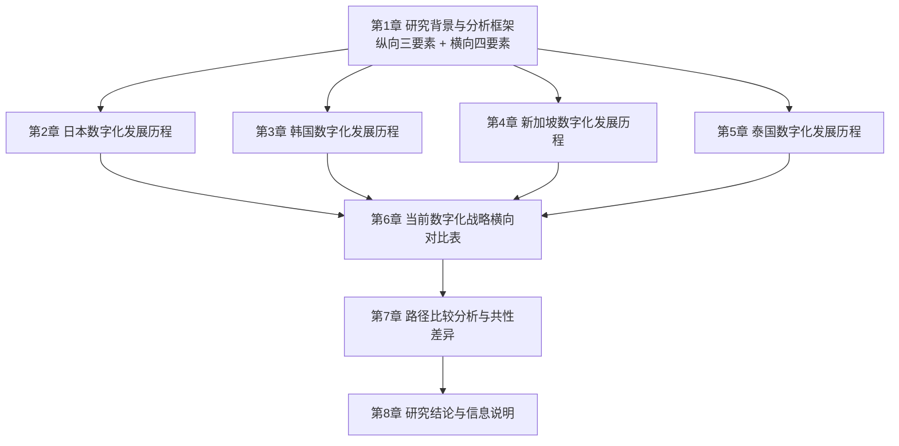
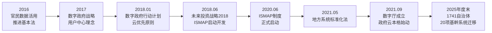
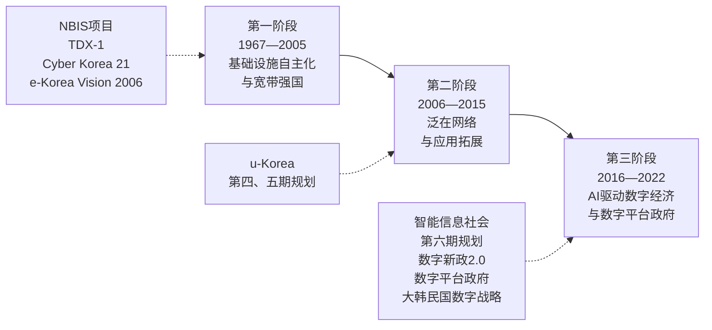
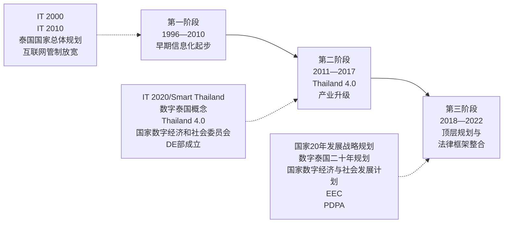

# 亚洲四国国家数字化发展历程与战略对比研究（截至2022年）
# 1 研究背景与分析框架

进入21世纪以来，数字技术已从单一的生产力工具演变为重塑国家治理结构、产业组织形态与社会生活方式的底层基础设施。在亚洲地区，这一进程与人口结构的深刻变迁交织叠加：日本、韩国正处于深度老龄化阶段，新加坡作为城市国家面临劳动力规模有限的长期约束，泰国则在迈向"超老龄社会"的同时仍需完成产业升级与中等收入跨越的双重任务。在此背景下，国家层面的数字化战略不再仅是技术追赶或产业政策问题，而成为各国应对人口红利衰减、社会服务负担加重、经济增长动能转换等结构性挑战的核心制度安排。本报告以日本、韩国、新加坡、泰国四国为研究对象，系统梳理其国家级数字化发展历程并对当前主要战略进行横向比较，第1章作为全篇总起，首要任务在于界定研究的范围与边界、阐明对比研究的现实意义，并构建贯穿全报告的统一分析框架，以保证后续各章节在历程回顾与战略对比上口径一致、逻辑连贯。

## 1.1 研究范围与边界界定

为确保研究的聚焦性与可操作性，本报告对研究对象、时间跨度与分析层级三个维度作出明确界定。

**在国别范围上**，本报告选取日本、韩国、新加坡、泰国四国。这一组合并非随机选择，而是兼顾了地理分布、经济发展阶段与制度类型的代表性：日本是亚洲最早启动信息化建设的发达经济体之一，其数字化战略具有较长的演进周期；韩国是公认的"宽带强国"与ICT产业领先国家，其国家信息化总体规划体系连续性强；新加坡作为典型的城市国家，凭借精简治理结构推动了高度集成的"智慧国家"战略；泰国则代表东南亚新兴经济体，其数字化战略在产业升级与社会包容性之间寻求平衡。四国共同构成观察亚洲数字化路径多样性的有效样本。

**在时间跨度上**，本报告将研究截点设定为2022年底。这一截点的选择具有双重考量：其一，2020—2022年间，受新冠疫情冲击与全球地缘政治变化影响，亚洲主要国家相继出台或更新了顶层数字化战略，使该时段成为观察各国战略转向的关键窗口；其二，将时间边界明确锁定为2022年底，有助于规避因后续政策频繁更新导致的对比口径漂移，提升研究结论的时效稳定性。对2022年底之后的政策更新风险，本报告将在结论章中作专门说明。

**在分析层级上**，本报告聚焦于国家层面的顶层数字化战略，即由中央政府或最高规划机构发布、覆盖全国范围、统领多领域的综合性数字化规划与法律框架。教育数字化、医疗信息化、金融科技监管、特定产业数字化转型等行业子政策不在本报告的主要分析范围之内，仅在与顶层战略密切相关时作为佐证材料引用。这一层级限定有助于避免研究范围过度扩散，确保对四国数字化战略主轴的清晰把握。

## 1.2 亚洲数字化与人口结构背景下的对比研究意义

将四国数字化发展历程作为整体进行对比研究，其意义根植于亚洲所面临的双重时代背景。

**一方面，亚洲是全球数字化进程最具活力的区域之一**。从产业层面看，亚洲既拥有日韩这样的ICT产业领先国家，也拥有新加坡这样的数字金融与数字贸易枢纽，更涵盖泰国这样的数字消费快速崛起市场；从社会层面看，移动互联网普及率、数字支付渗透率、电子政务应用水平在亚洲多国均处于全球前列。这种差异化的数字化生态为开展跨国比较研究提供了丰富的素材。

**另一方面，亚洲是全球人口结构变迁最为剧烈的区域**。日本已进入超老龄社会，老龄化率长期居全球之首；韩国生育率持续走低，人口结构急速逆转；新加坡面临本土劳动力规模有限与社会老龄化并行的压力；泰国则被认为是东南亚最早迈入老龄社会的国家之一。在劳动力供给收缩、社会保障支出上升、公共服务需求复杂化的共同压力下，**数字化已不再是单纯的经济议题，而成为各国维系社会运行效率与公共服务质量的战略选择**。无论是远程医疗、智能养老、数字政务还是产业自动化，数字技术都被赋予了缓解人口结构性压力的关键功能。

在此背景下进行四国对比研究，具有三方面价值。**第一，理论价值**：四国分别代表发达经济体、城市国家与新兴经济体三种发展模式，对比其数字化路径有助于揭示不同制度环境与发展阶段下国家数字化战略的共性逻辑与差异化选择。**第二，政策价值**：通过对比可以识别哪些战略要素属于普遍适用的"必选项"（如基础设施建设、数据治理框架），哪些属于路径依赖下的"特色项"（如日本的"以人为本社会5.0"、新加坡的"全民数字就绪"），为其他亚洲国家制定数字化战略提供参考。**第三，前瞻价值**：四国战略均不同程度地嵌入了应对人口老龄化的考量，对比研究有助于提炼出"数字化—人口结构"双重转型的政策协同模式。

## 1.3 纵向历程梳理维度：关键政策—提出年份—核心目标

为保证后续四章（第2—5章）对四国数字化发展历程的梳理具有统一口径与可比性，本报告构建"关键政策—提出年份—核心目标"的三要素纵向分析维度。

**"关键政策"** 指由国家最高规划机构或相关部委发布的、对国家数字化进程具有标志性意义的战略规划、法律框架或政府机构设立等节点性事件。识别标准包括三方面：是否覆盖全国范围、是否具有跨部门统领性、是否对后续政策具有定调作用。例如日本的《IT基本法》、e-Japan战略、Society 5.0与数字厅的成立，韩国的国家基础信息系统项目（NBIS）、五期国家信息化总体规划、数字新政与《大韩民国数字战略》，新加坡的国家计算机化计划、IT2000、iN2015与Smart Nation 2025，泰国的IT2000、Thailand 4.0与《数字泰国发展二十年规划》等，均符合此识别标准。

**"提出年份"** 用于精确锚定政策的时间坐标，便于跨国进行同期对比，识别各国战略推出的先后节奏与代际特征。考虑到部分政策存在"立法年份"与"实施年份"不一致的情况（如泰国《个人数据保护法》2019年立法、2022年全面生效），本报告在标注时将以政策正式发布或颁布年份为主，必要时同时标注实施时点。

**"核心目标"** 用于刻画每一项政策所承载的战略意图，回答"该政策试图解决什么问题、实现什么愿景"的核心命题。这一要素是判断各国数字化战略逻辑演进的关键，例如日本从e-Japan的"基础设施追赶"到Society 5.0的"以人为本社会转型"，韩国从Cyber Korea 21的"宽带普及"到数字平台政府的"数据驱动治理"，反映的正是核心目标的代际跃迁。

通过这一三要素结构，第2—5章将以一致的笔法呈现四国从早期信息化起步到2022年的完整演进脉络，避免因各国资料详略不一而导致的描述失衡。

## 1.4 横向战略对比维度：战略名称—发布时间—核心愿景—主要支柱

在纵向历程梳理的基础上，本报告需要在第6章对四国2022年前后正在实施的主要数字化战略进行横向对比。为此构建"战略名称—发布时间—核心愿景—主要支柱"的四要素横向分析维度。

**"战略名称"** 指各国当前居于统领地位的官方数字化战略的正式名称，确保对比对象在层级上对等。本报告将日本《实现数字社会的重点计划》及数字田园都市国家构想、韩国《大韩民国数字战略》及数字平台政府、新加坡Smart Nation 2025及数字经济/政府/社会三大蓝图、泰国《数字泰国发展二十年规划》及《国家数字经济与社会发展计划》作为主要对比对象。

**"发布时间"** 指当前战略的最新发布或修订年份，用于判断各国战略的时效性与同步性。该要素有助于识别"先行者"与"跟进者"的角色分布。

**"核心愿景"** 提炼各战略最高层级的目标表述，反映各国对"数字化目的地"的根本性判断。例如日本强调"以人为本的Society 5.0"、新加坡强调"领先的智慧国家"、泰国强调"数字驱动的稳定繁荣与可持续发展"等。

**"主要支柱"** 拆解各战略下重点布局的领域或行动方向，通常包括数字基础设施、产业数字化、数字政府、数字社会与人才培养、数据治理与网络安全等若干维度。通过支柱对比可以识别各国战略的资源配置重点与政策侧重。

四要素结构的设计目的在于使四国战略在同一"坐标系"下被结构化呈现，避免因各国战略文件篇幅、表述风格差异而造成的对比失真。

## 1.5 分析框架整合与报告结构安排

整合纵向与横向两个维度，本报告形成"历程演进—当前对比"的双层分析框架。**纵向维度**回答"四国如何走到今天"的演进逻辑问题，**横向维度**回答"四国当前战略有何异同"的现状对比问题，二者共同构成理解亚洲国家数字化路径的完整视角。该框架将在后续章节中得到系统应用：第2—5章分别按照纵向三要素结构梳理日、韩、新、泰四国的发展历程；第6章按照横向四要素结构进行集中对比；第7章在前两者基础上进行共性差异的比较分析；第8章作收束总结并说明研究边界。

下方流程图直观展示本报告的整体结构与各章节之间的逻辑递进关系：



从上图可见，第1章作为方法论起点，为后续四章的国别历程梳理提供统一口径；四国历程梳理的成果汇入第6章的横向对比表；对比表进一步支撑第7章的比较分析；最终在第8章完成结论收束与边界说明。**这一结构安排的核心特征是"先纵后横、先述后议、先分后合"**——通过先完成国别纵向梳理建立事实基础，再通过横向对比识别异同特征，最后通过比较分析提炼一般性判断，从而避免在事实基础尚未稳固时即进入抽象比较所可能带来的论证失准。

需要特别说明的是，受公开资料可得性差异影响，四国历程梳理在颗粒度上可能存在不均衡——日韩新三国因数字化战略文件公开程度较高、英文资料较为丰富，历程描述将相对详尽；泰国部分政策的细节可能略显简略。对此，本报告在写作中将坚持"以可靠资料为准"的原则，对支撑不足处坦诚说明，不以推测填充。这一处理方式有助于维护研究结论的可信度，也为后续章节的具体展开预设了基本规范。

# 2 日本数字化发展历程回顾

承接第1章确立的"关键政策—提出年份—核心目标"三要素纵向分析维度，本章按时间顺序系统梳理日本自20世纪中后期信息技术初步引入起、至2022年底为止的国家级数字化战略演进脉络。日本作为亚洲最早启动信息化建设的发达经济体之一，其数字化战略具有较长的演进周期与较强的政策连续性，从早期的基础设施追赶到当前的"以人为本社会转型"，呈现出明显的代际跃迁特征。理解日本路径的内在逻辑，不仅有助于揭示一个老龄化先行经济体在数字时代的国家应对方式，也为后续与韩国、新加坡、泰国三国进行横向对比奠定事实基础。

需要先行交代的历史背景是，日本政府引入第一台计算机可追溯至1958年，这构成了日本国家信息化进程的最早起点。但严格意义上以国家立法与综合战略形式推进的数字化进程，则始于2000年。此后二十余年间，日本相继出台了《IT基本法》、e-Japan战略、u-Japan战略、新IT改革战略、i-Japan战略2015、Society 5.0、《官民数据活用推进基本法》、数字政府战略与行动计划、《数字社会形成基本法》、数字厅设立、《实现数字社会的重点计划》及数字田园都市国家构想等一系列标志性政策，构成了日本数字化战略的完整谱系。

## 2.1 起步阶段：《IT基本法》与e-Japan战略（2000—2003）

日本国家层面的数字化战略，以2000年的立法行动作为正式起点。**2000年，日本颁布了首部具有国家基本法地位的数字化立法《高度信息通信网络社会形成基本法》（即《IT基本法》）**，这是日本数字化历程中具有奠基意义的事件[^1]。该法确立了构建"高度信息通信网络社会"的国家基本理念，明确了国家、地方公共团体与企业在推进信息化中的角色与责任，为后续一系列国家级数字化战略提供了法律依据。

在《IT基本法》出台的同一年，日本政府启动了为期约五年的国家战略——**e-Japan战略**。该战略的核心愿景是大力发展ICT基础设施，将日本建设成为"全球最先进的IT国家"。从可获得的政策文献看，21世纪初日本相继制定了《信息技术国家基本战略草案》（2000年）和《国家产业技术战略》（2001年），其战略总目标被概括为"建立超高速、超宽带互联网，重点发展信息、生物环境和纳米技术的前沿领域，建设全球最先进的信息化国家"[^2]。这一阶段战略具有典型的**基础设施追赶**特征：以光纤网络、宽带普及、电子政务起步与IT产业培育为核心抓手，回应20世纪末日本在信息化进程上自感落后于美国的危机感[^2]。

值得关注的是，e-Japan战略不仅停留在宏观目标层面，还通过推行"适用特殊用途的技术特区"和"特殊都市"的计划战略加以落地。日本一改以往的低调方式，大张旗鼓地推行设立IT产业集聚、信息技术环境良好的"IT特区"和"IT高地"，以及IT基础设施完善、市内光纤普及程度高、拥有大量潜在性因特网人口的信息化都市[^2]。据相关数据，在日本47个都道府县的641个城市中，已纳入长期发展远景规划、以信息、环境、生物、传媒等高新技术为主导产业方向的都市共470个，约占全国城市总数的73.3%；其中以信息通讯关连产业发展为主的城市为70个[^2]。这一布局表明，e-Japan战略不仅是宏观技术战略，也是一项面向地域结构改造的产业政策。

## 2.2 泛在化拓展：从u-Japan到新IT改革战略（2004—2006）

e-Japan战略实施数年后，日本国内的宽带基础设施迅速普及，宽带追赶目标基本达成，战略重心由此开始向"网络如何被使用"转移。2004年，日本总务省提出了**u-Japan战略**，将战略目标从"有线宽带普及"延伸到"无所不在的网络社会"（Ubiquitous Network Society）。"u"取义自Ubiquitous（无处不在）、Universal（普遍适用）、User-oriented（以用户为本）与Unique（独特）等多重含义，强调人、物、网络的全面互联与社会全场景的信息化覆盖。

2006年，日本进一步提出了**新IT改革战略（New IT Reform Strategy）**，其核心目标被概括为"建立一个任何人、任何时间、任何地点都能接触到ICT的社会"。这一表述实际上是u-Japan"泛在网络社会"理念的延续与具体化，反映了日本在完成基础宽带追赶之后，开始将战略关切由"网络覆盖"提升至"网络可及性与可用性"。在这一阶段，物联网概念尚未被广泛采用，但u-Japan与新IT改革战略所勾画的"人、物、网络全面互联"愿景，事实上为后续物联网（IoT）、智慧城市与Society 5.0议题做了重要铺垫，构成了日本数字化战略从"基础设施"向"社会应用"过渡的承接环节。

## 2.3 应用深化与社会议题响应：i-Japan战略2015（2009）

2008年全球金融危机后，日本国内对数字化战略的现实绩效产生了更为迫切的诉求，希望数字技术能够直接回应医疗、教育、行政服务等具体社会问题。在此背景下，**2009年日本政府发布了"i-Japan Strategy 2015"，核心目标是推动ICT的利用**——即不再单纯追求基础设施覆盖率，而是将战略重心明确转向数字技术在重点领域的深度应用。

i-Japan战略2015将电子政务、医疗与教育列为三大重点领域，希望通过数字技术嵌入公共服务以缓解日趋严峻的少子老龄化、地方医疗资源不足、教育数字鸿沟等议题。从战略导向上看，**i-Japan标志着日本数字化政策开始从"技术供给"逻辑向"社会需求"逻辑转变**：政策叙事不再以"建设最先进的IT国家"为最高目标，而开始强调数字化对具体社会问题的解决能力。这一过渡性特征为后续Society 5.0的范式跃迁埋下伏笔。

## 2.4 数据利用导向的兴起（2013年起）

进入2010年代中期，日本数字化战略再次出现重要的方向性调整。**从2013年开始，日本的数字化战略重点转向数字数据的利用**——不再仅以"网络与终端"为政策对象，而开始将"数据"作为独立的战略要素加以治理。这一转向的背景包括云计算、大数据、人工智能等技术的成熟，以及日本社会对数据驱动式公共服务与产业创新的需求上升。

数据利用导向的兴起，实际上为后续Society 5.0将"网络空间与物理空间深度融合"作为核心范式提供了概念准备，也为2016年《官民数据活用推进基本法》的出台奠定了政策基础。可以说，2013年前后是日本数字化战略由"应用导向"进一步演化为"数据导向"的关键拐点。

## 2.5 范式跃迁：Society 5.0与第五期科学技术基本计划（2016）

2016年，日本内阁制定的第五期科学技术基本计划首次正式提出了**Society 5.0**概念，将其定位为继狩猎社会（1.0）、农耕社会（2.0）、工业社会（3.0）、信息社会（4.0）之后的"超智能社会"（5.0）。Society 5.0的核心愿景是通过网络空间（cyberspace）与物理空间（physical space）的深度融合，实现"以人为本"的社会形态——经济发展与社会问题解决在数字技术支撑下达成协同。

Society 5.0的提出具有深远的范式意义。**它标志着日本数字化战略从"技术建设导向"正式转向"以人为本的社会转型导向"**：数字化不再被视为单一的产业政策或基础设施工程，而被定位为重塑社会运行结构、应对人口老龄化与劳动力萎缩的总体性社会工程。在Society 5.0框架下，无人驾驶、远程医疗、智能制造、智慧农业、智能养老等议题被纳入统一的政策叙事，数字技术被赋予了"补偿人口红利衰减"的战略功能。

从国际比较视角看，Society 5.0与德国"工业4.0"形成对照——后者聚焦制造业升级，而前者覆盖经济、社会与生活的全方位转型。这一概念也成为后续日本数字政策文件中反复援引的最高愿景，事实上构成了2016年之后日本数字化战略的"元叙事"。

## 2.6 数据治理立法：《官民数据活用推进基本法》（2016）

与Society 5.0同年，日本在数据治理立法上取得标志性进展。**2016年12月，日本制定了《官民数据活用推进基本法》**[^3]。该法在2000年《IT基本法》之后，进一步与2003年《个人信息保护基本法》、2013年《关于办理行政手续特定个人识别番号利用等法律》、2014年《网络安全基本法》等既有立法相互衔接，弥补了"信息数据正确运用与有效活用"领域的法律空白[^1]。

该法的立法目的，是为了"正确而有效地活用"通过互联网及其他高度信息通信网络流通的种类繁多、数量巨大的信息，从而解决日本急速发展的少子高龄化带来的社会问题、帮助建设让国民安全安心生活的社会[^1]。**这一立法目的表述本身，清晰地揭示了日本数据治理与人口结构挑战之间的内在关联**——数据活用不仅服务于产业创新，也被明确定位为应对老龄化的政策工具。

从内容架构上看，该法由四章构成：第一章总则明确了立法宗旨与基本理念，界定了"官民数据"的具体内容，并解释了"人工智能关联技术""物联网活用相关技术""云计算服务关联技术"等概念；第二章规定了政府必须制定官民数据活用推进基本计划，明确了内阁总理、内阁会议、国会在计划制定中的分工，并要求全国各都道府县依据该法制定各自级别和地域相应的官民数据活用推进计划；第三章则从利用程序、技术规格统一、人才培养、普及教育等方面规定了具体施策[^1]。该法的另一项实务性意义在于，**它为后续政府云（Gov-Cloud）建设提供了直接的法律依据**——2016年12月该法的施行，被日本相关政策回顾确认为政府数字化推进的法律基础[^4]。

## 2.7 数字政府推进：从战略到行动计划（2017—2018）

在《官民数据活用推进基本法》的法律基础上，日本进一步将数据治理推向公共行政领域。**2017年，日本制定了"数字政府战略"（Digital Government Strategy），目标是进一步促进公共管理的数字化**。该战略明确了"行政服务应以国民为中心进行设计"的基本理念[^4]，将"用户中心"原则正式确立为日本数字政府建设的指导思想。

**2018年1月，日本进一步发布了"数字政府行动计划"（Digital Government Action Plan）**[^4]。该计划在战略理念基础上落实具体行动方向，最具标志性的内容之一是采用了"云优先（Cloud by Default）"原则——政府在整备信息系统时，将云服务作为首选方案，标志着日本政府IT建设从传统的"自前主义"（即各部门自建自营，on-premise）向积极利用民间云服务的方针转变[^4]。

为支撑这一转变，**2018年6月的"未来投资战略2018"与"网络安全战略"启动了云服务安全评估制度（ISMAP，Information system Security Management and Assessment Program）的开发**。ISMAP由内阁网络安全中心（NISC）、数字厅、总务省、经济产业省四府省厅共同管辖，于2020年6月正式启动，对政府采购的云服务进行安全评估与登录，构成了后续政府云信任体系的前提条件[^4]。同期，总务省还基于"ICT街づくり推进会议"下设的"智慧城市检讨工作组"，于2017年1月发布了第一次取纸，将ICT街区建设与官民数据活用推进基本法的实施紧密结合，推动"数据活用型智慧城市推进事业"等具体项目[^3]。

## 2.8 制度重构：数字改革关联法、《数字社会形成基本法》与数字厅设立（2021）

进入2020年代，新冠疫情暴露出日本数字政府长期存在的"碎片化"与"部门壁垒"问题，例如各地方自治体系统标准不一、跨部门数据共享困难、行政手续仍大量依赖纸质流程等。这一现实压力推动日本启动了数字化领域最大规模的制度重构。

**2021年，日本颁布了《数字社会形成基本法》（The Basic Act on Forming a Digital Society）**。该法取代了实施约二十年的《IT基本法》，重新界定了日本数字化的基本理念、国家与地方公共团体的责任以及推进体制，成为新时期日本数字化战略的总纲性法律。同期通过的"数字改革关联六法"对个人信息保护、行政手续数字化、地方公共团体信息系统标准化等领域进行了一揽子修订，构成了一次系统性的法律框架重组。

**2021年9月，作为统一的数字化主管机构，日本"数字厅"（Digital Agency）正式成立**[^4]。数字厅的成立改变了过去由内阁官房IT综合战略室、总务省、经济产业省等多部门分头推进数字化的局面，将数字政策制定与执行权集中于单一中央机构。其核心使命之一是开发与运营**政府云（Gov-Cloud）**，将国家与地方自治体此前各自构建、运营的信息系统集约到政府认定的云服务上并加以标准化[^4]。

政府云构想的法律框架与具体目标，由**2021年5月成立的《地方公共团体信息系统标准化相关法律》**赋予。该法律规定，**到2025年度末，全国1741个地方自治体必须将住民基本台账、税务、社会保障等20项基幹业务系统迁移至符合国家标准的系统上**，政府云的使用作为"政策上的原则"被推荐采用[^4]。从制度演进角度看，从2016年《官民数据活用推进基本法》、2017年"数字政府推进方针"、2018年"数字政府实行计划"与"云优先"原则、2018—2020年ISMAP制度的开发与启动，到2021年数字厅与政府云的正式落地，构成了一条清晰的"法律—战略—评估制度—执行机构"演进链条[^4]。



上述链条揭示了日本数字化制度重构的"渐进式累积"特征——并非一次性突破，而是经过约五年时间的法律奠基、战略制定、评估制度建设与机构整合，最终在2021年实现执行体制的整体性升级。

## 2.9 战略整合与区域延伸：《实现数字社会的重点计划》与数字田园都市国家构想（2022）

数字厅成立之后，日本数字化战略进入"整合实施"阶段。**2022年，日本政府制定了《实现数字社会的重点计划》**，作为《数字社会形成基本法》框架下的总体行动方案。同期，岸田内阁推出了**"数字田园都市国家构想"**，并就基本方针进行了多轮审议。

根据2022年4月召开的"数字田园都市国家构想实现会议"第7回议事记录，该构想由内阁总理大臣岸田文雄主持，由数字田园都市国家构想担当大臣、数字大臣、总务大臣、厚生劳动大臣、农林水产大臣、国土交通大臣等多部门共同参与，并广泛吸纳了地方自治体（全国知事会、和歌山县白浜町、广岛县知事等）、企业界（JR东日本、日本邮政、住友商事系等）与学界（庆应义塾大学等）代表的意见[^5]。会议在地方六团体意见交换的基础上，审议了基本方针的骨子案[^5]。

数字田园都市国家构想的核心导向，是**将Society 5.0的"以人为本社会5.0"愿景从国家层面延伸至地方层面**——通过数字技术解决地方人口减少、产业空心化、公共服务可及性下降等结构性问题，使数字化红利能够覆盖到偏远地区与中小城市，而非仅集中于东京等大都市圈。这一构想与《实现数字社会的重点计划》共同构成了2022年时点日本数字化战略的主导框架，呈现出鲜明的"中央顶层设计—地方落地实施"战略闭环特征。

值得指出的是，**数字田园都市国家构想在事实上承接了20世纪80年代"田园都市国家构想"的理念，但赋予其全新的数字化内涵**——通过卫星互联网、5G、智慧农业、远程医疗、远程教育、远程办公等技术手段，构建即使在地方也能享受到城市水平公共服务与就业机会的社会形态。这一战略转向直接呼应了日本"东京一极集中"问题与地方衰退议题，也使数字化战略真正成为应对人口结构失衡的核心政策工具。

## 2.10 演进逻辑小结：从技术建设导向到以人为本社会转型导向

综合本章梳理，日本自1958年引入第一台计算机起步，至2022年底数字田园都市国家构想确立，其国家数字化战略经历了一条清晰可辨的代际演进路径。下表汇总了关键节点的"提出年份—核心目标"：

| 提出年份 | 关键政策/事件 | 核心目标 |
|---------|--------------|---------|
| 1958 | 日本政府引入第一台计算机 | 信息化技术初步引入 |
| 2000 | 《IT基本法》（高度信息通信网络社会形成基本法）颁布 | 构建国家信息化法律基本框架 |
| 2000—2005 | e-Japan战略（五年国家战略） | 发展ICT基础设施，成为世界领先的IT国家 |
| 2004 | u-Japan战略 | 推进"无所不在的网络社会" |
| 2006 | 新IT改革战略 | 建立"任何人、任何时间、任何地点都能接触到ICT"的社会 |
| 2009 | i-Japan Strategy 2015 | 推动ICT的利用，重点深化电子政务、医疗、教育应用 |
| 2013年起 | 数字化战略重点转向 | 转向数字数据的利用 |
| 2016 | 第五期科学技术基本计划（Society 5.0） | 通过网络空间与物理空间融合实现"以人为本的超智能社会" |
| 2016 | 《官民数据活用推进基本法》 | 推进官民数据有效活用，解决少子高龄化社会问题[^1] |
| 2017 | 数字政府战略 | 进一步促进公共管理的数字化 |
| 2018 | 数字政府行动计划 | 落实云优先原则等具体行动 |
| 2021 | 《数字社会形成基本法》颁布 | 取代《IT基本法》，重构数字化推进基本框架 |
| 2021.09 | 数字厅成立 | 设立统一数字化主管机构，统筹推进政府云等核心项目[^4] |
| 2022 | 《实现数字社会的重点计划》与数字田园都市国家构想 | 将Society 5.0愿景向地方延伸，构建中央—地方战略闭环[^5] |

从上表可见，**日本数字化战略的演进可大致划分为三个阶段**。**第一阶段（2000—2008）为"技术建设导向"**：以e-Japan、u-Japan、新IT改革战略为代表，核心议题是基础设施追赶与网络覆盖普及，战略叙事的关键词是"最先进的IT国家""无所不在的网络"。**第二阶段（2009—2015）为"应用深化与数据导向"过渡期**：以i-Japan战略2015与2013年后的数据利用导向为代表，开始将战略重心从"技术供给"转向"社会需求"。**第三阶段（2016年至今）为"以人为本社会转型导向"**：以Society 5.0、《官民数据活用推进基本法》、《数字社会形成基本法》、数字厅与数字田园都市国家构想为标志，数字化被定位为应对少子老龄化、地方衰退与全球数字竞争三重压力的总体性社会工程。

**驱动这一战略转向的，主要是三重压力的叠加作用**：**其一是人口老龄化压力**——日本作为全球老龄化率最高的国家，劳动力萎缩与社会保障支出膨胀使数字技术承担起"补偿人口红利衰减"的功能；**其二是地方衰退压力**——东京一极集中与地方人口流失推动数字化战略从国家层面下沉至区域层面，催生了数字田园都市国家构想；**其三是全球数字竞争压力**——美国大型科技企业的崛起与中国数字经济的快速发展，使日本认识到必须通过系统性制度重构（《数字社会形成基本法》、数字厅、政府云）才能维持在全球数字化竞争中的位置。

这一演进逻辑也使日本路径区别于亚洲其他三国：相比韩国以ICT产业升级为主线、新加坡以城市国家整合为优势、泰国以新兴经济体定位推进数字赶超，**日本路径的最大特征是将数字化与人口结构转型深度绑定，将"以人为本的社会5.0"作为数字化战略的最高愿景**。这一特征将在第6—7章的横向对比中作为重要参照系。

# 3 韩国数字化发展历程回顾

承接第1章确立的"关键政策—提出年份—核心目标"三要素纵向分析维度，并延续第2章对日本数字化历程的梳理范式，本章系统呈现韩国自20世纪60年代后期电信与计算机技术初步引入起、至2022年底为止的国家级数字化战略演进脉络。**韩国是亚洲公认的"宽带强国"与ICT产业领先国家**，其数字化战略最显著的特征在于**国家信息化总体规划体系的长期连续性与阶段过渡的清晰节奏**——从早期的电信基础设施自主化、宽带普及，到泛在网络社会构建，再到智能信息社会战略与应对疫情的数字新政，最终演化为以人工智能驱动的数字经济和数字平台政府为核心的全新战略框架。理解韩国路径的演进逻辑，有助于揭示一个ICT产业领先经济体在数字时代如何完成"基础设施建设—产业升级—治理范式重构"的连续跃迁，也为后续与日本、新加坡、泰国进行横向对比提供具备较高颗粒度的事实参照。

## 3.1 早期信息化奠基：电信基础设施自主化与互联网起步（1960年代末—1990年代中期）

韩国国家信息化进程的最早起点，可追溯至20世纪60年代后期对计算机技术的引入。**1967年，韩国在全国人口普查中首次引入计算机**，这一事件标志着计算机技术开始嵌入国家行政系统。此后，韩国政府将信息化由分散的技术应用提升至国家计划层面：**1978—1982年实施了第一个"行政计算机化五年总体规划"**，开启了以行政系统电子化为先导的信息化进程；**1986年颁布了《信息系统普及与利用促进法》**，为信息系统的国家级推广提供了法律依据。

在法律框架的支撑下，**1987年韩国启动了具有标志性意义的"国家基础信息系统项目"（NBIS Project，National Basic Information System Project）**。该项目分为两个阶段推进：**第一阶段（1987—1991年）**奠定国家信息系统的基础架构，**第二阶段（1992—1996年）**进一步拓展应用范围与覆盖深度。NBIS项目构成了韩国早期信息化的"国家骨架工程"，将行政、金融、教育、研究等关键领域的信息系统纳入国家级整体规划。

与信息系统建设并行的，是电信基础设施自主化的关键突破。**1980年代初，韩国电信基础设施处于发展中国家水平，1980年的有线电话普及率仅为7.2%**[^6]。为升级电信基础设施，**韩国政府先以进口电子交换机作为过渡方案，1981年正式启动本土电子交换机TDX-1的开发项目**[^6]。**五年后即1986年，韩国成为世界第10个电子交换机生产国，并最终在1987年将电话普及率提升至户均一部的水平**[^6]。这一阶段的基础设施跃升，奠定了后续宽带与互联网时代韩国能够实现"赶超式发展"的硬件前提。

进入1990年代，韩国信息化进入互联网时代。**1994年韩国互联网接入服务正式上线，1998年宽带网络服务进入商用阶段**[^6]。其后，**互联网用户从1998年的300万人指数级增长至2005年末的3301万人，相当于人口的72.8%**[^6]。值得指出的是，**1994年韩国信息通信部（MIC，Ministry of Information and Communication）成立**，并在此后至2008年间长期作为推动韩国数字化的主要政府机构，构成了韩国国家信息化政策的核心执行主体。这一时期，全国所有小学、初中和高中均接入了宽带网络[^6]，为后续数字社会的人才储备奠定了基础。

综合来看，韩国早期信息化阶段呈现出鲜明的**"基础设施自主化为先导、行政系统电子化为骨架、立法保障为支撑"**三位一体特征：通过本土电子交换机开发掌握核心硬件能力，通过NBIS项目构建国家级信息系统骨架，通过《信息系统普及与利用促进法》提供法律保障，三者共同构成了韩国后续向"宽带强国"跃迁的制度与技术基础。

## 3.2 国家信息化总体规划体系的形成与宽带强国战略（1996—2006）

在早期奠基阶段的基础上，韩国自1990年代中期起开始构建以"国家信息化总体规划"为统领的五年期连续规划体系。这一规划体系成为韩国数字化战略的核心制度载体，至2022年已连续推出六期，构成一条清晰可辨的政策演进链条。

韩国先后实施了六个国家信息化总体规划，时间节点与定位如下：**第一期国家信息化总体规划（1996—2000）** 启动了国家级数字化的统一规划机制；**第二期"Cyber Korea 21"（1999—2002）** 将战略重心提升至"宽带强国"建设；**第三期"e-Korea Vision 2006"（2002—2006）** 进一步扩展信息化对经济社会的渗透；**第四期国家信息化总体规划（2008—2012）** 与**第五期国家信息化总体规划（2013—2017）** 在前述基础上持续推进，最终演化为**第六期国家信息化总体规划（2018—2022），旨在建设智能信息社会**。

在这一序列中，**Cyber Korea 21（1999年发布、覆盖1999—2002年）** 与**e-Korea Vision 2006（2002年发布、覆盖2002—2006年）** 是韩国向"宽带强国"跃迁的两大核心战略。**Cyber Korea 21的核心目标是将韩国建设成为知识信息化先进国家**，以宽带普及、电子商务发展、政府信息化为主要抓手；**e-Korea Vision 2006则进一步将战略重心由"基础设施铺开"扩展至"信息化对经济社会的全面渗透"**，强调信息化产业的国际竞争力与国民信息化能力提升。

这一阶段的成效在数据上得到了直接验证。从1998年到2005年，韩国互联网用户规模从300万人扩张至3301万人，普及率达到72.8%[^6]；至2006年6月，**韩国每百名居民宽带订阅数达到26.4（OECD数据）、固定电话57部（2004年）、移动电话79.4部（ITU 2005年数据）、每百名居民计算机数量53.2台**[^6]。这一组数据使韩国在全球范围内被普遍视为宽带普及与信息化基础设施建设的标杆案例。**与日本同期e-Japan战略相比，韩国Cyber Korea 21启动时间略早，且在宽带订阅率与互联网普及率的实际成效上表现更为突出**——这一差异折射出韩国"以ICT产业为战略主轴"的国家定位与日本"以基础设施追赶为主"的政策导向之间的微妙分化。

**与此同时，韩国自2002年起开始推动电子政务**，将信息化由产业层面向政府治理层面延伸。电子政务的推进与e-Korea Vision 2006形成战略协同，使韩国在2000年代中期前后成为亚洲范围内电子政务建设最为系统的国家之一。

## 3.3 泛在网络社会构想：u-Korea战略（2006）

随着宽带追赶目标基本达成，韩国数字化战略重心开始由"网络覆盖"向"网络融入社会全场景"过渡。**2006年，韩国推出了u-Korea战略**，核心愿景是建设"无所不在的网络社会"（Ubiquitous Society）——使数字技术渗透至公共服务、产业运营与日常生活的方方面面，实现人、物、网络的全面互联。

u-Korea的战略意涵需要结合东亚信息化的同期格局加以理解。如第2章所述，日本在2004年提出u-Japan战略、2006年提出新IT改革战略，同样以"无所不在的网络"作为核心叙事。**韩国u-Korea与日本u-Japan形成同步推进态势**，反映出东亚两大ICT先进经济体在完成宽带追赶之后，几乎在同一时点意识到需要将战略议题由"基础设施覆盖"提升至"网络应用场景拓展"。这一同步性，一方面体现了东亚信息化政策的相互观察与借鉴，另一方面也为后续智能信息社会概念的提出做了铺垫——u-Korea所勾画的"人、物、网络全面互联"愿景，事实上为物联网、智慧城市与人工智能议题的兴起预设了政策接口。

从战略定位看，**u-Korea标志着韩国数字化政策开始从"基础设施供给"向"应用场景嵌入"过渡**，成为后续第四期、第五期国家信息化总体规划继续深化"信息化应用"主题的逻辑起点。

## 3.4 智能信息社会转型：第六期国家信息化总体规划与智能信息社会中长期综合对策（2016）

进入2010年代中期，韩国数字化战略迎来一次重要的范式转型。这一转型的直接触发因素，是2016年AlphaGo与韩国棋手李世石的人机围棋对决在韩国社会引发的深刻冲击，以及同期全球范围内"第四次工业革命"议题的快速升温。在这一背景下，韩国政府将人工智能、大数据、物联网等智能信息技术整合纳入国家中长期战略框架，启动了数字化战略由"网络社会"向"智能信息社会"的范式跃迁。

这一范式转型的政策载体之一，是**第六期国家信息化总体规划（2018—2022），其明确目标是建设智能信息社会**。该规划将智能信息技术作为国家战略的核心驱动力，覆盖产业转型、社会服务、政府治理等多个维度，并对就业结构调整、社会安全网升级等议题作出系统性回应。第六期规划构成了2010年代后期韩国数字化战略的顶层框架，与日本同期Society 5.0构想在愿景层面形成对照——**两国均试图通过智能信息技术应对人口老龄化、劳动力收缩与产业升级的多重压力，但韩国更强调"AI产业竞争力"的国家定位，日本则更强调"以人为本的社会形态重塑"**。

从范式意义上看，**2016年前后韩国数字化战略实现了由"网络社会"向"智能信息社会"的关键跃迁**——数字化的政策对象不再局限于网络与终端，而扩展至以人工智能为核心的智能信息技术生态。这一跃迁为2020年代数字新政与数字平台政府的提出奠定了思想基础。

## 3.5 危机应对与产业升级：数字新政与数字新政2.0（2020—2021）

2020年新冠疫情的全球冲击，使韩国数字化战略进入"危机应对—战略升级"的新阶段。**2020年，韩国政府推出总额1390亿美元的"新政计划"（New Deal）以应对疫情冲击**[^7][^8]，其中"数字新政"（Digital New Deal）板块将数字化作为经济复苏与产业升级的核心抓手。

**2021年7月14日，韩国总统文在寅宣布推出总额1910亿美元的"新政2.0"（New Deal 2.0）计划**[^7][^8]。文在寅明确指出，"新政计划"虽源于疫情危机，但其任务不仅是帮助韩国克服眼前挑战，更应**发展成为国家战略，提升韩国在全球经济中的市场份额**[^7][^8]。在"新政2.0"框架下，数字化投资重点关注网络连接虚拟平台，并进一步促进区块链和云计算技术发展[^7][^8]。

更具战略意义的是，**"数字新政2.0"作为"新政2.0"的核心组成部分，将元宇宙与大数据、人工智能、区块链等并列为发展5G产业的重点项目**[^9]。这一布局表明，韩国数字化战略在疫情冲击后由"应急复苏"导向跃升为"前沿技术全面布局"导向——元宇宙、区块链、云计算、人工智能等被视为同等重要的战略支柱，共同构成5G产业生态的核心要素。

围绕元宇宙这一新议题，韩国进行了快速的国家级布局。**2020年底，韩国科学技术信息通信部（MSIT）公布《沉浸式经济发展策略》，目标是将韩国打造成全球五大扩展现实国家之一**[^9]，并为元宇宙建设拟定了**激活元宇宙平台生态系统、培养专业人士、培育公司以及为所有元宇宙用户建立安全环境**四大战略目标[^9]。**2021年5月18日，韩国科学技术信息通信部发起成立了"元宇宙联盟"（Metaverse Alliance），集结现代、三星、SK集团等500多家企业和机构**[^9]，旨在通过政府与企业合作、在民间主导下构建元宇宙生态系统。**韩国政府计划2026年成为元宇宙大国，将培育220家公司和4万名专业人才，并创造50亿韩元的收入**[^9]。

从政策定位看，数字新政与数字新政2.0呈现出鲜明的**"双重定位"特征**：一方面作为应对新冠疫情冲击的经济复苏工具，承担短期就业稳定与内需提振功能；另一方面作为国家战略升级载体，将数字化推向更具纵深的产业升级与全球竞争议题。这一双重定位，使韩国成为亚洲范围内借助疫情冲击实现数字化战略加速演进的代表性案例。

## 3.6 新政府数字治理框架：数字平台政府构想（2022）

2022年5月尹锡悦政府上任后，韩国数字化战略迎来又一次重要的方向性调整——**"数字平台政府"（Digital Platform Government）被确立为新政府的核心施政任务之一**。这一构想的根本理念，是政府基于数字化平台，推动国民、企业和政府共同解决社会问题、实现创造新价值[^10]，构成了韩国数字治理模式向"平台化、协同化"转型的标志。

为落实这一施政任务，**2022年11月30日，韩国科学技术信息通信部成立了由部长直接负责管理的两个部门"量子技术开发支援科"与"数字化平台政府支援科"**[^10]。其中，**"数字化平台政府支援科"将与数字平台政府委员会一同推动数字化领域的政策实施，旨在创新民官合作数字公共服务、打造数字化平台政府创新生态体系**[^10]。该部门承担三项主要任务：**①设立先导示范项目；②开展数字平台政府的基础设施建设；③制定并完善相关法律制度**[^10]。

与"数字化平台政府支援科"同期设立的"量子技术开发支援科"，则反映出韩国在数字化战略之外，已将量子技术作为支撑下一代数字基础设施的国家战略技术加以集中布局[^10]。该部门计划制定量子技术战略路线图、保障量子技术开发所需基础设施完备、构建民官协作治理体系等[^10]。两个新部门的同步设立，揭示了**新政府"以平台化治理为前台、以前沿技术为后端"的战略组合**。

从治理理念看，数字平台政府的核心创新在于将"政府—企业—国民"三方关系重构为"平台上的协同关系"：政府不再仅是公共服务的供给方，而是协同社会问题解决的"平台运营者"；企业不再仅是市场参与者，而是公共服务创新的合作伙伴；国民则由服务接受者转变为价值共创者。**这一治理范式与日本数字田园都市国家构想的"中央顶层设计—地方落地实施"框架形成鲜明对照**——韩国路径更强调"治理结构本身的平台化重构"，日本路径则更强调"数字化红利的地域延伸"。

## 3.7 国家数字化总纲：纽约构想、《大韩民国数字战略》与《数字平台发展战略》（2022）

2022年下半年，韩国进一步完成了数字化战略在国家总纲层面的系统重构。**2022年9月，韩国发表"纽约构想"**，提出了**韩国数字创新愿景和包括自由、人权、纽带在内的创造人类普遍价值的数字秩序**[^11]。"纽约构想"的战略意义，不仅在于其作为国内数字化战略的顶层愿景，更在于其首次将韩国数字化战略与全球数字秩序的话语权竞争相连接，确立了韩国在数字时代寻求国际规范贡献者角色的政策诉求。

在"纽约构想"基础上，韩国进一步形成了**《大韩民国数字战略》**作为国家数字化的总纲性文件，并于**2022年12月29日发布了《数字平台发展战略》**作为数字平台领域的具体规划[^11]。《数字平台发展战略》旨在发展国家数字经济核心产业，描绘了**政府、市场和国民多方参与下的韩国数字平台发展愿景**[^11]。

从战略架构看，**《数字平台发展战略》提出了"创新与全球化""自律与公正""信任与包容"三大原则，以及"培育世界一流平台产业""确立公平的市场秩序""构建健康平台社会"三大战略，并明确了九大核心课题**[^11]。九大课题覆盖了从技术能力、产业培育到市场秩序与社会包容的完整链条，结构汇总如下：

| 核心课题 | 主要内容 |
|---------|---------|
| 课题一：强化平台核心技术竞争力 | 提升平台AI技术水平、推动数据流通与利用、构建10大领域虚拟现实平台、确立新一代平台技术 |
| 课题二：支持创新平台持续萌芽与发展 | 成立矛盾调解专门委员会、提供市场验证与招商引资支援、吸引国际资本 |
| 课题三：推进平台全球化 | 扶持企业开拓海外市场、与全球主要国家缔结伙伴关系、搭建国际合作体系 |
| 课题四：实现民间主导的市场自律 | 成立"平台自律机构"、制定纠纷调解方案与标准合同、成立"跨部门平台政策协议体" |
| 课题五：构建公平的竞争环境 | 制定"垄断审查指南"、修订企业合并审查标准、防止大型平台垄断 |
| 课题六：构建可信赖的平台技术环境 | 制定搜索与推荐服务透明性建议书、保障入驻企业数据获取、消除AI担忧 |
| 课题七：营造平台安全使用环境 | 将数据中心与通信运营商纳入灾难管理义务对象、加强服务障碍救助告知 |
| 课题八：构建小工商业及从业者成长生态 | 为传统市场小工商业提供线上销售支援、构建大数据平台、扩大平台从业者保险 |
| 课题九：构建数字新秩序政策基础 | 保障数字时代国民基本权利、制定"数字权利法案"（暂定） |

资料来源：基于韩国科学技术信息通信部《数字平台发展战略》整理[^11]

上表所列九大课题，**勾画出韩国数字化战略在2022年时点的完整政策架构**：技术层面以"平台核心技术竞争力"为抓手（课题一），产业层面以"创新平台支持"与"全球化"为双轮（课题二、三），市场层面以"自律—公平—可信—安全"为四重保障（课题四至七），社会层面以"小工商业生态"与"数字新秩序"为最终落脚（课题八、九）。**这一架构清晰反映了韩国数字化战略在愿景层面对"国际话语权"与"产业全球化"的双重诉求**——既要在全球数字秩序中占据规范贡献者地位（呼应"纽约构想"），又要培育具备全球竞争力的韩国数字平台产业（呼应"培育世界一流平台产业"战略）。

值得注意的是，《数字平台发展战略》在政策手段上明确采取"民间主导、政府支持"的取向，强调**实施有利于推动以民间为主导的自律性市场的跨部门联动政策，进一步优化相关法律和制度，以防止大平台垄断等破坏市场健康发展的行为**[^11]。这一取向与同期"数字平台政府"在公共治理领域的"政府—企业—国民协同"理念相互呼应，共同构成了2022年韩国数字化战略的核心治理逻辑。

## 3.8 演进逻辑小结：从宽带强国到AI驱动的数字平台政府

综合本章梳理，韩国自1967年人口普查首次引入计算机起步，至2022年底《大韩民国数字战略》与《数字平台发展战略》确立，其国家数字化战略经历了一条延续半个多世纪的完整演进路径。下表汇总了关键节点的"提出年份—关键政策—核心目标"三要素：

| 提出年份 | 关键政策/事件 | 核心目标 |
|---------|--------------|---------|
| 1967 | 全国人口普查首次引入计算机 | 计算机技术初步嵌入国家行政系统 |
| 1978—1982 | 第一个"行政计算机化五年总体规划" | 启动行政系统电子化 |
| 1981—1986 | 本土电子交换机TDX-1开发项目 | 实现电信核心硬件自主化，成为世界第10个电子交换机生产国[^6] |
| 1986 | 《信息系统普及与利用促进法》颁布 | 为信息系统国家级推广提供法律依据 |
| 1987—1996 | 国家基础信息系统项目（NBIS，两阶段） | 构建国家级信息系统骨架 |
| 1994 | 互联网接入服务上线；信息通信部（MIC）成立 | 启动互联网时代；建立数字化主管机构（1994—2008）[^6] |
| 1996—2000 | 第一期国家信息化总体规划 | 启动国家级数字化的统一规划机制 |
| 1998 | 宽带网络商用启动 | 启动宽带普及进程[^6] |
| 1999—2002 | 第二期"Cyber Korea 21" | 建设知识信息化先进国家，推进宽带强国战略 |
| 2002—2006 | 第三期"e-Korea Vision 2006" | 推动信息化对经济社会的全面渗透 |
| 2002 | 启动电子政务推动 | 将信息化由产业层面延伸至政府治理层面 |
| 2006 | u-Korea战略 | 构建"无所不在的网络社会" |
| 2008—2012 | 第四期国家信息化总体规划 | 持续推进信息化应用深化 |
| 2013—2017 | 第五期国家信息化总体规划 | 应对智能技术兴起，过渡至智能信息时代 |
| 2016 | 智能信息社会中长期综合对策 | 将AI、大数据、物联网纳入国家中长期战略框架 |
| 2018—2022 | 第六期国家信息化总体规划 | 建设智能信息社会 |
| 2020 | 数字新政（"新政计划"组成部分，1390亿美元） | 应对疫情冲击，启动数字化驱动的经济复苏[^7][^8] |
| 2021.07 | 数字新政2.0（"新政2.0"组成部分，1910亿美元） | 将元宇宙、区块链、云计算、AI并列为5G产业重点项目[^7][^8][^9] |
| 2022 | 数字平台政府构想 | 政府—企业—国民协同解决社会问题、创造新价值[^10] |
| 2022.09 | "纽约构想" | 提出包含自由、人权、纽带的数字秩序普遍价值[^11] |
| 2022 | 《大韩民国数字战略》 | 国家数字化总纲性战略 |
| 2022.11 | "数字化平台政府支援科"与"量子技术开发支援科"成立 | 强化数字平台政府推进体制，布局量子技术[^10] |
| 2022.12.29 | 《数字平台发展战略》 | 三大原则、三大战略、九大核心课题，培育世界一流平台产业[^11] |

从上表可见，**韩国数字化战略的演进可大致划分为三个阶段**。**第一阶段（1960年代末—2000年代中期）为"基础设施自主化与宽带强国"阶段**：以NBIS项目、TDX-1开发、第一期总体规划、Cyber Korea 21、e-Korea Vision 2006为代表，核心议题是电信基础设施自主化与宽带普及，战略叙事的关键词是"宽带强国""信息化先进国家"。**第二阶段（2006—2015）为"泛在网络与应用拓展"过渡期**：以u-Korea战略与第四、第五期国家信息化总体规划为代表，战略重心由"基础设施覆盖"转向"网络融入社会全场景"，为后续智能化跃迁做准备。**第三阶段（2016至今）为"AI驱动的数字经济与平台治理"阶段**：以智能信息社会中长期综合对策、第六期国家信息化总体规划、数字新政及其2.0版本、数字平台政府、《大韩民国数字战略》、《数字平台发展战略》为标志，数字化被定位为AI产业升级、平台治理重构与全球数字秩序话语权竞争的综合战略工具。



**驱动韩国战略演进的核心动因**，可归纳为四重压力的叠加作用：**其一是ICT产业升级压力**——作为以ICT为核心支柱产业的经济体，韩国必须通过持续的国家级战略保持ICT产业的全球领先地位；**其二是第四次工业革命议题的全球化扩散**——AlphaGo冲击事件后，韩国迅速将AI与智能信息技术上升至国家战略层面；**其三是新冠疫情冲击下的经济复苏与产业升级双重需求**——疫情成为数字新政加速推出的直接催化剂，并推动其升级为"新政2.0"的国家战略；**其四是政府更替带来的治理范式调整**——尹锡悦政府上任后将"数字平台政府"作为核心施政任务，标志着政府治理范式向"平台化、协同化"的主动转型。

将韩国路径与第2章梳理的日本路径作初步对照，可以识别出**两国数字化战略的"同步性"与"差异性"并存**特征。**同步性**体现在：两国均在2000年前后启动以宽带为核心的国家战略（Cyber Korea 21 vs e-Japan），均在2004—2006年前后推出泛在网络战略（u-Korea vs u-Japan），均在2016年前后完成智能信息社会的范式跃迁（智能信息社会中长期综合对策 vs Society 5.0），均在2020年前后启动数字治理结构的系统重构（数字平台政府 vs 数字厅）。**差异性**则体现在：**日本路径更强调"以人为本的社会5.0"作为最高愿景，将数字化与人口结构转型深度绑定；韩国路径更强调"AI驱动的数字经济与平台治理"，将数字化与ICT产业竞争力及全球数字秩序话语权深度绑定**。这一差异，将在第6—7章的横向对比中作为重要参照系进一步展开分析。

# 4 新加坡数字化发展历程回顾

承接第1章确立的"关键政策—提出年份—核心目标"三要素纵向分析维度，并延续第2、3章对日本、韩国数字化历程的梳理范式，本章系统呈现新加坡自20世纪80年代国家计算机化计划起、至2022年底为止的国家级数字化战略演进脉络。**作为典型的城市国家，新加坡凭借精简的治理结构、强政府主导模式与产业链分层管理思路，构建了覆盖政府、经济与社会的高度集成数字化体系**[^12]。从早期的公共行政计算机化、IT2000智慧岛构想、Infocomm 21、Connected Singapore，到iN2015、智慧国家（Smart Nation）倡议及数字政府/经济/社会三大蓝图，新加坡数字化战略呈现出鲜明的连续演进特征——每一代战略既承接前期成果、又开辟新议程，构成一条贯穿四十余年的政策演进链条。理解新加坡路径的内在逻辑，不仅有助于揭示一个小型城市国家如何凭借治理优势实现全方位数字化整合，也为后续与日本、韩国、泰国进行横向对比提供事实基础。

## 4.1 起步阶段：国家计算机化计划与公共服务计算机化（1980—1991）

新加坡国家层面的数字化进程，起步于1980年代初期对信息技术战略价值的重新审视。**1985年，新加坡经济的低迷促使该国对支撑经济发展的关键要素进行重新审视，以确定未来的发展方向；当时全球正处在数字技术爆发的关键时期，新加坡很快意识到信息技术将是提升国家生产力和全球竞争力的关键**[^13]。这一战略判断成为后续四十余年新加坡国家数字化战略的认知起点。

**1980年，新加坡启动了"国家计算机化计划"（National Computerization Plan），其目标是发展IT产业和劳动力，并通过使用计算机技术提高政府部门和公共部门的服务效率**。该计划的提出，标志着新加坡正式将信息技术作为国家战略要素纳入顶层规划。与此同时，新加坡启动了**公共服务计算机化计划（Civil Service Computerisation Programme, CSCP）第一阶段，核心目标是"通过有效利用IT改进公共行政"**——具体抓手包括将传统工作职能自动化、减少纸面工作与文员人员[^14]。这一阶段的政策导向具有鲜明的"行政效率优先"特征：将信息技术首先嵌入政府内部工作流程，通过减少重复性文员工作释放公共行政能力。

在国家计算机化计划取得初步成效后，**新加坡于1986—1991年间制定了"国家IT计划"（National IT Plan），其目标是进一步发展IT产业并促进数字技术的应用**[^13]。"国家IT计划"在前期"国家计算机化计划"基础上，将政策视野从政府内部效率提升扩展至产业层面与社会应用层面，构成新加坡数字化战略由"行政计算机化"向"全社会信息化"过渡的关键过渡环节。

综合这一阶段的政策实践，新加坡的起步阶段呈现出**"以政府数字化为先导、以行政效率提升为切入点、以IT产业培育为延伸"**的三位一体特征。在推进机构层面，国家计算机局（National Computer Board, NCB）作为这一时期的核心执行主体，承担了从公共服务计算机化到国家IT计划的统筹推进职能，奠定了新加坡"由统一中央机构主导数字化"的制度传统。

## 4.2 智慧岛构想：IT2000与公共服务计算机化第二、三阶段（1992—1999）

进入1990年代，新加坡数字化战略迎来第一次重要的范式跃迁。**1992—1999年间，新加坡提出了"IT 2000"总体规划，其愿景是将新加坡转变为"智能岛"（Intelligent Island）**[^13][^15]。IT2000的提出，标志着新加坡数字化战略由"行政计算机化"上升至"国家级网络化社会愿景"——不再将信息技术视为单一的效率工具，而是作为重塑国家经济、社会与城市运行形态的总体性力量。

IT2000的核心愿景在公共服务计算机化计划的同期演进中得到了具体支撑。根据新加坡电子政府历程的官方梳理，**CSCP第二阶段以"一站式、不间断"（One-Stop, Non-Stop）公共与商业服务为目标，重点举措包括跨机构数据共享（如People Hub、Establishment Hub、Land Hub）以及将政府系统延伸至私营部门（如TradeNet、MediNet、LawNet）**[^14]。这一阶段的政策创新具有深远的体制意义：通过构建跨机构数据交换平台，新加坡率先在政府内部打破了"信息孤岛"的部门壁垒；通过将TradeNet（贸易）、MediNet（医疗）、LawNet（法律）等政府系统向私营部门开放，新加坡将电子政府的边界由"政府—公民"扩展至"政府—企业—专业服务"的多边协同。

**CSCP第三阶段则明确以支撑"新加坡—智慧岛"愿景为目标，重点举措包括将各部门系统整合至统一数据中心、推进覆盖全公务员体系的网络基础设施**[^14]。这一阶段事实上构成了IT2000愿景在政府层面的执行载体——通过物理基础设施的整合与网络架构的统一，为后续Singapore ONE、Infocomm 21等更大规模的国家级网络战略奠定了政府端的基础。

值得指出的是，IT2000的提出与日本同期的e-Japan战略（2000年）、韩国同期的Cyber Korea 21（1999年）相比，**在时间上明显领先**——这与新加坡作为城市国家在治理结构上的精简性、决策链条上的高效性密切相关。这一"先发优势"在后续iN2015与Smart Nation阶段持续强化，使新加坡在亚洲数字化战略的代际更替中始终占据领先地位。

## 4.3 Infocomm 21与电子政务行动计划：信息通信融合阶段（2000—2005）

进入21世纪，新加坡数字化战略进入"信息通信融合"的新阶段。**2000—2003年间，新加坡实施了"Infocomm 21"计划**[^15]。"Infocomm"这一术语本身具有重要的政策意涵——它将信息技术（Information Technology, IT）与通信技术（Telecommunications）合并为统一概念，反映出新加坡在世纪之交对"IT与电信不可分割"这一技术趋势的前瞻判断。这一概念框架此后长期成为新加坡数字化战略的核心叙事，并直接体现在2016年信息通信媒体发展局（Infocomm Media Development Authority, IMDA）的命名中。

**在Infocomm 21计划期间，新加坡成立了信息通信发展管理局（Infocomm Development Authority, IDA）**。IDA作为统一推进机构，取代了此前的国家计算机局（NCB）成为新加坡数字化战略的核心执行主体[^15]。这一机构变迁与"Infocomm"概念的提出相互呼应——通过将原本分立的信息化主管机构与电信主管机构整合为单一统筹机构，新加坡在制度层面落实了"信息通信融合"的战略判断。

Infocomm 21之后，新加坡进一步推出了**Connected Singapore战略**，延续了Infocomm 21的核心方向，将战略重心由基础设施建设进一步扩展至产业竞争力、电子商务、数字内容创新与人才培养等领域[^15]。这一时期，新加坡数字化战略的政策对象由"网络与系统"扩展至"产业生态与人力资本"，为后续iN2015阶段的全方位数字化整合积累了政策经验。

与Infocomm 21、Connected Singapore相互协同的，是同期的电子政务行动计划。**电子政务行动计划I（e-Government Action Plan I）专注于在政府对公民（G2C）、政府对企业（G2B）、政府对雇员（G2E）三大维度上提升互动能力与服务水平**[^14]。在G2C维度上，行动计划I为公民提供便捷的、全天候的政府服务接入点，并建设了支撑机构间快速、高效提供电子服务的中央基础设施与共同设施（包括数据交换、电子支付、身份认证）；在G2B维度上，行动计划I建立了便于企业访问政府信息与服务的在线渠道，节约企业的时间与资金成本，支持营造"亲企业"环境[^14]。

电子政务行动计划I与II的实施，使新加坡在2000年代初期成为全球范围内电子政务建设最为系统的国家之一。**其"G2C—G2B—G2E"三维框架，事实上为后续多国电子政务建设提供了参照模板**，也使新加坡的电子政务服务体系在结构上保持了高度的连贯性与可扩展性。

综合来看，2000—2005年的Infocomm 21与电子政务行动计划阶段，**构成了新加坡数字化战略由"基础设施铺设"向"产业与治理融合"过渡的关键过渡期**。这一过渡的核心特征是：通过"Infocomm"概念整合信息通信领域、通过IDA成立整合推进机构、通过电子政务行动计划整合政府服务体系，新加坡在多个维度上完成了数字化战略的"集成式升级"，为后续iN2015阶段的全面跃迁奠定了制度与产业基础。

## 4.4 智慧国家2015：iN2015十年规划（2006—2015）

2006年，新加坡数字化战略迎来又一次范式跃迁。**新加坡于2006年提出了十年国家总体规划"智慧国2015"（Intelligent Nation 2015, iN2015）**[^12][^16][^15]。iN2015的核心愿景，是**"利用无处不在的信息通信技术将新加坡打造成一个智慧的国家、全球化的城市"，总投资约40亿新元**[^16]。这一愿景表述在亚洲数字化战略史上具有里程碑意义——它首次将"智慧国家"作为国家最高数字化目标加以系统化提出，比同期日韩两国的相关战略表述更具综合性与前瞻性。

iN2015的政策实施具有鲜明的"政府主导、企业参与"特征。**新加坡政府为"智慧国2015"计划总共投资了40多亿新元，主要用于建立超高速、广覆盖、智能化、安全可靠的资讯通信基础设施，仅在新一代全国宽带网络（NBN）项目上，新加坡政府的拨款总额就达到10亿新元，解决了通信基础设施建设所需的资金问题**[^12]。这一投资规模与投资结构反映出新加坡对数字化基础设施的"基石性投入"——将基础设施视为后续数字经济与数字社会发展的物理前提，并通过政府主导确保其覆盖范围与服务质量。

在产业组织模式上，新加坡通过IDA创新性地采取了"政府主导、企业参与"的三层分工模式。**新加坡政府将产业链划分为无源基础设施建筑商、有源设备运营商、零售服务提供商三个层面，将他们相互分离，以避免自然垄断或不公平竞争的产生，并规定了价格和普遍服务义务，以建立一个公平、高效的平台，促进产业各方共同参与**[^12]。这一分层管理思路构成了新加坡数字化战略的独特制度创新——通过结构性分离不同产业链环节，既避免了基础设施领域的自然垄断，又确保了零售服务市场的充分竞争，为同期iN2015覆盖全国的宽带网络与无线网络铺设提供了高效的产业组织保障。

iN2015阶段另一项标志性举措是无线@新加坡（Wireless@SG）计划。**新加坡于2006年底推出"无线@新加坡"，旨在打造一个覆盖全国的无线宽带网络**[^12]。值得关注的是，在推广初期人们缺乏使用需求、运营商对业务开展犹豫不决的情况下，**新加坡政府在初期身体力行地使用了很多无线应用，通过示范作用将该业务普及到普通用户中，从而带动了市场需求的发酵**[^12]。这一"政府作为催化剂"的角色定位，体现了新加坡在数字化推进中独特的政策智慧——政府不仅是规则制定者与基础设施投资者，还在需求培育阶段主动承担"首批用户"与"示范应用者"的角色，以政府需求引导市场需求。

与iN2015形成战略协同的，是同期的"整合政府2010"电子政府计划。**2006年新加坡政府提出了"整合政府2010"的计划，强调以客户为中心，增进民众在电子政府中的参与度，强化政府的能力和协同性；新加坡政府采取"市民、企业、政府"合作的模式，牵头建立了一个"以市民为中心"的电子政府体系，市民和企业有权力随时随地参与到所有政府机构的事务中来，与政府进行互动；目前，新加坡的市民和企业可以全天候访问1600项政府在线服务**[^12]。"整合政府2010"在电子政务行动计划I与II基础上进一步提升了整合度，使新加坡电子政务由"多机构平行服务"演化为"以市民为中心的整合服务"。

需要指出的是，**新加坡在1980年至2011年间陆续提出了五个电子政务总体规划，包括"公务员计算机化计划"和"eGov 2015"等**，构成了与国家数字化战略并行的完整电子政务规划体系。这一规划序列体现了新加坡数字政府建设的高度连续性——每一阶段电子政务规划都与同期的国家数字化总体战略相互嵌入，共同推进政府数字化与社会数字化的协同演进。同期推出的Infocomm Security Masterplan（信息通信安全总体规划），则在网络安全维度上为iN2015提供了底层保障[^15]。

从战略成效看，iN2015取得了显著的产业带动效应。**2010年新加坡资讯通信产业的出口额达到466.3亿新币，占总体工业产值的66%，较2009年增长了15.3%**[^12]。**新加坡"智慧国2015"计划不仅通过推广通信信息技术让人们的工作生活更加方便，而且带动了整体经济的增长，实现了信息通信技术的"倍增效应"**[^12]。这一"倍增效应"成为新加坡数字化战略对外宣传的核心话语，也成为后续多国数字化战略借鉴新加坡经验时反复援引的关键判断。

## 4.5 智慧国家倡议：Smart Nation的提出与推进体制重构（2014—2017）

iN2015实施接近尾声之际，新加坡数字化战略迎来第三次范式跃迁。**新加坡于2014年启动了"智慧国家计划"（Smart Nation Initiative）**[^17]。这一倡议于**2014年11月由新加坡总理李显龙正式宣布**，标志着新加坡数字化战略由"智慧国家2015"向更高层级的"Smart Nation"演进。

Smart Nation倡议的战略意涵需要置于全球智慧城市发展的大背景下理解。**智慧城市在本质上是一种综合性的城市管理模式，一方面促进效率与控制，另一方面促进包容与参与；它借助和利用现代技术，使城市更加可靠、可持续地为所有居民运转**[^17]。Smart Nation倡议获得了全球范围内城市规划者、技术专家、企业家与公共部门官员的广泛关注：**Sidewalk Labs认为该倡议将把新加坡"推向数字时代城市性的下一个层级"；《华尔街日报》评论其广度时指出，"这是一项可能影响全国每一位居民生活的全面性努力"**[^17]。这些国际评价反映出Smart Nation倡议的战略雄心——它不仅是一项数字化政策，更是新加坡作为城市国家在数字时代重新定义自身全球地位的总体性战略。

从战略叙事看，Smart Nation倡议相较于iN2015具有几方面重要演进。**其一，从"信息通信技术应用"扩展至"数据驱动型城市管理"**——倡议明确强调通过传感器、物联网与大数据将城市运行的方方面面纳入实时治理。**其二，从"政府主导"向"多方协同"演进**——倡议更加强调公民参与、企业创新与政府平台之间的协作关系。**其三，从"国家数字化"向"全球智慧城市样本"演进**——新加坡明确将自身定位为全球智慧城市领域的标杆。

在推进体制层面，**为应对公众参与不足以及数字化转型节奏被视为缓慢的问题，新加坡设立了一个集中化的公共机构——智慧国家与数字政府署（Smart Nation and Digital Government Group, SNDGG），以协调跨政府数字化工作**[^6]。SNDGG的成立标志着新加坡数字化推进体制由"IDA单一统筹"向"SNDGG与GovTech并立"的二元架构演进。**新加坡向智慧国家的持续转型，不仅涉及政策创新，也涉及公共行政流程的重组**[^6]。

与SNDGG成立相伴随的，是信息通信领域主管机构的整合演化。**2016年，IDA与新加坡媒体发展局（MDA）合并为信息通信媒体发展局（Infocomm Media Development Authority, IMDA）**——这一机构整合将信息通信领域与媒体领域的政策统筹合二为一，回应了数字时代信息通信与媒体产业边界日趋模糊的现实趋势。IMDA此后成为新加坡产业层面数字化推进的核心机构，而SNDGG（其下设GovTech政府科技局）则成为政府层面与跨部门统筹的核心机构。

综合来看，新加坡数字化推进体制经历了**NCB（1980年代）→IDA（2000）→IMDA与SNDGG/GovTech并立（2016—2017）** 的演化轨迹。这一演化反映出新加坡随着数字化议题的复杂化，逐步从"单一统筹机构"过渡为"产业统筹与政府统筹分工协同"的二元架构。

值得指出的是，**Smart Nation倡议在推进过程中也面临一些持续性挑战，包括私营部门参与不足、自下而上倡议的相对缺乏等**[^6]。这些挑战部分源于新加坡传统上"强政府主导"的治理模式与智慧城市议题对"多方协同"的内在要求之间的张力，构成了新加坡数字化战略在2014年之后持续探索的关键议题。

## 4.6 数字政府蓝图：云优先与AI优先的政府转型（2018—2020）

Smart Nation倡议提出之后，新加坡进一步在政府数字化领域推出了系统性的顶层规划。2018年发布、2020年修订的**《数字政府蓝图》（Digital Government Blueprint, DGB）**，确立了"**新加坡政府彻底数字化（digital to the core），以服务为根本**"的核心愿景[^5]。这一愿景表述在政府数字化战略叙事中具有标志性意义——它将数字化由政府工作的"辅助手段"提升为政府运行的"核心属性"。

数字政府蓝图设定了若干量化KPI。**根据GovTech的政策表述，"我们倡导新加坡政府彻底数字化（digital to the core）；在数字政府蓝图框架下，我们设定了自己的KPI，即到2023年至少70%的合规政府服务迁移至商业云"**[^5]。这一"70%上云"KPI将"云优先"原则由理念落实为可衡量的政策目标，构成新加坡数字政府建设的核心抓手之一。

与"云优先"相互呼应的是"AI优先"导向。**新加坡推出了为期五年的数字政府蓝图计划，要求各部委与机构到2023年至少采用一个AI项目**[^4]。AI优先导向的政策延伸至产业层面：**新加坡知识产权局（IPOS）推出了"人工智能加速计划"（Accelerated Initiative for Artificial Intelligence），将AI相关专利申请的授权时间由通常的两年以上大幅缩短至六个月以内，号称全球最快**[^4]。这一举措反映出新加坡将AI产业政策与AI政府应用相结合的战略思路——通过加快AI专利授权激励产业创新，同时通过政府AI项目部署形成"政府需求—产业供给"的良性循环。

**新加坡企业的AI采用率也呈现快速上升态势：电信、保险、金融、IT与零售等行业中，50%的企业已采用AI解决方案，另有30%表示将在2020年中期前采用**[^4]。这一数据表明，新加坡数字政府蓝图的"AI优先"导向并非孤立的政策口号，而是嵌入到一个更大范围的"产业—政府—企业"AI生态系统中。

在用户体验层面，数字政府蓝图通过**新加坡政府设计系统（Singapore Government Design System, SGDS）** 与**数字服务标准（Digital Service Standards, DSS）** 实现了政府数字服务的标准化。**SGDS旨在赋能各机构通过统一的UI组件、模式与模板，快速创建可访问、移动友好的数字服务；其在适用范围内符合DSS——一套帮助机构实现"易用、无缝、相关"数字服务目标的政策、标准与指南，DSS本身即由数字政府蓝图所设定**[^5]。SGDS与DSS的组合，使新加坡政府数字服务在视觉、交互与可访问性等维度上达成跨部门的高度统一，避免了多机构数字化建设易出现的"风格碎片化"问题。

综合来看，2018—2020年的数字政府蓝图阶段，标志着新加坡政府数字化由"系统建设"上升为"服务标准化与平台化运营"。**其核心政策组合可概括为"云优先（70%上云）+ AI优先（每部委一个AI项目）+ 用户体验标准化（SGDS/DSS）"**，构成了新加坡数字政府建设的三维政策框架，并通过GovTech作为执行机构实现统一推进。

## 4.7 三大蓝图整合：数字经济、数字政府与数字社会蓝图（2021—2022）

进入2020年代，新加坡数字化战略进一步演化为以"三大蓝图"为核心的整合架构。在数字政府蓝图基础上，新加坡先后推出了**数字经济蓝图（Digital Economy Framework for Action）** 与**数字就绪蓝图（Digital Readiness Blueprint）**，三大蓝图分别对应"政府—经济—社会"三大维度，共同构成Smart Nation战略下的支柱性架构[^18]。

在**数字经济维度**上，新加坡的政策成效在2022年得到了量化的呈现。根据IMDA于2023年10月发布的首份《新加坡数字经济报告》（Singapore Digital Economy Report），**新加坡数字经济在2022年贡献了1060亿新元，占GDP的17.3%，相较2017年的13%显著上升；五年间数字经济的增加值从580亿新元增长至1060亿新元，几乎翻了一番**[^19]。这一组数据反映出新加坡数字经济在2020—2022年间实现了显著的规模扩张与GDP贡献度提升——数字化对国民经济的"倍增效应"由iN2015阶段的"信息通信产业出口"演化为Smart Nation阶段的"全经济数字化贡献"。

数字经济蓝图的具体布局体现在产业数字化与跨境数字贸易等多个维度。根据IMDA的官方架构，数字经济维度涵盖商业数字化转型支持、数字工业新加坡（Digital Industry Singapore, DISG）、数字FOSS（自由开源软件）、国际伙伴关系与贸易便利化、新兴技术（包括人工智能、量子安全技术、通信与连接）等多个政策板块[^18]。这一架构使新加坡数字经济蓝图既覆盖了本土企业数字化转型的需求，又对接了全球数字贸易与新兴技术竞争的前沿议题。

在**数字社会维度**上，新加坡通过数字就绪蓝图推动"全民数字就绪"。**新加坡是一个数字基础高度发达的国家，几乎实现了全民数字可及性；然而当新冠疫情迫使数字化快速普及时，低收入家庭、老年人与外籍劳工等弱势群体在接入上仍存在差距**[^20]。这一发现使数字社会维度的政策重心由"基础设施覆盖"转向"数字包容与数字鸿沟弥合"。

为弥合数字鸿沟，新加坡推出了多项专门项目。**根据IMDA官方网站，"Seniors Go Digital"项目专门面向老年群体推进数字化包容**[^18]。在数字素养教育层面，**新加坡政策研究所（IPS）的Chew Han Ei与Carol Soon于2021年4月发布了《迈向新加坡数字素养统一框架》（Towards a Unified Framework for Digital Literacy in Singapore）研究报告**，为新加坡构建系统化的数字素养教育体系提供了政策建议[^6]。

新冠疫情对全民数字接入的催化作用具有显著的政策意义。**从COVID-19学到的经验显示，使全民数字接入真正"普及"，需要使设备、互联网接入与数字素养三大数字资源在获取上变得自动化、可负担，并坚持"先在最被数字排斥群体中实施技术，再进行全国推广"的原则**[^20]。这一"先弱势后全民"的政策原则，反映出新加坡数字社会战略在疫情后的深刻调整——由"全民同步推进"转向"差异化、分层推进"的精细化路径。

在教育数字化维度上，新加坡自20世纪90年代以来便致力于推动中小学生数字素养培育，明确基础教育阶段师生应具备的数字素养，并通过将数字素养深度融入学生学习过程、营造高端的数字化教学环境、投入资金支持数字基础设施建设、重视培养教师的数字素养等四种途径推动持续发展[^13]。这一长期投入构成了新加坡"全民数字就绪"在人力资本层面的基础。

综合来看，**2021—2022年的三大蓝图整合阶段，标志着新加坡数字化战略由"分领域推进"演化为"政府—经济—社会三位一体的支柱架构"**。这一架构的核心特征是：每一蓝图都对应明确的执行机构（数字政府蓝图—GovTech；数字经济蓝图—IMDA；数字就绪蓝图—IMDA与SG Digital Office等[^18]），每一蓝图都设定可衡量的政策目标（数字政府70%上云、数字经济GDP贡献率、数字社会数字素养覆盖率），三大蓝图之间又通过Smart Nation顶层战略实现协同。

## 4.8 演进逻辑小结：城市国家优势下的全方位数字化整合

综合本章梳理，新加坡自1980年国家计算机化计划起步，至2022年三大蓝图整合，其国家数字化战略经历了一条延续四十余年的完整演进路径。下表汇总了关键节点的"提出年份—关键政策—核心目标"三要素：

| 提出年份 | 关键政策/事件 | 核心目标 |
|---------|--------------|---------|
| 1980 | 国家计算机化计划（National Computerization Plan） | 发展IT产业和劳动力，通过计算机技术提高政府部门和公共部门服务效率 |
| 1980—1985 | 公共服务计算机化计划（CSCP）第一阶段 | 通过有效利用IT改进公共行政，自动化传统工作职能、减少纸面工作 |
| 1986—1991 | 国家IT计划（National IT Plan） | 进一步发展IT产业并促进数字技术的应用 |
| 1992—1999 | IT 2000总体规划 | 将新加坡转变为"智能岛"（Intelligent Island） |
| 1990年代 | CSCP第二阶段 | "一站式、不间断"公共与商业服务，跨机构数据共享、政府系统延伸至私营部门 |
| 1990年代后期 | CSCP第三阶段 | 支撑"新加坡—智慧岛"愿景，整合数据中心与公务员网络基础设施 |
| 2000—2003 | Infocomm 21计划 | 推动IT与电信融合，扩展产业竞争力 |
| 2000 | 信息通信发展管理局（IDA）成立 | 取代NCB成为统一推进机构 |
| 2000—2003 | 电子政务行动计划I | G2C、G2B、G2E三维框架，提供24/7政府服务接入 |
| 2003—2006 | 电子政务行动计划II / Connected Singapore | 进一步整合电子政务，拓展至产业竞争力、数字内容与人才培养 |
| 2006 | iN2015（智慧国2015）十年规划 | 利用无处不在的信息通信技术将新加坡打造成智慧国家、全球化城市，总投资约40亿新元 |
| 2006 | "整合政府2010"计划 | 以客户为中心，全天候访问1600项政府在线服务 |
| 2006底 | 无线@新加坡（Wireless@SG） | 打造覆盖全国的无线宽带网络 |
| 2014.11 | 智慧国家（Smart Nation）倡议 | 从信息化走向数据驱动型综合城市管理，定位全球智慧城市标杆 |
| 2016 | IDA与MDA合并为IMDA | 整合信息通信与媒体领域统筹机构 |
| 2017 | 智慧国家与数字政府署（SNDGG）成立 | 协调跨政府数字化工作 |
| 2018/2020 | 数字政府蓝图（DGB）发布与修订 | "数字政府彻底数字化、以服务为根本"，到2023年至少70%合规服务上云、每部委至少一个AI项目 |
| 2021—2022 | 数字经济蓝图、数字社会/就绪蓝图整合 | 构建"数字政府—数字经济—数字社会"三大支柱架构 |
| 2022 | 数字经济GDP贡献达17.3%（1060亿新元） | 数字化对国民经济的"倍增效应"量化呈现 |

从上表可见，**新加坡数字化战略的演进可大致划分为四个阶段**。**第一阶段（1980—1991）为"公共行政计算机化"阶段**：以国家计算机化计划、CSCP第一阶段、国家IT计划为代表，核心议题是行政效率提升与IT产业起步，战略叙事的关键词是"自动化"与"计算机化"。**第二阶段（1992—2005）为"智慧岛与信息通信融合"阶段**：以IT2000、Infocomm 21、Connected Singapore、电子政务行动计划I与II为代表，核心议题是网络化社会愿景与IT—电信融合，战略叙事的关键词是"智能岛"与"Infocomm"。**第三阶段（2006—2013）为"iN2015智慧国家"阶段**：以iN2015十年规划、整合政府2010、无线@新加坡为代表，核心议题是无处不在的信息通信技术与政府主导—企业参与的产业链分层模式，战略叙事的关键词是"智慧国家、全球化城市"。**第四阶段（2014—2022）为"Smart Nation与三大蓝图整合"阶段**：以智慧国家倡议、SNDGG成立、数字政府/经济/社会三大蓝图为代表，核心议题是数据驱动型城市管理与"政府—经济—社会"三位一体整合，战略叙事的关键词是"Smart Nation""digital to the core"与"全民数字就绪"。

```mermaid
flowchart LR
    A[第一阶段<br/>1980—1991<br/>公共行政<br/>计算机化] --> B[第二阶段<br/>1992—2005<br/>智慧岛<br/>与Infocomm融合]
    B --> C[第三阶段<br/>2006—2013<br/>iN2015<br/>智慧国家]
    C --> D[第四阶段<br/>2014—2022<br/>Smart Nation<br/>与三大蓝图]
    
    A1[国家计算机化计划<br/>CSCP一期<br/>国家IT计划<br/>NCB主导] -.-> A
    B1[IT2000<br/>Infocomm 21<br/>e-Gov Action Plan<br/>IDA成立] -.-> B
    C1[iN2015<br/>整合政府2010<br/>Wireless@SG<br/>NBN 10亿新元] -.-> C
    D1[Smart Nation<br/>IMDA与SNDGG并立<br/>DGB 70%上云<br/>三大蓝图] -.-> D
```

**新加坡路径的核心特征可归纳为三点**：**其一是依托城市国家精简治理结构形成的强政府主导、跨部门高度集成模式**——从NCB到IDA再到IMDA与SNDGG，新加坡始终保持一个或数个核心推进机构对全局战略的统筹能力，避免了多部门分散推进可能带来的协调成本。**其二是"政府主导—企业参与—产业链分层"的协作机制**——iN2015阶段创新的"无源基础设施建筑商—有源设备运营商—零售服务提供商"三层产业链分工模式[^12]，以及2010年代以来"政府平台—企业创新—公民参与"的多方协同框架，均体现了新加坡在政府与市场关系上的精细化制度设计。**其三是"政府数字化为先导、经济数字化为引擎、社会数字化为底座"的全方位整合框架**——从CSCP起步的政府数字化，到iN2015阶段确立的产业数字化，再到三大蓝图阶段的全民数字就绪，新加坡逐步构建了覆盖政府、经济与社会三大领域的整合架构。

将新加坡路径与第2、3章梳理的日韩两国路径作初步对照，可以识别出**新加坡路径的独特性**：相比日本以"以人为本社会5.0"作为最高愿景、将数字化与人口结构转型深度绑定，相比韩国以"AI驱动的数字经济与数字平台政府"为核心、将数字化与ICT产业竞争力深度绑定，**新加坡路径的最大特征是依托城市国家的尺度优势与治理优势，将数字化作为"国家整体竞争力"的总体性载体——既不局限于人口议题，也不局限于产业议题，而是覆盖政府、经济、社会、城市治理与全球地位的全方位议题**。此外，从战略推出时序看，新加坡在多个代际节点上均处于亚洲领先位置——IT2000（1992）领先于日本e-Japan（2000）与韩国Cyber Korea 21（1999）、Smart Nation（2014）领先于日本数字田园都市国家构想（2022）与韩国数字平台政府（2022）——这一"先发优势"与城市国家的决策效率、治理集成度密切相关，构成新加坡数字化路径的核心制度禀赋。这一系列特征，将在第6—7章的横向对比中作为重要参照系进一步展开分析。

# 5 泰国数字化发展历程回顾

承接第1章确立的"关键政策—提出年份—核心目标"三要素纵向分析维度，并延续第2—4章对日本、韩国、新加坡数字化历程的梳理范式，本章系统呈现泰国自1996年IT 2000政策起步、至2022年底为止的国家级数字化战略演进脉络。作为东南亚新兴经济体的代表，泰国数字化战略呈现出与日韩新三国显著不同的路径特征——在产业升级与社会包容性之间寻求平衡，在中等收入跨越与数字赶超之间双重承压，并在国家数字经济与社会委员会框架下构建政府主导的数字化转型机制。需要在开篇先行交代的是，由于泰国相关政策的英文与中文公开资料相对有限，本章对部分阶段细节的描述将遵循第1章确立的"以可靠资料为准"原则，对支撑不足处坦诚说明，避免以主观推测填充。

## 5.1 早期信息化起步：IT 2000政策与互联网管制放宽（1996—2000）

泰国国家层面的数字化进程，以1996年的国家信息技术政策作为正式起点。**1996年2月，泰国政府公布了第一个国家IT政策——"IT 2000"（国家2000年信息技术产业政策）**[^21]。根据泰国官方公开资料的政策回顾，**IT 2000的核心目标是发展泰国的信息通信技术基础设施、将信息技术融入公共部门、促进当地产业的增长，并通过提高人口的数字素养来建设人力资源**。这一政策目标设置具有典型的"四位一体"特征：以基础设施为底座、以公共部门为先导、以产业增长为抓手、以人力资本为支撑，构成了泰国后续数字化战略的最初框架。

从制定主体看，**IT 2000由泰国交通部、邮电部、泰国电话组织（TOT）和泰国电信管理局（CAT）共同参与制定，国家电子与计算机技术中心（NECTEC）与国家经济与社会发展委员会办公室（NESDB）协助起草政策文件**[^21]。这一参与机构结构反映出20世纪90年代中期泰国信息化推进体制的特征——以电信主管机构为主导、以技术研究机构与宏观规划机构为辅佐的多部门协同模式，尚未形成日本数字厅或新加坡IDA那样的单一统筹机构。

IT 2000政策另一项标志性内容是对互联网管制的放宽[^21]。这一政策导向使泰国在1990年代后期成为东南亚地区互联网起步较早的国家之一，为后续数字经济与电子商务的发展铺设了网络条件。

将IT 2000的时序与同期亚洲其他国家相比，可以清晰识别**泰国作为新兴经济体在亚洲数字化进程中的相对位置**。1996年泰国IT 2000的提出，比日本2000年《IT基本法》早约四年、比韩国1999年Cyber Korea 21早约三年，但晚于新加坡1992年启动的IT 2000—Intelligent Island构想约四年[^13]。这一时序对比说明，泰国在亚洲数字化进程中并非简单的"后进者"——其在早期信息化战略的起步上与日韩基本同步，仅落后于新加坡这一城市国家的"先发优势"。然而，与日韩新三国在后续二十余年间持续推进的连贯规划体系相比，泰国早期信息化战略的延续性与执行力度相对有限，这一差异在后续阶段逐步显现。

## 5.2 信息化承接阶段：IT 2010与Smart Thailand（2001—2015）

IT 2000实施期满后，泰国进入第二个国家级信息化政策框架的实施阶段。**2001—2010年间，泰国启动了第二个国家政策框架"IT 2010"**。IT 2010在承接IT 2000基础设施与人力资源建设方向的同时，将战略议题向更具体的应用领域延伸——**IT 2010框架下包含五个关键战略：电子政务（e-Government）、电子产业（e-Industry）、电子商务（e-Commerce）、电子教育（e-Education）和电子社会（e-Society）**。这一"5e"架构清晰反映出泰国信息化战略由"基础设施铺设"向"应用场景拓展"过渡的政策意图，与同期日本u-Japan、韩国u-Korea、新加坡Connected Singapore在战略叙事上具有一定的同步性。

与IT 2010实施期重叠的，是**2002—2006年间泰国启动的"泰国国家总体规划"**。该规划与IT 2010形成战略协同，将信息化议题嵌入到国家中期发展的整体框架之中。受限于公开资料对该规划具体内容的披露有限，本节按第1章确立的"以可靠资料为准"原则，不对其细节展开推测性描述。

**2011年，泰国启动了第三个国家框架——为期十年的"IT 2020"计划**。IT 2020作为泰国信息化战略的第三代规划，覆盖2011—2020年的十年周期，承担了由早期信息化框架向更系统的数字经济战略过渡的桥梁作用。同期，泰国还推出了Smart Thailand倡议，在宽带普及、电子政务、ICT人才培养等方面延续IT 2020的政策导向，将信息化议题逐步与"智慧国家"叙事相接轨。

综合来看，2001—2015年间，泰国信息化战略经历了"IT 2000→IT 2010→IT 2020/Smart Thailand"的三代演进路径，整体呈现**承接性强、议题逐步细分、但执行力度与公开度相对有限**的特征。这一阶段的政策积累，为2015年之后泰国数字化战略的重大范式跃迁——Thailand 4.0战略与"数字泰国"概念的提出——奠定了基础。

## 5.3 范式跃迁：Thailand 4.0战略与产业升级布局（2015—2016）

进入2010年代中期，泰国数字化战略迎来一次重要的范式跃迁。**泰国政府于2015年2月首次提出"数字泰国"概念，并于2016年提出旨在促进经济转型和产业升级的"泰国4.0"战略**[^4]。这一战略跃迁的核心意涵，是将数字化由"信息化"议题正式提升为"国家经济转型"议题，标志着泰国数字化战略由早期信息化框架向数字经济范式的正式过渡。

**Thailand 4.0战略确立了包括数字经济在内的五大优势产业和五大未来产业**[^4]。该战略具有鲜明的"双轨改造"导向：一方面希望以数字技术等新兴技术改造升级传统产业，推动转型升级；另一方面也希望催生形成数字经济产业集群，融入全球数字经济价值链[^4]。这一"传统产业数字化改造+数字经济产业集群培育"的双轨布局，构成了Thailand 4.0战略的核心架构，也确立了泰国数字化路径"以产业升级为主轴"的根本特征。

Thailand 4.0战略的最终目标，是推动泰国跨越中等收入陷阱、迈向高收入国家行列。**Thailand 4.0作为为期二十年的国家战略，旨在使泰国到2036年实现高收入国家地位**[^22][^19]。这一长周期、跨越式的战略设计，将泰国数字化战略与国家整体发展阶段跃迁深度绑定，构成与日本"以人为本社会5.0"、韩国"AI驱动数字经济"、新加坡"Smart Nation全球标杆"截然不同的战略主题。

与Thailand 4.0战略相互协同的，是同期推出的东部经济走廊（Eastern Economic Corridor, EEC）等重大项目。**EEC倡议于2019年正式推出，旨在通过吸引投资、推动创新、培养数字技能人才，将泰国东部三府改造为智慧城市，EEC位居泰国二十年Thailand 4.0战略的核心位置**[^22][^19]。EEC的设立使Thailand 4.0战略具备了空间化的产业落地载体——通过特定地理区域的政策集中投放，集聚数字经济产业集群，发挥示范辐射效应。

从战略架构看，**Thailand 4.0战略呈现出"国家级愿景—产业领域选择—空间载体—国际竞争对接"四层组合**：以"高收入国家"为最高愿景，以"五大优势产业+五大未来产业"为产业领域选择，以EEC等智慧城市建设为空间载体，以"融入全球数字经济价值链"为国际竞争对接。这一架构与日本Society 5.0以"社会形态重塑"为最高愿景、韩国"数字平台政府"以"治理范式重构"为最高愿景的取向形成鲜明对照，**清晰反映出新兴经济体数字化战略将"产业升级"作为最高议题的内在逻辑**。

## 5.4 治理体制重构：数字经济与社会部及国家数字经济与社会委员会

为支撑Thailand 4.0战略的落地实施，泰国对政府治理体制进行了系统性重构。**泰国政府设立了由总理担任主席的国家数字经济和社会委员会，将原有的信息与通信技术部改组为数字经济和社会部（Ministry of Digital Economy and Society, DE），由副总理兼任该部部长**[^4]。这一治理架构调整具有三方面深层意涵。

**其一，治理层级的提升**。通过设立由总理担任主席的国家数字经济和社会委员会，泰国将数字化议题正式提升至国家最高决策层级，使数字化战略不再仅作为某一部委的业务领域，而成为跨部门统筹的国家议程。**其二，治理范围的拓展**。从"信息与通信技术部"改组为"数字经济和社会部"的部委名称变更，反映出泰国数字化议题由"信息通信技术"向"数字经济+数字社会"的范围拓展——数字议题不再局限于技术与基础设施，而扩展至经济与社会的双重维度。**其三，治理权威的强化**。由副总理兼任DE部部长的安排，使该部在跨部门协调中具备了高于一般部委的政治权威，有助于推进涉及多部委的数字化政策落地。

为配合治理体制重构，泰国通过了**《电子交易法》《数字经济和社会发展法案》等一系列法律法规，并规划了包括东部经济走廊等在内的一批重大项目**[^4]。这一"法律框架—重大项目—治理机构"的三位一体布局，构成了Thailand 4.0战略落地的制度基础。

将泰国治理体制与第2—4章梳理的日韩新三国进行初步对照，可以识别出四国数字化推进机构的差异化特征：日本于2021年9月成立数字厅，由内阁直接主管，以集中化中央机构统筹政府云等核心项目；韩国长期由信息通信部（1994—2008）及其后继的科学技术信息通信部主导，2022年新政府增设数字平台政府委员会与"数字化平台政府支援科"；新加坡形成IMDA（产业统筹）与SNDGG/GovTech（政府统筹）的二元架构；**泰国则形成以"国家数字经济和社会委员会—DE部"为核心的"高层级委员会+综合性部委"双层架构**。这一架构虽然在政治权威方面强度较高，但与日本数字厅、新加坡SNDGG相比，在跨部门技术整合与统一执行能力上仍处于建设阶段。

## 5.5 顶层战略整合：《国家20年发展战略规划》与数字泰国二十年规划（2018）

2018年，泰国数字化战略在国家顶层规划层面实现了重要的整合性突破。**2018年10月，泰国颁布了《国家20年发展战略规划》（2018年至2037年），数字化转型是其中的主要动力之一，规划提出力争到2037年跻身发达国家行列**[^4]。这一顶层规划将数字化战略与国家长期发展目标进行系统化对接，构建了**"国家20年战略+数字泰国二十年规划"的双层顶层架构**。

从战略架构看，《国家20年发展战略规划》（2018—2037）作为国家最高层级的发展蓝图，将数字化转型列为支撑国家迈向发达国家行列的核心驱动力之一。数字泰国二十年规划则作为数字化议题的专项规划，与国家20年战略形成纵向衔接——前者提供数字化议题的长期愿景与总体方向，后者作为中期实施方案落实具体政策。同期，《国家数字经济与社会发展计划》作为更短周期的中期落地方案，进一步将顶层规划细化为可操作的政策行动。

这一双层乃至三层顶层架构的战略设计逻辑，体现出泰国在新兴经济体定位下的政策取向：**通过长周期顶层规划锁定战略方向、通过中期实施方案确保政策连续性、通过短期行动计划应对快速变化的技术与产业格局**。这一架构与日本"基本法+重点计划+部门战略"的多层框架、韩国"五年期国家信息化总体规划"的连续规划体系、新加坡"Smart Nation顶层+三大蓝图"的支柱架构相比，呈现出一定的相似性——亚洲四国均倾向于通过"顶层愿景+中期规划+短期行动"的多层架构推进数字化战略，反映出东亚与东南亚地区在国家级战略规划方法上的共同传统。

从战略协同看，2018年的顶层规划整合与2016年Thailand 4.0战略形成了**"产业战略+数字战略+国家战略"的三位一体架构**：Thailand 4.0提供产业层面的转型路径，数字泰国二十年规划提供数字化层面的实施框架，《国家20年发展战略规划》提供国家层面的总体目标。三者之间通过"高收入国家""产业升级""数字驱动"等共同议题相互嵌入，使泰国在2018年时点形成了具有较强连贯性的战略架构。

## 5.6 数据治理立法：《个人数据保护法》（PDPA，2019立法、2022全面生效）

在战略层面整合推进的同时，泰国在数据治理立法层面也取得了关键进展。**泰国《个人数据保护法》（Personal Data Protection Act, PDPA）于2019年立法、2022年全面生效**。按第1章确立的"立法年份与实施年份"标注原则，PDPA的"双重时点"对应了泰国数据治理由立法奠基向全面实施过渡的关键转折——立法奠定法律框架、实施确立可操作的合规机制。

PDPA在内容架构上参考了欧盟《通用数据保护条例》（GDPR）的核心框架，对数据主体权利保护、数据控制者与数据处理者义务、跨境数据流动等议题作出系统规定。其核心制度安排包括：明确个人数据收集、使用、披露的合法性基础；赋予数据主体访问、更正、删除、可携带等权利；规定数据控制者与处理者的合规义务；建立跨境数据流动的适当性评估机制；设立专门的数据保护监管机构。

从立法体系看，**PDPA与同期已通过的《电子交易法》《数字经济和社会发展法案》等共同构成泰国数字化治理的法律框架**[^4]。这一法律框架的形成，使泰国数字化战略具备了与产业政策、治理体制相匹配的法律基础——既为数字经济发展提供法律保障，又为数据要素跨境流动与公民权利保护建立合规边界。

将PDPA与同期亚洲其他国家的数据治理立法进行对照，可以识别出**亚洲数据治理立法的"代际同步"特征**。日本在2016年颁布《官民数据活用推进基本法》、2021年颁布《数字社会形成基本法》；韩国在2022年通过《数字平台发展战略》并提出制定"数字权利法案"；新加坡则在更早时点构建了较为完整的数据治理法律框架；泰国PDPA则在2019年立法、2022年全面生效。四国数据治理立法在2010年代后期至2020年代前期形成密集出台态势，反映出亚洲国家对数据要素治理重要性的共同认知。但泰国PDPA从立法到全面生效的三年过渡期，也反映出新兴经济体在数据治理执行能力建设上的渐进性特征——立法相对超前，但实际合规能力建设需要时间积累。

## 5.7 数字经济实施进展与至2022年的阶段性成效

经过2015年以来Thailand 4.0战略、治理体制重构、顶层规划整合与立法框架建设的综合推进，泰国数字化战略在实施层面取得了若干可量化的阶段性成效。综合来看，截至2022年底，泰国数字化战略的实施进展可从四个维度加以呈现。

**第一，数字经济总体增速显著快于GDP增速**。**泰国数字经济在2017—2020年间实现了实质性增长，增速快于同期GDP增长**[^23]。**近年来，数字经济增速始终保持在泰国国内生产总值（GDP）增速的两倍左右**[^4]。这一增速差距使数字经济在GDP中的贡献度持续上升，构成泰国数字化战略对国民经济的"倍增效应"。

**第二，数字基础设施投资在2021年后加速集聚**。**自2021年起，投资在驱动泰国数字经济中获得了显著动能**[^23]。这一动能在数据中心与云服务领域尤为突出——根据泰国政府"云优先"计划的推进，泰国已有37个大数据中心和云服务投资项目获批[^13]。虽然部分数据中心项目的审批与投资规模在2022年之后才进一步加速集中释放，但其所反映的"政策驱动—投资集聚"机制在2022年时点已初现端倪。

**第三，数字内容产业等细分领域形成产业集群**。**根据泰国数字经济促进局（depa）的年度报告，泰国数字内容产业涵盖游戏、动画、角色与电子书四大板块**[^24]，构成了具有一定规模的数字经济细分产业集群。

**第四，东部经济走廊（EEC）智慧城市建设取得进展**。如前文所述，**EEC倡议作为Thailand 4.0战略二十年规划的核心，致力于将泰国东部三府改造为智慧城市，通过吸引投资、推动创新、培养数字技能人才推进数字化转型**[^22][^19]。

然而，在呈现实施成效的同时，**需要坦诚指出泰国数字化进程仍面临的结构性差距**。**研究显示，过去十年泰国数字基础设施虽有所改善，但与中国、新加坡、马来西亚、越南等亚洲国家相比，在基础设施发展水平与人口可及性方面仍存在差距，尤其是在ICT技能和价格方面**[^23]。同时，基于区域数字贸易整合指数（RDTII）的评估也显示，泰国的数字化进程仍面临国际整合层面的挑战[^23]。这一差距清晰反映出泰国作为新兴经济体在数字化进程中的"双重压力"——既要应对来自发达经济体（日韩新）的技术与产业领先压力，也要应对来自其他新兴经济体（越南、马来西亚）的同梯队竞争压力。

综合来看，**截至2022年底，泰国已通过Thailand 4.0战略、《国家20年发展战略规划》、数字泰国二十年规划、《国家数字经济与社会发展计划》、PDPA等政策框架，构建了较为完整的数字化战略架构；数字经济增速、投资集聚度等关键指标也呈现积极态势；但在ICT技能、基础设施可及性、国际数字贸易整合等维度上，仍与亚洲数字化领先国家存在明显差距**。这一"战略架构相对完善、实施成效初步显现、结构性差距持续存在"的三层并存格局，构成了泰国数字化战略在2022年时点的真实状态。

## 5.8 演进逻辑小结：新兴经济体的产业升级导向与社会包容性平衡

综合本章梳理，泰国自1996年IT 2000政策起步，至2022年底PDPA全面生效与数字经济投资加速集聚，其国家数字化战略经历了约二十六年的演进路径。下表汇总了关键节点的"提出年份—关键政策—核心目标"三要素：

| 提出年份 | 关键政策/事件 | 核心目标 |
|---------|--------------|---------|
| 1996.02 | IT 2000（国家2000年信息技术产业政策） | 发展ICT基础设施、将信息技术融入公共部门、促进当地产业增长、通过提高人口数字素养建设人力资源[^21] |
| 2001—2010 | IT 2010 | 推进电子政务、电子产业、电子商务、电子教育、电子社会五大关键战略 |
| 2002—2006 | 泰国国家总体规划 | 将信息化议题嵌入国家中期发展整体框架 |
| 2011—2020 | IT 2020（第三个十年国家框架） | 由早期信息化框架向数字经济战略过渡，承接Smart Thailand倡议 |
| 2015.02 | "数字泰国"概念首次提出 | 启动数字化范式跃迁[^4] |
| 2016 | Thailand 4.0战略 | 推动经济转型与产业升级，确立五大优势产业与五大未来产业，迈向高收入国家[^4][^22] |
| 2016前后 | 治理体制重构 | 设立由总理任主席的国家数字经济和社会委员会；信息与通信技术部改组为数字经济和社会部（DE），由副总理兼任部长[^4] |
| 2016前后 | 《电子交易法》《数字经济和社会发展法案》等通过 | 构建数字经济法律框架[^4] |
| 2018.10 | 《国家20年发展战略规划》（2018—2037）颁布 | 将数字化转型列为国家发展主要动力，到2037年跻身发达国家行列[^4] |
| 2018前后 | 数字泰国二十年规划与《国家数字经济与社会发展计划》 | 在国家20年战略框架下细化数字化议题的中期实施方案 |
| 2019 | 东部经济走廊（EEC）正式推出 | 将泰国东部三府改造为智慧城市，作为Thailand 4.0空间载体[^22][^19] |
| 2019立法、2022全面生效 | 《个人数据保护法》（PDPA） | 建立数据主体权利保护、数据控制者义务、跨境数据流动的法律框架 |
| 2021起 | 投资驱动加速集聚 | 数字经济投资获得显著动能，数据中心与云服务项目密集获批[^23][^13] |

从上表可见，**泰国数字化战略的演进可大致划分为三个阶段**。**第一阶段（1996—2010）为"早期信息化起步"阶段**：以IT 2000、IT 2010、泰国国家总体规划为代表，核心议题是基础设施铺设、公共部门信息化、互联网管制放宽，战略叙事的关键词是"国家信息技术政策""5e（电子政务、电子产业、电子商务、电子教育、电子社会）"。**第二阶段（2011—2017）为"Thailand 4.0产业升级"阶段**：以IT 2020/Smart Thailand、"数字泰国"概念、Thailand 4.0战略、治理体制重构为代表，核心议题是产业转型升级与中等收入跨越，战略叙事的关键词是"数字泰国""泰国4.0""高收入国家"。**第三阶段（2018—2022）为"二十年顶层规划与法律框架整合"阶段**：以《国家20年发展战略规划》、数字泰国二十年规划、《国家数字经济与社会发展计划》、EEC、PDPA为标志，核心议题是国家长期战略锁定、法律框架完善、产业空间载体落地。



**驱动泰国战略演进的核心动因**，可归纳为三重压力的叠加作用：**其一是中等收入陷阱跨越压力**——泰国作为典型的中等收入新兴经济体，亟需通过产业升级实现向高收入国家行列的跃迁，数字化战略被定位为支撑这一跨越的核心工具；**其二是区域竞争压力**——在东南亚区域内，越南、马来西亚、印尼等国数字经济快速增长[^13]，泰国必须通过加快数字化战略保持区域竞争地位；**其三是全球数字经济价值链嵌入压力**——通过吸引数据中心、云服务、AI产业等全球数字经济基础设施的投资，泰国寻求在全球数字经济价值链中获得更具战略意义的位置[^4]。

**泰国路径的核心特征可归纳为四点**：**其一是以产业升级为主轴**——与日本以"以人为本社会转型"为主轴、韩国以"AI驱动的数字经济与平台治理"为主轴、新加坡以"全方位数字化整合"为主轴不同，泰国数字化战略最鲜明的主线是产业升级与经济转型，这一主线贯穿Thailand 4.0战略与《国家20年发展战略规划》。**其二是以东部经济走廊等重大项目为空间抓手**——通过特定地理区域的政策集中投放，实现"以点带面"的数字化推进，区别于日韩新三国相对均衡的全国性推进模式。**其三是以国家数字经济与社会委员会为治理核心**——通过总理任主席的最高级别委员会与DE部的"高层级委员会+综合性部委"双层架构，确保数字化战略的跨部门协调权威。**其四是以应对中等收入跨越为根本动因**——这一动因区别于日本应对人口老龄化、韩国应对ICT产业升级、新加坡应对城市国家全球地位的根本动因，体现了新兴经济体数字化战略的独特定位。

将泰国路径与第2—4章梳理的日韩新三国路径作初步对照，可以识别出**新兴经济体数字化战略与发达经济体数字化战略的根本差异**。**在战略起步时点上**，泰国IT 2000（1996年）与日本《IT基本法》（2000年）、韩国Cyber Korea 21（1999年）、新加坡IT 2000—Intelligent Island（1992年）基本同步，并不存在显著代际落后。**在战略主题取向上**，日韩新三国的最高愿景均超越了"产业升级"层面——日本指向"以人为本的Society 5.0"、韩国指向"AI驱动的数字经济与全球数字秩序话语权"、新加坡指向"Smart Nation与全球智慧城市标杆"；而泰国的最高愿景仍紧密绑定于"迈向高收入国家"这一经济阶段跨越议题。**在战略执行能力上**，日韩新三国通过数字厅、SNDGG/IMDA、信息通信部等专门机构形成了高度集成的执行能力；泰国虽然通过DE部与国家数字经济和社会委员会形成了高政治权威的治理架构，但跨部门技术整合与统一执行能力仍处于建设阶段。**在实施成效上**，新加坡数字经济GDP贡献达17.3%[^19]、日韩数字基础设施处于全球领先位置，泰国虽然数字经济增速保持GDP增速两倍水平[^4]，但ICT技能、基础设施可及性等结构性差距仍然显著[^23]。

这一系列对比清晰表明，**泰国数字化路径既呈现出与日韩新三国在战略架构层面的"形式相似性"——均采用"顶层愿景+中期规划+法律框架+推进机构"的多层架构；又呈现出与日韩新三国在战略实质层面的"取向差异性"——以产业升级为核心、以中等收入跨越为根本动因、以空间集中布局为抓手**。这一双重特征使泰国路径成为观察新兴经济体数字化战略的典型样本，将在第6—7章的横向对比中作为重要参照系进一步展开分析。

# 6 四国当前数字化战略对比表

承接第2—5章对日本、韩国、新加坡、泰国四国数字化发展历程的纵向梳理，本章运用第1章确立的"战略名称—发布时间—核心愿景—主要支柱"四要素横向分析维度，以表格化方式集中呈现四国在2022年前后正在实施的主要国家级数字化战略。前述四章已分别按时间顺序完成了"四国如何走到今天"的演进逻辑梳理，本章则承担"四国当前战略呈现何种结构"的横切面任务，为第7章的路径比较分析与共性差异提炼提供事实底座。本章不展开评价性分析，而以结构化呈现为主，重点保证战略名称对等、发布时间锚定准确、核心愿景表述忠实于官方文本、主要支柱拆解维度统一。

## 6.1 对比表设计说明与口径界定

为确保四国战略在同一"坐标系"下被结构化呈现、避免因各国战略文件篇幅与表述风格差异造成的对比失真，本章对比表的构建遵循以下四项原则。

**第一，层级对等原则**。本章选取的四国战略均为当前居于统领地位的国家级顶层数字化战略，而非行业子政策或地方层面规划。具体而言，日本选取2022年6月内阁决定的《实现数字社会的重点计划》（Priority Policy Program for Realizing Digital Society）作为主战略[^1]，并辅以同期推出的数字田园都市国家构想作为区域延伸支柱；韩国选取2022年发布的《大韩民国数字战略》（Digital Government master plan，覆盖2021—2025年）作为主战略，并辅以同期的数字平台政府构想与2022年12月29日发布的《数字平台发展战略》；新加坡选取2014年启动并持续推进的Smart Nation倡议作为顶层框架，并以数字政府蓝图、数字经济蓝图、数字就绪蓝图三大支柱性蓝图作为具体实施层；泰国选取在Thailand 4.0战略（2016）与《国家20年发展战略规划》（2018—2037）框架下推进的《数字泰国发展二十年规划》及《国家数字经济与社会发展计划》作为主战略。

**第二，发布时间标注规则**。本章以战略文件的正式发布或修订年份为主要时间锚定，必要时同时标注配套战略时点。例如日本《实现数字社会的重点计划》明确标注为"令和4年6月7日閣議決定"即2022年6月7日内阁决定[^1]；韩国《数字平台发展战略》明确标注为2022年12月29日发布；新加坡数字政府蓝图标注为2018年发布、2020年修订；泰国《国家20年发展战略规划》标注为2018年10月颁布、覆盖2018—2037年。这一标注规则与第1章确立的"以政策正式发布或颁布年份为主，必要时同时标注实施时点"原则保持一致。

**第三，核心愿景提炼规则**。本章以官方文本表述为主，避免二次诠释。例如日本《实现数字社会的重点计划》的核心愿景采用其官方文本表述"每个公民都能通过数字技术选择满足其需求的服务并实现各种幸福的社会"；韩国数字政府总体规划（2021—2025）的核心愿景采用其官方表述"数字，通往更美好世界的大门"；新加坡数字政府蓝图采用GovTech官方表述"政府彻底数字化（digital to the core），以服务为根本"；泰国采用《国家20年发展战略规划》的核心目标"到2037年跻身发达国家行列、以数字化转型为主要动力"。

**第四，主要支柱拆解规则**。本章统一从数字基础设施、产业/经济数字化、数字政府、数字社会与人才、数据治理与网络安全等通用维度切入对四国战略支柱进行拆解。这一通用维度框架的选择，旨在确保不同国家战略文件原文中虽采用不同分类术语，但在比较层面能够形成可对照的结构。

**关于资料可得性差异的说明**。如第1章已预先交代，受公开资料可得性影响，四国战略文件颗粒度存在不均衡——日韩新三国战略文件公开程度较高、英文资料较为丰富，本章呈现将相对详尽；泰国部分政策的具体支柱细节相对简略，本章在对应位置将坦诚说明信息边界。

## 6.2 日本：《实现数字社会的重点计划》与数字田园都市国家构想

按四要素维度结构化呈现日本当前数字化战略如下。

**战略名称**：《实现数字社会的重点计划》（Priority Policy Program for Realizing Digital Society，日文「デジタル社会の実現に向けた重点計画」），并配套数字田园都市国家构想。

**发布时间**：2021年6月首次提出"实现数字社会优先政策计划"框架，**2022年6月7日由内阁正式决定**最新版本[^1]。数字田园都市国家构想的基本方针由2022年4月召开的"数字田园都市国家构想实现会议"第7回审议[^5]，构成与重点计划并行推进的区域延伸支柱。

**核心愿景**：延续Society 5.0的"以人为本数字社会"理念，并将其向地方层面延伸。具体表述为"每个公民都能通过数字技术选择满足其需求的服务并实现各种幸福的社会"。数字田园都市国家构想进一步将这一愿景具体化为"通过数字化的力量推进地方创生，使地方在工作创造、生活质量提升、可持续性提升、Well-being增大等方面享受数字化恩惠，从地方向全国实现自下而上的成长，同时纠正东京圈一极集中"[^25]。

**主要支柱**：根据日本政府公开文件可识别以下五项主要支柱。

**支柱一：面向公民的公共服务数字化**。以政府云（Gov-Cloud）建设与地方信息系统标准化为核心。根据法律框架，**到2025年度末，全国1741个地方自治体必须将住民基本台账、税务、社会保障等20项基幹业务系统迁移至符合国家标准的系统上**，政府云的使用作为政策原则被推荐采用。My Number卡（个人编号卡）的普及与利用扩大被列为重点举措。重点计划还要求各独立行政法人的目标在2022年度内根据"信息系统整备及管理的基本方针"（2021年12月24日数字大臣决定）进行变更，以推进信息系统的适当整备与管理[^1]。

**支柱二：生活方式的数字化**。涵盖远程办公推进、母子在线咨询、母子健康手帳应用、子女守护支援、远程教育（GIGA School）、远程医疗等具体场景。根据国土交通白书的记载，远程办公的推进在2021年12月24日内阁决定的"实现数字社会的重点计划"中获得了明确位置[^13]。

**支柱三：产业的数字化**。涵盖创业生态系统、中小企业DX、智慧农林水产业、观光DX、以地方大学为核心的数字社会实装等领域[^25]。

**支柱四：数字社会系统与技术（数字基础设施层）**。覆盖**5G人口覆盖率（2023年度末全国95%、2025年度末全国97%）**、数字田园都市超级高速公路（光纤骨干网）、数据连携基盘建设、卫星互联网等基础设施投资[^25][^24]。

**支柱五：数字社会的人才培养与全球数字化对应**。**到2026年度培养230万名数字推进人才**[^25]，并加强数据治理与跨境数据流通的国际协调。

## 6.3 韩国：《大韩民国数字战略》与数字平台政府

按四要素维度结构化呈现韩国当前数字化战略如下。

**战略名称**：《数字政府总体规划》（Digital Government master plan）/《大韩民国数字战略》，并配套数字平台政府构想与《数字平台发展战略》。

**发布时间**：《数字政府总体规划》覆盖**2021—2025年**周期，《大韩民国数字战略》于2022年发布，"纽约构想"于2022年9月发表，《数字平台发展战略》于2022年12月29日发布；为配合数字平台政府构想，2022年11月30日韩国科学技术信息通信部成立了"数字化平台政府支援科"与"量子技术开发支援科"。

**核心愿景**：韩国数字政府总体规划的核心愿景为"**数字，通往更美好世界的大门**"。在国家数字战略层面，"纽约构想"进一步将愿景表述为韩国数字创新愿景以及包括"自由、人权、纽带"在内的、创造人类普遍价值的数字秩序。《数字平台发展战略》在此基础上确立了"创新与全球化""自律与公正""信任与包容"三大原则。

**主要支柱**：基于《数字平台发展战略》的九大核心课题与配套政策，可归纳为以下五个层面的支柱。

**层面一：平台核心技术竞争力**。涵盖提升平台AI技术水平、推动数据流通与利用、构建10大领域虚拟现实平台、确立新一代平台技术。同时通过"量子技术开发支援科"布局量子技术作为下一代数字基础设施。

**层面二：创新平台支持与全球化**。包括成立矛盾调解专门委员会、提供市场验证与招商引资支援、吸引国际资本、扶持企业开拓海外市场、与全球主要国家缔结伙伴关系、搭建国际合作体系。

**层面三：民间主导的市场自律与公平竞争**。涵盖成立"平台自律机构"、制定纠纷调解方案与标准合同、成立"跨部门平台政策协议体"、制定"垄断审查指南"、修订企业合并审查标准、防止大型平台垄断。

**层面四：可信赖平台技术环境与安全使用**。涵盖制定搜索与推荐服务透明性建议书、保障入驻企业数据获取、消除AI担忧、将数据中心与通信运营商纳入灾难管理义务对象、加强服务障碍救助告知。

**层面五：数字社会包容与数字新秩序**。包括为传统市场小工商业提供线上销售支援、构建大数据平台、扩大平台从业者保险、保障数字时代国民基本权利、制定"数字权利法案"（暂定）。

**额外层面：数字平台政府的民官协作公共服务**。通过"数字化平台政府支援科"与数字平台政府委员会推动设立先导示范项目、开展数字平台政府基础设施建设、制定并完善相关法律制度，构建"政府—企业—国民"三方协同的平台化治理结构。

## 6.4 新加坡：Smart Nation与数字政府/经济/社会三大蓝图

按四要素维度结构化呈现新加坡当前数字化战略如下。

**战略名称**：Smart Nation倡议（智慧国家倡议）作为顶层框架，下辖数字政府蓝图（Digital Government Blueprint, DGB）、数字经济蓝图（Digital Economy Framework for Action）、数字就绪蓝图（Digital Readiness Blueprint）三大支柱性蓝图。

**发布时间**：Smart Nation倡议于2014年11月由总理李显龙正式宣布并持续推进；数字政府蓝图于2018年发布、2020年修订；数字经济蓝图与数字就绪蓝图于2018年前后陆续发布，并在2021—2022年间持续更新。

**核心愿景**：Smart Nation倡议的核心愿景为"领先的智慧国家、全球化城市"；数字政府蓝图的核心愿景由GovTech官方表述为"新加坡政府彻底数字化（digital to the core），以服务为根本"[^5]。

**主要支柱**：四大支柱方向如下。

**支柱一：数字政府（DGB）**。核心抓手为"云优先"与"AI优先"。**根据GovTech的政策表述，数字政府蓝图设定的KPI为到2023年至少70%的合规政府服务迁移至商业云**[^5]；同时要求各部委与机构到2023年至少采用一个AI项目[^4]。在用户体验标准化层面，通过新加坡政府设计系统（SGDS）与数字服务标准（DSS）实现政府数字服务的跨部门统一[^5]。

**支柱二：数字经济**。**根据IMDA于2023年10月发布的首份《新加坡数字经济报告》，新加坡数字经济在2022年贡献了1060亿新元，占GDP的17.3%，相较2017年的13%显著上升，五年间数字经济的增加值从580亿新元增长至1060亿新元，几乎翻了一番**[^19]。具体政策抓手包括：数字工业新加坡（Digital Industry Singapore, DISG）、新兴技术（人工智能、量子安全技术、通信与连接等）、国际伙伴关系与贸易便利化、10Gbps全国宽带网络（10G NBN）建设、绿色数据中心路线图（Green DC Roadmap）等[^18]。在AI产业加速方面，**新加坡知识产权局（IPOS）的"人工智能加速计划"将AI相关专利申请的授权时间由通常的两年以上大幅缩短至六个月以内**[^4]。

**支柱三：数字社会与数字就绪**。核心抓手包括面向老年群体的"Seniors Go Digital"项目、面向全民的IMconnected应用、推进"全民数字就绪"的数字素养教育[^18]。新加坡政策研究所（IPS）于2021年4月发布的《迈向新加坡数字素养统一框架》研究报告为系统化数字素养教育体系提供了政策建议[^6]。

**支柱四：网络安全、数据治理与个人数据保护**。涵盖网络安全治理框架、政府ICT与智慧系统的合规风险管理、个人数据保护以及《Personal Data Protection》框架[^18][^5]。

在推进体制层面，新加坡通过IMDA（产业统筹）与SNDGG/GovTech（政府统筹）的二元架构实现协同推进——前者承担产业层面数字化，后者承担跨政府数字化协调与执行。

## 6.5 泰国：《数字泰国二十年规划》与《国家数字经济与社会发展计划》

按四要素维度结构化呈现泰国当前数字化战略如下。

**战略名称**：《数字泰国发展二十年规划》（覆盖2018—2037年）作为数字化议题的专项规划，配套《国家数字经济与社会发展计划》作为中期落地方案，在Thailand 4.0战略（2016）与《国家20年发展战略规划》（2018—2037）的顶层框架下推进。

**发布时间**：**Thailand 4.0战略于2016年提出，《国家20年发展战略规划》于2018年10月颁布、覆盖2018—2037年**[^4]；东部经济走廊（EEC）倡议于2019年正式推出[^22]；《电子交易法》《数字经济和社会发展法案》等配套立法于2016年前后陆续通过[^4]；《个人数据保护法》（PDPA）于2019年立法、2022年全面生效。

**核心愿景**：以"数字驱动的稳定繁荣与可持续发展"为核心叙事，承载"到2037年跻身发达国家行列、以数字化转型为主要动力"的国家长期目标[^4]。Thailand 4.0战略将这一愿景具体化为"通过数字化等新兴技术改造升级传统产业、培育数字经济产业集群、融入全球数字经济价值链"的双轨路径[^4]。

**主要支柱**：基于现有公开资料可识别以下五项支柱。

**支柱一：数字基础设施与"云优先"计划**。**泰国政府力推"云优先"计划，旨在推动该国数字化转型，支持云计算和大数据中心建设，截至目前泰国已有37个大数据中心和云服务投资项目获批**[^13]。**今年上半年泰国投资促进委员会审批的意向投资金额同比增长139%，达到创纪录的1.06万亿泰铢，约合325亿美元；其中，数字领域投资为5226亿泰铢，同比增长20倍，几乎全部为数据中心项目，28个数据中心总投资额达到5212亿泰铢**[^4]。

**支柱二：产业数字化与五大优势产业/五大未来产业**。Thailand 4.0战略确立了包括数字经济在内的五大优势产业和五大未来产业，覆盖以数字技术改造升级传统产业以及催生数字经济产业集群两个维度[^4]。

**支柱三：东部经济走廊（EEC）智慧城市空间载体**。**EEC倡议于2019年正式推出，旨在通过吸引投资、推动创新、培养数字技能人才，将泰国东部三府改造为智慧城市，EEC位居泰国二十年Thailand 4.0战略的核心位置**[^22]。

**支柱四：数字经济与社会部主导的治理体制及法律框架**。**泰国政府设立了由总理担任主席的国家数字经济和社会委员会，将原有的信息与通信技术部改组为数字经济和社会部（DE），由副总理兼任该部部长**[^4]。配套立法包括《电子交易法》《数字经济和社会发展法案》以及2019年立法、2022年全面生效的《个人数据保护法》（PDPA）。

**支柱五：数字人才与数字素养培育**。承接IT 2000以来"通过提高人口数字素养建设人力资源"的政策线索，结合EEC框架下"培养具备数字技能的劳动力"的具体目标[^22]推进。

**对资料颗粒度的坦诚说明**：相对于日韩新三国，泰国《数字泰国发展二十年规划》与《国家数字经济与社会发展计划》的官方文本在本研究可得的公开资料中颗粒度相对有限，因此本节支柱拆解侧重于可由可靠资料直接支撑的内容（如"云优先"计划、EEC、Thailand 4.0产业布局、PDPA等），对部分细节维度（如具体KPI、年度行动计划等）不作推测性补充。

## 6.6 四国战略横向对比汇总表

整合6.2—6.5的国别呈现，下表以统一格式集中呈现四国对比结果。表格设计严格遵循6.1确立的四项原则，确保各国战略在层级、时点、愿景表述与支柱拆解上保持口径对等。

| 国家 | 战略名称 | 发布时间 | 核心愿景 | 主要支柱或战略方向 |
|------|---------|---------|---------|------------------|
| **日本** | 《实现数字社会优先政策计划》（Priority Policy Program for Realizing Digital Society），配套数字田园都市国家构想 | 2021年6月首次提出，2022年6月7日内阁决定最新版本[^1] | 每个公民都能通过数字技术选择满足其需求的服务并实现各种幸福的社会 | ①面向公民的公共服务数字化（政府云、地方信息系统标准化、My Number卡）；②生活方式的数字化（远程办公、远程医疗、远程教育、子女守护）；③产业的数字化（创业生态、中小企业DX、智慧农林水产业、观光DX）；④数字社会系统与技术（5G人口覆盖率2025年度末97%、数字田园都市超级高速公路、数据连携基盘）；⑤数字社会的人才培养（2026年度230万数字推进人才）与全球数字化对应 |
| **韩国** | 《数字政府总体规划》（Digital Government master plan）/《大韩民国数字战略》，配套数字平台政府构想与《数字平台发展战略》 | 数字政府总体规划覆盖2021—2025年；《大韩民国数字战略》于2022年发布；"纽约构想"2022年9月发表；《数字平台发展战略》2022年12月29日发布 | 数字，通往更美好世界的大门；并通过"纽约构想"确立自由、人权、纽带等数字秩序普遍价值 | ①平台核心技术竞争力（AI、虚拟现实、新一代平台技术、量子技术）；②创新平台支持与全球化；③民间主导的市场自律与公平竞争（防止大型平台垄断）；④可信赖平台技术环境与安全使用；⑤数字社会包容与数字新秩序（小工商业生态、"数字权利法案"）；⑥数字平台政府的民官协作公共服务 |
| **新加坡** | Smart Nation倡议（顶层框架），下辖数字政府蓝图（DGB）、数字经济蓝图、数字就绪蓝图三大支柱 | Smart Nation倡议2014年11月启动；DGB 2018年发布、2020年修订；三大蓝图2021—2022年间持续更新 | 领先的智慧国家、全球化城市；政府彻底数字化（digital to the core），以服务为根本[^5] | ①数字政府（70%合规服务上云、每部委至少一个AI项目、SGDS/DSS用户体验标准化）[^5]；②数字经济（DISG、新兴技术、国际伙伴关系、10G NBN、2022年贡献GDP 17.3%约1060亿新元）[^18][^19]；③数字社会与数字就绪（Seniors Go Digital、IMconnected、数字素养统一框架）[^6][^18]；④AI产业加速（IPOS六个月专利授权）[^4]；⑤网络安全、数据治理与个人数据保护 |
| **泰国** | 《数字泰国发展二十年规划》（2018—2037）配套《国家数字经济与社会发展计划》，在Thailand 4.0（2016）与《国家20年发展战略规划》（2018—2037）框架下推进 | Thailand 4.0 2016年提出；《国家20年发展战略规划》2018年10月颁布[^4]；EEC 2019年推出[^22]；PDPA 2019年立法、2022年全面生效 | 数字驱动的稳定繁荣与可持续发展，以数字化转型支撑2037年跻身发达国家行列[^4] | ①数字基础设施与"云优先"计划（37个大数据中心和云服务投资项目获批）[^13]；②产业数字化与五大优势产业/五大未来产业（Thailand 4.0双轨路径）[^4]；③东部经济走廊（EEC）智慧城市空间载体[^22]；④数字经济与社会部主导的治理体制（国家数字经济和社会委员会由总理任主席）及法律框架（《电子交易法》《数字经济和社会发展法案》、PDPA）[^4]；⑤数字人才与数字素养培育 |

**简要观察提示**：通过上表的并列呈现，可以初步识别四国战略在几个表面性维度上的显著差异，作为第7章深入比较分析的过渡铺垫。

**其一，战略发布时序的差异**。新加坡Smart Nation倡议自2014年启动并持续推进，构成2022年时点四国中"持续期最长"的顶层战略；日本《实现数字社会优先政策计划》于2021年6月首次提出、2022年6月修订，与数字田园都市国家构想同步形成"双轨"架构；韩国《大韩民国数字战略》与《数字平台发展战略》集中于2022年下半年密集发布，呈现出鲜明的"新政府开局期"特征；泰国则在2016年Thailand 4.0、2018年《国家20年发展战略规划》、2022年PDPA全面生效的递进时序中形成长周期战略架构。

**其二，核心愿景指向的差异**。日本愿景紧扣"以人为本""幸福"等社会形态议题；韩国愿景聚焦"数字平台""数字秩序普遍价值"等治理范式与全球话语权议题；新加坡愿景强调"智慧国家、全球化城市"与"政府彻底数字化"的国家整体竞争力与服务效率议题；泰国愿景则锁定"高收入国家""数字驱动的稳定繁荣"等经济阶段跨越议题。

**其三，主要支柱侧重的差异**。日本支柱重心在公共服务数字化与地方延伸；韩国支柱重心在平台治理与产业全球化；新加坡支柱重心在"政府—经济—社会"三大蓝图的均衡布局；泰国支柱重心在产业升级与空间载体（EEC）。

上述表面性观察将在第7章基于历程回顾与战略对比的综合分析中进一步展开为对推进主体、核心愿景、主要支柱、共性差异等维度的深入比较，并提炼对亚洲国家数字化战略设计具有启示意义的关键判断。

# 7 四国数字化路径的比较分析与共性差异

承接第2—5章对日本、韩国、新加坡、泰国四国数字化发展历程的纵向回顾，以及第6章在统一坐标系下完成的横向战略对比，本章将事实梳理推向更具一般性的比较分析阶段。具体而言，本章沿战略起步时点、推进主体、核心愿景、主要支柱四个核心维度对四国数字化路径进行系统性归纳，识别共性规律与差异化特征，进一步将日韩新三国作为发达经济体路径与泰国作为新兴经济体路径加以整体性对比，最终提炼出对亚洲国家数字化战略设计具有启示意义的关键判断。**需要先行交代的方法论原则是，本章作为前述事实梳理向一般性结论的过渡环节，重在比较框架下的归纳与提炼，不引入超出既有资料范围的新事实**——所有比较分析均以第2—6章已建立的事实底座为依据，对于资料颗粒度存在差异的内容（特别是泰国部分）将坦诚说明分析边界。

## 7.1 战略起步时点与代际节奏的比较

将四国国家级数字化战略的起步时点置于同一时间轴上加以对比，可以清晰识别出**新加坡的"先发优势"、日韩的"同步推进"、泰国的"形式同步但执行渐进"这三类不同节奏模式**。

**从起步时点看**，新加坡1980年启动的国家计算机化计划是四国中最早的国家层面顶层数字化政策，比泰国1996年的IT 2000早约十六年，比日本2000年颁布的《IT基本法》早约二十年。韩国的情况较为特殊——若以电信基础设施自主化与NBIS项目（1987—1996两阶段）为起点，则其起步时点介于新加坡与日泰之间；若以国家信息化总体规划体系（第一期1996—2000、第二期Cyber Korea 21 1999—2002）为起点，则与泰国IT 2000、日本《IT基本法》大致同步。这一对比揭示出，**新加坡在亚洲数字化进程中的"先发优势"并非源于经济体量或产业基础，而源于城市国家的治理结构特征**：精简的部委层级、统一的决策链条与较小的协调成本，使新加坡能够在更早时点完成战略共识凝聚与政策决断。

**从代际节奏看**，四国在关键代际节点上的同步性具有耐人寻味的规律。在**宽带普及节点**（1999—2002年前后），新加坡Infocomm 21（2000—2003）、韩国Cyber Korea 21（1999—2002）、日本e-Japan战略（2000—2005）几乎同步启动；在**泛在网络节点**（2004—2006年前后），新加坡Connected Singapore、韩国u-Korea（2006）、日本u-Japan（2004）/新IT改革战略（2006）形成密集同步态势；在**智能信息社会节点**（2016年前后），韩国智能信息社会中长期综合对策（2016）与日本Society 5.0（第五期科学技术基本计划，2016）在同一年份正式提出；在**数字治理重构节点**（2020—2022年前后），日本数字厅（2021年9月）、韩国数字平台政府委员会（2022）、新加坡SNDGG/IMDA体制（2017年成立、并于2023年进一步与MCI合并形成新智慧国部门）形成密集的体制重构浪潮。这一**"代际同步性"现象**反映出东亚与东南亚发达经济体之间存在高度的政策观察与相互借鉴机制——一国在某一代际节点的战略推出往往触发邻国的快速跟进。

**泰国则呈现出"形式同步但执行渐进"的独特节奏**。在起步时点上，泰国IT 2000（1996）与日本《IT基本法》（2000）、韩国Cyber Korea 21（1999）大致同步；但在后续代际节点上，泰国IT 2010（2001—2010）、IT 2020/Smart Thailand（2011—2020）虽在战略命名与议题设置上跟进了日韩新的"泛在网络"与"智慧国家"叙事，实际执行力度与可量化成效与日韩新存在显著差距。直至2016年Thailand 4.0战略提出，泰国才完成由"信息化议题"向"数字经济议题"的范式跃迁，**这一跃迁比同期日本Society 5.0、韩国智能信息社会战略晚约0—1年，但实际产业落地与基础设施成熟度的差距则更为显著**。

从塑造战略节奏的深层因素看，**城市国家治理结构、产业基础、发展阶段三重因素共同塑造了四国的代际节奏**。新加坡凭借城市国家的尺度优势获得先发优势；日韩凭借成熟的ICT产业基础形成同步推进；泰国则受限于发展阶段与跨部门协调能力，呈现"战略叙事跟进、执行能力渐进"的双速特征。这一节奏差异为后续推进主体与执行能力的比较分析提供了重要背景。

## 7.2 推进主体与治理体制的比较

四国数字化推进机构的组织形态差异，是理解四国战略执行力差异的关键切入点。下表系统对比四国当前（截至2022年底）的核心推进主体与治理体制特征：

| 国家 | 核心推进主体 | 治理架构类型 | 政治权威层级 | 跨部门协调机制 |
|------|------------|-----------|------------|--------------|
| **日本** | 数字厅（2021.09成立） | 内阁直属集中化中央机构 | 内阁直接主管，数字大臣为内阁成员 | 数字厅集中化整合，统筹政府云、地方信息系统标准化、My Number等核心项目；通过"数字田园都市国家构想实现会议"实现中央—地方协调 |
| **韩国** | 科学技术信息通信部（MSIT）+总统直属数字平台政府委员会 | 综合性部委+总统直属委员会双层架构 | MSIT为正部级，数字平台政府委员会由尹锡悦总统直接主持，2022年9月成立时委任18名民间委员 | MSIT下设"数字化平台政府支援科"与"量子技术开发支援科"（2022.11.30）作为执行抓手 |
| **新加坡** | IMDA（产业统筹）+SNDGG/GovTech（政府统筹） | 二元架构（产业—政府分工） | IMDA直属通讯及新闻部（MCI），SNDGG为隶属总理公署的智慧国家与数字政府署 | 2023年10月起MCI开始管理智慧国家集团，最终合并为新智慧国部门；通过GovTech作为政府数字化的统一执行机构 |
| **泰国** | 数字经济和社会部（DE）+国家数字经济和社会委员会 | 高层级委员会+综合性部委双层架构 | 国家数字经济和社会委员会由总理担任主席，DE部由副总理兼任部长 | 委员会层级最高，但跨部门技术整合与统一执行能力仍处于建设阶段 |

从治理架构的**集中度**维度看，**日本数字厅代表"高集中度"模式**：2021年9月数字厅正式成立，由首相菅义伟在2020年自民党总裁选举中首次提议设立，其前身IT战略总部仅有约150名工作人员，而数字厅扩展至约600人，其中包括130多名来自私营部门的专业人员[^26]。数字厅集中承担所有政府部门和机构的信息技术预算编制、政府云平台建设、"我的号码"系统推广等核心职能[^26]，将原本分散于内阁官房IT综合战略室、总务省、经济产业省的数字政策制定与执行权统一集中。**新加坡SNDGG则代表"二元集成"模式**：SNDGG负责监督新加坡的智慧国家战略、政府服务数字化以及在新加坡推动数字技术和能力的发展和应用，而MCI一直引领数字经济、数字准备和包容性、数字基础设施和数据监管、在线监管以及数字和网络安全的发展[^27]；鉴于数字发展的跨领域性质，两机构长期密切合作，2023年10月起进一步合并组成新的智慧国部门，隶属总理公署，由MCI负责管理[^27]。这一合并表明，**新加坡在体制演进中进一步强化了集中度**，从二元架构向更统一的"产业—政府一体化"架构演进。

**韩国与泰国则呈现"分布式权威"特征**。韩国通过MSIT与总统直属数字平台政府委员会的协同架构推进战略，2022年9月2日数字平台政府委员会在首尔龙山总统府举行成立仪式，由尹锡悦总统委任18名民间委员并共商委员会发展方向[^28][^29]。这一架构使数字平台政府兼具"总统议程"与"部委执行"的双重属性——既具有高层政治权威，又依托MSIT的执行体系。**泰国国家数字经济和社会委员会由总理担任主席的安排具有更高的政治权威层级**，但DE部的实际跨部门技术整合能力仍处于建设阶段，与日本数字厅、新加坡SNDGG/IMDA相比，在统一执行与技术标准化方面存在明显差距。

从**推进主体的执行能力**看，四国治理体制呈现"集中度—执行力"正向关联的规律。日本数字厅与新加坡SNDGG的高集中度治理直接转化为可量化的执行成果（70%上云KPI、My Number卡推广、政府云迁移1741个自治体等）；韩国MSIT与数字平台政府委员会的协同架构则更具"政策—议程"双重属性，执行成果在产业层面体现显著（如MyData产业的快速发展）；泰国DE部虽政治权威较高，但执行成果集中于战略文本层面，量化的实施进展相对有限。

值得指出的是，**MSIT的职能边界在四国中最为宽泛**——除信息通信技术产业发展与监管外，还监管国家航天项目、5G频谱管理、元宇宙人才培养、人工智能伦理政策及数字权利等[^30]。这一宽泛职能边界既是韩国ICT产业领先地位的反映，也使MSIT在数字化战略推进中具备较强的产业政策杠杆。

综合来看，**治理体制的集中度、政治权威层级、跨部门协调能力三者共同决定了战略执行力**。日本通过数字厅的内阁直属架构实现高集中度执行；新加坡通过SNDGG/IMDA二元集成（并向单一智慧国部门进一步演进）实现产业—政府协同；韩国通过MSIT+总统直属委员会架构实现产业政策杠杆与高层政治议程的结合；泰国虽具备最高政治权威（总理任主席），但执行能力建设的渐进性使其战略落地节奏相对滞后。

## 7.3 核心愿景指向的比较

四国当前数字化战略的最高愿景表述差异，深刻反映出各国在数字化目的地认知上的根本性分化。本节沿"愿景表述—指向取向—深层动因"三层结构对比四国愿景。

**日本愿景指向"社会形态重塑"**。日本《实现数字社会的重点计划》提出"每个公民都能通过数字技术选择满足其需求的服务并实现各种幸福的社会"，其上层概念Society 5.0进一步将这一愿景表述为"网络空间与物理空间深度融合的以人为本超智能社会"。**这一愿景的根本指向是社会形态而非技术或产业本身**——数字化被定位为重塑社会运行结构、补偿人口红利衰减的总体性社会工程。数字田园都市国家构想则将这一社会形态重塑取向进一步具体化为"地方在工作创造、生活质量提升、可持续性提升、Well-being增大等方面享受数字化恩惠"。

**韩国愿景指向"治理范式重构与全球数字秩序话语权"**。韩国数字政府总体规划的核心愿景为"数字，通往更美好世界的大门"，《大韩民国数字战略》与"纽约构想"进一步确立了"自由、人权、纽带"等数字秩序普遍价值。**这一愿景的双重指向是治理范式与全球话语权**——数字平台政府构想代表治理范式由"政府—公民单向服务关系"向"政府—企业—国民三方协同关系"的重构；纽约构想则代表韩国寻求在全球数字秩序中占据规范贡献者地位的国际定位。这一定位的延伸是2023年9月MSIT发布的《数字权利法案》（正式标题为《数字共同繁荣社会的价值观和原则宪章》），韩国希望借此**在数字秩序构建方面提出自己的原则、理论，向国际社会输出其数字治理理论与模式，确保其在全球数字规范领域的领导地位**[^31]。《数字权利法案》提出五项基本原则——确保数字环境中的自由和权利、确保数字领域的公平获取和同等机会、构建安全可信的数字社会、促进基于自主和创造力的数字创新、增进全人类的福祉[^31]，体现出韩国愿景在"个体—社会—国际"三个层面的完整布局。

**新加坡愿景指向"国家整体竞争力与服务效率"**。Smart Nation倡议的核心愿景为"领先的智慧国家、全球化城市"，数字政府蓝图的核心愿景为"政府彻底数字化（digital to the core），以服务为根本"。**这一愿景既不局限于人口议题、也不局限于产业议题，而是覆盖政府、经济、社会、城市治理与全球地位的全方位整合**——既追求作为全球智慧城市标杆的国家定位，又追求政府服务效率的全维度提升。

**泰国愿景指向"经济阶段跨越"**。Thailand 4.0战略与《国家20年发展战略规划》将愿景明确锁定为"到2037年跻身发达国家行列、以数字化转型为主要动力"。**这一愿景紧密绑定于中等收入跨越议题**——数字化不是社会形态议题或治理范式议题，而是支撑国家迈向高收入行列的经济转型工具。

四国愿景差异的**深层动因**可归纳如下：

| 国家 | 愿景取向 | 深层动因 |
|------|---------|---------|
| 日本 | 社会形态重塑 | 全球老龄化率最高、东京一极集中、地方衰退三重压力 |
| 韩国 | 治理范式重构+全球话语权 | ICT产业全球领先地位、第四次工业革命议题响应、政府更替带来的治理范式调整 |
| 新加坡 | 国家整体竞争力 | 城市国家尺度优势、本土劳动力规模约束、全球数字标杆雄心 |
| 泰国 | 经济阶段跨越 | 中等收入陷阱跨越、区域竞争压力、全球数字经济价值链嵌入 |

这一对比清晰表明，**各国数字化愿景并非数字技术发展水平的简单函数，而是国家发展阶段、人口结构、产业基础、地缘政治定位等综合因素的政策化表达**。这一判断为第7.5节发达经济体与新兴经济体路径根本异同的分析提供了愿景层面的对比基础。

## 7.4 主要支柱与政策侧重的比较

沿数字基础设施、产业数字化、数字政府、数字社会与人才、数据治理与网络安全五个通用维度，可以对四国战略支柱的资源配置重点进行系统对比。

**数字基础设施层面**，四国均将基础设施作为战略底座，但侧重点存在显著差异。日本将基础设施投入聚焦于政府云建设与5G人口覆盖率提升（2025年度末97%），同时通过"数字田园都市超级高速公路"项目强化光纤骨干网与卫星互联网的地域延伸。新加坡则以"10G NBN"（10Gbps全国宽带网络）与绿色数据中心路线图作为核心抓手，体现城市国家集约化基础设施投入特征。韩国基础设施重点在5G独立组网与下一代平台技术布局——MSIT已强制要求国内电信运营商在2026年前将全部5G基站接入5G独立组网核心网[^30]，并通过"量子技术开发支援科"布局下一代基础设施。**泰国基础设施投入在2021年后呈现加速集聚态势**，"云优先"计划下已有37个大数据中心和云服务投资项目获批，体现新兴经济体通过吸引外资集中布局基础设施的路径特征。

**产业数字化层面**，四国战略呈现鲜明的分化。日本聚焦于Society 5.0框架下的产业应用（无人驾驶、远程医疗、智能制造、智慧农业、智能养老）以及面向地方的产业数字化（中小企业DX、智慧农林水产业、观光DX）。韩国聚焦于平台产业培育（培育世界一流平台产业）与AI/元宇宙等前沿数字技术产业——2023年MSIT推出全国首个"元宇宙学院"，目标是与微软、Adobe等公司合作，在2026年前使韩国成为全球元宇宙市场五大领先国家之一，并计划到2026年培养40000名虚拟世界专家[^30]。新加坡则通过Digital Industry Singapore（DISG）与新兴技术（AI、量子安全技术、通信与连接等）的组合实现产业数字化，2022年数字经济贡献GDP 17.3%约1060亿新元的成效构成新加坡产业数字化的量化标尺。泰国则以Thailand 4.0战略的五大优势产业+五大未来产业作为产业数字化框架，并以东部经济走廊（EEC）作为空间载体。

**数字政府层面**，四国均将公共服务数字化作为战略重心，但路径选择存在差异。**日本通过政府云（Gov-Cloud）+地方信息系统标准化+My Number卡三大抓手推进**：到2025年度末全国1741个地方自治体必须将20项基幹业务系统迁移至符合国家标准的系统上，My Number卡作为公民数字身份的基础设施由数字厅集中推广[^26]。**韩国通过数字平台政府构想推进民官协作公共服务**——尹锡悦在数字平台政府委员会成立仪式上表示，**数字平台政府本身就是一个国家战略项目，该项目不应止步于对现有电子政府进行升级，而应将政府信息和民间服务相结合并创造出新价值**[^28]。数字平台政府的目标是**将分散在政府各部门官网的服务聚集在单一平台统一提供、为国民积极提供个性化服务、将公共数据库对外公开**[^28][^29]。**新加坡通过"70%上云KPI+每部委一个AI项目+SGDS/DSS用户体验标准化"组合推进**。泰国则以"云优先"计划与EEC智慧城市作为政府数字化的双重抓手。

**数字社会与人才层面**，四国均将数字包容与人才培养作为支柱，呈现差异化的政策设计：

| 国家 | 数字社会代表举措 | 人才培养代表举措 |
|------|---------------|---------------|
| 日本 | 数字田园都市国家构想（向地方延伸数字化恩惠） | 到2026年度培养230万名数字推进人才 |
| 韩国 | MyData（韩国2022年1月正式推出，截至2024年1月已有69家服务商、超过1亿订阅用户，应用领域涵盖金融保险、健康和医疗、房地产、汽车等[^32]）；为小工商业及从业者提供线上销售支援 | "元宇宙学院"培养扩展现实、人工智能和NFT领域专家[^30] |
| 新加坡 | "Seniors Go Digital"（面向老年群体） | TIP Alliance（TeSA for ITE and Polytechnics Alliance，2022年9月1日成立，由IMDA与产业界共同设立，预计三年内提供1000个科技岗位机会，涵盖Accenture、DBS、Dell、Google、IBM、Singtel等全球及本土企业）[^33] |
| 泰国 | 通过EEC框架"培养具备数字技能的劳动力" | 数字素养培育（承接IT 2000以来政策线索） |

**特别值得关注的是韩国的MyData与新加坡的TIP Alliance两项创新举措**。**韩国MyData**作为数据要素治理与个人数据开发利用的创新机制，由政府主导、采取牌照准入制度，仅用17个月就达到8000万订阅用户、2200亿次API数据传输；2023年8月韩国发布"国家MyData创新推动战略"，计划从2024年开始由金融领域扩展至医疗、通信、流通等产业，并力争在2027年造就一个价值58万亿韩元的数据产业[^32]。这一机制将"数字社会包容"与"数据产业培育"实现了战略协同。**新加坡TIP Alliance**则代表"产学官协同"的人才培养创新机制——由IMDA联合产业界于2022年9月成立，面向理工学院与工艺教育学院的学生与毕业生提供科技岗位机会，得到通讯及新闻部、教育部、所有五所理工学院与工艺教育学院的支持[^33]。这两项举措分别从"数据要素治理"与"产学协同"两个维度，为亚洲数字社会与人才培养提供了制度创新样本。

**数据治理与网络安全层面**，四国在2010年代后期至2022年密集出台数据治理立法，呈现鲜明的"代际同步"特征。日本2016年颁布《官民数据活用推进基本法》、2021年颁布《数字社会形成基本法》取代实施约二十年的《IT基本法》；韩国2021年10月发布全球首部规制数据产业的基本立法《数据产业振兴和利用促进基本法》，确立了促进数据生产、交易及利用的必要事项[^32]，2023年9月发布《数字权利法案》（《数字共同繁荣社会的价值观和原则宪章》）[^31]；新加坡《个人数据保护法》（PDPA）2012年颁布、2021年修订完善未成年人保护条款[^34]，明确"儿童或青少年"定义为未满18岁的人群；泰国PDPA 2019年立法、2022年全面生效。**这一密集立法浪潮反映出亚洲国家对数据要素治理重要性的共同认知**——数据已从单纯的技术议题上升为国家治理议题，需要通过法律框架确立公民权利、企业义务与跨境流动规则。

## 7.5 发达经济体与新兴经济体路径的根本异同

在前述四维度比较基础上，将日韩新三国作为发达经济体路径与泰国作为新兴经济体路径加以整体性对比，可以识别出四类战略路径选择的共性趋同与差异分化。

**共性趋同层面**，四国数字化路径呈现三方面显著的相似性。**其一，多层架构的战略设计**——四国均采用"顶层愿景+中期规划+法律框架+推进机构"的多层架构推进数字化战略。日本通过"基本法+重点计划+部门战略"、韩国通过"国家信息化总体规划+数字平台发展战略+数字权利法案"、新加坡通过"Smart Nation顶层+三大蓝图+电子政务行动计划"、泰国通过"《国家20年发展战略规划》+数字泰国二十年规划+PDPA"等多层架构形成战略支撑。**其二，数据治理立法的代际同步**——四国均在2010年代后期至2022年密集出台数据治理立法，反映出对数据要素治理重要性的共同认知。**其三，数字化与结构性挑战的深度绑定**——四国均将数字化定位为应对人口结构（日韩新）或经济阶段（泰）等结构性挑战的核心政策工具，数字化战略已超越单纯的技术或产业议题，成为国家应对长期结构性压力的综合战略。

**差异分化层面**，发达经济体路径与新兴经济体路径在四个核心维度上存在根本性差异。下表系统呈现这一对比：

| 比较维度 | 发达经济体路径（日韩新） | 新兴经济体路径（泰） |
|---------|---------------------|------------------|
| **最高愿景** | 社会形态重塑（日）/治理范式重构与全球话语权（韩）/全球智慧国家标杆（新） | 中等收入跨越与高收入国家行列 |
| **核心动因** | 人口老龄化、ICT产业升级、全球数字竞争 | 产业升级、区域竞争、价值链嵌入 |
| **战略主轴** | 以人为本/AI驱动平台治理/全方位数字化整合 | 产业升级与经济转型 |
| **执行能力** | 数字厅/SNDGG/MSIT等高集成机构支撑 | DE部跨部门技术整合能力仍处建设阶段 |
| **实施成效** | 数字经济GDP贡献高（新加坡17.3%）、政府云上云KPI明确、5G覆盖率领先 | 数字经济增速保持GDP两倍水平，但ICT技能、基础设施可及性差距显著 |
| **空间布局** | 全国均衡推进（日数字田园都市将红利向地方延伸） | 空间集中布局（EEC作为示范载体） |

从**战略执行能力**的结构性差距看，新加坡数字经济GDP贡献率17.3%、日韩在5G与AI领域的全球领先地位，均建立在长期连续的战略推进与高集成度治理体制基础之上。泰国虽然通过国家数字经济和社会委员会（总理任主席）建立了高政治权威的治理架构，但跨部门技术整合与统一执行能力的建设具有内在的渐进性——这一渐进性既源于发展阶段的结构性约束，也源于跨部门协调机制的成熟需要时间积累。

从**基础设施可及性与ICT技能储备**的结构性差距看，泰国数字基础设施虽有所改善，但与中国、新加坡、马来西亚、越南等亚洲国家相比，在基础设施发展水平与人口可及性方面仍存在差距，尤其是在ICT技能和价格方面。这一差距清晰反映出新兴经济体在数字化进程中面临的"双重压力"——既要应对来自发达经济体的技术与产业领先压力，也要应对来自其他新兴经济体的同梯队竞争压力。

**这一系列结构性差距的制度根源，可归纳为三方面**：**其一，发展阶段差异**——发达经济体已完成基础设施铺设阶段，可将战略重心集中于平台治理、社会形态重塑等更高阶议题；新兴经济体仍需在基础设施铺设、产业升级、社会包容等多议题间平衡资源。**其二，治理能力差异**——发达经济体的高集成度治理体制（日本数字厅、新加坡SNDGG）能够实现跨部门战略整合，新兴经济体的治理体制虽具备高政治权威，但执行能力建设的渐进性使战略落地节奏相对滞后。**其三，国际定位差异**——发达经济体将数字化战略与全球数字标杆塑造、规范贡献者地位等国际议程深度绑定，新兴经济体则更聚焦于全球价值链嵌入与区域竞争优势构建。

## 7.6 对亚洲国家数字化战略设计的启示性判断

基于本章前五节的比较分析，可以提炼出若干对亚洲国家数字化战略设计具有启示意义的关键判断。需要特别说明的是，**这些判断为参考性而非规范性结论**——其适用性需结合具体国家的发展阶段、治理能力、人口结构、产业基础等条件加以审慎评估。

**判断一：顶层立法与统筹机构对战略连续性的决定性作用**。日本《IT基本法》（2000）—《数字社会形成基本法》（2021）的法律演进，结合数字厅（2021）的集中化统筹机构设立，构成日本数字化战略二十余年连续推进的制度保障。新加坡国家计算机化计划（1980）以来通过NCB→IDA→IMDA与SNDGG/GovTech的机构演进，同样保持了四十余年战略的高度连续性。这一规律提示，**亚洲国家在设计数字化战略时，需将顶层立法与统筹机构作为优先级最高的制度安排**——立法奠定战略合法性基础，统筹机构确保跨部门执行能力。

**判断二：数字化战略与人口/产业结构挑战深度绑定的必要性**。日本将数字化与人口老龄化深度绑定（《官民数据活用推进基本法》立法目的明确指向"少子高龄化社会问题"），新加坡将数字化与城市国家全球竞争力深度绑定，泰国将数字化与中等收入跨越深度绑定。这一规律提示，**数字化战略的成功不在于技术先进性本身，而在于其能否回应国家面临的核心结构性挑战**——脱离结构性挑战的数字化战略往往难以获得长期政策动员力。

**判断三：政府主导与民间协同在不同发展阶段的取舍逻辑**。新加坡早期阶段（CSCP起步期）以政府主导为主，iN2015阶段通过"无源基础设施建筑商—有源设备运营商—零售服务提供商"三层产业链分工模式实现政府主导+企业参与，Smart Nation阶段进一步向多方协同演进。韩国数字平台政府构想则代表治理范式向"政府—企业—国民三方协同"的主动重构。这一规律提示，**政府主导适用于战略起步与基础设施铺设阶段，民间协同适用于成熟期的应用创新与生态培育阶段**——亚洲国家需根据数字化阶段动态调整政府与市场的角色边界。

**判断四：空间集中布局作为新兴经济体与人口分散经济体共同抓手的可借鉴性**。泰国EEC作为Thailand 4.0战略的空间载体，与日本数字田园都市国家构想将数字化向地方延伸的取向，在战略逻辑上具有相似性——均通过特定地理区域的政策集中投放，实现"以点带面"的数字化推进或"中央向地方"的数字化辐射。这一规律提示，**空间集中布局是亚洲国家应对地域不均衡发展与资源约束的有效战略工具**——新兴经济体可借此聚焦有限资源、形成示范效应，人口分散经济体可借此缓解中心—外围数字鸿沟。

**判断五：数据治理立法与数字权利体系的代际同步规律**。四国在2016—2023年间密集出台《官民数据活用推进基本法》（日本2016）、《数据产业振兴和利用促进基本法》（韩国2021）、《数字权利法案》（韩国2023）、PDPA（泰国2019立法、2022生效）、PDPA修订（新加坡2021）等数据治理立法[^32][^31]，反映出亚洲数据治理立法的"代际同步"特征。这一规律提示，**数据治理立法已成为亚洲国家数字化战略不可缺省的支柱，且立法时点的代际同步性远高于其他战略要素**——后发国家需在数据治理立法上同步跟进，而非简单沿用早期信息化时代的法律框架。

**判断六：治理体制集中度与战略执行力的正向关联**。日本数字厅（2021年成立后扩展至约600人，其中130多名来自私营部门[^26]）、新加坡SNDGG/IMDA二元集成（2023年进一步合并为新智慧国部门[^27]）、韩国MSIT+总统直属委员会架构，与泰国DE部+国家委员会架构的执行能力对比，呈现"集中度越高、执行力越强"的关联特征。这一规律提示，**亚洲国家在治理体制设计中，需在政治权威层级与跨部门技术整合能力之间寻求平衡**——高政治权威不必然带来高执行能力，关键在于推进机构是否具备统一的技术标准化与跨部门协调能力。

**判断七：数字化战略需在国际话语权竞争与本土实施之间取得平衡**。韩国通过"纽约构想"与《数字权利法案》寻求全球数字秩序规范贡献者地位[^31]，日本通过Society 5.0构建区别于德国"工业4.0"的国际话语体系，新加坡通过Smart Nation塑造全球智慧城市标杆地位，反映出**亚洲发达经济体将数字化战略同时作为本土实施工具与国际话语权工具的双重定位**。这一规律提示，**具备一定数字化基础的亚洲国家可主动参与全球数字规范的形成过程，而非被动接受发达国家的规范输出**——但这一定位需以扎实的本土实施成效为前提。

综合上述七项启示性判断，**亚洲国家数字化战略设计的核心命题，是如何在"立法奠基—机构整合—结构性挑战回应—政府市场协同—空间布局—数据治理—国际话语权"七个维度之间形成相互嵌入、相互支撑的战略架构**。这一架构的设计逻辑不存在唯一最优解，但四国路径提供的多元样本，为亚洲国家根据自身条件选择适配路径提供了丰富的参照系。本章的比较分析为第8章的研究结论与边界说明提供了分析基础，下一章将就报告整体结论、信息边界与资料局限作系统收束。

# 8 研究结论与信息说明

作为全报告的收束章节，本章承担三重任务：一是基于第2—7章的纵向历程梳理与横向战略对比，系统凝练关于日本、韩国、新加坡、泰国四国数字化路径的核心结论；二是就本研究的时间边界、资料来源与方法论局限作专门说明，提示2022年之后政策更新可能带来的对比口径漂移风险；三是明确本研究的适用边界与后续研究方向，确保研究结论的可信度与可追溯性。本章不引入新的事实信息，所有结论性判断均以前述章节的分析为依据，遵循第1章确立的"以可靠资料为准"原则，对支撑不足处坦诚说明。

## 8.1 四国数字化发展历程与战略对比的核心结论

综合第2—7章的分析成果，本研究可凝练出五项关键性结论判断，构成全报告的核心知识贡献。

**结论一：四国数字化战略均经历了从"基础设施追赶"向"高阶议题"的代际跃迁，但跃迁所指向的高阶议题存在根本性分化**。日本路径完成了由e-Japan基础设施追赶向Society 5.0"以人为本社会转型"的跃迁；韩国路径完成了由Cyber Korea 21宽带强国向"AI驱动的数字平台政府与全球数字秩序话语权"的跃迁；新加坡路径完成了由国家计算机化计划向Smart Nation"全球智慧城市标杆"的跃迁；泰国路径完成了由IT 2000基础设施铺设向Thailand 4.0"中等收入跨越与产业升级"的跃迁。**四国跃迁的共性在于战略议题层级的整体提升，差异性则在于高阶议题指向社会形态、治理范式、城市国家竞争力或经济阶段跨越等不同方向**——这一分化深刻反映出各国发展阶段、人口结构与国际定位的差异。

**结论二：顶层立法与统筹机构构成战略连续性的制度基础**。日本《IT基本法》（2000）—《数字社会形成基本法》（2021）的立法演进与数字厅（2021）的集中化统筹机构设立，新加坡国家计算机化计划（1980）以来NCB→IDA→IMDA与SNDGG/GovTech的机构演进，韩国信息通信部（1994—2008）—MSIT—数字平台政府委员会的治理体制演进，均体现出"法律框架定锚战略合法性、统筹机构确保跨部门执行"的制度规律。**这一规律使日韩新三国得以在数十年时间跨度内保持战略推进的连续性，而非随政府更替或外部冲击发生方向性中断**。泰国虽通过国家数字经济和社会委员会（总理任主席）与DE部建立了高政治权威的治理架构，但跨部门技术整合能力的渐进性使其战略执行节奏相对滞后，进一步印证了治理体制集中度与战略执行力之间的正向关联。

**结论三：数字化与人口结构/经济阶段等结构性挑战的深度绑定，是战略动员力的根本来源**。日本《官民数据活用推进基本法》的立法目的明确指向"少子高龄化社会问题"；新加坡数字化战略与城市国家本土劳动力规模约束、全球竞争力诉求深度绑定；泰国Thailand 4.0战略与中等收入跨越议程深度绑定；韩国数字化战略与ICT产业全球竞争力维系深度绑定。**这一规律提示，数字化战略的成功并不取决于技术先进性本身，而取决于其能否回应国家面临的核心结构性挑战**——脱离结构性挑战的数字化战略往往难以获得长期政策动员力与社会共识基础。

**结论四：发达经济体路径（日韩新）与新兴经济体路径（泰）在四个维度上呈现根本性分化**。在**最高愿景**上，发达经济体指向社会形态/治理范式/全球标杆等更高阶议题，新兴经济体则锁定于经济阶段跨越；在**执行能力**上，发达经济体通过数字厅/SNDGG/MSIT等高集成机构形成可量化的实施成效（如新加坡数字经济2022年贡献GDP 17.3%），新兴经济体的跨部门技术整合能力仍处于建设阶段；在**空间布局**上，发达经济体采取全国均衡推进（即便日本数字田园都市国家构想也是"中央向地方均衡延伸"的取向），新兴经济体则采取空间集中布局（EEC作为示范载体）；在**国际定位**上，发达经济体将数字化作为本土实施与国际话语权工具的双重定位，新兴经济体则聚焦于全球价值链嵌入。**这一分化并非简单的"先进—落后"差距，而是不同发展阶段下战略取向的合理性选择**。

**结论五：亚洲数据治理立法呈现明显的"代际同步"特征**。日本2016年《官民数据活用推进基本法》、2021年《数字社会形成基本法》；韩国2022年《数字平台发展战略》及拟议的"数字权利法案"；新加坡PDPA体系的持续完善；泰国PDPA 2019年立法、2022年全面生效——四国数据治理立法集中于2016—2022年的密集区间，反映出亚洲国家对数据要素治理重要性的共同认知。**这一同步性的政策意义在于，数据治理立法已从单纯的合规议题上升为亚洲国家数字化战略不可缺省的核心支柱**，且立法时点的代际同步性远高于其他战略要素。

综合上述五项结论，本研究的核心贡献可概括为：**通过四国对比揭示了亚洲国家数字化路径在"共性趋同—差异分化"双重维度上的结构特征，并提炼出顶层立法、统筹机构、结构性挑战回应、政府市场协同、空间布局、数据治理、国际话语权七个相互嵌入的战略要素**。这一分析框架为理解亚洲数字化路径的多样性提供了系统性视角，也为后续研究提供了可拓展的概念基础。

## 8.2 研究时间边界与2022年后政策更新风险提示

承接第1章关于时间边界的界定，本节就本报告以2022年底为研究截点的方法论考量及其潜在风险作系统说明。

**研究截点设定的方法论考量**。本报告将研究时间锁定为2022年底，主要基于三方面考量。**第一，2020—2022年是亚洲主要国家数字化战略转向的关键窗口**——日本数字厅成立（2021年9月）、《数字社会形成基本法》颁布（2021）与《实现数字社会的重点计划》制定（2022），韩国《大韩民国数字战略》与《数字平台发展战略》密集发布（2022），新加坡数字经济蓝图等三大蓝图整合推进（2021—2022），泰国PDPA全面生效（2022年6月）——四国均在这一时段完成了具有标志性意义的战略升级，构成开展横向对比的高价值时间窗口。**第二，明确锁定时间边界有助于规避对比口径漂移**——数字化政策的高频更新容易导致跨国对比出现时点错位问题，固定截点能够确保四国战略在同一时间剖面上接受比较。**第三，便于读者基于明确的时点对应关系审慎评估研究结论的时效性**。

**2022年后政策更新对本报告对比结论的潜在影响范围**。需要审慎提示，2022年底之后四国数字化战略已陆续发生若干重要更新，这些更新可能在不同程度上影响本报告横向对比表所列内容的现时有效性。

**就日本而言**，数字田园都市国家构想自2022年提出基本方针后，已在后续年度进入具体项目落地阶段；《实现数字社会的重点计划》按年度修订的制度安排，意味着2022年6月版本仅为该计划的一个时点切片；2025年度末1741个地方自治体20项基幹业务系统迁移至政府云的目标进度，将在2023—2025年间持续推进。**这些后续推进对本报告呈现的日本战略支柱在框架层面影响有限，但在具体KPI完成度与项目细节上需要读者结合更新资料审慎评估**。

**就韩国而言**，本报告第7章已涉及的《数字权利法案》（2023年9月发布的《数字共同繁荣社会的价值观和原则宪章》）作为"纽约构想"在国际数字秩序话语权层面的延伸，其完整影响在2022年底时点尚未充分显现；MyData产业由金融领域向医疗、通信、流通等产业的扩展计划主要在2024年之后实施；元宇宙学院、5G独立组网强制要求等举措的实际落地节奏延伸至2026年。**这些后续延伸进一步强化了本报告对韩国"AI驱动的数字平台治理与全球话语权"路径定位的判断，但具体政策细节的演变需要持续跟踪**。

**就新加坡而言**，最具结构性意义的更新是2023年10月通讯及新闻部（MCI）与智慧国家集团（Smart Nation Group）合并形成的新智慧国部门体制调整——这一调整将进一步强化新加坡数字化推进体制的集中度，使IMDA（产业统筹）与SNDGG/GovTech（政府统筹）的二元架构向更统一的"产业—政府一体化"架构演进。**这一体制调整对本报告第4章与第7章的相关分析提供了延伸性印证，但对本报告呈现的2022年时点二元架构表述形成更新**。

**就泰国而言**，"云优先"计划下数据中心投资在2022年之后持续加速集聚，本报告引用的"37个大数据中心和云服务投资项目获批"数据在后续年度可能存在显著增长；EEC智慧城市建设进入更深层级的产业落地阶段；PDPA全面生效后的合规生态在2023—2024年逐步成熟。**这些后续进展进一步印证了本报告对泰国"产业升级与空间集中布局"路径定位的判断，但具体的量化指标需结合更新数据加以审慎评估**。

综合来看，**本报告基于2022年底时点形成的核心结论判断（如四国战略代际跃迁特征、发达经济体与新兴经济体路径分化等）在框架层面具有较强的稳健性，但涉及具体KPI、年度进展、机构体制等的呈现内容可能需要结合2023年及之后的更新资料加以审慎补充**。建议读者在援引本研究结论时，明确区分"框架性判断"（时效稳健）与"时点性事实"（需结合更新资料）两个层面。

## 8.3 资料来源说明与四国信息颗粒度差异

承接第1章"以可靠资料为准"的原则，本节就本研究的资料来源类型与四国之间的信息颗粒度差异作系统说明。

**本研究所依据的资料来源主要包括以下四类**：**第一，各国政府官方政策文本**，包括日本《IT基本法》《数字社会形成基本法》《实现数字社会的重点计划》、韩国《数字平台发展战略》《纽约构想》、新加坡《数字政府蓝图》《数字经济报告》、泰国Thailand 4.0战略文本、《国家20年发展战略规划》等；**第二，官方机构发布的报告与统计数据**，包括日本数字厅、内阁府相关资料，韩国科学技术信息通信部（MSIT）相关资料，新加坡IMDA《新加坡数字经济报告》、GovTech相关文档，泰国数字经济促进局（depa）、投资促进委员会相关资料；**第三，相关学术研究与政策分析**，涵盖对各国数字化战略的国别研究与跨国比较文献；**第四，权威媒体报道与第三方机构评估**，作为对官方政策文本的补充与佐证。

**四国之间的资料可得性差异是本研究面临的最重要方法论局限之一**，需在结论解读中予以审慎考虑。

**日本资料颗粒度相对丰富**。日本数字厅、内阁府、总务省等机构对数字化政策文本的公开程度较高，《数字社会形成基本法》《实现数字社会的重点计划》《官民数据活用推进基本法》等文件提供了较为完整的政策架构与具体KPI；数字田园都市国家构想实现会议的议事记录公开度较高；日文与英文资料相互补充，使本研究在日本部分能够呈现较为详尽的政策演进脉络与支柱拆解。

**韩国资料颗粒度相对丰富**。韩国MSIT、数字平台政府委员会等机构对政策文本的公开程度较高，《数字平台发展战略》九大核心课题、数字政府总体规划等文件提供了清晰的战略架构；MyData、元宇宙学院、TIP Alliance等具体项目的数据公开度较高；本研究在韩国部分能够呈现较为详尽的产业政策与治理体制分析。

**新加坡资料颗粒度最为丰富**。作为典型的"政策透明度高"国家，新加坡IMDA、GovTech、SNDGG等机构对战略文件、年度报告、量化KPI的公开程度均处于四国中最高水平；《新加坡数字经济报告》提供了清晰的GDP贡献量化数据（17.3%、1060亿新元）；数字政府蓝图的"70%上云"KPI、每部委一个AI项目等政策抓手具有明确的可衡量边界。这一资料丰度使本研究在新加坡部分能够呈现高颗粒度的政策分析。

**泰国资料颗粒度相对有限**。这是本研究面临的最显著资料局限。具体而言，**《数字泰国发展二十年规划》与《国家数字经济与社会发展计划》的官方文本在本研究可得的公开资料中颗粒度相对有限**；具体KPI、年度行动计划、跨部门协调机制细节等内容缺乏权威的英文或中文版本资料支撑；泰国国家数字经济与社会委员会的具体议事机制、DE部下属机构的职能分工等内容公开度不高。**这一资料局限使本研究在泰国部分的支柱拆解相对简略，部分细节维度（如具体KPI、年度行动计划等）按"以可靠资料为准"原则未作推测性补充**。

**资料颗粒度差异对四国对比对称性的潜在影响**。需要坦诚指出，本研究在四国对比中存在一定程度的"日韩新详尽—泰国简略"的不对称性。这一不对称性主要体现在三个方面：**其一，纵向历程梳理的细节密度**——日韩新三国的代际跃迁节点、配套立法、推进机构演变等细节呈现较为完整，泰国部分则可能存在若干细节遗漏；**其二，战略支柱拆解的颗粒度**——日韩新三国能够呈现具体KPI（如新加坡70%上云、日本2026年230万数字推进人才等），泰国部分则较多停留于战略方向描述层面；**其三，量化指标的覆盖范围**——日韩新三国能够呈现可量化的实施成效（如新加坡数字经济GDP贡献率），泰国部分则较多依赖增速比较（如数字经济增速保持GDP两倍水平）等相对性指标。

**这一不对称性对结论解读的影响**：第一，本报告关于"发达经济体与新兴经济体路径分化"的结论判断在框架层面具有较高稳健性，但具体差距的精确量化可能受资料颗粒度差异影响；第二，本报告关于泰国战略路径的支柱描述应理解为"基于可得资料的合理呈现"，而非对泰国战略全貌的穷尽性梳理；第三，建议读者在援引本研究结论时，对涉及泰国的具体细节判断保持审慎态度，并结合更多本土资料加以交叉验证。

## 8.4 研究的适用边界与后续研究方向

作为全报告的最终收束，本节明确本研究结论的适用边界与后续可拓展的研究方向，以学术诚信原则维护研究结论的可信度与可追溯性。

**适用边界的三方面说明**。

**第一，分析层级的边界**。承接第1章关于研究范围的界定，本研究聚焦于国家层面的顶层数字化战略，即由中央政府或最高规划机构发布、覆盖全国范围、统领多领域的综合性数字化规划与法律框架。**教育数字化、医疗信息化、金融科技监管、特定产业数字化转型等行业子政策不在本研究的系统覆盖范围之内**，仅在与顶层战略密切相关时作为佐证材料引用。读者如需深入特定行业的数字化分析，应结合行业专项研究加以补充。

**第二，国别样本的边界**。本研究采用日本、韩国、新加坡、泰国四国的对比框架，**结论的一般化推广至其他亚洲国家需结合具体国情审慎评估**。例如，中国大陆、印度、印度尼西亚、越南、马来西亚、菲律宾等亚洲国家的数字化路径具有各自独特的制度禀赋与发展阶段特征，本研究提炼的"发达经济体—新兴经济体路径分化"框架在适用于其他亚洲国家时，需结合其具体的人口规模、产业结构、治理体制等条件加以调整。本研究的四国样本虽具备一定的代表性（涵盖发达经济体、城市国家、新兴经济体三种类型），但并不构成对亚洲整体数字化路径的穷尽性覆盖。

**第三，结论性质的边界**。本研究第7章提炼的七项启示性判断（顶层立法与统筹机构作用、数字化与结构性挑战绑定、政府主导与民间协同取舍、空间集中布局可借鉴性、数据治理立法代际同步、治理体制集中度与执行力关联、国际话语权与本土实施平衡）**为参考性而非规范性结论**——其适用性需结合具体国家的发展阶段、治理能力、人口结构、产业基础等条件加以审慎评估。本研究不主张存在适用于所有亚洲国家的"最优数字化路径"，而强调多元样本所揭示的策略选择空间。

**后续可拓展的研究方向**。基于本研究的边界识别，至少可在三个方向上开展进一步研究。

**方向一：将研究时点延伸至2022年之后，跟踪政策演进动态**。如本章8.2节所述，2022年底之后四国数字化战略已发生若干重要更新——日本数字田园都市国家构想的项目落地、韩国《数字权利法案》的延伸影响、新加坡新智慧国部门的体制调整、泰国数据中心投资的持续加速等。后续研究可将时间窗口延伸至2023—2025年甚至更长周期，跟踪四国战略的迭代演进，并对本研究的核心结论进行动态验证或修正。

**方向二：纳入更多亚洲国家以丰富对比样本**。本研究的四国框架可拓展至包括中国大陆、印度、越南、马来西亚、印度尼西亚、菲律宾等在内的更大亚洲样本，进而对"发达经济体—新兴经济体路径分化"框架进行更广泛的验证；亦可将比较视野延伸至中东（如阿联酋、沙特阿拉伯）或东亚其他经济体（如中国香港、中国台湾），形成更具区域代表性的数字化路径图谱。

**方向三：深入特定行业数字化议题以补充顶层战略分析的颗粒度**。本研究聚焦顶层战略的设计有助于把握各国数字化的总体逻辑，但顶层战略与行业落地之间存在不可忽视的传导损耗。后续研究可在本研究框架基础上，深入数字医疗、数字教育、数字金融、智慧养老等具体行业，分析顶层战略如何在行业层面具体化为政策工具与实施机制——特别是结合本研究反复涉及的"数字化—人口结构"双重转型主题，深入研究亚洲国家如何在养老、医疗、社会保障等领域将数字化战略转化为应对人口老龄化的具体政策工具。这一方向的拓展，将使数字化研究与人口学、社会政策研究形成更紧密的学科交叉。

**结语**。本研究通过对日本、韩国、新加坡、泰国四国数字化发展历程的系统梳理与战略对比，呈现了亚洲国家数字化路径在共性趋同与差异分化双重维度上的结构特征。**在数字技术深刻重塑国家治理结构与社会运行方式的当代语境下，亚洲国家所开展的数字化探索不仅是技术追赶或产业升级问题，更是各国应对人口结构变迁、维系社会运行效率、参与全球数字秩序构建的综合性国家工程**。本研究在2022年底时点完成的横切面分析与历程回顾，希望能够为理解这一综合性国家工程的多样性提供系统性视角，也为后续在更长时间窗口、更广国别样本与更深行业颗粒度上的拓展研究提供可参照的分析框架。研究结论的最终价值，不在于提供一组规范性答案，而在于揭示亚洲数字化路径选择的丰富性与策略空间，为各国根据自身条件设计适配路径提供参照系。

# 参考内容如下：
[^1]:[Public Sector Future Podcast | Episode 38: Cybersecurity, Compliance and Cloud: Lessons from Singapore](https://wwps.microsoft.com/artificial-intelligence/cybersecurity-cloud-lessons-from-singapore)
[^2]:[日韩两国推进信息化的战略与政策 ](https://iitb.hainan.gov.cn/iitb/xxcy/200405/240b3d7712194bc7a259fe850d05609a.shtml)
[^3]:[TRADE POLICY REVIEW](http://images.mofcom.gov.cn/chinawto/202304/20230406102439389.pdf)
[^4]:[中华人民共和国驻泰王国大使馆经济商务处](https://th.mofcom.gov.cn/)
[^5]:[Digital Bangkok: Building a City of Intelligence That Puts People First ](https://e.huawei.com/fr/ict-insights/global/ict_insights/ict33-digital-city/cover-story/digital-bangkok-building-a-city)
[^6]:[SGDS | About](https://www.designsystem.tech.gov.sg/about/)
[^7]:[e-Government Journey](https://knowledge.csc.gov.sg/files/milestones.pdf)
[^8]:[透视新加坡"智慧国2015" 政府角色至关重要](http://www.asmag.com.cn/news/201108/45256.html)
[^9]:[IT Policies of the Major Countries and Economies No. 9 Singapore](http://www.jstage.jst.go.jp/article/johokanri/48/11/48_11_735/_article/-char/en)
[^10]:[黄荣怀:智慧教育的三重境界:从环境、模式到体制](https://cit.bnu.edu.cn/ai4edu/zjgd/90095.html)
[^11]:[Making universal digital access universal: lessons from COVID‑19 in Singapore](https://link.springer.com/content/pdf/10.1007/s10209-022-00877-9.pdf)
[^12]:[TOWARDS A UNIFIED FRAMEWORK FOR DIGITAL LITERACY IN SINGAPORE](https://lkyspp.nus.edu.sg/docs/default-source/ips/working-paper-39_towards-a-unified-framework-for-digital-literacy-in-singapore.pdf?sfvrsn=ed68260a_2)
[^13]:[经贸动态](http://th.mofcom.gov.cn/jmdt/art/2025/art_57102fd5bf6249ffa88b5a5bb2c716f2.html)
[^14]:[The Digital Economy in Thailand: Potential and Policies](https://www.econ.tu.ac.th/uploads/discussion_paper/file/20240103/efijnqstxy59.pdf)
[^15]:[Singapore's Smart Nation Initiative – A Policy and Organisational Perspective](https://lkyspp.nus.edu.sg/docs/default-source/case-studies/singapores-smart-nation-initiative-final_112018.pdf)
[^16]:[Sitemap | IMDA](https://www.imda.gov.sg/sitemap)
[^17]:[日本《官民数据活用推进基本法》概述 ](https://www.secrss.com/articles/15351)
[^18]:[> デジタル田園都市国家インフラ整備計画に基づく5Gの普及・展開 ](https://www.soumu.go.jp/johotsusintokei/whitepaper/ja/r05/html/nd253310.html)
[^19]:[ASEAN DIGITAL MA2S0TER2PL5AN](https://www.asean.org/wp-content/uploads/2021/09/ASEAN-Digital-Masterplan-EDITED.pdf)
[^20]:[RCEP生效背景下日本区域经贸合作动向及对中国的影响 ](https://mp.weixin.qq.com/s?__biz=Mzk0MjMwNTMzNg==&mid=2247493318&idx=1&sn=4ca2a7b0cc3b6196a1d2b41756e75753&chksm=c2c79f91f5b0168760b228e423c442b8a1d5ea209548498cae6d7196234b04278433580800d1&scene=27)
[^21]:[国土交通白書 2023](https://www.mlit.go.jp/hakusyo/mlit/r04/hakusho/r05/html/n2612000.html)
[^22]:[Digital Bangkok: Building a City of Intelligence That Puts People First ](https://e.huawei.com/br/ict-insights/global/ict_insights/ict33-digital-city/cover-story/digital-bangkok-building-a-city)
[^23]:[中国东盟携手共创“数字未来”](https://tradeinservices.mofcom.gov.cn/article/news/gjxw/202502/172769.html)
[^24]:[Singapore Digital Economy Report 2023](https://www.imda.gov.sg/resources/press-releases-factsheets-and-speeches/press-releases/2023/singapore-digital-economy-report)
[^25]:[Follow the GSMA on Twitter: @GSMA Our team of analysts and experts produce regular thought-leading research reports across a ra](https://www.gsma.com/about-us/regions/asia-pacific/wp-content/uploads/2022/08/Digital-Societies-in-APAC-FINAL.pdf)
[^26]:[日本政府成立数字厅推进行政数字化](http://www.ecas.cas.cn/xxkw/kbcd/201115_128847/ml/xxhzlyzc/202110/t20211019_4938968.html)
[^27]:[新加坡智慧国及数码政府工作团将和通讯及新闻部合并 ](https://news.sohu.com/a/720733671_121250247)
[^28]:[韩国总统直属“数字平台政府委员会”成立](https://m-cn.yna.co.kr/view/ACK20220902003400881)
[^29]:[韩国总统直属“数字平台政府委员会”成立](https://www.crntt.com/doc/1064/5/8/3/106458362.html)
[^30]:[韩国科学技术信息通讯部](https://baike.baidu.com/item/韩国科学技术信息通讯部/62878845)
[^31]:[域外观察 | 韩国《数字权利法案》分析解读 ](https://mp.weixin.qq.com/s?__biz=MzA4MjAyNzk0NQ==&mid=2649474113&idx=1&sn=089fc522effa5de2f9dc4565d26103ea&chksm=87949087b0e319915ca190748c272f25bb171181d31990fa039e29ece72b61ca10ae5f462976&scene=27)
[^32]:[韩国个人数据开发利用有何经验可循?](https://www.cnii.com.cn/gxxww/rmydb/202410/t20241011_606351.html)
[^33]:[Annex 1.1: Profiles of Co-Chairpersons of the TIP Alliance](https://www.imda.gov.sg/-/media/imda/files/news-and-events/media-room/media-releases/2022/10/annex-1---tip-alliance-factsheet.pdf)
[^34]:[政策研究 | 新加坡:以政府为主导的未成年人数字保护管理模式 ](https://mp.weixin.qq.com/s?__biz=MzIzNDQyNjA4Ng==&mid=2247486276&idx=1&sn=9baec0cb90140b783c2f8df403ef335b&chksm=e8f7d0cddf8059db91e1820b980ff6e8e216fdb2980db613e858e40d9fb07d08764486113e22&scene=27)
