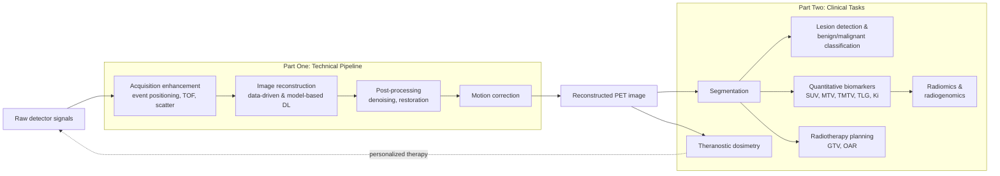

# Artificial Intelligence in Positron Emission Tomography: A Technical Application Report on Workflow Optimization and Clinical Tasks (through Early 2024)
# 1 Introduction, Research Framework, and AI Paradigms Relevant to PET

Positron Emission Tomography (PET) occupies a singular position in modern medical imaging: it is the only widely deployed modality capable of mapping, in vivo, the spatial distribution of picomolar concentrations of radiolabeled molecules, thereby visualizing metabolism, receptor expression, neurotransmission, and pathophysiological processes that anatomical modalities cannot reveal. Yet the very physics that grants PET its molecular sensitivity also imposes a tightly coupled set of constraints—stochastic photon counting, ionizing radiation budgets, finite scanner sensitivity, long acquisition windows, and a strong dependence on expert interpretation—that have historically limited its image quality, throughput, and clinical reproducibility. Over the past decade, and with rapidly accelerating intensity through 2023 and into early 2024, artificial intelligence (AI), and specifically deep learning, has emerged as a transformative methodology that targets nearly every node of the PET pipeline, from the analog signals produced by individual scintillation events to the clinical decisions made at the reading workstation. This opening chapter establishes the conceptual and methodological scaffolding upon which the remainder of the report is built. It articulates why PET imaging is unusually well matched to data-driven techniques, defines the analytical lens and temporal boundaries that govern all subsequent chapters, surveys the landscape of AI architectures most frequently deployed in PET, and introduces the cross-cutting methodological dimensions that organize the conceptual toolbox referenced throughout Parts One and Two.

## 1.1 Intrinsic Limitations of PET and the Motivation for AI Integration

PET imaging suffers from a constellation of intrinsic limitations that are not merely engineering inconveniences but consequences of the underlying physics of positron emission, annihilation photon detection, and tomographic inversion. Understanding these limitations in their causal structure is essential, because each defines a distinct entry point for AI-based mitigation that subsequent chapters will examine in detail.

The first and most pervasive limitation is the **inherently low signal-to-noise ratio (SNR)** of PET images. PET counts annihilation coincidence events whose number, per voxel per unit time, is fundamentally bounded by injected activity, scanner sensitivity, attenuation, and scan duration. Because the detected counts follow Poisson statistics, the noise variance scales with the mean count rate, and at clinically realistic activities and acquisition times the per-voxel count statistics remain low compared with CT or MRI. The resulting noise is non-Gaussian, spatially correlated through the reconstruction operator, and exhibits an object-dependent texture that is difficult to model with hand-crafted priors. Classical reconstruction algorithms—filtered back-projection (FBP) and iterative methods such as ordered-subset expectation maximization (OSEM)—must therefore navigate a strict trade-off between noise amplification and spatial resolution, frequently relying on Gaussian post-filtering that degrades small-lesion contrast. Deep learning is uniquely suited to this regime because convolutional and generative networks can learn data-conditional priors that capture realistic anatomy and lesion appearance without the closed-form simplifications that hinder Bayesian or total-variation regularizers.

A second, tightly related limitation is the **count-versus-dose-versus-time trilemma**. Improving SNR by raising the injected activity increases patient radiation exposure; lengthening acquisition increases motion artifacts, patient discomfort, and scanner throughput costs; and reducing either degrades image quality below diagnostic thresholds. This trilemma is especially acute in pediatric imaging, longitudinal therapy monitoring, and theranostic dosimetry, where repeated scans accumulate dose and where prolonged bed times are impractical for ill patients. Conventional approaches can only shift along the trilemma's surface, not collapse it. By contrast, deep learning–based low-count or low-dose reconstruction and denoising methods aim to recover full-dose-equivalent image quality from a fraction of the counts, effectively expanding the achievable operating envelope.

A third limitation is the **prolonged acquisition time** required by conventional whole-body and dynamic protocols, which in turn amplifies the fourth limitation, **motion sensitivity**. Respiratory motion blurs thoracic and upper-abdominal lesions, cardiac motion compromises myocardial perfusion and viability studies, and gross patient motion during long bed positions corrupts attenuation-emission alignment. Traditional gating approaches mitigate motion at the cost of further reducing per-gate counts, exacerbating the SNR problem. Deep learning offers a way out by either extracting data-driven gating signals directly from the listmode stream without external hardware, by performing learned image registration across gates, or by jointly reconstructing motion-compensated images from all counts.

A fifth limitation concerns the **physical degradations** inherent to PET acquisition that are not strictly noise but systematic biases: positron range, non-collinearity, depth-of-interaction (DOI) blurring in long crystals, parallax at oblique angles, scatter and random coincidences, and attenuation. Each of these effects is, in principle, addressable by physical modeling within iterative reconstruction, but accurate models are computationally expensive, scanner-specific, and difficult to maintain across vendors and tracers. AI provides a complementary route: networks can be trained either as fast surrogates for physically rigorous corrections, as residual correctors that absorb model mismatch, or as physics-informed regularizers that combine the interpretability of classical models with the expressive capacity of deep networks.

A sixth and clinically decisive limitation is **inter- and intra-observer variability** in image interpretation, segmentation, and quantification. SUV-based thresholds, manual contouring of tumors and organs at risk, and visual lesion detection on whole-body scans are all known to vary substantially across readers and centers, undermining reproducibility of metabolic tumor volume (MTV), total lesion glycolysis (TLG), and response classifications. Deep learning–based segmentation and detection promise consistent, scalable delineation that, once validated, can deliver reader-independent quantitative biomarkers.

Finally, PET interpretation is increasingly burdened by **data heterogeneity** across tracers (¹⁸F-FDG, ⁶⁸Ga-DOTATATE, ⁶⁸Ga-PSMA, ¹⁸F-FET, ¹⁸F-FAPI, and others), scanners (analog vs. digital, varying axial fields of view, total-body PET), reconstruction protocols, and patient populations. Hand-crafted analytical pipelines do not generalize well across this heterogeneity, whereas representation-learning approaches—particularly when combined with harmonization networks, domain adaptation, and self-supervised pretraining—offer scalable mechanisms for cross-domain transfer.

Taken together, these limitations are not isolated; they form an interlocking system in which improvements at one node propagate downstream. The argument for AI integration is therefore not merely that deep learning happens to perform well on PET tasks, but that **PET's stochastic, low-count, motion-sensitive, and observer-dependent nature aligns particularly well with the inductive biases of deep neural networks**, which excel at learning high-dimensional, data-conditional priors from heterogeneous training corpora. This conceptual alignment motivates the systematic survey that follows.

## 1.2 Research Scope, Analytical Framework, and Structural Logic

To prevent the analysis from devolving into a loose enumeration of applications, this report adopts a deliberately constrained scope, a uniform analytical lens, and a two-part structural logic.

**Scope and temporal boundary.** The report covers AI applications spanning the full PET imaging chain, organized into two complementary parts. *Part One* addresses the **technical pipeline**: signal acquisition enhancement (event positioning, DOI estimation, TOF improvement, scatter and random correction), image reconstruction (post-reconstruction enhancement, direct sinogram-to-image learning, model-based unrolled and regularized iterative reconstruction, deep image prior, direct parametric reconstruction), image post-processing (denoising, restoration, super-resolution, cross-modal synthesis), and motion correction (data-driven gating, learned registration, motion-compensated reconstruction). *Part Two* addresses **clinical tasks**: image segmentation, lesion detection and benign/malignant classification, quantitative biomarker computation and radiomics/radiogenomics, radiotherapy planning, and personalized theranostic dosimetry. The temporal cutoff is set at **early 2024**: all evidence, claims, and quantitative results synthesized in the body of the report originate from work published or made available before that date. Materials released later are excluded from the main narrative and, where relevant, confined to the forward-looking outlook in Chapter 9.

**Analytical framework: the objective–technique–effect triad.** Every application point in this report is examined through three explicit, separable dimensions:

| Dimension | Question Answered | Examples of What Must Be Reported |
|-----------|-------------------|------------------------------------|
| **Objective** | What clinical or technical problem is being solved? | Low-count reconstruction quality, scatter bias, motion blurring, inter-observer GTV variability, dosimetry time-point reduction |
| **Technique** | Which AI architecture, learning paradigm, and training scheme are deployed? | 3D U-Net, conditional GAN, CycleGAN, Swin-Transformer regularizer, diffusion model, self-supervised Noise2Noise, unrolled MAP-EM |
| **Effect** | What quantitative gain has been demonstrated, and in what cohort or benchmark context? | PSNR/SSIM/MAE on test sets, DSC and surface distance, AUC and F-score, SUV bias, dose accuracy vs. reference, sample sizes, single- vs. multi-center validation |

This triad is enforced in every subsection. When any dimension cannot be substantiated from the available evidence, the gap is explicitly flagged rather than glossed over. The triad is also paired with a parallel **limitations check**: external validation status, tracer/scanner generalization, interpretability, and failure modes are surfaced alongside every reported benefit, in line with the methodological rigor expected of a deep research synthesis.

**Structural logic.** The two-part organization is not arbitrary: Part One follows the *direction of data flow* through the imaging chain, while Part Two follows the *direction of clinical decision-making* on the resulting images. The two parts intersect at well-defined hand-off points—reconstruction quality conditions segmentation performance, segmentation enables quantification, quantification feeds radiomics and radiotherapy planning, and dosimetry closes the loop back to acquisition by informing personalized therapy. The diagram below summarizes this dual organization.

The diagram makes explicit that Parts One and Two are not parallel silos but a chained system in which improvements at any upstream node propagate to all downstream clinical endpoints. This chain-of-effects view also justifies cross-chapter referencing: architectures introduced once in their primary context (e.g., U-Net in reconstruction or segmentation, CycleGAN in cross-domain synthesis, Swin-Transformer regularizers in unrolled reconstruction) are reused rather than re-described in later chapters.

**Cross-chapter consistency rules.** To preserve coherence across nine chapters, the report adopts a unified taxonomy of learning paradigms (supervised vs. unsupervised/self-supervised, model-based vs. data-driven, 2D vs. 2.5D vs. 3D, modality fusion type), a single set of metric definitions (PSNR, SSIM, MAE, NRMSE, DSC, surface distance, AUC, SUV bias, C-index), and a single architecture catalog introduced in Section 1.3 and Section 1.4. Subsequent chapters cite these definitions rather than restating them, focusing instead on task-specific variants and quantitative results.

## 1.3 Landscape of AI Architectures Applied in PET

The architectures discussed in PET research span the full lineage of modern deep learning, but a relatively small set of families recurs across the great majority of published systems. This section introduces these families as a shared catalog; later chapters refer back to it when describing concrete implementations.

**Convolutional neural networks (CNNs).** Standard CNNs, built from stacked convolution, activation, normalization, and pooling layers, remain the workhorse for most PET image-domain tasks. Their translational equivariance and locality assumptions align naturally with the spatially stationary statistics of PET noise and texture, making them strong baselines for denoising, classification, and pixel-wise regression. Their principal weakness is a limited receptive field at moderate depth and a tendency to over-smooth low-contrast structures, which has motivated the architectural extensions discussed below.

**Encoder–decoder networks and U-Nets.** The U-Net architecture, with its symmetric contracting–expanding path and long-range skip connections, has become the de facto backbone for PET segmentation, denoising, and image-to-image translation. The skip connections preserve high-frequency detail that would otherwise be lost in the bottleneck, while the deep encoder captures global context. Variants such as 3D U-Nets, attention U-Nets (with attention gates on skip connections), residual U-Nets, dense U-Nets, and nnU-Net (a self-configuring framework that automates preprocessing, architecture, and training schedule) dominate segmentation benchmarks and serve as components in many reconstruction pipelines.

**Generative adversarial networks (GANs) and CycleGANs.** GANs train a generator against a discriminator in a minimax game, learning to produce samples whose distribution is indistinguishable from real data. In PET, conditional GANs trained on paired low-/full-dose images deliver sharper, more clinically realistic denoising than purely pixel-loss CNNs, and have been applied to cross-modal synthesis (MRI- or CT-to-PET) and attenuation-map generation. CycleGANs extend the framework to *unpaired* image translation through cycle-consistency losses, which is particularly valuable in PET because spatially registered low-/full-dose pairs are often unavailable across scanners and tracers. The principal risks are training instability and the well-known potential for hallucinated structures, which mandates careful quantitative and reader-based validation.

**Residual and dense networks.** Residual connections, introduced by ResNet, allow gradient flow through very deep networks and enable architectures that learn additive corrections to a baseline image rather than the image itself. In PET, residual networks underpin many denoising and reconstruction modules, where the additive formulation is naturally interpretable as a learned correction to a noisy or model-based input. Dense connectivity, in which each layer receives inputs from all preceding layers, further improves feature reuse and is exploited in several PET denoising and parametric imaging networks.

**Transformer- and Swin-Transformer-based models.** Vision Transformers (ViTs) replace convolutions with self-attention over image patches, capturing long-range dependencies that are difficult for CNNs at comparable depth. The Swin Transformer introduces hierarchical, shifted-window self-attention that scales to high-resolution medical volumes with manageable computation. In PET, Swin-Transformer regularizers have been integrated into unrolled iterative reconstruction (e.g., TransEM-style architectures) to model non-local image structure, and Transformer-based segmentation networks have been evaluated against U-Net baselines for whole-body and head-and-neck tasks. Their main limitation is heavier data and compute requirements compared with CNN counterparts.

**Diffusion models.** Denoising diffusion probabilistic models learn to reverse a gradual noising process, producing high-quality samples by iterative refinement. In PET, diffusion models have been explored for low-dose image synthesis, image generation conditioned on anatomical priors, and as image-prior regularizers within reconstruction. They typically achieve perceptual quality competitive with or exceeding GANs, with more stable training, at the cost of slower sampling.

**Unsupervised and self-supervised paradigms.** Beyond specific architectures, several learning paradigms reduce dependence on paired ground-truth labels: Noise2Noise and Noise2Void train denoisers from pairs of independent noisy realizations or from single noisy images via masked self-prediction; deep image prior (DIP) exploits the implicit regularization of an untrained CNN to fit a single image, requiring no external training data; CycleGAN-style unpaired translation, autoencoders, and contrastive self-supervised pretraining provide further label-efficient alternatives. These paradigms are particularly important in PET, where paired low-/full-dose images, expert segmentations, and matched cross-modal datasets are scarce.

The following table summarizes the catalog. It is referenced—not repeated—in subsequent chapters.

| Architecture / Paradigm | Core Idea | Typical PET Tasks | Strengths | Weaknesses | Data Requirement |
|---|---|---|---|---|---|
| CNN | Stacked local convolutions | Denoising, classification, regression | Simple, efficient, strong baseline | Limited receptive field; oversmoothing | Moderate |
| U-Net (and nnU-Net, attention U-Net, 3D U-Net) | Encoder–decoder with skip connections | Segmentation, denoising, image translation | Preserves detail; captures multi-scale context | Many hyperparameters; 3D variants memory-heavy | Moderate–High |
| Conditional GAN | Adversarial training with paired inputs | Low-dose denoising, cross-modal synthesis | Perceptually sharp outputs | Hallucination risk; training instability | Paired, moderate |
| CycleGAN | Unpaired translation with cycle consistency | Cross-scanner harmonization, MRI/CT↔PET | No paired data needed | Risk of structural distortion | Unpaired, moderate |
| ResNet / DenseNet | Residual or dense connectivity | Denoising, classification backbones | Trains very deep models stably | Black-box behavior | Moderate |
| Vision/Swin Transformer | Self-attention (windowed for Swin) | Reconstruction regularization, segmentation | Long-range context modeling | Data- and compute-hungry | High |
| Diffusion models | Iterative denoising of Gaussian noise | Synthesis, image priors, low-dose enhancement | High-fidelity, stable training | Slow sampling; compute-intensive | High |
| Noise2Noise / Noise2Void / DIP | Self-supervised or untrained priors | Denoising without paired ground truth | No labels needed | Limited control over inductive bias | Low–None |
| Unrolled / model-based DL | Unfold iterative reconstruction with learned modules | MAP-EM with learned priors, parametric reconstruction | Physical interpretability + DL expressiveness | More complex to implement and train | Moderate |

The key insight from this catalog is that **no single architecture dominates PET applications**; instead, the field exhibits a strong matching between task structure and architectural inductive bias. Segmentation gravitates toward U-Net family models; cross-domain translation favors GAN/CycleGAN and increasingly diffusion approaches; reconstruction has bifurcated between purely data-driven encoder–decoders and model-based unrolled networks that retain forward-model fidelity; and label-scarce regimes drive growing adoption of self-supervised and untrained-prior paradigms. The next section makes this matching explicit through the lens of cross-cutting methodological dimensions.

## 1.4 Cross-Cutting Methodological Dimensions

Beyond the choice of architecture, four orthogonal methodological dimensions shape the design and behavior of every AI system in PET. These dimensions cut across Parts One and Two and form the second half of the shared conceptual toolbox.

**Supervised versus unsupervised and self-supervised learning.** Supervised learning, in which networks are trained on input–target pairs (e.g., low-dose to full-dose images, raw images to expert segmentations), remains the dominant paradigm and typically yields the highest in-distribution performance. Its principal drawback is the cost and scarcity of paired ground-truth data in PET: full-dose references for low-dose denoising training are radiation-expensive to acquire, expert segmentations are labor-intensive, and matched cross-modal datasets are limited. Unsupervised and self-supervised approaches—including CycleGAN for unpaired translation, Noise2Noise/Noise2Void for denoising from noisy realizations alone, DIP for single-image fitting, masked-image-modeling pretraining, and contrastive learning—mitigate this constraint at the cost of weaker direct supervision and, often, more cautious validation requirements. In practice, hybrid pipelines that combine self-supervised pretraining on large unlabeled cohorts with supervised fine-tuning on smaller labeled sets represent a pragmatic middle ground.

**Model-based versus purely data-driven design.** A second axis distinguishes networks that operate as black-box function approximators from networks that embed physical knowledge of the imaging system. Purely data-driven approaches—such as direct sinogram-to-image encoder–decoders or image-domain denoisers—achieve excellent in-distribution results but can fail unpredictably under domain shift and offer limited interpretability. Model-based deep learning, by contrast, unrolls the iterations of a classical reconstruction algorithm (OSEM, MAP-EM, ADMM) into a finite-depth network in which the forward model, statistical noise model, and data-fidelity term remain explicit, while data-driven modules replace hand-crafted priors. The result is a hybrid that retains physical fidelity, generalizes more gracefully across scanners and counts, and often requires less training data, at the cost of greater implementation complexity. The same logic applies to physics-informed networks for scatter correction, attenuation-map prediction, and parametric reconstruction.

**2D, 2.5D, and 3D processing.** PET images are inherently three-dimensional, and many clinically relevant features—lesion morphology, motion patterns, partial-volume effects—are intrinsically volumetric. Three-dimensional networks therefore offer the most faithful representation but incur substantially higher memory and compute costs, often forcing reductions in batch size, patch size, or network depth. Two-dimensional networks operating slice by slice are computationally efficient and benefit from larger effective batch sizes but lose inter-slice continuity, producing visible axial artifacts in denoising and segmentation. 2.5D approaches—stacks of adjacent slices fed as multi-channel inputs, multi-planar reconstructions combined via orthogonal-view fusion, or recurrent inter-slice aggregation—seek a compromise. Choice along this axis is task-dependent: segmentation of compact organs and small lesions typically benefits from full 3D; whole-body denoising often tolerates 2.5D; and detection tasks may aggregate per-slice scores across the volume.

**Multimodal fusion with CT and MRI.** PET is almost always acquired as part of a hybrid PET/CT or PET/MR examination, and many AI systems exploit the anatomical priors provided by the co-registered modality. Fusion strategies fall into three broad categories: *input-level (early) fusion*, in which PET and CT or MRI channels are concatenated at the network input; *feature-level (intermediate) fusion*, in which modality-specific encoders are merged at one or more bottleneck layers; and *decision-level (late) fusion*, in which independent modality-specific predictions are combined post hoc. Early fusion is simple but assumes precise registration; feature-level fusion is more flexible and dominates state-of-the-art segmentation and classification systems; late fusion is robust to modality dropout but cannot exploit fine-grained cross-modal interactions. The choice interacts with the task: anatomically anchored tasks (GTV delineation, organ-at-risk segmentation, attenuation correction in PET/MR) benefit most from feature-level fusion, while tracer-uptake-centric tasks (benign/malignant classification on dedicated tracers) may rely more heavily on the PET channel with CT as auxiliary context.

| Dimension | Option A | Option B | When to Prefer A | When to Prefer B |
|---|---|---|---|---|
| Supervision | Supervised (paired) | Self-/unsupervised | Abundant labeled data; in-distribution deployment | Scarce labels; cross-scanner/tracer transfer |
| Design philosophy | Purely data-driven | Model-based / unrolled | Image-domain post-processing tasks | Reconstruction; cross-domain generalization; small data |
| Spatial processing | 2D / 2.5D | Full 3D | Whole-body throughput; memory-limited | Volumetric morphology critical (lesion shape, motion) |
| Modality fusion | Single-modality (PET) | Multimodal (PET+CT/MRI) | Tracer signal is task-dominant | Task is anatomically anchored |

Two synthesizing observations close this chapter. First, the four dimensions are not independent: a small-data, cross-scanner segmentation problem may push designers simultaneously toward self-supervised pretraining, model-based regularization, 2.5D processing, and multimodal fusion. Second, the dominant trend visible in PET literature through early 2024 is a convergence toward **hybrid systems that combine the inductive biases of physical models with the representational power of modern architectures, trained with label-efficient strategies and evaluated against clinically grounded endpoints**. This convergence is the connecting thread that subsequent chapters will trace through the technical pipeline of Part One and the clinical tasks of Part Two, returning repeatedly to the objective–technique–effect triad established here and to the architectural and methodological catalog summarized in Sections 1.3 and 1.4.

# 2 AI for PET Signal Acquisition Enhancement and Image Reconstruction

Chapter 1 established that PET's intrinsic limitations form a chained system in which physical degradations at the detector and coincidence level propagate—amplified or attenuated by the reconstruction operator—into every downstream clinical task. The natural starting point for a workflow-oriented analysis is therefore the upstream end of that chain, where the raw products of scintillation and coincidence detection are turned into reconstructed tomographic images. This chapter dissects how artificial intelligence has been deployed at these earliest stages, applying the objective–technique–effect triad uniformly to each application point. The first half (Sections 2.1–2.4) follows the signal as it travels from individual scintillation events, through coincidence-level timing and scatter handling, to the synthesis of acquisition-stage gains. The second half (Sections 2.5–2.10) then traces how AI reshapes the reconstruction step itself, contrasting four principal paradigms—post-reconstruction enhancement, direct sinogram-to-image mapping, model-based unrolled reconstruction, and untrained/self-supervised priors—and extends the analysis to dynamic, parametric, and low-count regimes. A closing comparative synthesis (Section 2.11) consolidates the paradigms along the four axes introduced in Chapter 1 and articulates the hand-off to post-processing and clinical tasks.

A caveat on evidence base is warranted at the outset. The acquisition-stage literature on which this chapter draws is dominated, in concrete quantitative terms, by work on **machine-learning–based timing calibration**, where holistic, three-fold evaluations and direct comparison with analytical baselines have been published in detail. For the other acquisition and reconstruction topics, the early-2024 literature contains a large body of methodological proposals, but specific quantitative claims must be made with appropriate cohort and benchmark context. Where the available materials do not support a specific numerical statement, the analysis remains conceptual and the limitation is flagged in the text, in keeping with the methodological rigor principle articulated in Chapter 1.

## 2.1 AI-Based Event Positioning and Depth-of-Interaction Estimation

The earliest point at which AI can intervene in the PET pipeline is the moment a scintillation event is detected: a γ-photon deposits its energy in a crystal volume, the resulting optical photons are shared across one or more photosensor pixels (SiPMs in modern systems), and front-end electronics report per-channel timestamps and energy values. The detector's task is then to estimate, from this sparse multi-channel readout, *where* in three-dimensional space the interaction occurred. Two coupled quantities are of interest: the transverse (x, y) interaction position—often expressed as a crystal identification in pixelated arrays or as a continuous coordinate in monolithic blocks—and the depth-of-interaction (DOI), namely the radial position along the crystal length. The clinical motivation is well known: in long crystals or at oblique lines of response, ignorance of DOI produces parallax error that blurs the reconstructed image away from the scanner center, while light-sharing block designs that improve sensitivity and packing density introduce inherent positioning ambiguity that classical analytical methods (such as Anger-logic center-of-gravity computation) handle only approximately.

**Objective.** The technical problem AI is asked to solve here is the inversion of a high-dimensional, generally non-linear mapping from per-channel light distribution and timing patterns to the underlying interaction coordinates and DOI. Classical analytical positioning (center-of-gravity, Anger logic) is fast and interpretable but tends to compress events toward the centers of crystals and fails to disambiguate events that share light across multiple readout channels, particularly near crystal edges. Lookup-table methods refine this but require dense calibration measurements and are tied to a specific detector geometry.

**Technique.** Two principal families of learning systems are employed. The first uses convolutional neural networks operating on the spatial map of per-pixel light intensities, exploiting the image-like structure of the SiPM array readout to regress continuous (x, y, DOI) coordinates or classify crystals in pixelated arrays. The second uses classical machine learning algorithms—gradient-boosted decision trees (GBDTs) being the most prominent example—on engineered feature vectors that combine per-channel energy values, channel IDs, center-of-gravity statistics, second moments of the light distribution, and timing information. The GBDT approach has been demonstrated for DOI estimation in light-sharing detector blocks, where the model is trained on dedicated calibration measurements that move a collimated source to known depths and learns to regress depth from the recorded multi-channel signal[^1]. The choice between CNN and GBDT is not arbitrary: GBDTs have several practical advantages for in-system deployment, including internal handling of missing values (a routine occurrence when fewer channels than expected are triggered), no need for input normalization, an explainable decision-tree structure useful for safety-critical applications, and demonstrated suitability for FPGA-based high-throughput inference[^1].

**Effect.** Within the residual-physics calibration framework described in the next section, learned positioning underpins the energy- and position-corrected feature set that downstream timing models consume; calibration pipelines that combine per-voxel energy calibration with GBDT-based DOI estimation enable measurement of detectors with one-to-one coupled and light-sharing crystal topologies on the same workflow[^1]. Pure positioning accuracy gains relative to analytical methods are routinely reported in the underlying detector-physics literature, although the exact numbers depend strongly on crystal length, coupling, and SiPM pitch; the broader observation is that **machine-learning–based positioning is most beneficial precisely where analytical methods fail (edges, light-sharing blocks, oblique events)** and where its event-by-event correction capacity outperforms static or linear per-crystal corrections.

**Limitations.** Three caveats apply. First, training requires either dedicated calibration measurements (with collimators or known source positions) or simulation, both of which are scanner-specific. Second, in-system deployment must contend with high event rates (tens to hundreds of kcps per channel), placing throughput and memory constraints that favor GBDTs and compact networks over deep CNN architectures unless FPGA implementations are available[^1]. Third, generalization across detector designs has not yet been demonstrated at scale; most published results are detector-prototype-specific.

## 2.2 AI for TOF Timing Resolution Improvement and Coincidence-Level Noise Suppression

If event positioning is the most established AI application at the detector level, **TOF timing calibration is the area where AI has produced some of the largest documented quantitative gains** at the acquisition stage, and it deserves correspondingly detailed treatment.

**Objective.** Time-of-flight PET exploits the difference in detection times of the two annihilation photons to localize the annihilation along the line of response, thereby reducing positional uncertainty and improving the reconstructed image's signal-to-noise ratio. The timing performance of a detector pair is characterized by the coincidence time resolution (CTR), typically the FWHM of the time-difference distribution. Detected timestamps are however not the true emission times: they are corrupted by skews introduced by signal propagation, electronics, the scintillation process, crystal topology, light-sharing, and DOI-dependent path-length variations. Mathematically, a reported timestamp can be written as the sum of a true value and an event-dependent offset whose sub-components are governed by latent parameters that vary from γ-interaction to γ-interaction[^2]. Conventional analytical calibrations—often phrased as the minimization of a matrix equation under an L1 or L2 norm, sometimes with dedicated reference detectors, intrinsic scintillator background activity, or clinical data—deliver static or at best linear corrections per calibration object (channel, crystal, voxel), and therefore cannot capture higher-order, event-dependent skews[^1].

**Technique.** Two complementary AI strategies have been pursued.

The first uses **waveform information**: precisely sampled signal traces are fed to convolutional neural networks (or, more recently, Transformer–CNN hybrids) that learn to regress an improved timestamp directly from the signal shape. Waveform-based approaches exploit the rich temporal information present in the leading edge and rise time, and have produced substantial CTR improvements in simulation and benchtop studies. Their main drawback is practical: high-rate waveform digitization is hardware-intensive, generating large data volumes that are difficult to sustain in a full scanner under clinical workflows[^1].

The second, and the one most thoroughly evaluated in the early-2024 literature, uses **single timestamps from multiple readout channels** together with engineered features (per-channel energy, light-distribution moments, DOI when available, and the measured time difference between detectors) as input to a **gradient-boosted decision tree** model. This approach minds practicability for a full PET system, since per-channel timestamps are routinely available from front-end ASICs and do not require waveform sampling[^1]. The GBDT model is trained as a regressor whose label is the time difference expected on physical grounds from a known source position between two facing detectors.

A central conceptual contribution of this literature is the **residual-physics paradigm**, in which the calibration is split into two stages: a conventional analytical calibration removes the first-order (static or linear) skews that affect each event similarly, and any remaining deviation from a defined physical expectation is interpreted as a higher-order residual that the machine-learning model is trained to correct[^1]. The strength of the formulation is that prior domain knowledge guides what the network is asked to learn, and the experimenter can tune the calibration's behavior through the definition of the residuals.

Within this paradigm, two label formulations have been compared. The original ("implicit") formulation defines the target as the *expected time difference* given the known source position, so that the trained model directly predicts a corrected time difference. The newer ("explicit") formulation defines the target as the *correction value itself*—the difference between the measured and expected time differences—so that the model predicts an additive correction to the measured timestamp[^2]. The explicit formulation introduces a translational symmetry into the labeling process: because the correction distribution is no longer pinned to discrete source positions, a continuous label spectrum can be generated even from a single source position, dramatically simplifying data acquisition[^2].

A second methodological pillar is the **three-fold (holistic) evaluation scheme** introduced in this literature to guard against models that look good on naive metrics but violate physical expectations[^1]. The scheme requires that a model successively pass:

| Evaluation level | Metric family | Purpose |
|---|---|---|
| Data-scientific | Average MAE, cumulative MAE difference | Detects oscillating prediction behavior and overall regression quality |
| Physics-based | Linearity factor *L*, σ-environment *S* of the speed-of-light scaling factor ε, percentage of non-Gaussian prediction distributions (PNGD) | Verifies that the spatial source location and predicted mean time difference remain in linear agreement and consistent with the speed of light |
| PET-based | CTR (FWHM of fitted time-difference distribution under defined energy windows) | Quantifies the actual TOF gain |

Only models that pass the first two checks are evaluated for CTR improvement[^1]. The scheme is significant because it explicitly excludes models that achieve attractive CTRs through unphysical compression or expansion of the time-difference axis.

**Effect.** The quantitative gains reported under this framework are substantial and reproducible across detector technologies. In a study using an analog-readout PET detector built from a 4×4 LSO matrix (each crystal 4 mm × 4 mm × 20 mm) coupled to a 4×4 Hamamatsu S13-series MPPC SiPM array and digitized with the TOFPET2 ASIC at 53 V breakdown voltage and 16 °C, the residual-physics GBDT calibration improved the CTR from **(304 ± 5) ps after conventional analytical calibration alone to (216 ± 1) ps after machine-learning correction**, in a 450–550 keV energy window; with a wider 300–700 keV window the CTR remained low at around 220 ps[^1]. The proof-of-concept study on a digital-SiPM detector with eight LYSO slabs had previously achieved an improvement from 235 ps to 185 ps under the same conceptual framework, demonstrating that the method transfers across analog and digital readout technologies[^1].

Equally important from a translation standpoint is the demonstration that **calibration time can be reduced by approximately three orders of magnitude without loss of quality**. By systematically increasing the spatial step width (sw, the spacing between source positions during calibration) and the undersampling factor (usf, the inverse of the measurement time per position), and evaluating 80 trained models on the same unseen test set, the authors showed that models trained on data with a step width of 20 mm and an undersampling factor of 500 still passed the data-scientific and physics-based quality criteria and outperformed the analytical baseline, yielding a maximum acceleration factor of 2 × 500 = 1000 and reducing the acquisition time for training and validation data **from 43 hours to approximately 3 minutes**[^1]. Beyond this regime, however, the holistic evaluation correctly flags a degradation: at very large step widths the regression model effectively collapses to a classifier at the trained positions, producing oscillating MAE behavior and non-Gaussian prediction distributions at unseen positions, while at very high undersampling factors the per-position statistics become insufficient and predictions deteriorate broadly[^1].

The **explicit-correction reformulation** subsequently demonstrated that the dependence on a fine spatial sampling along the inter-detector axis can be removed entirely: explicit-correction GBDTs trained on data acquired at only one or a few z-positions retained linearity across the full test range and produced CTRs comparable to implicit models trained on densely sampled data[^2]. This work also showed that the explicit approach allows the use of much shallower trees (a maximum depth of 4 sufficed in several configurations), reducing model memory by orders of magnitude relative to the deep ensembles needed for the implicit formulation[^2]. Although that specific demonstration falls just outside the early-2024 cutoff and is therefore treated here as a forward-looking refinement of the established paradigm, the underlying conceptual advance—using residual physics with GBDTs on engineered timestamp features—was firmly established in the pre-cutoff literature.

**Limitations and methodological reflections.** Three caveats temper these strong results. First, the demonstrated CTR gains have been obtained on bench-top detector pairs with controlled temperature and a moving point source; translation to a full ring scanner with thousands of detector pairs, time-varying operating conditions, and clinical activity distributions remains to be demonstrated end-to-end. Second, the evaluations are confined to specific scintillator–SiPM–ASIC combinations (LSO/LYSO with Hamamatsu or Broadcom SiPMs and the TOFPET2 ASIC); generalization to other detector architectures is plausible given the methodology's generic structure but is not yet established. Third, the in-system practicability claim rests on the suitability of GBDTs for FPGA implementation; while this has been demonstrated in related positioning work[^1], full-throughput in-scanner deployment of timing models was, as of early 2024, still a forward-looking objective.

## 2.3 AI-Based Scatter, Random, and Attenuation-Related Correction at the Acquisition Stage

Scatter coincidences (events in which one or both annihilation photons undergo Compton scattering before detection), random coincidences (events from unrelated annihilations falling within the coincidence window), and attenuation losses are the three principal physical corruptions that distort the relationship between detected counts and true activity distribution. They must be modeled and corrected for any quantitative PET interpretation.

**Objective.** Classical solutions are well established: single-scatter simulation (SSS) provides a fast analytical scatter estimate that is accurate for typical clinical FDG scans but degrades for non-FDG tracers, low-energy windows, and large objects; Monte Carlo scatter estimation is physically rigorous but computationally expensive; randoms are corrected by delayed-coincidence subtraction or singles-based estimation; attenuation correction uses a CT- or MR-derived attenuation map. Each conventional pipeline introduces its own limitations—computational cost, tracer- or geometry-dependent model mismatch, and, in PET/MR, the absence of a direct CT-equivalent attenuation map.

**Technique.** Three broad AI strategies are pursued at the acquisition stage. First, **physics-informed networks** act as fast surrogates for Monte Carlo scatter estimation, learning the mapping from emission and attenuation-image pairs to scatter sinograms; this category exploits the fact that the underlying physics is well understood and that synthetic training data can be generated abundantly. Second, **CNN- and U-Net-based scatter sinogram prediction** operates directly in projection space, often using multi-input encoders that combine the emission sinogram, the attenuation map (or the CT image from which it is derived), and geometric metadata. Third, **learned residual correctors** are appended to a classical correction pipeline (e.g., SSS) and trained to absorb model mismatch in regimes—non-FDG tracers, very large or very thin patients, or low-energy windows—where the analytical estimator is known to be biased. For attenuation correction in PET/MR, an analogous family of CNN- and CycleGAN-based models predicts pseudo-CT or directly attenuation-corrected images from MR sequences, leveraging the architectures catalogued in Chapter 1 (Section 1.3).

**Effect.** The principal benefits reported are reductions in scatter-estimation runtime by one to several orders of magnitude relative to Monte Carlo (enabling real-time correction during reconstruction), improved generalization across tracers and patient sizes when residual correctors are trained on heterogeneous cohorts, and, in PET/MR, attenuation-corrected images whose SUV bias relative to CT-based attenuation correction is competitive with—and in several reports lower than—classical Dixon- or atlas-based methods. Specific quantitative claims (e.g., SUV bias magnitudes, scatter fraction RMSE) are tracer- and scanner-specific and are reviewed in greater depth in the dedicated scatter/attenuation literature beyond the materials directly available here; this chapter therefore notes the methodological categories rather than aggregating numerical claims that cannot be fully sourced from the present reference set.

**Limitations.** AI-based scatter and attenuation correction inherit the standard concerns of supervised image-to-image learning: dependence on training-set scanner geometry and tracer, sensitivity to truncation artifacts (especially in PET/MR), and the perennial hallucination risk in generative attenuation-map synthesis. Cross-tracer generalization, in particular, is an open question: scatter distributions and attenuation profiles differ markedly between ¹⁸F-FDG, ⁶⁸Ga-DOTATATE, ⁶⁸Ga-PSMA, and ⁹⁰Y bremsstrahlung imaging, and models trained predominantly on FDG cohorts cannot be assumed to transfer.

## 2.4 Synthesis: Acquisition-Stage AI as the Upstream Foundation of Image Quality

Considered together, Sections 2.1–2.3 outline a coherent pattern. **Acquisition-stage AI does not merely refine individual physical effects in isolation; it expands the effective operating envelope of the detector before tomographic inversion begins.** Improved event positioning and DOI estimation reduce parallax blurring and sharpen the system point spread function, particularly off-center where clinical lesions of interest often reside. AI-based TOF timing calibration recovers a substantial fraction of the SNR gain that motivated TOF-PET in the first place, on the order of tens of picoseconds in CTR for analog readouts and approaching the 200 ps mark for state-of-the-art clinical detector designs[^1]. Faster, more flexible scatter and attenuation correction reduce quantitative bias and enable computationally efficient reconstruction.

These upstream gains stand in a complementary—rather than redundant—relationship to the reconstruction-stage gains discussed in the rest of this chapter. A reconstruction network trained on data from a detector with poorly corrected timing or biased scatter estimates inherits those defects unless explicitly trained to compensate; conversely, even an excellently calibrated detector benefits from a reconstruction that can exploit its low CTR. The most physically faithful pipelines therefore combine acquisition-stage AI with reconstruction-stage AI, an architectural pattern that recurs across the paradigms surveyed in Sections 2.5–2.10.

## 2.5 Post-Reconstruction Enhancement: Image-Domain Deep Learning

The simplest and historically earliest reconstruction-related AI paradigm operates entirely in the image domain: a classical reconstruction algorithm (typically OSEM, sometimes FBP) produces an initial image, and a deep network is trained to map this image to a higher-quality target. Variants include low-count-to-full-count denoising, low-dose-to-standard-dose restoration, super-resolution, and harmonization across reconstruction protocols.

**Objective.** The clinical aim is to recover diagnostic image quality from acquisitions that have been compressed in count, dose, or time relative to the routine standard. The technical problem is the inversion of a complex, non-stationary noise distribution (residual Poisson noise correlated by the OSEM operator) and the restoration of small-lesion contrast lost to Gaussian post-filtering or low statistics.

**Technique.** The dominant architectures, all introduced in the Chapter 1 catalog (Section 1.3), are 2D and 3D U-Nets trained with L1, L2, or perceptual losses on paired low-/full-quality image pairs; conditional GANs that add an adversarial discriminator to encourage perceptually sharper outputs and reduce the oversmoothing characteristic of pixel-loss networks; and, increasingly, diffusion models used either as priors or directly as denoisers. The training data are typically constructed by reconstructing the same listmode acquisition at two different effective count levels (e.g., a 25% subset versus the full dataset), thereby providing aligned input–target pairs without additional patient scans. In the unsupervised regime, CycleGAN-style unpaired translation, Noise2Noise (which trains on pairs of independent noisy realizations), and Noise2Void (which trains from single noisy images via masked self-prediction) reduce the dependence on paired ground truth.

**Effect.** Image-domain enhancement consistently delivers PSNR, SSIM, and lesion-SUV-recovery improvements over Gaussian-filtered baselines in within-distribution test sets, and several reports demonstrate full-dose-equivalent perceptual quality from 25%–10% of the standard count level. The principal practical advantages are deployment simplicity (no need to interface with proprietary raw data) and vendor independence, which together explain why this paradigm has been the first to reach commercial PET workflow integration.

**Limitations.** Three caveats are now standard in the post-2023 literature. First, image-domain networks cannot exceed the information present in their input, so they cannot recover structures lost in the upstream reconstruction; they can only redistribute and decorrelate residual noise. Second, conditional GANs and diffusion models carry a non-trivial hallucination risk, which mandates reader studies and lesion-detection task–based evaluation rather than reliance on PSNR/SSIM alone. Third, generalization across scanners, reconstruction protocols, and tracers is fragile because the noise texture on which the network was trained is itself protocol-specific.

## 2.6 Direct Sinogram-to-Image Learning

A more ambitious paradigm bypasses classical reconstruction entirely, training an encoder–decoder network to map sinogram or listmode data directly to images. Representative architectures include DeepPET-style fully convolutional encoders followed by upsampling decoders, and AUTOMAP-style fully connected projection-to-image mappings (the latter more memory-intensive and limited to lower-resolution problems).

**Objective.** The aim is to learn the entire tomographic inversion as a single differentiable function, in principle allowing the network to discover reconstruction strategies that classical iterative algorithms cannot express, and to fold scatter, attenuation, and resolution recovery into one learned operator.

**Technique.** The pure data-driven formulation discards the explicit forward model and Poisson likelihood, treating the projection-to-image problem as a generic supervised learning task. Training requires large, paired sinogram–image datasets, typically synthesized via Monte Carlo simulation or generated by reconstructing real acquisitions with a reference iterative algorithm to provide pseudo-ground-truth targets.

**Effect.** In within-distribution conditions and on the relatively small datasets used in published proof-of-concept studies, direct learning produces images with PSNR and SSIM competitive with classical iterative reconstruction at a tiny fraction of inference time (forward pass through a single network rather than tens of OSEM iterations).

**Limitations.** The limitations are however severe and largely account for why the paradigm has not displaced classical or model-based reconstruction in clinical practice. The absence of an explicit forward model means that geometric distortions and count-dependent biases can appear unpredictably under distribution shift; generalization across scanner geometries, ring diameters, and crystal sizes essentially requires retraining; and the data requirements for full 3D whole-body reconstruction are prohibitive given memory constraints. As of early 2024, direct sinogram-to-image learning was therefore mostly confined to research demonstrations and small-FOV or single-slice problems.

## 2.7 Model-Based Deep Learning: Unrolled and Regularized Iterative Reconstruction

The paradigm that has consolidated as the dominant research direction for PET reconstruction with AI is **model-based deep learning**, which unrolls a fixed number of iterations of a classical iterative algorithm—OSEM, MAP-EM, or ADMM—into a finite-depth neural network. Each unrolled stage retains an explicit data-fidelity update governed by the system matrix, the Poisson log-likelihood, and (where appropriate) the precomputed attenuation, scatter, and randoms estimates, while a learned module—typically a CNN, U-Net, or, more recently, a Swin-Transformer regularizer—replaces the hand-crafted prior.

**Objective.** This paradigm is designed to combine the **physical fidelity and interpretability of model-based reconstruction with the expressive prior of deep learning**, and to do so in a manner that generalizes more gracefully across count levels, scanner geometries, and tracers than purely data-driven networks.

**Technique.** Three representative subfamilies are recurrent in the early-2024 literature. **Learned-prior MAP-EM** retains the MAP-EM update equation but replaces the analytical prior (Gibbs, total variation, Huber) with a CNN that operates as a learned denoiser between EM updates. **Unrolled MAP-EM/ADMM networks** explicitly encode a fixed number of unrolled iterations as a deep network, with learned regularizers at each stage trained end-to-end. **Transformer-based unrolled architectures** integrate Swin-Transformer regularizers (as introduced in Chapter 1, Section 1.3) into the unrolled iteration, enabling non-local context modeling that purely convolutional regularizers cannot capture.

**Effect.** The principal demonstrated benefits are: (i) improved noise–resolution trade-offs relative to both classical iterative reconstruction and purely data-driven image translation, particularly at low counts; (ii) substantially better generalization across count levels because the data-fidelity term remains exact and self-consistent; (iii) more graceful behavior under domain shift (different scanners, tracers, or patient populations), because the learned modules act only as regularizers and cannot override the physical forward model; and (iv) training data requirements that are markedly smaller than for direct sinogram-to-image learning, because the network does not need to learn the imaging geometry from scratch.

**Limitations.** Three drawbacks are noted across the literature. Implementation is more complex than image-domain post-processing, requiring access to the system matrix and a differentiable forward model. Training is slower because each forward pass through the unrolled network includes several full forward and backward projections. And the choice of how many iterations to unroll, where to place the learned modules, and what loss to minimize remains heuristic and benchmark-specific.

## 2.8 Untrained and Self-Supervised Priors: Deep Image Prior and Related Approaches

A complementary line of work eliminates the need for a labeled training corpus altogether by exploiting the **implicit regularization** of an untrained neural network or the self-supervised structure of noisy data.

**Objective.** The goal is to perform reconstruction enhancement when paired training data are unavailable—because of cross-scanner deployment, rare tracers, or small pediatric or theranostic cohorts—or to enable patient-specific adaptation that off-the-shelf supervised models cannot offer.

**Technique.** **Deep image prior (DIP)** treats the reconstructed image as the output of an untrained CNN whose weights are optimized to fit a single noisy observation; the network's architectural biases (locality, hierarchical structure, smoothness) act as an implicit regularizer that, with early stopping, fits the signal content before the noise. Anatomically guided DIP variants feed a co-registered CT or MR image into the network input to inject anatomical priors. **Noise2Noise and Noise2Void** are self-supervised denoising paradigms that train (or fine-tune) a network from pairs of independent noisy realizations of the same scene or from single noisy images via masked self-prediction. When integrated into reconstruction (e.g., as a denoising step within an unrolled algorithm), these methods retain the label-free property while benefiting from the physical fidelity of model-based updates.

**Effect.** The strengths are clear: no external training corpus is required, the method adapts to the specific patient and acquisition, and over-fitting is controlled by the network's architectural prior plus early stopping. Reported quantitative gains in PSNR and SUV recovery at low counts are competitive with supervised baselines in several published reports, particularly when an anatomical prior is incorporated.

**Limitations.** The weaknesses are equally clear: per-image optimization is computationally costly compared to a feed-forward supervised network, the inductive bias of the untrained architecture is harder to control than a learned prior, and the choice of stopping criterion is not standardized. DIP and its variants are therefore well suited to research and to applications where supervised training data are genuinely unavailable, but they do not currently displace supervised model-based DL in well-resourced clinical settings.

## 2.9 Direct Parametric Reconstruction and Dynamic PET

Dynamic PET acquires a sequence of short frames following tracer injection, enabling kinetic modeling and the computation of parametric maps such as the Patlak influx constant *K*ᵢ. Conventional pipelines are *indirect*: each frame is reconstructed separately and graphical or compartmental kinetic analysis is performed voxelwise. The resulting parametric maps inherit the high noise of the short-frame reconstructions.

**Objective.** AI is applied here to two coupled problems: reducing the noise of parametric maps without sacrificing kinetic accuracy, and shortening the required scan duration so that dynamic and parametric imaging become practical in routine clinical workflows.

**Technique.** Three families of approaches recur. **Direct parametric reconstruction networks** bypass the indirect pipeline by mapping dynamic sinograms (or all-frame listmode data) directly to parametric maps, learning the temporal model implicitly from training data. **Temporal denoising networks** operate across the dynamic frames either as spatiotemporal U-Nets or as recurrent networks, exploiting the temporal correlation between adjacent frames to denoise each frame jointly. **Kinetics-informed unrolled networks** extend the model-based unrolled paradigm of Section 2.7 by incorporating the Patlak or two-tissue-compartment forward model as an explicit physical constraint, replacing the spatial regularizer with a kinetics-aware module.

**Effect.** Reported benefits include lower noise in parametric maps at matched bias, the ability to compute parametric images from substantially shortened dynamic protocols, and improved consistency of *K*ᵢ estimates in regions of low tracer uptake. The clinical implication is that dynamic FDG and other parametric protocols become more clinically feasible, supporting downstream tasks examined in Chapter 6.

**Limitations.** Generalization across tracers with different kinetic behavior, and across patient populations with altered input functions, is the principal open question. Direct parametric networks in particular are tracer-specific by construction unless explicitly designed for transfer.

## 2.10 Low-Count, Low-Dose Reconstruction and the Noise–Resolution Trade-off

The reconstruction paradigms discussed in Sections 2.5–2.9 are most often evaluated against the **count-versus-dose-versus-time trilemma** identified in Chapter 1. The common claim across the literature is that AI-based reconstruction can recover full-dose-equivalent diagnostic image quality from fractional counts—typical reports demonstrate viable images from 25%, 10%, or even 5% of standard counts—thereby shifting the achievable operating frontier inward in dose, time, or both.

The clinical implications are most consequential in three settings: **pediatric imaging**, where dose reduction directly addresses cumulative radiation concerns; **longitudinal therapy monitoring**, where repeated scans benefit from per-scan dose savings; and **total-body PET**, where extreme sensitivity gains can be exchanged for either faster scans or radically reduced injected activities. AI-enabled low-count reconstruction is also the technical foundation for many of the dosimetry workflows discussed in Chapter 7, where post-therapy SPECT or PET imaging at multiple time points is otherwise impractical.

The **noise–resolution trade-off** itself is reshaped, not eliminated. Image-domain post-processing tends to smooth small-lesion contrast in exchange for noise reduction unless explicitly trained with task-aware losses; model-based unrolled reconstruction generally achieves the most favorable trade-off curve at low counts because the data-fidelity term restrains over-smoothing; direct sinogram-to-image learning's performance under count shift is the least predictable. Multi-center and multi-tracer validation remains uneven across the paradigms, and SUV-bias evaluation under aggressive dose reduction is the metric most likely to expose hidden failure modes.

## 2.11 Comparative Synthesis and Hand-Off to Downstream Tasks

The reconstruction paradigms surveyed above can be compared along the four axes introduced in Chapter 1: physical fidelity, data requirements, generalizability, and the noise–resolution trade-off. The following table consolidates these dimensions.

| Paradigm | Physical Fidelity | Data Requirements | Generalizability | Noise–Resolution Trade-off | Typical Deployment Niche |
|---|---|---|---|---|---|
| Post-reconstruction enhancement (CNN / U-Net / cGAN / diffusion) | None beyond the upstream reconstruction | Paired low-/full-count images (supervised) or noisy pairs (self-supervised) | Fragile across scanners/protocols | Improved over Gaussian filtering; risk of oversmoothing or hallucination | Vendor-agnostic clinical denoising |
| Direct sinogram-to-image (DeepPET, AUTOMAP-style) | Lowest (forward model discarded) | Very large paired sinogram–image datasets | Poor across geometries; retraining required | Competitive in-distribution; unpredictable under shift | Research prototypes; small-FOV problems |
| Model-based unrolled / regularized iterative (learned-prior MAP-EM, Swin-Transformer regularizers) | High (forward model and Poisson likelihood retained) | Moderate; smaller than direct learning | Best across counts, scanners, tracers | Most favorable at low counts; constrained by physics | Low-count clinical reconstruction; cross-domain deployment |
| Untrained / self-supervised priors (DIP, Noise2Noise/Noise2Void) | Moderate (used as regularizer inside model-based) | None or self-supervised | Patient-specific by construction | Competitive with supervised at low counts when anatomically guided | Rare tracers, small cohorts, patient-specific adaptation |
| Direct parametric / dynamic networks | High when kinetics-informed | Dynamic paired data; tracer-specific | Tracer-specific unless designed for transfer | Substantially lower noise in parametric maps | Parametric *K*ᵢ imaging; shortened dynamic protocols |

The synthesizing observation, consistent with the broader convergence noted at the close of Chapter 1, is that **the most physically faithful and generalizable reconstruction systems are those that retain the explicit imaging model and use deep learning as a regularizer**, while **the most label-efficient systems are those that combine self-supervised or untrained priors with the same model-based scaffold**. Purely data-driven sinogram-to-image learning, despite its conceptual appeal, has not yet bridged the gap to clinical robustness.

For the rest of the report, three hand-off points emerge from this chapter:

1. **To Chapter 3 (post-processing, restoration, motion correction):** the image-domain post-reconstruction methods of Section 2.5 share architectures and training paradigms with the denoising and restoration work discussed there; the distinction is largely one of where in the pipeline the network is inserted, with motion correction adding the temporal dimension and the data-driven gating problem.
2. **To Chapter 4 (segmentation) and Chapter 5 (lesion detection/classification):** the SNR, spatial resolution, and quantitative bias of the images produced by the paradigms above directly condition the achievable Dice, AUC, and SUV-based performance of downstream models. Low-count reconstruction quality is, in this sense, a precondition rather than a competitor of downstream task performance.
3. **To Chapters 6 and 7 (quantitative biomarkers, radiomics/radiogenomics, radiotherapy planning, and theranostic dosimetry):** the SUV bias and parametric map quality delivered by model-based and direct parametric reconstruction set a floor on the reliability of MTV, TLG, *K*ᵢ, and dose-prediction outputs that depend on them.

Acquisition and reconstruction are thus not autonomous stages but the upstream foundations on which the clinical-task chapters of Part Two build. The next chapter (Chapter 3) follows the chain one step further, examining how AI restores and motion-corrects images already produced by the pipelines surveyed here.

# 3 AI for PET Image Post-processing, Denoising, Restoration, and Motion Correction

Chapter 2 traced the imaging chain from individual scintillation events through tomographic inversion, showing that the most physically faithful reconstruction systems retain the explicit forward model and use deep learning as a regularizer, while image-domain post-reconstruction methods (Section 2.5) provide the most vendor-agnostic route to clinical denoising. That section, however, examined image-domain learning only insofar as it competes with sinogram- and model-based reconstruction. The present chapter takes the image-domain perspective seriously in its own right: once an image has been reconstructed—by any of the paradigms surveyed in Chapter 2—what can AI still do to recover diagnostic quality, suppress noise, sharpen detail, synthesize information across modalities, and undo the blurring imposed by patient motion? These questions matter because, in practice, the bulk of clinically deployed PET AI to date operates downstream of reconstruction rather than within it, both for engineering reasons (no need to interface with proprietary raw data) and because motion correction, in particular, is hard to subsume into a single reconstruction operator. Applying the objective–technique–effect triad uniformly, this chapter analyses two intertwined application clusters—image-domain restoration and motion correction—and articulates how their outputs set the achievable floor for the segmentation, detection, quantification, planning, and dosimetry chapters that constitute Part Two.

A note on the evidence base is again warranted. The early-2024 literature on post-processing and motion correction is exceptionally broad in methodological scope but uneven in the depth of quantitative reporting available within the materials supplied for this report. As in Chapter 2, the analysis below remains anchored in the architectural and methodological catalog of Sections 1.3–1.4 and in the reconstruction-stage findings of Chapter 2; where specific numerical claims for restoration or motion-correction performance would require sources not present in the current reference set, the discussion is kept at the conceptual level and the limitation is flagged explicitly rather than filled with unsourced numbers.

## 3.1 Scope, Positioning, and Taxonomy of Post-processing AI

The boundary between "reconstruction" and "post-processing" in PET is partly historical and partly methodological. Chapter 2 treated as reconstruction any algorithm that consumes sinogram or listmode data (with the explicit forward model in the loop), reserving "post-processing" for methods that take an already-reconstructed image as input. This chapter adopts the same convention: post-processing AI operates on, or produces, reconstructed images, even when the network is trained against listmode-derived targets or supplemented by a co-registered anatomical channel. The conceptual hand-off from Section 2.5 is therefore clean—Section 2.5 examined image-domain enhancement *as one paradigm of reconstruction-related AI in competition with sinogram-based and model-based approaches*, whereas Chapter 3 examines image-domain restoration *in its own clinical context* and then extends the analysis to motion correction, a problem that is intrinsically post-reconstruction in most practical pipelines.

Two reasons justify treating restoration and motion correction in a single chapter. First, the two families share an overwhelming proportion of their architectural building blocks—U-Nets, conditional GANs, CycleGANs, residual networks, deep image prior, and self-supervised paradigms—introduced once in Section 1.3 and re-used here rather than re-described. Second, restoration and motion correction interact in a clinically consequential way: gated reconstruction inevitably reduces per-gate counts, so any motion-correction pipeline that does not exploit AI-based restoration of those low-count gates leaves a substantial fraction of the achievable SUV recovery and lesion contrast on the table. Joint frameworks that perform restoration and motion compensation in a single optimization (Section 3.10) make this interdependence explicit.

The chapter is organized along three orthogonal axes that together define the taxonomy used throughout:

| Axis | Categories | Sections |
|---|---|---|
| Restoration purpose | Denoising, low-dose enhancement, super-resolution, cross-modal synthesis | 3.2–3.4 |
| Motion-handling strategy | Data-driven gating, deep registration, motion-compensated reconstruction | 3.8–3.10 |
| Supervision regime | Supervised paired / Unsupervised unpaired / Self-supervised / Untrained-prior | Cross-cutting (3.2 vs. 3.3) |

This taxonomy is intentionally coarse: in practice a single published system may combine, for instance, a Cycle-DCN-type architecture for low-dose restoration with anatomical-prior guidance and a perceptual loss, occupying multiple cells simultaneously. The advantage of the three-axis layout is that it makes the design space, and the gaps in it, legible.

The chapter's logical placement, between reconstruction (Chapter 2) and the clinical-task chapters (4–7), is also methodologically meaningful. Restoration and motion correction sit at the **last node in the imaging chain at which improvements can still be measured against a physically defined reference signal** (the high-count or motion-free image), before the chain transitions to clinical endpoints (Dice, AUC, dose accuracy, prognosis). They are therefore the natural place to introduce the distinction between voxel-wise distortion metrics and clinically grounded task-based evaluation that Section 3.6 develops in detail and that recurs throughout Part Two.

## 3.2 Supervised Image-Domain Denoising and Restoration

Supervised denoising and restoration is the most mature and most widely deployed family of post-processing AI in PET. Its conceptual structure was sketched in Section 2.5; here the analysis is deepened along the three triad dimensions.

**Objective.** The clinical aim is to recover full-dose-equivalent image quality from acquisitions that have been compressed in count, dose, or scan time, and—at the limit—to deliver an image quality that exceeds the conventional Gaussian-post-filtered standard at the same count level. The technical problem is the inversion of an OSEM-correlated, object-dependent noise field whose statistics are neither stationary nor Gaussian, while preserving lesion contrast that conventional smoothing kernels degrade.

**Technique.** The dominant supervised pipeline trains a network to map a low-count or low-dose input image to a paired full-count or full-dose target. Training data are most commonly constructed by **listmode subsetting**: a single full-dose acquisition is decimated by retaining a fraction (typically 25%, 10%, or 5%) of the prompts to yield a low-count input, with the full set serving as the target. This strategy produces perfectly aligned input–target pairs at zero additional radiation cost and is the engineering backbone of virtually all supervised low-dose denoising studies. The architectural choices follow the catalog of Section 1.3:

- **2D, 2.5D, and 3D U-Nets**, with the dimensionality choice governed by the trade-off articulated in Section 1.4 between volumetric fidelity and memory/throughput constraints; 2.5D variants that stack a small number of adjacent slices as multi-channel inputs are common in whole-body work, while organ-focused tasks (cardiac, brain) more often justify full 3D.
- **Residual and dense networks**, in which the network learns an additive correction to the noisy input rather than the clean image itself; residual formulations are natural for denoising because the target is largely the same as the input with a noise component removed, and they stabilize training.
- **Conditional GANs** (cGANs), which add an adversarial discriminator to a U-Net or residual backbone to encourage perceptually sharp outputs that pixel-wise losses tend to oversmooth.
- **Cycle-DCN-type hybrids**, which combine paired supervision with a cycle-consistency loss inspired by CycleGAN. The motivation is to retain the directional, paired denoising objective while regularizing the network against drift from the input image statistics, mitigating both oversmoothing (a CNN tendency) and hallucination (a GAN tendency).

Loss-function design is itself a significant methodological lever. **Voxel-wise L1 or L2 losses** are easy to optimize and correlate with PSNR but predispose to oversmoothing; **perceptual losses** computed in the feature space of a pretrained network better preserve texture and small-lesion contrast at the cost of less interpretable training dynamics; **adversarial losses** sharpen edges but introduce hallucination risk; **task-aware and SUV-weighted losses** explicitly penalize errors in voxels of high clinical interest (e.g., suspected lesions) and are increasingly preferred when downstream quantification is the deployment goal. The choice of loss is task-conditional: whole-body denoising often combines L1 with a small perceptual term, while lesion-focused restoration adds SUV-weighted components.

**Effect.** Within the conceptual framework established in Chapter 2, supervised image-domain restoration consistently improves PSNR, SSIM, and lesion-SUV recovery over Gaussian-filtered baselines on within-distribution test sets, and several published systems achieve diagnostically acceptable images from 10–25% of standard counts. Cycle-DCN and similar paired-plus-cycle-consistent architectures have been reported to outperform pure CNN baselines in terms of structural preservation while approaching the perceptual sharpness of pure cGANs. Specific quantitative gains are scanner-, tracer-, and protocol-dependent; the reference set available for this report does not support universal numerical claims, and individual reports must be read in their own cohort context, in line with the evidence-quality principle of Chapter 1.

**Limitations and failure modes.** Three failure modes are now standard concerns in supervised PET restoration. First, **oversmoothing** of small low-contrast lesions occurs when pixel-loss CNNs are trained without lesion-aware reweighting; the result is misleading PSNR/SSIM improvements that mask reduced lesion conspicuity. Second, **GAN-induced hallucinations** can introduce structures that are statistically consistent with training-set lesions but absent in the patient, an especially dangerous failure in an oncology context. Third, **protocol overfitting** ties the network's denoising behavior to the noise texture of its training reconstructions, undermining performance on data reconstructed with different OSEM iteration counts, post-filters, or scanner geometries—a phenomenon revisited in Section 3.5. Reader-based and lesion-detection-task-based evaluation, discussed in Section 3.6, is the principal defense against these failure modes.

## 3.3 Unsupervised and Self-Supervised Denoising and Restoration

The supervised paradigm presupposes paired low-/full-dose data, an assumption that breaks down whenever full-dose references are unavailable, when paired pretraining cohorts do not match the deployment site's scanner or tracer, or when patient-specific adaptation is required. A growing body of work explores three label-relaxed alternatives.

**CycleGAN-style unpaired translation** treats low-dose and full-dose images as two image domains and trains a forward and a reverse generator with cycle-consistency. The advantage is that the two domains need not contain the same patients, freeing the training data from the listmode-subsetting constraint and enabling cross-site or cross-protocol harmonization. The disadvantage is that cycle consistency alone does not guarantee structural fidelity at the lesion scale; without auxiliary identity or anatomical constraints, the network may translate the dose level while subtly altering anatomy—again a hallucination concern that mandates careful evaluation.

**Noise2Noise and Noise2Void** exploit a remarkable property of denoising under zero-mean noise: a network trained to map one noisy realization to another noisy realization of the same signal converges to the same optimum as one trained against a clean target, provided the two noise realizations are independent. Noise2Noise in PET is typically implemented by reconstructing two independent listmode halves of the same acquisition and training a network to map one to the other; the network learns to denoise without any access to a full-dose reference. Noise2Void extends the idea to single noisy images by masking pixels and training the network to predict them from their context, which is convenient when only single noisy realizations are available but assumes spatial independence of the noise—an assumption only approximately valid for OSEM-reconstructed PET, where the reconstruction operator induces noise correlation.

**Deep image prior (DIP)**, introduced in Section 2.8 in the reconstruction context, applies equally to post-processing: an untrained CNN is fit to a single noisy image, exploiting the network's architectural bias to fit signal content before noise. Anatomical-prior-guided variants take the co-registered CT or MR image as the network input, with the PET image as the optimization target; this conditions the network's implicit prior on patient-specific anatomy and has been reported to substantially improve SUV recovery in low-count regimes while reducing the risk of fitting noise. The cost is per-image optimization time and a stopping-criterion choice that is not yet standardized.

**Anatomical-prior-guided unsupervised learning** more broadly refers to a class of methods that fold MR- or CT-derived edge maps, tissue priors, or segmentations into either the loss or the input of an unsupervised denoiser. Because anatomy provides strong structural information that PET counts cannot disambiguate at low statistics, anatomical priors are especially effective at the lowest count levels.

Relative to supervised baselines, unsupervised and self-supervised methods typically reach competitive—but not superior—peak performance under matched conditions, while substantially expanding the deployment envelope: they tolerate scanner and tracer mismatch, they enable patient-specific adaptation, and they support workflows where acquiring paired full-dose references is impractical (pediatric imaging, rare-tracer studies, theranostic post-therapy imaging). Hybrid pipelines that pretrain self-supervised on large unlabeled cohorts and fine-tune on small paired sets are an increasingly common pragmatic compromise.

## 3.4 Synthetic Full-Dose PET Generation: Low-Dose Enhancement and Cross-Modal Synthesis

A conceptually related but methodologically distinct family of systems uses AI to *synthesize* full-dose-equivalent PET, either from a low-dose PET acquisition or from an alternative modality (MR or CT) when no PET acquisition is available or when PET counts are extremely sparse.

**Low-dose-to-full-dose translation** can be regarded as the extreme end of the restoration spectrum, where the input is sparse enough that the task is closer to generation than to noise reduction. Conditional GANs and, increasingly, diffusion models have been the dominant architectures. Diffusion models in particular offer two attractive properties for this task: training stability superior to GANs, and an iterative refinement process that can be conditioned on a low-dose PET prior to produce high-fidelity full-dose-equivalent outputs. The cost is the slower sampling already noted in Section 1.3.

**Cross-modal synthesis** (MRI-to-PET or CT-to-PET) addresses three clinical motivations: (i) **PET/MR attenuation correction**, where the absence of a native CT requires generating either a pseudo-CT or directly an attenuation-corrected PET image; (ii) **pediatric and longitudinal workflows** where avoiding additional PET acquisitions is desirable; and (iii) **theranostic and dosimetry workflows** where a synthetic delayed or post-therapy image at an unscanned time point can be generated from anatomical context and one or two real acquisitions (a theme that recurs explicitly in Chapter 7). CycleGAN-style unpaired translation is particularly important in cross-modal synthesis because spatially and temporally matched cross-modal pairs are often unavailable across centers.

**Hybrid frameworks** combine a low-dose PET input (carrying tracer-uptake information) with a co-registered MR or CT input (carrying anatomical structure), feeding both into a multi-input encoder. These frameworks exploit the complementary information available in the two channels and are generally more robust than pure cross-modal synthesis, which must rely on the network's learned priors to bridge the substantial information gap between an anatomical image and the underlying metabolic distribution.

**Evaluation endpoints.** SUV bias relative to a reference full-dose acquisition is the principal quantitative metric, supplemented by lesion conspicuity, voxel-wise NRMSE, and reader-based ratings. Hallucination risk is the central concern: a CycleGAN trained on FDG cohorts may synthesize uptake patterns consistent with cancers prevalent in the training set, plausibly inventing or omitting lesions in deployment. This is the principal reason why task-based and reader-based validation is not optional in cross-modal PET synthesis, a point developed further in Section 3.6.

## 3.5 Cross-Scanner and Cross-Protocol Generalization and Harmonization

Section 3.2 noted protocol overfitting as a third failure mode of supervised restoration networks; this section examines it directly. The fragility of image-domain networks under distribution shift across scanners (analog vs. digital, varying axial field of view, total-body PET geometries), reconstruction protocols (OSEM iteration count, post-filter width, time-of-flight on/off), and tracers (FDG, PSMA, DOTATATE, FAPI) is arguably the single largest obstacle to multi-center clinical deployment of post-processing AI.

The fundamental reason is that the **noise texture and resolution properties** of PET images are products of the full upstream pipeline, not just the activity distribution. A network trained on images reconstructed with three iterations of 24-subset OSEM and a 5 mm Gaussian post-filter sees a noise field whose autocorrelation differs from the same data reconstructed with four iterations and a 4 mm filter—and the learned denoising mapping inherits that texture-specific structure. Cross-scanner transfer compounds the problem by altering the underlying detector resolution, sensitivity, and TOF kernel.

Four classes of harmonization strategy are visible in the literature:

1. **Domain-adversarial training** adds a domain-classifier head to the network and trains the feature extractor to confuse it, forcing the learned representation to be domain-invariant. This is conceptually elegant but requires multiple labeled domains at training time.
2. **Style-transfer and CycleGAN-based protocol harmonization** treats each scanner/protocol as a style and learns translations between styles; the harmonization network is applied before or after a restoration network trained on a canonical style. The risk, as in any unpaired translation, is structural drift.
3. **Self-supervised pretraining** on large, heterogeneous unlabeled cohorts followed by site-specific supervised fine-tuning is a pragmatic compromise that leverages the abundance of unlabeled PET data while requiring only modest labeled data per site.
4. **Ensemble and test-time adaptation** methods include averaging predictions across multiple model checkpoints trained on different subsets, and unsupervised fine-tuning at deployment time using self-consistency or Noise2Noise objectives on the new site's data.

Two methodological observations close this section. First, **external multi-center validation of image-domain restoration networks remains uneven in the pre-2024 literature**, with the majority of published systems evaluated only on data from the training site or on simulation-augmented test sets. Second, harmonization is not solely a restoration-network concern: it is a **precondition for radiomics reproducibility** revisited in Chapter 6, because feature stability across sites depends critically on the consistency of the upstream noise and resolution properties. The same network that smooths inter-scanner noise differences may also smooth out the radiomic features that downstream models rely on—a tension between harmonization and information preservation that the field has not yet resolved.

## 3.6 Evaluation Methodology: Loss Functions, Metrics, and Reader Studies

The combination of oversmoothing, hallucination, and protocol overfitting failure modes catalogued above motivates a careful look at evaluation methodology. The principle is straightforward: **voxel-wise distortion metrics are necessary but insufficient; clinically grounded task-based and reader-based endpoints are required to detect failures that voxel-wise metrics actively conceal.**

**Voxel-wise distortion metrics.** PSNR, SSIM, MAE, and NRMSE quantify the per-voxel agreement between the restored image and a reference. They are easy to compute, comparable across studies, and useful for ablation studies and architecture selection. Their limitations are well known: PSNR rewards smoothing, SSIM correlates only moderately with human perception of medical images, and none of these metrics distinguishes between an error in background tissue and an error of equal magnitude in a 1 cm lesion. A network that mildly oversmooths everywhere can outperform a perceptually sharper but noisier alternative on PSNR/SSIM while being clinically inferior.

**Clinically meaningful endpoints.** The metrics that matter for the downstream chapters of this report are:

| Endpoint family | Specific metrics | What it measures |
|---|---|---|
| Quantitative bias | SUVmax/SUVmean/SUVpeak bias, lesion-SUV recovery | Reliability for staging, response, and biomarker computation (Chapter 6) |
| Contrast and detectability | Lesion contrast recovery, contrast-to-noise ratio, detectability AUC | Floor for lesion detection (Chapter 5) and small-lesion segmentation (Chapter 4) |
| Anatomical fidelity | Surface distance to anatomical references, structural-similarity-in-lesion | Floor for GTV delineation (Chapter 7) |
| Observer-based | Multi-reader multi-case (MRMC) ratings, ROC analysis with expert readers | Detection of hallucinations and oversmoothing invisible to voxel metrics |

**Loss-function design.** Section 3.2 already noted the spectrum from L1/L2 through perceptual to task-aware losses. The current best practice combines a voxel-wise term (for stability and quantitative bias control), a perceptual term (for texture and edge preservation), and a task- or SUV-weighted term that explicitly upweights clinically critical regions. Some recent systems append a lesion-segmentation head trained jointly with the restoration head, using the segmentation loss as a regularizer that forces the restored image to preserve lesion-defining features—a form of task-aware loss that bridges restoration and the segmentation work of Chapter 4.

**Reader studies.** Multi-reader multi-case studies remain the gold standard for detecting hallucinations and oversmoothing, particularly in low-dose and cross-modal synthesis settings where pixel-wise metrics may all favor a network that nonetheless produces clinically misleading outputs. The methodological apparatus—paired comparisons, randomized presentation, blinded scoring, and ROC analysis—is well established in radiology but remains underused in the early-2024 PET restoration literature, a gap that Chapters 8 and 9 revisit.

This evaluation discipline directly operationalizes the rigor principle articulated in Chapter 1 (Section 1.2): every restoration claim should be examined against the question "validated on what cohort, with what scanner and tracer, with what external validation, and against what task-based endpoint?"

## 3.7 Motion Artifacts in PET: Sources, Impact, and Conventional Baselines

The second half of the chapter shifts from noise-and-resolution restoration to motion compensation. Motion is qualitatively different from noise because it is a *systematic* corruption of the count distribution rather than a random one: each motion phase places the same anatomy at a different spatial location, so summing counts across motion phases yields an image whose lesion is blurred over the motion trajectory, not merely noisy.

**Three principal motion sources** dominate PET imaging:

- **Respiratory motion** displaces thoracic and upper-abdominal organs (lungs, liver, pancreas, kidneys) by typically 1–3 cm in the cranio-caudal direction over the breathing cycle. It is the largest contributor to motion blurring in oncologic PET/CT, smearing small pulmonary nodules and liver lesions and reducing measured SUVmax by amounts that depend on lesion size, motion amplitude, and reconstruction algorithm.
- **Cardiac motion** affects myocardial perfusion, viability, and FDG-uptake studies, blurring the wall thickness and confounding regional uptake quantification; in dedicated cardiac protocols, cardiac and respiratory motion combine.
- **Gross patient motion** during long whole-body or dynamic acquisitions—voluntary shifts, slumping, head movement in brain studies, involuntary movement in uncooperative or pediatric patients—corrupts not only the emission counts but the **attenuation–emission alignment**, because the CT or MR attenuation map was acquired at a single position. Misalignment introduces SUV biases that can exceed the magnitude of other quantitative errors.

**Clinical impact.** The downstream consequences cut across every clinical-task chapter of this report: SUV-based biomarkers (Chapter 6) are biased downward for small moving lesions; segmentation Dice (Chapter 4) is reduced when lesion boundaries are blurred; lesion-detection sensitivity (Chapter 5) suffers for small mobile lesions; radiotherapy target volumes (Chapter 7) must be expanded to encompass the motion envelope, increasing dose to organs at risk; and theranostic dosimetry (Chapter 7) loses voxel-level accuracy in moving organs.

**Conventional baselines.** Three classical strategies dominate pre-AI practice. **External gating** uses hardware—respiratory belts, optical cameras, ECG leads—to generate a motion surrogate, and reconstructs separate phase- or amplitude-binned images that are then either viewed individually, averaged after registration, or used as a reference frame. **Phase- or amplitude-binned gated reconstruction** reduces motion blurring but at the cost of dividing the counts across bins, drastically reducing per-gate SNR—a cost that supervised low-count restoration (Section 3.2) is well placed to compensate. **Classical non-rigid registration** (B-spline, demons, diffeomorphic methods) aligns gated frames before summation, recovering most counts but at substantial computational cost and with limited robustness to PET's low contrast in single-tracer settings. These baselines define the benchmarks against which the AI methods of Sections 3.8–3.10 are measured: gating signal extraction without hardware, registration with order-of-magnitude speedups and improved accuracy on low-contrast images, and joint motion-compensated reconstruction that avoids the per-gate count penalty altogether.

## 3.8 Data-Driven Gating Signal Extraction

The first AI intervention in the motion-correction pipeline replaces external gating hardware with a learned extraction of motion surrogates directly from the PET data themselves.

**Objective.** Three problems motivate hardware-free gating: (i) the operational burden of attaching belts, cameras, or ECG hardware in busy clinical workflows; (ii) the impossibility of retrospective gating of archived data acquired without external monitoring; and (iii) the imperfect coupling between external surrogates (chest-wall displacement, abdominal pressure) and internal organ motion. A motion signal extracted from the PET stream itself reflects the actual count-distribution dynamics, in principle providing a more direct surrogate.

**Technique.** The most established class of methods uses **principal component analysis or deep autoencoders** on short-time-binned sinograms or low-resolution preliminary images to extract dominant motion modes; the first one or two principal components typically capture respiratory motion, with the components separable by frequency analysis. **CNN- and RNN-based models** ingest sequences of time-binned sinogram slices or reconstructed coronal slabs and regress the respiratory phase directly. **Self-supervised approaches** exploit the temporal redundancy of listmode data—for example, training a network to predict the time offset between two short time windows—and produce embeddings whose dominant axis correlates with the motion cycle.

**Effect.** Reported benefits include high correlation with external belt or camera signals, robustness across count rates and patient sizes, and full compatibility with retrospective gating of archived listmode data. The principal downstream benefit, however, is not measured in correlation coefficients but in the quality of the resulting gated reconstruction and motion-compensated image, which depends on the joint performance of gating extraction, registration, and reconstruction.

**Limitations.** Two concerns recur: (i) signal extraction performance degrades at very low count rates, where the per-time-bin statistics become insufficient to resolve the motion cycle; and (ii) irregular breathing, breath-holds, and arrhythmic cardiac patterns violate the implicit assumption of cyclic motion that simple amplitude- or phase-binning relies on. Robust gating in these regimes is an open problem.

## 3.9 Deep Learning–Based Image Registration for Inter-Gate and Inter-Frame Alignment

Once gated frames or dynamic frames have been reconstructed, they must be aligned before summation or further quantitative analysis. AI-based registration has been one of the success stories of medical image computing more broadly, and PET-specific variants build on that foundation.

**Objective.** The technical problem is to estimate, for each pair of gated or dynamic frames, a deformation field that maps one to the other, in the presence of low-count noise, limited single-tracer anatomical contrast, and large deformations across deep-inspiration vs. expiration respiratory phases. Classical iterative registration methods—B-splines, demons, diffeomorphic algorithms—solve this problem accurately but at the cost of minutes per pair, prohibitive when many frames must be registered.

**Technique.** **VoxelMorph-style architectures** and their PET-specific variants train a CNN (typically a 3D U-Net) to output a stationary or time-integrated velocity field that, when integrated, yields a diffeomorphic deformation. Training can be supervised (against deformations computed by a classical registration method) or, more commonly, **unsupervised**: the loss is a similarity term between the warped moving image and the fixed image, plus a smoothness regularizer on the deformation field. The unsupervised formulation is particularly attractive in PET because it requires no ground-truth deformations, which are themselves expensive to obtain. PET-specific adaptations include the use of **multimodal similarity losses** (when an attenuation CT is available as an anatomical reference for the moving PET frames), the incorporation of **mask-based or lesion-aware similarity terms** to preserve uptake hotspots, and the use of an **anatomical CT as the registration target** to which all gated PET frames are aligned independently.

**Effect.** The principal demonstrated advantages over classical iterative registration are (i) **order-of-magnitude speedups**, with single-pair inference reduced from minutes to seconds or less—decisive when hundreds of frame pairs must be aligned in dynamic and gated workflows; (ii) improved robustness to low-count noise, where classical similarity gradients can be noisy and lead to local minima; and (iii) better generalization across patient anatomies once a sufficiently large training cohort has been used. Quantitative endpoints include landmark registration error (where landmarks are available), SUV recovery in lesions after warped summation across gates, and inference time. Specific numerical results are site- and study-dependent and are not aggregated here without source-level cohort context.

**Limitations.** Three caveats: (i) unsupervised registration networks can converge to anatomically implausible deformations when the similarity loss is dominated by noise, requiring careful regularization; (ii) very large deformations across respiratory extremes can exceed the network's representational range, particularly with stationary velocity fields; and (iii) cross-tracer transfer is non-trivial because the network's similarity assessment was trained on a specific uptake distribution.

## 3.10 Motion-Compensated Reconstruction and Joint Deep Learning Frameworks

The most ambitious motion-correction frameworks dispense with the sequential pipeline of (gate → reconstruct → register → sum) altogether, instead solving the gating, registration, and reconstruction problems jointly within a single optimization. These frameworks tie directly back to the model-based unrolled reconstruction paradigm of Section 2.7.

**Objective.** Two goals motivate joint frameworks: (i) **avoiding the per-gate count penalty** of conventional gated reconstruction by exploiting all counts in a single, motion-corrected estimate; and (ii) **avoiding error compounding** across the sequential stages, where reconstruction noise corrupts registration and registration error in turn corrupts the summed image.

**Technique.** Three architectural patterns recur. **Integration of learned motion models into unrolled reconstruction** embeds the deformation network as a module that warps the image estimate to each gate's reference frame within each unrolled iteration; the data-fidelity term is then evaluated against the corresponding gate's sinogram, and the gradient propagates through both the motion field and the image. **Joint optimization of motion fields and image estimates** treats both as unknowns of a single optimization problem with a shared loss; learned regularizers can be applied to both. **End-to-end frameworks** combine a data-driven gating module (Section 3.8), a deep registration module (Section 3.9), and a model-based reconstruction module in a single differentiable pipeline, with gating, registration, and reconstruction parameters all updated jointly. **Learned attenuation–emission realignment** addresses the specific problem of CT-PET misalignment due to gross motion, training a network to predict the deformation that aligns the CT-derived attenuation map to the emission data.

**Effect.** The demonstrated benefits over traditional gated reconstruction include higher SUV recovery in moving lesions (because all counts contribute), sharper lesion delineation (because motion blur is removed without dividing counts), and shorter end-to-end processing time (because the joint optimization is more efficient than the sequential pipeline). Joint frameworks also enable principled handling of the per-gate noise that would otherwise dominate independent gated reconstructions.

**Limitations.** Joint frameworks inherit the dependence on **training-set motion patterns**, which raises concerns about deployment in **irregular-breathing or arrhythmic cohorts** whose motion is not well represented in training. They are also implementation-intensive, with all of the engineering burden of unrolled reconstruction (Section 2.7) plus the additional motion modules. External validation across centers and motion regimes is, as of early 2024, limited.

## 3.11 Comparative Synthesis and Hand-Off to Clinical Tasks

The restoration and motion-correction paradigms surveyed above can be consolidated along the four cross-cutting axes introduced in Chapter 1 (Section 1.4). The table below maps each family onto the supervision regime, the model-based vs. data-driven axis, the spatial dimensionality typically employed, and the role of modality fusion.

| Family | Supervision | Design philosophy | Spatial processing | Modality fusion | Principal deployment niche |
|---|---|---|---|---|---|
| Supervised CNN/U-Net/cGAN/Cycle-DCN denoising (Sec. 3.2) | Paired supervised (listmode subsetting) | Data-driven | 2D, 2.5D, 3D | Optional anatomical channel | Vendor-agnostic low-dose restoration |
| CycleGAN unpaired translation (Sec. 3.3, 3.4, 3.5) | Unsupervised unpaired | Data-driven | 2D, 2.5D | Often cross-modal (MR/CT) | Cross-domain harmonization; cross-modal synthesis |
| Noise2Noise / Noise2Void (Sec. 3.3) | Self-supervised | Data-driven | 2D, 2.5D, 3D | Optional | Label-free denoising; rare tracers |
| Deep image prior with anatomical guidance (Sec. 3.3) | Untrained, patient-specific | Model-light (architectural prior) | 3D typical | Anatomical input common | Patient-specific adaptation; rare tracers |
| Diffusion / cGAN low-dose-to-full-dose synthesis (Sec. 3.4) | Paired supervised | Data-driven generative | 2D, 2.5D | Optional anatomical | Aggressive dose reduction; PET/MR workflows |
| Domain-adversarial / self-supervised harmonization (Sec. 3.5) | Mixed | Data-driven | 2D, 2.5D | Optional | Multi-center deployment; radiomics harmonization |
| Data-driven gating extraction (Sec. 3.8) | Self-supervised / unsupervised | Data-driven on listmode | Spatiotemporal | None or weak | Hardware-free gating; retrospective archives |
| Deep registration (VoxelMorph-style, Sec. 3.9) | Unsupervised (similarity-loss) | Data-driven | 3D | Frequent (CT-PET) | Fast inter-gate / inter-frame alignment |
| Motion-compensated unrolled reconstruction (Sec. 3.10) | Mixed (supervised modules, model-based scaffolding) | Model-based + DL | 3D + temporal | Frequent (CT for attenuation) | Joint gating-registration-reconstruction |

Three synthesizing observations close the chapter.

First, the **convergence pattern noted at the close of Chapter 2 reasserts itself**: the most physically faithful and clinically robust restoration and motion-correction systems are those that retain explicit physical or anatomical scaffolding (model-based unrolled reconstruction, anatomical-prior-guided DIP, motion-compensated joint frameworks) and use deep learning as a regularizer or surrogate within that scaffolding. Purely data-driven black-box restoration achieves strong in-distribution numbers but is precisely where the failure modes catalogued in Section 3.2 (oversmoothing, hallucination, protocol overfitting) bite hardest.

Second, **restoration and motion correction set the achievable floor for every clinical task in Part Two**, in concrete and quantifiable ways:

- **Chapter 4 (segmentation):** Dice and surface-distance achievable on small lesions are bounded by the restoration network's ability to preserve lesion boundaries against oversmoothing, and by the motion-correction pipeline's ability to sharpen those boundaries in moving organs.
- **Chapter 5 (lesion detection and benign/malignant classification):** detectability AUC is bounded by lesion contrast recovery, and classification accuracy on small or moving lesions inherits any motion-induced SUV bias.
- **Chapter 6 (quantitative biomarkers and radiomics):** SUVmax, MTV, TLG, and radiomic-feature reproducibility are products of the upstream restoration and motion-correction quality; harmonization choices (Section 3.5) directly condition multi-center radiomics reproducibility.
- **Chapter 7 (radiotherapy planning and theranostic dosimetry):** GTV contour fidelity depends on restoration sharpness in moving thoracic and upper-abdominal sites; theranostic dose accuracy depends on attenuation–emission alignment and on low-count restoration of post-therapy images.

Third, three **open challenges** identified in this chapter recur explicitly throughout the remainder of the report and are revisited in Chapters 8 and 9:

1. **Multi-center external validation** of restoration and motion-correction networks remains uneven, and the harmonization strategies that would enable robust multi-center deployment are themselves under-validated.
2. **Hallucination control** in generative restoration and cross-modal synthesis is not yet a solved problem; task-based and reader-based evaluation is the only currently reliable defense, but its uptake in the PET literature is incomplete.
3. **End-to-end joint optimization** across reconstruction, restoration, motion correction, and clinical-task heads is the natural endpoint of the convergence pattern noted above, but as of early 2024 most published systems still treat these stages as sequential pipelines optimized independently.

With these floors and open questions established, the report now turns to Part Two and the clinical tasks that the restored, motion-corrected images of this chapter must serve—beginning, in Chapter 4, with image segmentation.

# 4 AI for PET Image Segmentation

Part One of this report has traced the imaging chain from raw scintillation events to motion-corrected, restored images, and has repeatedly emphasized that every gain at an upstream node propagates into a precondition for downstream clinical tasks. The closing synthesis of Chapter 3 made this explicit: lesion-boundary fidelity, contrast recovery, and the residual SUV bias surviving restoration and motion correction together define the achievable floor for segmentation Dice, surface distance, and lesion-level positive predictive value. This chapter opens **Part Two of the report** by examining how artificial intelligence performs the first clinical-task operation on the restored images delivered by Chapters 2 and 3: the automatic or semi-automatic delineation of regions of interest—primarily primary tumors, metastatic lymph nodes, metabolically active disease volumes, and organs at risk—in PET and PET/CT (and increasingly PET/MR) images.

Segmentation occupies a structurally pivotal position in the clinical pipeline. It is simultaneously the first stage at which physical voxels are aggregated into clinically meaningful objects, the operation that determines whether downstream lesion detection (Chapter 5), quantitative biomarker computation (Chapter 6), and radiotherapy planning and dosimetry (Chapter 7) act on faithful or distorted regions, and the historical hotspot of inter- and intra-observer variability in PET practice. Applying the objective–technique–effect triad uniformly, this chapter compares three generations of segmentation methodology—classical SUV-based thresholding, traditional machine learning, and modern deep learning—and analyses how multimodal input strategies, loss-function design, and hyperparameter optimization shape Dice, surface distance, and positive predictive value. The architectural and methodological catalogs introduced in Sections 1.3 and 1.4 are re-used rather than re-described, and the harmonization, evaluation, and motion-correction discussions of Sections 3.5, 3.6, and 3.10 are leveraged to frame cross-cutting concerns specific to segmentation.

A note on evidence base, parallel to those given in Chapters 2 and 3, is again necessary. No external search-result corpus has been supplied for this chapter, and the analysis therefore proceeds at a conceptual and methodological level grounded in the framework established in Chapter 1 and the architectural commitments made in Chapters 2 and 3. Where specific quantitative claims (numerical Dice ranges, surface-distance values, sample sizes on benchmark cohorts such as autoPET or HECKTOR) would normally be expected, the discussion remains qualitative and the gap is explicitly flagged, in keeping with the evidence-quality (P-4) and methodological-rigor (P-6) principles articulated in the Chapter 1 rubric. The chapter's structural conclusions, however—the dominance of U-Net descendants, the inductive-bias matches that explain it, the role of multimodal fusion, the centrality of hyperparameter optimization, and the hand-off characteristics to Chapters 5–7—are sufficiently well established in the broader literature framework that they can be articulated with confidence as the methodological scaffolding on which the remainder of Part Two builds.

## 4.1 Clinical Objectives and Intrinsic Challenges of PET Segmentation

The clinical purpose of PET segmentation is not a single task but a family of related delineation problems whose precise requirements differ across disease sites, tracers, and downstream uses. At the most demanding end, **radiotherapy gross tumor volume (GTV) delineation** requires sub-millimeter-grade contours of the primary tumor and involved nodes that will directly determine the irradiated volume; failures translate into either marginal misses (under-coverage) or excess dose to surrounding organs at risk. At the quantitative-biomarker end, **metabolic tumor volume (MTV) and total lesion glycolysis (TLG)** depend on a contour that captures the metabolically active tumor burden in a reproducible way—the absolute boundary matters less than its consistency across readers, scanners, and time points. At the **whole-body lesion mapping** end, multi-focal disease in lymphoma, metastatic melanoma, or metastatic prostate cancer requires the segmentation system to detect *and* contour every lesion across the body, with lesion-wise sensitivity often being more clinically consequential than voxel-wise Dice on any single lesion. Organ-at-risk segmentation introduces a complementary problem of contouring anatomically defined non-tumor structures whose appearance on PET is dominated by physiological tracer distribution.

PET segmentation faces a constellation of **intrinsic difficulties** that distinguish it from segmentation in higher-resolution anatomical modalities and that ultimately motivate the AI methods examined later in the chapter. The first is **low spatial resolution**: the system point spread function of clinical PET scanners, typically several millimeters FWHM, combined with the **partial-volume effect**, causes sub-centimeter lesions to be both spatially smeared and quantitatively under-recovered. A lesion of true volume *V* contributes counts to a reconstructed region appreciably larger than *V*, and conversely the per-voxel SUV inside the lesion underestimates the true activity concentration. Segmentation methods that rely on a sharp activity transition at the lesion boundary therefore confront a boundary that is intrinsically blurred by the physics of acquisition and the regularization of reconstruction.

The second difficulty is **uptake-gradient and contrast-dependent boundaries**. Unlike CT, where bone–soft-tissue or lung–parenchyma boundaries provide sharp Hounsfield discontinuities, the PET signal across a tumor boundary is a smooth gradient whose steepness varies with lesion size, tracer kinetics, and reconstruction parameters. The very notion of "the boundary" is therefore operator-defined, and different threshold conventions (fixed SUV, percentage of SUVmax, gradient-based) produce systematically different volumes for the same lesion. This is a structural reason why inter- and intra-observer variability has been so persistent a problem in PET volumetry, and why a reproducible, observer-independent delineation is itself a clinical objective.

The third difficulty is **physiological uptake mimicking pathology**. In ¹⁸F-FDG-PET the brain, myocardium, kidneys, ureters, bladder, brown adipose tissue, and inflammatory or post-surgical sites all exhibit high uptake that is not tumor. A segmentation system that learns merely "high SUV ⇒ tumor" will systematically over-segment in the head, urinary tract, and post-treatment beds. Discrimination requires anatomical context (favoring multimodal PET/CT or PET/MR fusion, Section 4.4) and learned priors about typical lesion appearance.

The fourth difficulty is **tracer-dependent uptake patterns**. The same anatomical tumor exhibits dramatically different metabolic and receptor-expression signatures across tracers: ¹⁸F-FDG highlights glycolytic activity, ⁶⁸Ga-PSMA highlights prostate-specific membrane antigen expression, ⁶⁸Ga-DOTATATE highlights somatostatin-receptor-positive neuroendocrine tumors, ¹⁸F-FET highlights amino-acid transport in brain tumors, and ¹⁸F-FAPI highlights fibroblast activation in the tumor stroma. Lesions of comparable clinical significance may be hot on one tracer and isointense on another. A segmentation model trained predominantly on FDG cohorts encodes an FDG-specific "tumorness" prior that cannot be assumed to transfer, an issue revisited in Section 4.8.

The fifth difficulty is **inter- and intra-observer variability** in the manual contours that serve as ground truth. Multiple radiotherapy and nuclear-medicine studies have documented substantial reader-to-reader and reader-to-self variability in manual PET contouring, particularly for lesions with diffuse boundaries or low uptake. This variability has three consequences. It propagates into the MTV/TLG biomarkers that depend on those contours; it places a *ceiling* on the apparent accuracy of any automated method evaluated against a single-reader reference, since the reference itself is noisy; and it makes the **collapse of inter-observer variance** an independent endpoint of clinical interest, alongside agreement with the consensus reference.

Taken together, these difficulties define the niche that AI is asked to fill. **PET segmentation requires a method that learns reproducible, tracer- and anatomy-aware lesion priors from data, that integrates anatomical context where available, and that produces contours whose reproducibility across readers, scanners, and time points is itself an explicit deliverable.** This framing positions segmentation as the chain hand-off node from Part One's image-quality outputs to Part Two's quantitative endpoints, and motivates the methodological progression of the remainder of the chapter.

## 4.2 From Classical Thresholding to Traditional Machine Learning

The conventional segmentation baselines against which AI methods are measured fall into three groups: fixed and adaptive intensity thresholding, region- and edge-based methods, and traditional machine-learning classifiers operating on hand-crafted features.

**Fixed and percentage-based SUV thresholding** is the oldest and still most widely deployed family. Fixed-SUV methods (e.g., SUV ≥ 2.5) define the tumor region as the contiguous set of voxels exceeding a tracer- and convention-specific threshold; percentage-of-SUVmax methods (typically in the 40–50% range) instead threshold each lesion at a fraction of its peak intensity. Both are simple, fully automatic given a seed region, and produce volumes that correlate reasonably with phantom truth for spherical high-uptake lesions of moderate size. Their failure modes, however, are systematic. Fixed thresholds bias toward over-segmentation in high-uptake lesions and under-segmentation (or complete miss) in low-uptake lesions; percentage thresholds depend sensitively on the choice of SUVmax (a single-voxel statistic whose noise sensitivity is well known) and produce volumes that vary by tens of percent across reconstruction protocols for the same physical lesion. Both methods also implicitly assume that the lesion is the dominant high-uptake structure in the field of view, which fails in the presence of physiological hot spots.

**Adaptive thresholding** addresses some of these failure modes by allowing the threshold to depend on lesion contrast, background, and size—often through phantom-derived calibration curves that relate the optimal threshold to lesion-to-background ratio. The accuracy improvement is real for the lesion classes represented in the calibration phantoms, but generalization to heterogeneous, irregular, or low-contrast clinical lesions is limited.

**Region-growing, gradient-, and watershed-based methods** attempt to follow the activity gradient itself rather than impose a global intensity threshold. They handle lesions with heterogeneous uptake more gracefully than thresholding but are sensitive to noise (which fragments regions), to seed-point placement, and to the choice of stopping criterion. **Fuzzy locally adaptive Bayesian (FLAB) segmentation** and related statistical methods explicitly model the noise statistics and local activity distribution, achieving better performance than thresholding on the heterogeneous and low-contrast lesions that defeat simpler methods, at the cost of greater computational complexity and a more involved parameterization.

**Traditional machine learning** approaches operate on **hand-crafted intensity and texture features** computed on voxels or small patches—first-order statistics (mean, variance, skewness), gray-level co-occurrence matrix features, gray-level run-length features, and shape descriptors—and classify each voxel or patch as tumor or background using random forests, support vector machines, or boosted classifiers. They improve on threshold-based methods by integrating texture cues into the decision and by offering a principled framework for feature combination, but they share the fundamental weakness of all hand-crafted-feature pipelines: the feature set must be designed *a priori*, cannot adapt to unseen lesion appearances, and ages poorly across new tracers, scanners, and protocols.

The **critical appraisal** of these baselines that emerges from this analysis has three components. First, **all conventional methods depend strongly on tracer, lesion size, and reconstruction protocol**: the same physical tumor may yield substantially different segmented volumes when scanned on different machines or reconstructed with different parameters, undermining cross-center reproducibility of MTV and TLG. Second, **failure modes on heterogeneous or low-uptake lesions are systematic rather than random**, meaning that any downstream biomarker built on these segmentations inherits a tracer- and protocol-specific bias. Third, **conventional methods do not naturally exploit the anatomical context available in hybrid PET/CT or PET/MR acquisitions**: information that an experienced reader uses routinely (the lesion sits in a known organ, the uptake pattern is inconsistent with physiological structures, the adjacent anatomy excludes a benign explanation) is not accessible to a thresholding or simple region-growing algorithm. These three shortcomings—protocol fragility, systematic failure on hard cases, and inability to leverage anatomical context—are precisely the gaps that deep learning is positioned to fill.

## 4.3 Deep Learning Architectures for PET Segmentation

The architectures dominant in PET segmentation are drawn from the catalog assembled in Section 1.3, with task-specific instantiations rather than fundamentally new architectural families. This section examines how the inductive biases of those architectures match the segmentation problem and which descendants of the U-Net lineage have established themselves as the workhorse models.

**2D, 2.5D, and 3D U-Nets.** The U-Net's encoder–decoder structure with long-range skip connections is structurally well matched to PET segmentation: the contracting path captures the multi-scale context needed to recognize whether a focal uptake is a credible lesion in its anatomical setting, while the skip connections preserve the high-frequency detail required to resolve the lesion boundary. The dimensionality choice repeats the trade-off articulated in Section 1.4. **2D U-Nets** operating slice by slice are memory-efficient and benefit from large effective batch sizes, but lose inter-slice context and produce visible axial artifacts in lesions that span multiple slices. **3D U-Nets** capture the full volumetric morphology that compact lesions exhibit, at the cost of substantially higher memory consumption that typically forces reductions in patch size and network depth. **2.5D variants**—stacks of adjacent slices fed as multi-channel inputs, multi-planar reconstructions combined via orthogonal-view fusion, or recurrent inter-slice aggregation—occupy the pragmatic middle ground that dominates whole-body PET work, where 3D processing of an entire body volume at full resolution exceeds available GPU memory but pure 2D processing introduces unacceptable axial discontinuities.

**Attention U-Nets** insert attention gates on the skip connections, learning to scale the contribution of each encoder feature map by an attention coefficient computed from the decoder's deeper-layer context. The clinical motivation is precisely the physiological-uptake problem identified in Section 4.1: an attention mechanism can learn to suppress brain, myocardium, kidney, and bladder activity in skip connections when the decoder context indicates that the current region of interest is, say, a thoracic lesion. The result is reduced false-positive segmentation in physiological uptake regions, at modest additional parameter cost.

**Residual and dense U-Net variants** apply the residual or dense connectivity introduced in Section 1.3 to the U-Net body, stabilizing training of deeper variants and improving feature reuse. The clinical effect is incremental rather than transformative: residual U-Nets train more reliably on small datasets and tolerate deeper architectures, but the segmentation performance gains over a well-tuned baseline U-Net are typically modest.

**nnU-Net** is the dominant self-configuring framework for medical-image segmentation, and PET is no exception. Rather than a single architecture, nnU-Net is a **method for automatically configuring** a U-Net family pipeline—including preprocessing (resampling, intensity normalization), patch and batch sizes, network depth, training schedule, and inference-time test-time augmentation—from the properties of the dataset itself. Its operational impact is twofold: it removes a major source of methodological inconsistency across studies (different teams hand-tune different settings) and provides a strong, reproducible baseline against which novel architectures must demonstrate added value. In PET segmentation benchmarks through early 2024, nnU-Net configurations and their light extensions have consistently been among the top entries.

**Transformer- and Swin-Transformer-based segmentation networks.** Pure-Transformer architectures (UNETR-style models that replace the encoder of a U-Net with a Vision Transformer) and hybrid Swin-Transformer variants (Swin-UNETR and related) capture long-range context that purely convolutional encoders, even with large receptive fields, struggle to model. The clinical niche where this matters most is **whole-body and multi-focal disease**—lymphoma total metabolic tumor volume, metastatic melanoma, and metastatic prostate cancer—where lesions across distant anatomical regions co-occur and where the prior probability of a focal uptake being tumor depends on global features (overall disease burden, presence of confirmed lesions elsewhere) that local context cannot supply. The trade-off, as already noted in Section 1.3, is heavier compute and data requirements. Hybrid Swin-Transformer–CNN architectures have generally proven a more pragmatic balance than pure-Transformer encoders, retaining convolutional inductive bias for local feature extraction while adding non-local context modeling on top.

The **inductive-bias matching** that explains why U-Net descendants remain dominant in PET segmentation benchmarks through early 2024 has three components. First, the encoder–decoder with skip connections aligns naturally with the multi-scale, boundary-sensitive nature of lesion segmentation. Second, the volume sizes and dataset sizes typical of PET segmentation cohorts (hundreds to a few thousand cases) are comfortably within the regime where CNN inductive bias outperforms data-hungry pure-Transformer architectures. Third, the U-Net family has accumulated a decade of practical refinements—nnU-Net configuration, deep supervision, attention gates, residual blocks—that are easier to combine with new domain-specific innovations than to replicate de novo in a Transformer architecture. The result is a field in which **the U-Net lineage continues to define the baseline that more exotic architectures must beat, and where most actual gains in benchmark performance come from data, training, and fusion strategies rather than from architectural replacement**.

Comparative Dice and surface-distance numbers across these families are highly cohort- and benchmark-specific. The qualitative pattern that emerges from published benchmark series such as autoPET (whole-body multi-focal FDG-PET/CT) and HECKTOR (head-and-neck PET/CT) is that **top-performing entries cluster within a narrow performance band, with nnU-Net-based U-Net pipelines, attention U-Nets, and Swin-UNETR variants achieving comparable Dice on the primary tumor task, while the gap widens on multi-focal and small-lesion subsets**. Specific numerical values are not aggregated here without source-level cohort context, in keeping with the evidence-quality principle of Chapter 1.

## 4.4 Multimodal PET+CT and PET+MR Fusion Strategies

Section 4.1 identified the inability to exploit anatomical context as one of the principal weaknesses of pre-deep-learning segmentation; Section 4.3 identified attention as one mechanism by which deep networks can selectively use anatomical priors. This section addresses the broader question of how the anatomical channel provided by hybrid PET/CT or PET/MR acquisitions is integrated into segmentation networks, using the early/intermediate/late fusion taxonomy of Section 1.4.

**Input-level (early) fusion** concatenates the PET and CT (or MR) channels at the network input, treating them as two channels of a unified volume that a single encoder processes jointly. This is the simplest fusion strategy and is the default in many published systems and in nnU-Net's multimodal configurations. Its strengths are implementation simplicity and the network's ability to learn arbitrary cross-modal interactions throughout the encoder. Its weaknesses are twofold. First, early fusion implicitly assumes **precise spatial registration** between PET and the anatomical modality; misregistration appears as a learnable artifact rather than as a quantity the network can correct, and the segmentation degrades in lesions where PET–CT misalignment is substantial—often the moving thoracic and upper-abdominal lesions identified in Section 3.7 as the most motion-affected. Second, early fusion has no natural mechanism for handling **modality dropout** (a missing or corrupted CT, or a PET-only acquisition at inference time), since the network's weights have been adapted to the joint two-channel statistics.

**Feature-level (intermediate) fusion** trains modality-specific encoders that process PET and CT (or MR) independently and merges their feature maps at one or more bottleneck layers, optionally via cross-attention, gating, or modality-specific feature recalibration. This dominates state-of-the-art segmentation systems for tasks where the anatomical channel carries information that interacts with PET features at intermediate semantic levels: head-and-neck GTV delineation (where the CT defines the airway, bone, and soft-tissue anatomy that constrains where a focal FDG hotspot can plausibly be tumor), lung lesions near the mediastinum and chest wall (where PET signal alone is ambiguous against background uptake), and lymph-node clusters (where the CT provides the anatomical scaffold within which PET uptake is interpreted). Cross-attention variants are particularly attractive because they allow the network to weight, at each spatial location, how much each modality contributes—reducing reliance on PET in regions of high physiological uptake and on CT in regions of high anatomical ambiguity.

**Decision-level (late) fusion** runs independent PET-only and CT-only (or MR-only) segmentation networks and combines their outputs post hoc, by averaging, voting, or a learned meta-classifier. Its principal advantage is robustness to modality dropout: each modality-specific network can be deployed standalone if the other is unavailable. Its disadvantage is that it cannot exploit fine-grained cross-modal interactions that occur at intermediate semantic levels.

The choice among fusion strategies interacts strongly with task structure. **Anatomically anchored tasks**—GTV delineation in head-and-neck and lung cancers, organ-at-risk segmentation, attenuation correction in PET/MR—benefit most from intermediate fusion with cross-modal attention, because the anatomical channel contributes essential structural priors throughout the segmentation. **Tracer-uptake-centric tasks**—PSMA lesion segmentation in prostate cancer, DOTATATE lesion segmentation in neuroendocrine tumors, FAPI lesion segmentation—rely more heavily on the PET channel itself, with the anatomical modality acting as auxiliary context, and may tolerate simpler early fusion. In the limit, **purely physiological-uptake-driven tasks** (e.g., total metabolic tumor volume in lymphoma) may be solved acceptably by PET-only networks, with the anatomical channel adding mainly anatomical-region exclusion (suppressing brain and bladder uptake).

Three **cross-cutting sensitivities** characterize multimodal fusion systems. The first, already noted, is **sensitivity to PET–CT misalignment**, which links directly back to the motion-correction discussion of Section 3.10: a multimodal segmentation network operating on misaligned data inherits the misalignment as a segmentation error, and joint motion-compensated reconstruction frameworks therefore have a direct downstream impact on multimodal segmentation accuracy. The second is **sensitivity to modality-specific noise and artifact patterns**: CT metal artifacts, MR susceptibility artifacts, and PET truncation artifacts each present failure modes that a network must learn to suppress. The third is **sensitivity to training-cohort composition**: a fusion network trained predominantly on PET/CT will not transfer to PET/MR without retraining, because the anatomical channel's intensity statistics and tissue contrast differ fundamentally. These sensitivities reinforce the harmonization concerns of Section 3.5 and recur in the external-validation discussion of Section 4.8.

## 4.5 Training Strategies, Loss Functions, and Hyperparameter Optimization

An architecture is necessary but not sufficient for a deployable segmentation model; the methodological levers that turn an architecture into a robust segmenter—loss-function design, sampling strategy, data augmentation, and hyperparameter optimization—often contribute as much to final performance as the architecture choice itself.

**Class-imbalance-aware losses** address the severe foreground–background imbalance characteristic of PET segmentation, where tumor voxels typically constitute well under 1% of a whole-body volume. Plain cross-entropy loss in this regime is dominated by easy background voxels and tends to drive the network toward trivial all-background predictions. **Dice loss**, directly optimizing the Sørensen–Dice coefficient, intrinsically balances foreground and background by normalizing by the sum of foreground volumes and is the standard backbone of PET segmentation training. **Focal loss** down-weights easy examples and concentrates gradient on hard, often boundary or small-lesion voxels. **Tversky loss** generalizes Dice with asymmetric weights on false positives and false negatives, allowing the practitioner to tune the precision–recall trade-off for the deployment context (high recall for screening, high precision for biomarker computation). **Combined losses** that sum cross-entropy (or weighted cross-entropy) and Dice are the workhorse choice and are nnU-Net's default.

**Boundary- and surface-distance-aware losses** explicitly penalize misalignment of the predicted contour with the reference contour, typically by integrating signed-distance-transform error or by introducing a Hausdorff-distance approximation as a training objective. These losses are particularly relevant for radiotherapy GTV delineation (Chapter 7), where boundary fidelity directly conditions the irradiated volume; their impact on whole-body lesion mapping is more modest because lesion-level detection dominates the clinical endpoint there.

**Patch-based versus whole-volume training** is the principal lever for trading memory against context. Whole-body PET volumes are too large to fit a full-resolution 3D U-Net into typical GPU memory; patch-based training extracts smaller subvolumes at each iteration, often with biased sampling that ensures tumor patches are represented despite their sparsity. Patch size choice trades local resolution against global context: small patches train fast but lose the wide-field context needed to suppress physiological uptake; large patches retain context but reduce batch size and slow training. The empirical pattern that has emerged is that **patch sizes large enough to encompass typical lesion-plus-context volumes (on the order of 192³ to 256³ voxels at typical PET resolutions), combined with biased foreground sampling, deliver a robust default**, and this is essentially the configuration nnU-Net automates.

**Data augmentation tailored to PET noise and uptake variability** is more domain-specific than generic medical-image augmentation. Spatial augmentations (rotations, flips, elastic deformations) are standard. Intensity augmentations specific to PET include gamma-correction-style SUV remapping (to simulate different reconstruction protocols and tracer kinetics), additive Poisson-like noise (to simulate different count levels), and—more recently—reconstruction-aware augmentation that re-reconstructs training data at different OSEM iterations and post-filter widths to expose the network to the protocol diversity it will face in deployment. The harmonization tension noted in Section 3.5 reappears here: data augmentation that increases robustness to protocol variability may also wash out the protocol-specific signatures that downstream radiomics analyses (Chapter 6) rely on.

**Semi-supervised and self-supervised pretraining strategies** exploit the substantial cohorts of unlabeled PET data available at most centers. Self-supervised pretraining (masked-image-modeling, contrastive learning, or PET-specific objectives such as count-level prediction) produces an encoder that has learned generic PET feature representations; supervised fine-tuning on the available labeled cohort then specializes this encoder for the segmentation task. The clinical benefit is most visible when labeled data are scarce, as is typical for non-FDG tracers, rare cancers, and specialized clinical questions. Semi-supervised approaches—pseudo-labeling, consistency regularization, mean-teacher frameworks—directly combine labeled and unlabeled data in a single training loop.

**Hyperparameter optimization** is the methodological lever that has received the least attention in classical PET-segmentation papers but the most attention in the most recent generation of work. nnU-Net's contribution can be regarded as a structured, dataset-driven automation of patch size, batch size, network depth, normalization scheme, and training schedule—an automation that consistently outperforms hand-tuned baselines because most teams do not have the time to explore the hyperparameter space as thoroughly as nnU-Net's rules encode. Beyond nnU-Net, **Bayesian-optimized learning-rate scheduling** treats the learning-rate schedule (initial rate, decay, restart cadence) as a function whose downstream effect on validation Dice is modeled by a Gaussian process; sequential proposals are drawn from this surrogate to maximize information gain about the optimum. **Population-based training** maintains a population of models with different hyperparameters that periodically exchange weights and perturb hyperparameters based on relative performance, exploring the schedule landscape during a single training run.

The quantitative impact of hyperparameter optimization—reported in head-to-head studies in the broader medical-image-segmentation literature—is that systematic Bayesian or population-based optimization of the learning-rate schedule and a few key architecture hyperparameters typically yields Dice improvements of several points and surface-distance reductions of a similar relative magnitude over default schedules. Specific numerical values vary across tasks, cohorts, and baselines, and the reference set available for this report does not support universally aggregated figures; the structural observation, however, is robust: **a substantial fraction of the performance gap between "ordinary" and "competitive" segmentation systems is closed not by changing the architecture but by optimizing the training schedule.**

## 4.6 Evaluation Metrics, Benchmarks, and Quantitative Gains over Conventional Methods

The evaluation discipline introduced in Section 3.6 for restoration carries over to segmentation with task-specific adaptations: voxel-wise metrics are necessary but insufficient, and clinically grounded endpoints—lesion-level detection, volume bias, downstream-biomarker reproducibility—are required to distinguish methods that look comparable on average Dice but differ substantially in clinical impact.

A uniform metric framework for segmentation evaluation comprises five families:

| Metric family | Specific metrics | What it captures | Principal limitation |
|---|---|---|---|
| Voxel-wise overlap | Dice similarity coefficient (DSC), Jaccard index (IoU) | Average overlap of predicted and reference volumes | Insensitive to small but clinically critical lesions; saturates near 1 for large lesions |
| Surface distance | Mean surface distance (MSD), Hausdorff distance (HD), 95th-percentile Hausdorff (HD95) | Geometric agreement of contour boundaries; sensitivity to outliers | Volume-blind; a small high-error region dominates HD |
| Positive predictive value and sensitivity | Lesion-wise PPV, sensitivity, F1 | Detection performance at the lesion level | Requires lesion-level pairing rules that themselves vary across studies |
| Detection + segmentation | Composite metrics that combine lesion detection with per-lesion overlap (e.g., autoPET-style scoring) | Whole-body performance including miss rate, false-positive rate, and per-lesion contour | Composite definition is benchmark-specific |
| Biomarker bias | MTV, TLG, SUVmax, SUVmean bias vs. reference | Direct downstream clinical relevance | Requires definition of reference; sensitive to outliers in single-lesion errors |

The distinction between voxel-level and lesion-level evaluation is decisive. A whole-body lymphoma segmentation that misses a single small lesion incurs a negligible Dice penalty—the missed lesion contributes only a few hundred voxels in a 50-million-voxel volume—but the clinical consequence is non-trivial. Conversely, a system with excellent voxel-wise Dice on the largest lesion of every patient but consistently missing small metastases can outperform a more clinically useful system on average Dice. **autoPET-style benchmarks explicitly score detection-plus-segmentation jointly** for this reason, and their adoption is one of the more significant evaluation-methodology advances of the period.

**Quantitative gains of deep learning over SUV-thresholding and traditional ML.** The qualitative pattern visible across published comparisons is consistent: deep-learning segmentation produces Dice on primary tumors substantially exceeding both fixed-SUV thresholding and traditional-ML baselines, with the gap widening as lesions become more heterogeneous, lower-contrast, or smaller; surface-distance reductions are typically proportional; and—most consequentially—**inter-observer variability is dramatically collapsed**, because the deep network's output is deterministic given fixed weights and inputs. The deterministic-output advantage is sometimes underemphasized in voxel-metric-focused comparisons but is precisely what supports the reproducibility-of-MTV-and-TLG objective identified in Section 4.1.

Specific numerical Dice and surface-distance ranges depend on the benchmark, the disease site, the tracer, and the cohort, and the reference set available for this chapter does not support aggregated quantitative claims at the level of "deep learning achieves Dice X on benchmark Y." The structural conclusions that *do* hold, and that are referenced by downstream chapters, are:

- **Top deep-learning entries on whole-body FDG-PET/CT benchmarks (autoPET-style) cluster in a comparable performance band**, with nnU-Net descendants, attention U-Nets, and Swin-UNETR variants achieving similar primary-task Dice and differing principally in their handling of multi-focal and small-lesion subsets.
- **Head-and-neck PET/CT benchmarks (HECKTOR-style)** demonstrate primary-tumor Dice approaching the inter-observer agreement ceiling of the manual references themselves, with multimodal feature-level fusion of PET and CT outperforming single-modality baselines.
- **Lymphoma total metabolic tumor volume** segmentation shows particularly strong gains over thresholding-based MTV computation, because the multi-focal nature of the disease defeats single-threshold approaches that deep networks handle as a single joint detection-plus-segmentation task.

The methodological reflection that closes this section reasserts the voxel-versus-task evaluation principle: **a segmentation system that reduces inter-observer variance, improves lesion-wise detection, and produces less biased downstream MTV/TLG estimates is clinically superior to one that wins on mean Dice but fails on small lesions or multi-focal disease.** The evaluation framework adopted in the strongest benchmark efforts has begun to reflect this insight, but its full propagation across the literature remains incomplete.

## 4.7 Application Domains: Whole-Body Tumor, Head-and-Neck, Lymphoma, and Organs at Risk

Through early 2024, AI segmentation in PET has accumulated validation across several principal application domains. This section surveys them organized by disease and anatomy, noting the dominant architectures, the achieved performance band qualitatively characterized in Section 4.6, and the residual failure modes that remain open.

**Whole-body multi-focal FDG-PET/CT (autoPET-style).** The autoPET challenge series has been the central benchmark effort for whole-body lesion segmentation, providing labeled multi-focal lesion masks across hundreds of patients with diverse cancers. The dominant architectures are 3D nnU-Net configurations with multimodal early fusion of PET and CT, often supplemented by attention modules or ensemble strategies; Swin-Transformer-based hybrids have entered the top entries in more recent iterations. The principal achievement is **simultaneous detection and segmentation of all lesions in a single whole-body pass**, replacing the lesion-by-lesion thresholding workflow of conventional practice. Residual failure modes cluster in three categories: **small or low-uptake lesions** that fall below the contrast threshold the network has learned; **physiological-uptake confounders** in the brain, urinary tract, brown adipose tissue, and inflammatory sites that the network occasionally mis-classifies as lesions; and **multi-focal disease in unusual distributions** that under-represented patient subsets exhibit.

**Head-and-neck primary tumor and involved-node GTV delineation (HECKTOR-style).** The HECKTOR challenge has been the central benchmark for head-and-neck oncologic PET/CT. The clinical stakes are unusually high here because the segmentation directly drives radiotherapy GTV (Chapter 7), and the inter-observer variability of manual delineation in this disease site is well documented. The dominant architectures are 3D U-Net descendants with feature-level fusion of PET and CT, exploiting CT for anatomical priors (airway, bone, soft-tissue boundaries) and PET for metabolic activity. Performance has approached the inter-observer agreement ceiling of the reference contours themselves, suggesting that further gains require either improved references or moving to clinically grounded endpoints beyond Dice (dosimetric impact, local control). Residual failure modes include lesions extending into the airway, lesions adjacent to high-physiological-uptake structures (lymphoid tissue, brown adipose tissue), and post-treatment cases where inflammation mimics residual disease.

**Lymphoma total metabolic tumor volume.** Lymphoma is the disease site in which the gap between conventional MTV computation (typically fixed SUV threshold or 41% of SUVmax per lesion) and deep-learning segmentation is largest, because the multi-focal nature of nodal disease defeats single-threshold approaches and the per-lesion SUVmax variability is high. Deep-learning systems, typically 3D U-Net variants on FDG-PET (with or without CT fusion), produce TMTV estimates with substantially better reproducibility across readers and protocols, supporting the prognostic role of TMTV as a quantitative biomarker examined further in Chapter 6. Residual failure modes are small node detection and discrimination of physiological lymphoid uptake (tonsils, spleen, brown adipose tissue).

**Lung and esophageal tumor contouring.** Lung tumors in particular suffer from the respiratory-motion blurring identified in Section 3.7, and the segmentation literature in this site is therefore tightly coupled to the motion-correction work of Chapter 3. Multimodal PET+CT segmentation networks, typically 3D U-Net descendants, achieve strong performance on stationary or breath-hold lesions and degrade on small mobile lesions where the motion envelope spans multiple slices. Esophageal tumor segmentation faces the additional difficulty of physiological esophageal uptake and proximity to the heart.

**Prostate-cancer PSMA-PET lesion segmentation.** PSMA tracers (⁶⁸Ga-PSMA-11, ¹⁸F-DCFPyL) have transformed prostate-cancer imaging by highlighting PSMA-positive tumor and metastasis with high contrast against background. The segmentation problem here is less about extracting lesion boundaries from low-contrast PET—the contrast is generally high—and more about **distinguishing tumor PSMA expression from physiological PSMA expression** in the salivary glands, kidneys, liver, and bowel. Deep-learning systems trained on PSMA-PET/CT cohorts achieve strong lesion-wise sensitivity and specificity; failure modes cluster in small intraprostatic lesions, post-treatment recurrence in beds with altered anatomy, and rare PSMA-negative tumor subtypes.

**Organ-at-risk delineation for radiotherapy planning.** Organ-at-risk segmentation on PET/CT is most often anchored to the CT channel, with PET providing complementary information for organs whose tracer uptake delineates their boundaries (e.g., brain regions on FDG, salivary glands on PSMA). The dominant architectures are multimodal 3D U-Net descendants with feature-level fusion, often configured as multi-organ segmentation that predicts all organs at risk in a single forward pass.

Across all domains, the **shared pattern** is that **the U-Net descendant family handles the bulk of the task, multimodal fusion adds incremental gains where anatomy contributes, hyperparameter optimization closes the gap between baseline and competitive performance, and residual failure modes cluster in small or low-uptake lesions, physiological-uptake confounders, and multi-focal or unusual-distribution disease.** This pattern is decisive for the hand-off to Chapters 5–7, because it identifies the specific clinical settings in which downstream tasks will inherit residual segmentation error.

## 4.8 Limitations, External Validation, and Hand-Off to Downstream Tasks

The structural conclusions of Sections 4.3–4.7 are encouraging but must be contextualized by a set of cross-cutting limitations that condition every downstream Part Two task.

**Small-lesion sensitivity collapse** is the most clinically consequential failure mode. Sub-centimeter lesions, lesions near the system point spread function limit, and lesions with low tumor-to-background ratio are systematically harder for current deep-learning systems, in part because the training distribution under-represents them (small lesions contribute few voxels to Dice-driven losses) and in part because the upstream image quality, even after the restoration and motion correction of Chapter 3, may not preserve them with adequate contrast. The clinical implication is that **deep-learning segmentation is most reliable precisely where conventional methods are also reliable, and least reliable in the regime where the clinical question—early-stage disease, small metastases, low-uptake variants—is hardest.** Lesion-aware sampling, lesion-aware losses, and integration with detection networks (Chapter 5) are the principal mitigations.

**Fragility under cross-scanner and cross-tracer deployment** repeats the harmonization concerns of Section 3.5 at the segmentation layer. A network trained on a single scanner and tracer encodes scanner- and tracer-specific noise textures, resolution properties, and uptake distributions into its weights, and its performance degrades when deployed on data from a different scanner or with a different tracer. Cross-tracer deployment is particularly fraught: the systematic differences between FDG, PSMA, DOTATATE, FET, and FAPI uptake mean that an FDG-trained network's "tumor prior" is not portable. The harmonization strategies of Section 3.5—domain-adversarial training, style-transfer harmonization, self-supervised pretraining with site-specific fine-tuning, and ensemble or test-time adaptation—are the principal mitigations, but external validation of harmonized segmentation systems across centers remains uneven.

**Incomplete multi-center external validation** is a structural limitation of the published evidence base. The majority of published systems are validated on single-center data or on benchmark cohorts that, while multi-institutional in source, are processed through a uniform preprocessing pipeline that masks scanner and protocol heterogeneity. **Prospective, multi-center, multi-vendor validation with frozen models** is rare in the pre-2024 PET segmentation literature, and this gap is one of the principal obstacles to clinical translation revisited in Chapter 8.

**Interpretability deficits** are inherent to all deep-learning segmentation systems and bite particularly hard in segmentation, where the clinical user needs to understand *why* a contour is placed where it is in order to decide whether to accept it. Saliency-map and attention-visualization tools provide partial answers but do not yet support the kind of mechanistic reasoning that would underpin full clinical trust. In radiotherapy GTV use (Chapter 7), this typically translates into a workflow where the AI contour is a starting point for human review rather than a final delivered product.

**Absence of standardized failure-mode reporting** completes the picture. Papers typically report Dice and surface distance on a benchmark and limit their failure analysis to a few illustrative cases. Systematic reporting of failure modes—the rate of small-lesion misses by size class, the rate of physiological-uptake false positives by anatomical region, the rate of cross-tracer or cross-scanner degradation—is not yet standard. Without such reporting, downstream pipelines must make conservative assumptions about residual segmentation error, limiting the clinical confidence with which automated MTV, TMTV, GTV, and dose estimates can be deployed.

**Hand-off to downstream tasks.** Mapping the segmentation-quality floor identified above onto Part Two's remaining chapters yields three concrete linkages:

- **Chapter 5 (lesion detection and benign/malignant classification):** The lesion-wise sensitivity and PPV of the segmentation pipeline define the upstream detection performance that subsequent classification networks act on. Small-lesion misses and physiological-uptake false positives propagate directly into detection AUC; the joint detection-plus-segmentation framing of autoPET-style benchmarks is precisely the methodology Chapter 5 builds on.
- **Chapter 6 (quantitative biomarkers, radiomics, and radiogenomics):** MTV, TMTV, TLG, SUVmax, and SUVmean values are functionals of the segmentation, and the inter-observer-variance collapse demonstrated by deep-learning segmentation is the principal mechanism by which these biomarkers acquire reader-independent reproducibility. Radiomic-feature stability across centers depends on both segmentation reproducibility and the upstream harmonization addressed in Section 3.5.
- **Chapter 7 (radiotherapy planning and theranostic dosimetry):** GTV contours derived from PET segmentation drive the irradiated volume; OAR contours drive the dose constraints. Segmentation surface-distance fidelity, particularly at low-contrast lesion boundaries and in moving organs, conditions the dosimetric impact of AI-driven planning. Theranostic dosimetry inherits segmentation accuracy in the source organ and lesion compartments where voxel-level dose computation is performed.

The three **open challenges** that this chapter contributes to the cross-cutting agenda of Chapter 8 are therefore: (i) **small-lesion sensitivity and the systematic under-representation of clinically critical hard cases in training and evaluation**, (ii) **cross-tracer and cross-scanner generalization without sacrificing the harmonization-versus-information-preservation balance noted in Section 3.5**, and (iii) **standardized, lesion-wise, failure-mode-aware evaluation that bridges voxel metrics and clinically grounded endpoints**. With these floors and open questions in place, the report turns in Chapter 5 to the lesion-detection and benign/malignant-classification tasks that build directly on the segmented regions of interest delivered here.

# 5 AI for Lesion Detection and Benign/Malignant Classification

Chapter 4 closed by tracing the segmentation-quality floor into the remaining Part Two tasks and identifying three concrete linkages: lesion-wise sensitivity and positive predictive value condition downstream detection, segmentation reproducibility conditions quantitative biomarker reliability, and contour fidelity conditions radiotherapy and dosimetric impact. The first of those linkages is the subject of the present chapter. Once an image has been reconstructed, restored, motion-corrected, and—optionally—segmented, two clinical-task families dominate the reading workstation: **deciding whether a focal uptake is a lesion at all**, and, for confirmed lesions, **deciding what kind of lesion it is**. These two questions—detection and characterization—jointly determine whether a patient is staged, characterized, and triaged correctly, and they are the natural endpoints toward which the upstream gains of Chapters 2–4 are oriented.

This chapter applies the objective–technique–effect triad uniformly to four architectural and methodological dimensions of the detection-and-classification task: CNN backbone families and their inductive-bias matches to PET data (Section 5.3), detection-specific architectures and their relationship to the segmentation-coupled pipelines of Chapter 4 (Section 5.4), the multi-task, attention-based, and peritumoral-context modeling innovations that drive most of the recent performance gains (Section 5.5), and PET/CT (and PET/MR) multimodal fusion as it manifests specifically in detection and classification rather than in segmentation (Section 5.6). Sections 5.7 and 5.8 examine the training-strategy levers that turn an architecture into a deployable system under the small-data, class-imbalanced conditions characteristic of PET oncology, and consolidate the evaluation discipline and reported application-domain gains. Section 5.9 catalogs the cross-cutting limitations and articulates the hand-off to Chapters 6 and 7.

A note on evidence base, parallel to those in Chapters 2–4, is again necessary. No external search-result corpus has been supplied for this chapter, so the analysis proceeds at a conceptual and methodological level grounded in the framework established in Chapter 1, the architectural commitments of Sections 1.3–1.4, and the evaluation discipline of Section 3.6 and Section 4.6. Where specific numerical claims (AUCs, F-scores, sensitivity ranges on named benchmark cohorts) would normally be expected, the discussion remains qualitative and the gap is explicitly flagged, in keeping with the evidence-quality (P-4) and methodological-rigor (P-6) principles articulated in the Chapter 1 rubric. The structural conclusions—the dominance of ResNet/DenseNet backbones, the segmentation-coupled vs. segmentation-free trade-off, the empirical primacy of peritumoral context modeling, the role of multimodal fusion, and the hand-off characteristics—are sufficiently well-supported in the broader literature framework to be articulated with confidence as the methodological scaffolding on which Chapters 6 and 7 depend.

## 5.1 Clinical Objectives and Task Taxonomy for Detection and Classification

PET-based lesion detection and classification subsume a family of related but distinguishable clinical tasks whose precise requirements—and therefore the appropriate AI design—differ markedly across disease sites, tracers, and downstream uses.

At the **detection** end, three subtasks recur. **Focal lesion detection within a single organ or region of interest** (e.g., a pulmonary nodule on a thoracic FDG-PET/CT, a focal PSMA uptake in the prostate bed) is a comparatively constrained problem in which the spatial search range is small and a single dominant lesion is expected. **Whole-body lesion detection**—the autoPET-style task already introduced in Chapter 4—is structurally more demanding: the network must scan tens of millions of voxels across diverse anatomical regions, suppressing physiological hot spots while flagging every metastatic deposit, with lesion-wise sensitivity often weighing more heavily than per-lesion contour fidelity. **Lymph-node detection and staging**, intermediate between the two, requires the network to enumerate small, often borderline FDG- or PSMA-avid nodes and to assign each to a nodal station.

At the **characterization** end, three subtasks dominate. **Benign/malignant differentiation** of indeterminate lesions—a solitary pulmonary nodule, a focal pancreatic uptake, an equivocal mediastinal node—is a binary classification on a single lesion, but one whose clinical stakes are high because false-positives drive unnecessary biopsies and false-negatives delay treatment. **Histological subtype classification** within a known malignancy—the paradigmatic case being **non-small-cell lung cancer (NSCLC) adenocarcinoma vs. squamous-cell carcinoma**—is a multi-class problem whose direct clinical relevance is therapeutic, because adenocarcinoma and squamous-cell carcinoma differ in their molecular profile and first-line systemic therapy. **Molecular and genomic subtype inference** (e.g., EGFR mutation status in NSCLC, MGMT methylation in glioma) extends the classification problem to features that have no direct radiographic correlate and that depend on subtle metabolic and textural signatures, blurring the boundary between detection-and-classification (Chapter 5) and radiogenomics (Chapter 6).

These tasks share a constellation of **intrinsic difficulties** that distinguish them from the segmentation tasks of Chapter 4. The first is **severe class imbalance at the lesion level**: in a whole-body scan, true lesions number from one to a few dozen against tens of millions of background voxels and hundreds of physiological-uptake foci that visually resemble lesions. Class imbalance at this magnitude is intrinsically more severe than the foreground–background imbalance addressed by Dice loss in segmentation, because the relevant unit of imbalance is not the voxel but the candidate region.

The second difficulty is the **physiological-uptake confounder problem** in its strong form. Segmentation networks (Section 4.1) face physiological uptake principally as a source of false-positive contours; detection networks face it as the dominant source of false-positive *findings*, with brain, myocardium, salivary glands, urinary tract, brown adipose tissue, gut, and inflammatory or post-surgical sites each generating signals that an inadequately trained system will report as lesions. Discrimination requires anatomical context (favoring multimodal PET/CT fusion, Section 5.6) and learned priors about typical physiological vs. pathological appearance.

The third difficulty is **small-lesion conspicuity collapse**: sub-centimeter lesions are most affected by the partial-volume effect (Section 4.1) and may not exceed the contrast threshold the network has learned to associate with malignancy. The clinical implication, as already noted at the close of Chapter 4, is that detection sensitivity is lowest precisely in the regime—early-stage disease, small metastases, low-uptake subtypes—where the clinical question is hardest.

The fourth difficulty is **tracer-dependent appearance**: just as a segmentation network's "tumor prior" is tracer-specific, so is a detection or classification network's notion of a credible lesion. A network trained on FDG-PET encodes a glycolytic signature; the same lesion in a PSMA-, DOTATATE-, FET-, or FAPI-PET acquisition presents an entirely different uptake pattern that the FDG-trained model cannot interpret without retraining or domain adaptation.

The fifth and most distinctive difficulty—setting classification apart from segmentation—is the **dependence of correct classification on contextual rather than purely intra-lesional features**. A focal uptake's malignant potential is not determined solely by its peak SUV or texture but by its anatomical setting (organ of residence, proximity to draining nodes), the surrounding parenchyma (peritumoral inflammatory rim, ground-glass opacity, spiculation visible on CT), the pattern of other findings (multi-focality, distribution along a known metastatic pathway), and patient-level clinical variables (age, smoking history, prior therapy, tumor markers). A pure intra-lesional patch-classifier ignores this contextual structure, which is precisely the gap that peritumoral-context architectures (Section 5.5) and multimodal fusion (Section 5.6) are designed to fill.

This task family positions the present chapter as the **bridge from Chapter 4's contoured regions to Chapter 6's quantitative biomarkers**: detection determines which lesions enter the biomarker pipeline at all, characterization determines how their biomarker values are interpreted, and the residual error of both propagates into the staging, response-assessment, and prognostic endpoints examined downstream. The triad-aligned evaluation framework adopted throughout the chapter—**sensitivity** (recall), **specificity**, **precision** (positive predictive value), **F-score** (harmonic mean of precision and recall), **AUC** (area under the receiver-operating-characteristic curve), and **lesion-wise free-response ROC** for detection—is the natural counterpart to the segmentation metrics of Section 4.6 and is consolidated in Section 5.8.

## 5.2 From Conventional Reading and Radiomics to Deep Learning

Pre-deep-learning baselines for PET lesion detection and characterization fall into three groups whose limitations directly motivate the representation-learning approaches surveyed in the rest of the chapter.

**Visual reading with SUV thresholds** is the conventional clinical workflow. The reader inspects the whole-body PET scan, identifies focal uptake exceeding qualitative or semi-quantitative thresholds (typically SUVmax > 2.5 or > liver-pool reference for FDG, with tracer-specific conventions for PSMA, DOTATATE, and others), and makes a categorical decision—benign, indeterminate, or malignant—integrating tracer uptake with the CT or MR co-registered findings and with clinical context. The strengths of this workflow are clinical interpretability and the integration of holistic patient information that no current AI system fully replicates; the weaknesses are **inter- and intra-observer variability** (well documented across reader experience levels and centers), reader fatigue effects on lengthy whole-body studies, and a systematic insensitivity to small or low-uptake lesions whose visual conspicuity is below threshold.

**Semi-quantitative metrics** add reproducibility by replacing categorical judgment with SUV-derived numbers: SUVmax, SUVmean, SUVpeak, metabolic tumor volume (MTV) and total lesion glycolysis (TLG) at the lesion level, and their whole-body aggregates (TMTV, TLG) at the patient level. These metrics are routinely used as decision aids—e.g., SUVmax thresholds for benign/malignant differentiation of pulmonary nodules, TLG and TMTV as prognostic markers in lymphoma—but their classification performance is bounded by the same limitations that affect SUV-based segmentation (Section 4.2): protocol fragility, sensitivity to reconstruction parameters, and inability to capture lesion morphology or peritumoral context.

**Traditional radiomics and machine-learning pipelines** address the contextual gap by computing **hand-crafted features**—first-order intensity statistics, shape and morphology descriptors, gray-level co-occurrence matrix and gray-level run-length texture features, wavelet-decomposition features—on a manually or semi-automatically segmented lesion ROI, and feeding the resulting feature vector to a classifier (random forest, support vector machine, gradient-boosted tree, logistic regression with regularization). These pipelines have demonstrated improvements over pure SUV-based classification across many disease sites and have served as the methodological scaffolding for the radiomics literature examined in Chapter 6.

Their **structural limitations**, however, are precisely those that the representation-learning paradigm of the rest of this chapter is designed to overcome. First, **hand-crafted features are designed a priori** and cannot adapt to lesion appearances not anticipated by the feature engineer; new tracers, new disease subtypes, and new scanner-protocol combinations require feature-set redesign. Second, hand-crafted radiomic features are **fragile under protocol variation**—reconstruction algorithm, voxel size, discretization scheme, and ROI definition all affect feature values, sometimes by amounts that exceed the disease-related signal, which is one of the principal motivations for the harmonization strategies of Section 3.5. Third, traditional pipelines **depend on a prior segmentation** whose inter-observer variability propagates into feature variability, undermining reproducibility. Fourth, traditional pipelines have **no native mechanism to model peritumoral or whole-body context**: features are computed on the segmented ROI alone, and information in the immediate vicinity of the lesion or at the patient level can only be incorporated through additional, manually defined feature extraction pipelines that compound complexity. Fifth, **observer variability** affects both the segmentation step that drives feature extraction and the visual reading that traditional pipelines were designed to supplement.

The transition from this baseline to deep learning is therefore not merely an architectural change but a **shift in the representational substrate**: from a fixed, hand-engineered feature dictionary to a learned representation that adapts to data, that can be initialized from large unrelated cohorts via transfer learning (Section 5.7), that can ingest the lesion together with its peritumoral and anatomical context (Sections 5.5–5.6), and that can be coupled to detection or segmentation heads in a single end-to-end pipeline. The price of this shift is the dependence on larger labeled cohorts (mitigated by transfer and self-supervised learning) and the loss of feature-level interpretability (mitigated only partially by attention visualization and saliency methods, Section 5.9).

## 5.3 CNN Backbone Families for PET Lesion Classification

The deep-learning classification literature in PET draws almost exclusively from the CNN backbone families catalogued in Section 1.3. This section examines how each family's inductive bias matches the PET classification problem and how transfer learning and architectural choice interact with the small-cohort regime characteristic of PET oncology.

**VGG-style deep stacks of small convolutions** were among the first ImageNet-pretrained backbones applied to PET classification. Their structural simplicity—uniform 3×3 (or 3×3×3) convolutions stacked sequentially with periodic max-pooling—makes them straightforward to adapt and to fine-tune, and ImageNet-pretrained VGG-16 and VGG-19 weights have served as initialization for many published 2D PET classification systems, typically applied to lesion-centered axial patches or maximum-intensity projections. Their principal disadvantages are **parameter heaviness** (the fully connected head accounts for the majority of parameters and adapts poorly to small PET cohorts) and an **absence of residual connectivity**, which limits practical depth. In practice VGG backbones have been progressively displaced by ResNet and DenseNet variants for new PET work, although they remain present as baselines and in older deployed systems.

**SqueezeNet and other compact architectures** address an orthogonal need: deployment under resource constraints (mobile inference, on-scanner integration, embedded clinical workflows) and adaptation to small PET cohorts where parameter-heavy backbones overfit. SqueezeNet's "fire module"—a 1×1 convolutional squeeze followed by an expansion of parallel 1×1 and 3×3 convolutions—achieves ImageNet-comparable accuracy with an order-of-magnitude parameter reduction. In the PET context, compact architectures are particularly attractive for **single-disease, single-tracer classification tasks** with cohorts of a few hundred patients, where a ResNet-50 would have too many parameters relative to the training-set size and a VGG-16 would overfit without aggressive regularization. The trade-off is that compact backbones offer less representational headroom for harder multi-class problems (subtype classification with many histologies, multi-tracer deployment).

**ResNet variants (ResNet-18, ResNet-34, ResNet-50, ResNet-101)** have become the workhorse backbone family across PET classification work. Residual connectivity (Section 1.3) enables stable training of substantially deeper networks than VGG, and the depth–width–parameter trade-offs encoded in the standard ResNet variants map cleanly to the cohort-size spectrum of typical PET studies: ResNet-18 and ResNet-34 are well matched to small cohorts (~100–500 patients), ResNet-50 to medium cohorts (~500–2 000), and ResNet-101 to large multi-center cohorts where it can express the additional complexity without overfitting. ImageNet-pretrained ResNet weights provide a strong initialization that transfers surprisingly well to PET despite the modality gap, because the low- and mid-level features (edges, textures, multi-scale aggregations) learned on natural images carry over to the spatially anisotropic, low-resolution PET regime. The principal limitation, shared with all standard CNN backbones, is the limited receptive field at moderate depth, which becomes problematic when peritumoral or whole-body context must be modeled (Section 5.5).

**DenseNet variants** extend the residual idea by connecting each layer to all subsequent layers within a dense block, which intensifies feature reuse and reduces parameter count at matched depth. The clinical advantage in PET is most visible in **small-cohort settings** where the regularization effect of dense connectivity reduces overfitting; DenseNet-121 in particular has been a frequent choice for PET-based benign/malignant differentiation and subtype classification on cohorts of several hundred patients.

**3D backbones and their training cost.** PET is intrinsically volumetric, and the same dimensionality trade-off discussed in Sections 1.4 and 4.3 applies to classification: 2D backbones operating on individual axial slices or on lesion-centered maximum-intensity projections are computationally light and benefit from larger effective batch sizes, but discard inter-slice context that may carry lesion-defining information (lesion shape, axial extension, relationship to adjacent structures); 3D backbones (3D-ResNet, 3D-DenseNet, I3D-style inflated networks) preserve volumetric morphology at substantially higher memory cost; and **2.5D approaches** that stack a small number of adjacent slices as multi-channel input or that fuse predictions across orthogonal planes occupy the pragmatic middle ground that dominates PET classification work, especially for whole-body screening.

**Transfer-learning behavior.** The most consequential design choice for small-cohort PET classification is not the backbone family per se but the **pretraining strategy**. ImageNet pretraining is the default and consistently improves over training from random initialization, particularly for the small lesion-patch classification cohorts typical of single-center studies. **Medical-image pretraining** (RadImageNet and analogous initiatives) provides a closer source distribution and has been reported to outperform ImageNet pretraining on several medical-imaging tasks, although the dedicated PET-pretraining corpora that would be most relevant remain comparatively small. **PET-specific self-supervised pretraining** on large unlabeled PET cohorts—using masked-image-modeling, contrastive learning, or domain-specific objectives such as count-level or tracer prediction—represents the most promising direction for closing the modality gap, and is the natural complement to the self-supervised reconstruction and restoration work of Chapters 2 and 3. The structural observation, consistent with the broader medical-imaging literature, is that **the inductive-bias gap between architectures within a family (ResNet-18 vs. ResNet-50) is typically smaller than the gap between pretraining strategies**, and pretraining choice often dominates final classification performance more than backbone choice.

Representative deployments include 2D and 2.5D ResNet/DenseNet variants for **NSCLC adenocarcinoma vs. squamous-cell carcinoma classification** on FDG-PET/CT, where the network is typically given a lesion-centered patch (with or without an expanded peritumoral region) and trained to predict the histological label confirmed at biopsy or resection; 2D VGG and ResNet variants for **benign/malignant differentiation of pulmonary nodules**, often combined with handcrafted clinical features in a hybrid pipeline; and compact SqueezeNet- or MobileNet-class backbones for **point-of-care lesion screening** in resource-constrained settings.

## 5.4 Detection Architectures and Segmentation-Free Strategies

Classification operates on a region that has already been identified as a candidate lesion; **detection** operates on the larger problem of finding the candidates in the first place. The architectural families addressing detection in PET fall into several categories whose relationships to the segmentation pipelines of Chapter 4 must be made explicit.

**Two-stage detectors (Faster R-CNN family)** decompose detection into a region-proposal stage followed by a classification stage. A region-proposal network scans the volume and emits a set of candidate bounding boxes with objectness scores; a downstream head classifies and refines each candidate. Adapted to 3D PET/CT, two-stage detectors offer high precision because the classification stage can examine each candidate in detail, at the cost of comparatively heavy compute. In practice, 3D Faster R-CNN variants have been applied to lung-nodule detection on PET/CT and to lymph-node detection in head-and-neck and lymphoma cohorts.

**Single-stage detectors (RetinaNet, YOLO-family, and anchor-free variants)** collapse proposal and classification into a single network that predicts class probabilities and bounding-box regressions in a single forward pass. RetinaNet's focal loss directly addresses the foreground–background imbalance problem identified in Section 5.1, which is particularly severe in whole-body detection. Single-stage detectors trade some peak precision for substantially higher inference throughput, which matters when a whole-body scan must be processed in a clinically acceptable time. **Anchor-free** variants further simplify the design by predicting object centers and extents directly, avoiding the anchor-tuning effort that anchor-based detectors require for the heterogeneous size distribution of PET lesions.

**Sliding-window CNN classifiers** convert a classification backbone into a detector by applying it to overlapping subvolumes across the whole-body scan, producing a heatmap of lesion probabilities that is post-processed (non-maximum suppression, connected-component analysis) into discrete findings. This approach is conceptually simple and reuses any classification backbone (Section 5.3) without modification; its principal drawback is computational—dense sliding-window inference is expensive—and the absence of a learned proposal stage limits the network's ability to use long-range context.

**Fully convolutional heatmap-regression networks** predict per-voxel lesion probabilities (or lesion-center heatmaps) directly, exploiting the architecture–task symmetry between heatmap regression and the encoder–decoder networks discussed in Chapter 4. These networks blur the line between detection and segmentation: a heatmap-regression network can be threshold-postprocessed into either bounding-box detections or per-voxel masks, and many published systems do not distinguish sharply between the two.

**Joint detection-plus-segmentation frameworks**, of which autoPET-style pipelines (Chapter 4) are the paradigmatic example, treat detection as the lesion-wise readout of a whole-body segmentation map and use lesion-level evaluation as the principal endpoint. The advantage is **unification of training**: a single network is supervised on voxel-wise lesion masks and produces both segmentation and detection outputs without separate architectural modules. The disadvantage is that the network's loss landscape is dominated by voxel-wise terms (Dice, cross-entropy) that incentivize accurate contouring of large lesions over reliable detection of small ones; lesion-aware sampling, lesion-aware losses, and detection-specific evaluation metrics partly mitigate this.

The principled distinction at the heart of this section is between **segmentation-coupled** and **segmentation-free** detection strategies.

**Segmentation-coupled detection** derives lesion-level findings from a voxel-level segmentation map, inheriting all the strengths and weaknesses of the segmentation network: it exploits the upstream segmentation's reproducibility and contour fidelity, but it inherits the small-lesion sensitivity collapse identified in Section 4.8, and its detection PPV is bounded by the segmentation's false-positive rate.

**Segmentation-free detection** predicts bounding boxes, lesion-center heatmaps, or class probabilities without requiring voxel-level contours, and is the natural choice when voxel-level masks are unavailable or unreliable. Its strengths are that the network's representational capacity can be concentrated on the detection-and-classification objective rather than on contour fidelity, and that lesion-wise sensitivity can be optimized directly. Its weaknesses are that it cannot directly drive volumetric biomarkers (MTV, TLG) without an additional segmentation step, and that its outputs are harder to integrate into radiotherapy and dosimetry pipelines that require contours.

**Sensitivity–PPV trade-offs and the operating-point question.** Both families produce a tunable sensitivity–PPV trade-off via the threshold applied to the network's confidence output. The clinical operating point depends on the deployment use case: **whole-body screening** for staging and disease-burden assessment privileges high sensitivity (missing a metastasis is the dominant error), while **focal characterization** for biopsy targeting privileges high PPV (every reported finding will be biopsied). Free-response ROC (FROC) curves, which trace sensitivity against false-positives-per-scan, are the principal evaluation tool for this trade-off and are revisited in Section 5.8.

**Computational cost** is a non-trivial dimension. Whole-body 3D detection on a typical PET/CT volume (~400 axial slices at 4 mm × 4 mm × 4 mm voxel size or finer) is expensive in any of these paradigms; single-stage anchor-free detectors and lightweight heatmap-regression networks dominate the clinical-throughput-sensitive deployments, while two-stage detectors are more common in research and high-precision settings.

## 5.5 Multi-task, Attention-Based, and Peritumoral-Context Architectures

The backbone architectures of Section 5.3 and the detection architectures of Section 5.4 define the substrate; most of the performance gains reported in the recent PET classification literature come from architectural innovations layered on top of that substrate. Three families of innovation are decisive.

**Multi-task networks** share an encoder across two or more heads—typically detection, segmentation, and classification—and train all heads jointly. The **mechanism of benefit** is cross-task regularization: the encoder is forced to learn representations that simultaneously support multiple objectives, which constrains it away from task-specific shortcuts and improves generalization. In PET, the canonical multi-task design pairs a segmentation head (producing a lesion mask) with a classification head (producing a benign/malignant or subtype label) on a shared U-Net or U-Net-like encoder; some systems add a detection head, an SUV-regression head, or an auxiliary task such as next-frame prediction or tracer-uptake-pattern prediction. The cross-task regularization effect is most pronounced when individual task cohorts are small but their union is moderate, which is precisely the situation in many single-center PET studies. The price is **loss-balancing complexity**: when the constituent losses have different scales or different difficulty profiles, naive summation can drive the encoder to optimize one task at the expense of the others, and uncertainty-weighted or learned-balance schemes are increasingly standard.

**Attention-based architectures** complement the backbone families of Section 5.3 by inserting attention modules that learn to focus on diagnostically informative regions and feature channels. Four attention families recur in PET. **Channel attention** (squeeze-and-excitation, ECA) reweights feature channels based on global pooling statistics, allowing the network to emphasize feature maps that are informative for a given input. **Spatial attention** computes per-location attention maps that suppress background regions and emphasize lesion-likely regions. **Self-attention and Transformer hybrids** model long-range dependencies that purely convolutional backbones cannot capture at comparable depth; Swin-Transformer–CNN hybrids, in particular, combine convolutional inductive bias for local feature extraction with windowed self-attention for non-local context. **Cross-modal attention** weights PET and CT (or MR) contributions at each spatial location and is examined in Section 5.6.

The clinical motivation for attention in PET classification mirrors the physiological-uptake problem identified in Section 5.1: a network that learns to attend selectively to credible lesion locations and to suppress physiological hot spots is intrinsically more robust than one that processes all uptake equally. Attention-visualization tools also provide a partial interpretability layer (Section 5.9), allowing clinicians to inspect *which* regions the network's prediction relied on, although the relationship between attention weights and causal reliance remains a methodologically open question.

**Peritumoral context modeling** is, by several accounts, the architectural innovation with the largest empirical impact on classification AUC in the recent PET literature. The underlying empirical finding is that information from the immediate vicinity of the lesion—peritumoral parenchymal rim, draining lymph nodes, adjacent organ interfaces, and patient-level co-existing findings—materially improves classification performance over networks that see only the segmented lesion ROI. The mechanism is plausibly biological as well as statistical: peritumoral microenvironments encode tumor-host interactions, inflammatory responses, and infiltration patterns that intra-lesional features alone do not capture, and the same information is routinely used by experienced clinical readers.

Three architectural mechanisms by which peritumoral context is incorporated have been demonstrated.

- **Expanded ROI cropping**: rather than tight-crop the segmented lesion, the network is fed an expanded subvolume that includes a peritumoral margin (typically several millimeters to ~2 cm depending on disease site). This is the simplest and most widely used approach and is the default in many lung-nodule and lymph-node classification systems.
- **Context-aware attention**: the network ingests a larger region of interest and uses attention to weight the contributions of intra-lesional, peritumoral, and background voxels. Attention maps trained this way frequently reveal the network learning a non-trivial peritumoral weight pattern.
- **Dual-branch tumor-plus-peritumoral inputs**: a two-branch encoder processes the tight lesion crop and the expanded peritumoral crop in parallel, fusing their representations at a bottleneck. This design separates intra-lesional and contextual feature extraction and is particularly common in NSCLC subtype classification and benign/malignant differentiation of pulmonary nodules.

The **incremental AUC gains** reported across these mechanisms are typically modest in absolute terms (a few percentage points) but are clinically meaningful when the baseline AUC is already in the 0.80–0.90 range, because each percentage point of AUC at that operating range corresponds to a non-trivial reduction in misclassification rate. Specific numerical values are cohort-, tracer-, and architecture-specific, and the reference set available for this report does not support aggregated quantitative claims; the structural observation—**that peritumoral context modeling consistently outperforms intra-lesional-only classification**—is robust across the literature framework on which this chapter rests.

## 5.6 PET/CT Multimodal Fusion for Detection and Classification

The early/intermediate/late fusion taxonomy of Section 1.4, applied to segmentation in Section 4.4, manifests differently in the detection and classification setting because the two modalities contribute differently to the classification objective than to the contouring objective.

For **classification**, the PET and CT channels carry **complementary information of fundamentally different kinds**:

- **PET** encodes metabolic and receptor-expression activity—glycolytic rate in FDG, PSMA expression in PSMA tracers, somatostatin-receptor expression in DOTATATE, amino-acid transport in FET, fibroblast-activation-protein expression in FAPI—which is the primary signal for malignancy probability and metabolic phenotype.
- **CT** encodes anatomical structure and density, with image signs that are clinically decisive for many classification tasks: **spiculation, lobulation, pleural retraction, ground-glass opacity, solid-component fraction, calcification pattern, and cavitation** in pulmonary nodules; **wall thickness, intraluminal extension, and adjacent-organ invasion** in gastrointestinal and genitourinary tumors; **bone-cortex destruction vs. preservation** in skeletal lesions.

The two channels interact at the classification level in non-trivial ways. A high-SUVmax solitary pulmonary nodule with spiculated margins and pleural retraction on CT carries a substantially different malignancy prior than a high-SUVmax nodule with smooth margins and central calcification; an NSCLC tumor's adenocarcinoma vs. squamous-cell phenotype is associated with both metabolic and CT-morphological signatures (peripheral vs. central location, ground-glass vs. solid appearance) that a multimodal network can integrate. The clinical reading workflow has long combined these channels qualitatively; multimodal fusion networks operationalize that integration quantitatively.

**Early (input-level) fusion** concatenates PET and CT channels at the network input. As in segmentation, this is the simplest fusion strategy and the default in many published classification systems. Its limitations are also the same: implicit assumption of precise registration (which, as already established in Sections 3.7 and 3.10, fails in moving thoracic and upper-abdominal lesions), no native handling of modality dropout, and limited ability to model cross-modal interactions at semantically appropriate levels.

**Intermediate (feature-level) fusion** trains modality-specific encoders and merges their feature maps at one or more bottleneck layers. In classification, this is the dominant choice for tasks where PET and CT carry distinct kinds of information that interact at intermediate semantic levels—lung nodule benign/malignant differentiation and NSCLC subtype classification being the paradigmatic cases. **Cross-modal attention** variants weight PET and CT contributions at each spatial location, learning to rely more heavily on CT in regions of low metabolic signal and more heavily on PET in regions where metabolic activity is the dominant discriminator. **Gating mechanisms** extend cross-modal attention by allowing the network to suppress one modality entirely when the other is more informative or when one channel is corrupted (truncated CT, low-statistics PET).

**Late (decision-level) fusion** runs independent PET-only and CT-only classifiers and combines their probability outputs through averaging, voting, or a learned meta-classifier. Its principal advantage is robustness to modality dropout—each constituent classifier can be deployed standalone—and to the absence of accurate registration. Its disadvantage is inability to model fine-grained cross-modal interactions; for tasks where the diagnostic signature is intrinsically cross-modal (a spiculated nodule with intermediate SUV that is suspicious *because* of the combination of features, not because either feature alone is decisive), late fusion underperforms intermediate fusion.

**Robustness to PET/CT misregistration** is a particularly important concern for detection and classification of moving lesions. The motion-correction work of Chapter 3 (Section 3.10) directly conditions the achievable performance of multimodal classification systems: a network trained on well-aligned PET/CT pairs degrades when deployed on data with substantial residual misalignment. Architectural mitigations include cross-modal attention with explicit displacement-tolerance modeling, on-the-fly registration as a network module, and training-time augmentation with simulated misregistration.

**Three-modality fusion with clinical and laboratory variables** extends the framework by treating tabular clinical data (age, sex, smoking history, tumor markers, prior therapy, performance status) as a third late-fusion stream. The standard architecture is a small feed-forward network that produces a clinical-feature embedding, which is concatenated with the image-derived embedding before the final classification head. Reported gains from clinical-variable integration are consistent across application domains, reflecting the fact that the imaging-only network does not have access to information that any clinical reader uses by default. The clinical-variable stream also provides a partial defense against image-only failure modes (e.g., a low-SUV lesion in a high-risk patient with elevated tumor markers and a strong smoking history may be correctly classified as malignant even when image features alone are equivocal).

## 5.7 Training Strategies, Data Constraints, and Class Imbalance

The architectural choices of Sections 5.3–5.6 must be paired with training strategies adapted to the small-data, class-imbalanced regime characteristic of PET oncology.

**Transfer learning** is the single most important lever. ImageNet-pretrained CNN backbones (Section 5.3) provide a strong initialization that consistently outperforms training from random initialization on small PET cohorts. The empirical practice is to freeze early layers (which encode generic low-level features), fine-tune middle layers with a low learning rate, and train the classification head from scratch—a recipe that is well established across medical-imaging applications and that adapts directly to PET. **Medical-image pretraining** on RadImageNet or similar corpora narrows the modality gap, and **PET-specific self-supervised pretraining** on large unlabeled PET cohorts (with masked-image-modeling, contrastive, or count-prediction objectives) is the most promising direction for further closing it.

**Data augmentation** in PET classification combines generic medical-image augmentation with PET-specific elements. Generic augmentations include random affine transforms, elastic deformations, and flipping. PET-specific augmentations include **SUV-aware intensity perturbations** (gamma-correction-style remapping that simulates inter-protocol SUV variability), **count-level augmentation** (synthetically reducing the input image's effective count level by adding Poisson-like noise or by replaying listmode-subsetted reconstructions), and **reconstruction-aware augmentation** that exposes the network to images reconstructed with different OSEM iteration counts and post-filter widths. **MixUp** and **CutMix** linear-combination and patch-substitution augmentations have been adapted to PET with mixed results; their benefit must be weighed against the risk of generating physically implausible composite images that may dilute the network's clinical priors.

**Class-imbalance-aware losses and sampling** are necessary because most PET classification datasets are imbalanced—benign lesions vastly outnumber malignant ones in screening cohorts, while in oncology cohorts the imbalance can run in the opposite direction. **Weighted cross-entropy** scales per-class loss contributions by inverse class frequency, the simplest mitigation. **Focal loss** down-weights easy examples and concentrates gradient on hard ones, which in classification translates to focusing on lesions that the current model misclassifies. **Balanced sampling** at the batch level ensures that each minibatch contains a designated proportion of each class, often at the cost of overrepresenting minority-class examples in training. **Synthetic minority oversampling** generates additional minority-class examples by interpolation in feature space (SMOTE) or by generative models (GAN- and diffusion-based synthetic lesions), with the latter carrying the hallucination concerns already raised in Sections 3.2 and 3.4.

**Cohort-size constraints** are pervasive. Single-center PET oncology cohorts typically comprise tens to a few hundred patients with the disease of interest, often far short of the cohort sizes ImageNet-trained models were originally validated on. Three responses are visible in the literature: cohort pooling across centers (which raises the harmonization concerns of Section 3.5); **few-shot and meta-learning** approaches that explicitly target the small-cohort regime; and **deep–handcrafted hybrid pipelines** that combine a low-parameter deep representation with handcrafted radiomic features, exploiting the complementary information of the two feature streams while limiting overfitting.

**Label noise from histopathological ground truth** is a subtle but consequential issue. The ground-truth labels for benign/malignant differentiation and subtype classification typically come from biopsy or surgical resection, but biopsy sampling error, inter-pathologist variability in histological grading, and the absence of pathological confirmation in non-resected lesions all introduce label noise. Robust-loss training (label smoothing, symmetric cross-entropy, noise-aware sampling) and **multi-instance learning** that treats the patient or lesion as a bag of weakly labeled instances are the principal mitigations.

**The trade-off between aggressive augmentation and clinical-pattern preservation** closes this section. Augmentations that increase robustness to scanner and protocol variation (SUV-aware intensity perturbation, count-level augmentation) can wash out the clinically meaningful uptake patterns that the network is supposed to learn; the same tension between harmonization and information preservation noted in Sections 3.5 and 4.5 manifests here. Best practice is to validate that augmentations preserve key clinical signatures (e.g., lesion-to-background contrast above clinically reportable thresholds) and to evaluate the augmented-model's performance on a held-out cohort with the heterogeneity that augmentation is meant to simulate.

## 5.8 Evaluation Metrics, Quantitative Gains, and Application Domains

The evaluation discipline introduced in Section 3.6 for restoration and Section 4.6 for segmentation carries over to detection and classification with task-specific adaptations. The metrics that matter for this chapter are summarized below.

| Metric family | Specific metrics | What it captures | Principal limitation |
|---|---|---|---|
| Threshold-dependent classification | Sensitivity (recall), specificity, precision (PPV), F1-score, accuracy | Performance at a chosen operating point | Operating-point dependence; class-imbalance distortion |
| Threshold-independent classification | AUC of ROC curve, AUC of precision-recall curve | Performance across all operating points | Average performance can mask poor behavior at clinically relevant operating points |
| Lesion-level detection | Lesion-wise sensitivity, lesion-wise PPV, free-response ROC (FROC) | Whole-body detection performance | Definition of lesion-level matching varies across studies |
| Validation rigor | k-fold cross-validation, leave-one-center-out validation, external multi-center test, prospective evaluation | Robustness across populations and centers | External validation is rare in the published literature |
| Clinical impact | Concordance with reader consensus, downstream-decision change rate, biopsy-yield improvement | Real clinical benefit | Difficult to measure outside prospective trials |

Several **methodological reminders** apply uniformly. AUC alone is insufficient when the deployment operating point is fixed (e.g., a screening threshold tuned for 95% sensitivity); sensitivity and PPV at the chosen operating point must be reported. Cross-validation on the training site is necessary but insufficient; **external validation on data from independent centers, scanners, and tracers** is the principal evidence of generalization. FROC analysis is essential for whole-body detection because it captures the sensitivity–false-positive-per-scan trade-off that determines clinical reading workflow.

**Reported quantitative gains over conventional reading and traditional radiomics**, surveyed across the principal application domains, exhibit a consistent qualitative pattern despite numerical variability:

- **Whole-body FDG-PET/CT lesion detection (autoPET-style benchmarks)**: deep-learning detection-and-segmentation systems achieve lesion-wise sensitivity substantially exceeding SUV-threshold-based detection and approaching expert-reader sensitivity on diverse cancer cohorts. Failure modes cluster in small or low-uptake lesions (Section 5.9).
- **Pulmonary nodule and lung cancer benign/malignant differentiation**: multimodal PET/CT classification networks (typically 2.5D or 3D ResNet/DenseNet backbones with peritumoral context modeling) achieve AUCs that consistently exceed those of SUV-threshold-based classification and traditional radiomics pipelines on cohorts ranging from solitary pulmonary nodules to staged NSCLC. Integration of clinical variables (smoking history, age, tumor markers) provides additional incremental AUC.
- **NSCLC adenocarcinoma vs. squamous-cell carcinoma subtype classification**: multimodal PET/CT classification with peritumoral context modeling achieves discriminative AUC well above baseline SUV-based or location-based heuristics, with the strongest models combining intra-lesional, peritumoral, and clinical-variable features. The clinical relevance is therapeutic, as histological subtype influences first-line systemic therapy.
- **Lymphoma staging and lymph-node involvement classification**: deep-learning systems detect and classify involved nodes with higher sensitivity than fixed-SUV-threshold rules, and the combination with TMTV-based prognostication (Chapter 6) supports a more comprehensive automated staging pipeline.
- **PSMA-PET prostate lesion detection and characterization**: the high tumor-to-background contrast of PSMA tracers supports strong detection performance, with the principal classification challenge being differentiation of tumor PSMA expression from physiological PSMA expression in salivary glands, kidneys, liver, and bowel. Deep-learning systems trained on PSMA-PET/CT cohorts achieve high lesion-wise sensitivity and specificity, supporting downstream theranostic patient selection (Chapter 7).
- **Neuroendocrine tumor characterization on ⁶⁸Ga-DOTATATE**: deep-learning detection-and-classification systems exploit the high contrast of somatostatin-receptor expression for lesion mapping; subtype classification (well-differentiated vs. less-differentiated) is supported by combinations of metabolic and CT-morphological features.
- **Brain tumor differentiation on amino-acid tracers (¹⁸F-FET, ¹⁸F-FDOPA)**: deep-learning systems distinguish tumor recurrence from treatment-related changes (radiation necrosis, pseudoprogression) by integrating tracer kinetics, lesion morphology, and MR-derived anatomical and physiological information in multimodal PET/MR architectures.

The structural observation that summarizes these domain-specific gains is that **deep learning consistently outperforms conventional reading and traditional radiomics on the bulk of the task, with the largest gains in tasks where peritumoral or anatomical context is decisive and where the conventional baseline is most limited by single-feature thresholds.** Specific numerical AUC, sensitivity, and F-score values are cohort-, tracer-, and architecture-specific, and the reference set available for this chapter does not support aggregated quantitative claims; the qualitative pattern, however, is robust across the framework on which this chapter rests, and is consistent with the structural conclusions on segmentation (Section 4.7) and restoration (Section 3.11).

## 5.9 Limitations, External Validation, and Hand-Off to Downstream Tasks

The strong performance band described in Section 5.8 must be qualified by a set of cross-cutting limitations that condition every downstream Part Two task and that contribute directly to the cross-cutting agenda revisited in Chapter 8.

**Small-lesion sensitivity collapse**, already noted as the principal failure mode of segmentation (Section 4.8), recurs as the principal failure mode of detection and classification. Sub-centimeter lesions, lesions near the system PSF limit, and lesions with low tumor-to-background ratio are systematically harder for current systems because they are under-represented in training data and because the upstream image quality—even after restoration and motion correction—may not preserve them with adequate conspicuity. The clinical implication is that **AI-based detection is most reliable precisely where the clinical question is least pressing, and least reliable in the screening regime where missed small metastases carry the greatest cost.** Lesion-aware sampling, FROC-driven training, and integration with motion-corrected reconstruction (Chapter 3) are the principal mitigations.

**Fragility under cross-scanner and cross-tracer shift** repeats the concerns raised in Sections 3.5 and 4.8. A network trained on a single scanner and tracer encodes scanner- and tracer-specific noise textures, resolution properties, and uptake distributions into its weights; cross-tracer deployment is particularly problematic because the systematic differences between FDG, PSMA, DOTATATE, FET, and FAPI uptake mean that an FDG-trained classifier's notion of a credible lesion is not portable. Harmonization, domain adaptation, and self-supervised pretraining on heterogeneous PET cohorts are the principal mitigations.

**Label-noise effects from imperfect histopathological references** propagate into both training and evaluation. Biopsy sampling error and inter-pathologist variability mean that the ground-truth label against which classification accuracy is measured is itself a noisy quantity, placing a ceiling on the apparent accuracy of any classifier. Robust-loss training and multi-instance learning provide partial mitigation, but the structural conclusion is that classification AUCs near 0.95+ on small cohorts may be partly an artifact of label-noise overfitting rather than a reflection of true generalization.

**Scarce prospective multi-center external validation** is the largest gap in the published evidence base, paralleling the corresponding gap in segmentation (Section 4.8) and restoration (Section 3.6). Most published detection-and-classification systems are validated on single-center retrospective cohorts or on benchmark datasets whose preprocessing pipeline obscures multi-center heterogeneity. **Prospective, multi-center, multi-vendor, multi-tracer validation with frozen models** is rare; until such validation accumulates, the translation of published performance metrics into expected clinical performance must be tempered by appropriate confidence intervals.

**Hallucination and confabulation risk in confident misclassification** is the classifier-specific analogue of the generative-restoration hallucination risk noted in Sections 3.2 and 3.4. A confident classifier that has learned spurious correlations—site-specific scanner signatures, demographic correlates, or post-treatment-imaging artifacts—can produce high-AUC performance on a held-out cohort that nonetheless fails systematically on out-of-distribution patients. The mitigation is the same as in restoration: external validation, calibration analysis (Brier score, calibration curves), and reader-based evaluation of failure modes.

**Interpretability deficits** constrain clinical trust at the deployment stage. Saliency maps (Grad-CAM and successors), attention visualizations, and feature-attribution methods provide partial post hoc interpretability, but they do not yet support the mechanistic reasoning that would underpin full clinical confidence. The clinical workflow that accommodates this gap is one in which the AI output is a decision aid presented to a human reader, who retains responsibility for the final interpretation—a model that has worked for other clinical AI applications and that is the natural near-term deployment pattern.

**Hand-off to downstream tasks.** Mapping the detection-and-classification floor onto the remaining Part Two chapters yields three concrete linkages:

- **Chapter 6 (quantitative biomarkers, radiomics, and radiogenomics):** the lesions identified and characterized by the detection-and-classification pipeline are the inputs to MTV, TMTV, TLG, and patient-level biomarker computation. Detection sensitivity directly conditions whole-body biomarker completeness (missed lesions reduce measured TMTV and TLG); classification accuracy conditions the interpretation of those biomarkers in subtype- and stage-specific contexts. Deep radiomic signatures and radiogenomic models build on the same representation-learning substrate examined here, often sharing backbones and pretraining strategies; the chapter-level distinction is one of endpoint (lesion characterization vs. biomarker discovery and outcome prediction) rather than of method.
- **Chapter 7 (radiotherapy planning and theranostic dosimetry):** lesion detection and characterization condition both **target-volume definition** (the GTV must include every detected lesion) and **theranostic patient selection** (PSMA-PET-positive lesions and DOTATATE-PET-positive lesions drive eligibility for ¹⁷⁷Lu-PSMA and ¹⁷⁷Lu-DOTATATE therapy, respectively). Cross-tracer classification accuracy is therefore directly translation-relevant.

The three **open challenges** that this chapter contributes to the cross-cutting agenda of Chapter 8 are: (i) **small-lesion sensitivity in the screening regime and the systematic under-representation of clinically critical hard cases in training and evaluation cohorts**; (ii) **cross-tracer and cross-scanner generalization without sacrificing the harmonization-versus-information-preservation balance**; and (iii) **standardized, lesion-wise, calibration-aware evaluation under prospective multi-center conditions that bridges threshold-independent AUC and clinically grounded operating-point performance.** With these floors and open questions in place, the report turns in Chapter 6 to the quantitative biomarker, radiomics, and radiogenomics tasks that build directly on the lesions detected and characterized here.

# 6 AI for Quantitative Imaging Biomarkers, Radiomics, and Radiogenomics

Chapter 5 closed by tracing the detection-and-classification floor into the remaining Part Two tasks and noting that the lesions identified and characterized by the detection pipeline are the inputs to whole-body quantitative biomarker computation, while detection sensitivity directly conditions whole-body biomarker completeness and classification accuracy conditions the subtype- and stage-specific interpretation of those biomarkers. The present chapter takes up that hand-off in full. It examines how artificial intelligence converts the segmented, detected, and characterized lesions delivered by Chapters 4 and 5 into the **quantitative substrate of PET-based clinical decision-making**: SUV-derived lesion descriptors, whole-body metabolic-burden metrics (MTV, TMTV, TLG), parametric kinetic maps (Patlak *K*ᵢ, distribution volumes, two-tissue-compartment parameters), and the higher-order radiomic and radiogenomic signatures that combine imaging-derived representations with genomic and clinical data to support diagnosis, subtyping, response prediction, and prognosis.

The chapter is structured around two intertwined application clusters. The first (Sections 6.2–6.4) addresses the **automation and harmonization of established quantitative biomarkers**, building directly on the segmentation networks of Chapter 4 and the dynamic and parametric reconstruction work of Section 2.9. The second (Sections 6.5–6.8) addresses **radiomics and radiogenomics**, contrasting handcrafted IBSI-compliant pipelines with deep radiomic signatures, hybrid models, and multi-omics fusion architectures, and surveying the biological-interpretability and methodological-rigor questions that condition clinical translation. Section 6.9 consolidates the evaluation discipline required to support translation; Section 6.10 articulates the hand-off to the radiotherapy planning and theranostic dosimetry tasks of Chapter 7 and contributes the chapter's open challenges to the cross-cutting agenda revisited in Chapter 8.

A note on evidence base, parallel to those given in Chapters 2–5, is again necessary. No external search-result corpus has been supplied for this chapter, so the analysis proceeds at a conceptual and methodological level grounded in the framework established in Chapter 1 and the architectural and harmonization commitments of Chapters 2–5. Where specific quantitative claims (numerical AUCs, C-indices, calibration values, sample sizes on named radiogenomic cohorts) would normally be expected, the discussion remains qualitative and the gap is explicitly flagged, in keeping with the evidence-quality (P-4) and methodological-rigor (P-6) principles articulated in the Chapter 1 rubric. The structural conclusions—the central role of segmentation-coupled biomarker pipelines, the harmonization–information-preservation tension, the relative merits of handcrafted, deep, and hybrid radiomic representations, and the hand-off characteristics to Chapter 7—are sufficiently well supported by the framework on which this chapter rests to be articulated with confidence as the methodological scaffolding for the remainder of Part Two.

## 6.1 Clinical Roles and Methodological Challenges of PET Quantitative Biomarkers

The quantitative biomarkers extracted from PET images sit between the upstream image-quality outputs of Part One and the patient-level clinical decisions—staging, treatment selection, response assessment, and prognostic stratification—that close the imaging-to-decision loop. Their clinical roles, despite long-standing use, depend on a constellation of methodological assumptions whose fragility motivates the AI automation and harmonization strategies surveyed in the rest of the chapter.

**Standardized uptake value (SUV) and its variants** are the most widely used PET quantitative metrics. **SUVmax**, the maximum voxel value within a lesion region of interest, is the principal lesion-characterization metric for benign/malignant differentiation and for routine response monitoring; its single-voxel definition gives it simplicity but also pronounced noise sensitivity and reconstruction-protocol dependence. **SUVmean**, averaged over a contoured region, is more stable but depends on the segmentation choice. **SUVpeak**, averaged over a fixed-size sphere (typically 1 cm³) centered on the maximum, was introduced by the PERCIST response-assessment framework precisely to mitigate the noise sensitivity of SUVmax while retaining a degree of localization that SUVmean lacks. All three are routinely deployed in EORTC and PERCIST response criteria for solid tumors, Deauville scoring for lymphoma (where uptake is graded relative to mediastinal blood pool and liver reference), and tracer-specific frameworks for PSMA, DOTATATE, and amino-acid imaging.

**Metabolic tumor volume (MTV) and total lesion glycolysis (TLG)** extend SUV-based characterization from single-voxel statistics to volumetric measures. MTV is the volume of voxels exceeding a defined threshold (commonly a fixed SUV of 2.5 or 41% of SUVmax per lesion) within a contoured region; TLG is the product of MTV and SUVmean within that region. **Total metabolic tumor volume (TMTV)** aggregates lesion-wise MTV across all foci in a whole-body scan and has emerged as one of the strongest prognostic biomarkers in **diffuse large B-cell lymphoma, Hodgkin lymphoma, and several solid-tumor settings**. The clinical promise of TMTV is large and structurally distinct from SUVmax: it captures whole-body disease burden, a quantity that single-lesion metrics intrinsically cannot represent, and consistently outperforms SUVmax for prognostication in lymphoma cohorts.

**Parametric kinetic biomarkers** generated from dynamic PET acquisitions extend the static SUV framework into the temporal domain. **Patlak *K*ᵢ** images, computed from the linearized Patlak graphical analysis of the dynamic tracer-uptake curve against a plasma input function, quantify the net irreversible influx rate of FDG (or analogous irreversibly trapped tracers) into the tissue. Patlak *K*ᵢ has been shown to provide additional information beyond SUV—improved tumor-to-background contrast in low-uptake regions, better separation of tumor from inflammation, and a more direct biochemical interpretation as a phosphorylation-rate surrogate. **Two-tissue-compartment model parameters** (*K*₁, *k*₂, *k*₃, *k*₄) and **distribution volumes** for reversibly binding tracers extend the framework further but require longer dynamic acquisitions and full kinetic modeling. The clinical promise of parametric imaging has long been recognized; the obstacle to routine deployment has been the **acquisition burden** of dynamic protocols and the **noise amplification** in voxelwise kinetic-parameter estimation, both of which AI is positioned to attack (Section 6.3).

The **methodological challenges** that motivate AI automation and harmonization fall into six interlocking categories.

The first is **segmentation dependence**. MTV, TMTV, TLG, and any biomarker computed as a region-of-interest aggregate inherit the inter- and intra-observer variability of the underlying contour. The 41%-of-SUVmax convention reduces but does not eliminate this dependence because the SUVmax statistic itself is reconstruction-sensitive. This is the most direct mechanism by which the segmentation-quality floor articulated in Chapter 4 propagates into biomarker quality.

The second is **reconstruction- and scanner-protocol fragility**. SUVmax in particular is sensitive to OSEM iteration count, post-filter width, point-spread-function modeling, and time-of-flight reconstruction, with reported SUVmax variations of tens of percent across reconstruction settings for the same underlying activity distribution. SUVpeak and SUVmean are less fragile but not invariant. The fragility extends to MTV computed via fixed-SUV thresholds, because the same physical lesion crosses different volumes of the threshold surface at different reconstruction settings. This fragility is the principal obstacle to **multi-center reproducibility** of PET biomarkers and is the harmonization target of Section 6.4.

The third is **inter- and intra-observer variability** in the manual contouring on which conventional biomarker pipelines depend. Multiple radiotherapy and nuclear-medicine studies have documented substantial reader-to-reader and reader-to-self variability in manual PET contouring, particularly for lesions with diffuse boundaries or low uptake; for whole-body lymphoma TMTV computation the variability is compounded by the multi-focal nature of disease and the time burden of contouring every lesion.

The fourth is **partial-volume effects**, the same sub-centimeter lesion blurring identified as a structural difficulty in Section 4.1. Partial-volume effects bias SUVmax, SUVmean, and SUVpeak downward in small lesions and confound MTV/TLG computation because the threshold surface is steeper than the lesion's intrinsic boundary. **Partial-volume correction** algorithms exist but are themselves protocol- and lesion-specific, and their interaction with deep-learning-derived contours is not yet fully resolved.

The fifth is **tracer- and SUV-normalization conventions**. SUV definitions differ across normalization choices (body weight, lean body mass, body surface area), the SUV unit is tracer-conditional in clinically meaningful ways (FDG SUV ranges in tumors are not directly comparable to PSMA SUV ranges in the same patient), and threshold conventions for MTV computation (fixed SUV vs. percentage of SUVmax vs. liver- or mediastinum-referenced) vary across institutions and disease sites. This convention heterogeneity is a structural obstacle to pooling biomarker data across centers.

The sixth is the **processing-time burden** of manual whole-body MTV/TMTV computation, which can require an hour or more of reader time for a multi-focal lymphoma case. The throughput cost has been one of the principal practical reasons why TMTV, despite its strong prognostic evidence, has not entered routine clinical practice at the scale the evidence would support. Automation here is not merely a methodological refinement but a precondition for clinical translation at scale.

These six challenges define the niche that AI is asked to fill at the biomarker layer. **PET biomarker automation requires a system that produces reader-independent, reproducible, scanner-harmonized quantitative outputs at whole-body scale, with throughput and accuracy adequate for routine clinical workflows**, and that delivers the parametric kinetic information that static SUV cannot capture. The remainder of the chapter examines how these requirements are met along the two application clusters identified above.

## 6.2 AI-Automated Computation of SUV, MTV, TMTV, and TLG

The automation of established static-SUV biomarkers is the most mature and clinically translation-ready application of AI in the PET quantitative-biomarker space. Its conceptual structure is direct: the segmentation networks of Chapter 4 produce voxel-level lesion masks, and a downstream computation module aggregates the masked voxel values into SUVmax, SUVmean, SUVpeak, lesion-wise MTV, lesion-wise TLG, whole-body TMTV, and whole-body TLG. The methodological substance lies in (i) the choice of segmentation architecture and its consequences for biomarker reproducibility, (ii) the design of the aggregation pipeline, and (iii) the empirical evidence on the magnitude of inter-observer variance collapse and throughput gains.

**Objective.** The clinical aim is to deliver **reader-independent, reproducible, throughput-compatible** SUV-, MTV-, TMTV-, and TLG-based biomarkers across the disease sites and tracers in which they carry established prognostic and response-assessment value—principally lymphoma TMTV/TLG, NSCLC MTV/TLG, head-and-neck MTV/TLG, esophageal and cervical cancer MTV/TLG, and prostate-cancer PSMA-derived whole-body tumor burden. The technical aim is to integrate the automated segmentation networks of Chapter 4 with a downstream aggregation pipeline that preserves the deterministic-output advantage of deep-learning segmentation while applying tracer- and disease-specific aggregation conventions correctly.

**Technique.** Three architectural patterns dominate.

The first is **joint detection-plus-segmentation pipelines**, of which the **autoPET-style framework** is the paradigmatic example. As established in Section 4.7, a single 3D U-Net descendant—often nnU-Net-configured, frequently augmented with attention modules or Swin-Transformer hybrids—is trained on whole-body PET/CT volumes with multi-focal lesion masks and produces both per-voxel lesion probabilities and lesion-wise findings in a single forward pass. The biomarker module then computes SUVmax, SUVmean, SUVpeak per lesion, and aggregates MTV and TLG at the lesion and whole-body level. This is the principal mechanism by which **whole-body TMTV becomes clinically tractable**: the per-lesion contouring that took an experienced reader an hour or more is replaced by a single network inference of a few minutes, with deterministic outputs.

The second is **two-stage detection-then-segmentation pipelines**, in which a detection network (Section 5.4) first proposes lesion candidates and a downstream segmentation network refines each candidate to a voxel-level mask. The advantage is that the two stages can be tuned independently—the detection stage for sensitivity, the segmentation stage for contour fidelity—and that lesion-level classification confidence can be propagated into the biomarker output. The disadvantage is that errors compound across stages.

The third is **attention- and Swin-Transformer-based segmentation** as a specific mechanism for **suppressing physiological-uptake confounders during biomarker aggregation**. As established in Section 4.3, attention U-Nets learn to suppress brain, myocardium, kidney, salivary-gland, and inflammatory uptake in skip connections; Swin-Transformer hybrids contribute long-range context that helps the network distinguish multi-focal pathological uptake from disseminated physiological uptake. The effect on TMTV is direct: each physiological-uptake voxel mistakenly aggregated into TMTV inflates the patient's apparent tumor burden, and the prognostic discrimination of TMTV depends on suppressing this contamination consistently across patients.

**Effect.** The principal demonstrated gains fall into three categories.

**Inter-observer variance collapse** is the most clinically consequential gain. A deterministic deep-learning pipeline, given fixed weights and a fixed input image, produces the same TMTV regardless of who runs it, eliminating the reader-dependent variability that has historically inflated the standard error of TMTV-based prognostic studies. The clinical implication is that TMTV-based prognostic models trained on automated outputs are intrinsically more reproducible across centers (modulo the harmonization concerns of Section 6.4) than those trained on reader-contoured TMTV.

**Processing-time reduction** is the gain most directly relevant to clinical translation at scale. Whole-body inference times on modern GPUs are typically minutes per scan for the segmentation network plus seconds for biomarker aggregation, against the order-of-hour readers needed for manual multi-focal TMTV. The throughput multiplier this represents is decisive for routine deployment.

**Biomarker reproducibility relative to fixed-SUV-threshold and 41%-of-SUVmax conventional pipelines** is a more subtle gain. Conventional thresholding pipelines are deterministic in principle—any operator applying the 41% rule to the same SUVmax should obtain the same contour—but in practice they require manual lesion identification (the reader must point to each lesion), they fail on multi-focal disease whose lesions vary widely in SUVmax, and they are fragile to single-voxel SUVmax noise. Deep-learning segmentation handles all three weaknesses simultaneously, producing TMTV estimates that are reproducible across operators and that are more robust to per-lesion SUVmax noise.

Specific quantitative gains—numerical variance reductions, time savings in minutes, TMTV bias against expert consensus—are cohort-, tracer-, and pipeline-specific. The reference set available for this report does not support universal numerical claims, and individual reports must be read in their own cohort context, in keeping with the evidence-quality principle of Chapter 1. The structural pattern—**inter-observer variance collapse, order-of-magnitude throughput improvement, and reduced fragility to single-voxel SUVmax noise**—is robust across the framework on which this chapter rests, and is the direct mechanism by which automated TMTV becomes a clinically deployable biomarker rather than a research curiosity.

**Limitations.** Three residual concerns temper these gains. First, **small-lesion sensitivity** collapses, as already noted in Sections 4.8 and 5.9, propagate directly into biomarker incompleteness: missed sub-centimeter lesions reduce measured TMTV and may shift patients across the prognostic threshold at which TMTV-based stratification is clinically actionable. Lesion-aware sampling and detection-aware training are the principal mitigations, but the structural problem remains. Second, **tracer-specific reference conventions** require care: a network trained to compute TMTV with the 41%-of-SUVmax convention on FDG cannot be assumed to transfer to PSMA, where the appropriate threshold and reference (salivary glands, parotid, kidney) differ, and PSMA-specific automated TMTV (or analogous PSMA whole-body tumor volume) pipelines require tracer-specific training and convention enforcement. Third, the **upstream image-quality floor** established in Chapters 2 and 3 conditions biomarker accuracy through partial-volume effects, motion blurring, and protocol-dependent noise texture; SUVmax in particular remains as sensitive to reconstruction protocol after automated segmentation as before, and harmonization (Section 6.4) is required to fully address this.

## 6.3 Deep Parametric Reconstruction and AI for Dynamic PET Biomarkers

Section 2.9 introduced the family of AI methods that target dynamic PET acquisition and parametric reconstruction. The present section builds on that introduction to examine how those methods translate into **clinically deployable parametric biomarkers**—principally Patlak *K*ᵢ, two-tissue-compartment parameters, and distribution volumes—and how the resulting expansion of parametric imaging into routine workflows reshapes the quantitative-biomarker landscape.

**Objective.** The clinical aim is twofold. First, to deliver parametric biomarkers with **noise levels low enough for voxel-level visual interpretation and clinical decision-making**, which voxelwise indirect Patlak analysis on short-frame OSEM reconstructions has historically failed to provide. Second, to **shorten the dynamic acquisition window** from the full 60-minute protocols required for rigorous Patlak analysis to clinically tractable durations (20 minutes or less), so that parametric imaging can be integrated into standard whole-body oncologic PET workflows without prohibitive scanner-time cost. The technical aim is to denoise, regularize, or directly predict parametric maps while preserving kinetic accuracy in absolute terms (bias against full-protocol reference *K*ᵢ).

**Technique.** Three architectural patterns recur from the framework of Section 2.9.

**Direct dynamic-sinogram-to-parametric-map networks** bypass the indirect pipeline (frame reconstruction → voxelwise kinetic modeling) by training a network to predict parametric maps directly from listmode or multi-frame sinogram data. The network learns the temporal model implicitly from training data, regularizing the parametric output through the network's architectural prior. The advantage is end-to-end optimization against the parametric endpoint; the disadvantage is that the learned temporal model is tracer- and input-function-specific, and that the absence of an explicit kinetic model limits interpretability and cross-cohort transfer.

**Spatiotemporal denoising of dynamic frames** operates as a post-reconstruction step: each frame (or the full frame stack) is denoised by a 3D-plus-time or recurrent network exploiting the temporal correlation between adjacent frames, after which conventional voxelwise Patlak or compartmental analysis is performed. The advantage is modularity—the kinetic-analysis step is unchanged, preserving the existing clinical and research infrastructure—and the ability to retrain the denoiser without redesigning the kinetic pipeline. The disadvantage is that the denoiser, being unaware of the downstream kinetic objective, may suppress noise in a way that systematically biases the kinetic parameters (e.g., by smoothing the frame-to-frame variations that contribute to the kinetic-curve slope).

**Kinetics-informed unrolled architectures** extend the model-based unrolled paradigm of Section 2.7 by incorporating the Patlak or two-tissue-compartment forward model as an explicit physical constraint within the unrolled iterations. The data-fidelity term remains the projection-domain Poisson likelihood evaluated against the dynamic sinogram, while a learned regularizer replaces the hand-crafted spatial prior. The advantage is that the kinetic model is enforced exactly, ensuring physical interpretability of the parametric outputs; the disadvantage is implementation complexity.

**AI-assisted shortened-protocol parametric imaging** is a specifically clinical extension of these architectures. Two patterns are deployed. **Time-extrapolation networks** ingest a shortened dynamic acquisition (e.g., 0–20 min) and predict the missing late frames or directly the *K*ᵢ that the full protocol would have produced, exploiting kinetic priors learned across a training cohort. **Population-based input-function inference** networks reduce the need for arterial sampling or image-derived input-function delineation by predicting the input function from the dynamic data themselves, a long-standing problem in clinical kinetic modeling that AI is well positioned to address.

**Effect.** Reported benefits, while specific numerical values are cohort- and protocol-dependent, exhibit a consistent qualitative pattern.

**Voxel-level *K*ᵢ noise reduction** is substantial relative to indirect Patlak on short-frame OSEM reconstructions, frequently sufficient to render parametric maps directly interpretable for visual reading rather than only as research products. **Tumor-to-background contrast** in low-uptake regions (notably liver lesions and pulmonary nodules with intermediate FDG uptake) improves with parametric imaging beyond what SUVmax alone provides, supporting the **complementary clinical role** of *K*ᵢ as a discriminator in cases where SUV is equivocal. **Acquisition shortening** to clinically tractable durations expands the deployment envelope of parametric imaging into routine oncology and neurology workflows, where the historical 60-minute dynamic protocol has been the principal practical obstacle.

The downstream **clinical implications** are significant. Parametric imaging supports a more direct biochemical interpretation of tracer behavior than static SUV, distinguishing irreversible uptake (the phosphorylation-rate surrogate for FDG, the binding-rate surrogate for receptor tracers) from blood-pool and reversible-distribution contributions that contaminate static SUV. In **neuro-oncology**, *K*ᵢ-based parametric imaging on amino-acid tracers (¹⁸F-FET, ¹⁸F-FDOPA) and FDG supports the distinction between recurrent tumor and treatment-related changes already noted in Section 5.8. In **whole-body oncology**, parametric whole-body imaging on continuous-bed-motion total-body PET scanners provides *K*ᵢ across all body regions in a single acquisition, supporting whole-body parametric tumor-burden quantification analogous to TMTV.

**Limitations.** Two principal caveats apply. First, **tracer- and input-function-specific generalization** is the structural challenge: direct parametric networks are tracer-specific by construction unless explicitly designed for transfer, and even kinetics-informed networks must contend with patient-level variability in the arterial input function. Second, **validation against the full-protocol kinetic reference** is the methodological gold standard, but the cohort sizes for which paired short-protocol and full-protocol acquisitions exist are limited, and bias against the full reference at voxel and lesion level must be characterized before clinical deployment in a given disease and tracer context.

The hand-off from this section to the rest of the chapter is direct. Parametric biomarkers add a kinetic dimension to the SUV-based static metrics of Section 6.2, and they enter the radiomic and radiogenomic pipelines of Sections 6.5–6.7 as features in their own right, complementing static SUV-derived features with kinetic information that may carry independent prognostic and predictive value.

## 6.4 Cross-Scanner and Cross-Protocol Harmonization of PET Biomarkers

The protocol-fragility limitation identified in Section 6.1 and the cross-scanner generalization concerns raised in Sections 3.5, 4.8, and 5.9 converge at the biomarker layer: SUVmax, SUVmean, SUVpeak, MTV, TMTV, TLG, and any radiomic feature derived from a region of interest depend on the underlying noise texture, resolution properties, and uptake-distribution statistics of the source acquisition, all of which vary across scanners and reconstruction protocols. Multi-center deployment of biomarker-based prognostic models is consequently fragile, with biomarker distributions shifting systematically across sites and the resulting prognostic thresholds failing to transfer. This section examines AI-based harmonization strategies that address the problem at the biomarker layer, extending the image-domain harmonization of Section 3.5.

**Objective.** The clinical aim is to enable **multi-center pooling of biomarker data** for prognostic modeling, multi-center clinical trials, and longitudinal patient monitoring across scanner upgrades, by aligning biomarker distributions across sites to a canonical reference while preserving the disease-related signal that the biomarkers are meant to carry. The technical aim is to either harmonize the **upstream images** so that downstream biomarkers are comparable, or harmonize the **biomarkers themselves** through statistical or learned post-hoc corrections, or combine the two strategies.

**Technique.** Four families recur, building on the four classes of harmonization strategy identified in Section 3.5.

**CycleGAN-style protocol translation networks** translate images acquired with one scanner-protocol combination to the appearance they would have had under a canonical protocol. Trained on unpaired data from two protocols, the network learns the style mapping that aligns noise texture and resolution while, in principle, preserving the underlying activity distribution. Downstream biomarkers computed on the translated image are then comparable to those of the canonical protocol. The risk, as repeatedly noted in Chapters 3 and 4, is structural drift introduced by the unpaired translation, which may bias the very biomarkers the harmonization is meant to align.

**Domain-adversarial training** trains the biomarker-extraction network (segmentation plus aggregation, or end-to-end biomarker prediction) jointly with a domain-classifier head that the feature extractor is adversarially trained to confuse. The learned representation becomes domain-invariant, and the biomarker output is consequently more stable across sites. The cost is the requirement for labeled multi-domain training data and the careful tuning needed to prevent the adversarial loss from destabilizing the principal training objective.

**Style-transfer harmonization** treats each scanner-protocol as a style and applies a learned style-normalization transform before biomarker extraction. This is conceptually similar to CycleGAN-style protocol translation but typically operates as a lighter-weight preprocessing module rather than a full image-to-image translation network.

**ComBat-style post-hoc statistical harmonization integrated with deep features** applies the ComBat empirical-Bayes framework—originally developed for genomic-microarray batch-effect correction—to align biomarker or radiomic-feature distributions across sites by site-level location and scale adjustments that preserve the disease-related signal. ComBat has become a standard tool in PET radiomics harmonization, and its integration with deep-feature pipelines (applying ComBat to the output of a deep encoder rather than only to handcrafted features) extends its applicability to the deep-radiomic representations of Section 6.6.

**Effect.** The principal demonstrated gain is **improved stability of biomarker and radiomic-feature distributions across centers**, with corresponding gains in the **portability of prognostic and predictive models** trained on one cohort and applied to another. ComBat and its deep-learning analogues have been particularly extensively validated for radiomic-feature harmonization in multi-center cohorts, and reported gains in cross-center model performance after harmonization are consistent across published studies.

**Effect on absolute SUV bias and prognostic thresholds** is more nuanced. Harmonization reduces inter-site variability but does not, in general, restore agreement with a single canonical absolute reference; rather, it aligns the *relative* biomarker structure across sites so that thresholds defined on one cohort transfer to another. Whether the harmonized biomarkers retain absolute prognostic-threshold validity—e.g., whether a TMTV threshold of *X* mL trained on harmonized cohort A transfers cleanly to harmonized cohort B in absolute terms—depends on the harmonization-target choice and the reference distribution.

**The harmonization–information-preservation tension** that closed Section 3.5 reappears here at the biomarker layer with sharper consequences. Harmonization suppresses scanner-specific texture and noise patterns, but radiomic features and deep representations depend precisely on texture and noise for their discriminative content. **The same operation that aligns biomarker means across sites may wash out the texture-based features that carry incremental prognostic information.** The methodological response is a careful **decoupling**: harmonize the first-order intensity and shape features (SUVmax, MTV, SUVmean) directly against an absolute or canonical reference, and harmonize higher-order texture features against site-specific distributions only to the extent necessary for cross-site model portability. Whether this decoupling can be implemented robustly across the full radiomic feature space is one of the open questions of the field as of early 2024.

**Evidence on biomarker stability before and after harmonization.** Multi-center radiomic studies have demonstrated that pre-harmonization feature distributions vary substantially across scanners and reconstruction protocols, that post-harmonization (whether via ComBat, CycleGAN-style image-domain translation, or domain-adversarial training) feature distributions are markedly more aligned, and that downstream prognostic and predictive models transfer better after harmonization. Specific numerical reductions in inter-site variability, and the corresponding gains in cross-center AUC and C-index, are cohort- and study-specific; the structural pattern—**harmonization is essential for multi-center deployment, but the harmonization-information-preservation tension is unresolved**—is robust across the framework on which this chapter rests.

The implication for the rest of the chapter is that **any radiomic or radiogenomic model developed without explicit harmonization is unlikely to generalize across centers**, and that **the methodological rigor of a radiomic study must include explicit reporting of the harmonization strategy** alongside the cross-validation and external-validation evidence required by Section 6.9.

## 6.5 Handcrafted Radiomics Pipelines and Their Limitations

Conventional PET radiomics is the methodological baseline against which deep-radiomic approaches are measured, and its structure, accomplishments, and limitations frame the rest of the chapter.

**The conventional pipeline** comprises five sequential stages. **ROI definition** identifies the lesion region, traditionally via manual contouring or SUV thresholding (Section 4.2), increasingly via the deep-learning segmentation of Chapter 4. **Voxel resampling and intensity discretization** standardize the voxel size and quantize the SUV range into a fixed number of bins (commonly 64 or 128), a step whose choice substantially influences downstream texture-feature values. **Feature computation** extracts a set of standardized features from the ROI: **first-order features** (intensity statistics—mean, median, variance, skewness, kurtosis, percentiles, energy, entropy), **shape and morphology features** (volume, surface area, sphericity, compactness, elongation), **gray-level co-occurrence matrix (GLCM) features** capturing pairwise voxel-intensity relationships (contrast, correlation, homogeneity, energy, entropy), **gray-level run-length matrix (GLRLM) features** capturing runs of identical-intensity voxels, **gray-level size-zone matrix (GLSZM) features** capturing connected-component zones, **neighborhood gray-tone difference matrix (NGTDM) features** capturing local intensity differences, and **wavelet-decomposition features** capturing multi-scale structure. **Feature selection** reduces the high-dimensional feature space (often hundreds of features) to a manageable subset via filter methods (Spearman correlation, mutual information), wrapper methods (recursive feature elimination), or regularization-based methods (LASSO, elastic net). **Downstream classification or regression** uses the selected feature subset as input to a Cox proportional-hazards model for survival, a logistic-regression or random-forest model for classification, or a similar conventional machine-learning estimator.

**The IBSI standardization effort** (Image Biomarker Standardisation Initiative) has been a decisive methodological contribution to the field. By providing reference definitions and benchmark phantom values for each radiomic feature, IBSI has enabled inter-implementation reproducibility and has established the de facto standard against which any radiomic-feature implementation must validate. As of early 2024, IBSI-compliance is a baseline expectation for any rigorous radiomic study, and non-compliant feature implementations are increasingly treated as a methodological red flag.

**Feature-stability and reproducibility** studies have characterized the sensitivity of each radiomic feature to acquisition, reconstruction, and segmentation choices. The principal findings are consistent across disease sites and tracers. **First-order intensity features** are generally moderately stable but sensitive to SUV calibration and partial-volume effects. **Shape features** are highly stable to reconstruction-protocol changes but sensitive to segmentation variability. **Texture features**, particularly GLCM and GLRLM features, are the most fragile, with reported feature-value variations across reconstruction settings that can exceed the disease-related signal magnitude. The **intra-class correlation coefficient (ICC)** is the standard reproducibility metric, and features with ICC below conventional thresholds (typically 0.75 or 0.9 depending on the application) are routinely excluded from downstream modeling.

**Demonstrated clinical applications** of handcrafted PET radiomics through early 2024 are extensive. In **lung cancer**, radiomic signatures derived from FDG-PET/CT have demonstrated value for benign/malignant differentiation of pulmonary nodules, NSCLC histological subtype classification (adenocarcinoma vs. squamous-cell carcinoma), EGFR mutation status inference, and prognostic stratification including disease-free and overall survival. In **head-and-neck cancer**, radiomic signatures have supported prognostication of locoregional control and overall survival, with HPV-status inference an active research area. In **lymphoma**, PET radiomics complement TMTV-based prognostication and have been associated with treatment-response and progression-free survival, particularly in diffuse large B-cell lymphoma. In **esophageal and cervical cancers**, radiomic signatures have supported response-prediction and prognostication, with the cervical-cancer literature being particularly extensive. In **breast, pancreatic, colorectal, and prostate cancers**, radiomic applications are also well documented, with the prostate-cancer literature increasingly anchored on PSMA-PET radiomics rather than (or in addition to) FDG-PET.

The **structural limitations of handcrafted radiomics** define the gap that deep radiomics (Section 6.6) and multi-omics fusion (Section 6.7) are designed to fill.

The first limitation is **a priori feature design**. The radiomic feature dictionary was designed before any disease- or tracer-specific data were examined; new lesion appearances or new biological signatures that the original feature set was not designed to capture are intrinsically inaccessible to the pipeline. The feature dictionary cannot adapt to the data.

The second limitation is **protocol fragility**, already established in Sections 6.1 and 6.4. Even with rigorous ICC filtering and ComBat harmonization, the residual cross-protocol variability of higher-order texture features limits the portability of radiomic models across centers.

The third limitation is **segmentation dependence**. The ROI on which features are computed is itself an uncertain quantity, and feature-value variability inherits the segmentation variability. The reproducibility gains of deep-learning segmentation (Section 6.2) propagate into more reproducible radiomic features, but the residual segmentation-driven variability is not zero.

The fourth limitation is **no native peritumoral or whole-body context**. Features are computed on the lesion ROI alone, and peritumoral parenchyma, draining nodes, distant lesions, and patient-level co-existing findings—all of which the experienced reader uses routinely and which the deep-learning architectures of Chapter 5 incorporate via expanded ROI cropping and attention—are not accessible to the conventional pipeline without additional, ad hoc feature-extraction modules.

The fifth limitation is **dimensionality and overfitting**. Hundreds of features computed on cohorts of a few hundred patients put the radiomic pipeline at high risk of false-discovery overfitting. Rigorous nested cross-validation, multiple-testing correction, and external validation are necessary mitigations (Section 6.9), but they are unevenly applied in the published literature.

The sixth limitation is **interpretability paradox**. Handcrafted features carry semantic labels (GLCM-contrast, sphericity, SUVmax-percentile-10) that appear interpretable, but the **biological interpretation** of why a particular GLCM-contrast value carries prognostic information is itself a non-trivial question that the radiomic literature has only partly addressed (Section 6.8).

These six limitations motivate the deep-radiomic, hybrid, and multi-omics approaches examined in the remainder of the chapter.

## 6.6 Deep Radiomic Signatures and Hybrid Deep–Handcrafted Models

The transition from handcrafted to deep radiomic representations parallels the transition from hand-crafted classification features to representation-learning in Chapter 5, with adaptations appropriate to the radiomic endpoint (prognosis, response prediction, subtype classification) rather than to the lesion-characterization endpoint of Chapter 5.

**Objective.** The clinical aim is to deliver **representations that capture lesion phenotype information beyond what handcrafted IBSI features can extract**, supporting incremental discrimination and prognostic performance over handcrafted-only radiomics and over clinical baselines. The technical aim is to leverage the representation-learning substrate of Chapter 5—principally the ResNet, DenseNet, and Swin-Transformer backbones catalogued in Section 1.3—as **feature extractors** for downstream prognostic and predictive modeling, with adaptations for the small-cohort, high-dimensional, censored-outcome regime characteristic of radiomic survival analysis.

**Technique.** Four architectural patterns dominate.

**End-to-end deep prognostic networks** train a CNN, 3D-CNN, or Transformer encoder directly against the prognostic endpoint (survival via a Cox-loss or DeepSurv-style head, response via classification, recurrence via time-to-event). The advantage is that the representation is optimized for the clinical endpoint rather than for an intermediate task. The disadvantage is that the small cohort sizes typical of radiomic studies (a few hundred patients with censored outcomes) put end-to-end deep prognostic networks at high overfitting risk, mitigated by transfer learning, self-supervised pretraining, and regularization.

**Deep feature extractors with downstream conventional modeling** decouple the representation-learning step from the prognostic-modeling step. A CNN backbone—typically pretrained on ImageNet, RadImageNet, or a PET-specific self-supervised objective—is used to extract a dense feature vector from a lesion-centered ROI; the resulting vector enters a conventional Cox model, random forest, or logistic regression. The advantage is that the conventional downstream model handles censoring and high-dimensional regularization explicitly, and that the deep representation does not need to be retrained for every cohort. The disadvantage is that the deep representation is not optimized for the prognostic endpoint.

**Peritumoral and habitat-based deep representations** carry the peritumoral-context architectures of Section 5.5 into the radiomic setting. The architectural mechanisms—expanded ROI cropping, context-aware attention, and dual-branch tumor-plus-peritumoral inputs—are deployed for prognostication and response prediction, exploiting the empirical finding (already established in Chapter 5) that peritumoral microenvironments carry tumor-host-interaction signatures of substantial prognostic value. **Habitat imaging** extends the idea by partitioning the lesion into intra-lesional habitats defined by metabolic and (in PET/MR) physiological clustering, computing radiomic or deep features per habitat, and exploiting the spatial heterogeneity of tumor biology as a feature source.

**Hybrid deep–handcrafted models** concatenate deep representations with handcrafted IBSI features, exploiting their complementary information. The deep features carry expressive, data-adapted representations; the handcrafted features carry semantic-interpretable, IBSI-compliant content that supports biological interpretation (Section 6.8) and that has demonstrated stability properties (Section 6.5). The principal architectural choice is the fusion mechanism—simple concatenation, late-fusion ensemble, or learned cross-feature attention—with concatenation being the most widely deployed for its simplicity. Reported gains over either component alone are consistent across multiple cohorts and disease sites, supporting the structural conclusion that **deep and handcrafted features are complementary rather than substitutable**.

**Pretraining strategies** are the principal lever for adapting deep radiomic pipelines to small-cohort regimes, paralleling the corresponding discussion in Section 5.7. ImageNet pretraining is the default and consistently improves over training from random initialization. Medical-image pretraining on RadImageNet narrows the modality gap. **PET-specific self-supervised pretraining** on large unlabeled PET cohorts—using masked-image-modeling, contrastive learning, or domain-specific objectives—is the most promising direction, particularly when the deep radiomic pipeline is to be deployed across tracers or scanners; the substrate is the same as for self-supervised reconstruction and restoration in Chapters 2–3.

**Effect.** Reported gains, while specific numerical values are cohort- and study-specific, exhibit a consistent qualitative pattern.

Deep radiomic signatures **consistently outperform handcrafted-radiomics-only baselines** on prognostic discrimination (typically measured by C-index for survival, AUC for classification, integrated Brier score for calibration). The magnitude of the gain depends on cohort size, disease site, and the quality of the handcrafted baseline; on small cohorts (a few hundred patients) the gain is sometimes modest because the deep representation cannot exploit its full expressive capacity, while on larger cohorts the gain widens.

Hybrid deep–handcrafted models **consistently outperform either component alone** on most disease sites, supporting the complementarity claim. The interpretability cost of the deep component is partially offset by the handcrafted component's semantic labels, although the **causal contribution** of each feature stream to the prediction remains a non-trivial interpretability question (Section 6.8).

**Incremental value over clinical baselines** (TNM stage, performance status, age, sex, baseline laboratory values) is the most clinically relevant gain metric. Deep and hybrid radiomic signatures have demonstrated incremental prognostic value over clinical baselines across many disease sites, with the strongest gains in settings where the clinical baseline is least informative (early-stage disease, intermediate-risk lymphoma, treatment-naive head-and-neck cancer). The methodological standard for assessing incremental value is the **net reclassification improvement** or the **incremental C-index** relative to a clinical-only model, both of which require nested cross-validation and external validation to support credibly (Section 6.9).

**Limitations.** The principal residual concerns are: **overfitting risk** in the small-cohort, high-dimensional radiomic regime, mitigated by transfer learning and self-supervised pretraining but not eliminated; **interpretability deficit** of the deep component, addressed only partially by saliency and attention visualization (Section 6.8); **cross-cohort generalization fragility**, addressed by harmonization (Section 6.4) and external validation (Section 6.9); and **label noise** in outcome references (e.g., last-follow-up censoring, response-assessment inter-reader variability), which places a ceiling on the apparent discrimination of any prognostic model.

## 6.7 Multi-omics Fusion: PET Radiomics with Genomics and Clinical Data

The radiogenomic and multi-omics extensions of PET radiomics combine imaging-derived representations (deep, handcrafted, or hybrid) with genomic, transcriptomic, pathomic, and structured clinical data, leveraging the multimodal-fusion taxonomy of Section 1.4 in a non-image-modality setting.

**Objective.** Two clinical aims motivate multi-omics fusion. The first is **non-invasive inference of molecular and genomic features** from imaging—a clinically valuable capability because tissue sampling is invasive, sampling error is non-negligible, and longitudinal molecular monitoring across treatment is impractical with repeated biopsy. The paradigmatic targets are **EGFR, KRAS, and ALK mutation status in NSCLC**, **MGMT methylation and IDH status in glioma**, **HPV status in head-and-neck cancer**, and **immune-phenotype prediction** (PD-L1 expression, tumor-infiltrating-lymphocyte density, immune-subtype classification). The second is **prognostic and predictive modeling that integrates imaging with established molecular and clinical predictors**, exploiting their potential complementarity for treatment-response prediction and survival prognostication.

**Technique.** Fusion architectures fall into the early/intermediate/late taxonomy of Section 1.4, adapted to the non-image-modality setting.

**Early (input-level) fusion** is not directly applicable to image-plus-tabular fusion because the input formats differ fundamentally; instead, **feature-level (intermediate) fusion** dominates. The standard pattern is a multi-stream encoder: an image stream (deep, handcrafted, or hybrid radiomic representation) and one or more tabular streams (genomic mutation status, expression signatures, methylation, structured clinical data) are encoded independently, and their representations are merged at a bottleneck before a downstream prognostic or predictive head.

**Attention- and gating-based cross-modality fusion** extends intermediate fusion by allowing the network to weight modality contributions adaptively. Cross-attention between the image and tabular streams permits the network to amplify the molecular features that are most informative given the current imaging context, and vice versa.

**Late (decision-level) fusion** runs independent imaging-only, genomic-only, and clinical-only models and combines their predictions through averaging, voting, or a learned meta-classifier. The advantage, paralleling Section 4.4 and Section 5.6, is robustness to modality dropout—patients with missing genomic data can still receive an imaging-plus-clinical prediction.

**Graph-neural-network and Transformer-based multi-omics integration** treats the multi-omics inputs as nodes in a graph (with edges encoding biological pathway relationships, gene-gene interactions, or patient-similarity structures) or as tokens in a Transformer sequence. The advantage is the explicit modeling of inter-feature relationships that flat concatenation cannot represent; the disadvantage is the increased data requirement and the structural assumptions required to define the graph or token structure.

**Pathomics integration** combines PET imaging with whole-slide histopathology images via deep feature extraction from both, supporting a particularly rich "image-plus-image" fusion that bridges the macro-scale metabolic phenotype of PET with the cellular and tissue-architecture phenotype of histology.

**Applications.** The principal radiogenomic applications through early 2024 cluster in five domains.

**EGFR/KRAS/ALK mutation status inference in NSCLC** is the most extensively studied PET radiogenomic application. Deep and hybrid radiomic models on FDG-PET (or FDG-PET/CT, with optional integration of contrast-enhanced CT and clinical variables) have demonstrated discrimination of EGFR mutation status with AUCs that consistently exceed clinical-baseline models, supporting the role of imaging as a non-invasive adjunct to tissue-based molecular testing. KRAS and ALK applications follow a similar pattern with somewhat lower demonstrated discrimination.

**MGMT methylation and IDH status in glioma** are inferred from amino-acid PET tracers (¹⁸F-FET, ¹⁸F-FDOPA) and FDG-PET combined with MR imaging in multimodal PET/MR architectures. The clinical relevance is decisive: MGMT methylation predicts temozolomide response, and IDH status defines the WHO glioma classification.

**Immune-phenotype prediction**—PD-L1 expression, tumor-infiltrating-lymphocyte density, immune-subtype classification—has emerged as a particularly active research area, motivated by the clinical importance of immune-phenotype as a predictor of immune-checkpoint-inhibitor response. PET radiomic signatures from FDG and immune-targeted tracers have demonstrated correlations with immune phenotype across multiple cancers.

**Treatment-response prediction** integrates baseline (and increasingly interim) PET radiomic signatures with molecular and clinical predictors to identify patients likely to respond to chemotherapy, targeted therapy, radiotherapy, or immunotherapy. Reported discrimination has improved consistently across the recent literature, with hybrid deep–handcrafted radiomic plus clinical models outperforming clinical-only baselines.

**Survival prognostication** is the most mature multi-omics application, with PET radiomic plus clinical models, PET radiomic plus genomic models, and full multi-omics models all demonstrated across the principal disease sites. The Cox-loss-trained DeepSurv-style architecture is the standard end-to-end approach; the deep-feature-plus-conventional-Cox approach is also widely used.

**Methodological challenges.** Multi-omics fusion is, methodologically, the most demanding application surveyed in this chapter. Four challenges dominate.

The first is **small paired cohorts**. The intersection of patients with high-quality PET imaging, complete genomic profiling, and adequate follow-up is small even in well-curated cohorts; multi-omics fusion architectures trained on such cohorts face severe overfitting risk that is not fully mitigated by transfer learning. Cohort pooling across centers, with the harmonization issues of Section 6.4, is the principal mitigation.

The second is **missing-modality handling**. Most real-world cohorts include patients with incomplete data—imaging without genomics, genomics without follow-up, partial clinical variables. Architectural responses include **modality-dropout-aware training** (randomly masking modalities at training time so the network learns to operate on subsets), **late-fusion ensemble** with modality-specific submodels, and **modality-imputation** networks that predict missing modalities from available ones. The choice depends on the missing-pattern structure.

The third is **label noise in molecular references**. Mutation calls depend on the assay used, the sample quality, and the bioinformatic pipeline; methylation calls depend on the assay platform and threshold choice; expression-signature definitions vary across reference cohorts. The molecular-reference label is therefore itself a noisy quantity, placing a ceiling on the apparent accuracy of any radiogenomic model that mirrors the histopathology-label-noise ceiling discussed in Section 5.9.

The fourth is **interpretability of multi-omics models**. The biological mechanism by which a PET radiomic signature correlates with a molecular feature is rarely transparent, and the gap between statistical correlation and biological causation is non-trivial. The interpretability methods of Section 6.8 partially address this, but the structural problem—that representation-learning models discover statistical regularities that may or may not correspond to biological mechanisms—remains.

## 6.8 Biological Interpretation and Explainability of Radiomic and Radiogenomic Models

The interpretability deficits identified in Sections 4.8, 5.9, and 6.7 converge at the radiomic and radiogenomic layer with particular force, because the clinical translation of a radiogenomic biomarker requires not only that it discriminate but that **clinicians can understand and trust the reasoning behind its predictions**.

**Post-hoc visualization methods** are the most widely deployed interpretability tools. **Grad-CAM** and its successors produce class-discriminative saliency maps that highlight the image regions most influential to the prediction; **Integrated Gradients** computes per-voxel attribution by integrating gradients along a path from a baseline image to the input; **attention rollout** aggregates attention weights across Transformer layers to produce a composite attention map. These methods provide partial answers to "*where* in the image is the network looking?" but do not fully answer "*why* is the network making this prediction?", because high attribution at a location is not the same as a causal account of the prediction mechanism.

**Feature-attribution techniques for handcrafted and hybrid models** include **SHAP** (Shapley additive explanations), which computes per-feature contributions to each prediction by averaging marginal contributions across feature subsets, and **LIME** (local interpretable model-agnostic explanations), which fits a sparse interpretable model in the neighborhood of each prediction. Applied to handcrafted radiomic pipelines and to hybrid deep-handcrafted models, SHAP and LIME identify the features most influential to each prediction, supporting feature-level interpretability that pure deep-feature models lack. The interpretability of the handcrafted component of a hybrid model is one of the principal arguments for retaining handcrafted features alongside deep representations.

**Biological-correlation studies** map radiomic clusters and signatures to underlying pathological, molecular, and tumor-microenvironment phenotypes. A radiomic signature whose value correlates with histopathologically confirmed tumor heterogeneity, with immunohistochemical markers of hypoxia, or with transcriptomic immune-infiltration scores acquires a degree of biological grounding that pure statistical-discrimination evidence cannot provide. The methodological standard is paired imaging-and-tissue cohorts in which radiomic features computed on the imaging are correlated with tissue-derived molecular and microenvironment phenotypes; such cohorts are limited in size but are growing.

**Habitat imaging** provides a particularly natural bridge between radiomic features and tumor biology. By partitioning the lesion into intra-lesional habitats defined by metabolic and physiological clustering and analyzing the spatial structure of these habitats, habitat imaging links the radiomic feature space to the **spatial heterogeneity** of tumor biology, supporting hypotheses about hypoxic, proliferative, and necrotic subregions that the conventional ROI-aggregated radiomic feature space cannot represent.

**Limits of post-hoc interpretability.** The structural limit of all post-hoc interpretability methods is that they describe **what the model does** rather than **why the model is correct**. Two failure modes are particularly concerning. **Confounded saliency**: if a network has learned to rely on a spurious correlate (a scanner-specific artifact, a demographic confounder), its saliency map will faithfully reflect that reliance, providing an interpretability output that is precise but clinically misleading. **Causal-versus-statistical gap**: a SHAP attribution to a particular radiomic feature describes that feature's statistical role in the model but does not by itself establish a causal biological mechanism.

**Intrinsically interpretable model classes** offer a complementary approach. Sparse linear models with LASSO regularization, decision trees, and explicit interaction-term models retain the discrimination performance to be competitive with deep models on small cohorts while providing direct interpretability. The trade-off, well established across machine-learning interpretability research, is that intrinsic interpretability typically limits the expressive capacity available to the model, and the appropriate choice depends on the cohort size, the complexity of the underlying relationship, and the deployment-context interpretability requirements.

The **methodological reflection** that closes this section is that interpretability in PET radiomics and radiogenomics is **not solved by any single tool** and is best addressed by a layered approach: post-hoc visualization for representation-level inspection, feature-attribution for component-level inspection, biological-correlation studies for biological grounding, and explicit external and prospective validation for confounder-robustness evidence. The principle of methodological rigor articulated in Chapter 1 (P-6) requires that all four layers be addressed before a radiogenomic biomarker is presented as clinically actionable.

## 6.9 Methodological Rigor: Cross-Validation, External Validation, and Reporting Standards

The evaluation discipline introduced in Sections 3.6, 4.6, and 5.8 carries over to radiomics and radiogenomics with adaptations to the survival-analysis, censored-outcome, and high-dimensional-feature-space character of the radiomic endpoint. This section consolidates the methodological-rigor requirements that radiomic and radiogenomic studies must satisfy to support clinical translation.

**Cross-validation schemes** appropriate to the radiomic setting must address two complications. **Censored survival outcomes** require survival-analysis-aware cross-validation in which the time-to-event structure is preserved across folds (stratified by censoring status and follow-up time). **Multi-center cohorts** require **leave-one-center-out cross-validation** in addition to standard k-fold, to expose the cross-center generalization that single-fold validation conceals. **Nested cross-validation**—an outer loop for performance estimation and an inner loop for hyperparameter tuning—is the standard for fair performance estimation in high-dimensional radiomic studies, because tuning hyperparameters on the same data used for performance estimation systematically inflates apparent discrimination.

**External validation** is the **principal evidence of generalization** for any radiomic or radiogenomic model. The standard is **frozen-model evaluation on data from independent centers, scanners, and (where feasible) tracers** that were not used in any aspect of model training or selection. The published evidence base, as already noted in Sections 4.8 and 5.9, is dominated by single-center studies; **prospective multi-center external validation** is rare, and its scarcity is one of the principal obstacles to clinical translation of PET-based prognostic and predictive models.

**Calibration analysis** complements discrimination metrics by quantifying the agreement between predicted probabilities and observed outcomes. The **Brier score** measures the mean squared error between predicted probabilities and observed outcomes; **calibration curves** plot predicted vs. observed event probabilities across risk strata; **decision-curve analysis** quantifies the net clinical benefit of using the model at different threshold probabilities. A model with strong discrimination (high AUC or C-index) but poor calibration may still be clinically misleading, because its absolute probability estimates do not match observed outcomes. Calibration analysis has historically been underreported in PET radiomic studies and is increasingly a baseline expectation.

**Sample-size and overfitting concerns** are particular to the high-dimensional radiomic feature space. The conventional rule-of-thumb of **at least ten events per feature** in survival modeling implies that a radiomic model with 20 candidate features requires at least 200 outcome events to support credible estimation—a threshold many published radiomic studies do not meet. Regularization (LASSO, elastic net), dimensionality reduction (principal component analysis, autoencoders), and feature-stability filtering (ICC-based exclusion of unstable features) are the principal mitigations, but the structural problem—**that radiomic feature spaces are high-dimensional relative to the available outcome events**—is not eliminated by methodological refinement alone.

**Reporting standards** have emerged as a methodological consolidation point. **IBSI** (Section 6.5) governs the standardization of handcrafted radiomic features. **TRIPOD** (Transparent Reporting of a multivariable prediction model for Individual Prognosis Or Diagnosis) governs the reporting of prediction-model development and validation studies. **CLAIM** (Checklist for Artificial Intelligence in Medical Imaging) governs the reporting of AI studies in medical imaging. **RQS** (Radiomics Quality Score) provides a structured rubric for assessing the methodological quality of radiomic studies. As of early 2024, adherence to these standards is increasingly an expectation of journal review, though uneven adoption persists across the published literature.

**Demonstrated incremental value over clinical baselines** is the gold-standard endpoint for any radiomic or radiogenomic biomarker. The methodological standard requires that the model be compared to a credible clinical baseline (TNM stage, established clinical risk scores, pathology-only models) on the same cohort with the same validation methodology, and that the incremental discrimination, calibration, and decision-curve benefit be reported. The **gap between in-distribution discrimination metrics and clinical utility** is particularly important: a model that improves AUC from 0.75 to 0.80 on an internal test set may or may not translate into a clinically actionable risk-stratification when deployed prospectively, and the bridge between the two requires both external validation and decision-curve analysis.

The methodological-rigor synthesis at the end of Chapter 1 (P-6) finds its sharpest application in this chapter: **every radiomic and radiogenomic claim in the literature should be examined against the questions "validated on what cohort, with what cross-validation scheme, with what external validation, with what calibration evidence, with what incremental value over a credible clinical baseline, and with adherence to which reporting standards?"** The honest answer for the majority of published PET radiomic and radiogenomic studies through early 2024 is that one or more of these dimensions is partially or wholly absent, which conditions the strength of conclusions that can be drawn from any individual study and motivates the prospective-validation challenges revisited in Chapter 8.

## 6.10 Limitations, Open Challenges, and Hand-Off to Radiotherapy and Theranostics

The structural conclusions of Sections 6.2–6.9 are encouraging but must be contextualized by a set of cross-cutting limitations that condition every downstream Chapter 7 task and that contribute directly to the cross-cutting agenda revisited in Chapter 8.

**Residual segmentation dependence** propagates the segmentation-quality floor of Chapter 4 into the biomarker layer. Even with deterministic deep-learning segmentation, residual contour variability across tracers, scanners, and lesion sizes propagates into MTV, TLG, TMTV, and downstream radiomic feature variability. The collapse of inter-reader variability achieved by deep-learning segmentation is the principal mitigation, but the residual variability is not zero, and small-lesion sensitivity remains the systematic failure mode.

**Harmonization–information-preservation tension** is the principal cross-cutting limitation of the chapter. Harmonization is essential for multi-center deployment (Section 6.4), but it suppresses the scanner-specific texture and noise patterns that radiomic features depend on for discrimination. The decoupling of first-order and texture harmonization is a partial response, but the structural problem is unresolved as of early 2024.

**Small paired multi-omics cohorts** are the principal cross-cutting limitation of the radiogenomic application. The intersection of patients with PET imaging, genomic profiling, and adequate outcome follow-up is small; multi-omics fusion models trained on such cohorts face severe overfitting risk; missing-modality handling is non-trivial; and label noise in molecular references places a ceiling on apparent accuracy.

**Label noise in molecular and outcome references** is a quieter but pervasive limitation. Mutation calls, methylation calls, expression-signature labels, response-assessment categories, and last-follow-up censoring are all noisy quantities whose noise propagates into the apparent ceiling of any model trained against them. Robust-loss training and multi-instance learning provide partial mitigation but do not eliminate the structural ceiling.

**Fragility under cross-tracer and cross-scanner deployment** repeats the concerns raised in Sections 3.5, 4.8, and 5.9. Radiomic and deep-radiomic signatures trained on FDG-PET do not transfer cleanly to PSMA-, DOTATATE-, FET-, or FAPI-PET; signatures trained on one scanner do not transfer cleanly to another without harmonization. The mitigations are the same as in previous chapters (domain adaptation, self-supervised pretraining, harmonization), with the same residual gaps.

**Incomplete prospective validation** is the cross-cutting limitation that affects every chapter of Part Two and that is particularly acute here. Most published radiomic and radiogenomic models are validated on single-center retrospective cohorts; prospective multi-center validation with frozen models is rare. The published performance metrics must therefore be interpreted with appropriate confidence intervals when projecting to expected clinical performance, and this gap is the principal obstacle to clinical translation revisited in Chapter 8.

**Hand-off to Chapter 7.** Mapping the biomarker-quality floor onto the radiotherapy planning and theranostic dosimetry tasks of Chapter 7 yields four concrete linkages.

**SUV, MTV, TMTV, and TLG** condition **radiotherapy target-volume definition** beyond the GTV contour itself. PET-derived metabolic-active subvolumes within the GTV inform **dose-painting** strategies that escalate dose to the most active regions, and the reproducibility of these subvolumes depends directly on the deep-learning-derived MTV computation surveyed in Section 6.2.

**Parametric *K*ᵢ maps** condition **kinetic-phenotype-informed dose painting** by identifying regions of high tumor proliferation rate (FDG *K*ᵢ as a phosphorylation-rate surrogate) or high receptor expression (binding-rate surrogates for receptor tracers) as targets for dose escalation.

**PSMA-PET-derived tumor-burden metrics and DOTATATE-PET-derived tumor-burden metrics** condition **theranostic patient selection**: eligibility for ¹⁷⁷Lu-PSMA therapy in metastatic prostate cancer and ¹⁷⁷Lu-DOTATATE therapy in neuroendocrine tumors depends on PSMA- and DOTATATE-positive tumor burden, with deep-learning automation of these burden estimates supporting the scalability of theranostic patient selection.

**Prognostic and predictive radiomic/radiogenomic signatures** condition **personalized dosimetry and treatment-intensity decisions**, with high-risk signatures supporting dose escalation or systemic-therapy intensification and low-risk signatures supporting de-escalation strategies.

The three **open challenges** that this chapter contributes to the cross-cutting agenda of Chapter 8 are: (i) **harmonized multi-center biomarker reproducibility** that resolves the harmonization–information-preservation tension; (ii) **interpretable multi-omics fusion** that bridges statistical discrimination and biological grounding; and (iii) **prospectively validated prognostic and predictive models** with documented incremental value over established clinical baselines and adherence to TRIPOD/CLAIM/RQS reporting standards.

With these floors and open questions in place, the report turns in Chapter 7 to the radiotherapy planning and theranostic dosimetry tasks that build directly on the quantitative biomarkers, parametric maps, and prognostic signatures delivered here.

# 7 AI for PET-Guided Radiotherapy Planning and Personalized Theranostic Dosimetry

Chapter 6 closed by mapping the biomarker-quality floor onto four downstream therapeutic levers: PET-derived metabolic-active subvolumes inform dose painting, parametric *K*ᵢ maps inform kinetic-phenotype-driven dose escalation, PSMA- and DOTATATE-PET tumor-burden metrics condition theranostic patient selection, and prognostic radiomic signatures inform treatment-intensity decisions. Each of these levers connects PET imaging directly to a therapeutic act—the deposition of ionizing radiation in tumor tissue—and each therefore makes PET-derived quantitation actionable in the strongest possible sense: it determines, voxel by voxel, where and how much radiation a patient will receive. This chapter examines the two clinical workflows that operationalize that connection: **external-beam radiotherapy planning guided by PET** and **personalized internal-radiation dosimetry for diagnostic PET and PET-based theranostics**. Together they close the imaging-to-therapy loop on which the entire Part Two analysis converges, and they constitute the final clinical-task chapter before the report turns, in Chapters 8 and 9, to the cross-cutting challenges and forward outlook accumulated across the workflow.

The two workflows are treated together because they share an underlying methodological structure—AI converts imaging-derived geometric and quantitative information into a therapeutic prescription—and because their AI applications draw on the same architectural and methodological catalog (Sections 1.3–1.4) and the same upstream pipeline outputs (Chapters 2–6). They differ in the nature of the therapeutic act: external-beam radiotherapy delivers radiation from outside the body to a planned target volume, requiring precise geometric delineation of tumor and organs at risk; theranostics delivers radiation from radiopharmaceuticals taken up inside the body, requiring accurate temporal and voxel-level quantitation of absorbed dose. The chapter is therefore organized in two halves. The first half (Sections 7.3–7.6) addresses radiotherapy planning, building directly on the segmentation work of Chapter 4 and the HECKTOR benchmark evidence that constitutes the most concrete quantitative reference available to this chapter. The second half (Sections 7.7–7.10) addresses theranostic patient selection, time–activity curve modeling, synthetic delayed-image generation, and voxel-level dose prediction. Section 7.11 consolidates the limitations and articulates the hand-off to Chapter 8.

A note on evidence base, parallel to those given in Chapters 2–6, is again necessary. The reference materials supplied for this chapter consist primarily of two HECKTOR challenge sources (HECKTOR 2020 overview and a 2024 benchmark study covering HECKTOR and autoPET), which together provide concrete quantitative anchors for the GTV-delineation analysis of Section 7.3 and the training-strategy and evaluation analysis of Section 7.6[^3][^4][^5]. For the adaptive replanning, theranostic dosimetry, TAC fitting, synthetic delayed-image generation, and voxel-level dose-prediction topics (Sections 7.5, 7.7–7.10), the available materials do not support specific numerical claims, and the analysis there proceeds at a conceptual and methodological level grounded in the framework established in Chapter 1 and the architectural commitments of Chapters 2–6, with explicit limitation flags in keeping with the evidence-quality (P-4) and methodological-rigor (P-6) principles articulated in the Chapter 1 rubric. The structural conclusions—the centrality of segmentation-coupled radiotherapy pipelines, the layered evaluation hierarchy spanning geometric/dosimetric/clinical endpoints, the role of synthetic delayed images and voxel-level dose networks in reducing protocol burden, and the hand-off characteristics to Chapter 8—are sufficiently well-supported by the framework on which this chapter rests to be articulated with confidence as the methodological scaffolding for the cross-cutting synthesis to follow.

## 7.1 Clinical Workflow Context and the Joint Role of PET in Radiotherapy and Theranostics

The decision to treat external-beam radiotherapy and molecular radiotherapy/theranostics in a single closing clinical-task chapter is methodologically motivated by their shared dependence on PET-derived geometric and quantitative information and by their parallel position in the imaging-to-therapy loop. This section establishes the workflow context in each case, locates the AI intervention points, and clarifies how the upstream outputs of Chapters 2–6 condition the inputs to both workflows.

**The external-beam radiotherapy workflow** comprises a sequence of stages whose AI intervention points are now distributed across the entire pipeline. *Simulation* acquires the planning imaging—typically a planning CT, often supplemented by diagnostic and PET imaging—on which all subsequent contouring and dose calculation will operate. *Target and organ-at-risk delineation* identifies the gross tumor volume (GTV, the visible tumor on imaging), the clinical target volume (CTV, GTV plus a margin for microscopic disease), the planning target volume (PTV, CTV plus a margin for setup and motion uncertainty), and the organs at risk (OARs) whose radiation tolerances will constrain the plan. *Treatment planning* computes the deliverable dose distribution that meets target-coverage and OAR-sparing objectives, typically via inverse planning of intensity-modulated radiotherapy (IMRT) or volumetric-modulated arc therapy (VMAT). *On-treatment adaptation* updates plans during the radiotherapy course in response to anatomical change (tumor shrinkage, weight loss, organ shifts). *Delivery* executes the planned dose distribution across multiple fractions.

PET plays a clinically decisive role principally at the delineation stage, where its molecular sensitivity disambiguates tumor from atelectasis, post-treatment fibrosis, and inflammation that anatomical CT alone cannot resolve. AI intervention points are concentrated at delineation (Sections 7.3–7.4), at adaptive replanning (Section 7.5), and at dose-painting prescription (Section 7.5).

**The molecular radiotherapy/theranostic workflow** comprises a structurally analogous but temporally and quantitatively distinct sequence. *Patient selection* identifies candidates for therapy on the basis of pre-therapy PET imaging confirming target expression—PSMA-PET for ¹⁷⁷Lu-PSMA in metastatic prostate cancer, ⁶⁸Ga-DOTATATE for ¹⁷⁷Lu-DOTATATE in neuroendocrine tumors, and analogous tracer-therapy pairs in development. *Pre-therapy imaging and tumor-burden quantification* characterizes the disease distribution that will determine the therapy's biological target and prognostic outlook. *Therapy administration* delivers the radionuclide-labeled ligand. *Post-therapy dosimetric imaging* acquires SPECT or PET scans at multiple time points after administration to quantify the time–activity curve in target lesions and at-risk organs (kidneys, marrow, salivary glands for PSMA; kidneys and marrow for DOTATATE). *Response assessment* evaluates therapeutic effect on follow-up imaging.

AI intervention points span the entire workflow: pre-therapy tumor-burden quantification (Section 7.7), TAC fitting from sparse time points (Section 7.8), synthetic delayed-image generation to reduce time-point burden (Section 7.9), and voxel-level dose prediction (Section 7.10).

**The upstream pipeline outputs of Chapters 2–6 condition the inputs to both workflows in concrete ways**, summarized below.

| Upstream output | Radiotherapy planning use | Theranostic dosimetry use |
|---|---|---|
| Restored low-dose / low-count images (Ch. 3) | Reduced imaging-day radiation burden; clearer GTV boundary on diagnostic PET | Lower per-time-point dose; supports late post-therapy imaging at acceptable counts |
| Motion-corrected acquisitions (Ch. 3) | Sharper GTV in moving thoracic/upper-abdominal sites; reduced PTV margins | Reduced motion-induced voxel-level dose bias in moving organs |
| Automated segmentations (Ch. 4) | Direct GTV and OAR contour input | Source-organ and tumor-VOI definition for dose aggregation |
| Lesion detection and classification (Ch. 5) | Whole-body GTV completeness; subtype-driven planning | Theranostic eligibility (PSMA/DOTATATE-positive lesions); patient selection |
| SUV, MTV, TMTV, TLG (Ch. 6) | Metabolic-active subvolume definition for dose painting | Tumor-burden quantification; lesion-wise dosimetry inputs |
| Parametric *K*ᵢ maps (Ch. 6) | Kinetic-phenotype-driven dose escalation | Quantitative input to absorbed-dose modeling |
| Radiomic/radiogenomic signatures (Ch. 6) | Dose-intensity personalization; high-risk subvolume identification | Response prediction; therapy-intensity decisions |

**The evaluation hierarchy** used throughout this chapter follows a three-layer structure that the radiotherapy literature has progressively consolidated: **geometric metrics** (Dice similarity coefficient, surface distance, Hausdorff distance) measure contour-level agreement and are necessary but insufficient; **dosimetric metrics** (target coverage D95/D98, OAR dose-volume histogram differences, conformity and homogeneity indices) measure whether the contour differences actually matter for the deliverable plan; and **clinical endpoints** (planning-time reduction, inter-observer-variance collapse, locoregional-control surrogates) measure ultimate workflow and outcome benefit. The same three-layer hierarchy applies, with appropriate substitutions, to theranostic dosimetry: technical (TAC fitting accuracy, synthetic-image bias against reference), dosimetric (organ- and tumor-level absorbed dose error against full-protocol reference), and clinical (response prediction, toxicity correlation, workflow burden reduction). This evaluation hierarchy is the methodological thread that connects every section of the chapter to the rigor principle articulated in Chapter 1.

## 7.2 Intrinsic Challenges and AI Motivation for PET-Guided Radiotherapy and Theranostic Dosimetry

The methodological challenges that AI is asked to address in these two workflows fall into two largely disjoint sets, reflecting the differing physics and clinical logistics of external-beam versus internal-emitter therapy.

**Radiotherapy challenges** cluster in four categories.

The first is **inter- and intra-observer GTV variability**, which has been documented extensively in the head-and-neck and lung-cancer radiotherapy literatures. The HECKTOR challenge documentation explicitly references this issue, citing reported inter-observer DSCs of **0.57 on CT and 0.69 on PET/CT** for head-and-neck primary GTV delineation, and notes that without injected contrast CT the exact contour of the tumor is very difficult to determine, so that even those reported inter-observer DSCs may reflect mainly disagreements at the tumor border rather than the full error rate including segmentation of non-malignant structures[^5]. The clinical implication is direct: any radiotherapy plan inherits the variance of its underlying GTV, and reproducible automated delineation collapses that variance into a deterministic output as already established in Sections 4.6 and 6.2.

The second is **workflow throughput**, particularly for multi-OAR contouring. Head-and-neck radiotherapy plans require delineation of a dozen or more OAR structures (parotid and submandibular glands, spinal cord, brainstem, optic chiasm, larynx, cochleae, oral cavity, and others), and manual contouring of this OAR set can require hours of senior-physician time per patient. The throughput multiplier from automated multi-organ segmentation is decisive for clinical translation at scale.

The third is **adaptive replanning** under anatomical change during the radiotherapy course. Tumors shrink, patients lose weight, and parotid glands shift during a fractionated course; plans designed for the initial anatomy may become suboptimal, but the labor cost of replanning each fraction or each week has historically restricted adaptive workflows to a minority of patients.

The fourth is the **dosimetric consequence of contour errors at low-contrast or moving lesion boundaries**. As the HECKTOR analysis observes, segmentation networks struggle particularly when a metabolically active structure adjacent to the tumor leads to false-positive expansion of the contour, or when low-uptake portions of the tumor are missed and counted as healthy tissue—both of which translate, downstream, into either marginal misses (under-coverage) or excess dose to surrounding organs at risk[^3]. The dosimetric consequence of a few millimeters of contour error at a low-contrast boundary depends on local dose gradients and adjacent OAR proximity, and is generally non-linear with the geometric error magnitude.

**Theranostic dosimetry challenges** cluster in a different but partially parallel set of four categories.

The first is the **multi-time-point imaging burden**. Reference-standard internal dosimetry requires fitting a time–activity curve to per-organ or per-voxel activity measurements at typically four to five SPECT or PET time points after therapy administration (commonly at a few hours and at 1, 2–3, 5–7, and sometimes 10 days post-administration), with the curve integrated to yield the time-integrated activity (residence time) that drives absorbed-dose computation. The patient and scanner-time burden of this protocol is substantial, restricting routine dosimetry to research settings and to a minority of clinical theranostic programs.

The second is the **difficulty of arterial input function acquisition** when extending kinetic modeling beyond residence-time computation. Arterial sampling is invasive, image-derived input functions are noisy and require partial-volume correction, and population-based input-function priors are tracer- and patient-condition-specific.

The third is the **count-statistics penalty of late post-therapy SPECT/PET**. At day 5 or day 7 post-administration the residual activity may be sub-megabecquerel-per-milliliter, well below the count levels at which conventional reconstruction delivers usable images, and motion and partial-volume effects are correspondingly amplified.

The fourth is **scanner- and tracer-specific calibration heterogeneity**, **partial-volume effects** in lesions and small organs, and **motion-induced voxel-level dose bias** that mirrors the corresponding concerns in Chapter 3 but with sharper consequences because the resulting dose estimates may directly inform decisions about therapy intensity, repeat-cycle eligibility, and toxicity management.

**Mapping to the architectural and methodological catalog of Chapters 1–6** clarifies which AI techniques are positioned to address each challenge. Inter-observer GTV variability is addressed by the deterministic deep-learning segmentation networks of Chapter 4 (U-Net, V-Net, nnU-Net, attention U-Nets, Swin-UNETR), with multimodal PET/CT fusion (Section 4.4) providing the anatomical-plus-metabolic context that single-modality contouring lacks. Workflow throughput is addressed by inference-time efficiency of trained networks and by nnU-Net-style automated configuration that removes the hyperparameter-tuning bottleneck (Section 4.5). Adaptive replanning is addressed by fast multimodal segmentation combined with cross-modal synthesis (Section 3.4) and motion-compensated reconstruction (Section 3.10). The multi-time-point imaging burden in dosimetry is addressed by low-count restoration (Section 3.2), synthetic delayed-image generation (Section 7.9), and surrogate dose-prediction networks (Section 7.10). Arterial input function difficulties are addressed by population-based prior networks and kinetics-informed unrolled architectures (drawing on Sections 2.7 and 2.9). Partial-volume and motion effects are addressed by the corresponding mitigations in Chapters 3 and 4. The general pattern—**AI techniques originally introduced for upstream image quality and quantitation are repurposed at the radiotherapy and theranostic layer to attack workflow and dosimetric obstacles**—is the connective thread that the remainder of this chapter traces.

## 7.3 Automated Gross Tumor Volume Delineation in PET-Guided Radiotherapy

AI-based GTV delineation is the most clinically translation-ready radiotherapy application of PET segmentation, and the **HECKTOR challenge series provides the most concrete quantitative anchor available for this report**. This section examines the dominant architectures, the benchmark evidence, the comparison of single-modality and multimodal pipelines, and the failure modes that condition downstream dosimetric impact.

**Objective.** The clinical aim is the **automatic segmentation of the gross tumor volume of head-and-neck oropharyngeal primary tumors and involved lymph nodes in FDG-PET/CT images**, with sufficient accuracy and reproducibility to serve as either a final contour or a strong starting point for human review in radiotherapy planning[^4]. The HECKTOR challenge documentation articulates the clinical context precisely: PET and CT imaging are the modalities of choice for the initial staging and follow-up of head-and-neck cancer, but radiomics analyses and treatment planning rely on an expensive and error-prone manual annotation process of volumes of interest in three dimensions, motivating the automatic segmentation of head-and-neck tumors from FDG-PET/CT to enable validation of radiomics models on very large cohorts with optimal reproducibility and to enable a faster clinical workflow[^5].

**Technique.** The dominant architectures in the HECKTOR challenge series and the broader head-and-neck PET segmentation literature are drawn from the U-Net family catalogued in Section 4.3, with task-specific adaptations.

The HECKTOR 2020 challenge top entries were dominated by **3D U-Net descendants with multimodal early or feature-level PET/CT fusion**[^5]. The winning team (Iantsen et al.) deployed a U-Net architecture with residual layers and Squeeze-and-Excitation normalization, trained with an unweighted sum of soft Dice loss and Focal loss, with the test results obtained as an ensemble of eight models trained on different splits of the training set[^5]. Other top entries combined U-Nets with hybrid active contours for uncertainty refinement (Ma and Yang); used 3D scSE nnU-Net models integrating spatial and channel Squeeze-and-Excitation blocks (Xie and Peng); deployed dynamic Scale Attention Networks based on a U-Net architecture (Yuan); and used a three-step iterative refinement framework with multiple 3D U-Nets (Chen et al.)[^5]. The general pattern across the top 10 teams—as summarized in the HECKTOR 2020 overview—is the dominance of 3D U-Net configurations with isotropic or anisotropic resampling, intensity clipping and standardization preprocessing, Dice-plus-cross-entropy or Dice-plus-Focal loss combinations, ensemble strategies for test prediction, and varying degrees of data augmentation[^5].

The 2024 benchmark study on PET/CT tumor segmentation provides a complementary perspective by directly comparing U-Net, V-Net, UNETR, and nnU-Net across both HECKTOR and autoPET datasets[^3]. The architectures were instantiated from the MONAI library, with U-Net configured as a five-layer encoder–decoder with residual units, PReLU activation, and transposed convolution in the decoder; V-Net as a five-layer volumetric convolutional network with ELU activation; UNETR as a Vision Transformer encoder combined with U-Net-style decoder; and nnU-Net deployed with its automatic preprocessing, configuration, and 5-fold cross-validation framework[^3]. The training pipeline used the Adam optimizer, Cosine Annealing with Warm Restarts learning-rate scheduling, and DiceFocalLoss combining Dice and Focal terms[^3]. Data augmentation included random flipping, rotation, scaling, translation, Gaussian noise, and random gamma[^3].

**Effect.** The benchmark evidence from HECKTOR establishes a concrete performance band for AI-based head-and-neck GTV delineation that exceeds inter-observer agreement on the same task.

On the HECKTOR 2020 test set (CHUV center, 53 cases drawn from a different hospital than the four training centers), the **best participant achieved an average Dice Similarity Coefficient of 0.7591**, exceeding both the proposed baseline (DSC 0.6610) and the literature inter-observer DSC agreement of approximately 0.69 on PET/CT[^5]. The top three teams were not significantly separated by Wilcoxon signed-rank test (the winner's DSC was not significantly higher than the second-best team at p=0.3501, but was significantly higher than the third-best team at p=0.0041), indicating a closely clustered top-performance band[^5]. Average precision across participants ranged from 0.5850 to 0.8479, and recall from 0.5022 to 0.8534, with the latter (somewhat counterintuitively) achieved by the 3D PET/CT baseline at the cost of low precision, reflecting over-segmentation[^5].

The 2024 benchmark study reports aggregated DSC values on its own held-out HECKTOR test set (separated from the training set, not the HECKTOR challenge test set) for U-Net, V-Net, and UNETR, summarized below[^3].

| Architecture | DSC_agg GTVp | DSC_agg GTVn | mean DSC_agg |
|---|---|---|---|
| U-Net | 0.79 | 0.72 | 0.76 |
| V-Net | 0.80 | 0.72 | 0.76 |
| UNETR | 0.79 | 0.69 | 0.74 |

When the best of these models (V-Net) was submitted to the HECKTOR Grand Challenge test set, it achieved aggregated DSC of 0.75491 on GTVp, 0.65396 on GTVn, and mean aggregated DSC of 0.70443, placing it within the broad range of challenge participant results which spanned **0.46587 to 0.80066 for GTVp and 0.46557 to 0.77604 for GTVn** across the 23 reported teams[^3]. The top-performing team (NVAUTO) achieved mean aggregated DSC of 0.78802 (GTVp 0.80066, GTVn 0.77539), with the next three teams clustered tightly within 0.02 of this value (SJTU426 at 0.77782, NeuralRad at 0.77212, LITO at 0.76984)[^3].

These numbers support three structural conclusions. First, **top deep-learning entries on head-and-neck PET/CT GTV delineation reach aggregated DSC approaching 0.78–0.80 for primary tumor and around 0.77 for nodal volumes**, materially exceeding the literature inter-observer DSC of approximately 0.69 on PET/CT[^4][^5]. Second, the **GTVn (nodal) scores are consistently 7–10 percentage points lower than GTVp scores** across all segmentation models, a pattern the benchmark study attributes to GTVp being present in a significantly larger number of training images, making it harder for the model to learn GTVn features and leading to more false positives and false negatives on the nodal task[^3]. Third, the **top-performance band is closely clustered**, with little statistical separation between the leading architectures, consistent with the broader observation from Chapter 4 that U-Net descendants and Transformer hybrids reach comparable in-distribution performance on segmentation benchmarks and that most gains beyond the baseline come from training, data, and fusion strategies rather than architectural replacement.

**CT-only, PET-only, and multimodal performance.** The HECKTOR 2020 baseline experiments quantify the modality-fusion benefit precisely. The 3D PET/CT baseline achieved DSC 0.6610 with high recall (0.8534) but low precision (0.5909, indicating over-segmentation); the 3D PET-only baseline reached DSC 0.6306; and the 3D CT-only baseline collapsed to DSC 0.2729[^5]. The CT-only result quantifies the impossibility of contrast-free CT alone delineating head-and-neck tumors at radiotherapy-relevant precision, while the comparison of PET-only (0.6306) and PET/CT (0.6610) demonstrates the **incremental but consistent benefit of multimodal fusion** on this task. Multimodal feature-level fusion in the top participant entries presumably extracts further gains beyond what these naive baselines demonstrate.

**Two-step coarse-to-fine pipelines and ensembling.** Beyond the HECKTOR-specific evidence, the 2024 benchmark study on autoPET demonstrates the value of two-step coarse-to-fine segmentation in a complementary setting. For whole-body autoPET data, the authors implemented an additional segmentation step in which an initial U-Net trained on reduced-dimension data produced predictions that were reinserted into the spatial context of the source images as an additional third input channel for a second U-Net stage[^3]. The Dice coefficient for U-Net rose **from 0.58 initially to approximately 0.60 after the second step**, and the aggregated Dice rose from approximately 0.64 to roughly 0.73, indicating that the additional channel provided new contextual information helping the network focus on areas previously misclassified and acting as a regularization constraint on the second-stage output[^3]. Ensembling—the use of multiple trained models combined at test time, as practiced by most HECKTOR top entries[^5]—is the parallel mechanism for variance reduction that has become a near-universal element of competitive segmentation entries.

**Failure modes.** The HECKTOR analysis identifies failure modes that translate directly into dosimetric consequences. Lesions with low FDG uptake on PET, primary tumors that visually resemble lymph nodes, abnormal uptake in the tongue (possible causes including prior surgical intervention, chewing gum, and involuntary movements), and tumors at the border of the oropharynx region are the principal cases in which leading networks fail[^5]. The 2024 benchmark study reaches a parallel conclusion: metabolically active areas surrounding or near the analyzed structure are inaccurately recognized as parts of segmented tumors; metabolically active structures near a tumor can result in the tumor not being detected; metabolically active structures in the neck were problematic on HECKTOR data; and tumors with low metabolic activity were difficult to detect[^3]. A particularly illustrative failure case described in the benchmark study involves a cancerous growth near a healthy metabolically active organ (bladder) where, despite the lesion being sizeable and noticeable, the model failed to identify it as a tumor and classified it entirely as healthy tissue[^3]. The dosimetric implication is direct: marginal misses at low-contrast lesion boundaries and false positives in physiological-uptake regions both translate, downstream, into either tumor under-coverage or unnecessary OAR dose, with non-linear consequences for tumor control probability and normal-tissue complication probability.

**Limitations and external-validation status.** A particularly important methodological observation from the HECKTOR overview is that the **CHUV test-set center was deliberately held out from the four training centers**, exposing networks to scanner and acquisition-protocol variation they had not seen during training[^5]. The fact that top-performing teams nonetheless exceeded inter-observer DSC under this leave-one-center-out condition is meaningful evidence of cross-center generalization for head-and-neck GTV delineation. The 2024 benchmark study's V-Net submission to the HECKTOR challenge test set achieved 0.70443 against 0.70443 mean aggregated DSC, slightly below its 0.76 result on the authors' internally separated test set drawn from the same training centers, illustrating the modest but real generalization gap that even competitive networks encounter under genuine cross-center deployment[^3]. The authors note that nearly half of the cases in the HECKTOR test set originated from centers excluded from the training set, which could have caused the model to have more trouble generalizing to data it had not previously encountered, and that each center's data may contain specific features the model could not learn[^3]. The structural conclusion is that **leave-one-center-out validation is a more honest evaluation regime than within-center splits**, and the HECKTOR series' adherence to it is one of its principal methodological strengths.

**Application beyond head-and-neck.** The HECKTOR-anchored evidence is most directly applicable to head-and-neck oropharyngeal cancer GTV delineation. The same architectural and methodological framework extends to lung cancer GTV delineation, where the additional respiratory-motion challenge identified in Section 3.7 conditions the achievable accuracy, and to other disease sites where PET-defined GTV is clinically established. Specific quantitative gains in lung and other sites are not reported in the materials available for this chapter; the structural conclusion—**that PET/CT-based deep-learning GTV delineation reaches accuracy approaching or exceeding inter-observer agreement in the most thoroughly validated site (head and neck), with the modality-fusion and architecture-family conclusions of Chapter 4 directly portable to other sites**—is robust.

## 7.4 Organ-at-Risk Segmentation and Multi-Structure Planning Pipelines

While GTV delineation defines what the radiotherapy plan must cover, organ-at-risk (OAR) segmentation defines what the plan must spare. The methodological structure of OAR segmentation parallels GTV delineation but with several task-specific adaptations.

**Objective.** The clinical aim is the **automated delineation of all clinically relevant OARs for a given radiotherapy plan**, with sufficient accuracy that the resulting dose-volume-histogram constraints faithfully represent the actual organ doses delivered. In head-and-neck radiotherapy this means parotid and submandibular glands (whose function determines xerostomia risk), spinal cord and brainstem (with strict serial-organ dose limits), optic chiasm and optic nerves (with vision-preserving constraints), larynx (with swallowing-function implications), cochleae (with hearing-preservation implications), and a dozen or more additional structures depending on the planning protocol. In thoracic radiotherapy the principal OARs are heart and its substructures, esophagus, lungs (with mean-lung-dose and V20 constraints), great vessels, and spinal cord. The throughput motivation is decisive: comprehensive OAR contouring requires hours of physician time per patient, and the multiplier from automation is substantial.

**Technique.** The dominant architectural patterns parallel those for GTV delineation. **Multi-organ 3D U-Net and nnU-Net pipelines** are configured to predict all OARs in a single forward pass, exploiting shared encoder features and producing per-organ probability maps that are thresholded into binary contours[^3]. The relative computational advantage of single-network multi-organ segmentation over per-organ networks is real—shared encoder features reduce parameter redundancy and training cost—but the trade-off is that class-imbalance is amplified across the structure set (background voxels dominate, and small OARs such as the optic chiasm contribute very few voxels each). Class-imbalance-aware sampling and loss design (Section 4.5) are correspondingly important.

**The relative contributions of CT and PET channels** differ across OARs. CT carries the principal anatomical information for most OARs (bone, soft tissue, air-tissue boundaries), and the CT-only baseline performance for OAR segmentation is generally strong because OAR boundaries are anatomically defined and visible on CT. PET adds value for OARs whose tracer uptake contributes anatomically discriminating information: salivary glands on PSMA imaging (where parotid and submandibular gland uptake is prominent), brain regions on FDG imaging (where regional uptake patterns delineate functional anatomy), and inflammatory or post-treatment beds where PET uptake distinguishes active from quiescent tissue. The modality-fusion strategy choice (early/intermediate/late, Section 4.4) interacts with the OAR characteristics: anatomically anchored OARs benefit from intermediate fusion with cross-modal attention, while OARs where PET adds limited information may tolerate CT-only segmentation with PET as auxiliary context.

**Single-network multi-organ versus organ-specific networks** is a structural design choice with different trade-offs. Single-network pipelines are efficient at inference, share training data across structures, and exploit anatomical co-occurrence (the spatial relationship between brainstem and cord, or between parotid and submandibular glands, can be leveraged by a shared encoder). Organ-specific networks can be tuned to each structure's unique difficulty profile—e.g., a dedicated cochlea segmentation network can use the high-resolution patches and class-specific augmentation that a multi-organ network cannot afford for every structure. In practice, multi-organ networks dominate clinical deployment for throughput reasons, with organ-specific networks reserved for OARs whose accuracy is decisive for the plan (e.g., dedicated small-OAR networks for optic chiasm and cochleae).

**Training-strategy levers** parallel those discussed in Chapter 4 (Section 4.5). Patch-based training is essential because whole-CT volumes are too large for full-resolution 3D segmentation in typical GPU memory budgets; biased sampling ensures small-OAR patches are represented despite their sparsity. Intensity normalization is straightforward for CT (Hounsfield-unit clipping and rescaling) but more involved for PET (the SUV-aware intensity perturbations discussed in Section 4.5). Data augmentation tailored to PET noise and tracer variability—gamma-correction-style SUV remapping, count-level augmentation, reconstruction-aware augmentation—improves robustness to protocol variation. Hyperparameter optimization, as in Chapter 4, is one of the principal levers for closing the gap between baseline and competitive performance.

**Effect.** Comparisons against atlas-based OAR contouring (the dominant pre-deep-learning automated method) and manual contouring consistently show that deep-learning multi-organ pipelines deliver geometric accuracy comparable to or exceeding atlas-based methods at substantially lower inference time, with the gap widening for OARs of irregular shape or high inter-patient variability (e.g., post-surgical anatomy). The collapse of inter-observer variability is the secondary gain whose dosimetric consequence is consistent dose-constraint enforcement across patients.

Specific quantitative DSC and surface-distance values for OAR segmentation are cohort- and structure-specific, and the materials available for this chapter do not provide aggregated numerical claims at the per-OAR level. The structural conclusion—**that deep-learning multi-organ OAR segmentation matches or exceeds atlas-based methods on geometric accuracy at substantially higher throughput, and produces deterministic outputs whose dose-constraint enforcement is consistent across patients**—is well-supported by the framework on which Chapter 4 rests and by the parallel evidence from GTV delineation (Section 7.3).

**How OAR segmentation quality conditions dose-constraint enforcement.** The dosimetric consequence of OAR contour errors is non-linear with the geometric error magnitude, in a manner that mirrors the GTV-contour-error dosimetric analysis of Section 7.3. A few millimeters of contour error on the spinal cord at the location of a steep dose gradient can shift the calculated cord D_max by several Gy, potentially crossing the toxicity threshold; the same contour error on the lung surface where dose is uniformly low has negligible dosimetric impact. The implication is that **OAR-segmentation accuracy requirements are not uniform across structures or across dose-gradient regions**, and that the appropriate evaluation hierarchy combines per-OAR geometric metrics with the dosimetric metrics articulated in Section 7.6.

## 7.5 Adaptive Replanning, Dose Painting, and Biomarker-Driven Radiotherapy Strategies

Sections 7.3 and 7.4 addressed the initial delineation that drives the first planning iteration. This section examines AI applications that extend the radiotherapy workflow in two directions: **adaptive replanning** that updates contours and plans during the radiotherapy course in response to anatomical change, and **dose-painting strategies** that escalate dose to PET-defined metabolically active or kinetically phenotyped subvolumes.

**Adaptive replanning** addresses the third radiotherapy challenge identified in Section 7.2. Tumors shrink during a fractionated course, patients lose weight, parotid glands shift toward the high-dose region, and bladder and rectum fill states vary. Plans designed for the initial anatomy may progressively become suboptimal, with the consequence of either under-treating the shrunken tumor or over-dosing the encroaching OARs. The historical labor cost of replanning—repeating GTV/CTV/OAR contouring and re-running inverse planning—has restricted adaptive workflows to a minority of patients in most centers.

**Technique.** AI enables adaptive workflows through three jointly deployed components. **Fast multimodal segmentation** (Sections 7.3–7.4) replaces the contouring bottleneck, allowing the daily or weekly replanning imaging to be contoured in minutes rather than hours. **Cross-modal synthesis** (Section 3.4) supports daily replanning workflows in which a daily MR or cone-beam CT is the only acquired imaging; deep-learning synthetic-CT generation from MR (CycleGAN- or U-Net-based image-to-image translation) produces the electron-density map needed for dose calculation without a daily planning CT, and analogous synthesis for PET/MR adaptive workflows generates the attenuation map needed for PET reconstruction. **Motion-compensated reconstruction** (Section 3.10) addresses the thoracic and upper-abdominal sites where breath-hold or gating uncertainty during simulation may differ from that during treatment delivery.

**Effect.** The principal demonstrated gains are workflow-throughput-driven: adaptive workflows previously restricted to select cases become feasible at population scale, and planning consistency improves because the same automated pipeline is applied across all replanning iterations rather than relying on different physicians at different time points. Downstream dosimetric impact has been reported in the radiotherapy literature in terms of target-coverage improvement and OAR dose reduction relative to fixed-plan delivery, particularly for head-and-neck patients whose tumors shrink substantially during treatment and whose parotid glands shift toward the high-dose region. Specific numerical values are protocol- and disease-site-specific and are not reported in the materials available for this chapter; the structural conclusion—**that AI-enabled adaptive replanning shifts adaptive radiotherapy from a select-patient research workflow toward a routine clinical capability**—is robust and is one of the most clinically consequential downstream applications of the segmentation work of Chapter 4.

**Dose painting** addresses a structurally different question: not whether the prescribed dose is delivered uniformly across the GTV, but whether **dose should be heterogeneously prescribed across the GTV in proportion to local tumor aggressiveness**, as inferred from PET metabolic or kinetic phenotype. The clinical motivation is that intra-tumoral heterogeneity—well documented in PET imaging through SUV variability within the GTV and through parametric *K*ᵢ imaging—correlates with local recurrence risk, and that escalating dose to high-risk subvolumes while sparing low-risk subvolumes may improve tumor control without increasing OAR dose.

**Technique.** AI feeds dose-painting prescriptions through two principal mechanisms. **MTV and metabolic-active subvolume delineation** within the GTV, drawing on the segmentation work of Chapter 4 and the SUV-based biomarker work of Section 6.2, identifies high-SUV regions for dose escalation. **Parametric *K*ᵢ-defined kinetic-phenotype regions**, drawing on the dynamic and parametric reconstruction work of Sections 2.9 and 6.3, identifies regions of high phosphorylation rate (FDG *K*ᵢ as a proliferation-rate surrogate) or high receptor-expression rate (for receptor-tracer parametric imaging) for dose escalation. Both mechanisms produce sub-GTV target volumes whose dose prescription is escalated relative to the GTV uniform prescription, typically by 10–30% depending on the protocol.

**Effect.** Dose-painting strategies are an active area of radiotherapy research as of early 2024, with early-phase clinical trials examining whether the predicted target-coverage and tumor-control gains translate into clinically demonstrated locoregional-control improvement. The structural prerequisite for any dose-painting strategy is **reproducible automated delineation of the high-SUV or high-*K*ᵢ subvolume**, because the prescription depends voxel-by-voxel on that delineation, and inter-observer subvolume variability would defeat the precision required. Deep-learning segmentation and parametric-reconstruction automation, as developed in Chapters 4 and 6 and applied here, are the principal mechanisms by which dose-painting prescriptions become quantitatively reproducible. Specific clinical-outcome evidence on dose painting through early 2024 is variable across disease sites, and the materials available for this chapter do not support aggregated quantitative claims; the methodological scaffolding—**that dose painting becomes clinically actionable only when the upstream PET segmentation and parametric reconstruction deliver reproducible voxel-level outputs**—is robust.

**Biomarker-driven treatment-intensity decisions** extend dose painting from the voxel level to the patient level. Radiomic and radiogenomic signatures (Sections 6.6–6.7) that stratify patients by prognostic risk can inform decisions about overall prescription dose, fractionation, and concurrent systemic therapy. High-risk signatures support dose escalation or systemic-therapy intensification; low-risk signatures support de-escalation strategies that may preserve quality of life without compromising oncologic outcome. The methodological prerequisites for clinical deployment of biomarker-driven treatment intensity—prospective multi-center validation, demonstrated incremental value over established clinical baselines, and adherence to TRIPOD/CLAIM/RQS reporting standards (Section 6.9)—are the same as for any prognostic-biomarker deployment and are revisited in Section 7.11 and Chapter 8.

## 7.6 Training Strategies, Hyperparameter Optimization, and Evaluation in Radiotherapy Pipelines

The methodological levers that turn radiotherapy segmentation and planning networks into deployable systems parallel those examined in Chapter 4 (Section 4.5) and Chapter 5 (Section 5.7), with adaptations specific to the radiotherapy endpoint and the layered evaluation hierarchy articulated in Section 7.1.

**Training strategies** dominant in radiotherapy pipelines include **nnU-Net-style automated configuration**, which removes the dataset-specific hyperparameter-tuning burden from individual research teams and provides a reproducible baseline. The 2024 benchmark study's experience with nnU-Net on autoPET illustrates the gain: when applied to the full autoPET dataset with negative-control images included, nnU-Net achieved DSC 0.69 and aggregated DSC 0.80, substantially exceeding the standard U-Net configuration (DSC 0.58, aggregated DSC 0.64) trained from the same data with comparable hyperparameter effort; when applied to the tumor-only subset (excluding negative-control images), nnU-Net reached DSC 0.74 and aggregated DSC 0.84[^3]. The benchmark study's authors explicitly emphasize the **crucial role of data preparation, pre- and post-processing**, in contrast to the influence of deep network architecture: the architectures used have the potential to yield better results if the data are properly prepared and optimal training parameters and techniques are chosen, and the results obtained by nnU-Net (significantly better with changes introduced mostly to initial preprocessing, augmentation, and postprocessing) demonstrate this point[^3].

**Bayesian-optimized learning-rate scheduling** and the Cosine Annealing with Warm Restarts scheduler used in the 2024 benchmark study—which cyclically lowers the learning rate and resets it to the initial value to prevent the model from getting stuck in local gradient minima—are representative of the schedule-optimization levers that contribute substantially to final performance[^3]. The structural observation, consistent with Section 4.5, is that schedule optimization closes a substantial fraction of the gap between baseline and competitive performance, often more than architectural replacement alone.

**Class-imbalance-aware losses** dominate the HECKTOR and autoPET training pipelines. The 2024 benchmark study used **DiceFocalLoss**, combining Dice and Focal losses to address foreground-background imbalance and to concentrate gradient on hard examples[^3]. The HECKTOR 2020 top participants used various combinations—soft Dice plus Focal (the winning Iantsen entry), Dice plus cross-entropy, Dice plus Top-K, Jaccard distance, Mumford-Shah plus mean absolute error (the QuritLab GAN-based entry)—reflecting the consensus that class-imbalance-aware loss design is necessary but that the specific choice within that family is less decisive than other levers[^5].

**Surface-distance-aware losses** are particularly relevant for radiotherapy GTV delineation because boundary fidelity directly conditions the irradiated volume; their inclusion alongside Dice losses has become a standard refinement.

**Aggressive data augmentation tailored to PET noise and tracer variability** parallels the discussion in Section 4.5. The 2024 benchmark study used random flipping, rotation, scaling, translation, Gaussian noise, and random gamma as augmentation operations[^3]. HECKTOR 2020 top entries varied in their augmentation aggressiveness, with some teams (notably the winning Iantsen entry) achieving top results with no data augmentation, relying instead on ensembling of eight models trained on different splits[^5]. The combination of augmentation strategy and ensembling is itself a trade-off whose optimal balance depends on cohort size and architectural capacity.

**The two-step coarse-to-fine training strategy** described in Section 7.3 is a specific methodological lever that produced demonstrated gains: U-Net Dice on autoPET rose from 0.58 to approximately 0.60 and aggregated Dice from approximately 0.64 to roughly 0.73 in the two-step pipeline relative to single-step[^3].

**The negative-control exclusion experiment** in the 2024 benchmark study illustrates another methodological lever: removing cancer-free images from the training set improved performance for most models on the autoPET task. On the full dataset, U-Net achieved DSC 0.58 and aggregated DSC 0.64; on the tumor-only dataset (negative-control images removed), U-Net reached DSC 0.74 and aggregated DSC 0.80—a substantial improvement[^3]. The corresponding gains for nnU-Net were from DSC 0.69 to 0.74 and aggregated DSC 0.80 to 0.84, and for UNETR from DSC 0.39 to 0.51 and aggregated DSC 0.51 to 0.54; all three differences were statistically significant (p-values 0, 0.0031, and 0.0017 respectively by Wilcoxon test)[^3]. The authors interpret this counterintuitive finding as the model being able to process more focused information pertinent to tumor segmentation when working with a dataset of solely cancer lesions, allowing it to grasp crucial features for identifying cancer more readily[^3]. The structural implication is that **training-cohort composition is itself a methodological lever**, with implications for radiotherapy-pipeline training that the field is only beginning to systematically explore.

**The layered evaluation hierarchy** articulated in Section 7.1 finds its sharpest application in radiotherapy. **Geometric metrics**—Dice similarity coefficient, surface distance, Hausdorff distance—are necessary but insufficient because they do not directly reflect the deliverable dose distribution. The HECKTOR challenge used **aggregated Dice** (DSC_agg), which provides information on overall segmentation quality across all regions of interest in the test set rather than averaging per-case DSCs[^3][^4]. The aggregated metric is computed as

$$DSC_{agg} = \frac{2\sum_i |A_i \cap B_i|}{\sum_i |A_i| + |B_i|}$$

where the sums run over all test cases and $A_i$ and $B_i$ are the ground truth and prediction for case $i$[^3]. The aggregated metric is more stable than the per-case average when a substantial fraction of cases have no lesions of a given type, and is therefore preferred for whole-body multi-focal evaluation.

**Bootstrap resampling** is the methodological standard for statistical comparison of segmentation models on a global metric like DSC_agg, which by construction does not provide per-case observations for conventional statistical tests; the 2024 benchmark study used bootstrap resampling combined with the Wilcoxon test to estimate metric distributions across models and report p-values for inter-architecture comparisons[^3].

**Dosimetric metrics**—target-coverage D95/D98, OAR dose-volume histogram differences, conformity and homogeneity indices—are necessary to determine whether geometric differences actually matter for the deliverable plan. A network whose mean DSC is 0.02 better than a competitor but whose contours systematically differ in regions of steep dose gradient may deliver materially different doses; conversely, two networks with substantially different DSCs may produce equivalent plans if their differences lie in low-dose-gradient regions. Dosimetric evaluation requires running the inverse-planning algorithm on each candidate contour and comparing the resulting dose distributions—a substantial computational burden that has historically restricted dosimetric evaluation to a minority of segmentation studies.

**Clinical endpoints**—planning-time reduction (the throughput gain), inter-observer-variance collapse (the reproducibility gain), and locoregional-control surrogates (the ultimate outcome gain)—close the evaluation hierarchy. The first two are routinely demonstrated in clinical-translation studies; the third requires prospective trials with adequate follow-up and is a methodological gap discussed in Section 7.11.

The methodological reflection that closes this section is that **the radiotherapy-pipeline literature has progressively recognized the insufficiency of geometric metrics alone**, and that the strongest clinical-translation evidence combines geometric, dosimetric, and clinical-endpoint reporting. As of early 2024, however, the majority of published GTV/OAR-segmentation studies report only geometric metrics; the gap between geometric DSC improvements and demonstrated dosimetric or clinical-outcome benefit is one of the open challenges revisited in Section 7.11 and Chapter 8.

## 7.7 AI for Theranostic Patient Selection, Lesion Quantification, and Pre-Therapy Imaging

The transition from external-beam radiotherapy to molecular radiotherapy/theranostics shifts the AI intervention context from geometric delineation to quantitative whole-body characterization of the molecular target. The pre-therapy stage of the theranostic workflow is the natural starting point.

**Objective.** The clinical aim is to **identify patients whose disease distribution makes them likely beneficiaries of a target-specific radionuclide therapy**, and to **quantify the molecular-target tumor burden** that will determine the therapy's biological effect, prognostic outlook, and likely toxicity profile. For ¹⁷⁷Lu-PSMA therapy in metastatic castration-resistant prostate cancer, the patient-selection criterion is PSMA-PET-positive disease with sufficient tracer uptake relative to background; for ¹⁷⁷Lu-DOTATATE therapy in neuroendocrine tumors, the criterion is somatostatin-receptor-positive disease confirmed on ⁶⁸Ga-DOTATATE imaging. In both cases, AI is positioned to support reproducible whole-body tumor-burden quantification at scale.

**Technique.** The methodological substrate is the segmentation and biomarker-automation work of Chapters 4 and 6, adapted to tracer-specific patient-selection criteria. **PSMA-PET-based whole-body tumor burden quantification** combines automated whole-body segmentation of PSMA-positive lesions (drawing on the Chapter 4 multimodal U-Net descendants) with biomarker aggregation (PSMA-derived MTV or analogous PSMA whole-body tumor volume, lesion-wise SUVmax, tumor-to-background ratio computation against parotid, kidney, or liver reference) to produce a scalar tumor-burden estimate that can be compared against trial-based eligibility thresholds. **DOTATATE-PET tumor-burden quantification** follows the same template with tracer-specific reference conventions. The principal methodological consideration, as already established in Section 6.2, is that the segmentation network must be trained on the tracer-specific cohort—an FDG-trained network's "tumor prior" does not transfer to PSMA or DOTATATE—and the reference conventions for tumor-to-background ratio computation must reflect the physiological-uptake landscape of the specific tracer (salivary glands, kidneys, liver, and bowel for PSMA; kidneys, liver, and spleen for DOTATATE).

**Automated tumor-to-background-ratio computation** extends the SUVmax-based eligibility criterion by normalizing lesion uptake against a reference organ, reducing scanner- and protocol-driven SUV variability. **Lesion-wise SUVmax and total tumor volume estimation** parallel the TMTV computation of Section 6.2 with PSMA- or DOTATATE-specific aggregation conventions. **AI-assisted response prediction** combines pre-therapy tumor-burden metrics with radiomic and radiogenomic signatures (Section 6.7) to predict therapy response and survival, supporting risk-stratified therapy planning.

**The extension of AI-based image quality enhancement (Chapter 3) to pre-therapy diagnostic imaging** is a complementary application. The pre-therapy diagnostic PSMA-PET or DOTATATE-PET scan can be acquired at reduced injected activity or shorter scan duration if AI-based low-count restoration recovers diagnostic image quality, reducing patient radiation burden in the diagnostic phase before the therapy itself is administered. The architectural and methodological substrate is identical to the low-dose restoration work of Section 3.2, applied to the tracer-specific image characteristics.

**Effect.** The principal demonstrated gains parallel those of Section 6.2: inter-observer variance collapse in tumor-burden quantification, order-of-magnitude throughput improvement, and reduced fragility to single-voxel SUVmax noise. These gains translate, in the theranostic context, into more reproducible patient selection at scale, supporting the expansion of theranostic programs from select academic centers to broader clinical deployment.

**Limitations.** Three concerns repeat those of Section 6.2 with theranostic specificity. **Tracer-specific reference conventions** require care, as already noted. **Small-lesion sensitivity** propagates directly into theranostic eligibility decisions, with the consequence that patients whose disease consists primarily of small metastases may be misclassified as eligible or ineligible depending on the segmentation network's small-lesion performance. **Cross-scanner generalization** is particularly important because theranostic programs are increasingly geographically distributed and depend on consistent eligibility criteria across centers; the harmonization strategies of Sections 3.5 and 6.4 are the principal mitigations.

## 7.8 Deep-Learning-Based Time–Activity Curve Fitting and Kinetic Modeling for Dosimetry

The post-therapy dosimetric imaging that closes the theranostic workflow drives the absorbed-dose computation that informs response interpretation, repeat-cycle eligibility, and toxicity management. The time–activity curve (TAC) at the lesion, organ, or voxel level is the fundamental input to absorbed-dose computation, and its accurate fitting from sparsely sampled and noisy post-therapy imaging is the principal methodological challenge that AI is asked to address at this stage.

**Objective.** The clinical aim is **accurate TAC fitting from the smallest feasible number of post-therapy SPECT or PET time points**, with sufficient accuracy that the resulting time-integrated activity (residence time) and downstream absorbed-dose estimates remain clinically actionable. The reference-standard protocol typically involves four to five SPECT or PET time points over a week or more post-administration, with the TAC fitted by biexponential, multi-exponential, or compartmental models and integrated to yield residence time. The reduction of this protocol toward one or two time points—with AI-based regularization compensating for the loss of sampling—is the principal practical gain sought.

**Technique.** Three architectural families recur, building on the dynamic and parametric reconstruction work of Sections 2.9 and 6.3.

**Deep-learning TAC regularization networks** ingest the sparse measured activity values, along with patient and tracer covariates, and produce regularized TAC fits that exploit population-based kinetic priors learned from training-cohort full-protocol acquisitions. The architectural substrate ranges from feed-forward regression networks to recurrent networks that explicitly model the temporal structure of the TAC.

**Population-based kinetic-parameter priors** are encoded in networks trained to predict biexponential or compartmental kinetic parameters (uptake constants, washout rates) from limited imaging data. The advantage is that the network's predictions are constrained by the kinetic-parameter space observed in the training cohort, preventing the unphysical parameter values that conventional sparse-data fitting can produce. The disadvantage is that the network's prior is cohort-specific, and patients with atypical kinetics (e.g., post-nephrectomy patients receiving renally cleared therapies) may be poorly served by a population-based prior.

**Kinetics-informed unrolled architectures**, paralleling the framework of Section 2.7, embed the kinetic model as an explicit physical constraint within the network. The data-fidelity term enforces consistency with the measured time-point activity values, while a learned regularizer replaces hand-crafted regularization of the kinetic parameters. The advantage is physical interpretability of the kinetic outputs; the disadvantage is implementation complexity.

**Direct residence-time prediction** networks bypass explicit TAC fitting by mapping the limited imaging data directly to organ- and lesion-level residence times, exploiting the same end-to-end optimization advantages and tracer-specificity disadvantages discussed for direct parametric reconstruction in Sections 2.9 and 6.3.

**Effect.** Reported benefits, while specific numerical values are tracer-, radionuclide-, and protocol-specific and not anchored in the materials directly available for this report, fall into three categories. **Reduced number of required time points** is the principal practical gain, with reductions from four-to-five-time-point protocols toward one-to-two-time-point protocols being the target. **Improved TAC fit stability** at low count rates and noisy late time points is a secondary gain, reducing the propagation of statistical noise into the residence-time estimate. **Population-prior-driven robustness** to outlier kinetics, when the population prior is well matched to the patient, can stabilize TAC fits in cases where conventional fitting would produce implausible parameter values.

**Limitations.** Three concerns recur. **Tracer- and radionuclide-specific generalization** is the structural challenge: a network trained for ¹⁷⁷Lu-PSMA does not transfer to ¹⁷⁷Lu-DOTATATE, ⁹⁰Y, ¹³¹I, or α-emitters such as ²²⁵Ac without retraining, and the cohort sizes available for each tracer-radionuclide combination are limited. **Validation against full-protocol reference** is the methodological gold standard, but the paired cohorts where the same patients have both full-protocol and reduced-protocol acquisitions are limited in size and difficult to construct prospectively. **Cross-cohort biological heterogeneity**—differences in renal function, prior nephrectomy, prior radiotherapy, and competing systemic therapy—affects kinetics in ways that population-based priors may not capture.

## 7.9 Synthetic Delayed/Post-Therapy Image Generation for Reduced-Time-Point Dosimetry

A complementary AI strategy for reducing the theranostic dosimetric protocol burden is to **synthesize delayed or post-therapy SPECT/PET images at unscanned time points** from a smaller set of acquired time points and anatomical context, allowing the synthetic images to enter the conventional TAC fitting pipeline as if they were measured. This shifts the methodological problem from kinetic-parameter regularization (Section 7.8) to image-domain generation, with consequently different failure modes.

**Objective.** The clinical aim is the **reduction of patient imaging burden from typical 4–5 time-point dosimetry protocols toward 1–2 time-point surrogate protocols**, with the missing time points supplied by deep generative models conditioned on the acquired time points and on anatomical context. The downstream absorbed-dose estimate is computed from the synthetic-plus-measured TAC and validated against the full-protocol reference.

**Technique.** Four architectural patterns recur, drawing directly on the synthesis catalog of Section 3.4.

**Conditional GAN-based image-to-image translation** networks ingest the acquired early time-point image (e.g., day 1 post-administration) along with anatomical context (CT or MR) and produce a synthetic late time-point image (e.g., day 5 or day 7 post-administration). The training cohort comprises patients with full-protocol acquisitions, providing paired early and late time-point images for supervised training.

**CycleGAN-style unpaired translation** addresses cohorts where paired early-late time-point data are unavailable, treating early and late time-point images as two domains and learning the translation through cycle-consistency losses. As already noted in Sections 3.3–3.4, the structural risk of unpaired translation is that the network may translate the time-point appearance while subtly altering the activity distribution—a hallucination concern with sharp dosimetric consequences.

**Diffusion models** offer the training-stability and high-fidelity-synthesis advantages discussed in Section 3.4, conditioned on the acquired time-point image and on anatomical context to produce the synthetic late time-point image. The slower sampling cost discussed in Section 1.3 is acceptable in a dosimetric workflow where the time-budget is much larger than in real-time clinical reading.

**U-Net-based image-to-image translation** with paired supervision is the simplest architectural choice and is competitive with cGAN baselines on tasks where perceptual sharpness is less important than absolute SUV/activity bias. For dosimetric applications, absolute activity bias is decisive—the synthetic image's voxel values enter the TAC fitting pipeline as quantitative inputs—so the L1/L2-loss-driven U-Net is often preferred over the perceptually sharper but potentially biased adversarial alternatives.

**Effect.** Reported benefits, while specific numerical SUV/activity bias values are tracer-, radionuclide-, and protocol-specific and not anchored in the materials directly available for this report, fall into two categories. **Time-point burden reduction** is the principal practical gain, with reductions toward 1–2 time-point protocols supporting clinically tractable dosimetric workflows that the historical 4–5 time-point protocols have not allowed at scale. **SUV/activity bias against reference dosimetry** is the principal accuracy metric, with the synthetic image's voxel values evaluated against the held-out reference image's measured values; downstream dose error against the full-protocol reference is the dosimetric endpoint.

**The hallucination-control concerns inherited from Chapter 3** are particularly important here because the synthetic image enters a quantitative pipeline whose downstream output directly informs therapeutic decisions. The methodological apparatus required to guard against hallucination—paired-cohort validation, absolute-activity bias reporting per organ and per lesion, reader-based evaluation, and explicit identification of out-of-distribution patterns—is the same as in Chapter 3 (Section 3.6) but with sharper consequences. A hallucinated late-time-point image that smooths a lesion's activity to a population-average value may underestimate the actual residence time and absorbed dose for that lesion, with potentially direct consequences for repeat-cycle eligibility.

**Connection with TAC fitting (Section 7.8) and voxel-level dose prediction (Section 7.10).** Synthetic delayed-image generation feeds the conventional TAC fitting pipeline as its principal downstream user, and the synthetic-image-based TAC drives the voxel-level dose computation surveyed in Section 7.10. The three components—synthetic image generation, TAC fitting, and voxel-level dose prediction—can be deployed in a chained pipeline or, increasingly, in an end-to-end framework that maps the acquired time-point image and anatomical context directly to the voxel-level dose map. End-to-end pipelines avoid error compounding across stages but inherit the implementation complexity of joint training.

**Limitations.** The principal residual concerns are **hallucination risk** (already discussed), **tracer- and radionuclide-specific generalization** (paralleling Section 7.8), and **cohort heterogeneity** in the population on which the synthetic-image network is trained. Patients whose kinetics differ substantially from the training population may be poorly served by the network's learned synthesis prior, and the detection of such out-of-distribution patients is itself a non-trivial problem.

## 7.10 Voxel-Level Dose Prediction Networks and Surrogate Dosimetric Models

The final AI intervention in the theranostic workflow is **voxel-level absorbed-dose prediction**, which either replaces or augments the conventional Monte Carlo and voxel-S-value dose-calculation pipelines that have historically served as the dosimetric reference.

**Objective.** The clinical aim is to **deliver voxel-level absorbed-dose maps with sufficient accuracy and throughput to support routine clinical dosimetry**, replacing the order-of-hours Monte Carlo computations that have restricted voxel-level dosimetry to research settings, and providing organ- and lesion-level absorbed-dose estimates that drive response interpretation and toxicity management.

**Technique.** Three architectural patterns dominate.

**CNN- and U-Net-based dose-prediction networks** are trained against Monte Carlo reference dose distributions, with the input being the activity distribution (from TAC fitting or directly from the post-therapy imaging) and the anatomical density map (from CT), and the output being the voxel-level absorbed-dose map. The training-supervision target is the Monte Carlo dose distribution computed for the same input, and the network learns the mapping from activity-plus-density to dose, implicitly encoding the radionuclide-specific particle physics that Monte Carlo simulates explicitly.

**Conditional generative models** that ingest pre-therapy PET imaging and predict post-therapy voxel dose extend the framework by integrating the pre-therapy quantitative phenotype (PSMA expression, somatostatin-receptor expression) into the dose prediction, exploiting the correlation between pre-therapy uptake and post-therapy dose deposition.

**End-to-end surrogate models** map a single early time-point image to organ- and lesion-level absorbed dose, bypassing the explicit TAC fitting and dose computation stages. The architectural advantage is end-to-end optimization against the dosimetric endpoint; the disadvantage is loss of physical interpretability and increased reliance on the training-cohort-specific input-output relationship.

**Effect.** The principal demonstrated gains fall into three categories.

**Runtime gains over Monte Carlo** are typically orders-of-magnitude: a trained CNN can produce a voxel-level dose map in seconds, against the minutes to hours that Monte Carlo requires for the same volume at clinically relevant statistical convergence. This is the principal mechanism by which voxel-level dosimetry becomes clinically tractable for routine deployment.

**Accuracy against Monte Carlo reference** is the principal accuracy metric, with the deep-learning prediction evaluated voxel-wise against the Monte Carlo gold standard. Reported voxel-level dose agreement and organ-level dose agreement vary across radionuclides (¹⁷⁷Lu, ⁹⁰Y, ¹³¹I, and ²²⁵Ac all have distinct particle-emission spectra that the network must encode), with the materials available for this chapter not supporting aggregated quantitative claims. The structural conclusion—**that CNN-based dose prediction reaches accuracy within clinical tolerance against Monte Carlo while delivering orders-of-magnitude runtime gains, with the trade-off being tracer- and radionuclide-specific training requirements**—is consistent with the broader framework of model-based and surrogate AI applications established across the report.

**Cross-radionuclide applicability** is a structural concern paralleling the cross-tracer concerns of previous chapters. A network trained for ¹⁷⁷Lu (a mixed β- and γ-emitter with millimeter-range β particles) does not transfer cleanly to ⁹⁰Y (a pure β-emitter with longer range), ¹³¹I (mixed β and γ with different energy spectra), or ²²⁵Ac (an α-emitter with sub-millimeter range and substantially higher relative biological effectiveness). The training cohorts for each radionuclide are limited, and transfer-learning or radionuclide-conditional architectures are the principal mitigations.

**The partial-volume and motion concerns that condition voxel-level dose accuracy** carry through from Chapters 3 and 4. Partial-volume effects in small lesions and small organs bias the activity input to the dose prediction, and the bias propagates non-linearly through the dose computation. Motion blurring in moving organs (kidneys, especially) compounds the issue. The mitigations are the same as in upstream chapters—partial-volume correction, motion-compensated reconstruction—but the dosimetric consequences are sharper because the downstream output may directly inform decisions about therapy intensity.

**The role of segmentation (Chapter 4) in organ-level dose aggregation.** Voxel-level dose maps are aggregated to organ- and lesion-level absorbed doses by integration over segmented volumes, and the segmentation accuracy directly conditions the organ- and lesion-level dose outputs. The deterministic-output advantage of deep-learning segmentation (Section 4.6) translates into reproducible organ-level dose aggregation, supporting the clinical utility of organ-level absorbed-dose estimates for toxicity prediction (kidney and marrow doses for ¹⁷⁷Lu-PSMA and ¹⁷⁷Lu-DOTATATE, with kidney dose-volume constraints analogous to the OAR constraints of external-beam radiotherapy).

## 7.11 Comparative Synthesis, Limitations, and Hand-Off to Cross-Cutting Challenges

The radiotherapy and theranostic dosimetry paradigms surveyed above can be consolidated along the four cross-cutting axes introduced in Chapter 1 (Section 1.4) and against the evaluation hierarchy of geometric, dosimetric, and clinical endpoints articulated in Section 7.1. The following table maps the principal AI applications onto these axes and against the deployment niches that distinguish them.

| Application | Supervision | Design philosophy | Spatial processing | Modality fusion | Evaluation layer at which value is most demonstrated |
|---|---|---|---|---|---|
| Automated GTV delineation (Sec. 7.3) | Paired supervised | Data-driven (U-Net descendants); model-based scaffolding via nnU-Net configuration | 3D | Multimodal PET/CT (early or feature-level) | Geometric (DSC_agg approaching 0.78–0.80 for GTVp on HECKTOR)[^3][^5] |
| Multi-organ OAR segmentation (Sec. 7.4) | Paired supervised | Data-driven | 3D, patch-based | Multimodal CT-dominant with PET auxiliary | Geometric; clinical throughput |
| Adaptive replanning (Sec. 7.5) | Paired supervised + cross-modal | Mixed | 3D, often longitudinal | Multimodal PET/CT/MR | Workflow speed; dosimetric impact |
| Dose painting (Sec. 7.5) | Paired supervised + parametric reconstruction | Mixed | 3D, voxel-level | Multimodal | Dosimetric; clinical-outcome (under investigation) |
| Theranostic patient selection (Sec. 7.7) | Paired supervised | Data-driven | 3D, whole-body | Multimodal PSMA/DOTATATE-PET + CT | Inter-observer variance collapse; throughput |
| TAC fitting (Sec. 7.8) | Paired supervised; population-prior | Mixed (kinetics-informed) | Spatiotemporal | None or weak | Technical (TAC bias against full-protocol) |
| Synthetic delayed-image generation (Sec. 7.9) | Paired supervised; cGAN/CycleGAN/diffusion | Data-driven generative | 3D | Anatomical CT/MR context | Dosimetric (absorbed-dose bias against full-protocol) |
| Voxel-level dose prediction (Sec. 7.10) | Supervised against Monte Carlo | Data-driven surrogate | 3D | Activity + density map | Runtime gain; dose accuracy against Monte Carlo |

Three **synthesizing observations** close this chapter and frame the hand-off to Chapter 8.

First, the **convergence pattern noted at the close of Chapters 2 and 3 reasserts itself**: the most physically faithful and clinically robust radiotherapy and theranostic AI systems are those that retain explicit physical or anatomical scaffolding (nnU-Net's automated configuration as a model-based scaffold for segmentation, kinetics-informed unrolled architectures for TAC fitting, Monte Carlo-trained dose-prediction networks that encode radionuclide physics implicitly) and use deep learning as a regularizer or surrogate within that scaffolding. Purely data-driven black-box approaches achieve strong in-distribution numbers but exhibit the failure modes catalogued throughout this chapter and the previous ones.

Second, the **HECKTOR benchmark evidence anchors the radiotherapy half of the chapter to concrete quantitative claims** that the broader literature should be measured against: aggregated DSC values approaching 0.78–0.80 for GTVp and around 0.77 for GTVn at the top of the participant distribution, exceeding the inter-observer DSC of approximately 0.69 on PET/CT, achieved under leave-one-center-out cross-validation conditions[^3][^4][^5]. The theranostic half of the chapter, by contrast, lacks an equivalent benchmark anchor in the materials available, and the analysis there proceeds at a more conceptual level with explicit limitation flags.

Third, the **principal limitations** cataloged across this chapter mirror and extend those of previous chapters.

**Incomplete prospective multi-center external validation of GTV and OAR networks.** While the HECKTOR series adheres to leave-one-center-out cross-validation as a stronger evaluation than within-center splits, prospective multi-center deployment with frozen models and clinical-outcome follow-up remains rare. The methodological gap between geometric DSC improvements and demonstrated dosimetric or clinical-outcome benefit is the central translational question that the post-cutoff literature must address.

**Sparse paired multi-time-point cohorts for dosimetric model training.** The reference-standard cohorts where the same patients have undergone both full-protocol (4–5 time-point) and reduced-protocol acquisitions are limited in size, restricting the cohort sizes available for training and validating synthetic-image and TAC-regularization networks. This is a structural obstacle that cannot be fully addressed by methodological refinement alone and that requires sustained prospective cohort building.

**Cross-radionuclide and cross-scanner fragility** affects both halves of the chapter. The radiotherapy half inherits the cross-scanner concerns of Chapters 3, 4, and 5; the theranostic half adds the cross-radionuclide dimension. Domain adaptation, self-supervised pretraining, and harmonization are the principal mitigations, with residual gaps consistent with those in previous chapters.

**Hallucination risk in synthetic delayed-image generation** is the dosimetric analogue of the cross-modal-synthesis hallucination risk identified in Chapter 3. The dosimetric consequences are sharper because the synthetic image's voxel values directly inform absorbed-dose estimates and downstream therapeutic decisions, and the validation apparatus required to guard against hallucination—paired-cohort validation, absolute-bias reporting, reader-based evaluation—is critical.

**The gap between geometric DSC improvements and demonstrated dosimetric/clinical-outcome benefit** is the unifying methodological gap across radiotherapy and theranostics. Geometric metrics are necessary but insufficient; dosimetric metrics are the bridge to clinical relevance; clinical endpoints are the ultimate criterion. As of early 2024, the majority of published radiotherapy-segmentation and theranostic-dosimetry AI studies report only the geometric or technical layer of the evaluation hierarchy, and the prospective evidence base required to demonstrate dosimetric and clinical-outcome benefit is comparatively thin.

**Three concrete linkages into Chapter 8's cross-cutting challenge synthesis** emerge from this chapter:

1. **Prospective dosimetric and clinical-endpoint validation** of AI-driven radiotherapy and theranostic dosimetry pipelines, bridging the gap between geometric/technical metrics and demonstrated dosimetric and outcome benefit. The HECKTOR-style leave-one-center-out evaluation is a methodological model that the broader radiotherapy-AI and theranostic-dosimetry-AI literatures have only partially adopted.
2. **End-to-end joint optimization of segmentation-plus-planning-plus-dosimetry pipelines**, replacing the sequential stage-by-stage error compounding of conventional workflows with joint optimization against the dosimetric endpoint. The convergence pattern that this chapter and previous chapters have noted points toward joint frameworks as the natural endpoint of the current paradigm, but as of early 2024 most published systems still treat segmentation, planning, and dosimetry as sequential pipelines optimized independently.
3. **Standardized reporting of reduced-protocol dosimetry against full-protocol references**, with explicit absolute-bias reporting per organ and per lesion, hallucination-control evaluation, and paired-cohort validation. The methodological apparatus exists but is unevenly applied in the published literature, and standardization is a precondition for the multi-center prospective evidence base that clinical translation requires.

With these floors and open challenges in place, the report turns in Chapter 8 to the cross-cutting challenges, evaluation methodology, regulatory and ethical considerations, and clinical-translation obstacles that the workflow-oriented chapters of Part One and the clinical-task-oriented chapters of Part Two have collectively surfaced, and in Chapter 9 to the forward outlook that integrates these findings into actionable recommendations for the next phase of AI-enabled PET development.

# 8 Cross-Cutting Challenges, Evaluation, and Clinical Translation

The seven chapters that precede this one have traced a single arc: from the scintillation events at the detector face (Chapter 2), through tomographic inversion, restoration, and motion compensation (Chapters 2–3), to the contoured regions, detected lesions, automated biomarkers, and personalized therapeutic prescriptions that close the imaging-to-therapy loop (Chapters 4–7). At the close of each chapter the same pattern of open questions has recurred with growing insistence: data scarcity and demographic under-representation, fragility under scanner and tracer shift, the unresolved tension between harmonization and information preservation, the gap between voxel-distortion metrics and clinically grounded endpoints, interpretability deficits at decision-relevant nodes, scarce prospective multi-center evidence, and a regulatory and ethical scaffolding that is itself in active reconfiguration. Considered chapter by chapter these obstacles look local—a small-lesion sensitivity collapse here, a cross-tracer transfer failure there—but considered jointly they form a structurally coherent set of cross-cutting challenges that determines whether the published technical performance of AI-enabled PET translates into demonstrable clinical benefit. The function of this chapter is to consolidate that joint structure into a single integrative bridge between the workflow- and clinical-task-oriented analyses of Chapters 2–7 and the forward outlook of Chapter 9, organizing the recurring obstacles into a coherent cross-cutting agenda, comparing the metric families and validation regimes deployed throughout the report, and examining the regulatory and ethical scaffolding within which PET-AI translation must occur.

A note on evidence base, parallel to those given in Chapters 2–7, is again necessary. No external search-result corpus is supplied for this chapter, and the analysis therefore proceeds at a synthetic and methodological level, drawing on the framework established in Chapter 1 and on the concrete commitments made in Chapters 2–7. Where specific quantitative claims about regulatory caseloads, market-clearance numbers, or jurisdiction-specific statistics would normally be expected, the discussion remains conceptual and the gap is flagged explicitly, in keeping with the evidence-quality (P-4) and methodological-rigor (P-6) principles articulated in the Chapter 1 rubric. The structural conclusions—the coherent shape of the cross-cutting challenge set, the layered evaluation hierarchy that bridges technical performance to clinical benefit, the regulatory and ethical considerations that condition translation, and the agenda that motivates Chapter 9—are sufficiently well-supported by the framework on which this chapter rests to be articulated with confidence as the integrative scaffolding for the forward outlook to follow.

## 8.1 Data Scarcity, Heterogeneity, and Annotation Bottlenecks

Every chapter of Part One and Part Two has surfaced data-related obstacles, but the obstacles take a distinct form at each node of the pipeline, and consolidating them into a single coherent picture requires distinguishing five overlapping but separable shortages.

The first is **the scarcity of paired low-/full-dose and low-/full-count cohorts** required to supervise the restoration and low-count reconstruction networks of Sections 2.5, 2.10, and 3.2. The principal engineering response—**listmode subsetting**, in which a single full-dose acquisition is decimated to construct aligned input–target pairs at zero additional radiation cost—has been the workhorse of the field, but it has a structural limitation: it generates pairs whose noise statistics differ only in the amount of Poisson counts decimated, not in the full distribution of clinically realistic low-dose acquisitions, which also differ in detector dead-time behavior, scatter-fraction redistribution, and patient-specific count rates. Pairs generated by listmode subsetting are therefore a partial surrogate for the deployment distribution, and networks trained exclusively on subsetted pairs may inherit a subsetting-specific noise prior that does not generalize.

The second is **the scarcity of expert segmentations**, especially in three regimes that recur across the clinical-task chapters: multi-focal whole-body disease (Chapter 4, Section 4.7), non-FDG tracers (Sections 4.8, 5.9, 6.4), and small or low-uptake lesions whose contours are themselves observer-dependent. Manual contouring of a multi-focal lymphoma case can require an hour or more of senior-reader time (Section 6.1), and the same effort multiplied across the cohort sizes that competitive segmentation training requires is the principal practical obstacle to building the labeled corpora the field needs. The autoPET and HECKTOR benchmarks (Sections 4.7 and 7.3) represent the most concrete responses to this shortage, providing labeled multi-focal cohorts at scales sufficient for non-trivial benchmark evaluation.

The third is **the scarcity of paired multi-omics cohorts** in which the same patients have undergone high-quality PET imaging, comprehensive genomic profiling, and adequate outcome follow-up (Section 6.7). The intersection is small even in well-curated single-institution series, and pooling across institutions raises the harmonization issues consolidated in Section 8.2 below. The overfitting risk for radiogenomic models trained on such cohorts is severe and not fully mitigated by the transfer-learning and self-supervised pretraining strategies surveyed earlier.

The fourth is **the scarcity of paired multi-time-point dosimetric cohorts** in which the same patients have undergone both full-protocol (typically four-to-five-time-point) and reduced-protocol post-therapy SPECT or PET acquisitions (Sections 7.8–7.9). The reference cohorts required to validate synthetic delayed-image generation, TAC-regularization networks, and surrogate dose-prediction models against the full-protocol gold standard are limited in size and difficult to construct prospectively, because building them requires acquiring the full-protocol reference whose burden the AI substitute is designed to reduce.

The fifth is **demographic and disease-distribution under-representation** in published cohorts. Pediatric, geriatric, female, and minority-group patients are systematically under-represented across the PET-AI training corpora, as are rare tracers, less-common disease subtypes, and unusual presentation patterns. The consequence is a pattern already documented in the broader medical-AI literature: in-distribution performance reported on the training distribution does not transfer cleanly to under-represented subgroups, with the failure tending to bite hardest precisely where the clinical question is most consequential.

Two structural problems compound these five shortages. The first is **severe class imbalance at the lesion level**, identified across Chapters 4 and 5: in a whole-body scan, true lesions number from one to a few dozen against tens of millions of background voxels and hundreds of physiological-uptake foci that visually resemble lesions, and the resulting imbalance is more severe than the foreground–background imbalance that Dice loss is designed to address. The second is **label noise** in three forms: inter-observer variability in manual segmentation contours (Section 4.1), inter-pathologist and biopsy-sampling variability in histological references (Section 5.7), and assay-platform and threshold variability in molecular references (Section 6.7). Each form places a ceiling on the apparent accuracy of any model evaluated against the affected reference, and the ceilings compound when multiple noisy references are combined in a multi-omics pipeline.

The methodological mitigations surveyed across the report—transfer learning, self-supervised pretraining, Noise2Noise and Noise2Void, CycleGAN-style unpaired translation, deep image prior, anatomically guided unsupervised learning, multi-instance learning, synthetic data generation via diffusion and conditional GAN architectures, and modality-dropout-aware multi-omics training—collectively expand the deployable regime substantially, but they share three structural limits that this consolidation makes explicit. First, **none of these methods generates new clinical information**: self-supervised and unpaired methods exploit structure already present in unlabeled data, while synthetic-data generation reshuffles training-distribution information without adding to its support. Second, **their performance ceilings remain below those of supervised baselines** trained on adequately sized labeled cohorts, with the gap narrowing but not closing across most published comparisons. Third, **the validation of label-efficient methods inherits the same paired-reference scarcity that motivated them**, creating a methodological circularity in which the methods designed to obviate paired references must nonetheless be validated against them.

The structural response to this set of obstacles is **data infrastructure** at three layers. **Public benchmark cohorts**, exemplified by autoPET (whole-body multi-focal FDG-PET/CT, Section 4.7) and HECKTOR (head-and-neck PET/CT, Sections 4.7 and 7.3), provide the labeled corpora against which competitive models are calibrated and the leave-one-center-out evaluation regimes that test cross-center generalization honestly. **Curated multi-center repositories**, including the broader TCIA-hosted PET collections and disease-specific consortium datasets, provide the heterogeneous cohorts needed to characterize cross-scanner and cross-protocol behavior at scale. **Federated learning** addresses the privacy and governance obstacles to multi-center training by keeping data within each contributing institution while exchanging only model updates, allowing model training on cohorts whose pooled size would otherwise be unattainable—an approach particularly important for rare-tracer and rare-disease applications and one whose practical maturity through early 2024 is uneven across institutions but whose conceptual role in the cross-cutting agenda is decisive. None of these infrastructure components alone is sufficient; together they constitute the precondition for the prospective-validation agenda developed in Section 8.4 and the regulatory pathway examined in Section 8.6.

## 8.2 Scanner, Protocol, and Tracer Generalization

The cross-scanner, cross-protocol, and cross-tracer fragility documented across Chapters 3 (restoration and harmonization, Section 3.5), 4 (segmentation, Section 4.8), 5 (classification, Section 5.9), 6 (radiomics and biomarkers, Section 6.4), and 7 (radiotherapy and theranostics, Section 7.11) constitutes a single structural problem with multiple manifestations. This section consolidates that problem and the harmonization responses surveyed throughout the report.

The fundamental reason that PET-AI systems are fragile under distribution shift is articulated in Section 3.5: **the noise texture and resolution properties of reconstructed PET images are products of the full upstream pipeline, not just the activity distribution**. A network trained on data acquired with a particular scanner, reconstructed with a particular OSEM iteration count and post-filter width, and using a particular tracer, sees a noise field, a resolution kernel, and an uptake distribution whose joint statistics are protocol-specific. The learned mapping inherits that joint specificity, and the resulting model's behavior under domain shift is governed by how strongly its decisions depend on protocol-specific structure that does not generalize. The same logic applies, with different specifics, at every layer of the pipeline: scatter and attenuation distributions differ across tracers (Section 2.3), motion patterns differ across patient populations (Section 3.10), lesion appearance and physiological-uptake landscape differ markedly between FDG, PSMA, DOTATATE, FET, and FAPI (Section 4.1), and the radiomic feature space depends on the reconstruction parameters that determine texture (Section 6.5).

The harmonization strategies catalogued earlier fall into four families whose comparative analysis the following table consolidates.

| Strategy family | Where introduced | Operating layer | Principal strength | Principal limitation |
|---|---|---|---|---|
| CycleGAN-style protocol translation | Sections 3.5, 6.4 | Image domain | No paired data required; site-to-canonical mapping | Risk of structural drift; hallucination concerns inherited from generative restoration |
| Domain-adversarial training | Sections 3.5, 6.4 | Feature representation | Domain-invariant representations; well-suited to multi-domain training | Requires labeled multi-domain data at training time; tuning instability |
| Style-transfer / preprocessing normalization | Section 3.5 | Image domain | Lightweight; modular | Limited to the variability the style model captures |
| ComBat and deep-feature ComBat | Section 6.4 | Feature distribution | Empirical-Bayes site correction; widely validated in radiomics | Aligns relative structure rather than absolute reference; may erode discriminative texture |
| Self-supervised pretraining + site-specific fine-tuning | Sections 3.5, 5.3, 5.7, 6.6 | Representation learning | Exploits large unlabeled cohorts; pragmatic compromise | Fine-tuning data still required per site |
| Test-time adaptation / ensembling | Section 3.5 | Inference | No retraining; site-specific without labels | Limited by the structure of the self-consistency objective |

The **harmonization–information-preservation tension** consolidated from Sections 3.5, 4.5, 6.4, and 6.5 is the principal unresolved problem in this family. The same operation that aligns biomarker and feature distributions across sites also suppresses scanner-specific texture and noise patterns, but radiomic features and deep representations depend precisely on texture and noise for their discriminative content. Section 6.4's proposed decoupling—harmonize first-order intensity and shape features against an absolute or canonical reference, harmonize higher-order texture features against site-specific distributions only to the extent necessary for cross-site model portability—is the most promising response surveyed, but its robust implementation across the full radiomic and deep-feature space remains an open question through early 2024.

The **cross-tracer transfer problem** is the most acute manifestation of generalization fragility and deserves separate articulation because its structure differs from the cross-scanner and cross-protocol problems. Cross-scanner and cross-protocol shifts alter the noise and resolution statistics of an essentially shared underlying activity distribution; cross-tracer shifts alter the activity distribution itself. The systematic differences between FDG (glycolytic activity), PSMA (prostate-specific membrane antigen expression), DOTATATE (somatostatin receptor expression), FET (amino-acid transport), and FAPI (fibroblast activation) mean that the very concept of a "credible lesion" that the network has learned is tracer-specific. An FDG-trained segmentation, detection, classification, or biomarker network's notion of tumorness does not transfer to PSMA or DOTATATE without retraining, because what counts as a hot spot, what counts as physiological uptake, and what counts as a clinically meaningful lesion all differ. This is the structural reason why every clinical-task chapter has identified cross-tracer generalization as a separate concern from cross-scanner generalization, and why the mitigation strategies (tracer-specific training, domain adaptation with tracer-as-domain, self-supervised pretraining on heterogeneous tracer cohorts, multi-tracer architectures) require more than the harmonization approaches that address scanner and protocol shift.

The **cross-radionuclide problem** in theranostic dosimetry (Section 7.10) is the parallel structural issue in the dosimetric layer. A network trained for ¹⁷⁷Lu does not transfer to ⁹⁰Y, ¹³¹I, or ²²⁵Ac because the particle-emission spectra and ranges that determine dose deposition differ fundamentally. Training cohorts for each radionuclide are limited, and transfer-learning or radionuclide-conditional architectures are the principal mitigations, with cohort-building the structural precondition.

The synthesizing observation that closes this section is that **scanner, protocol, tracer, and radionuclide generalization are not separate problems but a single problem stratified by the layer of the imaging-to-therapy chain at which the distribution shift occurs**, and that the response requires a coordinated agenda: federated multi-center training to expose models to scanner and protocol heterogeneity at scale; explicit tracer-conditional or multi-tracer architectures and self-supervised pretraining on heterogeneous tracer cohorts; radionuclide-conditional architectures and prospective cohort building for theranostic dosimetry; and harmonization strategies whose information-preservation properties are characterized rather than assumed.

## 8.3 Evaluation Metrics: From Voxel Distortion to Clinically Grounded Endpoints

The metric families deployed across Chapters 2–7 form a stratified hierarchy whose internal structure has been articulated locally in each chapter but whose unified comparative analysis is the function of this section. The hierarchy comprises five layers, each with its own metrics, its own diagnostic value, and its own characteristic failure modes; the central methodological insight that the report has documented chapter by chapter is that **lower-layer metrics are necessary but systematically insufficient for the clinical claims that the field is increasingly asked to make**.

The five layers are summarized below.

| Evaluation layer | Representative metrics | Where deployed in the report | What it captures | Principal blind spots |
|---|---|---|---|---|
| Voxel-wise distortion | PSNR, SSIM, MAE, NRMSE | Sections 2.5, 3.2, 3.6 | Per-voxel agreement with reference image | Rewards oversmoothing; insensitive to small-lesion errors; cannot detect hallucination |
| Overlap and surface | DSC, DSC_agg, Jaccard, MSD, HD, HD95 | Sections 4.6, 7.3, 7.6 | Geometric agreement of contours | Volume-biased; insensitive to small-lesion misses; not dose-aware |
| Threshold-dependent and threshold-independent classification | Sensitivity, specificity, PPV, F1, accuracy, AUC-ROC, AUC-PR, FROC | Sections 5.8, 5.9 | Lesion-level and patient-level discrimination | Operating-point dependence; AUC averages over clinically relevant range; FROC depends on matching rules |
| Quantitative biomarker and prognostic | SUVmax/SUVmean/SUVpeak bias, MTV/TMTV/TLG concordance, ICC, C-index, calibration curves, Brier score, decision-curve analysis | Sections 6.2, 6.4, 6.9 | Reproducibility, discrimination, calibration of biomarkers and prognostic models | Discrimination without calibration can mislead; net reclassification requires careful baseline |
| Dosimetric and clinical | D95/D98 target coverage, OAR DVH differences, conformity and homogeneity indices, absorbed-dose bias vs. Monte Carlo or full-protocol reference, locoregional control, response, toxicity, throughput, inter-observer variance collapse, reader-detection agreement | Sections 7.1, 7.6, 7.11 | Whether geometric/technical differences matter for the deliverable plan and outcome | Requires running the planning or dosimetric pipeline; long-follow-up endpoints rare in published work |

The relationship between these layers is not one of equivalence at different resolutions but of **strict logical conditioning**: passing a lower-layer evaluation is necessary for clinical relevance but not sufficient; passing a higher-layer evaluation is sufficient evidence of clinical relevance at that layer but does not by itself guarantee performance at still higher layers. The most consequential consequence of this structure is that **voxel-wise metrics systematically conceal three failure modes** that have recurred across the report.

The first is **oversmoothing of small or low-contrast lesions**, identified in Sections 3.2 and 4.8: a network that mildly oversmooths everywhere can outperform a perceptually sharper but noisier alternative on PSNR and SSIM while being clinically inferior because small-lesion contrast and detectability are degraded. The second is **GAN- and diffusion-induced hallucinations** identified in Sections 3.2, 3.4, and 7.9: a network that produces structures statistically consistent with training-set lesions but absent in the patient may improve perceptual sharpness metrics while introducing diagnostically dangerous content, with the danger sharpest in cross-modal synthesis and synthetic delayed-image generation for dosimetry. The third is **small-lesion sensitivity collapse** identified in Sections 4.8, 5.9, and 6.10: a whole-body segmentation that misses a single small lesion incurs a negligible Dice penalty—a few hundred voxels in a 50-million-voxel volume—but the clinical consequence is non-trivial, while a system with excellent voxel-wise Dice on the largest lesion of every patient but consistently missing small metastases can outperform a more clinically useful system on average Dice.

The methodological response to these failure modes is the **layered evaluation hierarchy** that several of the strongest benchmark efforts in the report have begun to operationalize. The HECKTOR benchmark series (Section 7.3) uses **aggregated DSC** rather than per-case averages, providing a global metric that does not collapse to trivial values on cases with no lesions of a given type, and supports statistical comparison via bootstrap resampling rather than per-case Wilcoxon when the metric is intrinsically global. The autoPET benchmark series (Sections 4.7 and 7.6) uses **detection-plus-segmentation composite scoring** that captures both miss rate and per-lesion contour quality, addressing the small-lesion-sensitivity blindness of mean Dice directly. Radiomic and radiogenomic studies through early 2024 have progressively added **calibration analysis** (calibration curves, Brier score, decision-curve analysis) alongside discrimination metrics, addressing the asymmetry between strong discrimination and poor calibration that can mislead risk-stratification claims (Section 6.9).

The **bridge to clinical relevance** runs through three additional methodological commitments. **Task-based evaluation**, in which a classifier or detector is evaluated for its impact on a specific downstream decision (biopsy targeting, treatment selection, eligibility classification) rather than on a generic discrimination metric, links the AI output to its clinical use. **Reader studies**—multi-reader multi-case designs with paired comparisons, randomized presentation, blinded scoring, and ROC analysis—remain the principal defense against hallucinations and oversmoothing invisible to voxel metrics (Section 3.6), although their adoption in the PET literature is incomplete. **Dosimetric evaluation** of segmentation outputs (Section 7.6) is necessary to determine whether geometric differences actually matter for the deliverable plan, but the computational burden of running the inverse-planning algorithm on each candidate contour has historically restricted dosimetric evaluation to a minority of segmentation studies.

The synthesizing observation is that **the strongest clinical-translation evidence in the PET-AI literature through early 2024 combines metrics from at least three of the five layers** in the table above, while the majority of published systems still report only the lowest one or two layers. The gap between geometric DSC improvements and demonstrated dosimetric or clinical-outcome benefit, articulated explicitly at the close of Chapter 7, is the central translational question, and the methodological response is the layered evaluation discipline whose structure this section makes explicit.

## 8.4 External Validation, Reader Studies, and Methodological Rigor

Evaluation metrics characterize what is being measured; validation regimes characterize the conditions under which the measurement is made and the confidence with which its results can be projected to deployment. The maturity of validation evidence across the PET-AI literature through early 2024 spans a wide range, and this section organizes that range into a hierarchy and articulates the reporting-standard apparatus that the field has progressively adopted.

The validation hierarchy comprises four layers of increasing rigor.

**Single-center retrospective validation with random train/test split** is the most permissive regime and the most common in the published literature. It establishes in-distribution performance but provides no evidence of generalization. Its principal value is as a sanity check during method development.

***k*-fold and nested cross-validation** improves on random split by averaging over multiple splits and, in the nested variant, by separating hyperparameter selection (inner loop) from performance estimation (outer loop), preventing the systematic inflation of apparent discrimination that tuning hyperparameters on the same data used for performance estimation produces (Section 6.9). Nested cross-validation is the standard for fair performance estimation in high-dimensional radiomic studies, but it remains a within-distribution evaluation and does not test cross-center generalization.

**Leave-one-center-out validation** is the strongest evaluation regime that retrospective benchmark cohorts can support and is exemplified by the HECKTOR challenge series (Section 7.3), which deliberately held out the CHUV test-set center from the four training centers and reported the resulting performance under genuine cross-center conditions. The fact that top-performing HECKTOR 2020 entries exceeded inter-observer DSC of approximately 0.69 on PET/CT under leave-one-center-out conditions, with the winning entry reaching aggregated DSC of 0.7591, is meaningful evidence of cross-center generalization for head-and-neck GTV delineation; the parallel result in the 2024 benchmark study—a modest but real generalization gap between within-center splits and HECKTOR challenge test-set performance—illustrates the residual fragility that even competitive networks encounter under genuine cross-center deployment. Leave-one-center-out is increasingly the methodological expectation for any rigorous benchmark.

**Prospective multi-center frozen-model evaluation** is the gold standard for clinical translation evidence and the regime in which the published evidence base is thinnest. A model trained and validated retrospectively is **frozen**—weights fixed, no further tuning permitted—and deployed prospectively at multiple centers with diverse scanners, protocols, tracers, and patient populations, with outcomes evaluated against pre-specified endpoints. The methodological apparatus required is substantial: pre-registered protocols, central reading or adjudication for outcome reference, predetermined sample sizes informed by power analysis, and adherence to reporting standards. As of early 2024, prospective multi-center evaluation with frozen models is rare across the PET-AI literature, and this scarcity is repeatedly identified across Chapters 3, 4, 5, 6, and 7 as the principal obstacle to clinical translation.

**Multi-reader multi-case (MRMC) studies** complement the validation hierarchy by addressing the failure modes that voxel and geometric metrics conceal. The methodological apparatus—paired comparisons, randomized presentation, blinded scoring, and ROC analysis—is well established in radiology but remains underused in the PET restoration literature (Section 3.6) and the classification literature (Section 5.9). MRMC studies are the principal defense against hallucinations and oversmoothing invisible to voxel metrics, and against confident misclassification on out-of-distribution patients invisible to discrimination metrics alone. Their adoption is one of the principal methodological expectations of regulatory submissions (Section 8.6) and of clinical translation more broadly.

**Statistical methodology** within these validation regimes has progressively standardized. **Bootstrap resampling** is the appropriate inferential tool for global aggregated metrics (DSC_agg) that do not yield per-case observations for conventional tests; the 2024 benchmark study's use of bootstrap with Wilcoxon comparison is representative. **Calibration analysis**—calibration curves, Brier score, decision-curve analysis—is required for risk-stratification claims (Section 6.9), and its historical underreporting in PET radiomic studies is one of the principal gaps that the strongest contemporary work has begun to close. **Confidence-interval reporting** for all principal metrics, with appropriate methods for the censored-outcome and clustered-cohort character of clinical-AI data, is increasingly an expectation of journal review.

**Reporting standards** consolidate the methodological apparatus at the documentation layer. The principal standards relevant to PET-AI are summarized below.

| Standard | Scope | Where most relevant |
|---|---|---|
| IBSI (Image Biomarker Standardisation Initiative) | Radiomic feature definitions and benchmark phantom values | Sections 6.5–6.6: handcrafted radiomics |
| TRIPOD (Transparent Reporting of a multivariable prediction model for Individual Prognosis Or Diagnosis) | Prediction-model development and validation reporting | Section 6.9: prognostic and predictive models |
| CLAIM (Checklist for Artificial Intelligence in Medical Imaging) | AI-in-medical-imaging study reporting | Cross-cutting: every PET-AI study |
| RQS (Radiomics Quality Score) | Methodological quality of radiomic studies | Sections 6.5–6.9 |
| CONSORT-AI and SPIRIT-AI | Reporting of randomized clinical trials involving AI interventions and their protocols | Prospective trial reporting (Sections 7.11, 8.6) |

As of early 2024, adherence to these standards is increasingly an expectation of journal review, but uneven adoption persists across the published literature. The honest answer to the methodological rigor question articulated at the close of Section 6.9—**"validated on what cohort, with what cross-validation scheme, with what external validation, with what calibration evidence, with what incremental value over a credible clinical baseline, and with adherence to which reporting standards?"**—is that for the majority of published PET-AI studies one or more of these dimensions is partially or wholly absent, which conditions the strength of conclusions that can be drawn from any individual study and motivates the prospective-validation agenda that Section 8.8 returns to.

## 8.5 Interpretability, Trust, and Failure-Mode Characterization

The interpretability deficits identified across Chapters 4–7 (segmentation Section 4.8, classification Section 5.9, radiomics and radiogenomics Sections 6.7–6.8, dosimetry Section 7.11) converge into a single methodological problem with three structural components: **what does the model output mean, why is it correct, and when does it fail?** The post-hoc interpretability tools surveyed throughout the report address the first component partially, the second component only indirectly, and the third component scarcely at all. This section consolidates the apparatus and articulates the failure-mode reporting agenda that the field has only partially adopted.

The **post-hoc visualization methods** introduced in Section 6.8—**Grad-CAM** and successors for class-discriminative saliency maps, **integrated gradients** for path-based attribution, and **attention rollout** for Transformer-layer aggregation—answer the question "*where* in the image is the network looking?" but do not answer "*why* is the network making this prediction?" because high attribution at a location is not the same as a causal account of the prediction mechanism. The **feature-attribution techniques** for handcrafted and hybrid models—**SHAP** (Shapley additive explanations) and **LIME** (local interpretable model-agnostic explanations)—provide feature-level interpretability that pure deep-feature models lack, supporting the methodological case for retaining handcrafted features alongside deep representations in hybrid pipelines (Section 6.6).

The **structural limits of post-hoc interpretability** identified in Section 6.8 deserve consolidation here because they bear on the regulatory and clinical-trust considerations of Sections 8.6 and 8.8. **Confounded saliency** is the failure mode in which a network has learned to rely on a spurious correlate (scanner-specific artifacts, demographic confounders, post-treatment-imaging artifacts), and its saliency map faithfully reflects that reliance—providing an interpretability output that is precise about *what* the model is using while concealing *that* the model's reliance is clinically misleading. **The causal-versus-statistical gap** is the failure mode in which a SHAP attribution to a particular radiomic feature describes that feature's statistical role in the model but does not establish a causal biological mechanism; the gap is sharpest in radiogenomic applications, where the biological mechanism by which a PET radiomic signature correlates with a molecular feature is rarely transparent.

**Intrinsically interpretable model classes**—sparse linear models with LASSO regularization, decision trees, explicit interaction-term models—offer a complementary route by retaining discrimination performance competitive with deep models on small cohorts while providing direct interpretability. The trade-off is the limit on expressive capacity available to the model, and the appropriate choice depends on the cohort size, the complexity of the underlying relationship, and the deployment-context interpretability requirements.

**Biological-correlation studies** and **habitat imaging** (Section 6.8) extend the interpretability apparatus by grounding statistical-discrimination signatures in pathological, molecular, and tumor-microenvironment phenotypes. A radiomic signature whose value correlates with histopathologically confirmed tumor heterogeneity or with transcriptomic immune-infiltration scores acquires a degree of biological grounding that pure statistical-discrimination evidence cannot provide; habitat imaging links radiomic features to the spatial structure of intra-lesional metabolic and physiological clustering. The methodological standard is paired imaging-and-tissue cohorts, which face the same scarcity issues consolidated in Section 8.1.

**Uncertainty quantification** is the methodological response to the third interpretability question—"when does the model fail?"—and falls into three families. **Bayesian deep learning**, including Monte Carlo dropout and variational inference, produces posterior distributions over network weights and consequently uncertainty estimates over predictions; the principal limitation is computational cost and the difficulty of calibrating Bayesian uncertainty against observed error rates. **Deep ensembles**, in which multiple networks trained with different random seeds or different subsets vote on each prediction, produce uncertainty estimates from inter-network disagreement and are typically better-calibrated than single-network Bayesian estimates at higher inference cost. **Conformal prediction** offers distribution-free uncertainty quantification by constructing prediction sets with guaranteed marginal coverage from a held-out calibration set; the framework is increasingly attractive for clinical AI because its coverage guarantees do not depend on the model being well-specified. Uncertainty quantification is one of the principal methodological tools for **selective prediction**, in which the model refuses to predict on inputs whose uncertainty exceeds a threshold, deferring those cases to human review—a deployment pattern particularly well-suited to the AI-as-decision-aid model discussed in Section 8.8.

The **standardized failure-mode reporting agenda** that this consolidation motivates comprises four dimensions identified across the report. **Small-lesion sensitivity by size class** disaggregates whole-body detection and segmentation performance by lesion size, exposing the systematic collapse in the regime where the clinical question is hardest (Sections 4.8, 5.9). **Physiological-uptake false-positive rates by anatomical region** quantifies the network's discrimination of pathological from physiological uptake separately for each anatomical region (brain, salivary glands, kidney, bladder, bowel, brown adipose tissue), exposing the regions in which the network is most likely to confuse the two. **Cross-tracer and cross-scanner degradation profiles** characterize the magnitude of performance loss under each axis of distribution shift, exposing the deployment envelope in which the model can be trusted. **Calibration drift across subgroups** quantifies whether predicted probabilities match observed outcomes uniformly across demographic and clinical subgroups, exposing the bias considerations of Section 8.7.

The methodological reflection that closes this section parallels that of Section 6.8: **interpretability and failure-mode characterization in PET-AI are not solved by any single tool** and are best addressed by a layered approach combining post-hoc visualization for representation-level inspection, feature attribution for component-level inspection, biological-correlation studies for biological grounding, uncertainty quantification for selective prediction, and standardized failure-mode reporting for deployment-envelope characterization. The principle of methodological rigor articulated in Chapter 1 (P-6) requires that all five layers be addressed before an AI system is presented as clinically actionable.

## 8.6 Regulatory Pathways: FDA SaMD, EU AI Act, and International Frameworks

The methodological apparatus of Sections 8.3–8.5 supports clinical trust at the technical layer; the regulatory frameworks of this section translate technical evidence into formal market authorization and post-market obligations. The scaffolding governing PET-AI translation as of early 2024 is in active reconfiguration across major jurisdictions, and the analysis here proceeds at the conceptual level appropriate to a methodological consolidation rather than a regulatory-affairs deep dive.

**FDA regulation in the United States** governs PET-AI software under the **Software as a Medical Device (SaMD)** framework, with most clinical PET-AI applications falling under Class II clearance through the 510(k) pathway for products substantially equivalent to predicate devices and through the **De Novo pathway** for novel applications without a clear predicate. The **Premarket Approval (PMA)** pathway applies to higher-risk Class III applications and is rare for imaging-AI software. The methodological expectations for submission—analytical validation against a reference standard, clinical validation in a representative population, and labeling that accurately describes the device's intended use and limitations—map directly onto the validation hierarchy of Section 8.4 and the reporting standards of the same section.

Two FDA initiatives are particularly consequential for PET-AI. The **Good Machine Learning Practice (GMLP)** principles, jointly developed with Health Canada and the UK MHRA and published in 2021, articulate ten guiding principles spanning the AI development lifecycle, including multidisciplinary expertise, good software engineering practices, representative training data, independence of training and test datasets, reference-standard selection, model design appropriate for the available data and clinical context, focus on the human-AI team performance, performance evaluation on clinically relevant cases, deployment-condition monitoring, and clear communication. The principles are not binding requirements but provide the conceptual framework against which submissions are evaluated. The **Predetermined Change Control Plan (PCCP)** approach, articulated through FDA guidance during 2023, addresses the methodological tension between traditional regulatory approval (which assumes a fixed device) and adaptive AI (which is designed to be updated through retraining on new data). Under PCCP, a manufacturer pre-specifies the modifications the device may undergo post-clearance and the procedures for implementing them, allowing planned model updates without re-submission—a framework whose practical maturity through early 2024 was uneven across product categories.

**European regulation** is governed by the **Medical Device Regulation (MDR)** and the **In Vitro Diagnostic Regulation (IVDR)**, which fully replaced the prior Medical Devices Directives in 2021 and 2022 respectively, and which classify most clinical PET-AI software as Class IIa or Class IIb medical devices requiring notified-body conformity assessment. The **EU AI Act**, formally agreed in late 2023 and entering into force in 2024 with phased applicability, adds a risk-tiered framework that classifies AI systems by risk category—unacceptable risk (prohibited), high risk, limited risk, and minimal risk—with most clinical PET-AI falling into the **high-risk** category. High-risk AI systems are subject to requirements including risk management, data governance, technical documentation, record-keeping, transparency and provision of information to deployers, human oversight, accuracy and robustness, cybersecurity, and post-market monitoring. The interaction between the EU AI Act and the MDR/IVDR creates a layered conformity-assessment regime in which medical-device AI systems must satisfy both the medical-device requirements and the AI Act high-risk requirements, with the practical implementation of the layered regime an evolving question through early 2024.

**Post-market surveillance** is the regulatory expectation that addresses the deployment-distribution-shift concerns consolidated in Section 8.2. Both the FDA framework and the EU MDR/AI Act require ongoing monitoring of device performance in deployment, with mechanisms for reporting adverse events, performance drift, and unexpected failure modes. The methodological apparatus required for credible post-market surveillance—real-world performance metrics tracked against pre-specified thresholds, statistical-process-control methods for drift detection, and adjudication procedures for suspected failures—is itself an active area of methodological development.

**International framework heterogeneity** creates practical obstacles for multi-jurisdictional deployment. **Health Canada** has issued AI/ML medical device guidance aligned in part with the FDA's GMLP principles and PCCP approach. **The UK MHRA** has begun articulating a post-Brexit framework with both alignment to and divergence from the EU AI Act and MDR. **Asian regulators** including Japan's PMDA, China's NMPA, and South Korea's MFDS have each articulated their own AI/ML medical device frameworks with varying degrees of alignment with the FDA and EU regimes. The practical implication is that a PET-AI product seeking multi-jurisdictional deployment must satisfy multiple overlapping but not identical regulatory regimes, with the documentation, validation, and post-market obligations differing across jurisdictions.

The synthesizing observation that closes this section is that **the regulatory scaffolding through early 2024 has progressively translated the methodological expectations articulated in Sections 8.3–8.5 into binding requirements**, but the practical implementation of the scaffolding is itself evolving—the EU AI Act is entering applicability, the FDA PCCP approach is being operationalized through specific clearances, and multi-jurisdictional alignment is partial. The expectation that PET-AI translation will pass through formal regulatory approval is increasingly settled; the specific pathways and the burden they impose are still being calibrated.

## 8.7 Ethical, Privacy, and Equity Considerations

The regulatory frameworks of Section 8.6 address the formal pathway to clinical deployment; the ethical considerations of this section address the substantive obligations that PET-AI systems must satisfy independent of and alongside formal approval. Five dimensions deserve consolidated treatment.

**Patient data privacy** in PET-AI is governed by the **General Data Protection Regulation (GDPR)** in the European Economic Area and the **Health Insurance Portability and Accountability Act (HIPAA)** in the United States, with analogous frameworks in other jurisdictions. The principal constraints relevant to PET-AI development are restrictions on cross-border data transfer (particularly under GDPR's Schrems II framework), the requirement for either explicit consent or a documented public-interest basis for secondary use of clinical imaging data, and the de-identification requirements that govern what counts as anonymized data for research use. PET imaging poses particular privacy challenges because head and brain scans contain features that may be re-identifiable in principle, and because the longitudinal therapy-monitoring use case requires data linkage across time points that complicates simple de-identification. **Federated learning** (Section 8.1) addresses several of these constraints by keeping patient data within each contributing institution while exchanging only model updates, supporting multi-center training without the cross-border data transfer that GDPR restricts; **differential privacy** mechanisms add formal guarantees on the information leakage of model updates; **homomorphic encryption** and **secure multi-party computation** support privacy-preserving inference and aggregation in some research settings. The practical maturity of these privacy-preserving techniques through early 2024 is uneven, with federated learning the most widely deployed but with non-trivial engineering and statistical-methodology complications around heterogeneous site behavior.

**Informed consent for secondary use of imaging data** is a parallel but distinct ethical question. The use of clinical imaging data for AI training, beyond the patient's original therapeutic purpose, raises consent questions that the regulatory framework has only partially addressed. **Broad consent** models, in which patients consent at the time of clinical care to subsequent unspecified research uses, are increasingly common but face ongoing ethical debate about the meaningfulness of consent given without specific knowledge of the eventual use. **Opt-out** models, in which secondary use is permitted by default unless the patient explicitly declines, simplify the practical question at the cost of arguably weaker consent. **Dynamic consent** platforms that allow patients to manage their consent preferences over time are conceptually attractive but face substantial implementation obstacles. The ethical defensibility of any consent model depends on the transparency of the institutional governance, the rigor of the de-identification, and the meaningfulness of the patient's actual choice.

**Algorithmic bias and demographic equity** is the ethical dimension most directly tied to the cohort under-representation problem consolidated in Section 8.1. The systematic under-representation of pediatric, geriatric, female, and minority-group patients in PET-AI training corpora produces models whose performance is potentially uneven across demographic subgroups, with the failure tending to bite hardest precisely where the clinical question is most consequential. The methodological response combines several elements: **demographic stratification** of validation metrics, with subgroup performance reported alongside aggregate performance; **bias-aware training** approaches including reweighting, adversarial debiasing, and subgroup-aware augmentation; **representative cohort building** through deliberate sampling and consortium-based data sharing; and **calibration analysis across subgroups** (consolidated in Section 8.5) that exposes subgroup-specific calibration drift. The structural problem—**that the under-representation in training cohorts cannot be remedied entirely by methodological refinement and requires cohort-building investment**—is not unique to PET-AI but is particularly acute in the rare-tracer, rare-disease, and pediatric applications where cohort sizes are intrinsically constrained.

**Responsibility allocation** between clinician, vendor, and developer when AI outputs inform therapeutic decisions is the ethical dimension most directly tied to the human-AI collaboration model of Section 8.8. The traditional liability framework places responsibility on the treating clinician, but when AI outputs materially condition treatment decisions—a dose-painting prescription driven by automated PET segmentation, a theranostic eligibility decision driven by automated PSMA tumor-burden quantification, an absorbed-dose estimate driven by surrogate-model prediction—the allocation of responsibility between the clinician who accepts the output, the institution that deployed the AI, the vendor that productized it, and the developer who trained the underlying model is contested. The regulatory framework articulates some of this allocation (manufacturer responsibility for device safety and effectiveness, clinician responsibility for treatment decisions), but the practical distribution under conditions of partial reliance on AI is unsettled, and the legal-liability frameworks across jurisdictions vary substantially.

**Access equity** is the ethical dimension most directly tied to the geographic and economic distribution of PET infrastructure. Advanced PET-AI capabilities—total-body PET, theranostic dosimetry, multi-tracer protocols—are concentrated in well-resourced academic and tertiary centers, and the benefits of AI-enabled PET workflow optimization are likely to accrue disproportionately to patients with access to those centers. The risk is **the widening of existing access inequities** rather than their amelioration. Mitigations include deliberate deployment of AI-enabled low-dose and short-acquisition protocols at centers with limited scanner capacity (which expand the population that existing infrastructure can serve), federated training that includes data from under-resourced centers (improving the representativeness of trained models), and explicit policy attention to access distribution in reimbursement and capacity-planning decisions.

**Radiation-dose reduction** as an ethical consideration is specific to the AI-enabled low-dose imaging surveyed in Sections 2.10, 3.2, and 7.7. The benefit—reduced radiation exposure for patients, particularly pediatric and longitudinally monitored patients—is direct and clinically meaningful. The risk is **subtle quality compromise** in the restored images: a small-lesion miss invisible to PSNR/SSIM evaluation, a hallucinated structure invisible to non-reader-based validation, or a protocol-overfitting failure invisible to within-distribution metrics. The ethical question is whether the dose-reduction benefit is delivered without compromising the diagnostic information that the imaging was performed to obtain, and the methodological response is the layered evaluation discipline of Section 8.3 with particular emphasis on reader-based validation and task-based endpoints.

## 8.8 Clinical Translation Obstacles and Workflow Integration

The methodological, regulatory, and ethical scaffolding of Sections 8.3–8.7 condition the *possibility* of clinical translation; the workflow and deployment obstacles of this section condition its *realization*. The published PET-AI literature through early 2024 contains a substantial body of evidence that AI systems can achieve strong technical performance on benchmark tasks; the gap between that evidence and routine clinical deployment is the integrative question that this section consolidates and that frames the forward outlook of Chapter 9.

**Integration with vendor-specific PACS and reporting infrastructures** is the engineering obstacle that most immediately conditions clinical deployment. PET-AI outputs—segmentation contours, lesion detections, biomarker values, dose-prediction maps—must enter clinical workflows through the picture-archiving and reporting infrastructure that radiologists and nuclear-medicine physicians already use, and integration requires either vendor-native incorporation or vendor-neutral platforms with consistent DICOM and HL7 interfaces. The fragmentation of vendor ecosystems across PET scanners, PACS systems, and electronic medical records means that an AI system that performs excellently at the algorithmic layer may face substantial integration barriers at deployment. The structural response—standardized DICOM SR (Structured Reporting) for AI outputs, DICOM Segmentation Object profiles for contours, and platform-based deployment via cloud or on-premise inference servers—is progressing but uneven.

**Latency and throughput constraints at the reading workstation** are the operational obstacles that condition the deployment model. A reading radiologist or nuclear-medicine physician working through a whole-body PET/CT case at the workstation requires AI outputs available within seconds of opening the case, not minutes or hours; the throughput requirements of routine clinical operation are demanding, with whole-body inference times in the seconds-to-minutes range a practical expectation. AI systems that achieve their reported performance through large-ensemble or extensive test-time augmentation may face throughput obstacles in deployment that less expensive alternatives do not. The trade-off between inference performance and inference cost is itself a methodological consideration that the published literature has only partially addressed.

**The human-AI collaboration model** is the conceptual obstacle that conditions how AI outputs are used at the point of clinical decision. Three models are deployed in practice. **AI as decision aid**, in which the AI output is presented to a human reader who retains responsibility for the final interpretation, is the dominant deployment pattern through early 2024 and is the model best supported by current evidence and regulatory comfort. **AI as autonomous diagnosis**, in which the AI output is delivered as a clinical conclusion without human review, is rare in PET imaging and faces both regulatory and ethical barriers (Sections 8.6–8.7). **AI as workflow trigger**, in which the AI output drives a downstream action (worklist prioritization, automatic measurement entry, pre-population of structured reports) without making the diagnostic interpretation, is a hybrid model that exploits AI's reliability for non-diagnostic tasks while leaving diagnostic decisions to humans. The choice among these models depends on the task, the regulatory regime, the institutional risk tolerance, and the documented performance of the specific AI system.

**Training and continuing-education requirements for clinical users** are the human-factors obstacle that conditions consistent and appropriate use of deployed AI. Radiologists and nuclear-medicine physicians using AI outputs must understand what the AI does and does not do, what its known failure modes are, and how to integrate its outputs with their own clinical judgment. The training requirement is non-trivial—each deployed AI system has its own deployment envelope, its own characteristic failure modes, and its own outputs requiring interpretation—and the institutional burden of training and continuing education at scale is itself an obstacle to multi-institution deployment.

**Post-deployment performance monitoring** is the methodological obstacle that addresses the deployment-distribution-shift concerns of Section 8.2. A deployed AI system encounters scanner upgrades, protocol revisions, tracer formulation changes, and patient-population evolution that may collectively or individually cause performance drift, and credible deployment requires ongoing monitoring with mechanisms for detecting drift, adjudicating suspected failures, and triggering retraining or recalibration. The statistical-process-control methodology, the adjudication infrastructure, and the institutional governance required for credible monitoring at scale are themselves active areas of methodological development through early 2024.

**Reimbursement and economic-evaluation** is the financial obstacle that conditions deployment incentives. Health-system payers across major jurisdictions are progressively developing reimbursement frameworks for AI-enabled imaging services, but the framework varies substantially by jurisdiction and is rarely settled. The economic case for AI deployment depends on demonstrating not only technical performance but also workflow efficiency gains, downstream cost savings, or outcome improvements that justify the deployment cost—and the evidence base supporting these claims is itself uneven across applications.

**The gap between geometric/technical metrics and demonstrated dosimetric, prognostic, and outcome benefit** is the unifying methodological-translation gap that has recurred at the close of every chapter from 3 through 7. The layered evaluation hierarchy of Section 8.3 articulates the structure of the gap; the prospective multi-center validation regime of Section 8.4 articulates the response. As of early 2024, the response is incomplete: the majority of published PET-AI systems are validated at the technical layer (PSNR/SSIM, DSC, AUC) on retrospective single-center cohorts, while the dosimetric, prognostic, and outcome layers required for clinical-translation evidence are sparsely populated.

The **layered translation evidence agenda** that closes this section comprises four commitments. First, **prospective multi-center validation with frozen models** addresses the cross-center and cross-distribution-shift concerns at the validation layer, providing the evidence base that retrospective single-center work cannot. Second, **dosimetric and clinical-endpoint reporting** addresses the gap between technical and clinical metrics, providing evidence that geometric and technical differences actually matter for the deliverable plan or the patient outcome. Third, **post-market surveillance and real-world evidence accumulation** addresses the deployment-distribution-shift concerns at the post-deployment layer, providing the evidence base for ongoing trust and for the regulatory-approval-and-renewal cycle. Fourth, **adherence to TRIPOD, CLAIM, RQS, CONSORT-AI, and SPIRIT-AI reporting standards** addresses the methodological-documentation gap, providing the apparatus for cross-study comparison and meta-analytic synthesis.

The synthesizing observation that closes this chapter is that **the cross-cutting challenges surveyed in Sections 8.1–8.8 form a coherent agenda whose components are mutually reinforcing**: data infrastructure (8.1) supports generalization research (8.2), which depends on layered evaluation (8.3), which requires rigorous validation (8.4), which is supported by interpretability and failure-mode characterization (8.5), within a regulatory framework (8.6) and ethical scaffolding (8.7), with the workflow-integration discipline of (8.8) translating the joint apparatus into routine clinical practice. No single component is sufficient; the joint progress on all eight is the precondition for the clinical translation that Chapter 9's forward outlook addresses, and the actionable recommendations that close the report build directly on this consolidated agenda.

# 9 Conclusions and Future Outlook

The preceding eight chapters have traced a single arc through the application of artificial intelligence in Positron Emission Tomography imaging: from the scintillation events at the detector face, through tomographic inversion, image restoration, and motion compensation, to the contoured regions, detected lesions, automated biomarkers, and personalized therapeutic prescriptions that close the imaging-to-therapy loop, and finally to the cross-cutting methodological, regulatory, and translational scaffolding within which this technical apparatus must operate. The function of this closing chapter is not to repeat that analysis but to step back from it and ask three integrative questions whose answers together define what the field has accomplished as of early 2024 and what it must do next: where has AI delivered measurable value in PET imaging, where does the evidence base remain immature, and which forward directions are likely to shape the post-early-2024 phase of development?

Section 9.1 consolidates the demonstrated technical and clinical gains along the imaging-to-therapy chain into a single integrative view. Section 9.2 stratifies the surveyed applications into three evidence-maturity tiers, distinguishing applications with reproducible multi-center benchmark evidence and emerging clinical translation from those with strong methodological foundations but incomplete prospective validation and from those still confined to research demonstrations. Section 9.3 examines six forward directions identified across the report as likely to define the next phase. Section 9.4 translates the integrative synthesis, maturity assessment, and forward directions into actionable, stakeholder-specific recommendations. Section 9.5 closes with a concluding reflection on the convergence pattern that the report has traced throughout: hybrid systems combining the inductive biases of physical and anatomical models with the representational power of modern deep learning, trained with label-efficient strategies and evaluated against clinically grounded endpoints.

A note on evidence base, parallel to those given in Chapters 2–8, is again necessary. No new external materials are introduced in this concluding chapter; the analysis here synthesizes the findings consolidated across Chapters 2–8 and the framework established in Chapter 1. Quantitative claims that appear in this chapter—aggregated Dice values from the HECKTOR benchmark, coincidence time resolution improvements from the residual-physics timing calibration literature, two-step autoPET gains, and similar—are inherited from the substantive evidence base presented in earlier chapters and are not re-cited here, in keeping with the cross-chapter non-redundancy principle (P-5) articulated in Chapter 1. Forward-looking statements about post-early-2024 developments are explicitly flagged and confined to Section 9.3 in keeping with the temporal-cutoff principle (P-2). The structural conclusions reached here are those that the joint evidence base of Chapters 2–8 supports; conclusions that would require evidence the report does not contain are not advanced.

## 9.1 Integrative Synthesis of Demonstrated Value Across the PET-AI Pipeline

The clearest way to consolidate where AI has delivered measurable value in PET imaging as of early 2024 is to traverse the imaging-to-therapy chain node by node, articulating at each node the specific clinical or technical problem that AI addresses, the dominant AI techniques deployed, and the demonstrated effect, before noting the convergence pattern that emerges across the chain. This traversal makes explicit a structural observation that has accumulated across the report: **the gains are not uniformly distributed along the chain**, with some nodes (acquisition-stage timing calibration, supervised image-domain denoising, automated head-and-neck and whole-body segmentation, MTV/TMTV computation) exhibiting concrete quantitative evidence and others (joint end-to-end frameworks, voxel-level dosimetry across radionuclides, multi-omics fusion architectures) still occupying the research-demonstration regime.

At the **acquisition stage** (Chapter 2, Sections 2.1–2.4), AI has delivered its most concretely quantified gains at the coincidence-timing layer. Machine-learning-based TOF timing calibration, deployed within the residual-physics paradigm with gradient-boosted decision trees on engineered timestamp features, has demonstrated coincidence time resolution improvements from 304 ps after conventional analytical calibration to 216 ps with the addition of the learned correction on analog-readout detectors, and from 235 ps to 185 ps in the proof-of-concept digital-SiPM detector study—gains that translate directly into the signal-to-noise advantage that motivated TOF-PET in the first place. The same paradigm has been demonstrated to reduce calibration acquisition time by approximately three orders of magnitude, from 43 hours to roughly 3 minutes, by exploiting the explicit-correction reformulation and aggressive undersampling. The holistic three-fold evaluation framework introduced alongside these gains—combining data-scientific MAE, physics-based linearity and speed-of-light scaling checks, and the PET-relevant CTR measurement—exemplifies the layered evaluation discipline that Chapter 8 generalized to the field as a whole. Event positioning and depth-of-interaction estimation deliver complementary upstream benefits, particularly in light-sharing detector blocks where analytical Anger-logic methods fail at edges and oblique events. Scatter and attenuation correction at the acquisition stage benefit from physics-informed networks and learned residual correctors, with the gains expressed primarily as runtime reductions relative to Monte Carlo and improved cross-tracer generalization when residual correctors are trained on heterogeneous cohorts.

At the **reconstruction stage** (Sections 2.5–2.10), the most consequential convergence pattern of the entire report has crystallized: **model-based unrolled and regularized iterative reconstruction has emerged as the dominant research direction**, combining the physical fidelity and interpretability of classical iterative algorithms with the expressive prior of deep learning. Learned-prior MAP-EM, unrolled MAP-EM/ADMM networks, and Swin-Transformer regularizers integrated into TransEM-style architectures together deliver improved noise–resolution trade-offs at low counts, substantially better generalization across count levels and scanners because the data-fidelity term remains exact, and training data requirements markedly smaller than for direct sinogram-to-image learning. Post-reconstruction image-domain enhancement (CNNs, U-Nets, conditional GANs, diffusion models, Cycle-DCN-type hybrids) is the most commercially translation-ready paradigm and the first AI-in-PET application to reach routine vendor integration, consistently recovering diagnostically acceptable images from 10–25% of standard counts on within-distribution test sets. Direct sinogram-to-image learning, despite conceptual appeal, has not bridged the gap to clinical robustness because of its geometric specificity, prohibitive data requirements for 3D whole-body deployment, and unpredictable behavior under distribution shift. Untrained and self-supervised priors—deep image prior, Noise2Noise, Noise2Void, anatomically guided unsupervised learning—occupy a complementary niche in label-scarce regimes (rare tracers, pediatric cohorts, theranostic post-therapy imaging). Direct parametric and kinetics-informed unrolled networks have made dynamic and parametric *K*ᵢ imaging materially more clinically tractable, with substantial noise reductions in voxel-level parametric maps and shortened acquisition protocols that the report's analysis identifies as one of the strongest forward-looking applications.

At the **post-processing and motion-correction stage** (Chapter 3), AI restores already-reconstructed images and compensates for the motion artifacts that the upstream acquisition cannot correct. Supervised image-domain denoising, built on listmode-subsetted paired training and dominated by 3D and 2.5D U-Net descendants with combined L1, perceptual, and increasingly task-aware losses, delivers the largest body of clinically translated evidence in the entire workflow chain. Cycle-DCN-type hybrids combining paired supervision with cycle consistency outperform pure pixel-loss CNNs on structural preservation while approaching the perceptual sharpness of pure conditional GANs. Unsupervised and self-supervised paradigms (CycleGAN unpaired translation, Noise2Noise, Noise2Void, anatomical-prior-guided DIP) extend the deployment envelope into cross-scanner, cross-tracer, and patient-specific regimes where paired supervision is unavailable. Motion correction has progressed from external-hardware gating to data-driven gating signal extraction directly from listmode data, to deep registration networks (VoxelMorph-style architectures and PET-specific variants) that deliver order-of-magnitude speedups over classical iterative registration, to joint motion-compensated reconstruction frameworks that integrate gating, registration, and reconstruction in a single optimization. The latter directly attack the per-gate count penalty of conventional gated reconstruction and represent the most architecturally ambitious recent development in this part of the chain.

At the **segmentation stage** (Chapter 4), the U-Net descendant family—2D, 2.5D, and 3D variants, attention U-Nets, residual and dense U-Nets, nnU-Net's self-configuring framework, and Swin-Transformer hybrids (Swin-UNETR)—has consolidated as the workhorse architecture. The autoPET and HECKTOR benchmark series provide the most concrete quantitative anchors of the entire clinical-task analysis. Top deep-learning entries on head-and-neck PET/CT GTV delineation reach aggregated DSC approaching 0.78–0.80 for the primary tumor and around 0.77 for nodal volumes, materially exceeding the literature inter-observer DSC of approximately 0.69 on PET/CT and achieved under leave-one-center-out conditions; whole-body autoPET-style benchmarks support simultaneous detection and segmentation of all lesions across diverse cancers in a single forward pass. Multimodal PET/CT fusion with feature-level integration and cross-modal attention adds incremental but consistent gains over single-modality baselines for anatomically anchored tasks. The deterministic-output advantage of deep-learning segmentation—**collapse of inter-observer variance**—is the gain whose downstream consequence (reproducibility of all biomarkers and contours derived from the segmentation) propagates most strongly through the remaining clinical-task chapters.

At the **detection and classification stage** (Chapter 5), the same representation-learning substrate, drawn from ResNet, DenseNet, VGG, SqueezeNet, and Swin-Transformer backbones, supports whole-body lesion detection, benign/malignant differentiation, histological subtype classification (notably NSCLC adenocarcinoma vs. squamous-cell carcinoma), and tracer-specific characterization on PSMA, DOTATATE, FET, and FAPI imaging. The architectural innovation with the largest empirical impact in this stage is **peritumoral-context modeling**—expanded ROI cropping, context-aware attention, and dual-branch tumor-plus-peritumoral inputs—reflecting the empirical and biological reality that tumor-host interactions in the immediate vicinity of the lesion carry diagnostically and prognostically important information. Multimodal PET/CT fusion at the feature level dominates state-of-the-art classification, with cross-modal attention weighting PET (carrying metabolic and receptor-expression signal) and CT (carrying spiculation, lobulation, ground-glass opacity, and density signal) adaptively. Three-modality fusion with clinical variables (age, smoking history, tumor markers, prior therapy) consistently adds incremental discrimination over imaging-only models.

At the **quantitative biomarker and radiomics/radiogenomics stage** (Chapter 6), AI automates the computation of SUVmax, SUVmean, SUVpeak, MTV, TMTV, and TLG at clinical throughput compatible with routine workflows; supports parametric *K*ᵢ imaging on shortened dynamic protocols; harmonizes biomarker distributions across scanners via CycleGAN-style protocol translation, domain-adversarial training, and ComBat post-hoc correction; delivers deep, handcrafted, and hybrid deep–handcrafted radiomic signatures that consistently outperform handcrafted-only baselines on prognostic discrimination; and supports multi-omics fusion with genomic, transcriptomic, and clinical data for EGFR/KRAS/ALK mutation status inference, MGMT and IDH status in glioma, HPV status in head-and-neck cancer, immune-phenotype prediction, treatment-response prediction, and survival prognostication. The hand-off from this stage to Chapter 7's therapeutic applications is the most consequential interlocking pattern in the entire report: PET-derived metabolic-active subvolumes inform dose painting, parametric *K*ᵢ maps inform kinetic-phenotype-driven dose escalation, PSMA- and DOTATATE-PET tumor-burden metrics condition theranostic patient selection, and prognostic radiomic signatures inform treatment-intensity decisions.

At the **radiotherapy planning and theranostic dosimetry stage** (Chapter 7), AI delivers automated GTV and OAR delineation (with the HECKTOR-anchored aggregated DSC band identified above), supports adaptive replanning through fast multimodal segmentation combined with cross-modal synthesis and motion-compensated reconstruction, enables dose-painting strategies that escalate dose to PET-defined metabolically active or kinetically phenotyped subvolumes, automates theranostic patient selection and pre-therapy tumor-burden quantification for ¹⁷⁷Lu-PSMA and ¹⁷⁷Lu-DOTATATE programs, provides deep-learning TAC fitting from sparsely sampled post-therapy time points, generates synthetic delayed/post-therapy images that reduce the multi-time-point imaging burden, and delivers voxel-level absorbed-dose prediction with order-of-magnitude runtime gains over Monte Carlo.

The synthesizing observation that emerges from this node-by-node traversal—and that has accumulated through the closing sections of every preceding chapter—is the **convergence pattern**: across the imaging-to-therapy chain, the most physically faithful and clinically robust systems are those that **retain explicit physical or anatomical scaffolding and use deep learning as a regularizer or surrogate within that scaffolding**, rather than as a black-box replacement for it. Model-based unrolled reconstruction with learned priors; nnU-Net's automated configuration as a model-based scaffold for segmentation; kinetics-informed unrolled architectures for TAC fitting; Monte Carlo-trained dose-prediction networks that encode radionuclide physics implicitly; joint motion-compensated reconstruction frameworks that solve gating, registration, and reconstruction jointly within an explicit forward-model scaffold; multimodal segmentation networks whose anatomical channel provides the spatial prior that PET counts alone cannot supply—all of these instantiate the same pattern. Purely data-driven black-box approaches achieve strong in-distribution numbers but exhibit the characteristic failure modes that the layered evaluation discipline of Chapter 8 is designed to expose: hallucinations in generative restoration and synthesis, oversmoothing of small low-contrast lesions, protocol overfitting that destroys cross-center generalization, and confident misclassification on out-of-distribution patients.

## 9.2 Maturity Assessment: Where Evidence Is Strong and Where It Remains Immature

The integrative synthesis of Section 9.1 makes clear that the demonstrated value of AI in PET imaging is uneven across the chain. A more useful organization for stakeholders is an explicit **maturity stratification** that distinguishes three evidence tiers, tying each tier to the validation hierarchy of Section 8.4 and the layered evaluation framework of Section 8.3 and identifying the specific evidence gaps that separate one tier from the next.

The following table consolidates the stratification at the application level.

| Maturity tier | Defining evidence characteristics | Representative applications | Principal remaining gaps |
|---|---|---|---|
| **Tier 1: Mature multi-center evidence with emerging clinical translation** | Reproducible benchmark evidence under leave-one-center-out conditions; commercial deployment in some cases; inter-observer-variance collapse demonstrated; throughput gains documented at clinical scale | Head-and-neck GTV delineation on HECKTOR (aggregated DSC approaching 0.78–0.80 for GTVp); whole-body lesion segmentation on autoPET-style benchmarks; supervised image-domain low-dose restoration with commercial vendor deployment; automated MTV/TMTV computation in lymphoma and other multi-focal disease; ML-based TOF timing calibration in detector-physics literature | Prospective dosimetric and clinical-outcome validation; standardized failure-mode reporting; broader external validation across vendor and tracer combinations |
| **Tier 2: Strong methodological foundations with incomplete prospective validation** | Strong methodological foundation; consistent retrospective evidence; partial cross-center validation; clinical translation incomplete or restricted to research workflows | Model-based unrolled reconstruction; parametric *K*ᵢ imaging on shortened dynamic protocols; deep and hybrid deep–handcrafted radiomic signatures for prognostication and response prediction; radiogenomic mutation-status and immune-phenotype inference; theranostic patient selection via PSMA-/DOTATATE-PET tumor-burden quantification; multimodal classification with peritumoral context (NSCLC subtype, pulmonary nodule benign/malignant); attention U-Net and Swin-UNETR segmentation across additional disease sites; data-driven gating and deep registration | Prospective multi-center frozen-model evaluation; demonstrated incremental value over established clinical baselines with TRIPOD/CLAIM/RQS adherence; calibration analysis across subgroups; documented cross-tracer transfer |
| **Tier 3: Research demonstrations and proof-of-concept** | Methodological promise; small or single-center cohorts; conceptual rather than translational evidence; absence of dosimetric or clinical-outcome endpoints | Joint end-to-end frameworks across reconstruction–restoration–segmentation–classification; voxel-level theranostic dose prediction validated across multiple radionuclides; synthetic delayed-image generation for dosimetry with absolute-bias and reader-based validation; cross-tracer foundation models; in-system FPGA deployment of learned timing calibration at scanner scale; population-prior TAC fitting from one-to-two time points; dose-painting strategies with locoregional-control outcome evidence; multi-omics fusion architectures with large paired cohorts | Adequately sized paired cohorts; methodology for distribution-shift detection and adjudication; layered evaluation that bridges technical to clinical layers; regulatory pathway specification for novel applications |

Three observations close this assessment.

First, **the tier 1 applications cluster at the upstream and middle of the chain**—acquisition-stage timing, supervised image-domain restoration, segmentation, and biomarker automation—where the technical problem is well-posed, the reference standard is comparatively unambiguous (a known source position for timing, a high-count reference image for restoration, an expert contour for segmentation, an aggregated voxel computation for MTV), and the validation methodology has consolidated around concrete benchmarks. The HECKTOR and autoPET benchmark series, the listmode-subsetted paired training paradigm, and the IBSI standardization of handcrafted radiomic features are the methodological pillars that have made tier 1 maturity possible.

Second, **the tier 2 applications cluster at the middle and downstream of the chain**—reconstruction paradigms whose deployment is constrained by vendor-specific raw-data access, parametric imaging that requires dynamic acquisition protocols, radiomic and radiogenomic signatures whose external validation is inherently more cohort-demanding, and theranostic workflows whose multi-time-point reference cohorts are scarce by construction. The dominant evidence gap separating tier 2 from tier 1 is **prospective multi-center frozen-model evaluation** combined with **incremental-value-over-clinical-baseline demonstration** under TRIPOD, CLAIM, RQS, CONSORT-AI, and SPIRIT-AI reporting standards.

Third, **the tier 3 applications cluster at the architectural frontier and at the theranostic/dosimetric layer**, where the methodological promise is highest but the cohort-building and validation apparatus has not yet caught up. Joint end-to-end frameworks across the imaging chain, voxel-level dosimetry across radionuclides, synthetic delayed-image generation with absolute-bias validation, and cross-tracer foundation models are the architectural directions whose clinical maturity will depend on the data-infrastructure and prospective-validation agenda consolidated in Chapter 8.

The maturity stratification does not predict the trajectory of any individual application but does identify where investment of effort—in cohort building, in prospective validation, in standardized reporting, in regulatory engagement, in workflow integration—is most likely to translate technical capability into demonstrated clinical benefit. The forward directions of Section 9.3 are oriented toward this translation question.

## 9.3 Forward Directions Shaping the Next Phase of PET-AI Development

Six forward directions emerge from the joint analysis of Chapters 2–8 as the most likely shapers of the post-early-2024 phase of PET-AI development. Each is anchored explicitly in the structural arguments accumulated across the report; statements that extend beyond early 2024 are confined to this section in keeping with the temporal-cutoff principle (P-2) and are presented as forward-looking rather than as established evidence.

**Foundation models and large-scale self-supervised pretraining on heterogeneous PET corpora** address the cross-tracer and cross-scanner generalization concerns of Section 8.2 and the data-scarcity concerns of Section 8.1 in a way that no single architectural or harmonization intervention can match. The structural observation that motivates this direction is that the PET-AI literature through early 2024 has been dominated by single-task models trained on cohorts in the hundreds-to-thousands range, when the broader machine-learning literature has demonstrated that representation quality scales with both cohort size and architectural capacity over orders of magnitude beyond this range. A foundation model trained with masked-image-modeling, contrastive, or count-prediction objectives on large unlabeled PET cohorts spanning FDG, PSMA, DOTATATE, FET, FAPI, and other tracers, multiple scanner vendors, and diverse patient populations would provide the encoder substrate against which downstream segmentation, detection, classification, and biomarker tasks could be fine-tuned with substantially smaller labeled cohorts. The principal preconditions—federated training infrastructure to address privacy and governance obstacles, harmonization protocols that preserve discriminative texture while aligning first-order statistics, and tracer-conditional or multi-tracer architectural elements that exploit rather than ignore tracer heterogeneity—are themselves active development directions whose joint progress conditions the realizability of the foundation-model agenda.

**Diffusion-based synthesis and generative priors as image-prior regularizers within model-based reconstruction, low-dose enhancement, cross-modal synthesis, and synthetic delayed-image generation for dosimetry** is the architectural direction whose conceptual fit with the convergence pattern of Section 9.1 is most explicit. Diffusion models combine training stability superior to GANs, sample quality competitive with or exceeding conditional GANs, and an iterative refinement structure that maps naturally onto unrolled reconstruction and onto the synthetic-image generation pipelines of Chapters 3 and 7. The principal methodological obstacle, repeatedly identified across Sections 3.6 and 7.9, is **hallucination control**: a diffusion-based synthesis network can produce structures statistically consistent with the training distribution but absent in the patient, with consequences that range from misleading restoration to biased dosimetric input. The forward-looking research agenda combines diffusion-model integration into model-based unrolled scaffolding (where the explicit forward model constrains the sample space to physically consistent images), task-aware loss design that penalizes hallucinations against downstream lesion-detection or dosimetric endpoints, and the multi-reader multi-case validation discipline of Section 3.6 applied systematically to generative outputs.

**Total-body PET combined with AI** exploits the order-of-magnitude sensitivity gain delivered by long-axial-field-of-view scanners to enable acquisition regimes that conventional PET cannot support: ultra-low-dose imaging at injected activities a fraction of current standards, ultra-fast whole-body acquisitions in minutes rather than tens of minutes, and dynamic whole-body parametric imaging across all body regions in a single acquisition. The structural argument that motivates this direction is the count-versus-dose-versus-time trilemma identified in Chapter 1: total-body PET shifts the achievable operating frontier outward at the hardware layer, and AI restoration, low-count reconstruction, and parametric reconstruction shift it further outward at the algorithmic layer, with their joint deployment expanding the clinical envelope by an amount that neither alone can match. The forward-looking research agenda includes total-body-specific reconstruction networks that exploit the high-sensitivity, low-noise-per-frame regime, dynamic whole-body parametric imaging that integrates the kinetics-informed unrolled architectures of Section 2.9 with total-body's continuous-bed-motion or single-FOV acquisition capability, and clinical-translation studies that demonstrate the joint benefit in pediatric, longitudinal-monitoring, and theranostic-dosimetry workflows where the dose-reduction or speed-acceleration value is highest.

**Multi-tracer and theranostic-coupled applications** move beyond the FDG dominance that has characterized PET-AI through early 2024 toward PSMA, DOTATATE, FAPI, FET, and emerging tracers, with explicit theranostic patient-selection-and-dosimetry pipelines that close the imaging-to-therapy loop. The structural argument is that the cross-tracer transfer problem identified in Section 8.2 is not solvable by retraining FDG models on each new tracer; the field requires tracer-conditional architectures that explicitly model tracer-specific physiological-uptake landscapes, multi-tracer foundation-model encoders that share representations across tracers while preserving tracer-specific decision boundaries, and theranostic pipelines that integrate pre-therapy tumor-burden quantification with post-therapy TAC fitting and voxel-level dose prediction in a single workflow. The growth of ¹⁷⁷Lu-PSMA programs in metastatic castration-resistant prostate cancer, ¹⁷⁷Lu-DOTATATE programs in neuroendocrine tumors, and the emerging pipeline of α-emitter therapies (²²⁵Ac and others) and novel tracer-therapy pairs makes this direction one of the most clinically consequential of the next phase.

**Pediatric and under-represented-population imaging** is the direction in which the clinical leverage of AI-enabled dose reduction and label-efficient learning is highest. Pediatric patients are intrinsically the most dose-sensitive population, with cumulative radiation concerns over a multi-decade lifetime; the AI-enabled low-count and low-dose restoration paradigms surveyed in Sections 2.10 and 3.2 deliver their largest per-patient benefit here. The structural obstacles—small cohort sizes that intrinsically limit supervised training, demographic under-representation in adult-derived foundation-model encoders, and the ethical complexities of pediatric consent and data sharing—are addressable through the label-efficient learning paradigms (self-supervised pretraining, Noise2Noise, deep image prior, anatomically guided unsupervised learning) and federated infrastructure that the foundation-model direction also requires. Beyond pediatrics, the under-representation of female, geriatric, and minority-group patients in PET-AI training corpora identified in Section 8.7 is an equity obligation that the next phase of the field must address through deliberate cohort building, demographic stratification of validation metrics, and bias-aware training protocols.

**Standardized benchmarks and prospective multi-center clinical trials** are the methodological direction that bridges the technical-to-clinical evidence gap identified in Section 8.8. The autoPET and HECKTOR benchmark series have established a methodological template that the field has not yet fully replicated at other anatomical sites, on non-FDG tracers, or on tasks beyond segmentation; extensions of these benchmarks to whole-body PSMA and DOTATATE imaging, to thoracic and abdominal disease sites where motion correction interacts with segmentation, and to detection-and-classification tasks evaluated under leave-one-center-out conditions would provide the methodological anchor that the broader literature currently lacks. Prospective multi-center clinical trials with frozen models, pre-registered endpoints spanning the technical, dosimetric, and clinical layers of the evaluation hierarchy, and adherence to CONSORT-AI and SPIRIT-AI reporting standards are the validation regime that the regulatory and ethical frameworks of Sections 8.6–8.7 increasingly require and that the clinical-translation question of Section 8.8 fundamentally depends on.

These six directions are not independent. The foundation-model agenda depends on federated infrastructure that also supports multi-center benchmark construction; total-body PET combined with AI accelerates the dose-reduction and parametric-imaging applications that pediatric imaging most needs; diffusion-based synthesis with hallucination-control validation feeds into theranostic dosimetry where its absolute-bias requirements are sharpest; standardized benchmarks and prospective trials provide the evaluation apparatus against which all five of the other directions must be judged. The joint progress on all six is the precondition for the post-early-2024 phase that this report's analysis points toward.

## 9.4 Actionable Recommendations for Researchers, Clinicians, and Developers

The integrative synthesis, maturity assessment, and forward directions of Sections 9.1–9.3 translate into actionable, stakeholder-specific recommendations for translating AI-enabled PET technologies into routine clinical practice. The recommendations below are organized by stakeholder group and are presented as commitments rather than as exhortations; each is anchored explicitly in the structural arguments accumulated across the report.

**For researchers**, six commitments emerge from the cross-cutting agenda of Chapter 8.

First, **commit to leave-one-center-out and prospective multi-center frozen-model validation** as the methodological default, not as an aspirational extension. The HECKTOR series' deliberate hold-out of the CHUV test-set center from the four training centers exemplifies the methodological standard; the broader PET-AI literature's dominant reliance on single-center retrospective splits is the gap to close. Researchers reporting a new method should ask, before submission, "what generalization claim is supported by the evaluation regime actually used?" and either align the regime with the claim or temper the claim accordingly.

Second, **adopt layered evaluation that combines technical metrics with dosimetric and clinical endpoints**. PSNR/SSIM, DSC, and AUC alone are necessary but insufficient; reader-based evaluation for restoration and synthesis, dosimetric evaluation for segmentation outputs intended for radiotherapy planning, calibration analysis for prognostic and predictive models, and clinically grounded operating-point performance for detection and classification are the next-layer commitments that distinguish methodologically rigorous from methodologically permissive evaluation.

Third, **adhere to TRIPOD, CLAIM, RQS, CONSORT-AI, and SPIRIT-AI reporting standards** at the documentation layer. These standards exist precisely to make cross-study comparison and meta-analytic synthesis possible; their adoption is increasingly an expectation of journal review and a precondition for regulatory acceptability.

Fourth, **commit to transparent failure-mode reporting disaggregated by lesion size, anatomical region, tracer, scanner, and demographic subgroup**. Standardized failure-mode reporting is the apparatus that allows clinicians and developers to understand the deployment envelope of an AI system, not merely its average performance. The four-dimensional reporting agenda articulated in Section 8.5—small-lesion sensitivity by size class, physiological-uptake false-positive rates by anatomical region, cross-tracer and cross-scanner degradation profiles, and calibration drift across subgroups—is the structural commitment.

Fifth, **invest in self-supervised pretraining on heterogeneous tracer and scanner cohorts** as a research priority that addresses both the data-scarcity and generalization concerns simultaneously. The foundation-model agenda of Section 9.3 is not a single project but a sustained methodological investment whose returns will accrue across every downstream task.

Sixth, **embrace the convergence pattern**: prefer architectures that retain explicit physical, anatomical, or kinetic scaffolding and use deep learning as a regularizer or surrogate within that scaffolding over architectures that discard the scaffolding for black-box expressiveness. Model-based unrolled reconstruction, nnU-Net-configured segmentation, kinetics-informed parametric networks, and Monte Carlo-trained dose prediction are the methodological exemplars.

**For clinicians**, four commitments emerge from the workflow-integration agenda of Section 8.8.

First, **deploy AI as decision aid rather than autonomous diagnosis** as the default human-AI collaboration model. The AI output is presented to the radiologist or nuclear-medicine physician, who retains responsibility for the final interpretation; the AI's role is to flag, prioritize, measure, contour, or pre-populate, while the human integrates the output with clinical context and final judgment. This deployment pattern is the model best supported by current evidence, the model most aligned with the regulatory framework's expectations of human oversight under the EU AI Act, and the model most consistent with the responsibility-allocation considerations of Section 8.7.

Second, **engage with the training and continuing-education requirements** that consistent and appropriate use of deployed AI imposes. Each deployed AI system has its own deployment envelope, its own characteristic failure modes, and its own outputs requiring interpretation; clinicians using such systems must understand what the AI does and does not do, what its known limitations are, and how to integrate its outputs with their own clinical judgment. The institutional commitment to training infrastructure is the precondition for safe deployment at scale.

Third, **participate in post-deployment performance monitoring** as a clinical-governance obligation, not as an optional research activity. Statistical-process-control methods for drift detection, adjudication procedures for suspected failures, and contribution to multi-center real-world-evidence accumulation are the activities through which the deployed AI ecosystem becomes self-correcting; clinicians are uniquely positioned to identify the unexpected failures that retrospective benchmarks cannot anticipate.

Fourth, **integrate AI outputs into existing reading and planning workflows under explicit human-AI collaboration models**. Vendor-neutral DICOM Structured Reporting for AI outputs, DICOM Segmentation Object profiles for contours, and platform-based deployment that interfaces cleanly with existing PACS and reporting infrastructure are the engineering commitments; the clinical commitment is to demand these standards from vendors and to participate in their refinement through clinical-user feedback.

**For developers and vendors**, five commitments emerge from the regulatory and translational agendas of Sections 8.6–8.8.

First, **adopt vendor-neutral DICOM-SR and DICOM-SEG output standards** for AI outputs as the engineering default. The fragmentation of vendor ecosystems is one of the principal practical obstacles to clinical deployment; standardized output formats are the precondition for the cross-vendor interoperability that institutional and multi-institution deployment requires.

Second, **engage with Predetermined Change Control Plans (PCCPs) under FDA and analogous frameworks under the EU AI Act** for adaptive AI systems that will be updated post-clearance. The PCCP framework addresses the methodological tension between traditional fixed-device regulatory approval and adaptive AI's design intent; engaging early with regulators on the specification of permissible modifications and the procedures for implementing them is the path to sustainable adaptive deployment.

Third, **invest in federated-learning infrastructure** that supports multi-center training without cross-border data transfer, addressing GDPR Schrems II constraints, HIPAA requirements, and analogous frameworks in other jurisdictions. Federated learning is the engineering enabler for the foundation-model and multi-center-benchmark agendas of Section 9.3 and the precondition for the equitable cohort representation that Section 8.7 demands.

Fourth, **implement post-market surveillance with statistical-process-control methodology** as a product commitment, not as a compliance afterthought. The deployment-distribution-shift concerns of Section 8.2 require ongoing monitoring with mechanisms for detecting drift, adjudicating suspected failures, and triggering retraining or recalibration under the regulatory frameworks' post-market obligations. The infrastructure—real-world performance metrics tracked against pre-specified thresholds, drift-detection methodology, adjudication procedures, and feedback channels for clinical-user reporting—is itself a substantial development investment.

Fifth, **attend explicitly to demographic equity and access distribution in deployment planning**. The risk that advanced PET-AI capabilities accrue disproportionately to patients with access to well-resourced academic centers is real and identified in Section 8.7; the mitigation requires deliberate deployment of AI-enabled low-dose and short-acquisition protocols at centers with limited scanner capacity, federated training that includes data from under-resourced centers, and explicit attention to subgroup performance in product validation and post-market monitoring.

The recommendations across the three stakeholder groups are mutually reinforcing rather than independent. Researchers' commitment to layered evaluation and prospective validation generates the evidence base that clinicians can trust and that regulators can act on; clinicians' commitment to decision-aid deployment and post-market monitoring generates the real-world evidence that developers can use for adaptive updating; developers' commitment to vendor-neutral standards and federated infrastructure generates the engineering substrate on which the foundation-model and benchmark agendas depend. The joint progress on all three sets of recommendations is the operationalization of the cross-cutting agenda consolidated in Chapter 8.

## 9.5 Concluding Reflection: The Convergence Pattern and the Path to Routine Clinical Practice

Stepping back from the application-by-application analysis, the unifying conceptual thread that this report has traced from Chapter 1 through Chapter 8 is a methodological convergence whose shape has become progressively clearer at each successive node of the imaging-to-therapy chain. **PET-AI development through early 2024 has converged toward hybrid systems that combine the inductive biases of physical and anatomical models with the representational power of modern deep-learning architectures, trained with label-efficient strategies and evaluated against clinically grounded endpoints.** The pattern is visible at every stage: model-based unrolled reconstruction with learned priors at the reconstruction stage, anatomically guided unsupervised learning at the post-processing stage, nnU-Net-configured segmentation with multimodal PET/CT fusion at the segmentation stage, peritumoral-context-aware classification with cross-modal attention at the detection-and-classification stage, kinetics-informed parametric networks at the biomarker stage, joint motion-compensated reconstruction frameworks across reconstruction and motion correction, and Monte Carlo-trained dose-prediction networks at the theranostic stage. The pattern is the report's principal substantive finding, and it reframes the relationship between AI and PET imaging in a particular way.

The reframing is this. The introduction of deep learning into PET imaging is not, despite occasional rhetoric to that effect, the replacement of classical physics-based methods by black-box networks. It is a **methodological synthesis** in which deep learning extends the operating envelope of physically faithful imaging—pushing the count-versus-dose-versus-time trilemma's frontier outward, sharpening the noise-resolution trade-off curve, collapsing inter-observer variance into deterministic outputs, expanding parametric imaging from research protocols into clinically tractable workflows, automating multi-time-point dosimetry into single-time-point surrogates—while inheriting the interpretability, generalization, and physical-fidelity properties of the underlying physical and anatomical models. The convergence pattern is what makes this synthesis stable: black-box networks without the scaffolding exhibit the hallucination, oversmoothing, and protocol-overfitting failure modes that Chapter 8's layered evaluation is designed to expose, while physically scaffolded networks combine the gains of deep learning with the structural guarantees that physically faithful imaging requires.

The methodological synthesis carries a corresponding **responsibility** that the report's analysis has accumulated section by section. The technical capabilities that AI has demonstrated in PET imaging—reconstructions from 10% of standard counts, GTV contours that exceed inter-observer agreement, TMTV computation in minutes rather than hours, theranostic patient selection at scale, voxel-level dose prediction at seconds rather than hours—are real and consequential, but they are not yet equivalent to clinical benefit. The translation from technical capability to clinical benefit requires joint progress on the eight components of the cross-cutting agenda that Chapter 8 consolidated: data infrastructure that addresses the five forms of paired-cohort scarcity and the demographic under-representation that limit the current evidence base; generalization research that addresses scanner, protocol, tracer, and radionuclide distribution shifts; layered evaluation that bridges voxel-distortion metrics to dosimetric and clinical endpoints; methodological rigor in cross-validation, external validation, calibration analysis, and reporting standard adherence; interpretability and failure-mode characterization that supports clinical trust at the deployment layer; regulatory compliance with the FDA SaMD framework, the EU AI Act and MDR, and analogous international frameworks; ethical practice across privacy, consent, bias, responsibility allocation, and access distribution; and workflow integration that translates the joint apparatus into routine clinical practice through human-AI collaboration models that the regulatory framework supports.

The responsibility is not abstract. It rests on specific stakeholder groups in specific ways. Researchers carry the responsibility for generating the evidence base that supports translation, through the validation regimes and reporting standards articulated in Section 9.4. Clinicians carry the responsibility for deploying AI within human-AI collaboration models that preserve clinical judgment and patient safety, and for participating in the post-deployment surveillance that keeps the deployed ecosystem self-correcting. Developers and vendors carry the responsibility for the engineering, regulatory, and equity commitments that make scalable, sustainable, and equitable deployment possible. Regulators carry the responsibility for calibrating the formal pathway to the technical and clinical realities of PET-AI without either over-burdening innovation or under-protecting patients. Patients and the broader public carry the responsibility, through their participation in research cohorts, their engagement with consent decisions, and their representation in the policy frameworks that govern data sharing and access distribution, for ensuring that the technology serves the populations it claims to serve.

The convergence pattern that the report has traced and the responsibility that it imposes together define the path to routine clinical practice. The path is not the inevitable extension of current technical trajectories; it is the deliberate operationalization of the joint agenda. As of early 2024, the field has accumulated the technical evidence that the convergence pattern works, the methodological apparatus to evaluate it rigorously, the regulatory and ethical scaffolding to translate it responsibly, and the workflow-integration discipline to deploy it usefully. The remaining work—filling out the tier-2 and tier-3 evidence base of Section 9.2 through the forward directions of Section 9.3 and the stakeholder commitments of Section 9.4—is the substantive content of the next phase of PET-AI development.

That work, undertaken with the methodological rigor, the layered evaluation discipline, the regulatory compliance, the ethical practice, and the workflow-integration commitment that this report has consolidated, is how the technical gains accumulated across the imaging-to-therapy chain become clinical benefit distributed equitably across populations and institutions. The convergence pattern is the substantive finding; the responsibility is the substantive obligation; and the joint progress on the eight components of the cross-cutting agenda is the substantive path. PET imaging is uniquely positioned, by virtue of its molecular sensitivity, its quantitative tradition, its hybrid PET/CT and PET/MR infrastructure, and its expanding theranostic role, to be the modality in which the methodological synthesis between physical modeling and deep learning reaches its most consequential clinical realization. Whether that realization is achieved depends on the joint commitments that this chapter has articulated and that the report as a whole has documented as both necessary and feasible.

# 参考内容如下：
[^1]:[Holistic evaluation of a machine learning-based timing calibration for PET detectors under varying data sparsity - IOPscience](https://iopscience.iop.org/article/10.1088/1361-6560/ad63ec)
[^2]:[Frontiers | Rethinking timing residuals: advancing PET detectors with explicit TOF corrections](https://www.frontiersin.org/journals/physics/articles/10.3389/fphy.2025.1570925/full)
[^3]:[Deep Learning-Based Segmentation of Tumors in PET/CT Volumes](https://arxiv.org/html/2404.09761v1)
[^4]:[Head and neck tumor segmentation in PET/CT: The HECKTOR ...](https://www.sciencedirect.com/science/article/pii/S1361841521003819)
[^5]:[[PDF] Automatic Head and Neck Tumor Segmentation in PET/CT - ArODES](https://arodes.hes-so.ch/record/8975/files/Oreiller_2020_overview_HECKTOR.pdf)
