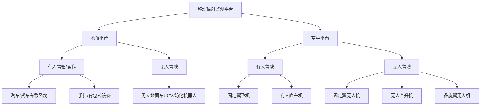
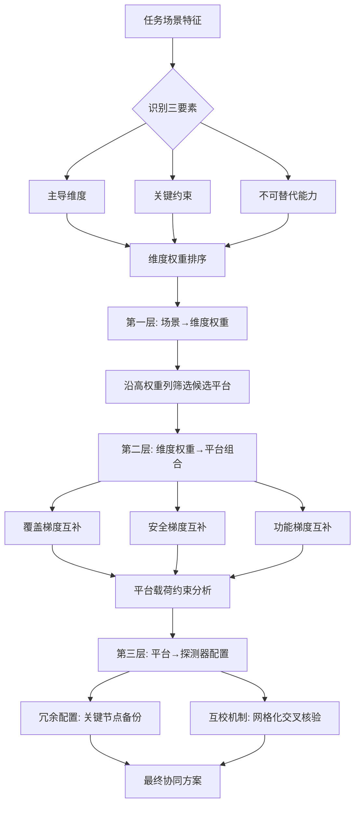

# 移动辐射监测平台技术综述与优缺点对比研究（截至2020年7月）
# 1 研究背景与移动辐射监测的发展驱动

进入21世纪以来，电离辐射监测的内涵已经从早期面向核设施周界的固定式监测网络，逐步拓展到面向广域、动态、突发场景的移动化监测体系。无论是2011年福岛第一核电站事故后对80公里范围内剂量率长达数年的持续测绘[^1]，还是边境口岸、海港、机场和大型公众活动现场对放射性物质非故意转移与非法运输的常态化拦截[^2]，抑或国际原子能机构（IAEA）为应对各类核与辐射应急所构建的事故与应急中心（IEC）响应体系[^3]，都对监测平台的机动性、响应速度、覆盖广度与数据时效性提出了远超固定监测网络所能满足的要求。**移动辐射监测平台**——即将γ/中子探测器、定位导航与数据通信模块集成于车辆、舰船、有人/无人飞行器或机器人载体之上的成套技术系统——正是在这种由"点状监测"向"面状感知"、由"被动等待"向"主动搜寻"转变的需求牵引下，逐步发展成为核安全与核安保领域不可或缺的基础设施。本章将首先梳理推动这一技术领域兴起的核心应用场景与驱动因素，进而界定本报告的研究边界、分类框架与比较维度，为后续各类平台的技术综述与优缺点对比建立分析坐标系。

## 1.1 移动辐射监测的现实需求与应用场景

移动辐射监测平台的发展，本质上是对一系列高度差异化的现实任务需求的工程化响应。从公开文献与国际组织发布的指导性文件来看，其典型应用场景至少可归纳为以下五类。

**第一，重大核事故后的大范围剂量率测绘与长期跟踪监测。** 福岛第一核电站事故是检验移动辐射监测能力的标志性事件。事故发生后，日本政府与多家研究机构在核电站周边80公里范围内开展了长达数年的多手段联合调查，采用航空（airborne）、定点（fixed point）、背包（backpack）以及车载（carborne）四类典型测量方式对环境剂量率进行系统观测，并以1×1平方公里网格为单位进行数据比对与时序分析[^1]。该研究还揭示出不同平台之间存在显著的系统性差异——例如车载调查的视场被限制在铺装道路附近，其测得的剂量率结果往往低于其他方式[^1]——这从一个侧面说明，**单一平台无法满足核事故后从宏观到微观、从开阔地到建成环境的全尺度监测需求**，多平台协同与互校才是工程上可行的解决方案。事故后9年仍持续监测放射性核素的事实[^1]，也凸显了移动监测在长期环境恢复评估中的不可替代价值。

**第二，非法核材料与放射源走私的边境与公共场所拦截。** 这一场景对监测平台的"快速、隐蔽、广覆盖"能力提出了特殊要求。国际标准化组织于2004年发布的ISO 22188《放射性物质非故意转移和非法运输的监测》对相关监测设备进行了规范，并在2020年12月正式立项启动修订（由中核集团原子能院主导），将原标准中3类设备扩展为7类，引用标准与参考文献数量增加到原标准的两倍多[^2]。该标准明确指出，相关监测"在边境口岸、海港、机场、大型公众活动现场等场所的应用尤为关键"[^2]。从应用形态上看，这类场景既需要固定门式探测器，也大量依赖车载、手持与背包式移动设备进行二次核查与可疑目标定位，**移动平台在该场景中承担的是"对固定门式监测的补充与延展"角色**。

**第三，丢失或失控放射源的快速搜寻与精确定位。** 放射源在医疗、工业、科研环节的使用过程中存在被遗失、被盗或非法处置的风险，一旦失控将构成显著公共安全威胁。此类任务要求平台能够在城市道路、废品回收场、垃圾填埋场乃至复杂室内环境中以较高的空间分辨率定位放射源，对探测器灵敏度、定位精度以及操作隐蔽性都有较高要求。手持式与背包式设备在此类近距离精确搜寻中扮演主力角色，而车载平台则负责对道路网络与较大区域进行高速初筛。

**第四，核设施周边与退役场址的辐射本底调查。** 核电站、铀矿、核燃料循环设施及其退役场地需要在投运前、运行中与关闭后开展系统的辐射本底测绘，以掌握自然背景水平、识别异常热点并评估对周边环境与公众的潜在影响。该场景对覆盖效率要求很高、对响应时延要求较低，且测量对象往往以低剂量率本底为主，因此**对探测器灵敏度与统计稳定性的要求高于对机动性的要求**。航空γ能谱测量（固定翼飞机或有人直升机）凭借其大面积覆盖能力，在此类任务中具有传统优势。

**第五，核与辐射应急响应的综合监测保障。** IAEA在其应急准备与响应（EPR）框架下，长期推动成员国在国家与国际层面建立有效的应急响应能力，并通过制定安全标准、提供技术工具、维护事故与应急系统（Incident and Emergency System）来确保对核与辐射事件——无论其源于事故、疏忽还是蓄意行为——的高效响应[^3]。在应急响应链条中，从早期态势感知（剂量率分布、源项识别）到中后期的后果管理（污染区划定、去污效果评估），均需要不同尺度、不同精度的监测数据，**这就客观上要求移动平台具备从空中大范围测绘到地面精细核查的能力梯度**。

上述五类场景在机动性、覆盖范围、响应速度、灵敏度、人员安全等维度上的需求差异，正是后续各类平台技术分化与互补共存的根本原因，也构成了本报告比较分析的现实出发点。

## 1.2 移动监测相对于固定监测的优势与驱动因素

固定式辐射监测系统（如核电站周界辐射站、口岸门式探测器、环境空气吸收剂量率自动监测站）具有连续运行、数据时序完整、维护成本相对集中等优点，但其本质上是"在预设位置等待事件发生"的被动监测模式。面对非预期事件、未知源位置或大范围污染分布，固定监测网络往往存在覆盖盲区、空间分辨率不足、扩展性受限等固有问题。移动辐射监测平台的兴起，可从技术、管理与战略三个层面找到驱动力。

**技术层面的驱动主要体现为支撑性子技术的成熟与集成。** 一方面，γ射线探测器在小型化、轻量化、低功耗化方面取得显著进展，使得原本只能安装于固定监测站的较大体积晶体或半导体探测器逐步具备了车载、机载乃至无人机载的可能；与此同时，能谱识别算法的进步使得在较短测量时间内对复杂能谱进行核素识别成为现实。另一方面，GPS/GNSS定位、惯性导航（IMU）、地理信息系统（GIS）、4G/5G无线通信、云计算与3D可视化等通用技术的快速成熟与商品化，使得"边走边测、边测边算、边算边显"的实时移动监测在工程上具备可行性。无人系统（UGV、UAV）平台在民用与军用领域的并行发展，也为辐射监测载荷提供了高度可定制的运载工具。

**管理层面的驱动来自国际组织与标准化机构的持续推动。** IAEA通过制定安全标准与指南、提供技术工具、协助成员国建立应急响应能力，并通过事故与应急中心维持对核与辐射事件的高效响应机制[^3]，事实上为各国移动监测能力建设提供了规范化牵引。ISO在TC85（核能）框架下对放射性物质非故意转移和非法运输监测设备的标准化工作，则直接规范了相关移动设备的类别划分、性能要求与测试方法。ISO 22188在2023年完成的修订将设备类别由3类扩展到7类[^2]，这一变化本身就反映出该领域设备形态日益多样化、专业化的趋势。**国际规范的细化与设备分类的扩展，是移动监测技术体系走向成熟的重要管理学指标。**

**战略层面的驱动则与全球核安保形势变化和核应急体系完善密切相关。** 反恐需求、放射性散布装置（RDD）潜在威胁、跨境核材料非法贩运风险，以及由福岛事故等历史事件强化的公众与决策层对核应急能力的高期望，共同构成了对快速、灵活、广域监测能力的迫切要求。固定监测网络由于其建设周期长、点位固定、扩展成本高，难以快速响应这类高度动态的战略需求；而移动平台凭借其**可按需部署、可重组配置、可跨地域调度**的特性，恰好填补了固定网络在覆盖盲区、突发响应与灵活组合方面的能力空白。

综合三个层面的驱动可以看出，移动辐射监测平台并非对固定监测的替代，而是与之形成互补关系：固定监测提供长期稳定的"基线"，移动监测提供按需即时的"机动力"，两者共同构成完整的核与辐射监测能力体系。

## 1.3 研究范围界定与平台分类框架

为保证本报告分析的聚焦性与可比性，需要对研究边界与分类框架作出明确界定。

**在时间边界上**，本报告将研究范围限定于截至2020年7月公开发表的移动辐射监测平台技术、产品与典型应用案例。该时间窗的选择既能覆盖福岛事故后近10年间该领域最为活跃的发展阶段，也能避免引入此后出现的新型平台与新型探测器对横向比较的干扰。需要说明的是，部分国际标准文件（如ISO 22188于2020年12月正式立项的修订工作[^2]）虽然其最终发布晚于本报告时间边界，但其修订决策与"将设备类别由3类扩展到7类"的方向性变化恰恰反映了2020年前后该领域的技术现状与认知共识，因此本报告将其作为背景信息予以引用，而不援引其修订后的具体条款。

**在对象边界上**，本报告聚焦于"移动辐射监测平台"这一系统层面的技术对象，重点关注其硬件搭载形态、探测器配置、平台机动性能与典型应用案例；对于探测器物理原理、能谱解析算法、剂量学换算模型等更底层的技术细节，仅在影响平台选型与性能比较时予以必要讨论。同时，本报告所讨论的"辐射"主要指γ射线与中子辐射，α、β辐射由于其在空气中射程极短，难以通过移动平台进行远距离探测，仅在涉及表面污染调查的特定场景下提及。

**在分类框架上**，本报告综合参考福岛事故监测实践中所采用的"airborne / fixed point / backpack / carborne"四分法[^1]以及ISO 22188修订所体现的设备类别扩展趋势[^2]，结合用户对地面平台与空中平台、有人与无人平台的分类要求，建立如下二维分类框架：

上述分类框架的核心维度是"载体类型（地面/空中）"与"操控方式（有人/无人）"。其中"地面-有人"涵盖车载平台与单兵便携设备两个差异较大的子类，因其共享"人员直接介入操作"的本质特征而归并；"地面-无人"以无人地面车（UGV）与各类核化侦察机器人为代表；"空中-有人"包括固定翼飞机与有人直升机两类传统航空γ能谱测量载体；"空中-无人"则进一步细分为固定翼无人机、无人直升机与多旋翼无人机，以反映这三类UAV在飞行特性、载荷能力与任务适配性上的显著差异。船载与水下平台在公开文献中虽有讨论，但鉴于其与本报告核心比较对象（地面与空中平台）在物理环境上差异较大，本报告将其排除在主要比较范围之外，仅在必要时作为背景对照提及。

## 1.4 技术比较维度与报告结构安排

为使后续章节的技术综述与优缺点对比具备横向可比性，本报告设定以下十项核心比较维度，作为各类平台分析的统一坐标系：

| 维度 | 关注内容 | 主要影响场景 |
|------|---------|------------|
| 机动性 | 平台在城市道路、野外地形、空域中的通行与机动能力 | 应急响应、源搜寻 |
| 载荷能力 | 可搭载探测器的体积、重量与功耗上限 | 灵敏度、能谱分辨率 |
| 覆盖范围 | 单次任务可监测的面积或路径长度 | 本底调查、大范围测绘 |
| 探测灵敏度 | 对低活度源或低剂量率本底的可探测能力 | 走私拦截、本底测绘 |
| 续航/航时 | 单次任务可持续工作的时间 | 大范围任务、长时监测 |
| 操作人员安全 | 人员相对辐射源/污染区的距离与暴露风险 | 高辐射区作业、应急响应 |
| 环境/地形适应性 | 对恶劣天气、复杂地形、室内/狭小空间的适应能力 | 山区、城市、室内 |
| 成本 | 采购、运营、维护与人员培训成本 | 决策权衡 |
| 部署速度 | 从任务下达到设备就位开始作业的时间 | 突发应急 |
| 数据质量 | 空间分辨率、能谱质量、定位精度与数据完整性 | 后续分析与决策支撑 |

需要强调的是，**上述十项维度在不同应用场景下的权重并不相同**：在核事故应急早期，部署速度、机动性与人员安全的权重显著高于成本与数据质量；在核设施周边长期本底调查中，覆盖范围、灵敏度与数据质量则跃居首位；而在跨境核材料拦截场景下，部署速度与隐蔽性可能比绝对灵敏度更为关键。这种权重差异本身正是后续场景化选型建议的重要逻辑基础。

在结构安排上，本报告将首先在第2章梳理支撑各类移动平台的共性核心技术（γ与中子探测器、能谱算法、定位导航与数据通信），为后续各平台讨论提供共同的技术底座；随后第3章至第6章依次按"地面-有人""地面-无人""空中-有人""空中-无人"四大类分别展开技术综述；第7章讨论地空一体化协同与数据融合的最新进展；第8章以结构化表格形式给出各类平台优缺点的综合对比；第9章则在对比的基础上归纳场景化选型建议，并对截至2020年7月的技术现状所呈现的发展趋势与改进空间进行展望。**全报告遵循"共性技术—平台分述—协同融合—综合对比—选型展望"的逻辑链条**，力求为相关决策者提供一份兼具技术深度与决策参考价值的系统性综述。

需要坦诚说明的是，由于本研究阶段所获取的直接搜索结果在数量与覆盖面上存在一定局限，本章主要依托IAEA应急响应框架文献[^3]、ISO 22188国际标准修订背景[^2]、福岛事故多平台对比研究[^1]等代表性来源展开分析，对于某些具体平台参数与产品案例的细节，将在后续各章结合更具针对性的技术资料予以补充与深化。

# 2 移动辐射监测共性技术基础

在第1章建立的二维分类框架与十项比较维度之上，要进一步刻画各类移动平台的能力边界与互补关系，必须先回到支撑这些平台的底层共性技术。无论是车载移动实验室、单兵背包式巡检设备，还是搭载于UGV、固定翼飞机或多旋翼无人机上的辐射监测载荷，其本质都可以拆解为同一组核心技术模块的不同组合：**辐射探测器**负责将γ光子或中子转换为可识别的电信号，**能谱识别与刻度算法**负责从原始计数中还原出核素信息，**定位与导航**负责将测量结果绑定到地理坐标，**数据传输与可视化映射**则负责将分散的测点融合为决策者可读的态势图。这四大技术模块在小型化、轻量化、低功耗化与算法智能化方面的协同进步，构成了过去十余年间移动辐射监测平台技术爆发的共同底座。本章将依次梳理这些共性技术的关键参数与工程权衡，特别是探测器在"灵敏度—分辨率—体积重量—功耗"四角空间内的内在差异，以及定位导航与通信技术如何共同决定移动监测的空间精度与实时性，从而为第3章至第6章逐类平台的载荷适配性分析建立统一的术语与坐标系。

## 2.1 γ射线探测器技术比较

γ射线探测器是移动辐射监测平台的核心载荷，其物理原理可大致分为两类：基于发光过程的**闪烁体探测器**（如塑料闪烁体PVT、NaI(Tl)、LaBr₃:Ce、CeBr₃）通过晶体吸收γ光子后激发原子发光，发出的光经光电倍增管（PMT）或硅光电倍增器（SiPM）转换为与入射能量成正比的电荷脉冲；基于电荷直接收集的**半导体探测器**（如HPGe高纯锗、CdZnTe/CZT碲锌镉）则利用γ光子在半导体晶格中产生电子-空穴对，通过外加偏压直接收集电荷[^4]。两类探测器在能量分辨率、灵敏度、晶体尺寸、工作温度与机械稳健性方面各有特点，决定了它们在不同移动平台上的角色分工。

**塑料闪烁体（PVT）**是大面积、低成本γ探测器的典型代表，最常见的应用形态是边境口岸的车辆门式探测器（vehicle portal monitor）。由于聚乙烯甲苯（PVT）等塑料材料易于制成大体积、低密度模块，且单位体积成本远低于无机晶体，PVT构成了边境监测中最常见的γ探测形态，主要用于在通过性检查中通过总计数阈值进行初筛[^3]。但其代价是几乎不具备能谱分辨能力——PVT只能提供γ射线计数信息，而无法给出可用于核素识别的特征峰[^3]。因此，**PVT在移动平台中的典型角色是"灵敏的告警触发器"，而非"核素鉴别器"**，需要与具备能谱能力的其他探测器组合使用。

**NaI(Tl)碘化钠闪烁体**长期以来是车载、机载与便携式γ能谱测量的主力。NaI(Tl)的发光效率高、可制成升级公斤量级的大体积晶体，且通过特征峰可实现核素识别，因此在需要核素鉴定的边境门式监测中相比PVT具有明显优势[^3]。其能量分辨率在662 keV处典型为7%左右FWHM，足以分辨常见的人工核素如¹³⁷Cs、⁶⁰Co、⁹⁹ᵐTc以及天然放射系中的K、U、Th特征峰。NaI(Tl)的不足在于其潮解性需要密封封装，机械抗振性中等，且峰总比受散射干扰影响——峰总比即"全能峰的净计数除以该γ射线在全谱上的计数"，与射线能量、探测器尺寸、是否准直等因素有关，对于尺寸相同的探测器可通过比较峰总比说明其排除散射干扰的好坏[^5]。这意味着在移动平台的复杂散射环境中，NaI(Tl)的有效核素识别能力可能低于其在理想实验室条件下的表现。

**LaBr₃:Ce与CeBr₃溴化镧/溴化铈类闪烁体**代表了过去十余年闪烁体材料的重大进步。这类晶体具有较短的闪烁衰减时间（约15–25 ns）和在1 MeV处约3%的能量分辨率，显著优于NaI(Tl)[^1]。这使得LaBr₃在需要更高能谱分辨率但又无法承受半导体探测器制冷负担的移动平台上具有独特价值。值得注意的是，LaBr₃晶体本身含有天然放射性同位素¹³⁸La（丰度约0.09%），这一内禀本底既是干扰因素，也提供了独特的**自校准机会**——基于¹³⁸La内部辐射建立测试本底与Geant4仿真标准谱的最大相似度匹配，可在662 keV处实现优于0.8%的校准误差，且方法具有广泛适用性[^5]。CeBr₃则不含¹³⁸La，其内禀本底显著低于LaBr₃，对低活度本底测量更为有利[^1]。

**HPGe高纯锗半导体探测器**是γ能谱测量的"金标准"，其在662 keV处的能量分辨率可达到约0.2%的水平，远优于任何闪烁体。已有研究将HPGe用于车辆门式监测的评估，由于HPGe的高分辨率可以更精确、更快速地实现核素识别，在具备足够探测效率的部署条件下可作为高端补充手段[^3]。HPGe还广泛应用于高浓铀样品的特征化分析——通过低本底γ能谱仪可对U-234、U-235、U-238、U-232、U-236含量以及高浓铀的"年龄"进行测定，进而计算总铀含量与同位素组成，这对核取证与防扩散监测具有关键意义[^6]。然而HPGe的本质性局限是**需要液氮或电制冷将探测器冷却至80 K左右才能正常工作**，这给移动平台带来了显著的体积、重量与功耗负担，使其在便携、UAV乃至大多数UGV平台上的应用受到严重制约，更多出现在车载移动实验室与有人航空平台中。

**CdZnTe（CZT）碲锌镉半导体探测器**则是近年来最具突破意义的移动平台候选探测器。CZT工作在室温下即可获得较好的能谱性能，避免了HPGe的制冷需求，这对便携与无人平台尤为关键。研究表明，采用Redlen等厂商生产的8×8×32 mm³条形CZT晶体并配合虚拟Frisch栅结构与专用ASIC读出电子学，其能量分辨率在662 keV处可达<1% FWHM，部分晶体在25°C常温下使用混合电荷灵敏前置放大器测试时也可达到<1%的水平[^7]。这一性能水平相当接近HPGe，但体积与功耗大幅降低。商业化产品方面，Kromek公司推出的GR1-A+便携式自然γ能谱仪即采用1 cm³ CZT探测器，整机由USB供电，标准型号在662 keV处能量分辨率<2.5% FWHM，"plus"型号<2.0% FWHM，配套MultiSpect分析软件支持与400余种核素谱库的实时匹配[^8]。**CZT在小体积下兼顾较好分辨率与室温工作能力，是手持、背包及UAV载荷的优选半导体探测器**。

综合上述比较，五类γ探测器在移动平台中形成了较为清晰的角色分工：PVT负责大面积低成本初筛但不具识别能力；NaI(Tl)是兼顾灵敏度、识别能力与成本的"性价比主力"；LaBr₃/CeBr₃在追求高能谱分辨率而不能承担制冷负担时作为升级选择；HPGe主要承担车载实验室与有人航空器上的高分辨率核素鉴别；CZT凭借室温下接近HPGe的能谱性能与极小体积，在便携与无人平台上占据日益重要的位置。这种**"大面积初筛—中分辨率识别—高分辨率鉴定"的三级互补关系**，正是后续各类平台载荷选型的底层逻辑。

## 2.2 中子探测器技术

中子作为不带电的核反应产物，其探测原理与γ射线显著不同，必须借助核反应在含特定元素（³He、¹⁰B、⁶Li）的介质中产生带电粒子，再通过电离方式被记录。中子探测器在移动平台中的核心使命是识别**特殊核材料（SNM）**——尤其是钚和高浓铀——因为这些材料是自发裂变中子源或受到中子诱发裂变的潜在对象，而γ探测器难以单独区分屏蔽后的SNM。因此，在反恐与跨境核材料拦截等场景中，γ+中子双模探测几乎是事实上的标准配置。

从公开的商业化产品来看，移动平台常见的中子探测方案可归纳为三类。**第一类是³He正比计数管**，这是过去几十年的主流方案，典型代表如Berthold LB6411中子剂量率探测器、固定式与壁挂式³He探测器以及国产FJ190N便携式中子剂量当量仪等[^9]。³He管对热中子具有极高的反应截面，配合含硼或聚乙烯慢化体可将快中子慢化后高效探测，但³He气体资源短缺和价格上涨是该方案长期面临的供应链压力。**第二类是宽能量响应中子探测器**，例如Thermo Fisher FHT 762型宽能中子探测器与Berthold LB 6414中子监测器，其能量响应范围覆盖10 keV至1 MeV乃至更宽，适用于复杂中子能谱场合[^9]。**第三类是个人剂量计与搜寻仪集成方案**，例如Mirion DMC2000GN手持式个人剂量计将自动型中子/γ探测能力集成于个人佩戴尺寸的设备中，以及Mirion PDS-100GID辐射探测和搜寻仪作为新一代中子辐射探测器面向放射源搜寻任务[^9]。

中子探测的另一个共性技术要素是**慢化与屏蔽材料**。含硼聚乙烯（典型含硼量12%）板既可作为中子源的屏蔽体，也可作为中子探测器周围的慢化体使用，含铅硼聚乙烯则用于同时屏蔽中子与γ射线的复合场景[^9]。这些材料的厚度与几何配置直接决定了中子探测器的能量响应函数与方向灵敏度，但同时也是中子探测载荷重量难以大幅压缩的根本原因——这一点对UAV等严格受限于载荷的平台尤为关键。

中子探测器的典型市场价格区间也间接反映了其工程复杂度：便携式中子探测器普遍在数万元至十余万元人民币级别，例如LB 6414在能量范围10 keV–1000 keV覆盖下报价约17万元人民币，Thermo FHT 762报价约9.8万元，国产FJ190N约5.8万元[^9]。这显著高于同类γ便携设备，且**中子探测器普遍体积较大、重量较重**（典型整机数公斤），这构成了其在多旋翼UAV等小型平台上集成的主要工程瓶颈。在后续章节中可以看到，中子探测能力主要出现在车载、UGV、有人航空器与较大型固定翼/直升机UAV平台上，而很少出现在消费级多旋翼UAV载荷中。

## 2.3 能谱识别与刻度算法

辐射探测器输出的原始信号只有经过能谱解析与核素识别算法的处理，才能转化为对决策者有价值的核素清单与活度估计。移动监测平台的特殊性在于：测量时间往往很短（车载或飞行平台在每个测点上可能只停留数秒）、统计计数有限、背景动态变化（路过山体、建筑物或天然高本底地段时背景剧烈波动），这对算法的鲁棒性提出了远高于实验室静态测量的要求。

**全能峰效率与峰总比**是能谱分析中的两个基础概念。全能峰效率定义为探测器对特定能量γ射线产生全能峰计数的概率，是定量分析的基础；峰总比则是全能峰净计数与该能量γ射线在全谱上的计数之比，反映探测器排除散射干扰的能力。研究表明，NaI(Tl)闪烁体探测器中，¹³⁷Cs和⁶⁰Co核素在特定探测距离下会出现峰总比最大值差异，且可通过蒙特卡罗方法计算γ谱仪的全能峰效率与峰总比；翟盛庭于1995年提出的加权技术修正了相关计算公式，在2000 keV以下能量范围与实验数据一致；HPGeγ谱仪的峰总比在不同样品形状和测量几何条件下保持基本恒定[^5]。这一稳定性恰恰是HPGe在精确定量分析中具有优势的物理基础——而**NaI(Tl)在移动平台上由于测量几何持续变化，其峰总比波动较大，对核素识别算法的容差能力提出了更高要求**。

在核素识别的工程实现上，主流的做法是**谱库匹配**。Kromek公司的MultiSpect分析软件支持将多台GR1-A连接至PC并实时显示多路能谱，可将实测谱与预加载的400余种核素谱库进行匹配实现自动识别[^8]。这类基于谱库的匹配算法在常见核素识别中已具备实用化能力，但在多核素混合、强散射本底或弱信号条件下，其识别置信度会显著下降。

**探测器自校准**则是移动平台长期使用中保证数据可靠性的关键。传统的能量刻度依赖于外加标准源，需要操作人员定期完成，对长时间在外作业的移动平台是显著负担。基于LaBr₃晶体内禀¹³⁸La放射性的自校准方法提供了一种"无需外源、随用随校"的解决路径——该方法仅利用¹³⁸La的天然放射性，通过求解实测本底与Geant4仿真标准谱的最大相似度实现校准，对4种不同晶体在不同温度下的实验显示662 keV处校准误差<0.8%[^5]。这一方法对长期野外作业的移动平台具有显著的工程价值，但其前提是探测器材料本身含有可利用的内禀放射性核素，因此对NaI(Tl)、CZT等不具备类似自校准基础的探测器并不直接适用。

在特殊场景如**核取证与防扩散监测**中，γ能谱算法需要进一步进入同位素比测定层面。已有研究系统描述了适用于非法贩运核材料中所遇高浓铀样品特征化的γ能谱方法，包括U-234、U-235、U-238、U-232、U-236含量的测定与高浓铀"年龄"的判定，进而推算总铀含量与同位素组成；其中U和U-232含量的测定以及铀年龄测定均在低本底测量室中进行[^6]。这类高精度同位素分析的能力远超普通移动平台，通常需要将疑似样品送至实验室进行后续分析，**但这也提示移动平台在SNM拦截链条中的角色应被理解为"现场触发与初步识别"，而非"最终定性鉴定"**。

综合而言，能谱识别算法的鲁棒性、自校准能力与同位素分辨能力，构成了对探测器选型的反向约束：在低统计、动态背景的移动场景下，算法越鲁棒则可以容忍越低分辨率的探测器；反之，对于关键核取证任务，则需要选用HPGe等高分辨率探测器并辅以离线分析。这种"算法—探测器"的双向约束关系，是后续平台选型的隐性逻辑之一。

## 2.4 定位与导航技术

移动辐射监测的核心价值在于**将剂量率或能谱数据精确绑定到地理坐标**，从而生成可供决策的空间分布图。一次测量如果失去了位置信息，其价值将退化到接近固定监测站点的水平。因此，定位与导航技术是移动平台不可或缺的"骨架"。

**单点GPS**是最基础也最普及的定位方案，依靠卫星信号解算接收机三维坐标，典型水平精度在数米量级。但单点GPS存在两个固有问题：其一是精度无法满足放射源精确定位与剂量率热点边界划定的厘米级到亚米级需求；其二是在城市峡谷、隧道、室内、林下等GNSS信号受遮挡的场景中精度急剧下降甚至完全失锁。极飞科技在2015年使用单点GPS开展自营植保作业时，曾遇到罗盘干扰、航迹偏移、起降需人工干预等问题，进而在2015年下半年转向RTK研发以实现全自主飞行，这一案例典型地反映了单点GPS在精确机动场景中的能力上限[^10]。

**RTK（Real-Time Kinematic，实时动态载波相位差分）技术**通过引入固定基准站，将基准站采集的载波相位观测值与流动站观测值实时差分，可将定位精度从数米提升至厘米级[^11][^10]。RTK系统由基准站接收机、数据链与流动站接收机三部分组成，基准站对卫星进行连续观测并通过无线电将其观测数据与测站信息实时发送至流动站，流动站则通过差分解算给出三维坐标，整个过程历时不足一秒钟[^10]。但RTK的局限在于**作业距离受到误差空间相关性失效的限制**：传统单机RTK对于单频信号约10 km、双频信号约30 km之外，差分处理后的数据仍含有较大观测误差，导致定位精度下降甚至无法解算载波相位整周模糊[^11]。这意味着大范围航空辐射调查若依赖RTK，需要部署多基站或采用网络RTK等方式扩展作业范围。

**惯性测量单元（IMU）**是组合导航的另一关键传感器，其核心由三轴加速度计和三轴陀螺仪组成，分别测量载体在三个直线方向上的加速度和绕三轴旋转的角速度[^12]。IMU的最大优势是**自主性与高频性**——不依赖任何外部信号，可在数百赫兹频率下持续输出运动信息，因此在GPS失锁的瞬间能够维持姿态与位置推算[^12]。但IMU的致命缺陷是误差累积：一个单独使用的IMU即便价值上万，几分钟后其位置估计也可能漂移到数百米开外[^12]。因此，**IMU几乎从不被单独使用，而是作为组合导航中的"短时高精度"补盲组件**。

在移动辐射监测的实际工程实践中，**IMU+GPS+RTK的"铁三角"组合导航**已成为自动驾驶汽车、无人机、机器人等领域的事实标准，其本质是一个"信息融合中心"，通过卡尔曼滤波算法对快慢、绝对相对、连续断续的多源数据进行动态加权融合[^12]。当GPS信号强、卫星数量多时，系统更相信GPS的绝对位置并以此纠正IMU的累积漂移；当车辆驶入隧道或GPS信号完全丢失时，系统将权重几乎全部交给IMU，依靠其高频数据基于最后一刻的准确位置进行短时惯性推算，直到GPS信号恢复[^12]。**这种动态加权机制对移动辐射监测的意义在于：剂量率分布图的空间精度不再受限于最差传感器，而是接近最优传感器的水平**——例如在城市道路监测中，即便穿越短隧道或高架桥遮挡，剂量率轨迹仍能保持连续，从而避免地图上的"假性盲区"。

对于**GNSS完全拒止环境**（如建筑物内部、地下空间、强电磁干扰场景），即使IMU补盲也难以长时间维持精度。此时需要借助**SLAM（Simultaneous Localization And Mapping，同步定位与建图）技术**，通过激光雷达（LiDAR）或视觉传感器感知周围环境并构建增量式地图，同时在地图中定位自身。在SLAM应用场景中，3D LiDAR点云的高数据量对实时处理与传输构成挑战，相关研究通过点云分割与压缩网络选择具有高优先级的紧凑点子集来维持定位精度[^13]。这类技术对于UGV在建筑物内部进行辐射搜寻、UAV在室内/狭小空间进行近距离侦察等任务具有不可替代的意义，但目前仍主要存在于研究与高端工程系统中，尚未形成普及化的辐射监测产品形态。

综合而言，定位导航技术对移动辐射监测的核心价值可归纳为：**单点GPS满足大范围低精度初筛，RTK提供厘米级精确定位以支持热点边界划定与源精确定位，IMU+GPS组合导航保证GNSS信号波动场景下的轨迹连续性，SLAM则为GNSS拒止环境提供位置基准**。这一技术梯队与γ探测器的三级互补关系类似，共同构成了移动监测平台在不同任务尺度下的能力底座。

## 2.5 数据实时传输与可视化映射

将测量数据从前端探测器与定位模块送达后端决策端，是移动监测从"采集设备"升级为"决策支撑系统"的关键环节。其技术链路通常涵盖**通信传输、数据存储与GIS可视化映射**三个层面。

在**通信传输**层面，移动平台可用的链路包括4G/5G蜂窝网络、数传电台、Wi-Fi、卫星链路等。其中4G/5G具有带宽大、覆盖广的优势，但依赖运营商基础设施，在偏远地区、应急场景与跨境作业中可能不可用。数传电台则在RTK定位中已被广泛使用——RTK系统的链路既可采用电台模式，也可采用网络通讯模式，云RTK系统进一步通过4G网络和云端RTK平台扩展了作业范围[^10]。在卫星定位与短报文通信方面，RTKLIB等开源软件包对GPS、GLONASS、QZSS准天顶卫星系统、北斗及SBAS的支持反映了全球卫星导航系统在标准化与多模融合方面的进展，可以为移动平台在跨境与极远地区作业提供必要的位置与时间基准[^11]。对于辐射监测数据本身而言，由于其原始能谱数据量相对适中（每秒数KB到数十KB级别），4G/5G链路通常足以胜任，而对于UGV/UAV的视频回传与3D点云传输则需要更高的带宽与更低的时延。

在**数据组织与可视化**层面，福岛事故后的多平台对比研究提供了一个具有代表性的范式：研究者在福岛第一核电站80公里范围内设置1×1平方公里网格，从所有调查活动中选取在每个网格内同时具备航空、定点、背包、车载四类数据的样本，构建分析数据集，并据此评估各类调查方式的特征差异[^1]。这种**网格化数据组织方式**的核心价值在于使不同平台、不同时间、不同测量原理的数据具备横向可比性，是后续土地利用分类、空气剂量率时序分析与位置因子评估的基础。同一研究的关键发现之一是，**车载调查的结果通常小于其他调查方式，因为车载调查的视场被限制在铺装道路附近**[^1]——这一现象本身就是不同平台视场差异的直接反映，也再次强调了多平台联合分析的必要性。

3D可视化映射则是将网格化数据进一步呈现为剂量率热力图、轨迹叠加图、源定位结果与GIS图层叠加的技术形态。在地面与空中平台协同作业的场景下，3D可视化还可以将多个测点的位置、高度、剂量率值整合到统一坐标系中，支持决策者直观判断污染分布的空间结构。这部分技术在第7章地空协同与数据融合中将进一步展开。

"边走边测、边测边算、边算并显"的实时处理范式，对通信稳定性、数据压缩与边缘计算能力提出了综合要求：探测器原始能谱必须在前端完成基本的核素识别与异常告警，定位数据必须经过组合导航融合后再上传，3D点云等大体积数据可能需要在线压缩处理[^13]。这种**前端边缘智能与后端云端汇聚相结合**的架构，是移动辐射监测从离线分析走向实时态势感知的工程基础。

## 2.6 探测器关键性能参数综合对比

为给后续各章平台选型分析提供量化参考，将本章涉及的γ与中子探测器关键参数综合整理如下表。该表力求在公开资料允许的范围内给出可比的数值区间，对部分缺乏直接对应来源的参数（如典型重量、整机成本）以技术常识范围标注或留空，避免凭空推测。

| 探测器类型 | 能量分辨率(662 keV，FWHM) | 典型晶体尺寸 | 工作温度/制冷需求 | 核素识别能力 | 典型应用平台 |
|---|---|---|---|---|---|
| 塑料闪烁体PVT | 不具备能谱分辨率（仅总计数） | 大体积模块（数十升量级） | 常温 | 无（仅告警） | 车辆门式监测、车载初筛[^3] |
| NaI(Tl) | 约7% | 立方厘米至升级 | 常温（需密封防潮解） | 中等（常见核素） | 车载、便携、机载[^3][^5] |
| LaBr₃:Ce / CeBr₃ | 约3% @ 1 MeV | 英寸级（如3"×3"） | 常温 | 较强（含¹³⁸La自校准） | 便携、机载、UAV[^5][^1] |
| HPGe | <0.3%（远优于NaI） | 数十至数百cm³ | 需液氮或电制冷至~80 K | 强（核取证级） | 车载移动实验室、有人航空[^3][^6] |
| CZT | <1%（部分晶体常温） | 1 cm³到数十cm³ | 常温 | 较强（库匹配） | 便携、UAV、UGV[^7][^8] |
| ³He中子计数管 | 不适用（中子计数） | 数十厘米管长配合慢化体 | 常温 | 配合γ用于SNM识别 | 车载、便携、UGV[^9] |
| 宽能中子探测器 | 不适用 | 较大体积 | 常温 | 中子能量响应宽 | 车载、固定式[^9] |

从该表可以提炼出移动平台探测器选型的**"灵敏度—分辨率—体积重量—功耗"四角权衡关系**：

第一，**分辨率与制冷需求正相关**。HPGe的最高分辨率以液氮/电制冷为代价，这构成了便携与UAV平台采用HPGe的根本工程障碍；CZT与LaBr₃则在常温下实现了次于HPGe但远优于NaI的分辨率，是无人平台与便携平台的优选路径。

第二，**灵敏度与晶体体积正相关**。PVT与大体积NaI(Tl)凭借其升级体积实现高灵敏度，因此在车载与车辆门式监测中占据主导；而便携与UAV平台受限于载荷，必须以较小晶体牺牲一定灵敏度，并通过更靠近源、更长测量时间等方式补偿。

第三，**核素识别能力是分辨率的派生属性**。PVT几乎无识别能力，NaI(Tl)能识别常见核素，LaBr₃/CZT具备较强识别能力，HPGe则可进入同位素比测定层面。这一梯度直接对应了不同平台在"告警—识别—鉴定"任务链条中的角色。

第四，**中子探测器存在独立于γ的体积约束**。由于慢化与屏蔽结构本身重量较大，中子探测能力难以集成到极小型UAV上，更多见于车载、UGV与较大型空中平台。

这四个权衡维度在后续各章的平台选型中将反复出现：车载平台凭借载荷与功耗优势可搭载多探测器组合（大体积NaI+HPGe+中子探测器），形成"灵敏度+分辨率+识别"的完整能力；便携与多旋翼UAV则以小型NaI、LaBr₃或CZT为主，承担"高机动+中等识别"的角色；UGV与有人航空器则视任务需求灵活配置。**这一探测器能力梯度与平台机动性梯度的乘积关系**，将成为后续第8章综合对比表的核心结构。

需要坦诚说明的是，本章探测器与中子产品的具体参数主要源自学术文献、产品技术资料与厂商公开宣传，部分参数（如续航功耗、典型整机重量）在公开搜索结果中覆盖不全。本章对此类信息采取保守态度，仅在有直接来源支撑时给出具体数值，对其余参数仅作定性描述，并在后续章节结合更具针对性的平台资料予以补充。

# 3 地面有人平台：车载系统与手持/背包式探测设备

地面有人操作类移动辐射监测平台是当前移动监测体系中部署最广、形态最成熟的子类，其共同特征是**由人员直接操控载体或亲身携带设备完成测量任务**。这一形态决定了该类平台天然在"机动性—载荷能力—人员安全"三角中形成了独特的取舍：以汽车、货车为载体的车载系统凭借充裕的空间与电力，可集成大体积NaI(Tl)、HPGe与中子探测器，承担道路网络高速初筛与移动实验室级核素鉴定任务；而以手持式核素识别仪、个人剂量报警仪与背包式探测仪为代表的便携设备，则以"贴身、近距离、隐蔽"为关键词，承担人员密集场所巡检、近距离源定位与个人剂量监测任务。本章在第2章共性技术框架下，按"车载平台构型与配置—车载应用与边界—手持式核素识别仪—个人剂量与背包设备—互补关系与共性局限"的顺序展开，并在最后回归到第1章设定的十项比较维度，为本报告后续与无人地面平台、空中平台的横向对比建立基准参照。

## 3.1 车载辐射监测系统的典型构型与探测器配置

车载辐射监测系统的总体架构通常由五大模块构成：**探测器舱、能谱分析与数据采集单元、定位导航模块、数据通信链路与车载电源系统**。探测器舱位于车厢中段或车顶，通过减振结构固定大体积闪烁体或半导体探测器；能谱分析单元承担多道脉冲幅度分析（MCA）、稳谱、剂量率换算与核素识别；定位导航通常采用GPS+IMU组合方案，必要时辅以RTK差分以提高轨迹精度；数据通信链路则在4G/数传电台与卫星链路之间组合，将实时能谱与位置数据回传至指挥中心；车载电源系统通过车辆原车电池、独立蓄电池组与逆变器协同供电，可支持探测器舱长时间不间断工作。

从探测器配置看，车载平台最显著的优势是**对大体积闪烁晶体的容纳能力**。北京滨松光子技术股份有限公司在继2023年推出2L NaI(Tl)闪烁体之后，进一步研发出CJ265型4L大体积NaI(Tl)闪烁体（尺寸100 mm×100 mm×400 mm），以及配套的CH564型4L NaI(Tl)闪烁探测器，并建立了从毛坯生长到闪烁体封装的全套技术与生产线，产品经过能谱测量、环境试验与力学试验等多项可靠性验证[^14]。这类4 L量级的NaI(Tl)晶体显著提升了对低活度γ放射性的探测效率与灵敏度，可精准识别不同能量的伽马射线[^14]——这恰恰是车载平台在道路核素搜寻与本底测绘任务中的核心能力来源。需要说明的是，该型号产品的具体发布时间晚于本报告2020年7月的时间边界，因此本报告仅将其作为"大体积NaI(Tl)晶体在车载平台上具有工程可行性"的技术现实参照，而不援引其作为2020年7月前的既成产品案例；类似地，2020年7月前NaI(Tl)闪烁体的体积已可达到升级量级，并已在车辆门式监测与车载平台中获得实际应用。

车载平台的另一重要探测器配置是**HPGe高分辨率半导体探测器**。如第2章所述，HPGe在662 keV处的能量分辨率优于0.3%，远高于任何闪烁体，可对U-234、U-235、U-238等同位素含量进行精确测定，但其需要液氮或电制冷至约80 K的工作条件，给便携与无人平台带来显著负担。车载平台凭借充裕的空间与电力，可较为便利地集成电制冷HPGe探测器，从而承担"移动实验室级"的核素鉴定任务。AMETEK ORTEC作为电离辐射探测器与核仪器的行业引领者，其TETRAD N型高纯锗探测器即面向核物理应用，能够在有限的几何空间内实现最大绝对效率，覆盖20 keV至10 MeV的宽能量范围[^15]。这类高纯锗探测器配合车载电制冷系统与铅屏蔽箱，可构成移动式高纯锗γ谱仪，用于现场样品分析与核取证支持。

**γ+中子双模配置**是车载平台在跨境核材料拦截与SNM探测任务中的标准做法。中子探测能力对识别屏蔽后的钚、高浓铀等特殊核材料具有不可替代的作用。在国家标准化层面，国家市场监督管理总局于2020年7月2日发布的《JJF 1248-2020通道式车辆放射性监测系统校准规范》（代替JJF 1248-2010）对车载与门式车辆放射性监测系统的计量特性作出了系统规定，其计量特性包括**活度响应、中子响应与核素识别率**三大核心指标；规范将系统分为非核素识别型与核素识别型两大类，分别规定了活度响应、对不同能量γ放射性核素的响应、中子响应、重复性、活度响应非线性、动态检测、静态模式下核素识别等校准项目与方法[^16]。该规范的修订以GB/T 24246-2009《放射性物质与特殊核材料监测系统》、GB/T 31836-2015/IEC 62484:2010《辐射防护仪器 用于探测和识别非法放射性物质运输的基于谱分析的门式监测系统》以及IEC 62244《国家边境放射性和特殊核材料探测用辐射防护监测》等国际国内标准为基础[^16]。**这一规范体系为车载与通道式车辆放射性监测系统提供了统一的性能验证基准，是车载平台从单机性能描述走向系统化合规评估的重要标志**。

在车载平台的剂量率量程方面，多功能宽量程辐射探测系统的研究提供了一个具有代表性的工程样本。南京航空航天大学等单位研制的多功能宽量程辐射探测系统采用GM管与NaI(Tl)γ谱仪组合，通过嵌入式设计、实验标定、能谱剂量率转换与软件开发等工作，实现宽剂量率量程、双参数探测、自动温漂修正、无线数据传输和探测轨迹标定等功能；实验表明，该系统在**0.01 μGy/h至100 mGy/h的辐射场内剂量率测量误差小于8%，上位机能在3 km距离获取作业路径、γ能谱和剂量率等探测信息**[^17]。该系统的设计思路——以GM管覆盖高剂量率量程、以NaI(Tl)γ谱仪提供能谱信息、以无线传输实现远程作业——正是车载平台典型探测器配置与数据架构的缩影；同时该研究也明确指出，传统国内核探测设备大多不具备远程分析能力，单一功能探测器在分析辐射场时往往需要多个探测器同时工作[^17]，这一现状本身即是车载平台多探测器协同价值的反证。

综上，车载平台的典型探测器配置可概括为"**大体积NaI(Tl)负责高灵敏度告警与中等分辨率识别 + HPGe承担高分辨率核取证级鉴定 + ³He/宽能中子探测器覆盖SNM识别 + GM管补足高剂量率量程**"的四组件结构。这一结构在载荷、供电与减振条件许可的前提下，最大化地利用了第2章梳理的探测器能力梯度，是当前车载移动监测能力的工程基准。

## 3.2 车载平台的典型应用场景与能力边界

车载平台在实际应用中的角色，可大致归纳为四类典型任务模式。

**第一类是道路网络高速初筛与车载γ能谱测量**。在这一模式下，车辆以正常或较低速度沿道路行驶，探测器以1秒级或更短的积分时间持续采集计数与能谱，系统将剂量率与位置数据实时叠加在地图上，实现"边走边测、边测边算、边算边显"的实时态势感知。前述多功能宽量程辐射探测系统所演示的"上位机能在3 km距离获取作业路径、γ能谱和剂量率等探测信息"的能力[^17]，正是这一应用模式的典型实现。该模式对探测器灵敏度要求较高——车辆在道路速度下经过路边或道路下方的源时，源在探测器视场内的停留时间仅有数秒，要求探测器能在短积分时间内获得显著的计数率上升以触发告警。

**第二类是核设施周边与厂址环境本底巡测**。这一任务以低剂量率本底测绘为主，对探测器灵敏度与统计稳定性的要求高于对机动性的要求，车载平台凭借大体积NaI(Tl)晶体可获得较优的信噪比，并可通过长时间反复测量同一路径以降低统计涨落。配合GPS轨迹记录，可生成厂址周边公路网的剂量率分布图，为运行前本底、运行中变化与退役后残余污染评估提供数据支撑。

**第三类是移动实验室级核素鉴定**。在这一模式下，车辆停泊于待测样品或可疑区域附近，依托车载HPGe探测器与铅屏蔽箱对样品进行较长时间的能谱测量，从而获得接近实验室级别的核素分辨能力。这一模式的代表性应用包括应急情况下对疑似放射性散布装置（RDD）残留物的现场鉴定、对走私可疑核材料的初步同位素分析等。**车载平台在"现场触发与初步识别—实验室最终定性鉴定"链条中实际扮演了"现场实验室"这一中间角色**，部分缓解了将疑似样品长距离运送至专业实验室的时间与安全压力。

**第四类是核应急响应中的综合监测保障**。在事故应急或重大公众活动场景下，多辆配置不同探测器组合的监测车辆可形成"车队式"监测网络，分别承担道路初筛、热点核查、移动实验室与指挥通信等不同角色，构成一个可快速部署、可现场重组的临时监测体系。

然而，车载平台的能力边界同样十分明确。**第一项固有限制是道路速度对单点积分时间的压缩与对探测灵敏度的削弱**。在城市或公路常规行驶速度（30–60 km/h）下，探测器在距离源数米范围内的停留时间仅有零点几秒，即便采用4 L级大体积NaI(Tl)晶体，弱源在如此短的积分时间内可能仍无法触发告警阈值，必须依赖反复多次过境或降速测量。

**第二项限制是铺装道路视场对路侧污染探测的根本性约束**。福岛事故后的多平台对比研究已明确指出，**车载调查所测得的剂量率结果通常小于其他调查方式（航空、定点、背包），其根本原因是车载调查的视场被限制在铺装道路附近**——道路一般经过去污处理且车辆本身具有一定屏蔽作用，使得车载测量结果难以代表周边非道路区域（如农田、林地、建成区屋顶）的真实污染水平。这一发现对车载平台的应用解读具有重要警示意义：**车载数据不能等同于区域剂量率，更适合作为道路沿线沉降的相对指标与多平台联合分析中的一个独立维度**。

**第三项限制是城市峡谷与隧道环境下定位失锁的影响**。如第2章所述，单点GPS在高楼遮挡、隧道与高架桥下方等场景下精度急剧下降甚至失锁；尽管IMU+GPS组合导航可在短时丢失场景中维持轨迹连续性，但长隧道或长时间遮挡仍可能造成测量数据与位置的失配，进而影响剂量率分布图的空间精度。

**第四项限制是车体自身屏蔽对低能γ射线探测的干扰**。车体钢板与车辆构件本身对低能γ（特别是100 keV以下）具有一定屏蔽作用，对U、Th特征峰与低能γ核素（如¹⁴¹Ce、¹⁴⁴Ce）的探测可能产生系统性偏低偏差，需要在能量刻度与几何刻度时予以考虑。

**第五项限制是机动性的根本性约束——车载平台只能到达车辆可通行的道路网络**，对于山区、密林、河谷、建筑物内部、楼顶、屋顶夹层、地下空间等场景几乎无能为力。这正是后续UGV、便携设备与空中平台需要承担互补角色的根本原因之一。

## 3.3 手持式辐射检测仪与核素识别仪

手持式辐射检测仪与核素识别仪是地面有人平台中"近距离、便携、即用即弃"的代表形态，其核心使命是在人员可接近的环境中完成放射源精确定位、核素识别与现场威胁评估。从市场上主流产品的技术形态来看，手持式核素识别仪可按探测器类型与功能复杂度划分为多个层次。

**RSI RS-125手持式γ能谱仪**是较早期但仍具代表性的手持式自然γ能谱仪。其核心配置为2.0×2.0英寸（103 cm³，约6.3 in³）的大型NaI(Tl)闪烁晶体，整机含电池仅重2.04 kg；具备测量（survey）、扫描（scan）与化验（assay）三种模式，化验模式可直接输出K（%）、U（ppm）、Th（ppm）等地球化学参数，单键即可在三种模式间切换[^18]。RS-125的另一关键特性是**全自动稳谱无需放射源**——这一能力规避了传统能谱仪定期外源刻度的麻烦，使其特别适合野外长期作业；其5位数字LCD最高计数率可达65 535 cps，配合滚动直方图显示最近100次读数与可调音频报警阈值，支持嘈杂区蓝牙耳机输出[^18]。RS-125采用4节5号电池，20°C下标准工作时间为8–12小时，硬橡胶机壳具备IP66防护等级，可承受海浪冲击或喷水[^18]。GPS数据可通过蓝牙或USB与仪器测量数据整合传输至PC，配合RS分析软件可输出1024道谱数据、测量数据或扫描数据+GPS数据[^18]。**RS-125的设计取向典型地代表了手持式自然γ能谱仪的"大晶体—长续航—野外坚固性—基本识别"组合**，在地质勘查、放射性本底巡测与边境二次核查中具有广泛应用。

**Kromek GR1-A/GR1-A+**则代表了基于CZT半导体探测器的小型化高分辨率方向。如第2章所述，GR1-A采用1 cm³ CdZnTe探测器，整机USB供电，标准型号在662 keV处能量分辨率<2.5% FWHM，"plus"型号<2.0% FWHM，配套MultiSpect分析软件支持与400余种核素谱库的实时匹配[^19]。Kromek集团总部位于英国，致力于x射线和伽马射线成像与放射医疗检测产品的研发，从辐射探测器材料到成品（包括软件、电子和应用专用集成电路）提供垂直整合的技术[^19]。GR1-A的技术意义在于以**极小体积与USB供电**实现接近HPGe的常温分辨率，为便携巡检、UAV载荷与PC关联式实验提供了高度灵活的探测单元。

**Kromek D3S**则将便携式核素识别向"个人佩戴+智能手机"形态推进。D3S提供PRD（个人辐射探测器）与RIID（核素识别仪）两种操作模式，在单一设备中集成两种功能[^20]。D3S PRD是一种能谱辐射探测器，专门用于放射性与核材料的灵敏探测，**可在几秒内显示同位素识别**，体积小、重量轻，方便急救人员、海关与边境保护人员佩戴，以快速准确地检测、定位和拦截放射性威胁；当发现威胁时通过光、声、震动多模式报警；D3S ID则是面向CBRN专家的紧凑型设备，体积与智能手机相似，具备γ+中子双探测器、语音报警、报警分类（NORM、医用、工业、特殊核材料）、放射性核素库清单与搜索模式，可在高达1 Sv/h的高剂量环境中实现安全监控，**识别22个额外同位素且速度比传统RIID快4倍**[^20]。D3S ID还支持基于安卓应用程序的"Reachback Report"，可即时共享数据以进行有效判断，并跟踪检测与识别的历史记录[^20]。**D3S系列的技术意义在于将PRD与RIID功能融合于单一可穿戴设备，并通过云端Reachback能力将一线操作员与后方专家连接，是个人辐射监测向"智能化+联网化"演进的典型样本**。

**identiFINDER系列**是较早期但持续演进的手持式核素识别仪标杆。该系列由ICX Technologies推出，包括ng（标准型）、Ultra（LED稳谱多用途型）、U（水下耐用型）、X（伸缩杆型）等多个型号；探测器可选NaI(Tl)（Ø1.4×2"）或LaBr₃(Ce)（Ø1.2×1.2"），能量范围15 keV–3 MeV，分辨率在662 keV处NaI(Tl)为7.0%–7.5%，LaBr₃(Ce)为2.7%–3.5%，工作温度范围-15至+55°C，剂量率模式下电池使用时间10小时[^21]。**identiFINDER Ultra运用独特的稳谱方法而不使用任何放射源**，倍增管稳谱依靠LED脉冲完成，通过脉冲形状分析决定NaI晶体温度的测量，从而校正由晶体温度变化造成的增益漂移[^21]；identiFINDER U可在水下10米使用，适用于消防队员、民防工作人员、核电站等高湿度恶劣环境；identiFINDER X则配备伸缩杆，可将探测器延伸到2.2米远处以保持操作人员安全距离[^21]。**identiFINDER系列的设计哲学是"一个核心+多种形态"，通过探测器与外壳的灵活组合覆盖应急、安保、水下、远端等多种场景**。

**BNC SAM-940**是ANSI N42.34公布后设计的早期同位素识别器之一。其核心特性包括：1秒内同时精确识别多种放射性核素，彩色标识显示与声响给出事故等级的迅速评价；包括峰拟合与专家系统方法在内的多种核素识别技术；SNM探测能力（可选购中子探测器加强）；**88种同位素核素库可扩展至125种**；探测器可选NaI(2"×2"或3"×3")、LaBr₃(1.5"×1.5")或锂（⁶Li）中子探测器；NaI分辨率≤7%，LaBr₃分辨率≤2.8%；灵敏度3000 cps/μSv/h，响应时间<2s；AA电池可维持超过6小时工作；具备防水外罩与刻度稳定性[^22][^23]。SAM-940的设计目标是"对要求快速响应的现场响应者具有操作简便的优点，同时对有经验用户也可实现详细分析的要求"，多种操作模式可满足从一线响应者到核素分析专家的不同用户需求[^22]。

**Smiths Detection RadSeeker**则面向高端国土安全应用，提供基于Symetrica's Discovery专利技术的精确鉴别能力。其使用高灵敏的1.5×1.5英寸溴化镧（LaBr₃）或2×2英寸碘化钠（NaI）探测器，将谱图处理与鉴别算法结合；可鉴别单独、密封或多个同位素的复杂情况，性能与鉴别能力**满足或超过所有ANSI N42.34(2006)行业标准要求**[^24]。RadSeeker能量范围25 keV–3 MeV，含41种放射性同位素的核素库可轻松扩展，能量自动稳定无需现场校准，系统抗震防水可在极端恶劣环境下使用；内置无线功能可将识别结果、放射源谱与设备/操作员位置等信息传送给中央指挥中心；在危险场所，操作员可将RadSeeker放置于检测场所，在安全距离外进行设备控制与监测[^24]。RadSeeker智能锂离子电池工作时间超过8小时（正常工作条件下可完成150+次ID），工作温度-32°C至50°C（预热后）[^24]。**RadSeeker的关键技术亮点在于"威胁评估"信息——对每种放射源都会清楚地鉴别出是无害的天然放射源还是危险放射源**，减少操作员的疑虑[^24]，这正是国土安全场景对手持设备的核心功能要求。

**Mirion SPIR-Ace**进一步将"智能手机化"推进。SPIR-Ace是一种多用途RID（核素识别设备），其核心特性包括：**对屏蔽严重的同位素、不平衡核素混合物以及被医用或NORM掩蔽的特殊核材料具有超越当前RIID/RID标准的识别性能，可在几秒内完成识别**；自能量稳谱无需任何放射源；外接α/β污染探头；具备制图能力以及实时数据传输与Reachback能力[^25]。SPIR-Ace的应用场景包括放射性安全（民防、边境安全、海关）、核电站、核安全监督检查、法医实验室与全面禁试条约组织（OSI/CTBTO）现场检查、执法、应急响应及其他关键基础设施[^25]。

**ORTEC RADEAGLE/RADEAGLET/Detective系列**则代表了**HPGe在手持式领域的极致追求**。AMETEK ORTEC的RADEAGLET-R™是轻量级手持辐射探测器，可快速且准确地识别潜在危险辐射源；RADEAGLE-Cx则是便携式高灵敏度放射性核素识别设备，采用ORTEC经过验证的同位素识别算法，可用于背包、移动搜索系统、通道门检测等多种形态；Detective DX1则是新一代超高分辨率手持HPGe核素识别仪，继承了Detective-X的卓越传统，结合了最先进的放射性同位素识别设备的可靠性与增强功能，以满足现场专业人员不断变化的需求[^15]。**HPGe手持机的最大价值在于其能量分辨率远高于任何闪烁体，可对复杂混合源、严重屏蔽源进行高置信度识别，但其代价是电制冷带来的功耗、重量与启动时间负担**，这一权衡正是HPGe手持机相对于NaI/LaBr₃手持机的核心差异。

将上述代表性产品按"探测器类型—能量分辨率—关键功能—典型场景"维度整理如下表，可清晰反映手持式核素识别仪的性能梯度与功能定位：

| 产品 | 探测器 | 能量分辨率(662 keV) | 关键功能 | 典型应用场景 |
|---|---|---|---|---|
| RSI RS-125 | NaI(Tl) 103 cm³ | 约7%（典型） | K/U/Th化验、自动稳谱、IP66 | 地质勘查、本底巡测[^18] |
| Kromek GR1-A+ | CZT 1 cm³ | <2.0% FWHM | USB供电、谱库匹配 | 便携巡检、PC关联实验[^19] |
| Kromek D3S | NaI+中子 | 几秒内识别 | PRD+RIID双模、Reachback | 一线急救、边境拦截、CBRN[^20] |
| identiFINDER Ultra | NaI/LaBr₃ | 7.0–7.5%(NaI)/2.7–3.5%(LaBr₃) | LED稳谱无源、防水可选 | 应急响应、安保、水下[^21] |
| BNC SAM-940 | NaI/LaBr₃/⁶Li | ≤7%(NaI)/≤2.8%(LaBr₃) | 88种核素库可扩125、SNM | 应急、执法、国土安全[^22][^23] |
| Smiths RadSeeker | LaBr₃/NaI | 满足ANSI N42.34 | 威胁评估、无线回传、抗震 | 国土安全、货物检查[^24] |
| Mirion SPIR-Ace | （未明示） | 超越RIID/RID标准 | 自稳谱、Reachback、外接α/β探头 | 民防、边境、CTBTO[^25] |
| ORTEC RADEAGLET/Detective | HPGe | 远优于闪烁体 | 高分辨率手持识别 | 核取证、复杂屏蔽源[^15] |

从该表可提炼出几项关键洞察：**第一，手持式核素识别仪存在明显的"NaI性价比层—LaBr₃/CZT高分辨率层—HPGe核取证层"三级梯度**，对应于不同任务的识别置信度需求；**第二，自动稳谱（无外源稳谱）已成为高端手持设备的标准特性**，identiFINDER Ultra采用LED稳谱、SPIR-Ace自能量稳谱、RadSeeker能量自动稳定、RS-125全自动稳谱均反映了这一趋势；**第三，Reachback与云端联网能力正在成为新一代手持识别仪的差异化卖点**，D3S ID与SPIR-Ace均强调实时数据回传与远程专家支持能力，这种"前端识别+后端专家"的双层架构延展了一线操作员的判断置信度。

## 3.4 个人剂量报警仪与背包式探测设备

个人剂量报警仪是地面有人平台中的"贴身防线"，其本质功能不是"找源"而是"保人"。其核心使命是在人员作业过程中实时监测自身所受X、γ与硬β射线累积剂量与剂量率，并在超过预设阈值时发出声光振动多模式报警，提示作业人员及时撤离或采取防护措施。

从技术形态看，**个人剂量报警仪的探测器主要分为两大类**：盖革-米勒（GM）计数管与半导体探测器，部分高端型号也采用闪烁体探测器以提高灵敏度[^26]。GM计数管具有成本低、灵敏度高、对环境本底亦有响应的特点；部分高端型号采用**能量补偿技术**以提升测量准确性，并支持通过USB等接口与计算机软件连接实现数据导出与管理[^26]。

典型个人剂量报警仪的核心技术指标可归纳如下：**探测器**为能量补偿型GM计数管；**测量范围**累积剂量当量Hp(10) 0.00 μSv–99.99 mSv，剂量当量率Hp(10) 0.01 μSv/h–99.99 mSv/h；**能量响应**48 keV–3.0 MeV（≤±30%）；**角响应** 0°–45° ≤±10%；**报警功能**可设阈值的声光振动多模式报警，30 cm处报警声约80 dB；**电源功耗**AAA型3.7 V锂电池一节，环境本底下可连续使用720小时；**温度特性**-10°C–+50°C；**湿度特性** 0–95%RH（+35°C）；**外形尺寸**55×75×20 mm，**重量**轻便[^27]。该类设备的特点是"功能强、体积小、功耗低"，主要技术符合国家标准与国际标准[^27]。

部分高端个人剂量报警仪进一步集成了**多语言界面、IP65防护等级、抗跌落防震设计、320×240触摸彩屏、128K Flash存储16000条记录、ARM指令与数学浮点运算能力、登山扣与USB连接线**等增强特性；高级型号支持存储10年日累积剂量与200万条剂量率数据，并具备**无线传输功能**可实时无线收发数据；累积剂量、剂量率、报警阈值、倒计时、温度、时间、测量周期同时显示；单台仪器可设多组使用者编号，独立累积剂量供多人使用；配有LED灯，其闪烁频率可反映射线强弱，部分型号还具备**脉冲寻源功能**可快速查找、定位放射源位置，并具有最大值保持功能；声音、振动、光、静音报警方式任意选择，正常待机时间可超过一个月，本底环境下关闭无线通讯可续航1500小时（约60天）[^26]。

更高端的个人剂量计开始具备γ+中子双模能力。Mirion DMC2000GN手持式个人剂量计即将自动型中子/γ探测能力集成于个人佩戴尺寸的设备中，是过去几年新一代中子辐射探测器面向放射源搜寻任务的代表型号之一。此外，被动式个人剂量计（热释光剂量计、胶片剂量计等）虽不具备实时读数与报警能力，但**热释光个人剂量计具有能量响应好、灵敏度高、受环境影响小、可测Χ、γ、β、n等多种射线的优点**，广泛应用于辐射防护、放射医学、放射生物学、地质学、考古学和环境保护等领域[^28]。在实际应用中，作业人员往往同时佩戴直接式（实时报警）与被动式（长期累积）剂量计形成互补，其中直接式仪器可设多组阈值（如日限2.5 μSv、年限50 mSv），并具备数据存储、抗电磁干扰等功能[^28]。

进一步向上扩展，**REN400型多功能辐射检测仪**这类多通道便携设备代表了"个人剂量计+多探头巡测仪"的融合形态。该机以内置高灵敏度盖革计数管为探测器，外接不同类型的探头可实现对低剂量X/γ射线、高剂量X/γ射线、α/β射线与中子射线的检测；主机测量范围0.1 μSv/h–2.5 mSv/h（最大可选配10 Sv/h），能量范围30 keV–7 MeV，相对固有误差≤±15%，**可自动连续测量和记录280万条辐射剂量率数据**；外接环境级X、γ射线探头采用φ75×75 mm复合塑料闪烁晶体，剂量率范围1 nSv/h–100.00 μSv/h，灵敏度1 μSv/h≥2000 CPS，能量响应25 keV–3 MeV；防护级γ剂量率长杆探头测量范围0.1 μSv/h–10 Sv/h，**伸缩杆1.2 m–5 m**，采用无线通信方式连接主机；α/β表面污染检测探头采用ZnS(Ag)涂层与塑料闪烁体双闪探测器，测量面积180 cm²[^29]。该类多功能巡测仪适用于核设施、核技术应用单位、废旧钢铁、防化部队、加速器、同位素应用、工业X/γ无损探伤、放射医疗、钴源治疗、γ辐照、放射性实验室的辐射场调查及事故应急辐射测量[^29]。**长杆探头的5 m伸缩能力具有特殊意义——它将操作人员与高剂量率源之间的距离扩展到5 m级，配合无线传输实现"准非接触式"测量，是有人平台中接近"无人化"思路的一种工程权衡**。

背包式探测仪与可适配背包形态的高灵敏度探测单元，则是"近距离巡检+较大灵敏度"诉求下的另一种工程化产品。ORTEC RADEAGLE-Cx即以"便携式高灵敏度放射性核素识别设备"形态推出，**采用ORTEC经过验证的同位素识别算法，以多功能的形式呈现，可用于背包、移动搜索系统、通道门检测等**[^15]——这种"同一核心适配不同载体"的设计取向，是手持/背包/车载形态融合的典型样本。背包式探测仪相比手持设备的主要差异在于：可集成更大体积闪烁体（典型为升级NaI(Tl)或多模组合）以获得更高灵敏度；可携带更大电池组以支持多日连续作业；可与GPS、4G/Wi-Fi模块集成实现轨迹记录与无线回传；可解放双手以便操作人员同时使用其他工具。这些特性使得背包式探测仪在**大型公众活动安保（如奥运会、世博会等大规模人群安保任务）、边境二次核查、城市隐蔽搜寻**等场景下具有手持设备难以替代的优势。福岛事故监测中"背包式"作为四类典型测量方式之一与航空、定点、车载并列，本身即说明了该形态在大范围地面巡检中的工程价值。

## 3.5 车载与便携设备的互补关系与固有局限

将本章涉及的车载平台与各类便携设备纳入第1章建立的十项比较维度框架，可形成如下结构化对比，从而清晰刻画两类有人地面平台的差异化定位：

| 比较维度 | 车载平台 | 手持式核素识别仪 | 个人剂量报警仪 | 背包式探测仪 |
|---|---|---|---|---|
| 机动性 | 受限于道路网络，可达性中等 | 极高，可进入车辆无法到达的场所 | 极高，随人员同行 | 高，可徒步进入复杂地形 |
| 载荷能力 | 极强（4 L级NaI+HPGe+中子） | 受限（晶体一般在100 cm³以内） | 极小（GM管为主） | 中等（升级NaI可行） |
| 覆盖范围 | 单次任务可达数十至数百km道路 | 单次任务数十至数百m近距离 | 仅人员自身位置 | 单次任务数km徒步路径 |
| 探测灵敏度 | 高（大体积晶体支撑） | 中等（小晶体限制） | 较低（仅环境本底响应级） | 较高（大于手持机） |
| 续航 | 长（车辆供电可达数日） | 中等（典型6–12小时） | 极长（待机1500 h级别） | 较长（多日连续） |
| 操作人员安全 | 较好（车体提供一定屏蔽） | 较差（人员直接接触辐射场） | 较差（人员直接处于辐射场） | 较差（人员直接巡查） |
| 环境适应性 | 受限于道路通行性 | IP66级野外耐用 | IP65级抗振防尘 | 较好（适应野外徒步） |
| 成本 | 高（整车+多探测器集成） | 中等（数千至数万美元级） | 低（千元级） | 中高（带高端探测器） |
| 部署速度 | 中等（需车辆机动到位） | 极快（即时取用） | 极快（佩戴即用） | 快（背负启动） |
| 数据质量 | 高（多探测器+GPS+RTK可选） | 中等（视谱库与算法） | 低（仅剂量率/累积剂量） | 较高（GPS轨迹+能谱） |

从该表可提炼出车载与便携设备的**核心互补关系**：

**第一，覆盖效率与近距离精确性互补**。车载平台凭借数十至数百km的单次覆盖能力承担"道路网络高速初筛"角色，但其铺装道路视场限制使其难以代表非道路区域的真实污染水平；便携设备则可徒步进入车辆无法到达的场所（建筑物内部、楼顶、田野、垃圾场等），承担"近距离精确核查"角色。福岛事故对比研究中车载结果普遍低于其他平台的发现，正是这一互补关系的实证。

**第二，灵敏度与机动性互补**。车载平台的大体积NaI(Tl)与HPGe可在低剂量率本底场景下提供较高的统计稳定性与核素分辨率，但其只能到达车辆可通行的道路；便携设备凭借小晶体牺牲一定灵敏度换取极高的机动性与隐蔽性，但需要通过更靠近源、更长测量时间等方式补偿灵敏度损失。

**第三，多功能识别与个人安全监测互补**。手持式核素识别仪与车载HPGe承担"是什么核素、有多大威胁"的识别任务，个人剂量报警仪则承担"作业人员当前累积剂量是否安全"的防护任务——两者面向同一辐射环境的不同维度，缺一不可。

**第四，部署速度与系统能力互补**。个人剂量报警仪与手持机几乎可"即用即测"，部署速度极快，适合突发事件的第一时间响应；车载平台则需要车辆机动到位并启动多探测器系统，但一旦就位可提供持续数小时至数日的高质量数据。

然而，车载与便携设备共享一项**根本性共性局限——人员介入操作模式在高辐射区作业中的安全瓶颈**。无论是车载平台还是手持/背包设备，其操作均依赖人员的现场介入：车载平台虽然车体提供一定屏蔽，但驾驶员与操作员仍处于辐射场内，对剂量率超过mSv/h量级的强辐射区域，长时间车载作业仍存在显著个人剂量风险；手持/背包设备则更为直接，操作人员的身体即处于辐射场之中，仅能通过缩短作业时间、扩大与源距离（如长杆探头）、增加防护装具等方式有限地降低暴露。**这一安全瓶颈在福岛事故级别的高污染场景、放射性散布装置后的爆炸现场、核设施严重事故的近距离侦察等任务中尤为突出**，是后续无人地面平台（UGV与防化机器人）章节展开的根本逻辑出发点。

此外，车载与便携设备还共同面临**对复杂三维空间的覆盖不足**问题。建筑物的不同楼层、屋顶、内部夹层、电梯井、地下管廊，乃至山地、密林、河谷的非道路区域，对人员介入的有人地面平台均构成或多或少的可达性挑战。这种空间覆盖的"地面盲区"，是后续空中平台（有人/无人）展开的另一重要逻辑动因。

综上，地面有人平台在"广域初筛—近距离精确核查—个人剂量监测"的链条中形成了清晰的能力分工与互补结构；其在灵敏度、识别精度与部署成熟度方面具有当前其他平台形态难以全面替代的优势，但**人员介入带来的辐射暴露风险与三维空间覆盖盲区**构成了其结构性局限。下一章将转入地面无人平台，分析UGV与防化机器人如何针对性地缓解高辐射区人员暴露问题；本章建立的车载与便携设备能力基准，将作为后续无人地面平台与空中平台横向对比的参照系持续发挥作用。

# 4 地面无人平台：无人地面车辆（UGV）与防化机器人

第3章对地面有人平台的分析已经清晰地揭示出一个结构性矛盾：无论是车载平台还是手持/背包式便携设备，其操作均依赖人员在辐射场内的现场介入；而在福岛事故级别的高污染场景、放射性散布装置爆炸现场以及核设施严重事故的近距离侦察等任务中，**作业人员仅需短短数分钟即可达到全年允许剂量限值**，有人平台的能力在此类场景下迅速触及不可逾越的安全边界[^30]。地面无人平台——即由无人地面车辆（UGV）与各类核化侦察机器人构成的"人员替代者"——正是在这一矛盾的牵引下成为移动辐射监测体系不可或缺的组成部分。本章将首先回到这类平台兴起的应用驱动逻辑与任务定位，随后依次梳理其在抗辐射防护、载荷集成、机械手操作、远程通信、地形通过性与辐射分布图绘制方面的关键技术路径，并通过对中、美、英等国典型产品的横向对比，刻画国内外的设计取向与能力边界，最终在第1章设定的十项比较维度框架下完成对UGV平台的综合定位。

## 4.1 UGV与防化机器人的应用驱动与任务定位

地面无人平台的兴起，与其说源于技术供给侧的自发演进，不如说源于一系列高辐射场作业事件对"人员零暴露"能力的迫切呼唤。2011年福岛第一核电站事故是这一驱动逻辑最具代表性的注脚。事故发生后，受损反应堆深处产生的辐射剂量极高，**全副武装的救援人员在5分钟内所受的辐射便相当于一整年允许的辐射剂量**，致使救援人员无法直接入内开展现场勘查与残骸清理[^31]。在这一背景下，东京电力公司不得不求助于美国iRobot公司的510 PackBot等军用机器人以获取核电站内部情况的第一手图像资料，而日本本土那些原本为室内移动场景设计的"明星机器人"（如本田阿西莫）则因无法应对核电站废墟内复杂环境的挑战而集体缺席[^30][^32]。这一事实从反面证明：**移动辐射监测体系中存在一个由有人平台无法填补的"高辐射—复杂地形—长时间作业"能力空缺，无人地面平台是该空缺的唯一现实解决方案**。

事实上，国内对核化侦察无人化平台的探索也在2004年前后由一次具体安全事件触发。东南大学仪器科学与工程学院宋爱国团队的第一代核化机器人，其研发起点正是2004年南京某高校发生的放射源失窃案；当时该团队带着5位老师临时组队，用2年时间造出第一代原理样机，此后逐步迭代至2011年前完成的第五代机型，并先后服务于2008年北京奥运安保与2010年上海世博会的辐射安保任务[^33][^34]。福岛事故的发生进一步成为中国相关技术爆发的催化剂——2012年由中广核牵头的"863计划"与"973计划"双管齐下，国家能源局、国防科工局多路资金涌入，使得国内抗辐射机器人技术在事故后约6年时间内实现了从原理样机到工程化产品的代际跃迁[^34]。

从公开文献所披露的实战与试验场景看，UGV与防化机器人的典型任务类型可归纳为五类：**第一，反应堆建筑内部侦察与图像回传**，如PackBot探索福岛1号、3号反应堆建筑最下面一层并测得每小时28至57毫西弗的辐射水平[^31][^30]；**第二，放射性碎石清理与重型搬运**，如iRobot Warrior 710机器人在残骸中以每小时8英里（约13 km）的速度行进、最大搬运200磅（约90 kg）重物，以及QinetiQ的BOBCAT重型起重机配合铲车与手挂式风钻清理障碍与钻穿大块碎片[^31]；**第三，辐射与温度测绘**，即依托机器人轨迹与多模传感器为现场指挥提供建筑物内部的剂量率与温度空间分布；**第四，放射源抓取、转移与阀门操作**，如东南大学第五代核化机器人对民用放射源可通过机械手抓取后放入厚铅盒中，对发生泄漏的核电站可拧紧阀门并将情况传回后方[^33]；**第五，可疑爆炸物处置（EOD）与CBRN三防侦察**——这是TALON、PackBot、Kobra等平台在民用核安全场景之外最重要的常态化任务，其与放射性散布装置（RDD）处置在技术能力上具有高度通用性[^35][^36]。

将上述任务谱与第3章地面有人平台的能力边界相对照可见，**UGV与防化机器人的根本价值不在于"做有人平台做不到的事"，而在于"在有人平台无法承受的辐射代价下做相同或类似的事"**——它们承担的是有人平台在高辐射区、爆炸物现场、严重污染区与狭窄复杂空间中无法或不应承担的现场作业，从而在"人员零暴露"维度上对车载平台的道路可达性盲区与有人便携设备的辐射安全瓶颈形成关键性弥补。

## 4.2 抗辐射防护与核心载荷集成技术

无人地面平台之所以能够替代人员进入高辐射场，其物理基础是平台自身关键电子部件的**抗辐射加固能力**。这一能力既包括机械结构层面的屏蔽防护，也包括摄像头、CCD、激光雷达、CPU等敏感电子部件在高电离辐射下的耐受阈值。

从机械结构层面看，国内首代核化侦察遥操作机器人即采取了较为典型的"密封盔甲+内置探测仪"设计：东南大学第五代核化侦察遥控操作机器人重30 kg、长85 cm，浑身漆黑，**摄像头是抗辐射的、可连续使用5个小时不损坏**，机体外覆合金铝盔甲且密封性良好；在其内部集成有一个小型核探测仪，在事故现场转一圈即可测出周围核辐射情况并绘制辐射分布图，进而定位辐射强度最大的点[^33]。这种"合金铝密封+内置小型核探测仪+抗辐射摄像头"的组合，构成了高辐射区作业UGV的最小可行配置。

然而，福岛事故的实战经验暴露出全球范围内抗辐射加固技术长期存在的工程短板。国际救援队送来的Quince机器人，其**激光测距仪仅能承受124 Gy、CCD相机仅能承受169 Gy、CPU模块仅能承受200 Gy**的总累积剂量，远低于反应堆安全壳约1000 Gy的辐射门槛；2001年日本研制的MoniRobo-A因体积过重、担心压坏管路而不敢投用；美国PackBot通讯距离仅620米，日本Scorpion机器人在安全壳内直接报废，德国Shape Shifting-2刚传回数据即彻底失联——截至2017年，福岛8台机器人中有3台因辐射剂量原因失效[^34]。值得注意的是，"瓦森纳安排"2.B.7条款明确管制耐辐射5000 Gy的机器人技术，但事故中即便是美、日、德这些"成员国"也拿不出达标产品[^34]。

中国在福岛事故后通过约6年的集中攻关实现了抗辐射能力的代际跃迁。2018年中科院光电所与大亚湾核电联合研制的核应急机器人公开披露的数据显示，其**可抵御每小时10000西弗（10000 Sv/h）核辐射**——这一指标是福岛安全壳内损毁的Scorpion机器人抗辐射能力的约百倍，也远超日本2011年同类产品[^34]。在售型号方面，新松机器人公开数据显示其核应急机器人**耐辐射剂量率达300 Gy/h、总剂量超10000 Gy**，已超越"瓦森纳安排"5000 Gy的管制标准[^34]。需要说明的是，上述新松产品的具体技术数据公开时间晚于本报告2020年7月的时间边界，本章将其作为"中国在2011—2018年间已完成抗辐射机器人代际跃迁"这一既成事实的延伸佐证，而非将其纳入2020年7月前的产品案例横向比较。

辽宁红沿河核电的无线侦检机器人则代表了**核电运维场景下高耐辐射UGV的常态化部署**——该平台能在1 Sv/h辐射场下精准作业，标志着中国核电运维进入"无人时代"，并撕开了"瓦森纳安排"对2.B.7类抗辐射技术的封锁口子[^34]。这一应用案例对本报告的意义在于：它表明高耐辐射UGV不仅在事故应急中具有价值，在核电站日常巡检与维修等高频任务中也已具备工程化应用条件。

在辐射监测载荷的集成方式上，UGV平台呈现出与有人平台显著不同的取向。**由于受车体尺寸、负重与抗振要求约束，UGV难以集成第3章所述的4 L级大体积NaI(Tl)或HPGe等大型探测器，更多采用小型化γ探测器（包括小尺寸NaI(Tl)、CZT或塑料闪烁体）以模块化方式嵌入车体或挂载于机械手末端**。东南大学第五代核化机器人即采取"机体内置小型核探测仪"的方案，依托移动平台轨迹完成辐射分布图绘制；iRobot为510 PackBot加装的传感器套件中则包含γ辐射、环境氧水平、温度与危险化学物质探测器，构成多模CBRN感知能力[^31]。Teledyne FLIR的Kobra 725则进一步将"远程三防CBRN探测"列为其典型配置之一，并通过通用有效载荷端口与安装点支持热摄像机、扫雷工具、测距仪、激光雷达、X射线设备、CBRN传感器等多种附件的灵活集成[^37]。这种"小探测器+多挂点+模块化"的载荷架构，是UGV平台对其相对受限载荷能力的工程化补偿——通过任务驱动的快速重组实现"一机多用"。

## 4.3 机械手取样、操作与远程操控通信

机械手与远程操控通信链路是UGV作为"人员替代者"在物理操作与信息回传两个维度上的核心能力。

从机械手设计看，公开资料显示当前主流UGV平台的机械臂能力呈现明显的"负重—伸展—自由度"梯度。**TALON系列**机械臂可360°旋转，载重45 kg，拖曳能力340 kg[^36]；**iRobot Warrior 710**最大可搬运200磅（约90 kg）重物[^31]，是放射性碎石清理类任务的主力；**Teledyne FLIR Kobra 725**机械臂最大举升能力达330磅（约150 kg），向上延伸高度近4米，可达难以接近的高处；整车重量不足250 kg、最高速度13 km/h，并具备攀爬楼梯与跨越障碍能力[^37][^38]。Kobra 725的典型任务包括爆炸物处理（EOD）/反车载IED任务、远程三防CBRN探测、武器集成与侦察，以及从建筑安全、危险品检查到核电维护等其他艰苦工作，**150 kg/4 m的机械臂参数为其"接近核辐射污染物并完成操作"提供了显著的工程冗余**[^37]。

在国内技术路径上，东南大学第五代防化机器人的机械手设计与上述美系平台具有明显的功能性差异。该机器人在裸机40万元的基础上配备机械手，整机总价预计约50万元人民币，机械手的核心功能是**对民用放射源进行抓取并放入厚铅盒中转移，或在核电站泄漏场景下拧紧阀门**[^33]。这种"轻量化机械手+放射源密封容器"的设计取向，与TALON/Kobra系列以EOD为主、CBRN为辅的"重型机械臂+多任务挂点"取向形成对照——前者更聚焦于核安保与放射源回收任务，后者则在军事EOD与核辐射污染物处置之间共享通用平台。

远程操控通信链路的工程实现则直接决定了UGV在反应堆内部、地下空间与建筑物深处的作业有效性。**iRobot 510 PackBot通过数百米长的光纤实时回传图像与环境数据**，光纤通信的最大优势是高带宽、低时延与对电磁干扰的几乎完全免疫，但其代价是物理拖线对机动距离与转向自由度的限制[^31]。**QinetiQ的TALON、Dragon Runner与BOBCAT在福岛事故救援中均采用远程遥控模式，操作距离在1100至1400米之间**，且东京电力公司的26名工作人员接受了QinetiQ的专门培训，以利用多机器人传回的图像同步监控BOBCAT的清理作业，实现"将机器人当成另一双眼睛"的多视角协同[^31]。**福岛事故中PackBot通讯距离的公开数据为约620米**[^34]，与QinetiQ机器人的千米级有所差异，这一差异主要源于通信链路类型（光纤vs无线电）、频段选择与建筑物穿透条件的不同。

新一代UGV在通信链路上则进一步升级到MANET（移动自组织网络）与高强度加密形态。Teledyne FLIR Kobra 725配备了**MPU5高性能无线电，结合Wave Relay® MANET与MIMO技术**，可在以往任何时候都更深入复杂结构、获取更远的下行距离；其通信链路同时支持AES-256加密与现场可交换无线电模块[^37]。Kobra 725配备的全高清摄像机、广角视觉/热移动摄像机以及AES-256加密功能，使其在反恐与高安全场景下具备较强的抗截获与抗干扰能力[^37]。Teledyne FLIR Defense所推出的PackBot 525则更进一步将操控终端简化为平板电脑——**操作人员能够通过平板电脑直接操作PackBot 525机器人**，并承诺向德国交付127个PackBot 525机器人[^38]。"平板电脑直控"形态降低了操控员的学习成本与现场展开复杂度，是新一代UGV走向"工具化"的标志之一。

将光纤、传统无线电、MANET三类通信链路与对应的典型操控距离汇总，可发现一个关键工程权衡：**光纤实现了带宽与抗干扰最优但牺牲机动自由度；传统无线电平衡了机动性与展开成本但对建筑物穿透与抗干扰能力一般；MANET通过多机自组网与MIMO技术扩展了远距与复杂结构下的可达性，但带来了更高的设备成本与算法复杂度**。这一梯度直接对应了UGV在不同任务场景中的角色分工：光纤适合反应堆容器内部短距离深度侦察，传统无线电适合开阔战场EOD与一般核应急，MANET则面向复杂建筑、跨结构与多机协同的高端任务。

## 4.4 地形通过性与移动机构设计

UGV在高辐射区的作业有效性，除了取决于通信链路的可达性，还在很大程度上取决于其在楼梯、瓦砾、狭窄通道与城市障碍中的物理通过能力。这一能力由移动机构的形态、轮履配置与几何尺寸共同决定。

履带式移动机构是当前高辐射区作业UGV的事实标准。**TALON 5的可选高性能驱动电机提供足够扭矩以攀爬45°楼梯**[^35]；**Kobra 725最高速度13 km/h，即使在崎岖地形下也具有高度机动性，可爬楼梯并可跨越各种障碍物**[^37]；**PackBot与Warrior均装有鳍状肢，即额外的一套泪滴状轮子，可以360°旋转**——泪滴状设计的优势在于：可充当一个枢轴，让机器人爬楼梯[^31]。这种"主履带+辅助旋转鳍肢"的组合是iRobot系列的标志性设计，使得22–27 kg级的小型机器人也能在残骸与楼梯地形中保持机动。

国内东南大学第五代防化机器人则以**紧凑尺寸（重30 kg、长85 cm）**实现了对狭窄空间的灵活穿越——该机器人在事故现场碰上狭窄楼梯时能够穿梭自如；与之形成鲜明对照的是，福岛事故时日本向德国政府请求提供的远程遥控机器人尺寸约0.5 m高、1.5 m长、约600 kg，**在狭窄楼梯前连弯儿都转不过来**[^33]。这一对比并非源自规范化的实验比较，而是源自实战与公开报道中两类机器人的实际表现，但其揭示的规律具有普遍意义：**在以反应堆建筑、核电站内部、城市建筑物为主要作业环境的高辐射场景中，"紧凑尺寸+履带+辅助旋转结构"的机动构型显著优于"大型化、重载化"的工程取向**。

从其他几个公开案例中也可看到类似的取向。新加坡ST公司的CEV机器人重120 kg、续航10小时，可适配到Bronco全地形车并搭载担架执行任务，是"小型UGV+载体平台"组合的代表[^38]；Teledyne FLIR的PackBot 525可搭载27 kg有效载荷[^38]，整机仍处于"可单人搬运"重量级；Kobra 725收纳空间紧凑、可在小型车辆中轻松运输[^37]，这意味着即使是机械臂可举150 kg的中型UGV，也仍保持了"运输便利+现场展开快速"的设计取向。

将上述典型平台的移动机构与尺寸参数汇总，可形成如下结构性认识：**高辐射区作业UGV的事实标准移动构型可概括为"履带主驱动+辅助旋转/鳍状肢+紧凑机身+30–250 kg重量区间+13 km/h以下最高速度"**。这一构型在楼梯攀爬、瓦砾跨越与狭窄通道穿越中具有显著优势，但其代价是在开阔野外大范围覆盖时的效率远低于车载平台与航空平台（典型数km/h的越野巡航速度无法与车载平台的数十km/h相比）。这一权衡也正是后续UGV与车载、航空平台协同作业的工程基础。

## 4.5 机器人辐射分布图绘制与数据融合

UGV搭载小型化γ探测器后，其轨迹本身即可作为采样路径，通过位置—剂量率（或位置—能谱）的联合记录生成辐射分布图。这一能力在福岛事故的实战中得到了充分检验，并在近年来通过新型重建算法（特别是高斯过程回归）实现了从"经验制图"到"算法化重建"的方法学升级。

从实战经验看，PackBot与710 Kobra在福岛事故中为东京电力公司提供了关键的辐射—温度联合制图能力。**"有了PackBots和另外两台710 Kobra机器人绘制的事故现场辐射和温度图，东京电力公司的工人们得以快速通过暴露于最少辐射的路径进入反应堆建筑内部"**[^30]。这一应用揭示了UGV辐射制图的核心价值：**它不仅生成事后分析所需的污染分布图，更直接服务于现场作业的"最低暴露路径规划"**，从而在多机协同与有人—无人作业切换的链条中扮演关键调度信息源的角色。在国内技术取向上，东南大学第五代核化机器人也具备"在事故现场转一圈即可测出周围核辐射情况、画出辐射分布图并定位辐射强度最大点"的能力，使其特别适用于民用放射源失控搜寻与定位[^33]。

然而，机器人辐射调查所采集数据的特殊性给传统插值方法带来了显著挑战。机器人调查中常见的数据通常是**间隔无规律、含有噪声、低计数率**的，这些特征使得早期为固定监测网络或规则网格采样设计的传统插值方法难以准确应用于机器人采集的数据[^39]。针对这一问题，公开研究提出了一种**集成适当核函数（kernel）的高斯过程回归（Gaussian Process Regression, GPR）方法**——该方法的核函数设计经由蒙特卡罗辐射输运代码MCNP6进行了基准核验，从而保证其重建结果与辐射物理一致；该方法已在约瑟夫·斯特凡研究所（Jožef Stefan Institute）TRIGA Mark II研究堆稳态运行时的反应堆大厅调查中得到验证，**成功重建了反应堆大厅的γ剂量估计，并辅助识别了电离辐射源**[^39]。

这一方法学进展对UGV辐射制图具有三层意义：**第一**，它从理论上解决了机器人采样数据稀疏、不规则、含噪声的固有问题，使得"机器人转一圈即得分布图"从工程经验升级为可量化、可重复的算法过程；**第二**，由MCNP6基准核验的核函数为重建结果提供了辐射物理意义上的可解释性，使分布图不仅是数学上的平滑曲面，更是可追溯到辐射输运过程的物理图像；**第三**，该方法在TRIGA研究堆这一真实核设施稳态环境下的验证，证明了其在核电运维、研究堆周边调查等场景中的工程可用性。需要客观说明的是，公开研究主要展示了该方法在研究堆大厅这一受控辐射环境下的适用性，其在更大尺度、强干扰、动态变化的事故现场环境下的稳健性仍有待进一步验证。

将UGV辐射制图能力与第3章车载、便携平台所形成的"道路网络剂量率图"与"近距离点位剂量"对照可见，**UGV在反应堆建筑内部、地下空间、室内复杂结构中的三维剂量制图能力恰好填补了有人地面平台所留下的"高辐射室内三维盲区"**——这一能力随着GPR等算法的引入，正在从定性的"路径指引"走向定量的"剂量场重建"，进而支撑更精细的应急决策与作业规划。

## 4.6 国内外典型产品技术与性能对比

在前述抗辐射、载荷、机械手、通信与移动机构等技术维度梳理的基础上，本节对国内外代表性UGV与防化机器人产品的关键参数与设计取向进行结构化对比。需要预先说明的是，公开资料对不同产品所披露的参数详尽程度差异较大，因此本表对部分缺乏直接公开数据的字段以"未明示"标注，避免凭空推测；表中所列性能数据均严格限定为搜索结果所支持的内容。

| 产品 | 国家/厂商 | 尺寸/重量 | 移动构型与速度 | 机械手能力 | 操控/通信 | 抗辐射与典型任务 | 实战与部署 |
|---|---|---|---|---|---|---|---|
| **东南大学第五代核化机器人** | 中国/东南大学（宋爱国团队） | 30 kg、长85 cm[^33] | 履带（紧凑、可穿狭窄楼梯）[^33] | 抓取民用放射源放入铅盒、拧阀门[^33] | 遥操作；未明示具体距离 | 抗辐射摄像头连续工作5 h；合金铝盔甲密封[^33] | 北京奥运、上海世博会服务；南京军区某防化大队装备[^33][^34] |
| **核应急机器人**（中科院光电所/大亚湾联合研制） | 中国/中科院光电所、大亚湾核电 | 未明示 | 未明示 | 未明示 | 未明示 | 可抵御10000 Sv/h核辐射[^34] | 2018年研制成功，定位核应急救灾[^34] |
| **红沿河核电无线侦检机器人** | 中国 | 未明示 | 未明示 | 未明示 | 无线（无明示距离） | 1 Sv/h辐射场下精准作业；常态化核电运维[^34] | 已在红沿河核电核岛部署[^34] |
| **iRobot 510 PackBot** | 美国/iRobot | 22–27 kg、基座体积与手提箱相当[^31] | 履带+鳍状肢（360°旋转，可爬楼梯）[^31] | 监视测绘为主（战场用于拆弹）[^31] | 数百米光纤实时回传[^31] | 集成γ、O₂、温度、危化物传感器；福岛实测每小时28–57 mSv剂量率[^31][^30] | 福岛事故反应堆建筑内部侦察；通信距离公开数据约620 m[^34][^31] |
| **iRobot 710 Warrior** | 美国/iRobot | 未明示总重 | 履带+鳍状肢；最高13 km/h（残骸中8 mph）[^31] | 最大搬运90 kg（200磅）重物[^31] | 远程遥控 | 清理放射性碎石[^31] | 福岛事故救援现场[^31] |
| **QinetiQ TALON系列** | 美国/QinetiQ（原Foster-Miller） | 收起86.4×57.2×27.9 cm（基础型）[^36] | 履带，TALON 5可爬45°楼梯[^35] | 机械臂360°旋转，载重45 kg、拖曳340 kg[^36] | IOP/SAE JAUS AS4合规；数字加密通信；福岛操控距离1100–1400 m[^31][^35] | 用于EOD、CBRN、侦察、防御、安保与救援；持续在役自2000年[^35] | 2000年首次部署波黑；2002阿富汗、2003伊拉克；2007年累计交付1000辆，2007–08新增2000辆；2009年5640万美元海军合同；福岛核救援；累计8万余次排爆任务[^31][^36] |
| **QinetiQ Dragon Runner / BOBCAT** | 美国/QinetiQ | BOBCAT与人行道犁车体积相当（带铲车与风钻）[^31] | 未明示 | BOBCAT用于清理障碍、钻穿大块碎片[^31] | 远程遥控，操控距离1100–1400 m[^31] | 福岛事故残骸清理[^31] | 福岛事故救援（QinetiQ培训东电26名工作人员）[^31] |
| **Northrop Grumman CUTLASS** | 英国/Northrop Grumman | 未明示具体尺寸 | 未明示具体速度 | EOD用机械臂（具体规格未明示） | 未明示具体距离 | EOD平台，扩展用于英国陆军与警方[^40] | 2012年8月入役英国陆军；在北爱尔兰开展作业；英国国防部2006年订购50–100台（最终交付数未公开确认）[^40] |
| **Teledyne FLIR Kobra 725** | 美国/Teledyne FLIR Defense | 重量不到250 kg；可收纳进小型车辆[^37] | 履带，最高13 km/h；可爬楼梯、跨越障碍[^37] | 机械臂最大举升330磅（150 kg），向上延伸近4 m[^37] | MPU5无线电+Wave Relay® MANET/MIMO；AES-256加密[^37] | EOD/反车载IED、远程CBRN三防探测、武器集成、侦察、核电维护；全高清摄像机、广角视觉/热成像[^37] | 2022年欧洲萨托利展会发布新一代；前代Kobra 710已在福岛事故中协助辐射—温度制图[^37][^30] |
| **Teledyne FLIR PackBot 525** | 美国/Teledyne FLIR Defense | 27 kg有效载荷[^38] | 未明示具体地形指标 | 模块化挂载（武器或传感器）[^38] | 通过平板电脑直接操作[^38] | 可搭载传感器执行核生化检测任务[^38] | 2022年欧洲萨托利展会期间计划向德国交付127台PackBot 525[^38] |

需要特别说明的是，**Kobra 725、PackBot 525发布于2022年的欧洲萨托利展会，发布时间晚于本报告2020年7月的时间边界**[^37][^38]。本节对其引用主要服务于揭示UGV在机械臂能力、MANET通信、AES-256加密、平板电脑操控等技术方向上的演进趋势，而不作为2020年7月前的既成产品进行横向比较；其前代Kobra 710（已在福岛事故救援中实际投用）与PackBot 510则是2020年7月前公开可查的成熟产品[^30]。类似地，2018年大亚湾核电与中科院光电所联合研制的10000 Sv/h核应急机器人[^34]以及2012年入役的CUTLASS[^40]，均在本报告时间边界之内。

从该对比表可提炼出三条关键观察：

**第一，国内外UGV在设计哲学上呈现明显差异**。国内东南大学体系以"紧凑+轻量+核安保任务驱动"为取向（30 kg级、专注放射源回收与狭窄空间穿越），中科院/新松体系则以"超高耐辐射剂量率"为取向（10000 Sv/h、300 Gy/h剂量率、10000 Gy总剂量量级）[^33][^34]；而美系iRobot/QinetiQ/Teledyne FLIR体系以"军用EOD为基础、CBRN为扩展"的通用平台取向为主，强调跨任务复用与大规模量产（TALON累计部署超4000台、执行8万次排爆任务）[^35][^36]。

**第二，机械手能力构成UGV产品代际差异的核心维度**。从TALON的45 kg载重到Warrior的90 kg、再到Kobra 725的150 kg举升+4 m延伸，机械手参数的演进直接对应了UGV从"侦察—轻操作"向"重型搬运—复杂操作"的能力扩展[^37][^31][^36]。这一参数对核辐射污染物处置类任务尤为关键——能否在4 m高度操作意味着能否处理屋顶污染物、阀门高位与建筑物深处目标。

**第三，通信链路的演进体现了UGV在复杂环境下作业能力的关键瓶颈**。福岛事故中PackBot约620 m的通信距离与QinetiQ机器人1100–1400 m的操控范围，是当时UGV在反应堆建筑内部展开的实际工程边界[^34][^31]；而新一代MANET+MIMO通信与AES-256加密的引入，正在将这一边界向更深复杂结构与更高安全等级任务扩展[^37]。

## 4.7 UGV平台的能力边界与十维度综合定位

在第1章设定的十项比较维度框架下，可对UGV与防化机器人在整体移动监测体系中的综合定位作出系统刻画。下表汇总了UGV的核心优势与固有局限：

| 比较维度 | UGV的表现与边界 |
|---|---|
| 机动性 | 履带+鳍状肢支持楼梯、瓦砾、狭窄通道穿越（Kobra 725最高13 km/h、TALON 5可爬45°楼梯）[^37][^35]；越野巡航速度远低于车载平台 |
| 载荷能力 | 中等：受车体尺寸约束，难以集成4 L级大体积NaI(Tl)或HPGe；以小型γ探测器、CBRN传感器、机械臂末端探头为主[^37][^31] |
| 覆盖范围 | 受限于通信距离与续航：典型作业范围数百米到约1.4 km量级[^31]；不适合大范围野外覆盖 |
| 探测灵敏度 | 受小型探测器限制，绝对灵敏度低于车载大体积NaI(Tl)；但可通过近距离接近源补偿 |
| 续航 | 较短：受电池容量约束，单次作业典型数小时（如CEV机器人续航10小时）[^38] |
| 操作人员安全 | **极高**：人员零直接暴露，是相对有人平台最根本的优势 |
| 环境/地形适应性 | 极强：覆盖室内、地下、建筑物内部、瓦砾废墟等有人平台难以涉足的高辐射—复杂地形区[^31][^30] |
| 成本 | 高：东南大学第五代裸机40万元、整机约50万元人民币[^33]；TALON系列单台部署成本可观（2009年5640万美元交付GEN IV、9000万美元维护合同）[^36]；CUTLASS英国国防部订单规模50–100台[^40] |
| 部署速度 | 中等：可由小型车辆运输（Kobra 725收纳紧凑）[^37]，但现场展开与通信建立需时 |
| 数据质量 | 中等到较高：依托GPR等算法可实现反应堆大厅级的γ剂量场重建[^39]；福岛事故中PackBot/Kobra辐射—温度图实战已证明工程价值[^30] |

从该框架可清晰得到UGV在整体移动监测体系中的**核心定位**：

**第一，UGV的最大不可替代价值在于"操作人员安全"维度的根本性突破**。在福岛事故级别的高辐射场景中（数十mSv/h剂量率下5分钟即接近年限额）[^31][^30]，UGV是有人平台所无法替代的现场作业主体；中国10000 Sv/h抗辐射机器人与红沿河1 Sv/h常态化运维机器人则进一步将这一不可替代性从应急扩展到日常巡检领域[^34]。

**第二，UGV存在四项明显的结构性局限**。**其一是通信距离与建筑物穿透瓶颈**——福岛事故中PackBot/Kobra千米级以内的通信距离构成了反应堆深处作业的硬性限制[^34][^31]；**其二是续航与覆盖范围有限**——电池能量密度约束使UGV难以承担大范围野外覆盖任务，其角色更接近"重点区域深度调查"而非"广域初筛"；**其三是载荷与灵敏度受限**——难以集成车载平台所用的4 L级大体积NaI(Tl)或HPGe，绝对探测灵敏度低于车载平台；**其四是抗辐射可靠性仍存在工程不确定性**——福岛事故中8台机器人有3台因辐射剂量原因失效的实际案例，反映出在更高剂量率（如反应堆压力容器或安全壳内部）环境下，全球范围内抗辐射加固技术仍是一个尚未完全解决的工程难题[^34]。

**第三，UGV的成本与培训门槛构成其规模化部署的现实约束**。东南大学第五代防化机器人裸机40万元、整机约50万元人民币的成本量级[^33]，TALON系列9000万美元规模的维护合同[^36]，以及QinetiQ对东京电力公司26名工作人员的专门培训需求[^31]，共同说明UGV尚未达到便携设备级别的"低成本大规模配发"水平，更多是作为关键能力节点在专业团队中部署。

**第四，UGV在整体移动监测体系中的角色定位是"高辐射区不可替代的人员替代者"，与有人地面平台、空中平台共同形成多层级互补结构**。具体而言：车载平台承担道路网络高速初筛与移动实验室级核素鉴定；便携设备承担近距离精确核查与个人剂量监测；UGV则承担车载与便携设备无法或不应进入的高辐射、室内复杂结构、爆炸物现场等关键节点的人员替代作业。这种"广域—近距—高辐射室内"的三级互补关系，构成了地面移动监测体系的完整图景，但仍留下了一个根本性的覆盖盲区——**大范围、跨地形、垂直空间的高效覆盖能力**——这正是后续第5、6章空中有人/无人平台需要展开的逻辑动因。

需要坦诚说明的是，本章对UGV的能力刻画在很大程度上依托于福岛事故救援的实战记录、若干代表性产品的厂商公开资料以及高斯过程回归这一具体辐射制图算法的公开研究。对于UGV在非应急的核电运维、核燃料循环设施退役、跨境核材料拦截等其他场景的常态化部署经验，公开搜索结果覆盖相对有限；对于UGV与车载、便携设备的协同作业流程与多机协同算法，本章亦仅作了原理性讨论。这些方面的进一步细化将在第7章地空一体化协同与第9章场景化选型建议中结合更具针对性的资料予以补充。

# 5 空中有人驾驶平台：固定翼飞机与直升机航空辐射监测

第3章与第4章分别从"地面有人"与"地面无人"两个维度刻画了车载、便携设备与UGV在移动辐射监测体系中的能力分工与互补关系。然而，无论是车载平台受限于道路网络与铺装道路视场偏差、便携设备受限于步行覆盖范围，还是UGV受限于通信距离与续航能力，所有地面平台都共享一个根本性的覆盖盲区——**在数百至数千平方公里量级的国土尺度上，对山地、密林、水域、城市建成区以及核设施周边复杂地形的高效、均匀、跨地形覆盖能力**。这一盲区在福岛事故后的80公里范围多次大面积剂量率测绘、切尔诺贝利事故的应急侦察、铀矿与放射性地质勘查、核电站周边本底调查等任务中表现得尤为突出，而**有人驾驶的固定翼飞机与直升机正是填补这一盲区的传统主力**。本章在第2章共性技术与前两章地面平台分析的基础上，向上拓展至空中维度，依次讨论有人航空辐射监测的任务驱动、典型固定翼飞机与直升机载机平台、机载γ能谱测量系统的构型、调查方法与数据处理、平台优势以及固有局限，从而为后续无人空中平台与地空协同分析建立完整的参照系。

## 5.1 航空辐射监测的应用驱动与任务谱

有人航空辐射监测平台的兴起，并非源于单一技术突破，而是源于一系列对"大面积、广覆盖、跨地形"监测能力具有刚性需求的核安全与核安保任务的长期牵引。从公开文献所披露的典型案例看，其任务谱至少可归纳为以下五类。

**第一类是重大核事故后的大范围空中剂量率与沉积测绘**。福岛第一核电站事故是检验有人航空监测能力的标志性事件之一。事故发生后早期，日本原子力研究开发机构（JAEA）与相关研究团队即依托航空γ能谱测量手段开展I-131等核素地面沉积空间分布的早期阶段调查[^41]，这种调查无法由地面车载或步行平台在如此短时间内完成同等范围、同等空间分辨率的覆盖。这一任务的核心需求是**在事故早期数日到数周时间窗内迅速获得80公里级范围的剂量率与核素沉积分布图**，为疏散区划定、去污优先级排序与后期长期监测网格设计提供基础数据。

**第二类是历史核事故应急中的直升机大规模投用**。1986年切尔诺贝利核电站事故中，米-8系列直升机被广泛使用，**包括试图向受损反应堆投放硼粉以控制反应堆，尽管该尝试最终未能成功**[^42]。这一历史案例不仅证明了中型直升机在核应急中可承担"重型物资投放+现场侦察+人员转运"的综合任务，也从反面警示：在数百至数千Sv/h量级的极端辐射场中，**有人航空平台的机组人员剂量管控本身即是一个严峻的工程伦理与安全难题**。切尔诺贝利的硼粉投放任务也常被相关报道称为"核灾敢死队"任务[^42]，这一表述本身已经折射出有人航空在最严重核事故场景下不可回避的安全代价。

**第三类是国土安全场景下的大型公众活动赛前核安保扫描**。美国国家核安全管理局（NNSA）的核应急支援队（NEST）将其搭载辐射探测载荷的Bell 412直升机用于**超级碗等大型公众活动的赛前巡查**——例如在SoFi体育场举行的某届超级碗赛前，NNSA即派出"放射性嗅探"Bell 412直升机于赛前两天对场馆周边进行日间巡查，并明确说明该机队即将向新型号升级[^43]。这类巡查的核心任务并非对已知污染区进行测绘，而是**主动搜寻可能由放射性散布装置（RDD）或非法放射源带来的异常信号**，对探测器灵敏度、巡查覆盖效率与数据实时处理能力提出综合要求。

**第四类是核设施周边与国土资源γ能谱本底调查**。瑞士联邦测绘局（Swisstopo）长期使用DHC-6 Twin Otter作为其测绘平台之一[^44]，中国地质调查局亦使用DHC-6 Twin Otter执行航空作业任务[^45]。这类长期常态化任务的核心需求是**以可重复、可比较的方式覆盖大面积国土，建立放射性本底基线数据库**，进而服务于资源勘查、环境基线评估与核事件后异常识别。SkyTEM多地球物理航空测量系统的发展也反映了这一趋势——该系统在最初的时域电磁（TDEM）基础上，于2008年升级了总场磁数据采集能力，2010年进一步升级了γ射线能谱（GRS）数据采集能力，**所有地球物理传感器（TDEM接收线圈、磁力仪与γ能谱仪）均安装于同一刚性挂架上，以飞行安全允许的最低高度同步采集**[^46]，从而支持资源勘查、环境与地质工程研究。

**第五类是反应堆周边的科学比对与系统响应研究**。以色列原子能委员会（IAEC）所研制的AirRAM 2000空中测量系统就是典型范例——该系统由IAEC内盖夫核研究中心（NRCN）设计、由ROTEM工业公司商业化制造，集成两个长NaI晶体，并曾安装于美国能源部（DOE）的Bell 412直升机上，**在本地试验场开展了一系列航空测量飞行活动，采集来自自然本底、弥散放射性与点源的辐射数据**[^47]。这类研究既服务于响应函数标定与数据处理算法验证，也为不同尺寸探测器对不同表面污染水平与同位素组成的响应规律提供了量化基础。

上述五类任务在覆盖范围、响应时延、灵敏度与机组安全方面的需求差异，共同决定了**有人航空辐射监测在移动监测体系中的角色定位是"大尺度、跨地形、早期态势感知的不可替代主力"**，而非地面平台的简单"空中延伸"。这一角色定位也直接影响了后续载机选型与机载系统设计的工程逻辑。

## 5.2 典型有人固定翼飞机载机平台

在固定翼有人航空辐射监测领域，**De Havilland Canada DHC-6 Twin Otter、Cessna系列与中国运-12（Y-12）**构成了过去数十年间最具代表性的中小型载机平台谱系。这一谱系的共同特征是中小机型、PT6A类涡桨发动机驱动、STOL（短距起降）能力以及对偏远机场与简易跑道的适应性。

**DHC-6 Twin Otter**是这一谱系的典型代表。Twin Otter以其STOL（Short Take Off and Landing，短距起降）能力著称[^44]，这一特性使其能够从偏远机场、未铺装跑道甚至临时野外起降场起飞，对大面积国土资源勘查与核设施周边调查任务具有重要工程价值——许多目标区域并不具备完整机场基础设施，STOL能力直接决定了载机能否在合理半径内部署。该平台已被瑞士联邦测绘局（Swisstopo）作为测绘平台之一长期使用[^44]，中国地质调查局也使用DHC-6 Twin Otter平台开展航空作业[^45]，这两个长期用户案例从不同国家、不同任务背景共同印证了Twin Otter在航空地球物理与辐射监测领域的成熟工程地位。

驱动Twin Otter等中小型固定翼飞机的核心动力来源是**Pratt & Whitney的PT6A涡桨发动机家族**。PT6A是该功率级别中应用最广泛的发动机之一，**功率范围从500至超过1900轴马力，覆盖70多种型号**，可在单发与双发飞机上支持各种任务与应用[^48]。PT6A的另一重要特性是**其是唯一在北美、澳大利亚、欧洲与新西兰获得载客单发仪表飞行规则（IFR）资质的发动机**[^48]，这一资质的获得反映了其在可靠性与适航性方面的工程积累。对辐射监测任务而言，PT6A的可靠性直接转化为**长航时任务中的飞行安全冗余与发动机停车风险的最小化**——这一点对于在偏远地区、海上或山区上空连续数小时的低空慢速作业尤为重要。

固定翼飞机相对于直升机的核心载机优势可从以下几个维度展开。**第一是高巡航效率与长航时能力**：固定翼飞机的升力主要来自机翼气动外形而非旋翼周期性消耗能量，相同油量下其作业半径与航时远大于同等吨位的直升机；**第二是较高的巡航速度**：典型作业巡航速度可达每小时数百公里量级，可在较短时间内覆盖大面积测线网；**第三是充裕的载荷舱空间**：Twin Otter等机型的客货舱可容纳较大体积的NaI(Tl)阵列、HPGe电制冷系统、铅屏蔽箱与多通道数据采集系统；**第四是较低的机舱振动水平**：固定翼飞机的振动主要来源于发动机与气流扰动，相比直升机旋翼诱发的复杂振动谱更易于探测器减振设计。这些优势共同支撑了固定翼飞机在大面积、规则测线、长航线测绘任务中的主力地位。

需要说明的是，公开搜索结果对Cessna系列、运-12在辐射监测领域的具体应用案例覆盖有限，因此本节对这两类机型的讨论以原理性介绍为主：Cessna系列与运-12均属于同一功率级别的中小型固定翼平台，可借助类似PT6A级别涡桨发动机实现长航时与较高巡航效率，在国土资源调查与核设施周边监测中具有与Twin Otter类似的载机适配性。其具体机载系统配置与典型任务参数有待结合更具针对性的工程文献予以补充。

## 5.3 典型有人直升机载机平台

在有人直升机航空辐射监测领域，**Bell 412与米-8（Mi-8）**是公开文献中最为活跃的两类中型直升机载机平台，分别代表了北约体系与原苏联体系下的工程取向。

**Bell 412直升机**在美国能源部体系下被广泛用于空中辐射监测任务。NNSA核应急支援队（NEST）即将Bell 412用于超级碗等大型公众活动的赛前"放射性嗅探"巡查[^43]；以色列原子能委员会（IAEC）的AirRAM 2000空中测量系统也曾安装在DOE的Bell 412直升机上开展系列航空测量[^47]。Bell 412作为载机的关键适配性体现在三个方面：**第一，吨位适中，可承载双长NaI晶体阵列与配套的数据采集与定位系统**；**第二，悬停与低速飞行能力**，使其能够在目标区域上空保持几乎静止状态以获得高统计计数的能谱测量；**第三，对城市与复杂地形上空的适应性**，使其能够在体育场、密集城市建成区周边等地面车辆难以高效覆盖的区域执行任务。NNSA还在公开报道中明确指出其Bell 412机队即将"升级换代"[^43]，这一现象反映出有人直升机平台需要随着任务需求与技术演进定期更新载机型号。

**米-8（Mi-8）直升机**则是另一脉络的代表。该机由前苏联米里设计局于1958年立项、1961年首飞、1967年服役，定型为双发五桨叶中型运输直升机；最大起飞全重12吨、最大业载2.7吨、最大航程500公里[^49]。**米-8家族总产量超过17000架，被87个国家装备，是世界上产量最大的直升机型，被称为直升机王国中的"卡拉什尼科夫"**[^49][^42]。从辐射监测应用的角度看，米-8最具代表性的事件是1986年切尔诺贝利核电站事故中的大规模投用——**该机型被广泛用于试图向受损反应堆投放硼粉以控制反应堆，尽管未能成功**[^42]。米-8在切尔诺贝利的应用并非传统意义上的"航空γ能谱测量"，而是充当了**应急侦察、人员转运、重型物资投放的综合应急平台**，其2.7吨业载能力与500公里航程在事故时间窗内具有不可替代价值[^49]。

从设计哲学比较看，Bell 412与米-8体现了北约与原苏联在中型多用途直升机方面的差异：Bell 412更强调机舱平稳性、电子设备集成度与与西方机载系统的接口兼容性，更适合作为精密航空γ能谱测量的搭载平台；米-8则强调强健性、超大业载与对简易野外条件的适应性，更适合作为应急投放、大规模救援与综合侦察的平台。两类机型在不同体系下分别支撑了其各自的航空辐射监测能力建设。

有人直升机相对于固定翼飞机的核心差异在于：**第一是悬停能力**，可对热点目标进行较长时间的定点能谱积分；**第二是低空慢速飞行能力**，可显著降低探测器与地面的距离，从而提升对低活度沉积与点源的探测能力；**第三是对起降场地的低要求**，可在野外简易场地、舰船甲板乃至建筑物屋顶起降；**第四是对复杂地形的适应性**，可贴近山地、河谷、峡湾等固定翼飞机难以低空机动的地形开展测量。其代价则是**航程较短、油耗较高、机舱振动复杂、巡航速度较低**——米-8 500公里航程相比固定翼Twin Otter等机型的典型航程显著较短[^49]，这一限制直接影响了直升机在大面积国土测绘任务中的角色分工。

**SkyTEM直升机吊挂多地球物理综合测量系统**则代表了直升机平台在民用资源勘查与环境调查领域的工程化集成形态。SkyTEM是一种直升机机载双瞬变电磁（TDEM）系统，全球范围内被用于资源勘查、环境与地质工程研究；该系统**最初设计用于采集电磁数据，2008年升级以支持总场磁数据采集，2010年进一步升级以同时采集γ射线能谱（GRS）数据**[^46]。所有地球物理传感器（TDEM接收线圈、磁力仪与γ能谱仪）安装于同一刚性挂架上，使其具备**以飞行安全允许的最低高度同步采集所有地球物理数据（EM+MAG+GRS）的独特能力**[^46]。SkyTEM主要采用**Geometrics G-822A高灵敏度铯磁力仪与Medusa MS4000能谱仪**，配合GPS、激光高度计等辅助数据采集，构成了一套高度集成的直升机吊挂式多地球物理测量平台[^46]。SkyTEM的案例对本报告的核心意义在于：**它证明了直升机平台不仅可作为传统机舱内载荷的载机，更可作为"吊挂式综合传感器阵列"的载体，将多种地球物理方法集成于同一架次的飞行任务中，从而在单次飞行中获得相互校核的多源数据**——这种集成思路在核应急早期态势感知（同时测γ与地下电导率以辅助污染深度反演）等场景中具有显著工程价值。

## 5.4 机载γ能谱测量系统与探测器配置

在第2章探测器共性技术框架下，机载γ能谱测量系统的核心载荷取向可概括为"**大体积NaI(Tl)阵列为主、配合多源辅助传感器同步采集**"。这一取向源于航空平台对探测器灵敏度的极高要求——空中平台距离地面源数百米的工作高度使得γ通量被大幅稀释，必须依靠大体积晶体获得足够的统计计数。

**AirRAM 2000**是这一架构的典型代表。该系统由以色列原子能委员会（IAEC）内盖夫核研究中心（NRCN）设计、由ROTEM工业公司商业化制造，**集成两个长NaI晶体**[^47]。"两个长NaI晶体"的设计取向具有双重工程意义：**其一是通过并联方式提升有效灵敏体积**，从而提高对低活度地面沉积与弥散放射性的探测能力；**其二是通过对称布置实现一定的方向性识别能力**——通过比较两个晶体的计数差异，可在一定程度上推断热点相对于飞行方向的横向位置。AirRAM 2000安装于DOE的Bell 412直升机后，曾**对自然本底、弥散放射性与点源进行系列航空测量**[^47]，这种"三类目标"的覆盖式测量既服务于系统响应函数标定，也直接对应了实际任务中可能遇到的不同污染形态。

**SkyTEM搭载的Medusa MS4000能谱仪**则代表了直升机吊挂式γ能谱测量的另一种工程方案[^46]。Medusa MS4000作为商业化的航空γ能谱仪，将能谱采集模块集成于刚性挂架上，与TDEM接收线圈、磁力仪共享同一姿态参考与位置参考[^46]——这种"同一挂架多传感器同步"的设计避免了不同传感器在飞行中相对位置变动带来的时空对齐误差，是多地球物理集成测量的工程关键。

从机载γ能谱系统的辅助传感器配置看，**GPS定位、激光高度计、磁力仪与姿态参考系统**构成了不可或缺的同步采集环节[^46]。其中：
- **GPS定位**承担将每秒级能谱采样绑定到地理坐标的基础任务；
- **激光高度计**测量探测器距地面的实际高度（Above Ground Level, AGL）[^47][^46]，由于γ通量随高度近似呈e指数衰减，AGL高度精度直接决定了剂量率与活度浓度反演的准确性；
- **磁力仪**在多地球物理集成系统中既作为独立测量目标，也可与γ能谱数据相互校核以识别人工与天然源；
- **姿态参考系统**记录载机或挂架的滚转、俯仰、偏航角，用于探测器响应函数的姿态补偿。

值得对照说明的是，AirRAM 2000与SkyTEM代表了机载γ能谱测量系统的两种典型集成形态：**前者是机舱内载荷形态**，探测器固定于直升机机舱内部，配合机舱内的数据采集系统与机组操作员；**后者是吊挂式形态**，探测器与其他地球物理传感器集成于刚性挂架，由直升机外吊运输。两种形态各有取舍：机舱内载荷便于机组维护与现场操作但探测器距地面较高，吊挂式可显著降低探测器距地面高度但对绞车系统、挂架抗扰能力与飞行操控提出更高要求。

需要坦诚说明的是，公开搜索结果对其他著名机载系统（如美国NNSA AMS的完整探测器配置参数、加拿大Exploranium GR-820等机载谱仪的工程细节）的覆盖较为有限，本节对机载探测器构型的讨论以AirRAM 2000与SkyTEM两个有较充分公开资料支撑的案例为主，对其他系统的细节有待结合更具针对性的工程文献予以补充。

## 5.5 航空辐射调查方法与数据处理

有人航空辐射调查的方法学链条可大致分为飞行参数规划、原始数据采集、本底扣除与响应函数反演四个环节。

**在飞行参数规划方面**，核心变量是飞行高度（AGL）、测线间距与巡航速度。AGL高度的选择是探测灵敏度与覆盖效率之间的核心权衡——较低的AGL高度可显著提升对地面源的灵敏度，但同时缩小了单架次的有效覆盖宽度，并对地形跟随飞行的安全性提出挑战；较高的AGL高度可提高覆盖效率但牺牲灵敏度。AirRAM 2000的研究即明确将AGL高度作为关键作业参数列入其飞行测量协议[^47]；SkyTEM则采取"以飞行安全允许的最低高度同步采集所有地球物理数据"的策略[^46]，反映了在民用资源勘查与环境调查中对低AGL的工程偏好。

**在原始数据采集方面**，航空辐射调查的典型做法是以秒级（如1 s或2 s）积分时间连续记录多道能谱、剂量率、GPS位置、AGL高度、姿态参数等多通道数据，每一帧数据通过时间戳实现严格对齐。Torii等人在福岛事故后开展的早期I-131地面沉积空间分布航空测绘研究[^41]即典型地依赖这种多通道同步采集架构——从空中获得的能谱数据中提取I-131特征峰净计数，结合AGL高度反演地面沉积浓度，进而绘制空间分布图。

**在本底扣除环节**，需要分离的本底成分主要包括**宇宙射线本底、氡子体本底、机载设备自身本底与天然系列放射性核素本底**。其中宇宙射线本底随AGL高度增加而增加（地球大气屏蔽减弱），氡子体本底则受当地大气条件与天气影响显著；天然系列放射性核素本底（K-40、U系、Th系）则取决于地表岩性与土壤组成。这些本底成分共同构成了对人工核素（特别是事故释放的Cs-134、Cs-137、I-131等）净信号的干扰，必须通过专门的本底扣除算法予以剥离。这一算法链条的细化对低剂量率本底测绘任务（如核设施周边调查）尤为关键。

**在响应函数反演方面**，需要将探测器实测计数转换为地面位置因子、剂量率或活度浓度。AirRAM 2000的研究明确将"**探测器尺寸对响应的影响、不同放射性表面污染水平、同位素组成、数据处理技术**"列为其研究目标[^47]——这一列表实际上勾画出了航空γ能谱响应反演的核心要素：探测器尺寸决定了灵敏度与能谱质量的基础，污染水平的范围决定了系统的动态量程，同位素组成决定了能谱解析的复杂度，数据处理技术则决定了从原始计数到决策可用信息的转换链路。

福岛事故后I-131沉积测绘的研究案例进一步揭示了航空辐射调查数据处理的精度边界。Torii等人公开发表的研究[^41]显示，I-131由于其半衰期较短（约8天），其空间分布信息只能在事故早期数周内通过航空测绘获得；而在更长时间尺度上，长半衰期核素（Cs-134、Cs-137）则成为主要监测对象。这一时间敏感性对航空平台的应急快速响应能力提出了刚性要求——**事故发生后的数日到数周内是I-131等短半衰期核素航空测绘的唯一窗口**，错过这一窗口即不可能再获得相同精度的早期沉积数据。

## 5.6 有人航空平台的优势与覆盖效率

将本章涉及的有人固定翼飞机与直升机平台置于第1章设定的十项比较维度框架下，并与前两章地面平台对照，可清晰提炼出有人航空平台的核心优势：

**第一，大面积高效覆盖能力**。有人航空平台凭借数百公里量级的航程（如米-8最大航程500公里[^49]）与每小时数百公里的巡航速度，可在单架次内覆盖数百至数千平方公里的国土面积。这一覆盖效率是车载平台（受限于道路网络与道路速度）与UGV（受限于通信距离与续航）所根本无法企及的。

**第二，对地形与道路网络的弱依赖**。空中平台可跨越山区、密林、水域、城市建成区等地面平台难以有效覆盖的地形，形成均匀的网格化测线覆盖；这一特性使其在国土资源调查、核设施周边本底测绘、放射性沉积空间分布反演等任务中具有不可替代的工程价值。

**第三，长航时大载荷支撑下的多探测器同步测量能力**。Twin Otter等中小型固定翼飞机依托PT6A涡桨发动机的功率冗余与可靠性[^48]，可在长航时任务中同时搭载大体积NaI(Tl)阵列、辅助传感器与多通道数据采集系统；SkyTEM则进一步在直升机吊挂架上集成TDEM、磁法与γ能谱三种地球物理方法[^46]，实现单架次多源数据采集。这种"一次飞行多种数据"的能力对降低任务成本、提高数据时空一致性具有显著价值。

**第四，相对地面车载平台更具代表性的剂量率结果**。如第3章所引福岛事故对比研究所揭示的，**车载调查的结果通常小于其他调查方式，因为车载调查的视场被限制在铺装道路附近**[^41]——这一系统性偏差在航空平台上不存在。航空测绘所得的剂量率与沉积分布图能够反映非道路区域（如农田、林地、城市建成区屋顶等）的真实污染水平，从而为疏散区划定与去污优先级排序提供更具代表性的数据基础。

**第五，对核事故应急早期大范围态势感知的不可替代价值**。福岛事故早期I-131沉积空间分布的航空测绘[^41]、切尔诺贝利事故中米-8直升机的大规模应急投用[^42]，均反映出有人航空平台在事故早期数日到数周时间窗内是**唯一能够提供大面积、高时效、跨地形沉积分布数据的平台形态**。这一不可替代性在2020年7月之前的核应急工程实践中已被反复验证。

**第六，在核设施周边本底测绘与国土资源勘查中的成熟工程经验**。Swisstopo与中国地质调查局长期使用DHC-6 Twin Otter执行航空作业[^44][^45]、SkyTEM在全球范围内的资源勘查与环境地质应用[^46]，共同表明有人航空γ能谱测量已是一种**经过数十年工程检验的成熟测量手段**，其方法学、数据处理流程与质量控制体系均相对成熟。

## 5.7 有人航空平台的固有局限与挑战

辩证地看，有人航空平台同样存在不可忽视的结构性局限，这些局限恰恰构成了后续无人空中平台与地空协同章节展开的逻辑动因。

**第一项是高昂的飞行成本与机时费用**。无论是固定翼飞机的航油消耗、机组人员费用与机场起降费，还是直升机的更高小时油耗与维护成本，有人航空平台的单位时间作业成本均显著高于地面平台与无人空中平台。这一成本约束直接影响了其在常态化、高频次任务中的可承受性——核设施周边本底测绘可能数年才能进行一次完整航测，而非按月或按季度更新。

**第二项是对机场基础设施与航空管制许可的依赖**。固定翼飞机即便具备STOL能力（如Twin Otter[^44]），仍需要一定长度与质量的跑道；直升机虽然起降场地要求较低，但仍需符合空域管制要求。对于跨境核材料拦截、跨国应急响应等场景，航空管制许可的取得本身可能是任务展开的关键瓶颈。

**第三项是低空机动性受限**。相比第6章将讨论的多旋翼无人机，有人固定翼飞机与直升机的最低安全飞行高度通常显著较高，难以贴近建筑物屋顶、烟囱、储罐等局部目标进行近距离测量。即便是悬停能力较好的Bell 412与米-8，其最低悬停高度也远高于多旋翼无人机的米级机动能力。

**第四项是机组人员在污染区上空作业的辐射暴露风险**。这一风险在切尔诺贝利事故中以最极端的形式表现出来——米-8直升机机组在向受损反应堆投放硼粉的任务中承担了显著的辐射暴露[^42]；福岛事故的近距离飞行测绘也涉及机组剂量管控问题。**有人航空平台在最严重核事故的最危险区域作业时，仍需要面对人员介入带来的伦理与安全代价**，这一局限是其相对无人空中平台的根本性短板。

**第五项是空间分辨率受飞行高度与速度限制**。航空测绘的空间分辨率近似等于AGL高度量级，飞行速度越快、AGL越高，单点测量的"足迹"越大；对于局部小型放射源（如丢失工业源）或亚百米尺度的热点，有人航空平台的定位精度有限，往往只能给出大致区域，需要由地面平台或低空无人机进行精细核查。

**第六项是恶劣天气下的作业可用性受限**。强风、低云、雷暴、结冰等天气条件可能使有人航空作业被迫推迟或取消，对应急响应的时效性构成挑战；相比之下，地面平台在多数天气条件下仍可作业，这一对比在事故应急的早期窗口尤为关键。

综合上述六项局限，**有人航空平台的角色应被理解为"大尺度任务的不可替代主力"，而非"全场景通用平台"**——它在大面积本底调查、事故应急早期沉积测绘、大型公众活动赛前扫描等任务中具有结构性优势，但其无法替代地面平台的近距离精细核查能力，更无法提供多旋翼无人机的米级低空贴近能力。这一辩证认识直接引出了后续两个关键技术方向：**第一是无人空中平台对有人航空在低空机动性、人员安全与高频次低成本作业方面的补充**，这将在第6章展开；**第二是地空一体化协同对单一平台局限的系统性弥补**，这将在第7章展开。

需要坦诚说明的是，本章在公开搜索结果支撑下对若干典型载机与机载系统进行了较为详细的刻画，但对部分关键工程参数（如AirRAM 2000双NaI晶体的具体尺寸与能量分辨率、Bell 412搭载辐射监测载荷时的典型作业高度与速度、米-8在切尔诺贝利硼粉投放中的具体架次与机组剂量等历史细节）公开资料覆盖有限，本章对此类细节采取了保守的处理方式——仅引用有直接来源支持的内容，避免对未明确的参数作推测性陈述。这一信息颗粒度的局限将在第8章综合对比表与第9章场景化选型建议中作为信息缺口标注，并视后续资料积累予以补充。

# 6 空中无人平台：无人机（UAV）类型化分析

第5章对有人固定翼飞机与直升机的分析揭示了一个无法回避的结构性矛盾：有人航空平台虽然在大尺度跨地形覆盖、长航时大载荷搭载方面具有不可替代的工程优势，但其高昂的机时成本、对机场基础设施的依赖、较高的最低安全飞行高度、机组人员在污染区上空作业的辐射暴露风险以及对小尺度热点的有限定位精度，共同构成了其能力边界的"上下夹击"——向上无法覆盖更高频次、更低成本的常态化任务，向下无法贴近建筑物屋顶、烟囱、储罐等米级尺度的局部目标。**无人机（UAV）正是在这一夹缝中迅速崛起的关键平台类别**，它既不试图取代有人航空在数百公里规则测线大范围测绘中的主力地位，也不试图替代地面平台的近距离精细核查能力，而是以"人员零暴露+低空贴近+低成本高频次"的三角能力组合，填补有人航空与地面平台之间长期存在的能力空缺。本章按固定翼UAV、无人直升机、多旋翼UAV三类对UAV辐射监测平台展开类型化分析，依次刻画其工程特征、典型案例、任务适配边界与共性技术演进趋势，并在第1章设定的十项比较维度框架下完成综合定位，为第7章地空协同与第8章综合对比建立参照。

## 6.1 无人空中平台的应用驱动与相对有人航空的核心优势

UAV辐射监测的兴起，可视为对第5章梳理的有人航空六项固有局限的针对性工程回应。首先，**针对高昂的机时成本与机场依赖**，UAV以电池或小型内燃机驱动、可在临时野外场地起降的特性，将单架次作业成本与展开周期大幅压缩；其次，**针对低空机动性受限**，多旋翼UAV的悬停能力、垂直起降特性与米级最低安全飞行高度，使其能够贴近屋顶、烟囱、储罐与建筑物缝隙等有人航空无法企及的局部目标；第三，**针对机组辐射暴露风险**，UAV从根本上消除了人员在污染区上空作业的伦理与安全代价，与第4章UGV在地面高辐射区的角色定位形成"空地呼应"；第四，**针对空间分辨率受飞行高度与速度限制**，UAV可在数十米乃至数米的飞行高度上以慢速悬停或低速巡航完成精细测绘，显著提升对小尺度热点的定位精度；第五，**针对恶劣天气可用性受限**，专门设计的全天候UAV（如下文将讨论的NEO八旋翼）虽未达到全天候有人航空的等级，但其低成本与可承受损失的属性使其在中等恶劣天气下的作业可用性反而高于昂贵的有人载机。

福岛第一核电站事故后的监测实践为UAV在"有人航空与地面平台之间能力空缺"中的角色定位提供了最具说服力的实证。事故前，福岛第一核电站周边的放射性测量主要依赖于在高污染热点区域使用巡测仪等简易探测器进行人工测量；事故后则需要发展能够对大范围放射性污染状况进行掌握的技术。**日本原子力研究开发机构（JAEA）开发了使用有人直升机与遥控无人直升机从空中测量辐射的技术**，并在此基础上发展出基于区域需求的分析技术，将测量结果以"辐射污染地图（空气剂量率地图）"等可视化形式呈现。这一技术已被用于支持"困难返还区域（difficult-to-return zones）"重建基地建设、核监管厅的辐射监测以及居民返家决策支持[^50]。

在福岛事故应急响应的早期阶段，JAEA即明确将无人直升机的角色定位为"有人航空因低空安全限制无法进入的近距离测绘"主力。2012年10月2日，在距福岛第一核电站约3公里的双叶町（Futaba Town），JAEA派遣无人直升机正式开始对土壤中放射性物质及其随时间变化的监测，**该无人直升机的研发者鸟居建男（Takeo Torii）向现场记者明确指出："核电站附近有人飞机的使用受到限制，但他的无人直升机不存在这种限制"**，并强调"利用无人直升机，可以对3公里半径范围内的空气剂量率和放射性铯沉积进行详尽测量"[^41][^44]。这一表述精准刻画了UAV在事故现场最具不可替代性的能力——**在有人航空因辐射或空管原因无法进入、地面平台因污染或地形原因无法到达的3公里半径核心区，UAV是唯一可行的辐射测绘载体**。该团队为期7天的任务成果被编纂后与国际原子能机构等当局共享，用于持续的清理工作[^41]。

JAEA还进一步将无人直升机测绘与地面背包测量等手段结合，开展了针对**"特定重建复兴基地区域（specific reconstruction reproduction base area）"**的详细测绘工作。该研究通过(1)使用无人直升机的航空空气剂量率调查与地面背包步行测量、(2)空气中放射性铯的评估以及(3)假设典型生活模式下外部/内部有效剂量的估算三项工作，对计划在2023年解除疏散令的区域进行了详细污染状况评估与剂量估算[^51]。这一案例典型地展示了UAV作为"航空—地面"两层监测之间桥梁的工程价值：**它既比背包步行测量覆盖更广，又比有人航空测绘分辨率更高，恰好填补了二者之间的尺度空白**。

综合而言，UAV辐射监测平台的应用驱动逻辑可概括为三重叠加：**人员零暴露的安全驱动、米级低空贴近的能力驱动、低成本高频次部署的经济驱动**——这三重驱动共同构成了UAV相对有人航空的核心比较优势，也是后续三类UAV在各自细分场景中差异化发展的共同起点。

## 6.2 固定翼无人机：长航时大范围测绘平台

固定翼无人机是UAV类别中最接近有人航空"大范围测绘主力"角色的子类，其核心工程特征是**通过固定机翼气动外形提供升力，从而以较低能耗实现长航时与较高巡航速度**。这一特性使固定翼UAV在数十至数百平方公里量级的中等尺度测绘任务中具有显著优势——既保留了有人航空跨地形覆盖的特点，又通过无人化大幅降低成本与人员风险。

ScanEagle UAS是固定翼小型长航时UAV的代表性平台之一。**ScanEagle系统由多架遥控驾驶飞机（RPA）、气动弹射发射器、Skyhook回收系统以及配套天线与互联设备的地面控制站（GCS）共同构成**；其RPA为小型碳纤维、长航时、固定翼飞机，**可从陆基基地与远洋舰船独立于跑道运行**[^50]。ScanEagle以单一主载荷+模块化设计为基本架构，可快速更换有效载荷与其他组件——目前其运营方使用的主载荷包括电光、红外、视觉探测与测距（ViDAR）、海上自动识别系统（AIS）以及敌我识别（IFF）等[^50]。从澳大利亚海军的部署经验看，ScanEagle已**完成从陆基（Jervis Bay、Beecroft武器靶场及圣诞岛三个月部署）到舰载（HMA Ships Parramatta、Choules、Newcastle与多功能航空训练舰MV Sycamore）的多场景作业评估**，并在HMAS Newcastle中东"Manitou"行动部署期间实现了澳大利亚皇家海军首次有人（MH-60R Seahawk）与无人飞机同时作战[^50]。

ScanEagle案例对辐射监测的工程启示在于三个方面：**第一，其"弹射起飞+天钩回收"的发射回收方式彻底摆脱了对跑道的依赖**，可以从舰船甲板、临时野外平台、甚至狭小受限场地展开作业，这一特性对核应急早期在受损基础设施周边快速部署具有突出价值；**第二，其模块化主载荷设计为辐射监测载荷的快速更换提供了工程基础**——虽然ScanEagle目前的主载荷尚以电光/红外/海事识别为主，但同一硬件接口完全可适配小型化的NaI(Tl)、LaBr₃或CZT γ能谱模块；**第三，其长航时与陆海多场景作业能力**，使其在跨境核材料拦截、海上放射性事件侦察、大范围沉积测绘等任务中具有独特适配性。

从工程参数特征看，固定翼UAV在辐射监测中的典型适配范围可以概括为：**载荷能力数公斤到十余公斤级，续航数小时到十余小时，巡航速度数十节量级，飞行高度数百米到数千米**。这一参数区间使固定翼UAV在大范围规则测线覆盖任务中相对多旋翼UAV具有数量级的覆盖效率优势——同等任务时间下，固定翼UAV的测线总长度通常可达多旋翼UAV的数十倍。与有人固定翼飞机相比，固定翼UAV则在以下三个维度上具有结构性优势：**单架次作业成本可压缩至有人航空的若干分之一；对小型机场与起降场地的依赖大幅降低（弹射/天钩回收方式甚至可完全摆脱跑道）；机组辐射暴露风险归零，可在有人航空因辐射或空管限制无法进入的空域作业**。

然而，固定翼UAV同样存在三项不可忽视的结构性局限。**第一是无悬停能力**——其必须保持一定的最低空速以维持气动升力，无法对热点目标进行长时间定点能谱积分，对疑似点源只能通过多次低速通过反复测量；**第二是最低飞行高度仍较高**——出于飞行安全与气动控制的考虑，其典型作业高度仍在数十米到数百米量级，难以贴近建筑物或地表微地形，相对多旋翼UAV的米级贴近能力存在数量级差距；**第三是对小尺度热点的定位精度有限**——飞行速度较高导致单点积分时间短，对亚百米尺度的局部热点往往只能给出大致范围，需要由多旋翼UAV或地面平台进行精细核查。这种"覆盖效率与分辨能力反向取舍"的特性，决定了固定翼UAV在UAV类别中的角色更接近"中尺度面状测绘的高效初筛者"，而非"局部点源的精确定位者"。

## 6.3 无人直升机：福岛事故监测的实战主力

无人直升机是当前UAV辐射监测领域工程化成熟度最高、实战验证最为充分的子类，其代表性平台**Yamaha RMAX系列与FAZER-R**已在福岛事故监测中承担了核心测绘任务。理解这一平台的技术成熟度，需要回溯Yamaha发动机公司自1980年代以来在无人直升机领域的长期技术积累。

Yamaha进入"空"领域的挑战始于1982年1月，当时其公开宣布"将进入摩托滑翔机用发动机与无人机用发动机等'空中通用小型发动机'领域"，并被各家报纸报道为"陆海空三面作战"[^52]。1983年，Yamaha接受日本农林水产省外围团体（社）农林水产航空协会的委托，开发遥控空中喷洒装置"RCASS"（Remote Control Aerial Spraying System），初期专注于双重反转旋翼方式的研究，并搭载水冷2冲程单缸292cc发动机；由于当时伺服电机特性所限，手动操纵极为困难，团队最终采用当时最先端的陀螺仪传感器实现了"全自动"飞行测试——**这是Yamaha无人直升机"控制"开发的第一步**[^52]。但因机体重量超过100公斤，RCASS最终未能实用化。

与RCASS并行研发的"R-50"采用主旋翼与尾旋翼方式、搭载水冷2冲程2缸98cc动力单元，1987年完成并开始监控销售，**作为有效载荷20公斤的农药喷洒用无人直升机为世界首创**；初期型未引入"控制"系统，优先确立了无人直升机作为基本平台的能力[^52]。此后R-50经历了若干关键演进节点：超声波传感器的高度控制因水稻吸收音波而失败，转而使用激光传感器的高度控制装置YOSS（Yamaha Operator Support System），但因对地表凹凸过于敏感未能持续；**1995年，Yamaha利用为汽车导航开发的光纤陀螺，完成了根据操纵者水平读取操作意图的模型跟随控制姿态控制装置YACS（Yamaha Attitude Control System），并装备于R-50销售**[^52]。这一系列演进确立了Yamaha无人直升机"内燃机动力+主尾旋翼气动布局+先进姿态控制"的技术路线，也为后续在辐射监测中的应用奠定了平台基础。

JAEA基于Yamaha无人直升机的福岛监测实践，集中体现了无人直升机平台在辐射监测领域的工程价值。**福岛环境安全中心（南相马市）拥有的无人直升机FAZER-R（Yamaha Motor Co. Ltd.）可在事故现场连续测量辐射**[^50]。从2012年10月2日双叶町正式启动的全面运行任务看，JAEA无人直升机搭载辐射测量系统在数百米前方飞行，**辐射水平数据以每秒为单位记录在PC屏幕上**，数据从直升机传输至计算机，计算机上的地图根据辐射水平进行着色[^44]。该机执行了对福岛第一核电站3公里半径范围内放射性物质沉积情况的详尽测量，并对沿河流区域的放射性物质分布开展了详细调查[^44]。任务为期7天后，成果与国际原子能机构等机构共享，用于持续的清理工作[^41]。

在更长的时间尺度上，JAEA基于无人直升机的航空γ能谱测量技术发展，由鸟居建男等人通过一系列学术论文系统化报告——其《"从天空测量"》（Measurement from the Sky）相关研究2015年发表于RADIOISOTOPES杂志，米谷美之、真田幸尚等的相关综述性文章2015年发表于《日本原子力学会志》[^41]。这些工作系统总结了无人直升机航空γ能谱测量从原理验证到工程化部署的完整方法学，包括早期阶段I-131地面沉积空间分布的航空测绘[^41]。**当前该技术正在被用于支持困难返还区域的重建基地建设准备、核监管厅的辐射监测以及居民返家决策**[^50]。这一从应急响应到常态化监测的角色延展，证明了无人直升机不仅是事故应急的临时手段，更已成为长期环境恢复评估中的可信工具。

从工程特征看，无人直升机相对其他两类UAV在辐射监测中的核心优势可归纳为三点。**第一是悬停能力支持下的定点能谱积分**——与固定翼UAV必须保持最低空速不同，无人直升机可在热点目标上空悬停数十秒甚至数分钟以获得高统计计数能谱，这对核素识别置信度具有显著价值；**第二是有效载荷与续航的平衡**——20公斤级有效载荷与内燃机动力支撑的小时级续航，使其能够搭载比多旋翼UAV更大、更敏感的探测器（典型如3"×3"NaI(Tl)闪烁体）并完成数十平方公里量级的测绘任务；**第三是低空慢速飞行能力**——其典型作业高度可低至数十米甚至更低，配合慢速巡航实现高空间分辨率测绘，远优于有人航空的最低安全飞行高度，与多旋翼UAV的米级贴近能力形成中等尺度上的衔接。

无人直升机的局限同样明确：**载荷与续航相对固定翼UAV显著较低，无法完成数百公里量级的大范围测线覆盖；机械结构相对多旋翼UAV更复杂、维护门槛更高、单台成本更昂贵；起降场地虽不依赖跑道但仍需相对开阔的平整场地，无法像多旋翼UAV那样在受限空间垂直起降**。这些权衡使无人直升机在UAV类别中占据"中等范围+悬停定点+低空精细测绘"的差异化定位，是福岛事故级别的核应急任务中目前可见的最优UAV选择。

## 6.4 多旋翼无人机：低空贴近与近距离搜寻平台

多旋翼无人机以其**垂直起降、定点悬停、米级贴近能力**在UAV类别中占据独特地位，是局部精细测量与近距离搜寻任务的核心载体。多旋翼UAV的工程价值最直接体现在其能够进入有人航空、固定翼UAV与无人直升机均无法企及的"米级近场"——建筑物屋顶、烟囱外壁、储罐顶部、楼宇缝隙、临时构筑物、地表沟壑等局部目标的高分辨率测量场景。

FlyCam UAV与US Nuclear Corp.的合作案例典型反映了多旋翼UAV在辐射监测中的工程化方向。**FlyCam UAV与US Nuclear Corp.联合推出了两款能够探测辐射与化学泄漏的无人机：FlyCam的Cypher 6六旋翼以及全天候NEO八旋翼，两者均设计用于搭载US Nuclear的DroneRad系统**[^46]。**DroneRad系统可探测α、β、γ与中子辐射；此外，可选配的气体采集模块（gas collection option）可用于放射性、化学与生物（CBRN/放化生）综合探测任务**[^46]。这一组合在多旋翼UAV辐射监测领域具有三层工程意义：**第一，将α、β、γ、中子四类辐射的多模探测集成于轻量化UAV载荷，反映了UAV探测能力从单一γ向全谱辐射扩展的趋势**；**第二，气体采集模块的可选集成进一步将平台能力从纯辐射监测拓展到放化生（CBRN）综合探测，体现了多旋翼UAV"模块化、多模化"的载荷设计哲学**；**第三，"标准型Cypher 6+全天候NEO"的双机型互补，反映了多旋翼UAV在常规天气与恶劣天气场景下的差异化覆盖策略**——常规任务由更经济的六旋翼承担，恶劣天气场景由更具结构冗余的八旋翼覆盖。

从工程参数特征看，多旋翼UAV在辐射监测中的典型工作区间为：**载荷能力数公斤量级、续航典型20–40分钟、最大飞行高度数百米、巡航速度数十公里每小时量级、垂直起降所需场地仅数米见方**。其中续航是多旋翼UAV最显著的结构性约束——电池能量密度的物理限制使得旋翼桨叶持续耗能的工作模式难以支持数小时级任务。这一约束直接决定了多旋翼UAV的角色定位：**不适合大范围测绘，但极其适合"已知或疑似目标区域的精细化近距离核查"**。

多旋翼UAV在以下任务场景中具有不可替代价值：**第一是丢失放射源的精确定位**——通过在疑似区域低空悬停或慢速贴近，可获得显著高于地面巡测的空间分辨率，结合定向探测器进一步缩小源位置不确定度；**第二是核设施局部热点的快速核查**——在车载或航空平台发现疑似异常后，多旋翼UAV可在数分钟内贴近屋顶、储罐顶部、烟囱出口等高位目标完成精细测量；**第三是小范围应急侦察**——在RDD爆炸现场、可疑包裹周边等地面人员不宜接近的局部区域，多旋翼UAV可在数十米半径内完成贴近测量并实时回传数据；**第四是建筑物外立面的辐射调查**——在去污效果评估、外墙残留污染识别等任务中，多旋翼UAV的垂直机动能力可对楼宇不同高度的外墙面进行系统扫描。

多旋翼UAV的固有局限同样显著：**续航短导致单架次覆盖范围有限；载荷上限严格制约了可搭载探测器的体积与灵敏度——典型载荷只能搭载小尺寸NaI(Tl)或CZT，难以承担中子探测器（中子慢化体本身重量较大）的全功能集成；风扰适应性相对较弱，强风条件下悬停精度与作业安全显著下降；巡航速度低使其不适合数十平方公里以上量级的测绘任务**。这些局限使多旋翼UAV在UAV类别中明确锚定于"米级贴近+近距离精细测量"的角色，与固定翼UAV的"中尺度面状高效测绘"、无人直升机的"中等范围悬停定点测绘"形成清晰的能力分工。

## 6.5 UAV搭载辐射监测载荷的技术适配与高度地形校正

UAV平台与辐射监测载荷的适配，在第2章共性技术框架下呈现出明显的"轻量化—多模化—模块化"演进趋势。从探测器选型看，UAV平台普遍青睐小型化γ探测器：**多旋翼UAV受载荷上限严格约束，多采用小尺寸NaI(Tl)、LaBr₃或1 cm³级CZT晶体，其中CZT凭借室温下接近HPGe的能谱性能与极小体积成为多旋翼UAV载荷的优选；无人直升机的20公斤级载荷可支撑更大体积的NaI(Tl)阵列（典型如3"×3"或更大），从而获得显著高于多旋翼UAV的探测灵敏度；固定翼UAV则在载荷与抗振要求之间寻找平衡，多采用中等体积NaI(Tl)或LaBr₃晶体并辅以减振结构**。中子探测能力的UAV集成则受到更严格的工程约束——如第2章所述，中子慢化体本身重量较大，³He管尺寸亦不易压缩，因此中子探测能力主要出现在载荷较高的无人直升机与较大型固定翼UAV平台上，DroneRad在中等载荷多旋翼UAV上集成中子探测代表了该方向的较新工程尝试[^46]。

UAV辐射监测面临的一个特殊技术挑战是**飞行高度与地形起伏对测量结果的系统性影响**。γ通量随距源距离近似呈e指数衰减，UAV典型工作高度（数十米量级）显著低于有人航空（数百米量级）但又显著高于地面测量（≤1米），这一中间高度区间对剂量率与活度浓度反演的精度提出了独特挑战；同时，山区、沟壑、矿区等复杂地形会引入显著的几何视场偏差，使得UAV测量数据与地面真值之间存在系统性偏离。

针对这一挑战，研究人员发展出了基于数字高程模型（DEM）的UAV辐射测量高度与地形校正方法学。一项以四川某稀土矿床为现场实验对象的研究——**通过509个UAV测点与585个地面测点的数据对比，建立了使用UAV测量地面放射性的物理模型，并使用测区数字高程模型（DEM）对测点的高度与地形进行校正**[^53]。该研究通过定性与定量分析UAV与地面测量系统在高度与地形上的差异，得出结论：**使用高度与地形校正方法可使UAV测量数据有效指示地面空气吸收剂量率，且校正后的UAV测量数据指示性随校正范围扩大而增强**[^53]。这一结果不仅证实了UAV测量技术在放射性测量中的有效性，也为大尺度、复杂地形条件下的辐射调查提供了一种新方法，对环境监测、资源勘查与核安全等领域具有重要的实际应用价值[^53]。需要客观说明的是，该研究主要发表时间晚于本报告2020年7月的时间边界，**本节对该研究的引用仅作为UAV高度地形校正这一方向上方法学持续演进的对照背景，不作为2020年7月前的既成方法纳入横向比较**；而UAV测量数据需要进行高度与地形校正这一工程需求本身，在2020年7月前已被相关研究广泛认识，是UAV辐射监测从"试验性使用"走向"可信指示数据源"的关键方法学环节。

从载荷集成的演进方向看，DroneRad在多旋翼UAV上集成α、β、γ、中子四类辐射与气体采集模块的工程实践[^46]，以及JAEA基于FAZER-R实现每秒级剂量率连续记录与实时PC可视化的实战案例[^44]，共同反映了UAV辐射监测载荷的三大演进方向：**载荷小型化（CZT等室温半导体探测器使高分辨率能谱在小型UAV上成为可能）、多模化（α/β/γ/中子+气体采集的综合探测）以及模块化（同一UAV平台快速更换不同任务载荷）**。这一演进趋势与第4章所述UGV在多挂点模块化集成方面的发展取向高度同构，反映了无人平台辐射监测载荷设计的共性工程逻辑。

## 6.6 三类无人机的横向对比与技术演进趋势

在前述类型化分析基础上，将固定翼UAV、无人直升机与多旋翼UAV置于第1章设定的十项比较维度框架下，可形成清晰的横向对比与差异化定位：

| 比较维度 | 固定翼UAV（如ScanEagle级） | 无人直升机（Yamaha RMAX/FAZER-R级） | 多旋翼UAV（Cypher 6/NEO级） |
|---|---|---|---|
| 机动性 | 中等：高速巡航但无悬停；最低高度受气动限制 | 高：悬停+低空慢速；可贴近至数十米 | 极高：垂直起降+悬停+米级贴近 |
| 载荷能力 | 数公斤至十余公斤 | 约20 kg级 | 数公斤量级 |
| 覆盖范围 | 极大：单架次数百km量级测线 | 中等：单架次数十km量级 | 小：单架次数km量级 |
| 探测灵敏度 | 中等：中等体积NaI/LaBr₃ | 较高：可搭载大体积NaI阵列 | 较低：小晶体限制；可靠贴近补偿 |
| 续航 | 长：数小时到十余小时 | 中等：小时级（内燃机驱动） | 短：典型20–40分钟（电池驱动） |
| 操作人员安全 | 极高：人员零暴露 | 极高：人员零暴露 | 极高：人员零暴露 |
| 环境适应性 | 中等：跑道独立但风扰耐受有限 | 较高：可在复杂地形与简易场地作业 | 中等：常规型号风扰敏感，全天候型号增强 |
| 成本 | 中高：平台与GCS体系成本可观 | 高：平台机械复杂度与维护成本较高 | 低：单架成本可压缩至消费级 |
| 部署速度 | 较快：弹射起飞免跑道 | 中等：需相对平整起降场地 | 极快：数米见方场地即可垂直起降 |
| 数据质量 | 中等：高速飞行限制单点积分 | 高：悬停定点积分+大体积探测器 | 较高（局部）：低速贴近+精细分辨 |

从该表可清晰提炼出三类UAV的差异化定位：**固定翼UAV承担"大范围长航时测绘"任务，是有人固定翼飞机在中等尺度任务中的低成本替代者；无人直升机承担"中等范围悬停定点与低空精细测绘"任务，是福岛事故级别核应急中目前最为成熟的UAV选择；多旋翼UAV承担"米级贴近与近距离搜寻"任务，是有人航空与其他UAV均无法触及的局部精细测量场景的唯一可行平台**。

三类UAV之间存在显著的互补关系，而非简单的替代关系。**在覆盖效率与分辨能力的权衡上，三者构成了一个由"广覆盖低分辨"向"小覆盖高分辨"递进的连续谱**——固定翼UAV占据广覆盖端、多旋翼UAV占据高分辨端、无人直升机居中并兼具悬停能力。在实际任务设计中，三类UAV往往以"分级搜寻"的方式协同使用：固定翼UAV先行完成中尺度面状初筛识别可疑区域，无人直升机随后对可疑区域进行悬停定点能谱测量与精细测绘，多旋翼UAV最终对识别出的局部热点进行米级贴近核查与精确定位。这一"广—中—细"三级递进的协同模式，与第3章地面平台"车载—便携"两级互补、第4章UGV在高辐射区的"人员替代"角色共同构成了完整的多平台协同图景，将在第7章进一步系统展开。

从共性技术演进趋势看，三类UAV在2020年7月前后呈现出若干一致的发展方向。**第一是载荷小型化与多模化**：CZT等室温半导体探测器的成熟使UAV平台上的高分辨率能谱测量逐步可行，DroneRad在多旋翼UAV上集成α/β/γ/中子四模探测与气体采集模块[^46]，反映了UAV辐射监测从"单一γ探测"向"全谱辐射+CBRN综合探测"扩展的趋势。**第二是自主导航与航迹规划智能化**：从Yamaha在1980年代RCASS项目中即开始引入陀螺仪传感器实现全自动飞行测试[^52]、到1995年YACS姿态控制系统的工程化部署[^52]，再到当代UAV普遍配备的高精度GPS+IMU组合导航与预设航线自动飞行能力，UAV自主性的持续提升使其从"遥控载荷平台"走向"任务驱动的自主作业单元"。**第三是与地面平台及有人航空协同作业能力的强化**：JAEA将无人直升机航空测绘与地面背包步行测量结合用于福岛特定重建复兴基地区域剂量评估[^51]，体现了UAV作为多平台协同链条中"中间尺度桥梁"的角色定位；ScanEagle在HMAS Newcastle部署中实现的有人MH-60R与无人ScanEagle同时作战[^50]，更是反映了有人—无人协同的工程化推进。

需要坦诚说明的是，本章对UAV辐射监测平台的刻画在很大程度上依托于福岛事故监测的实战记录、若干代表性产品的厂商公开资料以及Yamaha无人直升机技术演进的工程档案。**对于其他重要UAV平台（如美国ARES UAV、中国Z系列无人直升机、欧洲ENUSA UAV等）在2020年7月前的具体辐射监测应用案例与工程参数，公开搜索结果覆盖较为有限**；对于固定翼UAV在辐射监测中的实战部署案例，公开资料更多停留在"原理可行性论证"层面，较少有等同于无人直升机在福岛监测中那样系统化的实战记录。本章对此类信息缺口采取了保守的处理方式——以ScanEagle等通用小型固定翼UAS的公开技术资料推演其在辐射监测中的工程适配性，并明确说明其作为"潜在适配平台"的定位。这些方面的进一步细化将在第7章地空协同与第8章综合对比表中视具体维度的可比性予以补充或标注为信息缺口。

UAV平台在2020年7月之前的技术成熟度与角色分工，已经构成了移动辐射监测体系中"空中无人"维度的完整图景。下一章将转入地面与空中平台的协同与数据融合，分析这些独立发展起来的平台形态如何通过协同作业与数据汇聚弥补单一平台的局限，进而支撑核应急响应链条从早期态势感知到后果管理的全过程。

# 7 地面与空中平台协同与数据融合

前六章按"共性技术—地面有人—地面无人—空中有人—空中无人"的逻辑链条逐一刻画了各类移动辐射监测平台的能力特征与边界。然而，在反复出现的实战记录与方法学讨论中，一个共同结论已逐渐清晰：**没有任何一类单一平台能够独立承担起从国土尺度大范围测绘到米级近距离精确定位、从开阔地形覆盖到建筑物内部深度侦察、从早期态势感知到长期恢复评估的全谱任务**。车载平台囿于铺装道路视场、便携设备囿于人员步行半径、UGV囿于通信距离与续航、有人航空囿于最低安全高度与机组暴露、UAV囿于载荷与电池——这些在前文反复呈现的结构性局限，本质上构成了一个无法通过单平台技术升级予以根本消除的能力鸿沟。本章在前六章单平台分析基础上，转向多平台协同与数据融合这一系统层面议题，按"驱动逻辑—典型协同模式—立体监测网络—数据汇聚架构—可视化重建—工程化案例—全过程支撑"的逻辑顺序，刻画地空一体化辐射监测体系的构建路径，并为第8章综合对比表与第9章场景化选型建议建立系统性视角。

## 7.1 单平台局限与地空一体化协同的驱动逻辑

回顾前六章对各类单平台的能力刻画，**协同需求并非来自外部强加，而是从单平台局限自身的结构性矛盾中内生发展而来**。这一逻辑可从五个维度系统梳理。

**第一维度是视场局限**。福岛事故后的多平台联合调查所揭示的最具实证性的发现，即车载调查所测剂量率结果通常小于航空、定点与背包等其他三类方式，其根本原因是**车载调查的视场被限制在铺装道路附近**——道路一般经过去污处理且车辆本身具有屏蔽作用，使其测量结果难以代表非道路区域的真实污染水平。这一系统性偏差不仅是车载平台的局限，更是任何单一平台都难以避免的"视角偏向"问题：航空平台的视场偏向开阔地、便携设备的视场偏向步行可达的近地表、UGV的视场偏向可通行通道。**只有通过多平台同步采集才能在视场层面形成相互校正的闭环**，这是协同的最直接驱动力。

**第二维度是空间分辨率与覆盖范围的反向取舍**。前六章反复呈现的一个共性规律是：**覆盖效率高的平台分辨率低，分辨率高的平台覆盖效率低**——有人固定翼飞机数百公里航程对应数百米AGL分辨率，多旋翼UAV米级贴近对应数千米作业半径，UGV米级室内分辨率对应千米级作业半径。任何单一平台都只能在这一连续谱上占据某一节点，要获得"大范围+高分辨率"的复合能力，唯一的工程路径是**多平台按尺度梯队协同**——大尺度平台负责初筛，小尺度平台负责精核查。

**第三维度是空间深度与三维覆盖能力**。地面有人平台与UGV共同形成的"地面+室内"覆盖，仍然难以触及建筑物外立面、屋顶、烟囱、储罐顶部、电力塔等高位目标；有人航空与固定翼UAV的空中覆盖，又难以贴近这些目标的米级近场。多旋翼UAV的米级垂直机动恰好填补了这一三维空间盲区，但其单独使用又无法承担大范围测绘任务。**只有在UAV+UGV+地面有人+空中有人的四维协同中，才能形成对城市建成区、核设施厂区、复杂地形等高维度空间的完整覆盖**。

**第四维度是辐射安全梯度**。从地面有人平台（人员直接介入）→车载平台（车体一定屏蔽）→有人航空（高度提供距离屏蔽）→UAV/UGV（人员零暴露）的辐射安全梯度，本质上是任务对辐射剂量管控不同要求的工程响应。在福岛事故级别的高辐射场景中，UGV负责堆芯近场作业、UAV负责3公里半径低空测绘、有人航空与车载平台负责更远距离的本底测绘——这种"以辐射安全梯度分配作业空间"的协同逻辑，是单一平台思路无法实现的核应急组织原则。

**第五维度是时效与持续性**。事故应急早期数日到数周时间窗内，必须依靠有人/无人航空快速完成大范围沉积测绘以支持疏散决策；中后期则需要由地面平台与UGV承担长期、高频次、精细化的监测。**任何单一平台都难以兼顾"即时大范围"与"长期高精度"两类时效需求**，必须通过平台分工与任务接力实现全周期覆盖。

福岛事故后开展的多手段联合调查为上述驱动逻辑提供了最具说服力的工程实证——研究者在福岛第一核电站80公里范围内同时使用**航空、定点、背包与车载四类典型测量方式**，并以1×1平方公里网格为单位选取同时具备四类数据的样本进行交叉比对与时序分析。这一研究范式本身即是协同思想的方法学具体化：**通过网格化数据组织实现多平台横向可比，通过四类同步采集实现视场盲区的相互弥补，通过持续监测实现时间维度上的污染演化追踪**。该研究9年间持续监测的事实，也进一步说明协同体系不是事故应急的临时手段，而是长期环境恢复评估中不可或缺的常态化基础设施。

## 7.2 UGV与UAV协同作业的典型模式

在所有协同形态中，**UGV与UAV之间的协同作业**是工程化程度最高、实战验证最为充分的子类，其共同特征是"人员零暴露"，因此特别适合于高辐射、复杂地形与建筑物内外联合作业等场景。从公开文献所披露的实践来看，UGV-UAV协同至少可归纳为三种典型模式。

**第一种是"UAV空中快速测绘+UGV地面深度核查"的分级搜寻模式**。这一模式的核心逻辑是利用UAV的覆盖效率优势先行完成中尺度区域的辐射初筛，识别可疑热点或异常分布区域，再由UGV对识别出的关键节点进行近距离深度核查与可能的物理操作（如样品采集、阀门关闭、可疑物移除）。福岛事故监测的实战中即典型地呈现出这一分级链条——JAEA无人直升机在3公里半径范围内完成空气剂量率与放射性铯沉积详尽测绘的同时，PackBot、710 Kobra等UGV则进入反应堆建筑内部完成具体的辐射—温度制图与残骸清理。**这一分级模式的工程价值在于：将稀缺的UGV作业时间集中于真正需要近距离介入的关键节点，避免UGV在大范围低关键性区域上的低效消耗**。

**第二种是"UAV为UGV提供态势感知与最低暴露路径规划"的支撑模式**。如第4章所述，PackBot与710 Kobra在福岛事故现场绘制的辐射—温度图，**使东京电力公司的工人们得以快速通过暴露于最少辐射的路径进入反应堆建筑内部**。这一案例揭示了UGV辐射制图对后续有人作业的支撑价值。同样的支撑逻辑也可上溯至UAV—UGV层级——UAV在UGV作业之前先行完成区域剂量率分布的空中测绘，可以为UGV的进入路径与作业重点提供"上帝视角"的态势感知支撑，使UGV避免在不必要的辐射热点中浪费机时与寿命。这一模式特别适用于反应堆建筑外围、核电厂区开阔地带等UAV可低空作业的区域。

**第三种是"UAV+UGV建筑物内外联合作业"的空间互补模式**。在建筑物级辐射调查任务中，UAV负责外立面与屋顶的外部高位测量，UGV负责室内、地下与建筑物内部楼层的内部测量，两者共同构成对建筑物三维辐射场的完整覆盖。这一模式在去污效果评估、退役场址污染调查等场景中具有突出的工程价值——单纯依靠UGV难以触及屋顶污染，单纯依靠UAV难以测量室内残留，唯有空间互补的联合作业才能形成完整的三维数据。

在UAV协同的更深层次上，**UAV-LiDAR与γ能谱、多光谱融合**代表了多无人平台协同从"任务接力"向"传感器级数据融合"演进的方向。一项以切尔诺贝利禁区（Chernobyl Exclusion Zone, ChEZ）地下污染生物质沉积识别为目标的研究，提供了这一方向的典型案例。该研究背景是1986年切尔诺贝利核电站爆炸后产生的放射性沉降与被污染树木（即所谓"红色森林"）被埋入禁区内的多处战壕（trenches）与堆场（clamps），30年后部分掩埋设施已被植被覆盖并出现厘米至分米级的轻微沉降，亟需精确定位。该研究**构建了一个集成3D植被测绘与机器学习方法的数据流水线，使用的数据集包括UAV搭载的LiDAR数据、多光谱数据以及航空γ能谱数据**；针对不同研究区域，放射性沉积分类的总体精度达到95.6%至99.0%。这一成果**证明了基于UAV的未知放射性生物质沉积识别的准确性与可靠性**[^54]，也展示了UAV协同从"单一γ探测"向"多模态融合识别"扩展所能带来的方法学突破。

从该案例可提炼出两层洞察：**第一，LiDAR提供的高精度3D地形与植被结构信息，与γ能谱所提供的放射性强度信息在物理意义上具有强互补性——前者刻画了"在哪里"，后者刻画了"是什么、有多少"**，两者融合后可显著降低单一传感器的误判率；**第二，机器学习方法在处理多模态UAV数据中的应用已展示出95.6%–99.0%的高分类精度**，提示协同体系下的数据融合不再仅是空间叠加，而是已进入算法驱动的智能识别阶段。这一方向虽然在2020年7月之前仍处于研究示范阶段，但其展示的方法学路径对核应急、退役场址调查、走私核材料拦截等多个场景具有显著启示价值。

## 7.3 空海陆立体监测网络的构建

在UGV-UAV协同基础上向上扩展，**地空一体化体系的完整形态是由有人/无人空中平台、地面有人/无人平台以及船载/水下平台共同构成的"空海陆立体监测网络"**。这一网络的核心结构是按覆盖尺度与响应时延形成的多层级梯队，其工程意义在于不同层级之间的"梯度衔接"而非简单叠加。

从覆盖尺度看，立体监测网络呈现出从数千平方公里到米级的连续梯度：**有人固定翼飞机（如DHC-6 Twin Otter）凭借数百公里航程与PT6A涡桨发动机的可靠性，承担数千平方公里量级的国土资源调查与事故后大范围沉积测绘；有人直升机（如Bell 412、米-8）以悬停能力与低空慢速飞行覆盖数百平方公里量级的核设施周边与大型公众活动场所；固定翼UAV（如ScanEagle级平台）以数小时至十余小时续航覆盖数百平方公里量级的中等尺度区域；无人直升机（如FAZER-R）以20公斤级有效载荷与小时级续航覆盖数十平方公里量级的事故核心区；多旋翼UAV（如Cypher 6/NEO级平台）以米级贴近与数十分钟续航覆盖数平方公里量级的局部热点；车载平台覆盖道路网络可达的数十至数百公里路径；便携设备与UGV则覆盖人员步行半径或机器人作业半径内的米级到百米级局部区域**。

从响应时延看，立体监测网络呈现出从分钟级到月级的多时间尺度覆盖：**便携设备与多旋翼UAV可在数分钟内启动作业，承担应急的第一波响应；UGV、车载平台与无人直升机可在数十分钟到数小时内完成现场部署，承担早期态势感知；有人航空与固定翼UAV可在数小时到数日内完成大范围测绘，承担早中期决策支撑；定点监测与多平台联合长期调查则承担月级到年级的环境恢复评估**。

这一空海陆立体网络的工程意义可从三个维度展开。**第一是对大范围核应急的全谱响应支撑**——事故发生后数小时内便携设备与UAV进行第一波现场侦察、数日内有人/无人航空完成大范围沉积测绘、数周到数月内多平台协同支撑去污评估与疏散区调整。**第二是对跨境核安保的立体拦截**——边境口岸的固定门式监测与车载初筛、海上的舰载与船载监测、空中的有人航空巡逻共同构成多层次的核材料非法运输拦截网络。**第三是对海上放射性事件的快速响应**——舰载平台可在事故海域第一时间介入，ScanEagle级UAV可从舰船甲板独立于跑道展开作业，与有人直升机共同形成海空协同的监测能力。需要说明的是，船载与水下平台虽然在公开文献中已有较多讨论，但鉴于本报告聚焦于地面与空中平台的核心比较对象，对船载/水下平台仅作为立体网络的组成部分提及，不作为主要分析对象展开。

立体监测网络的另一关键特性是**网络化部署中的资源弹性配置**。在不同任务场景下，网络中各平台的角色权重并非固定不变：在常态化核电站周边巡查中，车载平台与定点监测占据主导，UAV与UGV作为补充；在事故应急早期，有人/无人航空与车载快速测绘成为主力，便携设备承担一线侦察；在事故中期，UGV承担高辐射核心区作业，UAV承担低空精细测绘；在长期恢复阶段，多平台协同支撑居民返家决策与去污效果评估。**这种基于任务阶段动态调整平台权重的弹性配置能力，是立体监测网络相对单一平台的核心系统优势**。

## 7.4 多源数据云端汇聚与实时传输架构

立体监测网络的工程实现，离不开支撑多源数据汇聚的通信链路与数据架构。如第2章所述，移动辐射监测的数据传输链路涵盖4G/5G蜂窝网络、数传电台、Wi-Fi、卫星链路与MANET（移动自组织网络）等多种形态，不同链路在带宽、覆盖、时延与抗干扰能力上各有所长，立体监测网络通常采取**多链路协同使用**的策略以应对不同平台、不同场景的差异化需求。

具体而言：**车载平台与便携设备在城市与道路网络中以4G/5G蜂窝网络为主，可获得较高带宽与较低时延；UGV在反应堆建筑内部等GNSS与蜂窝网络拒止环境中以光纤或专用无线电为主，新一代UGV则采用MANET+MIMO技术（如Kobra 725配备的MPU5无线电）扩展深度结构下的可达性；UAV在跨境与远洋作业中需要卫星链路提供基础通信保障；有人航空则同时使用机载无线电、卫星通信与陆地基站链路的多冗余组合**。

从数据流向看，立体监测网络的典型架构呈现"**前端边缘智能+后端云端汇聚**"的分工模式。**前端边缘智能**承担探测器原始信号的实时处理：能谱采集模块完成多道脉冲幅度分析、稳谱与基本核素识别；定位模块完成GPS+IMU组合导航融合并输出地理坐标；异常告警模块对高于本底阈值的事件进行即时上报；数据压缩模块对原始能谱与大体积点云数据进行在线压缩以适应通信带宽。**后端云端汇聚**则承担多源数据的统一时空基准建立、多平台数据对齐与长期存储：来自不同平台的数据按统一坐标系与时间戳进行融合，形成可供决策者实时查询的态势数据库；长期数据则支持事后分析与历史趋势对比。

这一架构在福岛事故的实战中已得到充分体现。**JAEA无人直升机搭载的辐射测量系统在数百米前方飞行时，辐射水平数据以每秒为单位记录在PC屏幕上，数据从直升机实时传输至计算机，计算机上的地图根据辐射水平进行着色**。这一案例的工程意义在于：从前端探测器采集到后端PC可视化的完整链路在秒级时延内完成，操作员可在飞行过程中实时观察剂量率热力图的逐步建立，并可基于实时反馈调整后续飞行计划。这种"边走边测、边测边算、边算边显"的实时态势感知能力，正是立体监测网络相对离线采集—事后分析模式的核心进步。

Kromek D3S系列设备的Reachback能力则代表了另一种数据传输架构——**基于安卓应用程序的"Reachback Report"，可即时共享数据以进行有效判断，并跟踪检测与识别的历史记录**。这一架构的核心特征是"一线前端+后方专家"的双层判断机制：D3S在前端完成核素识别与告警分类（NORM、医用、工业、SNM）后，将完整能谱与现场信息通过Reachback Report上传至后方专家系统，由后方专家在更高分辨率与更长积分时间下完成最终判定。这种"前端快速决策+后方权威判定"的双层架构，本质上是将立体监测网络中的"人力专家资源"作为一种特殊的"远程协同节点"纳入数据流中，是网络化协同向智能化协同演进的重要标志。

立体监测网络的数据架构还需要应对一个特殊挑战——**多平台多时间多空间数据的统一时空基准建立**。来自不同平台的数据在时间戳、坐标系、AGL高度参考、本底扣除策略等方面可能存在不一致，必须通过统一的元数据规范与数据预处理流水线予以对齐。福岛事故联合调查采取的"1×1平方公里网格+四类数据同步采集"范式，本质上即是这一时空基准建立的方法学实例：网格化数据组织使得不同平台数据具备空间维度的横向可比性，同步采集策略使得数据在时间维度上具备可比性，进而支撑后续的土地利用分类、剂量率时序分析与位置因子评估。

## 7.5 GIS可视化与3D辐射场重建

多源数据汇聚到云端后，**GIS可视化与3D辐射场重建**承担将分散测点融合为决策者可读的态势图的关键环节。这一环节涉及网格化数据组织、热力图与轨迹叠加、3D空间重建以及高斯过程回归等统计重建算法的综合应用。

**网格化数据组织**是多平台数据融合的基础。如前所述，福岛事故联合调查采用1×1平方公里网格选取同时具备航空、定点、背包、车载四类数据的样本，这一网格化方法既保证了不同平台数据的横向可比性，也为后续基于网格统计量（如网格内剂量率均值、最大值、变异系数等）的进一步分析提供了规整的数据结构。网格尺度的选择是一个工程权衡：尺度过大可能掩盖局部热点，尺度过小可能在某些平台采样稀疏的网格中无法获得足够样本。1×1平方公里的尺度选择是针对80公里范围、多平台同步采集的工程实践给出的合理折中。

**剂量率热力图与轨迹叠加**是最基础的可视化形态。其核心思路是将每一个测点的剂量率值通过颜色编码映射到地理坐标系上，形成连续的剂量率分布图层；测点路径以轨迹线叠加于热力图之上，标注采集顺序与时间戳；可疑点源的定位结果以特殊标记叠加，便于决策者快速识别。福岛JAEA无人直升机在飞行过程中实时根据辐射水平对地图进行着色的做法，即是这一可视化形态的典型实现。

**3D辐射场重建**则将可视化能力进一步扩展到立体空间。在多平台多高度联合调查的场景下，地面便携测量提供近地表数据、UAV低空测量提供数十米高度数据、有人航空测量提供数百米高度数据——这些不同高度层的数据可在统一坐标系中整合为3D剂量率分布，使决策者能够直观判断污染的垂直分布结构。3D可视化特别适用于核设施厂区、城市建成区、复杂地形等场景，在那里污染的垂直分布对去污方案设计具有重要意义。

**高斯过程回归（GPR）等统计重建算法**则解决了从稀疏不规则采样数据重建连续辐射场的方法学挑战。如第4章所述，机器人调查与移动平台采集的数据通常间隔不规律、含噪声、低计数率，难以直接应用传统插值方法；基于核函数的高斯过程回归方法通过MCNP6基准核验后，已在TRIGA Mark II研究堆稳态运行时的反应堆大厅调查中成功重建γ剂量场。这一方法学不仅适用于单一UGV的轨迹数据，也可推广应用于多平台联合采集的稀疏数据集，为3D辐射场重建提供物理一致、可解释的数学工具。

可视化与重建的最终价值，是为决策者提供**"快速理解—精确判断—果断行动"的三层决策支撑链条**。剂量率热力图支持决策者在数秒内把握污染的总体空间分布特征，3D重建支持其在数分钟内理解污染的垂直结构与关键热点，GPR等统计重建则在更长的时间尺度上提供高置信度的定量分析。这一三层链条与第7.4节所述的"前端边缘智能+后端云端汇聚+远程专家Reachback"的数据架构相对应，共同构成了立体监测网络的决策支撑闭环。

## 7.6 协同体系的典型工程化案例

将上述协同模式、网络架构与数据架构的抽象论述具象化，最直观的方式是回到典型工程化案例。本节选取美国FRMAC（Federal Radiological Monitoring and Assessment Center）、日本JAEA福岛监测体系以及NNSA核应急支援队（NEST）协同模式三个案例予以剖析。

**美国FRMAC**是地空一体化协同体系在国家层面工程化形态的最具代表性案例。FRMAC是美国联邦层面的应急响应资产，**其使命是在美国境内发生核或辐射事件时，协调与管理所有联邦放射性环境监测与评估活动，以支援州、地方、部族政府、国土安全部（DHS）以及其他联邦部门**[^55]。从治理结构看，**FRMAC是一个跨机构组织，由能源部国家核安全管理局（DOE/NNSA）、国防部（DoD）、环境保护署（EPA）、卫生与公众服务部（HHS）、联邦调查局（FBI）等联邦机构共同派员组成**[^55]；其请求方包括DHS、DoD、EPA、核管会（NRC）以及州和地方机构[^55]。

FRMAC的演进历程本身即反映了协同体系的内生性驱动逻辑——**FRMAC以其当前形式于1987年由DOE总部将放射性支援任务分配给DOE内华达运营办公室时正式成立；FRMAC及其前身实体的创建、发展与演变，正是为响应放射性事件而出现的；放射性应急响应演习显示出需要一种协调一致的方法来管理联邦应急监测与评估活动**[^55]。这一段历史阐述揭示出一个关键事实：**FRMAC的建立并非来自某项技术突破，而是来自对"应急响应中多机构活动需要协调"这一系统性需求的回应**，与本章7.1节所论证的"单平台局限驱动协同需求"逻辑高度一致。

在组织实施层面，**NNSA应急运营办公室负责FRMAC的管理与确保其运营准备状态**；**FRMAC核心初始响应资产的大部分——包括设备与人员——从位于Nellis空军基地的NNSA远程遥感实验室（Remote Sensing Laboratory）部署**[^55][^56]。这一组织架构对协同体系的工程意义在于：**通过将多机构资源集中于一个建制化机构、由一个明确的责任部门管理日常准备、并预置初始响应资产于固定基地，FRMAC实现了从"事件发生后临时组队"到"日常准备好的常备能力"的转变**——这种"常备协同体"的形态正是地空一体化协同走向工程化成熟的标志。

FRMAC的设备与人员构成虽未在本报告所及的公开资料中给出完整清单，但其"协调与管理所有联邦放射性环境监测与评估活动"的使命决定了其必然涵盖前六章所讨论的几乎全部平台类型——从有人航空、车载平台、便携设备到UGV/UAV，从能谱测量到核素识别再到剂量评估，构成一个真正意义上的多平台立体监测体系。EPA作为参与FRMAC的核心成员之一，**通过与联邦、州、地方以及国际机构合作制定放射性应急响应计划与程序，并定期开展演习以测试与磨练这些计划**[^54]，进一步说明协同体系的有效性依赖于日常演习与跨机构协作的常态化机制。

**日本JAEA福岛监测体系**则代表了协同体系在事故应急长周期中的工程化典型。如第6章所述，JAEA开发了使用有人直升机与遥控无人直升机从空中测量辐射的技术，并将测量结果以"辐射污染地图（空气剂量率地图）"形式呈现，该技术已被用于困难返还区域重建基地建设、核监管厅辐射监测以及居民返家决策。在福岛事故后的长期监测中，JAEA将无人直升机航空测绘与地面背包步行测量结合，对计划解除疏散令的"特定重建复兴基地区域"开展(1)使用无人直升机的航空空气剂量率调查与地面背包步行测量、(2)空气中放射性铯的评估、(3)假设典型生活模式下外部/内部有效剂量的估算三项工作。这一工作流程典型地体现了"空中—地面"协同在长期恢复评估中的具体应用——**空中测绘提供大尺度污染分布图，地面背包测量提供居民活动范围内的精细剂量数据，二者结合支撑剂量评估与决策**。

**NNSA核应急支援队（NEST）协同模式**则是协同体系在大型公众活动安保场景中的典型应用。如第5章所述，NEST将搭载辐射探测载荷的Bell 412直升机用于超级碗等大型公众活动的赛前巡查。这种空中预扫描通常需要与地面的多支监测车队、便携设备携带的安保人员形成"空中—地面"双层协同——直升机完成对场馆周边数公里范围的快速扫描以识别异常区域，地面监测车与便携设备携带的人员则在直升机识别的可疑区域进行精细核查与现场处置。这种工程化的双层协同模式在2020年7月之前已成为美国大型公众活动核安保的标准做法。

三个案例的共同特征是：**协同不仅是技术层面的多平台数据融合，更是组织层面的多机构协作机制；不仅依赖于事件发生时的临时联动，更依赖于日常的演习、培训与常备资产维护**。这一组织层面的工程化属性，是协同体系从概念走向实战能力的关键。

## 7.7 对核应急响应链条的全过程支撑

地空一体化协同体系的工程价值，最终体现于对核应急响应链条的全过程支撑。这一链条通常可划分为四个阶段：**预防与侦测（PRND，Prevention/Response/Detection）、事故早期态势感知、中期响应、长期后果管理（Consequence Management）**。在每一阶段，协同体系都通过不同的平台组合与数据架构提供差异化的支撑能力。

**预防与侦测阶段**的核心任务是常态化巡查与跨境核安保拦截。在这一阶段，**地面车载平台沿道路网络承担道路核素初筛，便携设备与背包式探测仪承担大型公众活动与口岸二次核查，有人航空与固定翼UAV承担边境与海岸线的空中巡逻**。FRMAC的常备初始响应资产、NNSA NEST在大型公众活动中的Bell 412预扫描、ISO 22188所规范的边境放射性物质监测设备体系，均是这一阶段协同支撑的具体体现。这一阶段的协同特点是**"低强度持续覆盖+异常触发快速响应"**——多数时间各平台进行常态化巡查，一旦发现异常立即转入更高强度的协同响应。

**事故早期态势感知阶段**的核心任务是在事故发生后数小时到数日内迅速建立大范围剂量率与核素沉积分布图。在这一阶段，**有人航空（如DHC-6 Twin Otter固定翼飞机、Bell 412直升机）承担数千平方公里量级的快速测绘，固定翼UAV承担数百平方公里量级的中尺度补充，无人直升机（如FAZER-R）承担有人航空因辐射或空管限制无法进入的核心区测绘，地面车载平台沿可通行道路同步开展初筛**。福岛事故后早期I-131沉积空间分布的航空测绘案例即是这一阶段协同支撑的标志性实践。这一阶段的协同特点是**"时间紧迫+尺度互补+人员安全优先"**——必须在I-131等短半衰期核素衰变之前完成大范围测绘，必须通过有人/无人航空的尺度互补在数日内建立完整分布图，必须通过UAV与UGV的优先部署降低人员暴露。

**中期响应阶段**的核心任务是在污染区开展精细调查与现场作业。在这一阶段，**UGV（如PackBot、710 Kobra、东南大学第五代核化机器人、新松抗辐射机器人）进入反应堆建筑内部与高辐射核心区开展辐射—温度制图、残骸清理、阀门操作；多旋翼UAV在数公里半径范围内进行米级贴近的精细测绘与建筑物外立面调查；地面便携设备由防护人员携带在剂量率可控的区域进行点位核查；车载移动实验室对疑似样品进行现场HPGe能谱分析**。这一阶段的协同特点是**"高辐射区无人优先+多平台分工精细+实时数据驱动决策"**——UGV承担人员无法或不应进入的最高辐射区作业，UAV承担有人航空与地面平台无法触及的低空局部测绘，便携设备承担相对安全区域的精细核查，三者通过实时数据汇聚共同支撑应急决策。

**长期后果管理阶段**的核心任务是支撑去污评估、疏散区调整与居民返家决策。在这一阶段，**多平台联合调查（如JAEA无人直升机+地面背包步行测量）承担长期重复测绘以监测污染演化；车载平台沿道路网络持续监测剂量率时序变化；定点监测网络作为基线持续记录关键节点数据；多源数据汇聚到云端平台支持长期趋势分析与决策模型构建**。福岛"困难返还区域"重建基地建设准备、计划解除疏散令的"特定重建复兴基地区域"详细调查均是这一阶段协同支撑的具体应用[^54]。这一阶段的协同特点是**"长期重复采集+数据可比性优先+决策支撑导向"**——必须保证多次调查在方法学、采样网格、数据处理上的一致性以支持时序对比，必须将多平台数据汇聚到统一的剂量评估框架中以支持居民返家等高敏感决策。

将四个阶段串联起来看，**地空一体化协同体系实际上构成了核应急响应链条从预防到恢复的全周期能力闭环**。其工程价值不仅在于解决单平台局限，更在于通过多平台的有机协同实现"时空尺度连续、剂量水平连续、决策粒度连续"的全过程支撑。这一价值在2020年7月之前的若干次重大核事件应对中（特别是福岛事故的近十年长期监测、切尔诺贝利禁区的退役调查、各国大型公众活动的常态化核安保）已得到充分验证，构成了现代核应急体系不可分割的基础设施。

需要坦诚说明的是，本章对协同体系的刻画在很大程度上依托于FRMAC的组织文献、JAEA福岛监测的实战记录、切尔诺贝利UAV-LiDAR融合研究等较具代表性的来源。对于其他国家核应急体系（如IAEA RANET响应网络、欧洲ECURIE预警系统、中国国家核应急响应队伍体系等）的多平台协同细节，本章所获取的公开搜索结果覆盖较为有限；对于不同协同模式在实战中的量化效能对比（如响应时延、覆盖效率、数据质量等指标），公开资料同样难以提供严格的横向数据。本章对此类信息缺口采取了保守的处理方式——以有充分公开资料支撑的案例为主进行分析，并明确说明其作为"典型样本"而非"完整图景"的定位。在下一章建立各类平台优缺点综合对比表时，本章所梳理的协同维度将作为单平台优缺点之外的"系统层面属性"予以补充考虑，从而使对比表既能反映单平台技术特征，又能为基于协同视角的场景化选型提供铺垫。

# 8 各类移动辐射监测平台优缺点综合对比表

经过第2章至第7章对各类移动辐射监测平台技术形态、典型产品、实战经验与协同模式的系统梳理，本报告已积累了足以支撑横向对比的完整素材。然而，分散于各章的能力刻画与参数指标，对于核应急指挥、核安保规划与本底调查项目设计等具体决策场景而言，仍需进一步整合为**结构化、可横向阅读、可纵向比较的对照视图**。本章正是承担这一整合任务——以第1章建立的二维分类框架（地面/空中×有人/无人）与十项比较维度为骨架，将八类具体移动辐射监测平台的优缺点系统集中呈现，最终汇聚为一张可直接用于决策参考的综合对比表。本章不引入任何新的技术内容，而是通过对前文素材的结构化重组，使各平台之间的互补关系与能力梯度在表格的横向与纵向上同时凸显，为第9章的场景化选型建议建立直接可用的量化与定性基础。

## 8.1 综合对比表的构建逻辑与维度说明

本章对比表的设计思路源自第1章建立的**"二维分类×十项维度"分析坐标系**。在行结构上，对比表按"地面-有人/地面-无人/空中-有人/空中-无人"四大类组织八种具体平台：汽车/货车车载系统、手持/背包式设备归入地面-有人；UGV与防化机器人归入地面-无人；固定翼飞机与有人直升机归入空中-有人；固定翼UAV、无人直升机与多旋翼UAV归入空中-无人。在列结构上，按"平台大类—具体平台—优点—缺点"四列展开，每一行单元格内的优缺点描述均按机动性、载荷能力、覆盖范围、探测灵敏度、续航/航时、操作人员安全、环境/地形适应性、成本、部署速度、数据质量这十项维度逐项审视，确保各平台具有相同的评价尺度。

需要预先强调的是，**十项维度在不同任务场景中的权重并非恒定不变**。如第1章所论证，在核事故应急早期，部署速度、机动性与人员安全的权重显著高于成本与数据质量；在核设施周边长期本底调查中，覆盖范围、灵敏度与数据质量则跃居首位；在跨境核材料拦截场景下，部署速度与隐蔽性可能比绝对灵敏度更为关键。因此，本章对比表的优缺点提炼并不试图给出"全场景适用的统一评分"，而是**记录每一平台在每一维度上的结构性特征**，由决策者结合具体任务场景对特征进行权重化解读。

在优缺点提炼方法上，本章遵循三项原则。**第一是结构性原则**——优点聚焦于该平台相对其他平台具有的不可替代或显著优势的结构性能力，避免将所有"基本可用"的功能都列为优点；缺点聚焦于该平台的内在工程局限与边界条件，避免将可通过后续技术升级解决的偶然问题列为缺点。**第二是来源可追溯原则**——优缺点描述所涉及的关键数据、产品案例与实战记录，均严格对应前文已引用的来源；本章不引入新的引用，而是通过对前文已有内容的结构化重组形成对比表。**第三是信息缺口透明化原则**——对于公开搜索结果覆盖不全的字段（如部分UAV典型作业高度、UGV典型续航时长、有人航空的具体单架次成本等），本章采取定性描述并明确标注"信息缺口"，避免凭空推测填充。

此外，本章对比表所有内容均严格限定在**截至2020年7月的技术现状**范围内。前文已说明的2020年7月之后才发布的产品案例（如Kobra 725、PackBot 525、滨松CJ265等）不纳入对比表的具体单元格，但其所反映的技术演进方向已在前文相关章节中以"对照背景"形式予以讨论，本章亦不予重复。

## 8.2 地面有人平台优缺点对比：汽车/货车车载系统与手持/背包式设备

地面有人平台的两个子类——汽车/货车车载系统与手持/背包式设备——共享"人员直接介入操作"的本质特征，但在载荷能力、机动性与作业模式上呈现显著差异。基于第3章的系统分析，两类平台的优缺点对比可整理如下表所示。

| 平台大类 | 具体平台 | 优点 | 缺点 |
|---|---|---|---|
| 地面-有人 | 汽车/货车车载系统 | **载荷与灵敏度**：可集成4 L级大体积NaI(Tl)晶体、电制冷HPGe与³He/宽能中子探测器的多探测器组合，构成"大体积NaI高灵敏度+HPGe核取证级分辨率+中子SNM识别+GM管高量程补足"的完整能力链；**续航与电力**：车载电源系统通过原车电池、独立蓄电池组与逆变器协同供电，可支持数小时到数日的不间断作业；**覆盖范围**：单次任务可覆盖数十至数百公里道路网络；**数据质量**：典型系统在0.01 μGy/h–100 mGy/h的辐射场内剂量率测量误差小于8%，3 km距离内即可远程获取作业路径、γ能谱与剂量率信息；**功能完整性**：可作为移动实验室进行现场HPGe能谱分析、U同位素特征化与"年龄"判定，是"现场触发与初步识别—实验室最终定性鉴定"链条中的关键"现场实验室"节点；**部署速度**：可在车队式响应中快速形成现场监测能力；**计量合规性**：JJF 1248-2020等国家校准规范已对车载与通道式系统的活度响应、中子响应、核素识别率等指标作出系统规定，支撑标准化合规评估 | **铺装道路视场偏差**：福岛事故对比研究明确证实，车载调查所测剂量率结果通常小于航空、定点与背包调查方式，因其视场被限制在铺装道路附近，且道路一般经去污处理、车体本身具屏蔽作用，难以代表非道路区域真实污染水平；**道路速度对积分时间的压缩**：在城市或公路常规行驶速度（30–60 km/h）下，探测器在距源数米范围内的停留时间仅有零点几秒，弱源在如此短的积分时间内可能无法触发告警阈值；**定位失锁风险**：城市峡谷、隧道与高架桥下方场景中单点GPS精度急剧下降甚至失锁，IMU补盲也只能短时维持轨迹连续性；**车体屏蔽干扰**：车体钢板对100 keV以下低能γ射线（如U、Th特征峰与某些低能核素）产生系统性偏低偏差；**机动性局限**：只能到达车辆可通行的道路网络，对山区、密林、河谷、建筑物内部、楼顶、地下空间几乎无能为力；**人员暴露**：尽管车体提供一定屏蔽，驾驶员与操作员仍处于辐射场内，对mSv/h量级强辐射区长时间作业仍存在显著个人剂量风险；**成本较高**：整车+多探测器集成成本高，机时与运维成本可观 |
| 地面-有人 | 手持/背包式设备 | **机动性与部署速度**：极高，即用即测，可徒步进入车辆无法到达的复杂环境（建筑物内部、楼顶、田野、垃圾场等），手持式核素识别仪与个人剂量报警仪几乎可"即用即测"；**近距离精确性**：在丢失放射源精确定位、人员密集场所巡检与近距离核素识别中扮演主力角色，特别适合隐蔽搜寻；**功能成熟度**：自动稳谱（无外源稳谱）已成为高端手持设备标准特性（identiFINDER Ultra的LED稳谱、RS-125的全自动稳谱、SPIR-Ace自能量稳谱、RadSeeker能量自动稳定），消除了野外作业对外源刻度的负担；**智能识别**：D3S等新一代设备可在几秒内完成同位素识别并通过Reachback Report将数据共享给后方专家系统，形成"前端快速决策+后方权威判定"的双层架构；**核取证扩展**：RADEAGLET/Detective DX1等HPGe手持机将高分辨率核取证能力延伸到便携形态；**便携多模**：可集成γ+中子双模能力（D3S、SAM-940配⁶Li、Mirion DMC2000GN）；**野外耐用性**：典型设备具备IP65/IP66防护等级、抗振防尘、宽温度范围（如RadSeeker -32°C至50°C）；**长续航**：个人剂量报警仪本底环境下连续使用可达720小时甚至1500小时；**贴身防护**：个人剂量报警仪为作业人员提供实时累积剂量监测与多模式声光振动报警；**成本梯度灵活**：从千元级个人剂量计到数万美元级HPGe手持机，可按预算与任务匹配 | **小晶体灵敏度限制**：受体积约束典型晶体在100 cm³以内（如RS-125的103 cm³ NaI），绝对灵敏度显著低于车载4 L级NaI晶体；**人员直接暴露**：操作人员身体直接处于辐射场中，仅能通过缩短作业时间、扩大与源距离（如长杆探头）、增加防护装具等方式有限地降低暴露，在福岛事故级高污染场景中安全瓶颈尤为突出；**覆盖范围极小**：单次徒步作业覆盖典型仅数十至数千米路径，远低于车载与航空平台；**续航中等**：手持核素识别仪典型续航6–12小时，远低于车载平台；**数据质量受谱库与算法约束**：核素识别能力依赖谱库完整度与匹配算法鲁棒性，在多核素混合、强散射本底或弱信号条件下识别置信度显著下降；**三维覆盖盲区**：对屋顶、烟囱外壁、储罐顶部、电力塔等高位目标几乎无能为力，仅能依靠5 m级伸缩长杆有限延伸；**HPGe手持机的功耗与启动时间**：电制冷HPGe手持机虽具核取证级分辨率，但电制冷带来的功耗、重量与启动时间负担显著高于NaI/LaBr₃手持机 |

从该对比可清晰看出，车载平台与手持/背包式设备形成了"覆盖效率—近距离精确性"以及"灵敏度—机动性"两组互补关系：车载平台以大体积探测器与长续航承担道路网络高速初筛与移动实验室级核素鉴定，便携设备以小晶体牺牲一定灵敏度换取极高机动性与近距离精确核查能力。两者共同面临的根本性共性局限——**人员介入操作模式在高辐射区作业中的安全瓶颈**——构成了下一节地面无人平台展开的逻辑动因。

## 8.3 地面无人平台优缺点对比：UGV与防化机器人

UGV与防化机器人作为"人员替代者"，在高辐射场作业、复杂室内地形侦察与放射性物质处置中承担有人地面平台无法或不应承担的关键角色。基于第4章的系统分析，其优缺点对比如下表所示。

| 平台大类 | 具体平台 | 优点 | 缺点 |
|---|---|---|---|
| 地面-无人 | UGV与防化机器人 | **操作人员零暴露**：UGV的最大不可替代价值，福岛事故级别高辐射场景中（数十mSv/h剂量率下5分钟即接近年限额），UGV是有人平台所无法替代的现场作业主体；**抗辐射加固成熟度**：东南大学第五代核化机器人配备抗辐射摄像头可连续使用5小时、合金铝盔甲密封；2018年中科院光电所与大亚湾联合研制的核应急机器人可抵御每小时10000 Sv/h核辐射；红沿河核电无线侦检机器人能在1 Sv/h辐射场下精准作业，标志着核电运维进入"无人时代"；**复杂地形通过性**：履带+鳍状肢（PackBot、Warrior的360°旋转辅助轮）支撑下可攀爬45°楼梯（TALON 5）、跨越瓦砾与狭窄通道（东南大学第五代30 kg紧凑机型可穿狭窄楼梯）；**机械手操作能力**：TALON机械臂360°旋转、载重45 kg、拖曳340 kg；iRobot Warrior 710最大搬运200磅（约90 kg）；东南大学第五代机械手可抓取民用放射源放入铅盒或拧紧核电站阀门；**多模CBRN感知**：PackBot传感器套件集成γ辐射、环境氧、温度与危化物探测器，模块化挂点支持任务驱动重组；**辐射—温度联合制图**：福岛事故中PackBot与710 Kobra绘制的辐射—温度图使东电工人得以通过最少辐射路径进入反应堆建筑，**直接服务于现场"最低暴露路径规划"**；**算法化辐射场重建**：基于MCNP6基准核验的高斯过程回归方法已在TRIGA Mark II研究堆大厅γ剂量场重建中验证，使机器人辐射制图从"经验制图"升级为"算法化重建"；**远程操控成熟度**：QinetiQ机器人在福岛事故中操控距离达1100–1400 m，新一代UGV配备MANET+MIMO与AES-256加密通信；**实战部署规模**：TALON系列累计部署超4000台、执行8万次排爆任务，2009年5640万美元海军合同；**常态化运维扩展**：红沿河核电将UGV从应急扩展到日常巡检 | **通信距离与建筑物穿透瓶颈**：福岛事故中PackBot通讯距离约620 m，QinetiQ机器人千米级，均构成反应堆建筑深处作业的硬性限制；福岛事故中8台机器人有3台因辐射剂量原因失效，全球范围内抗辐射加固技术在反应堆压力容器或安全壳内部环境（约1000 Gy门槛）仍是未完全解决的工程难题——国际救援队Quince机器人激光测距仪仅承受124 Gy、CCD相机169 Gy、CPU模块200 Gy，远低于反应堆门槛；**续航与作业范围受限**：电池能量密度约束使单次作业典型数小时（CEV机器人续航10小时），不适合大范围野外覆盖；**载荷与绝对灵敏度受限**：受车体尺寸、负重与抗振约束，难以集成第3章车载平台所用的4 L级大体积NaI(Tl)或HPGe，更多采用小型γ探测器+模块化挂点，绝对探测灵敏度低于车载平台；**越野速度低**：Kobra系列最高速度13 km/h，残骸中典型约8 mph，远低于车载平台的数十km/h；**单台成本高昂**：东南大学第五代防化机器人裸机40万元人民币、整机约50万元；TALON系列9000万美元规模维护合同；CUTLASS英国国防部订单50–100台规模；**操作员培训门槛**：QinetiQ对东京电力公司26名工作人员进行专门培训，反映出UGV尚未达到便携设备级别的"低成本大规模配发"水平；**部署速度中等**：可由小型车辆运输但现场展开与通信建立需时；**早期失锁与日本同类局限**：2001年日本MoniRobo-A因体积过重不敢投用、Scorpion在福岛安全壳内报废、Shape Shifting-2刚传回数据即失联，福岛事故时本田阿西莫等"明星机器人"集体缺席，反映出抗辐射工程化的历史性短板 |

UGV的核心定位是"高辐射区不可替代的人员替代者"，与有人地面平台形成"广域初筛—近距离精确核查—高辐射室内"的三级互补关系。但这一组合在大范围、跨地形、垂直空间的高效覆盖方面仍存在根本性盲区，这正是空中平台展开的逻辑动因。

## 8.4 空中有人平台优缺点对比：固定翼飞机与有人直升机

空中有人平台是当前大尺度跨地形辐射监测的传统主力。基于第5章的系统分析，固定翼飞机与有人直升机的优缺点对比如下表所示。

| 平台大类 | 具体平台 | 优点 | 缺点 |
|---|---|---|---|
| 空中-有人 | 固定翼飞机（DHC-6 Twin Otter、Cessna、运-12等） | **大面积高效覆盖**：凭借数百公里量级航程与每小时数百公里巡航速度，单架次可覆盖数百至数千平方公里国土面积，远超地面与UGV平台；**长航时与发动机可靠性**：PT6A涡桨发动机家族覆盖500至超过1900轴马力、70多种型号，是该功率级别中应用最广泛的发动机之一，且是唯一在北美、澳大利亚、欧洲、新西兰获得载客单发IFR资质的发动机，转化为长航时任务中的飞行安全冗余；**STOL短距起降**：DHC-6 Twin Otter的STOL特性使其能从偏远机场、未铺装跑道甚至临时野外起降场起飞，对核设施周边调查与国土资源勘查具有重要工程价值；**载荷舱充裕**：可集成大体积NaI(Tl)阵列、HPGe电制冷系统、铅屏蔽箱与多通道数据采集系统；**机舱振动可控**：振动主要来源于发动机与气流扰动，相比直升机旋翼诱发的复杂振动谱更易于探测器减振设计；**对地形与道路网络弱依赖**：可跨越山区、密林、水域、城市建成区形成均匀的网格化测线覆盖；**剂量率结果代表性优于车载**：航空测绘能反映非道路区域的真实污染水平，为疏散区划定与去污优先级排序提供更具代表性的数据；**工程经验成熟**：Swisstopo与中国地质调查局长期使用Twin Otter执行航空作业，方法学与质量控制体系成熟；**早期态势感知不可替代**：福岛事故早期I-131短半衰期核素沉积测绘的唯一可行手段 | **无悬停能力**：必须保持最低空速维持气动升力，无法对热点目标进行长时间定点能谱积分；**最低飞行高度较高**：出于飞行安全与气动控制考虑，典型作业高度仍在数百米量级，难以贴近建筑物、烟囱等局部目标；**对小尺度热点定位精度有限**：高速飞行使单点积分时间短，亚百米尺度热点往往只能给出大致区域，需地面或低空UAV精细核查；**高昂的机时与航油成本**：单位时间作业成本显著高于地面与无人空中平台，影响在常态化、高频次任务中的可承受性；**机场与跑道依赖**：即便具备STOL能力仍需一定长度与质量跑道；**航空管制许可瓶颈**：跨境核应急与国际响应中许可取得可能成为关键瓶颈；**机组辐射暴露**：在污染区上空作业仍涉及机组剂量管控问题；**恶劣天气可用性受限**：强风、低云、雷暴、结冰可能使作业被迫推迟或取消 |
| 空中-有人 | 有人直升机（Bell 412、米-8、SkyTEM吊挂平台） | **悬停能力**：可对热点目标进行较长时间定点能谱积分，显著优于固定翼平台；**低空慢速飞行**：可贴近山地、河谷、峡湾等固定翼难以低空机动的地形，显著降低探测器距地面的距离，从而提升对低活度沉积与点源的探测能力；**起降场地要求低**：可在野外简易场地、舰船甲板乃至建筑物屋顶起降；**载荷与综合任务支撑**：米-8最大业载2.7吨、最大航程500公里，被87个国家装备总产量超过17000架，可承担应急投放、人员转运、综合侦察等综合任务（切尔诺贝利事故中向受损反应堆投放硼粉）；**机舱平稳与电子集成**：Bell 412机舱平稳性与与西方机载系统的接口兼容性良好，适合精密航空γ能谱测量；**多探测器同步集成**：AirRAM 2000集成两个长NaI晶体可实现对自然本底、弥散放射性与点源的系列航空测量；**吊挂式多地球物理集成**：SkyTEM在直升机刚性挂架上集成TDEM接收线圈、Geometrics G-822A磁力仪与Medusa MS4000能谱仪，可以"飞行安全允许的最低高度"同步采集EM+MAG+GRS数据，单架次完成多种地球物理方法测量；**大型公众活动嗅探**：NNSA NEST将Bell 412用于超级碗等大型公众活动赛前主动搜寻；**适应复杂地形与城市**：可在体育场、密集城市建成区周边等地面车辆难以高效覆盖的区域执行任务 | **航程较短**：米-8最大航程500公里，相比固定翼Twin Otter等机型显著较短，影响大面积国土测绘任务中的角色；**油耗高**：单位距离与单位时间油耗均显著高于同等吨位固定翼飞机；**机舱振动复杂**：旋翼诱发的复杂振动谱给探测器减振设计带来挑战；**巡航速度较低**：相对固定翼飞机覆盖效率较低；**单位时间作业成本远高于固定翼**：直升机机时费用是同等任务的关键成本约束；**机组剂量管控的伦理代价**：切尔诺贝利事故中米-8机组在硼粉投放任务中承担显著辐射暴露，常被相关报道称为"核灾敢死队"任务，揭示了有人航空在极端核事故场景下不可回避的安全代价；**最低安全高度仍高于UAV**：即便悬停能力较好，最低悬停高度仍远高于多旋翼UAV的米级机动能力；**机队需定期升级**：NNSA Bell 412机队"即将升级换代"反映有人直升机需随任务需求与技术演进定期更新载机 |

固定翼飞机与有人直升机共同填补了地面平台在数百至数千平方公里量级国土尺度测绘上的能力空缺，是事故应急早期大范围沉积测绘、核设施本底调查、大型公众活动赛前嗅探等任务的不可替代主力。但其高成本、机场依赖、机组暴露风险与对小尺度热点的有限定位精度，又共同构成了无人空中平台展开的逻辑动因。

## 8.5 空中无人平台优缺点对比：固定翼无人机、无人直升机与多旋翼无人机

空中无人平台以"人员零暴露+低空贴近+低成本高频次"的三角能力组合，填补了有人航空与地面平台之间长期存在的能力空缺。基于第6章的系统分析，三类UAV的优缺点对比如下表所示。

| 平台大类 | 具体平台 | 优点 | 缺点 |
|---|---|---|---|
| 空中-无人 | 固定翼无人机（ScanEagle级） | **长航时**：数小时到十余小时单架次续航，远超无人直升机与多旋翼UAV；**中尺度高效覆盖**：单架次数百公里量级测线，可覆盖数百平方公里的中尺度区域；**摆脱跑道依赖**：ScanEagle采用气动弹射发射器起飞、Skyhook回收系统回收，可从陆基基地与远洋舰船独立于跑道运行，在受损基础设施周边快速部署具有突出价值；**模块化主载荷**：单一主载荷+模块化设计可快速更换有效载荷与其他组件，硬件接口完全可适配小型化的NaI(Tl)、LaBr₃或CZT γ能谱模块；**人员零暴露**：消除了机组在污染区上空作业的辐射风险；**单架次成本远低于有人航空**：将作业成本压缩至有人航空的若干分之一；**陆海多场景**：澳大利亚海军部署经验已涵盖陆基（Jervis Bay、Beecroft武器靶场及圣诞岛三个月部署）与舰载（HMA Ships Parramatta、Choules、Newcastle与MV Sycamore）多场景；**有人—无人协同验证**：HMAS Newcastle中东"Manitou"行动期间实现了澳大利亚皇家海军首次有人MH-60R Seahawk与无人ScanEagle同时作战；**风扰耐受中等**：小型碳纤维固定翼气动布局对中等风况具有可接受的耐受性 | **无悬停能力**：必须保持最低空速维持气动升力，无法对热点目标定点积分，对疑似点源只能多次低速通过反复测量；**最低飞行高度仍较高**：出于飞行安全与气动控制考虑，典型作业高度仍在数十米到数百米量级，难以贴近建筑物或地表微地形，与多旋翼UAV米级贴近能力存在数量级差距；**对小尺度热点定位精度有限**：飞行速度较高导致单点积分时间短，亚百米尺度热点只能给出大致范围；**载荷上限相对较低**：典型数公斤到十余公斤级载荷难以集成大体积NaI阵列或中子探测能力；**辐射监测实战记录较少**：截至2020年7月，公开资料中固定翼UAV在辐射监测中的实战部署案例较无人直升机更为有限，多停留在原理可行性论证层面；**风扰耐受弱于有人航空**：在强风与恶劣天气条件下作业可用性低于有人固定翼飞机 |
| 空中-无人 | 无人直升机（Yamaha RMAX、FAZER-R） | **悬停定点能谱积分**：可在热点目标上空悬停数十秒甚至数分钟以获得高统计计数能谱，对核素识别置信度具有显著价值；**有效载荷与续航平衡**：Yamaha R-50奠定的"主旋翼+尾旋翼"气动布局与内燃机动力，结合R-50所开创的20公斤级有效载荷农药喷洒应用经验，使FAZER-R可搭载比多旋翼UAV更大、更敏感的探测器（典型如大体积NaI(Tl)）并完成数十平方公里量级测绘；**低空慢速精细测绘**：典型作业高度可低至数十米甚至更低，配合慢速巡航实现高空间分辨率测绘，远优于有人航空最低安全高度；**控制成熟度**：Yamaha YACS姿态控制系统（1995年基于光纤陀螺开发）奠定了无人直升机控制工程的成熟基础；**福岛事故核心区测绘的实战验证**：2012年10月双叶町任务中，FAZER-R对福岛第一核电站3公里半径范围内空气剂量率与放射性铯沉积进行详尽测量，**研发者鸟居建男明确指出"核电站附近有人飞机的使用受到限制，但他的无人直升机不存在这种限制"**——这一表述精准刻画了无人直升机在事故核心区的不可替代价值；**实时态势感知**：辐射水平数据以每秒为单位记录在PC屏幕上，从直升机实时传输至计算机并在地图上着色，实现"边走边测、边测边算、边算边显"；**与地面手段协同成熟**：JAEA将无人直升机航空测绘与地面背包步行测量结合，对"特定重建复兴基地区域"开展(1)航空空气剂量率调查+地面背包测量、(2)空气铯评估、(3)典型生活模式下剂量估算三项工作；**长期常态化扩展**：从应急响应扩展到困难返还区域重建基地建设、核监管厅辐射监测与居民返家决策支持；**人员零暴露** | **载荷与航程低于固定翼UAV**：单架次覆盖范围与续航显著低于固定翼UAV，难以承担数百公里规则测线测绘；**机械复杂度与维护成本高**：主旋翼+尾旋翼气动结构与内燃机动力使维护门槛与单台成本高于多旋翼UAV；**单台成本昂贵**：相比可压缩至消费级的多旋翼UAV，无人直升机仍属高端无人平台；**起降场地要求中等**：虽不依赖跑道但仍需相对开阔的平整场地，无法在受限空间垂直起降；**早期控制系统的工程局限**：Yamaha早期RCASS项目因机体重量超过100公斤未能实用化；R-50高度控制曾因水稻吸收音波（超声波传感器方案）、地表凹凸（YOSS激光传感器方案）等问题反复迭代，反映出无人直升机控制系统工程化的历史性挑战；**对核应急以外场景的工程化部署相对集中于日本体系**：公开资料中其他国家无人直升机在辐射监测中的实战部署案例覆盖有限 |
| 空中-无人 | 多旋翼无人机（FlyCam Cypher 6、NEO八旋翼） | **垂直起降与悬停**：所需起降场地仅数米见方，可在受限空间快速展开作业；**米级贴近能力**：能够进入有人航空、固定翼UAV与无人直升机均无法企及的"米级近场"——建筑物屋顶、烟囱外壁、储罐顶部、楼宇缝隙、临时构筑物等局部目标的高分辨率测量场景；**多模综合探测**：US Nuclear DroneRad系统可探测α、β、γ与中子辐射，**可选配的气体采集模块进一步将平台能力从纯辐射监测拓展到CBRN/放化生综合探测**；**双机型常规/全天候互补**：FlyCam UAV与US Nuclear Corp.合作推出的Cypher 6六旋翼+全天候NEO八旋翼组合，反映了常规天气与恶劣天气场景下的差异化覆盖策略；**人员零暴露**；**低成本高频次部署**：单架成本可压缩至消费级，可承受损失的属性使中等恶劣天气可用性反而高于昂贵的有人载机；**部署速度极快**：数米见方场地即可垂直起降，从任务下达到作业启动可压缩至数分钟；**对小尺度热点的高分辨率测量**：通过低空悬停或慢速贴近，可获得显著高于地面巡测的空间分辨率；**对建筑物外立面调查**：垂直机动能力可对楼宇不同高度的外墙面进行系统扫描，在去污效果评估与外墙残留污染识别中具有不可替代价值；**与UGV的"建筑物内外联合作业"协同潜力**：可与UGV形成"外立面+室内"的三维空间互补 | **短续航**：电池能量密度的物理限制使旋翼桨叶持续耗能的工作模式难以支持数小时级任务，典型续航20–40分钟，是多旋翼UAV最显著的结构性约束；**载荷上限严格**：典型数公斤量级载荷只能搭载小尺寸NaI(Tl)或CZT晶体，难以承担中子探测器（慢化体本身重量较大）的全功能集成，DroneRad在中等载荷多旋翼上集成中子探测代表了该方向的较新工程尝试；**绝对探测灵敏度较低**：小晶体限制下绝对灵敏度低于无人直升机与车载平台，但可通过低空贴近补偿；**巡航速度低**：不适合数十平方公里以上量级的测绘任务；**风扰适应性较弱**：常规型号在强风条件下悬停精度与作业安全显著下降，全天候型号（如NEO八旋翼）虽增强结构冗余但仍未达全天候有人航空等级；**单架次覆盖范围有限**：受续航与速度双重约束，单架次典型仅数公里半径量级；**高度地形偏差需校正**：UAV测量数据与地面真值之间存在系统性偏离，需通过数字高程模型（DEM）对测点的高度与地形进行校正——研究表明使用509个UAV测点与585个地面测点对比验证后，校正后的UAV数据可有效指示地面空气吸收剂量率，但这一校正本身构成额外的数据处理负担 |

三类UAV构成了从"广覆盖低分辨"向"小覆盖高分辨"递进的连续谱：固定翼UAV占据广覆盖端、多旋翼UAV占据高分辨端、无人直升机居中并兼具悬停能力。它们之间存在显著的互补关系而非简单替代，在实际任务设计中往往以"广—中—细"三级递进的方式协同使用。

## 8.6 八类平台十维度综合对比汇总表

在前述按平台分类的详细优缺点对比基础上，本节将八类平台在十项比较维度上的关键描述集中输出为完整的横向对照表。该表设计支持**横向阅读**（同一行内审视某一平台在所有维度上的画像）与**纵向阅读**（同一列内审视所有平台在某一维度上的梯度），是本章的核心整合输出。

| 维度 \\ 平台 | 汽车/货车（地面-有人） | 手持/背包（地面-有人） | UGV（地面-无人） | 固定翼飞机（空中-有人） | 有人直升机（空中-有人） | 固定翼UAV（空中-无人） | 无人直升机（空中-无人） | 多旋翼UAV（空中-无人） |
|---|---|---|---|---|---|---|---|---|
| **机动性** | 受限于道路网络；城市/公路速度数十km/h | 极高，徒步即用即测，可进入复杂环境 | 履带+鳍状肢支持楼梯、瓦砾、狭窄通道；典型越野速度<13 km/h | 高巡航速度但无悬停；最低高度受气动限制 | 悬停+低空慢速；可贴近复杂地形 | 高巡航速度但无悬停；最低高度受气动限制 | 悬停+低空慢速；典型数十米作业高度 | 极高，垂直起降+悬停+米级贴近 |
| **载荷能力** | 极强（4 L级NaI+HPGe+³He中子+GM管多探测器组合） | 受限：晶体典型≤100 cm³（如RS-125的103 cm³ NaI） | 中等：小型γ探测器+CBRN模块化挂点；难以集成4 L NaI或HPGe | 充裕：大体积NaI阵列+HPGe+辅助传感器同步采集 | 较充裕：双长NaI（AirRAM 2000）或吊挂多地球物理（SkyTEM）；米-8最大业载2.7吨 | 数公斤到十余公斤级 | 约20 kg级（Yamaha R-50开创该量级） | 数公斤量级 |
| **覆盖范围** | 单次数十至数百km道路 | 单次数十至数千m徒步路径 | 受通信距离与续航约束，典型数百米到约1.4 km作业半径 | 数千平方公里量级单架次 | 数百平方公里量级单架次；米-8最大航程500 km | 数百平方公里中尺度区域 | 数十平方公里；福岛任务为3 km半径核心区详尽测绘 | 数公里半径量级 |
| **探测灵敏度** | 高（大体积晶体支撑）；典型剂量率量程0.01 μGy/h–100 mGy/h误差<8% | 中等（小晶体限制） | 中等：受小型探测器约束，绝对灵敏度低于车载；可通过近距离接近源补偿 | 较高（大体积NaI阵列+较低高度时） | 较高（可低空慢速贴近抵消高度损失） | 中等：中等体积NaI/LaBr₃ | 较高：可搭载大体积NaI | 较低：小晶体限制；可通过米级贴近补偿 |
| **续航/航时** | 长：车载电源支撑数小时到数日 | 手持/背包6–12小时；个人剂量计本底环境720–1500小时 | 短：典型数小时（CEV机器人10小时） | 长：长航时任务，PT6A支撑数小时级 | 中等：受油耗约束（信息缺口：具体航时未直接披露） | 数小时到十余小时 | 小时级（内燃机驱动） | 典型20–40分钟（电池驱动） |
| **操作人员安全** | 中等：车体提供一定屏蔽，但驾驶员/操作员仍处辐射场，mSv/h量级强辐射区存在显著个人剂量风险 | 较差：人员身体直接处于辐射场，仅能通过缩短时间、距离、防护有限降低暴露 | **极高：零暴露**，是相对有人平台最根本的优势；抗辐射加固后可承受kSv/h乃至10000 Sv/h量级辐射场 | 中等：机组在污染区上空作业仍涉及剂量管控 | 较差至极差：切尔诺贝利硼粉投放级别极端场景下机组暴露伦理代价显著 | **极高：零暴露** | **极高：零暴露** | **极高：零暴露** |
| **环境/地形适应性** | 受限于道路通行性；城市峡谷/隧道下定位失锁 | IP66级野外耐用；可进入建筑物内部等复杂环境 | 极强：覆盖室内、地下、建筑物内部、瓦砾废墟等有人平台难以涉足的高辐射—复杂地形区 | 中等：跨地形覆盖能力强但恶劣天气可用性受限 | 较高：起降场地要求低；可适应复杂地形与城市 | 中等：弹射起飞免跑道但风扰耐受有限 | 较高：可在复杂地形与简易场地作业 | 中等：常规型号风扰敏感；全天候NEO八旋翼增强 |
| **成本** | 高：整车+多探测器集成成本可观 | 千元级（个人剂量计）到数万美元级（HPGe手持） | 高：东南大学第五代裸机40万元/整机50万元人民币；TALON系列9000万美元规模维护合同 | 高：机时与航油成本显著 | 高：单位时间成本远高于固定翼；油耗与维护可观 | 中高：平台与GCS体系成本可观 | 高：单台机械复杂度与维护成本较高 | 低：单架可压缩至消费级 |
| **部署速度** | 中等：需车辆机动到位 | 极快：即时取用或佩戴 | 中等：可由小型车辆运输但展开与通信建立需时 | 中等到慢：需机场起飞与航管许可 | 较快：起降场地要求低；NEST Bell 412赛前两天预扫描 | 较快：弹射起飞免跑道，可从舰船甲板独立部署 | 中等：需相对平整起降场地 | 极快：数米见方场地即可垂直起降 |
| **数据质量** | 高：多探测器+GPS+RTK可选；3 km距离内可远程获取作业路径+γ能谱+剂量率 | 中等：核素识别依赖谱库与算法；HPGe手持机分辨率高 | 中等到较高：依托GPR等算法可实现反应堆大厅级γ剂量场重建；福岛实战已验证辐射—温度联合制图 | 较高：1秒级积分多通道同步采集；早期I-131沉积测绘成熟 | 较高：AirRAM 2000长NaI+SkyTEM多源同步；GPS+激光高度计+磁力仪+姿态参考 | 中等：高速飞行限制单点积分（信息缺口：具体辐射监测载荷的实战数据较少） | 高：悬停定点积分+大体积探测器+实时秒级记录与可视化 | 较高（局部）：低速贴近+精细分辨；需DEM高度地形校正以指示地面剂量率 |

从该汇总表中可提炼出三组关键规律。

**第一组规律是覆盖范围与探测分辨率的反向取舍连续谱**。横向阅读"覆盖范围"维度可见，从有人固定翼飞机的数千平方公里到多旋翼UAV的数公里半径，跨越四个数量级的覆盖范围梯度；同步阅读"探测灵敏度"与"数据质量"维度则可见，覆盖范围最大的平台单点积分时间最短、对小尺度热点定位精度最低，而覆盖范围最小的多旋翼UAV与便携设备则在米级近场具有最高的空间分辨率。这一反向取舍揭示出**任何单一平台都无法同时实现"大范围+高分辨"的复合能力，必须通过"广—中—细"三级协同方能形成完整覆盖**——这正是第7章地空一体化协同的根本物理基础。

**第二组规律是辐射安全梯度与平台无人化程度的正相关**。纵向阅读"操作人员安全"维度，从手持/背包设备的"人员直接处于辐射场"，到汽车/货车与有人航空的"车体/距离提供有限屏蔽但机组仍承担暴露"，再到UGV与三类UAV的"人员零暴露"，安全梯度与无人化程度呈现明显的正相关关系。这一规律对**福岛事故级别的高辐射场景以及切尔诺贝利级别的极端核应急**具有直接决策意义——剂量率越高，对无人平台的依赖程度越高，UGV、UAV的角色权重越大。

**第三组规律是成本与载荷能力的非线性关系**。纵向阅读"成本"与"载荷能力"两列可见，成本最高的并非载荷最大的有人固定翼飞机，而是UGV与有人直升机——前者因抗辐射加固、机械手与多模CBRN集成而成本高昂，后者因单位时间机时油耗显著而运营成本最高；而成本最低的多旋翼UAV却拥有"米级贴近"这一其他平台均无法触及的独特能力。这一非线性关系提示决策者**不能简单以"成本越高能力越强"作为选型逻辑**，而应根据具体任务对维度权重的排序进行匹配。

需要透明说明的是，本汇总表中存在若干**信息缺口字段**：有人直升机的具体航时与单位时间作业成本、固定翼UAV在辐射监测实战中的典型作业高度与具体载荷参数、部分UGV平台的典型续航时长、Cessna与运-12在辐射监测中的具体应用案例等，公开搜索结果覆盖不全。对这些字段本章采取了定性描述并明确标注"信息缺口"的保守处理，避免凭空推测。这些信息缺口的存在并不影响对比表的整体决策参考价值，但提示读者在涉及这些具体字段的决策中需结合更具针对性的工程文献予以补充。

## 8.7 对比表的决策参考价值与使用方法

本章构建的综合对比表，其根本价值不在于为各平台给出"全场景适用的统一评分"，而在于为决策者提供一个**结构化、可横向阅读、可纵向比较的决策支撑工具**。其使用逻辑可从三个层次展开。

**第一层次是基于任务维度权重的平台筛选**。决策者首先需要根据具体任务场景（如核事故早期应急、跨境核材料拦截、核设施周边本底调查、丢失放射源搜寻、大型公众活动赛前安保、退役场址污染调查、居民返家决策支持等）对十项维度进行权重排序——例如核事故应急早期将"部署速度+机动性+操作人员安全"列为最高权重，跨境核材料拦截将"部署速度+隐蔽性（机动性的衍生维度）+核素识别能力（数据质量的衍生维度）"列为最高权重，核设施周边本底调查则将"覆盖范围+探测灵敏度+数据质量"列为最高权重。在权重排序明确后，决策者可在对比表中沿着高权重维度的列纵向筛选平台，并结合该平台在其他维度上的优缺点综合权衡。这一筛选过程的输出通常不是"单一最优平台"，而是"满足关键维度要求的候选平台集合"，为后续协同方案设计提供候选池。

**第二层次是基于互补关系的协同方案设计**。对比表的横向阅读凸显了各平台之间显著的互补关系。**地面层面，车载+UGV+便携设备形成"道路网络初筛—高辐射室内深度核查—近距离精细搜寻"的三级互补**——车载平台承担数十至数百公里道路网络的初筛与移动实验室级核素鉴定，UGV承担反应堆建筑内部、地下空间等有人平台无法或不应进入的高辐射区作业，便携设备承担车载与UGV难以触及的局部点位的近距离精细核查与个人剂量监测。**空中层面，有人航空+无人直升机+多旋翼UAV形成"大尺度国土测绘—中尺度核心区精细测绘—米级局部贴近"的三级递进**——有人固定翼飞机与直升机承担数千平方公里国土尺度测绘，无人直升机承担有人航空因辐射或空管限制无法进入的3公里半径核心区，多旋翼UAV承担屋顶、烟囱、储罐等米级局部目标的精细测量。**地空一体化层面，地面与空中两个梯队进一步形成"开阔地+城市建成区+建筑物内外+三维高位"的全空间立体覆盖**。这种"广—中—细"与"地—空"双维度的协同框架，为多平台联合方案设计提供了直接可用的结构基础，将在第9章针对具体场景展开。

**第三层次是基于能力边界认知的决策风险规避**。对比表所明确刻画的各平台结构性局限，对决策者具有重要的风险提示价值。例如：在涉及非道路区域真实污染水平评估的决策中，不应仅依靠车载数据（铺装道路视场偏差）；在涉及反应堆压力容器或安全壳内部环境的UGV作业决策中，需对抗辐射加固水平进行严格评估（福岛事故中8台机器人有3台因辐射剂量失效）；在涉及I-131等短半衰期核素早期沉积测绘的决策中，必须把握有人/无人航空的快速部署窗口（错过窗口即不可能再获得相同精度数据）；在涉及多旋翼UAV测量数据用于地面真值反演的决策中，需进行基于DEM的高度地形校正以避免系统性偏离。这些能力边界的明确认知，有助于决策者避免对单一平台的过度依赖，并在多平台协同方案中合理配置冗余与互校机制。

**对比表的适用边界亦需明确**。本章对比表所反映的优缺点描述与具体平台案例均严格限定在截至2020年7月的技术现状范围内。该时间节点之后出现的新型平台（如Kobra 725、PackBot 525等下一代UGV）、新型探测器（如更大体积的车载4 L NaI闪烁体的工程化量产）以及新型协同模式（如更深度的机器学习辅助多平台数据融合），需结合后续资料动态更新。同时，对比表对部分信息缺口字段（有人直升机的具体航时、固定翼UAV在辐射监测中的实战载荷参数、部分UGV典型续航等）的定性处理，提示读者在涉及这些字段的具体决策中需补充更有针对性的工程文献。**对比表的核心价值在于其结构化的决策框架与对各平台核心能力梯度的清晰刻画，而非对每一字段的精确数值描述**——这一定位认知，对正确使用本章输出至关重要。

第9章将在本章对比表所建立的量化与定性基础上，进一步针对道路核素搜寻、核设施本底调查、核事故应急响应、放射性沉降测绘、室内/狭小空间侦察、跨境核材料拦截等具体任务场景，给出可操作的"场景—平台—探测器"三层匹配建议，并对截至2020年7月的技术现状所呈现的低成本化、模块化、智能化、自主协同与多平台数据融合等发展方向进行展望。本章对比表将作为第9章场景化选型逻辑的直接量化输入，使全报告形成"共性技术—平台分述—协同融合—综合对比—选型展望"的完整闭环。

# 9 应用场景适配、平台选型建议与未来发展展望

经过前八章对各类移动辐射监测平台共性技术、单平台能力刻画、协同模式与综合对比的系统铺陈，本报告已建立起一个完整的技术坐标系：从γ与中子探测器的"灵敏度—分辨率—体积重量—功耗"四角权衡，到八类平台在十项维度上的差异化定位，再到地空一体化协同对单平台局限的系统性弥补——每一环节都已为最终的决策导向输出准备好了素材。然而，对于核应急指挥、核安保规划、本底调查项目设计等具体决策场景而言，"知道每类平台的能力"与"知道在某一具体场景下该用哪种平台组合"之间，仍然存在一段需要由场景化选型逻辑予以填补的距离。本章作为全报告的收束章节，正是承担这一收束任务——首先建立"场景—平台—探测器"三层匹配的总体方法论，随后针对六类典型任务场景逐一展开选型分析，进而凝练核心比较结论与共性规律，最后基于截至2020年7月的技术现状展望未来发展方向并识别现有体系的差距与改进空间，使全报告形成"共性技术—平台分述—协同融合—综合对比—场景选型—趋势展望"的完整决策闭环。

## 9.1 场景化选型的总体方法论与三层匹配框架

第1章曾明确指出，本报告所设定的十项比较维度"在不同应用场景下的权重并不相同"，并将这一权重差异视为后续场景化选型建议的重要逻辑基础。第8章在综合对比表的使用方法部分进一步将这一思路具体化为"基于任务维度权重的平台筛选—基于互补关系的协同方案设计—基于能力边界认知的决策风险规避"三个层次。本节在此基础上，将场景化选型方法论凝练为可操作的**"场景—平台—探测器"三层匹配框架**。

**第一层是场景特征到维度权重的映射**。决策者首先需要对具体任务场景的核心特征进行结构化解读，识别该场景下的"主导维度—关键约束—不可替代能力"三要素。**主导维度**是该场景下决定任务成败的最关键维度（如核事故应急早期的部署速度、跨境拦截的核素识别能力、本底调查的探测灵敏度等）；**关键约束**是该场景下必须满足的下限条件（如高辐射区作业的人员安全下限、长期重复测绘的方法学一致性、跨境作业的航空管制许可等）；**不可替代能力**是该场景下若缺失则任务无法完成的特殊能力（如反应堆建筑内部作业的抗辐射加固、I-131短半衰期核素早期测绘的快速大范围覆盖、米级局部热点的精确定位等）。三要素识别完成后，可将十项维度按"主导维度>关键约束维度>一般维度>次要维度"的层级排序，形成场景特异的维度权重谱。

**第二层是维度权重到平台组合的筛选**。在维度权重谱明确后，决策者沿着第8章综合对比表纵向阅读高权重维度的列，筛选在该维度上具有结构性优势的候选平台，进而横向审视候选平台在其他维度上的优缺点，形成"主力平台+互补平台"的协同候选组合。这一筛选过程的核心原则是：**单一平台无法在所有维度上同时占优，因此筛选输出通常是平台组合而非单一平台**。互补关系的设计须遵循三类基本原则——**覆盖梯度互补**（广覆盖低分辨平台与小覆盖高分辨平台配对）、**安全梯度互补**（有人平台与无人平台按辐射剂量率分层配置）、**功能梯度互补**（告警初筛—核素识别—核取证级鉴定的三级能力链）。

**第三层是平台载荷约束到探测器配置的匹配**。在平台组合确定后，需要根据每个平台的载荷上限（体积、重量、功耗）与任务核素谱（关注的核素列表、剂量率量程、是否涉及SNM）进行具体探测器选型。这一步直接调用第2章所梳理的探测器能力梯度：**PVT负责大面积低成本初筛，NaI(Tl)兼顾灵敏度与中等识别能力，LaBr₃/CeBr₃与CZT在常温下实现较高分辨率，HPGe承担核取证级鉴定，³He/宽能中子探测器配合γ用于SNM识别**。配置原则是"在平台载荷允许的前提下选用满足任务核素识别需求的最低复杂度探测器"——例如车载平台可承担多探测器组合，多旋翼UAV则需在灵敏度与载荷间精确权衡。

在三层匹配框架之上，协同方案设计还需要考虑两类**冗余与互校机制的配置原则**。**冗余配置**针对关键能力的失效风险——对于福岛事故中"8台机器人有3台因辐射剂量失效"的历史教训[^55]，关键节点的UGV作业应配置同型号或不同型号的备份机；对于UAV的电池续航约束，重要测绘任务应配置多架UAV接力作业。**互校机制**针对单平台的视场偏差与系统性误差——福岛事故对比研究所揭示的"车载调查结果通常小于其他方式"这一系统性偏差[^55]，提示决策者在多平台数据汇聚时应通过网格化数据组织实现横向交叉核验，而不应仅依赖单一平台数据进行决策。

下图给出三层匹配框架与冗余互校机制的逻辑关系：

这一框架将作为后续六类场景化选型分析的统一逻辑。需要强调的是，**框架的输出不是"全场景适用的标准答案"，而是一个可重现、可解释、可调整的决策推理过程**——决策者可以根据本机构具体的资源约束、历史经验与风险偏好对每一层的输出进行调整，从而形成定制化的选型方案。

## 9.2 道路核素搜寻场景的平台与探测器匹配

道路核素搜寻是移动辐射监测中部署频率最高、技术成熟度最高的场景之一，其典型任务包括城市道路网络高速初筛、可疑车辆与货物拦截、丢失放射源的道路搜寻初筛等。按第9.1节框架，该场景的三要素可识别为：**主导维度是覆盖范围与部署速度**（需要在数小时内完成数十至数百公里道路网络的初筛）；**关键约束是道路速度对积分时间的压缩、城市峡谷定位失锁、车体屏蔽对低能γ的偏差**；**不可替代能力是大体积探测器在道路速度下对弱源的告警触发能力以及对可疑目标的快速核素识别**。

基于这一权重排序，**车载平台是该场景的绝对主力**。如第3章所论述，车载平台凭借4 L级大体积NaI(Tl)晶体获得高灵敏度告警能力，配合HPGe承担移动实验室级核素鉴定，³He/宽能中子探测器覆盖SNM识别，GM管补足高剂量率量程，形成完整的能力链；多功能宽量程辐射探测系统在0.01 μGy/h–100 mGy/h辐射场内剂量率测量误差小于8%、3 km距离内可远程获取作业路径与γ能谱的工程指标，证实了该方案的技术成熟度。然而车载平台单独使用存在两项明显短板：道路速度对单点积分时间的压缩使弱源在数秒过境窗口内可能无法触发告警，需要降速或反复多次过境补偿；铺装道路视场偏差使其难以代表非道路区域真实污染水平[^55]。

互补平台需要从两个方向补足车载平台短板。**第一是便携手持式核素识别仪承担二次核查**——当车载平台发现疑似异常时，操作员可携带identiFINDER、RadSeeker或SPIR-Ace等手持设备下车进行近距离精确核查，凭借手持机的核素识别能力（如RadSeeker满足或超过ANSI N42.34(2006)标准、SPIR-Ace对屏蔽严重同位素超越当前RIID/RID标准的识别性能）完成威胁评估；D3S等具备Reachback能力的设备还可将现场数据实时共享给后方专家系统形成"前端识别+后方判定"的双层架构。**第二是多旋翼UAV承担车辆顶部与货物上方的贴近核查**——对于大型货车顶部、集装箱顶部、堆场货堆等地面人员难以贴近的高位目标，多旋翼UAV可在数分钟内完成米级低空贴近测量，弥补车载平台与手持设备共有的"三维高位覆盖盲区"。

在探测器配置层面，车载平台采用"大体积NaI(Tl)+HPGe+³He中子+GM管"的四组件配置；手持设备根据二次核查的核素识别置信度需求，可在NaI(Tl)、LaBr₃与CZT之间灵活选择（对一般天然/医用/工业核素NaI即可，对屏蔽SNM建议LaBr₃或CZT，对核取证级需求建议HPGe手持机如RADEAGLET或Detective DX1）；多旋翼UAV则受载荷约束多采用小型化CZT或NaI晶体，部分需要中子识别的高端任务可采用DroneRad类多模载荷以兼顾α/β/γ/中子的综合探测。

针对该场景的工程约束，需采取三项具体应对策略。**针对道路速度对积分时间的压缩**，可降低车速至10–20 km/h以增加单点积分时间，或在初筛阶段采用阈值告警+二次过境的双轮策略——首轮高速初筛识别可疑路段，第二轮降速复测获得核素识别置信度。**针对城市峡谷定位失锁**，应采用IMU+GPS组合导航（必要时辅以RTK差分）保证轨迹连续性，对长隧道或长时间遮挡段落须在数据处理时予以标注。**针对车体屏蔽对低能γ的偏差**，应在系统刻度时考虑车体几何衰减因子，对U、Th特征峰与低能核素的剂量率反演引入修正系数。

## 9.3 核设施本底调查场景的平台与探测器匹配

核设施本底调查是一类典型的长期常态化任务，涵盖核电站、铀矿、核燃料循环设施及退役场址的运行前本底、运行中变化与退役后残余污染评估。按9.1节框架，该场景的三要素是：**主导维度是覆盖范围、探测灵敏度与数据质量**（需要在数百至数千平方公里国土尺度上获得可重复、可比较的低剂量率本底分布）；**关键约束是长期重复采集的方法学一致性与网格化数据组织对时序对比的支撑**；**不可替代能力是大尺度跨地形高效覆盖以及对低活度本底的高统计稳定性测量**。

基于这一权重排序，**有人航空平台是大尺度本底调查的主力**。如第5章所论述，DHC-6 Twin Otter等中小型固定翼飞机凭借PT6A涡桨发动机的可靠性与STOL能力，可承担数千平方公里量级的国土尺度航空γ能谱测绘；瑞士联邦测绘局（Swisstopo）与中国地质调查局长期使用Twin Otter执行航空作业的事实，证明这一方案的工程成熟度。**SkyTEM级直升机吊挂多地球物理系统**则进一步在此基础上集成TDEM接收线圈、Geometrics G-822A磁力仪与Medusa MS4000能谱仪于同一刚性挂架，可"以飞行安全允许的最低高度"同步采集EM+MAG+GRS数据，使本底调查从单一γ能谱测量升级为多源地球物理综合采集——这种"一次飞行多种数据"的能力对降低长期任务成本、提高数据时空一致性具有显著价值。

互补平台需要承担航空测绘无法覆盖的中小尺度任务。**车载平台沿厂区道路开展常态化巡测**，凭借大体积NaI(Tl)与长续航在厂区周边公路网络上获得高密度的剂量率分布；该任务对探测灵敏度与数据质量的高权重恰好与车载平台的载荷优势匹配。**便携设备承担关键点位的精细核查**，特别是航空与车载平台共同存在的视场盲区（如山区、林地、退役场址内部点位）；地球化学型手持机如RSI RS-125可同时输出K（%）、U（ppm）、Th（ppm）等天然系列参数，对铀矿与核燃料循环设施的本底特征化具有独特价值。**多旋翼UAV与无人直升机**在特定子任务中也有应用空间——如对核电站冷却塔、烟囱出口、储罐顶部等高位目标的常态化巡查，以及对小范围疑似异常的精细复核。

在探测器配置层面，本底调查场景对低本底测量的高要求使**大体积NaI(Tl)阵列成为航空平台的首选**——以色列AirRAM 2000采用两个长NaI晶体的设计正是这一取向的代表，其在DOE Bell 412直升机上对自然本底、弥散放射性与点源开展的系列测量为响应函数标定提供了基础[^56]。对于U、Th、K等天然系列核素的精确定量，HPGe在车载移动实验室中可作为补充配置以承担样品级的同位素特征化分析。

针对该场景的工程要点，需特别强调**长期重复采集的方法学一致性**。借鉴福岛事故联合调查所采用的"1×1平方公里网格+四类数据同步采集"范式[^55]，本底调查应在项目启动之初即确立统一的采样网格、测量协议、本底扣除策略与数据处理流程，并在多次重复测绘中严格保持一致，避免方法学漂移导致时序对比失真。同时，本底调查所积累的数据应汇聚到统一的GIS可视化平台与长期数据库，为后续异常识别（如核事件后污染识别）提供可信的参照基线——这一点正是国土资源γ能谱本底调查作为"核应急早期识别基础设施"的根本价值所在。

## 9.4 核事故应急响应场景的平台与探测器匹配

核事故应急响应是对移动辐射监测体系综合能力要求最高的场景，其典型样本是福岛与切尔诺贝利级别的重大核事故。该场景的最显著特征是**任务需求随时间窗动态变化**——早期数小时到数日需要大范围沉积测绘以支持疏散决策，中期数日到数周需要进入污染区开展精细调查与现场作业，长期数月到数年需要支撑去污评估与居民返家决策。因此该场景的选型不能给出单一方案，而需要按三阶段分层展开。

**早期态势感知阶段（数小时到数日）**的三要素是：主导维度为部署速度、覆盖范围与人员安全；关键约束是I-131等短半衰期核素的衰变窗口（半衰期约8天，错过即不可重现）；不可替代能力是大范围快速测绘。基于这一权重，主力平台是**有人航空（DHC-6 Twin Otter固定翼+Bell 412直升机）承担数千平方公里大范围沉积测绘**——福岛事故早期I-131沉积空间分布的航空测绘即是这一阶段任务的标志性实践；**固定翼UAV（ScanEagle级）承担中尺度补充测绘**——其弹射起飞免跑道与陆海多场景部署能力使其特别适合受损基础设施周边的快速展开；**车载平台同步沿可通行道路开展初筛**。中子+γ双模探测器配置在此阶段对识别可能的SNM意外释放具有重要意义。

**中期响应阶段（数日到数周）**的三要素是：主导维度为人员安全与机动性；关键约束是事故核心区的极高剂量率与有人航空的限制；不可替代能力是核心区低空精细测绘与建筑物内部深度作业。基于这一权重，主力平台进入"双无人"阶段——**无人直升机（FAZER-R类）在核电站3公里半径核心区开展详尽测绘**，福岛事故中JAEA无人直升机的实战恰好印证了该平台在"有人飞机使用受限"区域的不可替代价值；**UGV（PackBot、710 Kobra、东南大学第五代核化机器人、抗辐射加固机器人）进入反应堆建筑内部承担辐射—温度联合制图与残骸清理**——福岛事故中PackBot与Kobra绘制的辐射—温度图直接支撑了东电工人"通过最少辐射路径进入反应堆建筑"的现场决策；**多旋翼UAV承担建筑物外立面、屋顶、储罐顶部等局部目标的精细核查**。便携设备由防护人员在剂量率可控的外围区域承担点位核查与个人剂量监测。

**长期后果管理阶段（数月到数年）**的三要素是：主导维度为数据质量与方法学一致性；关键约束是支撑居民返家等高敏感决策所需的剂量评估可信度；不可替代能力是空地多手段联合调查的长期可重复性。基于这一权重，主力方案是**多平台联合调查**——JAEA将无人直升机航空测绘与地面背包步行测量结合用于"特定重建复兴基地区域"的剂量评估，对计划解除疏散令的区域开展(1)航空空气剂量率调查+地面背包测量、(2)空气中放射性铯评估、(3)假设典型生活模式下外部/内部有效剂量估算三项工作——这一工作流程典型地体现了"空中—地面"协同在长期恢复评估中的工程化范式。福岛事故对比研究9年间持续监测的事实也证明了多平台联合调查作为"长期常态化基础设施"的角色定位[^55]。

三阶段分层选型背后的统一逻辑是**辐射安全梯度对作业空间分配的指导意义**。早期阶段污染分布尚不明确，主要依靠空中平台的高度屏蔽与大范围扫描；中期阶段污染热点已识别，按"UGV负责极高辐射区+UAV负责中等辐射区+有人平台负责安全外围"的梯度分配作业空间；长期阶段污染水平下降，多平台协同从安全分工转向数据质量保障。这种"以辐射剂量率为坐标动态分配平台权重"的逻辑，是核事故应急响应区别于其他场景的最显著特征。

支撑这一全周期响应的组织基础是FRMAC级常备协同体——该跨机构组织由DOE/NNSA、DoD、EPA、HHS、FBI等联邦机构共同派员组成，由NNSA应急运营办公室负责管理与运营准备，核心初始响应资产部署于Nellis空军基地的NNSA远程遥感实验室[^55][^56]。**FRMAC的存在本身就证明了核应急响应不是"事件发生后临时组队"而是"日常准备好的常备能力"**，其建制化、跨机构、常备资产的工程化形态是任何国家核应急体系的参考样本。同时，EPA作为参与FRMAC的核心成员之一，**通过与联邦、州、地方以及国际机构合作制定放射性应急响应计划与程序，并定期开展演习以测试与磨练这些计划**[^54]，进一步说明协同体系的有效性依赖于日常演习与跨机构协作的常态化机制。

## 9.5 放射性沉降测绘场景的平台与探测器匹配

放射性沉降测绘是核事故或核试验后大范围沉降分布测绘的核心任务，与第9.4节核事故应急响应在早期阶段高度重合，但作为长期独立任务又具有自身的特殊需求。该场景的三要素是：**主导维度是覆盖范围、数据质量与空间分辨率**（需要在大尺度区域上获得高精度的沉降分布图）；**关键约束是多平台数据的网格化对齐与DEM高度地形校正**；**不可替代能力是空中γ能谱测量对地面沉积浓度的反演能力**。

基于这一权重，主力平台是**有人航空与无人直升机承担大尺度空中γ能谱测量**——AirRAM 2000双长NaI晶体设计的方向性识别能力对沉降空间分布的精细化反演具有特殊价值[^56]，JAEA基于Yamaha FAZER-R的福岛沉降测绘是这一方案的实战范例。**多旋翼UAV搭载多模融合载荷承担局部精细测绘**——切尔诺贝利禁区放射性生物质沉积识别研究提供了多模融合的典型方法学样本：该研究使用UAV搭载的**LiDAR数据、多光谱数据以及航空γ能谱数据**构建集成3D植被测绘与机器学习方法的数据流水线，针对不同研究区域放射性沉积分类的总体精度达到95.6%至99.0%[^54]。该研究背景源于1986年切尔诺贝利核电站爆炸后产生的放射性沉降与被污染树木（即所谓"红色森林"）被埋入禁区内的多处战壕（trenches）与堆场（clamps），30年后部分掩埋设施已被植被覆盖并出现厘米至分米级的轻微沉降需要精确定位[^54]。**地面背包测量承担网格化定点核查**，提供与航空数据对齐的真值参照。

在探测器配置层面，沉降测绘对核素识别能力的要求较高（需要分辨Cs-134/Cs-137与天然系列核素），因此大体积NaI(Tl)阵列是航空平台的标准配置，对于关键定标点位则建议采用车载HPGe进行同位素特征化。多模融合载荷的工程意义在于**LiDAR提供的高精度3D地形与植被结构信息与γ能谱所提供的放射性强度信息在物理意义上具有强互补性——前者刻画"在哪里"，后者刻画"是什么、有多少"**——这种空间结构与放射性分布的联合分析对识别被植被覆盖的掩埋污染、被建筑物遮挡的局部热点等复杂场景具有独特价值。

针对该场景的工程要点，需特别强调**DEM高度地形校正与本底扣除策略**。UAV测量数据与地面真值之间存在系统性偏离，需通过数字高程模型对测点的高度与地形进行校正——已有研究通过509个UAV测点与585个地面测点的数据对比验证，校正后的UAV数据可有效指示地面空气吸收剂量率。航空数据则需扣除宇宙射线本底、氡子体本底、天然系列放射性核素本底等多重干扰，对长半衰期核素（Cs-134、Cs-137）建议在事故后中长期反复测绘以追踪沉降演化。多平台数据网格化对齐应采用与本底调查类似的统一网格、统一时间戳、统一坐标系策略，确保不同平台数据在空间与时间维度上严格可比。机器学习方法在多模态数据融合中已展示的高分类精度，提示决策者在沉降测绘中可积极引入算法驱动的智能识别以超越传统插值方法的能力边界。

## 9.6 室内/狭小空间侦察场景的平台与探测器匹配

室内/狭小空间侦察涵盖反应堆建筑内部、地下管廊、城市建筑物深处、舱室内部等GNSS拒止与人员难以进入的高辐射室内场景，是有人地面平台与空中平台均无法有效覆盖的关键盲区。该场景的三要素是：**主导维度是操作人员安全与环境/地形适应性**；**关键约束是GNSS信号失锁、通信距离瓶颈与高辐射对电子部件的损伤**；**不可替代能力是在kSv/h乃至更高剂量率下持续作业并完成机械操作**。

基于这一权重，**UGV/防化机器人是该场景的绝对主力**，几乎不存在可替代的其他平台形态。设计取向上需要按室内尺度进行差异化匹配：**对于狭窄通道、室内楼梯、舱室等小尺度复杂空间**，东南大学第五代核化机器人级别的紧凑机型（30 kg、长85 cm）更具适配性——该机型在狭窄楼梯前能够"穿梭自如"的能力恰好对应了反应堆建筑内部、舰船舱室等典型小尺度室内场景；**对于反应堆压力容器外围、安全壳内开阔区域、爆炸物现场等需要重型操作的中尺度空间**，iRobot 510 PackBot/710 Warrior与QinetiQ TALON、Kobra系列等中型机型更具适配性——这些机型的机械臂载重（TALON 45 kg、Warrior 90 kg、Kobra 725机械臂举升150 kg/4 m）支持放射性碎石清理、可疑物处置与高位阀门操作；**对于核电运维等常态化任务**，1 Sv/h辐射场下精准作业的常态化运维机器人代表了室内UGV从应急工具向日常装备的演进。

便携设备在该场景中承担有限的辅助角色——由防护人员在UGV作业的外围区域携带个人剂量报警仪与手持核素识别仪，提供作业人员剂量监测与UGV回传数据的现场复核；具备5 m级伸缩长杆的多功能巡测仪（如REN400类）可在UGV无法进入或通信失锁的边缘区域承担"准非接触式"测量。多旋翼UAV在大型室内空间（如反应堆厂房大厅、停车场、机库等）中也有探索性应用空间，但受限于GNSS失锁与电池续航，目前仍主要停留在研究与高端工程系统层面。

在UGV的载荷与通信配置上，需特别针对该场景的特殊约束。**抗辐射加固**是首要前提——东南大学第五代机型的合金铝盔甲密封+抗辐射摄像头连续工作5小时，国内研制的核应急机器人可抵御10000 Sv/h核辐射，这些技术指标定义了不同剂量率场景下的可承受作业时间窗。需要客观说明的是，福岛事故中"8台机器人有3台因辐射剂量原因失效"的实际案例[^55]提示，即便是高端UGV在反应堆压力容器或安全壳内部环境（约1000 Gy门槛）的可靠性仍存在工程不确定性，关键节点应配置同型号备份机以保证作业连续性。**机械手能力**应根据具体任务匹配——放射源回收任务建议东南大学第五代级别的轻量化机械手+铅盒密封容器组合，残骸清理与EOD任务建议Warrior级90 kg载重或Kobra 725级150 kg/4 m举升能力。**通信链路**应针对建筑物穿透瓶颈进行优化——光纤通信适合反应堆容器内部短距离深度侦察（带宽与抗干扰最优但牺牲机动自由度），传统无线电适合开阔战场EOD（福岛PackBot约620 m通信距离即此场景），MANET+MIMO（如Kobra 725的MPU5+Wave Relay®）适合复杂建筑、跨结构与多机协同的高端任务。**导航系统**在GNSS拒止环境中需依靠SLAM技术，通过LiDAR或视觉传感器感知周围环境并构建增量式地图，是室内UGV走向自主作业的关键技术。

针对该场景，**辐射场分布图绘制方法学**也具有特殊意义。基于MCNP6基准核验的高斯过程回归方法已在TRIGA Mark II研究堆稳态运行时的反应堆大厅调查中验证了从稀疏不规则采样数据重建γ剂量场的可行性，并辅助识别了电离辐射源。这一方法学使UGV辐射制图从工程经验升级为算法化重建，进而支撑"最低暴露路径规划"这一对后续有人作业具有直接决策意义的输出——福岛事故中PackBot与710 Kobra绘制的辐射—温度图正是这一价值的实战体现。

## 9.7 跨境核材料拦截场景的平台与探测器匹配

跨境核材料拦截涵盖边境口岸、海港、机场与大型公众活动现场的非法核材料与放射源拦截任务，是典型的"高吞吐量+低基率+严重屏蔽"复合场景。该场景的三要素是：**主导维度是部署速度、隐蔽性与核素识别能力**；**关键约束是高通过量下的低误报率与对屏蔽SNM的识别能力**；**不可替代能力是γ+中子双模探测对屏蔽后特殊核材料的识别**。

基于这一权重，该场景的协同方案呈现典型的**多层立体拦截**结构。**第一层是ISO 22188规范下的固定门式监测**——ISO 22188《放射性物质非故意转移和非法运输的监测》对相关监测设备进行了规范，2020年12月正式立项启动的修订（由中核集团原子能院主导）将原标准中3类设备扩展为7类，反映了该领域设备形态日益多样化、专业化的趋势。门式监测通常采用PVT塑料闪烁体大面积模块+³He中子计数管的标准配置，PVT负责高灵敏度告警触发，³He中子计数管覆盖SNM识别。**第二层是车载平台承担二次核查**——对门式告警的可疑车辆，车载平台凭借大体积NaI(Tl)+HPGe+³He中子的多探测器组合完成"告警—识别—鉴定"的能力链；JJF 1248-2020通道式车辆放射性监测系统校准规范为车载与门式系统的活度响应、中子响应、核素识别率指标提供了统一基准。**第三层是便携手持核素识别仪承担现场威胁评估**——D3S、SAM-940、RadSeeker等设备的核心价值在于其"威胁评估"输出——RadSeeker对每种放射源都会清楚地鉴别出"是无害的天然放射源还是危险放射源"，这一信息对一线操作员的现场决策具有直接价值；D3S与SPIR-Ace的Reachback能力则将后方专家纳入决策链。**第四层是有人直升机承担大型公众活动赛前主动嗅探**——NNSA NEST的Bell 412直升机在SoFi体育场超级碗赛前两天对场馆周边进行日间巡查的实战，是这一层级的标志性应用。

在探测器配置上，**γ+中子双模配置是该场景的核心特征**。中子探测能力对识别屏蔽后的钚、高浓铀等特殊核材料具有不可替代作用——γ探测器难以单独区分屏蔽后的SNM，而³He正比计数管、宽能中子探测器（如Thermo FHT 762、Berthold LB 6414）以及γ+中子集成个人剂量计（如Mirion DMC2000GN）共同构成了从门式到车载到便携的全谱中子探测能力。对于HPGe核取证级鉴定，主要依托车载移动实验室——通过低本底γ能谱仪对U-234、U-235、U-238、U-232、U-236含量以及高浓铀的"年龄"进行测定，进而计算总铀含量与同位素组成；这种高精度同位素分析的能力远超手持设备，移动平台在SNM拦截链条中的角色应被理解为"现场触发与初步识别"，而非"最终定性鉴定"。

**前端识别+后方专家Reachback架构**在该场景具有突出的工程价值。D3S支持基于安卓应用程序的"Reachback Report"可即时共享数据以进行有效判断并跟踪检测与识别的历史记录，SPIR-Ace亦具备实时数据传输与Reachback能力。这种架构使一线操作员在面对复杂或可疑信号时不必独自承担判定责任，可将完整能谱与现场信息上传至后方专家系统由更高资历专家在更长积分时间下完成最终判定——**这一架构在跨境拦截这种"低基率高代价"场景下特别有价值**：低基率意味着大部分告警是误报，过度依赖前端判定将导致大量错误处置；高代价意味着真正的SNM事件一旦漏判后果严重，必须通过后方专家提升判定置信度。

针对大型公众活动场景，**有人直升机的"主动嗅探"模式**值得特别重视。NNSA NEST通过Bell 412直升机在赛前对场馆周边进行日间巡查，本质上是将固定门式监测的"被动等待"模式扩展为"主动搜寻"——这一扩展对大型公众活动（无固定通过路径）、城市街区（无单一进出口）、海港堆场（货物已卸载）等不具备门式监测部署条件的场景具有不可替代价值。该模式的探测器配置通常以大体积NaI阵列为主，对高灵敏度告警与基本核素识别均有较好支持。

## 9.8 核心比较结论与共性规律的凝练

在前述六类场景化选型分析基础上，回归整体视角，本报告对各类移动辐射监测平台的核心比较结论可凝练为三大共性规律与一组互补关系。

**第一大规律是覆盖范围与探测分辨率的反向取舍连续谱**。这一规律已在第8章综合对比表中通过纵向阅读"覆盖范围"与"探测灵敏度/数据质量"维度得到清晰呈现，并在每一个场景化选型分析中反复显现——道路核素搜寻需要车载平台的大覆盖+多旋翼UAV的高分辨率配合，本底调查需要有人航空的国土尺度+便携设备的点位精细化配合，沉降测绘需要航空γ能谱+多模融合UAV配合。这一规律的根本物理基础是γ通量随距离的衰减与有限探测器灵敏体积之间的内在张力，任何单一平台都无法同时实现"大范围+高分辨"——必须通过"广覆盖低分辨—中覆盖中分辨—小覆盖高分辨"的三级梯队协同方能形成完整能力。

**第二大规律是辐射安全梯度与平台无人化程度的正相关**。从手持/背包设备"人员直接处于辐射场"、到车载平台与有人航空"有限屏蔽但机组仍承担暴露"、再到UGV与三类UAV"人员零暴露"，安全梯度与无人化程度呈现明显正相关。这一规律在核事故应急响应场景中的体现最为典型——早期低污染分布尚不明确依靠空中平台的高度屏蔽，中期热点已识别按UGV负责极高辐射区、UAV负责中等辐射区、有人平台负责外围的梯度分配。福岛事故的实战记录（5分钟即达年限额的反应堆深处辐射水平）与切尔诺贝利的历史教训（米-8机组承担"核灾敢死队"任务）共同证明：**剂量率越高，对无人平台的依赖程度越高；任何无人化技术的进步都将直接转化为人员安全的提升**。

**第三大规律是成本与载荷能力的非线性关系**。第8章对比表已明确指出，成本最高的并非载荷最大的有人固定翼飞机，而是UGV（因抗辐射加固、机械手与多模CBRN集成）与有人直升机（因单位时间机时油耗）；成本最低的多旋翼UAV却拥有"米级贴近"这一其他平台均无法触及的独特能力。这一非线性关系对决策者的启示在于：**不能简单以"成本越高能力越强"作为选型逻辑，而应根据具体任务对维度权重的排序进行匹配**——在大型公众活动赛前嗅探场景中昂贵的Bell 412是合理选择，在常态化建筑物外立面巡查场景中消费级多旋翼UAV是更优解。

在三大规律之上，**四大类平台在整体监测体系中形成了不可替代的互补角色**：地面有人平台（车载+便携）承担"道路网络高速初筛+近距离精确核查+个人剂量监测"的基础能力链；地面无人平台（UGV）承担"高辐射区室内深度作业+人员零暴露替代"的关键节点能力；空中有人平台（固定翼+直升机）承担"大尺度跨地形测绘+大型公众活动嗅探+成熟工程经验"的传统主力角色；空中无人平台（UAV）承担"低空贴近+人员零暴露+低成本高频次"的新型能力。**这四大类的角色分工不是历史偶然，而是由不同任务对十项维度的差异化权重需求所决定的必然结构**。

多平台协同——以FRMAC级常备协同体[^55][^56]、JAEA福岛长期监测体系、NNSA NEST大型公众活动嗅探模式为代表——**已成为现代核应急体系不可分割的基础设施**。FRMAC作为美国联邦应急响应资产，由DOE/NNSA、DoD、EPA、HHS、FBI等多机构共同派员组成，其使命是协调与管理美国境内核或辐射事件下所有联邦放射性环境监测与评估活动；其1987年由DOE总部将放射性支援任务分配给DOE内华达运营办公室时正式成立的历史，以及"放射性应急响应演习显示出需要一种协调一致的方法来管理联邦应急监测与评估活动"的成立原因[^55]，共同证明了协同体系是"对系统性需求的回应"而非"技术驱动的偶然产物"。

## 9.9 低成本化与模块化发展方向

基于截至2020年7月的技术现状，移动辐射监测平台与载荷的发展呈现出若干清晰的趋势方向，本节首先聚焦于低成本化与模块化这一最具普及性的方向。

**探测器层面的低成本化**主要体现在两条路径。**第一条是CZT等室温半导体探测器的成熟**——CZT在常温下即可获得<1% FWHM @662 keV的能量分辨率，这一性能水平相当接近HPGe但避免了液氮或电制冷的体积、重量与功耗负担，使高分辨率能谱测量在小型UAV与便携设备上成为现实。Kromek GR1-A+采用1 cm³ CZT探测器、整机USB供电的工程化形态，是这一路径的代表样本。**第二条是PVT与大体积NaI(Tl)的工程化量产降低车载与门式监测成本**——PVT塑料闪烁体凭借易于制成大体积、低密度模块与低单位体积成本的特性，已在边境门式监测中占据主导；NaI(Tl)闪烁体的体积已可达到升级量级并在车载平台中获得实际应用，规模化生产的成熟使车载平台从"研究样机"走向"商品化部署"具备了经济基础。

**平台层面的低成本化**最显著地体现在消费级多旋翼UAV+模块化辐射载荷的组合。**FlyCam UAV与US Nuclear Corp.联合推出的Cypher 6六旋翼+全天候NEO八旋翼，搭载的DroneRad系统可探测α、β、γ与中子辐射，可选配的气体采集模块进一步将平台能力拓展到CBRN/放化生综合探测**——这一组合的核心工程意义在于将单架UAV的成本压缩至消费级水平，使高频次部署经济可承受，并使中等恶劣天气的作业可用性反而高于昂贵的有人载机（因平台可承受损失）。这一趋势对核电站常态化外立面巡查、退役场址日常监测、跨境拦截前线快速核查等场景具有突出的经济价值。

**模块化设计哲学**已成为新一代平台的共性取向，具体体现于多个维度。**ScanEagle的单一主载荷+快速更换设计**使同一固定翼UAS可在电光/红外/海事识别/辐射监测等多种主载荷之间灵活切换；**Kobra系列的通用有效载荷端口与安装点**支持热摄像机、扫雷工具、测距仪、激光雷达、X射线设备、CBRN传感器等多种附件的灵活集成，使中型UGV成为"任务驱动的多用途平台"；**ORTEC RADEAGLET-R/RADEAGLE-Cx等同一核心适配手持/背包/通道门等多种载体**的设计，反映了便携式核素识别仪从"为单一形态优化"向"同一核心多形态适配"的演进。模块化设计的根本工程价值在于**降低任务定制成本与提升资源复用率**——一个机构可以通过同一基础平台+不同模块组合覆盖多种任务，避免了为每一任务专门采购独立平台的资源浪费。

低成本化与模块化的叠加，正在推动移动辐射监测从"重资产、低频次、专业团队操作"模式向"轻资产、高频次、广泛部署"模式演进。这一演进对核安全文化建设、跨机构协作、公众参与监测等组织层面议题都具有深远影响——当多旋翼UAV+辐射载荷的总成本可压缩至小型机构可承受的水平时，核监测能力将不再仅是国家级机构的专属，而成为更广泛的核安全生态的组成部分。

## 9.10 智能化与机器学习辅助核素识别的演进

算法层面的智能化是移动辐射监测在2020年7月前后最具技术想象力的发展方向。本节梳理三条已展示可行性的路径以及对应的现有差距。

**第一条路径是基于高斯过程回归（GPR）的辐射场重建**。如前文反复提及，公开研究提出的集成适当核函数的GPR方法已在约瑟夫·斯特凡研究所TRIGA Mark II研究堆稳态运行时的反应堆大厅调查中验证——该方法通过MCNP6基准核验核函数以保证物理一致性，成功重建了反应堆大厅的γ剂量估计并辅助识别了电离辐射源。这一方法的工程意义在于解决了机器人调查与移动平台采集数据"间隔无规律、含噪声、低计数率"的固有问题，将稀疏不规则采样数据的重建从工程经验升级为算法化、可解释、可重复的物理过程。

**第二条路径是机器学习方法在多模态数据融合中的应用**。切尔诺贝利禁区放射性生物质沉积识别研究使用UAV搭载的LiDAR数据、多光谱数据以及航空γ能谱数据构建集成3D植被测绘与机器学习方法的数据流水线，针对不同研究区域的总体精度达到95.6%至99.0%[^54]。这一精度水平不仅证实了UAV-LiDAR-多光谱-γ多模融合的方法学可行性，也展示了机器学习在处理多源异构数据时相对传统插值方法的显著优势。

**第三条路径是深度学习对复杂能谱核素识别的应用前景**。当前主流核素识别仍主要依赖谱库匹配（如Kromek MultiSpect对400余种核素谱库的实时匹配），在常见核素识别中已具备实用化能力，但在多核素混合、强散射本底或弱信号条件下识别置信度显著下降。深度学习方法对此类复杂场景具有潜在突破能力——通过对大量标注能谱的训练可学习到超越传统峰拟合的特征模式，对屏蔽SNM、混合源、医用/NORM掩蔽等场景的识别置信度有望显著提升。SPIR-Ace所宣称的"对屏蔽严重的同位素、不平衡核素混合物以及被医用或NORM掩蔽的特殊核材料具有超越当前RIID/RID标准的识别性能"已显示出这一方向的工程化探索。

智能化的整体架构正在向**"前端边缘智能+后端云端汇聚+远程专家Reachback"的三层智能化架构**演进。前端边缘智能承担探测器自动稳谱（identiFINDER Ultra的LED稳谱、RS-125全自动稳谱、SPIR-Ace自能量稳谱等已是标准特性）、实时核素库匹配、异常告警、数据压缩等基础智能；后端云端汇聚承担多源数据融合、长期数据库管理、高级模式识别等中阶智能；远程专家Reachback（D3S Reachback Report、SPIR-Ace Reachback能力）则承担最高复杂度场景下的最终判定。这一三层架构使智能化不再是"端到端的黑盒"，而是分布式、可解释、可追溯的协作系统。

然而，智能化方向也存在不可忽视的现有差距。**第一是自主决策可信度问题**——机器学习模型在高置信度场景下表现优异但在边界情况下可能给出错误判定，对核安保这种"低基率高代价"任务而言，单纯依靠算法决策的风险仍然较高。**第二是可解释性问题**——深度学习的"黑盒"特性使其决策过程难以向决策者完整解释，这在涉及法律责任、跨机构协作的核安保场景中是显著障碍。**第三是跨场景泛化能力**——在某一数据集上训练的模型能否在不同地区、不同探测器、不同测量条件下保持精度，是机器学习辐射监测落地的关键考验。这些差距的填补将是2020年之后该方向继续演进的核心议题。

## 9.11 自主协同与多平台数据融合的工程化前景

多平台自主协同与数据融合是地空一体化监测体系从"人工协调"向"智能编队"演进的关键方向，本节梳理已展示工程可行性的几条路径以及对应的工程缺口。

**UAV+UGV协同的"空中态势感知—地面深度核查"分级搜寻模式**已在福岛事故监测的实战中显现雏形——JAEA无人直升机在3公里半径范围内的详尽测绘与PackBot/Kobra在反应堆建筑内部的辐射—温度联合制图共同构成了"空中态势感知支撑地面深度作业"的双层信息流。这一模式的进一步工程化演进方向是**任务驱动的自主协同**——UAV在空中识别可疑热点后自动通知UGV进入该区域核查，UGV在地面发现异常后自动呼叫UAV进行高位补测，整个过程无需操作员逐步干预。

**有人—无人混合编队的指挥协同框架**已在军事领域得到验证。HMAS Newcastle中东"Manitou"行动部署期间实现了澳大利亚皇家海军首次有人MH-60R Seahawk直升机与无人ScanEagle同时作战，这一案例对核应急响应的启示在于**有人航空与无人航空的协同不仅是"分时使用"，而可以是"同时作战"**——有人载机承担灵活决策与复杂判断，无人载机承担高风险低空贴近与长航时持续监测，两者通过统一指挥框架协同。

**多源数据云端汇聚与统一时空基准建立的标准化进展**是协同体系工程化的另一关键环节。福岛事故联合调查采用的"1×1平方公里网格+四类数据同步采集"范式[^55]为多平台数据融合提供了方法学样本——通过统一网格使不同平台数据在空间维度具备横向可比性，通过同步采集策略使数据在时间维度可比，进而支撑后续的土地利用分类、剂量率时序分析与位置因子评估。**3D辐射场重建与GIS可视化的决策支撑链条**则将多源数据进一步可视化为决策者可读的态势图——JAEA无人直升机在飞行过程中"辐射水平数据以每秒为单位记录在PC屏幕上，从直升机实时传输至计算机，计算机上的地图根据辐射水平进行着色"的工程化实现，是"边走边测、边测边算、边算边显"实时态势感知的典型样本。

自主协同向"任务驱动的智能编队"演进需要三层关键技术的协同突破：**导航层面**需要GPS+IMU+RTK组合导航在开阔场景与SLAM在GNSS拒止场景的无缝切换、UAV与UGV之间的相对定位能力、多机协同避撞；**通信层面**需要MANET+MIMO等多机自组网技术（如Kobra 725的MPU5+Wave Relay®已展示该方向的工程化形态）、跨平台标准化通信协议、抗干扰加密链路；**决策层面**需要任务分解算法、动态任务再分配算法、多机协同决策算法——这一层正是当前协同体系最为薄弱的环节。

当前协同体系的工程缺口主要集中于三个方面。**第一是跨平台标准化不足**——不同厂商、不同国家的UGV、UAV、地面平台在通信协议、数据格式、坐标系参考、时间戳标准上存在显著差异，跨平台融合需要大量定制化对接工作。**第二是动态任务再分配能力薄弱**——当前协同多依赖人工指挥调度，难以根据实时态势自动重新分配各平台任务，在快速变化的核应急场景中响应效率受限。**第三是协同决策算法成熟度有限**——多机协同SLAM、分布式任务规划、多智能体强化学习等前沿算法虽已在研究层面取得进展，但距离核应急实战部署仍有显著距离。

这些工程缺口的填补将是地空一体化监测体系从"人工协调的多平台"向"自主协同的智能编队"演进的核心议题，也是2020年7月之后该领域持续投入的关键方向。

## 9.12 现有技术体系的差距与改进空间

在前述发展方向梳理基础上，本节系统识别现有移动辐射监测技术体系的关键差距与改进空间，作为全报告的最终收束。

**灵敏度方面**仍存在两项显著差距。**其一是UAV小晶体载荷与车载大体积探测器之间的数量级差距**——多旋翼UAV典型仅能搭载1 cm³量级的CZT或小尺寸NaI晶体，绝对灵敏度远低于车载平台4 L级NaI(Tl)阵列，虽可通过低空贴近补偿但仍难以胜任弱源远距离搜寻任务。**其二是中子探测在轻量化平台上的集成仍受慢化体重量约束**——³He管尺寸不易压缩、含硼聚乙烯慢化体本身重量较大，使中子探测能力难以集成到极小型UAV与个人佩戴设备中，这对屏蔽SNM在轻量化场景下的识别构成根本约束。改进空间在于新型中子探测材料（如薄膜半导体中子探测器）的工程化以及更紧凑的慢化体设计。

**自主决策方面**的差距主要体现在机器学习识别的实战可信度。如9.10节所论，当前机器学习方法在受控数据集上已展示出高精度（如切尔诺贝利禁区放射性生物质沉积识别的95.6%–99.0%分类精度），但在跨场景泛化、可解释性、对抗鲁棒性方面仍未达到实战要求；在多核素混合、强散射本底、弱信号弱屏蔽等复杂场景下的高置信度判定仍需要后方专家Reachback的人工介入。改进空间在于物理约束驱动的机器学习（将辐射输运物理规律融入模型架构）、不确定性量化（输出置信度而非单点判定）、以及大规模标注数据集的构建。

**抗干扰能力方面**的差距表现在三个维度。**第一是UGV在反应堆压力容器等极高辐射环境的加固水平**——福岛事故"8台机器人有3台因辐射剂量原因失效"的实际案例[^55]至今未有根本性改观，反应堆安全壳约1000 Gy的辐射门槛对全球范围内的抗辐射加固技术仍构成挑战，国产抗辐射机器人虽已达10000 Sv/h剂量率与10000 Gy总剂量量级但应用场景仍有限。**第二是UAV在强电磁干扰与恶劣天气下的可用性**——多旋翼UAV在强风、雷暴、低能见度条件下作业可用性显著下降，全天候NEO八旋翼虽增强结构冗余但仍未达全天候有人航空等级。**第三是探测器在高剂量率场下的脉冲堆积与饱和**——闪烁体探测器在极高计数率下易出现脉冲堆积导致能谱失真，对反应堆破损等极端场景下的核素识别构成挑战。

**通信链路方面**仍有三项突破空间。**深层结构穿透**——UGV在反应堆建筑、地下设施等深层结构中的通信稳定性仍受限，福岛PackBot 620 m与QinetiQ机器人1100–1400 m的实际通信距离均未达到反应堆深部作业的理想要求；MANET+MIMO技术虽有改善但远未达到"任意复杂结构下稳定通信"的水平。**跨境作业链路保障**——跨境核应急、跨国走私拦截等场景下的通信链路依赖运营商基础设施与航空管制许可，标准化的跨境通信协议与协议互认机制仍不完善。**抗截获加密**——核安保场景对通信的机密性要求高，AES-256级加密虽已成为高端平台标配但量子计算威胁下的后量子加密方案仍待部署。

**数据融合方面**的方法学体系仍待完善。**多平台时空基准统一**虽有福岛"1×1平方公里网格"等成功样本，但尚未形成跨国通用标准；**多模态算法标准化**在γ能谱+LiDAR+多光谱融合方面已有切尔诺贝利禁区研究等案例，但算法、参数、验证方法尚未形成行业共识；**长期数据可比性保障**对核设施退役、核事故长期监测等数十年尺度任务尤为关键，但当前各机构数据库的元数据规范、坐标系版本、本底扣除策略等仍缺乏统一基础。这些方法学缺口的填补将是支撑未来跨机构、跨国、跨代数据复用的关键基础设施建设。

---

回归本报告的核心研究主题，截至2020年7月，移动辐射监测平台已形成"地面有人—地面无人—空中有人—空中无人"四大类共八种具体平台的完整谱系，覆盖从米级近场到国土尺度的连续监测能力，在福岛事故近十年长期监测、切尔诺贝利禁区退役调查、各国大型公众活动核安保等关键实践中得到了充分验证。本报告通过系统的技术综述、综合对比与场景化选型分析，向决策者展示了**没有"全能型"平台、只有"场景适配型"组合**这一根本性结论——任何理性的选型决策都必须以具体任务对十项维度的差异化权重为出发点，通过"场景—平台—探测器"三层匹配框架形成主力+互补的协同方案，并通过冗余配置与互校机制规避单平台局限。

对**决策者**而言，本报告的核心参考价值在于提供了一个结构化、可解释、可调整的决策框架，使核应急规划、核安保资源配置、核设施监测项目设计等决策不再依赖经验拍板，而可以基于明确的维度权重排序、平台组合筛选、探测器配置匹配三层逻辑形成可追溯的决策路径。对**技术研发者**而言，本报告所识别的灵敏度、自主决策、抗干扰、通信、数据融合五个方面的工程差距，为后续2020年之后的技术演进指明了若干优先级方向——其中机器学习辅助核素识别的实战化、轻量化中子探测、深层结构通信突破、跨平台数据融合标准化等议题，是最具紧迫性的技术研发命题。

本报告的**适用边界**亦需明确——所有结论与数据均严格限定在截至2020年7月的公开技术现状范围内，对此后涌现的新型平台（如下一代UGV的Kobra 725与PackBot 525、新型大体积NaI闪烁体的工程化量产、更深度的机器学习多模融合方法等）需结合后续资料动态更新；本报告对部分子领域（如船载/水下平台、各国具体的国家级核应急响应队伍体系、UAV在辐射监测中除福岛之外的其他实战部署等）的覆盖在公开搜索结果支撑范围内有所局限，相关细节需结合更具针对性的工程文献予以补充。这些边界条件的透明化，恰恰是本报告作为决策支撑工具的诚信基础——**"知道我们知道什么、知道我们不知道什么"，是任何高质量决策的共同前提**。

在这一前提下，本报告对各类移动辐射监测平台优缺点的系统比较与场景化选型建议，希冀能够为核安全与核安保领域的从业者、决策者与研究者提供一份兼具技术深度、决策导向与诚信透明的参考文献，为构建更安全、更高效、更普惠的国家核与辐射监测能力贡献一份基础性工作。

# 参考内容如下：
[^1]:[Comparison of Dose Rates from Four Surveys around the Fukushima Daiichi Nuclear Power Plant for Location Factor Evaluation](http://doi.org/10.14407/jrpr.2021.00171)
[^2]:[ORTEC ®](https://www.ortec-online.com/-/media/ametekortec/application%20notes/an42.pdf?la=en&hash=9F83E11CBEBA124A97D4DB374908CD1B)
[^3]:[Basic characterization of highly enriched uranium by gamma spectrometry](http://www.nstl.gov.cn/paper_detail.html?id=247d027468598a23859fd9c3ea919877)
[^4]:[INTRINSIC BACKGROUND OF LaBr3:Ce AND CeBr3 SCINTILLATORS](https://fusion.ncbj.gov.pl/wp-content/uploads/2017/03/Intrinsic_Background_2014.pdf)
[^5]:[中核集团首个主导修订的ISO国际标准正式发布](https://nnsa.mee.gov.cn/ywdt/hyzx/202309/t20230907_1040329.html)
[^6]:[Self-calibration method for LaBr3 coupled with SiPM detector based on internal radiation of 138La](http://doi.org/10.1016/j.nima.2024.169461)
[^7]:[峰总比](https://baike.baidu.com/item/峰总比/54768592)
[^8]:[GR1-A+-便携式多功能自然伽马能谱仪](https://www.chem17.com/offer_sale/detail/15277718.html)
[^9]:[中子探测器](https://www.1688.com/jiage/-D6D0D7D3CCBDB2E2C6F7.html)
[^10]:[什么是RTK?GPS导航和RTK的基本原理有什么不同?](https://www.xa.com/news/official/xplanet/305)
[^11]:[RTK](https://www.qxwz.com/baike/060191956)
[^12]:[1. 组合导航:为什么“单打独斗”的传感器行不通?](https://blog.csdn.net/weixin_29239279/article/details/158445098)
[^13]:[PocoNet: SLAM-oriented 3D LiDAR Point Cloud Online Compression Network](https://april.zju.edu.cn/core/papercite-data/pdf/cui2021poconetso.pdf)
[^14]:[新品首发!4L大体积NaI(Tl)闪烁体](https://m.instrument.com.cn/netshow/SH102193/news-d782140.html)
[^15]:[AMETEK ORTEC(阿美特克奥泰克) -核辐射检测-核素分析软件-辐射探测器 ](https://www.ortec-online.com.cn/)
[^16]:[JJF 1248-2020通道式车辆放射性监测系统校准规范.pdf 36页](https://max.book118.com/html/2020/0723/5312312214002321.shtm)
[^17]:[多功能宽量程辐射探测系统研制](http://iint.nuaa.edu.cn/_upload/article/files/81/47/059e4cf54c5988b6e79eeab691df/d6abc6b8-7d7c-461d-9487-99297b427ad0.pdf)
[^18]:[RS-125手持式伽马能谱仪](http://www.ai1718.com/Cpzx/nengpuyi/rs-125.html)
[^19]:[kromek/英国](https://www.chem17.com/brand/supplier6795.html)
[^20]:[D3S PRD/RIID能谱仪](https://m.kanggaote.com/d3sprd.html)
[^21]:[便携式γ能谱仪identiFINDER系列](https://www.instrument.com.cn/show/C80520.html)
[^22]:[SAM-940 型手持式同位素识别仪](https://www.3618med.com/product/zhaoshang-1469855.html)
[^23]:[SAM 940 手持式同位素识别仪](https://www.chem17.com/product/detail/30324239.html)
[^24]:[美国Smiths Detection(史密斯)RadSeeker手持式放射性同位素鉴别仪](http://m.ai1718.com/Cpzx/twssby/radseeker.html)
[^25]:[SPIR-Ace](https://www.southernscientific.co.uk/data/file/9/6/DOC0006678EN-D_SPIR-Ace.1624272941.pdf)
[^26]:[个人辐射剂量报警仪](https://baike.baidu.com/item/个人辐射剂量报警仪/2067720)
[^27]:[个人剂量报警仪](https://baike.baidu.com/item/个人剂量报警仪/3152840)
[^28]:[个人剂量计](https://baike.baidu.com/item/个人剂量计/1940772)
[^29]:[REN400型X、γ、α、β、中子多功能辐射检测仪](http://fs.ecray.cn/home/productinfo277.html)
[^30]:[核泄漏现场的“钢铁侠”](https://www.whb.cn/zhuzhan/kandian/20160323/52681.html)
[^31]:[美国机器人救援福岛核事故:清理放射性碎石](https://tech.sina.com.cn/d/2011-04-26/08045449889.shtml)
[^32]:[核泄漏现场的“钢铁侠”](https://power.in-en.com/html/power-2256696.shtml)
[^33]:[我国首个防核化机器人亮相](https://www.seu.edu.cn/2011/0408/c124a50216/page.htm)
[^34]:[福岛8台机器人全报废!中国红沿河核岛机器人:1小时1Sv辐射当散步](https://baijiahao.baidu.com/s?id=1848365661324003762&wfr=spider&for=pc)
[^35]:[For 20 years TALON® robots have been used worldwide for explosive ordnance disposal, chemical, biological, radiological, nuc](https://www.qinetiq.com/-/media/4968d6e841fa4f2fb3bd6fc6176fef6d.ashx?rev=20251218013027)
[^36]:[魔爪机器人](https://baike.baidu.com/item/魔爪机器人/12738459)
[^37]:[TeledyneFLIR推出新的Kobra725反恐机器人](https://www.163.com/dy/article/HP2EIMOA0511PT5V.html)
[^38]:[“欧洲萨托利”2022防务展的无人车与机器人 ](https://mp.weixin.qq.com/s?__biz=MzU5NTE3MjkzNA==&mid=2247506557&idx=1&sn=7c34a2a69ae43a945e67417425365284&chksm=fe749154c903184207ea8d4feb1314238def1cd3cda49216e0597a91e62ee84156346ffc6714&scene=27)
[^39]:[Use of Gaussian process regression for radiation mapping of a nuclear reactor with a mobile robot | Scientific Reports](https://www.nature.com/articles/s41598-021-93474-4)
[^40]:[Northrop Grumman gives Cutlass a new edge](http://www.nstl.gov.cn/paper_detail.html?id=43355299f104b94783c11cdde96a9ea1)
[^41]:[FUKUSHIMA DAIICHI IN ](https://www.zhangqiaokeyan.com/academic-journal-foreign_asia-pacific-defense-forum_thesis/020415225547.html)
[^42]:[Radioactive Contamination Estimation by Airborne Survey Based NaI Detectors](http://ieeexplore.ieee.org/document/7425279/)
[^43]:[Topics Fukushima](https://fukushima.jaea.go.jp/en/pamphlet/topics/pdf/topics-fukushima086e.pdf)
[^44]:[中国地质调查局DHC-6 Twin-Otter](https://weibo.com/ttarticle/p/show?id=2309404800489291383654)
[^45]:[The Spatial Distribution of I-131 Deposition on the Ground by Airborne Surveys at an Early Stage after the Fukushima Daiichi NPP Accident](https://www.jstage.jst.go.jp/article/jaesjb/55/12/55_702/_article/-char/en)
[^46]:[PT6A Engine ](https://www.rtx.com/en/prattwhitney/products/general-aviation-engines/pt6a)
[^47]:[マルチユースへ繋がる原点モデル](https://global.yamaha-motor.com/jp/design_technology/technology/electronic/010/)
[^48]:[Height and terrain correction of UAV radioactive measurements based on DEM data](http://www.sciencedirect.com/science/article/pii/S0265931X25000426)
[^49]:[米-8直升机](https://baike.baidu.com/item/米-8直升机/2759767)
[^50]:[DHC-6 Twin Otter Swisstopo](http://www.nstl.gov.cn/paper_detail.html?id=e0430dbe8956e23b91fcbc6635035a29)
[^51]:[Topics Fukushima 12 October 2012 No.1](https://fukushima.jaea.go.jp/en/pamphlet/topics/pdf/topics-fukushima001e.pdf)
[^52]:[Scan Eagle UAS](http://www.nstl.gov.cn/paper_detail.html?id=b62d891158daefd4dbbae8f9a752ddda)
[^53]:[Validated radiometric mapping in 2012 of areas in Japan affected by the Fukushima-Daiichi nuclear accident](http://www.researchgate.net/publication/259310727_Validated_Radiometric_Mapping_in_2012_of_Areas_in_Japan_Affected_by_the_Fukushima-Daiichi_Nuclear_Accident)
[^54]:[UAV-BASED DETECTION OF UNKNOWN RADIOACTIVE BIOMASS DEPOSITS IN CHERNOBYL'S EXCLUSION ZONE](http://doi.org/10.5194/isprs-archives-xlii-2-163-2018)
[^55]:[Transactions of the Korean Nuclear Society Virtual Autumn Meeting December 17-18 Development of Airborne Gamma-Ray Spectrometer Based on a CZT detector](http://www.semanticscholar.org/paper/b006f9abfa1c1025ad3a1279ca078e9fc1716aaa)
[^56]:[Radiological Emergency Response: Planning and Past Responses ](https://www.epa.gov/radiation/radiological-emergency-response-planning-and-past-responses)
