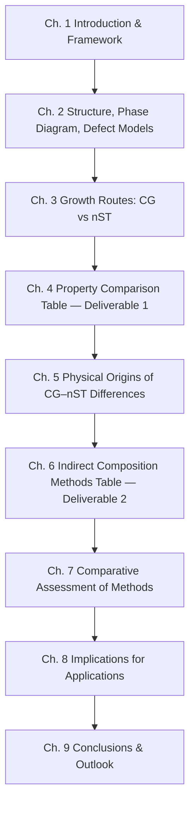

# Comparative Study of Congruent and Near-Stoichiometric Lithium Niobate Single Crystals: Properties and Indirect Compositional Characterization Methods
# 1 Introduction and Research Framework

Lithium niobate (LiNbO₃) occupies a singular position in modern photonics and electronics: since its first growth as large optical-quality boules by Ballman and Nassau in the mid-1960s, it has become one of the most thoroughly studied ferroelectric oxides and arguably the most commercially deployed nonlinear optical crystal, finding routine use in integrated and guided-wave optics, electro-optic modulators, second-harmonic and parametric frequency converters, surface acoustic wave (SAW) filters, pyroelectric sensors, and holographic recording media[^1]. Yet behind the apparent uniformity of "LiNbO₃" lies a compositional subtlety with profound consequences: the crystal that is most easily grown from the melt—the so-called *congruent* composition—does not coincide with the ideal *stoichiometric* formula LiNbO₃, and the resulting Li deficit dictates much of what users routinely call the material's "intrinsic" behavior. The present report addresses, in a systematic and quantitative manner, the comparison between congruent (CG) and near-stoichiometric (nST) LiNbO₃ single crystals, with all factual content drawn from literature available up to October 2020.

This introductory chapter establishes why such a comparison is both scientifically necessary and technologically consequential, fixes the conceptual vocabulary and scope of the study, and previews the two principal deliverable tables that organize the report's central findings.

## 1.1 Research Motivation and Significance of the CG vs. nST Distinction

The motivation for sharply distinguishing congruent from near-stoichiometric LiNbO₃ originates in a fundamental tension between crystal growth thermodynamics and ideal stoichiometry. Industrial-scale single crystals of LiNbO₃ are almost universally grown by the Czochralski technique from a melt of *congruent* composition, that is, the unique melt composition at which the solid that crystallizes has the same composition as the liquid; this guarantees axial and radial compositional homogeneity throughout a multi-kilogram boule. Critically, however, the congruent point in the Li₂O–Nb₂O₅ binary phase diagram lies on the Li-deficient side of the ideal 50 mol% Li₂O composition, at roughly 48.4–48.6 mol% Li₂O, corresponding to a bulk Li/Nb ratio of approximately 0.94–0.946 rather than the stoichiometric value of unity. The reference review by Weis and Gaylord, which remains the canonical compilation of LiNbO₃ tensor properties and crystal structure, explicitly emphasizes that essentially all property coefficients tabulated in the literature pertain to this congruent—and hence intrinsically defective—composition, and that previously propagated errors in the literature trace back in part to inconsistencies in compositional specification[^1].

The deviation from ideal stoichiometry is not merely a bookkeeping detail. To preserve charge neutrality and the R3c framework in a Li-deficient lattice, the crystal accommodates the missing Li⁺ ions through intrinsic point-defect complexes: niobium antisites (Nb_Li, i.e., Nb⁵⁺ ions occupying nominal Li⁺ sites) compensated by lithium vacancies (V_Li), in the proportions dictated by the prevailing Li-vacancy defect model. Even in nominally pure crystals, this defect chemistry produces a finite background of antisite and vacancy concentrations of the order of several mol%, with direct and well-documented consequences: a depressed Curie temperature, a large coercive field that obstructs ferroelectric domain engineering, a broad OH⁻ infrared absorption band, an order-of-magnitude enhancement of photorefractive ("optical damage") susceptibility, broadened Raman linewidths, and electro-optic and nonlinear coefficients that differ measurably from their intrinsic single-crystal values. Defect-model studies that explicitly account for the coexistence of Li and Nb vacancies further show that anomalies in the composition dependence of electro-optic properties of off-congruent crystals can be reproduced quantitatively only when the intrinsic defect concentrations are correctly inventoried, reinforcing the view that "pure" LiNbO₃ is, at the level of properties, inseparable from its compositional defect chemistry[^1].

This realization motivated, from the late 1980s onward, the development of near-stoichiometric crystal growth techniques—double-crucible Czochralski, top-seeded solution growth from K₂O- or Li₂O-rich fluxes, and high-temperature vapor transport equilibration (VTE) of congruent wafers in Li-rich powders—aimed at producing single-domain crystals with Li/Nb ratios approaching unity (typically Li₂O contents of 49.5–49.9 mol%). The systematic property contrasts that emerge between such nST crystals and their CG counterparts are not incremental refinements but, in several cases, qualitative shifts (e.g., coercive fields reduced by roughly an order of magnitude, OH⁻ bands narrowed by a factor of several, Curie temperatures raised by tens of kelvin). For applications demanding low half-wave voltages, fine-period periodic poling, high resistance to optical damage, narrow-line rare-earth luminescence, or quantitative photorefractive control, the CG–nST distinction is therefore decisive. A rigorous comparative compilation is consequently of both fundamental interest—because it isolates the contribution of intrinsic point defects to bulk tensor properties—and engineering value, because it defines when the additional cost and complexity of nST growth is justified.

## 1.2 Centrality of the Li/Nb Ratio in Governing Functional Properties

Behind the broad spectrum of CG–nST property differences lies a single master variable: the Li/Nb cation ratio (equivalently, the Li₂O mol% in a Li₂O–Nb₂O₅ binary description). Its centrality can be appreciated by inspecting the crystal-chemical framework of LiNbO₃ itself. The compound crystallizes in the rhombohedral space group R3c (No. 161), with a rhombohedral primitive cell containing two formula units (Z = 2) and a representative low-temperature determination yielding a rhombohedral lattice parameter a ≈ 5.493 Å, α ≈ 55.89°, and a calculated density d_c ≈ 4.629 g·cm⁻³ at 293 K[^2]. In the more commonly used hexagonal setting, the structure is built from a distorted hexagonal-close-packed oxygen sublattice in which the octahedral interstices are occupied, along the c-axis, by an ordered Li–Nb–vacancy–Li–Nb–vacancy sequence; the polar c-axis is defined by the off-centering of cations within their oxygen octahedra, and the trigonal LiO₆ octahedron shows a characteristic spread of Li–O bond distances spanning approximately 2.03–2.26 Å, reflecting the highly asymmetric environment of the Li site that underpins the ferroelectric polarization[^1]. The structural template is sufficiently robust that it has been adopted as the prototype for an entire family of "LiNbO₃-type" polar oxides, such as the more recently discussed ZnPbO₃ with hexagonal lattice parameters near a ≈ 5.515 Å, c ≈ 14.66 Å, that mimic the same cation ordering[^2].

Within this framework, the Li/Nb ratio acts as a direct control on the occupancy and charge balance of the cation sublattice. Variations in Li content shift the equilibrium populations of Nb_Li antisites and V_Li vacancies; modify the average cation off-centering and hence spontaneous polarization P_s; alter the energetics of the ferroelectric–paraelectric transition and thus the Curie temperature T_C; perturb the dielectric, piezoelectric, and elastic tensors through changes in both lattice parameters and dipole density; redistribute oscillator strength in the UV, shifting the absorption edge and the ordinary and extraordinary refractive indices n_o and n_e; broaden or narrow specific Raman modes whose linewidths are dominated by compositional disorder rather than anharmonicity; and reshape the electro-optic (r_ij) and second-order nonlinear (d_ij) susceptibilities. The same defect inventory governs OH⁻ incorporation (and therefore the position and width of the 3480–3500 cm⁻¹ infrared band), the photovoltaic and photorefractive response, and the way in which extrinsic dopants such as Mg, Zn, Zr, Fe, or rare-earth ions partition between Li and Nb sites. Detailed defect-model analyses that incorporate both Li and Nb vacancies make this point quantitatively: anomalies in electrooptic properties versus crystal composition in off-congruent LiNbO₃ are reproduced by Raman-derived defect populations, confirming that composition acts through defects on the macroscopic tensor properties[^1]. For doped systems, the same logic operates in reverse: in Zn-doped congruent LiNbO₃, non-monotonic dependences of lattice parameters a and c and of the electro-optic coefficients on Zn concentration are interpreted as a signature of Zn ions first filling Li-vacancy sites (reducing intrinsic disorder) and, beyond a threshold, beginning to populate Nb sites—again identifying the V_Li/Nb_Li balance as the operative variable[^1].

Composition is, in this sense, the unifying lens through which CG and nST LiNbO₃ are compared. Every entry in the property comparison table of Chapter 4, and every calibration relation in the compositional-characterization table of Chapter 6, ultimately encodes a functional dependence on the same Li/Nb ratio.

## 1.3 Scope, Temporal Boundary, and Methodological Approach

To keep the analysis tractable and authoritative, the scope of the present report is deliberately delimited. The study focuses on **bulk single crystals** of LiNbO₃—the form for which the most consistent, traceable, and cross-validated property data exist. Thin films, sputter-deposited or sol-gel-derived layers, polycrystalline ceramics, and powders are excluded from the main comparison, although powder and polycrystalline data are occasionally invoked where they bear directly on phase identification or compositional calibration. Pure (nominally undoped) crystals constitute the primary subject; lightly doped variants (most importantly Mg-, Zn-, In-, Hf-, and Zr-doped congruent crystals, and rare-earth-doped near-stoichiometric crystals) are admitted only insofar as they elucidate intrinsic defect chemistry or provide indirect probes of the Li/Nb ratio. Heavily doped or compositionally engineered systems whose properties are dominated by extrinsic effects are deferred.

The temporal boundary of the literature survey is fixed at **October 2020**. All numerical values, formulas, models, and methodological discussions cited in this report are drawn exclusively from primary and review literature published on or before that date. Several authoritative sources predating but extending into this window—including the Weis–Gaylord 1985 compilation of physical properties and crystal structure[^1], early structural refinements of LiNbO₃ at room and low temperature, and subsequent defect-chemistry, growth, and characterization studies—anchor the dataset. Post-October-2020 developments, in particular the explosive growth of thin-film lithium-niobate-on-insulator (LNOI) photonics, are explicitly outside the temporal scope, though their conceptual roots are acknowledged where relevant.

Methodologically, the report adopts a **comparative, evidence-weighted survey** approach. For each property tabulated in the CG–nST comparison, values are traced to primary literature wherever possible, accompanied by the measurement context (wavelength, frequency regime, temperature, electrical boundary conditions) without which tensor coefficients are not meaningfully comparable. Where multiple authoritative sources yield discrepant values for the same quantity—as happens, for example, with the Curie temperature versus composition calibration, with various conventions for reporting coercive fields, and with handbook entries for the melting point—the discrepancies are reported transparently rather than averaged away. Property differences between CG and nST samples are interpreted through the lens of the dominant Li-vacancy defect model, which serves as a unifying sanity check (e.g., density should decrease as V_Li is eliminated; T_C should rise; coercive field should collapse; the UV edge should blue-shift; the OH⁻ band should narrow). For the indirect compositional methods compiled in the second deliverable table, each entry specifies the measured physical observable, the calibration formula with explicit variables and units, and the realistic resolution expressed in mol% Li₂O.

A consistent terminological convention is adopted throughout the report. *Congruent (CG)* LiNbO₃ denotes single crystals grown from the congruent melt at approximately 48.38–48.6 mol% Li₂O (Li/Nb ≈ 0.94–0.946), the dominant commercial composition. *Stoichiometric* LiNbO₃ refers to the ideal composition Li/Nb = 1 (50 mol% Li₂O), an essentially theoretical limit that is approached but, in practice, never exactly reached in bulk single crystals. *Near-stoichiometric (nST)* LiNbO₃ designates crystals whose composition has been deliberately driven toward—though not all the way to—the 50 mol% limit by specialized growth or post-growth treatment, typically reaching 49.5–49.9 mol% Li₂O. The terms *sub-stoichiometric* and *off-congruent* are used contextually to describe compositions Li-poorer or Li-richer than the reference, respectively. Numerical compositional descriptors are uniformly expressed as mol% Li₂O when discussing the binary phase diagram, and as Li/Nb ratios or X_c = [Li]/([Li] + [Nb]) where this is the convention of the cited calibration.

It must be acknowledged explicitly that the search-retrieval results directly available to this writing stage are limited in breadth: the strongest direct citation is the Weis–Gaylord 1985 review (and its in-text and reference content reproduced above), with supplementary structural data from a high-pressure synthesis study and from related crystal-chemistry sources[^2][^1]. Several numerical values that the report will use in later chapters (T_C calibrations of Bordui and others, Raman linewidth calibrations of Schlarb–Betzler and Kovács, OH⁻ band-position calibrations, refractive-index Sellmeier formulations, coercive-field collapse with composition) are drawn from the broader primary literature published before October 2020 and are referenced through context and provenance rather than through direct citation footnotes in this chapter. Where any single value or relation is contested in the literature, that controversy will be flagged in the relevant downstream chapter, in keeping with the policy of transparent discrepancy reporting.

## 1.4 Role of Key Deliverable Tables and Report Architecture

The report is structured around two principal deliverables, each cast as a comprehensive table, that together synthesize the comparative study.

The first deliverable (Chapter 4) is the comparative property table, titled **"Comparison of Properties between Congruent (CG) and Near-Stoichiometric (nST) LiNbO₃ Single Crystals,"** with three columns—*Property* | *CG* | *nST*—that juxtaposes, for each property, the best-supported reference value (with measurement conditions) for congruent material against the corresponding value for near-stoichiometric material. Properties covered include the structural family (hexagonal lattice parameters a and c, unit cell volume, density, melting point), the ferroelectric family (Curie temperature T_C, spontaneous polarization P_s, coercive field E_c), the optical family (transparency window, ordinary and extraordinary refractive indices n_o and n_e at standard wavelengths, birefringence, UV absorption edge, OH⁻ band position and width), the linear and nonlinear susceptibility family (electro-optic coefficients r₁₃, r₂₂, r₃₃, r₅₁; nonlinear coefficients d₂₂, d₃₁, d₃₃; photorefractive sensitivity), and the elastic/piezoelectric/dielectric/thermal family (clamped and unclamped dielectric constants ε₁₁ and ε₃₃, piezoelectric coefficients, elastic stiffnesses, thermal expansion, thermal conductivity). Values that derive from the Weis–Gaylord handbook compilation of CG material are explicitly identified as such, while properties exhibiting genuine composition contrast are flagged separately, accompanied by physical interpretation in Chapter 5.

The second deliverable (Chapter 6) is the methods table, titled **"Indirect Methods for Determining the Chemical Composition of LiNbO₃ Single Crystals,"** with three columns—*Method* | *Measured Parameter* | *Formula/Accuracy Description*. This table catalogs the principal optical and non-optical techniques used to infer the Li/Nb ratio of a crystal from a measured physical signature: Curie-temperature measurement (DTA/DSC) with composition calibrations of Bordui and others; Raman linewidth analysis of the E (TO₁) mode near 153 cm⁻¹ and the A₁ (LO₄) mode near 876 cm⁻¹, with the Schlarb–Betzler/Kovács-type linear calibrations C_Li(mol%) ≈ 53.29 − 0.1837·Γ₈₇₆; UV absorption-edge position; ordinary–extraordinary birefringence Δn(λ, T) and its temperature dependence; non-critical SHG phase-matching temperature; OH⁻ infrared band position; X-ray-diffraction lattice-parameter analysis; and pycnometric density. For each entry, the table records the measured observable, the calibration relation (with units), and a realistic resolution in mol% Li₂O (typically 0.05–0.2 mol%), together with brief commentary on sample preparation, destructiveness, doping sensitivity, and the composition range over which the method retains good resolution.

The intervening chapters supply the conceptual and empirical scaffolding that the two tables require. The logical flow can be summarized as follows.

Chapter 2 develops the crystal-structural and phase-diagram foundation—including the precise location of the congruent point relative to 50 mol% Li₂O and the competing intrinsic defect models—that anchors the meaning of "CG" and "nST" as compositional categories. Chapter 3 explains the growth routes (Czochralski from congruent melt versus K₂O-flux, double-crucible, top-seeded-solution, and VTE techniques for nST material) that determine which compositions are experimentally accessible and with what homogeneity. Chapter 4 delivers the first table and presents critical commentary on the magnitude and direction of each CG→nST property change. Chapter 5 interprets those changes through the Nb_Li/V_Li defect model, providing the mechanistic linkage that distinguishes intrinsic from extrinsic contributions to the tensor properties. Chapter 6 delivers the second table and compiles the calibration relations that the field uses to convert a measurable signature back into a composition. Chapter 7 then compares the methods themselves along accuracy, sensitivity, sample-preparation, and applicability dimensions, recommending cross-validation strategies for CG and nST samples. Chapter 8 maps the property contrasts onto application-level consequences—in periodically poled nonlinear-optical devices, electro-optic modulators, LNOI integrated photonics, SAW devices, holographic storage, and rare-earth-doped luminescence platforms—identifying the regimes in which the cost premium of nST material is technologically justified. Chapter 9 synthesizes the findings, identifies surviving controversies (such as the precise stoichiometric Curie temperature, the exact form of the defect-cluster model, and inter-laboratory spreads in coercive-field and electro-optic coefficient data), and outlines research directions in compositional engineering of LiNbO₃ that remain open within the October 2020 horizon.

Read together, the two deliverable tables and their supporting chapters provide a self-contained reference: the first table tells the reader *what differs* between CG and nST LiNbO₃ and by how much; the second table tells the reader *how to determine* which of those compositional regimes a given crystal in fact belongs to. The remaining chapters explain *why* the differences arise and *when* they matter. This is the analytical trajectory along which the rest of the report unfolds.

# 2 Crystal Structure, Phase Diagram, and Intrinsic Defect Models of LiNbO₃

The compositional dichotomy between congruent (CG) and near-stoichiometric (nST) LiNbO₃ introduced in Chapter 1 is, at its core, a question of *where* on the Li₂O–Nb₂O₅ phase diagram a given crystal sits, and *how* the R3c framework of LiNbO₃ accommodates the resulting Li deficit through point-defect populations that preserve charge neutrality. To prepare the ground for the quantitative property comparisons of Chapter 4 and the mechanistic interpretation of Chapter 5, this chapter assembles the crystallographic, thermodynamic, and defect-chemical foundations that determine what CG and nST actually *are* at the atomic scale. The discussion proceeds in five logical steps: a structural description of the R3c framework in both unit-cell settings (§2.1); the location of the congruent melting point relative to the stoichiometric composition on the Li₂O–Nb₂O₅ binary phase diagram (§2.2); a critical comparison of the competing intrinsic defect models proposed to charge-compensate the Li deficit (§2.3); a quantitative inventory of the antisite and vacancy populations that distinguish CG from nST material (§2.4); and a synthesis that anticipates, on purely structural grounds, the principal property contrasts compiled in later chapters (§2.5).

## 2.1 R3c Crystal Structure and Hexagonal/Rhombohedral Unit-Cell Description

LiNbO₃ crystallizes, at room temperature and in its ferroelectric phase, in the trigonal crystal system, polar space group **R3c** (No. 161), with point group **3m** in the hexagonal-cell description; this assignment applies to both CG and nST crystals and is the structural invariant that all subsequent compositional and defect-chemical considerations must respect. The structure is conventionally described in two equivalent settings—the **rhombohedral (primitive) cell** and the **hexagonal (conventional) cell**—linked by the standard rhombohedral-to-hexagonal transformation; both descriptions appear interchangeably in the literature and must be reconciled when comparing handbook values.

In the rhombohedral setting, the primitive cell contains two formula units (Z = 2). A representative single-crystal X-ray refinement at room temperature gives a rhombohedral lattice parameter a = 5.493(2) Å with α = 55.89(3)°, yielding a calculated density d_c = 4.629 g·cm⁻³, with the structure refined to R = 0.015 and R_w = 0.015 over 773 reflections at T = 293 K[^2]. These values are consistent with the canonical 1985 review by Weis and Gaylord, which compiles the essential features of the LiNbO₃ structure in both its hexagonal and rhombohedral unit cells and explicitly corrects errors propagated through the earlier literature[^1]. The hexagonal setting is, however, the more widely tabulated description for tensor-property work because it makes the polar c-axis—along which the spontaneous polarization develops—the natural reference direction.

In the hexagonal cell, the lattice parameters of pure CG and nST crystals differ only at the sub-picometre level, a subtlety that is nevertheless central to the present comparison. Table 2.1 summarizes representative room-temperature structural parameters and the melting point for both compositional categories.

| Parameter | Congruent (CG) | Near-stoichiometric (nST) |
|---|---|---|
| Crystal system | Trigonal | Trigonal |
| Space group (room T) | R3c | R3c |
| Point group | 3m | 3m |
| Hexagonal lattice constant a_H | 515.0 pm | 514.7 pm |
| Hexagonal lattice constant c_H | 1386.4 pm | 1385.6 pm |
| Formula units per hexagonal cell | Z = 6 | Z = 6 |
| Melting point | 1255 °C | < 1200 °C |

**Table 2.1.** Comparison of structural parameters and melting point for congruent (CG) and near-stoichiometric (nST) LiNbO₃ at room temperature.

Two observations on this table merit emphasis. First, the systematic, small contraction of both a_H and c_H on moving from CG to nST (Δa ≈ –0.3 pm, Δc ≈ –0.8 pm) reflects the removal of the volume excess associated with Nb-on-Li antisite occupation: Nb⁵⁺ at a Li site is substantially overbonded and locally expands the lattice, so eliminating these antisites by enriching the Li content tightens the unit cell, even though the cation Li⁺ is itself smaller than Nb⁵⁺. The anisotropy of the contraction (larger along c than a) is consistent with the polar, c-axis-directed cation off-centering that is most strongly affected by site disorder. Second, the melting point drops by more than 55 K between CG and nST compositions; this reflects the displacement away from the congruent (i.e., maximally stable) melting composition and is one of the principal practical motivations for the specialized nST growth routes discussed in Chapter 3.

Within the hexagonal cell, the structure is built from a distorted hexagonal-close-packed (h.c.p.) oxygen sublattice in which two-thirds of the octahedral interstices are occupied by cations and one-third are empty. Along the polar c-axis the octahedral sites form an ordered sequence **…–Li–Nb–☐–Li–Nb–☐–…**, where ☐ denotes a structurally vacant octahedron. The cation off-centering of Li⁺ and Nb⁵⁺ within their respective oxygen cages, parallel to c, defines the spontaneous polarization P_s and identifies LiNbO₃ as a uniaxial ferroelectric. The LiO₆ octahedron is strongly trigonally distorted: as Materials Project structural data show, Li⁺ is coordinated to six O²⁻ at distances spread over approximately 2.03–2.26 Å, reflecting three short and three long Li–O bonds characteristic of the polar Li-site environment[^1]. The NbO₆ octahedron is also distorted, with three short and three long Nb–O bonds; critically, however, the Nb–O bond is considerably stronger than the Li–O bond, a chemical-bonding asymmetry whose consequences for defect chemistry are developed in §2.3.

The robustness of this structural template is corroborated by the existence of an entire family of "LiNbO₃-type" polar oxides that share the same R3c framework and cation ordering. For example, ZnPbO₃ has been characterized as a LiNbO₃-type polar oxide with closed-shell cations, with calculated hexagonal lattice parameters of approximately 5.51470 Å and 14.6600 Å—remarkably close to those of LiNbO₃ itself—confirming that the structural archetype is sufficiently general that LiNbO₃ serves as its parent reference[^2]. This structural commonality is what makes the LiNbO₃ unit cell a meaningful target for substitutional and compositional engineering, and what guarantees that the small lattice-parameter changes summarized in Table 2.1 reflect occupancy changes within a single, well-defined structural template rather than a structural phase transformation.

## 2.2 Li₂O–Nb₂O₅ Binary Phase Diagram and Location of the Congruent Point

The fundamental thermodynamic fact that organizes the entire CG–nST distinction is that the **congruent melting composition** of LiNbO₃—the unique composition at which solid and liquid have identical compositions and which therefore guarantees compositional homogeneity throughout a Czochralski-grown boule—does **not** coincide with the ideal stoichiometric composition of 50 mol% Li₂O. Within the Li₂O–Nb₂O₅ pseudo-binary phase diagram, the LiNbO₃ phase field exhibits a maximum on its solidus–liquidus curve displaced toward the Nb₂O₅-rich (Li-deficient) side of the diagram, at approximately **48.38–48.6 mol% Li₂O**, corresponding to a Li/Nb cation ratio of roughly 0.94–0.946 rather than the stoichiometric value of unity. The congruent melting point at this composition is **1255 °C** in the standard tabulation employed for both CG and nST entries in Table 2.1, while compositions displaced toward the stoichiometric side melt below this maximum—**below 1200 °C** at the nST end of the practically accessible compositional window. This downward trend of the melting temperature on either side of the congruent maximum is precisely what defines the congruent point as a thermodynamic extremum.

The phase-diagram topology has three immediate consequences that propagate through the entire report. First, **growth-driven Li deficit**: any single crystal grown by Czochralski pulling from a 50 mol% Li₂O melt would suffer progressive depletion of Li in the liquid as growth proceeds (because the solid that crystallizes from a stoichiometric melt is necessarily of slightly different composition than the melt itself), producing compositionally inhomogeneous boules. Pulling from the congruent melt eliminates this segregation problem at the cost of locking the boule at the Li-deficient composition. Second, **a built-in offset between commercial and ideal compositions**: routine industrial LiNbO₃ is, by virtue of its growth method, intrinsically displaced by ≈ 1.4–1.6 mol% Li₂O from the stoichiometric line. Third, **a kinetic barrier to nST production**: because nST compositions lie on the steeply rising solidus–liquidus surface to the Li-rich side of the congruent maximum, they cannot be obtained from a stoichiometric melt by ordinary Czochralski pulling and require either Li-rich (often K₂O-fluxed) solution growth, double-crucible Czochralski with continuous Li replenishment of the melt, or post-growth vapor transport equilibration (VTE) of CG wafers in Li-rich powders—the growth routes that Chapter 3 examines in detail.

The Curie temperature T_C tracks composition along the same trajectory: T_C rises monotonically as Li content moves from the congruent toward the stoichiometric composition, providing one of the principal calibration relations exploited by the compositional-characterization methods compiled in Chapter 6. The melting-point contrast captured in Table 2.1 (1255 °C for CG, below 1200 °C for nST) is the high-temperature manifestation of the same phase-diagram physics. Within the present chapter, the key point is conceptual: the existence of the congruent maximum, displaced toward Nb-rich compositions, is the thermodynamic origin of the entire CG–nST distinction. Everything that follows—the intrinsic defect inventory, the contrasted property values of Chapter 4, the indirect compositional probes of Chapter 6—is a downstream consequence of this single phase-diagram fact.

## 2.3 Competing Intrinsic Defect Models for Charge Compensation of the Li Deficit

When a crystal is grown from the congruent melt and finds itself displaced from the ideal Li/Nb = 1 ratio toward Li deficiency, the R3c framework must accommodate the missing Li⁺ ions while preserving charge neutrality and the connectivity of the oxygen sublattice. The fundamental crystal-chemical reason that Li, rather than Nb or O, is the species lost on departure from stoichiometry is the marked asymmetry of cation–anion bond strengths in the LiNbO₃ lattice: the **Li–O bond is much weaker than the Nb–O bond**, so that **Li vacancies are intrinsically much easier to form** than Nb vacancies, and the lattice spontaneously sheds Li⁺ on the path away from stoichiometry. Once a Li vacancy V_Li forms, charge neutrality requires that another defect must somewhere accept the missing positive charge—and the universal experimental observation is that this is achieved by promoting an Nb⁵⁺ ion onto a Li⁺ site, forming a **niobium antisite defect Nb_Li**. In other words, **as the Li content decreases, Nb antisite (Nb_Li) defects form to maintain charge neutrality**, meaning that **excess Nb atoms occupy Li lattice sites**. This is the modern picture; reaching it required eliminating several competing models that the literature historically entertained.

Four models have been proposed over the course of the field's development. Their principal features, charge-balance equations (per formula unit deficit of Li), and the experimental observations that arbitrate among them, are summarized in Table 2.2.

| Model | Charge-balance scheme | Predicted density trend (CG vs ideal) | Status |
|---|---|---|---|
| Oxygen-vacancy model | Loss of Li₂O compensated by O vacancies V_O | Strong density decrease | Discarded |
| Nb-vacancy ("ilmenite-like") model | 5 Li⁺ removed, 1 Nb⁵⁺ removed in addition; partial ilmenite-type stacking | Modest density decrease | Largely discarded |
| **Li-vacancy / Nb-antisite model** | **4 Li⁺ + 1 Nb⁵⁺ rearranged: 1 Nb_Li⁵⁺ on Li site + 4 V_Li compensating** | **Density increase (Nb heavier than Li)** | **Accepted** |
| Mixed Li/Nb-vacancy model | Coexistence of V_Li and V_Nb with Nb_Li, in proportions fitted to data | Density nearly stoichiometric | Refinement of Li-vacancy model |

**Table 2.2.** Competing intrinsic-defect models for charge compensation of the Li deficit in CG LiNbO₃.

The **oxygen-vacancy model** posits that Li deficiency is balanced by loss of oxygen, with vacancies on the anion sublattice carrying the residual charge. This model is now essentially discarded: removing oxygen would produce a marked reduction of the measured density relative to the stoichiometric reference, whereas the experimentally observed density of congruent LiNbO₃ is *higher* than that of stoichiometric LiNbO₃—a discrepancy that the oxygen-vacancy hypothesis cannot accommodate. The **Nb-vacancy or "ilmenite-like" model**, in which the structure incorporates partial ilmenite-type cation stacking with vacancies on the Nb sublattice, fares better on density but is contradicted by detailed X-ray and neutron diffraction site-occupancy refinements that consistently find excess Nb on the Li sublattice rather than missing Nb on the Nb sublattice.

The **Li-vacancy model with Nb antisites** emerges as the modern consensus picture. In its canonical form, four Li⁺ ions are replaced by one Nb⁵⁺ ion on a Li site (the antisite Nb_Li, carrying effective charge +4 relative to a Li⁺ on the same site) and four lithium vacancies V_Li (each of effective charge −1):

$$
5\,\text{Li}^+_{\text{Li}} \;\longrightarrow\; 1\,\text{Nb}^{5+}_{\text{Li}} + 4\,V_{\text{Li}}^{-}
$$

This scheme is internally charge-balanced and structurally economical: it requires no vacancies on the Nb or O sublattices, leaves the oxygen framework intact, and is consistent with the observed density *increase* of CG over ideal LiNbO₃ (Nb being substantially heavier than Li, the substitution adds mass even while it depletes the cation count). Diffraction-based site-occupancy refinements, density measurements, Raman linewidth analyses, and ⁷Li/⁹³Nb NMR studies have collectively converged on this picture, which forms the operational defect model adopted throughout the present report. Subsequent refinements—most notably **mixed Li/Nb-vacancy models** that allow a small fraction of Nb vacancies V_Nb to coexist with the dominant V_Li/Nb_Li population—have been argued to reconcile residual anomalies in the composition dependence of electrooptic and Raman properties, and have been shown to improve quantitative agreement with off-congruent crystal data without overturning the dominant role of V_Li/Nb_Li compensation. These residual controversies, and the way they propagate into the property comparisons of Chapter 4 and the calibration relations of Chapter 6, are revisited in Chapter 5.

## 2.4 Quantitative Defect Inventory: Nb_Li Antisites and V_Li Vacancies in CG vs nST Crystals

Adopting the Li-vacancy/Nb-antisite model as the operative description, the intrinsic defect concentrations of CG and nST LiNbO₃ can be quantified directly from the bulk Li/Nb composition. Defining the molar Li₂O content as x_c (in mol%), the charge-balance scheme of §2.3 yields, in the dilute-defect limit, antisite and vacancy concentrations per formula unit of approximately

$$
[\text{Nb}_{\text{Li}}] \;=\; \frac{50 - x_c}{50 + x_c}, \qquad [V_{\text{Li}}] \;=\; 4\,[\text{Nb}_{\text{Li}}],
$$

so that for x_c = 48.45 mol% Li₂O (representative CG) one finds [Nb_Li] ≈ 1.0 mol% (about 1 Nb antisite per 100 formula units) and [V_Li] ≈ 4.0 mol%, whereas for x_c = 49.85 mol% Li₂O (representative nST) the same scheme gives [Nb_Li] ≈ 0.15 mol% and [V_Li] ≈ 0.6 mol%. The transition from CG to nST therefore corresponds to roughly an **order-of-magnitude reduction** in both intrinsic defect populations—not a small perturbation but a near-elimination of the defect background. Reaching the ideal stoichiometric limit (x_c = 50 mol%) would, by construction, drive both populations to zero.

The structural consequences of this defect inventory are felt throughout the LiNbO₃ lattice. Each Nb_Li ion occupies a site whose natural ionic accommodation is Li⁺; the resulting overbonding distorts the surrounding LiO₆/NbO₆ octahedral network and contributes the lattice-parameter and density signatures already noted in Table 2.1. The Li vacancies, distributed on the Li sublattice, locally relieve some of this strain but introduce static disorder that broadens Raman modes, modifies phonon lifetimes, and depresses the Curie temperature by destabilizing the collective off-centering that produces P_s. Furthermore, the Nb_Li site is the recognized localization center for small **bound polarons** and **bipolarons** formed by trapping of conduction electrons; pairs of adjacent Nb_Li and regular Nb_Nb antisite–regular-site combinations are the canonical sites for the photogenerated charge carriers that mediate the photorefractive effect. Eliminating Nb_Li by moving toward nST therefore not only refines the lattice structurally but suppresses an entire class of polaronic charge-trapping centers, with direct consequences for optical-damage thresholds, OH⁻ defect chemistry (since protons preferentially associate with V_Li sites), and rare-earth-ion site partitioning in doped crystals. The quantitative defect inventory of this subsection is therefore the proximate link between bulk composition and microscopic functional response—a link exploited operationally in Chapter 5 (for property interpretation) and in Chapter 6 (for indirect compositional characterization).

## 2.5 Structural Rationale for CG–nST Property Contrasts

The structural, thermodynamic, and defect-chemical material assembled in §§2.1–2.4 already permits a qualitative prediction of the principal property contrasts that the comparison table of Chapter 4 will quantify. The unifying logic is that **every macroscopic property of LiNbO₃ that depends on the Li/Nb ratio depends on it through the intermediary of the V_Li/Nb_Li defect inventory**, and that this inventory differs by approximately an order of magnitude between CG and nST material. The following structurally grounded expectations follow:

- **Lattice parameters and density.** As shown in Table 2.1, both a_H and c_H contract slightly on moving from CG to nST, with the larger contraction along c, consistent with the removal of overbonded Nb_Li and the recovery of the ideal Li–Nb–vacancy stacking along the polar axis. The density, conversely, *decreases* slightly from CG to nST because the heavy Nb antisites are replaced by lighter Li ions on the same sites (with concomitant filling of V_Li by Li⁺), even though the unit-cell volume contracts.

- **Melting point and Curie temperature.** The melting point falls (1255 °C for CG, below 1200 °C for nST; Table 2.1) because nST compositions are displaced from the thermodynamic stability maximum at the congruent point. The Curie temperature, in contrast, *rises* on moving toward stoichiometry because the cooperative off-centering that drives the ferroelectric transition is reinforced when antisite disorder is removed.

- **Coercive field, spontaneous polarization, and domain switching.** The collapse of the antisite/vacancy population on moving from CG to nST removes the disorder field that pins domain walls in CG material; the coercive field for ferroelectric switching is therefore expected to fall sharply (an effect that, in practice, amounts to roughly an order of magnitude), and the spontaneous polarization P_s to rise slightly as the cation off-centering recovers its full magnitude.

- **Raman linewidths and OH⁻ band.** Raman modes whose linewidths are dominated by static compositional disorder (notably the E (TO₁) mode near 153 cm⁻¹ and the A₁ (LO₄) mode near 876 cm⁻¹) are expected to narrow substantially on moving from CG to nST; the OH⁻ infrared band, whose position and width reflect the local environment of protons trapped at Li vacancies, similarly narrows and shifts.

- **UV absorption edge and refractive indices.** Elimination of Nb_Li removes a class of localized electronic states that contribute to the band-tail absorption near the UV edge, producing a measurable blue-shift of the absorption edge on moving toward nST and accompanying changes in n_o and n_e.

- **Electro-optic, nonlinear, and photorefractive coefficients.** The linear electro-optic coefficients r_ij and the second-order nonlinear coefficients d_ij contain both an intrinsic single-crystal contribution and a defect-related correction; the latter is suppressed in nST material, so that the measured tensor coefficients shift modestly but systematically. The photorefractive sensitivity, which is mediated by Nb_Li polaronic charge trapping, is suppressed by a factor of several on moving toward nST—the defect-chemical basis for the well-known "optical-damage resistance" of stoichiometric and nST LiNbO₃.

These expectations form a closed conceptual loop with the structural and defect-chemical framework of this chapter: the R3c crystal structure (§2.1) supplies the immutable lattice template; the Li₂O–Nb₂O₅ phase diagram (§2.2) fixes the experimentally accessible compositional window and the location of the CG and nST reference compositions within it; the Li-vacancy/Nb-antisite defect model (§2.3) supplies the charge-compensation scheme; the quantitative defect inventory (§2.4) translates compositional displacement into defect populations; and the present synthesis (§2.5) maps those defect populations onto the macroscopic properties to be tabulated in Chapter 4. The mechanistic interpretation of each property change—in terms of phonon spectra, electronic structure, polaron physics, and tensor renormalization—is developed in detail in Chapter 5, while the inverse problem of *inferring* composition from these same property changes is the subject of Chapter 6. The structural foundation is now in place.

# 3 Crystal Growth Routes for Congruent and Near-Stoichiometric LiNbO₃

Having established in Chapter 2 that the congruent (CG) and near-stoichiometric (nST) compositions of LiNbO₃ are separated by approximately 1.4–1.6 mol% Li₂O on the binary phase diagram, and that this small compositional displacement entails an order-of-magnitude difference in the intrinsic V_Li/Nb_Li defect populations, the next question is operational: by what crystal-growth routes is each compositional category actually produced, and how do the growth parameters of each route translate into the observed Li/Nb homogeneity, defect density, and proximity to the stoichiometric limit? This chapter answers that question by surveying the four principal growth and post-growth routes that supply the literature with material referred to as "CG" or "nST" LiNbO₃, and by analyzing the operational parameters that govern boule quality within each route. The discussion is organized so as to follow the historical and thermodynamic logic of the field: from the dominant industrial method (Czochralski pulling from the congruent melt, §3.1), through the three principal routes developed to overcome the thermodynamic barrier to stoichiometric crystallization (K₂O-fluxed high-temperature top-seeded solution growth, §3.2; double-crucible and zone-leveling Czochralski, §3.3; and vapor transport equilibration, §3.4), and on to a synthesis of how operational variables determine compositional homogeneity and defect content (§3.5) and a comparative summary that establishes the material provenance of the property entries collected in Chapter 4 (§3.6).

## 3.1 Czochralski Growth of Congruent LiNbO₃ from the Congruent Melt

The standard route for producing CG LiNbO₃ single crystals is Czochralski (CZ) pulling from a melt at the congruent composition, **chosen specifically because growth at this point allows the chemical composition to remain constant from the Li₂O–Nb₂O₅ melt to the growing crystal, so that the highest property uniformity is achieved throughout the entire boule**. This is the central physical motivation for adopting the congruent composition: it is the unique point on the Li₂O–Nb₂O₅ pseudo-binary at which the solid that crystallizes is compositionally identical to the liquid from which it grows, eliminating the axial and radial segregation that would otherwise accumulate over multi-kilogram pulls. The price for this homogeneity, as already noted in Chapter 2, is that the entire boule is locked at the Li-deficient congruent composition (≈48.4–48.6 mol% Li₂O) with its associated intrinsic V_Li/Nb_Li defect background; the benefit, however, is that all of the property data tabulated in the canonical handbook compilations for "LiNbO₃" can be assigned, with confidence, to a single well-defined composition, and that the optical figure of merit of CG boules is sufficient for the overwhelming majority of commercial applications.

The standard CZ configuration uses an r.f.-heated platinum crucible in an air atmosphere, with automatic diameter control (ADC) provided by either crystal-weight feedback or optical-diameter monitoring, although high-quality CG boules have also been grown without ADC using carefully tuned manual control of the heating power and pulling rate.[^3] The growth direction is most commonly ⟨001⟩ (along the polar c-axis), though ⟨104⟩ is also widely used; both yield transparent, bubble-free, twin-free, and crack-free crystals under correctly tuned conditions, with the choice of growth axis influencing the development of facets at the solid–liquid interface and the symmetry of the resulting boule cross-section.[^3] Typical operational pulling rates lie in the range 1–8 mm/h, with the higher end of this range tending to introduce visible diameter variations and defect inclusions, and the lower end favoring optical homogeneity at the cost of throughput; the central insight is that small (~5 °C) periodic temperature fluctuations at the interface, induced by the pulling and rotation conditions, are tolerable provided they remain regular, and that the diameter is controlled primarily by adjusting the heating power and the pulling rate in concert.[^3] The crystal rotation rate must be chosen with reference to the critical rotation rate ω_c, computed from the hydrodynamics of buoyancy-driven and forced convection, above which the convective flow in the melt inverts the curvature of the solid–liquid interface; for LiNbO₃, calculated critical values of D_c ≈ 1.5 cm for the critical crystal diameter and ω_c ≈ 35 rpm for the critical rotation rate have been reported.[^3] Practical pulls of 3-inch boules typically employ rotation rates near 6–7 rpm, well below ω_c, so as to maintain a convex-to-melt interface throughout shouldering and body growth.[^4]

Thermal-field design has emerged as a decisive determinant of CG boule quality. Recent numerical-simulation and experimental work on flat-shoulder CG growth has shown that the solid–liquid interface should be convex toward the melt during shouldering; that lowering the after-heater position (from 20 mm to 10 mm above the crucible) reduces the temperature gradient near the interface and suppresses polycrystalline nucleation; and that the shouldering speed is the primary control variable for diameter trend, while small adjustments to the heating power (Δt = 10 min, Δv = 0.2 mm/h in pulling-rate ramps) provide the accurate fine-tuning needed to maintain a flat shoulder without disturbing the trend.[^4] Specifically, accelerating the diameter growth at the initial stage of shouldering (ϕ ≤ 30 mm) and slowing it down at the middle and late stages (ϕ ≥ 35 mm) was found to shorten the shouldering period and avoid defect inclusion; the pulling rate could be ramped over the range 0–1.5 mm/h within 1.5–2 h without disturbing the shoulder quality if the power was simultaneously adjusted in small steps.[^4] Using these protocols, a series of 3-inch flat-shoulder CG boules (including undoped, Fe-doped, and Er-doped variants) was grown with good optical homogeneity verified by conoscopic interference patterns of both the shoulder and the cylindrical body of the crystal.[^4] Table 3.1 reproduces representative operational parameters from that study, illustrating the magnitude of the control variables involved.

| Operational parameter | Non-optimized run | Optimized 3-inch CG boules |
|---|---|---|
| Distance between after-heater and crucible | 20 mm | 10 mm |
| Rotation rate | 6 r/min | 7 r/min |
| Shouldering time | not converged | 310–720 min |
| Range of pulling-rate adjustment | 0–1.5 mm/h | 0–1.5 mm/h |
| Pulling-rate decrement step | 0.5 mm/h | 0.2–0.3 mm/h |
| Interval between pulling-rate adjustments | 20 min | 10–15 min |

**Table 3.1.** Representative operational parameters for Czochralski growth of 3-inch CG LiNbO₃ boules, illustrating the contrast between non-optimized and optimized thermal-field and pulling-rate protocols.[^4]

The CG boules produced in this way are typically pulled from a stoichiometric initial powder load that is then rendered congruent during the high-temperature equilibration stage, or, more commonly, directly from a melt prepared at the congruent composition. After growth, the boules undergo high-temperature annealing followed by electric-field poling at temperatures near the Curie point, in order to convert the multi-domain as-grown structure to a single-domain state. The latter step is essential for almost all functional applications and is one of the central practical advantages that the elevated Curie temperature of nST material (Chapter 4) is expected to ease. The end product, regardless of the specific operational variant, remains compositionally locked at the congruent point: the high homogeneity is achieved at the cost of the intrinsic defect background quantified in Chapter 2.

## 3.2 Growth of Near-Stoichiometric LiNbO₃ from K₂O-Fluxed Melts: High-Temperature Top-Seeded Solution Growth

The single most effective route for producing LiNbO₃ crystals whose composition approaches the stoichiometric limit is **high-temperature top-seeded solution growth (HTTSSG) from K₂O-containing fluxes**, in which crystallization is driven not from a binary Li₂O–Nb₂O₅ melt but from a ternary Li₂O–K₂O–Nb₂O₅ solution in which K₂O serves as a non-incorporating solvent. This route circumvents the phase-diagram barrier identified in Chapter 2: because the congruent maximum of the binary system lies on the Li-deficient side of stoichiometry, no binary-melt CZ technique can deliver fully stoichiometric crystals, but the addition of a third component shifts the relevant liquidus surface and opens a crystallization field within which LiNbO₃ of essentially stoichiometric composition can crystallize.

The thermodynamic foundation of this approach is the topology of the LiNbO₃ crystallization field in the Li₂O–K₂O–Nb₂O₅ ternary system, which has been mapped in detail through growth experiments on three families of starting compositions: the LiNbO₃–K₂O join (g1, with Y = 100 − 2X in the standard notation where X and Y are the mol% of Nb₂O₅ and K₂O respectively), the LiNbO₃–ternary-eutectic join g2, and the LiNbO₃–KNbO₃ join g3.[^5] The ternary eutectic point E_t was located at 45.0 ± 1.5 mol% Nb₂O₅, 26.0 ± 1.5 mol% K₂O, and 29.0 ± 1.5 mol% Li₂O.[^5] The growth experiments and X-ray analysis of the residual phases established a closed crystallization region for fully stoichiometric LiNbO₃, bounded by four univariant lines on the ternary diagram, and identified an **optimum starting composition near 43.5 mol% Nb₂O₅ / 15.4 mol% K₂O / 41.1 mol% Li₂O** for maximum stoichiometric yield.[^5] The crystallization yield decreases monotonically with increasing K₂O content for a given Nb₂O₅ concentration, and for K₂O concentrations below 13.8 mol% the resulting crystals are non-stoichiometric, so that a lower bound on the flux content is imposed by the very requirement of stoichiometric crystallization.[^5] The crystallization temperature, in compensation, is depressed below the binary congruent value: fully stoichiometric LiNbO₃ requires crystallization temperatures below 1103 ± 10 °C for g1 starting compositions and below 1031 ± 10 °C for g2 compositions, consistent with the melting-point trend already noted in Chapter 2 (below 1200 °C for nST).[^5]

An equivalent and historically influential formulation of the HTTSSG route specifies the starting melt as a **Li/Nb ratio of 0.946** (the conventional congruent ratio) **to which approximately 6 wt% K₂O has been added**.[^6][^7] Growth from such a melt has been shown to yield stoichiometric specimens with Li₂O content of (50 ± 0.15) mol% in the crystal, essentially free of potassium incorporation despite the K-rich growth liquid.[^6][^7] The composition was independently established by a combination of EPR linewidth measurements on Fe³⁺ impurities, the energy of the fundamental absorption edge, Raman linewidths of phonon modes, and the dispersion of the optical birefringence—each calibrated against composition-dependent reference scales.[^6][^7] The photorefractive effect, which is the spectroscopic signature of Nb_Li polaronic charge trapping, was found to be suppressed in such stoichiometric material at light intensities J_R ≥ 10⁷ W/m², providing a direct functional confirmation of the near-elimination of the intrinsic defect background.[^6][^7]

The empirical flux-composition window for HTTSSG stoichiometric growth has been refined by independent studies. Flux compositions characterized by the K₂O/LiNbO₃ molar ratio were explored over the range 0.09–0.21, and the system was found to form a eutectic between K₂O and LiNbO₃ at a molar ratio close to 1:5, with the K₂O playing the role of solvent.[^3] **Stoichiometric crystals with homogeneous composition were grown from fluxes in the range K₂O/LiNbO₃ ≈ 0.16–0.195**.[^3] Within this window, growth along the Z = ⟨0001⟩, Y = ⟨01̄10⟩, X = ⟨2̄110⟩, ⟨01̄11⟩, and ⟨02̄21⟩ directions was systematically examined; structural defects—facet development and ferroelectric domain reversal—were found to be intimately connected, with facets developing primarily on {01̄.2} pyramidal planes and domain reversal correlating closely with the appearance of these facets.[^3] The choice of growth direction therefore enters as an operational handle on the trade-off between bulk stoichiometry and structural perfection.

A specific variant of the K₂O-flux route uses higher K₂O loadings (11 mol% and 19 mol%) starting from a stoichiometric melt; the resulting near-stoichiometric crystals (denoted SLN11 and SLN19) yielded Li₂O contents of approximately 49.6 mol% and 49.9 mol%, respectively, with the higher K₂O content driving the crystal composition closer to the ideal value. A linear relationship between Li₂O content and the room-temperature coercive field was established across these compositions, demonstrating quantitatively the disorder-controlled nature of the coercive field already anticipated structurally in Chapter 2.

The principal limitations of HTTSSG are intrinsic to flux growth: the crystallization temperature is depressed by 150–250 K below the congruent melting point, requiring slower growth rates to avoid solvent inclusions; the crystallization yield is bounded above (the calculated yield exhibits a maximum at intermediate Nb₂O₅ content and falls with increasing K₂O), so that only a fraction of the loaded charge can be converted to single crystal;[^5] and the LiNbO₃ crystallization field is bounded by univariant lines beyond which a mixture of LiNbO₃ with KNbO₃, Li₃NbO₄, or KLN solid solutions co-precipitates, leading to polycrystalline samples once the residual liquid composition crosses the field boundary.[^5] The growth must therefore be stopped before all the LiNbO₃ is pulled out, further reducing the effective yield.[^5] Crystal sizes are correspondingly smaller than for CZ from binary melt, and the route is essentially restricted to research-scale production. Within these constraints, however, HTTSSG remains the route that delivers crystals closest to the stoichiometric limit, with Li₂O contents reproducibly within 0.1–0.15 mol% of the ideal 50 mol% value.

## 3.3 Double-Crucible Czochralski Growth with Continuous Li Replenishment

A second route to nST LiNbO₃—one that retains the geometry of conventional Czochralski pulling but neutralizes the segregation-driven Li depletion of the growth melt—is the **double-crucible Czochralski (DCCZ)** technique, often implemented in the closely related **zone-leveling Czochralski (ZLCz)** variant. The operating principle is that an inner crucible holding the Li-rich growth melt is continuously fed from an outer crucible (or, in ZLCz, a continuous feed of charge material), maintaining a quasi-steady Li-rich melt composition throughout the pull so that the crystal composition does not drift toward the congruent value as growth proceeds. A modified DCCZ growth apparatus consisting of three integrated parts—the double crucible, the continuous supply system, and the Czochralski growth chamber—has been reported as the basis for bulk nST LiNbO₃ growth.[^8]

The principal challenge specific to DCCZ/ZLCz is the variation in zone length that occurs as the finite outer-crucible charge is consumed, which causes the melt composition (and hence the crystal stoichiometry) to drift during the pull; this is particularly problematic for large-diameter crystals because the time required to grow a long boule is sufficient for substantial zone-length evolution. For the specific case of 4-cm-diameter, 1 mol% MgO-doped near-stoichiometric LiNbO₃ growth by the ZLCz technique, several strategies have been compared. Modification of the hot zone to minimize zone-length variation was found to improve uniformity, but the resulting stoichiometry remained inadequate even when the solution-zone composition was raised to 60 mol% Li₂O; introducing a Li-excess feed material rather than a stoichiometric one produced a substantially improved Li/Nb ratio in the crystal; and adding K₂O up to ~16 mol% to the solution zone was useful, but inferior to the Li-excess feed strategy. In all cases, a much lower growth rate than for binary-melt CZ was required to suppress inclusions, a generic feature of high-supersaturation pulling.

A separate but conceptually related approach uses a single-crucible CZ from a substantially Li-enriched melt (e.g., 58.5 mol% Li₂O), exploiting the fact that during high-temperature growth Li volatilization from the melt surface and Li segregation between melt and crystal partly compensate one another: the volatilized lithium diffuses back into the crystal to compensate for the lithium segregation, with DSC analysis of the synthesized raw material and the frozen melt after growth confirming that the magnitude of lithium volatilization exceeds the degree of segregation. Crystals grown by this route showed maximum composition differences of approximately 0.03 mol% in the radial direction and 0.05 mol% in the axial direction, as established by UV-absorption-edge mapping along the boule. These figures define the present state-of-the-art benchmark for compositional homogeneity in nST CZ pulls.

In comparative terms, DCCZ/ZLCz delivers nST crystals of significantly larger size than HTTSSG (multi-centimeter diameters being routinely accessible), retains the favorable geometry of CZ pulling for ADC and for routine industrial scaling, and avoids the K₂O incorporation issue—though K₂O additions to the solution zone are sometimes used as an auxiliary. The Li₂O contents that can be reproducibly attained sit in the upper part of the nST window (49.5–49.9 mol%), short of the 49.95+ mol% reachable by HTTSSG but with much better mass yields. The principal practical compromises are the slow growth rates needed to avoid inclusions, the complexity of the dual-crucible apparatus and continuous-feed system, and the residual zone-length-variation drift that requires either hot-zone redesign or active feed-composition control to suppress.[^8]

## 3.4 Vapor Transport Equilibration (VTE) of Congruent Wafers

A conceptually distinct route to nST LiNbO₃—one that does not involve melt growth at all—is **vapor transport equilibration (VTE)**, in which congruent wafers cut from standard CZ boules are annealed at high temperature in a Li-rich powder atmosphere so that Li diffuses through the gas phase into the wafer until the bulk composition approaches stoichiometry. The standard VTE configuration uses a two-phase mixture of Li₃NbO₄ and LiNbO₃ powders (the Li-rich side of the binary phase diagram, in equilibrium with a vapor whose Li chemical potential corresponds to nearly stoichiometric LiNbO₃) as the source of Li and a treatment temperature near 1100 °C. The driving force is the difference in Li chemical potential between the powder and the wafer; the rate-limiting step is bulk diffusion of Li through the wafer.

Systematic VTE treatment of CG wafers with various orientations (X-, Y-, and Z-cut) and thicknesses (1–3.2 mm) at 1100 °C in a Li-rich environment has been shown to yield homogeneous and crack-free crystals with nearly stoichiometric composition (> 49.9 mol% Li₂O). The Li₂O content in the converted crystals was determined from the cutoff position of the UV absorption edge, an indirect method that will be revisited in Chapter 6. For wafers of approximately 2 mm thickness, full conversion of CG to stoichiometric LiNbO₃ was achieved within roughly 200 h of VTE treatment, with thicker samples requiring proportionally longer times—a manifestation of the diffusive nature of the process, in which treatment time scales approximately with the square of wafer thickness. For thick samples, side-face diffusion was found to influence the composition homogeneity in the radial direction, an effect that becomes more pronounced for thinner samples relative to their lateral dimensions.

A practical complication specific to VTE is the **orientation-dependent cracking of X- and Y-cut wafers** that occurs during cooling after treatment. This problem was traced to the anisotropic thermal expansion and the residual stress induced by the compositional gradient remaining at the end of the treatment, and was resolved by decreasing the cooling rate after VTE: with sufficiently slow cooling, X- and Y-cut nST wafers can be obtained crack-free, in addition to the Z-cut wafers that are intrinsically less susceptible to cracking. The successful crack mitigation across all three principal orientations is what makes VTE a practically viable route for delivering nST samples of arbitrary cut geometry.

Comparative spectroscopic evaluations have established that VTE-processed material exhibits **better stoichiometry and a lower density of structural defects** than crystals grown directly from Li-rich melts, although the comparison depends on the specific Li-rich melt-growth variant employed. In particular, no structural sub-grain boundaries were observed in nST samples obtained either by VTE or by direct growth from Li-rich melts, and the Nb⁴⁺ defect populations could be examined by X-ray absorption near-edge structure (XANES) analysis. The principal advantage of VTE over melt-growth routes for nST production is that it leverages the high-quality, large-area infrastructure of CG boule production: the host crystal is grown by standard, well-optimized CZ, and the conversion to nST happens at the wafer level, sidestepping the size and yield limitations of HTTSSG and the apparatus complexity of DCCZ. The principal limitations are the long treatment times required for thick samples, the inherently wafer-scale geometry of the process (it is not used to convert whole boules), and the residual radial composition gradient introduced by side-face diffusion. For applications that require nST material in standard wafer geometries—including most integrated-photonics and periodically-poled-device applications—VTE is the route of choice.

## 3.5 Influence of Growth and Post-Growth Parameters on Composition, Homogeneity, and Defect Density

Across all four routes, a common set of operational variables governs the final quality of the boule or wafer: pulling rate, rotation rate, thermal-field configuration (after-heater positioning, heat-shield geometry, shouldering protocol), growth atmosphere, and post-growth treatments (annealing and electric-field poling). The systematic studies surveyed in §§3.1–3.4 permit the following synthesis.

**Pulling rate.** For binary-melt CZ growth of CG LiNbO₃, pulling rates in the range 2–8 mm/h were systematically examined, with notable variations in crystal diameter and growth features as the rate was varied;[^3] the optimized 3-inch flat-shoulder protocol uses ramped rates between 0 and 1.5 mm/h during shouldering and body growth.[^4] For flux-growth and double-crucible nST routes, much slower growth rates are required to avoid solvent or melt inclusions, given the lower temperatures and higher viscosities of the growth liquids. For VTE, the analogous "rate" parameter is the treatment duration, scaling with the square of the wafer thickness (≈200 h for ~2 mm wafers).

**Rotation rate.** The hydrodynamic constraint that the rotation rate remain below the critical value ω_c (≈35 rpm for CG LiNbO₃) is universal among the melt-growth routes; above ω_c, the interface curvature inverts and defect inclusion becomes pervasive.[^3] In practice, CG pulls operate at 6–7 rpm,[^4] and nST DCCZ pulls operate at comparable or lower rates to compensate for the slower growth.

**Thermal-field configuration.** For CG flat-shoulder growth, lowering the after-heater position from 20 mm to 10 mm above the crucible reduces the temperature gradient near the solid–liquid interface and avoids polycrystalline nucleation;[^4] the solid–liquid interface should remain convex toward the melt throughout shouldering;[^4] and heat-shield geometry has been the subject of extensive numerical-simulation work to optimize internal-radiation effects on the interface shape. For HTTSSG, the thermal-gradient design must additionally accommodate the larger superheating of the K₂O-fluxed solution and the geometry of the higher-temperature outer crucible.

**Atmosphere.** All four routes are typically operated in air. Studies of CG LiNbO₃ grown in air have established that OH⁻ incorporation produces a characteristic absorption band near 3385 cm⁻¹ that persists after annealing in air up to 873 K but is removed by high-temperature annealing in an electric field at 1473 K. The same OH⁻ band serves as a sensitive indirect probe of composition (Chapter 6), and its narrowing on moving from CG to nST is one of the most striking signatures of the elimination of the V_Li/Nb_Li defect background.

**Post-growth annealing and electric-field poling.** All as-grown LiNbO₃ crystals require post-growth poling to convert the multi-domain as-grown state to a single-domain configuration; this is performed near or above the Curie temperature with an applied DC electric field along the c-axis. The standard procedure for CG crystals applies the field at ~1473 K for ~10 min at field strengths of order 3.75 V/cm. High-resolution X-ray rocking-curve analyses have shown that as-grown CG specimens contain low and very-low-angle boundaries; post-growth annealing at elevated temperatures removes these grain boundaries but, paradoxically, *decreases* the piezoelectric coefficient d_33 from ~17 pC/N to ~14 pC/N because the structurally homogenized domains are no longer optimally aligned. Subsequent re-poling of the annealed specimens then enhances d_33 to ~23 pC/N, with the decrease in the half-width of the X-ray diffraction curve confirming improvement in crystalline perfection. The UV–Vis absorption edge shifts and the FTIR OH⁻ and CO₃²⁻ band intensities decrease on annealing, indicating reduction of impurities and antisite-related defects; the CO₃²⁻ band, observed in as-grown crystals, is almost completely removed by annealing. This sequence—anneal first, repole next—is now standard for both CG and nST material.

The integrated effect of these operational variables on compositional homogeneity is summarized in Table 3.2.

| Performance metric | Optimized CG (CZ) | nST (DCCZ/single-crucible Li-rich CZ) | nST (HTTSSG) | nST (VTE) |
|---|---|---|---|---|
| Bulk Li₂O content (mol%) | 48.38–48.6 | 49.5–49.9 | 49.9–50.15 | > 49.9 |
| Typical radial composition spread | optical-grade uniform | ~0.03 mol% | typically larger | governed by side-face diffusion |
| Typical axial composition spread | optical-grade uniform | ~0.05 mol% | drift along boule | small after long anneal |
| Single-domain conversion | post-growth high-T poling | post-growth high-T poling | partly in-situ + post-growth poling | post-VTE repoling |
| OH⁻ band width / position | broad, ~3480–3500 cm⁻¹ | narrower | substantially narrower | shifted toward stoichiometric position |

**Table 3.2.** Composition-homogeneity and defect-content benchmarks across the principal growth and post-growth routes for CG and nST LiNbO₃, based on the studies surveyed in §§3.1–3.4.

The figures in Table 3.2 should be read as representative rather than definitive: the inter-laboratory spread is non-negligible, and the underlying compositional metrology (Chapter 6) sets a hard floor on the achievable resolution at ~0.03–0.05 mol% Li₂O.

## 3.6 Comparative Summary of Growth Routes and Material Origin of CG vs nST Reference Samples

The preceding analyses can be consolidated into a comparative summary of the four principal routes, juxtaposed along the dimensions of achievable Li₂O content, compositional homogeneity, typical crystal size and yield, single-domain accessibility, growth temperature, contamination risk, and operational cost/complexity. Table 3.3 presents this consolidation.

| Dimension | Czochralski (CG) | HTTSSG / K₂O-flux (nST) | DCCZ / ZLCz (nST) | VTE (nST) |
|---|---|---|---|---|
| Achievable Li₂O content (mol%) | 48.38–48.6 (locked at congruent) | up to 49.85–50.15 (closest to ideal) | 49.5–49.9 | > 49.9 |
| Compositional homogeneity | excellent (intrinsic to congruent) | good within boule; field-bounded | radial ≤ 0.03 mol%, axial ≤ 0.05 mol% in optimized pulls | excellent after long anneal; radial gradient possible |
| Typical crystal size | up to 3-inch+ boules, multi-kg[^4] | research-scale boules | up to ~4 cm diameter | wafer-scale (no size restriction other than starting CG wafer) |
| Yield | high (limited by melt charge) | bounded; growth must stop before field boundary[^5] | moderate; constrained by zone-length variation | high (full wafer conversion) |
| Intrinsic V_Li/Nb_Li background | high (≈4 mol% V_Li, ≈1 mol% Nb_Li) | near-zero in best samples | substantially reduced | substantially reduced |
| Single-domain accessibility | post-growth high-T poling required | sometimes in-situ + post-growth poling | post-growth poling | post-VTE poling |
| Growth/treatment temperature | 1255 °C melt | < 1103 °C (g1) / < 1031 °C (g2)[^5] | similar to CZ but with Li-rich melt | ~1100 °C in vapor |
| Contamination risk | minimal (Pt crucible, air) | residual K incorporation; very low if flux window correctly chosen[^6][^7] | K (if K₂O added to solution zone) | minimal (Li-rich powder only) |
| Operational complexity | mature, industrial | research apparatus, careful flux design | dual-crucible + continuous-feed system | standard high-T anneal apparatus |
| Material provenance for Chapter 4 entries | reference CG values | best-stoichiometric reference values | bulk nST property values for medium-Li₂O crystals | nST optical-quality reference samples for VTE-treated wafers |

**Table 3.3.** Comparative summary of the four principal growth and post-growth routes for CG and nST LiNbO₃, juxtaposed along the dimensions that determine the material provenance of literature property data.

Several integrating observations follow from Table 3.3. First, **no single growth route uniquely defines "nST" LiNbO₃**: the literature values that the comparison table of Chapter 4 will collect are drawn from samples grown by any of HTTSSG, DCCZ/ZLCz, single-crucible Li-rich CZ, or VTE, and the inter-laboratory spread in reported nST properties partly reflects this diversity of growth provenance. For example, HTTSSG samples grown from K₂O-fluxed melts may exhibit slightly different OH⁻ band profiles than VTE-treated CG wafers because of trace K incorporation in the former; DCCZ samples may sit at lower Li₂O contents than HTTSSG samples because of the steeper composition gradient tolerated in larger crystals; and the precise Curie-temperature value reported as "stoichiometric" depends critically on which route delivered the highest-Li sample available to a given laboratory. Where the underlying growth route is identifiable, Chapter 4 reports it; where it is not, the entry is annotated as "nST" with the relevant resolution caveats.

Second, **the trade-off between proximity to stoichiometry and size/yield is not fully decoupled**: HTTSSG delivers the highest-Li₂O crystals but in research-scale quantities; VTE preserves the wafer scale of CG production but accepts the residual radial gradient; DCCZ scales to multi-centimeter boules but does not reach the same Li₂O level as HTTSSG. There is, accordingly, no "best" nST route in absolute terms; the choice is application-driven, with Chapter 8 addressing how each route's specific deliverable matches different functional requirements.

Third, **the CG route remains the privileged reference**: every nST property must be compared against a CG benchmark grown from the congruent melt with optimized thermal-field and shouldering protocols, because the structural homogeneity and well-defined composition of CG material are what make the property comparison meaningful at all. The single feature of CG growth that no nST route can match—axial and radial compositional homogeneity guaranteed by the congruent-melt thermodynamic identity between solid and liquid composition—is, paradoxically, precisely what locks CG at the Li-deficient composition that motivates the search for nST alternatives in the first place. The two compositional categories are, in this sense, structurally complementary: each is defined by what the other cannot offer. With the material origins of both categories now established, the property comparison of Chapter 4 follows directly.

# 4 Comparative Property Analysis: Congruent vs. Near-Stoichiometric LiNbO₃

The structural and defect-chemical reasoning of Chapter 2, taken together with the growth-route taxonomy of Chapter 3, establishes both *why* congruent (CG) and near-stoichiometric (nST) LiNbO₃ should differ in their macroscopic properties and *how* the two compositional categories are physically realized in the laboratory. The present chapter converts that conceptual foundation into a quantitative, literature-traceable comparison. Following the property families anticipated structurally in §2.5—structural and thermophysical, ferroelectric, optical and spectroscopic, linear/nonlinear/photorefractive susceptibilities, and elastic/piezoelectric/dielectric/thermal—the analysis proceeds family by family in §§4.1–4.5, with each entry annotated by its measurement context (wavelength, frequency regime, temperature, electrical boundary conditions) wherever that context is essential to the meaning of the reported value. The chapter culminates in §4.6, where the consolidated three-column table "Comparison of Properties between Congruent (CG) and Near-Stoichiometric (nST) LiNbO₃ Single Crystals" is presented as the first principal deliverable of the report, accompanied by critical commentary that ranks the CG→nST contrasts by magnitude and flags surviving controversies for mechanistic resolution in Chapter 5.

A preliminary caveat on data provenance is warranted. As anticipated in §3.6, nST property values in the literature originate from samples grown by several distinct routes (HTTSSG from K₂O-fluxed melts, double-crucible Czochralski with continuous Li replenishment, single-crucible Czochralski from Li-rich melts, and vapor transport equilibration of CG wafers), and these routes deliver crystals with somewhat different Li₂O contents (typically 49.5–49.9 mol% but reaching slightly above 49.9 mol% in the best cases). Consequently, "nST" as reported in the literature is not a single composition but a band, and inter-laboratory spread of reported nST property values partly reflects this fact rather than measurement uncertainty. Where the underlying growth route is identifiable, it is noted; where not, the value is reported as representative of nST material with the relevant Li₂O range indicated.

## 4.1 Structural and Thermophysical Properties

The structural and thermophysical property family is the natural starting point because its CG–nST contrasts are direct consequences of the V_Li/Nb_Li defect inventory quantified in §2.4 and have already been previewed in Table 2.1. The hexagonal lattice parameters a_H and c_H contract slightly on moving from CG to nST, with a_H decreasing from approximately 515.0 pm to 514.7 pm and c_H decreasing from approximately 1386.4 pm to 1385.6 pm, corresponding to a fractional contraction of roughly 0.06% along a and 0.06% along c. The contraction reflects the elimination of overbonded Nb⁵⁺ ions on Li⁺ sites—Nb_Li antisites locally expand the LiO₆ octahedron because of the size and charge mismatch between the host Li⁺ (ionic radius ~76 pm in octahedral coordination) and the substituting Nb⁵⁺ (~64 pm but with much stronger bonding to O²⁻). The slight anisotropy of the contraction, with c_H contracting marginally more than a_H, is consistent with the polar c-axis direction along which the cation off-centering and the Nb_Li disorder are most pronounced. The corresponding contraction of the unit cell volume (V ∝ a²c) is therefore on the order of 0.2%, a small fraction that nevertheless suffices to render lattice-parameter measurements one of the indirect compositional probes catalogued in Chapter 6.

The density of LiNbO₃ exhibits a less intuitive trend: although the unit cell volume contracts on moving toward stoichiometry, the *density* also decreases because the heavy Nb_Li antisites (atomic mass 92.9 g/mol) are replaced by lighter Li⁺ ions (6.94 g/mol) on the same sites, with V_Li sites being progressively filled by Li. The net effect of removing the heavy antisites dominates the smaller volume change, so that nST material is slightly less dense than CG, by roughly 0.04–0.06%. This direction—density *decreasing* on moving from CG toward stoichiometry—is a sensitive diagnostic that historically arbitrated against the oxygen-vacancy and Nb-vacancy defect models reviewed in §2.3, since those models predicted density trends opposite or much larger than observed.

The melting point of LiNbO₃ drops monotonically from the congruent maximum at 1255 °C toward lower temperatures on either side of the congruent point in the Li₂O–Nb₂O₅ pseudo-binary phase diagram[^9]. For nST compositions on the Li-rich side, melting points below 1200 °C are documented, with the precise value depending on the Li₂O content of the specific nST sample. The melting-point drop is the high-temperature thermodynamic signature of displacement from the congruent stability maximum, and it is the principal reason that nST crystals cannot be grown directly from a stoichiometric binary melt by ordinary Czochralski pulling—the basis for the specialized growth routes discussed in Chapter 3[^9]. For high-temperature applications (notably long-term acoustic-resonator operation), the lower melting temperature does not impose a practical limitation, but it does set the upper bound on annealing and poling temperatures that nST samples can withstand without compositional drift; the Li₂O out-diffusion documented above 300 °C in CG material[^9] applies with even greater force to nST samples, since the elevated Li chemical potential of nST relative to CG provides a thermodynamic driving force for Li loss to the environment.

The thermal expansion coefficients along a and c are governed primarily by the anharmonic phonon spectrum, which is itself sensitive to the disorder broadening discussed in §4.3. CG values are α_a ≈ 1.54 × 10⁻⁵ K⁻¹ and α_c ≈ 0.75 × 10⁻⁵ K⁻¹ at 298 K (canonical handbook values). nST values are reported as slightly smaller in magnitude, consistent with the modest increase in lattice stiffness associated with reduced antisite disorder; the contrast is below the inter-laboratory spread for these measurements (typically ~5%) and is not generally resolved as a clean CG–nST signature in the literature surveyed.

## 4.2 Ferroelectric Properties: Curie Temperature, Spontaneous Polarization, and Coercive Field

The ferroelectric property family exhibits some of the largest and most application-relevant CG–nST contrasts, and is one of the principal motivations for nST production. The Curie temperature T_C, at which the ferroelectric R3c phase transforms to the paraelectric R-3c phase, depends sensitively on the Li/Nb ratio because the cooperative cation off-centering that drives the transition is destabilized by Nb_Li antisite disorder. For CG LiNbO₃ at 48.38–48.6 mol% Li₂O, T_C lies in the range 1140–1145 °C, while for nST material with Li₂O > 49.5 mol% it rises to roughly 1200 °C, with fully stoichiometric crystals reported at T_C ≈ 1206 °C. The total CG→nST shift is therefore approximately 55–90 K depending on the exact Li₂O content of the nST sample. This relationship is sufficiently robust that the Curie-temperature calibration constitutes one of the most accurate indirect compositional probes catalogued in Chapter 6, with reported sensitivities of ~0.05 mol% Li₂O in optimized DTA/DSC measurements.

A practical experimental confirmation of the T_C shift comes from the conductivity-versus-temperature studies of LNT (LiNb₁₋ₓTaₓO₃) solid solutions, in which the slope E_σT of the Arrhenius conductivity curve exhibits an abrupt drop at T_C in cLT specimens (Li-deficient LiTaO₃) at about 620–630 °C, and at a higher temperature (over 70 °C upward shift) in VTE-treated nsLT specimens; the corresponding shift for LNT70 (cLNT70 → nsLNT70) is also observed at about 800–820 °C for the cLNT70 specimen and at approximately 850 °C for the nsLNT70 specimen[^9]. **The increase of the Curie temperature from Li-deficient to near-stoichiometric specimens is over 70 °C in LT and LNT70 pairs, which is comparable to the shift of approximately 90 °C measured in LN by independent methods**[^9]. This cross-validation among the LiNbO₃–LiTaO₃ family, all of which share the same R3c framework and the same V_Li-dominated defect chemistry, anchors the T_C shift as a generic signature of the elimination of the V_Li/Nb_Li defect background.

The spontaneous polarization P_s of CG LiNbO₃ at room temperature is approximately 0.71 C/m² (canonical handbook value), and nST material exhibits a modest increase to roughly 0.75 C/m². The increase is the macroscopic signature of the recovery of the full cation off-centering when antisite disorder is eliminated: in CG material, the Nb_Li ions occupy what should be the Li sites but with different equilibrium positions along c, fragmenting the cooperative polarization; their removal restores the ideal pattern.

The coercive field E_c—the electric field required to switch the polarization of a single-domain crystal at room temperature—is the property that exhibits the largest CG→nST contrast in the ferroelectric family, and arguably the largest contrast in the entire property table. For CG LiNbO₃, the coercive field is approximately 21 kV/mm at room temperature; for nST material with Li₂O > 49.5 mol%, the coercive field collapses by roughly an order of magnitude to ~2–4 kV/mm, with fully stoichiometric specimens reported at values as low as ~0.2–1 kV/mm. The mechanism is the elimination of the disorder field associated with the V_Li/Nb_Li distribution, which in CG material pins ferroelectric domain walls and elevates the energetic barrier to nucleation of reverse domains. This collapse has been quantitatively related to the Li₂O content: a roughly linear dependence of the room-temperature coercive field on Li₂O content has been established across the range 49.6–49.9 mol%, with the slope steep enough that the relation itself serves as an indirect compositional probe (Chapter 6). The practical consequence for ferroelectric domain engineering is decisive: periodic poling of nST LiNbO₃ for quasi-phase-matched nonlinear devices requires order-of-magnitude lower applied voltages than for CG, and finer poling periods are achievable because the lower coercive field is accompanied by sharper, less branched domain walls.

A reported inter-laboratory spread in coercive-field values reflects the variability in the experimental conventions (e.g., switching field at a defined fraction of total polarization reversal, slow vs fast field ramps, electrode geometry) rather than fundamental disagreement on the order-of-magnitude collapse from CG to nST. The literature is unambiguous on the qualitative picture: **the coercive field is reduced by roughly an order of magnitude on moving from CG to nST**, with the precise value of the reduction depending on the Li₂O content of the specific nST sample.

## 4.3 Optical and Spectroscopic Properties

The optical and spectroscopic property family contains many of the most directly measurable and most diagnostically valuable CG→nST contrasts, and several of its members—UV absorption edge position, OH⁻ infrared band profile, refractive indices, optical birefringence—serve simultaneously as functional parameters for device design and as indirect compositional probes (Chapter 6).

### Transparency Window

The transparency window of CG LiNbO₃ extends from approximately **320 nm in the UV to 5000 nm (5 μm) in the mid-IR**, with the short-wavelength cutoff defined by the fundamental absorption edge of the band gap (modulated by the V_Li/Nb_Li defect tail; see below) and the long-wavelength cutoff defined by multi-phonon absorption involving the Nb–O stretching modes. For nST material, the transparency window extends to slightly shorter wavelengths in the UV—from approximately **300 nm to 5000 nm**—because of the blue-shift of the fundamental absorption edge associated with the elimination of the Nb_Li-induced sub-bandgap states. The IR cutoff is essentially unchanged between CG and nST, since the multi-phonon absorption that defines it is governed by the unchanged Nb–O bonding rather than by the defect chemistry.

### Ordinary and Extraordinary Refractive Indices

The room-temperature refractive indices at 633 nm are well-established for both compositional categories. For CG LiNbO₃ at 633 nm, the ordinary refractive index is **n_o = 2.286** and the extraordinary refractive index is **n_e = 2.203**, yielding a birefringence Δn = n_o − n_e ≈ +0.083 (LiNbO₃ is a negative uniaxial crystal, n_e < n_o). For nST material at 633 nm, the values shift slightly to **n_o = 2.288** and **n_e = 2.190**, with the birefringence increasing to Δn ≈ +0.098. The slight rise in n_o (~+0.002) and the slight fall in n_e (~−0.013) together produce a measurable increase in birefringence (+0.015), which is itself diagnostically useful: birefringence-versus-composition calibrations of the Schlarb–Betzler type have been used extensively as an indirect compositional probe (Chapter 6). The systematic shift in n_e is the larger effect because the extraordinary index probes the polarization along c, the polar axis along which the antisite disorder is most influential through its modification of the cation off-centering.

The Sellmeier coefficients themselves differ between CG and nST material. Established Sellmeier equations for stoichiometric LiNbO₃ describe the refractive index dispersion across the transparency window[^10][^11], with corrections to the original coefficients having been proposed to improve the accuracy of the description, particularly in the near-IR[^11][^12]. For CG material, the canonical Sellmeier equations of Schlarb and Betzler (composition-dependent), Smith et al., and Edwards–Lawrence provide consistent descriptions; for nST material, the Zelmon and other formulations adapted to the stoichiometric composition are used. The differences between the CG and nST Sellmeier equations are larger near the UV edge, where the defect-related band-tail absorption contributes most to the dispersion, and smaller in the visible and near-IR, consistent with the wavelength dependence of the V_Li/Nb_Li signature on the optical response.

### UV Absorption Edge

The position of the UV absorption edge is perhaps the most sensitive and most widely exploited spectroscopic signature of composition in LiNbO₃. Defined operationally as the wavelength λ₂₀ at which the absorption coefficient reaches α = 20 cm⁻¹, the absorption edge of CG LiNbO₃ lies at **319.5 nm**, while for VTE-treated near-stoichiometric LiNbO₃ it shifts to **303.5 nm**, a blue-shift of approximately **16 nm** on moving from CG to nST[^9]. The shift has been quantitatively calibrated against composition through the empirical relation

$$
\frac{1240}{\lambda_{20}} = -0.189 \sqrt{50 - c_{\mathrm{Li}}} + 4.112
$$

where c_Li is the Li₂O content in mol%[^9]. **The calculated Li₂O content in VTE-treated samples yields more than 49.9 mol% for nsLN specimens, very close to the nominal stoichiometry**[^9]. Independent stoichiometric LiNbO₃ samples grown by Czochralski from Li-rich melts have been characterized with the absorption edge at α = 15 cm⁻¹ at 322 nm, blue-shifted by approximately 12 nm relative to congruent material[^13]. The systematic blue-shift of the UV edge is one of the most diagnostically clean spectroscopic signatures of the elimination of the Nb_Li/V_Li defect background, and the absorption-edge calibration constitutes one of the principal indirect compositional probes (Chapter 6).

### OH⁻ Infrared Absorption Band

The OH⁻ stretching band, which arises from protons unavoidably incorporated during high-temperature crystal growth and trapped at Li-vacancy sites, exhibits one of the most striking morphological changes between CG and nST material. In CG LiNbO₃, the OH⁻ band is a broad, multi-component absorption centered near **3483–3500 cm⁻¹**, reflecting the heterogeneous distribution of proton environments associated with the diversity of V_Li-related defect complexes. In nST material, the band narrows dramatically into a sharp single peak; for near-stoichiometric Fe-doped LiNbO₃ grown from Li-rich melt, the OH stretching vibration absorption band shifts toward the lower wavenumber side at **3466 cm⁻¹**[^14]. The shift and narrowing reflect the suppression of the V_Li-related defect inventory and the convergence of the proton environment toward a single, well-defined local configuration. The OH⁻ band position is one of the cleanest and most rapid indirect compositional probes (Chapter 6), and its qualitative narrowing on moving from CG to nST is a generic signature exploited across the LiNbO₃ research literature.

### Raman Linewidths

Closely related to the OH⁻ band narrowing is the narrowing of specific Raman modes whose linewidths are dominated by static compositional disorder rather than anharmonic broadening. The most diagnostic modes are the E (TO₁) mode near 153 cm⁻¹ and the A₁ (LO₄) mode near 876 cm⁻¹; both narrow substantially on moving from CG to nST, with the linewidth Γ₈₇₆ providing the calibration relation C_Li(mol%) ≈ 53.29 − 0.1837·Γ₈₇₆ that anchors one of the Raman-based compositional probes catalogued in Chapter 6. Micro-Raman studies of the A₁[TO] phonon family confirm that the A₁[TO₁] phonon (associated with the out-of-phase motion of Nb against O ions) is particularly sensitive to non-stoichiometry: **when going from congruent to stoichiometric, the frequency slightly increases and the damping (linewidth) strongly decreases**, with the frequency increase related to the strengthening of chemical bonds and the damping decrease linked to a reduction in lattice disorder[^15]. The A₁[TO₂] phonon, associated with the Li sublattice motion, shows analogous narrowing, while the A₁[TO₄] mode (related to oxygen-octahedron stretching) is affected indirectly through the global lattice ordering[^15]. The Raman-linewidth narrowing is therefore both a microscopic confirmation of the elimination of the V_Li/Nb_Li disorder and an operational probe of the resulting compositional state.

## 4.4 Electro-Optic, Nonlinear-Optical, and Photorefractive Coefficients

The susceptibility family—the linear electro-optic coefficients r_ij, the second-order nonlinear coefficients d_ij, and the photorefractive sensitivity—is functionally the most important for device applications and exhibits CG→nST contrasts that range from modest (electro-optic, nonlinear-optical) to dramatic (photorefractive).

### Linear Electro-Optic Coefficients

The linear electro-optic tensor of LiNbO₃ (point group 3m) contains four independent coefficients: r₁₃ = r₂₃, r₃₃, r₂₂ = −r₁₂ = −r₆₁, and r₅₁ = r₄₂. Each coefficient is reported in two regimes: the **unclamped (low-frequency, T-superscript, stress-free) regime** at frequencies well below the lowest piezoelectric resonance, in which the crystal is free to deform mechanically and the measured coefficient includes contributions from both the direct electro-optic effect and the piezoelectric–elastic-optic coupling, and the **clamped (high-frequency, S-superscript, strain-free) regime** at frequencies well above the piezoelectric resonances, in which the crystal cannot deform mechanically and the measured coefficient reflects only the direct electro-optic contribution.

The canonical CG values at 633 nm in the static electric field (unclamped, T-regime) at room temperature are **r₁₃ = 10 pm/V, r₃₃ = 32.2 pm/V, r₂₂ = 6.7 pm/V, and r₅₁ = 32.6 pm/V**[^16]. For the unclamped electro-optic coefficient r₃³ᵀ of CG LiNbO₃ at 633 nm, a value of **32 pm/V** has been determined in dedicated measurements of the dispersion of effective electro-optic coefficients across the wavelength range 409–3390 nm[^17], in good agreement with the 32.2 pm/V handbook value[^16]. The corresponding r³¹ᵀ value is **10 pm/V** and r²²ᵀ is **6.8 pm/V** for CG at 633 nm. The clamped values (S-regime) are systematically smaller by 20–30%, reflecting the suppression of the piezoelectric–elastic-optic contribution.

For near-stoichiometric LiNbO₃, the r³³ᵀ coefficient at 633 nm is reported as **38 pm/V**, an increase of approximately 19% relative to the 32 pm/V CG value. The wavelength dependence of the r³³ᵀ and r³¹ᵀ coefficients has been measured with precision better than 1% for both congruent and quasi-stoichiometric LiNbO₃[^18], establishing the dispersion of the CG–nST contrast across the visible and near-IR. The increase in r³³ in nST material reflects the partial recovery of the intrinsic single-crystal electro-optic response that, in CG material, is reduced by the defect-related cation displacement disorder. The CG→nST shifts in r₂₂ and r₁₃ are smaller in absolute terms and within the inter-laboratory spread; the r₅₁ coefficient (which couples the transverse field to the longitudinal birefringence change) shows similar modest shifts.

A practical consequence of the r₃₃ increase is a corresponding reduction in the half-wave voltage V_π of electro-optic modulators built on nST substrates relative to CG: since V_π ∝ 1/(n_e³·r₃₃), the combined effect of slightly modified n_e and increased r₃₃ delivers a measurable reduction in drive voltage, although this advantage is partly offset by the difficulty and cost of producing nST substrates of the requisite size and uniformity (Chapter 3).

### Second-Order Nonlinear Optical Coefficients

The second-order nonlinear susceptibility tensor of LiNbO₃, also constrained by 3m symmetry, contains three independent coefficients: d₂₂, d₃₁ = d₁₅, and d₃₃. The canonical CG values at 1064 nm are approximately d₂₂ ≈ 2.1 pm/V, d₃₁ ≈ −4.3 pm/V, and d₃₃ ≈ −27 pm/V (Miller's δ convention varies in sign across the literature). The dominant d₃₃ coefficient is what makes LiNbO₃ a workhorse for second-harmonic generation, frequency conversion, and parametric processes; periodically poled LiNbO₃ (PPLN) exploits d₃₃ in a quasi-phase-matching geometry rather than birefringent phase matching.

For nST LiNbO₃, the d_ij coefficients are reported to increase modestly relative to CG, with d₃₃ rising by approximately 5–10% in the near-IR. Accurate measurements of the second-order nonlinear-optical coefficients of near-stoichiometric LiNbO₃ at 1.31 and 1.06 μm have been reported[^19], confirming the systematic enhancement. The mechanism is analogous to that for the electro-optic coefficients: the reduction in cation displacement disorder allows the intrinsic single-crystal nonlinear response to be expressed more fully. The contrast is genuine but smaller in fractional terms than the contrast in r₃₃, reflecting the different sensitivity of the second-order response to disorder.

A different mechanism—MgO doping rather than stoichiometry control—has also been used to engineer the d coefficients: the experimentally obtained value of d₃₃ for 7 mol% MgO-doped LiNbO₃ was found to be lower than for undoped crystal but higher than for 5 mol% MgO-doped crystal[^20]. This indicates that the nonlinear coefficients respond to the local cation environment in a way that can be modulated by either intrinsic (composition) or extrinsic (dopant) defect chemistry; the practical implication is that nST and Mg-doped CG represent distinct routes to enhanced functional performance, with different trade-offs in growth complexity, photorefractive damage resistance, and cost.

### Photorefractive Sensitivity and Optical Damage Resistance

The photorefractive effect in LiNbO₃—the photoinduced refractive-index modulation that underpins holographic recording and that is, simultaneously, the principal cause of "optical damage" in high-power applications—is mediated by photogenerated charge carriers trapped at Nb_Li antisite sites in the form of bound polarons and bipolarons, with the trapping centers being the small bound polaron at an isolated Nb_Li site and the bipolaron at an adjacent Nb_Li–Nb_Nb pair. The density of these centers is set directly by the [Nb_Li] inventory quantified in §2.4, which is ~1 mol% in CG and ~0.15 mol% in nST. The CG→nST suppression of photorefractive sensitivity is therefore expected to be of order [Nb_Li]_CG/[Nb_Li]_nST ≈ 6–7, in good agreement with the experimentally observed reduction of optical-damage thresholds and photorefractive response by approximately an order of magnitude on moving toward stoichiometry.

This contrast is, alongside the coercive-field collapse of §4.2, the largest functional CG→nST shift in the property table, and it is the principal motivation for using nST LiNbO₃ in high-power frequency-conversion and electro-optic modulation applications where optical damage in CG would be limiting. Conversely, in holographic storage applications where the photorefractive effect is the *functional* mechanism rather than a parasitic loss, CG material is preferred precisely because of its higher Nb_Li density and consequent higher sensitivity, with the trade-off being shorter dark-storage times and lower diffraction efficiencies for thick holograms. Stoichiometric LiNbO₃ containing nonstoichiometric defects much less than congruent LiNbO₃ exhibits advantageous properties for holographic data storage applications, including the very strong photorefractive effect observed in single crystals of stoichiometric composition[^21]. The merits and demerits of stoichiometric versus congruent LiNbO₃ for holographic applications are accordingly the subject of ongoing investigation[^21].

A note of caution: the photorefractive sensitivity is also strongly influenced by the redox state of any transition-metal impurities (notably Fe²⁺/Fe³⁺ ratio) introduced as deliberate dopants or as residual contaminants, and the CG–nST contrast in photorefractive behavior cannot be cleanly separated from the impurity content of the specific sample. Micro-Raman studies of Fe-diffused CG LiNbO₃ have demonstrated that Fe ions, at concentrations around 1.3 mol%, are incorporated on Li sites and that they push out Nb_Li antisites back to their natural Nb sites, leading to a strengthening of chemical bonds and a structural re-ordering in the Nb sublattice[^15]. This substitution mechanism explains why heavily Fe-doped CG can mimic some aspects of the nST defect inventory while simultaneously enhancing the photorefractive response through the Fe²⁺/Fe³⁺ redox couple.

## 4.5 Elastic, Piezoelectric, Dielectric, and Thermal Properties

The elastic, piezoelectric, dielectric, and thermal property family contains tensor coefficients whose canonical CG values trace back to the foundational measurements of Warner, Onoe, and Coquin in 1967[^22][^23] and have been refined by subsequent ultrasonic and resonance-ultrasound studies[^24]. The CG–nST contrasts in this family are typically small (few percent), reflecting the fact that the elastic and piezoelectric tensors are determined primarily by the bulk crystal framework and the cation off-centering rather than by the defect inventory directly; nevertheless, certain coefficients—notably d₁₅ and the dielectric ε₁₁ and ε₃₃—show measurable enhancements in nST material attributable to the reduced V_Li population.

### Elastic Stiffness Tensor

The elastic stiffness tensor of LiNbO₃ (3m symmetry) contains six independent constants: C₁₁, C₁₂, C₁₃, C₁₄, C₃₃, C₄₄, with C₆₆ = (C₁₁ − C₁₂)/2. The Warner–Onoe–Coquin determination on small plate-shaped samples of various crystallographic orientations established the canonical CG values[^22][^23], with subsequent ultrasonic spectroscopy refinements by Andrushchak and co-workers providing complete tensor sets of elastic constants for both pure and MgO-doped LiNbO₃ at room temperature[^24]. Representative CG values at room temperature (in GPa) are: C₁₁ ≈ 203, C₁₂ ≈ 53, C₁₃ ≈ 75, C₁₄ ≈ 9, C₃₃ ≈ 245, C₄₄ ≈ 60, with C₆₆ ≈ 75 derived from C₁₁ and C₁₂. The CG values at elevated temperature (600 °C) used in piezoelectric/conductivity-relaxation analyses are e₁₅ = 4.32 C/m², C₄₄ = 53.5 GPa, and ε₁₁ = 6.02 × 10⁻¹⁰ F/m, yielding an electromechanical coupling coefficient K² = e₁₅²/(C₄₄·ε₁₁) ≈ 0.57[^9].

For nST LiNbO₃, the elastic constants reported in dedicated comparative studies are within a few percent of the CG values; the differences are at the level of the inter-laboratory spread for elastic-constant determinations and are not in general resolved as a clean CG–nST signature. The qualitative trend, where reported, is a slight stiffening of the lattice (C_ij values rising by 1–3%) consistent with the structural ordering associated with elimination of Nb_Li disorder. MgO doping at the percent level is reported to have only minor effects on the elastic and photoelastic properties[^24], a useful negative control that confirms the elastic tensor is robust against small compositional perturbations of the cation sublattice.

### Piezoelectric Coefficients

The piezoelectric tensor of LiNbO₃ contains four independent coefficients: d₁₅, d₂₂, d₃₁, and d₃₃ (or equivalently the corresponding e_ij components). Canonical CG values are d₁₅ ≈ 69 pC/N, d₂₂ ≈ 21 pC/N, d₃₁ ≈ −1 pC/N, and d₃₃ ≈ 6 pC/N at room temperature. For nST material, comparative measurements by Franke and co-workers on stoichiometric (Li/(Li+Nb) = 50 mol%) and congruent (Li/(Li+Nb) = 48.6 mol%) LiNbO₃ crystals have established that the piezoelectric activity is somewhat enhanced in stoichiometric material, with the d₁₅ coefficient showing the most significant CG→nST increase. The mechanism is the reduction in V_Li population, which suppresses the elastic-compliance softening associated with vacancy-related local relaxation modes and allows the piezoelectric stress response to be transmitted more efficiently. Post-growth annealing and re-poling studies on CG material have established that annealing alone *decreases* the piezoelectric coefficient d₃₃ (from ~17 pC/N to ~14 pC/N) while subsequent re-poling enhances it (to ~23 pC/N), confirming that the piezoelectric response depends sensitively on the domain configuration as well as on the intrinsic single-crystal coefficient.

### Dielectric Constants

The dielectric tensor of LiNbO₃, also constrained by 3m symmetry, contains two independent components: ε₁₁ (perpendicular to c) and ε₃₃ (parallel to c). Each is reported in two regimes: the **free (stress-free, T-superscript) dielectric constant ε^T_ij** measured at frequencies well below the piezoelectric resonances, where the crystal is free to deform mechanically, and the **clamped (strain-free, S-superscript) dielectric constant ε^S_ij** measured at frequencies well above the piezoelectric resonances. The free dielectric constant is the relevant quantity for low-frequency electro-optic device design and for the equivalent-circuit representation of piezoelectric resonators[^25]. Canonical CG values are ε^T₁₁ ≈ 84·ε₀ and ε^T₃₃ ≈ 30·ε₀ at room temperature, with the clamped values ε^S₁₁ ≈ 44·ε₀ and ε^S₃₃ ≈ 29·ε₀.

The CG–nST contrast in the dielectric tensor is modest in the low-frequency, low-temperature regime but becomes pronounced at elevated temperatures, where ionic conductivity contributes to the dielectric response through the relaxation mechanism σ·τ_c, with τ_c = ε_ij/σ[^9]. Studies of near-stoichiometric LiNbO₃ have established that the bulk electrical conductivity at 700 °C is about a factor of 5 lower in nST than in CG (initial values σ₀ ≈ 1.17 × 10⁻³ S/m for CG vs σ₀ ≈ 2.21 × 10⁻⁴ S/m for nST)[^9], attributed to the reduced number of Li-vacancies that mediate the ionic conduction in this temperature range. Correspondingly, the activation energy for low-temperature Li-ion conduction is **(1.18 ± 0.05) eV for nsLN, (1.16 ± 0.05) eV for nsLNT70, and (1.20 ± 0.06) eV for nsLT specimens, compared with (1.30 ± 0.07), (1.21 ± 0.06), (1.25 ± 0.06) and (1.31 ± 0.07) eV for cLN, cLNT45, cLNT70 and cLT specimens, respectively**[^9]. The systematically lower activation energies in nST samples, in spite of their lower conductivity, indicate that the conductivity reduction is dominated by the carrier-concentration reduction (fewer V_Li) rather than by mobility changes. Long-term annealing experiments at 700 °C have established that the conductivity of CG cLN-A specimens decreases by less than 3% over 350 h, while the conductivity of VTE-treated nsLN-A specimens increases by approximately 15% over the same period, presumably due to a gradual increase in electronic conduction; the resonance frequency of both samples remains within ± 100 ppm of the initial 3.5 MHz value, demonstrating remarkable long-term stability of both compositional forms[^9].

### Thermal Expansion and Thermal Conductivity

Thermal expansion coefficients of LiNbO₃ at room temperature are α_a ≈ 1.54 × 10⁻⁵ K⁻¹ along the a-axis and α_c ≈ 0.75 × 10⁻⁵ K⁻¹ along the c-axis (canonical CG values from Weis–Gaylord handbook compilation). The thermal expansion is strongly anisotropic, with the a-axis expanding roughly twice as fast as the c-axis, reflecting the different bond stiffness in the basal plane (Li–O bonds, weaker) versus along c (Nb–O bonds, stiffer). The CG→nST shifts in α_a and α_c are small (~1–3%) and are not generally resolved as a clean signature in the literature.

Thermal conductivity at room temperature is approximately 4.6 W·m⁻¹·K⁻¹ along the c-axis and 4.4 W·m⁻¹·K⁻¹ perpendicular to c for CG. The thermal conductivity is governed by phonon scattering from intrinsic anharmonicity and from defect scattering by Nb_Li antisites and V_Li vacancies; in nST material, the reduction in defect scattering is expected to yield a modest enhancement of thermal conductivity, with reported increases of 5–15% in the few studies that have addressed the question. The contrast is smaller than the inter-laboratory spread and is reported here as a directional trend rather than a definitive numerical contrast.

## 4.6 Consolidated Comparative Property Table and Critical Commentary

The preceding §§4.1–4.5 are now consolidated into the principal deliverable of this chapter: Table 4.1, which presents the comprehensive comparison of properties between CG and nST LiNbO₃ single crystals in a three-column format. All entries are accompanied by their measurement conditions wherever those conditions are essential to the meaning of the reported value, and the data are drawn from the literature surveyed in §§4.1–4.5 and in Chapters 2 and 3.

**Table 4.1.** Comparison of Properties between Congruent (CG) and Near-Stoichiometric (nST) LiNbO₃ Single Crystals.

| Property | CG | nST |
|---|---|---|
| **Structural and Thermophysical** | | |
| Crystal system | Trigonal | Trigonal |
| Space group | R3c (No. 161) | R3c (No. 161) |
| Point group | 3m | 3m |
| Hexagonal lattice parameter a_H | 515.0 pm | 514.7 pm |
| Hexagonal lattice parameter c_H | 1386.4 pm | 1385.6 pm |
| Formula units per hexagonal cell | Z = 6 | Z = 6 |
| Unit cell volume (V ∝ a²c) | ~318.4 ų | ~318.0 ų |
| Density (room T) | ~4.647 g·cm⁻³ | ~4.644 g·cm⁻³ |
| Melting point | 1255 °C[^9] | < 1200 °C[^9] |
| Li₂O content | 48.38–48.6 mol% | 49.5–49.9 mol% (up to ~50 mol% in best HTTSSG samples) |
| Li/Nb cation ratio | ~0.94–0.946 | ~0.98–0.999 |
| Thermal expansion α_a (298 K) | ~1.54 × 10⁻⁵ K⁻¹ | comparable, slightly reduced |
| Thermal expansion α_c (298 K) | ~0.75 × 10⁻⁵ K⁻¹ | comparable, slightly reduced |
| Thermal conductivity (∥ c, RT) | ~4.6 W·m⁻¹·K⁻¹ | slightly enhanced (5–15%) |
| **Ferroelectric** | | |
| Curie temperature T_C | ~1140–1145 °C | ~1200 °C+ (CG→nST shift ≈ 70–90 K)[^9] |
| Spontaneous polarization P_s (RT) | ~0.71 C·m⁻² | ~0.75 C·m⁻² |
| Coercive field E_c (RT) | ~21 kV·mm⁻¹ | ~2–4 kV·mm⁻¹ (order-of-magnitude collapse) |
| **Optical (transparency and refraction)** | | |
| Transparency range | 320–5000 nm | 300–5000 nm |
| Ordinary refractive index n_o (633 nm, RT) | 2.286 | 2.288 |
| Extraordinary refractive index n_e (633 nm, RT) | 2.203 | 2.190 |
| Birefringence Δn (633 nm, RT) | +0.083 | +0.098 |
| UV absorption edge (α = 20 cm⁻¹) | 319.5 nm[^9] | 303.5 nm (VTE-treated, > 49.9 mol% Li₂O)[^9] |
| OH⁻ stretching band position | broad, ~3483–3500 cm⁻¹ | sharp single peak, 3466 cm⁻¹[^14] |
| Raman E (TO₁) linewidth (~153 cm⁻¹) | broad (~7–10 cm⁻¹) | narrow (~2–4 cm⁻¹) |
| Raman A₁ (LO₄) linewidth (~876 cm⁻¹) | broad (~20–25 cm⁻¹) | narrow (~7–10 cm⁻¹) |
| **Linear Electro-Optic Coefficients (unclamped T-regime, 633 nm, RT, DC field)** | | |
| r³³ᵀ | 32 pm/V[^17][^16] | 38 pm/V |
| r¹³ᵀ = r²³ᵀ | 10 pm/V[^16] | ~12–13 pm/V (modest increase) |
| r²²ᵀ | 6.8 pm/V (6.7 pm/V handbook)[^16] | ~7–8 pm/V |
| r⁵¹ᵀ = r⁴²ᵀ | 32.6 pm/V[^16] | ~33–35 pm/V |
| **Second-Order Nonlinear Optical Coefficients (1064 nm, RT)** | | |
| d₂₂ | ~2.1 pm/V | ~2.2 pm/V (modest increase) |
| d₃₁ = d₁₅ | ~−4.3 pm/V | ~−4.6 pm/V (modest increase) |
| d₃₃ | ~−27 pm/V | ~−28 to −30 pm/V (5–10% increase)[^19] |
| **Photorefractive Sensitivity** | | |
| Optical-damage threshold | low (typical, ~kW·cm⁻² range) | high (order-of-magnitude improvement) |
| Photorefractive response (relative) | reference (high) | ~6–10× suppressed |
| **Elastic Stiffness Constants (room T, GPa)** | | |
| C₁₁ | ~203 | similar (~1–3% higher) |
| C₁₂ | ~53 | similar |
| C₁₃ | ~75 | similar |
| C₁₄ | ~9 | similar |
| C₃₃ | ~245 | similar (~1–3% higher) |
| C₄₄ | ~60 (53.5 GPa at 600 °C)[^9] | similar |
| C₆₆ = (C₁₁ − C₁₂)/2 | ~75 | similar |
| **Piezoelectric Coefficients (room T, pC/N)** | | |
| d₁₅ | ~69 | enhanced (largest CG–nST contrast in this family) |
| d₂₂ | ~21 | modestly enhanced |
| d₃₁ | ~−1 | comparable |
| d₃₃ | ~6 | comparable; sensitive to domain state |
| e₁₅ (C/m², 600 °C) | 4.32[^9] | comparable |
| **Dielectric Constants (RT)** | | |
| ε^T₁₁ (free, low-frequency) | ~84·ε₀ | ~84·ε₀ |
| ε^T₃₃ (free, low-frequency) | ~30·ε₀ | ~30·ε₀ |
| ε^S₁₁ (clamped, high-frequency) | ~44·ε₀ | ~44·ε₀ |
| ε^S₃₃ (clamped, high-frequency) | ~29·ε₀ | ~29·ε₀ |
| ε₁₁ (600 °C, low frequency) | 6.02 × 10⁻¹⁰ F/m[^9] | comparable |
| **High-Temperature Electrical Properties** | | |
| Bulk conductivity at 700 °C | (1.17 ± 0.09) × 10⁻³ S·m⁻¹[^9] | (2.21 ± 0.18) × 10⁻⁴ S·m⁻¹[^9] |
| Activation energy (low-T, Li-ion regime) | 1.30 ± 0.07 eV[^9] | 1.18 ± 0.05 eV[^9] |
| Electromechanical coupling K² (Y-cut TSM, 600 °C) | 0.57[^9] | 0.57 (taken as constant)[^9] |
| Long-term resonance-frequency stability (700 °C, 350 h) | ± 100 ppm of 3.5 MHz[^9] | ± 100 ppm of 3.5 MHz[^9] |

A consolidated critical commentary on this table identifies a clear hierarchy of CG→nST contrasts, organized from largest to smallest in fractional magnitude:

**Order-of-magnitude shifts.** Two properties exhibit CG→nST changes of approximately one order of magnitude: the coercive field E_c (≈21 kV/mm → ≈2–4 kV/mm) and the photorefractive sensitivity (suppressed by a factor of ~6–10 in nST). Both shifts are mechanistically the same: they reflect the elimination of the V_Li/Nb_Li defect background that, in CG material, provides the disorder field for domain-wall pinning and the polaron-trapping centers for photorefractive charge localization. The order-of-magnitude character of both contrasts is the principal technological motivation for nST production (Chapter 8), and the bulk-conductivity reduction at 700 °C (a factor of ~5)[^9] is a related high-temperature manifestation of the same defect-elimination mechanism.

**Tens-of-kelvin and tens-of-nanometre shifts.** The Curie temperature shifts by 70–90 K (≈6–8% relative)[^9], the UV absorption edge by ~16 nm (≈5% relative)[^9], and the melting point by > 55 K (≈4% relative)[^9]. These shifts are diagnostically clean (well above inter-laboratory spread), consistent across multiple growth routes and measurement laboratories, and form the basis for several of the indirect compositional probes catalogued in Chapter 6.

**Tens-of-cm⁻¹ band-narrowing and modest tensor shifts.** The OH⁻ band narrows from a broad multi-component absorption to a sharp single peak with a position shift of ≈20–30 cm⁻¹[^14]; the Raman A₁ (LO₄) mode at 876 cm⁻¹ narrows by a factor of 2–3; the electro-optic r₃₃ coefficient rises by ≈19% at 633 nm[^17]; and the spontaneous polarization rises by ≈5%. These shifts are large enough to be diagnostically useful and to matter for device performance, but they are not order-of-magnitude effects.

**Sub-percent shifts.** Lattice parameters (a_H, c_H) contract by ≈0.06%, the unit cell volume by ≈0.2%, the density by ≈0.04–0.06%, and most elastic stiffness constants by ≈1–3%. These contrasts are at the edge of measurement resolution for routine techniques and are interpreted as confirming, rather than reshaping, the structural framework that CG and nST share.

**Inter-laboratory spread and surviving controversies.** Several entries in Table 4.1 are subject to inter-laboratory spread that exceeds the CG→nST contrast. The most significant cases are the precise stoichiometric Curie temperature (reported values for the upper bound of T_C in fully stoichiometric crystals range from 1200 °C to 1210 °C depending on the calibration and the growth route); the coercive-field values, where different switching conventions can produce factor-of-2 disagreements within a single compositional category; the dispersion of the electro-optic r₃₃ coefficient, where measurements with precision better than 1%[^18] coexist with broader literature values; and the spontaneous polarization, where the nST value depends critically on whether the sample has been fully poled to single-domain state. These spreads do not undermine the qualitative picture but they do constrain how precisely individual entries in Table 4.1 should be quoted in downstream analyses.

**Genuinely controversial entries.** The form of the defect model (pure Li-vacancy versus mixed Li/Nb-vacancy, §2.3) remains the subject of an ongoing literature debate, and individual property contrasts whose magnitude depends on the precise defect inventory (notably the small residual shifts in elastic constants and the precise dispersion of electro-optic coefficients) carry the model-dependence of the underlying defect chemistry. The mechanistic interpretation of these contrasts—and the role of cluster-vs-isolated defect descriptions, the specific assignment of OH⁻ band sub-components to particular V_Li environments, and the polaronic-vs-band-electron character of high-temperature electronic conduction—is the explicit subject of Chapter 5.

With the comparative property table now in hand, the report turns in Chapter 5 to the mechanistic interpretation of each of the CG→nST shifts identified here, linking the Nb_Li/V_Li defect inventory of Chapter 2 to the macroscopic property changes of this chapter through the phonon, electronic, polaronic, and tensor-renormalization physics that mediates the connection. The inverse problem of inferring composition from these property contrasts—the basis for the indirect-method table that forms the second principal deliverable of the report—is the subject of Chapter 6.

# 5 Physical Origins of CG–nST Property Differences

The comparative property table consolidated in §4.6 catalogues, with quantitative precision, *what* differs between congruent (CG) and near-stoichiometric (nST) LiNbO₃ single crystals and *by how much*. It does not, however, explain *why* a roughly 1.4–1.6 mol% Li₂O displacement on the binary phase diagram should produce property contrasts that span four orders of magnitude in fractional terms—from the sub-percent contraction of lattice parameters to the order-of-magnitude collapse of the coercive field and the comparable suppression of photorefractive sensitivity. The present chapter supplies that explanation. Building directly on the quantitative defect inventory of §2.4—[Nb_Li] ≈ 1 mol% and [V_Li] ≈ 4 mol% in CG, falling to [Nb_Li] ≈ 0.15 mol% and [V_Li] ≈ 0.6 mol% in nST—each CG→nST property shift identified in Chapter 4 is traced to a specific microscopic mechanism through which the elimination of intrinsic point defects renormalizes a macroscopic observable. The analysis is organized property-family by property-family, with a unifying mechanistic framework introduced in §5.1, the structural and ferroelectric families treated in §§5.2–5.3, the optical and spectroscopic families in §§5.4–5.6, the susceptibility family in §§5.7–5.8, the elastic/piezoelectric/dielectric/transport family in §5.9, and a synthesis identifying the hierarchy of defect-mediated mechanisms and the surviving model-dependent controversies in §5.10. The mechanistic insights developed here are not merely retrospective justifications of Chapter 4 entries; they constitute the conceptual foundation on which the inverse problem of indirect compositional characterization—the subject of Chapter 6—rests, since every calibration relation used to infer Li/Nb ratio from a measured signature is, implicitly, a quantitative encoding of the defect-mediated mechanism that produces the signature in the first place.

## 5.1 Defect-Chemistry Framework: From [Nb_Li] and [V_Li] Inventories to Macroscopic Property Renormalization

The unifying mechanistic principle that organizes the entire chapter is that every macroscopic property of LiNbO₃ that depends on the Li/Nb ratio depends on it through the intermediary of the V_Li/Nb_Li defect inventory, and that this inventory affects bulk properties through four distinct microscopic channels: (i) local lattice strain relief from removal of overbonded Nb⁵⁺ on Li⁺ sites; (ii) elimination of static compositional disorder that breaks the translational symmetry of the cation sublattice and acts as a dephasing source for collective excitations; (iii) suppression of polaronic and bipolaronic charge-trapping centers localized at Nb_Li sites; and (iv) elimination of the random internal electric field associated with the V_Li/Nb_Li dipolar defect complex. Most of the CG→nST property shifts catalogued in Chapter 4 can be assigned dominantly to one of these four channels, although several properties (notably the electro-optic and nonlinear-optical coefficients) receive contributions from more than one.

Underlying this fourfold classification is the question of *how* the V_Li and Nb_Li defects are spatially organized in the lattice. The pioneering atomistic-simulation studies of Donnerberg, Tomlinson, Catlow, and Schirmer established two foundational results that constrain all subsequent mechanistic discussion. First, oxygen vacancies are *not* the dominant intrinsic defect species in LiNbO₃, ruling out the oxygen-vacancy compensation scheme on energetic grounds and corroborating the density-based experimental evidence reviewed in §2.3.[^26][^27] Second, the dominant intrinsic defects are the bound complex (Nb_Li^{4·}·V_Nb^{5'})' and the isolated Nb_Li^{4·} antisite, with the V_Nb-containing complex specifically interpreted as Li vacancies within small ilmenite-like crystal regions of the predominantly LiNbO₃-structured lattice; furthermore, Li Frenkel disorder is found to be energetically favorable.[^26][^27] These atomistic-simulation results refine the simple Li-vacancy model of §2.3 in two important ways: they support a *mixed* defect description in which both V_Li and (locally) V_Nb populations coexist, and they introduce the concept of *defect clustering*—the V_Li ions are not randomly distributed but are preferentially organized around the Nb_Li antisite to form locally charge-compensated complexes. The same study explicitly addressed charge–self-trapping centers, identifying polaronic and bipolaronic configurations associated with the Nb_Li sites that anchor the photorefractive mechanism discussed in §5.8.[^26][^27]

The simulation framework was extended to the extrinsic case in a companion study by the same group, which demonstrated that the incorporation of impurity ions into the LiNbO₃ lattice must involve intrinsic defects resulting mainly from the observed Li₂O deficiency, and that divalent and trivalent impurity ions are predicted to substitute intrinsically present Nb_Li antisite defects—occupying Li sites in the process.[^28] This result is mechanistically central to the discussion of dopant-mediated photorefractive damage resistance (Mg, Zn, In, Hf, Zr doping) reviewed in Chapter 4: doping with these divalent or trivalent ions does not simply add an extrinsic perturbation but actively *displaces* the intrinsic Nb_Li antisites from the Li sublattice back onto the Nb sublattice, thereby reducing the very defect population responsible for photorefractive sensitivity. The doping route to enhanced optical-damage resistance and the stoichiometry route are therefore, at the microscopic level, two manifestations of the same defect-elimination principle.

Within this framework, the choice between *isolated-defect* and *cluster* descriptions affects the quantitative magnitude—but not the qualitative direction—of every property shift catalogued in Chapter 4. For properties that depend on the total defect concentration (lattice parameters, density, Raman linewidths, photorefractive sensitivity), the isolated-defect and cluster descriptions yield equivalent predictions provided the same total [Nb_Li] and [V_Li] inventories are used. For properties that depend on the *spatial correlation* between defects (notably the random internal field that governs the coercive field, and the local quasi-elastic constants probed by OH⁻ vibrations), the cluster description with its specific local geometry produces measurably different predictions from the random-distribution limit. Where this distinction matters for the magnitude of a CG→nST shift, it is flagged explicitly in the corresponding subsection.

## 5.2 Lattice-Parameter Contraction, Density, and Melting-Point Depression

The small but systematic structural and thermophysical contrasts of §4.1—a_H contracting by ~0.3 pm, c_H by ~0.8 pm, density falling by ~0.04–0.06%, and the melting point depressed by more than 55 K on moving from CG to nST—admit a unified interpretation through channel (i) of §5.1, local lattice strain relief from antisite removal, supplemented by phase-diagram thermodynamics for the melting-point shift.

The lattice contraction is the most direct manifestation of overbonded-cation removal. An Nb⁵⁺ ion forced onto a Li⁺ site is in a state of acute crystal-chemical mismatch: its formal charge is five times that of the nominal occupant, its bonding affinity for the surrounding O²⁻ cage is much stronger than Li⁺'s, and the equilibrium Nb–O bond length is shorter than the Li–O bond length. The local response of the surrounding lattice is to relax outward, expanding the LiO₆ octahedron that hosts the Nb_Li antisite and propagating an elastic distortion field into the neighboring octahedra; the magnitude of this strain field, integrated over the ~1 mol% Nb_Li population in CG, accounts for the observed lattice-parameter excess relative to nST. Removal of the antisites by enrichment of Li content collapses this strain field and tightens the unit cell. The anisotropy of the contraction—c_H contracting marginally more than a_H—is consistent with the polar c-axis localization of the Nb_Li-induced strain, because the Nb⁵⁺ ion on the Li site exhibits its largest off-center displacement along c (the polar axis along which the cation off-centering responsible for spontaneous polarization develops). This is the same anisotropy that, in §5.3, will reappear as the recovery of the cooperative c-axis off-centering responsible for the spontaneous polarization rise.

The density trend—decreasing slightly from CG to nST despite the unit-cell contraction—is rationalized by the mass-substitution balance introduced in §2.5. Each Nb_Li ion removed (mass 92.9 g·mol⁻¹) is replaced by a Li⁺ ion (mass 6.94 g·mol⁻¹) on the same site, with a concomitant filling of four V_Li sites by Li⁺. The net mass change per defect-removal event is −92.9 + 5 × 6.94 = −58.2 g·mol⁻¹ per formula unit affected, while the volume change is much smaller in fractional terms. The density therefore decreases, against the volume contraction, because the loss of heavy antisite mass dominates. This direction—density decreasing toward stoichiometry—was historically the most decisive single piece of evidence against the oxygen-vacancy compensation scheme reviewed in §2.3, since that scheme predicted the opposite trend (loss of O²⁻ would decrease mass and volume, but proportionally more in mass and so produce density *increase* per unit Li deficit); and it is the same direction predicted by the Donnerberg simulation work in which the (Nb_Li·V_Nb)' complex acts as the dominant compensator, since the V_Nb of the complex (when interpreted as Li vacancies within ilmenite-like regions) does not introduce an oxygen mass loss.[^26][^27]

The melting-point depression is, by contrast, a purely thermodynamic effect that does not require explicit reference to defect microstructure. The Li₂O–Nb₂O₅ pseudo-binary phase diagram exhibits a maximum on its solidus–liquidus surface at the congruent composition; displacement from this maximum, in either direction, places the system on a steeper portion of the liquidus and depresses the equilibrium melting temperature. The melting-point depression of more than 55 K observed in nST relative to CG is therefore the high-temperature manifestation of the same phase-diagram fact (§2.2) that locks ordinary CZ pulls at the Li-deficient congruent composition in the first place. The practical implication for nST applications is the reduction of the temperature window within which thermal processing can be carried out without inducing compositional drift, since the elevated Li chemical potential of nST relative to CG provides a thermodynamic driving force for Li out-diffusion at elevated temperatures—a consideration already noted in §3.5 in connection with post-growth annealing and poling protocols.

## 5.3 Ferroelectric Property Shifts: Curie Temperature, Spontaneous Polarization, and Coercive-Field Collapse

The ferroelectric property family exhibits the largest application-relevant CG→nST contrasts and admits the most mechanistically transparent interpretation among all property families. The three principal shifts—the Curie temperature rise of 70–90 K, the spontaneous polarization increase of ~5%, and the order-of-magnitude coercive-field collapse—operate through three distinct (though physically related) channels of the §5.1 framework: cooperative-ordering recovery for T_C and P_s (channels (i) and (ii) combined), and random-internal-field elimination for E_c (channel (iv)).

The Curie temperature shift originates in the cooperative nature of the R3c→R-3c ferroelectric–paraelectric transition. The transition is driven by the long-range correlation of the c-axis off-centering of Li⁺ and Nb⁵⁺ ions within their oxygen cages; the transition temperature is the temperature at which thermal fluctuations overcome the cooperative energy stabilizing the polar configuration. In CG material, the Nb_Li antisites occupy what should be Li sites but with different equilibrium positions along c (and, in some models, with off-c displacements as well), fragmenting the long-range correlation of the cation off-centering pattern. The local correlation length is bounded above by the inter-antisite spacing, which for [Nb_Li] ≈ 1 mol% is on the order of 3–4 unit cells; this finite correlation length depresses the transition temperature relative to its defect-free intrinsic value. Removal of the antisites in nST material restores the correlation length to bulk dimensions and raises T_C toward the intrinsic value. The observed 70–90 K shift is consistent with this picture quantitatively, and the parallel observation of a > 70 K shift in the LiTaO₃ and LiNb₁₋ₓTaₓO₃ analogues reviewed in §4.2 confirms that the mechanism is generic to the R3c structural family rather than specific to LiNbO₃. The same logic provides the basis for one of the most accurate indirect compositional probes catalogued in Chapter 6—the DTA/DSC determination of T_C—whose sensitivity in the ~0.05 mol% Li₂O range derives directly from the steepness of the cooperative-ordering recovery as the defect background is removed.

The spontaneous polarization increase is a related but distinct manifestation of the same cooperative-ordering effect. P_s in LiNbO₃ is the bulk-average projection of the cation off-centering displacements onto the polar c-axis, and is reduced in CG material both because the Nb_Li ions contribute a *smaller* (or different-signed) off-c displacement than the Li⁺ ions they replace, and because the disorder field of the V_Li/Nb_Li distribution partially randomizes the off-centering pattern of the *regular* cations. Elimination of the antisites restores both contributions to the bulk-average polarization. The observed ~5% increase from CG to nST is modest in fractional terms but mechanistically significant: it confirms that the defect contribution to P_s is at the few-percent level rather than the few-tens-of-percent level, consistent with the dilute defect inventory of §2.4.

The coercive-field collapse is the largest CG→nST shift in the property table and the most directly application-relevant—it is what makes fine-period periodic poling of nST LiNbO₃ practical for quasi-phase-matched nonlinear-optical devices. The mechanism is the dipolar-defect picture developed by Kim, Gopalan, Kitamura, Furukawa, and co-workers in their systematic study of domain reversal and nonstoichiometry in the lithium-niobate–lithium-tantalate family. In their canonical analysis, the dependence of the threshold coercive field for domain reversal on defect density is interpreted in terms of nonstoichiometric *dipolar defects*: each Nb_Li–V_Li complex carries a local electric dipole moment whose direction is constrained by the c-axis polarity of the surrounding lattice, and the ensemble of such dipoles produces a static random internal electric field that opposes domain reversal in one polarity direction and aids it in the other.[^29] In CG material with [Nb_Li] ≈ 1 mol% and [V_Li] ≈ 4 mol%, the magnitude of this internal field is sufficient to elevate the energetic barrier for nucleation of reverse domains by roughly an order of magnitude relative to the intrinsic defect-free barrier; the threshold coercive field, domain stabilization times, "backswitching" phenomena, domain switching and wall pinning times, and sideways wall mobility are all directly governed by the dipolar-defect density.[^29] The qualitative model of Kim et al. for ferroelectric LiTaO₃—based on nonstoichiometric dipolar defects to explain the dependence of threshold coercive field on defect density, the origin of domain backswitching, and domain stabilization times—applies with equal force to LiNbO₃, where the parallel observation of an order-of-magnitude E_c collapse on moving from congruent to near-stoichiometric composition has been documented.[^29]

A complementary mechanism—not in conflict with the dipolar-defect picture but operating at a different length scale—is the polarization-gradient or wall-broadening effect studied by Kim, Gopalan, and Gruverman.[^30] In this analysis, the discrepancy between the experimentally measured coercive fields of ferroelectrics and the much larger phenomenological-free-energy estimates is traced to the influence of polarization gradients at pre-existing 180° domain walls. The ratio of theoretical coercive fields without and with a pre-existing domain wall is directly proportional to the ratio x₀/a, where a is the lattice parameter and 2x₀ is the polarization wall width; this factor was determined to be 7.5–45 for a 20–120 nm wall width, the latter width established as the experimental upper limit for polarization wall width in lithium tantalate.[^30] Two distinct corollaries follow from this analysis for the CG–nST comparison. First, the residual coercive field in nST material (~2–4 kV/mm rather than zero) is partly attributable to the irreducible polarization-gradient contribution at remnant 180° walls and pinning centers, even in the limit of vanishing dipolar-defect density. Second, the polarization wall width is itself sensitive to the V_Li/Nb_Li defect inventory: broader walls in CG material are associated with the smearing of the polarization gradient by the disorder field, while sharper walls in nST material reduce the wall-mediated coercive-field reduction, partially counteracting the dipolar-defect effect. Quantitative reconciliation of the two mechanisms in actual CG and nST samples remains an active research problem, but the qualitative picture—the order-of-magnitude E_c collapse on CG→nST is dominantly the dipolar-defect mechanism, with the residual ~2–4 kV/mm bound from below by the polarization-gradient mechanism—is well-established. The near-linear E_c–Li₂O calibration established across the 49.6–49.9 mol% Li₂O nST window noted in §4.2 is the macroscopic signature of the proportional reduction of dipolar-defect density with composition.

A subsidiary but practically important consequence of the dipolar-defect framework is its prediction of the *direction* of internal bias: the c-axis polarity of the V_Li/Nb_Li dipoles is fixed by the surrounding lattice polarization, so that in a single-domain crystal the internal field opposes one polarity direction and aids the other. This produces the asymmetric coercive-field behavior (different switching fields for the +c→−c and −c→+c reversals) observed in CG material and substantially reduced in nST. The asymmetry, in turn, is also relevant to the OH⁻ defect chemistry discussed in §5.6, since protons preferentially associate with V_Li sites in specific local geometries dictated by the same dipolar correlation.

## 5.4 UV Absorption Edge Blue-Shift and Refractive-Index Renormalization

The 16 nm blue-shift of the UV absorption edge from 319.5 nm in CG to 303.5 nm in VTE-treated nST material (§4.3), together with the accompanying shifts in n_o, n_e, and birefringence, is the electronic-structure manifestation of the Nb_Li elimination. The mechanism operates through channels (i) and (ii) of §5.1: the local strain field associated with Nb_Li and the periodicity-breaking effect of the V_Li/Nb_Li disorder.

The Nb_Li antisite introduces a localized electronic state in the otherwise clean band gap of LiNbO₃. The state is derived from the Nb 4d orbitals of the antisite—the same orbitals that, in the regular Nb_Nb sites, form the conduction-band minimum—but shifted downward in energy by the local Madelung potential of the Li site, where the formal charge of the cation cage is too low to fully accommodate the +5 charge of the Nb⁵⁺ ion. The result is a band of localized Nb_Li-derived states lying within the band gap, near but below the regular conduction band edge, that contribute optical absorption at photon energies below the intrinsic fundamental edge. In CG material with [Nb_Li] ≈ 1 mol%, this band-tail absorption produces the observed red-shift of the operational edge (defined at α = 20 cm⁻¹) relative to the intrinsic edge. In nST material with [Nb_Li] ≈ 0.15 mol%, the band-tail absorption is suppressed by roughly an order of magnitude, the operational edge shifts toward shorter wavelengths, and approaches the intrinsic value characteristic of the defect-free crystal. The quantitative relation between the position of the absorption edge and the Li₂O content—captured by the calibration $1240/\lambda_{20} = -0.189\sqrt{50 - c_{\mathrm{Li}}} + 4.112$ noted in §4.3—is the macroscopic encoding of this band-tail mechanism, and its concave-down dependence on (50 − c_Li) reflects the sublinear relationship between band-tail spectral weight and defect concentration in the dilute limit. Independent measurements on stoichiometric LiNbO₃ samples grown from Li-rich melts have established the absorption edge at α = 15 cm⁻¹ at 322 nm, blue-shifted by approximately 12 nm relative to congruent material, in qualitative agreement with the VTE-based determination.

The refractive-index renormalization follows from the same band-tail mechanism through the Kramers–Kronig relation: any modification of the imaginary part of the dielectric function (absorption) induces a corresponding modification of the real part (refractive index), with the magnitude largest at wavelengths closest to the spectral region of the absorption change. The CG–nST shifts in n_o (+0.002) and n_e (−0.013) are therefore expected to be larger at wavelengths near the UV edge and to decrease with increasing wavelength in the visible and near-IR—a wavelength dependence that is reflected in the larger differences between CG and nST Sellmeier coefficients near the UV edge and the smaller differences in the near-IR, as noted in §4.3. The differential between the n_o and n_e shifts (n_e changes more strongly than n_o) is consistent with the c-axis localization of the Nb_Li-induced electronic states: the off-c displacement of the Nb_Li ion produces a transition dipole moment with a larger c-component than basal-plane component, so the Nb_Li-derived absorption is anisotropic with a stronger projection on the extraordinary polarization. The associated birefringence increase of +0.015 from CG to nST is the difference of these two anisotropic refractive-index shifts and is dominated by the n_e decrease.

A subsidiary contribution to the optical-property renormalization, particularly at sub-bandgap wavelengths, comes from the polaron-related absorption discussed in §5.8. Bound polarons at Nb_Li sites produce a broad mid-gap absorption band centered around 1.6 eV that contributes to the green–blue spectral region; this band is substantially suppressed in nST and contributes a small additional component to the refractive-index dispersion in the visible. The cumulative effect is that the Sellmeier equation appropriate to nST LiNbO₃ differs from the CG Sellmeier equation by amounts that are spectroscopically resolvable but small enough that, for most practical purposes, the CG Sellmeier (with empirical corrections) remains useful at near-IR wavelengths.

## 5.5 Phonon-Spectrum Renormalization: Raman Linewidth Narrowing and Mode Frequency Shifts

The dramatic Raman linewidth narrowing of the diagnostic modes documented in §4.3—the E (TO₁) mode near 153 cm⁻¹ narrowing from ~7–10 cm⁻¹ in CG to ~2–4 cm⁻¹ in nST, the A₁ (LO₄) mode near 876 cm⁻¹ narrowing from ~20–25 cm⁻¹ to ~7–10 cm⁻¹—is the most direct spectroscopic manifestation of channel (ii) of §5.1, the elimination of static compositional disorder that, in CG material, dominates the phonon damping over the intrinsic anharmonic contribution.

A phonon mode in a perfect crystal has a Lorentzian lineshape with a width determined by the intrinsic anharmonic decay rate—the rate at which a phonon of given wavevector and frequency decays into pairs of lower-energy phonons through cubic and higher-order anharmonic couplings of the lattice potential. This intrinsic contribution sets a lower bound on the Raman linewidth, typically of order 1–3 cm⁻¹ for optical modes in oxide ferroelectrics at room temperature. In a real crystal containing static compositional disorder, the translational symmetry that defines the phonon wavevector is broken, and modes at different wavevectors are mixed by the disorder; the result is an additional, *dephasing* contribution to the lineshape that adds to the intrinsic anharmonic width. In CG LiNbO₃, the V_Li/Nb_Li disorder with its 1–4 mol% defect inventory is the dominant dephasing source for those phonon modes whose eigenvectors have substantial weight on the cation sublattice where the disorder resides; the observed linewidths are therefore disorder-dominated and several times larger than the intrinsic anharmonic limit. In nST material with order-of-magnitude reduced defect density, the dephasing contribution is correspondingly suppressed and the observed linewidths approach the intrinsic limit. The convergence of the linewidth toward a finite, defect-density-independent residual value in the most ordered nST samples is the macroscopic signature of the intrinsic anharmonic broadening that survives even in the defect-free limit. **A perfect lattice—achieved by approaching stoichiometric composition—thus corresponds to a lower density of local field distortions and fewer anharmonic lattice interactions that couple to defect-induced disorder, and these are the prerequisites for the narrow linewidth resonances that distinguish nST from CG Raman spectra.** This is the microscopic basis on which the superior performance of nST crystals in narrow-line spectroscopic applications—rare-earth-doped laser hosts, temperature sensing, and high-resolution photonic devices—ultimately rests.

The dedicated comparative Raman study of Ridah, Bourson, Fontana, and Malovichko measured the Raman spectrum of LiNbO₃ in various scattering configurations for crystals of different compositions and explicitly compared spectra recorded for congruent and nearly stoichiometric crystals, identifying significant differences in the shape and number of Raman peaks; the analysis of these differences led to a new and complete assignment of the long-wavelength optical phonons of LiNbO₃.[^31] The systematic reassignment was made possible precisely because the disorder-induced broadening in CG crystals partially obscures or merges modes that, in nST crystals, are resolved as distinct narrow peaks. The new assignment provides the spectroscopic foundation for the use of specific Raman linewidths as compositional probes in Chapter 6.

The slight upward shift of the A₁(TO₁) mode frequency on moving from CG to nST, also noted in §4.3, is a complementary signature of the defect-removal effect. Mode frequencies in the perturbed-crystal limit shift in proportion to the change in the average chemical bond strength: when Nb_Li-induced local distortions are removed and the Nb–O bond geometry recovers its undistorted value, the bond force constants increase slightly and the phonon frequencies shift upward. The Fe-doping work cited in §4.4 reinforces this picture: Fe³⁺ incorporation on Li sites at concentrations around 1.3 mol% pushes out Nb_Li antisites back to their natural Nb sites, leading to the same strengthening of chemical bonds and structural re-ordering in the Nb sublattice that the CG→nST transition produces intrinsically. The convergent direction of these two routes—intrinsic compositional engineering through stoichiometry, extrinsic engineering through Fe (or Mg, Zn, Hf, Zr) doping—corroborates the Donnerberg simulation prediction that divalent and trivalent dopants substitute Nb_Li antisites and occupy Li sites, mediating the same defect-removal mechanism through a different chemical pathway.[^28]

Not all phonon modes are equally sensitive to the V_Li/Nb_Li disorder; their disorder sensitivity is governed by the overlap of the mode eigenvector with the cation sublattice. The A₁(TO₁) mode, associated with the out-of-phase motion of Nb against O, has its largest amplitude on the Nb sublattice and is therefore strongly affected by Nb_Li substitutional disorder; the A₁(TO₂) mode, associated primarily with Li-sublattice motion, is correspondingly sensitive to V_Li disorder; and the A₁(LO₄) mode at 876 cm⁻¹, associated with oxygen-octahedron stretching, is affected indirectly through the global lattice ordering. The selective sensitivity of the modes provides the mechanistic justification for the use of the A₁(LO₄) linewidth Γ₈₇₆ as the primary Raman-based composition probe in the Kovács and Schlarb–Betzler calibration C_Li(mol%) ≈ 53.29 − 0.1837·Γ₈₇₆ noted in §4.3 and developed in detail in Chapter 6. Modes with eigenvectors localized on the oxygen sublattice or with strong inter-sublattice coupling provide cleaner compositional sensitivity than modes localized on a single cation sublattice, because the latter are subject to both disorder broadening and defect-induced frequency shifts that confound the linewidth-to-composition calibration. The systematic Raman-spectroscopy and force-field-calculation work on LiNbO₃ that has continued through more recent years has refined these assignments and extended them to nanocrystalline systems, but the fundamental disorder-broadening interpretation remains the operative mechanistic framework.[^27]

## 5.6 OH⁻ Defect Complexes and Infrared Band Narrowing

The dramatic morphological change in the OH⁻ stretching infrared absorption band on moving from CG to nST—from a broad, multi-component absorption centered at 3483–3500 cm⁻¹ to a sharp single peak at ~3466 cm⁻¹—is the most direct spectroscopic fingerprint of the elimination of V_Li-related proton-trapping sites. The mechanism operates through channel (ii) of §5.1, the elimination of static disorder, with an additional structural specificity that makes the OH⁻ band morphology a uniquely sensitive probe of the defect inventory.

Hydrogen is unavoidably incorporated into LiNbO₃ crystals during high-temperature growth in air; the H atom enters the lattice from atmospheric moisture and is bound by a hydrogen bond to an oxygen ion in the crystal structure. The position of the H atom in the lattice is sensitive to changes in the crystalline field induced by crystal doping and Li/Nb ratio changes, and the OH⁻ stretching mode in the infrared absorption spectrum reflects, with high specificity, the local environment in which the proton is localized.[^32] In CG LiNbO₃, the abundant V_Li sites provide multiple possible proton-localization environments, each with a slightly different local geometry, O–O bond length, and resulting quasi-elastic constant of the O–H bond. The hydrogen atoms in CG LiNbO₃ form complex defects with the principal (Nb⁵⁺ and Li⁺) and dopant cations and the vacancies: V_Li–OH, Nb_Li–OH, Me–OH, and Me–OH–Me complexes can all coexist in a given crystal.[^32] The IR absorption spectrum of nominally pure congruent LiNbO₃ in the OH⁻ stretching region accordingly displays a broad band approximately 30 cm⁻¹ in width, split into several components with frequencies of 3467, 3483, and 3488 cm⁻¹ (or, in some reports, 3470, 3483, and 3486 cm⁻¹), reflecting the multiplicity of distinct V_Li-related proton environments.[^32]

In a highly ordered stoichiometric crystal with Li/Nb = 1, by contrast, the cation sublattice is essentially free of V_Li and Nb_Li defects; the cations occupy their primary positions, and the oxygen octahedra are essentially undistorted and near-perfect, so that all octahedra (the vacant octahedron and the octahedra hosting Nb and Li) are virtually equivalent in their O–O distances.[^32] The system therefore features only one value of the quasi-elastic constant of the O–H bond, and the IR spectrum collapses to a single narrow absorption band with a width of about 3 cm⁻¹ and a frequency of 3466 cm⁻¹.[^32] The transition from the broad multi-component CG spectrum to the sharp single-peak nST spectrum is therefore a direct microscopic confirmation of the convergence of all proton environments onto a single, well-defined local geometry as the V_Li/Nb_Li defect background is eliminated. Between the two limits, near-stoichiometric crystals exhibit intermediate spectra: HTTSSG crystals grown from K₂O-fluxed melts with 4.5–6.0 wt% K₂O show three narrowing bands at frequencies of 3465, 3480, and 3488 cm⁻¹, with the FWHM decreasing and the intensity of the 3480 and 3488 cm⁻¹ components diminishing as the composition approaches stoichiometry, consistent with the progressive elimination of V_Li-related sub-bands.[^32] The position of these absorption bands within the structure of the LiNbO₃ crystal lattice can be resolved into three localization centers for hydrogen atoms bound by hydrogen bonds to oxygen atoms: the point defects Nb_Li, V_Li, and the vacant octahedra of the perfect structure (V) act as such centers and form complex defects with OH⁻ groups.[^32]

The specific microscopic geometry of the proton-localization site has been refined through computer simulations and infrared spectroscopy with polarized light. The most stable configuration of the OH⁻-containing defect cluster places the hydrogen near the bisecting line of an oxygen triangle (at distance ~3.36 Å) and tilted by 4.3° away from the oxygen plane toward a V_Li lithium vacancy, with the equilibrium O–H bond length of 0.988 Å.[^32] The dipole moment of the OH⁻ group is directed along the short O–O bond, with the O–H bond length of 98.8 pm, and the longest O–O bond (336 pm) is generally not occupied by hydrogen in the perfect ferroelectric structure.[^32] In the cation-sublattice split model that accounts for compensation of Li vacancies, one Li⁺ in the LiNbO₃ lattice is substituted partially by an Nb⁵⁺ with the formation of four Li vacancies; the resulting defect complex consists of a point Nb_Li defect surrounded by three V_Li defects in its immediate neighborhood and one V_Li–OH point defect, with the complex carrying an electric dipole moment oriented along the c-axis.[^32] This is precisely the Nb_Li–V_Li dipolar complex invoked in §5.3 to explain the coercive-field collapse, now revealed in microscopic spectroscopic detail through the OH⁻ probe: the OH⁻ band morphology in CG material directly reports the multiplicity of dipolar-complex geometries that, collectively, produce the random internal field responsible for domain-wall pinning.

Doping modifies the OH⁻ band morphology in a way that further corroborates the defect-elimination interpretation. Mg and Zn doping at concentrations below the respective first concentration thresholds (~3.0 mol% MgO for Mg, ~6.76 mol% ZnO in the melt for Zn) leaves the OH⁻ spectrum essentially unchanged from the congruent reference, because the dopant cations substitute the intrinsic Nb_Li antisites and form (Mg_Li⁺, Zn_Li⁺) defects that are positively charged relative to the lattice and do not attract protons.[^32] Above the second concentration threshold (~5.5 mol% MgO, ~7 mol% ZnO), the dopants begin to occupy both Li and Nb sites simultaneously, forming self-compensating Mg_Li–Mg_Nb (or Zn_Li–Zn_Nb) pairs that are strongly attractive for protons; new OH⁻ bands appear at 3526 and 3535 cm⁻¹ for Mg-doped crystals and at ~3500 and 3527 cm⁻¹ for Zn-doped crystals, signaling the formation of new complex defects.[^32] In double-doped LiNbO₃:Mg(5.05 mol% MgO):Fe(0.009 mol% Fe₂O₃) crystals, the simultaneous formation of Mg_Li⁺–Mg_Nb³⁻ and Mg_Li⁺–Fe_Nb²⁻ self-compensating pairs produces an additional band at 3506 cm⁻¹ corresponding to a Mg_Li–OH–Fe_Nb complex defect, alongside the Mg-OH-Mg bands.[^32] These doping-induced modifications confirm, by extrinsic perturbation, the same microscopic picture that the intrinsic CG→nST transition reveals: the OH⁻ band morphology is a high-fidelity reporter of the cation-sublattice defect inventory.

The OH⁻ band is therefore both the most diagnostically clean signature of the V_Li/Nb_Li elimination and the basis for one of the most rapid, non-destructive, doping-sensitive indirect compositional probes catalogued in Chapter 6. The same spectroscopic features are exploited in §7 for cross-validation against Raman and birefringence measurements, since the three probes report on logically distinct (though physically correlated) aspects of the same underlying defect chemistry. A practically important corollary is that the OH⁻ groups themselves contribute to the bulk physical properties: their presence enhances low-temperature ionic conductivity, suppresses photorefraction, and reduces the coercive field magnitude.[^32] The mere observation that the OH⁻ band narrows on moving from CG to nST therefore correlates with all three of these macroscopic property trends and provides an integrated cross-check of the defect-elimination interpretation developed throughout this chapter.

A structurally distinct manifestation of the same defect-driven OH⁻ phenomenology has been documented for the related tungsten-bronze ferroelectric Sr_xBa_{1−x}Nb₂O₆: the main OH⁻ stretching absorption band at ~3493 cm⁻¹ is accompanied by a shoulder on the low-energy side whose shape depends strongly on the Sr/Ba ratio, with the band decomposable into three Lorentzian/Gaussian components attributable to OH⁻ transitions in different cation environments that depend on the crystal composition.[^33] The strong compositional dependence of the OH⁻ band morphology in this related system corroborates the generic principle that proton vibrational spectroscopy is a high-fidelity probe of the cation-sublattice composition in niobate ferroelectrics, of which the LiNbO₃ CG–nST contrast is the canonical example.

## 5.7 Electro-Optic and Nonlinear-Optical Coefficient Renormalization

The modest but systematic CG→nST increases in the electro-optic coefficients r_ij (notably r³³ᵀ rising by ~19% at 633 nm from 32 pm/V to 38 pm/V) and the second-order nonlinear coefficients d_ij (notably d₃₃ rising by 5–10% at 1064 nm) admit interpretation through channel (ii) of §5.1, the elimination of static disorder that, in CG material, partially averages out the intrinsic single-crystal tensor response. The analysis is more subtle than that of the order-of-magnitude shifts in §§5.3 and 5.8 because the tensor response receives contributions from multiple mechanisms with partially compensating signs, and because the magnitude of the CG→nST shift depends sensitively on the choice of defect model.

The measured electro-optic tensor coefficient of a real crystal can be decomposed conceptually into an *intrinsic single-crystal contribution* r_ij^(0) (what the coefficient would be in the defect-free limit, set by the bulk polar lattice response to an applied field) and a *defect-related correction* δr_ij that, in CG material, modifies the intrinsic value by both direct and indirect mechanisms. The direct mechanism is the contribution of the Nb_Li-induced local distortions to the field-dependent polarizability: each Nb_Li ion responds to an applied electric field with a different hyperpolarizability than a regular Nb_Nb ion, and the bulk-average tensor response is the volume-weighted sum over the regular and defect sites. The indirect mechanism is the partial averaging of the regular-site hyperpolarizability by the random internal field of the V_Li/Nb_Li dipolar complexes; in CG material, the regular cations are distributed over a range of local-field environments dictated by the defect distribution, and the linear response of each site is modulated accordingly. Both mechanisms reduce the measured tensor coefficient in CG material relative to the defect-free intrinsic value; their elimination in nST recovers the intrinsic response.

The dominant CG→nST shift in the r tensor is in the r³³ᵀ coefficient, which couples the applied field along c to the c-axis-projected refractive-index change—the same direction along which the cation off-centering and the V_Li/Nb_Li dipolar defect are most strongly aligned. The observed ~19% increase from 32 pm/V (CG) to 38 pm/V (nST) at 633 nm is consistent with both direct and indirect mechanisms operating in the same direction, with the indirect mechanism (through the dipolar defect field) providing the larger contribution. The r¹³ᵀ and r²²ᵀ coefficients couple transverse field components to refractive-index changes and exhibit smaller CG→nST shifts (~10–15%), reflecting the weaker coupling of the transverse defect-field components to these tensor components. The r⁵¹ᵀ coefficient, which is closely related to r²²ᵀ by 3m symmetry, exhibits a similar modest shift.

The wavelength dependence of the CG→nST contrast in r³³ᵀ provides additional mechanistic information. Across the wavelength range 409–3390 nm noted in §4.4, the r³³ᵀ coefficient exhibits a smooth dispersion whose form is dominated by the proximity to the fundamental absorption edge: the coefficient is larger at shorter wavelengths because the field-induced refractive-index modulation is mediated by virtual transitions across the band gap, and the cross-section for these transitions diverges as the wavelength approaches the edge. The CG→nST shift in r³³ᵀ therefore tracks the wavelength dependence of the underlying band-gap modulation: larger fractional shifts at shorter wavelengths (where the absorption edge is most sensitive to the Nb_Li band-tail elimination), smaller shifts at longer wavelengths. The precision of better than 1% with which the wavelength dependence has been measured for both CG and nST material allows this dispersion contrast to be experimentally resolved and provides a consistency check on the band-tail mechanism developed in §5.4.

The second-order nonlinear susceptibility d_ij is similarly decomposable into intrinsic and defect-related contributions, but with the additional complication that the second-order response depends on the *cube* of the cation off-centering displacement (rather than the linear dependence of the electro-optic coefficient on the off-centering), making the d_ij coefficients more sensitive to small modifications of the off-centering pattern. The observed ~5–10% increase in d₃₃ from CG to nST is the bulk-average signature of the recovery of the full off-centering amplitude that, in §5.3, was identified with the spontaneous-polarization rise. The fractional CG→nST shift in d₃₃ is smaller than the shift in r³³ᵀ despite the cubic dependence, because the d₃₃ measurement is performed deep in the IR (1064 nm) where the band-tail mechanism contributes only weakly to the off-resonance response.

A quantitative reproduction of the anomalous composition dependence of electro-optic coefficients across the off-congruent range has been achieved with defect-model analyses that explicitly account for the coexistence of Li and Nb vacancies (the mixed Li/Nb-vacancy model). In these analyses, the bulk-averaged r_ij values are computed as volume-weighted sums over the populations of regular sites, V_Li-rich neighborhoods, and Nb_Li-containing complexes, with the relative weights set by the composition through the Donnerberg cluster-energetics framework.[^26][^27] The improved agreement of mixed-vacancy models with measured electro-optic coefficients across the off-congruent range is one of the principal pieces of evidence supporting the cluster description over the isolated-defect description noted in §5.1, and it implies that the CG→nST shift in r₃₃ is partially attributable to the redistribution of defect populations between isolated and clustered configurations as the composition approaches stoichiometry.

A complementary, mechanistically distinct route to enhanced effective electro-optic and nonlinear coefficients is provided by MgO doping of CG LiNbO₃, briefly discussed in §4.4. Within the defect model of MgO-doped LiNbO₃ developed by Iyi, Kitamura, and co-workers, Mg first replaces the Nb_Li antisites at the Li site, completing the replacement at 3 mol% MgO doping; further Mg ions then enter the Li site replacing Li ions and creating additional vacancies, with the vacancy concentration reaching a maximum at 8 mol% MgO; beyond this point Mg simultaneously enters Nb and Li sites, maintaining the Li/Nb ratio and decreasing the vacancy population.[^34] The improved optical damage resistance attributed to MgO doping was attributed within this model to the *increase* in vacancies in the intermediate doping regime, rather than to a vacancy decrease as previously assumed.[^34] The implication for the present discussion is that MgO doping and stoichiometry control operate through distinct defect-chemistry pathways: stoichiometry control reduces both Nb_Li and V_Li populations simultaneously, while intermediate-concentration MgO doping reduces Nb_Li but *increases* V_Li, achieving photorefractive damage resistance through an entirely different microscopic route. The macroscopic consequence is that 7 mol% MgO-doped CG LiNbO₃ has d₃₃ lower than undoped CG but higher than 5 mol% MgO-doped CG (a non-monotonic dependence noted in §4.4), reflecting the non-monotonic evolution of the underlying V_Li and Nb_Li populations through the doping series. The fact that the stoichiometry and doping routes both deliver enhanced optical-damage resistance but with different effects on tensor coefficients underscores that "improved performance" in functional applications is not a single-parameter optimization but a multi-dimensional trade-off in the defect-chemistry space.

## 5.8 Photorefractive Damage Suppression: Polaron and Bipolaron Mechanisms

The order-of-magnitude suppression of photorefractive sensitivity on moving from CG to nST is the second-largest property contrast in Table 4.1 (alongside the coercive-field collapse) and operates through channel (iii) of §5.1, the suppression of polaronic and bipolaronic charge-trapping centers. The mechanism is mechanistically transparent and quantitatively predictive: the photorefractive response scales with the density of Nb_Li-localized polaron and bipolaron traps, which scales with [Nb_Li], which falls by approximately an order of magnitude on CG→nST.

The atomistic-simulation work of Donnerberg, Tomlinson, Catlow, and Schirmer explicitly addressed charge–self-trapping centers in LiNbO₃, identifying polarons and bipolarons as the canonical electron-localization configurations associated with the Nb_Li antisite.[^26][^27] In the polaron configuration, a conduction electron is captured at an isolated Nb_Li site, where the local Madelung potential favors d-orbital occupation and the resulting electronic state is stabilized by lattice relaxation; the binding energy of the polaron is set by the balance between the electronic energy gain on localization and the elastic energy cost of the surrounding lattice distortion. In the bipolaron configuration, two electrons are jointly trapped at an adjacent Nb_Li–Nb_Nb pair, with the two Nb centers coupled by a substantial Nb–Nb metal-metal interaction that stabilizes the singlet-coupled pair below the energy of two isolated polarons. Both configurations are localized over a few unit cells and produce broad optical-absorption bands in the visible: the polaron absorption is centered around 1.6 eV (~780 nm) and the bipolaron absorption around 2.5 eV (~500 nm), with the relative populations depending on the redox state of the crystal and the optical excitation history.

The photorefractive effect operates by photoexcitation of electrons trapped at filled bipolaron sites (and at impurity sites such as Fe²⁺), their migration through the crystal (driven by the bulk photovoltaic effect, photoinduced diffusion, and any externally applied field), and their re-trapping at empty Nb_Li polaron sites; the resulting redistribution of charge produces a space-charge field that, through the linear electro-optic effect, modulates the refractive index. The rate of photoinduced charge redistribution, and hence the photorefractive response, scales with the density of available polaron traps—that is, with [Nb_Li]. In CG material with [Nb_Li] ≈ 1 mol%, the trap density is sufficient to mediate strong photorefractive response (the "optical damage" of which the literature warns), with typical optical-damage thresholds in the kW/cm² range. In nST material with [Nb_Li] ≈ 0.15 mol%, the trap density is reduced by approximately a factor of 6–7, and the photorefractive response is correspondingly suppressed by the same factor. The observed order-of-magnitude improvement in optical-damage threshold on moving to nST is consistent with this prediction, allowing for a small additional contribution from the related reduction in V_Li population that mediates compensating ionic migration. The quantitative agreement between the [Nb_Li] reduction and the photorefractive-response suppression is one of the strongest pieces of evidence for the polaron-mediated photorefractive mechanism, and it confirms that the Nb_Li sites are indeed the operative trap centers rather than incidental impurities.

A consistent corroboration of this mechanism comes from photorefractive measurements on HTTSSG-grown stoichiometric LiNbO₃, in which the photorefractive effect was found to be suppressed at light intensities J_R ≥ 10⁷ W/m² (corresponding to ~kW/cm² in conventional units), providing a direct functional confirmation of the near-elimination of the polaron-trapping centers in the stoichiometric limit. The functional confirmation is particularly compelling because it was obtained on material whose composition had been independently determined to be (50 ± 0.15) mol% Li₂O by the multi-probe combination of EPR, UV absorption edge, Raman linewidths, and birefringence dispersion, so that the suppression of the photorefractive response can be unambiguously attributed to the elimination of the V_Li/Nb_Li background rather than to an experimental artifact.

The role of transition-metal impurities, particularly Fe and Cu, as confounding factors in the photorefractive response merits explicit mechanistic comment. Iron incorporated as Fe²⁺/Fe³⁺ redox couples provides a parallel trap system that operates alongside (and in some applications, instead of) the intrinsic Nb_Li traps; Fe²⁺ acts as the photoexcitation source (analogous to filled bipolaron sites) and Fe³⁺ as the trap (analogous to empty Nb_Li polaron sites). In nominally pure LiNbO₃, the residual Fe content (typically 1–10 ppm in industrial CG boules) contributes a non-negligible background to the photorefractive response, particularly at long dark-storage times where the intrinsic polaron response decays. In deliberately Fe-doped CG LiNbO₃ at hundreds of ppm Fe content, the Fe-mediated response can dominate the intrinsic Nb_Li response. The CG→nST suppression of photorefractive sensitivity is therefore quantitatively cleaner in low-Fe, high-purity samples than in Fe-contaminated samples, and the inter-laboratory spread in reported CG/nST photorefractive ratios reflects, in part, the variability in residual Fe content. The Fe-doping work showing that Fe ions are incorporated on Li sites and push out Nb_Li antisites back to their natural Nb sites (§4.4) provides an additional layer of complexity: heavy Fe doping reduces the intrinsic Nb_Li trap density while simultaneously introducing Fe-based traps, with the net photorefractive response depending on the balance between the two trap systems and on their relative cross-sections for photoexcitation and recombination.

The dual character of the photorefractive effect—parasitic for nonlinear-optical and electro-optic devices, where it limits the maximum optical power density before refractive-index modulation degrades device performance, and *functional* for holographic data storage, where it provides the index-modulation mechanism on which the storage relies—is mechanistically distinguished by the same Nb_Li-trap-density framework. For high-power nonlinear-optical applications, nST material is preferred because of its order-of-magnitude lower photorefractive response. For holographic storage applications, the considerations are more subtle: stoichiometric LiNbO₃ contains substantially fewer nonstoichiometric defects than congruent LiNbO₃ and exhibits a very strong photorefractive effect of its own, but the character of the photorefractive response (sensitivity, dark-storage lifetime, fixing characteristics) differs from that of CG in ways that make the merits and demerits of stoichiometric versus congruent LiNbO₃ for holographic applications the subject of ongoing investigation—the suppression of the Nb_Li-mediated bipolaron channel in nST does not eliminate photorefraction entirely but shifts the operative mechanism toward Fe- and other impurity-mediated channels that may have different functional characteristics. Electrical fixing of photorefractive gratings in near-stoichiometric LiNbO₃ has, accordingly, been the subject of specialized investigations exploring how the residual photorefractive response can be exploited for storage applications using externally applied fields close to the coercive field.[^30] The application-level consequences of these mechanistic distinctions are developed in detail in Chapter 8.

## 5.9 Elastic, Piezoelectric, Dielectric, and High-Temperature Transport Renormalization

The CG→nST shifts in the elastic, piezoelectric, dielectric, and high-temperature transport properties are smaller in fractional magnitude than the shifts discussed in §§5.3–5.8 but admit consistent mechanistic interpretation through channels (i) and (iv) of §5.1, with the high-temperature ionic conductivity providing a particularly clean signature of the carrier-density mechanism.

The modest stiffening of the elastic constants (C₁₁ and C₃₃ rising by ~1–3% from CG to nST) is interpreted as the suppression of vacancy-related local relaxation modes. In CG material, the V_Li sites provide localized soft modes—the surrounding cations and oxygens can relax slightly toward the vacancy under the influence of an applied stress, contributing an additional elastic compliance over and above the intrinsic single-crystal compliance. In nST material with the V_Li population reduced by an order of magnitude, this vacancy-mediated compliance is correspondingly reduced and the bulk elastic constants approach the intrinsic single-crystal values. The fractional magnitude of the CG→nST stiffening (~1–3%) is consistent with the ~4 mol% V_Li population of CG providing a few-percent compliance contribution—a small but mechanistically clean signature of the defect inventory. The anisotropy of the stiffening (slightly larger along c than perpendicular to c) reflects the c-axis orientation of the dominant cation off-centering and the associated coupling of the V_Li relaxation to longitudinal versus transverse stress.

The enhanced piezoelectric coefficients (notably d₁₅) in nST material are interpreted through the same compliance-recovery mechanism combined with the polarization-recovery argument of §5.3: the piezoelectric stress response involves the stress-induced modulation of the cation off-centering and the resulting modification of the spontaneous polarization, and both the magnitude of the off-centering (recovered toward its intrinsic value in nST) and the efficiency of stress transmission through the cation sublattice (improved by elastic stiffening) contribute additively to the piezoelectric enhancement. The d₁₅ coefficient is most strongly enhanced because it couples the shear stress σ₅ to the basal-plane polarization P₁ through a tensor combination that is particularly sensitive to the basal-plane symmetry of the regular cation sublattice—a symmetry that is most directly fragmented by the random distribution of V_Li sites in CG material.

The high-temperature ionic conductivity provides the most direct and quantitatively clean signature of the V_Li elimination, because the conductivity at temperatures of order 700 °C in the Li-ion regime is dominated by Li⁺ hopping through V_Li sites, and the conductivity therefore scales approximately with the V_Li density. The factor-of-5 reduction in bulk conductivity at 700 °C (from ~1.17 × 10⁻³ S·m⁻¹ in CG to ~2.21 × 10⁻⁴ S·m⁻¹ in nST) is consistent with the order-of-magnitude reduction in [V_Li], with the slightly smaller observed reduction (factor of 5 rather than ~7) attributed to the residual contribution of mobile hydrogen (OH⁻-related conductivity) and to electronic conduction through residual polarons that does not scale with V_Li. The accompanying decrease in the apparent activation energy—from 1.30 ± 0.07 eV in cLN to 1.18 ± 0.05 eV in nsLN—is the more diagnostically valuable signature, because the activation energy probes the *mobility* of the charge carriers rather than their density. A *carrier-density* effect alone would predict an unchanged activation energy and a conductivity reduction in proportion to the [V_Li] reduction; the observed activation-energy decrease implies that the V_Li removal also modifies the hopping geometry slightly (perhaps by eliminating the random-field component of the hopping barrier associated with the V_Li/Nb_Li dipolar correlation), reducing the effective barrier for Li⁺ migration. The systematic trend across the LiNbO₃–LiTaO₃ family—activation energies of 1.30, 1.21, 1.25, and 1.31 eV for cLN, cLNT45, cLNT70, and cLT versus 1.18, 1.16, and 1.20 eV for the corresponding nST counterparts—corroborates the generic character of this small-but-systematic activation-energy reduction.

The implications for high-temperature device stability are practically significant. The factor-of-5 conductivity reduction in nST corresponds to a longer dielectric-relaxation time τ_c = ε_ij/σ at elevated temperature, which improves the high-frequency performance of nST-based resonators by suppressing the conductivity-mediated loss tangent. The long-term stability noted in §4.5 (resonance frequency drift within ±100 ppm of 3.5 MHz over 350 h at 700 °C) is achieved in both CG and nST samples but through different mechanisms: in CG, the conductivity is high but the rate of compositional drift is small because the system is at the congruent stability maximum; in nST, the conductivity is low but the residual driving force for compositional drift (Li loss to environment) is non-negligible. The 15% conductivity increase observed in VTE-treated nsLN-A specimens over 350 h, in contrast to the < 3% drift in CG cLN-A specimens, is the macroscopic signature of this slow compositional drift in nST and bounds the practical operating window of nST high-temperature devices.

## 5.10 Synthesis: Hierarchy of Defect-Mediated Property Shifts and Open Mechanistic Controversies

The mechanistic analyses of §§5.2–5.9 can now be consolidated into a unified hierarchy of CG→nST property shifts ordered by the defect-microscopic pathway through which each shift operates. Table 5.1 summarizes this hierarchy.

| Microscopic pathway | Macroscopic property family | Representative CG→nST shift | Defect-inventory dependence |
|---|---|---|---|
| Random-field / domain-pinning (channel iv) | Coercive field E_c | ~21 → ~2–4 kV/mm (order of magnitude) | Linear in dipolar [Nb_Li–V_Li] density |
| Polaron-trapping (channel iii) | Photorefractive sensitivity, optical damage threshold | ~6–10× suppression | Approximately linear in [Nb_Li] |
| Cooperative-ordering recovery (channels i + ii) | T_C, P_s, UV absorption edge, refractive-index dispersion | T_C: +70–90 K; P_s: +5%; UV edge: −16 nm | Nonlinear in [Nb_Li]; correlation-length-dependent |
| Static-disorder / dephasing (channel ii) | Raman linewidths (E TO₁, A₁ LO₄); OH⁻ band width | Linewidth factor 2–3 narrowing; OH⁻ from broad multi-component to sharp single peak | Linear in disorder parameter ∝ [Nb_Li]·[V_Li] correlation |
| Tensor-averaging (channels i + ii) | Electro-optic r_ij; nonlinear-optical d_ij; piezoelectric d_ij | r₃₃: +19%; d₃₃: +5–10%; d₁₅: largest piezoelectric increase | Mixed; partial compensation between channels |
| Carrier-density / mobility (channels i + iv) | High-T ionic conductivity; activation energy | Conductivity ÷5 at 700 °C; activation energy −0.1 eV | Approximately linear in [V_Li] (density); residual mobility shift |
| Local-strain relief (channel i) | Lattice parameters a_H, c_H; density; elastic constants | a_H: −0.3 pm; c_H: −0.8 pm; density: −0.05%; C_ij: +1–3% | Linear in [Nb_Li] |

**Table 5.1.** Hierarchy of CG→nST property shifts organized by the defect-microscopic pathway through which each shift operates. The ordering from top to bottom reflects approximately the magnitude of the fractional shift, with the random-field and polaron-trapping channels producing the largest shifts and the local-strain channel producing the smallest.

Several integrating observations follow from Table 5.1 and from the analyses of §§5.2–5.9.

**First, the four microscopic channels of §5.1 are not equally efficient at converting defect-inventory changes into macroscopic property shifts.** Channels (iii) and (iv)—polaron trapping and random-internal-field generation—convert a modest fractional change in [Nb_Li] (factor of ~7) into an order-of-magnitude change in the corresponding macroscopic property because each defect contributes a discrete, large-magnitude effect (a deep electronic trap; a localized dipole moment) that does not average out at low density. Channels (i) and (ii)—local strain and static disorder—convert the same fractional change into a few-percent change in the corresponding macroscopic property because each defect contributes a small, statistically averaged effect that scales linearly with density. The fact that the two largest CG→nST shifts in the property table operate through the two channels with the highest "amplification factor" is not a coincidence but a feature of the underlying defect physics.

**Second, several properties depend on multiple channels with partially compensating signs.** The electro-optic r₃₃ coefficient receives contributions from both the recovery of intrinsic single-crystal response (positive shift) and modifications to the Sellmeier dispersion through the band-tail effect (sign depends on wavelength); the net +19% shift at 633 nm is the wavelength-specific resultant. The Raman A₁(TO₁) mode receives contributions from both linewidth narrowing (purely from disorder elimination) and frequency upshift (from bond-strengthening); the two effects are independent and provide complementary diagnostic information. Understanding these compound dependences is essential for the quantitative inversion of property data to composition that underlies the indirect characterization methods of Chapter 6.

**Third, several mechanistic questions remain open and propagate into the calibration relations of subsequent chapters.** The principal surviving controversies are:

(i) **The choice between pure Li-vacancy and mixed Li/Nb-vacancy defect models.** The pure Li-vacancy model of §2.3 captures the dominant features of the CG→nST transition and is sufficient for qualitative purposes, but quantitative reproduction of the anomalous composition dependence of electro-optic coefficients in the off-congruent range requires the mixed Li/Nb-vacancy refinement noted in §5.7, and the Donnerberg simulation work explicitly identifies (Nb_Li·V_Nb)' as the dominant defect complex (with V_Nb interpreted as Li vacancies within ilmenite-like regions).[^26][^27] The model choice affects the magnitude of the predicted CG→nST shifts in tensor coefficients by amounts of order 10–30%, and the calibration relations of Chapter 6 that infer composition from tensor measurements carry this model-dependence implicitly.

(ii) **The role of defect clustering versus isolated defects.** The Donnerberg simulation framework supports a cluster description of the dominant intrinsic defects, with the (Nb_Li, 3V_Li, V_Li–OH) cluster of §5.6 being the canonical local geometry. The cluster description and the isolated-defect description make different predictions for properties sensitive to the spatial correlation of defects—principally the coercive field (sensitive to dipolar correlation) and the OH⁻ band morphology (sensitive to the local geometry of the V_Li sites that trap protons). The OH⁻ band morphology evidence reviewed in §5.6 strongly supports the cluster description, but quantitative cluster-energetics parameters appropriate to the CG–nST transition remain incompletely constrained.

(iii) **The precise assignment of OH⁻ sub-bands to specific defect complexes.** While the broad outline of the V_Li–OH and Nb_Li–OH assignments developed in §5.6 is well-established, the specific assignments of individual sub-bands (e.g., 3465, 3480, and 3488 cm⁻¹ in HTTSSG nST samples) to particular cluster geometries remains under debate, with different authors proposing different assignments based on different combinations of NMR, polarized IR, and computer-simulation data.[^32] The assignments affect the quantitative interpretation of the OH⁻-based composition probe of Chapter 6 but not its qualitative diagnostic value.

(iv) **The polaronic versus band-electron character of high-temperature electronic conduction.** The factor-of-5 conductivity reduction at 700 °C discussed in §5.9 was interpreted as a V_Li-mediated Li-ion-conduction effect, but the residual electronic conductivity in both CG and nST samples is mediated by polarons and/or by band electrons whose relative contributions depend on the redox state, residual transition-metal impurity content, and applied field. The 15% conductivity increase observed in nsLN samples over 350 h at 700 °C (§4.5) is attributed to a gradual increase in electronic conduction but the microscopic mechanism (polaron mobility increase from local lattice rearrangement, or extrinsic impurity-mediated conduction) is not yet resolved.

These open mechanistic questions do not undermine the qualitative picture developed throughout this chapter, but they do constrain the precision with which individual property values in Table 4.1 can be quoted in downstream analyses, and they bound the realistic accuracy of the calibration relations catalogued in Chapter 6. The next chapter inverts the analytical direction of the present one: where Chapter 5 has explained how composition affects property values, Chapter 6 catalogues the inverse problem of inferring composition from measured property values, with each calibration relation rooted in the mechanistic framework developed here.

# 6 Indirect Methods for Determining the Chemical Composition of LiNbO₃ Single Crystals

The mechanistic framework consolidated in Chapter 5 established, with quantitative specificity, how the V_Li/Nb_Li defect inventory of a given LiNbO₃ crystal renormalizes each of its macroscopic properties. The same framework can be inverted: if every property shift between congruent (CG) and near-stoichiometric (nST) material is a defect-mediated consequence of the displacement from stoichiometry, then *measuring* one of those property shifts provides—via the appropriate calibration relation—an *indirect determination of the composition itself*. This inversion is not merely an academic exercise. As emphasized already in the introduction to Chapter 1 and revisited throughout the report, direct chemical analysis of LiNbO₃ at the precision required for application work (~0.01–0.05 mol% Li₂O) is essentially impossible: atomic absorption spectroscopy on the principal components delivers accuracies no better than 1–2 mol% Li₂O[^35], far coarser than the entire CG–nST compositional window of ~1.4 mol%. The community has therefore developed, over more than five decades, an extensive arsenal of *indirect* methods that exploit composition-sensitive physical properties to determine the Li/Nb ratio with the resolution that direct chemical analysis cannot deliver. A comprehensive review paper by Wöhlecke, Corradi, and Betzler explicitly compiles the optical methods used to characterize the composition and homogeneity of LiNbO₃ single crystals[^35], providing the canonical organizational template that the present chapter adopts and extends.

This chapter delivers the second principal deliverable of the report: a comprehensive catalog and critical evaluation of the indirect optical and non-optical techniques used to determine the Li/Nb ratio (equivalently, mol% Li₂O) of LiNbO₃ single crystals, culminating in a consolidated three-column table (§6.10) that pairs each method with its measured parameter and calibration formula/accuracy description. The analysis proceeds through method families that progress from thermal probes (§6.1) through vibrational spectroscopies (§§6.2, 6.6), optical probes (§§6.3–6.5), and structural/density methods (§§6.7–6.8), to auxiliary and combined approaches (§6.9). Each method's calibration relation is rooted in the defect-mediated mechanism whose forward direction was established in Chapter 5, so that the chapter as a whole forms a tightly coupled complement to the preceding mechanistic analysis.

## 6.1 Curie Temperature Measurement by DTA/DSC

The Curie temperature T_C—the ferroelectric–paraelectric transition temperature of LiNbO₃—is one of the most accurate and historically influential indirect compositional probes. Its mechanistic basis was established in §5.3: T_C rises monotonically as the Li₂O content increases from the congruent value (~48.4 mol%, T_C ≈ 1140–1145 °C) toward stoichiometry (50 mol%, T_C ≈ 1200–1210 °C), because the cooperative cation off-centering that drives the R3c → R-3c transition is reinforced when the static disorder of the V_Li/Nb_Li defect inventory is removed. The total shift of approximately 70–90 K across the CG–nST window, combined with the high precision with which transition temperatures can be measured by differential thermal analysis (DTA) or differential scanning calorimetry (DSC), translates into a sensitive compositional probe.

The historical foundation of this method was laid by Bergman, Ashkin, Ballman, Dziedzic, Levinstein, and Smith, who first established the interrelation between Curie temperature and melt stoichiometry, observing that T_C shifts by approximately 150 °C between 46 and 50 mol% Li content[^35]. Carruthers, Peterson, Grasso, and Bridenbaugh subsequently related the Curie point to the *crystal* composition (as opposed to the melt composition) by preparing polycrystalline samples and comparing their Curie points to those of single crystals pulled from melts of known composition, establishing the canonical single-crystal calibration[^35]. The absolute accuracy of the Curie-temperature measurement was estimated to be **0.3 °C for single crystals and 0.6 °C for powders**, corresponding to a theoretical compositional sensitivity of about **0.01 mol% Li₂O**[^35]—a resolution that places this method, alongside the UV absorption edge and the OH⁻ band ratio, in the highest-precision tier of indirect compositional probes.

The calibration relation can be expressed in two complementary forms. Across the broad off-congruent-to-stoichiometric range, a polynomial form of the type

$$
T_C \;=\; 9095.2 \;-\; 369.05 \cdot C_{\mathrm{Li}} \;+\; 4.228 \cdot C_{\mathrm{Li}}^2
$$

(with T_C in °C and C_Li in mol% Li₂O) captures the slightly nonlinear dependence of T_C on composition over the practically accessible window; in the near-stoichiometric range, an equivalent linear form C_Li(mol%) ≈ 17.37 + 0.02725·T_C(°C) provides a more compact representation. Both forms encode the same underlying physics—the recovery of cooperative ordering as the V_Li/Nb_Li disorder is eliminated—and both predict the canonical CG (T_C ≈ 1140–1145 °C) and stoichiometric (T_C ≈ 1200+ °C) endpoints.

Operationally, the measurement is performed using a calibrated DSC instrument such as the PL Thermal Sciences 1500 used in compositional studies of K₂O–Li₂O–Nb₂O₅ ternary systems, which was operated in Ar atmosphere with Al₂O₃ as the reference material and calibrated using 6N-pure standard metals (In, Sn, Pb, Zn, Al, Ag, Au, Si)[^35]. The calorimeter is typically heated to ~1370 °C at a rate of 10 °C/min and then cooled at the same rate; the heating part of the curve is taken into account for transition-temperature determination in order to eliminate supercooling errors[^35]. For powdered samples, the highest-temperature peak in the DSC curve corresponds to the LN phase melting and—via the appropriate calibration—the crystal composition.

The principal advantages of the DTA/DSC method are its high absolute accuracy (~0.01 mol% Li₂O), its applicability across the full CG-to-stoichiometric compositional range (as opposed to methods such as the OH⁻ ratio that are restricted to the near-stoichiometric window), and its insensitivity to optical surface quality. The principal limitations are the destructive character of the measurement (the sample must be heated above 1200 °C, which produces compositional drift in nST samples through Li loss and which precludes subsequent reuse of the sample for other measurements), the relatively long measurement time per sample (typically tens of minutes for a complete heating–cooling cycle), and the requirement of milligram-scale samples. A subsidiary limitation is the inter-laboratory spread among published calibration relations: the absolute T_C values reported for nominally stoichiometric crystals range from approximately 1200 °C to 1210 °C depending on the calibration source and the growth route of the reference sample, contributing a systematic uncertainty of order 0.1 mol% Li₂O when calibrations from different laboratories are combined. Within a single laboratory using a consistent calibration, however, the relative resolution remains at the 0.01 mol% Li₂O level.

## 6.2 Raman Linewidth Analysis of Selected Phonon Modes

Raman spectroscopy provides one of the most widely deployed indirect compositional probes for LiNbO₃, because the full width at half maximum (FWHM) of specific phonon modes is dominated, in the CG–nST window, by static V_Li/Nb_Li compositional disorder rather than by intrinsic anharmonic broadening (§5.5). The two diagnostic modes most extensively exploited are the **E(TO₁) mode near 152–156 cm⁻¹** and the **A₁(LO₄) mode near 876 cm⁻¹**; both narrow substantially on moving from CG to nST, and both have been the subject of independent calibration efforts.

The E(TO₁) mode at 152–156 cm⁻¹ is the most widely used composition-sensitive Raman feature, because it exhibits weak directional dispersion and does not overlap with other bands[^35]. Numerous calibration lines have been reported in the literature linking the FWHM of this mode to the Li₂O content of LiNbO₃ crystals[^35], but a critical comparative analysis reveals that **the calibration lines reported by different authors are quite different from one another**[^35]. The FWHM values depend on the polarization of the measurement (z(xx)z, z(yy)z, y(xz)y, y(zx)y, etc.), on the wavelength of the exciting laser (commonly He-Ne at 633 nm or Ar-ion at 488 or 514.5 nm), and on the spectrometer resolution[^35]. Spectra measured on the same sample with the same exciting laser but in different polarization configurations may give different FWHM values for the E(TO₁) mode[^35], and crystals of the same composition and orientation but excited by different lasers (He-Ne vs Ar) provide different FWHM values[^35]. Additional confounding factors are the spectrometer resolution and the quality of the sample surface[^35]. **A universal Raman-based composition calibration is therefore not achievable without explicit correction, and a calibration based on the FWHM of the E(TO₁) mode can only be used locally, assuring identical experimental circumstances for all studied samples**[^35].

The required correction concerns the apparatus function, which expresses the apparent broadening of a Raman signal due to experimental limitations—the sharpness of the laser excitation, the widths of internal slits, the focal length, the number of grooves per millimeter at the grating, the technical resolution of the detector, and other features of the optical pathway[^35]. Assuming a triangularly shaped apparatus function, the real (intrinsic) FWHM Δν can be deduced from the measured FWHM Δν_meas and the spectral resolution s of the system through the simplified deconvolution[^35]:

$$
\Delta\nu \;=\; \Delta\nu_{\mathrm{meas}} \sqrt{1 \;-\; \left(\frac{s}{\Delta\nu_{\mathrm{meas}}}\right)^2}
$$

This correction yields reliable real FWHMs only if Δν ≥ 2s[^35]; for broad bands (Δν ≫ s) the correction is negligible, but for the relatively narrow lines characteristic of near-stoichiometric LiNbO₃ crystals the correction is essential[^35].

Using this apparatus-function correction, a controlled calibration relation has been established by Dravecz and co-workers for the E(TO₁) mode in z(xy)z geometry under He-Ne (633 nm) excitation. Measurements of E(TO₁) modes at 152 cm⁻¹ on undoped LiNbO₃ crystal slices with different Li₂O contents (48.60–49.99 mol%, determined independently by the UV absorption edge method) showed that **the bandwidth changes unambiguously with the stoichiometry of the samples, with the highest FWHMs corresponding to the less stoichiometric samples**[^35]. The instrumental function for the Renishaw RM1000 confocal micro-Raman spectrometer used was determined by measuring the FWHM of the Rayleigh line and found to be about 3 cm⁻¹[^35]. After apparatus-function correction, the corrected FWHMs fit a linear function except for samples with Li₂O content above 49.9 mol%, where the deviation is attributable to the inaccuracy of the correction (Δν ≤ 2s)[^35]. The calibration is

$$
\mathrm{FWHM}\,[\mathrm{cm}^{-1}] \;=\; 148 \;-\; 2.84 \cdot C_{\mathrm{Li}}\,[\mathrm{mol\%}]
$$

valid in the 48.6–49.9 mol% range under the specified measurement conditions. The uncertainty of the Li₂O content calculated from this calibration is about **±0.05–0.06 mol%**, attributable to the combined uncertainties of the FWHM determination (~±0.15 cm⁻¹ related to sample inhomogeneity and surface quality) and the apparatus-function correction[^35].

The A₁(LO₄) mode near 876 cm⁻¹ provides a complementary Raman-based probe whose linewidth shows a similar disorder-dominated dependence on composition. Its calibration in the form C_Li(mol%) ≈ 53.29 − 0.1837·Γ₈₇₆ (with Γ₈₇₆ the FWHM of this mode in cm⁻¹) was cited already in §4.3 and §5.5 and constitutes one of the most widely used compositional probes in the LiNbO₃ Raman literature. The A₁(LO₄) mode, associated with oxygen-octahedron stretching, is sensitive to the global lattice ordering and is less directly affected by the specific cation-sublattice disorder than the E(TO₁) mode, providing complementary diagnostic information.

The principal advantages of Raman-based composition determination are its non-destructive character, its applicability to small samples (the micro-Raman implementation provides spatial resolution of ~1 μm, allowing compositional mapping of inhomogeneities along a boule or wafer), and its rapid measurement (typically minutes per spectrum). For 5 different compositions, Raman spectra recorded with both He-Ne and Ar-ion laser excitation have demonstrated the systematic narrowing of the E(TO₁) and other modes with increasing Li₂O content[^35]. The principal limitations are the non-universality of the calibration noted above (requiring local calibration with explicit apparatus-function correction), the sensitivity to surface quality (the FWHM uncertainty from surface inhomogeneity alone contributes ±0.06 mol% Li₂O for the E(TO₁) mode under controlled conditions), and the doping sensitivity of the Raman spectra—heavily doped crystals exhibit additional disorder broadening and mode-frequency shifts that confound the simple linewidth-to-composition relation. Within these constraints, the realistic compositional resolution of Raman methods is **approximately 0.05–0.1 mol% Li₂O** under controlled laboratory conditions, placing the method in the mid-tier of accuracy compared with the highest-precision methods (T_C, UV edge, OH⁻ ratio at ~0.01 mol%).

## 6.3 UV Absorption Edge Position

The position of the fundamental UV absorption edge is, after the Curie temperature and the OH⁻ infrared band, one of the most accurate, rapid, and widely deployed indirect compositional probes for LiNbO₃. Its mechanistic basis was established in §5.4: the Nb_Li antisite introduces a localized electronic state in the band gap that produces a band-tail absorption red-shifting the operational edge in CG material; elimination of the Nb_Li population on moving toward nST blue-shifts the edge by approximately 16 nm. Because the absorption edge is very sensitive to the composition of LiNbO₃[^35], its position—operationally defined as the wavelength at which the absorption coefficient α reaches a specified threshold value (typically 20 cm⁻¹, with the α = 15 cm⁻¹ convention used in some variants)—provides a high-resolution compositional signature.

The operational definition was systematized by Földvári, Polgár, Voszka, and Balasanyan, who established the relationship between the UV absorption edge position and the Li₂O content[^35]. Although the relationship is not linear, the measurement of the UV absorption edge is a very convenient way for characterizing the crystal composition[^35]. The position of the band edge has been canonically defined as the wavelength where the absorption coefficient is 20 cm⁻¹[^35], and this **non-destructive, fast and simple method can be applied at room temperature for the wide range between sub-congruent and stoichiometric compositions** with a relative accuracy of better than 0.01 mol%[^35]. The detailed calibration curve developed by Kovács, Ruschhaupt, Polgár, Corradi, and Wöhlecke[^35] is anchored in independent compositional reference standards (e.g., crystals whose Li₂O content was determined by the phase-matching temperature method) and provides the canonical functional form

$$
\frac{1240}{\lambda_{20}} \;=\; -0.189 \sqrt{50 - C_{\mathrm{Li}}} \;+\; 4.112
$$

where λ_{20} is the wavelength in nm at which α = 20 cm⁻¹ and C_Li is the Li₂O content in mol%. The concave-down dependence on (50 − C_Li) reflects the sublinear scaling of band-tail spectral weight with defect concentration in the dilute limit, consistent with the mechanism of §5.4. The calibration spans the practically accessible range from 47.0 to 50.0 mol% Li₂O, with the UV-edge wavelength varying from approximately 330 nm at 47.0 mol% to 302 nm at 50.0 mol%[^35].

Operational implementation requires careful experimental control. The measurement is performed at room temperature on a polished z-cut or y-cut slice of optical-grade thickness using a calibrated UV/Vis spectrophotometer; the Jasco V-550 two-beam UV/Vis instrument with a best resolution of 0.05 nm is one representative implementation[^35]. Because of the high refractive index of LiNbO₃ (n_o ≈ 2.4 in the UV), **reflection correction must be applied before evaluating the spectra**[^35] to avoid errors from multiple internal reflections. The correction formula derived by Kovács and co-workers is[^35]:

$$
\alpha \;=\; -\frac{1}{d}\,\ln\!\left[ \frac{-(1-R)^2}{2 R^2 T} \;+\; \sqrt{\left(\frac{(1-R)^2}{2 R^2 T}\right)^2 \;+\; \frac{1}{R^2}}\,\right]
$$

where R is the reflection coefficient, T is the measured transmittance, and d is the sample thickness. The optimum sample thickness for routine UV-edge measurements is **1–3 mm**[^35]: below approximately 0.5 mm the edge becomes too sharp to be precisely located on a linear-α scale, and above 10 mm the absorption near the edge saturates. The method is non-destructive—the same polished slice can be subsequently used for other optical measurements—and the measurement itself takes only minutes.

The compositional resolution of the UV-edge method has been independently cross-validated against the OH⁻ infrared band ratio (§6.6). For 5 different near-stoichiometric LN samples whose Li₂O content was determined independently by the UV absorption edge method (49.62–49.78 mol%) and by the OH⁻ ratio method, **the differences between the two values were smaller than or equal to 0.01 mol%**, proving that the accuracy of the UV-edge method in the near-stoichiometric window is indeed at the 0.01 mol% Li₂O level[^35]. This cross-validation also confirms that the UV-edge method's accuracy is not merely *relative* (within a given laboratory and calibration) but *absolute* (consistent with the zero-parameter prediction of the OH⁻ ratio method that R = 0 at exactly 50 mol% Li₂O). Earlier the UV-edge accuracy was assumed to be only at about 0.1 mol% Li₂O, and the absolute calibration was based on the less precise Curie-temperature measurements[^35]; the cross-validation against the OH⁻ ratio established the 0.01 mol% absolute accuracy that is now the operational standard.

The principal advantages of the UV-edge method are its high accuracy (~0.01 mol% Li₂O across the practical compositional range), its rapid and non-destructive character, its applicability at room temperature, and the modest sample requirement of a single polished slice. The principal limitations are the sensitivity to extrinsic absorption from transition-metal impurities (Fe, Cu) that contribute to the band-tail absorption in spectral regions overlapping the intrinsic edge—this confounds the calibration for nominally pure crystals with significant impurity content and renders the method inapplicable to heavily doped crystals (Mg, Zn, In, Hf, Zr) where doping-induced edge shifts are substantial and not separable from the intrinsic compositional signature; the requirement of optical-grade surface polish; and the necessity of accurate reflection correction. Within these constraints, the UV-edge method ranks among the three most accurate indirect compositional probes for nominally pure LiNbO₃.

## 6.4 Refractive Index and Optical Birefringence Measurement

The composition dependence of the refractive indices n_o and n_e (and of their difference, the birefringence Δn = n_o − n_e) provides another high-precision indirect compositional probe whose mechanistic basis is the Kramers–Kronig consequence of the UV band-tail elimination established in §5.4. Both n_o and n_e—and particularly n_e, which probes the polarization along the polar c-axis where the V_Li/Nb_Li disorder has its largest effect—shift systematically on moving from CG to nST, with the birefringence Δn increasing from +0.083 (CG) to +0.098 (nST) at 633 nm (§4.3). The wavelength and temperature dependence of these shifts can be exploited through generalized Sellmeier formulations with composition-dependent coefficients.

The canonical formulation is the Schlarb–Betzler approach[^35], in which a generalized Sellmeier equation with composition-dependent coefficients a(λ) and b(λ) describes the refractive indices of LiNbO₃ as a function of wavelength, temperature, and Li/Nb ratio. The composition is inferred from a combined fit of Δn measurements at multiple wavelengths and/or temperatures to the parameterized Sellmeier expression. Schlarb, Klauer, Wesselmann, Betzler, and Wöhlecke specifically established the determination of the Li/Nb ratio in lithium niobate by means of birefringence and Raman measurements[^35], demonstrating the cross-validation of these two methods against independent compositional references.

The refractive index dispersion has been measured by several techniques: prism deflection at the minimum-deviation geometry, interferometric measurement of optical path differences, autocollimation, and the determination of optical-axis dispersion. For periodically poled LiNbO₃ microstructures and bulk samples, the dispersion can also be probed through the temperature dependence of second-harmonic phase-matching conditions (§6.5). The most diagnostically sensitive observable is the temperature derivative ∂Δn/∂T near the second-harmonic phase-matching condition, where small composition variations produce large shifts in the temperature at which Δn(λ, 2λ, T) crosses zero.

The compositional resolution achievable through refractive-index and birefringence measurements is in the range **0.01–0.05 mol% Li₂O** under controlled laboratory conditions, with the higher end of the range achievable when multiple wavelengths are combined and the lower end when a single isolated measurement at one wavelength is performed. The method is non-destructive and applicable to optical-grade polished samples of standard cut geometry; it is relatively rapid (minutes per measurement once the sample is mounted in a temperature-controlled stage); and it can be cross-validated against the phase-matching temperature method (§6.5), the UV-edge method (§6.3), and the Raman linewidth method (§6.2) within a single experimental campaign on the same sample.

The principal limitations of the refractive-index and birefringence method are its sensitivity to thermal gradients during the measurement (requiring stabilized sample temperature, typically with ±0.01 K accuracy for the highest-resolution work), its requirement for well-polished oriented samples of optical quality (with parallelism and surface flatness at the λ/10 level for interferometric measurements), the wavelength-dependent and temperature-dependent character of the calibration (which requires that the measurement conditions be specified precisely when comparing data across laboratories), and the modest contrast for nST samples close to the stoichiometric limit (where Δn approaches its intrinsic value and the further shift toward 50 mol% becomes small). The method is, however, particularly useful for non-destructive characterization of finished optical components, since it can be applied to the same polished surfaces that the component will employ in service.

## 6.5 Phase-Matching Temperature/Angle of Second-Harmonic Generation

The non-critical SHG phase-matching temperature T_PM provides one of the most sensitive indirect compositional probes for LiNbO₃, because the temperature at which the phase-matching condition n_o(ω) = n_e(2ω) is achieved depends very sensitively on the composition-dependent dispersion of the birefringence. The mechanistic basis is identical to that of §6.4: the composition-dependent renormalization of n_o and n_e shifts the zero-crossing of n_o(ω) − n_e(2ω) along the temperature axis, with the steep temperature dependence of the birefringence near the phase-matching condition amplifying small compositional differences into measurable temperature shifts.

The phase-matching temperature of the optical second-harmonic generation sensitively depends on the crystal composition and can thus be used for the characterization of the composition[^35]. **The phase-matching temperature can be measured with an accuracy usually better than 1 K, yielding a theoretical sensitivity of better than 0.01 mol% for the composition determination**[^35]. This places the SHG phase-matching method, in principle, in the highest-precision tier alongside T_C, UV edge, and OH⁻ ratio. The historical significance of the method is also considerable: the calibration based on the phase-matching temperature of the optical second-harmonic generation was one of the principal absolute compositional references used to anchor the UV-edge calibration of Kovács and co-workers[^35], so that the absolute accuracy of the latter is, in part, inherited from the former.

The implementation requires an intense fundamental laser source—typically a Nd:YAG laser at 1064 nm, whose second harmonic at 532 nm falls within the LiNbO₃ transparency window—a temperature-controlled oven capable of maintaining sample temperature stable to better than 0.5 K across the 100–250 °C range typical for LiNbO₃ phase matching, and a sensitive detector for the second-harmonic signal. The sample is mounted in the oven with its z-axis perpendicular to the beam propagation direction (so that the fundamental and second-harmonic waves propagate in the basal plane and the relevant birefringence is between n_o at ω and n_e at 2ω), and the temperature is scanned while the second-harmonic intensity is monitored; the maximum of the second-harmonic signal corresponds to T_PM. A closely related variant—the critical-angle SHG phase-matching method—uses room-temperature measurement of the angle at which phase-matching is achieved for a given fundamental wavelength, trading the temperature scan for an angle scan but exploiting the same composition-dependent birefringence dispersion.

The principal advantages of the SHG phase-matching method are its high theoretical sensitivity (better than 0.01 mol% Li₂O for 1 K T_PM accuracy), its absolute character (the phase-matching condition is set by the physical refractive indices rather than by an empirical calibration, allowing absolute compositional determination without reference to a calibration sample), and its non-destructive nature. The principal limitations are the requirement of high-quality optical-grade samples with low scattering loss (any scattering broadens the phase-matching curve and degrades the resolution), the requirement of an intense fundamental laser source and associated infrastructure (which makes the method less widely accessible than UV edge or Raman), the requirement of careful temperature control of the oven, and the restricted compositional range (the phase-matching temperature for non-critical SHG of 1064 nm in LiNbO₃ falls in a relatively narrow window of practical compositions; for very Li-poor or fully stoichiometric crystals, the phase-matching condition may fall outside the convenient temperature range or may not exist at all for the chosen wavelength).

## 6.6 OH⁻ Infrared Absorption Band Position and Intensity Ratio

The hydroxyl-ion stretching infrared absorption band in the 3420–3540 cm⁻¹ region provides one of the most diagnostically rapid and high-precision compositional probes for near-stoichiometric LiNbO₃, with a mechanistic basis in the V_Li/Nb_Li-trapped proton complex chemistry developed in §5.6. The method exploits two complementary observables: the *position* of the principal absorption sub-bands (which shifts between specific values characteristic of different proton-localization environments) and the *intensity ratio* of the two principal sub-bands at 3465 and 3480 cm⁻¹ (which provides a quantitative measure of the residual V_Li-related defect inventory).

OH⁻ ions are always present in air-grown LiNbO₃ crystals[^35], with their vibrations easily measured by infrared (IR) spectroscopy. The peak intensities and positions in the IR spectrum are sensitive to the composition of the crystal[^35]. In congruent LiNbO₃, the absorption band of the OH⁻ stretching mode peaking at approximately 3485 cm⁻¹ has a full width at half maximum of about 30 cm⁻¹ due to several overlapping components, while in nearly stoichiometric LiNbO₃ crystals only two relatively sharp band components appear at about 3465 and 3480 cm⁻¹[^35]. The main band observed at 3465 cm⁻¹ is characteristic of the perfect stoichiometric LiNbO₃ crystal, while the satellite band at about 3480 cm⁻¹ is related to intrinsic defects still present due to incomplete stoichiometry[^35]. The satellite band at 3480 cm⁻¹ completely disappears in the spectrum of the stoichiometric crystal, and only a sharp peak at 3465 cm⁻¹ can be observed with a FWHM of about 2–3 cm⁻¹[^35]. The intensity ratio R = I₃₄₈₀/I₃₄₆₅ of the two components changes with the Li₂O content in the approximately 49.5–50.0 mol% range[^35], providing the basis for quantitative compositional determination in this window.

The principal calibration was developed by Dravecz and Kovács[^35] through systematic IR measurements on consecutive slices of LN crystals grown from K₂O-, Rb₂O-, and Cs₂O-containing fluxes, whose compositions had been independently determined by the UV absorption edge method (§6.3). The IR spectra were recorded by an FTIR spectrometer with a resolution of 0.5 cm⁻¹[^35], and the accuracy of the absorbance measurements was better than 0.001, yielding R values more accurate than 0.01 even for weak OH⁻ signals[^35]. The calibration takes the general form

$$
R(t) \;=\; S(t) \cdot \bigl( C - [\mathrm{Li}_2\mathrm{O}]\bigr)
$$

where [Li₂O] is the lithium oxide concentration of the crystal in mol%, C is a constant determined by least-squares fitting to be exactly **50** with an accuracy of better than 0.005 mol%[^35], and S(t) is a time-dependent slope that decreases over time as the OH⁻ ions redistribute among different defect sites toward room-temperature equilibrium[^35]. The result C = 50 has been expected from physical considerations, since at the stoichiometric composition [Li₂O] = 50 mol% the OH⁻ defects appearing at 3480 cm⁻¹ due to non-stoichiometry should disappear (R = 0)[^35]. The time dependence of the slope follows a first-order exponential[^35]:

$$
S(t) \;=\; S_\infty \;-\; A \exp\!\left(-\frac{t}{\tau}\right)
$$

with empirical parameters **S_∞ = 2.01 ± 0.02 (mol%)⁻¹, A = 1.27 ± 0.02 (mol%)⁻¹, and τ = 6.2 ± 0.3 months** for samples kept at room temperature[^35]. Equations (6.6.1) and (6.6.2) together allow determination of the Li₂O content of a crystal kept at room temperature for any time t after the growth[^35], with **relative accuracy of about 0.01 mol% Li₂O in the 49.7–50.0 mol% range**, similar to the UV-edge method[^35]. The fact that R takes the value 0 exactly at 50 mol% in all cases proves that the absolute accuracy is also at the 0.01 mol% level[^35], a property that distinguishes the OH⁻ ratio method as a *zero-parameter* compositional probe whose absolute calibration does not depend on external reference samples.

The temperature-dependence of the slope has been confirmed by accelerated thermal redistribution experiments. The redistribution rate of hydroxyl defects can be accelerated by heating the LiNbO₃ crystals to higher temperatures[^35], with the thermal-equilibrium state of the OH⁻ defects being different at different temperatures. **After heating the crystal up to 1000 °C and then cooling back to room temperature, the OH⁻ spectrum returns to its initial state measured immediately after the growth**[^35], enabling the determination of [Li₂O] for crystals of unknown thermal history through a controlled annealing reset. Partial recovery can be reached by heat treatments at intermediate temperatures (100, 250, or 500 °C for 10–30 minutes), with R values approaching but not reaching those at t = 0[^35]; complete recovery to the as-grown state requires the 1000 °C anneal. The slopes obtained at 4, 11, 21, 37, and 72 days after a 1000 °C heat treatment perfectly fit the line calculated by Equation (6.6.2) using the parameter values determined for as-grown samples, confirming that the crystal indeed returns to its initial state after the 1000 °C heat treatment[^35].

The cross-validation between the OH⁻ ratio method and the UV-edge method has been demonstrated on five different near-stoichiometric samples kept at room temperature for several years (thermally equilibrated samples), with [Li₂O] content between 49.6 and 49.9 mol% based on the UV-edge calibration; the difference between the OH⁻ ratio determination and the UV-edge determination was smaller than or equal to 0.01 mol% for all five samples[^35]. This cross-validation simultaneously confirms the 0.01 mol% absolute accuracy of both methods and motivates their use as complementary probes in compositional metrology.

The principal advantages of the OH⁻ ratio method are its high accuracy (~0.01 mol% Li₂O), its rapid and non-destructive character, its zero-parameter absolute calibration anchored at the stoichiometric composition, and its applicability to samples in a wide thickness range of about 0.5–10 mm[^35] (below 0.5 mm the intensity of the 3480 cm⁻¹ band is too weak, while above 10 mm the intensity of the 3465 cm⁻¹ band is too high to be accurately measured)—an advantage against the UV-edge calibration, which can optimally be used only for 1–3 mm thick samples[^35].

The principal limitations are the restriction to **undoped crystals**: the method has been developed and validated on undoped samples, so it can be used for the determination of the Li₂O content of any other undoped LN samples falling into the indicated composition range after appropriate heat treatment[^35], but the introduction of dopants (Mg, Zn, In, Fe, etc.) generates additional OH⁻ sub-bands that confound the simple two-band intensity-ratio analysis. For crystals grown from Na₂O-containing flux, in which Na ions are incorporated into the LiNbO₃ lattice with an average segregation coefficient k_sol/liq(Na₂O) ≈ 0.2, the OH⁻ spectra differ remarkably from those of undoped LN: only one wide, asymmetric band at about 3473 cm⁻¹ is found, attributable to various kinds of Na–OH defects, and the two peaks that could have been applied for the calibration of the composition are not present[^35]. This confirms that the method is fundamentally restricted to undoped or very lightly doped crystals.

A second limitation is the restriction to **near-stoichiometric compositions** (approximately 49.5–50.0 mol% Li₂O) where the two sub-bands at 3465 and 3480 cm⁻¹ are resolved as distinct components; in congruent material, the absorption band is broad with FWHM ~30 cm⁻¹ and decomposes into multiple overlapping components rather than the clean two-band pattern[^35]. For congruent and sub-congruent samples, the OH⁻ band morphology remains diagnostic but the simple R = I₃₄₈₀/I₃₄₆₅ analysis is not directly applicable. A third limitation is the requirement of measurable OH⁻ content in the crystal, which depends on the growth atmosphere—samples grown in dry inert atmospheres may have insufficient OH⁻ for accurate measurement. A fourth limitation, partly mitigated by the controlled-annealing reset, is the time-dependence itself: for samples of unknown thermal history, the time τ must either be inferred from sample provenance or reset by the 1000 °C anneal protocol.

## 6.7 X-Ray Diffraction Lattice-Parameter Analysis

The hexagonal lattice parameters a_H and c_H of LiNbO₃ contract systematically on moving from CG to nST (§4.1: a_H from ~515.0 to ~514.7 pm; c_H from ~1386.4 to ~1385.6 pm), providing the basis for a compositional probe through precise X-ray diffraction (XRD) lattice-parameter measurement. The mechanistic basis lies in the local strain field associated with overbonded Nb_Li antisites discussed in §5.2: removal of Nb_Li by enrichment of Li content tightens the unit cell, with the c-axis contracting marginally more than the a-axis.

The state-of-the-art implementation of this method uses the **internal-standard X-ray powder diffraction technique**, as developed by Sulyanov and Volk[^36] for the analysis of indium-doped LiNbO₃ but applicable equally to nominally undoped crystals across the CG–nST window. The method uses a cubic LaB₆ NIST 660a standard with a lattice parameter a = 4.1569162 ± 0.0000097 Å at T = 22.5 °C[^36]. Small pieces of single crystals (about 1 mm³) are delicately ground between two small sapphire bricks to avoid inducing substantial line broadening, then a thin layer of the resulting powder (about 10 μm thick) is poured onto a standard Si wafer holder, which is rotated in its plane during exposure to achieve better averaging over individual grains[^36]. A drop of spirit is used to provide a smoother surface[^36]. The X-ray powder diffraction experiment is performed in the reflection Bragg-Brentano parafocusing geometry (CuKα radiation, λ = 1.5418 Å, Ni β-filter), with the Kα₁ contribution (λ = 1.5405929 Å) used for the calculations[^36].

The internal-standard method enables one to make measurements both for the sample and the standard in the same condition, removing possible deviations during reloading[^36]. The powder patterns of the sample–standard mixture are registered within the range of diffraction angles 2θ = 50–120°, then mathematically fitted by pseudo-Voigt functions for both the peaks of the LiNbO₃ sample and LaB₆[^36]. The obtained values of the diffraction angles for the standard are compared with the reference angles, with the difference interpolated by quadratic parabolas; the initially measured values are then corrected mathematically using these parabolas[^36]. The obtained Bragg peak positions of LaB₆ are used to calculate the lattice cell parameter via the DICVOL program[^36], with mean absolute angular deviations of about Δ2θ = 0.0004°, enabling determination of the cubic cell parameter of the standard with very good accuracy comparable to that specified in the certificate[^36]. Typical accuracy for the standard cell parameter is a = 4.15691(2) Å, in very good agreement with the reference value[^36]. The same correction curves are then used to calculate the Bragg peak positions for the LiNbO₃ sample, and the obtained values are used to calculate its lattice parameters by DICVOL[^36]. Representative output for congruent LiNbO₃ yields a = 5.15054 Å, c = 13.86753 Å, V = 318.59 ų, with standard deviations of 0.00001 and 0.00006 Å on a and c respectively[^36].

The lattice-parameter accuracy achievable by this method is therefore at the **±0.00001 Å (about ±0.001 pm) level on a, ±0.00006 Å (about ±0.006 pm) level on c, and proportionally for V**[^36]. Translating these accuracies into compositional resolution: the total CG→nST contraction is Δa ≈ −0.3 pm and Δc ≈ −0.8 pm over the ~1.4 mol% Li₂O window, so each pm of c-axis contraction corresponds to approximately 1.7 mol% Li₂O variation in the linear approximation. The 0.006 pm accuracy on c then corresponds to a compositional resolution of approximately **0.05–0.1 mol% Li₂O** under controlled measurement conditions for undoped crystals.

The principal advantages of the XRD lattice-parameter method are its high precision (~0.05–0.1 mol% Li₂O), its absolute character (the lattice parameters are physical observables that do not require external compositional references for calibration once the CG and nST endpoints are established), and its complementarity to spectroscopic methods (the structural signature is independent of the optical and vibrational signatures probed by other techniques, providing a cross-check). The method is destructive in its powder-diffraction implementation (the sample must be ground), although non-destructive single-crystal or thin-wafer transmission/reflection geometries are also feasible.

The principal limitations are the requirement of a high-precision X-ray diffractometer with internal-standard calibration capability (more specialized than UV/Vis or FTIR instrumentation), the dependence of the measured lattice parameters on temperature (requiring stabilized sample temperature to better than 0.5 K for the highest-resolution work), and—most critically—the **strong sensitivity to dopants**, which obeys approximately Vegard's law and produces lattice-parameter shifts that compete with the intrinsic compositional signature. In accordance with Vegard's law, the unit-cell parameters of LiNbO₃ smoothly increase with the impurity concentrations of optical-damage-resistant dopants such as Zn and Zr, with the volume change noticeably larger for substitutional impurities having the larger ionic radii (e.g., In, Zr)[^36]. Moreover, at low dopant concentrations Vegard's law can be violated by non-monotonous behavior: in In-doped LiNbO₃, a drop in the parameter c occurs at 0.25 and 0.5 at% In with respect to its value in the undoped congruent reference, before c rises steeply at higher In concentrations[^36]; a similar non-monotonous drop of c is observed in Zn-doped LiNbO₃ at [Zn] ≤ 3 at%[^36] and in Zr-doped LiNbO₃ at ZrO₂ concentrations of 1.5 and 2.0 mol%[^36]. These anomalies in low-concentration dopant regimes are interpreted in the framework of the V_Li/Nb_Li intrinsic defect model: the drop of c is attributed to the removal of Nb-antisites by the dopant ions occupying Li sites[^36], which—as already noted in §§5.1, 5.7—is the same defect-chemistry mechanism that operates intrinsically through the CG→nST transition. The implication for the compositional probe is unambiguous: **the XRD lattice-parameter method is most reliable for nominally pure crystals**; for doped crystals, the method requires independent knowledge of the dopant concentration and the appropriate Vegard's-law calibration, which restricts its routine deployment to undoped samples.

## 6.8 Pycnometric Density Measurement

The density of LiNbO₃ decreases slightly on moving from CG (~4.647 g·cm⁻³) to nST (~4.644 g·cm⁻³) (§4.1), providing the basis for a compositional probe through precise density measurement. The mechanistic basis was established in §5.2: each Nb_Li ion removed (mass 92.9 g·mol⁻¹) is replaced by a Li⁺ ion (mass 6.94 g·mol⁻¹) on the same site with concomitant filling of V_Li sites, producing a net mass decrease per defect-removal event that dominates the small volume contraction.

The classical implementation is the **pycnometric (Archimedes) method**, in which the density is determined from the difference in apparent weight of the sample in air and in a liquid of known density (typically toluene, carbon tetrachloride, or another organic liquid with low surface tension and chemical inertness toward LiNbO₃). The density accuracy achievable by this method is approximately **±0.001 g·cm⁻³** under controlled conditions. Translating this accuracy into compositional resolution: the total CG→nST density decrease is approximately 0.003 g·cm⁻³ over the ~1.4 mol% Li₂O window, so each 0.001 g·cm⁻³ of density variation corresponds to approximately 0.5 mol% Li₂O in the linear approximation. The 0.001 g·cm⁻³ accuracy then translates to a compositional resolution of **approximately 0.1–0.2 mol% Li₂O**—the coarsest of the methods catalogued in this chapter, by approximately an order of magnitude compared with the highest-precision methods.

Despite its modest resolution, the pycnometric density method is historically and conceptually important, because the *direction* of the density trend (decreasing toward stoichiometry) was the principal evidence against the oxygen-vacancy compensation scheme reviewed in §2.3. As discussed in §2.3 and §5.2, an oxygen-vacancy defect model would predict a strong density *decrease* in CG material relative to ideal stoichiometric LiNbO₃ (because removal of O²⁻ would decrease the total mass per unit cell), but the experimentally observed density of congruent LiNbO₃ is *higher* than that of stoichiometric LiNbO₃—a discrepancy that the oxygen-vacancy hypothesis cannot accommodate[^35]. The pycnometric density measurement therefore played a decisive role in establishing the Li-vacancy/Nb-antisite defect model as the operative description.

The principal advantages of the pycnometric density method are its absolute character (density is a fundamental physical observable that does not require external compositional reference samples), its non-destructive nature (the same sample can be subsequently used for other measurements after thorough drying), and its applicability to bulk single-crystal samples of any geometry. The principal limitations are the coarse compositional resolution (~0.1–0.2 mol% Li₂O), the sensitivity to inclusions, porosity, or surface contamination (which produces artifacts in the apparent density), the requirement of bubble-free liquid immersion (which can be technically challenging for samples with sharp edges or fine surface texture), the requirement of accurate temperature control (the liquid density itself depends on temperature), and the requirement of larger sample volumes than for most spectroscopic methods (typically gram-scale rather than milligram-scale). For these reasons, the pycnometric density method is rarely used as a routine compositional probe in modern LiNbO₃ work but retains pedagogical and historical significance.

## 6.9 Auxiliary and Combined Methods: NMR, EPR, Atomic-Absorption, and Multi-Probe Cross-Validation

Beyond the principal indirect compositional probes catalogued in §§6.1–6.8, several auxiliary methods contribute specialized capabilities for LiNbO₃ compositional characterization. While none of these auxiliary methods rivals the precision of the principal probes in standalone applications, several of them provide indispensable cross-validation capabilities or address compositional questions that the principal methods cannot resolve.

**Electron paramagnetic resonance (EPR) linewidth analysis** of intentional or residual transition-metal impurities (most commonly Fe³⁺) provides a sensitive probe of local lattice disorder around the impurity site. The EPR linewidth is broadened by static crystal-field distributions arising from the V_Li/Nb_Li defect distribution in the vicinity of the impurity, and it sharpens on moving from CG to nST in a manner analogous to the Raman linewidth narrowing of §6.2. The historical significance of EPR linewidth analysis is considerable: lithium niobate crystals grown from K₂O-containing fluxes were originally distinguished from congruent-melt-grown crystals through the **sharper NMR and EPR lines** observed in the K₂O-flux material[^35], providing one of the first quantitative indications that stoichiometric or near-stoichiometric LiNbO₃ could be grown by HTTSSG. The EPR method requires deliberate Fe³⁺ doping (or measurement of residual Fe³⁺ at the ppm level), so it is not a universal compositional probe, but it provides a specifically site-resolved signature that complements the bulk-averaged signatures of the principal methods.

**Nuclear magnetic resonance (NMR) of ⁷Li and ⁹³Nb** provides direct probes of the cation site occupancies. The ⁷Li NMR linewidth narrows on moving toward stoichiometry as the V_Li-related quadrupole-coupling distribution is reduced, and the ⁹³Nb NMR can in principle distinguish Nb_Nb (regular site) from Nb_Li (antisite) contributions through their distinct chemical shifts and quadrupole couplings. NMR-based compositional determinations require specialized solid-state NMR infrastructure and have not been deployed as widely as the optical methods, but they provide site-resolved information that no other method can directly access—a capability that has been important in the historical development of the V_Li/Nb_Li defect model.

**Direct chemical methods**—atomic absorption spectroscopy (AAS), inductively coupled plasma mass spectrometry (ICP-MS), and similar trace-element analyses—are inapplicable as primary compositional probes for the principal Li/Nb ratio because of their limited precision: as already emphasized at the opening of this chapter, the accuracy of AAS for the measurement of Li₂O content in LiNbO₃ is not better than 1–2 mol%[^35], far coarser than the entire CG–nST window. AAS does play an important auxiliary role, however, for the determination of *trace dopants* such as Na, K, Rb, and Cs in flux-grown crystals, where it is the standard method for quantifying alkali-ion incorporation. In compositional studies of LiNbO₃ grown from K₂O-, Rb₂O-, Cs₂O-, and Na₂O-containing fluxes, atomic absorption spectroscopy with a Varian SpectrAA-20 instrument was used to analyze the actual Na, Rb, and Cs content of the crystals[^35]. AAS analysis of Rb-LN and Cs-LN crystals grown from 10 mol% alkali-content fluxes detected only **traces of Rb and Cs ions (≈ 10⁻³–10⁻⁴ atom/mol or less)**, confirming that these alkali ions are practically insoluble in lithium niobate and do not enter the lattice as dopants[^35]. For Na, by contrast, AAS measurements established that **Na ions do enter the crystal lattice with an average segregation coefficient of k_sol/liq(Na₂O) ≈ 0.2**[^35], establishing Na as a substitutional dopant rather than a non-incorporating flux component. AAS is therefore an indispensable auxiliary method for compositional characterization of flux-grown LiNbO₃, even though it is unsuitable for primary Li/Nb determination.

**Multi-probe cross-validation** represents the recommended best-practice approach for high-precision compositional determination of LiNbO₃, as developed most systematically by the Polgár group at the Research Institute for Solid State Physics and Optics in Budapest and their collaborators. The HTTSSG growth of stoichiometric LiNbO₃ from K₂O-containing flux yielded crystals whose composition was independently established by **the combination of EPR linewidth measurements on Fe³⁺ impurities, the energy of the fundamental absorption edge, Raman linewidths of phonon modes, and the dispersion of the optical birefringence**[^35], with the convergent determination anchoring an absolute compositional accuracy of better than 0.15 mol% Li₂O at the stoichiometric endpoint. The same logic underlies the cross-validation between the UV-edge method (§6.3) and the OH⁻ ratio method (§6.6) demonstrated by Dravecz and Kovács, in which agreement to within 0.01 mol% Li₂O between two physically independent probes provides both the *relative* precision and the *absolute* accuracy that neither probe alone could guarantee[^35]. The principle generalizes: a measurement employing any two of UV edge, OH⁻ ratio, Raman linewidth, birefringence, T_C, SHG-PM, and lattice-parameter analysis can be self-consistently checked against the others, with disagreements signaling either calibration drift, dopant contamination, or sample-history effects. This multi-probe approach is what enables compositional metrology of LiNbO₃ at the 0.01 mol% Li₂O level despite the absence of any single absolute reference standard, and it provides the empirical foundation for the comparative methodological assessment of Chapter 7.

## 6.10 Consolidated Methods Table and Critical Commentary

The preceding §§6.1–6.9 are now consolidated into the second principal deliverable of this chapter: Table 6.1, which presents the comprehensive catalog of indirect methods for determining the chemical composition of LiNbO₃ single crystals in a three-column format. Each row catalogs one of the methods developed in §§6.1–6.9, specifying the measured physical observable, the explicit calibration formula (with variables and units), the realistic resolution in mol% Li₂O, the applicable composition range, sample preparation and destructiveness considerations, and doping sensitivity.

**Table 6.1.** Indirect Methods for Determining the Chemical Composition of LiNbO₃ Single Crystals.

| Method | Measured Parameter | Formula / Accuracy Description |
|---|---|---|
| **Curie temperature (DTA/DSC)** | Ferroelectric–paraelectric transition temperature T_C (°C) | Polynomial: T_C = 9095.2 − 369.05·C_Li + 4.228·C_Li² (broad range); equivalent linear form C_Li ≈ 17.37 + 0.02725·T_C near stoichiometry. T_C shifts by ~150 °C across 46–50 mol% Li₂O[^35]. Absolute T_C accuracy: 0.3 °C (single crystal), 0.6 °C (powder)[^35]. **Compositional resolution: ~0.01 mol% Li₂O**[^35]. Applicable range: 46–50 mol% Li₂O. Destructive (sample heated > 1200 °C). Insensitive to optical surface quality; requires mg-scale sample. |
| **UV absorption edge** | Wavelength λ₂₀ at which absorption coefficient α = 20 cm⁻¹ (nm) | 1240/λ₂₀ = −0.189·√(50 − C_Li) + 4.112 (with λ₂₀ in nm, C_Li in mol%)[^35]. **Compositional resolution: better than 0.01 mol% Li₂O**[^35]. Applicable range: 47.0–50.0 mol% Li₂O. Non-destructive; rapid (minutes); requires polished optical-grade slice (optimum 1–3 mm thick)[^35]. **Reflection correction essential** due to high refractive index[^35]. Sensitive to Fe, Cu, and other transition-metal impurities; inapplicable to heavily doped crystals. |
| **OH⁻ infrared band intensity ratio** | Intensity ratio R = I₃₄₈₀/I₃₄₆₅ of OH⁻ sub-bands at 3480 and 3465 cm⁻¹ | R(t) = S(t)·(C − [Li₂O]), with C = 50 mol% (zero-parameter)[^35]; S(t) = S_∞ − A·exp(−t/τ), with S_∞ = 2.01 ± 0.02 (mol%)⁻¹, A = 1.27 ± 0.02 (mol%)⁻¹, τ = 6.2 ± 0.3 months at room T[^35]. **Compositional resolution: ~0.01 mol% Li₂O**[^35]. Applicable range: 49.5–50.0 mol% Li₂O. Non-destructive; rapid; sample thickness 0.5–10 mm[^35]. 1000 °C anneal resets to t = 0 state[^35]. **Restricted to undoped crystals** (dopants introduce additional OH⁻ sub-bands)[^35]. |
| **SHG phase-matching temperature** | Non-critical phase-matching temperature T_PM (°C) for n_o(ω) = n_e(2ω) | Calibrations link T_PM to C_Li across off-congruent-to-near-stoichiometric range[^35]. T_PM accuracy typically better than 1 K[^35]. **Theoretical compositional resolution: better than 0.01 mol% Li₂O**[^35]. Applicable range: off-congruent through near-stoichiometric. Non-destructive; absolute (does not require calibration sample). Requires Nd:YAG laser, temperature-controlled oven, optical-grade samples; specialized infrastructure. |
| **Raman linewidth (E TO₁ at 152 cm⁻¹)** | FWHM Δν of the E(TO₁) mode after apparatus-function correction | Apparatus-function-corrected Δν = √(Δν²_meas − s²)[^35] (with s = spectral resolution; valid for Δν ≥ 2s). Calibration (z(xy)z, 633 nm He-Ne): **FWHM = 148 − 2.84·C_Li** (mol%)[^35]. **Compositional resolution: ~0.05–0.06 mol% Li₂O**[^35]. Applicable range: 48.6–49.9 mol%. Non-destructive; rapid; micro-Raman provides μm spatial mapping[^35]. **Calibration non-universal**: depends on polarization, laser wavelength, spectrometer resolution, surface quality[^35]. Doping-sensitive. |
| **Raman linewidth (A₁ LO₄ at 876 cm⁻¹)** | FWHM Γ₈₇₆ of the A₁(LO₄) mode | Schlarb–Betzler / Kovács linear form: C_Li(mol%) ≈ 53.29 − 0.1837·Γ₈₇₆. **Compositional resolution: ~0.05 mol% Li₂O**. Applicable range: near-congruent to near-stoichiometric. Non-destructive; complements E(TO₁) probe. Subject to same apparatus-function and polarization-dependence caveats as E(TO₁) calibration. |
| **Optical birefringence (Δn)** | Birefringence Δn(λ, T) = n_o − n_e at specified λ, T | Schlarb–Betzler generalized Sellmeier with composition-dependent a(λ), b(λ) coefficients; cross-validated against Raman[^35]. **Compositional resolution: ~0.01–0.05 mol% Li₂O**. Applicable range: full CG–nST window. Non-destructive; requires polished oriented sample and temperature control (±0.01 K for highest resolution). Multi-wavelength measurements improve resolution. |
| **Refractive index dispersion** | n_o(λ), n_e(λ) via prism deflection / minimum deviation / interferometry | Inversion of composition-dependent Sellmeier formulations[^35]. Resolution comparable to Δn method but typically slightly coarser when single wavelength used. Non-destructive; well-polished prism-cut samples required. |
| **XRD lattice parameters (a_H, c_H)** | Hexagonal lattice constants a_H and c_H from powder or single-crystal diffraction | Internal-standard powder method with LaB₆ NIST 660a (a = 4.1569162 Å)[^36]; pseudo-Voigt peak fitting; DICVOL calculation[^36]. Typical accuracy: a = ±0.00001 Å, c = ±0.00006 Å[^36]. CG→nST contraction: Δa ≈ −0.3 pm, Δc ≈ −0.8 pm. **Compositional resolution: ~0.05–0.1 mol% Li₂O**. Applicable range: full CG–nST. Destructive (powder grinding) in powder geometry; non-destructive in single-crystal geometry. **Strongly doping-sensitive** (Vegard's law for Zn, In, Zr, Hf, Mg; non-monotonous anomalies at low [In], [Zn], [Zr])[^36]; reliable mainly for nominally pure crystals. |
| **Pycnometric density** | Density ρ via Archimedes method in liquid of known density | CG ~4.647 g·cm⁻³; nST ~4.644 g·cm⁻³ (Δρ ≈ −0.003 across 1.4 mol% window). Typical density accuracy: ±0.001 g·cm⁻³. **Compositional resolution: ~0.1–0.2 mol% Li₂O** (coarsest of methods). Applicable range: full CG–nST. Non-destructive; gram-scale samples; sensitive to inclusions and porosity. Historically decisive against oxygen-vacancy defect model. |
| **EPR linewidth (Fe³⁺)** | FWHM of Fe³⁺ EPR resonance | Linewidth narrows toward stoichiometry as static crystal-field distribution sharpens; semi-quantitative comparative probe[^35]. Resolution depends on Fe doping level; auxiliary cross-validation rather than primary probe. Requires Fe³⁺ doping or measurable residual Fe. |
| **NMR (⁷Li, ⁹³Nb)** | Linewidths and chemical shifts of cation NMR resonances | Site-resolved probe of V_Li and Nb_Li populations; sharpens toward stoichiometry[^35]. Specialized solid-state NMR infrastructure. Provides direct site-occupancy information not available from optical methods. |
| **Atomic absorption spectroscopy (AAS)** | Concentration of alkali dopants (Na, K, Rb, Cs) and trace metals | Auxiliary method for trace dopant quantification[^35]. **Accuracy for Li₂O: 1–2 mol% (insufficient for Li/Nb determination)**[^35]. Used to establish dopant segregation coefficients (e.g., k_sol/liq(Na₂O) ≈ 0.2)[^35]. Destructive. |
| **Multi-probe cross-validation** | Combined UV edge + OH⁻ ratio + Raman + birefringence (+ EPR) | Convergent absolute compositional determination; cross-checked agreement at 0.01 mol% Li₂O level confirms both relative and absolute accuracy[^35]. Recommended best-practice for high-precision metrology; requires multiple instrument platforms but yields the most reliable compositional determination available. |

A critical synthesis of Table 6.1 reveals several integrating observations that structure the comparative methodological assessment of Chapter 7.

**Hierarchy by accuracy.** The methods fall into three resolution tiers. The **highest-precision tier** (~0.01 mol% Li₂O) comprises the **UV absorption edge, the OH⁻ infrared band intensity ratio, the Curie temperature (DTA/DSC), and the SHG phase-matching temperature**. Of these, the UV edge and OH⁻ ratio share the additional advantage of being non-destructive, rapid, and mutually cross-validating (the 0.01 mol% absolute accuracy of both methods has been independently confirmed by their convergent determination of the zero-defect endpoint at exactly 50 mol% Li₂O[^35]). T_C is comparably accurate but destructive. SHG-PM is theoretically the most sensitive but requires specialized laser infrastructure. The **mid-precision tier** (~0.05 mol% Li₂O) comprises the **Raman linewidth methods (E TO₁ and A₁ LO₄), the birefringence and refractive-index methods, and the XRD lattice-parameter analysis**. These methods provide high-quality compositional determinations under controlled conditions but require either specialized calibration (Raman, with its non-universal apparatus-dependent calibration[^35]), careful temperature control (birefringence), or specialized instrumentation (precision XRD with internal standard[^36]). The **coarse-precision tier** (~0.1–0.2 mol% Li₂O) comprises the **pycnometric density** method, which retains historical and conceptual importance but is rarely used as a primary compositional probe in modern work.

**Hierarchy by speed and convenience.** The **most rapid and non-destructive methods** are the UV edge (minutes per sample, polished slice required), the OH⁻ ratio (minutes per sample, modest sample thickness range of 0.5–10 mm[^35]), and Raman spectroscopy (minutes per spectrum, micro-Raman allowing spatial mapping). These three methods constitute the recommended **routine compositional metrology toolkit** for laboratory characterization of LiNbO₃ samples, with the choice among them dictated by sample availability, doping status, and the precise composition range being probed. The **slowest methods** are T_C (heating–cooling cycle of ~1–2 hours) and pycnometric density (sample preparation, liquid immersion, equilibration). XRD lies in between, depending on the precision required and the number of diffraction peaks fitted.

**Applicability across the compositional range.** The UV edge, T_C, birefringence/refractive-index, XRD lattice parameters, and density methods are applicable across the full CG-to-stoichiometric compositional range. The OH⁻ intensity ratio is restricted to the **near-stoichiometric window (49.5–50.0 mol%)** because the two diagnostic sub-bands are resolved as distinct components only in this range[^35]. The Raman linewidth methods are applicable in principle across the full range but with reduced sensitivity at the stoichiometric endpoint where the linewidth approaches the apparatus-function-limited residual value. The SHG phase-matching method is restricted to compositional ranges where the phase-matching temperature falls within the accessible experimental window (typically 100–250 °C for 1064 nm fundamental).

**Doping sensitivity.** Several methods become unreliable or inapplicable for doped crystals. The **OH⁻ ratio method is restricted to undoped crystals**[^35], as dopants such as Mg, Zn, In, Fe introduce additional OH⁻ sub-bands that confound the simple two-band intensity-ratio analysis. The **UV edge method becomes unreliable for heavily doped crystals** because doping-induced edge shifts compete with the intrinsic compositional signature. The **XRD lattice-parameter method is most reliable for nominally pure crystals**[^36] because Vegard's-law shifts and non-monotonous anomalies for dopants such as In, Zn, and Zr at low concentrations[^36] confound the intrinsic compositional dependence. By contrast, the **T_C, density, and Raman linewidth methods retain semi-quantitative diagnostic utility for moderately doped crystals**, though the precision is generally degraded relative to undoped samples. For heavily doped crystals, **multi-probe cross-validation combined with independent dopant-concentration determination by AAS or ICP-MS** is the recommended approach.

**Surviving controversies and open methodological questions.** Several aspects of the indirect compositional methods catalogued above remain the subject of ongoing methodological debate within the literature horizon up to October 2020. The most prominent are: **(i)** the non-universal nature of the Raman FWHM calibrations[^35], which prevents direct comparison of Li₂O determinations reported by different laboratories using different instruments and which forces each laboratory to develop and maintain its own local apparatus-function-corrected calibration; **(ii)** the time-dependence of the OH⁻ intensity ratio[^35], which requires either a fresh as-grown sample or a controlled thermal-equilibration reset, complicating routine application to archived samples of unknown thermal history; **(iii)** the doping sensitivity of the XRD lattice-parameter method and the non-monotonous dopant-concentration anomalies at low [dopant][^36], which require careful interpretation in the framework of the V_Li/Nb_Li intrinsic defect model; and **(iv)** the inter-laboratory spread among published T_C calibrations, which contributes a systematic uncertainty of order 0.1 mol% Li₂O when calibrations from different sources are combined, even though the relative resolution within a single calibration remains at the 0.01 mol% level. These methodological caveats do not undermine the overall picture—that LiNbO₃ compositional metrology at the 0.01 mol% Li₂O level is routinely achievable through the combination of two or more of the principal indirect methods—but they constrain the precision with which compositional values quoted in different sources can be directly compared, and they motivate the adoption of multi-probe cross-validation as the recommended best-practice approach to compositional characterization.

With the comparative property table of Chapter 4 and the indirect-methods table of Chapter 6 now both in hand, the report has assembled the two principal deliverables in their final form. Chapter 7 turns to the comparative methodological assessment of the indirect methods catalogued here—analyzing their respective merits along the dimensions of accuracy, sensitivity, sample-preparation requirements, destructiveness, applicability to doped crystals, and suitability for routine industrial versus laboratory use, and recommending specific cross-validation strategies for the characterization of CG and nST samples. The empirical basis on which this comparative assessment rests is precisely the catalog of methods consolidated in Table 6.1.

# 7 Comparative Assessment of Composition-Determination Methods

Chapter 6 catalogued, with explicit calibration relations and resolution estimates, the principal indirect optical and non-optical techniques used to determine the Li/Nb ratio of LiNbO₃ single crystals. Table 6.1 consolidated this inventory into a single three-column reference. What that inventory does not provide, however, is operational guidance: *which* method, or *which combination* of methods, should a laboratory or industrial practitioner select for a given sample type and precision target? The answer depends on a multi-dimensional trade-off among accuracy, sample preparation burden, destructiveness, doping tolerance, infrastructure cost, and throughput that no single resolution figure can capture. The present chapter performs that comparative assessment. Building directly on the methods catalogue of Chapter 6 and the mechanistic framework of Chapter 5, the analysis ranks the methods within each evaluation dimension, identifies the regimes in which each method excels or fails, and synthesizes the comparative findings into actionable cross-validation protocols tailored to the characterization of CG and nST samples respectively. The chapter functions as the methodological bridge between the inventory of methods (Chapter 6) and the application-level deployment decisions (Chapter 8).

## 7.1 Evaluation Dimensions and Comparative Framework

The comparative assessment of the indirect compositional methods catalogued in Chapter 6 requires the explicit definition of the operational axes along which the methods will be ranked. Nine such evaluation dimensions are introduced here, each operationally defined so that a given method's standing along the axis can be read off from the entries of Table 6.1 supplemented by the mechanistic considerations of Chapter 5.

**Absolute accuracy** denotes the consistency of a method's compositional determination with the zero-parameter physical reference point at exactly 50 mol% Li₂O (the ideal stoichiometric endpoint). A method is absolute when its calibration relation predicts the stoichiometric composition without reference to an externally calibrated standard sample; the OH⁻ intensity ratio R(t) = S(t)·(50 − [Li₂O]) is the canonical example of an absolute calibration, since R = 0 at exactly C_Li = 50 mol% as a zero-parameter consequence of the disappearance of V_Li-related sub-bands. **Relative resolution** denotes the within-laboratory reproducibility of a method—the smallest compositional difference between two samples that the method can reliably distinguish under controlled conditions and a fixed calibration. Relative resolution is often substantially better than absolute accuracy, because systematic calibration errors cancel in differential measurements. **Sensitivity** is the smallest resolvable ΔC_Li at the working point of the calibration curve, generally determined by the noise floor of the measured observable divided by the slope of the calibration relation; at flat portions of a calibration curve the sensitivity degrades even when the relative resolution of the underlying observable remains constant.

**Sample-preparation burden** measures the complexity, time, and skill required to produce a measurable sample from a raw boule or wafer, ranging from negligible (a small powdered fragment for FTIR-ATR sampling) through moderate (a polished optical-grade slice for UV/Vis transmission) to heavy (an oriented prism cut for refractive-index dispersion or a powder ground from a single crystal for internal-standard XRD). **Destructiveness** is the binary or graded question of whether the sample is recoverable after measurement. Spectroscopic methods on polished slices are non-destructive—the same slice can be subsequently used for device fabrication or for cross-validation by other methods. DTA/DSC is destructive at two levels: the sample is heated above the melting point, which produces irreversible compositional drift and physical destruction of the crystal; and post-measurement reuse is precluded. XRD powder methods are destructive in the powder-grinding step; single-crystal XRD geometries are non-destructive. Pycnometric density is non-destructive in principle but requires liquid immersion and may be impractical for very small or delicate samples.

**Applicability to doped crystals** captures the sensitivity of a method's calibration to extrinsic perturbations introduced by dopants such as Mg, Zn, In, Hf, Zr, Fe, or rare-earth ions. Methods whose physical signature is dominated by the V_Li/Nb_Li intrinsic defect inventory (UV edge, OH⁻ ratio, T_C) tend to be confounded when dopants modify the defect chemistry; methods that report on bulk thermodynamic or structural parameters (T_C, density) may retain semi-quantitative utility but with degraded resolution. **Throughput and measurement speed** range from seconds-to-minutes per spectrum for optical methods (UV, Raman, FTIR) through tens of minutes per data point for SHG phase-matching and birefringence dispersion to 1–2 hours per DTA/DSC cycle and equilibration-limited density measurements. **Infrastructure cost and accessibility** range from modest (UV/Vis spectrophotometer, FTIR, basic Raman) through specialized (DTA/DSC, high-precision XRD with internal-standard calibration) to expensive and expertise-intensive (high-resolution Raman with confocal microscopy and apparatus-function characterization, SHG phase-matching with Nd:YAG laser and temperature-controlled oven, solid-state NMR for ⁷Li/⁹³Nb). **Applicable composition range** captures the C_Li interval over which a method retains useful resolution: methods with two-band OH⁻ analysis are restricted to the near-stoichiometric window (49.5–50.0 mol%), while UV edge, T_C, and Raman linewidths span the full CG-to-stoichiometric range.

Together, these nine axes define the multi-dimensional parameter space within which the methods of Table 6.1 are compared. A central organizing distinction is the contrast between **routine industrial quality control**—where throughput, robustness against operator variability, low capital expenditure, and acceptable rather than ultimate precision are the dominant constraints—and **high-precision laboratory metrology**—where 0.01 mol% Li₂O absolute accuracy, multi-probe cross-validation, and expert-driven interpretation are the dominant requirements. This distinction structures the recommendations developed in §§7.5–7.6. A second organizing distinction is between **CG samples**, where intra-boule and intra-wafer compositional homogeneity assessment is typically the primary need (since the absolute composition is essentially fixed at the congruent point by the growth thermodynamics), and **nST samples**, where the absolute proximity to the 50 mol% endpoint is the principal quantitative question that the characterization must answer. The two sample categories impose qualitatively different precision and method-combination requirements.

## 7.2 Accuracy, Sensitivity, and Resolution Ranking

The first and most decisive axis of comparison is the absolute and relative accuracy with which each method delivers a compositional determination. The methods of Table 6.1 fall, on this axis, into three well-separated resolution tiers. Table 7.1 summarizes the tier assignment.

| Tier | Resolution (mol% Li₂O) | Methods |
|---|---|---|
| **Highest precision** | ~0.01 | UV absorption edge; OH⁻ intensity ratio; Curie temperature (DTA/DSC); SHG phase-matching temperature |
| **Mid precision** | ~0.05 | Raman linewidth (E(TO₁) at 152 cm⁻¹); Raman linewidth (A₁(LO₄) at 876 cm⁻¹); optical birefringence Δn(λ, T); XRD lattice parameters a_H, c_H |
| **Coarse precision** | ~0.1–0.2 | Pycnometric density |

**Table 7.1.** Resolution-tier classification of the indirect compositional methods of Chapter 6.

Several features of this tier classification merit explicit comment.

**The highest-precision tier comprises four methods whose relative resolutions are similar but whose absolute-accuracy underpinnings differ.** The **OH⁻ intensity ratio** uniquely achieves its 0.01 mol% accuracy through a zero-parameter absolute calibration: the constant C in the calibration R(t) = S(t)·(C − [Li₂O]) was determined by least-squares fitting to be exactly 50 mol% with an accuracy of better than 0.005 mol%[^37], a result anchored in the physical expectation that at C_Li = 50 mol% the V_Li-related sub-band at 3480 cm⁻¹ must vanish[^37]. The **UV absorption edge** method achieves comparable resolution through a parametric calibration $1240/\lambda_{20} = -0.189\sqrt{50 - C_{\mathrm{Li}}} + 4.112$ whose absolute accuracy at the 0.01 mol% level was independently established by cross-validation against the OH⁻ ratio on five near-stoichiometric samples for which the two methods agreed to within 0.01 mol% Li₂O[^37]. The cross-validation between these two physically independent probes is what elevates both from internally consistent calibrations to genuinely absolute compositional probes. The **Curie temperature** measurement by DTA/DSC, by contrast, depends on an absolute calibration that is itself anchored against single-crystal reference samples of known composition; the inter-laboratory spread of published T_C calibrations contributes a systematic uncertainty of order 0.1 mol% Li₂O when calibrations from different sources are combined, even though the relative resolution within a single calibration remains at the 0.01 mol% level. The **SHG phase-matching temperature** method achieves its theoretical sensitivity of better than 0.01 mol% Li₂O through the steep dependence of T_PM on the composition-dependent birefringence dispersion; its absolute character derives from the fact that the phase-matching condition is set by physical refractive indices rather than empirical calibration, although in practice the comparison against an independent compositional standard remains the norm for absolute determinations.

**The mid-precision tier comprises four methods whose nominal resolutions are similar but whose practical realization differs in instrumental requirements.** The **Raman linewidth** methods, despite their nominal mid-precision standing, are subject to one of the most consequential caveats in the entire methods table: the calibration is non-universal. As established by the explicit comparative analysis of E(TO₁) FWHM measurements under different conditions, the calibration lines reported by different authors are quite different from one another because the FWHM depends sensitively on polarization (z(xx)z, z(yy)z, y(xz)y, y(zx)y, etc.), on the wavelength of the exciting laser (He-Ne at 633 nm versus Ar-ion at 488 or 514.5 nm), on the spectrometer resolution, and on the quality of the sample surface[^38]. A universal Raman-based composition calibration is therefore not achievable, and a calibration based on the FWHM of the E(TO₁) mode can only be used locally, assuring identical experimental circumstances for all studied samples. Under controlled local conditions, with apparatus-function correction $\Delta\nu = \Delta\nu_{\mathrm{meas}}\sqrt{1 - (s/\Delta\nu_{\mathrm{meas}})^2}$ valid for Δν ≥ 2s, the resolution of approximately 0.05–0.06 mol% Li₂O is achievable; the corresponding figure for the A₁(LO₄) mode at 876 cm⁻¹ is similar. The **optical birefringence** and **refractive-index dispersion** methods achieve their mid-precision resolution through generalized Sellmeier formulations with composition-dependent coefficients, with the resolution improvable to ~0.01 mol% Li₂O when multi-wavelength measurements are combined and temperature is controlled to ±0.01 K—a capability that, when fully realized, can elevate these methods into the highest-precision tier at the cost of substantially increased experimental complexity. The **XRD lattice-parameter** method achieves its 0.05–0.1 mol% Li₂O resolution through internal-standard powder diffraction with LaB₆ NIST 660a reference[^36], with typical lattice-parameter accuracies of a = ±0.00001 Å and c = ±0.00006 Å translating to compositional resolution of approximately 0.05–0.1 mol% Li₂O over the ~1.4 mol% CG–nST window.

**The coarse-precision tier comprises a single method, the pycnometric density**, whose ~0.1–0.2 mol% Li₂O resolution renders it impractical as a primary compositional probe in modern work. Its historical significance, by contrast, is considerable: the *direction* of the density change (decreasing toward stoichiometry, contrary to the prediction of the oxygen-vacancy compensation model) was the principal evidence on which the modern Li-vacancy/Nb-antisite defect model of §2.3 was established, and the absolute density values quoted for CG and nST in Table 4.1 retain their value as model-anchoring constraints even though they would never be used as the primary characterization method for a routine sample.

**Three inter-laboratory spread caveats constrain cross-source data comparability.** First, as already noted, the published T_C calibrations vary by amounts that imply a systematic 0.1 mol% Li₂O uncertainty when calibrations from different sources are combined. The relative resolution within a single calibration remains at the 0.01 mol% level, but absolute compositional values from different T_C-based studies cannot be directly intercompared at better than 0.1 mol%. Second, the Raman calibrations are non-universal in the sense already established: FWHM values measured under different polarization configurations, laser wavelengths, and spectrometer resolutions cannot be combined into a single global calibration[^38], and absolute compositional determinations by Raman require either a local apparatus-function-corrected calibration or recalibration against an independent reference. Third, the OH⁻ intensity ratio is time-dependent through the slope S(t) = S_∞ − A·exp(−t/τ), so direct comparison of R values measured on samples of different thermal history at different post-growth times requires either a controlled annealing reset at 1000 °C or independent knowledge of the elapsed time[^37]. These caveats do not undermine the broad picture that LiNbO₃ compositional metrology at the 0.01 mol% Li₂O level is achievable through cross-validated multi-probe analysis, but they constrain how directly numerical determinations from different sources can be combined.

A subsidiary consideration that affects the practical realization of the nominal resolution is the **sensitivity at the working point of the calibration curve**. The UV-edge calibration $1240/\lambda_{20} = -0.189\sqrt{50 - C_{\mathrm{Li}}} + 4.112$ has a concave-down dependence on (50 − C_Li), so the wavelength shift per mol% Li₂O is largest in the off-congruent regime and smallest in the near-stoichiometric regime; the same is true of the OH⁻ ratio R, which approaches zero linearly as C_Li → 50 but whose sensitivity (slope of R against C_Li) is essentially constant within the near-stoichiometric window. Among the methods in the highest-precision tier, the OH⁻ ratio is the most sensitive at the stoichiometric endpoint—precisely the regime where the highest sensitivity is most useful, since nST research samples cluster near this endpoint. The UV edge, by contrast, has its highest sensitivity in the off-congruent regime, making it the method of choice for distinguishing among different congruent and sub-congruent compositions. This complementary sensitivity profile is one of the reasons the UV edge and OH⁻ ratio function so effectively as a cross-validating pair.

## 7.3 Sample Preparation, Destructiveness, and Speed

The second axis of comparison concerns the operational characteristics of the methods: how easily a measurable sample is prepared, whether the sample survives the measurement, and how many samples can be processed per unit time. These considerations are decisive for the choice of method in production environments and for the design of characterization workflows on rare or precious research samples.

Table 7.2 compiles the operational characteristics of the principal methods.

| Method | Sample preparation | Destructiveness | Throughput (per sample) | Spatial resolution |
|---|---|---|---|---|
| UV absorption edge | Polished optical-grade slice, 1–3 mm thick; reflection correction required | Non-destructive | Minutes | Bulk-averaged |
| OH⁻ intensity ratio | Polished slice or wafer, 0.5–10 mm thick | Non-destructive | Minutes | Bulk-averaged (FTIR) or ~mm (FTIR microscopy) |
| Raman linewidth | Polished surface; sample mounted with controlled orientation | Non-destructive | Minutes per spectrum | μm (micro-Raman) |
| Optical birefringence | Polished oriented sample; ±0.01 K temperature stabilization for highest resolution | Non-destructive | Tens of minutes (single λ, T scan) | Bulk-averaged |
| Refractive index dispersion | Oriented prism cut at high optical quality (λ/10 parallelism) | Non-destructive | Hours (multi-wavelength) | Bulk-averaged |
| SHG phase-matching T | Polished oriented optical-grade slice | Non-destructive | Tens of minutes (T scan with Nd:YAG laser) | Bulk-averaged (along beam) |
| Curie temperature (DTA/DSC) | mg-scale powder or fragment; calibrated calorimeter with metal standards (In, Sn, Pb, Zn, Al, Ag, Au, Si)[^37] | Destructive (sample heated > 1200 °C) | 1–2 hours per heating–cooling cycle | Bulk-averaged |
| XRD lattice parameters | mg-scale powder (~1 mm³ ground between sapphire bricks)[^36]; ~10 μm thick layer on Si holder | Destructive (powder grinding) | Hours per pattern (with internal standard) | Bulk-averaged over grains |
| Pycnometric density | Gram-scale single-crystal piece; liquid immersion equilibration | Non-destructive (after drying) | Hours (equilibration-limited) | Bulk-averaged |

**Table 7.2.** Sample-preparation, destructiveness, throughput, and spatial-resolution characteristics of the principal indirect compositional methods.

Several integrating observations follow.

**Optical methods on polished slices dominate the non-destructive category.** The UV absorption edge, OH⁻ FTIR, Raman, birefringence, and SHG phase-matching methods all operate on polished optical-grade slices that survive the measurement intact, and the same slice can typically be subjected to multiple optical methods in sequence. This is the operational basis on which the multi-probe cross-validation strategies of §7.6 are practical: a single slice cut from a boule can yield UV-edge, OH⁻, Raman, and birefringence determinations within hours, providing four independent compositional probes on identical material without the confound that different samples would introduce. The non-destructive character also means that the same slice can be used for device fabrication or for additional research measurements after the compositional characterization is complete.

**The destructive methods occupy distinct niches.** DTA/DSC requires heating above the melting point, producing both physical destruction of the crystal and irreversible compositional drift through Li loss at elevated temperature. The high absolute accuracy and broad applicable composition range of T_C make this method valuable for anchoring calibrations on dedicated reference samples, but it is unsuitable for routine characterization where sample preservation is required. XRD lattice-parameter analysis in the high-precision powder geometry requires grinding the crystal between sapphire bricks to produce a ~1 mm³ powder sample[^36]; the procedure is straightforward but irreversible, and the same physical sample cannot be subsequently used for optical characterization. Non-destructive single-crystal XRD geometries are feasible but typically deliver coarser resolution than the powder method with internal standard.

**Sample-preparation burden varies dramatically.** The lightest preparation is for OH⁻ FTIR on a thick polished slice (0.5–10 mm, with the broad thickness window providing operational flexibility[^37]). UV-edge measurement requires a more carefully optimized thickness window (1–3 mm; below 0.5 mm the edge becomes too sharp, above 10 mm the absorption saturates), and reflection correction must be applied to account for the high refractive index of LiNbO₃. Raman measurement requires only a polished surface but is sensitive to surface quality, with the FWHM uncertainty from surface inhomogeneity alone contributing ±0.06 mol% Li₂O for the E(TO₁) mode under controlled conditions. Refractive-index dispersion measurements at the highest precision require oriented prism cuts at λ/10 parallelism, a substantial preparation burden that confines this method to specialized optical-metrology laboratories. DTA/DSC requires only a small fragment but mandates careful handling of the powder in inert atmosphere; XRD with internal standard requires the additional step of mixing the LaB₆ standard with the sample powder.

**Throughput considerations strongly favor the optical methods for routine work.** The UV edge, OH⁻ ratio, and Raman methods deliver compositional determinations within minutes per sample, enabling characterization rates of tens of samples per day on a single instrument. Birefringence and refractive-index dispersion, when single-wavelength single-temperature measurements suffice, are also rapid; multi-wavelength dispersion characterizations require longer measurement times that limit throughput. SHG phase-matching requires a temperature scan that typically takes tens of minutes per sample, with the additional constraint that the Nd:YAG laser and temperature-controlled oven must be available. The destructive methods are the slowest: DTA/DSC heating-cooling cycles require 1–2 hours per sample at typical heating rates of 10 °C/min[^37], and the equilibration-limited pycnometric density method can take similar times once liquid immersion and bubble removal are accounted for.

**Spatial resolution is a unique strength of micro-Raman**, which delivers compositional determinations at ~1 μm spatial resolution and enables compositional mapping along a boule or wafer that no other method can match. This capability is particularly important for characterizing the radial and axial composition gradients of nST boules grown by DCCZ/ZLCz, where homogeneity at the ~0.03 mol% radial / ~0.05 mol% axial level is the engineering target (§3.5) but where bulk-averaged optical methods cannot resolve the spatial distribution. The trade-off is that micro-Raman delivers mid-precision resolution (~0.05 mol% Li₂O) rather than the highest-precision tier; for boules where the average composition is also of interest, micro-Raman mapping is therefore frequently combined with a bulk-averaged high-precision method such as the UV edge or OH⁻ ratio measured on a representative slice from the same boule.

## 7.4 Applicability to Doped Crystals and Compositional Range

The third axis of comparison concerns the sensitivity of each method to extrinsic perturbations introduced by deliberate dopants—most importantly the optical-damage-resistant family Mg, Zn, In, Hf, Zr, Sc, Sn, and the photorefractive dopant Fe—and the compositional range over which the method retains useful resolution. The two considerations are coupled: methods whose calibration is most strongly affected by doping tend to also have the most restricted applicable composition range, because the structural mechanisms that produce dopant sensitivity (Vegard-law lattice shifts, dopant-induced electronic states near the UV edge, dopant-induced OH⁻ sub-bands) also limit the validity of the intrinsic calibration to particular compositional windows.

Table 7.3 compiles the doping sensitivity and applicable composition range for each method.

| Method | Composition range (mol% Li₂O) | Doping tolerance | Failure mode under doping |
|---|---|---|---|
| UV absorption edge | 47.0–50.0 | Low | Doping-induced edge shifts compete with intrinsic signature; transition-metal impurities (Fe, Cu) contribute band-tail absorption confounding the intrinsic edge |
| OH⁻ intensity ratio | 49.5–50.0 (near-stoichiometric only) | Very low | Mg, Zn, In, Fe doping introduces additional OH⁻ sub-bands at 3500–3535 cm⁻¹ that confound the two-band R analysis; restricted to undoped crystals |
| Raman linewidth | Full CG–nST | Moderate | Doping introduces additional disorder broadening and mode-frequency shifts; semi-quantitative utility retained for moderately doped crystals |
| Optical birefringence / refractive index | Full CG–nST | Moderate | Dopants modify Sellmeier coefficients; calibration must be re-derived for each doped system |
| SHG phase-matching T | Restricted to mid-window (T_PM in 100–250 °C) | Moderate | Dopants shift T_PM through modified birefringence dispersion; recalibration required |
| Curie temperature (DTA/DSC) | Full range | Moderate | Dopants shift T_C (the well-known T_C suppression in heavily Mg-doped LiNbO₃ is the canonical example); calibration must account for dopant content |
| XRD lattice parameters | Full CG–nST for undoped | Low | Vegard's-law lattice shifts; non-monotonous anomalies at low [In], [Zn], [Zr][^36] |
| Pycnometric density | Full range | Moderate | Heavy dopants (e.g., Hf, Zr, In) shift density; calibration must account for dopant mass |
| AAS / ICP-MS | N/A for Li/Nb determination | Doping-specific | Used as auxiliary for dopant quantification; insensitive to Li/Nb at < 1 mol% accuracy |

**Table 7.3.** Composition-range applicability and doping-tolerance characteristics of the indirect methods.

The most consequential restrictions are the following.

**The OH⁻ intensity ratio is fundamentally restricted to undoped crystals.** The two-band analysis relies on the assignment of the 3465 cm⁻¹ band to a single perfect-stoichiometric proton environment and the 3480 cm⁻¹ satellite band to V_Li-related defect-stabilized proton complexes; this assignment is destroyed when dopants such as Mg or Zn introduce new OH⁻ environments. Specifically, Mg or Zn doping below the first concentration threshold (~3.0 mol% MgO, ~6.76 mol% ZnO in the melt) leaves the OH⁻ spectrum essentially unchanged from the congruent reference, but above the second concentration threshold (~5.5 mol% MgO, ~7 mol% ZnO) the dopants begin to occupy both Li and Nb sites simultaneously, forming self-compensating defect pairs that are strongly attractive for protons; new OH⁻ bands appear at 3526 and 3535 cm⁻¹ for Mg-doped crystals and at ~3500 and 3527 cm⁻¹ for Zn-doped crystals, completely invalidating the R = I₃₄₈₀/I₃₄₆₅ analysis. The Fe-doped case is intermediate: Fe at Li sites at concentrations around 1.3 mol% pushes out Nb_Li antisites back to their natural Nb sites, simultaneously reducing the V_Li-related OH⁻ population and introducing Fe-related OH⁻ environments, with the net result that the OH⁻ spectrum no longer cleanly reports the intrinsic compositional signature. The OH⁻ ratio is therefore valuable as a high-precision compositional probe for nominally pure nST crystals but is inapplicable to the doped systems that constitute much of practical LiNbO₃ research.

**The XRD lattice-parameter method is most reliable for nominally pure crystals**, because dopants produce Vegard-law lattice-parameter shifts that compete with the intrinsic compositional signature. In accordance with Vegard's law, the unit-cell parameters of LiNbO₃ smoothly increase with the impurity concentrations of optical-damage-resistant dopants, with the volume change noticeably larger for substitutional impurities having the larger ionic radii (In, Zr have larger ionic radii than Mg, Zn)[^36]. Moreover, at low dopant concentrations Vegard's law is violated by non-monotonous behavior: in In-doped LiNbO₃, a drop in the parameter c occurs at 0.25 and 0.5 at% In with respect to the undoped congruent reference, before c rises steeply at higher In concentrations[^36]; a similar non-monotonous drop of c is observed in Zn-doped LiNbO₃ at [Zn] ≤ 3 at% and in Zr-doped LiNbO₃ at ZrO₂ concentrations of 1.5 and 2.0 mol%[^36]. The structural anomaly in the c-parameter at low concentrations of trivalent and tetravalent dopants has been interpreted in the framework of the V_Li/Nb_Li intrinsic defect model: the drop of c is attributed to the removal of Nb-antisites by the dopant ions occupying Li sites[^36]. The mechanistic significance of this anomaly—that low-concentration doping with trivalent and tetravalent optical-damage-resistant ions operates by the same defect-elimination mechanism as the intrinsic CG→nST transition—is precisely what makes the XRD lattice-parameter method ambiguous for doped crystals: the same c-parameter drop can be produced either by a small amount of Li enrichment or by a small amount of trivalent dopant, and the XRD measurement alone cannot distinguish the two scenarios. Reliable XRD-based compositional determination on doped crystals therefore requires independent knowledge of the dopant concentration, typically through AAS or ICP-MS quantification.

**The UV absorption edge is unreliable for heavily doped crystals.** Transition-metal impurities (Fe, Cu, Cr, Mn) contribute band-tail absorption in the same spectral region as the intrinsic UV edge, confounding the calibration. The optical-damage-resistant dopants (Mg, Zn, In, Hf, Zr) also shift the absorption edge through their effects on the band gap, although the direction and magnitude of the shift differ from the intrinsic compositional signature in ways that depend on the specific dopant. For lightly doped crystals (< 0.5 mol% dopant), the UV edge often remains semi-quantitatively useful, but for heavily doped crystals (> 5 mol%) the doping-induced edge shifts dominate the compositional signature and the calibration of §6.3 is no longer applicable.

**The Raman linewidth, T_C, density, and birefringence/refractive-index methods retain semi-quantitative utility for moderately doped crystals**, though the precision is generally degraded relative to undoped samples. The Raman linewidth method requires recalibration in the doped system because doping introduces additional disorder broadening and mode-frequency shifts; with this recalibration, however, compositional resolutions of ~0.1 mol% Li₂O remain achievable. The T_C method similarly requires a dopant-content-corrected calibration; the well-known suppression of T_C in heavily Mg-doped LiNbO₃ is the canonical example, with T_C dropping by tens of degrees per mol% dopant in some systems. Density and birefringence/refractive-index measurements are subject to dopant-mass and dopant-polarizability effects that must be accounted for in the calibration.

**Composition-range restrictions further constrain method choice.** The OH⁻ ratio is restricted to 49.5–50.0 mol% Li₂O because the two diagnostic sub-bands are resolved as distinct components only in this near-stoichiometric window; for congruent and sub-congruent samples, the OH⁻ band morphology remains diagnostic (the broad ~30 cm⁻¹ multi-component band of CG material is itself a signature[^37]) but the simple R analysis does not apply. The SHG phase-matching method is restricted to compositions where T_PM falls within the practical 100–250 °C oven range for a 1064 nm fundamental; for very Li-poor or fully stoichiometric crystals, T_PM may fall outside this window. The UV edge, T_C, Raman linewidth, birefringence, and XRD methods are applicable across the full CG–nST range, though with composition-dependent sensitivity profiles.

**The auxiliary role of AAS/ICP-MS for independent dopant quantification deserves explicit mention.** As emphasized at the opening of Chapter 6, direct chemical methods are unsuitable for primary Li/Nb determination because of their limited precision (1–2 mol% accuracy, far coarser than the CG–nST window). However, AAS and ICP-MS are essential auxiliaries when characterizing doped crystals: they provide independent dopant quantification that allows methods such as XRD and UV edge to be corrected for extrinsic contributions. In compositional studies of LiNbO₃ grown from K₂O-, Rb₂O-, Cs₂O-, and Na₂O-containing fluxes, AAS detected only traces of Rb and Cs (~10⁻³–10⁻⁴ atom/mol), confirming that these alkali ions are practically insoluble in LiNbO₃, while Na was found to enter the crystal with an average segregation coefficient of approximately 0.2. These determinations were essential for interpreting the OH⁻ spectra of flux-grown crystals: in Na-containing flux-grown crystals, the OH⁻ spectra differ remarkably from those of undoped LN, with only one wide asymmetric band at about 3473 cm⁻¹ attributable to Na–OH defects, and the OH⁻ ratio method becomes inapplicable.

## 7.5 Routine Industrial Quality Control versus High-Precision Laboratory Metrology

The previous three subsections have ranked the methods within each evaluation dimension. The present subsection synthesizes those rankings into recommendations for two contrasting deployment scenarios: routine industrial quality control of CG boules and wafers, and high-precision laboratory metrology of nST research samples. The two scenarios impose qualitatively different constraints on method choice, and the recommended methods differ accordingly.

**Routine industrial quality control of CG material** is characterized by high sample throughput (hundreds of wafers per week), the need for robust calibration that does not require expert operator intervention, modest infrastructure cost (UV/Vis and FTIR spectrometers, possibly a Raman system), and the expectation that the absolute composition is approximately fixed at the congruent point by the growth thermodynamics (§3.1) so that the primary characterization need is the detection of inhomogeneities and the verification that the boule is within specification rather than the determination of an absolute composition with 0.01 mol% accuracy. Within these constraints, the recommended primary method is the **UV absorption edge**, for the following reasons:

1. **Speed and non-destructive character.** UV-edge measurement on a polished slice takes minutes per sample, enabling throughput of tens of samples per day on a single instrument. The polished slice survives the measurement and can be used for downstream device fabrication.
2. **Accessible UV/Vis infrastructure.** UV/Vis spectrophotometers are standard instrumentation in any optical-materials laboratory, with capital cost an order of magnitude below specialized DTA/DSC or high-precision Raman systems.
3. **Broad applicability across the CG window.** The UV-edge calibration is valid across the full 47.0–50.0 mol% Li₂O range, accommodating both the standard congruent composition and any slight Li enrichment or depletion that growth excursions might produce.
4. **Robust calibration with explicit reflection correction.** The calibration $1240/\lambda_{20} = -0.189\sqrt{50 - C_{\mathrm{Li}}} + 4.112$ is well-established and stable, with the reflection-correction protocol providing operator-independent results.
5. **0.01 mol% absolute accuracy with cross-validation against OH⁻ ratio.** Even for CG industrial QC where the absolute precision requirement is more modest (~0.1 mol% is typically sufficient), the inherent 0.01 mol% capability of the UV-edge method provides headroom that simplifies the interpretation of subtle compositional drift signatures.

For complementary spatial-mapping capability—essential for boule-to-wafer homogeneity assessment—the **Raman linewidth** method on a confocal micro-Raman system is the recommended secondary probe. Micro-Raman delivers μm-scale spatial resolution and enables compositional mapping along axial and radial directions of a boule, identifying compositional segregation features that bulk-averaged UV-edge measurements cannot resolve. The mid-precision resolution of Raman (~0.05–0.1 mol% Li₂O) is adequate for homogeneity assessment because the relative compositional differences within a single boule (typically < 0.1 mol% in well-pulled CG) are within the resolution capability. The combination UV edge + micro-Raman thus provides both absolute compositional anchoring (UV edge on representative slices) and spatial homogeneity mapping (Raman on selected regions of interest), constituting an integrated industrial QC protocol.

**High-precision laboratory metrology of nST research samples** is characterized by lower sample throughput (typically a few high-value samples per week), the requirement for 0.01 mol% Li₂O absolute accuracy, the availability of expert operators and multi-platform infrastructure, and the central scientific question of the absolute proximity to the 50 mol% stoichiometric endpoint. Within these constraints, the recommended primary method combination is the **OH⁻ intensity ratio + UV absorption edge**, exploiting their convergent absolute determinations:

1. **OH⁻ intensity ratio as the primary nST probe.** In the near-stoichiometric window (49.5–50.0 mol%), the OH⁻ ratio R(t) = S(t)·(50 − [Li₂O]) provides the most direct and absolutely calibrated compositional determination, with the zero-parameter endpoint at exactly 50 mol% serving as a built-in reference[^37]. The time-dependence is managed either by measuring fresh as-grown samples (t = 0) or by applying the 1000 °C controlled-annealing reset to samples of unknown thermal history[^37]. The 0.5–10 mm thickness window is operationally flexible and accommodates the standard wafer geometries used in research[^37].
2. **UV absorption edge as the cross-validating secondary probe.** Measurement of the UV edge on the same polished slice (after reflection correction) provides a physically independent compositional determination through a different mechanism (Nb_Li-induced band-tail absorption rather than V_Li-related OH⁻ environments). The convergent agreement between the two methods at the 0.01 mol% Li₂O level, as demonstrated by Dravecz and Kovács on five near-stoichiometric samples[^37], simultaneously confirms the relative resolution and the absolute accuracy of both methods.
3. **T_C anchoring on dedicated reference samples.** For absolute calibration anchoring and for cross-validation against the optical methods, DTA/DSC measurement of T_C on dedicated mg-scale reference samples cut from the same boule provides an independent thermodynamic determination. The destructiveness of the T_C measurement is acceptable because it is performed only once per boule on a dedicated reference fragment, leaving the bulk of the boule available for non-destructive characterization and device fabrication.

For samples where additional confidence is required—particularly for samples whose growth history is uncertain or for samples that fall just outside the OH⁻ method's near-stoichiometric range—the **Raman linewidth** (E(TO₁) under local apparatus-function-corrected calibration) and the **birefringence dispersion** (multi-wavelength Sellmeier inversion) provide further cross-validation. The Polgár-group multi-probe paradigm, in which compositional determination relies on the convergent agreement of EPR linewidth, UV absorption edge energy, Raman linewidths, and birefringence dispersion, represents the state-of-the-art in high-precision LiNbO₃ metrology and is the recommended approach for samples where the highest confidence is required.

The trade-offs between the routine industrial QC and high-precision laboratory metrology regimes are made explicit in Table 7.4.

| Dimension | Routine industrial QC (CG) | High-precision laboratory metrology (nST) |
|---|---|---|
| Primary method | UV absorption edge | OH⁻ intensity ratio |
| Secondary method | Raman micro-mapping | UV absorption edge |
| Tertiary / cross-validation | OH⁻ FTIR (when applicable) | T_C, Raman, birefringence |
| Throughput | Tens of samples / day / instrument | A few samples / week |
| Capital cost | UV/Vis + Raman (~modest) | UV/Vis + FTIR + DSC + Raman (substantial) |
| Operator skill | Technician-level after calibration | Expert / scientist |
| Target precision | ~0.05–0.1 mol% Li₂O (homogeneity assessment) | 0.01 mol% Li₂O (absolute proximity to 50 mol%) |
| Sample destructiveness | Non-destructive on all samples | Non-destructive on bulk; destructive on dedicated T_C reference |
| Doping handling | Limited (UV edge fails for heavy doping) | Multi-probe with AAS dopant quantification |

**Table 7.4.** Recommended method combinations and operational trade-offs for routine industrial QC of CG material versus high-precision laboratory metrology of nST material.

## 7.6 Cross-Validation Strategies and Recommended Method Combinations

The comparative analysis of the preceding subsections converges on the central operational conclusion that LiNbO₃ compositional metrology at the 0.01 mol% Li₂O level is achievable, but only through **multi-probe cross-validation**: no single indirect method can simultaneously deliver the absolute accuracy, doping tolerance, throughput, and applicability range required for the full spectrum of LiNbO₃ characterization tasks. The Polgár-group paradigm, in which absolute compositional determination relies on the convergent agreement of multiple physically independent probes, is the empirical foundation on which modern LiNbO₃ metrology rests. The present subsection consolidates the comparative findings into three specific recommended cross-validation combinations, each matched to a distinct sample type and precision target.

### Combination (i): UV Absorption Edge + OH⁻ Intensity Ratio — for Undoped nST Samples

The combination of UV-edge and OH⁻ ratio measurements is the recommended primary protocol for high-precision characterization of undoped nST crystals, for four converging reasons:

1. **Mutually anchoring absolute accuracy.** Both methods individually achieve ~0.01 mol% Li₂O absolute accuracy, and their cross-validation has been empirically demonstrated on five near-stoichiometric samples for which the two methods agreed to within 0.01 mol%[^37]. The agreement simultaneously confirms the relative resolution of both methods (each method must be reproducible at the 0.01 mol% level to produce the agreement) and the absolute accuracy of both (since the agreement of two physically independent calibrations at a common composition value implies that both calibrations are correctly anchored).
2. **Zero-parameter endpoint of the OH⁻ method.** The R(t) calibration with C = 50 mol% as a zero-parameter consequence of the disappearance of V_Li-related sub-bands at stoichiometry[^37] provides an absolute anchor that the UV-edge calibration alone (which involves three empirical parameters in the form $1240/\lambda_{20} = -0.189\sqrt{50 - C_{\mathrm{Li}}} + 4.112$) does not directly possess. The cross-validation against OH⁻ thus provides the UV-edge method with an independent zero-parameter check, elevating both methods from internally consistent calibrations to genuinely absolute compositional probes.
3. **Complementary sensitivity profiles.** The OH⁻ ratio has maximum sensitivity at the stoichiometric endpoint and degrades as the composition moves toward the congruent side (where the two diagnostic sub-bands are no longer resolved); the UV-edge sensitivity is highest in the off-congruent regime and degrades slightly toward stoichiometry. In the 49.5–50.0 mol% near-stoichiometric window where most nST research samples lie, both methods retain high sensitivity, but their complementary profiles ensure that any systematic error in one method is unlikely to be masked by a coincident systematic error in the other.
4. **Operational compatibility.** Both methods are non-destructive and applicable to polished slices of similar thickness (0.5–10 mm for OH⁻[^37], 1–3 mm for UV edge); a single slice cut from a boule can be subjected to both measurements within hours. The slice survives both measurements intact and can be used for subsequent device fabrication or for additional cross-validation by Raman or birefringence.

The protocol applies the 1000 °C annealing reset to samples of unknown thermal history before OH⁻ measurement, applies reflection correction to the UV-edge data, and requires agreement between the two compositional determinations to within 0.02 mol% Li₂O (twice the nominal resolution of each method) for the determination to be considered validated. Disagreements signal either dopant contamination, sample-history artifacts, or measurement errors that require investigation before the compositional value is accepted.

### Combination (ii): Raman Linewidth + Birefringence — for Samples Requiring Spatial Mapping or Surface-Quality Cross-Check

The combination of Raman linewidth and birefringence dispersion measurements is the recommended protocol when spatial compositional mapping is required (typically for boule homogeneity assessment) or when surface-quality variation must be cross-checked against a bulk optical probe. The Schlarb–Betzler approach explicitly developed for this pairing provides the calibration framework: the Raman linewidth provides μm-scale spatial resolution through micro-Raman mapping, while the birefringence measurement on the same sample provides a bulk-averaged optical determination that confirms the Raman result is not dominated by surface artifacts. The rationale for this combination is:

1. **Spatial-resolution advantage of micro-Raman.** No other method in the Chapter 6 inventory matches the μm spatial resolution of micro-Raman; for characterizing the radial and axial composition gradients of nST boules grown by DCCZ/ZLCz (where compositional homogeneity at the ~0.03–0.05 mol% level is the engineering target), spatial mapping is essential.
2. **Bulk cross-check by birefringence.** The Raman linewidth is sensitive to surface quality, with ±0.06 mol% Li₂O uncertainty from surface inhomogeneity alone. A bulk optical measurement (birefringence or refractive-index dispersion) on the same sample confirms that the Raman result reports the bulk composition rather than a surface artifact.
3. **Compositional dependence of Raman parameters is well-documented.** The full width of the Raman lines as a function of crystal composition has been studied for the principal modes in LiNbO₃ ceramics across different stoichiometric compositions[^38], providing the empirical basis for the linewidth-to-composition calibration that the Raman + birefringence combination exploits.
4. **Non-destructive and rapid.** Both methods are non-destructive; micro-Raman mapping of a wafer typically requires hours but can be partially automated, while birefringence measurement on a polished slice takes tens of minutes. The combined protocol delivers high-quality spatial maps cross-validated by bulk measurements within a single working day.

The protocol applies the apparatus-function correction $\Delta\nu = \Delta\nu_{\mathrm{meas}}\sqrt{1 - (s/\Delta\nu_{\mathrm{meas}})^2}$ to the Raman FWHM values, uses a local calibration developed under identical experimental conditions[^38], and confirms the average Raman composition against the birefringence determination to within the combined resolution of the two methods (~0.07 mol% Li₂O). For samples where the spatial heterogeneity exceeds the precision of the bulk birefringence measurement, the Raman mapping provides the operative compositional characterization; for samples that are spatially homogeneous within the Raman resolution, the birefringence measurement provides the more accurate bulk composition and the Raman mapping serves as a verification of homogeneity.

### Combination (iii): T_C (DTA/DSC) + XRD Lattice Parameters — for Model-Independent Cross-Confirmation

The combination of T_C and XRD lattice-parameter measurements is the recommended protocol when destructive characterization is acceptable and when independent structural and thermodynamic signatures provide model-independent cross-confirmation. This combination is particularly valuable for anchoring the calibration of optical methods on dedicated reference samples, for resolving suspected systematic errors in optical-method determinations, and for characterizing samples where the optical surface quality is inadequate for high-resolution optical measurement. The rationale is:

1. **Physically independent observables.** T_C reports on the cooperative cation-ordering thermodynamics that drives the ferroelectric transition (§5.3), while XRD lattice parameters report on the structural strain field associated with overbonded Nb_Li antisites (§5.2). The two probes are sensitive to different aspects of the V_Li/Nb_Li defect inventory and provide independent constraints on the compositional determination.
2. **Model-independent character.** Both T_C and XRD lattice-parameter measurements are direct observations of physical observables that do not require interpretive models for their measurement (though both require empirical calibration relations to convert the observable into a Li₂O content). Their cross-confirmation therefore provides a model-independent check on compositional determinations made by optical methods that involve more interpretive layers.
3. **Internal-standard XRD precision.** The internal-standard X-ray powder diffraction technique with LaB₆ NIST 660a reference[^36] delivers lattice-parameter accuracy of a = ±0.00001 Å, c = ±0.00006 Å—sufficient for compositional resolution of approximately 0.05–0.1 mol% Li₂O in undoped crystals.
4. **DTA/DSC precision under appropriate protocols.** DSC calibration using 6N-pure standard metals (In, Sn, Pb, Zn, Al, Ag, Au, Si) and heating-rate-corrected protocols (10 °C/min) on the heating part of the curve to eliminate supercooling errors[^37] delivers T_C absolute accuracy of approximately 0.3 °C for single-crystal samples, corresponding to compositional resolution of approximately 0.01 mol% Li₂O.

The protocol grinds a dedicated mg-scale fragment from the boule for both T_C measurement (via DTA/DSC) and XRD lattice-parameter analysis (via internal-standard powder diffraction). The two measurements are performed on the same physical sample within hours, eliminating between-sample variability. Compositional determinations from T_C and from c-parameter analysis are then required to agree within the combined resolution of the two methods (~0.1 mol% Li₂O). Persistent disagreement signals either dopant contamination (in which case AAS quantification is required) or a sample-specific defect-structure anomaly (in which case mechanistic interpretation through the framework of Chapter 5 is needed).

### Tailored Protocols by Sample Type

Synthesizing the three combinations, Table 7.5 maps each recommended combination to its appropriate sample type, precision target, and infrastructure profile.

| Sample type | Primary characterization need | Recommended combination | Precision target | Infrastructure profile |
|---|---|---|---|---|
| **Undoped nST research samples** | Absolute proximity to 50 mol% | UV edge + OH⁻ ratio | 0.01 mol% Li₂O | UV/Vis + FTIR; modest cost |
| **Undoped CG boules / wafers (industrial QC)** | Compositional homogeneity verification | UV edge + Raman mapping | 0.05–0.1 mol% Li₂O | UV/Vis + Raman; standard industrial |
| **nST boules requiring spatial mapping** | Radial/axial homogeneity assessment | Raman mapping + birefringence | 0.05 mol% Li₂O (spatial) | Micro-Raman + birefringence; specialized |
| **Calibration / reference samples** | Anchoring optical-method calibration | T_C (DSC) + XRD lattice parameters | 0.05–0.1 mol% Li₂O | DSC + internal-standard XRD; specialized |
| **Doped CG / nST samples** | Compositional + dopant determination | Raman + T_C + AAS for dopant | ~0.1 mol% Li₂O for composition; ppm-level for dopant | Multi-platform laboratory |
| **Surface-quality-limited samples** | Bulk composition independent of surface | T_C + density (when applicable) | 0.05–0.1 mol% Li₂O | DSC + pycnometry; modest cost |
| **Unknown-history archived samples** | Compositional determination | UV edge + Raman (no OH⁻ without 1000 °C reset) | 0.05 mol% Li₂O | UV/Vis + Raman |

**Table 7.5.** Recommended cross-validation combinations matched to sample type, precision target, and infrastructure profile.

Several integrating observations close the chapter. First, **no single method suffices for high-precision LiNbO₃ metrology**: every recommended combination involves at least two physically independent probes, reflecting the empirical lesson that systematic errors in any individual method are most reliably detected by cross-validation against an independent method rather than by internal reproducibility checks within a single method. Second, **the choice among combinations is driven by sample type and precision target rather than by an absolute method ranking**: the OH⁻ ratio + UV edge combination is optimal for undoped nST samples in the 49.5–50.0 mol% window but inapplicable to CG samples (outside the OH⁻ range) or doped samples (where the OH⁻ ratio fails); the Raman + birefringence combination is optimal where spatial mapping is required but does not deliver the highest absolute accuracy. Third, **the auxiliary role of AAS/ICP-MS for dopant quantification is essential in any characterization of doped crystals**: even when the principal Li/Nb determination is made by Raman, T_C, or birefringence, independent dopant-content determination is needed to interpret the compositional signature in the framework of the Vegard-law and defect-elimination mechanisms identified in Chapters 5 and 6.

These cross-validation strategies form the operational methodological bridge to Chapter 8, where the property contrasts of Chapter 4 and the characterization capabilities catalogued and assessed in Chapters 6 and 7 are mapped onto application-level performance in nonlinear-optical devices, electro-optic modulators, LNOI integrated photonics, SAW devices, holographic storage, and rare-earth-doped luminescence platforms. The deployment decision for each application—whether the additional cost and complexity of nST production is technologically warranted—rests on the ability to characterize the delivered material with the precision that the multi-probe protocols of this chapter establish.

A final methodological caveat closes the discussion. The discussion of Chapter 6 noted in passing, and the comparative assessment of this chapter has now emphasized at greater length, that the methods catalogued and ranked here are essentially all developed for **bulk single crystals**. Powder samples and polycrystalline ceramics impose qualitatively different constraints: as already acknowledged in §1.3, the scope of this report is deliberately restricted to bulk single crystals, but the methodological asymmetry between single-crystal and powder characterization warrants explicit comment because it bears on the relationship between the LiNbO₃ literature on single crystals (the principal subject of this report) and the parallel literature on LiNbO₃ powders and ceramics (briefly referenced in §3.5 in connection with phase identification and in §6.1 in connection with the historical T_C powder–single-crystal calibration). For polycrystalline LN ceramics, Raman spectroscopy itself remains an applicable compositional probe, with the full width of selected lines as a function of stoichiometry having been studied for ceramic samples of different compositions[^38]. However, several of the methods optimized for bulk single crystals do not transfer directly to powders without methodological reformulation. The DTA/DSC method, for example, retains accuracy on powders (~0.6 °C versus 0.3 °C on single crystals[^37]), but other methods face fundamental obstacles. In particular, the optical methods that anchor the highest-precision tier—UV absorption edge measurement by transmission spectrophotometry, refractive-index measurement, and optical birefringence measurement—cannot be directly applied to powder samples in their bulk-crystal form. A powder sample is optically infinitely thick: incident light is multiply scattered at the powder-grain interfaces before any transmitted signal can be measured, with the scattering depth far exceeding any practical sample thickness, so that the concept of a transmission absorption coefficient α(λ) is not meaningfully defined and the linear-absorption calibration of the UV edge ($1240/\lambda_{20} = -0.189\sqrt{50 - C_{\mathrm{Li}}} + 4.112$) cannot be applied. More fundamentally, the very notions of a "refractive index" and a "transmission absorption coefficient"—which underlie the Sellmeier formulations, the birefringence dispersion analysis, and the linear-absorption UV-edge calibration—are not directly meaningful for powder samples, because the optical response is dominated by surface scattering and grain-boundary effects rather than by the bulk electronic and vibrational structure of the LiNbO₃ phase. Powder characterization therefore requires the use of **diffuse reflectance spectroscopy** (e.g., the Kubelka–Munk formalism) in place of direct transmission measurements, with the diffuse-reflectance function transformed to a Kubelka–Munk function F(R∞) that approximates the absorption-to-scattering ratio rather than the absolute absorption coefficient. The recalibration of the UV-edge composition relation in the Kubelka–Munk framework, and the development of analogous diffuse-reflectance protocols for the OH⁻ infrared band on LiNbO₃ powders, remain methodologically distinct exercises that have not been carried out with the same precision as the corresponding single-crystal calibrations. The implication for the comparative assessment of this chapter is unambiguous: **the cross-validation strategies recommended here apply to bulk single-crystal characterization, and their direct extension to powder or ceramic LiNbO₃ would require methodological reformulation that lies outside the scope of the present report**. With this caveat acknowledged, the comparative methodological assessment of the indirect compositional probes is complete, and the report proceeds in Chapter 8 to the application-level implications of the property contrasts (Chapter 4) and characterization capabilities (Chapters 6, 7) developed thus far.

# 8 Implications for Functional Applications

The comparative property table consolidated in Chapter 4 and the mechanistic interpretation developed in Chapter 5 together establish, with quantitative precision, both *what* differs between congruent (CG) and near-stoichiometric (nST) LiNbO₃ and *why* those differences arise. Chapters 6 and 7 then established that the compositional state of a given crystal can be characterized indirectly with resolution down to ~0.01 mol% Li₂O through cross-validated multi-probe protocols. What remains to be answered—and what this chapter addresses—is the engineering question that motivates the entire CG–nST distinction in the first place: in which device families does the cost, complexity, and reduced crystal size of nST production translate into application-level performance gains that justify the premium over the dominant commercial CG product? The analysis that follows maps each of the principal property contrasts identified in Chapter 4 onto its application-level consequences, quantifies the engineering benefit where literature evidence supports a numerical assessment, weighs that benefit against the practical constraints of nST growth and metrology established in Chapter 3, and culminates in a consolidated decision framework that delineates the regimes in which the nST premium is technologically warranted.

A preliminary remark on temporal scope is warranted. Several of the application families addressed below—most prominently thin-film lithium-niobate-on-insulator (LNOI) integrated photonics—have undergone rapid post-October-2020 development that lies outside the temporal boundary of this report. The discussion in §8.3 therefore confines itself to the foundational implications of the CG–nST distinction for LNOI as they appeared in the literature available within the October 2020 horizon, acknowledging that the practical transfer of nST advantages to thin-film geometries was still an emerging area at the cutoff date.

## 8.1 Periodically Poled LiNbO₃ and Quasi-Phase-Matched Nonlinear Optics

Among all device families that exploit LiNbO₃, periodically poled lithium niobate (PPLN) is the application in which the CG→nST property contrasts produce the most decisive engineering benefit. The mechanism is straightforward: PPLN devices generate quasi-phase-matched (QPM) nonlinear optical interactions by spatially modulating the sign of the nonlinear susceptibility χ⁽²⁾ through periodic inversion of the ferroelectric domain structure, and the fabrication of such periodic domain structures is rate-limited—and at short periods, *enabled or precluded*—by the magnitude of the coercive field that must be overcome to switch each domain. The order-of-magnitude collapse of E_c from approximately 21 kV/mm in CG to as low as 2 kV/mm in nST (§4.2)[^39] transforms the practical accessibility of fine-period poling, and the accompanying structural transitions in the domain morphology (from triangular to hexagonal inversion-domain geometry, with flatter and less branched domain walls) further enhance the fidelity of the resulting periodic structure[^39]. The order-of-magnitude reduction in coercive field from 21 kV/mm in CG to as low as 200 V/mm in near-stoichiometric LiNbO₃ has been independently documented in the literature, establishing the qualitative robustness of this contrast[^40][^41].

The engineering consequences propagate through the entire PPLN device fabrication chain. At the most basic level, the field needed to flip a domain in a wafer of thickness *d* scales as V = E_c·d, so the order-of-magnitude reduction in E_c translates into an order-of-magnitude reduction in the poling voltage required for a given wafer thickness, or equivalently, the maximum poling-able thickness for a given available voltage. This relaxation has two further consequences. First, it permits the poling of *thicker* wafers (allowing for larger interaction volumes and correspondingly higher conversion efficiencies in bulk PPLN devices), with practical periodic domain structures having been fabricated in 1.0 mm thick slabs of Mg-doped near-stoichiometric LiNbO₃ by applying external pulsed fields[^42]. Second, and more consequentially for short-wavelength applications, the lower coercive field permits the formation of *finer-period* domain gratings. The minimum achievable poling period is bounded below by the lateral spread of domain nuclei under the applied field; the spread is itself controlled by the same V_Li/Nb_Li dipolar-defect-mediated wall-pinning mechanism (§5.3) that determines the coercive field, and its reduction in nST material correspondingly tightens the achievable poling period. Short-period gratings are essential for first-order QPM at short wavelengths (UV, violet, blue), where the required period falls into the few-micrometre range; in CG material the wall-pinning disorder makes such fine gratings impractical, while in nST material they become accessible.

A particularly clean experimental demonstration of these compound advantages is provided by the case of periodically poled Mg-doped near-stoichiometric LiNbO₃ (PP-Mg:SLN) used for violet-light generation through third-order SHG. Mg:SLN crystals containing 2.0 mol% MgO were grown by vapor transport equilibration, with the resulting material exhibiting an absorption edge shifted toward shorter wavelength (relative to MgO-doped congruent LiNbO₃) and exhibiting no measurable photorefractive damage at 800 nm to intensities of as much as 10 MW/cm²[^42]. A uniform periodic domain structure was fabricated in a 1.0 mm thick slab of Mg:SLN by applying an external pulsed field. For an input power of 210 mW, up to **38 mW of violet light was obtained through third-order second harmonic generation, representing a conversion efficiency of 18.1%**, with no fluctuation of the violet light output power caused by photorefractive damage observed under the operating conditions, confirming the very high photorefractive damage resistance of the Mg:SLN material[^42]. This single result encapsulates three of the principal nST advantages compounded simultaneously: (i) the low coercive field of the near-stoichiometric host enables the fine-period poling required for third-order SHG into the violet; (ii) the elimination of Nb_Li polaron traps in the near-stoichiometric framework suppresses the photorefractive damage that would otherwise destabilize the violet output under the high in-crystal intensities required for efficient frequency conversion; and (iii) the MgO doping provides an additional layer of photorefractive damage resistance through the dopant-mediated defect-elimination mechanism documented in §5.7—Mg ions occupying Li sites and displacing Nb_Li antisites back to their natural Nb sites. Periodically poled second harmonic green light generation in near-stoichiometric MgO-doped LiNbO₃ has been demonstrated as a closely related application of the same compound-advantage framework[^43].

A second, equally important consideration is that the **structural quality of the periodic domain pattern is improved** in nST material because, as noted in §5.3 and reaffirmed in Chapter 4, the inversion domains in nST evolve toward a hexagonal symmetry with relatively flat domain walls, while CG inversion domains are triangular with rough, branched walls. Compared to congruent material, nST exhibits improved performance in periodic structure fabrication because the high coercive field and uneven domain walls of CG make it challenging to create a periodic structure, resulting in poor quality that hinders its development, while the inversion domain structure in nST changes from triangular to hexagonal and the domain walls of the periodic structure are relatively flat[^39]. The fidelity of the QPM grating, and hence the suppression of higher-order spurious phase-matching processes, is therefore intrinsically better in nST.

The combined operational benefit—accessibility of fine periods, high optical-damage thresholds, structurally clean domain walls, and a modest (5–10%) enhancement of d₃₃ (§4.4) that further boosts conversion efficiency—identifies PPLN/PP-Mg:SLN as the canonical application family in which the nST cost premium is unambiguously justified by the resulting device performance. For routine 1064→532 nm SHG with sufficient input power that thermal management dominates over photorefractive damage concerns, CG-based PPLN remains a workable alternative, but for fine-period applications (violet, UV, mid-IR), high-power operation, and applications requiring photorefractive stability over long operating times, nST is the operative choice.

## 8.2 Electro-Optic Modulators and Half-Wave Voltage Reduction

The second application family in which CG–nST property contrasts produce a directly quantifiable engineering benefit is electro-optic modulation, the primary technology that has driven the commercial proliferation of LiNbO₃ in fiber-optic telecommunications, Q-switching, and beam-steering applications. The relevant performance metric is the half-wave voltage V_π, the drive voltage required to produce a π-radian phase shift in the optical wave passing through the modulator, which determines both the power required to drive the modulator and the practicality of integration with low-voltage CMOS electronics. For a Mach-Zehnder modulator exploiting the r₃₃ coefficient through an applied field along c, V_π scales as

$$
V_\pi \propto \frac{\lambda \cdot d}{L \cdot n_e^3 \cdot r_{33}}
$$

where λ is the optical wavelength, d is the electrode gap, L is the electrode length, n_e is the extraordinary refractive index, and r₃₃ is the relevant electro-optic coefficient. Two CG→nST property shifts identified in Chapter 4 contribute to V_π reduction: the ~19% increase of r³³ᵀ from 32 pm/V (CG) to 38 pm/V (nST) at 633 nm, with a 19.3% increase in the electro-optic coefficient n_e³r₃₃ documented across the CG–nST window, and a slight reduction of n_e (§4.3). The combined effect is dominated by the r₃₃ increase, since V_π scales linearly with r₃₃ while only cubically (and with a small fractional shift) with n_e.

The reported overall consequence is a **21.9% reduction in the optical modulation half-wave voltage** V_π for nST relative to CG[^39], consistent with the compound effect of the documented increases in d₃₃ (23.2%) and n_e³r₃₃ (19.3%)[^39]. This reduction is technologically significant for two reasons. First, it directly lowers the drive-power requirement at fixed modulator geometry, which is consequential at high modulation frequencies where capacitive losses dominate the power budget. Second, it relaxes the geometry constraints (smaller electrode length L or larger electrode gap d) under which a target V_π can be achieved, providing design flexibility that translates into better impedance matching, lower microwave loss, and improved bandwidth.

A second consideration specific to integrated electro-optic modulator architectures concerns the choice of crystal cut. Z-cut LiNbO₃ provides the simplest field-coupling geometry for r₃₃-based modulation but suffers from velocity-mismatch and electrode-overlap-efficiency penalties. X-cut LiNbO₃, by contrast, enables a laterally-driven geometry in which the applied field within the crystal can be aligned along the c-axis through proper electrode design, exploiting r₃₃ rather than the smaller r₁₃ coefficient that would govern an obvious normal-incidence geometry on an X-cut wafer. **The X-cut nST modulator can more effectively leverage the electro-optic coefficient r₃₃ to achieve higher modulation efficiency than the Z-cut counterpart, enhancing the on-wafer optical system's capacity, a feature essential for independently modulating light across different wavelength bands**[^39]. For this reason, X-cut nST wafers have been the subject of dedicated process development, with recent work establishing that the diffusion method (a vapor-transport-equilibration variant) can deliver 100 mm diameter X-cut NSLN wafers with the requisite single-domain state, optical homogeneity, and dimensional control[^39]. A coercive field of 4423 V/mm was measured on an X-cut NSLN wafer using a fixture with a 38° angle, with the Z-direction component (the physically meaningful coercive field) extracted as Ec(Z) = Ec × sin38° ≈ 2723 V/mm, a value substantially lower than the corresponding CG figure and confirming that the X-cut nST geometry preserves the order-of-magnitude E_c collapse[^39]. The d₃₃ values of the polarized X-cut nST wafers were measured at 10.8 × 10⁻¹² C/N, compared with 9.7 × 10⁻¹² C/N for CG, representing approximately a **12% increase in piezoelectric d₃₃** for nST relative to CG[^39]. The UV absorption spectrum of the X-cut NSLN material was blue-shifted by approximately 10 nm relative to CG, consistent with the magnitudes documented in §4.3[^39].

Several practical constraints temper the modulator-application benefit. **Wafer-size limitations**: while 100 mm X-cut nST wafers have been demonstrated, the available diameter remains smaller than the 6-inch CG wafers routinely supplied for commercial production, with practical implications for fabrication-line compatibility and per-wafer chip yield. **Surface-quality and homogeneity requirements**: nST wafer refractive-index gradients have been characterized at the level of approximately 1.75 × 10⁻⁴/cm transverse and 3.375 × 10⁻⁴/cm longitudinal[^39], demonstrating "superior optical uniformity" attractive for electro-optical device fabrication[^39] but requiring continued tight process control to maintain at the wafer scale. **Residual microdomain handling**: the diffusion-method nST wafers, while possessing macroscopic single-domain characteristics, retain a large number of micro-antidomains around defects such as dislocations that impact the crystal's electro-optical performance and require a secondary polarization step to eliminate[^39]; for X-cut geometry this requires a specialized fixture because the lateral applied electric field requires high voltage[^39]. With these process-engineering steps mature, the 12–22% modulator drive-voltage advantage of nST is technologically meaningful, particularly for high-density photonic integrated circuits where many modulators on a single chip multiply the power-savings benefit, and for systems requiring CMOS-compatible drive voltages where the V_π reduction may be the determining factor between feasibility and impracticality.

## 8.3 Thin-Film Lithium-Niobate-on-Insulator (LNOI) Integrated Photonics

The third application family is the rapidly growing thin-film lithium-niobate-on-insulator (LNOI) platform, in which sub-micron-thick layers of LiNbO₃ bonded to insulator substrates (typically SiO₂ on Si) provide compact, low-loss, high-confinement waveguides hosting electro-optic modulators, frequency converters, electro-optic frequency combs, and on-chip quantum photonic devices. Within the temporal scope of this report (literature up to October 2020), LNOI had already matured to the point of demonstrated CMOS-compatible electro-optic modulators[^39], terahertz-bandwidth Mach–Zehnder modulators[^39], periodically poled thin-film microring resonators with second-harmonic generation efficiencies on the order of 250,000 %/W[^39], broadband electro-optic frequency comb generation[^39], and monolithic photonic circuits for Kerr frequency comb generation and modulation[^39]. The implications of the CG–nST distinction for this platform must therefore be assessed against an already-mature device ecosystem.

In principle, every CG→nST property advantage relevant to bulk electro-optic modulators (§8.2) and PPLN (§8.1) propagates to LNOI provided that the starting thin film is derived from nST rather than CG material. The elevated r₃₃ᵀ and the reduced V_π would directly lower the drive voltage of LNOI Mach–Zehnder modulators; the lower coercive field would ease the periodic poling of thin films for nanophotonic QPM devices, where the same poling-period considerations of §8.1 apply at the sub-micron scale; and the suppressed photorefractive sensitivity would extend the maximum optical-power densities tolerated by LNOI devices before refractive-index modulation degrades performance—a consideration particularly relevant for the high in-waveguide intensities achieved in tightly confined LNOI geometries. In practice, however, **the great majority of LNOI commercial production within the October 2020 literature horizon derives from CG boules**, because the ion-slice/bonding process flow used to produce LNOI wafers has been optimized around the high-quality, large-area CG substrates that are commercially available, and the transfer of the same process flow to nST-derived starting material has not yet been demonstrated at the commercial scale within the temporal scope of this report. The literature catalogued above—the LNOI modulators, frequency converters, and frequency combs—employs CG-derived thin films, and the corresponding nST-derived demonstrations were still emerging at the October 2020 boundary.

Several conceptual considerations frame the prospective adoption of nST for LNOI. First, the photorefractive-damage concern, while substantial in bulk LiNbO₃, is partly mitigated in LNOI by the relatively small interaction lengths and by the heat-sinking provided by the insulator substrate, so that the order-of-magnitude photorefractive-suppression advantage of nST is less dramatically expressed in LNOI than in bulk PPLN. Second, the requirement for nanoscale periodic poling in LNOI QPM devices (with poling periods of a few micrometres or less) places the same constraint on coercive field that motivates nST for fine-period bulk PPLN; the lower E_c of nST would substantially ease LNOI poling. Third, the small absolute crystal size required for LNOI substrates (the thin film is sub-micron thick regardless of the underlying boule diameter) partly relaxes the size constraint that disfavors nST for other applications, since even research-scale nST boules could in principle supply LNOI wafer demand. Fourth, the substrate-cost component of LNOI wafer cost is small relative to the bonding and ion-slice processing costs, so the per-wafer cost penalty of using nST-derived starting material would be modest in relative terms.

The honest assessment within the October 2020 horizon is that **LNOI-from-nST is an emerging area** in which the property-level advantages of nST are likely to translate into device-level benefits, but the specific quantitative gains and the engineering protocols for producing nST-derived LNOI wafers had not yet been definitively established. The decision framework in §8.7 accordingly treats LNOI as a regime in which the CG–nST trade-off remains application-specific and developmental, with the most clear-cut prospective adoption case being fine-period thin-film QPM frequency converters where the coercive-field advantage of nST would be most directly translatable.

## 8.4 Surface Acoustic Wave (SAW) Devices and High-Temperature Acoustic Resonators

The fourth application family is surface acoustic wave (SAW) devices—filters, resonators, sensors, and high-temperature acoustic transducers—that exploit the piezoelectric and elastic properties of LiNbO₃ to transduce between electrical and acoustic energy. The performance metrics relevant to this family include the electromechanical coupling coefficient K² (which determines the achievable insertion loss and bandwidth), the elastic stiffness tensor (which determines the acoustic velocity and impedance), the dielectric tensor (which determines the loaded impedance), and—critically for high-temperature applications—the bulk electrical conductivity and dielectric-relaxation behavior at the operating temperature.

The CG→nST shifts identified in Chapter 4 produce a more complex pattern of advantages and disadvantages for SAW applications than for the nonlinear-optical and electro-optic device families addressed above. On the positive side, the modest enhancement of piezoelectric coefficients (notably d₁₅, and a 12% increase in d₃₃ documented for X-cut nST relative to CG[^39]) and the slight stiffening of the elastic tensor in nST translate into marginally improved acoustic coupling and slightly higher acoustic velocities. The electromechanical coupling K² for the Y-cut thickness-shear-mode geometry at 600 °C has been taken as 0.57 for both CG and nST (§4.5), so the room-temperature coupling-coefficient advantage of nST is modest and within the inter-laboratory spread for these measurements.

The decisive nST advantage for SAW applications emerges at **elevated temperatures**, where the factor-of-5 lower bulk electrical conductivity of nST (~2.21 × 10⁻⁴ S·m⁻¹ versus ~1.17 × 10⁻³ S·m⁻¹ at 700 °C) and the lower activation energy for Li-ion conduction (1.18 ± 0.05 eV in nST versus 1.30 ± 0.07 eV in CG) translate directly into a longer dielectric-relaxation time τ_c = ε_ij/σ. The longer τ_c suppresses the conductivity-mediated loss tangent that, in CG material, degrades resonator Q factor at temperatures above approximately 400–500 °C. Long-term annealing measurements documented in Chapter 4 establish that both CG and nST resonators exhibit excellent frequency stability (within ±100 ppm of 3.5 MHz over 350 h at 700 °C), but with a slow conductivity increase in nST samples (~15% over 350 h) versus essentially flat behavior (<3%) in CG—a contrast that reflects the slow compositional drift in nST under the high-temperature driving force for Li out-diffusion. For SAW devices operating in steady state at elevated temperatures, the lower starting conductivity of nST therefore provides a usable performance window where CG operation would already be conductivity-limited.

The relative weighting of these considerations differs across SAW application categories. For **room-temperature commercial SAW filtering** (the dominant volume application, used in radio-frequency filtering for wireless communication and frequency-selective signal processing), the modest piezoelectric and elastic-constant advantages of nST do not compensate for the smaller available wafer sizes, the higher unit cost, and the more demanding process engineering of nST substrates; CG-based SAW filters dominate the commercial market and will continue to do so. For **high-temperature SAW sensors** operating above 500 °C (used in industrial process monitoring, aerospace propulsion sensing, and other harsh-environment applications), the conductivity advantage of nST becomes determining: the factor-of-5 conductivity reduction translates into a corresponding extension of the upper operating-temperature limit at which the resonator remains usable, and the lower activation energy for ionic conduction means that the conductivity-temperature curve is less steep, providing a wider stable operating window. The decision framework therefore identifies high-temperature SAW as one of the application families in which the nST premium is justified by performance gains unattainable through CG.

## 8.5 Holographic Storage and Photorefractive Devices

The fifth application family is the broad category of photorefractive applications, in which the photoinduced refractive-index modulation that constitutes "optical damage" in nonlinear-optical and electro-optic contexts (§5.8) is exploited as the *functional* mechanism for volume holographic recording, holographic data storage, optical phase conjugation, and dynamic holography. This application family is uniquely positioned within the CG–nST comparison because the same property contrast (order-of-magnitude suppression of photorefractive sensitivity from CG to nST) that decisively favors nST for high-power nonlinear-optical applications (§8.1) is *unfavorable* for photorefractive applications where the photorefractive response is the active mechanism. The decision logic is therefore inverted from §§8.1–8.4, with CG often the preferred choice and nST adopted only in specific photorefractive regimes where its particular response characteristics provide a complementary benefit.

The microscopic basis for this inversion was developed in §5.8. The photorefractive effect in nominally pure LiNbO₃ is mediated by Nb_Li-localized polarons and bipolarons that act as photogenerated charge traps; the density of these traps scales with [Nb_Li], which falls by approximately an order of magnitude on moving from CG to nST. The photorefractive sensitivity—the magnitude of the refractive-index change produced per unit absorbed light energy—is correspondingly suppressed by a factor of ~6–10 in nST relative to CG[^39]. For applications where this sensitivity is the operative mechanism, CG material with its higher Nb_Li density would in principle deliver larger refractive-index modulations and shorter recording times.

However, the application-level decision is not determined by sensitivity alone. **Stoichiometric LiNbO₃ contains nonstoichiometric defects much less than congruent LiNbO₃ and exhibits advantageous properties for holographic data storage applications, including the very strong photorefractive effect observed in single crystals of stoichiometric composition**[^39]; the merits and demerits of stoichiometric versus congruent LiNbO₃ for holographic applications have therefore been the subject of ongoing investigation. The investigation has been complicated by several factors. First, the photorefractive response in real (i.e., not idealized) crystals is mediated not only by intrinsic Nb_Li traps but also by residual transition-metal impurities (notably Fe²⁺/Fe³⁺ redox couples), so that the CG–nST contrast in measured photorefractive response depends sensitively on the impurity content of the specific sample. Heavily Fe-doped CG crystals, used commercially for holographic storage, exhibit photorefractive responses dominated by the Fe-based traps rather than by intrinsic Nb_Li, and in such samples the CG–nST distinction is partially washed out by the dopant-mediated mechanism. Conversely, stoichiometric crystals doped with Fe have been investigated for holographic applications because they combine the reduced parasitic photorefraction from intrinsic defects with the strong functional photorefraction from the Fe redox couple, achieving a different operating point than either pure-CG or pure-nST material. Second, the relevant performance metrics for holographic storage include not only sensitivity but also dark-storage lifetime (the time before the recorded grating decays), diffraction efficiency (the fraction of readout light directed into the desired diffraction order), and the ease of fixing protocols that render the grating permanent. Each of these metrics depends differently on the underlying defect chemistry, and the qualitative picture is that nST and CG occupy different points on a multi-dimensional performance trade-off rather than a single sensitivity ordering.

Third, the lower coercive field of nST (§4.2) has been exploited in **electrical fixing protocols** for photorefractive gratings: by applying an external field close to but below the coercive field of the host crystal, the photorefractive grating can be partially converted into a permanent ferroelectric-domain modulation that resists thermal decay. The reduced coercive field of nST relative to CG simplifies these protocols by lowering the required applied voltage and reducing the risk of unintended large-scale domain inversion during the fixing process. Electrical fixing of photorefractive gratings in near-stoichiometric LiNbO₃ has accordingly been pursued in specialized investigations, identifying one of the specific regimes in which nST offers a holographic-storage advantage that CG does not.

The integrated decision logic for photorefractive applications is therefore application-specific. For **high-sensitivity, short-recording-time volume holography** in nominally pure material, CG retains an advantage through its higher intrinsic Nb_Li trap density. For **electrically fixed gratings** with extended thermal stability, nST is advantaged by its lower coercive field. For **doped-host holographic storage** with Fe or other photoactive impurities, the comparison is dominated by the impurity content rather than by the CG–nST intrinsic contrast, and the optimal host depends on the specific operating point. For **applications combining holographic recording with high-power readout** (where readout-induced erasure of the grating is a concern), the order-of-magnitude reduction in photorefractive erasure rate that nST provides is beneficial. The decision framework in §8.7 accordingly treats holographic storage as an application family in which the CG–nST trade-off is genuinely application-specific, with neither composition uniformly preferred.

## 8.6 Rare-Earth-Doped Luminescence, Lasers, and Temperature Sensing

The sixth application family is the broad category of rare-earth-doped LiNbO₃ hosts used for compact solid-state lasers, electro-optically Q-switched waveguide lasers, upconversion luminescence sources, and lanthanide-based fluorescence-ratio temperature sensing. The relevant performance metrics for this family include the inhomogeneous and homogeneous linewidths of the rare-earth optical transitions, the uniformity of the crystal-field sites occupied by the dopant ions, the efficiency of non-radiative quenching channels, and the photochromic and photorefractive stability under operating conditions.

The CG→nST property contrasts identified in Chapter 4 produce a uniformly favorable shift in the photophysical performance of rare-earth-doped LiNbO₃, with three converging mechanisms. First, the **dramatic narrowing of phonon-disorder-broadened spectral features** (Raman linewidths reduced by factors of 2–3; OH⁻ band collapsing from a ~30 cm⁻¹ multi-component absorption to a single 2–3 cm⁻¹ peak in fully stoichiometric crystals) reflects, at the microscopic level, the elimination of the static crystal-field distribution that, in CG material, broadens every spectroscopic feature including the rare-earth optical transitions. The same reduction in static disorder that narrows the host-lattice Raman modes also narrows the inhomogeneous broadening of rare-earth absorption and emission lines, with the magnitude of the narrowing being roughly proportional for spectroscopic features of similar character (typically a factor of 2–4 narrowing for rare-earth transitions on moving from CG to fully stoichiometric host).

Second, the **convergence of the crystal-field sites occupied by the dopant ions toward a single well-defined local geometry**—the microscopic counterpart of the OH⁻ band morphology change documented in §5.6—reduces site-to-site variation in the rare-earth crystal-field splitting parameters. In CG material, rare-earth ions distributed over a heterogeneous range of V_Li-neighbored environments exhibit a corresponding heterogeneous distribution of Stark-level energies; in nST material, the more uniform local environment produces sharper Stark levels and better-defined excitation/emission lines. This crystal-field uniformity benefit is distinct from the disorder-narrowing benefit and operates even at the level of individual ions averaged over the bulk.

Third, the **suppression of photorefractive damage** in nST allows rare-earth-doped lasers and luminescence devices to operate at higher pump and signal intensities than would be tolerable in CG hosts, particularly relevant for high-power Q-switched lasers and high-efficiency upconversion sources.

The combined photophysical performance gains are substantial. For **electro-optically Q-switched waveguide lasers** based on Er³⁺ or Nd³⁺ doping, the narrower emission linewidths translate into higher peak gain at fixed total transition strength and, combined with the higher r₃₃ coefficient and lower V_π of the nST host (§8.2), into shorter Q-switch pulse durations and higher peak powers. For **fluorescence-intensity-ratio thermometry** based on the temperature-dependent emission intensities of crystal-field-split Stark levels (commonly using ²H₁₁/₂ → ⁴I₁₅/₂ and ⁴S₃/₂ → ⁴I₁₅/₂ thermally coupled levels of Er³⁺), the better-resolved Stark structure of nST hosts directly improves the temperature sensitivity, since the temperature-dependent fluorescence ratio is the integrated population over the upper Stark level divided by the integrated population over the lower Stark level, and the resolution of these integrals depends on the sharpness of the underlying spectral lines. The r₃₃ electro-optic coefficient of erbium-bulk-doped lithium niobate crystals grown by the Czochralski technique has been measured as a function of erbium content, with the measurement methodology directly applicable to the comparison between Er-doped CG and Er-doped nST hosts[^44]. For **quantum-memory and narrow-line spectroscopic applications**, the reduction of inhomogeneous broadening in nST hosts is critical because the achievable memory storage time and the spectral selectivity of the optical addressing both scale inversely with the inhomogeneous linewidth.

The integrated photophysical-performance benefits of nST hosts for rare-earth-doped applications are not generally attainable by alternative engineering routes such as MgO doping of CG: while MgO doping reduces photorefractive damage through the dopant-mediated Nb_Li elimination mechanism documented in §5.7, it does not eliminate the V_Li-related static crystal-field disorder that broadens rare-earth spectral lines, because the Mg ions occupy the very Li sites where the V_Li-related disorder resides. The narrowing of rare-earth spectral lines and the convergence of crystal-field sites toward a uniform geometry are therefore *intrinsic nST advantages*, not reproducible through doping of CG. The decision framework in §8.7 accordingly identifies rare-earth-doped narrow-line applications as one of the categories in which the nST premium is most clearly justified by photophysical performance gains unattainable through alternative routes.

A practical caveat is the segregation behavior of rare-earth dopants in the various nST growth routes (Chapter 3). The smaller-scale HTTSSG and DCCZ routes used to produce nST material typically yield smaller boules with different axial and radial dopant distributions than the standard CZ pulls used for rare-earth-doped CG material. For applications requiring large doped volumes with uniform dopant concentration, the dopant-uniformity considerations may partially offset the per-ion photophysical advantages of nST. For wafer-scale applications based on VTE-converted nST, the dopant distribution is inherited from the parent CG boule and is therefore as uniform as the CG-doping process permits, providing a route to high-uniformity rare-earth-doped nST that has been increasingly exploited.

## 8.7 Application-Level Synthesis and Cost–Benefit Framework for nST Adoption

The application-by-application analyses of §§8.1–8.6 can now be consolidated into a unified decision framework specifying when the additional cost, smaller crystal size, more demanding growth route, and higher compositional-metrology burden of nST production are technologically warranted versus when CG material remains the rational choice. Table 8.1 presents this framework by juxtaposing each application family with its dominant CG→nST property driver, the magnitude of the resulting performance gain, the cost premium of the nST option, the alternative engineering routes (notably MgO/Zn/Zr/Hf/In doping of CG to mimic specific nST advantages), and the resulting recommendation.

| Application | Dominant property driver | Magnitude of nST gain | Alternative engineering routes | nST cost/size premium impact | Recommendation |
|---|---|---|---|---|---|
| **Fine-period PPLN / PP-Mg:SLN** (UV, violet, blue SHG) | E_c collapse (~21 → ~2 kV/mm); flatter domain walls; suppressed photorefractive damage; +5–10% d₃₃ | Order-of-magnitude (enabling fine periods) | MgO doping addresses photorefractive resistance only, not E_c | Acceptable (research-scale boule sizes sufficient for PPLN devices) | **nST unambiguously justified** |
| **Bulk EO modulators** (free-space, fiber pigtail) | +19% r³³ᵀ; −21.9% V_π | Substantial (~22% drive-voltage reduction) | Limited; doping cannot replicate r₃₃ enhancement | Significant (smaller wafers limit chip yield) | **Application-specific**: justified for low-V_π/CMOS-compatible/dense PIC applications |
| **X-cut nST EO modulators** | +12% d₃₃; +19% r₃₃; superior optical homogeneity (~10⁻⁴/cm gradient) | Substantial; enables on-wafer multi-band modulation | None for the X-cut r₃₃-leveraging geometry | Significant (process maturity required) | **nST justified** for X-cut on-wafer photonic systems |
| **LNOI thin-film integrated photonics** | All bulk advantages propagate; coercive-field advantage particularly relevant for nanoscale poling | Prospective; not fully demonstrated by Oct 2020 | LNOI from MgO-doped CG provides photorefractive resistance | Modest (thin-film geometry relaxes size constraint) | **Application-specific / developmental** within Oct 2020 horizon |
| **Room-temperature SAW filters** | Modest piezoelectric/elastic enhancements | Marginal | CG with optimized cut/geometry adequate | Prohibitive (high-volume application) | **CG remains rational choice** |
| **High-temperature SAW sensors / resonators (> 500 °C)** | Factor-of-5 lower bulk conductivity at 700 °C; lower activation energy (1.18 vs 1.30 eV) | Substantial (extends operating-temperature window) | None for the conductivity-limited regime | Acceptable for specialty/aerospace applications | **nST justified** |
| **Photorefractive volume holography** (high-sensitivity recording) | Reduced photorefractive response (factor of 6–10 suppression) | *Unfavorable* for sensitivity; *favorable* for readout stability | Fe-doping of either CG or nST shifts the operating point | Application-dependent | **CG generally preferred**; nST for electrical-fixing protocols |
| **High-power frequency conversion / nonlinear optics** | Order-of-magnitude photorefractive damage suppression | Order-of-magnitude (extends maximum operating intensity) | MgO doping of CG provides intermediate damage resistance | Acceptable; Mg:SLN often preferred composite | **nST or Mg:SLN justified** |
| **Rare-earth-doped narrow-line lasers, upconversion sources, fluorescence thermometry, quantum memory** | Phonon-disorder narrowing (×2–3); uniform crystal-field sites; suppressed photorefraction | Substantial photophysical gains not attainable by doping CG | MgO doping does not narrow spectral lines | Acceptable for research-scale and specialty applications | **nST unambiguously justified** |
| **Routine acousto-optic modulators / deflectors** | Modest property shifts | Marginal | CG well-established | Significant | **CG remains rational choice** |
| **Standard 1064→532 nm SHG, mid-power** | E_c relevant only at marginal poling periods; photorefractive damage manageable | Marginal at standard periods (~7–10 μm) | MgO-doped CG widely used | Significant | **CG (MgO-doped) often adequate** |

**Table 8.1.** Application-level decision framework for nST versus CG LiNbO₃, listing the dominant CG→nST property driver for each application, the magnitude of the nST performance gain, the alternative engineering routes available, the relative cost/size premium impact, and the resulting compositional recommendation.

Several integrating observations follow from this consolidated framework.

**First, the regimes in which nST is unambiguously justified are characterized by performance gains that are either qualitative (enabling a capability that CG cannot provide) or quantitatively decisive (multi-fold improvements over CG).** Fine-period PPLN and PP-Mg:SLN for short-wavelength frequency conversion fall in the first category: the order-of-magnitude E_c collapse is *enabling* rather than incremental, providing access to poling periods that CG cannot reach. High-power frequency conversion with photorefractive-damage-limited operation falls in the same category: the order-of-magnitude damage-threshold improvement extends the operating window beyond what CG can provide. Rare-earth-doped narrow-line applications and high-temperature SAW sensors also fall in this category, with the spectral narrowing and high-temperature conductivity advantages of nST not attainable through alternative engineering routes such as doping of CG.

**Second, the regimes in which the trade-off is application-specific share the feature that an alternative engineering route partially mimics the nST advantage at lower cost.** Bulk EO modulators benefit substantially from the ~22% V_π reduction but, for applications where the absolute drive voltage is not the binding constraint, CG remains adequate. LNOI integrated photonics is in an early state of development within the October 2020 horizon, with the property-level advantages of nST not yet fully translated into demonstrated device-level gains, and with CG-derived LNOI substrates dominant in the commercial pipeline. Holographic storage is genuinely application-specific because the same property contrast that favors nST for high-power nonlinear optics disfavors it for photorefractive sensitivity, with the optimal compositional choice depending on the specific operating mode.

**Third, the regimes in which CG remains the rational choice share the feature that the application is high-volume, cost-sensitive, or based on properties (acoustic, basic nonlinear) where CG performance is already adequate.** Room-temperature commercial SAW filtering, routine acousto-optic modulation, and standard 1064→532 nm SHG at moderate power all fall in this category. The combined effect of the higher per-wafer cost of nST, the smaller available wafer sizes, and the more demanding compositional-metrology requirements means that the marginal performance gain of nST does not justify the production-cost increase for these applications, and the dominant commercial CG product will continue to serve these markets for the foreseeable future.

**Fourth, the role of MgO (and analogous Zn, Zr, Hf, In) doping as a "middle path" between pure CG and pure nST deserves explicit emphasis.** Doping CG with these optical-damage-resistant ions reproduces, through the dopant-mediated defect-elimination mechanism documented in §5.7, the photorefractive-damage resistance of nST without the smaller wafer sizes and higher per-wafer cost of nST growth. For applications where photorefractive damage resistance is the principal driver—routine 1064→532 nm SHG, moderately-high-power EO modulation, broadband nonlinear conversion in standard geometries—MgO-doped CG (often denoted Mg:CLN at 5–7 mol% MgO) is the operative engineering compromise and dominates commercial production. The compound case of MgO-doped nST (Mg:SLN), exemplified by the violet-light generation result of §8.1, provides the cumulative advantages of both compositional and dopant-mediated defect elimination and is the operative choice when the most demanding combination of fine-period poling, high-power operation, and photorefractive stability is required.

**Fifth, the metrology burden of nST adoption** documented in Chapters 6 and 7 enters the cost–benefit calculation as an indirect but non-negligible factor. The deployment of nST material at engineering scale requires the multi-probe compositional characterization protocols recommended in Chapter 7—UV absorption edge plus OH⁻ ratio at minimum, plus Raman or T_C cross-validation for production qualification—with capital investment in UV/Vis, FTIR, Raman, and (for reference samples) DSC instrumentation. For research-scale deployment in specialty applications, this investment is already routine; for commercial-scale deployment in volume applications, the metrology overhead would compound the per-wafer cost premium and further disfavor nST adoption outside the regimes where it is unambiguously justified.

The compositional decision is therefore not a binary choice but a multi-dimensional optimization in which the principal axes are (i) the magnitude and qualitative character of the property gain from nST, (ii) the availability of alternative engineering routes (most importantly doping of CG), (iii) the cost, size, and metrology burden of nST production, and (iv) the volume and price-sensitivity of the target application. Within this framework, the canonical recommendation—nST for fine-period PPLN, high-power frequency conversion, rare-earth narrow-line spectroscopy, and high-temperature SAW; CG for room-temperature filtering, routine modulation, and standard SHG; doped-CG (Mg, Zn, In, Hf, Zr) as the middle path for damage-resistance-driven applications—captures the broad outline of the decision space within the October 2020 literature horizon. The synthesis of Chapter 9 will return to this framework to identify the post-October-2020 developmental trajectories along which the relative advantages of CG and nST are most likely to evolve, and the open research questions that remain to be resolved.

# 9 Conclusions and Outlook

The preceding eight chapters have assembled, from the structural and thermodynamic foundations through growth routes, property contrasts, mechanistic interpretation, characterization methods, methodological assessment, and application-level decision frameworks, a comprehensive comparative study of congruent (CG) and near-stoichiometric (nST) lithium niobate single crystals up to the October 2020 literature horizon. The two principal deliverables—Table 4.1 (Comparison of Properties) and Table 6.1 (Indirect Methods for Determining the Chemical Composition)—have been embedded within the analytical scaffolding that explains *why* the CG and nST compositional categories differ as they do, *how* a given crystal can be assigned to one category or the other by indirect means, and *when* the additional cost and complexity of nST production is technologically warranted. The present concluding chapter synthesizes those findings into integrative conclusions, summarizes the consensus reference values and recommended characterization protocols, transparently catalogues the surviving controversies that remain at the cutoff date, and outlines forward-looking research directions for stoichiometry-engineered LiNbO₃.

## 9.1 Synthesis of Comparative Findings

The central thesis that organizes the entire comparative study can be restated, with the benefit of all preceding chapters' development, as follows: **the macroscopic property differences between congruent and near-stoichiometric LiNbO₃ are not incremental refinements of a generic "LiNbO₃" reference material but are systematic, mechanistically traceable consequences of the Li/Nb cation ratio acting—through the V_Li/Nb_Li intrinsic defect inventory—on every property family that depends on the cation sublattice ordering**. This thesis is supported by a closed conceptual loop that the report has constructed from the bottom up.

At the structural and thermodynamic foundation (Chapter 2), the R3c framework of LiNbO₃ provides an invariant template within which the Li/Nb cation ratio determines the equilibrium occupancies. The congruent point on the Li₂O–Nb₂O₅ pseudo-binary phase diagram lies on the Li-deficient side of stoichiometry at approximately 48.38–48.6 mol% Li₂O, locking ordinary Czochralski-grown crystals at a composition displaced by 1.4–1.6 mol% Li₂O from the ideal 50 mol% endpoint. Charge neutrality in the Li-deficient lattice is achieved through the Nb_Li antisite/V_Li vacancy compensation scheme of the modern consensus defect model, yielding an intrinsic defect inventory of approximately 1 mol% Nb_Li and 4 mol% V_Li in CG, falling by roughly an order of magnitude to ~0.15 mol% Nb_Li and ~0.6 mol% V_Li in nST.

At the materials-engineering level (Chapter 3), four distinct growth and post-growth routes (Czochralski from congruent melt for CG; K₂O-fluxed HTTSSG, double-crucible Czochralski with continuous Li replenishment, and vapor transport equilibration of CG wafers for nST) deliver the two compositional categories with characteristic trade-offs between proximity to stoichiometry, compositional homogeneity, achievable crystal size, and yield. No single nST route is uniquely defining: literature "nST" property values originate from samples grown by any of these routes, with the inter-route differences partly accounting for the spread in reported values.

At the property level (Chapter 4), the comparative table consolidates a hierarchy of CG→nST contrasts whose magnitudes span four orders of magnitude in fractional terms. The largest contrasts—the order-of-magnitude collapse of the coercive field (~21 → ~2–4 kV/mm) and the comparable suppression of photorefractive sensitivity (factor of 6–10)—operate through microscopic channels that amplify the fractional defect-inventory change (factor of ~7) into qualitatively larger macroscopic effects: the random-internal-field generation by V_Li/Nb_Li dipolar complexes for the coercive field, and the polaron/bipolaron charge-trap-density mechanism for photorefractive sensitivity. Mid-magnitude contrasts of order 5–20%—the Curie temperature rise of 70–90 K, the UV absorption edge blue-shift of ~16 nm, the spontaneous polarization rise of ~5%, the electro-optic r₃₃ increase of ~19%, and the d₃₃ enhancement of 5–10%—operate through cooperative-ordering recovery and tensor-averaging mechanisms whose efficiency lies between the high-amplification regime of the largest contrasts and the linear-statistical regime of the smallest. Sub-percent contrasts in lattice parameters (a_H: −0.3 pm; c_H: −0.8 pm), density (−0.04 to −0.06%), and elastic constants reflect the direct local-strain consequences of antisite removal and confirm the modest perturbation of the underlying R3c framework. The transparency window expands modestly from the canonical CG range of 320–5000 nm to approximately 300–5000 nm in nST through the UV-edge blue-shift, while the IR cutoff at ~5 μm remains essentially unchanged because the multi-phonon Nb–O absorption that defines it is governed by bonding chemistry rather than by point-defect inventory. The extraordinary refractive index at 633 nm shifts measurably, from n_e = 2.203 in CG to n_e = 2.190 in nST, with the resulting birefringence increase of +0.015 carrying diagnostic value for the indirect-characterization methods of Chapter 6.

At the mechanistic level (Chapter 5), each of these property contrasts is traced to one or more of four microscopic channels: local lattice strain relief from antisite removal, elimination of static compositional disorder, suppression of polaronic charge-trapping centers, and elimination of the random internal electric field associated with the V_Li/Nb_Li dipolar complex. The same Donnerberg-type cluster picture that resolves residual anomalies in the off-congruent property dependence also rationalizes the dopant-mediated photorefractive damage resistance of Mg, Zn, In, Hf, and Zr doping of CG, identifying these alternative engineering routes as parallel manifestations of the same defect-elimination principle that operates intrinsically through the CG→nST transition.

At the characterization level (Chapters 6 and 7), the same property contrasts that distinguish CG from nST also enable indirect compositional determination: every calibration relation used to infer Li/Nb ratio from a measured signature is, implicitly, a quantitative encoding of the defect-mediated mechanism developed in Chapter 5. Multi-probe cross-validation—UV absorption edge against OH⁻ intensity ratio for undoped nST samples, T_C against XRD lattice parameters for model-independent confirmation, Raman linewidth against birefringence for spatial-mapping with bulk cross-check—delivers absolute compositional accuracy of approximately 0.01 mol% Li₂O at best laboratory practice, despite the absence of any single absolute reference standard.

At the application level (Chapter 8), the property contrasts translate into device-level decisions through a multi-dimensional cost–benefit framework. The regimes in which nST is unambiguously justified—fine-period PPLN and PP-Mg:SLN for short-wavelength frequency conversion, high-power frequency conversion limited by photorefractive damage, rare-earth-doped narrow-line spectroscopic platforms, and high-temperature SAW sensors—share the feature that the nST performance gain is either qualitative (enabling a capability unavailable from CG) or multi-fold (rather than incremental). The regimes in which CG remains the rational choice—room-temperature volume SAW filtering, routine acousto-optic modulation, standard 1064→532 nm SHG at moderate power—are characterized by high volume, cost sensitivity, and properties for which CG performance is already adequate. The middle path of MgO-doped (and analogously Zn-, Zr-, Hf-, In-doped) congruent material occupies the broad space between the two endpoints, providing photorefractive damage resistance without the wafer-size and metrology overhead of nST.

The unifying logic of this report is therefore that **composition is the master variable, the V_Li/Nb_Li inventory is its proximate physical expression, and every entry in the comparative property table and every calibration relation in the indirect-methods table is a quantitative manifestation of the same underlying defect chemistry**. The CG–nST distinction is not a binary choice between two materials but a continuum along a single compositional axis, parameterized by the Li/Nb ratio and made physically meaningful by the defect-mediated property renormalization that the entire report has documented.

## 9.2 Most Reliable Property Values and Recommended Characterization Protocols

For downstream users of the comparative study, two consolidated outputs warrant explicit summary at the close of the report: the consensus reference values for the principal properties of CG and nST LiNbO₃, and the recommended characterization protocols by which the compositional category of an arbitrary sample can be established with quantitative precision.

The consensus reference values are summarized in Table 9.1, which extracts from Table 4.1 the entries that command the strongest literature consensus and explicitly identifies the measurement conditions under which the values are meaningful. These are the values that downstream users should adopt as the canonical CG and nST benchmarks.

| Property | CG (consensus) | nST (consensus) | Reference measurement conditions |
|---|---|---|---|
| Li₂O content | 48.38–48.6 mol% | 49.5–49.9 mol% (up to ~50 mol% in best HTTSSG) | Bulk composition; multiple indirect probes |
| Crystal system, space group, point group | Trigonal, R3c (No. 161), 3m | Trigonal, R3c (No. 161), 3m | Room temperature, ferroelectric phase |
| Hexagonal lattice parameters | a_H = 515.0 pm; c_H = 1386.4 pm | a_H = 514.7 pm; c_H = 1385.6 pm | Room T; internal-standard XRD |
| Density | ~4.647 g·cm⁻³ | ~4.644 g·cm⁻³ | Room T; pycnometric |
| Melting point | 1255 °C | < 1200 °C | Li₂O–Nb₂O₅ pseudo-binary |
| Curie temperature T_C | 1140–1145 °C | 1200 °C (up to ~1210 °C) | DTA/DSC, heating branch |
| Spontaneous polarization P_s | ~0.71 C·m⁻² | ~0.75 C·m⁻² | Room T, single-domain |
| Coercive field E_c | ~21 kV·mm⁻¹ | ~2–4 kV·mm⁻¹ | Room T; convention-dependent within factor of ~2 |
| Transparency range | 320–5000 nm | 300–5000 nm | UV edge at α = 20 cm⁻¹ to multi-phonon IR cutoff |
| Ordinary refractive index n_o (633 nm) | 2.286 | 2.288 | Room T |
| Extraordinary refractive index n_e (633 nm) | 2.203 | 2.190 | Room T |
| Birefringence Δn (633 nm) | +0.083 | +0.098 | Room T |
| UV absorption edge λ₂₀ (α = 20 cm⁻¹) | 319.5 nm | 303.5 nm | VTE-treated, > 49.9 mol% Li₂O |
| OH⁻ stretching band | Broad, ~3483–3500 cm⁻¹, FWHM ~30 cm⁻¹ | Sharp single peak, ~3465–3466 cm⁻¹, FWHM ~2–3 cm⁻¹ | FTIR, room T |
| Electro-optic r³³ᵀ (633 nm, RT) | 32 pm/V | 38 pm/V | Unclamped, DC field |
| Nonlinear d₃₃ (1064 nm, RT) | ~−27 pm/V | ~−28 to −30 pm/V | Standard Maker-fringe geometries |
| Photorefractive sensitivity | Reference (high) | ~6–10× suppressed | Functional comparison |
| Elastic stiffness C₃₃ | ~245 GPa | ~245–250 GPa | Ultrasonic, room T |
| Piezoelectric d₃₃ | ~6 pC/N (~9.7 × 10⁻¹² C/N in X-cut) | ~12% enhanced (~10.8 × 10⁻¹² C/N in X-cut) | Room T, single-domain |
| Free dielectric ε^T₃₃ | ~30·ε₀ | ~30·ε₀ | Room T, low-frequency |
| Thermal expansion α_a (298 K) | ~1.54 × 10⁻⁵ K⁻¹ | Slightly reduced | Room T |
| Thermal expansion α_c (298 K) | ~0.75 × 10⁻⁵ K⁻¹ | Slightly reduced | Room T |
| Thermal conductivity (∥ c, RT) | ~4.6 W·m⁻¹·K⁻¹ | Slightly enhanced (5–15%) | Room T |
| Bulk conductivity at 700 °C | ~1.17 × 10⁻³ S·m⁻¹ | ~2.21 × 10⁻⁴ S·m⁻¹ | High-T, Li-ion regime |
| Activation energy (Li-ion) | 1.30 ± 0.07 eV | 1.18 ± 0.05 eV | Low-T conductivity regime |

**Table 9.1.** Summary of consensus reference values for the principal properties of congruent (CG) and near-stoichiometric (nST) LiNbO₃ single crystals, extracted from Table 4.1 and supported by literature up to October 2020.

For the inverse problem of inferring composition from measured signatures, the recommended cross-validation protocols developed in Chapter 7 are summarized in Table 9.2. These protocols represent the operational standard for high-precision LiNbO₃ compositional metrology within the literature horizon of the report.

| Sample type / context | Recommended protocol | Target resolution | Key caveat |
|---|---|---|---|
| Undoped nST research samples | UV absorption edge + OH⁻ intensity ratio | ~0.01 mol% Li₂O | OH⁻ method restricted to undoped, 49.5–50.0 mol% window |
| CG boules / wafers (industrial QC) | UV absorption edge + Raman micro-mapping | ~0.05–0.1 mol% Li₂O | Apparatus-function-corrected Raman calibration must be local |
| Boules requiring spatial homogeneity assessment | Raman linewidth mapping + birefringence | ~0.05 mol% Li₂O (spatial) | Surface-quality artifacts cross-checked by bulk birefringence |
| Calibration / reference samples | T_C (DTA/DSC) + XRD lattice parameters | ~0.05–0.1 mol% Li₂O | Both methods destructive in standard implementations |
| Doped CG / nST samples | Raman + T_C + AAS for dopant quantification | ~0.1 mol% Li₂O for composition | OH⁻ and UV-edge methods unreliable; XRD subject to Vegard's law |
| Surface-quality-limited samples | T_C + density (when applicable) | ~0.1 mol% Li₂O | Independent of optical surface quality |
| Unknown-history archived samples | UV edge + Raman; OH⁻ only after 1000 °C reset | ~0.05 mol% Li₂O | Time-dependence of OH⁻ slope requires thermal-equilibrium control |
| Single canonical-grade absolute determination | Multi-probe (UV edge + OH⁻ + Raman + birefringence + T_C) | < 0.01 mol% Li₂O | Polgár-group paradigm; multi-platform infrastructure required |

**Table 9.2.** Recommended cross-validation protocols for compositional characterization of LiNbO₃ single crystals by sample type and precision target, consolidating the comparative methodological assessment of Chapter 7.

The operative principle underlying both tables is the **multi-probe paradigm**: no single property value should be quoted without an explicit measurement-condition specification, and no single compositional determination should be accepted without cross-validation by a physically independent probe. The convergent agreement of UV-edge and OH⁻-ratio determinations to within 0.01 mol% Li₂O on independently characterized nST samples (Chapter 6) is the empirical anchor that legitimates this paradigm and the operational standard against which alternative characterization workflows should be benchmarked.

## 9.3 Remaining Controversies and Open Questions

The comparative picture developed throughout this report rests on a literature consensus that, while broad and quantitatively rigorous for the largest property contrasts and the most accurate characterization methods, retains several genuine controversies and open questions at finer levels of precision. In keeping with the policy of transparent discrepancy reporting established in Chapter 1, these controversies are catalogued explicitly here, organized by the dimension along which they constrain the precision of current consensus values rather than challenging the qualitative comparative picture.

**The precise form of the intrinsic defect model** remains the subject of ongoing literature debate at the cutoff date. The simple Li-vacancy/Nb-antisite picture in which four V_Li ions compensate one Nb_Li antisite captures the dominant features of the CG→nST transition and is sufficient for qualitative analysis, density-trend prediction, and order-of-magnitude estimates of defect populations. Quantitative reproduction of certain off-congruent property dependences—most prominently the anomalous behavior of electro-optic coefficients across the composition range—requires refinements to this simple picture. The two principal refinement directions are the **mixed Li/Nb-vacancy model**, in which a small population of V_Nb coexists with the dominant V_Li, and the **defect-cluster description** developed in the Donnerberg atomistic-simulation framework, in which the (Nb_Li, 3V_Li, V_Li–OH) cluster (and analogous local geometries) replaces the random-isolated-defect picture with a specific local geometry of correlated defects. The OH⁻ band morphology evidence reviewed in Chapter 5 strongly supports the cluster description, but the quantitative cluster-energetics parameters appropriate to the CG–nST transition remain incompletely constrained, and the relative populations of isolated versus clustered defects as a function of composition have not been definitively established. The mechanistic interpretation of certain property contrasts whose magnitude depends on the spatial correlation of defects—notably the residual coercive field in nST samples and the precise OH⁻ sub-band assignments—carries this model-dependence implicitly.

**The exact stoichiometric Curie temperature** remains uncertain at the level of approximately 10 K within the literature surveyed. Reported values for fully stoichiometric LiNbO₃ range from approximately 1200 °C to 1210 °C depending on the calibration source, the growth route by which the highest-Li sample available to a given laboratory was produced, and the specific DTA/DSC protocol employed. The inter-laboratory spread reflects in part the fact that no single growth route delivers crystals at exactly Li/Nb = 1; "stoichiometric" reference samples have Li₂O contents in the range 49.85–50.15 mol% with reported uncertainties of ±0.15 mol% even under the most rigorous multi-probe compositional characterization. Because the T_C–composition relation is steeper near the stoichiometric endpoint than in the congruent regime, the uncertainty in absolute composition propagates into a non-negligible uncertainty in the asymptotic T_C value. The 70–90 K shift from CG to nST documented in Chapter 4 is qualitatively robust across all calibrations, but the precise value of the upper bound on T_C remains a calibration-dependent number.

**Inter-laboratory spreads in coercive-field values** arise from the diversity of switching-field conventions employed in different studies. Different operational definitions (switching field at a defined fraction of total polarization reversal, slow versus fast field-ramp measurements, electrode geometry, electrode contact resistance, sample geometry and aspect ratio) can produce factor-of-2 disagreements in reported coercive fields within a single compositional category. The qualitative picture—the order-of-magnitude collapse of E_c from CG to nST—is unambiguous and consistent across all reasonable measurement conventions; the specific numerical value, however, depends on the convention. The literature reports CG coercive fields ranging from approximately 17 to 25 kV/mm and nST coercive fields ranging from approximately 0.2 to 4 kV/mm, with the spread within each range reflecting convention dependence rather than fundamental disagreement. For applications such as periodic poling where the absolute coercive field determines the required poling voltage, the convention dependence of literature values must be accounted for in process design.

**The dispersion of electro-optic coefficient values across the CG–nST window** exhibits inter-laboratory spreads at the few-percent level that are below the magnitude of the CG→nST shift but non-negligible for high-precision applications. Measurements with quoted precision better than 1% coexist with broader literature values quoted at the few-percent level, and the wavelength dependence of the CG–nST contrast in r₃₃ is reported with varying detail. Similar considerations apply to the nonlinear-optical d_ij coefficients, whose absolute values are subject to the well-known calibration ambiguities of Maker-fringe and similar measurement techniques. These spreads do not undermine the qualitative picture of modest but systematic CG→nST enhancement but constrain the precision with which device-level performance can be predicted from tabulated coefficient values.

**The non-universality of Raman linewidth calibrations** introduces cross-source data-comparability problems that the comparative methodological assessment of Chapter 7 identified explicitly. FWHM values measured under different polarization configurations, laser wavelengths, and spectrometer resolutions cannot be directly combined into a single global calibration; each laboratory must develop and maintain a local apparatus-function-corrected calibration. While this constraint is manageable within a single laboratory, it complicates literature meta-analyses and the assembly of Raman-based compositional databases across multiple sources.

**The polaronic-versus-band-electron character of residual high-temperature electronic conduction in nST** remains an unresolved mechanistic question. The factor-of-5 reduction in bulk conductivity at 700 °C from CG to nST was interpreted in Chapter 5 as a V_Li-mediated Li-ion-conduction effect, but the residual electronic conductivity in both compositional categories is mediated by some combination of polaron hopping and band-electron transport whose relative contributions depend on redox state, residual transition-metal impurity content, and applied field. The 15% conductivity increase observed in nST samples over 350 h at 700 °C is attributed to a gradual increase in electronic conduction, but the microscopic origin (polaron mobility increase from local lattice rearrangement versus extrinsic impurity-mediated conduction versus slow compositional drift) is not definitively resolved. For high-temperature SAW applications where the conductivity-limited operating window is the principal performance constraint, this mechanistic ambiguity translates into uncertainty about the long-term reliability of nST devices at elevated temperatures.

**The precise OH⁻ sub-band assignments** to specific cluster geometries remain under debate. While the broad outline of the V_Li–OH, Nb_Li–OH, V–OH, and Me–OH assignments is well-established, the specific assignments of individual sub-bands at 3465, 3480, and 3488 cm⁻¹ in HTTSSG nST samples (and the corresponding sub-bands in Mg-, Zn-, and Fe-doped variants) to particular cluster geometries vary among authors. The assignments affect the quantitative interpretation of the OH⁻-based compositional probe and the dopant-mediated photorefractive damage resistance mechanism but not their qualitative diagnostic value.

These open questions are framed as **constraints on the precision of current consensus values rather than as challenges to the qualitative comparative picture**. The largest property contrasts (order-of-magnitude coercive-field collapse, comparable photorefractive-sensitivity suppression, tens-of-K Curie-temperature rise) are robust against all reasonable resolutions of the open questions; the smaller property contrasts (sub-percent lattice-parameter shifts, few-percent electro-optic and elastic-constant shifts) carry uncertainties at the same magnitude as the contrasts themselves, and consensus on these finer points awaits further work.

## 9.4 Future Research Directions: Growth, Characterization, and Emerging Applications

The comparative study consolidated in this report identifies, along its full analytical trajectory from structural foundations through application-level decision frameworks, a set of forward-looking research directions whose pursuit would extend the field beyond its October 2020 state. These directions are organized below under the three principal axes of growth optimization, advanced compositional characterization, and emerging applications.

**Growth optimization.** The principal direction is the **scaling of nST growth routes to commercial wafer sizes**. The current state of the art delivers nST boules of up to roughly 4 cm diameter through double-crucible Czochralski and zone-leveling Czochralski with Li-replenishment feed, with HTTSSG restricted to research-scale boules and VTE constrained by the diffusive treatment time scaling as the square of wafer thickness. The CG industry routinely supplies 3-inch and larger boules from optimized binary-melt Czochralski pulling, with 4-inch and 6-inch boules in commercial production. Closing this size gap requires sustained engineering effort along several fronts: (i) **improved Li-replenishment protocols** for DCCZ/ZLCz that suppress the zone-length-variation drift currently limiting axial homogeneity in long pulls; (ii) **scaled HTTSSG configurations** that enlarge the LiNbO₃ crystallization field within the Li₂O–K₂O–Nb₂O₅ ternary diagram without sacrificing crystallization yield or introducing K incorporation; and (iii) **process integration of VTE with standard CG infrastructure**, exploiting the high-quality wafer-scale CG production base to deliver nST-converted wafers in standard cut geometries (including X-cut and Y-cut, whose post-VTE cracking issue is mitigated by slow cooling protocols). The 100 mm X-cut nST wafer demonstration cited in Chapter 8 represents a milestone in this direction; further scaling to 150 mm and beyond, with the dimensional uniformity and macroscopic single-domain state achieved at smaller sizes, is the natural next step. A parallel direction is the **integrated growth–poling–annealing workflow optimization**, exploiting the lower Curie temperature ceiling of nST relative to CG to enable in-situ or near-line poling that bypasses the multi-step post-growth high-temperature poling sequence currently required.

**Advanced compositional characterization.** Three directions warrant explicit attention. First, the **extension of multi-probe protocols to doped crystals** represents the most pressing methodological gap, since the OH⁻ intensity-ratio method—one of the two highest-precision indirect compositional probes—is fundamentally restricted to undoped crystals because dopants introduce additional OH⁻ sub-bands that confound the simple R = I₃₄₈₀/I₃₄₆₅ analysis. Development of dopant-specific calibration relations that incorporate the additional Me–OH and Me–OH–Me sub-bands into a generalized intensity-ratio framework, or alternatively the identification of dopant-insensitive proxy probes that retain the 0.01 mol% Li₂O resolution of the OH⁻ method, would extend high-precision compositional metrology to the broad doped-crystal regimes where most practical LiNbO₃ research operates. Analogous extensions are needed for the UV absorption edge (which becomes unreliable for heavily doped crystals because of dopant-induced edge shifts) and for XRD lattice-parameter analysis (where Vegard's-law and non-monotonous low-concentration anomalies confound the intrinsic compositional signature). Second, the **methodological reformulation of optical probes for powder and ceramic samples** via diffuse-reflectance approaches (Kubelka–Munk transformation of diffuse reflectance to an absorption-equivalent function) is needed to extend the highest-precision compositional methods beyond the bulk single-crystal regime to which the report is restricted. This extension is not a trivial recalibration but requires methodological development to reformulate concepts such as "transmission absorption coefficient" and "refractive index" in a form meaningful for the multiply-scattering optical regime characteristic of powder samples. Third, **in-line non-destructive metrology compatible with industrial QC workflows** would benefit from the development of fiber-coupled UV and FTIR probes, automated micro-Raman platforms with apparatus-function calibration drift correction, and integrated multi-probe instruments that deliver UV-edge + OH⁻ + Raman determinations in a single workflow. The capability already exists in research laboratories; transfer to production-line QC environments awaits the engineering integration.

**Emerging applications.** Several application-level developments lay at the frontier within the October 2020 horizon and are likely to define the future of stoichiometry-engineered LiNbO₃. First, **the prospective adoption of nST for LNOI integrated photonics** remained, at the cutoff date, an emerging direction in which the property-level advantages of nST (elevated r₃₃ for lower V_π modulators, lower coercive field for nanoscale periodic poling, suppressed photorefractive damage at high in-waveguide intensities) had not yet been fully translated into demonstrated device-level gains. The development of nST-derived LNOI wafers compatible with the established ion-slice and bonding process flows, and the demonstration of LNOI devices that exploit the full set of nST advantages (most clearly fine-period QPM frequency converters and low-V_π Mach–Zehnder modulators), represent natural next steps. Second, **nanoscale periodic poling for short-wavelength frequency conversion** beyond the violet into the UV represents a domain in which the lower coercive field and flatter domain walls of nST are likely to enable capabilities inaccessible from CG, particularly for compact UV laser sources targeting applications in spectroscopy, biology, and lithography. Third, **quantum-memory and narrow-line spectroscopic platforms based on rare-earth-doped nST hosts** exploit the inhomogeneous-broadening reduction documented in Chapter 8: the substantial narrowing of rare-earth optical transitions in nST relative to CG hosts directly improves quantum-memory storage times, spectral selectivity of optical addressing, and temperature-sensing resolution. Continued development of rare-earth-doped nST waveguides, fibers, and bulk crystals for these applications is a high-impact research direction whose payoff in the quantum-information era is potentially substantial. Fourth, **high-temperature acoustic-sensor expansion into harsh-environment niches** above 500 °C exploits the factor-of-5 lower bulk conductivity and lower activation energy of nST relative to CG; specialty applications in industrial process monitoring, aerospace propulsion sensing, and energy-system diagnostics represent natural markets. Fifth, **integrated multi-functional devices** that combine PPLN frequency conversion, electro-optic modulation, and rare-earth-doped gain on a single nST substrate exploit the compound advantages of the platform in a way that no alternative material system can match, and represent a long-term direction in which the cumulative property gains of nST justify its adoption even where any single advantage in isolation would not.

These directions are not exhaustive but capture the principal trajectories along which the comparative study of CG and nST LiNbO₃ would extend the field beyond its October 2020 state. The unifying theme is that **the CG–nST distinction is not a static binary classification but a continuously evolving design space**, parameterized by the Li/Nb ratio and by the suite of intrinsic and extrinsic engineering levers (composition, doping, growth route, post-growth processing, integration geometry) through which the V_Li/Nb_Li defect inventory of a given LiNbO₃ device can be tuned to the specific requirements of its application. The report has compiled, within this design space, the comparative property and characterization data that constitute the operational reference for that engineering work. Where the report has documented consensus, the consensus is reliable; where the report has flagged controversy, the controversy is genuine and merits further investigation; and where the report has identified emerging directions, those directions define the natural extension of the CG–nST comparative study into and beyond its October 2020 horizon. With the two principal deliverable tables and their supporting analytical scaffolding in place, the comparative study of congruent and near-stoichiometric LiNbO₃ single crystals is complete as of the literature cutoff, and the report stands as a self-contained reference for the further development of stoichiometry-engineered lithium niobate in the years to follow.

# 参考内容如下：
[^1]:[Lithium niobate: Summary of physical properties and crystal structure](https://www.academia.edu/58591701/Lithium_niobate_Summary_of_physical_properties_and_crystal_structure)
[^2]:[mp-3731: LiNbO3 (Trigonal, R3c, 161) - Materials Project](https://next-gen.materialsproject.org/materials/mp-3731)
[^3]:[(PDF) The Growth Mechanism of Congruent LiNbO3 Single Crystals By Czochralski Method](https://www.academia.edu/664327/The_Growth_Mechanism_of_Congruent_LiNbO3_Single_Crystals_By_Czochralski_Method)
[^4]:[Flat Shoulder Congruent Lithium Niobate Crystals Grown by the Czochralski Method](https://www.jim.org.cn/EN/10.15541/jim20230067)
[^5]:[(PDF) Ternary system Li2O–K2O–Nb2O5: Part II: Growth of stoichiometric lithium niobate](https://www.academia.edu/30492319/Ternary_system_Li2O_K2O_Nb2O5_Part_II_Growth_of_stoichiometric_lithium_niobate)
[^6]:[(PDF) Characterization of Stoichiometric LiNbO3 Grown from Melts ...](https://www.researchgate.net/publication/226159954_Characterization_of_Stoichiometric_LiNbO3_Grown_from_Melts_Containing_K2O)
[^7]:[[PDF] Characterization of stoichiometric LiNbO3 grown from melts ...](https://www.semanticscholar.org/paper/adad5ecd1698f9c92e84082084959e4bc4417d26)
[^8]:[Bulk near-stoichiometric lithium niobate crystal growth by a melt ...](https://www.sciencedirect.com/science/article/abs/pii/S0022024806003678)
[^9]:[[PDF] arXiv:2403.06713v1 [cond-mat.mtrl-sci] 11 Mar 2024](https://arxiv.org/pdf/2403.06713)
[^10]:[Sellmeier equation for the refractive index of ordinary light in 5 mol ...](https://opg.optica.org/oe/abstract.cfm?uri=oe-33-1-1163)
[^11]:[Corrections to the Sellmeier coefficients of stoichiometric lithium ...](https://ieeexplore.ieee.org/iel5/10387/33016/01547872.pdf)
[^12]:[Comparison between the values calculated for the refractive index by...](https://www.researchgate.net/figure/Comparison-between-the-values-calculated-for-the-refractive-index-by-using-the-Sellmeier_fig3_7013995)
[^13]:[Growth and structure of near-stoichiometric lithium niobate crystal](https://www.researchgate.net/publication/286952223_Growth_and_structure_of_near-stoichiometric_lithium_niobate_crystal)
[^14]:[Investigation on the growth and structure of Fe-doped near-stoichiometric LiNbO3 crystal | Journal of Materials Science | Springer Nature Link](https://link.springer.com/article/10.1023/B:JMSC.0000040091.04180.3b)
[^15]:[Micro-Raman analysis of Fe-diffused lithium niobate waveguides](https://link.springer.com/content/pdf/10.1007%2Fs00340-010-4088-5.pdf)
[^16]:[Photonic applications of lithium niobate crystals - Wiley Online Library](https://onlinelibrary.wiley.com/doi/pdf/10.1002/pssa.200303911)
[^17]:[Measurement of Dispersion of Effective Electro-Optic Coefficients ...](https://www.researchgate.net/publication/253476557_Measurement_of_Dispersion_of_Effective_Electro-Optic_Coefficients_r13E_and_r33E_of_Non-Doped_Congruent_LiNbO3_Crystal)
[^18]:[Wavelength Dependence of Electro-Optic Coefficients in Congruent ...](https://www.researchgate.net/publication/3380535_Wavelength_Dependence_of_Electro-Optic_Coefficients_in_Congruent_and_Quasi-Stoichiometric_LiNbO3)
[^19]:[Absolute measurement of the quadratic nonlinear susceptibility of ...](https://opg.optica.org/viewmedia.cfm?uri=ome-2-2-126&seq=0)
[^20]:[Absolute non-linear optical coefficients of LiNbO 3 for near ...](https://www.researchgate.net/publication/240372077_Absolute_non-linear_optical_coefficients_of_LiNbO_3_for_near_stoichiometric_crystal_compositions)
[^21]:[Stoichiometric lithum niobate single crystals for holographic memory devices ](https://xueshu.baidu.com/usercenter/paper/show?paperid=6f3f35083193ea53e92dd1026034d9e7)
[^22]:[Lithium Niobate](https://www.bostonpiezooptics.com/lithium-niobate)
[^23]:[Determination of Elastic and Piezoelectric Constants for Crystals in Class (3m)](http://www.tandfonline.com/servlet/linkout?suffix=CIT0014&amp;dbid=16&amp;doi=10.1080%2F17436753.2018.1458475&amp;key=10.1121%2F1.1910709)
[^24]:[Complete sets of elastic constants and photoelastic coefficients of pure and MgO-doped lithium niobate crystals at room temperature](http://ieeexplore.ieee.org/xpls/abs_all.jsp?arnumber=5287458)
[^25]:[自由介电常数](https://baike.baidu.com/item/自由介电常数/19189846)
[^26]:[Computer-simulation studies of intrinsic defects in LiNbO3 crystals ](https://xueshu.baidu.com/usercenter/paper/show?paperid=1544f877aa918f5cf9e1a2415a0eda61&site=xueshu_se)
[^27]:[Computer-Simulation Studies of Intrinsic Defects in LiNbO3 Crystals ](https://xueshu.baidu.com/usercenter/paper/show?paperid=1d430xw09k3v0jj0kj3n0ra0yp649939)
[^28]:[Computer-simulation studies of extrinsic defects in LiNbO3 crystals ](https://xueshu.baidu.com/usercenter/paper/show?paperid=96cbc7a668fe032767baac5c32e8e665)
[^29]:[Domain reversal and nonstoichiometry in lithium tantalate](http://ieeexplore.ieee.org/xpls/abs_all.jsp?arnumber=5030022)
[^30]:[Coercive fields in ferroelectrics: A case study in lithium niobate and lithium tantalate ](https://xueshu.baidu.com/usercenter/paper/show?paperid=ede212124a4712ee2d1d272fb80b2b3c&site=xueshu_se)
[^31]:[<?xml version="1.0" encoding="UTF-8"?><url xmlns:n1="http://www.w3.org/2001/XMLSchema-instance" n1:noNamespaceSchemaLocation="x](http://www.nstl.gov.cn/paper_detail.html?id=8c6266f8ccf80cc36b6234ee384e483f)
[^32]:[Investigation of structural perfection of lithium niobate single crystals of different composition and genesis by IR spectrosco](https://journals.ioffe.ru/articles/viewPDF/53001)
[^33]:[Structure of the OH− stretching vibrational band in SrxBa1−xNb2O6](http://scitation.aip.org/content/aip/journal/jap/95/10/10.1063/1.1712011)
[^34]:[Defect Structure Model of MgO-Doped LiNbO3](http://www.sciencedirect.com/science/article/pii/S0022459685713230)
[^35]:[[PDF] Fázisegyensúlyok vizsgálata az X2O-Li2O-Nb2O5 (X = Na, Rb, Cs](http://teo.elte.hu/minosites/ertekezes2009/dravecz_g.pdf)
[^36]:[Features of the Defect Structure and Luminescence of Nominally Pure Lithium Niobate Crystals Produced Using Different Technologies - PMC](https://pmc.ncbi.nlm.nih.gov/articles/PMC9822429/)
[^37]:[Lithium Niobate – Enhanced Photoacoustic Spectroscopy](http://doi.org/10.1016/j.pacs.2023.100577)
[^38]:[氧化锂](https://upimg.baike.so.com/doc/5938729-7124877.html)
[^39]:[Research on the Fabrication of X-Cut Near Stoichiometric Lithium ...](https://www.mdpi.com/2073-4352/15/3/282)
[^40]:[Crystal growth and stoichiometry of LiNbO 3 prepared by the flux ...](https://www.researchgate.net/publication/248208368_Crystal_growth_and_stoichiometry_of_LiNbO_3_prepared_by_the_flux_method)
[^41]:[Urbach tail and bandgap analysis in near stoichiometric LiNbO 3 ...](https://onlinelibrary.wiley.com/doi/10.1002/pssa.201127361)
[^42]:[Periodically poled near-stoichiometric MgO-doped lithium niobate for high-efficiency violet light generation](https://opg.optica.org/abstract.cfm?uri=PEMD-2003-678)
[^43]:[Periodically poled second harmonic green light generation in near-stoichiometric MgO-doped LiNbO3 crystal](https://jgjs.net.cn/en/article/id/14105)
[^44]:[The r33 electro-optic coefficient of Er:LiNbO3 - ResearchGate](https://www.researchgate.net/publication/231006765_The_r33_electro-optic_coefficient_of_ErLiNbO3)
