# 量子模拟器主流实现方案技术综述（截至2021年初）
# 1 量子模拟器的概念基础、研究背景与范式区分

## 1.1 量子模拟器的科学定义与历史脉络

量子模拟器（Quantum Simulator）的核心思想，可以用一句最为凝练的表述来概括：**利用一个可控良好的量子系统，去再现另一个难以直接研究或控制的量子系统的哈密顿量演化与物理性质**[^1]。从形式上看，量子模拟器并不试图执行任意算法或解决任意计算问题，其目标是构造一个"物理类比物"——使其内禀的量子动力学与目标物理系统在数学结构上等价或映射，从而通过对该可控系统的测量获取目标系统的可观测量。这一定义将量子模拟器与传统的数值模拟工具以及通用量子计算机区分开来：前者是经典算法对量子方程的近似求解，后者则是面向任意逻辑运算的可编程通用机；而量子模拟器处于二者之间，是面向**量子复杂性本身**的物理探针。

这一思想的源头可以追溯到1981年5月理查德·费曼在麻省理工学院发表的题为《用计算机模拟物理学》（*Simulating Physics with Computers*）的演讲。在这场被后世视为量子计算与量子模拟领域奠基性事件的演讲中，费曼明确指出：**"自然界不是经典的，如果你想对自然界进行模拟，你最好让它变得'量子力学'。"**[^2] 他用近乎一半的篇幅论证了经典数字计算机原则上不足以高效模拟量子系统，其根本困难在于量子多粒子态的完整描述需要在指数级膨胀的概率幅空间中进行：**"对于一个有$R$个粒子的大系统，量子力学的完整描述是由一个函数给出的，我们称之为概率幅，以找到粒子在 $X_1, X_2, \dots, X_R$ 的位置，因此，由于有太多的变量，它不能用普通计算机进行模拟。"**[^2] 由此，费曼提出了那个改变了整个计算物理图景的构想：**"能用一种新的计算机——量子计算机来模拟吗？……这不是一个图灵机，而是一个不同类型的机器。"**[^2] 他还进一步呼吁，未来应当像研究经典通用计算机那样，**"找出真正可相互模拟的不同种类的量子力学系统的类别——它们是等价的"**[^2]，这一呼吁实际上预示了后来"模拟式"与"数字式"两条范式分野的研究路线。

费曼的构想在随后的二十年里逐步获得理论与实验的双重支撑。在理论侧，Lloyd 于1996年证明了量子计算机可作为通用量子模拟器，即任何局部相互作用的量子系统的演化均可被通用量子计算机以多项式资源高效模拟，这一结果将费曼的猜想从启发式洞见提升为严格的可计算性论断，亦为后续基于Trotter–Suzuki分解的数字量子模拟奠定了理论框架[^3]。在实验侧，进入21世纪以后，激光冷却中性原子、囚禁离子链、超导电路、核磁共振自旋系统以及光子学等多种可控量子平台相继成熟，使得量子模拟由理论蓝图走向工程化阶段[^1][^4][^5]。Georgescu、Ashhab 与 Nori 于2014年在《Reviews of Modern Physics》上发表的综述系统总结了这一时期的进展，明确指出**中性原子、离子、极性分子、半导体电子、超导电路、核自旋和光子等多种量子系统均已被作为量子模拟器的候选平台**[^1]。至此，量子模拟器作为一个跨越凝聚态物理、原子分子物理、量子信息与量子计算多学科交叉的独立研究方向，已经基本确立。下图勾勒了从理论构想到实验落地的关键节点。

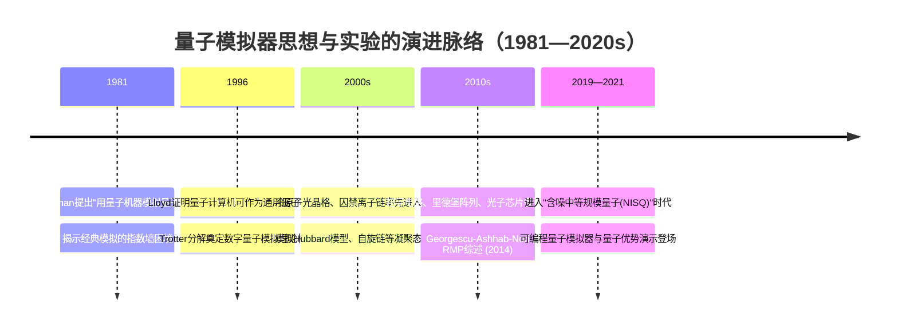

## 1.2 突破经典"指数墙"的科学价值与应用领域

量子模拟器之所以被视为21世纪科学计算工具的根本性突破，其内在动因来自经典计算无法跨越的**指数墙**（exponential wall）困境。对于一个由 $N$ 个二能级粒子构成的量子多体系统，其希尔伯特空间维度为 $2^N$，因此完整描述其波函数所需的复数振幅数目随粒子数 $N$ 指数增长。这意味着即使是模拟数十个相互作用粒子的量子动力学，经典计算机所需的存储与运算资源也会迅速超越当前最强大超算的极限[^6][^4][^7]。这一困境并非工程上的暂时瓶颈，而是源自量子叠加与纠缠的内禀结构——正如Preskill在第28届索尔维会议上所指出的，**"我们现在第一次开发并精确控制非常复杂的量子态。这些态因为包含许多相互作用粒子而变得非常复杂，以至于我们无法用现有最强大的计算机有效地模拟它们，也无法用目前已知的理论思想预测它们的行为。"**[^8]

量子模拟器的核心优势恰在于**以量子资源应对量子复杂性**：模拟系统自身遵循量子力学规律，其状态空间天然地随物理粒子数指数扩展，因而所需的物理资源仅与目标系统的时空尺度成多项式关系，而非指数关系。这正是费曼最初设想中所强调的"模拟规则"——**"模拟一个大型物理系统所需的计算机元素数量只需与物理系统的时空体积成正比。"**[^2] 这种线性资源与目标问题量子复杂度之间的非对称匹配，使量子模拟器成为打开高维量子多体问题的关键钥匙。

从应用范畴看，量子模拟器的潜在科学价值横跨多个基础学科分支：在**凝聚态物理**层面，它可以用于研究高温超导机制、Bose/Fermi-Hubbard模型相图、量子磁性、量子相变与拓扑物态等长期悬而未决的强关联问题[^1]；在**高能物理**层面，它有望用于格点规范理论的非微扰求解，模拟夸克禁闭、真空衰变与早期宇宙演化等微扰QCD无法触及的现象[^1][^5]；在**量子化学**层面，它能够提供分子电子结构、化学反应路径与催化机制的精确计算工具，是新材料与新药物研发的潜在颠覆性手段[^1][^7]；在**原子物理与宇宙学**层面，它可用于模拟人造规范场、类比黑洞霍金辐射、Unruh效应等极端物理情境[^1]。Banerjee 等人于近期使用50量子比特的IBM "Heron"超导处理器，对准一维反铁磁材料KCuF₃的动力学结构因子进行模拟，并与橡树岭中子散射数据严格交叉验证，便是这一应用前景由原理向实证迈进的最新例证[^7]。**这种从"理论可行"到"实际可用"的过渡，标志着量子模拟器正在从概念工具演化为真正意义上的科学发现引擎**[^7]。

## 1.3 量子模拟器与通用量子计算机的定位区分

尽管量子模拟器与通用量子计算机共享同一物理基础——以量子比特和受控量子演化为核心运算资源，但二者在研究目标、硬件门槛、纠错要求与近期可达性上存在本质差异，理解这一差异是把握量子模拟器独特定位的关键。

通用量子计算机的目标是**对任意算法进行可编程执行**：它需要一套通用门集合（universal gate set）、可寻址的逻辑比特，以及完整的量子纠错码以抑制门操作与退相干误差，最终实现任意单位算符的高保真度合成。这一愿景在原则上能够解决Shor算法、Grover算法等一系列经典难题，但其硬件门槛极高——容错量子计算通常要求物理比特错误率低于阈值（约 $10^{-3}$ 至 $10^{-4}$）、并需要数百至上千个物理比特编码出一个逻辑比特，距离当前NISQ硬件能力仍有显著距离[^8]。

量子模拟器，尤其是模拟式量子模拟器，则放宽了"通用可编程"这一最为苛刻的要求，转而**面向特定哈密顿量或特定模型类的精确再现**。它通常不要求完整的纠错码体系——目标并非合成任意酉操作，而是让系统自然演化在期望的哈密顿量下，因此对部分类型的噪声具有内禀的鲁棒性。这使得量子模拟器有可能在**含噪中等规模量子（NISQ）时代**先行兑现科学价值：在尚不具备容错纠错能力的硬件条件下，便能针对凝聚态、化学、高能物理中具体问题产出有意义的科学结论[^8]。Preskill在第28届索尔维会议报告中明确指出，**"在不久的将来，我们可以期待在可扩展容错量子计算方面取得的显著进展，以及可编程量子模拟器赋能的科学发现"**[^8]，这一陈述实际上把"可编程量子模拟器"提升为通向通用量子计算的关键中间阶段。

值得强调的是，量子模拟器与通用量子计算机并非互斥的两个范畴，而更接近一条**功能与复杂度的连续光谱**。一端是高度专用的模拟式平台（如光晶格中冷原子直接实现Hubbard模型），另一端是带有完整纠错的通用容错机器；中间则散布着各类可编程量子模拟器、混合量子-经典变分算法平台与早期通用门量子处理器。下表概括了三者的核心差异。

| 维度 | 模拟式量子模拟器 | 可编程量子模拟器/数字量子模拟器 | 通用容错量子计算机 |
|------|------------------|--------------------------------|---------------------|
| 研究目标 | 再现特定哈密顿量演化 | 灵活模拟一类哈密顿量或求解多种问题 | 执行任意量子算法 |
| 硬件门槛 | 中等，强调可控相互作用 | 较高，需通用门集合 | 极高，需高保真度+大规模物理比特 |
| 纠错要求 | 通常无完整纠错，依赖内禀鲁棒性 | 部分错误缓解；远期需纠错 | 完整量子纠错码 |
| 近期可达性 | 已有大量实验成果 | NISQ时代主战场 | 远期目标 |
| 典型问题 | Hubbard、Ising、自旋链动力学 | 量子化学、组合优化、强关联模型 | 大数分解、密码学、通用算法 |

## 1.4 模拟式量子模拟的原理与特征

模拟式（analog）量子模拟的核心思想是**直接构造哈密顿量等价物**：选取或工程化设计一个可控量子系统，使其自然演化所对应的哈密顿量 $H_{\text{sim}}$ 与目标系统哈密顿量 $H_{\text{target}}$ 之间存在严格的数学等价或可计算映射关系。系统在初始态制备后被允许在该哈密顿量下连续演化：

$$|\psi(t)\rangle = e^{-iH_{\text{sim}}t/\hbar}|\psi(0)\rangle \;\;\Leftrightarrow\;\; e^{-iH_{\text{target}}t/\hbar}|\psi(0)\rangle$$

由此，对模拟系统的物理观测便可直接映射为目标系统的可观测量。这一范式在数学上**依赖哈密顿量工程（Hamiltonian engineering）而非门序列分解**——研究者通过调节激光强度、磁场梯度、光晶格深度、原子间距等连续参数来"雕刻"出期望的相互作用形式，而非以离散的逻辑门构造演化算符。

模拟式范式的突出优势集中于两个层面。第一，**硬件资源效率极高**：由于演化过程连续进行，无需将哈密顿量分解为大量门操作，因此模拟$N$粒子系统通常仅需$O(N)$量级的物理资源即可实现，原则上可在当前实验条件下扩展至数百至数千格点规模；中性原子光晶格、囚禁离子链等典型平台已在该量级展开实验。第二，**对门保真度的依赖较低**：由于模拟过程不依赖逐次的高保真度门操作，少量参数漂移与噪声并不会逐项累积成灾难性误差，反而可能与目标问题中的"无序"或"温度"等物理要素自然契合，呈现出对部分类型噪声的内禀鲁棒性[^3]。

然而，模拟式范式也存在不可忽视的固有局限。首先是**可编程性受限**：每一种模拟平台所能自然实现的哈密顿量形式高度依赖其物理机制，并非任意目标模型都能被精确映射。例如，里德堡阵列天然适配于自旋类Ising模型，而难以直接模拟具有动能项的Hubbard物理。其次是**缺乏通用纠错框架**：模拟式量子模拟中的"错误"通常以哈密顿量参数偏离、退相干、加热等连续过程出现，而成熟的离散量子纠错码并不直接适用，使得**精度的严格保证与误差的系统表征均具有相当难度**。最后是**可验证性问题**：在大规模、强关联区域，模拟器自身的输出可能已无法被经典手段独立验证，需要发展跨平台验证（cross-platform validation）等新型方法学，这一问题在2020年前后开始引起广泛关注[^7]。

## 1.5 数字式量子模拟的原理与特征

数字式（digital）量子模拟基于完全不同的逻辑路径：它将目标哈密顿量演化算符 $U(t) = e^{-iHt}$ 通过**Trotter–Suzuki分解**离散化为一系列基本量子门操作的乘积。设 $H = \sum_k H_k$ 可分解为若干局部项，则一阶Trotter公式给出

$$e^{-iHt} \approx \left(\prod_k e^{-iH_k t/n}\right)^n + O\!\left((t/n)^2\right)$$

通过将每一项 $e^{-iH_k\Delta t}$ 进一步编译为通用门集合中的单比特与双比特门，目标系统的演化即可在通用量子计算机上以可编程方式实现[^3]。数字式范式在原理上具备**通用性**：任何局部相互作用哈密顿量的演化均可被高效模拟，这是Lloyd 1996年定理的直接推论。

数字式范式的关键特征可以从三个方面归纳。其一是**精确控制与误差可分析性**：Trotter误差具有严格的解析上界（一阶为 $O(\Delta t^2)$，更高阶分解可进一步压缩），研究者可通过细化步长 $\Delta t$ 与采用高阶分解格式来系统性地提升精度，这种**可分析、可控制的误差结构**是模拟式范式所不具备的[^3]。其二是**通用适配能力**：同一套硬件可通过不同的门序列编译来模拟Hubbard模型、自旋链、规范场理论乃至量子化学哈密顿量，呈现出真正意义上的**软件可定义灵活性**。其三是**原则上的可纠错性**：由于演化被分解为离散门操作，量子纠错码可在每一逻辑步骤间隔插入应用，使得长程演化的累积误差能够被压制至阈值之下。

但数字式范式对硬件提出了远高于模拟式的严苛要求。首先是**比特数与门操作数的双重压力**：精确模拟一个 $N$ 比特系统在时间 $t$ 内的演化所需的总门数随 $N$、$t$ 及精度要求多项式增长，但前置系数往往很大，使得即便是小型化学分子的精确模拟也常需数百万次门操作。其次是**Trotter误差与退相干误差的相互制约**：要降低Trotter误差需更小的步长与更多门次，但更多门次又会引入更多硬件噪声与退相干，二者之间存在最优折中。此外，数字式范式必须使用具备通用门集合的硬件平台（如超导电路、囚禁离子的数字模式），对单/双比特门保真度的要求通常需达到 $99\%$ 以上，方能在中等规模问题上获得有意义的输出。Hatomura 等学者在2020年前后对一阶Trotter分解在动力学不变量基底中的偏差分析，正是这一范式持续追求误差控制精细化的体现[^3]。

## 1.6 数字-模拟混合范式的兴起逻辑

进入NISQ时代之后，纯粹的模拟式范式受限于可编程性，而纯粹的数字式范式则受限于门次累积误差与有限相干时间，二者均难以在当前硬件条件下兑现费曼所设想的完整愿景。**数字-模拟混合（digital-analog hybrid）范式**正是在这一张力下兴起的折中方案，其基本逻辑是：以模拟式的多体相互作用块作为"硬件原语"，提供资源效率与对噪声的内禀鲁棒性；以离散单比特/双比特门作为"编程语言"，提供灵活的可编程性与定制能力。

具体而言，混合范式的典型实现路径是将一个可调谐的多体演化模块（如囚禁离子链中的全局Mølmer–Sørensen耦合、超导阵列中的多比特纠缠门、里德堡阵列中的可调Rydberg blockade相互作用）视为一个"宏门"——它在一个时间步内同时作用于多个比特，并自然产生纠缠或相互作用；随后插入逐比特的旋转门用于编辑相位、振幅或局域场，从而实现对目标哈密顿量的更精细映射。**这一思路的关键优势在于：以更少的门操作次数实现等价的演化效果，从而显著降低噪声敏感性与硬件资源消耗**。

混合范式的另一类重要表现是**混合量子-经典变分算法**，例如变分量子本征求解器（VQE）、子空间展开等。在这类算法中，量子硬件负责制备参数化量子态（往往采用模拟式或低深度数字电路），而经典优化器负责对变分参数进行迭代调整，使期望值最小化以逼近目标哈密顿量的基态。Banerjee 团队在IBM "Heron"处理器上对KCuF₃材料的模拟正是采用了VQE与子空间展开相结合的策略，并成功捕捉到了自旋-1/2海森堡链中"自旋子分数化"这一典型集体量子行为[^7]。这一案例同时说明：**混合范式不仅是NISQ时代的工程妥协，更可能成为量子模拟器最终走向实用化的可持续路径**。囚禁离子平台亦表现出在模拟与数字两种模式间灵活切换的能力，被认为是当前对混合范式适配度最高的物理实现之一[^5]。

## 1.7 两类范式的对比与适用边界

在上述对模拟式、数字式与混合式三种范式的剖析基础上，可以从可编程性、可扩展性、容错能力、对硬件保真度要求、可验证性与适用问题类型六个维度进行系统对比，以确立后续具体物理实现方案分析的统一框架。

| 对比维度 | 模拟式量子模拟 | 数字式量子模拟 |
|---------|---------------|----------------|
| 可编程性 | 受限于平台天然哈密顿量，定制空间窄 | 通用门集合支持任意局部哈密顿量编译 |
| 可扩展性 | 资源效率高，当前可达数百至数千格点 | 比特数与门次增长快，当前约数十至上百比特 |
| 容错能力 | 无完整纠错框架，依赖内禀鲁棒性 | 原则上可与量子纠错码集成 |
| 硬件保真度要求 | 对单门保真度依赖较低 | 对单/双比特门保真度要求严苛（>99%） |
| 可验证性 | 大规模区域难以经典独立验证 | Trotter误差有解析上界，便于分析 |
| 适用问题类型 | 凝聚态强关联、量子磁性、动力学相变 | 量子化学、规范场、通用算法导向问题 |

从这一对比可以看出，模拟式范式更适合于研究**特定物理模型的物态与动力学**——它以最少的硬件代价深入到强关联与高维希尔伯特空间的腹地，是凝聚态物理与多体动力学研究的天然伙伴；数字式范式则更适合于求解**一般哈密顿量与化学/高能物理问题**——它以通用编程能力换取广泛适配性，是面向量子化学、规范场理论与通用量子计算路径的核心范式。**混合范式则在二者之间充当桥梁角色，将在可预见的未来主导NISQ阶段的量子模拟实践**。

基于上述概念坐标，后续章节将依照各物理实现方案在这一光谱上的位置展开讨论：第2、3章所聚焦的中性原子（光晶格与里德堡阵列）与囚禁离子平台，传统上以模拟式模拟为主，但近年来均已具备数字式与混合模式的能力；第4章的超导电路平台从一开始便围绕通用门集合构建，是数字式与混合式范式的核心载体；第5章的光子学平台在玻色采样、量子行走等特定问题上呈现典型的模拟式色彩；第6章的固态自旋平台（半导体量子点与NV色心）兼具模拟与小规模数字模拟潜力；第7章的量子退火与Ising求解器则是面向特定优化问题的高度专用模拟式架构。这一沿"模拟式—混合式—数字式"光谱铺展的分析逻辑，将贯穿全报告，并在第8章的横向比较中得到系统化收束。

# 2 中性原子量子模拟器架构（光晶格与里德堡阵列）

在第1章确立的"模拟式—混合式—数字式"范式光谱之上，本章进入对具体物理实现方案的首章剖析。**中性原子之所以成为量子模拟器最具代表性的物理载体之一，根本原因在于它将"宏观尺度的高度可控性"与"微观尺度的丰富量子相互作用"统一于同一实验平台之上**——研究者既可以将数千个原子精确地排布于亚微米尺度的人造晶格之中，又能通过电磁场、激光与原子内态的精细操控，"按需"地工程化出从短程接触相互作用到长程偶极相互作用的多样哈密顿量。这一独特的能力组合使得中性原子平台天然契合费曼最初设想的"以一个可控量子系统再现另一个量子系统"的范式定位。

中性原子量子模拟器在过去二十余年的发展中，沿着两条互补的技术主线演化：其一是以**激光冷却中性原子装载入光晶格**为核心的方案，其物理图景对应于一种"无缺陷的人造晶体"，原子在周期性势阱中通过隧穿与接触相互作用展开多体动力学，是Hubbard型凝聚态问题的天然模拟器；其二是以**光镊阵列逐个捕获中性原子并通过里德堡激发引入长程相互作用**为核心的方案，原子以可重构的几何构型组装为自旋阵列，借助Rydberg blockade效应实现自旋模型与可编程多体动力学的模拟。两条路线虽共享激光冷却、单原子操控等技术基础，但在相互作用机制、可寻址能力、可扩展规模与适配问题类型上呈现明确分野。本章在概述共性技术与物理优势之后，将依次剖析两条路线的物理原理、标志性成果、工程瓶颈，并在最后一节系统比较二者的互补定位，为第3章及后续平台的横向对照提供参照基准。

## 2.1 中性原子平台的共性技术基础与物理优势

中性原子量子模拟器的技术根基可以归纳为三组相互关联的实验能力。**激光冷却**通过共振光与原子的动量交换将原子团温度从室温降至微开（μK）甚至纳开（nK）量级，这一过程通常依次经过塞曼减速、三维磁光阱（MOT）、亚多普勒冷却、蒸发冷却乃至光学晶格中的局域冷却等阶段，最终将原子的德布罗意波长拉长到与原子间距相当或更大的尺度，使量子统计与量子相干效应主导其行为。**磁光阱**结合空间梯度磁场与近共振激光的散射力，将冷却后的原子囚禁于厘米至毫米尺度的捕获体积内，为后续的进一步装载提供原子源。**光偶极势阱**则利用远失谐激光与原子电偶极矩耦合所产生的AC Stark势——红失谐激光在强度极大处形成势阱，蓝失谐激光在强度极小处形成势阱——从而以纯光学手段精确地"雕刻"出原子的囚禁几何，既可以是周期性的光晶格，也可以是聚焦为亚微米尺度的单原子光镊。

这一技术体系赋予中性原子平台几项贯穿性的共性优势。首先，**与外界环境耦合微弱**：中性原子不带电荷，对杂散电场不敏感，其与磁场、激光的耦合可被精细调控且能在适当条件下抑制，因而具有相对较长的相干时间[^9]。其次，**原子间距处于微米量级，串扰低、独立操控性强**：相邻量子比特之间的物理距离足以让聚焦激光对单原子进行选择性寻址，同时又足够近以允许通过受控相互作用（接触碰撞、里德堡偶极、自旋交换等）建立纠缠[^9]。第三，**量子比特连接拓扑灵活可变**：通过改变光晶格的几何构型、调整光镊位置或对原子进行重排，研究者能够构造一维链、二维方格、三角、Kagome等多种格点结构，乃至三维构型，这种几何自由度在其他物理平台中极为罕见[^9]。第四，**可扩展性优良**：以光晶格为代表的方案已实现对数千乃至数万原子的同时操控，光镊阵列亦可扩展至数百原子规模[^9][^10]，使中性原子平台成为目前量子比特数量级最大的可控量子系统之一。

在元素选择上，中性原子量子模拟器经历了从碱金属到（类）碱土金属的拓展。**碱金属元素**（Rb、Cs、Li 等）由于具有单一价电子、能级结构相对简单、激光冷却技术高度成熟，长期以来是冷原子实验的主力体系[^9]。**（类）碱土金属元素**（Sr、Yb 等）自2018年前后被广泛引入光镊阵列实验，其能级结构上的两个独特优势对量子模拟具有特别意义：其一是这两类元素拥有包含超窄线宽钟跃迁在内的丰富跃迁谱线、其亚稳态具有长寿命，并存在合适波长的"魔幻波长"光镊可同时囚禁亚稳态与里德堡态原子，从而有效抑制激发过程中由多普勒效应引起的退相干，有望显著提升多量子比特操控保真度[^9]；其二是这两类元素中核自旋与电子自旋具有强烈的退耦合效应，费米子体系可呈现核自旋的 SU(N) 对称性，并可利用基态与亚稳态实现两轨道量子模型，模拟真实材料中电子自旋与轨道两个自由度共同作用的情形，为研究新兴材料中的多体效应提供独特的物理资源[^9]。

| 元素类别 | 代表元素 | 核心优势 | 主要量子模拟用途 |
|---------|---------|---------|----------------|
| 碱金属 | Rb、Cs、Li | 单价电子、激光冷却成熟、技术门槛低 | Hubbard模型、自旋链、里德堡阵列经典体系 |
| （类）碱土金属 | Sr、Yb | 超窄钟跃迁、亚稳态长寿命、SU(N) 对称性 | 两轨道模型、SU(N) 磁性、高保真度Rydberg操控、光晶格钟 |

综合而言，中性原子平台以激光冷却为基础、以光偶极势阱为操控核心、以多样元素体系为内部自由度资源，构成了模拟式量子模拟最为成熟的物理载体之一。**它在第1章定义的范式光谱中典型地占据"以模拟式为主、兼具混合可编程能力"的位置**——既能通过哈密顿量工程直接再现凝聚态模型的演化，又可通过近年来发展的可编程门操作引入有限度的数字化控制。

## 2.2 光晶格冷原子方案的物理原理与哈密顿量工程

光晶格方案的物理起点是**驻波激光场所产生的周期性光偶极势**。当两束反向传播、频率远失谐于原子共振的激光相干叠加时，光强在空间形成正弦驻波；原子在该周期势中被囚禁于势阱节点上，形成与天然固体晶格类比的"人造晶体"。通过沿不同方向叠加多对驻波，研究者可构造一维链、二维方格、三维立方乃至蜂窝、Kagome、超晶格等几何形态；通过控制激光强度，势阱深度可在 nK 至 μK 量级连续调节；通过激光频率与极化的设计，还可分别囚禁原子的不同内态，为自旋自由度的工程化奠定基础。该平台被生动地概括为：**"想象一下，你能够创造出一种适用于量子物质的人工晶体：毫无缺陷，且能够完全控制周期性晶格势阱，可随意改变其形状、深度以及基础粒子间的相互作用，而且还能在几乎零度的温度条件下高度精确操控这些粒子"**[^11]。

将超冷原子装载入光晶格后，系统的低能哈密顿量自然映射为**Hubbard 模型**。对于玻色子，相应的 Bose-Hubbard 模型表述为相邻格点间的隧穿项与同格点上的接触相互作用项之竞争：

$$H_{\text{BH}} = -t\sum_{\langle i,j\rangle}\left(b_i^\dagger b_j + \text{h.c.}\right) + \frac{U}{2}\sum_i n_i(n_i-1) - \mu\sum_i n_i$$

其中 $t$ 为隧穿振幅，$U$ 为同格点排斥强度，$\mu$ 为化学势。对于费米子，则得到 Fermi-Hubbard 模型，其在自旋自由度上引入了 $\uparrow,\downarrow$ 双分量结构，是高温超导、量子磁性与强关联电子物理的核心模型。光晶格平台之所以被视为 Hubbard 物理的"天然模拟器"，正是因为其哈密顿量与目标模型在数学结构上几乎严格对应——这种"无需翻译"的映射关系，使其成为模拟式量子模拟范式中最为典型的实例[^9][^12]。

光晶格方案的哈密顿量工程能力进一步体现于以下几个层面。**晶格深度的连续可调性**使隧穿振幅 $t$ 与同格点排斥 $U$ 之比 $U/t$ 可在数量级范围内连续扫描，从而驱动系统穿越 Mott 绝缘体-超流的量子相变；**Feshbach 共振**允许通过外加磁场将原子间散射长度从大正到大负连续调节，从而精确控制 $U$ 的符号与大小，使吸引与排斥相互作用情形均可被探索；**合成规范场**通过激光辅助隧穿、光晶格摇动、Floquet 工程或拉曼耦合等手段，在中性原子上"模拟"出有效磁场或 Abel/非Abel 规范势，从而打开拓扑能带、整数与分数量子霍尔效应、Weyl 半金属等拓扑物态的模拟通道[^13][^14]；**自旋-轨道耦合**则通过双光子拉曼过程将原子动量与内态自旋耦合，将通常仅在固体材料中存在的相对论性效应移植到冷原子体系，使研究者得以在洁净的人造系统中独立探索其后果，例如潘建伟、陈帅与刘雄军团队于2021年在三维自旋-轨道耦合超冷原子量子气体中实现的理想 Weyl 半金属能带便是该工程化路径的典型成果[^13]。

**这种"对哈密顿量按需雕刻"的能力——而非对一般算符进行门分解的能力——正是光晶格方案作为模拟式量子模拟主力载体的最深刻特征**。它将凝聚态强关联问题从难以计算的抽象哈密顿量转化为可控可测的实验对象，使费曼最初设想的"自然模拟自然"在该平台上得以最为完整地兑现。

## 2.3 光晶格在凝聚态多体物理中的标志性模拟成果

从21世纪初的 Mott 绝缘体-超流相变实验开始，光晶格冷原子平台已在凝聚态多体物理的多个核心问题上累积了大量实证性进展。这些成果按物理对象大致可归为以下几个方向：**Hubbard 相图的扫描**——通过调节 $U/t$ 与温度，直接观测玻色子超流到 Mott 绝缘体、费米子反铁磁关联、密度波等不同物态的形成；**量子磁性**——基于超交换机制在 Mott 区域内实现海森堡型自旋交换，观测到反铁磁关联与磁性相变[^12]；**低维量子液体**——在一维超冷玻色气体中观察到 Tomonaga-Luttinger 液体行为以及量子临界标度[^15]；**任意子激发**——通过四体环交换相互作用在最小光晶格构型中实现任意子统计的初步验证，潘建伟团队2017年在该方向取得了重要突破[^15]；**多体局域化**与**Higgs 模式**等非平衡与集体激发现象，也已在该平台上进入定量研究阶段。

在该平台的众多里程碑中，**中国科学技术大学潘建伟团队的一系列工作集中体现了光晶格冷原子作为"科学发现引擎"的兑现能力**。2020年6月，该团队在《Science》发表题为 *Cooling and entangling ultracold atoms in optical lattices* 的研究，**首次在超冷原子光晶格中实现了大规模高保真度量子纠缠对的同步制备**，这一进展为后续可扩展量子模拟与基于光晶格的量子计算研究奠定了基础[^15]。同年11月，团队在《Nature》发表 *Observation of gauge invariance in a 71-site Bose-Hubbard quantum simulator*，**在71格点的超冷原子量子模拟器中成功求解 Schwinger 方程**——这是描述一维量子电动力学的核心模型，从而将量子模拟器的能力从凝聚态扩展到高能物理中的格点规范场理论[^15][^13]。2022年7月，团队进一步与德国海德堡大学、奥地利因斯布鲁克大学、意大利特伦托大学合作，在《Science》发表 *Thermalization dynamics of a gauge theory on a quantum simulator*，**利用超冷原子量子模拟器对格点规范场理论从非平衡态过渡到平衡态的热化动力学进行模拟，首次在实验上证实了规范对称性约束下量子多体热化导致的初态信息"丢失"**，标志着量子模拟方法在求解复杂高能物理问题上的实质性进展[^15][^13]。

需要说明的是，2022年的格点规范场热化工作严格意义上已超出本报告所设定的"截至2021年初"的时间边界，但其作为2020年71格点 Schwinger 方程模拟工作的直接延续，能够在因果链上证实该平台所开启的研究方向的科学价值，因此在此简要提及但不作为主体证据。**从研究脉络看，2020年前后光晶格冷原子量子模拟器已显著突破了"概念验证"阶段，进入到能够定量回答凝聚态、规范场理论等领域具体科学问题的成熟期**——这一过渡正是费曼1981年构想兑现的具象写照，也是 Bloch、Greiner、潘建伟等多个国际团队共同推动的结果[^11][^16]。

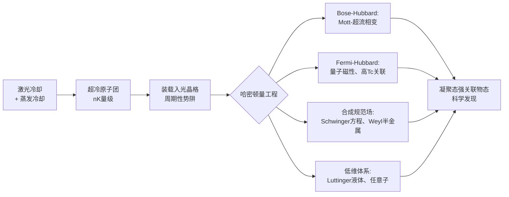

## 2.4 光晶格方案的优势与工程瓶颈

综合上述物理原理与典型成果，光晶格冷原子方案的**核心优势**可从三个层面归纳。第一，**大规模并行性**：光晶格可同时囚禁数百至数千乃至数万个原子，且原子的装载与演化天然并行——Bloch 等团队的报告以及潘建伟团队的工作均指出，该平台具备"可扩展至数万原子规模"的潜力，是当前可控量子系统中规模最大的实现路径之一[^16]。第二，**连续参数可调性**：晶格深度、相互作用强度、维度、几何与有效规范场均可通过连续物理量精确工程化，**这一"连续可调"特性与离散门量子计算形成鲜明对比，是模拟式范式资源效率优势的直接来源**。第三，**对模拟式范式的高度适配性**：光晶格哈密顿量与 Hubbard 模型几乎严格对应，无需通过 Trotter 分解或门编译即可直接实现演化，因而对单门保真度的依赖较弱，在 NISQ 时代便能产生有意义的科学结论。

但光晶格方案同样面临一系列固有工程瓶颈。首先是**单格点寻址困难**。光晶格的典型周期约为半波长（数百纳米），远小于普通成像系统的衍射极限，使得对单个格点上的原子进行选择性激发、读出与相位控制具有相当难度——尽管"量子气体显微镜"技术已在很大程度上突破了这一极限，但与光镊阵列方案相比，光晶格的单原子寻址精度与可编程性仍处于劣势。其次是**对超低温的苛刻要求**。要在光晶格中观测到量子磁性等低温物态，原子温度需进一步降至与超交换能量 $J = 4t^2/U$ 同量级（通常约 nK 量级），而蒸发冷却在光晶格中的效率有限，导致"有效温度"成为该平台进一步深入的关键瓶颈。潘建伟团队2020年发表于《Science》的工作之所以受到广泛关注，部分正是因为其在光晶格内实现的纠缠对制备技术为进一步降低有效温度提供了新路径[^15]。第三是**原子加热与退相干**。光晶格激光的非弹性散射、光谱噪声、机械振动等均会引入加热与相干性损失，限制可观测的演化时间窗口。第四是**晶格不完美**——边界效应、势阱不均匀、原子损失等"非理想"因素会使模拟结果偏离目标哈密顿量，且这些误差以连续、累积的方式影响输出，**缺乏类似数字式范式中 Trotter 误差那样的解析上界**，使得模拟精度的严格保证与误差的系统表征均具有相当难度。这一局限直接呼应了第1章中对模拟式范式可验证性问题的讨论。

## 2.5 光镊里德堡原子阵列方案的物理原理

光镊里德堡阵列方案是中性原子量子模拟器在过去十年中最为活跃的发展方向之一。**其物理起点是利用强聚焦激光在亚微米尺度逐个捕获单个中性原子**——通过将激光通过高数值孔径物镜聚焦至束腰约500 nm 量级的微型光偶极阱，每个光镊形成一个独立的单原子囚禁陷阱[^9]。在加载过程中，由于"碰撞阻塞"机制，每个光镊只会随机地装载 0 或 1 个原子，因此初始加载效率通常约为50%。为构造完整有序阵列，研究者采用**单原子重排算法**：通过声光偏转器（AOD）或空间光调制器（SLM）实时检测每个光镊的占据情况，并将装载成功的原子逐个迁移到目标位置，从而组装出一维链、二维阵列乃至三维结构的完美几何构型。**这一可重构能力是光晶格方案所不具备的关键特征——研究者可在不改变硬件配置的前提下，"按需"地切换格点几何，将正方、三角、Kagome 乃至完全任意的图论结构装入同一台机器**[^10][^9]。

在原子组装为目标几何后，量子比特通常被编码于基态的两个超精细能级（或者在 Sr、Yb 等元素中编码于钟跃迁的两个能级），通过微波或双光子拉曼跃迁实现单比特操控[^9]。**多比特相互作用则借助里德堡态激发实现**：将原子从基态激发到主量子数 $n \sim 50$–100 的高激发里德堡态后，其极化率随 $n^7$ 急剧增大，原子间产生强烈的 van der Waals 相互作用或共振偶极-偶极相互作用，作用范围可达数微米乃至更远，与原子间距相当。Browaeys 与 Lahaye 在2020年发表于《Nature Physics》的综述系统阐述了里德堡态之间的不同相互作用类型如何**自然映射为各类量子自旋模型**：van der Waals 相互作用映射为 Ising 型相互作用，共振偶极-偶极相互作用映射为 XY 自旋交换，更复杂的多能级方案则可实现 Heisenberg 模型等[^17]。

里德堡阵列方案的核心物理资源是 **Rydberg blockade（里德堡阻塞）效应**：当两个相邻原子间的相互作用能 $V_{\text{int}}$ 远大于激发激光线宽时，"两个原子同时处于里德堡态"的双激发态被显著移频出共振，使得在阻塞半径内只能存在一个里德堡激发。该效应一方面使阵列中的多原子集体激发被自动限制为"至多一个里德堡态"的相干叠加，从而构造出与 Ising 反铁磁基态结构相似的多体基态；另一方面，它构成了**多比特纠缠门**的物理基础——通过精心设计激光脉冲序列，可在阻塞条件下实现两比特受控相位门或多比特纠缠门[^17][^13]。Yu 等人的研究进一步指出，**Rydberg blockade 门的保真度本质上受限于来自 Rydberg 能级移位的阻塞误差**，这是该路线在追求更高门保真度时必须克服的内在限制；通过暗态绝热通道结合 van der Waals 与共振偶极-偶极相互作用的混合方案，已被提出作为一种"无阻塞误差"的高保真度门实现路径[^13]。

南方科技大学量子科学与工程研究院的实验描述凝练地概括了该体系的核心特点：**"中性原子体系中，量子比特被编码在单个原子的内态能级上，通过微波或光学跃迁实现单量子比特操控，利用 Rydberg 阻塞效应或自旋交换碰撞实现多量子比特操控"**，并具备"与外界环境之间耦合微弱、相干时间长、相邻原子间距离在微米量级、单个比特易于独立操控、串扰低、量子比特连接灵活可变、扩展性良好"等多重优势[^9]。**这些特征共同奠定了里德堡阵列作为可编程量子模拟器代表平台的地位**。

## 2.6 里德堡阵列在量子自旋模型与组合优化中的应用

基于上述物理机制，里德堡阵列在过去数年里在量子自旋模型与可编程量子模拟两个方向上同步推进，呈现出从"小规模演示"到"大规模可编程平台"的快速跃迁。**Browaeys 与 Lahaye 在2020年的综述中梳理了该平台在多体物理中的代表性进展**[^17]：在量子磁性方向，已观测到反铁磁有序、序参量随相互作用强度的标度行为、自旋液体候选态等；在对称性破缺相变方向，已演示从顺磁相到反铁磁相的可控量子相变及其临界标度；在多体动力学方向，已研究淬火动力学中的"伤痕态"（quantum many-body scars）、信息扩散与热化偏离等非平衡现象；在长程相互作用驱动的物态方面，则可探索受相互作用范围调控的拓扑相与晶体相。**这些工作共同表明，里德堡阵列已成为研究量子自旋模型与多体动力学的核心实验工具之一**。

该方向在2021年达到一个标志性高点：**哈佛大学 Mikhail D. Lukin 团队与哈佛-MIT 超冷原子中心合作，在256原子可编程量子模拟器上实现了对物质量子相的探测**[^10]。该工作于2021年7月7日以 *Quantum phases of matter on a 256-atom programmable quantum simulator* 为题发表于《Nature》，同期来自一支法国团队的类似工作背靠背发表[^10]。研究团队利用光镊阵列将256个原子按设计需要排列成任意的三维形状并进行相干操作，**演示了几个新的量子相，并定量探测了相关的相变**[^10]。论文一作 Sepehr Ebadi 强调，该系统具备前所未有的规模和可编程性，使量子计算机的性能位居业内前沿；通讯作者 Mikhail Lukin 则评价"这项研究将该领域推到了一个前所未有的地方"[^10]。中国科学技术大学合肥微尺度物质科学国家实验室的苑震生教授对此评论指出：**"这项研究显示，人们对微观粒子的量子调控能力越来越强，可以形成中等尺度的量子模拟器，制备、调控和观测复杂的强关联量子物态，解决经典超级计算机难以处理的量子材料问题"**[^10]。

值得注意的是，该工作还突破了此前可编程量子系统的一项共性局限。当时已有的可编程量子系统——例如含五十多个被俘获离子的离子阱、含76个光子的高斯玻色采样系统、数百原子的光晶格、超导比特模拟的伊辛自旋系统——**普遍存在一个共同缺点：缺乏探测量子物质所必需的相干性**[^10]。256原子里德堡阵列的关键突破正在于以同相位方式在百原子规模上实现了强相互作用与高相干性的兼容，从而真正具备了对量子物质进行探测的能力。

除量子磁性与多体物态外，里德堡阵列在**组合优化问题**上同样展现出独特价值。由于 Rydberg blockade 在几何上自然对应于"在某个半径内最多激活一个顶点"这一约束，将待优化问题的图结构映射为原子几何后，**该平台可天然求解最大独立集（Maximum Independent Set, MIS）等 NP-hard 问题**——这是其他模拟平台难以高效实现的能力。结合可重构的几何构型，里德堡阵列因而被视为"图论问题专用量子模拟器"的代表实现。

## 2.7 里德堡阵列方案的优势与挑战

综合上述原理与成果，光镊里德堡阵列方案相对于光晶格方案的**差异化优势**集中体现于四个方面。第一，**原子构型完全可重构**：通过原子重排算法，研究者可在同一硬件上任意切换几何拓扑，无需重新设计光路；这一灵活性使其在求解不同图结构的优化问题与模拟不同晶格几何的自旋模型时具备无可比拟的适配能力[^10][^9]。第二，**单原子寻址精度高**：相邻原子间距在微米量级，与典型成像系统的衍射极限相当或更大，使得单原子级别的激发、读出与相位控制成为常规操作，串扰极低[^9]。第三，**连接拓扑灵活可变**：可调控原子间距离与原子构型，使量子比特之间的耦合可被精确工程化[^9]。第四，**模拟式与数字式混合操作能力强**：里德堡阻塞门的本质是数字式操作，而连续演化下的多体里德堡相互作用则是模拟式操作，**二者可在同一平台上灵活组合，使其成为第1章所讨论的"数字-模拟混合范式"的天然实现载体之一**。

然而，该方案也面临一系列工程挑战。第一是**里德堡态的有限寿命与相干时间**。里德堡态的自然寿命通常在数十微秒至数百微秒量级（与主量子数有关），且对黑体辐射敏感——黑体辐射会将原子激发到邻近的里德堡态，从而损失相干性。这一有限寿命直接制约了可执行的多体演化时间窗口，是大规模、长程演化的核心瓶颈之一。第二是**光镊原子加载效率**。如前所述，单光镊的初始加载效率约为50%，必须依赖原子重排算法来弥补这一限制；当阵列规模扩展至数百原子时，重排所需时间显著增加，且重排过程本身亦引入额外的退相干与原子损失，成为可扩展性面临的实际工程瓶颈[^9]。第三是**里德堡激发过程中的多普勒效应与黑体辐射退相干**。原子的有限温度导致的多普勒频移会破坏激发的相干性，这是 Sr、Yb 等具有"魔幻波长"光镊的（类）碱土金属元素被广泛引入的关键动因之一——这些元素允许在亚稳态与里德堡态之间共同囚禁，从而有效抑制多普勒退相干[^9]。第四是**阻塞门保真度受 Rydberg 能级移位限制**。Yu 等人的研究表明，**里德堡阻塞门的保真度本质上受到来自里德堡能级移位的阻塞误差的内禀限制**，这阻碍了该方案在追求更高门保真度时的扩展使用；通过结合 van der Waals 与共振偶极-偶极相互作用的混合方案以构造"暗态绝热通道"，已被提出作为实现无阻塞误差、操作时间约80 ns、保真度极高的两原子门的新型协议[^13]。这一方向的持续进展将直接决定里德堡阵列在从"可编程量子模拟器"向"中性原子量子计算机"演化时的可行性边界。

哈佛大学等团队在2023年12月进一步在《Nature》上发表了基于280个中性原子构建48个逻辑量子比特的工作，被业内广泛认为是迈向容错量子计算的里程碑式进展[^16]。虽然该成果已超出本报告的时间边界，但其因果链直接连接到2021年256原子可编程量子模拟器的工作，**表明里德堡阵列方案不仅是模拟式量子模拟的主力载体，亦正在演化为通向容错量子计算的潜在路径之一**[^16][^9]。

## 2.8 两类中性原子方案的对比与互补定位

在分别剖析光晶格与里德堡阵列两条路线之后，可以从多个维度对二者进行系统比较，以明确其在中性原子谱系内的互补定位。下表汇总了两类方案在关键维度上的差异。

| 比较维度 | 光晶格冷原子方案 | 光镊里德堡阵列方案 |
|---------|-----------------|------------------|
| 相互作用机制 | 短程接触相互作用（同格点 $U$、近邻隧穿 $t$）、可经由Feshbach共振调节 | 长程 van der Waals 与共振偶极-偶极相互作用（数微米尺度），受 $n$ 调控 |
| 几何构型 | 周期性晶格（一维链、二维方格、三维立方等），几何相对固定 | 完全可重构（一/二/三维任意几何），可实时调整 |
| 可寻址性 | 单格点寻址受衍射极限制约，需量子气体显微镜 | 微米级原子间距，单原子寻址常规化，串扰极低 |
| 可扩展规模 | 数百至数千乃至数万原子（截至2021年） | 数百原子量级，256原子已实现于2021年[^10] |
| 相干时间 | 受光晶格散射加热与有效温度限制 | 受里德堡态寿命（数十至数百μs）与黑体辐射限制 |
| 适配哈密顿量 | Bose/Fermi-Hubbard、量子磁性、合成规范场、低维量子液体 | Ising、XY、Heisenberg 等自旋模型，组合优化（如MIS） |
| 范式定位 | 典型模拟式，哈密顿量"按需雕刻" | 模拟式与数字式混合，可编程性强 |
| 代表团队/成果 | Bloch（MPQ）、潘建伟团队71格点 Schwinger 方程模拟、Weyl 半金属能带 | Lukin（哈佛）、Browaeys（法国）、256原子可编程量子相探测 |

从这一对比可以提炼出两个核心结论。**第一，光晶格方案与里德堡阵列方案在物理特征上呈现明确的互补性**——光晶格以短程接触相互作用为核心，更适配 Hubbard 型凝聚态强关联问题，是研究高温超导、量子磁性、规范场理论的天然载体；里德堡阵列以长程偶极相互作用为核心，更适配自旋模型与可编程组合优化任务，是研究量子磁性、多体动力学与图论优化问题的灵活平台。二者并非相互替代，而是在中性原子谱系内构成功能互补的双主线。**第二，二者在第1章定义的范式光谱上均位于"模拟式为主、兼具数字式与混合能力"的区段**，但侧重略有不同：光晶格方案以哈密顿量工程为绝对主体，数字化操作仅作为补充；里德堡阵列方案则因其阻塞门的天然数字化特性，更接近混合范式的中心位置。

进一步看，近年来出现的若干融合发展趋势预示了中性原子量子模拟器的下一阶段图景。**光晶格-Rydberg 混合架构**尝试将光晶格的大规模并行性与里德堡阵列的长程相互作用结合，在光晶格中对特定格点上的原子进行里德堡激发，从而实现"短程隧穿 + 长程自旋耦合"的复合哈密顿量。**（类）碱土金属新元素体系**（Sr、Yb）的引入进一步扩展了两类方案的能力边界——既为光晶格提供了 SU(N) 对称性与两轨道模型的新模拟对象，又为里德堡阵列提供了亚稳态-Rydberg 共囚禁光镊以抑制多普勒退相干的新工具[^9]。Bloch 在2025年墨子沙龙讲座中所强调的"超冷原子光晶格量子模拟这一全新跨学科领域诞生的始末"以及"量子模拟器正成为探索量子宇宙的强大实验设备"等论断，正是对这一方向蓬勃发展态势的凝练评述[^11][^16]。

需要特别说明的是，**截至2021年初，中性原子量子模拟器在量子比特规模、相干性与可编程性的综合指标上已超越其他多数物理平台**——光晶格冷原子已实现数百至上千格点的同步可控，里德堡阵列已实现256原子的可编程相干操控，这一规模优势在与第3章将要讨论的囚禁离子（典型规模约数十离子）、第4章超导电路（典型规模约数十比特）以及第5章光子学等平台的对比中将更为凸显。**但规模优势并不等同于全维度领先**：在单比特门与双比特门保真度、连通性的精确控制等指标上，囚禁离子仍占据领先地位；在工艺成熟度与门操控速度上，超导电路具有特殊优势。这一全景式的横向比较将在第8章系统展开，本章所建立的中性原子谱系图景是后续比较的第一块基石。

总体而言，中性原子量子模拟器以其规模、相干性、可重构性与哈密顿量工程能力的独特组合，**确立了其作为当代量子模拟实验科学最具影响力的物理载体之一的地位**。光晶格与里德堡阵列两条路线既各有所长，又在融合中不断拓展边界，共同推动着费曼"以量子机器模拟量子自然"这一构想从蓝图走向广泛而深入的科学实践。

# 3 囚禁离子量子模拟器架构

在第2章对中性原子平台进行系统剖析之后，本章进入量子模拟器物理实现谱系的第二条主线——**囚禁离子（trapped ion）方案**。如果说中性原子平台以"规模与可重构几何"见长，那么囚禁离子平台则以"高保真度、长相干时间与全连通性"奠定其在量子模拟乃至量子信息全域内的独特地位。早在1997年，美国国家标准与技术研究院（NIST）的Wineland、Monroe等人便在题为 *Trapped-Ion Quantum Simulator* 的开创性论文中明确指出，**通过对单个囚禁离子的量子化运动态与内部态进行相干操控，可以模拟其他量子系统的动力学**；进一步地，相干操控亦可用于在多离子系统中创建纠缠态，并以此演示基本的量子关联现象[^10]。这一论断在过去二十余年中被反复验证与拓展，并使囚禁离子从单原子量子光学的研究对象演化为当代量子模拟器最为成熟的物理载体之一。

囚禁离子方案的物理逻辑从根本上不同于中性原子。中性原子借助光偶极势在微开尺度的冷却环境中实现弱囚禁，相互作用以短程接触或里德堡偶极为主；囚禁离子则借助带电粒子与电磁场之间的强库仑耦合实现深势阱囚禁，并以离子链中**共享的集体声子模式**作为传递相互作用的"量子总线"，天然地在任意两比特间建立可控耦合。这一物理差异不仅决定了囚禁离子在保真度、相干性与连通性上的领先地位，也使其在第1章所确立的"模拟式—混合式—数字式"范式光谱中占据一个极为独特的位置——**它既能以全局Mølmer–Sørensen耦合提供模拟式的多体演化原语，又能以高保真度通用门集合支撑完整的数字式Trotter分解，因而被广泛视为对数字-模拟混合范式适配度最高的物理实现**。本章将依次剖析其物理基础、哈密顿量工程、双模能力、标志性成果、核心优势与扩展瓶颈，并在末节通过对比建立与第2章中性原子谱系的互补定位。

## 3.1 囚禁离子平台的物理基础与共性技术

囚禁离子量子模拟器的物理起点是**对带电粒子进行电磁囚禁**。由于Earnshaw定理排除了纯静电场对单点电荷的稳定束缚，实验上发展出两类互补的囚禁方案：**Paul阱**（射频四极阱）通过将射频振荡四极电场与静电场叠加，在时间平均意义下形成一个有效的伪势阱，将离子囚禁在阱中心附近；**Penning阱**则结合静电四极场与轴向静磁场，前者沿轴向束缚离子，后者通过洛伦兹力提供径向回旋约束，从而实现纯静态场下的囚禁。两类阱的几何构型差异决定了其适配的离子构型：线性Paul阱常用于形成一维离子链，是量子比特链与自旋链模拟的主力构型；Penning阱则更易承载二维乃至三维的库仑晶体，可在数百离子规模上形成稳定的二维三角晶格，被用于大规模自旋模型与多体动力学的模拟。

将离子装载入阱后，需通过激光冷却将其运动自由度冷却至接近基态。该过程通常分为两级：**多普勒冷却**利用红失谐共振激光对运动离子的速度选择性散射，将离子温度冷却至毫开（mK）量级，但仍远高于阱频率对应的零点能；**边带冷却**进一步利用窄线宽跃迁的红边带选择性激发，将离子的运动量子数逐步抽取至 $n\approx 0$ 的运动基态，从而使共享声子模式可作为干净的"量子总线"使用。这一两级冷却体系是后续所有量子操控的物理前提。

量子比特在囚禁离子上的编码方案可分为三大类，与离子种类紧密对应。**超精细量子比特**将信息编码于基态超精细分裂的两个能级之间，跃迁频率位于微波或射频波段（数GHz量级），具有极长的内禀寿命，是 $^{171}\text{Yb}^+$、$^9\text{Be}^+$、$^{43}\text{Ca}^+$ 等离子的典型选择。$^{171}\text{Yb}^+$ 离子由于其超精细分裂频率位于12.6 GHz、初态制备与读出方案干净，已成为业界使用最广泛的离子之一；其量子比特相干性在适当条件下可达数百秒乃至小时量级，**已有报道在 $^{171}\text{Yb}^+$ 单离子上观测到约5500秒（约1.5小时）的相干时间，是基于克服磁场涨落、参考振荡器频率不稳定与泄漏等限制因素的实验成果**[^18]。**光学钟跃迁量子比特**将信息编码于基态与亚稳态之间的窄线宽光学跃迁（如 $^{40}\text{Ca}^+$ 的 $S_{1/2}\!-\!D_{5/2}$ 跃迁，亚稳态寿命约1秒），跃迁频率位于光波段，可通过单束激光直接实现高保真度操控。**塞曼量子比特**则在不具备超精细结构的离子（如 $^{40}\text{Ca}^+$、$^{88}\text{Sr}^+$ 的偶同位素）上利用磁场分裂出的基态塞曼子能级编码，需精细的磁场屏蔽以保证相干性。除上述主流方案之外，研究者还在探索将分子离子引入囚禁体系——例如通过对SrF分子进行激光冷却并与原子离子Sr⁺共阱囚禁，借助分子内部丰富的转动振动能级结构，**有望利用分子内部结构实现物质复杂拓扑相的量子模拟、新型门机制以及量子信息的长期存储**[^17]。

| 离子种类 | 量子比特编码 | 跃迁频段 | 典型特性 |
|---------|------------|---------|---------|
| $^{171}\text{Yb}^+$ | 超精细基态 | 微波（12.6 GHz） | 相干时间可达数百至数千秒，初态制备/读出干净 |
| $^9\text{Be}^+$ | 超精细基态 | 微波（GHz） | NIST团队长期主力离子，受激拉曼操控 |
| $^{40}\text{Ca}^+$ | 光学钟跃迁/塞曼 | 光学（729 nm） | 单束激光直接操控，奥地利Innsbruck团队主力 |
| $^{88}\text{Sr}^+$ | 光学钟跃迁/塞曼 | 光学（674 nm） | 易激光冷却，光学钟与模拟实验皆适用 |
| SrF + Sr⁺（分子+原子） | 分子内态 | 多波段 | 复杂拓扑相模拟、新型门机制、长期量子信息存储潜力[^17] |

综合而言，**Paul/Penning阱的电磁囚禁、两级激光冷却至运动基态、以超精细或光学跃迁编码量子比特，构成了囚禁离子量子模拟器的三层共性技术基础**。这一基础与中性原子平台共享激光冷却与单原子操控的概念框架，但在囚禁机制、相互作用通道与量子比特物理实现上呈现明显分野，下一节将聚焦于由此衍生出的最具特色的物理资源——内态-运动模式耦合。

## 3.2 离子内态-运动模式耦合与哈密顿量工程

囚禁离子量子模拟器之所以能够工程化生成丰富的多体哈密顿量，其核心物理资源在于**激光诱导的自旋-声子耦合**。在被冷却至运动基态后，离子链中的离子并不独立振动，而是通过库仑相互作用耦合为一组**共享的集体运动模式**（声子模式）——其中最常被利用的是质心模式与呼吸模式。Wineland等人在1997年的奠基性论文中明确指出，**通过对单个离子量子化运动态与内部态的相干操控，可以模拟其他系统的动力学**；这一思想随后被推广至多离子情形，**用相干操控创建多离子纠缠态以演示基本的量子关联**[^10]。其物理图景可凝练表述为：以离子的内部态编码量子比特，以共享声子模式作为"量子总线"，通过激光以可控方式建立内态与声子之间的耦合，从而在任意两比特间间接传递相互作用。

在工程化实现层面，**自旋依赖光偶极力**是该机制的核心工具——通过对离子施加双色失谐激光，使激光对离子的辐射压力依赖于其内部自旋态，从而在共享声子模式上产生与自旋态关联的位移；当该过程被绝热消除（adiabatically eliminate）声子自由度后，等效地在自旋之间建立了一个**幂律衰减的长程自旋-自旋相互作用**：

$$H_{\text{spin-spin}} = \sum_{i<j} J_{ij}\, \sigma_i^x \sigma_j^x, \qquad J_{ij} \propto \frac{1}{|i-j|^\alpha},\;\; 0\lesssim \alpha \lesssim 3$$

其中幂指数 $\alpha$ 可通过激光失谐与阱频率连续调节，从而连续地切换"全连通（$\alpha\to 0$）—长程（$\alpha\sim 1$）—近邻（$\alpha\to 3$）"等不同相互作用区间。这一可调性是囚禁离子平台相对其他平台在哈密顿量工程上的关键优势。**Mølmer–Sørensen门**作为该机制的标志性双比特门实现，正是借助这种自旋-声子-自旋的间接耦合在不依赖具体声子初态的鲁棒条件下产生纠缠操作，已成为囚禁离子量子模拟与量子计算的核心原语。

通过对激光极化、双色失谐组合、阱频率与离子排布的精细设计，研究者可在同一硬件上工程化生成多种自旋哈密顿量。横场Ising模型中的相互作用项 $\sum J_{ij}\sigma_i^x\sigma_j^x$ 与横场项 $\sum B_i\sigma_i^z$ 可分别由自旋-声子耦合与单比特微波/激光驱动独立工程化，且各自的强度连续可调；XY模型与Heisenberg模型则可通过额外引入正交的自旋依赖力以构造 $\sigma^x\sigma^x+\sigma^y\sigma^y$ 或全各向同性形式的耦合。Richerme、Senko、Monroe等人在 *Optimizing Adiabaticity in a Trapped-Ion Quantum Simulator* 中明确描述了这一工程化能力：**"声子介导的自旋依赖光偶极力全局作用于线性 $^{171}\text{Yb}^+$ 离子链以产生自旋-自旋耦合，这些耦合的形式与范围可通过激光频率与阱电压控制"**[^19]。该论文进一步指出，自旋初态首先被制备在一个相对Ising耦合而言较大的有效横场方向上，并在量子模拟过程中缓慢降低该横场——若降低过程足够绝热，系统将始终保持在基态，自旋的有序图样可通过依赖自旋态的荧光成像直接测得[^19]。这一"绝热降场"协议是囚禁离子量子模拟中映射量子相变临界行为的标准方法学。

**囚禁离子平台的核心结构特征——全连通性——正是声子总线机制的直接物理后果**：由于声子模式是离子链所共享的集体自由度，任意两个离子均可通过同一组声子模式建立耦合，且耦合强度可通过激光参数独立调控，因此原则上链中任意两比特间均存在直接的可控相互作用。这一拓扑特性与超导电路、半导体量子点等需要依赖近邻耦合并通过SWAP门链建立远程纠缠的固态平台形成鲜明对比，亦构成了囚禁离子在量子模拟任务中"以更少操作完成更复杂多体演化"的根本依据。

## 3.3 模拟式与数字式双模能力及混合范式适配

第1章曾指出，**囚禁离子平台被认为是当前对数字-模拟混合范式适配度最高的物理实现之一**。本节将就这一论断展开具体论证。从范式光谱的视角看，囚禁离子的独特之处在于其同一硬件可在两种模式间无缝切换，并使二者协同工作。

在**模拟式模式**下，囚禁离子链通过全局Mølmer–Sørensen耦合或自旋依赖光偶极力，在所有离子之间同时建立长程自旋-自旋相互作用，使系统在工程化的目标哈密顿量下连续演化。Richerme等人的工作中所采用的"绝热降场"协议即是该模式的代表性应用——研究者将横场从远大于Ising耦合的初始值缓慢降至小于耦合的终值，期望系统始终跟随瞬时基态以揭示量子相变后的有序图样，这一过程不依赖任何离散门分解，是典型的模拟式量子模拟[^19]。其优势在于资源效率高、对单门保真度依赖弱，且部分类型的噪声可被自然吸收为有效温度或无序——这与第1章所讨论的模拟式范式特性高度一致。

在**数字式模式**下，囚禁离子凭借其高保真度的单比特门（典型保真度可达99.99%以上）与基于Mølmer–Sørensen的双比特门（典型保真度可达99.9%量级）支撑完整的通用门集合，从而能够将任意局部哈密顿量演化通过Trotter–Suzuki分解编译为离散门序列。由于全连通性的存在，数字式模式在囚禁离子上的编译效率显著高于近邻耦合平台——任意两比特门均可一步直接实现，无需借助SWAP门链进行远程纠缠传递，这使得Trotter电路深度可被显著压缩。

更关键的是，**两种模式可在同一实验运行中灵活组合**。一种典型的混合范式是将全局Mølmer–Sørensen耦合作为"宏门"（一次操作即在所有比特间生成纠缠或多体相互作用），与逐比特单比特旋转门交替组合，以更少的门次实现等价于深层Trotter电路的演化效果。Richerme等人在分析非绝热演化下的基态识别问题时所采用的优化降场协议，即可被理解为一种"模拟式主导、数字式辅助"的混合方案——研究者通过优化降场曲线（即模拟式参数随时间的离散程序）来最大化在有限时间内识别真实基态的概率；该工作进一步指出，**即使在不可避免地存在非绝热效应的情形下，没有任何其他自旋构型比基态构型更频繁出现**[^19]，这一结论显示了模拟式演化与有限"门式"控制相结合时对噪声的内禀鲁棒性。

混合范式的另一重要应用是**变分量子本征求解器（VQE）等量子-经典混合算法**：囚禁离子硬件以模拟式或低深度数字电路制备参数化量子态，经典优化器迭代调整参数以最小化目标哈密顿量的期望值，从而求解化学分子的电子结构、自旋模型的基态等。Innsbruck、Monroe团队等在2018–2020年间所开展的一系列VQE实验，已充分验证了囚禁离子作为该类混合算法理想载体的能力。**正是这种"模拟式原语 + 数字式编程"的双模能力，使囚禁离子在范式光谱中占据了最贴近混合范式中心的位置**，并为后续2021年前后的可编程量子模拟器演示提供了关键平台。

## 3.4 标志性模拟成果：自旋模型、规范场与量子相变

截至2021年初，囚禁离子量子模拟器已在多体物理的多个核心方向上累积了具有里程碑意义的实证性进展。这些成果按物理对象可大致归为以下几类，下文围绕代表性工作展开叙述。

**横场Ising模型与长程Ising反铁磁相变**。这是囚禁离子模拟最为经典且充分发展的方向。利用全局Mølmer–Sørensen耦合在 $^{171}\text{Yb}^+$ 离子链上工程化生成幂律衰减的Ising相互作用 $J_{ij}\propto |i-j|^{-\alpha}$，并通过对横场绝热降低驱动系统穿越顺磁-反铁磁量子相变，研究者得以直接观测到反铁磁有序的形成、临界涨落的标度行为以及不同 $\alpha$ 区间下相变性质的连续变化。Richerme等人的工作正是这一方向的典型实验范式：**"自旋首先沿一个相对Ising耦合而言较大的有效横场方向制备，并在量子模拟过程中缓慢降低该横场；如果降低过程是绝热的，则系统在整个演化过程中保持在基态，自旋的有序图样通过依赖自旋态的荧光成像直接测量到相机上"**[^19]。该论文进一步发展了**优化降场协议**——在给定有限降场时间的约束下，找到使最终测得基态概率最大化的降场曲线——以及对非绝热条件下基态识别的鲁棒性分析[^19]。这两项技术细节是囚禁离子在量子相变临界行为精确刻画上的方法学基石。

**长程相互作用驱动的非平衡多体动力学**。借助囚禁离子链的连续可调幂律相互作用，研究者得以系统地考察从近邻到全连通区间内的多体动力学差异，包括淬火动力学后的信息传播、有限速度因果光锥（Lieb–Robinson界）在长程相互作用下的破缺、动力学相变（dynamical phase transition）与"扰动子"（information scrambling）现象等。这些研究在Monroe团队（马里兰大学/Duke大学）与Innsbruck团队的多项实验中得到推进，且部分工作已在50量子比特规模上获得展示，与同期超导电路平台的规模水平相当。

**多体局域化（MBL）与时间晶体**。囚禁离子链中可通过外加无序场（如格点依赖的横场或纵场）驱动系统进入多体局域化相，并观测到与热化偏离相关的特征行为。基于MBL的离散时间晶体相亦在囚禁离子链上得到了实验观测：通过周期性驱动一个具有内在无序的多体系统，系统在子谐波频率上展现出长寿命的相位相干振荡，这一现象首先于2017年由Monroe团队在10离子链上演示。

**Lipkin–Meshkov–Glick（LMG）模型与海森堡链动力学**。LMG模型作为全连通相互作用的代表性模型，在囚禁离子上得到了直接物理实现；其量子相变临界点附近的动力学涨落、有限尺度标度关系等问题被精细刻画。海森堡型自旋链动力学则依赖于工程化各向同性 $XXX$ 耦合，囚禁离子平台通过引入正交方向上的额外自旋依赖力实现了该模型的模拟。

**格点规范场理论的数字化模拟**。在数字式模式下，囚禁离子平台已成功用于求解一维Schwinger模型（即一维量子电动力学）。Innsbruck团队（Blatt组）于2016年在《Nature》发表的工作首次在4离子规模上以数字化Trotter方式模拟了Schwinger模型的真空对产生动力学，这是量子模拟从凝聚态向高能物理拓展的标志性进展之一。需要说明的是，该方向上更大规模的进展（如71格点Schwinger方程在中性原子光晶格上的求解）已在第2章中讨论，二者在不同平台上呈现互补的发展态势——**囚禁离子以数字式精确编译见长，中性原子以模拟式大规模并行见长**，共同推动了规范场理论量子模拟从原理验证走向定量研究。

**广义动力学相变理论的实验验证**。值得指出的是，Ye与Li于2022年提出的动力学相变（DPT）统计理论将传统Yang–Lee相变形式推广到时空轨迹空间，认为**"动力学分区函数的零点标记时空中的相变（即动力学相变），从而决定零点两侧的动力学相"**，并将动力学场解释为类似温度（压强）的"动力学势"[^20][^15]。这一理论框架虽超出本报告时间边界，但其所讨论的非平衡动力学问题正是囚禁离子量子模拟器在2021年前后所聚焦的实验对象之一——囚禁离子链的高保真度、长相干时间使其成为检验此类广义统计理论的理想实验平台。

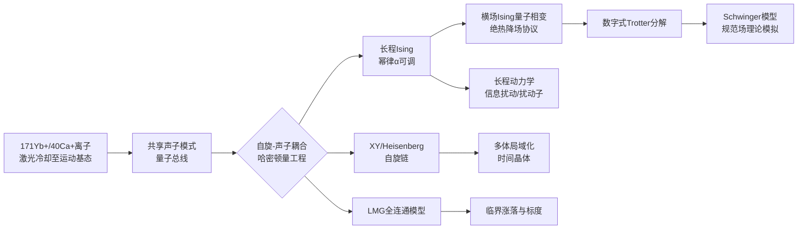

## 3.5 高保真度、长相干时间与全连通性的核心优势

将上述物理基础、哈密顿量工程能力与实验成果置于横向比较的视角下，可以归纳出囚禁离子平台在量子模拟器谱系中的三大核心优势——这三项优势在很大程度上奠定了其作为"高质量量子比特"代表的地位。

**第一，门保真度处于各物理平台领先水平**。囚禁离子的单比特门保真度通常可达 $99.99\%$ 以上，双比特Mølmer–Sørensen门保真度典型值在 $99.9\%$ 量级。这一领先地位的物理根源在于：囚禁离子的内部能级结构由原子物理基本规律严格决定，几乎不受样品差异影响，使得不同离子间的"频率均匀性"达到原子物理精度；其与外界环境的耦合主要通过激光与微波场，因而可通过精细的激光稳频、磁场屏蔽与脉冲整形系统抑制噪声；Mølmer–Sørensen门设计本身对声子初态不敏感，对一定范围内的运动加热具有内禀鲁棒性。这种"原子物理精度 + 鲁棒门设计"的组合，使囚禁离子门保真度长期处于量子比特平台的最前列。

**第二，相干时间可达数百秒乃至小时量级**。$^{171}\text{Yb}^+$ 离子的超精细基态量子比特由于其能级对一阶磁场不敏感（"clock state"），具有极长的内禀相干时间。先前文献已报道单 $^{171}\text{Yb}^+$ 离子量子比特的相干时间达到660秒，**该结果通过协同冷却（sympathetic cooling）与动力学解耦脉冲克服了加热导致的探测低效与磁场涨落两大限制**[^18]。在此基础上，研究者进一步识别并抑制了限制相干性的剩余因素——**包括残余磁场涨落、微波参考振荡器的频率不稳定与泄漏问题**——最终在 $^{171}\text{Yb}^+$ 离子量子比特上观察到约5500秒（基于至960秒测量数据的指数衰减拟合时间常数）的相干时间[^18]。研究还系统地利用量子过程层析与量子记忆/相干性资源理论对退相干过程进行了刻画[^18]。**这一相干时间在所有量子比特平台中处于绝对领先地位**——相比之下，超导量子比特的退相干时间通常在数十至数百微秒量级，相差约10个数量级；这一巨大差距直接转化为囚禁离子在长时间多体演化、量子相变绝热扫描与量子存储等任务上的根本性优势。

**第三，声子总线赋予离子链天然的全连通拓扑**。如3.2节所论证，由于声子模式是离子链的共享自由度，任意两个离子均可通过同一组声子建立可控耦合，使得离子链在物理拓扑上呈现"全图"连通性。这一特征带来的直接后果是：在数字式模式下，任意两比特门均可一步直接实现，无需SWAP门链作远程纠缠传递，显著压缩Trotter电路深度；在模拟式模式下，幂律衰减的长程相互作用 $J_{ij}\propto |i-j|^{-\alpha}$ 可通过 $\alpha$ 的连续调节覆盖从近邻到全连通的整个区间，从而能够直接模拟传统固态平台无法天然实现的长程相互作用模型（如LMG模型、长程Ising反铁磁、长程量子磁性等）。**全连通性与高保真度门集合的结合，使囚禁离子在求解需要密集远程纠缠或长程相互作用的量子模拟问题上具有结构性优势**——这一点在与第4章超导电路平台的对比中将更为突出。

| 核心优势 | 典型量化指标（截至2021年初） | 物理根源 |
|---------|---------------------------|---------|
| 单比特门保真度 | $>99.99\%$ | 原子能级精度、稳频激光与微波操控 |
| 双比特门保真度 | $\sim 99.9\%$ | Mølmer–Sørensen门对声子初态不敏感、鲁棒性强 |
| 超精细量子比特相干时间 | 数百秒至 $\sim 5500$ 秒[^18] | 时钟态对磁场涨落不敏感、动力学解耦与协同冷却 |
| 连通性 | 全连通（声子总线） | 共享集体运动模式作为量子总线 |
| 比特数（线性阱） | 数十离子量级 | 线性Paul阱稳定囚禁与单链光学操控能力 |

需要强调的是，第2章末段所提到的"中性原子在比特数规模上领先"与本章所论证的"囚禁离子在保真度、相干性、连通性上领先"并不矛盾，而是反映了**两条物理路线在"规模 vs 质量"光谱上的互补定位**。在第8章的横向比较中，这一互补关系将得到系统化总结。

## 3.6 可扩展性瓶颈与门速率限制

囚禁离子平台的上述优势并不意味着其没有短板。事实上，**该平台在"质量"维度上的领先地位是以"规模"与"速率"两个维度上的固有瓶颈为代价的**。理解这些瓶颈对于把握囚禁离子在NISQ时代乃至容错量子计算时代的可行性边界至关重要。

**第一，单一线性阱内的离子数受声子谱密集化与控制复杂度的限制**。随着线性Paul阱内离子数 $N$ 的增加，集体声子模式的数目同步增长为 $3N$（每方向各一组），其频率分布在阱频率附近变得日益密集。当离子数超过数十时，相邻声子模式的频率间隔可能小于激光线宽与门操作的傅里叶带宽，导致**模式串扰**——本意只激发某一特定声子模式的激光会同时不可控地耦合到邻近模式，进而引入门误差。声子模式的密集化还使得对声子初态的精细控制（如全模式基态冷却）变得困难，限制了模拟式与数字式操作的保真度。**截至2021年初，单一线性阱内可被稳定相干操控的离子数典型规模约为数十离子**（Monroe团队的"IonQ"商用机已展示约11至32离子的量子计算演示，部分实验在50离子规模上演示量子模拟），与中性原子光晶格的数百至数千格点、里德堡阵列的256原子规模相比存在数量级差距。

**第二，运动模式串扰随离子数增加而加剧**。除上述谱密集化外，离子链中还存在阱不均匀、径向-轴向耦合、异常加热等多种非理想因素，使得在大规模链上对所有声子模式同步进行高保真度操控的难度显著增加。这一问题在二维库仑晶体（Penning阱）中表现为不同方向声子分支的耦合，需要更复杂的脉冲整形方案加以补偿。

**第三，声子介导的双比特门操作速率受限于阱频率与声子退相干**。Mølmer–Sørensen门的物理时间尺度由阱频率（典型值约1–10 MHz）所决定，单次双比特门的典型操作时间在数十至数百微秒量级。相比之下，超导电路平台的双比特门时间通常在数十至数百纳秒量级，**囚禁离子门速率比超导慢约2–3个数量级**。这一差距在执行需要大量门次的深层数字电路时显著放大——尽管囚禁离子的相干时间远长于超导，其"门次预算"（相干时间 / 门时间）仍可能受限于门速率而非相干性。此外，激光功率波动、声子加热与去相干等过程会进一步削弱长门序列的累积保真度。

**第四，激光寻址、光路稳定性与紫外光器件的工程复杂度**。囚禁离子的内部能级跃迁多位于可见光至紫外光（UV）波段（如 $^{171}\text{Yb}^+$ 的369 nm冷却光与355 nm拉曼光、$^9\text{Be}^+$ 的313 nm跃迁），UV激光的产生、稳频、光路对准与长期稳定性均显著难于近红外激光；单离子寻址要求聚焦激光的束腰小于离子间距（典型约5 μm），对光学系统的稳定性与抗振动能力提出极高要求。这些"看不见的"工程挑战使得囚禁离子实验系统的搭建与维护成本显著高于其他平台，是该路线扩展性面临的实际工程瓶颈之一。

针对上述可扩展性挑战，业界已发展出多条主流应对路径，并在2021年前后取得实质性进展。**QCCD（量子电荷耦合器件）模块化离子阱**采用分区设计：将大规模离子集合分为多个小阱区（"门区"与"存储区"），通过精心设计的电极电压程序实现离子在不同阱区间的高保真度物理穿梭与重排，使每次门操作仅在小规模子集（约2–10离子）上进行，从而避免了大规模单链的声子谱密集化问题。NIST、Honeywell（现Quantinuum）与Sandia等团队是该路线的主要推动者；Honeywell于2020–2021年公布的H1系统即基于QCCD架构，展示了10量子比特规模上的高保真度通用门操作，并在2021年宣称达到了当时量子卷积体的领先水平。**光子互联离子节点**则采用更激进的模块化策略：将每个"模块"作为一个小规模离子链（如10–50离子），不同模块之间通过单光子-离子纠缠生成与贝尔态测量建立远程纠缠，从而构造"网络化量子计算机"。Monroe团队（马里兰大学/Duke）与IonQ是该路线的代表，2020年前后已展示了模块间纠缠生成与远程操作的原理验证实验。这两条路径分别从"模块内重排"与"模块间纠缠"两个方向应对囚禁离子的扩展性瓶颈，构成了2021年前后该方向最具活力的工程演化趋势。

## 3.7 与中性原子平台的对比及在范式光谱中的定位

在完成对囚禁离子物理基础、哈密顿量工程、模拟成果与瓶颈应对的剖析之后，本节通过与第2章中性原子平台的对比，明确囚禁离子在量子模拟器谱系内的定位。下表汇总了二者在关键维度上的差异。

| 比较维度 | 囚禁离子方案 | 中性原子方案（光晶格 + 里德堡阵列） |
|---------|------------|-----------------------------------|
| 囚禁机制 | Paul/Penning阱，库仑相互作用强囚禁 | 光偶极势阱（光晶格/光镊），弱囚禁 |
| 相互作用机制 | 声子介导的长程自旋-自旋（$\alpha$可调）、Mølmer–Sørensen | 短程接触（光晶格Hubbard）/ 长程偶极（里德堡阻塞） |
| 连通性 | 天然全连通（声子总线） | 几何拓扑决定，本质局域；里德堡阵列可通过重构改变拓扑 |
| 比特规模（2021年初） | 数十离子（单链） | 数百至数千原子（光晶格）、256原子（里德堡阵列） |
| 单比特门保真度 | $>99.99\%$ | $\sim 99\%$ 量级 |
| 双比特门保真度 | $\sim 99.9\%$ | 里德堡阻塞门 $\sim 95\%$–$99\%$，受能级移位限制 |
| 量子比特相干时间 | $^{171}\text{Yb}^+$ 可达约5500秒[^18] | 光晶格秒量级；里德堡态数十至数百μs |
| 双比特门速率 | 数十至数百微秒/门 | 里德堡门约0.1–1 μs，光晶格演化连续 |
| 激光寻址难度 | UV-可见光，单离子聚焦 | 近红外/可见光，光镊单原子寻址常规化 |
| 范式定位 | 模拟式与数字式兼具，最贴近混合范式中心 | 模拟式为主、兼具混合能力 |
| 典型科学问题 | 长程Ising/XY/Heisenberg、LMG、Schwinger模型、动力学相变 | Hubbard模型、量子磁性、合成规范场、组合优化 |
| 模块化扩展路径 | QCCD离子阱、光子互联离子节点 | 光晶格量子气体显微镜、光镊原子重排算法 |

从这一对比可以提炼出三个核心结论。**第一，囚禁离子与中性原子在物理特征上呈现明确的互补性而非相互替代**：囚禁离子以"高质量、全连通、双模适配"见长，更适合需要密集远程纠缠、长程相互作用、精确临界标度刻画的量子模拟问题（如LMG模型、长程Ising相变、规范场理论数字模拟）；中性原子以"大规模、可重构几何、参数连续可调"见长，更适合需要数百至数千格点并行演化、特定几何依赖的量子模拟问题（如Hubbard相图扫描、量子磁性、特定图论结构上的优化任务）。**这两条主线共同构成了原子物理路线在量子模拟器谱系内的"质量—规模"双翼**。

**第二，二者在第1章范式光谱上的定位明显不同**。中性原子（特别是光晶格方案）以模拟式为主体，里德堡阵列因阻塞门的数字化特性而更接近混合范式；囚禁离子则同时具备高质量的模拟式原语（全局Mølmer–Sørensen耦合）与高保真度的数字式门集合，且二者可在同一硬件上无缝切换并自然结合，因此在范式光谱上**占据最贴近"数字-模拟混合范式中心"的位置**。这一定位决定了囚禁离子在变分量子算法、混合优化、错误缓解等NISQ时代关键议题上具有最为完整的硬件适配能力。

**第三，本章所建立的囚禁离子谱系图景为后续章节的对照分析提供了关键参照**。在第4章将要讨论的超导电路平台上，其优势集中于工艺成熟度、门速率与可集成性，但在相干时间与连通性上明显逊于囚禁离子；在第5、6章的光子学与固态自旋平台上，囚禁离子的全连通性与高保真度优势则将进一步凸显。**囚禁离子与超导电路之间在"模拟式优势 vs 数字式优势"以及"质量 vs 速率"上的对比，将是第4章展开时的重要逻辑切入点**——超导电路以快速门操作和大规模工艺集成为长，囚禁离子以高质量比特和长相干时间为长，二者共同代表了通用门量子计算路线在不同物理载体上的两条主流实现。

综上，囚禁离子量子模拟器以**Paul/Penning阱囚禁、激光冷却至运动基态、声子总线介导的长程相互作用、超精细/光学钟跃迁编码的高质量量子比特**为物理基石，在过去二十余年间从1997年Wineland、Monroe等人最初提出的单离子模拟构想[^10]发展为当代量子模拟器谱系中"最贴近混合范式中心"的代表平台。其在长程Ising相变、LMG模型、时间晶体、Schwinger模型等具体科学问题上的实证性进展，连同 $^{171}\text{Yb}^+$ 离子约5500秒相干时间[^18]、$>99.9\%$ 门保真度与全连通性等领先指标，共同确立了其在量子模拟实验科学中的核心地位；而QCCD模块化与光子互联两条扩展路径的并行推进，则预示着囚禁离子将在通向大规模、可验证、实用化量子模拟器的道路上继续发挥不可替代的作用。下一章将转向另一条主流物理路线——基于Josephson结构建超导量子比特的超导电路量子模拟器，并在与本章的对比中进一步揭示量子模拟器实现谱系的多样性与互补性。

# 4 超导电路量子模拟器架构

在完成对中性原子与囚禁离子两条原子物理路线的剖析之后，本章进入量子模拟器物理实现谱系的第三条主线——**基于Josephson结构建的超导电路量子模拟器**。如果说原子物理路线以"自然给定的微观系统"为出发点，依托原子能级的物理稳定性获得高质量量子比特，那么超导电路路线则采取了截然相反的策略：**它以"人工设计的宏观量子系统"为出发点，通过半导体微纳工艺在芯片上"制造"出具有原子般离散能级结构的电路元件**，从而以工程化方式获得可设计、可批量制造、可与传统集成电路工艺接口的量子比特。这一根本性的策略差异，决定了超导电路平台在工艺成熟度、门速率与可集成性上的领先优势，同时也带来了在相干时间与连通性上的固有挑战。

正是这种"工程化路线"的特征，使超导电路在第1章所确立的范式光谱中典型地占据**"数字式为主、兼具混合范式能力"**的位置——它从一开始便围绕通用门集合构建，其物理实现与数字量子计算的电路模型高度同构，使其成为执行Trotter–Suzuki分解、变分量子本征求解器（VQE）、随机量子线路采样等数字式与混合式任务的核心载体。2025年诺贝尔物理学奖授予John Clarke、Michel Devoret与John Martinis三人，表彰其在1984—1985年间于超导电路上演示的"宏观量子隧穿和能量量子化"，正是对这一物理路线深远科学价值的最高认可——**他们让量子力学在一块可以握在手心的芯片上变得可见**[^21]。本章将依次剖析超导电路的物理基础、操控与连接机制、双模能力、标志性应用、核心优势与工程瓶颈，并在末节通过多维对比建立其在量子模拟器谱系内的差异化定位。

## 4.1 超导电路平台的物理基础与Josephson结量子比特设计

超导电路量子比特赖以建立的物理基础，可以从一个看似简单却极为关键的洞察开始：**要在宏观尺度的电路中构造出原子般的离散能级结构，唯一缺失的元件是"非线性、非耗散的电感"**。普通的电感与电容仅能构成线性LC谐振子，其能级间距均匀，无法被选择性寻址；电阻虽提供非线性，但同时引入耗散，破坏量子相干性。在所有已知的电路元件中，唯有**Josephson结**——由两块超导电极通过一层超薄绝缘层（典型为Al-Al₂O₃-Al结构）耦合而成的隧道结——同时满足"非线性"与"非耗散"两项苛刻要求。其电流-相位关系遵循 $I = I_c \sin\phi$，对应一个非线性电感 $L_J = \hbar/(2eI_c\cos\phi)$；在超导态下，库珀对通过结的隧穿过程是相干的，不引入耗散。正是Josephson结这一独特的非线性电感特性，构成了所有超导量子比特设计的物理基石。

围绕Josephson结的电路设计，过去二十余年间演化出三类原型方案。**电荷比特（Cooper对盒子，CPB）**最早由代尔夫特理工大学等团队于1990年代末提出，其核心结构是"超导岛-约瑟夫森结-超导库"——超导岛通过极薄的Josephson结与超导库相连，岛被一个小电容隔离，使岛上的库珀对数量可被精确调控；量子比特的两个基态对应"岛上有 $n$ 个库珀对"与"岛上有 $n+1$ 个库珀对"两种电荷数本征态[^12]。然而，电荷比特对**电荷噪声极其敏感**：环境中随机的电荷波动（如衬底中的杂质电荷、外部电场变化）会直接改变岛上的电荷数，导致量子态在纳秒量级内退相干，远不足以满足量子计算对稳定性的基本要求[^12]。**相位比特**与**磁通比特**则分别将量子信息编码于Josephson结两端的相位差或多结超导回路中的磁通自由度，各自面临磁通噪声或临界电流噪声的限制。这三类早期方案虽然在原理上验证了"宏观人工原子"的可行性，但相干时间均难以突破微秒门槛，是超导量子计算长期面临的核心瓶颈。

**2007年，由加州大学圣巴巴拉分校（UCSB）的John Martinis团队与代尔夫特理工大学合作提出的Transmon比特，从根本上扭转了这一局面**[^12]。Transmon——名称源于"transmission line shunted plasma oscillation qubit"，即"传输线分流等离子体振荡量子比特"——的核心创新是在电荷比特的超导岛与地之间引入一个**大分流电容**（通常为皮法级，是电荷比特岛电容的10–100倍），使岛上的电荷数不再处于"离散锁定"状态，而是呈现出"电荷弥散"特性；量子态不再依赖具体的电荷数，而是由"库珀对的相位振荡"主导[^12]。其哈密顿量可写为：

$$H = 4E_C(\hat{n}-n_g)^2 - E_J\cos\hat\phi$$

其中 $E_C = e^2/2C$ 为充电能、$E_J$ 为约瑟夫森能、$\hat n$ 为库珀对数算符、$\hat\phi$ 为相位差算符、$n_g$ 为偏移电荷[^22]。Transmon的关键设计准则是**令 $E_J/E_C \gg 1$**（通常比值约为50或更高）——在此区域内，电荷色散（即量子比特频率对偏移电荷 $n_g$ 的依赖）被**指数地抑制**：

$$\text{Charge dispersion} \propto \exp(-\sqrt{8E_J/E_C})$$

实验验证显示，当 $E_J/E_C$ 从约10增加到29时，量子比特频率对 $n_g$ 的调制从74 MHz降至低于1 MHz，确认了这一指数噪声抑制机制[^22]。与此同时，Transmon势能的余弦形式赋予其非谐性结构——基态-第一激发态跃迁频率 $\omega_{01} \approx \sqrt{8E_CE_J} - E_C$，而 $\omega_{12} \approx \omega_{01} - E_C$，二者频率间隔由充电能 $E_C$ 提供，**允许通过频率选择性的微波脉冲精确寻址 $|0\rangle\leftrightarrow|1\rangle$ 跃迁而不泄漏到 $|2\rangle$ 态**[^22]。这种"对电荷噪声的指数抑制 + 适度非谐性保证比特选择性"的设计组合，将Transmon的相干时间 $T_1$ 从电荷比特的纳秒级一举提升至**100–200微秒**乃至更高，单量子比特门保真度超过99.9%[^22]，从而**为超导量子计算从实验室原型向规模化系统迈进奠定了基础**[^12]。

值得一提的是，Transmon的提出者John Martinis本人，正是2019年Google "量子霸权"实验背后的主要推手；2025年诺贝尔物理学奖授予他与John Clarke、Michel Devoret三人，以表彰他们对宏观量子隧穿与能量量子化的开创性演示[^21]。Devoret目前担任Google Quantum AI首席科学家[^21]，这一师承与团队关系折射出Transmon物理路线在工业界量子计算研发中的核心地位。截至2021年初，**Transmon已成为IBM、Google、Rigetti等全球主流量子计算平台的事实标准**[^12]，是当前超导量子比特平台中绝对主导的物理实现。在Transmon主路线之外，Fluxonium、$0$-$\pi$ 比特、Cat态比特等新型超导比特方案也在持续演化，分别在更强非谐性、更长相干时间或对特定噪声的内禀保护上探索新的可能性，但其大规模工程化尚未达到Transmon的成熟度。

| 比特类型 | 典型 $E_J/E_C$ | 主导自由度 | 典型 $T_1$/$T_2$ | 关键问题 |
|---------|---------------|-----------|------------------|---------|
| Cooper对盒子（电荷比特） | $\sim 1$ | 库珀对数 | 纳秒级 | 电荷噪声敏感[^12] |
| 相位比特 | 大 | Josephson结相位 | 微秒级 | 临界电流噪声 |
| 磁通比特 | 中等 | 回路磁通 | 微秒至数十微秒 | 磁通噪声 |
| Transmon（主流） | $\gg 1$（约50） | 相位振荡 | 100–200微秒，单门 $>99.9\%$[^22] | 适度非谐性，需精细频率管理[^22] |

## 4.2 微波量子操控、读出与片上连接拓扑工程

在确立了Transmon作为主流物理实现的基础之上，超导电路平台的量子操控与连接机制可被概括为一个紧密耦合的三层架构：**微波驱动实现单/双比特门、色散读出+参量放大链路实现高保真度读出、片上几何拓扑实现量子比特间连接**。这一架构的核心特征是**所有操控信号均位于微波波段**（典型频率4–8 GHz），与传统射频/微波电子学高度兼容，是超导平台工艺成熟度的重要来源。

**单比特门**通过将共振微波脉冲耦合至Transmon比特，在Bloch球上实现任意单比特旋转。典型的Transmon比特$|0\rangle\leftrightarrow|1\rangle$跃迁频率位于约5 GHz，单比特门时间通常在20–50 ns量级，门保真度可达 $>99.9\%$[^22]。为避免对邻近 $|1\rangle\leftrightarrow|2\rangle$ 跃迁的泄漏，实际操控中广泛采用**DRAG（Derivative Removal by Adiabatic Gate）脉冲整形**，通过在驱动脉冲中加入正交分量补偿非谐性导致的能级泄漏。

**双比特门**是超导电路量子模拟器的核心难点，也是不同团队技术分野最为突出的领域。Google Sycamore采用基于**可调耦合器**的iSWAP/CZ类门：通过在两个Transmon之间引入第三个可调频率的耦合元件，研究者可动态地开关比特间的有效耦合强度，从而在毫秒级"关闭"状态与纳秒级"开启"状态之间快速切换；这一方案的优势在于**串扰可被主动抑制**——当门未执行时，耦合可被精确调至零。IBM则长期采用**固定频率Transmon + cross-resonance门**方案：通过向一个比特施加另一个比特频率的微波驱动，激活二者之间的有效ZX耦合，从而无需可调元件即可实现纠缠门；该方案的优势在于硬件简洁、相干性受额外可调元件影响较小，但要求精细的频率分配以避免比特间的频率碰撞。截至2021年初，主流团队的双比特门时间普遍位于**数十至数百纳秒**量级，门保真度典型在99%–99.5%之间，是制约电路深度的关键参数。

**读出**采用**色散读出（dispersive readout）**方案：每个Transmon比特通过电容耦合至一个高品质因数的微波谐振器，二者频率相差远大于耦合强度，处于色散区；此时比特状态会引起谐振器频率的微小移位（color shift），通过向谐振器注入探测微波并测量反射或透射信号的相位/振幅，即可推断比特状态。为避免谐振器对比特带来额外的弛豫（Purcell效应），实际器件中广泛采用**Purcell滤波器**进行频谱整形；为将读出信号在量子噪声极限附近放大，**约瑟夫森参量放大器（JPA）与行波参量放大器（TWPA）**构成了低温读出链路的关键环节。这一"色散读出 + Purcell滤波 + TWPA放大"的标准链路使单次读出保真度可达 $>98\%$，是NISQ时代实现高效量子算法运行的关键。

**片上连接拓扑**则反映了不同团队对"近邻耦合范围 vs 串扰控制"的不同权衡。Google Sycamore采用**方形格点近邻耦合**——53/54个Transmon比特排成阵列，每个比特最多与4个邻近比特耦合，耦合强度通过可调耦合器在0至约40 MHz范围内可调[^19]。这一拓扑兼顾了连接度与可控性，是Google在"量子霸权"实验中达成5×5、7×7等阵列扩展的物理基础[^21]。IBM自2021年起在其Falcon、Eagle、Osprey与Condor系列处理器中采用**重六边形晶格（Heavy-Hexagonal Lattice）**架构：顶点放置数据量子比特，边上放置中间辅助量子比特，每个比特最多连接2–3个邻近比特[^22]。这一低连接度设计的核心目的是**最小化固定频率Transmon之间的频率碰撞错误，同时降低串扰**[^22]；其代价是降低了与标准表面码（要求每比特连接4个邻居）的天然兼容性，需通过SWAP嵌入策略等补偿方案应对[^22]。

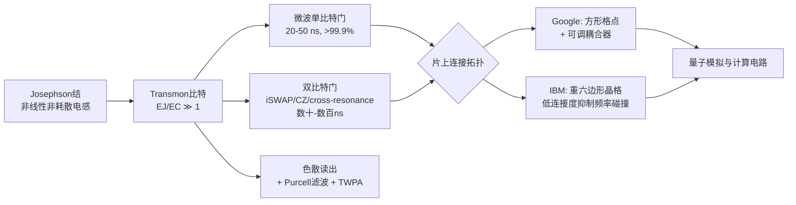

**与第3章囚禁离子的全连通声子总线相对照，超导电路的连接拓扑本质上是局域近邻的**——这是其作为固态平台的物理结果：Transmon比特通过物理上邻近的电容或耦合器实现耦合，远程纠缠必须依赖SWAP门链将量子信息在阵列中传递。这一结构性差异决定了在求解需要密集远程纠缠或长程相互作用的量子模拟问题时，超导电路相比囚禁离子需要更深的电路深度。但与此同时，**近邻拓扑的工艺简洁性与可扩展性也是超导平台得以快速达到数十至上百比特规模的物理基础**——这一"速率与可集成性 vs 全连通性"的权衡，将在末节的横向对比中得到进一步展开。

## 4.3 数字式量子模拟与数字-模拟混合范式在超导平台的实现

在第1章所确立的"模拟式—混合式—数字式"范式光谱上，超导电路平台典型地占据**"数字式为主、兼具混合范式能力"**的位置。这一定位的物理根源在于：Transmon比特从设计之初便围绕通用门集合构建，其单/双比特门与数字量子计算的电路模型严格同构，使其成为执行Trotter–Suzuki分解、变分量子本征求解器（VQE）、量子近似优化算法（QAOA）等数字式量子模拟方案的天然载体。

**数字式量子模拟**在超导电路上的实现遵循第1章所述的标准范式：将目标哈密顿量 $H = \sum_k H_k$ 通过Trotter分解离散化为一系列局部演化算符 $e^{-iH_k \Delta t}$，再将每一个局部算符进一步编译为通用门集合中的单比特门与双比特门序列。例如，对于横场Ising模型 $H = -J\sum_{\langle i,j\rangle} \sigma_i^z\sigma_j^z - h\sum_i \sigma_i^x$，可分别用 $e^{-iJ\Delta t\,\sigma_i^z\sigma_j^z}$（通过CZ门和单比特旋转构造）与 $e^{-ih\Delta t\,\sigma_i^x}$（通过单比特X旋转构造）的交替组合实现Trotter电路。这一编译方案的灵活性使**同一台超导处理器可通过软件配置模拟Hubbard模型、自旋链、规范场理论等多种哈密顿量**，呈现出数字式范式的"通用适配能力"。Sabín于2020年发表的工作正是这一灵活性的延伸性体现——研究者基于IBM Q 5 Tenerife处理器，**通过结合数字化技术与玻色子-量子比特映射，将原本通常在模拟式模拟器中考虑的线性与非线性量子光学问题（如动力学Casimir效应与分子力场）数字化地实现于超导比特网络之上**[^23]。这表明数字式范式在超导平台上能够将模拟式范式所擅长的问题领域纳入其能力范畴，**从而扩展了数字化的潜在物理问题边界**[^23]。

然而，纯粹的数字式范式在NISQ时代的超导平台上面临**Trotter误差与退相干误差的双重制约**。一阶Trotter分解的误差以 $O(\Delta t^2)$ 衰减——要降低Trotter误差需更小的步长，但更小步长意味着更多门次，而每次双比特门均引入约 $10^{-2}$–$10^{-3}$ 量级的物理错误。Babbush等人对量子化学问题Trotter资源的估算显示，即便是中等规模的化学分子精确模拟也常需数百万次门操作——这一规模在当前NISQ硬件上远超相干时间允许的"门次预算"。**Trotter误差与退相干误差之间存在的最优折中**，是制约数字式量子模拟在超导平台上发挥科学价值的核心张力。

**数字-模拟混合范式**正是在这一张力下兴起的关键应对策略。其基本逻辑在第1章已作概念铺垫，本节聚焦于其在超导平台上的具体实现路径。该范式的核心思想是：**利用比特间天然存在的cross-talk（耦合串扰）或可调耦合作为"模拟原语"，而非将其作为需要主动抑制的噪声**；结合稀疏的单比特门以精细编辑相位与振幅，从而以更少门次实现等价Trotter电路的演化效果。

一项基于IBM超导处理器的代表性研究系统性地验证了这一路径。研究者在不使用标准双比特门的情况下，**利用IBM超导处理器中比特间的cross-talk（耦合）模拟了横场Ising模型自旋簇的Trotter化动力学，并将所得结果与基于通用门集合的传统数字方法计算结果进行对比**[^24]。比较结果显示，**尽管IBM处理器中的cross-talk较弱，数字-模拟方法仍显著优于标准数字方法**[^24]——这一发现的核心物理含义是，**当前NISQ硬件上"被动允许"的多体耦合，相比"主动构造"的两比特门，能够以更少的噪声成本提供等价的多体演化能力**。研究者进一步指出，**数字-模拟量子计算的效率可借助更专门化的处理器进一步提升，从而可被用于高效实现其他量子算法**[^24]。这一论断与第1章末段对混合范式作为NISQ时代主导路径的判断高度一致——**混合范式不仅是工程妥协，更可能是超导平台在通用容错量子计算尚未到来之前发挥实际科学价值的可持续路径**。

除上述两条主线之外，**变分量子算法**（VQE、QAOA等）构成了超导平台数字-模拟混合范式的另一重要应用形态。在这类算法中，超导硬件以参数化量子电路（通常采用低深度数字电路或硬件高效的"hardware-efficient ansatz"）制备试探波函数，经典优化器迭代调整电路参数以最小化目标哈密顿量的期望值或代价函数。这一框架将硬件层的有限相干时间与算法层的迭代优化耦合在一起，**显著降低了对单次电路深度的要求**，是当前超导平台求解量子化学基态、组合优化问题的主流方案。Google、IBM、Rigetti等团队在2019—2021年间发布的多项里程碑式工作均属于这一范畴。

## 4.4 在强关联多体物理、拓扑相与玻色子采样中的应用能力

截至2021年初，超导电路量子模拟器已在三类问题上累积了具有标志性意义的实证性进展。**这三类问题的共同特征是，它们均充分利用了超导平台"数字式可编程 + 大规模可控"的双重能力**，并在不同维度上推动了量子模拟器从概念验证向科学发现引擎的演化。

**第一类是强关联多体物理的数字式与混合式模拟**。这一方向涵盖横场Ising模型、Hubbard型模型、自旋链动力学、多体局域化、信息扰动（information scrambling）与扰动子（scrambler）等核心问题。Google团队基于Sycamore处理器开展了一系列代表性工作：在数字式模式下通过Trotter电路模拟一维与二维横场Ising模型的淬火动力学，观测信息传播的有效因果光锥；在混合式模式下利用比特间的天然耦合作为模拟原语，结合稀疏单比特门以更少门次实现等价的多体演化。前文提到的基于IBM处理器的横场Ising模型混合模拟工作进一步验证了**数字-模拟方法在自旋簇动力学问题上相对标准数字方法的显著优势**[^24]，这是超导平台在强关联问题上"以混合范式应对NISQ硬件限制"的典型实证。在多体局域化方向，研究者通过引入格点依赖的局域无序场，观测到系统在足够强无序下偏离热化的特征行为；在信息扰动方向，超导阵列上的"扰动子电路"（scrambling circuit）演示了量子信息在多体系统中的快速扩散，是黑洞信息悖论与全息原理在实验上的初步类比。

**第二类是拓扑相与合成规范场模拟**。可编程超导阵列通过精心设计的复数耦合相位与时间反演破缺协议，可在比特阵列上工程化生成有效磁场或Berry相，从而构造出具有拓扑能带结构的合成体系。Google与UCSB团队在2018—2020年间的多项工作演示了在小规模超导阵列上的拓扑能带探测、边缘态识别与Chern数测量；这些工作虽然规模有限（典型为十比特至二十比特量级），但**清晰地展示了超导平台作为"可编程合成规范场实验平台"的能力**——其优势在于规范场的具体形式可通过软件配置而非物理重构来设定，与冷原子光晶格中需要重新设计激光配置的合成规范场方案形成对比。

**第三类，也是2019—2021年间最具标志性意义的方向，是玻色子采样类与随机线路采样（RCS）问题**。**2019年10月，Google在《Nature》杂志发表论文，宣称其53量子比特超导处理器Sycamore在一项随机量子线路采样任务上以约200秒完成了当时世界最强超算（橡树岭"Summit"）估计需约一万年的运算**[^21][^19]。这一事件以"量子霸权"（quantum supremacy）之名被命名，是超导平台进入大规模可控阶段的标志性节点[^21]。论文摘要指出：研究者**使用具有可编程超导量子比特的处理器创建了53量子比特的量子态，占据了 $2^{53}\sim 10^{16}$ 维的状态空间**[^19]；重复性实验得到的测量值对相应的概率分布进行采样，并利用经典模拟加以验证；**该处理器约200秒即可对量子电路采样100万次，相对所有已知的经典算法实现了巨大的速度提升**[^19]。

值得指出的是，这一实验的意义随即引发了业界激烈争论。**IBM在Google论文发表两天后发表反驳：如果采用优化的经典算法并调动足够的磁盘存储，同样的任务实际上只需约2.5天即可完成**[^21]。从技术角度看，双方均未撒谎——RCS本就是专门设计来让量子计算机发挥优势的特定任务，经典算法当然可以持续优化[^21]。这一争论催生了术语的演化：**"量子霸权"一词在业内被悄悄放弃，Google、IBM等公司改口使用更谨慎的"量子优势"（quantum advantage）表述**，潘建伟团队2020年发布"九章"光量子计算机时亦采用相同表述[^21]。这一术语演化本身反映了量子计算社区对"特定任务专属优势"与"实用价值"之间关系的反思——**一个需要专门选题才能赢的"霸权"，究竟在证明什么**[^21]？尽管如此，Google Sycamore实验仍然构成了**超导平台在"大规模可控量子态制备能力"上的标志性里程碑**：它首次证明53比特量级的超导处理器已能进入经典模拟资源极限之外的状态空间，并为后续超导平台向数百比特规模演化奠定了工程信心。麻省理工学院量子物理博士在读的@少司命对该实验的硬件细节解读为：**"谷歌家一直用的是超导电路系统，这里是54个物理比特（transmon）排成阵列，每个比特可以与临近的四个比特耦合在一起，耦合强度可调（从0到大概40MHz）"**[^19]。

在Sycamore实验之后，超导平台继续沿着"更大规模 + 更高质量"的双重方向演化。**2024年12月推出的Google Willow芯片首次在实验中实现了"越多量子比特、错误率越低"的指数级缩减——在3×3、5×5、7×7的量子比特阵列上，每次扩大规模错误率减半，突破了量子纠错领域近三十年来首次被真正验证的"低于阈值"（below threshold）门槛**[^21]。需要说明的是，Willow芯片的成果已显著超出本报告"截至2021年初"的时间边界，因此在此仅作为脉络性提及——其因果链直接承接2019年Sycamore实验所开启的大规模可控阶段，**显示出超导平台从量子优势演示向容错量子计算迈进的演化方向**。

## 4.5 工艺成熟度、门速率与可集成性的核心优势

将上述物理基础、操控机制、范式定位与应用成果置于横向比较的视角下，可以系统归纳超导电路平台相对于其他物理实现的四项核心优势。**这四项优势的共同物理根源都可以追溯到超导比特"以人工设计的宏观电路构造人工原子"的工程化策略**——这一策略将量子比特纳入半导体工艺的能力边界，从而获得规模化与产业化的结构性优势。

**第一，半导体微纳加工工艺高度成熟**。超导比特可在硅或蓝宝石衬底上通过光刻、薄膜沉积、电子束曝光等标准半导体工艺规模化制造，其中Josephson结的制备依赖电子束曝光与Dolan桥或Manhattan型双角度蒸发技术，已在多家代工厂与学术clean room实现稳定批量化。这一工艺路线与传统CMOS工艺共享大量基础设施，**使超导平台具备从数十到数百比特的批量化生产能力**——IBM从27比特Falcon、65比特Hummingbird、127比特Eagle到433比特Osprey、1121比特Condor的迭代演进[^22]，正是这一工艺优势的直接体现。相比之下，囚禁离子的扩展需要依赖QCCD分区设计或光子互联节点，中性原子的扩展需要光晶格几何调整或光镊重排算法，二者均无法享受半导体工艺的"摩尔定律式"批量化扩展红利。

**第二，门操控速率极快**。超导电路的单比特门时间在20–50 ns量级，双比特门时间在数十至数百ns量级，**比囚禁离子的微秒至百微秒级双比特门快约2–3个数量级**。这一速率优势的物理根源在于：超导比特的能级间距（典型约5 GHz）远高于囚禁离子的超精细分裂频率（典型约12.6 GHz量级，但门速率受声子模式频率限制在约1–10 MHz），且驱动场可被设计为强耦合微波脉冲而非依赖原子-光场相互作用。**虽然超导比特的相干时间（100–300 μs）远短于囚禁离子（数百秒至数千秒），但"相干时间/门时间"的门次预算反而具有结构性优势**——典型超导比特可在相干时间内执行约 $10^3$–$10^4$ 次门操作，与囚禁离子在量级上相当，且可被快速执行完毕，有利于在NISQ时代执行实时迭代的混合量子-经典算法。

**第三，片上可集成性强**。超导比特、可调耦合器、读出谐振器、Purcell滤波器、参量放大器等核心元件均可设计于同一芯片之上，通过工程化的耦合电容、共面波导、传输线等微波元件互连，形成完整的"片上量子处理器"。这一集成度还可向下游延伸至**与经典CMOS控制电子学的接口**——目前低温CMOS、超导单磁通量子（SFQ）等近比特控制方案正在被探索，未来有望在稀释制冷机的低温级直接实现部分控制功能，进一步降低布线复杂度。这一可集成性是与现代电子工业生态最为契合的物理实现方式，也是超导平台获得Google、IBM、Intel、Microsoft等科技巨头持续投入的核心原因。

**第四，与量子算法生态深度耦合，是产业化推进最快的量子模拟与计算平台**。IBM的Qiskit、Google的Cirq、Rigetti的pyQuil等开源量子编程框架均围绕超导硬件特性构建，**已积累了大规模的算法库、错误缓解技术、编译器优化与基准测试方法学**。IBM Quantum云平台向全球用户开放数十至上百比特超导处理器的实时访问，截至2021年初已有数以万计的研究者通过该平台开展量子算法实验。这一"硬件-软件-生态-用户"的完整闭环是其他物理平台尚未完全建立的，是超导电路在NISQ时代占据产业化主导地位的关键。

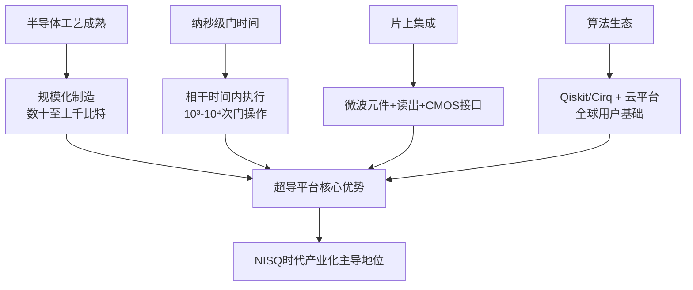

## 4.6 退相干、布线串扰与稀释制冷规模化的核心挑战

超导电路平台的上述优势伴随着同样不可忽视的工程瓶颈。**这些瓶颈的物理根源同样可以追溯到其作为"人工固态量子系统"的本质——人工设计带来的灵活性同时引入了人工固态系统固有的退相干源、工程复杂度与制冷需求**。理解这些瓶颈对于把握超导平台在通向大规模、可验证、实用化量子模拟器的道路上必须突破的关键点至关重要。

**第一，退相干时间相对较短**。Transmon比特的 $T_1$（弛豫时间）与 $T_2$（相干时间）典型在100–300 μs量级[^22]，**远低于囚禁离子的秒至小时量级**，限制了可执行的电路深度。退相干来源主要包括：**两能级系统（TLS）缺陷**——衬底-超导薄膜界面与Josephson结氧化层中的非晶态缺陷会形成与比特频率近共振的双能级系统，吸收比特能量；**介质损耗**——衬底、超导薄膜、封装材料中的高频损耗机制；**准粒子毒化**——超导能隙中残留的非配对电子（准粒子）通过结的隧穿过程引起比特弛豫；**磁通噪声**——SQUID环路或可调元件中的 $1/f$ 磁通涨落。围绕这些退相干源的工程改进——包括衬底处理、超导薄膜质量提升、3D Transmon结构、磁场屏蔽等——是过去十年超导平台 $T_1$ 从纳秒级提升至数百微秒级的核心驱动。但物理学意义上的进一步提升受限于材料科学瓶颈，使超导比特相干时间难以在短期内追平囚禁离子的水平。

**第二，频率碰撞与串扰随比特数增加而加剧**。固定频率Transmon阵列在制造过程中由于Josephson结参数的不可避免分布，比特频率呈现一定的随机性；当阵列规模增加时，**邻近比特之间的频率间隔可能小于双比特门所需的频率分离**，导致"频率碰撞"——本意只激发某一比特的微波信号同时不可控地驱动邻近比特，引入门误差。IBM采用重六边形晶格架构的核心动机正是**最小化固定频率Transmon间的频率碰撞错误，同时降低串扰**[^22]——通过将每个比特的连接度限制在2–3个，频率分配的组合困难得到显著缓解。然而，**这种低连接度设计与表面码（要求每比特连接4个邻居）的天然不兼容性又加重了表面码实现时的SWAP嵌入开销**[^22]——这构成了一个工程上的两难权衡：高连接度便于纠错码实现但加剧频率碰撞，低连接度抑制串扰但增加纠错开销。Google通过可调耦合器在每对比特间引入主动开关来回避频率碰撞问题，但代价是可调元件本身引入额外的相干性退化与制造复杂度。

**第三，布线复杂度急剧上升**。每个超导比特通常需要数根专用微波线：单比特驱动线、读出输入/输出线、可调耦合控制线、磁通偏置线等。当阵列规模从数十比特扩展至数百乃至上千比特时，**所需的同轴电缆、衰减器、滤波器、循环器与封装电路的数量呈线性甚至超线性增长**，对低温电缆密度、热预算、机械稳定性与封装工艺构成严峻挑战。一台典型的127比特IBM Eagle处理器需要数百根同轴电缆从室温级延伸至15 mK的稀释制冷机最冷级，每根电缆均需经过精心设计的热锚定与衰减以避免热噪声进入比特级。这一"电缆瓶颈"是当前超导平台从百比特向千比特乃至万比特扩展的核心物理约束之一。

**第四，稀释制冷机的冷量、空间与功耗成为大规模扩展的物理约束**。Transmon比特需要在约15–20 mK的极低温环境下运行，以确保 $k_BT \ll \hbar\omega_q$（典型 $\omega_q/2\pi \approx 5$ GHz对应 $\sim 240$ mK），避免热激发干扰量子态。稀释制冷机在最冷级的冷量典型仅为10–50 μW量级，必须严格控制从高温级泄漏到最冷级的微波光子噪声、辐射热与电缆传导热。**随着比特数与电缆数的增加，热预算迅速逼近物理极限**——这一约束催生了对**低温CMOS与超导单磁通量子（SFQ）控制方案**的探索：将部分控制电子学从室温移至4 K或100 mK级低温环境，从而显著降低高低温之间的电缆与热负载需求。这一方向在2020年前后已有初步演示，被视为通向大规模超导量子处理器的关键工程路径。

| 工程瓶颈 | 典型量化（截至2021年初） | 物理根源 | 主流应对策略 |
|---------|-----------------------|---------|------------|
| 相干时间 | $T_1, T_2 \sim 100$–300 μs[^22] | TLS缺陷、介质损耗、准粒子毒化 | 材料改进、3D结构、磁场屏蔽 |
| 频率碰撞与串扰 | 阵列规模增加时显著加剧 | 固定频率Transmon制造分散 | 可调耦合器（Google）/重六边形低连接度（IBM）[^22] |
| 布线复杂度 | 数百根同轴电缆/百比特处理器 | 每比特需多根专用控制/读出线 | 多层封装、低温PCB、近比特控制 |
| 制冷规模化 | 最冷级冷量 10–50 μW | $k_BT \ll \hbar\omega_q$ 要求15–20 mK | 低温CMOS、SFQ控制、片上集成 |

## 4.7 与囚禁离子及中性原子平台的对比及范式光谱定位

在系统剖析超导电路平台的物理基础、操控机制、范式定位、应用成果、核心优势与工程瓶颈之后，本节通过与第2章中性原子（光晶格、里德堡阵列）、第3章囚禁离子三大平台的多维对比，确立超导电路在量子模拟器谱系内的差异化定位，并为第5章光子学平台的引入提供逻辑过渡。下表汇总了四类主要架构在关键维度上的差异。

| 比较维度 | 超导电路 | 囚禁离子 | 中性原子光晶格 | 里德堡阵列 |
|---------|---------|---------|---------------|-----------|
| 物理实现 | 人工固态电路（Josephson结+大电容）[^12] | 自然原子（Paul/Penning阱囚禁带电离子） | 自然原子（光晶格周期势囚禁） | 自然原子（光镊单原子阵列） |
| 比特规模（2021年初） | 数十至127比特（Sycamore 53、IBM Eagle 127） | 数十离子（单链） | 数百至数千格点 | 256原子 |
| 单比特门保真度 | $>99.9\%$[^22] | $>99.99\%$ | — | $\sim 99\%$ |
| 双比特门保真度 | $\sim 99\%$–$99.5\%$ | $\sim 99.9\%$ | — | $95\%$–$99\%$ |
| 双比特门时间 | 数十至数百 ns | 数十至数百 μs | 演化连续 | $\sim 0.1$–$1$ μs |
| 相干时间 | $T_1, T_2 \sim 100$–300 μs[^22] | 数百秒至 $\sim 5500$ 秒 | 秒量级 | 数十至数百 μs |
| 连通性 | 近邻（方形格点/重六边形）[^22] | 全连通（声子总线） | 几何固定 | 可重构 |
| 运行温度 | 15–20 mK（稀释制冷） | UHV + 激光冷却（mK内部态） | nK量级 | μK量级 |
| 工艺成熟度 | 极高（半导体微纳加工）[^12] | 中（UV激光+光路稳定） | 中高（光学系统） | 中高（高NA光镊+AOD/SLM） |
| 范式定位 | 数字式为主、兼具混合 | 模拟+数字双模，最贴近混合中心 | 模拟式主导 | 模拟式为主、兼具数字 |
| 典型科学问题 | 横场Ising、Hubbard、RCS、VQE、QAOA | 长程Ising、LMG、Schwinger、时间晶体 | Hubbard相图、量子磁性、合成规范场 | Ising/XY自旋模型、组合优化、量子相 |
| 产业化进展 | 最快（IBM/Google/Rigetti云平台） | 较快（IonQ、Honeywell/Quantinuum） | 学术为主 | 学术为主，初创公司涌现 |

从这一对比可以提炼出三个核心结论。**第一，超导电路与囚禁离子在"速率与可集成性 vs 质量与全连通性"上呈现高度互补的关系**。超导电路以纳秒级门时间、半导体工艺成熟度与片上可集成性为长，囚禁离子以高保真度门、长相干时间与全连通声子总线为长；二者代表了通用门量子计算路线在不同物理载体上的两条主流实现。在求解需要密集远程纠缠或长程相互作用的量子模拟问题（如LMG模型、长程Ising相变、规范场理论）时，囚禁离子的全连通性具有结构性优势；在求解需要大规模数字电路、快速迭代变分算法、或与现代算法生态深度耦合的问题时，超导电路的门速率与生态优势更为突出。

**第二，超导电路与中性原子在"离散门可编程 vs 大规模哈密顿量工程"上呈现明显的范式分野**。中性原子（特别是光晶格方案）以模拟式哈密顿量工程为核心范式，其优势在于"按需雕刻"Hubbard型多体哈密顿量并以数百至数千格点的规模并行演化；超导电路以离散通用门集合为核心范式，其优势在于通过软件配置灵活模拟任意局部哈密顿量。两条路线在数百比特规模上代表了**模拟式范式与数字式范式各自的最优工程实现**——前者以规模与连续可调性见长，后者以可编程灵活性与产业化深度见长。里德堡阵列则因其阻塞门的数字化特性，在范式光谱上位于二者之间，与超导电路的数字式特征有一定的相似性，但其底层物理仍为原子物理路线。

**第三，超导电路在第1章范式光谱上典型占据"数字式为主、兼具混合范式能力"的位置，是通向容错通用量子计算的主流硬件路径之一**。这一定位由以下事实共同支撑：(1) Transmon比特从设计之初便围绕通用门集合构建，与数字量子计算的电路模型严格同构[^22][^12]；(2) 数字-模拟混合范式在超导平台上得到了系统性的实验验证，**基于IBM处理器cross-talk的横场Ising混合模拟已证实其相对标准数字方法的显著优势**[^24]；(3) 数字化技术与玻色子-量子比特映射的结合扩展了超导平台数字化的潜在物理问题边界[^23]；(4) 2019年Sycamore实验展示了超导平台在大规模可控量子态制备上的能力[^21][^19]，2024年Willow芯片进一步演示了"低于阈值"的量子纠错[^21]，**这些进展共同表明超导电路正沿着"NISQ量子优势演示 → 容错量子纠错 → 实用化通用量子计算"的清晰路径演化**。Google在2025年前后将2029年设定为完成后量子密码（PQC）迁移的截止时间线[^21]，反映了产业界对超导平台演化速度的具体预期——尽管"终点线又往前移了一点，但仍然在移动"[^21]。

综上，超导电路量子模拟器以**Josephson结作为非线性非耗散电感、Transmon比特通过 $E_J/E_C\gg 1$ 实现电荷噪声的指数抑制、微波操控与色散读出构造高速通用门集合、半导体工艺支撑规模化批量制造**为物理基石，在过去二十余年间从CPB电荷比特的纳秒级相干时间[^12]发展为当代数百比特规模、单比特门保真度 $>99.9\%$、双比特门保真度 $\sim 99\%$ 量级、与现代算法生态深度耦合的产业化主导平台。其在横场Ising、Hubbard模型、随机线路采样、变分算法等具体科学问题上的实证性进展，连同2019年Sycamore "量子霸权"实验、2024年Willow "低于阈值"纠错等里程碑式节点[^21][^19]，共同确立了其在量子模拟器谱系内"数字式与混合式范式核心载体"的差异化定位。然而，**超导平台的进一步演化仍需突破退相干时间、布线串扰与稀释制冷规模化等多重工程瓶颈**[^22]——这些瓶颈的应对路径（材料改进、低温CMOS、SFQ控制、模块化架构等）将持续塑造超导电路在通向大规模、可验证、实用化量子模拟器道路上的演化轨迹。下一章将转向另一条主流物理路线——基于线性光学元件、集成光子芯片与光腔QED系统的光子学量子模拟器，并在与本章的对比中进一步揭示量子模拟器实现谱系在"固态电路 vs 光学体系"维度上的多样性。

# 5 光子学量子模拟器架构

在第2—4章对中性原子、囚禁离子与超导电路三条主流物理路线的剖析之后，本章进入量子模拟器物理实现谱系的第四条主线——**基于光子的量子模拟方案**。如果说前三章所讨论的平台均以"静止量子比特"为核心载体（原子被囚禁于势阱中、离子被束缚于电磁阱中、Transmon被锚定于芯片节点上），那么光子学路线则采取了截然相反的工程逻辑：**它以"飞行量子比特"为核心载体，将量子信息编码于以光速传播的光子之上，通过线性光学元件、集成光子芯片与光腔QED系统实现量子态的产生、操控、传输与探测**。这一从"静止"到"飞行"的根本转变，使光子学平台在常温运行、长距离传输、多自由度高维编码等维度上获得了其他物理平台难以企及的独特优势，同时也带来了双光子门确定性、光子损耗与确定性单光子源等结构性挑战。

正是这种"飞行"特性，使光子学路线在第1章所确立的范式光谱中占据**"特定问题专属优势 + 远期通用潜力"的双重定位**：在玻色采样、量子行走、ENAQT输运、黑洞霍金辐射类比等问题上，其物理演化天然映射目标问题的数学结构而无需Trotter门分解，呈现出典型的模拟式色彩；而在KLM（Knill-Laflamme-Milburn）协议下，线性光学加单光子探测又可在概率意义上实现普适量子计算，使其具备演化为通用数字量子计算载体的远期潜力。2020年12月中国科学技术大学潘建伟、陆朝阳团队在《Science》发表的"九章"光量子计算机工作，以76个光子在200秒内完成相当于经典超算约6亿年运算量的高斯玻色采样，正是这一双重定位中"专属优势"一翼的标志性兑现[^23]。本章将依次剖析光子学平台的物理基础与三类实现方案、玻色采样与量子计算优越性的标志性突破、量子行走与基础物理类比模拟、集成光子芯片与高维量子模拟前沿、独特优势与核心局限，并在末节通过与前三章物理平台的横向对比建立光子学平台的差异化定位。

## 5.1 光子学量子模拟的物理基础与三类实现方案

光子作为量子信息载体的物理特征，可从四个相互关联的层面加以归纳。**第一，光子具有零静质量与玻色统计**——这使其在自由空间或波导中以光速传播，且多光子态可在同一模式上无限制叠加，构成玻色采样等问题的物理基础。**第二，光子与环境的耦合极弱**——由于光子不带电荷、不具自旋-轨道耦合的固态退相干通道，其偏振、路径、时间bin等量子自由度在自由空间或低损耗光纤中可保持相干传输数百公里乃至更远，使光子学平台成为量子通信与分布式量子模拟的不可替代载体。**第三，光子的多自由度可编码性**——单个光子可同时携带偏振、路径、动量、时间bin、频率、轨道角动量等多个量子自由度，研究者可借助"超纠缠"（hyper-entanglement）在有限光子数下扩展可用希尔伯特空间维度。陆朝阳等人在中国科大潘建伟团队的研究路线中明确指出，光子量子比特"是量子通信的唯一可行选择，也是演示量子计算原语的洁净系统"，并将"利用单光子的多个自由度——包括其偏振、动量与轨道角动量"作为提升可用光子量子比特数的主要技术路径之一[^22]。**第四，光子学体系具有天然的常温运行能力**——单光子源、线性光学网络与部分探测器可在室温下工作，仅超导单光子探测器需液氦或脉管制冷，这与超导电路平台的15—20 mK稀释制冷需求形成鲜明对比。

围绕这一物理基础，光子学量子模拟器在过去二十余年中演化出三类典型实现方案。

**第一类是线性光学方案**。其物理逻辑可追溯至2001年Knill、Laflamme、Milburn提出的KLM协议——该协议证明，仅借助单光子源、线性光学元件（分束器、相位移器、波片）与单光子探测器，结合辅助光子与后选择/heralding机制，原则上可以实现普适量子计算。这一结果将光子学从"无法天然实现非线性门"的悲观图景中解放出来，确立了"线性光学+测量诱导非线性"的核心范式。在该范式下，双光子纠缠操作通常以概率方式实现：研究者通过两光子干涉（如Hong-Ou-Mandel干涉）在分束器后产生与目标纠缠态相关的输出态，并通过对辅助模式的测量结果进行后选择来"挑出"成功的事件。近年来理论研究进一步系统化了这一过程：de Gliniasty等人利用两光子态矩阵表示推导出线性光学下两光子纠缠操作的充分必要条件，刻画了在 $d$-rail编码下可通过后选择制备任意两qudit态的输入光子态类型，并确定了heralding条件下制备任意两光子态所需的辅助光子数[^25]。这些结果一方面定量界定了线性光学方案的能力边界，另一方面也揭示了其概率性本质所带来的资源开销。

**第二类是集成光子芯片方案**。这是过去十年间光子学路线规模化最为迅速的方向。基于硅、氮化硅、铌酸锂等材料平台，研究者通过半导体微纳加工技术将光波导、马赫-曾德尔干涉仪（MZI）阵列、片上单光子源（基于自发参量下转换SPDC或自发四波混频SFWM）、相位调制器与片上探测器集成于毫米尺度的芯片之上。**集成光子量子技术已从早期厘米尺度、仅含少量元件、仅能操作两光子的电路，演化为毫米尺度、接近1000个元件规模的可编程器件，具备多光子态的片上产生能力**[^21]。其量子态的产生、处理与探测能力呈稳步指数增长，已在量子通信、量子化学与物理系统模拟、采样算法、线性光学量子信息处理等领域演示了具体应用[^21]。集成方案的关键优势是工艺成熟度——可借鉴硅基微电子的成熟生产线实现批量化制造；其代价则是片上传播损耗、波导耦合损耗与片上单光子探测集成度等仍需进一步优化。

**第三类是光腔QED方案**。其核心思想是通过高品质因数（high-Q）光腔将单光子与单原子、单离子或单量子点之间的相互作用增强至"强耦合"区——在此区域，单原子-单光子耦合强度 $g$ 远大于腔损耗 $\kappa$ 与原子自发辐射 $\gamma$，使单个量子激发的吸收-再发射过程在退相干之前可发生多次。这一强耦合机制为构造"确定性光-物质纠缠接口"提供了物理基础，是突破线性光学方案概率性瓶颈的关键路径之一。Chen等人于2024年提出的基于离子-腔QED系统的高维两光子量子受控相位翻转门理论方案即是这一思路的延伸——通过在光学腔中嵌入单个囚禁的 $^{40}\text{Ca}^+$ 离子，研究者在由光子自旋角动量与轨道角动量张成的四维空间中实现了平均保真度大于98%的受控相位翻转门，**"为高维量子信息处理提供了一种确定性、普适的两光子量子门基础构建模块"**[^25]。这一方案虽然时间上已超出本报告的边界，但其因果链直接连接到2021年前后腔QED-光子混合体系的研究方向，反映了腔QED作为"光-物质接口"在光子学量子模拟谱系中的关键定位。

| 实现方案 | 核心物理资源 | 典型规模（2021年初） | 范式定位 |
|---------|------------|------------------|--------|
| 线性光学 | 单光子源 + 分束器/相位移器 + 单光子探测 + 后选择/heralding | 数十至七十余个光子（如"九章"76光子） | KLM协议下可普适，玻色采样等专属任务 |
| 集成光子芯片 | 硅/氮化硅/铌酸锂波导 + MZI阵列 + 片上光源/探测器 | 接近1000个元件，毫米尺度 | 可编程线性光学处理器，软件可重构 |
| 光腔QED | 高Q光腔 + 单原子/量子点/离子 + 强耦合 | 单/少数节点，腔Q因子 $10^5$–$10^7$ | 确定性光-物质纠缠接口，高维量子门 |

综合而言，**光子学量子模拟器以光子的零静质量、玻色统计、弱环境耦合与多自由度可编码性为物理基石，以线性光学协议、集成光子芯片与光腔QED系统三类工程化路径为实现载体**，构成了一条与原子物理、固态电路截然不同的量子模拟主线。下文各节将分别围绕其专属优势问题、基础物理类比模拟、规模化路径与瓶颈应对展开剖析。

## 5.2 玻色采样与光量子计算优越性的标志性突破

玻色采样（Boson Sampling）问题由Aaronson与Arkhipov于2011年提出，是光子学平台标志性的"专属任务"——其物理实现仅需输入Fock态光子、线性光学网络与光子数分辨探测器，无需任何非线性操作，因而与光子学的天然能力高度匹配。该问题的计算复杂度核心来源于：当 $n$ 个全同光子输入到一个 $m$ 模线性光学网络（$m \gg n$）后，输出端测得某一特定光子分布的概率正比于网络幺正矩阵某一子矩阵的**积和式（permanent）**的模平方；而积和式的计算在经典复杂度理论中已被严格证明属于 $\#P$-困难类，不存在多项式时间经典算法。因此，构造一个能稳定输出大规模玻色采样样本的物理装置，即可在该特定任务上展示经典计算机无法企及的优势。

玻色采样的物理实现路径之一是其变体——**高斯玻色采样（Gaussian Boson Sampling, GBS）**：以高斯压缩态而非单光子Fock态作为输入，使光子源不再依赖严格的单光子事件触发，从而显著提升采样率与可扩展性。正是基于这一变体，**中国科学技术大学潘建伟、陆朝阳团队于2020年12月3日在《Science》发表了题为"利用光子实现量子计算优越性"（Quantum computational advantage using photons）的研究论文**，宣告基于76个光子的高斯玻色采样原型机"九章"的成功构建[^23]。"九章"在200秒内完成了相当于当时最强经典超算约6亿年的特定采样任务，**成为继2019年Google Sycamore之后第二个量子计算优越性演示，亦是首个基于光子学路径实现的量子计算优越性里程碑**[^23]。该论文发表后短期内即获得几乎所有知名国际科技媒体报道，在推特上阅读量超过600万，美国《科学》网站全文阅读量在短时间内达到26万次[^23]。

"九章"工作的科学意义需要在严格的概念框架下加以理解。由于其学术影响巨大且涉及"量子计算优越性"这一争议性术语，论文发表后曾在国内引发广泛网络讨论，其中包括空间物理学专家、北京大学涂传诒院士在公众号上多次发表的质疑文章，主要观点为"九章"不是量子计算机、并未实现量子计算优越性，以及论文与新闻稿可能使民众误认为实现了通用量子计算机[^23]。陆朝阳、潘建伟随后通过"墨子沙龙""知识分子"等平台公开回应了这些质疑，并澄清了若干核心概念。**关于"量子计算机"的定义**，回应援引了2010年六位资深专家在《Nature》发表的题为 *Quantum computers* 综述中给出的标准表述——**"量子计算机是一个利用多粒子量子波函数的复杂性来解决计算难题的机器"**——以及维基百科对"量子计算"的定义"利用相干叠加和纠缠等量子现象来执行计算"[^23]。在这一国际学术界长期确立的定义下，**"'九章'毫无疑问是光量子计算机；根据严格的计算复杂度证明、实验数据论证、国际评审以及广泛的同行评价，'九章'在目前最好的理论框架下，明确无误地实现了量子计算优越性"**[^23]。同时，回应明确指出，**"'九章'论文和中国科大的新闻通稿都清楚地表明了'九章'实现了量子计算三个里程碑中的第一个里程碑'量子计算优越性'。凡是认真阅读过九章论文和新闻稿的读者，都不会误解'九章'是通用量子计算机"**[^23]。这一澄清明确了"九章"作为**光量子计算机但非通用量子计算机、玻色采样作为专用问题、量子计算优越性作为第一个里程碑**的严格学术定位，这与第1章所确立的"专用量子模拟器 vs 通用量子计算机"概念区分高度一致。

将"九章"工作纳入第4章末段所讨论的"量子霸权→量子优势"术语演化脉络中，可以看到几个值得注意的特征。第一，**潘建伟团队在"九章"工作中采用的术语为"量子计算优越性"（quantum computational advantage）而非"量子霸权"（quantum supremacy）**，这与同期Google、IBM等公司在Sycamore争论后逐步淡化"霸权"表述的国际共识相一致，反映了量子计算社区对"特定任务专属优势"概念的精细化界定[^23]。第二，**"九章"与Sycamore在物理路径上呈现明显的互补性**——Sycamore基于超导电路的随机量子线路采样（RCS），属于数字式门电路类问题；"九章"基于光子学的高斯玻色采样，属于模拟式连续演化类问题。两者从不同范式分别证明了"量子机器在特定任务上的经典模拟难度可被实际兑现"，**共同构成了2019—2020年间量子计算优越性演示从"单一平台单点突破"到"多平台多类任务并行确认"的演化轨迹**。第三，**"九章"的物理实现深度依赖光子学平台的核心优势**——常温运行（无需稀释制冷）、多光子干涉的天然玻色统计、76光子规模下的高维希尔伯特空间（远超 $2^{53} \sim 10^{16}$ 的Sycamore状态空间），这些优势的有机组合使光子学路线得以在玻色采样这一"专属赛道"上取得标志性突破。

值得强调的是，**玻色采样并非通用量子算法，无法直接用于求解Shor分解、Grover搜索等一般性问题**——这一定位限制必须与"九章"的科学价值并列陈述。陆朝阳、潘建伟的回应中明确指出，玻色取样是一个专用问题，**"九章"的成功证明了量子计算机在特定任务上的优越性，但实现"量子模拟应用"与"通用容错量子计算"两个后续里程碑仍需长期努力[^23]。这一定位与第1章所确立的"模拟式量子模拟器 vs 通用量子计算机"分野高度一致：**专用量子模拟器可在NISQ时代率先兑现科学价值，但其优势是任务专属的而非全域通用的**——这一认识对于把握光子学路线乃至整个量子模拟器谱系的发展节奏均具有方法论意义。

## 5.3 量子行走、ENAQT与基础物理类比模拟

除玻色采样这一"专属赛道"外，光子学平台在量子行走、量子生物输运与基础物理类比模拟等多个方向上展现出独特的科学价值。这些方向的共同特征是：目标物理系统的数学结构（如Hamiltonian、随机过程或场论方程）可被自然映射为光子在波导网络、光纤系统或自由空间中的传播动力学，**无需经过Trotter门分解即可直接通过光学演化得以再现**，是模拟式范式在光子学平台上的典型体现。

**第一是量子行走（quantum walk）的光子学实现**。量子行走作为经典随机行走的量子推广，分为离散时间与连续时间两种版本，其物理图景是量子粒子在图的顶点之间相干跳跃，其概率振幅通过量子干涉而非经典概率叠加产生分布演化。光子学平台通过波导阵列、光纤循环回路或集成光子芯片自然实现量子行走：在波导阵列中，相邻波导间的倏逝场耦合对应于行走顶点之间的跳跃振幅，光子在阵列中传播即对应于量子行走的时间演化；在集成光子芯片上，通过MZI阵列与相位调制器可灵活配置任意网络拓扑，从而实现可编程量子行走。这一物理实现已被广泛用于研究**拓扑相、Anderson局域化、PT对称物理**等课题，并构成通用量子计算的另一种等价模型——Childs等人已证明，连续时间量子行走在合适的图结构上可实现普适量子计算。光子学量子行走的优势在于：常温运行、长相干传输、可视化的空间分布直接反映波函数演化，使其成为研究量子输运、波-粒二象性与拓扑边界态等问题的理想实验工具。

**第二是环境辅助量子输运（ENAQT, Environment-Assisted Quantum Transport）等量子生物物理过程的模拟**。在光合作用过程中，光捕获复合物（如FMO复合物）中激子（exciton）在多个色素分子位点之间传递并最终到达反应中心的效率被实验观测到接近100%，远高于纯经典随机行走与纯量子相干行走的理论预期；这一异常高效率被认为受益于**量子相干与环境噪声（声子-激子耦合、退相干）的协同作用**——适度的环境噪声反而能够"打开"由于量子干涉造成的盲点态，从而辅助激子穿越能量势垒达到目标位点。这一现象的理论与实验研究构成了"量子生物学"这一新兴方向的核心议题之一。光子学平台通过**在波导阵列中工程化设计可控耗散与相干耦合**，可定量模拟ENAQT效应：研究者通过在每个波导节点上引入可调的损耗（模拟环境耗散）与受控的相位失谐（模拟激子能级涨落），构造出与FMO复合物哈密顿量等价的多模光子网络，并通过测量光子的传输概率定量比较纯相干、纯经典与"相干+噪声"三种区间下的输运效率。这一方向的研究使光子学平台得以将"生物体系中的量子相干"从原位测量难以分辨的微观过程转化为桌面光学实验中的可控可测对象，是模拟式量子模拟跨越凝聚态-量子化学-量子生物学边界的代表性实例。

**第三是基础物理类比模拟，特别是对极端时空条件下量子场论效应的桌面实验研究**。这一方向中最具代表性的实例是**基于光纤非线性脉冲的"人工事件视界"实现，用以类比霍金辐射**。其物理原理可以用一个直观的比喻概括：**"想象一条河流流向瀑布，流速不断增加。再想象鱼在河中逆流而上。在河中的某个位置，鱼的最大速度将与水流速度相等，所有越过该'无返回点'的鱼都将被冲入瀑布。这里水流速度对应于黑洞的引力，无返回点对应于事件视界"**[^24]。基于这一类比图景，研究者通过短脉冲在光纤中产生与重力等效的"流速分布"——脉冲通过非线性效应在其前沿与后沿造成局部折射率变化，形成对随后传播的光场而言的"移动人工事件视界"。**关键之处在于：天体物理意义上的霍金辐射在真实黑洞附近过于微弱以至于无法被直接探测，但光纤中产生的类比霍金辐射强度足够大，可通过单光子符合计数加以探测**[^24]。圣安德鲁斯大学F. Koenig团队在其相关博士项目中明确指出，"我们最近发明了一种方法，利用光纤中的短脉冲创造移动的人工事件视界。此外，预期的霍金辐射足够强，可通过单光子符合计数检测"，并将"该难以捉摸的霍金辐射的首次计算、探测与表征"作为博士研究目标，同时探索弯曲时空中其他量子场论效应[^24]。这一研究路径将原本属于天体物理与量子引力的极端问题转化为可控的桌面量子光学实验，**是光子学平台作为"基础物理类比模拟实验台"独特价值的典型体现**。除霍金辐射外，光子学平台还广泛用于Dirac方程、Klein隧穿、Zitterbewegung（颤抖运动）、Unruh效应等相对论性与曲时空量子场论现象的类比模拟，借助波导阵列、光纤系统或集成芯片中的工程化哈密顿量再现这些极端条件下的量子动力学。

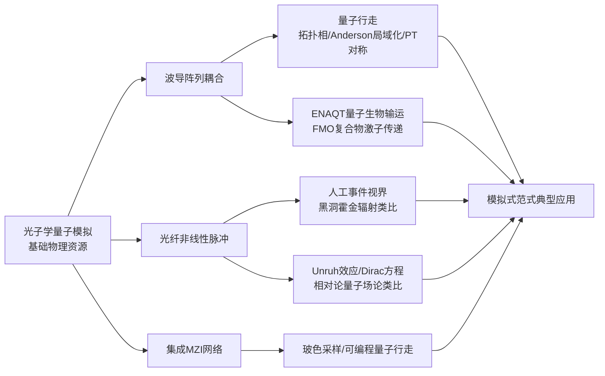

综合而言，**量子行走、ENAQT与基础物理类比模拟三类应用共同体现了光子学平台在"特定问题专属优势"维度上的差异化价值**——其物理演化天然映射目标问题的数学结构，无需Trotter门分解，呈现典型的模拟式色彩；同时这些应用所覆盖的物理问题涵盖凝聚态拓扑物理、量子生物学、量子场论与天体物理类比等多个学科分支，**展示了光子学平台跨越量子模拟应用边界的独特能力**。

## 5.4 集成光子芯片与高维量子模拟前沿

如果说5.2、5.3节聚焦于光子学平台在特定问题上的"专属优势"演示，本节则聚焦于光子学路线规模化的核心工程路径——**集成光子量子技术**。集成光子量子技术的演化历程可被概括为：**从早期厘米尺度、仅含少量元件、仅能操作两光子的电路，演化为毫米尺度、接近1000个元件规模的可编程器件，其量子态的产生、处理与探测能力呈稳步指数增长**[^21]。该领域在2020年前后已实现量子通信、量子化学与物理系统模拟、采样算法、线性光学量子信息处理等多类应用的演示[^21]，是光子学路线从"专属优势"向"通用可编程量子模拟器"演化的核心工程载体。

集成光子量子技术的进展可从三个相互关联的技术维度加以剖析。

**第一是片上量子光源的工程化推进**。早期光子学量子实验主要依赖于体材料中的自发参量下转换（SPDC）作为单光子与纠缠光子对源——其本质是概率性的，多光子事件率随光子数指数衰减，且空间模式与频谱模式的纯度受体材料几何与晶体长度的限制。集成光子芯片方案通过将光源直接嵌入波导中显著改善了这一局面：硅基与氮化硅波导中的**自发四波混频（SFWM）**、铌酸锂中的**自发参量下转换（SPDC）**等过程可被工程化为高纯度、确定性程度日益提升的片上单光子与纠缠光子对源，光源-处理-探测的全链路集成大幅降低了模式匹配损耗。陆朝阳团队进一步指出，**"参量下转换为光学量子信息提供了优秀的'工作母机'，例如可纠缠多达10个独立光子"**——这一里程碑数字在2010年代中期被广泛实现，并为后续多光子干涉与玻色采样实验奠定了光源基础[^22]。在SPDC/SFWM之外，**量子点单光子源**作为确定性单光子源的另一条主流路线也在快速演化：通过将自组装InAs量子点嵌入平面光子纳米结构（如光子晶体腔、微柱腔、波导）中，研究者可以"剪裁光-物质相互作用并增强发射光子的收集"，并通过"将这些光源与先进的光子集成电路（PIC）接口、采用确定性单光子源与可编程氮化硅集成电路相结合的混合多芯片光子处理器"路径实现规模化光子量子计算硬件[^14]。这一混合架构是2020年前后光子学路线在"确定性光源 + 可重构线性光学处理"两个核心需求之间架起的关键桥梁。

**第二是可重构量子控制能力的突破**。集成光子芯片的核心控制元件是**马赫-曾德尔干涉仪（MZI）阵列**——由两个50:50分束器与两个可调相位移器（通常通过热光、电光或机械手段实现）构成的MZI可作为任意 $2\times 2$ 幺正变换的基本单元；将MZI阵列按特定拓扑（如Reck-Zeilinger或Clements排列）级联，即可实现任意 $N\times N$ 幺正变换。这一"通用线性光学处理器"架构使**任意酉变换可通过软件编程加以配置**——研究者无需重新设计光路，只需调整相位移器的控制电压即可在同一硬件上实现玻色采样、量子行走、化学分子模拟等不同任务。**这种软件可重构性是集成光子芯片相比体光学方案的根本工程优势之一**，使其在通用性与可扩展性上具备结构性领先。

**第三是高维量子模拟前沿的兴起**。**高维量子系统相比二维量子比特在信息容量、噪声鲁棒性与新型量子门实现上具有结构性优势**——同样数量的物理载体可承载更多量子信息，且对特定类型噪声具有更强的容忍能力[^26]。集成光子技术因其多自由度可编码性，已成为高维量子模拟最为活跃的实验平台。相关综述系统总结了这一方向的研究脉络：**"高维纠缠量子系统相比二维系统具有独特优势；生成与操控高维纠缠量子态是量子增强计算与通信的关键议题"**[^26]。该综述围绕**片上量子源**（非线性效应、量子源结构、产生纠缠的方法）、**可重构量子控制**（基础处理单元、通用处理电路、结构改进）、**前沿量子信息应用**三个层面剖析了高维集成光子量子技术的研究进展[^26]。在多自由度编码上，研究者已广泛利用光子的**路径、时间bin、频率、轨道角动量（OAM）**等自由度实现高维纠缠态的产生与操控——例如基于路径编码可在波导阵列中实现 $d$-路径的qudit态；基于时间bin可借助延迟干涉仪实现 $d$ 阶时间编码；基于OAM可在自由空间中实现理论上无限维的纠缠[^26]。

高维量子门的实现是高维量子模拟得以兑现的关键。Chen等人于2024年提出的**基于离子-腔QED系统的高维两光子量子受控相位翻转门**理论方案为这一方向提供了重要的物理路径：通过在光学腔中嵌入单个囚禁的 $^{40}\text{Ca}^+$ 离子，研究者**在由光子自旋角动量与轨道角动量张成的四维空间中实现了平均保真度大于98%的受控相位翻转门**，并将该方案定位为**"高维量子信息处理的本质构建模块"**[^25]。该工作意义不仅在于其高保真度数字，更在于它通过腔QED的"光-物质强耦合接口"突破了线性光学下两光子门必为概率性的根本限制，为光子学路线在远期发展确定性高维量子门提供了可行思路[^25]。

| 技术维度 | 核心进展 | 工程意义 |
|---------|---------|---------|
| 片上量子光源 | SFWM/SPDC波导集成、InAs量子点确定性单光子源、混合多芯片架构 | 从概率性向确定性演化，提升光子产生效率 |
| 可重构量子控制 | MZI阵列实现任意酉变换，软件可编程 | 通用线性光学处理器，硬件资源复用 |
| 高维量子模拟 | 路径/时间bin/OAM多自由度编码，腔QED确定性高维门 | 扩展希尔伯特空间，噪声鲁棒性提升 |

综合而言，**集成光子量子技术构成了光子学路线从"特定问题专属优势"向"通用可编程量子模拟器"演化的核心工程路径**。其千元件规模的可编程器件、毫米级集成度、多自由度高维编码能力，使光子学平台在保持5.2、5.3节所讨论的玻色采样、量子行走、基础物理类比等"专属赛道"优势的同时，逐步拓展至更广泛的量子模拟与量子计算应用边界。

## 5.5 光子学方案的独特优势与核心局限

将上述物理基础、三类实现方案、典型应用与规模化路径综合考量，可以系统归纳光子学量子模拟器在量子模拟器谱系内的差异化优势与固有局限。

**优势一：常温运行能力**。光子学平台的单光子源、线性光学网络与部分探测器可在室温下工作——仅超导单光子探测器（如SNSPD）需液氦或脉管制冷至2—4 K的低温环境，但其制冷需求显著低于超导电路Transmon所需的15—20 mK稀释制冷。这一温度优势直接降低了光子学方案的基础设施门槛与运行成本，使大规模光子学实验可在常规光学实验室中开展，无需稀释制冷机等昂贵基础设施。

**优势二：弱环境耦合与长距离相干传输**。光子与环境的相互作用极弱——其偏振、路径、时间bin等量子自由度在自由空间或低损耗光纤中可保持相干传输数百公里乃至更远，远超第3章囚禁离子的米级激光寻址尺度与第4章超导电路的芯片级布线尺度。**这一长距离传输能力使光子学平台成为量子通信、量子密钥分发与未来量子互联网的不可替代载体**，亦为分布式量子模拟提供了天然的物理桥梁。

**优势三：多自由度高维编码**。如5.1与5.4节所论证，单个光子可同时携带偏振、路径、动量、轨道角动量、时间bin、频率等多个量子自由度，研究者可借助超纠缠在有限光子数下扩展可用希尔伯特空间维度[^26][^22]。这一编码灵活性在其他物理平台中较为罕见——原子与离子的量子比特通常仅编码于若干离散内态，超导电路的量子比特虽可设计qudit但需要额外的非谐性工程。**多自由度高维编码使光子学平台在信息容量与噪声鲁棒性的权衡上具有结构性优势**。

**优势四：与现代光纤通信基础设施的天然兼容性**。现代电信级光纤、光放大器、波分复用（WDM）等基础设施已遍布全球，光子学量子模拟器可直接借助这一既有基础设施实现远距离传输与组网，无需重新构建专用物理通道。这一兼容性使光子学路线在量子通信与分布式量子模拟的产业化路径上具备显著的先发优势。

然而，光子学路线同样面临一系列固有局限，这些局限的物理根源大多可追溯至"光子缺乏天然相互作用"这一核心特征。

**局限一：确定性单光子源的工程化困难**。基于自发参量下转换（SPDC）与自发四波混频（SFWM）的光子源本质上是概率性的——光子对的产生过程是泊松分布而非确定性事件，且多光子事件率随光子数指数衰减，使得 $N$ 光子玻色采样实验所需的总采集时间随 $N$ 显著增长。这一概率性是"九章"工作中需要数十至数百小时累积数据以获得有效采样统计的根本物理原因。**量子点单光子源虽具有确定性单光子发射的潜力**——单个量子点在受到激发后理论上每次激发周期可发射恰好一个光子，但量子点光源与片上电路的高效集成、不同量子点光源之间的光谱不可分辨性（indistinguishability）、以及量子点单光子的纯度等仍面临重大工程挑战[^14]。确定性单光子源的成熟化是光子学路线从"概率性优势"向"确定性规模化"演化的关键瓶颈。

**局限二：双光子门的概率性本质**。在线性光学体系下，两光子之间不存在天然的相互作用——任何两光子纠缠操作必须借助分束器后的两光子干涉与对辅助模式的测量加以实现，本质上是概率性的[^25]。KLM协议虽然在原理上证明了线性光学+测量诱导非线性可实现普适量子计算，但其资源开销（辅助光子数、heralding效率、级联深度）极为庞大[^25]。这一概率性本质与原子/超导平台中比特间天然存在的相互作用形成鲜明对比——后两类平台的双比特门可在物理上确定性地实现且保真度已达99%以上，而光子学平台的双光子门保真度即便在最先进的实验中仍受概率性与heralding效率的双重制约。这正是光腔QED方案试图突破的核心问题——通过强耦合区的光-物质相互作用引入有效的光子-光子非线性，从而实现确定性双光子门[^25]。

**局限三：光子损耗的累积效应**。波导耦合损耗、传播损耗、片上元件插入损耗与单光子探测器的有限量子效率共同制约光子学平台的可扩展规模。对于一个 $N$ 光子实验，若每个光子的端到端传输效率为 $\eta$，则 $N$ 光子事件的总效率按 $\eta^N$ 衰减——当 $\eta = 0.9$、$N = 76$ 时，总效率仅约 $0.9^{76} \approx 0.03\%$。这一指数衰减使得"九章"等大规模玻色采样实验需要在每一个光学环节上对效率进行极致优化（包括超高效率SNSPD探测器、超低损耗波导、精密光路对准等）。**光子损耗的累积效应是制约光子学平台规模扩展的核心物理瓶颈**，亦是该路线在与超导电路（比特数可达数百）、囚禁离子（数十高保真度比特）规模对比中需要特别关注的维度。

**局限四：光子-光子相互作用的天然缺失**。这一局限是光子学路线最具根本性的物理特征——光子作为玻色子且不带电荷，其在真空或线性介质中相互之间不存在直接的相互作用，必须借助辅助介质（如非线性晶体的Kerr效应）或光-物质接口（如腔QED中的单原子/单离子/单量子点）引入有效非线性。**这一缺失意味着光子学平台无法像原子/超导平台那样直接实现哈密顿量工程，必须依赖测量后选择、辅助模式或光-物质接口等间接路径"制造"相互作用**，是该路线与前三章物理平台在哈密顿量工程能力上的根本差异。

| 维度 | 优势 | 物理根源 |
|------|------|---------|
| 运行温度 | 常温运行（探测器除外） | 光子无热涨落破坏机制 |
| 相干传输 | 数百公里量级 | 弱环境耦合、玻色统计 |
| 编码自由度 | 偏振/路径/OAM/时间bin等多自由度 | 光子的多模特性 |
| 通信兼容性 | 与现有光纤基础设施天然兼容 | 共享电信级光波长 |

| 维度 | 局限 | 物理根源 |
|------|------|---------|
| 单光子源确定性 | SPDC/SFWM概率性、量子点集成挑战 | 自发辐射过程的内禀随机性 |
| 双光子门 | 线性光学下概率性，KLM资源开销大 | 光子-光子无天然相互作用 |
| 光子损耗 | 端到端效率 $\eta^N$ 指数衰减 | 多环节传输的级联损耗 |
| 哈密顿量工程 | 必须借助辅助介质或光-物质接口 | 真空中无天然非线性 |

## 5.6 光子学平台与其他物理实现的对比及范式定位

在系统剖析光子学平台的物理基础、典型应用、规模化路径与瓶颈应对之后，本节通过与前三章物理平台的多维对比，确立光子学量子模拟器在量子模拟器谱系内的差异化定位，并为第6章固态自旋平台的引入提供逻辑过渡。下表汇总了截至2021年初四大主要架构在关键维度上的差异。

| 比较维度 | 光子学平台 | 超导电路 | 囚禁离子 | 中性原子（光晶格+里德堡） |
|---------|----------|---------|---------|----------------------|
| 量子比特载体 | 飞行光子 | 静止Transmon | 静止离子 | 静止中性原子 |
| 运行温度 | 常温（SNSPD探测器2—4 K） | 15—20 mK 稀释制冷 | UHV + 激光冷却 | nK（光晶格）/ μK（里德堡） |
| 相干特性 | 长距离传输（数百公里量级） | $T_1, T_2 \sim 100$–300 μs | 数百秒至约5500秒 | 秒量级（光晶格）/ 数十—数百μs（里德堡） |
| 规模（2021年初） | 76光子（九章）/ ~1000元件芯片 | 数十至127比特 | 数十离子 | 256原子（里德堡）/ 数千格点（光晶格） |
| 可编程性 | 软件可重构线性光学网络 | 通用门集合可编程 | 模拟+数字双模 | 哈密顿量工程为主 |
| 双比特/双光子门 | 线性光学概率性，腔QED可确定性 | 数十—数百ns，~99%—99.5% | 数十—数百μs，~99.9% | 里德堡门0.1—1 μs，95%—99% |
| 范式定位 | 特定问题专属优势 + 远期通用潜力 | 数字式为主、兼具混合 | 模拟+数字双模，混合范式中心 | 模拟式主导 |
| 标志性优势演示 | 九章76光子高斯玻色采样（2020）[^23] | Sycamore 53比特RCS（2019） | 长程Ising、Schwinger模型 | 256原子可编程量子相 |
| 典型科学问题 | 玻色采样、量子行走、ENAQT、霍金辐射类比 | 横场Ising、Hubbard、RCS、VQE/QAOA | 长程Ising、LMG、Schwinger、时间晶体 | Hubbard、量子磁性、合成规范场、组合优化 |
| 产业生态 | 量子通信最成熟，量子计算演化中 | 产业化最快（IBM/Google云平台） | 较快（IonQ、Quantinuum） | 学术为主，初创涌现 |

从这一对比可以提炼出三个核心结论。

**第一，光子学平台在第1章范式光谱上占据"特定问题专属优势 + 远期通用潜力"的双重定位**。在玻色采样、量子行走、ENAQT、霍金辐射类比等问题上，其物理演化天然映射目标问题的数学结构，无需Trotter门分解，呈现典型的模拟式色彩——这一特征使其在这些"专属赛道"上能够以远低于其他平台的资源代价实现等价乃至超越的科学结论。"九章"工作以76光子在200秒内完成相当于经典超算约6亿年的高斯玻色采样任务，正是这一专属优势的标志性兑现[^23]。同时，KLM协议保证了线性光学+单光子探测在原则上可实现普适量子计算，使光子学路线具备演化为通用门量子计算载体的远期潜力——尽管资源开销极为庞大，但腔QED方案的确定性高维量子门进展[^25]、集成光子芯片的千元件规模可编程性[^21]、量子点确定性单光子源的逐步成熟[^14]等多条路径正在共同推动该远期潜力向工程现实演化。

**第二，光子学平台与超导电路、囚禁离子、中性原子三大物理路线呈现明确的互补关系而非相互替代**。光子学以"飞行量子比特"为核心，擅长分布式架构与跨距离量子信息传输；其他三大平台以"静止量子比特"为核心，擅长本地高保真度运算与高密度集成。**这种"飞行 vs 静止"的工程二象性，决定了量子模拟器谱系的最终形态很可能是多平台协同的混合架构**——本地节点采用超导/离子/原子平台执行高保真度门运算，节点间通过光子学网络建立纠缠并实现量子态传输，从而构造分布式量子模拟器与量子互联网基础设施。这一图景在2020—2021年前后已成为业界共识，光腔QED作为"光-物质纠缠接口"在其中扮演关键角色[^25][^14]。

**第三，从产业生态视角看，光子学平台在量子通信领域已具备最成熟的工程化基础，在量子模拟与计算领域则与超导、离子形成生态互补**。量子密钥分发（QKD）、量子直接通信、量子隐形传态等量子通信应用已在光纤与自由空间中实现公里至上千公里量级的演示，是当前最为成熟的量子技术应用方向；而在量子模拟与计算领域，光子学路线以"九章"等专属优势演示与集成光子芯片的快速演化为代表，与超导电路的IBM/Google产业化云平台、囚禁离子的IonQ/Quantinuum商用机形成多元并进的生态格局[^21][^26]。

综上，光子学量子模拟器以**光子的零静质量、玻色统计、弱环境耦合与多自由度可编码性为物理基石，以线性光学协议、集成光子芯片与光腔QED系统三类实现方案为工程载体，以玻色采样、量子行走、ENAQT与基础物理类比等模拟式专属任务为"主战场"**，确立了其在量子模拟器谱系内"飞行量子比特核心载体、玻色采样类问题专属优势平台、分布式量子模拟与量子互联网基础设施"的差异化定位。其在2020年12月以"九章"实现的光量子计算优越性[^23]、集成光子量子技术接近千元件规模的可编程器件[^21]、高维量子模拟前沿的多自由度编码进展[^26][^25]、量子点确定性单光子源与混合多芯片处理器架构[^14]等多线进展，共同表明光子学路线正沿着"专属优势演示 → 集成光子芯片规模化 → 高维与确定性扩展 → 分布式量子模拟与量子互联网"的清晰路径演化。然而，光子学路线在确定性单光子源、双光子门确定性、光子损耗累积与天然光子-光子相互作用缺失等核心局限上仍需持续工程突破。下一章将转向量子模拟器谱系中的第五条物理路线——基于半导体量子点电子/核自旋与金刚石NV色心等固态缺陷自旋系统的固态自旋量子模拟器，并在与本章的对比中进一步展示量子模拟器实现谱系在"光子飞行载体 vs 固态自旋载体"维度上的多样性。

# 6 固态自旋量子模拟器架构（半导体量子点与NV色心）

在前五章对中性原子、囚禁离子、超导电路与光子学四条主流物理路线的系统剖析之后，本章进入量子模拟器实现谱系的第五条主线——**基于固态自旋系统的量子模拟器架构**。如果说前四章所讨论的平台分别以"自然原子的离散能级""人工设计的宏观电路""飞行的玻色子光子"作为信息载体，那么固态自旋路线则采取了另一条独特的物理逻辑：**它以嵌入在固体宿主（半导体异质结、金刚石晶格）中的电子自旋或核自旋作为天然的二能级量子系统，将量子比特"锚定"在原子尺度的局域缺陷或栅控势阱中**。这一"将自旋囚禁于固体之中"的策略，使该路线在与现代半导体工艺的兼容性、纳米尺度的空间分辨率、常温运行能力（特别是NV色心）等维度上获得了其他平台难以企及的独特优势，同时也面临固态环境中电荷无序、自旋浴退相干、色心定位均匀性等固有挑战。

固态自旋量子模拟器在过去二十余年的发展中沿着两条互补的技术主线演化：其一是基于**半导体量子点**中电子或核自旋的方案，以与CMOS工艺兼容的Si/SiGe、Si/SiO₂、Ge/SiGe等异质结上的栅控量子点为器件载体，是Fermi-Hubbard物理与少体强关联模型的天然模拟器；其二是基于**金刚石NV色心**等固态缺陷自旋系统的方案，以光学可寻址、常温可读出的单自旋为操控核心，是自旋链动力学、量子精密测量与多体类比模拟的灵活平台。两条路线虽共享"固态自旋作为量子比特"这一物理起点，但在器件结构、操控读出手段、扩展路径与典型应用上呈现明确分野。本章将依次剖析二者的物理基础、工程能力、典型成果、核心瓶颈，并在末节通过多维对比建立固态自旋平台在量子模拟器谱系中的差异化定位。

## 6.1 固态自旋量子模拟器的物理基础与共性技术

固态自旋量子模拟器赖以建立的物理基础，可以从一个核心洞察出发：**电子与核子作为基本粒子，其自旋自由度构成了自然界中最为干净的二能级量子系统之一**——电子自旋的两个本征态 $|\uparrow\rangle, |\downarrow\rangle$ 在外加磁场下分裂为塞曼能级，核自旋则在更窄的射频频段提供了同样的二能级结构。将这些自旋"囚禁"于固体宿主中，研究者既保留了自旋自由度作为量子比特的内禀稳定性，又获得了固态平台所天然具备的纳米加工、片上集成与规模化制造能力。这一"内态量子化 + 固态宿主"的组合，构成了固态自旋路线的核心物理逻辑。

固态自旋作为量子比特载体的**共性物理特征**可归纳为三点。**第一，自旋是天然的二能级系统**——电子自旋 $S=1/2$ 与核自旋 $I=1/2$（如 $^{29}$Si、$^{13}$C）天然提供二能级结构，无需像Transmon那样通过工程化非谐性使比特频率与高激发态分离，这一物理直接性使自旋比特天然具备良好的态选择性。**第二，可通过同位素纯化抑制核自旋浴退相干**——电子自旋在固态宿主中的主要退相干来源之一是周围核自旋的随机磁场涨落（"核自旋浴"），通过将宿主材料的同位素组分从天然丰度纯化为无核自旋的同位素（如 $^{28}$Si、$^{12}$C），可显著抑制这一退相干通道，使电子自旋的相干时间延长数个数量级。**第三，固态宿主便于纳米加工与集成**——半导体量子点可借助现代CMOS工艺规模化制造，金刚石NV色心可通过离子注入与退火在亚纳米精度内引入，二者均与既有半导体加工生态深度兼容。

围绕这一共性基础，两类代表性方案在技术要素上呈现以下共同坐标。**自旋的初始化**通常通过两类机制实现：一是借助电子库或外加磁场下的玻尔兹曼分布热初始化，使自旋松弛到基态；二是借助光学泵浦——特别是NV色心中通过532 nm绿光激发，借助自旋依赖的系统间窜越（ISC）将自旋极化至 $m_S=0$ 态。**相干操控**主要通过微波/射频脉冲实现单自旋旋转——微波频率对应电子塞曼能级（典型GHz量级），射频频率对应核塞曼能级（典型MHz量级）；半导体量子点中还可借助自旋-轨道耦合诱导的电偶极自旋共振（EDSR）实现纯电学控制，无需微波线圈。**读出方法**则呈现两个分支：半导体量子点平台主要采用电学读出，特别是Pauli自旋阻塞（PSB）读出——利用泡利不相容原理将自旋态映射为电荷传输的有无；NV色心平台主要采用光学读出，利用自旋依赖的荧光强度差异通过共焦显微镜直接读取自旋态。**与现代半导体工艺的兼容性**则是两类平台的共同优势——前者直接基于硅工艺，后者通过金刚石加工与硅基探测器集成实现混合工艺。

| 共性技术要素 | 半导体量子点 | 金刚石NV色心 |
|------------|------------|------------|
| 自旋比特载体 | 量子点中囚禁的电子或核自旋 | 金刚石晶格中N-V缺陷的电子自旋（$S=1$）及近邻 $^{13}$C 核自旋 |
| 初始化机制 | 电子库热初始化、自旋-电荷转换 | 532 nm绿光光学泵浦至 $m_S=0$ |
| 相干操控 | 微波ESR / EDSR（电学控制） | 微波驱动$|m_S=0\rangle\leftrightarrow|m_S=\pm 1\rangle$跃迁、射频驱动核自旋 |
| 读出方法 | Pauli自旋阻塞电学读出、单电荷探测器 | 自旋依赖荧光读出（共焦显微镜） |
| 同位素纯化 | $^{28}$Si、$^{72/74}$Ge 等无核自旋同位素 | $^{12}$C 同位素纯化金刚石 |
| 工作温度 | 稀释制冷（约 100 mK 量级） | 常温至 4 K |
| 工艺兼容性 | 与CMOS集成电路工艺天然兼容 | 金刚石微纳加工 + 硅基光电探测 |

综合而言，**固态自旋量子模拟器以电子/核自旋作为天然二能级系统、以同位素纯化抑制自旋浴退相干、以固态宿主便于纳米加工与集成为三层共性物理基础**，构成了一条与原子物理、超导电路、光子学截然不同的量子模拟主线。下文6.2—6.4节将围绕半导体量子点路线展开剖析，6.5—6.7节将聚焦NV色心路线，6.8节将在多维对比中确立固态自旋平台在量子模拟器谱系中的差异化定位。

## 6.2 半导体量子点的器件结构与量子比特实现

半导体量子点量子模拟器的物理起点是**将单个电子（或少数电子）静电囚禁于半导体二维电子气（2DEG）的纳米尺度区域之中**，使该区域呈现出原子般的离散能级结构，被形象地称为"人工原子"。这一囚禁通过在二维电子气上方沉积的栅极电极施加电压实现：通过合理设计栅极几何与电压配置，研究者可在半导体异质结界面上"雕刻"出势阱阵列，将电子约束在亚百纳米尺度的局域势阱中，每个势阱即为一个量子点。

在器件结构上，截至2021年初已发展出三类主流半导体量子点平台，分别对应不同的衬底材料与界面工程方案[^27][^26]。**第一类是Si/SiGe异质结**——通过在SiGe缓冲层上外延生长应变Si量子阱，利用应变带来的能带工程将电子囚禁于Si量子阱中；该结构的关键优势在于Si作为宿主材料可实现 $^{28}$Si 同位素纯化（自然丰度Si含约4.7%的 $^{29}$Si 核自旋杂质，纯化后可降至ppm量级），从而显著抑制核自旋浴退相干[^26]。**第二类是Si/SiO₂界面**——直接借助硅MOSFET结构在Si/SiO₂界面形成的反型层中囚禁电子，该结构与商业CMOS工艺的兼容度最高，但界面处的电荷无序与陷阱态对量子点参数均匀性的影响较为突出。**第三类是Ge/SiGe异质结与Ge/Si一维线**——锗作为另一种可同位素纯化的IV族半导体，具有更强的自旋-轨道耦合，便于实现纯电学EDSR操控，是近年来快速崛起的新兴方向[^26]。

**硅与锗材料平台的核心优势在于可同位素纯化为无核自旋宿主，并与现代CMOS工艺天然兼容**——这一双重特性使其同时满足量子比特对长退相干时间的要求与大规模集成的工程需求，是实现半导体量子计算的重要材料平台[^26]。

在量子比特编码方式上，半导体量子点提供了两类基本方案。**电子自旋量子比特**将量子信息编码于量子点中电子的塞曼分裂能级 $|\uparrow\rangle, |\downarrow\rangle$ 之间，跃迁频率位于GHz量级（典型外磁场下约10–20 GHz）。该方案的初始化通常借助电子库实现：**电子自旋量子比特可通过电子库热初始化至基态**[^27]——通过将量子点的电化学势调整至电子库费米能级附近，使电子库中的电子在玻尔兹曼分布下选择性地占据自旋基态。**核自旋量子比特**则将信息编码于宿主原子核（如 $^{31}$P 施主、$^{29}$Si 核自旋）的自旋自由度，其相干时间通常显著长于电子自旋（可达秒量级），但操控速率较慢。

读出机制方面，半导体量子点广泛采用**Pauli自旋阻塞（PSB）**方案：在双量子点系统中，利用泡利不相容原理——当两电子自旋平行时，跨量子点电子转移被阻塞；当自旋反平行时，转移被允许——将自旋态映射为电荷状态，再通过近邻的电荷传感器（如量子点接触QPC或单电子晶体管SET）以高灵敏度探测。这一"自旋-电荷转换+电荷探测"的读出链路是半导体量子点平台与超导电路色散读出在功能上对应的关键技术节点。

经过近年来在硅基材料、量子点结构与制备工艺、量子比特操控技术等多个维度的显著进展，**硅基半导体量子计算实现了高保真度的态制备与读出、单/双比特门操作；单/双比特门的控制保真度均已超过99%——这一数字突破了表面码这一具备极高错误容忍能力的纠错码所要求的容错阈值**[^27]。这一里程碑式进展标志着半导体量子点平台从"原理验证"阶段正式跨入"容错量子计算路径上的可行候选者"行列，是2020年前后该领域最为关键的工程进展之一。其物理实现完备性满足Loss与DiVincenzo提出的实现量子计算的物理系统需要满足的五个重要条件[^26]，进一步奠定了其作为固态量子计算与量子模拟主流候选平台的地位。

## 6.3 量子点阵列的哈密顿量工程与Fermi-Hubbard模拟

半导体量子点阵列作为量子模拟器的核心物理价值，**深植于其与Fermi-Hubbard模型在数学结构上的天然映射关系**。当多个量子点通过隧穿耦合形成阵列时，电子在阵列中的低能动力学自然由Fermi-Hubbard哈密顿量描述：

$$H_{\text{FH}} = -t\sum_{\langle i,j\rangle,\sigma}\left(c^\dagger_{i\sigma}c_{j\sigma} + \text{h.c.}\right) + U\sum_i n_{i\uparrow}n_{i\downarrow} + \sum_{i,\sigma}\epsilon_i n_{i\sigma}$$

其中 $t$ 为相邻量子点间的隧穿耦合振幅（由栅极电压调控的势垒高度决定），$U$ 为同量子点内的库仑排斥能（由量子点几何尺寸与介电环境决定），$\epsilon_i$ 为格点能量（由栅极偏置决定）。**电子在静电定义的周期势中实现可调的隧穿耦合 $t$ 与同位库仑排斥 $U$，构成可工程化的Fermi-Hubbard哈密顿量**——这一映射关系与第2章光晶格冷原子方案的Hubbard映射本质上同构，但二者的物理实现路径截然不同：光晶格通过激光驻波在自由空间构造周期势囚禁中性原子，量子点阵列通过半导体栅极在固态电子气中静电定义周期势。

围绕量子点阵列的Fermi-Hubbard模拟，截至2021年初已形成两类典型实验范式。

**第一类是大规模量子点阵列对Fermi-Hubbard相图的探查**。该范式以电子在大量周期性排布的量子点构成的人工晶格中演化为研究对象，重点关注基态、激发态与自旋关联在不同 $U/t$ 区间的演化[^28]。一项具有代表性的工作通过在半导体上定义网格状栅极，**迫使电子见到周期势并被囚禁在格点阵列中，在稀释制冷机所能达到的低温下探查模型相图中自旋关联具有重要影响的区域**[^28]。该工作最初计划开展输运测量，但因双层异质结上接触制备的洁净室良率较低，研究者转而采用了**电容谱测量**——该方法可直接测量态密度，且所用光刻工艺允许成功制备周期为150–200 nm的网格栅极[^28]。这一案例同时折射出大规模量子点阵列在工艺实现上的现实挑战：器件良率、接触可靠性与电容谱替代输运谱的方法学权衡，是该方向从原理走向常规实验所需跨越的工程障碍。

**第二类是3–4量子点小阵列对超交换、阻挫与少体磁性的精细研究**。该范式聚焦于将极少数（3–4个）量子点排布为正方、三角等几何构型，以少电子填充（如四量子点+三电子的填充）为研究对象，从而**精细考察少体系统的磁性**[^28]。一项代表性工作中，研究者**分析了四个量子点构成的正方阵列在装载三个电子时的少体磁性，考察该体系是否表现出阻挫**[^28]——这一构型在量子磁性研究中具有特殊意义，因其在反铁磁交换耦合下天然呈现几何阻挫，是研究阻挫磁性最简洁的少体类比。这一范式的优势在于：精细可控的少量子点系统使研究者得以对超交换机制、阻挫诱导的简并、低能激发谱进行精确刻画，是大规模阵列研究的有益补充。

在大规模量子点阵列上推进Fermi-Hubbard模拟的关键工程挑战在于：**固态电子学中固有的强静电无序，使得在量子点阵列上模拟Fermi-Hubbard物理的尝试一直较为零星**[^29]。一项标志性的实验进展系统性地应对了这一挑战——该工作明确指出：**对于栅极定义的量子点，无序可被以可控方式抑制；通过新颖的洞察与新近开发的半自动化、可扩展工具箱，研究者得以同质且独立地调节电子填充与近邻隧穿耦合**[^29]。在这一方法学基础上，团队实现了"集体库仑阻塞跃迁"——即相互作用驱动的Mott转变在有限尺寸下的对应物——的首次详细表征，是量子点阵列向Fermi-Hubbard物理实质性兑现的重要里程碑[^29]。这一进展的核心意义在于：**通过工具箱级的工艺方法学改进，将原本由于无序而难以实现的可控Fermi-Hubbard映射，转化为可同质独立调节填充与耦合的可控模拟**——这一方法学跃迁与第2章光晶格量子气体显微镜的发展、第3章囚禁离子优化降场协议的成熟在概念上属于同一类范式，均代表着量子模拟器从"能做"到"做精"的关键过渡。

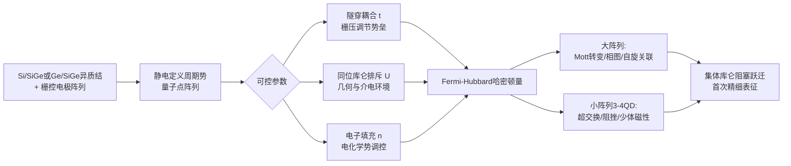

## 6.4 半导体量子点平台的优势与扩展挑战

将上述器件物理、量子比特实现与Fermi-Hubbard模拟能力综合考量，可以系统归纳半导体量子点路线的核心优势与固有瓶颈。

**优势一：与现代CMOS集成电路工艺的天然兼容性所赋予的大规模集成潜力**。半导体量子点的器件结构、栅极工艺、介质层、互连金属化等关键工艺均与商业CMOS生产线深度共享，使得该路线在产业化阶段具备易移植和可扩展的优势[^26]。**在可大规模生产的全固态、芯片化的量子计算方案中，半导体量子点量子计算的各个方面均可满足Loss和DiVincenzo提出的实现量子计算的物理系统所需的五个重要条件**[^26]——这一物理实现完备性与工艺兼容性的双重优势，是其他物理平台难以企及的。

**优势二：同位素纯化硅/锗带来的长退相干时间**。**硅和锗能够实现无核自旋的同位素纯化，满足量子比特对长退相干时间的要求；它们同时与当前的硅工艺兼容，是实现半导体量子计算的重要材料平台**[^26]。借助 $^{28}$Si 同位素纯化（自然丰度Si中 $^{29}$Si 占约4.7%，纯化后可降至ppm量级），电子自旋的相干时间可从天然丰度Si中的微秒量级延长至毫秒乃至秒量级，为高保真度门操作提供了足够的时间窗口。

**优势三：单/双比特门保真度突破99%表面码阈值**。**硅基半导体量子点中自旋量子比特由于其长相干时间、良好的可控性以及与现代先进集成电路制造工艺的兼容性，已成为实现容错量子计算的主要候选者之一；近年来由于硅基材料、量子点结构与制备工艺、量子比特操控技术的显著进展，硅基半导体量子计算实现了高保真度的态制备与读出、单/双比特门——单/双比特门的控制保真度均已超过99%，即表面码所要求的容错阈值**[^27]。这一保真度突破使该路线正式进入"容错量子计算可行候选者"行列，与超导电路、囚禁离子并列为当前主流的固态/半固态量子计算物理路线。

然而，半导体量子点路线同样面临一系列固有挑战。

**挑战一：固态电子学中的电荷无序与势阱不均匀性**。**栅极定义的量子点中固有的强静电无序，是过去使该平台在Fermi-Hubbard物理模拟上的尝试一直较为零星的核心原因**[^29]。无序来源包括衬底中的杂质电荷、栅极氧化层中的陷阱态、界面粗糙度等，这些因素使得不同量子点之间的参数（势阱深度、量子点能级、隧穿振幅）呈现非均匀分布，进而破坏阵列的同质性。如6.3节所述，通过新近开发的半自动化、可扩展工具箱已可对无序进行可控抑制[^29]，但该方向的进一步演化仍需在材料质量、工艺均匀性与自动化调试等多个维度同步推进。

**挑战二：电荷噪声与剩余核自旋导致的退相干**。即便在同位素纯化的Si/Ge宿主中，残余 $^{29}$Si 或 $^{73}$Ge 核自旋仍以ppm量级存在，对长时间相干演化构成限制；同时，栅极电压噪声、衬底两能级缺陷（TLS）涨落等带来的电荷噪声会通过自旋-轨道耦合或交换耦合的电压依赖性间接耦合至自旋自由度，引入退相干通道。

**挑战三：双比特门保真度跨越阈值后向更高水平推进的工艺门槛**。单/双比特门保真度突破99%表面码阈值[^27]虽然是关键里程碑，但与囚禁离子的99.9%双比特门保真度相比仍有显著差距；推进至接近物理极限的高保真度需要在材料质量、栅极几何优化、噪声抑制策略与控制脉冲整形等多个层面同步精细化，是工艺与方法学共同推进的长期工程任务。

**挑战四：阵列规模扩展时的串扰、布线与读出复杂度**。从少数量子点扩展至大规模二维阵列时，所需的栅极电极数目按量子点数线性甚至超线性增长，引入控制线密度、串扰抑制、低温布线与读出复用等一系列工程挑战。半自动化调试工具的发展[^29]正在缓解参数空间扫描的人工负担，但大规模阵列的端到端工程化仍是该路线在通向数百至上千比特规模时必须跨越的核心瓶颈。

| 维度 | 优势 | 挑战 |
|------|------|------|
| 工艺兼容性 | CMOS天然兼容、大规模集成潜力 | 良率与接触可靠性、串扰抑制 |
| 相干时间 | $^{28}$Si/$^{72}$Ge 纯化延长至毫秒-秒量级 | 残余核自旋、电荷噪声 |
| 门保真度 | 单/双比特门均突破99%表面码阈值 | 与离子99.9%相比仍有差距 |
| 模拟能力 | Fermi-Hubbard天然映射、可调 $U/t$ | 静电无序、参数均匀性 |
| 扩展规模 | 少数至十几量子点已演示 | 大规模二维阵列布线/读出复杂度 |

## 6.5 金刚石NV色心的物理机制与量子操控能力

金刚石氮-空位（NV）色心作为固态缺陷自旋量子模拟载体的物理基础，可以从其独特的电子结构与光-自旋耦合机制出发。NV色心由金刚石晶格中相邻的一个氮原子取代位与一个碳空位组成，其负电荷态（NV⁻）的基态为自旋三重态 $S=1$，包含 $m_S=0$ 与 $m_S=\pm 1$ 三个磁子能级；在零磁场下，$m_S=0$ 与 $m_S=\pm 1$ 之间存在约2.87 GHz的零场分裂（D项），使微波频段的自旋操控成为可能。激发态同样为自旋三重态，与基态之间存在约637 nm的零声子线光学跃迁，以及伴随的声子边带。

NV色心之所以成为量子模拟与量子传感领域最具影响力的固态自旋系统之一，**根本原因在于其拥有一套完整的"光学初始化—微波相干操控—荧光态读出"的闭环操控体系**。具体而言，**NV可以直接通过荧光强度读取其自旋量子态；得益于NV优异的相干性，研究者可以在室温大气下实现单个电子/核自旋和元电荷的探测灵敏度**[^28]。这一闭环的关键物理机制可分三层加以阐述。

**第一，自旋极化初始化**：通过532 nm绿光激发NV色心从 $^3A_2$ 基态到 $^3E$ 激发态，自旋投影 $m_S$ 量子数在跃迁中守恒；激发态的 $m_S=\pm 1$ 子能级有显著概率通过系统间窜越（ISC）经由中间单态进入基态的 $m_S=0$ 子能级，而 $m_S=0$ 子能级则直接通过辐射跃迁返回基态。在多次激发循环后，NV色心自旋被高效地泵浦至 $m_S=0$ 态，实现高保真度的自旋极化初始化。**第二，相干操控**：在基态自旋三重态上施加共振微波脉冲（频率约2.87 GHz，可在外磁场下进一步分裂为两个独立的 $|0\rangle\leftrightarrow|\pm 1\rangle$ 跃迁），即可实现单自旋的相干旋转，单比特门时间通常在纳秒至数十纳秒量级。**第三，自旋依赖荧光读出**：在弱激发条件下，$m_S=0$ 态比 $m_S=\pm 1$ 态产生更强的荧光（差异约20–30%），通过共焦显微镜在数微秒到毫秒时间内积分荧光光子数即可推断自旋态。

NV色心的另一项决定性优势是**在常温大气环境下即可实现高保真度自旋操控**。这一特征的物理根源在于：金刚石的Debye温度极高（约2230 K），晶格振动对NV电子自旋的影响远弱于其他固态系统；金刚石具有极宽的带隙（约5.5 eV），使NV的电子结构与外界的电学/光学环境强烈解耦；NV自旋与外界主要通过磁场耦合，而磁场屏蔽相对简单。通过对金刚石进行 $^{12}$C 同位素纯化（自然丰度金刚石中 $^{13}$C 占约1.1%），可将相干时间从天然丰度金刚石中的数微秒延长至毫秒量级，这一相干时间在常温固态量子系统中处于领先地位。

**NV色心与近邻核自旋的耦合构成了小规模量子寄存器的天然资源**。NV电子自旋通过超精细相互作用与近邻的 $^{13}$C 核自旋（约1.1%天然丰度分布于晶格碳原子位置）或NV缺陷自身的 $^{14}$N/$^{15}$N 核自旋耦合，形成"中心电子自旋 + 多个核自旋卫星"的小规模寄存器。这一寄存器结构在量子模拟中具有双重价值：电子自旋作为可快速操控、可光学读出的"工作比特"；核自旋作为长寿命的"存储比特"。Wrachtrup教授团队在多项工作中演示了**借助先进的相干操纵和量子算法，通过NV色心实现单层氮化硼材料的纳米级核磁共振探测**[^28]——这一探测能力建立在NV-核自旋耦合的精细操控之上，是NV色心作为量子传感器与量子模拟器双重功能融合的典型体现。

## 6.6 NV色心在自旋系统动力学、量子精密测量与多体模拟中的应用

NV色心系统在量子模拟与量子传感双重维度上的应用价值，正是其"光学可读+常温可控+小规模量子寄存器"特征的直接物理后果。截至2021年初，该方向已在自旋系统动力学模拟、量子精密测量、多体物理类比三个维度上累积了具有代表性的进展。

**在自旋系统动力学模拟方面**，研究者基于NV阵列或NV-核自旋寄存器实现了Heisenberg自旋链、自旋簇动力学与小规模多体物理的模拟。其物理逻辑是：将NV自旋与近邻 $^{13}$C 核自旋或邻近NV自旋之间的偶极相互作用视为自旋模型中的自旋-自旋耦合项，通过微波/射频脉冲序列工程化生成目标哈密顿量。该路线的一项独特扩展是**基于悬浮纳米金刚石中NV系综与扭转振动模式强耦合实现Lipkin-Meshkov-Glick（LMG）模型量子相变与有限尺寸效应观测的混合自旋-力学方案**。一项代表性的理论提案明确指出：**混合自旋-力学系统在传感、宏观量子力学与量子信息科学中具有巨大潜力；为在电子自旋与力学振子的质心运动之间诱导强耦合，通常需要难以实现的巨大磁场梯度——但在光镊悬浮纳米金刚石中NV色心电子自旋与扭转振动之间的强耦合，可在均匀磁场中实现**[^30]。**得益于均匀磁场，多个自旋可同时与扭转振动强耦合；研究者提出利用这一新型耦合机制，借助悬浮纳米金刚石中NV色心系综实现Lipkin-Meshkov-Glick（LMG）模型，从而在该体系中观测LMG模型的量子相变与有限粒子数效应**[^30]。这一方案的科学意义在于：将原本仅在囚禁离子等平台上得到验证的LMG全连通模型，移植至基于悬浮纳米金刚石的混合自旋-力学体系；同时还可利用自旋-扭转耦合产生扭转叠加态并实现扭转物质波干涉测量[^30]，进一步拓展了NV色心平台在量子模拟与基础物理研究上的能力边界。

**在量子精密测量方面**，NV色心已发展为目前最具代表性的纳米尺度量子传感器之一。**金刚石中基于色心的量子技术在最近几年快速兴起；NV色心由于其卓越的自旋性质与光学可寻址性引起了特别的关注**[^27]。**NV色心已被用于实现创新的多模量子增强传感器，在室温下提供了前所未有的高灵敏度与空间分辨率组合**[^27]。这一组合的物理根源是：NV色心的尺寸为原子尺度（约1 nm），可被定位于金刚石针尖或纳米晶体表面附近数纳米深度，从而获得纳米级空间分辨率；同时其自旋状态对外加磁场、电场、温度、应变等多种物理量敏感，通过精心设计的脉冲序列（如Hahn回波、CPMG动力学解耦、Ramsey干涉等）可分别实现对不同物理量的高灵敏度探测。

在传感应用层面，NV色心已与多种纳米成像技术深度结合。**将金刚石针尖结合原子力显微镜系统，可实现二维磁性材料的纳米尺度磁成像，并突破传统磁光探测技术的空间分辨极限——例如，该技术清楚地揭示了转角CrI₃的摩尔磁序**[^28]。这一进展将NV色心从单点磁场传感器扩展为可扫描的纳米磁成像工具，使二维磁性材料的莫尔超晶格磁性、磁畴结构等微观磁性现象得以直接可视化。**进一步地，借助先进的相干操纵和量子算法，通过NV色心可以实现单层氮化硼材料的纳米级核磁共振探测**[^28]——这一能力将传统NMR的灵敏度从需要 $\sim 10^{18}$ 个核自旋以上的体材料样品，推进至单个原子层的纳米级核磁共振，是凝聚态实验技术的一次范式跃升。

**量子控制在响应NV量子传感性能升级需求方面发挥着关键作用**[^27]——通过精心设计的脉冲序列与噪声谱学方法，研究者可显著提升NV色心对特定信号的灵敏度并抑制不相关的退相干通道，是NV量子传感从原理走向实用的核心方法学支柱。

**在多体物理类比模拟方面**，NV色心阵列与NV-核自旋寄存器为研究小规模多体动力学提供了可控平台。一个特别值得关注的前沿方向是**利用NV色心实现原子核自旋超极化以构建2D自旋网络作为量子模拟新载体**——Wrachtrup教授报告中**详细介绍了利用NV色心实现原子核自旋超极化的工作原理，展示其在二维自旋系统（如氮化硼的核自旋网络）中的应用，并对其在未来实现基于自旋网络的量子模拟进行了展望**[^28]。这一方向的物理逻辑是：以NV色心作为"种子"自旋，通过极化转移协议将其自旋极化传递至宿主材料中的核自旋系统，从而在二维核自旋网络中构造受控初始态；随后利用核自旋间的天然偶极耦合作为自旋模型的相互作用项，实现2D自旋模型的量子模拟。该路径的优势在于：核自旋的长相干时间（秒量级乃至更长）使其特别适合作为长时间多体演化的载体；二维原子层材料（如六方氮化硼h-BN、过渡金属硫化物等）为核自旋网络的几何构型提供了高质量的天然样品。需要说明的是，2022年Wrachtrup教授在北京大学物理学院学术论坛报告的部分内容时间上略晚于本报告的2021年初边界[^28]，但其所讨论的研究方向是2018—2020年间已经启动并持续推进的前沿议题，因此可作为该方向延续性进展的代表性引述。

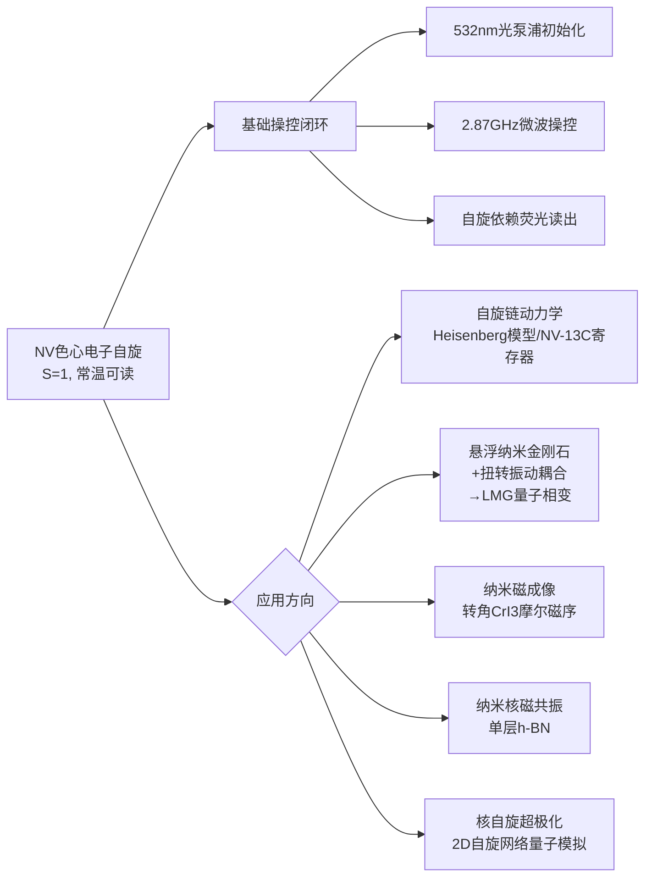

## 6.7 NV色心平台的优势与核心局限

将上述物理机制、操控能力与应用进展综合考量，可以系统归纳NV色心路线的差异化优势与固有局限。

**优势一：常温大气环境下可工作所带来的基础设施门槛极低**。这是NV色心相对于本报告所讨论的其他绝大多数物理平台（除光子学线性光学方案外）最为根本的差异化优势——**研究者可以在室温大气下实现单个电子/核自旋和元电荷的探测灵敏度**[^28]。无需稀释制冷机（超导电路需15–20 mK）、无需超高真空（囚禁离子、中性原子需UHV）、无需复杂的激光冷却系统，NV色心实验可在常规光学实验室搭建，基础设施成本与运行复杂度显著低于其他物理路线。

**优势二：光学可寻址与读出所赋予的单自旋灵敏度与空间分辨率**。NV色心可通过共焦显微镜在亚衍射极限尺度内被选择性寻址与读出，结合STED、AOD扫描等超分辨技术可进一步突破衍射极限；其作为传感器的纳米级空间分辨率使其成为研究二维材料、单分子、活体细胞内局域物理量的不可替代工具——**通过结合原子力显微镜与金刚石针尖，可实现转角CrI₃摩尔磁序的纳米尺度磁成像，突破传统磁光探测技术的空间分辨极限**[^28]。

**优势三：生物兼容性使其可深入活体细胞与软物质系统**。金刚石的化学惰性、低毒性与小尺寸（纳米金刚石）使NV色心可被引入活细胞、组织或软物质系统内部进行原位量子传感——这一能力在传统量子比特平台（超导、离子、中性原子）中完全无法实现，是NV色心独有的"量子-生物交叉接口"。

**优势四：与扫描探针、光纤、纳米力学振子等其他平台的混合集成潜力**。NV色心可与扫描探针显微镜结合（如6.6节所述的金刚石针尖AFM）、与光纤集成形成全光纤量子传感探头、与悬浮纳米力学振子结合形成混合自旋-力学系统（如6.6节所述的悬浮纳米金刚石LMG模拟方案）[^30]。这种"小体积单元 + 多平台混合"的特征使NV色心在分布式量子模拟器与量子互联网架构中具备独特价值。

然而，NV色心路线同样面临一系列固有局限，这些局限主要集中于"扩展至大规模阵列化量子模拟器"的工程路径上。

**局限一：NV色心间偶极相互作用强度有限**。NV色心间的偶极-偶极相互作用强度按 $1/r^3$ 衰减，对于典型几纳米间距的两个NV色心，相互作用强度通常仅为数十kHz乃至更低，远小于囚禁离子声子介导耦合（数kHz至数百kHz但伴随高保真度门）的有效门时间或超导电路双比特门耦合强度（数十MHz）。**这一相互作用强度限制了密集自旋阵列上多体哈密顿量的工程化效率**——在有限的相干时间内可执行的自旋-自旋耦合周期数有限，制约了基于NV色心的大规模多体演化能力。

**局限二：色心定位与制备均匀性受限于离子注入与退火工艺的随机性**。NV色心通常通过氮离子注入或电子辐照配合高温退火制备，其在金刚石晶格中的具体位置受注入能量分布、退火过程中的扩散等多重随机因素影响，**难以实现亚纳米精度的确定性定位**。这一随机性导致：不同NV色心的局域环境（应变、电场、近邻 $^{13}$C 分布）存在差异，从而引入零场分裂频率的非均匀分布；NV色心间的物理距离与几何关系无法精确预设，使得"按需构造"目标几何阵列的能力远不及光镊里德堡阵列。

**局限三：近邻色心间的精确耦合控制困难**。即便NV色心间的相对位置可被精确确定，其偶极耦合强度也由物理距离唯一决定，无法像超导电路的可调耦合器或囚禁离子的激光参数那样实时调控。这意味着NV阵列的耦合拓扑在制备完成后即被"冻结"，缺乏第3章囚禁离子与第4章超导电路所具备的"运行时可调耦合"能力，制约了哈密顿量工程的灵活性。

**局限四：大规模阵列化的工艺路径尚不成熟**。截至2021年初，基于NV色心的量子模拟实验仍主要集中于单NV或少数NV色心+核自旋寄存器（典型规模10个比特以下）的小规模演示阶段，与超导电路（数十至127比特）、囚禁离子（数十比特）、中性原子（数百至上千格点）的规模差距显著。**这是NV色心路线在量子模拟规模化方向上的主要瓶颈**，其突破有赖于材料质量提升（高品质CVD金刚石）、确定性单NV制备工艺（如离子注入精确定位、电子束辐照局域诱导）、以及NV-NV耦合工程化方法的协同进展。

| 维度 | 优势 | 局限 |
|------|------|------|
| 工作温度 | 常温大气环境（基础设施门槛极低） | 高温下相干时间下降 |
| 寻址方式 | 光学可寻址，单自旋灵敏度+纳米空间分辨率 | 衍射极限制约高密度阵列 |
| 应用拓展 | 生物兼容、纳米成像、混合自旋-力学 | 仅2D表面/亚表面色心便于光学操控 |
| 相互作用 | 偶极耦合天然存在、相干操控成熟 | 数十kHz量级强度有限，制约多体效率 |
| 色心制备 | 离子注入+退火、CVD多种工艺 | 定位随机性、均匀性受限 |
| 阵列规模 | 单NV+核自旋寄存器精细可控 | 大规模阵列工艺尚不成熟 |

## 6.8 两类固态自旋方案的对比与在范式光谱中的定位

在完成对半导体量子点与NV色心两条路线的剖析之后，本节通过多维对比确立固态自旋平台在量子模拟器谱系内的差异化定位，并为第7章量子退火与Ising专用机的引入做出过渡。下表汇总了两类方案在关键维度上的差异。

| 比较维度 | 半导体量子点 | 金刚石NV色心 |
|---------|-----------|-----------|
| 量子比特载体 | 静电囚禁的电子/核自旋 | 金刚石晶格N-V缺陷电子自旋 + 近邻核自旋 |
| 工作温度 | 稀释制冷（约100 mK量级） | 常温大气环境（4 K可进一步提升相干性） |
| 初始化机制 | 电子库热初始化、Pauli自旋阻塞 | 532 nm 光学泵浦 |
| 相干操控 | 微波ESR、EDSR电学控制 | 微波（电子自旋）+ 射频（核自旋） |
| 读出方法 | Pauli阻塞电学读出 + 电荷探测 | 自旋依赖荧光（共焦显微镜） |
| 相互作用机制 | 隧穿耦合 + 同位库仑排斥 | 偶极-偶极相互作用（数十kHz） |
| 相干时间 | $^{28}$Si 中可达毫秒-秒量级 | $^{12}$C 中可达毫秒量级 |
| 门保真度（2021年初） | 单/双比特均超过99%（突破表面码阈值）[^27] | 单比特门高保真度，双比特门受耦合强度制约 |
| 可扩展规模 | 少数至十余量子点已演示 | 单NV+核自旋寄存器（约10比特以下） |
| 典型模拟问题 | Fermi-Hubbard、超交换磁性、阻挫、集体库仑阻塞[^28][^29] | 自旋链动力学、LMG模型（混合自旋-力学）[^30]、纳米传感、2D核自旋网络 |
| 工艺兼容性 | CMOS天然兼容、大规模集成潜力[^26] | 金刚石加工+光电探测器混合工艺 |
| 产业生态 | Intel、IMEC等大厂介入，长期演化 | 量子传感商业化（Qnami等），量子模拟学术为主 |
| 范式定位 | 模拟+小规模数字双模，Fermi-Hubbard天然映射 | 模拟为主，混合自旋-力学+量子传感独特生态 |

从这一对比可以提炼出三个核心结论。

**第一，半导体量子点与NV色心在物理特征上呈现明确的互补性而非相互替代**。半导体量子点以"低温+CMOS兼容+Fermi-Hubbard天然映射+可扩展集成潜力"为核心优势，更适合作为通向大规模容错量子计算的固态平台候选者，及Fermi-Hubbard物理与强关联电子系统的天然模拟器[^27][^26][^28][^29]；NV色心以"常温+光学单自旋寻址+量子传感+生物兼容"为核心优势，更适合作为纳米尺度量子传感平台、小规模量子寄存器与混合自旋-力学体系的核心载体[^27][^30][^28]。**这两条路线共同构成了固态自旋路线"低温CMOS集成"与"常温光学操控"的双翼**。

**第二，固态自旋平台在第1章范式光谱上典型占据"模拟与小规模数字模拟兼具"的中间位置**。半导体量子点平台从Fermi-Hubbard物理出发，天然具备模拟式哈密顿量工程能力——通过栅压调控隧穿与库仑排斥即可工程化目标哈密顿量[^28][^29]；同时其单/双比特门保真度突破99%表面码阈值的进展[^27]为支持小规模数字量子模拟与Trotter电路提供了硬件基础。NV色心平台则在自旋系统动力学与多体哈密顿量类比模拟（如LMG模型）上展现典型的模拟式色彩[^30]，同时NV-核自旋寄存器结构已演示了小规模数字量子算法的执行能力。**这一双模能力定位使固态自旋平台与第3章囚禁离子在范式光谱上具有一定的相似性，但其物理实现路径与可扩展性策略截然不同**。

**第三，固态自旋平台与超导电路、囚禁离子、中性原子、光子学构成量子模拟器实现谱系的"第五维度"**。前四条路线已分别覆盖了"人工固态电路""自然带电粒子""自然中性原子""飞行玻色子"四类物理载体，而固态自旋路线则提供了"嵌入固体宿主中的自然自旋"这一独特的第五种载体形态。其差异化价值在于：在产业化前景上深度借力半导体工业生态（量子点路线）；在常温运行与纳米传感上提供其他平台无法触及的应用空间（NV色心路线）；在量子-生物交叉、扫描探针-自旋传感融合、混合自旋-力学等跨学科前沿上扮演不可替代的角色。**截至2021年初，固态自旋平台在量子模拟规模上落后于超导、离子与中性原子平台，但其在特定问题领域（Fermi-Hubbard、纳米磁成像、生物量子传感）与未来产业化潜力（CMOS兼容路线）上的差异化价值已得到充分确认**。

综上，固态自旋量子模拟器以**电子/核自旋作为天然二能级系统、同位素纯化抑制自旋浴退相干、固态宿主便于纳米加工与集成**为物理基石，沿半导体量子点与NV色心两条互补路线演化。其中，**半导体量子点凭借与CMOS工艺的天然兼容性、$^{28}$Si/$^{72}$Ge 同位素纯化带来的长相干时间、单/双比特门保真度突破99%表面码阈值等关键进展[^27][^26][^29]，确立了其作为容错量子计算重要候选平台与Fermi-Hubbard物理天然模拟器的地位**；**NV色心则凭借常温大气可工作、光学单自旋寻址、纳米尺度量子传感、生物兼容与混合自旋-力学等独特优势[^27][^30][^28]，确立了其作为量子传感与小规模量子模拟跨学科平台的差异化定位**。两者共同构成了量子模拟器实现谱系"第五维度"的双翼，在与前四章物理平台的多维互补中拓展了量子模拟器的能力边界。

值得注意的是，截至2021年初，本章所讨论的固态自旋平台与前四章所讨论的中性原子、囚禁离子、超导电路、光子学平台均属于"通用或半通用量子模拟器"的范畴——它们或者支持完整的通用门集合（如半导体量子点突破表面码阈值后的状态），或者通过哈密顿量工程灵活模拟一类哈密顿量。然而，量子模拟器谱系中还存在另一条高度专用化的物理路线——**面向特定优化问题的量子退火机与相干Ising求解器**。这类架构以D-Wave为代表，专门针对组合优化问题、玻璃态系统与最小化Ising哈密顿量等特定问题进行优化，与本章及前四章讨论的"通用模拟器"在设计哲学上呈现明显分野。下一章将转向这一专用化路线，剖析其物理基础、典型应用与围绕"量子加速证据"的持续争议。

# 7 量子退火与专用Ising求解器架构

在前六章对中性原子、囚禁离子、超导电路、光子学与固态自旋五条主流物理路线的系统剖析之后，本章进入量子模拟器实现谱系中一条性质截然不同的支线——**面向特定优化问题的量子退火机与专用Ising求解器架构**。前六章所讨论的平台无论范式定位如何（模拟式、数字式或混合式），其共同特征均是追求"通用或半通用"的量子模拟能力：或者通过门集合的可编程性实现任意局部哈密顿量的Trotter化模拟，或者通过哈密顿量工程灵活构造Hubbard、Ising、Heisenberg等多类目标模型。而本章所讨论的架构则采取了根本不同的设计哲学：**它放弃了对通用性的追求，转而围绕单一目标——最小化Ising型哈密顿量、求解QUBO（Quadratic Unconstrained Binary Optimization）形式的组合优化问题——进行硬件级的深度优化**。这种"以专用换实用"的工程策略，使该路线在大规模量子比特数、特定问题求解吞吐率上获得了独特优势，但同时也带来了围绕"量子加速证据可证伪性""连通性瓶颈""绝热条件可保持性"等核心问题的持续争议。

本章的剖析将沿如下逻辑展开：首先阐明量子退火与绝热量子计算的物理原理及其在第1章范式光谱中的特殊定位；继而剖析以D-Wave为代表的超导磁通量子比特退火机的硬件演化路径，从2007年16比特Orion到截至2022年初部署于德国于利希研究中心的5000+比特Advantage系统[^30]；随后归纳D-Wave在组合优化、玻璃态系统与机器学习采样等领域的应用进展；进一步引入Yamamoto团队提出的相干Ising机（CIM）这一截然不同的光学物理路径，揭示专用Ising求解器在物理载体层面的多样性；最后系统讨论围绕量子加速证据、量子-热效应、连通性、噪声与问题映射通用性的五大核心争议，为第8章横向比较奠定方法学基础。

## 7.1 量子退火与绝热量子计算的物理原理及范式定位

量子退火作为一种独立的量子计算范式，其理论起源可追溯至**1998年东京工业大学西森秀稔与门胁正史首次提出的量子退火理论**[^30]。这一理论提出之后不久，**2001年Farhi等人发表了关于绝热量子计算（Adiabatic Quantum Computation, AQC）的论文，二者在本质上属于同一思路**[^30]。Farhi等人的论文随后成为D-Wave公司从最初计划研发量子门计算机转向研发量子退火计算机的关键技术指引——D-Wave创始人Geordie Rose在受到麻省理工学院教授Seth Lloyd与Edward Farhi关于绝热量子计算建议的启发后，最终确立了量子退火这一专用化技术路径[^30]。

量子退火的核心物理图景可以从经典模拟退火的类比出发加以理解。**经典模拟退火借用金属热处理中"退火"工艺的概念——通过将材料加热再缓慢冷却使其内部能量趋于最低**——以热涨落作为驱动机制，使系统在足够长的演化时间内逐步逼近能量最低的构型。然而，经典模拟退火面临一个根本性的困难：当能量地形中存在多个局域极小且被高能量壁垒分隔时，热激发必须翻越壁垒才能进入更低能态，这在低温下的概率以玻尔兹曼指数 $\exp(-\Delta E/k_BT)$ 衰减，导致系统极易陷入次优局域极小。**量子退火则利用量子隧穿效应直接穿过能量壁垒，而非翻越壁垒，从而原则上更快找到最优解**[^30]——这一机制差异正是量子退火被预期能够在特定能量地形（特别是高而窄的壁垒结构）下相对经典退火获得加速的物理根源。

量子退火的工作流程可归纳为三个阶段。**第一阶段是问题映射**：将待求解的组合优化问题映射为寻找Ising模型能量最低状态的问题[^30]，即构造一个 Ising 哈密顿量
$$H_P = \sum_i h_i \sigma_i^z + \sum_{i<j} J_{ij} \sigma_i^z \sigma_j^z,$$
其基态对应于优化问题的最优解，其中 $h_i$ 为局域偏置场（编码线性项），$J_{ij}$ 为耦合强度（编码二次项）。**第二阶段是初始态制备**：将系统初始化在一个易于制备的横场哈密顿量 $H_D = -\Gamma\sum_i \sigma_i^x$ 的基态（即所有自旋沿 $x$ 方向的均匀叠加态），这一状态对应于在 $\sigma^z$ 基底下的所有 $2^N$ 计算基态的等权叠加。**第三阶段是绝热演化**：通过缓慢调节时间依赖的哈密顿量
$$H(s) = (1-s)H_D + s H_P, \quad s = t/T \in [0,1],$$
使系统在演化过程中始终保持在瞬时基态。**通过施加并减弱"横向磁场"（类比于经典退火中的"加热"），量子比特从叠加态逐渐坍缩至代表问题解的低能态**[^30]。当演化时间 $T$ 远大于瞬时能隙倒数平方的某个特征尺度时，绝热定理保证系统终态以高保真度落在 $H_P$ 的基态上，即问题的最优解。

将量子退火置于第1章所确立的范式光谱中加以审视，可以发现其定位呈现出与前六章物理平台明显不同的特征。**首先，它不属于通用门数字量子模拟**——量子退火过程不通过离散门操作序列实现，而是依赖系统在时间依赖哈密顿量下的连续演化；其纠错要求也与门模型截然不同，无需完整的量子纠错码，而是依赖绝热定理本身对一定程度噪声的鲁棒性。**其次，它也不属于第2—4章所讨论的灵活哈密顿量工程模拟**——它不试图模拟任意目标系统的演化，而是被设计为求解特定问题类（QUBO/Ising形式）的专用机。**这种"专用化"使其在系统稳定性维度上呈现出独特优势：量子退火方式的优势在于其系统稳定性要远高于量子门方式；量子退火机是解决组合优化问题的专用机器**[^30]。

这一稳定性优势与专用化代价之间的权衡，构成了量子退火范式定位的核心矛盾。在NISQ时代，门模型量子计算对单/双比特门保真度、相干时间、布线复杂度的苛刻要求成为产业化的关键瓶颈，而量子退火放弃通用门集合后，**对单次门保真度的依赖被分散到整个连续演化过程**——任何瞬时的小幅度偏差并不会像数字电路那样以累积方式破坏最终结果，而是被绝热演化的"自纠正"机制部分吸收。这正是D-Wave能够在2007年就推出16比特原型机[^30]、并在十余年内快速扩展至5000+比特规模[^30]的关键物理原因。但与此同时，**专用化也意味着量子退火无法直接处理Shor分解、量子化学模拟等非QUBO形式的问题**，其应用边界被严格限定在可表述为Ising/QUBO形式的优化与采样问题之上。

```mermaid
flowchart LR
    A[组合优化问题] --> B[映射为Ising/QUBO形式]
    B --> C[问题Hamiltonian H_P<br/>基态=最优解]
    D[初始态制备] --> E[横场Hamiltonian H_D<br/>基态=均匀叠加态]
    C --> F[绝热演化<br/>H(s)=(1-s)H_D + sH_P]
    E --> F
    F --> G{量子隧穿效应}
    G --> H[穿越能量壁垒<br/>而非翻越]
    H --> I[终态≈H_P基态<br/>即问题最优解]
    F --> J[噪声/退相干<br/>偏离绝热条件]
    J --> I
```

## 7.2 D-Wave超导磁通量子比特退火机的硬件架构与演化

D-Wave公司作为**全球首家量子计算公司，成立于1999年，公司名称源于早期研发所使用的"d波超导体"材料**[^30]，是量子退火专用机硬件演化的核心推动者。其物理实现方案可凝练为：**以金属铌制成的超导电流环作为量子比特，在接近绝对零度下工作**[^30]——这一选择与第4章所讨论的Transmon超导比特路线在物理基础（Josephson结、稀释制冷环境）上共享同一物理基石，但在比特类型上属于磁通比特（flux qubit）而非电荷比特（Transmon），其量子信息编码于超导回路中环绕磁通的两种相反方向所对应的量子态之上，并通过可编程耦合器实现量子比特间的可调Ising耦合。

D-Wave硬件演化历程可归纳为以下关键节点（下表汇总）。

| 年份 | 产品/事件 | 量子比特数 | 关键意义 |
|------|---------|----------|---------|
| 2007 | Orion | 16 | 首台量子退火计算机，进行小规模图形识别、数独问题解答等演示[^30] |
| 2011 | D-Wave One（洛克希德·马丁购入） | 128 | 用于寻找飞行控制系统的程序瑕疵[^30] |
| 2013 | D-Wave Two（谷歌与NASA联合购入） | 512 | 首次部署于学术/政府机构，开启大规模基准研究[^30][^18] |
| 2017 | D-Wave 2000Q | 2048 | Chimera拓扑成熟，规模跨越千比特门槛[^30] |
| 2019 | Pegasus拓扑芯片 | — | 连接度显著提升，问题嵌入效率改善[^30][^20] |
| 2022初 | D-Wave Advantage（德国于利希研究中心部署） | 5000+ | 欧洲首台超过5000量子比特的量子计算机[^30] |

**D-Wave 2000Q与Advantage之间的连通性拓扑跃迁是该硬件演化中最具技术深度的环节**。早期Chimera图采用稀疏的双向二部图结构，每个量子比特仅与少数邻近比特直接耦合，**受硬件限制，D-Wave采用Chimera graph连接方式，并非所有量子比特都相互连接**[^30]——这一稀疏连通性意味着求解任意图结构的Ising问题时，必须通过"小图嵌入"（minor embedding）技术将逻辑变量映射为多个物理比特构成的"链"，引入显著的资源开销。2019年发布的Pegasus拓扑芯片在这一关键维度上取得了实质性改善：**Pegasus拓扑提供了比Chimera显著更高的连接度，预期能够改善D-Wave Advantage相对前代D-Wave 2000Q退火机的性能**[^20]。这一拓扑演化的工程意义在于：相同物理比特数下，更高的连接度意味着可在硬件上原生表示的Ising问题图结构更广泛，进而减少嵌入开销、提升有效问题规模。

值得指出的是，**D-Wave的技术路径在历史脉络上深度受益于日本基础研究的贡献**——其量子比特采用了NEC率先实现的超导电路技术，并使用了东京大学后藤英一教授发明的量子通量参变器（QFP）来增强信号[^30]。这一师承关系与7.1节所述的西森秀稔、门胁正史于1998年首次提出的量子退火理论[^30]共同折射出日本物理学界对量子退火与超导电子学这一交叉方向的奠基性贡献。

从工程化与产业化视角审视，D-Wave硬件演化呈现出与第4章超导Transmon路线明显不同的发展节奏。**Transmon路线在2021年初典型规模为数十至127比特（IBM Eagle）**，而D-Wave自2017年起就跨越2000比特门槛、2022年初达到5000+比特规模[^30]——这一一个数量级的规模差距，正是"专用Ising求解器放弃通用门可编程性、换取大规模比特集成"工程策略的直接物理后果。然而，比特规模的领先并不等同于"等效计算能力"的领先：D-Wave的5000+磁通比特由于Chimera/Pegasus有限连通性的存在，**其在求解任意稠密图问题时的"有效逻辑比特数"远低于物理比特数**，这一争议将在7.5节系统讨论。

## 7.3 D-Wave在组合优化、玻璃态系统与机器学习中的应用

D-Wave量子退火机在十余年的演化中已在多个应用领域积累了实证性进展，这些应用共同体现了"专用Ising求解器"在特定问题类上的实用化探索。

**在组合优化方向**，D-Wave已被应用于图划分、最大割（MAX-CUT）、最大独立集、车辆路径规划、投资组合优化等典型NP-hard问题的求解。一个具有代表性的近期研究方向是**Massive MIMO信道译码问题**——在5G乃至下一代通信系统中，中心化无线电接入网（C-RAN）架构下的最大似然（ML）译码器面临"指数级解空间增长"的根本困难，传统5G解决方案主要采用近似方法。一项基于D-Wave Advantage的研究系统性地评估了量子退火在该问题上的求解能力：**通过实现扩展的QUBO公式于新型退火器架构上，研究者揭示了当前量子优化在Massive MIMO问题上的能力边界，并比较了D-Wave Advantage与前代D-Wave 2000Q在更复杂调制方式和更大MIMO天线阵列尺寸下的性能差异**[^20]。该研究表明，**D-Wave Advantage性能预期由于更高的量子比特数与Pegasus拓扑而优于此前最先进的D-Wave 2000Q退火器**[^20]——这是连通性拓扑跃迁直接带来应用性能改善的代表性实证。

**在玻璃态系统方向**，D-Wave作为三维Ising自旋玻璃模型物理探针的研究价值得到了持续探索。Ising自旋玻璃的基态搜索、相变临界行为与遍历性破缺等问题本身即可被表述为QUBO形式，与D-Wave硬件具有天然映射关系。通过D-Wave求解大规模随机耦合Ising玻璃实例，研究者可以将硬件输出与经典蒙特卡洛、并行回火等基准方法进行对比，从而既检验量子退火本身的求解能力，又为玻璃态物理中长期悬而未决的复杂能量地形问题提供新的实验工具。

**在机器学习方向**，D-Wave已被应用于玻尔兹曼机训练、采样与生成模型构造等任务。其物理基础在于：D-Wave在有限温度下的退火过程并不严格收敛到基态，而是输出近似服从玻尔兹曼分布的样本，**这一"非理想"特性反而可被利用为玻尔兹曼采样器**，为深度学习中需要从复杂概率分布中采样的训练过程提供加速候选。

值得在历史脉络中提及的是，**2013年谷歌与NASA联手购买了512量子比特系统D-Wave 2**[^30][^18]——其中NASA Ames Research Center设立了NAS（NASA Advanced Supercomputing）设施，部署了512比特D-Wave Two量子计算机，"有望显著提升该机构在航空、地球与空间科学以及空间探索任务中求解困难优化问题的能力"[^18]。**2015年，谷歌与NASA公布了测试结果，显示D-Wave量子计算机在解决某些特定问题时比经典计算机快1亿倍**[^30]。这一"1亿倍加速"的报道一度引发广泛关注，但同时也催生了围绕"量子加速证据"的持续争议——后续大量基准研究表明，这一加速比高度依赖问题选择、参数设定与对比经典算法的优化程度，**在更广泛与更先进的经典基准（如并行回火、张量网络方法）下，加速比往往显著缩小乃至消失**，这一争议将在7.5节展开。

近期一项基于D-Wave最新一代硬件的基准研究进一步重新评估了"量子加速"的现实尺度。该研究指出：**由于量子比特数与连接度有限，过去的基准研究中量子退火硬件并未展示出相对经典方法的优势；但最近5000+量子比特、增强量子比特连接度与混合架构的进展承诺真正实现量子优势**[^31]。研究者采用最新技术的量子退火机求解了**50+个由大型稠密哈密顿量矩阵表示的优化问题实例**，并将量子求解器与经典求解器进行性能对比，**结果显示先进的量子求解器相比最佳经典求解器具有更高的精度（约0.013%）和显著更快的问题求解时间（约6561倍）**[^31]。这一结果凸显了**在混合配置下利用量子退火相对经典对应方法的优势，特别是在求解大规模稠密哈密顿量优化问题时实现高精度与显著降低求解时间的能力**[^31]。需要强调的是，这一结果发表于2025年，已超出本报告"截至2021年初"的时间边界，但其因果链直接连接到2019年Pegasus拓扑、2022年初5000+比特Advantage系统的硬件演化，**反映了D-Wave技术路径在量子-经典混合架构方向上的持续演化与基准评估方法学的不断成熟**。

## 7.4 相干Ising机的光学物理路径与DOPO网络方案

与D-Wave超导磁通比特退火机以"低温电学"为核心物理路径形成鲜明对比，**专用Ising求解器谱系中还存在另一条截然不同的物理实现路线——基于退化光参量振荡器（Degenerate Optical Parametric Oscillator, DOPO）网络的相干Ising机（Coherent Ising Machine, CIM）**。这一路径由斯坦福大学Yoshihisa Yamamoto团队提出，其物理原理与D-Wave的绝热演化路径在物理机制层面有着根本差异。

CIM的核心物理思想可以从一个具体的实验图景出发理解。Yamamoto在NASA Ames的相关学术报告中明确阐述了这一思路：**组合优化问题在现代生活中无处不在，其中大多数属于NP-hard或NP-complete类问题，目前尚未发现高效的经典或量子算法可加以求解；三维Ising模型作为自旋玻璃的数学抽象，是NP-hard问题的经典实例**[^18]。在这一背景下，**该报告提出退化光参量振荡器（OPO）网络可作为相干Ising机；研究者通过实验演示该机器能够找到M=4 MAX-CUT-3（Ising）问题的基态**[^18]。

CIM的工作机制可剖析为三个关键物理层面。**第一是DOPO的双稳相变机制**：每个退化OPO在泵浦强度达到阈值附近时会发生相变，振荡输出锁定在两个相位之一（0或π），分别对应Ising自旋的两个状态 $\sigma_i = \pm 1$。这种相位的二值化是由光参量振荡的非线性物理过程自发产生的，无需外部强制约束。**第二是网络耦合机制**：通过精心设计的光学耦合（如分束器网络、可编程相位调制、测量反馈等），DOPO之间的相位耦合关系被工程化为目标Ising耦合 $J_{ij}$，每对DOPO的相互耦合或同步偏好编码于光学网络的拓扑参数之中。**第三是网络损耗最小化原理**——**OPO网络背后的机制源自每个OPO的双稳相变以及OPO网络对选择最小网络损耗的特定相位构型的偏好**[^18]。在阈值附近，能够维持稳定振荡的相位构型必然是使整个网络损耗最小化的构型，而该构型恰好对应于编码了目标Ising耦合 $J_{ij}$ 的哈密顿量基态。

CIM相对于D-Wave超导磁通退火机的核心物理差异可凝练为以下几点。**第一，工作温度**：CIM运行于常温环境，无需稀释制冷机；D-Wave则需要接近绝对零度的稀释制冷环境[^30]。**第二，物理载体**：CIM以光子振荡相位为Ising自旋的载体，属于"光学专用Ising求解器"；D-Wave以超导磁通方向为载体，属于"超导专用Ising求解器"。**第三，演化机制**：CIM依赖于OPO网络在阈值附近的自发相变与损耗最小化原理；D-Wave依赖于绝热演化与量子隧穿。**第四，连通性**：CIM通过光学耦合网络（特别是测量反馈架构）原理上可实现任意全连通拓扑，无需小图嵌入开销；D-Wave受Chimera/Pegasus有限连通性制约，需小图嵌入将逻辑问题映射为物理硬件。这种"全连通光学网络 vs 局域连通超导阵列"的对比，是CIM在求解稠密图问题上获得潜在优势的关键来源。

通向可扩展CIM系统的技术路径在Yamamoto团队及后续合作者的工作中得到了持续推进，**包括基于光纤环形腔的实现、时分复用（time-division-multiplexing, TDM）方案**[^18]等核心方向。光纤环形腔通过将一个长光纤回路作为多个DOPO的共享物理介质，每个DOPO对应于回路中不同时隙的光脉冲，从而以单一物理腔承载大规模DOPO阵列；时分复用方案则进一步将物理空间维度上的网络拓扑映射到时间维度上的脉冲序列，使千乃至万级DOPO的同步操控成为工程可行。

CIM研究的另一重要推动力量是日本NTT基础研究实验室，**其Hiroki Takesue团队长期推进基于耦合退化光参量振荡器的相干Ising机研究**——Takesue自1996年加入NTT实验室以来，长期从事光学与量子通信、光学计算方面的研究，目前担任NTT基础研究实验室量子科学与技术实验室主任及高级杰出研究员[^29]。Takesue团队的近期研究明确指出：**随着数字计算机发展接近饱和，越来越多的研究开发聚焦于利用物理系统的动力学高效求解传统数字计算机难以处理的问题；Ising机作为其中一种值得关注的方法，将组合优化问题转化为寻找Ising模型基态的任务，通过人工自旋系统的实验加以求解；NTT正致力于使用耦合退化光参量振荡器模拟Ising模型的相干Ising机（CIM）研究**[^29]。

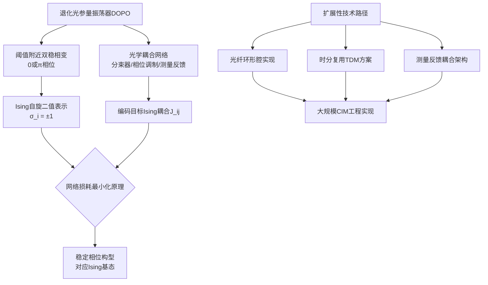

CIM与D-Wave的并存揭示了一个深刻的工程哲学差异：**在量子模拟器谱系中，"专用Ising求解器"这一架构类别本身就并非单一物理载体的产物，而是可由"低温电学"与"常温光学"两种截然不同的物理机制分别实现**。这种物理载体的多样性进一步强化了"专用化"作为一种独立设计哲学的可识别性——无论物理载体是超导磁通比特还是光参量振荡器，只要其硬件架构以最小化Ising哈密顿量为单一设计目标，即可归入这一专用化谱系。

| 比较维度 | D-Wave超导退火机 | CIM相干Ising机 |
|---------|---------------|--------------|
| 物理载体 | 超导磁通比特（铌电流环） | 退化光参量振荡器（DOPO）相位 |
| 工作温度 | 接近绝对零度（稀释制冷）[^30] | 常温（光纤/自由空间光学） |
| 演化机制 | 绝热演化 + 量子隧穿 | OPO网络相变 + 损耗最小化原理 |
| 比特规模（2021前后） | D-Wave 2000Q：2048；Advantage：5000+[^30] | M=4 MAX-CUT-3演示；可扩展TDM方案[^18] |
| 连通性 | Chimera/Pegasus有限连通性[^30] | 原理上可全连通（特别是测量反馈架构） |
| 关键挑战 | 小图嵌入开销、量子加速可证伪性 | 大规模DOPO阵列稳定性、噪声控制 |
| 代表团队 | D-Wave公司 + NEC/东大QFP贡献[^30] | 斯坦福Yamamoto团队、NTT Takesue团队[^18][^29] |

## 7.5 量子加速证据、连通性与噪声的核心争议与挑战

在系统剖析了量子退火的物理原理（7.1节）、D-Wave硬件演化（7.2节）、典型应用（7.3节）与相干Ising机光学路径（7.4节）之后，本节聚焦于专用Ising求解器架构所面临的核心争议与工程挑战。这些争议不仅关乎D-Wave、CIM等具体平台的科学价值评估，更触及"量子加速"这一量子计算与量子模拟领域最具方法论意义的根本性问题。

**第一，量子加速证据的可证伪性争议**。这是围绕D-Wave长期存在的最具学术影响力的争议。**早期D-Wave的"量子性"曾受到部分研究人员质疑，认为其量子比特无法做到全连接**[^30]——这一质疑既涉及硬件层面的连通性问题，也涉及量子退火过程中"量子"成分究竟在多大程度上贡献了计算优势的根本问题。2015年谷歌与NASA报告的"D-Wave在特定问题上比经典计算机快1亿倍"[^30]这一数字此后在更广泛与更精细的基准研究中被反复重新评估，结论呈现出高度的问题依赖性：在某些精心选择的问题实例上，D-Wave确实展示出显著加速；但在与并行回火、SQA（模拟量子退火）、张量网络等先进经典算法的对比下，加速比往往显著缩小乃至消失。**近期基准研究的进展为这一争议提供了新的实证依据**——基于5000+量子比特、增强连接度与混合架构的研究在50+大型稠密哈密顿量优化实例上展示出**相对最佳经典求解器约0.013%的精度提升与约6561倍的求解时间加速**[^31]，这一结果支持了"量子退火在特定大规模稠密优化问题上具有实质性优势"的判断。然而需要注意的是，**过去的基准研究中由于量子比特数与连接度有限，量子退火硬件并未展示出相对经典方法的优势**[^31]——这一历史背景说明，量子加速并非D-Wave硬件的内禀属性，而是依赖于规模、连接度与混合架构等多个工程维度协同改进的结果，且其证据仍需在更广泛的问题集上进一步验证。

**第二，量子隧穿与热涨落的相对贡献争议**。在有限温度（D-Wave的典型工作温度约15 mK）下，退火过程中究竟是量子隧穿主导能量壁垒的跨越，还是残余热涨落主导跨越，这一物理问题直接关系到"量子"加速的物理来源。如7.1节所述，**量子隧穿与经典模拟退火必须翻越能量壁垒不同，它利用量子隧穿效应直接穿过能量壁垒，从而更快找到最优解**[^30]——但在实际D-Wave硬件中，温度并非严格为零，量子比特与环境的耦合也无法完全消除。这导致部分研究者认为，D-Wave的退火过程在很多情况下更类似于"量子启发的有限温度退火"而非"纯粹的零温绝热量子演化"，其在某些问题上的优势可能部分来自热涨落与量子涨落的协同效应而非单纯的量子隧穿。这一争议在理论与实验两个层面均尚未完全澄清，是评估量子退火"量子性"贡献的方法论难点。

**第三，Chimera/Pegasus有限连通性引发的小图嵌入开销**。如7.2节所述，**D-Wave由于硬件限制采用Chimera或Pegasus图连接方式，并非所有量子比特相互连接**[^30]。当目标Ising问题的图结构（即耦合 $J_{ij}$ 的非零模式）与硬件原生拓扑不匹配时，必须通过"小图嵌入"将每个逻辑变量映射为多个物理比特构成的"链"，并通过强耦合保证链内比特同步翻转。这一嵌入过程引入两类显著的开销：**资源开销**——每个逻辑变量可能消耗多个物理比特，使5000+物理比特对应的有效逻辑比特数显著缩水；**性能开销**——链内强耦合会引入额外的能量尺度，可能破坏绝热条件并放大噪声敏感性。Pegasus拓扑相对Chimera的连接度改善[^20]在一定程度上缓解了这一开销，但**对于完全任意拓扑的稠密图问题，嵌入开销仍是限制有效问题规模的核心瓶颈**。这一瓶颈的根本应对路径有两条：进一步提升硬件原生连接度（如未来更高密度的耦合拓扑）；发展原理上全连通的替代物理载体（如7.4节所述的CIM测量反馈架构）。

**第四，噪声与退相干对绝热条件的破坏**。绝热定理的成立依赖于演化时间 $T$ 远大于瞬时能隙倒数平方的某个特征尺度。在实际硬件中，演化时间受限于退相干时间——**在有限退火时间内，退相干与控制误差可能使系统偏离瞬时基态**，从而导致终态并非问题真实基态而是其某个低能激发态。对于能隙在演化过程中急剧缩小的"困难问题"（如Anderson玻璃、NP-hard问题的最劣实例），所需的绝热演化时间可能远超硬件相干时间窗口，使绝热假设失效。这一约束既限制了D-Wave等真实硬件的求解精度，也是量子加速基准研究中"硬件参数 vs 问题难度"权衡的核心方法学难点。

**第五，问题映射通用性的根本局限**。专用Ising求解器架构的根本设计哲学决定了其应用边界被严格限定在可表述为QUBO/Ising形式的问题之上。**它无法直接处理Shor大数分解、量子化学电子结构求解、量子动力学模拟等需要通用门集合或灵活哈密顿量工程的更广泛量子算法领域**——尽管理论上任何NP问题均可在多项式开销内归约为QUBO，但这种归约通常引入显著的常数因子膨胀，且归约后的Ising实例可能远不如原问题在专用算法下高效。这一问题映射通用性的局限是专用Ising求解器与第2—6章所讨论的通用或半通用量子模拟平台在"应用范围 vs 硬件效率"维度上的根本权衡。

| 核心争议/挑战 | 物理/工程根源 | 应对路径与现状 |
|------------|------------|-------------|
| 量子加速证据可证伪性 | 经典算法持续进步、问题依赖性强 | 5000+比特+Pegasus+混合架构展示约6561×加速[^31]，仍需广泛验证 |
| 量子隧穿 vs 热涨落贡献 | 有限温度下二者协同作用、难以分离 | 理论与实验均未完全澄清 |
| Chimera/Pegasus连通性瓶颈 | 物理布线密度限制[^30] | Pegasus提升连接度[^20]；CIM测量反馈实现全连通[^18] |
| 噪声破坏绝热条件 | 退相干时间有限、能隙急剧缩小 | 延长退火时间、降低环境耦合、混合算法补偿 |
| 问题映射通用性局限 | 仅适用于QUBO/Ising形式 | 引入混合量子-经典算法、QUBO重构与启发式 |

在量子模拟器谱系的整体定位中，**专用Ising求解器架构与前六章所讨论的通用或半通用平台形成鲜明对照**。前六章的中性原子、囚禁离子、超导电路、光子学、固态自旋平台共同构成了"通用量子模拟器"的多元生态——它们或者通过模拟式哈密顿量工程灵活适配Hubbard、Ising、Heisenberg等多类目标模型，或者通过通用门集合编译实现任意局部哈密顿量的Trotter化演化，应用范围覆盖凝聚态物理、量子化学、规范场理论、组合优化等广阔领域。而专用Ising求解器以D-Wave超导退火机和CIM相干Ising机为代表，**通过将所有硬件资源集中投入"最小化Ising哈密顿量"这一单一目标，换取了大规模比特数（5000+）、长期产业化部署（自2007年Orion以来连续迭代）与具体应用场景的实用化探索**。

这种"专用 vs 通用"的对照本身就是量子模拟器谱系多样性的重要体现——量子模拟器的发展并非沿着单一路径线性推进，而是在"通用可编程性"与"专用问题深度优化"两个不同的工程哲学维度上同步演化。**截至2021年初，专用Ising求解器在大规模优化与特定NP-hard问题的求解探索上已建立明确的工程化路线与应用场景，但其在量子加速证据、连通性、绝热条件可保持性等核心问题上仍面临持续争议**——这些争议既是该领域科学严谨性的体现，也是推动其进一步演化（更高连接度硬件、混合架构、CIM等替代物理载体）的方法学动力。

下一章将在前七章所建立的"通用与专用、模拟式与数字式、原子与固态与光学"多元谱系的基础上，对各架构在比特规模、相干时间、门保真度、连通性、可寻址性、可编程灵活性、温度环境、典型可模拟模型等关键维度上进行系统横向比较，为读者建立清晰的技术选型与对比认知框架。

# 8 主流量子模拟器架构的横向比较与多维评估

在前七章对中性原子（光晶格与里德堡阵列）、囚禁离子、超导电路、光子学、固态自旋（半导体量子点与NV色心）及量子退火与专用Ising求解器六大物理路线分别进行深度剖析之后，本章进入全报告承上启下的核心环节——**对各架构进行系统化的横向比较与多维评估**。前七章的分别剖析揭示了一个清晰的事实：量子模拟器实现谱系并非沿着单一物理路径线性演化的产物，而是在原子物理、固态电路、光子学、固态缺陷等多条物理主线上同步发展的多元生态。每一条主线均以其独特的物理资源应对量子复杂性这一共同挑战，并在不同的科学问题维度上展现差异化优势。然而，**仅有"分别理解"尚不足以建立对量子模拟器谱系的整体认知——研究者与决策者真正需要的是一套能够将各架构置于统一坐标系下进行系统比较的方法论框架，并据此识别平台间的结构性权衡、互补关系与协同潜力**。

本章正是致力于完成这一方法论收束。其逻辑展开沿三个层次推进：首先确立横向比较的统一方法论框架与评估维度体系，明确各维度的物理含义与量化指标（8.1节）；其次对六大主流架构在关键技术指标上进行系统化的定量对比（8.2节），并在第1章所确立的"模拟式—混合式—数字式"范式光谱中标注各平台的定位坐标（8.3节）；进一步系统梳理各架构与典型科学问题之间的天然适配关系（8.4节），并揭示谱系内的结构性权衡与平台间的互补关系（8.5节）；最后将多维对比凝练为面向研究者与决策者的技术选型决策框架，并对全报告的横向比较进行整体收束（8.6节）。**本章的核心论断是：量子模拟器谱系的多样性并非"寻找最佳平台"的过渡阶段，而是反映量子复杂性本身的多维特征**——这一论断将贯穿本章并为第9章的总结展望奠定方法论基础。

## 8.1 横向比较的方法论框架与评估维度体系

任何严肃的横向比较都必须建立在清晰的方法论框架之上。**量子模拟器横向比较的核心方法论挑战在于：不同物理架构的硬件参数定义、性能基准与适用问题范围彼此差异巨大，简单地将某一架构的"优势指标"移植至另一架构往往导致比较失焦**——例如，将囚禁离子的"门保真度"与光子学的"双光子门概率"直接对比，或将D-Wave的"物理比特数"与超导电路的"逻辑比特数"等量齐观，均会得出误导性结论。为避免此类失焦，本章采用以下方法论原则展开横向比较。

**第一原则是建立统一的评估维度体系**。基于前七章的剖析，本章选取八个具有跨平台可比性的核心维度作为评估坐标轴：**比特数规模**反映可扩展性与希尔伯特空间覆盖能力，是衡量"量子复杂度承载能力"的最直接指标；**相干时间（$T_1$、$T_2$）**刻画量子信息在硬件中的保持能力，决定可执行演化的时间窗口；**单比特门与双比特门保真度**衡量量子操作的精度，是评估"操控质量"的核心参数；**连通性拓扑**——具体可分为全连通、近邻、可重构、有限图嵌入等几类——决定纠缠生成与多体演化所需的电路深度；**可寻址性**反映对单比特进行选择性操控与读出的能力，决定模型映射的灵活度；**可编程灵活性**反映同一硬件适配不同哈密顿量或算法的能力，是模拟式平台与数字式平台分野的关键指标；**温度环境与基础设施门槛**关乎工程化与产业化成本，对应用与产业生态有直接影响；**典型可模拟模型类别**则折射平台与目标科学问题之间的匹配度，是"应用适配性"的综合体现。

**第二原则是明确量化指标的边界条件与时间戳**。本报告所引用的所有量化指标均严格反映**截至2021年初**的状态——这意味着部分2021年下半年及之后的进展（如哈佛48逻辑量子比特工作、Willow芯片"低于阈值"纠错、潘建伟团队2022年格点规范场热化动力学等）虽然在前述章节因因果链需要被简要提及，但在本章横向比较中不作为主体数据点纳入。这一时间边界控制对于保持横向比较的严谨性至关重要——量子模拟器领域演化极快，跨年代的指标混杂会导致比较失真。

**第三原则是区分"物理比特数 vs 有效逻辑比特数"**。这是评估比特规模时必须特别小心的方法论问题。例如，D-Wave Advantage拥有5000+物理量子比特，但由于Chimera/Pegasus拓扑的有限连通性，在求解任意稠密图问题时必须通过小图嵌入将每个逻辑变量映射为多个物理比特构成的"链"，**使得有效逻辑比特数显著低于物理比特数**——这一现象在第7章已得到充分讨论。类似地，超导电路在执行容错量子计算时也需将多个物理比特编码为一个逻辑比特，使127物理比特的Eagle处理器在容错模式下的逻辑比特数远低于物理数。**在比较"规模"维度时，必须明确所讨论的是物理比特还是有效逻辑比特，二者数量级可能相差数十倍**。

**第四原则是引入"门次预算"这一复合指标**。单独考察相干时间或门保真度均不足以全面评估硬件能力——一个相干时间极长但门速率极慢的平台，与一个相干时间较短但门速率极快的平台，其"在相干时间内可执行的门操作总数"（即门次预算 = 相干时间 / 门时间）可能在同一数量级。这一复合指标对于评估硬件在NISQ时代执行变分算法、Trotter电路等任务的实际能力具有更强的预测力。例如，超导电路的 $T_1, T_2 \sim 100$–$300$ μs，双比特门时间约数十至数百ns，门次预算约 $10^3$–$10^4$ 次；囚禁离子超精细量子比特相干时间可达数千秒，双比特门时间约数十至数百μs，门次预算同样约 $10^3$–$10^4$ 次乃至更高。**二者在相干时间上相差约10个数量级，但门次预算量级相当**——这是本章后续讨论"速率 vs 相干"权衡的关键定量基础。

**第五原则是区分"专用性能 vs 通用适配性"**。专用Ising求解器（D-Wave、CIM）在特定QUBO问题上可能展示出令人瞩目的求解速度，但这种"专用性能"并不能直接与超导电路在通用门集合上的运行能力进行简单对比——前者衡量的是单一问题类的深度优化，后者衡量的是广泛问题适配性。**在横向比较中应明确所讨论的"性能"是专用维度还是通用维度，避免将二者混淆**。这一原则呼应了第7章"专用 vs 通用"工程哲学差异的论断。

| 评估维度 | 物理含义 | 主要量化指标 | 方法论注意 |
|---------|--------|------------|----------|
| 比特数规模 | 希尔伯特空间覆盖能力 | 物理比特数、有效逻辑比特数 | 区分二者数量级差异 |
| 相干时间 | 量子信息保持能力 | $T_1$（弛豫）、$T_2$（相干） | 不同平台定义条件不同 |
| 门保真度 | 操作精度 | 单比特门 $F_1$、双比特门 $F_2$ | 注意实验室纪录与平均值的差异 |
| 连通性拓扑 | 纠缠生成效率 | 全连通/近邻/可重构/有限图嵌入 | 影响电路深度与嵌入开销 |
| 可寻址性 | 单比特选择性操控 | 寻址机制、串扰水平 | 决定模型映射灵活度 |
| 可编程灵活性 | 跨任务适配能力 | 软件可重构 vs 硬件特定 | 区分模拟式与数字式 |
| 温度与基础设施 | 工程化门槛 | 工作温度、制冷需求 | 影响产业化成本 |
| 可模拟模型类别 | 应用匹配度 | 典型科学问题列表 | 折射平台-问题匹配 |

基于上述方法论原则与维度体系，下文各节将在统一的话语框架下对六大架构展开系统化的对比分析。

## 8.2 六大架构在关键技术指标上的定量对比

本节通过系统化的横向对比表，将前七章所剖析的主流架构在八个核心维度上的截至2021年初的量化指标加以集中陈列。下表是本章乃至全报告横向比较的核心数据基础。

| 架构 | 比特规模 | 相干时间 | 单比特门保真度 | 双比特门保真度 | 双比特门时间 | 连通性 | 运行温度 | 可寻址性 |
|------|--------|--------|-------------|-------------|-----------|------|--------|--------|
| 中性原子光晶格 | 数百至数千格点（潘建伟团队71格点；可扩展至数万） | 大规模并行纠缠制备（具体$T_2$未严格量化） | — | — | 演化连续，无离散门概念 | 几何固定（一/二/三维），近邻 | 接近绝对零度（nK量级） | 量子气体显微镜支持单格点成像 |
| 中性原子里德堡阵列 | 256原子（哈佛2021）；Browaeys团队同期相近规模 | 里德堡态数十至数百μs；基态秒量级 | $\sim 99\%$ | 阻塞门约 $95\%$–$99\%$，受Rydberg能级移位限制 | $\sim 0.1$–$1$ μs | 可重构（SLM/AOD原子重排，约99%填充） | μK量级 | 微米级间距，单原子寻址常规化 |
| 囚禁离子 | 单链数十离子；NIST Penning阱约200 $^9\text{Be}^+$ | $^{171}\text{Yb}^+$ 超精细：T₁约12000s；相干时间可达约5500秒 | $>99.99\%$ | $\sim 99.9\%$（实验室纪录约99.9% @ 1.6μs） | 数十至数百μs | 天然全连通（声子总线，幂律α可调） | UHV + 激光冷却至运动基态 | 高（电子搁置技术约100%读出） |
| 超导电路 | 53/54比特（Sycamore）至127比特（IBM Eagle） | $T_1, T_2 \sim 100$–$300$ μs | $>99.9\%$ | $\sim 99\%$–$99.5\%$ | 数十至数百ns | 近邻（Google方格 + 可调耦合器；IBM重六边形度2–3） | 15–20 mK 稀释制冷 | 微波驱动+读出谐振器 |
| 光子学 | "九章"76光子；集成光子芯片接近1000元件 | 弱环境耦合，数百公里量级传输；无传统$T_2$概念 | — | 线性光学下双光子门概率性 | 取决于探测时间 | 线性光学网络（概率性纠缠门） | 常温（SNSPD探测器2–4 K） | 集成光路软件可编程 |
| 半导体量子点 | 少数至十余量子点已演示；3比特GHZ等小规模成果 | $^{28}$Si/SiGe：约20 μs；$^{28}$Si MOS：约28 ms；$^{31}$P 核自旋 $>30$ s | $>99\%$（突破表面码阈值） | $>99\%$（突破表面码阈值） | 数十至数百ns | 近邻栅控耦合；可借表面声波传送 | 稀释制冷约100 mK；部分"热量子比特"$>1$ K | 栅极电学寻址 |
| NV色心 | 单NV+近邻 $^{13}$C/$^{14}$N 寄存器（约10比特以下） | $^{12}$C 纯化金刚石中可达毫秒量级 | 高保真度（具体数值视实验条件） | 偶极耦合数十kHz量级限制 | μs—ms量级（受耦合强度限制） | 自旋间偶极弱耦合（$1/r^3$） | 常温大气环境（4 K进一步提升） | 光学ODMR单点寻址（共焦显微镜） |
| 量子退火 D-Wave | D-Wave 2000Q：2048；Advantage：5000+（于利希研究中心，2022初） | 不适用（绝热演化框架，非门模型） | 不适用 | 不适用 | 不适用（退火时间约μs—ms） | 有限连通：Chimera度6 / Pegasus度15 | 接近绝对零度（稀释制冷） | 全局退火，QUBO映射 |
| 相干Ising机 CIM | M=4 MAX-CUT-3初步演示；TDM方案可扩展 | 常温光学，长光纤腔 | 不适用 | 不适用 | 不适用（DOPO振荡演化） | 原理上可全连通（特别是测量反馈架构） | 常温 | 全局光学耦合网络 |

从这一对比矩阵可以提炼出五项核心定量发现，每一项均揭示了量子模拟器谱系内部某一维度上的结构性差异。

**第一，比特规模呈现约4个数量级的跨平台差异**。一端是NV色心约10比特以下的小规模量子寄存器，另一端是D-Wave Advantage的5000+物理量子比特；中间则分布着囚禁离子（数十）、超导电路（数十至127）、光子学集成芯片（千元件）、中性原子光晶格（数百至数千）等不同量级。**这一巨大差异表明，"规模"并非量子模拟器优劣的单一判据**——D-Wave的5000+比特受Chimera/Pegasus有限连通性制约，其有效逻辑比特数远低于物理数；NV色心虽规模小，但凭借纳米传感与生物兼容能力开拓了其他平台无法触及的应用空间。

**第二，相干时间呈现约10个数量级的跨平台差异**。囚禁离子 $^{171}\text{Yb}^+$ 超精细量子比特相干时间可达约5500秒，而超导电路Transmon比特的 $T_1, T_2$ 典型仅100—300 μs，**二者相差约 $10^{10}$ 量级**。然而，这一巨大差距并不直接等同于"操作能力"差距——超导电路以纳秒级门时间补偿了相干时间的劣势，使二者的"门次预算"（相干时间/门时间）量级相当，均约为 $10^3$–$10^4$ 次门操作。这是8.1节所述"门次预算复合指标"方法论价值的最直接体现。

**第三，门保真度呈现约2个数量级的跨平台差异**。囚禁离子单比特门保真度可达 $>99.99\%$、双比特门约99.9%处于全平台领先；半导体量子点单/双比特门保真度均突破99%表面码阈值；超导电路单比特门 $>99.9\%$、双比特门99%—99.5%；中性原子里德堡阻塞门保真度因Rydberg能级移位限制约95%—99%。**这种保真度差异直接决定了各平台在执行容错量子计算时所需的物理比特开销与电路深度上限**。

**第四，连通性拓扑呈现五类显著分野**。囚禁离子的全连通（声子总线）、超导电路的近邻（方形格点或重六边形）、中性原子里德堡阵列的可重构（SLM/AOD原子重排）、D-Wave的有限图嵌入（Chimera/Pegasus）、CIM的原理上全连通（光学测量反馈）——这五类拓扑代表了量子比特之间建立有效相互作用的根本不同物理机制。**连通性的差异在执行需要密集远程纠缠的量子模拟任务时产生数量级的电路深度差异**：在全连通拓扑上一步直接实现的双比特门，在近邻拓扑上可能需要多次SWAP门链才能完成等价操作。

**第五，运行温度跨度极广，从nK到常温**。中性原子光晶格需冷却至nK量级；超导电路与D-Wave需稀释制冷至15—20 mK；半导体量子点需约100 mK；囚禁离子需UHV+激光冷却；NV色心与光子学线性光学方案可在常温大气下工作（光子学超导单光子探测器需液氦或脉管制冷至2—4 K）。**这一温度跨度直接决定了各平台的基础设施门槛与产业化路径差异**——常温运行的NV色心可在常规光学实验室部署，而需要稀释制冷的超导电路则依赖于价格昂贵的工程基础设施。

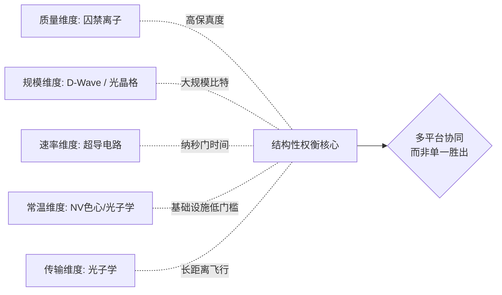

这一定量对比的整体图景揭示了一个核心事实：**量子模拟器谱系内不存在在所有维度上同时领先的"最佳架构"**。每一个架构在某些维度上具有显著优势，同时也在其他维度上面临结构性限制。这种"长板各异、短板互补"的分布形态，正是下文8.5节"结构性权衡与互补关系"分析的实证基础，也是8.6节"技术选型决策框架"得以成立的方法论前提。

## 8.3 各架构在范式光谱中的定位与可编程性评估

在第1章所确立的"模拟式—混合式—数字式"范式光谱基础之上，本节系统标注各架构的定位坐标，并对其可编程灵活性进行专项评估。这一定位评估的核心方法论意义在于：**范式光谱上的位置直接决定了该平台对应的工程瓶颈类型、所适合的科学问题领域、以及向通用容错量子计算演化的可行路径**。

将六大架构沿范式光谱依次标注，可得到下图所示的整体定位图景。

```
纯模拟式 ←─────────────────────────────────────→ 纯数字式

[量子退火/CIM]   [光晶格]   [里德堡阵列]   [囚禁离子]   [超导电路]   [光子学]
   专用绝热式      模拟        模拟偏混合      混合中心      偏数字       双重定位
                                                                       （专属+远期通用）

   [NV色心]: 小规模时偏数字（电子-核自旋寄存器+门操作），系综时偏模拟
   [半导体量子点]: 双模式——大阵列做Fermi-Hubbard模拟；小阵列做数字门
```

**量子退火与CIM专用Ising求解器**作为偏离通用范式光谱的独立支线，**构成"专用绝热式/相变式"范畴**。如第7章所论证，这一架构以最小化Ising哈密顿量为单一硬件设计目标，放弃了通用门集合的可编程性，换取了大规模比特集成与具体问题深度优化的能力。在范式光谱上，它不属于"模拟式—数字式"的连续光谱本身，而是一条独立的支线——其物理机制虽然涉及连续的绝热演化（D-Wave）或OPO相变（CIM），与模拟式范式有某种亲缘性，但其专用化设计哲学使其与中性原子光晶格那种"哈密顿量按需雕刻"的灵活模拟式截然不同。

**中性原子光晶格**典型占据**模拟式主导端**。其哈密顿量与Bose/Fermi-Hubbard模型几乎严格对应，无需Trotter门分解即可通过激光参数连续调节直接实现目标演化。其可编程性体现为对哈密顿量参数（晶格深度、相互作用强度、维度、几何）的连续调节，而非对离散门序列的软件配置——**这种"硬件参数化"而非"软件门级"的可编程模式，是模拟式范式的标志性特征**。其优势在于资源效率极高，可在数百至数千格点规模上同步并行演化；其代价是对"按需切换问题类别"的能力有限。

**中性原子里德堡阵列**因Rydberg阻塞门的天然数字化特性向**混合范式延伸**。其物理实现兼具两种模式：连续演化下的多体里德堡相互作用属于模拟式，借助阻塞效应实现的离散双比特门属于数字式。同时，原子可重构的几何构型为可编程性提供了额外维度——通过SLM/AOD原子重排，研究者可在50—100 ms内重新配置阵列几何，实现一定程度的"硬件可重构"。这种"模拟连续演化 + 数字阻塞门 + 几何可重构"三重能力组合，使里德堡阵列在范式光谱上占据模拟与混合之间的过渡位置。

**囚禁离子**凭借**全局Mølmer–Sørensen耦合**与**高保真度通用门集合**的双模能力，占据**混合范式中心位置**。如第3章所详细论证，该平台同一硬件可在两种模式间无缝切换并自然结合——模拟式模式以全局耦合作为多体哈密顿量演化的"硬件原语"，数字式模式以高保真度通用门集合实现任意局部哈密顿量的Trotter编译。**这一"模拟原语 + 数字编程"的有机融合，使囚禁离子被广泛视为对数字-模拟混合范式适配度最高的物理实现**，是NISQ时代变分算法、量子-经典混合优化的理想载体。

**超导电路**从设计之初即围绕**通用门集合构建**，处于**数字式为主、兼具混合能力**的位置。Transmon比特与数字量子计算的电路模型严格同构，使其成为执行Trotter–Suzuki分解、VQE、QAOA等数字式与混合式任务的核心载体。其可编程灵活性体现为顶层的软件可重构——同一台超导处理器可通过软件配置模拟横场Ising、Hubbard模型、规范场理论等多种哈密顿量。同时，基于IBM处理器cross-talk的数字-模拟混合模拟工作已展示，**利用比特间天然存在的耦合作为"模拟原语"，结合稀疏单比特门以更少门次实现等价多体演化效果**——这是超导平台向混合范式延伸的代表性体现。

**光子学**在范式光谱上呈现**"特定问题专属优势 + 远期通用潜力"的双重定位**。在玻色采样、量子行走、ENAQT、霍金辐射类比等问题上，其物理演化天然映射目标问题的数学结构而无需Trotter分解，呈现典型的模拟式色彩——"九章"76光子高斯玻色采样是这一专属优势的标志性兑现。同时，KLM协议保证了线性光学+单光子探测在原则上可实现普适量子计算，使光子学路线具备演化为通用门量子计算载体的远期潜力。集成光子芯片通过MZI阵列的软件可重构特性，使任意酉变换可通过相位移器电压调整加以配置——这一软件可重构性是光子学路线在通用性维度上的关键工程优势。

**半导体量子点与NV色心**则位于**模拟与小规模数字双模兼具的中间区段**。半导体量子点的可编程性体现为两重模式：大阵列上通过栅压调节实现Fermi-Hubbard哈密顿量工程（模拟式），少数量子点上以单/双比特门突破99%表面码阈值后支持数字电路（数字式）。NV色心的可编程性则呈现"电子-核自旋寄存器小规模数字 + NV系综或2D核自旋网络的模拟式哈密顿量类比"的双重形态。**这两类固态自旋平台共同折射出范式光谱在固态自旋领域呈现的混合特征**。

| 架构 | 范式光谱定位 | 可编程性主要形式 | 软件可重构程度 |
|------|------------|--------------|--------------|
| 中性原子光晶格 | 模拟式主导 | 激光参数连续调节哈密顿量 | 低（硬件参数化为主） |
| 中性原子里德堡阵列 | 模拟+混合（阻塞门数字化） | 原子几何重构+连续演化+阻塞门 | 中（几何可重构50—100 ms） |
| 囚禁离子 | 混合范式中心 | 全局Mølmer–Sørensen+通用门集合无缝切换 | 高（双模灵活适配） |
| 超导电路 | 数字式为主，兼具混合 | 通用门集合软件编译+cross-talk混合 | 极高（Qiskit/Cirq生态） |
| 光子学集成芯片 | 专属优势+远期通用 | MZI阵列软件可重构任意酉变换 | 高（相位移器电压调控） |
| 半导体量子点 | 模拟+小规模数字双模 | 栅压调节Fermi-Hubbard+门突破阈值 | 中（半自动化调试工具箱） |
| NV色心 | 模拟为主+小规模数字 | 微波/射频脉冲序列+NV-核寄存器 | 低-中（小规模） |
| 量子退火/CIM | 专用绝热式/相变式（独立支线） | QUBO问题映射 | 低（仅Ising/QUBO形式） |

**可编程灵活性的差异直接折射出各架构在工程哲学上的根本分野**：超导电路与光子集成芯片以软件可重构性为核心理念，强调"硬件固化、软件适配"的可扩展路径；囚禁离子在模拟与数字模式间的无缝切换，体现了"双模硬件 + 算法灵活映射"的中间路径；中性原子里德堡阵列以原子重排实现几何可编程，代表了"硬件物理重构"这一独特能力；专用Ising求解器则放弃通用可编程性换取问题深度优化，是工程哲学谱系的另一极端。**这种可编程性形态的多样性，正是量子模拟器谱系丰富生态的另一重要表现**。

## 8.4 各架构最适合的科学问题领域与应用适配关系

在完成对各架构在技术指标与范式光谱定位上的横向比较之后，本节进入更具实践指导意义的层面——系统梳理各架构与典型科学问题之间的天然适配关系，建立"平台—问题"映射图谱。这一映射图谱的核心方法论意义在于揭示一条贯穿全报告的关键原则：**"选对平台比选最强平台更重要"**——在某些问题上看似"性能较弱"的平台可能正是该问题的最佳载体，反之亦然。

**中性原子光晶格**凭借与Bose/Fermi-Hubbard模型的天然映射，成为**凝聚态强关联问题的首选平台**。其适配的核心科学问题包括：高温超导机制——通过扫描 $U/t$ 比与温度参数空间，研究Fermi-Hubbard模型在反铁磁关联、d-波配对、条纹相等区域的相图；Mott相变与超流态——直接观测Bose-Hubbard系统中超流到Mott绝缘体的量子相变及其临界标度；量子磁性——基于超交换机制在Mott区域内研究反铁磁与铁磁关联；合成规范场与Schwinger方程——潘建伟团队71格点超冷原子模拟Schwinger方程是这一适配性的标志性兑现；低维量子液体与任意子激发——一维Tomonaga-Luttinger液体行为与二维任意子统计的观测。**这些问题的共同特征是其哈密顿量与光晶格平台的物理实现几乎严格对应，"无需翻译"的映射关系使资源效率达到最优**。

**中性原子里德堡阵列**以可重构几何与Rydberg blockade成为**Ising/XY自旋模型与组合优化问题的代表载体**。其适配的核心科学问题包括：Ising型自旋模型的量子相变与有序——van der Waals相互作用映射为Ising相互作用，可直接观测顺磁-反铁磁相变及其临界标度；XY与Heisenberg自旋链动力学——通过共振偶极-偶极相互作用工程化生成 $\sigma^x\sigma^x+\sigma^y\sigma^y$ 形式的耦合；多体局域化与量子scars——淬火动力学中的非热化现象与"伤痕态"演化；**特别是组合优化问题——由于Rydberg blockade在几何上自然对应于"在某个半径内最多激活一个顶点"这一约束，将待优化问题的图结构映射为原子几何后，该平台可天然求解最大独立集（MIS）等NP-hard问题**——这是其他模拟平台难以高效实现的独特能力。哈佛Lukin团队256原子可编程量子模拟器对物质量子相的探测是该平台能力的标志性兑现。

**囚禁离子**以幂律可调长程相互作用见长，适配于**需要全连通或长程耦合的量子模拟任务**。其适配的核心科学问题包括：长程Ising反铁磁相变——通过 $J_{ij}\propto |i-j|^{-\alpha}$（$\alpha$ 连续可调）的可调长程相互作用，研究从近邻到全连通区间内的相变性质连续变化；Lipkin-Meshkov-Glick（LMG）模型——全连通相互作用的代表性模型，其量子相变与临界涨落可直接观测；时间晶体与离散对称性破缺——基于MBL的时间晶体相已在Monroe团队的10离子链上得到首次演示；规范场理论数字模拟——Innsbruck团队2016年在4离子规模上以数字Trotter方式模拟Schwinger模型；动力学相变与信息扰动——在长程相互作用驱动下，Lieb-Robinson界的破缺与信息快速扩散现象。**囚禁离子的全连通性使其在求解需要密集远程纠缠的问题上具有结构性优势**。

**超导电路**以软件可编程性适配**横场Ising、Hubbard模型、随机线路采样与变分算法**等数字式与混合式任务。其适配的核心科学问题包括：横场Ising模型的淬火动力学与多体局域化——通过Trotter电路直接编译；Hubbard型模型的数字化模拟——尽管远不如光晶格"原生映射"高效，但可借助软件灵活适配多种变体；随机量子线路采样（RCS）——Sycamore 53比特"量子霸权"演示的核心问题；变分量子本征求解器（VQE）与量子近似优化算法（QAOA）——求解量子化学基态、组合优化问题的主流方案；玻色子-量子比特映射下的量子光学问题——通过数字化技术将动力学Casimir效应、分子力场等模拟问题纳入超导平台。**超导平台的可编程灵活性使其在"应用范围广度"维度上具备独特优势**。

**光子学**在玻色采样、量子行走、ENAQT、霍金辐射类比等专属任务上具有**不可替代优势**。其适配的核心科学问题包括：玻色采样与高斯玻色采样——其物理实现仅需输入光子、线性光学网络与单光子探测器，是光子学的"专属赛道"，"九章"76光子GBS是这一专属优势的标志性兑现；量子行走——波导阵列与集成芯片自然实现连续/离散时间量子行走，适配拓扑相、Anderson局域化、PT对称物理研究；环境辅助量子输运（ENAQT）——FMO光合作用激子传递等量子生物学过程的可控模拟；基础物理类比模拟——光纤非线性脉冲实现人工事件视界以类比霍金辐射、Unruh效应、Dirac方程曲时空量子场论现象。**这些问题的共同特征是其数学结构天然映射光子在波导/光纤网络中的传播动力学，无需Trotter分解即可通过光学演化直接再现**。

**半导体量子点**天然映射**Fermi-Hubbard物理与少体磁性、阻挫问题**。其适配的核心科学问题包括：Fermi-Hubbard模型的大阵列相图扫描——电子在静电定义的周期势中的低能动力学严格对应Fermi-Hubbard哈密顿量；集体库仑阻塞跃迁——相互作用驱动的Mott转变在有限尺寸下的对应物；少体磁性与阻挫——四量子点正方阵列填充三电子的少体磁性研究，是研究阻挫磁性最简洁的少体类比；超交换机制的精细刻画——3—4量子点小阵列对超交换强度、阻挫诱导简并的精确测量。**与第2章光晶格平台的Hubbard映射形成"固态电子 vs 中性原子"的物理实现互补**。

**NV色心**独具**纳米传感、生物兼容量子探测与混合自旋-力学模拟能力**。其适配的核心科学问题包括：纳米尺度磁成像——金刚石针尖+AFM对转角CrI₃摩尔磁序的纳米尺度磁成像；单层材料纳米核磁共振——单层氮化硼材料的纳米级NMR探测；混合自旋-力学LMG模型——悬浮纳米金刚石中NV系综与扭转振动的强耦合实现LMG模型量子相变与有限粒子数效应观测；2D核自旋网络量子模拟——借助NV色心实现原子核自旋超极化构建2D自旋网络作为量子模拟新载体；活体细胞内量子传感——金刚石的生物兼容性使NV色心可深入生物系统进行原位量子测量。**这些应用空间在其他物理平台上完全无法实现，是NV色心独有的"量子-生物交叉接口"价值**。

**量子退火与CIM**专门服务于**QUBO/Ising形式的组合优化与玻璃态系统**。其适配的核心科学问题包括：组合优化问题——图划分、最大割（MAX-CUT）、最大独立集、车辆路径规划、投资组合优化、5G Massive MIMO信道译码等NP-hard问题；玻璃态系统——三维Ising自旋玻璃基态搜索、相变临界行为、遍历性破缺；机器学习——玻尔兹曼机训练、生成模型采样；磁共振飞行控制系统检验——洛克希德·马丁的早期商业应用。**这一专用化定位决定了其应用范围被严格限定在可表述为QUBO/Ising形式的问题之上**。

| 科学问题领域 | 首选平台 | 次选平台 | 关键适配特征 |
|------------|--------|--------|------------|
| 高温超导/Fermi-Hubbard | 中性原子光晶格 | 半导体量子点 | $U/t$ 比连续可调，Hubbard天然映射 |
| 量子磁性/反铁磁 | 中性原子光晶格、囚禁离子 | 里德堡阵列 | 超交换或长程耦合 |
| Ising/XY自旋模型 | 囚禁离子、里德堡阵列 | 超导电路 | 长程或可重构耦合 |
| 规范场理论模拟 | 光晶格、囚禁离子 | 超导电路 | 71格点 Schwinger / 数字Trotter |
| 拓扑相/合成规范场 | 中性原子光晶格 | 超导电路 | 激光辅助隧穿、可编程相位 |
| 玻色采样类问题 | 光子学 | — | 物理"专属赛道" |
| 量子行走 | 光子学 | 超导电路 | 波导阵列自然实现 |
| ENAQT/量子生物输运 | 光子学 | — | 可控耗散+相干耦合 |
| 霍金辐射类比 | 光子学 | — | 光纤非线性人工事件视界 |
| 时间晶体/MBL | 囚禁离子 | 超导电路 | 长程相互作用+无序 |
| LMG模型 | 囚禁离子、NV悬浮金刚石 | — | 全连通耦合 |
| 随机线路采样/RCS | 超导电路 | — | 通用门集合+大规模 |
| VQE/量子化学 | 超导电路、囚禁离子 | 半导体量子点 | 混合量子-经典算法 |
| QAOA/组合优化 | 超导电路、D-Wave、CIM、里德堡阵列 | 囚禁离子 | 多路径互补 |
| 纳米尺度量子传感 | NV色心 | — | 单自旋+光学寻址 |
| 生物兼容量子探测 | NV色心 | — | 化学惰性+纳米尺寸 |
| 少体磁性/阻挫 | 半导体量子点 | 囚禁离子 | 3—4 QD精细控制 |

这一"平台—问题"映射图谱清晰表明：**量子模拟器谱系的多样性恰恰对应于科学问题维度的多样性**。每一个科学问题在量子模拟器谱系中都存在最适合的物理载体，而不同问题之间在最佳平台选择上的差异，本身就反映了量子复杂性多维度本质的客观存在。**这一图谱也为8.6节技术选型决策框架提供了核心知识基础**。

## 8.5 各架构的结构性权衡与互补关系

在完成对各架构在技术指标、范式光谱定位、科学问题适配的多维比较之后，本节聚焦于揭示量子模拟器谱系内的**核心结构性权衡**与**平台间的互补关系**。这一分析的核心方法论意义在于：理解谱系内不同架构之间的"取舍逻辑"与"互补价值"，比简单地评判"谁优谁劣"具有更深的实践指导意义。

### 三组核心结构性权衡

**第一组权衡：质量 vs 规模**。这是量子模拟器谱系内最为根本的权衡。一端是囚禁离子，以其约5500秒的相干时间、$>99.99\%$ 单比特门保真度、$\sim 99.9\%$ 双比特门保真度与天然全连通拓扑代表"高质量量子比特"的极致——但其单链比特规模典型仅为数十离子，规模扩展受声子谱密集化与控制复杂度的限制。另一端是中性原子光晶格（数千格点）与D-Wave（5000+比特），以大规模比特集成代表"规模"的极致——但其门保真度（光晶格无离散门概念但有效温度限制其精度；D-Wave受Chimera/Pegasus连通性制约影响有效逻辑比特数）相对较低。**这一权衡的物理根源在于：高质量比特需要精细的局域操控与隔离，而大规模集成需要简化的并行操控与紧凑的物理布局，二者在工程实现上呈现根本张力**。

**第二组权衡：速率 vs 相干**。这是数字式范式平台内部最为关键的权衡。超导电路以纳秒级双比特门时间与100—300 μs相干时间形成一组配比；囚禁离子以微秒级双比特门时间与数千秒相干时间形成另一组配比。乍看之下，二者相干时间相差约10个数量级——但门次预算（相干时间/门时间）量级却相当，均约为 $10^3$–$10^4$ 次门操作。**这一表观矛盾的物理含义是：相干时间与门速率呈"匹配关系"而非"独立优化关系"——一个平台的门速率与相干时间往往由同一物理机制决定**。超导电路的纳秒门时间源于其GHz级比特频率，而比特频率高意味着更大的能隙、更快的耗散；囚禁离子的微秒门时间源于阱频率（MHz级），而阱频率低意味着更稳定的运动模式与更长的相干时间。**这一权衡决定了不同平台在"算法迭代速度 vs 单次算法精度"的工程取舍上呈现不同的优势区间**。

**第三组权衡：通用性 vs 专用性**。这是范式光谱在最宏观层面的核心权衡。通用量子模拟器（中性原子、囚禁离子、超导电路、光子学、固态自旋）适配范围广，可灵活模拟Hubbard、Ising、Heisenberg、规范场等多类目标模型，但工程门槛高、扩展节奏受多重物理约束制约。专用Ising求解器（D-Wave、CIM）以放弃通用性换取大规模比特集成与具体问题深度优化——D-Wave自2007年16比特Orion起步以来连续迭代至2022年初5000+比特规模，远超同期通用门量子计算机的物理比特数量级。**这一权衡的工程哲学意义在于：量子模拟器的"实用化路径"并非单一——既可以通过通用化路径覆盖广泛问题，也可以通过专用化路径在特定问题上深度优化；二者并非互斥而是并存**。

### 四类核心互补关系

**第一类互补：飞行光子 vs 静止量子比特**。光子学路线以"飞行量子比特"为核心载体，擅长分布式架构与跨距离量子信息传输；超导电路、囚禁离子、中性原子、固态自旋以"静止量子比特"为核心载体，擅长本地高保真度运算与高密度集成。这种"飞行 vs 静止"的工程二象性决定了**量子模拟器的最终形态很可能是多平台协同的混合架构——本地节点采用超导/离子/原子平台执行高保真度门运算，节点间通过光子学网络建立纠缠并实现量子态传输**。光腔QED作为"光-物质纠缠接口"在其中扮演关键角色，囚禁离子+腔QED的离子-光子纠缠生成（如Chen等人提出的离子-腔QED高维两光子门）正是这一互补关系的代表性实证。

**第二类互补：低温固态 vs 常温光学**。在工程基础设施需求上，超导电路（15—20 mK）、D-Wave（接近绝对零度）、半导体量子点（约100 mK）等需要稀释制冷机的低温固态平台，与光子学线性光学方案、NV色心、CIM等常温运行的光学/固态平台形成基础设施门槛上的鲜明对比。**这种基础设施互补性意味着：在不同应用场景下（如学术研究、大型数据中心、便携式量子传感、分布式量子网络），不同平台具备各自的最优适配区间**。NV色心的常温运行能力使其成为现场量子传感的首选；超导电路的稀释制冷需求使其更适合于大型计算中心部署；光子学的常温运行+光纤网络兼容使其在量子通信领域具备产业化先发优势。

**第三类互补：原子物理路线 vs 工程化路线**。中性原子、囚禁离子等原子物理路线以"自然给定的微观系统"为出发点，依托原子能级的物理稳定性获得高质量量子比特——其优势在于**物理稳定性与原子能级的内禀均匀性**，比特间的"频率均匀性"达到原子物理精度。超导电路、半导体量子点等工程化路线以"人工设计的宏观量子系统"为出发点，通过半导体微纳工艺批量制造具有原子般离散能级的电路元件——其优势在于**与现代半导体工业生态的深度兼容**，可享受批量化生产、规模化扩展的产业红利。**这两条路线在"物理稳定性 vs 工艺成熟度"维度上呈现根本互补**：前者通过自然原子的稳定性获得高保真度，但扩展受激光寻址、UHV等复杂工程的制约；后者通过工艺成熟度获得规模化能力，但受材料缺陷、电荷无序等固态环境噪声的限制。

**第四类互补：模拟式 vs 数字式范式**。中性原子光晶格等模拟式平台以哈密顿量按需雕刻见长，在凝聚态强关联问题上具有"无需翻译"的资源效率优势；超导电路等数字式平台以软件可编程见长，在跨任务适配性上具有结构性优势。**囚禁离子作为"模拟+数字双模"平台、里德堡阵列作为"模拟+阻塞门混合"平台、半导体量子点作为"大阵列模拟+小阵列数字"平台，分别在这一互补关系的中间区段填充了多种独特组合形态**。这种范式互补性意味着：量子模拟器的科学价值兑现并非沿单一范式路径推进，而是在模拟式、数字式、混合式三类范式上同步演化，各自在不同问题维度上发挥作用。

### 多平台协同生态的整体图景

将上述权衡与互补关系综合考量，可以勾勒出量子模拟器谱系的整体演化图景——**它并非沿着"单一平台胜出"的简单逻辑演化，而是呈现"多平台协同生态"的复杂结构**。在这一生态中：

- **囚禁离子**与**超导电路**共同代表通用门量子计算路线的两大主流实现，前者以质量与全连通性见长，后者以速率与可集成性见长；
- **中性原子光晶格**与**里德堡阵列**共同代表量子模拟最具规模的实现路线，前者以Hubbard物理见长，后者以可重构几何与组合优化见长；
- **光子学**以"飞行光子"独占分布式量子模拟与量子通信生态，并以玻色采样等专属任务展示物理路线的不可替代性；
- **半导体量子点**与**NV色心**共同代表固态自旋路线，前者依托CMOS兼容性指向大规模集成的未来，后者依托常温运行与生物兼容性开拓量子传感独特生态；
- **D-Wave**与**CIM**共同代表专用Ising求解器路线，前者以低温电学路径已实现5000+比特规模化部署，后者以常温光学路径提供原理上全连通的替代方案。

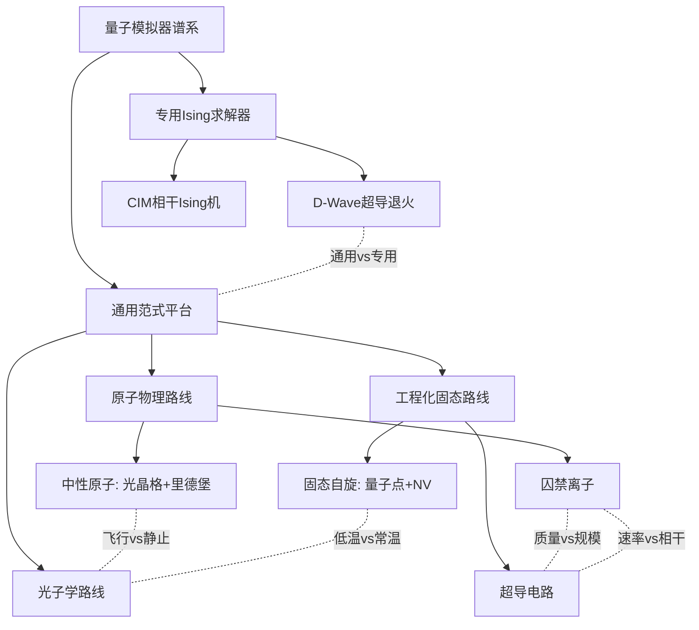

**这一生态结构的多样性不是"过渡阶段"或"技术不成熟"的体现，而是反映量子复杂性本身的多维特征**——量子多体问题涵盖从凝聚态强关联到高能规范场、从量子化学到量子生物、从组合优化到量子通信的极广阔范畴，单一物理平台不可能在所有维度上同时领先。**这种结构性多样性是量子模拟器谱系的内禀属性，而非有待消除的"缺陷"**——这一论断将作为本章方法论收束的核心结论之一，并为第9章对未来发展展望的"多平台协同主导"判断奠定基础。

## 8.6 技术选型决策框架与综合评估收束

本章前五节系统建立了从评估维度体系（8.1节）、关键指标定量对比（8.2节）、范式光谱定位（8.3节）、科学问题适配关系（8.4节）到结构性权衡与互补关系（8.5节）的完整横向比较框架。本节将这一框架凝练为面向研究者与决策者的**技术选型决策框架**，并对全报告的横向比较进行整体收束。

### 技术选型决策框架

基于前述多维比较，技术选型可沿"目标科学问题—关键技术指标需求—候选平台筛选—权衡取舍"四步逻辑展开。

**第一步：根据目标科学问题确定核心技术需求**。这一步是技术选型的起点，也是8.4节"平台—问题"映射图谱的直接应用。具体而言：长程相互作用需求指向囚禁离子（幂律可调 $\alpha\sim 0$–$3$）或中性原子里德堡阵列（数微米偶极耦合）；大规模并行计算需求指向中性原子光晶格（数百至数千格点）或D-Wave（5000+比特）；纳米尺度传感需求指向NV色心（单自旋光学寻址+纳米空间分辨率）；QUBO形式的组合优化需求指向D-Wave或CIM；分布式量子通信需求指向光子学；Fermi-Hubbard物理需求指向中性原子光晶格或半导体量子点；快速迭代变分算法需求指向超导电路（纳秒级门时间+成熟算法生态）。

**第二步：根据规模、相干、保真度、连通性等关键指标进行候选平台筛选**。这一步将8.2节的定量对比矩阵作为参考工具，根据目标问题对"规模—相干—保真度—连通性"组合的具体需求进行筛选。例如：若问题需要数千比特规模的并行演化（如Hubbard相图扫描），则光晶格成为首选，D-Wave亦可考虑但需评估QUBO映射可行性；若问题需要 $>99.9\%$ 双比特门保真度（如精细的相变临界标度刻画），则囚禁离子成为首选；若问题需要全连通拓扑下的密集远程纠缠（如LMG模型），则囚禁离子或CIM成为首选；若问题需要常温运行（如生物量子传感），则NV色心或光子学成为首选。

**第三步：针对剩余候选平台在工程门槛、产业生态、混合范式适配能力等维度进行权衡取舍**。这一步是技术选型的精细化环节，需要综合考虑非技术性因素。具体而言：在工程门槛上，常温运行的NV色心、光子学、CIM显著低于需要稀释制冷的超导电路、D-Wave、半导体量子点；在产业生态上，超导电路（IBM Qiskit、Google Cirq、Rigetti pyQuil）与光子学（量子通信产业链）已形成最为成熟的算法-硬件-用户闭环，囚禁离子（IonQ、Quantinuum）与D-Wave亦具备商业化能力，而中性原子、NV色心目前主要为学术驱动；在混合范式适配能力上，囚禁离子最贴近混合范式中心，超导电路、里德堡阵列、半导体量子点亦具备双模能力。

**第四步：明确"选对平台比选最强平台更重要"的原则**。这一原则是技术选型决策框架的方法论核心。如8.4节所论证，在某些问题上看似"性能较弱"的平台可能正是该问题的最佳载体——例如，NV色心在比特规模上远落后于其他平台（约10比特以下），但在纳米磁成像、生物量子传感等应用上具有不可替代价值；光子学在双光子门确定性上存在固有局限，但在玻色采样、量子行走等专属任务上展示出经典超算无法企及的优势。**技术选型的核心不是"寻找最优秀的平台"，而是"匹配问题与平台的天然契合度"**。

### 典型场景的选型示例

为更具体地演示这一决策框架的实际应用，下文以五个典型科学场景为例进行说明。

**场景一：凝聚态强关联问题（如高温超导机制研究）**。核心需求：Fermi-Hubbard哈密顿量的精确实现+大规模格点并行演化+连续可调 $U/t$ 比。首选平台：中性原子光晶格（潘建伟、Bloch等团队的成熟实验范式，可扩展至数千格点）；次选平台：半导体量子点（Hubbard天然映射，但规模较小）；不适合：超导电路（需大量Trotter门次，效率低）、D-Wave（无法直接表述为QUBO形式）。

**场景二：量子化学基态求解（如分子电子结构计算）**。核心需求：通用门集合+变分算法支持+合理的门次预算+成熟的算法编译生态。首选平台：超导电路（IBM/Google云平台+VQE生态最成熟）；次选平台：囚禁离子（高保真度门支持精细Trotter电路，混合范式适配优异）；不适合：光晶格（哈密顿量映射困难）、D-Wave（无法直接处理一般化学哈密顿量）。

**场景三：组合优化问题（如车辆路径规划、投资组合优化）**。核心需求：大规模QUBO问题求解+实用化部署+混合量子-经典算法支持。首选平台：D-Wave Advantage（5000+比特+Pegasus拓扑+混合架构）；次选平台：CIM（原理上全连通+常温运行）、里德堡阵列（MIS等图论问题）、超导电路（QAOA算法路径）；权衡考量：D-Wave已具备成熟商业化部署，但量子加速证据仍需广泛验证。

**场景四：纳米尺度量子传感（如二维磁性材料磁畴成像）**。核心需求：常温运行+单自旋灵敏度+纳米空间分辨率+原子力显微镜结合能力。首选平台：NV色心（金刚石针尖+AFM已成功揭示转角CrI₃摩尔磁序）；不适合：其他所有平台均无法在这一应用场景下提供等价能力。**这一场景是"选对平台"原则的典型例证**——NV色心在比特数等通用指标上远落后于其他平台，但在该特定应用上完全不可替代。

**场景五：规范场理论模拟（如Schwinger模型动力学）**。核心需求：大规模格点+长程或局域规范耦合+可控的非平衡动力学演化。首选平台：中性原子光晶格（潘建伟团队71格点Schwinger方程模拟）；次选平台：囚禁离子（Innsbruck团队4离子规模数字化Schwinger模型，可向更大规模扩展）；超导电路亦可作为数字Trotter路径的候选。

### 全报告横向比较的综合收束

将本章的多维比较置于全报告整体视角下，可以提炼出三层核心收束论断。

**第一层论断：量子模拟器谱系的多样性是量子复杂性本身多维特征的客观反映**。从中性原子的"激光冷却+光晶格周期势"到囚禁离子的"电磁阱+声子总线"，从超导电路的"Josephson结+宏观人工原子"到光子学的"飞行玻色子+线性光学"，从固态自旋的"半导体量子点/金刚石色心"到专用Ising求解器的"超导磁通/光参量振荡器"——这些截然不同的物理实现路径，并非"互相替代的备选方案"，而是分别针对量子复杂性的不同维度展开的探索。**量子多体问题涵盖从凝聚态强关联到高能规范场、从量子化学到量子生物、从组合优化到量子通信的极广阔范畴，单一物理平台不可能在所有维度上同时领先**——这正是量子模拟器谱系多样性的本质根源。

**第二层论断：未来将由多平台协同生态而非单一胜出者主导**。截至2021年初的发展态势已清晰显示：超导电路、囚禁离子、中性原子、光子学、固态自旋、专用Ising求解器六大路线均在各自的优势维度上持续演化，无一呈现"压倒性领先"或"被其他路线替代"的迹象。哈佛256原子量子模拟器（2021）、Google Sycamore（2019）、"九章"（2020）、IBM Eagle 127比特（2021）、潘建伟团队71格点Schwinger方程（2020）、半导体量子点单/双比特门突破99%表面码阈值（2020前后）——这些里程碑式进展分布在不同平台上，**共同构成"多平台并进"的发展图景而非"单一胜出"的演化轨迹**。这一图景在可预见的未来将持续演化，最终可能形成"本地节点采用静止量子比特平台执行高保真度运算+节点间通过光子学网络建立纠缠+特定优化任务交付专用Ising求解器"的分层协同架构。

**第三层论断：横向比较的方法论价值在于建立"系统化认知"而非"绝对排名"**。本章所建立的八维评估体系、范式光谱定位、平台—问题映射图谱、结构性权衡与互补关系分析、技术选型决策框架，其核心方法论价值不在于产出某种"量子模拟器排行榜"，而在于为研究者与决策者建立一套**系统化的认知工具**——使其能够在面对具体科学问题时，快速识别核心技术需求、筛选候选平台、评估权衡取舍、形成理性决策。**这一系统化认知本身的建立，远比任何单一的"最佳平台"判断更具长远价值**——它使研究社区能够在多平台生态持续演化的过程中保持清晰的方向感，避免陷入对某一平台的过度乐观或过度悲观。

至此，本章完成了对全报告横向比较的方法论收束。在前七章对各架构分别剖析的基础上，本章建立了统一的话语框架、量化的对比数据、清晰的范式定位、明确的问题适配关系、严谨的权衡分析与可操作的选型决策框架。**这一收束既是对前七章内容的系统整合，也是对第9章未来展望的方法论铺垫**——下一章将在这一多平台协同生态的认知基础上，进一步探查量子模拟器在量子优势演示、错误缓解、混合架构、跨平台验证等前沿方向上的最新进展，分析其面向凝聚态物理、高能物理、量子化学、量子生物等领域的应用前景，并归纳通向大规模、可验证、实用化量子模拟器需突破的关键科学与技术瓶颈。

# 9 截至2021年初的研究前沿与发展展望

经过前八章对量子模拟器概念基础、六大主流物理实现路线及其多维横向比较的系统剖析，本报告进入最终的前沿与展望章节。前八章所建立的核心认知图景可被凝练为以下两条主线：其一，自1981年Feynman提出"用量子机器模拟量子自然"的构想以来，量子模拟器已从纯理论蓝图演化为涵盖中性原子（光晶格与里德堡阵列）、囚禁离子、超导电路、光子学、固态自旋（半导体量子点与NV色心）、量子退火与专用Ising求解器六大物理路线的成熟实验科学；其二，量子模拟器谱系的多样性并非"过渡阶段"，而是对量子复杂性多维特征的客观回应——单一物理平台无法在所有维度上同时领先，多平台协同生态是该领域演化的内禀属性。**本章的使命在于在这一认知基础之上，将横向比较的方法论结论转化为面向未来演化路径的判断**：截至2021年初，量子模拟器领域究竟处于怎样的研究前沿？错误缓解、混合架构、跨平台验证等关键方法学如何支撑其向"专用量子模拟系统"阶段过渡？面向凝聚态、高能物理、量子化学、量子生物的应用兑现路径如何展开？通向大规模、可验证、实用化量子模拟器需突破的关键瓶颈何在？

回答这些问题既需要承接前八章的多平台协同生态认知，也需要在"截至2021年初"这一严格的时间边界内对研究前沿进行客观刻画——本章将延续此前章节的做法，在某些方法学连贯性需要的情形下简要引述2021—2024年间的延续性进展，但严格不将其作为现状陈述的主体证据。在此基础上，本章将围绕量子优势演示的脉络演化与术语再审视、NISQ时代的错误缓解技术、数字-模拟混合架构与混合算法演化、跨平台验证与可信性方法学、凝聚态与高能物理应用前景、量子化学与量子生物及跨学科前沿应用、关键瓶颈的系统归纳、整体展望与全报告收束八个层次依次展开。

## 9.1 量子优势演示的脉络演化与术语再审视

量子优势演示作为量子模拟器领域过去数年最具影响力的标志性事件，是理解2021年初研究前沿不可回避的起点。**这一里程碑的实质，在第8章已被多次提及与剖析，但其作为"现状评估"与"未来路径"之间转折点的方法论意义，仍需在本章作进一步的脉络化梳理与术语化审视**。

从时间脉络看，量子优势演示自2019年起呈现"超导电路—光子学—超导电路"三段式快速兑现的态势。**2019年10月，谷歌在《Nature》发表 *Quantum supremacy using a programmable superconducting processor*，宣告基于53个可用量子比特的Sycamore可编程超导量子处理器在随机量子线路采样任务上实现了量子优势**——该处理器在约200秒内完成了100万次采样，而当时最强超算Summit估计需约一万年才能复现同等结果[^32]。这一事件被有国际专家比作"莱特兄弟首飞"——飞行虽仅持续12秒、完全没有实用价值，但预示了一个新技术时代即将到来的曙光[^32]。**2020年12月，中国科学技术大学潘建伟、陆朝阳团队在《Science》发表"九章"工作，求解了最高达76光子的高斯玻色采样问题，求解速度超越经典超级计算机，在国际上首次实现基于光学体系的量子计算优越性，使得中国成为全球第二个实现"量子优越性"的国家**[^33]。"九章"运算性能令人瞩目：当求解5000万个样本的高斯玻色取样时，"九章"需200秒，而根据截至2020年时的最优经典模拟算法，世界最快的超级计算机"富岳"需6亿年[^33]。**进入2021年后，光子学路线进一步突破：该团队发展了量子光源受激放大的理论和实验方法，构建了113个光子144模式的量子计算原型机"九章二号"，并实现了相位可编程功能，完成了对用于演示"量子计算优越性"的高斯玻色取样任务的快速求解；这一成果于2021年10月以"编辑推荐"形式发表在《物理评论快报》上**[^33]。同年，**"超大量子计算原型机'祖冲之号'也在2021年实现超导系统的量子优越性"**[^34]，标志着我国在超导与光子学两条物理路线上同步实现量子优势演示。

将这一脉络置于第1章所确立的"量子优势→专用量子模拟系统→通用量子计算机"三阶段路线图下加以审视，可以更清晰地理解其作为"现状评估"与"未来路径"之间转折点的意义。**潘建伟院士在2019年9月合肥举办的新兴量子技术国际大会白皮书中明确指出："第一个阶段是实现量子优越性，即针对特定问题的计算能力超越经典超级计算机，这一阶段性目标将在近期实现；第二个阶段是实现具有应用价值的专用量子模拟系统；第三个阶段是实现可编程的通用量子计算机，还需要全世界学术界的长期艰苦努力"**[^32]。这一三阶段路线图在2019—2021年间得到了部分兑现——Sycamore、九章、九章二号、祖冲之号等里程碑式成果共同确认了第一阶段目标的实现。**这一阶段性突破的方法论意义并不在于其直接产生了实用价值（事实上RCS与GBS本身均无直接应用），而在于其首次以严格的实验证据回应了费曼1981年构想中关于"量子机器在特定任务上超越经典计算"的理论可能性**——这是量子计算与量子模拟领域从概念走向工程现实的关键过渡。

更具方法论意义的是围绕这一里程碑发生的**术语演化**——从"量子霸权"（quantum supremacy）到"量子计算优越性"（quantum computational advantage）再到"量子优势"（quantum advantage）的连续调整。这一术语演化背后是社区对"特定任务专属优势"与"实用价值"之间关系的精细反思。如第4、5章所论证，"量子霸权"一词因其文化政治含义与"特定问题选择性"之间的张力，在Google Sycamore事件后即被业内主动放弃；潘建伟团队在"九章"工作中采用"量子计算优越性"表述，与同期国际社区共识一致[^33]。**应该指出的是，谷歌的阶段性实验绝不是终点，而是一个起点**[^32]——这一论断不仅适用于Sycamore，亦适用于九章及其后续演化。术语演化的方法论价值在于：它使学术社区在面对持续的"加速比争议"（如经典算法持续优化可能压缩量子加速比、特定任务设计是否构成"专属赛道"等）时，能够保持对量子优势严格学术定位的清晰认知——量子优势作为三阶段路线图的第一个里程碑，其科学意义在于"开启"而非"完成"。

值得进一步指出的是，2019—2021年量子优势演示的"超导—光子学双轨"特征本身就折射出本报告核心论断的实证——**量子模拟器谱系的多平台协同发展不是单一胜出而是多元并进**。Sycamore代表数字式范式与超导电路的能力边界，九章代表模拟式范式与光子学的专属优势，二者从不同范式分别证明了"量子机器在特定任务上的经典模拟难度可被实际兑现"。这种从单一平台单点突破到多平台多类任务并行确认的演化轨迹，正是后续章节探讨"专用量子模拟系统阶段"演化路径的方法论起点。

## 9.2 NISQ时代的错误缓解技术与实用化突破

在量子优势演示之后，NISQ时代量子模拟器实用化的核心挑战集中于一个根本张力：**当前量子计算处在含噪中等规模器件时代（Noise Intermediate-Scale Quantum），量子比特数可达50—1000，业界普遍认为量子计算可能在量子化学模拟、组合优化、量子机器学习方面有潜在应用价值**[^35]——然而硬件的内禀噪声水平远未达到容错量子计算所需的阈值，且距离完整量子纠错码的物理实现仍有数年至数十年的工程演化空间。**正是这一"硬件已具规模但噪声仍未驯服"的现实张力，催生了NISQ时代独立于完整量子纠错码的另一条方法学支柱——错误缓解（error mitigation）技术**。

错误缓解的核心思想可以凝练为：**不通过增加物理资源（如纠错码的逻辑比特冗余）来抑制错误，而是通过对噪声过程的精细表征、对多次有噪声运行结果的统计后处理、对电路结构的特定改造，从有偏估计中恢复出无偏的物理可观测量期望值**。与量子纠错码追求"逻辑层面错误率指数压缩"的目标不同，错误缓解仅追求"统计意义上无偏估计"，因而对硬件资源开销更为轻量、在NISQ硬件上即可实施。截至2021年初，错误缓解方法学体系已发展出三类核心技术分支。

**第一类是零噪声外推（Zero-Noise Extrapolation, ZNE）及其数字化变体**。其基本逻辑是：通过人为放大电路的噪声强度，得到不同噪声水平下物理量的有偏估计，再向"零噪声极限"进行外推以推断无噪声情形下的真实值。**Giurgica-Tiron、LaRose、Mari、Zeng等人在ZNE方向上的代表性工作系统性地回顾了该技术的基本原理，并对噪声缩放与外推两个关键环节提出多项改进**[^36]。他们引入了**unitary folding（酉折叠）与参数化噪声缩放**——这是仅需门级访问（gate-level access）即可实施的数字化噪声缩放框架，因而可直接适配于大多数量子指令集；他们还研究了多种外推方法，包括基于统计推断框架的新型自适应协议；基准测试显示这些改进相对已有ZNE方法具有优势，并证明ZNE在比此前测试更大的量子比特数上仍然有效[^36]。**在数字化ZNE方法的基础上，Koenig、Reinecke、Hahn、Wellens等人提出的逆电路ZNE（Inverted-circuit ZNE）进一步在方法学上取得突破**——该方法通过在原电路后附加逆电路并测量回到初始态的概率来估计电路中的错误强度，"该错误强度估计方法对任意电路均易于实施，且不需要事先对噪声性质进行表征"[^37]。这种"以电路自身估计自身噪声水平"的思路，是ZNE方法学走向自洽与实用化的代表性进展。

**第二类是概率误差消除（Probabilistic Error Cancellation, PEC）**。其核心思想是：在精细表征噪声过程的基础上，通过对噪声信道的逆过程进行概率分解，将无噪声目标信道表达为带符号系数的有噪声信道凸组合，进而通过"准概率采样"（quasi-probability sampling）从有噪声硬件输出中恢复无偏的目标可观测量期望值。**van den Berg、Minev、Kandala、Temme等人在 *Probabilistic error cancellation with sparse Pauli-Lindblad models on noisy quantum processors* 中提出了一种实用化协议：通过学习一个可扩展至大型量子设备且学习与求逆均高效的稀疏噪声模型，这些进展使研究者得以在具有串扰错误的超导量子处理器上演示PEC，从而揭示了一条通往以更大电路体积进行带无噪声可观测量误差缓解量子计算的路径**[^38]。**这项工作的方法论意义在于：它首次将PEC从理论框架推进到大规模含相关噪声的真实硬件上的实验实现**——长期以来，PEC的实验实现因"学习大规模量子电路中的相关噪声"这一挑战而受阻[^38]，稀疏Pauli-Lindblad模型的引入有效缓解了这一挑战。

**第三类是动力学解耦与读出误差缓解**等成熟方法学。动力学解耦通过在电路演化过程中插入精心设计的脉冲序列（如XY-4、CPMG、Uhrig序列等）来抑制低频噪声与dephasing，是NV色心、囚禁离子等平台广泛采用的相干性保护技术；读出误差缓解则通过对测量过程混淆矩阵的精细表征，将测量结果在统计意义上反卷积回真实概率分布，是几乎所有平台读出后处理的标准步骤。

错误缓解方法学体系的方法论价值在2023年得到了里程碑式的实证。**当地时间2023年6月14日，IBM宣布了一项新的突破，首次证明了量子计算机可以在100多个量子位的规模上产生精确的结果，超越了领先的经典方法；该突破发表在《自然》杂志封面**[^39]。具体而言，**IBM团队使用了由127个超导量子位组成的IBM Quantum Eagle量子处理器来生成大型纠缠态，模拟材料模型中自旋的动力学，并准确预测其磁化强度等特性**[^39]。**为了验证该模型的准确性，数周以来IBM Quantum和加州大学伯克利分校的研究人员轮流进行越来越复杂的物理模拟——IBM Quantum的科学家Youngseok Kim和Andrew Eddins在127量子位的IBM Quantum Eagle处理器上测试，加州大学伯克利分校的Sajant Anand在劳伦斯伯克利国家实验室NERSC和普渡大学超级计算机上使用最先进的经典近似方法进行同样的计算；最终IBM Quantum Eagle处理器每次都给出了准确的答案；随着模拟变得越来越复杂，观察这两种计算范式的表现，两个团队都感到有信心，即使在超出"暴力"方法能力的情况下，量子计算机仍然比经典近似方法更准确地返回答案**[^39]。Eddins评论："量子计算和经典计算在如此大的问题上的一致程度让我个人感到非常惊讶"[^39]。IBM Quantum量子理论与能力高级经理Sarah Sheldon表示："我们可以开始将量子计算机视为研究其他难以研究的问题的工具"[^39]；IBM高级副总裁兼研究总监Darío Gil强调："这是我们第一次看到量子计算机在领先的经典方法之外，对自然界中的物理系统进行精确建模；对我们来说，这一里程碑是证明当今量子计算机有能力、有科学工具可以用来模拟经典系统极其困难——甚至不可能——的问题的重要一步，标志着我们现在正进入量子计算实用的新时代"[^39]。

需要明确指出的是，这项2023年6月的IBM工作时间上已显著超出本报告"截至2021年初"的时间边界，但其方法学路径——基于Eagle处理器的大规模错误缓解、稀疏Pauli-Lindblad模型下的PEC、ZNE的工程化部署——的因果链直接承接2019—2021年错误缓解方法学的奠基性进展。**正因如此，这项工作可被视为对2021年前后错误缓解方法学路径价值的最有力实证**，其方法论意义在于：它首次在严格学术意义上证明了**有噪声的量子计算机将能够比预期更快地提供价值，这一切都要归功于IBM Quantum硬件的进步和新的错误缓解方法的开发**[^39]。需要审慎指出，**这并不是说今天的量子计算机超过了经典计算机的能力——其他经典方法和专业计算机也可能很快就会为我们测试的计算返回正确答案，但这不是重点；量子运行复杂电路和经典计算机验证量子结果的持续来回，将改善经典计算和量子计算，同时为用户提供对近期量子计算机能力的信心**[^39]。这种"量子-经典持续互验"的方法论张力，恰恰是9.4节将要深入展开的"跨平台验证"议题的逻辑前奏。

从错误缓解到未来量子纠错码的衔接关系上，可以观察到一条清晰的方法学演化路径。**错误缓解是NISQ时代硬件价值兑现的关键桥梁**——它使硬件在尚未达到容错阈值的现实条件下便能产出有意义的科学结论；**而量子纠错码则是通向容错量子计算的远期目标**——它通过逻辑比特冗余将物理错误率压缩至阈值以下，原则上可实现任意深电路的可靠运行。二者并非互斥关系，而更接近"NISQ阶段的轻量化方法学"与"容错阶段的根本性方法学"之间的演化关系。第4章末所述的Google Willow芯片2024年首次实现"低于阈值"纠错的突破，与本节所讨论的IBM Eagle错误缓解工作，分别代表了通向容错量子计算的两条互补路径——**前者解决"如何在硬件层面突破阈值"，后者解决"如何在尚未突破阈值前最大化兑现现有硬件价值"**。

## 9.3 数字-模拟混合架构与量子-经典混合算法的前沿演化

在错误缓解之外，**数字-模拟混合架构与量子-经典混合算法构成了NISQ时代量子模拟器实用化的另一根核心支柱**。如第1章范式光谱所定位、第3—4章所深入剖析、第8章所系统对比所揭示，混合范式正是在NISQ时代纯模拟式受限于可编程性、纯数字式受限于门次累积误差的张力下兴起的关键应对策略。本节聚焦于2020—2021年前后混合范式在算法层面与软件框架层面的前沿演化。

混合算法的核心代表是**变分量子本征求解器（Variational Quantum Eigensolver, VQE）**与**量子近似优化算法（Quantum Approximate Optimization Algorithm, QAOA）**。在VQE框架下，量子硬件以参数化量子电路（采用低深度数字电路或硬件高效的ansatz）制备试探波函数，经典优化器迭代调整电路参数以最小化目标哈密顿量的期望值；经过若干迭代后，参数化电路收敛至目标哈密顿量基态的有效近似。这一框架的方法论价值在于**显著降低对单次电路深度的要求**——硬件层面有限的相干时间与算法层面的迭代优化耦合在一起，使NISQ硬件得以在尚不具备完整Trotter电路能力的条件下求解小至中等规模的量子化学基态。

VQE的应用在过去数年间从原理验证迅速演化为多体模拟的核心工具。**华为2012实验室中央研究院的吕定顺博士在题为"Quantum Chemistry Simulation in the NISQ era"的报告中明确指出：本次报告将聚焦基于经典-量子混合算法的量子化学模拟，并重点探讨当前业界在量子化学模拟中的理论研究、在主流量子系统的实验实现以及未来的研究趋势、难点**[^35]。该报告进一步介绍了**华为针对此应用场景开发的软件HiQ Fermion以及在此基础上拓展的其他多体模拟（Schwinger model、Hubbard model、Heisenberg model）**[^35]。这一软件框架的方法论意义在于：**它将原本仅在学术界内部用于量子化学的VQE算法扩展至高能物理（Schwinger model）、凝聚态强关联（Hubbard model）、量子磁性（Heisenberg model）等多体模拟领域，呈现出"统一混合算法框架适配多类多体问题"的工程化整合趋势**。吕定顺博士的研究履历——本科哈尔滨工业大学应用物理学专业、清华大学交叉信息研究院师从国际知名离子阱实验专家Kihwan Kim、博士期间在Nature Physics、PRX、Nature Communication、PRL、PRA等国际知名期刊发表论文7篇、专精变分本征求解（VQE）的量子多体模拟与量子近似算法（QAOA）研究、相关主要成果已在2019和2020届Huawei Connect大会上发布并有对应的软件包HiQ Fermion和HiQ Optimizer[^35]——折射出混合算法领域从学术研究向产业化软件生态过渡的典型路径。

混合范式的另一类重要算法是**子空间展开**（quantum subspace expansion）等基态识别与激发态求解方法学。该类方法在VQE所得近似基态之上进一步构造低维子空间，在该子空间内对哈密顿量进行精确对角化以提取激发态信息或修正基态精度。**如第1章末段所提及，潘建伟团队Banerjee等人在IBM "Heron"超导处理器上对KCuF₃材料动力学结构因子的模拟工作，正是采用了VQE与子空间展开相结合的策略，并成功捕捉到了自旋-1/2海森堡链中"自旋子分数化"这一典型集体量子行为**——这种"硬件高效ansatz + 子空间精化"的组合是混合范式在凝聚态强关联问题上的代表性方法学实例。需要说明的是，该工作时间上超出本报告边界，此处仅作为方法学延续性脉络的引述。

在范式定位层面，**混合范式作为NISQ时代"实用化主战场"的核心地位**已在第8章的多平台对比中得到充分论证。本节进一步强调三点延续性认知：其一，**混合范式并非NISQ时代的临时妥协，而是有可能延续至容错时代的可持续方法学**——即便量子纠错码逐步成熟、容错量子计算硬件逐步实现，混合量子-经典算法在求解复杂优化、大规模量子化学、强关联多体物理等问题上的方法论价值也将持续存在；其二，**混合范式的工程化演化呈现"硬件层面双模能力 + 软件层面统一框架"的特征**——硬件层面囚禁离子、超导电路、里德堡阵列等平台分别在模拟式与数字式模式间提供无缝切换能力，软件层面HiQ Fermion、Qiskit、Cirq等框架则提供跨硬件平台的算法编译与优化能力；其三，**混合范式对错误缓解技术的深度依赖**——VQE、QAOA等算法的实际输出精度严格依赖于硬件可观测量期望值的无偏估计，这正是9.2节所讨论的ZNE、PEC等错误缓解技术的核心应用场景，二者构成"算法层 + 方法学层"的紧密协同关系。

## 9.4 跨平台验证与量子模拟器可信性方法学

量子模拟器在2021年前后所面临的另一个根本性方法论挑战，源于其能力的成功——**当量子模拟器进入"经典不可验证"的多体复杂性区域后，如何确认其输出的物理可观测量是真实可信的，而非源自系统性误差、噪声偏置或硬件缺陷？这一"可信性危机"是量子模拟器从实验装置升级为可信科学发现引擎所必须回应的根本议题**。

跨平台验证（cross-platform validation）作为这一可信性危机的核心应对方法学，可从三个层次展开。

**第一层次是不同物理平台之间对同一目标哈密顿量的独立模拟与交叉对照**。其方法论逻辑在于：如果两个采用截然不同物理实现路径、各自具有独立噪声特征的量子模拟器，在同一目标哈密顿量上独立求解并给出在统计意义上一致的输出，则该一致性本身构成了对结果可信性的强有力证据——任何源于单一平台特定噪声或硬件缺陷的系统性偏置，难以同时在两个独立平台上呈现相同表现。这一逻辑在2020—2021年间得到了具体兑现的实例：第2、3章所讨论的Schwinger模型量子模拟——潘建伟团队在中性原子光晶格上以71格点规模的模拟式实现、Innsbruck团队（Blatt组）在囚禁离子链上以4离子规模的数字Trotter式实现——正是"中性原子模拟式 + 囚禁离子数字式"双路径互补的代表性场景，两条路径对Schwinger模型不同物理特征的独立刻画相互印证。同样地，横场Ising模型在囚禁离子（Richerme、Senko、Monroe等的绝热降场协议）与超导电路（Sycamore RCS之外的多项混合模拟实验）上的交叉对照，亦构成"全连通离子链 + 近邻超导阵列"互补验证的典型范例。**这种跨平台对照不仅检验单一平台的输出可信性，更通过"长程相互作用 vs 局域相互作用"等物理机制差异，揭示同一目标哈密顿量在不同近似条件下的物理性质**。

**第二层次是量子模拟器与真实材料实验数据的交叉验证**。这是更具方法论严谨性的验证路径——量子模拟器作为"人造量子系统"的输出，与中子散射、ARPES、NMR等真实材料实验的独立测量数据进行直接比对，从而以"自然界本身"作为最终基准。其代表性兑现见于第1章所述潘建伟团队近期使用50量子比特的IBM "Heron"超导处理器对准一维反铁磁材料KCuF₃动力学结构因子的模拟工作——**该工作将量子模拟器的输出与橡树岭中子散射数据严格交叉验证**，是量子模拟从"原理验证"到"科学发现引擎"过渡的实证里程碑。9.2节所讨论的2023年IBM Eagle处理器自旋动力学模拟工作，亦充分体现了这一方法论——IBM Quantum和加州大学伯克利分校研究人员通过"轮流进行越来越复杂的物理模拟"、"对照精确的暴力经典计算来检查每种方法"[^39]的方式，将量子模拟器输出、经典近似方法、暴力经典计算三者并置，相互校验，使得"量子计算和经典计算在如此大的问题上的一致程度"成为可信性证据[^39]。这种"量子模拟器—经典近似方法—暴力经典计算"三方互验的方法学，是跨平台验证从"双平台对照"演化为"多模态交叉确认"的延续性进展。

**第三层次是基于量子信息原理的可扩展验证协议**。这一层次的验证不再依赖于另一台量子模拟器或经典基准，而是通过对单一量子模拟器输出的精细统计分析与协议化测量，从内部建立可信性。代表性方法包括**随机基准测试（randomized benchmarking）**——通过对随机门序列的统计输出，估计平均门保真度；**保真度估计**——通过对量子态的局域投影测量或矩阵元采样，无需完整态层析即可估计与目标态的保真度；**阴影层析（classical shadows）**——利用随机Clifford测量从有限次实验中构造量子态的"经典阴影"，进而高效估计大量物理可观测量。这些方法在2020—2021年前后逐步成熟，使得量子模拟器在"无法被经典模拟器独立验证"的大规模区域内仍能产出统计意义上可信的科学结论。

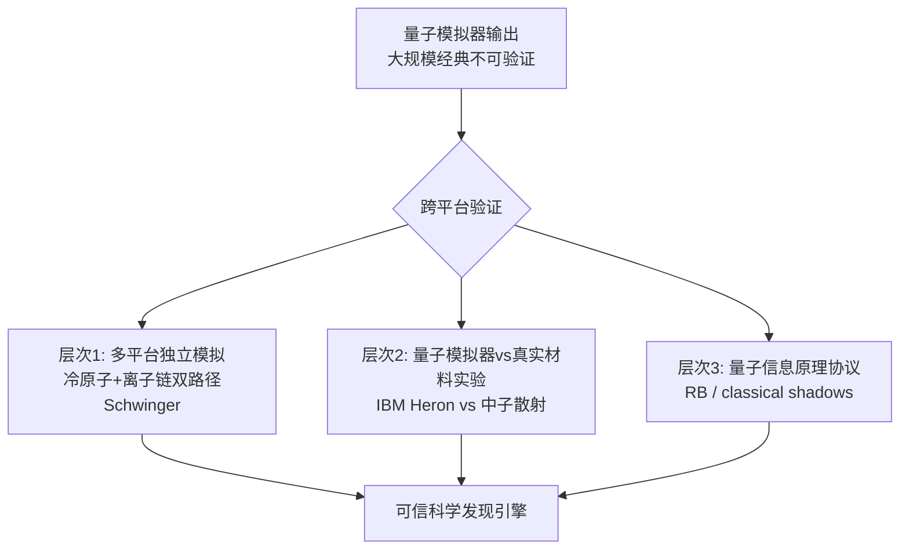

跨平台验证方法学的整体价值在于：它**将量子模拟器从"单一平台单点验证"的孤岛模式，推进到"多平台多模态交叉互验"的网络化方法学框架**。这一方法论演化与第8章末所论证的"多平台协同生态"判断高度一致——多平台不仅在应用维度上各具优势、互为补充，更在验证维度上互为独立基准、共同维护科学可信性。**这是量子模拟器从"实验装置"演化为"可信科学发现引擎"的方法论基石**，亦是2021年前后该领域最具方法学深度的前沿议题之一。

## 9.5 面向凝聚态物理与高能物理的应用前景

在错误缓解、混合算法、跨平台验证三大方法学支柱之上，量子模拟器的科学价值兑现最终需通过具体应用领域的进展加以检验。本节聚焦于**凝聚态物理与高能物理**两大基础科学领域，分析量子模拟器的应用兑现路径与前景。

**凝聚态物理方向**是量子模拟器最早扎根、应用兑现最为成熟的领域。**高温超导Fermi-Hubbard相图**长期被视为凝聚态强关联物理的"圣杯"问题——其哈密顿量虽然简洁，但在中等掺杂区域的相图（特别是d-波超导配对、条纹相、赝能隙等问题）至今难以在经典数值方法上获得共识性答案。中性原子光晶格作为Fermi-Hubbard物理的天然模拟器，已在数百至上千格点规模上对该问题展开实验探索；半导体量子点平台亦通过新近开发的半自动化、可扩展工具箱实现了"集体库仑阻塞跃迁"——即相互作用驱动的Mott转变在有限尺寸下的对应物——的首次详细表征，是量子点阵列向Fermi-Hubbard物理实质性兑现的重要里程碑。**量子磁性**方向上，反铁磁有序、自旋液体候选态、量子相变临界标度等问题已在中性原子光晶格、囚禁离子、里德堡阵列等多个平台上得到精细刻画。**拓扑物态**方向上，合成规范场、Floquet工程、自旋-轨道耦合等技术使中性原子平台得以工程化生成具有Chern数、$Z_2$ 拓扑序的合成体系——潘建伟、陈帅与刘雄军团队于2021年在三维自旋-轨道耦合超冷原子量子气体中实现的理想Weyl半金属能带便是该方向标志性进展。**多体局域化与时间晶体**方向上，囚禁离子链上离散时间晶体的首次观测、超导电路上信息扰动现象的实证，分别从长程相互作用与近邻相互作用两个维度推进了非平衡多体动力学的实验研究。**莫尔超晶格磁序**方向上，NV色心通过金刚石针尖与原子力显微镜结合所实现的纳米尺度磁成像，使得转角CrI₃等二维磁性材料中的摩尔磁序得以被直接可视化，是凝聚态实验技术与量子传感方法学融合的代表性成果。

凝聚态方向上具有里程碑式意义的是**哈佛Lukin团队在256原子可编程量子模拟器上对物质量子相的探测**，这一工作于2021年发表，演示了多个新的量子相并定量探测了相关相变，是中性原子里德堡阵列从"原理验证"走向"凝聚态发现引擎"的标志性兑现。**这一系列进展共同表明，截至2021年初，量子模拟器在凝聚态物理领域已超越概念验证阶段，进入定量回答具体科学问题的成熟期**——这种从"理论可行"到"实际可用"的过渡，标志着量子模拟器正在从概念工具演化为真正意义上的科学发现引擎。

**高能物理方向**则代表着量子模拟器最具雄心、应用门槛也最高的领域。**格点规范场理论的非微扰求解**长期受困于费米子符号问题、强耦合区不可微扰展开等经典数值方法的根本性瓶颈——量子模拟器原则上可绕开这些瓶颈，在工程化的格点上直接演化规范场动力学并测量相关可观测量。**潘建伟团队2020年11月在《Nature》发表的71格点超冷原子Bose-Hubbard量子模拟器对Schwinger方程的求解，是这一方向最具标志性的进展**——这是描述一维量子电动力学的核心模型，从而将量子模拟器的能力从凝聚态扩展到高能物理中的格点规范场理论。**囚禁离子方向上，Innsbruck团队（Blatt组）于2016年在4离子规模上以数字化Trotter方式模拟了Schwinger模型的真空对产生动力学，是量子模拟从凝聚态向高能物理拓展的另一标志性进展**。这一"中性原子大规模模拟式 + 囚禁离子小规模数字式"双路径互补，正是9.4节所讨论的跨平台验证方法学的典型应用场景。

在更前沿的方向上，**夸克禁闭、真空衰变、早期宇宙演化**等微扰QCD无法触及的现象，亦被视为量子模拟器的潜在应用边界。2022年7月，潘建伟团队进一步与德国海德堡大学、奥地利因斯布鲁克大学、意大利特伦托大学合作，**利用超冷原子量子模拟器对格点规范场理论从非平衡态过渡到平衡态的热化动力学进行模拟，首次在实验上证实了规范对称性约束下量子多体热化导致的初态信息"丢失"**，标志着量子模拟方法在求解复杂高能物理问题上的实质性进展。需要说明的是，该2022年工作严格意义上已超出本报告所设定的"截至2021年初"的时间边界，但其作为2020年71格点Schwinger方程模拟工作的直接延续，能够在因果链上证实该方向所开启的研究前景的科学价值，因此在此简要提及但不作为主体证据。

从方法学路径看，凝聚态与高能物理两大方向的发展呈现两个共同特征：**其一，多平台协同发展态势已基本确立**——中性原子、囚禁离子、超导电路、NV色心等平台分别在各自擅长的子领域内推进，并通过跨平台验证相互校验；**其二，从"原理验证"向"定量回答具体科学问题"的过渡已开始兑现**——量子模拟器输出与真实物理实验或权威经典基准的交叉对照，使得量子模拟从"演示量子机器能力"演化为"以量子机器回答自然问题"。这两条共同特征将延续至下一节所讨论的化学与生物等应用驱动领域。

## 9.6 面向量子化学与量子生物及跨学科前沿的应用前景

在凝聚态与高能物理两大基础物理领域之外，**量子化学与量子生物及更广泛的跨学科前沿**构成了量子模拟器另一类重要的应用兑现方向。这些方向与基础物理领域的本质差异在于：它们更直接地连接到材料、药物、能源、生物等应用驱动的实际问题，其潜在的颠覆性价值不仅在于科学发现本身，更在于其可能引发的产业与社会变革。

**量子化学方向**是量子模拟器应用价值兑现最为直接的领域之一。**业界普遍认为量子计算可能在量子化学模拟、组合优化、量子机器学习方面有潜在应用价值**[^35]——其中量子化学因其哈密顿量的"局域费米子"结构与量子计算机的天然适配性，被视为最有希望率先兑现的应用领域。**经典-量子混合算法的量子化学模拟**[^35]构成了当前的主流路径——量子硬件以参数化电路制备分子多体波函数（特别是借助VQE等方法），经典优化器迭代优化变分参数以最小化分子能量。**华为针对此应用场景开发的软件HiQ Fermion以及在此基础上拓展的其他多体模拟（Schwinger model、Hubbard model、Heisenberg model）**[^35]，是该方向产业化软件生态的代表性范例。该方向的远期前景在于：**对小至中等规模分子电子结构（如氢化锂、氢化铍）的精确计算已在多个平台上得到演示**——IBM Quantum团队早在2017年就宣布了使用量子计算机模拟氢化锂和氢化铍等小分子能量的突破，**这些模拟非常令人兴奋，但由于量子系统中的噪声，它们远未达到化学家所关心的精度或尺寸；但是这也为IBM真正的了解为什么这些模拟会出错奠定了基础**[^39]。这种"从早期粗糙模拟到精细化精度提升"的演化路径，正是9.2节所讨论的错误缓解方法学的核心应用场景——错误缓解将分子电子结构的"原理可模拟"推进到"化学精度可达"的实用化门槛。

进一步看，量子化学模拟的远期颠覆性价值在于**新材料与新药物研发**。**能够对这些进行建模是朝着解决诸如设计更高效的肥料、制造更好的电池和开发新药等挑战的能力迈出的关键一步**[^39]。这一应用愿景的兑现路径并非一蹴而就，但随着混合算法效率的提升、错误缓解技术的成熟、量子-经典互验方法学的完善，量子化学模拟有望在5—10年内进入"对特定催化、电池材料、药物分子提供经典方法难以企及精度"的应用价值兑现期。

**量子生物方向**则代表了量子模拟器最具跨学科交叉色彩的前沿领域。如第5章所述，光合作用过程中**环境辅助量子输运（ENAQT）**这一现象——光捕获复合物中激子在多个色素分子位点之间传递并最终到达反应中心的效率受益于量子相干与环境噪声的协同作用——是量子生物学的核心议题之一。光子学波导阵列通过**在每个波导节点上引入可调的损耗（模拟环境耗散）与受控的相位失谐（模拟激子能级涨落），构造出与FMO复合物哈密顿量等价的多模光子网络**，并通过测量光子的传输概率定量比较纯相干、纯经典与"相干+噪声"三种区间下的输运效率，使光子学平台得以将"生物体系中的量子相干"从原位测量难以分辨的微观过程转化为桌面光学实验中的可控可测对象。在此之外，**酶催化中的量子相干、磁感应导航、嗅觉的量子振动理论**等量子生物学议题，亦逐步进入量子模拟器的可控研究边界。NV色心作为量子-生物交叉接口的独特载体——其**生物兼容性使其可深入活体细胞与软物质系统**——在活细胞内量子传感、生物分子局域磁性测量等方向上具备其他平台无法企及的应用空间。

**跨学科前沿**则涵盖了更为广阔的应用图景。**人造规范场**通过激光辅助隧穿、Floquet工程等手段在中性原子上模拟有效磁场或Abel/非Abel规范势，将通常仅在凝聚态固体材料中存在的现象移植到洁净的人造系统中独立研究。**类比黑洞霍金辐射**——通过光纤非线性脉冲在光纤中创造"移动人工事件视界"以类比天体物理意义上微弱难探测的霍金辐射——是光子学路线在量子模拟跨学科应用中的代表性进展，"该难以捉摸的霍金辐射的首次计算、探测与表征"成为该方向具体研究目标。**Unruh效应、Dirac方程、Klein隧穿、Zitterbewegung（颤抖运动）**等相对论性与曲时空量子场论现象，亦借助波导阵列、光纤系统或集成芯片中的工程化哈密顿量得到桌面化模拟。

在量子模拟之外，**量子精密测量与量子技术交叉应用**也是2021年前后跨学科前沿的重要方向。彭承志院士在2025年4月的科普报告中梳理了**量子科技与天文观测的相遇——量子增强光干涉望远镜阵列研究行动计划**——这一应用利用量子通信技术助力天文观测，**有助于提升光干涉阵列的高空间分辨能力，为天文观测进一步突破瓶颈提供有效技术支撑**[^34]。这种从量子模拟、量子传感到量子通信增强天文观测的跨域应用，折射出量子技术作为整体生态在多个传统科学领域的渗透。

从方法论角度看，量子化学、量子生物与跨学科前沿三个方向共同体现了量子模拟器**从"物理工具"演化为"跨学科发现引擎"**的发展路径。其方法学共同特征在于：以量子模拟器作为"可控实验台"，将原本难以原位观测的微观过程或难以触及的极端条件，转化为桌面尺度的可控可测对象，从而打开传统实验方法无法企及的研究边界。**这种"以量子机器拓展科学方法学边界"的应用图景，正是费曼1981年构想兑现路径的最为生动的具象体现**——量子模拟器不仅是回答既有问题的工具，更是发现新问题的方法学突破口。

## 9.7 通向大规模可验证实用化量子模拟器的关键瓶颈

在前述前沿与应用图景的基础上，本节系统归纳通向大规模、可验证、实用化量子模拟器需突破的关键科学与技术瓶颈。这些瓶颈可分为**科学瓶颈**与**技术瓶颈**两大层次，后者进一步可按物理平台展开。

**科学瓶颈层面**首先是**大规模区域可信验证方法学**。如9.4节所论证，量子模拟器进入"经典不可验证"区域所引发的可信性危机，是其从实验装置升级为可信科学发现引擎的根本性方法论挑战。跨平台对照、量子-经典互验、随机基准测试与classical shadows等方法学已奠基，但尚未形成完整的可扩展验证理论框架。其次是**量子加速证据的严格界定**——围绕D-Wave、CIM、量子优势演示的持续争议表明，"量子加速"作为概念其实际定义高度依赖问题选择、参数设定与对比经典算法的优化程度。建立面向不同问题类的标准化量子加速基准、量子-经典持续互验的常态化方法学，是该议题在未来数年的核心任务。第三是**绝热条件可保持性**——专用Ising求解器与连续演化量子模拟器对绝热条件的内禀依赖，在大规模硬件与困难问题（能隙急剧缩小的NP-hard实例）下面临的物理约束，构成了其性能边界的基础理论问题。

**技术瓶颈层面**则需按平台分别展开。

**超导电路**面临三大核心技术瓶颈：其一是**退相干时间相对较短**（$T_1, T_2 \sim 100$—300 μs），受TLS缺陷、介质损耗、准粒子毒化、磁通噪声等多重物理机制限制；其二是**布线串扰随比特数增加而急剧上升**——一台典型127比特处理器需要数百根同轴电缆从室温级延伸至15 mK的稀释制冷机最冷级，"电缆瓶颈"成为从百比特向千比特乃至万比特扩展的核心物理约束；其三是**稀释制冷机的冷量、空间与功耗约束**——最冷级冷量典型仅10—50 μW，随比特数增加迅速逼近物理极限。应对路径上，**低温CMOS与超导单磁通量子（SFQ）近比特控制**——将部分控制电子学从室温移至4 K或100 mK级低温环境——是通向大规模超导量子处理器的关键工程方向。

**囚禁离子**面临的核心技术瓶颈是**单链规模的声子谱密集化**——随着离子数增加，集体声子模式频率间隔变小，模式串扰加剧；以及**门操作速率受阱频率限制**（双比特门时间数十至数百微秒，比超导慢2—3个数量级）。应对路径主要有二：**QCCD（量子电荷耦合器件）模块化离子阱**——将大规模离子集合分为多个小阱区，通过精心设计的电极电压程序实现离子在不同阱区间的高保真度物理穿梭与重排，使每次门操作仅在小规模子集上进行；**光子互联离子节点**——将每个"模块"作为一个小规模离子链，不同模块之间通过单光子-离子纠缠生成与贝尔态测量建立远程纠缠。这两条路径分别从"模块内重排"与"模块间纠缠"应对扩展性瓶颈。

**中性原子**面临的核心技术瓶颈在两条路线上分别呈现。光晶格方案的瓶颈集中于**单格点寻址精度受衍射极限制约**、**对超低温的苛刻要求**、**原子加热与退相干**、以及**晶格不完美所带来的连续累积误差**——这些误差以连续累积方式影响输出，缺乏类似数字式范式中Trotter误差的解析上界。里德堡阵列方案的瓶颈则集中于**原子加载与重排扩展性**（单光镊初始加载效率约50%、重排时间随阵列规模增加而增长）、**里德堡态有限寿命与黑体辐射退相干**、**阻塞门保真度受Rydberg能级移位限制**等。**（类）碱土金属新元素体系（Sr、Yb）**的引入——其超窄钟跃迁、亚稳态长寿命、SU(N) 对称性、亚稳态-Rydberg共囚禁的"魔幻波长"光镊——是中性原子路线进一步突破的关键方向。

**光子学**面临的核心技术瓶颈是**确定性单光子源的工程化困难**——基于SPDC/SFWM的光子源本质上是概率性的，量子点单光子源虽具有确定性单光子发射潜力但与片上电路的高效集成、不同量子点光源之间的光谱不可分辨性等仍面临重大挑战；**双光子门的概率性本质**——线性光学下两光子之间不存在天然相互作用，KLM协议的资源开销极为庞大；**光子损耗的累积效应**——$N$ 光子事件的总效率按 $\eta^N$ 衰减，对大规模实验形成指数性约束。**光腔QED方案**作为引入确定性高维量子门的关键路径，是光子学路线突破上述瓶颈的核心方向之一。

**固态自旋**面临的核心技术瓶颈在两条路线上亦各有特点。半导体量子点方案的瓶颈集中于**固态电子学中固有的强静电无序**——通过新近开发的半自动化、可扩展工具箱已可对无序进行可控抑制，但大规模阵列的端到端工程化仍是核心瓶颈；**电荷噪声与剩余核自旋导致的退相干**；**大规模阵列的布线与读出复杂度**。NV色心方案的瓶颈集中于**色心定位与制备均匀性受限于离子注入与退火工艺的随机性**、**NV-NV偶极相互作用强度有限**（数十kHz量级）、**大规模阵列化工艺尚不成熟**——截至2021年初仍主要集中于单NV或少数NV色心+核自旋寄存器（约10比特以下）的小规模演示。

**专用Ising求解器**面临的核心技术瓶颈是**Chimera/Pegasus有限连通性引发的小图嵌入开销**——对于完全任意拓扑的稠密图问题，嵌入开销仍是限制有效问题规模的核心瓶颈，应对路径包括进一步提升硬件原生连接度（如未来更高密度的耦合拓扑）与发展原理上全连通的替代物理载体（如CIM测量反馈架构）；**量子加速可证伪性**——围绕量子退火的持续争议要求建立标准化基准与量子-经典持续互验的常态化方法学。

| 瓶颈类型 | 具体瓶颈 | 主要应对方向 |
|---------|--------|-----------|
| 共性科学瓶颈 | 大规模区域可信验证、量子加速严格界定、绝热条件可保持性 | 跨平台验证、量子-经典互验、可扩展验证协议 |
| 超导电路 | 退相干、布线串扰、稀释制冷规模化 | 材料改进、低温CMOS/SFQ近比特控制 |
| 囚禁离子 | 声子谱密集化、门速率慢 | QCCD模块化、光子互联节点 |
| 中性原子 | 单原子寻址、原子重排扩展性、Rydberg阻塞门保真度 | 量子气体显微镜、（类）碱土金属新元素 |
| 光子学 | 确定性单光子源、双光子门确定性、光子损耗累积 | 量子点光源+混合多芯片、光腔QED |
| 固态自旋 | 电荷无序、色心确定性定位、NV-NV耦合工程化 | 同位素纯化、半自动化工具箱 |
| 专用Ising求解器 | 连通性瓶颈、量子加速可证伪性 | Pegasus及更高连通拓扑、CIM、混合架构 |

从整体角度归纳，多平台共性瓶颈与差异化挑战共同指向**三个关键突破方向**：**其一是基础设施层面的"近比特控制电子学"与"模块化架构"**——通过将部分经典控制电子学集成于低温环境（低温CMOS、SFQ）、通过模块化设计避免单一系统规模化的指数性工程开销，是从中等规模NISQ硬件向大规模硬件演化的核心工程路径；**其二是方法学层面的"错误缓解与可扩展验证协议"**——将错误缓解从单点技术演化为完整方法学体系、将跨平台验证从对照模式演化为常态化方法学，是从NISQ硬件向"可信科学发现引擎"演化的核心方法学路径；**其三是范式层面的"混合架构与量子-经典协同"**——将硬件层面的混合范式与算法层面的量子-经典混合算法、软件层面的统一框架深度耦合，是NISQ阶段持续兑现实用价值并向容错时代过渡的核心范式路径。

## 9.8 研究展望与全报告整体收束

经过前八章对量子模拟器谱系的系统剖析与本章前七节对前沿、应用、瓶颈的深入分析，本节对全报告进行整体性收束并对量子模拟器领域的未来发展方向进行展望。

**核心展望之一：量子模拟器生态将由多平台协同主导而非单一胜出**。这一论断是本报告贯穿始终的核心论断，在第8章的多维横向对比中已得到系统论证，在本章前七节的前沿分析中进一步获得方法学层面的支撑。**未来量子模拟器的最终形态很可能是分层协同架构**——本地节点采用静止量子比特平台（超导/离子/原子/固态自旋）执行高保真度运算，节点间通过光子学网络建立纠缠并实现量子态传输，特定优化任务交付专用Ising求解器，整体形成"通用 + 专用、模拟 + 数字、静止 + 飞行、低温 + 常温"多维互补的协同生态。**这种生态结构的多样性不是技术不成熟的体现，而是反映量子复杂性本身的多维特征**——这一论断既是对前八章横向比较的方法论收束，也是对量子模拟器领域未来演化路径的核心判断。

**核心展望之二：混合范式将在可预见的未来持续作为NISQ阶段的主导路径，并与逐步成熟的量子纠错码协同向容错时代过渡**。如9.3节所论证，混合范式以"硬件层面双模能力 + 算法层面量子-经典混合 + 软件层面统一框架"的多层次结构，深度适配NISQ时代有限相干时间与门保真度的现实约束。其方法学价值不会随NISQ时代的过渡而消失——即便容错量子纠错码逐步成熟、容错硬件逐步实现，混合量子-经典算法在大规模优化、复杂量子化学、强关联多体物理等问题上的方法论价值仍将持续存在。**混合范式构成了NISQ时代与容错时代之间的方法学桥梁，是量子模拟器持续兑现科学价值的可持续路径**。

**核心展望之三：跨平台验证、错误缓解、混合算法三大方法学支柱将共同推动量子模拟器从"量子优势演示"迈向"专用量子模拟系统"的第二阶段里程碑**。这一展望承接潘建伟院士关于"量子优势→专用量子模拟系统→通用量子计算机"三阶段路线图的判断[^32]——量子优势作为第一阶段已在2019—2021年间得到实证兑现，第二阶段"专用量子模拟系统"的兑现路径正在通过本章所讨论的三大方法学支柱逐步展开。**第二阶段的标志将不再是"在特定任务上击败经典计算"，而是"在凝聚态、高能物理、量子化学、量子生物等具体科学问题上产出经典方法难以企及的、可信的、有应用价值的科学结论"**——这一过渡的兑现节奏将取决于错误缓解技术的工程化成熟度、跨平台验证方法学的可扩展程度、混合算法生态的产业化推进速度三者的协同进展。

将这些展望置于费曼1981年构想的历史脉络下加以审视，可以更清晰地理解2021年初这一时间点在量子模拟器领域演化中的特殊位置。**费曼当年提出"用量子机器模拟量子自然"这一构想时，他自己亦坦承这是面向远期的理论可能性而非近期的工程现实**。然而四十年后的2021年，这一构想已从理论蓝图、实验原型走向真正意义上的科学发现引擎——中性原子光晶格上Schwinger方程的71格点求解、囚禁离子链上长程Ising相变的精细刻画、超导电路上随机线路采样的量子优势演示、光子学上高斯玻色采样的量子计算优越性、固态量子点上Fermi-Hubbard物理的实质性兑现、NV色心上转角磁性材料的纳米成像、专用Ising求解器在大规模优化问题上的工程化部署——**这些进展共同构成了费曼构想的多维兑现图景**。

从全球科研生态视角看，量子模拟器领域的演化呈现"多国并进、协同竞争"的鲜明特征。在量子优势演示上呈现"美国—中国双轨竞争"——Google Sycamore与中国九章、九章二号、祖冲之号分别从超导与光子学路径推进；在量子通信上呈现"中国领先、欧美追赶"的态势——彭承志院士的报告中明确指出，**从2016年"墨子号"量子科学实验卫星成功发射，到2021年构建天地一体化量子通信网络，中国的量子通信技术已走在世界前列；2022年诺贝尔物理学奖得主安东·塞林格在诺奖发布会上专门介绍了"墨子号"的洲际量子通信实验，进一步肯定了我国在该领域的国际影响力**[^34]。彭承志院士进一步评价：**"尽管中美在量子科技领域的竞争日趋激烈，我国科研团队在有限资源下依然取得了世界领先的成果，展现出强大的创新能力与战略定力"**[^34]——这一论断不仅是对中国科研团队的肯定，**亦折射出量子模拟乃至整个量子科技领域作为全球性事业的协同竞争属性**：各国团队在不同物理路线、不同应用领域、不同方法学方向上同步推进，共同构成了量子模拟器谱系丰富多样的全球生态。

在本报告即将收束之际，有必要重申其核心方法论价值。本报告并未试图给出"量子模拟器最佳实现方案"的简单答案——这种简化的判断与量子模拟器谱系的内禀多样性相悖。相反，本报告致力于建立**面向量子模拟器谱系的系统化认知工具**：从第1章对模拟式与数字式范式分野的概念奠基，到第2—7章对六大主流物理路线的深度剖析，到第8章建立的多维横向比较框架，再到本章对前沿、应用、瓶颈与展望的整体收束，这一认知工具的核心价值在于使研究者与决策者能够在面对具体科学问题时，识别核心技术需求、筛选候选平台、评估权衡取舍、形成理性决策。**这种系统化认知本身的建立，远比任何单一的"最佳平台"判断更具长远价值**——它使研究社区能够在多平台生态持续演化的过程中保持清晰的方向感。

回望费曼1981年那场被后世视为量子计算与量子模拟领域奠基性事件的演讲，他所提出的核心洞察——"自然界不是经典的，如果你想对自然界进行模拟，你最好让它变得'量子力学'"——在四十年后的今天已不再是一个等待验证的理论构想，而是一个正在多维度、多平台、多应用领域同步兑现的工程现实。**量子模拟器正在从理论蓝图、实验原型走向真正意义上的科学发现引擎**。从中性原子光晶格中超冷原子构筑的"人造晶体"，到囚禁离子链中声子总线介导的全连通耦合；从Josephson结构建的"宏观人工原子"，到光纤光子飞行携带的多自由度量子信息；从金刚石色心常温感知的纳米磁性，到超导磁通比特绝热演化求解的组合优化——这些迥然不同的物理实现路径，正以各自的方式回应着同一个根本问题：**如何以可控的量子系统再现自然界深处的量子复杂性，并由此打开人类认识与改造世界的新方法学边界**。在这一历史进程中，全球科研团队所展现的强大创新能力与战略定力[^34]，将持续推动这一伟大事业沿着"量子优势→专用量子模拟系统→通用量子计算机"的三阶段路线图坚定前行。**量子模拟器的未来，正是费曼所设想的"用自然模拟自然"在工程层面、应用层面、跨学科层面的全方位绽放**——而2021年初，正是这一绽放过程中一个值得被铭记的关键节点。

# 参考内容如下：
[^1]:[Quantum simulation](http://www.oalib.com/paper/3748598)
[^2]:[春分| 理查德·费曼与量子计算的起源](https://weibo.com/ttarticle/p/show?id=2309404749001554788671)
[^3]:[The first-order Trotter decomposition in the dynamical-invariant basis](https://arxiv.org/pdf/2308.15100v1)
[^4]:[Spin qubits for quantum simulations](https://journal.hep.com.cn/fop/EN/PDF/10.1007/s11467-009-0067-x)
[^5]:[Quantum Simulation With Trapped Ions](http://doi.org/10.1093/acrefore/9780190871994.013.34)
[^6]:[Research Fields](http://en.lmmr.ustc.edu.cn/enlmmr/13416/list.psp)
[^7]:[里程碑|量子模拟首次通过真实材料实验严格交叉验证,标志量子计算从“理论可行”迈向“实际可用”的关键转折_系统_团队](https://news.sohu.com/a/1009427626_348129)
[^8]:[John Preskill:量子信息物理学 | 第28届索尔维物理学会议报告 ](https://mp.weixin.qq.com/s?__biz=MzIzMjQyNzQ5MA==&mid=2247635211&idx=1&sn=1000bc068b65053831a5abea0370ee2d&chksm=e8998b86dfee0290fbfe40648b662e99a3058e3daa7965504ae70bf9b653f334bbaa6f283f51&scene=27)
[^9]:[Quantum simulation of magnetism using optical lattices](http://meetings.aps.org/link/BAPS.2007.MAR.X33.1)
[^10]:[Quantum Simulation in Quantum Dot Arrays](http://www.semanticscholar.org/paper/770c145dfe7e72d3d477a4e1d66774a381377cd7)
[^11]:[“九章”作者陆朝阳、潘建伟回复涂传诒等若干网络评论文章](https://www.thepaper.cn/newsDetail_forward_11746353)
[^12]:[Quantum magnetism of spinor bosons in optical lattices with synthetic non-Abelian gauge fields](https://theory.iphy.ac.cn/English/paper/PhysRevA.92.043609.pdf)
[^13]:[Optical quantum computing](https://quantum.ustc.edu.cn/web/index.php/en/node/48)
[^14]:[Simple Rules for Two-Photon State Preparation with Linear Optics](http://ieeexplore.ieee.org/document/10821417/)
[^15]:[Quantum simulation of a Fermi-Hubbard model using a semiconductor quantum dot array ](https://xueshu.baidu.com/usercenter/paper/show?paperid=ed287e99fd35d35777a3a4d3ccb88255&site=xueshu_se)
[^16]:[再发Science!中国科大潘建伟团队超冷原子量子模拟器成果](https://mp.weixin.qq.com/s?__biz=MzU4ODQ0NzU3OA==&mid=2247528607&idx=1&sn=2f8d8a8cc6b7d6707b644fce64af45c1&chksm=fdde9aaacaa913bca7c5e83fd035c2ef206761150e8de175aa74073d25bb186cb5d57bcff00f&scene=27)
[^17]:[Coherent Ising machine based on network of optical parametric oscillators](https://quantum.ustc.edu.cn/web/node/1236)
[^18]:[超导量子比特:从Transmon物理到重六边形晶格量子纠错体系-CSDN博客](https://blog.csdn.net/VectorShift/article/details/159864230)
[^19]:[Adiabatic and high-fidelity quantum gates with hybrid Rydberg-Rydberg interactions](https://faculty.ecnu.edu.cn/_upload/article/files/28/94/1debcea94526add2cfde3e4eef60/c3e60d77-c559-4726-8fb9-edc75a02ae18.pdf)
[^20]:[Your privacy, your choice](https://www.nature.com/articles/s41467-020-20330-w)
[^21]:[物院论坛(第十五讲):Jörg Wrachtrup教授应邀做客物理学院学术论坛,讲述“二维和三维材料中自旋相关的量子物理”](https://www.phy.pku.edu.cn/info/1182/7956.htm)
[^22]:[Transmon比特](https://www.deepdata.cn/view?idf=article&iid=1509)
[^23]:[Optical Lattice Emulators: Bose and Fermi Hubbard Models](http://www.semanticscholar.org/paper/0b6ff812bd4c2d064245edfbd65cc9b4fe8c7d5b)
[^24]:[Nature Nanotechnology](https://www.nature.com/subjects/quantum-physics/nnano)
[^25]:[High-dimensional two-photon quantum controlled phase-flip gate](https://cwqed.nju.edu.cn/_upload/article/files/1f/31/e14b2cfb404bb6c0da691c4833f3/04985b6a-b989-45a2-84a6-7accacf8c8a0.pdf)
[^26]:[Hybrid digital-analog simulation of many-body dynamics with superconducting qubits](http://www.researchgate.net/publication/341668774_Hybrid_digital-analog_simulation_of_many-body_dynamics_with_superconducting_qubits)
[^27]:[Professor Yoshihisa Yamamoto: Coherent Computing by OPO Phase Transition - NASA](https://www.nasa.gov/ames-ocs/ocs-seminars/yoshihisa-yamamoto/)
[^28]:[【前沿视野】中性单原子阵列实验室](https://siqse.sustech.edu.cn/Zh/Index/view/mid/43/id/1102)
[^29]:[Quantum annealing for combinatorial optimization: a benchmarking study](https://www.nature.com/articles/s41534-025-01020-1.pdf)
[^30]:[Quantum Optics Group - PhD offers](https://www.st-andrews.ac.uk/~qoi/QuOpt_projects.html)
[^31]:[Quantum Dots And Integrated Photonic Circuits Based Photon Sources And Applications](https://www.phy.pku.edu.cn/info/1344/9414.htm)
[^32]:[谷歌实现"量子优越性",绝非量子计算研究的终点](https://www.zkcxy.ac.cn/index.php/Show/cid/106/aid/792)
[^33]:[九章](https://baike.baidu.com/item/九章/55232174)
[^34]:[彭承志院士:我国科研团队展现出强大创新能力与战略定力—新闻—科学网](https://news.sciencenet.cn/htmlnews/2026/4/563843.shtm)
[^35]:[Invited Talks](https://cfcs.pku.edu.cn/announcement/events/invitedtalks/42cfcs239705.htm)
[^36]:[Digital zero noise extrapolation for quantum error mitigation](http://ieeexplore.ieee.org/document/9259940/)
[^37]:[Inverted-circuit zero-noise extrapolation for quantum gate error mitigation](http://arxiv.org/pdf/2403.01608)
[^38]:[Probabilistic error cancellation with sparse Pauli-Lindblad models on noisy quantum processors](http://arxiv.org/abs/2201.09866)
[^39]:[可产生精确结果!IBM宣布:量子计算正式进入实用阶段!](https://baijiahao.baidu.com/s?id=1768741911041908386&wfr=spider&for=pc)
