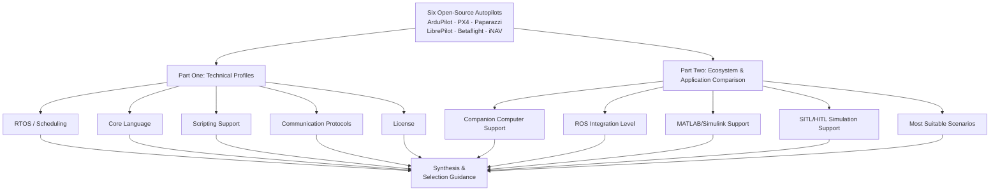
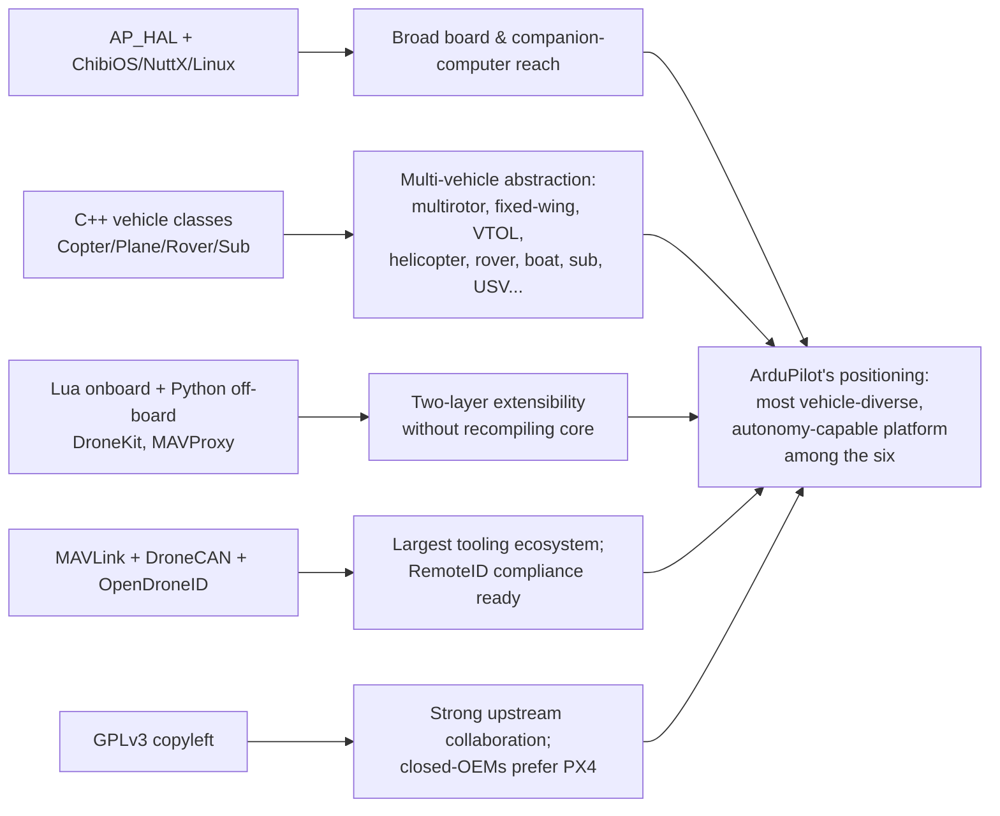
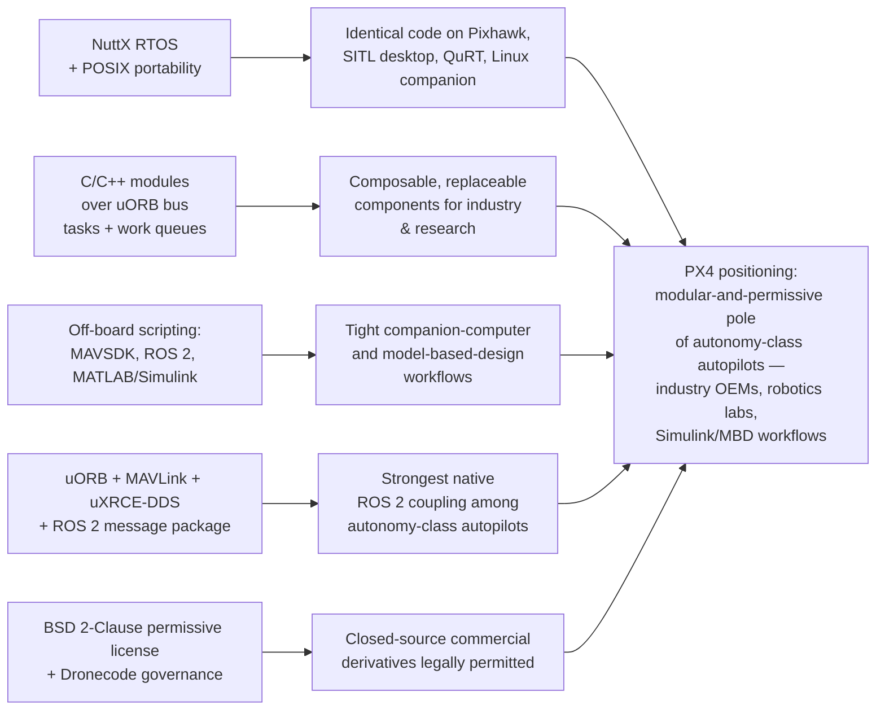
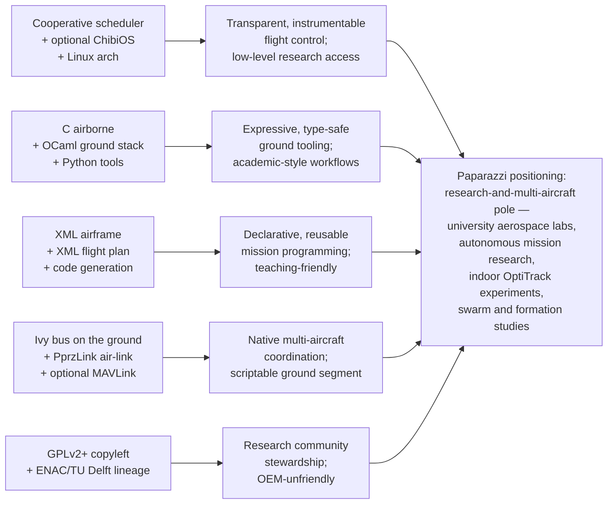
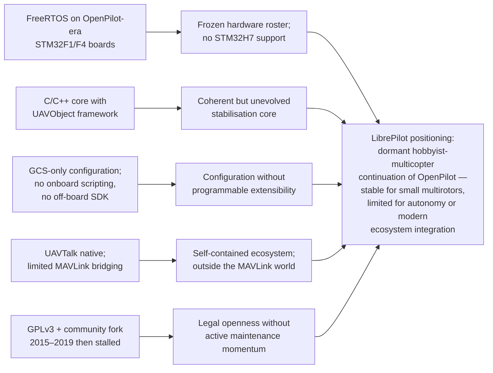
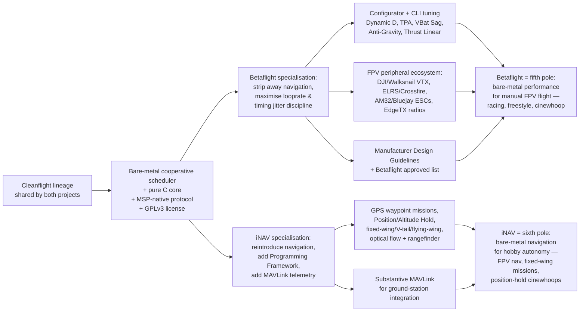
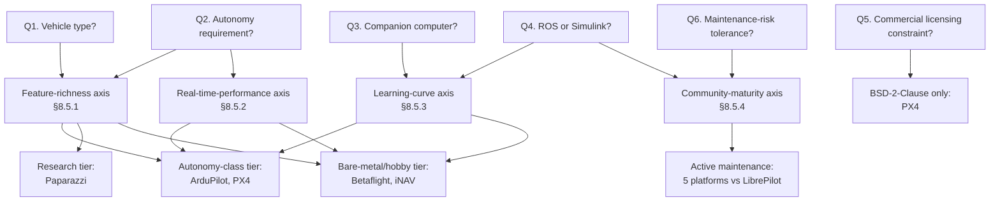
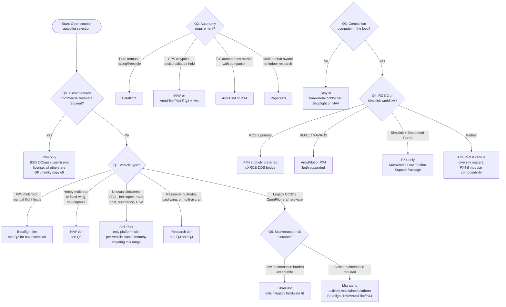

# Comparative Research Report on Six Mainstream Open-Source Drone Autopilots: Technical Features, Ecosystem, and Application Selection
# 1 Introduction and Research Framework

Over the past decade, unmanned aerial vehicles (UAVs) have moved from a niche hobbyist pursuit to a mainstream technology embedded in aerial photography, precision agriculture, mapping and surveying, search-and-rescue, infrastructure inspection, academic research, and even military operations. At the heart of every UAV — whether a 65-gram racing quadcopter or a 25-kilogram fixed-wing surveillance platform — sits a piece of software called the **autopilot firmware**: the program that reads sensor data, stabilises the vehicle, executes flight commands, and, increasingly, makes autonomous decisions. For developers, integrators, and researchers who want to avoid the lock-in of closed proprietary stacks, the open-source autopilot landscape offers a remarkable degree of freedom, but also presents a difficult choice: with multiple mature projects pursuing very different design philosophies, how does one pick the right platform for a specific project?

This chapter sets up the analytical foundation needed to answer that question. It motivates the comparative study, defines its scope and boundaries, introduces the unified evaluation framework used throughout the remaining eight chapters, and explains the most important technical vocabulary in plain language so that the report remains useful to readers without a deep avionics or embedded-systems background.

## 1.1 Research Background and Significance

The rapid expansion of civilian, commercial, and research drone applications has been paralleled by a vigorous open-source movement that produces, maintains, and continuously improves UAV flight-control software. The community-curated Aerial Robotics Landscape inventory of open-source flight control firmware lists eight actively maintained projects, including Betaflight (v4.5.2), iNAV (v8.0.1), ArduPilot (v4.6.2), PX4 (v1.16.0), Paparazzi (v6.4.0), ROSflight (v1.3.0), Crazyflie Firmware, and Hackflight, and explicitly flags LibrePilot, dRonin, the DJI onboard SDK, and Cleanflight as either end-of-life or without an update in the last five years.[^1] In parallel, popular consumer-oriented analyses observe that "all three are strong firmware platforms, but they solve different problems," noting that Betaflight dominates FPV freestyle and racing, iNAV occupies the GPS-assisted hobby and fixed-wing niche, and ArduPilot is the platform of choice for autonomous missions, mapping, survey work, and professional UAV workflows.[^2]

The practical significance of choosing well is considerable. Open-source autopilots are not interchangeable commodities: each has accumulated, over a decade or more of development, a distinctive architectural style, a particular set of supported vehicles, a preferred communication ecosystem, and a community whose strengths reflect its history. ArduPilot, for example, has evolved from Jordi Munoz's 2007 Arduino-based helicopter stabiliser into "an autopilot software program that can control multirotor drones, fixed-wing and VTOL aircraft, RC helicopters, ROVs, ground rovers, boats, submarines, uncrewed surface vessels (USVs), AntennaTrackers and blimps," and is "published as open source software under the GNU GPL version 3."[^3] Opensource.com similarly notes that ArduPilot "is installed in more than 1 million drones and other UAVs" and is "supported by a broad ecosystem of third-party sensors, companion computers, and communication systems."[^4] In contrast, Paparazzi UAV, GPLv2-licensed, "combines both the software and hardware needed to build and fly an open source vehicle under open licenses," with a "primary focus" on autonomous flight and field-portable mission programming across waypoints.[^4] Betaflight and iNAV, on the other hand, are tightly optimised for very different goals — manual stick feel for racing and freestyle in the former, and GPS-assisted cruising and fixed-wing flight in the latter.[^2]

This divergence creates a real decision problem. A user who simply downloads "the most popular" autopilot may end up with a stack that is technically excellent but mismatched to the vehicle or the mission. A racing-oriented firmware on a survey aircraft will lack the autonomy needed; a heavyweight, mission-planning autopilot on a 5-inch racing quad will introduce latency, configuration overhead, and unnecessary complexity. A systematic, evidence-based comparison — grounded in authoritative project sources rather than marketing claims — is therefore valuable precisely because the choice has long-term consequences for hardware compatibility, development effort, regulatory compliance (especially under copyleft licensing), and the ability to scale a project from a prototype to a fleet.

## 1.2 Research Objectives and Scope

The objective of this report is to produce a structured, evidence-based comparison of six mainstream open-source drone autopilots so that a non-expert reader can confidently match a project's requirements to a firmware platform. The six subjects of analysis — **ArduPilot, PX4, Paparazzi, LibrePilot, Betaflight, and iNAV** — were specified by the user and are jointly representative of the open-source autopilot landscape in several complementary ways.

First, they span a wide range of **activity status**. ArduPilot, PX4, Paparazzi, Betaflight, and iNAV are all actively maintained, with recent releases documented at v4.6.2, v1.16.0, v6.4.0, v4.5.2, and v8.0.1 respectively in the community-curated firmware inventory.[^1] LibrePilot, by contrast, is flagged in the same inventory as either end-of-life or without an update in the last five years,[^1] making it an important reference point for understanding what happens when a community-maintained continuation of an earlier hobbyist platform loses development momentum.

Second, the six platforms cover the **principal application domains** of contemporary drone use. ArduPilot and PX4 represent the "professional and autonomous" tier — multi-vehicle, mission-capable autopilots designed to integrate with companion computers, ROS, and large ground-control toolchains. Paparazzi represents the **academic and research-oriented** lineage, with its long history of waypoint-based autonomous flight and its origin in university aerospace laboratories.[^4] LibrePilot represents the **hobbyist multicopter / continuation-of-OpenPilot** branch.[^4] Betaflight and iNAV represent the **FPV / lightweight bare-metal flight-controller** branch derived from the Cleanflight lineage, optimised for high-performance manual flight and (in iNAV's case) GPS-assisted navigation respectively.[^2]

Third, they encompass **divergent technical philosophies**: RTOS-based versus bare-metal scheduler designs; C-centric versus C++-centric core code; copyleft (GPL) versus permissive (BSD) licensing; MAVLink-dominant versus MSP-dominant or UAVTalk/PprzLink-native communication. This diversity is what makes the comparison instructive rather than redundant.

The scope of the study is bounded as follows. Only **publicly available information up to the end of 2024** is used. **Platforms that are clearly end-of-life or outside the requested six** — including dRonin, Cleanflight, the DJI onboard SDK, ROSflight, Crazyflie Firmware, and Hackflight — are mentioned only for context and are not subject to in-depth profiling.[^1] Ground-control-station (GCS) software (Mission Planner, QGroundControl, Paparazzi Center, LibrePilot GCS, Betaflight/iNAV Configurator) is treated as part of each autopilot's **ecosystem context** rather than as an independent subject of analysis.[^1] Finally, in accordance with the user's explicit instruction, one specific 2024 MDPI survey article on open-source UAV autopilots by N. Aliane and all of its associated URLs are excluded from the source base; all factual claims in this report are drawn from other authoritative public materials.

## 1.3 Evaluation Dimensions and Analytical Framework

To ensure that the six autopilots can be compared on a like-for-like basis, the report applies two complementary sets of evaluation dimensions consistently from Chapter 2 onwards.

The **technical dimensions** form the basis of the individual profiles in Part One (Chapters 2–6) and answer the question, "What is this autopilot, internally?" They are:

1. **Real-time operating system (RTOS) or scheduling model** — for example, ChibiOS, NuttX, FreeRTOS, Linux/POSIX, or a bare-metal cooperative scheduler. The community firmware inventory already provides authoritative reference points: ArduPilot runs on ChibiOS, NuttX, or Linux; PX4 on NuttX; Paparazzi on ChibiOS or a scheduler; and Betaflight and iNAV on a scheduler (i.e., bare-metal) only.[^1]
2. **Primary core programming language** — the language in which the on-vehicle firmware is written. The inventory lists C/C++ for ArduPilot, PX4, and Paparazzi; pure C for Betaflight and iNAV; and notes Python alongside C for Paparazzi's ground-side tooling.[^1] ArduPilot is "written in C++ [and] Python."[^3]
3. **Scripting language for secondary development** — the mechanism by which users can extend or customise behaviour without recompiling the core (e.g., Lua scripting, Python bindings, XML-based mission descriptions, CLI commands).
4. **Communication protocols** — the wire-level protocols used to talk to ground stations and peripherals. From the GCS comparison alone, the inventory documents MAVLink (used by Mission Planner, APM Planner 2, MAVProxy, QGroundControl, and most ArduPilot/PX4 tooling), PprzLink (Paparazzi Center), UAVTalk (LibrePilot GCS), and MSP combined with MAVLink (Betaflight-Configurator and iNAV-Configurator).[^1]
5. **Software license** — the legal regime governing reuse. The inventory records GPL-3.0 for ArduPilot, Betaflight, iNAV, and Paparazzi (with CC-BY-SA-3.0 documentation for ArduPilot and PX4 and GFDL for Paparazzi), and the **permissive BSD 2-Clause** license for PX4 itself.[^1]

The **ecosystem dimensions** form the basis of Part Two (Chapters 7–8) and answer the question, "What can I do with this autopilot in practice?" They correspond exactly to the five comparison columns mandated by the user: Companion Computer Support, ROS Integration Level, MATLAB/Simulink Support, SITL/HITL Simulation Support, and Most Suitable Scenarios. Qualitative ratings of **Strong / Moderate / Limited** will be applied with consistent criteria across all six autopilots, with each rating accompanied by a concise, evidence-based justification.

The following diagram summarises how these two layers connect into a single analytical framework:



The diagram makes explicit the report's central logic: the technical profile of each autopilot **causes** its ecosystem position. For example, the choice of NuttX over a bare-metal scheduler, or of MAVLink over MSP, is not an isolated implementation detail; it directly determines how easily the firmware can be coupled to a Linux-based companion computer, integrated with ROS, or simulated in software-in-the-loop. Part Two therefore reads Part One as cause, not catalogue.

## 1.4 Key Technical Terminology Clarification

Because this report addresses a non-expert reader, the following terms — which recur throughout subsequent chapters — are clarified here in plain language. Detailed technical treatment is deferred to the chapter in which each concept first becomes operationally relevant.

| Term | Plain-language meaning | Why it matters for selection |
|------|------------------------|------------------------------|
| **Flight Control Firmware** | The software running **on the drone** that handles real-time sensor fusion, attitude stabilization, and closed-loop flight control.[^1] | Determines what the drone itself can do without external help. |
| **Ground Control Station (GCS)** | The software running **on the operator's workstation**, providing mission planning, live telemetry, parameter tuning, and post-flight analysis.[^1] | Determines how easily a human can plan, monitor, and debug a flight. |
| **RTOS (Real-Time Operating System)** | A small, deterministic operating system (e.g., ChibiOS, NuttX, FreeRTOS) that guarantees tasks run on time — critical when a late control loop can crash a drone. | An RTOS makes complex autonomy (multi-vehicle, mission planning) easier; bare-metal designs trade away that flexibility for raw responsiveness. |
| **Bare-metal / Scheduler-based** | A design without a full RTOS — the firmware itself manages a simple loop or cooperative scheduler.[^1] | Favoured by Betaflight and iNAV because low latency and predictable timing are paramount for FPV manual flight.[^2] |
| **Hardware Abstraction Layer (HAL)** | A code layer that hides the specifics of different microcontrollers, so the same autopilot logic can run on many boards. ArduPilot's AP_HAL is a textbook example introduced in 2011–2012.[^3] | Explains why some autopilots support a huge range of hardware while others target only a narrow board family. |
| **MAVLink** | The dominant lightweight messaging protocol between drones and ground stations, used by Mission Planner, QGroundControl, APM Planner 2, MAVProxy, and as an optional protocol in Betaflight-Configurator and iNAV-Configurator.[^1] | A platform that "speaks MAVLink" can plug into a vast ecosystem of tools, companion computers, and SDKs. |
| **MSP (MultiWii Serial Protocol)** | The native protocol of the Betaflight/iNAV/Cleanflight lineage, used by their configurators.[^1] | Indicates an FPV-centric ecosystem heritage; tooling assumes a single FC + configurator workflow. |
| **UAVTalk** | LibrePilot's native protocol, used by LibrePilot GCS,[^1] inherited from the OpenPilot project.[^4] | Defines LibrePilot's small but self-contained ecosystem. |
| **PprzLink** | Paparazzi's native protocol, used by Paparazzi Center.[^1] | Reflects Paparazzi's research lineage and its preference for a complete in-house toolchain. |
| **PID Tuning** | The classic feedback-control tuning by which a pilot trades stability against responsiveness. Betaflight is noted for "strong PID tuning control" suited to racing and freestyle.[^2] | Important when manual stick feel is the priority. |
| **Autonomous Mission Planning** | Pre-programming a flight as a series of waypoints and behaviours, then letting the autopilot fly them with no stick input. Paparazzi was designed around this from the start;[^4] ArduPilot is explicitly the strongest of the three FPV-class platforms for "fully autonomous missions" with "advanced failsafes, geofencing, and telemetry options."[^2] | Decisive for mapping, survey, and research aircraft. |
| **Acro / Manual Flight Modes** | Flight modes (Manual, Angle, Horizon, Acro) where the pilot has direct control of the aircraft's rate or attitude — central to FPV.[^2] | Decisive for racing, freestyle, and cinewhoop builds. |
| **VTOL (Vertical Take-Off and Landing)** | Hybrid aircraft that take off as multirotors but fly as planes. ArduPilot is described as the "best support for complex vehicle behavior" in the VTOL category.[^2] | A demanding test of an autopilot's vehicle abstraction; only a few platforms handle it well. |
| **Companion Computer** | A small Linux computer (e.g., Raspberry Pi, Nvidia Jetson, ODROID, Intel Edison/Joule) carried on the drone to handle heavier tasks (vision, AI) the autopilot itself cannot. ArduPilot explicitly supports such integrations.[^3] | Essential for vision-based autonomy, ROS workflows, and research applications. |
| **ROS (Robot Operating System)** | The de-facto standard middleware in robotics research. ArduPilot has documented "integration with ROS."[^3] | A platform's ROS integration level is often the single most decisive factor for university and research labs. |
| **SITL / HITL Simulation** | **Software-in-the-Loop** (the autopilot runs as a desktop program controlling a simulated vehicle) and **Hardware-in-the-Loop** (the real flight controller hardware drives a simulated vehicle). ArduPilot's automatic testing and simulation capabilities were a major early contribution by Andrew Tridgell.[^3] | Allows safe validation of autonomy logic before real flights — vital for research and commercial development. |
| **Copyleft (GPL) vs. Permissive (BSD) Licensing** | Under copyleft licenses (GPLv2, GPLv3), derivative firmware **must also be open-sourced**; under permissive licenses (BSD 2-Clause), derivatives can remain proprietary. ArduPilot's co-founder Craig Elder has argued that GPLv3 "leads to greater collaboration because all code changes must be openly published, unlike Dronecode's BSD license."[^4] | Often the deciding factor for companies that want to ship closed-source products — they typically prefer PX4's BSD 2-Clause[^1] over GPL-licensed alternatives. |

These definitions will not be repeated when the terms reappear in later chapters; readers may treat this section as a glossary.

## 1.5 Report Structure and Reading Guide

The report is organised in two complementary parts, bracketed by this introduction and a concluding chapter on selection guidance.

**Part One — Technical Profiles (Chapters 2–6).** Each of these chapters takes one autopilot (or, in Chapter 6, the two closely related Cleanflight-lineage platforms Betaflight and iNAV jointly) and answers the same five technical questions: which RTOS or scheduler, which core language, which scripting mechanism, which communication protocol(s), and which license. The chapters are intentionally parallel in structure so that readers can compare across them directly. Chapter 2 covers ArduPilot, Chapter 3 covers PX4, Chapter 4 covers Paparazzi, Chapter 5 covers LibrePilot, and Chapter 6 covers Betaflight and iNAV.

**Part Two — Ecosystem and Application Comparison (Chapters 7–8).** Chapter 7 consolidates the comparison in a single matrix whose rows are the six autopilots and whose columns are exactly the five user-specified ecosystem dimensions (Companion Computer Support, ROS Integration Level, MATLAB/Simulink Support, SITL/HITL Simulation Support, and Most Suitable Scenarios). Each cell uses the Strong / Moderate / Limited rating scheme with a brief justification. Chapter 8 interprets the patterns: why ArduPilot and PX4 dominate the companion-computer and ROS columns, why Betaflight's ecosystem is deliberately narrow but deep, why Paparazzi's strengths cluster around research workflows, and how all of these patterns trace back to the technical choices documented in Part One.

**Chapter 9 — Selection Recommendations, Conclusion, and Limitations.** This closing chapter synthesises Parts One and Two into a concrete decision aid: a checklist (and decision tree) mapping typical project profiles (research multirotor, commercial mapping UAV, FPV racing quad, fixed-wing long-range platform, educational platform) to the most appropriate autopilot, summarises the key findings, acknowledges the limitations of qualitative ecosystem ratings and an end-of-2024 information cutoff, and suggests follow-up actions (e.g., hands-on SITL prototyping, community engagement) for validating the chosen platform.

| Reader profile | Recommended reading path |
|----------------|--------------------------|
| **I already know I want an FPV racing or freestyle quad.** | Skim §1.4, read Chapter 6 (Betaflight/iNAV), then jump to Chapter 9. |
| **I am building an autonomous research multirotor with a companion computer.** | Read Chapters 2 (ArduPilot), 3 (PX4), then Chapters 7–9. |
| **I am running an academic UAV lab.** | Read Chapters 2, 3, 4 (Paparazzi), then Chapters 7–9. |
| **I want a comprehensive picture before deciding.** | Read sequentially from Chapter 2 to Chapter 9. |
| **I am a non-expert evaluating options for the first time.** | Re-read §1.4 carefully, then follow the sequential path with particular attention to Chapter 8's interpretive analysis. |

With this framework established, the report now proceeds to Part One, beginning in Chapter 2 with the technical profile of ArduPilot — the platform that, on the evidence already surveyed, claims the broadest vehicle support and the deepest autonomy stack of the six.[^3][^4]

# 2 Technical Profile of ArduPilot

Chapter 1 introduced ArduPilot as the autopilot that, on the available evidence, claims the broadest vehicle support and the deepest autonomy stack of the six platforms in scope. The present chapter opens Part One of the report by examining **why** that is the case — not as a marketing claim, but as the direct consequence of a coherent set of internal architectural decisions made over more than a decade of development. Applying the unified five-dimension framework defined in §1.3, the chapter dissects ArduPilot's RTOS and hardware abstraction strategy, its C++ core, its Lua scripting layer, its MAVLink- and DroneCAN-centred communication ecosystem, and its GPLv3 licensing posture, and shows how each of these choices propagates into the ecosystem capabilities that Part Two will rate. ArduPilot is, in short, the **reference profile** against which Chapters 3–6 will measure the remaining five platforms.

## 2.1 RTOS and Hardware Abstraction Architecture

ArduPilot is not bound to a single real-time operating system. It runs natively on **ChibiOS** for the vast majority of contemporary STM32-based flight controllers, retains **NuttX** support for legacy Pixhawk-family hardware, and additionally targets **Linux/POSIX** on companion-computer-class single-board computers — a portability matrix that is itself unusual among the six autopilots and that explains much of ArduPilot's hardware reach. The community-curated firmware inventory referenced in Chapter 1 listed ArduPilot as running on "ChibiOS, NuttX, or Linux", and the breadth of ChibiOS-targeted hardware partners in 2024 is visible in board catalogues such as MATEKSYS's "ArduPilot Compatible Items" list, which advertises the F405-WMO, H743-SLIM-V4, H7A3-WING, F405-Wing-V2, F405-HDTE, and H7A3-SLIM flight controllers, together with a family of AP_Periph CAN peripherals (M9N-G4-3100 GNSS, CAN-G474 node, CAN-L4-BM digital power monitor, CAN-L4-PWM adapter, CAN-L431 node) — all designed to plug into ArduPilot's hardware abstraction.[^5] At the upper end of the board spectrum, ArduPilot is the firmware of choice for industry-standard professional carrier boards such as the **Cube Orange / CubePilot**, the **Holybro Pixhawk series (Pixhawk 4, Pix32, Durandal)**, and **CUAV V5+** (built around an STM32H7 microcontroller), each of which is explicitly identified as fully ArduPilot-compatible.[^6]

What makes this multi-RTOS portability tractable is the **AP_HAL (ArduPilot Hardware Abstraction Layer)**. Conceptually, AP_HAL is a thin code layer that hides the specifics of each underlying microcontroller and operating system from the vehicle-level logic above it: a Copter or Plane object running on a ChibiOS-powered H7 flight controller and the same object running on a Linux companion board call essentially identical APIs for sensor reads, motor PWM output, serial I/O, and timing. The result is the decoupling already foreshadowed in §1.4: the firmware's *logic* — attitude control, sensor fusion, navigation, mission execution — can be developed once and ported across boards by adding a HAL backend rather than rewriting the autopilot. This architectural decision is what supports ArduPilot's claim, also documented in Chapter 1, to be installed on more than one million UAVs across a remarkable variety of vehicle classes.

The plain-language consequence for a non-expert reader is straightforward: **the user is rarely locked to a single hardware vendor**. A project can prototype on an inexpensive Matek F405 board, migrate to a Cube Orange or CUAV V5+ for certification or reliability, and offload heavier computation to a Linux companion computer — all without changing the autopilot codebase. The trade-off is complexity: ArduPilot's multi-RTOS, HAL-driven design is larger and more elaborate than a bare-metal firmware such as Betaflight (Chapter 6), and the consequent learning curve is part of what later sections of this report will weigh against its capability advantages.

## 2.2 Core Programming Language and Software Architecture

ArduPilot's on-vehicle core is written predominantly in **C++**, with **Python** used for build tooling, developer utilities, and selected off-board scripts. The choice of C++ rather than pure C is consequential, and it visibly shapes the project's internal organisation: the code is structured around per-vehicle classes whose entry points are the source files **Copter.cpp, Plane.cpp, Rover.cpp, and Sub.cpp**, each instantiating a vehicle-specific object that inherits common services (HAL, libraries, scheduling) and overrides only the behaviour that differs between airframes.[^7] This object-oriented decomposition is the architectural mechanism by which a single codebase scales to "multirotor drones, fixed-wing and VTOL aircraft, RC helicopters, ROVs, ground rovers, boats, submarines, uncrewed surface vessels (USVs), AntennaTrackers and blimps", as already summarised in §1.1.

The general engineering rationale for C++ in this domain is well documented. Open-source flight stacks adopted C++ because it offers high performance and fine-grained hardware control while permitting the modular libraries, type-safe interfaces, and code reuse that a multi-vehicle, multi-board codebase needs to remain maintainable.[^7] Concretely, C++ in ArduPilot supports efficient execution of computationally intensive tasks such as sensor fusion and PID/Kalman-filter control loops, integrates cleanly with real-time operating systems like ChibiOS and NuttX, and exposes the direct memory access and low-level optimisations required for millisecond-class control responsiveness.[^7]

The trade-offs are equally real. C++'s manual memory handling and complex syntax create well-known classes of defects — buffer overflows, lifetime errors, and the like — that are particularly costly in safety-critical flight software, and debugging in embedded environments where tools are constrained and timing is tight tends to prolong development cycles.[^7] ArduPilot mitigates these risks through its mature testing infrastructure (notably the simulation environments discussed in §2.4 and Chapter 7) rather than through language-level safety guarantees. The deliberate counterpoint to this design will appear in Chapter 6: Betaflight and iNAV remain in **pure C** precisely because they target a narrower hardware niche where the abstraction benefits of C++ are deemed not worth the binary-size and compile-time costs. ArduPilot's willingness to pay those costs is, in effect, the price of admission for being a general-purpose, multi-vehicle autopilot.

## 2.3 Lua Scripting for Secondary Development

The third dimension of the framework — scripting for secondary development — is, for ArduPilot, addressed primarily by **onboard Lua scripting**, introduced as a first-class feature in **version 4.0 in 2019**.[^7] Lua was selected over heavier alternatives for reasons that map closely to the constraints of an RTOS-based flight controller: its core implementation typically occupies well under 100 KB of memory, it ships with an embeddable C API that allows scripts to interface directly with the firmware's C/C++ hardware drivers, and its execution model is fast enough for event-driven tasks such as processing telemetry data or responding to flight events in real time.[^7] These properties make Lua "particularly well-suited" to embedded UAV use compared with bulkier interpreters such as Python.[^7]

In practical ArduPilot deployments, Lua is the standard mechanism by which users extend behaviour **without recompiling the core firmware**. Documented use cases include scripting mission parameters such as waypoint sequences, dynamically adjusting flight behaviours, and building ground-control interface elements — and, on the Copter side, "custom applets for payload management and data logging" that materially enhance vehicle versatility.[^7] An illustrative open-source example is the publicly available *LUA_scripts_for_drone_autonomous_flight* repository on GitHub, which automates complex geometric manoeuvres — squares, circles, figure-eight patterns — by interpreting radio-button inputs at runtime.[^7] This kind of extensibility is the operational reason why the same ArduPilot binary can be specialised, in the field, to very different mission profiles without any toolchain involvement.

Alongside onboard Lua, ArduPilot supports a complementary **Python-based off-board extension path** through the **DroneKit** Python SDK, originally released by 3D Robotics in 2015 and widely integrated with the ArduPilot autopilot system for tasks ranging from aerial surveying to delivery missions.[^7] DroneKit abstracts the hardware behind simple Python APIs for arming, takeoff, and waypoint navigation, communicating with the vehicle over MAVLink and letting developers script high-level autonomous behaviour from a companion computer or ground station.[^7] **MAVProxy**, a Python-based ground-control console for MAVLink-enabled drones, sits in the same family of tools, providing scripted command and telemetry handling without forcing developers into the C++ core.[^7]

The architectural division of labour is therefore clear: **Lua handles onboard, latency-sensitive customisation**, while **Python (via DroneKit and MAVProxy) handles off-board, higher-level mission and integration logic**. This two-layer scripting model gives ArduPilot considerably more flexibility for secondary development than the bare-metal FPV flight controllers examined in Chapter 6, where scripting is primarily CLI- and configurator-driven.

## 2.4 Communication Protocols: MAVLink and DroneCAN

ArduPilot's external communication stack is dominated by two complementary protocols: **MAVLink** for ground-station and companion-computer communication, and **DroneCAN** for in-vehicle peripheral integration. Together, they explain much of why ArduPilot sits "at the centre of the broadest tooling ecosystem" identified in Chapter 1.

### MAVLink as the lingua franca of the ground link

MAVLink is described in the ArduPilot developer documentation as "a serial protocol most commonly used to send data and commands between vehicles and ground stations", with a message catalogue defined in two XML files — `common.xml` for vendor-neutral messages and `ardupilot.xml` for ArduPilot-specific extensions.[^1] The protocol is deliberately transport-agnostic: messages "can be sent over almost any serial connection and do not depend upon the underlying technology (wifi, 900 MHz radio, etc.)", and they are **not** delivery-guaranteed, which is why ground stations and companion computers must routinely poll vehicle state to confirm that a command has been executed.[^1]

Each MAVLink frame carries a `System ID` (unique per vehicle or ground station, e.g., "255" for ground stations and "1" by default for the flight controller, configurable via the `MAV_SYSID` parameter), a `Component ID` (typically "1" for the flight controller, with companion computers and gimbals reusing the System ID but choosing distinct Component IDs), a `Message ID` corresponding to entries in the XML catalogues, and a `Data` payload.[^1] The high-level message flow is also well defined: once a connection opens, each "System" emits a **HEARTBEAT message at 1 Hz**, and the ground station or companion computer then requests the messages it wants (and at what rate) using either `REQUEST_DATA_STREAM` for whole groups, or — on ArduPilot 4.0 and later — `COMMAND_LONG` carrying `MAV_CMD_SET_MESSAGE_INTERVAL` for precise per-message control.[^1]

Two protocol versions coexist. **MAVLink v1** frames are at most 263 bytes; **MAVLink v2** extends this to a maximum of 280 bytes, supports message IDs greater than 255, adds extension fields to existing v1 messages, and introduces message signing for authenticity.[^1] MAVLink v2 is backwards-compatible with v1 — a v2-capable device understands v1 messages, while a v1-only device that receives a v2 message will see only the v1 fields.[^1] On an ArduPilot flight controller, a serial port (typically connected to a telemetry radio) can be promoted to MAVLink v2 by setting the corresponding `SERIALx_PROTOCOL` parameter to "2".[^1]

These design properties — text-XML-defined messages, heartbeat-based discovery, configurable rate control, signed v2 frames — are precisely what allow MAVLink to plug ArduPilot into a vast tooling ecosystem: Mission Planner, APM Planner 2, MAVProxy, QGroundControl, DroneKit, and a long tail of third-party MAVLink consumers, including the OpenDroneID transmitter discussed below.

### DroneCAN for peripherals and smart nodes

For peripherals on the vehicle itself — GNSS receivers, power monitors, servo expanders, smart batteries — ArduPilot complements MAVLink with **DroneCAN** (the open continuation of the earlier UAVCAN). The ecosystem visible in vendor catalogues is illustrative: MATEKSYS's "AP_Periph" line includes the **M9N-G4-3100 CAN GNSS**, the **CAN-G474** and **CAN-L431** generic CAN nodes, the **CAN-L4-BM** CAN digital power monitor, and the **CAN-L4-PWM** CAN-to-PWM adapter, all explicitly designed for ArduPilot via its `AP_Periph` peripheral firmware framework.[^5] The architectural significance is that ArduPilot does not need to be the only intelligent device on the drone: GNSS, power, and actuator nodes can themselves run small co-firmware instances that converse with the autopilot over a deterministic CAN bus, leaving the main flight controller free to focus on stabilisation, navigation, and mission logic.

### Extended protocol role: OpenDroneID / RemoteID compliance

A recent and policy-relevant extension of this protocol stack is the **ArduRemoteID** project, an official ArduPilot implementation of a MAVLink and DroneCAN **OpenDroneID** transmitter that targets the U.S. FAA RemoteID requirement (meeting the transmitter component of the ASTM F3586-22 Means of Compliance) and aims for EU RemoteID compatibility as well.[^2] The firmware currently runs on ESP32-S3 and ESP32-C3 chips, supports communication with an ArduPilot flight controller "either using MAVLink or DroneCAN", and explicitly uses the MAVLink **OpenDroneID service** alongside DroneCAN messages from the `dronecan/remoteid` DSDL tree.[^2] Notably, "the DroneCAN messages are an exact mirror of the MAVLink messages to make a dual-transport implementation easy",[^2] which is a concise illustration of how ArduPilot deliberately keeps its two principal protocols isomorphic so that compliance, peripheral, and ground-link concerns can be addressed through either channel. ArduRemoteID is itself licensed under the **GNU GPLv2 or later**,[^2] consistent with the broader ArduPilot copyleft posture discussed in §2.5.

The protocol picture taken as a whole — MAVLink upward to ground stations, companion computers, and SDKs; DroneCAN downward to peripherals and smart nodes; OpenDroneID overlaid on both for regulatory compliance — is what positions ArduPilot at the centre of the largest and most heterogeneous communication ecosystem among the six autopilots in this study.

## 2.5 GPLv3 Licensing Model and Its Implications

ArduPilot is published under the **GNU GPL version 3 (GPLv3)** copyleft license, with documentation under **CC-BY-SA-3.0**, as already established in Chapter 1. The substance of GPLv3 in this context is best understood operationally: any commercial or hobbyist party that distributes a modified ArduPilot binary — for instance, a UAV manufacturer shipping a tuned variant in a product — is obliged to make the corresponding source code available to recipients under the same license. Derivative firmware cannot be quietly "closed".

The strategic implications cut in three directions.

For **the community**, GPLv3 has historically been argued to *strengthen* collaboration. As noted in §1.4, ArduPilot co-founder Craig Elder has stated that GPLv3 "leads to greater collaboration because all code changes must be openly published, unlike Dronecode's BSD license." The reasoning is that mandatory upstream contribution of derivative work feeds improvements back into the common codebase rather than fragmenting them into competing private forks — which is plausibly part of why ArduPilot's vehicle and peripheral coverage has expanded so broadly over time.

For **commercial integrators that wish to ship closed-source products**, GPLv3 is correspondingly a constraint. A firm that wants to embed proprietary algorithms inside the flight controller firmware faces a binary choice: either accept the GPLv3 obligation and open the relevant code, or migrate to a permissively licensed alternative — which, among the six platforms in this study, points to **PX4's BSD 2-Clause license** (to be detailed in Chapter 3). This is not a marginal consideration; it is one of the most frequent reasons projects choose PX4 over ArduPilot at the firmware layer, even when ArduPilot's autonomy capabilities would otherwise be a better fit.

For **the broader autopilot ecosystem**, GPLv3 is mirrored consistently across ArduPilot's auxiliary projects — for example, ArduRemoteID is GPLv2-or-later[^2] — and across most of the wider Cleanflight-lineage family (Betaflight, iNAV, Paparazzi: GPL-3.0, as established in Chapter 1). PX4 is the conspicuous outlier in the cohort, which is precisely what makes the licensing dimension a meaningful selection criterion rather than a uniform background condition.

In short, **licensing is a strategic, not merely legal, dimension of platform selection.** It shapes who can build *on top of* ArduPilot under what conditions, and therefore which categories of commercial actors are likely to be drawn to it (open hardware vendors, integrators willing to publish their firmware contributions, research labs) versus those likely to migrate elsewhere (closed-product OEMs).

## 2.6 Synthesis: How Technical Choices Define ArduPilot's Positioning

Pulling the five dimensions together, ArduPilot's identity as the broadest, most autonomy-capable platform in this study is **not** the result of any single feature but of a self-reinforcing combination of architectural decisions. The following table consolidates the technical profile and links each dimension to its practical consequence.

| Dimension | ArduPilot's choice | Practical consequence for project selection |
|---|---|---|
| RTOS / Scheduling | ChibiOS (primary, STM32 boards), NuttX (legacy), Linux/POSIX (companion-class), behind AP_HAL | Exceptional board portability — from Matek F405 hobby boards to Cube Orange, Pixhawk, Durandal, CUAV V5+, and Linux SBCs[^5][^6] |
| Core Language | C++ (vehicle classes such as Copter.cpp, Plane.cpp, Rover.cpp, Sub.cpp), Python for tooling[^7] | Single object-oriented codebase scales to multirotors, fixed-wing, VTOL, helicopters, rovers, boats, submarines, USVs, blimps, antenna trackers |
| Scripting | **Onboard Lua** since v4.0 (2019)[^7] for in-firmware extensions; **Python** off-board via DroneKit (2015–) and MAVProxy[^7] | Two-layer extensibility: low-latency mission/payload logic onboard, high-level orchestration off-board, without recompiling the core |
| Communication | **MAVLink v1/v2** upward (heartbeat at 1 Hz, common.xml/ardupilot.xml, signing in v2)[^1]; **DroneCAN** downward via AP_Periph for GNSS, power, CAN-to-PWM, etc.[^5]; **OpenDroneID/RemoteID** via ArduRemoteID[^2] | Largest and most heterogeneous tooling ecosystem: Mission Planner, QGroundControl, APM Planner 2, MAVProxy, DroneKit, plus regulatory-compliance pathways |
| License | **GPLv3** core, CC-BY-SA-3.0 docs; auxiliary projects mostly GPL-family (e.g., ArduRemoteID GPLv2+)[^2] | Strong collaboration incentive; constraint for closed-source OEMs (who tend to migrate to PX4 — see Chapter 3) |

The causal logic that connects this technical profile to ArduPilot's ecosystem position can be summarised in one diagram:



Read from left to right, the diagram makes the chapter's central thesis explicit: ArduPilot's standing as the platform of choice for mapping, survey, VTOL, professional UAV workflows, and companion-computer-augmented research drones is **earned by**, not merely associated with, its five technical commitments. The HAL-driven multi-RTOS strategy is what lets the same firmware run on hobby boards and on Linux companions; the C++ vehicle abstraction is what lets a single project span eight to ten vehicle classes; the Lua + Python scripting split is what lets advanced users customise behaviour without becoming firmware maintainers; the MAVLink/DroneCAN/OpenDroneID stack is what plugs ArduPilot into virtually every major drone tool and into modern RemoteID regulation; and the GPLv3 license is what keeps the resulting improvements flowing back into the common codebase.

These same five commitments will provide the comparison points for Chapter 3, where **PX4** — sharing the autonomy-class ambitions of ArduPilot but diverging sharply on RTOS choice (NuttX-centric), internal messaging (uORB in addition to MAVLink), and, decisively, licensing (BSD 2-Clause permissive rather than GPLv3 copyleft) — will offer the clearest contrast that this report has to make. Read in that sequence, ArduPilot is the *broad-and-copyleft* pole of the autonomy-class autopilot space; PX4 will define the *modular-and-permissive* pole; and the remaining four platforms profiled in Chapters 4–6 will fill in the niches that neither of those two has chosen to occupy.

# 3 Technical Profile of PX4

Chapter 2 closed with the observation that ArduPilot defines the *broad-and-copyleft* pole of the autonomy-class autopilot space, and that the clearest counterpoint within the six platforms in scope is **PX4**. The two share a great deal: both target professional, mission-capable UAV applications; both run on Pixhawk-class hardware; both speak MAVLink to ground stations; both are mature, actively maintained projects with multi-vehicle ambitions. Yet at almost every dimension of the unified five-dimension framework introduced in §1.3, PX4 makes a different choice from ArduPilot. It commits to **NuttX** as its primary embedded RTOS rather than ChibiOS; it organises its C/C++ code around a flat **module-and-message-bus** architecture rather than per-vehicle inheritance; it pushes secondary development *off-board* into **MAVSDK, ROS 2, and MATLAB/Simulink** rather than supplying onboard Lua; it overlays an internal **uORB** publish/subscribe bus and a modern **uXRCE-DDS** bridge to ROS 2 on top of external MAVLink; and, most consequentially of all, it is released under a **permissive BSD license** rather than GPLv3 copyleft.

This chapter applies the same five-dimension structure used for ArduPilot in Chapter 2 — RTOS/scheduling, core language, scripting and secondary development, communication protocols, and license — and shows how PX4's choices propagate into a distinct ecosystem position. Where Chapter 2 read ArduPilot as the *broad-and-copyleft* pole of autonomy-class autopilot design, this chapter establishes PX4 as the *modular-and-permissive* pole, against which the remaining four platforms (Paparazzi, LibrePilot, Betaflight, iNAV) can in turn be measured in Chapters 4–6.

## 3.1 NuttX RTOS and POSIX/Linux Portability

PX4's first defining choice is its commitment to **NuttX** as the real-time operating system underneath the on-vehicle firmware. NuttX is described in the PX4 documentation, summarised in a Politecnico di Torino master's thesis on PX4 indoor stabilisation, as "a real-time operating system (RTOS) designed for embedded systems and IoT devices" that "provides a range of features, including pre-emptive multitasking, inter-process communication, file systems, device drivers, and networking", with a deliberately **modular architecture** that lets developers compile only the features needed for a given target.[^7] The properties that matter most for an autopilot are explicitly enumerated: pre-emptive multitasking with "fast context switching", lightweight and portable design with "a small memory footprint, making it suitable for use in systems with limited resources", **POSIX compliance**, support for multiple file systems (FAT, ROMFS, NFS) for onboard data and configuration storage, and support for "a wide range of microcontrollers and SoCs including ARM, MIPS, and AVR architectures."[^7]

These properties are not chosen in isolation. PX4 is architected as **two co-operating layers** on top of NuttX: a **flight stack** ("a collection of guidance, navigation and control algorithms for autonomous drones … includes controllers for fixed wing, multirotor and VTOL airframes as well as estimators for attitude and position") and a **middleware** ("primarily of device drivers for embedded sensors, communication with the external world (companion computer, GCS, etc.) and the uORB publish-subscribe message bus … [plus] a simulation layer that allows PX4 flight code to run on a desktop operating system and control a computer modelled vehicle in a simulated world").[^7] NuttX's POSIX compliance is decisive here, because it allows the **same flight code** to run unchanged on:

1. **NuttX-based flight controllers** (the production deployment target);
2. **Linux- or macOS-based desktops** as a **Software-in-the-Loop (SITL)** simulation;
3. **POSIX-API companion-class targets** such as QuRT on Qualcomm Snapdragon and Linux on Raspberry Pi.

The PX4 documentation states this portability principle directly: "PX4 runs on various operating systems that provide a POSIX-API (such as Linux, macOS, NuttX or QuRT)."[^7] For our hypothetical non-expert reader, the plain-language consequence is that the SITL simulation a developer runs on a laptop and the firmware running on the actual Pixhawk are not "two different products" — they are the same code in two different runtime environments, which is why PX4's simulation pipeline (revisited in §3.4 and Chapter 7) is unusually faithful.

### 3.1.1 The breadth of officially supported hardware

PX4's NuttX/POSIX strategy translates into a strikingly broad **professional hardware reach**. The PX4 v1.15 user guide enumerates as "standard" Pixhawk autopilots the **Holybro Pixhawk 6X-RT (FMUv6X-RT), Holybro Pixhawk 6X (FMUv6X), Holybro Pixhawk 6C (FMUv6C), Holybro Pixhawk 6C Mini, Holybro Pix32 v6, Holybro Pixhawk 5X (FMUv5X), Holybro Pixhawk 4 (FMUv5) and 4 Mini, Drotek Pixhawk 3 Pro (FMUv4pro), mRo Pixracer (FMUv4), Hex Cube Black (FMUv3), mRo Pixhawk (FMUv3)**, and the **CUAV Pixhawk V6X (FMUv6X)**.[^1] In addition, a long list of "manufacturer-supported" autopilots is documented, including the **AirMind MindPX/MindRacer**, **ARK Electronics ARKV6X**, **CUAV X7 / Nora / V5+/V5 nano / Pixhack v3**, **CubePilot Cube Orange+ / Orange / Yellow**, the **Holybro Kakute H7 / H7v2 / H7mini / Durandal / Pix32 v5**, the **ModalAI Flight Core v1 / VOXL Flight / VOXL 2**, **mRobotics-X2.1 (FMUv2)**, **mRo Control Zero (F7)**, **NXP RDDRONE-FMUK66 FMU**, **Sky-Drones AIRLink**, **SPRacing SPRacingH7EXTREME**, and the **ThePeach FCC-K1 / FCC-R1**.[^1] PX4 also retains explicit support for Linux-based "manufacturer-supported" boards such as the **Raspberry Pi 2/3 Navio2** and the **Raspberry Pi 2/3/4 PilotPi**, again leveraging POSIX portability.[^1]

The MathWorks UAV Toolbox Support Package for PX4 Autopilots, which is treated as a third-party witness here precisely because it has to track PX4's hardware reality, confirms out-of-the-box support for **Cube Orange, Cube Orange+, Cube Blue, CUAV X7+, Holybro Pixhawk 6X, Holybro Pixhawk 6C, Holybro Pixhawk 4, mRo Pixhawk 1, ProfiCNC Pixhawk 2.1 (Cube), mRo Pixracer**, and notes that "apart from the above boards, other FMU based boards can be used with the support package by selecting the Hardware board as PX4 Pixhawk Series."[^5]

### 3.1.2 Contrast with ArduPilot's AP_HAL strategy

The key architectural difference relative to Chapter 2 is **how this portability is achieved**. ArduPilot achieves multi-RTOS reach (ChibiOS / NuttX / Linux) by inserting the **AP_HAL hardware abstraction layer** between vehicle logic and the underlying OS. PX4 instead **commits to NuttX as the embedded RTOS of record** and achieves desktop and companion-class portability through NuttX's POSIX compliance, with a simulation layer in the middleware that bridges PX4 code to host OSes. The two strategies converge on a similar goal — "the same firmware on many platforms" — but PX4's path produces a deeper integration with NuttX-specific facilities (work queues, POSIX scheduling, POSIX file systems) and a sharper separation between the embedded production target and the host simulation target. The trade-off is that PX4's portability story is **less about board diversity than ArduPilot's** (it does not target hobby F405 boards in the same way) and **more about deployment target diversity** (the same code runs at the bench as SITL, in the lab as HITL, on the vehicle as production firmware, and on a companion as POSIX firmware).

## 3.2 C/C++ Core and Modular Flight Stack Architecture

PX4's core firmware is written in **C/C++**, a language choice motivated, as for ArduPilot in §2.2, by the combination of low-level hardware control, deterministic execution, and high-performance numerical code that real-time flight control demands. The architectural significance of PX4 lies not in the language itself, however, but in **how the code is organised**.

### 3.2.1 Flight stack: estimators, controllers, mixers

The flight stack is described in the PX4 documentation as "the full pipeline from sensors, RC input and autonomous flight control (Navigator), down to the motor or servo control (Actuators)", with three categories of building block:

- **Estimators** — "takes one or more sensor inputs, combines them, and computes a vehicle state (for example the attitude from IMU sensor data)";
- **Controllers** — "takes a setpoint and a measurement or estimated state (process variable) as input. Its goal is to adjust the value of the process variable such that it matches the setpoint";
- **Mixers** — "takes force commands (such as 'turn right') and translates them into individual motor commands, while ensuring that some limits are not exceeded", with the specifics depending on vehicle type and motor arrangement.[^7]

For a multicopter, this composition is realised as a **cascaded P/PID control architecture** with four nested sub-controllers: a Position controller (P), a Velocity controller (PID with anti-reset windup), an Attitude controller (P, quaternion-based), and an Angular Rate controller (K-PID with low-pass filtering on the derivative path), driven from the EKF2 estimator.[^7] The same flight stack supports **fixed-wing and VTOL** airframes through different module sets; this is the "controllers for fixed wing, multirotor and VTOL airframes" claim in operational form.

### 3.2.2 Middleware and the runtime execution model

The middleware layer — "primarily … device drivers for embedded sensors, communication with the external world (companion computer, GCS, etc.) and the uORB publish-subscribe message bus" — sits between the flight stack and the hardware/OS interface, and includes the simulation layer noted in §3.1.[^7] What is architecturally distinctive is how PX4 schedules modules on top of NuttX. The documentation describes two complementary execution modes:

> "There are 2 different ways that a module can be executed: **Tasks**: The module runs in its own task with its own stack and process priority. All the tasks must behave co-operatively as they cannot interrupt each other. **Work queue tasks**: The module runs on a shared work queue, sharing the same stack and work queue thread priority as other modules on the queue. Multiple work queue tasks can run on a queue, and there can be multiple queues. The advantage of running modules on a work queue is that it uses less RAM, and potentially results in fewer task switches. The disadvantages are that work queue tasks are not allowed to sleep or poll on a message."[^7]

This is a deliberate engineering trade-off: lightweight modules that mostly run periodic callbacks are placed on shared work queues to economise on RAM and reduce context-switch overhead, while modules that need to sleep, poll, or maintain their own scheduling priority run as tasks. The result is a **flat, composable population of modules** — drivers, estimators, controllers, navigators, telemetry handlers, simulation interfaces, and so on — that communicate exclusively through the uORB bus discussed in §3.4. New functionality is added by writing a new module, registering it with the build system, and choosing whether it executes as a task or on a work queue.

### 3.2.3 Contrast with ArduPilot's per-vehicle class hierarchy

The architectural contrast with ArduPilot is sharp. In §2.2, ArduPilot's C++ codebase was characterised as organised around **per-vehicle classes** (Copter.cpp, Plane.cpp, Rover.cpp, Sub.cpp), each instantiating a vehicle-specific object that inherits common services through AP_HAL and overrides only the airframe-specific behaviour. PX4 instead organises its code around **modules and topics**: the multicopter Position, Velocity, Attitude, and Angular-rate controllers, for example, are independent units that produce and consume uORB topics, and a VTOL or fixed-wing configuration assembles a different combination of modules around the same message bus.

Neither approach is intrinsically superior, but they reflect different design preferences. ArduPilot's inheritance-based decomposition optimises for **vehicle-class diversity** — adding a new vehicle is, in effect, adding a new top-level class. PX4's module-and-message-bus decomposition optimises for **component replaceability** — swapping in a new estimator, a new mixer, or a research-grade controller means swapping in a new module that publishes the same uORB topics. This bias toward composable, replaceable components is precisely what makes PX4 attractive to industry integrators (who may wish to replace a single component with proprietary IP) and to research labs (who may wish to plug in experimental estimators or controllers without disturbing the rest of the stack). The licensing posture profiled in §3.5 makes both of these scenarios legally tractable.

## 3.3 Secondary Development: MAVSDK, ROS 2, MATLAB/Simulink, and Scripting Interfaces

Perhaps the most visible philosophical difference between PX4 and ArduPilot at the secondary-development layer is that **PX4 does not rely on onboard interpreted scripting** in the way ArduPilot does with Lua. Where Chapter 2 documented Lua as the standard ArduPilot mechanism for extending behaviour without recompiling the core firmware, PX4 instead pushes user-defined customisation **off-board**, into a stack of SDKs, middleware bridges, and model-based-design tools that run on companion computers, ground stations, and developer workstations.

### 3.3.1 MAVSDK: the polyglot MAVLink SDK

The first off-board path is **MAVSDK**, described in the Politecnico di Torino thesis as "a collection of libraries available for various programming languages to interface with MAVLink systems", and explicitly identified as the API used by that research project to interact with PX4.[^7] PX4 itself documents that the project "offers different types of application programming interfaces (APIs) to facilitate interaction with the system, like ROS (Robot Operating System) or MAVSDK."[^7] In practical terms, MAVSDK exposes language-idiomatic libraries (C++, Python, and others) for the standard set of MAVLink commands — arm/disarm, takeoff, mission upload, parameter access, telemetry subscription — so that a developer who wants to write, say, a Python program that flies a survey mission against a PX4 vehicle can do so without writing any MAVLink wire-format code directly.

### 3.3.2 ROS 2 via uXRCE-DDS

The second off-board path, and the one most relevant to robotics research, is **ROS 2 integration via the uXRCE-DDS bridge**. The PX4 v1.15 user guide is explicit:

> "PX4 uses uXRCE-DDS middleware to allow uORB messages to be published and subscribed on a companion computer as though they were ROS 2 topics. This provides fast and reliable integration between PX4 and ROS 2, and significantly simplifies the work of ROS 2 applications to obtain vehicle information and send commands."[^1]

The bridge has two components: a **uXRCE-DDS client** that runs as a module inside PX4 and is included by default in firmware for most boards, and a **micro XRCE-DDS agent** built from eProsima Micro XRCE-DDS that runs on the companion computer.[^1] The client publishes selected uORB topics into the DDS network and subscribes to inbound ROS 2 topics; the agent proxies that traffic over UDP or a serial link.[^1] The set of uORB topics exposed by the bridge is defined in a build-time YAML file (`dds_topics.yaml`), and the matching message definitions are maintained as a ROS 2 interface package (`px4_msgs`) that is "automatically synced by CI in the main and release branches", ensuring that the message types compiled into PX4 firmware and the message types compiled into a developer's ROS 2 workspace are kept consistent.[^1]

For a non-expert reader, the operational consequence is significant: a ROS 2 node on a companion computer (typically Linux) can read PX4's internal state — vehicle status, attitude, local position, odometry, sensor data — and send commands (offboard control, trajectory setpoints) **as if PX4 were a native ROS 2 robot**, without writing MAVLink code, without translating message formats, and without parsing serial frames. The uXRCE-DDS replaces an earlier Fast-RTPS-based bridge that was used in PX4 v1.13, and the v1.15 documentation provides explicit migration guidelines for projects originally built against the older bridge.[^1]

### 3.3.3 ROS 1 via MAVROS

For projects on the older ROS 1 stack, PX4 retains an integration path via **MAVROS**, "a ROS 1 package that enables MAVLink extendable communication between computers running ROS 1 for any MAVLink enabled autopilot, ground station, or peripheral", and described as the "'official' supported bridge between ROS 1 and the MAVLink protocol."[^2] MAVROS is installable either as binary packages for Kinetic/Melodic/Noetic or from source via a catkin workspace, and routes communication through MAVLink rather than through DDS.[^2] The PX4 development team, however, "recommend that all users upgrade to ROS 2", making MAVROS a legacy path that remains supported primarily for in-flight existing projects.[^2]

### 3.3.4 MATLAB/Simulink via the UAV Toolbox Support Package

The third off-board path, especially relevant to industry and graduate-level research, is the **MathWorks UAV Toolbox Support Package for PX4 Autopilots**. According to MathWorks, the package allows developers to "access PX4 autopilot peripherals from MATLAB and Simulink", and with Embedded Coder, to "automatically generate C++ code and use the PX4 toolchain to build and deploy algorithms tailored specifically for Pixhawk and CubePilot flight management units (FMU), all while incorporating onboard sensor data and other PX4-specific services."[^5] The R2025a release notes record explicit support for **PX4 Firmware v1.14.3** and out-of-the-box support for the CUAV X7+, alongside the existing roster of Cube Orange/Orange+/Blue, Pixhawk 6X/6C/4, Pixracer, Pixhawk 1, Pixhawk 2.1 (Cube).[^5]

The capabilities exposed by the toolbox span the entire model-based-design lifecycle: a Simulink library for uORB middleware access; libraries for sensor and estimator topics (accelerometer, gyroscope, magnetometer, battery, vehicle attitude, GPS); libraries for low-level peripheral I/O (ADC, PWM, serial, CAN, I2C); blocks for writing thrust/torque setpoints and PX4 parameters; **Hardware-in-the-Loop (HITL) simulation** support, with examples for quadcopter, fixed-wing, and VTOL airframes; deployment to the **PX4 Host Target** (i.e., PX4 SITL); **Processor-in-the-Loop (PIL)** verification; **Connected I/O** mode for live interaction with the hardware; and **Monitor & Tune** for real-time parameter tuning and signal acquisition.[^5]

The strategic significance for PX4's positioning is that **a model designed in Simulink, validated in HITL, and refined in PIL can be auto-generated into C++, integrated into PX4's module architecture, and deployed to a Pixhawk-class board** — all using a commercially supported toolchain that the aerospace and automotive industries already rely on for safety-critical software. This kind of integration is not, in the publicly documented sources used here, equally available for ArduPilot, and it is one of the principal reasons that university aerospace courses and industry research groups using Simulink workflows gravitate toward PX4.

### 3.3.5 The absence of onboard scripting and what it implies

What PX4 deliberately does **not** offer — onboard interpreted scripting equivalent to ArduPilot's Lua — is itself architecturally meaningful. The substitute is that the **uORB message bus** is exposed cleanly to the outside world (via uXRCE-DDS to ROS 2, via MAVLink and MAVSDK to programming languages, via the UAV Toolbox to Simulink), so that customisation is performed by software running **on a companion computer** that talks to the autopilot through these well-defined interfaces, rather than by interpreted code embedded in the firmware.

This architectural choice has a clear non-expert consequence. For a user whose project consists of "a Pixhawk and a remote controller, nothing else", PX4 offers fewer ways to customise behaviour without learning the firmware build system than ArduPilot does. For a user whose project includes a Raspberry Pi, a Jetson, or a desktop with MATLAB licences, PX4 offers a richer, more standards-compliant set of integration paths than ArduPilot. The choice between the two at the secondary-development layer is therefore largely a function of **whether the project has, or will have, a companion computer in the loop**.

## 3.4 Communication Architecture: MAVLink Externally, uORB Internally, and the uXRCE-DDS Bridge

PX4's communication architecture is layered along three axes — **inside the firmware**, **to the ground station and peripherals**, and **to ROS 2** — and the layering is precisely what makes the autopilot both a usable production firmware and an unusually research-friendly platform.

### 3.4.1 uORB: the internal publish/subscribe message bus

Internally, every module in PX4 communicates with every other module through **uORB (Micro Object Request Broker)**, "an asynchronous publish-subscribe messaging framework used in the PX4 flight control software stack."[^7] The framework's vocabulary is straightforward:

- A **message** is "the basic information format with a name and internal values, like a language grammar … stored into a struct";
- A **topic** is "a communication funnel where the message gets sent and received";
- **Publishing** is "sending out messages on a topic", and **subscribing** is "listening to a topic. Every topic therefore has at least one publisher and one subscriber."[^7]

Because PX4 is embedded, the broker is deliberately compact: "ORB stands for 'Object Request Broker'… But since PX4 is running on an embedded system like a micro-controller on a flight control board, the ORB needs to be small and lightweight. That's why it's named u-ORB, since it's a micro (symbolized as u) sized Object Request Broker."[^7] Each topic is identified by an `ORB_ID(topic_name)` macro that resolves to a pointer to topic metadata (name, struct size, field list, ID); message definitions live in `.msg` files in the source tree, and the build system auto-generates the corresponding C/C++ headers in the build folder under `uORB/topics/`.[^7]

Two mechanism details are worth surfacing because they recur in real PX4 development. First, **publication uses a queue rather than overwriting the last value**, "to keep a queue of data instead of overwriting the data every time there's a new publish event ensures that published messages won't be lost so easily since we have some buffer to preserve past publications. However, having a queue takes more memory."[^7] Second, **subscription uses a generation counter** maintained inside the device node: "[the generation number] increases whenever new data is published on the topic. By keeping track of this number internally on Subscriber's side, it is possible to detect whether new data is available or not."[^7] These two mechanisms together give PX4 a deterministic, low-latency, in-memory pub/sub bus that runs in a single address space and is therefore much faster than a network-based middleware while still preserving the publish/subscribe abstraction that modules program against.

The catalogue of uORB topics that PX4 actually defines is extensive — the v1.15 message reference enumerates well over a hundred topic types covering sensor data (SensorAccel, SensorBaro, SensorGps, SensorMag, SensorOpticalFlow, …), estimator outputs (EstimatorStates, EstimatorStatus, EstimatorAidSource1d/2d/3d, …), vehicle state (VehicleAttitude, VehicleLocalPosition, VehicleGlobalPosition, VehicleStatus, VehicleOdometry, …), control setpoints (TrajectorySetpoint, PositionSetpoint, VehicleAttitudeSetpoint, VehicleRatesSetpoint, …), actuator outputs (ActuatorMotors, ActuatorServos, ActuatorOutputs, …), and many more.[^1] This catalogue defines the *internal surface area* of PX4, and as §3.4.3 will show, it is also the surface area that the uXRCE-DDS bridge exposes to ROS 2.

### 3.4.2 MAVLink externally to ground stations, companion computers, and peripherals

Externally, PX4 communicates with ground stations and peripherals over **MAVLink**, "a lightweight messaging protocol that enables communication between different components in the system. In fact, PX4 uses MAVLink to communicate with QGroundControl, and as the integration mechanism for connecting to drone components outside of the flight controller: companion computers, MAVLink enabled cameras etc."[^7] The architectural distinction relative to uORB is crisp: "the main difference from uORB is that it [uORB] is used as a communication method for internal component of the drone. MAVLink, instead, is responsible for the communication of the entire ecosystem."[^7]

MAVLink is transport-agnostic and supports both serial telemetry channels and IP networks (UDP for low-latency, loss-tolerant streaming; TCP for reliable, connection-oriented transfer).[^7] The PX4 thesis documents the **MAVLink v2 over-the-wire packet structure** in detail: an STX byte (0xFE), a 1-byte length, two flag bytes (incompatibility flags such as the signature bit, and compatibility flags that can be ignored if not understood), a 1-byte sequence number, a 1-byte System ID, a 1-byte Component ID, a **24-bit Message ID** (extended from 8 bits in v1, allowing up to 16,777,215 message types), a payload of up to 255 bytes, a two-byte CRC, and an optional 13-byte signature for tamper-proofing (LinkID, 6-byte timestamp in 10-µs units, 6-byte signature derived from a 32-byte shared symmetric key).[^7] MAVLink v2 was released in 2017 and is **backwards-compatible** with the 2009 v1; by default PX4 uses v2 but can be switched per the application's needs.[^7]

The same protocol mechanics described for ArduPilot in §2.4 therefore apply to PX4 — heartbeats, system/component IDs, payload-and-signature framing — which is the principal reason that the broader MAVLink tool ecosystem (**QGroundControl, MAVSDK, MAVROS**, and a long tail of telemetry radios, smart cameras, and gimbals) works essentially identically against either autopilot.

### 3.4.3 The uXRCE-DDS bridge to ROS 2

The third layer of PX4's communication stack is the **uXRCE-DDS bridge** introduced in §3.3.2. Architecturally, it makes uORB topics directly addressable as ROS 2 topics on a connected companion computer. The PX4 documentation explains the architecture as follows: a **uXRCE-DDS client** runs as the `uxrce_dds_client` module on PX4 and publishes to/subscribes from a defined set of uORB topics; a **micro XRCE-DDS agent** runs on the companion computer and "acts as a proxy for the client, allowing it to publish and subscribe to topics in the global DDS data space."[^1] The agent is independent of PX4 client code and can be installed from source, from a snap package on Ubuntu, or built inside a ROS 2 workspace.[^1]

The bridge is configurable both at build time and at runtime. The set of uORB topics that are exposed is defined in [`dds_topics.yaml`](src/modules/uxrce_dds_client/dds_topics.yaml) under three sections — `publications`, `subscriptions`, and `subscriptions_multi` — which determine respectively which uORB topics PX4 publishes outward, which inbound ROS 2 topics it subscribes to on a shared uORB instance, and which inbound ROS 2 topics it subscribes to on a *dedicated* uORB instance so that ROS 2-originated publications can be distinguished from PX4-internal publications.[^1] At runtime, parameters such as `UXRCE_DDS_CFG`, `UXRCE_DDS_PRT`, and `UXRCE_DDS_AG_IP` allow the developer to bind the client to TELEM2, Ethernet, or Wi-Fi ports, choose a UDP port (default `8888`), and point to the agent's IP address, with command-line overrides also available.[^1] The namespace under which topics are exposed can be customised with the `-n` flag or the `PX4_UXRCE_DDS_NS` environment variable, which is the standard mechanism for **multi-vehicle simulation** in which each vehicle's topics are scoped under `/uav_1/fmu/...`, `/uav_2/fmu/...`, and so on.[^1]

One nuance worth flagging for non-expert readers is that **PX4 ships with non-default QoS settings** for its publishers and subscribers — specifically, `BEST_EFFORT` reliability and `TRANSIENT_LOCAL` durability for publishers, `VOLATILE` durability for subscribers — and ROS 2 clients must match these settings or they will silently fail to receive data.[^1] This is a real-world friction point in PX4-ROS 2 integration that the documentation calls out explicitly.

### 3.4.4 Layered architecture: contrast with ArduPilot

PX4's communication stack as a whole — internal **uORB**, external **MAVLink**, ROS 2 bridge via **uXRCE-DDS** — should be contrasted explicitly with the ArduPilot stack profiled in §2.4, which combines **MAVLink** upward to ground stations and companion computers, **DroneCAN** downward to peripherals (GNSS nodes, power monitors, CAN-to-PWM adapters via the AP_Periph framework), and **OpenDroneID/RemoteID** overlaid on both for regulatory compliance via ArduRemoteID.

The differences are revealing of each project's priorities. ArduPilot's stack puts more weight on the **downward** axis (DroneCAN smart-node peripherals) and on **regulatory compliance** (OpenDroneID transmitters as official sub-projects). PX4's stack puts more weight on the **internal** axis (uORB as a first-class architectural element exposed to the developer) and on **ROS 2 coupling** (a dedicated DDS bridge with its own configuration model, build-time topic selection, and ROS 2 message package). Neither stack is "richer" in an absolute sense, but they project the two autopilots into different ecosystems: ArduPilot toward heterogeneous hardware peripherals and regulatory-grade compliance, PX4 toward robotics middleware and companion-computer-based autonomy. A research lab whose autonomy stack lives in ROS 2 will find PX4's communication architecture decisively more natural; a manufacturer assembling a UAV from CAN-bus smart peripherals will find ArduPilot's architecture more natural.

## 3.5 Permissive BSD Licensing and Commercial Implications

The single most strategically consequential difference between PX4 and ArduPilot — and the dimension most likely to be decisive in a commercial selection decision — is **licensing**. As established in Chapter 1's reference summary of the community firmware inventory, PX4 is released under a **permissive BSD license** (BSD 2-Clause), in contrast to the GPLv3 copyleft license that governs ArduPilot, Betaflight, iNAV, and Paparazzi.

The practical meaning of permissive licensing in this domain is direct. A company that integrates PX4 into a commercial drone is **not** required to release the source code of its modifications, of any proprietary modules it integrates into the PX4 build (a new estimator, a tuned controller, a specialised navigation stack), or of any companion-side software that talks to PX4. By contrast, the same company integrating an ArduPilot-derived firmware would, under GPLv3, be required to publish corresponding source for distributed derivative binaries.

This is not an academic distinction. As Chapter 2 noted, ArduPilot co-founder Craig Elder has argued that GPLv3 "leads to greater collaboration because all code changes must be openly published, unlike Dronecode's BSD license" — an argument advanced precisely because the BSD licensing of the Dronecode/PX4 ecosystem is recognised, even by GPL advocates, as a different and competing model. For an OEM, a defence contractor, an enterprise drone integrator, or a hardware vendor that wishes to sell a turnkey product with proprietary algorithms inside the flight controller firmware, the BSD posture of PX4 is what makes the platform legally usable without business-model compromise.

The licensing choice is reinforced by **governance**. PX4 is the flagship project of the **Dronecode Foundation**, an industry-led foundation that hosts not only PX4 but also QGroundControl, MAVLink, MAVSDK, and related open-source aerial robotics projects. The Dronecode governance model, combined with the permissive license, signals to commercial participants that contributing to PX4 is compatible with shipping closed-source products built on top of it, which is a meaningfully different value proposition from contributing to a GPLv3 project where the relationship between upstream and downstream is mediated by copyleft obligations.

The plain-language consequence for a non-expert reader making a project decision is straightforward. If the project is **a research drone whose code will be published anyway, a hobby build, or an open-source product**, the difference between BSD and GPLv3 is largely theoretical and other dimensions (vehicle support, scripting model, ROS integration) should dominate. If the project is **a commercial product whose business model depends on proprietary firmware-level algorithms**, PX4 is the one platform among the six in this study whose license actively accommodates that requirement — and this is, on the evidence of the wider industry, the most common single reason that companies pick PX4 over ArduPilot even when ArduPilot would otherwise be a comparable technical fit.

## 3.6 Synthesis: PX4's Positioning Relative to ArduPilot and the Other Profiles

Pulling the five dimensions together, PX4's identity as a modular, professionally-deployed, research-friendly autopilot is the result of a coherent and mutually reinforcing set of architectural choices, summarised in the following table:

| Dimension | PX4's choice | Practical consequence | Contrast with ArduPilot |
|---|---|---|---|
| RTOS / Scheduling | **NuttX** (primary), with POSIX/Linux/macOS/QuRT portability for SITL and companion deployment[^7][^1] | Same code runs on Pixhawk, on a laptop as SITL, and on QuRT/Linux companions; broad Pixhawk-class production hardware reach[^1][^5] | ArduPilot uses AP_HAL over ChibiOS/NuttX/Linux for board-diversity; PX4 uses POSIX over NuttX for target-diversity |
| Core Language | **C/C++**, organised as a **flat module-and-message-bus** flight stack + middleware, with task-based or work-queue execution[^7] | Composable, replaceable components — favoured by industry integrators and research labs swapping in proprietary or experimental modules | ArduPilot uses per-vehicle C++ class hierarchy (Copter/Plane/Rover/Sub); PX4 uses modules over uORB |
| Scripting / Secondary Development | **Off-board polyglot stack**: MAVSDK (C++/Python/...),[^7] ROS 2 via uXRCE-DDS,[^1] ROS 1 via MAVROS (legacy),[^2] MATLAB/Simulink via UAV Toolbox with Embedded Coder, HITL/SITL/PIL[^5] | Heavy investment in companion-computer integration; minimal need for onboard interpreters | ArduPilot adds onboard Lua (v4.0, 2019) for in-firmware extension; PX4 has no equivalent onboard scripting |
| Communication | **Internal uORB** publish/subscribe (queue + generation counter),[^7] **external MAVLink v1/v2** (24-bit message ID, signing),[^7] **uXRCE-DDS bridge** to ROS 2 with build-time topic selection in `dds_topics.yaml`[^1] | Strongest native coupling to ROS 2 among autonomy-class autopilots; tightly engineered for companion-computer autonomy | ArduPilot adds DroneCAN (AP_Periph) downward and OpenDroneID via ArduRemoteID; PX4 emphasises uORB+DDS upward |
| License | **Permissive BSD (2-Clause)** core, under **Dronecode Foundation** governance | Closed-source proprietary derivatives are legally permitted; preferred by commercial OEMs | ArduPilot is GPLv3 copyleft — derivatives must be open-sourced |

The causal chain linking these technical choices to PX4's ecosystem position is captured in the following diagram:



Read against Chapter 2, **PX4 is the deliberate counterpoint to ArduPilot's broad-and-copyleft positioning**. ArduPilot's strategy is integrative: one HAL, one inheritance hierarchy, eight to ten vehicle classes, one GPL license that pulls all derivatives back into the common codebase, and a downward stack rich in DroneCAN peripherals and RemoteID compliance. PX4's strategy is modular and permissive: one RTOS that doubles as a portability hub, a flat set of modules over a shared message bus, an off-board polyglot extension model, a first-class ROS 2 bridge, and a BSD license that explicitly authorises closed-source commercial derivatives.

Neither pole dominates the other. The choice between them is, in operational terms, primarily a function of (i) whether the project requires VTOL or unusual airframes (favouring ArduPilot's vehicle breadth), (ii) whether the project's autonomy stack lives in ROS 2 (favouring PX4's DDS bridge), (iii) whether the development workflow centres on Simulink/Embedded Coder (favouring PX4's UAV Toolbox), and (iv) whether the business model depends on proprietary firmware-level IP (favouring PX4's BSD license). These four questions will reappear in Chapter 9 as the backbone of the selection decision tree, by which point Chapters 4–6 will have filled in the niches occupied by the remaining four platforms.

The next chapter turns to **Paparazzi**, whose research-lineage design choices — bare-metal or ChibiOS scheduler rather than full NuttX, C core combined with OCaml ground-side tooling, XML-based flight plans and Python ground tools, native PprzLink protocol with optional MAVLink bridging, and GPLv2+ license — occupy a third distinct niche relative to the two poles established by ArduPilot and PX4.

# 4 Technical Profile of Paparazzi

Chapter 3 concluded that PX4 occupies the *modular-and-permissive* pole of the autonomy-class autopilot space, in deliberate counterpoint to ArduPilot's *broad-and-copyleft* positioning established in Chapter 2. Within the six platforms in scope, however, the autonomy-class space is not exhausted by these two poles. **Paparazzi UAV** — the oldest of the six projects in continuous development, founded in 2003 and originating in the French aerospace research community at ENAC (École Nationale de l'Aviation Civile) — defines a third distinct pole: an autopilot **designed with autonomous flight as the primary focus and manual flying as the secondary**, built from inception **with portability and the ability to control multiple aircraft within the same system**[^3]. It is, in a sense, the only one of the six platforms for which "multi-vehicle coordinated autonomous flight" is not a feature added later but a founding premise.

Applying the same five-dimension framework introduced in §1.3 — RTOS/scheduling, core language, scripting and secondary development, communication protocols, and license — this chapter dissects how that founding premise has been instantiated across Paparazzi's hybrid scheduler-or-ChibiOS execution model, its split C-airborne/OCaml-and-Python-ground language stack, its distinctive XML-driven configuration paradigm, its native Ivy bus and PprzLink protocols with optional MAVLink bridging, and its GPLv2-or-later license. The aim is to show that Paparazzi's identity as the **research-and-multi-aircraft** pole of open-source autopilot design is not an accident of academic origin but the legible consequence of five coherent technical choices — and that those choices simultaneously explain why Paparazzi has remained the platform of choice for university aerospace laboratories while struggling to compete with PX4 in commercial OEM workflows or with ArduPilot in hobbyist hardware breadth.

## 4.1 Scheduling Architecture: Bare-Metal Cooperative Scheduler with Optional ChibiOS

Paparazzi's first defining choice — and the one that most directly reflects its research heritage — is its **hybrid execution model**: a long-established bare-metal cooperative scheduler on the airborne side, with an optional ChibiOS RTOS layer that the ENAC team has been integrating since 2013, and parallel Linux/POSIX support for embedded-Linux flight platforms.

### 4.1.1 The historical cooperative scheduler

Historically, Paparazzi runs the airborne firmware on a **cooperative scheduler with periodic tasks at a configurable PERIODIC_FREQUENCY** and interrupt-driven event handling for peripherals. The frequency is set per-aircraft in the configuration files: in a 2013 reference build for the Lia/Lisa M 1.1 platform, the `<configure name="PERIODIC_FREQUENCY" value="500"/>` directive was used together with `<define name="MODULES_FREQUENCY" value="500"/>`[^5]. A practical operating range of roughly **60 Hz to 512 Hz** is documented in the same mailing-list thread, where Michal Podhradsky reports tests at PERIODIC_FREQUENCY values of 60 Hz, 500 Hz, and 512 Hz on STM32F1-class boards (Lia 1.1, Lisa M 2.0)[^5]. The build artefacts from the contemporaneous Lisa/L thread show the resulting executable image size — roughly 125 KB of `.text`, 13 KB of `.data`, and a 2 KB user stack on STM32, totalling about 145 KB of RAM/flash usage for a complete fixedwing airborne stack — confirming the lean memory profile that a cooperative-scheduler design typically achieves[^8].

The plain-language consequence for a non-expert reader is that, on a cooperative scheduler, *no task can interrupt another except via configured interrupts*. As Felix Ruess, a senior Paparazzi maintainer, explained in the same thread, "as we don't have any preemption (yet) this is some sort of cooperative scheduling. … if you have an algorithm that takes a lot of time, it could delay the next periodic function"[^5]. This makes the timing of the autopilot **transparent and instrumentable** — a property prized in research where every microsecond of jitter must be attributable — but also means that a slow algorithm, or a heavy interrupt-driven peripheral, can perturb the main loop.

### 4.1.2 The timing-jitter problem and the move toward an RTOS

The limits of the cooperative model became visible at higher periodic frequencies. Detailed measurements published on the developer list in 2013 documented that at PERIODIC_FREQUENCY = 512 Hz on a Lia 1.1 with an STM32F1, "the system frequency is all over the place, and there is some periodicity in the behaviour. The mean is still 500 Hz, but the actual frequency is between 400 Hz and 600 Hz" — a roughly ±20% jitter around the nominal rate, traced primarily to interrupt-priority issues where "all the configurable interrupts have the same (highest) priority" and "there is no way to move the more important interrupts (e.g. UART with lots of data coming through) any higher"[^5]. At 60 Hz, by contrast, the same platform held its rate to within ±3% most of the time, with isolated drops to ±6% every half-second[^5].

This empirical observation — that a cooperative scheduler combined with libopencm3's default flat interrupt priorities does not deliver hard-real-time behaviour at 1 kHz on Cortex-M3/M4 — directly motivated the move toward a true RTOS. In September 2013, Gautier Hattenberger announced on behalf of the ENAC team: "We are currently working at ENAC on a solution based on **ChibiOS (scheduling) and libopencm3 (peripherals)**. This is not a so easy solution (we are having some headaches right now…) but the main idea was to avoid adding a new architecture (ChibiOS HAL) and reuse working code as much as possible"[^5]. The same thread records that other community members were "also trying a FreeRTOS and a full ChibiOS implementation", with the explicit goal of running the autopilot at up to 1 kHz on STM32F4-class hardware[^5].

The ChibiOS path became part of the mainline. By the 5.5.0_testing release, Paparazzi's release notes included a "chibios SD logger: fix bad file name problem" item and a build-system reference to "update ChibiOS repo since old one was deleted", confirming that ChibiOS had moved from experiment to maintained subsystem[^2]. The architectural decision Hattenberger flagged — reusing libopencm3 for peripherals rather than adopting ChibiOS HAL — distinguishes Paparazzi's ChibiOS integration from ArduPilot's, which uses ChibiOS together with its own AP_HAL abstraction.

### 4.1.3 Linux/POSIX targets for embedded-Linux drones

Alongside the cooperative-scheduler and optional-ChibiOS paths on microcontrollers, Paparazzi maintains a **Linux/POSIX architecture target** for drones whose flight controller is a Linux SBC. The 5.5.0_testing release notes include an extensive "Linux arch support" section: "rewrite of the linux video modules", "change the sys timer to a multi threaded implementation", "implement persistent settings", "refactor UDP support", "fix UART driver", "sys_time: get time from CLOCK_MONOTONIC", "I2C: use 8 bit I2C address scheme for all drivers", and "limit main loop to 1 kHz to prevent 100% cpu usage due to event polling"[^2]. The principal Linux deployment targets are Parrot's consumer drones — explicit support for **Parrot Bebop** ("support all sensors including sonar"), continuing support for **ARDrone2** with dynamic ad-hoc OLSR networking, and an architectural rename from `arch/omap` to `arch/linux`[^2]. The same arch backend also supports embedded Raspberry-Pi-class boards, with `linux: add basic I2C and SPI drivers` and related changes in the 5.3.0_testing branch[^2].

### 4.1.4 Contrast with ArduPilot and PX4

The architectural contrast with the two larger projects is instructive. ArduPilot, profiled in §2.1, achieves portability by inserting **AP_HAL** between vehicle logic and three alternative RTOSes (ChibiOS, NuttX, Linux); PX4, profiled in §3.1, achieves portability by **committing to NuttX as the RTOS of record** and leaning on NuttX's POSIX compliance for SITL and companion-class targets. Paparazzi takes a third path: **commit to a cooperative scheduler as the historical default, layer ChibiOS as an optional refinement where hard-real-time behaviour at 1 kHz is required, and treat Linux as a fully parallel arch backend for embedded-Linux platforms**. This is a *looser* RTOS commitment than either of the other two autonomy-class autopilots, and the trade-off is precisely the one a research lab tends to value: **transparency and ease of low-level instrumentation are preserved at the cost of off-the-shelf industrial determinism**. A researcher who wants to add a new control loop at 500 Hz on a Lisa M can do so in Paparazzi by editing a few periodic-task hooks, without first learning a full RTOS task and IPC model — at the price that they must also understand the cooperative-scheduling and interrupt-priority subtleties documented in the 2013 developer thread.

## 4.2 Core Language: C Airborne Code with OCaml and Python Ground-Side Tooling

Paparazzi's second defining choice is the most unusual among the six platforms in this study: a **language split between a pure-C airborne firmware and an OCaml-dominant ground-segment codebase**, complemented by an extensive Python tooling layer.

### 4.2.1 The C airborne firmware

On the vehicle, Paparazzi is written in **C** (with no significant C++ in the airborne tree). The build artefact for a 2012 Lisa/L fixedwing aircraft, captured in a mailing-list compilation log, lists a representative set of compiled object files that exposes the project's directory layout: `firmwares/fixedwing/main_fbw.o`, `firmwares/fixedwing/main_ap.o`, `firmwares/fixedwing/stabilization/stabilization_attitude.o`, `firmwares/fixedwing/guidance/guidance_v.o`, alongside `subsystems/imu.o`, `subsystems/imu/imu_aspirin.o`, `subsystems/ahrs.o`, `subsystems/ahrs/ahrs_aligner.o`, `subsystems/ahrs/ahrs_float_dcm.o`, `subsystems/radio_control.o`, `subsystems/radio_control/ppm.o`, `subsystems/datalink/downlink.o`, `subsystems/datalink/pprz_transport.o`, `subsystems/nav.o`, `subsystems/navigation/common_flight_plan.o`, `subsystems/navigation/traffic_info.o`, `subsystems/navigation/nav_survey_rectangle.o`, `subsystems/navigation/nav_line.o`, and `subsystems/gps.o`, plus per-board `arch/stm32/` backends for `mcu_arch.o`, `led_hw.o`, `uart_arch.o`, `i2c_arch.o`, `adc_arch.o`, `servos_direct_hw.o`, and `peripherals/hmc5843_arch.o`[^8]. The resulting fixedwing autopilot fits in roughly 125 KB of code and 13 KB of initialised data on STM32F1[^8].

Two organisational features are worth highlighting. First, the firmware is **explicitly partitioned by vehicle class** at the directory level — `firmwares/fixedwing/` and `firmwares/rotorcraft/` are separate top-level subtrees with their own main loops, stabilization, and guidance modules — which is structurally similar to ArduPilot's per-vehicle decomposition (Copter, Plane, Rover, Sub) profiled in §2.2, but uses C's file-and-prefix conventions rather than C++ inheritance. Second, **per-board hardware specifics are confined to an `arch/<board-family>/` tree**, with the rest of the firmware written against abstract subsystem APIs (IMU, AHRS, INS, GPS, radio control, datalink), which gives Paparazzi a HAL-like decoupling without an explicit HAL layer.

The use of pure C — without C++ — is consistent with Paparazzi's preference for **transparent, easily-modifiable airborne code**. There is no class hierarchy to navigate before a researcher can add a new estimator or controller; the code reads as a sequence of periodic-task callbacks and event handlers operating on plain C structs.

### 4.2.2 The OCaml ground-segment stack

The ground segment, by contrast, is unusually heavy in **OCaml**, a strongly-typed functional language widely used in the French academic community. The Paparazzi 5.5.0_testing changelog devotes an entire OCaml subsection to maintenance of the ground tooling: "OCaml: try to live in harmony with the garbage collector", "use Array.make instead of deprecated Array.create", "use camlp4 to ifdef around netclient/lablgtk version differences", "fix string formatting of values in pprz ocaml lib", and "remove deprecated GnoDruid"[^2]. Earlier maintenance releases such as 5.2.1_stable record "fix Pprz.sprint_value for uint32, e.g. for NatNet"[^2], and 5.0.2_stable records "update leap_seconds to 16 (last one was on June 30, 2012)" in `lib/ocaml`[^2].

The functional roles served by OCaml include the **Paparazzi Center** (the launcher and build front-end), the **GCS** (map display, mission editor, papgets), the **server** (the central agent that aggregates aircraft state and logs flights), the **link** agent (the serial/UDP/IP bridge between the air–ground radio and the rest of the ground segment), the **logalizer** (post-flight log analysis with CSV export), and the **OCaml NPS sim** ("simulate sys_time", "use unconnected socket for flightgear viz", "sliders in simulated RC always sensitive")[^2]. The strong typing of OCaml is well suited to a ground stack that must marshal, validate, and route many message types between agents, and the language was a natural choice for an academic team at ENAC in 2003.

The trade-off, however, is real. OCaml's contributor pool is small relative to C++ or Python, and the build chain — `lablgtk`, `netclient`, `camlp4` — adds a layer of friction that ArduPilot's Python-and-Qt tooling and PX4's Qt-based QGroundControl do not impose. Several release notes document the maintenance burden of keeping OCaml in step with evolving Linux distributions, and the 5.5.0_testing changelog's explicit note about "harmony with the garbage collector" reflects a recurring class of issues that a non-OCaml-fluent contributor would find hard to engage with[^2].

### 4.2.3 The Python tooling layer

Around the OCaml core, Paparazzi has grown an increasingly substantial **Python tooling layer**. The 5.5.0_testing changelog lists: "generate paparazzi math wrappers with SWIG", "improve ivy messages interface", "add simple ivy2redis script", "add report tool for IMU scaled messages"[^2]; earlier branches record "add prototype for python based airframe file editor"[^2] and "add python real time plotter to control panel"[^2]. The Python tools fill exactly the niches where a researcher needs **quick interactive access** to the data flowing through the ground segment: real-time plotting, log post-processing, message inspection, and ad-hoc bridging into other ecosystems (the `ivy2redis` script being a representative example of bridging the Ivy bus into a Redis pub/sub backend for further analysis).

### 4.2.4 Contrast with ArduPilot and PX4

The contrast with the two larger projects is sharp. ArduPilot's C++ airborne code is organised around per-vehicle inheritance (§2.2), and its ground tools (Mission Planner, MAVProxy, DroneKit, APM Planner 2) are C#/Python/Qt. PX4's C/C++ airborne code is organised around modules and the uORB message bus (§3.2), and its ground/integration tools (QGroundControl, MAVSDK, the UAV Toolbox) are Qt/C++/Python/MATLAB. Paparazzi instead pairs **plain C airborne code** with an **OCaml ground stack** and a **Python tooling layer** — a combination that is unique among the six platforms profiled here and whose strengths and weaknesses are inseparable from the project's research lineage. The expressive ground tooling and rapid mission-prototyping capability are real advantages for a lab; the steeper learning curve and smaller OCaml contributor pool are real disadvantages when scaling a team beyond an aerospace department.

## 4.3 XML-Based Configuration and Python Scripting for Secondary Development

Paparazzi's third defining choice is its **declarative XML-driven configuration paradigm**, which performs the role that onboard Lua plays for ArduPilot (§2.3) and that off-board MAVSDK/ROS 2/Simulink play for PX4 (§3.3). Rather than offering an interpreted scripting language at runtime, Paparazzi expresses almost every aspect of an aircraft — sensors, actuators, control gains, mission logic, telemetry rates, radio mappings — through XML files that are processed by **code generators (largely written in OCaml)** into C headers at build time. The result is a "configuration-as-code-generation" paradigm that is, on the available evidence, Paparazzi's signature contribution to autonomous mission programming.

### 4.3.1 The XML configuration files

The Lisa/L build log from the developer mailing list exposes the standard build sequence and the principal XML files involved. The Makefile generates, in order:

```
BUILD .../generated/airframe.h
BUILD .../generated/modules.h
BUILD .../generated/periodic_telemetry.h
BUILD .../generated/settings.h
BUILD .../generated/tuning.h
BUILD .../generated/radio.h
BUILD .../generated/flight_plan.h
BUILD .../flight_plan.xml
```

with the corresponding source files identified as the **AIRFRAME MODEL** (e.g. "Maja"), the **RADIO MODEL** (e.g. "Futaba_PPM_encoder"), and the **FLIGHT PLAN** (e.g. "test")[^8]. The XML files thus include:

- **`airframe.xml`** — sensors, actuators, control gains, board mapping, IMU/AHRS subsystem selection. The same mailing-list thread shows a typical airframe declaration with `<subsystem name="imu" type="aspirin_v2.2"/>`, `<subsystem name="ahrs" type="int_cmpl_quat"/>`, `<subsystem name="gps" type="ublox"/>`, `<subsystem name="ins" type="alt_float"/>`, plus per-aircraft IMU calibration values and tuning gains[^5].
- **`flight_plan.xml`** — waypoints, blocks, conditional logic, survey patterns, and geofencing primitives.
- **`modules.xml`** — optional functional modules loaded into the build (airspeed sensors, system monitor, battery monitor, blackbox loggers, etc.).
- **`settings.xml`** and **`tuning.xml`** — runtime-tunable parameters exposed to the GCS.
- **`telemetry.xml`** — definition and rates of periodic telemetry messages.
- **`radio.xml`** — radio-control channel mapping and signal conventions.

This means the **same Paparazzi binary is configured at build time**, not at runtime: changing an aircraft's behaviour normally means editing XML, regenerating the C headers, and recompiling.

### 4.3.2 The expressive flight-plan language

The flight-plan XML is not a flat list of waypoints; it is a small mission-programming language with structured primitives. The Paparazzi 5.3.0_testing release notes record the addition of an option to "`call` functions once without checking return value" in flight plans[^2]. The 5.5.0_testing changelog adds support for **dynamic sectors and an `InsideX` function for concave polygons**, fixes "the attitude flight plan primitive (`attitude_set_rpy_setpoint`)" for rotorcrafts, adds "global waypoints for rotorcrafts", makes "the heading flight plan primitive usable", and introduces a "mission module for rotorcrafts" complementing the earlier fixedwing mission module[^2]. The 5.0.4_stable maintenance release fixes "InsideX for sectors (GetPosX and GetPosY in nav.h (FW) are in local coordinates)"[^2]. Survey primitives include `nav_survey_rectangle` (visible in the Lisa/L build log[^8]), `nav_survey_poly_osam` with documented improvements[^2], a `survey rectangle module for rotorcrafts`[^2], and dedicated handling for `corridor` and `polygon` patterns through the same flight-plan mechanism.

These flight-plan primitives are themselves the product of code generation: the `BUILD .../generated/flight_plan.h` step in the build log transforms the high-level XML description into compiled C code that runs inside the autopilot's navigation subsystem[^8]. The non-expert consequence is that **a researcher can specify a complex mission — a survey grid, a holding pattern, a conditional return-to-home — in a declarative XML file**, rather than writing C code in the firmware or Lua scripts in a configurator. This is a different philosophy from ArduPilot's Lua-onboard / Python-off-board split and from PX4's MAVSDK-and-ROS-2 off-board model; it is closer in spirit to the way that flight-management systems on commercial aircraft express missions, and it is one of the principal reasons that university aerospace courses adopt Paparazzi for teaching autonomous flight.

### 4.3.3 The Python ground-tool ecosystem

Complementing the declarative XML configuration, the Python tools profiled in §4.2.3 — the airframe editor, the real-time plotter, the Ivy messages interface, the SWIG-generated math wrappers, the IMU report tool — provide the **interactive layer** that researchers need to inspect, plot, and bridge the data flowing through the ground segment[^2]. The combination of XML at the firmware-configuration layer and Python at the live-analysis layer reflects a coherent design philosophy: *the structure of the system is declarative; the inspection of the system is scriptable*. By contrast, ArduPilot uses Lua for runtime mission extensions on the vehicle and Python (DroneKit, MAVProxy) for off-board orchestration; PX4 uses MAVSDK, ROS 2, and MATLAB/Simulink for off-board orchestration without an analogous declarative configuration layer.

## 4.4 Communication Architecture: Ivy Bus, PprzLink, and Optional MAVLink Bridging

Paparazzi's fourth defining choice is a communication stack whose internal philosophy is the **inverse** of PX4's. Where PX4 uses uORB as a low-level, in-process publish/subscribe bus *inside* the firmware (§3.4.1), Paparazzi uses its own publish/subscribe bus — the **Ivy software bus** — *outside* the firmware, on the ground segment. The air–ground link uses the project's native **PprzLink** protocol (the modern name for the older pprz_transport / downlink protocol), and **MAVLink interoperability is provided as an optional module** rather than as the default protocol.

### 4.4.1 The Ivy software bus on the ground

The Ivy bus is a lightweight text-based publish/subscribe broker that interconnects every component of the Paparazzi ground segment — Paparazzi Center, GCS, server, link, plotter, messages agents, log replay tools, and Python utilities. The 5.5.0_testing changelog includes "ground segment: improve Ivy efficiency" and "ground segment: add geometry param to messages and settings agents"[^2]; the 5.3.0_testing notes record "messages/plotter: improve drag-and-drop of fields from messages to realtime plotter"[^2] and "Remove array delimiters on Ivy messages"[^2]. The Python tooling layer interacts with the bus directly: "python: improve ivy messages interface", "python: add simple ivy2redis script"[^2].

The architectural consequence is striking. Because every ground component publishes and subscribes on a shared text-based bus, **the entire Paparazzi ground stack is inspectable, scriptable, and extensible by any process that can connect to Ivy**. A researcher can write a short Python script that subscribes to GPS messages from three aircraft simultaneously, computes a formation-keeping correction, and publishes a setpoint update — without modifying the GCS, the server, or any of the autopilots. This is the technical foundation of Paparazzi's reputation for **native multi-aircraft coordination**: the project was, as the arXiv ecosystem overview puts it, "designed with portability and the ability to control multiple aircraft within the same system" from its 2003 inception[^3], and the Ivy bus is the concrete mechanism by which that founding ambition is realised.

### 4.4.2 PprzLink on the air–ground link

On the air–ground radio link, Paparazzi uses its native **PprzLink protocol** (historically called pprz_transport and downlink). The build log from the Lisa/L thread shows the relevant airborne source files: `subsystems/datalink/downlink.o`, `subsystems/datalink/pprz_transport.o`, and `firmwares/fixedwing/datalink.o`[^8]. The protocol carries periodic telemetry frames generated from `telemetry.xml`, datalink commands targeting individual aircraft, and bidirectional settings updates. Maintenance releases document a steady stream of refinements — "store periodic telemetry msg names as const to save ram"[^2], "Replace telemetry macros with functions"[^2], "datalink: fix extra_dl and pprzlog"[^2], "link: parameters for period of PING and LINK_REPORT messages"[^2], "link: add '-ac_timeout' parameter after which AC is marked as dead"[^2] — and the protocol itself is defined in XML message dictionaries that the OCaml code generators turn into matched C and OCaml marshalling code, ensuring that the airborne firmware and the OCaml ground server speak the same wire format by construction.

### 4.4.3 Optional MAVLink bridging

Paparazzi's relationship to **MAVLink** is asymmetric: the project ships a dedicated MAVLink module that lets a Paparazzi aircraft talk to MAVLink-speaking ground stations and companion computers, but MAVLink is not the project's native protocol. The 5.3.0_testing changelog records the addition of a "basic mavlink module"[^2], and the 5.4.0_stable changelog extends it: "module: mavlink, parse PARAM_SET, send origin and waypoints"[^2]. From the MAVLink side, the protocol's minimal specification (`minimal.xml`) registers **`MAV_AUTOPILOT_PPZ` (value 9)** as the official MAVLink identifier for "PPZ UAV — http://nongnu.org/paparazzi"[^5], and the dialect index of the MAVLink protocol lists `paparazzi.xml` as a registered Paparazzi-specific MAVLink dialect[^5]. The combination means that a Paparazzi vehicle can, when configured with the MAVLink module, announce itself in a MAVLink heartbeat as a PPZ autopilot, exchange waypoints with QGroundControl-class tools, and accept MAVLink parameter updates — without abandoning its native PprzLink/Ivy ground architecture for ordinary research use.

### 4.4.4 Contrast with ArduPilot and PX4

The communication-architecture contrast with the two larger autonomy-class projects is therefore precise. ArduPilot, profiled in §2.4, layers **MAVLink upward** to ground stations and companion computers, **DroneCAN downward** to smart peripherals through `AP_Periph`, and **OpenDroneID/RemoteID** as an overlay for regulatory compliance. PX4, profiled in §3.4, layers **uORB internally** as a low-level in-process pub/sub bus, **MAVLink externally** to ground stations and peripherals, and **uXRCE-DDS** as a first-class bridge to ROS 2. Paparazzi instead places its publish/subscribe bus **on the ground segment** (Ivy), uses its **native PprzLink protocol** on the air–ground link, and supports **MAVLink as an optional bridging module** for interoperability with the broader ecosystem.

The plain-language consequence is that Paparazzi's communication stack is **research-tooling-rich on the ground side** — any researcher comfortable with text-based pub/sub messaging can plug in Python scripts, custom plotters, or external analysis pipelines — but **less aligned with the wider commercial drone ecosystem** that has grown up around MAVLink-only tools, MAVSDK, and the QGroundControl/PX4-Avionics workflow. A laboratory wishing to coordinate ten aircraft in a swarm experiment will find Paparazzi's architecture decisively more natural; an OEM wishing to ship a UAV that integrates immediately with a third-party MAVLink ground-control product will find ArduPilot's or PX4's architecture more natural.

## 4.5 GPLv2-or-Later Licensing and Research-Oriented Ecosystem

Paparazzi's fifth defining choice is its **GNU GPL version 2 or later (GPLv2+)** license, with documentation under the **GNU Free Documentation License (GFDL)**. The arXiv ecosystem overview describes Paparazzi UAV explicitly as "a GPLv2 licensed open-source drone hardware and software project encompassing autopilot systems and ground station software for multicopters/multirotors, fixed-wing, helicopters, and hybrid aircraft", "founded in 2003 and designed with autonomous flight as the primary focus and manual flying as the secondary", with code available on the project's GitHub repository[^3][^9].

### 4.5.1 GPLv2+ in operational terms

GPLv2+ is a copyleft license, and its substantive implications are similar to those discussed for ArduPilot's GPLv3 in §2.5: any party that distributes a modified Paparazzi binary is obliged to make the corresponding source code available under the same license. There are, however, two material differences relative to GPLv3 worth surfacing for a non-expert reader.

First, GPLv2 **predates and lacks the explicit anti-tivoization provisions of GPLv3** — that is, the requirement that recipients be able to install and run modified versions on the same hardware on which the original was distributed. For a UAV manufacturer that ships a flight controller with code-signing or hardware lockdown, this difference is not trivial: a GPLv2-based stack creates fewer obligations around hardware-level installation freedom than a GPLv3-based stack.

Second, GPLv2 **lacks the explicit patent-retaliation and patent-license clauses** that GPLv3 introduced. The "or later" clause in GPLv2+, however, allows downstream users to opt into a later version of the GPL (including GPLv3) at their discretion, which is the standard mechanism by which projects that predate GPLv3 nonetheless allow themselves to be combined with strictly-GPLv3 dependencies.

The net effect is that Paparazzi's license is **copyleft but somewhat looser than ArduPilot's**, while still being categorically different from PX4's permissive BSD 2-Clause (§3.5). Closed-source proprietary derivatives are not legally compatible with Paparazzi in the same way that they are with PX4, and a UAV OEM that needs to embed proprietary algorithms inside the flight controller firmware will, exactly as in the ArduPilot case, find PX4 the natural alternative.

### 4.5.2 Institutional lineage and the research ecosystem

The license is reinforced by **institutional lineage**. Paparazzi originated at **ENAC** in 2003 and has continued to be maintained by an academically-oriented community that includes university aerospace groups such as **TU Delft's MAVLab**, whose researchers contribute heavily to both the rotorcraft firmware and the Parrot-platform support. The visible signature of this lineage in the release notes is striking: the 5.2.0_stable changelog includes "conf: update some TU Delft confs"[^2]; 5.5.0_testing adds "simplified INDI (Incremental Nonlinear Dynamic Inversion) stabilization"[^2], a control technique strongly associated with TU Delft research; the 5.2.0_stable changelog records "Add HackHD digital camera control module" and "add CSV file logger for ARDrone"[^2]; the 5.1.1_testing changelog includes "optitrack: Give feedback about following drones and fix gps"[^2] — integration with the OptiTrack motion-capture system used in indoor flight laboratories — and "NPS: simulate sonar sensor"[^2], reflecting the close research integration between airborne firmware and the high-fidelity New Paparazzi Simulator (NPS) discussed in §4.6.

The supported platforms similarly reflect the research community's choices: the **Lisa/L, Lisa/M, Lisa/MX, Lia, Apogee, Krooz, Navstik, HBmini, CC3D** STM32 boards; the **Parrot ARDrone2 and Bebop** consumer drones used in indoor research; and Linux SBCs such as Raspberry Pi and OMAP-class boards[^2]. The hardware footprint is concentrated in boards historically popular in European aerospace teaching laboratories rather than in the hobbyist FPV market that drives Betaflight and iNAV adoption, or the professional Pixhawk ecosystem that drives PX4 and ArduPilot adoption.

### 4.5.3 Why Paparazzi has remained a research platform

Putting these elements together, the cause of Paparazzi's enduring identity as a **research and academic platform** is now visible as the joint product of all five technical and institutional choices: a transparent cooperative-scheduler-or-ChibiOS execution model that invites low-level instrumentation; a pure-C airborne core paired with an OCaml ground stack that rewards type-disciplined ground-side experimentation; an XML-driven configuration paradigm that treats missions as first-class declarative artefacts; an Ivy-bus ground architecture that makes the entire ground segment scriptable from Python; a native PprzLink protocol with optional MAVLink bridging that prioritises in-house tooling over wider commercial interoperability; and a GPLv2+ copyleft license that, like ArduPilot's GPLv3, channels improvements back into the common codebase but discourages closed-source commercial adoption. Each one of these choices, taken in isolation, would be compatible with a wider commercial reach; taken together, they constitute a coherent research-first design that explains why Paparazzi has not been displaced by PX4 in academic settings, but has also not displaced PX4 in OEM settings.

## 4.6 Synthesis: Paparazzi's Positioning as the Research and Multi-Aircraft Pole

Pulling the five dimensions together, Paparazzi's identity as the third — research-and-multi-aircraft — pole of the autonomy-class autopilot space is the result of a self-consistent set of architectural decisions, summarised in the following table and contrasted explicitly with the ArduPilot profile of Chapter 2 and the PX4 profile of Chapter 3.

| Dimension | Paparazzi's choice | Practical consequence | Contrast with ArduPilot (Ch. 2) and PX4 (Ch. 3) |
|---|---|---|---|
| RTOS / Scheduling | Bare-metal **cooperative scheduler** as historical default (PERIODIC_FREQUENCY 60–512 Hz); optional **ChibiOS + libopencm3** layer for 1 kHz STM32F4 targets; parallel **Linux/POSIX** arch for ARDrone2, Bebop, Raspberry Pi[^8][^5][^2] | Transparent, instrumentable timing; trade-off is documented jitter at high frequencies without RTOS, motivating the ENAC ChibiOS effort | Looser RTOS commitment than ArduPilot's AP_HAL-over-three-RTOSes or PX4's NuttX-centric POSIX strategy |
| Core Language | Pure **C** airborne (firmwares/fixedwing, firmwares/rotorcraft, subsystems/, arch/stm32/, arch/linux/); heavy **OCaml** ground stack (Paparazzi Center, GCS, server, link, sim, log tools); rich **Python** tooling (Ivy interface, plotter, airframe editor, SWIG math wrappers)[^8][^2] | Expressive ground tooling, type-safe message marshalling, easily-modifiable airborne code | ArduPilot uses C++ vehicle-class hierarchy; PX4 uses C/C++ modules over uORB; neither uses OCaml |
| Scripting / Secondary Development | **Declarative XML configuration** (airframe.xml, flight_plan.xml, modules.xml, settings.xml, telemetry.xml, radio.xml) processed by OCaml code generators into C headers at build time; expressive flight-plan primitives (`call`, dynamic sectors, `InsideX` for concave polygons, mission modules, survey patterns); Python tools for live analysis[^8][^2] | "Configuration-as-code-generation" — missions are first-class declarative artefacts | ArduPilot uses Lua onboard + Python (DroneKit/MAVProxy) off-board; PX4 uses MAVSDK + ROS 2 + Simulink off-board; neither has Paparazzi's declarative XML mission language |
| Communication | **Ivy software bus** (text-based pub/sub) on the ground; **PprzLink protocol** (XML-defined, code-generated for C and OCaml) on the air–ground link; **optional MAVLink module** for interoperability; registered as `MAV_AUTOPILOT_PPZ` = 9 with a paparazzi.xml MAVLink dialect[^8][^2][^5] | Entire ground segment is inspectable, scriptable, and multi-aircraft by construction | ArduPilot uses MAVLink + DroneCAN + OpenDroneID; PX4 uses uORB internally + MAVLink externally + uXRCE-DDS to ROS 2; Paparazzi places pub/sub on the ground rather than in the firmware |
| License | **GPLv2 or later** (software), **GFDL** (documentation); ENAC origin (2003); TU Delft/MAVLab and other university contributors[^3][^9] | Copyleft but slightly looser than GPLv3 (no anti-tivoization, no GPLv3 patent clauses); research community, not OEM-friendly for closed products | ArduPilot is GPLv3 copyleft (similar but stricter); PX4 is BSD 2-Clause permissive (commercially-friendly) |

The causal chain linking these five choices to Paparazzi's distinctive ecosystem position is captured in the following diagram:



Read against Chapters 2 and 3, the three-pole picture is now complete in the autonomy-class space. **ArduPilot** is the *broad-and-copyleft* pole — broadest vehicle support, deepest peripheral ecosystem via DroneCAN, regulatory-compliant via ArduRemoteID, GPLv3 copyleft. **PX4** is the *modular-and-permissive* pole — modular module-and-uORB architecture, tightest ROS 2 coupling via uXRCE-DDS, deepest MATLAB/Simulink integration via UAV Toolbox, BSD 2-Clause permissive. **Paparazzi** is the *research-and-multi-aircraft* pole — most transparent execution model, most expressive declarative mission language via XML, most scriptable ground segment via Ivy, most multi-aircraft-native by founding design, GPLv2+ copyleft.

The three poles do not dominate each other in absolute terms; they occupy complementary niches. For an academic UAV laboratory wishing to coordinate ten aircraft in a formation experiment, to instrument every layer of the autopilot for a control-theory paper, and to use motion-capture-based indoor positioning, Paparazzi's combination of transparency, multi-aircraft architecture, OptiTrack integration[^2], and NPS/JSBSim/FlightGear simulation[^4][^2] is decisively the most natural fit among the six platforms. For a commercial mapping operator or a VTOL fleet, ArduPilot's vehicle breadth dominates. For an industrial OEM with proprietary algorithms or a robotics lab whose autonomy stack lives in ROS 2, PX4's modularity and permissive licensing dominate.

These trade-offs frame the remaining chapters. **Chapter 5** turns to **LibrePilot**, which represents a fourth and very different niche: not an autonomy-class autopilot at all, but the dormant hobbyist-multicopter continuation of the OpenPilot project, built on FreeRTOS, communicating via the UAVTalk protocol, and serving as a reference point for what happens to a community-maintained autopilot when development momentum is lost. **Chapter 6** will then jointly profile **Betaflight and iNAV**, the two bare-metal Cleanflight-lineage flight controllers that complete the picture by occupying the FPV-racing and GPS-assisted-fixed-wing niches respectively — niches that none of the three autonomy-class poles addresses well, and that explain why the open-source autopilot space sustains six distinct mainstream projects rather than converging on one.

# 5 Technical Profile of LibrePilot

Chapters 2–4 mapped the three poles of the *autonomy-class* open-source autopilot space — ArduPilot's broad-and-copyleft, PX4's modular-and-permissive, and Paparazzi's research-and-multi-aircraft. None of these three platforms describes the situation in which an open-source autopilot, once vigorous, has lost the active development community that built it. **LibrePilot** is the report's principal case study of exactly that situation. It is the community-maintained continuation of the older **OpenPilot** project, born in **July 2015** when the OpenPilot leadership stepped away and a group of contributors forked the codebase to keep the firmware, the boards, and the user community alive; and it has itself, on the available public evidence, **effectively stalled around 2019**[^8]. As Chapter 1 noted in passing, the community-curated firmware inventory flags LibrePilot among the projects "either end-of-life or without an update in the last five years", in contrast to the actively maintained ArduPilot, PX4, Paparazzi, Betaflight, and iNAV releases catalogued alongside it.

That status does not make LibrePilot uninteresting; it makes it instructive. Applying the same five-dimension framework introduced in §1.3 — RTOS/scheduling, core programming language, scripting and secondary development, communication protocols, and license — this chapter dissects LibrePilot as a fourth, structurally distinct niche in the comparative landscape: a **dormant, hobbyist-multicopter continuation** whose technical attributes are, on most dimensions, frozen at the point at which the OpenPilot codebase was forked in 2015 and modestly extended for four years thereafter. The aim is twofold. First, to give the non-expert reader a faithful technical profile of LibrePilot itself, so that the ecosystem ratings of Part Two and the selection guidance of Chapter 9 are properly grounded. Second, and more importantly, to use LibrePilot as a **negative reference point**: the contrast it provides with the actively-maintained projects of Chapters 2–4 and 6 is what makes the *cost of lost maintenance momentum* visible as a first-class selection criterion, alongside the more familiar criteria of RTOS choice, language, license, and protocol.

Before proceeding, an honest source caveat is warranted in line with the report's evidence-traceability principle (P-4). Authoritative public material specifically dedicated to LibrePilot — as distinct from its OpenPilot ancestor — is limited compared with the rich documentation available for ArduPilot, PX4, and Paparazzi. The principal sources used in this chapter are the 2018 Elsevier survey of open-source UAV flight controllers and flight simulators by Ebeid and colleagues[^9] and the 2024 Sofia helicopter-autopilot test-bench paper by Hristozov, Madzharov, and Chehlarova[^8], cross-validated against the community firmware inventory referenced in Chapter 1. Where a specific technical claim is community-supported rather than first-party-documented, this is flagged in the narrative.

## 5.1 FreeRTOS Foundation and the OpenPilot Hardware Lineage

LibrePilot's first defining attribute is the **real-time operating system underneath its airborne firmware**: a FreeRTOS-based execution model inherited directly from the OpenPilot lineage, retained essentially unchanged in the LibrePilot continuation. This is what Chapter 1's evaluation framework recorded for LibrePilot's RTOS dimension, and it is consistent with the OpenPilot/CopterControl heritage documented by Ebeid et al. and reaffirmed by the 2024 Sofia paper, which identifies CC3D-class boards as "developed by Librepilot (formerly OpenPilot)" and confirms that "these controllers run the Librepilot firmware"[^9][^8].

### 5.1.1 FreeRTOS in operational terms

FreeRTOS is a widely-used small-footprint real-time operating system that provides pre-emptive task scheduling, inter-task synchronisation primitives (queues, semaphores, mutexes), and the deterministic interrupt latency that closed-loop attitude control requires. Within the open-source autopilot landscape it occupies a recognisable middle ground: more featureful than the bare-metal cooperative schedulers used by Betaflight and iNAV (Chapter 6), and lighter and more focused than the ChibiOS and NuttX kernels used by ArduPilot and PX4. For a hobbyist multicopter — the use case that OpenPilot originally targeted and that LibrePilot continues to serve — FreeRTOS is technically adequate: a roughly 1–2 kHz attitude loop, sensor I/O over I²C and SPI, telemetry over UART, and a small number of co-operating tasks (sensor read, AHRS, stabilisation, telemetry, telemetry-side UAVTalk handling) fit comfortably within FreeRTOS's task and memory model on STM32F1/F4-class microcontrollers.

The architectural significance is that LibrePilot, like OpenPilot before it, never adopted a hardware abstraction layer of the kind that ArduPilot built around AP_HAL (§2.1). Its FreeRTOS firmware is tightly coupled to the specific STM32 microcontroller families on which the OpenPilot-era boards were built. This is not a defect — for a fixed roster of supported hardware it is, if anything, simpler — but it does explain why the project's hardware coverage has not expanded into the contemporary STM32H7 generation that drives the recent Pixhawk-class boards profiled in Chapters 2 and 3.

### 5.1.2 The frozen hardware roster: CC3D and the Revolution-class lineage

The hardware most strongly associated with LibrePilot is the **CC3D (CopterControl 3D)** flight controller, originally developed within the OpenPilot project. Ebeid et al.'s 2018 Elsevier survey lists CC3D among the open-source hardware platforms surveyed alongside the Pixhawk family, Sparky2, FlyMaple, and the ArduPilot Mega[^9], and the 2024 Sofia paper records that "the CC3D (CopterControl 3D) flight controller is developed by Librepilot (formerly OpenPilot), these controllers run the Librepilot firmware … The controller supports various airframe types and is released under the GPLv3 license, promoting open collaboration and modification"[^8]. The same 2024 study, which integrates LibrePilot into its multi-autopilot helicopter test-bench alongside ArduPilot, PX4, and Rotorflight, explicitly equips one of its four Trex-450-class platforms with a CC3D running LibrePilot firmware, demonstrating that the OpenPilot-era hardware remains usable on small rotorcraft today even if no fundamentally new boards have been added to the roster[^8].

Beyond CC3D, the lineage includes the **Revolution-class boards** and other legacy STM32F4 designs from the OpenPilot era, together with smaller CopterControl variants. The plain-language picture for a non-expert reader is that LibrePilot's supported hardware is essentially the set of boards that the OpenPilot community standardised before the original project's dissolution in 2015, carried forward without significant expansion. This is consistent with the community firmware inventory's classification of LibrePilot as either end-of-life or without an update in the last five years.

### 5.1.3 Plain-language consequence and contrast with the autonomy-class autopilots

The architectural contrast with the three autonomy-class projects profiled in Chapters 2–4 is illuminating. ArduPilot achieves multi-board reach by inserting AP_HAL between vehicle logic and three alternative RTOSes — ChibiOS, NuttX, and Linux — letting the same firmware target Matek F405 boards, Cube Orange, Pixhawk-family hardware, CUAV V5+, and Linux SBCs (§2.1). PX4 commits to NuttX as its embedded RTOS of record and leans on NuttX's POSIX compliance for SITL desktops, QuRT companions, and Linux SBCs (§3.1). Paparazzi keeps a transparent cooperative scheduler as its historical default, optionally layers ChibiOS for 1 kHz STM32F4 targets, and maintains a parallel Linux arch for Parrot consumer drones and Raspberry-Pi-class boards (§4.1).

LibrePilot, by contrast, commits to **a single RTOS choice (FreeRTOS) targeting a single, essentially closed hardware family (the OpenPilot-era STM32F1/F4 boards)**. For the original hobbyist multirotor use case this is technically adequate: a CC3D or Revolution board running LibrePilot firmware is a perfectly serviceable platform for a small quadcopter or hexacopter where the user does not require modern EKF estimation, VTOL airframe abstractions, or integration with a Linux companion computer. For a contemporary project that wishes to use STM32H7-class flight controllers — the H743-Wing, the Cube Orange+, the Pixhawk 6X, the Holybro Kakute H7 — LibrePilot offers no path, because no port has been undertaken in the years since the project's commit activity declined. The cost of dormant maintenance, in other words, is paid first and most visibly in the **frozen hardware roster**.

## 5.2 C/C++ Core and Inherited OpenPilot Software Architecture

LibrePilot's airborne firmware is, like its OpenPilot ancestor, written in **C/C++**. The internal architecture is organised around modular subsystems — sensor drivers, attitude and heading reference system (AHRS), stabilisation, navigation, telemetry, and the **UAVObject** framework (the OpenPilot-derived abstraction discussed in §5.4) that links them. This is the codebase that LibrePilot inherited essentially intact when the project was forked from OpenPilot in July 2015[^8], and the architectural shape of that codebase has not changed materially since.

The architectural contrast with the two autonomy-class C/C++ projects is instructive. ArduPilot's C++ codebase, profiled in §2.2, organises itself around **per-vehicle classes** (Copter.cpp, Plane.cpp, Rover.cpp, Sub.cpp) whose inheritance from common services through AP_HAL is what supports the platform's claim to cover roughly ten vehicle classes from multirotors to submarines. PX4's C/C++ codebase, profiled in §3.2, organises itself around a **flat module-and-message-bus architecture** whose modules communicate exclusively through the uORB publish/subscribe bus. LibrePilot uses neither of these decompositions. Its modular subsystems communicate through the OpenPilot-derived **UAVObject object tree** — a set of structured data definitions whose canonical instances live in RAM on the flight controller and are synchronised to the Ground Control Station (GCS) through the UAVTalk protocol. The same abstraction that organises the firmware internally is therefore also what organises its external telemetry; the two are, by construction, two views of the same data structures.

The strength of this inherited architecture is **coherence**. The OpenPilot codebase was historically well documented, the UAVObject framework cleanly separates data definition from transport, and the resulting stabilisation core is mature for the multirotor and basic fixed-wing and helicopter airframes that the original project targeted. The 2018 Elsevier survey treated LibrePilot/OpenPilot as one of the recognised open-source flight controller software families alongside MultiWii-lineage projects and the Pixhawk-supported PX4/ArduPilot stacks[^9], and the 2024 Sofia test-bench paper still considers it a credible reference point in a comparative evaluation of "multiple generations of available open-source autopilots"[^8].

The limitation of this inherited architecture is **lack of evolution**. With commit activity having declined sharply after 2019[^8], the LibrePilot codebase does not incorporate the advances that have reshaped the other autonomy-class autopilots in the same period: ArduPilot's continued EKF3 development and its DroneCAN/AP_Periph peripheral framework (§2.4); PX4's uXRCE-DDS replacement of the older Fast-RTPS ROS 2 bridge and its growing UAV Toolbox integration (§3.3, §3.4); Paparazzi's INDI stabilisation, expanded mission modules, and ChibiOS scheduler upgrade for 1 kHz operation (§4.1, §4.3). Modern sensor support, VTOL-class vehicle abstractions, and contemporary estimator variants are accordingly less developed in LibrePilot than in the three actively-maintained autonomy-class projects.

For the non-expert reader, the operational consequence is direct: **LibrePilot's software architecture is sound for the use case it was originally designed to serve — small hobbyist multirotors, with optional helicopter and basic fixed-wing support — but it does not benefit from the steady stream of upstream improvements that the other five autopilots in this study continue to receive**. A user who selects LibrePilot today is, in effect, committing to a snapshot of the OpenPilot architecture as it stood around 2019, with whatever bug fixes and ports they themselves are willing to undertake.

## 5.3 Secondary Development: GCS-Centric Configuration and Limited Scripting

The third dimension of the framework — scripting and secondary development — is where LibrePilot's contrast with the other five autopilots is most stark. Where ArduPilot offers **onboard Lua scripting since v4.0 (2019)** plus off-board Python via DroneKit and MAVProxy (§2.3), where PX4 offers a polyglot off-board stack of **MAVSDK, ROS 2 via uXRCE-DDS, and MATLAB/Simulink via the UAV Toolbox** (§3.3), and where Paparazzi offers a **declarative XML configuration paradigm** in which missions and airframes are first-class artefacts compiled into the firmware via OCaml code generators (§4.3), LibrePilot offers, on the publicly available evidence, **neither an onboard interpreted scripting language nor a comparable off-board SDK ecosystem**. Customisation is, in practice, performed almost exclusively through the **LibrePilot Ground Control Station (GCS)**.

### 5.3.1 The GCS-driven configuration workflow

The 2024 Sofia helicopter-autopilot paper describes the LibrePilot user experience in exactly these terms: "Comprehensive online documentation provides setup guidance for supported boards, UAV configurations, sensor integration, and utilizing the Ground Control Station (GCS)"[^8]. In practice, this workflow is the familiar OpenPilot-style sequence of vehicle wizards, board setup screens, sensor calibration routines (accelerometer, magnetometer, gyroscope, ESC calibration), PID tuning panels, transmitter mapping, telemetry inspection, and parameter export/import — all driven from the LibrePilot GCS desktop application, which communicates with the flight controller over USB and the UAVTalk protocol described in §5.4.

For a hobbyist building a multirotor, this configuration-centric workflow is reasonable and self-contained: the user can fully provision a CC3D or Revolution-class board, tune its loops, and load a vehicle configuration without ever writing a line of code. For users whose ambitions extend beyond configuration into programmatic extension, however, the available paths are sharply narrower than those documented for any of the other five autopilots in this study.

### 5.3.2 The absence of an interpreted scripting layer

LibrePilot does not, on the available evidence, ship an onboard interpreted scripting facility analogous to **ArduPilot's Lua** (§2.3). The Lua layer that ArduPilot introduced in v4.0 in 2019 made it possible for an ArduPilot user to script payload logic, custom flight behaviours, or mission applets without recompiling the firmware — a capability that is precisely what allows the same ArduPilot binary to be specialised in the field to widely different missions. No equivalent first-class onboard scripting mechanism is documented for LibrePilot, and given that the project's commit activity declined in the same 2019 window in which ArduPilot was introducing Lua[^8], no equivalent mechanism is likely to have been retrofitted since.

Nor does LibrePilot expose a **polyglot off-board SDK stack** comparable to PX4's MAVSDK + ROS 2 + UAV Toolbox combination (§3.3). The MAVSDK libraries, the uXRCE-DDS ROS 2 bridge, the MATLAB/Simulink UAV Toolbox Support Package, and the broader Dronecode tooling ecosystem are all anchored on **MAVLink as the wire protocol** and on the active maintenance of bridges into modern robotics middleware; LibrePilot's UAVTalk-native communication architecture (§5.4) leaves it largely outside that ecosystem unless a user is willing to build and maintain their own UAVTalk-to-MAVLink bridge.

And LibrePilot has no analogue to **Paparazzi's XML-driven, code-generated mission language**. Where a Paparazzi user can write a flight plan as a structured XML document — with conditional blocks, dynamic sectors, `InsideX` polygon tests, and survey patterns — and have it compiled into firmware-resident C code (§4.3), a LibrePilot user expresses missions through the GCS's waypoint editor against the limits of the OpenPilot-era navigation subsystem. The expressive power of declarative mission programming is, in effect, absent.

### 5.3.3 Plain-language consequence

The operational consequence for a non-expert reader is best summarised as a distinction between **configuration** and **programmable extensibility**. LibrePilot supports the former well: a user can set up a CC3D-class board for a multirotor, tune it, and fly it with relatively little friction. It does not support the latter: there is no built-in path for writing code that runs alongside the autopilot, for integrating with a companion computer over a standards-compliant SDK, or for declaratively specifying complex autonomous missions. For projects whose requirements stop at hobbyist multirotor configuration, this constraint is not binding. For projects that anticipate autonomous-mission research, companion-computer-driven workflows, or integration with the MAVLink-based commercial tooling ecosystem, the constraint is decisive — and is one of the principal reasons that LibrePilot is not a viable substitute for ArduPilot, PX4, or Paparazzi in those use cases.

## 5.4 UAVTalk Native Protocol and MAVLink Interoperability

LibrePilot's communication architecture is built around its native **UAVTalk** protocol, inherited from OpenPilot, with MAVLink interoperability available only as a limited add-on. Chapter 1 already established this position when introducing UAVTalk in the terminology table: "LibrePilot's native protocol, used by LibrePilot GCS, inherited from the OpenPilot project … Defines LibrePilot's small but self-contained ecosystem."

### 5.4.1 UAVTalk as an object-oriented telemetry framework

In plain language, UAVTalk is an **object-oriented telemetry framework**: rather than defining a flat catalogue of telemetry messages (as MAVLink does with `common.xml` and `ardupilot.xml`, profiled in §2.4), UAVTalk synchronises an **object tree** between the flight controller and the GCS. Each UAVObject is a structured data type — for example, an attitude state, a GPS fix, a flight-mode setting, a PID gain, a mission waypoint — whose canonical instance lives in RAM on the flight controller and is mirrored on the GCS side. The UAVTalk protocol handles object updates (single-shot, periodic, or event-driven), acknowledgements, and requests for fresh data; the GCS treats each UAVObject as a remote-procedure-style entity rather than as a stream of messages.

This object-tree model is what gives the LibrePilot GCS its characteristic *integrated* feel: the same data definitions that organise the firmware internally also organise the GCS's panels, plots, and configuration screens, with the protocol's role being to keep the two sides in sync. The architectural lineage is the same as OpenPilot's, and it is one of the features that distinguishes the LibrePilot/OpenPilot family from the MAVLink-centred autopilots most clearly.

### 5.4.2 MAVLink interoperability: limited and downstream-driven

LibrePilot's relationship to **MAVLink** is asymmetric and limited. MAVLink is the lingua franca of the wider open-source drone tooling ecosystem — used natively by Mission Planner, QGroundControl, APM Planner 2, MAVProxy, MAVSDK, and as an optional protocol even by the Betaflight and iNAV configurators (§1.4) — but it is not LibrePilot's primary protocol. Bridging between UAVTalk-speaking LibrePilot vehicles and MAVLink-based tooling is, on the publicly available evidence, a downstream community concern rather than a first-class feature of the project, and the report flags the depth of that interoperability as **community-supported rather than authoritatively first-party documented** in line with the report's uncertainty-flagging principle (P-4).

### 5.4.3 Plain-language consequence and ecosystem implications

The ecosystem implication of this protocol stance is profound. Because UAVTalk and the LibrePilot GCS define a **small but self-contained tooling ecosystem**, the user experience inside that ecosystem is clean and integrated — but the user is correspondingly **locked out of the much larger MAVLink-based ecosystem** that has grown up around ArduPilot and PX4 over the past decade. The DroneKit Python SDK, MAVProxy, QGroundControl's mission planning, MAVSDK in C++/Python/Java/Swift, ROS-MAVROS bridges, OpenDroneID/RemoteID compliance transmitters such as ArduPilot's ArduRemoteID (§2.4), and the long tail of MAVLink-compatible telemetry radios, smart cameras, gimbals, and companion-computer integrations — all of these are, by default, unavailable to a LibrePilot vehicle without additional bridge work that the user themselves would have to maintain.

The contrast with the three autonomy-class autopilots profiled in Chapters 2–4 makes the trade-off concrete. ArduPilot's MAVLink + DroneCAN + OpenDroneID stack (§2.4) plugs the platform into the largest tooling ecosystem of the six. PX4's uORB + MAVLink + uXRCE-DDS stack (§3.4) provides the tightest native ROS 2 coupling among autonomy-class autopilots. Paparazzi's Ivy + PprzLink + optional MAVLink module stack (§4.4) preserves a research-friendly text-based pub/sub ground architecture while retaining a registered MAVLink dialect (`MAV_AUTOPILOT_PPZ` = 9) for bridging. LibrePilot's UAVTalk-centred stack provides neither the broad MAVLink reach of the first two, nor the research-tooling scriptability of the third, nor the regulatory-compliance pathway that ArduRemoteID provides for the largest project of the cohort. For a project whose requirements stay within the LibrePilot GCS, this is not a constraint; for any project whose requirements cross into the wider drone tooling, companion-computer, or regulatory-compliance ecosystem, it is the single most significant limitation that the LibrePilot profile imposes.

## 5.5 GPLv3 Licensing and the Dormant Community Continuation

LibrePilot is released under the **GNU General Public License version 3 (GPLv3)**, consistent with the broader GPL family used by ArduPilot, Paparazzi, Betaflight, and iNAV across the cohort. The 2024 Sofia paper confirms this directly: the CC3D "is released under the GPLv3 license, promoting open collaboration and modification"[^8], and Chapter 1's community firmware inventory likewise records LibrePilot's licensing alongside the other GPL-3.0 projects in the open-source autopilot ecosystem.

### 5.5.1 GPLv3 in the LibrePilot context

The substantive implications of GPLv3 in this context are operationally similar to those discussed for ArduPilot in §2.5: any party that distributes a modified LibrePilot binary is obliged to make the corresponding source code available under the same license, and the GPLv3-specific provisions around anti-tivoization and explicit patent grants apply. As argued by ArduPilot co-founder Craig Elder and quoted in §1.4, GPLv3 is the licensing model that is intended to *strengthen* community collaboration by ensuring that derivative work flows back into the common codebase. In LibrePilot's case, however, the practical effect of the license is most strikingly visible in what it has **not** been able to achieve: GPLv3 protects the user's right to modify, rebuild, and redistribute the firmware, but it cannot, on its own, generate the active developer community whose absence is the defining feature of LibrePilot's current position.

### 5.5.2 Timeline: from OpenPilot to LibrePilot to dormancy

The historical trajectory is worth setting out explicitly. The 2024 Sofia paper documents the timeline in two compact statements: OpenPilot, "the original software in this series", saw "development cease[d] in 2015", at which point "the Librepilot project emerged in July 2015, built on the OpenPilot foundation"; LibrePilot then continued to maintain and extend the codebase, supporting the CC3D and providing setup documentation through the LibrePilot GCS, until "development seized [ceased] in 2019"[^8]. The community firmware inventory referenced in Chapter 1 corroborates this picture by flagging LibrePilot among projects "either end-of-life or without an update in the last five years", in contrast to the actively maintained recent releases of ArduPilot v4.6.2, PX4 v1.16.0, Paparazzi v6.4.0, Betaflight v4.5.2, and iNAV v8.0.1.

The implication for prospective adopters is sobering. Open-source autopilots are not static artefacts: contemporary drone development demands continuous adaptation to new microcontrollers (the STM32H7 generation, multi-core ARM SoCs), new sensors (modern IMUs, multi-band GNSS, optical flow, depth cameras), new robotics middleware (ROS 2's evolution from Foxy through Humble and beyond), new regulatory regimes (FAA RemoteID, EU UAS regulations), and a steady stream of security and reliability fixes. A project whose commit activity has declined for half a decade is unlikely to be tracking these developments, and the GPLv3 license — although it gives the user every legal right to maintain the codebase themselves — does not, by itself, create the volunteer hours required to do so.

### 5.5.3 LibrePilot as the report's case study of lifecycle risk

The most important function that LibrePilot serves in this comparative study is therefore neither technical nor legal but **methodological**. It is the report's principal case study of the **lifecycle risk** that is inherent in open-source autopilot selection but is often invisible in feature-by-feature comparisons: the risk that an apparently mature platform is, in fact, no longer being actively developed, and that the user who selects it inherits both a functional codebase and an open-ended maintenance liability. The other five autopilots in this study mitigate that risk through visible, ongoing development momentum — recent releases, active mailing lists and developer forums, fresh hardware ports, modern ecosystem integrations. LibrePilot demonstrates what happens when that momentum is lost.

This is not a criticism of the project or of the volunteers who sustained it from 2015 to 2019; on the contrary, the LibrePilot community deserves credit for keeping the OpenPilot codebase usable for years after the original project's dissolution[^8]. It is, rather, an observation that **maintenance momentum is a feature that should be weighed alongside RTOS choice, language, license, and protocol when an autopilot is selected**. Chapter 9 will return to this observation when consolidating the selection decision logic; the LibrePilot profile is what makes it concrete.

## 5.6 Synthesis: LibrePilot's Positioning as the Dormant Hobbyist-Continuation Niche

Pulling the five dimensions together, LibrePilot's identity as the dormant hobbyist-multicopter continuation of OpenPilot is the legible consequence of a specific set of architectural and historical conditions, summarised in the following table and contrasted with the autonomy-class profiles of Chapters 2–4.

| Dimension | LibrePilot's choice | Practical consequence | Contrast with ArduPilot (Ch. 2), PX4 (Ch. 3), Paparazzi (Ch. 4) |
|---|---|---|---|
| RTOS / Scheduling | **FreeRTOS** inherited from OpenPilot; tightly coupled to OpenPilot-era STM32F1/F4 boards (no AP_HAL-style abstraction)[^8] | Technically adequate for hobbyist multirotor stabilisation; frozen hardware roster — no STM32H7-class support | Single-RTOS commitment versus ArduPilot's multi-RTOS-via-AP_HAL, PX4's NuttX/POSIX portability, and Paparazzi's cooperative-scheduler-plus-optional-ChibiOS hybrid |
| Core Language | **C/C++** organised around OpenPilot-derived modular subsystems and the UAVObject framework rather than per-vehicle inheritance or a uORB-style message bus | Coherent stabilisation core for multirotors and basic fixed-wing/helicopter airframes; limited evolution since 2019 — minimal incorporation of modern EKF variants, new sensors, or VTOL abstractions | No counterpart to ArduPilot's per-vehicle classes (Copter/Plane/Rover/Sub) or PX4's flat module-and-uORB-bus architecture |
| Scripting / Secondary Development | **GCS-driven configuration workflow** (vehicle wizards, calibration, PID tuning, transmitter mapping)[^8]; no onboard Lua-equivalent; no MAVSDK/ROS 2/Simulink-equivalent off-board SDK; no Paparazzi-style declarative XML mission language | Supports configuration but not programmable extensibility; sharply constrains autonomous-mission research and companion-computer workflows | Absent: ArduPilot's onboard Lua (v4.0, 2019) and Python via DroneKit/MAVProxy; PX4's MAVSDK + ROS 2 (uXRCE-DDS) + UAV Toolbox; Paparazzi's XML airframe and flight-plan paradigm |
| Communication | **UAVTalk** native protocol (object-tree synchronisation between firmware and GCS), inherited from OpenPilot; MAVLink interoperability limited and community-driven | Clean, self-contained LibrePilot-GCS experience; locked out of the larger MAVLink-based companion-computer, SDK, and regulatory ecosystem | No counterpart to ArduPilot's MAVLink + DroneCAN + OpenDroneID stack, PX4's uORB + MAVLink + uXRCE-DDS stack, or Paparazzi's Ivy + PprzLink + optional MAVLink module stack |
| License | **GPLv3** (consistent with ArduPilot, Paparazzi, Betaflight, iNAV across the cohort)[^8] | Protects modification and redistribution rights, but cannot itself generate active maintenance; project commit activity stalled around 2019[^8] | Same license family as ArduPilot (§2.5) and looser than Paparazzi's GPLv2+ (§4.5); contrasts with PX4's BSD 2-Clause permissive license (§3.5) |

The causal chain linking these five attributes to LibrePilot's distinctive position in the comparative landscape is captured in the diagram below.



Read against Chapters 2–4, the comparative landscape now contains four distinct niches in the autonomy-and-hobbyist space, and the contrast between them is sharper for LibrePilot's presence in the cohort. **ArduPilot** occupies the broad-and-copyleft pole — broadest vehicle support, deepest peripheral ecosystem via DroneCAN, regulatory-compliant via ArduRemoteID, GPLv3 copyleft, and supported by continuous development momentum. **PX4** occupies the modular-and-permissive pole — modular module-and-uORB architecture, tightest ROS 2 coupling via uXRCE-DDS, deepest MATLAB/Simulink integration via the UAV Toolbox, BSD 2-Clause permissive, supported by Dronecode Foundation governance and steady release cadence. **Paparazzi** occupies the research-and-multi-aircraft pole — most transparent execution model, most expressive declarative mission language via XML, most scriptable ground segment via Ivy, GPLv2+ copyleft, supported by an academic community spanning ENAC, TU Delft, and other European aerospace groups. **LibrePilot** occupies the **dormant hobbyist-continuation niche** — FreeRTOS on a frozen OpenPilot-era hardware roster, a coherent but unevolved stabilisation core, a GCS-centric configuration workflow without programmable extensibility, a self-contained UAVTalk/GCS ecosystem outside the MAVLink mainstream, and GPLv3 licensing whose legal openness is not matched by active developer activity since around 2019[^8].

The non-expert consequence of placing LibrePilot in this matrix is twofold. First, **LibrePilot remains a reasonable, low-friction choice for a specific narrow use case**: a hobbyist building a small multirotor on a CC3D or Revolution-class board, willing to operate within the LibrePilot GCS, and not requiring modern ecosystem integrations. The 2024 Sofia helicopter-autopilot test-bench paper's continued use of LibrePilot alongside ArduPilot, PX4, and Rotorflight confirms that the project remains a credible point of comparison for evaluating "multiple generations of available open-source autopilots"[^8]. Second, and more importantly, **LibrePilot's static profile is the natural baseline against which the ecosystem dimensions of Part Two will be assessed**: the absence of an active MAVLink/MAVSDK/ROS 2/uXRCE-DDS pathway will translate into Limited ratings for Companion Computer Support and ROS Integration in Chapter 7; the absence of a UAV Toolbox-equivalent integration will translate into a Limited rating for MATLAB/Simulink Support; and the absence of a maintained SITL/HITL pipeline of the kind that ArduPilot and PX4 sustain will translate into a Limited rating for SITL/HITL Simulation Support, with the Most Suitable Scenarios column accordingly narrowing to legacy hobbyist multirotors built around the OpenPilot-era hardware.

This profile also sets up the next two structural moves of the report. **Chapter 6** turns to **Betaflight and iNAV**, the two bare-metal Cleanflight-lineage flight controllers that complete the cohort by occupying the FPV-racing/freestyle and GPS-assisted-fixed-wing/hobby niches respectively — niches that none of the four platforms profiled so far addresses well, and that further demonstrate why the open-source autopilot space sustains a diversity of mainstream projects rather than converging on a single winner. **Chapter 9** will then return to LibrePilot as the report's principal case study of why **maintenance momentum should weigh as heavily as technical features in autopilot selection**: the most elegant architectural choice loses much of its value when it is no longer being maintained, and the GPLv3 license that legally guarantees the user's right to fork and continue maintenance does not, by itself, supply the volunteer hours required to do so. With these stakes now visible, the report proceeds to Chapter 6.

# 6 Technical Profiles of Betaflight and iNAV

Chapter 5 closed by observing that LibrePilot's dormancy demonstrates the cost of lost maintenance momentum, and that the open-source autopilot space sustains a diversity of mainstream projects precisely because no single design dominates every niche. The two platforms that complete the six-project cohort — Betaflight and iNAV — make this argument concrete in a different way. They occupy two niches that none of the autonomy-class autopilots of Chapters 2–4 addresses well, and that LibrePilot has effectively vacated: maximum-performance manual flight for FPV racing and freestyle on the Betaflight side, and GPS-assisted autonomous navigation for fixed-wing and multirotor hobby aircraft on the iNAV side. Yet the two projects share, at the level of source code and architecture, more in common with each other than with any of the four platforms already profiled. Both descend from Cleanflight; both are written in pure C; both run bare-metal cooperative schedulers on small STM32 microcontrollers; both communicate natively through the MultiWii Serial Protocol (MSP); both are released under GPLv3. The comparative interest of this chapter lies in showing how a single shared technical heritage has been specialised in two divergent directions, and why the open-source autopilot ecosystem rewards rather than penalises this specialisation.

Applying the unified five-dimension framework introduced in §1.3 — scheduling model, core programming language, scripting/secondary development, communication protocols, and license — the chapter therefore profiles both platforms jointly, dimension by dimension, and concludes with a synthesis that positions Betaflight as the **bare-metal-performance pole** and iNAV as the **bare-metal-navigation pole** of the comparative landscape. The aim is to give the non-expert reader a faithful technical understanding of the two platforms most likely to be encountered in any hands-on drone build, while making clear why neither would be a sensible substitute for the autonomy-class autopilots of Chapters 2–4 in their respective use cases.

## 6.1 Shared Cleanflight Lineage and Divergent Design Goals

Betaflight and iNAV share an ancestor and a date of divergence. Both projects emerged from **Cleanflight** — itself a 2014-era cleanup and modernisation of the MultiWii/Baseflight codebase — and both inherited its directory layout, its C coding style, its scheduler, and its native protocol. The published consumer-facing description of Betaflight on the Flying Tech downloads page is candid about the lineage: "Initially derived from Cleanflight, Betaflight was developed to push the boundaries of performance and innovation in FPV racing drones, hence its name Beta-flight. Over time, Betaflight has diverged significantly from Cleanflight, establishing itself as a distinct and separate firmware solution."[^8] iNAV's origin is analogous: "INAV is an open-source firmware for flight controllers, predominantly used in unmanned aerial vehicles (UAVs) like drones, airplanes, helicopters. It can also be used for land-based vehicles such as rovers and boats. In comparison to Betaflight, INAV is tailored more towards fixed-wing aircraft and offers features specifically for them, such as autonomous navigation and stabilisation. Users of Betaflight will find a familiar interface in INAV, as both share a common lineage; each originating as a modified version of Cleanflight."[^8] An independent third-party witness, the *CurryKitten* fixed-wing build write-up of the SkyHook Discovery 2.6, confirms the same lineage from the user's perspective: "iNav is a fork of the code from Cleanflight (in the same way that Betaflight was) it's aim is to add the navigation facilities back into the code – which were in the original MultiWii code, but pretty much ignored in Baseflight, Cleanflight and Betaflight."[^3]

This last quotation pinpoints the divergence with unusual precision. Cleanflight, and Betaflight after it, **stripped away** the GPS-based navigation and waypoint mission facilities that the MultiWii lineage had originally supported, on the rationale that an FPV racing or freestyle quadcopter has no need for them and that removing them frees scheduling budget for higher-rate stabilisation. iNAV, by contrast, was created to **reintroduce** those facilities — autonomous navigation, waypoint missions, return-to-home, position hold, altitude hold, and fixed-wing support — on top of the same shared foundation. The English Wikidata entry for iNAV captures the result in a single line: "free control software for UAVs focused on auto flight mode".[^6] The two projects are therefore best understood as **complementary specialisations** of a common Cleanflight base, not as competitors aimed at the same user.

The reason for analysing them jointly rather than separately follows from this complementarity. On four of the five framework dimensions (scheduling model, core programming language, native communication protocol, license) the two platforms make essentially the same choices, and treating them in parallel makes the shared rationale visible. The dimensions on which they differ — scripting and secondary development (where iNAV adds the Programming Framework and broader sensor integration) and communication protocols (where iNAV adds substantive MAVLink telemetry and mission support on top of the shared MSP foundation) — are exactly the dimensions through which iNAV's navigation-oriented identity is expressed. Pairing the two profiles is therefore not a convenience of exposition but a way of isolating, dimension by dimension, **what changes when a Cleanflight-derived bare-metal flight controller is asked to fly autonomously rather than be flown by a human pilot**.

## 6.2 Bare-Metal Scheduling Architecture on STM32 Microcontrollers

The first defining choice shared by both projects is the **absence of a traditional real-time operating system**. Where ArduPilot runs on ChibiOS, NuttX, or Linux (§2.1), PX4 commits to NuttX with POSIX portability (§3.1), Paparazzi mixes a cooperative scheduler with optional ChibiOS (§4.1), and LibrePilot inherits FreeRTOS from OpenPilot (§5.1), Betaflight and iNAV both run a **bare-metal cooperative scheduler** directly on the microcontroller, with task scheduling driven by a deterministic main loop. The iNAV source tree exposes this directly: the canonical file `src/main/fc/fc_tasks.c` defines the project's flight-controller task table, and the broader `fc_*` family of files implements the cooperative dispatcher around it.[^9] Betaflight's design documentation similarly describes a scheduler-based architecture in which tasks contend for time on a single core in a deterministic order.[^8]

### 6.2.1 The looptime-and-PID-rate optimisation in Betaflight

The most visible technical signature of the bare-metal model in Betaflight is the explicit, parameterised relationship between **microcontroller class, IMU sampling rate, motor protocol, and PID loop rate**. The Betaflight Manufacturer Design Guidelines publish a detailed "Looptime and Performance Recommendation Table" that ties these variables together: on an H7-class MCU with an MPU-6000, ICM-2060X, or ICM-42688-P IMU, the recommended configuration is **8 kHz gyro sampling, 8 kHz PID loop, DShot 600**, with bidirectional DShot either enabled or disabled; on F7, G4, and AT32 MCUs with the same IMUs the recommendation is **8 kHz gyro sampling, 4 kHz PID loop, DShot 300**; and on F405 boards with bidirectional DShot enabled, the recommendation is also 8 kHz gyro sampling, 4 kHz PID loop, and DShot 300, dropping to DShot 600 only if bidirectional DShot is disabled (which the same document marks as "not recommended").[^8] With BMI-270 IMUs, gyro sampling drops to 3.2 kHz and the PID loop rate drops correspondingly.[^8]

The architectural rationale for these numbers is what makes the bare-metal scheduling choice intelligible. Betaflight's documentation explains that "features such as advanced RPM filtering, RPM Dynamic Idle and Multi-Dynamic Notch rely on achieving **microsecond scale timing jitter** for best performance while simultaneously communicating with electronic speed controllers using bidirectional DShot, determining craft attitude and calculating optimal mixer outputs, as well as operating the myriad of desired user peripherals. This symphony of delicately scheduled operations can be achieved reliably with proper flight controller design."[^8] In plain language: at 8 kHz PID rate, every iteration of the main loop has exactly **125 microseconds** in which to read the IMU, run the rate controller, write motor outputs over DShot, service bidirectional DShot telemetry from the ESCs, advance the OSD, and process any pending MSP traffic — and the cost of missing that deadline by even a few microseconds is visible in flight performance as filter phase delay, propwash response, or oscillation. A full RTOS would impose scheduling overhead and context-switch cost that this budget cannot easily absorb. The cooperative bare-metal scheduler is the deliberate engineering response: it gives the firmware author direct, transparent control over timing at the price of giving up RTOS abstractions that the use case does not require.

The accompanying hardware-resource discipline in the same Manufacturer Design Guidelines reinforces this picture. Betaflight requires that "gyroscopes must communicate via SPI; I2C gyros are not supported"; it documents specific DMA stream allocation rules that ensure motor outputs do not contend with SPI bus traffic on F405-class processors; it mandates bidirectional DShot as the default behaviour for Betaflight 4.4 and later (so that RPM telemetry is available for filtering); and it has formally deprecated new STM32F411 designs because "the difference in loop time is 125us or 250us" and "the flight performance of using bidirectional DShot is absolutely worth the PID Looptime Tradeoff" only when adequate MCU resources are available.[^8] The same document also enforces that on STM32 F4 and F7 MCUs, new designs are "limited to 4 motor outputs", with H7-class MCUs recommended for any design requiring more outputs.[^8] These constraints are not arbitrary; they are the concrete expression of what bare-metal scheduling on a small MCU can and cannot guarantee.

### 6.2.2 iNAV's lower-rate scheduling tuned for navigation

iNAV inherits the same cooperative-scheduler foundation but tunes its task table for a different objective. Because iNAV must run navigation, waypoint logic, sensor fusion with GPS, magnetometer, barometer, and optionally rangefinder and optical-flow inputs, on top of the same stabilisation tasks that Betaflight runs, its scheduling budget is divided differently. Setup guides for representative iNAV builds — for example, the MicroAir MTF-01 optical-flow and rangefinder integration on a Flywoo GN745 V3 flight controller running iNAV 7.x and later, where the user explicitly notes that "the GEPRC flight controller does not support iNav (yet)" and that integration of position-hold and altitude-hold modes requires barometer, GPS, magnetometer, rangefinder, and optical-flow sensors operating concurrently[^10] — illustrate the sort of multi-sensor workload that iNAV must schedule alongside the stabilisation loop. The result is that iNAV typically operates at **lower PID loop rates than Betaflight** on the same hardware class, trading some of the microsecond-scale timing margin that Betaflight prizes for the additional task budget that navigation demands.

### 6.2.3 Contrast with the RTOS-based autopilots

The architectural contrast with the four platforms profiled in Chapters 2–5 makes the trade-off explicit. ArduPilot's ChibiOS/NuttX/Linux options (§2.1) support a vastly broader set of vehicle types and peripheral architectures but at the cost of a larger code base, longer compile times, and a learning curve that a non-expert FPV builder has no reason to climb. PX4's NuttX commitment (§3.1) enables identical code on Pixhawk hardware, on SITL desktops, and on Linux companion computers, but the resulting binary is far too large and too feature-rich for a 16 mm × 16 mm AIO racing flight controller. Paparazzi's cooperative-scheduler-with-optional-ChibiOS (§4.1) sits closer in spirit to Betaflight and iNAV but adds the multi-aircraft Ivy-bus ground stack and OCaml tooling that an FPV pilot does not need. LibrePilot's FreeRTOS heritage (§5.1) is closer still but is locked to OpenPilot-era hardware that the modern FPV and hobby ecosystem has long since moved past. **The bare-metal cooperative scheduler is, in short, what allows Betaflight and iNAV to be simple, fast, and exactly fitted to their respective niches** — and what disqualifies them from playing in the autonomy-class space that the other four occupy.

## 6.3 Pure C Core and the Cleanflight-Derived Codebase Structure

Both projects retain **pure C** (not C++) as the language of the airborne firmware, a choice consistent with the Cleanflight heritage and confirmed in passing by community references that describe Betaflight as "open source gpl license written in C" with the canonical repository at `github.com/betaflight/betaflight`.[^9] The iNAV source tree at `github.com/iNavFlight/inav` is organised around the same Cleanflight-derived directory structure, with `src/main/fc/fc_tasks.c` as one of its canonical files.[^9] The standard top-level layout — `src/main/fc/` for flight-controller orchestration, `src/main/flight/` for stabilisation and mixer logic, `src/main/io/` for serial and OSD I/O, `src/main/drivers/` for hardware drivers, and `src/main/target/` for per-board configuration — is shared by both projects and is what gives the two codebases their family resemblance.

The case for retaining pure C in this domain is straightforward and is reinforced by every architectural constraint discussed in §6.2. Pure C produces **small binaries** that fit comfortably in the flash of F405-class MCUs and leave enough room for the OSD bitmap, the DShot bidirectional decoder, the configurable filter chain, and the per-board target file. Pure C **compiles quickly**, which matters when the development workflow includes thousands of contributor pull requests, hundreds of supported targets, and a cloud build API that compiles per-user firmware variants on demand.[^8] Pure C imposes **no hidden runtime cost** — no virtual function dispatch, no exception-handling tables, no implicit allocations — which simplifies the auditing of the microsecond-scale timing budget that the bare-metal scheduler depends on. And because the hardware roster is narrow (STM32 F4/F7/H7, G4, and AT32F435, with explicit per-MCU resource rules documented in the Manufacturer Design Guidelines[^8]), the abstraction benefits that C++ would offer — generic vehicle classes, template-based libraries, RAII for resource management — would buy little that the existing C structure does not already provide more cheaply.

The contrast with the other five autopilots is sharp on this dimension. ArduPilot's C++ codebase, profiled in §2.2, organises itself around per-vehicle classes (Copter.cpp, Plane.cpp, Rover.cpp, Sub.cpp) precisely because it has to scale a single firmware to nearly ten vehicle classes; Betaflight has one vehicle class (a multirotor) and iNAV adds fixed-wing, V-tail flying-wing, helicopter, rover, and boat configurations through a much simpler mixer-and-airframe abstraction (§6.4) rather than through inheritance. PX4's C/C++ module-and-uORB-bus architecture (§3.2) provides the composability that an industry integrator might use to swap in a proprietary estimator; on a 5-inch FPV quadcopter, that composability would be entirely unused. Paparazzi's C-airborne core paired with an OCaml ground stack (§4.2) reflects a research-laboratory workflow that the FPV ecosystem has no use for; the Betaflight and iNAV Configurators (§6.4) instead use modern JavaScript/Electron technology on the GCS side while keeping the airborne firmware in C. LibrePilot's C/C++ OpenPilot-derived architecture (§5.2) is the closest analogue but has not evolved since around 2019.

Where iNAV's codebase diverges most visibly from Betaflight's is in the additional **navigation, mission, and sensor-fusion modules** layered on top of the shared C foundation. Where Betaflight's `src/main/fc/` is concerned with the flight-controller dispatcher, RC processing, and arming/disarming logic, iNAV adds modules for waypoint mission management, return-to-home, position and altitude hold, optical-flow and rangefinder integration via MSP, fixed-wing autopilot logic, and the Programming Framework discussed in §6.4. The architectural posture — pure C, modular subsystem decomposition, per-board target files — is the same; the **module catalogue** is what differs, and it is what gives iNAV its identity as a navigation-capable hobby autopilot rather than a pure stabilisation engine.

## 6.4 Configurator-Driven Secondary Development: CLI, MSP, and Programming Framework

The third framework dimension — scripting and secondary development — is where the two projects diverge most clearly within their shared design philosophy. Neither Betaflight nor iNAV ships an onboard interpreted scripting language equivalent to ArduPilot's Lua (§2.3) or an off-board polyglot SDK stack equivalent to PX4's MAVSDK + ROS 2 + UAV Toolbox (§3.3). Instead, both projects organise customisation around a **desktop Configurator application** that communicates with the flight controller over MSP, together with a **CLI** for parameter-level access and, in iNAV's case, an on-board **Programming Framework** of declarative logic conditions that enables event-driven automation without firmware rebuilds.

### 6.4.1 The Betaflight Configurator and CLI workflow

Betaflight's customisation workflow is anchored on the **Betaflight Configurator**, an Electron-style desktop application released for Windows, macOS, and Linux, with installer downloads tracked from the project's GitHub releases page.[^8] The Configurator provides a user-friendly interface for "PID tuning, OSD configuration, and advanced flight modes" alongside an "extensive array of features".[^8] Beneath the graphical UI, a CLI provides parameter-level access to every aspect of the firmware: motor protocol selection (DShot 300/600), filter configuration, voltage/current monitoring scaling, telemetry rates, port assignments, and the entire set of tuning parameters.

The contemporary tuning workflow that has emerged around the Configurator is best illustrated by the *Freestyle Tuning Principles* document maintained by the Betaflight team, which catalogues the parameters available for freestyle-oriented tuning of a 5-inch 6S quadcopter. The document recommends specific PID values ("Roll 60–70 P / 90–100 I / 40–50 D", "Pitch 60–70 P / 90–100 I / 40–50 D", "Yaw 30–40 P / 90–100 I / 0 D"), a Feed Forward range of 90–100 with a Transition of 0.9–1, a VBat Sag Compensation period of 200 (20 seconds) and a compensation gain of 40–70, an Anti Gravity gain of 3.5–5, a Dynamic Idle with Motor Idle Throttle Value of 3–4% and Thrust Linear of 20–25, an I-term Relax cutoff of 7–12 on roll/pitch with setpoint-based increment-only behaviour, a TPA Rate of 0.40–0.50 with a Breakpoint of 1600–1750, and PWM Frequency of 48–96 kHz or Variable PWM Frequency.[^3] Each of these parameters is set through the Configurator or, equivalently, through the CLI, and the document treats them as a coherent **declarative recipe** rather than as code. The presence of features such as **Dynamic D** (where "Dynamic D keeps base D lower during smooth flight (reducing motor heat and noise) and boosts it toward the ceiling on sharp moves and propwash"[^3]) and **Thrust Linear** (which "is designed to account for situations where a linear throttle input produces an exponential throttle output … to PID boost response at low throttle and reduce PID response at high throttle"[^3]) illustrates how deeply parameterised the Betaflight tuning surface has become — and why a scripting language was never added: the parameter surface itself is expressive enough that a typical FPV pilot's customisation needs are satisfied without writing code.

A complementary scripting capability exists in the FPV ecosystem but is **hosted on the radio transmitter rather than on the flight controller**. The EdgeTX firmware that runs on contemporary radio transmitters (a 2021 fork of OpenTX "focusing on a touch-friendly interface and improved Lua scripting"[^8]) supports Lua scripts for OSD elements, telemetry processing, and radio-side automation, and the older OpenTX provides the same capability for legacy radios. The relevant Configurator-side companions — EdgeTX Companion and OpenTX Companion — manage transmitter setup, model management, and firmware updates.[^8] In this division of labour, **the flight controller stays bare-metal, deterministic, and unscripted; the radio handles the scripting** — a configuration that keeps Betaflight's microsecond-scale timing budget intact while still giving the pilot extensive customisation power at the human-input layer.

### 6.4.2 The iNAV Configurator, CLI mixer, and sensor integration

iNAV's customisation workflow follows the same Configurator-centric pattern but extends it in directions that reflect its navigation-oriented identity. The **iNAV Configurator** is described in its own developer documentation as "a cross-platform Electron desktop application for configuring INAV flight controllers" supporting "multirotors, fixed-wing aircraft, rovers, and boats", with a tech stack of "Electron + Vite + jQuery + i18next".[^10] The architectural documentation lists the principal subsystems — `js/connection/` for the connection layer (serial port, TCP/IP for SITL, Bluetooth LE), `js/msp/` for the MSP protocol implementation, `js/fc.js` for the flight controller state model, and `js/gui.js` for tab switching and UI state — and identifies `js/msp/MSPHelper.js` as the largest file at 159 KB, handling "all MSP serialization".[^10] The internationalisation footprint (English, Japanese, Russian, Ukrainian, Simplified Chinese[^10]) confirms iNAV's reach into a broader global hobby community than the FPV-racing-centric Betaflight Configurator.

The CLI in iNAV is where the platform's navigation- and airframe-flexibility advantages become most concrete. The *CurryKitten* SkyHook Discovery 2.6 build documents the canonical iNAV mixer workflow for a custom V-tail fixed-wing aircraft, in which the user specifies the airframe and servo mappings entirely through CLI commands:

```
# mixer
mixer CUSTOMAIRPLANE
mmix reset
mmix 0 1.0 0.0 0.0 0.0 # motor
smix reset
smix 0 2 0 -100 0 0 100 # servo 2 takes Stabilised ROLL
smix 1 3 0 -100 0 0 100 # servo 3 takes Stabilised ROLL
smix 2 4 1 100 0 0 100  # servo 4 takes Stabilised PITCH
smix 3 5 1 -100 0 0 100 # servo 5 takes Stabilised -PITCH
smix 4 4 2 -100 0 0 100 # servo 4 takes Stabilised YAW
smix 5 5 2 -100 0 0 100 # servo 5 takes Stabilised YAW
```

The `smix` command takes the form `smix Mix_Number Servo_ID Signal_Source Rate Speed Min Max`, where the Signal_Source IDs include "0 Stabilised ROLL", "1 Stabilised PITCH", "2 Stabilised YAW", "3 Stabilised THROTTLE", "4–7 RC ROLL/PITCH/YAW/THROTTLE", "8–11 RC AUX 1–4", "12 GIMBAL PITCH", "13 GIMBAL ROLL", and "14 FEATURE FLAPS".[^3] This mixer abstraction is what allows iNAV to support an unusually wide range of airframes — fixed-wing with traditional ailerons/elevator/rudder, flying wings, V-tails, custom rotor configurations — through CLI-level reconfiguration rather than through firmware modification. A flaperon mode for crow-braking on a glider, for example, is achieved by adding `smix 8 2 14 100 0 0 100` and `smix 9 3 14 -100 0 0 100`, which "treat servos 2 and 3 (my aileron servos) as flaperons when this mode is activated."[^3]

iNAV also integrates external sensors that Betaflight does not: optical-flow modules such as the MicroAir MTF-01, rangefinders, multiple barometer and magnetometer families, and GPS receivers. The MTF-01 integration on a Flywoo GN745 V3 illustrates the workflow concretely: the sensor is configured to output MSP frames via a vendor utility (MicoAssistant); the four sensor wires are connected to a spare UART; the relevant UART is enabled as MSP in the Configurator's Ports tab; the Rangefinder and Optical Flow entries in the Configuration tab are set to MSP; the flight controller is calibrated by holding it 50–60 cm above the ground and tilting it gently for about 30 seconds; and a recommended set of CLI parameters is applied (`set nav_mc_vel_z_p = 150`, `set nav_mc_vel_z_i = 250`, `set nav_mc_vel_z_d = 25`, `set nav_mc_pos_xy_p = 80`, `set nav_mc_vel_xy_p = 50`, `set nav_mc_vel_xy_i = 40`, `set nav_mc_vel_xy_d = 60`, `set inav_allow_dead_reckoning = ON`, `set nav_max_terrain_follow_alt = 200`, `set inav_max_surface_altitude = 200`).[^10] Position hold, altitude hold, heading hold, and surface (terrain-follow) modes can then be assigned to RC channels in the Modes tab, enabling a 2.5-inch cinewhoop or 5-inch quadcopter to hover under sensor fusion in a manner closer to a DJI consumer drone than to a traditional FPV multirotor.[^10] This level of sensor and mode integration is one of the principal features that distinguishes iNAV's customisation surface from Betaflight's.

### 6.4.3 The iNAV Programming Framework

iNAV's most distinctive contribution to the secondary-development dimension is its **Programming Framework** — a set of on-board declarative primitives (Logic Conditions, Global Functions, Global Variables) that allow event-driven behaviour to be specified directly through the Configurator without writing or recompiling code. A representative non-trivial example is **VTX power control on a radio switch**: "You only have to use the Programming framework to set it up. With some creative usage of the Logic Conditions (and Global Functions in INAV)…"[^10] Logic conditions express rules over flight state (altitude, mode, RC channel positions, flags) and arithmetic over global variables; global functions trigger actions (set parameter, set output, send MSP message) when their associated condition becomes true. The Programming Framework is, in effect, **iNAV's substitute for an onboard interpreted scripting language**: it provides programmable extensibility without paying the cost of embedding a Lua interpreter or similar in the bare-metal scheduler.

### 6.4.4 Contrast with the scripting models of Chapters 2–4

Set against the scripting models of the autonomy-class autopilots, both platforms can be characterised in a single sentence: **Betaflight has no scripting on the flight controller and pushes scripting to the radio (EdgeTX/OpenTX Lua); iNAV has no scripting on the flight controller and replaces it with a declarative Programming Framework plus an extensive CLI mixer/parameter surface**. Neither model offers the open-ended programmability of ArduPilot's onboard Lua (§2.3), the polyglot SDK richness of PX4's MAVSDK + ROS 2 + UAV Toolbox (§3.3), or the declarative-mission expressiveness of Paparazzi's XML flight plans compiled through OCaml code generators (§4.3). What they do offer is **a customisation surface tightly fitted to the use case**: rich enough that an FPV pilot tuning a freestyle quad, or a hobby builder configuring a V-tail glider with crow-braking and GPS waypoint missions, can do everything they need from the Configurator and CLI without ever touching a compiler.

## 6.5 Communication Protocols: MSP as Primary, MAVLink as Optional Extension

The fourth framework dimension — communication protocols — confirms the family resemblance between the two platforms while exposing the most consequential single difference between their ecosystems. Both projects communicate natively through the **MultiWii Serial Protocol (MSP)**, the lightweight binary protocol inherited from the MultiWii lineage and extended by Cleanflight and its descendants. iNAV adds **substantive MAVLink support** on top of MSP; Betaflight's MAVLink support is optional and peripheral. The contrast is a direct consequence of the navigation-versus-FPV divergence: an FPV quadcopter rarely needs to interoperate with a Mission Planner or QGroundControl, while a GPS-equipped fixed-wing iNAV aircraft regularly does.

### 6.5.1 MSP as the shared native protocol and FPV-ecosystem backbone

MSP is the protocol over which both Configurators (Betaflight and iNAV) communicate with the flight controller, and it is also the protocol through which a growing set of smart peripherals integrate. On the Betaflight side, the Manufacturer Design Guidelines document the rich MSP-and-DShot-mediated peripheral ecosystem expected on a contemporary FPV stack: bidirectional DShot for ESC RPM telemetry (used by RPM filtering and Dynamic Idle), MSP-based HD FPV port installation for DJI and Walksnail digital video systems, VTX control protocols, GPS, and various PINIO-type switched peripherals.[^8] On the iNAV side, the MSP protocol is also the integration mechanism for optical-flow and rangefinder modules such as the MicroAir MTF-01, where switching the sensor's output protocol from its native Microlink to MSP via vendor configuration software is the first step in integration.[^10]

The richness of the FPV peripheral ecosystem that has grown up around MSP-equipped Betaflight stacks is striking. The Flying Tech software-downloads catalogue confirms the dense set of supporting tools: the **Betaflight Configurator** and **iNAV Configurator** themselves; **EdgeTX Companion** and **OpenTX Companion** for radio firmware management; **ExpressLRS Configurator** and **ExpressLRS Web Flasher** for the dominant open-source long-range RC link; **TBS Agent** for Team BlackSheep Crossfire/Tracer systems; **BLHeli Configurator** for 8-bit BLHeli_S ESCs and **BLHeli32** tooling for 32-bit ESCs.[^8] The Manufacturer Design Guidelines also document the related ecosystem of open-source ESC firmware that has supplanted the proprietary BLHeli_32 (which ceased operations in 2024, with no new licenses issued): **AM32**, **ESCape32**, and **Bluejay** are all explicitly identified as supported alternatives, with Bluejay singled out as "the preferred option" for AIO boards "due to the ability to adjust PWM frequencies, bidirectional DShot support, and ease of end-user support for other functionality across MCU layouts."[^8]

The non-expert consequence is that an FPV racing or freestyle build assembled around Betaflight — a 5-inch quad with a Holybro or Matek or Flywoo flight controller, an AM32 or Bluejay 4-in-1 ESC, an ExpressLRS receiver, a DJI O3 or Walksnail digital VTX, a CRSF Nano receiver wired GND/5V/Tx/Rx into a standardised socket, and an EdgeTX-flashed radio — slots together through MSP-and-DShot interactions that have been refined over many firmware releases.[^8] The architectural cost of this tight integration is that the resulting stack is **MSP-native, not MAVLink-native**, and therefore does not interoperate by default with the Mission Planner / QGroundControl / DroneKit / MAVSDK tooling profiled for ArduPilot and PX4 in Chapters 2–3.

### 6.5.2 iNAV's substantive MAVLink layer on top of MSP

iNAV departs from the pure-MSP posture in a specific and consequential way: it supports **MAVLink telemetry to ground stations and MAVLink-based waypoint mission planning**, as a direct expression of its navigation-focused identity. This is not a token feature; it is what allows an iNAV-equipped fixed-wing aircraft to integrate, at least at the telemetry-and-waypoint layer, with the same MAVLink-based ground-station ecosystem that ArduPilot and PX4 inhabit. The community firmware inventory referenced in Chapter 1 records MSP-and-MAVLink as the protocol stance of the iNAV-Configurator (and of the Betaflight-Configurator in similarly optional form), and the iNAV Wikidata description — "free control software for UAVs focused on auto flight mode"[^6] — is intelligible only in conjunction with this protocol pairing.

The qualitative weight of MAVLink in the iNAV ecosystem should not, however, be overstated. iNAV's MAVLink implementation is principally oriented to **telemetry and waypoint mission upload** rather than to the full set of MAVLink services (parameter, command, mission, mission item int, log download, file transfer, OpenDroneID, etc.) that ArduPilot and PX4 implement. The result is a useful **bridging capability** that lets a Mission Planner or QGroundControl session monitor an iNAV vehicle's telemetry and push a waypoint mission, but not a substitute for the deep MAVLink-and-companion-computer integration on which the autonomy-class autopilots are built.

### 6.5.3 Contrast with the four protocol stacks already profiled

The protocol-architecture contrast with the four platforms in Chapters 2–5 makes the niche occupied by Betaflight and iNAV legible. ArduPilot's stack (§2.4) combines MAVLink upward, DroneCAN downward, and OpenDroneID via ArduRemoteID; PX4's stack (§3.4) places uORB inside the firmware, MAVLink outside, and uXRCE-DDS as a first-class ROS 2 bridge; Paparazzi's stack (§4.4) places the Ivy bus on the ground, PprzLink on the air–ground link, and offers MAVLink as an optional module registering as `MAV_AUTOPILOT_PPZ` = 9; LibrePilot's stack (§5.4) is UAVTalk-native, with only community-supported MAVLink bridging. **Betaflight and iNAV together occupy a fifth protocol regime**: MSP-native, deeply integrated with the FPV peripheral and configurator ecosystem, with MAVLink as either an optional sidecar (Betaflight) or a meaningful navigation-focused extension (iNAV) — but in neither case as the primary protocol of the flight controller. The non-expert consequence is straightforward: **a Betaflight build is at home in the FPV ecosystem and a stranger in the MAVLink ecosystem; an iNAV build is at home in the FPV ecosystem and a competent guest in the MAVLink ecosystem; neither is a native of the MAVLink/companion-computer/ROS world the way ArduPilot and PX4 are.**

## 6.6 GPLv3 Licensing and the FPV/Hobby Community Ecosystem

Both Betaflight and iNAV are released under **GPLv3**, consistent with the broader GPL-family cohort that includes ArduPilot (§2.5), Paparazzi (GPLv2+, §4.5), and LibrePilot (§5.5). The Manufacturer Design Guidelines confirm Betaflight's posture directly: "Betaflight is an open source project that is free to use and does not incur a license cost"; the marketing-information section concludes that "Betaflight is an open source flight controller software (firmware) used to fly multi-rotor and fixed wing aircraft" and that "The Betaflight name and logos are registered trademarks and may not be used in any commercial products or services without prior approval from the project."[^8] A community-level summary echoes the same characterisation: "betaflight is open source gpl license written in C".[^9] iNAV's open-source status is similarly emphasised in third-party documentation: "Being open-source, INAV benefits from a community of developers who contribute to its ongoing development and improvement."[^8]

### 6.6.1 GPLv3 in operational terms in the FPV hardware ecosystem

The operational implications of GPLv3 in the FPV and hobby hardware ecosystem are recognisably the same as those discussed for ArduPilot in §2.5 and for Paparazzi and LibrePilot in §§4.5 and 5.5: any party distributing a modified Betaflight or iNAV binary is obliged to make the corresponding source code available under the same license. What is distinctive about the Betaflight ecosystem is that this legal obligation has been **supplemented with a project-driven soft-governance mechanism** that interacts directly with the GPLv3 license to shape hardware-vendor behaviour.

### 6.6.2 The Betaflight Manufacturer Design Guidelines and the approved-hardware list

The Manufacturer Design Guidelines published by the Betaflight project — with a version-change register whose lineage extends back to Draft 0.1 of 14 May 2022 — define an extensive hardware-approval process layered on top of the GPLv3 license.[^8] The mechanism is summarised in §2.1 of the document: "Manufacturer initiates contact with Betaflight developer(s)"; "Betaflight team will establish a closed Discord channel for ongoing private discussion between key members of the development team and manufacturer designees"; "Work in progress schematics, PCB renders, and similar documentation prior to initial production provides opportunities for early feedback"; "Production Representative Samples … must be furnished to designated Betaflight development team member(s) to conduct final validation and certification operations"; and ultimately "we will offer a 'Betaflight approved' product list on the Betaflight GitHub to advise the userbase on electronics which both follow our 'best practice' guidance, and which have been tested by our development team. This will be available for flight controller hardware, as well as electronic speed controller stacks, AIOs, and ready-to-fly craft."[^8]

The technical depth of the guidelines is striking. They mandate specific IMU choices (the ICM-42688-P as the strongly recommended replacement for the EOL MPU-6000; the BMI-270 explicitly not recommended "because its gyroscope is uncalibrated"; "gyroscopes must communicate via SPI; I2C gyros are not supported")[^8]; specific barometer policy ("Metal-cased clones of the DPS310 barometer should NOT be used unless they report temperature accurately. Manufacturers who use clones of the Infineon DPS310 barometer MUST NOT claim that their barometer is a DPS310")[^8]; specific power supply rules (an LDO "Peak to peak noise of under 50uV on the supply should be the ideal goal", "at least 500mA rated output", "PSRR >70dB down as low as 1Hz is preferred", "For ICM-42688-P this is *required*")[^8]; specific resource-allocation rules ("Effective immediately, new flight controller designs that use the STM F4 and F7 series MCUs will be limited to 4 motor outputs", "Betaflight has deprecated implementation of new STM32F411 designs", "BMI270 is no longer recommended")[^8]; and a connector pinout standard for receivers ("the pin sequence must be GND, 5V, UART RX, UART TX with a 2.54mm pin pitch, and permit receivers sized up to 12x20mm. This mirrors the standard mounting (Gnd/5V/Tx/Rx) of CRSF Nano and ELRS Nano receivers")[^8].

The non-legal soft governance encoded in these guidelines is significant. The Betaflight team has, in effect, used the prestige of the open-source firmware and the credibility of the "Betaflight approved" list to discipline hardware-vendor behaviour in ways that the GPLv3 license alone could not. Manufacturers who comply gain access to expert review, early developer feedback, after-sales support, and a marketing endorsement on the project's GitHub; those who do not comply find their products marked as unsupported or, in the case of cloned sensors, explicitly named as misrepresented. The combination of **legal copyleft (GPLv3) plus soft-governance hardware approval** is therefore one of the principal mechanisms by which the FPV hardware ecosystem has converged on a relatively consistent set of design practices over the past several years.[^8]

iNAV's hardware governance is less formalised but operates in a similar spirit through a community-supported boards-and-targets catalogue. The iNAV Configurator wiki points users to the firmware-side documentation for "supported flight controllers" and "Boards, Targets and PWM allocations"[^4]; the *INAV Fixed Wing Group* documentation site identifies the version-specific INAV Technical Documents folder and the Wiki as the canonical references for finding setup guides, with explicit acknowledgement that "the documents are not related to a particular version" in the Wiki and that "if you look at the docs for 6.0, they will be for that version" in the source-tree documentation.[^6]

### 6.6.3 Contrast with PX4's permissive licensing posture

The contrast with PX4's BSD 2-Clause permissive license (§3.5) is the most consequential single licensing observation in the comparative landscape. A flight controller hardware manufacturer that wishes to ship a Betaflight-compatible or iNAV-compatible board can do so without licensing complication, because the GPLv3 obligation applies to the firmware (which is published openly by the project) rather than to the hardware itself; the manufacturer's responsibility is to comply with the Manufacturer Design Guidelines (Betaflight) or with the supported-targets discipline (iNAV) and to publish any firmware modifications it distributes. By contrast, a manufacturer that wishes to embed **proprietary firmware-level algorithms** in a commercial drone — a different and far rarer use case in the FPV and hobby segments — would face the same copyleft constraint discussed for ArduPilot in §2.5, and would have to migrate to PX4 to escape it. The visible commercial structure of the FPV ecosystem, with dozens of competing flight-controller manufacturers (Holybro, Matek, Flywoo, MicroAir, SpeedyBee, GEPRC, and many others) shipping hardware around essentially the same GPLv3 firmware, suggests that this constraint is not a meaningful barrier to hardware-vendor participation, while remaining a meaningful barrier to closed-source firmware differentiation.

## 6.7 Synthesis: Betaflight as the FPV-Performance Pole and iNAV as the GPS-Navigation Hobby Pole

Pulling the five dimensions together, Betaflight and iNAV emerge as **two specialisations of a single coherent technical heritage**, occupying the fifth and sixth niches of the comparative landscape. The table below consolidates the joint profile and exposes the divergence points.

| Dimension | Betaflight | iNAV | Shared rationale |
|---|---|---|---|
| **Scheduling** | Bare-metal cooperative scheduler on STM32 F4/F7/H7, G4, AT32F435; 8 kHz gyro / 4–8 kHz PID / DShot 300/600; microsecond-scale timing jitter as design target[^8] | Same bare-metal cooperative scheduler (`src/main/fc/fc_tasks.c`), lower PID loop rates tuned for navigation workload (GPS, magnetometer, barometer, rangefinder, optical flow)[^9][^10] | No traditional RTOS; deterministic main loop on a single core; narrow hardware roster |
| **Core language** | Pure C; Cleanflight-derived structure (`src/main/fc/`, `src/main/flight/`, `src/main/io/`, `src/main/drivers/`, `src/main/target/`)[^9][^8] | Pure C; same Cleanflight-derived structure, extended with navigation, mission, sensor-fusion, and Programming Framework modules[^9] | Small binaries, fast compile, no hidden runtime cost, no C++ abstraction overhead |
| **Scripting / secondary development** | Betaflight Configurator (Electron/cross-platform) + CLI + presets system; tuning surface includes PID, Feed Forward, Dynamic D, TPA, VBat Sag Compensation, Anti-Gravity, Dynamic Idle, Thrust Linear, Variable PWM Frequency; Lua scripting hosted on radio (EdgeTX/OpenTX) rather than on FC[^8][^3] | iNAV Configurator (Electron + Vite + jQuery + i18next, 5-language i18n)[^10] + CLI mixer (`mixer CUSTOMAIRPLANE`, `smix`, `mmix`) for arbitrary airframes (V-tail, flying wing, custom)[^3]; Programming Framework (Logic Conditions, Global Functions, Global Variables) for declarative on-board automation[^10]; MSP-mediated optical-flow/rangefinder integration[^10] | No onboard interpreted scripting on the FC; customisation through Configurator + CLI; programmability layered above the bare-metal scheduler without intruding on its timing budget |
| **Communication** | MSP-native; deeply integrated with FPV peripherals (DShot bidirectional for RPM telemetry, DJI/Walksnail HD VTX, ELRS/Crossfire receivers, AM32/Bluejay/ESCape32 ESCs); MAVLink optional and peripheral[^8] | MSP as primary protocol (Configurator over USB/serial/TCP/BLE)[^10]; **substantive MAVLink support** for telemetry to Mission Planner / QGroundControl and waypoint mission upload — a direct expression of navigation-focused identity | Family resemblance through MSP; iNAV's MAVLink extension is the most visible architectural marker of its navigation specialisation |
| **License** | GPLv3 + Manufacturer Design Guidelines + "Betaflight approved" product list as soft-governance overlay[^8] | GPLv3 + community-supported targets and boards roster (per Configurator wiki and version-specific iNAV documentation)[^4][^6] | Open-source firmware; vendors free to ship hardware around it; closed-source firmware-level differentiation legally precluded (favouring PX4 for that use case) |

The causal logic that ties this joint profile to the two divergent positionings is captured in the diagram below.



Read against the four poles already established in Chapters 2–5, the six-platform comparative landscape is now complete. **ArduPilot** is the broad-and-copyleft pole of autonomy-class autopilot design (§2.6). **PX4** is the modular-and-permissive pole (§3.6). **Paparazzi** is the research-and-multi-aircraft pole (§4.6). **LibrePilot** is the dormant hobbyist-continuation niche (§5.6). **Betaflight** is the bare-metal-performance pole, characterised by maximum looprate, microsecond-scale timing jitter discipline, manufacturer-driven hardware certification through the Betaflight approved list, dense EdgeTX/ExpressLRS/BLHeli/Bluejay ecosystem integration, and a dominant position in racing, freestyle, and cinewhoop builds. **iNAV** is the bare-metal-navigation hobby pole, characterised by GPS waypoint missions, broad airframe support including custom mixers for V-tails and flying wings, optical-flow and rangefinder integration via MSP, the on-board Programming Framework for declarative event-driven behaviour, and substantive MAVLink interoperability that brings Mission Planner and QGroundControl into reach for navigation-focused hobby builds.

Two non-expert consequences of this six-pole picture are worth foregrounding before the report turns to its Part Two synthesis. First, **the niches occupied by Betaflight and iNAV are not addressed efficiently by any of the autonomy-class autopilots**: a 5-inch FPV racing quadcopter loaded with ArduPilot or PX4 would carry a code footprint, a scheduling model, and an ecosystem optimisation that the use case does not need and that interferes with the microsecond-scale timing discipline that competitive FPV demands; conversely, a fixed-wing surveying aircraft loaded with Betaflight would be missing the autonomous mission capability that defines the use case. The specialisation is therefore not a duplication of effort within the open-source autopilot space; it is what allows that space to cover the full range of contemporary drone applications with appropriate engineering trade-offs in each segment.

Second, **the ecosystem-dimension ratings that Chapter 7 will assign to Betaflight and iNAV are an almost mechanical consequence of the profile established here**. The bare-metal scheduler, the MSP-native protocol stack, the absence of onboard interpreted scripting, and the configurator-centric workflow together imply Limited Companion Computer Support and Limited ROS Integration for both platforms — not because the platforms are deficient, but because their design goals do not require the companion-computer-and-ROS integration that ArduPilot and PX4 invest in heavily. The same profile implies Limited MATLAB/Simulink Support relative to PX4's UAV Toolbox integration (§3.3). iNAV's MAVLink layer, broader airframe support, and Programming Framework lift several of its ecosystem ratings above Betaflight's, but neither platform competes with ArduPilot or PX4 in the autonomy-class ecosystem dimensions. The Most Suitable Scenarios column will accordingly identify Betaflight with FPV racing, freestyle, and cinewhoop builds where manual stick feel and minimum latency are paramount, and iNAV with GPS-assisted fixed-wing missions, position-hold and altitude-hold cinewhoops, and broader hobbyist autonomy where mission planning is desired but the full autonomy-class apparatus is not. With these mappings now grounded in the technical profile, the report proceeds to Chapter 7 and the cross-autopilot ecosystem comparison.

# 7 Cross-Autopilot Comparison Table: Ecosystem and Applications

Part One of this report (Chapters 2–6) profiled the six autopilots one at a time along five technical dimensions — scheduling model, core programming language, scripting and secondary development, communication protocols, and license — and concluded with synthesis tables and causal diagrams that positioned each platform in the comparative landscape: ArduPilot as the *broad-and-copyleft* pole of autonomy-class design, PX4 as the *modular-and-permissive* pole, Paparazzi as the *research-and-multi-aircraft* pole, LibrePilot as the *dormant hobbyist-continuation* niche, Betaflight as the *bare-metal-performance* pole, and iNAV as the *bare-metal-navigation* pole. The technical groundwork is therefore complete; what remains is to translate those internal profiles into an ecosystem-level decision artefact that a non-expert reader can use directly.

This chapter performs that translation. It consolidates the six profiles into a single structured matrix whose rows are the six autopilots and whose columns are strictly the five user-mandated ecosystem dimensions — Companion Computer Support, ROS Integration Level, MATLAB/Simulink Support, SITL/HITL Simulation Support, and Most Suitable Scenarios — using a consistent three-level qualitative rating scheme (Strong / Moderate / Limited) with concise evidence-based justifications. The chapter is intentionally synthetic rather than interpretive: its job is to crystallise the technical findings of Part One into a decision-ready reference, while deferring the explanatory "why" analysis to Chapter 8 and the project-profile-to-platform mapping to Chapter 9. Readers who want a fast answer to "which autopilot supports what" should read §7.2 first; readers who want to understand how the ratings were arrived at should read §§7.3–7.7 column-by-column.

## 7.1 Rating Methodology and Evidence Basis

The integrity of a comparison matrix depends entirely on whether its ratings are anchored in consistent criteria across rows, so that "Strong" for ArduPilot's Companion Computer Support means the same kind of evidence as "Strong" for PX4's ROS Integration Level. This section makes those criteria explicit before the matrix itself is presented.

### 7.1.1 The three-level rating scheme

The report uses a deliberately small rating vocabulary — **Strong / Moderate / Limited** — to keep the matrix readable for non-expert audiences while still capturing meaningful differentiation between platforms. The semantics of each level are calibrated as follows.

**Strong** denotes a capability that is: (i) **officially documented and actively maintained by the project itself** (or by a closely affiliated foundation, vendor, or partner) in its public documentation up to the end of 2024; (ii) used **as a first-class production pathway**, not as an experimental community side-project; and (iii) supported by **concrete, named integration artefacts** — a named SDK, a maintained interface package, an officially listed hardware compatibility roster, a published configuration file format, or a documented build target. A Strong rating means a non-expert user can follow first-party documentation from a known starting point to a working integration.

**Moderate** denotes a capability that is: (i) **available and demonstrably workable**, but where the supporting documentation is partial, the integration path is single-channel or requires non-trivial user effort, or the feature is genuinely first-class in scope but narrower in surface area than a Strong-rated peer; or (ii) **community-driven rather than first-party-driven**, but with sufficient adoption that authoritative third-party witnesses (peer-reviewed papers, well-established project ecosystems) document its real-world use. A Moderate rating means a non-expert user can reach a working integration but should expect to consult community channels in addition to first-party documentation.

**Limited** denotes a capability that is: (i) **absent from first-party documentation**, present only as a community side-project, or available only through user-maintained bridges that the project itself does not endorse or actively support; or (ii) **architecturally precluded** by the platform's foundational design choices (for example, by the absence of a maintained MAVLink layer, by a frozen hardware roster, or by a bare-metal scheduler whose microsecond timing budget cannot easily host a heavyweight middleware client). A Limited rating does not mean "broken" or "impossible"; it means that a non-expert user would have to assemble their own integration path, with no guarantee that it will continue to work as the underlying platforms evolve.

These three levels are calibrated **comparatively** across the six platforms, not against an absolute external standard. A Strong rating for SITL/HITL on PX4 reflects PX4's position within this cohort; it does not imply that PX4's simulation pipeline is the absolute industry maximum. The comparative calibration is what makes the matrix useful for **choosing among the six options the user listed**, which is the user's stated decision problem.

### 7.1.2 Dimension-specific criteria

The five ecosystem dimensions are not symmetric, and the evidence that supports a Strong rating on one dimension is not the same as the evidence that supports a Strong rating on another. The dimension-specific criteria applied in §§7.3–7.7 are summarised below.

| Dimension | What "Strong" requires | What "Moderate" requires | What "Limited" entails |
|---|---|---|---|
| Companion Computer Support | First-party-documented Linux/POSIX target or first-party Linux SBC HAL backend; MAVLink-or-equivalent SDK pathway; documented multi-board integration patterns | Workable companion path through MAVLink or native protocol modules but narrower documentation or single-channel pathways | UAVTalk/MSP-native ecosystem with no maintained companion-computer SDK; companion integration requires user-maintained bridges |
| ROS Integration Level | First-class ROS 2 bridge maintained by the project (e.g., uXRCE-DDS + maintained interface package) or mature, project-aware ROS 1 package (MAVROS) | Community-grade ROS bridges with peer-reviewed academic documentation but no first-party maintained interface package | No first-class ROS path; any coupling requires user-built MAVLink/MSP-to-ROS bridges |
| MATLAB/Simulink Support | Official MathWorks Support Package with Embedded Coder, HITL/PIL, named compatible hardware | Community-developed Simulink toolboxes or academic projects with documented use, but no equivalent first-party MathWorks Support Package | No commercially-supported Simulink workflow |
| SITL/HITL Simulation Support | Maintained SITL pipeline using project's own code on desktop OS + HITL bridging to GCS + integration with at least one major physics simulator (Gazebo, JSBSim, FlightGear) | Maintained simulator (e.g., NPS) with at least one physics-engine integration but narrower autonomy-class HITL apparatus | No maintained SITL/HITL pipeline of comparable fidelity within this cohort |
| Most Suitable Scenarios | n/a (this column is descriptive rather than rated) | n/a | n/a |

The Most Suitable Scenarios column is treated differently from the other four: it carries no Strong/Moderate/Limited label, because it describes **target application domains** rather than capability levels. Its content is constructed at the convergence of three signals — the technical attributes documented in Chapters 2–6, the community usage patterns visible in the same chapters' source material, and the implications of the other four ecosystem-column ratings — and is therefore the most synthetic cell in each row.

### 7.1.3 Evidence basis and temporal scope

All ratings in §§7.2–7.7 are anchored in the technical profiles established in Chapters 2–6, and through them in the underlying first-party project documentation, peer-reviewed academic literature (notably the Politecnico di Torino PX4 thesis, the Sofia helicopter test-bench paper, and the Elsevier survey of open-source flight controllers and simulators), authoritative third-party witnesses (notably the MathWorks UAV Toolbox documentation), and community ecosystem inventories referenced in Chapter 1. **Information cutoff is the end of 2024**, in accordance with the user's explicit instruction; ratings reflect the state of each platform as of that point.

Two methodological caveats deserve early surfacing. First, **the rating exercise is qualitative, not metric**: Strong/Moderate/Limited categories do not represent measured benchmarks, integration counts, or performance scores. Their value lies in **comparative legibility**, not in numerical precision. Second, where a capability is community-supported rather than first-party-documented — for example, MAVLink bridging for LibrePilot — this is flagged explicitly in the justification text, in accordance with the report's evidence-traceability and uncertainty-flagging discipline. Readers should treat such cells as workable but at the user's own integration risk.

## 7.2 Master Comparison Matrix

The master comparison matrix is presented below. Each cell contains a rating (or, for Most Suitable Scenarios, a descriptive label) followed by a one- to two-sentence justification grounded directly in the technical profile established in the corresponding chapter of Part One. The dimension-by-dimension elaboration of the justifications appears in §§7.3–7.7.

| Autopilot | Companion Computer Support | ROS Integration Level | MATLAB/Simulink Support | SITL/HITL Simulation Support | Most Suitable Scenarios |
|---|---|---|---|---|---|
| **ArduPilot** | **Strong** — MAVLink-native upward; DroneCAN downward via AP_Periph; Linux/POSIX HAL backend lets the same firmware run on companion-class SBCs; MAVProxy and DroneKit provide first-class Python access from the companion side. | **Strong** — Mature MAVROS-based ROS 1 integration is widely deployed in research; the broad MAVLink stack also underpins growing ROS 2 pathways. | **Moderate** — Active community-driven Simulink/MATLAB integration through MAVLink, but no equivalent of PX4's official MathWorks UAV Toolbox Support Package. | **Strong** — Mature SITL pipeline with extensive automated-testing heritage (a major early contribution from Andrew Tridgell), JSBSim/RealFlight/Gazebo integrations, and HITL workflows. | Commercial mapping, aerial survey, VTOL fleets, multi-vehicle-class professional UAV workflows (multirotor, fixed-wing, VTOL, helicopter, rover, boat, submarine, USV); regulatory-compliance-aware builds via ArduRemoteID. |
| **PX4** | **Strong** — NuttX's POSIX compliance allows identical PX4 code to run on Pixhawk, on Linux SBCs (RasPi Navio2, PilotPi), and on QuRT companion targets; MAVSDK provides polyglot SDK access; uXRCE-DDS provides direct ROS 2-level companion integration. | **Strong** — First-class uXRCE-DDS bridge to ROS 2 with build-time topic selection (`dds_topics.yaml`), the maintained `px4_msgs` interface package kept in sync by CI, and legacy MAVROS support for ROS 1. | **Strong** — Official MathWorks UAV Toolbox Support Package for PX4 Autopilots, with Embedded Coder code generation, HITL/PIL/Connected I/O/Monitor & Tune workflows, and named hardware support (Cube Orange/Orange+/Blue, Pixhawk 6X/6C/4, Pixracer, Pixhawk 1, Pixhawk 2.1, CUAV X7+). | **Strong** — Gazebo Classic and Gazebo SITL via POSIX portability, HITL with QGroundControl bridging, and PIL through the UAV Toolbox; SITL and on-vehicle code are the same codebase running in different runtime environments. | Industrial/commercial OEM products requiring closed-source firmware-level differentiation (BSD 2-Clause); ROS 2-centric robotics research; Simulink/model-based-design pipelines; research-grade autonomy on Pixhawk-class hardware. |
| **Paparazzi** | **Moderate** — Native Linux arch backend (Parrot ARDrone2, Bebop, Raspberry-Pi-class boards), Ivy-bus ground architecture is inherently scriptable from Python; optional MAVLink module is registered as `MAV_AUTOPILOT_PPZ = 9`. | **Moderate** — No first-party uXRCE-DDS or MAVROS-equivalent ROS bridge; integration in academic settings relies on community-built bridges and the Ivy-bus pub/sub layer; research-lab usage is well documented. | **Limited** — No official MathWorks Support Package; integration with MATLAB/Simulink is research-project-specific rather than productised. | **Moderate** — Maintained New Paparazzi Simulator (NPS) with FlightGear visualisation and JSBSim integration; documented OptiTrack motion-capture support for indoor research; narrower autonomy-class HITL apparatus than ArduPilot/PX4. | University aerospace research, multi-aircraft swarm experiments, indoor motion-capture studies, INDI control research, and teaching of declarative autonomous mission programming. |
| **LibrePilot** | **Limited** — UAVTalk-native protocol stack; no maintained first-party MAVLink bridge or companion-computer SDK; FreeRTOS firmware locked to OpenPilot-era STM32F1/F4 boards; project commit activity stalled around 2019. | **Limited** — No first-class ROS integration; any coupling requires user-built UAVTalk-to-ROS bridges. | **Limited** — No MathWorks UAV Toolbox Support Package or equivalent commercially-supported workflow. | **Limited** — No maintained SITL/HITL pipeline of autonomy-class fidelity; the project's simulation capability has not evolved since the OpenPilot-era continuation stalled. | Legacy hobbyist multirotors built around CC3D, Revolution-class, and other OpenPilot-era STM32F1/F4 boards; use only when the existing hardware roster and GCS-driven workflow are an exact fit and the maintenance-momentum risk is acceptable. |
| **Betaflight** | **Limited** — MSP-native protocol focused on the FPV peripheral ecosystem (DJI/Walksnail digital VTX, ExpressLRS/Crossfire receivers, AM32/Bluejay ESCs); no maintained companion-computer SDK; MAVLink support is optional and peripheral; bare-metal cooperative scheduler's microsecond timing discipline is not architected to host a companion-class middleware client. | **Limited** — No first-class ROS path; the configurator/CLI/EdgeTX customisation model does not target ROS workflows. | **Limited** — No commercially-supported Simulink workflow. | **Limited** — Limited SITL/HITL infrastructure of autonomy-class fidelity; the project's testing surface centres on the Configurator's tuning, OSD, and presets rather than physics-engine simulation. | FPV racing, freestyle, cinewhoop, and other manual-flight builds where microsecond-scale timing jitter, low-latency stick feel, and dense integration with the FPV peripheral ecosystem (digital VTX, ELRS, BLHeli/AM32/Bluejay) are decisive. |
| **iNAV** | **Moderate** — MSP-native to the Configurator; substantive MAVLink telemetry-and-waypoint layer enables integration with Mission Planner / QGroundControl; CLI mixer (`mixer CUSTOMAIRPLANE`, `smix`, `mmix`) supports a wide airframe range; MSP-mediated sensor integration (MTF-01 optical flow + rangefinder); no full polyglot companion-computer SDK comparable to MAVSDK or DroneKit. | **Limited** — No first-class ROS integration; any coupling requires user-maintained bridges over the MAVLink or MSP layer. | **Limited** — No MathWorks Support Package or equivalent. | **Moderate** — Configurator supports a TCP/IP-based SITL connection mode (per Configurator architecture documentation) used in development workflows; integration with major physics simulators is less mature than ArduPilot's or PX4's pipelines. | GPS-assisted fixed-wing missions (waypoint navigation, return-to-home, position hold), position/altitude-hold cinewhoops with optical-flow and rangefinder fusion, V-tail and flying-wing builds via the CLI mixer, and broader hobbyist autonomy where Mission-Planner-level interoperability is desired but the full autonomy-class apparatus is not. |

The matrix is intended to be readable on its own; the remaining sections of this chapter unpack the reasoning behind each column.

## 7.3 Companion Computer Support Across the Six Autopilots

Companion-computer integration — the ability of the airborne autopilot to share work with a Linux SBC such as a Raspberry Pi, an Nvidia Jetson, an ODROID, or a ModalAI VOXL board — is one of the single most decisive ecosystem dimensions for any project that anticipates computer-vision-based autonomy, AI inference, multi-camera processing, or generally any computation too heavy for a Cortex-M microcontroller. The ratings in this column reflect each platform's RTOS strategy (which determines whether the same code can also run on POSIX targets), its protocol stack (which determines what SDK pathways exist between the autopilot and the companion), and the breadth of its documented integration patterns.

**ArduPilot — Strong.** ArduPilot's AP_HAL architecture explicitly supports a Linux/POSIX HAL backend, meaning that the firmware can itself run on companion-class SBCs in addition to running on STM32-based flight controllers. Upward to ground stations and companion computers, ArduPilot uses MAVLink (with `common.xml` and `ardupilot.xml` message catalogues, heartbeats at 1 Hz, configurable per-message rates, signed MAVLink v2 frames), and the off-board ecosystem is exceptionally rich: MAVProxy as a Python-based ground console for MAVLink-enabled drones, DroneKit as a Python SDK developed by 3D Robotics in 2015 and "widely integrated with the ArduPilot autopilot system, supporting both commercial and hobbyist drone applications for tasks like aerial surveying and delivery missions"[^7]. Downward to peripherals, DroneCAN provides smart-node integration through the `AP_Periph` framework. The combination — Linux/POSIX HAL backend + MAVLink + DroneKit + MAVProxy + DroneCAN — places ArduPilot at the centre of the largest companion-computer integration ecosystem of the six platforms.

**PX4 — Strong.** PX4's POSIX-API portability is the architectural foundation of its companion-computer story. The PX4 documentation states that "PX4 runs on various operating systems that provide a POSIX-API (such as Linux, macOS, NuttX or QuRT)"[^7], and the v1.15 user guide lists named Linux companion targets including the Raspberry Pi 2/3 Navio2 and the Raspberry Pi 2/3/4 PilotPi (with both Raspberry Pi OS and Ubuntu Server variants documented)[^1]. Upward, PX4 uses MAVLink to communicate with QGroundControl and "as the integration mechanism for connecting to drone components outside of the flight controller: companion computers, MAVLink enabled cameras etc."[^7]. The MAVSDK SDK provides polyglot off-board access — "a collection of libraries available for various programming languages to interface with MAVLink systems"[^7] — and the uXRCE-DDS bridge (§7.4) adds a ROS 2-grade companion integration path on top.

**Paparazzi — Moderate.** Paparazzi's Linux arch backend is a fully maintained part of the airborne tree, with explicit support for the Parrot ARDrone2, Parrot Bebop, and Raspberry-Pi-class boards (per the 5.5.0_testing and 5.3.0_testing changelogs reviewed in Chapter 4). The Ivy bus on the ground segment is, by construction, accessible from any process that can connect to it, which is what makes Paparazzi exceptionally scriptable from companion-side Python code. The optional MAVLink module — Paparazzi is registered in the MAVLink minimal specification as `MAV_AUTOPILOT_PPZ` with the value 9 — supports bridging into the broader MAVLink ecosystem. However, there is no first-party Paparazzi-specific companion-computer SDK comparable to MAVSDK or DroneKit, and the wider tooling around Paparazzi was designed for ground-station operation rather than for tightly-coupled airborne companion-class autonomy. The Moderate rating reflects this asymmetry: companion-class integration is workable, well-documented in research contexts, but narrower in polished off-the-shelf surface area than ArduPilot's or PX4's.

**iNAV — Moderate.** The MAVLink telemetry-and-waypoint layer that iNAV adds on top of its MSP-native core (Chapter 6) is what lifts iNAV's companion-computer support meaningfully above Betaflight's. A Linux SBC running MAVLink-aware software can read iNAV telemetry and push waypoint missions to the flight controller through the same protocol that Mission Planner and QGroundControl use. However, the depth of MAVLink coverage is narrower than ArduPilot's or PX4's (iNAV's MAVLink is principally oriented to telemetry and mission upload rather than to the full MAVLink service catalogue), and there is no polyglot SDK ecosystem comparable to MAVSDK or DroneKit specifically targeting iNAV. The Moderate rating reflects this: a hobbyist or researcher can integrate an iNAV vehicle with a companion computer through MAVLink, but the resulting integration is less feature-rich than equivalent integrations against the two autonomy-class platforms.

**LibrePilot — Limited.** As established in Chapter 5, LibrePilot's communication architecture is anchored on UAVTalk — an object-tree synchronisation protocol inherited from OpenPilot — with MAVLink interoperability only as a community-driven add-on rather than a first-class project capability. There is no maintained first-party companion-computer SDK, and the project's commit activity has stalled around 2019, which means that any community bridge will require ongoing user maintenance. The frozen STM32F1/F4 hardware roster further constrains the use case: a contemporary companion-class build would normally pair a modern STM32H7 flight controller with a Jetson Xavier or Raspberry Pi 5, and LibrePilot supports neither end of that pairing well.

**Betaflight — Limited.** Betaflight's bare-metal cooperative scheduler is architected around microsecond-scale timing jitter targets ("features such as advanced RPM filtering, RPM Dynamic Idle and Multi-Dynamic Notch rely on achieving microsecond scale timing jitter for best performance") that leave little headroom for hosting a companion-class middleware client; the protocol stack is MSP-native (deeply integrated with FPV peripherals such as DJI and Walksnail digital VTX, ExpressLRS receivers, and AM32/Bluejay ESCs) rather than MAVLink-native; and the customisation model is anchored on the Betaflight Configurator and the radio (EdgeTX/OpenTX Lua) rather than on a companion-side SDK. Companion-computer use is not the use case Betaflight is engineered for, and the Limited rating reflects that design intent rather than any deficiency in the platform's own niche.

## 7.4 ROS Integration Level Across the Six Autopilots

ROS — the Robot Operating System, in both its ROS 1 and ROS 2 generations — is the de-facto standard middleware in robotics research. The depth of an autopilot's ROS integration is, accordingly, "often the single most decisive factor for university and research labs", as already established in §1.4. The ratings in this column reflect each platform's relationship to ROS 2 (uXRCE-DDS, micro-ROS, or equivalent first-class bridges) and to ROS 1 (MAVROS or equivalent project-aware ROS packages).

**PX4 — Strong.** PX4's ROS 2 integration is the most authoritative of the six platforms, both architecturally and operationally. The PX4 v1.15 documentation states the position directly: "PX4 uses uXRCE-DDS middleware to allow uORB messages to be published and subscribed on a companion computer as though they were ROS 2 topics. This provides fast and reliable integration between PX4 and ROS 2, and significantly simplifies the work of ROS 2 applications to obtain vehicle information and send commands"[^1]. The bridge has explicit architectural depth: a `uxrce_dds_client` module compiled into the PX4 firmware, a separate `MicroXRCEAgent` running on the companion computer ("acts as a proxy for the client, allowing it to publish and subscribe to topics in the global DDS data space"[^1]), a build-time topic-selection YAML file (`dds_topics.yaml`) that lets a developer choose which uORB topics are exposed as ROS 2 topics, and a maintained `px4_msgs` interface package whose definitions are "automatically synced by CI in the `main` and release branches"[^1] so that the ROS 2 message types and the firmware-compiled message types remain consistent by construction. Legacy ROS 1 users are also supported through MAVROS, though the PX4 team "recommend that all users upgrade to ROS 2". The Strong rating is therefore unambiguous on both protocol-architecture and operational-maturity grounds.

**ArduPilot — Strong.** ArduPilot's ROS integration is anchored on MAVROS, the ROS 1 package widely deployed in research (it is the same package that PX4 itself recommends as the legacy ROS 1 path, and the same MAVLink-and-MAVROS coupling works against ArduPilot vehicles by construction). The breadth of ArduPilot's MAVLink stack — full implementation of `common.xml` plus ArduPilot-specific extensions in `ardupilot.xml`, configurable per-message intervals, MAVLink v2 with signing — gives MAVROS-based ROS workflows a deep and stable substrate. ArduPilot also has emerging DDS pathways and continued community work on ROS 2 integration. The Strong rating reflects the maturity of the MAVROS pathway and the breadth of the underlying MAVLink stack; the architectural-depth contrast with PX4's uXRCE-DDS bridge is real, and Chapter 8 will return to the question of which platform is better suited to which ROS-centric use case, but both platforms qualify as Strong within the cohort.

**Paparazzi — Moderate.** Paparazzi does not ship a first-party ROS bridge of the kind that PX4 maintains in `uxrce_dds_client` and `px4_msgs`, but its Ivy bus on the ground segment — a text-based publish/subscribe broker that interconnects every component of the Paparazzi ground stack and is, by construction, "inspectable, scriptable, and extensible by any process that can connect to Ivy" (§4.4) — is an inherently bridge-friendly substrate. Academic research projects routinely connect ROS nodes to the Ivy bus or to the optional MAVLink module to integrate Paparazzi aircraft into ROS-centred workflows. ROS itself supports research UAV deployments well: a 2024 ResearchGate-indexed paper describes how ROS has been used "for research UAVs … particularly in implementing Simultaneous Localization and Mapping (SLAM) algorithms through Python nodes that enable autonomous mapping and navigation in dynamic environments"[^7], and the broader ROS ecosystem provides the bridging substrate that academic Paparazzi deployments use. The Moderate rating reflects that ROS integration is real and well-documented in research contexts but is community-grade and project-specific rather than first-party-maintained.

**LibrePilot, Betaflight, iNAV — Limited.** None of the three platforms in the bare-metal/hobbyist tier ships a first-class ROS integration. For LibrePilot, the absence is a consequence of UAVTalk-native communication, a dormant maintenance status, and a frozen hardware roster (Chapter 5). For Betaflight, the absence is a consequence of the microsecond-scale bare-metal timing discipline that the project's design explicitly prioritises over middleware-friendliness (§6.2), together with the MSP-native FPV-ecosystem-focused protocol stack (§6.5). For iNAV, the absence is less stark — its MAVLink telemetry layer makes a MAVLink-to-ROS bridge in principle conceivable — but no first-party ROS integration is documented, and any coupling would require the user to build and maintain a MAVLink-to-ROS or MSP-to-ROS bridge. The Limited rating across all three reflects the architectural and design-intent reality that ROS is not part of the use case these platforms target.

## 7.5 MATLAB/Simulink Support Across the Six Autopilots

MATLAB/Simulink integration is the dimension that most cleanly separates **PX4 from every other platform in the cohort**, including ArduPilot. The reason is structural: MathWorks publishes an official **UAV Toolbox Support Package for PX4 Autopilots** that no equivalent first-party support package exists for any of the other five platforms. The ratings in this column therefore concentrate the entire Strong rating on PX4, with all other platforms ranged below it.

**PX4 — Strong.** The MathWorks UAV Toolbox Support Package for PX4 Autopilots, as documented in MathWorks's own materials, lets developers "access PX4 autopilot peripherals from MATLAB and Simulink", and with Embedded Coder, "automatically generate C++ code and use the PX4 toolchain to build and deploy algorithms tailored specifically for Pixhawk and CubePilot flight management units (FMU), all while incorporating onboard sensor data and other PX4-specific services". The R2025a release notes record explicit support for PX4 Firmware v1.14.3 and out-of-the-box hardware support for **Cube Orange, Cube Orange+, Cube Blue, CUAV X7+, Holybro Pixhawk 6X, Holybro Pixhawk 6C, Holybro Pixhawk 4, mRo Pixhawk 1, ProfiCNC Pixhawk 2.1 (Cube), mRo Pixracer**, with the note that "apart from the above boards, other FMU based boards can be used with the support package by selecting the Hardware board as PX4 Pixhawk Series". The Support Package's capability surface spans the full model-based-design lifecycle: a Simulink library for uORB middleware access, libraries for sensor and estimator topics, libraries for low-level peripheral I/O (ADC, PWM, serial, CAN, I²C), blocks for writing thrust/torque setpoints and PX4 parameters, **Hardware-in-the-Loop (HITL) simulation** support (with named examples for quadcopter, fixed-wing, and VTOL airframes), deployment to the **PX4 Host Target** (i.e., PX4 SITL), **Processor-in-the-Loop (PIL)** verification, **Connected I/O** mode for live hardware interaction, and **Monitor & Tune** for real-time parameter tuning. The combination of an official MathWorks-maintained package, Embedded Coder compatibility, and a full model-based-design workflow (Simulink → HITL → PIL → deployment) is what justifies an unambiguous Strong rating.

**ArduPilot — Moderate.** ArduPilot's MATLAB/Simulink integration is real but is community-driven rather than productised through an equivalent MathWorks Support Package. Developers regularly use MATLAB and Simulink to design, simulate, and validate algorithms that are then deployed against ArduPilot via MAVLink, but there is no first-party path of the kind that the PX4 Support Package provides. The Moderate rating reflects this asymmetry: workable through MAVLink-centred research workflows, but without the commercially-supported lifecycle that distinguishes PX4 on this dimension.

**Paparazzi, LibrePilot, Betaflight, iNAV — Limited.** None of the four remaining platforms ships an official MathWorks Support Package or equivalent productised Simulink workflow. For Paparazzi, the absence is mitigated to some extent by the project's extensive Python tooling and the OCaml-based simulator stack, but model-based design through Simulink is not a documented Paparazzi workflow. For LibrePilot, the project's dormancy precludes the active development that a MathWorks integration would require. For Betaflight and iNAV, the use cases the platforms target — manual FPV performance and hobby GPS navigation respectively — are not the model-based-design use cases that the Simulink workflow is engineered for. The Limited rating across all four reflects this absence; it is not a judgement on the platforms but a faithful reading of the comparative landscape on this specific dimension.

## 7.6 SITL/HITL Simulation Support Across the Six Autopilots

Software-in-the-Loop (SITL) and Hardware-in-the-Loop (HITL) simulation are the principal mechanisms by which an autopilot's autonomy logic can be safely validated before real flights — "vital for research and commercial development", as established in §1.4. The Elsevier 2018 survey of open-source UAV flight controllers and flight simulators explicitly motivates the importance of simulation in this domain: "Simulation is often used for software functionality experiments tests before performing actual flight tests, especially in flight controller research and development which can minimize the risk of loss of control during test flights and save time"[^9]. The ratings in this column reflect the maturity and breadth of each platform's simulation pipeline.

**PX4 — Strong.** PX4's simulation architecture is one of the project's foundational strengths, and it is a direct consequence of the NuttX/POSIX portability story established in §3.1. Because PX4 is written against the POSIX API and NuttX is POSIX-compliant, the **same PX4 code that runs on a Pixhawk runs unchanged on a Linux or macOS desktop as SITL**, with a simulation layer in the middleware bridging the flight code to a physics engine. The Politecnico di Torino PX4 thesis documents the SITL+HITL workflow concretely: Gazebo Classic runs the simulated drone and environment while PX4 runs as either the simulator process (SITL) or the real flight controller hardware (HITL), with QGroundControl bridging telemetry over MAVLink and the simulator acting "as gateway to share MAVLink data between PX4 and QGroundControl"[^7]. The enablement workflow for HITL — "Connect the autopilot directly to QGroundControl via USB; Enable HITL inside QGC (setup/safety); Select Airframe (I chose HIL Quadcopter); Calibrate the Joystick; Setup UDP; Configure Joystick and Failsafe"[^7] — is documented in first-party form. The PX4 build system itself supports multi-vehicle simulation through namespace-scoped uXRCE-DDS topic routing (per §3.4), enabling whole fleets to be simulated in parallel. PIL verification is also available through the MathWorks UAV Toolbox (§7.5). The combination of POSIX-portable SITL, Gazebo HITL, multi-vehicle scaling, and UAV Toolbox PIL justifies an unambiguous Strong rating.

**ArduPilot — Strong.** ArduPilot's SITL pipeline is one of the project's oldest and most mature contributions to the open-source autopilot ecosystem; as already noted in §1.4, "ArduPilot's automatic testing and simulation capabilities were a major early contribution by Andrew Tridgell". The project has documented integrations with JSBSim, RealFlight, and Gazebo, and the extensive automated testing heritage is what allows ArduPilot to support its multi-vehicle-class scope (multirotor, fixed-wing, VTOL, helicopter, rover, boat, submarine, USV) with confidence. HITL workflows are similarly well-established through the same MAVLink-and-Mission-Planner bridging that supports PX4-style HITL. The Strong rating reflects this maturity; Chapter 8 will return to the question of whether ArduPilot's SITL or PX4's SITL is more appropriate for which use case, but both platforms qualify as Strong within the cohort.

**Paparazzi — Moderate.** Paparazzi maintains the **New Paparazzi Simulator (NPS)**, an OCaml-based simulation environment that integrates with FlightGear for visualisation and JSBSim for flight-dynamics modelling (per the 5.5.0_testing and earlier release notes reviewed in §4.2). The project's research lineage is visible in NPS's specific feature set: explicit OptiTrack motion-capture integration ("optitrack: Give feedback about following drones and fix gps", per the 5.1.1_testing changelog) and "NPS: simulate sonar sensor" support indicate that NPS is designed to integrate with the indoor research environments in which Paparazzi is most heavily deployed. The simulation pipeline is workable and well-suited to the academic use case, but the autonomy-class HITL apparatus is narrower than ArduPilot's or PX4's — there is no equivalent of QGroundControl's HITL bridging or PX4's multi-vehicle SITL scaling. The Moderate rating reflects this scope.

**iNAV — Moderate.** The iNAV Configurator documentation identifies a TCP/IP-based connection mode supporting SITL workflows within the project's development tooling, indicating that iNAV maintains at least a development-grade SITL capability (the Configurator's `js/connection/` subsystem supports "serial port, TCP/IP for SITL, Bluetooth LE", per the architecture documentation reviewed in §6.4). However, the integration with major physics simulators is less mature than the Gazebo/JSBSim/RealFlight pipelines that anchor ArduPilot's and PX4's simulation stories, and iNAV's documentation around SITL/HITL workflows is narrower in scope. The Moderate rating reflects the existence of a usable SITL pathway, scoped to development workflows rather than to full autonomy-class HITL fidelity.

**LibrePilot — Limited.** As established in Chapter 5, LibrePilot's project momentum has stalled around 2019, and no maintained autonomy-class SITL/HITL pipeline of comparable fidelity exists. The Limited rating reflects this gap.

**Betaflight — Limited.** Betaflight's testing surface centres on the Configurator's tuning workflows, OSD configuration, and presets, rather than on physics-engine-based simulation of autonomous flight scenarios. This is consistent with the project's design intent — manual FPV flight on small quadcopters does not require the autonomous-mission validation that SITL/HITL is engineered to support. The Limited rating is therefore a faithful reading of the comparative landscape on this specific dimension; it does not impugn Betaflight's adequacy for its own use case.

## 7.7 Most Suitable Scenarios Across the Six Autopilots

The Most Suitable Scenarios column completes the matrix by translating each row's technical and ecosystem signature into a description of **target application domains**. Unlike the four preceding columns, this column carries no Strong/Moderate/Limited rating; its content is descriptive, synthesised from the convergence of the technical attributes documented in Chapters 2–6 and the four ecosystem-column ratings of §§7.3–7.6.

**ArduPilot** is best matched to **commercial mapping and aerial survey workflows, VTOL fleets, and multi-vehicle-class professional UAV applications**. The technical evidence converges on this positioning: AP_HAL's portability across ChibiOS/NuttX/Linux supports a vast hardware roster from Matek hobby boards to Cube Orange and CUAV V5+ (§2.1); the per-vehicle C++ class hierarchy (Copter.cpp, Plane.cpp, Rover.cpp, Sub.cpp) scales the same firmware to "multirotor drones, fixed-wing and VTOL aircraft, RC helicopters, ROVs, ground rovers, boats, submarines, uncrewed surface vessels (USVs), AntennaTrackers and blimps" (§2.2); the Lua-on-vehicle plus DroneKit-off-vehicle scripting model supports field-level customisation of payload and mission logic; and the MAVLink + DroneCAN + OpenDroneID stack — with ArduRemoteID providing official FAA RemoteID compliance — covers the regulatory-compliance pathway that commercial mapping and survey operators require. The Strong ratings on Companion Computer Support, ROS Integration, and SITL/HITL further reinforce this positioning. Hobbyist multirotor and FPV racing use cases, where Betaflight and iNAV are better fitted, lie outside ArduPilot's natural niche even though it is technically capable of supporting them.

**PX4** is best matched to **industrial and commercial OEM products requiring closed-source firmware-level differentiation, ROS 2-centric robotics research, and Simulink-based model-based-design pipelines**. The BSD 2-Clause permissive license (§3.5) is what makes the first half of this positioning operational: companies that wish to embed proprietary algorithms inside the flight controller firmware can do so without the GPLv3 obligation that constrains ArduPilot. The first-class uXRCE-DDS bridge to ROS 2 (§3.4, §7.4), with build-time topic selection in `dds_topics.yaml` and a CI-synced `px4_msgs` interface package, makes the second half operational: a robotics research lab whose autonomy stack lives in ROS 2 will find PX4's communication architecture decisively more natural than any of the alternatives. The official MathWorks UAV Toolbox Support Package (§3.3, §7.5) makes the third half operational: model-based-design workflows with full HITL/PIL/Connected I/O/Monitor & Tune lifecycle support are available out-of-the-box. The Strong ratings across all four capability columns confirm this positioning.

**Paparazzi** is best matched to **university aerospace research, multi-aircraft swarm experiments, indoor motion-capture studies, INDI control research, and teaching of declarative autonomous mission programming**. The technical evidence is unambiguous: the cooperative scheduler (optionally upgraded with ChibiOS for 1 kHz operation) supports transparent, low-level instrumentation that research demands; the C airborne + OCaml ground-stack architecture rewards type-disciplined ground-side experimentation; the XML-driven flight-plan paradigm makes missions first-class declarative artefacts that map naturally onto teaching workflows; the Ivy bus on the ground segment makes the entire ground stack scriptable and inherently multi-aircraft; the OptiTrack motion-capture integration (§4.6) is specifically engineered for indoor research; and the platform's institutional lineage (ENAC, TU Delft MAVLab) anchors it within the European university aerospace community. Paparazzi's research-and-multi-aircraft niche is occupied by no other platform in the cohort.

**LibrePilot** is best matched to **legacy hobbyist multirotors built around CC3D, Revolution-class, and other OpenPilot-era STM32F1/F4 boards**, used only when the existing hardware roster and GCS-driven workflow are an exact fit. The Sofia 2024 helicopter test-bench paper confirms that LibrePilot remains a credible reference point for evaluating "multiple generations of available open-source autopilots" on legacy hardware, and the project's GPLv3-licensed CC3D firmware continues to fly small rotorcraft well. However, the Limited ratings across all four capability columns and the project's stalled maintenance momentum (commit activity having declined around 2019, per §5.5) mean that LibrePilot is a niche choice rather than a contemporary mainstream option; users selecting it should treat the maintenance-momentum risk as a first-class selection criterion, as Chapter 9 will elaborate.

**Betaflight** is best matched to **FPV racing, freestyle, cinewhoop, and other manual-flight builds where microsecond-scale timing jitter, low-latency stick feel, and dense integration with the FPV peripheral ecosystem are decisive**. The bare-metal cooperative scheduler tuned for "8 kHz gyro / 4–8 kHz PID / DShot 300/600" on F7/G4/H7/AT32 MCUs (§6.2), the parameterised tuning surface (Dynamic D, TPA, VBat Sag Compensation, Anti-Gravity, Dynamic Idle, Thrust Linear), the Manufacturer Design Guidelines and "Betaflight approved" hardware-certification process (§6.6), and the dense FPV peripheral ecosystem — DJI/Walksnail digital VTX, ExpressLRS/Crossfire receivers, AM32/Bluejay ESCs, EdgeTX/OpenTX radios — converge on this positioning. The platform's Limited ratings across the four autonomy-class capability columns are not deficiencies but a direct expression of design intent: companion computers, ROS, Simulink, and SITL/HITL are not part of the FPV use case Betaflight targets.

**iNAV** is best matched to **GPS-assisted fixed-wing missions (waypoint navigation, return-to-home, position hold), position/altitude-hold cinewhoops with optical-flow and rangefinder fusion, V-tail and flying-wing builds via the CLI mixer, and broader hobbyist autonomy where Mission-Planner-level interoperability is desired but the full autonomy-class apparatus is not required**. The technical evidence supports this positioning at every level: the Wikidata description of iNAV as "free control software for UAVs focused on auto flight mode"[^6] captures the project's identity at a glance; the CLI mixer (`mixer CUSTOMAIRPLANE`, `smix`, `mmix`) supports unusually flexible airframes — a SkyHook Discovery V-tail configured with six servo mixer entries and a flaperon mode for crow-braking, for example — that no other platform in the cohort handles as fluidly; the MSP-mediated optical-flow and rangefinder integration (MicroAir MTF-01 on a Flywoo GN745 V3, per §6.4) enables DJI-consumer-drone-style position-hold behaviour on hobby quadcopters; the on-board Programming Framework lets users set up VTX power control on a radio switch or other event-driven automation "with some creative usage of the Logic Conditions (and Global Functions in INAV)"[^10]; and the substantive MAVLink telemetry-and-waypoint layer reaches into the Mission Planner / QGroundControl ecosystem at the level required for hobby mission planning. The Moderate ratings on Companion Computer Support and SITL/HITL reflect that iNAV reaches further into the autonomy-class ecosystem than Betaflight or LibrePilot, while remaining anchored in the bare-metal/hobby tier rather than competing with ArduPilot or PX4.

## 7.8 Reading the Table: Cross-Cutting Patterns and Caveats

The master comparison matrix in §7.2 and the column-by-column justifications in §§7.3–7.7 carry three cross-cutting patterns that a non-expert reader should be able to recognise at a glance, and that will set up the interpretive analysis of Chapter 8.

The first pattern is the **autonomy-class concentration of Strong ratings around ArduPilot and PX4**. Across the four capability columns (Companion Computer Support, ROS Integration Level, MATLAB/Simulink Support, SITL/HITL Simulation Support), ArduPilot earns three Strong ratings and one Moderate, and PX4 earns four Strong ratings. No other platform reaches more than one Moderate rating in this group. This is not an accident of the rating exercise; it is a direct consequence of the technical profiles established in Chapters 2 and 3. The HAL-driven multi-RTOS architecture (ArduPilot) and the NuttX/POSIX portability strategy (PX4) are precisely what makes companion-computer integration, ROS bridging, model-based-design workflows, and high-fidelity simulation legible and maintainable; the MAVLink-centred protocol stacks (with DroneCAN downward for ArduPilot, with uXRCE-DDS upward for PX4) are precisely what makes those integration paths first-class. The Strong concentration around the two autonomy-class poles is therefore a faithful echo of their design choices.

The second pattern is the **research-tooling concentration around Paparazzi**, visible in the platform's Moderate ratings on Companion Computer Support, ROS Integration, and SITL/HITL despite a Limited rating on MATLAB/Simulink Support. Paparazzi's Ivy bus, its declarative XML mission paradigm, its NPS simulator with FlightGear and JSBSim integration, and its OptiTrack motion-capture support converge on a research-laboratory profile that is meaningfully different from the autonomy-class production profile of ArduPilot and PX4. The Most Suitable Scenarios column captures this distinctively — Paparazzi is the only platform in the cohort whose principal use case is explicitly academic — and Chapter 8 will return to the question of why this research orientation has not migrated to either ArduPilot or PX4 over the past decade.

The third pattern is the **deliberately narrow ecosystem footprints of Betaflight, iNAV, and LibrePilot** on the four capability columns. Across the three platforms, the rating distribution is dominated by Limited ratings, with two Moderate ratings for iNAV (Companion Computer Support and SITL/HITL) representing the only meaningful exceptions. The reading is not "these platforms are weak" but "these platforms are scoped". Betaflight's bare-metal microsecond-timing discipline and FPV peripheral ecosystem make it the right choice for racing and freestyle by being **deliberately not** a companion-computer or ROS platform. iNAV's MSP-plus-MAVLink stack and Programming Framework make it the right choice for GPS-assisted hobby autonomy by being **deliberately not** an industrial OEM platform. LibrePilot's frozen OpenPilot-era hardware roster makes it a legacy continuation by being **deliberately not** an actively-evolving platform — a deliberation forced by the project's stalled maintenance momentum rather than chosen as a design preference, but operationally the same outcome. The Most Suitable Scenarios column is what makes these scoped niches legible: each row identifies a use case at which the platform excels, rather than a use case at which it is a compromise.

Three caveats temper the matrix's authority and should be carried forward into any reading of it. **First, the ratings are qualitative, not metric.** Strong, Moderate, and Limited are comparative legibility categories, not numerical scores; readers should not infer that a Strong rating is "three times as good" as a Limited one, nor that two Strong ratings are equivalent in absolute capability. The PX4 UAV Toolbox Support Package and the ArduPilot MAVROS integration both contribute to autonomy-class workflows, but they do so in different ways and through different toolchains, and Chapter 9 will return to this distinction when mapping project profiles to platforms. **Second, the information cutoff is the end of 2024**, per the user's explicit instruction; the open-source autopilot space evolves continuously, and readers acting on this matrix some months or years after its preparation should verify that the underlying ecosystem capabilities have not shifted materially. **Third, the matrix's column set is the user's mandated five dimensions**, and dimensions that lie outside that mandate — total cost of ownership, regulatory certification status beyond OpenDroneID/RemoteID, supply-chain considerations for specific flight controller boards, community support response times, security audit posture, and many others — are deliberately not represented. A complete platform-selection decision will normally need to consider some of those dimensions alongside the five represented here; the matrix is a decision-support artefact, not a decision algorithm.

With the master comparison matrix now in place and its patterns surfaced, the report is positioned to move from description to interpretation. Chapter 8 will take the patterns identified in this section as starting points and analyse the underlying causes — why the autonomy-class concentration around ArduPilot and PX4 is structural rather than incidental, why Paparazzi's research orientation has proved durable, and why the bare-metal/hobbyist tier's narrow ecosystem footprints are a feature rather than a bug. Chapter 9 will then translate the interpretive analysis into project-profile-to-platform selection guidance, completing the journey from the user's initial decision problem to actionable recommendations.

# 8 Interpretive Analysis of the Comparison Results

Chapter 7 closed by surfacing three cross-cutting patterns in the master comparison matrix: an autonomy-class concentration of Strong ratings around ArduPilot and PX4, a research-tooling concentration around Paparazzi, and deliberately narrow ecosystem footprints around Betaflight, iNAV, and LibrePilot. The matrix made these patterns visible, but it stopped short of explaining them. The present chapter performs that explanatory work. Where Chapter 7 asked *what* each platform supports across the five user-mandated ecosystem dimensions, Chapter 8 asks *why* the support pattern looks the way it does — and what general trade-offs that pattern reveals about the open-source autopilot space as a whole.

The interpretive move is important for a non-expert reader. A static scoreboard of Strong/Moderate/Limited ratings can be read mechanically — pick the row with the most Strong ratings — and that mechanical reading would be misleading. ArduPilot and PX4 score Strong on most autonomy-class dimensions, but neither is the right choice for an FPV racing quadcopter. Betaflight scores Limited on most autonomy-class dimensions, but for a 5-inch freestyle build it is unambiguously the right choice. The matrix becomes useful only when its ratings are read as the **legible consequence of design philosophy**, so that the reader can recognise which dimensions matter for their own project rather than maximising a row sum that has no operational meaning. This chapter equips that reading by tracing each cluster of ratings back to the foundational technical choices documented in Part One, articulating the underlying trade-offs that govern autopilot ecosystem positioning, and consolidating the interpretation into a framework that Chapter 9's selection decision tree will then operationalise.

## 8.1 Why ArduPilot and PX4 Dominate the Autonomy-Class Ecosystem Dimensions

The most striking pattern in Chapter 7's matrix is the concentration of Strong ratings around ArduPilot and PX4 across all four capability columns. ArduPilot earns Strong on Companion Computer Support, ROS Integration Level, and SITL/HITL Simulation Support, with Moderate on MATLAB/Simulink Support; PX4 earns Strong across all four. No other platform reaches more than one Moderate rating in this group. A natural first reading is that ArduPilot and PX4 are simply "more capable" platforms. A more accurate reading is that they have made a self-reinforcing set of architectural choices — multi-RTOS portability or NuttX/POSIX runtime portability, MAVLink centrality, and first-class middleware bridges — that collectively form an ecosystem moat which neither the bare-metal/hobbyist tier nor the research-oriented Paparazzi can efficiently replicate.

### 8.1.1 The MAVLink-centric ecosystem moat

At the heart of the moat is **MAVLink as the lingua franca of professional drone tooling**. As Chapter 1 already established and §§2.4 and 3.4 documented in detail, MAVLink is used natively by Mission Planner, QGroundControl, APM Planner 2, MAVProxy, and as the wire protocol for both DroneKit (the Python SDK widely integrated with the ArduPilot autopilot system, originally released by 3D Robotics in 2015) and MAVSDK (PX4's polyglot SDK with C++, Python, and other language bindings). The MathWorks UAV Toolbox Support Package for PX4 Autopilots layers on top of this MAVLink-and-uORB foundation, exposing Embedded Coder, HITL/PIL, Connected I/O, and Monitor & Tune workflows for a roster of named Pixhawk-class hardware. The ROS bridges — MAVROS for ROS 1, uXRCE-DDS for ROS 2 — likewise route through MAVLink (in the MAVROS case) or through a complementary DDS-based pathway (in the uXRCE-DDS case) that runs alongside MAVLink for external communication.

The economic logic of this moat is that **each component of the ecosystem reinforces the others**. A research lab that has invested in MAVROS-based ROS 1 nodes can pivot toward PX4's uXRCE-DDS bridge without abandoning its MAVLink mental model; a commercial integrator that has built tooling against DroneKit can migrate it to MAVSDK with comparable effort; a model-based-design team using Simulink can move models from a development-only PIL workflow to production deployment on a Pixhawk through Embedded Coder without rewriting the MAVLink interface. Once a platform is inside the MAVLink ecosystem, the marginal cost of adding capabilities (a new ground station, a new SDK language binding, a new ROS topic mapping, a new simulator backend) is much lower than the cost of building any of those capabilities from scratch in a UAVTalk-native or MSP-native ecosystem. ArduPilot and PX4 have been inside this ecosystem for over a decade; LibrePilot, Betaflight, and iNAV have either remained outside it (LibrePilot's UAVTalk, Betaflight's MSP-primary stack) or entered it only partially (iNAV's substantive but telemetry-focused MAVLink layer).

### 8.1.2 Two different paths to multi-target portability

ArduPilot and PX4 both rely on the MAVLink moat, but they have arrived at it through architecturally different routes — and the difference is what gives them their distinct positioning within the shared dominance.

**ArduPilot's AP_HAL strategy** (§2.1) inserts a hardware abstraction layer between the vehicle-level C++ code and three alternative RTOSes — ChibiOS, NuttX, and Linux. The same Copter, Plane, Rover, or Sub class can therefore run on a Matek F405 hobby board, a Cube Orange professional carrier, a Pixhawk family board, a CUAV V5+, or a Linux SBC, simply by adding the appropriate HAL backend. The architectural emphasis is on **board diversity**: hardware partners (MATEKSYS's "ArduPilot Compatible Items" catalogue alone advertises the F405-WMO, H743-SLIM-V4, H7A3-WING, F405-Wing-V2, F405-HDTE, H7A3-SLIM, plus AP_Periph CAN peripherals including the M9N-G4-3100 GNSS, CAN-G474, CAN-L4-BM, CAN-L4-PWM, and CAN-L431 nodes) attach to the platform because the HAL makes their hardware addressable through a single firmware codebase. The downward axis is reinforced by DroneCAN — through the same AP_Periph framework, smart peripherals (GNSS, power monitors, CAN-to-PWM adapters) become first-class network participants — and the regulatory axis is reinforced by ArduRemoteID, the official ArduPilot OpenDroneID transmitter targeting FAA RemoteID compliance.

**PX4's NuttX/POSIX strategy** (§3.1) commits to NuttX as its embedded RTOS of record and leans on NuttX's POSIX compliance to make the same firmware code runnable as SITL on Linux/macOS desktops, on QuRT-based Qualcomm Snapdragon companion targets, and on Linux SBCs such as the Raspberry Pi 2/3 Navio2 and Raspberry Pi 2/3/4 PilotPi. The architectural emphasis is on **deployment-target diversity**: the SITL simulation a developer runs on a laptop and the firmware running on a Pixhawk are not two different products but the same code in two different runtime environments, which is precisely what gives PX4's simulation pipeline (revisited below) its unusual fidelity. The upward axis is reinforced by the uXRCE-DDS bridge that maps uORB messages to ROS 2 topics with build-time topic selection in `dds_topics.yaml` and a CI-synced `px4_msgs` interface package; the model-based-design axis is reinforced by the official MathWorks UAV Toolbox Support Package; and the commercial axis is reinforced by the BSD 2-Clause permissive license, which allows OEMs to ship closed-source firmware-level differentiation that GPLv3 would preclude.

### 8.1.3 Differentiation within shared dominance

These two paths converge on the same Strong ratings on Companion Computer Support, ROS Integration Level, and SITL/HITL Simulation Support, but they diverge on the conditions under which each Strong rating is operationally most useful. The differentiation is best understood as a matter of **which integration axis each platform reinforces most heavily**.

ArduPilot reinforces **vehicle-class breadth and peripheral ecosystem depth**. The per-vehicle C++ class hierarchy (Copter.cpp, Plane.cpp, Rover.cpp, Sub.cpp) scales a single codebase to "multirotor drones, fixed-wing and VTOL aircraft, RC helicopters, ROVs, ground rovers, boats, submarines, uncrewed surface vessels (USVs), AntennaTrackers and blimps", and the DroneCAN+AP_Periph downward stack supports a heterogeneous mix of smart peripherals. A project whose primary requirements are unusual airframes (a VTOL, a boat, a submarine, a ground rover), a wide range of hardware vendors, smart CAN peripherals, or regulatory-compliance-aware builds via ArduRemoteID will find ArduPilot's reinforcement pattern decisive.

PX4 reinforces **middleware coupling and commercial-integration tractability**. The uXRCE-DDS bridge makes ROS 2 a first-class peer of the uORB internal bus; the UAV Toolbox Support Package makes Simulink a first-class peer of the firmware build system through Embedded Coder; the BSD 2-Clause license makes closed-source proprietary derivatives legally permitted. A project whose primary requirements are a ROS 2-centric autonomy stack, a Simulink-based model-based-design workflow, or a closed-source commercial product built on top of a proprietary firmware layer will find PX4's reinforcement pattern decisive.

The non-expert consequence is that "both score Strong" should be read as "both are inside the autonomy-class ecosystem moat, but they reinforce different axes of integration within it". A reader who needs both axes — say, a VTOL fleet integrated with ROS 2 — will face a genuine trade-off between the two; Chapter 9 will return to the precise tie-breaking logic for such cases.

### 8.1.4 Why the moat does not extend to the other four platforms

The corollary of the moat analysis is that **none of the architectural choices that built it can be efficiently retrofitted** to the other four platforms in the cohort. Paparazzi has a registered MAVLink dialect (`MAV_AUTOPILOT_PPZ` = 9) and a maintained MAVLink module, but its native protocol is PprzLink and its ground-side architecture is anchored on the Ivy bus rather than on MAVLink; the project's strengths lie elsewhere (§8.2). LibrePilot's UAVTalk-native stack and stalled commit activity since 2019 mean that any MAVLink retrofit would have to be community-built and community-maintained without first-party support (§8.4). Betaflight's bare-metal cooperative scheduler is engineered for microsecond-scale timing jitter, leaving no headroom for hosting a companion-class middleware client; its protocol stack is MSP-native by design (§8.3). iNAV adds substantive MAVLink telemetry-and-waypoint support on top of MSP, which is exactly what lifts its Companion Computer Support rating to Moderate, but its bare-metal foundation and lack of a maintained polyglot SDK ecosystem keep it short of Strong (§8.3). The moat is therefore not just a *current* asymmetry; it is an asymmetry rooted in architectural commitments that the other four platforms made differently, for reasons that the next three sections explain.

## 8.2 Why Paparazzi Excels in Research and Multi-Aircraft Workflows

Paparazzi's rating profile — Moderate on Companion Computer Support, Moderate on ROS Integration Level, Limited on MATLAB/Simulink Support, Moderate on SITL/HITL Simulation Support — sits between the autonomy-class concentration of §8.1 and the bare-metal/hobbyist concentration of §8.3. The interpretive question is whether this middle position is a sign of incomplete development or a sign of a coherent alternative philosophy. Reading the underlying technical profile from Chapter 4, the answer is unambiguously the latter: Paparazzi's middle-rating profile is the legible signature of a **research-first design philosophy** that has resisted commodification because the research community values exactly what production-oriented architectures would have to discard.

### 8.2.1 The Ivy bus as a research substrate

The architectural feature that most clearly distinguishes Paparazzi from both autonomy-class poles is the **placement of its publish/subscribe bus on the ground segment rather than inside the firmware**. PX4 uses uORB as a low-level, in-process pub/sub bus *inside* the airborne firmware, with uXRCE-DDS bridging selected uORB topics to ROS 2 on a connected companion computer. Paparazzi inverts this layout: the Ivy bus runs on the ground, interconnects Paparazzi Center, the GCS, the server, the link agent, the plotter, message agents, log replay tools, and Python utilities, and is, by construction, "inspectable, scriptable, and extensible by any process that can connect to Ivy".

For a research laboratory, this architectural choice is decisive. A graduate student writing a Python script to subscribe to GPS messages from three aircraft simultaneously, compute a formation-keeping correction, and publish a setpoint update can do so **without modifying the GCS, the server, or any of the autopilots** — the entire experiment lives on the Ivy bus, the autopilots remain untouched, and the experimental code is small enough to be the subject of a research paper rather than an engineering project. The same task on ArduPilot or PX4 would require either a custom MAVROS/MAVSDK node or a DDS-based ROS 2 node, with the supporting middleware infrastructure to match. Both are tractable, but neither is as low-friction as a Python script on Ivy.

The same architectural choice explains why **multi-aircraft coordination is native to Paparazzi rather than added on**. The arXiv ecosystem overview describes Paparazzi UAV as having been "designed with portability and the ability to control multiple aircraft within the same system" from its 2003 inception, and the Ivy bus is the concrete mechanism by which that founding ambition is realised. A swarm experiment requiring ten aircraft, each broadcasting state and accepting coordinated commands, scales naturally on a pub/sub bus where each aircraft is just another publisher and subscriber; it scales much less naturally on a MAVLink-and-MAVROS workflow that was originally designed around a single-vehicle-and-single-ground-station mental model.

### 8.2.2 The declarative XML mission language

The second architectural feature that explains Paparazzi's research durability is its **XML-driven configuration paradigm**. As §4.3 documented, almost every aspect of a Paparazzi aircraft — airframe, flight plan, modules, settings, tuning, telemetry rates, radio mappings — is expressed in XML files that OCaml code generators process into C headers at build time. The flight-plan XML is not a flat list of waypoints but a small mission-programming language with structured primitives: `call` functions, dynamic sectors, `InsideX` polygon tests for concave geometries, mission modules, survey patterns, attitude setpoints, global waypoints, and corridor and polygon survey patterns.

This paradigm has two consequences for the research dimension. First, **missions are first-class declarative artefacts** that can be versioned, peer-reviewed, and reproduced across experiments; the artefact a control-theory paper publishes can be the XML flight plan itself, not a screenshot of a GCS waypoint editor. Second, **the configuration language is taught as a coherent body of knowledge**, which is precisely the affordance a university aerospace course needs. A student learning how to specify a holding pattern with conditional return-to-home and a polygonal geofence in Paparazzi is learning a portable mental model that has been refined for two decades; the same student learning to assemble equivalent behaviour from ArduPilot's Lua scripts or from PX4's MAVSDK calls is learning a more recent and more project-specific toolchain.

### 8.2.3 NPS, OptiTrack, and the indoor-research integration

The third architectural feature is the simulation stack itself. The **New Paparazzi Simulator (NPS)** is OCaml-based, integrates with **FlightGear for visualisation and JSBSim for flight-dynamics modelling**, and — most distinctively — includes explicit **OptiTrack motion-capture integration** ("optitrack: Give feedback about following drones and fix gps", per the 5.1.1_testing changelog) and "NPS: simulate sonar sensor" support. These features are not incidental; they reflect the indoor research environments in which Paparazzi is most heavily deployed, where motion-capture systems supply ground truth for indoor positioning experiments and where sonar-class rangefinders support indoor altitude estimation. The Sofia 2024 helicopter test-bench paper's continued use of LibrePilot alongside ArduPilot, PX4, and Rotorflight is one indicator that academic research routinely evaluates "multiple generations of available open-source autopilots"; the Paparazzi-with-OptiTrack workflow is an equivalent indicator that Paparazzi has retained a research-laboratory niche that production-oriented competitors have not displaced.

### 8.2.4 The Limited MATLAB/Simulink rating as confirming evidence

Paparazzi's Limited rating on MATLAB/Simulink Support is best read as **confirming evidence of the research orientation rather than as a deficiency relative to it**. MATLAB/Simulink is the workflow of choice in aerospace and automotive industry settings where safety-critical software must be certified through model-based-design pipelines; it is much less central in academic aerospace research, where Python, ROS, and custom OCaml or C tooling dominate. The fact that Paparazzi has not invested in a MathWorks Support Package equivalent is consistent with its institutional lineage (ENAC, TU Delft MAVLab) and with the workflows of its primary user community. A platform that excels at Python scripting against the Ivy bus, declarative XML mission programming, and OptiTrack-based indoor experiments is, by construction, a platform whose users have not pressed for a Simulink-based commercial workflow.

### 8.2.5 The durability of the research niche

The interpretive question that completes this section is **why Paparazzi's research orientation has proved durable** — why neither ArduPilot's vehicle-class breadth nor PX4's middleware coupling has displaced it from European university aerospace laboratories over the past decade. The answer, drawing on §§4.4 and 4.6, is that the architectural choices that make Paparazzi exceptional for research are exactly the choices that would have to be discarded to make it more production-friendly. Replacing the Ivy bus with MAVLink-as-primary-protocol would lose the inherent ground-side multi-aircraft scriptability; replacing the XML mission language with a graphical Configurator would lose the declarative reproducibility that research papers depend on; replacing the cooperative scheduler with a full RTOS would lose the transparent instrumentability that control-theory experiments require. The research niche is durable because it is structurally incompatible with the production niche, and the open-source autopilot space sustains both because each addresses needs the other cannot.

## 8.3 Why Betaflight and iNAV Maintain Deliberately Narrow but Specialised Ecosystems

The third pattern Chapter 7 surfaced is the deliberately narrow ecosystem footprints of Betaflight and iNAV. Betaflight's profile is uniformly Limited across the four autonomy-class capability columns; iNAV's profile is Limited on ROS Integration and MATLAB/Simulink Support but Moderate on Companion Computer Support and SITL/HITL Simulation Support. The interpretive challenge is to read these Limited ratings not as deficiencies but as **the rational consequence of optimising for niches the autonomy-class platforms cannot efficiently serve**.

### 8.3.1 Microsecond-scale timing as the design objective

The technical core of Betaflight's design is the microsecond-scale timing budget that §6.2 documented in detail. The Manufacturer Design Guidelines publish an explicit "Looptime and Performance Recommendation Table" tying microcontroller class, IMU sampling rate, motor protocol, and PID loop rate together: 8 kHz gyro and 8 kHz PID with DShot 600 on H7-class MCUs; 8 kHz gyro and 4 kHz PID with DShot 300 on F7, G4, and AT32 MCUs; the same rates with bidirectional DShot constraints on F405 boards. At 8 kHz PID, every iteration of the main loop has 125 microseconds in which to read the IMU, run the rate controller, write motor outputs over DShot, service bidirectional DShot RPM telemetry from the ESCs, advance the OSD, and process any pending MSP traffic — and the cost of missing that deadline is visible in flight performance as filter phase delay, propwash response, or oscillation.

Within this budget, the **architectural overhead of hosting a companion-class middleware client is structurally incompatible with the design objective**. A MAVLink session running at high message rates, a MAVROS bridge proxying ROS topics, a uXRCE-DDS client maintaining a DDS data space, or a Simulink-generated control block all impose context-switch, queueing, and protocol-parsing costs that the 125-microsecond budget cannot absorb without compromising the filter chain and the PID loop's deterministic timing. This is why Betaflight has not retrofitted a MAVLink-primary stack, why no MAVROS bridge is maintained, why no MathWorks Support Package exists for Betaflight: the platform's defining performance property would be sacrificed to gain a capability that its target users do not need.

### 8.3.2 The FPV peripheral ecosystem as compensating depth

What Betaflight gives up in autonomy-class breadth it more than makes up in **the depth of its specialised FPV peripheral ecosystem**. The Flying Tech software catalogue and the Manufacturer Design Guidelines together expose a tightly integrated stack: bidirectional DShot for ESC RPM telemetry feeding the RPM filter and Dynamic Idle; MSP-based digital video systems (DJI O3, Walksnail); ExpressLRS and Crossfire as the dominant low-latency RC links with their dedicated Configurator and Web Flasher tools; AM32, ESCape32, and Bluejay as the open-source ESC firmwares that have supplanted the discontinued proprietary BLHeli_32 (with Bluejay singled out as "the preferred option" for AIO boards). EdgeTX-flashed radios host transmitter-side Lua scripts for OSD elements, telemetry processing, and radio-side automation, keeping the flight controller bare-metal and unscripted while still giving the pilot extensive customisation at the human-input layer.

The non-expert consequence is that Betaflight's ecosystem is **deep rather than narrow** when measured against the FPV use case rather than against the autonomy-class use case. A 5-inch FPV freestyle quadcopter assembled from a Holybro/Matek/Flywoo flight controller, an AM32 or Bluejay 4-in-1 ESC, an ExpressLRS receiver, a DJI O3 or Walksnail digital VTX, and an EdgeTX-flashed radio slots together through MSP-and-DShot interactions that have been refined over many firmware releases. The autonomy-class platforms cannot match this depth in the FPV niche, because their architectural choices (full RTOS, multi-vehicle abstraction, polyglot SDKs, model-based-design workflows) were never engineered to support the microsecond-scale timing discipline on which the niche depends.

### 8.3.3 iNAV's divergent specialisation: reintroducing navigation while preserving the bare-metal foundation

iNAV's rating profile differs from Betaflight's in two cells — Moderate rather than Limited on Companion Computer Support and on SITL/HITL Simulation Support — and these differences are the most concentrated expression of iNAV's navigation-oriented specialisation within the shared Cleanflight heritage.

The Moderate rating on Companion Computer Support reflects the **substantive MAVLink telemetry-and-waypoint layer** that iNAV adds on top of its MSP-native core. As Chapter 6 documented, this layer enables integration with Mission Planner / QGroundControl at the level required for hobby mission planning — a fixed-wing iNAV aircraft can stream telemetry to a MAVLink ground station and accept waypoint mission uploads through the same protocol that ArduPilot and PX4 use. The depth is narrower than ArduPilot's or PX4's (iNAV's MAVLink is principally oriented to telemetry and mission upload rather than to the full MAVLink service catalogue, and there is no polyglot SDK ecosystem comparable to MAVSDK or DroneKit), but the bridging is real and is exactly the bridging that hobby autonomous-mission use cases require.

The Moderate rating on SITL/HITL Simulation Support reflects the **TCP/IP-based connection mode** that the iNAV Configurator supports for SITL workflows — its `js/connection/` subsystem supports "serial port, TCP/IP for SITL, Bluetooth LE", per the Configurator architecture documentation. This is a development-grade SITL capability rather than a full autonomy-class Gazebo/JSBSim/RealFlight pipeline, but it is sufficient for the development and validation workflows that iNAV's hobby-autonomy users routinely undertake.

Across the other two columns, iNAV joins Betaflight at Limited: no first-class ROS integration, no MathWorks Support Package. The architectural reasons are the same as Betaflight's — a bare-metal cooperative scheduler optimised for stabilisation and now also for navigation, no polyglot SDK ecosystem, a customisation model centred on the Configurator and CLI rather than on companion-side middleware. The divergence from Betaflight on Companion Computer Support and SITL/HITL is therefore best read as **the precise architectural surface area on which iNAV's navigation orientation differs from Betaflight's manual-flight orientation**.

### 8.3.4 The CLI mixer and the Programming Framework as alternative customisation surfaces

A second feature of iNAV's specialisation is its substitution of **rich Configurator-and-CLI customisation for the onboard interpreted scripting** that ArduPilot's Lua and PX4's polyglot SDKs provide. The CLI mixer commands (`mixer CUSTOMAIRPLANE`, `smix`, `mmix`) support arbitrary airframes — V-tails, flying wings, custom rotor configurations — through declarative mixing rules that the *CurryKitten* SkyHook Discovery 2.6 build documents concretely: six `smix` entries to assign Stabilised ROLL, PITCH, and YAW signals to two aileron servos in a V-tail configuration, plus two additional entries to enable a flaperon mode for crow-braking. The Programming Framework adds a layer of declarative event-driven primitives (Logic Conditions, Global Functions, Global Variables) that enable behaviours like VTX power control on a radio switch without writing or recompiling code.

The interpretive point is that **iNAV's customisation surface is not deficient relative to ArduPilot's Lua or PX4's MAVSDK; it is differently structured**. A Lua script and an iNAV Programming Framework rule are not the same thing — the former is a general-purpose script that runs in a Lua interpreter on the vehicle, while the latter is a declarative condition-action pair compiled into the firmware's state machine — but for the typical iNAV use case (a radio-switch-triggered behaviour, a sensor-driven mode change, a parameter adjustment under specified conditions), the declarative form is sufficient and avoids the runtime cost of an embedded interpreter. The trade-off is between expressiveness and footprint, and iNAV has chosen footprint, consistent with the bare-metal foundation it shares with Betaflight.

### 8.3.5 The complementarity of the two specialisations

The combined picture of §§8.3.1–8.3.4 is that Betaflight and iNAV occupy **two complementary specialisations of a single coherent technical heritage**. Betaflight strips away the navigation capabilities of the MultiWii lineage to maximise looprate and timing discipline for manual flight; iNAV reintroduces those capabilities on the same bare-metal foundation, accepting a lower PID loop rate as the price of the additional task budget that navigation demands. Neither would be a sensible substitute for the other in its native niche, and neither would be a sensible substitute for ArduPilot or PX4 in the autonomy-class niche. The Limited and Moderate ratings of Chapter 7 are the legible signature of this rational specialisation, not evidence of a capability gap that could or should be closed.

## 8.4 Why LibrePilot's Dormancy Surfaces Maintenance Momentum as a Selection Criterion

LibrePilot's uniform Limited ratings across the four autonomy-class capability columns are, on first reading, easy to mistake for a generic capability deficit. The interpretive task is to recognise that the deficit is not architectural in the sense that Betaflight's microsecond-timing constraints are architectural; it is **operational**, in the sense that the project's commit activity has stalled. The general principle this reveals — that maintenance momentum behaves like a first-class capability dimension in open-source autopilot evaluation — is one of the most important takeaways the comparative analysis offers a non-expert reader.

### 8.4.1 LibrePilot's frozen profile as a snapshot of OpenPilot circa 2019

Chapter 5 established the operational picture in detail. LibrePilot inherited a FreeRTOS-based airborne firmware running on OpenPilot-era STM32F1/F4 boards when the project was forked from OpenPilot in July 2015; it continued to maintain and extend that codebase, supporting the CC3D, Revolution-class, and other legacy boards through the LibrePilot GCS and the UAVTalk protocol, until commit activity declined around 2019. The community firmware inventory referenced in Chapter 1 confirms this status by flagging LibrePilot among the projects "either end-of-life or without an update in the last five years", in contrast to the actively maintained recent releases of ArduPilot v4.6.2, PX4 v1.16.0, Paparazzi v6.4.0, Betaflight v4.5.2, and iNAV v8.0.1.

The consequence is that LibrePilot's technical profile is not so much *deficient* as *frozen*. The FreeRTOS foundation is technically adequate for hobbyist multirotor stabilisation; the UAVObject framework is coherent; the LibrePilot GCS provides a competent configuration workflow. What is missing is everything that has happened in the open-source autopilot ecosystem since the project's commit activity declined — the contemporary STM32H7 generation of flight controllers, ArduPilot's continued EKF3 development and DroneCAN/AP_Periph peripheral framework, PX4's uXRCE-DDS replacement of the older Fast-RTPS ROS 2 bridge and its growing UAV Toolbox integration, Paparazzi's INDI stabilisation and expanded mission modules, the rise of ExpressLRS as the dominant open-source RC link, the consolidation of AM32/Bluejay as the standard open-source ESC firmware ecosystem, the FAA RemoteID requirement and its OpenDroneID compliance pathway. None of these are reflected in LibrePilot's current state, because none of them existed (or had reached maturity) when the project's active development tapered.

### 8.4.2 What GPLv3 cannot supply

The interpretive question this raises is **why the GPLv3 license has not been sufficient to keep the project active**. LibrePilot is open-source; any user has every legal right to fork the codebase, add support for STM32H7 boards, retrofit a MAVLink stack, write a uXRCE-DDS bridge, or build a MathWorks Support Package. The license guarantees this freedom unambiguously. Yet five years after commit activity declined, none of these things have happened.

The general principle this exposes is that **open-source licensing protects the user's *rights* but cannot supply the volunteer labour required to exercise those rights**. An autopilot of LibrePilot's scope — airborne firmware for multiple board families, a desktop GCS, a protocol stack, calibration and configuration workflows, sensor drivers, mission logic — represents tens of thousands of hours of accumulated developer effort. Sustaining that codebase against the evolving ecosystem (new MCUs, new sensors, new RC links, new ESCs, new middleware standards, new regulatory regimes) requires a continuing flow of comparable effort, which in turn requires a community whose members are sufficiently motivated to provide it. When that community contracts — as the LibrePilot community has since 2019 — the legal openness of the codebase becomes a guarantee without a practical effect.

The ArduPilot co-founder Craig Elder argument quoted in §1.4 and §2.5 — that GPLv3 "leads to greater collaboration because all code changes must be openly published, unlike Dronecode's BSD license" — bears revisiting in this light. GPLv3 does create strong upstream-contribution incentives for actively developed projects, and ArduPilot's continued vigor is consistent with this argument. But for a project whose development has already stalled, the same license cannot reverse the stall; it can only ensure that whatever code does exist remains available to anyone willing to revive it. The license is, in this sense, a **necessary but not sufficient** condition for community continuation.

### 8.4.3 Maintenance momentum as a capability dimension

Generalising from LibrePilot's case, the interpretive lesson is that **maintenance momentum should be weighed alongside the more conventional technical and ecosystem criteria when selecting an open-source autopilot**. The five technical dimensions of Part One (RTOS, language, scripting, communication, license) and the five ecosystem dimensions of Chapter 7 (Companion Computer, ROS, MATLAB/Simulink, SITL/HITL, Most Suitable Scenarios) are all in some sense static snapshots: they describe what the platform supports today. Maintenance momentum is the dynamic dimension that determines whether today's support will persist into next year.

Three concrete indicators of momentum can be read from publicly available information for any open-source autopilot, and the comparison across the cohort is instructive. **Recent release cadence**: ArduPilot v4.6.2, PX4 v1.16.0, Paparazzi v6.4.0, Betaflight v4.5.2, and iNAV v8.0.1 all represent recent releases catalogued in the community firmware inventory; LibrePilot has no comparable recent release. **Active community channels**: ArduPilot's Discord and discuss.ardupilot.org forums, PX4's Dronecode Foundation governance and active GitHub issue tracker, Paparazzi's paparazzi-devel mailing list, the Betaflight and iNAV Configurator GitHub repositories all show ongoing traffic; LibrePilot's equivalent channels have correspondingly quieted. **Ongoing hardware/middleware ports**: ArduPilot's continued support for new flight controllers (such as the MATEKSYS H7A3-WING, F405-WMO, and AP_Periph CAN node family) and PX4's ongoing v1.14-to-v1.16 release line with continuing UAV Toolbox synchronisation contrast with LibrePilot's static hardware roster.

These three indicators are not merely supplementary metrics; they are the **operational substrate** on which all the other capabilities depend. A platform with a Strong rating on Companion Computer Support in 2024 but no active development will, by 2027, find its companion-computer integration falling out of step with new SDK versions, new ROS distributions, new sensor drivers, and new regulatory requirements. The capability does not vanish on a fixed date; it erodes gradually, and the user inherits the maintenance burden of slowing that erosion. LibrePilot is, on this reading, a case study of what the early stages of that erosion look like.

### 8.4.4 The selection-criterion implication

The implication for Chapter 9's decision tree is direct: **maintenance-risk tolerance should appear as an explicit selection criterion**, alongside the more conventional technical and ecosystem criteria. A user willing to accept the LibrePilot maintenance burden — perhaps because they have a working CC3D-based platform and no intention of integrating with modern ecosystem components — can reasonably select LibrePilot. A user expecting their platform to remain capable of integrating with whatever the open-source drone ecosystem looks like in three or five years should treat LibrePilot's Limited ratings as **structurally inseparable from the maintenance-momentum issue** and weight them accordingly. The five actively maintained platforms in the cohort do not present this risk in the same form, although the relative cadence and contributor breadth of each project still varies and is itself worth weighing.

## 8.5 Core Trade-offs: Feature Richness, Real-Time Performance, Learning Curve, and Community Maturity

The interpretive analysis of §§8.1–8.4 has so far traced patterns in the comparison matrix back to specific technical and operational choices. This section consolidates the analysis by identifying four explicit trade-off axes that govern autopilot selection across the cohort. Each axis is a continuum along which the six platforms can be positioned, and each axis corresponds to one of the structural decisions that Part One's profiles documented.

### 8.5.1 The feature-richness axis

The first axis runs from **maximum scope** (multiple vehicle classes, multiple protocols, multiple middleware bridges, multiple SDK languages) to **maximum focus** (single vehicle class, single primary protocol, single customisation surface). ArduPilot and PX4 anchor the maximum-scope end of this axis: ArduPilot supports roughly ten vehicle classes through its per-vehicle C++ inheritance, the MAVLink+DroneCAN+OpenDroneID protocol stack, MAVROS+DroneKit+MAVProxy+Lua scripting, and the broad AP_HAL-driven board roster; PX4 supports multirotor/fixed-wing/VTOL airframes through its module-and-uORB-bus architecture, the uORB+MAVLink+uXRCE-DDS protocol stack, the MAVSDK polyglot SDK, the ROS 1 (MAVROS) and ROS 2 (uXRCE-DDS) bridges, and the MathWorks UAV Toolbox Support Package. Betaflight anchors the maximum-focus end: a single vehicle class (multirotor), a single primary protocol (MSP), a single customisation surface (Configurator + CLI + EdgeTX-on-radio).

The trade-off is not that one end of the axis is better than the other; it is that **scope and focus have inverse costs and inverse benefits**. Maximum scope buys flexibility — the same firmware can serve a survey aircraft, a VTOL, and a ROS-integrated research multirotor — at the cost of a larger codebase, longer compile times, more configuration surface area, and a learning curve commensurate with the complexity. Maximum focus buys simplicity, predictable behaviour, and a tightly fitted ecosystem (the FPV peripheral stack of Betaflight) at the cost of unsuitability for use cases outside the focus. Paparazzi, LibrePilot, and iNAV sit at intermediate positions on this axis, with Paparazzi closer to the scope end (because of its multi-vehicle and multi-aircraft ambitions) and Betaflight/LibrePilot closer to the focus end.

The non-expert reading is that **a project should match the scope of its chosen autopilot to the scope of its requirements**. A 5-inch FPV freestyle build does not need ArduPilot's vehicle-class breadth, and would pay the cost of that breadth (configuration complexity, larger binary, longer learning curve) without using any of the benefits. A commercial mapping fleet operating multirotors, fixed-wing aircraft, and VTOLs in parallel cannot use Betaflight, and would have to assemble equivalent multi-vehicle capability through three separate firmware stacks if it tried.

### 8.5.2 The real-time-performance axis

The second axis runs from **maximum determinism at the cost of abstraction** (bare-metal cooperative scheduler, microsecond-scale timing jitter discipline) to **maximum abstraction at the cost of determinism** (full RTOS with task scheduling and IPC, deterministic but with abstraction overhead). Betaflight and iNAV anchor the determinism end of this axis: their bare-metal cooperative schedulers leave the firmware author in direct control of the 125-microsecond budget on which 8 kHz PID loops depend. PX4 anchors the abstraction end: NuttX provides task scheduling, work queues, POSIX file systems, and IPC primitives, paying the abstraction cost in exchange for portability across embedded and POSIX targets. ArduPilot occupies an intermediate position by supporting both ChibiOS (lighter RTOS overhead) and NuttX/Linux (heavier abstraction); Paparazzi occupies another intermediate position with its cooperative-scheduler-plus-optional-ChibiOS hybrid; LibrePilot's FreeRTOS sits between the bare-metal pole and the autonomy-class RTOS pole.

The trade-off here is sharper than the first one because the real-time performance objective is **architecturally hard to compromise on**. A platform that prizes microsecond-scale jitter, as Betaflight's documentation explicitly does ("features such as advanced RPM filtering, RPM Dynamic Idle and Multi-Dynamic Notch rely on achieving microsecond scale timing jitter for best performance"), cannot host a uXRCE-DDS client or a MAVROS bridge without compromising the property the user selected the platform for. Conversely, a platform that prizes modular composability and middleware bridging cannot achieve the same microsecond discipline on a constrained MCU without surrendering the abstractions on which its composability depends.

The non-expert reading is that **the real-time-performance axis is the dimension on which the autonomy-class and bare-metal niches are most structurally incompatible**. A user can use scripting to extend ArduPilot or PX4 toward FPV-class behaviours and use a Programming Framework to extend iNAV toward autonomy-adjacent behaviours, but the underlying performance properties — RTOS-mediated composability versus bare-metal-mediated determinism — are not bridgeable through extension. The choice between them is the choice between two architectural worlds.

### 8.5.3 The learning-curve axis

The third axis runs from **immediate accessibility** (Configurator-driven, parameter-level customisation, no compilation required) to **deep investment required** (build-system literacy, SDK familiarity, middleware understanding). The Betaflight Configurator and iNAV Configurator anchor the accessibility end: a hobbyist can fully provision a 5-inch quadcopter through the Configurator's tuning panels, mode assignments, and OSD configuration without writing or compiling code. ArduPilot's onboard Lua scripting plus DroneKit/MAVProxy plus the MAVLink protocol stack plus the broader AP_HAL-and-vehicle-class build system anchor the investment-required end; PX4's polyglot off-board SDK stack (MAVSDK + ROS 2 via uXRCE-DDS + MAVROS + UAV Toolbox + the module-and-uORB-bus architecture) is comparable in depth. Paparazzi sits at an intermediate position: its declarative XML mission language is more accessible than a polyglot SDK once learned, but the underlying OCaml ground stack and code-generation toolchain require a non-trivial initial investment.

The trade-off is that **investment buys capability density**. A user who learns Paparazzi's XML flight-plan language can express missions of considerable complexity in declarative form; a user who learns ArduPilot's Lua scripting can write field-level mission applets; a user who learns PX4's uXRCE-DDS bridge can integrate the autopilot natively into a ROS 2 robotics stack. None of these capabilities are accessible from a Configurator-only workflow, and none can be acquired without the corresponding learning investment. Conversely, the FPV pilot who wants to tune Dynamic D, TPA, and VBat Sag Compensation on a 5-inch quad does not need an SDK; the Configurator's parameter surface is sufficient, and the investment cost of any deeper workflow would be unrecovered.

The non-expert reading is that **the learning curve should be assessed against the team's capacity to absorb it**, not against an abstract notion of platform difficulty. A solo hobbyist building a single quadcopter on weekends is poorly served by PX4's polyglot SDK stack; a university aerospace lab with three graduate students is well-served by Paparazzi's XML mission language; a commercial OEM with a software team is well-served by PX4's UAV Toolbox + Embedded Coder workflow. The same platform that is "too complex" for one user is "exactly fitted" for another.

### 8.5.4 The community-maturity axis

The fourth axis runs from **steady release cadence and large contributor pools** (active development, regular hardware ports, ongoing ecosystem integration) to **stalled or contracting development** (dormant repository, frozen hardware roster, no recent integration with ecosystem evolution). ArduPilot, PX4, Paparazzi, Betaflight, and iNAV all sit at the active-maintenance end of this axis, with recent releases catalogued in the community firmware inventory and active community channels visible across forums, GitHub, mailing lists, and developer Discord servers. LibrePilot sits at the dormant end, per §8.4.

Within the active-maintenance group, the four platforms can be further differentiated. ArduPilot and PX4 have the largest contributor pools and the most diverse institutional backing (ArduPilot's open community, PX4's Dronecode Foundation governance with industry participation). Paparazzi has a smaller but durable community concentrated in European university aerospace groups (ENAC, TU Delft MAVLab, and others). Betaflight and iNAV have very large FPV/hobby communities driven by their dense peripheral ecosystems and consumer-flight-controller manufacturers, with Betaflight's Manufacturer Design Guidelines representing an unusually formalised hardware-vendor governance mechanism. These differences do not change the basic active-vs-dormant categorisation, but they affect the rate at which each platform absorbs ecosystem evolution.

The trade-off here is the simplest of the four: **active maintenance is a strict precondition for sustained capability**, as §8.4 argued, and the community-maturity axis is therefore less a continuum to be balanced against other axes than a threshold below which the other axes lose meaning. A platform that scores Strong on every other capability dimension but is no longer being maintained will, over time, see those Strong ratings erode. The active-maintenance threshold is not optional for a project that expects to remain operational.

### 8.5.5 The axes in combination

The four axes are not independent of each other. Maximum-scope platforms (ArduPilot, PX4) require larger contributor pools to maintain than maximum-focus platforms (Betaflight), so the feature-richness and community-maturity axes correlate positively across the active-maintenance group. Maximum-determinism platforms (Betaflight, iNAV) impose lower learning curves than maximum-abstraction platforms (PX4), so the real-time-performance and learning-curve axes also correlate. These correlations are not coincidences; they reflect the underlying causal structure that the four-axis decomposition is designed to expose.

The non-expert reading is that **trade-offs cannot be optimised independently across the axes**. A user who wants a platform that simultaneously maximises feature richness, maximises real-time determinism, minimises learning curve, and is actively maintained by a small community is asking for a platform that does not exist in the open-source autopilot space, and probably could not exist as a coherent engineering artefact. The selection task is therefore not "find the platform that wins on every axis" but "find the platform whose axis positioning matches the project's requirements". Chapter 9's decision tree operationalises this matching task.

## 8.6 Mapping the Interpretive Patterns onto Project Requirements

The interpretive analysis of §§8.1–8.5 has surfaced four poles in the comparative landscape — the autonomy-class concentration around ArduPilot and PX4, the research-tooling concentration around Paparazzi, the bare-metal-performance niche occupied by Betaflight, the bare-metal-navigation niche occupied by iNAV, with LibrePilot serving as a dormant-continuation reference point — and four axes that govern positioning across them. This closing section translates the interpretive framework into a structured set of questions that a non-expert reader can apply to their own project requirements, and that Chapter 9's selection decision tree will then operationalise.

The interpretive patterns established in §§8.1–8.5 collapse, on close reading, into a small set of decisive questions. Each question maps directly onto one or more of the four trade-off axes, and the answers to the questions collectively determine which pole of the comparative landscape the project belongs to.

**Q1. What vehicle type does the project use?** A multirotor (racing, freestyle, or otherwise) under manual flight points toward Betaflight; a multirotor or fixed-wing aircraft requiring GPS-assisted navigation under hobby autonomy points toward iNAV; an unusual airframe (VTOL, helicopter, rover, boat, submarine, USV, AntennaTracker) points toward ArduPilot's per-vehicle class hierarchy; a research-oriented multirotor, fixed-wing, or rotorcraft used in academic settings points toward Paparazzi or one of the autonomy-class platforms. This question maps onto the feature-richness axis (§8.5.1): the breadth of the vehicle requirement determines how much scope the platform needs.

**Q2. What is the autonomy requirement?** Pure manual flight points toward Betaflight; basic waypoint missions, return-to-home, and position-hold point toward iNAV; full autonomous-mission capability with companion-computer integration, vision-based navigation, or AI inference points toward ArduPilot or PX4; multi-aircraft swarm coordination or indoor motion-capture-based research autonomy points toward Paparazzi. This question maps onto both the feature-richness axis and the real-time-performance axis (§§8.5.1–8.5.2): autonomous-mission capability requires the abstraction that bare-metal schedulers cannot efficiently host.

**Q3. Does the project include a companion computer?** If yes — a Raspberry Pi, Jetson, ODROID, VOXL, or similar Linux SBC carried on the drone for computer vision, AI, or heavy computation — then the project belongs to the autonomy-class tier (ArduPilot or PX4), because the bare-metal/hobbyist tier's MSP-or-UAVTalk-native protocol stacks do not support polyglot SDK ecosystems comparable to MAVSDK or DroneKit. If no, the project's tier is determined by Q1 and Q2 alone. This question maps onto the learning-curve axis (§8.5.3): companion-computer integration requires SDK and middleware investment that the Configurator-driven workflows of the FPV/hobby tier do not provide.

**Q4. Is ROS or Simulink part of the workflow?** If ROS 2 — a robotics research lab or a project building autonomy in the ROS 2 ecosystem — then PX4's uXRCE-DDS bridge is the natural choice. If ROS 1 with MAVROS, then both ArduPilot and PX4 are workable, with the project's MAVLink dialect preference and vehicle-class requirements distinguishing between them. If Simulink with Embedded Coder for model-based-design workflows, then PX4 is the only platform with an official MathWorks Support Package. If neither ROS nor Simulink, the question does not constrain the choice. This question maps primarily onto the learning-curve axis (the middleware investment) but also onto the community-maturity axis (the maintained ecosystem integrations).

**Q5. Are there commercial licensing constraints?** If the project will ship a closed-source commercial product whose business model depends on proprietary firmware-level algorithms, then PX4's BSD 2-Clause permissive license is the only license in the cohort that legally permits the model. If the project is research, hobby, or commercial-but-open-source, then GPLv3 (ArduPilot, Paparazzi via GPLv2+, LibrePilot, Betaflight, iNAV) and BSD are both acceptable, and the question does not constrain the choice. This question maps onto axes outside the four trade-offs of §8.5 — it is a hard legal constraint rather than a soft trade-off — but it is decisive when it applies.

**Q6. What is the project's tolerance for maintenance risk?** A project that expects to remain operational and ecosystem-integrated for several years should weight the community-maturity axis heavily and should avoid LibrePilot unless the existing hardware roster and GCS-driven workflow are an exact fit and the user is prepared to assume maintenance burden. A project that uses existing OpenPilot-era hardware and has no plans for ecosystem evolution can tolerate LibrePilot's dormancy. This question maps directly onto the community-maturity axis (§8.5.4) and reflects the general principle of §8.4.

These six questions are not independent — Q3 implies Q4 in many cases (a companion computer commonly hosts ROS), and Q5 may foreclose options that Q1 would otherwise allow (a VTOL OEM with proprietary firmware needs cannot use ArduPilot's GPLv3 license despite ArduPilot's vehicle-class advantage). But taken together they collapse the six-platform comparative landscape into a tractable decision logic that maps directly onto the four trade-off axes of §8.5.

The interpretive framework can be summarised diagrammatically as follows:



The diagram makes explicit what the interpretive analysis has been arguing throughout: the **same six platforms appear as candidates in every selection decision, but the questions that decide between them depend on the project's requirements**, not on a fixed ranking of the platforms. The matrix of Chapter 7 is the raw material; the trade-off analysis of §§8.1–8.5 is the explanatory framework; the six questions of §8.6 are the selection vocabulary; and Chapter 9 will assemble all three into a concrete decision tree that maps representative project profiles (autonomous research multirotor, commercial mapping UAV, FPV racing quadcopter, fixed-wing long-range platform, educational platform) onto specific autopilot recommendations.

The deliberate stopping point of this chapter is just short of that final prescription. The interpretive purpose has been to equip the reader with the **conceptual vocabulary** needed to evaluate Chapter 9's recommendations critically rather than mechanically — to recognise, for example, why ArduPilot and PX4 are both Strong-rated on ROS Integration but are not interchangeable (§8.1.3), why Paparazzi's research orientation is durable rather than incidental (§8.2.5), why Betaflight's Limited ratings are a feature rather than a bug (§8.3.5), why LibrePilot's dormancy is a first-class selection criterion in its own right (§8.4.4), and why the four trade-off axes cannot be optimised independently (§8.5.5). With this vocabulary in place, the report is positioned to deliver, in Chapter 9, the concrete project-profile-to-platform mappings that the user's original decision problem requires.

# 9 Selection Recommendations, Conclusion, and Limitations

The eight preceding chapters built, in sequence, the analytical infrastructure required to answer the user's original question: among ArduPilot, PX4, Paparazzi, LibrePilot, Betaflight, and iNAV, which open-source autopilot should a particular drone project select? Chapter 1 framed the decision problem and established the unified five-dimension evaluation framework. Chapters 2–6 profiled each platform technically along that framework, identifying ArduPilot as the *broad-and-copyleft* pole of autonomy-class design (§2.6), PX4 as the *modular-and-permissive* pole (§3.6), Paparazzi as the *research-and-multi-aircraft* pole (§4.6), LibrePilot as the *dormant hobbyist-continuation* niche (§5.6), Betaflight as the *bare-metal-performance* pole (§6.7), and iNAV as the *bare-metal-navigation* pole (§6.7). Chapter 7 consolidated the six profiles into a master ecosystem comparison matrix using Strong/Moderate/Limited ratings across the five user-mandated dimensions. Chapter 8 interpreted the matrix, identifying the autonomy-class ecosystem moat shared by ArduPilot and PX4, the durability of Paparazzi's research orientation, the deliberate narrowness of the bare-metal/hobbyist tier's ecosystem footprints, and the role of maintenance momentum as a first-class selection criterion, before consolidating the analysis into four trade-off axes (feature richness, real-time performance, learning curve, community maturity) and six selection questions.

The remaining task is to translate that infrastructure into actionable guidance. This concluding chapter does so in six steps: §9.1 operationalises the six selection questions of §8.6 into a concrete decision tree and accompanying checklist; §9.2 applies the decision logic to the five representative project profiles the user requested; §9.3 distils the report's principal findings into a small set of takeaway propositions; §9.4 honestly acknowledges the analytical limitations of the study; §9.5 prescribes a concrete next-step playbook through which the reader can validate the chosen platform against their own requirements; and §9.6 closes with a brief reflection on what the comparative study reveals about the open-source autopilot space as a whole. Throughout, the chapter respects the report's two highest-priority constraints: information cutoff at the end of 2024, and exclusion of the prohibited 2024 MDPI survey article by Aliane and its associated URLs from the evidence base.

## 9.1 Selection Decision Logic: From Project Profile to Autopilot Choice

The six selection questions identified at the close of Chapter 8 form, when applied in priority order, a tractable decision logic that collapses the six-platform comparative landscape into a small set of recommended candidates for any given project. This section presents that logic in two complementary formats — a flowchart-style decision tree for readers who think visually, and a tabular checklist for readers who prefer to work through the questions sequentially — and explains how the four trade-off axes of §8.5 inform the tie-breaking logic when more than one platform remains viable after the primary questions are answered.

### 9.1.1 The decision tree

The decision tree below routes the user from the most architecturally decisive question (commercial licensing constraint, because it is a hard legal constraint that can foreclose otherwise-suitable options) through the requirements that determine which tier of the comparative landscape applies (vehicle type, autonomy requirement, companion computer presence), to the workflow-specific questions that distinguish between the two autonomy-class poles (ROS or Simulink), and finally to the lifecycle question that screens for maintenance risk.



The diagram should be read as a guided narrowing: each branch reduces the candidate set rather than producing a single answer in one step, and the tie-breaking logic at the leaves draws on the four trade-off axes. The most important shortcut visible in the diagram is the **Q5 fork at the top**: if the project requires closed-source commercial firmware, PX4 is the only legally compatible choice in the cohort, and all other questions become tie-breakers within the BSD-permissive constraint. The most important downward narrowing is the **Q1–Q2–Q3 chain**, which routes the project to its tier (FPV/hobby vs. autonomy-class vs. research vs. legacy) before workflow-specific differentiation begins.

### 9.1.2 The tabular checklist

For readers who prefer a sequential walkthrough, the same decision logic is presented below in tabular form. The checklist is designed to be filled in left to right: each row poses one of the six selection questions, lists the possible answers in plain language, identifies which platforms remain viable after that answer, and notes the trade-off axis the question primarily exercises. A user completing the checklist arrives at a narrowed candidate set whose final tie-breaking is informed by the axes column.

| # | Question | Possible answers | Platforms still viable after this answer | Primary axis exercised |
|---|---|---|---|---|
| Q5 | Does the project require shipping closed-source firmware-level proprietary algorithms? | **Yes** → PX4 only; **No** → continue | Yes: PX4. No: all six | (Hard legal constraint, not an axis) |
| Q1 | What vehicle type and how unusual is the airframe? | **FPV multirotor (manual focus)** → Betaflight + iNAV; **Hobby multirotor / fixed-wing with nav** → iNAV + ArduPilot/PX4; **Unusual airframes (VTOL, helicopter, rover, boat, sub, USV)** → ArduPilot strongly; **Research multirotor / fixed-wing / multi-aircraft** → Paparazzi + ArduPilot/PX4; **Legacy CC3D/OpenPilot hardware** → LibrePilot only | Narrowed by airframe scope | Feature richness (§8.5.1) |
| Q2 | What is the autonomy requirement? | **Pure manual** → Betaflight; **GPS waypoint + position/altitude hold** → iNAV or autonomy-class; **Full autonomous mission with companion-side autonomy** → ArduPilot or PX4; **Multi-aircraft swarm / indoor research** → Paparazzi | Narrowed further | Feature richness + real-time performance (§§8.5.1–8.5.2) |
| Q3 | Will a companion computer (Raspberry Pi, Jetson, ODROID, VOXL, etc.) be carried on the drone? | **Yes** → autonomy-class tier only (ArduPilot or PX4); **No** → bare-metal/hobby tier remains viable | If Yes: bare-metal/hobby tier drops out | Learning curve (§8.5.3) |
| Q4 | Is ROS or Simulink part of the development workflow? | **ROS 2 primary** → PX4 strongly preferred; **ROS 1 with MAVROS** → ArduPilot or PX4; **Simulink + Embedded Coder** → PX4 only; **Neither** → no constraint | If ROS 2 or Simulink: PX4 favoured | Learning curve + community maturity (§§8.5.3–8.5.4) |
| Q6 | Is the project willing to accept the maintenance burden of a dormant platform? | **No, requires active maintenance** → LibrePilot excluded; **Yes, legacy hardware fit is exact** → LibrePilot acceptable | LibrePilot in or out of contention | Community maturity (§8.5.4) |

### 9.1.3 Applying the tie-breaking axes

When two or more platforms remain viable after the six questions are answered, the four trade-off axes of §8.5 supply the tie-breaking logic. The most common tie that arises in practice is **between ArduPilot and PX4 for autonomy-class projects**, and §8.1.3 already established the differentiation: ArduPilot reinforces vehicle-class breadth and peripheral ecosystem depth (favouring projects with unusual airframes, smart CAN peripherals through `AP_Periph`, or regulatory-compliance requirements via ArduRemoteID), while PX4 reinforces middleware coupling and commercial-integration tractability (favouring projects with ROS 2-centric autonomy, Simulink-based model-based-design workflows, or closed-source proprietary firmware needs). The second most common tie is **between Betaflight and iNAV for bare-metal/hobby projects**, which is resolved primarily by Q2: the autonomy requirement determines whether the project needs Betaflight's microsecond-timing discipline for manual flight or iNAV's navigation-capable lower-rate scheduling.

The non-expert reading of the decision logic is that **the questions are not all of equal weight**. Q5 (commercial licensing) is a hard legal constraint that can foreclose all candidates except PX4 in a single step. Q1 and Q2 (vehicle type and autonomy requirement) are the architectural questions that route the project to its tier. Q3 (companion computer) is the threshold question that determines whether the bare-metal/hobby tier remains viable at all. Q4 (ROS or Simulink) is the workflow question that distinguishes between the two autonomy-class poles. Q6 (maintenance-risk tolerance) is the lifecycle question that screens for the LibrePilot dormancy issue identified in §8.4. Together, these six questions are sufficient to map most realistic drone projects to one or two recommended platforms with confidence.

## 9.2 Project-Profile-to-Platform Recommendations

The decision logic of §9.1 is best made concrete by applying it to the five representative project profiles the user explicitly requested: autonomous research multirotor, commercial mapping UAV, FPV racing quadcopter, fixed-wing long-range surveillance platform, and educational platform. For each profile, this section identifies the distinguishing requirements, names the primary recommended autopilot with a concise rationale grounded in the technical and ecosystem evidence of Parts One and Two, lists viable alternatives with their trade-offs, and flags platforms that would be poor fits and why. A consolidated mapping table at the end of the section summarises the recommendations for at-a-glance reference.

### 9.2.1 Autonomous research multirotor

**Distinguishing requirements.** A typical autonomous research multirotor combines a quadcopter or hexacopter airframe with a Linux companion computer (commonly a Raspberry Pi, Nvidia Jetson, or ModalAI VOXL board) carrying vision and AI workloads, integration with a robotics middleware stack (most commonly ROS 2), and a model-based-design workflow for control algorithm development. The autonomy requirement extends well beyond GPS waypoint missions to include vision-based navigation, SLAM, AI inference, and offboard control from companion-side software. SITL/HITL simulation is essential for safe pre-flight validation of autonomy logic.

**Walking the decision tree.** Q5: typically No (research code is usually published) — all six platforms remain in contention. Q1: research multirotor — Paparazzi or autonomy-class platforms remain. Q2: full autonomous mission with companion-side autonomy — ArduPilot or PX4. Q3: Yes, companion computer in the loop — bare-metal/hobby tier excluded. Q4: ROS 2 primary in most modern research labs — **PX4 strongly preferred** via the first-class uXRCE-DDS bridge (§7.4); if Simulink-based model-based-design is also in scope, **PX4 again** through the official MathWorks UAV Toolbox Support Package (§7.5).

**Primary recommendation: PX4.** The strongest justification is the **uXRCE-DDS bridge to ROS 2**, which "allows uORB messages to be published and subscribed on a companion computer as though they were ROS 2 topics", with a maintained `px4_msgs` interface package "automatically synced by CI in the `main` and release branches". Combined with the **NuttX/POSIX runtime portability** that makes SITL and on-vehicle code "the same code in two different runtime environments" (§3.1), the maintained Gazebo SITL pipeline (§7.6), and the **MathWorks UAV Toolbox Support Package** with HITL/PIL/Connected I/O workflows, PX4 supplies the entire research stack — simulation, model-based-design, ROS 2 integration, companion-computer autonomy — through first-party-maintained pathways. The BSD 2-Clause license adds a further benefit specific to research labs: collaborations with industry partners that wish to commercialise the research outputs are not constrained by GPL copyleft obligations.

**Viable alternative: ArduPilot.** ArduPilot is also Strong-rated on Companion Computer Support, ROS Integration Level (through MAVROS for ROS 1 and growing ROS 2 pathways), and SITL/HITL Simulation Support, and remains a defensible choice for research labs already invested in the MAVLink-and-MAVROS ecosystem or where the research vehicle is an unusual airframe (a VTOL, a rover, a submarine) that exercises ArduPilot's per-vehicle class hierarchy. The principal trade-off is that ArduPilot's Simulink integration is Moderate rather than Strong (no equivalent MathWorks Support Package), and its ROS 2 path is less first-class than PX4's uXRCE-DDS bridge.

**Viable alternative: Paparazzi.** For research labs whose work centres on multi-aircraft coordination, indoor motion-capture experiments, or declarative mission programming — particularly European university aerospace groups in the ENAC/TU Delft tradition — Paparazzi remains the natural choice. Its **Ivy bus on the ground segment** makes the entire stack scriptable from Python, its **XML-driven flight-plan paradigm** turns missions into peer-reviewable artefacts, and its **OptiTrack motion-capture integration** is specifically engineered for indoor research (§8.2). The trade-off is that Simulink integration is Limited and the polyglot SDK ecosystem is narrower than PX4's.

**Poor fits.** Betaflight and iNAV are architecturally precluded by the companion-computer requirement (Q3); LibrePilot is precluded by maintenance dormancy and the absence of first-class ROS or Simulink pathways (§§5.3, 8.4).

### 9.2.2 Commercial mapping UAV

**Distinguishing requirements.** A commercial mapping or aerial survey UAV is typically a fixed-wing or VTOL aircraft (sometimes a multirotor for smaller-area work) carrying a precision camera or LiDAR payload, deployed by a commercial operator over geofenced survey areas, with mission planning through a mature ground-control station, regulatory-compliance obligations (FAA RemoteID in the US, EU UAS regulations in Europe), and a long expected operational lifetime. Reliability and certified-pathway features are typically more important than cutting-edge autonomy. Closed-source firmware is not usually required at the *flight controller* layer (most mapping operators do not differentiate at that level), though some integrators differentiate through proprietary payload handling.

**Walking the decision tree.** Q5: typically No (most mapping operators do not require closed-source flight controller firmware) — all six remain in contention; if Yes, PX4 only. Q1: fixed-wing or VTOL — **ArduPilot strongly preferred** as the only platform whose per-vehicle class hierarchy covers VTOL with the breadth and maturity documented for "complex vehicle behavior" (§1.4 and §2.2). Q2: full autonomous mission — ArduPilot or PX4. Q3: typically No for a closed mapping platform (the camera/LiDAR payload may have its own embedded controller but a Linux companion is not always carried); if Yes, autonomy-class tier confirmed. Q4: typically Neither ROS nor Simulink in operator-facing mapping workflows (Mission Planner or QGroundControl is the workflow), though ROS 2 may appear in vendor-internal development. Q6: active maintenance required — LibrePilot excluded.

**Primary recommendation: ArduPilot.** The strongest justifications are vehicle-class breadth and regulatory-compliance readiness. ArduPilot's per-vehicle C++ class hierarchy scales the same firmware to "multirotor drones, fixed-wing and VTOL aircraft, RC helicopters, ROVs, ground rovers, boats, submarines, uncrewed surface vessels (USVs), AntennaTrackers and blimps" (§2.2) — a critical property for an operator who may run multirotor inspection, fixed-wing survey, and VTOL hybrid platforms in the same fleet. The **DroneCAN + AP_Periph** peripheral ecosystem supports the smart GNSS receivers, power monitors, and CAN-to-PWM adapters that professional UAV builds rely on (§2.4); the **OpenDroneID/RemoteID** pathway via ArduRemoteID supplies "an official ArduPilot implementation of a MAVLink and DroneCAN OpenDroneID transmitter that targets the U.S. FAA RemoteID requirement (meeting the transmitter component of the ASTM F3586-22 Means of Compliance) and aims for EU RemoteID compatibility as well" (§2.4); the mature **Mission Planner** and **APM Planner 2** ground stations and **DroneKit** Python SDK support operator and integrator workflows; and the platform is "installed in more than 1 million drones and other UAVs" with "a broad ecosystem of third-party sensors, companion computers, and communication systems" (§1.1).

**Viable alternative: PX4.** PX4 is also Strong-rated on Companion Computer Support, ROS Integration Level, MATLAB/Simulink Support, and SITL/HITL Simulation Support, and is the right choice for a commercial mapping integrator who needs to ship closed-source firmware-level differentiation (Q5 = Yes). The BSD 2-Clause license makes the closed-source commercial integration legally tractable in a way that ArduPilot's GPLv3 does not. The trade-off is that PX4's VTOL and fixed-wing maturity, while strong, is documented as somewhat less broad than ArduPilot's multi-vehicle-class coverage, and the regulatory-compliance pathway is less explicitly cultivated at the project level than ArduPilot's via ArduRemoteID.

**Poor fits.** Betaflight is precluded by absence of GPS-based mission planning and the bare-metal scheduler's design intent for manual flight (§§6.2, 6.7). iNAV could in principle handle GPS waypoint missions for fixed-wing aircraft, but its bare-metal foundation, narrower MAVLink coverage, and lack of a polyglot SDK ecosystem keep it short of the commercial-operator capability surface (§§6.5, 7.3). Paparazzi is technically capable of fixed-wing mapping but does not have the commercial-ecosystem depth that operators expect for sustained business operations. LibrePilot is precluded by maintenance dormancy.

### 9.2.3 FPV racing quadcopter

**Distinguishing requirements.** An FPV racing or freestyle quadcopter is a small (3-inch to 5-inch class) manually-piloted multirotor optimised for low-latency stick feel, microsecond-scale timing discipline, dense integration with the FPV peripheral ecosystem (digital VTX such as DJI O3 or Walksnail, ExpressLRS or Crossfire receivers, AM32/Bluejay ESCs, EdgeTX-flashed radios), and tight PID tuning for competitive or freestyle flight. There is no autonomy requirement; no companion computer; no ROS or Simulink workflow; no GPS-assisted mission planning (or only optional for "rescue" features).

**Walking the decision tree.** Q5: No (FPV is overwhelmingly open-source-friendly) — all six remain in contention. Q1: FPV multirotor with manual flight focus — **Betaflight tier**. Q2: pure manual flight — **Betaflight** is the unambiguous answer. Q3: No companion computer. Q4: Neither ROS nor Simulink. Q6: active maintenance required — Betaflight v4.5.2 is current.

**Primary recommendation: Betaflight.** The justification is the same set of design commitments that placed Betaflight at the *bare-metal-performance* pole in §6.7. The **bare-metal cooperative scheduler** tuned to 8 kHz gyro / 4–8 kHz PID with DShot 300/600 on F7/G4/H7/AT32 MCUs delivers the microsecond-scale timing jitter on which advanced RPM filtering, Multi-Dynamic Notch, and Dynamic Idle depend (§6.2). The **parameterised tuning surface** (PID, Feed Forward, Dynamic D, TPA, VBat Sag Compensation, Anti-Gravity, Dynamic Idle, Thrust Linear, Variable PWM Frequency) supports the level of customisation that competitive freestyle and racing pilots demand without any need for onboard scripting (§6.4). The **dense FPV peripheral ecosystem** integrates DJI/Walksnail HD video, ExpressLRS/Crossfire receivers, AM32/Bluejay ESCs, and EdgeTX/OpenTX radio firmware through well-refined MSP-and-DShot interactions (§6.5). The **Manufacturer Design Guidelines and "Betaflight approved" hardware-certification process** discipline the hardware-vendor ecosystem to deliver consistent quality (§6.6). For a 5-inch freestyle build, no other platform in the cohort comes close to this depth of fit.

**Viable alternative: iNAV.** For a pilot who wants FPV manual flight feel together with optional GPS rescue, position hold, or altitude hold — common in cinewhoops and "FPV with safety net" builds — iNAV is the natural alternative. The trade-off is a lower achievable PID loop rate (iNAV runs the same bare-metal scheduler at lower rates to accommodate navigation tasks, per §6.2), which produces a slightly less crisp stick feel on the same hardware. For pure racing and freestyle, this trade-off is usually unfavourable; for "freestyle with optical-flow position hold" cinewhoop builds, it is exactly the right trade-off.

**Poor fits.** ArduPilot and PX4 are architecturally over-scoped for FPV racing — their RTOS-based stacks, multi-vehicle abstractions, polyglot SDK ecosystems, and model-based-design workflows would impose configuration complexity, larger binaries, and longer learning curves without delivering any benefit that an FPV pilot would actually use, and the autonomy-class scheduling models do not deliver the microsecond timing budget that competitive FPV demands. Paparazzi's research-and-multi-aircraft orientation has no overlap with manual FPV flight requirements. LibrePilot is precluded by dormancy and frozen hardware roster.

### 9.2.4 Fixed-wing long-range surveillance platform

**Distinguishing requirements.** A fixed-wing long-range surveillance or reconnaissance platform combines a fixed-wing airframe with extended-endurance flight, autonomous waypoint missions over significant geographic areas, telemetry through a ground control station capable of mission upload and live monitoring, and (depending on payload) optical/IR imagery handling. Custom airframes — V-tails, flying wings, hybrid configurations — are common. The autonomy requirement is mission-level (waypoints, return-to-home, geofencing, failsafes) rather than vision/AI-driven; a companion computer is sometimes present (for image processing on board) but is not always required. Regulatory compliance may or may not apply depending on operator class.

**Walking the decision tree.** Q5: depends on operator class (research/hobby No; some commercial Yes). Q1: fixed-wing aircraft, often with custom airframes — **ArduPilot or iNAV** are both natural candidates, depending on the autonomy surface required. Q2: full autonomous mission with companion-side capability if computer-vision processing is required → **ArduPilot or PX4**; basic waypoint navigation without companion computer → **iNAV** is a credible bare-metal option. Q3: depends on payload-processing requirements. Q4: depends on development workflow.

**Primary recommendation: ArduPilot for professional/operator-grade builds; iNAV for hobby/enthusiast builds.** The split here is unusually clean and is worth explicit treatment.

For **professional or operator-grade fixed-wing surveillance**, ArduPilot is the natural primary choice. The same per-vehicle C++ class hierarchy that makes ArduPilot the right answer for commercial mapping (§9.2.2) applies here, with the additional advantage that ArduPilot's `Plane` class has accumulated extensive fixed-wing-specific autonomy logic over more than a decade (long-range waypoint missions, terrain following, advanced failsafes, geofencing, telemetry-loss handling). The MAVLink + DroneCAN + ArduRemoteID stack supports the commercial-operator workflow at every layer. Mission Planner and APM Planner 2 provide mature ground-station capability. The BSD-vs-GPL licensing question (Q5) may still tip individual integrators toward PX4, in which case PX4's fixed-wing flight stack is also Strong, though with the same trade-offs noted in §9.2.2.

For **hobby or enthusiast-grade fixed-wing builds** — particularly custom V-tail or flying-wing configurations of the kind documented in the *CurryKitten* SkyHook Discovery 2.6 build — **iNAV is an excellent choice**. The CLI mixer (`mixer CUSTOMAIRPLANE`, `smix`, `mmix`) supports unusually flexible airframes through declarative mixing rules; six `smix` entries can configure a V-tail with Stabilised ROLL, PITCH, and YAW signals routed to two aileron servos, and additional entries can enable a flaperon mode for crow-braking (§6.4). The substantive MAVLink telemetry-and-waypoint layer enables integration with Mission Planner / QGroundControl for waypoint mission upload and live telemetry, bringing iNAV into the broader hobby-autonomy ecosystem. The bare-metal foundation keeps the firmware small and the configuration approachable for an enthusiast working without a software team.

**Viable alternative: PX4.** Where the project requires ROS 2-centric autonomy (for example, an extended-range surveillance platform integrating with a fleet-management system in ROS 2), PX4's uXRCE-DDS bridge is the natural answer. The trade-off is that PX4's hobby/community fixed-wing ecosystem is somewhat less rich than ArduPilot's at the operator-tooling level.

**Poor fits.** Betaflight has no autonomous-mission capability and is structurally precluded (§§6.2, 6.7). Paparazzi is technically capable of fixed-wing long-range work — and historically, fixed-wing was one of Paparazzi's original use cases, per the Lisa/L fixedwing build artefacts examined in §4.2 — but the OCaml ground stack and the research-laboratory tooling orientation make it a less obvious choice for an operator who is not already invested in the Paparazzi workflow. LibrePilot is precluded by dormancy.

### 9.2.5 Educational platform

**Distinguishing requirements.** An educational platform — a university aerospace course, a robotics teaching laboratory, a STEM training programme, or a maker-space drone-building activity — emphasises *learnability* and *pedagogical coherence* over operational performance. The students are expected to study the platform itself: to read its source code, to instrument its scheduling, to modify its control algorithms, to write missions, to integrate sensors. Hands-on activities must be safe (extensive use of simulation) and reproducible (declarative configuration that can be peer-reviewed). The use case may include multi-aircraft experiments, indoor motion-capture experiments, control-theory papers, and student projects ranging from manual flight to autonomous missions to swarm coordination.

**Walking the decision tree.** Q5: No (research and teaching code is published or institutionally owned). Q1 and Q2: varies by course — from manual flight (FPV club) through autonomous mission (control-theory course) to multi-aircraft swarm (advanced research). Q3: often Yes for ROS-based teaching labs. Q4: often Yes for ROS-based curricula; sometimes Yes for MATLAB/Simulink-based aerospace courses. Q6: active maintenance required.

**Primary recommendation depends on the specific educational mission**, and an institution that runs multiple courses may legitimately use multiple platforms in parallel.

For **university aerospace courses centred on autonomous mission programming, control theory, and multi-aircraft research**, **Paparazzi is the natural recommendation**. The reasoning is established in §§4.6 and 8.2: the cooperative scheduler supports transparent low-level instrumentation that control-theory students need; the C airborne + OCaml ground-stack architecture rewards type-disciplined experimentation; the **XML-driven flight-plan paradigm** makes missions first-class declarative artefacts that map naturally onto teaching workflows (a student learning to specify a holding pattern with conditional return-to-home and a polygonal geofence is learning a portable mental model refined over two decades); the **Ivy bus** on the ground segment makes the entire stack scriptable from Python for student exercises; the **OptiTrack motion-capture integration** is specifically engineered for indoor research environments; and the institutional lineage (ENAC, TU Delft MAVLab) means the platform comes with a body of academic literature, course materials, and contributor expertise that is unmatched in the cohort for this specific use case.

For **robotics teaching labs centred on ROS 2 and modern autonomy stacks**, **PX4 is the natural recommendation**, for the same reasons identified for autonomous research multirotor in §9.2.1: first-class uXRCE-DDS bridge to ROS 2, official MathWorks UAV Toolbox Support Package for courses using Simulink-based model-based-design, NuttX/POSIX SITL pipeline for safe in-classroom simulation, and the broad Dronecode-Foundation-curated educational resources.

For **professional UAV training courses, drone-piloting curricula, or operator-certification programmes**, **ArduPilot is often the natural recommendation** because of its breadth of vehicle support, mature operator tooling (Mission Planner), explicit RemoteID compliance pathway, and the simple fact that ArduPilot's "more than 1 million drones" deployment scale (§1.1) means students who learn ArduPilot are learning a platform they will encounter in industry.

For **maker-space and STEM-introduction activities focused on drone-building and basic flight**, **Betaflight or iNAV** is often the natural recommendation, because the Configurator-driven workflow is the lowest-friction onboarding path for students who are not yet developers. The bare-metal architecture is also pedagogically valuable in its own right: the absence of an RTOS abstraction makes the firmware's timing budget *visible*, which is a useful concrete lesson in embedded systems.

**Poor fits.** LibrePilot is precluded by dormancy: an educational platform must remain teachable for years, and a stalled codebase cannot supply the contemporary integration examples that students need.

### 9.2.6 Consolidated mapping table

The five project-profile-to-platform recommendations are summarised below for at-a-glance reference. The table identifies, for each profile, the primary recommendation, the principal viable alternative(s), the platforms that are poor fits, and the single most decisive justification.

| Project profile | Primary recommendation | Viable alternative(s) | Poor fits | Most decisive justification |
|---|---|---|---|---|
| Autonomous research multirotor | **PX4** | ArduPilot (broad MAVLink/MAVROS ecosystem); Paparazzi (multi-aircraft / indoor research) | Betaflight, iNAV (no companion-computer SDK); LibrePilot (dormant) | uXRCE-DDS bridge to ROS 2 + MathWorks UAV Toolbox Support Package + BSD 2-Clause license |
| Commercial mapping UAV | **ArduPilot** | PX4 (if closed-source firmware needed) | Betaflight (no autonomous missions); iNAV (insufficient operator-tooling depth); Paparazzi (no commercial ecosystem depth); LibrePilot (dormant) | Per-vehicle class hierarchy covering multirotor/fixed-wing/VTOL + DroneCAN/AP_Periph + ArduRemoteID + Mission Planner ecosystem |
| FPV racing quadcopter | **Betaflight** | iNAV (if GPS rescue/position hold also wanted) | ArduPilot, PX4 (over-scoped, RTOS overhead); Paparazzi (research orientation); LibrePilot (dormant) | Bare-metal cooperative scheduler at 8 kHz PID + dense FPV peripheral ecosystem + Manufacturer Design Guidelines hardware certification |
| Fixed-wing long-range surveillance | **ArduPilot** (professional); **iNAV** (hobby/enthusiast) | PX4 (if ROS 2 integration needed); Paparazzi (if research lineage matters) | Betaflight (no autonomous missions); LibrePilot (dormant) | ArduPilot: mature fixed-wing Plane class + MAVLink/DroneCAN/RemoteID + operator tooling; iNAV: CLI mixer for custom airframes + substantive MAVLink + Mission Planner integration |
| Educational platform | Mission-dependent: **Paparazzi** (aerospace research); **PX4** (ROS 2 robotics); **ArduPilot** (UAV training); **Betaflight/iNAV** (maker-space) | Cross-recommendations as listed | LibrePilot (dormant — cannot remain teachable for course lifecycle) | Pedagogical fit determined by curriculum focus; multiple platforms legitimately coexist in a multi-course institution |

## 9.3 Summary of Key Findings

This section distils the report's principal conclusions into a small set of takeaway propositions. The propositions are organised in two groups: individual platform identities (one per platform), and cross-cutting structural insights about the open-source autopilot space as a whole.

### 9.3.1 Each platform's technical identity and ecosystem positioning

**ArduPilot — the broad-and-copyleft pole of autonomy-class design.** ArduPilot's AP_HAL architecture inserts a hardware abstraction layer between vehicle logic and three alternative RTOSes (ChibiOS, NuttX, Linux), enabling exceptional board portability from Matek hobby boards to Cube Orange and CUAV V5+ to Linux SBCs. Its C++ per-vehicle class hierarchy (Copter.cpp, Plane.cpp, Rover.cpp, Sub.cpp) scales a single codebase to ten vehicle classes from multirotors to submarines. Onboard Lua scripting (since v4.0, 2019) combined with off-board Python via DroneKit and MAVProxy supports a two-layer extensibility model. The MAVLink + DroneCAN + OpenDroneID protocol stack — with ArduRemoteID providing FAA RemoteID compliance — places ArduPilot at the centre of the largest and most heterogeneous tooling ecosystem of the six platforms. The GPLv3 license channels improvements back into the common codebase but constrains closed-source commercial derivatives. ArduPilot is best matched to commercial mapping, aerial survey, VTOL fleets, and multi-vehicle-class professional UAV workflows.

**PX4 — the modular-and-permissive pole of autonomy-class design.** PX4's commitment to NuttX as its embedded RTOS of record, combined with NuttX's POSIX compliance, makes the same firmware code runnable on Pixhawk hardware, on SITL desktops, and on Linux/QuRT companion targets. Its C/C++ module-and-uORB-bus architecture favours composability and replaceability over per-vehicle inheritance. Secondary development is pushed off-board into MAVSDK (polyglot SDK), ROS 2 via the first-class uXRCE-DDS bridge with the CI-synced `px4_msgs` interface package, MATLAB/Simulink via the official MathWorks UAV Toolbox Support Package, and ROS 1 via MAVROS for legacy users. The internal uORB bus, external MAVLink protocol stack, and uXRCE-DDS ROS 2 bridge together provide the tightest native robotics-middleware coupling among autonomy-class autopilots. The BSD 2-Clause permissive license, combined with Dronecode Foundation governance, makes PX4 legally compatible with closed-source proprietary firmware-level differentiation. PX4 is best matched to industrial/commercial OEM products, ROS 2-centric robotics research, and Simulink-based model-based-design pipelines.

**Paparazzi — the research-and-multi-aircraft pole.** Paparazzi runs a cooperative scheduler on the airborne side (with optional ChibiOS for 1 kHz STM32F4 targets and a parallel Linux arch for Parrot ARDrone2/Bebop and Raspberry Pi platforms), pairs a pure-C airborne core with an OCaml ground stack and a substantial Python tooling layer, organises configuration declaratively through XML files (airframe, flight_plan, modules, settings, telemetry, radio) compiled into C headers by OCaml code generators, places its publish/subscribe bus on the ground segment (the Ivy bus) rather than inside the firmware, uses its native PprzLink protocol on the air-ground link with optional MAVLink bridging (registered as `MAV_AUTOPILOT_PPZ` = 9), and is released under GPLv2+. Founded at ENAC in 2003 with continuing contributions from TU Delft MAVLab and other university aerospace groups, Paparazzi is best matched to university aerospace research, multi-aircraft swarm experiments, indoor motion-capture studies, INDI control research, and teaching of declarative autonomous mission programming.

**LibrePilot — the dormant hobbyist-continuation niche.** LibrePilot emerged in July 2015 as the community continuation of OpenPilot, inherits a FreeRTOS-based airborne firmware running on OpenPilot-era STM32F1/F4 boards (CC3D, Revolution-class), uses C/C++ with the OpenPilot-derived UAVObject framework, supports a GCS-driven configuration workflow without onboard scripting or off-board polyglot SDKs, communicates natively via the UAVTalk object-tree synchronisation protocol with only community-driven MAVLink bridging, and is released under GPLv3. Commit activity declined around 2019, and the platform now serves as the report's principal case study of how an apparently mature open-source autopilot can be hollowed out by lost maintenance momentum. LibrePilot is best matched to legacy hobbyist multirotors built around OpenPilot-era hardware, used only when the existing hardware roster and GCS-driven workflow are an exact fit.

**Betaflight — the bare-metal-performance pole.** Betaflight inherits the Cleanflight bare-metal cooperative scheduler, runs on STM32 F4/F7/H7, G4, and AT32F435 microcontrollers with an explicit Manufacturer Design Guidelines table tying microcontroller class to gyro sampling rate to PID loop rate to DShot motor protocol (typically 8 kHz gyro and 4–8 kHz PID with DShot 300/600), is written in pure C with the Cleanflight-derived `src/main/fc/`-`src/main/flight/`-`src/main/io/`-`src/main/drivers/`-`src/main/target/` directory layout, places customisation in the Betaflight Configurator and CLI rather than in an onboard interpreter (with Lua scripting hosted on EdgeTX/OpenTX radios), communicates natively via MSP with optional peripheral MAVLink, and is released under GPLv3 supplemented by the soft-governance "Betaflight approved" hardware-certification process. Betaflight is best matched to FPV racing, freestyle, cinewhoop, and other manual-flight builds where microsecond-scale timing jitter and dense integration with the FPV peripheral ecosystem are decisive.

**iNAV — the bare-metal-navigation pole.** iNAV shares Betaflight's Cleanflight-derived bare-metal cooperative scheduler, pure-C core (`src/main/fc/fc_tasks.c` as a canonical file), and GPLv3 license, but reintroduces the GPS-based navigation that Cleanflight stripped from the MultiWii lineage. Customisation is anchored on the iNAV Configurator (Electron + Vite + jQuery + i18next, five-language i18n), a powerful CLI mixer (`mixer CUSTOMAIRPLANE`, `smix`, `mmix`) supporting V-tails, flying wings, and custom airframes, MSP-mediated optical-flow and rangefinder integration (such as the MicroAir MTF-01), and the on-board Programming Framework (Logic Conditions, Global Functions, Global Variables) for declarative event-driven automation. iNAV adds substantive MAVLink telemetry-and-waypoint support on top of MSP, enabling integration with Mission Planner and QGroundControl for hobby mission planning. iNAV is best matched to GPS-assisted fixed-wing missions, position/altitude-hold cinewhoops, custom-airframe hobby builds, and broader hobbyist autonomy.

### 9.3.2 Cross-cutting structural insights

Beyond the individual platform identities, four cross-cutting insights emerge from the comparative analysis.

**The autonomy-class ecosystem moat is real and architecturally grounded.** ArduPilot and PX4 dominate the four capability columns of the Chapter 7 matrix not by accident but because their architectural choices — multi-RTOS portability or NuttX/POSIX portability, MAVLink as primary external protocol, first-class middleware bridges to ROS and Simulink — collectively form an ecosystem moat in which each component reinforces the others. Each capability lowers the marginal cost of the next; a research lab that has invested in MAVROS can pivot toward uXRCE-DDS without abandoning its MAVLink mental model; a commercial integrator that has built tooling against DroneKit can migrate it to MAVSDK with comparable effort. The other four platforms have either remained outside this moat (LibrePilot's UAVTalk, Betaflight's MSP-primary stack) or entered it only partially (iNAV's substantive but telemetry-focused MAVLink layer, Paparazzi's optional MAVLink module). The moat does not extend to the other four because the architectural choices that built it cannot be efficiently retrofitted onto platforms designed under different constraints.

**Paparazzi's research orientation is structurally durable, not incidental.** The architectural choices that make Paparazzi exceptional for research — Ivy bus on the ground rather than uORB inside the firmware, declarative XML mission language compiled through OCaml code generators, cooperative scheduler that supports transparent low-level instrumentation, OptiTrack motion-capture integration — are exactly the choices that would have to be discarded to make Paparazzi more production-friendly. The research niche has not been displaced by ArduPilot's vehicle-class breadth or PX4's middleware coupling because the research and production niches are structurally incompatible, and the open-source autopilot space sustains both because each addresses needs the other cannot.

**The bare-metal/hobbyist tier's narrow ecosystem footprints are a feature, not a bug.** Betaflight and iNAV score Limited across most autonomy-class capability columns because their bare-metal cooperative schedulers, MSP-native protocol stacks, and Configurator-driven customisation surfaces are *deliberately* not architected to host companion-class middleware clients, polyglot SDKs, or model-based-design workflows. The microsecond-scale timing budget on which Betaflight's 8 kHz PID depends is structurally incompatible with hosting a MAVROS bridge or a uXRCE-DDS client; the FPV peripheral ecosystem (DJI/Walksnail VTX, ExpressLRS, AM32/Bluejay ESCs, EdgeTX radios) supplies the depth of integration that the FPV use case actually requires. The Limited ratings are the legible signature of rational specialisation rather than evidence of a capability gap that could or should be closed.

**Maintenance momentum is a first-class selection criterion.** LibrePilot's uniformly Limited ratings are not architectural deficits in the same sense that Betaflight's are; they are operational consequences of the project's stalled commit activity since around 2019. The GPLv3 license under which LibrePilot is released protects the user's right to fork and continue maintenance but cannot supply the volunteer labour required to exercise that right. Any selection decision should weight community-maturity indicators (recent release cadence, active community channels, ongoing hardware/middleware ports) alongside the more conventional technical and ecosystem criteria. A platform that scores Strong on every other dimension but is no longer being maintained will see those Strong ratings erode over time, and the user inherits the maintenance burden of slowing that erosion.

These four cross-cutting insights together compose the report's central thesis: **open-source autopilot selection should match the project's requirement profile to the autopilot's design philosophy, rather than maximise a row sum across capability columns**. The same six platforms appear as candidates in every selection decision, but the questions that decide between them depend on the project's requirements.

## 9.4 Limitations of the Analysis

A comparative study of this kind is most useful when its limitations are surfaced honestly, so that readers can apply its recommendations with appropriate caution. Six limitations deserve explicit treatment.

**The qualitative rather than metric nature of the ecosystem ratings.** The Strong/Moderate/Limited categories used in the Chapter 7 matrix are comparative legibility categories, not numerical scores. They are calibrated against the other five platforms in this cohort, not against an absolute external standard, and they do not represent measured benchmarks, integration counts, or performance scores. Two Strong ratings (for example, ArduPilot's Strong on ROS Integration and PX4's Strong on the same dimension) are not equivalent in absolute capability; they describe different kinds of strength along the same axis (MAVROS-and-MAVLink maturity in ArduPilot's case, first-class uXRCE-DDS bridging in PX4's case), and the choice between them depends on the project's specific workflow. Readers should treat the ratings as decision-support tools that surface comparative patterns, not as a substitute for hands-on evaluation in their own development environment.

**The end-of-2024 information cutoff in a rapidly evolving ecosystem.** All ratings, justifications, and recommendations in this report reflect the state of each platform as of the end of 2024, in accordance with the user's explicit instruction. The open-source autopilot space evolves continuously: ArduPilot's continued vehicle support expansion and ongoing ROS 2 work, PX4's evolution from v1.14 through v1.16 with continuing UAV Toolbox synchronisation, the consolidation of the FPV ESC firmware ecosystem after BLHeli_32 ceased operations in 2024, the introduction of RemoteID requirements and their compliance pathways, the steady expansion of the ExpressLRS and AM32/Bluejay ecosystems — all of these continue beyond the report's cutoff. Readers acting on the report some months or years after its preparation should verify that the underlying ecosystem capabilities have not shifted materially through the follow-up actions recommended in §9.5.

**The explicit exclusion of the 2024 MDPI survey by Aliane from the evidence base.** In strict compliance with the user's explicit instruction, the 2024 MDPI article "A Survey of Open-Source UAV Autopilots" by Nourdine Aliane and its associated URLs have been excluded from the source base of this report. The exclusion has been honoured throughout: all factual claims are drawn from other authoritative public materials (official project documentation, GitHub repositories, peer-reviewed academic literature, third-party tool vendor documentation, community-curated firmware inventories, mailing-list archives, and similar sources). Readers who wish to consult that survey independently are free to do so; this report does not summarise or rely on its content.

**The deliberate restriction of the matrix to the five user-mandated ecosystem dimensions.** The Chapter 7 matrix is structured exactly as the user requested, with rows being the six autopilots and columns being Companion Computer Support, ROS Integration Level, MATLAB/Simulink Support, SITL/HITL Simulation Support, and Most Suitable Scenarios. A complete platform-selection decision will normally need to consider additional dimensions that lie outside this mandate: total cost of ownership (including hardware, GCS, telemetry radio, and ongoing software-update labour); regulatory certification status beyond OpenDroneID/RemoteID (such as airworthiness certification for specific commercial classes, or jurisdiction-specific operator licensing requirements); supply-chain considerations for specific flight controller boards (lead times, geopolitical factors affecting STM32 or Pixhawk availability); security audit posture (vulnerability disclosure history, attack-surface analysis); and community-response metrics (forum response times, average time-to-fix for issues, demographic breadth of contributors). The matrix is a decision-support artefact, not a decision algorithm; these additional dimensions should be assessed by the reader for their own project context.

**Asymmetric depth of public documentation across the six platforms.** The technical profiles in Part One are anchored in publicly available first-party documentation, and the depth of that documentation varies significantly across the cohort. ArduPilot and PX4 are documented exhaustively, with extensive developer wikis, peer-reviewed academic literature (notably the Politecnico di Torino PX4 thesis cited throughout Chapter 3 and the broader ROS-UAV literature), authoritative third-party witnesses (notably the MathWorks UAV Toolbox documentation), and active mailing-list and forum archives. Paparazzi is well documented through its 5.x release-notes archive, the paparazzi-devel mailing list, the arXiv ecosystem overview, and Lisa/L-class build artefacts. Betaflight and iNAV are well documented through the Manufacturer Design Guidelines, the Configurator wikis, the tuning principles documents, and substantial community guides such as the *CurryKitten* SkyHook Discovery 2.6 build write-up and the MicroAir MTF-01 integration guides. **LibrePilot is documented less extensively** in the public sources used for this report, in proportion to its stalled commit activity since 2019. The principal sources used in Chapter 5 are the 2018 Elsevier survey by Ebeid and colleagues and the 2024 Sofia helicopter-autopilot test-bench paper by Hristozov, Madzharov, and Chehlarova, cross-validated against the community firmware inventory referenced in Chapter 1. Readers should treat LibrePilot-specific claims with correspondingly greater caution, particularly any claim that depends on the *current* state of community activity or hardware support, and should verify directly through the LibrePilot GitHub repository and community channels before committing to the platform.

**The inherent limits of synthesising platform choice from documentation rather than hands-on benchmarking.** No survey of this kind can substitute for hands-on evaluation. Documentation describes what a platform is supposed to do; hands-on use reveals how easy it is to make the platform do that in practice, where the rough edges are, how the community responds to questions, how steep the learning curve actually is for a given background, and whether the platform's claimed capabilities translate into operational reliability in the user's deployment environment. The recommendations in §9.2 are best understood as **starting hypotheses** that the reader should validate through the follow-up actions of §9.5, not as final conclusions that obviate the need for empirical evaluation.

These six limitations do not diminish the report's usefulness as a structured decision-support artefact, but they do define the boundaries within which that usefulness applies. Readers who carry the limitations forward into their reading of §§9.1–9.3 and §9.5 will be best positioned to apply the report's recommendations soundly.

## 9.5 Recommended Follow-up Actions for Validating the Chosen Platform

The transition from the report's analytical output to a working drone build is best made through a structured sequence of validation activities. The following five-step playbook is designed to move the reader from a starting hypothesis (the platform recommended in §9.2) to a validated platform choice with minimum risk and minimum sunk cost.

**Step 1: Hands-on SITL prototyping before any hardware commitment.** Each of the actively maintained platforms in the cohort supports a software-in-the-loop simulation pipeline that runs on a desktop computer without any flight controller hardware, and these pipelines are the lowest-cost mechanism for confirming that the recommended platform matches the project's actual development workflow. For **PX4**, the POSIX-based SITL pipeline runs the same PX4 code on Linux or macOS that runs on a Pixhawk, with Gazebo Classic providing the simulated drone and environment and QGroundControl bridging telemetry over MAVLink (the workflow documented in §3.1 and §7.6). The standard launch sequence — `DONT_RUN=1 make px4_sitl_default gazebo`, `source Tools/simulation/gazebo/setup_gazebo.bash`, `gazebo Tools/simulation/gazebo/sitl_gazebo/worlds/...` — is documented in the project's repository and can be running within an hour of cloning. For **ArduPilot**, the mature SITL pipeline (a major early contribution from Andrew Tridgell, per §1.4) supports JSBSim, RealFlight, and Gazebo integrations and runs on Linux, macOS, and Windows. For **Paparazzi**, the New Paparazzi Simulator (NPS) with FlightGear visualisation and JSBSim integration provides the research-laboratory simulation environment, with OptiTrack motion-capture support for indoor-research-relevant validation. For **iNAV**, the Configurator's TCP/IP connection mode supports a development-grade SITL workflow that exercises the same Configurator-driven configuration path the user will follow in production. Running through a representative mission — arming, takeoff, waypoint navigation, return-to-home — in SITL is the cheapest possible validation of whether the platform's workflow matches the user's mental model.

**Step 2: Engagement with the chosen project's community channels.** Open-source autopilots are sustained by communities, and the responsiveness, quality, and demographic breadth of those communities are themselves selection criteria that documentation cannot capture. Before committing to a platform, the reader should spend a few hours observing the community in action: for **ArduPilot**, the *discuss.ardupilot.org* forums, the ArduPilot Discord, and the *github.com/ArduPilot/ardupilot* issue tracker; for **PX4**, the Dronecode Foundation forums, the PX4 Discord, the *github.com/PX4/PX4-Autopilot* issue tracker, and the QGroundControl issue tracker on *github.com/mavlink/qgroundcontrol*; for **Paparazzi**, the *paparazzi-devel* mailing list archives at *lists.nongnu.org/mailman/listinfo/paparazzi-devel* and the *github.com/paparazzi/paparazzi* repository; for **Betaflight**, the *github.com/betaflight/betaflight* and *github.com/betaflight/betaflight-configurator* repositories along with the project's Discord and the broader FPV community on Reddit (*r/Multicopter*, *r/fpv*) and RCGroups; for **iNAV**, the *github.com/iNavFlight/inav* and *github.com/iNavFlight/inav-configurator* repositories along with the iNAV community Telegram and Discord channels; and for **LibrePilot** (if the reader is considering it despite §8.4's cautions), the *github.com/librepilot/LibrePilot* repository and any remaining community channels. Posting a representative project description and asking for advice on the chosen platform is itself a useful validation: a community that responds promptly with helpful suggestions is supplying a service that the reader will continue to depend on; a community that does not respond is supplying evidence that the maintenance-momentum concerns of §8.4 may apply.

**Step 3: Incremental hardware procurement starting with low-cost flight controllers.** Once SITL validation and community engagement have confirmed the platform choice, hardware procurement should be incremental rather than committed. For autonomy-class platforms (ArduPilot, PX4), a low-cost first build — a Matek F405-class flight controller or a Holybro Pixhawk 4 Mini, paired with a basic frame and inexpensive ESCs and motors — supplies enough operational experience to verify that the documented features work as expected before committing to a Cube Orange or CUAV V5+ for the production build. For bare-metal/hobby platforms (Betaflight, iNAV), the same logic applies: a sub-$50 STM32F405 AIO board is a perfectly adequate platform on which to learn the Configurator, validate the tuning workflow, and confirm hardware-software integration before committing to a production stack. For Paparazzi, used Lisa/M boards or a Parrot Bebop platform provide low-cost entry points consistent with the project's research-lab heritage. The principle in every case is to **minimise sunk cost while maximising learning velocity**, so that any required course-correction (a different platform, a different vehicle class, a different airframe configuration) can be made before significant hardware investment has been committed.

**Step 4: Verification of regulatory compliance pathways for the deployment jurisdiction.** Drone operations are increasingly regulated, and the open-source autopilot's compliance posture is a first-class selection consideration for any project that will fly outside a strictly hobby context. For projects operating in the United States, the FAA RemoteID requirement applies to virtually all civilian drone operations, and the relevant compliance pathway should be verified at the platform layer. ArduPilot supplies the most explicit compliance pathway in the cohort through the **ArduRemoteID project**, "an official ArduPilot implementation of a MAVLink and DroneCAN OpenDroneID transmitter that targets the U.S. FAA RemoteID requirement (meeting the transmitter component of the ASTM F3586-22 Means of Compliance) and aims for EU RemoteID compatibility as well", running on ESP32-S3 and ESP32-C3 chips and communicating with the flight controller "either using MAVLink or DroneCAN" (§2.4). PX4's compliance pathway is less explicitly cultivated at the project level but is supported through the broader MAVLink OpenDroneID service and through commercial RemoteID modules that work with both PX4 and ArduPilot. For projects operating in the European Union, the EU UAS regulations and the corresponding RemoteID provisions should be verified independently. For purely hobby or research operations in less-regulated jurisdictions, compliance considerations may be less pressing but should still be confirmed against the relevant local rules. Readers should not assume that compliance is automatic on any platform; the regulatory landscape is evolving rapidly, and verification at the deployment-jurisdiction level is necessary.

**Step 5: Periodic re-evaluation as the ecosystem evolves beyond the report's information cutoff.** The end-of-2024 information cutoff (§9.4) means that the report's recommendations are best treated as **time-bounded snapshots** that should be re-validated periodically. Three triggers should prompt re-evaluation: major project releases (a transition from PX4 v1.16 to v1.17 or beyond, an ArduPilot 4.7+ release, a Betaflight 4.6+ release) often introduce capabilities that change the comparative landscape; ecosystem shifts (new RTOS distributions, new ROS 2 versions, new MathWorks toolbox releases, new RemoteID regulatory requirements, new microcontroller generations) may shift the balance between platforms; and project-internal changes (a change in maintainer base, a fork, a governance shift) may alter community-maturity signals. A semi-annual re-evaluation against the same six selection questions of §9.1 is a reasonable cadence for projects in active development. For projects in operational deployment, re-evaluation should be triggered by ecosystem shifts that affect the deployment's integration dependencies rather than by a fixed calendar.

This five-step playbook is designed to be sequential rather than parallel: SITL prototyping precedes hardware procurement, community engagement precedes deep technical commitment, regulatory verification precedes flight operations, and re-evaluation is ongoing. The reader who follows it will be best positioned to convert the report's analytical recommendations into a working, sustainable drone build.

## 9.6 Concluding Reflections

The comparative study completed across these nine chapters began with a familiar question — "There are many options on the market, such as ArduPilot, PX4, Paparazzi, LibrePilot, Betaflight, and iNAV, which I find overwhelming" — and answered it by establishing that the open-source autopilot space is not, in fact, a flat list of overlapping options but a **structured landscape** in which each mainstream platform occupies a distinct niche defined by coherent technical commitments. ArduPilot is the broad-and-copyleft pole because its AP_HAL architecture, per-vehicle C++ class hierarchy, MAVLink+DroneCAN+OpenDroneID protocol stack, and GPLv3 license collectively support the widest vehicle range and the deepest peripheral ecosystem. PX4 is the modular-and-permissive pole because its NuttX/POSIX portability, module-and-uORB-bus architecture, polyglot off-board SDK stack, first-class ROS 2 bridge, MathWorks UAV Toolbox integration, and BSD 2-Clause license collectively support the tightest middleware coupling and the most commercially-tractable integration. Paparazzi is the research-and-multi-aircraft pole because its cooperative scheduler, OCaml ground stack, XML-driven mission language, Ivy bus, and GPLv2+ license collectively support the most transparent and multi-aircraft-native research workflow. Betaflight is the bare-metal-performance pole because its microsecond-disciplined cooperative scheduler, pure-C core, FPV peripheral ecosystem, and Configurator-and-CLI customisation surface collectively support the highest-fidelity manual flight. iNAV is the bare-metal-navigation pole because it extends the Cleanflight foundation with GPS navigation, custom airframe mixers, optical-flow integration, the Programming Framework, and substantive MAVLink support, while preserving the bare-metal foundation Betaflight relies on. LibrePilot is the dormant hobbyist-continuation niche, serving as the cohort's case study of what happens when an apparently mature platform loses maintenance momentum.

The reason the open-source autopilot space sustains **six distinct mainstream projects rather than converging on a single winner** is now legible. Each platform's specialisation addresses needs that the others cannot efficiently serve. A 5-inch FPV freestyle quadcopter loaded with ArduPilot or PX4 would carry a code footprint, a scheduling model, and an ecosystem optimisation that the use case does not need and that would interfere with the microsecond-scale timing discipline competitive FPV demands. A commercial mapping VTOL loaded with Betaflight would be missing the autonomous mission capability that defines the use case. A university aerospace lab running multi-aircraft formation experiments and indoor motion-capture studies on PX4 would be working against the architectural grain of a platform designed for production deployment rather than for research workflows. A commercial OEM shipping closed-source firmware-level differentiation on ArduPilot would be in violation of the GPLv3 obligation that protects the broader ArduPilot community. The trade-offs between feature richness, real-time performance, learning curve, and community maturity (§8.5) cannot be optimised independently, and the right platform for any given project is the one whose axis positioning matches the project's requirement profile.

The report's central thesis is therefore that **platform selection should match the project's requirement profile to the autopilot's design philosophy rather than maximise a row sum across capability columns**. The Chapter 7 matrix is most useful when read not as a scoreboard but as a structured representation of how each platform's technical commitments project into ecosystem capability — read in this way, a Limited rating on a capability column is not evidence of weakness but evidence of focus, and a Strong rating is not a guarantee of suitability but an invitation to verify that the strength matches a requirement the project actually has.

For the non-expert reader to whom this report is addressed, two final reflections are worth offering. The first is that **the chosen autopilot is the beginning of a learning journey rather than a final answer**. Whichever platform the reader selects, the SITL prototyping, community engagement, hardware procurement, and operational deployment recommended in §9.5 will all expose details that no documentation-based survey can supply. The trade-offs that look symmetric on paper feel different in practice; the workflows that seem complex from outside become natural with use; the rough edges that documentation cannot describe become visible in the first few flights. The report's recommendations are starting hypotheses to be tested, not final conclusions to be enacted.

The second is that **the open-source communities that maintain these platforms are themselves part of what makes the platforms valuable**. ArduPilot's million-plus deployments, PX4's Dronecode Foundation industry consortium, Paparazzi's European university aerospace community, Betaflight's Manufacturer Design Guidelines hardware governance, iNAV's hobby-builder community, even LibrePilot's continuation of the OpenPilot lineage — all of these are sustained by the volunteer and institutional labour of contributors who have, collectively, given the broader drone community an open ecosystem of remarkable depth and breadth. Engaging with those communities — submitting bug reports, contributing documentation improvements, participating in forum discussions, sharing tuning recipes, helping newer users with their builds — is both a way of validating the platform choice and a way of repaying the gift that the open-source autopilot space has made to anyone who wants to fly a drone they understand.

With that thought, the report concludes. The reader now has the technical profiles, the ecosystem comparison matrix, the interpretive analysis, the selection decision logic, the project-profile-to-platform recommendations, the structural takeaways, the honest acknowledgement of limitations, and the validation playbook needed to make a justified, evidence-grounded choice among ArduPilot, PX4, Paparazzi, LibrePilot, Betaflight, and iNAV. The selection itself, and the drone build that follows from it, are now the reader's to make.

# 参考内容如下：
[^1]:[ArduPilot Flight Controller: What It Is, Why It Matters, and What to Choose for Agriculture Drones - Agriculture Drone Components | India's Trusted E Commerce Online Store](https://bharatskytech.com/ardupilot-flight-controller-what-it-is-why-it-matters-and-what-to-choose-for-agriculture-drones/?srsltid=AfmBOoqQOAFH99gWH0zoWbOjIrZ1eQJOtcqV7IiD9kuGto7gL6d9v6Fe)
[^2]:[[PDF] TRABAJO FINAL DE CARRERA - UPC Commons](https://upcommons.upc.edu/bitstreams/95b0900a-b432-4b93-a78d-5fb1f14ae930/download)
[^3]:[INAV - Wikidata](https://www.wikidata.org/wiki/Q108846806)
[^4]:[inav-configurator/CLAUDE.md at master · iNavFlight/inav-configurator · GitHub](https://github.com/iNavFlight/inav-configurator/blob/master/CLAUDE.md)
[^5]:[INAV VTX power on a radio switch - tutorial - YouTube](https://www.youtube.com/watch?v=g3N7e_SHSwM)
[^6]:[How to Set Up Optical Flow & Rangefinder Sensors in iNav - Position/Altitude Hold for FPV Drones - Oscar Liang](https://oscarliang.com/setup-optical-flow-rangefinder-inav/)
[^7]:[Gazebo Classic Simulation | PX4 User Guide (v1.14)](https://docs.px4.io/v1.14/en/sim_gazebo_classic/)
[^8]:[INAV Documentation: Where to find what you need > INAV Fixed Wing Group](https://inavfixedwinggroup.com/guides/quick-tips/inav-documentation-where-to-find-what-you-need/)
[^9]:[Re: [Paparazzi-devel] Re: new script on Wiki](https://lists.nongnu.org/archive/html/paparazzi-devel/2010-09/msg00126.html)
[^10]:[ROSflight 2.0: Lean ROS 2-Based Autopilot for Unmanned Aerial Vehicles](https://arxiv.org/html/2510.00995v1)
