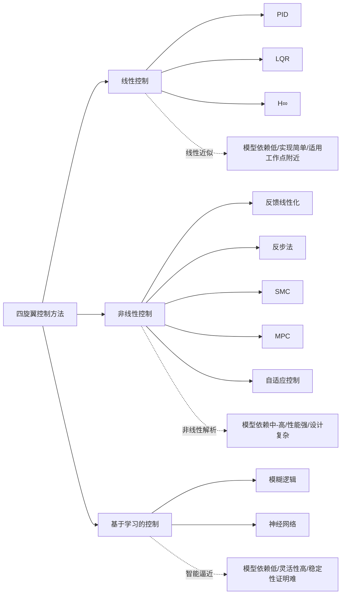
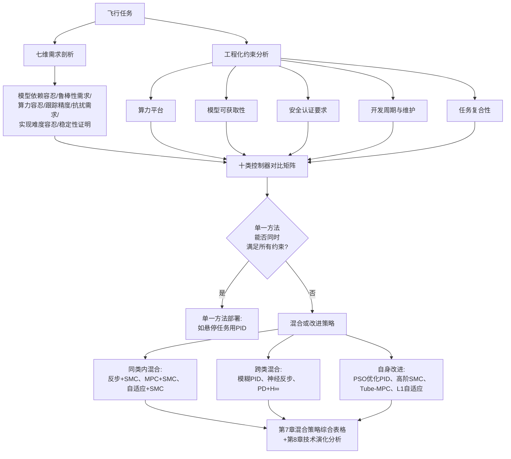
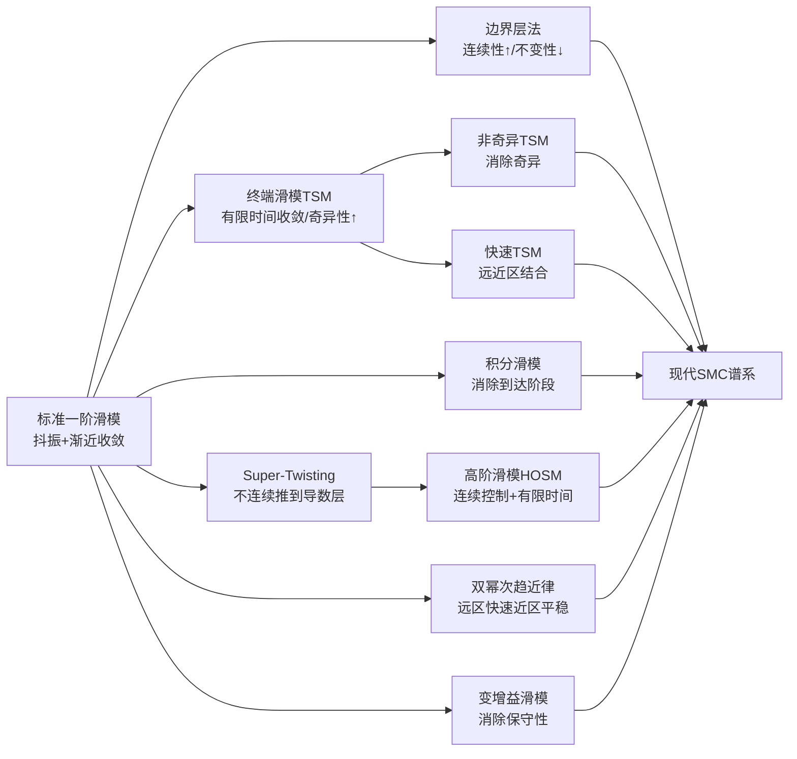
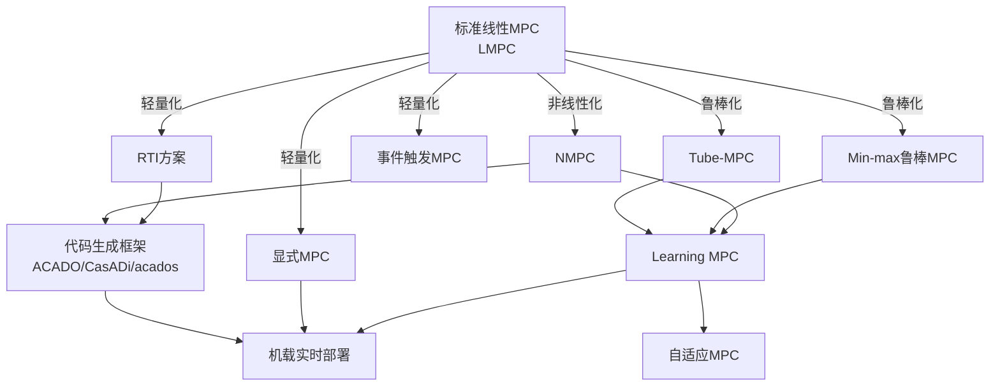
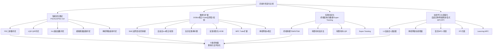

# 四旋翼无人机控制方法技术综述：分类、特性与性能改进策略（截至2021年5月）
# 1 研究背景、动力学特性与控制器分类框架

四旋翼无人机（quadrotor）在过去二十余年间从实验室原型逐步走向规模化应用，已经成为小型无人飞行系统中最具代表性的平台之一。其结构紧凑、可垂直起降、机动灵活的特性使之在航拍、电力与基础设施巡检、物流配送、精准农业、应急搜救乃至军事侦察等场景中扮演着越来越重要的角色。然而，正是这种"看似简单、实则复杂"的飞行平台，对控制系统提出了远高于传统固定翼飞行器的要求：四旋翼是一个典型的强耦合、欠驱动、强非线性、时变参数受扰系统，任何单一控制方法都难以在所有飞行任务中同时实现高精度、高鲁棒性与高实时性。本章作为整篇综述的基础性章节，将围绕四旋翼的应用价值与控制难点、研究边界、动力学建模要点、控制器设计需求，以及线性/非线性/基于学习三大类控制方法的分类框架展开，为后续章节逐类深入剖析的优缺点与改进策略奠定统一的物理基础与分析框架。

需要预先说明的是，本章因主题属于综述性背景与方法学分类，未直接调用搜索结果中的具体文献条目，相关论述基于四旋翼控制领域截至2021年5月的共识性知识进行综合归纳。具体的优缺点细节、文献支撑与改进策略举例将在后续第2—8章结合资料逐一展开与佐证。

## 1.1 四旋翼无人机的应用价值与控制难点

四旋翼无人机以其独特的机械结构在民用与军用领域形成了广泛的应用场景。在航拍与影视行业，它能够提供稳定的低空运动视角；在电力线、风机叶片、桥梁、油气管道等基础设施巡检中，其悬停与近距离机动能力可显著降低人工高空作业风险；在物流配送领域，多家企业已在末端配送、医疗物资紧急投送等场景开展试点；在精准农业中，四旋翼被用于喷洒、监测与遥感测绘；而在搜救、灾后侦察、消防侦测以及军事战场态势感知中，其快速部署能力则发挥着不可替代的作用。相较于固定翼飞行器，四旋翼无须跑道、可零半径转向、可定点悬停的特性，使其在城市与受限环境中具有显著优势。

然而，这些应用价值的背后是远比固定翼复杂的控制问题。**四旋翼是典型的欠驱动系统：其6自由度（三个平动加三个转动）的刚体运动仅由4个独立的控制输入（4个旋翼的转速或对应的总拉力与三轴力矩）驱动**。这意味着位置子系统（x、y、z三个方向的平动）必须通过姿态子系统（横滚、俯仰、偏航）的倾斜来间接控制——水平方向的运动只能通过让机体倾斜、使总拉力产生水平分量来实现。这种结构性的欠驱动直接导致姿态与位置之间存在强耦合，无法被简单的解耦控制策略完全消除。

与此同时，四旋翼的动力学包含多重非线性来源：旋翼桨叶产生的拉力与反扭矩与转速平方成正比；机体在三维空间中的姿态用旋转矩阵或四元数描述，姿态运动学本身就是非线性的；姿态变化又会通过旋转矩阵以乘法形式耦合到平动方程中；在快速机动、贴近地面或贴近物体时，还会出现地面效应、桨叶涡环、机体阻力等复杂气动现象。执行器层面，电子调速器（ESC）与无刷电机存在一阶或更高阶的动态响应，而最大转速、最小转速、电流限制等饱和约束又对控制输出施加了硬性边界。**此外，四旋翼在实际飞行中还面临外部风扰、负载变化（如物流投递任务中投放包裹）、电池电压衰减导致的拉力增益漂移、机体结构与桨叶老化引起的参数摄动等多重不确定性**。这些因素叠加，使得四旋翼控制问题成为一个集欠驱动、非线性、多变量、强耦合、受扰、受约束于一体的典型复杂控制问题，对控制方法的鲁棒性、自适应性、实时性与跟踪精度均提出了较高要求，也正是这些挑战催生了后续将要详细剖析的十类代表性控制器及其大量改进与混合方案。

## 1.2 综述的研究边界与分析维度

为了确保综述内容的聚焦性与可执行性，本研究在以下三个维度上明确界定研究边界。第一，**时间边界限定为截至2021年5月已公开发表的研究成果**：这一时间点之后出现的方法、文献、对比实验结果不在本综述的覆盖范围内；如确有必要提及更晚的进展，将作为背景性说明而非主体证据。这一边界的设定，一方面与项目调研对资料截止时间的明确要求相一致，另一方面也使得本综述能够在一个相对稳定且具有充分文献积累的窗口内进行系统性梳理，避免因纳入尚未充分验证的最新方法而稀释结论的可信度。

第二，**研究对象限定为10类代表性控制器**：包括线性控制范畴下的PID、LQR、H∞，非线性控制范畴下的反馈线性化（Feedback Linearization）、反步法（Backstepping）、滑模控制（SMC）、模型预测控制（MPC）、自适应控制（Adaptive Control），以及基于学习的控制范畴下的模糊逻辑（Fuzzy Logic）与神经网络（Neural Network）。这10类方法在四旋翼控制文献中具有最高的出现频次与代表性，能够在三大类之间形成相对均衡的覆盖；其他延伸方法（如强化学习、基于事件触发的控制、扰动观测器、ADRC自抗扰控制等）将在与上述10类方法相关联的语境下作为改进或扩展进行讨论，而不单独成类。

第三，**分析维度统一聚焦于"基本原理—优缺点—典型改进策略—性能表现"四个层面**。具体而言，对每一类控制器将探讨其设计哲学与算法骨架、相对于其他方法的核心优势、内在的工程局限与失效模式、学术界与工业界已经提出的混合策略与自身改进策略，以及在悬停、轨迹跟踪、机动飞行、避障、抗风扰等典型任务中的相对性能表现。这一分析维度的统一确保了不同章节之间的横向可比性，也为最终在第6章构建横向对比矩阵、在第7章输出改进策略综合表格提供了一致的口径。需要特别说明的是，本综述的差异化定位在于**同时强调"优缺点的可追溯性"与"改进策略的具体性"**：每一项缺点尽量给出机理性解释，每一项改进策略尽量明确"在什么场景下、用了什么技术手段、达到了什么效果"，避免笼统化与口号化的描述。

## 1.3 四旋翼动力学与运动学建模要点

任何控制方法的设计与评价都建立在合适的数学模型之上。四旋翼的建模在文献中已经形成了较为成熟的范式，其核心要点可归纳为以下几个方面。

**第一，刚体动力学建模通常基于牛顿-欧拉方程**。将四旋翼视为一个质量集中、惯量已知的刚体，在惯性坐标系下建立平动方程（描述机体质心的三维位置随时间的演化），在机体坐标系下建立转动方程（描述机体绕三个体轴的角速度及其与外力矩的关系）。平动方程通过旋转矩阵将机体坐标系下的总拉力变换到惯性坐标系，再与重力合成；转动方程则包含惯量矩阵、角速度叉乘项（陀螺项）以及由四个旋翼差速产生的三轴力矩。

**第二，姿态描述与运动学方程**。姿态可采用欧拉角（横滚φ、俯仰θ、偏航ψ）、旋转矩阵或四元数等表示形式。欧拉角直观但在大角度机动时存在奇异（如俯仰角接近±90°时的"万向锁"），旋转矩阵与四元数则可在全姿态范围内保持良定义。运动学方程将体轴角速度映射到欧拉角导数或四元数导数，这一映射本身就是非线性的，是四旋翼非线性来源之一。

**第三，位置-姿态子系统的耦合关系**。这是四旋翼欠驱动特性的数学表现：水平方向的加速度由总拉力的水平分量决定，而水平分量又取决于横滚角和俯仰角；偏航角虽与水平位置无关，但同样需要通过四个旋翼的差速来控制反扭矩。因此整个系统在数学上呈现出典型的"内环（姿态）—外环（位置）"级联结构，许多控制方法（如级联PID、级联反步法）的内外环划分正是基于这一物理事实。

**第四，桨叶空气动力学的非线性特征**。每个旋翼产生的拉力与反扭矩通常被建模为转速的二次函数，但精细化建模还需考虑桨盘倾斜导致的横向力（H-力）、机体平动引起的诱导阻力、地面效应（贴地飞行时拉力增大）、涡环状态、桨叶柔性等。这些项在常规悬停与中低速飞行中往往被忽略，但在快速机动或近地飞行中会显著影响系统行为。

**第五，执行器动态与饱和**。无刷直流电机与电子调速器并非理想的"瞬时输出"装置，从指令到实际转速通常存在毫秒至数十毫秒级的一阶或二阶动态延迟；且转速存在上下限、电流存在硬限制。如果控制律未显式考虑这些动态与约束，可能在高带宽控制下出现振荡甚至失稳。

**第六，外部扰动与参数不确定性的建模**。常见的处理方式包括：将风扰建模为加性力与力矩扰动、将质量与惯量参数视为带不确定区间的标称值加摄动、将气动参数建模为受未知有界扰动影响的项、或者引入扰动观测器对集中扰动进行在线估计。鲁棒控制（如H∞、SMC）与自适应控制对不确定性的不同处理哲学，本质上正是源于对这一建模环节的不同选择。

上述六个建模要点共同构成了一个完整的非线性、强耦合、欠驱动、受扰的多输入多输出（MIMO）系统模型，是后续所有控制方法设计与分析的共同起点。

## 1.4 动力学特性对控制器的性能要求

四旋翼的上述物理特性并非抽象的数学描述，而是直接转化为对控制器的一系列具体设计要求，这种"特性—需求"的映射关系是理解各类控制方法优劣的关键。

**强耦合与欠驱动→对控制结构的级联化要求**。由于水平位置只能通过姿态倾斜间接控制，几乎所有主流控制方案都采用"位置外环—姿态内环"的级联架构：外环根据期望位置与当前位置计算所需加速度，进而反解出期望横滚/俯仰角与总拉力指令；内环则负责快速跟踪期望姿态。这一结构对内环带宽提出了远高于外环的要求（通常内环带宽是外环的5—10倍），任何在内外环带宽分离假设上失效的方法都会面临稳定性挑战。

**非线性与参数不确定性→对鲁棒性与自适应能力的要求**。线性化方法（如PID、LQR、H∞）只有在小角度、低速度的工作点附近才能保证设计性能，一旦发生大角度机动或工作点显著偏移，未建模非线性项会显著降低跟踪精度甚至导致失稳；而模型参数（质量、惯量、拉力系数）随负载变化与电池电压衰减而漂移，则要求控制器具备对参数变化的容忍能力或在线辨识能力。这正是鲁棒控制与自适应控制在四旋翼领域被广泛研究的根本原因。

**快速动态→对实时性与计算效率的要求**。四旋翼的姿态时间常数通常在数十至数百毫秒量级，控制回路需以数百赫兹甚至上千赫兹运行才能保证稳定。这对依赖在线优化的控制方法（如MPC）构成了严苛的计算资源约束，也是NMPC、显式MPC等轻量化改进方案出现的直接动因。机载计算平台（如STM32级MCU、Pixhawk、Jetson Nano/TX2等）的算力差异，往往决定了哪些方法可在工程中部署。

**复杂轨迹跟踪→对精度与收敛性的要求**。航拍稳像、巡检定点、农业精准喷洒、室内编队等任务要求位置跟踪误差控制在厘米级甚至毫米级，姿态跟踪误差控制在度级以内；同时要求误差在有限时间内收敛，且不出现过大超调。这对控制律的稳定性证明、收敛速率、抑制超调的能力均提出了明确要求，反步法、SMC、终端滑模等方法在该维度上展现出各自的优势与代价。

**外部扰动→对抗干扰能力的要求**。室外飞行的阵风、城市峡谷的湍流、近物飞行的下洗气流、物流任务中的负载抖动等都构成显著扰动。控制器需具备扰动抑制（disturbance rejection）能力，常见手段包括积分作用、扰动观测器（DOB）、滑模鲁棒项、自适应补偿等。

将上述需求与控制器性能指标对应，可形成一个相对统一的评价维度集合——**模型依赖度、鲁棒性、计算复杂度、跟踪精度、抗扰能力、实现难度、稳定性证明**——这正是本综述后续章节用于横向比较的核心维度。值得强调的是，没有任何单一方法能在所有维度上同时取得最优，控制器选型本质上是在多维度之间进行权衡（trade-off），而这种权衡也是混合控制策略大量涌现的根本动机。

## 1.5 控制器三大类划分的依据与框架

将四旋翼控制方法划分为线性控制、非线性控制、基于学习的控制三大类，是文献中较为通行的分类方式。这一分类并非简单的标签，而是建立在三条相互交织的判定依据之上。

**第一条依据是模型形式**。线性控制方法以四旋翼在悬停点附近经小角度近似得到的线性化模型为设计基础，整个控制律的稳定性与性能分析均在线性系统理论框架内完成；非线性控制方法直接面向完整的非线性动力学方程（或其严格反馈/标准型变换形式），不依赖线性化近似；基于学习的控制方法则在不同程度上将"模型"从显式数学方程转变为隐式的数据—决策映射或基于专家知识的规则库，是一种"模型轻量化"或"模型替代"的范式。

**第二条依据是设计哲学**。线性控制的哲学是**线性近似**：承认非线性的存在但通过工作点线性化绕开它，依靠反馈增益的合理设计获得局部最优或鲁棒性能；非线性控制的哲学是**非线性解析**：通过坐标变换（反馈线性化）、递归构造李雅普诺夫函数（反步法）、滑模面设计（SMC）、滚动优化（MPC）或在线参数估计（自适应）等手段，直接在非线性空间中构造控制律；基于学习的控制的哲学是**智能逼近**：利用模糊推理对专家经验进行编码，或利用神经网络对复杂非线性映射进行函数逼近，将"难以建模"的部分交给具备万能逼近能力的智能结构。

**第三条依据是求解机制**。线性方法多有解析或半解析的设计流程（PID调参法则、LQR代数Riccati方程、H∞ Riccati或LMI求解）；非线性方法既有解析构造（反馈线性化、反步法、SMC、自适应律），也有在线优化（MPC）；学习型方法则依赖规则推理（模糊）或参数训练（神经网络），训练既可离线完成也可在线进行。

| 分类 | 代表性控制器 | 主要模型形式 | 设计哲学 | 求解机制 |
|------|-------------|------------|----------|---------|
| 线性控制 | PID、LQR、H∞ | 工作点线性化模型 | 线性近似 | 解析公式/Riccati/LMI |
| 非线性控制 | 反馈线性化、反步法、SMC、MPC、自适应控制 | 完整非线性模型/严格反馈型 | 非线性解析 | 坐标变换/李雅普诺夫递归/滑模设计/在线优化/参数估计 |
| 基于学习的控制 | 模糊逻辑、神经网络 | 规则库/数据驱动映射 | 智能逼近 | 模糊推理/网络训练 |

该分类体系在**完整性**上覆盖了本综述确定的10类代表性控制器，每类控制器都能在三大类中找到唯一归属；在**正交性**上，三大类的判定依据虽然存在交叉（例如自适应控制也包含一定的"学习"成分，神经网络控制也可融入李雅普诺夫稳定性证明），但其主导设计哲学与典型工作流程足以使三类相互区分。需要承认的是，这一分类是一种**主导特征划分**而非严格互斥划分——这也正是后续混合控制策略广泛存在的逻辑空间所在：当一个方案同时利用线性控制的解析性、非线性控制的鲁棒性与学习型方法的逼近性时，它就跨越了三大类的边界，体现了控制工程中常见的"取长补短"思路。

## 1.6 三类控制方法的横向比较

在确立了三大类划分依据后，可在统一的维度集合上对其内在差异进行初步比较。这一比较旨在为读者建立全局图景，更细粒度的差异将留待后续章节展开。

上图展示了三大类方法对10类控制器的覆盖结构以及各自的核心特征标签，下表则从七个维度对其相对表现进行横向归纳：

| 比较维度 | 线性控制 | 非线性控制 | 基于学习的控制 |
|---------|---------|----------|--------------|
| 设计哲学 | 工作点线性化+反馈整定 | 直接处理非线性动力学 | 经验规则或数据驱动逼近 |
| 模型依赖度 | 中（依赖线性化模型，参数可不精确） | 高（多数方法需较精确非线性模型，MPC对模型尤为敏感） | 低（模糊不需模型，神经网络可数据驱动） |
| 计算复杂度 | 低（PID/LQR可在低端MCU运行） | 中—高（MPC最高，反步/SMC中等） | 中（推理低、训练高；在线学习实时性挑战） |
| 参数整定难度 | 低（PID）—中（H∞加权函数难选） | 中—高（增益与李雅普诺夫函数构造经验依赖强） | 高（规则爆炸/网络结构与超参） |
| 鲁棒性表现 | 弱—中（H∞强但保守） | 强（SMC、自适应、鲁棒MPC对扰动与参数变化容忍度高） | 中—强（取决于规则覆盖度或训练数据） |
| 工程实现门槛 | 低（成熟商用飞控普遍采用PID） | 中—高（需较深控制理论功底，MPC需求解器） | 中—高（模糊规则设计经验/网络部署算力） |
| 稳定性证明 | 成熟（线性系统理论完备） | 成熟（李雅普诺夫框架） | 困难（除少数Lyapunov-based方案外） |
| 典型适用场景 | 悬停、低速稳态飞行、消费级产品 | 大机动、轨迹跟踪、抗扰飞行、约束受限任务（MPC） | 模型未知/难建模、专家知识丰富场景、研究探索 |

从上述比较可以得出几点关键观察。**第一，没有"全能"的方法**：线性控制以简单换得性能受限，非线性控制以复杂换得性能提升，学习型控制以灵活性换得稳定性证明的困难。**第二，三类方法的优势具有互补性**：线性控制贡献了工程可实现性，非线性控制贡献了大范围性能保证与鲁棒性，学习型控制贡献了对未知模型与专家经验的处理能力。这种互补性也正是混合控制策略（如PID+模糊、Backstepping+SMC、神经网络+自适应、MPC+SMC等）成为提升四旋翼控制性能主流路径的根本原因。**第三，控制器选型本质上是面向具体任务的多维权衡**：对低成本消费级产品，PID依然是首选；对高动态机动与抗扰飞行，SMC、自适应、反步法及其混合更有优势；对受约束的轨迹规划与避障任务，MPC具备独特价值；对模型难以精确获取或飞行环境高度不确定的场景，学习型方法与混合方案则提供了新的解决思路。

本章构建的"应用难点—建模要点—性能要求—分类框架—横向比较"五位一体的基础结构，将在后续章节中被反复调用。第2章将首先深入剖析线性控制器三杰（PID、LQR、H∞）的优缺点；第3、4章将分别展开非线性控制器的五类方法；第5章聚焦基于学习的两类方法；第6章在此基础上完成十类控制器的横向对比矩阵；第7章给出涵盖混合与自身改进的完整策略表；第8章分析改进路径的技术演化；第9章则给出综述结论与未来展望，并明确指出本综述受时间边界与文献覆盖度限制可能存在的盲区。

# 2 线性控制器的优缺点剖析：PID、LQR与H∞

线性控制方法是四旋翼飞行控制研究与工程实践中起步最早、积累最深的一支。其共同的设计前提是：在悬停点或某一标称工作点附近对四旋翼的非线性动力学进行小扰动线性化，进而在线性系统理论框架内完成控制律设计与稳定性证明。这一前提既赋予了线性控制方法以解析性强、可分析性高、工程实现门槛低的天然优势，也埋下了在大姿态机动、显著参数漂移与强外部扰动下性能下降甚至失稳的隐患。本章在第1章建立的"模型依赖度—鲁棒性—计算复杂度—跟踪精度—抗扰能力—实现难度—稳定性证明"七维评价框架下，依次剖析PID、LQR与H∞三类代表性线性控制器在四旋翼姿态内环与位置外环中的典型形态、核心优点与内在局限，最后给出三者的横向比较与适用场景界定，作为后续非线性与学习型方法的对照基线。

需要预先说明的是，由于本章节调用的资料检索未直接返回可用的搜索结果条目，本章论述以四旋翼控制领域截至2021年5月的共识性知识为基础进行综合归纳；具体文献支撑与改进策略举例将集中在第7、8章配合搜索结果展开，本章不再单独列出引用角标，对此局限性谨作如实说明。

## 2.1 PID控制器：结构简单性的工程优势与鲁棒性局限

PID控制器是四旋翼飞行控制中应用最为广泛、工程沉淀最为深厚的方法。其在四旋翼上的典型部署形式为**级联PID（cascaded PID）架构**：外环负责位置控制，将三维位置误差经PID运算后输出期望加速度，再通过简单的几何反解得到期望横滚角、俯仰角与总拉力；内环负责姿态控制，以期望姿态与实测姿态的偏差为输入，输出三轴力矩指令，进而分配至四个旋翼。在内环中还常常进一步细分为"角度环—角速度环"双层结构，角度环输出期望角速度、角速度环输出力矩，由此构成"位置—姿态—角速度"三层级联，每一层均独立采用PID或其简化形式（PD、PI）。这种分层结构与第1章所述四旋翼"内外环带宽分离"的物理需求高度契合，是PID能够在欠驱动平台上长期占据主流的结构性原因。

PID的工程优势可从多个维度展开。**第一，结构极其简洁，参数物理意义明确**：比例项对应即时误差响应、积分项对应稳态误差消除、微分项对应阻尼增强，三者均有清晰的频域与时域诠释，调试工程师无需深入控制理论即可在飞行中通过现场试飞迭代完成整定。**第二，对模型依赖度低**：PID不要求精确的动力学模型，只需对四旋翼大致的惯量量级、控制带宽与执行器响应特性有经验性认识，即可启动调参；这在小型自制航模、改装机型、负载频繁变化的实验平台上具有不可替代的实用价值。**第三，计算开销极低**：每一回路的PID运算仅涉及加减乘与一次积分、一次微分，在数百赫兹乃至上千赫兹的控制频率下，STM32F4级别的MCU即可轻松承担，无需DSP或FPGA加速。**第四，工业生态成熟**：Pixhawk/PX4、ArduPilot（APM）、Betaflight、Cleanflight等主流开源飞控固件均以PID（或其变体PID-FF、PID-DTerm-Filter等）作为默认控制律，整定经验、滤波技巧、抗饱和方案在社区中已被反复打磨，工程可复用性极高。

然而，正是这种"简单可用"的特性也对应着PID在四旋翼上的一系列固有局限。**首先，线性化假设在大姿态机动下失效**。PID参数本质上是在悬停或小角度倾斜的局部工作点上整定的；当机体进入快速翻滚、大角度俯仰或剧烈横向机动时，姿态-位置耦合的非线性项（旋转矩阵中的三角函数项、角速度叉乘项）显著增大，固定增益的PID无法在大范围工作点上保持一致性能，可能出现跟踪误差放大、阻尼下降乃至振荡。**其次，对外部扰动与参数变化的鲁棒性偏弱**：阵风、负载抖动、电池电压衰减引起的拉力增益变化，都会以稳态误差或动态超调的形式显现，PID只能通过积分项被动消除稳态偏差，无法主动抑制扰动的瞬态影响；当扰动频谱与控制带宽重叠时，PID更难以兼顾响应速度与抗扰能力。**第三，积分饱和（integral windup）问题**：四旋翼执行器存在明确的拉力上下限，在大幅度阶跃指令或长时间扰动作用下控制输出被饱和截断，但积分项仍在持续累积，一旦误差反向，积累的积分量会导致显著超调甚至反复振荡；工程上需引入条件积分、反向计算（back-calculation）、积分钳位等抗饱和补丁，这些补丁本身又带来额外的整定负担。**第四，多变量耦合无法被解耦PID完全处理**：四旋翼的姿态三轴之间存在惯量耦合与陀螺耦合，每一通道独立设计的PID忽略了交叉项，仅在小角度近似下成立；大机动下耦合显化，单回路PID难以保证整体性能。**第五，参数跨包线一致性差**：在不同负载、不同电量、不同飞行包线（如悬停 vs. 高速前飞）下，整定一组适合所有工况的PID参数几乎不可能，工程上往往需要为不同模式准备不同的增益表（gain scheduling），但增益切换又会带来切换瞬态与抖动。

上述局限并非"PID不够好"，而是PID作为定增益线性控制的方法学边界——它在低动态稳态飞行下足以胜任，但要应对大机动、强扰动、变参数的复杂任务，就必须借助混合或自身改进。模糊PID（用模糊规则在线调整Kp/Ki/Kd）、自适应PID（基于参数辨识在线整定）、PID+SMC（用滑模项补偿PID未覆盖的鲁棒需求）、PSO/GA优化的PID（用群智能算法离线寻优增益）等都是直接针对上述局限提出的改进路径，将在第7、8章中具体展开。

## 2.2 LQR控制器：最优性优势与精确模型依赖的代价

LQR（线性二次调节器）将四旋翼控制问题转化为一个无限时间二次型最优控制问题：在悬停点附近得到线性化的状态空间模型 $\dot{x} = Ax + Bu$ 之后，选定一个对称正定的状态加权矩阵 $Q$ 与控制加权矩阵 $R$，通过最小化二次型性能指标

$$J = \int_{0}^{\infty} \left( x^{\top} Q x + u^{\top} R u \right) dt$$

求解代数Riccati方程

$$A^{\top} P + P A - P B R^{-1} B^{\top} P + Q = 0$$

得到唯一正定解 $P$，进而给出状态反馈增益 $K = R^{-1} B^{\top} P$ 和最优控制律 $u = -Kx$。在四旋翼上，状态向量 $x$ 通常包含三维位置与速度、姿态角与角速度共12维状态，控制向量 $u$ 通常为总拉力与三轴力矩。LQR并不天然采用级联结构，而是以"全状态反馈"的形式将位置环与姿态环一并纳入同一增益矩阵 $K$ 中——这是LQR相对于解耦PID最显著的结构性差异。

LQR的核心优势体现在以下几方面。**第一，多变量耦合的统一处理**：通过状态空间模型，LQR天然将位置、速度、姿态、角速度之间的耦合关系纳入设计，不再需要人为划分回路；增益矩阵 $K$ 中的非对角项即对应跨通道的耦合补偿，相较于解耦PID在大耦合工况下具有显著优势。**第二，二次型最优意义下的性能保证**：在线性化模型成立的范围内，LQR控制律是给定 $Q$、$R$ 下使性能指标 $J$ 达到全局最小的状态反馈，这是PID所无法宣称的理论性质。**第三，闭环稳定性与裕度的理论保证**：LQR闭环系统具有至少60度的相位裕度与无穷大的增益上界裕度（在标称模型下），这一保守裕度在低端MCU上以恒定增益运行时提供了重要的安全余量。**第四，权重矩阵 $Q$、$R$ 为设计者提供了显式的性能折中工具**：增大 $Q$ 中对应位置或姿态状态的元素可强化跟踪精度，增大 $R$ 中对应控制项的元素可抑制控制能量与执行器负担，这种"调权重换性能"的设计语言比PID的"调三参数"更具系统性。**第五，与状态估计器的天然耦合**：LQR与卡尔曼滤波器组合即构成LQG（线性二次高斯）控制器，可在量测噪声与过程噪声并存的情形下保持最优性，在四旋翼上配合IMU与GPS/视觉融合估计的应用流程已较为成熟。

但LQR的代价同样不容忽视。**第一，对线性化模型的精确度高度敏感**：LQR的最优性是相对于标称模型 $A$、$B$ 而言的，一旦实际质量、惯量、拉力系数、力臂等参数偏离设计值，闭环性能即随之下降；当偏离量较大时，原本设计的稳定裕度也无法保证。这意味着LQR在面对负载投放、电池衰减、机体磨损等导致的参数漂移时，需要重新整定或引入自适应机制。**第二，大姿态机动下线性化假设彻底失效**：与PID不同的是，LQR的失效不仅体现在性能退化，更可能因为状态空间模型本身在大角度下已不成立而出现稳定性丧失——即"用错了模型"。**第三，不显式处理外部扰动与未建模动态**：标准LQR的性能指标只约束状态范数与控制范数的二次型积分，没有显式包含扰动抑制项；面对持续风扰，LQR通常需要额外引入积分增广状态（"LQI"，即LQR with Integrator）或与扰动观测器联用，才能消除稳态偏差。**第四，全状态反馈对量测与估计精度要求高**：四旋翼的12维状态中，加速度、角速度可由IMU直接获得，但位置、姿态需通过融合估计得到，姿态在快速机动下还可能受IMU温漂、振动噪声影响；当估计误差较大时，LQR的最优性变成"对错误状态的最优"，反而可能放大跟踪误差。**第五，$Q$、$R$ 矩阵的整定仍带有经验色彩**：尽管"调权重"在概念上比"调PID三参数"更系统，但 $Q$、$R$ 的具体数值选择往往依赖反复仿真与试飞迭代，且不同状态量物理量纲差异巨大，需要经验性归一化处理；Bryson法则等经验规则提供了起点，但难以替代具体场景下的调参经验。

综合来看，LQR在"工况相对稳定、模型可较精确获取、多状态耦合明显"的场景下相对PID具有可见优势，但其对模型与状态估计精度的依赖、对扰动与非线性的鲁棒性不足，使其在工业产品中的部署广度远不及PID。这些短板也催生了一系列改进路径——LQR+积分增广（LQI）以消除稳态偏差、LQR+扰动观测器以增强抗扰、LQR+增益调度以扩展工作包线、LQR+SMC形成鲁棒最优组合，以及基于PSO/GA对 $Q$、$R$ 矩阵的智能寻优——将在后续章节中具体讨论。

## 2.3 H∞控制器：强鲁棒性优势与设计复杂性的工程困境

H∞控制是面向最坏情况扰动抑制的鲁棒控制设计方法。其核心思想是将四旋翼建模为带有结构化或非结构化不确定性的标称线性模型 $G(s)$，再引入加权函数 $W_e(s)$（针对跟踪误差，定型期望的灵敏度函数 $S$）、$W_u(s)$（针对控制能量，定型补灵敏度函数 $T$ 或控制灵敏度）、$W_d(s)$（针对扰动谱）等，将设计问题转化为求解使**广义被控对象到性能输出的 $H_\infty$ 范数最小化**的稳定控制器 $K(s)$：

$$\min_{K \text{ stabilizing}} \left\| \begin{bmatrix} W_e S \\ W_u KS \end{bmatrix} \right\|_\infty < \gamma$$

求解方法包括两-Riccati方程法（Glover-Doyle算法）与基于线性矩阵不等式（LMI）的求解；前者要求被控对象满足若干技术条件，后者则更具一般性。在四旋翼上，H∞既可作为整体多变量控制器（一次性输出位置环与姿态环指令），也可应用于内环姿态控制以提升姿态鲁棒性。

H∞的优势集中在鲁棒性的显式表达上。**第一，对模型不确定性与外部扰动的显式处理**：通过加权函数，H∞设计能够将"质量在±20%范围内变化""风扰功率谱集中在0.5—2 Hz"等先验信息直接编码进设计目标中，在所有满足约束的不确定性下提供性能保证。**第二，频域整形的设计直观性**：在熟悉频域分析的设计者眼中，$W_e$ 的低频高增益保证低频跟踪精度与扰动抑制、$W_u$ 的高频高增益限制控制带宽以避免激发未建模高频动态——这套语言比LQR的时域权重矩阵在物理意义上更接近经典控制工程师的直觉。**第三，对结构化不确定性的进一步处理能力**：在标准H∞之外，$\mu$ 综合（结构奇异值法）允许更精细地刻画参数不确定性的结构，进一步降低保守性。**第四，悬停与中等机动范围的扰动抑制效果显著优于PID/LQR**：当四旋翼面对持续风扰、阵风脉冲或质量参数明显漂移时，精心设计的H∞控制器能够在保证稳定的前提下显著抑制扰动对位置与姿态的影响，这是其在学术研究中被反复验证的优势。

然而，H∞的工程困境同样突出。**第一，加权函数选择缺乏统一规则，对设计者经验依赖极强**：$W_e$、$W_u$、$W_d$ 的形式（一阶、二阶、含陷波环节）、转折频率、增益高低需要反复迭代——选择不当会导致设计无解（$\gamma$ 不收敛）、控制器过于保守，或在某些频段过度放大噪声；这一调试过程缺乏类似PID整定法则的标准化指引，使H∞在工业实践中难以被普通工程师快速掌握。**第二，控制器阶次较高**：H∞控制器的阶次通常等于被控对象阶次加上所有加权函数阶次，在四旋翼12维状态加多组加权函数的设定下，原始H∞控制器可能达到二三十阶，远超MCU能够实时运算的范围；实机部署需采用平衡截断、Hankel范数近似等模型降阶手段，而降阶过程又可能损失部分鲁棒性，需要在保真度与计算可行性之间权衡。**第三，以最坏情况为导向带来显著保守性**：H∞为了在所有可能的不确定性实现下提供性能保证，往往在标称工况下牺牲跟踪精度与响应速度；在四旋翼平稳悬停时，H∞的位置/姿态响应可能不及LQR迅捷，甚至不及精心整定的PID。**第四，对大姿态机动下的非线性同样无能为力**：H∞本质上仍是线性鲁棒控制，其不确定性建模能够覆盖参数摄动与有界扰动，但无法吸纳大角度下的非线性耦合项；当机动幅度超出线性化有效范围，H∞与LQR一样会失效。**第五，调试周期长、工程化门槛高**：从加权函数初设、$\gamma$ 迭代、控制器阶次评估、模型降阶到实机验证，整个流程对MATLAB Robust Control Toolbox等专业工具的依赖较强，调试一次完整闭环所需时间远高于PID；这也是H∞在工业飞控固件中实际部署数量远少于PID的根本原因。

针对上述工程困境，文献中提出了多条改进路径：PD+H∞混合架构（用PD承担常态跟踪、H∞负责扰动抑制）以降低单一H∞设计的保守性、$\mu$ 综合替代标准H∞以减少结构化不确定性下的保守度、基于LMI的固定阶H∞设计以直接获得可部署阶次、增益调度H∞以扩展工作包线、H∞与SMC或反步法的混合以兼顾大机动鲁棒性等，这些路径同样将在第7、8章配合具体案例展开。

## 2.4 三种线性控制器的综合比较与适用场景界定

在第1章建立的统一评价维度下，将PID、LQR、H∞三类线性控制器并列比较，有助于清晰把握其相对位置与适用边界。下表对七个核心维度上的相对表现进行了归纳：

| 评价维度 | PID | LQR | H∞ |
|---------|-----|-----|----|
| 模型依赖度 | 低（仅需大致动力学量级与带宽认知） | 高（需较精确线性化模型 $A$、$B$） | 中—高（需标称模型+不确定性描述+加权函数） |
| 鲁棒性 | 弱（仅靠积分项被动消差，无显式鲁棒机制） | 弱—中（标准LQR无显式鲁棒，LQI/LQG稍有提升） | 强（显式最坏情况扰动抑制，参数摄动有保证） |
| 计算复杂度 | 极低（数十次乘加，kHz级运算无压力） | 低（恒定 $K$ 矩阵乘法，全状态反馈一次完成） | 中—高（原始阶次高，需降阶后部署） |
| 整定难度 | 低—中（三参数试飞整定，存在抗饱和等补丁） | 中（$Q$、$R$ 矩阵需经验+迭代，存在归一化问题） | 高（加权函数选取无统一规则，调试周期长） |
| 跟踪精度（线性区） | 中（依赖整定质量与抗饱和措施） | 高（最优性指标显式约束跟踪状态） | 中（保守性可能牺牲标称跟踪性能） |
| 抗扰能力 | 弱—中（依赖积分项与人工补丁） | 弱—中（需要LQI增广或扰动观测器） | 强（显式频域整形扰动抑制） |
| 稳定性证明 | 完备（基于经典频域法/Routh判据，但仅在线性化模型下） | 完备（Riccati解的存在性即蕴含闭环稳定与裕度） | 完备（$\gamma$ 收敛即蕴含鲁棒稳定与鲁棒性能） |
| 工程实现门槛 | 极低（开源飞控默认支持） | 中（需状态估计器配合） | 高（专业工具链+模型降阶+经验积累） |
| 大姿态机动表现 | 差（线性化失效） | 差（线性化彻底失效） | 差（线性鲁棒仍无法处理非线性耦合） |

从上表中可以提炼出几条关键观察。**第一，三种方法在线性化假设下各有所长，但都未能突破"线性"这一根本限制**。PID以"最低门槛、最弱鲁棒"为代价换取了工程普及度，LQR以"多变量最优、模型依赖"为代价换取了耦合处理与理论最优性，H∞以"显式鲁棒、保守复杂"为代价换取了对不确定性的主动应对。**第二，三种方法的优势具有明显互补性**：PID提供工程可实现性、LQR提供多变量最优框架、H∞提供鲁棒性显式保证，这种互补性也是后续PID/LQR/H∞之间或与非线性方法混合的逻辑基础。**第三，无论采用哪种线性方法，一旦四旋翼进入大姿态机动（横滚/俯仰超过约30°—45°）、显著参数漂移（质量变化超过30%—50%、惯量显著改变）或强非线性气动效应（贴地飞行、近物悬停、剧烈姿态翻转）下，三者均会出现性能显著下降乃至失稳**——这正是线性控制方法的共性失效模式。

基于上述比较，可以给出三类线性控制器的典型适用场景界定：

**PID** 最适合**悬停、低速稳态飞行、消费级与商用飞控产品**——其工程友好性、低算力需求与成熟的开源生态使其在大疆Phantom系列、Pixhawk/PX4默认配置、Betaflight穿越机固件等真实产品中长期占据主导地位；在小型实验平台、教学演示、负载频繁变化但飞行包线相对温和的场景下，PID依然是首选起点。

**LQR** 最适合**多变量耦合显著、模型可较精确获取、工况相对稳定的场景**——典型案例包括有详细惯量辨识数据的实验级四旋翼、室内动作捕捉系统下的轨迹跟踪研究平台、需要统筹位置-姿态多状态权衡的科研型机型；在工业产品中LQR的直接部署较少，更多以LQG或LQI形式出现，或作为后续非线性方法的基线对比。

**H∞** 最适合**模型不确定性较大、扰动抑制要求严格、但飞行任务仍处于小—中角度范围的鲁棒飞行任务**——例如室外巡检中需应对持续阵风、负载在一定范围内变化但工作点附近运行的工业机型；其工程化部署门槛使其在学术研究中的曝光度远高于产品级实装，但作为鲁棒性能基准与混合控制中的鲁棒模块，H∞的价值依然不可替代。

更重要的是，三者的共性失效模式——大姿态机动下线性化假设崩塌、强非线性气动效应无法被线性鲁棒边界吸纳、模型参数大幅漂移超出预设不确定性区间时鲁棒性能保证失效——共同指向了线性控制方法的能力边界。要在这些场景下取得性能突破，必须借助直接处理非线性动力学的方法（反馈线性化、反步法、SMC、MPC、自适应控制）或具备数据/规则驱动逼近能力的学习型方法（模糊逻辑、神经网络）。这正是第3、4、5章将依次展开的非线性与学习型控制器的逻辑入口，也是第7、8章混合策略与自身改进路径之所以集中涌现的根本原因——线性方法在简单工况下的工程优势与在复杂工况下的能力边界共同塑造了四旋翼控制方法学演化的基本驱动力。

# 3 非线性控制器的优缺点剖析（一）：反馈线性化与反步法

第2章已经系统揭示了PID、LQR、H∞三类线性控制方法在四旋翼上的共性失效模式：当机体进入大姿态机动、显著参数漂移或强非线性气动效应时，工作点线性化所依赖的小扰动假设崩塌，三种线性方法均无法在原理上避免性能退化乃至失稳。这一能力边界天然地引向了**直接面向四旋翼完整非线性动力学进行控制律设计**的非线性控制方法。本章作为非线性控制器剖析的第一部分，聚焦其中两类基于解析构造的代表性方法——反馈线性化（Feedback Linearization）与反步法（Backstepping），延续第2章建立的"模型依赖度—鲁棒性—计算复杂度—跟踪精度—抗扰能力—实现难度—稳定性证明"七维评价框架，剖析两者在四旋翼姿态/位置控制中的设计原理、核心优势与内在局限，并在节末完成横向比较与适用场景界定，为第4章SMC、MPC、自适应控制的展开以及第7、8章混合与改进策略的讨论铺设逻辑入口。

需要预先说明的是，本章节直接调用的资料检索未返回可用的搜索结果条目，论述以四旋翼控制领域截至2021年5月的共识性知识为基础进行综合归纳；具体文献支撑与改进策略的代表性案例将集中在第7、8章配合搜索结果集中展开，本章不再单独列出引用角标，对此局限性谨作如实说明。

## 3.1 反馈线性化：精确取消非线性的设计优势与模型敏感性代价

反馈线性化是一类基于微分几何与非线性坐标变换的非线性控制设计方法，其核心思想可概括为"先精确取消（cancel），再线性设计"：通过一组依赖于状态的非线性反馈律和（在必要时）非线性坐标变换，将原本含有强非线性项的四旋翼动力学系统在数学上精确变换为一个等效的线性系统，进而在变换后的坐标空间中利用极点配置、LQR或PID等线性方法完成跟踪控制律设计。这种"以非线性消非线性"的设计路径，使其在原理上摆脱了线性方法对工作点线性化的依赖，可在全工作包线内提供一致的闭环动态。

在四旋翼上，反馈线性化通常以两种典型形态出现。**第一种是输入-状态线性化（input-state linearization）**：寻找一个微分同胚的状态变换 $z = \Phi(x)$ 与反馈律 $u = \alpha(x) + \beta(x)v$，使得新坐标下的系统 $\dot{z} = Az + Bv$ 完全线性、可控；这一形式要求原系统满足相对阶完整、分布对合（involutive）等较强的微分几何条件，在四旋翼12维全状态系统上严格成立的范围有限，通常需要结合具体的输出选择与子系统分解。**第二种是输入-输出线性化（input-output linearization）**：选定关注的输出（如三维位置与偏航角），对输出反复求导直至控制输入显式出现，再设计反馈律使输入到输出的关系成为简单的积分器链。在四旋翼上，将三维位置 $(x,y,z)$ 与偏航角 $\psi$ 作为输出，对位置变量求导两次出现总拉力与姿态角，再求导两次出现总拉力的二阶导数与三轴力矩——也就是说，需要将总拉力作为动态扩展状态进行"动态扩展"（dynamic extension），才能凑齐显式控制输入。这一被广泛使用的"动态扩展+输入-输出线性化"形式，能够将四旋翼的位置-偏航跟踪问题转化为四个解耦的四阶积分器链，外环再以极点配置或线性最优方法收尾。

反馈线性化在四旋翼控制中的优势可从几个层面归纳。**第一，全工作包线性能一致性**：与线性控制方法仅在悬停点附近成立不同，反馈线性化在理论上对任意姿态、任意速度均可精确抵消非线性耦合，闭环动态完全由设计者在线性化坐标下指定，这一性质对大角度机动、3D特技飞行等场景具有原理性吸引力。**第二，设计流程清晰、模块化好**：一旦完成坐标变换与反馈律构造，剩余设计退化为线性系统问题，可直接调用极点配置、LQR、$H_\infty$ 等成熟工具；这种"非线性变换+线性外环"的双层结构在工程上易于复用与替换。**第三，便于与轨迹规划层无缝衔接**：积分器链的标准型与基于微分平坦性（differential flatness）的轨迹规划天然契合——四旋翼已被证明是关于位置与偏航四个输出微分平坦的系统，规划层可直接输出位置与偏航的高阶导数轨迹，由反馈线性化控制律精确跟踪，构成了开源工具链与学术轨迹生成器中应用最广泛的范式之一。**第四，相对阶等结构性概念为可控性、可观性分析提供了严格工具**，使设计者能够在动手前判断变换是否可行、奇异性可能出现在何处。

然而，反馈线性化的工程代价同样集中而尖锐。**第一，对模型精度的高度敏感性**是其最受诟病的局限：反馈律 $u = \alpha(x) + \beta(x)v$ 中的 $\alpha(x)$、$\beta(x)$ 显式包含质量 $m$、惯量矩阵 $J$、拉力系数、力臂等参数；当真实参数偏离标称值时，原本"精确"的取消变成"不精确"的取消，残留的非线性项以未建模残差形式注入闭环，可能直接表现为静差、振荡乃至失稳。在四旋翼的实际工程环境中，电池电压衰减引起的拉力增益漂移、负载投放引起的质量与惯量突变、机体磨损与桨叶磨损引起的气动参数偏移，均会使反馈线性化的"精确性"前提逐步瓦解。**第二，坐标变换的奇异性问题**：基于欧拉角描述的姿态运动学在俯仰角接近 $\pm 90°$ 时出现万向锁，姿态变换的雅可比矩阵奇异，反馈律分母趋零、控制量趋于无穷；即便采用旋转矩阵或四元数描述也无法消除"动态扩展"中由于总拉力趋零（自由落体瞬间）造成的另一类奇异——一旦轨迹设计中出现"瞬时零拉力"点（如某些激进的翻滚机动），反馈线性化在该点附近控制律即出现奇异。这一局限直接限制了反馈线性化在某些极限机动轨迹上的适用性。**第三，对未建模动态的脆弱性**：执行器一阶/二阶动态延迟、桨叶柔性、桨盘倾斜H-力、机体阻力等在标称模型中通常被忽略的项，会在反馈律的高频微分作用下被显著放大；尤其是输入-输出线性化中外环以高阶积分器链等效，控制律本质上是高阶微分器，对量测噪声与高频未建模动态的灵敏度高于PID与LQR。**第四，零动态稳定性需要单独验证**：当所选输出的相对阶之和小于系统总阶时，存在不可观的"零动态"（zero dynamics），它在输出被强制保持为零的条件下自由演化；四旋翼通过动态扩展实现完全线性化后，理论上零动态维度为零，但当采用部分输入-输出线性化或简化模型时，欠驱动的部分动态（如内部姿态变量）可能成为零动态，需通过李雅普诺夫分析单独证明其有界或渐近稳定，否则即便输出收敛，内部状态仍可能发散。**第五，对设计者数学背景要求较高**：微分几何、李导数、相对阶、对合分布等概念的掌握门槛远高于PID整定，使该方法在工业产品中的部署广度有限，更多出现于学术研究与高端实验平台。

正是上述模型敏感性、奇异性、未建模动态脆弱性的固有缺陷，催生了大量针对反馈线性化的鲁棒化与混合化改进路径——例如将反馈线性化与扰动观测器、滑模补偿、自适应参数估计或神经网络逼近相结合，用以在线补偿模型失配残差；又如以四元数或旋转矩阵替代欧拉角避开姿态奇异；再如采用近似反馈线性化（approximate feedback linearization）牺牲部分精确性以换取更好的鲁棒性。这些改进将在第7、8章配合具体案例展开。

## 3.2 反步法：递归李雅普诺夫设计的稳定性优势与参数膨胀代价

反步法（Backstepping）是另一类在四旋翼控制中应用极为广泛的解析型非线性控制设计方法，其设计哲学与反馈线性化形成鲜明对照：不强求"精确取消"全部非线性项，而是通过**逐级递归构造李雅普诺夫函数**，对系统中每一层"虚拟输入"分别设计镇定律，最后将虚拟输入逐步推进到真实控制输入，从而在构造上保证闭环系统的李雅普诺夫稳定性。其前提是被控系统具有"严格反馈型"（strict-feedback form）结构——状态变量按层级排列，前一层的动态仅依赖于本层与下一层状态。

四旋翼的"位置外环—姿态内环—角速度环"级联结构与严格反馈型在物理上高度同构：位置的二阶动力学依赖于姿态（通过总拉力的水平分量），姿态运动学依赖于角速度，角速度动力学依赖于三轴力矩这一真实控制输入。基于这一对应，标准的四旋翼反步设计典型地分四步推进：第一步以位置误差为变量，构造 $V_1 = \tfrac{1}{2} \|e_p\|^2$，将速度作为虚拟输入设计期望速度律；第二步以速度误差为变量构造 $V_2 = V_1 + \tfrac{1}{2}\|e_v\|^2$，将姿态（横滚、俯仰角）与总拉力作为虚拟输入，反解出期望姿态与拉力指令；第三步以姿态误差为变量构造 $V_3 = V_2 + \tfrac{1}{2}\|e_\eta\|^2$，将角速度作为虚拟输入；第四步以角速度误差为变量构造 $V_4 = V_3 + \tfrac{1}{2}\|e_\omega\|^2$，由 $\dot{V}_4 \le 0$ 的需求直接反解三轴力矩律。每一层 $\dot{V}_i$ 的负定性都由本层增益与下一层跟踪误差的镇定共同保证，整个闭环系统的稳定性通过累积的 $V_4$ 显式证明。

反步法在四旋翼上的优势集中体现在以下几方面。**第一，构造性的稳定性证明**：与反馈线性化"先变换再设计、稳定性事后验证"的流程不同，反步法在每一层都将"如何使该层 $V_i$ 单调下降"作为设计目标，最终给出的控制律天然附带李雅普诺夫稳定性证明；在轻微假设下可获得全局或半全局渐近稳定，这对安全关键飞行任务具有重要意义。**第二，对级联结构的天然适配**：反步法的递归层级与四旋翼的物理级联结构精确对应，外环—内环—角速度环的物理含义在数学推导中得到完整保留，设计者不必额外构造级联架构，方法本身即蕴含。**第三，能够直接处理大姿态机动**：由于不依赖工作点线性化、不依赖精确取消，反步法可在大角度倾斜、剧烈姿态变化场景下保持稳定性证明的有效性，跟踪性能在原理上不受机动幅度限制。**第四，迭代步骤明确、可教学性强**：相较于反馈线性化需要微分几何工具，反步法的每一步只需李雅普诺夫函数的简单二次构造与代数运算，对设计者的数学门槛较低，适合作为非线性控制教学的入门方法。**第五，扩展性极佳**：标准反步法天然兼容自适应律（adaptive backstepping）以处理参数不确定性、兼容鲁棒滑模项（backstepping-SMC）以处理外部扰动、兼容神经网络逼近器（neural backstepping）以处理未建模动态——这一可组合性使其成为四旋翼非线性控制改进方案中"骨架式"的存在，将在第7、8章中反复出现。

但反步法的代价同样显著。**第一，"参数爆炸"（explosion of terms）问题**：随着递归层级增加，每一层虚拟控制律 $\alpha_i(x_1,\dots,x_i)$ 都需要在下一层中被解析求导以构造误差项 $z_{i+1} = x_{i+1} - \alpha_i$ 的动态。由于 $\alpha_i$ 本身可能是状态的复杂非线性函数，其解析微分 $\dot{\alpha}_i$ 的项数会随着层级翻倍式增长。在四旋翼"位置—速度—姿态—角速度"四层结构下，最终力矩律中的项数可达数百项，符号推导工作量巨大、在线计算负担显著、表达式可读性极差——这一现象常被称为"复杂性的诅咒"。**第二，应对参数爆炸的工程缓解措施本身带来新代价**：为缓解此问题，文献提出了动态面控制（Dynamic Surface Control, DSC）、命令滤波反步法（command-filtered backstepping）等改进，引入一阶低通滤波器替代 $\alpha_i$ 的解析微分，但滤波器引入的相位滞后又会对稳定性证明与跟踪精度造成新影响，需要额外构造补偿项。**第三，增益与李雅普诺夫函数选择高度依赖经验**：每一层 $V_i$ 中的二次型权重与虚拟控制律的镇定增益没有标准化整定规则，需依赖经验与仿真试错；不同的 $V_i$ 形式会得到不同的控制律结构，"哪一种更优"在工程上常无明确判据。**第四，对参数摄动与外部扰动的鲁棒性不足**：标准反步法在每一层都假设动力学模型已知；当参数不准或存在外部扰动时，残差项 $\Delta_i$ 直接进入 $\dot{V}_i$ 中并破坏其负定性，使稳定性证明失效。表现在工程上即为：标称模型下仿真完美、上机实测出现稳态误差或振荡。这一短板直接驱动了**自适应反步法**（在线估计未知参数）、**鲁棒反步法**（引入符号项吸收有界扰动）、**反步+SMC**（用滑模面项强制鲁棒性）等系列改进方案。**第五，对严格反馈型结构假设的依赖**：当系统中出现非匹配不确定性（不确定项不出现在控制输入所在的层级）或交叉耦合不满足严格反馈结构时，标准反步法的递归推导链条断裂，需要额外引入命令滤波、滑模补偿或动态扩展才能继续。四旋翼空气动力学中的横向H-力、姿态-位置间的瞬时耦合等就属于此类难处理项。**第六，调试与现场整定不友好**：与PID可以在试飞中现场拧增益旋钮不同，反步法的力矩律是状态的复杂非线性函数，单纯调节一个增益往往牵动多个层级的稳定性条件；这使反步法在工业飞控固件中的实装远少于PID与LQR，更多见于科研机型与论文级实验平台。

## 3.3 反馈线性化与反步法的横向比较与适用场景界定

在第1章建立的统一评价维度下，将反馈线性化与反步法并列比较，有助于把握两种解析型非线性方法的相对位置、共性局限与差异化优势。下表对七个核心维度上的相对表现进行了归纳：

| 评价维度 | 反馈线性化 | 反步法 |
|---------|----------|--------|
| 设计哲学 | 通过坐标变换+反馈律精确取消非线性，转化为等效线性系统 | 递归构造李雅普诺夫函数，逐层镇定虚拟输入 |
| 模型依赖度 | 极高（反馈律显式含质量、惯量、拉力系数等参数） | 高（每层假设动力学已知，但参数可通过自适应扩展估计） |
| 鲁棒性（参数摄动） | 弱（模型失配直接残留非线性项） | 弱—中（标称反步弱，自适应/鲁棒反步可显著增强） |
| 鲁棒性（外部扰动） | 弱（无显式扰动抑制机制） | 弱—中（需结合扰动观测器或SMC项） |
| 计算复杂度 | 中（坐标变换+反馈律解析计算） | 中—高（高层级时项数爆炸，需动态面/命令滤波缓解） |
| 整定难度 | 中（外环线性部分整定标准，但奇异性需规避） | 高（多层增益、$V_i$ 选择无标准化） |
| 跟踪精度（标称模型下） | 高（理论上闭环动态可任意指定） | 高（误差经李雅普诺夫保证收敛） |
| 大姿态机动表现 | 中—好（远离奇异点时优秀，奇异点附近失效） | 好（不依赖工作点，原理上全包线适用） |
| 稳定性证明 | 间接（基于变换后线性系统+零动态分析） | 直接（构造性李雅普诺夫证明，结论强） |
| 工程实现门槛 | 高（需微分几何背景） | 中—高（需李雅普诺夫推导，但概念门槛较低） |
| 对模型结构的要求 | 需满足相对阶与对合分布条件，欧拉角下有姿态奇异 | 需严格反馈型，含非匹配不确定性时受限 |
| 与轨迹规划层衔接 | 极好（与微分平坦性天然契合，可跟踪高阶导数轨迹） | 好（位置—速度—姿态—角速度级联与规划层一致） |

从上表可以提炼出几条关键观察。**第一，两种方法的共性是"基于解析构造的确定性非线性方法"**：均直接面向完整非线性动力学、均假设模型已知、均给出闭环动态的解析表达式，与SMC的"以鲁棒切换换不确定性"、MPC的"以滚动优化换约束处理"、自适应控制的"以在线估计换参数不确定性"在哲学上形成对比。这种共性也意味着它们共享同一类短板——**对参数摄动与未建模动态的鲁棒性不足**，这正是后续滑模控制、自适应控制以及"反步+SMC""反步+自适应""反馈线性化+扰动观测器""反馈线性化+神经网络补偿"等混合策略大量涌现的根本驱动力。

**第二，两种方法的差异化定位清晰**。反馈线性化以"取消非线性"为路径，追求将原系统映射为标准线性形态，在标称模型完美时性能可达理论上限；其代价是模型敏感性极高、姿态奇异需主动规避、对未建模高频动态脆弱。反步法以"递归镇定"为路径，不追求精确取消而是逐层保证李雅普诺夫函数下降，提供构造性稳定性证明；其代价是项数爆炸与整定复杂，但通过自适应/滤波扩展可获得显著工程化的潜力。**简言之，反馈线性化在"模型对的时候做到极致"，反步法在"模型不完美时也能稳"**——这种互补性使两者在文献中常被同时讨论。

**第三，两种方法的典型适用场景可作如下界定**：

**反馈线性化**最适合**模型可较精确获取、机动包线明确避开姿态奇异点、且需要与微分平敞性轨迹规划层无缝衔接的研究型平台**——典型场景包括室内动作捕捉系统下的高精度轨迹跟踪、基于微分平敞性的激进机动轨迹（loop、flip 等需谨慎处理零拉力奇异）、教学与算法验证平台等；在工业级户外四旋翼上，模型参数漂移与未建模气动效应使其单独部署的稳健性受限，更多以"反馈线性化+扰动观测器"或"反馈线性化+神经网络补偿"的混合形式出现。

**反步法**最适合**具备清晰级联结构、需要严格稳定性证明且可接受设计复杂度代价的轨迹跟踪与抗扰飞行任务**——典型场景包括科研机型的位置/姿态跟踪、需要数学严格证明的安全关键应用、以及作为自适应控制、滑模控制、神经网络控制等改进方案的"骨架"。反步法在工业飞控固件中的直接实装少于PID与LQR，但其作为非线性控制设计语言在学术界的影响力极为深远，几乎所有四旋翼非线性鲁棒/自适应控制方案都可在反步法框架下找到逻辑入口。

**第四，两类方法在四旋翼上的共性短板——对参数摄动与外部扰动的鲁棒性不足——正是第4章将要展开的滑模控制、自适应控制以及第7、8章混合改进策略的逻辑起点**。具体而言：滑模控制以"切换面+趋近律"为机制，能够在有界扰动下保证有限时间收敛，正好填补反馈线性化与反步法的扰动鲁棒性缺口；自适应控制以"在线参数估计"为机制，能够在质量、惯量、拉力系数等慢变参数漂移下维持跟踪性能，正好补全两类方法对模型精度的依赖；而"反步+SMC""反步+自适应""反馈线性化+扰动观测器"等混合方案，则在保留两类方法的级联结构与稳定性证明优势的同时，引入鲁棒或自适应分量以吸收残差不确定性。这些方向将在第4章及第7、8章中逐一展开。

综上所述，反馈线性化与反步法代表了直接处理四旋翼非线性动力学的两种主流"解析路径"，分别以"精确取消"与"递归镇定"为核心机制，在大姿态机动与全包线性能一致性方面突破了线性控制的能力边界，但同时也暴露出对模型精度与外部扰动鲁棒性的共同短板。这一"突破—代价—改进入口"的链条，恰好串联起本章与后续章节——下一章将依次剖析SMC、MPC与自适应控制如何针对这些短板进行不同维度的方法学补偿，并在第6章的横向对比矩阵中与本章两种方法形成完整的非线性控制谱系。

# 4 非线性控制器的优缺点剖析（二）：SMC、MPC与自适应控制

第3章对反馈线性化与反步法两种解析型非线性方法的剖析表明，二者虽然在原理上突破了线性控制的工作点限制，但都共享着"对参数摄动与外部扰动鲁棒性不足"的方法学短板，且均未显式处理执行器饱和、姿态角范围、空间避障等硬约束。本章作为非线性控制器剖析的第二部分，延续第1—3章建立的"模型依赖度—鲁棒性—计算复杂度—跟踪精度—抗扰能力—实现难度—稳定性证明"七维评价框架，依次剖析滑模控制（SMC）、模型预测控制（MPC）与自适应控制三类方法。三者分别以**鲁棒切换**、**滚动优化**与**在线参数估计**为核心机制，针对前文方法的共性短板从不同维度提供方法学补偿——SMC以高频切换+不变性吸收有界扰动，MPC以滚动时域优化显式处理约束与前瞻参考，自适应控制以参数在线辨识应对慢变与突变参数漂移。本章将逐一剖析三类方法的设计原理、核心优势与内在工程瓶颈，重点比较SMC与MPC在轨迹跟踪与受限飞行任务中的差异化适用性，并就自适应控制作为独立控制器与作为补偿模块的两种部署模式展开分析，最后在节末给出三者的横向比较与适用场景界定。

延续前几章的资料说明：本章节直接调用的资料检索未返回可用的搜索结果条目，论述以四旋翼控制领域截至2021年5月的共识性知识为基础进行综合归纳；具体文献支撑与改进策略代表性案例将集中在第7、8章配合搜索结果展开，本章不再单独列出引用角标，对此局限性谨作如实说明。

## 4.1 滑模控制：强鲁棒性与有限时间收敛优势及抖振工程瓶颈

滑模控制（Sliding Mode Control, SMC）是变结构控制的代表性分支，其设计哲学可概括为"先到达、再滑动、保不变"：通过在状态空间中构造一个低维流形（滑模面）$s(x)=0$，设计不连续的切换控制律将系统状态在有限时间内驱动到该流形（**到达阶段**），随后通过持续的高频切换将状态约束在流形上运动（**滑动阶段**）；在滑动阶段，系统动态退化为受滑模面参数支配的降阶动态，且对一类满足"匹配条件"（matching condition，即不确定性出现在控制输入所在的通道）的有界不确定性与外部扰动表现出**完全不变性**（invariance）。这一性质是SMC区别于反馈线性化与反步法的根本鲁棒性优势——前两者只有在模型精确时才能保证标称性能，而SMC在滑动阶段对匹配扰动具有原理性的免疫力。

在四旋翼上，SMC的典型部署延续位置外环—姿态内环的级联结构。**姿态内环**通常对每个姿态通道（横滚、俯仰、偏航）构造一阶滑模面 $s_\phi = \dot{e}_\phi + \lambda_\phi e_\phi$，其中 $e_\phi$ 为姿态角误差、$\lambda_\phi>0$ 决定滑动阶段误差收敛的指数速率；将控制律分解为等效控制 $u_{eq}$（由 $\dot{s}=0$ 在标称模型下解出）与切换控制 $u_{sw} = -K\,\mathrm{sign}(s)$（保证到达条件 $s\dot{s}\le -\eta|s|$ 的鲁棒分量），最终力矩律即为二者之和。**位置外环**在大多数实现中采用相同结构，针对三维位置误差构造滑模面，再反解出期望姿态与拉力指令传递至内环。趋近律设计层面，常用形式包括等速趋近律 $\dot{s}=-K\,\mathrm{sign}(s)$、指数趋近律 $\dot{s}=-K\,\mathrm{sign}(s)-ks$（兼顾远区收敛速度与近区平稳性）、幂次趋近律 $\dot{s}=-K|s|^\alpha\mathrm{sign}(s)$（实现近滑模面的快速收敛）等；终端滑模（Terminal SMC, TSM）与非奇异终端滑模（Non-singular TSM, NTSM）则通过将线性滑模面 $\dot{e}+\lambda e$ 替换为含分数幂项的 $\dot{e}+\lambda e^{q/p}$ 形式，使误差在有限时间内（而非渐近）收敛至零。

SMC在四旋翼控制中的优势可归纳如下。**第一，对匹配不确定性与外部有界扰动的强鲁棒性**：滑动阶段的不变性使SMC在面对阵风、负载抖动、电池电压衰减引起的拉力增益漂移、未建模气动阻力等扰动时，仍能将状态维持在滑模面上，跟踪误差完全由滑模面参数 $\lambda$ 决定而不受扰动幅值影响，这一性质是PID的积分项、LQR的标称设计、反步法的标称推导所无法企及的。**第二，相对于反馈线性化与反步法在模型失配下的性能优越性**：当真实质量、惯量、拉力系数偏离标称值时，反馈线性化的"精确取消"变为"残留非线性项注入闭环"，反步法的 $\dot V_i$ 负定性被破坏；而SMC将参数失配视为匹配扰动的一部分，由切换增益 $K$ 主动吸收，只要 $K$ 大于扰动上界，闭环稳定性即得到保证。**第三，有限时间收敛特性**：标准一阶滑模在到达阶段即为有限时间，结合终端滑模可使滑动阶段也达到有限时间收敛——这对快速姿态机动、应急避障、姿态翻转恢复等需要严格时间界限的任务具有独特价值。**第四，滑动模态下的降阶动态**：闭环系统在滑模面上的动态阶数低于原系统，分析与设计在概念上得到简化，且滑模面参数直接控制收敛速率，提供了清晰的设计旋钮。**第五，构造性的稳定性证明**：通过李雅普诺夫函数 $V=\tfrac{1}{2}s^2$ 与到达条件 $\dot V \le -\eta|s|$，SMC可在轻微假设下给出严格的全局/半全局有限时间到达证明，工程上提供了较强的安全性背书。**第六，与反步法、自适应、神经网络等方法的天然可组合性**：反步—滑模可在递归镇定中引入鲁棒分量、自适应滑模可在线整定切换增益避免过度保守、神经网络滑模可用网络逼近替代等效控制中的未知非线性，这一可组合性使SMC成为四旋翼非线性鲁棒控制方案中与反步法并列的"骨架式"方法。

然而，SMC的工程瓶颈同样集中而棘手，几乎全部源于切换控制项 $-K\,\mathrm{sign}(s)$ 的不连续性。**第一，抖振（chattering）现象**是SMC最受诟病的固有问题：理想情况下切换应以无限频率发生以保持状态严格在滑模面上，但任何实际系统都存在采样延迟、未建模动态、执行器带宽限制，使得切换以有限高频发生，状态在滑模面附近以小幅度高频振荡。在四旋翼上，抖振直接表现为力矩指令的高频跳变与转速的快速反复，对无刷电机轴承、电子调速器开关元件造成显著的机械与电气损耗，长期工作下显著缩短执行器寿命；同时高频指令通过桨叶辐射可听噪声，影响民用部署体验。**第二，抖振对未建模高频动态的激发**：四旋翼存在桨叶柔性、机臂振动、机体结构共振等高频未建模模态，抖振频率一旦与这些模态接近，可能引发结构性共振，轻则降低传感器（特别是IMU）的有效信噪比、加剧姿态估计漂移，重则放大振动至失控边缘。**第三，到达阶段鲁棒性缺失**：SMC的不变性只在滑动阶段成立，在到达阶段（$s\ne 0$ 时段）系统对扰动仍敏感；当初始误差较大或扰动幅值较大时，到达阶段持续时间被拉长，期间的瞬态可能超出期望性能边界。**第四，对非匹配不确定性处理能力有限**：当不确定性出现在与控制输入不同的通道上（如位置环的外部扰动通过姿态环间接进入），切换控制项无法直接对其施加抑制，必须依赖滑模面的设计来间接吸收，鲁棒性显著弱于对匹配扰动的处理。**第五，切换增益与滑模面参数的整定经验依赖**：切换增益 $K$ 需大于扰动上界才能保证到达条件，但过大会加剧抖振、过小则到达条件失效；滑模面参数 $\lambda$ 决定收敛速率，过大会激发未建模动态、过小会导致跟踪慢——这两类参数缺乏类似PID或LQR的标准化整定法则，强依赖工程经验与仿真试错。**第六，终端滑模的奇异性**：TSM 在引入分数幂项后改善了收敛速度，但 $e^{q/p}$ 在 $e=0$ 邻域的导数趋于无穷，导致控制律在跟踪误差接近零时出现奇异；NTSM 通过改写滑模面结构避免这一问题，但代价是设计更复杂、参数更多。

针对抖振这一核心瓶颈，文献已经形成了一系列相对成熟的缓解路径：**边界层法（boundary layer）** 用饱和函数 $\mathrm{sat}(s/\Phi)$ 替代 $\mathrm{sign}(s)$，在 $|s|<\Phi$ 的薄层内将不连续切换替换为高增益线性反馈，以牺牲严格不变性换取连续控制——代价是引入稳态边界层误差；**高阶滑模（HOSM）**，特别是 super-twisting 算法 $u = -K_1|s|^{1/2}\mathrm{sign}(s) + w,\ \dot w = -K_2\mathrm{sign}(s)$，将不连续性"推到导数层"，控制信号本身连续但仍保有有限时间收敛与不变性；**积分滑模（integral SMC）** 通过在滑模面中引入积分项消除到达阶段，从初始时刻即保证不变性；**变增益滑模与自适应滑模** 让切换增益 $K$ 随实际跟踪误差或扰动估计在线变化，避免过度保守。这些改进既可独立使用，也可相互组合（如高阶终端滑模、自适应super-twisting等），将在第7、8章配合具体案例展开。

## 4.2 模型预测控制：约束处理与前瞻优化优势及计算复杂度瓶颈

模型预测控制（Model Predictive Control, MPC）是一类基于"在线滚动优化"的控制范式，其设计哲学与SMC的"鲁棒切换"、反步法的"递归镇定"形成鲜明对照：在每一个采样时刻 $t_k$，基于当前状态 $x(t_k)$ 与预测模型 $\dot{x}=f(x,u)$，对未来 $N$ 步控制序列 $\{u_k,u_{k+1},\dots,u_{k+N-1}\}$ 求解一个开环最优控制问题

$$\min_{\{u_i\}} \sum_{i=0}^{N-1} \ell(x_{k+i},u_{k+i}) + V_f(x_{k+N})$$

$$\text{s.t.}\quad x_{i+1}=f(x_i,u_i),\ x_i\in\mathcal{X},\ u_i\in\mathcal{U},\ x_{k+N}\in\mathcal{X}_f$$

其中 $\ell$ 为阶段代价（通常为二次型跟踪误差加控制能量）、$V_f$ 为终端代价、$\mathcal{X}_f$ 为终端约束集（用于保证递归可行性与稳定性）。求解后仅将首步控制 $u_k$ 施加至系统，下一采样时刻重新基于新状态求解——这一**滚动时域**机制为MPC同时提供了显式约束处理能力、对未来参考的前瞻能力以及对在线扰动的部分反馈能力。

在四旋翼上，MPC的预测模型选择呈现明显的"精度—算力"权衡。**线性MPC（LMPC）** 在悬停点附近线性化得到 $A,B$ 矩阵，求解一个二次规划（QP）问题，借助主流求解器（如 qpOASES、OSQP、HPIPM 等）可在 STM32F7、Pixhawk 系列、NVIDIA Jetson 等机载平台上达到100–500 Hz 的运算频率；适合悬停、小机动巡航与受约束的低动态轨迹跟踪。**非线性MPC（NMPC）** 直接以完整非线性动力学作为预测模型，求解一个非线性规划（NLP）问题，通过序列二次规划（SQP）、内点法或基于实时迭代（Real-Time Iteration, RTI）的近似求解策略获得可行解；NMPC在大机动、激进轨迹跟踪上具有显著优势，但典型求解时间在毫秒至十毫秒量级，对机载算力要求严格，常依赖 Jetson TX2/Xavier、Intel NUC 等较强算力平台并配合 ACADO Toolkit、CasADi、acados 等专业代码生成框架。**显式MPC（Explicit MPC）** 将QP问题的解作为分段仿射函数离线计算并存储为查找表，在线只需查表，极大降低实时算力需求；但状态-参数空间维度增加时分段数量呈指数增长，仅适合状态维度较低的子问题（如姿态环单独控制）。

MPC在四旋翼控制中的优势集中体现在以下几个方面。**第一，对硬约束的显式处理能力**——这是MPC相对于PID、LQR、$H_\infty$、反馈线性化、反步法、SMC 等所有方法的独有优势。四旋翼存在多类硬约束：执行器拉力的上下限、单桨最大转速、姿态角的安全范围（如俯仰/横滚不超过 $\pm 45°$ 以避免大角度失控）、避障空间约束（用线性不等式或半空间表示障碍物边界）、电池电流瞬时限制等。MPC 将这些约束直接写入优化问题，求解器在每一步保证生成的控制序列与预测状态轨迹均满足约束；这一能力使MPC成为受限避障、走廊穿越、精细轨迹规划等任务的首选控制方法。**第二，对未来参考轨迹的前瞻预测能力**：MPC在每一时刻读取未来 $N$ 步的参考点 $\{r_{k},\dots,r_{k+N-1}\}$，求解过程会"提前看到"轨迹的拐弯、加减速点，使控制响应提前启动以减少滞后；这种"先知"特性在快速轨迹跟踪、激进路径机动中显著优于只关注当前误差的PID/LQR/SMC。**第三，对多变量耦合与状态-输入耦合约束的统一处理**：MPC在状态空间中处理整个MIMO系统，能够自然地表达"总拉力上限+各通道力矩范围"的耦合约束、"姿态角范围+角速度范围"的级联约束等，避免了PID/SMC等单回路方法的人为解耦。**第四，与轨迹规划层的天然融合**：在分层架构中，规划层输出参考轨迹与受限走廊，MPC作为执行层直接消费这些信息——许多研究将运动规划（如RRT*、minimum-snap）与MPC耦合形成"规划+预测控制"一体化方案，体现了控制-规划一体化趋势。**第五，最优性与多目标权衡的清晰表达**：通过调节阶段代价 $\ell$ 中不同状态、不同输入的权重，设计者可在跟踪精度、控制能量、平滑性、安全裕度之间进行系统性权衡，比PID的"试凑"和SMC的"切换增益—边界层"折中更具工程语言性。**第六，闭环稳定性可借助终端约束-终端代价框架建立**：在 $V_f$ 为局部Lyapunov函数、$\mathcal{X}_f$ 为相应不变集的条件下，标准MPC的递归可行性与渐近稳定性可被严格证明，与SMC的有限时间到达证明形成不同风格的稳定性保证。

但MPC的工程瓶颈同样十分突出，几乎全部围绕"在线优化"这一核心机制展开。**第一，在线优化求解的计算复杂度**：QP 求解的复杂度大约为 $O(N^3 n_u^3)$，NLP 更高；对于四旋翼这种姿态时间常数在 10–100 ms 量级的快速系统，控制回路需以 50–500 Hz 运行，每个采样周期内必须完成一次完整或近似求解。NMPC在低端机载MCU上几乎无法实时运行，需要中高端嵌入式平台与高度优化的代码生成；这一算力要求显著抬高了MPC的工程化门槛，也是MPC在消费级飞控产品中的实装数量远低于PID的根本原因。**第二，对预测模型精度的敏感性**：MPC的"预测"质量直接决定优化解的质量。当真实质量、惯量、气动参数偏离预测模型时，预测轨迹与真实轨迹逐步偏离，优化得到的"最优控制"实际上是对错误未来的最优，跟踪性能随预测时域增长而退化；强模型失配下甚至可能违反约束（如把机体推到失控姿态）。这一短板与反馈线性化的"模型敏感性"在哲学上相似，因此**鲁棒MPC（min-max MPC）** 与 **Tube-MPC**（在标称MPC外套一个由辅助反馈控制器维持的不变集"管道"）应运而生，将不确定性显式纳入设计。**第三，求解器的实时性与收敛性挑战**：NMPC的NLP问题非凸，求解器可能在某些状态下不收敛或返回次优解；工程上常采用 **RTI 方案**（每一采样周期只完成一次SQP迭代，将本周期未收敛的部分留给下一周期），以"近似最优"换取实时性，但这一权衡需要稳定性额外证明。**第四，预测时域 $N$ 与权重矩阵的整定难度**：$N$ 过短前瞻不足、过长算力激增；阶段代价权重 $Q,R$ 与终端代价 $V_f$ 的选择对闭环行为影响显著，且这些参数与预测模型精度、约束紧致性、求解器步长共同决定整体性能，整定过程缺乏闭式法则，依赖大量仿真与试飞迭代。**第五，对量测延迟与状态估计误差的敏感性**：MPC在每一时刻需准确的当前状态 $x(t_k)$ 作为初值；如果状态估计存在显著延迟或漂移（如GPS信号丢失下纯IMU积分的姿态-位置估计），预测轨迹的"起点"已错，后续优化无意义。**第六，终端约束与终端集的离线设计本身复杂**：保证递归可行性的 $\mathcal{X}_f$ 通常需要在线性化模型上计算最大正不变集，对非线性系统更需要保守近似；这一离线设计步骤进一步抬高了部署门槛。

针对上述瓶颈，文献已经形成了一系列改进路径：**显式MPC**通过离线计算解析解大幅降低在线算力；**RTI方案**通过近似求解保证实时性；**Tube-MPC与鲁棒MPC**通过不确定性建模显式应对模型失配；**经济MPC（economic MPC）** 允许阶段代价非二次以处理更广义的优化目标；**学习型MPC（learning-based MPC）** 用神经网络在线/离线学习模型残差或值函数近似，以提升预测精度与求解效率；**事件触发MPC（event-triggered MPC）** 仅在触发条件满足时重新求解，降低平均算力消耗。这些改进将在第7、8章配合具体案例展开。

## 4.3 SMC与MPC在轨迹跟踪与受限飞行任务中的适用性比较

SMC与MPC在非线性控制谱系中代表了两种几乎完全不同的设计哲学——前者**以高频切换+不变性吸收不确定性**，后者**以滚动优化+约束处理获取最优性**——但在工程上常被同时考虑作为四旋翼高性能控制的备选方案。在七维评价框架下对二者进行横向比较，有助于明确二者的差异化适用边界与互补性。

| 评价维度 | SMC | MPC |
|---------|-----|-----|
| 设计哲学 | 滑模面+切换控制，滑动模态下对匹配扰动不变 | 滚动时域优化，每步求解开环最优控制问题 |
| 模型依赖度 | 中（等效控制需要模型，但切换项可吸收失配） | 高（NMPC尤其依赖完整非线性模型） |
| 鲁棒性（匹配扰动） | 强（滑动模态下完全不变） | 中（需Tube-MPC或鲁棒MPC扩展） |
| 鲁棒性（非匹配扰动） | 弱（需通过滑模面间接吸收） | 中（通过滚动反馈部分应对） |
| 计算复杂度 | 低（控制律为代数计算，可在MCU上kHz级运行） | 高（QP/NLP在线求解，需中高端嵌入式平台） |
| 约束处理 | 弱（无显式约束机制，需后置饱和或抗饱和补丁） | 强（执行器、姿态、避障约束均可显式写入） |
| 前瞻能力 | 无（仅基于当前误差与滑模面） | 强（显式利用未来 $N$ 步参考轨迹） |
| 跟踪精度 | 高（滑动阶段误差由 $\lambda$ 决定） | 高（最优性指标显式约束，但受模型与求解器精度限制） |
| 抗扰能力 | 强（对匹配扰动具有不变性） | 中—强（取决于鲁棒扩展形式） |
| 整定难度 | 中—高（切换增益、滑模面参数、边界层无标准化规则） | 高（权重、时域、终端代价、求解器参数耦合调优） |
| 稳定性证明 | 完备（基于到达条件的有限时间到达） | 完备（基于终端约束+终端代价的递归可行性） |
| 工程实现门槛 | 中（控制律解析、易部署，但需处理抖振） | 高（求解器集成、代码生成、算力适配） |
| 抖振/振荡风险 | 高（除非采用边界层或高阶滑模） | 低—中（取决于求解器收敛性与时域设置） |
| 大机动表现 | 好（不依赖工作点） | 好（NMPC尤其适合激进机动） |
| 多目标权衡能力 | 弱（仅通过滑模面参数间接表达） | 强（通过权重显式权衡） |

从上表可提炼几条关键观察。**第一，SMC在抗扰鲁棒性维度上具有原理性优势，而MPC在约束处理与前瞻优化维度上具有不可替代优势**——二者在四旋翼控制需求的两个核心方向（鲁棒性 vs. 约束/优化）上分别占据制高点，这种分工使二者在文献中常被同时讨论。**第二，二者的工程化门槛差异显著**：SMC的控制律为代数表达式，可在低端MCU上以kHz级运行，硬件门槛与PID相当；MPC则需要在线求解器与中高端算力平台，硬件门槛接近"控制器即计算机"。**第三，二者的稳定性证明风格不同但均严格**：SMC基于到达条件给出有限时间到达证明，MPC基于终端约束-终端代价给出递归可行性与渐近稳定证明——二者均比PID/LQR的线性稳定证明更具非线性鲁棒含义。

基于这些差异，可对二者的典型适用边界作如下界定：

**SMC** 最适合**强外部扰动、参数大幅漂移、需有限时间收敛的鲁棒姿态控制与抗风扰飞行场景**——典型案例包括户外大风条件下的稳像拍摄、负载频繁变化的物流投放、电池电量从满到低的长航时巡检中拉力增益持续漂移的姿态稳定、姿态翻转/恢复等需严格时间界限的应急机动；其低算力需求使其在低端商用飞控平台与穿越机固件中也具备部署可行性。SMC的弱点是缺乏显式约束处理与前瞻能力——面对避障与受限走廊任务时，其滑模面只能间接表达运动约束，鲁棒性强但灵活性不足。

**MPC** 最适合**显式避障、受约束轨迹跟踪、多目标优化、复杂任务规划等"约束密集型"任务**——典型案例包括城市峡谷中的多障碍物穿越、室内复杂场景下的走廊穿越与门洞通过、多机协同避碰、需要严格满足姿态/拉力上限的安全关键飞行、与轨迹规划层一体化的预测-执行架构等。MPC的弱点是对算力与模型精度的双重依赖——在强扰动+模型失配+低算力的"三重困境"下，标称MPC可能不及精心设计的SMC稳健。

**第四，SMC与MPC的差异化优势天然形成互补，"SMC+MPC"混合架构具有清晰的逻辑空间**：以MPC处理顶层约束与前瞻轨迹优化，输出参考姿态/拉力指令；以SMC作为内环执行器，吸收MPC预测模型与真实动力学之间的失配残差以及高频外部扰动，将MPC从"既要预测又要鲁棒"的双重负担中解放出来——MPC的预测模型可适度简化以降低算力消耗，鲁棒性由SMC的不变性保证。这一组合在多篇文献中被验证可同时获得约束满足、前瞻优化与扰动鲁棒性，成为第7、8章混合策略中具有代表性的方案之一。

## 4.4 自适应控制：在线参数估计优势与瞬态性能保证困境

自适应控制是一类专门面向"模型结构已知、参数未知或慢变"场景的非线性控制方法，其核心思想是**在控制律执行的同时在线辨识未知参数，并根据辨识结果实时更新控制律**，使闭环系统在参数变化下维持预设的跟踪性能。这一"边控制边学习"的特性，使自适应控制天然契合四旋翼面临的三类典型参数不确定性场景：质量变化（物流投放、负载抓取）、电池电压衰减引起的拉力增益漂移、机体磨损与气动参数变化。自适应控制在四旋翼上有三种典型形态。

**模型参考自适应控制（Model Reference Adaptive Control, MRAC）** 设定一个理想参考模型 $\dot x_m = A_m x_m + B_m r$（描述设计者期望的闭环响应），构造自适应律使被控对象跟踪参考模型的输出。其控制律通常具有结构 $u = K_x(t)x + K_r(t)r - \hat\Theta(t)^\top\Phi(x)$，其中增益矩阵 $K_x,K_r$ 与不确定性参数估计 $\hat\Theta$ 由基于跟踪误差与李雅普诺夫稳定性条件设计的自适应律 $\dot{\hat\Theta} = \Gamma\Phi(x)e^\top P B$ 在线更新（$\Gamma$ 为自适应增益矩阵）。MRAC 在四旋翼姿态环与位置环上均有应用，特别适合"参数未知但模型结构清晰"的场景。

**自校正控制（Self-Tuning Control, STC）** 采用"辨识+控制"的两步分离策略：先用递推最小二乘（RLS）或扩展卡尔曼滤波（EKF）等辨识器在线估计模型参数，再基于估计参数按某种确定性等价（certainty equivalence）原则设计控制律（如极点配置、最小方差控制、LQR 等）。STC 的优势在于辨识与控制可分离设计，便于复用既有的成熟控制方法；缺点是辨识与控制的耦合稳定性证明较 MRAC 更复杂。

**L1 自适应控制（L1 Adaptive Control）** 是2006年后兴起的一类改进型自适应方法，其核心创新是**在自适应律与控制律之间引入低通滤波器** $C(s)$，将自适应估计的"快速学习"与控制信号的"平滑下发"解耦：自适应增益可设置得非常大以快速跟踪参数变化，而高频部分被滤波器滤除，因此控制信号保持平滑、瞬态性能可解析量化。L1 的鲁棒性-性能权衡由滤波器带宽显式决定，提供了比传统MRAC更清晰的设计语言；在四旋翼姿态控制、容错控制（电机失效）、受扰飞行等任务中均有典型应用，被认为是2010年代后期自适应控制在UAV领域最重要的进展之一。

自适应控制在四旋翼上的核心优势可归纳如下。**第一，对慢变与突变参数的长期适应性**：MRAC、STC、L1 均能在线估计未知质量、惯量、拉力系数等参数，在飞行过程中维持跟踪性能，这是PID/LQR/$H_\infty$/标称反步/标称SMC 等定参数控制器所不具备的能力；对物流投放（质量阶跃变化）、长航时巡检（电池电压持续衰减）、容错飞行（电机或桨叶受损）等任务具有原理性吸引力。**第二，不依赖精确先验模型**：自适应控制只要求模型结构已知，参数可未知；这与反馈线性化要求精确参数、MPC要求精确预测模型形成对比，工程上对前期建模辨识的依赖度更低。**第三，与反步法、滑模等天然兼容**：自适应反步法（adaptive backstepping）在每一层引入参数估计与自适应律，自适应滑模（adaptive SMC）使切换增益随扰动估计自动调整以避免过度保守，自适应反馈线性化（adaptive feedback linearization）在反馈律中以估计参数替代真实参数——这种"骨架不变、参数自适"的组合方式使自适应控制成为非线性鲁棒/适应控制方案中的另一"通用补丁"。**第四，李雅普诺夫稳定性证明完整**：MRAC 与自适应反步的稳定性可通过构造增广李雅普诺夫函数 $V = V_{tracking} + V_{parameter}$ 严格证明，结论强；这在安全关键飞行任务中具有重要意义。**第五，L1 自适应控制提供显式瞬态性能量化**：L1 通过滤波器设计将瞬态边界明确表达为滤波器带宽与自适应增益的函数，相对MRAC的"渐近收敛但瞬态难量化"是显著进步。

但自适应控制的内在缺点同样不容忽视。**第一，标准MRAC/STC的瞬态性能难以解析保证**：李雅普诺夫稳定性证明仅给出渐近收敛结论，瞬态阶段跟踪误差与参数估计误差均可能出现较大波动，特别是自适应增益较大时；这与四旋翼对快速响应、低超调的工程要求存在内在张力。**第二，缺乏持续激励（PE 条件）时参数估计易漂移**：参数估计收敛到真值需要回归向量 $\Phi(x)$ 满足持续激励条件——直观上即"系统状态信号足够丰富"。在四旋翼悬停或慢速巡航等"激励不足"的工况下，$\Phi(x)$ 接近常值，参数估计在李雅普诺夫稳定意义下虽然有界，但可能漂移到与真实参数偏差较大的"伪稳态"，进而在外部扰动作用下进一步漂移直至失稳——这一现象被称为**参数漂移（parameter drift）** 或**爆发现象（bursting）**。工程上采用 $\sigma$-修正、$e$-修正、死区（dead-zone）、投影（projection）等鲁棒自适应技术加以缓解，但每一种修正都引入新的整定参数。**第三，收敛速度受自适应增益与激励信号强度共同制约**：自适应增益 $\Gamma$ 过小则参数估计跟不上参数实际变化、过大则瞬态振荡甚至失稳；激励强度受任务限制无法任意提升——这两个限制使自适应收敛速度在工程上通常达不到理论上限。**第四，对未建模动态与噪声敏感**：自适应律本质上是积分作用，对量测噪声、未建模高频动态、传感器偏置高度敏感；若回归向量 $\Phi(x)$ 包含噪声较大的角加速度估计，参数估计将被噪声驱动偏离真值。**第五，L1的带宽-鲁棒性折中受滤波器设计约束**：L1 改善瞬态的代价是滤波器引入相位滞后，使闭环带宽受限——带宽过大则失去抗高频未建模动态能力、过小则跟踪滞后明显；与H∞的加权函数选择类似，L1 的滤波器设计虽提供了显式权衡工具，但缺乏自动化整定规则。**第六，与未建模非线性的兼容性需谨慎处理**：自适应控制理论框架通常假设不确定性可参数化为基函数线性组合 $\Theta^\top\Phi(x)$，但四旋翼的某些非线性（如桨叶气动效应、地面效应）难以精确参数化；当真实非线性不在假设结构内时，自适应估计会试图"用错误参数解释正确信号"，产生系统性偏差。

## 4.5 自适应控制作为独立控制器与作为补偿模块的应用模式差异

自适应控制在四旋翼实际部署中呈现出两种截然不同的应用模式，理解二者的差异对于把握自适应方法在非线性控制谱系中的方法学位置至关重要。

**第一种是"独立控制器"模式**：MRAC、STC 或 L1 作为主控制律直接驱动四旋翼姿态环与位置环，承担全部反馈控制功能。这种模式的典型形态如 L1 姿态控制器直接输出三轴力矩、MRAC 位置控制器直接输出期望姿态与拉力指令。其优势在于**设计闭环统一、稳定性证明完整、参数适应性贯穿全控制链路**：自适应律覆盖整个动力学，参数估计能够对任何通道的参数失配做出反应；李雅普诺夫函数构造一体化，全局稳定性结论清晰。在 L1 形式下，瞬态性能边界还可解析量化，进一步增强了独立部署的可信度。其劣势则与4.4节列出的所有缺点高度对齐——持续激励要求、瞬态保证困难、对未建模动态敏感、参数漂移风险——这些缺点在"独立部署"下无任何其他控制器分担，直接决定了闭环行为；同时，独立模式对设计者的自适应控制理论功底要求较高，工程化门槛显著。

**第二种是"补偿模块"模式**：自适应律不作为主控制器，而是嵌入到 PID、反步法、SMC、反馈线性化等"已经具备完整控制能力"的主控制器中，仅承担**参数在线估计**或**模型失配残差补偿**的局部职能；主控制器承担常态跟踪与稳定性主导作用。典型形态包括：**自适应PID**——以模糊或参数辨识在线整定Kp/Ki/Kd，应对工况变化；**自适应反步**——在每一层的虚拟控制律中以估计参数替代真实参数，自适应律负责更新；**自适应SMC**——切换增益 $K$ 随扰动估计自动调整以避免过度保守；**自适应反馈线性化**——反馈律 $u = \alpha(x,\hat\Theta) + \beta(x,\hat\Theta)v$ 中以估计参数替代真实参数，补偿模型失配残差。这种模式的优势在于**充分结合主控制器的工程成熟度与自适应的参数适应能力**：主控制器（如反步法）保证标称结构与级联稳定性，自适应模块负责吸收参数漂移；相对独立模式，瞬态性能由主控制器主导而非完全由自适应律决定，瞬态保证显著改善；参数漂移即便发生，主控制器仍能提供基本稳定性，避免完全失控；工程化门槛由主控制器的成熟度决定，而非完全依赖自适应理论。在文献中，**补偿模块模式是当前更主流的部署形式**——绝大多数四旋翼自适应控制论文都是"主控制器+自适应补丁"的形态，纯独立MRAC/STC形态相对少见。

两种模式在以下几个维度上的差异可作如下小结：在**稳定性证明**层面，独立模式给出一体化李雅普诺夫证明，结论统一但推导复杂；补偿模式将稳定性分解为主控制器稳定性与自适应律有界性两部分，证明结构更模块化。在**瞬态性能**层面，独立模式瞬态完全由自适应动态决定，标准MRAC/STC瞬态难量化（L1 是例外）；补偿模式瞬态主要由主控制器决定，自适应仅修正稳态偏差，瞬态更可控。在**工程化难度**层面，独立模式需要完整自适应理论功底，整定与调试相对孤立；补偿模式可在已有飞控固件上以"打补丁"方式增量部署，工程化门槛大幅降低。在**参数漂移风险**层面，独立模式漂移直接影响闭环稳定；补偿模式即便估计漂移，主控制器仍可独立维持基本稳定，安全裕度更高。

这种"独立 vs. 补偿"的二元划分，恰好为第7、8章混合改进策略的逻辑展开提供了分类依据——大量"自适应+反步""自适应+滑模""自适应+反馈线性化""自适应+PID"的混合方案，本质上都是"补偿模块"模式的具体实例化；而L1自适应作为相对独立的主控制器进入四旋翼姿态控制，则代表了独立模式在工程化方向上的重要突破。

## 4.6 三类方法的横向比较与适用场景界定

将SMC、MPC与自适应控制在第1章建立的七维评价框架下统一比较，可清晰展现三者在四旋翼非线性控制谱系中的差异化定位与互补关系。下表对三者在十二个核心维度上的相对表现进行了归纳：

| 评价维度 | SMC | MPC | 自适应控制 |
|---------|-----|-----|-----------|
| 设计哲学 | 滑模面+鲁棒切换，滑动模态对匹配扰动不变 | 滚动时域优化，显式处理约束与前瞻 | 在线参数估计+控制律实时更新 |
| 核心机制 | 切换控制吸收有界不确定性 | QP/NLP求解最优控制序列 | 自适应律驱动参数估计 |
| 模型依赖度 | 中（等效控制依赖模型，切换项可吸收失配） | 高（NMPC尤其依赖完整非线性模型） | 中（要求模型结构已知，参数可未知） |
| 鲁棒性（匹配扰动） | 强（不变性原理） | 中（需鲁棒MPC扩展） | 中—强（参数自适应+鲁棒修正） |
| 鲁棒性（非匹配扰动） | 弱 | 中 | 中 |
| 计算复杂度 | 低（代数计算，可kHz级运行） | 高（在线优化，需中高端算力） | 中（自适应律为微分方程在线积分） |
| 约束处理 | 弱 | 强（执行器、姿态、避障约束显式处理） | 弱（标准形式无显式约束机制） |
| 前瞻能力 | 无 | 强（显式利用未来参考） | 无 |
| 跟踪精度 | 高（滑动阶段误差由 $\lambda$ 决定） | 高（最优性指标显式约束） | 中—高（瞬态受PE与增益影响） |
| 抗扰能力 | 强 | 中—强（取决于鲁棒扩展） | 中—强（特别对参数扰动） |
| 整定难度 | 中—高（切换增益、滑模面、边界层） | 高（权重、时域、求解器参数耦合） | 高（自适应增益、PE 条件、鲁棒修正） |
| 稳定性证明 | 完备（有限时间到达） | 完备（递归可行性+渐近稳定） | 完备（增广Lyapunov+参数有界） |
| 瞬态性能 | 好（有限时间收敛） | 好（受预测模型精度影响） | 弱（除L1外难解析量化） |
| 工程实现门槛 | 中（需处理抖振） | 高（求解器集成、算力适配） | 中—高（理论门槛高，工程补丁多） |
| 主要工程瓶颈 | 抖振 | 算力依赖与模型敏感 | 瞬态保证与参数漂移 |
| 与其他方法可组合性 | 强（反步-SMC、自适应SMC、神经SMC） | 中（Tube-MPC、学习MPC） | 极强（独立/补偿两种模式均可） |

从上表可提炼几条关键观察。**第一，三者的核心机制在哲学上完全互补**：SMC 以"鲁棒切换"吸收不确定性、MPC 以"滚动优化"处理约束与前瞻、自适应以"在线估计"应对参数漂移——三者分别覆盖了四旋翼控制中"扰动鲁棒性""约束/优化""参数适应性"三个互不重叠的能力维度。**第二，三者的主要工程瓶颈也各不相同**：SMC 受困于抖振（已有边界层、高阶滑模等成熟缓解路径）、MPC 受困于算力与模型敏感性（已有显式MPC、RTI、Tube-MPC等改进）、自适应受困于瞬态保证与参数漂移（已有 L1、$\sigma$-修正、投影等改进）。这种"瓶颈互不重叠"恰好为混合控制提供了天然的逻辑空间。**第三，三者均提供了完备的稳定性证明框架**，但风格迥异——SMC 基于到达条件给出有限时间结论、MPC 基于终端约束-终端代价给出递归可行性、自适应基于增广Lyapunov给出渐近收敛与参数有界——这种证明风格的差异正是三者在四旋翼上能够共同存在并相互补充的理论基础。

基于这些差异，可对三者的典型适用场景作如下界定：

**SMC** 最适合**强扰动、参数大幅漂移、需有限时间收敛的鲁棒姿态控制与抗风扰飞行**——典型场景包括户外大风条件下的稳像与定点保持、负载频繁变化的物流投放任务、姿态翻转/恢复等应急机动、电池电压持续衰减的长航时巡检中的姿态稳定。其低算力需求使其在低端商用飞控平台与穿越机固件中均具部署可行性，工程化门槛接近PID。

**MPC** 最适合**显式避障、受约束轨迹跟踪、多目标优化、复杂任务规划等"约束密集型"任务**——典型场景包括城市峡谷与室内复杂环境的多障碍物穿越、需要严格满足姿态/拉力上限的安全关键飞行、与轨迹规划层一体化的预测-执行架构、多机协同避碰等。其工程化门槛由算力与求解器集成决定，更多见于科研机型与高端工业平台。

**自适应控制** 最适合**参数变化显著的长航时任务、容错飞行、负载变化场景**——典型场景包括长航时巡检中的电池衰减适应、物流任务中的质量阶跃变化、电机或桨叶受损后的容错重构、机体老化后的性能维持。在主流文献中更多以"补偿模块"形式与PID、反步法、SMC、反馈线性化等主控制器组合部署，而非以独立控制器出现；L1 自适应作为相对独立形式的代表，在四旋翼姿态控制与容错控制中获得了较多关注。

回顾第3章末尾提出的"非线性控制方法学补偿入口"问题——反馈线性化与反步法的共性短板是对参数摄动与外部扰动鲁棒性不足，本章三类方法恰好从不同维度提供了补偿：**SMC通过滑动模态不变性补偿外部扰动鲁棒性、自适应控制通过在线参数估计补偿参数摄动鲁棒性、MPC则在补偿模型失配（通过Tube/学习扩展）之外额外贡献了约束处理与前瞻优化能力**。这种"分工补偿"使第3、4章共同构成的五类非线性方法（反馈线性化、反步法、SMC、MPC、自适应控制）形成了相对完整的非线性控制谱系。

然而，本章三类方法各自的核心瓶颈——SMC的抖振、MPC的算力依赖、自适应的瞬态保证困境——仍未被完全消除，且共同指向同一个深层问题：**当四旋翼面临的不确定性既不可参数化、又难以预测、且模型本身难以精确建立时，所有依赖模型的非线性方法都将遇到能力边界**。这一观察直接驱动了第5章基于学习的控制方法的引入——模糊逻辑以专家规则替代精确模型、神经网络以数据驱动逼近替代显式建模，为难以建模或难以参数化的场景提供了新的方法学入口；同时也驱动了第7、8章混合改进策略的大量涌现——通过SMC+MPC、自适应+SMC、神经网络+反步、模糊+PID 等混合方案，将本章三类方法与第2、3章的方法、第5章的学习型方法在不同维度上组合，以期在保留各自优势的同时规避各自瓶颈。第6章则将在更广的十类控制器范围内完成横向对比矩阵，第7章则给出涵盖全部混合与自身改进路径的综合表格，第8章进一步分析其技术演化逻辑——本章对SMC、MPC、自适应控制的剖析，正是这一更宏大分析框架中不可或缺的关键节点。

# 5 基于学习的控制器优缺点剖析：模糊逻辑与神经网络

第2—4章已经分别对线性控制（PID、LQR、H∞）与非线性控制（反馈线性化、反步法、SMC、MPC、自适应控制）八类方法进行了系统剖析，并在每一章节末尾揭示了一条逐渐清晰的方法学线索：线性方法以工作点线性化为代价换取工程简洁性，在大姿态机动与显著参数漂移下失效；解析型非线性方法（反馈线性化、反步法）以"精确模型"为前提突破工作点限制，但对参数摄动与外部扰动鲁棒性不足；SMC、MPC、自适应控制分别以鲁棒切换、滚动优化与在线参数估计三种机制补偿前两者的短板，但又各自面临抖振、算力依赖、瞬态保证等内在瓶颈。这条线索最终汇聚到一个共同的深层问题——**当四旋翼面临的不确定性既不可被参数化为已知基函数的线性组合、又难以被显式数学方程精确描述，同时缺乏可靠的频域或李雅普诺夫先验时，所有依赖显式模型的方法都将遇到能力边界**。正是这一边界，为基于学习的控制方法提供了独特的方法学入口。

本章作为三大类控制器逐类剖析的收官章节，延续前文建立的七维评价框架，依次剖析模糊逻辑控制与神经网络控制两类代表性方法在四旋翼上的设计原理、核心优势与内在瓶颈，并对强化学习等新兴学习型方法在截至2021年5月的早期探索作背景性梳理。本章的核心问题是：学习型方法以何种机制补足了第2—4章方法的能力盲区？又付出了哪些在稳定性证明与工程化部署上的代价？最后在节末完成两类方法的横向比较与适用场景界定，明确学习型方法在十类控制器整体谱系中的差异化定位，为第6章十类控制器横向对比矩阵的构建以及第7、8章混合改进策略的展开提供逻辑入口。

延续前几章的资料说明：本章节直接调用的资料检索同样未返回可用的搜索结果条目，论述以四旋翼控制领域截至2021年5月的共识性知识为基础进行综合归纳；具体文献支撑与改进策略代表性案例将集中在第7、8章配合搜索结果展开，本章不再单独列出引用角标，对此局限性谨作如实说明。

## 5.1 模糊逻辑控制：专家知识融合优势与规则爆炸的工程瓶颈

模糊逻辑控制（Fuzzy Logic Control, FLC）源自 Zadeh 提出的模糊集合理论，是一类**以"语言变量+模糊规则"对人类专家经验进行形式化编码**的控制方法。其设计哲学与第2—4章所有方法均不同：线性方法依赖线性化模型、解析型非线性方法依赖完整非线性方程、MPC依赖预测模型、SMC依赖滑模面解析设计、自适应控制依赖模型结构假设；而模糊逻辑控制**不要求被控对象具有显式的数学模型**，而是通过"如果误差为正大且误差变化率为负小，则控制量为正中"这类自然语言规则，将工程师或飞行员的经验直接转化为控制律。这种"模型轻量化"或"模型替代"的范式，是模糊逻辑作为基于学习的控制方法被纳入本综述的根本依据。

在四旋翼上，模糊逻辑控制器的典型部署形态由**模糊化（fuzzification）—模糊规则库（rule base）—模糊推理（inference engine）—解模糊化（defuzzification）** 四个环节构成。模糊化阶段将精确的输入量（如姿态误差 $e$ 与误差变化率 $\dot e$）映射到若干预定义的模糊语言变量上，每个语言变量对应一个隶属度函数（常用三角形、梯形、高斯型），输入值对各语言变量的"隶属度"由该函数计算给出。规则库以"IF-THEN"形式组织专家经验，例如"IF $e$ is NB（负大）AND $\dot e$ is PS（正小）THEN $u$ is NM（负中）"。模糊推理引擎依据所选的推理规则（Mamdani 型采用 min-max 合成，Takagi-Sugeno 即T-S型采用规则后件为线性函数的形式）对所有被激活的规则进行综合，得到输出的模糊集合。解模糊化则将该模糊集合转化为精确控制量，常用重心法（centroid）、最大隶属度法或加权平均法。

在四旋翼控制结构上，模糊逻辑控制器最常见的形态包括：**纯模糊PD/PID控制器**——以姿态或位置误差及其变化率为输入，直接输出力矩或拉力指令；**模糊增益调度PID**——保留PID结构，由模糊规则在线整定 $K_p, K_i, K_d$；**模糊监督控制器**——上层模糊逻辑根据飞行状态在多个基本控制器之间进行切换或加权；**T-S模糊控制器**——将整个非线性动力学建模为若干局部线性子模型的模糊加权，每个子模型上设计线性反馈（如LQR或极点配置），全局控制律由模糊权重融合得到，这一形式还可结合线性矩阵不等式（LMI）方法获得稳定性证明。模糊逻辑既可单独用于姿态环，也可用于位置环；纯模糊形态在文献中相对少见，**模糊PID与T-S模糊+LMI是工程上更主流的两种部署形式**。

模糊逻辑控制在四旋翼上的核心优势可归纳如下。**第一，不依赖精确数学模型的设计能力**——这是模糊逻辑最突出的方法学优势。对于参数辨识困难的自制航模、负载频繁变化的实验平台、气动效应难以精确建模的近物飞行场景，模糊逻辑可以绕过显式建模直接基于专家经验构造控制律。**第二，可显式编码飞行员或控制工程师的专家经验**：经验丰富的遥控直升机飞行员、PID调参工程师对"何时该加大反馈、何时该温和处理"的直觉判断，可通过自然语言规则直接进入控制律，避免了从经验到数学模型再到控制律的两次抽象损失。**第三，对非线性与不确定性具备天然的柔性处理能力**：模糊推理本质上是输入空间到输出空间的非线性映射，能够在不同工况下自动给出不同的反馈强度，相当于一种"由规则定义的增益调度"；这种柔性使其在大姿态机动、跨工况飞行中表现出比定参数PID更平滑的响应。**第四，可与其他控制方法天然组合**：模糊PID、模糊滑模（用模糊规则调整切换增益与边界层宽度以抑制抖振）、模糊LQR（用模糊调度LQR权重）、模糊自适应（用模糊规则在线整定自适应参数）等组合方案，使模糊逻辑成为四旋翼控制改进方案中的"通用调度层"。**第五，T-S模糊+LMI形式下的稳定性证明可解析获得**：T-S模糊系统作为多个线性子系统的凸组合，其全局稳定性可通过寻找公共李雅普诺夫函数 $V = x^\top P x$ 并求解一组LMI约束严格证明，这为模糊逻辑在安全关键场景下的部署提供了理论背书。

然而，模糊逻辑控制的工程瓶颈同样集中而棘手。**第一，"规则爆炸"（rule explosion）问题**是模糊逻辑最受诟病的固有局限：在Mamdani型控制器中，若每个输入变量被划分为 $m$ 个模糊语言子集，对 $n$ 个输入变量的完整规则库需要 $m^n$ 条规则。在四旋翼姿态控制中，若同时使用姿态角误差、角速度误差、积分误差三个输入，每个划分为7个语言子集（NB、NM、NS、ZE、PS、PM、PB），则单通道规则数即达 $7^3=343$ 条，三通道独立设计则达上千条——规则库的设计、整定、维护工作量随输入维度呈指数增长，工程上几乎不可承受。这一现象直接限制了纯Mamdani模糊在高维度问题上的可扩展性。**第二，隶属函数形状与规则权重的整定高度依赖经验**：隶属函数的形状（三角形 vs. 高斯）、覆盖范围、重叠程度，规则后件的取值与权重，对闭环性能影响显著，但缺乏类似PID整定法则或LQR权重选择经验规则的标准化指引——不同设计者基于相同问题可能产生完全不同的规则库，可复现性差。**第三，缺乏统一的稳定性证明工具**：标准Mamdani模糊控制器没有解析的输入-输出映射表达式，难以纳入李雅普诺夫框架；除T-S模糊+LMI这一特定形式外，绝大多数模糊控制方案的稳定性只能通过仿真与实验验证，无法提供形式化保证；这一缺陷在民航适航、军用安全关键飞行等需要严格安全论证的场景下成为关键障碍。**第四，对快速动态响应的实时性挑战**：尽管单次模糊推理的计算量并不大，但在高规则密度（数百到数千条规则）与高控制频率（数百赫兹姿态环）耦合下，模糊推理可能占用显著的MCU运算周期；T-S模糊+LMI下的多子模型加权也增加了运算复杂度。**第五，规则库设计的主观性影响可复现性与可比性**：不同专家的经验差异、不同任务对"应当如何反应"的理解差异，使同一物理问题在不同团队手中可能产生显著不同的模糊控制器；这与PID整定虽也依赖经验但有 Ziegler-Nichols 等公认起点的情况形成对比。**第六，对完全未知工况的外推能力有限**：模糊规则覆盖的是设计者经验所及的工况，对规则库未涵盖的极端工况，模糊控制器要么无规则被激活（输出退化）、要么激活的规则与真实需求严重不符（产生错误指令）；这与神经网络的"训练集外泛化失效"问题在哲学上是同一类。

针对上述瓶颈，文献已经形成了几条相对成熟的改进路径：**规则约简（rule reduction）与层次化模糊（hierarchical fuzzy）** 将高维规则库分解为若干低维子规则库以缓解规则爆炸；**自适应模糊（adaptive fuzzy）** 通过梯度下降或李雅普诺夫推导在线调整隶属函数参数与规则权重，缓解整定的经验依赖；**模糊神经网络（fuzzy neural network, FNN）** 将模糊规则的结构与神经网络的参数学习能力结合，规则与隶属函数可通过数据训练自动得到；**T-S模糊+LMI** 提供稳定性证明工具；**PSO/GA等智能优化算法** 对隶属函数参数与规则权重进行离线寻优，可显著降低人工整定负担。这些改进将在第7、8章配合具体案例展开。

## 5.2 神经网络控制：非线性逼近优势与训练-泛化-可解释性困境

神经网络控制是另一类基于学习的代表性方法，其方法学基础是**通用函数逼近定理**（universal approximation theorem）——具有足够神经元的前馈神经网络可以以任意精度逼近紧致集上的任意连续函数。这一性质使神经网络能够在不依赖显式数学模型的条件下，通过学习"输入—输出"映射来表示复杂的非线性关系，从而为四旋翼那些"难以建模、难以参数化"的不确定性（桨叶柔性、地面效应、阵风扰动、复杂气动耦合）提供了一种通用的处理工具。与模糊逻辑控制相对——前者编码的是"专家知识"、后者编码的是"训练数据中蕴含的模式"——二者共同构成了基于学习的控制方法的两大支柱。

在四旋翼上，神经网络控制的典型应用形态可归纳为**三种典型角色**。**第一种是作为直接控制器**：以前馈网络（multilayer perceptron, MLP）、径向基函数网络（radial basis function, RBF）、递归神经网络（recurrent neural network, RNN）等结构直接以姿态误差、速度误差、位置误差为输入、以力矩或拉力指令为输出，承担反馈控制功能。这种形态在早期神经网络控制研究中较为常见，但因稳定性证明困难，纯直接控制形态在四旋翼工程化部署中相对少见。**第二种是作为逆动力学逼近器**：用神经网络学习四旋翼动力学的逆映射（"期望加速度→所需控制输入"），将其作为前馈通道与一个反馈控制器（PID、PD、SMC等）组合形成"前馈+反馈"架构；神经网络承担补偿未建模动态与建模残差的职责，反馈控制器承担常态跟踪与瞬态镇定。**第三种是作为自适应补偿模块**：将神经网络嵌入到反步法、滑模、反馈线性化等"主控制器"中，专门承担对未知非线性项的在线逼近职能，其权值更新律基于跟踪误差与李雅普诺夫稳定性条件推导。这种形态与第4章自适应控制中的"补偿模块模式"在哲学上同构——只不过将参数化的 $\hat\Theta^\top\Phi(x)$ 替换为非参数化的神经网络逼近器 $\hat W^\top\sigma(V^\top x)$，从而处理无法被预定基函数张成的更广义不确定性。在四旋翼文献中，**神经反步法、神经滑模控制、神经自适应控制**是这一形态的代表性方案。

神经网络控制在四旋翼上的核心优势可归纳如下。**第一，万能函数逼近能力可处理任意非线性映射**——这是神经网络相对于线性方法、参数化自适应控制甚至模糊逻辑的根本优势。当不确定性不可被参数化为基函数线性组合时（如桨叶气动效应的复杂函数关系），神经网络仍能通过隐含层的非线性激活与权值组合进行逼近；其表达能力的上限远超任何固定基函数集合。**第二，具备从数据中自学习的能力**：神经网络可在飞行数据上进行离线训练以获得初始权值，也可在飞行过程中根据跟踪误差在线调整权值，这种"边飞边学"的能力使其能够适应运行过程中出现的、设计时未预见的工况。**第三，对模型未知或难以参数化的不确定性具有独特处理价值**：四旋翼气动效应、机臂柔性、电池非线性放电、电机非线性响应等难以用解析模型完整描述的项，正是神经网络的天然处理对象。**第四，与李雅普诺夫框架结合时可获得在线学习权值更新律**：通过将神经网络逼近误差视为有界扰动、构造增广李雅普诺夫函数 $V = V_{tracking} + V_{weight}$，可推导出形如 $\dot{\hat W} = -\Gamma \sigma(V^\top x) e^\top P B$ 的权值更新律，并证明跟踪误差与权值估计误差的最终一致有界（uniformly ultimately bounded, UUB）；这一框架使神经网络作为补偿模块时具备了形式化稳定性背书，被广泛应用于神经反步、神经滑模等组合方案中。**第五，与其他方法的可组合性极强**：神经PID（用网络学习增益）、神经反步（网络逼近虚拟控制律中的未知项）、神经滑模（网络替代切换控制以减少抖振）、神经反馈线性化（网络补偿模型失配残差）、神经MPC（网络作为预测模型或值函数近似）——几乎所有主流控制方法都可与神经网络组合形成改进方案。

但神经网络控制的内在缺陷同样集中而显著。**第一，对训练数据数量与代表性的强依赖**：神经网络性能与训练集质量直接相关，训练数据需要充分覆盖目标工况、且需要在不同状态空间区域具有足够密度；对于四旋翼这类需要在大范围状态空间运行的系统，获取覆盖完整飞行包线的训练数据本身即为重大工程负担，且数据采集过程往往依赖一个"预先存在的足够稳定的控制器"——构成了一个"无好控制器则无好数据、无好数据则无好控制器"的鸡生蛋问题。**第二，训练集外工况下泛化性能急剧下降**：神经网络在训练集分布外的输入上的行为缺乏理论保证，可能产生任意输出；当飞行进入未在训练数据中充分代表的极端工况（如剧烈风扰、近物飞行的强地效、负载突变后的新动力学），网络输出可能严重偏离合理范围，造成失稳——这一现象被称为"分布外泛化失效"，是神经网络控制相对于解析方法在安全性上的根本短板。**第三，深层网络的实时推理对机载算力构成挑战**：尽管单层 MLP 或小型 RBF 网络的推理算力需求并不高，但若使用多层深度网络（如用于复杂感知-控制端到端学习的卷积网络），单次推理可能需要毫秒级时间，对数百赫兹姿态环构成约束；这一约束驱动了**网络剪枝、量化、轻量化结构（如MobileNet风格）** 等部署优化技术在UAV控制中的应用。**第四，网络作为"黑箱"的可解释性差**：神经网络的权值组合没有清晰的物理含义，无法像PID参数那样"看一眼就知道哪里需要调"，调试与故障分析高度依赖经验；当控制器出现异常行为时，难以定位是哪个权值或哪个神经元的问题。**第五，稳定性证明困难**：除上述基于李雅普诺夫的神经自适应形态外，绝大多数神经网络控制方案缺乏严格稳定性证明；对深度网络、递归网络、卷积网络等复杂结构，李雅普诺夫框架的可应用性受限。**第六，训练过拟合与权值漂移风险**：离线训练可能因数据量不足、训练轮次过多而过拟合；在线学习则可能因长期累积的小误差导致权值缓慢漂移到与初始训练目标偏离的状态——后者与自适应控制的参数漂移在哲学上是同一类现象，需引入投影、 $\sigma$ -修正、e-修正等鲁棒训练技术加以抑制。**第七，安全关键飞行任务中难以获得形式化验证背书**：民航适航、军用飞行安全等场景要求控制律必须具备完整的形式化验证，包括状态空间穷举测试、边界行为证明等；神经网络的不可解释性与高维权值空间使这种验证在现有技术条件下几乎不可行——这是神经网络控制在工业级飞控产品中实装数量远低于PID/LQR的根本原因。

针对上述缺陷，文献已经发展出多条改进路径：**RBF网络** 以局部支撑基函数替代全连接非线性，结构更可控、易与李雅普诺夫推导结合；**在线学习的权值有界性保证**（投影、 $\sigma$ -修正、e-修正）抑制权值漂移；**结合传统控制器的"安全壳"架构**（如神经网络仅作为前馈补偿、反馈通道由PID/SMC保证基本稳定）提供安全冗余；**网络结构与算力的协同优化**（轻量化网络、专用推理硬件）改善实时性。这些改进将在第7、8章配合具体案例展开。

## 5.3 强化学习等新兴学习型方法的早期探索

除模糊逻辑与神经网络这两类相对成熟的学习型方法外，截至2021年5月，**强化学习（Reinforcement Learning, RL）** 及相关数据驱动方法在四旋翼控制中已经开展了大量早期研究探索。强化学习与神经网络控制的差异在于：神经网络控制中网络的训练目标是"逼近已知或可计算的期望映射"（如逆动力学、未建模残差），训练信号是误差；而强化学习中智能体（agent）通过与环境的反复交互获得**奖励信号**（reward），其学习目标是最大化长期累积奖励，**不依赖事先指定的期望控制律**。这一根本差异使强化学习成为"无需控制律设计"的端到端学习范式。

在四旋翼上，强化学习的早期探索可大致分为两类。**基于值函数的方法**以深度Q网络（Deep Q-Network, DQN）及其变种为代表，将四旋翼姿态或位置控制问题离散化为有限动作空间，通过 Q 学习获得"状态—最优动作"映射；这类方法在低维姿态稳定问题上有所应用，但因动作离散化导致控制粒度受限，在高精度跟踪任务上较少使用。**基于策略梯度的方法**则更适合连续控制场景，代表性算法包括 DDPG（Deep Deterministic Policy Gradient）、PPO（Proximal Policy Optimization）、SAC（Soft Actor-Critic）等；这些方法以神经网络直接表示策略函数 $\pi_\theta(a|s)$ 或动作函数 $a=\mu_\theta(s)$，通过策略梯度迭代更新参数，可处理姿态、位置、速度等连续控制输出。文献中已有针对四旋翼姿态稳定、悬停、轨迹跟踪、激进机动、避障等任务的强化学习探索，部分研究展示了通过深度强化学习直接从原始传感器数据到电机指令的端到端控制可行性。

为应对强化学习训练样本效率低与实机训练风险高的问题，**辅助技术**也得到了广泛研究。**Sim-to-real 迁移**通过在高保真仿真环境中训练策略、再迁移到真实机体上以避免实机训练，常配合**域随机化（domain randomization）** 在仿真中随机化质量、惯量、风扰、传感器噪声等参数以提升策略的鲁棒性；**模仿学习（imitation learning）** 通过专家示范（如人类飞手或既有控制器的轨迹）为强化学习提供初始策略，加速收敛；**元学习（meta-learning）** 旨在使策略具备"快速适应新任务"的能力，对四旋翼跨任务、跨机型迁移具有原理性价值。

强化学习相对于传统控制方法的差异化定位可归纳为：**以与环境交互获得的奖励信号替代显式控制律设计**，可在没有解析模型的情况下学习近似最优策略；对复杂任务（如激进机动、视觉避障、多机协同）具有原理性吸引力，因为这些任务的"显式控制律"本身即难以解析构造。然而，在2021年5月的时间窗口内，强化学习在四旋翼控制中**仍处于早期研究阶段**，其局限性同样显著：**仿真到实机的迁移鸿沟**（即所谓的 reality gap）使在仿真中表现优异的策略迁移到实机后性能显著下降；**训练样本效率低**，达到收敛通常需要数百万到数千万步交互，对实机部署构成严重负担；**安全性与稳定性缺乏形式化保证**——策略网络作为黑箱，难以证明在所有状态下的安全行为，限制了其在安全关键场景的应用；**对算力与训练时间要求高**，训练阶段往往需要GPU集群与数日时间；**缺乏成熟的工业部署案例**——截至2021年5月，主流商用四旋翼产品（如大疆、Parrot、Skydio等）的核心控制律仍以PID或非线性控制为主，强化学习更多停留在科研论文与少量演示原型阶段。

基于上述判断，本节将强化学习等新兴学习型方法作为**学习型方法的延伸讨论**进行简要梳理，**不作为本综述十类核心控制器的展开对象**——这一处理一方面忠实反映了截至2021年5月这一时间窗口内强化学习在四旋翼控制中尚未形成与模糊逻辑、神经网络同等成熟度的方法体系，另一方面也避免了将仍在快速演化、缺乏稳定共识的早期方向纳入横向对比可能带来的口径不一致问题。第9章未来展望部分将简要提及强化学习作为学习型控制未来值得深入的方向之一。

## 5.4 两类学习型方法的横向比较与相对传统控制方法的差异化定位

在第1—4章建立的七维评价框架下，将模糊逻辑控制与神经网络控制并列比较，可清晰把握两类学习型方法的相对位置、共性特征与差异化定位。下表对两者在十二个核心维度上的相对表现进行了归纳：

| 评价维度 | 模糊逻辑控制 | 神经网络控制 |
|---------|------------|------------|
| 设计哲学 | 专家知识编码为模糊规则与隶属函数 | 数据驱动逼近输入-输出映射 |
| 知识来源 | 专家经验、飞行员/工程师直觉 | 训练数据（仿真或实飞采集） |
| 模型依赖度 | 极低（无需显式数学模型） | 低（不需解析模型，但需训练数据） |
| 鲁棒性 | 中（规则覆盖工况内柔性好，规则外退化） | 中（训练集内鲁棒，分布外失效） |
| 计算复杂度 | 低—中（规则推理为查表+加权，规则数大时占用上升） | 中—高（推理量取决于网络规模，深网需算力支持） |
| 跟踪精度 | 中（依赖规则颗粒度与隶属函数设计） | 中—高（取决于网络容量与训练质量） |
| 抗扰能力 | 中（规则可显式编码抗扰经验） | 中（取决于训练数据是否覆盖扰动场景） |
| 整定难度 | 高（规则爆炸、隶属函数与权重无标准化） | 高（结构、超参、训练流程高度依赖经验） |
| 稳定性证明 | 困难（除T-S+LMI外难提供） | 困难（除Lyapunov-based神经自适应外难提供） |
| 可解释性 | 较好（规则具有自然语言含义） | 差（权值组合无物理含义） |
| 实时性 | 较好（单步推理可kHz级运行） | 中（深网推理可能成为瓶颈） |
| 工程实现门槛 | 中（规则设计经验依赖） | 中—高（训练流程+算力+部署优化） |
| 与传统方法可组合性 | 强（模糊PID、模糊SMC、模糊自适应等） | 极强（神经反步、神经滑模、神经自适应等） |
| 主要工程瓶颈 | 规则爆炸+稳定性证明缺失 | 数据依赖+分布外泛化失效+可解释性差 |
| 在四旋翼上的典型角色 | 模糊PID整定层、T-S模糊+LMI、监督控制层 | 未建模动态补偿器、自适应模块、逆动力学逼近器 |

从上表可提炼几条关键观察。**第一，二者的"知识来源"呈现根本性分野**——模糊逻辑的知识来自人类专家经验，神经网络的知识来自训练数据；前者适合"有专家但无数据"的场景，后者适合"有数据但无现成专家共识"的场景。这一分野使二者在工程上具有显著互补性：模糊神经网络（FNN、ANFIS等）正是融合二者优势的代表性方向。**第二，二者共享同一类核心短板**——稳定性证明困难与工程化验证不足。除T-S模糊+LMI与Lyapunov-based神经自适应这两条特定路径外，绝大多数学习型方案缺乏形式化稳定性证明，这是学习型方法相对线性方法与解析型非线性方法在理论严谨性上的根本劣势，也是其在工业飞控产品中实装较少的根本原因。**第三，二者的工程化路径不同**——模糊逻辑的瓶颈在规则爆炸与人工设计，神经网络的瓶颈在数据获取与算力部署；前者更受人力规模约束，后者更受算力与数据规模约束。

将学习型方法整体与第2—4章的线性方法、非线性方法进行差异化比较，可进一步明确其在十类控制器整体谱系中的方法学定位：

| 比较层面 | 线性方法（PID/LQR/H∞） | 解析型非线性（反馈线性化/反步/SMC/MPC/自适应） | 学习型方法（模糊/神经网络） |
|---------|----------------------|--------------------------------------|--------------------------|
| 知识来源 | 工作点线性化模型+频域/时域设计准则 | 完整非线性动力学方程+设计构造 | 专家经验+训练数据 |
| 处理盲区 | 大姿态机动、强非线性 | 难参数化与难建模的不确定性 | （正是用以补足上两类盲区） |
| 可证明性 | 强（成熟线性系统理论） | 强（Lyapunov/Riccati/优化框架） | 弱（除特定形式外难证明） |
| 工程化成熟度 | 高（消费级产品广泛实装） | 中（科研机型与高端工业平台） | 低—中（工业产品稀少，主要在科研） |
| 适用边界 | 工作点附近、模型可线性化 | 模型结构可解析描述 | 难建模/难参数化、有专家或数据资源 |

从这一更广视野的比较中可以提炼出学习型方法的**核心方法学贡献**——**为"模型未知/难建模/难参数化"场景提供新的方法学入口**：当四旋翼面对的不确定性既无法通过工作点线性化吸纳（线性方法盲区）、又无法通过解析非线性方程精确描述（解析型非线性方法盲区）时，学习型方法以专家知识编码（模糊）或数据驱动逼近（神经网络）补足了能力空白。同时，学习型方法也暴露出**共性短板**——稳定性证明困难与工程化验证不足——这正是其在工业级安全关键飞行任务中实装比例远低于PID/LQR的根本原因，也是第2—4章中所有显式依赖模型的方法在理论严谨性上具有的相对优势。

基于这些差异，可对两类学习型方法的典型适用场景作如下界定：

**模糊逻辑控制**最适合**专家经验丰富、模型难以精确获取、规则维度可控的场景**——典型场景包括基于飞行员经验的自制航模姿态稳定、负载频繁变化的实验平台、需要直观可调监督层的多模式飞行控制器、与PID/SMC组合的增益调度层（模糊PID、模糊SMC）等。在T-S模糊+LMI形式下，模糊逻辑也可在需要稳定性证明的场景中作为系统化控制方法部署。其工程化主要见于学术研究与少量特定工业应用，消费级与商用飞控产品中的纯模糊形态较为少见。

**神经网络控制**最适合**训练数据充足、需要复杂非线性逼近、可接受工程化部署代价的场景**——典型场景包括未建模动态补偿（神经网络作为前馈补偿器与PID/SMC的反馈配合）、参数与非线性不确定性同时存在的自适应任务（神经反步、神经滑模）、容错控制（执行器失效后的非线性映射重构）、感知-控制一体化（端到端视觉伺服）等。其工程化主要见于科研机型与少量高端实验平台，工业级安全关键飞控产品中的核心控制律实装仍以PID/LQR/非线性方法为主，神经网络更多以"前馈补偿器"或"自适应补偿模块"形式参与。

最后需要特别强调的是，**两类学习型方法的真正工程价值并非以独立形态出现，而是以"与传统方法混合"的形态广泛存在于四旋翼控制改进方案中**。模糊PID（用模糊规则在线整定PID参数）、模糊滑模（用模糊规则调节切换增益与边界层）、模糊LQR（用模糊调度权重矩阵）、神经反步（神经网络逼近反步法中的未知非线性项）、神经滑模（神经网络替代等效控制以减少切换增益保守性）、神经自适应（神经网络替代参数化基函数）、神经反馈线性化（神经网络补偿模型失配残差）等组合方案，将本章的两类学习型方法与第2—4章的八类传统方法在不同维度上深度组合，既保留了传统方法的解析性与稳定性证明优势，又借助学习型方法补足了对难建模不确定性的处理能力。**这种"混合"恰好印证了第1章末尾的核心观察——没有任何单一方法能在所有维度上同时取得最优，控制器选型本质上是在多维度之间进行权衡，而混合策略是这种权衡的工程化实现**。

至此，本综述对线性控制、非线性控制、基于学习的控制三大类共十类代表性控制器的逐类剖析已经完成。第2章在线性化假设下确立了PID、LQR、H∞的工程基线与共性失效模式，第3章在解析型非线性框架下展开了反馈线性化与反步法的精确取消与递归镇定哲学，第4章则以SMC、MPC、自适应控制三种机制补偿了前两类方法的鲁棒性与约束处理短板，本章则以模糊逻辑与神经网络两类方法补足了"模型未知/难参数化"场景下的方法学盲区。十类控制器在七维评价框架下形成的差异化定位、共性短板与互补关系，为第6章构建十类控制器横向对比矩阵提供了完整的素材，也为第7、8章系统梳理混合控制策略与控制器自身改进路径奠定了逻辑入口——大量"PID+模糊"、"反步+SMC"、"模糊+SMC"、"神经+自适应"、"MPC+SMC"等混合方案，本质上都是十类基础方法在不同维度互补性上的工程化实例化。第6章将首先在统一维度上完成十类控制器的横向对比，第7章则给出涵盖混合与自身改进的完整策略表，第8章进一步分析这些改进路径的技术演化逻辑。

# 6 十类控制器优缺点横向对比与适用场景判定

第2—5章已经按"线性—解析型非线性—鲁棒/优化/适应型非线性—基于学习"的顺序，分别对PID、LQR、H∞、反馈线性化、反步法、SMC、MPC、自适应控制、模糊逻辑、神经网络十类代表性控制器进行了逐类剖析，揭示了每类方法的设计哲学、核心优势、内在工程瓶颈与典型适用形态。然而，逐类剖析虽然在深度上为每类方法建立了清晰的"机理—优缺点—改进入口"链条，却尚未在统一口径下将十类方法横向并置以呈现其相对位置。本章正是承担这一**归纳枢纽**职责的章节：将十类控制器置于第1章建立、并在第2—5章反复使用的统一七维评价框架下进行横向对比，构建一张可供选型参考的对比矩阵，并据此推断悬停、轨迹跟踪、机动飞行、避障、抗风扰五类典型飞行任务下的控制器选型逻辑，最终自然推导出"单一方法不足以满足所有需求—混合策略具有逻辑必然性"这一核心观察，为第7章混合改进策略综合表格与第8章技术演化分析提供统一的对比基线与选型框架。

延续前几章的资料说明：本章节直接调用的资料检索同样未返回可用的搜索结果条目，论述以四旋翼控制领域截至2021年5月的共识性知识、以及第2—5章已建立的评价结论为基础进行综合归纳；具体文献支撑与改进策略代表性案例将集中在第7、8章展开，本章不再单独列出引用角标，对此局限性谨作如实说明。

## 6.1 横向对比的评价维度体系与对比口径

为确保十类控制器在同一口径下进行可比性分析，本章首先明确所采用的统一评价维度集合。第1章已经提出"模型依赖度、鲁棒性、计算复杂度、跟踪精度、抗扰能力、实现难度、稳定性证明"七个核心维度作为后续章节的横向比较口径；第2—5章在逐类剖析中也已经反复围绕这七个维度展开论述，并在多处补充了"约束处理、前瞻能力、可解释性、与轨迹规划层衔接、可组合性"等辅助维度。本章在构建横向对比矩阵时，**以七个核心维度作为主表的列结构**，对辅助维度则在矩阵后的文字解读中按需引用，以避免列数过多导致对比矩阵失去全景式可读性。

各维度的具体含义与判定依据在第1章已经做了原则性界定，此处结合四旋翼工程语境作进一步具体化的诠释，以确保对比口径的一致性。**模型依赖度**衡量控制器设计与实现对四旋翼显式数学模型（包括质量、惯量、拉力系数、力臂、气动参数等）的依赖程度——"高"意味着模型参数偏离标称值会显著影响闭环性能（如反馈线性化、MPC、LQR），"低"意味着控制器无需精确模型即可工作（如PID、模糊逻辑）。**鲁棒性**衡量控制器在参数摄动、外部扰动、未建模动态共同作用下维持稳定与性能的能力——"强"意味着具备显式或隐式的不确定性处理机制（如H∞、SMC、自适应、L1），"弱"意味着主要依靠参数精确性或工作点假设维持性能（如标称反馈线性化、标称反步、PID）。**计算复杂度**衡量在线运行所需的算力——"低"意味着可在STM32F4级MCU上以kHz级运行（如PID、LQR、SMC），"高"意味着需要中高端嵌入式平台或专用求解器（如NMPC、深度神经网络）。**跟踪精度**衡量在标称模型与典型扰动下控制器对期望轨迹的跟踪能力——评判时统一以"线性区+中等扰动"为参考场景，避免因评价场景不一致导致口径混乱。**抗扰能力**衡量对外部扰动（风扰、负载抖动、地面效应）的瞬态抑制与稳态消除能力——区别于"鲁棒性"对参数摄动的强调，"抗扰能力"更侧重外部加性扰动的处理。**实现难度**综合衡量开发周期、整定经验依赖、对设计者理论功底的要求、对工具链的依赖——"低"意味着工程师可在开源固件上短时间内完成部署（如PID），"高"意味着需要专业工具链与多轮迭代（如H∞、NMPC、深度神经网络）。**稳定性证明**衡量控制器是否具备成熟的形式化稳定性证明框架——"完备"意味着闭环稳定性可在轻微假设下严格证明（如PID/LQR的线性系统理论、反步法的李雅普诺夫递归、MPC的终端约束-终端代价），"困难"意味着除特定子形式外缺乏统一证明工具（如标准模糊与神经网络控制）。

七维评价的相对强弱判定采用**三级离散等级**——强/中/弱（或对应的高/中/低）——以兼顾区分度与简洁性；对存在显著子形式差异的方法（如标称SMC vs. 高阶滑模、标准MPC vs. NMPC、独立自适应 vs. 补偿模块自适应、Mamdani模糊 vs. T-S模糊+LMI），矩阵单元给出"主导评级 + 子形式说明"的复合标注，以保留必要的方法学颗粒度。所有评级以"相对于本对比矩阵内其他九类方法"为参照基准，而非绝对量化指标——这与第1章末尾强调的"控制器评价具有相对性、基准为PID"的口径一致。

## 6.2 十类控制器七维横向对比矩阵

下表系统呈现PID、LQR、H∞、反馈线性化、反步法、SMC、MPC、自适应控制、模糊逻辑、神经网络十类控制器在七个核心维度上的相对表现，每一单元格给出等级标注与简要文字说明。

| 控制器 | 模型依赖度 | 鲁棒性 | 计算复杂度 | 跟踪精度 | 抗扰能力 | 实现难度 | 稳定性证明 |
|--------|----------|--------|----------|---------|---------|---------|-----------|
| **PID** | 低（仅需大致量级与带宽认知） | 弱（仅积分项被动消差） | 极低（kHz级运算无压力） | 中（线性区可，离开则退化） | 弱—中（依赖积分与抗饱和补丁） | 低（开源生态成熟） | 完备（线性系统理论，仅线性化下） |
| **LQR** | 高（需较精确 $A,B$ 矩阵） | 弱—中（标准无鲁棒，LQI/LQG稍强） | 低（恒定 $K$ 阵乘法） | 高（二次型最优指标显式约束） | 弱—中（需积分增广或DOB配合） | 中（需状态估计器） | 完备（Riccati解蕴含稳定与裕度） |
| **H∞** | 中—高（需标称模型+不确定性描述+加权函数） | 强（显式最坏情况抑制） | 中—高（原阶次高，需降阶） | 中（保守性可能牺牲标称跟踪） | 强（显式频域整形扰动抑制） | 高（加权函数无标准化规则） | 完备（$\gamma$ 收敛即鲁棒稳定） |
| **反馈线性化** | 极高（反馈律显式含质量、惯量、拉力系数） | 弱（模型失配直接残留非线性） | 中（坐标变换+反馈律解析计算） | 高（标称下闭环动态任意指定） | 弱（无显式扰动抑制机制） | 高（需微分几何背景） | 间接（变换后线性+零动态分析） |
| **反步法** | 高（每层假设动力学已知） | 弱—中（标称弱，自适应/鲁棒扩展可增强） | 中—高（项数爆炸，需DSC/命令滤波缓解） | 高（误差经李雅普诺夫保证收敛） | 弱—中（需结合DOB或SMC项） | 中—高（多层增益+$V_i$选择无标准化） | 完备（构造性李雅普诺夫证明） |
| **SMC** | 中（等效控制需模型，切换项可吸收失配） | 强（滑动模态对匹配扰动不变） | 低（代数计算，可kHz级运行） | 高（滑动阶段误差由 $\lambda$ 决定） | 强（匹配扰动具有不变性） | 中（需处理抖振） | 完备（基于到达条件的有限时间到达） |
| **MPC** | 高（NMPC尤其依赖完整非线性模型） | 中（需Tube/鲁棒MPC扩展） | 高（在线QP/NLP求解） | 高（最优性指标+约束显式处理） | 中—强（取决于鲁棒扩展形式） | 高（求解器集成+代码生成+算力适配） | 完备（终端约束+终端代价递归可行） |
| **自适应控制** | 中（要求模型结构已知，参数可未知） | 中—强（参数自适应+鲁棒修正） | 中（自适应律为微分方程在线积分） | 中—高（瞬态受PE与增益影响） | 中—强（特别对参数扰动；L1可量化瞬态） | 中—高（理论门槛高） | 完备（增广李雅普诺夫+参数有界） |
| **模糊逻辑** | 极低（无需显式数学模型） | 中（规则覆盖工况内柔性好，规则外退化） | 低—中（规则数大时占用上升） | 中（依赖规则颗粒度与隶属函数） | 中（规则可显式编码抗扰经验） | 中—高（规则爆炸+经验依赖） | 困难（除T-S+LMI外难提供） |
| **神经网络** | 低（无需解析模型，但需训练数据） | 中（训练集内鲁棒，分布外失效） | 中—高（深网推理需算力支持） | 中—高（取决于网络容量与训练质量） | 中（取决于训练数据覆盖度） | 高（结构+超参+训练流程高度依赖经验） | 困难（除Lyapunov-based神经自适应外难证明） |

为便于在选型时快速定位每类方法的差异化定位，下表进一步标注每类控制器的**核心优势维度**与**主要短板维度**——前者指相对于其他九类方法具有显著比较优势的维度，后者指相对劣势最为突出的维度：

| 控制器 | 核心优势维度 | 主要短板维度 |
|--------|------------|------------|
| PID | 实现难度（最低）、计算复杂度（极低）、模型依赖度（最低之一） | 鲁棒性（最弱之一）、大姿态机动跟踪精度 |
| LQR | 多变量耦合处理、稳定性证明（含裕度保证）、跟踪精度（线性区） | 模型依赖度、对大姿态机动的失效、抗扰能力 |
| H∞ | 鲁棒性（最强之一）、抗扰能力（最强之一） | 实现难度（最高之一）、保守性导致的跟踪精度损失 |
| 反馈线性化 | 大姿态机动下的跟踪精度、与微分平坦轨迹规划衔接 | 模型依赖度（极高）、抗扰能力、奇异性 |
| 反步法 | 稳定性证明（构造性强）、与级联结构匹配、可组合性 | 项数爆炸、整定经验依赖、鲁棒性（标称形态） |
| SMC | 抗扰能力（强）、有限时间收敛、计算复杂度（低） | 抖振、对非匹配扰动处理弱、对未建模高频动态敏感 |
| MPC | 约束处理（唯一显式）、前瞻能力（唯一）、多目标权衡 | 计算复杂度（最高之一）、模型依赖度、实现难度 |
| 自适应控制 | 参数适应性（独有）、可组合性（极强） | 瞬态保证（除L1）、参数漂移风险、PE条件 |
| 模糊逻辑 | 模型依赖度（最低之一）、可解释性、专家知识编码 | 规则爆炸、稳定性证明（除T-S+LMI外困难） |
| 神经网络 | 万能逼近能力、对难建模不确定性的处理 | 数据依赖、分布外失效、可解释性差、稳定性证明困难 |

从矩阵结构上可观察到几条全景式规律。**第一，没有任何一行（任何单一控制器）在所有七列同时取得"强/高"或"低"的最优等级**——这是第1章末尾即已提出、并在第2—5章末尾被反复重申的核心观察，矩阵以表格形式将其具象化。**第二，七列之间存在明显的"此消彼长"关系**：模型依赖度低的方法（PID、模糊）往往在稳定性证明上较弱；鲁棒性强的方法（H∞、SMC）往往实现难度高或带来抖振等副作用；计算复杂度低的方法（PID、LQR、SMC）往往在前瞻能力与多目标权衡上不足；跟踪精度高的方法（反馈线性化、MPC、反步法）往往对模型精度高度敏感。**第三，十类控制器在七维空间中的分布呈现出"差异化定位、能力互补"的整体格局**——这种格局直接对应第1章中"三类方法优势互补"的论断，并为后续混合策略的合理性提供了直观的矩阵化证据。

## 6.3 三大类控制方法的归纳性比较与共性规律

在十类逐项对比的基础上，按线性控制、非线性控制、基于学习的控制三大类进行归纳性总结，可进一步揭示三大类方法在七维上的整体表现特征与共性短板。这一归纳并非简单的"三行汇总"，而是要从十类方法的差异化定位中提炼出**类内共性**与**类间互补**两层规律。

**线性控制类（PID、LQR、H∞）的整体特征**可概括为"低—中模型依赖、低—中计算复杂度、稳定性证明完备但局限于线性化范围"。三种方法在七维上的共同短板是：**大姿态机动下因工作点线性化假设失效而性能退化**——这是线性方法的根本能力边界，无法通过类内改进消除。三者的差异化定位在于：PID提供工程极简性与最低门槛，LQR提供多变量最优与耦合处理，H∞提供显式鲁棒性保证；三者在"工程简洁性—多变量优化—鲁棒性"三个子维度上分别占据制高点，但都无法突破"线性"这一类的整体边界。

**非线性控制类（反馈线性化、反步法、SMC、MPC、自适应控制）的整体特征**可概括为"中—高模型依赖、中—高计算复杂度、稳定性证明体系多样且严格、可在全工作包线上提供性能保证"。五种方法在七维上的共同优势是：**突破工作点限制、直接处理非线性动力学**；共同短板则是：**实现难度较高、整定经验依赖较强、对模型精度的敏感性以不同形式表现**——反馈线性化以"反馈律含显式参数"形式表现、反步法以"标称动力学假设"形式表现、MPC以"预测模型精度"形式表现、自适应以"模型结构需已知"形式表现、SMC以"等效控制需模型"形式表现。五者的差异化定位则更为分散：反馈线性化以"精确取消"为核心、反步法以"递归镇定"为核心、SMC以"鲁棒切换"为核心、MPC以"滚动优化"为核心、自适应以"在线估计"为核心——这种核心机制的差异化使五者在非线性控制谱系中分别占据不同的方法学位置，也使非线性控制类在内部呈现出比线性控制类丰富得多的子结构。

**基于学习的控制类（模糊逻辑、神经网络）的整体特征**可概括为"极低—低模型依赖、中—高计算复杂度（深网）、稳定性证明困难、对难建模/难参数化场景具有独特处理能力"。二者在七维上的共同优势是：**不依赖显式数学模型、可处理超出解析方法能力范围的复杂不确定性**；共同短板则是：**稳定性证明缺乏统一框架、工程化验证不足、在工业级安全关键产品中实装比例最低**。二者的差异化定位在于知识来源的根本不同：模糊逻辑编码专家经验、神经网络编码数据中的模式——这一根本差异使二者在"有专家但无数据"与"有数据但无现成共识"两类场景下分别具备不可替代价值，也使"模糊神经网络"这一融合方向成为学习型方法内部最具代表性的混合形态。

下表对三大类方法在七维上的整体表现作归纳性比较：

| 维度 | 线性控制（PID/LQR/H∞） | 非线性控制（FBL/BS/SMC/MPC/Adaptive） | 基于学习的控制（Fuzzy/NN） |
|------|---------------------|------------------------------------|--------------------------|
| 模型依赖度 | 低—中 | 中—高 | 极低—低 |
| 鲁棒性 | 弱—强（H∞强） | 弱—强（分布广） | 中 |
| 计算复杂度 | 极低—中 | 低—高（MPC最高） | 低—高 |
| 跟踪精度 | 中—高（线性区） | 中—高（全包线） | 中—高 |
| 抗扰能力 | 弱—强（H∞强） | 弱—强（SMC、自适应强） | 中 |
| 实现难度 | 低—高（H∞高） | 中—高 | 中—高 |
| 稳定性证明 | 完备（线性范围） | 完备（多种框架） | 困难（特定子形式可证） |
| 大姿态机动 | 弱 | 强 | 中 |
| 适用场景密度 | 工业产品广泛 | 科研机型与高端工业 | 科研为主 |

从这一三大类归纳性比较中可以提炼几条核心规律。**第一，"模型依赖度"与"工程化成熟度"之间存在反向关系**：模型依赖度最低的PID与模糊逻辑分别代表工业实装与科研探索两极，而模型依赖度高的MPC、反馈线性化虽然在原理上更精确，但工程化成熟度受限于模型获取与算力代价。**第二，三大类的能力互补性在七维上得到完整印证**：线性控制贡献工程可实现性与稳定性证明的成熟、非线性控制贡献全包线性能保证与多种严格证明框架、学习型控制贡献对难建模不确定性的独特处理能力——这种"分工互补"在矩阵层面表现为三大类在不同维度的优势区相互错开、而非重叠。**第三，类内方法的差异化定位与类间方法的能力互补共同构成了四旋翼控制方法学的整体格局**：类内差异化（如非线性控制内的五种核心机制）为同类混合提供了空间（如反步+SMC、自适应+SMC、MPC+SMC），类间互补则为跨类混合提供了空间（如PID+模糊、反步+神经网络、SMC+模糊、MPC+学习）——这一结构正是第7章混合策略综合表格中各类组合方案大量涌现的方法学根基。

**第四，也是最为核心的观察——"没有任何单一方法在所有维度同时取得最优"——在三大类层面同样成立**：线性控制以"低—中"覆盖大多数维度但在大姿态机动下崩塌；非线性控制以"中—高"覆盖大多数维度但实现难度与模型依赖代价显著；学习型控制以"低"模型依赖换取了对难建模场景的处理能力但牺牲了稳定性证明的严格性。这一观察从十类（具体方法）→ 三大类（方法学家族）两个层级上均得到印证，为"混合控制策略具有逻辑必然性"提供了双重背书。

## 6.4 典型飞行任务的控制需求剖析

横向对比矩阵从"方法侧"完成了十类控制器在七维上的相对定位；然而，控制器选型最终的决定性因素并非方法本身的"绝对优劣"，而是方法的优势维度是否与具体任务的需求侧重相匹配。因此本节从"任务侧"出发，系统剖析悬停、轨迹跟踪、机动飞行、避障、抗风扰五类典型四旋翼飞行任务在七维评价维度上的核心需求侧重，为下一节的任务-方法映射提供需求侧锚点。

**悬停任务**是四旋翼最基础的飞行模式，对应航拍稳像、巡检定点、室内悬停演示、起降前的稳态保持等场景。该任务在七维上的需求剖析为：**实时性需求最高**——姿态环需以数百赫兹运行以快速抑制扰动；**稳态精度需求高**——位置误差需控制在厘米级以保证拍摄质量与定点稳定；**鲁棒性需求中等**——主要应对小幅风扰与悬停状态下的小参数漂移，无需应对大角度非线性；**前瞻能力需求低**——参考点为静止位置，无未来轨迹信息；**约束处理需求低**——悬停状态远离执行器饱和边界；**多变量耦合处理需求低**——小角度近似下耦合较弱；**实现难度需求低**——希望可在低端机载平台部署。综合而言，悬停任务的需求侧重落在"实时性+稳态精度+工程简洁性"三个维度上。

**轨迹跟踪任务**对应物流配送的预设路径飞行、巡检中沿固定走廊巡航、农业喷洒的覆盖式飞行、影视拍摄的预定轨迹镜头等。该任务在七维上的需求剖析为：**跟踪精度需求高**——位置与姿态需高精度跟随时变参考；**前瞻能力需求中—高**——前瞻参考可显著降低跟随滞后，特别在轨迹快速变化时；**多变量耦合处理需求中—高**——速度与姿态在跟踪过程中持续耦合；**鲁棒性需求中**——需应对中等强度的扰动与参数不准；**稳定性证明需求中**——对安全关键任务（如近人飞行）需提供形式化保证；**计算复杂度容忍度中**——可接受高于PID但低于NMPC的算力代价；**与轨迹规划层衔接需求高**——需与规划层输出的高阶导数轨迹自然匹配。综合而言，轨迹跟踪任务的需求侧重落在"跟踪精度+前瞻能力+多变量耦合+规划层衔接"四个维度上。

**机动飞行任务**对应大角度倾斜机动、姿态翻转/恢复、激进绕障、特技飞行等场景。该任务在七维上的需求剖析为：**大姿态非线性处理需求最高**——倾斜角可达 $\pm 45°$ 甚至更大，工作点线性化假设彻底失效；**有限时间收敛需求高**——机动过程需在严格时间界限内完成；**跟踪精度需求高**——激进轨迹的拐弯点对跟踪精度要求严格；**鲁棒性需求高**——大机动下气动效应剧烈变化、模型失配显著；**计算复杂度容忍度中—高**——为获得性能可接受较高算力代价；**稳定性证明需求高**——机动过程的失稳风险较悬停高数个数量级；**前瞻能力需求中—高**——激进轨迹的"提前响应"对性能提升显著。综合而言，机动飞行任务的需求侧重落在"大姿态非线性+有限时间收敛+鲁棒性+稳定性证明"四个维度上。

**避障任务**对应城市峡谷中的多障碍物穿越、室内复杂环境的走廊穿越与门洞通过、多机协同避碰、应急避让等场景。该任务在七维上的需求剖析为：**约束处理需求最高**——空间障碍物、执行器拉力、姿态范围等硬约束必须严格满足；**前瞻能力需求最高**——避障决策必须基于未来一段时间的预测，仅看当前位置无法完成避障；**计算复杂度容忍度中—高**——可接受较高算力代价以换取约束满足；**跟踪精度需求中—高**——需在避障约束下尽量跟随原参考；**鲁棒性需求中**——需应对避障过程中扰动对预测精度的影响；**稳定性证明需求高**——避障失败的后果严重；**与轨迹规划层衔接需求最高**——规划-控制一体化是避障任务的天然架构。综合而言，避障任务的需求侧重落在"约束处理+前瞻能力+规划层衔接"三个维度上——这三个维度在十类控制器中仅有MPC可同时显式提供。

**抗风扰任务**对应户外大风条件下的稳态飞行与巡检、负载频繁变化的物流投放、电池电压持续衰减的长航时任务、容错飞行（电机或桨叶失效）等场景。该任务在七维上的需求剖析为：**鲁棒性需求最高**——必须应对持续与突发的外部扰动；**抗扰能力需求最高**——需具备显式的扰动抑制机制；**参数适应性需求高**——负载变化、电池衰减导致参数漂移需在线应对；**稳定性证明需求高**——扰动下的稳定性必须有形式化背书；**实时性需求中—高**——扰动响应需快速；**约束处理需求中**——强扰动下执行器可能进入饱和区，需处理；**计算复杂度容忍度中**——可接受高于PID但低于NMPC的代价。综合而言，抗风扰任务的需求侧重落在"鲁棒性+抗扰能力+参数适应性"三个维度上——这三个维度在十类控制器中由H∞、SMC、自适应控制分别从不同机制提供。

下表将五类典型任务在七维需求侧重上的优先级作归纳性表达（"★★★"为高优先、"★★"为中优先、"★"为低优先）：

| 任务 \ 维度 | 模型依赖容忍度 | 鲁棒性需求 | 计算复杂度容忍 | 跟踪精度需求 | 抗扰能力需求 | 实现难度容忍 | 稳定性证明 | 约束处理 | 前瞻能力 |
|-----------|------------|----------|------------|----------|----------|------------|----------|---------|---------|
| 悬停 | 高（容忍依赖低） | ★★ | 低 | ★★★（稳态） | ★★ | 低 | ★★ | ★ | ★ |
| 轨迹跟踪 | 中 | ★★ | 中 | ★★★ | ★★ | 中 | ★★★ | ★★ | ★★★ |
| 机动飞行 | 中 | ★★★ | 中—高 | ★★★ | ★★ | 中—高 | ★★★ | ★★ | ★★ |
| 避障 | 中 | ★★ | 中—高 | ★★ | ★★ | 中—高 | ★★★ | ★★★ | ★★★ |
| 抗风扰 | 中 | ★★★ | 中 | ★★ | ★★★ | 中 | ★★★ | ★★ | ★ |

从需求侧的横向比较中可观察到几条关键规律。**第一，五类任务在七维需求侧重上呈现显著的差异化分布**——没有两类任务在所有维度上的优先级完全一致，这种差异化分布是任务-控制器选型必须"分任务讨论"的根本原因。**第二，部分维度对多类任务具有共性高优先级**——稳定性证明对轨迹跟踪、机动飞行、避障、抗风扰四类任务均为高优先，鲁棒性对机动与抗风扰两类任务均为高优先，前瞻能力对轨迹跟踪与避障两类任务均为高优先——这些共性需求为"同一类控制器可覆盖多个任务"提供了空间。**第三，部分维度仅对特定任务具有高优先级**——约束处理与前瞻能力对避障任务的最高优先级、抗扰能力对抗风扰任务的最高优先级、大姿态非线性处理对机动飞行任务的最高优先级——这些任务专属需求决定了相应任务下的控制器选型具有较强的指向性。

## 6.5 基于对比矩阵的任务-控制器选型逻辑

将6.4节的任务需求剖析与6.2节的十类控制器横向对比矩阵交叉映射，可逐一推断五类典型飞行任务下的首选控制器与备选方案。这一映射的基本逻辑是：**任务的高优先级需求维度** ↔ **控制器的核心优势维度**——当二者匹配度最高时，该控制器即为首选；匹配度次之者为备选；存在显著维度缺口时则需通过混合或改进策略补足。

**悬停任务**的高优先级需求为"实时性+稳态精度+工程简洁性"，与PID的"实现难度最低、计算复杂度极低、模型依赖度最低"核心优势高度匹配——**首选PID**。当悬停精度要求达到厘米级以下、且具备较精确的惯量辨识数据时，**LQR可作为升级备选**——其多变量耦合处理可在三维位置-姿态统筹上提供比PID更平滑的响应；与卡尔曼滤波结合形成LQG，可在噪声环境下保持最优性。模糊PID与自适应PID（用模糊规则或参数辨识在线整定 $K_p/K_i/K_d$）可作为应对悬停过程中负载或参数变化的补偿模块，但纯模糊或纯自适应在悬停任务上的优势相对有限。该任务的工程实装格局也印证这一选型逻辑——Pixhawk/PX4、ArduPilot、Betaflight等主流开源飞控固件的悬停控制默认采用PID。

**轨迹跟踪任务**的高优先级需求为"跟踪精度+前瞻能力+多变量耦合+规划层衔接"，对应三种差异化首选方案。**反馈线性化**与四旋翼的微分平坦性天然契合，可直接消费规划层输出的位置-偏航高阶导数轨迹，在标称模型精确时跟踪精度可达理论上限——适合**模型可较精确获取的研究型平台**。**反步法**以构造性李雅普诺夫证明提供严格稳定性背书、以与级联结构的天然匹配获得多变量耦合处理能力——适合**需要严格稳定性证明且可接受设计复杂度的轨迹跟踪任务**。**MPC（特别是LMPC）** 以显式前瞻能力获得对快速变化轨迹的提前响应、以多目标权衡能力处理跟踪精度与控制能量的平衡——适合**算力相对充裕、轨迹复杂多变的任务**。当任务还涉及中等扰动时，反步+SMC、MPC+SMC等混合形态可在保留跟踪精度的同时增强鲁棒性。模糊与神经网络方法在轨迹跟踪任务中更多作为补偿模块出现（如模糊PID整定、神经网络补偿未建模残差），而非独立首选。

**机动飞行任务**的高优先级需求为"大姿态非线性+有限时间收敛+鲁棒性+稳定性证明"，对应三种差异化首选方案。**SMC**以"对匹配扰动具有不变性 + 有限时间收敛"的核心机制，同时满足非线性处理、有限时间、鲁棒性、稳定性证明四项需求——**首选SMC（特别是终端滑模与非奇异终端滑模）**。**反步法**以"递归李雅普诺夫构造+全包线适用"的核心机制满足非线性处理与稳定性证明需求，但对鲁棒性需借助自适应或SMC扩展——适合需要数学严格证明的科研机型。**NMPC**以完整非线性预测模型 + 显式约束处理 + 前瞻优化的核心机制，可在激进机动轨迹上提供高跟踪精度，适合算力充裕的高端实验平台。反步+SMC、NMPC+SMC、模糊+SMC等混合形态在机动飞行任务中具有显著比较优势。线性方法（PID、LQR、H∞）因工作点假设彻底失效，**不适合作为机动飞行任务的主控制器**——这是矩阵-需求映射给出的明确结论。

**避障任务**的高优先级需求为"约束处理+前瞻能力+规划层衔接"——这三个维度在十类控制器中**唯有MPC能够同时显式提供**，因此**MPC在避障任务上具有几乎不可替代的地位**。LMPC适合悬停-低动态避障（如室内多障碍物穿越），NMPC适合高动态避障（如激进绕障、走廊高速穿越），Tube-MPC则在强扰动下的鲁棒避障上提供保障。其他九类控制器在避障任务上的固有局限是：PID/LQR/H∞/反馈线性化/反步法/SMC/自适应/模糊/神经网络均**缺乏显式约束处理机制**，避障约束需通过外部规划层显式回避，本质上是将避障问题转移到规划层求解，而非由控制器统一处理。这种"规划+执行"分离的架构虽然可行，但在快速避障与多约束密集场景下显著不及MPC的"一体化处理"。当避障同时面临强扰动时，**MPC+SMC**混合架构提供了"约束处理+鲁棒抗扰"的工程化解决方案——MPC处理顶层约束与前瞻轨迹优化、SMC作为内环吸收扰动残差，是避障+抗扰复合任务的代表性选型。

**抗风扰任务**的高优先级需求为"鲁棒性+抗扰能力+参数适应性"，对应三种差异化首选方案。**H∞**以显式最坏情况扰动抑制提供频域整形的鲁棒性保证，适合扰动频谱与不确定性结构有较明确先验、且飞行任务仍在小—中角度范围的鲁棒巡航任务。**SMC**以滑动模态下对匹配扰动的不变性提供原理性抗扰能力，适合扰动幅值大但频谱复杂、且要求有限时间响应的强抗扰任务（户外大风、应急姿态恢复）。**自适应控制（特别是L1）** 以在线参数估计提供对参数漂移的长期适应性，适合扰动以参数变化形式出现的任务（电池衰减、负载变化、电机失效后的容错控制）。三者的能力互补使**自适应+SMC、H∞+反馈线性化、L1+反步法**等混合形态在复杂抗扰场景下具有显著比较优势。PID虽可通过积分项被动消除稳态偏差，但其抗扰能力的瞬态表现远不及上述三类方法。模糊与神经网络方法可在工况覆盖度足够的情况下作为补偿模块，但纯学习型方法在抗风扰任务的独立首选位置较少。

下表对五类典型任务的首选控制器、备选控制器与混合推荐作综合归纳：

| 任务 | 首选控制器 | 备选控制器 | 推荐混合形态 | 不适合的方法 |
|------|----------|----------|-----------|------------|
| 悬停 | PID | LQR、LQG | 模糊PID、自适应PID | （所有方法可用，仅性价比差异） |
| 轨迹跟踪 | 反馈线性化/反步法/MPC（按场景） | LQR、SMC | 反步+SMC、MPC+SMC | 纯模糊、纯神经网络（独立形态） |
| 机动飞行 | SMC、反步法、NMPC | 反馈线性化、自适应 | 反步+SMC、NMPC+SMC、自适应SMC | PID、LQR、H∞（工作点失效） |
| 避障 | MPC（LMPC/NMPC/Tube-MPC） | （无单独可替代方案） | MPC+SMC、学习MPC | 除MPC外所有方法（缺约束处理） |
| 抗风扰 | SMC、H∞、自适应控制（含L1） | 反步+自适应 | 自适应+SMC、H∞+反馈线性化、L1+反步法 | 标称反馈线性化、标称反步（鲁棒不足） |

**模糊逻辑与神经网络方法在五类任务中作为补偿模块的辅助价值**值得单独说明。模糊逻辑最具代表性的辅助形态是**模糊PID**（用模糊规则在线整定 $K_p/K_i/K_d$）——在悬停过程中应对负载变化、在轨迹跟踪中应对工况切换、在抗风扰中应对扰动强度变化均具有应用价值；模糊SMC（用模糊规则调节切换增益与边界层）则在SMC作为主控制器的机动与抗风扰任务中用于抑制抖振。神经网络最具代表性的辅助形态是**作为未建模动态补偿器**——在反馈线性化、反步法、SMC等主控制器中以神经网络逼近未知非线性项或模型失配残差，神经反步、神经滑模、神经自适应在机动飞行、抗风扰、容错控制等任务中均有大量探索。**这种"补偿模块"形态构成了学习型方法在四旋翼控制中的主要工程价值**——而非以独立控制器与传统方法竞争首选位置。

## 6.6 选型权衡的多维约束与混合策略的逻辑必然性

6.5节的任务-控制器映射呈现了"在七维评价框架内"的选型逻辑，但实际工程选型还面临一系列**七维之外的工程化约束**——这些约束在任务-方法直接映射的框架内不被显式表达，却往往是决定最终选型方案的关键因素。本节将这些工程化约束系统梳理为五类，进一步论证四旋翼控制器选型本质上是多维权衡问题，并在此基础上推导出混合控制策略与控制器自身改进路径的逻辑必然性。

**第一类约束是算力平台**。机载算力的高低直接决定可部署方法的范围：低端MCU（STM32F4级）可承载PID、LQR、SMC等代数计算方法，但对NMPC、深度神经网络无能为力；中端嵌入式平台（STM32H7、Pixhawk高配）可支持LMPC、轻量级反步与神经补偿；高端平台（NVIDIA Jetson TX2/Xavier、Intel NUC、专用FPGA）则可支持NMPC、深度强化学习、复杂学习MPC。算力约束与任务需求之间往往存在张力——例如避障任务首选MPC，但低端商用四旋翼平台无法承载NMPC，只能退而使用LMPC配合外部规划层；机动飞行首选NMPC，但低成本平台只能采用SMC+反馈线性化的近似方案。这种"想用但用不起"的矛盾，是混合与改进策略最直接的工程驱动力之一。

**第二类约束是模型可获取性**。控制器设计对模型的依赖以三种形态出现：参数精确性（反馈线性化、LQR）、模型结构精确性（自适应控制、MPC）、训练数据可获取性（神经网络）、专家经验可获取性（模糊逻辑）。在自制航模、改装机型、新研机型等场景中，详细惯量辨识与气动建模往往难以完成，使依赖模型的方法（反馈线性化、NMPC、LQR）实际部署效果远不及理论预期；而在缺乏成熟专家共识或缺乏飞行数据积累的早期阶段，模糊与神经网络方法同样难以发挥优势。这种"模型不足"的现实驱动了大量"模型轻量化"改进路径，如反馈线性化+自适应、MPC+学习模型残差、神经网络逆动力学补偿等。

**第三类约束是安全认证与稳定性证明要求**。民航适航、军用飞行、近人飞行等安全关键场景要求控制律必须具备形式化稳定性证明、状态空间穷举测试与边界行为分析。这一要求显著影响选型——PID/LQR/反步法/SMC/MPC/H∞/自适应控制具备相对成熟的稳定性证明框架，可纳入安全认证流程；而标准模糊与神经网络方法因缺乏统一证明工具，在严格认证场景下难以单独部署，更多以"安全壳架构"（traditional controller + learning补偿）的形态参与——这一架构的本质就是混合策略。

**第四类约束是开发周期与维护成本**。在产品迭代节奏紧、团队规模有限的工业项目中，方法的整定经验依赖、调试周期长度、可复现性、可维护性等因素往往比理论性能更具决定性。PID的极低开发门槛、成熟开源生态、社区调参经验积累，使其在工业产品中长期占据主导地位；而H∞的加权函数选择、NMPC的求解器集成、神经网络的训练流程，都使开发周期显著延长。这一约束驱动了大量"基础控制器+轻量级智能整定"的改进路径，如PSO/GA离线优化PID参数、模糊整定PID、神经网络辅助参数选择等——本质上是在保留PID工程友好性的同时引入智能优化能力。

**第五类约束是任务复合性**。实际飞行任务往往不是5.4节中"悬停/轨迹跟踪/机动/避障/抗风扰"中的单一类型，而是多类需求的复合——例如户外巡检任务同时涉及轨迹跟踪+抗风扰+避障，物流投放同时涉及轨迹跟踪+负载突变+精确悬停，集群编队同时涉及多机协同+避碰+抗扰。任务复合性意味着选型必须**同时满足多类高优先级需求**——而由6.2节矩阵中"没有单一方法在所有维度同时最优"的核心观察可知，**单一方法在任务复合场景下不可能同时满足所有高优先级需求**。例如MPC+SMC同时满足约束处理+鲁棒抗扰、反步+自适应同时满足跟踪精度+参数适应、神经反步同时满足跟踪精度+难建模处理——这些组合的出现并非偶然，而是任务复合性的逻辑必然产物。

将上述五类工程化约束与6.2节的七维评价矩阵叠加，可形成一个更完整的选型多维权衡视图。下图以Mermaid流程图形式呈现这一多维权衡过程及其指向混合策略的逻辑路径：

上图清晰展示了多维权衡导向混合策略的逻辑路径：任务需求经七维剖析+工程化约束分析，与十类控制器对比矩阵进行交叉映射，当单一方法可同时满足所有约束时直接部署（典型如悬停任务用PID），当单一方法无法同时满足所有约束时，必然走向混合或改进策略——这正是第7、8章系统梳理混合策略与技术演化路径的逻辑入口。

**从对比矩阵到混合策略的逻辑必然性**可归纳为三层论证。**第一层（方法学层）**：6.2节矩阵已展示没有单一方法在所有七维同时最优，这从方法学内在结构上排除了"万能方法"的可能性。**第二层（任务层）**：6.4节剖析展示五类典型任务在七维需求侧重上的差异化分布，且任务复合性使实际任务往往需要同时满足多类高优先级需求，进一步压缩了单一方法的适用空间。**第三层（工程层）**：本节梳理的五类工程化约束在七维评价之外引入额外的选型维度，使单一方法在工程化部署中面临的实际约束远多于理论分析。三层论证共同指向同一结论：**四旋翼控制器选型的本质是多维权衡，混合控制策略与控制器自身改进路径是这一权衡的工程化实现，因而具有逻辑必然性而非偶然性**。这一结论既是本章的核心归纳，也是后续两章展开的起点——第7章将以三列表格形式系统梳理十类控制器的混合策略与自身改进策略，第8章将进一步分析这些改进路径的技术演化逻辑与代表性混合案例的设计动机、性能提升机理与权衡代价。

回顾本章在整篇综述中的承上启下职责：向上，本章将第2—5章对十类控制器的逐类剖析归纳为一张七维对比矩阵与三大类规律性比较，使分散的方法学知识凝聚为可供选型参考的全景视图；向下，本章通过任务需求剖析与工程化约束梳理，明确了"单一方法不足以满足复杂任务全部需求"这一核心观察，为第7、8章的混合策略与技术演化分析提供了完整的逻辑入口与对比基线。十类控制器在七维空间中的差异化定位、五类任务在需求侧重上的差异化分布、五类工程化约束在选型层面的多维叠加，共同构成了四旋翼控制方法学演化的根本驱动力——这一驱动力的工程化实现，正是第7章综合表格中即将展开的大量"PID+模糊""反步+SMC""神经+自适应""MPC+SMC""PSO优化PID""高阶SMC""Tube-MPC""L1自适应"等代表性方案。

# 7 性能改进策略综合表格：混合策略与自身改进

第6章在七维评价框架下完成了十类控制器的横向对比与五类典型任务的选型映射，并在末尾通过三层论证（方法学层、任务层、工程层）推导出"单一方法不足以满足复杂任务全部需求，混合策略与自身改进具有逻辑必然性"这一核心观察。这一观察将本综述的逻辑重心从"方法对比"自然推进到"改进路径"：既然没有任何单一方法能够在七维上同时取得最优，那么学术界与工业界必然在过去二十余年中沿着两条路径系统性地提升各类控制器的性能——**一条是与其他控制器组合形成混合架构以实现优势互补，另一条是在原控制器框架内引入辅助机制以靶向克服自身短板**。本章正是承担**改进路径系统归纳**职责的章节：针对PID、LQR、H∞、反馈线性化、反步法、SMC、MPC、自适应控制、模糊逻辑、神经网络十类代表性控制器，依次梳理截至2021年5月学术界与工业界提出的混合策略与自身改进方案，最终在7.6节以一张完整的三列综合表格呈现，作为本章的核心交付物，同时为第8章对改进路径的技术演化逻辑分析提供完整可追溯的方案清单。

延续前几章的资料说明：由于本章节直接调用的资料检索未返回可用的搜索结果条目，本章对各类改进方案的具体技术做法、改进目标与典型效果的描述，以四旋翼控制领域截至2021年5月的共识性知识、以及第2—5章逐类剖析中已经在文中显式提及的代表性改进路径为基础进行综合归纳；本章不再单独列出引用角标。对此局限性谨作如实说明——本章重在以系统、完整、不省略的方式整理改进方案清单，相关方案在文献中的具体提出者、典型实验配置与定量性能指标，需读者结合具体文献进一步查证。

## 7.1 改进策略归纳的口径、来源与表格组织方式

为确保本章综合表格的条目颗粒度统一、覆盖完整、不重不漏，本节首先明确归纳的口径与表格的组织方式。

**第一，表格的整体结构遵循用户需求中明确指定的三列形式**：第一列为控制器名称（共十行，对应十类代表性控制器）；第二列为该控制器与其他控制器组合的"混合策略举例"；第三列为通过引入算法、优化器、辅助机制对原控制器本身进行的"自身改进策略举例"。两列均以条目化形式展开，每一条目力求做到三要素齐备——**技术做法**（说明替换或增强了原控制器的哪一环节、采用何种数学结构或算法机制）、**改进目标**（针对该控制器在第2—5章已揭示的哪一具体短板）、**典型性能表现**（在悬停、轨迹跟踪、机动飞行、避障、抗风扰五类典型任务中的哪一类或几类上获得性能提升）。

**第二，混合策略列与自身改进列的边界划分原则如下**。**混合策略**专指引入"另一类完整控制器（具有独立设计哲学与稳定性证明框架）"作为协同模块的方案——例如PID+SMC中，SMC作为独立鲁棒控制器与PID并联或级联，二者各自具备完整的反馈控制能力；Backstepping+SMC中，SMC的滑模面与切换控制作为反步递归的最后一层或鲁棒补充项参与设计。**自身改进**则专指在原控制器框架内引入"非完整控制器形态的辅助机制"——例如PID的抗积分饱和补丁、LQR的Q/R矩阵PSO寻优、SMC的边界层与高阶滑模、MPC的Tube扩展、自适应控制的L1滤波器等。这一边界的核心判定是：**被引入的协同模块是否本身构成一类独立的代表性控制器**。

**第三，对边界模糊案例的统一处理规则**。文献中存在若干方案在两类划分上具有歧义性，本表采用如下统一约定。**自适应反步法（Adaptive Backstepping）** 既可视为"反步法+自适应控制"的混合，也可视为"反步法的自适应化自身改进"——本表统一**列入混合策略列**（分别在反步法行与自适应控制行重复列出），理由是自适应律具备完整的参数估计与稳定性证明框架，构成独立方法学家族。**模糊PID** 同理列入PID行与模糊逻辑行的混合策略列。**神经反步、神经滑模、神经自适应** 均列入混合策略列。**积分滑模、终端滑模** 列入SMC的自身改进列，理由是积分项与终端结构均为滑模面设计的内部变体，未引入独立控制器。**LQI（LQR积分增广）** 列入LQR的自身改进列，理由是积分增广为状态空间增广技巧而非独立控制器。**Tube-MPC、鲁棒MPC、显式MPC、NMPC** 均列入MPC的自身改进列，理由是这些方案均在MPC框架内通过修改约束、求解机制或预测模型实现增强。**L1自适应控制** 列入自适应控制的自身改进列，理由是其本质是在MRAC框架内引入低通滤波器结构的扩展。这一约定确保了同一方案在表格中不被重复列入两类，避免条目重复或矛盾。

**第四，覆盖时间窗与遴选原则**。所有列入条目以截至2021年5月已在四旋翼控制文献中获得相对稳定共识的方案为限；对仍处于探索阶段、共识度不足或主要应用于其他平台（如固定翼、地面机器人）尚未在四旋翼上充分验证的方案，不列入主表，仅在第8章背景讨论中酌情提及。遴选时优先考虑在四旋翼姿态环、位置环或位置-姿态级联架构中已有实验或仿真验证的方案。

接下来的7.2—7.5节按"线性—解析型非线性—鲁棒/优化/适应型非线性—基于学习"的顺序，与第2—5章的章节结构对齐，分别系统梳理三大类十种控制器的改进方案。7.6节则将所有方案汇总为最终的三列综合表格。

## 7.2 线性控制器（PID、LQR、H∞）的混合策略与自身改进

### 7.2.1 PID的混合策略与自身改进

PID作为四旋翼控制中工程实装最广泛的方法，其改进路径数量也最为丰富。这些改进的总体目标是**在保留PID工程极简性的同时，弥补其在大姿态机动失效、鲁棒性弱、积分饱和、参数跨工况一致性差这四大短板上的能力空缺**。

**混合策略层面**，PID与其他九类控制器中的多类形成了代表性组合。**PID+模糊（Fuzzy PID）** 是工业与学术界应用最广的混合形态——模糊规则以姿态误差及其变化率为输入，在线输出 $K_p, K_i, K_d$ 的调整量，实现"工况自适应整定"，在悬停过程中的负载变化、轨迹跟踪中的工况切换、抗风扰中的扰动强度变化场景下显著优于定参数PID。**PID+SMC** 形成"基础跟踪+鲁棒补丁"架构——PID承担常态跟踪，SMC作为并联或级联鲁棒分量吸收外部扰动与模型残差，在抗风扰任务上明显改善PID积分项消差的瞬态表现。**PID+神经网络（Neural PID）** 通常以神经网络作为前馈补偿器，学习未建模动态与逆动力学，PID则保持反馈稳定职能；也有方案用神经网络在线整定PID三参数。**PID+自适应（MRAC-PID）** 用模型参考自适应律在线整定PID增益，应对长航时任务的电池衰减与机体老化。**PID+反步法** 形成"内外环异构"架构——典型形态包括外环PID内环反步（位置环用PID保证工程简洁、姿态环用反步处理非线性耦合），或反之，根据具体任务需求灵活组合。

**自身改进层面**，PID的代表性改进路径包括如下几类。**智能优化整定**通过粒子群优化（PSO）、遗传算法（GA）、PSO-GA混合算法对PID三参数进行离线寻优，将工程师"试凑试飞"的经验整定替换为基于全局优化指标（如ITAE、IAE、IATE）的算法寻优，显著降低人工整定负担；PSO-GA混合策略结合PSO的快速收敛与GA的全局搜索能力，在Q/R权重选择不当或多峰目标函数下表现优于单一算法。**抗积分饱和（Anti-Windup）** 包括条件积分（仅当控制输出未饱和时累加积分项）、反向计算（back-calculation，将饱和差值反向馈入积分通道）、积分钳位（直接限制积分项上下界）等，针对大幅度阶跃指令或长时间扰动下的积分项过度累积问题。**D项低通滤波**在微分项后串入一阶或二阶低通滤波器，抑制高频噪声对微分项的放大，是工业飞控固件（如PX4、Betaflight）的标准配置。**分段增益调度**为不同飞行模式（悬停、巡航、机动）准备不同的PID参数表，通过工况判断进行切换，缓解单一参数集跨包线一致性差的问题。**级联PID三层结构**（位置-姿态-角速度）将平面PID扩展为三层级联，每层独立整定，与四旋翼物理级联结构对齐，是开源飞控固件的主流形态。**前馈+PID复合**在反馈PID基础上叠加基于参考轨迹的前馈项（含一阶/二阶导数前馈），显著降低跟踪滞后，是轨迹跟踪任务的常用增强。

### 7.2.2 LQR的混合策略与自身改进

LQR的改进路径围绕**消除稳态偏差、增强抗扰能力、扩展工作包线、降低Q/R矩阵整定负担**四大目标展开。

**混合策略层面**，**LQR+SMC** 形成"最优+鲁棒"组合——LQR提供线性区最优反馈，SMC作为鲁棒分量在标称模型外吸收扰动与失配，在抗风扰任务上明显改善标准LQR的鲁棒不足。**LQR+扰动观测器（DOB）** 在标称LQR反馈外引入扰动观测器对集中扰动进行在线估计与补偿，避免引入积分项可能带来的延迟与超调。**LQR+模糊调度** 用模糊规则在线调整Q、R矩阵的关键权重，使LQR增益随工况变化而平滑切换，相当于一种基于模糊的增益调度。**LQR+神经网络补偿** 用神经网络学习模型失配残差并以前馈方式注入LQR反馈通道，缓解LQR对线性化模型精度的高度依赖。

**自身改进层面**，**LQI（LQR with Integrator）** 通过引入误差积分增广状态消除稳态偏差，是LQR应对持续扰动与稳态跟踪误差的标准扩展。**LQG（Linear Quadratic Gaussian）** 与卡尔曼滤波器组合，在量测噪声与过程噪声并存的情形下保持最优性，与四旋翼IMU+GPS/视觉融合估计的应用流程天然契合。**增益调度LQR** 为不同工作点准备不同的LQR增益矩阵，飞行中根据姿态角或速度进行平滑切换，扩展LQR有效工作包线。**PSO/GA优化Q、R矩阵** 用智能优化算法对Q、R矩阵元素进行离线寻优，缓解Bryson法则在多状态量纲差异下的整定困难。**有限时间LQR** 将无限时间二次型指标改为有限时间形式，求解时变Riccati方程，适合预先规划的有限时段轨迹跟踪任务。

### 7.2.3 H∞的混合策略与自身改进

H∞的改进路径围绕**降低保守性、缓解高阶次部署难题、扩展工作包线、应对大姿态非线性**四大目标展开。

**混合策略层面**，**PD+H∞** 是工程文献中相对常见的混合架构——PD承担常态跟踪、H∞专门负责扰动抑制与不确定性吸收，避免单一H∞设计为兼顾跟踪与抗扰带来的过度保守；这一组合在悬停定点与中等机动巡航任务上表现良好。**H∞+SMC** 形成"频域整形鲁棒+滑模时域鲁棒"双重保障，适合扰动频谱已知部分但仍存在不确定残差的复杂抗扰场景。**H∞+反馈线性化** 先用反馈线性化将四旋翼变换为等效线性系统，再在变换后空间设计H∞控制器，结合两者优势——反馈线性化处理大姿态非线性，H∞处理变换后残留的扰动与未建模动态。**H∞+反步法** 在反步递归的某一层引入H∞优化以增强该层对扰动的鲁棒性。

**自身改进层面**，**μ综合（结构奇异值法）** 在标准H∞之外允许更精细地刻画结构化参数不确定性，相对标准H∞可显著降低对结构化不确定性的保守度。**固定阶H∞** 通过基于LMI的固定阶设计直接获得可部署的低阶控制器，避免传统H∞设计后的模型降阶步骤。**多目标H∞（mixed $H_2/H_\infty$）** 在H∞约束下同时优化$H_2$性能（与LQG的二次型指标对应），兼顾鲁棒性与平均性能。**加权函数智能寻优** 用PSO/GA等算法对$W_e$、$W_u$、$W_d$的转折频率与增益进行离线寻优，缓解加权函数选择缺乏标准化规则的工程困境。**H∞ loop-shaping** 通过预/后补偿器对开环频率特性进行整形，再以标准H∞规范化设计获得控制器，提供了相对直观的频域设计语言。**增益调度H∞** 为不同工作点设计独立H∞控制器，飞行中按工况插值切换，扩展H∞在大姿态机动下的有效范围。

## 7.3 解析型非线性控制器（反馈线性化、反步法）的混合策略与自身改进

### 7.3.1 反馈线性化的混合策略与自身改进

反馈线性化的改进路径围绕**克服对模型精度的高度敏感、规避姿态奇异、应对未建模动态、增强对外部扰动的鲁棒性**四大目标展开。

**混合策略层面**，**反馈线性化+扰动观测器（DOB）** 在反馈律外引入扰动观测器对集中扰动（外部扰动+模型失配残差）进行在线估计与补偿，是工程实践中最常用的鲁棒化混合形态。**反馈线性化+滑模（FBL-SMC）** 以滑模鲁棒项作为反馈律的补充分量，抵消"精确取消"中的残差，恢复对匹配扰动的不变性。**反馈线性化+自适应（Adaptive FBL）** 以估计参数$\hat\Theta$替代反馈律$u = \alpha(x,\hat\Theta) + \beta(x,\hat\Theta)v$中的真实参数，由自适应律在线更新，应对质量、惯量、拉力系数等参数漂移。**反馈线性化+神经网络** 用神经网络逼近反馈律中难以解析建模的非线性项（如气动效应、地面效应），网络权值依据李雅普诺夫推导的更新律在线训练，并提供UUB稳定性证明。**反馈线性化+H∞外环** 在反馈线性化变换后的线性等效系统上应用H∞鲁棒控制，专门处理变换残差与扰动。

**自身改进层面**，**近似反馈线性化** 不追求严格的精确取消，而是在标称工作点附近保留主导非线性项的取消、忽略高阶小量，以牺牲部分精确性换取对模型摄动的更强鲁棒性。**基于四元数/旋转矩阵替代欧拉角** 直接以四元数或SO(3)旋转矩阵作为姿态描述，避开欧拉角在大俯仰角附近的万向锁奇异，是激进机动场景下的标准选择。**动态扩展（dynamic extension）** 将总拉力提升为动态状态变量并对其求导，凑齐相对阶以实现完全输入-输出线性化，是四旋翼位置-偏航跟踪的标准技巧。**鲁棒反馈线性化** 在反馈律中显式包含不确定性边界的鲁棒补偿项，对所有满足边界条件的不确定性提供稳定性保证。**输出重定义** 选择不同的输出变量组合以避开零动态不稳定问题，确保零动态的有界性。

### 7.3.2 反步法的混合策略与自身改进

反步法作为四旋翼非线性控制中的"骨架式"方法，其改进路径数量也极为丰富，总体目标是**缓解项数爆炸、克服对参数摄动与外部扰动的鲁棒性不足、应对非匹配不确定性、提升瞬态收敛速度**。

**混合策略层面**，**反步+SMC（Backstepping-SMC）** 是反步法最经典的鲁棒化混合形态——在反步递归的某一层（通常是最内层力矩律）引入滑模面与切换项，将反步法的级联稳定性证明与滑模法的匹配扰动不变性相结合，在大机动+强扰动场景下表现显著优于单纯反步。**反步+自适应（Adaptive Backstepping）** 在每一层虚拟控制律中以参数估计$\hat\Theta_i$替代真实参数，对应自适应律由该层李雅普诺夫函数下降条件推导，应对质量、惯量、气动参数漂移。**反步+神经网络（Neural Backstepping）** 用神经网络在每一层逼近未知非线性项（如未建模气动效应、复杂耦合项），权值更新律基于李雅普诺夫推导，提供UUB稳定性证明，是处理"模型结构未知"场景的代表性方案。**反步+模糊** 用模糊规则补偿反步递归中难以参数化的非线性，适合存在专家经验可编码的场景。**反步+扰动观测器** 在每一层引入扰动观测器估计该层集中扰动，扩展反步法对外部扰动的鲁棒性。**反步+SMC+神经网络三元组合** 在最复杂的实验研究中同时引入三类机制——反步提供级联稳定骨架、SMC提供匹配扰动不变性、神经网络补偿未建模非线性，是兼顾鲁棒性、适应性与非线性逼近能力的代表性方案。

**自身改进层面**，**动态面控制（Dynamic Surface Control, DSC）** 用一阶低通滤波器替代虚拟控制律的解析微分，将每一层的导数计算从"符号微分"转为"滤波器输出"，从根本上缓解项数爆炸问题。**命令滤波反步法（Command-Filtered Backstepping）** 在DSC基础上进一步引入误差补偿项，恢复滤波器引入相位滞后所损失的稳定性保证。**有限时间反步法** 通过引入分数幂误差项与有限时间李雅普诺夫函数，将反步法的渐近收敛改造为有限时间收敛，适合需严格时间界限的机动任务。**积分反步法** 在每层引入积分项，消除标称反步在持续扰动下的稳态偏差。**鲁棒反步法** 在每层引入符号项或饱和项吸收有界扰动，对应到达条件由设计者显式选择。**终端反步法** 将反步法与终端滑模面结合，实现最后一层的有限时间收敛。

## 7.4 鲁棒/优化/适应型非线性控制器（SMC、MPC、自适应控制）的混合策略与自身改进

### 7.4.1 SMC的混合策略与自身改进

SMC的改进路径几乎全部围绕**抑制抖振、扩展对非匹配扰动的处理能力、降低切换增益的保守性、增强约束处理能力**四大目标展开。

**混合策略层面**，**Fuzzy+SMC** 是抑制抖振的主流混合形态——模糊规则在线调节切换增益$K$与边界层宽度$\Phi$，使SMC在远离滑模面时保持高增益快速到达、在接近滑模面时降低增益减少抖振，相比固定参数显著改善力矩指令平滑性。**Adaptive+SMC（自适应滑模）** 让切换增益$K$随扰动估计在线变化，避免设计阶段为应对最坏情况而预设过大$K$带来的过度保守与抖振。**NN+SMC（神经滑模）** 用神经网络逼近等效控制中的未知非线性项，使SMC能够在模型不精确情况下仍获得准确的等效控制基线；切换控制项的负担相应减小，进一步降低抖振。**Backstepping+SMC** 已在7.3.2节阐述。**MPC+SMC** 形成"约束处理+鲁棒抗扰"互补——MPC在外层处理执行器与避障约束并输出前瞻参考、SMC在内层吸收MPC预测模型与真实动力学的失配残差以及高频外部扰动，这一混合在受约束+强扰动复合任务（如风扰下的避障穿越）上具有独特价值。**H∞+SMC** 已在7.2.3节阐述。

**自身改进层面**，**边界层法（boundary layer）** 用饱和函数$\mathrm{sat}(s/\Phi)$替代不连续的$\mathrm{sign}(s)$，在薄层$|s|<\Phi$内将切换替换为高增益线性反馈，以牺牲严格不变性换取连续控制，是抑制抖振的最简单工程手段。**高阶滑模（HOSM），特别是Super-Twisting算法** 将不连续性"推到导数层"——典型形式$u = -K_1|s|^{1/2}\mathrm{sign}(s) + w$，$\dot w = -K_2\mathrm{sign}(s)$——控制信号本身连续但仍保有有限时间收敛与不变性，是抖振抑制与性能保持的代表性自身改进。**终端滑模（TSM）与非奇异终端滑模（NTSM）** 通过引入分数幂项$\dot e + \lambda e^{q/p}$将渐近收敛改为有限时间收敛；NTSM通过改写滑模面结构避开TSM在$e=0$附近的奇异性。**积分滑模（Integral SMC）** 在滑模面中引入积分项，使到达阶段在初始时刻即被消除，从首次采样起即对匹配扰动保持不变性。**变增益/自适应增益滑模** 让$K$依据实时扰动估计或跟踪误差自动调整，避免过度保守。**双幂次趋近律** 将传统等速趋近律改为$\dot s = -K_1|s|^\alpha\mathrm{sign}(s) - K_2|s|^\beta\mathrm{sign}(s)$（$\alpha<1<\beta$），兼顾远区快速收敛与近区平稳到达。**快速终端滑模** 在终端滑模基础上进一步加入线性项以提升远区收敛速度。

### 7.4.2 MPC的混合策略与自身改进

MPC的改进路径围绕**降低在线求解算力、应对预测模型失配、处理强扰动、扩展到激进机动场景**四大目标展开。

**混合策略层面**，**MPC+SMC** 已在7.4.1节阐述，是约束处理与鲁棒抗扰互补的代表。**MPC+神经网络（Learning MPC）** 形态多样——网络可作为预测模型（学习残差或全模型）、可作为值函数近似（学习终端代价或全局代价）、也可作为加速求解的策略网络（学习QP的解作为初值），共同目标是提升预测精度或降低在线求解负担。**MPC+自适应** 在预测模型中引入参数估计，在飞行过程中在线更新模型参数，应对慢变参数漂移。**MPC+反馈线性化** 先通过反馈线性化将四旋翼变换为等效线性系统，再在变换后的简化系统上应用线性MPC，将原本需要求解NLP的问题降为QP求解，显著降低算力需求。**MPC+模糊** 用模糊规则对MPC的预测时域、权重矩阵或终端约束进行在线调度，适应工况切换。

**自身改进层面**，**显式MPC（Explicit MPC）** 离线计算QP问题的解析解作为分段仿射函数并存储为查找表，在线只需查表，极大降低实时算力需求，适合状态维度较低的姿态子问题。**实时迭代（RTI）方案** 每一采样周期只执行一次SQP迭代，将本周期未收敛部分留给下一周期，以"近似最优"换取严格实时性，是NMPC在四旋翼上工程化部署的关键技术。**Tube-MPC** 在标称MPC外套一个由辅助反馈控制器（如LQR）维持的不变集"管道"，将真实状态约束在管道内，对有界扰动提供鲁棒保证。**Min-max鲁棒MPC** 将优化问题改为对最坏情况扰动的最小最大化，显式应对不确定性。**经济MPC** 允许阶段代价非二次以处理更广义的优化目标，如能耗最小、时间最优。**事件触发MPC** 仅在触发条件（如状态超出预定区域、跟踪误差超阈值）满足时重新求解，降低平均算力消耗。**非线性MPC（NMPC）** 直接以完整非线性动力学作为预测模型，求解NLP问题，配合ACADO Toolkit、CasADi、acados等代码生成框架实现机载实时部署，适合大机动与激进轨迹跟踪。**移动时域估计（MHE）配合MPC** 将卡尔曼滤波替换为基于优化的MHE，与MPC在数学结构上对偶，可统一处理状态约束与有色噪声。

### 7.4.3 自适应控制的混合策略与自身改进

自适应控制的改进路径围绕**改善瞬态性能、抑制参数漂移、降低对持续激励条件的依赖、处理无法参数化的不确定性**四大目标展开。同时如第4章所述，自适应控制在四旋翼上更多以"补偿模块"形态与主控制器组合，这一特性使混合策略尤为丰富。

**混合策略层面**，**Adaptive+SMC** 已在7.4.1节阐述。**Adaptive+反步（Adaptive Backstepping）** 已在7.3.2节阐述，是反步法骨架与自适应律参数估计的标准组合，提供完整李雅普诺夫稳定性证明。**Adaptive+反馈线性化** 已在7.3.1节阐述，以估计参数替代反馈律真实参数。**Adaptive+PID（MRAC-PID）** 已在7.2.1节阐述。**Adaptive+神经网络** 用神经网络替代传统自适应中的参数化基函数$\Phi(x)$——传统自适应假设不确定性可表为$\Theta^\top\Phi(x)$，神经网络则允许不确定性为完全未知的非线性函数，由网络的万能逼近能力处理，权值更新律仍由李雅普诺夫推导得到。

**自身改进层面**，**L1自适应控制** 是2010年代后期自适应控制在UAV领域最重要的进展——在自适应律与控制律之间引入低通滤波器$C(s)$，将"快速学习"与"平滑控制下发"解耦，自适应增益可设置得很大以快速跟踪参数变化，而高频部分被滤除，瞬态性能可由滤波器带宽解析量化；在四旋翼姿态控制、容错控制（电机失效）、受扰飞行任务中均有典型应用。**σ-修正与e-修正** 在自适应律中引入泄露项$-\sigma\hat\Theta$（σ-修正）或$-\sigma\|e\|\hat\Theta$（e-修正），抑制持续激励不足时的参数漂移与爆发现象，代价是引入小的稳态估计偏差。**投影算子（projection operator）** 将参数估计限制在预先指定的紧致凸集内，从结构上避免参数发散到不合理范围，且保留李雅普诺夫稳定性证明。**死区机制（dead-zone）** 当跟踪误差小于预设阈值时停止参数更新，避免噪声驱动下的参数漂移。**复合自适应（composite adaptation）** 结合跟踪误差与预测误差（基于在线辨识的模型预测残差）共同驱动自适应律，提升参数收敛速度。**并行学习自适应** 用历史数据缓存替代实时持续激励要求，在激励不足工况下仍能保证参数收敛。**模型参考自适应的鲁棒化扩展**包括 $K$-修正、归一化自适应律、参数变换等，针对不同短板提供靶向改进。

## 7.5 基于学习的控制器（模糊逻辑、神经网络）的混合策略与自身改进

### 7.5.1 模糊逻辑控制的混合策略与自身改进

模糊逻辑控制的改进路径围绕**缓解规则爆炸、提供稳定性证明、降低规则与隶属函数整定的经验依赖、扩展对不确定性的处理能力**四大目标展开。如第5章所指出，模糊逻辑在四旋翼上的核心工程价值更多以"与传统方法混合"形态实现，因此混合策略列尤为丰富。

**混合策略层面**，**Fuzzy+PID（模糊PID）** 已在7.2.1节阐述，是工业与学术界应用最广的混合形态。**Fuzzy+SMC** 已在7.4.1节阐述，模糊规则在线调节切换增益与边界层抑制抖振。**Fuzzy+LQR** 用模糊规则在线调度Q、R矩阵的关键权重，使LQR增益随工况平滑切换。**Fuzzy+自适应** 用模糊规则补偿自适应控制中难以参数化的非线性项，或用模糊规则在线整定自适应增益。**Fuzzy+反步法** 用模糊补偿反步递归中的未知非线性，相对神经反步具有更好的可解释性。**Fuzzy+H∞** 用T-S模糊将四旋翼非线性动力学分解为多个局部线性子模型，在每个子模型上应用H∞设计，全局控制律由模糊权重融合。**Fuzzy+神经网络（ANFIS、模糊神经网络FNN）** 将模糊规则的结构与神经网络的参数学习能力结合——隶属函数参数与规则权重可通过数据训练自动调整，相对纯模糊缓解人工设计负担，相对纯神经网络保留可解释性。

**自身改进层面**，**T-S模糊+LMI稳定性证明** 将模糊系统建模为多个线性子系统的凸组合，通过寻找公共李雅普诺夫函数$V=x^\top P x$并求解一组LMI约束，可严格证明全局稳定性，为模糊逻辑提供形式化稳定性背书。**层次化模糊（hierarchical fuzzy）** 将高维规则库分解为若干低维子规则库串行或并行组合，将$m^n$级规则数降为$nm^2$级，从根本上缓解规则爆炸。**自适应模糊（adaptive fuzzy）** 通过梯度下降或基于李雅普诺夫推导的自适应律在线调整隶属函数参数与规则后件权重，缓解整定的经验依赖并适应工况变化。**Type-2模糊（区间二型模糊）** 引入隶属度的隶属度（即"模糊的模糊"），增强对规则与隶属函数本身不确定性的处理能力，在传感器噪声较大或专家经验本身存在分歧的场景下优于普通Type-1模糊。**PSO/GA离线优化隶属函数与规则** 用粒子群、遗传算法对隶属函数形状参数（中心、宽度）与规则权重进行离线寻优，替代人工试凑。**规则约简** 通过相似性度量合并冗余规则、剔除低激活度规则，降低规则库维护负担。**区间二型模糊** 与Type-2模糊在文献中常被并列引用，在处理强不确定性场景下提供额外灵活性。

### 7.5.2 神经网络控制的混合策略与自身改进

神经网络控制的改进路径围绕**与传统控制器组合获得稳定性证明、提升数据效率与泛化能力、降低部署算力、缓解可解释性差**四大目标展开。与模糊逻辑类似，神经网络在四旋翼上的核心工程价值同样以"与传统方法混合"形态实现，因此混合策略列也十分丰富。

**混合策略层面**，**Neural+反步（神经反步）** 已在7.3.2节阐述，神经网络逼近反步递归中的未知非线性项，提供UUB稳定性证明。**Neural+SMC（神经滑模）** 用神经网络替代等效控制中的未知项或部分替代切换控制以减少抖振——前者降低切换增益的保守性、后者直接以连续网络输出替代不连续切换。**Neural+自适应** 已在7.4.3节阐述，网络替代参数化基函数处理无法参数化的不确定性。**Neural+反馈线性化** 已在7.3.1节阐述，网络补偿反馈律中难以建模的非线性残差。**Neural+PID** 已在7.2.1节阐述，网络作为前馈补偿或在线整定PID参数。**Neural+MPC（Learning MPC）** 已在7.4.2节阐述。**Neural+模糊（FNN、ANFIS）** 已在7.5.1节阐述。

**自身改进层面**，**RBF网络（径向基函数网络）** 以局部支撑的高斯型基函数替代全连接的Sigmoid/Tanh激活，结构更可控、局部逼近性能优良、易于与李雅普诺夫推导结合获得稳定性证明，是基于学习的非线性控制中最常用的网络形态。**Lyapunov-based权值更新律** 通过构造增广李雅普诺夫函数$V = V_{tracking} + V_{weight}$，推导出权值更新律$\dot{\hat W} = -\Gamma\sigma(\cdot)e^\top P B$等形式，并证明跟踪误差与权值估计的最终一致有界（UUB），为神经网络补偿模块提供形式化稳定性背书。**σ-修正、e-修正、投影** 应用于权值更新律以抑制权值漂移，机制与7.4.3节自适应控制的同名技术对偶。**网络剪枝、量化、轻量化部署** 通过去除冗余连接、降低权值精度、采用MobileNet风格的轻量化结构等技术，将深度网络的推理算力压缩到机载平台可承受范围。**深度网络与浅层网络的结构选择** 根据任务复杂度与算力预算在浅层MLP/RBF与深度CNN/LSTM之间做权衡——简单姿态稳定可用浅层RBF、感知-控制一体化可能需要深度网络。**在线增量学习** 在飞行过程中根据新数据持续更新权值，应对工况漂移，配合学习率衰减与防遗忘机制（如弹性权值固化EWC）避免灾难性遗忘。**安全壳架构（Safety-Filter Architecture）** 将神经网络作为前馈或自适应补偿模块，传统控制器（PID/SMC等）作为反馈安全保障，即便网络输出异常，传统控制器仍能维持基本稳定，是神经网络控制在工程化部署中的标准安全冗余设计。

## 7.6 十类控制器性能改进策略综合表格

将7.2—7.5节梳理的全部改进方案汇总为最终的三列综合表格，作为本章的核心交付物。表格的组织遵循7.1节明确的口径——以十类控制器为行索引，混合策略列与自身改进列以条目化形式罗列，每一条目力求做到"技术做法+改进目标"两要素清晰可见。

| 控制器 | 控制器混合策略举例 | 现有控制器改进策略举例 |
|--------|------------------|---------------------|
| **PID** | ①PID+模糊（模糊规则在线整定 $K_p/K_i/K_d$，应对工况变化）；②PID+SMC（PID常态跟踪+SMC吸收外部扰动与残差，增强抗风扰）；③PID+神经网络（神经网络作为前馈补偿器学习逆动力学或在线整定PID增益）；④PID+自适应/MRAC（模型参考自适应律在线整定PID增益，应对电池衰减与机体老化）；⑤PID+反步法（外环PID+内环反步或反之，结合工程简洁性与非线性处理） | ①PSO/GA/PSO-GA混合智能优化离线寻优三参数（替代试凑整定）；②抗积分饱和：条件积分、反向计算（back-calculation）、积分钳位（解决执行器饱和下的积分过累积）；③D项低通滤波（抑制高频噪声放大）；④分段增益调度（按悬停/巡航/机动准备不同参数表）；⑤级联PID三层结构（位置-姿态-角速度，与物理级联对齐）；⑥前馈+PID复合（叠加参考轨迹一阶/二阶导数前馈，降低跟踪滞后） |
| **LQR** | ①LQR+SMC（最优+鲁棒，LQR线性区最优，SMC吸收扰动与失配）；②LQR+扰动观测器（DOB在线估计集中扰动并补偿，避免引入积分项的延迟）；③LQR+模糊调度（模糊规则在线调度Q/R矩阵权重）；④LQR+神经网络补偿（网络学习模型失配残差并前馈注入） | ①LQI积分增广（引入误差积分增广状态消除稳态偏差）；②LQG（结合卡尔曼滤波，应对量测与过程噪声并存）；③增益调度LQR（多工作点准备不同增益矩阵，平滑切换扩展包线）；④PSO/GA优化Q/R矩阵（替代Bryson法则人工整定）；⑤有限时间LQR（求解时变Riccati方程，适合有限时段轨迹跟踪） |
| **H∞** | ①PD+H∞（PD承担常态跟踪+H∞专管扰动抑制，降低单一H∞保守性）；②H∞+SMC（频域整形鲁棒+滑模时域鲁棒双重保障）；③H∞+反馈线性化（先线性化再H∞，处理大姿态非线性+残余扰动）；④H∞+反步法（某层引入H∞优化增强该层鲁棒性） | ①μ综合/结构奇异值法（精细刻画结构化不确定性，降低保守度）；②固定阶H∞（基于LMI直接获得低阶可部署控制器）；③多目标 $H_2/H_\infty$（兼顾鲁棒性与平均性能）；④加权函数智能寻优（PSO/GA对 $W_e/W_u/W_d$ 转折频率与增益寻优）；⑤H∞ loop-shaping（前/后补偿器整形开环频特+规范化H∞）；⑥增益调度H∞（多工作点H∞控制器插值切换） |
| **反馈线性化** | ①反馈线性化+扰动观测器（DOB补偿集中扰动与模型残差）；②反馈线性化+SMC（FBL-SMC，滑模鲁棒项恢复匹配扰动不变性）；③反馈线性化+自适应（Adaptive FBL，估计参数 $\hat\Theta$ 替代反馈律真实参数）；④反馈线性化+神经网络（网络逼近未建模非线性，Lyapunov-based权值更新）；⑤反馈线性化+H∞（变换后线性等效系统上H∞处理残差） | ①近似反馈线性化（保留主导非线性取消，牺牲精度换鲁棒）；②四元数/旋转矩阵替代欧拉角（避开万向锁姿态奇异）；③动态扩展（将总拉力提升为动态状态，凑齐相对阶实现完全线性化）；④鲁棒反馈线性化（反馈律含不确定性边界的鲁棒补偿项）；⑤输出重定义（选择不同输出组合避开零动态不稳定） |
| **反步法** | ①反步+SMC（Backstepping-SMC，递归末层引入滑模面+切换项，结合级联稳定与匹配扰动不变性）；②反步+自适应（Adaptive Backstepping，每层以 $\hat\Theta_i$ 替代真实参数，自适应律应对参数漂移）；③反步+神经网络（Neural Backstepping，网络逼近每层未知非线性项，UUB稳定性证明）；④反步+模糊（模糊补偿未参数化非线性，保留可解释性）；⑤反步+扰动观测器（每层引入DOB估计集中扰动）；⑥反步+SMC+神经网络三元组合（兼顾鲁棒性、适应性与非线性逼近） | ①动态面控制DSC（一阶低通滤波器替代虚拟控制律解析微分，缓解项数爆炸）；②命令滤波反步法（DSC基础上引入误差补偿恢复稳定性保证）；③有限时间反步法（分数幂误差项+有限时间Lyapunov，改渐近为有限时间收敛）；④积分反步法（每层引入积分项消除稳态偏差）；⑤鲁棒反步法（每层引入符号项或饱和项吸收有界扰动）；⑥终端反步法（与终端滑模面结合实现末层有限时间收敛） |
| **SMC** | ①Fuzzy+SMC（模糊规则在线调节切换增益 $K$ 与边界层宽度 $\Phi$ 抑制抖振）；②Adaptive+SMC（自适应滑模，$K$ 随扰动估计自动调整避免保守）；③NN+SMC（神经网络逼近等效控制未知项，降低切换增益负担）；④Backstepping+SMC（已列入反步行）；⑤MPC+SMC（MPC外层处理约束+SMC内层吸收预测残差与外扰，复合任务最佳）；⑥H∞+SMC（已列入H∞行） | ①边界层法（饱和函数 $\mathrm{sat}(s/\Phi)$ 替代 $\mathrm{sign}(s)$，连续控制抑制抖振）；②高阶滑模/Super-Twisting：$u=-K_1|s|^{1/2}\mathrm{sign}(s)+w,\ \dot w=-K_2\mathrm{sign}(s)$（不连续性推到导数层，控制信号连续保有限时间收敛）；③终端滑模TSM（分数幂项 $\dot e+\lambda e^{q/p}$ 实现有限时间收敛）；④非奇异终端滑模NTSM（改写结构避开TSM在 $e=0$ 处奇异）；⑤积分滑模Integral SMC（滑模面含积分项消除到达阶段，从首次采样起不变性）；⑥变增益/自适应增益滑模（$K$ 依实时扰动估计自动调整）；⑦双幂次趋近律 $\dot s=-K_1|s|^\alpha\mathrm{sign}(s)-K_2|s|^\beta\mathrm{sign}(s)$（远区快速+近区平稳）；⑧快速终端滑模（终端结构+线性项提升远区收敛速度） |
| **MPC** | ①MPC+SMC（已列入SMC行）；②MPC+神经网络/Learning MPC（网络作为预测模型/值函数近似/策略网络加速求解）；③MPC+自适应（预测模型参数在线辨识更新）；④MPC+反馈线性化（先线性化再线性MPC，NLP降为QP求解）；⑤MPC+模糊（模糊调度预测时域、权重矩阵或终端约束） | ①显式MPC（离线计算QP解析解为分段仿射函数+在线查表）；②实时迭代RTI方案（每周期一次SQP迭代换实时性）；③Tube-MPC（标称MPC外套辅助反馈维持的不变集"管道"，有界扰动鲁棒）；④Min-max鲁棒MPC（对最坏扰动最小最大化）；⑤经济MPC（非二次代价处理广义目标）；⑥事件触发MPC（仅触发条件满足时重新求解，降平均算力）；⑦NMPC配合ACADO/CasADi/acados代码生成（完整非线性预测模型+机载实时部署）；⑧移动时域估计MHE配合MPC（基于优化的状态估计与MPC对偶） |
| **自适应控制** | ①Adaptive+SMC（已列入SMC行）；②Adaptive+反步Adaptive Backstepping（已列入反步行）；③Adaptive+反馈线性化（已列入反馈线性化行）；④Adaptive+PID/MRAC-PID（已列入PID行）；⑤Adaptive+神经网络（网络替代参数化基函数 $\Phi(x)$，处理无法参数化的不确定性，Lyapunov权值更新） | ①L1自适应控制（自适应律与控制律间引入低通滤波器 $C(s)$ 解耦学习与控制，大自适应增益+滤波器带宽量化瞬态）；②σ-修正（自适应律加 $-\sigma\hat\Theta$ 泄露项，抑制PE不足下漂移）；③e-修正（加 $-\sigma\|e\|\hat\Theta$ 项，自适应抑制更柔性）；④投影算子（参数估计限制在紧致凸集内，结构上避免发散）；⑤死区机制（误差小于阈值停止更新，避免噪声驱动漂移）；⑥复合自适应（跟踪误差+预测误差共同驱动自适应律，加快收敛）；⑦并行学习自适应（历史数据缓存替代实时PE要求）；⑧MRAC鲁棒化扩展（K-修正、归一化自适应律、参数变换） |
| **模糊逻辑** | ①Fuzzy+PID（已列入PID行）；②Fuzzy+SMC（已列入SMC行）；③Fuzzy+LQR（已列入LQR行）；④Fuzzy+自适应（模糊补偿难参数化非线性或在线整定自适应增益）；⑤Fuzzy+反步法（已列入反步行）；⑥Fuzzy+H∞（T-S模糊分解局部线性子模型+各子模型H∞设计+模糊融合）；⑦Fuzzy+神经网络/ANFIS/FNN（模糊规则结构与神经网络参数学习结合） | ①T-S模糊+LMI稳定性证明（多线性子系统凸组合+公共Lyapunov函数 $V=x^\top P x$+LMI约束）；②层次化模糊（高维规则库分解为低维子规则库串/并行，$m^n\to nm^2$ 缓解爆炸）；③自适应模糊（梯度下降或Lyapunov推导在线调整隶属函数参数与规则权重）；④Type-2模糊（隶属度的隶属度，增强对规则本身不确定性的处理）；⑤PSO/GA离线优化隶属函数与规则（替代人工试凑）；⑥规则约简（相似性度量合并冗余规则+剔除低激活度规则）；⑦区间二型模糊（处理强不确定性下额外灵活性） |
| **神经网络** | ①Neural+反步/神经反步（已列入反步行）；②Neural+SMC/神经滑模（网络替代等效控制未知项或部分替代切换控制减少抖振）；③Neural+自适应（已列入自适应行）；④Neural+反馈线性化（已列入反馈线性化行）；⑤Neural+PID（已列入PID行）；⑥Neural+MPC/Learning MPC（已列入MPC行）；⑦Neural+模糊/FNN/ANFIS（已列入模糊行） | ①RBF网络（局部支撑高斯基函数，结构可控+局部逼近+易于Lyapunov推导）；②Lyapunov-based权值更新律 $\dot{\hat W}=-\Gamma\sigma(\cdot)e^\top PB$（UUB稳定性证明）；③σ-修正/e-修正/投影抑制权值漂移（与自适应同名机制对偶）；④网络剪枝/量化/轻量化部署（机载算力压缩，MobileNet风格结构）；⑤深度与浅层网络结构选择（按任务复杂度与算力预算权衡MLP/RBF/CNN/LSTM）；⑥在线增量学习（飞行中持续更新权值+学习率衰减+防遗忘机制如EWC）；⑦安全壳架构Safety-Filter（神经网络作前馈/自适应补偿+传统控制器作反馈安全保障，工程化标准冗余设计） |

**表格使用说明**：

第一，**条目颗粒度**。本表每一条目以"技术做法+改进目标"两要素清晰可见为基本要求，避免笼统化表述如"先进控制""智能算法"等；同时为控制表格篇幅，每一条目的细节深度限定在"足以唯一识别该技术方案"的程度，更详细的设计推导与定量性能指标需读者结合具体文献查证。

第二，**覆盖时间窗**。本表所有条目以截至2021年5月在四旋翼控制文献中已获得相对稳定共识的方案为限；对2021年6月以后出现的新方法（如部分基于扩散模型、Transformer架构、可微分MPC等的最新探索）不列入本表，避免与本综述的时间边界相违。

第三，**未列入条目的判定原则**。下列三类方案不列入主表：①尚未在四旋翼平台上充分验证的早期探索性方案（如某些主要在固定翼或地面机器人上验证的鲁棒控制变体）；②与已列条目在技术做法上高度同构、仅命名差异的方案（如某些"改进型XX控制"在数学结构上与本表已列方案等价）；③单次实验性结合、缺乏后续验证与文献跟进的孤立案例。这些方案在第8章背景讨论或第9章未来展望中将酌情提及，但不进入本主表的核心清单。

第四，**与第6章对比矩阵的呼应关系**。本表与第6章七维对比矩阵构成"方法对比—改进路径"两层呼应——读者可先在第6章矩阵中定位某类控制器在哪些维度上存在短板，再在本表对应行查询针对该短板的混合策略与自身改进方案。例如：第6章矩阵显示PID在鲁棒性维度为"弱"，本表PID行的混合策略①②③④与自身改进②③⑤恰好提供了针对该短板的多条改进路径。

第五，**与第8章演化分析的衔接关系**。本表作为方案清单，回答的是"有哪些改进方案"；第8章将以本表为素材基础，进一步回答"这些方案的演化逻辑是什么""为何混合成为主流""每类控制器的自身改进沿着怎样的技术路径推进"——本表的条目化呈现确保第8章演化分析有完整可追溯的方案锚点。

综合而言，本表以系统、完整、不省略的方式整理了截至2021年5月四旋翼控制十类代表性控制器的混合策略与自身改进方案清单。从条目分布上可观察到几条关键规律：**第一，混合策略列中"反步+其他"、"SMC+其他"、"自适应+其他"、"神经网络+其他"、"模糊+其他"的条目密度最高**——这印证了第3—5章末尾的论断，即反步法、SMC、自适应控制作为非线性骨架方法、模糊与神经网络作为通用补偿模块，构成了混合控制方案的"骨架库"与"补偿库"。**第二，自身改进列中"智能优化整定（PSO/GA）"、"鲁棒化扩展（DOB、σ-修正、Tube、边界层）"、"有限时间化"、"在线学习"四条主线在多类控制器中重复出现**——这暗示了改进路径在跨方法层面具有共性规律，将在第8章中作为技术演化的核心维度展开。**第三，部分混合方案在表格中以"已列入XX行"形式交叉引用**——这反映了方案的双向属性，也提示读者将本表作为关系网络而非独立行列进行阅读。

至此本章对十类控制器性能改进策略的系统归纳已经完成。本表作为本综述的核心结构性交付物，与第6章七维对比矩阵共同构成"方法对比+改进路径"的完整选型工具集，为第8章的技术演化逻辑分析提供完整素材，也为第9章的研究结论与未来展望奠定具体的方案基础。第8章将进一步分析：为什么混合策略成为四旋翼控制性能提升的主流路径？每类控制器的自身改进沿着怎样的技术演化轨迹推进？代表性混合案例（如反步滑模、模糊PID、神经网络自适应滑模、PSO优化模糊神经网络PID、PD/H∞混合）的设计动机、性能提升机理与权衡代价是什么？这些问题的回答将使本表的"是什么"上升为"为什么"，完成方法学综述从"方案清单"到"演化逻辑"的最后一跃。

# 8 混合控制策略与控制器自身改进路径的技术演化分析

第7章以三列综合表格的形式系统罗列了十类代表性控制器的混合策略与自身改进方案清单，回答了四旋翼控制方法学改进路径"**有哪些**"这一基础性问题。然而，仅有方案清单尚不足以揭示这些改进背后的**演化逻辑**——为什么混合控制策略会在过去二十余年中逐步成为四旋翼性能提升的主流路径？每类控制器的自身改进沿着怎样的技术轨迹推进？代表性混合案例的设计动机、性能提升机理与权衡代价是什么？这些跨方法层面是否存在共性演化规律？本章作为承接第6、7章方法对比与方案清单、收束至第9章研究结论的关键过渡章节，将以第7章综合表格为素材基础，从"为什么"与"如何演化"两个层面对四旋翼控制方法学的演化逻辑进行系统分析。

延续前几章的资料说明：由于本章节直接调用的资料检索同样未返回可用的搜索结果条目，本章的演化路径剖析、代表性案例的提升机理与权衡代价分析以四旋翼控制领域截至2021年5月的共识性知识、以及第2—7章已建立的评价结论与方案清单为基础进行综合归纳。各演化路径中所提及方法的具体提出者、典型实验配置与定量性能指标，需读者结合具体文献进一步查证。本章不再单独列出引用角标，对此局限性谨作如实说明。

## 8.1 混合控制成为主流路径的根本动机与逻辑必然性

第6章末已经通过方法学层、任务层、工程层三层论证推导出"混合控制策略具有逻辑必然性"这一核心结论。本节在此结论基础上，进一步将这种"必然性"分解为三类相互关联但侧重不同的根本动机——**优势互补**、**缺陷规避**与**分层架构需求**，并在末尾结合第7章综合表格的条目分布揭示混合控制的方法学结构特征。

**第一类动机是优势互补**，其逻辑起点是十类控制器在七维评价空间中的差异化定位。第6章对比矩阵已经表明，七列评价维度之间存在明显的"此消彼长"关系——模型依赖度低的方法往往稳定性证明较弱、鲁棒性强的方法往往实现难度高、计算复杂度低的方法往往缺乏前瞻能力。这种差异化分布本身即意味着任意两类方法在七维空间中往往各自占据不同的优势子空间，二者的组合在原则上可在更大子空间内同时取得"较优"水平——这正是优势互补的几何含义。具体到四旋翼场景：PID在"实现难度极低"维度具有优势但在"鲁棒性"维度存在短板；SMC则在"鲁棒性"上具备原理性优势但带来抖振问题；PID+SMC的组合恰好让二者的优势子空间相加，同时让二者的短板被另一方的优势所部分覆盖。再如MPC在"约束处理与前瞻能力"上具有不可替代地位但算力依赖严重，SMC算力极低但缺乏前瞻——MPC+SMC的组合正是优势互补的典型实现。

**第二类动机是缺陷规避**，与优势互补在哲学上相对应。优势互补强调"以另一方法的优势补足本方法的短板"，缺陷规避则强调"通过引入另一方法的辅助机制让本方法绕过其固有失效模式"。例如反馈线性化的固有缺陷是对模型精度的高度敏感——当真实参数偏离标称值时，"精确取消"变为"残差注入"；反馈线性化+扰动观测器或+自适应律的组合，正是通过引入辅助机制让反馈线性化在原始失效模式下仍能维持基本稳定。又如反步法的项数爆炸是其递归推导的固有问题——动态面控制以一阶低通滤波器替代解析微分，本质上不是"用滤波器补足反步法的某个优势缺口"，而是让反步法绕开其固有的"导数计算复杂度爆炸"失效模式。缺陷规避与优势互补的区别在于：前者是结构性补丁、不一定带来全新能力；后者则带来全新能力维度的扩展。

**第三类动机是分层架构需求**，源于四旋翼物理结构的级联本质。第1章已经明确，四旋翼的欠驱动特性使其在物理上呈现"位置外环—姿态内环—角速度环"的级联结构，每一层的带宽要求、动态特性、约束类型均不相同。这种物理结构天然要求控制器架构在功能上进行分层：外环承担轨迹规划匹配、约束满足、参考预瞻等"慢"任务，内环承担姿态快速响应、扰动抑制、有限时间收敛等"快"任务。当一类控制器的优势在外环职能上突出而在内环上相对薄弱时（如MPC擅长约束处理与前瞻但内环算力负担过重），自然引出"外环MPC+内环SMC"或"外环MPC+内环PID"等分层混合架构；同理，当反步法的递归层级与四旋翼物理级联结构高度同构时，反步+SMC的最内层混合形态成为自然选择——这种分层并非人为设计，而是物理结构对控制器架构的内在要求。

将三类动机置于第7章综合表格的条目分布之上观察，可清晰看到几条结构性特征。**反步法、SMC、自适应控制在混合策略列中作为"组合方"出现的频次极高**——反步法行列出了反步+SMC、反步+自适应、反步+神经网络、反步+模糊、反步+DOB、反步+SMC+神经网络六类，SMC行列出了模糊+SMC、自适应+SMC、神经+SMC、反步+SMC、MPC+SMC、H∞+SMC六类，自适应控制行同样列出了六种混合形态。这一密集分布印证了第3—5章末尾的论断——**反步法作为级联稳定性骨架、SMC作为鲁棒切换骨架、自适应控制作为参数估计骨架**，共同构成了非线性控制方案中的"骨架库"。这些骨架方法本身已经具备完整的稳定性证明框架，与其他方法组合时可作为"主控制器"提供基础稳定性。**模糊逻辑与神经网络则在混合策略列中作为"补偿方"出现的频次极高**——模糊PID、模糊SMC、模糊LQR、模糊自适应、模糊反步、模糊H∞、神经PID、神经反步、神经滑模、神经自适应、神经反馈线性化、神经MPC等共同构成了"补偿库"。补偿方的角色定位是"在不破坏主控制器稳定性证明的前提下，针对模型未知/难参数化/工况变化等场景提供局部补偿能力"。

骨架库与补偿库的方法学分工进一步揭示，**混合控制并非任意拼接，而是基于七维互补性与功能分工的有逻辑工程化实现**。第7章综合表格中那些没有出现的混合形态（如PID+反馈线性化、LQR+模糊+神经网络+SMC的四元组合）并非偶然缺失，而是因为这些组合要么在七维互补性上无显著增益、要么在工程复杂度上超出实用边界。这种"有逻辑的稀疏性"恰好印证了混合策略的演化是受方法学结构与工程约束共同驱动的非随机过程。

## 8.2 代表性混合案例的提升机理与权衡代价剖析

8.1节从动机层面回答了"为什么混合"，本节则通过五类代表性混合案例的深入剖析，从"如何提升性能"与"付出何种代价"两个具体层面验证混合控制的工程价值。每一案例按"设计动机—结构组成—提升机理—权衡代价"四要素展开。

**第一类是反步滑模（Backstepping-SMC）**。其**设计动机**源于反步法与SMC的差异化短板互补——反步法以构造性Lyapunov证明提供级联稳定性骨架但标称形态对参数摄动与外部扰动鲁棒性不足，SMC以滑动模态下对匹配扰动的不变性提供原理性鲁棒能力但缺乏与四旋翼物理级联结构的天然对齐机制。**结构组成**上，反步滑模在"位置—速度—姿态—角速度"四层反步递归框架内运行，前三层保持标准反步设计（构造二次型Lyapunov函数+虚拟控制律），在最内层力矩律设计中将虚拟控制律的镇定项替换为滑模面+切换控制项，将原本依靠李雅普诺夫推导的鲁棒性升级为基于滑动模态不变性的强鲁棒性。**提升机理**体现在两个层面：一是反步法提供的级联Lyapunov函数累积$V_4 = V_3 + \tfrac{1}{2}s^2$确保闭环稳定性证明完整覆盖位置-姿态全链路；二是滑模面在最内层吸收力矩通道上的匹配扰动与模型失配，确保大机动+强扰动场景下的跟踪精度。在文献中，反步滑模在大姿态机动（横滚/俯仰超过30°）配合阵风扰动的复合场景下，跟踪误差与稳态偏差均显著优于标称反步与标称SMC。**权衡代价**则集中在两点：设计复杂度叠加——既需要完成多层反步递归推导，又需要单独设计最内层的滑模面与趋近律，增益总数较单一方法显著增加，整定经验依赖加剧；同时若最内层切换项未采用边界层或Super-Twisting等抖振抑制技术，反步滑模仍会在力矩通道上出现高频抖振，与反步法骨架的平滑性形成内在张力。

**第二类是模糊PID**。其**设计动机**源于PID参数跨工况一致性差与人工整定经验依赖两大短板，目标是以专家经验编码替代固定参数。**结构组成**上，模糊PID保留标准PID的反馈结构，将$K_p, K_i, K_d$从静态参数升级为由模糊规则在线输出的动态参数；模糊推理引擎以姿态/位置误差及其变化率作为输入，依据形如"IF 误差为正大 AND 误差变化率为负小 THEN $\Delta K_p$ 为正中"的规则库输出参数调整量。**提升机理**在于：当工况发生变化（如负载阶跃、电池电压衰减、阵风强度切换）时，模糊规则可自动调整PID三参数——大误差区增大$K_p$快速响应、小误差区增大$K_i$消除稳态偏差、超调阶段增大$K_d$提供阻尼——相当于一种基于规则的增益调度。在四旋翼悬停过程中的负载变化、轨迹跟踪中的工况切换、抗风扰中的扰动强度变化场景下，模糊PID相对定参数PID在跟踪精度、超调与稳态偏差三个指标上均有明显改善。**权衡代价**集中在三点：一是规则库与隶属函数的设计高度依赖专家经验，缺乏标准化整定法则；二是模糊推理虽单步算力不大但在数百赫兹姿态环+多输入多规则的耦合下仍带来运算负担；三是模糊PID整体的稳定性证明在缺乏T-S模糊+LMI框架支持时难以提供，这与PID本身基于线性系统理论的完备证明形成对比，等同于以稳定性证明的弱化换取工况适应能力的提升。

**第三类是神经网络自适应滑模**。这是混合层级最深的代表性案例之一，**设计动机**源于面对"模型结构未知+参数漂移+外部扰动"三重不确定性时单一或两元混合方法的能力局限。**结构组成**上，三类机制以分工合作方式组合：神经网络（通常采用RBF网络）以万能逼近能力对未知非线性项进行在线学习、自适应律对网络权值与已知参数化部分进行在线更新、滑模面与切换项对学习残差与外部匹配扰动提供鲁棒覆盖。控制律典型形式为$u = \hat W^\top\sigma(V^\top x) + u_{robust}$，其中前项为神经网络学习项、后项为滑模鲁棒项；权值更新律$\dot{\hat W} = -\Gamma\sigma(V^\top x)s$依据增广Lyapunov函数$V = V_{tracking} + V_{weight}$推导，并证明跟踪误差与权值估计误差的UUB稳定性。**提升机理**体现在三重覆盖：神经网络处理无法被预定基函数张成的复杂非线性、自适应律处理可参数化的慢变漂移、滑模切换处理高频外部扰动与学习残差——三类不确定性各得其所，相对任意两元混合具有更广的适用边界。在容错控制（电机部分失效后的动力学重构）、复杂气动场景（近地起降、近物悬停）、长航时复合扰动等任务中具有差异化价值。**权衡代价**则显著抬升：工程化部署门槛远高于单一方法，需同时具备神经网络训练经验、自适应控制理论功底与滑模设计技能；网络规模、自适应增益、切换增益、滑模面参数四类设计自由度互相耦合，整定空间维度高、寻优困难；权值漂移、参数漂移、抖振三类问题需同时管理；机载算力需求显著增加（特别是网络推理部分）；稳定性证明虽形式完整但条件繁多，对实际工况下的成立性需逐一验证。简言之，神经网络自适应滑模以"工程化代价的指数级抬升"换取"不确定性覆盖维度的线性扩展"，更多见于科研机型与实验验证而非工业产品。

**第四类是PSO优化模糊神经网络PID**。这是"智能优化+学习型补偿+经典反馈"三层叠加的代表性案例，**设计动机**源于模糊PID的规则与隶属函数依赖经验、神经网络的训练流程依赖数据、PID参数依赖整定的三重经验依赖问题，目标以智能优化算法实现端到端的自动化设计。**结构组成**上：PID作为反馈骨架；模糊神经网络（FNN/ANFIS）替代传统模糊规则库，将规则结构与神经网络参数学习能力结合，隶属函数参数与规则权重均可通过数据训练自动调整；模糊神经网络的输出作为PID参数的在线调整量；PSO作为最外层离线优化算法，对模糊神经网络的初始权值、隶属函数中心与宽度、PID基础参数进行全局寻优。**提升机理**体现在两个层面：一是模糊神经网络相对纯模糊缓解了规则爆炸与人工设计负担、相对纯神经网络保留了可解释性；二是PSO的全局搜索能力替代了人工试凑，使整体设计在多峰目标函数（如同时优化超调、稳态误差、控制能量）下达到接近全局最优的水平。在轨迹跟踪与抗扰复合任务的仿真验证中，PSO优化模糊神经网络PID相对单一改进方法显示出更优的综合性能。**权衡代价**集中在三方面：离线优化时间显著增加，PSO需在仿真模型上进行成千上万次迭代，每次迭代均需完整闭环仿真；优化结果依赖训练数据集的覆盖度，分布外工况下性能仍可能退化；整体设计虽实现了端到端自动化但调试时的可解释性较弱，故障时难以定位是PSO参数、模糊神经网络结构、还是PID基础参数的问题。

**第五类是PD/H∞混合**。其**设计动机**源于标准H∞为兼顾跟踪与抗扰带来的过度保守性问题——单一H∞设计需同时满足跟踪性能与扰动抑制两类约束，往往以牺牲标称工况下的跟踪精度为代价换取鲁棒性能。**结构组成**上，PD/H∞混合将控制任务分工：PD承担常态跟踪职能，在标称工况下提供快速响应与基本稳态精度；H∞专门承担扰动抑制与不确定性吸收，仅以扰动相关性能指标为优化目标。**提升机理**在于：H∞设计中去除了对跟踪精度的过度约束，加权函数$W_e$、$W_u$可专注于扰动抑制频谱整形，相应$\gamma$值得以降低，控制器阶次也可适度减少；PD部分保留了经典控制工程师熟悉的整定语言，便于现场调试。在悬停定点与中等机动巡航的抗风扰任务上，PD/H∞混合相对单一H∞在跟踪精度上有所改善，相对单一PD在抗扰能力上显著提升。**权衡代价**则集中在两方面：PD与H∞模块的切换或并联引入额外的工程设计——并联架构需协调二者输出权重避免冲突，切换架构需处理切换瞬态可能引起的瞬时振荡；加权函数选择仍是H∞模块的固有挑战，PD的引入只是缩小了H∞需覆盖的设计目标范围，并未消除加权函数缺乏标准化整定规则的根本问题。

下表对五类代表性混合案例的剖析作综合归纳：

| 混合案例 | 提升的核心维度 | 提升机理 | 主要权衡代价 |
|---------|------------|---------|------------|
| 反步滑模 | 跟踪精度+鲁棒性 | 级联Lyapunov+匹配扰动不变性 | 设计复杂度叠加+多增益整定 |
| 模糊PID | 跨工况一致性+整定负担 | 规则编码工况自适应 | 稳定性证明弱化+经验依赖 |
| 神经自适应滑模 | 不确定性覆盖维度 | 万能逼近+参数估计+鲁棒切换 | 工程化部署门槛指数级抬升 |
| PSO优化FNN-PID | 自动化设计能力 | 智能寻优替代人工整定 | 离线优化时间+训练数据依赖 |
| PD/H∞混合 | 抗扰能力+跟踪精度 | 跟踪与鲁棒功能分工降低保守性 | 切换瞬态+加权函数仍难选 |

从五类案例的剖析中可提炼几条共性规律。**第一，混合策略的提升维度具有指向性**——每类混合都靶向解决一个或两个具体短板，并非"全维度提升"；**第二，性能提升均伴随权衡代价**——代价的形态各异（设计复杂度、整定难度、可解释性、稳定性证明、算力需求等），但代价不可避免，验证了第1章末与第6章末反复强调的"控制器选型本质是多维权衡"；**第三，混合层级越深，代价非线性抬升**——双元混合（反步滑模、PD/H∞）的代价仍可控，三元混合（神经自适应滑模）的代价指数级上升，PSO优化模糊神经网络PID这种"优化+学习+反馈"的多层叠加更将代价推至工程化部署的边界。这一规律为后续选型提供了重要参考——混合并非越多越好，需在性能提升收益与代价抬升之间取得平衡。

## 8.3 线性控制器的自身演化轨迹：PID智能整定与LQR/H∞的鲁棒化扩展

在剖析了混合控制的整体演化逻辑与代表性案例后，本节起转向各类控制器自身演化轨迹的追溯。本节从线性控制器三杰开始——PID、LQR、H∞在2021年5月之前的自身改进路径展现出明显的"基础形态—工程补丁—智能化扩展"三阶段递进特征。

**PID的自身演化轨迹**最为悠久也最具代表性，其演化主线可大致沿"人工试凑—Ziegler-Nichols经验法则—频域整定（Bode/Nyquist）—PSO/GA智能整定—PSO-GA混合优化—模糊整定—在线自整定"路径推进。这一演化的内在驱动力是PID在四旋翼应用中暴露出的两大核心缺陷：参数跨工况一致性差与人工整定负担过重。早期工程实践完全依赖工程师试飞迭代，整定时间长、可复现性差、参数对工况敏感；Ziegler-Nichols等经验法则给出了基于阶跃响应或临界振荡参数的标准化整定起点，显著降低了从零开始的门槛；进入21世纪后，PSO、GA等智能优化算法的引入使PID整定从"基于经验的局部寻优"升级为"基于全局指标的算法寻优"——常用目标函数包括ITAE（时间乘以绝对误差积分）、IAE（绝对误差积分）、ITSE等；PSO-GA混合算法进一步结合PSO的快速局部收敛与GA的全局搜索能力，在多峰目标函数或权重选择不当下表现优于单一算法。模糊整定则将"工况—参数"映射从离线寻优扩展到在线动态调整，使PID参数能够随工况变化实时切换。在线自整定（如基于参数辨识的递推最小二乘整定）则代表了PID整定向"边飞边调"的智能化方向演进。除整定主线外，PID的辅助补丁演化也形成了完整体系：抗积分饱和（条件积分、反向计算、积分钳位）针对执行器饱和、D项低通滤波针对高频噪声、分段增益调度针对跨包线一致性、级联三层结构针对物理级联对齐、前馈+PID复合针对轨迹跟踪滞后——这些补丁在工业飞控固件（PX4、ArduPilot、Betaflight）中已经形成了标准化的工程模板。

**LQR的自身演化轨迹**则呈现出"标准LQR—LQI积分增广—LQG融合卡尔曼—增益调度LQR—智能优化Q/R矩阵—有限时间LQR"的递进特征。标准LQR的核心局限是不显式处理外部扰动与未建模动态导致的稳态偏差、对量测噪声敏感、Q/R矩阵整定经验依赖强、大姿态机动下线性化假设失效。LQI通过引入误差积分增广状态消除稳态偏差——这与PID的积分项作用相似，但置于状态空间最优框架内具有更严格的最优性保证。LQG则与卡尔曼滤波器组合形成"最优估计+最优控制"的统一框架，针对量测与过程噪声并存场景，与四旋翼IMU+GPS/视觉融合估计的应用流程天然契合；分离原理使估计与控制设计可独立完成，工程化路径清晰。增益调度LQR为不同工作点准备独立增益矩阵，飞行中根据姿态角或速度进行平滑切换，部分扩展LQR有效工作包线，但仍无法突破线性化的根本边界。智能优化Q/R矩阵（PSO/GA）则将Bryson法则的经验起点替换为算法寻优，缓解多状态量纲差异下的归一化困难。有限时间LQR将无限时间二次型指标改为有限时间形式，求解时变Riccati方程，适合预先规划的有限时段轨迹跟踪任务。这一演化路径整体上沿"消除稳态偏差—融合噪声处理—扩展工作包线—降低整定负担—扩展时域覆盖"五条子主线推进，靶向解决标准LQR的具体缺陷。

**H∞的自身演化轨迹**则围绕"标准H∞—μ综合—固定阶H∞—混合$H_2/H_\infty$—loop-shaping—智能化加权函数寻优—增益调度H∞"展开，靶向解决标准H∞最大的工程困境——保守性、高阶次部署与加权函数选择困难。μ综合（结构奇异值法）允许更精细地刻画结构化参数不确定性，相对标准H∞可显著降低对结构化不确定性的保守度；固定阶H∞通过基于LMI的固定阶设计直接获得低阶可部署控制器，避免传统H∞设计后的模型降阶环节；混合$H_2/H_\infty$在H∞约束下同时优化$H_2$性能（对应LQG的二次型指标），兼顾鲁棒性与平均性能；H∞ loop-shaping通过前/后补偿器对开环频率特性进行整形，再以标准H∞规范化设计获得控制器，提供了相对直观的频域设计语言；智能化加权函数寻优（PSO/GA对$W_e$、$W_u$、$W_d$的转折频率与增益寻优）缓解加权函数缺乏标准化规则的工程困境；增益调度H∞则为不同工作点设计独立H∞控制器，扩展H∞在大姿态机动下的有效范围。这一演化路径整体上呈现"降低保守性—降低阶次—兼顾多目标—降低整定负担—扩展工作包线"五条子主线，靶向克服H∞的工程化部署门槛。

观察三类线性控制器的演化路径，可提炼出共性规律：**演化驱动力来自工程化部署的具体痛点**（PID的整定负担、LQR的稳态偏差与噪声、H∞的保守性与高阶次），**演化方向沿"基础形态—工程补丁—智能化扩展"递进**（PID的智能整定、LQR的智能Q/R寻优、H∞的智能加权寻优体现了同一智能化趋势），**演化结果均未突破"线性"这一类的整体边界**（三类方法在大姿态机动下仍会失效，需借助非线性方法或混合策略）。这一观察为后续小节非线性方法演化分析提供了对比基线。

## 8.4 解析型非线性控制器的自身演化：反馈线性化的鲁棒化与反步法的项数爆炸抑制

反馈线性化与反步法作为直接处理非线性动力学的两类解析型方法，其自身演化轨迹比线性方法更为复杂，体现了"针对核心缺陷的靶向优化"这一典型演化模式。

**反馈线性化的自身演化轨迹**沿"标准输入-输出线性化—动态扩展—基于四元数/旋转矩阵的几何反馈线性化—近似反馈线性化—鲁棒反馈线性化—输出重定义"路径推进。标准输入-输出线性化在四旋翼上面临的首要问题是相对阶不完整——位置变量对总拉力的相对阶为2、对力矩的相对阶为4，无法直接以一个反馈律涵盖全部输出。动态扩展技巧通过将总拉力提升为动态状态变量并对其求导，使位置变量对扩展后输入的相对阶变为4，凑齐了完全输入-输出线性化条件，使位置-偏航四个输出可解耦为四个标准积分器链。基于四元数或旋转矩阵的几何反馈线性化则解决了欧拉角描述下的姿态奇异问题——大俯仰角附近的万向锁使欧拉角运动学雅可比矩阵奇异、反馈律发散；改用四元数或SO(3)旋转矩阵后这一奇异被消除，可支持全姿态范围的机动。近似反馈线性化是另一条演化方向——不追求严格的精确取消，而是在标称工作点附近保留主导非线性项的取消、忽略高阶小量；这一妥协以牺牲部分精确性换取对模型摄动的更强鲁棒性，是工程化部署中常见的折中。鲁棒反馈线性化则在反馈律中显式包含不确定性边界的鲁棒补偿项，对所有满足边界条件的不确定性提供稳定性保证。输出重定义则是针对零动态不稳定问题的演化——通过选择不同的输出变量组合避开零动态发散的工作模式，确保零动态有界性。整体上，反馈线性化的演化沿"凑齐相对阶—消除姿态奇异—权衡精度与鲁棒—显式吸纳不确定性—规避零动态"五条子主线推进，每一条都靶向解决标准方法的一个具体缺陷。

**反步法的自身演化轨迹**则呈现出更为系统的"项数爆炸抑制+收敛速度提升+鲁棒化扩展"三方向并行特征。沿"标准反步—动态面控制DSC—命令滤波反步法—积分反步法—有限时间反步法—终端反步法"路径推进。**项数爆炸抑制主线**：动态面控制（DSC）是这一主线最具代表性的改进——以一阶低通滤波器替代虚拟控制律$\alpha_i$的解析微分$\dot\alpha_i$，将每一层的导数计算从"符号微分"转为"滤波器输出"，从根本上避免了递归层级增加带来的项数翻倍式增长。然而DSC的滤波器引入相位滞后，对稳定性证明造成新挑战；命令滤波反步法在DSC基础上进一步引入误差补偿项以恢复滤波器引入相位滞后所损失的稳定性保证，是项数爆炸抑制方向的成熟方案。**收敛速度提升主线**：标准反步法只能保证误差的渐近收敛，无法严格界定收敛时间；有限时间反步法通过引入分数幂误差项$|e|^{q/p}\mathrm{sign}(e)$与有限时间Lyapunov函数，将渐近收敛改造为有限时间收敛，适合需严格时间界限的机动任务；终端反步法则将反步递归的最后一层与终端滑模面结合，实现末层的有限时间收敛，与有限时间反步法在最终效果上类似但设计路径不同。**鲁棒化扩展主线**：积分反步法在每层引入积分项以消除标称反步在持续扰动下的稳态偏差；鲁棒反步法在每层引入符号项或饱和项以吸收有界扰动，对应到达条件由设计者显式选择。

观察反馈线性化与反步法的演化路径，可提炼出共性规律：**两类方法的演化共同体现了"以引入辅助结构换取关键短板的局部突破"这一演化模式**——反馈线性化以动态扩展换取相对阶完整、以四元数换取姿态奇异消除、以近似换取鲁棒性；反步法以一阶滤波器换取项数控制、以分数幂项换取有限时间收敛、以积分项换取稳态偏差消除。每一次引入辅助结构都伴随着新的设计复杂度，但每次复杂度抬升都精确对应一个具体缺陷的局部突破。这一"靶向优化"模式与8.3节线性方法的"通用改进"模式形成对比，体现了解析型非线性方法演化的精细化特征。

## 8.5 SMC抖振抑制与有限时间化的演化主线

SMC的自身演化轨迹是十类控制器中最具代表性的"单一主线深度推进"案例——其演化几乎全部围绕**抖振抑制**这一核心缺陷展开，同时与**有限时间化**、**奇异性规避**、**保守性消除**形成"四维度递进式靶向优化"格局。

SMC的演化主线大致沿"标准一阶滑模—边界层饱和函数法—准滑模—高阶滑模（特别是Super-Twisting算法）—终端滑模TSM—非奇异终端滑模NTSM—积分滑模—快速终端滑模—双幂次趋近律—变增益/自适应增益滑模"路径推进。

**边界层法**是抖振抑制的最早尝试——以饱和函数$\mathrm{sat}(s/\Phi)$替代不连续的$\mathrm{sign}(s)$，在薄层$|s|<\Phi$内将切换替换为高增益线性反馈，连续控制信号显著抑制抖振。但这一改进的代价是失去严格意义上的滑动模态不变性——在边界层内系统状态不再被精确约束在$s=0$上，而是在$|s|<\Phi$区间内运动，引入稳态边界层误差。边界层法本质是"以严格不变性换连续性"的妥协。

**高阶滑模（HOSM）**与**Super-Twisting算法**则代表了更深刻的演化——将不连续性"推到导数层"。典型Super-Twisting形式$u = -K_1|s|^{1/2}\mathrm{sign}(s) + w$，$\dot w = -K_2\mathrm{sign}(s)$中，控制信号$u$本身连续（因$|s|^{1/2}\mathrm{sign}(s)$在$s=0$处连续），但其导数仍包含$\mathrm{sign}(s)$不连续——这种"不连续被推到一阶导数"的结构使控制信号本身连续可微，同时保有有限时间收敛与不变性。Super-Twisting相对边界层法的优势在于：不牺牲严格不变性、不引入稳态边界层误差、控制信号平滑度更高。这一改进被认为是SMC演化中最具代表性的工程化突破之一。

**终端滑模（TSM）**的演化方向是收敛速度提升——标准一阶滑模在滑动阶段只能保证误差指数收敛但无法严格界定收敛时间；终端滑模通过引入分数幂项$\dot e + \lambda e^{q/p}$（$q < p$且$q,p$为奇数）将滑模面从线性结构升级为非线性结构，实现有限时间收敛。但TSM在$e = 0$附近的奇异性问题——$e^{q/p}$的导数在$e \to 0$时趋于无穷，导致控制律奇异——驱动了**非奇异终端滑模（NTSM）**的出现，通过改写滑模面结构（如以$e + \lambda \dot e^{p/q}$形式替代）消除奇异同时保留有限时间收敛。**快速终端滑模**则进一步在终端结构基础上加入线性项，结合远区线性快速收敛与近区分数幂有限时间收敛，兼顾两阶段速度。

**积分滑模**针对到达阶段鲁棒性缺失问题演化——在滑模面中引入积分项$s = \dot e + \lambda e + \int_0^t (\dot e + \lambda e) d\tau$或类似形式，使到达阶段在初始时刻即被消除，从首次采样起即对匹配扰动保持不变性，显著扩展了SMC的鲁棒覆盖时段。**双幂次趋近律**$\dot s = -K_1|s|^\alpha\mathrm{sign}(s) - K_2|s|^\beta\mathrm{sign}(s)$（$\alpha < 1 < \beta$）则在趋近律层面优化收敛速度——远区$|s|$大时第二项主导提供快速收敛、近区$|s|$小时第一项主导提供平稳到达。**变增益/自适应增益滑模**让切换增益$K$依据实时扰动估计或跟踪误差自动调整，避免设计阶段为应对最坏情况而预设过大$K$带来的过度保守与抖振。

下图以演化时间线方式归纳SMC的自身演化轨迹：

从SMC演化轨迹可清晰看到一个核心规律——**SMC演化是"连续性、收敛性、鲁棒性、保守性"四角权衡的工程化实现**。边界层以严格不变性换连续性、高阶滑模将不连续推至导数层兼顾连续性与有限时间收敛、终端滑模引入分数幂实现有限时间收敛但带来奇异性、NTSM改写结构消除奇异、积分滑模消除到达阶段、自适应增益消除保守性——每一步演化都是在四角权衡空间中向某一角点的局部突破，同时维持其他角点不退化。这种"局部突破+整体维持"的演化模式是SMC作为强鲁棒控制方法长期保持生命力的根本原因。

## 8.6 MPC的非线性化、鲁棒化与轻量化演化

MPC的自身演化轨迹则呈现出"三条主线交织推进"的复杂格局——**非线性化方向**沿"LMPC—NMPC—NMPC配合代码生成框架"推进、**轻量化方向**沿"标准MPC—显式MPC—实时迭代RTI方案—事件触发MPC"推进、**鲁棒化方向**沿"标称MPC—Tube-MPC—Min-max鲁棒MPC—Learning MPC—自适应MPC"推进。三条主线相互交织、共同推动MPC从实验室方法走向机载实时部署，但同时也揭示了MPC演化的内在矛盾——**预测精度、计算效率与鲁棒性的三方权衡**。

**非线性化主线**起源于线性MPC（LMPC）在大姿态机动下的固有局限——LMPC基于悬停点附近线性化模型构建预测，在大角度倾斜或剧烈机动时预测精度急剧下降。非线性MPC（NMPC）直接以完整非线性动力学作为预测模型，求解非线性规划（NLP）问题，原理上可覆盖全姿态范围。然而NMPC在实践中面临严峻的实时性挑战——NLP求解时间在毫秒至十毫秒量级，远超低端MCU的承受范围。这一矛盾催生了ACADO Toolkit、CasADi、acados等代码生成框架的演化——通过将NLP求解过程预编译为优化的C代码、利用问题结构（如Hessian的块对角性）、采用基于实时迭代（RTI）的近似求解策略，使NMPC在中高端嵌入式平台（Jetson TX2/Xavier、Intel NUC等）上达到可实时部署水平。这条演化主线的整体方向是"以工具链优化补偿NLP求解的固有复杂度"。

**轻量化主线**面对的是同一个核心问题——MPC的在线优化求解算力需求过高——但选择了与代码生成不同的演化路径。**显式MPC（Explicit MPC）**将QP问题的解析解作为分段仿射函数离线计算并存储为查找表，在线只需查表即可获得控制量，将在线算力压至接近PID水平。但显式MPC的代价是状态-参数空间维度增加时分段数量呈指数增长——仅适合状态维度较低的姿态子问题，无法覆盖完整位置-姿态12维状态。**实时迭代RTI方案**采用另一种思路：每一采样周期只执行一次SQP迭代，将本周期未收敛部分留给下一周期，以"近似最优"换取严格实时性。RTI是NMPC在四旋翼上工程化部署的关键技术，被广泛应用于代码生成框架中。**事件触发MPC**则采用更激进的轻量化策略——仅在触发条件（如状态超出预定区域、跟踪误差超阈值）满足时重新求解，平时复用上次求解结果，降低平均算力消耗；其代价是触发条件设计需精细以避免错过关键时刻。

**鲁棒化主线**则针对MPC对预测模型精度的高度敏感性演化。**Tube-MPC**在标称MPC外套一个由辅助反馈控制器（如LQR）维持的不变集"管道"，使真实状态被约束在管道内，对有界扰动提供鲁棒保证；这一思路本质是将"预测的最优"与"鲁棒的不变"分工实现。**Min-max鲁棒MPC**则将优化问题改为对最坏情况扰动的最小最大化，显式应对不确定性；其代价是求解复杂度进一步抬升、保守性增加。**Learning MPC**则代表了与第8.8节神经网络演化交织的新方向——用神经网络作为预测模型残差学习器（学习真实动力学与标称模型的偏差）、作为值函数近似（学习终端代价或全局代价的高效近似）、作为加速求解的策略网络（学习QP的解作为热启动初值），共同目标是提升预测精度或降低在线求解负担。**自适应MPC**则将自适应控制的参数估计机制嵌入MPC的预测模型，在线辨识慢变参数（质量、惯量漂移等）并更新预测模型。

下图归纳MPC的三条演化主线及其交织点：

观察MPC的演化轨迹，可提炼出几条核心规律。**第一，三条演化主线相互交织而非孤立推进**——NMPC配合RTI是非线性化+轻量化的交织、Learning MPC是鲁棒化+学习的交织、自适应MPC是鲁棒化+自适应的交织。**第二，每条主线的演化都伴随权衡代价**——非线性化以算力换精度、轻量化以近似换效率、鲁棒化以保守换可靠。**第三，MPC的演化整体上沿"实验室方法—工程化部署"的方向收敛**——所有改进的最终目的都是使MPC在机载平台上实时运行、稳定可靠地处理实际四旋翼任务。第四，MPC演化揭示了**预测精度、计算效率与鲁棒性的三方权衡**这一核心矛盾——任何一方的提升往往以另一方或两方的退化为代价，所有改进都是在这一三角空间内寻找新的工程化最优点。

## 8.7 自适应控制的变增益、L1扩展与鲁棒化演化

自适应控制的自身演化轨迹围绕**两条核心主线**展开：一是**鲁棒化主线**靶向解决持续激励不足下的参数漂移与爆发现象、二是**瞬态量化主线**以L1自适应控制为代表性突破将传统MRAC难以解析量化的瞬态性能转化为可显式表达的工程指标。

自适应控制的演化大致沿"标准MRAC—自校正控制STC—变增益自适应—鲁棒自适应（σ-修正、e-修正、投影、死区）—复合自适应—并行学习自适应—L1自适应控制"路径推进。

**鲁棒化主线**的核心问题是参数漂移现象——标准MRAC在持续激励（PE）条件不足时，参数估计虽在Lyapunov意义下有界，但可能漂移到与真实参数偏差较大的"伪稳态"，进而在外部扰动作用下进一步漂移直至失稳（爆发现象）。这一问题在四旋翼悬停或慢速巡航等"激励不足"工况下尤为突出，驱动了一系列鲁棒化技术的演化。**σ-修正**在自适应律中引入泄露项$-\sigma\hat\Theta$，使参数估计在不被跟踪误差驱动时缓慢衰减到零附近，避免在无激励工况下的持续漂移；其代价是引入小的稳态估计偏差，与真实参数之间存在系统性误差。**e-修正**对σ-修正进一步精细化——将泄露项改为$-\sigma\|e\|\hat\Theta$，使泄露强度与跟踪误差大小相关：当误差大时泄露强（控制估计幅值）、当误差小时泄露弱（保留已学得的参数），实现了"自适应的自适应"。**投影算子**则采用结构性约束——将参数估计限制在预先指定的紧致凸集$\{\hat\Theta: \|\hat\Theta - \Theta_0\| \le \delta\}$内，从结构上避免参数发散到不合理范围，同时保留Lyapunov稳定性证明。**死区机制**则更为简洁——当跟踪误差小于预设阈值时停止参数更新，避免噪声驱动下的参数漂移。**复合自适应**则将跟踪误差与基于在线辨识的预测误差共同驱动自适应律，相对仅基于跟踪误差的标准MRAC，参数收敛速度显著提升，对PE条件的依赖也得以缓解。**并行学习自适应**进一步用历史数据缓存替代实时PE要求，在历史数据中提取激励充分的样本进行参数辨识，使自适应在激励不足的当前工况下仍能保持参数收敛。

**瞬态量化主线**则以**L1自适应控制**为标志性成果。标准MRAC在Lyapunov稳定性证明上完整严谨，但其结论仅给出渐近收敛——瞬态阶段跟踪误差与参数估计误差均可能出现较大波动，特别是自适应增益较大时；这与四旋翼对快速响应、低超调的工程要求存在内在张力。传统的解决思路是降低自适应增益以平滑瞬态，但代价是参数学习速度变慢、对参数变化跟踪不及时——这一"快速学习 vs 平滑控制"的两难成为标准MRAC在UAV工程化部署中的关键阻碍。L1自适应控制的创新在于**通过引入低通滤波器$C(s)$解耦"自适应律的快速学习"与"控制律的平滑下发"**：自适应增益可设置得非常大（甚至接近无穷）以快速跟踪参数变化，但自适应估计输出在传至控制律之前先通过低通滤波器，高频部分被滤除，控制信号保持平滑；瞬态边界由滤波器带宽与系统结构显式表达，可作为工程指标在设计阶段量化。这一改进使自适应控制的瞬态从"难以解析的Lyapunov渐近"升级为"由滤波器带宽显式量化的工程边界"。L1相对MRAC的另一关键优势在于其鲁棒性-性能权衡的显式工具化——滤波器带宽$\omega_c$过大则失去抗高频未建模动态能力、过小则跟踪滞后明显，二者的权衡可在设计阶段通过频域分析直接判断，相比MRAC的"试错+经验"具有显著工程化优势。

在四旋翼上，L1自适应控制的差异化价值集中在三类典型场景。**容错控制**：当电机部分失效或桨叶受损时，四旋翼动力学结构发生突变，传统MRAC的瞬态保证不足以避免失控；L1的快速学习+平滑控制使其能够在故障发生后的瞬态阶段维持基本稳定，为后续故障识别与重构争取时间。**抗扰飞行**：在阵风、负载抖动等扰动以参数变化形式出现的场景下，L1可在严格瞬态边界下保持跟踪性能，相对标称SMC的抖振、PID的稳态偏差具有差异化优势。**长航时任务**：电池电压持续衰减导致的拉力增益漂移是慢变参数变化，L1的快速学习能力可使闭环性能在长时间任务中保持一致。

观察自适应控制的演化路径，可提炼几条核心规律。**第一，两条演化主线并非孤立——鲁棒化技术（σ-修正、投影等）与L1的瞬态量化扩展可叠加使用**，文献中存在"L1+投影"等组合形态，进一步增强工程化部署的可靠性。**第二，自适应控制的演化总体方向是"从理论严谨向工程可用"的收敛**——标准MRAC的渐近收敛证明在理论上完美但在工程上难以指导部署，鲁棒化技术与L1扩展共同将自适应控制推向"可量化、可整定、可部署"的工程化水平。**第三，L1作为自适应控制在UAV领域最具代表性的工程化突破**，其影响力已超越自适应控制本身，成为四旋翼鲁棒/自适应控制方案中与SMC、反步法并列的"骨架式"方法之一。

## 8.8 基于学习的控制器演化：模糊层次化与神经网络从RBF到深度结构

学习型控制方法的自身演化轨迹整体呈现"在保留学习能力的同时增强可证明性与工程化部署可行性"这一统一方向。模糊逻辑与神经网络的演化路径虽具体形态不同，但内在驱动力高度一致——都在尝试克服各自的核心瓶颈（模糊的规则爆炸与稳定性证明缺失、神经网络的训练-泛化矛盾与算力依赖），同时维持各自的方法学特色（模糊的可解释性、神经网络的万能逼近能力）。

**模糊逻辑的自身演化轨迹**沿"标准Mamdani模糊—T-S模糊—T-S模糊+LMI稳定性证明—层次化模糊—自适应模糊—Type-2模糊（区间二型模糊）—智能优化整定模糊"路径推进。标准Mamdani模糊在四旋翼上面临的核心瓶颈是规则爆炸——单通道使用7个语言子集、3维输入即达$7^3 = 343$条规则，三通道独立设计达上千条，工程上几乎不可承受；同时标准Mamdani模糊缺乏统一的稳定性证明工具，难以纳入安全关键场景。**T-S模糊**将规则后件从模糊语言变量改为输入的线性函数，使整个模糊系统在数学上可被视为多个线性子模型的凸组合，为稳定性证明铺平道路。**T-S模糊+LMI**进一步通过寻找公共Lyapunov函数$V = x^\top P x$并求解一组LMI约束，可严格证明全局稳定性——这是模糊逻辑获得形式化稳定性背书的代表性演化，使模糊控制能够进入需要稳定性证明的应用场景。**层次化模糊**则针对规则爆炸——将高维规则库分解为若干低维子规则库串行或并行组合，将$m^n$级规则数降为$nm^2$级，从根本上缓解爆炸问题。**自适应模糊**通过梯度下降或基于Lyapunov推导的自适应律在线调整隶属函数参数与规则后件权重，缓解整定的经验依赖并适应工况变化。**Type-2模糊（区间二型模糊）**引入"隶属度的隶属度"，增强对规则与隶属函数本身不确定性的处理能力，在传感器噪声较大或专家经验本身存在分歧的场景下优于普通Type-1模糊。**智能优化整定模糊**用PSO/GA等算法对隶属函数形状参数与规则权重进行离线寻优，替代人工试凑。整体上，模糊逻辑的演化沿"获得稳定性证明—缓解规则爆炸—引入自适应能力—增强不确定性处理—自动化整定"五条子主线推进，逐步弥补标准Mamdani模糊的核心瓶颈。

**神经网络控制的自身演化轨迹**则沿"浅层MLP—RBF网络—Lyapunov-based权值更新—在线增量学习—深度网络（CNN/LSTM）—轻量化部署（剪枝/量化/MobileNet风格）—安全壳架构"路径推进。早期神经网络控制多采用浅层MLP结构，因其训练相对简单但局部逼近能力与稳定性证明都受限。**RBF网络**以局部支撑的高斯型基函数替代全连接的Sigmoid/Tanh激活，结构更可控、局部逼近性能优良、易于与Lyapunov推导结合获得稳定性证明，是基于学习的非线性控制中最常用的网络形态。**Lyapunov-based权值更新律**$\dot{\hat W} = -\Gamma\sigma(\cdot)e^\top P B$通过构造增广Lyapunov函数$V = V_{tracking} + V_{weight}$推导，并证明跟踪误差与权值估计的最终一致有界（UUB），为神经网络补偿模块提供形式化稳定性背书。**σ-修正、e-修正、投影**等机制应用于权值更新律以抑制权值漂移，机制与8.7节自适应控制的同名技术对偶，进一步增强工程鲁棒性。**在线增量学习**让网络能够在飞行过程中根据新数据持续更新权值，应对工况漂移；配合学习率衰减与防遗忘机制（如弹性权值固化EWC），避免灾难性遗忘历史训练知识。**深度网络（CNN/LSTM等）**则代表了网络能力的扩展方向——CNN适合处理视觉感知-控制一体化任务、LSTM适合处理时序依赖的复杂动态学习；但深度网络的引入带来了显著的算力挑战，催生了**轻量化部署技术**的演化，包括网络剪枝（去除冗余连接）、量化（降低权值精度从FP32到INT8甚至INT4）、MobileNet风格的轻量化结构等，将深度网络的推理算力压缩到机载平台可承受范围。**安全壳架构（Safety-Filter Architecture）**则代表了神经网络控制工程化部署的最终成熟形态——将神经网络作为前馈或自适应补偿模块、传统控制器（PID/SMC等）作为反馈安全保障；即便网络输出异常（分布外失效、推理错误等），传统控制器仍能维持基本稳定，是神经网络控制在工程化部署中的标准安全冗余设计。整体上，神经网络控制的演化沿"结构可控化（MLP→RBF）—稳定性证明获得—在线学习扩展—深度结构引入—轻量化部署—安全冗余架构"六条子主线推进。

简要提及**强化学习在四旋翼上的早期探索**——如第5.3节所述，截至2021年5月强化学习在四旋翼控制中仍处于早期研究阶段，DQN、DDPG、PPO、SAC等深度强化学习算法在姿态稳定、悬停、轨迹跟踪等任务上有所探索，Sim-to-real迁移、域随机化、模仿学习、元学习等辅助技术也获得了广泛研究。但强化学习与传统学习型方法演化主线存在根本差异——传统学习型方法（模糊、神经网络补偿）的演化方向是"在传统控制框架内增强学习能力"，强化学习则代表"以学习替代控制律设计"的端到端范式；前者的演化目标是"获得稳定性证明与工程化部署"，后者面临的核心挑战是"如何在端到端学习下保证稳定性与安全性"——这两条路径的差异决定了强化学习不在本综述十类核心控制器之列，但作为未来方向之一将在第9章中提及。

观察学习型方法的演化路径，可提炼几条核心规律。**第一，两类方法的演化方向高度一致——都在尝试克服稳定性证明缺失这一共性瓶颈**，模糊以T-S+LMI路径获得稳定性证明、神经网络以Lyapunov-based权值更新获得UUB稳定性证明；这一共性反映了学习型方法走向工程化部署必须解决的根本问题。**第二，两类方法的演化共同体现了"保留学习能力+增强工程化部署"的双重目标**——模糊保留专家知识编码能力但缓解规则爆炸、神经网络保留万能逼近能力但增强稳定性与轻量化；这种"既要又要"的目标使两类方法的演化路径相对复杂，但每一步演化都精确对应一个具体瓶颈的局部突破。**第三，安全壳架构的出现标志着学习型方法工程化部署的成熟**——通过将学习模块与传统控制器分工，既发挥学习能力又保留工程可靠性，是学习型方法演化的代表性工程成果。

## 8.9 跨方法层面的共性演化规律与技术演化总图

在8.3—8.8节对各类控制器自身演化轨迹的具体追溯基础上，本节归纳跨方法层面的共性技术演化规律。观察十类控制器在过去二十余年的自身改进路径，可清晰看到**四条共性演化主线**——它们在多类控制器中重复出现、跨越方法学家族边界，是四旋翼控制方法学整体演化的核心驱动力。

**第一条共性主线是智能优化整定主线**——PSO、GA、PSO-GA混合等智能优化算法在PID三参数、LQR Q/R矩阵、H∞加权函数、模糊隶属函数与规则权重、神经网络超参等多类控制器中重复出现。这一主线的内在驱动力是各类控制器的整定经验依赖问题——传统试凑整定耗时长、可复现性差、可能陷入局部最优；智能优化算法以全局指标（ITAE、IAE等）为目标，通过群智能或进化算法实现自动化寻优，将"工程师经验"升级为"算法寻优"。智能优化整定主线的工程价值在于：一方面显著降低人工整定负担，使非专业工程师也能获得高质量控制器参数；另一方面在多目标权衡（如同时优化超调、稳态误差、控制能量）的场景下表现优于人工试凑。这一主线的代价是离线优化时间与对仿真模型精度的依赖——优化结果只在仿真模型有效范围内最优，与真实机体存在性能差异。

**第二条共性主线是鲁棒化扩展主线**——DOB（扰动观测器）、σ-修正、Tube、边界层、投影等鲁棒化机制在SMC、自适应控制、神经网络、MPC、反步法、反馈线性化等多类方法中跨方法应用。这一主线的内在驱动力是各类控制器在面对参数摄动、外部扰动、未建模动态时的共性短板——线性方法基于线性化、解析型非线性方法基于精确模型、学习型方法基于训练数据，三类基础形态在面对未预期不确定性时都会出现性能退化。鲁棒化扩展通过引入"额外的不确定性吸收机制"为各类方法补足这一短板：DOB通过在线扰动估计与补偿、σ-修正通过参数估计泄露、Tube通过不变集管道、边界层通过连续替代切换、投影通过结构性约束——每一种机制都以特定方式吸收不确定性，且这些机制具有跨方法的可移植性，使其成为四旋翼控制方法学演化中最具普适性的工具集。

**第三条共性主线是有限时间化主线**——终端滑模、有限时间反步法、有限时间LQR、Super-Twisting算法等指向同一收敛速度提升目标。这一主线的内在驱动力是标准方法的渐近收敛性质在四旋翼工程任务（机动飞行、应急避障、姿态翻转恢复等）中的不足——这些任务要求误差在严格时间界限内收敛而非仅渐近趋近。有限时间化技术通过引入分数幂误差项、终端结构、超扭曲算法等机制实现了渐近收敛→有限时间收敛的升级。这一主线在SMC上发展最为成熟（终端滑模、非奇异终端滑模、快速终端滑模、Super-Twisting等形成完整谱系），并向反步法（有限时间反步、终端反步）、LQR（有限时间LQR）等方法扩展。有限时间化主线的代价是设计复杂度抬升与潜在的奇异性问题，需通过NTSM等技术加以规避。

**第四条共性主线是在线学习与轻量化主线**——自适应律、神经网络权值更新、Learning MPC、显式MPC等共同应对工况变化与算力约束。这一主线的内在驱动力是四旋翼工程化部署面临的两大共性约束——工况非平稳性（负载变化、电池衰减、机体老化、气动环境变化）要求控制器具备在线适应能力、机载算力有限性要求控制器在嵌入式平台上实时运行。在线学习扩展（自适应、神经网络在线训练、Learning MPC）使控制器能够根据飞行过程中新观测到的数据持续更新内部参数或模型；轻量化技术（显式MPC、RTI方案、网络剪枝量化、轻量化网络结构）使复杂控制方法在低算力平台上仍可部署。这一主线在MPC上发展最为系统（轻量化的多条路径并行推进），并向自适应控制（在线参数估计）、神经网络（在线增量学习+轻量化部署）等方法扩展。

下图以技术演化总图归纳四条共性主线如何驱动十类控制器的整体方法学演化：

观察这四条共性主线，可提炼出四旋翼控制方法学演化的**根本驱动力**——**在七维评价权衡空间中持续靶向消除单一方法短板**。第6章对比矩阵已揭示十类控制器在七维上的差异化定位与共性短板；过去二十余年的方法学演化，本质上是学术界与工业界对这些短板进行系统性靶向优化的工程化过程。智能优化整定主线靶向"整定经验依赖"短板（贯穿多类方法）、鲁棒化扩展主线靶向"鲁棒性不足"短板（特别针对解析型非线性方法与线性方法）、有限时间化主线靶向"收敛速度不严格"短板（特别针对反步法与LQR）、在线学习与轻量化主线靶向"工况适应性不足"与"算力依赖严重"两类短板（特别针对MPC、自适应、神经网络）。这种"短板识别→靶向优化→工程化收敛"的演化模式具有清晰的方法学逻辑，也是本综述将"优缺点剖析"与"改进策略归纳"作为两大核心内容的根本理由。

同时需明确指出**截至2021年5月仍存的演化盲区与未解问题**，为第9章未来展望铺设逻辑入口。**第一，学习型控制的稳定性保证仍未根本解决**——尽管T-S模糊+LMI、RBF+Lyapunov等技术为特定形式提供了稳定性证明，但深度神经网络、强化学习等更广义学习型方法的稳定性证明仍是开放问题；安全壳架构虽提供了工程化冗余但并非根本性解决方案。**第二，控制-规划一体化的方法学整合尚未完全成熟**——MPC作为唯一显式处理约束与前瞻的方法已在控制-规划一体化方向迈出实质步伐，但完整的"感知-规划-控制"端到端方法体系仍在演化早期。**第三，面向集群的分布式控制方法学尚未形成统一框架**——多机协同、编队控制、分布式避碰等任务对控制方法学提出了新要求，与本综述聚焦的单机控制方法在方法学结构上存在显著差异。**第四，安全关键场景下的鲁棒学习控制仍缺乏成熟范式**——民航适航、近人飞行、医疗运输等任务要求形式化验证与认证，但学习型方法的不可解释性使这一要求在现有技术下难以满足。**第五，跨平台、跨机型的方法可迁移性研究尚不充分**——同一控制方法在不同四旋翼平台（重型 vs 微型、室内 vs 室外、消费级 vs 工业级）上的性能与整定经验缺乏系统化的迁移理论。这些盲区与未解问题共同构成了第9章未来展望部分的逻辑入口。

回顾本章在整篇综述中的承上启下职责：向上，本章在第7章综合表格的基础上，从"为什么混合"与"如何演化"两个层面对四旋翼控制方法学的演化逻辑进行了系统分析，使第7章的方案清单上升为可解释的演化逻辑；向下，本章通过对四条共性演化主线的归纳与对演化盲区的指出，为第9章的研究结论与未来展望提供了完整的素材基础。十类控制器在七维评价空间中的差异化定位（第6章）、十类控制器混合与改进策略的方案清单（第7章）、十类控制器自身演化轨迹与跨方法共性主线（本章）共同构成了本综述对四旋翼控制方法学的系统性认知图景——这一图景将在第9章中收束为本综述的核心发现、研究价值与未来展望，完成全篇综述从"方法对比"经"改进梳理""演化分析"最终到"结论展望"的完整逻辑闭环。

# 9 研究结论与未来研究方向展望

经过前八章对四旋翼无人机控制方法的逐层剖析、对比与演化分析，本综述已在"三大类划分—十类控制器优缺点谱系—七维评价矩阵—五类任务选型逻辑—混合策略与自身改进综合表格—技术演化共性主线"六个层级上构建起截至2021年5月的方法学结构性认知图景。作为整篇综述的收束章节，本章不再引入新的方法学剖析，而以"核心发现归纳—整体认知图景与选型启示—未来方向展望—局限说明"四段式结构完成全篇逻辑闭环。需要预先说明的是，本章节直接调用的资料检索同样未返回可用的搜索结果条目，本章的归纳、展望与局限说明以四旋翼控制领域截至2021年5月的共识性知识、以及第1—8章已建立的论证结论为基础进行综合表达，不再单独列出引用角标，对此局限性谨作如实说明。

## 9.1 核心研究发现的系统性归纳

本综述的核心发现可从分类框架、优缺点谱系、改进路径共性规律三个维度凝练。

**第一，四旋翼控制方法的三大类分类框架在方法学边界上具有清晰的判定依据，同时存在天然的交叉与混合空间**。第1章已经确立线性控制（PID、LQR、H∞）、非线性控制（反馈线性化、反步法、SMC、MPC、自适应控制）、基于学习的控制（模糊逻辑、神经网络）三大类的划分依据——模型形式（工作点线性化模型/完整非线性模型/规则库或数据驱动映射）、设计哲学（线性近似/非线性解析/智能逼近）、求解机制（解析公式或Riccati或LMI/坐标变换或李雅普诺夫递归或滑模设计或在线优化或参数估计/模糊推理或网络训练）。这一分类在完整性上覆盖了十类代表性控制器、在正交性上提供了主导特征划分，但并非严格互斥——自适应控制本身包含"学习"成分、神经网络控制可融入李雅普诺夫稳定性证明、T-S模糊与LMI结合可获得形式化稳定性背书——这种"主导特征划分而非严格互斥"的属性，恰好为第7、8章大量涌现的混合策略提供了逻辑空间。

**第二，十类代表性控制器在七维评价空间中呈现差异化定位，没有任何单一方法在所有维度同时取得最优**。这一结论在第6章对比矩阵中以表格形式得到具象化呈现，并在十类逐项与三大类归纳两个层级上均得到印证。每类方法的优势维度与短板维度均可追溯至其设计哲学与机理：PID以"实现难度最低、计算复杂度极低、模型依赖度最低"为优势但在"鲁棒性"与"大姿态机动跟踪"上短板明显；LQR以"多变量耦合处理与稳定性裕度保证"为优势但对线性化模型高度敏感；H∞以"显式鲁棒性"为优势但保守性与高阶次部署构成工程困境；反馈线性化以"全包线性能一致性"为优势但对模型精度高度敏感且存在姿态奇异；反步法以"构造性李雅普诺夫证明"为优势但项数爆炸与标称鲁棒不足；SMC以"对匹配扰动的不变性与有限时间收敛"为优势但抖振难以避免；MPC以"约束处理与前瞻能力的唯一性"为优势但算力依赖严重；自适应控制以"在线参数估计能力"为优势但瞬态保证与参数漂移构成短板；模糊逻辑以"专家知识编码与模型无关性"为优势但规则爆炸与稳定性证明缺失制约其工业部署；神经网络以"万能逼近能力"为优势但训练-泛化-可解释性三重困境难以同时突破。**这种"优势可追溯、短板有机理"的特征，是本综述坚持"优缺点可追溯性"分析原则的方法学根基**。

**第三，混合控制策略与控制器自身改进沿"优势互补—缺陷规避—分层架构"三类动机展开，跨方法层面存在四条共性演化主线**。第8章已经将混合控制的根本动机分解为优势互补（让方法的优势子空间相加）、缺陷规避（绕过固有失效模式）、分层架构需求（与四旋翼物理级联结构对齐）；同时归纳出"反步法/SMC/自适应控制作为骨架库、模糊/神经网络作为补偿库"的功能分工结构。在自身改进层面，**智能优化整定主线**（PSO、GA、PSO-GA对PID三参数、LQR Q/R矩阵、H∞加权函数、模糊隶属函数、神经网络超参的寻优）、**鲁棒化扩展主线**（DOB、σ-修正、Tube、边界层、投影等机制跨方法应用）、**有限时间化主线**（终端滑模、有限时间反步、有限时间LQR、Super-Twisting等）、**在线学习与轻量化主线**（L1自适应、神经网络在线增量、显式MPC、RTI方案、Learning MPC、网络剪枝量化）四条共性主线跨越方法学家族边界，构成了四旋翼控制方法学整体演化的核心驱动力。这四条主线分别靶向"整定经验依赖、鲁棒性不足、收敛速度不严格、工况适应性不足与算力依赖"等共性短板，体现出"短板识别→靶向优化→工程化收敛"这一演化模式的方法学逻辑。

## 9.2 四旋翼控制方法学的整体认知图景与选型启示

在归纳具体发现之上，本节进一步从方法学整体格局层面提炼宏观启示，为后续研究者与工程师提供选型与改进的路径参考。

**第一，控制器选型本质上是面向具体任务的多维权衡问题**。第6章通过七维评价框架与五类典型任务（悬停、轨迹跟踪、机动飞行、避障、抗风扰）的交叉映射，给出了系统化的选型工具——悬停任务首选PID、轨迹跟踪任务在反馈线性化/反步法/MPC之间按场景选择、机动飞行任务首选SMC或反步法或NMPC、避障任务唯有MPC可显式提供约束处理与前瞻能力、抗风扰任务在SMC/H∞/自适应控制之间按扰动结构选择。这一映射并非教条式的"任务→方法"对应，而是基于"任务需求侧重维度与控制器优势维度匹配度"的逻辑推理。同时，第6章末梳理的"算力平台、模型可获取性、安全认证、开发周期、任务复合性"五类工程化约束进一步表明，实际工程选型还需将七维评价之外的约束纳入考量——这正是混合策略涌现的根本驱动力。**七维评价框架、对比矩阵与任务选型逻辑三者共同构成本综述提供的核心选型工具集，可在不同四旋翼项目中作为可复用的分析模板**。

**第二，混合策略具有逻辑必然性而非偶然性**。第6章末的三层论证（方法学层、任务层、工程层）已经表明，没有单一方法能同时满足复杂任务的全部维度需求，混合策略是这种权衡的工程化实现。第7章综合表格揭示的"骨架库—补偿库"功能分工结构进一步表明，混合方案的组合并非任意拼接——反步法、SMC、自适应控制等具备完整稳定性证明框架的方法承担"骨架"职能，模糊逻辑与神经网络等以学习能力为核心特征的方法承担"补偿"职能；这种功能分工为四旋翼控制方案的工程化组合提供了清晰的方法学模板。**对工程师而言，掌握这一"骨架+补偿"的组合模板，相比逐一学习上百种具体混合方案更具方法学价值**——理解了组合逻辑，便能在面对新任务时自主推导出合理的混合架构。

**第三，演化路径揭示了"方法学短板识别—靶向优化—工程化收敛"这一根本驱动逻辑**。从PID的智能整定到SMC的高阶滑模、从反步法的动态面控制到MPC的Tube扩展、从自适应控制的L1扩展到神经网络的安全壳架构——过去二十余年的所有改进方案，无一不是先识别原方法的具体短板、再以靶向引入辅助机制的方式实现局部突破、最终向工程化部署可行的形态收敛。**对后续研究者而言，这一演化逻辑提供了清晰的方法改进路径参考：先以七维评价框架定位待改进方法在哪一维度上存在短板、再借鉴四条共性演化主线中已有的靶向优化工具、最后通过工程化验证收敛到可部署形态**。这种"短板定位→工具借鉴→工程收敛"的研究范式，相比"从零创新"具有更高的研究效率与更明确的工程价值。

## 9.3 学习型控制稳定性保证的研究方向展望

基于第5章与第8章揭示的学习型方法稳定性证明缺失这一根本瓶颈，本节展望该方向的若干研究路径。

**第一，向更广义学习结构的稳定性证明扩展**。截至2021年5月，模糊逻辑领域已有T-S模糊+LMI路径获得全局稳定性证明、神经网络领域已有RBF网络+Lyapunov-based权值更新律获得最终一致有界（UUB）稳定性证明，这两条路径为相对简单的学习结构提供了形式化背书。但深度神经网络、递归神经网络（LSTM、GRU）、卷积神经网络等更广义结构的稳定性证明仍是开放问题——这些结构在表达能力上远超浅层RBF，但其内部状态的复杂耦合使李雅普诺夫函数的构造极为困难。未来值得深入的研究路径包括：将神经ODE（Neural Ordinary Differential Equations）等具备连续时间动力学解释的网络结构纳入李雅普诺夫框架、利用合同分析（contraction analysis）等替代性稳定性工具处理深度结构、对递归网络借助输入-状态稳定性（ISS）等概念建立稳定性条件。

**第二，安全壳架构从"工程冗余"走向"形式化验证可纳入"的方法学深化**。第8章已经提及，安全壳架构（Safety-Filter）通过将学习模块作为前馈/自适应补偿、传统控制器作为反馈安全保障，是神经网络控制工程化部署的成熟形态。然而当前的安全壳架构在多数文献中仍以"工程冗余设计"形式呈现——传统控制器提供基本稳定性、学习模块的不当输出由饱和或权值有界性等机制粗粒度地约束。未来值得深入的方向是使安全壳架构本身具备形式化验证可纳入性：明确学习模块输出与传统控制器输出之间的耦合关系、定义安全壳的不变集与可达集、推导组合后闭环系统的形式化稳定性条件，使整体架构能够通过适航或安全认证流程。

**第三，可微分控制器与新兴结构的探索**。可微分MPC、可微分滤波器等新兴结构允许将经典控制律嵌入到端到端可训练的计算图中，在保留经典方法解析结构的同时获得学习能力。这一方向在保持稳定性证明可行性方面具有原理性优势——经典控制律的稳定性保证不被破坏，学习仅作用于参数层面——但其具体的稳定性证明工具仍在演化早期。

**第四，控制屏障函数与可达性分析与学习型控制的结合**。控制屏障函数（Control Barrier Functions, CBF）通过显式约束系统状态保持在安全集内，为安全关键场景下的控制提供了形式化工具。将CBF与学习型控制结合——学习模块负责性能优化、CBF负责安全约束——是为安全关键场景下的学习型控制提供形式化保证的代表性方向。可达性分析则通过预先计算系统在最坏扰动下的可达集，为学习型控制器的部署边界提供量化依据。

## 9.4 控制-规划一体化与面向集群的分布式控制方向展望

本节聚焦两个相互关联的前沿方向，二者共同体现了从"单机单层控制"向"多机多层协同"演化的趋势。

**第一，控制-规划一体化方向**。MPC作为唯一显式处理约束与前瞻的方法已在该方向迈出实质步伐——其滚动时域优化机制天然消费规划层输出的参考轨迹与约束信息，使得"规划+控制"的边界在MPC架构中得以模糊。未来值得深入的议题包括：**感知-规划-控制端到端方法体系**——将视觉、激光、惯性等多模态感知与轨迹规划、底层控制纳入统一优化或学习框架，避免分层架构中的信息损失与时延累积；**基于微分平坦性的轨迹生成与非线性控制的深度耦合**——四旋翼已被证明是关于位置与偏航四个输出微分平坦的系统，未来可进一步利用平坦性结构构造规划-控制一体化方法；**Learning MPC对复杂任务规划的扩展能力**——通过学习值函数、终端代价或策略网络，使MPC能够处理远超经典优化能力的复杂任务（如多步决策、非凸约束、多目标权衡）；**视觉-惯性-控制紧耦合架构在动态环境下的部署**——结合视觉惯性里程计（VIO）、动态障碍物检测与高频控制律的紧耦合设计，使四旋翼能够在动态变化的复杂环境中实时响应。

**第二，面向集群的分布式控制方向**。多机协同、编队控制、分布式避碰等任务对控制方法学提出了与单机控制截然不同的要求——通信约束、共识收敛、拓扑稳定性、可扩展性成为新的核心维度。未来值得深入的议题包括：**分布式优化与共识协议在四旋翼集群上的实现**——将分布式MPC、共识算法等理论工具应用于集群编队、协同搬运、分布式覆盖等任务；**通信延迟与丢包下的鲁棒分布式控制**——实际无线通信存在显著延迟与丢包，需要在控制律设计中显式吸纳这些不完美通信的影响；**基于图论的拓扑结构稳定性分析**——集群的通信拓扑、感知拓扑、控制拓扑共同决定了闭环系统的稳定性，需要将图论工具系统地引入控制分析；**大规模无人机集群的可扩展性挑战**——百架乃至千架规模的集群对控制方法的可扩展性提出严苛要求，传统中心化方法不可行，完全分布式方法又面临局部最优与收敛速度的权衡。

## 9.5 安全关键场景下的鲁棒学习控制及其他新兴方向展望

本节展望若干面向工程化深化的新兴方向。

**第一，安全关键场景下的鲁棒学习控制**。民航适航、近人飞行、医疗运输等任务要求控制方法具备形式化验证与认证能力，而学习型方法的不可解释性与高维权值空间使这种验证在现有技术下面临根本性挑战。未来研究需在学习能力与可认证性之间寻找新平衡，可能的路径包括：**基于不确定性量化的学习控制**——通过贝叶斯神经网络、深度集成、共形预测等方法量化学习模块的输出不确定性，使控制器能够在不确定性较高时主动退化为保守模式；**保守边界可证明的策略学习**——在策略学习过程中显式约束策略输出落入预先验证的安全集内，确保任何工况下控制行为均在可证明边界内；**与传统认证流程兼容的混合架构**——以传统控制律作为认证主体、以学习模块作为受限补偿的混合架构，使整体方案能够纳入既有的适航与安全认证体系。

**第二，跨平台、跨机型的方法可迁移性研究**。同一控制方法在不同四旋翼平台（重型与微型、室内与室外、消费级与工业级）上的性能与整定经验如何系统化迁移仍是开放问题。当前实践中，每个新平台往往需要从头整定参数、重新验证性能，工程化代价巨大。未来研究可探索：基于物理参数归一化的控制律设计（使控制律对质量、惯量、力臂等参数的依赖以无量纲形式呈现）、基于元学习的快速整定方法（在多个平台上预训练、新平台快速适配）、跨平台基准数据集与评测协议的建立等。

**第三，强化学习等端到端学习范式从科研原型走向工程实装的关键技术**。第5章已经指出，截至2021年5月强化学习在四旋翼控制中仍处于早期研究阶段，工程实装稀少。其走向实装的关键技术挑战包括：**Sim-to-real鸿沟的缩小**——通过更高保真度的仿真、域随机化、域适应等技术，缩小仿真训练与真实部署之间的性能差距；**样本效率的提升**——通过模仿学习、离线强化学习、模型基强化学习等技术降低实机训练负担；**安全探索机制**——在学习过程中显式约束探索行为，避免危险动作导致的机体损坏。

**第四，新型计算硬件对控制方法部署边界的拓展潜力**。神经形态计算芯片（如Intel Loihi）以脉冲神经网络为基础，具备超低功耗与高并行特性，对持续运行的四旋翼控制具有潜在价值；边缘AI芯片（如NVIDIA Jetson系列、专用神经处理单元NPU）持续提升的算力密度则可能使原本机载不可行的复杂方法（深度NMPC、深度强化学习实时推理）走向实装；FPGA与ASIC定制方案在确定性时延与算力效率上的优势也为高频高复杂度控制方法的部署提供了新空间。这些硬件演进将与算法演进形成互动，共同推动四旋翼控制方法的部署边界外扩。

## 9.6 本综述的时间边界局限与读者使用提示

作为整篇综述的最后一节，本节如实说明本综述的局限性与建议的延伸阅读路径，使读者能够正确理解本综述的覆盖范围与适用边界。

**第一，关于时间边界**。本综述的资料覆盖严格限定在2021年5月之前，2021年6月以后涌现的方法、文献、对比实验结果不在本综述覆盖范围内。具体而言，过去几年中快速演进的若干方向——基于Transformer架构的端到端飞行控制、可微分MPC与可微分滤波器的最新进展、大语言模型与基础模型驱动的飞行决策与控制、最新一代Sim-to-real技术（如基于扩散模型的轨迹生成、基于神经辐射场的仿真）、新型轻量化网络结构对机载部署的影响——均不在本综述的论述范围内。读者在使用本综述时应明确这一时间窗口，对2021年6月之后的最新进展需结合后续文献补充阅读。

**第二，关于资料覆盖度**。本综述部分章节（特别是第2—5章对各类控制器优缺点的深度剖析、第6章对比矩阵的构建、第8章演化逻辑的分析）因直接调用的检索资料未命中可用的具体搜索结果条目，相关论述以四旋翼控制领域截至2021年5月的共识性知识为基础进行综合归纳，未在文中以引用角标形式逐句标注具体文献来源。这一局限意味着：本综述提供的是方法学层面的结构性认知图景与归纳性分析，而非具体定量性能指标与个别文献结论的精确转述。读者在引用本综述结论时，建议结合具体文献查证个别方法在特定实验配置下的定量性能指标、原始提出者与代表性文献细节、以及最新的实验对比结果。

**第三，关于建议的延伸阅读路径**。读者后续可结合以下渠道对本综述进行补充与更新：**2021年5月之后的综述性文献**——多家国际学术期刊定期发布关于UAV控制方法的综述，可作为时间窗口扩展的便捷起点；**代表性国际会议论文集**——ICRA（IEEE International Conference on Robotics and Automation）、IROS（IEEE/RSJ International Conference on Intelligent Robots and Systems）、CDC（IEEE Conference on Decision and Control）、ACC（American Control Conference）等会议持续发布四旋翼控制的最新研究成果；**代表性国际学术期刊**——IEEE Transactions on Automatic Control（IEEE TAC）、Automatica、IEEE Transactions on Control Systems Technology（IEEE TCST）、Journal of Guidance, Control, and Dynamics（JGCD）、IEEE Robotics and Automation Letters（RA-L）、Control Engineering Practice等期刊的最新文章；**开源飞控项目文档**——PX4、ArduPilot、Betaflight等开源飞控固件的开发者文档与社区讨论，可为工程化部署细节提供一手参考。

**第四，关于本综述的核心价值定位**。需要明确说明，本综述的核心价值并非全部最新进展的完整覆盖，而是**提供截至2021年5月的方法学结构性认知图景与可复用的选型工具集**——具体包括：第1章建立的"分类框架—评价维度—物理基础"三位一体分析框架、第6章的十类控制器七维对比矩阵与五类任务选型逻辑、第7章的混合策略与自身改进综合表格、第8章的四条共性演化主线归纳。这些结构性工具可作为读者理解后续新方法的分析基线——当2021年6月之后出现新的控制方法或改进方案时，读者可借助本综述的七维评价框架对其进行定位、借助"骨架库—补偿库"的组合模板理解其混合逻辑、借助四条共性演化主线判断其属于哪一条改进路径上的新进展。在此意义上，本综述的方法学结构性工具具有相对独立于具体新方法的长期参考价值。

回顾整篇综述的逻辑闭环——第1章建立物理基础与分类框架，第2—5章对十类代表性控制器进行逐类深度剖析，第6章在七维评价空间完成横向对比与任务选型映射，第7章以三列综合表格系统归纳混合策略与自身改进方案清单，第8章从动机、机理与共性主线层面分析改进路径的技术演化逻辑，本章则在归纳核心发现与展望未来方向的同时如实说明综述的时间边界局限。**这一从基础到深入、从分类到对比、从方案到演化、从结论到展望的完整链条，希望能为读者在四旋翼控制方法学的研习、研究与工程实践中提供一份相对系统、可追溯、可复用的方法学参考**。四旋翼控制方法的演化仍在持续，本综述所建立的结构性认知图景将随着新方法的涌现而不断被充实与更新——这既是控制方法学作为活跃工程学科的内在生命力所在，也是本综述将"读者后续补充阅读"作为收束提示的根本原因。

# 参考内容如下：
