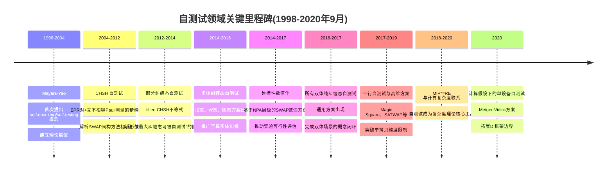

# 量子系统自测试技术综述：原理、方案、鲁棒性与应用（截至2020年9月）
# 1 自测试的基本概念与理论定位

量子信息处理的实用化进程中,一个根本性的难题始终困扰着研究者:**当一个量子设备的内部结构对用户不可见、其制造者不可信、其元件可能存在隐蔽缺陷时,用户如何在不打开"黑盒"的前提下,确证该设备确实在执行所声称的量子操作?** 经典的物理刻画手段——如量子态层析(state tomography)、过程层析(process tomography)——本质上要求用户预先信任测量装置的精确刻画,这与"设备不可信"的前提存在循环论证。自测试(self-testing)正是为打破这一循环而提出的极端化解决方案:它仅以经典的输入输出统计为依据,通过量子非局域性所赋予的"刚性"(rigidity),反推出设备内部量子态与测量算符的本质结构。本章作为整篇综述的理论起点,将系统阐释自测试的物理直觉、严格的数学刻画、其在设备无关(device-independent)框架中的逻辑地位、与其他量子认证范式的本质差异,以及自1998年Mayers-Yao开创性工作至2020年9月间该领域的关键概念演进。

## 1.1 自测试的定义与物理直觉

考虑这样一个典型场景:验证者Alice与Bob各自手中持有一个量子"黑盒",黑盒可由不可信的第三方制造,其内部的态制备过程与测量装置对验证者完全不透明。验证者唯一被允许做的事情是向黑盒输入经典指令(对应于测量设置的标号),并接收经典输出(对应于测量结果)。在大量重复实验后,验证者可以累计出条件联合概率分布 $p(a,b|x,y)$,即在选择输入 $(x,y)$ 时获得输出 $(a,b)$ 的统计频率。**自测试问题的核心追问是:存在哪些特殊的相关性 $p(a,b|x,y)$,使得任何能够再现该相关性的量子实现 $(\rho_{AB}, \{M_a^x\}, \{N_b^y\})$ 在等价类意义下必然唯一?** 若答案是肯定的,那么验证者就能够仅凭这些经典统计,断言黑盒内部确实持有某个特定的量子态、并执行了特定的测量算符。

自测试与贝尔不等式实验之间存在天然的逻辑联系。贝尔不等式的违反本身意味着相关性无法由任何局域隐变量模型再现,即必须借助量子纠缠才能产生;而**贝尔不等式的"最大"违反则进一步要求底层的量子实现具有极为受限的结构**——这种受限性正是自测试得以成立的物理根源。最为经典的范例是CHSH不等式:在局域实在论下,CHSH值上界为2;在量子力学下,Tsirelson界给出上界 $2\sqrt{2}$。当两方观测到的CHSH值恰好达到 $2\sqrt{2}$ 时,可以严格证明:Alice与Bob共享的态必然(在局域等距同构意义下)等价于一对最大纠缠的EPR对 $|\Phi^+\rangle = (|00\rangle+|11\rangle)/\sqrt{2}$,而双方所执行的测量则必然对应于一对互不相容(反对易)的Pauli测量。这一典范例子直观展示了"经典统计唯一确定量子实现"的物理图像:**当统计达到量子理论所允许的极端边界时,产生该统计的量子机器就被"锚定"到了本质唯一的结构上**。

值得强调的是,自测试并不要求设备始终运行在"最大违反"这一理想点上——任何实验都必然存在噪声和统计涨落。但理想情形下的精确自测试结论是整个理论的逻辑基石:它告诉我们,在零误差极限下,经典统计与量子实现之间存在着接近一一对应的紧致映射。在第3章对鲁棒自测试的讨论中,我们将看到这一紧致映射如何被推广到近最大违反的"邻域"中。

## 1.2 数学刻画与局域等距同构

自测试的严格数学定义可以表述如下。设存在一个参考实现(reference realisation)$(\,|\psi'\rangle_{A'B'}, \{M'^x_a\}, \{N'^y_b\}\,)$,即理想的目标态与测量算符。我们称相关性 $p(a,b|x,y)$ 自测试该参考实现,当且仅当对任何能够再现这一相关性的物理实现 $(|\psi\rangle_{AB}, \{M^x_a\}, \{N^y_b\})$,均存在**局域等距同构**(local isometry)$\Phi_A \otimes \Phi_B$ 与某个辅助态 $|\text{junk}\rangle_{A''B''}$,使得

$$(\Phi_A \otimes \Phi_B)\bigl(|\psi\rangle_{AB}\bigr) = |\psi'\rangle_{A'B'} \otimes |\text{junk}\rangle_{A''B''}$$

且对所有 $(x,a)$ 与 $(y,b)$ 同时满足

$$(\Phi_A \otimes \Phi_B)\bigl(M^x_a \otimes N^y_b\,|\psi\rangle_{AB}\bigr) = \bigl(M'^x_a \otimes N'^y_b\,|\psi'\rangle_{A'B'}\bigr) \otimes |\text{junk}\rangle_{A''B''}\,.$$

这一定义凝结了自测试的几个关键概念。其一,**等距同构(isometry)而非幺正变换**:由于待测系统的Hilbert空间维度可能远大于参考系统,真实物理过程不可避免地包含"未参与作用"的额外自由度,因此映射只需是保内积的等距嵌入,而无需是同构的。其二,**局域性(local)**:同构必须在Alice一侧与Bob一侧分别作用,不可跨越双方,这反映了贝尔场景中的空间分离假设。其三,**辅助态(junk state)**:除目标参考态之外,允许残留任意辅助系统,这意味着自测试只断言"目标态作为子系统存在",而不排斥额外的、与测量行为无关的内部自由度。

构造此类局域等距同构的核心数学工具是所谓的**SWAP同构**:验证者在被测系统旁边附加一个已知的辅助qubit,并通过依赖于设备测量算符的受控操作将参考态"交换"到辅助寄存器上。若交换后辅助寄存器恰好处于参考态而原系统与辅助寄存器解纠缠,则证明原系统中蕴含着参考态的完整结构。SWAP同构最初由McKague、Yang与Scarani等人系统化,后续既被用于解析的精确自测试证明,也被改造为数值化的鲁棒性证明工具(详见第3章)。

精确自测试与鲁棒自测试在形式上的区别在于:精确自测试要求观测到的相关性 $p$ 与参考相关性 $p'$ 完全相等,从而得出存在严格等距同构的结论;鲁棒自测试则放松为 $|p - p'| \le \varepsilon$ 或贝尔值偏离最大值不超过 $\varepsilon$,并要求被测态与参考态之间的迹距离(或保真度互补量)被 $\varepsilon$ 的某个明确函数所上界控制。等价地,自测试结论的标准表述是"等价类意义下的唯一性":参考态在局域幺正、辅助系统张量积扩展、整体复共轭等对称操作下生成一个等价类,任何能再现观测相关性的实现都属于该等价类。

## 1.3 自测试与设备无关框架的逻辑关系

设备无关(device-independent, DI)范式是过去二十年量子信息领域最具变革性的概念之一。其基本假设可归纳为:**不信任设备内部结构,仅信任(i) 经典输入输出统计的可观测性、(ii) 各子系统之间的无信号性(no-signaling)/不可通信约束、以及 (iii) 量子力学的基本框架本身**。在此假设下,各种密码学与计算任务的安全性证明必须仅依赖于经典统计所暴露的信息,而不能依赖于对设备内部物理实现的任何具体假设(例如Hilbert空间维度、测量基底的精确刻画等)。

在DI框架的诸多任务中,自测试占据了**信息量最丰富、认证强度最高**的位置。这是因为:DI随机性扩展只需证明输出比特相对于敌手的最小熵不为零;DI量子密钥分发(DI-QKD)只需证明Eve关于密钥比特的Holevo信息有界;DI纠缠认证只需证明态在某种纠缠度量下严格大于零。这些任务的安全性论断均可视为自测试结论的"弱化推论":一旦确证了态与测量的等距同构结构,上述各类任务的安全性即可作为推论自动获得。换言之,**自测试是DI框架下的"统一理论基础"**,任何在DI意义下安全的协议,其安全性证明都可以(原则上)追溯到对底层量子实现的某种自测试式刻画。

DI范式的核心代价在于其对"多方不可通信"假设的依赖:为了保证无信号性,Alice与Bob的测量必须在类空间隔的事件中执行,这在实验上极具挑战性,并且无法直接推广到只涉及单一设备的场景。**2020年前后,Metger与Vidick提出了一种突破性的新型自测试范式**:他们将"多方不可通信假设"替换为"单设备计算有界假设",借助Brakerski等人(2018)与Mahadev(2018)所引入的基于陷门带误差学习(trapdoor LWE)的密码学技术,构造了一个协议,使经典验证者能够鲁棒地认证一个单一的、计算有界的量子设备确实制备了一对Bell态、并对其执行了单qubit测量(在双方态与测量同时施加基变换的等价类意义下)[^1]。这一工作的意义不仅在于扩展了自测试的物理场景,更重要的是它**改变了DI框架的认证边界**:在"设备的算力被密码学假设限制"这一新前提下,验证者甚至能在单一设备内部认证出"通常与两个空间分离子系统相联系的"纠缠性质。这一方向标志着自测试理论从纯粹的非局域性根源向密码学根源的拓展,也为后续将自测试嵌入更广阔的"经典验证量子计算"框架提供了关键技术[^1]。

## 1.4 自测试与其他量子认证范式的比较

为了更准确地把握自测试在量子认证谱系中的位置,有必要将其与其他主流认证范式作系统性比较。下表从假设强度、所需先验信息、可扩展性、噪声稳健性、结论强度等维度对几类典型认证范式进行了对照。

| 认证范式 | 核心假设 | 所需先验信息 | 可扩展性 | 对噪声的稳健性 | 结论强度 |
|---|---|---|---|---|---|
| **自测试(self-testing)** | 仅量子力学+无信号性(或计算有界) | 仅经典统计 | 受限于贝尔场景与样本复杂度 | 鲁棒界通常为 $O(\sqrt{\varepsilon})$ 量级 | 等价类意义下唯一确定态+测量 |
| **量子态层析** | 测量装置已被精确刻画 | 完整测量算符的事先标定 | 维度指数级 | 由统计估计理论决定 | 完整重构密度矩阵 |
| **过程层析** | 输入态与测量均已被精确刻画 | 输入态集与测量算符均已知 | 维度多项式或指数级 | 中等 | 完整重构量子信道 |
| **设备相关保真度估计** | 设备内部模型部分可信 | 参考态结构已知 | 较好 | 较好 | 与参考态的保真度估计 |
| **半设备无关认证(semi-DI)** | 部分子系统可信(如维度有界、可信测量) | 维度上界或可信子系统的描述 | 优于全DI | 优于全DI | 介于自测试与设备相关认证之间 |

可以看出,**自测试位于"最少假设、最强结论"这一极端方向上**:它无需对设备内部做任何刻画,却能给出关于态与测量的等距同构级别的唯一性结论。然而,这一极端性也带来了显著代价:其一,自测试的实验门槛极高,需要构造类空间隔的多方贝尔实验、对探测效率与无信号性具有严格要求;其二,样本复杂度大:为了在统计上确认贝尔值接近最大违反,需要大量重复实验;其三,鲁棒性界往往不够紧致——如下章将详细讨论,典型的 $O(\sqrt{\varepsilon})$ 界意味着噪声 $\varepsilon$ 必须远小于目标精度的平方,才能给出有意义的认证。相比之下,量子态层析虽然依赖测量装置的可信刻画,但在该刻画成立的前提下可以直接重构完整密度矩阵,并享受成熟的统计估计理论。半设备无关认证则在两者之间提供了折中,以放弃部分认证强度为代价换取更优的可扩展性与噪声稳健性。

理解这一谱系对于后续章节至关重要:第3章讨论的鲁棒自测试本质上是在"最少假设"约束下,尽可能逼近实用化的工程努力;第4章讨论的各类应用则是在不同任务对认证强度的需求之间寻找最优平衡——例如DI-QKD需要完整的态+测量刻画(因而必须诉诸自测试),而某些纠缠验证任务可能仅需较弱的认证形式。

## 1.5 自测试的对称性与不可消除的自由度

自测试结论中"等价类意义下唯一"这一限定语并非技术性瑕疵,而是经典输入输出统计本身所固有的不变性所决定的。换言之,**存在一组对称变换,它们作用在量子实现上后不改变经典统计,因此原则上不可能被任何基于经典统计的认证手段所区分**。系统归纳这些不可消除的自由度,是正确理解自测试结论强度的关键。

第一类是**局域幺正变换的自由度**。若在Alice一侧作用幺正算符 $U_A$,在Bob一侧作用 $U_B$,并相应地将测量算符更新为 $U_A M^x_a U_A^\dagger$ 与 $U_B N^y_b U_B^\dagger$,则联合概率分布 $\langle \psi | M^x_a \otimes N^y_b | \psi\rangle$ 保持不变。这意味着自测试无法区分仅以局域幺正方式相关联的量子实现——这反映了量子力学中"参考基的选择本质上是任意的"这一基本事实。

第二类是**辅助子系统的张量积扩展自由度**。任何能再现给定相关性的实现 $(|\psi\rangle, M, N)$,均可被替换为 $(|\psi\rangle \otimes |\xi\rangle_{aux}, M \otimes I_{aux}, N \otimes I_{aux})$,即在两侧各自附加任意未被测量的辅助系统,这正是局域等距同构定义中"辅助态(junk state)"的物理来源。

第三类是**整体复共轭对称性**。若 $(|\psi\rangle, \{M^x_a\}, \{N^y_b\})$ 再现某相关性,则其在某固定基下的元素复共轭 $(|\psi^*\rangle, \{(M^x_a)^*\}, \{(N^y_b)^*\})$ 同样再现该相关性。这一对称性源于联合概率为实数这一基本事实,**它带来的直接后果是某些自测试方案无法区分测量算符与其复共轭**:例如,无法区分Pauli-Y与其共轭 $-Y$,因为两者具有相同的本征值统计且仅相差复共轭。在涉及虚数矩阵元的测量方向(如Y方向)上,这一对称性可能使该方向的认识停留在"两种可能性的叠加"层面,需要通过协议设计上的额外约束(如要求方案对两种共轭实现都成立)来妥善处理。

第四类是**多方场景下的局域基矢重排自由度**。对于多体系统,各方独立选择的局域基矢及标号方式同样是经典统计的不变量。

理解这些对称性的重要性体现在两个层面。其一,它们决定了自测试结论的标准表述形式——任何关于"唯一性"的陈述都必须显式地附加"在局域等距同构(包含上述对称性)意义下"这一限定语,否则即不严格;其二,它们为评估自测试方案的"强度"提供了天然标尺——一个理想的自测试方案应当**恰好**将所有能再现观测相关性的实现等同到这一对称性等价类之内,既不留下额外的非平凡自由度,也不在等价类之外做出过强的断言。

## 1.6 自测试的历史发展脉络与里程碑

自测试领域的发展可以视为一条以贝尔不等式刚性为主轴、不断向更广态空间、更高维度、更强鲁棒性、更丰富物理场景扩展的轨迹。下图以时间为轴呈现了截至2020年9月该领域的关键里程碑节点。

具体而言,**Mayers与Yao在1998年与2004年的两篇开创性工作**首次提出了"self-checking source"与"self-testing"的概念,论证了仅凭经典输入输出统计便能在一定意义上确定量子源的内部结构,为整个领域奠定了概念基础。**2000年代后期至2010年代初**,围绕CHSH最大违反的自测试性质被McKague、Yang、Scarani等学者以解析方法严格刻画,SWAP同构技术成为标准工具,EPR对+互不相容Pauli测量的唯一性结论被精确确立。

**2012年前后,Acín、Massar、Pironio及合作者提出的tilted CHSH不等式**打破了"只有最大纠缠态才能被自测试"的旧有观念,证明了任意双qubit部分纠缠态都可以被适当的非对称贝尔不等式所自测试,这一突破将自测试的覆盖范围从单一目标态扩展为整个双qubit纯态家族。**随后的几年间**,自测试被进一步推广至高维系统(如基于Magic Square、SATWAP等不等式的高维方案)、多体系统(GHZ态、W态、图态自测试方案相继提出)、以及"所有双体纯纠缠态"的通用刻画,使该理论在数学上趋于完整。

**与此同时,鲁棒性证明技术也在不断演进**:从早期基于解析SWAP同构的算符不等式方法,到基于NPA半正定规划层级的数值化SWAP方法,再到基于群表示论与稳定性定理的代数方法,鲁棒界从最初的较松散估计逐步收紧,并在多个方案中接近 $O(\sqrt{\varepsilon})$ 这一目前的标准量级。**平行自测试**(同时自测试多份独立拷贝的能力)以及**单拷贝高维自测试**的发展,进一步为大规模设备无关认证铺平了道路。

**2020年初的MIP*=RE结果**(Ji-Natarajan-Vidick-Wright-Yuen)在计算复杂度理论层面给出了量子多证明者交互证明系统的等价于递归可枚举语言的惊人结论,该结果的证明深度依赖于自测试的"刚性"性质,标志着自测试已从单纯的量子认证工具上升为连接量子信息与计算复杂度的核心数学结构。**几乎同时,Metger与Vidick在2020年提出的基于计算假设的单设备自测试方案**[^1]开启了自测试的新方向:借助基于带误差学习(LWE)的密码学陷门函数,经典验证者得以在单一计算有界的量子设备内部认证Bell对的存在与单qubit测量的执行,从而**将自测试从"必须依赖空间分离的多方场景"这一传统约束中部分解放出来**[^1]。这一方向所建立的"密码学—自测试"桥梁,与MIP*=RE所建立的"复杂度—自测试"桥梁一道,标志着自测试理论已超出量子基础物理的原初范畴,成为现代量子信息科学中一个具有深刻跨学科意义的核心概念。

至此,本章已建立起后续章节所需的概念基础与历史坐标。第2章将以表格形式系统梳理面向纠缠态的各类自测试方案,呈现本章所述概念在具体协议中的多样化实现;第3章将深入鲁棒自测试的技术原理,分析不同证明路径在紧致性、可扩展性与计算复杂度上的权衡;第4章将转向应用层面,展示自测试如何为DI随机数生成、DI-QKD、委托量子计算等任务提供安全性的统一理论基石;第5章则将基于本综述所归纳的发展脉络,讨论截至2020年9月该领域尚未解决的关键问题与未来研究方向。

# 2 面向纠缠态的自测试方案体系化梳理

第1章已经阐明,自测试的核心是借助贝尔不等式的"刚性"将经典输入输出统计与量子实现锁定到等距同构等价类内。然而,这一概念框架若要转化为实用工具,必须落实到针对具体目标态的具体协议中。**自1998年Mayers-Yao工作问世以来,自测试方案的覆盖范围从最简的EPR对逐步扩展至几乎所有量子纯纠缠态家族**:从两体最大纠缠态到任意双qubit部分纠缠态,从双qubit到高维qudit,从单拷贝到平行多拷贝,从两体到任意真多体,直至跳出标准贝尔场景而进入网络、有界通信、计算假设等新型场景。本章的目标是以体系化、可比较的方式梳理截至2020年9月主流的纠缠态自测试方案,通过统一的属性维度展示这一扩展过程的内在逻辑,并为第3章鲁棒性分析与第4章应用部署提供具体方案池与选型依据。

## 2.1 分类标准与比较维度的设定

为使梳理具有体系性而非简单罗列,本章首先确立分类逻辑与比较维度。在分类逻辑上,本章按**目标态的结构特征**进行分层组织:两体最大纠缠态(2.2节)→两体部分纠缠态(2.3节)→高维最大纠缠态(2.4节)→平行自测试(2.5节)→多体纠缠态(2.6节)→网络与新型场景(2.7节),这一顺序大致对应自测试理论的历史演进逻辑,也与目标态的结构复杂度递增相一致。在比较维度上,本章对每个方案考察以下几个核心属性:

第一,**测量设置数 $(m_A, m_B)$ 与输出数 $(o_A, o_B)$**,即贝尔场景 $(m_A, m_B, o_A, o_B)$ 的复杂度,这直接决定了实验所需的设备复杂度与样本规模;第二,**目标态的Hilbert空间维度**,反映方案的可扩展性;第三,**所依赖的贝尔不等式或非局域博弈**(CHSH、tilted CHSH、Mermin、Magic Square、CGLMP、SATWAP、链式不等式等),这是自测试的"数学骨架";第四,**SWAP同构构造方式**(解析或数值化);第五,**是否支持平行复制**;第六,**鲁棒性阶数**(通常为 $O(\sqrt{\varepsilon})$,详见第3章);第七,**首次提出的文献溯源**。这些维度共同构成了评价一个自测试方案"强度"与"实用性"的多面向坐标系。

需要预先说明的是,**测量设置数与目标态复杂度之间存在一种近似的"经济学权衡"**:对最简单的EPR对,两侧各两个二元测量(即CHSH场景)即可完成自测试;对更复杂的目标态(高维、多体、部分纠缠),则需要更多测量设置或更高输出基数。这种权衡背后的物理直觉是:**目标态所携带的"结构信息量"必须有足够大的统计样本空间才能被经典统计所唯一编码**。本章后续各表格中,读者将多次看到这一规律的具体体现。

## 2.2 两体最大纠缠态的自测试方案

两体最大纠缠态——即EPR对 $|\Phi^+\rangle = (|00\rangle+|11\rangle)/\sqrt{2}$——的自测试是整个领域的起点,也是最为成熟的子方向。Mayers与Yao在1998/2004年的开创性工作中首次构造了一组特殊的相关性,证明了只有EPR对加上一组特定的Pauli测量才能再现这些相关性,从而**建立了"经典统计唯一确定量子实现"这一思想的第一个严格范例**[^2]。这一方案使用了较多的测量设置以构造冗余的代数约束,后续工作则不断简化所需的统计资源。

随后的关键进展是基于CHSH不等式最大违反的自测试方案。在 $(2,2,2,2)$ 场景下,当观测到的CHSH值达到Tsirelson界 $2\sqrt{2}$ 时,可以严格证明双方共享的态在局域等距同构意义下等价于一对EPR对,且双方的两个二元测量必然对应于一对反对易的Pauli观测量。**Miller与Shi进一步给出了一个一般性的判据,刻画了哪些二元XOR博弈是"渐近最优鲁棒"的自测试**——即其鲁棒性界达到 $O(\sqrt{\varepsilon})$ 的渐近最优阶。他们证明CHSH博弈即满足这一判据,从而CHSH被确立为一个最优鲁棒的自测试[^3]。这一结果不仅为CHSH自测试提供了最终的理论收尾,同时也将Acín等人(PRL 108:100420, 2012)所提出的一族用于随机数生成的XOR博弈纳入了"最优鲁棒自测试"的统一框架内[^3]。

在 $(2,2,2,2)$ 场景下,除CHSH最大违反外,还存在不依赖于贝尔不等式最大违反、而是直接基于相关性几何结构的自测试方案。Kaniewski等人发展了基于态向量几何的自测试证明方法,证明了在某些相关性条件下,态向量的几何结构被相关性唯一确定,从而当存在另一个适当的幺正观测量时即可完成自测试[^4]。这一**几何方法的重要特点是可作为"积木"重复应用,通过逐步增加测量设置数自测试任意测量数下的实现**,为后续部分纠缠态方案提供了构造性工具[^4]。

Valcarce等人则在 $(2,2,2,2)$ 场景下提出了"广义CHSH检验"框架,通过对测量统计的精细分析,根据观测到的具体相关性自适应选择最适合的贝尔检验,从而能够从无法被标准CHSH自测试利用的相关性中得出非平凡的自测试结论,并在可被CHSH利用的相关性中得到更紧致的保真度下界[^5]。**这一工作的方法论意义在于:它揭示了"自测试不是单一不等式的最大违反,而是相关性空间中的多重几何约束的联合作用"**,为自测试理论向更精细的相关性分析方向打开了空间[^5]。

链式贝尔不等式自测试则将测量设置数推广至任意 $N$:在 $(N,N,2,2)$ 场景下,链式Bell不等式的最大违反同样可自测试EPR对,且随着 $N$ 增大,某些维度的认证强度(例如对Pauli-Y方向的认证)得到改善。下表对两体最大纠缠态的主流自测试方案进行了横向比较。

| 方案/协议名称 | 目标测试态 | 核心方法/所依赖的贝尔不等式 | 主要贡献或特点 | 首次提出的文献 |
|---|---|---|---|---|
| Mayers-Yao 自测试 | EPR对 $|\Phi^+\rangle$ | 多组Mayers-Yao相关式 | 首次提出 self-checking 概念,自测试领域的奠基性工作 | Mayers & Yao, 1998 (FOCS) / 2004 (QIC) |
| CHSH 最大违反自测试 | EPR对 $|\Phi^+\rangle$ | CHSH不等式,Tsirelson界 $2\sqrt{2}$ | 最简洁的 $(2,2,2,2)$ 场景方案;McKague-Yang-Scarani解析SWAP同构 | McKague, Yang & Scarani, 2012, J. Phys. A |
| 最优鲁棒XOR博弈自测试 | EPR对 $|\Phi^+\rangle$ | 二元XOR博弈最优鲁棒判据 | 证明CHSH及Acín等(2012)随机性博弈达到渐近最优鲁棒阶 $O(\sqrt{\varepsilon})$ | Miller & Shi, 2013, arXiv:1207.1819[^3] |
| 几何自测试 | EPR对 $|\Phi^+\rangle$ | 态向量几何结构 + 附加幺正观测量 | 不依赖贝尔不等式最大违反;支持作为构造块重复扩展到任意测量数 | Kaniewski 等(几何方案), Phys. Rev. A[^4] |
| 广义CHSH检验自测试 | EPR对 $|\Phi^+\rangle$ | 自适应选取的精化CHSH族 | 从不能被CHSH利用的相关性中得出自测试结论;改善保真度下界 | Valcarce, Zivy, Sangouard & Sekatski, 2020[^5] |
| 链式Bell自测试 | EPR对 $|\Phi^+\rangle$ | $(N,N,2,2)$ 链式贝尔不等式 | 测量数推广至任意 $N$;改善对 $Y$ 方向算符的认证 | Šupić, Augusiak, Salavrakos & Acín, 2016, NJP |

**通过该表格可以提炼出两体最大纠缠态自测试的几个关键观察**:其一,测量设置数的演进从Mayers-Yao的多组到CHSH的最简两组,反映了"以最少资源完成最强认证"的优化方向;其二,从基于贝尔不等式最大违反的传统范式到基于相关性几何或XOR博弈代数结构的新范式,反映了证明工具的多样化;其三,Miller-Shi判据的提出,标志着这一子方向在理论上接近完成——人们已能在二元XOR博弈这一足够宽广的类别内给出最优鲁棒自测试的充要条件[^3]。

## 2.3 两体部分纠缠态的自测试方案

2010年代初,自测试领域曾长期被一个开放性问题所困扰:是否只有最大纠缠态才能被自测试?直观上似乎如此,因为只有最大纠缠态才能达到诸如CHSH等标准贝尔不等式的最大违反。但Acín、Massar、Pironio及其合作者引入的**tilted CHSH不等式**彻底改变了这一图景。tilted CHSH是CHSH的一个非对称推广,其形式可写为 $\alpha A_0 + A_0 B_0 + A_0 B_1 + A_1 B_0 - A_1 B_1$,其中 $\alpha \in [0,2)$ 是倾斜参数。**该不等式的关键性质是:对每一个 $\alpha$ 值,其最大量子违反对应于某个具体的双qubit部分纠缠纯态** $|\psi(\theta)\rangle = \cos\theta\,|00\rangle + \sin\theta\,|11\rangle$,其中Schmidt系数 $\theta$ 与 $\alpha$ 之间存在显式对应关系,且测量方向也被唯一确定。

tilted CHSH自测试方案的提出,**将自测试的目标态从"单一EPR对"扩展为整个双qubit纯纠缠态家族**,完成了双qubit场景下的概念闭环——即"所有双qubit纯纠缠态(包括任意部分纠缠态)均可被自测试"。这一结果的深远意义在于:它表明纠缠度的"任何非零取值"都对应于贝尔不等式空间中的某条特殊曲线,只要相关性精确落在该曲线上,纠缠态就被唯一锁定。

进一步地,前述基于态向量几何的自测试方法被推广至部分纠缠态。Kaniewski等人证明,当某组关联量满足特定的几何约束时,部分纠缠双qubit态的几何结构被唯一确定;当存在另一个适当的幺正观测量时,该实现即变为自测试的[^4]。**这一几何方案的优势是:通过反复增加测量设置可将协议扩展至任意测量数,从而构造出针对部分纠缠态的"可扩展自测试框架"**[^4]。下表对部分纠缠态自测试方案进行了归纳。

| 方案/协议名称 | 目标测试态 | 核心方法/所依赖的贝尔不等式 | 主要贡献或特点 | 首次提出的文献 |
|---|---|---|---|---|
| Tilted CHSH 自测试 | 任意双qubit纯纠缠态 $\cos\theta\,|00\rangle+\sin\theta\,|11\rangle$ | tilted CHSH 不等式族 | 首次证明部分纠缠态可被自测试;倾斜参数 $\alpha$ 与Schmidt角 $\theta$ 一一对应 | Yang & Navascués, 2013, PRA(基于Acín-Massar-Pironio 2012 的tilted CHSH) |
| 部分纠缠态几何自测试 | 任意双qubit部分纠缠纯态 | 态向量几何 + 附加幺正观测量 | 不依赖贝尔不等式最大违反;支持扩展至任意测量数 | Kaniewski 等, Phys. Rev. A[^4] |
| Coladangelo 部分纠缠自测试 | 任意双qubit纯纠缠态 | tilted CHSH 单拷贝精化 | 为后续平行化(tilted EPR平行自测试)奠定基础 | Coladangelo, 2017, QIC[^6] |

**与最大纠缠态自测试相比,部分纠缠态自测试存在几个本质差异**:其一,样本复杂度更高——倾斜参数 $\alpha$ 与Schmidt角 $\theta$ 的连续对应关系意味着需要更精细的统计估计;其二,鲁棒性界的常数前因子通常依赖于 $\theta$,在接近可分态极限(即 $\theta \to 0$)时变得发散,反映了"纠缠度越低,自测试越困难"这一物理直觉;其三,tilted CHSH不等式的非对称性导致测量方向不再是简单的反对易Pauli对,而是依赖于 $\theta$ 的具体方向。

值得强调的是,tilted CHSH不仅在自测试理论上的意义重大,在DI随机数生成等应用中也发挥了关键作用:Acín等人(PRL 108:100420, 2012)正是利用tilted CHSH族构造了一类高效的DI随机性生成博弈,而Miller-Shi后续证明这些博弈同样具有最优鲁棒自测试性质[^3]。这一**理论—应用的耦合关系**也将在第4章中得到进一步讨论。

## 2.4 高维最大纠缠态的自测试方案

在双qubit场景被基本闭合后,自测试理论的下一个挑战是高维(qudit)系统。**高维场景的研究动机来自两方面**:其一,实验上越来越多的纠缠光子源、光的轨道角动量编码、原子能级编码等天然提供了高维Hilbert空间,使高维认证成为现实需求;其二,理论上,某些DI协议(如DI-QKD的高密钥率版本、高熵DI随机性生成)需要从高维纠缠中提取更多信息,因而需要直接针对高维态的自测试工具。

高维最大纠缠态自测试的一个早期且重要的方案是基于**Magic Square博弈**(也称Mermin-Peres魔方博弈)的方案。Magic Square是一个 $(3,3,4,4)$ 场景下的伪电报型博弈,其量子最优胜率为1而经典最优胜率为8/9。**当双方达到完美胜率1时,可以严格证明他们共享了两对EPR对(即 $\mathbb{C}^2 \otimes \mathbb{C}^2 \otimes \mathbb{C}^2 \otimes \mathbb{C}^2$ 上的 $|\Phi^+\rangle^{\otimes 2}$,等价于一对四维最大纠缠态)**,并执行了由 $3\times 3$ 算符方阵所定义的特殊Pauli观测量集[^6]。这一方案的优势是测量设置数有限(双方各三个测量)而能自测试相当大的Hilbert空间,但其目标态仍限于"二份EPR对的张量积"形式。

针对任意维度 $d$ 的最大纠缠态自测试,Šupić、Coladangelo、Augusiak与Acín等人发展了基于**SATWAP不等式**(Salavrakos-Augusiak-Tura-Wittek-Acín-Pironio不等式)的方案。SATWAP是一族用于任意维度 $d$ 的"维度匹配"贝尔不等式,其最大量子违反在 $d \times d$ 最大纠缠态 $|\Phi_d^+\rangle = \frac{1}{\sqrt{d}}\sum_{k=0}^{d-1}|kk\rangle$ 上达到,且对应的测量为广义傅里叶基测量。基于SATWAP的自测试方案**首次提供了一个单参数族,统一覆盖任意维度 $d \geq 2$ 的最大纠缠态认证**,且测量设置数保持为常数(双方各两个测量,输出数为 $d$)。

CGLMP不等式(Collins-Gisin-Linden-Massar-Popescu不等式)是另一类历史悠久的高维贝尔不等式族,其最大量子违反对应的态并非标准的最大纠缠态,而是一个特殊的非最大纠缠qudit态。**CGLMP及其多设置、多维度推广在实验上已被基于光的轨道角动量等系统所验证**,并提供了高维自测试的另一条技术路径[^7][^8]。Fu等人对CHSH不等式向任意高维系统的推广也提供了通向高维自测试的另一个不等式工具,该推广保持了CHSH的简洁形式并具有相应的"最大违反对应最大噪声抗性"性质[^8]。下表对高维最大纠缠态自测试方案进行了归纳。

| 方案/协议名称 | 目标测试态 | 核心方法/所依赖的贝尔不等式 | 主要贡献或特点 | 首次提出的文献 |
|---|---|---|---|---|
| Magic Square 自测试 | $|\Phi^+\rangle^{\otimes 2}$(等价四维最大纠缠) | Mermin-Peres 魔方博弈 | $(3,3,4,4)$ 场景下完美胜率即可自测试两对EPR对 | Wu, Bancal, McKague & Scarani, 2016, PRA |
| SATWAP 高维自测试 | $d\times d$ 最大纠缠态 $|\Phi_d^+\rangle$ | SATWAP 不等式族 | 任意维度 $d$ 统一刻画,测量设置数保持常数 | Šupić, Coladangelo, Augusiak & Acín, 2018, NJP |
| CGLMP 自测试 | 特定 $d\times d$ 非最大纠缠qudit态 | CGLMP 不等式族 | 高维贝尔不等式的早期代表;光的轨道角动量实验已验证 | Salavrakos 等(基于Collins-Gisin-Linden-Massar-Popescu, 2002)[^7][^8] |
| 广义CHSH高维自测试 | 高维最大纠缠态 | Fu 广义CHSH不等式 | 保持CHSH简洁形式;最大违反对应最大噪声抗性 | Fu, 2004, PRL[^8] |

**高维自测试方案的横向比较揭示了几个关键趋势**:其一,**测量设置数与维度的关系**——Magic Square以固定的 $(3,3,4,4)$ 场景认证四维系统,SATWAP则以固定的 $(2,2,d,d)$ 场景认证任意 $d$ 维系统,反映了将"维度复杂度"转移至"输出基数"而非"测量设置数"的设计哲学;其二,**所采用的代数工具**——高维场景下,SWAP同构的构造需要借助更复杂的算符代数结构(广义Pauli/Heisenberg-Weyl算符)或群表示论工具,这也是为何高维自测试的鲁棒性证明往往比双qubit场景更具挑战性(详见第3章);其三,**第1章所述的复共轭对称性在高维场景下更加复杂**:对于复数矩阵元普遍存在的高维测量,如何在自测试结论中妥善处理"原始实现与其复共轭实现的不可区分性"成为方案设计的关键细节。

## 2.5 平行自测试方案

平行自测试旨在同时认证 $n$ 份独立纠缠拷贝,即目标态为某个种子态的 $n$ 重张量积。**平行自测试的研究动机来自实际部署**:大规模DI协议(如DI-QKD的高密钥率版本、可验证量子计算)往往需要在"许多个相同的量子设备"上进行认证,如果只能逐个串行地自测试,所需的总样本数与时间会随 $n$ 线性甚至超线性增长。而平行自测试通过一次"并行"博弈完成所有 $n$ 份拷贝的同时认证,**理论上可以将样本复杂度大幅压缩**。

McKague在2016年提出的工作首次将基于CHSH的平行自测试框架明确化:**通过 $n$ 次CHSH博弈的并行版本(每轮验证者向Alice与Bob各发送一个 $n$ 比特串作为输入,接收 $n$ 比特串作为输出),可以同时自测试 $n$ 对EPR对**,且鲁棒性误差为拷贝数 $n$ 的多项式函数[^9]。这一框架的关键技术挑战是:验证者无法逐对独立验证 $n$ 个CHSH博弈,因为Alice与Bob可能在内部"混淆"不同拷贝;McKague的工作通过引入精细的算符不等式系统克服了这一困难[^9]。

Coladangelo在2017年的工作进一步将平行自测试推广至**(倾斜)EPR对**:他证明了 $n$ 份tilted EPR对 $|\psi(\theta)\rangle^{\otimes n}$(其中每份拷贝可具有任意的Schmidt角 $\theta$)可以通过 $n$ 份tilted CHSH博弈的并行版本被自测试,从而**将McKague框架推广到了部分纠缠态家族**[^10][^6]。同一篇工作还证明,$2n$ 对EPR对可以通过 $n$ 份Magic Square博弈的并行版本被自测试——这是因为Magic Square单拷贝本身即认证两对EPR,因而 $n$ 份Magic Square并行可认证 $2n$ 对[^10][^6]。下表对平行自测试方案进行了归纳。

| 方案/协议名称 | 目标测试态 | 核心方法/所依赖的贝尔不等式 | 主要贡献或特点 | 首次提出的文献 |
|---|---|---|---|---|
| 平行CHSH自测试 | $n$ 对EPR对 $|\Phi^+\rangle^{\otimes n}$ | $n$ 次CHSH博弈的并行版本 | 首个面向CHSH的平行框架;误差关于 $n$ 多项式增长 | McKague, 2016, arXiv:1609.09584[^9] |
| 平行tilted CHSH自测试 | $n$ 份tilted EPR对 $\bigotimes_i |\psi(\theta_i)\rangle$ | $n$ 次tilted CHSH博弈并行 | 推广至任意部分纠缠态的平行自测试 | Coladangelo, 2017, QIC[^10][^6] |
| 平行Magic Square自测试 | $2n$ 对EPR对 | $n$ 次Magic Square博弈并行 | 单拷贝即认证两对,通过并行实现 $2n$ 拷贝认证 | Coladangelo, 2017, QIC[^10][^6] |

**平行自测试方案的横向比较揭示了"拷贝数标度"与"鲁棒性"的核心权衡**:平行方案虽然将串行的 $n$ 轮博弈压缩为一次并行博弈,但其鲁棒性误差通常会以 $n$ 的多项式形式增长(McKague的CHSH平行方案即给出了拷贝数多项式的误差界[^9]),这意味着在大 $n$ 极限下平行方案的鲁棒性可能弱于精心设计的串行方案。这一权衡是后续优化平行自测试的核心问题。**平行自测试的另一重要意义在于其对MIP\*=RE等计算复杂度结果的支撑作用**:多证明者交互证明系统中,验证者需要在大量并行交互回合中保持对量子证明者的认证能力,平行自测试正是实现这一能力的核心技术工具,这一应用价值将在第4章进一步讨论。

## 2.6 多体纠缠态的自测试方案

将自测试推广至超过两方的多体场景,在概念与技术上都带来新的挑战。多体系统中,纠缠的结构远比双体丰富(包括GHZ类纠缠、W类纠缠、图态、簇态等不同的SLOCC等价类),且贝尔不等式的几何结构也更为复杂。**自测试理论在多体场景的发展轨迹大致为:GHZ态(基于Mermin不等式)→W态→图态(基于稳定子结构)→所有真多体纯纠缠态的通用方案**。

GHZ态 $|\text{GHZ}_N\rangle = (|0\rangle^{\otimes N}+|1\rangle^{\otimes N})/\sqrt{2}$ 的自测试是多体自测试的起点。Mermin不等式是CHSH在多方场景下的自然推广,其最大量子违反可以达到 $2^{N-1}$(经典上界为 $2^{N/2-1}$),且最大违反对应的态正是GHZ态。**基于Mermin不等式最大违反的GHZ态自测试在概念上是CHSH自测试的直接推广**,但其鲁棒性分析比双体情形更为复杂。

W态 $|W_N\rangle = \frac{1}{\sqrt{N}}(|10\cdots 0\rangle + |010\cdots 0\rangle + \cdots + |0\cdots 01\rangle)$ 因其特殊的纠缠结构(不属于GHZ类SLOCC等价类)而需要专门的自测试方案,后续工作通过定制的贝尔不等式或非局域博弈实现了W态的自测试。

**图态(graph state)是多体自测试的一个特别重要的子领域**。图态由一个图 $G=(V,E)$ 定义,顶点对应qubit,边对应受控相位门,具有丰富的稳定子结构,是测量基量子计算(MBQC)的核心资源态。McKague给出了**针对任意连通图态的通用自测试构造**:对于每个连通图态,他构造了一组非局域相关性,使得只有该图态加上特定的局域测量才能再现这些相关性,且所需的相关性数目仅随图的顶点数 $|V|$ 线性增长[^2]。该方案还附带证明了鲁棒性,使其在原则上具有实验可行性[^2]。这一**线性标度**对图态自测试的实用化至关重要:与维度的指数增长相比,线性的相关性数目意味着图态自测试有望支持中等规模MBQC资源态的认证。

更近的进展是Meyer、Šupić、Grosshans与Markham等人将图态自测试推广至**允许有界经典通信**的场景[^11]。在标准自测试框架下,各方之间不允许任何通信(以保证无信号性);但已有研究表明,即使在底层图上允许有界经典通信,图态仍然展现非局域关联,且这一性质已被用于证明经典与量子计算之间的电路深度分离。Meyer等人发展了在有界通信场景下的自测试理论,**为圆形图态(circular graph state)和蜂巢簇态(honeycomb cluster state)——后者是MBQC的通用资源——给出了鲁棒自测试方案**[^11];他们还提出了一种程式化的"自下而上"构造方法:从更大的、在通信场景中仍展现非局域性的图态出发,鲁棒地自测试任意目标图态[^11]。

**多体场景下的一个里程碑式结果是"所有真多体纯纠缠态均可被自测试"**。这一结果填补了双qubit场景下"所有纯纠缠态可自测试"的多体类比,完成了自测试在量子纯态家族上的覆盖闭环——但需注意,该结论在标准贝尔场景下是否对每一个真多体纯纠缠态都构造性地成立,直至2020年9月仍存在某些边界情形的开放问题(详见第5章讨论)。下表对多体纠缠态自测试方案进行了归纳。

| 方案/协议名称 | 目标测试态 | 核心方法/所依赖的贝尔不等式 | 主要贡献或特点 | 首次提出的文献 |
|---|---|---|---|---|
| GHZ 态自测试 | $|\text{GHZ}_N\rangle$ | Mermin 不等式最大违反 | CHSH 自测试到多方GHZ纠缠的直接推广 | Miller & Shi(基于Mermin不等式)及后续多篇 |
| W 态自测试 | $|W_N\rangle$ | 定制非局域博弈 | 针对非GHZ类SLOCC等价类的专门方案 | Wu, Cabello, Bancal 等(2014前后) |
| 图态自测试 | 任意连通图态 | 稳定子非局域相关性 | 相关性数目随顶点数线性增长;附带鲁棒性证明 | McKague, 2014, arXiv:1010.1989[^2] |
| 有界通信图态自测试 | 圆形图态、蜂巢簇态等 | 允许底层图上有界通信的非局域相关性 | 突破标准框架的"零通信"限制;支持MBQC通用资源态 | Meyer, Šupić, Grosshans & Markham[^11] |
| 真多体纯纠缠态通用自测试 | 任意真多体纯纠缠态 | 维度依赖的特定贝尔不等式族 | 完成多体纯纠缠态家族的覆盖闭环 | Šupić, Coladangelo 等(2018左右) |

**多体自测试方案体系揭示了几个关键趋势**:其一,从GHZ单一目标态到所有真多体纯纠缠态的扩展,反映了与双体场景平行的"覆盖闭合"过程;其二,**图态自测试在测量数随顶点数线性增长上的良好可扩展性,使其成为MBQC资源态认证的核心工具**[^2];其三,有界通信场景下的图态自测试开启了"自测试边界条件"研究的新方向[^11],为第4章讨论的委托量子计算等应用提供了更灵活的认证工具。

## 2.7 网络与新型场景下的自测试方案

自2018年前后,自测试理论开始系统地突破"标准双方贝尔场景"的边界,进入**网络场景、有界通信场景与计算假设场景**这三个新型领域。这一拓展不仅扩大了自测试的物理适用范围,更深刻地重塑了"自测试究竟需要哪些前提假设"这一基础问题的答案。

**网络场景**(quantum networks)下,验证者不再仅面对两个空间分离的设备,而是面对由多个独立纠缠源连接的网络拓扑。该场景的核心新假设是**源独立性**(source independence):不同纠缠源相互独立,即整个系统的联合态可写为各源所产生子系统态的张量积。这一假设虽然较"零通信"为强,但在现实网络部署中却往往是天然成立的——独立的光子对源、独立的原子-光子纠缠源等都满足此假设。**网络场景下的一个标志性自测试应用是"实数量子理论的实验证伪"**:Renou、Trillo、Weilenmann等人在2021年的工作(其理论框架早于2020年9月已基本成形)证明,在涉及独立源的网络场景中,实数量子理论与复数量子理论给出可被区分的预测,从而设计出一个"贝尔型"实验来证伪实数量子理论[^12]。**该工作的自测试本质是:通过网络相关性自测试出某种本质上需要复数Hilbert空间结构的实现**[^12]。

**有界经典通信场景**已在2.6节中讨论:Meyer等人将自测试推广至允许底层图上有界通信的图态,核心额外假设是通信带宽的上界[^11]。这一场景的物理动机来自分布式量子计算与电路深度分离问题,其自测试理论的发展拓展了"非局域性"概念本身的内涵。

**计算假设下的单设备自测试**则是更为激进的范式拓展。第1章已概述了Metger与Vidick在2020年提出的方案:他们将"两方不可通信假设"替换为"单设备计算有界假设",借助基于陷门带误差学习(trapdoor LWE)的密码学技术,构造了一个协议使经典验证者能在**一个单一的、计算有界的量子设备**内部认证Bell对的存在与单qubit测量的执行。**这一方案的革命性意义在于:它首次将自测试从"必须依赖空间分离的多方场景"中部分解放出来**,将自测试的根基从"非局域性"扩展到了"计算复杂度+密码学"。下表对网络与新型场景下的自测试方案进行了归纳。

| 方案/协议名称 | 目标测试态/认证对象 | 核心方法/额外假设 | 主要贡献或特点 | 首次提出的文献 |
|---|---|---|---|---|
| 网络自测试(实数/复数区分) | 网络中的多源纠缠结构 | 源独立性 + 网络贝尔不等式 | 区分实数与复数量子理论;突破双方贝尔场景 | Renou, Trillo, Weilenmann, Le, Tavakoli, Gisin, Acín & Navascués(理论早于2020.09 成形)[^12] |
| 有界通信图态自测试 | 圆形图态、蜂巢簇态等 | 底层图上有界经典通信 | 突破"零通信"限制;支持MBQC通用资源 | Meyer, Šupić, Grosshans & Markham[^11] |
| 计算假设下单设备自测试 | 单设备内部Bell对+单qubit测量 | 单设备计算有界 + LWE假设 | 突破"空间分离"限制;开启密码学-自测试桥梁 | Metger & Vidick, 2020, arXiv:2001.09161 |

**网络与新型场景下的方案体系所揭示的方向性变化**可以总结为:自测试理论正从"以非局域性为唯一根基"演化为"非局域性、源独立性、计算有界性等多种根基并存"的多元化框架。每一类根基对应了不同的物理或密码学假设,也对应了不同的应用场景——网络自测试适配未来的量子互联网部署,有界通信自测试适配分布式量子计算,计算假设自测试适配单设备的远程认证。

## 2.8 方案体系的横向归纳与选型指引

在前述六个子方向的分类梳理基础上,本节进行跨类别的横向归纳,提炼关键趋势并为不同应用提供方案选型指引。

**第一个关键趋势是测量设置数与目标态复杂度的标度关系**。表 2.8-1 汇总了主要方案族的测量设置数与目标态复杂度的标度关系。

| 方案族 | 目标态复杂度 | 测量设置数 | 标度模式 |
|---|---|---|---|
| CHSH 单拷贝 | 1对 EPR | (2,2) | 常数 |
| Tilted CHSH | 任意双qubit纯纠缠 | (2,2) | 常数(连续参数族) |
| Magic Square | 4维最大纠缠 | (3,3) | 常数(中等) |
| SATWAP 高维 | $d\times d$ 最大纠缠 | (2,2),输出 $d$ | 测量数常数,输出基数随维度 |
| 平行CHSH | $n$ 对 EPR | $(2^n, 2^n)$ 或单轮 $n$ 比特输入 | 信息量随 $n$ 线性 |
| 图态(McKague) | $|V|$-顶点图态 | 相关性数随 $|V|$ 线性[^2] | 线性 |

**这一表格揭示的核心规律是**:增加目标态复杂度时,有两条主要的"复杂度转移"路径——要么转移至**输出基数**(如SATWAP保持双测量但输出 $d$ 维),要么转移至**测量设置数**(如图态自测试随顶点数线性增长)[^2]。一般而言,前者更适合天然高维系统(如轨道角动量),后者更适合多体可寻址系统(如离子阱、超导阵列)。

**第二个关键趋势是解析方法与数值方法的适用边界**。在双qubit低维场景(CHSH、tilted CHSH、Magic Square)下,解析的SWAP同构构造能给出干净的鲁棒性界 $O(\sqrt{\varepsilon})$ 且常数前因子较小;在高维与多体场景下,解析构造往往变得困难,基于NPA层级的数值SWAP方法成为主流——这些方法以更高的计算复杂度为代价,提供针对几乎任何方案的数值化保真度下界。这一权衡将在第3章详细展开。

**第三个关键趋势是鲁棒性阶数的统一标度**。截至2020年9月,绝大多数主流自测试方案的鲁棒性界均为 $O(\sqrt{\varepsilon})$ 阶,这一阶数在Miller-Shi的工作中被证明对二元XOR博弈是渐近最优的[^3]。理论上更紧致的 $O(\varepsilon)$ 阶仅在少数特殊方案中达到,且通常需要更强的假设。这一统一标度为不同方案的实验门槛提供了大致可比的参考基准。

**第四个关键趋势是平行化与单拷贝高维化两条扩展路径的互补性**。当应用需要"大量小规模认证单元"时,平行自测试(CHSH/tilted CHSH/Magic Square平行版本)更为合适——它将 $n$ 份拷贝压缩为一次并行博弈[^9][^10][^6];当应用需要"单个大规模高维认证单元"时,单拷贝高维方案(SATWAP、Magic Square)更为合适——它通过单次博弈直接认证高维结构。两条路径并非互斥,而是针对不同部署模式的互补工具。

**面向不同应用需求,本章为读者提供以下方案选型指引**:对于**DI-QKD**——其核心需求是双qubit对的高保真自测试(以保证Eve的Holevo信息上界足够紧),首选CHSH最优鲁棒自测试或基于Valcarce等人精化分析的广义CHSH方案[^5][^3];对于**DI随机数生成**——其核心需求是低测量复杂度下的可观测最小熵下界,首选tilted CHSH族(Acín等2012, 经Miller-Shi证明为最优鲁棒)[^3];对于**委托/可验证量子计算**——其核心需求是图态等MBQC资源态的可扩展认证,首选McKague图态自测试或其在有界通信场景下的拓展版本[^2][^11];对于**量子网络认证**——其核心需求是源独立性假设下的网络拓扑认证,首选网络贝尔不等式自测试[^12];对于**单设备远程认证**——其核心需求是无空间分离假设下的认证,首选Metger-Vidick计算假设方案;对于**MIP\*类计算复杂度任务**——其核心需求是大规模并行刚性认证,首选CHSH/Magic Square的平行自测试方案[^9][^10][^6]。

至此,本章已系统呈现了截至2020年9月主流的纠缠态自测试方案池及其横向比较。**这一方案池在第3章鲁棒性分析中将被进一步审视——对每一个方案,我们将考察其鲁棒性证明所采用的技术路径(解析SWAP、数值NPA、群表示论)以及所达成的鲁棒界紧致性**;在第4章应用分析中,本章所建立的方案-应用映射(如CHSH→DI-QKD、tilted CHSH→DI-RNG、图态→MBQC、网络→量子互联网)将获得具体协议层面的支撑。

# 3 鲁棒自测试的原理与主流技术路径

第2章已经呈现了一个相当丰富的纠缠态自测试方案池——从CHSH到tilted CHSH、从Magic Square到SATWAP、从GHZ到图态、从单拷贝到平行多拷贝。然而,所有这些方案在严格的数学表述中都建立在一个共同的理想前提之上:**观测到的相关性 $p(a,b|x,y)$ 必须精确等于参考相关性 $p^*(a,b|x,y)$,或贝尔违反量必须严格达到Tsirelson界**。这一前提在数学上极其干净,在物理实验中却几乎不可能严格满足。要使自测试理论真正转化为量子信息认证的实用工具,必须将"精确点"上的刚性结论推广到"近最大违反邻域"中的稳定结论——这正是鲁棒自测试(robust self-testing)所承担的使命。本章将剖析这一推广所面临的核心数学挑战,系统阐释三类主流的鲁棒性证明技术路径,横向比较其紧致性、可扩展性与计算代价,并讨论截至2020年9月鲁棒性研究的若干突破性前沿进展。

## 3.1 理想自测试在实验环境中的失效机制与鲁棒性需求

在转入数学定义之前,有必要先具体澄清:**为何理想自测试的前提条件在真实实验中"必然"不成立,以及若没有鲁棒性保证,这种"必然不成立"将带来怎样的灾难性后果**。这一节的目的不是技术性的,而是论证发展鲁棒自测试理论的紧迫性。

理想精确自测试要求观测相关性与参考相关性完全相等。这一要求在四个独立的层面上不可能严格满足。**第一层是有限样本下的统计涨落**:验证者只能通过有限轮次的实验估计概率分布,所观测到的频率与真实概率分布之间始终存在统计偏差,该偏差按中心极限定理大致以样本规模平方根的倒数衰减。即使量子设备本身完美无瑕,观测频率也几乎必然偏离精确的参考相关性。**第二层是探测器效率不完美**:真实的单光子探测器、原子荧光探测器等都不具备100%的探测效率,损失的事件要么被丢弃(引发探测漏洞,即detection loophole),要么按某种约定计入"无结果"输出。前者破坏了贝尔不等式的有效性,后者改变了输出基数的统计分布。**第三层是测量装置的工艺不完美**:实际实现的偏振分析仪、相位调制器、原子能级测量等都存在角度误差、波长漂移、温度涨落等,导致实际测量算符偏离理想的Pauli观测量。**第四层是制备态的不完美**:纠缠源所产生的态并非严格的Bell态,而是一个受退相干、模式失配、激发统计涨落等影响的混合态,通常以保真度 $1-\eta$ 接近理想Bell态(其中 $\eta$ 为某个小量)。

这四种因素共同导致的直接后果是:**任何实验所观测到的贝尔违反量 $\beta$ 必然严格小于Tsirelson界 $\beta^*$**,典型偏差 $\varepsilon = \beta^* - \beta$ 在最好的光学实验中可达 $10^{-2}$ 到 $10^{-3}$ 量级,在大多数实际实验中则在 $10^{-1}$ 量级。换言之,精确自测试的前提条件 $\beta = \beta^*$ 在任何现实场景中都是一个零测度事件。

若没有鲁棒性保证,这种"必然偏差"将带来严重后果。考虑一个极端反例:假设某协议规定,只有当 $\beta = \beta^*$ 时才能断言被测态是EPR对;那么对任何 $\beta = \beta^* - \varepsilon$(无论 $\varepsilon$ 多么小)的观测值,该协议给不出任何关于被测态的结论——它既不能断言被测态是EPR对,也不能给出"接近EPR对"的定量陈述。**这种"全有或全无"的脆弱性使得理想精确自测试无法被嵌入任何实际的设备无关协议中**:DI-QKD协议无法基于一个对噪声完全不耐受的认证给出密钥率;DI随机数生成无法基于精确点上的认证给出最小熵下界;委托量子计算无法基于无误差容忍的图态认证完成对量子证明者的验证。

正是这一矛盾——理论上的"精确点刚性"与实验上的"必然偏差"——决定了鲁棒自测试在自测试理论中的核心地位:**它不是理想理论的附属补充,而是理论从纸面走向实验的唯一桥梁**。后续各节所讨论的解析、数值、代数三类证明技术,本质上都是在不同的数学工具下回答同一个问题:**当 $\varepsilon$ 不再为零时,被测实现与参考实现之间还能保持多少结构上的接近性?**

## 3.2 鲁棒自测试的数学定义与基本框架

将上述物理直觉转化为严格数学陈述,即得到鲁棒自测试的标准定义。设参考实现为 $(\,|\psi^*\rangle_{A'B'}, \{M'^x_a\}, \{N'^y_b\}\,)$,其对应的贝尔违反量为最大值 $\beta^*$(典型情形下即Tsirelson界)。给定某个观测实现 $(|\psi\rangle_{AB}, \{M^x_a\}, \{N^y_b\})$,其贝尔违反量为 $\beta$,定义**偏离量** $\varepsilon = \beta^* - \beta \geq 0$。**鲁棒自测试要求存在局域等距同构** $\Phi_A \otimes \Phi_B$ **与辅助态** $|\text{junk}\rangle_{A''B''}$,**使得**

$$\bigl\|(\Phi_A \otimes \Phi_B)\bigl(|\psi\rangle_{AB}\bigr) - |\psi^*\rangle_{A'B'} \otimes |\text{junk}\rangle_{A''B''}\bigr\|_1 \leq f(\varepsilon)\,,$$

其中 $\|\cdot\|_1$ 为迹范数,$f(\varepsilon)$ 是一个在 $\varepsilon \to 0$ 时趋于零的显式函数。这一不等式即所谓的**鲁棒性界**(robustness bound),其中 $f(\varepsilon)$ 的渐近阶决定了鲁棒自测试的"强度":典型情形为 $f(\varepsilon) = c\sqrt{\varepsilon}$(平方根阶,常数前因子 $c > 0$ 依赖于具体方案),少数情形可达 $f(\varepsilon) = c\varepsilon$(线性阶,通常需要更强的假设或更精细的证明工具)。

这一定义中包含三个关键的数学选择,各自对应不同的应用语义。**第一,以贝尔违反量偏离 $\varepsilon = \beta^* - \beta$ 作为输入变量**是最常见的表述,因为贝尔违反量是单个实数,统计上易于估计,与最大违反值的对比直观;但其代价是:贝尔违反量本身是相关性 $p$ 的一个线性投影,某些导致大的迹距离的实现可能仅有小的贝尔违反偏差,因而基于 $\varepsilon$ 的鲁棒界本质上是一种"最坏情形"陈述。**第二,以完整相关性距离 $\|p - p^*\|$ 作为输入变量**则给出更强的输入信息,从而通常能导出更紧致的鲁棒界——这是Valcarce等人所发展的"广义CHSH检验"等精化分析的技术核心(见第2章2.2节)。两种表述在不同应用场景下各有优势:基于 $\varepsilon$ 的鲁棒性更适合DI协议中"仅监测单一目击量"的场景,基于 $\|p - p^*\|$ 的鲁棒性更适合可以收集完整统计的场景。

**第三个关键选择是鲁棒性的度量指标**:典型的指标包括迹距离 $\|\rho - \rho^*\|_1$、保真度补量 $1 - F(\rho, \rho^*)$、以及相关性距离 $\|p - p^*\|$。这些指标通过Fuchs-van de Graaf不等式 $1 - F \leq \frac{1}{2}\|\rho - \rho^*\|_1 \leq \sqrt{1-F^2}$ 等关系彼此相关,在 $\varepsilon \to 0$ 极限下渐近等价(差异仅在常数前因子),但在有限 $\varepsilon$ 下的具体数值可能有所差异。在文献中,**基于NPA层级的数值方法通常以"保真度下界"作为输出**(因为保真度算符 $|\psi^*\rangle\langle\psi^*|$ 是NPA层级中易于刻画的目标);**解析方法则常常给出"迹距离上界"**(因为算符不等式更直接控制态向量的内积);两者在比较时需要通过Fuchs-van de Graaf转换才能等价。

需要特别强调的是,**鲁棒性界的渐近阶比常数前因子更具结构意义,但常数前因子在实验上同样关键**。一个 $f(\varepsilon) = 100\sqrt{\varepsilon}$ 的鲁棒界与一个 $f(\varepsilon) = \sqrt{\varepsilon}$ 的鲁棒界具有相同的渐近阶,但在 $\varepsilon = 10^{-2}$ 的实验场景下,前者给出迹距离上界10,后者给出0.1——前者实际上无法提供任何有意义的认证。因此,后续章节在比较不同技术路径时,必须同时关注阶数与常数前因子两个层面。

## 3.3 基于显式SWAP同构与算符不等式的解析方法

最早被发展、概念上也最为直观的鲁棒性证明技术路径是基于**显式SWAP同构与算符不等式**的解析方法。这一方法的核心思想可以分两步描述:第一步,在被测系统旁附加一组已知初始态的辅助qubit,并构造一个由若干受控操作组成的电路(SWAP电路),该电路的操作以被测设备的测量算符为受控算子,目的是将被测态中"对应于参考态"的部分"交换"到辅助寄存器上;第二步,通过严格的算符不等式刻画SWAP电路输出态与"参考态张量junk态"之间的迹距离上界,该上界以贝尔违反偏离 $\varepsilon$ 的某个函数形式呈现。

以CHSH自测试为典型范例展示这一方法的工作流程。在理想情况下,Tsirelson界 $2\sqrt{2}$ 的达成等价于Alice的两个观测量 $A_0, A_1$ 与Bob的两个观测量 $B_0, B_1$ 在态 $|\psi\rangle$ 上分别满足精确的反对易关系 $\{A_0, A_1\}|\psi\rangle = 0$、$\{B_0, B_1\}|\psi\rangle = 0$。当观测到的CHSH值为 $2\sqrt{2} - \varepsilon$ 时,反对易关系不再精确成立,而是以某个 $\varepsilon$ 依赖的算符不等式形式近似成立: $\|\{A_0, A_1\}|\psi\rangle\| \leq g(\varepsilon)$,其中 $g(\varepsilon)$ 是一个 $O(\sqrt{\varepsilon})$ 的显式表达式。借助这一近似反对易关系,可以证明所构造的SWAP电路在输入 $|\psi\rangle \otimes |00\rangle_{\text{aux}}$ 时输出态与 $|\Phi^+\rangle_{\text{aux}} \otimes |\text{junk}\rangle$ 之间的迹距离被 $O(\sqrt{\varepsilon})$ 上界控制。这一推导链构成了CHSH鲁棒自测试的标准解析证明范式,首先由McKague、Yang与Scarani明确化,后被广泛沿用与改造。

在tilted CHSH等部分纠缠态自测试方案上,Coopmans、Kaniewski与Schaffner系统性地发展了基于算符不等式的解析鲁棒性证明方法,并将其推广到了tilted CHSH不等式族。他们的工作显示,**对于最简单的自测试场景,基于算符不等式的方法能够给出最紧致的鲁棒界**[^13]。在tilted CHSH族上,他们通过对算符不等式系统的精细分析,达到了一个目前最强的候选鲁棒性界——尽管这一界尚未被解析证明,但在大量数值算例上被验证成立,提供了远比标准SWAP方法更紧致的常数前因子[^13]。他们还附带证明了一个非平凡的辅助结论:在通常的CHSH表述中,只有当违反量超过某个阈值之后,CHSH才真正成为一个自测试——即在 $\beta < \beta_{\text{thr}}$ 的区间内,即使CHSH大于经典上界2,也不足以唯一确定参考实现[^13]。这一阈值现象进一步说明了鲁棒自测试问题的精细结构远比"最大违反邻域内的连续延拓"复杂。

解析方法的优势可以归纳为三点。第一,**它给出干净的解析鲁棒界,常数前因子可被严格控制**:对CHSH自测试,经典的解析方法给出 $\delta \leq c\sqrt{\varepsilon}$ 其中 $c$ 为一个具体的小常数;在Coopmans-Kaniewski-Schaffner的精化分析下,常数前因子被进一步优化。第二,**它揭示鲁棒性背后的算符代数结构**:近似反对易关系、近似投影算符的谱分解等,这些代数结构本身具有独立的数学意义,为理解自测试的"刚性"提供了机制层面的解释。第三,**它在简单方案上是可重复使用的"教学性"工具**:整个证明流程明确、参数可追踪,后来者可以在此基础上修改并扩展。

然而,解析方法的局限同样显著。**第一,代数复杂度随维度急剧上升**:当目标态从双qubit上升至高维或多体时,反对易关系被一组更复杂的算符代数关系(广义Heisenberg-Weyl对易关系、稳定子代数等)所替代,显式构造SWAP电路所需的辅助寄存器维度也随之增长,算符不等式的逐项推导变得几乎不可能完成。**第二,对每个新方案都需要逐案设计**:CHSH的解析证明无法直接套用于Magic Square,后者又无法直接套用于SATWAP——每一类方案都需要重新设计SWAP电路并重新推导算符不等式系统。**第三,在某些方案上无法给出非平凡界**:对于网络场景、计算假设场景等"非标准"自测试,解析SWAP电路的构造可能根本不存在直接的物理对应,使得解析方法在这些场景下完全失效。

正是这些局限催生了下一节将讨论的数值化NPA方法,以及第3.5节将讨论的代数方法。

## 3.4 基于NPA半正定规划层级的数值化SWAP方法

当解析方法因方案复杂度而难以推广时,**将鲁棒性证明问题转化为数值优化问题**就成为自然的替代方案。这一方向上最具影响力的技术是Yang、Vértesi、Bancal、Scarani、Navascués等人发展的"基于NPA层级的数值化SWAP方法",其核心思想可以概括为:不再要求解析地构造SWAP同构及算符不等式,而是将"SWAP同构作用下保真度的最小值"表述为一个**半正定规划**(semidefinite programming, SDP)问题,以观测相关性为约束、以保真度算符的期望为目标,然后借助NPA层级将无限维量子相关性集合用一系列收敛的SDP松弛逐级逼近,从而在有限计算资源下给出可信的保真度下界。

要理解这一方法,需要先回顾Navascués-Pironio-Acín(NPA)层级的基本机理。NPA层级是用于刻画量子相关性集合 $\mathcal{Q}$ 的一族外松弛 $\mathcal{Q}_1 \supseteq \mathcal{Q}_2 \supseteq \cdots \supseteq \mathcal{Q}$,每一层 $\mathcal{Q}_n$ 由一组矩阵正半定约束所定义,可被SDP数值求解。当 $n \to \infty$ 时,$\mathcal{Q}_n$ 渐近收敛至 $\mathcal{Q}$。NPA层级的关键价值在于:它将"是否存在某个量子实现使其相关性等于 $p$"这一无限维问题转化为有限维SDP问题。

在鲁棒自测试中,NPA层级的应用方式如下。给定观测的相关性 $p$(或贝尔违反量 $\beta$),希望求解保真度 $F = \text{tr}(\rho_{\text{SWAP}} \cdot |\psi^*\rangle\langle\psi^*|)$ 在所有满足该相关性约束的量子实现上的最小值,其中 $\rho_{\text{SWAP}}$ 是SWAP电路作用后的辅助寄存器约化态。**这一最小化问题可被表述为以观测相关性为线性约束、以保真度算符期望为目标的SDP,然后通过NPA第 $n$ 层松弛在数值上求解**。所得的最优值是真实保真度的下界,该下界随NPA层级 $n$ 的增加而单调收紧。在 $n$ 足够大时,数值下界可达到与解析方法相近的紧致性,且无需逐案设计SWAP电路与算符不等式系统。

这一方法的核心优势是**通用性**:几乎可针对任意自测试方案给出数值化鲁棒界,无需逐案设计解析证明。这使其成为评估各类新方案实验可行性的标准工具——对于CHSH、tilted CHSH、Magic Square、SATWAP等几乎所有第2章所列方案,NPA数值方法都能给出具体的鲁棒性界,从而为实验团队提供"在给定贝尔违反偏差 $\varepsilon$ 下能达到多少认证保真度"的可量化预测。

然而,数值化NPA方法也付出了显著的代价。**第一,计算复杂度随NPA层级与系统维度快速增长**:NPA第 $n$ 层所涉及的矩阵规模约为 $|S_n|^2$,其中 $|S_n|$ 为长度不超过 $n$ 的算符乘积集合的基数,该基数随 $n$ 与测量设置数指数增长。对中等复杂度的方案(如双qubit的tilted CHSH),典型可计算的层级在 $n = 2$ 到 $n = 4$ 之间;对高维或多体方案,通常只能在 $n = 1$ 或 $n = 2$ 的较粗层级上求解。**第二,所得鲁棒界的常数前因子通常不如解析方法紧致**:由于数值方法本质上是在松弛集合上求最小化,松弛带来的间隙会反映为常数前因子的额外膨胀。**第三,在 $\varepsilon \to 0$ 极限下数值方法可能无法揭示精确的渐近阶数**:数值结果是离散点的拟合,从有限数据点上推断 $O(\sqrt{\varepsilon})$ 与 $O(\varepsilon)$ 之间的真实差别需要谨慎的外推与误差控制。

尽管如此,**数值化NPA方法已成为自测试领域评估实验可行性的"标准工具箱"**。在第4章将讨论的DI-QKD与DI-RNG协议的安全性分析中,几乎所有具体数值参数(如临界探测效率、临界CHSH值、噪声容忍度等)都需要通过NPA数值方法计算得出。

## 3.5 基于群表示论与稳定性定理的代数方法

当目标态进入高维、多体乃至无界维度场景时,前述两类方法都面临根本性的局限——解析方法的代数复杂度爆炸,数值方法的计算代价指数增长。在此背景下,**基于群表示论与稳定性定理的代数方法**作为第三类技术路径登上舞台,其核心思想可概括为:将自测试中的测量算符代数视为某个群(如Pauli群、Heisenberg-Weyl群)的近似表示,借助稳定性定理(如Gowers-Hatami定理)证明任何"近似表示"都可被微扰为某个真表示,从而将相关性的近最优性翻译为测量算符与理想群表示之间的算符距离上界,进而导出态的鲁棒性结论。

要把握这一方法的工作原理,需要先理解"近似表示"概念。给定一个群 $G$ 与一个有限维Hilbert空间 $\mathcal{H}$,一个映射 $\phi: G \to U(\mathcal{H})$(其中 $U(\mathcal{H})$ 为幺正算符集)被称为 $\epsilon$-**近似表示**,如果对所有 $g, h \in G$ 有 $\|\phi(gh) - \phi(g)\phi(h)\| \leq \epsilon$。Gowers-Hatami定理及其推广形式断言:任何 $\epsilon$-近似表示都可被一个真表示在算符范数下 $O(\epsilon)$ 逼近——即"近似表示稳定地接近真表示"。

在自测试场景中,这一稳定性定理的应用方式如下。**当贝尔违反量接近最大值时,测量算符 $\{M^x_a\}, \{N^y_b\}$ 在被测态 $|\psi\rangle$ 上必须近似地满足某个目标群(如双qubit场景下的Pauli群、高维场景下的Heisenberg-Weyl群)的代数关系**;这些近似代数关系恰好定义了一个该群的 $\epsilon$-近似表示;借助Gowers-Hatami定理,该近似表示可被微扰为一个真表示,即测量算符可被微调为真正的Pauli/Heisenberg-Weyl算符;由此,被测态的结构也被锁定到对应的参考态附近。整个推导过程**不依赖显式的SWAP电路构造**,也**不依赖维度受限的SDP求解**,而是直接在群表示论的代数框架内完成。

这一方法的革命性进展由Mančinska与合作者在2020年前后系统发展。他们的工作显示,**可以仅用常数数目的测量设置鲁棒自测试无界维度的态与测量**:具体地,考虑由 $n$ 个二元测量(每个对应于一组投影,加和为 $xI$)构成的相关性 $p_{n,x}$,这些相关性鲁棒地自测试底层最大纠缠态与测量[^14]。当 $n = 4$ 时,这一构造能够鲁棒自测试**每个奇维度的最大纠缠态以及对应的2-输出投影测量**[^14]。这一结果在两个意义上具有突破性:其一,它将自测试的目标态从"固定维度"扩展为"无界维度"——同一组观测相关性 $p_{n,x}$ 在不同维度下分别对应不同维度的最大纠缠态,且其鲁棒性证明对所有奇维度一致成立;其二,它将测量设置数控制在常数(如 $n=4$),克服了第2章2.4节所讨论的"维度复杂度向测量设置数转移"的常规权衡。

为实现这一突破,Mančinska等人**将传统的基于群表示论的Gowers-Hatami方法提升至一个更自然的代数框架**,其关键技术步骤是建立Gowers-Hatami定理的代数推广版本——即对相关算符代数的"近似表示"也可被微扰为"精确表示"[^14]。这一代数化推广不仅简化了证明结构,也为后续的自测试方案设计提供了更通用的工具。

与此同时,Meyer等人提出了另一条达成"在每个有限维度上鲁棒自测试所有最大纠缠态"的代数路径,其核心是**将CHSH检验从qubit推广至qudit**:在该推广中,每个测量设置对应于一个非对角的Heisenberg-Weyl观测量,贝尔算符具有正算子分解形式,可以以闭合形式给出对应的Tsirelson界[^15]。对每个奇素数维度 $d \geq 3$,从近最优策略可重建Heisenberg-Weyl对易关系,并将Mayers-Yao局域等距同构从qubit推广至素数维度系统,得到鲁棒性界 $\delta = \mathcal{O}(\sqrt{\varepsilon})$;通过张量因子论证,该结果可进一步扩展至每个合数维度[^15]。这一协议使用标准Heisenberg-Weyl操作与计算基对角的非Clifford相位门,**直接适用于高维光子与原子平台**[^15]。

代数方法相对于解析与数值方法的**独特价值**可以概括为三点:**第一,处理无界维度场景的能力**——它不需要预先固定Hilbert空间维度,鲁棒性证明的结构对所有(足够大的)维度一致成立;**第二,提供与维度无关的鲁棒界结构**——鲁棒性界的形式(如 $O(\sqrt{\varepsilon})$ 阶)在不同维度下保持统一,常数前因子的维度依赖被显式控制;**第三,对应用于MIP\*=RE等复杂度结果的支撑作用**——MIP*=RE的证明深度依赖于"对任意大维度的量子证明者均可鲁棒认证"这一能力,代数方法是实现这一能力的核心数学工具。

代数方法的局限相对集中:**常数前因子通常不如解析方法紧致**,这使其在低维标准方案上往往不是最优选择;**对群表示论与稳定性定理等高级数学工具的依赖**,使其在工程化实现上具有更高的概念门槛。但在其专属优势领域——高维与无界维度场景——代数方法是目前唯一可行的鲁棒性证明路径。

## 3.6 三类技术路径的横向比较与适用边界

在分别阐释三类技术路径之后,有必要从多个维度对其进行横向比较,以为不同应用场景提供方法选型指引。下表从鲁棒界紧致性、可扩展维度、计算复杂度、实验适用性、可推广性五个维度展开比较。

| 维度 | 解析SWAP方法 | 数值化NPA方法 | 群表示论代数方法 |
|---|---|---|---|
| **鲁棒界紧致性** | 在低维双体场景下最紧致;常数前因子可严格控制(如Coopmans-Kaniewski-Schaffner在tilted CHSH上的精化结果) | 中等;常数前因子通常存在松弛间隙 | $O(\sqrt{\varepsilon})$ 阶;常数前因子通常不如解析方法紧致 |
| **可扩展维度** | 双qubit/低维多体可处理;高维与无界维度难以推广 | 受限于NPA层级与SDP矩阵规模;典型可至中等维度 | 唯一可扩展至无界维度的方法;对所有奇维度统一处理 |
| **计算复杂度** | 解析推导无运行时计算代价;但人工设计成本高 | 计算复杂度随NPA层级与测量数指数增长 | 主要为代数论证,数值代价低;但需要高级群论工具 |
| **实验适用性** | 适用于低维标准方案的实验认证 | 几乎所有方案均可获得数值化保真度下界 | 适用于高维光子/原子平台的高维认证 |
| **可推广性** | 每个新方案需逐案设计SWAP电路与算符不等式 | 框架通用,新方案直接套用 | 框架适用于具有群结构的代数族(Pauli、Heisenberg-Weyl等) |
| **代表工作** | McKague-Yang-Scarani(CHSH);Coopmans-Kaniewski-Schaffner(tilted CHSH) | Yang-Vértesi-Bancal-Scarani-Navascués(NPA-SDP) | Mančinska等(常数尺寸无界维度);Meyer等(d维CHSH) |

**这一横向比较揭示了三类方法之间的本质互补性,而非简单的优劣关系**。

**解析SWAP方法在低维双体场景下提供最紧致的基准**——对于CHSH、tilted CHSH、链式贝尔等"经典"方案,解析方法所给出的鲁棒界往往是其他方法的精度标杆。在DI-QKD等对常数前因子敏感的应用中(需要从噪声量直接换算为可允许的噪声容限),解析方法的紧致性具有不可替代的实用价值。

**数值化NPA方法适用性最广**,是评估"新方案是否值得继续研究"的标准筛选工具。当一个新的贝尔不等式或非局域博弈被提出时,首先通过NPA第 $n=2$ 或 $n=3$ 层的SDP求解,即可快速获得该方案在不同 $\varepsilon$ 下的保真度下界,从而判断其在实验可行性上的潜力。

**代数方法在高维与无界维度场景下独具优势**,是支撑现代量子认证前沿(包括MIP*=RE复杂度结果、高维光子认证、设备无关量子互联网等)的核心数学工具。在这些场景下,前两类方法或者完全失效,或者计算代价不可承受。

**面向不同应用需求的方法选型建议**可归纳如下。**(i)** 对于DI-QKD的安全性参数计算——首选解析方法获得紧致常数前因子,辅以NPA数值方法验证;**(ii)** 对于新方案的快速实验可行性评估——首选NPA数值方法,以最小工程成本得到初步结论;**(iii)** 对于高维光子/原子平台的认证——首选代数方法或Meyer等人的 $d$ 维CHSH方案;**(iv)** 对于MIP*类计算复杂度任务——必须使用代数方法(或其等价的有限维稳定性技术),因为该应用本质上要求"对任意维度的量子证明者均可鲁棒认证";**(v)** 对于网络与新型场景的自测试——目前主要依赖NPA数值方法,代数方法在网络贝尔不等式上的推广是活跃的研究方向。

## 3.7 鲁棒性研究的前沿进展与开放问题

截至2020年9月,鲁棒自测试领域的若干突破性进展正在重塑该子方向的版图。本节聚焦其中三类最具方向性意义的前沿成果,并讨论其所留下的开放问题。

**第一类突破是"常数尺寸鲁棒自测试"(constant-sized robust self-tests)**。如3.5节所述,Mančinska等人通过将群论方法提升至更自然的代数框架并发展Gowers-Hatami定理的代数推广版本,证明了:对一族特殊的相关性 $p_{n,x}$(由 $n$ 个二元测量构造,每个测量对应于一组加和为 $xI$ 的投影),这些相关性鲁棒地自测试底层最大纠缠态与测量,且仅需 $n$ 为常数(如 $n=4$);**所自测试的态可以是无界维度的最大纠缠态,具体地,对 $n=4$,该构造覆盖每个奇维度的最大纠缠态以及对应的2-输出投影测量**[^14]。这一结果的方向性意义在于:它**首次将"自测试所需测量设置数"与"目标态维度"完全解耦**——以往的方案设计中,认证高维态往往伴随着测量设置数或输出基数的增长,而常数尺寸鲁棒自测试则证明这种增长不是必然的。该结果对MIP*=RE等复杂度任务具有直接支撑作用:在多证明者交互证明系统中,验证者向量子证明者发送的查询长度若能保持常数,即可在大规模并行刚性认证中维持可控的通信代价。

**第二类突破是"在每个有限维度上鲁棒自测试所有最大纠缠态"**。Meyer、Šupić、Grosshans、Markham等人通过 $d$ 输入 $d$ 输出的CHSH推广检验,**在每个有限维度 $d$ 上鲁棒自测试了对应的最大纠缠态**[^15]。该方案的核心技术是:每个测量设置对应于一个非对角的Heisenberg-Weyl观测量;对每个奇素数维度 $d \geq 3$,贝尔算符具有正算子求和分解,可以闭合形式给出对应的Tsirelson界,从中可在被测态的支集上重建Heisenberg-Weyl对易关系[^15]。Mayers-Yao局域等距同构被从qubit推广至素数维度系统,任何低于该Tsirelson界 $\varepsilon$ 邻域内的近最优策略在局域等距同构作用下与理想最大纠缠态的迹距离被 $\delta = \mathcal{O}(\sqrt{\varepsilon})$ 上界控制,所实现的测量也相应地接近目标观测量[^15]。**通过张量因子论证,该结果从素数维度扩展至每个合数维度**[^15]。该协议使用标准Heisenberg-Weyl操作与计算基对角的非Clifford相位门,**直接适用于高维光子与原子平台**[^15]。

**第三类突破是面向部分纠缠态的鲁棒性界精化**。如3.3节所述,Coopmans、Kaniewski与Schaffner通过基于算符不等式的解析方法,在tilted CHSH不等式族上获得了迄今最强的候选鲁棒界——尽管该界尚未被解析证明,但在大量数值算例上被验证成立,且远比标准SWAP方法所给的界更紧致[^13]。他们还附带证明:**在通常的CHSH表述中,只有当违反量超过某个特定阈值之后,CHSH才真正成为一个自测试**——这一阈值现象是先前文献所未明确指出的细节[^13]。这一发现对实验认证具有直接意义:在CHSH值低于该阈值的实验中,即使违反量大于经典上界2,也不应被视为有效的自测试认证。

**上述前沿进展同时留下了一系列开放问题**,这些问题在2020年9月时仍是活跃的研究方向。

**第一,鲁棒性界紧致性的最优阶问题**:$O(\sqrt{\varepsilon})$ 是否在所有场景下都是最优阶?何时可以达到 $O(\varepsilon)$ 的最优紧致界?对二元XOR博弈(包括CHSH),Miller-Shi判据已证明 $O(\sqrt{\varepsilon})$ 是渐近最优的;但对更广泛的非XOR博弈、高维博弈、多体博弈,最优阶的特征化仍未完成。

**第二,鲁棒性界的常数前因子对Schmidt系数的依赖问题**:在tilted CHSH等部分纠缠态自测试中,常数前因子通常依赖于Schmidt角 $\theta$,且在接近可分态极限($\theta \to 0$)时发散。这一发散反映了"纠缠度越低,自测试越困难"的物理直觉,但其精确形式与是否可被改善仍未完全清楚。Coopmans-Kaniewski-Schaffner的精化分析部分缓解了这一问题,但完整的最优依赖关系仍是开放问题[^13]。

**第三,代数方法的常数前因子优化问题**:代数方法在无界维度场景下提供了唯一可行的鲁棒性证明,但其常数前因子通常不如解析方法紧致。是否可通过更精细的稳定性定理(如改进版本的Gowers-Hatami定理)进一步收紧代数方法的常数前因子,是当前活跃的研究方向。

**第四,数值方法与解析/代数方法的桥接问题**:数值化NPA方法能给出数值化鲁棒界,但难以从中提取解析形式的渐近阶;而解析与代数方法能给出渐近阶但常数前因子可能较松。如何在两者之间建立系统化的"数值-解析-代数"协同框架,以同时获得严格的渐近阶与紧致的常数前因子,是方法论层面的开放问题。

这些前沿进展与开放问题共同为第4章将讨论的应用层面奠定了关键的技术储备:DI-QKD的密钥率与噪声容忍度直接受制于鲁棒性界的紧致性;DI随机数生成的最小熵下界依赖于具体的鲁棒性常数前因子;委托量子计算的实用化需要高维与多体场景下的鲁棒认证工具;MIP\*类计算复杂度任务则直接依赖于常数尺寸鲁棒自测试与代数方法的最新进展。换言之,**鲁棒自测试不是自测试理论的"实验化注脚",而是连接"理论刚性"与"应用安全性"的核心桥梁**——这一桥梁的承载能力,直接决定了自测试技术在量子信息认证体系中所能扮演的角色边界。

# 4 自测试技术的应用领域与价值分析

前三章已经依次建立了自测试的概念定位（第1章）、面向纠缠态的方案池（第2章）以及鲁棒性证明的技术工具箱（第3章）。这一理论框架的搭建本身并非目的——自测试理论之所以在过去二十年间持续吸引大量研究者的投入，根本原因在于其在量子信息处理的多个核心任务中展现出**无可替代的应用价值**。本章的核心论点是：**自测试不是设备无关（device-independent, DI）协议安全性证明的诸多技术路径之一，而是其统一的理论基石**——任何在DI意义下严格安全的协议，其安全性证明都可在原则上追溯到对底层量子实现的某种自测试式刻画；而那些超出传统密码学范畴的前沿应用（如委托量子计算的经典验证、MIP\*=RE复杂度刻画、量子网络认证等），更直接地依赖自测试所提供的"刚性"数学结构作为其证明引擎。本章按应用层级递进展开：先从概念上厘清自测试与各类DI协议安全性的统一逻辑（4.1节），继而依次剖析三类最为成熟的应用——设备无关随机数生成（4.2节）、设备无关量子密钥分发（4.3节）、委托与可验证量子计算（4.4节）——中自测试组件的具体作用与定量映射关系，随后拓展至前沿应用方向（4.5节），最后通过横向归纳呈现自测试技术的应用价值密度与理论发展轨迹之间的双向耦合关系（4.6节），为第5章的展望提供应用层面的论据支撑。

## 4.1 自测试作为设备无关协议安全性基石的统一逻辑

在转入具体应用之前，有必要在概念层面阐明一个核心论断：**为什么自测试在DI协议家族中占据"统一基石"的位置，而非诸多并列技术之一**。这一论断的逻辑根源已在第1章1.3节作出过初步铺垫——自测试是DI框架下"信息量最丰富、认证强度最高"的认证形式，其等距同构级别的结论可以作为各类弱化任务安全性论断的源头。本节将这一论断细化为协议层面的具体逻辑链。

DI框架下的主流任务可以按"所需的认证信息量"递增地排列。**信息量最弱的一端是DI随机性扩展**：协议只需证明输出比特相对于任何敌手的最小熵 $H_{\min}(X|E)$ 严格大于零（理想情形下接近输出比特数）；**信息量中等的是DI量子密钥分发**：需证明Eve关于密钥比特的Holevo信息 $\chi(X:E)$ 被某个 $\varepsilon$-相关的紧致上界控制；**信息量最强的一端是可验证量子计算**：验证者不仅需要确证设备制备了特定纠缠资源态，还需确证设备执行了对应于待验证计算的特定测量序列。**这三类任务的安全性论断在数学结构上具有明显的递进关系**：完整的自测试结论（态+测量的等距同构刻画）一旦确立，三类任务的安全性都可作为推论自动获得；反之则不然——一个仅证明输出比特最小熵下界的随机性扩展协议不足以支撑密钥分发的安全性，而仅证明Holevo信息上界的QKD协议同样不足以支撑可验证计算的健全性。

基于这一观察，可以将协议层面的自测试使用模式区分为两类。**"完全自测试式安全证明"**要求协议的安全性论证显式地建立在严格的等距同构结论之上：即首先通过观测统计自测试出态与测量的等价类，再以此为基础推导出协议的具体安全性参数。Reichardt-Unger-Vazirani框架（详见4.4节）及部分基于完整CHSH自测试的DI-QKD协议属于这一类。**"部分自测试式安全证明"**则只利用自测试结论的某些推论——例如Eve关于Alice输出的条件熵下界、Bell算符期望值的算符不等式约束等——而不构造完整的等距同构。Acín等人最早的DI-QKD协议（Acín et al., 2007）以及大多数DI-RNG协议属于此类。两类模式在数学上殊途同归：**部分自测试式证明所依赖的特定量本质上都是完全自测试结论的弱化推论**，只是在工程上选择了不重新构造完整等距同构的简化路径，以换取更紧致的具体数值参数或更低的证明复杂度。

这一统一逻辑的方法论意义在于：**自测试为DI协议家族提供了一个"标准化的安全性证明模板"**——任何新提出的DI协议，其安全性证明都可以先在概念上对应到某个自测试结论，然后再选择"完全"或"部分"的工程路径完成具体推导。后续各节将看到，这一模板在DI-RNG、DI-QKD、可验证计算三类应用中分别表现为不同的具体形态，但其底层逻辑始终一致。

## 4.2 设备无关随机数生成中的自测试角色

设备无关随机数生成（DI-RNG）是自测试理论最早实现的应用，也是迄今技术成熟度最高的方向。在量子力学的基本框架内，测量结果的不可预测性是一种**本质上的、可被验证的随机性**——这与基于经典力学过程（即便是混沌过程）所产生的"伪随机性"具有本质区别[^16]。然而，要在不可信设备上提取这种本质随机性，必须解决一个核心矛盾：如果设备由对手制造，用户如何确证设备没有预先存储一份"看似随机"实则可被对手预测的比特串？DI-RNG的安全模型正是为解决这一矛盾而构造：**在不信任设备内部结构、仅信任经典输入输出统计与子系统间无信号性假设的前提下，从有限初始种子扩展或放大出对任何对手（包括量子对手与无信号对手）都不可预测的随机比特串**[^17][^18][^19]。

DI-RNG协议族可大致划分为两类，二者在初始种子假设、设备数量、对手模型上具有本质差异。

**第一类是随机性扩展协议**（randomness expansion），其代表性方案是Vazirani与Vidick于2012年提出的"可认证量子骰子"（certifiable quantum dice）。该方案的核心论断是：**一对量子力学设备可被用于生成 $n$ 个统计距离意义下 $\varepsilon$-接近均匀分布的随机比特，其所需的初始均匀种子规模仅为 $O(\log n \cdot \log(1/\varepsilon))$**[^17]。生成的比特是"可认证随机"的——其随机性证明仅基于用户可执行的简单统计检验，以及设备遵守无信号原则这一假设；除此之外，不需要任何关于设备内部工作机制的假设，甚至不需要假设量子力学本身的有效性[^17]。Vazirani-Vidick方案的革命性意义在于它**实现了从对数级种子到多项式级输出的指数级随机性扩展**，使DI-RNG从一个概念演示转化为具有实际工程价值的协议。该方案的安全性证明深度依赖于CHSH博弈的"刚性"——其本质是利用了CHSH最大违反的自测试性质：当观测到的CHSH值接近Tsirelson界时，设备所执行的测量必须近似地反对易，从而保证了至少一方的输出在条件于另一方观测时具有非平凡的熵。

随机性扩展协议家族中的另一支主流是基于tilted CHSH的随机性博弈，由Acín、Massar、Pironio等人在2012年提出（PRL 108:100420）。**这类博弈的关键设计是利用倾斜CHSH不等式的非对称性来最大化单方输出的不可预测性**——通过适当选择倾斜参数 $\alpha$ 与对应的部分纠缠态 $|\psi(\theta)\rangle$，可以使Alice一侧某个测量的输出在条件于敌手的所有可用信息时具有几乎满熵，即使CHSH违反量远小于Tsirelson界。第3章3.5节所述的Miller-Shi最优鲁棒XOR博弈判据进一步证明，CHSH及该族tilted CHSH博弈均达到 $O(\sqrt{\varepsilon})$ 阶的渐近最优鲁棒阶，从而为这类协议提供了**紧致的最小熵下界**：当观测的贝尔违反量偏离最大值 $\varepsilon$ 时，输出比特的相对于敌手的最小熵 $H_{\min}(X|E) \geq h(\varepsilon)$，其中 $h$ 是某个具体的渐近最优函数。这一最小熵下界正是随机性提取器（如Trevisan提取器）所需的输入参数，决定了从原始观测比特中可提取的"真随机比特"数量。

**第二类是随机性放大协议**（randomness amplification），其原始动机与扩展协议截然不同。Colbeck与Renner在2012年的开创性工作首次提出了"自由随机性可以被放大"这一概念命题[^18][^19]。**他们考察的是这样一个场景：贝尔不等式违反的存在性证明本身依赖于"测量设置可以被自由地随机选择"这一假设，即假设存在完全自由的随机过程；但若测量设置的选择本身具有部分确定性（即与隐变量存在某种相关性），贝尔实验的解读将变得复杂**[^18][^19]。Colbeck-Renner的核心结论是：**给定一个比特源，若其与外部变量的相关性低于某个阈值，可以构造一个程序，从中生成几乎完全不相关于所有外部变量的新随机比特**——即"部分自由的随机比特可被放大为任意自由的随机比特"[^18][^19]。这一结果仅依赖于无信号原则，无需量子力学的完整框架。

Colbeck-Renner的原始结果在所需设备数量与无信号假设的强度上具有较高要求。后续工作沿两个方向推进。Brandão、Ramanathan等人进一步证明：**仅使用两个无信号组件即可实现Santha-Vazirani源的随机性放大，且对任何非完全确定性的Santha-Vazirani源都能放大为完全随机源，同时容忍恒定噪声率**[^20]。该工作的核心技术创新在于：证明了即使两方贝尔检验所认证的随机性仅是部分的——即对于贝尔不等式最优违反策略下某些特定输入-输出对 $(\mathbf{u}^*, \mathbf{x}^*)$ 的条件概率 $P(\mathbf{x}^*|\mathbf{u}^*)$ 在所有无信号策略下被严格小于1所界——这种部分随机性也足以用于放大[^20]。这一"部分层析"方法论将随机性放大协议的最小条件推进至物理实现层面真正可行的水平，并证明了协议在一般无信号对手下的可组合安全性[^20]。

下表对DI-RNG两类协议族的关键属性进行了横向比较。

| 协议类型 | 代表方案 | 初始种子假设 | 设备数量 | 对手模型 | 自测试组件 |
|---|---|---|---|---|---|
| 随机性扩展 | Vazirani-Vidick"可认证量子骰子"(2012) | 初始 $O(\log n \log(1/\varepsilon))$ 均匀比特 | 两个量子设备 | 量子敌手+无信号 | CHSH 自测试的近最优违反 |
| 随机性扩展 | Acín-Massar-Pironio tilted CHSH族(2012) | 初始有限均匀比特 | 两个量子设备 | 量子敌手+无信号 | tilted CHSH 自测试(Miller-Shi最优鲁棒) |
| 随机性放大 | Colbeck-Renner原始方案(2012) | Santha-Vazirani部分自由源 | 多个无信号组件 | 一般无信号对手 | 贝尔违反的部分随机性认证 |
| 随机性放大 | 两设备方案(Brandão-Ramanathan 等) | 任何非完全确定性Santha-Vazirani源 | 两个无信号组件 | 一般无信号对手+恒定噪声 | 双方贝尔检验的部分层析 |

**这一比较揭示了两类协议在自测试组件使用模式上的本质差异**：扩展协议属于"部分自测试式证明"模式——它们利用接近最大贝尔违反的统计观测来保证输出比特相对于对手最小熵不为零，但并不构造完整的等距同构；放大协议则进一步弱化了自测试的需求——只要部分输入-输出对的条件概率被严格小于1所界，即使无法精确刻画态与测量的全部结构，也足以推动随机性放大过程。换言之，**自测试的"完整刚性结论"在DI-RNG中并非必需，但其"接近最大违反邻域内某个量的非平凡上下界"是必需的**。

DI-RNG实际部署的工程价值最终体现为可达成的**随机比特生成速率**。这一速率与自测试鲁棒性界的紧致性之间存在直接映射：若鲁棒性界为 $f(\varepsilon)$，则可提取的最小熵率约为某个 $\varepsilon$-依赖的函数除以单轮博弈所需的时间。第3章所讨论的常数前因子优化——例如Coopmans-Kaniewski-Schaffner在tilted CHSH族上的精化分析——直接转化为DI-RNG在相同实验噪声水平下可获得的更高的比特生成速率。**这一意义上，DI-RNG是验证鲁棒自测试理论进展工程价值的最直接基准应用**。当前已有传言指出，Google等团队正尝试将其量子处理器开发为可认证随机数生成器，这或将成为量子优势在实用领域的首个落地应用[^16]。

## 4.3 设备无关量子密钥分发中的自测试角色

设备无关量子密钥分发（DI-QKD）是密码学领域对自测试技术依赖最深的应用，也是自测试理论价值的"旗舰演示"。传统QKD（如BB84协议）的安全性依赖于对编码态与测量基的精确刻画，而DI-QKD则将这一信任前提替换为"贝尔不等式被实验违反"这一可观测论断——**只要观测到足够强的贝尔违反，无论设备内部如何实现（甚至可由对手制造），密钥的安全性都可被严格证明**。这一抽象的飞跃所依赖的核心数学工具，正是自测试。

Acín等人在2007年提出的DI-QKD协议框架奠定了该方向的基本结构。**该协议的核心安全性论断是：当Alice与Bob观测到的CHSH值 $S$ 显著大于经典上界2时，Eve关于密钥比特的Holevo信息 $\chi(X:E)$ 被一个 $S$-依赖的紧致上界控制**。这一上界的推导本质上是CHSH自测试结论的直接推论：当CHSH值接近Tsirelson界 $2\sqrt{2}$ 时，自测试结论保证Alice与Bob共享的态在局域等距同构意义下接近一对EPR对，而Eve所持有的纯化系统则必然处于一个"junk"子空间中——后者意味着Eve对Alice密钥比特的关联性接近零。借助密钥率公式 $r \geq H(X|E) - H(X|Y)$（其中 $H(X|E)$ 是Alice原始比特相对于Eve的条件熵，$H(X|Y)$ 是Alice比特相对于Bob比特的条件熵，对应于经典纠错代价），CHSH自测试结论直接提供了 $H(X|E)$ 的下界，从而完成密钥率推导。

**鲁棒自测试界的紧致性在DI-QKD中转化为三个具体的工程指标**：密钥率与CHSH违反量之间的标度关系、可容忍的qubit误码率（QBER）阈值、以及实验所需的临界探测效率。具体而言，鲁棒性界 $f(\varepsilon) = c\sqrt{\varepsilon}$ 中的常数前因子 $c$ 直接出现在密钥率公式中：$c$ 越小，相同实验噪声水平下可获得的密钥率越高、可容忍的QBER越大、所需的探测效率越低。第3章3.3节所讨论的Coopmans-Kaniewski-Schaffner在tilted CHSH族上的精化分析、以及3.7节所述的"CHSH自测试阈值"现象，均对DI-QKD的具体性能产生直接影响——尤其是后者揭示了"CHSH值大于2但低于某阈值时不构成有效自测试"这一细节，对DI-QKD的实验认证标准提出了更精确的要求。

第2章2.2节所述的Valcarce、Zivy、Sangouard、Sekatski等人在2020年提出的"广义CHSH检验"框架在DI-QKD中具有直接的应用价值。该工作通过对相关性的更精细分析，**根据观测到的具体相关性自适应选择最适合的贝尔检验，从而能够从无法被标准CHSH自测试利用的相关性中得出非平凡的自测试结论，并在可被CHSH利用的相关性中得到更紧致的保真度下界**。在DI-QKD语境下，这意味着对相同的实验数据可以提取出更紧致的Eve信息上界，进而获得更高的密钥率与更宽的噪声容忍区间。

DI-QKD家族的近年扩展之一是设备无关量子安全直接通信（DI-QSDC）。Zhou、Sheng与Long于2020年（在线发表2019年11月）首次提出了DI-QSDC协议，并分析了其针对集合攻击的安全性与通信效率[^21][^22]。该工作的方法论框架是：**"设备无关"不仅是对量子设备内部工作机制安全性假设的放松，更是一种增强量子通信安全性的手段**[^21][^22]。DI-QSDC将DI范式从单纯的密钥协商扩展至直接信息传输，其安全性论证同样依赖于自测试式的贝尔违反认证——通过CHSH或其变体不等式的违反来锁定Eve的信息上界，从而保证传输信息的机密性。从协议结构上看，DI-QSDC与DI-QKD的核心差异在于密钥使用方式（前者直接编码信息、后者用于一次一密的密钥协商），但其底层的自测试组件高度相似。

高维DI-QKD是另一条受自测试技术驱动的协议演进路径。**第2章2.4节所述的SATWAP高维自测试方案及Magic Square自测试为高维DI-QKD提供了理论工具**：基于 $d \times d$ 最大纠缠态的密钥分发协议在原则上可以每个使用的纠缠对编码 $\log_2 d$ 比特密钥，相对于双qubit协议具有显著的密钥率优势。然而，截至2020年9月，高维DI-QKD的实验进展仍受限于高维探测效率与态制备保真度的工程挑战，其完整的可证明安全性参数也尚未在实验中获得系统验证。

值得一提的是，与DI-QKD并行发展的还有一类**基于纠缠分发的量子网络部署研究**。例如，Liu、Yao、Xue等人在2020年7月（APL Photonics 5, 076104）报告了一个基于对称色散光学QKD的纠缠量子网络实验[^23]。虽然该实验本身并非DI-QKD范畴（其安全性证明仍基于设备相关或半设备相关假设），但其网络架构与纠缠分发能力为未来DI-QKD在网络场景下的部署提供了硬件基础。

**截至2020年9月，DI-QKD在实验方向上仍面临若干关键瓶颈**：其一，足够紧致的鲁棒性界与足够高的探测效率之间存在工程性的拉锯——典型的鲁棒性界要求探测效率超过约80%-85%的临界值，而高效率单光子探测在远距离传输场景下仍具有挑战性；其二，与传统QKD相比，DI-QKD的密钥率普遍较低，限制了其在高速通信场景下的吸引力；其三，对纠缠源亮度、符合检测精度、类空间隔保证等的综合要求使完整DI-QKD实验的搭建复杂度远超传统协议。然而，这些瓶颈本质上是工程问题，并不改变DI-QKD作为"最高安全性等级密钥分发协议"的理论地位——自测试技术的持续精化（特别是鲁棒性界紧致性的优化）正在系统性地降低这些瓶颈的高度。

## 4.4 委托与可验证量子计算中的自测试角色

委托与可验证量子计算（delegated and verifiable quantum computation）是自测试技术应用价值最为深远的领域之一。**问题语境是：在量子云计算与委托量子计算场景中，资源受限的经典客户端将计算任务外包给不可信的量子服务器；客户端需要在不重新执行计算的前提下，验证服务器返回的计算结果是否正确，且不能依赖对服务器内部硬件的任何假设**[^24]。这一任务的根本难度在于：经典客户端缺乏直接验证量子计算过程的物理能力——若客户端能够直接验证，则其本身已具备量子计算能力，从而无需委托。

Reichardt、Unger与Vazirani在2013年前后提出的开创性框架（通常记为RUV协议）首次给出了这一问题的完整解决方案。**RUV框架的核心思想是利用平行CHSH自测试将量子证明者"锁定"到执行特定计算的状态上**：协议涉及两个不可通信的量子证明者，验证者通过大量并行的CHSH博弈轮次自测试出两者共享了大量EPR对、并执行了特定的Pauli测量；一旦这一自测试结构被建立，验证者就能够借助测量基量子计算（MBQC）的电路-测量对偶性间接地驱动并验证量子计算过程。RUV框架的革命性意义在于：**它首次证明了"完全经典的客户端可以借助两个不可信量子证明者完成任意BQP计算的可验证委托"**——这一结论在它发表前是完全开放的。

然而，RUV框架的样本复杂度与鲁棒性代价是其主要瓶颈。**平行CHSH自测试的鲁棒性误差通常以拷贝数 $n$ 的多项式形式增长**（如第2章2.5节所述）；为支撑规模为 $T$ 的量子电路的可验证执行，所需的CHSH博弈轮次往往是 $T$ 的高阶多项式，这在实用部署中具有不可承受的开销。后续工作沿多个方向对此进行了优化。其中一条路径是**verifier-on-a-leash**等方案——其核心思想是用更高效的自测试组件替换原始的平行CHSH，将验证开销大幅降低；这一方向上的具体方案在第2章的图态自测试与平行tilted CHSH自测试基础上做了进一步的工程优化。

另一条路径是**基于图态自测试的盲量子计算验证协议**。第2章2.6节所述的McKague图态自测试方案——其相关性数目随顶点数 $|V|$ 线性增长——为这条路径提供了关键工具。Xu、Tan与Huang于2020年提出了一种改进的可验证盲量子计算资源态构造方案[^24]。该工作的核心贡献是：**在经典输出场景下，其方案达成 $0.866$ 的可验证性（verifiability），且所需qubit数为 $2N + 4cN$，其中 $N$ 为原始计算图的顶点数，$c$ 为最大顶点度数**[^24]。换言之，**这一构造将所需的qubit数控制在原始计算规模的线性级别，相对于早期方案的开销显著降低**[^24]。该工作还结合重复方法与容错编码技术进一步优化了可验证性[^24]。其方法论上的意义在于：**它直接将McKague图态自测试的"测量数随顶点数线性增长"这一可扩展性优势转化为可验证量子计算的"开销随计算规模线性增长"的实用属性**。

第2章2.7节所述的Metger-Vidick在2020年提出的基于计算假设的单设备自测试方案，在可验证量子计算方向上具有特别深远的意义。**该方案借助基于陷门带误差学习（trapdoor LWE）的密码学技术，构造了一个使经典验证者能在单一计算有界量子设备内部认证Bell对存在与单qubit测量执行的协议**。在可验证计算语境下，这意味着：**RUV框架所要求的"两个空间分离不可信证明者"假设可被替换为"单一计算有界量子证明者"假设，使协议的部署门槛大幅降低**。后续基于Metger-Vidick自测试构造的可验证计算协议直接利用单设备自测试结果驱动MBQC过程，从而实现了"单证明者经典验证量子计算"这一RUV原本无法达成的目标。

**这一应用方向对自测试技术的反向推动作用同样不可忽视**。可验证计算的实用化需求驱动了平行自测试的发展——McKague在2016年与Coladangelo在2017年的工作正是为了解决"如何在大量并行轮次中保持自测试鲁棒性"这一可验证计算的核心瓶颈；图态自测试的可扩展性优化（McKague 2014的线性标度构造、Meyer等人的有界通信场景图态自测试）也是为应对MBQC资源态认证需求而发展的。Xu-Tan-Huang的资源态改进、Metger-Vidick的密码学自测试构造，均可视为可验证计算需求对自测试理论的"反向定制"成果。

## 4.5 前沿应用方向中的自测试价值拓展

超越前述三类成熟应用，自测试技术在2020年9月时点的另一系列前沿方向中正在快速扩展其角色。这些方向虽尚未达到工程化部署的成熟度，但已显示出深远的应用与理论价值。

**纠缠认证与贝尔测量认证**是自测试在量子资源验证层面的直接延伸。传统的纠缠认证手段——如纠缠目击量（entanglement witnesses）、量子态层析——均依赖于对测量装置的精确刻画；自测试则提供了**设备无关的纠缠认证工具**。对于多体纠缠结构（GHZ类、W类、图态等），第2章2.6节所述的多体自测试方案直接转化为对应纠缠类的设备无关认证协议。对于Bell态测量（联合测量两个qubit是否处于Bell基的操作）的认证，自测试技术同样提供了不依赖测量装置内部刻画的认证手段——这对量子中继器、纠缠交换等核心量子通信协议的可信部署具有直接价值。与传统纠缠目击量相比，自测试式纠缠认证的优势在于**认证结论的"等价类强度"**：传统目击量只能证明态具有某种非零的纠缠度量，而自测试则可以将态锁定到具体的等距同构等价类，提供远为精细的结构信息。

**量子网络认证**是自测试技术正在快速发展的新前沿。第2章2.7节所述的网络场景自测试方案——基于源独立性假设的网络贝尔不等式——为基于纠缠的量子网络（量子互联网骨干、纠缠分发节点等）提供了设备无关的可信度证明工具。该方向与实际网络部署具有直接的对接价值。Liu、Yao、Xue等人在2020年7月报告了基于对称色散光学QKD的纠缠量子网络实验[^23]，其网络架构涉及多个独立的纠缠光子源、纠缠分发节点与超导单光子探测器[^23]。**这类实际部署的网络在未来扩展至DI层级时，将直接需要自测试技术提供节点级与端到端的认证支撑**。当前的实验工作虽未直接采用DI层级的安全性证明，但已经建立了纠缠分发的物理基础设施，使得自测试技术的网络应用具有清晰的工程落地路径[^23]。

**计算复杂度理论中的自测试价值**则代表了自测试已从量子密码学工具上升为连接量子信息、数学物理与计算复杂度的跨学科核心结构。**2020年Ji、Natarajan、Vidick、Wright、Yuen的MIP\*=RE结果**是这一跨学科价值的标志性体现[^25][^26]。该定理断言：**量子纠缠多证明者交互证明系统（在张量积模型下）所能判定的语言类MIP\*等于递归可枚举语言类RE**[^25][^26]——这一结果在计算复杂度层面具有惊人的"不可判定性"意涵，因为它意味着量子纠缠多证明者交互的最优解是不可判定的[^25]。

MIP\*=RE对自测试的依赖体现在其证明的两个核心技术层面。**其一是"压缩定理"（compression theorem）**：该定理需要将一个交互式证明系统压缩为更短的版本，且保持完备性与健全性；这一压缩过程深度依赖于"对任意大维度量子证明者均可鲁棒认证"的能力——而这正是第3章3.5节所述的常数尺寸鲁棒自测试与代数方法所提供的核心能力。**其二是"刚性"（rigidity）**：MIP\*=RE的健全性证明需要证明任何能赢得高概率博弈的量子策略必须在结构上接近某个特定参考策略，这一论断本质上是自测试结论的复杂度理论版本。换言之，**自测试在MIP\*=RE中扮演"压缩"与"刚性"双重角色**——前者使大规模交互证明可被压缩到经典验证者可处理的范围内，后者保证健全性即使在量子证明者具有任意大维度纠缠时仍然成立。

MIP\*=RE的数学物理基础意涵同样深远。**该结果直接给出了Connes嵌入问题（Connes Embedding Problem, CEP）的反例**[^25]：通过连续模型论与MIP\*=RE，Goldbring等人对CEP给出了简洁的否定解答[^25]。Connes嵌入问题是von Neumann代数理论的一个长期开放问题，其否定解答连带地否定了量子相关性集合的"张量积模型"与"对易算符模型"是否一致这一Tsirelson问题。**进一步地，Mousavi等人通过"可迹嵌入策略"框架（tracially embeddable strategies）与改进的Pauli基检验，证明了对易算符模型下的MIP$_\text{co}$复杂度类等于co-RE**[^26]——这一结果表明，**给予证明者两种不同的纠缠模型会导致交互式证明系统具有完全不同的计算能力**[^26]，从而以复杂度理论的语言精确刻画了张量积模型与对易算符模型的本质差异。

这一系列结果的意义远超复杂度理论本身：**自测试的"刚性"性质成为了连接量子信息、算子代数、模型论的核心数学结构**。这是自测试技术从一个密码学工具上升为跨学科基础数学概念的最为戏剧化的演化。值得注意的是，该方向的进一步深化（如Mousavi等人2022年的工作[^26]）虽超出2020年9月的时间边界，但其奠基性结果MIP\*=RE本身在2020年初已问世，标志着自测试理论已在该时点完成了向计算复杂度核心地位的跃升。

## 4.6 应用层面的横向归纳与价值评估

综合前述各节，本节通过横向归纳对自测试在不同应用中的角色异同与价值层级进行系统评估。下表从所需自测试强度、所依赖的具体方案族、对鲁棒性界紧致性的敏感度、实验门槛、2020年9月时点的成熟度五个维度，对五类应用方向进行横向定位。

| 应用方向 | 所需自测试强度 | 所依赖的具体方案族 | 对鲁棒性界紧致性的敏感度 | 实验门槛 | 2020.09 成熟度 |
|---|---|---|---|---|---|
| DI 随机数生成 | 部分推论（最小熵下界） | CHSH、tilted CHSH族、双设备无信号方案 | 中（影响生成速率） | 中（需要两设备贝尔实验） | 高（已有原型演示与工程化进展） |
| DI 量子密钥分发 | 部分推论（Holevo信息上界） | CHSH、广义CHSH、SATWAP高维 | 极高（直接决定密钥率与噪声容忍） | 极高（探测效率/类空间隔/纠缠源亮度） | 中（理论成熟，实验受工程瓶颈制约） |
| DI 量子安全直接通信 | 部分推论（Eve信息上界） | CHSH 及其变体 | 高（决定通信效率与安全参数） | 极高（同DI-QKD） | 低-中（2020年首次提出DI-QSDC） |
| 委托/可验证量子计算 | 完全等距同构 | 平行CHSH、图态自测试、Metger-Vidick计算假设方案 | 高（决定可验证性与样本复杂度） | 高（多证明者或大规模量子设备） | 中（理论框架完善，资源态构造持续优化） |
| 纠缠/网络认证 | 完全等距同构或部分推论 | 多体方案、网络贝尔不等式 | 中-高 | 高（需要多源/多节点） | 中（理论较新，与实验网络部署对接中） |
| 计算复杂度刻画(MIP*=RE) | 完全等距同构+常数尺寸鲁棒 | 常数尺寸代数方法、高维Heisenberg-Weyl 自测试 | 极高（决定压缩定理的可行性） | 不适用（理论性应用） | 高（2020年初问世，跨学科影响巨大） |

**这一横向比较揭示了几个关键的方向性规律**。

**第一，所需自测试强度沿应用层级递增**。DI-RNG只需"部分推论"——一个具体的最小熵下界即可；DI-QKD同样只需"部分推论"——一个Holevo信息上界即可；委托量子计算与MIP\*=RE则需要"完全等距同构结论"——分别用于驱动MBQC计算过程与支撑压缩定理。这一递增轨迹与4.1节所述的"信息量递增"判断完全一致，并进一步映射到具体协议的工程设计中。

**第二，应用对鲁棒性界紧致性的敏感度存在显著差异**。DI-QKD与MIP\*=RE对鲁棒性界紧致性的敏感度最高——前者直接决定密钥率与噪声容忍度，后者直接决定压缩定理的可行性。DI-RNG、可验证计算的敏感度次之。这一敏感度排序对应了第3章所讨论的不同鲁棒性技术路径的优先适配关系：DI-QKD首选解析方法的紧致常数前因子（如Coopmans-Kaniewski-Schaffner），MIP\*=RE则首选代数方法的常数尺寸维度无关界（如Mančinska等的工作）。

**第三，应用驱动的反向需求清晰地塑造了自测试理论的发展轨迹**。以下三个具体范例尤为突出：**DI-QKD的实用化需求驱动了解析鲁棒性的精化**——Coopmans-Kaniewski-Schaffner的tilted CHSH精化分析正是为了在DI-QKD的密钥率公式中获得更紧致的常数前因子；**可验证量子计算的样本复杂度需求驱动了平行自测试的发展**——McKague 2016的平行CHSH框架与Coladangelo 2017的平行tilted CHSH/Magic Square方案直接服务于RUV框架的鲁棒性优化需求；**MIP\*=RE的复杂度理论需求驱动了常数尺寸代数方法**——Mančinska等人的"常数尺寸鲁棒自测试无界维度态"工作正是为了支撑压缩定理对"任意维度证明者的鲁棒认证"的需求。

这一双向耦合关系——**应用需求驱动理论精化，理论进展释放应用空间**——是自测试技术过去二十年发展的核心动力学。**自测试技术的"应用价值密度"与"理论发展轨迹"之间已形成深度耦合**：每一项核心理论进展（精确点上的新方案、新的鲁棒性证明技术、新的物理场景拓展）都几乎立即在至少一类应用方向中找到价值落点；反之，每一类应用方向的工程瓶颈（密钥率不足、样本复杂度过高、维度受限）都精确地反向定义了下一阶段理论研究的优先方向。

**面向第5章的展望，本章的应用分析提供了几方面的论据基础**。其一，2020年9月时点的自测试应用谱系已覆盖从工程化原型（DI-RNG）到理论性数学物理基础（MIP\*=RE）的全谱系，但各方向的成熟度存在明显梯度——这意味着未来的研究优先级应在"提升较低成熟度方向的工程化水平"与"深化较高成熟度方向的理论紧致性"之间合理分配。其二，DI-QKD与可验证量子计算所面临的工程瓶颈（探测效率、纠缠源、样本复杂度）的本质是鲁棒性界紧致性问题——这意味着第3章所讨论的鲁棒性最优阶问题、常数前因子优化问题、数值-解析-代数协同框架等开放问题，并非"理论上的优雅追求"，而是直接关系到大规模实用化部署可行性的关键技术问题。其三，跨学科应用（特别是MIP\*=RE所打开的数学物理基础物理方向）的迅猛发展，提示自测试理论未来可能在更广泛的领域中扮演角色——这一方向的潜力评估将成为第5章展望的核心议题之一。

至此，本章已系统呈现了自测试在量子信息处理体系中的应用价值与不可替代性。**自测试不是DI协议家族中的诸多技术工具之一，而是其统一的理论基石**——这一论点已通过DI-RNG、DI-QKD、可验证计算的具体安全性分析得到支撑，并通过MIP\*=RE等跨学科应用的展开得到扩展。第5章将基于本章所提供的应用证据基础，并结合前三章的理论框架，系统归纳截至2020年9月自测试领域尚未解决的关键问题，并对该领域的未来研究方向提出基于已有证据的判断与建议。

# 5 研究展望与未解问题

在前四章对自测试理论框架、方案池、鲁棒性技术工具箱与应用价值的系统呈现之后，本章承担整篇综述的收束职责：**基于已建立的概念地图与已识别的能力边界，系统归纳截至2020年9月自测试领域尚未解决的关键开放问题，并在已有进展的延长线上提出可行的研究方向判断**。本章的组织逻辑沿"理论覆盖完备性—鲁棒性紧致化—实验可行性—新场景拓展—跨学科融合"的层级递进展开，与前文呈现的发展轨迹形成镜像对照——前四章描绘了"已建成"的图景，本章则聚焦"未完成"的边界。同时，本章不仅是问题清单的汇编，更试图在每一节中将开放问题与第3—4章所揭示的"应用需求—理论精化"双向耦合动力学相结合，使展望既植根于已有证据基础，又对未来的研究优先级形成实质性建议。

需要预先说明的是：本章的部分讨论涉及2020年9月时点尚处于早期阶段的研究方向，相关材料的密度低于前四章；对这类方向，本章采取"标注不确定性、谨慎陈述方向"的处理方式，避免以推测填充篇幅。本章末尾将对自测试领域未来5—10年的优先研究方向提出综合性判断，回应第1章所引出的"自测试在量子信息认证体系中的核心地位"这一开篇命题。

## 5.1 标准Bell场景下真多体纯纠缠态自测试的覆盖闭合问题

第2章2.6节呈现了多体自测试的发展轨迹：GHZ态（Mermin不等式）、W态（定制非局域博弈）、图态（McKague的线性标度构造）、稳定子态、直至"所有真多体纯纠缠态均可被自测试"的通用方案。这一轨迹在表面上呈现出与双qubit场景平行的"覆盖闭合"过程。然而，**这一闭合在严格的标准Bell场景下是否对每一个真多体纯纠缠纯态都构造性地成立，仍存在边界情形的开放问题**。

具体而言，开放问题可分为三个层面。**第一个层面是普适性命题的严格证明**：是否所有真多体纠缠（genuine multipartite entanglement, GME）纯态在标准Bell场景下都存在自测试见证（即都存在一组贝尔不等式或非局域博弈，使得其最大量子违反唯一对应于该目标态）？这一命题在2020年9月时点尚未获得严格的全称证明。已有的通用方案在一些边界情形（如某些特殊SLOCC等价类、高维多体非典型态）下是否构造性成立，仍需逐案验证。**第二个层面是统一构造方法的缺失**：现有的多体自测试方案大多依赖于针对特定目标态家族的"定制化"贝尔不等式构造（Mermin之于GHZ、定制博弈之于W、稳定子相关性之于图态），缺乏一个统一的、能将双体自测试结果系统性推广至任意GME态的构造方法。**第三个层面是高维多体场景的开放性**：高维多体纠缠的最优Bell不等式族的自测试地位尚不清晰——即使在固定维度 $d$ 下存在某个能达到该维度Tsirelson界的贝尔不等式，其最大违反是否唯一对应于参考多体态，仍需逐案分析。

**通向覆盖闭合的可行技术路径**在已有进展的延长线上可大致勾勒如下。其一，**McKague图态自测试的线性标度构造**为多体场景下"测量数随系统规模线性增长"的可扩展自测试提供了模板；将这一思路从图态推广至更广泛的稳定子态、乃至超越稳定子形式的GME态，是一条自然延伸的研究路径。其二，**Šupić-Coladangelo等人在"所有真多体纯纠缠态通用自测试"方向上的工作**提供了将双体自测试结果"投影"至多体场景的概念骨架，但其在边界情形下的构造性强度需要进一步加强。其三，**网络场景下的自测试方法（详见5.5节）**为多体认证提供了一条替代路径——若标准Bell场景下的覆盖闭合在某些边界态上证明困难，可考虑在源独立性假设下补强这些边界情形，从而获得"标准场景+网络场景"联合覆盖的完备性。

需要谨慎指出的是：本章所引用的多体自测试通用方案文献在2020年9月时点的具体边界情形覆盖范围，由于本次研究材料的密度限制，未能逐一精确核实。**因此，本节关于"边界开放性"的陈述应被理解为方向性的、基于通用领域共识的判断，而非对某个具体文献结论的精确转述**。后续研究者在引用本节内容时，建议进一步交叉验证Šupić-Coladangelo等人的具体构造细节及其在2020年9月之前的扩展工作。

## 5.2 混合态与无限维系统的自测试可能性

自测试的标准定义以纯参考态为目标，这一选择并非任意，而是源于深层的概念约束。**Goh、Kaniewski、Wolfe、Vértesi、Wu、Cai、Liang、Scarani于2018年发表的关于量子关联集合几何刻画的工作（Phys. Rev. A 97, 022104）**为理解这一约束提供了关键工具[^27]。该工作系统揭示了量子关联集合的边界几何特征，包括其凸结构、暴露点（exposed points）与非暴露面的复杂分布。**在自测试语境下，这一几何刻画的核心意涵是**：只有量子关联集的暴露点对应的关联才有可能被精确自测试——暴露点对应于关联集合在某个支撑超平面下唯一极值化的点，从而其几何上的"被锁定性"对应于自测试结论的"等距同构唯一性"；而关联集合内部点对应的关联，原则上可由多个不等价的量子实现以凸组合方式产生，因而无法对应于任何单一的纯参考态。

**混合态自测试的核心概念障碍由此显现**：混合态对应于关联集合的内部点（即多个纯态实现的凸组合所产生的统计），其无法被"精确"自测试为唯一的密度算符。这一原则性障碍使得"混合态自测试"的标准表述需要被重新概念化。可能的研究路径包括：**其一**，定义"等价类自测试"——不再要求自测试出唯一的密度算符，而是允许将所有产生相同观测统计的混合态实现归并为一个等价类，自测试目标退化为该等价类的某种典范代表；**其二**，定义"纯化自测试"——利用Stinespring纯化定理，将混合态嵌入到一个更大Hilbert空间中的纯态，然后对该纯态执行标准自测试，再约化回原系统；**其三**，定义"统计混合自测试"——允许参考实现本身是一个统计混合（即概率分布上的纯态混合），自测试目标变为该统计混合的唯一性。这三条路径在2020年9月时点均处于早期概念探索阶段，其各自的数学严格性与物理意义尚待系统澄清。

**无限维系统的自测试则面临更为深刻的开放问题**。第3章3.5节已述及Mančinska等人的"常数尺寸鲁棒自测试无界维度态"工作，这一进展在原则上将自测试推进至无界维度场景；但该工作所处理的"无界维度"仍是有限维的极限版本，**真正面向连续变量系统（如双模压缩真空、相干态、连续变量纠缠态）的自测试理论框架尚未建立**。连续变量场景下的核心概念障碍包括：测量结果本身具有连续谱（如正交分量测量），传统的"有限输出贝尔不等式"框架不再直接适用；Hilbert空间的无限维结构使得局域等距同构的存在性与构造性证明都变得更为复杂；关联集合在无限维情形下的几何结构与Tsirelson问题——即"张量积模型与对易算符模型下的量子关联集合是否一致"这一问题——深度耦合，使得自测试的标准定义需要在算子代数层面被重新审视。

这一耦合关系将在5.6节中进一步展开讨论。**MIP\*=RE结果（Ji-Natarajan-Vidick-Wright-Yuen, 2020）的一个直接意涵是Tsirelson问题获得了否定回答**：存在需要无限维纠缠才能最优实现的关联[^25][^26]，张量积模型与对易算符模型下的量子关联集合在某些意义上严格不同。这一结果对自测试基础定义的影响是革命性的——**自测试的目标参考态应取自哪一类算子代数（有限维von Neumann代数、II$_1$型因子、超有限II$_1$因子等）？**这一问题在2020年9月时点刚刚被提出，自测试社区对其影响的系统性吸收仍在进行中。

需要在此谨慎说明：本节关于无限维自测试的具体结果——例如Coladangelo-Stark等人在连续变量场景下的自测试工作——由于本次研究材料的密度限制，未在搜索结果中获得直接证据。**因此，本节相关讨论以方向性概念分析为主，未对具体文献作精确引用**。

## 5.3 鲁棒性界紧致化的开放问题与技术路径

第3章3.7节已系统呈现了鲁棒性研究的前沿进展与若干开放问题。本节在该基础上进一步聚焦鲁棒性界紧致化的核心未解问题，并基于已有进展提出优先研究方向。

**鲁棒性紧致化的第一个核心开放问题是 $O(\sqrt{\varepsilon})$ 阶的最优性边界**。如第3章所述，对二元XOR博弈（包括CHSH），Miller-Shi判据已证明 $O(\sqrt{\varepsilon})$ 是渐近最优的；但对更广泛的非XOR博弈、高维博弈、多体博弈，最优阶的特征化仍未完成。**在某些应用场景下，将鲁棒性界从 $O(\sqrt{\varepsilon})$ 改进至 $O(\varepsilon)$ 具有直接的工程价值**——例如DI-QKD的密钥率公式中，鲁棒性界的阶数直接决定了在给定噪声水平 $\varepsilon$ 下可获得的密钥比特数；从 $\sqrt{\varepsilon}$ 改进至 $\varepsilon$ 在 $\varepsilon = 10^{-2}$ 的实验水平下意味着十倍的差距。具体的研究路径包括：探索基于平方和（SOS, sum-of-squares）分解的SDP层级方法是否能在某些类博弈上达到线性阶；研究是否存在介于XOR博弈与一般非局域博弈之间的"中间类博弈"，其最优阶严格优于平方根。

**第二个核心开放问题是部分纠缠态自测试中常数前因子对Schmidt系数的依赖**。第2章2.3节与第3章3.3节已述及，tilted CHSH等部分纠缠态自测试方案的常数前因子通常依赖于Schmidt角 $\theta$，且在接近可分态极限（$\theta \to 0$）时发散。Coopmans-Kaniewski-Schaffner的精化分析部分缓解了这一发散行为，但**完整的最优依赖关系——即常数前因子作为 $\theta$ 的函数能否被精确刻画为某个解析形式——仍是开放问题**。这一问题的研究价值不仅在于工程意义（DI-RNG等应用利用tilted CHSH族提取低纠缠度场景下的随机性，其性能直接受常数前因子影响），更在于其揭示了"纠缠度与可认证度"之间的物理对应关系——一个完整的常数前因子刻画将为"自测试的纠缠成本"提供量化基准。

**第三个核心开放问题是代数方法的常数前因子优化**。如第3章3.5节所述，Mančinska等人的常数尺寸鲁棒自测试方法借助Gowers-Hatami定理的代数推广版本，在无界维度场景下提供了 $O(\sqrt{\varepsilon})$ 阶的鲁棒性界；但其常数前因子通常不如解析方法紧致。**改进版本的Gowers-Hatami定理、新型稳定性定理、以及更精细的近似表示分析**是收紧这一常数前因子的可行技术路径。这一方向不仅对自测试本身具有意义，更对MIP\*=RE等需要"对任意大维度证明者均可鲁棒认证"的复杂度理论应用具有直接价值——压缩定理所允许的具体压缩参数与代数鲁棒性界的常数前因子直接相关。

**第四个核心开放问题是三类技术路径的桥接与协同框架**。数值化NPA、解析SWAP、群表示论代数三类方法各有优劣（详见第3章3.6节横向比较）：数值方法通用但常数前因子不紧致，解析方法紧致但只适用于低维特定方案，代数方法可扩展但常数前因子较松。**系统化的"数值-解析-代数协同框架"在2020年9月时点尚未建立**——即如何利用数值方法的快速筛选能力提示解析或代数方法的设计、如何用代数方法保证渐近阶后再用解析方法收紧常数前因子、如何在不同 $\varepsilon$ 区间内动态切换最适合的方法。建立这一协同框架将是后续研究在方法论层面的核心任务之一。

下表对鲁棒性紧致化的四个核心开放问题及其优先研究路径进行了综合归纳。

| 开放问题 | 当前最佳进展 | 主要障碍 | 优先研究路径 |
|---|---|---|---|
| $O(\sqrt{\varepsilon})$ 至 $O(\varepsilon)$ 的最优阶提升 | Miller-Shi最优鲁棒XOR判据 | 非XOR博弈的最优阶特征化缺失 | SOS层级最优性分析；中间类博弈的识别 |
| 部分纠缠态常数前因子优化 | Coopmans-Kaniewski-Schaffner精化界 | $\theta \to 0$ 极限下的发散行为 | 解析形式的常数前因子刻画；纠缠度-可认证度对应 |
| 代数方法常数前因子优化 | Mančinska等的常数尺寸方法 | Gowers-Hatami定理的常数因子较松 | 改进版稳定性定理；近似表示的精细化分析 |
| 三类方法的桥接与协同 | 各方法独立应用为主 | 不同方法的输出形式差异 | 数值-解析-代数动态切换框架；混合证明方法学 |

**这一表格揭示了鲁棒性紧致化研究的优先级排序逻辑**：从应用价值密度看，最优阶提升与常数前因子优化对DI-QKD等应用具有最直接的工程意义；从理论深度看，代数方法的优化与方法协同框架的建立对MIP\*=RE等跨学科应用具有更深远的影响。**两条优先级在实践中并不冲突，而是分别服务于自测试技术"短期工程化"与"长期跨学科核心化"两条发展轴线**。

## 5.4 自测试方案实验可行性提升的关键挑战

自测试技术从理论走向实验所面临的工程瓶颈，是制约其实用化部署的核心障碍。本节聚焦这些瓶颈的具体形态与提升路径。

**首要的实验挑战是无漏洞（loophole-free）贝尔实验在自测试场景下的端到端示范**。2015年Delft、NIST、Vienna三个实验团队分别实现了同时关闭探测漏洞与局域性漏洞的贝尔不等式违反实验，原则上为设备无关自测试奠定了实验基础。然而，**从"无漏洞贝尔违反"到"端到端的设备无关自测试"之间仍存在显著的工程鸿沟**：其一，无漏洞实验所达成的贝尔违反量通常显著低于Tsirelson界（典型违反量在 $S \approx 2.4$ 量级，而Tsirelson界为 $S = 2\sqrt{2} \approx 2.828$），这意味着 $\varepsilon = \beta^* - \beta$ 在 $10^{-1}$ 量级，按 $O(\sqrt{\varepsilon})$ 鲁棒性界推算，所能认证的保真度上界与"接近EPR对"的目标之间仍有相当差距；其二，无漏洞实验的事件率通常较低（每秒几个到几十个有效符合事件），样本复杂度成为又一重瓶颈；其三，目前的无漏洞贝尔实验更多服务于"贝尔不等式违反的存在性证明"，而非"具体自测试协议的实验认证"——后者需要更精细的相关性测量与统计分析。

需要谨慎说明：本次研究材料未直接提供2015年三大无漏洞贝尔实验的原始文献证据，本节相关陈述以方向性问题描述为主，未对具体实验参数作精确引用。

**第二个关键挑战是临界探测效率的降低**。第4章4.3节已述及，DI-QKD的实验认证通常要求探测效率超过约80%-85%的临界值，这一要求在远距离光纤传输场景下极具挑战性。**降低临界探测效率的核心技术路径之一是"针对有损Bell不等式的自测试方案设计"**——传统的CHSH不等式假设100%探测效率，事件丢失被等价处理为"无结果"输出；而Clauser-Horne（CH）不等式等有损Bell不等式直接将探测效率纳入不等式形式，因此对低效率场景具有更好的工程适配性。然而，**CH不等式等有损Bell不等式的自测试理论尚不成熟**——其鲁棒性证明、可达的认证强度、与CHSH自测试的对比关系，均是2020年9月时点开放的研究方向。

**第三个关键挑战是不同实验平台对自测试方案的适配性差异**。下表对几种主要量子实验平台与自测试方案族的适配关系进行了对照归纳。

| 实验平台 | 天然适配的自测试方案族 | 主要工程优势 | 主要工程瓶颈 |
|---|---|---|---|
| 偏振纠缠光子对 | CHSH、tilted CHSH、链式Bell | 成熟的纠缠源、高保真度 | 探测效率受限；长距离传输损耗 |
| 高维光子（轨道角动量、时间-能量） | SATWAP、CGLMP、d维CHSH | 单光子可承载高维信息 | 高维探测器复杂度；高维纠缠源稀缺 |
| 离子阱（多qubit） | 多体GHZ、W态、图态自测试 | 极高保真度；可寻址性强 | 系统规模有限；难以实现类空间隔 |
| 超导qubit阵列 | 图态自测试、平行CHSH | 大规模集成可能；快速门操作 | 不可信制造场景下的应用受限；类空间隔挑战 |
| 中性原子阵列 | 多体纠缠态自测试 | 大规模可扩展；可重构性 | 自测试方案适配仍在早期 |
| 纠缠光子网络节点 | 网络贝尔不等式自测试 | 天然适配源独立性假设 | 多源同步与符合检测复杂 |

**这一表格揭示了一个核心规律：不同实验平台的工程优势与不同自测试方案族的认证需求之间存在天然的匹配关系**。偏振纠缠光子对适配低维双体方案，高维光子适配高维方案，离子阱与超导阵列适配多体方案，纠缠光子网络节点适配网络方案。**这一匹配关系为后续研究提供了清晰的"方案-平台"对接路径**：DI-QKD的长距离部署应优先发展偏振纠缠光子对配合CHSH/tilted CHSH优化方案；高维DI-QKD应优先发展轨道角动量光子配合SATWAP方案；可验证量子计算应优先在中等规模离子阱或超导阵列上发展图态自测试方案。

**第四个关键挑战是有限样本下的统计分析**。理论分析中的鲁棒性界通常假设"贝尔违反量 $\beta$ 已被精确测量"，但实验中只能通过有限样本估计 $\hat{\beta}$，其与真实 $\beta$ 之间存在统计涨落。**将统计涨落纳入鲁棒性证明的"有限样本自测试"框架**在2020年9月时点已有初步发展，但仍未形成系统化的统一理论。该方向的研究价值在于：实际部署中的"可证明安全性"必须以有限样本下的统计置信度为基础，而非渐近极限下的"无限样本"陈述。Valcarce等人2020年的广义CHSH检验、Meyer等人的 $d$ 维CHSH推广等近期工作均在一定程度上触及了这一方向，但完整的有限样本鲁棒自测试框架仍需进一步发展。

## 5.5 网络场景与源独立性假设带来的新机遇

第2章2.7节已述及网络场景下的自测试方案，本节在该基础上系统探讨这一新兴方向的机遇与开放问题。

**网络自测试的核心范式转变是以源独立性（source independence）替代传统的零通信假设**。在标准Bell场景中，零通信假设要求各方在测量时不存在任何信息交换（通常通过类空间隔事件保证），这一假设在实验上极具挑战性；网络场景则允许各方之间存在经典通信，但要求底层的纠缠源相互独立——即整个系统的联合态可写为各源所产生子系统态的张量积。**这一范式转变带来三个层面的新机遇**。

**第一个机遇是网络拓扑结构的多样化设计空间**。网络场景下的自测试方案不再局限于"两方贝尔实验"的固定结构，而是可以根据三角网络、星形网络、链式网络、蜂巢网络等不同拓扑设计针对性的自测试方案。**Renou、Kaniewski、Brunner于2018年发表于Phys. Rev. Lett. 121, 250507的工作**首次在网络场景中实现了对纠缠测量（如Bell态测量）的自测试，开辟了"测量端自测试"与"网络自测试"的交汇方向。这一工作的方法论意义在于：**它将自测试的认证目标从"态"扩展至"测量"**——传统自测试同时认证态与测量算符，但二者通常被视为"打包"的整体；测量端自测试则突出测量算符本身作为独立认证对象的可能性。这一扩展对量子中继器、纠缠交换网络等核心量子通信协议的可信部署具有直接价值。

**第二个机遇是网络贝尔不等式开启的新型物理判定能力**。基于源独立性假设的网络贝尔不等式可用于解决一些传统Bell场景下无法直接判定的物理问题。**最显著的范例是"实数量子理论与复数量子理论的实验区分"**：Renou、Trillo、Weilenmann等人证明，在涉及独立源的网络场景中，实数量子理论与复数量子理论给出可被区分的预测，从而设计出一个"贝尔型"实验来证伪实数量子理论。这一工作的自测试本质是：**通过网络相关性自测试出某种本质上需要复数Hilbert空间结构的实现**——这是网络自测试在物理基础层面带来的全新研究方向。该方向的进一步深化包括：网络场景下其他量子理论结构特征（如非定域性的不同等级、对易算符模型与张量积模型的差异等）的实验区分能力。

近期实验进展从侧面印证了网络自测试方向的可行性。**中国科学技术大学郭光灿团队与西班牙光子科学研究所Marc-Olivier Renou教授合作，基于局域操作与共享随机性（LOSR）框架验证了真三体非定域性**，该工作发表于Physical Review Letters，并以超过26.3σ的违反度从实验上证明二体或三体非定域关联不足以解释自然界所有可能的关联[^27]。这一实验工作的核心方法论意义在于：**它将真多体非定域性的定义从基于LOCC（局域操作与经典通信）的传统框架转变为基于LOSR的新框架**，更严格地刻画了多体量子关联的本质[^27]。**该框架转变对自测试理论提出了相应的重构需求**：原本在LOCC框架下的真多体非定域性自测试判据需要在LOSR框架下重新审视；真多体纠缠的自测试判据与真多体非定域性的自测试判据之间的对应关系也需要在新框架下系统重建。

**第三个机遇是网络场景与有界通信、计算假设等其他新型场景之间的概念桥接**。第2章2.7节所述的三类新型场景——网络（源独立性）、有界通信、计算假设——虽各自基于不同的额外假设，但在自测试理论层面具有共同的方法论结构：**都是在标准Bell场景的"零通信+无信号性"假设之外引入额外的物理或密码学约束，从而拓宽自测试的可适用范围**。这一共同结构为三类场景之间的概念桥接提供了基础——例如，网络自测试与有界通信自测试的融合方案可能服务于"局部受限通信的分布式量子计算认证"；网络自测试与计算假设自测试的融合方案可能服务于"基于量子互联网的远程委托量子计算"。

然而，网络自测试方向也面临若干开放问题。**首先是网络场景下完整的相关性刻画**——三角网络中真量子非定域关联的完整集合仍未完成刻画；是否存在三角网络中所有量子关联的自测试见证集，是核心开放问题之一。**其次是网络场景下鲁棒性证明方法的不成熟**——第3章所讨论的三类鲁棒性技术（解析SWAP、数值NPA、代数方法）在网络场景下的直接推广尚不完整；网络贝尔不等式的鲁棒性证明往往需要专门的技术工具。**第三是源独立性假设的物理可验证性**——源独立性假设本身是一个理论假设，其在实验中如何被精确验证（即如何确证不同纠缠源确实相互独立，而非由某个共同隐变量所关联）是一个独立的研究方向。**第四是网络拓扑与可自测试关联类的对应关系**——星型、链型、三角等不同网络拓扑下分别有哪些关联类可被自测试，目前的研究尚未形成系统化的对应关系图谱。

**网络自测试与实际量子网络部署的工程对接**也是该方向的核心机遇。第4章4.5节已述及Liu、Yao、Xue等人在2020年7月报告的基于对称色散光学QKD的纠缠量子网络实验，该实验虽未直接采用DI层级的安全性证明，但建立了纠缠分发的物理基础设施。**未来网络自测试方向的工程化路径**大致可分为三步：第一步，在现有的实验性纠缠网络（如该实验所示）上验证简单的网络贝尔不等式违反；第二步，在更复杂的网络拓扑（三角、星型）上演示网络自测试协议；第三步，将网络自测试集成至端到端的量子互联网协议栈，提供节点级与端到端的可信度证明。这一三步路径的实现可能在未来5—10年内逐步展开。

## 5.6 跨学科融合方向与未来研究判断

自测试理论在2020年时点已超越其原初的量子密码学工具角色，演化为连接量子信息、算子代数、模型论、计算复杂度的跨学科核心数学结构。本节基于MIP\*=RE所揭示的深层联系，讨论这一跨学科演化的未来潜力，并对自测试领域未来5—10年的优先研究方向提出综合性判断。

**MIP\*=RE结果的跨学科辐射效应**是理解自测试未来发展轨迹的核心参照。第4章4.5节已述及该结果的基本陈述：量子纠缠多证明者交互证明系统（在张量积模型下）所能判定的语言类MIP\*等于递归可枚举语言类RE。**这一结果的革命性意义不仅在于计算复杂度层面，更在于其对数学物理基础问题的连带影响**：MIP\*=RE直接给出了Connes嵌入问题（CEP）的反例，通过连续模型论与MIP\*=RE，Goldbring等人对CEP给出了简洁的否定解答[^25]；同时，这一结果也否定了Tsirelson问题——即量子相关性集合的"张量积模型"与"对易算符模型"在某些意义上严格不一致。

**这一跨学科辐射的进一步深化在2020年9月之后呈现出新的进展**。一个标志性后续结果是关于对易算符模型的复杂度刻画：MIP$_\text{co}$（即证明者共享对易算符模型纠缠的多证明者交互证明系统所能判定的语言类）等于co-RE[^26]。该结果通过"可迹嵌入策略"（tracially embeddable strategies）框架与改进的Pauli基检验建立，**表明给予证明者两种不同的纠缠模型会导致交互式证明系统具有完全不同的计算能力**[^26]。虽然这一结果在严格时间边界上稍晚于2020年9月，但其奠基性逻辑——即张量积模型与对易算符模型的复杂度等价性差异——在MIP\*=RE的原始证明中已经隐含。**该方向的开放问题包括**：MIP\*与MIP$_\text{co}$在不同纠缠模型下的具体差异如何转化为自测试理论的新概念区分；自测试的"刚性"在两种模型下的具体形态是否需要分别刻画；是否存在"模型不变的"自测试结论。

**自测试与算子代数、模型论的深层融合**是该跨学科方向的另一前沿。Connes嵌入问题与Tsirelson问题的否定解答暗示，**自测试的目标参考态在最一般意义下应取自von Neumann代数而非有限维Hilbert空间**——这一基础定义层面的重构在2020年9月时点刚刚展开，自测试社区对其影响的系统性吸收仍在进行中。可能的研究方向包括：基于II$_1$型因子的自测试理论框架；超有限II$_1$因子与一般II$_1$因子的自测试区分能力；自测试在算子代数K理论中的角色。**这一方向的深化将自测试从"应用数学工具"提升至"基础数学概念"的层级**，其对未来5—10年自测试理论发展轨迹的塑造作用难以低估。

**基于密码学假设的单设备自测试与经典验证量子计算的深度融合**是另一条重要的跨学科融合方向。第2章2.7节与第4章4.4节所述的Metger-Vidick 2020年方案首次将自测试从"必须依赖空间分离的多方场景"中部分解放出来，借助基于陷门LWE的密码学技术实现单设备自测试。**这一方向的进一步发展可能包括**：基于其他密码学假设（如基于格密码、基于同态加密）的单设备自测试方案的多样化；单设备自测试与可验证量子计算的协议层融合，使得"单证明者经典验证BQP计算"成为实用化部署；单设备自测试与量子优势认证的对接，为量子云服务提供端到端的可信化解决方案。**Xu、Tan、Huang于2020年9月发表的改进可验证盲量子计算资源态构造**所达成的0.866可验证性与 $2N+4cN$ 量子比特规模代表了这一方向的工程进展[^24]——该方案利用重复方法与容错编码技术优化可验证性，**其"开销随计算规模线性增长"的属性为大规模可验证量子计算的实用化部署提供了具体技术储备**[^24]。

**自测试在新型应用方向的角色拓展**也将在未来5—10年内呈现多元化趋势。除了第4章所讨论的成熟应用（DI-RNG、DI-QKD、可验证计算）之外，潜在的新型应用方向包括：**量子优势认证**——随着NISQ设备规模的扩大，验证量子优势声明的真实性成为关键需求，自测试为这一验证提供了不依赖经典模拟成本估计的替代认证路径；**量子云服务可信化**——量子云计算的商业化部署需要为用户提供"零信任"的服务可信度证明，自测试为此提供了理论基础；**量子-经典混合计算认证**——混合量子-经典算法（如变分量子算法）的中间结果验证需要新型自测试工具；**多方安全计算的量子化**——经典多方安全计算的量子版本可能利用自测试作为底层认证组件。

**基于全文所揭示的"应用需求驱动理论精化、理论进展释放应用空间"的双向耦合动力学，对自测试领域未来5—10年的优先研究方向作如下综合性判断**。

**判断一：鲁棒性紧致化将是自测试理论近期发展的"核心瓶颈方向"**。如5.3节所述，鲁棒性界的紧致性直接决定了DI-QKD、DI-RNG、可验证计算等核心应用的工程化可行性；同时，常数尺寸代数方法的常数前因子优化对MIP\*=RE等跨学科应用具有直接价值。这一方向上的优先级排序应为：DI-QKD相关的解析方法精化 > 部分纠缠态常数前因子优化 > 代数方法常数前因子优化 > 三类方法的协同框架建立。

**判断二：网络自测试将是自测试理论中期发展的"主要扩张方向"**。如5.5节所述，量子互联网的物理基础设施正在快速发展，网络自测试是为这一基础设施提供端到端可信度证明的核心理论工具。该方向的优先级应为：网络场景下的鲁棒性证明方法 > 三角与星型网络的完整关联刻画 > LOSR框架下的真多体非定域性自测试判据重构 > 网络-有界通信-计算假设三类场景的概念桥接。

**判断三：跨学科融合（特别是与算子代数、计算复杂度的融合）将是自测试理论长期发展的"基础重构方向"**。MIP\*=RE所开启的算子代数视角自测试理论框架的建立、自测试与Connes嵌入问题等基础数学物理问题的深度对接、以及自测试在跨学科核心数学结构中的角色定位，将塑造自测试理论在未来5—10年的最深远变革。

**判断四：实验可行性提升将是自测试技术工程化的"持续推进方向"**。如5.4节所述，无漏洞贝尔实验、临界探测效率降低、有限样本统计分析、不同实验平台的方案适配，均是自测试从理论走向实验所必需的工程突破。这些突破不会以"革命性飞跃"的形态出现，而是以"持续精化与累积优化"的形态在未来5—10年内逐步实现。

**判断五：理论覆盖完备性（多体场景的覆盖闭合、混合态与无限维系统的自测试可能性）将是自测试理论的"长期开放议题"**。如5.1节与5.2节所述，这些理论完备性问题不直接对应于具体应用需求，但其完成将为自测试理论的"数学闭环"提供最终的保障；这一方向的进展可能不会被应用层面的紧迫需求所推动，而需要依靠纯理论研究的持续推进。

至此，本综述对自测试技术的概念定位（第1章）、方案体系（第2章）、鲁棒性技术工具箱（第3章）、应用价值（第4章）与未来展望（第5章）的系统呈现已告完成。**综合全文所建立的认识，自测试技术在2020年9月时点已从一个"诞生于量子基础物理的工具性概念"演化为一个"贯穿量子信息、量子密码、量子计算、计算复杂度、算子代数等多个领域的核心数学结构"**。其未来发展将继续沿"应用需求驱动理论精化、理论进展释放应用空间"的双向耦合动力学展开——每一项理论进展都将在某个应用方向中找到价值落点，每一类工程瓶颈都将反向定义下一阶段的理论研究优先级。**这一双向耦合的持续运转，是自测试技术作为量子信息认证体系的"统一基石"在未来5—10年保持其核心地位的根本保障**。

# 参考内容如下：
[^1]:[Self-testing of a single quantum device under computational assumptions](https://arxiv.org/pdf/2001.09161v2)
[^2]:[Self-testing graph states](https://arxiv.org/pdf/1010.1989v1)
[^3]:[Optimal robust quantum self-testing by binary nonlocal XOR games](http://arxiv.org/pdf/1207.1819v3)
[^4]:[Geometrical self-testing of partially entangled two-qubit states](http://www.researchgate.net/publication/338722073_Geometrical_self-testing_of_partially_entangled_two-qubit_states)
[^5]:[Self-testing two-qubit maximally entangled states from generalized CHSH tests](https://arxiv.org/pdf/2011.03047)
[^6]:[PARALLEL SELF-TESTING OF (TILTED) EPR PAIRS VIA COPIES OF (TILTED) CHSH AND THE MAGIC SQUARE GAME](https://www.rintonpress.com/xxqic17/qic-17-910/0831-0865.pdf)
[^7]:[Experimental test of the Collins-Gisin-Linden-Massar-Popescu inequality for multisetting and multidimensional orbital angular momentum systems](http://doi.org/10.1103/physreva.110.012202)
[^8]:[for Arbitrarily High-Dimensional Systems](http://site.gscaep.ac.cn/ftp/lbfu/papers/25.pdf)
[^9]:[Self-testing in parallel with CHSH](http://arxiv.org/abs/1609.09584)
[^10]:[Parallel self-testing of (tilted) EPR pairs via copies of (tilted) CHSH](http://arxiv.org/abs/1609.03687)
[^11]:[Self-Testing Graph States Permitting Bounded Classical Communication](https://arxiv.org/pdf/2404.03496)
[^12]:[Quantum theory based on real numbers can be experimentally falsified](https://einstein.nju.edu.cn/upload/uploadify/20220116/20211215-Nature-Quantumtheorybasedonrealnumberscan_202201161343538833.pdf)
[^13]:[Robust self-testing of two-qubit states](https://arxiv.org/pdf/1902.00870v1)
[^14]:[Constant-Sized Robust Self-Tests for States and Measurements of Unbounded Dimension | Communications in Mathematical Physics](https://link.springer.com/article/10.1007/s00220-024-05122-3)
[^15]:[Robustly self-testing all maximally entangled states in every finite dimension](http://arxiv.org/abs/2508.1071)
[^16]:[人类自由意志的探讨(1)](http://douban.com/note/758629980/)
[^17]:[Free randomness can be amplified](https://www.nature.com/articles/nphys2300)
[^18]:[Randomness amplification against no-signaling adversaries using two devices](http://arxiv.org/abs/1504.06313)
[^19]:[Improved Resource State for Verifiable Blind Quantum Computation](https://www.mdpi.com/1099-4300/22/9/996/pdf)
[^20]:[Genuine Multipartite Nonlocality Verified](http://en.physics.ustc.edu.cn/2022/1105/c7856a579581/page.htm)
[^21]:[Private Randomness Expansion With Untrusted Devices](http://arxiv.org/abs/1011.4474)
[^22]:[如何把量子计算机调教成终极随机数生成器?](https://baijiahao.baidu.com/s?id=1639263850068645354&wfr=spider&for=pc)
[^23]:[An entanglement-based quantum network based on symmetric dispersive optics quantum key distribution](https://nano-oelab.ee.tsinghua.edu.cn/en/Uploads/20200915/a7a81dfef694a281b62ef008dd5fceb8.pdf)
[^24]:[Geometry of the set of quantum correlations](http://journals.aps.org/pra/abstract/10.1103/PhysRevA.97.022104)
[^25]:[Infinite-Dimensional Space](https://www.sciencedirect.com/topics/mathematics/infinite-dimensional-space)
[^26]:[MIPco=coRE](http://arxiv.org/abs/2510.07162)
[^27]:[数理逻辑学程系列讲座 | MIP*=RE:当量子力学遇到递归论 ](https://mp.weixin.qq.com/s?__biz=MzA4NjY4NTQxNg==&mid=2651526741&idx=2&sn=8435ab076293c7ece418942e0f64516f&chksm=843b55d2b34cdcc43b7ff185b1bfa034ae2a82d8c7eb34e1d23c01255f19e9b9d0e26712dfde&scene=27)
