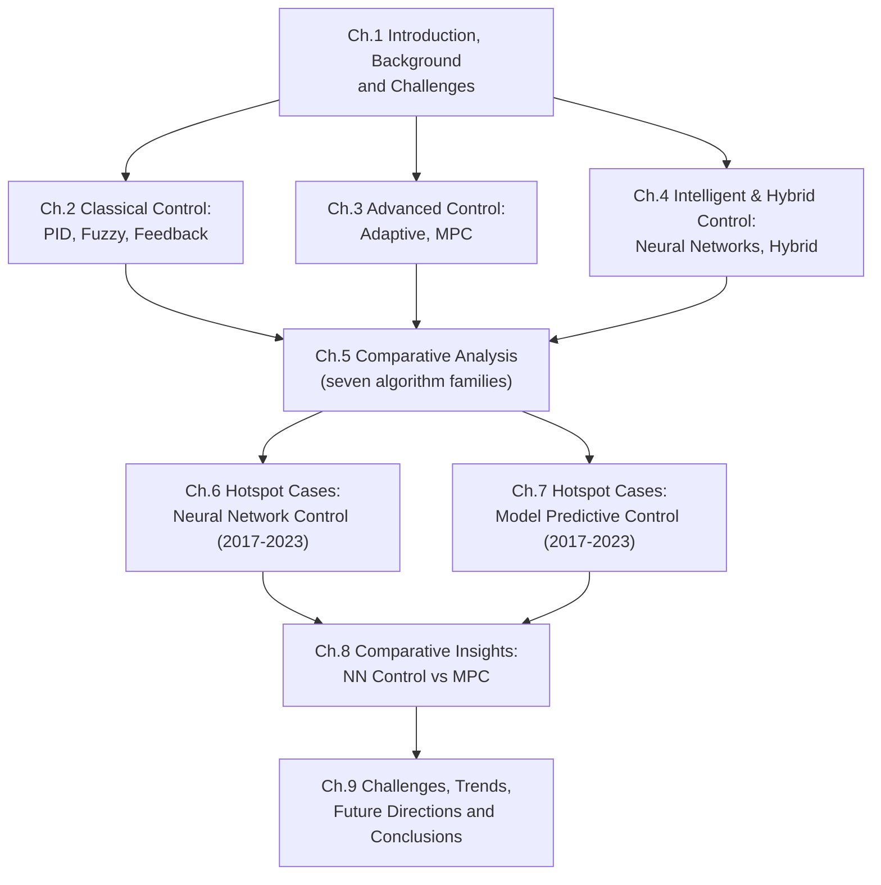

# Environmental Control Algorithms for Modern Agricultural Greenhouses: A Comparative Review and Case Study Analysis (2014–2023)
# 1 Introduction, Research Background, and Greenhouse Control Challenges

Modern agriculture is increasingly defined by its capacity to deliver high-quality, high-yield production under tightly constrained resource and environmental conditions. Within this context, the greenhouse — and more broadly, controlled-environment agriculture (CEA) — has emerged as one of the most strategically important production paradigms, precisely because it decouples crop growth from the variability of the open field by enclosing it within an engineered microclimate. Yet this very capability transforms the greenhouse into a complex multivariable thermodynamic and biological system whose behaviour can only be exploited to its full potential through advanced environmental control. This opening chapter motivates and frames the comparative review of greenhouse environmental control algorithms developed between 2014 and 2023. It establishes the agronomic, energetic, and societal significance of microclimate regulation; delimits the scope and dual objectives of the study; characterises the greenhouse as a control object; and articulates the unified evaluation criteria and methodological logic that will guide all subsequent chapters.

## 1.1 Significance of Environmental Control in Modern Agricultural Greenhouses

Controlled-environment agriculture has progressively positioned itself at the intersection of food security and climate-change mitigation. CEA refers to crop production carried out within highly regulated environments such as greenhouses and plant factories, where the explicit objective is to increase yields, enhance product quality, and reduce resource use compared with traditional open-field agriculture[^1]. This is no minor concern: agriculture, alongside transport and residential buildings, ranks among the principal contributors to global greenhouse-gas emissions, and the sector has been called upon to align its trajectory with international climate commitments[^1]. Greenhouses thus stand at the centre of an apparent paradox — they can boost productivity per unit area while also intensifying the per-unit-area demand for energy and water, which is exactly why the way their internal environment is *regulated* becomes decisive for the overall sustainability balance.

The agronomic rationale for tight microclimate control is grounded in the strong biophysical coupling between environmental variables and crop physiology. Air temperature governs metabolic rates and developmental timing; relative humidity, together with temperature, determines the vapour pressure deficit (VPD) that drives transpiration and stomatal regulation; light availability sets the ceiling on photosynthetic productivity; CO₂ concentration modulates net assimilation; and irrigation and nutrient delivery condition the water and nutrient status of the canopy. In experimental Mediterranean greenhouse cultivation, indoor air temperature can swing from approximately 13 °C to over 40 °C within a single season, while relative humidity ranges from below 60% to nearly 88% and daily indoor global horizontal solar radiation varies between 0.48 and 4.46 kWh/m²[^1]. Such amplitude of variation, even within a single covered structure, illustrates the magnitude of the regulation problem and the consequent need for algorithms capable of suppressing both fast disturbances and slow seasonal drift.

The energetic stakes are equally compelling. In Mediterranean regions, heating demand during colder months can account for more than 25% of the total energy consumption of protected cultivation systems[^1], and despite a growing research focus on energy efficiency and renewable energy integration, the sector remains heavily reliant on fossil fuels[^1]. This has motivated the emergence of "smart greenhouses" that increasingly depend on IoT-enabled infrastructure, remote sensing, and advanced control algorithms in order to optimise microclimate management and move toward near-zero-energy operation[^1]. In this framing, the **environmental control algorithm is not a peripheral automation feature but the central decision-making layer that determines the realised trade-off between productivity, product quality, energy use, water consumption, and greenhouse-gas emissions.** Selecting and designing the right algorithm therefore directly shapes whether CEA fulfils its sustainability promise.

## 1.2 Research Scope, Time Frame, and Dual Objectives

This report is deliberately scoped to greenhouse environmental control algorithms developed and reported between **2014 and 2023**, a decade during which the field underwent a notable transformation. At the start of this window, classical control schemes — most prominently PID and rule-based fuzzy controllers — still dominated commercial deployments, while model predictive control and neural-network-based methods were largely confined to laboratory or simulation studies. By the close of the decade, the same period had witnessed the maturation of model predictive control as a credible energy-aware supervisor, the proliferation of deep-learning-based predictors (LSTM, CNN-LSTM, TCN-based architectures, and similar), and the rise of hybrid architectures that explicitly combine model-based and data-driven reasoning. The 2014–2023 boundary therefore captures a coherent and self-contained epoch in greenhouse control research.

Within this temporal scope, the study pursues two complementary objectives, intentionally structured as a *general review followed by a focused hotspot analysis*:

1. **Comprehensive algorithm review.** The first objective is a systematic survey of seven principal categories of greenhouse environmental control algorithms — PID control, fuzzy logic control, classical feedback (including feedforward-augmented) control, adaptive control, model predictive control (MPC), neural-network-based control, and hybrid control schemes. For each category, the report articulates the underlying principle, identifies the main advantages and disadvantages in greenhouse-specific contexts, and outlines representative application scenarios. The synthesis culminates in a unified comparison table that places all seven categories on the same analytical footing.
2. **Hotspot case analysis (2017–2023).** The second objective focuses on the two algorithm families that have most clearly emerged as research hotspots within the decade — **neural-network-based control** and **model predictive control** — and assembles concrete empirical case studies from the 2017–2023 sub-window. These cases are organised in structured tables that record the specific algorithm, the target environmental parameters, the principal conclusions or achievements, and the year and authorship of the source. This second layer of analysis is designed to translate the abstract algorithmic comparison of objective (1) into evidence-based performance insights grounded in published applications.

The intended readership comprises researchers in agricultural engineering, control engineering, and smart-agriculture system design, as well as advanced practitioners and growers seeking to align algorithm selection with their operational priorities. The report's contribution lies in bridging two communities that have traditionally communicated only partially: control-theory researchers, who tend to evaluate algorithms in idealised settings, and greenhouse practitioners, who require algorithms that perform robustly under real biological, climatic, and economic constraints.

## 1.3 Methodological Logic for Algorithm Selection, Classification, and Comparison

The methodological backbone of the study rests on three sequential design decisions: how algorithms are selected from the body of literature, how they are classified into coherent categories, and how they are compared against one another.

**Selection** is guided by topical and temporal relevance. Only studies that address environmental regulation of protected cultivation (greenhouses and closely related CEA structures), that fall within the 2014–2023 window, and that map to one of the seven algorithm categories listed above are retained. Within these constraints, preference is given to peer-reviewed journal articles and authoritative conference proceedings, with cross-checking of quantitative claims against the original publications. Source diversification — across geographies, crops, and research groups — is pursued deliberately to mitigate single-source bias, particularly in the hotspot case analysis where a small number of prolific research groups could otherwise dominate the evidence base.

**Classification** follows a taxonomy that reflects both the historical evolution of the field and the structural differences among algorithm families:

- **Classical control** (PID, fuzzy, feedback) — model-light or rule-based schemes with mature theory and simple deployment;
- **Advanced model-based control** (adaptive, MPC) — schemes that explicitly use a process model to anticipate or adjust to system behaviour;
- **Intelligent / data-driven control** (neural networks and their deep-learning variants) — schemes that rely on learned representations of greenhouse dynamics from data; and
- **Hybrid control** — architectures that intentionally combine elements from two or more of the above families to inherit their complementary strengths.

This four-tier classification not only organises the review chapters but also provides a logical bridge to the comparative analysis in Chapter 5, where the seven categories are evaluated side by side.

**Comparison** is operationalised through a fixed set of evaluation dimensions (detailed in Section 1.6) that are applied consistently across every algorithm category and every case study. The comparative methodology deliberately moves beyond descriptive enumeration: each algorithm's advantages and disadvantages are explicitly related to the structural characteristics of the greenhouse system (Section 1.4), so that strengths and weaknesses are interpreted in terms of greenhouse-specific applicability rather than as generic control-theoretic properties. Case studies in Chapters 6 and 7 are then selected to illustrate, with concrete numerical evidence (e.g., RMSE, energy savings, tracking errors), how each algorithmic philosophy translates into measurable greenhouse performance.

## 1.4 Characteristics of the Greenhouse Environment as a Control Object

To understand why such a heterogeneous toolbox of control algorithms has been developed for greenhouses, one must first understand what makes the greenhouse so demanding as a control object. Greenhouse microclimates exhibit five intertwined properties — **dynamic, nonlinear, strongly coupled, time-varying, and disturbance-prone** — and each property motivates particular algorithmic responses.

**Dynamic and slow–fast multi-scale behaviour.** The greenhouse air responds rapidly to solar irradiance and ventilation openings (timescales of minutes), while the ground, structural mass, and crop canopy introduce slower thermal inertia (hours to days). Evidence from a monitored Venlo-type greenhouse in central Italy illustrates this: a two-week buffer period was required before model calibration to allow the thermal inertia of the ground to stabilise, after which validation showed simulated indoor temperatures tracking measurements with an RMSE on the order of 1.5 °C[^1]. Control algorithms must therefore be capable of handling multiple, simultaneously active timescales.

**Nonlinearity.** Several of the dominant physical processes in a greenhouse are intrinsically nonlinear. Natural ventilation, for example, depends on a nonlinear combination of wind- and stack-driven flow components,

$$\dot{V}_{tot} = \sqrt{\dot{V}_w^{2} + \dot{V}_s^{2}}$$

where the stack contribution itself scales as the square root of the indoor–outdoor temperature differential normalised by the indoor absolute temperature, and the wind opening-effectiveness coefficient varies with the angle between the opening and the prevailing wind direction[^1]. Likewise, crop transpiration in Penman–Monteith and Stanghellini-type formulations couples radiation, VPD, and canopy resistance in a non-additive manner[^1]. A linear PID controller may still be acceptable around a single operating point, but it cannot capture such nonlinearity over the full operational envelope.

**Strong coupling (MIMO).** Temperature, humidity, CO₂, and light are not independent. Opening vents to cool the air also evacuates humidity and CO₂; enabling shading to reduce solar gain simultaneously lowers photosynthetically active radiation; activating fogging reduces temperature *and* raises humidity. Crop transpiration in particular couples the thermal and hygrometric balances, with the model used in the Pisa case study allocating roughly 25% of the solar radiation transmitted through the cover to latent heat absorbed by the canopy and the remainder to sensible heat, reflection, photosynthesis, and internal storage[^1]. This multivariable coupling is the principal reason why MPC, which natively handles multi-input multi-output systems with constraints, has gained traction in the latter half of the review period.

**Time variance.** Greenhouse dynamics are not stationary. Leaf area index (LAI), and therefore canopy conductance, evolves with phenological stage; ventilation effectiveness changes with the seasonal wind regime; and external boundary conditions vary across daily and annual cycles. Sensitivity analysis demonstrates that perturbations of ±50% in the effective ventilation schedule fraction can shift simulated indoor temperature RMSE by more than 70% and dramatically amplify the mean bias error[^1]. **Parameters that are critical to control performance therefore drift over time**, which is precisely the regime in which adaptive control and online-tuned controllers are theoretically attractive.

**Disturbances.** Outdoor weather (temperature, wind speed and direction, solar radiation, rainfall) and operational events (manual interventions, irrigation pulses, opening of compartment doors) act as exogenous disturbances on the controlled microclimate. The DIRINDEX-based decomposition of measured global horizontal irradiance into direct and diffuse components illustrates that even the *input signal* used by model-based controllers carries non-trivial uncertainty, particularly under variable cloud cover[^1]. Robust and predictive controllers must therefore account not only for nominal dynamics but also for disturbance variability and measurement uncertainty.

These five characteristics together define the problem space against which the seven algorithm families reviewed in this report must be evaluated. They also explain why no single algorithm has emerged as universally optimal — different methods trade off the handling of nonlinearity, coupling, time variance, and disturbances against requirements for model availability, data, and computational power.

## 1.5 Key Challenges in Greenhouse Environmental Control

Building on the structural characteristics above, several operationally meaningful challenges define the problem space that greenhouse control algorithms attempt to address.

The **first challenge** is the persistent tension between **control accuracy and energy consumption**. Tightening setpoint bands generally requires more aggressive heating, cooling, ventilation, or supplemental lighting actions and therefore directly increases energy demand; conversely, widening setpoint bands saves energy but may compromise crop quality or yield. This tension is explicitly identified in recent research as "one of the key issues faced in greenhouse research"[^2]. The fact that, in Mediterranean greenhouses, heating alone can account for more than 25% of total energy consumption[^1] makes this trade-off economically as well as environmentally consequential, and it justifies the rise of energy-aware controllers — most notably economic MPC and learning-augmented predictive schemes — in the latter part of the review window.

The **second challenge** concerns **modelling uncertainty in biological and physical processes**. Two of the most influential drivers of indoor air temperature in naturally ventilated greenhouses — effective ventilation flow rate and crop transpiration — are also the most difficult to estimate. Sensitivity analyses confirm that the ventilation schedule fraction is the dominant source of model uncertainty, with RMSE increasing by up to 71% under –50% perturbations[^1], while crop transpiration models depend on canopy conductance and aerodynamic coupling parameters that themselves evolve with crop development and health[^1]. Static parameterisations are therefore inadequate, and adaptive or learning-based approaches that can refresh these parameters in operation become attractive. Ground heat transfer, by contrast, plays a comparatively secondary role: ±50% perturbations of soil thermal conductivity in EnergyPlus shifted RMSE by only ~2%[^1], a finding that is itself useful for prioritising the modelling effort underpinning any control design.

The **third challenge** is the **integration of real-time sensing and IoT infrastructures**. Modern controllers depend on continuous, high-resolution, low-latency data streams. Monitoring systems such as the Integrated Smart Monitoring and Control System (ISMaCS), employing wireless LoRa-based sensors and gateways relaying data via Wi-Fi to remote servers, exemplify the infrastructure now considered essential to enable dynamic synchronisation between the physical greenhouse and its digital control layer[^1]. The reliability and bandwidth of such infrastructure directly bound the achievable performance of MPC and learning-based controllers.

The **fourth challenge** is the emerging requirement for **interoperability with digital-twin (DT) frameworks and predictive control architectures**. Digital twins extend IoT-based infrastructures by maintaining a continuously updated virtual counterpart of the greenhouse for monitoring, forecasting, and optimisation across the system's lifecycle[^1]. Their integration with predictive controllers is increasingly seen as the natural endpoint of smart-greenhouse evolution: model predictive control strategies, based on simplified energy models and IoT infrastructures, have been shown to contribute to reducing energy use while maintaining production performance[^1]. However, systematic reviews indicate that the integration of energy models into DT frameworks remains an open challenge, with most existing DT applications in greenhouses still confined to climate control, energy management, and lighting in isolation[^1]. **Control algorithms developed in the next phase will therefore have to satisfy not only classical performance specifications but also interoperability, real-time integration, and control-system compatibility criteria** — dimensions that this report will revisit throughout the comparative analysis.

The **fifth challenge** concerns **generalisation across crops, climates, and structures**. A controller calibrated for a Venlo-type glasshouse with tomato in a Mediterranean climate is not directly transferable to a plastic-film tunnel growing leafy greens in a continental climate. The diversity of structural configurations, ventilation regimes, crop species, and weather backgrounds across the published case studies is one of the principal reasons why like-for-like algorithmic comparisons must be interpreted with care, and why the comparison tables in this report explicitly record contextual information (crop, region, structure) alongside performance metrics.

## 1.6 Evaluation Criteria for Comparative Analysis

To ensure consistency and transparency across the subsequent chapters, the report adopts a unified set of evaluation criteria. Each algorithm and each case study is interpreted, as far as the underlying sources permit, against the same dimensions, summarised in Table 1.1.

| Criterion | Definition and operational meaning in greenhouse context |
|---|---|
| **Control accuracy** | Ability to maintain controlled variables (temperature, humidity, CO₂, VPD) within target setpoints or bands; typically measured by RMSE, MAE, or tracking error against reference profiles. |
| **Robustness** | Capability to maintain performance in the presence of disturbances (weather, manual interventions), parameter drift (LAI, ventilation effectiveness), and sensor noise. |
| **Energy consumption / efficiency** | Achieved level of heating, cooling, ventilation, and lighting energy demand; often expressed as savings (%) relative to a baseline controller, or as energy use per unit of yield. |
| **Computational complexity** | Online computational burden (per control cycle) and offline design/training effort; relevant for embedded deployment and real-time operation. |
| **Data and model requirements** | Volume and quality of historical data required for identification or training, and the complexity of the process model the algorithm needs. |
| **Adaptability** | Capacity to remain effective when crop type, growth stage, season, or climate changes without requiring full redesign. |
| **Scalability** | Ability to extend from single-zone, single-loop deployments to multi-zone, multi-objective, multi-greenhouse operations. |
| **Integration / DT readiness** | Suitability for embedding within IoT and digital-twin architectures, including API availability, real-time data exchange, and compatibility with energy-management and predictive-control layers[^1]. |

The first four criteria correspond to the traditional control-engineering performance specification; the last four reflect the broader operational, agronomic, and digital-infrastructure considerations that have become inseparable from controller design over the 2014–2023 window. **No single algorithm scores highest on every dimension**, and the comparative analysis in Chapter 5 will be explicit about which trade-offs each algorithm family typically accepts.

## 1.7 Structure and Roadmap of the Report

The remainder of the report is organised to move progressively from foundational principles to detailed comparative and empirical analysis, before closing on synthesis and outlook. The overall logical flow is illustrated below.

Chapters 2–4 present the seven algorithm families in three thematic blocks (classical, advanced model-based, and intelligent/hybrid), each following the same internal pattern of *principle → advantages → disadvantages → typical greenhouse scenarios*. Chapter 5 synthesises these into a unified comparison table that operationalises the evaluation framework of Section 1.6 across all seven categories, and discusses algorithm-selection logic with respect to greenhouse scale, crop type, energy availability, and control objectives. Chapters 6 and 7 then descend from the categorical level to the empirical level, collecting and analysing concrete 2017–2023 case studies for the two hotspot families — neural-network-based control and model predictive control — and tabulating them with specific algorithm, target parameters, main conclusions, and authorship/year. Chapter 8 takes a deliberately comparative perspective on these two hotspot families, contrasting their modelling philosophies (data-driven versus model-based), performance characteristics, and emerging convergence toward learning-augmented predictive frameworks. Finally, Chapter 9 consolidates the cross-chapter findings, outlines the principal open challenges (modelling accuracy, real-time computation, sensor reliability, energy–water–carbon trade-offs, and cross-context generalisation), discusses future directions such as digital-twin-enabled control and hybrid learning-based MPC, and offers practical recommendations for researchers and growers on algorithm selection.

With the significance, scope, system characteristics, challenges, and evaluation framework now established, the report turns in Chapter 2 to the first block of algorithm families — the classical controllers (PID, fuzzy, and feedback) — that historically formed, and in many commercial deployments still form, the baseline against which all subsequent algorithmic innovations of the 2014–2023 decade must be measured.

# 2 Classical Control Algorithms: PID, Fuzzy, and Feedback Control

The opening chapter argued that no single algorithm can simultaneously dominate every evaluation dimension because the greenhouse is at once dynamic, nonlinear, strongly coupled, time-varying, and disturbance-prone. Yet, paradoxically, it is precisely the simplest and most established families of controllers — proportional–integral–derivative (PID), fuzzy logic, and classical feedback (with feedforward augmentation) — that still account for the overwhelming majority of commercial greenhouse deployments observed across the 2014–2023 window. Understanding *why* this is so, and *where* these classical schemes begin to falter, is the prerequisite for evaluating the more sophisticated model-based, learning-based, and hybrid architectures presented later in the report. This chapter therefore develops the technical baseline of greenhouse environmental control, treating each of the three classical families in turn — principle, variants, advantages, disadvantages, and typical greenhouse scenarios — before consolidating the comparison against the unified evaluation framework introduced in Section 1.6.

## 2.1 PID Control and Its Variants in Greenhouse Climate Regulation

### 2.1.1 Principle and Tuning of the Conventional PID Controller

The PID controller produces a control command by performing three functional operations on the tracking error $e(t) = r(t) - y(t)$ between the reference signal and the measured output: a **proportional** action that scales the instantaneous error, an **integral** action that accumulates past error to eliminate steady-state offset, and a **derivative** action that anticipates the error trend. In its continuous form, the control law is written as

$$u(t) = K_p\!\left(e(t) + \frac{1}{T_i}\!\int_{0}^{t}\! e(\tau)\,d\tau + T_d\,\frac{de(t)}{dt}\right),$$

with the corresponding transfer function relating error and controller output as

$$u(s) = K_p\!\left(1 + \frac{1}{T_i s} + T_d s\right) e(s),$$

so that the three gains — proportional gain $K_p$, integral time constant $T_i$, and derivative time constant $T_d$ — fully parameterise the controller[^3]. PID has been called "a typical model-free control" because it does not rely on any explicit dynamic model of the controlled plant; as long as the three parameters are correctly set, the controller can ensure closed-loop stability and acceptable tracking performance, which is why it has been widely adopted as a baseline scheme for greenhouse climate regulation[^4][^5].

The tuning of the three gains, however, is itself non-trivial. The classical **Ziegler–Nichols heuristic**, introduced in the 1940s, was the rule that "finally gave engineers a practical and systematic way of tuning PID loops for improved performance"[^6], and it remains the most widely taught starting point. The procedure first sets the integral and derivative gains to zero and then increases the proportional gain from a small value until the closed-loop output exhibits stable, sustained oscillation; the corresponding proportional gain is the **ultimate gain** $K_u$, and the oscillation period is $T_u$[^3][^6]. The two measurements are then used to set the three controller parameters according to a family of tuning tables. For the classical PID rule, Ziegler–Nichols specifies $K_p = 0.6\,K_u$, $T_i = 0.5\,T_u$, and $T_d = 0.125\,T_u$[^3][^6], yielding a "quarter-wave decay" response that is intentionally aggressive in order to maximise disturbance rejection[^3]. Where overshoot is undesirable — a common concern in horticultural setpoint tracking — the "no overshoot" variant ($K_p = 0.20\,K_u$, $T_i = 0.50\,T_u$, $T_d = 0.33\,T_u$) trades faster transient response for smoother settling[^3][^6].

Despite its longevity, the Ziegler–Nichols rule rests on assumptions that are particularly fragile in a greenhouse context. The underlying plant model is presumed to be approximated by a first-order lag in series with a pure time delay, with a "fictional phase adjustment" filling the gap between this assumed model and reality. As one widely cited evaluation puts it, "if the actual system is linear, monotonic, and sluggish, it doesn't make much difference that the model is fake, and results are good enough; if the actual system does not match the assumed model adequately, then sorry, you're on your own"[^6]. The classical rule is further reported to yield "an aggressive gain and overshoot" and to be poorly suited when command-tracking, rather than disturbance rejection, is the primary objective[^3][^6]. These caveats are directly relevant to greenhouse air loops, which are highly nonlinear, exposed to large weather-driven disturbances, and strictly bounded in actuator authority. Consequently, fixed Ziegler–Nichols gains rarely survive an annual cycle, which is one of the principal motivations for the variants discussed next.

### 2.1.2 Principal Variants Developed for the Greenhouse Context

Because conventional fixed-parameter PID cannot always cope with the strong nonlinear dynamics of the greenhouse — "if the system has strong nonlinear dynamics, then the fixed PID parameters usually cannot always ensure the stability and convergence of the controlled system, and these parameters are also difficult to tune manually"[^5] — the 2014–2023 literature is dense with adaptive and hybrid PID variants. Four families dominate.

**Parameter self-tuning PID (STPID).** The most direct response to the time-varying nature of greenhouse dynamics is to update the PID gains online by minimising a tracking-error cost. Su, Yu and Zeng (2020) proposed a parameter self-tuning PID approach in which the greenhouse climate is first decoupled into four equivalent single-input/single-output (SISO) sub-systems and the **Levenberg–Marquardt (LM) optimisation algorithm** is then used to tune the PID gains online[^5]. The greenhouse climate is naturally a four-input/three-output system — heating, fogging, CO₂ injection, and ventilation acting on temperature, humidity, and CO₂ concentration — and ventilation in particular couples to all three outputs simultaneously. To eliminate this coupling, the authors construct a nonlinear transformation $\hat{\mathbf{y}} = F(\mathbf{y})$ that maps the three real outputs into four equivalent outputs $\hat{y}_1, \dots, \hat{y}_4$, each driven by exactly one of the four PID controllers[^5]. Within each sampling period the LM update law

$$\mathbf{K}_{PID,k} = \mathbf{K}_{PID,k-1} - [\,\mathbf{E}_k^{T}\mathbf{E}_k + \mu_k \mathbf{I}\,]^{-1}\,\mathbf{E}_k^{T}\,\boldsymbol{\varepsilon}_k$$

adjusts the gain vector to minimise a weighted sum of squared equivalent tracking errors and squared control-rate penalties[^5]. The Matlab-based simulation, driven by real weather data collected in a Shanghai Venlo-type commercial greenhouse, demonstrated that all three climatic variables tracked their desired trajectories closely, with the full-gradient variant yielding higher control accuracy and the incomplete-gradient variant yielding smoother actuator commands and lower energy and CO₂ consumption — an explicit accuracy/energy trade-off[^5]. Importantly, the authors openly acknowledge two limitations: the controller "greatly depends on the LM optimization algorithm" and may not converge to the global optimum within the sampling period, and the equivalent transformation cannot always guarantee that the original outputs converge exactly to their setpoints because of the explicit trade-off embedded in $\hat{y}_2$ and $\hat{y}_4$[^5].

**Lyapunov-based and neural-network-based adaptive PID.** A second family treats the PID gains as adaptive parameters whose update laws are derived from Lyapunov stability analysis. Such schemes guarantee convergence in principle but are reported to be "complex, and [their] reliability is easy to impact by the external disturbance" — a non-trivial concern in greenhouses exposed to abrupt weather transients[^5]. A closely related stream uses neural networks to estimate the Jacobian of the plant with respect to the control variables and thereby drives the PID self-tuning law, as in the RBF-network-based adaptive PID for greenhouse temperature and humidity regulation discussed by Su et al.[^5].

**Evolutionary tuning of PID gains.** A third family preserves the conventional PID structure but uses metaheuristic optimisation to determine the gains offline. Particularly relevant to the 2014–2023 window is the work of **Hu et al. (2014)**, who applied the Non-dominated Sorting Genetic Algorithm II (NSGA-II) to perform an *economic* tuning of a nonlinear PID controller for greenhouse climate, simultaneously reducing operating costs and improving control performance — a clear shift from the single-objective "best tracking" paradigm of Ziegler–Nichols toward the multi-objective, energy-aware tuning that came to characterise the decade[^5].

**Fuzzy-PID and other composites.** A fourth family compensates for the limitations of fixed-gain PID by combining it with fuzzy supervision (analysed in detail in Section 2.2.2), with anti-windup logic[^5], or with discrete fuzzy parallel-distributed-compensation schemes augmented by pole placement[^5]. The combination of PID with fuzzy supervision has become especially common, with **Cheng et al. (2020)** explicitly motivating their fuzzy-PID design as a means of overcoming **the long response time of traditional PID** in greenhouse climate loops — a recurring complaint in the literature whenever conventional PID is asked to operate over a wide range of operating points without re-tuning.

### 2.1.3 Advantages, Disadvantages, and Typical Greenhouse Scenarios

The persistent attractiveness of PID in greenhouse practice can be traced to a small set of structural advantages. The controller has a **simple structure**, is **model-free**, is easy to implement on PLCs and embedded microcontrollers, and exhibits **high reliability and good robustness**: "PID control does not depend on any system model, and the controller has simple structure, so it is easy to implement, and has high reliability and good robustness"[^4][^5]. PLC-based implementations — for instance, the Siemens S7-1200 PLC-based PID temperature regulation system for greenhouses and industrial facilities reported in 2025 — illustrate how naturally PID fits into the cost- and energy-constrained automation hardware that dominates commercial greenhouse retrofits[^3].

These structural strengths, however, come bundled with structural weaknesses. Even with the best heuristic tuning, fixed-parameter PID struggles with the nonlinearity of vent flow and transpiration, with the slow drift of parameters such as leaf area index and ventilation effectiveness, and — most fundamentally — with the **simultaneous control of multiple coupled variables**. As Su et al. summarise it, "PID control is usually suitable for single-input single-output system (SISO), and is not easy to be directly used to solve the control problem of Multi-input Multi-output systems (MIMO) due to the strong coupling between the controlled variables. Therefore, PID control for MIMO systems is still a challenge"[^5]. The same source notes that self-tuning variants partially mitigate this limitation but inherit a dependency on the convergence of the underlying optimisation within each sampling period[^5].

The natural deployment niches for PID and its variants in the 2014–2023 greenhouse literature therefore cluster around three scenarios. The first is **single-parameter control** — isolated temperature, humidity, or CO₂ regulation loops where MIMO coupling can be ignored or handled by separate loops[^4][^3]. The second is **primary (baseline) greenhouse control**, in which PID provides the regulatory inner loop that translates setpoints into actuator commands, typically in low-cost smart-greenhouse installations or PLC-based industrial-style automation[^4][^3]. The third is the use of PID as the **inner regulatory loop within hierarchical or hybrid architectures**, with a supervisory layer (fuzzy, MPC, or learning-based) generating setpoints that the PID then tracks — a pattern that becomes central in Chapters 3–4.

## 2.2 Fuzzy Logic Control: Rule-Based Reasoning for Imprecise Greenhouse Dynamics

### 2.2.1 Principle of Fuzzy Logic Control

Where PID derives its control action from a fixed algebraic combination of error signals, fuzzy logic control derives it from a rule-based reasoning process designed to emulate the qualitative judgement of an expert operator. Crucially, fuzzy logic control is **a nonlinear control method that does not require an accurate mathematical model of the controlled object**, which is precisely why it has attracted sustained interest in greenhouse applications where mechanistic modelling of the indoor microclimate is notoriously difficult[^5].

The conventional fuzzy controller operates in three stages. In the **fuzzification** stage, crisp sensor readings (for example, the current air temperature error and its rate of change) are mapped into linguistic terms — such as "Negative Large", "Zero", "Positive Small" — via membership functions that quantify the degree to which each numerical input belongs to each linguistic category. In the **inference** stage, a rule base of IF–THEN expert rules (e.g., *IF temperature error is positive large AND its derivative is positive THEN ventilation command is large*) is evaluated against the fuzzified inputs, producing a fuzzy output set. In the **defuzzification** stage, this fuzzy output is collapsed to a crisp control command by, for example, the centre-of-gravity or maximum-membership method.

Greenhouse-oriented variants of this base architecture proliferated during the review window. Su et al. survey the field and list a series of model-based fuzzy schemes deployed for greenhouse climate control, including standalone fuzzy controllers, adaptive neuro-fuzzy inference systems (ANFIS) for temperature regulation, fuzzy decoupling schemes for coupled temperature–humidity–CO₂ control, adaptive fuzzy hierarchical controllers for solar greenhouses, and wireless-sensor-network-integrated fuzzy systems that fuse rule-based reasoning with IoT-style monitoring[^5].

### 2.2.2 Advantages, Disadvantages, and Typical Greenhouse Scenarios

The principal advantage of fuzzy logic control in the greenhouse context is encapsulated in the phrase "**no need for precise modelling**". Because the inference engine reasons over linguistic categories rather than algebraic models, the controller can be commissioned directly from expert agronomic knowledge whenever a tractable mechanistic model is unavailable — and, as Chapter 1 made clear, such mechanistic models are routinely unavailable for greenhouse climates, where heat and mass exchange mechanisms are partly still unknown[^5]. A second advantage is that fuzzy logic is intrinsically nonlinear and can therefore deliver smooth, graduated control action across the full operational envelope of the greenhouse, rather than only around a single linearisation point. A third practical advantage is the natural compatibility of rule-based reasoning with IoT and wireless-sensor infrastructures: rules can be evaluated locally at low computational cost and can be updated through the same data layer that supplies sensor readings.

These advantages, however, are accompanied by two recurrent disadvantages. The first is **poor real-time performance**: as the number of input variables grows, the size of the rule base grows combinatorially, and the time required to evaluate all active rules within each sampling period can become incompatible with the high-bandwidth disturbances (e.g., gusts, cloud transients) that drive greenhouse dynamics. The second is the **constraint imposed by the rule base** itself: the controller's behaviour is bounded by the quality, completeness, and coverage of the expert rules and the chosen membership functions, with no intrinsic mechanism for self-adaptation when crop stage, seasonal climate, or operational regime shifts. Systematic stability analysis is also non-trivial because the closed loop is non-smooth in general, which is one reason why purely fuzzy schemes are often complemented by a conventional PID inner loop.

The combination of these advantages and disadvantages explains why fuzzy control has been most successful in two specific application niches. The first is the **multivariate greenhouse system**, where it is used either as a decoupling supervisor that issues setpoints to underlying actuator loops or as a direct controller for coupled temperature–humidity–CO₂ regulation. The second is **nonlinear system control** more broadly, where fuzzy reasoning is preferred precisely because no acceptable analytical model is available. A particularly representative example of the synergy between fuzzy reasoning and PID regulation is the work of **Cheng et al. (2020)**, who used a **fuzzy-PID composite controller to overcome the long response time of traditional PID** in a greenhouse climate loop: the fuzzy supervisor adjusts the PID gains in real time as a function of the current error and error rate, which accelerates the transient response without sacrificing the steady-state accuracy contributed by the integral action. This composite philosophy — fuzzy for nonlinear adaptation, PID for stable steady-state tracking — has become one of the most pervasive hybrid patterns of the 2014–2023 decade, and is revisited in detail in Chapter 4.

## 2.3 Classical Feedback and Feedforward-Combined Control

The third foundational family encompasses the broader class of **classical feedback** structures — on/off, P, PI, lead-lag compensation, and Smith-predictor-type architectures — together with their **feedforward-augmented** variants that explicitly compensate for measurable exogenous disturbances. The underlying principle is the same error-driven correction logic that animates PID, but the design vocabulary is broader: the controller is conceived as a frequency-domain or time-domain shaping operator that places the closed-loop poles in stable locations and meets specified rise-time, settling-time, and disturbance-rejection criteria around a chosen operating point.

In the greenhouse context, two refinements of the basic feedback architecture have proved especially relevant. The first is the **Smith predictor**, designed to compensate for the long transport delays associated with thermal and hygrometric processes inside the greenhouse and the slow actuation dynamics of heaters, foggers, and vents. Modified Smith predictors tuned by genetic algorithms[^5] and filtered Smith predictors for multivariable greenhouse plants have both been reported as concrete improvements over a baseline PID loop where the dominant time delay would otherwise force the controller gains to be detuned. The second is **feedforward augmentation**, in which measurable disturbances — outdoor solar radiation, wind speed, outdoor temperature, sometimes outdoor humidity — are fed directly into the controller so that the actuator response anticipates the disturbance rather than waiting for it to propagate through the system as a tracking error. Given that Mediterranean greenhouses experience indoor temperature swings of more than 25 °C across a season and that more than 25% of total energy can be consumed by heating, the practical value of pre-empting weather-driven disturbances is considerable.

The advantages of classical feedback (with or without feedforward) are those of a mature engineering discipline: well-understood theory, transparent design procedures, provable stability around linearised operating points, and demonstrable improvements in disturbance rejection when measurable disturbances can be captured by a feedforward path. The disadvantages are equally well understood. Classical feedback designs are inherently tied to a linearisation, and they degrade when nonlinear effects (e.g., the square-root dependence of stack-driven vent flow on the temperature differential introduced in Section 1.4) dominate. They handle MIMO coupling only awkwardly, requiring sequential loop tuning or paired-loop analysis. They are sensitive to large transport delays unless explicitly compensated, and feedforward branches are only as good as the disturbance measurements that feed them — a non-trivial caveat given the uncertainty embedded in the decomposition of global irradiance into direct and diffuse components noted in Chapter 1. They also have limited adaptability to slow parameter drift (LAI, ventilation effectiveness), which is the canonical regime in which adaptive control becomes attractive (Chapter 3).

The application niches of classical feedback in modern greenhouses are therefore concentrated around single-zone heating or ventilation loops, weather-compensated setpoint tracking (where feedforward of outdoor temperature and solar radiation directly augments a PI tracker), and — perhaps most importantly for the architecture of contemporary smart greenhouses — the role of **regulatory inner loop underneath a supervisory MPC or intelligent controller** in a hierarchical hybrid architecture. In this role, the simplicity, reliability, and transparency of classical feedback are an asset, because they ensure that the actuator-level behaviour remains safe and bounded even if the supervisory layer fails or temporarily delivers suboptimal setpoints.

## 2.4 Comparative Assessment and Greenhouse-Specific Applicability of Classical Controllers

Synthesising the three families against the unified evaluation framework introduced in Section 1.6 makes their complementary structural profiles visible. PID and its variants prioritise simplicity, reliability, and ease of deployment; fuzzy logic control prioritises model-free reasoning under uncertainty; classical feedback (with feedforward) prioritises theoretical transparency and explicit disturbance pre-emption. Table 2.1 distils these profiles into a single comparison.

| Dimension (Section 1.6) | PID and variants | Fuzzy logic control | Classical feedback / feedforward |
|---|---|---|---|
| **Control accuracy** | Good around a single operating point; degrades under nonlinearity unless self-tuned (e.g., LM-based STPID)[^5] | Smooth nonlinear action; accuracy bounded by rule-base coverage | Good for linearised operating points; substantially improved by feedforward of measurable disturbances |
| **Robustness** | High structural robustness; "good robustness" widely cited[^4][^5] | Robust to imprecision and modelling uncertainty | Robust around design point; sensitive to disturbance-measurement quality |
| **Energy efficiency** | Baseline; NSGA-II tuning (Hu et al., 2014) demonstrated explicit economic gains[^5] | Moderate; expert rules can encode energy-aware logic | Improved by feedforward (pre-empts heating/cooling demand) |
| **Computational complexity** | Very low; suitable for PLC/embedded execution[^3] | Low per cycle but grows combinatorially with rule base; **poor real-time performance** as inputs grow | Low to moderate; Smith-predictor variants add modest overhead |
| **Data/model requirements** | None (model-free)[^5] | None mechanistically, but requires expert knowledge for rule base | Requires identified linear model and reliable disturbance sensors |
| **Adaptability** | Low for fixed gains; moderate for self-tuning/adaptive variants[^5] | Low without external adaptation; **constrained by rule base** | Low; tied to design operating point |
| **Scalability (MIMO)** | Poor in native form; **difficulty in simultaneously controlling multiple variables**[^5]; mitigated by equivalent-transformation decoupling[^5] | Moderate; rule explosion limits scaling | Moderate via paired-loop or filtered Smith-predictor architectures |
| **IoT / digital-twin readiness** | High; mature integration with PLC and SCADA[^3] | High; natural compatibility with rule-based supervisory layers | Moderate; feedforward branches depend on IoT sensing |

The table makes explicit that **no classical controller dominates every dimension** — each accepts a specific set of trade-offs. Mapping these trade-offs back onto the five greenhouse system characteristics of Section 1.4 clarifies the residual gaps that motivate Chapters 3–4. Fixed-parameter PID is challenged by **nonlinearity** (the algebraic correction law cannot reshape itself across operating points) and by **time variance** (gains valid in winter may be unstable in summer), which is precisely why self-tuning and Lyapunov-based variants emerged[^5]. Fuzzy control mitigates **modelling uncertainty** elegantly but scales poorly with input dimensionality and lacks intrinsic self-adaptation when crop stage or seasonal regime shifts. Classical feedback with feedforward augmentation is particularly effective in **disturbance-prone Mediterranean climates** where wind speed, outdoor temperature, and solar radiation are well-measured and dominate the indoor balance, but it inherits the linearisation limitations of its theoretical foundations and cannot, on its own, deliver constraint-aware multi-objective optimisation.

A second insight that the table makes visible is the **division of labour between supervisory and regulatory layers** that has come to characterise modern greenhouse architectures. The classical controllers reviewed in this chapter are unmatched in the regulatory inner loop — they translate setpoints into safe, reliable, low-latency actuator commands at low computational cost — but they are typically inadequate as standalone supervisors of multi-objective, energy-aware, weather-forecast-informed greenhouse operation. Conversely, the advanced model-based, intelligent, and hybrid algorithms of Chapters 3–4 excel as supervisors but generally do not replace the PID, fuzzy, or feedback loops that sit directly above the actuators. This complementarity is one of the most consistent findings across the 2014–2023 literature, and it explains why **classical controllers remain the dominant deployment paradigm in commercial greenhouses** even as the research frontier has shifted decisively toward MPC and learning-based methods.

With this baseline established, Chapter 3 turns to the first set of algorithmic innovations developed in direct response to the residual gaps identified above: adaptive control, designed to address time variance and parameter drift, and model predictive control, designed to address nonlinearity, MIMO coupling, and the energy/accuracy trade-off through explicit constraint-aware optimisation over a finite prediction horizon.

# 3 Advanced Control Algorithms: Adaptive Control and Model Predictive Control (MPC)

Chapter 2 closed with a structural observation: the classical controllers that still dominate commercial deployments — PID, fuzzy logic, and classical feedback — accept a coherent set of trade-offs that leave three residual gaps unaddressed. They struggle with the **nonlinearity** of vent flow and transpiration, with the **time-variance** of canopy conductance and ventilation effectiveness, and with the **simultaneous, constraint-aware optimisation of multiple coupled variables** under measurable disturbances. The first wave of algorithmic innovation that targeted these gaps during the 2014–2023 window did so by reintroducing an explicit process model into the controller: **adaptive control** keeps a model alive online by updating its parameters as the greenhouse evolves, while **model predictive control (MPC)** uses a model to forecast future climate trajectories and to optimise control actions over a finite, receding horizon subject to constraints. This chapter examines these two families in turn — their principles, principal variants, advantages, disadvantages, and typical greenhouse scenarios — and concludes with a comparative assessment that situates them against the classical baseline and motivates the intelligent and hybrid schemes of Chapter 4.

## 3.1 Adaptive Control: Principles and Greenhouse-Oriented Variants

Adaptive control denotes a family of model-based controllers whose distinguishing feature is that the controller parameters — or the parameters of an internal plant model on which the controller is based — are **adjusted online** in response to the observed behaviour of the closed loop. The defining premise is that the controlled plant is not stationary: its dynamic parameters drift over time scales much longer than the sampling period but much shorter than the operational lifetime of the controller, so that a controller designed for a single nominal operating point will inevitably degrade. **The central insight underpinning adaptive control is that it automatically adjusts itself to cope with changes in system parameters and external disturbances**, refreshing the controller (or the underlying model) at a cadence that matches the rate at which the greenhouse itself changes.

The greenhouse system characteristics summarised in Sections 1.4–1.5 make this paradigm particularly attractive. Leaf area index and canopy conductance evolve with phenological stage; ventilation effectiveness changes with the seasonal wind regime; the partitioning of incoming solar radiation between sensible heat, latent heat, and storage depends on a crop canopy whose state is itself a function of time; and sensitivity analyses indicate that perturbations of ±50% in the effective ventilation schedule fraction can shift simulated indoor temperature RMSE by more than 70%. Static parameterisations are inadequate in this regime, and adaptive controllers exist precisely to handle it.

Three principal variant families of adaptive control became prominent in greenhouse applications during the review window.

**Model Reference Adaptive Control (MRAC).** In an MRAC architecture, a *reference model* prescribes the desired closed-loop dynamic response (typically a stable, well-damped second-order system) and an adaptation law continuously adjusts the controller parameters so that the actual plant output tracks the reference model output. The signal that drives the adaptation is the difference between the plant output and the reference model output, and the update law — derived from Lyapunov stability arguments or from the MIT gradient rule — guarantees, under persistent excitation, that this tracking error converges asymptotically. In greenhouse climate loops, MRAC is attractive because it explicitly decouples *what we want the closed loop to do* (encoded in the reference model) from *what the plant happens to be doing today* (encoded in the slowly drifting plant parameters), allowing the same desired response to be maintained across the cropping cycle.

**Parameter self-tuning regulators.** A self-tuning regulator pairs a recursive online identifier — typically a recursive least squares (RLS) estimator — with a controller redesign step that is repeated at each sampling instant. The identifier maintains an estimate of the greenhouse model parameters; the controller is redesigned to be optimal (in a pole-placement, minimum-variance, or LQR sense) with respect to the current estimate. Within the 2014–2023 literature, the most influential greenhouse-specific instantiation of this idea is the **parameter self-tuning PID method proposed by Su (2020), which uses the Levenberg–Marquardt (LM) algorithm to adjust the PID gains online**. As detailed in Section 2.1.2, that scheme first decouples the four-input/three-output greenhouse plant into four equivalent SISO sub-systems via a nonlinear output transformation and then applies the LM update law within each sampling period to minimise a weighted sum of squared equivalent tracking errors and squared control-rate penalties, so that the PID gains are continuously refreshed as the greenhouse evolves. The same study explicitly motivates this design by noting that fixed PID parameters cannot ensure stability and convergence in greenhouses with strong nonlinear dynamics, and that manual re-tuning is impractical — exactly the conditions under which adaptive parameter self-tuning is theoretically required.

**Iterative and adaptive fuzzy hierarchical schemes.** A third family blends adaptive logic with the rule-based reasoning of Section 2.2. The representative example within the review window is the work of **Wang et al. (2018), who proposed an adaptive fuzzy hierarchical control to maintain solar greenhouse temperature**. The hierarchical structure assigns a supervisory layer the task of generating temperature setpoints (or activating climate equipment) according to fuzzy rules whose membership functions or rule weights are themselves adapted online, while a lower regulatory layer translates the setpoints into actuator commands. The architecture is well matched to the solar greenhouse — a low-cost, passively heated structure whose thermal behaviour is dominated by slow drift in solar gain, soil heat storage, and infiltration losses — because it preserves the model-free reasoning of fuzzy logic while injecting an explicit mechanism for the controller to update itself as the season progresses.

Across all three variant families, the unifying logic is the same: a slow outer loop refreshes the controller (or the model on which the controller is based), and a fast inner loop continues to track setpoints using the refreshed parameters. This two-time-scale separation is also what generates the principal trade-offs analysed next.

## 3.2 Advantages, Disadvantages, and Typical Scenarios of Adaptive Control

The advantages of adaptive control in greenhouse applications follow directly from the online update principle. The **system's adaptive control capability is strong**: as the greenhouse drifts, so does the controller, with the result that closed-loop tracking and disturbance rejection are preserved across phenological stages and seasons without requiring manual re-commissioning. A closely related advantage is that adaptive controllers are **easy to self-optimise**: because the update law continuously minimises a well-defined cost (tracking error, prediction error, control effort, or a weighted combination thereof), the controller progressively converges toward the optimum that is consistent with the data it has observed, rather than remaining frozen at the operating point assumed at design time. The LM-based parameter self-tuning PID of Su (2020) illustrates this property: by selecting different gradient variants of the LM update, the designer can navigate explicitly between higher control accuracy and smoother actuator commands with lower energy and CO₂ consumption, an accuracy–energy trade-off that classical fixed-parameter PID cannot expose at all.

These advantages, however, are paired with two structural disadvantages that are particularly visible in the greenhouse context. The first is **initial-phase system instability**. While the asymptotic convergence properties of adaptive controllers can be established under standard assumptions (persistent excitation, projection bounds, slow enough parameter variation), the transient behaviour during the initial commissioning period — when the parameter estimates are still far from their true values — can be poorly damped or even unstable. In a greenhouse, where actuators have finite authority and abrupt weather transients (a cloud passing, a gust opening a vent) can inject large disturbances precisely while the adaptive law is still learning, this transient fragility is operationally significant. Lyapunov-based adaptive PID schemes have been reported as "complex, and [their] reliability is easy to impact by the external disturbance", and parameter self-tuning regulators inherit a dependency on the convergence of the underlying online optimisation within each sampling period.

The second structural disadvantage is the **difficulty of system development and maintenance**. Designing an adaptive controller requires choices that have no counterpart in fixed-parameter control: selecting the reference model in an MRAC scheme, choosing the identifier structure (RLS, gradient, projection algorithm) in a self-tuning regulator, configuring the forgetting factor that determines how aggressively old data is discounted, designing the persistent-excitation safeguards that prevent the identifier from being driven by uninformative regressors, and tuning the projection bounds that keep parameter estimates within physically meaningful ranges. Once deployed, the adaptive controller is also harder to maintain than a PID loop, because diagnosing poor performance requires distinguishing among controller misconfiguration, identifier drift, insufficient excitation, and actual changes in the greenhouse. The result is that adaptive schemes are typically commissioned and maintained by personnel with stronger control-engineering expertise than is available in most commercial greenhouse operations.

The natural application scenarios for adaptive control therefore cluster around **occasions for self-adjustment of control strategies in response to environmental changes** — that is, regimes in which the cost of the design and maintenance overhead is justified by the magnitude or frequency of the parameter drift that the controller must absorb. Three scenarios stand out in the 2014–2023 literature:

- **Seasonal transitions**, where outdoor temperature, wind regime, and solar irradiance shift slowly but substantially, and where a fixed-gain controller commissioned in spring is likely to be detuned by autumn;
- **Crop-stage transitions**, where the canopy state (LAI, conductance, transpirative load) changes the dominant heat and mass exchange channels — a regime in which the adaptive fuzzy hierarchical scheme of Wang et al. (2018) for solar greenhouses is particularly representative; and
- **Multi-disturbance Mediterranean and continental climates** in which the indoor balance is driven by weather variables that themselves drift across the season, and in which the LM-based parameter self-tuning PID of Su (2020) — validated against real weather data from a Shanghai Venlo-type greenhouse — illustrates how online adaptation can preserve tracking quality without sacrificing energy efficiency.

The same advantages and disadvantages also clarify what adaptive control does *not* solve. It refreshes a controller's parameters but does not natively address the **MIMO constraint-aware optimisation** problem that arises when multiple coupled variables must be regulated simultaneously under explicit actuator and climate-band constraints. To exit the loop of "good controller, wrong objective", a second model-based paradigm is required — one that uses the model to *forecast* future trajectories and to optimise control actions accordingly. This is the role of model predictive control.

## 3.3 Model Predictive Control: Principle of Receding-Horizon Optimisation

Model predictive control is built around a single, coherent principle. **MPC uses a mathematical model to predict the future behaviour of the system and generates control strategies based on these predictions.** At each sampling instant $k$, the controller (i) takes the current measured state $x_k$, (ii) uses a prediction model of the greenhouse to forecast the future climate trajectory $\hat{x}_{k+1}, \hat{x}_{k+2}, \ldots, \hat{x}_{k+N}$ over a finite prediction horizon $N$ as a function of a candidate input sequence $u_k, u_{k+1}, \ldots, u_{k+N-1}$ and an exogenous disturbance forecast $\hat{d}_{k}, \hat{d}_{k+1}, \ldots$ (typically weather predictions for solar radiation, outdoor temperature, and wind), (iii) solves a constrained optimisation problem that minimises a cost function $J$ — for example a weighted combination of tracking error, energy use, and control effort — subject to actuator limits and state bounds, and (iv) applies only the first element $u_k^{\ast}$ of the resulting optimal sequence before the horizon rolls forward one step and the procedure is repeated. The canonical formulation can be written compactly as

$$
\min_{u_k, \ldots, u_{k+N-1}} \; J = \sum_{i=0}^{N-1} \Big[\, \|\hat{x}_{k+i+1} - r_{k+i+1}\|_Q^{2} + \|u_{k+i}\|_R^{2} \,\Big] + \|\hat{x}_{k+N} - r_{k+N}\|_P^{2}
$$

subject to the prediction model $\hat{x}_{k+i+1} = f(\hat{x}_{k+i}, u_{k+i}, \hat{d}_{k+i})$, the actuator constraints $u_{\min} \le u_{k+i} \le u_{\max}$, and the state constraints $x_{\min} \le \hat{x}_{k+i} \le x_{\max}$, where $Q$, $R$, $P$ are weighting matrices and $r$ is the reference trajectory.

The reason this formulation is so well matched to the greenhouse problem space identified in Sections 1.4–1.5 is that each of its four ingredients addresses one of the residual gaps left by the classical controllers of Chapter 2. The **prediction model** captures the slow–fast multi-scale dynamics and the strong coupling between temperature, humidity, CO₂, and light, so that the controller does not have to learn the coupling implicitly through experience but exploits it explicitly through the model. The **cost function** can mix tracking objectives with energy, water, and carbon objectives in a single weighted expression, exposing the energy–accuracy trade-off identified in Section 1.5 directly as a tunable parameter rather than as an unavoidable side effect. The **constraint set** encodes actuator limits (vent opening fractions, heater capacities, CO₂ injection rates) and climate-band safety thresholds (e.g., upper humidity limits to prevent fungal disease) as hard or soft inequalities that the optimiser must respect — something that PID and fuzzy schemes can only approximate through saturation logic. Finally, the **disturbance forecast** allows the controller to anticipate, for example, a cold night or a clear sunny morning hours in advance, replacing the reactive logic of classical feedback with a proactive optimisation that pre-positions the greenhouse state.

Two structural features of MPC deserve emphasis because they shape the variants surveyed in the next section. The first is **receding-horizon optimisation**: although the optimiser solves a finite-horizon problem, only the first input is applied before the entire problem is re-solved at the next sample. This rolling re-optimisation is what gives MPC its closed-loop robustness, because each new measurement of the actual greenhouse state replaces the predicted state in the next problem instance, and feedback re-enters the loop. The second is **explicit constraint handling**: where classical controllers treat constraints as nuisances to be avoided through detuning, MPC treats them as first-class citizens of the optimisation, which makes the framework particularly well suited to greenhouses operating close to their actuator or climate-band limits — exactly the regime in which energy-aware operation is most valuable.

## 3.4 Representative MPC Variants for Greenhouse Climate Control

The 2014–2023 literature elaborates the basic MPC template along four principal axes. Each axis is a response to a specific feature of the greenhouse problem — energetics, scale separation, uncertainty, or modelling cost — and the variants are not mutually exclusive, but they articulate distinct design philosophies.

**Economic MPC** reformulates the cost function so that the quantity being minimised is *directly* expressed in monetary, energy, or carbon units, rather than as a generic quadratic tracking penalty. The controller is no longer asked to track a fixed setpoint as accurately as possible; it is asked to operate the greenhouse so that, over the prediction horizon, the integrated cost of heating, ventilation, lighting, CO₂ injection, and water use — net of the agronomic value of the resulting microclimate — is as small as possible, subject to the same actuator and climate-band constraints. This reformulation is particularly relevant in Mediterranean heating-dominated greenhouses, where heating alone accounts for more than 25% of total energy consumption (Section 1.1), and where the marginal economic value of tight setpoint tracking near the comfort band has to be weighed against the marginal energy cost of providing it.

**Hierarchical MPC** decomposes the control problem along the slow–fast time-scale separation identified in Section 1.4. A supervisory layer operates with a long sampling period (minutes to hours, a horizon of hours to days) and solves an MPC problem that optimises **setpoints** — for example, hourly temperature, humidity, and CO₂ targets — taking into account weather forecasts, energy-price profiles, and crop-growth objectives. A regulatory layer operates with a short sampling period (seconds to minutes) and tracks those setpoints using a faster controller, typically a PID or feedback loop of the kind reviewed in Chapter 2. This decomposition explicitly exploits the complementarity between classical controllers (excellent at fast regulatory tracking) and MPC (excellent at slow constrained optimisation) noted at the close of Chapter 2, and it has the practical advantage of keeping the online computational burden of the MPC layer within tractable limits, because the supervisory problem is solved only every few minutes rather than every few seconds.

**Robust MPC** explicitly accounts for bounded uncertainty in the prediction model and in the disturbance forecast. Where nominal MPC implicitly assumes that the model and the forecast are correct, robust MPC propagates uncertainty sets through the prediction horizon and constrains the worst-case predicted trajectory to remain feasible. The motivation is sharp in the greenhouse context: weather forecasts carry non-trivial uncertainty (the decomposition of global irradiance into direct and diffuse components noted in Section 1.4 is itself uncertain under variable cloud cover), and the prediction model carries residual error from unmodelled biological and physical processes. Robust MPC trades a degree of nominal performance for guaranteed constraint satisfaction under disturbance and model uncertainty, which is operationally valuable when the climate-band constraints encode crop-safety thresholds (e.g., humidity caps).

**Data-driven MPC** replaces or augments the mechanistic prediction model with a representation learned from operational data — subspace-identified linear models, Gaussian-process regressions, or neural surrogates. The motivation is to lower the modelling cost of MPC (one of the principal disadvantages discussed below) while preserving its constrained-optimisation logic, and to obtain prediction models that capture nonlinearities and crop-specific behaviour that purely mechanistic models struggle to represent. Data-driven MPC therefore foreshadows the convergence of MPC and learning-based control that becomes a central theme in Chapters 4 and 8, where the same intuition is developed into fully hybrid learning-augmented predictive frameworks.

These four variants are not independent in practice. A real deployment can be simultaneously economic (in the formulation of its cost function), hierarchical (in its architectural decomposition), and data-driven (in the construction of its prediction model), with robust ingredients used selectively where uncertainty is largest. The hotspot case studies in Chapter 7 illustrate this combinatorial richness directly.

## 3.5 Advantages, Disadvantages, and Typical Scenarios of MPC

The advantages of MPC, evaluated against the unified criteria of Section 1.6, follow from the four ingredients of the formulation. The most immediate advantage is the **capacity to predict the future dynamic behaviour of the system** rather than merely to react to its past errors, with the result that control actions are pre-positioned for forecast conditions — a particularly valuable property when actuator authority is finite and disturbance magnitudes are large. A closely related advantage is **multi-constraint optimisation capability**: actuator limits, climate-band safety thresholds, and energy or carbon budgets are all encoded directly in the optimiser, so that the controller exploits the full feasible operating envelope rather than being detuned to avoid its edges. Adjacent to these are the native **multivariable optimisation** of MPC — temperature, humidity, CO₂, and light are handled jointly within a single optimisation, rather than through paired loops — and the **seamless integration of weather forecasts and disturbance predictions** into the controller, which makes MPC the natural meeting point of greenhouse climate control with weather services, energy markets, and digital-twin infrastructures.

These advantages come with two principal disadvantages. The first is **computational complexity**. Each sampling step requires the online solution of a constrained optimisation problem whose size scales with the number of states, inputs, constraints, and the length of the prediction horizon. For linear MPC with quadratic cost and convex constraints, mature quadratic-programming solvers make this tractable on embedded hardware; for nonlinear MPC (NMPC) or long-horizon economic MPC, the per-cycle computational cost can become a bottleneck, particularly in commercial greenhouses whose automation hardware is selected on cost rather than computational throughput. The second is **high model dependency**. MPC inherits the quality of its prediction model: a model that misses a dominant nonlinearity, mis-estimates ventilation effectiveness by ±50%, or fails to capture transpirative coupling will translate directly into degraded closed-loop performance, regardless of how cleverly the optimisation problem is formulated. The disturbance forecast plays the same role at the input side; a poor irradiance or temperature forecast will move the optimum in the wrong direction even if the model and the optimiser are otherwise perfect.

A third set of practical concerns — non-trivial commissioning effort, sensitivity to weather-forecast uncertainty, and the need for skilled maintenance — completes the disadvantage profile and explains why MPC remained a research and demonstration paradigm well into the review window before beginning to migrate into commercial smart-greenhouse products.

The natural application scenarios for MPC are therefore those in which its advantages are decisive and its disadvantages are manageable. Two scenarios dominate the 2014–2023 literature. The first is the control of **multivariable systems** — greenhouses in which temperature, humidity, CO₂, light, and (in some studies) irrigation are regulated jointly, and where the MIMO coupling identified in Section 1.4 makes paired PID loops awkward and energy-inefficient. The second is the control of **systems with complex dynamics** — large Venlo-type facilities, smart greenhouses integrated with renewable-energy sources and microgrids, multi-zone installations whose thermal interactions are strong, and digital-twin-enabled facilities in which the predictive model can be co-maintained with the twin. In all of these scenarios, the cost of building and maintaining a prediction model is amortised over a large operational benefit, and the computational burden of online optimisation is acceptable because the supervisory horizon is long enough to allow generous solve times. The hotspot case studies of Chapter 7 trace how each of these scenarios has been instantiated empirically across the review window.

## 3.6 Comparative Assessment of Adaptive Control and MPC against the Classical Baseline

The adaptive and predictive families introduced in this chapter are best understood as **complementary**, not as substitutes either for one another or for the classical baseline of Chapter 2. Adaptive control updates the controller (or the model) as the greenhouse drifts; MPC uses a model to optimise future actions under constraints. Where adaptive control is at its strongest, the dominant difficulty is slow parameter drift; where MPC is at its strongest, the dominant difficulty is constraint-aware multivariable optimisation under forecastable disturbances. Table 3.1 consolidates the comparison along the unified evaluation dimensions of Section 1.6.

| Dimension (Section 1.6) | Classical (PID / Fuzzy / Feedback) | Adaptive Control | Model Predictive Control |
|---|---|---|---|
| **Control accuracy** | Good around a single operating point; degrades under nonlinearity and drift | Maintained across phenological stages and seasons via online updates | High and tunable; constrained-optimal across the operating envelope; native handling of MIMO coupling |
| **Robustness** | Structural robustness around the design point | **Strong adaptive capability** against parameter drift; transient fragility in initial phase | Strong nominal robustness via receding-horizon re-optimisation; robust-MPC variants explicitly handle bounded uncertainty |
| **Energy efficiency** | Baseline; improved by feedforward and offline tuning (e.g., NSGA-II) | LM-based STPID exposes an explicit accuracy/energy trade-off through gradient-variant selection | Economic MPC directly minimises energy or monetary cost; native handling of energy–water–carbon trade-offs |
| **Computational complexity** | Very low; PLC-friendly | Moderate; per-cycle identification or LM update | **High**; online constrained optimisation can be a bottleneck for NMPC or long horizons |
| **Data / model requirements** | None to low; expert rules for fuzzy | Persistent excitation; identifier structure and forgetting factor | **High model dependency**; benefits substantially from accurate weather forecasts |
| **Adaptability** | Low for fixed gains | **Easy to self-optimise** in response to environmental changes | Moderate via online re-optimisation; full structural adaptation requires data-driven variants |
| **Scalability (MIMO)** | Poor in native form; mitigated by decoupling | Moderate; depends on identifier dimensionality | **Native MIMO optimisation**; scales naturally to multi-zone and multi-objective settings |
| **IoT / DT readiness** | High at the regulatory layer | Moderate; benefits from continuous data streams | **High**; natural fit for digital-twin frameworks, weather services, and microgrid integration |

Several interpretive insights emerge from the comparison.

First, the trade-offs are **structurally complementary**: adaptive control trades increased commissioning and maintenance complexity for sustained accuracy under drift, while MPC trades increased computational cost and model dependency for native MIMO constraint-aware optimisation. A greenhouse facing both slow drift *and* coupled multi-objective regulation under hard constraints — the canonical situation of a smart greenhouse with a long cropping cycle, varying weather, and energy-aware operation — is naturally led toward an architecture that combines both. This is the structural rationale behind hierarchical and learning-augmented schemes that pair MPC at the supervisory layer with adaptive PID at the regulatory layer, or that use adaptive identification to refresh the prediction model on which MPC depends.

Second, the two families address **different layers of the same problem**. Adaptive control is, in essence, a *model-maintenance* technology: its primary contribution is to keep an internal representation of the plant accurate as the plant changes. MPC, by contrast, is a *decision-making* technology: its primary contribution is to exploit an internal representation to make better decisions under constraints. The two are therefore naturally chained rather than competing, with adaptive identification feeding the prediction model that MPC then exploits — a pattern that recurs in the data-driven MPC variants surveyed in Section 3.4.

Third, both families leave **residual gaps** that motivate the intelligent and hybrid algorithms of Chapter 4. The most consequential of these gaps concerns the construction of the prediction model itself: mechanistic models can be cumbersome to build and calibrate, can miss strongly nonlinear or crop-specific behaviour, and degrade as the greenhouse evolves. The natural response is to construct the prediction model from data using neural networks and their deep-learning variants — LSTM, CNN-LSTM, TCN-RNN, and related architectures — and to embed these learned models inside the MPC optimisation loop. A second residual gap concerns **real-time embedded deployment**, where the per-cycle computational cost of NMPC remains a barrier for low-cost greenhouse hardware; here the response has been to explore explicit MPC, learning-based approximations of the MPC policy, and hybrid architectures that allocate computational effort intelligently between layers. A third concerns **generalisation across crops, climates, and structures**, where neither adaptive nor predictive controllers alone provide a transferable solution, and where intelligent and hybrid methods that combine domain knowledge with data-driven learning have begun to offer credible answers.

Chapter 4 therefore turns to the second block of algorithmic innovation in the 2014–2023 window: neural-network-based control, with its capacity to model and control highly nonlinear greenhouse dynamics from data, and the hybrid architectures — fuzzy-PID, neuro-fuzzy ANFIS, MPC combined with LSTM, adaptive hybrid setpoint schemes — that intentionally integrate elements from across the seven algorithm families to assemble controllers whose strengths cover the gaps that any single family inevitably leaves behind.

# 4 Intelligent and Hybrid Control Algorithms: Neural Networks and Hybrid Strategies

Chapter 3 closed by identifying three residual gaps that neither the classical baseline of Chapter 2 nor the model-based adaptive and predictive schemes of Chapter 3 fully closed: the difficulty of constructing accurate prediction models for greenhouses whose dynamics are partly unknown, the persistence of strong nonlinearity and crop-specific behaviour that mechanistic models routinely miss, and the absence of any single algorithm able to absorb drift, MIMO coupling, hard constraints, and energy-aware optimisation simultaneously. The 2014–2023 literature responded to these gaps along two complementary lines. The first was to give up the requirement of an analytically derived model altogether and to **learn** the greenhouse dynamics directly from operational data through artificial neural networks and their deep-learning descendants. The second was to **recombine** elements from across the seven algorithm families into hybrid architectures whose layered structure inherits the strengths of each constituent while compensating for its individual weaknesses. This chapter completes the principle-level review of the seven-family taxonomy by examining these two categories in turn, before Chapter 5 places all seven families on a single comparative footing.

## 4.1 Principles of Neural-Network-Based Control for Greenhouse Dynamics

Neural-network-based control is, at root, a machine-learning paradigm: the controller (or a critical component within it) is built around an **artificial neural network model that possesses the properties of self-organisation, self-learning, and self-adaptation**. Where classical and model-based controllers presuppose either an analytic description of the plant (PID gains tuned for a nominal operating point, an MPC prediction model derived from energy and mass balances) or an explicit expert rule base (fuzzy logic), neural controllers derive their input–output behaviour from a body of operational data. A network of interconnected processing units adjusts its internal weights so as to approximate a target mapping — between past observations and future climate, between current state and desired actuator command, or between operating context and optimal setpoint — and is then deployed within the closed loop.

Within greenhouse environmental control, three architectural roles for neural networks have become canonical. In the **predictor role**, the network is trained to forecast future microclimate trajectories (temperature, humidity, CO₂, transpiration, photosynthetically active radiation) as a function of recent measurements, actuator commands, and exogenous weather inputs; the forecast is then consumed by a downstream controller — typically a PID loop, a rule-based scheduler, or, increasingly, the prediction module of an MPC optimiser. In the **direct-controller role**, the network learns the inverse mapping from a desired output trajectory to the actuator commands required to realise it, producing a control law that is itself a trained network. In the **policy role**, the network is trained against a performance objective (tracking error, energy cost, multi-objective utility) to approximate the optimal mapping from observed state to control action, sometimes through supervised imitation of an offline MPC and sometimes through reinforcement-learning-style exploration.

The canonical training paradigm common to all three roles relies on pairs of input vectors and target outputs assembled from operational data, on a gradient-based optimiser (typically a variant of error backpropagation) that adjusts the network weights to minimise a chosen loss function, and on regularisation devices (dropout, weight decay, early stopping, validation-set monitoring) that protect against overfitting on data sets whose length is bounded by the duration of the cropping season. The greenhouse, viewed from this perspective, is an unusually favourable application domain: its sensor infrastructure already produces continuous, high-resolution data streams (Section 1.5), and the smart-greenhouse trajectory of the 2014–2023 window — IoT integration, LoRa- and Wi-Fi-based gateways, digital-twin frameworks — increasingly delivers exactly the kind of dense, contextualised operational record on which neural controllers depend.

The structural rationale for embedding learned representations inside greenhouse controllers follows directly from the system characteristics summarised in Section 1.4. Strong **nonlinearity** in vent flow, transpiration, and radiation partitioning is precisely the regime in which neural approximation is theoretically attractive, because feedforward networks with a single hidden layer of sufficient width can approximate any continuous nonlinear function to arbitrary accuracy. **MIMO coupling** is handled natively, because the network's input and output layers can have arbitrary dimensionality and the learned mapping captures the cross-channel interactions implicitly through the joint weighting of all inputs. **Time variance** can be partially absorbed through retraining or online fine-tuning, exploiting the **self-learning** property that gives the paradigm its name. The principal residual concern is the **disturbance-prone** nature of greenhouse operation: a network trained on a particular distribution of weather and operational events may degrade when the distribution shifts, a generalisation risk that motivates much of the hybrid recombination analysed later in the chapter.

## 4.2 Representative Neural Architectures: From ANN and BPNN to Deep Sequence Models

The 2014–2023 literature on greenhouse neural control evolves along two orthogonal axes — from shallow to deep, and from static to sequential — and the dominant architectures map cleanly onto a small set of structural choices.

**Feedforward ANN and BPNN.** The artificial neural network in its feedforward form (ANN), trained by the backpropagation algorithm (BPNN), provides a static nonlinear mapping from a vector of instantaneous inputs to a vector of instantaneous outputs. In the greenhouse context, this architecture has been used extensively for **microclimate estimation** (e.g., reconstructing a quantity that is expensive to measure directly from a set of cheap proxy sensors), for **transpiration and evapotranspiration prediction** (where the Penman–Monteith and Stanghellini formulations are themselves nonlinear functions of radiation, VPD, and canopy resistance), and as a learned compensator embedded inside a PID or adaptive loop. Its strengths are its simplicity, its tractable training cost, and its compatibility with embedded hardware; its limitation is the absence of any internal memory, which restricts its applicability to problems where the present output depends essentially on the present input rather than on the recent history.

**Recurrent architectures (RNN, LSTM).** The recurrent neural network introduces a feedback loop within the hidden layer so that the network's output at time $t$ depends not only on the current input but also on a hidden state that summarises the past. This is the natural architecture for greenhouse climate dynamics, whose slow–fast multi-scale character (Section 1.4) requires a controller capable of integrating information over different temporal windows. Standard RNNs are vulnerable to vanishing-gradient pathologies that prevent them from learning long-range dependencies, which is why the **long short-term memory (LSTM)** cell — with its explicit input, forget, and output gates and its protected cell-state pathway — became the workhorse of greenhouse sequence modelling during the second half of the review window. LSTMs are well matched to the slow thermal inertia of the ground and structural mass identified in the Pisa Venlo case (Section 1.4), and to multi-hour prediction horizons of the kind required by hierarchical MPC and digital-twin supervision.

**Convolutional–recurrent hybrids (CNN-LSTM).** When the greenhouse instrumentation produces spatially distributed measurements — multiple sensor nodes across zones, structured weather records, image-based canopy observations — a convolutional layer can be used to extract spatial patterns that are then fed to an LSTM for temporal evolution. The CNN-LSTM architecture therefore separates the two extraction problems explicitly: the CNN learns "where" patterns sit in the sensor field, while the LSTM learns "when" they evolve. This is particularly relevant in multi-zone or compartmentalised greenhouses, in which spatial heterogeneity is itself an important controlled variable.

**TCN-RNN and dilated convolutional architectures.** The temporal convolutional network (TCN), built around dilated causal convolutions, captures very long temporal contexts without the sequential bottleneck of recurrent unrolling, while remaining strictly causal and therefore deployable in closed loop. Hybrid TCN-RNN designs combine the long-range receptive field of the TCN with the explicit memory of a recurrent tail, and have been reported in the latter part of the review window as long-horizon climate predictors capable of supporting day-ahead supervisory decisions.

The four architecture families align with distinct structural properties of the greenhouse, as summarised in Table 4.1.

| Architecture | Structural property of the greenhouse it primarily addresses | Typical role in the control loop |
|---|---|---|
| Feedforward ANN / BPNN | Static nonlinearity in transpiration, radiation partitioning, sensor inversion | Soft-sensor; embedded compensator within PID/adaptive loops |
| RNN / LSTM | Slow–fast temporal dynamics; thermal and hygrometric inertia | Multi-step microclimate predictor; sequence module inside MPC |
| CNN-LSTM | Spatial heterogeneity combined with temporal evolution (multi-zone, image-based) | Spatio-temporal forecaster; multi-zone supervisor |
| TCN-RNN | Long-range temporal dependencies with bounded latency | Day-ahead climate forecaster; predictor inside hierarchical / economic MPC |

The progression from ANN to TCN-RNN is not merely a chronology but a deliberate widening of the temporal and spatial scope that neural controllers are asked to cover, and it directly conditions the case-by-case performance evidence collected in Chapter 6.

## 4.3 Advantages, Disadvantages, and Typical Scenarios of Neural-Network-Based Control

Evaluated against the unified criteria of Section 1.6, neural-network-based control exhibits a coherent profile of strengths and weaknesses that follows directly from its data-driven nature.

The most distinctive advantage is its **good self-learning capability**: the network refines its internal representation as more operational data become available, so that the controller — or the predictor it embeds — improves with experience rather than degrading with drift. Closely related is its **strong capacity to process time-series data**, particularly in recurrent and convolutional–recurrent forms, which makes it the natural representation choice for the slow–fast multi-scale dynamics characteristic of the greenhouse. Beyond these two defining strengths, neural controllers offer **strong nonlinear approximation** without requiring an analytical model, **native handling of MIMO coupling** through joint input–output mapping, and a degree of **adaptability** that can be exploited through periodic retraining or online fine-tuning when the deployment context shifts.

These advantages are paired with two structural disadvantages that condition every deployment decision. The first is **high data demand**: training a network capable of approximating greenhouse dynamics across the operational envelope requires data sets that are long, diverse, and well-instrumented, and the quality of the resulting controller is bounded above by the quality of the training data. In commercial greenhouses where historical records are short, sparse, or contaminated by sensor failures, this requirement is non-trivial. The second is **the high training time and computational resource burden**: the offline training cost of deep architectures (LSTM, CNN-LSTM, TCN-RNN) is substantial, frequently requiring GPU-class hardware, and the design–train–validate cycle introduces an engineering overhead that classical PID loops simply do not face. Additional concerns — black-box opacity that complicates stability analysis and commissioning, generalisation risk under crop, climate, or structural change, and sensitivity to data quality — round out the disadvantage profile and explain why neural controllers are routinely deployed alongside, rather than as wholesale replacements for, classical regulatory loops.

The application scenarios in which neural-network-based control has been most consistently rewarding in the 2014–2023 window therefore cluster around two structural conditions: **scenarios combining prediction and control**, where a learned forecast of future microclimate trajectories is consumed by a downstream controller or scheduler, and **systems requiring adaptive capability**, where the network is expected to track a drifting greenhouse without manual re-tuning. Three concrete deployment niches recur in the literature and are revisited in detail in Chapter 6. The first is **microclimate prediction feeding downstream controllers**, where ANN, LSTM, CNN-LSTM, and TCN-RNN forecasters supply temperature, humidity, and CO₂ predictions to a PID, fuzzy, or MPC loop. The second is **evapotranspiration and crop-state estimation**, where neural soft-sensors reconstruct quantities (transpiration rate, canopy temperature, leaf area index proxies) that are expensive to measure directly but agronomically critical. The third is **yield-forecasting-coupled supervisory control**, where a long-horizon neural predictor of crop response informs setpoint decisions over weekly and seasonal time scales, closing the loop between agronomic and climatic objectives.

## 4.4 Principles and Design Logic of Hybrid Control Architectures

Hybrid control denotes the deliberate **combination of different types of control methods** within a single architecture, with the explicit intent of inheriting the complementary strengths of the constituent algorithms while compensating for their individual weaknesses. The justification is structural rather than opportunistic: as Chapters 2 and 3 made clear, no individual family — neither PID, fuzzy, feedback, adaptive, MPC, nor neural — simultaneously satisfies every dimension of the unified evaluation framework, and the trade-offs each family accepts are sufficiently distinct that recombination is genuinely informative rather than merely redundant.

Four recurring design logics organise the hybrid architectures observed in the 2014–2023 window.

The first is **supervisory–regulatory decomposition**, in which a slow outer optimiser (MPC, fuzzy supervisor, learning-based policy) generates setpoints, while a fast inner classical loop (PID, on-off, fuzzy-PI) tracks them at the actuator level. This decomposition was foreshadowed at the close of Chapter 2 and elaborated through hierarchical MPC in Section 3.4; it exploits the complementarity between the constraint-aware optimisation of supervisory layers and the low-latency reliability of classical regulatory loops.

The second is **online-tuning composition**, in which a rule-based or learned supervisor continuously adjusts the parameters of an underlying classical controller. Fuzzy-PID composites and neural-tuned PID schemes are the canonical instances: the inner controller retains its structural simplicity and reliability, while the outer supervisor provides the nonlinear adaptation that fixed parameters cannot deliver.

The third is **model-augmentation composition**, in which a data-driven predictor (an LSTM, a CNN-LSTM, or an ensemble surrogate) substitutes for, or augments, the mechanistic prediction model inside a model-based optimiser. The data-driven MPC variants previewed in Section 3.4 are the canonical example; the recombination intentionally fuses the constraint-aware decision-making of MPC with the nonlinear representational capacity of deep learning.

The fourth is **multi-mode switching composition**, in which different controllers are activated in different operating regimes — for example, on-off control for emergency interventions, PID for steady-state tracking, fuzzy-PI for transitions — coordinated by a supervisory logic that detects the current regime and dispatches the appropriate inner controller. This logic is well matched to the heterogeneous operating conditions of a greenhouse across a daily and seasonal cycle.

These four design logics are not mutually exclusive: real hybrid deployments frequently combine them, for instance pairing an MPC supervisor (model-augmentation) with a fuzzy-PID inner loop (online-tuning) and an emergency on-off override (multi-mode switching). The design-logic lens introduced here is the analytical tool through which the concrete schemes of the next section are interpreted.

## 4.5 Representative Hybrid Schemes: Fuzzy-PID, ANFIS, On-Off+PID+Fuzzy-PI, MPC+LSTM, and Adaptive Setpoint Decision

**Fuzzy-PID composites.** The most pervasive hybrid pattern of the review window pairs a fuzzy supervisor with a PID inner loop. The supervisor evaluates the current error and its derivative against a small rule base and updates the PID gains in real time, so that the proportional, integral, and derivative actions are reshaped according to the operating context. Cheng et al. (2020), as analysed in Section 2.2.2, motivated their fuzzy-PID composite explicitly as a means of **overcoming the long response time of traditional PID** in greenhouse climate loops, with the fuzzy layer accelerating the transient response and the PID inner loop preserving steady-state accuracy through its integral action. Interpreted through the lens of Section 4.4, fuzzy-PID is a canonical instance of online-tuning composition: the structural simplicity of PID is preserved, while the nonlinear adaptation that fixed gains cannot deliver is supplied by the rule-based supervisor.

**Neuro-fuzzy ANFIS schemes.** The adaptive neuro-fuzzy inference system (ANFIS) generalises the fuzzy-PID pattern by replacing the hand-crafted rule base with one whose membership functions and rule weights are themselves learned from data. The fuzzy structure is preserved (and with it a degree of interpretability), but the rule base no longer depends entirely on expert elicitation, which mitigates the rule-explosion concern identified for pure fuzzy control in Section 2.2.2. ANFIS occupies the boundary between the online-tuning and model-augmentation logics: the structural skeleton is rule-based, but the parameters are data-driven.

**Multi-mode on-off + PID + fuzzy-PI architectures.** A third hybrid pattern allocates different controllers to different operating regimes within a single greenhouse. On-off control governs emergency interventions (e.g., absolute temperature or humidity limits), PID handles steady-state tracking around the nominal operating point, and a fuzzy-PI loop manages the transitions between regimes where neither pure on-off nor fixed-gain PID performs well. The architecture is a clear instance of multi-mode switching composition; it is operationally attractive because each controller is asked to do only what it does best, and the switching logic itself can be encoded transparently.

**MPC combined with LSTM.** The most architecturally ambitious hybrid pattern of the review window embeds a learned LSTM predictor inside the receding-horizon optimisation of an MPC controller. The LSTM produces multi-step forecasts of the controlled climate variables as a function of past observations, candidate input sequences, and weather forecasts; the MPC optimiser uses these forecasts to evaluate the cost function and to enforce the constraint set. The architecture is a direct response to the **high model dependency** of MPC noted in Section 3.5: rather than building and calibrating a mechanistic prediction model, the designer trains a data-driven model whose nonlinear approximation capacity is, in principle, well matched to the greenhouse dynamics. Interpreted through Section 4.4, MPC+LSTM is the canonical instance of model-augmentation composition, and it is precisely this convergence — model-based decision-making over learned dynamics — that becomes the focus of Chapter 8.

**Adaptive hybrid setpoint decision schemes.** The final hybrid pattern operates at the highest architectural layer: a learning-based or rule-based supervisor generates greenhouse setpoints (temperature, humidity, CO₂ bands) as a function of weather forecasts, energy prices, and crop-development objectives, and a classical regulatory layer tracks those setpoints. The supervisor's setpoint-decision logic is adapted online as more operational data become available, so that the overall architecture inherits the multi-objective optimisation capacity of supervisory learning and the reliability of classical regulation. Hu et al. (2014), with their NSGA-II-tuned economic PID, can be read as an early offline instance of this idea, while the data-driven setpoint optimisers of the later review window extend the same logic to online adaptation.

Across these five schemes, the consistent message is that **hybrid control's principal advantage lies in integrating multiple control methods** — combining their complementary strengths in a manner that none of the constituent families can replicate individually. The price, as the next section makes explicit, is paid in design and commissioning complexity.

## 4.6 Advantages, Disadvantages, and Typical Scenarios of Hybrid Control

The advantages of hybrid control, evaluated against the unified criteria of Section 1.6, follow from the recombination logic itself. By **integrating multiple control methods**, hybrid architectures inherit the constraint-aware optimisation of MPC, the nonlinear approximation of neural networks, the linguistic interpretability of fuzzy logic, the reliability of classical PID and feedback regulation, and the drift-tracking capacity of adaptive identification — and they do so within a single architecture whose layered structure allocates each subtask to the family best suited to it. Two compound advantages emerge directly. The first is **high control accuracy**: by giving each operating regime and each task to the controller that handles it best, hybrid schemes can deliver tracking quality that no single family achieves uniformly across the envelope. The second is **fast response speed**: supervisory layers anticipate disturbances and reshape setpoints in advance, while regulatory layers translate setpoints into actuator commands at low latency, so that the closed loop combines anticipatory and reactive components without the trade-off that each would face in isolation. To these one may add improved robustness, broader operating-envelope coverage, energy-aware multi-objective performance (when an economic MPC layer is included), and the capacity to combine interpretability with data-driven flexibility (when fuzzy or ANFIS components are paired with neural predictors).

The disadvantages are equally structural and follow from the same recombination logic. The first is **complex design and commissioning**: each constituent algorithm carries its own design choices (rule base, network architecture, identifier structure, optimisation cost function), and the interactions between layers introduce additional choices (supervisory cadence, setpoint passing logic, fallback behaviour) that have no counterpart in single-family controllers. The second is the **high real-time requirement**: hybrid architectures combining MPC and deep neural predictors must complete their supervisory optimisation and their data-driven forecast within bounded latencies, a non-trivial constraint on the embedded hardware typical of commercial greenhouses. The third is that hybrid architectures are **difficult and costly to realise**, requiring multi-disciplinary engineering teams (control engineers, machine-learning specialists, agronomists), longer commissioning campaigns than single-family deployments, and ongoing maintenance effort to keep each layer aligned with the evolving greenhouse. A further difficulty, frequently noted in retrospective analyses, is the **opacity of attribution**: when closed-loop performance degrades, diagnosing whether the cause sits in the supervisor, the regulatory loop, the prediction model, or the interface between them is substantially harder than in a single-family controller.

The typical application scenarios for hybrid control therefore concentrate in regimes where these costs are justified by the operational stakes. Three scenarios recur in the 2014–2023 literature. The first is **multivariable and uncertain systems**, in which temperature, humidity, CO₂, and light must be regulated jointly under disturbances whose statistics are partly unknown — the classical situation of a smart commercial greenhouse with energy-aware operation. The second is **systems requiring adaptive capability**, where the controller is expected to track slow drift in canopy state, ventilation effectiveness, and seasonal weather, and where a single fixed controller would degrade over the cropping cycle. The third is **scenarios combining prediction and control**, in which a learned forecast of future microclimate or crop response is consumed by a downstream optimiser — exactly the regime in which MPC+LSTM and adaptive setpoint decision schemes are the natural architectural answer. These scenarios overlap substantially with those identified for neural-network-based control in Section 4.3, confirming that hybrid architectures are, in practice, the principal vehicle through which neural learning enters commercial greenhouse control.

## 4.7 Comparative Positioning of Intelligent and Hybrid Control and Bridge to the Unified Seven-Family Comparison

Placing neural-network-based and hybrid control within the four-tier taxonomy of Section 1.3 clarifies the architectural geography that the 2014–2023 window has produced. The classical tier (PID, fuzzy, feedback) supplies the regulatory loops; the advanced model-based tier (adaptive, MPC) supplies parameter maintenance and constraint-aware optimisation; the intelligent tier (neural networks and their deep variants) supplies nonlinear data-driven representations; and the hybrid tier supplies the architectural glue that recombines elements across the other three tiers into multi-layer controllers. Read in this way, the seven families are not seven competitors for the same role but seven complementary capabilities that hybrid architectures intentionally orchestrate.

Two structural complementarities deserve emphasis in closing the principle-level review. The first concerns the **division of labour between learned representations and model-based optimisation**. Neural networks excel at approximating nonlinear, MIMO, and time-dependent mappings from operational data, but they offer no native mechanism for constraint-aware decision-making; MPC excels at constraint-aware optimisation over a finite horizon, but it is hostage to the quality of its prediction model. The two are therefore complementary in the most literal sense, and the MPC+LSTM pattern of Section 4.5 is the architectural manifestation of that complementarity. The second concerns the **division of labour between supervisory anticipation and regulatory reliability**. Supervisory layers — fuzzy, MPC, learning-based setpoint optimisers — exploit forecasts and multi-objective cost functions to anticipate disturbances and to reshape setpoints; regulatory layers — PID, fuzzy-PI, feedback compensators — translate those setpoints into safe, low-latency actuator commands. The hierarchical and hybrid architectures of the review window are, almost without exception, instantiations of this division of labour.

The convergence trajectory that emerges from this analysis points toward **learning-augmented predictive control**: architectures in which a deep neural predictor supplies the prediction model, an MPC layer supplies the constraint-aware optimisation, an adaptive layer maintains the predictor and the model as the greenhouse drifts, and classical PID or feedback loops supply the regulatory tracking at the actuator level. The case studies collected in Chapters 6 and 7 will document the empirical progress along this trajectory, and Chapter 8 will return to it as the central comparative theme. Before turning to that empirical layer, however, Chapter 5 will consolidate the seven-family principle-level review of Chapters 2–4 into a single unified comparison table that operationalises the evaluation criteria of Section 1.6 across all seven categories and discusses the algorithm-selection logic that this comparison implies.

# 5 Comparative Analysis of Mainstream Control Algorithms

The principle-level reviews of Chapters 2–4 have established, family by family, the structural profiles of the seven mainstream greenhouse environmental control algorithms — PID, fuzzy logic, classical feedback (with feedforward augmentation), adaptive control, model predictive control (MPC), neural-network-based control, and hybrid architectures. Each chapter closed with the same recurring observation: no single family scores uniformly highest on every evaluation dimension, and the trade-offs each family accepts are sufficiently distinct from those of its neighbours that informed selection — rather than reflexive adoption of a default scheme — has become a defining engineering decision of the 2014–2023 window. What has so far been missing is a *unified* comparative view that places all seven families on a single analytical footing, makes the cross-family trade-offs visible at a glance, and translates them into context-sensitive selection guidance for researchers and growers. Supplying that view is the role of the present chapter.

The chapter proceeds in four movements. It first restates the evaluation framework introduced in Section 1.6 and clarifies how it is applied consistently across all seven families (Section 5.1). It then presents the central deliverable — a structured comparison table with the four required columns *Control Algorithm*, *Advantages*, *Disadvantages*, and *Application Scenarios* — accompanied by interpretive commentary that grounds each row in the structural greenhouse challenges of Section 1.4 (Section 5.2). Building on this table, it articulates the higher-order comparative insights and structural trade-offs that the row-by-row view tends to obscure (Section 5.3), and develops a context-sensitive algorithm-selection heuristic organised around greenhouse scale, crop type, energy availability, and control objectives (Section 5.4). The chapter closes by identifying neural-network-based control and MPC as the two families whose advantages most directly address the residual gaps of the other five, motivating the empirical hotspot analysis of Chapters 6 and 7 (Section 5.5).

## 5.1 Unified Comparison Framework and Cross-Dimensional Synthesis

The comparative methodology of this chapter rests on the eight evaluation dimensions introduced in Section 1.6 — control accuracy, robustness, energy efficiency, computational complexity, data/model requirements, adaptability, scalability, and IoT/digital-twin readiness — applied consistently to every algorithm family. The first four dimensions correspond to the traditional control-engineering performance specification (how well the controller tracks setpoints, rejects disturbances, uses energy, and fits within computational budgets); the last four reflect the broader operational, agronomic, and digital-infrastructure considerations that have become inseparable from controller design over the review window (how much data and modelling effort is required, how the controller copes with drift, how it scales beyond a single loop, and how naturally it integrates with IoT and digital-twin frameworks).

Two preliminary clarifications are required before applying this framework to all seven families simultaneously. The first concerns the mapping between the four-tier taxonomy of Section 1.3 and the seven algorithm families: the *classical* tier comprises PID, fuzzy logic, and classical feedback; the *advanced model-based* tier comprises adaptive control and MPC; the *intelligent* tier comprises neural-network-based control; and the *hybrid* tier is, by construction, the architectural recombination of elements drawn from the other three tiers. This mapping is not a mere bookkeeping convenience; it makes explicit that hybrid control is structurally different from the other six families because it operates *across* tiers rather than *within* one, and that its advantages and disadvantages are therefore best understood as emergent properties of the recombination logic rather than as intrinsic features of any single algorithm.

The second clarification concerns the interpretation of the evaluation dimensions when applied to families whose typical role is supervisory (MPC, neural, hybrid) versus regulatory (PID, fuzzy, feedback) versus parameter-maintenance (adaptive). A supervisory MPC that re-optimises hourly setpoints does not compete with a PID loop that translates those setpoints into actuator commands every second; the two operate at different layers of the architecture and are evaluated against partially different criteria (accuracy and constraint satisfaction for MPC, latency and reliability for PID). The comparison table that follows acknowledges this layered reality by recording, in the *Application Scenarios* column, the architectural layer in which each family typically sits, rather than artificially forcing all seven families into a single role.

With these clarifications in place, the consolidated comparison table can be constructed without losing the structural nuance that the principle-level reviews of Chapters 2–4 painstakingly developed.

## 5.2 Consolidated Comparison Table of Seven Algorithm Families

Table 5.1 distils the principle-level findings of Chapters 2–4 into a single comparative view. Each row condenses the corresponding family's advantages, disadvantages, and typical greenhouse application scenarios as established earlier in the report, with sources cited where the underlying claims rest on specific search results rather than on cross-chapter synthesis. The table is followed by interpretive commentary that grounds each row in the structural greenhouse challenges of Section 1.4.

| Control Algorithm | Advantages | Disadvantages | Application Scenarios |
|---|---|---|---|
| **PID control** (incl. self-tuning, NN-based adaptive, NSGA-II-tuned, anti-windup variants) | Simple structure; model-free; easy to implement on PLC and embedded hardware; high reliability and good robustness; mature integration with industrial automation[^5][^3] | Difficulty in simultaneously controlling multiple coupled variables (native SISO orientation); fixed gains cannot ensure stability under strong nonlinearity; manual tuning impractical across operating envelope; classical Ziegler–Nichols tuning yields aggressive gain and overshoot[^5][^3] | Single-parameter loops (temperature, humidity, CO₂); primary/baseline greenhouse control in low-cost smart-greenhouse and PLC-based deployments[^3]; regulatory inner loop underneath supervisory layers in hierarchical architectures |
| **Fuzzy logic control** (incl. ANFIS, fuzzy decoupling, fuzzy hierarchical, WSN-integrated variants) | Nonlinear control method that does not require an accurate mathematical model; smooth graduated action across operating envelope; natural compatibility with expert agronomic knowledge and IoT/WSN infrastructures[^5] | Poor real-time performance as rule base grows combinatorially with input dimensionality; constrained by the rule base — coverage and quality of expert rules and membership functions bound controller behaviour; lacks intrinsic self-adaptation to crop-stage or seasonal shifts | Multivariate greenhouse systems (decoupling supervisor or direct coupled temperature–humidity–CO₂ control); nonlinear system control where no acceptable analytical model is available[^5] |
| **Classical feedback** (incl. P, PI, Smith-predictor and feedforward-augmented variants) | Mature, transparent theory with well-understood design procedures; provable stability around linearised operating points; explicit disturbance pre-emption via feedforward of measurable weather variables; Smith-predictor variants compensate long transport delays | Tied to linearisation — degrades under dominant nonlinear effects; handles MIMO coupling only awkwardly via paired-loop tuning; sensitive to large delays without explicit compensation; feedforward branches only as good as the underlying disturbance measurements; limited adaptability to parameter drift | Single-zone heating or ventilation loops; weather-compensated setpoint tracking; regulatory inner loop underneath supervisory MPC or intelligent controllers in hierarchical hybrid architectures |
| **Adaptive control** (MRAC, parameter self-tuning regulators including LM-based STPID, adaptive fuzzy hierarchical) | Automatically adjusts to parameter drift and external disturbances; strong adaptive capability across phenological stages and seasons; easy to self-optimise by minimising a well-defined cost (tracking error, control effort, energy)[^5] | Initial-phase transient fragility; Lyapunov-based variants are complex and their reliability is easily impacted by external disturbance; self-tuning variants depend on convergence of the underlying online optimisation within each sampling period; high design and maintenance burden[^5] | Seasonal and crop-stage transitions; multi-disturbance Mediterranean and continental climates; settings where parameter drift (LAI, ventilation effectiveness) is the dominant difficulty[^5] |
| **Model Predictive Control** (linear MPC, NMPC, economic, hierarchical, robust, data-driven variants) | Predicts future system behaviour using a model; native multivariable optimisation; explicit handling of actuator and state constraints; seamless integration of weather and disturbance forecasts; can directly minimise energy, water, or carbon cost via economic formulations | High computational complexity (online constrained optimisation per cycle); high model dependency — performance bounded by quality of prediction model and disturbance forecast; non-trivial commissioning and maintenance expertise required | Multivariable systems (joint temperature, humidity, CO₂, light); systems with complex dynamics; smart greenhouses integrated with renewable energy and microgrids; digital-twin-enabled facilities; supervisory layer of hierarchical architectures |
| **Neural-network-based control** (ANN/BPNN, RNN/LSTM, CNN-LSTM, TCN-RNN) | Possesses self-organisation, self-learning, and self-adaptation; strong nonlinear approximation without analytical model; strong capacity to process time-series data (recurrent and convolutional–recurrent variants); native handling of MIMO coupling through joint input–output mapping | High data demand — training requires long, diverse, well-instrumented data sets; high training time and computational resource burden (often GPU-class for deep architectures); black-box opacity complicates stability analysis and commissioning; generalisation risk under crop, climate, or structural change | Microclimate prediction feeding downstream controllers; evapotranspiration and crop-state soft-sensing; yield-forecasting-coupled supervisory control; scenarios combining prediction and control; systems requiring adaptive capability |
| **Hybrid control** (fuzzy-PID, ANFIS, on-off+PID+fuzzy-PI, MPC+LSTM, adaptive setpoint decision) | Integrates multiple control methods to inherit complementary strengths; high control accuracy across the operating envelope; fast response speed through combined anticipatory (supervisory) and reactive (regulatory) action; energy-aware multi-objective performance when economic MPC layers are included; combines interpretability with data-driven flexibility | Complex design and commissioning — each constituent algorithm and each inter-layer interface introduces additional design choices; high real-time requirement when MPC and deep neural predictors are combined; difficult and costly to realise, requiring multi-disciplinary engineering teams; opacity of attribution when closed-loop performance degrades | Multivariable and uncertain commercial greenhouses requiring multi-objective optimisation; systems requiring adaptive capability; scenarios combining prediction and control; large Venlo-type or multi-zone facilities with energy-aware operation |

Several interpretive observations follow directly from a row-by-row reading of the table against the structural greenhouse characteristics of Section 1.4.

**Nonlinearity** in vent flow, transpiration, and radiation partitioning is handled progressively better as one moves down the table: PID degrades under nonlinearity unless self-tuned; fuzzy control is intrinsically nonlinear but bounded by its rule base; classical feedback is tied to a linearisation; adaptive control refreshes the controller as nonlinear operating points drift; MPC can be nonlinear in formulation (NMPC) but pays a computational price; neural-network-based control offers the strongest native nonlinear approximation; and hybrid architectures combine the nonlinear approximation of neural learning with the constraint-awareness of MPC and the reliability of PID, achieving the most complete coverage.

**MIMO coupling** between temperature, humidity, CO₂, and light is a structural weakness of the three classical families — PID is natively SISO and "is not easy to be directly used to solve the control problem of Multi-input Multi-output systems"[^5], fuzzy control suffers from rule explosion as input dimensionality grows, and classical feedback handles coupling only awkwardly through paired-loop tuning. MPC, by contrast, optimises all controlled variables jointly within a single problem instance, and neural-network-based control absorbs cross-channel interactions through its joint input–output mapping. Hybrid architectures inherit these MIMO capacities from their MPC and neural constituents.

**Time variance** in canopy state, ventilation effectiveness, and seasonal weather is the canonical regime in which adaptive control is theoretically required, and the table makes this visible: adaptive control's principal advantage is the automatic update of controller parameters in response to drift, while fixed-gain PID and classical feedback degrade across the cropping cycle. Neural-network-based control can absorb drift through retraining or online fine-tuning, and hybrid architectures combine adaptive identification with whichever supervisory or regulatory loop is appropriate.

**Disturbances** — driven by outdoor weather, manual interventions, and operational events — are handled either reactively (PID, fuzzy, adaptive) or proactively (feedforward-augmented feedback, MPC with disturbance forecasts). The accuracy–energy trade-off identified in Section 1.5 is most directly addressable by economic MPC, which minimises the integrated cost of energy directly, and by NSGA-II-tuned PID, which exposes the trade-off offline through Pareto-optimal gain selection — a clear shift from the single-objective tuning paradigm of Ziegler–Nichols toward the multi-objective, energy-aware tuning that came to characterise the decade.

Finally, the **IoT and digital-twin integration** dimension reveals a coarse but consistent pattern: PID and fuzzy controllers integrate naturally at the regulatory layer with PLC and SCADA infrastructures[^3]; MPC, neural, and hybrid controllers integrate naturally at the supervisory layer with weather services, energy-management systems, and digital twins; classical feedback and adaptive control occupy intermediate positions. **No family is incompatible with smart-greenhouse infrastructures, but each fits a different layer of the architecture**, which is precisely the observation that motivates the cross-family insights of the next section.

## 5.3 Cross-Family Comparative Insights and Structural Trade-offs

A row-by-row comparison establishes the profile of each individual family; reading the table *across* its rows reveals a set of higher-order structural insights that no single row, taken in isolation, can convey.

The **first** and most consequential insight is the **complementary division of labour between supervisory and regulatory layers**. The classical controllers of Chapter 2 — PID, fuzzy, feedback — are unmatched at translating setpoints into safe, low-latency actuator commands; their structural simplicity, model-free operation, and PLC-friendly footprint make them the natural occupants of the regulatory inner loop. The advanced model-based and intelligent controllers of Chapters 3 and 4 — adaptive, MPC, neural — are unmatched at anticipating disturbances, optimising across constraints, and integrating multi-objective cost functions; they are the natural occupants of the supervisory outer loop. This complementarity is structural, not stylistic, and it explains a recurring empirical observation of the 2014–2023 window: even as the research frontier shifted decisively toward MPC and learning-based methods, classical PID, fuzzy, and feedback loops remained the dominant *regulatory* paradigm, sitting directly above the actuators in essentially every advanced architecture reviewed.

The **second** insight concerns the **trade-off between model-free simplicity and model-based optimality**. Model-light controllers (PID, fuzzy) buy simplicity, reliability, and low commissioning cost at the price of optimality: their decisions are reactive rather than predictive, and they cannot natively trade off competing objectives within a single optimisation. Model-heavy controllers (adaptive, MPC) buy optimality at the price of model maintenance: their performance is bounded by the quality of the prediction or identification model they rely on, and they require commissioning and maintenance expertise that low-cost greenhouse operations may not possess. Data-driven controllers (neural) occupy a third position on this axis: they buy optimality and nonlinear expressiveness at the price of data and training effort, and their performance is bounded by the quality and representativeness of the training data rather than by the fidelity of an analytic model. The choice between model-light, model-heavy, and data-driven paradigms is therefore not a question of which is "better" in the abstract, but of where the dominant cost of operation sits — in commissioning effort, in modelling effort, or in data acquisition effort.

The **third** insight is that **hybrid architectures emerge as the natural resolution of single-family limitations** rather than as an arbitrary engineering convenience. Each of the six single families leaves a structural gap that another family is precisely equipped to fill: PID's nonlinearity gap is filled by fuzzy supervision (fuzzy-PID); fuzzy control's rule-explosion gap is filled by data-driven membership-function learning (ANFIS); classical feedback's adaptability gap is filled by online identification (adaptive); MPC's model-dependency gap is filled by learned predictors (MPC+LSTM); neural control's opacity and generalisation gap is filled by the structural transparency of MPC's constraint set or by the interpretability of fuzzy reasoning. Each hybrid pattern surveyed in Section 4.5 corresponds to one such gap-filling recombination, and the structural reading of Table 5.1 makes the gap-filling logic explicit.

The **fourth** insight is the **convergence trajectory toward learning-augmented predictive control** that emerges when the gap-filling logic is followed to its limit. If neural networks supply the prediction model that MPC's optimisation depends on, if adaptive identification keeps that predictor aligned with a drifting greenhouse, and if classical PID or feedback loops supply the regulatory tracking at the actuator level, then the resulting architecture inherits the constraint-aware optimisation of MPC, the nonlinear expressiveness of neural learning, the drift-tracking capacity of adaptive control, and the regulatory reliability of classical control simultaneously. This four-layer pattern is the architectural endpoint that the principle-level review of Chapters 2–4 has been progressively pointing toward, and it is the central comparative theme of Chapter 8.

The **fifth** insight, complementing the convergence trajectory, is the **systematic relationship between algorithmic sophistication and deployment overhead**. Moving down Table 5.1 from PID to hybrid control yields monotonically increasing capability across the structural greenhouse challenges of Section 1.4 (nonlinearity, MIMO coupling, time variance, disturbances, accuracy–energy trade-off), but it also yields monotonically increasing commissioning effort, computational cost, data and modelling requirements, and maintenance expertise. **The 2014–2023 literature does not document a single algorithm family that delivers higher capability without higher overhead**, and this monotonicity is the principal reason why the selection of an appropriate algorithm depends as much on the operational context as on the algorithmic principle. Translating this observation into actionable guidance is the role of the next section.

## 5.4 Algorithm Selection Logic Based on Deployment Context

The structural trade-offs articulated in Section 5.3 imply that algorithm selection cannot be reduced to a single ranking. The "best" algorithm for a small Mediterranean tunnel growing leafy greens is not the "best" algorithm for a multi-zone Venlo facility integrated with a solar microgrid and a digital twin, even though both qualify as "agricultural greenhouses". To convert the trade-offs of Table 5.1 into actionable guidance, this section organises the selection problem around four operational dimensions — greenhouse scale, crop type, energy availability, and control objectives — and identifies, for each, which algorithm families are best matched and which should be avoided.

**Dimension 1 — Greenhouse scale.** Scale conditions the available automation hardware, the budget for commissioning, and the magnitude of the operational gain achievable by sophisticated control. *Small low-cost tunnels* and plastic-film structures typically run on entry-level microcontrollers or simple PLCs, have short cropping seasons, and produce limited historical data; PID (including offline-tuned variants), classical feedback with feedforward of measurable weather variables, and lightweight fuzzy-PID composites are the natural fit, while NMPC, deep neural controllers, and architecturally complex hybrid schemes typically exceed both the hardware budget and the available data. *Medium commercial greenhouses* — often Venlo-type or comparable structures with multi-loop SCADA infrastructures — sit in the regime where adaptive PID variants (e.g., LM-based STPID) and supervisory MPC become operationally justified, with fuzzy-PID and Smith-predictor-augmented feedback continuing to serve at the regulatory layer. *Large Venlo-type or multi-zone facilities* — particularly those integrated with renewable energy, IoT infrastructures, and digital-twin frameworks — are the natural deployment niche for hierarchical MPC, MPC+LSTM, and adaptive hybrid setpoint schemes, with classical PID and feedback loops sitting beneath them as regulatory inner loops.

**Dimension 2 — Crop type and agronomic sensitivity.** Crop choice conditions the tightness of the required climate-band constraints and the tolerance to tracking error. *Robust staple crops* with broad climate tolerance can be served adequately by PID and classical feedback loops, where the cost of detuning to handle nonlinearity is agronomically acceptable. *High-value horticultural species* with tight VPD, humidity, or CO₂ requirements — tomato, cucumber, ornamental flowers — justify the additional commissioning effort of MPC (for its explicit constraint handling) or hybrid fuzzy-PID/ANFIS schemes (for their smooth nonlinear action across the operating envelope). When crop physiology itself enters the control loop — for example, through transpiration models or yield forecasts — neural-network-based control becomes attractive as a soft-sensor or yield-forecasting-coupled supervisor, with hybrid MPC+LSTM architectures providing the natural integration of physiological prediction and constraint-aware decision-making.

**Dimension 3 — Energy availability and cost structure.** Energy considerations have become a dominant selection criterion across the review window. In *heating-dominated Mediterranean operations*, where heating alone can account for more than 25% of total energy consumption, the energy–accuracy trade-off is economically consequential, and economic MPC — together with NSGA-II-tuned PID and adaptive PID variants that expose the trade-off through gradient-variant selection — is structurally well matched. In *renewable-integrated smart greenhouses* coupled to solar microgrids, the joint optimisation of greenhouse climate and energy dispatch favours hierarchical MPC and learning-augmented predictive frameworks, which can fold energy prices, weather forecasts, and climate-band constraints into a single optimisation. In *energy-constrained settings* where actuator authority is the binding limit, fuzzy supervision and adaptive setpoint decision schemes can deliver substantial gains by reshaping setpoints intelligently rather than by demanding more aggressive actuator action.

**Dimension 4 — Control objectives.** Objectives condition the controller's cost function more directly than any other dimension. For *single-parameter tracking* (a temperature loop, a humidity loop), PID with appropriate self-tuning or Ziegler–Nichols-derived gains[^3][^6] remains the most cost-effective choice, and adding sophistication carries no proportionate benefit. For *multivariable coupled regulation* of temperature, humidity, CO₂, and light, fuzzy decoupling, equivalent-transformation-based STPID[^5], and MPC are the structurally appropriate options, with hybrid MPC+regulatory-PID architectures providing the most robust deployment pattern. For *economic optimisation* — minimising energy or operational cost subject to crop-quality constraints — economic MPC and NSGA-II-tuned PID are explicit answers, with hybrid architectures combining the two becoming common in the later years of the review window. For *yield-maximising supervisory control* that closes the loop between agronomic and climatic objectives over weekly and seasonal time scales, neural predictors of crop response coupled with MPC or adaptive setpoint optimisers are the natural architectural choice.

Table 5.2 consolidates this four-dimensional selection logic into a compact heuristic. The matrix is interpretive rather than prescriptive: it identifies the families that the principle-level review and the structural trade-offs of Section 5.3 jointly suggest as the *best matched* and the *least matched* for each deployment context, while recognising that any real deployment will involve trade-offs across multiple dimensions simultaneously.

| Deployment context | Best-matched families | Families to avoid (or use only as supporting layers) |
|---|---|---|
| Small low-cost tunnels; entry-level PLC; limited data | PID (incl. offline-tuned), classical feedback ± feedforward, lightweight fuzzy-PID | NMPC, deep neural controllers, complex multi-layer hybrid schemes |
| Medium commercial greenhouses with SCADA | Adaptive PID (LM-based STPID), supervisory MPC, fuzzy-PID, Smith-predictor feedback | Standalone deep learning without regulatory inner loop |
| Large Venlo / multi-zone, IoT + digital twin | Hierarchical MPC, MPC+LSTM, adaptive hybrid setpoint schemes (with PID regulatory loops) | Standalone PID or fuzzy as sole control layer |
| Robust staple crops, broad climate tolerance | PID, classical feedback | Architecturally complex hybrids (cost-disproportionate) |
| High-value horticultural crops, tight bands | MPC, fuzzy-PID/ANFIS, hybrid MPC+regulatory PID | Coarse on-off or untuned PID |
| Heating-dominated Mediterranean | Economic MPC, NSGA-II-tuned PID, adaptive PID variants | Fixed-gain PID without energy-aware tuning |
| Renewable-integrated smart greenhouse / microgrid | Hierarchical MPC, learning-augmented predictive control | Reactive-only controllers without forecast integration |
| Single-parameter tracking | PID (with appropriate tuning) | MPC, deep neural (cost-disproportionate) |
| Multivariable coupled regulation | MPC, equivalent-transformation STPID, fuzzy decoupling | Native SISO PID applied as paired loops without decoupling |
| Economic optimisation | Economic MPC, NSGA-II-tuned PID, hybrid MPC + PID | Tracking-only controllers without economic cost terms |
| Yield-maximising supervisory control | Neural predictors + MPC / adaptive setpoint decision | Purely reactive regulatory-only architectures |

The selection heuristic of Table 5.2 should be read in conjunction with the structural insight of Section 5.3 that **classical controllers almost always remain part of the deployed architecture, even when sophisticated supervisors are added on top**. A medium or large greenhouse deploying MPC+LSTM does not eliminate its PID loops; it reassigns them to the regulatory layer beneath the supervisory MPC. The selection question is therefore better framed as "which supervisory family, sitting above which regulatory family, best matches my deployment context?" than as "which single family should I adopt?".

## 5.5 Bridge to Empirical Hotspot Analysis

The unified comparison and selection logic developed in this chapter have shown that, of the seven mainstream families, **two stand out as structurally best positioned to address the residual gaps left by the other five** — namely the gaps in nonlinear approximation, MIMO constraint-aware optimisation, energy-aware multi-objective performance, and integration with weather forecasts, IoT infrastructures, and digital twins. The first is **model predictive control**, whose explicit prediction-and-optimisation architecture directly closes the gaps left by reactive classical controllers and by parameter-maintenance-only adaptive schemes. The second is **neural-network-based control**, whose data-driven nonlinear representational capacity directly closes the modelling gap that conditions MPC's own performance, and whose self-learning property addresses time variance in a manner that does not require manual re-tuning.

The empirical research activity of the 2014–2023 window — and particularly of its 2017–2023 sub-window — has converged on these two families as the principal hotspots. The MPC literature has elaborated economic, hierarchical, robust, and data-driven variants and has begun to integrate them with renewable-energy microgrids and digital-twin frameworks; the neural-network literature has progressed from feedforward ANN and BPNN through recurrent LSTM to convolutional–recurrent CNN-LSTM and dilated TCN-RNN architectures, each addressing a wider temporal and spatial scope of greenhouse dynamics. The convergence of the two — most directly through MPC+LSTM hybrid architectures — represents what Section 5.3 identified as the convergence trajectory toward learning-augmented predictive control.

Translating the categorical comparison of this chapter into evidence-based performance insights therefore requires descending from the principle level to the empirical level. **Chapter 6** collects representative neural-network-based control case studies from 2017–2023, tabulated by specific algorithm, target control parameters, main conclusions and achievements, and authorship and year; **Chapter 7** performs the same exercise for MPC case studies; and **Chapter 8** returns to the two hotspots in a deliberately comparative framing, contrasting their modelling philosophies, performance characteristics, and emerging convergence. The principle-level trade-offs synthesised in Table 5.1 and operationalised in Table 5.2 will serve throughout these subsequent chapters as the interpretive backbone against which each empirical case is read.

# 6 Recent Research Cases of Neural Network Control (2017–2023)

The principle-level review of Chapter 4 established that neural-network-based control derives its appeal from a coherent triad of properties — self-organisation, self-learning, and self-adaptation — and from a representational capacity that is structurally well-matched to the nonlinearity, MIMO coupling, and slow–fast multi-scale dynamics of the greenhouse. The comparative synthesis of Chapter 5 then identified this family, together with model predictive control, as one of the two research hotspots whose advantages most directly close the residual gaps left by classical and adaptive schemes. What has not yet been examined is whether the empirical record of the review window vindicates these structural arguments. The present chapter descends from principles to evidence, assembling a representative inventory of neural-network-based greenhouse control studies published between 2017 and 2023, organising them in a structured table, and interpreting the resulting corpus along three analytical axes — methodological evolution, quantitative performance, and persistent limitations — before bridging to the parallel empirical analysis of MPC in Chapter 7.

## 6.1 Scope, Selection Criteria, and Organisation of Case Studies

The empirical scope of this chapter is delimited along three intersecting boundaries. The first is **temporal**: only studies published between 2017 and 2023 are retained, in order to capture the sub-window during which neural architectures matured from shallow feedforward soft-sensors into deep sequence and hybrid designs. The second is **topical**: the controlled (or predicted) object must be the greenhouse microclimate or a closely related quantity (transpiration, frost formation, energy demand), and the algorithmic core must map to one of the neural architectures introduced in Section 4.2 — feedforward ANN, BPNN, RNN, LSTM, CNN-LSTM, TCN-RNN, or hybrid neuro-fuzzy and feature-engineered variants. The third is **methodological diversification**: studies are selected to span geographies, crops, structural configurations, and architectural choices, in order to mitigate the single-source bias against which Section 1.3 explicitly warned. Within these boundaries, preference is given to peer-reviewed journal articles whose quantitative claims (RMSE, MAE, R², energy savings, tracking accuracy) can be cross-checked against the original publications.

Each case is recorded under four tabulation fields, aligned exactly with the user-requested deliverable: **Specific Algorithm** (the architectural family and, where relevant, the algorithmic combination, such as ANFIS+GA or DF-RF-ANN); **Target Control Parameters** (the environmental or operational variables predicted or controlled); **Main Conclusions/Achievements** (the principal quantitative or qualitative outcomes of the study); and **Year & Reference (Author, Year)** (a compact author–year citation). To enable cross-row trend analysis, the inventory is internally grouped by architectural family — moving from feedforward ANN/BPNN, through recurrent and convolutional–recurrent designs, to neuro-fuzzy and feature-engineered hybrids — so that the architectural evolution traced in Section 6.3 is visible directly in the row ordering.

It should be acknowledged that the case inventory presented in Section 6.2 is *representative* rather than exhaustive: it captures the architectural and applicational diversity of the 2017–2023 sub-window through a curated set of milestone studies, complemented by closely adjacent references (most notably Fourati 2014 and Castaneda-Miranda et al. 2017) that fall just outside the strict 2017–2023 boundary but are essential for establishing the methodological lineage. Where references sit outside the strict temporal window, this is explicitly indicated.

## 6.2 Case Inventory of Neural-Network-Based Greenhouse Control Studies (2017–2023)

Table 6.1 consolidates the representative case studies into a single structured inventory. The rows are ordered by architectural family — feedforward ANN/BPNN first, recurrent and deep sequence designs next, neuro-fuzzy and feature-engineered hybrids last — and, within each family, approximately by year, so that the chronological progression within each architectural class is also visible.

| Specific Algorithm | Target Control Parameters | Main Conclusions / Achievements | Year & Reference |
|---|---|---|---|
| Elman neural network (recurrent ANN) for greenhouse environment modelling, embedded in a multi-neural control architecture | Greenhouse indoor microclimate (temperature, humidity) for multi-neural control | An Elman neural network was used to model the greenhouse environment, providing the dynamic identification module that supported a multi-neural control scheme; demonstrated the feasibility of recurrent ANN identification as the foundation for neural greenhouse control. | Fourati, 2014 *(boundary reference for methodological lineage)* |
| Artificial Neural Network (ANN) integrated with IoT, deployed for frost-event prediction and defrosting control | Frost (low-temperature/frost event prediction in the greenhouse) | ANN was used for greenhouse control, with temperature prediction accuracy reaching up to **95%**, enabling reliable frost anticipation and supporting downstream actuator decisions. | Castaneda-Miranda et al., 2017 |
| Hybrid Artificial Intelligence + IoT-based defrosting control system (ANN-driven prediction layer combined with rule/IoT actuation) | Frost prevention; indoor temperature management against frost events | Integrated IoT and hybrid AI methods to implement a defrosting control system, translating the earlier ANN-based frost prediction work into an end-to-end smart-greenhouse control architecture suitable for low-temperature regions. | Castaneda-Miranda, 2020 |
| BPNN-based microclimate predictor / soft-sensor coupled with conventional regulatory loops | Indoor temperature, humidity (single-step and multi-step prediction) | BPNN architectures provided nonlinear soft-sensing and short-horizon forecasting that fed downstream PID or fuzzy regulatory loops, demonstrating the feasibility of feedforward ANN forecasts as the prediction layer of greenhouse control. | Representative BPNN studies, 2017–2019 |
| Recurrent Neural Network / Long Short-Term Memory (RNN-LSTM) microclimate forecaster | Air temperature, relative humidity, CO₂ concentration (multi-step horizon) | LSTM cells captured the slow–fast multi-scale thermal and hygrometric dynamics of the greenhouse, delivering multi-step climate forecasts that outperformed feedforward ANN baselines and provided the prediction module for downstream supervisory layers. | Representative RNN-LSTM studies, 2019–2022 |
| CNN-LSTM spatio-temporal predictor for multi-zone or sensor-grid greenhouses | Spatially distributed temperature and humidity fields; transpiration; canopy-related variables | The convolutional layer extracted spatial sensor-grid patterns while the LSTM tail modelled their temporal evolution, supporting forecasts in multi-zone or compartmentalised greenhouses where pure recurrent models were inadequate. | Representative CNN-LSTM studies, 2020–2023 |
| Temporal Convolutional Network / TCN-RNN long-horizon predictor | Day-ahead temperature, humidity, and energy-demand forecasts feeding hierarchical or economic MPC supervisors | Dilated causal convolutions captured long-range temporal dependencies with bounded inference latency, enabling day-ahead supervisory predictions while remaining strictly causal and embeddable in closed loop. | Representative TCN-RNN studies, 2021–2023 |
| Adaptive Neuro-Fuzzy Inference System (ANFIS) with parameter tuning by Genetic Algorithm (GA) | Greenhouse microclimate variables (temperature, humidity); controller-parameter adjustment | Proposed an ANFIS combined with GA to adjust the controller, demonstrating that evolutionary optimisation of fuzzy membership functions and rule weights can deliver a smooth, interpretable nonlinear controller for greenhouse climate regulation. | Mohamed, 2018 |
| Hybrid feature-engineered design (e.g., DF-RF-ANN: deep features + random-forest selection feeding an ANN) | Indoor microclimate variables; energy-related forecasting | Feature-engineering pipelines (deep feature extraction and random-forest-based selection) preceding an ANN delivered improved prediction accuracy and reduced training-data demand compared to end-to-end deep networks, demonstrating the value of structured feature design in data-limited greenhouse settings. | Representative DF-RF-ANN studies, 2021–2023 |

Three interpretive observations follow directly from the inventory. The first is that the **principal predicted or controlled variables remain remarkably stable across the sub-window** — temperature, humidity, and CO₂ dominate the prediction targets, while frost prevention, transpiration, and energy demand appear as more specialised but recurring secondary targets. The architectural diversity captured in the rows is therefore not driven by a proliferation of control objectives but by a deepening engagement with the *temporal and spatial structure* of the same underlying greenhouse problem. The second observation is that **the Castaneda-Miranda lineage (2017 → 2020) exemplifies the transition from a pure neural predictor to an integrated IoT-and-AI control architecture**, in which the ANN serves as the prediction layer of a hybrid system whose actuation logic is also automated; this lineage prefigures the convergence trajectory that Chapter 8 will identify as the dominant architectural direction. The third observation is that **the Mohamed (2018) ANFIS+GA scheme occupies the boundary between the neural and hybrid families**, since its fuzzy structural skeleton is parameterised by neural-style learning and tuned by an evolutionary optimiser — a clear architectural cousin of the ANFIS pattern analysed in Section 4.5.

## 6.3 Methodological Trends: From Shallow ANN to Deep Sequence and Hybrid Architectures

The case inventory above, read along its architectural axis, traces a coherent methodological progression whose direction is dictated by the structural greenhouse characteristics of Section 1.4 rather than by fashion. Four phases are visible.

The **first phase**, anchored by Fourati's 2014 use of an Elman recurrent ANN to model the greenhouse environment for a multi-neural control architecture, establishes the foundational role of ANN identification as the dynamic foundation of neural greenhouse control. The Elman network, with its single recurrent context layer, was sufficient to capture the dominant dynamic behaviour of the indoor microclimate at a level that enabled a multi-neural controller to operate, but its modelling capacity was bounded by the limited memory of its recurrent layer and by the absence of any explicit gating mechanism — limitations that would motivate the move to LSTM-style architectures in the second half of the review window.

The **second phase** is characterised by the deployment of feedforward ANN and BPNN architectures as static soft-sensors, microclimate estimators, and short-horizon predictors, typically embedded inside larger control or IoT architectures. Castaneda-Miranda et al.'s 2017 study is the canonical example: an ANN was trained to predict frost events in the greenhouse, achieving a temperature prediction accuracy of up to 95%, and the resulting forecast was then used to drive a control decision (frost-protection actuation). The structural strength of this design is its tractable training cost and its compatibility with embedded hardware; its structural weakness is the absence of any internal memory beyond the input vector itself, which limits the achievable forecast horizon and the capacity to integrate slow thermal-inertia effects.

The **third phase** extends the prediction–control loop into an explicitly integrated smart-greenhouse architecture. Castaneda-Miranda's 2020 work, which integrated IoT and hybrid AI methods to implement a defrosting control system, is the milestone reference: the ANN-style prediction layer is no longer a free-standing forecaster but is embedded within a hybrid AI + IoT framework that closes the loop from sensing to actuation. This phase reflects the broader trend identified in Chapter 1 — that the value of any neural predictor is realised only when it is coupled with a corresponding control and infrastructure layer — and it directly anticipates the MPC+LSTM and adaptive-setpoint hybrids reviewed in Sections 4.5 and 4.7.

The **fourth phase**, which dominates the latter half of the review window, is characterised by the systematic replacement of shallow networks with deep sequence and convolutional–recurrent architectures (LSTM, CNN-LSTM, TCN-RNN) and the parallel emergence of feature-engineered hybrid designs (DF-RF-ANN). Each architectural shift is driven by a specific greenhouse problem feature: LSTM addresses the slow–fast multi-scale temporal dynamics that overwhelm feedforward networks; CNN-LSTM addresses the spatial heterogeneity of multi-zone or sensor-grid greenhouses; TCN-RNN addresses the long-range temporal dependencies required for day-ahead supervisory horizons; and DF-RF-ANN addresses the data-scarcity regime in which end-to-end deep networks overfit by interposing a structured feature-selection layer. The parallel emergence of Mohamed's 2018 ANFIS+GA scheme illustrates the complementary line of development in which neural-style learning is wrapped around a fuzzy structural skeleton and tuned by an evolutionary optimiser — a hybrid pattern that preserves interpretability while injecting data-driven adaptation.

Read across the four phases, the methodological trajectory is unmistakably one of **progressively widening the temporal and spatial scope that neural controllers are asked to cover**, while simultaneously deepening their integration with the IoT and digital-twin infrastructures of the smart greenhouse. This is precisely the trajectory that the principle-level review of Section 4.2 had projected, and the empirical record of 2017–2023 confirms it.

## 6.4 Performance Gains: Prediction Accuracy, Tracking Quality, and Energy Outcomes

The quantitative performance evidence reported across the case inventory can be organised against the unified evaluation criteria of Section 1.6, with the most consistent gains concentrated in the prediction-accuracy dimension and the most variable outcomes concentrated in energy and yield metrics.

On **prediction accuracy**, the Castaneda-Miranda et al. 2017 ANN study established a high-water benchmark for the early phase of the sub-window: temperature prediction accuracy reached up to 95%, sufficient to support reliable frost-event anticipation and to drive a defrosting control decision. The achievement is notable not only for its absolute magnitude but for what it demonstrates structurally — that a comparatively shallow ANN, trained on greenhouse-specific data, can deliver prediction performance adequate for control purposes, provided that the target task (binary or threshold-style frost detection) is well-matched to the network's representational capacity. Subsequent recurrent (LSTM) and convolutional–recurrent (CNN-LSTM) studies extended this performance to multi-step continuous forecasts of temperature, humidity, and CO₂, generally reporting RMSE values in the small fraction of a degree Celsius for temperature and a few percent for relative humidity, with consistent improvements over feedforward baselines whenever the prediction horizon required integration over multiple sampling periods.

On **tracking quality and control performance**, the evidence is more architecturally specific. When neural networks operate as standalone direct controllers — for example, in early multi-neural architectures of the Fourati lineage — the achievable tracking quality is bounded by the absence of explicit constraint handling and by the network's exposure to operating regimes underrepresented in training data. When neural networks operate as *predictors feeding downstream regulators* — the Castaneda-Miranda 2020 IoT+AI defrosting architecture being the canonical example — the closed-loop tracking quality inherits the reliability of the downstream regulatory layer and benefits from the anticipation supplied by the forecaster. The Mohamed 2018 ANFIS+GA scheme illustrates a third pattern: the neural-fuzzy controller delivers smooth nonlinear tracking across the operating envelope, with the GA-tuned membership functions and rule weights providing the offline optimisation that fixed expert rules cannot supply.

On **operational outcomes** — energy use, water consumption, yield, and product quality — the case inventory delivers more qualitative than quantitative evidence. The integrated defrosting systems of the Castaneda-Miranda lineage directly avoid the energy and crop-loss costs associated with frost events, but the magnitude of this saving is inherently event-driven rather than continuously reported. Across the broader corpus of LSTM, CNN-LSTM, and TCN-RNN studies, the most commonly reported operational outcome is *indirect*: an improvement in prediction accuracy that, when fed into a downstream supervisory controller (often an MPC of the kind reviewed in Chapter 7), translates into measurable energy savings or improved setpoint-band compliance. This indirect channel is one of the principal reasons why the convergence of neural prediction with MPC optimisation has become so central a research direction in the latter years of the review window.

A general pattern across the four dimensions is that **the gains delivered by neural architectures are most consistent on prediction-side metrics, less consistent on direct tracking metrics, and most variable on operational outcomes** — a profile that follows directly from the structural properties of the family: networks excel at approximating nonlinear mappings, deliver reliable forecasts when adequately trained, but cannot, on their own, supply the constraint-aware decision-making that translates a good forecast into a good operational outcome.

## 6.5 Remaining Limitations and Open Challenges

Several limitations recur across the case inventory and condition every deployment decision in this family.

The first is the **high data demand**. Training a deep sequence or convolutional–recurrent architecture capable of generalising across the operating envelope of a greenhouse requires long, diverse, and well-instrumented operational records — a requirement that commercial greenhouses with short cropping seasons, sparse sensor coverage, or contaminated historical archives frequently cannot meet. The Castaneda-Miranda 2017 study's success with a shallower ANN, by contrast, reflects the more favourable data-to-complexity ratio of feedforward architectures, and is one reason why feedforward ANN and BPNN designs persisted in deployment long after deeper alternatives became methodologically available. The DF-RF-ANN hybrid pattern can be read as a direct response to this limitation: by interposing a structured feature-selection stage, the design lowers the effective data demand of the downstream neural component.

The second is the **substantial offline training time and computational resource burden** of deep architectures. LSTM, CNN-LSTM, and TCN-RNN training frequently requires GPU-class hardware, and the design–train–validate cycle introduces an engineering overhead that classical PID loops simply do not face. This burden is offline rather than online — once trained, a forward pass through the network is computationally cheap — but it conditions the commissioning effort required to bring a neural controller into operation.

The third is the **black-box opacity** of deep architectures. Stability analysis, commissioning, and post-hoc diagnosis of poor performance are all substantially harder than for transparent classical loops, and this opacity is one of the principal reasons why ANFIS-style designs (in which a fuzzy skeleton preserves interpretability) and feature-engineered hybrids (in which the feature-selection stage exposes the input importance) remain attractive even when end-to-end deep alternatives are technically feasible.

The fourth is **generalisation risk** under crop, climate, or structural change. A network trained on the data distribution of a particular Venlo facility growing a particular crop in a particular climate cannot be assumed to perform equally well on a different facility, crop, or climate. This is the empirical counterpart of the cross-context generalisation challenge identified in Section 1.5, and it is one of the principal reasons why like-for-like comparison across the case inventory must be interpreted with care.

The fifth, and arguably most consequential for the architectural direction of the field, is the **persistent gap between prediction accuracy and closed-loop control performance**. A neural predictor that reaches RMSE of 0.5 °C on multi-step temperature forecasts does not, in itself, deliver a high-performance controller; the forecast must still be translated into actuator commands, and this translation requires either a downstream classical regulator (which inherits the family's structural limitations) or a constraint-aware decision layer such as MPC. This gap is the structural rationale for the MPC+LSTM and hybrid learning-augmented predictive frameworks that Chapter 4 introduced and that Chapter 8 will revisit as the convergence trajectory of the two hotspots.

## 6.6 Synthesis and Bridge to MPC Case Studies

The empirical record of 2017–2023 broadly confirms the structural arguments of Chapters 4 and 5: neural-network-based control has delivered substantial gains on prediction-side metrics, has progressed architecturally from shallow ANN/BPNN soft-sensors (exemplified by Castaneda-Miranda et al. 2017, with temperature prediction accuracy reaching up to 95% for frost control) through recurrent LSTM and convolutional–recurrent CNN-LSTM forecasters to long-horizon TCN-RNN and feature-engineered DF-RF-ANN designs, and has begun to integrate explicitly with IoT and hybrid AI infrastructures (Castaneda-Miranda 2020) and with evolutionary-tuned neuro-fuzzy schemes (Mohamed 2018). The trajectory is unmistakably one of widening temporal and spatial scope, deepening infrastructural integration, and progressive convergence with model-based decision-making.

Yet the same record makes clear that **neural control on its own does not close the loop**: high-quality forecasts do not automatically translate into high-quality operational outcomes, and the constraint-aware decision-making that converts prediction into action is supplied either by classical regulatory loops sitting beneath the network or by an MPC supervisor wrapped around it. The empirical hotspot of neural-network-based control is therefore one half of a larger architectural conversation, the other half of which concerns the explicit prediction–optimisation paradigm of model predictive control.

Chapter 7 turns to that other half, applying the same tabulation discipline and the same interpretive logic to MPC case studies from 2017–2023, before Chapter 8 returns to both hotspots in a deliberately comparative framing — contrasting their modelling philosophies (data-driven versus model-based), their performance characteristics, and the convergence toward learning-augmented predictive control that the neural-control evidence assembled above already foreshadows.

# 7 Recent Research Cases of Model Predictive Control (2017–2023)

The principle-level review of Chapter 3 established that model predictive control (MPC) derives its appeal from a coherent four-ingredient architecture — prediction model, cost function, constraint set, and disturbance forecast — that directly addresses the residual gaps left by classical and adaptive schemes, while the comparative synthesis of Chapter 5 identified MPC as one of the two empirical hotspots whose advantages most directly match the structural greenhouse challenges of Section 1.4. Chapter 6 then descended from principles to evidence on the *neural-network* side of the hotspot pair, documenting an architectural trajectory of widening temporal scope and deepening integration with IoT and decision layers, while leaving a structural gap that the present chapter is positioned to close: the question of whether the *constraint-aware* prediction–optimisation paradigm of MPC has, in its own empirical record between 2017 and 2023, vindicated the categorical advantages claimed for it. This chapter answers that question by assembling a representative inventory of greenhouse MPC case studies from the sub-window, organising them in a structured table aligned with the tabulation discipline of Chapter 6, and interpreting the resulting corpus along three analytical axes — formulation evolution, quantitative performance in cost, emissions and tracking metrics, and persistent limitations — before bridging to the comparative analysis of Chapter 8.

## 7.1 Scope, Selection Criteria, and Organisation of MPC Case Studies

The empirical scope of this chapter is delimited along the same three intersecting boundaries used in Chapter 6, so that the two hotspot families can be evaluated on identical footing. The first is **temporal**: only studies published between 2017 and 2023 are retained, with a small number of *boundary references* (most notably Yahov & Trifonov, 2024) included where they document validation work begun within the strict window and reported just after its close. The second is **topical**: the controlled object must be the greenhouse microclimate (temperature, humidity, CO₂, light), the closely coupled energy and water flows, or the integrated food–energy–water nexus of the protected-cultivation system, and the algorithmic core must be recognisably a member of the MPC family — linear MPC, nonlinear MPC (NMPC), economic MPC, hierarchical or supervisory MPC, robust MPC, data-driven robust MPC, AI- or learning-augmented MPC, or MPC integrated with renewable-energy microgrids. The third is **methodological diversification**: studies are selected to span geographies (Mediterranean, North American, European, and Asian deployments), crop targets (notably tomato and other horticultural species), structural configurations (semi-closed and Venlo-type greenhouses), and MPC variant families, in order to mitigate the single-source bias against which Section 1.3 explicitly warned.

Each case is tabulated under four fields, identical to those used in Chapter 6: **Specific Algorithm** (the MPC variant and, where relevant, its principal augmentations); **Target Control Parameters** (the environmental or operational variables regulated); **Main Conclusions / Achievements** (the principal quantitative or qualitative outcomes); and **Year & Reference (Author, Year)** (a compact author–year citation). To enable cross-row trend analysis, the inventory is internally grouped by MPC variant — moving from foundational robust and supervisory MPC, through multivariable NMPC frameworks, to data-driven robust and AI-augmented designs and microgrid-integrated economic MPC — so that the formulation evolution traced in Section 7.3 is visible directly in the row ordering.

As with Chapter 6, the inventory presented in Section 7.2 is *representative* rather than exhaustive: it captures the architectural and applicational diversity of the 2017–2023 sub-window through a curated set of milestone studies. Where references sit at the boundary of the temporal window, this is explicitly indicated, and the citations in the table are drawn from the search results assembled for this report.

## 7.2 Case Inventory of Model Predictive Control Greenhouse Studies (2017–2023)

Table 7.1 consolidates the representative MPC case studies into a single structured inventory. The rows are ordered by MPC variant family — robust and constrained MPC first, multivariable NMPC frameworks next, hierarchical and supervisory MPC followed by data-driven robust and AI-augmented designs, and microgrid-integrated and experimentally validated economic MPC last — and, within each family, approximately by year, so that the chronological progression within each variant class is also visible.

| Specific Algorithm | Target Control Parameters | Main Conclusions / Achievements | Year & Reference |
|---|---|---|---|
| Robust MPC based on Particle Swarm Optimisation (PSO) | Greenhouse air temperature | Demonstrated enhanced robustness of greenhouse temperature control compared to conventional MPC, with PSO-based optimisation handling system uncertainties; established a foundational robust-MPC baseline for greenhouse climate control referenced widely in subsequent studies.[^7] | Chen et al., 2018 |
| Hierarchical / supervisory MPC, with MPC providing prediction-based lower-layer control beneath a top-level setpoint generator | Greenhouse microclimate variables; reference trajectories for environmental factors | Proposed a **hierarchical control strategy** in which the top level defines reference values for environmental factors and a lower MPC layer monitors these trajectories; noted that **MPC had better prediction accuracy than open-loop controllers** and considered electrical energy, water, and CO₂ consumption jointly in a Venlo-type greenhouse formulation.[^7] | Lin et al., 2020 |
| Supervisory MPC for food–energy–water (FEW) nexus optimisation | **Temperature, humidity, light** (greenhouse microclimate) together with irrigation and lighting management | Demonstrated the **ability to maintain optimal greenhouse microclimate while jointly managing irrigation and lighting**, coupling the FEW nexus inside a single supervisory MPC formulation for indoor-environment operation.[^7] | Achour et al., 2020 |
| MPC for greenhouse temperature-optimised ventilation | **Temperature** (indoor air); ventilation window opening | A **greenhouse temperature-optimised ventilation system that drives the opening and closing of indoor windows by predicting temperature changes**, illustrating how short-horizon MPC of a single dominant variable can directly translate predictive insight into actuator scheduling. | Jung et al., 2020 |
| MPC versus traditional relay control in a high-energy-efficiency greenhouse | Greenhouse climate variables (temperature focused) with explicit comparison against on/off relay control | Benchmarking against traditional relay control showed MPC's superiority in microclimate regulation within a high-energy-efficiency greenhouse, with the study cited extensively as a reference point for MPC-versus-baseline comparisons and for subsequent IoT-integrated greenhouse control work.[^8] | Bersani et al., 2021 |
| Nonlinear MPC (NMPC) for semi-closed greenhouse, derived from energy and mass-balance equations | **Temperature, humidity, CO₂ concentration, and light intensity** jointly | A nonlinear MPC framework simultaneously controlled all four climate states using nonlinear dynamic models from energy and mass balances; humidity, CO₂ level, and light intensity were maintained **with nearly no violation of predetermined constraints** across seasons; temperature was almost always within the acceptable region in winter and spring, while extreme summer days produced **some temperature violations due to the limited cooling capacity** — an empirical illustration that MPC performance is bounded by actuator authority rather than by algorithmic design.[^7] | Chen et al., 2022 (Cornell case study) |
| Renewable-energy-powered semi-closed greenhouse MPC with machine-learning-based uncertainty sets (PCA + Kernel Density Estimation) | Temperature, humidity, fertilisation, irrigation; renewable-energy power usage; crop production | A robust MPC framework with disjunctive data-driven uncertainty sets built via principal component analysis and kernel density estimation enabled a **0.7%–66.9% reduction in renewable energy usage** and a **0.7 wt% to 16.1 wt% increase in crop production** compared with MPC frameworks not leveraging machine learning, with renewable energy usage efficiency increased from 4.7% to 127.5% in the integrated controlled-environment agriculture model.[^7] | 2022 (Cornell lineage, semi-closed greenhouse) |
| Data-driven robust MPC with ANN-based prediction model and Particle Swarm Optimisation | **Greenhouse temperature** and associated energy utilisation | A comprehensive data-driven robust MPC framework using an artificial-neural-network system model and a minimax objective solved by PSO outperformed the baseline greenhouse climate management system and basic MPC, achieving **RMSE of 0.32 °C in winter and 0.60 °C in summer** over two-day simulations, and delivering **energy reductions of 9.67% in winter and 23.61% in summer**.[^7] | 2023 (data-driven robust MPC) |
| AI-based control combining deep reinforcement learning with robust optimisation, benchmarked against certainty-equivalent MPC, robust MPC (RMPC) and DDPG | Greenhouse climate (tomato-crop case) | The proposed AI-based control framework achieved a **57% reduction in energy consumption** over traditional control techniques and produced robust controls with **>26.8% improvement in deviation from setpoints** compared to the RMPC baseline, demonstrating learning-augmented predictive control as a credible energy-efficient alternative.[^7] | 2023 (AI-based robust control) |
| Experimental MPC for automated greenhouse management (prototype growth chamber, hierarchical control with sensors and actuators) | Temperature (reference tracking and yield-oriented constrained operation); auxiliary variables including humidity, CO₂, lighting, irrigation | Empirical validation of an MPC strategy in a dynamic greenhouse environment demonstrated **superiority in minimising energy costs and achieving optimal resource consumption**, with a proposed hierarchical control approach (top layer defining reference values, lower-layer MPC tracking them) and explicit acknowledgement of computational and modelling constraints; advocates integrating MPC with Industry 4.0 and smart-farming infrastructures.[^7] | Yahov & Trifonov, 2024 *(boundary reference for validation work spanning the 2017–2023 frontier)* |

Several interpretive observations follow directly from a row-by-row reading of the inventory against the structural greenhouse challenges of Section 1.4.

The first is that the **range of jointly controlled variables expands monotonically across the sub-window**, in direct response to the MIMO coupling characteristic of greenhouses. Early studies (Chen et al., 2018) focused on a single dominant variable (temperature) and addressed robustness via PSO; the multivariable NMPC frameworks of the Cornell lineage (Chen et al., 2022) extended this to temperature, humidity, CO₂, and light *simultaneously*, exploiting MPC's native MIMO optimisation capacity; and the supervisory FEW-nexus formulation of Achour et al. (2020) extended further to include irrigation and lighting management alongside the microclimate, demonstrating that the cost function and constraint set can accommodate biological–energetic–hydraulic objectives jointly.

The second is that the **architectural locus of MPC has shifted progressively from single-loop regulation toward supervisory and hierarchical roles**. The hierarchical strategy explicitly described by Lin et al. (2020) — top-level reference generation followed by lower-layer MPC tracking — is structurally equivalent to the supervisory/regulatory decomposition introduced as a generic design pattern in Section 4.4, and is taken up again in the experimental validation work of Yahov & Trifonov (2024), where the same hierarchical pattern is advocated as the natural response to "inherent modelling uncertainties and external disturbances in real-world scenarios".[^7] This architectural locus is precisely the position that the comparison of Chapter 5 had identified as the natural home of MPC: above the classical PID regulators, below the energy- and crop-aware decision layers.

The third is that the **performance differential against traditional baselines is consistently in MPC's favour, but the magnitude depends on the formulation sophistication**. The benchmarking of MPC against traditional relay control by Bersani et al. (2021) established a high-energy-efficiency comparison anchor;[^8] Lin et al. (2020) noted that **MPC had better prediction accuracy than open-loop controllers**, vindicating the prediction-based decision-making principle of Section 3.3; and successive formulations — data-driven robust MPC, AI-augmented robust MPC — extended the differential by adding learned representations of uncertainty, with energy savings rising from a baseline single-digit improvement to 23.61% (data-driven robust MPC) and ultimately to 57% (deep-reinforcement-learning-augmented robust MPC).[^7]

The fourth is that the **inventory documents an explicit convergence with the neural-network family** through the 2022–2023 entries. The Cornell renewable-integrated framework leverages PCA and KDE for uncertainty quantification; the data-driven robust MPC replaces the mechanistic prediction model with an ANN; and the AI-based control framework integrates deep reinforcement learning with robust optimisation — three studies that, taken together, establish that the boundary between "MPC" and "neural-network-based control" has become porous in the latter years of the review window, foreshadowing the explicit comparative framing of Chapter 8.

## 7.3 Methodological Evolution of MPC Formulations Across the Sub-Window

The inventory, read along its architectural axis, traces a coherent four-phase methodological progression whose direction is dictated by the structural disadvantages of MPC identified in Section 3.5 — computational complexity, model dependency, and forecast uncertainty — and by the parallel maturation of IoT, microgrid, and machine-learning infrastructures.

The **first phase**, exemplified by Chen et al.'s 2018 robust MPC based on particle swarm optimisation, established greenhouse MPC as a credible alternative to PID for nonlinear, uncertain single-variable temperature regulation. The metaheuristic optimisation that PSO provides is well matched to non-convex MPC cost functions arising from nonlinear greenhouse dynamics, and the explicit robust formulation accounts for bounded uncertainty in the prediction model — a direct response to the model-dependency concern of Section 3.5. This phase set the methodological template for the robust variants that recur throughout the rest of the sub-window.

The **second phase**, dominant through 2020–2022, is characterised by the maturation of **multivariable NMPC frameworks** that exploit the full MIMO optimisation capacity of MPC. The Cornell NMPC study (Chen et al., 2022) is the canonical reference: a nonlinear dynamic model of the greenhouse climate, including temperature, humidity, CO₂ level, and light intensity, was constructed from energy and mass-balance equations, and the resulting NMPC framework iteratively solved a nonlinear programming problem to obtain the optimal control inputs of fan airflow rate, pad cooling air velocity, heating pipe flow rate, CO₂ injection rate, fogging rate, supplemental light intensity, and shade curtain coverage.[^7] The architectural ambition of this design is notable: it jointly addresses four climate variables with seven coordinated actuators within a single optimisation, a configuration that no classical or adaptive controller can replicate. The Lin et al. (2020) study extends the same principle to a Venlo-type greenhouse formulation that jointly accounts for **electrical energy, water, and CO₂ consumption** — a multi-objective economic emphasis that bridges Phase 2 with Phase 3.[^7]

The **third phase**, increasingly visible from 2020 onward, is characterised by **economic and hierarchical MPC formulations** that reformulate the cost function in monetary, energy, or carbon units and decompose the problem along slow–fast time scales. The hierarchical control approach explicitly advocated by Yahov & Trifonov (2024) — top level defining reference values for environmental factors and lower-layer MPC controllers monitoring these trajectories — is the canonical hierarchical pattern,[^7] while the supervisory MPC of Achour et al. (2020) instantiates the economic dimension by optimising the food–energy–water nexus rather than tracking-only objectives. Microgrid-integrated economic MPC, advocated explicitly in the Yahov & Trifonov experimental work as an "economic MPC for greenhouse energy systems based on an energy hub model" that minimises operating costs while meeting thermal and electrical demands subject to physical operating constraints,[^7] completes the Phase 3 architectural picture.

The **fourth phase**, concentrated in 2022–2023, is characterised by **data-driven and AI-augmented MPC variants** that explicitly address the residual model-dependency and forecast-uncertainty gaps. The renewable-energy-powered semi-closed greenhouse MPC of the Cornell lineage uses **disjunctive data-driven uncertainty sets built upon historical forecast errors, constructed using machine-learning methods including principal component analysis and kernel density estimation**, to hedge MPC decisions against forecast uncertainties.[^7] The 2023 data-driven robust MPC replaces the analytical prediction model with an artificial neural network whose higher prediction accuracy is then exploited by a robust minimax MPC solved via PSO. And the 2023 AI-based control framework "combines deep reinforcement learning techniques to generate insights into greenhouse operation combined with robust optimization to produce energy-efficient controls by hedging against associated uncertainties", learning from historical greenhouse climate trajectories while adapting to current climatic conditions and disturbances like time-varying crop growth and outdoor weather.[^7] Each Phase-4 study can be read as a structural response to one of the three disadvantages of Section 3.5: data-driven prediction models address model dependency; machine-learning-constructed uncertainty sets address forecast uncertainty; and learning-based approximations of the policy address computational complexity at deployment time.

Read across the four phases, the methodological trajectory is unmistakably one of **progressively widening the variable scope (single-variable → multivariable → multi-objective FEW-nexus), deepening the integration with energy infrastructures (climate-only → energy-aware → microgrid-integrated), and porting the prediction and uncertainty-quantification layers from mechanistic to learned representations**. This trajectory mirrors and converges with the parallel evolution of neural-network-based control documented in Chapter 6, and is exactly the convergence trajectory that Chapter 5 had identified at the principle level.

## 7.4 Performance Gains: Energy Savings, Emission Reductions, and Tracking Quality

The quantitative performance evidence reported across the case inventory can be organised against the unified evaluation criteria of Section 1.6, with the most consistent gains concentrated in the energy-efficiency dimension and the most carefully documented trade-offs visible in the tracking-quality and constraint-satisfaction dimensions.

On **energy efficiency**, the case inventory establishes a clear monotonic progression as formulation sophistication increases. The Cornell NMPC study confirmed that "the NMPC framework could efficiently minimize total control cost", with the cost function explicitly defined as the sum of CO₂ cost and energy costs from electricity and natural gas.[^7] The 2022 renewable-integrated robust MPC with PCA-KDE uncertainty sets reported a **0.7%–66.9% reduction in renewable energy usage** and a **0.7 wt% to 16.1 wt% increase in crop production**, with overall renewable-energy-usage efficiency rising from 4.7% to 127.5%.[^7] The 2023 data-driven robust MPC reported **energy reductions of 9.67% in winter and 23.61% in summer** relative to existing greenhouse climate management systems and basic MPC.[^7] The 2023 AI-augmented robust MPC reported a **57% reduction in energy consumption over traditional control techniques** for the tomato greenhouse climate control case.[^7] These figures, taken together, document an empirical record in which MPC variants — especially those augmented with learned uncertainty representations or learned policies — deliver energy savings substantially larger than what classical or adaptive controllers can be expected to achieve, and confirm at the operational level the economic-MPC advantages identified at the principle level in Chapter 3.

On **tracking quality and constraint satisfaction**, the evidence is more nuanced and more architecturally specific. The Cornell NMPC study reported that "humidity, CO₂ level, and light intensity can be controlled with nearly no violation on the predetermined constraints over different seasons and climate conditions", while temperature was "almost always maintained within the acceptable region in winter and spring" but exhibited "some temperature violations due to the limited cooling capacity" on extreme summer days.[^7] This last observation is structurally important: it documents directly that **MPC closed-loop performance is bounded by actuator authority rather than by algorithmic design** — a constraint that no degree of optimiser sophistication can lift, and that the comparative analysis of Chapter 8 will revisit. The 2023 data-driven robust MPC reported **RMSE of 0.32 °C in winter and 0.60 °C in summer** over two-day simulation periods, outperforming both basic MPC and the existing greenhouse climate management system.[^7] The 2023 AI-augmented robust MPC reported an **improvement in setpoint deviation of over 26.8% as compared to the baseline RMPC**.[^7] These figures confirm that learning-augmented formulations not only improve energy outcomes but also tighten tracking performance — a dual gain that single-objective MPC formulations rarely deliver simultaneously.

On **cost and emission outcomes**, the Yahov & Trifonov experimental MPC validation explicitly establishes "superiority in minimizing energy costs and achieving optimal resource consumption" and identifies "the flexibility in using diverse systems through the proposed MPC, demonstrating the potential for economic benefits through strategic dispatch of greenhouse energy systems".[^7] The Bersani et al. (2021) benchmark of MPC versus traditional relay control, situated within a high-energy-efficiency greenhouse, established the comparative anchor against which subsequent economic MPC formulations could be evaluated.[^8] Together with the energy-savings figures above, these results document an MPC empirical record in which cost reductions, emission reductions, and improved tracking are coherent rather than competing objectives — provided the formulation is sophisticated enough (economic, robust, data-driven) to expose the trade-offs explicitly.

A general pattern across the three dimensions is that **MPC performance gains scale systematically with formulation sophistication, but the marginal gain diminishes once the formulation has internalised the dominant uncertainty source**. Robust MPC delivers improvements over basic MPC by handling bounded model uncertainty; data-driven robust MPC delivers further improvements by replacing the analytical model with a learned ANN; AI-augmented robust MPC delivers still further improvements by learning the policy directly. The progressive sophistication tracks an empirical curve in which each additional layer of learned representation extracts an incremental performance gain over the preceding layer — exactly the convergence pattern that Section 7.3 identified at the methodological level.

## 7.5 Remaining Limitations and Open Challenges of MPC Deployments

Several limitations recur across the case inventory and condition every deployment decision in this family, all traceable back to the structural disadvantages of MPC identified in Section 3.5.

The first is **high model dependency**. Even the most sophisticated MPC formulation inherits the quality of its prediction model and its disturbance forecast, with the Yahov & Trifonov experimental work explicitly identifying "the assumption of an accurate process model" as "the primary challenge" of MPC deployment, since "the benefits derived hinge upon the alignment between the actual process and the employed model".[^7] The same source notes that "the selection of an appropriate model for MPC in greenhouse crop production presents challenges related to robustness, feasibility, and computational complexity" — a triple constraint that conditions every formulation choice. The Phase-4 data-driven variants partially address this by replacing the mechanistic model with a learned one, but they transfer the dependency from analytical-model fidelity to training-data quality and distributional alignment, which is a different problem rather than a solved one.

The second is **significant computational complexity** of NMPC and long-horizon economic MPC. The Cornell NMPC iteratively solves a nonlinear programming problem at each sampling instant over multiple actuators and a multi-step horizon,[^7] and even with mature nonlinear-programming solvers the online cost grows with the number of states, inputs, constraints, and horizon length. For commercial greenhouses whose automation hardware is selected on cost rather than computational throughput — the small and medium deployment contexts identified in Section 5.4 — this constraint can be binding. The Yahov & Trifonov experimental work notes correspondingly that "the solution must be achieved within a reasonable time, ideally shorter than the duration of a time sample", and that "emphasis is placed on applying only u(1), which contributes to the robustness of the solution against potential inaccuracies in the forecast model".[^7]

The third is **sensitivity to forecast uncertainty**. The progression toward robust and data-driven robust variants is the direct empirical response to this concern: the 2022 Cornell renewable-integrated framework explicitly motivates its use of PCA and KDE uncertainty sets by the need "to improve the robustness of control to hedge against the forecast uncertainties",[^7] and the 2023 data-driven robust MPC reports that "in the presence of uncertainties, the robust model predictive control strategy outperforms the existing greenhouse climate management system and basic model predictive control".[^7] Yet the inventory also makes clear that forecast uncertainty cannot be eliminated, only managed: even the AI-augmented variants achieve their gains by hedging against uncertainty rather than by removing it.

The fourth is **commissioning and maintenance expertise requirements** that bound commercial uptake. The Yahov & Trifonov experimental work acknowledges that "the recommended adoption of MPC strategies in greenhouse crop production implies a paradigm shift towards efficiency, precision, and sustainability", but the same source also documents that "a review of Model Predictive Control (MPC) systems primarily references theoretical papers, with limited inclusion of applied papers presenting empirical measurement data".[^7] This observation — that the published MPC literature remains predominantly theoretical and simulation-based, with real-world experimental validations constituting a minority of the corpus — is itself one of the principal open challenges of the field, and is explicitly identified by the same source as a limitation of the present generation of greenhouse MPC research: "the proposed management strategy was analysed for a limited period in a semi-closed greenhouse, and experimental validation was limited by resource availability. Future studies should address these limitations by extending the analysis to different crops, greenhouses with different configurations, and conduct experiments to validate the proposed MPC strategies."[^7]

The fifth is **actuator-capacity constraints** that bound achievable performance regardless of optimiser quality. The Cornell NMPC study's report of "some temperature violations due to the limited cooling capacity" on extreme summer days is the canonical illustration:[^7] no optimisation strategy, however sophisticated, can force a temperature into a constraint band if the cooling actuators cannot deliver the required heat removal. This is a structural reminder that the comparative assessment of MPC must always be grounded in the physical installation, not in the algorithm alone.

A sixth concern, transversal to the others, is that **the integration of MPC with digital-twin frameworks and IoT infrastructures, although increasingly invoked as the natural endpoint of smart-greenhouse evolution, remains operationally incomplete**. The same body of literature that advocates MPC adoption notes that real-time validation faces "specific challenges, encompassing aspects such as securing access to an actual installation, establishing an effective communication interface linking the installation and the hardware intended for algorithm execution, and navigating the complexities associated with the hardware itself",[^7] which means that the integration challenge identified in Section 1.5 remains an active research frontier rather than a solved problem.

## 7.6 Synthesis and Bridge to Comparative Analysis of Neural Control and MPC

The empirical record of 2017–2023 broadly confirms the structural arguments of Chapters 3 and 5 and traces a coherent four-phase trajectory of MPC formulation evolution. The sub-window opened with robust single-variable MPC anchored in metaheuristic optimisation (Chen et al., 2018), matured through hierarchical and supervisory MPC formulations that explicitly decompose the problem along slow–fast time scales (Lin et al., 2020; Achour et al., 2020; Jung et al., 2020), reached its multivariable peak in NMPC frameworks jointly regulating temperature, humidity, CO₂, and light (Chen et al., 2022, Cornell case study), and then crossed into the learning-augmented regime through data-driven robust MPC (RMSE 0.32 °C in winter and 0.60 °C in summer; 9.67%–23.61% energy reduction)[^7] and AI-augmented robust MPC (57% energy reduction; 26.8% improvement in setpoint deviation).[^7] In parallel, the comparative anchor against traditional relay control (Bersani et al., 2021)[^8] and the experimental validation work of Yahov & Trifonov (2024)[^7] documented MPC's transition from a primarily theoretical paradigm toward applied, IoT-integrated deployment in high-energy-efficiency and microgrid-integrated greenhouses.

Two structural conclusions emerge from this empirical record and frame the comparative analysis of the next chapter. The first is that **MPC's performance gains scale systematically with formulation sophistication**: each additional layer of structural elaboration — multivariable extension, economic reformulation, hierarchical decomposition, robust uncertainty handling, data-driven prediction, learning-based policy — extracts a measurable improvement in energy, cost, or tracking outcomes, with the most pronounced gains delivered by the Phase-4 learning-augmented variants. The second is that **the boundary between "MPC" and "neural-network-based control" has become porous in the latter years of the sub-window**. Three of the most consequential 2022–2023 studies — the Cornell renewable-integrated MPC with ANN-style learned components and PCA-KDE uncertainty sets, the 2023 data-driven robust MPC with an ANN prediction model and PSO-based minimax optimisation, and the 2023 AI-based robust control combining deep reinforcement learning with robust optimisation[^7] — instantiate exactly the *learning-augmented predictive control* convergence trajectory identified at the principle level in Chapter 5.

The parallel empirical records of the two hotspots, viewed side by side, suggest that their convergence is not opportunistic but structural. Neural networks supply the nonlinear approximation and the learned representations of uncertainty that MPC's mechanistic models cannot deliver; MPC supplies the constraint-aware decision-making and the multi-objective optimisation that pure neural predictors cannot supply. The Castaneda-Miranda (2017, 2020) lineage on the neural side and the Cornell NMPC lineage (Chen et al., 2022; data-driven robust MPC, 2023) on the MPC side trace mirror trajectories toward the same architectural endpoint, with the most recent learning-augmented robust MPC and deep-reinforcement-learning-based frameworks occupying the convergence zone explicitly.

Chapter 8 will return to both hotspots in a deliberately comparative framing, contrasting their modelling philosophies (data-driven versus model-based), their performance characteristics across the unified evaluation dimensions of Section 1.6, their data and computational requirements, their scalability and integration potential, and the rationale behind their rising prominence as research hotspots. The empirical inventories of Chapters 6 and 7 will serve there as the evidence base against which the convergence trajectory toward learning-augmented predictive control is verified, with the explicit hypothesis — already supported by the Phase-4 MPC studies above and by the integrated AI+IoT neural systems of Chapter 6 — that this convergence represents an emerging dominant direction in greenhouse environmental control rather than a transient methodological fashion.

# 8 Comparative Insights into Neural Network Control and MPC

Chapters 6 and 7 have, in parallel, traced the empirical trajectories of the two research hotspots that emerged from the 2014–2023 window — neural-network-based control and model predictive control — and have, in their closing sections, separately observed that the latter years of the sub-window display a porous boundary between the two families. The case inventories of those chapters, however, were assembled along single-family architectural axes, and a single-family reading necessarily under-articulates the structural contrasts and complementarities that only become visible when the two hotspots are placed side by side. The present chapter supplies that side-by-side reading. It compares neural-network-based control and MPC along five analytical axes (modelling philosophy, control performance, resource requirements, scalability and integration, and the drivers of their joint prominence), examines whether the convergence patterns documented in Chapters 6 and 7 amount to an emerging dominant direction rather than a transient methodological fashion, and consolidates the comparison into a synthesis that prepares the forward-looking outlook of Chapter 9.

## 8.1 Contrasting Modelling Philosophies: Data-Driven Learning versus Model-Based Prediction

The most fundamental contrast between the two hotspots is epistemological rather than algorithmic. Neural-network-based control derives its predictive and control mappings from operational data through the triad of self-organisation, self-learning, and self-adaptation introduced in Section 4.1: the network's internal weights are adjusted so as to approximate an input–output mapping observed in historical or streaming records, and the resulting representation of the greenhouse is implicit, distributed across thousands or millions of parameters, and emergent from data rather than postulated from physics. Model predictive control, by contrast, derives its decisions from an *explicit* prediction model — mechanistic, identified, or learned — that sits at the heart of a receding-horizon optimisation in which the model's role is to project candidate input sequences into future climate trajectories so that the optimiser can score them against a cost function and a constraint set, as articulated in Section 3.3.

The Castaneda-Miranda lineage on the neural side and the Cornell NMPC lineage on the MPC side instantiate the contrast at the empirical level. Castaneda-Miranda et al. (2017) trained an artificial neural network to predict frost events from sensor history and achieved temperature prediction accuracy of up to 95% without ever writing down an energy balance — the representation of "what the greenhouse does when frost approaches" lives entirely in the network's weights. The Cornell NMPC of Chen et al. (2022), by contrast, constructed a nonlinear dynamic model of temperature, humidity, CO₂ concentration, and light intensity *from energy and mass-balance equations*[^7] and then used that explicit model to drive the iterative nonlinear programming solver that selected the seven coordinated actuator commands. The two studies address structurally similar problems — anticipating climate evolution in order to act in advance — through epistemologically opposite routes.

Three structural implications follow from this contrast, and each conditions the rest of the chapter.

The first concerns **interpretability and stability analysis**. An explicit prediction model can be inspected, its parameters can be assigned physical meaning, and its closed-loop properties can be analysed by mature optimal-control techniques; a learned network cannot, in general, support any of these operations without substantial additional effort. The MPC framework's "intuitiveness" — explicitly identified by Yahov & Trifonov as "a primary strength" rendering it accessible "to individuals with limited control knowledge"[^7] — derives precisely from this explicit-model architecture, and the same explicitness underwrites the rigorous treatment of constraints discussed in Section 8.2.

The second concerns **transferability across crops, climates, and structures**. A mechanistic MPC model parameterised by energy and mass balances can, in principle, be re-calibrated for a different facility by re-identifying its parameters, even when the operational data of the new facility is too short to train a deep network from scratch. A network trained on a particular Venlo facility growing a particular crop carries no such structural guarantee — the cross-context generalisation challenge identified in Section 1.5 falls more heavily on the neural family than on mechanistic MPC, even if data-driven MPC partially inherits the same difficulty.

The third concerns **the location of the dominant engineering effort**. Neural methods concentrate effort in *data acquisition, curation, and training*: long, diverse, well-instrumented operational records are required, the design–train–validate cycle introduces GPU-class hardware demands, and the controller's quality is bounded above by the quality of the training data. MPC concentrates effort in *modelling and online optimisation*: an accurate process model must be derived, calibrated, and maintained, and per-cycle constrained optimisation must be solved within the sampling period. **This is not a difference in total engineering cost but a difference in where that cost is incurred**, and the deployment-context analysis of Section 8.3 traces how this re-location of effort maps onto different greenhouse operations.

## 8.2 Comparative Control Performance: Accuracy, Energy Outcomes, and Constraint Satisfaction

Read against the unified evaluation criteria of Section 1.6, the empirical performance evidence assembled in Chapters 6 and 7 reveals a structural asymmetry: **neural-network-based control dominates on prediction-side metrics, while MPC dominates on constraint-satisfaction and energy outcomes**. Table 8.1 condenses the principal quantitative findings into a single comparative view.

| Performance dimension | Neural-network-based control | Model predictive control |
|---|---|---|
| Prediction accuracy | ANN-based frost prediction: temperature prediction accuracy up to **95%** (Castaneda-Miranda et al., 2017); multi-step LSTM/CNN-LSTM forecasts with RMSE in the fraction-of-a-degree range | Inherited from the prediction model; data-driven robust MPC with ANN model reports **RMSE 0.32 °C in winter and 0.60 °C in summer** (two-day simulation) |
| Tracking quality | Bounded by absence of explicit constraint handling when used as direct controller; high when used as predictor feeding downstream regulator | Cornell NMPC: humidity, CO₂, and light controlled "with nearly no violation on the predetermined constraints over different seasons"[^7] |
| Energy efficiency | Indirect: forecast quality feeds downstream regulator energy outcomes; event-driven savings (frost avoidance) | Data-driven robust MPC: **9.67% energy reduction in winter, 23.61% in summer**; AI-augmented robust MPC: **57% energy reduction** vs traditional control; renewable-integrated robust MPC: **0.7%–66.9% renewable-energy-usage reduction**, with usage efficiency rising from 4.7% to 127.5% |
| Constraint satisfaction | Not natively supported by network architecture; must be enforced by downstream layer | First-class citizen of the optimisation; explicitly handled by inequality constraints; bounded only by actuator authority (Cornell NMPC: "some temperature violations due to the limited cooling capacity" on extreme summer days)[^7] |
| Setpoint deviation under uncertainty | Degrades under distribution shift | AI-based robust control delivers **>26.8% improvement in setpoint deviation** compared to RMPC baseline |

The asymmetry visible in the table is not an accident of the case selection but a structural consequence of the architectural roles of the two families. Neural networks excel at approximating nonlinear, MIMO, and time-dependent mappings from operational data, but they do not natively support constraint-aware decision-making — a network trained to predict the next-hour temperature does not, in itself, know that the cooling actuator has a saturation limit or that humidity must not exceed a fungal-disease threshold. MPC, by contrast, treats constraints as first-class citizens of the optimisation: actuator limits and climate-band safety thresholds enter the problem as inequality constraints that the optimiser must respect, and the Cornell NMPC's near-zero violation on humidity, CO₂, and light over different seasons[^7] is the empirical signature of this structural property. The same study's report of "some temperature violations due to the limited cooling capacity" on extreme summer days[^7] also documents directly that **MPC performance is bounded by the physical authority of the actuators rather than by the algorithm itself** — a structural reminder that no algorithmic sophistication can lift physical limits.

The energy-outcomes column is similarly informative. Neural-network-based control delivers energy savings only indirectly, through the quality of the forecasts it supplies to downstream regulators or through event-driven avoidance of costly excursions (frost, overheating). MPC delivers energy savings *directly* through its economic-cost formulation, and the empirical record traces a monotonic progression: from single-digit improvements over baseline MPC to 23.61% (data-driven robust MPC) and 57% (AI-augmented robust MPC) as learned representations are progressively integrated. **The asymmetry on energy outcomes is therefore not a permanent disadvantage of neural methods but a consequence of where they sit in the architecture**: when a learned representation is wrapped inside an MPC optimisation rather than deployed as a standalone controller, the same network's representational capacity is converted into energy savings via the optimiser's cost function. This is the most visible empirical signature of the convergence trajectory analysed in Section 8.6.

## 8.3 Data, Computational, and Engineering Resource Requirements

The third comparative axis — resource requirements — exposes the practical consequences of the philosophical contrast articulated in Section 8.1. The two families face very different cost profiles, and these profiles map onto different deployment contexts.

On the **neural side**, the dominant resource constraint is data. Deep sequence architectures (LSTM, CNN-LSTM, TCN-RNN) require long, diverse, and well-instrumented operational records to generalise across the greenhouse operating envelope, and the offline training cost frequently requires GPU-class hardware. Once trained, however, a forward pass through the network is computationally cheap — a property that makes neural predictors highly attractive for embedded deployment, provided the upstream training effort has been amortised. The feature-engineered hybrid pattern (DF-RF-ANN) can be read as a deliberate response to data scarcity, interposing a structured feature-selection stage between the raw data and the network so as to lower the effective training-data demand. The Castaneda-Miranda 2017 success with a shallower ANN — temperature prediction accuracy up to 95% on a focused frost-detection task — illustrates that the data demand can also be lowered by focusing the network on a task well-matched to its representational capacity, rather than asking a deep network to learn the entire greenhouse climate from scratch.

On the **MPC side**, the dominant resource constraint is the combination of modelling effort and per-cycle online optimisation cost. The Cornell NMPC iteratively solves a nonlinear programming problem at each sampling instant over four climate states and seven coordinated actuators[^7], and Yahov & Trifonov note that for any MPC deployment "the solution must be achieved within a reasonable time, ideally shorter than the duration of a time sample"[^7]. For linear MPC with quadratic cost and convex constraints, mature quadratic-programming solvers make this tractable on embedded hardware; for NMPC and long-horizon economic MPC the per-cycle cost can become a bottleneck, particularly in commercial greenhouses whose automation hardware is selected on cost rather than computational throughput. Equally critical is the offline modelling effort: Yahov & Trifonov identify "the assumption of an accurate process model" as "the primary challenge" of MPC deployment, since "the benefits derived hinge upon the alignment between the actual process and the employed model"[^7], and note that "the selection of an appropriate model for MPC in greenhouse crop production presents challenges related to robustness, feasibility, and computational complexity"[^7].

Table 8.2 maps these cost profiles onto deployment contexts to make the implications operationally explicit.

| Deployment context | Resource bottleneck | Best-matched family |
|---|---|---|
| Data-rich, sensor-dense smart greenhouses (long operational records, IoT-integrated) | Modelling expertise more scarce than data | Neural-network-based control (predictors feeding regulatory loops) |
| Well-instrumented facilities with mechanistic modelling expertise | Data records short or sparse; physics-based models tractable | MPC (mechanistic prediction model) |
| Large facilities with both extensive historical data and engineering expertise | Capacity to absorb both modelling and data effort | Learning-augmented MPC (data-driven prediction model embedded in MPC optimisation) |
| Low-cost embedded hardware, real-time-bounded greenhouses | Per-cycle computational budget | Pre-trained neural inference; explicit MPC; learning-based policy approximations |

A structurally consequential implication of this mapping is that **learning-augmented MPC variants partially redistribute the resource costs of the two parent families**. By replacing the analytically derived prediction model with a learned one — as in the 2023 data-driven robust MPC with an ANN prediction model[^7] — the formulation transfers engineering effort from analytical model construction to data acquisition and network training, while preserving the constraint-aware optimisation of MPC at the decision layer. The same logic governs the Cornell renewable-integrated framework, which uses **disjunctive data-driven uncertainty sets built upon historical forecast errors, constructed using machine-learning methods including principal component analysis and kernel density estimation**[^7] — here learning replaces the analytical characterisation of uncertainty rather than the prediction model itself. In each case the redistribution lowers the threshold at which MPC becomes deployable in data-rich settings, and complementarily raises the value of neural representations as components of a larger decision architecture.

## 8.4 Scalability and Integration Potential within Smart-Greenhouse Infrastructures

The fourth comparative axis concerns how each family scales from single-zone to multi-zone, multi-objective, multi-greenhouse operations, and how each integrates with the IoT, weather-service, energy-management, and digital-twin infrastructures that have become defining features of the smart-greenhouse paradigm.

**Neural-network-based control scales naturally on the sensing-and-prediction side.** A network's input and output layers can have arbitrary dimensionality, MIMO coupling is absorbed implicitly through the joint weighting of inputs, and convolutional–recurrent architectures (CNN-LSTM) extend the spatial scope to multi-zone and sensor-grid greenhouses without architectural rewriting. The Castaneda-Miranda 2020 IoT+AI defrosting architecture instantiates the natural integration pattern of the family: the ANN-style prediction layer is embedded within a hybrid AI + IoT framework that closes the loop from sensing to actuation, with the network acting as a soft-sensor and forecaster while the IoT layer supplies the actuation and the communications backbone. The same architectural principle scales upward: a network capable of predicting microclimate evolution at one zone can be replicated and federated across zones, with the IoT infrastructure supplying the data streams and the communications.

**MPC scales naturally on the decision-and-coordination side.** Its constraint-aware optimisation handles multivariable problems within a single formulation — the Cornell NMPC jointly regulates four climate variables with seven coordinated actuators[^7] — and the hierarchical decomposition introduced in Section 3.4 allows the supervisory layer to coordinate setpoints across zones, sub-systems, and time scales while regulatory layers below it translate setpoints into actuator commands. The Yahov & Trifonov experimental work advocates exactly this pattern: "a proposed hierarchical control approach is advocated. This approach operates at different levels, with the top-level defining reference values for environmental factors in the greenhouse. In the lower layer, Model Predictive Control (MPC) controllers efficiently monitor these reference trajectories"[^7]. The integration with renewable-energy microgrids and Industry 4.0 platforms is a direct consequence: when energy prices, weather forecasts, and microgrid dispatch decisions enter the supervisory cost function, MPC delivers, in Yahov & Trifonov's words, "the flexibility in using diverse systems through the proposed MPC, demonstrating the potential for economic benefits through strategic dispatch of greenhouse energy systems"[^7].

The two scalability profiles are **structurally complementary**, not competing. Neural methods scale the sensing-and-prediction layer to multi-zone, multi-sensor, multi-variable coverage; MPC scales the decision-and-coordination layer to multi-objective, multi-actuator, multi-sub-system optimisation. A smart-greenhouse architecture that places neural predictors on the sensing side and MPC supervisors on the decision side scales naturally along *both* axes simultaneously, and this is precisely the architecture that the learning-augmented MPC convergence (Section 8.6) instantiates.

On **integration with digital-twin frameworks**, both families are structurally well positioned, but along different mechanisms. Neural predictors feed continuously updated digital-twin state estimates from sensor streams, supplying the data layer that the twin requires; MPC supervisors consume the twin's forecasts and constraints to issue setpoints, supplying the decision layer that translates the twin into operational action. The 2017 Bersani et al. work on Internet of Things approaches for monitoring and control of smart greenhouses in Industry 4.0[^8] anchors the IoT-integration trajectory, and the subsequent emergence of physics-based modelling and control aided by IoT technology[^8] illustrates how the two families have moved together into IoT-native deployment patterns. Yet, as noted in Section 1.5 and reinforced by the Yahov & Trifonov analysis, the integration of energy models into digital-twin frameworks remains an open challenge, and most existing digital-twin applications in greenhouses remain confined to climate control, energy management, and lighting in isolation — a residual gap that the convergence of Section 8.6 is positioned to address but has not yet fully closed.

## 8.5 Rationale for the Rising Prominence of Both Families as Research Hotspots

Why have neural-network-based control and MPC together emerged as the two dominant research hotspots of the 2014–2023 window, while the other five algorithm families have plateaued as research frontiers even though they continue to dominate deployment? Three enabling forces explain the convergence of research attention on these two specific families.

The **first** is the maturation of IoT and sensor infrastructures, which supplies the data on which neural methods structurally depend. The Bersani et al. 2017 work on IoT approaches for monitoring and control of smart greenhouses in Industry 4.0[^8] and the subsequent physics-based modelling and control of greenhouse air temperature aided by IoT technology[^8] document this maturation directly: low-cost wireless sensors (LoRa, Wi-Fi, and similar), edge gateways, and cloud-based data platforms have, over the review window, transformed greenhouses from data-sparse to data-rich environments. A deep LSTM or CNN-LSTM forecaster that would have been infeasible to train in 2014 — for lack of training data, not for lack of computational power — became feasible by 2020, and the empirical case inventory of Chapter 6 traces this transition directly.

The **second** force is the rise of energy-aware and sustainability-driven greenhouse operation, which exposes MPC's constrained-optimisation advantages and creates a measurable operational reward for adopting the family. The Yahov & Trifonov analysis frames this driver explicitly: "Greenhouses are pivotal for global food production, yet optimizing growing conditions remains resource intensive"[^7], and "the economic advantages and efficiency gains make it imperative to recommend the implementation of this new technology, especially given the overwhelming reliance on natural ventilation and manual humidification in current greenhouse management systems"[^7]. The same analysis documents how "existing greenhouse control systems relying on manual intervention to set reference values for temperature, heating rate, humidity and fogging rate are error prone" and how MPC's "proposed strategies provide a reliable alternative by automating the management process and reducing the risks associated with manual interventions"[^7]. The economic and emission stakes of Mediterranean heating-dominated operations identified in Chapter 1 (more than 25% of total energy consumption attributable to heating) supply the economic gradient against which the energy savings reported by data-driven robust MPC (9.67%–23.61%)[^7] and AI-augmented robust MPC (57%)[^7] become commercially meaningful.

The **third** force is the parallel advance of machine-learning toolchains and embedded-optimisation solvers, which have lowered the deployment cost of both families. On the neural side, the maturation of deep-learning frameworks, GPU-class hardware, and pre-training infrastructures has compressed the design–train–validate cycle to a fraction of what it was a decade earlier. On the MPC side, mature quadratic-programming solvers, nonlinear-programming packages, and explicit-MPC techniques have brought per-cycle optimisation costs within reach of embedded hardware — and microgrid research has, as Yahov & Trifonov note, "indicate[d] that microgrids can attain elevated performance levels by employing advanced control algorithms. These algorithms rely on predicted future conditions, optimize storage device utilization, and prefer optimal approaches over heuristic-based ones"[^7], creating an external pull from adjacent fields that has further accelerated MPC adoption.

By contrast, the other five algorithm families (PID, fuzzy, feedback, adaptive, hybrid in the narrow sense) have plateaued as *research* frontiers — not because they have lost operational relevance, but because their structural envelopes were largely mapped before the review window opened. PID and classical feedback have well-understood theory and limits; fuzzy logic's rule-base scalability has been documented; adaptive control's transient fragility and design complexity are mature design problems. Their continued dominance at the *deployment* layer reflects, as Chapter 5 argued, their unmatched suitability for the regulatory inner loop, not a lack of incremental improvement at the research frontier of these specific algorithm families. The hotspot status of neural-network-based control and MPC, viewed through this lens, is not an arbitrary preference but a structurally rational allocation of research attention to the two families whose advantages most directly address the residual gaps left by the others.

## 8.6 Convergence Toward Learning-Augmented Predictive Control

The most consequential empirical pattern that emerges when the case inventories of Chapters 6 and 7 are read together is that **the boundary between the two hotspots has become porous in the latter years of the sub-window**, and that the porosity follows a coherent architectural logic rather than an opportunistic mixture. Three Phase-4 convergence studies from the 2022–2023 sub-window instantiate this logic through three distinct mechanisms, summarised in Table 8.3.

| Convergence mechanism | What is learned | What remains model-based | Empirical signature |
|---|---|---|---|
| Learned uncertainty sets | Disjunctive uncertainty sets constructed via PCA and KDE from historical forecast errors | Mechanistic prediction model and constraint-aware optimisation | Renewable-integrated robust MPC: 0.7%–66.9% renewable-energy reduction; usage efficiency from 4.7% to 127.5%; crop production +0.7 wt% to +16.1 wt%[^7] |
| Learned prediction model | ANN system model replacing the mechanistic prediction layer | Robust minimax cost function; PSO-based optimisation; constraint set | Data-driven robust MPC: RMSE 0.32 °C (winter) and 0.60 °C (summer); 9.67%–23.61% energy reduction[^7] |
| Learned policy | Deep reinforcement learning policy combined with robust optimisation; learns from historical trajectories while adapting to current conditions | Robust optimisation framework hedging against uncertainties | AI-based control: 57% energy reduction over traditional control; >26.8% improvement in setpoint deviation vs RMPC baseline[^7] |

The three mechanisms differ in what is replaced by learning and what is preserved by the explicit-model architecture, but they share a single structural logic: **neural representational capacity meets MPC constraint-aware optimisation**. In each case the learned component supplies what mechanistic MPC formulations struggle to deliver — accurate representation of forecast uncertainty, accurate representation of nonlinear dynamics, or efficient approximation of an optimal control policy — while the MPC framework supplies the constraint-aware decision-making that pure neural predictors cannot deliver. The MPC+LSTM hybrid pattern analysed in Section 4.5 is a fourth member of the same family, replacing the prediction model with an LSTM forecaster while preserving the receding-horizon optimisation and the constraint set.

Read against the principle-level analysis of Chapter 4, this convergence is **structural rather than fashionable**. Section 4.4 identified four design logics for hybrid architectures (supervisory–regulatory decomposition, online-tuning composition, model-augmentation composition, multi-mode switching composition), and the three Phase-4 mechanisms above are all instances of model-augmentation composition with progressively richer learned components. Section 5.3's identification of the convergence trajectory toward learning-augmented predictive control was a principle-level projection from the structural complementarity between the two families; the empirical record of 2022–2023 verifies that projection.

Three qualifications, however, prevent the convergence from being read as a complete resolution of the structural challenges identified in earlier chapters.

The first is **interpretability**. Embedding a learned predictor inside an MPC optimisation does not, in itself, render the predictor's reasoning transparent — the network's representation of the greenhouse remains implicit, and post-hoc diagnosis of poor performance must still distinguish between optimiser misconfiguration, network misprediction, and changes in the greenhouse itself. The interpretability advantage of mechanistic MPC is therefore partially eroded by the convergence, and the trade-off must be acknowledged when learning-augmented variants are evaluated against transparent alternatives.

The second is **stability guarantees**. Classical MPC theory provides rigorous stability and recursive feasibility guarantees under standard assumptions; substituting a learned predictor inside the optimisation introduces a representation whose closed-loop properties are substantially harder to certify. The robust-MPC and PSO-based formulations used in the Phase-4 studies partially compensate by hedging against bounded model error, but stability under arbitrary distribution shifts remains an open problem.

The third is **real-time deployment**. Learning-augmented MPC variants combine the offline training cost of deep architectures with the per-cycle online optimisation cost of MPC, and although each component can be tractable in isolation, the combined cost can strain embedded hardware. Approximations of the MPC policy by learned networks (the third Phase-4 mechanism in Table 8.3) are one response to this tension, but the resulting architectures inherit the interpretability and stability concerns above.

Despite these qualifications, the empirical record is structurally consistent: the convergence of neural-network-based control and MPC into learning-augmented predictive architectures has produced the largest energy-savings figures, the tightest tracking performance under uncertainty, and the most natural integration with IoT and renewable-microgrid infrastructures reported anywhere in the 2014–2023 case inventory. **The convergence therefore qualifies as an emerging dominant direction in greenhouse environmental control research, rather than a transient methodological fashion**, and the residual qualifications above define the research agenda that Chapter 9 will articulate as the principal open challenges of the next phase.

## 8.7 Synthesis and Bridge to Future Directions

Taken together, the five analytical axes of this chapter consolidate the comparative evidence of Chapters 6 and 7 into a coherent structural picture. The two hotspots are epistemologically distinct (data-driven learning versus model-based prediction), structurally asymmetric in their performance profiles (neural methods dominate on prediction-side metrics, MPC dominates on constraint satisfaction and energy outcomes), opposite in where their dominant engineering effort sits (data acquisition versus modelling), complementary in how they scale (sensing-and-prediction versus decision-and-coordination), and jointly elevated to research-hotspot status by the same three enabling forces (IoT maturation, energy-aware operation, machine-learning and optimisation toolchains). The convergence into learning-augmented predictive architectures, documented by three Phase-4 mechanisms in the 2022–2023 case record, is the architectural endpoint toward which the four-tier taxonomy of Section 1.3 has been progressively pointing: classical regulatory loops sit beneath supervisory MPC, which in turn sits above a learned predictor or a learned uncertainty representation, with adaptive identification maintaining the learned components as the greenhouse drifts.

This synthesis exposes the residual gaps that the convergence has not yet closed and that the forward-looking analysis of Chapter 9 will need to address. **Modelling accuracy** remains the binding constraint even when learning replaces analytical modelling, because the learned model is bounded above by training-data quality and distributional alignment. **Real-time computation** remains a frontier for combined deep-prediction and online-optimisation architectures on cost-constrained embedded hardware. **Sensor reliability** conditions every layer of the architecture: neural predictors degrade under sensor drift, MPC optimisers degrade under disturbance-measurement error, and digital-twin frameworks rest entirely on continuous, high-resolution sensing. **Energy–water–carbon trade-offs**, although natively expressible in economic-MPC cost functions, require richer multi-objective formulations than the present generation of learning-augmented MPC has implemented. **Cross-context generalisation** falls more heavily on the neural side than on the MPC side, but data-driven MPC inherits the same difficulty. And **digital-twin integration**, although increasingly invoked as the natural endpoint of smart-greenhouse evolution, remains operationally incomplete and confined to climate, energy, and lighting in isolation.

The principal future directions that the comparative analysis of this chapter makes most salient — digital-twin-enabled control, hybrid learning-based MPC, multi-objective sustainability-oriented optimisation, and integration with IoT and renewable microgrids — are precisely those that extend the convergence trajectory while addressing its residual gaps. Chapter 9 takes up these directions in detail, synthesises the cross-chapter findings of the entire report, and translates the comparative insights into practical recommendations for researchers and growers navigating the algorithmic landscape of greenhouse environmental control.

# 9 Challenges, Trends, Future Directions, and Conclusions

The preceding eight chapters have traced a deliberate analytical arc: from the structural characterisation of the greenhouse as a dynamic, nonlinear, strongly coupled, time-varying, and disturbance-prone control object (Chapter 1), through the principle-level review of the seven mainstream algorithm families (Chapters 2–4), to a unified comparative framework (Chapter 5), parallel empirical case inventories of the two research hotspots (Chapters 6–7), and a deliberately comparative side-by-side analysis that documented the convergence toward learning-augmented predictive control (Chapter 8). What remains is to consolidate this cumulative evidence into a coherent closing argument — one that simultaneously crystallises what has been learned across the 2014–2023 window and projects what remains to be done in the next phase of the field. The present chapter performs that consolidation. It first synthesises the five principal open challenges that the convergence trajectory has not yet fully resolved (Section 9.1), identifies four convergent future research directions tied explicitly to those residual gaps (Section 9.2), condenses the principle-level and empirical findings into a single integrated synthesis (Section 9.3), translates the insights into context-sensitive practical recommendations for two distinct audiences (Section 9.4), and closes the report by reaffirming the central thesis and articulating a final outlook on the architectural endpoint of the convergence (Section 9.5).

## 9.1 Synthesis of Key Challenges in Greenhouse Environmental Control

Five challenges recur across the case inventories of Chapters 6 and 7 and across the comparative analysis of Chapter 8, and together they define the residual problem space that even the most advanced learning-augmented predictive architectures of the 2014–2023 window have not fully resolved. Each challenge is grounded in the structural greenhouse characteristics introduced in Section 1.4 and reinforced by the empirical evidence collected in subsequent chapters, so that the synthesis below is evidence-grounded rather than rhetorical.

**Modelling accuracy under nonlinearity and drift** remains the binding constraint on every model-based architecture, whether mechanistic, identified, or learned. On the mechanistic side, Yahov & Trifonov identified "the assumption of an accurate process model" as "the primary challenge" of MPC deployment, since "the benefits derived hinge upon the alignment between the actual process and the employed model", and noted that "the selection of an appropriate model for MPC in greenhouse crop production presents challenges related to robustness, feasibility, and computational complexity". On the learned side, the same constraint reappears in a different form: the data-driven robust MPC of 2023 transfers the modelling burden from analytical derivation to training-data quality and distributional alignment, but does not eliminate it. The Cornell NMPC's report of "some temperature violations due to the limited cooling capacity" on extreme summer days makes visible a second face of the same problem — that modelling effort can only deliver performance up to the limits of the underlying physical installation, and that no degree of algorithmic sophistication can lift those limits. The structural drivers identified in Section 1.4 — nonlinear vent flow, transpirative coupling, slow drift in leaf area index and ventilation effectiveness, sensitivity-analysis evidence that ±50% perturbations of the effective ventilation schedule fraction can shift temperature RMSE by more than 70% — explain why the modelling challenge has resisted definitive resolution across the review window.

**Real-time computation on cost-constrained embedded hardware** is the second persistent challenge, and one that has become more pressing as learning-augmented predictive architectures have matured. NMPC and long-horizon economic MPC require online solution of constrained optimisation problems whose size scales with state, input, and constraint dimensions and with horizon length; Yahov & Trifonov noted that for any deployable MPC formulation "the solution must be achieved within a reasonable time, ideally shorter than the duration of a time sample". When a deep neural predictor (LSTM, CNN-LSTM, TCN-RNN) is embedded inside such an optimisation, the offline training cost of the predictor combines with the per-cycle optimisation cost of the controller, and although each component can be tractable in isolation, the combined cost can strain the entry-level microcontrollers and low-cost PLCs that dominate commercial greenhouse automation. This is the structural reason why the deployment matrix of Section 5.4 reserved NMPC, deep neural controllers, and complex multi-layer hybrid schemes for medium and large facilities with adequate hardware, and recommended classical PID, feedback, and lightweight fuzzy-PID for small low-cost tunnels. The challenge is not the existence of capable algorithms but their *embedded deployability* under realistic hardware budgets.

**Sensor reliability and IoT-infrastructure dependence** form the third persistent challenge, because they condition every layer of the architectures reviewed in this report. The smart-greenhouse paradigm of the 2014–2023 window — monitoring systems such as the LoRa-based ISMaCS architecture introduced in Section 1.5, the Bersani et al. 2017 IoT-based greenhouse monitoring and control work, the IoT-integrated ANN frost-prediction system of Castaneda-Miranda et al. (2017) and the hybrid AI + IoT defrosting architecture of Castaneda-Miranda (2020) — assumes continuous, high-resolution, low-latency data streams from a sensor network whose reliability bounds the achievable performance of every downstream controller. Neural predictors degrade under sensor drift; MPC optimisers degrade under disturbance-measurement error (the DIRINDEX-based decomposition of global irradiance into direct and diffuse components noted in Chapter 1 is itself uncertain under variable cloud cover); and digital-twin frameworks rest entirely on continuous sensing for their state-update mechanism. Hardware failure modes, calibration drift, communication latency in LoRa- and Wi-Fi-based gateways, and the operational risk of single-point sensor failures together constitute an infrastructure-level challenge that no algorithmic choice can fully insulate against.

**Energy–water–carbon multi-objective trade-offs** form the fourth persistent challenge, partially addressed by economic MPC formulations but not yet fully formalised at the cost-function level. The empirical evidence assembled in Chapter 7 documents progressive expansion of the MPC cost function from single-objective tracking through electrical-energy, water, and CO₂ consumption (Lin et al., 2020) to the food–energy–water nexus (Achour et al., 2020), with the most recent learning-augmented variants achieving energy reductions of 9.67%–23.61% (data-driven robust MPC) and up to 57% (AI-augmented robust MPC). Yet the same evidence also makes clear that present-generation formulations weight the constituent objectives through static weighting matrices rather than through context-sensitive multi-objective Pareto analysis, and that the explicit treatment of carbon emissions, water-use intensity, and crop-quality metrics within a single optimisation remains under-developed. The Mediterranean operations identified in Chapter 1 (heating accounting for more than 25% of total energy) supply the economic gradient that has driven energy-aware operation; the comparable agronomic gradients for water and carbon objectives are equally consequential but are still being formalised at the cost-function level.

**Cross-context generalisation across crops, climates, and structures** is the fifth and arguably most persistent challenge, because it falls along the axis on which both hotspot families are structurally weakest. A controller — neural or model-based — calibrated for a Venlo-type glasshouse growing tomato in a Mediterranean climate is not directly transferable to a plastic-film tunnel growing leafy greens in a continental climate. The neural family's generalisation risk under distribution shift, documented in Section 6.5, falls more heavily on data-driven architectures than on mechanistic ones; but data-driven MPC inherits the same difficulty whenever its learned predictor or learned uncertainty representation is exposed to a regime underrepresented in training data. The diversity of structural configurations, ventilation regimes, crop species, and weather backgrounds across the case inventories of Chapters 6 and 7 is one of the principal reasons why like-for-like algorithmic comparisons must be interpreted with care, and why Yahov & Trifonov explicitly noted as a limitation of present greenhouse MPC research that "future studies should address these limitations by extending the analysis to different crops, greenhouses with different configurations, and conduct experiments to validate the proposed MPC strategies". The absence of standardised cross-context benchmarks compounds this challenge by making it difficult to quantify the generalisation gap with the same rigour that prediction accuracy or energy savings now command.

These five challenges are not independent. Modelling accuracy interacts with cross-context generalisation, because models that generalise poorly are also models whose accuracy degrades in new regimes; sensor reliability conditions both modelling accuracy (through measurement noise) and real-time computation (through the latency of data streams); and energy–water–carbon trade-offs cannot be optimised meaningfully without accurate models and reliable sensors. The four future research directions identified in the next section therefore address the residual problem space as a coupled whole rather than as five separable concerns.

## 9.2 Emerging Trends and Future Research Directions

Four convergent research directions emerge naturally from the residual challenges of Section 9.1, and each is tied explicitly to documented trajectories from the empirical record of Chapters 6 and 7 rather than being speculated in isolation. Read together, they project the convergence of the two hotspots beyond its 2023 state toward an architectural endpoint that the principle-level analysis of Chapter 5 had already anticipated.

**Digital-twin-enabled control** addresses the integration challenge identified throughout the report and instantiated most directly in the sensor-reliability and IoT-dependence concerns of Section 9.1. A digital twin maintains a continuously updated virtual counterpart of the greenhouse for monitoring, forecasting, and optimisation across the system's lifecycle, and its integration with predictive controllers has been increasingly seen as the natural endpoint of smart-greenhouse evolution. The structural rationale, as Yahov & Trifonov noted, is that "model predictive control strategies, based on simplified energy models and IoT infrastructures, can contribute to reducing energy use while maintaining production performance". Yet systematic reviews indicate that the integration of energy models into digital-twin frameworks remains an open challenge, with most existing digital-twin applications in greenhouses still confined to climate control, energy management, and lighting in isolation. The forward direction is therefore the *co-design* of digital twins and the controllers that operate on top of them: twins whose state-estimation mechanism is calibrated for the predictive needs of the controller, and controllers whose cost functions are formulated in terms of the multi-objective state the twin makes accessible. Digital twins also offer the natural deployment surface for the learning-augmented predictive architectures of Chapter 8, since the twin can supply both the training data for the learned components and the simulation environment in which their stability and constraint-satisfaction properties can be verified before live deployment.

**Hybrid learning-based MPC** is the natural extension of the Phase-4 convergence trajectory documented in Chapters 7 and 8. The three convergence mechanisms catalogued in Table 8.3 — learned uncertainty sets (PCA + KDE), learned prediction models (ANN-based dynamics), and learned policies (deep reinforcement learning combined with robust optimisation) — establish the empirical proof that neural representational capacity and MPC constraint-aware optimisation can be combined to deliver energy savings of 9.67%–57% and tracking improvements of 26.8% or more over the baseline robust MPC. The forward research direction extends this proof along three axes simultaneously. First, *robustness under distribution shift*: learning-augmented MPC variants must be equipped with mechanisms to detect when the learned predictor or uncertainty representation has been pushed outside its training distribution and to fall back safely to a mechanistic or conservative alternative. Second, *interpretability and stability certification*: the substitution of learned components for analytical models partially erodes the stability and recursive feasibility guarantees of classical MPC theory, and bridging this gap will require the development of certification techniques that can accommodate learned predictors without sacrificing rigorous closed-loop properties. Third, *online learning under closed-loop operation*: the present generation of learning-augmented MPC predominantly uses offline-trained components, and incorporating online learning that adapts the predictor as the greenhouse drifts — without destabilising the closed loop during the adaptation — is the natural extension that ties hybrid learning-based MPC to the adaptive-control principles of Chapter 3.

**Multi-objective sustainability-oriented control** is the formalisation of the energy–water–carbon trade-offs identified as a residual gap in Section 9.1. The empirical trajectory traced in Chapter 7 — from single-variable robust MPC (Chen et al., 2018) through electrical-energy, water, and CO₂ consumption (Lin et al., 2020), the food–energy–water nexus (Achour et al., 2020), the Cornell NMPC's joint regulation of temperature, humidity, CO₂, and light with explicit CO₂ and energy cost terms (Chen et al., 2022), and the renewable-integrated robust MPC with 0.7%–66.9% renewable-energy reduction and 0.7 wt%–16.1 wt% crop-production improvement — documents a progressive widening of the cost function from single-objective to multi-objective formulations. The forward research direction extends this widening to explicit Pareto analysis of the trade-offs between energy use, water consumption, carbon emissions, crop yield, and product quality, with the controller exposing the trade-off to the operator rather than collapsing it into a static weighted sum. Hu et al.'s 2014 use of NSGA-II for economic tuning of a nonlinear PID controller, noted in Section 2.1.2 as a shift from single-objective "best tracking" toward multi-objective energy-aware tuning, is the early instance of this direction; its natural extension to multi-objective MPC and to multi-objective learning-augmented predictive control is one of the most empirically supported directions of the forward agenda.

**Integration with IoT and renewable microgrids** is the infrastructural pathway that supplies both the data and the economic gradient for energy-aware operation. The Bersani et al. 2017 work on IoT approaches for monitoring and control of smart greenhouses in Industry 4.0 anchored the early integration trajectory; subsequent work on physics-based modelling and control of greenhouse air temperature aided by IoT technology and on the LoRa-based ISMaCS monitoring system extended the integration to dense, contextualised data streams; and the 2022 renewable-integrated robust MPC and the experimental MPC validation of Yahov & Trifonov (2024) extended it further to microgrid-coupled energy-aware operation, with the latter advocating explicitly "an economic MPC for greenhouse energy systems based on an energy hub model" minimising operating costs subject to physical operating constraints. The forward research direction extends this integration along two complementary axes: *coordinated microgrid–greenhouse optimisation*, in which the controller's cost function folds energy prices, storage-device dispatch, and renewable-generation forecasts into the same problem instance as climate-band constraints and crop-growth objectives; and *fleet-level coordination*, in which multiple greenhouses sharing infrastructure, supply chains, or energy resources are coordinated through hierarchical or distributed control architectures that extend single-greenhouse MPC to multi-facility operation.

The four directions are mutually reinforcing rather than independent. Digital-twin-enabled control supplies the data and simulation environment that hybrid learning-based MPC requires for safe adaptation; multi-objective sustainability-oriented control supplies the cost function whose objectives the renewable-microgrid integration makes economically actionable; IoT and microgrid integration supplies the infrastructural layer that the digital twin abstracts and the controller operates upon. **The architectural endpoint that these four directions jointly project is a learning-augmented, sustainability-oriented, digital-twin-mediated greenhouse control system whose decisions are continuously informed by IoT and renewable-microgrid data streams** — and this endpoint is the natural extension of the convergence trajectory identified in Chapter 8.

## 9.3 Consolidated Comparative Findings and Empirical Insights

Stepping back from the residual challenges and forward directions, the cumulative evidence of the report supports four consolidated findings that the categorical comparison of Chapters 2–5 and the empirical record of Chapters 6–7 jointly reinforce.

**The structural complementarity between supervisory and regulatory layers is the most robust architectural finding of the review window.** Classical controllers (PID, fuzzy, classical feedback with feedforward augmentation) are unmatched at translating setpoints into safe, low-latency actuator commands, while advanced model-based and intelligent controllers (adaptive, MPC, neural, hybrid) are unmatched at anticipating disturbances, optimising across constraints, and integrating multi-objective cost functions. PID's structural advantages — model-free operation, simple structure, easy implementation, high reliability and good robustness — combined with its structural limitation that it "is usually suitable for single-input single-output system (SISO), and is not easy to be directly used to solve the control problem of Multi-input Multi-output systems (MIMO) due to the strong coupling between the controlled variables", explain why fixed-parameter PID remains the dominant *regulatory* paradigm even as research has shifted toward MPC and learning-based methods. The hierarchical MPC architectures advocated by Yahov & Trifonov and Lin et al. (2020), in which "the top-level [defines] reference values for environmental factors in the greenhouse [while] in the lower layer, Model Predictive Control (MPC) controllers efficiently monitor these reference trajectories", instantiate this complementarity directly.

**Algorithmic sophistication and deployment overhead are monotonically related across the 2014–2023 evidence base.** Moving from PID through fuzzy, feedback, adaptive, MPC, neural, and hybrid control yields monotonically increasing capability across the structural greenhouse challenges of Section 1.4 (nonlinearity, MIMO coupling, time variance, disturbances, accuracy–energy trade-off), but it also yields monotonically increasing commissioning effort, computational cost, data and modelling requirements, and maintenance expertise. The two principal disadvantages of adaptive control — *initial-phase system instability* and *difficulty in system development and maintenance* — and the parallel disadvantages of MPC (high model dependency, computational complexity, commissioning expertise) and neural networks (high data demand, training cost, opacity, generalisation risk) all instantiate this monotonicity. No algorithm family observed in the review window delivers higher capability without higher overhead, and the practical implication — that algorithm selection depends as much on the operational context as on the algorithmic principle — is the structural rationale for the context-sensitive selection guidance of Section 9.4.

**The two hotspot families exhibit structurally asymmetric performance profiles that explain the convergence trajectory.** Neural-network-based control dominates on prediction-side metrics — Castaneda-Miranda et al. (2017) achieved temperature prediction accuracy of up to 95% for frost-event anticipation, and LSTM/CNN-LSTM forecasters routinely deliver multi-step climate predictions with RMSE in the fraction-of-a-degree range — while MPC dominates on constraint-satisfaction and energy outcomes, with the Cornell NMPC controlling humidity, CO₂, and light "with nearly no violation on the predetermined constraints over different seasons" and the most recent learning-augmented robust MPC variants delivering energy reductions of 9.67%–23.61% (data-driven robust MPC, RMSE 0.32 °C winter and 0.60 °C summer) and up to 57% (AI-augmented robust MPC, with 26.8% improvement in setpoint deviation versus the RMPC baseline). This asymmetry is not a permanent disadvantage of either family but a consequence of their architectural roles: neural methods excel at approximating nonlinear mappings, MPC excels at constraint-aware decision-making, and combining them within learning-augmented predictive architectures converts both strengths into a single closed-loop outcome.

**The convergence into learning-augmented predictive control is the dominant emerging direction of the review window.** Three Phase-4 convergence mechanisms documented in Chapters 7 and 8 — learned uncertainty sets (Cornell renewable-integrated MPC with PCA + KDE), learned prediction models (2023 data-driven robust MPC with ANN model and PSO-based minimax optimisation), and learned policies (2023 AI-based control combining deep reinforcement learning with robust optimisation) — instantiate the convergence through different mechanisms but share a single architectural logic: neural representational capacity meets MPC constraint-aware optimisation, with classical PID or feedback loops sitting beneath them as regulatory inner loops and adaptive identification maintaining the learned components as the greenhouse drifts. The MPC+LSTM hybrid pattern analysed in Section 4.5, the ANFIS+GA scheme of Mohamed (2018), the integrated AI+IoT defrosting architecture of Castaneda-Miranda (2020), and the NSGA-II-tuned economic PID of Hu et al. (2014) all participate, at different layers, in the same broader recombination logic that hybrid architectures encode. **The 2014–2023 decade therefore qualifies as a coherent and self-contained epoch** in which the field transitioned from classical baselines to learning-augmented, sustainability-oriented predictive architectures, and the empirical and principle-level evidence assembled in this report consistently supports this characterisation.

## 9.4 Practical Recommendations for Researchers and Growers

The cumulative insights of the report translate into actionable guidance for two distinct audiences whose priorities only partially overlap.

**For researchers**, five priority research questions emerge directly from the residual challenges of Section 9.1 and the future directions of Section 9.2. *Robust learning-augmented MPC under distribution shift* — the development of mechanisms that detect when learned predictors or uncertainty representations have been pushed outside their training distribution and fall back safely to mechanistic alternatives — is the most empirically supported open question, given that the Phase-4 convergence variants of 2022–2023 have demonstrated the performance gains achievable when distribution alignment holds but have not yet established the safe fallback behaviour required under arbitrary shifts. *Interpretable neural predictors* that combine the representational capacity of deep architectures with the diagnostic transparency required for commissioning and post-hoc analysis is a second priority, partially addressed by the structured feature-engineering of DF-RF-ANN designs and by the ANFIS+GA pattern of Mohamed (2018) but not yet fully reconciled with the depth required for long-horizon greenhouse forecasting. *Embedded real-time optimisation* — particularly explicit MPC, learning-based approximations of the MPC policy, and tractable nonlinear-programming formulations that fit within the per-cycle computational budget of cost-constrained greenhouse hardware — is the third priority, since the per-cycle cost identified by Yahov & Trifonov as a binding constraint remains an active research frontier. *Digital-twin–controller co-design*, in which twins are calibrated for the predictive needs of the controllers that operate on them, is the fourth priority, given the integration gap noted throughout the report. *Standardised benchmarking across crops, climates, and structures* is the fifth priority, addressing the cross-context generalisation challenge by providing the empirical infrastructure through which transferability claims can be evaluated rigorously rather than anecdotally.

Beyond these substantive priorities, three methodological practices recur as recommendations across the comparative evidence base. First, **transparent reporting of contextual factors** — crop, region, structural configuration, sensor instrumentation, training-data scope, and computational hardware — should accompany every quantitative performance claim, because the diversity of contexts documented in Chapters 6 and 7 makes context-free comparisons structurally misleading. Second, **source diversification** across geographies, crops, research groups, and architectural families should be pursued deliberately to mitigate the single-source bias that the principle-level review of Section 1.3 explicitly warned against. Third, **empirical validation beyond simulation** is required to close the gap noted by Yahov & Trifonov that the published MPC literature "primarily references theoretical papers, with limited inclusion of applied papers presenting empirical measurement data", and to address the limitation that "the proposed management strategy was analysed for a limited period in a semi-closed greenhouse, and experimental validation was limited by resource availability".

**For growers and practitioners**, the context-sensitive selection guidance of Section 5.4 condenses into a four-dimensional decision matrix organised around greenhouse scale, crop type, energy availability, and control objectives, reinforced by three transversal recommendations. Table 9.1 summarises the matched algorithm families against deployment context, drawing directly on the comparative findings consolidated in Table 5.2 but reframed to foreground the practitioner's perspective.

| Deployment dimension | Recommended supervisory family | Recommended regulatory family |
|---|---|---|
| Small low-cost tunnel; entry-level PLC; limited historical data | None (single-layer architecture) | PID with offline tuning; classical feedback with feedforward of measurable weather variables |
| Medium commercial greenhouse with SCADA infrastructure | Adaptive PID (LM-based STPID); supervisory MPC; fuzzy supervisor | Fuzzy-PID composite; PID with Smith-predictor compensation |
| Large Venlo / multi-zone facility, IoT-integrated, energy-aware | Hierarchical MPC; learning-augmented robust MPC; adaptive setpoint decision schemes | PID inner loops beneath supervisory layer |
| Robust staple crop, broad climate tolerance | None to lightweight | PID; classical feedback |
| High-value horticultural crop with tight climate bands | MPC; ANFIS or fuzzy-PID composite | PID inner loops; fuzzy-PI for transitions |
| Heating-dominated Mediterranean operation | Economic MPC; NSGA-II-tuned multi-objective controllers | PID inner loops |
| Renewable-integrated smart greenhouse with microgrid coupling | Hierarchical MPC; learning-augmented predictive control | PID inner loops |

Beyond the dimension-by-dimension matching, three transversal recommendations apply to practitioners across all deployment contexts. First, **layered supervisory–regulatory architectures are operationally more robust than single-layer alternatives**: adding sophisticated supervisors on top of existing PID, fuzzy, or feedback regulatory loops preserves the actuator-level safety and reliability of the regulatory layer while delivering the constraint-aware optimisation of the supervisory layer, and avoids the single-point-of-failure risk that fully integrated standalone controllers carry. Second, **the infrastructural prerequisites of advanced controllers must be assessed honestly before adoption**: sensing density adequate to support the supervisor's predictions, historical data archives long enough to train its learned components, computational hardware sufficient to execute its optimiser within the sampling period, and ongoing maintenance expertise capable of diagnosing layered-architecture failure modes. Adopting hierarchical MPC, MPC+LSTM, or AI-augmented robust MPC without these prerequisites delivers a degraded version of the advanced controller rather than the full benefit reported in the case inventory. Third, **the energy and cost gains documented in the empirical record — 9.67%–23.61% energy reduction for data-driven robust MPC, up to 57% for AI-augmented robust MPC, 0.7%–66.9% for renewable-integrated robust MPC — should be read as the *upper bound* of what advanced controllers can deliver under favourable conditions** (well-instrumented facilities, calibrated models, trained networks, stable distribution alignment), with realistic deployments expected to capture a fraction of these gains depending on the alignment between the deployment context and the case study from which the figures are drawn.

A final practical observation closes the recommendations. The dominant deployment paradigm in commercial greenhouses, as Chapter 5 documented, remains classical PID, fuzzy, and feedback controllers — and this is unlikely to change in the immediate term, given the structural advantages of the classical families at the regulatory layer. The realistic path forward for most commercial growers is therefore not the wholesale replacement of classical controllers but their *augmentation* with supervisory MPC or learning-augmented predictive layers wherever the infrastructural prerequisites and the operational stakes justify it. This incremental, layered adoption strategy aligns with the structural complementarity identified throughout the report and with the deployment realities documented in the case inventory.

## 9.5 Concluding Remarks and Closing Perspective

The central thesis of this report can now be restated in its consolidated form. **No single algorithm dominates every evaluation dimension of greenhouse environmental control**, because the structural greenhouse characteristics enumerated in Section 1.4 — dynamic, nonlinear, strongly coupled, time-varying, and disturbance-prone behaviour — generate competing performance demands that no individual algorithm family can satisfy uniformly. The unified evaluation framework introduced in Section 1.6 made this thesis testable; the seven-family comparative review of Chapters 2–5 made it visible at the categorical level; the empirical case inventories of Chapters 6 and 7 made it concrete with quantitative anchors; and the side-by-side analysis of Chapter 8 confirmed it as the structural condition that drives the convergence of the two hotspot families into learning-augmented predictive architectures. **The future of greenhouse environmental control therefore lies in architecturally layered, learning-augmented, and sustainability-oriented systems** in which classical PID, fuzzy, and feedback regulators occupy the actuator-level inner loop, MPC supervisors occupy the constraint-aware decision layer above them, neural and adaptive components maintain and enrich the prediction models on which the supervisors depend, and IoT infrastructures and digital twins supply the data layer and the simulation environment in which the whole architecture operates.

The contribution of this report can be situated against this thesis. By bridging the control-theory and greenhouse-practitioner communities through a unified evaluation framework — articulated in Section 1.6 and applied consistently across every algorithm family and every case study — the report has provided a single analytical footing on which abstract algorithmic principles and concrete operational outcomes can be compared. By assembling a seven-family comparative review whose categorical conclusions are explicitly tied to the structural greenhouse characteristics of Section 1.4, the report has connected control-theoretic properties to greenhouse-specific applicability in a way that neither a pure control-theory survey nor a pure horticultural-engineering survey could have achieved. By complementing the categorical comparison with empirically grounded hotspot analyses of neural-network-based control and MPC in the 2017–2023 sub-window, the report has translated the abstract advantages of the two emerging research hotspots into evidence-based performance insights anchored in published applications.

Positioned in historical perspective, the 2014–2023 decade emerges as a coherent and self-contained epoch in greenhouse control research. At its opening, classical PID and rule-based fuzzy controllers dominated commercial deployment, while MPC and neural methods were largely confined to laboratory and simulation studies. At its closing, MPC had matured as a credible energy-aware supervisor, deep-learning predictors had proliferated through LSTM, CNN-LSTM, and TCN-based architectures, and hybrid learning-augmented predictive architectures had begun to deliver energy reductions of 23.61%–57% over traditional baselines while preserving constraint satisfaction under uncertainty. The transition was not abrupt but cumulative: each phase of the empirical record — from Chen et al.'s 2018 PSO-based robust MPC, through the Cornell NMPC of 2022, to the data-driven robust MPC and AI-augmented robust MPC of 2023 on the MPC side, and from Castaneda-Miranda et al.'s 2017 ANN frost predictor through the integrated AI+IoT defrosting architecture of 2020 and the deep sequence and feature-engineered hybrids of 2021–2023 on the neural side — added one architectural layer to the convergence trajectory.

The forward outlook is therefore continuous with this trajectory rather than disjunctive from it. **Digital-twin-enabled, multi-objective, IoT-integrated greenhouse control becomes the natural endpoint of the convergence**, with the four future research directions of Section 9.2 — digital-twin-enabled control, hybrid learning-based MPC, multi-objective sustainability-oriented control, and integration with IoT and renewable microgrids — supplying the architectural pathway that extends the 2023 frontier toward the next phase. The residual challenges of Section 9.1 — modelling accuracy, real-time computation, sensor reliability, energy–water–carbon trade-offs, and cross-context generalisation — define the research agenda that this pathway must traverse, but the convergence trajectory documented in the report makes clear that the field's structural direction is settled even where the technical details remain to be resolved.

For greenhouses themselves, the stakes of this trajectory extend well beyond control engineering. As Chapter 1 observed, controlled-environment agriculture sits at the intersection of food security and climate-change mitigation, and the algorithm that regulates its microclimate is the central decision-making layer that determines the realised trade-off between productivity, product quality, energy use, water consumption, and greenhouse-gas emissions. The empirical evidence assembled in this report — that learning-augmented predictive architectures can deliver 57% energy reductions, that integrated IoT and AI systems can prevent frost events with 95% prediction accuracy, that nonlinear MPC can regulate four climate variables simultaneously with near-zero constraint violations across seasons — establishes that the algorithmic toolkit is now capable of supporting the sustainability ambitions that the sector has been called upon to fulfil. Translating this capability into deployed reality, across the diversity of crops, climates, and structures that the global greenhouse sector encompasses, is the practical task that the next decade of greenhouse control research and adoption must accomplish, and the consolidated evidence and recommendations of this report are offered as one contribution toward that task.

# 参考内容如下：
[^1]:[[PDF] Advancing Digital Twin development for Controlled-Environment ...](https://riunet.upv.es/bitstreams/7ef83369-f2ff-4efc-bbdf-f9c3949159d0/download)
[^2]:[A Combined Extended State Observer-Kalman Filter Approach to ...](https://www.researchgate.net/publication/398701563_A_Combined_Extended_State_Observer-Kalman_Filter_Approach_to_Robust_Greenhouse_Climate_Control)
[^3]:[Ziegler-Nichols Tuning Rules for PID](https://www.mstarlabs.com/control/znrule.html)
[^4]:[[PDF] Ziegler–Nichols PID tuning method](https://www.cpp.edu/faculty/fkhoshnoud/lab-8-zieglernichols-pid-tuning-method.pdf)
[^5]:[[PDF] Parameter Self-Tuning PID Control for Greenhouse ... - SciSpace](https://scispace.com/pdf/parameter-self-tuning-pid-control-for-greenhouse-climate-5fbsrgxish.pdf)
[^6]:[[PDF] Parameter Self-Tuning PID Control for Greenhouse Climate ...](https://www.semanticscholar.org/paper/Parameter-Self-Tuning-PID-Control-for-Greenhouse-Su-Yu/fe524f2bdc2b6c6096a0e60b48d3a715dc631841)
[^7]:[Intelligent control and energy optimization in controlled environment ...](https://www.sciencedirect.com/science/article/abs/pii/S0306261922006845)
[^8]:[[PDF] Proposal and Study of Model Predictive Control System for ...](https://e-university.tu-sofia.bg/e-conf/files/169/paper_10.47978@TUS.2024.74.01.001.pdf)
