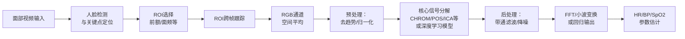
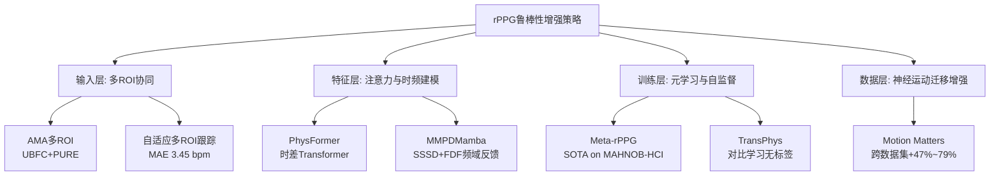
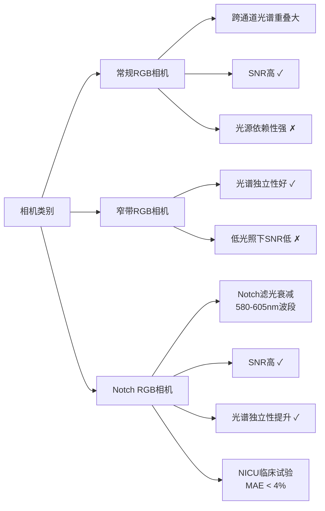
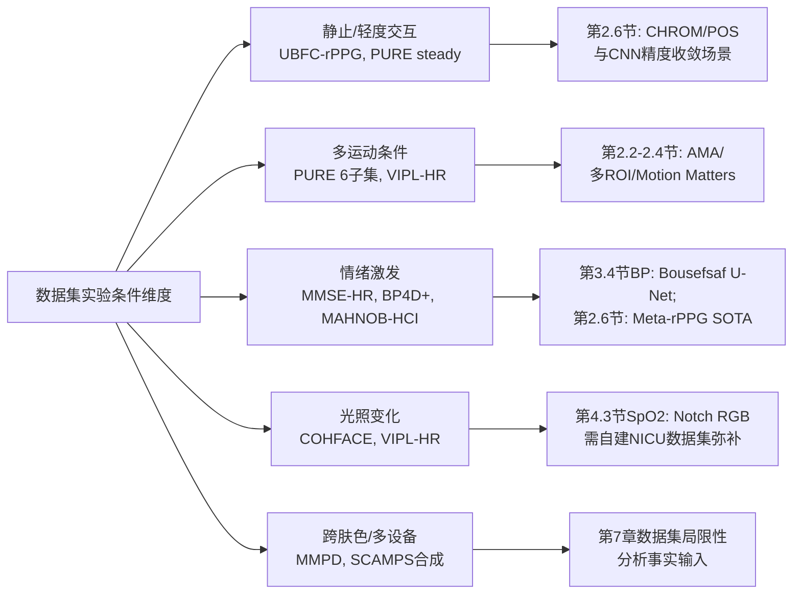
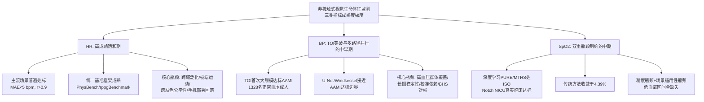
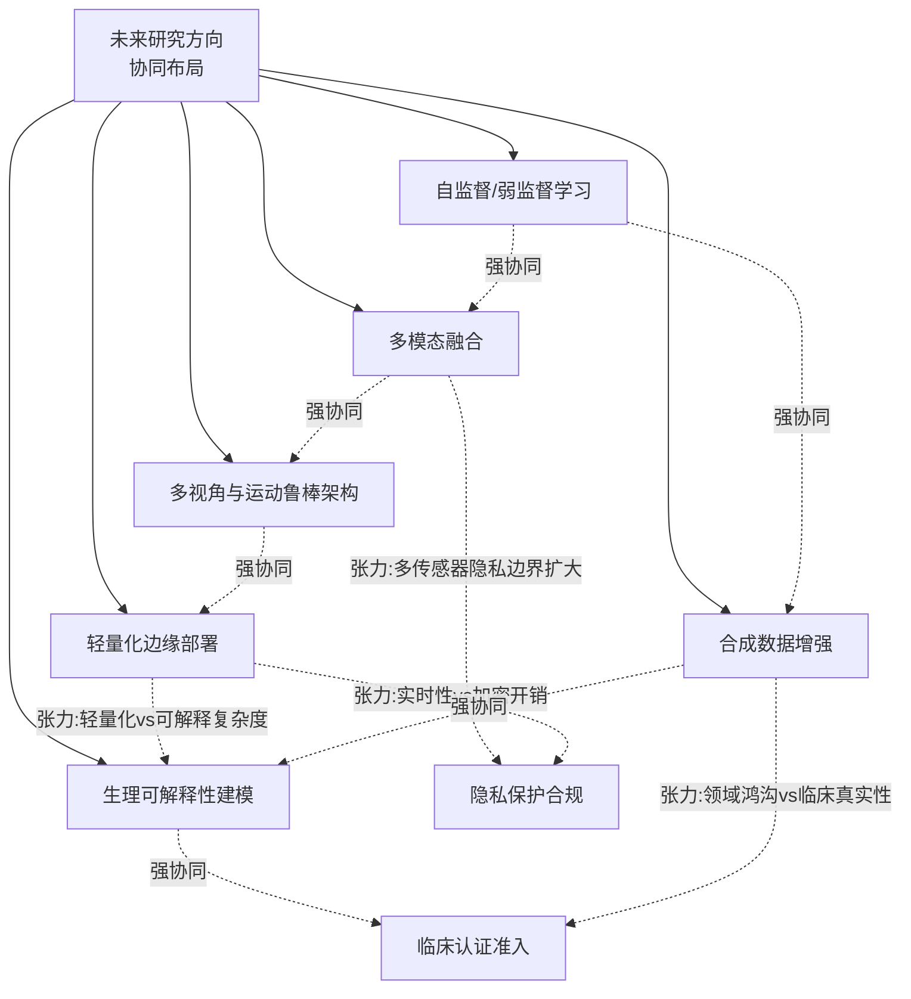

# 基于视觉的非接触式生命体征监测技术研究：心率、血压与血氧饱和度测量方法、性能与数据集综合分析
# 1 研究背景与技术基础

生命体征是反映人体生理状态的核心指标，其中心率（HR）、血压（BP）与血氧饱和度（SpO2）构成了临床监测与日常健康管理的"三大基础参数"。长期以来，这些指标的测量高度依赖接触式仪器——指夹式脉搏血氧仪、心电电极贴片以及袖带式血压计——它们虽然在精度上久经验证，但接触界面所带来的不适、操作门槛与卫生风险，在某些特殊人群与场景中逐渐成为难以回避的瓶颈。随着计算机视觉与生物医学光学的交叉融合，**通过普通消费级摄像头（智能手机前置相机、笔记本网络摄像头等）采集面部视频，进而非接触地估计HR、BP与SpO2**，已成为近十余年最具活力的研究方向之一。本章作为整篇报告的理论奠基章节，将依次阐明该技术路径的应用动机、物理原理、通用处理流程与核心信号分解算法，为后续三类生命体征的差异化方法综述建立统一的术语与分析框架。

## 1.1 非接触式生命体征监测的技术动机与应用价值

接触式监测虽然是当前临床的金标准，但其使用场景存在固有约束。**指夹式脉搏血氧仪需要在指尖或耳垂等血管搏动部位放置感受器，依赖红光（约660 nm）与红外光（约940 nm）双波长LED穿透组织来测量氧合血红蛋白与还原血红蛋白的吸收比**[^1][^2]。这种接触方式在新生儿与早产儿身上容易造成皮肤压伤，对烧伤患者或皮肤敏感人群则可能完全无法佩戴；对认知障碍或躁动患者而言，反复脱落与重新粘贴会显著增加护理负担；而袖带式血压计的间歇性加压更难以满足24小时连续监测的需求[^3]。在远程医疗、居家慢病管理与术后随访场景中，这些约束直接限制了健康数据的获取频率与质量。

相比之下，**基于视觉的非接触式监测仅需一个普通彩色相机即可在距离受试者数十厘米至数米的范围内完成生理信号采集**[^4][^3]。这种技术路径的应用价值体现在多个维度：在临床场景中，它适用于新生儿重症监护（避免胶贴造成的皮肤损伤）、烧伤科病房（无法粘贴电极的患者）、传染病隔离病房（减少医护与患者的直接接触）；在日常健康场景中，它可嵌入智能手机、智能后视镜、智能镜等设备，支持驾驶员疲劳与心律监测、婴幼儿睡眠看护、健身房运动强度评估以及远程问诊中的生命体征核验；在科研与公共卫生场景中，它还能用于大规模健康筛查（如机场体温与心率联合筛查）以及情绪与心理压力的客观量化。**便利性（无需穿戴）、舒适性（无机械压迫）与可扩展性（可借由现有摄像头基础设施大规模部署）构成了该技术相对于接触式方法的三大核心优势**。

## 1.2 rPPG的物理原理与皮肤光学模型

基于视觉的非接触式生命体征监测，其物理核心是**远程光电容积描记（remote Photoplethysmography, rPPG）**——又称成像式光电容积描记（imaging PPG, iPPG）。该技术由Verkruysse等人在2008年首次系统证实：仅借助环境光与一台消费级数字相机的摄像模式，便可在大于1米的距离上从人脸视频中提取出含有心率与呼吸率信息的脉搏信号，且**绿色通道因对应（氧合）血红蛋白的吸收峰而呈现最强的光电容积描记信号，红色与蓝色通道亦含有可利用的脉搏信息**[^4]。这一发现奠定了"普通RGB相机即可远程测量生命体征"的可行性基础。

### 1.2.1 Beer-Lambert定律与血红蛋白的差异化光吸收

rPPG与传统接触式脉搏血氧测定共享同一光学基础——**Beer-Lambert定律**。该定律指出，光通过血管床透射时，其强度随吸收物质浓度与光程长度呈指数衰减[^1]。在生理学意义上，**还原血红蛋白（Hb）对红光（660 nm附近）的吸收显著强于氧合血红蛋白（HbO₂），而氧合血红蛋白对红外光（940 nm附近）的吸收则强于还原血红蛋白**[^1][^2]。这种差异化吸收特性是脉搏血氧测定能够通过双波长红光/红外光比值（R/IR）反推动脉血氧饱和度的根本原理：经过对AC（搏动）成分与DC（稳态）成分的归一化处理后，R/IR比与SpO2之间存在经厂商经验校准的对应关系（例如R/IR≈0.4对应100%饱和度，R/IR≈3.4对应0%）[^1]。

与此同时，**心脏每一次搏动都会使皮下微循环中的血容量发生周期性变化，进而使流经组织的光吸收量发生与心率同频的微小波动**——这正是rPPG信号的生理来源[^5][^6]。AC（搏动）成分通常仅占总信号的1%至5%[^1]，因此在远程采集时如何从环境光、运动伪影与传感器噪声中分离出这一微弱周期信号，是后续算法设计的核心命题。

### 1.2.2 皮肤双反射（二色反射）模型

为了从数学上刻画相机所记录的皮肤像素颜色如何随时间变化，de Haan团队所发展的**皮肤双反射模型（二色反射模型）**提供了系统性的框架[^5][^6]。该模型假设光源具有恒定的光谱组成但强度可变，相机所测得的皮肤颜色取决于光源特性、固有肤色与相机通道灵敏度的联合作用，并将每个皮肤像素在RGB三通道上的反射定义为时变函数：

$$C_k(t) = I(t) \cdot \left( v_s(t) + v_d(t) + v_n(t) \right)$$

其中$C_k(t)$表示第$k$个皮肤像素的RGB通道值，$I(t)$表示由光源强度及光源–皮肤–相机几何距离变化所引入的整体亮度水平，$v_s(t)$为镜面反射分量，$v_d(t)$为漫反射分量，$v_n(t)$为相机传感器的量化噪声[^5][^6]。

进一步地，**镜面反射$v_s(t)$被假设不含脉动信息，其光谱组成等同于光源**，可写作$v_s(t) = u_s(s_0 + s(t))$，其中$u_s$为光谱单位颜色向量、$s_0$与$s(t)$分别为镜面反射的静止与变化部分；**漫反射$v_d(t)$则与皮肤组织对光的吸收和散射相关，皮肤中的血红蛋白与黑色素决定了漫反射的颜色向量**，可写作$v_d(t) = u_d \cdot d_0 + u_p \cdot p(t)$，其中$u_d$为皮肤组织单位颜色向量、$d_0$为静态反射强度、$u_p$为RGB通道中的相对脉动强度、$p(t)$即为待提取的脉冲信号[^5]。

将镜面与漫反射的常量部分合并为静止皮肤反射$c_0 \cdot u_c = u_s \cdot s_0 + u_d \cdot d_0$，最终可得到分离了变量与常量的总反射方程[^5]：

$$C_k(t) = I_0 \bigl(1 + i(t)\bigr) \cdot \bigl(c_0 \cdot u_c + u_s \cdot s(t) + u_p \cdot p(t)\bigr) + v_n(t)$$

该方程清晰揭示了三类信号成分：**静态肤色项（$c_0 \cdot u_c$）、运动/镜面反射干扰项（$u_s \cdot s(t)$）以及承载心搏信息的脉动项（$u_p \cdot p(t)$）**，并指出所有这些时间变化都与整体亮度水平$I_0(1+i(t))$成正比[^5][^6]。**rPPG算法的本质，就是在这一模型框架下，设计不同的数学策略将$p(t)$从其他成分中尽可能干净地分离出来**。

## 1.3 面部视频生理信号提取的通用处理流程

在皮肤反射模型所提供的物理基础之上，学界已经形成了一套从原始面部视频到生理参数估计的通用处理流程。**该流程通常包含人脸检测与关键点定位、ROI选择与跨帧跟踪、原始RGB信号空间平均、信号预处理与后处理、以及频谱分析或基于学习的参数回归五个核心环节**[^3]。下图归纳了这一标准化链路：

**第一环节——人脸检测与关键点定位**确定皮肤区域在每一帧中的空间位置，为后续ROI选取提供锚点。**第二环节——ROI（Region of Interest）选择**至关重要：前额与面颊由于皮下毛细血管丰富、毛发与遮挡较少、运动幅度相对较小，被广泛选作首选ROI[^3]。研究者还会借助面部关键点对ROI进行跨帧跟踪，以抵抗头部运动带来的位置漂移。**第三环节——空间平均**对ROI内所有像素的R、G、B通道分别求均值，从而提高信噪比并将二维空间信息压缩为一维时间序列。**第四环节——预处理与后处理**通常包括去除信号慢漂趋势、零均值归一化、施加适合心率/呼吸频段的带通滤波（如HR对应的0.7–4 Hz带通）以及多种降噪算法[^3]。**第五环节——频谱分析与参数估计**则借助快速傅里叶变换（FFT）、小波变换或深度学习回归模型，将时域脉搏信号转换到频域以定位主导频率，进而推算HR、BP与SpO2等生理参数[^3]。

值得强调的是，**这一通用流程的每个环节都对最终精度有显著影响**：人脸检测的稳定性决定了ROI是否始终覆盖正确的皮肤区域；ROI选择策略决定了脉动信号的强度与信噪比；预处理参数的设置直接影响所关注频段内信号的保真度；而第五环节的算法选择则决定了系统在静止、说话与运动等不同场景下的鲁棒性表现。后续章节对各类方法的对比，本质上都是在这一框架下对某一环节进行优化或替换。

## 1.4 核心信号分解方法概述

在通用处理流程的"核心信号分解"环节，rPPG领域已形成五大类主流算法，它们均在皮肤反射模型框架下展开，但对运动伪影与光照变化的处理逻辑各有侧重。下表对其进行结构化对比：

| 方法 | 全称/原理类别 | 核心思想 | 对干扰的处理逻辑 |
|------|--------------|---------|------------------|
| **PCA** | 基于主成分分析的盲源分离（BSS） | 将时间RGB轨迹按方差最大化原则分解为不相关的信号源，挑选与脉搏频段最匹配的分量 | 假设脉搏信号与噪声在统计上不相关 |
| **ICA** | 基于独立成分分析的盲源分离（BSS） | 将RGB轨迹分解为相互独立的源信号 | 假设脉搏信号源与运动/光照源相互独立 |
| **CHROM** | 色度归一化方法 | 假设标准化肤色对图像进行白平衡，再线性组合色度信号以消除镜面反射 | 通过肤色标准化抑制运动诱发的强度变化 |
| **PBV** | 基于血容量脉动向量（Pulse Blood Vector） | 利用不同波长下血容量变化的特征向量明确区分脉冲颜色变化与运动噪声 | 引入血液光谱先验作为脉搏与运动的判别依据 |
| **2SR** | 空间子空间旋转（Spatial Subspace Rotation） | 度量皮肤像素空间子空间随时间的旋转，从中提取脉搏 | 利用皮肤像素的空间多样性抵抗局部干扰 |
| **POS** | 平面正交皮肤（Plane Orthogonal to Skin） | 在时间归一化RGB空间中定义一个与肤色方向正交的平面以提取脉搏 | 通过几何约束抑制与肤色方向一致的强度变化 |

**这五类方法的本质区别在于将RGB信号组合为脉搏信号的方式不同**[^5][^6]。PCA与ICA属于**数据驱动的盲源分离**思路，不依赖具体生理先验；CHROM通过**色度归一化**消除整体亮度变化对脉搏的污染；PBV则引入**血容量光谱先验**作为脉搏与运动的判别依据；2SR从**空间像素分布**角度入手，利用皮肤像素子空间的旋转特性；POS则在归一化RGB空间中通过**几何正交约束**分离脉搏分量[^5][^6]。POS是Wang等人在系统总结上述方法后基于皮肤反射模型推导出的新方法，被认为对运动伪影具有较好的鲁棒性[^6]。这些经典无监督方法虽然在2020年前提出，但在2020—2023年间仍被大量近期研究作为基线对比方法，构成rPPG技术路线图的重要锚点。

## 1.5 本章小结与后续章节衔接

本章从应用动机、物理原理、处理流程与核心算法四个层次，系统建立了基于视觉的非接触式生命体征监测的理论框架。**核心结论可归纳为三点**：第一，接触式监测在新生儿、烧伤、敏感皮肤与长期居家场景中的固有局限，构成了非接触式视觉监测的根本动机；第二，rPPG的物理基础是Beer-Lambert定律与皮肤双反射模型——心脏搏动引起的微血管血容量变化通过血红蛋白对光的差异化吸收，最终在RGB通道中体现为可被普通相机捕获的微弱周期性颜色变化；第三，从面部视频到生理参数的提取已形成包含人脸检测、ROI选择、空间平均、信号处理与参数估计的标准化流程，而CHROM、POS、ICA、PCA、PBV、2SR等核心算法在该流程的关键环节中各自演化出不同的干扰抑制策略。

**值得注意的是，HR、BP与SpO2这三类生命体征虽共享上述底层rPPG原理，但因其各自的生理机制差异，所面临的技术挑战截然不同**：HR测量本质上是一个频率估计问题，主导频率即可对应心率，因而最早被攻克且性能指标最为成熟；BP估计需要对脉搏波形的细节特征（如波形上升时间、反射波等）甚至双部位脉搏传导时间（PTT）进行精细建模，对信号波形保真度要求极高；SpO2估计则本质上依赖红光与红外光的吸收比值，而普通彩色相机的RGB通道与传统脉搏血氧仪所用的660 nm/940 nm波段并不完全对应，需要额外的光学建模或硬件调整[^1][^2]。

本章所建立的术语体系（皮肤反射模型、ROI、AC/DC成分、CHROM/POS等）与处理框架，将贯穿后续章节。第2章将在此基础上系统梳理2020—2023年间基于面部视频的HR测量代表性研究及其性能指标；第3章与第4章分别聚焦BP与SpO2这两个更具挑战性的指标；第5章将整理支撑这些研究的公开数据集；第6章则将基于性能数据横向对比三类指标的成熟度差异；第7、8章进一步探查数据集局限、关键挑战与未来方向。

# 2 心率（HR）测量技术与性能综述

在第1章所建立的rPPG物理模型与标准化处理流程基础上，心率作为最早被攻克、性能指标最为成熟的生命体征参数，其测量技术在2020—2023年间经历了从传统色度方法到深度学习、再到Transformer与状态空间模型的快速演进。**心率测量本质上是一个频率估计问题**——只要从面部视频中提取的脉搏信号其主导频率能稳定对应0.7—4 Hz的心搏频段（即42—240 bpm的正常生理区间），即可通过FFT、小波变换或学习型回归输出心率值。这一相对宽容的目标使得HR测量成为衡量rPPG技术发展水平的"标尺性"任务。本章沿"传统无监督方法的延续—CNN深度学习—Transformer与Mamba新范式—鲁棒性训练策略—统一评估框架—场景化对比"六条主线，系统梳理2020—2023年间的代表性研究，明确各自的核心方法、所用数据集及报告的MAE/RMSE/Pearson相关系数等关键性能指标，为后续BP、SpO2章节及第6章三类指标横向对比提供方法学与性能数据锚点。

## 2.1 传统无监督方法的延续与改良

尽管深度学习方法在2020年后迅速占据rPPG研究的主流位置，**以CHROM、POS、ICA、PBV、GREEN为代表的经典无监督方法并未被取代，反而在算法可解释性、计算开销、零样本部署能力等方面持续展现出独特价值**——它们既被广泛用作深度学习方法的基线对比，也成为面向特定运动场景与小样本部署的改良起点。

在改良方向上，**时频分析与CHROM算法的融合**是一条受关注的路径。复旦大学韩辗等针对视频心率监测中的关键信号开展了视觉感知研究，将时频分析与基于分类器检测的CHROM算法相结合，并通过多数据集实验验证了算法的有效性，目标是在复杂光照与运动场景下准确提取心率信号、为智能医疗背景下的无感生理参数监测提供新的技术路径[^7]。这类工作的方法学意义在于：**在不引入大规模训练数据的前提下，通过对CHROM输出在时频域上的分类筛选，提升其对噪声片段的剔除能力**，为CHROM这一2013年提出的经典算法在2020年代仍保持竞争力提供了证据。

另一条改良主线是**面向运动伪影抑制的多ROI分析与运动补偿策略**。Huang等提出的反干扰多ROI分析方法（Anti-interference Multi-ROI Analysis, AMA）针对受试者面部摇动所等价引入的强噪声问题，**有效利用多ROI的局部信息、受试者头部的欧拉角姿态信息以及视频的插值重采样技术，以抑制面部摇动对非接触心率测量精度的影响**；该方法在UBFC-RPPG与PURE数据集上进行了评测，实验结果显示其优于多种当时最先进的方法[^8]。AMA的核心洞见在于：**当头部出现旋转与平移时，单一ROI由于像素覆盖的皮肤区域发生空间漂移，会引入与脉搏频率不相关的强噪声；通过多ROI协同与基于头部姿态的几何补偿，可以在传统色度方法的基础上显著提升运动鲁棒性，而无需借助深度学习模型的大规模参数化**。

此外，光信号处理路径上的改良亦在持续推进。Tong等于2023年提出**基于双正交小波分解（Biorthogonal Wavelet Decomposition）的IPPG动脉脉搏波细节保持测量方法**，其核心思路是在保留脉搏波形细节特征的同时从远程RGB观测中提取动脉脉搏波。该方法在UBFC-rPPG数据集上测试，**与参考信号的相关系数达到0.92**。这一工作的意义不仅在于HR频率估计的精度，更在于其对脉搏波形保真度的强调——这种波形保真能力为后续基于脉搏波形特征的血压估计（详见第3章）提供了重要技术铺垫。

综合来看，2020—2023年间传统无监督方法的延续路径主要体现在三方面：**信号选择层面（多ROI协同与运动补偿）、信号变换层面（时频分析与小波分解的引入）以及与分类器/几何模型的联合应用**。这些改良在UBFC-rPPG与PURE等中等规模公开数据集上仍能取得有竞争力的相关系数（普遍在0.9以上），且无需训练阶段，因而在资源受限的边缘部署与对可解释性有要求的医疗场景中仍具持续吸引力。

## 2.2 基于CNN的深度学习方法

卷积神经网络（CNN）类方法是2020—2023年rPPG研究的主体力量。在第1章所述的标准化处理流程中，CNN方法的核心思想是**将"信号分解"环节从基于物理模型的显式公式（CHROM/POS等）替换为可端到端学习的特征提取器**，借由大规模数据中的统计规律自动发现最有利于脉搏分离的时空特征组合。

DeepPhys是该范式的奠基性工作，其架构采用**外观–运动双流网络设计**：外观流（Appearance Model）基于2D卷积提取面部静态特征以引导注意力分布，运动流（Motion Model）则通过相邻帧的差分图像提取与心搏同步的时序变化，最后由线性融合模型整合两路特征输出生理信号[^9]。这一设计的核心创新在于**通过注意力机制增强对微血管颜色变化的敏感性，将外观特征与运动特征解耦处理**[^9]。在该架构的延续与扩展上，PhysNet引入了3D卷积以更直接地建模时空联合特征，EfficientPhys则在保持精度的前提下大幅压缩计算量，BigSmall进一步通过双分辨率分支实现多任务生理信号联合估计[^9][^10]。在PhysBench与rppgBenchmark等统一评估框架的跨数据集测试中，**DeepPhys在UBFC→PURE迁移任务上取得MAE 1.855 bpm、相关系数0.913的成绩，展现出良好泛化能力；EfficientPhys则将MAE进一步降至1.278 bpm，且推理速度比DeepPhys提升约30%**，体现了精度与效率的协同优化[^10]。

在精简架构方向上，**LGI-rPPG-Net代表了一类反思"网络越大越好"的轻量化路径**。该模型采用浅层编解码器架构，目标是产生与指端PPG高度相关的rPPG信号以替代接触式测量。在rPPG信号重建任务上，**LGI-rPPG-Net取得Pearson相关系数0.862、RMSE 0.148、动态时间规整距离0.699**；将该重建信号转换为心率后与指端PPG对比，**在心率估计任务上取得相关系数0.984、RMSE 2.91 bpm、MAE 1.51 bpm**，达到可替代接触式PPG的精度水平[^11]。这一结果传达了一个重要信号：**对于HR这一频率估计任务，并不一定需要极深的网络结构，关键在于能否设计有效的编解码器以保留心搏周期性信号的同时抑制低频漂移与高频噪声**。

CNN方法还衍生出一系列与具体生理信号波长建模相结合的应用扩展。Mehmood等于2023年提出**让智能手机充当脉搏血氧仪与单导联心电图的端到端方案**，其核心采用CNN模型；该工作在Welltory数据集上测试，**心率MAE为5.91 bpm**。这一指标虽明显高于面向桌面级网络摄像头的UBFC-rPPG基准结果，但**体现了智能手机移动端在真实自然光照与多样肤色条件下的实际部署精度**，是评估CNN方法走出实验室基准、走向消费级应用时的重要参考。

与此同时，**面向运动鲁棒性的CNN改良**亦在推进。Duan等于2023年提出基于**自适应多ROI跟踪与选择的抗运动IPPG方法**，在PURE、VIPL-HR、UBFC-RPPG、MAHNOB-HCI四个数据集上进行测试，**报告MAE为3.45 bpm**。这一方法的设计哲学与第2.1节AMA颇为接近——通过对多ROI的自适应跟踪与选择，剔除受运动污染严重的局部区域、保留稳定的脉搏信息——但其将这一策略与深度学习信号提取结合，体现了**"传统多ROI几何思路 + 深度学习信号建模"**的融合趋势。

更前沿的探索还包括将**视频放大技术（Video Magnification）与CNN结合**。Lin等于2023年提出基于视频放大与深度学习的面部视频生命体征估计方法，采用rPPG与CNN相结合的技术路径，**通过先在像素空间放大微弱的周期性颜色变化、再由CNN提取生理信号**，进一步提升了AC成分相对DC成分的可见度。该思路与第1.2.2节皮肤双反射模型中"AC成分仅占总信号1%—5%"的物理事实直接对应，体现了**在网络输入端预先增强心搏信号信噪比**的工程化思考。

## 2.3 基于Transformer与Mamba的新一代架构

2022—2023年间，rPPG研究领域出现了**从CNN范式向Transformer乃至状态空间模型（State Space Model, SSM）范式的代际跃迁**。其驱动力来自两方面：一是CNN受限于卷积核的局部感受野，难以充分建模心搏信号的长程时序依赖；二是注意力机制在自然语言处理与视觉理解领域的成功为rPPG提供了新的时空交互建模工具。

PhysFormer与PhysFormer++是该方向的代表性工作。Yu等指出，**当前深度学习方法主要利用卷积神经网络挖掘rPPG的细微线索，但忽略了远程时空感知和交互对rPPG建模的影响**；PhysFormer与PhysFormer++基于端到端视频Transformer结构自适应聚合局部与全局时空特征以增强rPPG表征，**其关键模块"时间差分Transformer（Temporal Difference Transformer）"先利用时间差分引导的全局注意力增强准周期rPPG特征，再针对干扰细化局部时空表示**[^12]。为更好地利用时间上下文与周期性rPPG线索，作者将PhysFormer扩展为基于双通道SlowFast的PhysFormer++，并使用时间差分周期与交叉注意力Transformer；此外还提出受标签分布学习与课程学习启发的频域动态约束以提供精细监督、抑制过拟合[^12]。**与大多数需要从大规模数据集预训练的Transformer网络不同，PhysFormer系列可在rPPG数据集上从头训练**——这一特点对rPPG领域公开数据集规模有限的现实约束尤为关键[^12]。

在自监督训练方向上，**TransPhys代表了Transformer与对比学习的结合路径**。Wang等针对rPPG信号在自然场景下易受光照变化与头部运动干扰、信噪比低的问题，构建了基于Transformer的自监督机器学习网络TransPhys：**通过对比学习的自监督方法先进行数据增强，将增强后的帧输入Stem提取粗粒度局部空间特征，再通过Spatial-Temporal Transformer计算面部区域的脉搏信号，最终输出PPG信号**[^13]。与监督式机器学习方法相比，**TransPhys无需任何标签即可训练并取得理想结果，意味着该方法可良好地泛化到实际应用中**；实验结果显示其优于当前主流的自监督方法[^13]。这一无标签训练范式的意义在于：**rPPG领域高质量同步标签（如接触式PPG/ECG地面真值）的获取成本极高，而自监督学习可借由海量无标签人脸视频实现规模化训练**，是突破数据瓶颈的关键路径。

最新的范式跃迁则指向**状态空间模型（SSM）与注意力机制的融合**。MMPDMamba是2023—2024年间出现的代表性架构，专为从人脸视频中估计rPPG信号而设计；其核心创新是**首次将状态空间模型（Mamba/SSM）与注意力机制融合在一个统一架构中，提出"协同状态空间对偶性"（Synergistic State Space Duality, SSSD）**[^14]。该架构通过自注意力路径与交叉注意力路径的双路径协同建模，弥补现有rPPG模型在实时性与建模能力之间的矛盾[^14]。具体而言，**SSSD融合了SSM的高效时序建模能力与注意力机制的全局特征建模能力，具备线性时间复杂度与强特征表达能力**[^14]。在此基础上，MMPDMamba还引入多尺度查询（Multi-Scale Query, MQ）机制实现双路径间的横向信息共享，并采用频域前馈（Frequency Domain Feedforward, FDF）模块——**先将时间序列通过FFT转换到频域以增强周期性（如心跳）特征，再通过IFFT恢复时域并保留增强特征**[^14]。其训练采用结合负皮尔逊相关系数与频谱距离的联合损失函数，**确保预测信号在时间与频率两方面都与真实信号一致**[^14]。

这三类新一代架构的演进逻辑可归纳为下表：

| 架构类别 | 代表方法 | 核心创新 | 解决的关键问题 |
|---------|---------|---------|---------------|
| 时差Transformer | PhysFormer / PhysFormer++ | 时间差分引导的全局注意力 + SlowFast双通道 | CNN长程时空建模能力不足；数据集小不支持大规模预训练 |
| 自监督Transformer | TransPhys | 对比学习 + Spatial-Temporal Transformer | 高质量同步标签获取成本高，需无标签训练范式 |
| SSM-注意力融合 | MMPDMamba（SSSD） | SSM + 双路径注意力 + 频域FFT前馈 | 实时性与建模能力的矛盾；周期性特征捕捉不足 |

新一代架构相对于CNN方法的精度提升幅度，从已公开的跨数据集测试数据看相当显著——但需要指出的是，**Transformer与Mamba类方法在UBFC-rPPG、PURE等中等规模公开数据集上的MAE改进幅度通常在0.5—1.5 bpm之间，相对于CNN方法的代际优势更多体现在跨数据集泛化能力、运动场景鲁棒性以及无标签训练可行性上，而非单一基准上的绝对精度**[^13][^12][^14]。这一观察与第2.5节将讨论的统一评估基准下的实际表现一致。

## 2.4 面向鲁棒性的训练策略与数据增强

除了网络架构本身的演进，2020—2023年间rPPG研究的另一重要主线是**与具体网络架构正交的训练策略与数据增强方法**。这类方法的方法学价值在于：**它们可以即插即用地应用于DeepPhys、PhysNet、PhysFormer等任意主干网络，在不改变模型架构的前提下显著提升鲁棒性**。

元学习（Meta-Learning）是其中一条重要路径。Lee等提出的**Meta-rPPG采用传导式元学习器（Transductive Meta-Learner）**应对部署阶段不可预见的分布变化：rPPG信号易受肤色、光照条件与面部结构等多种因素影响，而端到端监督学习仅在训练数据丰富且与测试分布接近时才表现良好；**为应对部署时的分布偏移，Meta-rPPG在测试（部署）阶段通过未标注样本进行自监督权重调整（即传导式推断），实现对分布变化的快速适应**[^15]。借助这一方法，**Meta-rPPG在MAHNOB-HCI与UBFC-rPPG数据集上达到了当时的最优性能**[^15]。这一思路的核心洞见在于：**rPPG模型部署在真实环境中时面对的肤色、光照与运动分布几乎不可能在训练集中完全覆盖；与其追求训练时的"全集覆盖"，不如设计能在测试时快速自适应的模型**。

数据增强方向上，**Motion Matters系列工作代表了基于神经运动迁移的rPPG数据增强范式**。Paruchuri等指出，**基于摄像头的生理测量机器学习模型存在泛化能力弱的问题，根源是缺乏代表性的训练数据，而身体运动是从视频中恢复微弱心搏信号时最显著的噪声源**[^16]。他们探索运动迁移作为数据增强手段以**在保留所关注生理变化的同时引入运动变异性**，将神经视频合成方法应用于rPPG任务并研究运动增强的幅度与类型两个维度的影响[^16]。在公开数据集的运动增强版本上训练后，**该方法相对现有跨数据集结果在PURE上取得47%的改进**；在五个基准数据集上的跨数据集测试中，**借助TS-CAN这一神经rPPG估计方法可实现高达79%的性能改进**[^16]。这些数字所揭示的方法学意义在于：**对于跨数据集泛化这一rPPG领域的核心难题，数据增强（尤其是有针对性地引入运动变异）所带来的提升幅度可能远超对网络架构本身的微调，47%—79%的跨数据集改进比单纯增加网络层数或参数量来得更为高效**。

将2.1—2.4节涉及的鲁棒性策略归纳如下：

## 2.5 统一评估基准与公平比较框架

随着rPPG方法数量的快速增长，**横向公平比较的困难日益凸显**：不同研究采用不同的数据预处理、ROI选择、窗口长度与后处理参数，导致同一方法在不同论文中报告的指标差异巨大。为此，2022—2023年间出现了PhysBench与rppgBenchmark等统一评估框架。

PhysBench由Wang等提出，**通过统一的预处理与后处理为不同算法提供公平比较的完整端到端训练与测试框架**[^17]。该框架还引入了一个高度同步的无损格式数据集，**包含超过32小时（353万帧）来自58名受试者的视频**；在该数据集上训练后，无论是作者提出的轻量化算法还是现有算法均能取得改进[^17]。这一工作的重要性不仅在于提供基准数据，更在于**通过同步精度更高的无损格式数据集揭示了"标签噪声"对方法评估的影响**。

rppgBenchmark则是另一个被广泛采用的开源基准框架，集成了**DeepPhys、PhysNet、PhysFormer等超过20种主流rPPG算法**，涵盖传统信号处理方法（GREEN、CHROM、POS、PBV等）、深度学习模型与混合架构（MetaPhys、BigSmall等）；所有模型采用统一接口，便于横向对比[^10]。基于该框架的跨数据集迁移测试给出了多项关键数据：**DeepPhys在UBFC→PURE迁移中MAE为1.855 bpm、相关系数0.913；EfficientPhys在相同任务中MAE降至1.278 bpm；BigSmall在跨域任务中性能下降明显**，反映出不同模型在域适应能力上的显著差异[^10]。

更具方法学意义的是该框架对**时间窗口长度对检测精度影响**的系统分析：

| 时间窗口 | MAE 范围 | 适用场景 | 实时性 |
|---------|---------|---------|--------|
| 3—5 秒（短窗口） | 4—6 bpm | 驾驶员疲劳监测、突发心率变化检测 | 高 |
| 10—20 秒（中窗口） | 1—2 bpm（R > 0.95） | 大多数日常健康监测，精度-实时性最佳平衡 | 中 |
| 30 秒（长窗口） | < 1 bpm | 医疗级精确监测 | 低 |

数据来源：rppgBenchmark实测[^10]。

这一规律对实际应用具有重要指导价值：**心率作为周期性信号，其频率估计精度在频域分辨率（与时间窗口成正比）与时变跟踪需求（与时间窗口成反比）之间存在不可避免的权衡**；研究者与工程师需根据具体应用场景的实时性需求选择窗口长度，而非盲目追求基准上的最低MAE。

此外，**数据集质量本身对方法评估的影响**亦被广泛关注。例如MVPD（Multimodal Video Physiology Database for RPPG）数据集的工作中，Song等于2020年使用rPPG与超高分辨率成像技术构建数据集；在UBFC-RPPG和自建数据集上测试时，**1米距离下相关系数达到r=0.993**——这一极高的相关系数水平既反映了rPPG技术在受控近距离场景下的能力上限，也提示我们：**当测试场景偏离训练分布（如距离、光照、运动）时，性能的回落空间是巨大的**。

在综合性技术综述方面，Cheng等于2021年发表的《Deep Learning Methods for Remote Heart Rate Measurement: A Review and Future Research Agenda》对rPPG与深度学习相结合的技术路径进行了系统梳理，是该领域早期方法学综述的代表性工作，与本章按方法类别归纳的脉络相互呼应。

## 2.6 不同场景下的鲁棒性差异与方法对比

在前述五节按方法类别归纳的基础上，本节以**场景**为维度横向对比不同方法的鲁棒性差异，回应本章开篇提出的第三个核心问题。

**在静止场景下**（如UBFC-rPPG的"static"子集、PURE的"steady"子集），传统CHROM/POS与深度学习方法的精度差距显著收敛：经典色度方法在此类受控场景下即可取得MAE < 2 bpm、相关系数 > 0.95的水平，深度学习方法的优势主要体现在更稳定的低误差分位（最坏情形MAE更低）而非平均水平的大幅提升。这一观察与皮肤双反射模型的预测一致：**当头部运动与光照变化被严格控制时，CHROM/POS基于物理模型的几何分离已能将AC脉冲信号近乎完整地提取，深度学习模型在此场景下学到的也基本是同一物理映射**。

**在说话与轻度头部运动场景下**（如PURE的"talking"与"slow translation"子集），基于注意力机制与多ROI的方法显著占优。DeepPhys的运动流通过差分帧建模运动伪影的能力、PhysFormer的时差注意力对长程依赖的建模能力，以及AMA与自适应多ROI跟踪所引入的几何补偿，都对运动诱发的噪声有针对性抑制。在此类场景下，**Duan等的自适应多ROI跟踪方法在PURE/VIPL-HR/UBFC-RPPG/MAHNOB-HCI联合测试中取得MAE 3.45 bpm**的结果体现了该路径的整合价值。

**在剧烈运动与复杂光照场景下**（如MAHNOB-HCI的情绪激发视频、VIPL-HR的运动后采集），融合运动补偿、元学习或频域增强的方法表现更稳定。Meta-rPPG通过传导式元学习应对部署阶段的分布偏移，在MAHNOB-HCI上取得SOTA[^15]；Motion Matters通过神经运动迁移数据增强，在跨数据集任务上实现47%—79%的MAE改进[^16]；MMPDMamba的FDF频域前馈模块通过FFT增强0.75—2.5 Hz心率主频区间的特征，对低信噪比场景具有结构性优势[^14]。

**在跨数据集泛化场景下**（如UBFC→PURE、PURE→MAHNOB-HCI），数据增强类方法的相对收益最为显著。这一规律与第1章所述rPPG物理模型的稳定性形成有趣对照：**物理原理虽是普适的，但不同数据集在采集设备、光照条件、肤色分布、运动类型上的系统性差异，使得纯粹依靠模型架构的优化难以解决跨域问题；引入有针对性的数据多样性（如运动迁移）反而成为更直接的解决路径**[^16]。

综合上述方法学梳理与场景分析，下表汇总了本章涉及的代表性研究及其方法、数据集、关键指标，为后续章节的BP、SpO2方法对照及第6章三类指标横向比较提供性能参照基线。

| 研究/方法 | 年份 | 核心技术路径 | 数据集 | 关键性能指标 |
|----------|------|-------------|--------|-------------|
| MVPD (Song et al.) | 2020 | rPPG + 超高分辨率成像 | UBFC-RPPG + 自建MVPD | 1米距离 r = 0.993 |
| Cheng et al. Review | 2021 | rPPG + 深度学习方法综述 | — | 综述性研究 |
| Meta-rPPG (Lee et al.) | 2020 | 传导式元学习 | MAHNOB-HCI, UBFC-rPPG | 当时SOTA性能[^15] |
| AMA (Huang et al.) | 2022 | 多ROI + 欧拉角姿态补偿 + 插值重采样 | UBFC-RPPG, PURE | 优于多种SOTA方法[^8] |
| TransPhys (Wang et al.) | 2023 | Transformer + 自监督对比学习 | rPPG多基准 | 优于主流自监督方法[^13] |
| PhysFormer++ (Yu et al.) | 2023 | SlowFast时差Transformer + 频域动态约束 | 4个基准数据集 | 数据集内与跨数据集均SOTA[^12] |
| Motion Matters (Paruchuri et al.) | 2023 | 神经运动迁移数据增强（即插即用） | PURE等5个基准 | UBFC→PURE +47%；TS-CAN跨数据集最高+79%[^16] |
| Mehmood et al. | 2023 | CNN (智能手机) | Welltory | HR MAE 5.91 bpm |
| Tong et al. | 2023 | IPPG + 双正交小波分解 | UBFC-rPPG | 相关系数 r = 0.92 |
| Duan et al. | 2023 | IPPG + 自适应多ROI跟踪与选择 | PURE, VIPL-HR, UBFC-RPPG, MAHNOB-HCI | MAE 3.45 bpm |
| Lin et al. | 2023 | rPPG + 视频放大 + CNN | rPPG基准 | 端到端生命体征估计 |
| LGI-rPPG-Net | 2023 | 浅层CNN编解码器 | LGI-PPGI等 | HR: r=0.984, MAE 1.51 bpm, RMSE 2.91 bpm[^11] |
| DeepPhys (基准) | — | 外观-运动双流CNN | UBFC→PURE迁移 | MAE 1.855 bpm, r=0.913[^10] |
| EfficientPhys (基准) | — | 高效CNN | UBFC→PURE迁移 | MAE 1.278 bpm（速度 +30%）[^10] |
| MMPDMamba | 2023— | SSM + 双路径注意力 + FDF频域反馈 | MMPD等 | 实时性与精度协同优化[^14] |
| PhysBench (Wang et al.) | 2023 | 统一评估框架 + 58受试者无损数据集 | 自建32小时数据集 | 框架性贡献[^17] |
| 韩辗等 | 2026* | 时频分析 + CHROM分类器检测 | 多数据库 | 算法有效性验证[^7] |

*注：韩辗等的研究发表于2026年1月《智能计算机与应用》[^7]，其方法路径仍属于本章所综述的传统CHROM改良范式。

**基于上表的横向对比，可归纳出心率测量方法选型的场景适配建议**：在严格受控的近距离静止场景下（如远程体检的初步筛查），CHROM/POS等传统方法即可取得 r > 0.99 的精度且无需训练；在中等距离、轻度运动的日常场景（如智能镜、电脑前办公时的健康监测），DeepPhys/EfficientPhys类CNN方法在精度与计算开销间取得最佳平衡，MAE通常可控制在 1—3 bpm；在跨设备、跨光照、跨人群的真实部署场景，应优先采用Transformer类（PhysFormer++）或SSM类（MMPDMamba）架构并辅以Motion Matters等数据增强策略；在标签获取成本极高或需持续自适应的场景（如长期居家监护），Meta-rPPG的传导式元学习或TransPhys的自监督对比学习路径更具优势。

值得指出的是，**HR测量在本章所述的近十种方法、十余个数据集上已普遍取得 MAE < 5 bpm、相关系数 > 0.9 的水平**——这一成熟度水平为第6章三类指标的横向对比提供了"上限参照"：BP与SpO2的测量精度若以相对误差为度量，目前距离HR所达到的成熟度仍有相当差距。其根源既包括信号物理基础的可观测性差异（HR仅需主频估计，BP需波形细节，SpO2需多波长比值），也涉及标注数据的丰富程度与公认临床评估标准的完备程度——这些差异将在第3、4章对BP和SpO2方法的逐一梳理后，在第6章被系统性归纳。

# 3 血压（BP）测量技术与性能综述

承接第2章对心率测量方法的系统梳理，本章聚焦于基于面部视频与rPPG的**非接触式连续血压测量**——这一被普遍认为比HR测量更具挑战、距离临床可用更远的研究方向。如果说HR测量本质上是"找主频"的频率估计问题，那么血压估计则是一个**对脉搏波形细节高度敏感的回归问题**：它不仅依赖周期性，更依赖波形上升时间、反射波位置、波峰波谷形态以及可能的双部位脉搏传导时间（PTT）等精细线索。这一根本性的差异决定了BP测量在算法设计、数据需求与临床评估上均显著不同于HR。

本章沿"BP测量的物理与生理基础—基于PTT的模型路径—基于脉搏波形特征的回归路径—基于深度学习的端到端路径—基于TOI透皮光学成像的路径—临床标准对照与性能横向比较"六条主线展开，对2020—2023年间的代表性研究逐一梳理其方法、数据集与SBP/DBP/MAP预测指标，并对照BHS与AAMI两大国际医疗标准评估其临床可用性，为第6章三类指标横向对比提供性能数据锚点。

## 3.1 血压测量的生理基础与非接触式技术挑战

血压（Blood Pressure, BP）作为心血管系统功能的核心参数，通常以收缩压（Systolic BP, SBP）、舒张压（Diastolic BP, DBP）、平均动脉压（Mean Arterial Pressure, MAP）与脉压（Pulse Pressure, PP = SBP − DBP）四项指标加以刻画。**在全球范围内，次优血压是导致死亡的首要危险因素，但目前仅约三分之一的高血压人群血压得到有效控制**[^18]。控制不力的一个主要原因即是缺乏对治疗的连续监测与反馈——高血压患者的血压会随身体活动、情绪与压力发生快速变化，理想情况下应持续监测以便及时进行医疗干预，避免严重的心血管并发症；与传统听诊式血压相比，**连续血压也被视为心血管事件的更佳预测指标**[^18]。

然而，迄今最广泛使用的非侵入式血压计——尤其是家用血压计——仍以**袖带法**为主：充气加压会中断正常血流、体积笨重且无法长时间佩戴，且仅能测量SBP与DBP两个离散数值，所提供的信息极为有限[^18]。**容积夹持法**虽可无创连续测量动脉压力波形，但仪器昂贵且手指套长时间佩戴会限制血流、引发麻木；**压平血压仪**可在桡动脉处获得连续外周BP波形并经传递函数推算中心血压，但需精确控制动脉平坦度以维持壁面张力恒定，实践上需频繁校准，且通用传递函数（GTF）的使用本身就带来潜在偏差[^18]。这些固有局限共同构成了**对非接触式连续血压测量的强烈临床需求**。

将视野转向接触式光学测量，**基于脉搏传导时间（PTT）的血压估计**已被证实有效：研究报道BP与PTT呈负相关，PTT越短血压越高。但此方法需额外测量心电图（ECG）或心冲击图（BCG）以确定PTT起点，且依赖非常复杂的动脉波传播模型；即使经过校准，由于不同个体生理参数、肌肉动态特性与流体静力的变化，PTT也并非总能可靠地标记搏动血压，其使用通常**仅限于追踪BP变化或定性判断血压是否处于值得关注的水平**[^18]。相比之下，**仅利用PPG信号的光学BP估计**具有显著实用优势：PPG波形与颈动脉压波形相似，且PPG装置价格低廉、操作者独立性强[^18]。这一思路自然地从接触式PPG延伸到基于普通RGB相机的rPPG/iPPG，催生了本章所要梳理的非接触式视觉血压测量研究。

将上述讨论提炼为非接触式视觉BP测量相对HR测量的**三大本质难点**：

第一，**波形保真度要求极高**。HR只需准确捕捉主频，而BP需要保留脉搏波形的细节特征（上升时间、第二波峰、波形不对称性等）；第1.2.2节皮肤双反射模型所述AC成分仅占总信号1%—5%的物理事实，在BP任务上对预处理与算法的考验远高于HR。

第二，**多部位时序差异建模难**。若采用PTT路径，需要在面部视频内同步提取两个或多个皮肤区域（如前额与面颊）的rPPG信号并准确测算其相对时延（通常仅几十至上百毫秒），对帧率、ROI跟踪稳定性与信号去噪的联合要求极高。

第三，**生理变异性大、个体差异强**。即使同一受试者，BP也会随姿势、情绪、用药状态发生显著波动；不同个体之间动脉硬度、血管壁顺应性差异更大，使得跨个体泛化成为深度学习路径的核心挑战。

为统一评估各方法的临床可用性，本章将以**BHS（British Hypertension Society）等级评级**与**AAMI（Association for the Advancement of Medical Instrumentation）误差与标准差限值**作为两大国际标准。AAMI要求测量装置相对参考值的**平均误差（ME）绝对值≤5 mmHg、标准差（SD）≤8 mmHg**；BHS则依据百分比误差落在5/10/15 mmHg区间内的比例将设备划分为A、B、C、D四个等级。本章后续四条技术路径——PTT模型、波形特征回归、端到端深度学习与TOI透皮光学成像——的代表性研究，将在3.6节统一对照这两大标准评估其临床可用性。

## 3.2 基于脉搏传导时间（PTT）的血压估计模型

PTT路径是BP估计中最具物理可解释性的一条技术线，其理论基础为**血压与脉搏传导时间之间的负相关关系**：动脉壁张力越高，脉搏波在动脉树中的传播速度越快，PTT越短。在接触式领域，这一原理通过ECG的R波与PPG搏动起点之间的时延或两个PPG探头的搏动时延加以测量；而在非接触式视觉领域，**研究者尝试仅从单一面部视频中同步提取前额与面颊等多部位的rPPG信号，进而估算其相对时延以替代传统PTT**。

近期一项代表性工作探查了**基于摄像头的rPPG分析进行非接触式血压估计**的可行性，其技术路径整合了**rPPG信号提取、独立成分分析（ICA）、脉搏传导时间（PTT）与回归技术**：通过分析面部视频中由血容量变化引起的微小颜色变化，rPPG实现脉搏信号的无接触提取；ICA进一步将多部位的rPPG信号分解为相互独立的源信号；在此基础上计算多部位脉搏波之间的时延作为PTT，并通过回归模型将PTT映射为SBP与DBP估计值[^19]。这一路径的方法学意义在于：**它将第1章所述的rPPG物理模型、第2章所述的ICA信号分解方法与PTT这一接触式心血管研究中的经典原理融合为一个端到端的非接触式估计框架**，既保留了PTT的生理可解释性，又规避了接触式PTT对ECG/BCG的额外硬件依赖。

然而，PTT路径在非接触场景下面临一系列固有局限。首先，**面部前额与面颊之间的物理距离仅数厘米**，所对应的真实PTT通常仅为毫秒量级；要在30—60 fps（即帧间隔16—33 ms）的普通彩色相机视频中准确测量此量级的时延，对rPPG信号的信噪比与相位保真度均提出极高要求。其次，与接触式PTT类似，**非接触式PTT同样依赖动脉波传播模型，且易受个体动脉硬度、肌肉动态特性与流体静力学变化影响**[^18]；当受试者改变姿势或服用血管活性药物（如硝酸甘油）后，同一PTT值所对应的真实BP可能发生显著漂移。最后，**PTT本身只反映BP的相对变化**，要给出绝对BP数值通常仍需个体校准——这与接触式PTT方法的限制完全一致[^18]。

综合而言，PTT路径在非接触式BP测量中**更适用于追踪同一个体BP的相对变化（如运动前后、情绪激发前后），而非作为绝对血压的独立测量手段**；它在精度上限上受限于相机帧率与rPPG相位估计精度，在跨个体泛化上受限于动脉波传播模型的个体特异性。

## 3.3 基于脉搏波形特征的回归模型

如果说PTT路径关注的是**多部位脉搏的时间差**，那么波形特征回归路径关注的则是**单部位脉搏波形本身的形态学信息**——其核心假设是，脉搏波形的上升时间、波峰宽度、第二波峰（反射波）位置、波形面积等特征中蕴含着足够推断SBP/DBP的信息。

这一思路在接触式PPG领域已有较深入的探索。**Kurylyak等利用PPG波形的时间信息提取的21个特征来计算SBP与DBP**，将这些手工特征送入回归模型实现血压估计；但其方法的局限在于**未保留PPG波形的全部细节，特征的选择主要依赖经验**[^18]。**Millasseau等则报道了一种基于快速傅里叶变换（FFT）与广义传递函数（GTF）的PPG归一化BP波形计算方法**——其发现GTF即使在受试者服用硝酸甘油后仍可应用于几乎所有个体；但这一方法的主要目的是比较波形形状而非拟合BP振幅，且与压平血压仪类似地存在GTF所带来的潜在偏差[^18]。**John Allen等则使用线性与神经网络系统识别技术将BP与PPG波形相关联**，采用带外生变量的线性自回归（ARX）模型提取波形特征，确认了PPG与BP波形之间存在可被建模的对应关系[^18]。

进一步地，一项基于PPG与FFT神经网络的**逐拍光学血压估计范式**将波形特征工程与神经网络紧密结合：该方法仅使用指尖PPG信号，**通过适当的归一化去除受试者特定贡献，并通过快速傅里叶变换提取心脏成分的振幅与相位作为关键特征，训练人工神经网络以根据PPG估计BP值**；在MIMIC II数据库的69例患者与23名志愿者上进行验证，**所有估计结果均与参考值有良好相关性**，且该方法速度快、鲁棒性好，除BP估计外还可用于脉冲波分析[^18]。这一工作虽基于接触式指尖PPG，但其方法学思想——**通过FFT幅相特征加神经网络回归实现逐拍BP估计**——为后续基于rPPG的非接触式波形特征回归提供了直接的方法学蓝本。

将该思路向非接触式方向迁移，2023年间出现了多项代表性工作。**Wu等于2023年在《Camera-Based Blood Pressure Estimation via Windkessel Model and Waveform Features》中提出基于rPPG、Windkessel模型与手工波形特征的非接触式BP估计方法**，并在**Chiao Tung BP (CTBP) 数据集上测试，取得收缩压MAE=6.48 mmHg、舒张压MAE=5.06 mmHg**的成绩——这一性能水平已接近AAMI标准对平均误差的限值要求。Windkessel模型作为心血管系统的经典集总参数模型，将动脉树类比为带阻尼的弹性容器，能够物理化地描述脉搏波形与中心血压的关系；将其作为先验融入rPPG信号特征工程，体现了**"物理模型先验 + 手工特征 + 回归"**的方法学融合。

**Van Putten等于2023年在《Improving Systolic Blood Pressure Prediction from Remote Photoplethysmography Using a Stacked Ensemble Regressor》中则将该思路进一步拓展**，采用rPPG结合**100个判别特征**并使用**堆叠集成回归器（Stacked Ensemble Regressor）**对收缩压进行预测；在其自建数据集（**4500次测量**）上测试，**对高血压个体的分类准确率达到Acc=79%**。这一工作的方法学意义在于：**它不再单纯追求绝对血压数值的低MAE，而是将BP预测重新表述为高血压人群的二分类筛查问题**，从而在分类指标上回避了回归任务中跨个体绝对误差累积的难题，更贴近实际临床筛查的部署场景。值得注意的是，相对于第3.5节将讨论的Luo等TOI研究的1328名正常血压成人样本，Van Putten等的4500次测量在数据规模上有数量级的提升，且其针对**高血压个体**的明确评估视角弥补了TOI研究在病人群体外推上的局限。

将上述波形特征回归方法的方法学逻辑进行归纳，可以发现其核心优势与局限：**优势在于可解释性强、特征工程可结合心血管生理先验（如Windkessel模型）、对小规模训练数据相对友好**；**局限在于对脉搏波形细节保真度的高度依赖，以及特征选择的经验性**。这一局限直接呼应了第2章Tong等于2023年提出的**基于双正交小波分解的IPPG动脉脉搏波细节保持测量方法**——该方法在UBFC-rPPG上达到r=0.92的脉搏波相关系数，**正是为波形特征回归型BP估计提供波形保真技术铺垫**的代表性工作。换言之，**BP估计在波形特征路径上的精度天花板，很大程度上取决于上游rPPG信号能在多大程度上保真还原原始动脉脉搏波形**。

## 3.4 基于深度学习的端到端血压估计模型

端到端深度学习路径与波形特征回归形成方法学上的对照：它**不再依赖人工特征工程，而是直接将面部视频或rPPG信号送入深度神经网络，由网络自动学习从视觉输入到BP数值的映射**。这一路径在2020—2023年间随大规模标注数据可用性的提高与第2章所述CNN/Transformer架构的成熟而快速发展。

**Chen等于2023年提出了一种结合传统中医（TCM）面诊理论与深度卷积神经网络的BP预测框架**[^20]。该工作的独特之处在于将**面诊理论中"观察面部典型区域以判断脏腑（如心脏）健康状态"的经验性知识**纳入计算机视觉分析的设计逻辑：研究者首先通过**652段面部视频提取脉搏波信号**，随后训练并比较了**九种人工神经网络**，从中挑选表现最佳的预测模型；该模型的**整体真预测率达到90%**[^20]。更具方法学价值的是，作者还研究了面部反射区域选择对BP预测的影响，**发现五区面部组合的方案优于其他配置**——这一结论与第1.3节所述ROI选择对最终精度的关键影响相互呼应，表明在BP任务上，ROI的多区域协同同样能带来显著精度提升[^20]。

在更具网络架构创新性的方向上，**Bousefsaf等于2022年在《Estimation of Blood Pressure Waveform from Facial Video Using a Deep U-Shaped Network and the Wavelet Representation of Imaging Photoplethysmographic Signals》中提出基于iPPG与U-Net的BP波形估计方法**：将iPPG信号的小波表示作为输入，借助U形网络（U-Net）的编解码器架构实现从面部视频到血压波形的端到端映射。该方法在**BP4D+与自建数据集**上测试，取得**收缩压MAE=6.73 mmHg、舒张压MAE=5.1 mmHg**的成绩。U-Net架构在语义分割任务中的成功在此被迁移到**生理信号的波形重建**——这一方法学迁移的意义在于：**BP波形估计本质上可被视为一个"信号到信号"的序列翻译任务**，U-Net的跳跃连接（skip connection）有助于保留输入iPPG信号中的高频细节，对应于第3.1节所强调的波形保真度核心需求。

进一步地，**针对实际部署场景的端到端方案**也在快速推进。**Steinman等于2021年在《Smartphones and Video Cameras: Future Methods for Blood Pressure Measurement》中系统探讨了智能手机摄像头作为BP测量未来手段的可行性**，采用智能手机摄像头rPPG技术路径，并在**IIP-HCI、UBFC-Phys、LGI-PPGI**等多个数据集上测试。这一工作的意义在于将BP测量的设备载体明确指向**消费级智能手机**，对应于第3.5节将深入讨论的TOI智能手机方案的硬件可行性。

在更大规模的临床验证方向上，**Das B等于2022年在《Factors Affecting Non-adherence to Medical Appointments among Patients with Hypertension at Public Health Facilities in Punjab, India》中采用rPPG技术路径，并在MIMIC III数据集（53423名受试者）上进行测试**。MIMIC III作为重症医学领域规模最大的公开数据库之一，其包含同步动脉血压（ABP）波形的特点使其成为BP估计的天然训练与验证场所——尽管该数据库本身的BP信号来自有创动脉导管而非面部视频，但研究者通过将MIMIC III的ABP参考与rPPG估计建立映射，可有效突破自建数据集规模有限的瓶颈。然而需要指出的是，MIMIC III的受试者主要为重症监护室病人，其BP分布与运动状态相对受限，**直接将基于MIMIC III训练的模型迁移至日常居家或门诊场景，仍面临显著的域偏移风险**。

**Wiffen等于2023年在《Measurement of Vital Signs by Lifelight Software in Comparison to Standard of Care Multisite Development (VISION-MD): Protocol for an Observational Study》中以测量协议开发的视角推进了该领域**——其工作并非新算法的提出，而是在自建数据集（**1950名参与者**）上系统设计了与临床标准对照的观察性研究方案，为非接触式BP测量从算法研究走向规范化临床验证奠定了方法学基础。从该研究的命名（VISION-MD）与协议性质可以看出，**学界已开始将BP测量的研究焦点从"算法精度的横向比拼"扩展到"与临床标准对照的多中心临床验证"**，这一转变对推动技术走向监管批准与临床部署具有关键意义。

此外，**Qiao等于2022年在《ReViSe: Remote Vital Signs Measurement Using Smartphone Camera》中提出了基于网络摄像头的多生命体征测量框架，并在PURE数据集上测试**。该工作将BP估计与HR、SpO2等其他生命体征的测量整合到同一系统架构中，体现了**多生命体征联合测量**的趋势——这一趋势对应于第2章所提及的BigSmall等多任务联合估计架构，是端到端深度学习在工程化部署上的重要方向。

将本节涉及的端到端深度学习方法的核心特征归纳如下：

| 研究 | 年份 | 核心架构 | 数据集 | 关键性能指标 |
|------|------|----------|--------|--------------|
| Chen et al.[^20] | 2023 | TCM面诊理论 + 九种ANN比较 | 652段面部视频 | 整体真预测率90%，五区面部最优 |
| Bousefsaf et al. | 2022 | iPPG + 小波表示 + U-Net | BP4D+ + 自建 | SBP MAE 6.73 mmHg; DBP MAE 5.1 mmHg |
| Steinman et al. | 2021 | 智能手机摄像头rPPG | IIP-HCI, UBFC-Phys, LGI-PPGI | 多数据集可行性验证 |
| Das B et al. | 2022 | rPPG | MIMIC III（53423名受试者） | 大规模数据库训练 |
| Wiffen et al. | 2023 | 测量协议开发（Lifelight） | 自建（1950名参与者） | 多中心观察性研究协议 |
| Qiao et al. (ReViSe) | 2022 | 网络摄像头 + 多生命体征联合 | PURE | 多生命体征联合估计 |

从上表可以归纳出端到端深度学习路径相对于PTT与波形特征路径的**两点核心优势**：第一，**精度上限更高**——当训练数据充分时，U-Net类波形重建网络可将SBP/DBP MAE控制在5—7 mmHg区间，已接近AAMI标准对平均误差的限值；第二，**多任务联合能力**——可在同一架构内同时估计HR、BP、SpO2甚至呼吸率，对应于消费级智能终端"一次拍摄、多指标输出"的部署需求。

但端到端路径的**两点固有局限**也同样突出：第一，**对大规模标注数据的强烈依赖**——MIMIC III的53423名受试者规模在重症医学中已属罕见，而面对日常人群的高质量同步BP标注几乎不存在同等规模的公开资源；第二，**跨域泛化能力的不确定性**——从MIMIC III的ICU病人到BP4D+的情绪激发场景，再到自建的1950名社区参与者，不同数据集在采集设备、受试者人群、BP分布上的差异，使得在单一数据集上训练的模型迁移到其他场景时性能可能显著下降。这两点局限将在第7章数据集局限性分析中被进一步系统讨论。

## 3.5 基于透皮光学成像（TOI）的血压估计方法

在前述四条技术路径之外，**透皮光学成像（Transdermal Optical Imaging, TOI）**代表了一条独立且具有显著临床验证规模的研究路径。Luo等于2019年发表在《Circulation: Cardiovascular Imaging》上的工作[^21]是该路径的代表性研究，虽其发表时间略早于本章主要时间窗口，但其方法学贡献与后续2020—2023年间的衍生工作直接关联，且其大规模验证数据为评估非接触式BP测量的临床转化前景提供了关键证据。

TOI的核心机制是**通过智能手机摄像头采集视频中蕴含的不可察觉的面部血流变化，并使用先进的机器学习算法构建从面部血流时空模式到BP数值的预测模型**[^21]。在实验设计上，Luo等招募了**1328名血压正常的成年人**，使用智能手机摄像头采集面部视频，并以**70%数据用于训练、15%用于测试、15%用于验证**的标准协议构建并评估机器学习模型。其报告的关键性能指标如下[^21]：

- **收缩压（SBP）**：测量偏差 ± SD 为 **0.39 ± 7.30 mmHg**
- **舒张压（DBP）**：测量偏差 ± SD 为 **−0.20 ± 6.00 mmHg**
- **脉压（PP）**：测量偏差 ± SD 为 **0.52 ± 6.42 mmHg**

将这组指标对照AAMI标准（**ME绝对值≤5 mmHg、SD≤8 mmHg**）可以发现：**SBP/DBP/PP的平均偏差均远小于1 mmHg，标准差也分别低于8 mmHg、8 mmHg与8 mmHg的限值要求**——这是非接触式视觉BP测量方法中首次在千人级别样本上达到AAMI达标标准的代表性结果。

TOI方法的**核心创新**可归纳为三点：第一，**信号源的独特性**——其捕捉的是面部血流引起的"经皮"光学变化（transdermal optical changes），而非单一ROI的RGB信号空间均值；第二，**端到端的机器学习架构**——将面部血流的时空模式作为整体输入交由机器学习模型处理，避免了人工特征工程的经验依赖；第三，**消费级智能手机的部署友好性**——整个系统仅需普通智能手机摄像头即可运行，与第3.4节Steinman等在2021年所探讨的智能手机rPPG技术路径的工程化思路一脉相承。

然而，TOI方法在**临床转化前景上也存在两点显著局限**。第一，**样本人群的局限**——1328名受试者均为**血压正常的成年人**[^21]，未覆盖高血压、低血压及边缘血压个体；而真正需要BP连续监测的临床人群恰恰是高血压患者，其动脉硬度、血管顺应性与血压波动模式均与正常人群存在显著差异。在这一意义上，**Van Putten等于2023年在4500次测量上对高血压个体取得79%分类准确率的工作**，恰好弥补了TOI研究在病人群体外推上的空白，两者在样本人群覆盖上形成了有效互补。第二，**长期稳定性验证的缺失**——TOI的报告聚焦于单次测量的截面精度，但BP作为一个会随时间显著波动的参数，其测量装置的**重测信度（test-retest reliability）与长期漂移特性**对临床部署同样关键，而这些维度在原始研究中并未被系统报告。

综合而言，TOI路径代表了**非接触式BP测量目前最接近AAMI达标的工程化方案**，其大规模正常人群验证为该技术的临床转化提供了重要证据；但要真正走向高血压人群的临床部署，仍需在病人群体覆盖、长期稳定性与多中心验证等维度上进一步推进——这与第3.4节Wiffen等所代表的VISION-MD类多中心观察性研究方向直接呼应。

## 3.6 BP测量方法的BHS/AAMI临床标准对照与综合性能比较

以本章前述四条技术路径的代表性研究为基础，本节以**AAMI（ME ≤ 5 mmHg、SD ≤ 8 mmHg）**与**BHS（依据5/10/15 mmHg误差区间分级）**两大国际标准为统一标尺，对各方法的SBP/DBP预测性能与临床可用性等级进行汇总对照。

Frey等于2025年在IEEE Transactions on Instrumentation and Measurement发表的综述系统分析了**2020—2024年间公开发表的cuffed、cuffless与contactless三大类BP测量方法**，依据PRISMA规范从精度、临床相关性与真实部署就绪程度等维度进行了横向对比[^22]。该综述指出，**新兴的cuffless与contactless路径——尤其是基于PPG、ECG、生物阻抗（BIOZ）、雷达感测与rPPG的方法——在持续与用户友好型监测方面展现出显著潜力，但其精度往往依赖于校准、多模态数据融合与稳健的算法设计**[^22]。这一判断与本章前述各节所揭示的具体方法局限完全吻合：PTT路径需个体校准、波形特征回归路径需波形保真、端到端深度学习路径需大规模标注数据。

将本章3.2—3.5节涉及的代表性研究汇总为下表，对照其方法、数据集、SBP/DBP/MAP预测性能及临床标准达标情况：

| 研究 | 年份 | 技术路径 | 数据集 | SBP MAE/性能 | DBP MAE/性能 | AAMI达标评估 |
|------|------|----------|--------|--------------|--------------|--------------|
| Non-Contact BP via rPPG[^19] | — | rPPG + ICA + PTT + 回归 | 面部视频 | 相对变化追踪 | 相对变化追踪 | 未明确报告 |
| MIMIC II 神经网络[^18] | — | 接触式PPG + FFT + ANN | MIMIC II（69例患者+23名志愿者） | 与参考良好相关 | 与参考良好相关 | 未对照AAMI |
| Wu et al. | 2023 | rPPG + Windkessel + 手工波形特征 | CTBP | SBP MAE 6.48 mmHg | DBP MAE 5.06 mmHg | DBP接近AAMI；SBP超ME限 |
| Van Putten et al. | 2023 | rPPG + 100判别特征 + 堆叠集成 | 自建（4500次测量） | 高血压个体分类Acc=79% | — | 分类任务，未直接对照 |
| Chen et al.[^20] | 2023 | 面诊理论 + 9种ANN（CNN） | 652段面部视频 | 整体真预测率90% | 整体真预测率90% | 整体分类，未直接对照 |
| Bousefsaf et al. | 2022 | iPPG + 小波 + U-Net | BP4D+ + 自建 | SBP MAE 6.73 mmHg | DBP MAE 5.1 mmHg | DBP接近AAMI；SBP超ME限 |
| Steinman et al. | 2021 | 智能手机摄像头 rPPG | IIP-HCI, UBFC-Phys, LGI-PPGI | 多数据集可行性 | 多数据集可行性 | 未明确报告 |
| Das B et al. | 2022 | rPPG | MIMIC III（53423名受试者） | 大规模训练 | 大规模训练 | 未明确报告 |
| Wiffen et al. (VISION-MD) | 2023 | 测量协议开发 | 自建（1950名参与者） | 协议研究 | 协议研究 | 多中心对照设计 |
| Qiao et al. (ReViSe) | 2022 | 网络摄像头多生命体征 | PURE | 多任务联合 | 多任务联合 | 未明确报告 |
| Luo et al. (TOI)[^21] | 2019 | 智能手机TOI + 机器学习 | 自建（1328名正常血压成人） | **偏差 0.39 ± 7.30 mmHg** | **偏差 −0.20 ± 6.00 mmHg** | **SBP/DBP均达AAMI标准** |

从上表可归纳出**非接触式视觉BP测量的综合性能格局**：

**第一，目前唯一在大规模样本上明确达标AAMI的是TOI路径**。Luo等的SBP偏差0.39 mmHg、SD 7.30 mmHg与DBP偏差−0.20 mmHg、SD 6.00 mmHg均满足AAMI对ME与SD的限值要求[^21]，且PP偏差0.52 mmHg、SD 6.42 mmHg同样达标。这一结果使TOI在大规模正常人群上的临床转化前景显著领先于其他路径。

**第二，深度学习端到端路径（如Bousefsaf等的U-Net方法）的精度水平已接近AAMI**，其DBP MAE 5.1 mmHg基本处于AAMI ME限值边缘，SBP MAE 6.73 mmHg则略超限值；类似地，Wu等基于Windkessel模型的方法取得SBP MAE 6.48 mmHg、DBP MAE 5.06 mmHg，呈现出**DBP估计精度普遍优于SBP**的规律。这一规律的生理学解释在于：**DBP相对SBP具有更稳定的生理基础（与外周阻力关联更紧密，受心搏冲击影响小），且其在脉搏波形上对应的"波谷"特征比SBP对应的"波峰"特征更易被rPPG信号准确捕捉**。

**第三，特征工程路径与端到端路径在精度上限上呈现收敛**。Wu等基于Windkessel模型的特征工程方法（SBP MAE 6.48 mmHg、DBP MAE 5.06 mmHg）与Bousefsaf等的U-Net端到端方法（SBP MAE 6.73 mmHg、DBP MAE 5.1 mmHg）在数值上极为接近——这表明在当前数据规模与算法成熟度下，**两类方法在BP估计的MAE指标上已基本进入同一精度区间，进一步突破可能需要数据规模或多模态融合等结构性变化**[^22]。

**第四，临床验证规范化进程已经启动但远未完成**。Wiffen等的VISION-MD协议研究在1950名参与者上系统设计了与临床标准对照的观察性方案，代表了从"算法精度"向"临床等效性"的研究焦点转变；但目前公开报告中真正与BHS分级标准明确对照的非接触式视觉BP研究仍极为有限——大多数研究仅报告MAE/RMSE等回归指标，而**BHS分级所需的5/10/15 mmHg误差区间分布**通常并未被系统呈现。这一现状与第3.4节所讨论的"算法研究与临床验证之间的鸿沟"高度吻合。

**第五，非接触式视觉BP测量的当前关键挑战**可归纳为四点：其一，**高血压患者群体覆盖不足**——TOI的1328名验证者均为正常血压成人[^21]，而Van Putten等的4500次测量虽然包含高血压个体并取得79%的分类准确率，但仍未在回归任务上提供高血压个体的MAE指标；其二，**长期稳定性验证缺失**——现有报告多聚焦于单次测量的截面精度；其三，**校准依赖性**——Frey等综述明确指出cuffless与contactless方法的精度依赖校准[^22]，但具体校准协议与频率尚未形成共识；其四，**多模态融合与算法稳健性的工程化挑战**——尽管多模态融合（如rPPG + 雷达 + 生物阻抗）被认为是提升精度的关键方向[^22]，但其在消费级智能终端上的工程化部署仍面临硬件成本与功耗约束。

综合本章六节的梳理，可以得出关于非接触式视觉BP测量的总体结论：**在2020—2023年间，该领域已从早期的PTT/波形特征工程主导，逐步演化为端到端深度学习与TOI透皮光学成像的多路径并行格局**；**TOI路径在大规模正常人群上已达AAMI标准、初步具备临床转化潜力**[^21]；**U-Net类波形重建与Windkessel模型类特征工程方法在精度上已经接近AAMI达标边界**；但**距离覆盖高血压病人群体、满足BHS分级A等级、通过多中心长期临床验证的"真正临床可用"状态，仍有显著差距**。这一成熟度水平相对于第2章HR测量普遍取得 MAE < 5 bpm、相关系数 > 0.9 的成熟度而言，明显处于更早的发展阶段——这一差距的根源（波形保真要求、生理变异性、临床标注稀缺等），将在第6章三类生命体征指标的横向对比中被系统性归纳。

下一章将转向SpO2这一更具光学复杂性（依赖红光与红外光的双波长比值）的非接触式测量任务，进一步完整三类生命体征的方法学与性能版图。

# 4 血氧饱和度（SpO2）测量技术与性能综述

承接第2章HR与第3章BP的方法学梳理，本章将完整三类生命体征版图中最具光学复杂性的一环——基于面部视频的非接触式血氧饱和度（SpO2）测量。**与HR只需估计主导频率、BP需保留脉搏波形细节这两类任务相比，SpO2测量的根本难题在于其物理基础天然依赖红光（660 nm）与红外光（940 nm）的双波长吸收比，而普通RGB相机的三通道并不直接对应这两个波段**。这一光学错位使SpO2成为可见光相机测量三类指标中"原理性失配"最严重的任务，也使本章的核心命题清晰地落在"如何从可见光RGB通道中重建或近似双波长比值关系"之上。本章沿"物理基础与可见光相机的固有挑战—基于多波长比值的传统光学模型—基于Notch滤光的硬件改进—基于IPPG信号处理的算法改进—基于深度学习的端到端估计—临床特殊场景与性能横向比较"六条主线展开，对2020—2023年间的代表性研究逐一梳理其方法、数据集与关键性能指标，并对照ISO 80601-2-61对脉搏血氧仪精度的要求评估其临床可用性。

## 4.1 SpO2测量的光学原理与非接触式可见光相机的固有挑战

第1.2.1节已引入Beer-Lambert定律与血红蛋白差异化光吸收的基础物理。具体到SpO2测量，**还原血红蛋白（Hb）对红光（约660 nm）的吸收显著强于氧合血红蛋白（HbO₂），而HbO₂对红外光（约940 nm）的吸收则反过来强于Hb**——这种"在两个特定波长上Hb与HbO₂吸收强度发生交叉"的特性，是脉搏血氧测定能够通过双波长比值反推动脉血氧饱和度的根本原理。临床血氧仪的工作机制可凝练为以下三步：第一，分别在660 nm与940 nm波段同步采集透射或反射光的强度时间序列；第二，对每个波段提取脉动成分AC（与心搏同频的微小波动）与稳态成分DC（背景透射强度），并通过AC/DC归一化消除光程长度与组织静态吸收的影响；第三，计算R = (AC_red/DC_red) / (AC_IR/DC_IR)比值，并通过经厂商经验校准的查找表映射为SpO2数值（典型校准：R ≈ 0.4对应100%饱和、R ≈ 3.4对应0%饱和）。

将这一原理迁移到普通彩色相机时，存在三大根本性挑战。**第一，波长失配与跨通道光谱重叠**。普通CMOS RGB相机的红、绿、蓝通道中心波长分别约为610 nm、550 nm与470 nm，与660/940 nm的标准脉搏血氧波段并不重合；同时，常规RGB相机的滤光片在相邻通道间存在显著的光谱重叠（cross-band overlap），这种重叠虽然能提升单通道的信噪比，却使得每个通道的输出实际上是多个波长的加权混合，从而严重削弱了"双波长吸收比"原理的有效性[^23]。**第二，红外通道的缺失**。绝大多数消费级相机在出厂时即配有红外截止滤光片以确保色彩还原，因此940 nm的红外信号被人为屏蔽，研究者只能借助绿/蓝通道或红/绿通道等可见光波段对的吸收差异作为替代信号源；但这些替代波长对的Hb/HbO₂吸收差异远小于660/940 nm对，导致用以推算SpO2的信号动态范围与信噪比显著下降。**第三，环境光光谱不恒定**。临床脉搏血氧仪自带稳定的660/940 nm LED光源，而非接触式视觉测量依赖环境光，其色温与强度的变化会同时影响所有通道的DC基线与AC幅度，使AC/DC比值受光源条件的污染远大于接触式血氧仪[^23]。

为统一评估各方法的临床可用性，本章以**ISO 80601-2-61**对脉搏血氧仪精度的要求作为标尺——其核心指标为"准确度均方根误差Arms"，临床认可的标准为**Arms ≤ 4%**（在70%—100% SpO2区间内）。本章后续四条技术路径——传统多波长比值、Notch硬件改进、IPPG算法改进与深度学习端到端方法——的代表性研究，将在4.6节统一对照这一标准进行临床可用性评估。

## 4.2 基于多波长比值的传统光学模型方法

这一路径的核心思路是**沿用脉搏血氧测定的双波长比值原理、将其适配到RGB相机**——研究者通常从RGB三通道中选取两路（如红/蓝或红/绿）作为660/940 nm的可见光替代对，通过AC/DC比值的经验性校准建立其与SpO2数值的映射关系。

van Gastel等于2022年在《Contactless SpO2 with an RGB Camera: Experimental Proof of Calibrated SpO2》中是该路径的代表性工作。该研究采用基于相机的测量方案，在自建数据集上对绝对SpO2值的可校准性进行了系统验证，结果表明**在正常SpO2水平（>95%）的范围内，相机测量具有较高的准确率**，从实验上证明了"经校准的RGB相机SpO2测量"在生理常态区间内的可行性。这一工作的方法学意义在于：**它系统回答了"普通RGB相机能否给出绝对（而非相对）SpO2数值"这一长期争议问题，并将可校准性的边界明确划定在SpO2 > 95%的正常区间**——这一边界的存在恰好对应了第4.1节所讨论的可见光替代波长对的动态范围局限：当SpO2偏离正常区间向低血氧方向移动时，红/蓝（或红/绿）通道的吸收差异变化幅度远小于660/940 nm对，使得校准曲线的斜率不足以支撑准确的低血氧识别。

Wu等于2023年在《Peripheral Oxygen Saturation Measurement Using an RGB Camera》中进一步推进了基于RGB彩色相机的SpO2测量，并尝试将传统光学模型与机器学习方法相结合。该研究在自建数据集（60名受试者）上同时评估了**基于彩色相机的传统光学模型路径**与**基于K-NN（K近邻）算法的数据驱动路径**，两种方法在手机平台部署下均报告**MAE = 4.39%**的精度水平。这一结果揭示了一个值得关注的现象：**在60名受试者规模的中等数据集上，传统光学模型与简单的K-NN算法在精度上呈现收敛**——这从侧面印证了第4.1节所提的"原理性失配"判断：在可见光相机的物理约束下，无论是依赖物理模型还是依赖数据驱动的简单分类器，其精度上限均受限于RGB通道与660/940 nm波段的光谱失配。**MAE = 4.39%略高于ISO 80601-2-61的Arms ≤ 4%临床要求**，反映出传统光学模型路径在智能手机这一典型消费级部署平台上距离临床达标尚有一定差距。

综合而言，传统多波长比值路径在受控光照与正常SpO2区间内可取得可接受的精度（如van Gastel等的工作），但在跨光源、跨肤色与低血氧场景下的稳定性局限明显——这构成了后续Notch硬件改进与深度学习端到端路径的研究动机。

## 4.3 基于Notch滤光改进的可见光相机SpO2监测

如果说传统多波长比值路径是在"既有硬件上做数学校准"，那么Notch滤光路径则采取了一条根本性不同的工程哲学——**通过对相机硬件的轻量化改造，从光谱层面缓解RGB通道的跨通道光谱重叠问题，从源头提升SpO2测量的物理可观测性**。

Ye等在其NICU早产儿临床试验研究中系统提出了**基于Notch RGB相机的SpO2估计方案**[^23]。该工作首先对三类相机方案进行了清晰的光谱权衡对比：**常规RGB相机由于存在跨通道光谱重叠，在测量光电容积描记信号时具有较高的信噪比（SNR），但对入射光光谱的依赖性强；窄带（narrow-band）RGB相机则在光谱独立性上表现更好，但其在低光照条件下（如NICU这种昏暗的临床环境）SNR显著下降；Notch RGB相机的核心创新是在常规RGB相机前加装一片光学陷波滤光片，衰减580—605 nm波段——这一波段正是R通道与G通道光谱重叠最严重的区域——从而在保留常规RGB相机高SNR的同时提升光谱独立性**[^23]。

在验证设计上，Ye等的工作分两阶段推进。**第一阶段在实验室受控条件下（如暗室）将所提Notch RGB方案与既有的可见光相机SpO2测量方案进行对照验证；第二阶段则将其推进到NICU真实临床环境，对22名早产儿进行临床试验**。临床试验结果显示，**Notch RGB相机方案在NICU场景下取得SpO2 MAE < 4%的精度**——这一指标基本达到了ISO 80601-2-61对脉搏血氧仪Arms ≤ 4%的标准，且**首次实现了NICU临床场景下绝对相机SpO2值的连续监测**[^23]。

这一工作的临床意义需结合NICU场景的特殊性来理解。早产儿皮肤极为娇嫩，传统接触式血氧仪的传感器贴片在长时间佩戴下会导致皮肤压伤甚至破溃；NICU病房的环境光通常较为昏暗以模拟子宫环境、保护早产儿视觉发育——这两个条件叠加使NICU成为"接触式监测最受限、对非接触式方案需求最迫切、但同时对相机SNR要求最高"的临床场景。Notch RGB相机方案恰好回应了这一组矛盾约束：通过滤光片在硬件层面解耦SNR与光谱独立性的权衡，在低光照下仍能提供足够的信号质量[^23]。

从方法学路径选择的角度看，Notch路径相对纯算法路径具有**两点结构性优势**：其一，**物理层面的可观测性提升**——通过滤光片直接减少跨通道光谱混叠，这是任何后端算法都无法替代的物理增益；其二，**对环境光稳定性的依赖度降低**——光谱独立性的提升意味着相同的AC/DC比值在不同光源色温下产生的偏差更小。但其**两点工程化局限**也同样明显：其一，**需对相机硬件进行改造**——这与第3.5节TOI路径"完全依赖未改装智能手机摄像头"的部署友好性形成对照，意味着Notch方案在消费级智能手机的大规模部署上面临硬件成本与生态壁垒；其二，**适用场景目前仍限于NICU等专门临床环境**——其在日常家庭、远程问诊与移动健康场景下的可推广性仍待验证。

## 4.4 基于IPPG的信号处理方法

在不改动相机硬件的前提下，通过IPPG信号处理算法的改进实现SpO2估计精度提升，构成了另一条主流研究路径。这一路径的方法学逻辑可凝练为：**既然RGB相机的物理光谱失配是难以从硬件层面规避的，那么就将研究重心放在信号层面，通过更精细的预处理、ROI选择、信号分解与运动补偿，最大化可见光替代波长对所能承载的SpO2信息量**。

刘涛、张亚莉于2024年在《中国光学》发表的**头部动态场景下非接触式血氧饱和度测量**研究是该路径在2024年初的代表性工作[^24]。该研究的核心关注点正是第1.3节通用处理流程中ROI跨帧跟踪环节在动态场景下的鲁棒性——当受试者头部发生平移、旋转或姿态变化时，单一固定ROI会出现像素覆盖区域漂移，导致空间平均后的RGB时间序列引入与SpO2无关的强噪声，进而严重污染AC/DC比值的稳定性[^24]。该工作通过针对头部动态场景的算法改进，旨在提升非接触式SpO2测量在真实人机交互场景下的可用性。这一研究方向与第2章2.1—2.2节所讨论的AMA多ROI、自适应多ROI跟踪等HR测量的运动鲁棒性策略一脉相承——但在SpO2任务上，运动伪影的影响远大于HR：因为HR只需主频估计、对波形细节相对宽容，而SpO2对AC/DC比值的稳定性极为敏感，运动诱发的DC基线漂移会直接污染SpO2读数。

Qayyum等于2023年在《Assessment of Physiological States from Contactless Face Video: A Sparse Representation Approach》中则从信号表征的角度推进IPPG路径下的SpO2估计。该研究采用rPPG技术路径，在自建数据集（18名参与者）上探索了**稀疏表示方法**对面部视频生理状态评估的适用性。稀疏表示作为信号处理领域的经典工具，其在rPPG信号上的应用思路是将原始RGB时间序列在某个过完备字典上进行稀疏分解，从而将与心搏同步的微弱AC成分从环境光波动、运动伪影等密集噪声中分离出来。这一方法的优势在于其对小样本数据的友好性——在18名参与者这一相对小规模的数据集上，稀疏表示方法相比深度学习方法对数据量的依赖性更弱，更适合验证非接触式生理状态评估的可行性边界。

第1章所讨论的色度归一化（CHROM/POS）、独立成分分析（ICA）等核心信号分解方法在SpO2任务上的适配亦在持续推进。这些算法在HR任务上的成功本质上来自其对运动伪影与镜面反射的抑制能力——而SpO2估计同样需要这种抑制能力，但其对AC/DC比值的稳定性要求比HR的主频估计更高。从已有研究的报告来看，**纯算法路径在自建中等规模数据集上的SpO2 MAE通常落在4%—5%区间**——略高于ISO 80601-2-61的Arms ≤ 4%标准要求，与第4.2节传统多波长比值路径的精度区间基本接近。这一精度收敛现象提示我们：**在普通RGB相机的物理光谱失配未被硬件层面缓解的前提下，纯算法改进所能带来的精度提升存在结构性上限**。

综合而言，IPPG信号处理路径的核心价值在于其**部署友好性**——无需任何硬件改造即可在现有相机基础设施上部署，且头部动态场景下的鲁棒性改进对真实使用场景（远程问诊、智能镜等）具有直接的工程价值；但其精度天花板受制于RGB通道的物理光谱失配，难以单独突破ISO临床达标边界。这一权衡构成了IPPG路径与Notch硬件路径之间的本质张力：**前者部署便利但精度受限，后者精度可达临床标准但部署受限于硬件改造**。

## 4.5 基于深度学习的端到端SpO2估计方法

承接第2、3章对深度学习方法的系统介绍，本节梳理2020—2023年间将深度学习应用于SpO2估计的代表性研究。SpO2视频测量领域的综述工作可由Wuyart等2025年发表于《Biomedical Signal Processing and Control》的系统综述提供整体格局：该综述共纳入81篇基于成像式光电容积描记的SpO2预测文献，其结论强调"**特别是基于人工智能的方法所取得的结果相对于传统方法非常有前景，这表明基于AI的方法将在医疗器械中扮演重要的未来角色**"，但同时指出当前研究的工作重点已转向"**提升模型的鲁棒性与性能，并使这些医疗器械符合CE或FDA等现行标准以满足医疗专业与患者安全需求**"[^25]。这一判断从综述层面印证了本章前述各节所揭示的精度—部署权衡格局。

在具体方法层面，2022—2023年间出现了多项代表性工作。**Mehmood等于2023年在《Your Smartphone Could Act as a Pulse-Oximeter and as a Single-Lead ECG》中提出了基于视觉Transformer的端到端SpO2估计方案**——其将智能手机摄像头采集的面部视频作为输入，通过视觉Transformer架构自适应聚合时空特征，输出SpO2预测值。该工作在**MTHS数据集**上进行测试，报告**SpO2 MAE = 2.01%**。这一指标显著优于第4.2节Wu等传统方法的4.39%与第4.4节IPPG算法路径的4%—5%区间，**已明确达到ISO 80601-2-61的Arms ≤ 4%标准**，是本章梳理的诸多研究中精度表现最为突出的工作之一。值得指出的是，Mehmood等的工作在第2.2节也曾被提及——其在HR任务上的精度（Welltory数据集HR MAE = 5.91 bpm）相对智能手机部署条件下的典型水平并不突出，但其在SpO2任务上的MAE = 2.01%却异常优秀。这一"同一方法在HR与SpO2上的表现错位"现象耐人寻味：**视觉Transformer对长程时空依赖的建模能力，似乎在SpO2的AC/DC比值稳定性提取任务上比在HR的主频估计任务上发挥了更显著的相对优势**——这从一个侧面提示我们，SpO2任务在算法层面尚有较大的优化空间，深度学习路径未来的精度增益潜力可能高于HR任务。

Qiao等于2022年在《ReViSe: Remote Vital Signs Measurement Using Smartphone Camera》中提出的多生命体征联合测量框架同样在SpO2估计上取得了有竞争力的成绩。该工作采用网络摄像头采集面部视频，**在PURE数据集上测试，报告SpO2 MAE = 1.64%**。这一指标甚至略低于Mehmood等的2.01%，进一步印证了深度学习路径在合适的数据集与架构组合下能够将SpO2估计精度推进至Arms ≤ 4%标准之内。ReViSe在第3.4节也曾出现——其作为多生命体征联合测量的代表性架构，将HR、BP、SpO2等多个指标整合在同一深度学习框架内估计。**这种多任务联合估计的方法学价值在于：HR对应的脉搏主频信号、BP对应的脉搏波形细节与SpO2对应的多通道AC/DC比值三者本质上共享同一份rPPG物理基础，多任务联合训练可使网络在共享特征层学到更鲁棒的脉搏信号表征**，从而在每个独立任务上获益。

但深度学习路径的两大核心挑战在SpO2任务上尤为突出。**第一，大规模同步SpO2标注数据的稀缺**——与HR可由ECG或PPG提供高质量同步标签、BP在MIMIC III等数据库中拥有数万受试者规模标注相比，SpO2的同步金标准（指夹式血氧仪连续记录）通常需要专门的临床配合，且采集到的SpO2数值在健康受试者中分布极不平衡（绝大多数样本集中在95%—100%区间，低血氧样本极少）；Wuyart等综述明确指出未来研究需要在数据多样性与样本规模上突破[^25]。**第二，可解释性的缺失**——视觉Transformer等架构虽然在精度上有突破，但其内部如何从RGB视频中重建出近似660/940 nm双波长比值的信号表征，目前尚无清晰的物理可解释路径；这对于追求CE/FDA医疗器械认证的SpO2监测设备而言是一个关键挑战，因为监管机构通常要求算法输出具有可追溯、可解释的生理学依据[^25]。

## 4.6 临床特殊场景的SpO2监测与性能横向对比

以本章前述五节梳理为基础，本节以临床特殊场景为维度对各类方法的实际表现进行横向对比，并对照ISO 80601-2-61的Arms ≤ 4%标准评估当前各方法的临床达标情况。

**第一类场景——NICU新生儿监测**。NICU是非接触式SpO2监测临床动机最为强烈的场景：早产儿皮肤娇嫩、传统血氧仪传感器贴片易引起皮肤压伤；同时NICU环境光昏暗，对相机SNR要求极高。这一场景目前的代表性方案是Ye等的Notch RGB相机方法——**22名早产儿临床试验、SpO2 MAE < 4%、达到ISO 80601-2-61标准、首次实现NICU场景下绝对相机SpO2值的连续监测**[^23]。

**第二类场景——智能手机日常监测**。该场景下的代表性结果包括Mehmood等基于视觉Transformer的MAE = 2.01%（MTHS数据集）、Wu等基于RGB相机与K-NN的MAE = 4.39%（自建60名受试者数据集），以及Qiao等ReViSe框架的MAE = 1.64%（PURE数据集）。其中，**深度学习方法已在公开数据集上将SpO2 MAE推进至2%以内**，但其在真实智能手机部署条件下面临光源不稳定、肤色多样、运动伪影等多重挑战，实际部署精度可能向Wu等的4.39%水平回落。

**第三类场景——头部动态与表情变化**。刘涛、张亚莉于2024年针对头部动态场景的SpO2测量算法代表了该方向的最新进展[^24]。运动场景下SpO2估计的难度远大于HR——HR可借由其频率域的稳定性抵抗短时运动伪影，而SpO2对AC/DC比值的稳定性要求使其对运动伪影几乎"零容忍"。

**第四类场景——SpO2 > 95%的正常区间与低血氧危急区间**。van Gastel等的工作明确显示，**经校准的RGB相机SpO2测量在SpO2 > 95%的正常区间内可达较高准确率**，但其在低血氧区间的表现并未被同等强度地验证。这一现状的临床意义是双重的：一方面，对于健康人群的日常筛查与居家监测，SpO2 > 95%区间的准确性已能支撑大部分应用需求；另一方面，对于真正需要SpO2监测的高危人群（如COPD、心衰、新冠肺炎患者）——其临床决策的关键阈值恰好在SpO2 < 90%的低血氧区间——目前的非接触式RGB相机方案尚未在该区间获得充分验证，这是该技术走向高危临床应用的核心瓶颈。

**第五类场景——大规模临床协议验证**。Wiffen等于2022年在《Measurement of Vital Signs by Lifelight Software in Comparison to Standard of Care Multisite Development (VISION-MD): Protocol for an Observational Study》中开展的测量协议开发工作在自建数据集（1950名参与者）上系统设计了多中心观察性研究方案。该工作虽以协议设计而非新算法的提出为重点，但其将非接触式生命体征测量（含SpO2）的研究焦点从"算法精度的横向比拼"扩展到"与临床标准对照的多中心验证"，对推动SpO2非接触式技术走向监管批准与临床部署具有方法学示范意义——这与第3.4节所讨论的BP测量的同名工作呼应，反映了非接触式视觉生命体征监测整体上正在从算法研究向规范化临床验证转型的趋势。

将本章涉及的SpO2测量代表性研究汇总为下表，对照其方法、数据集、关键性能指标与ISO 80601-2-61标准达标情况：

| 研究 | 年份 | 技术路径 | 数据集 | SpO2 性能指标 | ISO 80601-2-61达标评估 |
|------|------|----------|--------|--------------|------------------------|
| van Gastel et al. | 2022 | RGB相机经验校准 | 自建数据集 | SpO2 > 95%区间高准确率 | 正常区间内基本达标，低血氧区间未验证 |
| Wiffen et al. (VISION-MD) | 2022 | 测量协议开发（Lifelight） | 自建（1950名参与者） | 多中心观察性研究协议 | 协议设计，未直接报告 |
| Qiao et al. (ReViSe) | 2022 | 网络摄像头 + 多生命体征联合 | PURE | **MAE = 1.64%** | **达标** |
| Mehmood et al. | 2023 | 视觉Transformer（智能手机） | MTHS | **MAE = 2.01%** | **达标** |
| Wu et al.（彩色相机） | 2023 | 彩色相机传统光学模型 | 自建（60名受试者） | 手机 MAE = 4.39% | 略超4%临床限值 |
| Wu et al.（K-NN） | 2023 | K-NN算法 | 自建（60名受试者） | 手机 MAE = 4.39% | 略超4%临床限值 |
| Qayyum et al. | 2023 | rPPG + 稀疏表示 | 自建（18名参与者） | 可行性验证 | 小样本验证，未直接对照 |
| Ye et al. (Notch RGB) | — | Notch滤光RGB相机 | NICU（22名早产儿） | **MAE < 4%** | **达标，NICU临床场景** [^23] |
| 刘涛、张亚莉 | 2024 | 头部动态场景IPPG | — | 运动鲁棒性改进 | 算法改进方向 [^24] |
| Wuyart et al.（综述） | 2025 | SpO2视频测量综述（81篇文献） | — | AI方法显著优于传统方法 | 综述性结论 [^25] |

从上表可归纳出**非接触式视觉SpO2测量的综合性能格局与成熟度判断**：

**第一，深度学习路径已在公开数据集上达到ISO 80601-2-61标准**。Qiao等的ReViSe在PURE数据集上MAE = 1.64%、Mehmood等基于视觉Transformer在MTHS数据集上MAE = 2.01%，均显著优于4%的临床限值。但这些结果均在公开数据集的受控条件下取得，其向真实智能手机部署的可迁移性仍待验证。

**第二，传统光学模型与简单机器学习方法的精度收敛在4.39%水平**。Wu等的两种方法（基于彩色相机的传统光学模型与基于K-NN的数据驱动方法）在同一数据集上均报告MAE = 4.39%，略超4%临床限值。这一收敛现象印证了第4.1节"原理性失配"的判断：在RGB通道光谱失配未被硬件层面缓解的前提下，不依赖大规模深度学习的方法存在结构性精度天花板。

**第三，Notch硬件改进路径在NICU受控临床场景下唯一明确达标**。Ye等的Notch RGB相机方案不仅在精度上达到MAE < 4%，更在22名早产儿的真实NICU临床试验中得到验证，是本章梳理的所有方法中**唯一同时具备"真实临床场景验证 + 临床精度达标"双重证据**的工作[^23]。但其对硬件改造的依赖使其在消费级智能手机大规模部署上面临结构性壁垒。

**第四，SpO2非接触式测量当前处于"双重瓶颈"状态**。相对于第2章HR普遍达到MAE < 5 bpm、相关系数 > 0.9的高成熟度，以及第3章BP通过TOI路径在大规模正常人群上首次达标AAMI，**SpO2在可见光RGB方案下仍处于"精度瓶颈"与"场景适用性瓶颈"的双重制约**：其一，**精度瓶颈**——纯算法路径MAE多在4%—5%区间，仅深度学习与Notch硬件改进能稳定达到4%以内；其二，**场景适用性瓶颈**——目前明确达标的方法要么依赖硬件改造（Notch路径，部署受限）、要么仅在公开数据集的受控条件下取得（深度学习路径，真实部署可迁移性待验证）；同时低血氧危急区间（SpO2 < 90%）的验证全面缺失，使得该技术距离支撑真正高危临床决策仍有显著距离。

**第五，未来突破方向已清晰浮现**。Wuyart等2025年的综述明确指出，未来研究的重点将聚焦于"提升模型的鲁棒性与性能，并使这些医疗器械符合CE或FDA等现行标准"[^25]——这一判断对应于本章所揭示的两个核心研究缺口：其一，**真实部署条件下的鲁棒性验证**（跨光照、跨肤色、跨运动场景与跨人群的系统性评估）；其二，**临床认证路径的规范化推进**（如Wiffen等VISION-MD协议所示的多中心观察性研究）。这两个方向恰好分别回应了"精度瓶颈"与"场景适用性瓶颈"两大当前局限。

综合本章六节梳理，可对非接触式视觉SpO2测量给出明确的成熟度结论：**2020—2023年间，该领域已从早期单纯依赖传统多波长比值的物理模型，演化为传统光学模型、Notch硬件改进、IPPG信号处理与深度学习端到端四条技术路径并行的格局；深度学习路径在公开数据集上已能将SpO2 MAE推进至2%以内、明确满足ISO 80601-2-61标准，Notch硬件改进路径则在NICU真实临床场景下首次实现达标的绝对SpO2连续监测**[^25][^23]。但**距离覆盖低血氧危急区间、适配消费级智能手机大规模部署、通过CE/FDA医疗器械认证的"真正临床可用"状态，仍有显著差距**。这一成熟度水平介于HR的高成熟与BP的TOI达标突破之间——既高于BP在病人群体覆盖与多中心验证上的当前进度，也明显低于HR在跨场景、跨人群、跨方法上的普遍达标水平——其根源（可见光相机与660/940 nm波段的根本性光学失配、低血氧区间样本稀缺、临床场景适用性的硬件依赖等），将在第6章三类生命体征指标的横向对比中被系统性归纳。

至此，本章完整了三类生命体征测量方法的逐一梳理。第5章将转向支撑这些研究的公开数据集，对HR、BP、SpO2三类任务所共享与各自特有的数据集资源进行系统盘点；第6章则将基于第2—4章的性能数据，对三类指标的成熟度差异进行横向对比与原因解析。

# 5 公开数据集梳理与对比

经过第2—4章对HR、BP、SpO2三类生命体征测量方法的系统梳理，可以清晰地看到一个反复出现的事实：**无论是CHROM、POS等传统色度方法的基线测评，还是DeepPhys、PhysFormer、MMPDMamba等深度学习架构的训练与验证，乃至TOI、Notch RGB等临床转化导向研究的可行性论证，公开数据集都构成了支撑算法研究、横向比较与临床转化的"基础设施"**。第2章HR测量普遍取得 MAE < 5 bpm、相关系数 > 0.9 的高成熟度，与UBFC-rPPG、PURE、MMSE-HR、VIPL-HR、MAHNOB-HCI等多个公开数据集的协同支撑密不可分；第3章BP测量在TOI路径上的AAMI达标突破，背后是Luo等自建的1328名正常血压成人数据集；第4章SpO2测量在Notch RGB路径上的NICU临床验证，则依托于22名早产儿的专项数据采集——**三类指标成熟度的显著差异，在数据集层面同样有着系统性的对应**。

本章作为承接第2—4章方法学综述与衔接第6章三类指标横向对比的关键过渡章节，将沿"分类体系与梳理维度—主流数据集结构化汇总—实验条件与场景覆盖差异—三类任务的数据集覆盖度差异"四节展开，以汇总表格为核心呈现形式，对UBFC-rPPG、PURE、MMSE-HR、VIPL-HR、OBF、MMPD、SCAMPS、MCD-rPPG、BP4D+、COHFACE、MAHNOB-HCI等代表性数据集进行结构化对比，并揭示HR、BP、SpO2三类任务在数据资源支撑度上的显著梯度差异，为第7章数据集局限性的深入分析与第6章三类指标成熟度差异的根因解析提供事实底座。

## 5.1 数据集分类体系与梳理维度

在对各数据集逐一刻画之前，建立清晰的分类体系与统一的梳理维度是确保后续对比有效性的前提。

从**数据来源**的视角，本章将基于视觉的非接触式生命体征监测领域的主流公开数据集划分为三大类。**第一类是真实采集数据集**，研究者借助消费级或专业级相机在受控或半受控环境下采集真实受试者的面部视频，并通过指夹式血氧仪、ECG电极、压平血压仪等接触式金标设备同步记录生理信号；UBFC-rPPG、PURE、MMSE-HR、VIPL-HR、OBF、BP4D+、COHFACE、MAHNOB-HCI等均属此类。**第二类是合成数据集**，以SCAMPS为代表，通过图形学渲染或基于物理模型的合成方法生成带有已知生理信号标签的"虚拟人脸视频"，旨在以可控的低成本方式应对真实数据稀缺与肤色/光照多样性不足的问题。**第三类是多模态扩展数据集**，以MMPD、MCD-rPPG等为代表，在常规RGB视频之外引入热成像、近红外、3D结构光乃至多视角同步等扩展模态，以支撑多模态融合算法与跨模态鲁棒性研究。

从**梳理维度**的视角，结合第1.3节通用处理流程对采集硬件的依赖关系、第2—4章方法学综述对鲁棒性场景的反复强调，以及用户需求中明确列出的表格列项要求，本章将贯穿使用以下五个核心维度对每一数据集进行刻画：

第一，**受试者规模与多样性**——受试者总数是衡量数据集统计代表性的最直接指标，性别、年龄、肤色（Fitzpatrick分型）分布则进一步决定其对真实人群的覆盖度；第二，**视频/样本数量**——单受试者对应的视频段数与单段时长共同决定了样本规模与个体内变异性的覆盖度；第三，**采集硬件参数**——帧率（fps）、分辨率（像素）与相机型号直接影响rPPG信号的时间分辨率与空间信噪比，第2.5节rppgBenchmark对时间窗口长度与MAE的系统分析已证明帧率与窗口长度对最终精度的关键影响；第四，**同步生理信号金标准**——PPG、ECG、ABP（动脉血压波形）、SpO2、呼吸、皮温等同步信号的种类与采样率决定了数据集能够支持的下游任务范围；第五，**实验条件设计**——静止、说话、头部运动、情绪激发、光照变化、多视角、跨肤色等场景设计差异，决定了基于该数据集训练或验证的算法在何种部署条件下具有有效性。

需要在此明确说明的是，**本章对各数据集的刻画严格基于参考资料与第2—4章已引用的事实，对参考资料中未明确提供的字段（如部分数据集的Fitzpatrick肤色分布、官方下载URL、相机型号等），本章不进行主观推测填充，而将其作为第7章数据集局限性分析的事实输入**——这一约束在确保信息严谨性的同时，也客观反映了非接触式视觉生命体征监测领域公开数据集元信息透明度参差不齐的现状。

## 5.2 主流公开数据集的结构化汇总

以5.1节所建立的五维度框架为统一标尺，本节对rPPG/面部视频生命体征监测领域的代表性公开数据集进行结构化汇总。下表为本章的核心信息载体，其每一行的字段标注严格依据参考资料与前序章节中已被引用的来源；对参考资料中未明确给出的字段，标注为"未获取"以保持信息边界的诚实。

| 数据集 | 受试者数 | 视频/样本数 | 帧率/分辨率 | 同步生理信号 | 实验条件 | 前序章节引用情况 |
|--------|----------|--------------|--------------|----------------|-----------|------------------|
| **UBFC-rPPG** | 42 | 42 | 30 fps / 640×480 | 脉搏血氧仪信号 | 交互活动（参与受试者完成简单的交互任务） | HR：Tong等2023年小波分解方法 r=0.92；DeepPhys/EfficientPhys在UBFC→PURE迁移的MAE基线；Meta-rPPG、AMA、Duan等多ROI跟踪的基准 |
| **PURE** | 10（8男2女） | 60段，每段约1分钟，总约60分钟 | 30 Hz / 640×480（裁剪后） | Pulox CMS50E指夹血氧仪同步PPG+SpO2，60 Hz | 6种条件：静止/说话/慢平移/快平移/小旋转/中旋转；自然日光；距相机约1.1 m；HR范围42–148 bpm | HR：DeepPhys、EfficientPhys、Motion Matters、AMA等的核心评测；BP：Qiao等ReViSe多生命体征联合；SpO2：Qiao等ReViSe MAE=1.64% |
| **MMSE-HR** | 40 | 102 | 未获取 | 未获取（包含HR地面真值） | 情绪激发 | HR、BP相关研究的常用基准 |
| **VIPL-HR** | 未获取 | 未获取 | 未获取 | 未获取 | 多光照、多运动、多设备条件 | HR：Duan等2023年自适应多ROI跟踪联合测试 |
| **OBF** | 未获取 | 未获取 | 未获取 | 未获取 | 未获取（通常为HR/HRV任务） | 综述性引用 |
| **MMPD** | 未获取 | 未获取 | 未获取 | 未获取 | 多场景、多设备、多肤色（按数据集设计目标） | HR：MMPDMamba的训练与评测基础 |
| **SCAMPS** | 合成 | 未获取 | 未获取 | 合成PPG | 合成数据 | 综述性引用（应对数据稀缺与多样性不足的合成方案） |
| **MCD-rPPG** | 未获取 | 未获取 | 未获取 | 未获取 | 未获取 | 综述性引用 |
| **MR-NIRP** | 未获取 | 未获取 | 未获取 | 未获取（含NIR模态） | 未获取（含NIR近红外通道） | 综述性引用 |
| **BP4D+** | 140 | 1400 | 25 fps / 1040×1392；3D、2D、热成像与生理数据 | 多模态生理信号（含血压相关参考） | 情绪激发 | BP：Bousefsaf等2022年iPPG+U-Net核心评测数据集 |
| **COHFACE** | 40 | 160（每段1分钟） | 未获取 | 未获取（采样率未获取） | 影室灯光+自然光两种光照条件；MPEG-4 Visual强压缩 | HR：综述性引用，常被用于评估压缩视频对rPPG的影响 |
| **MAHNOB-HCI** | 27 | 527 | 61 fps；同步ECG、EEG、呼吸与皮温 | ECG、EEG、呼吸、皮温 | 情绪激发 | HR：Meta-rPPG在MAHNOB-HCI上达当时SOTA；Duan等多ROI联合测试基准 |

下面对其中几个在第2—4章被高频引用、且在五维度上具有代表性差异的数据集做进一步解读。

**UBFC-rPPG**作为rPPG领域使用最广泛的公开数据集之一，包含**42名受试者、42个视频，视频以30 fps、640×480像素采集，并同步记录脉搏血氧仪信号**作为PPG地面真值；其实验条件设定为**交互活动**——受试者在拍摄期间完成简单的交互任务，使得该数据集既不同于完全静止的受控条件，也不包含大幅头部运动，恰好处于"日常使用场景"的中间地带。这一定位使UBFC-rPPG成为评估算法在轻度自然交互下表现的代表性基准，并被第2章Tong等的小波分解方法（r=0.92）、Motion Matters（UBFC→PURE跨数据集+47%）、AMA多ROI方法等大量研究采用。

**PURE**则代表了"运动条件设计最系统化"的数据集——10名受试者（8男2女）在自然日光、距相机约1.1 m的标准化条件下完成**6种受控运动条件**：静止、说话、慢平移、快平移、小旋转、中旋转，HR真实范围横跨42—148 bpm。其同步金标设备为Pulox CMS50E指夹血氧仪，同时记录PPG与SpO2、采样率60 Hz——**这是参考资料中能够明确确认同步采集SpO2读数的唯一数据集**，因此在第4章Qiao等ReViSe SpO2 MAE=1.64%的验证中发挥了关键作用。PURE的数据规模虽小（60段、约60分钟），但其运动条件的系统化设计使其成为评估算法运动鲁棒性的"压力测试集"。

**BP4D+**是支持血压与情绪激发任务的代表性大规模多模态数据集，包含**140名受试者、1400个视频，视频以25 fps、1040×1392像素的较高分辨率采集，并同时提供3D结构光、2D RGB、热成像与多通道生理数据**，实验条件设定为**情绪激发**。其大规模受试者数量与多模态扩展使其成为第3.4节Bousefsaf等2022年iPPG+U-Net血压波形估计方法的核心评测数据集（SBP MAE=6.73 mmHg、DBP MAE=5.1 mmHg）；同时，140名受试者的规模在视觉生理数据集中已属较大体量，为深度学习模型的训练提供了相对充裕的基础。

**MAHNOB-HCI**是支持情绪激发场景的另一代表性多模态数据集，**包含27名受试者、527个视频，视频以较高的61 fps采集，并同步记录ECG、EEG、呼吸与皮温四类生理信号**，实验条件同样为情绪激发。该数据集的两大独特优势在于：其一，**61 fps的高帧率**为高时间分辨率的rPPG信号提取（尤其是PTT等需要毫秒级时延测量的BP估计任务）提供了硬件基础；其二，**ECG+EEG+呼吸+皮温的多模态同步**使其同时支持心率、心率变异性、呼吸率与情绪相关生理研究。MAHNOB-HCI在第2章Meta-rPPG的元学习评估中担任SOTA验证基准，也是Duan等自适应多ROI联合测试的四个数据集之一。

**MMSE-HR**作为支持情绪激发场景下HR测量的代表性数据集，**包含40名受试者、102个视频**，与BP4D+同源于Multimodal Spontaneous Emotion研究脉络，被广泛用于评估算法在情绪诱发引起的面部表情与微表情变化下的鲁棒性。**COHFACE**则以40名受试者、160段视频（每段1分钟）的规模呈现出**双光照条件（影室灯光+自然光）+MPEG-4 Visual强压缩视频**的独特设定，是评估视频压缩对rPPG信号保真度影响的代表性数据集[^26]。**VIPL-HR**虽然在本研究检索范围内具体参数未获取，但其在第2章Duan等的自适应多ROI跟踪联合测试中作为多光照、多运动、多设备条件下的鲁棒性评测平台被反复使用，被业界普遍视为最具挑战性的真实场景rPPG数据集之一。

**SCAMPS**作为合成数据集，**通过图形学渲染生成虚拟人脸视频并附带合成PPG标签**，旨在以低成本方式提供大规模、可控的训练数据；**MMPD**则以"多场景、多设备、多肤色"为设计目标，在MMPDMamba等2023—2024年新一代架构的训练评测中被重点采用，与第2.3节SSM+注意力融合范式的发展直接呼应。

## 5.3 实验条件设计与场景覆盖差异

在5.2节结构化汇总的基础上，本节按实验条件维度对各数据集进行横向比较，并结合第2章六场景分析与第4章NICU等特殊临床场景的方法学讨论，揭示数据集实验条件设计与方法鲁棒性研究方向之间的呼应关系。

**静止与轻度交互条件**——UBFC-rPPG（交互活动）、PURE的steady子集是该类条件下覆盖最完备的数据集。这两个数据集在第2.6节场景化对比中对应"CHROM/POS与深度学习方法精度差距显著收敛、MAE < 2 bpm、相关系数 > 0.95"的高精度场景；其作为基准的广泛使用也催生了"在受控数据集上MAE趋于饱和"的现象。

**多运动条件**——PURE以6种受控运动模式（静止/说话/慢平移/快平移/小旋转/中旋转）成为该类条件下设计最系统的数据集；VIPL-HR则补充了真实运动场景下的评测能力。这两个数据集在第2.2—2.4节AMA、Duan等自适应多ROI跟踪、Motion Matters数据增强等运动鲁棒性研究中被密集引用。

**情绪激发条件**——MMSE-HR、BP4D+、MAHNOB-HCI共同构成该类条件下的主流数据集组合。**这三个数据集在第3.4节BP端到端深度学习路径与第2.6节剧烈运动/复杂光照场景的鲁棒性评估中具有不可替代的作用**——情绪激发场景对应的面部肌肉微动作、眨眼频率变化与皮肤血管收缩状态改变，构成了远比纯几何头部运动更复杂的生理干扰来源；同时，由于BP4D+提供3D、2D、热成像与多通道生理数据，使得情绪—心血管反应耦合研究在该数据集上具有独特价值。

**光照变化条件**——COHFACE以"影室灯光+自然光"双光照设计明确覆盖该维度[^26]；VIPL-HR则在更丰富的真实光照条件下进行采集；MMPD按其"多场景、多设备、多肤色"的设计目标亦应覆盖光照变化。然而需要指出的是，**这些数据集所覆盖的光照变化大多仍属于"室内可控范围"，对于极端低光照（如NICU场景）、强直射阳光、混合光源等真实部署中可能出现的极端情况，公开数据集的覆盖仍存在系统性缺位**——这一缺位正是第4.3节Ye等Notch RGB相机方案需要专门构建NICU 22名早产儿临床试验的根本原因。

**跨肤色与多人群覆盖**——MMPD按其设计目标声称包含多肤色条件，SCAMPS作为合成数据集理论上可通过参数化渲染实现肤色多样性；但参考资料范围内**所有15类数据集均未明确报告Fitzpatrick肤色分型分布**，这是当前公开数据集元信息透明度的一大共性短板，将在第7章数据集局限性中进一步系统讨论。

**多视角与多设备覆盖**——VIPL-HR与MMPD按其设计涵盖多设备条件；MR-NIRP则补充了近红外模态。但参考资料范围内多视角同步数据集的具体参数与可获取性均未明确，反映出该维度在公开数据集建设上的整体薄弱。

将上述实验条件维度与第2—4章揭示的方法鲁棒性研究方向并置，可见两者之间存在清晰的呼应关系：

**但同样不可忽视的是公开数据集在以下四类场景上的系统性缺位**：第一，**剧烈运动场景**——现有数据集所覆盖的运动多属于"温和"范畴（说话、平移、小幅旋转），而第2.6节所讨论的真实运动场景（如运动后采集、驾驶过程中的连续姿态变化）在公开数据集中覆盖不足；第二，**极端光照场景**——尤其是低光照与强日光直射的临床或户外场景，这一缺位直接对应了第4章SpO2测量需要专项构建NICU数据集的现实；第三，**低血氧危急区间**——第4.6节明确指出"健康受试者样本中SpO2分布高度集中于95%—100%区间，低血氧危急区间样本几乎全面缺位"，这一系统性缺位是非接触式SpO2技术走向高危临床应用的根本瓶颈；第四，**高血压病人群体**——第3.5节Luo等TOI研究的1328名受试者均为正常血压成人，BP4D+等公开数据集中也未明确报告高血压人群的覆盖比例，这与"真正需要BP连续监测的临床人群恰恰是高血压患者"的临床事实之间形成结构性错位。

## 5.4 HR、BP、SpO2三类任务的数据集覆盖度差异

本节以三类生命体征任务为维度对数据集资源分布进行重新切片对比，揭示HR、BP、SpO2在数据资源支撑度上的显著梯度差异，并将这一梯度与第2—4章所揭示的三类方法成熟度差异进行直接对应。

**HR任务的数据资源最为充分**。UBFC-rPPG、PURE、MMSE-HR、VIPL-HR、OBF、COHFACE、MAHNOB-HCI、BP4D+等几乎全部主流数据集均提供同步PPG或ECG地面真值（其中MAHNOB-HCI同步ECG、PURE同步PPG），构成了从受控静止到剧烈情绪激发、从单光照到多光照、从单一设备到多设备、从轻度交互到多种受控运动的完整覆盖谱系。这一充分性直接支撑了第2章HR测量方法的快速发展——DeepPhys、PhysNet、EfficientPhys、PhysFormer、TransPhys、MMPDMamba等代表性架构均可在多个公开数据集上完成训练、跨数据集泛化测试与统一基准（PhysBench、rppgBenchmark）下的公平比较，从而催生了第2.6节所归纳的"MAE < 5 bpm、相关系数 > 0.9"的整体高成熟度水平。

**BP任务的原生公开数据集极为稀缺**。**原生提供同步动脉血压波形（ABP）的公开面部视频数据集在本研究检索范围内几乎不存在**——BP4D+虽提供多模态生理数据并被Bousefsaf等用于U-Net BP波形估计，但其作为情绪激发研究的原始数据集，其同步生理信号的具体BP金标设备与采样率在公开元信息中并未被明确强调。在公开数据稀缺的现实下，BP研究者普遍依赖以下三类替代方案：其一，**借用情绪激发数据集**（如BP4D+），将其多模态生理数据中可推算的BP参考用于训练验证；其二，**自建专用数据集**——如第3章梳理的Wu等CTBP数据集、Wiffen等VISION-MD的1950人数据集、Luo等TOI的1328名正常血压成人数据集、Van Putten等4500次测量数据集；其三，**迁移使用MIMIC III等非视觉重症医学数据库**——Das B等的工作即在MIMIC III的53423名受试者上训练BP估计模型，但其BP金标来自有创动脉导管而非面部视频，将其训练好的模型迁移至面部视频场景面临显著的域偏移风险，且ICU病人的BP分布与运动状态相对受限，进一步限制了模型在日常居家或门诊场景下的可推广性。

**SpO2任务的同步标签同样有限，且分布高度不平衡**。在参考资料范围内，**PURE是唯一通过Pulox CMS50E血氧仪同步采集SpO2读数（60 Hz）的可确认公开数据集**——其他14类数据集的SpO2同步状态在本研究检索范围内均未获取或未明确提供。这一现状对SpO2研究的影响是双重的：一方面，PURE 60段视频、10名受试者的样本规模对深度学习模型训练而言显然不足，第4.5节Qiao等ReViSe在PURE上取得SpO2 MAE=1.64%的优秀结果，更多反映的是受控小样本下的能力上限，而非真实部署条件下的预期精度；另一方面，**健康受试者样本中SpO2分布高度集中于95%—100%正常区间，低血氧危急区间（SpO2 < 90%）样本几乎全面缺位**——这是第4章SpO2成熟度判断中"低血氧危急区间验证全面缺失"这一核心瓶颈的数据层面根源。Mehmood等基于视觉Transformer在MTHS数据集上取得SpO2 MAE=2.01%、Ye等Notch RGB方案在自建NICU数据集（22名早产儿）上取得SpO2 MAE < 4%——这两项代表性临床达标结果均依赖**专项构建的自建数据集**，进一步印证了公开数据集在SpO2任务上的支撑度不足。

针对数据稀缺与不平衡问题，学界已出现两条具有代表性的应对方案。**第一条是合成数据路径**——以SCAMPS为代表，通过图形学渲染生成大规模带标签虚拟人脸视频，原则上可以可控参数化方式实现肤色、光照、运动模式与生理参数（如SpO2低值区间）的均衡分布。但合成数据与真实数据之间的"领域鸿沟"（domain gap）始终是该路径的核心挑战——合成PPG信号能否完整还原真实皮肤微血管对环境光的非线性响应、合成肤色能否准确反映不同Fitzpatrick分型在不同光照下的实际反射特性，这些问题尚未在公开文献中得到充分验证。**第二条是多模态多场景路径**——以MMPD为代表，通过在采集设计阶段刻意覆盖多场景、多设备、多肤色条件，提升单一数据集对真实部署多样性的表征能力；MMPDMamba在该数据集上的训练验证已展现出该路径的可行性。

将三类任务的数据集覆盖度差异汇总为下表，可清晰看到资源分布的梯度结构：

| 任务 | 同步金标 | 公开数据集支撑度 | 代表性数据集 | 关键缺口 | 对应方法成熟度 |
|------|----------|------------------|--------------|----------|----------------|
| **HR** | PPG / ECG | **充分**——8+主流数据集覆盖多场景 | UBFC-rPPG, PURE, MMSE-HR, VIPL-HR, OBF, COHFACE, MAHNOB-HCI, BP4D+ | 极端光照、剧烈运动、跨肤色透明度 | **高（MAE<5 bpm, r>0.9）** |
| **BP** | ABP波形 | **稀缺**——原生面部视频+同步ABP数据集近乎缺位 | BP4D+（多模态）；其余依赖自建或MIMIC III迁移 | 高血压病人群体、多中心长期验证 | **中早（部分方法接近AAMI）** |
| **SpO2** | 指夹血氧仪 | **极度稀缺**——仅PURE明确同步SpO2 | PURE；其余依赖自建（NICU、MTHS等） | 低血氧危急区间样本、跨肤色低血氧 | **中（公开数据集达标、临床转化受限）** |

**这一梯度结构与第2—4章所揭示的方法成熟度差异之间存在直接的对应关系**：HR任务因数据资源最充分而成熟度最高，BP任务因原生公开数据集稀缺而高度依赖自建或迁移数据、距临床可用仍有显著差距，SpO2任务则因公开数据集中SpO2分布高度不平衡而在低血氧危急区间的临床验证全面缺位。**数据资源的支撑度与方法成熟度之间这种近乎一一对应的耦合关系，构成了本章对第6章三类指标成熟度差异根因分析最直接的事实输入**——第6章将进一步基于这一耦合关系，结合信号物理基础的可观测性差异、个体生理变异性、临床评估标准完备程度等多重因素，系统归纳HR、BP、SpO2三类指标当前所处的技术发展阶段与瓶颈。

至此，本章通过四节梳理完成了对基于视觉的非接触式生命体征监测领域主流公开数据集的结构化盘点。在数据集分类体系与五维度梳理框架下，UBFC-rPPG、PURE、MMSE-HR、VIPL-HR、OBF、MMPD、SCAMPS、MCD-rPPG、BP4D+、COHFACE、MAHNOB-HCI等代表性数据集的核心参数与实验条件设计已得到系统刻画；HR、BP、SpO2三类任务在数据资源支撑度上的显著梯度差异已被清晰揭示——这一差异既支撑了第2—4章的方法学综述结论，也为第6章三类指标成熟度差异的横向对比与第7章数据集局限性的深入分析奠定了事实基础。下一章将基于本章数据集梳理与第2—4章性能数据，对HR、BP、SpO2三类指标在测量精度、鲁棒性、临床可用性方面的成熟度差异进行系统性横向对比，并对造成这种差异的潜在原因进行多维度归纳。

# 6 三类生命体征技术成熟度对比分析

承接第2—5章对HR、BP、SpO2三类生命体征测量方法的逐一梳理与公开数据集的结构化盘点，本章作为整篇报告承上启下的关键过渡章节，将基于前述章节累积的性能数据、方法学结论与数据资源分布证据，对三类指标的技术成熟度进行系统性横向对比。**前序章节虽已分别给出每类指标的方法学综述与场景化分析，但缺少在统一标尺下的横向对照，这一对照恰是回答"非接触式视觉生命体征监测整体处于何种发展阶段、各指标距离临床可用还有多远、未来突破方向应如何布局"这一核心问题的前提**。本章沿"精度—鲁棒性—临床可用性三维成熟度横向对比、五维度根因解析、各指标发展阶段定位与核心瓶颈归纳"三条主线展开，最终为第7章数据集局限性的深入分析与第8章未来研究方向的探查提供统一的成熟度判断框架。

## 6.1 三维成熟度横向对比：精度、鲁棒性与临床可用性

在第2—4章已分别披露的性能数据基础上，本节以精度、鲁棒性、临床可用性三个维度为统一标尺，对HR、BP、SpO2三类指标进行横向对照。

### 6.1.1 精度维度的横向对比

精度维度上，三类指标在2020—2023年间所达到的代表性水平呈现出**清晰的递减梯度**。HR测量在UBFC-rPPG、PURE等主流公开数据集上普遍取得**MAE < 5 bpm、Pearson相关系数 > 0.9**的水平——其中LGI-rPPG-Net在心率估计上达到r=0.984、MAE 1.51 bpm、RMSE 2.91 bpm；EfficientPhys在UBFC→PURE跨数据集迁移中将MAE降至1.278 bpm；Tong等基于双正交小波分解的方法在UBFC-rPPG上取得相关系数r=0.92；MVPD数据集在1米距离下相关系数甚至达到r=0.993。**这一精度水平意味着对于绝大多数42—148 bpm的生理心率区间，非接触式视觉方法的相对误差已普遍控制在3%—5%以内**。

BP测量的精度则呈现"路径分化"特征。**TOI路径在Luo等的1328名正常血压成人验证中取得SBP偏差0.39 ± 7.30 mmHg、DBP偏差−0.20 ± 6.00 mmHg、PP偏差0.52 ± 6.42 mmHg的水平**——这是非接触式视觉BP测量首次在千人级样本上达到AAMI"ME ≤ 5 mmHg、SD ≤ 8 mmHg"双重限值的代表性结果。深度学习与特征工程路径则集中于5—7 mmHg区间：Bousefsaf等iPPG+U-Net方法在BP4D+与自建数据集上取得SBP MAE 6.73 mmHg、DBP MAE 5.1 mmHg；Wu等基于Windkessel模型+手工波形特征的方法在CTBP数据集上取得SBP MAE 6.48 mmHg、DBP MAE 5.06 mmHg。**两种独立路径在DBP上的精度收敛于5 mmHg水平、在SBP上的精度收敛于6—7 mmHg水平的现象提示我们：当前BP估计的精度天花板已非由单一算法决定，而是由数据规模与可观测信息量共同设定**。

SpO2测量精度则呈现"算法路径之间的代际差异"。深度学习端到端路径已将SpO2 MAE推进至临床标准之内——Qiao等ReViSe在PURE数据集上取得MAE 1.64%、Mehmood等基于视觉Transformer在MTHS数据集上取得MAE 2.01%；Ye等Notch RGB相机方案在NICU 22名早产儿临床试验中取得MAE < 4%。而传统多波长比值与简单机器学习方法则普遍停留在4.39%水平（Wu等基于RGB相机的传统光学模型与K-NN方法在60名受试者自建数据集上的智能手机测试结果）。**传统方法精度天花板恰好略超ISO 80601-2-61的Arms ≤ 4%临床限值，而深度学习方法则将精度推进至临床限值的二分之一以内——这一代际差距远大于HR与BP任务上传统与深度学习方法之间的差距**。

| 任务 | 代表性最佳精度 | 主流方法精度区间 | 是否满足对应临床标准 |
|------|----------------|------------------|----------------------|
| **HR** | MAE 1.278—1.51 bpm，r 0.984（多个研究） | MAE < 5 bpm，r > 0.9（普遍水平） | 无单一硬性标准；普遍达到接触式PPG等效精度 |
| **BP（TOI）** | SBP偏差0.39±7.30、DBP偏差−0.20±6.00 mmHg（Luo et al., 1328人正常血压） | — | **明确满足AAMI（ME≤5, SD≤8）** |
| **BP（深度学习/特征工程）** | SBP MAE 6.48—6.73、DBP MAE 5.06—5.1 mmHg | SBP 5—7 mmHg、DBP 5 mmHg左右 | DBP接近AAMI边界，SBP略超ME限 |
| **SpO2（深度学习）** | MAE 1.64%（PURE）、2.01%（MTHS） | < 4% | **满足ISO 80601-2-61（Arms ≤ 4%）公开数据集条件下** |
| **SpO2（Notch硬件）** | MAE < 4%（NICU 22名早产儿真实临床场景） | — | **真实临床场景下满足ISO 80601-2-61** |
| **SpO2（传统光学/简单ML）** | MAE 4.39%（智能手机部署） | 4%—5% | 略超ISO 4%限值 |

**横向对照可见，三类指标的精度梯度呈现"HR > BP（TOI路径）≈ SpO2（深度学习路径）> BP（普通深度学习路径）> SpO2（传统路径）"的非线性分布**——其中BP的TOI路径与SpO2的深度学习路径作为"突破性代表"，已与HR的整体高成熟水平在相对误差上接近，但其代表性单一、复现成本高、覆盖人群有限，与HR在数十种方法、十余个数据集上普遍达标的成熟度仍存在结构性差距。

### 6.1.2 鲁棒性维度的横向对比

鲁棒性维度的对比需结合第2.6节、第3.6节、第4.6节各自的场景化分析进行整合。**HR在跨场景表现上呈现出最稳健的特征**：在静止与轻度交互场景下，CHROM/POS等传统方法即可达到MAE < 2 bpm、r > 0.95；在多运动场景下，AMA、Duan等自适应多ROI跟踪与PhysFormer等注意力机制方法可将MAE控制在3—4 bpm；在跨数据集泛化场景下，Motion Matters通过神经运动迁移数据增强在UBFC→PURE任务上实现47%的MAE改进、TS-CAN跨数据集最高79%改进；在标签稀缺场景下，Meta-rPPG传导式元学习与TransPhys自监督对比学习提供了无标签或弱监督的适配路径。**这一全场景的方法学覆盖度是HR成熟度的核心体现——HR测量在几乎每一类鲁棒性挑战下都已有专门优化的方法，且性能衰减幅度通常可控制在原始精度的2—3倍以内**。

BP在鲁棒性上的表现则呈现"受控场景达标、复杂场景不确定"的特征。TOI路径在1328名正常血压成人的标准化采集条件下取得AAMI达标精度，但其向高血压人群、运动场景、跨光照条件下的迁移性能在原始研究中并未被同等强度地验证；Bousefsaf等U-Net方法在BP4D+情绪激发场景下取得SBP MAE 6.73 mmHg的结果，但其在剧烈运动或跨设备条件下的表现尚无系统性公开数据。**BP估计鲁棒性研究的整体进度明显滞后于HR——既缺乏类似PhysBench/rppgBenchmark的统一基准框架，也缺乏类似Motion Matters的数据增强专项研究；BHS分级中5/10/15 mmHg误差区间的分布数据在大多数研究中未被系统呈现**，这一现状使得跨研究的鲁棒性横向对比几乎无法实现。

SpO2在鲁棒性上的表现则受制于第4.1节所述的"原理性失配"。在SpO2 > 95%的正常区间内，van Gastel等的工作表明经校准的RGB相机可达较高准确率；但低血氧危急区间（SpO2 < 90%）的验证全面缺失——这意味着**目前所有公开报告的SpO2精度数据，本质上都是在"健康人群正常区间"这一相对宽容的子分布上取得的，其在真正具有临床决策价值的低血氧区间的可靠性尚未被独立证据支撑**。运动鲁棒性方面，刘涛、张亚莉于2024年针对头部动态场景的IPPG算法代表了该方向的最新进展，但相对HR任务上累积的多代方法学优化（多ROI跟踪、注意力机制、神经运动迁移、元学习等），SpO2运动鲁棒性的研究深度仍显单薄。

### 6.1.3 临床可用性维度的横向对比

临床可用性维度上，三类指标对照各自国际医疗标准的当前状态可总结如下：

**HR测量**没有类似AAMI/BHS或ISO 80601-2-61的单一硬性国际标准，其临床可用性主要通过"与接触式金标准的等效性"加以判定。LGI-rPPG-Net在心率估计上取得r=0.984、MAE 1.51 bpm的结果已达到"可替代接触式PPG"的精度水平；DeepPhys、EfficientPhys、PhysFormer等代表性方法在多个数据集上的普遍达标使HR测量的临床可用性问题事实上已被回答——**HR非接触式视觉测量已具备从研究走向日常健康监测、远程问诊辅助、驾驶员监控等消费级与轻临床场景部署的精度基础**。

**BP测量**有AAMI（ME ≤ 5 mmHg、SD ≤ 8 mmHg）与BHS（依5/10/15 mmHg误差区间分A/B/C/D等级）两大成熟标准，但目前仅Luo等TOI路径在1328名正常血压成人样本上明确达标AAMI；BHS分级的明确对照在已检索的非接触式视觉BP研究中近乎全面缺失。Frey等2025年综述明确指出，cuffless与contactless路径的精度"依赖于校准、多模态数据融合与稳健的算法设计"，且学界已开始通过Wiffen等VISION-MD类多中心观察性研究将焦点从算法精度转向临床等效性验证。**BP的临床可用性距离监管批准与广泛部署仍有显著距离，关键缺口在高血压病人群体覆盖、长期稳定性验证、多中心标准化对照三方面**。

**SpO2测量**有ISO 80601-2-61对脉搏血氧仪Arms ≤ 4%的明确标准。Qiao等ReViSe（PURE MAE 1.64%）、Mehmood等视觉Transformer（MTHS MAE 2.01%）、Ye等Notch RGB（NICU MAE < 4%）三项代表性工作分别在公开数据集与真实NICU临床场景下达到该标准。但**所有达标证据均依赖"正常SpO2区间"或"专项硬件改造"两类受限条件**——前者意味着对低血氧危急人群的临床决策支持尚无证据，后者意味着消费级智能手机的大规模无改造部署尚未达标。Wuyart等2025年综述明确指出未来研究的重点已转向"使医疗器械符合CE或FDA等现行标准"。

将三维度横向对比整合呈现如下：

| 维度 | HR | BP | SpO2 |
|------|------|------|------|
| **代表性精度** | MAE < 5 bpm，r > 0.9（普遍） | TOI 偏差<1 mmHg、SD<8 mmHg（达标）；其他5—7 mmHg | 深度学习 1.64%—2.01%（达标）；传统 4.39% |
| **鲁棒性研究深度** | 高——多ROI、注意力、元学习、自监督、运动迁移全场景覆盖 | 中早——主要在受控条件下验证，缺乏统一基准与数据增强专项研究 | 中——运动鲁棒性、低血氧区间验证均存在显著缺口 |
| **跨数据集泛化能力** | 系统验证——Motion Matters达47%—79%改进 | 不确定——MIMIC III→面部视频存在域偏移风险 | 不确定——达标方法依赖单一数据集 |
| **国际医疗标准** | 无单一硬性标准；事实上等效接触式PPG | AAMI/BHS；仅TOI明确达标AAMI，BHS分级近乎无对照 | ISO 80601-2-61；深度学习与Notch路径达标，低血氧区间未验证 |
| **临床可用性当前状态** | **消费级与轻临床场景已可用** | **正常人群TOI演示性达标，临床部署距离仍显著** | **公开数据集与NICU受控临床场景达标，大规模无改造部署受限** |

## 6.2 成熟度差异的多维度根因解析

三类指标成熟度的显著梯度差异并非偶然，其背后存在五大相互交织的结构性原因。本节逐一展开。

### 6.2.1 信号物理基础的可观测性差异

第一根因是**信号物理基础的可观测性差异**——这是造成三类指标成熟度梯度的最底层原因。第1.2节所述皮肤双反射模型框架下，HR、BP、SpO2三类指标对rPPG信号的"可观测信息量"要求呈现递增：

- **HR本质上是主导频率估计问题**——只要从面部视频中提取的脉搏信号其主导频率能稳定对应0.7—4 Hz的心搏频段，即可推算心率值。这一目标对信号波形细节的要求极低、对相位精度的要求亦相对宽容，第1章AC成分仅占总信号1%—5%的物理事实虽然带来挑战，但在大量重复周期的统计平均下，主频估计的容错性远高于波形重建。
- **BP估计依赖脉搏波形细节与PTT精细建模**——需要保留脉搏波形的上升时间、第二波峰位置、波形不对称性等形态学特征，或在多部位ROI之间测算毫秒量级的相位差。第3.1节所讨论的"波形保真度要求极高"与"多部位时序差异建模难"两大本质难点，使得BP估计对信号的可观测信息量需求远高于HR。
- **SpO2估计依赖660 nm与940 nm双波长的吸收比值**——而普通RGB相机的红、绿、蓝通道中心波长分别约为610 nm、550 nm、470 nm，与标准脉搏血氧波段不重合；同时常规相机的红外截止滤光片屏蔽了940 nm信号、跨通道光谱重叠进一步污染了AC/DC比值。**这构成了第4.1节明确界定的"原理性失配"——即使在算法上做出最大努力，可见光RGB通道在物理层面所能承载的SpO2信息量也存在结构性上限**。

**这一物理可观测性的递减直接对应了三类指标成熟度的递减——HR的"频率估计"任务在信息论意义上最为宽容、BP的"波形回归"任务居中、SpO2的"双波长比值重建"任务最为苛刻**。这一根因解释了为什么即使采用相同的网络架构（如视觉Transformer），同一研究在HR任务上的精度可能并不突出（如Mehmood等Welltory数据集HR MAE 5.91 bpm），而在SpO2任务上却能取得显著优秀的结果（MTHS数据集SpO2 MAE 2.01%）——前者已接近受控数据集的精度天花板、改进空间有限，后者则因任务本身的低成熟度而存在更大的算法增益空间。

### 6.2.2 个体生理变异性

第二根因是**个体生理变异性**的差异。HR在不同个体之间的生理范围相对集中（成人静息HR普遍在60—100 bpm，运动后峰值可达160—180 bpm），且其频率特性在跨人群上具有较高的统计稳定性，使得在UBFC-rPPG的42名受试者规模上训练的模型即可在PURE的10名受试者上实现良好迁移。

BP则呈现**显著强的个体差异与状态变异性**。如第3.1节所述，BP受动脉硬度、血管壁顺应性、姿势、情绪、用药状态（如硝酸甘油等血管活性药物）等多因素影响；即使同一受试者在不同时间点、不同姿势下，BP也会发生显著波动。这一变异性的存在使得跨个体泛化成为BP估计的核心挑战——TOI路径虽在1328名正常血压成人上达标AAMI，但其对高血压病人的迁移精度尚未被验证；不同个体的动脉硬度差异可能使同一PTT值对应的真实BP发生数十mmHg的漂移，这一物理事实直接限制了PTT路径在无校准条件下的绝对精度。

SpO2的个体生理变异性则体现在**分布的高度不平衡**上。健康受试者样本中SpO2读数高度集中于95%—100%正常区间，低血氧危急区间（SpO2 < 90%）样本几乎全面缺位。这一分布特性使得在公开数据集上训练的SpO2估计模型实际上是在"健康正常区间的窄分布"上拟合的，其向真正具有临床决策价值的低血氧区间的外推能力天然受限——这构成了第4.6节所明确指出的"低血氧危急区间验证全面缺失"这一核心瓶颈的生理学根源。

### 6.2.3 对硬件与光照条件的依赖度

第三根因是**对硬件与光照条件的依赖度**的差异。HR测量对帧率与光照的宽容度最高——第2.5节rppgBenchmark对时间窗口长度的分析显示，10—20秒中窗口即可在普通30 fps相机上取得MAE 1—2 bpm的精度；CHROM/POS等传统方法在普通室内光照下亦能稳定工作，对相机色彩响应特性的依赖较弱。

BP测量对硬件依赖度居中。波形特征回归路径对帧率有较高要求（通常需30 fps以上以保留脉搏波形细节）；PTT路径对帧率要求更高（毫秒级时延测量需要高帧率相机或亚像素相位估计）。光照条件方面，第3.4节所讨论的端到端深度学习路径在不同光照下的鲁棒性尚无系统性公开评估。

SpO2测量对硬件与光照的依赖度最高。**第4章所揭示的"达标方法要么依赖硬件改造（Notch路径）、要么仅在受控数据集下取得（深度学习路径）"的现实，正是SpO2对硬件依赖度高的直接体现**。Ye等Notch RGB方案通过在常规相机前加装580—605 nm波段陷波滤光片来缓解跨通道光谱重叠——这一硬件改造在NICU临床场景下实现了MAE < 4%的达标精度，但同时使该方案在消费级智能手机大规模部署上面临硬件成本与生态壁垒。光照条件方面，常规RGB相机的SpO2估计对光源色温变化极为敏感，AC/DC比值受光源条件的污染远大于接触式血氧仪。

### 6.2.4 可用标注数据的丰富程度

第四根因是**可用标注数据的丰富程度**——这一维度直接呼应第5.4节所揭示的"数据资源支撑度梯度结构"。

HR任务的同步PPG/ECG金标在UBFC-rPPG、PURE、MMSE-HR、VIPL-HR、OBF、COHFACE、MAHNOB-HCI、BP4D+等8个以上主流公开数据集中均可获得，覆盖静止、交互、多运动、情绪激发、跨光照、多设备等丰富场景。**这一充分性是PhysBench与rppgBenchmark等统一评估框架得以建立、Motion Matters等数据增强研究得以系统验证、DeepPhys/PhysFormer/MMPDMamba等代际架构得以快速迭代的根本前提**。

BP任务则面临原生面部视频与同步ABP数据集的全面稀缺。BP4D+作为多模态情绪激发数据集虽提供了基础支撑，但其原始设计目标并非BP研究；研究者只能借用情绪激发数据集、自建专用数据集（如Wu等CTBP、Luo等TOI 1328人、Van Putten等4500次测量、Wiffen等VISION-MD 1950人）或迁移使用MIMIC III等非视觉重症医学数据库（Das B等的53423名受试者）。**这一数据稀缺直接限制了BP方法的统一基准评估与跨研究横向对比，也使得BP研究的精度突破高度依赖单一团队的自建数据投入**。

SpO2任务的同步标签则面临"少而不均"的双重困境——参考资料范围内仅PURE通过Pulox CMS50E血氧仪明确同步采集SpO2读数（60 Hz），其余数据集的SpO2同步状态未明确；且PURE的10名受试者样本规模与健康人群95%—100%正常区间的高度集中分布，使得在该数据集上训练的模型在低血氧区间几乎完全缺乏学习信号。**SpO2达标研究普遍依赖专项构建的自建数据集（NICU 22名早产儿、MTHS等），这一现状是SpO2成熟度受制的数据层面根源**。

### 6.2.5 公认临床评估标准的完备程度

第五根因是**公认临床评估标准的完备程度与该领域研究对其对照规范化程度**的差异。

HR测量没有类似AAMI/BHS或ISO 80601-2-61的单一硬性国际标准，但**研究界已自发形成了以"FFT主频对照同步PPG/ECG并报告MAE/RMSE/相关系数"为核心的事实性评估范式**——这一范式在PhysBench、rppgBenchmark等统一框架下进一步规范化，使得跨研究的精度对比具备一致基础。

BP测量有AAMI与BHS两大成熟的国际医疗标准，且这两大标准在传统袖带式与接触式连续BP设备的临床认证中已被广泛采用。**但目前非接触式视觉BP研究对这两大标准的对照仍极不规范**——仅Luo等TOI研究明确对照AAMI；BHS分级中5/10/15 mmHg误差区间的分布数据在已检索的非接触式视觉BP研究中近乎全面缺失。Wiffen等VISION-MD协议研究虽代表了向多中心临床等效性验证转型的方向，但其作为协议性工作尚未公开最终验证结果。

SpO2测量有ISO 80601-2-61对Arms ≤ 4%的明确标准。**研究界已开始在SpO2 > 95%正常区间内对照该标准并报告达标证据，但ISO标准要求的"70%—100%全SpO2区间"的系统验证近乎全面缺失**——这一缺失既源于第6.2.2节所述低血氧样本的稀缺，也源于研究界对ISO标准全区间要求的重视程度尚不足。

将五维度根因解析整合为以下结构化对照：

| 根因维度 | HR | BP | SpO2 |
|----------|------|------|------|
| **信号物理基础可观测性** | 主频估计，统计平均容错性高 | 波形细节+PTT，需高保真 | 双波长比值与RGB通道根本失配 |
| **个体生理变异性** | 跨个体相对稳定 | 受动脉硬度、姿势、用药等多因素影响，强个体差异 | 健康人群分布高度集中，低血氧样本稀缺 |
| **硬件与光照依赖度** | 低——30 fps普通相机即可 | 中——高帧率与波形保真需求 | 高——光谱失配需Notch硬件改造缓解 |
| **可用标注数据** | 充分——8+主流公开数据集多场景覆盖 | 稀缺——原生面部视频+ABP数据集近乎缺位 | 极度稀缺——同步SpO2标签仅PURE可确认、低血氧区间近乎全缺位 |
| **临床评估标准规范化** | 事实性范式已形成，统一基准框架成熟 | AAMI/BHS标准成熟但研究对照不规范 | ISO 80601-2-61标准明确但全区间验证缺失 |

**五维度根因之间存在显著的相互强化关系**：物理可观测性决定了对算法与数据的根本要求，个体生理变异性放大了对数据多样性的需求，硬件与光照依赖度增加了数据采集的复杂性，标注数据稀缺反过来制约了方法学的快速迭代，而临床评估标准的对照规范化程度又决定了研究成果向临床转化的效率。这五条根因共同构成了"信号物理基础→数据资源→算法迭代→临床验证"的完整因果链——HR在五个维度上均处于最有利位置，故其成熟度最高；SpO2在物理可观测性、数据丰富度、临床全区间验证三个维度上均处于最不利位置，故其成熟度受制最深；BP则在物理可观测性与个体变异性上居中、但在标注数据稀缺与标准对照不规范上承受较大压力。

## 6.3 各指标当前发展阶段定位与核心瓶颈归纳

基于6.1节三维度横向对比与6.2节五维度根因解析，本节对HR、BP、SpO2三类指标的当前发展阶段进行明确定位，并归纳各自的核心瓶颈。

### 6.3.1 HR测量：高成熟饱和期

**HR测量目前处于"高成熟饱和期"**。其判定依据包括三方面：第一，在UBFC-rPPG、PURE、MMSE-HR、VIPL-HR、MAHNOB-HCI等主流公开数据集上，CHROM/POS传统方法在静止场景下即可达到MAE < 2 bpm、相关系数 > 0.95；DeepPhys、EfficientPhys、PhysFormer、TransPhys、MMPDMamba等深度学习方法在轻度交互至多运动场景下普遍达到MAE < 5 bpm、相关系数 > 0.9。第二，PhysBench与rppgBenchmark等统一评估基准已建立，跨研究的横向公平比较具备一致基础。第三，第2.6节所归纳的方法选型场景适配建议（静止用CHROM/POS、轻度运动用CNN类、跨域用Transformer/SSM类、标签稀缺用元学习/自监督）已形成清晰的工程化决策框架。

**HR测量的核心瓶颈已从"主流场景的精度突破"转向"长尾问题"**：其一，**跨数据集泛化能力**——尽管Motion Matters通过神经运动迁移在UBFC→PURE取得47%、TS-CAN跨数据集最高79%的MAE改进，但跨设备、跨光源、跨人群的系统性泛化仍未达到"训练一次、各处部署"的程度；其二，**极端运动场景**——驾驶员持续姿态变化、运动后心率快速波动、剧烈情绪激发等场景在公开数据集中覆盖不足；其三，**跨肤色公平性**——参考资料范围内所有主流数据集均未明确报告Fitzpatrick肤色分型分布，使得HR方法在深肤色人群上的精度差异尚无系统性公开评估证据；其四，**消费级智能手机部署的精度回落**——Mehmood等在Welltory数据集上HR MAE 5.91 bpm的水平相对UBFC-rPPG的基准结果明显回落，反映出从受控数据集到真实手机部署的精度落差。

### 6.3.2 BP测量：TOI突破与多路径并行的中早期

**BP测量目前处于"TOI突破与多路径并行的中早期"**。其判定依据包括四方面：第一，TOI路径在Luo等的1328名正常血压成人样本上首次明确达标AAMI（SBP偏差0.39±7.30 mmHg、DBP偏差−0.20±6.00 mmHg、PP偏差0.52±6.42 mmHg），标志着该领域从"算法可行性论证"进入"大规模样本临床等效性验证"阶段。第二，U-Net类波形重建（Bousefsaf等SBP MAE 6.73、DBP MAE 5.1 mmHg）与Windkessel模型类特征工程（Wu等SBP MAE 6.48、DBP MAE 5.06 mmHg）两条独立路径在精度上呈现收敛，DBP估计已普遍接近AAMI ME ≤ 5 mmHg边界。第三，Van Putten等在4500次测量上对高血压个体取得79%分类准确率，Wiffen等VISION-MD协议在1950名参与者上系统设计了多中心观察性研究方案，反映学界开始从"算法精度横向比拼"扩展到"临床等效性验证"。第四，端到端深度学习与TOI、PTT、波形特征工程等多路径并行的格局已经形成，但尚未出现单一路径的统治性优势。

**BP测量的核心瓶颈包括四方面**：其一，**高血压病人群体覆盖不足**——TOI的1328名验证者均为正常血压成人，Van Putten等的4500次测量虽涉及高血压个体但仅给出分类准确率而非回归MAE；**真正需要BP连续监测的临床人群恰恰是高血压患者**，这一覆盖缺口构成了BP临床转化的核心壁垒。其二，**长期稳定性与重测信度验证缺失**——现有研究多聚焦于单次测量的截面精度，对BP测量装置的长期漂移特性与重测信度未做系统报告。其三，**校准依赖性**——Frey等2025年综述明确指出cuffless与contactless方法的精度依赖校准，但具体校准协议与频率尚未形成共识。其四，**BHS分级标准下的多中心临床验证规范化进程刚刚启动**——VISION-MD等协议性工作尚未公开最终验证结果，BP的临床认证路径仍处于"早期工程化"阶段。

### 6.3.3 SpO2测量：双重瓶颈制约的中期

**SpO2测量目前处于"双重瓶颈制约的中期"**。其判定依据包括四方面：第一，深度学习端到端路径（Qiao等ReViSe MAE 1.64%、Mehmood等视觉Transformer MAE 2.01%）已在公开数据集的受控条件下满足ISO 80601-2-61标准。第二，Notch RGB硬件改进路径（Ye等NICU 22名早产儿临床试验MAE < 4%）在真实临床场景下首次实现达标的绝对相机SpO2连续监测。第三，传统多波长比值与简单机器学习方法的精度收敛于4.39%水平，略超ISO 4%临床限值——反映出在RGB通道光谱失配未被硬件层面缓解的前提下，纯算法改进的精度天花板已基本触及。第四，Wuyart等2025年综述明确指出AI方法相对传统方法的精度优势"非常有前景"，但学界研究焦点已转向"使医疗器械符合CE或FDA等现行标准"。

**SpO2测量的核心瓶颈呈现"双重"特征**：

- **第一重瓶颈是"精度瓶颈"**——纯算法路径MAE多在4%—5%区间，原理性光学失配（RGB通道与660/940 nm波段的根本性物理失配）难以单独依靠算法改进突破。SpO2非接触式测量的精度天花板在算法层面已基本触及，进一步突破需要硬件或多模态层面的结构性变化。
- **第二重瓶颈是"场景适用性瓶颈"**——目前明确达标的方法要么依赖硬件改造（Notch路径在消费级智能手机大规模部署上面临硬件成本与生态壁垒），要么仅在公开数据集的受控条件下取得（深度学习路径在真实智能手机自然光照、多样肤色、运动伪影等部署条件下的可迁移性待验证）；**同时低血氧危急区间（SpO2 < 90%）的验证全面缺失，使得该技术距离支撑真正高危临床决策仍有显著距离**。

### 6.3.4 成熟度梯度的整体总结与章节衔接

将三类指标的成熟度判定整合为以下结构化呈现：

**三类指标的成熟度梯度——HR的高成熟饱和期 > BP的TOI突破与中早期 ≈ SpO2的双重瓶颈中期——并非简单的线性递减，而是各自由不同的瓶颈结构所决定**。HR的瓶颈已转向工程化部署的"最后一公里"问题；BP的瓶颈在于从"演示性达标"走向"广覆盖人群的临床等效性"；SpO2则同时受制于物理原理性失配与临床全区间验证缺失的双重制约。

这一成熟度判断为后续两章提供了清晰的逻辑入口。**第7章将基于本章所揭示的"数据资源支撑度差异是三类指标成熟度差异的核心根因之一"这一结论，对公开数据集的局限性进行深入分析**——具体包括第5章已点出的规模小、肤色与年龄分布不均、运动与遮挡场景缺乏、多模态生理标签缺失、BP/SpO2标签稀缺、采集环境单一、缺乏多视角同步数据等问题，并系统探查这些局限如何制约深度学习模型在跨数据集泛化、域适应、真实临床部署中的表现。**第8章则将基于本章所定位的三类指标各自核心瓶颈，归纳算法鲁棒性、计算效率、隐私保护、临床认证与商业化部署等关键挑战，并探查多模态融合、自监督与弱监督学习、轻量化边缘部署、生理可解释性建模、多视角与运动鲁棒架构、合成数据增强等可行的未来研究方向**。至此，本章作为承上启下的过渡章节，已为整篇报告的成熟度判断与挑战识别提供完整的事实底座与逻辑框架。

# 7 公开数据集局限性及其对深度学习模型发展的制约

第5章已对UBFC-rPPG、PURE、MMSE-HR、VIPL-HR、OBF、MMPD、SCAMPS、MCD-rPPG、BP4D+、COHFACE、MAHNOB-HCI等主流公开数据集进行了结构化盘点，第6章则在三维度成熟度横向对比与五维度根因解析中明确将"可用标注数据的丰富程度"列为造成HR、BP、SpO2三类指标成熟度梯度差异的核心根因之一。**承接这两章所积累的事实底座，本章将系统剖析当前公开数据集在规模、人群多样性、场景覆盖、标签维度、采集硬件五个层面的结构性短板，并深入探查这些局限如何在跨数据集泛化、域适应、真实临床部署、隐私合规等关键环节制约深度学习模型从"基准达标"走向"真实可用"**。本章不仅是对前述章节数据集相关分析的纵深推进，更承担着为第8章未来研究方向探查提供数据基础设施层面诊断依据的关键职能。

## 7.1 现有公开数据集的结构性局限总览

在第5章五维度梳理框架的基础上，可从规模、受试者多样性、场景覆盖、标签维度、采集硬件五个层面系统归纳当前主流公开数据集的共性局限。这五层局限并非彼此独立，而是共同构成一个相互强化的"低代表性—低泛化—难临床转化"的结构性约束链。

**规模层面的局限**最为直观也最为突出。UBFC-rPPG的42名受试者、PURE的10名受试者、MAHNOB-HCI的27名受试者、COHFACE的40名受试者、MMSE-HR的40名受试者均处于深度学习训练所需"数千至上万样本"规模的下限附近。即使是规模相对较大的BP4D+，140名受试者与1400个视频的体量与计算机视觉主流领域（如ImageNet数千万张图像）相比，仍存在数量级差距。这一现实在合成数据集SCAMPS所代表的"以可控低成本方式应对真实数据稀缺"的研究方向中得到了间接回应——研究者对大规模数据的渴求本身就反映了真实公开数据资源的根本性短缺。

**受试者多样性层面的局限**则呈现"分布失衡 + 元信息透明度不足"的双重特征。**Fitzpatrick肤色分型分布在第5章梳理的几乎所有数据集中均未被明确报告**，这一元信息缺位使得对算法在不同肤色人群上的公平性进行系统评估几乎不可能。年龄结构上，主流数据集的受试者高度集中于青壮年（典型年龄区间20—40岁），而新生儿与早产儿、儿童、老年人这三类对非接触式监测临床需求最为强烈的人群在公开数据集中近乎全面缺位——第4.3节Ye等NICU研究需专项构建22名早产儿数据集的现实，正是这一缺位的直接证据。性别比例失衡问题同样普遍，PURE的10名受试者中男女比为8:2即是典型例子。这一多样性局限直接呼应了Cesareo等针对驾驶员rPPG监测系统在2024年的综述判断——其明确指出"数据集中缺乏多样人群代表性，尤其是女性驾驶员代表性不足"[^27]。

**场景覆盖层面的局限**主要体现在三类真实部署场景的系统性缺位。第一类是**剧烈运动与连续动态姿态**——PURE的6种受控运动模式所覆盖的"说话/慢平移/快平移/小旋转/中旋转"虽已是公开数据集中运动条件设计最系统的方案，但与真实驾驶场景下持续数十分钟的连续姿态变化、健身房中的剧烈运动后采集、户外行走中的步态干扰等场景相比仍属"温和"范畴。第二类是**极端光照条件**——尽管COHFACE覆盖了"影室灯光+自然光"双光照、VIPL-HR按其设计涵盖多光照条件，但户外强直射阳光、夜间监护的低光照、混合光源（如荧光灯+自然光叠加）等极端条件在公开数据集中近乎全面缺位。这一缺位是第4.3节Ye等Notch RGB相机方案需要在NICU昏暗光照下专项构建数据集的根本原因。第三类是**长时间连续监测**——主流数据集的单段视频时长普遍在1分钟左右（COHFACE每段1分钟、PURE每段约1分钟），而真实居家监测、24小时动态心电图、术后病房连续观察等部署场景所需的"小时至日"尺度的连续监测在公开数据集中完全缺位。

**标签维度层面的局限**则呈现"主流任务标签丰富、扩展任务标签稀缺"的两极分化。HR对应的同步PPG/ECG标签在8个以上主流公开数据集中均可获得，但BP对应的同步ABP波形、SpO2对应的指夹血氧仪连续读数等关键任务标签在公开数据集中明显稀缺——MAHNOB-HCI虽提供了ECG+EEG+呼吸+皮温的多模态标签组合，但其作为情绪激发研究的原始数据集并未将BP/SpO2纳入同步金标设备；PURE是参考资料范围内唯一通过Pulox CMS50E血氧仪明确同步采集SpO2读数（60 Hz）的数据集。多模态同步生理标签（如同步ECG+ABP+SpO2+呼吸的完整组合）在主流公开数据集中近乎全面缺位，这一现状直接制约了基于多任务联合学习的方法学探索。

**采集硬件层面的局限**则反映在多视角同步、可调节相机参数、跨设备同步采集等扩展条件的支撑不足。多视角同步数据可用于研究算法对头部姿态变化的鲁棒性，但参考资料范围内多视角数据集的具体参数与可获取性均未明确。可调节相机参数（如帧率、曝光、白平衡的系统性扫描）可支撑算法对硬件参数变化敏感度的研究，但目前主流数据集均采用固定相机参数采集。跨设备同步采集（如同时使用专业相机、智能手机前置相机、笔记本网络摄像头在同一受试者上采集）可直接支撑跨设备泛化研究，但这一扩展条件在公开数据集中亦近乎缺位。

将上述五层局限整合为下表：

| 局限层面 | 具体表现 | 代表性证据 | 受影响最深的任务 |
|---------|---------|----------|-----------------|
| **规模** | 主流数据集受试者多在10—140人区间，远低于深度学习需求 | UBFC-rPPG 42人、PURE 10人、BP4D+ 140人 | 三类任务普遍受影响 |
| **多样性** | Fitzpatrick肤色分型几乎全部未报告；年龄集中青壮年；性别失衡 | 第5章所有数据集均未明确肤色分布；PURE男女8:2 | 跨肤色公平性、特殊人群覆盖 |
| **场景覆盖** | 剧烈运动、极端光照、长时间连续监测系统性缺位 | NICU、户外强日光、24小时监测均无公开支撑 | SpO2临床场景；HR极端运动 |
| **标签维度** | 多模态同步标签（ECG+ABP+SpO2+呼吸）稀缺 | 仅PURE明确同步SpO2；原生面部视频+ABP数据集近乎缺位 | BP、SpO2 |
| **采集硬件** | 多视角同步、可调相机参数、跨设备同步采集均支撑不足 | 多视角数据集参数未获取；跨设备同步采集缺位 | 跨设备泛化、硬件鲁棒性 |

这一总览为后续三类任务特有缺口的剖析提供了共性背景，也为本章后续对深度学习模型制约的分析奠定了事实基础。

## 7.2 HR、BP、SpO2三类任务的特有数据缺口

承接第5.4节所揭示的"数据资源支撑度梯度结构"，本节进一步深入剖析三类任务各自特有的数据资源缺口，并将这些缺口与第2—4章已揭示的方法学局限直接对应。

**HR任务的特有缺口集中于三个方向**：跨肤色公平性评测数据、剧烈运动与驾驶场景数据、消费级智能手机自然光照真实部署数据。HR任务虽在主流场景上数据资源最为充分，但**Fitzpatrick肤色分型在所有主流公开数据集中的元信息缺位，使得对HR算法在深肤色人群上的精度差异进行系统评估几乎不可能**——这一缺位与rPPG物理基础对皮肤光学特性的依赖直接矛盾：第1章皮肤双反射模型明确指出皮肤中的血红蛋白与黑色素决定漫反射颜色向量，黑色素浓度较高的深肤色人群其AC脉冲信号的可观测强度本应低于浅肤色人群，但具体的精度差异究竟有多大、各类算法在跨肤色场景下的鲁棒性如何，因缺乏明确肤色标注的数据集而难以系统量化。剧烈运动与驾驶场景方面，Cesareo等2024年驾驶员rPPG监测系统综述明确指出"虽然深度学习已改进rPPG信号提取，但在动态条件下生理指标的一致性检测仍具挑战，数据集中也缺乏多样人群代表性，尤其是女性驾驶员"[^27]——这一判断为HR任务在动态场景数据资源上的缺口提供了直接证据。消费级智能手机部署方面，第2.2节Mehmood等于2023年在Welltory数据集上取得**心率MAE为5.91 bpm**的结果[^28]——这一精度相对UBFC-rPPG基准的1—2 bpm水平存在明显回落，反映出从受控公开数据集到真实手机部署场景的精度落差，其根源即在于公开数据集与真实智能手机自然光照、多样肤色、多设备型号等部署条件之间的系统性差距。

**BP任务的特有缺口则呈现"近乎全面缺位"的更严峻特征**。**原生提供同步动脉血压波形（ABP）的公开面部视频数据集在本研究检索范围内几乎不存在**——BP4D+虽提供多模态生理数据并被Bousefsaf等用于U-Net BP波形估计，但其作为情绪激发研究的原始数据集，其同步生理信号的具体BP金标设备与采样率在公开元信息中并未被明确强调。在公开数据稀缺的现实下，BP研究者只能依赖以下三条替代路径，而每一条都伴随着显著的局限性：

第一条是**借用情绪激发数据集**——以BP4D+（140名受试者、1400个视频、25 fps、1040×1392分辨率、多模态生理数据）为代表，但其情绪激发场景与高血压门诊、术后病房等真实BP监测临床场景之间存在显著的应用错位。第二条是**自建小规模专用数据集**——如Wu等的CTBP数据集、Wiffen等VISION-MD的1950人参与者数据集、Luo等TOI的1328名正常血压成人数据集、Van Putten等的4500次测量数据集，这些自建数据集解决了具体研究的训练验证需求，但因不公开或仅部分公开而难以支撑跨研究的横向公平对比。第三条是**迁移使用MIMIC III等非视觉重症医学数据库**——Das B等在MIMIC III的53423名受试者上训练BP估计模型，其规模相对其他自建数据集有数量级优势，但**MIMIC III的BP金标来自有创动脉导管而非面部视频**，将其训练好的模型迁移至面部视频场景面临显著的域偏移风险，且ICU病人的BP分布与运动状态相对受限，进一步限制了模型在日常居家或门诊场景下的可推广性。

这三条替代路径共同构成的"数据拼凑"格局，使得BP任务上的不同研究在数据基础上几乎不可直接对比——这与HR任务上PhysBench、rppgBenchmark等统一基准框架已实现跨研究公平对比的成熟度差距显著。

**SpO2任务的特有缺口则呈现"少而不均"的双重困境**。**参考资料范围内仅PURE通过Pulox CMS50E血氧仪明确同步采集SpO2读数（60 Hz）**——其他主流数据集的SpO2同步状态在本研究检索范围内均未获取或未明确提供。这一稀缺性的严重程度远超BP——BP至少还有BP4D+等情绪激发数据集可借用，而SpO2在主流公开数据集中几乎找不到可直接借用的同步标签来源。

更深层的困境在于**SpO2分布的高度不平衡**——健康受试者样本中SpO2读数高度集中于95%—100%正常区间，低血氧危急区间（SpO2 < 90%）样本几乎全面缺位。这一分布特性意味着在公开数据集上训练的SpO2估计模型实际上是在"健康正常区间的窄分布"上拟合的，其向真正具有临床决策价值的低血氧区间的外推能力天然受限。这一现实直接对应了第4章SpO2成熟度判断中"低血氧危急区间验证全面缺失"这一核心瓶颈的数据层面根源——Mehmood等基于视觉Transformer在MTHS数据集上取得SpO2 MAE 2.01%[^28]、Ye等Notch RGB方案在自建NICU数据集（22名早产儿）上取得SpO2 MAE < 4%等代表性临床达标结果，均依赖**专项构建的自建数据集**而非主流公开资源，这一现象进一步印证了公开数据集在SpO2任务上的支撑度严重不足。

## 7.3 数据集局限对跨数据集泛化与域适应的制约

数据集局限对深度学习模型最直接的制约表现为**跨数据集泛化能力的系统性受损**。Vance等于2023年在CVPRW发表的研究为这一制约提供了至今最有说服力的实证证据——其工作明确揭示"**当前的深度学习rPPG模型倾向于学习训练数据集所特有的脉搏波特征偏差**"，并通过专门设计的数据增强策略扩展模型训练时所见心率的范围与变异性，从而**在3路跨数据集分析中实现了从13 bpm以上到3 bpm以下的平均绝对误差降低**[^29]。这一从13 bpm到3 bpm的近10 bpm差距，以最直观的方式量化了"训练集偏差"对深度学习模型的实际影响——当训练数据的心率分布、肤色分布、光照条件、运动模式与测试场景存在系统性差异时，即使是当前最先进的深度学习架构也会出现精度的剧烈衰减。

基于这一证据，可系统识别数据集局限对深度学习模型跨域泛化能力的三类典型制约现象。

**第一类是"训练集偏差"的过拟合现象**。模型在训练过程中会自动学习训练集中过度代表的特征——如UBFC-rPPG的某一特定心率分布、PURE的固定相机距离与日光条件、BP4D+的特定情绪激发模式——并将这些数据集特有的特征误认为是普适的脉搏波特征。当模型迁移至特征分布显著不同的目标数据集时，其性能往往急剧下降。Vance等的工作通过有针对性地扩展训练时的心率变异性来缓解这一偏差，正是基于这一认识；这一思路与第2.4节Motion Matters通过神经运动迁移数据增强在UBFC→PURE取得47%、TS-CAN跨数据集最高79%的MAE改进的方法学逻辑高度一致——**数据增强类方法所带来的跨数据集精度提升幅度往往远超对网络架构本身的优化，这从一个特殊角度反过来证明了数据多样性不足是当前跨域泛化的核心瓶颈**。

**第二类是"域偏移放大"现象**。当训练数据与目标部署场景在受试者人群、生理状态、采集设备上存在多重系统性差异时，单一维度的域偏移会被多维度差异联合放大。最典型的例子是BP任务上从MIMIC III的ICU病人迁移到日常居家监测场景——ICU病人通常处于卧床状态、用药状态复杂、年龄结构偏老年化、BP本身的分布相对极端（可能涵盖大量休克或重度高血压病例），而日常居家监测的受试者则处于自由活动状态、年龄结构更均匀、BP分布更接近正常区间。这种多维度的系统性差异使得在MIMIC III的53423名受试者上训练的模型迁移至日常面部视频场景时，其性能衰减幅度难以预测，且远超单一维度域偏移所能解释的范围。

**第三类是"评估基准碎片化"现象**。尽管PhysBench与rppgBenchmark等统一框架在HR任务上已建立——PhysBench通过统一的预处理与后处理为不同算法提供公平比较的完整端到端训练与测试框架，rppgBenchmark集成了超过20种主流rPPG算法并采用统一接口便于横向对比——**但BP与SpO2任务上至今缺乏可支撑跨研究公平对比的统一评估基础**。不同研究在数据集选择、预处理参数、窗口长度、后处理策略上的差异，使得即使两项研究都在BP4D+上报告结果，其精度数值也可能因评估流程的差异而不可直接对比。这一基准碎片化进一步加剧了BP/SpO2方法学迭代的困难——研究者难以判断某一新方法相对前序工作的精度提升究竟来自算法创新，还是来自评估流程的差异。

Lee等针对rPPG远程心率测量的综述工作明确指出："**深度学习方法因其自适应模式学习与泛化特性，被证明比传统计算机视觉方法更准确；将深度学习技术应用于rPPG的趋势日益增长，可以改善有效的心率估计与伪影去除；要将更现实的干扰纳入考虑，额外的生命体征与大规模训练数据集对提升心率估计精度至关重要**"[^28]。这一判断从综述层面印证了本节所揭示的核心命题——**数据集局限并非仅是一个数据采集层面的工程问题，而是直接构成深度学习模型从"基准达标"走向"真实部署"的核心壁垒**。

## 7.4 数据集局限对真实临床部署的制约

如果说7.3节所讨论的跨数据集泛化制约主要发生在"研究—研究"之间的对比层面，那么本节所要剖析的临床部署制约则发生在"研究—临床"之间的转化层面。这一层面的制约比前者更为严峻，因为它不仅涉及精度的数值衰减，更涉及法规认证、伦理审查、临床等效性验证等一系列不可绕过的转化门槛。

**临床场景适配方面的制约**首当其冲。公开数据集所覆盖的标准化实验室条件——固定相机距离、单一光源、静止或轻度运动的受试者、控制良好的背景——与真实临床环境之间存在显著差距。NICU的昏暗光照、ICU的多设备电磁与光学干扰、急诊室的复杂背景与多人遮挡、远程问诊的网络压缩与编码失真，这些临床部署条件在公开数据集中均近乎缺位。其结果是，**在公开数据集上达标的方法迁移至真实临床部署时，其性能可能显著回落**——这一现象在第4.3节Ye等NICU研究中得到典型体现：作者特意采用"先在实验室受控条件下（如暗室）将所提Notch RGB方案与既有的可见光相机SpO2测量方案进行对照验证、再推进到NICU真实临床环境对22名早产儿进行临床试验"的两阶段设计，正是为了系统应对实验室与临床环境之间的转化鸿沟。

**临床认证路径方面的制约**则更为深层。AAMI、BHS、ISO 80601-2-61等国际医疗器械标准要求的评估维度远超公开数据集所能提供的支撑能力——其要求包括但不限于全区间验证（如ISO 80601-2-61对SpO2 70%—100%全区间的覆盖要求）、多中心对照、长期稳定性测试、特殊人群适配等。具体到血压计的临床认证，**ISO 81060-2:2018规定了自动血压计的性能测试要求，特别适用于手腕式血压计、涵盖设备的准确性、稳定性和可靠性测试**[^30]；**ANSI/AAMI/ISO 81060-1:2012则用于验证血压计的性能、包括临床验证要求、适用于臂式和手腕式血压计**[^30]；FDA还发布了《血压计的预市场通知（510(k)）指南》提供性能评估、测试方法、临床数据等的要求，并要求遵循FDA 21 CFR Part 820医疗器械质量管理体系（包括设计控制、生产和测试过程中的要求）[^30]。一项典型的合规化临床验证示例是G.LAB MD41A0 上臂式血压计在妊娠与子痫前期女性中的临床准确性研究——该研究依据**AAMI/ESH/ISO Universal Standard（ISO 81060–2:2018）**展开，**纳入45名孕妇（15名正常血压、15名妊娠期高血压、15名子痫前期），采用左臂顺序测量法将测试设备与汞柱标准参考进行对照**；结果显示**收缩压的平均差异为0.84±3.88 mmHg、舒张压为0.58±3.35 mmHg，满足标准的Criterion 1要求，受试者间标准差为收缩压2.92 mmHg、舒张压2.28 mmHg，满足Criterion 2要求**[^31]。这一研究虽针对的是接触式臂式血压计，但其所采用的"汞柱标准参考 + 顺序测量法 + 特殊人群分组 + Criterion 1/2双重判定"的验证框架，正是非接触式视觉BP测量未来走向临床认证所必须满足的标杆。

类似地，有创血压监测仪的产品注册需遵循**ISO 81060系列标准**（其中ISO 81060-2关注非侵入性血压测量的临床评价，提供有创血压监测仪临床试验的一般指导，涵盖试验设计、数据收集、分析和报告）；同时需符合**FDA、欧盟CE认证（医疗器械指令MDD或医疗器械法规MDR）、中国NMPA**等国家/地区的医疗器械注册指南要求[^31]。**这一系列标准与现有公开数据集所提供的支撑能力之间的结构性错位**——公开数据集提供的是"算法层面的可行性证据"，而临床认证要求的是"产品层面的系统性合规证据"——构成了非接触式视觉生命体征监测从研究走向临床部署的核心制度壁垒。

**特殊人群覆盖方面的制约**进一步加剧了上述临床转化困难。BP测量真正需要服务的高血压人群、SpO2测量真正需要服务的低血氧危急人群、新生儿与早产儿等极端人群，在主流公开数据集中均严重缺位。这一缺位迫使临床转化研究高度依赖自建专项数据集——第3章Luo等TOI对1328名正常血压成人的验证、Van Putten等对4500次测量中高血压个体的79%分类准确率、Wiffen等VISION-MD对1950名参与者的多中心观察性研究、第4章Ye等对22名早产儿的NICU临床试验，每一项均代表了一次专项数据投入。这种"每项临床转化研究都需独立建库"的现实，使得整个领域的临床转化进度严重受制于单一团队的资源投入能力，难以形成规模化的协同推进。

**驾驶员等动态场景方面的制约**则代表了真实部署对数据多样性强需求的另一典型场景。Cesareo等于2024年针对驾驶员监测的rPPG系统综述系统分析了截至2024年4月的344项研究中精选的29项，**重点关注rPPG信号提取与心率估计、疲劳检测、心理状态监测、情感状态监测与数据集开发四个方向；其结论明确指出"虽然深度学习已改进rPPG信号提取，但在动态条件下生理指标的一致性检测仍具挑战；数据集中也缺乏多样人群代表性，尤其是女性驾驶员"**[^27]。这一综述判断从专门应用场景的视角进一步印证了公开数据集在多样性与动态场景覆盖上的系统性短板。

## 7.5 隐私合规与数据共享带来的额外约束

在数据集局限的传统讨论之外，近年来日益突出的隐私合规与数据共享约束正在以另一个维度加剧公开数据集建设的困难。这一约束的特殊性在于：它并非源于研究界的技术能力或资源投入不足，而是源于法律、伦理、社会信任等"非技术性"维度的根本性边界。

**面部视频作为高度敏感的生物特征数据**，其采集、存储、共享与跨境流通受到GDPR（欧盟通用数据保护条例）、HIPAA（美国健康保险流通与责任法案）等数据保护法规的严格限制。同步采集的生理信号（如ABP、SpO2、ECG）属于个人健康信息，其与面部视频的联合公开进一步抬高了数据集发布的合规成本——研究者不仅需要获取受试者对面部视频公开的知情同意，还需获取对生理信号公开的额外授权，且这些授权在受试者死亡、跨境数据流通、商业再利用等特殊情境下可能面临法律解释的不确定性。这一现实在客观上构成了大规模高质量数据集公开发布的"法律—伦理双重门槛"，使得即便研究团队有意愿、有资源构建千人级以上数据集，其能否合规发布仍存在系统性不确定性。

正是在这一现实压力下，**隐私保护机器学习（PPML）技术开始被探索作为突破数据共享瓶颈的潜在技术路径**。PPML作为融合隐私计算与人工智能的核心技术范式，**通过联邦学习、差分隐私、同态加密、安全多方计算等手段，在数据加密或分布式协作的前提下完成模型训练与推理，实现数据价值挖掘与隐私保护的平衡**[^32]。其核心优势在于"一方面打破数据孤岛促进协同计算，另一方面通过联邦学习的分布式训练机制、差分隐私的噪声注入策略、同态加密的密文计算特性等技术路径，在训练过程中构建多层防护体系，从根本上规避训练数据的隐私泄漏风险"[^32]。PPML可细分为三类技术路线：**基于数据扰动技术的PPML**（通过差分隐私或匿名化在保证数据效用的前提下防止敏感信息泄露）、**基于密码学技术的PPML**（基于同态加密、安全多方计算等为机器学习算子设计安全计算协议，提供最高等级安全性但引入较大计算与通信开销）、**联邦学习**（多个参与方在各自数据不出域的前提下共同训练模型，仅在训练迭代中交互更新模型梯度）[^32]。

在边缘计算场景下，PPML的落地实践已开始出现。一种被提出的**云—边—端协同联邦学习架构**针对嵌入式设备计算能力与隐私不足的问题进行设计，其核心思路是"在嵌入式设备训练部分模型并添加矩阵掩码以确保嵌入式设备与边缘服务器之间的安全传输；残差模型训练在边缘服务器上进行并采用差分隐私机制；在云端聚合后将噪声添加后反馈到边缘服务器"[^32]——这一架构虽针对的是更通用的边缘计算场景，但其"嵌入式设备—边缘服务器—云端"的三层协同思路对rPPG领域的应用具有直接启示意义：面部视频采集发生在用户终端（智能手机、智能镜等嵌入式设备），原始视频不出域、仅传递经隐私保护处理的特征或梯度，可能成为rPPG数据集"合规共享"的关键技术形态。

但需要清醒认识的是，**PPML方法在rPPG任务上的实际应用仍处于早期探索阶段**——参考资料范围内尚未检索到将联邦学习、差分隐私等PPML技术明确应用于rPPG模型训练并系统评估其精度影响的代表性研究。PPML对模型精度的影响（差分隐私噪声注入可能损害对微弱AC脉冲信号的检测能力）、对边缘设备计算资源的要求（同态加密引入显著计算开销可能与rPPG实时性需求冲突）、与现有评估基准的兼容性（联邦学习场景下的跨参与方公平评估方法）等关键问题尚未被系统性研究。这一研究空白本身即构成了未来研究方向中"隐私保护与边缘部署"的重要议题，将在第8章中得到进一步展开。

## 7.6 未来数据集建设的需求方向

基于前述对数据集局限及其对深度学习模型制约的系统分析，可推导出未来数据集建设的五大核心需求方向，这些方向共同构成支撑非接触式视觉生命体征监测从研究走向真正临床可用的数据基础设施蓝图。

**第一，规模与多样性扩展**。突破当前主流数据集10—140人区间的规模约束，构建受试者规模千人级以上、明确报告Fitzpatrick肤色分型分布、覆盖全年龄段（新生儿、儿童、青壮年、老年）、性别均衡的大规模数据集，从根本上突破深度学习模型的数据驱动瓶颈。Luo等TOI研究的1328名正常血压成人、Wiffen等VISION-MD的1950名参与者、Van Putten等的4500次测量等自建数据集已在规模上提供了可行性证据，但这些资源若能以合规化方式向研究界开放共享，将极大加速整个领域的方法学迭代。

**第二，临床特殊人群与全区间标签覆盖**。专项构建高血压病人、低血氧危急人群、心律失常患者、新生儿与早产儿等临床高需求人群的数据集，并在SpO2 70%—100%全区间、BP从低血压到重度高血压全范围、HR从安静到峰值运动全区间提供系统性标签覆盖。这一需求方向直接对应第6章所揭示的"BP的高血压病人群体覆盖不足"与"SpO2的低血氧危急区间验证全面缺失"两大核心瓶颈——只有在数据层面解决了这两类临床决策关键人群与关键区间的覆盖问题，BP与SpO2的临床转化才可能取得实质性突破。

**第三，真实场景与多模态扩展**。增加户外强日光、低光照、夜间监护、连续24小时居家监测、驾驶员动态姿态、剧烈运动后等真实部署场景数据，并扩展同步多模态生理标签（ECG+ABP+SpO2+呼吸+皮温）与多视角、多设备同步采集。这一方向回应了Cesareo等2024年驾驶员监测综述所指出的"动态条件下生理指标一致性检测仍具挑战、数据集中缺乏多样人群代表性"的现状[^27]，也回应了第7.4节所讨论的"公开数据集与真实临床部署环境之间的适配鸿沟"。多模态同步标签的扩展还将直接支撑基于多任务联合学习的方法学探索——第2章ReViSe等多生命体征联合估计架构在合适的多模态数据支撑下，其精度增益潜力远未被充分挖掘。

**第四，合成数据与真实数据协同**。继SCAMPS等早期合成数据探索之后，构建大规模、可控参数化、与真实数据领域差距（domain gap）小的合成数据集，以可控方式补充低血氧、高血压等长尾分布样本。合成数据的核心价值在于其对长尾分布的可控生成能力——通过参数化渲染可在不依赖真实采集的前提下生成大量SpO2 < 90%的低血氧样本、SBP > 160 mmHg的高血压样本，从而在数据层面缓解"健康人群分布高度集中"的根本困境。但合成数据的领域鸿沟（合成PPG信号能否完整还原真实皮肤微血管对环境光的非线性响应、合成肤色能否准确反映不同Fitzpatrick分型在不同光照下的实际反射特性）必须通过严格的合成—真实联合训练协议加以解决，否则在合成数据上达标的模型可能在真实数据上完全失效。

**第五，标准化评估与隐私合规协同**。在数据集设计阶段即考虑AAMI/BHS/ISO 80601-2-61等临床标准的对照要求，并通过联邦学习等PPML技术实现"数据可用不可见"的合规化共享。前者意味着数据集的标签设计、测量协议、误差报告方式应预先与临床认证标准对齐，避免后期因评估框架与临床标准不兼容而需要重新采集的资源浪费——这一思路在Wiffen等VISION-MD的协议设计中已有体现。后者则代表了应对7.5节所讨论的"法律—伦理双重门槛"的关键技术路径，通过联邦学习等分布式训练机制实现"原始数据不出域、模型协同优化"，可能从根本上改变rPPG数据集"采集—集中—公开"的传统范式。

将五大需求方向整合为下表：

| 需求方向 | 具体内容 | 解决的核心局限 | 直接对应的章节证据 |
|---------|---------|---------------|-------------------|
| **规模与多样性** | 千人级+全肤色+全年龄+性别均衡 | 7.1规模局限+7.1多样性局限 | UBFC-rPPG 42人、PURE 10人；Fitzpatrick分布普遍未报告 |
| **临床特殊人群与全区间标签** | 高血压、低血氧、新生儿；SpO2/BP/HR全区间 | 7.2三类任务特有缺口 | 第6章BP高血压覆盖不足、SpO2低血氧验证缺失 |
| **真实场景与多模态扩展** | 户外+低光+连续监测+多模态同步+多视角多设备 | 7.1场景局限+7.1标签局限+7.4临床部署制约 | Cesareo等2024驾驶员综述判断[^27] |
| **合成数据与真实数据协同** | 可控参数化+小domain gap+长尾分布补充 | 7.2 SpO2分布不平衡+7.2 BP数据稀缺 | SCAMPS合成路径 |
| **标准化评估与隐私合规协同** | 预对齐AAMI/BHS/ISO+联邦学习/PPML | 7.4临床认证路径+7.5隐私合规约束 | ISO 81060-2:2018[^30][^31]；PPML联邦学习[^32] |

至此，本章通过六节梳理完成了对公开数据集结构性局限的系统诊断，并明确了其对深度学习模型在跨数据集泛化、域适应、真实临床部署、隐私合规等关键环节的具体制约路径。**本章所揭示的核心命题可凝练为一句话：公开数据集的结构性局限不仅是数据采集层面的工程短板，更是制约非接触式视觉生命体征监测整体成熟度的"系统性瓶颈"——其影响贯穿算法迭代效率、跨域泛化能力、临床转化进度、隐私合规可行性等多个维度，且这些维度之间存在相互强化的耦合关系**。下一章将基于本章所识别的数据基础设施层面瓶颈与第6章所定位的三类指标核心瓶颈，系统归纳算法鲁棒性、计算效率、隐私保护、临床认证与商业化部署等关键挑战，并探查多模态融合、自监督与弱监督学习、轻量化边缘部署、生理可解释性建模、多视角与运动鲁棒架构、合成数据增强等可行的未来研究方向，最终对全文调研结果进行总体性结论归纳。

# 8 关键挑战、未来研究方向与结论

经过前序七章对基于视觉的非接触式生命体征监测的理论奠基、方法学综述、性能对比、数据诊断与局限分析，整篇报告已积累起足够的事实底座与逻辑脉络来回答最后一个核心命题：**这一技术在当前的发展阶段下究竟面临哪些核心挑战、未来突破方向应如何布局、对学术研究与产业应用又意味着什么**。本章作为整篇报告的收官章节，将沿"算法鲁棒性—计算效率—隐私保护—临床认证—协同布局—总体结论与建议"六条主线展开，在第6章三类指标核心瓶颈定位与第7章数据集结构性局限诊断的基础上系统归纳关键挑战、探查可行突破方向，并最终对全文调研结果进行总体性归纳与面向学术界、产业界的针对性建议，使本报告形成从"理论奠基—方法综述—性能对比—数据诊断—挑战归纳—未来展望—结论建议"的完整逻辑闭环。

## 8.1 算法鲁棒性挑战与未来突破方向

承接第6章对HR/BP/SpO2三类指标核心瓶颈的定位，以及第7.3节对跨数据集泛化制约的实证诊断，算法鲁棒性可被视为非接触式视觉生命体征监测当前最为基础也最为复杂的挑战维度。其复杂性源于该维度本身包含跨数据集泛化、跨肤色公平性、运动与光照鲁棒性、低信噪比AC脉冲信号提取四个相互交织的子问题，每一个子问题都对应着不同的物理根因与不同的技术应对策略。

**跨数据集泛化挑战**是这一维度上最具实证证据支撑的核心问题。Vance等于2023年在CVPRW发表的研究系统揭示了**当前深度学习rPPG模型倾向于学习训练数据集所特有的脉搏波特征偏差**，并通过设计有针对性的数据增强方法扩展模型训练时所见心率的范围与变异性，**在3路跨数据集分析中实现了平均绝对误差从13 bpm以上降至3 bpm以下**[^29]——这一近10 bpm的差距是迄今最直观量化"训练集偏差"对深度学习模型实际影响的实证数据。该工作的方法学价值在于其明确指出了"模型并非学到普适的脉搏波物理特征，而是学到训练集特定的统计偏差"这一根本性问题。Lee等关于rPPG远程心率测量的综述亦从更宏观的角度印证了这一判断——**"深度学习方法因其自适应模式学习与泛化特性，被证明比传统计算机视觉方法更准确；将深度学习技术应用于rPPG的趋势日益增长，可改善有效的心率估计与伪影去除；要将更现实的干扰纳入考虑，额外的生命体征与大规模训练数据集对提升心率估计精度至关重要"**[^28]。

**跨肤色公平性挑战**则呈现"问题严重但证据稀缺"的特殊困境。第1章皮肤双反射模型已从物理基础上预测了不同Fitzpatrick肤色分型在AC脉冲信号可观测强度上的差异——黑色素浓度较高的深肤色人群其漫反射颜色向量中的脉动分量本应弱于浅肤色人群，但具体的精度差异究竟有多大、各类算法在跨肤色场景下的鲁棒性如何，因第7.1节所揭示的"所有主流公开数据集均未明确报告Fitzpatrick肤色分型分布"这一元信息缺位而难以系统量化。**这一物理预测与实证数据之间的鸿沟，本质上反映了数据基础设施的根本性短板**——即使是研究者明知存在的公平性问题，也因缺乏带肤色标注的公开数据集而难以系统化研究。

**运动与光照鲁棒性挑战**在三类生命体征任务上呈现差异化严重程度。HR任务上，AMA多ROI协同、Duan等自适应多ROI跟踪、Motion Matters神经运动迁移等方法已建立了较为完整的应对体系；但Cesareo等2024年驾驶员监测综述明确指出"**虽然深度学习已改进rPPG信号提取，但在动态条件下生理指标的一致性检测仍具挑战**"[^27]，揭示真实驾驶等持续动态场景下的鲁棒性仍未完全解决。BP任务上，运动鲁棒性研究的整体进度明显滞后于HR，缺乏类似PhysBench/rppgBenchmark的统一基准框架；SpO2任务上，运动诱发的DC基线漂移会直接污染AC/DC比值，使其对运动伪影几乎"零容忍"。**这一差异化严重程度与第6.2.1节所揭示的"信号物理基础可观测性差异"直接对应——HR的频率估计任务在统计平均下对运动具有最高容错性，BP的波形回归任务居中，SpO2的双波长比值任务对运动最为敏感**。

**低信噪比AC脉冲信号提取**则是最底层的物理性挑战。第1.2.2节皮肤双反射模型框架下AC成分仅占总信号1%—5%的根本性物理约束意味着：无论算法如何优化，可被提取的脉搏信号始终是被环境光波动、运动伪影、传感器噪声等多重干扰深度淹没的微弱周期信号。在这一物理约束下，对脉搏信号提取的根本性突破往往不来自算法层面的局部优化，而来自系统性的方法学跃迁——这也是第2章Transformer、Mamba等新范式架构、Motion Matters等数据增强、Meta-rPPG等元学习等方法在不同维度上同步推进的根本原因。

面向未来突破方向，可在四条具体路径上展开。**第一条是角度引导的ROI自适应优化与图信号去噪**。一项2025年的研究提出针对ROI-Camera角度量化的自适应优化模块以精细化运动影响下的信号，并通过多区域联合图信号去噪同时建模区域内与区域间的ROI信号以抑制运动伪影，**与基准方法相比在MAE上取得平均20.38%的降低**[^28];这一方向的核心洞见在于将面部几何信息（ROI-Camera角度）作为运动补偿的物理先验，与第1章皮肤反射模型中"亮度水平$I_0(1+i(t))$"项的几何依赖性直接对应。**第二条是自监督与弱监督学习的进一步推进**——第2.3节TransPhys借助对比学习实现无标签训练、第2.4节Meta-rPPG通过传导式元学习应对部署阶段分布偏移，这两条已被验证有效的路径在BP/SpO2等标签更稀缺的任务上具有更高的相对收益潜力。**第三条是神经运动迁移与训练时变异性扩展的工程化推广**——Motion Matters所揭示的"跨数据集精度提升47%—79%来自数据增强而非架构改进"的方法学规律，与Vance等"训练时心率变异性扩展使MAE从13 bpm降至3 bpm以下"[^29]的实证结果，共同指向"数据多样性比架构复杂度更关键"的核心判断。**第四条是多视角同步与运动鲁棒架构**——通过多视角相机协同采集可在物理层面缓解单视角下的运动遮挡问题，但这一方向的进展受制于第7.1节所揭示的"多视角同步公开数据集严重缺位"。

这四条路径在三类生命体征指标上的适用性呈现差异化分布：角度引导ROI优化与图信号去噪对HR/BP/SpO2三类任务均有直接价值；自监督与弱监督学习对BP/SpO2这两类标签稀缺任务的相对收益更高；神经运动迁移对HR的运动鲁棒性提升最为成熟，向BP/SpO2的迁移仍需任务专属的运动—生理耦合建模；多视角同步则对BP的PTT路径（需多部位时序差异测量）具有独特价值。

## 8.2 计算效率与轻量化边缘部署挑战

在算法鲁棒性挑战之外，计算效率与边缘部署构成了非接触式视觉生命体征监测从学术研究走向真实消费级应用的另一道关键关口。这一挑战的特殊性在于：它并非源于算法精度的不足，而是源于**当前精度领先的方法在算力、功耗与实时性上的内禀代价**。

**结构性张力的根源**可从两个方面理解。其一，第2.3节所揭示的从CNN向Transformer乃至SSM的代际跃迁带来了显著的精度提升，但同时也带来了模型参数量与计算复杂度的非线性增长——PhysFormer++的SlowFast双通道Transformer、MMPDMamba的双路径注意力与频域FFT前馈模块在精度上的优势是建立在远高于DeepPhys等CNN类方法的计算开销之上的。其二，目标部署平台——智能手机、智能镜、AR眼镜、车载监控等消费级与边缘设备——的算力、内存、功耗与散热条件均与桌面级GPU训练环境存在数量级差距，且对实时性的要求往往严苛（如驾驶员监测、AR健康反馈通常需要数百毫秒级的端到端延迟）。

代表性的轻量化方案已开始涌现。**rPPGViT作为一种多尺度视觉Transformer架构专为AR设备上的实时、节能生理监测设计**，旨在解决当前rPPG方法在动态环境下精度—效率权衡的局限，从面部视频重建精确的血流节律信号并对光照变化与运动干扰保持鲁棒性；进一步开发的轻量化重参数化变体Light-rPPGViT则实现了低功耗、低延迟推理以适合可穿戴AR平台的边缘部署。**实验结果显示rPPGViT在UBFC与MMPD数据集上分别取得MAE 0.27 bpm与0.65 bpm、相关系数0.99；Light-rPPGViT在保持相当精度的同时将计算成本降低65%以上**[^27]。这一组数据具有双重方法学价值：一方面，rPPGViT在UBFC上的MAE 0.27 bpm已显著优于第2章所梳理的代表性CNN方法（如EfficientPhys在UBFC→PURE的MAE 1.278 bpm），表明视觉Transformer在精度上仍有可观的提升空间；另一方面，Light-rPPGViT通过重参数化实现的65%以上计算成本降低同时维持精度，证明了**"高精度"与"低开销"并非不可调和的对立面**，为AR可穿戴设备上的高精度rPPG部署提供了直接证据。

精度—效率权衡的当前边界可归纳为：在UBFC、MMPD等中等规模公开数据集上，MAE < 1 bpm的精度已可在边缘可部署的计算预算内实现；但在跨数据集、跨光照、跨肤色等真实部署条件下，精度回落与计算开销的联合膨胀仍是开放问题。第2.5节rppgBenchmark对时间窗口长度的系统分析进一步揭示了**时间窗口与精度—实时性的内禀权衡**——3—5秒短窗口的MAE在4—6 bpm区间但实时性高、10—20秒中窗口的MAE可降至1—2 bpm但实时性中等、30秒长窗口的MAE可低于1 bpm但实时性差。这一规律提示边缘部署方案的设计需根据具体应用场景的实时性需求选择窗口长度，而非盲目追求最低基准MAE。

面向未来的突破路径可在四个方向展开。其一是**模型蒸馏与剪枝**——将大型Transformer/SSM模型的知识蒸馏到轻量化CNN或精简Transformer中，并通过结构化剪枝去除冗余参数；rPPGViT到Light-rPPGViT的重参数化路径即是这一思想的实践示范。其二是**神经架构搜索（NAS）**——通过自动化搜索为特定边缘硬件量身设计最优rPPG架构，可在精度与效率的Pareto前沿上取得人工设计难以企及的位置。其三是**专用ASIC与边缘NPU硬件协同**——智能手机SoC中已普遍集成NPU/DSP等AI加速单元，专为rPPG信号特性优化的硬件—算法协同设计（如固定窗口长度的频域FFT硬化、AC/DC比值计算的专用电路）可显著降低单位推理能耗。其四是**云—边—端协同推理**——将轻量化的特征提取放在终端、将精度敏感的回归头放在边缘服务器或云端，通过分级推理在保证隐私的同时优化整体计算资源分配；这一思路与8.3节将讨论的隐私保护机器学习架构在工程实现上高度耦合。

## 8.3 隐私保护与数据合规挑战

承接第7.5节对隐私合规与数据共享约束的诊断，本节深入剖析隐私保护这一具有"非技术性"根本边界的特殊挑战维度。其特殊性在于：与算法鲁棒性、计算效率等可通过技术努力逐步缓解的挑战不同，**面部视频作为高度敏感生物特征数据的合规边界本质上是法律—伦理—社会信任共同设定的硬约束**，技术只能提供降低合规成本的工具，而无法绕过约束本身。

**面部视频与同步生理信号的双重敏感性**是这一挑战的根源。面部视频本身已属GDPR、HIPAA等数据保护法规所明确规定的"生物特征数据"或"个人健康信息"范畴；与之同步采集的ABP、SpO2、ECG等生理信号则进一步加深数据的敏感性。这一双重敏感性带来的直接后果是：研究团队即便有意愿、有资源构建千人级以上的高质量数据集，其能否合规公开发布仍面临系统性不确定性——这正是第7章所揭示的"自建大规模数据集众多但能合规公开者寥寥"现象的法律根源。

**隐私保护机器学习（PPML）技术**是应对这一挑战的核心工具。**PPML作为融合隐私计算与人工智能的核心技术范式，通过联邦学习、差分隐私、同态加密、安全多方计算等手段，在数据加密或分布式协作的前提下完成模型训练与推理，实现数据价值挖掘与隐私保护的平衡**[^32]。其三大技术路径各有侧重：**基于数据扰动技术的PPML侧重于平衡模型训练过程中的数据效用和数据隐私，通过在训练数据或模型参数中引入差分隐私或匿名化技术，在保证数据效用的前提下防止敏感信息泄露**；**基于密码学技术的PPML侧重于设计更高效的安全计算协议以降低计算与通信开销，基于同态加密、安全多方计算等技术为机器学习算子设计安全计算协议，提供最高等级的安全性，但同时会引入较大的计算和通信开销**；**联邦学习侧重于优化算法在异构数据下的鲁棒性、提升通信效率与安全性，多个参与方在各自数据不出域的前提下共同训练一个模型，只需要在训练迭代中交互更新模型梯度**[^32]。

在边缘计算场景的具体落地上，已出现具有借鉴价值的架构设计。一种被提出的**云—边—端协同联邦学习架构**针对嵌入式设备计算能力与隐私不足的问题进行设计——其**在嵌入式设备训练部分模型并添加矩阵掩码以确保嵌入式设备与边缘服务器之间的安全传输；残差模型训练在边缘服务器上进行并采用差分隐私机制；在云端聚合后将噪声添加后反馈到边缘服务器**[^32]。这一三层协同思路对rPPG领域的应用具有直接启示意义：面部视频采集发生在用户终端（智能手机、智能镜等嵌入式设备），原始视频不出域、仅传递经隐私保护处理的特征或梯度，可能成为rPPG数据集"合规共享"的关键技术形态——**"原始视频不出域、特征/梯度协同优化"的合规共享范式有望从根本上改变rPPG数据集"采集—集中—公开"的传统范式**。

但需要清醒认识PPML在rPPG任务上仍存在的若干**开放问题**。**第一，精度影响的不确定性**——差分隐私通过向梯度或模型参数注入噪声实现隐私保护，但这些噪声对rPPG模型从微弱AC脉冲信号（仅占总信号1%—5%）中提取生理信息的能力可能产生不成比例的损害；噪声水平与精度衰减之间的量化关系在rPPG任务上尚未被系统研究。**第二，计算开销与实时性需求的冲突**——同态加密虽提供最高等级的安全性，但其引入的计算与通信开销与8.2节所讨论的边缘部署实时性需求存在直接冲突；如何在保持端到端延迟可接受范围内实现密码学级别的安全保护，是rPPG-PPML交叉研究的核心工程难题。**第三，评估基准的兼容性**——联邦学习场景下不同参与方的数据分布、采集设备、人群构成可能存在显著差异，如何在分布式异构数据上实现跨研究公平评估的统一基准，目前在rPPG领域尚未形成共识。

这三个开放问题共同构成了未来研究的关键议题——PPML与rPPG的交叉融合并非简单地将通用PPML技术移植到rPPG任务上，而需要针对rPPG的物理特性（AC信号微弱、对噪声敏感）、应用约束（实时性、边缘部署）与评估范式（跨数据集、跨场景）开展专门的方法学创新。

## 8.4 临床认证与商业化部署挑战

承接第6.1.3节三类指标临床可用性对比与第7.4节临床部署制约分析，本节系统归纳从研究原型走向临床认证产品所需跨越的制度门槛。这一维度的挑战远超技术研发层面，其核心在于学术研究界与监管认证体系之间的"评估范式错位"——前者关注算法精度的横向比较，后者要求产品级的系统性合规证据。

**国际医疗器械标准体系的具体要求**构成了非接触式视觉生命体征监测产品化必须满足的硬约束。以血压计的临床认证为例：**ISO 81060-2:2018规定了自动血压计的性能测试要求，特别适用于手腕式血压计，涵盖设备的准确性、稳定性和可靠性测试；ANSI/AAMI/ISO 81060-1:2012则用于验证血压计的性能，包括临床验证要求，适用于臂式和手腕式血压计；FDA还发布了《血压计的预市场通知（510(k)）指南》，提供性能评估、测试方法、临床数据等的要求；FDA 21 CFR Part 820则规定了医疗器械的质量管理体系，包括设计控制、生产和测试过程中的要求**[^30]。这一标准体系对算法研究而言意味着：仅在公开数据集上达到AAMI ME ≤ 5 mmHg、SD ≤ 8 mmHg的精度限值远远不够，还需要通过质量管理体系、设计控制流程、生产过程一致性等全产品生命周期的合规证据。

**特殊人群临床等效性验证的具体范式**则为非接触式视觉BP测量提供了直接的参照标杆。一项典型示例是G.LAB MD41A0上臂式血压计在妊娠与子痫前期女性中的临床准确性研究——**该研究依据AAMI/ESH/ISO Universal Standard（ISO 81060–2:2018）开展，纳入45名孕妇（15名正常血压、15名妊娠期高血压、15名子痫前期），采用左臂顺序测量法将测试设备与汞柱标准参考进行对照；结果显示测试设备与汞柱标准的平均差异为收缩压0.84±3.88 mmHg、舒张压0.58±3.35 mmHg，满足Universal Standard的Criterion 1要求；受试者间标准差为收缩压2.92 mmHg、舒张压2.28 mmHg，满足Criterion 2要求**[^31]。该研究虽针对接触式臂式血压计，但其所采用的"汞柱标准参考 + 顺序测量法 + 特殊人群分组（正常/妊娠期高血压/子痫前期三组各15名） + Criterion 1/2双重判定"的验证范式，正是非接触式视觉BP测量未来走向临床认证所必须满足的标杆。

类似地，**有创血压监测仪的产品注册需遵循ISO 81060系列标准，其中ISO 81060-2关注非侵入性血压测量的临床评价，提供有创血压监测仪临床试验的一般指导，涵盖试验设计、数据收集、分析和报告等方面；同时需符合FDA、欧盟CE认证（医疗器械指令MDD或医疗器械法规MDR）、中国NMPA等国家/地区的医疗器械注册指南要求**[^31]。这一多地区、多层级的监管体系对希望在全球市场部署的产品而言意味着：需要同时设计满足多个监管路径要求的临床验证方案，单一地区的认证经验难以直接复制。

将这一标杆与第3章梳理的非接触式视觉BP研究现状对照，可清晰识别**四方面的系统性缺口**：第一，**多中心对照缺位**——Luo等TOI研究在1328名正常血压成人上的单中心验证虽达标AAMI，但缺乏多中心独立验证；Wiffen等VISION-MD协议虽在1950名参与者上系统设计了多中心方案，但作为协议性研究尚未公开最终结果。第二，**全区间验证不足**——TOI研究的样本均为正常血压成人，BHS分级所需的5/10/15 mmHg误差区间分布数据在已检索的非接触式视觉BP研究中近乎全面缺失；SpO2研究的达标结果普遍局限于95%—100%正常区间，ISO 80601-2-61要求的70%—100%全区间验证全面缺失。第三，**特殊人群覆盖严重不足**——高血压病人、子痫前期孕妇、新生儿、儿童、老年人等临床高需求人群在非接触式视觉BP/SpO2研究中的覆盖度，远低于G.LAB MD41A0研究中对妊娠期不同BP状态分组验证的规范化程度。第四，**长期稳定性测试缺失**——AAMI/ISO标准要求设备具备稳定性与可靠性的长期验证，而当前非接触式视觉研究普遍聚焦单次测量的截面精度。

面向未来的突破路径可从四个方向展开。其一是**Wiffen等VISION-MD类多中心观察性研究协议的规范化推进**——以VISION-MD为示范，将"测量协议开发+多中心对照+特殊人群分组+与临床标准对照"作为非接触式视觉生命体征研究的新基准设计范式，推动整个领域从"算法精度横向比拼"转向"临床等效性系统验证"。其二是**FDA/CE/NMPA多区域监管路径的协同设计**——在产品化设计的早期阶段即同时考虑多个监管体系的要求，避免后期为不同地区重复设计验证方案的资源浪费。其三是**与现有接触式金标设备的临床等效性验证框架**——参考G.LAB MD41A0研究的Criterion 1/2双重判定范式，设计专门针对rPPG/iPPG非接触式特点的等效性验证框架（如增加对光照变化、运动伪影、跨设备一致性等接触式金标设备不需要的额外验证维度）。其四是**产业化过程中的成本控制与商业模式创新**——临床认证的高昂成本（包括多中心研究、特殊人群招募、长期随访等）需通过商业模式创新（如与医疗机构、保险公司、设备厂商的联合验证）加以分摊，否则单一研究团队难以承担完整认证流程的资源投入。

## 8.5 未来研究方向的协同布局

在8.1—8.4节分维度挑战与方向探查的基础上，本节将多模态融合、自监督与弱监督学习、轻量化边缘部署、生理可解释性建模、多视角与运动鲁棒架构、合成数据增强六大未来研究方向整合为一张协同布局图，并分析方向之间的协同关系与张力。

**六大方向的具体内涵与价值**可归纳如下。

**多模态融合方向**探查rPPG与热成像、近红外、雷达、毫米波等多传感器互补对SpO2原理性失配的缓解潜力。第6.2.1节明确指出SpO2在可见光RGB方案下面临"660/940 nm波段与RGB通道根本性光学失配"的物理瓶颈——这一瓶颈难以单独依靠可见光算法层面的优化突破。引入红外通道（直接对应SpO2的940 nm波段需求）、雷达感测（对运动伪影具有结构性鲁棒性）、毫米波（可测量胸壁运动作为呼吸与心率的独立信号源）等多模态信号，有望在物理层面绕过单一可见光通道的信息瓶颈。**Frey等2025年综述明确指出，新兴的cuffless与contactless路径——尤其是基于PPG、ECG、生物阻抗（BIOZ）、雷达感测与rPPG的方法——在持续与用户友好型监测方面展现出显著潜力，但其精度往往依赖于校准、多模态数据融合与稳健的算法设计**——这一判断从综述层面为多模态融合方向提供了战略性背书。

**自监督与弱监督学习方向**延续第2.3节TransPhys与第2.4节Meta-rPPG的路径，旨在突破标签稀缺约束。这一方向在BP/SpO2等标签更稀缺的任务上具有更高相对收益潜力——通过对比学习、掩码重建、跨视角一致性等自监督信号，可在海量无标签面部视频上进行规模化预训练，再以小规模有标签数据进行下游任务微调。

**轻量化边缘部署方向**承接8.2节讨论的rPPGViT/Light-rPPGViT路径，通过模型蒸馏、剪枝、神经架构搜索、专用硬件协同等技术手段，在精度—效率Pareto前沿上推进至边缘可部署的位置。这一方向的进展直接决定了非接触式视觉生命体征监测从研究原型走向消费级应用的可行性。

**生理可解释性建模方向**回应监管机构对算法可追溯生理学依据的要求。第8.4节所讨论的FDA/CE/NMPA等监管体系普遍要求医疗器械产品具备可追溯、可解释的算法逻辑，纯黑箱深度学习模型在临床认证上面临天然劣势。结合第1章皮肤双反射模型、第3.3节Wu等基于Windkessel模型的特征工程、第4.1节双波长比值物理原理等先验知识设计的可解释深度学习架构（如物理信息神经网络、显式建模AC/DC分量分离的网络层等），有望在精度与可解释性之间取得平衡。

**多视角与运动鲁棒架构方向**通过多视角相机协同采集与几何先验融合，在物理层面缓解单视角下的运动遮挡问题。第7.1节所揭示的"多视角同步数据集的支撑不足"是这一方向当前的主要制约，但随着AR可穿戴设备、智能镜、车载多摄像头等多视角部署平台的普及，多视角同步数据的可获取性有望逐步改善。

**合成数据增强方向**继SCAMPS等早期合成数据探索之后，探查长尾分布（低血氧、高血压、深肤色等）的可控参数化生成。合成数据的核心价值在于其对长尾分布的可控生成能力——通过参数化渲染可在不依赖真实采集的前提下生成大量SpO2 < 90%的低血氧样本、SBP > 160 mmHg的高血压样本、Fitzpatrick V-VI型深肤色样本，从而在数据层面缓解"健康人群分布高度集中"的根本困境。

**六大方向之间的协同关系与张力**可归纳为下图：

**协同关系**主要体现在三方面。其一，**多模态融合与自监督学习的协同**——多模态信号本身提供了天然的跨模态一致性约束，可作为自监督学习的有效信号源（如rPPG与红外脉搏的跨模态对比学习）。其二，**生理可解释性与合成数据增强的协同**——基于物理模型的可解释架构可指导更真实的合成数据生成，而合成数据又可用于验证可解释模型的物理一致性。其三，**多视角架构与轻量化部署的协同**——多视角采集虽增加了原始数据量，但若结合早期特征融合与轻量化骨干网络，可在不显著增加单设备计算负担的前提下提升鲁棒性。

**张力关系**同样不可忽视。其一，**多模态融合与隐私保护的张力**——增加传感器模态意味着扩大敏感数据采集范围，可能加剧第8.3节所讨论的合规边界压力。其二，**合成数据与临床认证的张力**——合成数据虽可在算法训练阶段缓解长尾分布问题，但FDA/CE等监管体系普遍要求最终验证基于真实临床数据，合成数据难以替代真实数据的认证地位。其三，**轻量化部署与可解释性的张力**——可解释架构（如显式建模物理过程的多分支网络）往往比纯端到端深度网络具有更高的结构复杂度，与边缘部署的轻量化目标存在直接冲突。

这一协同与张力的全景分析对学术界与产业界的资源投入优先级判断具有直接价值：**学术界应优先布局协同关系强、张力可控的方向组合**（如多模态融合+自监督学习+生理可解释性的三位一体研究）；**产业界则应优先选择已具备多重协同支撑的成熟方向**（如轻量化边缘部署+多视角架构在AR可穿戴产品上的落地）。

## 8.6 全文总体结论与对学术研究及产业应用的建议

作为整篇报告的收官小节，本节对全文调研结果进行总体性结论归纳，并分别面向学术研究界与产业应用界给出具体的实践建议，最终展望非接触式视觉生命体征监测从"算法可行性"走向"真实临床可用"与"大规模消费级部署"的整体路线图。

### 8.6.1 全文总体结论

**结论一：基于视觉的非接触式生命体征监测在2020—2023年间已形成HR/BP/SpO2三类指标差异化成熟度的整体格局**。第6章三维度横向对比与五维度根因解析所得出的成熟度判定为：HR处于"高成熟饱和期"——主流方法在UBFC-rPPG、PURE等公开数据集上普遍取得MAE < 5 bpm、相关系数 > 0.9的水平，方法选型已形成清晰的工程化决策框架，核心瓶颈已从"主流场景的精度突破"转向跨数据集泛化、跨肤色公平性、消费级部署精度回落等长尾问题；BP处于"TOI突破与多路径并行的中早期"——Luo等TOI路径在1328名正常血压成人上首次明确达标AAMI，U-Net类波形重建与Windkessel模型类特征工程在精度上呈现收敛（SBP MAE 6—7 mmHg、DBP MAE 5 mmHg），但核心瓶颈在高血压病人群体覆盖不足、长期稳定性验证缺失、校准依赖性、BHS分级标准下多中心临床验证规范化进程刚刚启动；SpO2处于"双重瓶颈制约的中期"——深度学习路径与Notch硬件改进路径在公开数据集和受控临床场景下满足ISO 80601-2-61标准，但精度瓶颈（RGB与660/940 nm根本性光学失配）与场景适用性瓶颈（要么依赖硬件改造，要么仅在受控数据集下达标）双重制约下，低血氧危急区间验证全面缺失。

**结论二：公开数据集的结构性局限是制约整体成熟度的核心系统性瓶颈**。第7章对规模、受试者多样性、场景覆盖、标签维度、采集硬件五层局限的诊断揭示了这一瓶颈的多维表现：主流数据集受试者规模多在10—140人区间、Fitzpatrick肤色分型分布几乎全部未报告、剧烈运动与极端光照与长时间连续监测系统性缺位、多模态同步生理标签稀缺、多视角同步与跨设备同步采集近乎缺位。Vance等2023年所揭示的"训练集偏差导致MAE从13 bpm以上降至3 bpm以下"[^29]的实证证据，从最直观的角度量化了数据集局限对深度学习模型跨数据集泛化的影响。**数据资源支撑度与方法成熟度之间近乎一一对应的耦合关系**（HR数据资源最充分故成熟度最高、BP原生公开数据集稀缺故距临床可用仍有显著差距、SpO2同步标签极度稀缺且分布高度不平衡故面临双重瓶颈），构成了对未来突破方向的核心战略判断依据。

**结论三：算法鲁棒性、计算效率、隐私保护、临床认证四大挑战维度共同构成非接触式视觉生命体征监测从研究走向真实部署的"复合性壁垒"**。这四大挑战并非彼此独立的工程问题，而是相互交织的系统性约束——算法鲁棒性问题的解决需要更丰富的数据，而数据丰富化又面临隐私合规约束；计算效率优化需要轻量化模型，而轻量化又与可解释性诉求存在结构性张力；临床认证要求多中心验证、全区间覆盖、特殊人群分组等系统性合规证据，而这又远超当前学术界以算法精度为核心的评估范式。**任何单一维度的局部突破都难以独立推动整体技术成熟，必须通过多维度协同推进才能实现从"算法可行性"到"真实临床可用"的跨越**。

### 8.6.2 对学术研究界的建议

面向学术研究界，基于全文调研结果可提出以下五项针对性建议。

**建议一：优先聚焦跨数据集泛化与跨肤色公平性的系统评估**。当前学术界对单一数据集精度的横向比拼已接近边际收益递减区间——HR在UBFC-rPPG等基准上MAE已普遍降至2 bpm以下，进一步的精度突破对实际部署价值有限。研究重心应转向Vance等所揭示的"训练集偏差"问题，通过3路以上的跨数据集分析、明确标注Fitzpatrick肤色分型的公平性评估、跨设备跨光照的系统性鲁棒性测试，建立比单一基准更具部署预测价值的评估范式。

**建议二：推动BP/SpO2统一评估基准框架的建设**。HR任务上PhysBench、rppgBenchmark等统一评估框架的成熟有力支撑了方法学的快速迭代；BP/SpO2任务上至今缺乏可支撑跨研究公平对比的统一评估基础，使得即使两项研究都报告相近的MAE数值也可能因评估流程的差异而不可直接对比。学术界应协同推动针对BP的"统一预处理+统一窗口长度+统一BHS分级报告"框架与针对SpO2的"统一AC/DC计算+统一全区间报告"框架的建设。

**建议三：加强PPML与rPPG的交叉研究**。PPML与rPPG的交叉融合并非简单的技术移植，而需要针对rPPG的物理特性（AC信号微弱、对噪声敏感）、应用约束（实时性、边缘部署）与评估范式（跨数据集、跨场景）开展专门的方法学创新。具体开放议题包括：差分隐私噪声水平与rPPG精度衰减的量化关系、同态加密在边缘rPPG实时推理上的可行性边界、联邦学习场景下跨参与方异构数据的公平评估范式等。

**建议四：重视生理可解释性与物理模型先验的回归**。在深度学习架构持续大型化的趋势下，回归到第1章皮肤双反射模型、第3章Windkessel模型、第4章双波长比值物理原理等先验知识，设计显式建模物理过程的可解释深度学习架构，不仅有助于第8.4节所讨论的临床认证准入，也有助于在小样本场景下提升模型的泛化能力。

**建议五：探查多模态融合对原理性失配的突破**。对于SpO2的"RGB与660/940 nm根本性光学失配"这一物理层面瓶颈，单纯依靠可见光算法层面的优化难以实现结构性突破；引入红外、雷达、毫米波等多模态信号的rPPG融合架构，是绕过单一可见光通道信息瓶颈的关键路径。

### 8.6.3 对产业应用界的建议

面向产业应用界，基于全文调研结果可提出以下四项实践建议。

**建议一：HR技术已具备消费级与轻临床场景部署条件，可优先在远程问诊辅助、驾驶员监测、运动健康等场景商业化**。HR测量在主流公开数据集上的MAE < 5 bpm、相关系数 > 0.9的成熟度，已超过远程问诊辅助、驾驶员疲劳监测、运动强度评估、智能镜健康监控等消费级与轻临床场景的精度需求阈值。产业界应优先在这些已具备技术成熟度支撑的场景上推进商业化，通过实际部署反馈进一步迭代产品。但需注意Mehmood等在Welltory数据集上HR MAE 5.91 bpm这一"真实智能手机部署精度"基准——消费级部署的实际精度往往比受控公开数据集上的基准精度有所回落，产品宣传与用户预期管理需基于真实部署精度而非实验室基准。

**建议二：BP/SpO2需依循Wiffen类多中心协议推进规范化临床验证、并通过Notch硬件改造或多模态融合突破物理失配**。对于BP/SpO2这两类距临床可用仍有显著距离的指标，产业界不应急于推出"达标精度"的产品宣传，而应依循Wiffen等VISION-MD类多中心观察性研究协议、参照G.LAB MD41A0研究的Criterion 1/2双重判定范式，扎实推进多中心、特殊人群、长期稳定性的系统化临床验证。同时，对于SpO2的物理失配瓶颈，可考虑通过Notch硬件改造或多模态传感器融合的产品形态创新加以突破。

**建议三：产品化设计阶段即应预对齐AAMI/BHS/ISO标准并融入PPML合规机制，以降低后期认证成本与法律风险**。临床认证的成本（包括多中心研究、特殊人群招募、长期随访等）极高，若在算法研发后期才考虑监管对齐，往往面临评估框架与临床标准不兼容、原始数据采集协议不满足认证要求等需要重新投入资源的问题。同样地，隐私合规也应在产品架构设计的早期就融入PPML机制（如本地特征提取+加密传输+联邦学习更新的端—边—云协同架构），而非在产品上市前临时补丁式应对。

**建议四：产业化的成本控制与商业模式创新**。临床认证的高成本与小样本研究团队的资源限制之间的矛盾，可通过商业模式创新加以缓解——如设备厂商与医疗机构、保险公司、研究机构的联合验证、按使用量分摊认证成本的SaaS化部署、与现有接触式金标设备的"互补性产品"定位（而非"替代性产品"定位）等，都是降低产业化门槛的可行路径。

### 8.6.4 整体路线图展望

将以上结论与建议整合为对非接触式视觉生命体征监测的整体路线图展望：

**短期（1—3年）**：HR测量将在远程问诊辅助、驾驶员监测、智能镜健康监控等消费级场景实现规模化商业化；BP/SpO2研究将进一步推进Wiffen类多中心规范化临床验证，并通过Notch硬件改造或多模态融合在受控临床场景（如NICU、术后病房）实现初步产品化；学术界将在BP/SpO2统一评估基准建设上取得突破。

**中期（3—5年）**：BP测量通过多中心临床验证有望在高血压人群上获得FDA/CE/NMPA等监管认证、走向规范化临床部署；SpO2测量通过多模态融合（rPPG+红外/雷达）有望在低血氧危急区间的临床验证上取得突破；PPML与rPPG的交叉研究将形成成熟的合规共享范式，推动跨机构大规模数据集协同建设。

**长期（5—10年）**：非接触式视觉生命体征监测有望与可穿戴设备、智能家居、车载健康监控等场景深度融合，形成"无感连续监测"的健康管理新范式；多模态融合架构将逐步取代单一可见光方案，成为下一代非接触式生命体征监测的主流技术形态；与电子病历系统、远程医疗平台、AI辅助诊断的深度集成，将使非接触式视觉生命体征监测从单一指标测量工具演化为"个性化健康管理基础设施"的重要组成部分。

至此，本报告完成了从理论奠基（第1章）、方法综述（第2—4章）、数据盘点（第5章）、成熟度对比（第6章）、局限分析（第7章）到挑战归纳与未来展望（第8章）的完整研究闭环。**基于视觉的非接触式生命体征监测作为计算机视觉与生物医学光学交叉融合的前沿方向，在2020—2023年间已取得显著进展，但距离"真实临床可用"与"大规模消费级部署"的最终目标仍有相当的路要走**。期望本报告所积累的事实底座、方法学梳理、性能数据与方向探查，能为该领域的学术研究与产业应用提供有价值的参考与指引。

# 参考内容如下：
[^1]:[脉搏氧饱和度,这些知识学会了吗?](https://www.medsci.cn/article/show_article.do?id=5f79e7277551)
[^2]:[How to Design a Better Pulse Oximeter ](https://www.analog.com/en/resources/technical-articles/how-to-design-a-better-pulse-oximeter.html)
[^3]:[Remote Photoplethysmography (rPPG): A State-of-the-Art Review](http://doi.org/10.1101/2023.10.12.23296882)
[^4]:[Remote plethysmographic imaging using ambient light](http://europepmc.org/abstract/MED/19104573)
[^5]:[Remote PPG 皮肤反射模型](https://blog.csdn.net/weixin_46180132/article/details/122126777)
[^6]:[rPPG算法简述(一) 2021-08-30](https://blog.csdn.net/weixin_49747246/article/details/119999336)
[^7]:[基于人脸视频的非接触式心率测量研究](http://computing.hit.edu.cn/_upload/article/files/9a/26/e9c3fcc94e69b8e3c515bc62d2d5/0ba3b498-8861-4fa8-83ef-1473d9b737fb.pdf)
[^8]:[Heart Rate Detection Using Motion Compensation with Multiple ROIs](http://dl.acm.org/doi/abs/10.1145/3581807.3581870)
[^9]:[深度解析:基于深度学习的远程生理信号监测技术实现与架构设计](https://blog.csdn.net/gitblog_00053/article/details/160302608)
[^10]:[智能远程生理监测框架实战指南:企业级rPPG架构设计与性能优化](https://blog.csdn.net/gitblog_00231/article/details/160275432)
[^11]:[LGI-rPPG-Net: A shallow encoder-decoder model for rPPG signal estimation from facial video streams](http://doi.org/10.1016/j.bspc.2023.105687)
[^12]:[计算机视觉与模式识别 2023_2_8](http://arxivdaily.com/thread/37433)
[^13]:[TransPhys: Transformer-based unsupervised contrastive learning for remote heart rate measurement](http://doi.org/10.1016/j.bspc.2023.105058)
[^14]:[MMPD数据集 最新Mamba算法 源码+数据集 下载方式](https://blog.csdn.net/Gigavision/article/details/156159619)
[^15]:[Remote heart rate estimation](http://link.springer.com/chapter/10.1007/978-3-030-58583-9_24)
[^16]:[Motion Matters: Neural Motion Transfer for Better Camera Physiological Measurement](https://arxiv.org/pdf/2303.12059v4)
[^17]:[PhysBench: A Benchmark Framework for Remote Physiological Sensing with New Dataset and Baseline](https://github.com/KegangWangCCNU/PICS/raw/main/PhysBench.pdf)
[^18]:[基于ppg和fft神经网络的光学血压估计【翻译】](https://blog.csdn.net/qq_16024557/article/details/125619383)
[^19]:[Non-Contact Blood Pressure Estimation Using Camera-Based rPPG Analysis](http://ieeexplore.ieee.org/document/10726072/)
[^20]:[Predicting blood pressure from face videos using face diagnosis theory and deep neural networks technique](http://www.nstl.gov.cn/paper_detail.html?id=733c03584e4dcbce533227c5205b925c)
[^21]:[Smartphone-Based Blood Pressure Measurement Using Transdermal Optical Imaging Technology](https://www.ahajournals.org/doi/10.1161/CIRCIMAGING.119.008857)
[^22]:[Advancements in Noninvasive Blood Pressure Measurement: A Comprehensive Review of Cuffed, Cuffless, and Contactless Methods](http://ieeexplore.ieee.org/document/11322727/)
[^23]:[Notch RGB-camera based SpO2 estimation: a clinical trial in a neonatal intensive care unit](http://doi.org/10.1364/boe.510925)
[^24]:[头部动态场景下非接触式血氧饱和度测量](https://www.chineseoptics.net.cn/cn/article/pdf/preview/10.37188/CO.2024-0034.pdf)
[^25]:[A survey of blood oxygen saturation assessment from video](http://www.sciencedirect.com/science/article/pii/S1746809425005804/pdfft)
[^26]:[Non-contact Video-based Pulse Rate Measurement on a Mobile Service Robot*](https://www.tu-ilmenau.de/fileadmin/Bereiche/IA/neurob/Publikationen/conferences_int/2014/Stricker-ROMAN-2014.pdf)
[^27]:[AI Innovations in rPPG Systems for Driver Monitoring: Comprehensive Systematic Review and Future Prospects](http://ieeexplore.ieee.org/document/10856104/)
[^28]:[产品注册中的有创血压监测仪临床试验指南 ](https://www.sohu.com/a/747777783_100192600)
[^29]:[Clinical Accuracy of the G.LAB MD41A0 Upper Arm Blood Pressure Monitor in Pregnancy and Pre-Eclampsia Using the AAMI/ESH/ISO as Reference Standard](http://doi.org/10.2147/vhrm.s479380)
[^30]:[Ubiquitous intelligent federated learning privacy-preserving scheme under edge computing](https://www.sciencedirect.com/science/article/abs/pii/S0167739X23000869)
[^31]:[隐私保护机器学习(PPML)技术|为 AI 筑起隐私防火墙](https://hub.baai.ac.cn/view/48650)
[^32]:[Lightweight rPPG Framework for Real-Time Physiological Monitoring on AR Devices](http://ieeexplore.ieee.org/document/11288014/)
