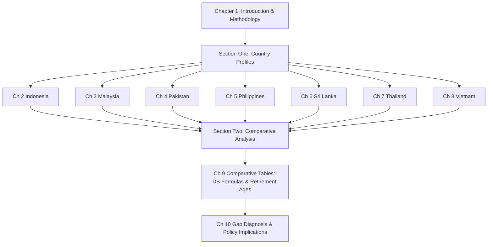

# Retirement Savings Protection Gaps in Selected Asian Economies: A Comparative Analysis of Pension Systems in Indonesia, Malaysia, Pakistan, the Philippines, Sri Lanka, Thailand, and Vietnam
# 1 Introduction, Research Framework, and Methodology

Across emerging Asia, the question of whether today's working-age population will retire with adequate income security has acquired exceptional urgency. Unlike the OECD economies whose pension systems matured alongside decades of rising per-capita income, several Asian middle-income countries are confronting demographic transitions that compress the window for institutional preparation into a single generation. Thailand, for example, moved from an "ageing" society (7% of population aged 65+) to an "aged" society (14%) in just 19 years between 2002 and 2021, compared with 24 years in Japan, 72 in the United States, and 115 in France; Vietnam is projected to traverse the same threshold in only about 17 years, and Indonesia in 26.[^1] Yet at the moment this transition began, Thailand's GDP per capita was only USD 7,000—roughly one-fifth of Japan's income level when its population reached the equivalent age structure in 1994.[^1] This pattern of "growing old before becoming rich" frames the analytical urgency that motivates the present report. Within this context, the seven economies examined here—**Indonesia, Malaysia, Pakistan, the Philippines, Sri Lanka, Thailand, and Vietnam**—share enough developmental, demographic, and structural similarities to support meaningful comparison, while exhibiting sufficiently divergent pension architectures to make a comparative diagnosis analytically productive. The remainder of this chapter sets out the rationale for the study, defines the conceptual vocabulary that will be used consistently across all subsequent chapters, articulates the analytical lens through which the comparative evidence will be interpreted, and explains the methodological choices governing classification, data treatment, and standardization.

## 1.1 Research Background and Rationale

The case for comparatively examining retirement savings protection gaps in these seven Asian economies rests on three interlocking phenomena that have converged over the past two decades: accelerating demographic ageing at lower income levels than historically observed, persistent labour-market informality that constrains the reach of contributory pension schemes, and the resulting policy salience accorded to pension adequacy by major international institutions.

The first phenomenon—rapid ageing under conditions of incomplete economic formalization—is well documented. Across South and Southeast Asia, less than 40% of the elderly population currently receives any form of pension, and in countries such as Cambodia and Pakistan the share is below 10%; where pensions do exist, benefit levels are often meagre, with India's national pension for the poor providing only approximately INR 200 (about USD 2.40) per month.[^1] Asia as a whole is projected to account for roughly 70% of the expected increase in elderly citizens in poor countries by 2050.[^1] The structural problem is that contributory pension schemes—whether of the PAYG defined benefit variety pioneered by Bismarckian Germany in 1889 or the funded individual-account schemes promoted since the 1990s—were originally designed with the implicit assumption that the formal-sector workforce would expand alongside industrialization.[^2][^3] In most developing economies, that assumption has not held: research cited by the Chinese Academy of Social Sciences indicates that globally no more than 15% of households and no more than 10% of the working-age population participate in formal pension schemes, with the uncovered majority concentrated in developing countries among informal workers, family caregivers, agricultural workers, and the self-employed.[^3] Moreover, since the 1980s, globalization and post-industrialization have made informal employment a persistent feature rather than a transitional phase, undermining the conventional expectation that pension coverage would expand automatically with economic development.[^3]

The second phenomenon concerns the international policy consensus that has emerged in response. The World Bank's 1994 report *Averting the Old Age Crisis* warned that single-pillar PAYG pension schemes face inherent sustainability problems as populations age, particularly when the rate of ageing exceeds productivity growth.[^2] The Bank subsequently elaborated a multi-pillar framework, first articulated in 1994 as a three-pillar structure (mandatory publicly managed redistribution; mandatory privately managed savings; voluntary supplementary savings) and extended in 2005 to a five-pillar taxonomy that incorporates a non-contributory "zero pillar" social pension and a non-financial "fourth pillar" capturing informal family support, housing assets, and reverse mortgages.[^2] More recently, the International Labour Organization's *World Social Protection Report 2024–2026* reported that, for the first time, more than half of the global population (52.4%) is covered by at least one form of social protection, up from 42.8% in 2015; nonetheless, large gender gaps persist (women 50.1% vs. men 54.6%) and the majority of children remain uncovered.[^4] The ILO further emphasized that social protection floors are essential not only for poverty prevention but also for enabling a just transition in the face of climate change.[^4]

The third phenomenon is the divergent institutional response across Asia. The Mercer CFA Institute Global Pension Index 2024 ranks Singapore 5th globally with a B+ rating (78.7), but places China at 31st, Malaysia at 32nd, Japan at 36th, Korea at 41st, the Philippines among the lowest-ranked, and India at 48th (last among 48 systems assessed).[^5] This wide dispersion of pension system quality across Asia, occurring against the backdrop of common demographic pressures, is precisely what makes a focused comparative study of middle-income Asian economies both feasible and necessary. The seven economies selected for this report span the spectrum: from Malaysia, which operates one of the world's larger national provident funds (the EPF, distributing dividends of approximately 6.15% in 2024)[^6], through Thailand and Vietnam, which combine social-insurance pensions with universal or near-universal social allowances, to Pakistan and Sri Lanka, where formal pension coverage remains narrow and fragmented.

The **retirement savings protection gap**—understood here as the shortfall between the retirement income that current and future retirees can reasonably expect from existing pension arrangements and the income required to maintain an adequate standard of living after retirement—is therefore the central analytical object of this report. The seven-country set offers a productive comparative laboratory: each economy faces the demographic compression characteristic of late-developing Asia, yet each has assembled a distinctive combination of public DB schemes, provident funds, severance pay regimes, and voluntary instruments to address the resulting retirement security challenge.

## 1.2 Research Scope, Objectives, and Temporal Cutoff

The **geographic scope** of the report comprises seven Asian economies: Indonesia, Malaysia, Pakistan, the Philippines, Sri Lanka, Thailand, and Vietnam. These countries were selected because they share key structural features—middle-income or lower-middle-income status, sizeable informal sectors, accelerating population ageing, and pension systems that combine elements of public DB, provident fund, severance pay, and voluntary supplementary arrangements—while exhibiting sufficient institutional variation to make cross-country comparison analytically meaningful. The set deliberately excludes both high-income Asian economies with mature pension systems (such as Japan, Korea, and Singapore) and the very poorest Asian economies where formal pension institutions are essentially nascent.

The **substantive scope** covers all mandatory and voluntary retirement-related schemes operating in each of the seven economies, including:

- Public-sector occupational pension schemes for civil servants, military, and police;
- Social insurance and social security old-age pensions for private-sector formal employees;
- National provident funds and individual-account defined contribution schemes;
- Severance pay and gratuity obligations under labour legislation, where these function as quasi-retirement instruments;
- Voluntary employer-sponsored occupational pension funds and voluntary individual pension products;
- Non-contributory social pensions or universal old-age allowances where such schemes exist.

Healthcare-related social insurance (including medical insurance, health protection, and long-term care insurance) is **excluded** from the principal analytical scope, although interactions with retirement income protection are acknowledged where relevant. Disability and survivor benefits are mentioned only insofar as they are structurally bundled with old-age pension provision within the same scheme.

The **temporal cutoff** for all policy parameters, statutory provisions, contribution rates, benefit formulas, retirement ages, and statistical indicators cited in this report is **early 2025**. Where significant reforms have been legislated but not yet implemented as of this cutoff—such as Vietnam's revised Social Insurance Law passed on 29 June 2024 and scheduled to take effect on 1 July 2025[^4]—both the pre-reform and post-reform parameters are noted, with the operative provisions of early 2025 treated as the principal reference point.

The report pursues two interlocking **objectives**:

1. **To produce structured, comprehensive country profiles** of each pension system in the seven economies, identifying every mandatory and voluntary scheme together with its plan type, covered population, financing arrangements, and participation requirement. These profiles, presented in Chapters 2 through 8, form the descriptive foundation of the report.

2. **To conduct horizontal comparative tabular analysis** of mandatory defined benefit formulas and normal retirement ages across schemes (Chapter 9), and from this comparative evidence to **diagnose the principal pension-rule-based drivers** of retirement savings protection gaps (Chapter 10).

## 1.3 Conceptual Framework and Key Terminology

Because pension systems are intrinsically heterogeneous and national terminology is rarely uniform, it is essential to fix the conceptual vocabulary used throughout this report at the outset. The terminology adopted here follows the OECD and World Bank conventions, with adaptations to capture features distinctive to Asian pension architectures.

### 1.3.1 Financing and Benefit-Determination Methods

Pension schemes are classified along two principal axes: how they are **financed** (the source of funds backing future benefit obligations) and how **benefits are determined** (the rule linking individual entitlements to past contributions or service).[^2]

**By financing method**:
- An **unfunded or pay-as-you-go (PAYG)** scheme finances current pension expenditure out of current revenues, typically from payroll taxes or earmarked contributions paid by the active workforce. In its strictest sense, "current expenditure on pension benefits are paid out of current revenues from an earmarked tax, often a payroll tax."[^2]
- A **fully funded** scheme accumulates dedicated assets sufficient at all times to cover the present value of accrued and future pension obligations.[^2]
- A **partially funded** scheme covers a determined portion of liabilities with accumulated assets, with the remainder financed on a PAYG basis or recognized as book reserves on the sponsor's balance sheet.[^2]

**By benefit-determination method**:
- A **defined benefit (DB)** plan promises a specified benefit at retirement, calculated through a formula linked to members' earnings, length of service, age, or other factors.[^2]
- A **defined contribution (DC)** plan fixes the contribution rate; individual accounts are credited with contributions and any investment returns, and the retirement benefit depends entirely on the accumulated balance.[^2] DC plans are by definition fully funded, since members are entitled only to the proceeds of their individual accounts.[^2]
- A **notional defined contribution (NDC)** plan records contributions in individual accounts that are credited with a government-set rate of return, but the contributions themselves are used to finance current pensioners, so the system remains unfunded.[^2]

### 1.3.2 Composite Categories Used in this Report

The country profiles and comparative tables that follow use three composite categories that combine the financing and benefit-determination axes into the typology relevant for Asian pension systems:

- **PAYG Defined Benefit (PAYG DB)** — schemes financed largely on a current-disbursement basis with benefits calculated by a formula tied to service and earnings. This category includes most civil service pension schemes in the seven economies under study, and also encompasses earnings-related social insurance old-age pensions where contributions function more like payroll taxes than funded savings.
- **Asset-backed Defined Benefit / Defined Contribution (Asset-backed DB / DC)** — schemes that accumulate identifiable assets in dedicated funds against which benefits are paid. Within this category, asset-backed DB schemes guarantee a formula-based benefit but invest contributions to cover obligations (often partially funded), while asset-backed DC schemes pay out the accumulated balance of individual accounts. National provident funds (such as Malaysia's EPF) and voluntary occupational DC schemes fall into the DC sub-type.
- **Severance Defined Benefit (Severance DB)** — statutory employer obligations to pay terminal lump sums to long-tenured employees on separation (typically computed as a multiple of monthly salary per year of service). Although severance pay is not always classified as a pension in domestic legal frameworks, it functions as a defined-benefit retirement instrument in practice and is treated as such in this report. Indonesia's retirement severance under labour law (commonly referenced as PP — *pesangon* / retirement-related severance) is a paradigmatic Severance DB obligation that applies to long-tenured private-sector workers.

### 1.3.3 Participation-Status Categories

For the comparative tables in Chapter 9, the report uses six standardized abbreviations to describe the combination of participation requirement and benefit-determination method, drawing on the OECD typology:

| Abbreviation | Meaning |
|---|---|
| **MDB** | Mandatory Defined Benefit |
| **MDC** | Mandatory Defined Contribution |
| **VDB** | Voluntary Defined Benefit |
| **VDC** | Voluntary Defined Contribution |
| **VO** | Voluntary Occupational (employer-sponsored voluntary scheme; benefit-determination type indicated separately where needed) |
| **VP** | Voluntary Personal (individual voluntary scheme; benefit-determination type indicated separately where needed) |

The **mandatory/voluntary** distinction follows the legal participation requirement applicable to the covered worker group: a scheme is **mandatory** if covered workers are required by statute to participate (e.g., all formal-sector private employees, all civil servants); it is **voluntary** if individuals or employers may opt in at their discretion. Schemes that are mandatory for one group but allow voluntary participation by others (such as Vietnam's social insurance, mandatory for formal employees but voluntary for the self-employed) are decomposed into their mandatory and voluntary components.

### 1.3.4 Definitional Ambiguities Addressed

Three definitional ambiguities recur across the Asian pension literature and require explicit handling:

**(a) Provident funds versus individual-account DC pensions.** National provident funds (such as Malaysia's EPF, Sri Lanka's EPF/ETF, and the historical antecedents of Indonesia's JHT) accumulate mandatory contributions in individual accounts, typically with prescribed minimum yields and limited investment discretion at the member level. The World Bank classifies them as a form of centrally-managed defined contribution arrangement.[^7] This report treats them as **mandatory DC (MDC)** schemes, while noting that some, like the EPF, permit pre-retirement withdrawals for housing, education, or medical needs that distinguish them functionally from pure retirement-savings vehicles.

**(b) Severance pay as a quasi-retirement instrument.** Labour-law severance obligations (Indonesia's PP; Thailand's mandatory severance pay; the gratuity payments under Sri Lanka's Payment of Gratuity Act; severance under Philippine labour law; severance and job-loss allowance under Vietnam's Labour Code) provide a substantial lump-sum payment to long-tenured workers on retirement or termination. Although these are employer obligations rather than funded pension schemes, they form a meaningful component of retirement income for covered workers and are classified in this report as **Severance DB**.

**(c) Mandatory enrollment versus voluntary opt-in within a single legal framework.** Several Asian pension systems combine mandatory enrollment for one occupational segment with voluntary opt-in for another within the same legal architecture (e.g., Vietnam's compulsory social insurance for formal employees alongside the voluntary social insurance scheme for informal workers and the self-employed). In such cases, the report treats each segment as a logically distinct scheme for classification purposes.

### 1.3.5 The World Bank Five-Pillar Framework

The report uses the World Bank's five-pillar framework, as elaborated in Holzmann and Hinz (2005) and Holzmann, Hinz, and Dorfman (2008), as its organizing taxonomy for cross-system mapping:[^2]

- **Pillar 0 (non-contributory)**: A social pension or general social assistance providing minimal income protection to the elderly, typically financed from general revenue.
- **Pillar 1 (mandatory, contributory)**: An earnings-linked contributory scheme intended to replace a portion of pre-retirement income, typically organized on a PAYG basis.
- **Pillar 2 (mandatory, funded)**: Mandatory individual savings or occupational plans, typically of the DC type.
- **Pillar 3 (voluntary)**: Voluntary individual or occupational savings, flexible in form (may be DB or DC).
- **Pillar 4 (non-financial)**: Informal intra-family support, access to healthcare and housing programs, and other non-pension assets such as owner-occupied housing or reverse mortgages.

Each scheme identified in the country profiles is implicitly mapped to one of these pillars, allowing readers to compare the architectural completeness of each national system at a glance.

## 1.4 Analytical Perspective: Pension Rules as Proximate Drivers of Protection Gaps

A retirement savings protection gap can be attributed to many factors, including demographic ageing, labour-market informality, low household savings rates, weak financial-market development, and macroeconomic shocks. This report adopts a specific analytical perspective: **pension scheme design rules are treated as the proximate drivers of protection gaps**, while demographic, labour-market, and macroeconomic conditions are treated as background pressures that interact with—and are mediated by—those rules.

Three considerations motivate this analytical choice. First, pension rules are the most directly **policy-actionable** variables: governments can amend retirement ages, accrual rates, contribution periods, and coverage thresholds far more quickly than they can reshape labour-market formality or demographic structure. A diagnosis focused on rules therefore yields more directly actionable insights for reform. Second, the comparative literature on pension reform consistently identifies rule design as the locus where political economy, fiscal sustainability, and adequacy considerations are reconciled—or fail to be reconciled.[^2] Third, the seven economies under study share broadly similar background conditions but differ markedly in rule design; holding background pressures roughly constant across the comparison set isolates the rule-based variation as the principal explanatory variable.

The specific rule dimensions examined in subsequent chapters include:

- **Coverage eligibility rules** — which categories of workers are required, permitted, or excluded from participation, and how the boundary between formal and informal employment shapes effective coverage;
- **Contribution rules** — contribution rates, the wage base on which contributions are levied, ceilings and floors, and the distribution of contributions between employer, employee, and state;
- **Vesting and minimum service rules** — the minimum contribution period or years of service required to qualify for a pension (as distinct from a refund of contributions or a lump-sum withdrawal);
- **Benefit formulas** — accrual rates, the salary base over which benefits are computed (final salary, average over X years, lifetime average), minimum benefits, maximum benefits, and indexation rules;
- **Normal retirement age and early/late retirement provisions** — the statutory age at which a full pension is payable, any gender differential, and the actuarial adjustments applied to early or deferred claims;
- **Pre-retirement withdrawal options** — whether and on what terms members may access accumulated balances before retirement (e.g., for housing or medical expenses), and the resulting depletion of retirement assets;
- **Governance and investment rules for reserve funds** — the institutional arrangements that determine how accumulated pension assets are invested and whether returns keep pace with wage growth or inflation.

This analytical lens directly links the descriptive country profiles in Chapters 2–8, which document the rule design of each scheme, with the comparative tabular analysis in Chapter 9 and the gap diagnosis in Chapter 10. The report's distinctive contribution relative to existing regional literature—which tends either to focus on a single country in depth or to summarize regional aggregate coverage indicators without descending to scheme-level rule design—is precisely this combination of granular country-by-country rule documentation with structured cross-country comparison along policy-actionable rule dimensions.

## 1.5 Pension System Classification and Cross-Country Comparison Methodology

National pension systems in the seven economies under study are highly heterogeneous in structure, terminology, and institutional architecture. To make cross-country comparison meaningful, the report applies a consistent classification and standardization methodology, described below.

### 1.5.1 Decomposition and Classification of National Systems

Each national pension system is first decomposed into its constituent schemes, where a "scheme" is defined as a legally distinct retirement protection arrangement with its own statutory basis, covered population, financing rules, and benefit rules. For example, Indonesia's retirement protection architecture is decomposed into: (i) BPJS Ketenagakerjaan's Jaminan Pensiun (JP); (ii) BPJS Ketenagakerjaan's Jaminan Hari Tua (JHT); (iii) PT Taspen for civil servants; (iv) PT Asabri for military and police; (v) the statutory retirement severance obligation under labour law (PP); (vi) voluntary Employer Pension Funds (DPPK); and (vii) voluntary Financial Institution Pension Funds (DPLK). Each constituent scheme is then classified along the following dimensions:

1. **Financing method**: PAYG, partially funded, or fully funded.
2. **Benefit-determination method**: DB, DC, or NDC.
3. **Composite type**: PAYG DB, Asset-backed DB, Asset-backed DC, Severance DB, or NDC.
4. **Participation requirement**: mandatory or voluntary (with sub-classification by covered group where the same scheme is mandatory for some and voluntary for others).
5. **World Bank pillar assignment**: Pillar 0, 1, 2, 3, or 4.
6. **Covered worker categories**: public-sector employees, military and police, private-sector formal employees, self-employed, informal workers, agricultural workers, or universal residents.

For instance, applying this classification to Indonesia: the **retirement severance obligation (PP)** under Indonesian labour law is classified as a **Severance Defined Benefit (Severance DB)** scheme that applies to long-tenured private-sector workers, mandating lump-sum payments calibrated to length of service and final wages; the **DPPK (Dana Pensiun Pemberi Kerja, Employer Pension Funds)** are voluntary employer-sponsored pension funds that may take the form of asset-backed defined benefit or asset-backed defined contribution plans (i.e., Asset-backed DB/DC); and the **DPLK (Dana Pensiun Lembaga Keuangan, Financial Institution Pension Funds)** are voluntary individual or employer-sponsored pension arrangements offered by financial institutions, structured exclusively as **Defined Contribution (DC)** schemes. These classifications, illustrative of the methodology, will be applied systematically across all seven countries in the chapters that follow.

### 1.5.2 Standardization Rules for Comparative Tabular Analysis

For the comparative tables in Chapter 9, the following standardization rules are applied:

- **Annual accrual rate (%)**: Reported as the percentage of the relevant salary base earned as pension entitlement per year of service. Where national formulas express benefits in alternative units (e.g., monthly benefit per year of service rather than a percentage), the equivalent percentage accrual is computed using the formula's salary base.
- **Salary base**: Standardized into a small number of categories—final salary, final-period average (specifying the number of years/months), career-average revalued earnings, or other—with the specific computation rule noted in each row.
- **Minimum benefit**: The statutory floor on pension benefits, expressed in domestic currency as of early 2025; where the floor is defined as a percentage of average earnings or minimum wage, the reference rule is noted.
- **Maximum benefit**: The statutory ceiling, expressed as a percentage of the salary base where applicable, with the underlying contribution-base ceiling noted where relevant.
- **Minimum years of service required**: The minimum contribution or service period at which the worker becomes eligible for the pension (as opposed to a refund of contributions or a lump-sum withdrawal).
- **Normal retirement age**: The age at which the worker becomes eligible for an unreduced pension, with male and female ages listed separately where they differ, and any phased-increase trajectory noted in a footnote.

Where national legislation prescribes different rules for cohorts of workers entering the system at different dates (transitional provisions), the rules applicable to **new entrants as of early 2025** are reported as the principal reference, with material transitional differences noted.

### 1.5.3 Handling Multi-Scheme National Systems

Several of the seven economies operate parallel schemes for distinct occupational segments (civil service, military, formal-sector employees, informal workers). The methodology treats each scheme as a separate row in the comparative tables, with the country name repeated as needed. This decomposition preserves the visibility of intra-country sectoral fragmentation, which Chapter 10 identifies as one of the principal drivers of protection gaps.

## 1.6 Data Sources, Coverage Criteria, and Limitations

### 1.6.1 Primary Data Sources

The data and policy parameters cited in this report are drawn from the following categories of sources, consulted as of early 2025:

1. **National pension authority publications and legislation**: Annual reports, statutory documents, and regulatory circulars issued by the principal pension administrators in each country (e.g., BPJS Ketenagakerjaan and PT Taspen in Indonesia; KWAP and EPF in Malaysia; EOBI in Pakistan; GSIS and SSS in the Philippines; the EPF and ETF in Sri Lanka; the GPF, SSF, and NSF in Thailand; and Vietnam Social Security).
2. **World Bank pension databases and publications**: Including the multi-pillar framework analyses, civil service pension reviews, and pension reform primer series.[^2][^7]
3. **OECD pension publications**: Including the *Pensions at a Glance* series for OECD and G20 countries, the OECD private pensions classification and glossary, and OECD working papers on funding and governance of public pension reserves.[^2]
4. **ILO publications**: Particularly the *World Social Protection Report 2024–2026* and its Asia-Pacific regional companion, which provide cross-country coverage statistics and policy commentary.[^4]
5. **Mercer CFA Institute Global Pension Index 2024**: For internationally comparable pension system quality ratings, covering 48 jurisdictions.[^5]
6. **International policy monitors**: Recent policy-development summaries covering pension and social insurance reforms in Asia (e.g., Vietnam's revised Social Insurance Law passed in June 2024; Saudi Arabia's social insurance reforms; Ireland's auto-enrollment legislation; Singapore's platform-worker legislation).[^4]
7. **United Nations Population Division**: World Population Prospects for life expectancy and demographic dependency ratios.[^8][^1]

### 1.6.2 Coverage Criteria

For each scheme, "coverage" is reported along the following dimensions:

- **Legal coverage**: The categories of workers whom the law designates as required or permitted to participate.
- **Effective coverage**: Where data are available, the number or share of workers in the legally covered population who are actually enrolled and actively contributing.
- **Beneficiary coverage**: The number or share of the elderly population currently receiving benefits from the scheme.

The criteria distinguish among three principal worker groups: **public-sector employees** (civil servants, military, police, and where applicable employees of state-owned enterprises); **private-sector formal employees** (workers in the formal private sector subject to labour-law and social-insurance obligations); and **self-employed and informal workers** (including own-account workers, family contributors, casual labourers, platform workers, and agricultural workers outside the formal contributory base).

### 1.6.3 Limitations and Their Handling

Several data and methodological limitations must be acknowledged at the outset:

- **Inconsistent national reporting standards.** Pension authorities in the seven economies follow different conventions in valuation methods (book value versus mark-to-market), fiscal-year definitions, and benefit categorization. Where such inconsistencies materially affect comparability, the report notes the underlying convention rather than forcing artificial uniformity.
- **Gaps in informal-sector statistics.** Effective coverage of informal workers and the self-employed is often poorly documented, and many published coverage rates refer only to the formally covered labour force. The report relies on qualitative assessments and proxy indicators (e.g., share of working-age population participating in any formal pension scheme) where direct statistics are unavailable.
- **Varying valuation methods for reserve funds.** Where reserve funds are operated, returns are reported under different accounting conventions, and not all schemes publish audited investment performance. Where investment-return comparisons are drawn, the methodology and time horizon are explicitly noted.[^7]
- **Transitional reform provisions.** Several countries are in the midst of phased reforms with parameters that evolve over time (e.g., retirement-age phase-ins in Vietnam, accrual-rate adjustments). The report reports the parameter applicable as of early 2025 and notes the trajectory where relevant.
- **Excluded source.** As required by user instruction, one specific OECD publication on protection gaps in Asia is not consulted in the preparation of this report; the analysis is constructed from independent source materials.

Where information for a particular scheme is unavailable from the cited sources, this is explicitly acknowledged in the relevant country profile or comparative table, and no inferred or speculative figures are entered.

## 1.7 Report Structure and Chapter Roadmap

The report is organized in two principal sections, reflecting the dual objectives set out in Section 1.2.

**Section One: Country Pension System Profiles (Chapters 2 through 8)** provides a systematic, country-by-country description of each pension system in the seven economies. Each chapter follows a consistent template: an overview of the national architecture; a detailed profile of each constituent scheme (with plan name, classification type, covered worker categories, mandatory/voluntary status, contribution and benefit rules, and retirement age); and a brief identification of structural features (sectoral fragmentation, gaps in coverage, treatment of informal workers) that will feed into the comparative diagnosis.

- Chapter 2 profiles **Indonesia**, including BPJS Ketenagakerjaan's Jaminan Pensiun (JP) and Jaminan Hari Tua (JHT), PT Taspen, PT Asabri, the labour-law retirement severance obligation (PP, classified as Severance DB for long-tenured private-sector workers), the voluntary employer pension funds (DPPK, voluntary Asset-backed DB/DC), and the voluntary financial-institution pension funds (DPLK, voluntary DC).
- Chapter 3 profiles **Malaysia**, including the civil-service DB pension administered through KWAP, the Employees Provident Fund (EPF) for private-sector workers, the Armed Forces Fund (LTAT), and voluntary Private Retirement Schemes (PRS).
- Chapter 4 profiles **Pakistan**, including federal and provincial civil service pensions, the Employees' Old-Age Benefits Institution (EOBI), provincial Employees Social Security Institutions, armed forces pensions, voluntary occupational pension funds, and Voluntary Pension System (VPS) products.
- Chapter 5 profiles **the Philippines**, including the Government Service Insurance System (GSIS), the Social Security System (SSS), AFP and PNP retirement schemes, statutory separation pay, and voluntary instruments including the Personal Equity and Retirement Account (PERA).
- Chapter 6 profiles **Sri Lanka**, including the Public Service Pension Scheme, the EPF and ETF, the Farmers' and Fishermen's Pension and Social Security Schemes, gratuity payments, and voluntary private pension or annuity products.
- Chapter 7 profiles **Thailand**, including the Government Pension Fund (GPF), the older civil-service pension, the Social Security Fund (SSF) under Articles 33/39/40, the universal Old-Age Allowance, the National Savings Fund (NSF), statutory severance pay, and voluntary Provident Funds (PVD) and Retirement Mutual Funds (RMF).
- Chapter 8 profiles **Vietnam**, including the Vietnam Social Security compulsory and voluntary social insurance pension schemes, severance and job-loss allowance under the Labour Code, and emerging voluntary supplementary pension products.

**Section Two: Comparative Analysis and Gap Diagnosis (Chapters 9 and 10)** consolidates the country-level evidence into structured cross-country comparisons and derives the principal diagnostic findings.

- Chapter 9 presents two comparative tables: **Table 1** documents the benefit formulas of all mandatory DB schemes across the seven countries (with columns for Country, Plan Name, Sector, Annual Accrual Rate, Salary Base, Minimum Benefit, Maximum Benefit, and Minimum Years of Service Required); **Table 2** documents normal retirement ages across all schemes (with columns for Country, Plan Type using the MDB/MDC/VDB/VDC/VO/VP abbreviations, and Retirement Age listed separately by gender where applicable). The chapter interprets the cross-country and cross-pillar patterns visible in the tables.
- Chapter 10 synthesizes the country profiles and comparative tables to diagnose the principal pension-rule-based drivers of retirement savings protection gaps, focusing on contribution periods, retirement ages, benefit formulas, and the mandatory/voluntary boundary. The chapter concludes the report by articulating reform directions consistent with the comparative evidence and flagging areas where further data collection or actuarial analysis would be required.

The chapter roadmap is illustrated below:

Throughout the report, findings from the country profiles in Section One feed directly into the comparative tables and gap diagnosis in Section Two. Readers seeking a particular rule parameter for a single country should consult the relevant country chapter; readers seeking cross-country comparison along a particular rule dimension should consult Chapter 9; and readers seeking the integrated diagnostic and policy reading should consult Chapter 10. With this framework in place, the report now turns to the first country profile—Indonesia—in Chapter 2.

# 2 Pension System Profile: Indonesia

Indonesia presents one of the most structurally complex pension landscapes in Southeast Asia. With a population of roughly 270 million, a formal workforce of approximately 52.1 million within a total active workforce of 140 million, and an informal-sector share of about 55.2% of active workers (some 87.9 million people), the country combines a relatively developed institutional architecture for the formal sector with a near-total absence of statutory retirement protection for the informal majority.[^9] The architecture rests on four mandatory institutional pillars—two operated by BPJS Ketenagakerjaan for private-sector formal employees, one by PT Taspen for civil servants, and one by PT Asabri for military and police personnel—supplemented by a statutory severance regime that operates as a quasi-pension instrument and by voluntary employer- and financial-institution-sponsored pension funds. Collectively, the three public pension institutions cover only about **18.49 million workers**, leaving the bulk of the labour force outside formal contributory protection.[^9] This chapter decomposes Indonesia's system into its constituent schemes following the methodology established in Chapter 1, documenting each along the dimensions of plan name, statutory basis, classification type, covered worker categories, contribution and benefit rules, retirement age, and World Bank pillar assignment, before synthesizing the structural features that condition the country's protection gap.

## 2.1 Overview of Indonesia's Pension Architecture

Indonesia's retirement protection system is organized around a tripartite institutional separation that reflects the historical evolution of its labour and social-security legislation. **BPJS Ketenagakerjaan** (the Employment Social Security Administering Body), transformed from the former PT Jamsostek by Law No. 24/2011 and operating its current pension program since August 2015, administers two parallel schemes—Jaminan Pensiun (JP) and Jaminan Hari Tua (JHT)—that together cover formal-sector private workers; as of recent statistics, the BPJS pension program covers approximately **13.25 million workers**.[^9] **PT Taspen (Persero)**, established by Law No. 11/1969, administers pensions and old-age savings for civil servants (PNS) and covered approximately **3.9 million people** in 2022.[^9] **PT Asabri (Persero)**, established under Government Regulation No. 15/1963, runs pension programs for armed forces personnel and for civil servants working at the Ministry of Defence; in 2022 it covered approximately **1.34 million participants**.[^9] Outside these contributory schemes, employers across the formal private sector bear a substantial statutory severance obligation under Law No. 13/2003 (Manpower Law) as amended by Law No. 11/2020 (Job Creation Law) and operationalized by Government Regulation No. 35/2021, which functions as a third quasi-retirement instrument for long-tenured workers.[^10] Voluntary occupational and individual pension arrangements—Dana Pensiun Pemberi Kerja (DPPK) and Dana Pensiun Lembaga Keuangan (DPLK)—operate under the supervision of the Financial Services Authority (OJK), forming a thin third pillar.[^11]

The architectural logic and its gaps can be summarized as follows:

| Pillar (World Bank) | Scheme | Administering Institution | Plan Type | Covered Group | Participation |
|---|---|---|---|---|---|
| Pillar 0 | — (absent) | — | — | Universal elderly | — |
| Pillar 1 | Jaminan Pensiun (JP) | BPJS Ketenagakerjaan | PAYG DB | Private formal employees (large & medium enterprises) | Mandatory |
| Pillar 1 | Taspen – JP (Civil Service Pension) | PT Taspen | PAYG DB | Civil servants (PNS) | Mandatory |
| Pillar 1 | Asabri Pension | PT Asabri | PAYG DB | TNI, POLRI, MoD civilians | Mandatory |
| Pillar 2 | Jaminan Hari Tua (JHT) | BPJS Ketenagakerjaan | Asset-backed DC | Private formal employees (large, medium, small); voluntary for micro-enterprise workers | Mandatory / Voluntary (micro) |
| Pillar 2 | Taspen – THT (Tabungan Hari Tua) | PT Taspen | Asset-backed DC | Civil servants (PNS) | Mandatory |
| Quasi-Pillar | Retirement Severance (Pesangon, PP) | Employer (Labor Law) | Severance DB | Long-tenured private-sector workers (PKWTT) | Mandatory (statutory) |
| Pillar 3 | DPPK (Employer Pension Funds) | OJK-supervised employer funds | Asset-backed DB / DC | Employees of sponsoring employers | Voluntary |
| Pillar 3 | DPLK (Financial Institution Pension Funds) | OJK-supervised banks/insurers | Asset-backed DC | Individuals, employees of non-DPPK employers | Voluntary |

The legal foundations of this architecture are layered. Law No. 11/1969 established the civil-service pension framework administered by PT Taspen.[^12] Law No. 40/2004 on the National Social Security System (SJSN) envisaged five mandatory social insurance programs—pensions, old-age savings, health, workers' compensation, and death benefits—covering the entire population on social insurance principles with DB benefits based on final pay; however, the SJSN's universal pension vision has only been partially implemented, with the JP and JHT programs launched in 2015 covering formal-sector workers but not the informal majority.[^12] Law No. 24/2011 transformed PT Jamsostek into BPJS Ketenagakerjaan and Government Regulation No. 45/2015 established the operating rules for JP.[^9] Law No. 13/2003 (Manpower Law), as amended by Law No. 11/2020 (Job Creation Law) and operationalized by PP No. 35/2021, anchors the statutory severance regime.[^10]

The structural gap is profound: of approximately 140 million active workers, only **18.49 million** are covered by the three public pension institutions, leaving approximately **87.9 million informal workers** outside formal contributory protection.[^9] Indonesia's demographic projections sharpen this concern: through 2020 the country was still in a demographic bonus phase with the working-age population exceeding 50% of the total, but projections by the Central Statistics Agency (BPS) anticipate that by 2045 the population aged 65 and over will reach **approximately 45 million**, against a total population of around 310 million.[^9] The country is thus approaching old age with an incomplete contributory architecture and no Pillar 0 non-contributory floor in place.

## 2.2 BPJS Ketenagakerjaan – Jaminan Pensiun (JP)

The Jaminan Pensiun (JP, "Pension Guarantee") program is the principal mandatory pension scheme for Indonesia's private-sector formal workforce. Established under Government Regulation No. 45/2015 and launched in August 2015, **Indonesia's 'BPJS – JP' is a mandatory Pay-As-You-Go Defined Benefit (PAYG DB) scheme for employees of large and medium-sized private enterprises**, mapping to Pillar 1 in the World Bank framework.[^9][^13]

**Contribution structure.** JP is financed by a combined contribution of **3% of monthly wages**, split as **2% from the employer and 1% from the employee**.[^11] (A wider source within the broader BPJS Ketenagakerjaan literature also describes a combined rate equivalent to 3.7% employer and 2% employee where social-security contributions are reported in aggregate, reflecting bundling with other BPJS programs; the JP-specific split as documented in operational descriptions is 2% / 1% of monthly wages.[^11][^13]) Contributions are levied on monthly wages subject to a ceiling set by regulation and periodically adjusted.

**Benefit formula and entitlement.** JP provides a monthly pension at retirement age, with the benefit amount calculated based on **wage history and length of contribution**: higher wages and longer contribution periods yield larger pensions, with adjustments for cost-of-living increases per government regulation.[^11] The illustrative example provided in operational documentation is that an employee earning IDR 10 million per month over 20 years accumulates a substantially larger pension than one earning IDR 5 million over 10 years.[^11] Workers who do not meet the minimum monthly contribution period required for a monthly pension instead receive a one-time lump-sum retirement payment, embedding a vesting threshold into the scheme.[^11]

**Retirement age trajectory.** The JP normal retirement age follows a phased-increase schedule mandated by Government Regulation No. 45/2015: from 56 in 2015, increasing by one year every three years. Effective **1 January 2025, the qualifying age reached 59**, with the schedule continuing toward a target normal retirement age of **65 by 2043**.[^11] The Manpower Law framework separately set the general statutory retirement age at 57 in 2019, increasing by one year every three years until reaching 65 in 2043, reflecting a coordinated trajectory across the broader pension system.[^13] The stated rationale is to align contribution duration and pension financing with rising life expectancy.[^11]

**Classification.** Although JP is contributory and accumulates partial reserves at BPJS Ketenagakerjaan, the benefit promise is formula-based and the scheme operates predominantly on social insurance principles consistent with the SJSN framework's DB design; it is therefore classified in this report as **Mandatory Defined Benefit (MDB) — PAYG DB** in Pillar 1.

## 2.3 BPJS Ketenagakerjaan – Jaminan Hari Tua (JHT)

The Jaminan Hari Tua (JHT, "Old-Age Security") program is the second BPJS Ketenagakerjaan retirement scheme, operating in parallel with JP but on a fundamentally different financing and benefit logic. **Indonesia's 'BPJS – JHT' is a mandatory Asset-backed Defined Contribution (Asset-backed DC) scheme for employees of large, medium, and small-sized private enterprises, and voluntary for micro-enterprise employees.** It maps to Pillar 2.

**Contribution structure.** JHT is a savings-based pension program financed by a combined contribution of **5.7% of monthly wages**, with the **employee contributing 2% and the employer contributing 3.7%**.[^11][^13] Contributions are accumulated in individual member accounts and credited with investment returns generated by BPJS Ketenagakerjaan's centralized fund management.

**Benefit and withdrawal options.** Unlike JP, JHT pays out the accumulated balance of the individual account at retirement age or under specified pre-retirement conditions. Members may elect either a **lump-sum payment or installment payments** at retirement.[^11] Distinctively, JHT permits **pre-retirement withdrawals** in defined circumstances—including unemployment (with full withdrawal options surfacing in claims documented at BPJS branches), partial withdrawals for housing purposes, and other regulated contingencies. During the COVID-19 pandemic, BPJS Ketenagakerjaan branches such as the Langkat office in North Sumatra reported significant JHT claim volumes (analyzed in clusters of 545, 308, and 421 cases at one branch alone), reflecting widespread pre-retirement access tied to layoffs and business closures.[^9] This flexibility distinguishes JHT functionally from a pure retirement savings vehicle.

**Classification.** JHT is a fully-funded individual-account scheme paying out accumulated balances; it is classified as **Mandatory Defined Contribution (MDC) — Asset-backed DC** in Pillar 2.

**Dual JP-plus-JHT structure.** The coexistence of JP (defined benefit) and JHT (defined contribution) within BPJS Ketenagakerjaan creates a layered DB-plus-DC architecture for the same covered population of private-sector formal workers. In principle, JP provides predictable lifetime income replacement while JHT provides a savings buffer accessible under broader conditions. In practice, however, JHT's withdrawal flexibility means that significant portions of the accumulated retirement savings may be drawn down well before retirement, weakening JHT's contribution to lifetime retirement adequacy. Combined employer and employee contributions across health insurance and social security obligations in Indonesia range from approximately 10.24% to 11.24% on the employer side, of which JP and JHT together comprise the principal retirement-related elements.[^13]

## 2.4 PT Taspen – Civil Service Pension (Taspen – JP) and THT

PT Taspen (Persero) administers the retirement protection arrangements for Indonesia's approximately **3.9 million civil servants (Pegawai Negeri Sipil, PNS)**.[^9] The Taspen architecture comprises two distinct components that must be classified separately under this report's typology.

### 2.4.1 Taspen – JP (Civil Service Pension)

**Indonesia's 'Taspen – JP' is a mandatory Pay-As-You-Go Defined Benefit (PAYG DB) scheme for public sector employees**, governed under Law No. 11/1969 and mapping to Pillar 1.[^12] Pensions are paid for life and cover survivors as well.[^12]

**Pensionable age.** The pensionable age was historically set at **56 (or 50 with 20 years of service)**, with subsequent phased increases aligning with the broader Manpower Law trajectory toward higher retirement ages.[^12]

**Contributions and financing.** Civil servants contribute **4.75% of their pensionable wage**, while the government as employer is statutorily responsible for the balance. However, the structure is functionally PAYG: employee contributions are accumulated in a PT Taspen account but are **not utilized to pay current pensions**, and PT Taspen bears no financial responsibility for the program; current pension expenditure is met from the state budget (APBN).[^12] As one analytical assessment observed, "in effect, therefore, government bears 100 percent of the civil service pension costs."[^12] The 2024 APBN allocation illustrates the fiscal weight: retirement payments to civil servants and security personnel were budgeted at IDR 11.7 trillion (approximately USD 730 million) for the 13th-month payment alone, and total pension expenditure under the central government financial statements rose from IDR 120.6 trillion in 2020 to IDR 127.5 trillion in 2021—approximately 4.65% to 4.73% of total government spending.[^14][^9]

**Benefit formula.** The accrual rate is **2.5% per year of service, with a maximum replacement ratio of 75%** of pensionable salary.[^12] This implies that a civil servant must accumulate 30 years of service to reach the 75% cap. Actuarial valuation of PT Taspen's pension obligations is performed using the Projected Unit Credit (PUC) method, which determines normal contributions and actuarial liabilities by reference to projected benefits earned to date.[^15]

**Coverage and demographics.** As of December 2009 the civil-service pension covered approximately 4.52 million members, of whom 45.6% were women; a high concentration of members (56.2% of men and 54.9% of women) was in the 36–50 age bracket, foreshadowing substantial future pension liabilities.[^12] The Decentralization Law of 2000 transferred responsibility for lower-level civil servants to subnational jurisdictions, but liabilities for decentralized pensions remain unclear, potentially generating wide divergences in benefits across regions.[^12]

**Investment portfolio (illustrative).** At end-2008, PT Taspen's reported civil-service pension portfolio totaled IDR 19.65 trillion—approximately 0.036% of GDP and equivalent to only 0.56% of annual benefits—with 56.55% in bonds, 39.14% in term deposits, and small balances in direct investments, deposits on call, and cash; the 2008 return on invested assets was 9.12%, lower than the inflation rate of 11.1%.[^12] These figures underscore the scheme's PAYG character: reserves are modest relative to obligations and pension payments rely on the annual state budget.

### 2.4.2 Taspen – THT (Tabungan Hari Tua)

In addition to the JP pension, civil servants are provided **Life and Endowment Insurance, known as THT (Tabungan Hari Tua)**, which pays lump-sum amounts at death or termination.[^12] **Indonesia's 'Taspen – THT' is a mandatory Asset-backed Defined Contribution (Asset-backed DC) scheme for public sector employees**, mapping to Pillar 2. PT Taspen underwrites the THT program in its capacity as a non-licensed and unregulated state insurance company; the Ministry of Finance outsourced administration of the civil-service pension program to PT Taspen, though Taspen bears no financial responsibility for the underlying pension liability.[^12] The bundled THT component thus functions as the civil-service counterpart to the JHT scheme available to private-sector workers, providing a lump-sum savings benefit alongside the DB pension.

## 2.5 PT Asabri – Pension Scheme for Military and Police

PT Asabri (Persero), established by Government Regulation No. 15/1963, administers pension programs for members of the Indonesian National Armed Forces (TNI), the National Police (POLRI), and civil servants working at the Ministry of Defence. In 2022 the Asabri pension program covered approximately **1.34 million participants**.[^9]

Asabri's pension benefits are structured analogously to the civil-service pension under PT Taspen and are financed predominantly from the state budget, qualifying the scheme as a **mandatory Pay-As-You-Go Defined Benefit (PAYG DB)** arrangement in Pillar 1. The 2024 APBN allocated IDR 18 trillion (approximately USD 1.1 billion) for the 13th-month salary payments to civil servants, military, and police personnel collectively, and pension and special waiting-fee expenditure within the 2021 audited central government financial statements totaled IDR 127.5 trillion, reflecting the combined fiscal weight of Taspen and Asabri obligations.[^14][^9] Pension benefits for the armed forces and police are periodically adjusted alongside salary revisions, and the institutional separation from Taspen mirrors the broader pattern of sectoral fragmentation observed throughout Indonesia's pension architecture. Asabri also bundles related insurance products with its core pension function; the resulting institutional opacity—Asabri being structured as a state-owned enterprise under the Ministry of State-Owned Enterprises rather than as a transparent statutory pension authority—has been flagged in comparative pension assessments as a governance weakness common to civil and military pension administrators in the region.[^12]

## 2.6 Retirement Severance Pay under Labour Law (Pesangon / PP)

A distinctive feature of Indonesia's retirement protection landscape is the **statutory severance regime** that operates as a quasi-pension instrument for long-tenured private-sector workers. **Indonesia's 'Retirement severance (PP)' is a Severance Defined Benefit (Severance DB) scheme for long-term workers**, anchored in Law No. 13/2003 (Manpower Law) as amended by Law No. 11/2020 (Job Creation Law) and operationalized by Government Regulation (Peraturan Pemerintah) **No. 35/2021**.[^10][^13] Although severance pay sits outside the World Bank pillar framework in formal taxonomy, it functions in practice as a defined-benefit lump-sum retirement instrument and is therefore documented as a Severance DB component of the retirement architecture.

**Scope of application.** The statutory severance regime applies to workers on permanent (PKWTT) contracts—indefinite-period employment relationships—rather than to fixed-term (PKWT) workers, who receive a distinct compensation regime tied to contract completion.[^10] Severance obligations are mandatory components of any employer-initiated termination of the employment relationship and are payable on retirement (among other triggers).

**Retirement severance multiplier.** Article 56 of PP No. 35/2021 establishes that when termination is triggered by the worker entering retirement age, the worker is entitled to:
- **1.75× the standard severance (pesangon)** calculated under Article 40(2);
- **1× the service-period reward (uang penghargaan masa kerja)** calculated under Article 40(3); and
- **Rights compensation (uang penggantian hak)** under Article 40(4).[^10]

This 1.75× multiplier is among the most generous in the severance multiplier structure, exceeded only by the 2× multiplier triggered by long-term work-related illness, work-injury disability, or death of the worker.[^10]

**Pesangon schedule.** Standard severance (Article 40(2)) is calculated on a graduated scale by length of service:

| Service Period | Pesangon (months of wages) |
|---|---|
| < 1 year | 1 |
| 1 – < 2 years | 2 |
| 2 – < 3 years | 3 |
| 3 – < 4 years | 4 |
| 4 – < 5 years | 5 |
| 5 – < 6 years | 6 |
| 6 – < 7 years | 7 |
| 7 – < 8 years | 8 |
| ≥ 8 years | 9 |

Source: PP No. 35/2021, Article 40(2).[^10]

**Service-period reward schedule.** The service-period reward (Article 40(3)) provides an additional graduated payment for longer-tenured workers:

| Service Period | Reward (months of wages) |
|---|---|
| 3 – < 6 years | 2 |
| 6 – < 9 years | 3 |
| 9 – < 12 years | 4 |
| 12 – < 15 years | 5 |
| 15 – < 18 years | 6 |
| 18 – < 21 years | 7 |
| 21 – < 24 years | 8 |
| ≥ 24 years | 10 |

Source: PP No. 35/2021, Article 40(3).[^10]

**Salary base.** The wage base for computation comprises basic wages and fixed allowances; where wages comprise basic, fixed, and variable allowances and the basic-plus-fixed component is less than 75% of total wages, the base is set at 75% of total wages.[^10]

**Worked example for retirement at 24+ years of service.** A retiring worker with 24+ years of service is entitled to: 1.75 × 9 = **15.75 months of pesangon**, plus 1 × 10 = **10 months of service-period reward**, plus rights compensation—**a total cash retirement entitlement of approximately 25.75 months of wages**, in addition to any JP pension, JHT lump-sum, or DPPK/DPLK accumulations.

**Offset against employer pension contributions.** Article 58 of PP No. 35/2021 introduces a critical offset mechanism: where an employer enrolls workers in a pension program under Indonesian pension-fund regulations, the contributions paid by the employer may be credited toward the employer's severance, service-period reward, and separation-payment obligations.[^10] If the accumulated employer-funded pension benefit is smaller than the statutory severance entitlement, the employer must pay the difference; if it is larger, the surplus accrues to the worker.[^10] The illustrative example in the regulation's explanatory memorandum shows a worker entitled to IDR 15 million in pesangon and a pension benefit of IDR 10 million, of which the employer's 60% share equals IDR 6 million, leaving an additional IDR 9 million severance payable by the employer; the total received by the worker (severance plus pension proceeds) is IDR 19 million.[^10] This offset provision creates a direct functional link between DPPK/DPLK contributions and PP obligations, transforming voluntary pension-fund participation into a partial pre-funding mechanism for statutory severance.

**Micro and small enterprises.** Under Article 59, severance, service-period reward, rights compensation, and separation pay for workers in micro and small enterprises are determined by agreement between the employer and the worker rather than by the standard formulas.[^10] This carves out a substantial portion of the formal private workforce from the full severance regime.

**Enforcement and compliance.** Employers who violate the severance provisions face administrative sanctions ranging from written warnings to suspension or freezing of business activities (Article 61), enforced by labour inspectors at the Ministry of Manpower or provincial labour offices.[^10] In practice, however, compliance varies, and the severance regime functions effectively only where labour-court enforcement is accessible.

## 2.7 Voluntary Employer Pension Funds (DPPK)

Dana Pensiun Pemberi Kerja (DPPK, "Employer Pension Funds") are voluntary occupational pension arrangements established and sponsored by individual employers and supervised by the Financial Services Authority (Otoritas Jasa Keuangan, OJK). **Indonesia's 'DPPK' is a voluntary Asset-backed Defined Benefit / Defined Contribution (Asset-backed DB/DC) scheme**, mapping to Pillar 3 of the World Bank framework.

**Structural design.** DPPK arrangements may be constituted under either of two program types: **PPMP (Program Pensiun Manfaat Pasti)**, a defined-benefit structure in which the employer promises a formula-based pension at retirement, or **PPIP (Program Pensiun Iuran Pasti)**, a defined-contribution structure in which contributions accumulate in individual accounts. The employer determines the program type at establishment, subject to OJK approval and regulatory governance requirements.[^11]

**Participation and reach.** Establishment of a DPPK is at the discretion of the employer; there is no statutory requirement that any employer create one. Operationally, DPPK arrangements are concentrated among larger formal employers, financial institutions, and state-owned enterprises with the actuarial sophistication and balance-sheet capacity to sponsor a separate pension fund. The aggregate reach of DPPK is therefore narrow relative to the formal-sector workforce, and DPPK schemes function primarily as supplementary retirement vehicles for higher-income employees in larger firms.[^11]

**Benefits and tax treatment.** DPPK benefits may be paid as lump sums or as annuities at retirement, with investment of contributions in diversified portfolios that can potentially generate higher returns than statutory schemes; contributions are subject to tax incentives that may reduce taxable income for participating employees.[^11] The role of DPPK as a top-up vehicle is reinforced by the Article 58 offset provision under PP No. 35/2021, which permits DPPK contributions to be credited toward the employer's statutory severance obligations.[^10]

## 2.8 Voluntary Financial Institution Pension Funds (DPLK)

Dana Pensiun Lembaga Keuangan (DPLK, "Financial Institution Pension Funds") are voluntary pension arrangements offered by licensed banks and insurance companies under OJK supervision. **Indonesia's 'DPLK' is a voluntary Defined Contribution (DC) scheme**, mapping to Pillar 3.

**Structural design.** Unlike DPPK, DPLK is structured exclusively as a defined-contribution arrangement: contributions are accumulated in individual member accounts with member-directed or default investment options, and the retirement benefit equals the accumulated balance.[^11] DPLK is accessible to both employers (as a sponsor for their workforce in lieu of establishing an internal DPPK) and to individuals contributing on their own behalf, including self-employed persons, professionals, and employees of firms that have not established DPPK arrangements.[^11]

**Contribution and tax flexibility.** Contributions to DPLK are flexible, with employers encouraged in advisory guidance to consider DPLK as a supplementary vehicle alongside the mandatory BPJS Ketenagakerjaan enrollment, and individuals encouraged to save 10–20% of wages for retirement.[^11] Contributions may attract tax-deductibility incentives that reduce taxable income, providing an inducement to participation.[^11] Portability across providers is permitted within the OJK regulatory framework.

**Reach and limits.** Despite the structural flexibility of DPLK, its effective uptake remains narrow relative to the working-age population. The aggregate effect is that voluntary Pillar 3 coverage in Indonesia falls well short of what would be required to compensate for the gaps in Pillars 1 and 2, particularly given the absence of an automatic enrollment mechanism, the limited financial literacy among lower-income workers, and the competing demand for current income.[^11]

## 2.9 Structural Features, Coverage Gaps, and Implications

Synthesizing the scheme-by-scheme profiling, Indonesia's pension architecture exhibits seven interrelated structural features that will recur as inputs to the comparative tables in Chapter 9 and the gap diagnosis in Chapter 10.

**First, deep sectoral fragmentation.** Three separate state institutions—BPJS Ketenagakerjaan, PT Taspen, and PT Asabri—administer parallel mandatory pension schemes for private-sector workers, civil servants, and military/police personnel, respectively, with limited portability across schemes.[^9][^12] PT Taspen and PT Asabri sit under the Ministry of State-Owned Enterprises while BPJS Ketenagakerjaan reports directly to the President, reflecting institutional histories rather than functional coherence.[^9] This fragmentation generates parallel administrative costs, divergent benefit generosity, and barriers to inter-sectoral labour mobility.

**Second, absence of a Pillar 0 social pension.** Indonesia has no universal non-contributory old-age allowance comparable to Thailand's Old-Age Allowance or to South Africa's social grant. Approximately **87.9 million informal workers** therefore have no statutory retirement protection.[^9] Cost-estimation analyses commissioned in the policy discourse indicate that introducing a universal Pillar 0 pension at the 2021 poverty line of IDR 486,168 per month would cost approximately IDR 176 trillion per year, equivalent to about **1.04% of GDP** or 6.54% of government expenditure—modest by comparison to peer Asian benchmarks (Malaysia's public pensions account for approximately 11.7% of government expenditure)—but no such scheme has been adopted.[^9]

**Third, layered JP-plus-JHT design without an informal-sector analogue.** Formal-sector workers benefit from the DB-DC hybrid of JP plus JHT, but informal workers, who constitute 55.2% of active workers, have no equivalent layered protection.[^9] The dual structure within BPJS Ketenagakerjaan was theoretically designed to combine the longevity-pooling benefits of DB with the savings flexibility of DC, but JHT's broad pre-retirement withdrawal options weaken its retirement-adequacy function.[^9]

**Fourth, heavy reliance on severance as a de facto retirement instrument.** The 1.75× retirement-severance multiplier under PP No. 35/2021 generates substantial lump-sum entitlements for long-tenured workers—approximately 25.75 months of wages at 24+ years of service—but the severance regime is **not pre-funded** at the employer level; obligations rest on the employer's balance sheet, exposing workers to firm-specific insolvency risk. The Article 58 offset mechanism encourages DPPK/DPLK pre-funding but does not mandate it.[^10]

**Fifth, the phased retirement-age trajectory lags life-expectancy gains.** JP retirement age reached **59 on 1 January 2025** under PP No. 45/2015 and is scheduled to rise to 65 by 2043 in three-year increments.[^11] The Manpower Law's general statutory retirement age, set at 57 in 2019, follows the same trajectory toward 65 in 2043.[^13] Given continued increases in Indonesian life expectancy, the slow phase-in extends the period during which pension financing must support an ageing population at relatively young retirement ages.

**Sixth, voluntary DPPK and DPLK arrangements have limited reach.** Pillar 3 instruments remain accessible primarily to higher-income employees of larger firms and to financially literate self-employed individuals; aggregate participation does not approach the level needed to compensate for the JP/JHT replacement-ratio shortfalls projected for the broader workforce.[^11]

**Seventh, the SJSN Law's universal vision remains unimplemented.** Law No. 40/2004 envisaged a unified social insurance system with universal pensions on social-insurance principles, and the 2009 Draft White Paper proposed a defined-benefit pension at 0.5% of final pay per year of contribution—generating a replacement ratio of 20% over a 40-year career—with retirement age rising gradually to 65 by 2047.[^12] These proposals have not been adopted, and the SJSN's universal vision remains an aspirational frame rather than an operating reality.[^12]

Taken together, these features mean that Indonesia enters its demographic transition with a pension architecture that is institutionally elaborate for the formal sector but structurally absent for the informal majority. The implications for replacement ratios, benefit generosity, and effective coverage will be examined in the comparative tables of Chapter 9, and the rule-based drivers of the resulting protection gap will be diagnosed in Chapter 10.

# 3 Pension System Profile: Malaysia

Malaysia presents a pension architecture that contrasts sharply with Indonesia's. Where Indonesia combines a partial social insurance pension (JP) with a parallel provident fund (JHT) for its formal private sector, Malaysia has historically relied on a single dominant centrally-managed mandatory provident fund—the Employees Provident Fund (EPF)—to deliver retirement protection to virtually the entire non-pensionable workforce, while running a separate Pay-As-You-Go Defined Benefit scheme for pensionable civil servants and a dedicated provident fund for armed forces personnel. With a total population of approximately 32.72 million, an elderly (65+) share of 7.17%, and an old-age dependency ratio of 10.28% that has been rising steadily since 2000[^16], Malaysia is approaching ageing more gradually than Thailand or Vietnam, yet its pension architecture exhibits structural features—pre-retirement withdrawal flexibility, deep institutional fragmentation, and the absence of a Pillar 0 social pension—that generate distinct protection gap pressures. This chapter decomposes Malaysia's system following the methodology established in Chapter 1, profiling each constituent scheme along plan name, statutory basis, classification type, covered worker categories, contribution and benefit rules, retirement age, and World Bank pillar assignment, before synthesizing the structural features that condition the country's retirement savings protection gap.

## 3.1 Overview of Malaysia's Pension Architecture

Malaysia's retirement protection system is organized around a tripartite institutional separation that mirrors—at the level of administering bodies—the pattern observed in Indonesia, but with a fundamentally different financing logic. Whereas Indonesia operates a layered DB-plus-DC structure for its private formal workforce, Malaysia bifurcates retirement protection along the public/private boundary: pensionable public-sector employees are covered by a PAYG DB scheme, while non-pensionable public-sector employees and the entire private-sector workforce are covered by a single mandatory DC provident fund. Unlike conventional multi-pillar systems, Malaysia has built three relatively independent public retirement arrangements targeted at distinct population segments rather than layered over a common base[^16].

The architecture comprises three mandatory public arrangements—**Kumpulan Wang Persaraan (Diperbadankan) (KWAP)** for pensionable civil servants, the **Employees Provident Fund (EPF, also known as KWSP)** for the broad private-sector and non-pensionable public-sector workforce, and **Lembaga Tabung Angkatan Tentera (LTAT)** for military personnel—supplemented by the voluntary **Private Retirement Schemes (PRS)** under the third pillar and by the statutory termination benefit regime under labour law. All three mandatory institutions are designated as Government-Linked Investment Companies (GLICs) under the Ministry of Finance, alongside Khazanah Nasional, Permodalan Nasional Berhad (PNB), and Lembaga Tabung Haji[^17].

The differential scale of these institutions is striking. Public data indicate that by end-2018, KWAP managed RM136.5 billion in assets, LTAT held RM9.84 billion by end-2019, and EPF held RM1,003.37 billion by end-2020[^16]. The EPF's scale has since grown dramatically: investment assets reached RM702.48 billion by December 2023[^18], expanded to approximately RM1,250 billion by end-2024, and reached **RM1,409 billion by end-2025**, with membership growing to 18.1 million and active members increasing to 10.6 million[^15]. LTAT's AUM stood at approximately RM13.60 billion as of 31 December 2024[^17]. This asymmetry—EPF managing roughly two orders of magnitude more assets than LTAT and an order of magnitude more than KWAP—reflects the demographic and economic dominance of the private-sector workforce relative to civil servants and military personnel within Malaysia's covered population.

The architectural mapping is summarized below:

| Pillar (World Bank) | Scheme | Administering Institution | Plan Type | Covered Group | Participation |
|---|---|---|---|---|---|
| Pillar 0 | — (absent) | — | — | Universal elderly | — |
| Pillar 1 | Public Service Pension (KWAP) | Kumpulan Wang Persaraan (Diperbadankan) | PAYG DB | Pensionable civil servants | Mandatory |
| Pillar 2 | Employees Provident Fund (EPF/KWSP) | EPF Board | Asset-backed DC | Non-pensionable public sector & all private sector employees; voluntary for self-employed/informal | Mandatory / Voluntary (informal) |
| Pillar 2 | Armed Forces Fund (LTAT) | Lembaga Tabung Angkatan Tentera | Asset-backed DC | Other-rank members of the Malaysian Armed Forces | Mandatory |
| Quasi-Pillar | Termination & Lay-Off Benefits | Employer (Employment Act 1955) | Severance DB | Eligible employees under labour law | Mandatory (statutory) |
| Pillar 3 | Private Retirement Schemes (PRS) | Securities Commission / PPA-supervised providers | Asset-backed DC | All individuals (employed/self-employed) | Voluntary |

The legal foundations of this architecture are anchored in four principal statutes. The **Employees Provident Fund Act 1991 (Act 452)** governs the EPF's mandatory contributions, account architecture, withdrawal rules, and dividend declarations[^16]. The **Retirement Fund Act 2007 (Act 662)** established KWAP on 1 March 2007 to manage contributions from the Federal Government and relevant agencies into the Retirement Fund and to assist the Federal Government in financing pension duties[^17]. The **Tabung Angkatan Tentera Act 1973 (Act 101)** established LTAT in August 1972 as the statutory body managing the retirement fund for officers and members of other ranks of the Malaysian Armed Forces and veterans[^19][^17]. The **Employment Act 1955** (as substantially amended in 2022, effective 1 January 2023) and the **Employment (Termination and Lay-Off Benefits) Regulations 1980** anchor the statutory severance regime[^20]. Complementary social insurance is provided by the **Employees' Social Security Act 1969** (SOCSO/PERKESO) and the **Employment Insurance System Act 2017** (EIS), discussed briefly in Section 3.7.

Conspicuously absent from this architecture is a **Pillar 0 universal social pension**. Although Malaysia's elderly dependency ratio of 10.28% remains modest by regional standards, both the elderly share and the dependency ratio have been rising steadily since 2000, and the country is projected to face increasingly serious ageing pressures as life expectancy rises[^16]. The absence of a non-contributory floor means that informal-sector workers, housewives, and other individuals outside formal employment have no statutory retirement income unless they participate voluntarily in EPF or PRS. Recent policy responses—the i-Saraan, i-Saraan Plus, and i-Suri matching-incentive programmes discussed in Section 3.3—represent incremental attempts to widen voluntary EPF participation among informal workers rather than to introduce a true Pillar 0.

## 3.2 KWAP – Civil Service Defined Benefit Pension

Kumpulan Wang Persaraan (Diperbadankan) (KWAP), or the Retirement Fund (Incorporated), administers Malaysia's mandatory pension scheme for pensionable civil servants. **Malaysia's public service pension system, managed through KWAP, is a mandatory Pay-As-You-Go Defined Benefit (PAYG DB) scheme for pensionable public sector employees**, mapping to Pillar 1 in the World Bank framework. KWAP was established on 1 March 2007 under the Retirement Fund Act 2007 (Act 662)[^17], succeeding the earlier Pensions Trust Fund and operating today as a statutory body governed by the Ministry of Finance to manage Malaysia's civil employees' pension scheme[^21].

**Institutional role and financing.** KWAP performs a dual function. First, it acts as the investment manager for contributions paid by the Federal Government and relevant agencies into the Retirement Fund, seeking optimum returns through investments in equity, fixed income securities, money market instruments, and other permitted assets[^17]. Second, since its formal appointment in 2015, KWAP serves as **agent of the Federal Government for the purpose of pension payment, gratuity, or other benefits granted under any written law from the Consolidated Fund**[^17]. The fund "shall be applied towards assisting the Federal Government in financing its pension duties"[^17], confirming the PAYG character: although KWAP accumulates partial reserves through agency contributions and investment returns, the underlying pension obligation rests on the Federal Government and is met primarily from the Consolidated Fund.

**Contribution structure and benefit formula.** Long-run sustainability analysis by Rahman and Lau (2023) simulating 560 scenarios across four parameters—contribution rate, years of service, retirement age, and life expectancy—indicates that a contribution rate of **at least 13 percent per worker to KWAP is needed** to fund the defined-benefit promise sustainably[^21]. This figure represents the actuarially required rate rather than the current statutory rate, and the gap between the two underpins concerns about the scheme's long-term fiscal sustainability.

**Minimum years of service.** The same scenario analysis concluded that **the minimum years of service for pension eligibility should be increased to 20 years**[^21]. The current shorter vesting threshold, combined with the generosity of the DB formula, was found to be a material driver of long-run funding stress. The study further found that the contribution period is **more crucial than the post-retirement period for the sustainability of the pension fund**[^21]—a finding that highlights the importance of vesting and contribution-period rules relative to retirement-age adjustments alone.

**Retirement age.** The statutory retirement age for pensionable civil servants is **60**, aligned with the national minimum retirement age (the same threshold referenced in the i-Suri programme's eligibility-age extension from 55 to 60 in 2026)[^14]. The Rahman and Lau analysis observed that **there are no significant changes in the required rate of return even though the retirement age is extended from 55 to 60**[^21], indicating that retirement-age increases alone provide limited fiscal relief and must be paired with adjustments to contribution rates and vesting periods to materially restore sustainability.

**Fiscal weight and governance.** KWAP has implemented the Government's living-wage policy across its organisation and subsidiaries, framed by its CEO Datuk Hajah Nik Amlizan Mohamed as a "strategic move aligned with long-term national goals under the Ekonomi MADANI framework"[^17]. As "the custodian of Malaysia's largest public sector pension fund"[^17], KWAP's investment performance directly affects the Federal Government's fiscal exposure to pension obligations: any shortfall between investment returns plus agency contributions and actual pension disbursements must be met from general revenue. The actuarial sustainability concerns identified by Rahman and Lau—the recommended 13% contribution rate and 20-year minimum service threshold—accordingly translate into direct implications for federal fiscal space, and the authors recommend that the authority **set a minimum funding ratio for the KWAP pension fund to ensure its long-term sustainability**[^21].

**Classification.** Although KWAP accumulates investable reserves at the institutional level, the benefit promise is formula-based and the residual financing responsibility rests with the Federal Government's Consolidated Fund. The scheme is therefore classified in this report as **Mandatory Defined Benefit (MDB) — PAYG DB** in Pillar 1.

## 3.3 Employees Provident Fund (EPF) – Mandatory DC Scheme for Private-Sector Workers

The Employees Provident Fund (EPF), known in Malay as Kumpulan Wang Simpanan Pekerja (KWSP), is by far the dominant pillar of Malaysia's retirement protection architecture. **Malaysia's Employees Provident Fund (EPF) is a mandatory Asset-backed Defined Contribution (Asset-backed DC) scheme for non-pensionable public sector employees and all private sector employees, and voluntary for self-employed and informal workers.** It maps to Pillar 2 of the World Bank framework. Established in 1951, EPF's basic purpose is to set up a mandatory savings plan for retiring or involuntarily separating workers to protect their post-retirement income sources[^16].

**Statutory basis and institutional architecture.** EPF operates under the Employees Provident Fund Act 1991 (Act 452). It is led by the Ministry of Finance, with a Board and Investment Panel responsible for oversight and operations; all members of the Board and Investment Panel are appointed by the Minister of Finance for two-year terms. Under the 1991 Act, the EPF Board is composed of government representatives, employer representatives, employee representatives, and professionals to ensure adequate representation of various industries, races, and genders, capped at no more than 20 members[^16]. The Board operates eight sub-committees (audit, risk management, finance and development, strategy, human resources, discipline, discipline appeals, and procurement) and the Investment Panel operates two sub-committees (investment management and panel risk)[^16]. EPF's governance framework is "robust and professional," guiding investment decisions and supporting EPF's catalytic role in national economic growth[^18][^15].

**Coverage and scale.** EPF coverage has expanded substantially in recent years. By end-2020, EPF covered 45.5% of Malaysia's population, with 14.89 million members and AUM of RM1,003.3 billion[^16]. Subsequent growth has been rapid: **AUM reached RM702.48 billion as at December 2023**[^18], expanded to approximately RM1,250 billion at end-2024, and reached **RM1,409 billion by end-2025**, an increase of 12.8% year on year driven by portfolio income and net contributions of RM66.5 billion[^15]. Membership grew to **18.1 million by end-2025**, with active members increasing to **10.6 million**, improving the active-to-inactive ratio to 59:41, and new registrations remained robust with 2.8 million new members and 89,649 new employers in 2025, bringing total active employers to 640,391[^15]. The EPF is one of the largest pension funds in the world by AUM.

**Contribution structure.** EPF contributions are levied on monthly wages with rates that vary by citizenship, age, and wage level[^16][^20][^22]:

- For Malaysian citizens and permanent residents **under age 60**: employee contributes 11% and employer contributes 13% for monthly wages of RM5,000 and below, or 12% for monthly wages above RM5,000—yielding a combined rate of up to 24% at lower wage levels and 23% at higher wage levels[^20][^22].
- For citizens and permanent residents **aged 60 and above**: the combined contribution rate is capped at a maximum of 11%[^16].
- Historical adjustments to the employee contribution rate have been used as macroeconomic policy levers: rates were temporarily reduced from 11% to 8% in 2009 in response to the global financial crisis, and from 11% to 7% in April 2020 in response to the COVID-19 pandemic, with the statutory rate restored to 9% from January 2021[^16].

**Foreign worker contributions.** Historically, foreign workers were not required to participate in EPF but could do so voluntarily; the EPF Amendment Act passed by Parliament in the first quarter of 2025 introduced **mandatory 2% contributions from both foreign workers and their employers, effective Q4 2025**[^20][^22], representing a significant extension of EPF's coverage to non-citizen workers in the Malaysian labour market.

**Individual account architecture.** EPF's account design has been adjusted over time to balance pure retirement savings against pre-retirement needs[^16]:

- **Before age 55**: contributions are allocated between Account 1 (retirement-restricted, formerly receiving 70% of contributions) and Account 2 (accessible for housing, education, medical, and other approved purposes, formerly receiving 30%). When Account 1 balance exceeds the Basic Savings minimum (a tabulated threshold rising with age), members may transfer a portion of the excess to the Members Investment Scheme (MIS) for management by approved unit trust and asset management companies.
- **At age 55**: Account 1 and Account 2 merge into Akaun 55, which can be withdrawn at any time; a new Akaun Emas receives ongoing contributions for those who continue working.
- **At age 60**: Akaun 55 and Akaun Emas merge and may be fully withdrawn.

The Budget 2026 references to **Akaun Sejahtera** (under the i-Lindung platform with newly expanded health insurance and takaful options, and an enhanced Hajj withdrawal facility raised from RM3,000 to RM10,000)[^14] reflect the most recent iteration of this account architecture, in which the formerly-named Account 2 has been rebranded and expanded in scope.

**Pre-retirement withdrawal options.** EPF permits a broad set of pre-retirement withdrawals: retirement, housing, medical, education, investment, disability and death, leaving the country, and—following recent reform—Hajj pilgrimage[^16][^14]. Partial withdrawals are available before age 50 (for housing, education, health needs from Account 2) and at age 50+ (full or partial Account 2 withdrawals for retirement-related needs). Full withdrawals are available upon retirement, permanent disability, death, or renunciation of Malaysian citizenship[^16]. For foreign workers, the EPF balance can be withdrawn in full upon ceasing employment in Malaysia and departing the country, without waiting until age 55[^22].

**Declared-dividend yield model.** Distinctively, EPF does not operate on a net-asset-value mark-to-market basis; instead, it declares an annual nominal dividend rate that is credited to members' individual accounts. EPF commits to a minimum nominal dividend rate of 2.5% per year and to a real (inflation-adjusted) dividend rate of at least 2% averaged over a three-year window[^16]. Actual declared dividends have substantially exceeded the statutory minimum: the nominal dividend rate has generally ranged between 5% and 7% over the past decade[^16], and for 2025 EPF declared **6.15% for Simpanan Konvensional (with a total payout of RM67.1 billion) and 6.15% for Simpanan Shariah (with a payout of RM12.5 billion), bringing total distribution for 2025 to RM79.6 billion**[^15]. For the year ended 31 December 2025, EPF recorded total distributable income of RM82.7 billion, up 9.5% from RM75.5 billion in 2024[^15]. The dividend is computed from realized gains/losses in the profit and loss account and is subject to Ministry of Finance approval[^16].

**Asset allocation and investment performance.** EPF's strategic asset allocation diversifies across fixed income, equities, real estate and infrastructure, and money market instruments, with substantial international exposure across 40 countries and 28 currencies[^16]. As of end-2025, **equities comprised 46.1% of total assets, fixed income instruments 44.7%, real estate and infrastructure 6.0%, and money market instruments 3.2%**[^15]. Of total assets, **61.7% were invested domestically (generating 49.6% of total investment income), while 38.3% were invested globally (generating 50.4% of total investment income)**, illustrating both EPF's role as the largest investor in the domestic market[^18] and the substantial diversification value of global allocations[^15]. In 2025, equities contributed RM50.7 billion (64% of investment income, ROI 7.9%), fixed income RM26.3 billion (33% of income, ROI 4.3%), real estate and infrastructure RM1.6 billion (ROI 4.8%), and money market RM0.6 billion (ROI 1.6%)[^15]. EPF has formally joined the UN Principles for Responsible Investment (UN PRI) and integrates ESG considerations into its investment process, including domestic commitments such as the RM250 million Gobi Partners mandate launched in March 2024 to catalyse mid-to-growth stage Malaysian companies across healthcare, agriculture, sustainability, education, and social infrastructure themes[^18].

**Voluntary expansion programmes targeting informal workers.** Recognizing the absence of a Pillar 0 social pension and the limited reach of EPF's mandatory contribution base, the Government and EPF have rolled out three matching-incentive programmes to widen voluntary participation:

- **i-Saraan**: a voluntary savings programme primarily targeted at informal-sector workers and the self-employed, with Government matching incentives of up to 20%, capped at **RM500 annually and RM5,000 over a lifetime**[^14]. In 2025, the number of i-Saraan incentive recipients increased 35.9% to 720,056 and total i-Saraan contributions rose 50.8% to RM4.0 billion[^15].
- **i-Saraan Plus**: a newly introduced extension tailored for **e-hailing and p-hailing drivers**, with a higher matching incentive cap of **RM600 annually and RM6,000 over a lifetime**; drivers are registered as EPF members through platform providers, who facilitate contribution deductions at rates determined by the drivers themselves[^14].
- **i-Suri**: a matching-incentive programme **recognising the contributions of housewives** to family and national development. The 2026 incentive amounts to 50% of total annual contribution, capped at **RM300 per year and RM3,000 over a lifetime**, with eligibility age extended from 55 to 60 years old, aligned with the national minimum retirement age[^14].

EPF CEO Ahmad Zulqarnain Onn described these programmes as "raising the floor of social protection, ensuring that no one is left behind in building financial security for their retirement"[^14]. The aggregate voluntary contributions received reached **RM19.2 billion in 2025**, and Malaysian formal sector members contributing above statutory rates through i-Topup increased 26.0% to 229,901, with overall contributions received growing 12.3% to RM121.5 billion[^15].

**Member savings adequacy.** Despite the substantial size of the EPF, average and median active member savings at age 54 remain modest in absolute terms. EPF data indicate that median savings at age 54 for active Malaysian members rose from **RM133,999 in 2019 to RM194,008 in 2025**, while average savings at age 54 rose from RM227,262 in 2019 to **RM333,797 in 2025**[^15]. The gap between mean and median savings—roughly RM140,000 in 2025—signals substantial right-skewness in the distribution of retirement assets, with a relatively small group of high-balance members pulling the mean upward while the median worker retires with a balance that, drawn down over typical post-retirement longevity, supports only modest monthly retirement income.

**Tax treatment.** EPF contributions attract tax deductions of up to RM4,000 per year, and withdrawals are exempt from personal income tax, including the investment returns embedded in the accumulated balance[^16].

**Classification.** EPF is a fully-funded individual-account scheme paying out accumulated balances; it is classified as **Mandatory Defined Contribution (MDC) — Asset-backed DC** in Pillar 2, with overlapping voluntary participation channels (i-Saraan, i-Saraan Plus, i-Suri, voluntary contributions by self-employed individuals) that effectively extend its reach into Pillar 3 territory for informal workers.

## 3.4 Lembaga Tabung Angkatan Tentera (LTAT) – Armed Forces Fund

Lembaga Tabung Angkatan Tentera (LTAT), or the Armed Forces Fund Board, is the dedicated retirement fund for serving members of the Malaysian Armed Forces. **LTAT is a mandatory Asset-backed Defined Contribution (Asset-backed DC) scheme covering officers and members of other ranks of the Malaysian Armed Forces and veterans**, mapping to Pillar 2.

**Statutory basis.** LTAT was established in August 1972 under the **Tabung Angkatan Tentera Act 1973 (Act 101)**, with the latest amendment to the Act made on 1 November 2022[^19][^17]. It is a statutory body that manages the retirement fund for officers and members of other ranks of the Malaysian Armed Forces (MAF) and the veterans[^17], operating in parallel with the older Armed Forces Pension Scheme that provides PAYG DB pensions to career officers under separate civil-service pension rules. LTAT's stated aspiration is "to become a world-class pension fund to realize the retirement aspirations of our members"[^19].

**Scale and dividends.** LTAT had **Assets Under Management of close to RM13.60 billion as of 31 December 2024**[^17]. The fund's recent dividend track record is as follows[^17]:

| Year | Dividend Rate |
|---|---|
| 2024 | 5.25% |
| 2023 | 5.0% |
| 2022 | 5.0% |
| 2021 | 4.1% |
| 2020 | 3.5% |
| 2019 | 2.5% |
| 2018 | 2.0% |

The upward trend in dividend rates from 2018 to 2024 reflects improving investment performance, though LTAT's dividend levels remain below those of EPF (around 6.15% in 2024 and 2025). LTAT's dividend declarations are formally made each year based on realized investment income[^17].

**Coverage and contribution structure.** LTAT operates as a mandatory DC arrangement for armed forces other-rank personnel, accumulating monthly contributions in individual member accounts that are credited with annual dividends. The fund's structure parallels EPF's account-based logic but operates on a much smaller scale reflecting the size of the covered population. Specific contribution rates and account-architecture details are not fully documented in the publicly available reference materials consulted; this is acknowledged as a data limitation and noted for further investigation in any actuarial assessment.

**Governance and GLIC role.** LTAT is one of the six GLICs that have collectively implemented the living wage policy for permanent Malaysian employees as part of the GEAR-uP initiative under the Ekonomi MADANI framework[^17]. LTAT's Chief Executive Mohammad Ashraf Md. Radzi has framed the institution's commitment as a "moral obligation and strategic imperative," noting that LTAT's investments are "deeply anchored in the national development agenda"[^17].

**Classification.** LTAT is classified as **Mandatory Defined Contribution (MDC) — Asset-backed DC** in Pillar 2, complementing the Armed Forces Pension Scheme (a separate PAYG DB arrangement for career officers that falls outside LTAT's direct administration). The institutional separation of LTAT from KWAP and EPF illustrates Malaysia's sectoral pension fragmentation: armed forces personnel benefit from a dedicated DC fund alongside their access to the broader pension framework, while the rest of the workforce is bifurcated between KWAP (for pensionable civil servants) and EPF (for everyone else).

## 3.5 Private Retirement Schemes (PRS) – Voluntary Third Pillar

The Private Retirement Schemes (PRS) constitute Malaysia's principal voluntary supplementary retirement vehicle and the formal Pillar 3 of the country's pension framework. **Malaysia's Private Retirement Schemes (PRS) is a voluntary Asset-backed Defined Contribution (Asset-backed DC) scheme**, accessible to all Malaysians whether employed or self-employed[^23].

**Statutory basis and policy origins.** PRS was launched as part of the **Capital Market Master Plan 2** to accelerate the development of the private pension industry, with the explicit objective of providing additional retirement funding[^23]. It is an integral feature of the private pension industry as part of the Economic Transformation Programme under **Entry Point Project 6 (EPP 6)**, with the regulatory framework developed by the Securities Commission Malaysia, and is intended to form the **3rd pillar of Malaysia's multi pillar pension framework**[^23]. The scheme is administered through the Private Pension Administrator Malaysia (PPA), which oversees member account administration across approved PRS providers.

**Structure and design.** PRS is "a voluntary long-term savings and investment scheme designed to help you save more for your retirement," seeking "to enhance choices available for all Malaysians whether employed or self-employed to supplement their retirement savings under a well-structured and regulated environment"[^23]. Each PRS offers a choice of retirement funds from which individuals may select based on their own retirement needs, goals, and risk appetite, with fund options "intended to enhance long-term returns for members within a regulated framework"[^23]. The architectural intent is therefore explicitly supplementary: PRS is positioned not as a substitute for EPF (or KWAP for civil servants) but as a top-up vehicle that allows members to diversify across providers and investment strategies in ways that the centrally-managed EPF does not directly accommodate.

**Comparison with EPF and the civil-service pension.** Comparative analysis of PRS against the Government Pension Scheme (GPS) and EPF identifies three principal differences that shape PRS's distinctive risk-return profile[^24]:

- **Dividend guarantees**: EPF dividends are effectively guaranteed at the minimum statutory rate of 2.5% and have been substantially higher in practice; PRS returns depend solely on the investment performance of the chosen funds, with no statutory floor.
- **Ancillary benefits**: EPF and the civil-service pension scheme provide death and incapacitation benefits to their members, while PRS does not embed such benefits.
- **Tax relief**: Both PRS contributors and EPF members receive income tax relief, though under different schedules and with different caps.

These differences mean that PRS occupies a higher-risk, higher-flexibility position in the pension architecture: contributors bear investment risk directly, do not enjoy implicit longevity insurance via DB-style benefits, and rely on the regulated provider framework rather than a centrally-managed dividend declaration.

**Challenges of uptake.** PRS uptake faces structural challenges. The absence of guaranteed returns, combined with the absence of death and incapacitation benefits, makes PRS less attractive than EPF for risk-averse households, particularly during economic downturns when household financial cushions are thin and discretionary saving falls[^24]. The aggregate effective participation in PRS therefore remains modest relative to EPF's near-universal coverage of formal-sector workers, and PRS's role as a top-up vehicle is concentrated among higher-income households with the financial capacity and risk tolerance to allocate additional savings beyond their mandatory EPF contributions.

**Classification.** PRS is classified as **Voluntary Personal (VP) — Asset-backed Defined Contribution** in Pillar 3. Where employer-sponsored PRS arrangements exist (for example as part of corporate benefit packages), they additionally function as voluntary occupational vehicles (VO) under the same regulatory framework.

## 3.6 Statutory Termination and Severance Benefits under Labour Law

A distinctive feature of Malaysia's retirement protection landscape—paralleling Indonesia's PP regime documented in Chapter 2—is the statutory termination and lay-off benefits regime that functions as a quasi-pension instrument for long-tenured private-sector workers. **Malaysia's termination and lay-off benefit regime functions as a Severance Defined Benefit instrument for terminated long-tenured employees**, anchored in the Employment Act 1955 (as substantially amended in 2022, effective 1 January 2023) and the Employment (Termination and Lay-Off Benefits) Regulations 1980[^20][^22]. Although severance pay is not formally classified as a pension in Malaysian law, it functions as a defined-benefit lump-sum retirement-related instrument for covered workers and is therefore documented as a Severance DB component for methodological consistency with the treatment of Indonesia's PP regime.

**Scope of application.** The Employment Act 1955 now governs all employees in Peninsular Malaysia and Labuan, creating a unified framework for employment regulation following the 2022 amendments[^20]. Certain entitlements—including overtime and selected benefits relating to working day, rest day, and public holidays as well as termination, dismissal, and retirement benefits—remain limited to employees earning **RM4,000 or less per month** and to specific categories such as manual workers[^20][^22]. The 2022 amendments raised this salary threshold from RM2,000 to RM4,000, reduced maximum weekly working hours from 48 to 45, granted 7 days of paternity leave, introduced flexible work arrangements, and prohibited workplace discrimination[^20].

**Eligibility threshold.** Employees who have completed at least **12 months of continuous service** are entitled to termination benefits under the Employment (Termination and Lay-Off Benefits) Regulations 1980, unless they are dismissed for misconduct or choose to resign[^20][^22].

**Graduated benefit schedule.** The statutory severance schedule is graduated by length of service[^20][^22]:

| Length of Service | Termination Benefit |
|---|---|
| Less than 2 years | 10 days' wages per year of service |
| 2 to 5 years | 15 days' wages per year of service |
| More than 5 years | 20 days' wages per year of service |

The salary base for these computations follows the standard daily-wage formula (monthly wage divided by 26 working days). To illustrate: an employee earning RM4,000 per month with 6 years of service would be entitled to approximately **RM18,462** in severance benefits, calculated as (RM4,000 ÷ 26) × 20 days × 6 years[^20]. The Malaysian severance multiplier is therefore approximately 0.33–0.55 months of wages per year of service depending on tenure—materially less generous than Indonesia's roughly 1-month-per-year scale for retirement-triggered separation but with a similar gradient.

**Statutory notice periods.** In addition to severance, the Employment Act sets minimum notice periods that must be observed before employment can be ended[^20][^22]:

| Length of Service | Minimum Notice Period |
|---|---|
| Less than 2 years | 4 weeks |
| 2 to 5 years | 6 weeks |
| More than 5 years | 8 weeks |

Companies may offer longer notice in their contracts but cannot set a shorter period than the law allows; payment in lieu of notice, equal to the salary the employee would have earned during the notice period, is permitted[^20].

**Coverage of redundancy and retrenchment.** Redundancy is permitted in Malaysia when it arises from genuine business reasons such as restructuring, automation, or financial constraints. Before proceeding, employers must file **Form PK (Employment Retrenchment Notification)** with the Department of Labor, both before the retrenchment takes place and again after completion[^20]. Selection for retrenchment should be based on fair and objective criteria, with many companies applying the "last in, first out" principle subject to operational exceptions[^20]. The Industrial Court process for disputed dismissals can order reinstatement, award compensation in place of reinstatement, or grant back pay for up to 24 months; hearings typically take 9 to 12 months to conclude[^20].

**Tax treatment.** Compensation for loss of employment is generally exempt from income tax up to **RM10,000 for each completed year of service**, with full exemption available in cases of ill health, per Inland Revenue Board guidelines[^20]. This relatively generous tax treatment positions severance as an attractive form of terminal payment in Malaysia's overall employment and retirement-related package.

**Absence of pre-funding.** Like Indonesia's PP regime, Malaysia's termination benefit regime is **not pre-funded** at the employer level; obligations rest on the employer's balance sheet, exposing workers to firm-specific insolvency risk in the event of corporate distress. The employer-balance-sheet character of the obligation also means that severance entitlements are realized only on termination events (including retirement-triggered separation) rather than accumulating into a portable retirement asset of the kind that DC accounts provide.

**Classification.** The termination benefit regime is classified as **Severance Defined Benefit (Severance DB)**, paralleling the treatment of Indonesia's PP regime in Chapter 2. It sits outside the formal World Bank pillar structure but is included in this report's profiling for methodological consistency.

## 3.7 Complementary Social Insurance Arrangements (SOCSO and EIS)

Operating alongside the principal retirement schemes are two complementary social insurance arrangements that, while not principal retirement-income vehicles, have direct relevance to the broader retirement security framework. The **Social Security Organisation (PERKESO/SOCSO)** under the Employees' Social Security Act 1969 administers two main schemes: the Employment Injury Scheme and the Invalidity Pension Scheme[^20][^22]. The **Employment Insurance System (EIS)** under the Employment Insurance System Act 2017 provides short-term unemployment benefits[^20][^22].

**SOCSO contribution structure.** For employment injury, the employer contributes approximately 1.25% of the employee's monthly wage; for the invalidity scheme, the employer contributes approximately 0.5% and the employee 0.5%, with a wage ceiling of **RM6,000 per month effective 1 October 2024 (raised from RM5,000)**[^22]. EIS contributions are nominally about 0.2% from each of the employer and the employee[^20].

**Invalidity Pension Scheme.** The SOCSO Invalidity Pension Scheme is the element with the most direct retirement-protection relevance: it covers permanent invalidity or death from any cause, providing a monthly invalidity pension to workers who become permanently unable to work before reaching the normal retirement age. This provides a form of bridge between active employment and EPF withdrawal eligibility for disabled workers who would otherwise have no income.

**Extension to foreign workers.** Foreign worker SOCSO coverage has been progressively expanded[^22]:

- The **Employment Injury Scheme** has covered foreign workers from **1 January 2019**, with mandatory employer enrollment and contributions for work-related injuries and occupational diseases.
- The **Invalidity Pension Scheme** was extended to foreign workers from **1 July 2024**, covering permanent disability or death from any cause.

Both schemes are mandatory; employers face penalties under the Employees' Social Security Act 1969 for non-registration[^22].

**Treatment in this report.** SOCSO and EIS fall outside the principal retirement-income scope defined in Chapter 1, which focuses on old-age contributory pensions, provident funds, and severance instruments. They are documented here only to acknowledge their interaction with overall retirement security—particularly the SOCSO Invalidity Pension as a substitute income source for permanently disabled workers below retirement age. They are not entered into the comparative tables in Chapter 9, which focus on old-age pension parameters.

## 3.8 Structural Features, Coverage Gaps, and Implications

Synthesizing the scheme-by-scheme profiling, Malaysia's pension architecture exhibits seven interrelated structural features that will recur as inputs to the comparative tables in Chapter 9 and the gap diagnosis in Chapter 10.

**First, deep institutional fragmentation along the public–private boundary.** Malaysia maintains three institutionally separated mandatory arrangements: KWAP for pensionable civil servants (PAYG DB), EPF for non-pensionable public-sector and all private-sector employees (Asset-backed DC), and LTAT for armed forces other-rank personnel (Asset-backed DC), alongside a separate Armed Forces Pension Scheme for career officers. Each operates under distinct legislation and governance, with limited cross-scheme portability. The bifurcation between PAYG DB for one group and Asset-backed DC for the vast majority is the defining feature of Malaysia's architecture and distinguishes it sharply from systems such as Indonesia's, which run parallel DB and DC schemes for the same private-sector workforce.

**Second, absence of a Pillar 0 universal social pension.** Despite an elderly share already at 7.17% and a rising old-age dependency ratio[^16], Malaysia has no universal non-contributory old-age allowance comparable to Thailand's Old-Age Allowance. The matching-incentive programmes i-Saraan, i-Saraan Plus, and i-Suri[^14] expand voluntary contributory coverage for informal workers, e-hailing/p-hailing drivers, and housewives respectively, but operate within the EPF framework and require active enrollment plus contributions; they do not provide a universal income floor for elderly individuals who never participated.

**Third, EPF's heavy reliance on pre-retirement withdrawals weakens retirement adequacy.** EPF permits withdrawals for housing, education, medical, investment, Hajj, leaving the country, and other purposes[^16][^14], reflecting a deliberate policy choice to use the provident fund as a multi-purpose savings vehicle rather than a strict retirement-only instrument. Although this flexibility enhances the EPF's relevance to members' broader life-cycle needs, it depletes accumulated balances well before retirement: median active member savings at age 54 stood at **RM194,008 in 2025**, against an average of RM333,797[^15], implying that the typical worker enters retirement with a balance that would support only modest monthly retirement income when drawn down over typical post-retirement longevity.

**Fourth, the declared-dividend yield model provides stable returns but creates sustainability tension.** EPF's annual dividend declarations—6.15% in both 2024 and 2025[^15]—deliver returns well above the statutory minimum of 2.5% nominal[^16] and substantially above prevailing inflation, supporting member confidence and financial-literacy advantages of a predictable yield. However, the model also creates implicit pressure to smooth dividends across market cycles, and the realization of mark-to-market losses or sustained periods of low investment returns could create tension between the dividend declaration and underlying portfolio performance. Sustainability is supported by EPF's diversified portfolio, with 61.7% domestic and 38.3% global exposure delivering broadly balanced income contributions[^15], but the long-run performance challenge becomes acute as the membership ages and the active-to-inactive ratio shifts.

**Fifth, KWAP's DB civil-service scheme faces actuarial sustainability concerns.** Scenario analysis indicates that the required contribution rate is **at least 13% per worker**, the minimum years of service for pension eligibility should be increased to **20 years**, and the contribution period is more crucial than the post-retirement period for fund sustainability—while extending retirement age from 55 to 60 alone produces no significant change in the required rate of return[^21]. The authors recommend setting a minimum funding ratio to ensure long-term sustainability[^21]. These findings imply that Malaysia's PAYG DB civil-service scheme is exposed to similar long-run fiscal pressures as those identified in other Asian PAYG schemes covered in subsequent chapters.

**Sixth, limited reach of voluntary Pillar 3.** PRS, the principal voluntary supplementary vehicle[^23], faces structural challenges including the absence of guaranteed dividends and the absence of death/incapacitation benefits that EPF provides[^24]. Aggregate participation in PRS remains modest relative to EPF's near-universal coverage of formal-sector workers, and PRS's role as a top-up vehicle is concentrated among higher-income households with the financial capacity and risk tolerance to allocate additional savings beyond their mandatory EPF contributions.

**Seventh, initial steps toward informal-sector and foreign-worker inclusion.** Recent reforms have begun to widen coverage. The voluntary matching-incentive programmes—i-Saraan (broad informal sector), i-Saraan Plus (e-hailing/p-hailing platform drivers, with platform-facilitated contribution deductions), and i-Suri (housewives, with eligibility extended to age 60 in line with the national minimum retirement age)[^14]—drove a 35.9% increase in i-Saraan recipients to 720,056 and a 50.8% increase in i-Saraan contributions to RM4.0 billion in 2025[^15]. Mandatory 2% contributions from foreign workers and their employers, taking effect from Q4 2025[^20][^22], extend EPF coverage to the non-citizen labour market. SOCSO's Invalidity Pension extension to foreign workers from July 2024[^22] complements these reforms. These initiatives represent incremental advances toward universal coverage but stop short of introducing a true Pillar 0 social pension.

Taken together, these features mean that Malaysia enters its demographic transition with a pension architecture that is institutionally elaborate, robustly funded at the EPF level, but bifurcated along the public–private boundary and vulnerable on three fronts: actuarial sustainability of the KWAP civil-service DB scheme, retirement adequacy of EPF balances depleted by pre-retirement withdrawals, and the absence of a non-contributory floor for individuals outside formal employment. The specific parameters that will populate the comparative tables in Chapter 9—Malaysia's accrual rate and minimum years of service for the KWAP DB scheme, the retirement ages of 60 (KWAP), 55/60 (EPF withdrawal triggers), and the participation-type abbreviations for each scheme (MDB for KWAP, MDC for EPF and LTAT, VP for PRS)—are drawn from the documentation above. The rule-based drivers of Malaysia's protection gap—pre-retirement withdrawal options, low vesting thresholds in KWAP, the absence of a Pillar 0, and limited voluntary uptake—will be diagnosed comparatively in Chapter 10 alongside the corresponding features of the other six economies.

# 4 Pension System Profile: Pakistan

Pakistan presents the most structurally underdeveloped pension landscape among the seven Asian economies under review. With a population exceeding 240 million, a labour force dominated by informal employment estimated to comprise more than two-thirds of all workers, and elderly pension coverage that—as noted in Chapter 1—falls below 10% of the elderly population, Pakistan combines the demographic characteristics of a late-developing Asian economy with a pension architecture whose contributory institutions cover only a small minority of the formal workforce and whose principal retirement-income arrangements remain almost entirely unfunded. Where Malaysia delivers retirement protection to the bulk of its workforce through a single dominant provident fund (EPF) and Indonesia layers a DB social insurance pension over a DC provident fund for its formal private sector, Pakistan has neither. Instead, retirement income for the elderly is delivered through three loosely coupled segments: an unfunded PAYG defined benefit framework for federal and provincial civil servants and the armed forces, a narrow contributory scheme (EOBI) for private-sector formal-sector workers, and a thin layer of voluntary occupational and individual pension instruments under the supervision of the Securities and Exchange Commission of Pakistan (SECP). This chapter decomposes Pakistan's system following the methodology established in Chapter 1, profiling each constituent scheme along the dimensions of plan name, statutory basis, classification type, covered worker categories, contribution and benefit rules, retirement age, and World Bank pillar assignment, before synthesizing the structural features that condition the country's exceptionally large retirement savings protection gap.

## 4.1 Overview of Pakistan's Pension Architecture

Pakistan's retirement protection system is organized around a tripartite institutional separation that, like Indonesia's and Malaysia's, reflects the historical evolution of its civil-service, social-security, and military pension legislation rather than a unified design. Three distinguishing features set Pakistan's architecture apart from its regional peers. **First**, the dominant fiscal weight of retirement protection flows through unfunded civil service and military PAYG defined benefit schemes financed directly from federal and provincial budgets, rather than through a centrally-managed provident fund of the EPF type or a partially-funded social insurance scheme of the BPJS-JP type. **Second**, the only meaningful contributory scheme covering private-sector formal-sector workers—the Employees' Old-Age Benefits Institution (EOBI)—has a narrow legal coverage threshold (companies with 10 or more employees) and even narrower effective coverage relative to the formal labour force. **Third**, social security institutions are themselves bifurcated along the federal–provincial boundary, with EOBI operating at the federal level while parallel provincial **Employees Social Security Institutions (ESSIs)**—PESSI in Punjab, SESSI in Sindh, with equivalents in Khyber Pakhtunkhwa and Balochistan—provide a separate set of medical and short-term cash benefits under the Provincial Employees' Social Security Ordinance 1965.

The architectural mapping is summarized below:

| Pillar (World Bank) | Scheme | Administering Institution | Plan Type | Covered Group | Participation |
|---|---|---|---|---|---|
| Pillar 0 | — (absent) | — | — | Universal elderly | — |
| Pillar 1 | Federal Civil Service Pension | Federal Government / AGPR | Tax-financed PAYG DB | Federal civil servants | Mandatory |
| Pillar 1 | Provincial Civil Service Pensions | Provincial Governments (Punjab, Sindh, KP, Balochistan) | Tax-financed PAYG DB | Provincial civil servants | Mandatory |
| Pillar 1 | Armed Forces Pension Scheme | Federal Government (MoD) | Tax-financed PAYG DB | Army, Navy, Air Force personnel | Mandatory |
| Pillar 1 | Police Pension Arrangements | Provincial Governments | Tax-financed PAYG DB | Police personnel | Mandatory |
| Pillar 1 | Employees' Old-Age Benefits (EOBI) | EOBI (Federal) | PAYG DB | Private-sector employees in firms with ≥10 employees | Mandatory |
| Complementary | Provincial ESSIs (PESSI, SESSI, etc.) | Provincial Social Security Institutions | Social insurance (medical & short-term cash) | Secured industrial/commercial workers below wage threshold | Mandatory |
| Pillar 3 | Recognized Provident / Gratuity Funds | Employer-sponsored, regulated under tax law | Asset-backed DB / DC | Employees of sponsoring employers | Voluntary |
| Pillar 3 | Voluntary Pension System (VPS) | SECP-supervised pension fund managers | Asset-backed DC | All individuals (employed/self-employed) | Voluntary |

The legal foundations of this architecture are layered. The **civil service pension framework** rests on the Civil Servants Act 1973 and successive Pension Rules issued by the federal and provincial governments, with retirement, commutation, and family-pension provisions periodically revised through executive orders. The **armed forces pension** operates under separate Pension Regulations issued by the Ministry of Defence. **EOBI** was established under the Employees' Old-Age Benefits Act 1976 as a federal statutory body following the 1973 constitutional placement of old-age benefits on the federal legislative list. **Provincial ESSIs** operate under the Provincial Employees' Social Security Ordinance 1965, originally a federal ordinance whose administration devolved to the provinces following the 18th Constitutional Amendment in 2010. The **Voluntary Pension System (VPS)** operates under the Voluntary Pension System Rules 2005 issued by SECP, and occupational pension and gratuity funds are recognized under the Income Tax Ordinance 2001 and Sixth Schedule.

Conspicuously absent from this architecture—as in Indonesia and Malaysia—is a **Pillar 0 universal social pension**. The federal Benazir Income Support Programme (BISP) provides means-tested unconditional cash transfers to poor households but is not structured as an age-based retirement benefit; it therefore does not constitute a Pillar 0 social pension in the World Bank taxonomy. Combined with the narrow reach of EOBI and the exclusion of the informal majority from any contributory arrangement, the absence of a Pillar 0 floor explains the exceptionally low aggregate elderly pension coverage—below 10% of the elderly population, as referenced in Chapter 1—that distinguishes Pakistan within the seven-country comparison set.

## 4.2 Federal and Provincial Civil Service Pension Schemes

Pakistan's civil service pension arrangements at both the federal and provincial levels constitute the historically dominant and fiscally most consequential component of the country's retirement protection system. **Pakistan's 'Civil Service Pension Scheme (CSPS)' is a Tax-financed Defined Benefit (Tax-financed DB) scheme for public sector employees**, financed entirely from current government revenues without dedicated employee or employer contributions to a separately funded reserve. The scheme maps to Pillar 1 in the World Bank framework and is classified in this report as **Mandatory Defined Benefit (MDB) — PAYG DB**, with the qualifier "tax-financed" emphasizing that current pension expenditure is met from the consolidated revenues of the federal and provincial governments rather than from an earmarked payroll levy of the kind that finances EOBI.

**Federal civil service pension.** The federal civil service pension covers all federal civil servants appointed under the Civil Servants Act 1973 and its associated Pension Rules. Pensions are paid for life, with provisions for family/survivor pensions on the death of the pensioner. The historic benefit structure provides a formula-based pension calculated as a percentage of the last drawn pensionable salary per year of qualifying service, with a statutory cap on the maximum pension as a percentage of pensionable pay. Qualifying service for pension eligibility has historically required completion of a minimum service period (typically 10 years for a reduced/proportionate pension and 25 years for the full maximum pension under various iterations of the Pension Rules), with the **normal retirement age set at 60 years** for federal civil servants in regular cadres. A commutation option permits retirees to convert a portion of their monthly pension into a lump sum at the time of retirement, calculated by reference to commutation tables that apply age-based factors to the commuted portion. Family pensions are payable to eligible survivors at a prescribed fraction of the pensioner's monthly pension, with separate rules governing the duration of payment to widows, unmarried daughters, and dependent parents.

**Provincial civil service pensions.** Following the 18th Constitutional Amendment of 2010, which devolved a substantial range of public-sector functions to the provinces, the four provinces—**Punjab, Sindh, Khyber Pakhtunkhwa, and Balochistan**—operate their own civil service pension arrangements under provincial Pension Rules that broadly parallel the federal framework. Each provincial pension is paid from the respective provincial consolidated fund and covers civil servants employed by that province. Structural parameters—accrual rates, salary base, minimum qualifying service, retirement age, commutation options, and family pension provisions—broadly mirror the federal scheme, although individual provinces have implemented their own variations on commutation tables, indexation practices, and retirement-age provisions for specific cadres.

**Reform direction and the move to contributory schemes for new entrants.** The unfunded character of the civil service pension at both federal and provincial levels has generated rising fiscal pressure as the stock of pensioners has grown alongside increasing life expectancy. In response, both the federal government and the principal provincial governments have announced—and in some cases implemented—reforms shifting **new entrants** to a contributory defined-contribution-style framework, with the existing PAYG DB scheme grandfathered for incumbent employees. The reforms typically involve mandatory employee contributions matched by employer (government) contributions, accumulated in individual accounts managed under SECP or government-designated frameworks, with the retirement benefit linked to the accumulated balance rather than to a final-salary formula. The transition is, by design, gradual: the existing DB liability for serving and retired civil servants continues to be met from current revenues, while new entrants build up entitlements under the contributory framework. The fiscal sustainability concerns driving these reforms align with the broader Asian pattern—identified for Malaysia's KWAP scheme in Chapter 3—of long-run pressure on tax-financed civil-service DB pensions in middle-income economies with rising elderly dependency ratios.

**Reference parameters for comparative analysis.** For the purposes of populating the comparative tables in Chapter 9, the parameters typically applied under the federal Pension Rules as of early 2025 are: annual accrual rate of approximately **2.33% per year of pensionable service** (yielding a maximum pension of approximately 70% of pensionable pay at 30 years of service under one common formulation); salary base equal to the **last drawn basic pay** (with some provincial variants using an average of the last 12 or 36 months); minimum qualifying service of 10 years for a reduced pension and 25 years for the maximum; normal retirement age of **60 years**; and family pension benefits at typically 75% of the pensioner's pension for the widow and prescribed shares for other dependents. These parameters are subject to periodic executive revision and to ongoing transitional changes as the contributory reform is phased in.

## 4.3 Employees' Old-Age Benefits Institution (EOBI)

The Employees' Old-Age Benefits Institution (EOBI) is Pakistan's principal mandatory contributory pension scheme for private-sector formal-sector workers and the only meaningful Pillar 1 contributory arrangement covering employment outside the civil service and armed forces. **Pakistan's 'Employees' Old-age Benefit Institute (EOBI)' is a mandatory Pay-As-You-Go Defined Benefit (PAYG DB) scheme for private sector employees in companies with 10 or more employees.** It maps to Pillar 1 of the World Bank framework and is classified in this report as **Mandatory Defined Benefit (MDB) — PAYG DB**.

**Statutory basis and institutional architecture.** EOBI was established under the **Employees' Old-Age Benefits Act 1976** as a federal statutory body following the 1973 constitutional allocation of old-age benefits to the federal legislative list. Its mandate is to provide monthly old-age pensions, invalidity pensions, survivors' pensions, and old-age grants to insured persons in the formal private sector who meet the statutory contribution and qualifying-service requirements. EOBI is governed by a board of trustees representing the federal government, provincial governments, employers, and employees, and operates a reserve fund built up from contributions and investment returns. Although the reserve fund is intended to cover future pension obligations, EOBI's benefit promise is formula-based and operates predominantly on social insurance principles, with current pension expenditure financed primarily from current contribution receipts—consistent with the PAYG DB classification adopted in this report.

**Legal coverage threshold.** EOBI applies to industrial and commercial establishments employing **10 or more persons**, with extensions permitted in certain sectors. This threshold is a defining feature of EOBI's scope: it excludes the very large share of Pakistan's private-sector employment that occurs in micro and small enterprises below the 10-employee threshold, in own-account work, in domestic service, in agriculture outside formal plantations, and in the platform and gig economy. Combined with informal employment in larger establishments that nominally fall above the threshold but evade registration, the practical effect is that EOBI's effective coverage falls well short of even the formally regulated private-sector workforce.

**Contribution structure.** EOBI is financed by contributions levied on the **worker's minimum wage** rather than on actual earnings, with rates set as follows: the **employer contributes 5% of the worker's minimum wages** and the **employee contributes 1% of the worker's minimum wages**, yielding a combined contribution rate of 6% of the minimum wage[^25]. The use of minimum wage as the contribution base—rather than actual wage—is a distinctive feature of EOBI's design: it caps both the contribution liability and, indirectly, the benefit accrual at the minimum-wage level, limiting EOBI's role to providing a basic old-age income floor rather than earnings-related income replacement. The combined 6% rate is materially lower than the social insurance pension contribution rates observed in regional peers (Malaysia's EPF at 23–24% combined for under-60 workers, Indonesia's JP at 3% plus JHT at 5.7%), reflecting the deliberate calibration of EOBI as a minimum-pension floor rather than an earnings-replacement scheme.

**Benefit structure and minimum pension.** EOBI provides a monthly **Old-Age Pension** to insured persons who reach the qualifying retirement age and have completed the minimum insurable employment period. The benefit formula links the pension to insurable wages and length of insurable employment, with a **statutory minimum pension** set by the federal government and periodically adjusted. The minimum pension functions as a floor that overrides the formula-based calculation for workers whose formula-based entitlement would otherwise fall below the floor; in practice, because the contribution base is the minimum wage and the qualifying-service thresholds are relatively short, the bulk of EOBI pensioners receive the statutory minimum pension. EOBI's pension benefits also include an **Invalidity Pension** for insured persons who become permanently unable to work due to disablement of a non-occupational nature, a **Survivors' Pension** payable to the spouse and dependent children of a deceased insured person who met the qualifying-service requirements, and an **Old-Age Grant** (lump-sum) for workers who reach retirement age but fall short of the qualifying-service threshold required for a monthly pension.

**Retirement age.** EOBI applies **gender-differentiated normal retirement ages: 60 for men and 55 for women**, with continued insurable employment beyond the normal retirement age permitted in certain circumstances. The gender differential—uncommon in the regional comparison set but consistent with broader Pakistani labour-law conventions—has implications for women's lifetime pension accumulation: although the lower retirement age permits earlier benefit commencement, the shorter contribution window (typically truncating contribution accumulation by 5 years relative to men) reduces the formula-based pension entitlement for women who claim at the gender-specific retirement age.

**Minimum qualifying service.** EOBI requires a minimum insurable employment period—typically **15 years of insurable employment**—for entitlement to a monthly old-age pension; workers who fall short of this threshold but have made some insurable contribution receive instead a lump-sum old-age grant. The 15-year vesting period is substantial relative to the mobile and informal character of much of Pakistan's labour force, and constitutes a material driver of low effective beneficiary coverage: workers who move between insurable and non-insurable employment, who experience employment interruptions, or who enter formal employment late in their careers may fail to accumulate sufficient insurable years to qualify for a monthly pension despite years of contribution.

**Effective coverage and reserve fund concerns.** EOBI's narrow effective coverage—the share of the formal private-sector workforce actually enrolled and actively contributing falls well below legal coverage, and the share of the elderly population actually receiving EOBI pensions is correspondingly small—reflects the combined effect of the 10-employee threshold, weak enforcement against non-registering establishments, informal employment within nominally registered firms, and the long qualifying-service requirement. The institution's reserve fund management has been periodically subject to governance scrutiny, with concerns over investment returns relative to inflation, administrative costs, and the long-run actuarial balance between contributions and projected benefits. Although EOBI's reserve fund accumulates some assets, the combination of low contribution rates (6% of minimum wage), narrow effective coverage, and an ageing pensioner population means that the scheme operates effectively on PAYG principles for its current beneficiary base.

## 4.4 Provincial Employees Social Security Institutions (ESSIs)

Operating in parallel with—but institutionally separate from—EOBI are the provincial **Employees Social Security Institutions (ESSIs)**: PESSI in Punjab, SESSI in Sindh, with equivalents in Khyber Pakhtunkhwa (KP-ESSI) and Balochistan (B-ESSI). These institutions administer the social insurance framework for secured workers under the **Provincial Employees' Social Security Ordinance 1965**, originally a federal ordinance whose administration devolved to the provinces following the 18th Constitutional Amendment of 2010.

**Scope and primary benefits.** The ESSIs primarily provide **medical care and short-term cash benefits** to secured industrial and commercial workers and their dependents, including sickness benefit, maternity benefit, injury benefit, disablement pension, and survivors' benefit in cases of employment injury or occupational disease. Coverage typically applies to workers earning wages below a prescribed threshold employed in establishments registered under the relevant provincial Ordinance. The benefit package is therefore qualitatively different from EOBI's: where EOBI provides longevity-linked retirement income, the ESSIs primarily provide healthcare access and earnings-replacement during temporary or permanent incapacity.

**Retirement-relevance and treatment in this report.** Because the ESSIs are principally medical and short-term cash benefit schemes rather than old-age pension schemes, they fall outside the principal retirement-income scope defined in Chapter 1 and are not entered into the comparative tables in Chapter 9. They are documented here to acknowledge their interaction with overall social protection—particularly the disablement and survivors' benefits payable in cases of employment injury, which complement EOBI's invalidity and survivors' provisions in the broader social protection framework—and to highlight the **institutional fragmentation** between federal EOBI and provincial ESSIs as a structural feature of Pakistan's social protection landscape. A formal-sector worker employed in a covered establishment is simultaneously subject to EOBI contributions (federal, long-term retirement protection) and ESSI contributions (provincial, medical and short-term cash benefits), with the two institutions operating under separate governance structures, separate contribution collection mechanisms, and separate enforcement regimes. This duplication of administrative effort without functional coordination has been a recurring theme in policy discussions about consolidating Pakistan's social protection architecture.

## 4.5 Armed Forces and Police Pension Arrangements

The armed forces and police constitute the third distinctive segment of Pakistan's public-sector retirement protection architecture. **Pakistan's armed forces pension scheme is a mandatory Tax-financed Pay-As-You-Go Defined Benefit (PAYG DB) arrangement covering Army, Navy, and Air Force personnel**, financed directly from the federal budget under the Ministry of Defence. Police pension arrangements operate on parallel principles at the provincial level, financed from provincial budgets. Both schemes map to Pillar 1 of the World Bank framework and are classified as **Mandatory Defined Benefit (MDB) — PAYG DB**.

**Armed forces pension.** The armed forces pension scheme operates under separate Pension Regulations issued by the Ministry of Defence rather than under the civil service Pension Rules, reflecting the distinct service conditions, ranks, and career structures of military personnel. The benefit formula links pension entitlement to length of qualifying service and to the pensionable pay associated with the rank at retirement. **Retirement ages for ranked military personnel are typically lower than the 60-year civilian retirement age**, with rank-specific compulsory retirement ages reflecting the demanding physical and operational requirements of military service. The combination of relatively young retirement ages, longevity-linked benefit promise, and accumulated stock of retired personnel means that armed forces pensions impose a substantial and recurring fiscal weight within the federal budget, and the fiscal weight has grown alongside increases in life expectancy and the size of the active force. Family pension provisions—payable to widows and dependent children—follow rules broadly analogous to those in the civil service Pension Rules but with sector-specific variations on percentages, eligibility duration, and commutation provisions.

**Police pension arrangements.** Police personnel in each of the four provinces are covered by pension arrangements administered by the respective provincial governments, with parameters that broadly parallel the civil service Pension Rules of the relevant province but with provisions specific to the service conditions of police personnel (including, for some cadres, lower compulsory retirement ages than the standard 60-year civilian threshold). Police pensions are financed from the relevant provincial consolidated fund and constitute a meaningful component of provincial pension expenditure, particularly in Punjab and Sindh given the size of their police forces.

**Institutional separation and fiscal weight.** The armed forces and police pension arrangements share with the civil service pensions the defining feature of **tax financing without dedicated reserves**: current pension expenditure is met from current government revenues rather than from a pre-funded asset base. The combined fiscal weight of civil, military, and police pensions has become a recurring theme in Pakistan's fiscal discourse, with international financial institutions and domestic budget analysts flagging the rising pension bill as a constraint on discretionary spending capacity. The reform direction—shifting new entrants to contributory frameworks—applies in principle to civilian schemes; whether and how analogous reforms are extended to military and police pension arrangements has been the subject of policy deliberation but, as of early 2025, the bulk of military and police pensions continue to operate under the legacy PAYG DB framework.

## 4.6 Voluntary Occupational Pension Funds and the Voluntary Pension System (VPS)

Pakistan's voluntary supplementary pension architecture comprises two principal layers: **employer-sponsored occupational pension and gratuity funds**, structured under the Income Tax Ordinance 2001 and its Sixth Schedule as recognized provident funds, approved gratuity funds, and approved pension funds; and the **Voluntary Pension System (VPS)** operating under SECP supervision pursuant to the **Voluntary Pension System Rules 2005**. Both layers map to Pillar 3 of the World Bank framework.

**Employer-sponsored occupational funds.** Larger formal-sector employers in Pakistan—particularly multinationals, financial institutions, and certain state-owned enterprises—operate **recognized provident funds** and **approved gratuity funds** under the Sixth Schedule of the Income Tax Ordinance 2001. These funds are typically structured as trust arrangements with employer and (in the case of provident funds) employee contributions accumulated in individual member accounts; gratuity funds operate as employer-funded arrangements paying lump sums on retirement, resignation, death, or disability calibrated to length of service and final salary. The funds may be structured as **defined contribution** (in the case of provident funds) or **defined benefit** (in the case of gratuity funds with formula-based benefits), and qualify for preferential tax treatment subject to compliance with the Sixth Schedule requirements regarding governance, investment, and reporting. **These voluntary occupational arrangements are classified as Asset-backed DB/DC in Pillar 3**, and their effective reach is concentrated among larger employers with the actuarial sophistication and balance-sheet capacity to sponsor such arrangements.

**Voluntary Pension System (VPS).** The Voluntary Pension System was established under the **Voluntary Pension System Rules 2005** issued by SECP as Pakistan's principal regulated voluntary individual pension framework. **Pakistan's VPS is a voluntary Asset-backed Defined Contribution (Asset-backed DC) scheme**, accessible to all individuals—employed, self-employed, or otherwise—who meet the minimum eligibility criteria. It is classified in this report as **Voluntary Personal (VP) — DC** in Pillar 3.

VPS operates through licensed **pension fund managers** approved by SECP. Participants open individual accounts and direct their contributions across fund categories typically including **equity, debt, money market, and (where offered) commodity** sub-funds, with the asset allocation determined by the participant's age-based default allocation or by member-directed choice. Contributions are flexible in amount and frequency, subject to minimum contribution rules set by individual pension fund managers within the SECP framework.

**Tax incentives.** Contributions to VPS attract income tax credits subject to caps prescribed in the Income Tax Ordinance, providing a deliberate fiscal inducement to voluntary participation. The tax treatment also permits tax-deferred accumulation of investment returns within the VPS account and prescribes a withdrawal regime at retirement under which participants may take a portion of the accumulated balance as a tax-exempt lump sum, with the remainder converted into an annuity or programmed withdrawal to provide retirement income.

**Pre-retirement withdrawal and retirement options.** VPS allows participants to access their accumulated balances on reaching the prescribed retirement age (typically aligned with the normal civilian retirement age of 60), with options to take a tax-exempt portion as a lump sum and convert the remainder into an annuity purchased from an approved life insurer or into a programmed withdrawal income drawdown plan. Pre-retirement withdrawals are permitted under specified circumstances (e.g., serious illness, permanent disability, or emigration), subject to tax treatment that may claw back previously claimed tax credits.

**Limited uptake.** Despite the structural flexibility of VPS and the availability of tax incentives, its effective uptake remains modest relative to Pakistan's working-age population, with participation concentrated among **higher-income earners in the formal financial-sector workforce** who have both the disposable income to allocate to voluntary pension savings and the financial literacy to navigate the fund-selection and tax-credit-claim processes. The aggregate effect is that VPS, like Indonesia's DPLK and Malaysia's PRS, plays a meaningful role as a top-up vehicle for a relatively small segment of higher-income households but does not approach the scale required to compensate for the gaps in mandatory contributory coverage. Among the structural reasons commonly cited are limited awareness, the absence of an automatic-enrollment mechanism, the limited reach of the licensed distribution network into smaller cities and rural areas, and competing demand for current income in a low-savings economy.

## 4.7 Structural Features, Coverage Gaps, and Implications

Synthesizing the scheme-by-scheme profiling, Pakistan's pension architecture exhibits seven interrelated structural features that will recur as inputs to the comparative tables in Chapter 9 and the gap diagnosis in Chapter 10.

**First, deep institutional fragmentation between federal, provincial, civilian, and military schemes with no unified national framework.** Pakistan operates at least four institutionally distinct mandatory pension regimes: federal civil service pensions, provincial civil service pensions in each of the four provinces, the federal EOBI for private-sector formal employees, the armed forces pension under the Ministry of Defence, and parallel police pension arrangements at the provincial level. Compounded by the federal–provincial split between EOBI and the provincial ESSIs on the social-security side, the result is a landscape of overlapping mandates, duplicated administrative functions, and no unifying portability framework permitting workers to accumulate retirement entitlements as they move across sectors or between provinces. This fragmentation is substantially deeper than that observed in Malaysia (three institutions: KWAP, EPF, LTAT) or Indonesia (three institutions: BPJS Ketenagakerjaan, PT Taspen, PT Asabri) and creates structural barriers to inter-sectoral labour mobility.

**Second, exceptionally low effective coverage of the elderly population.** As noted in Chapter 1, formal pension coverage in Pakistan falls below 10% of the elderly population—an outlier within the seven-country comparison set. The combination of EOBI's narrow legal coverage (firms with 10 or more employees), weak enforcement against non-registering establishments, the 15-year qualifying-service threshold for a monthly pension, the absence of any Pillar 0 floor, and the concentration of contributory benefits among civil servants and military personnel means that the vast majority of elderly Pakistanis—particularly informal workers, agricultural workers, women outside formal employment, and own-account workers—reach old age without any statutory pension entitlement and rely on family support, residual savings, or means-tested cash transfers under BISP.

**Third, the absence of a Pillar 0 universal social pension.** Pakistan operates no universal non-contributory old-age allowance of the kind found in Thailand, nor any age-based minimum pension benefit accessible to those outside contributory coverage. BISP provides means-tested unconditional cash transfers to poor households but is not structured as an age-based retirement benefit. This absence is particularly consequential given the narrow reach of EOBI and the exclusion of the informal majority from any contributory arrangement.

**Fourth, the predominantly unfunded PAYG nature of major schemes generates rising fiscal pressure.** Civil service pensions (federal and provincial), the armed forces pension, and police pensions all operate on tax-financed PAYG principles without dedicated reserve funds of the KWAP type. The result is that current pension expenditure is met from current government revenues, with no asset base to absorb demographic or longevity shocks. As the stock of pensioners grows alongside lengthening life expectancy and as wage-indexed pension formulas drive benefit growth, the resulting fiscal burden has become a recurring theme in Pakistan's macro-fiscal discourse and a principal driver of the ongoing reform shift toward contributory schemes for new civil-service entrants. Even EOBI, although nominally accumulating a reserve fund, operates effectively on PAYG principles for its current pensioner base given its low contribution rate (6% of minimum wage) and narrow effective coverage.

**Fifth, narrow reach of EOBI relative to the formal private workforce and the exclusion of the vast informal sector.** EOBI's 10-employee legal threshold, its contribution base set at the minimum wage rather than at actual earnings, the 15-year qualifying-service requirement, and the weak enforcement environment combine to produce effective coverage far below the formal private-sector workforce, let alone the labour force as a whole. The use of the minimum wage as the contribution base also caps the scheme's benefit role: EOBI delivers a basic minimum pension floor rather than earnings-related income replacement, leaving even covered workers with significant retirement-adequacy gaps that voluntary instruments alone cannot fill.

**Sixth, limited development of voluntary Pillar 3 instruments.** The Voluntary Pension System under SECP regulation and the recognized occupational provident and gratuity funds under the Income Tax Ordinance provide the structural framework for voluntary supplementary saving, but effective uptake remains concentrated among higher-income earners in the formal financial-sector workforce. The absence of automatic-enrollment mechanisms, limited financial literacy among lower-income workers, competing demand for current income, and the geographic concentration of pension fund manager distribution networks in major urban centres jointly constrain VPS's reach.

**Seventh, ongoing but partial reform toward contributory schemes for new civil service entrants.** Both the federal government and the principal provincial governments have announced reforms shifting new entrants to contributory pension frameworks, with the existing PAYG DB scheme grandfathered for incumbent employees. The transition is gradual by design and will not materially reduce the existing PAYG liability for many years; the reforms also do not by themselves address the broader coverage gap, since they affect only the public-sector workforce. Whether analogous reforms will be extended to military and police pension arrangements remains an open policy question as of early 2025.

Taken together, these features mean that Pakistan enters its demographic transition with a pension architecture characterized by deep institutional fragmentation, the dominance of tax-financed PAYG DB schemes for the public sector and armed forces, a narrow contributory scheme (EOBI) whose design as a minimum-wage-based floor limits both its coverage and its adequacy, and a thin voluntary layer concentrated among higher-income households. The specific parameters that will populate the comparative tables in Chapter 9—EOBI's accrual structure, minimum pension, retirement ages of 60 for men and 55 for women, and 15-year qualifying-service threshold; the civil service pension's approximately 2.33% annual accrual rate, last-drawn-salary base, 10-to-25-year qualifying-service range, and 60-year retirement age; and the participation-type abbreviations for each scheme (MDB for federal/provincial civil service, EOBI, and armed forces/police schemes; VO for occupational funds; VP for VPS)—are drawn from the documentation above. The rule-based drivers of Pakistan's exceptionally large protection gap—the 10-employee threshold, the minimum-wage contribution base, the long vesting period, the absence of a Pillar 0 floor, the fragmentation across federal, provincial, civilian, and military regimes, and the limited reach of voluntary instruments—will be diagnosed comparatively in Chapter 10 alongside the corresponding features of the other six economies.

# 5 Pension System Profile: The Philippines

The Philippines presents a pension architecture that combines structural features observed in each of the three preceding country profiles while exhibiting distinctive elements of its own. Like Indonesia, it operates a layered mandatory defined-benefit-plus-defined-contribution structure for its private-sector workforce, embedded within a single institution (the Social Security System, SSS) rather than across two separate institutions as in Indonesia's BPJS Ketenagakerjaan. Like Malaysia, it maintains a sharp institutional bifurcation between public-sector and private-sector retirement protection, with distinct contribution rates and benefit architectures for each segment. Like Pakistan, it relies on a tax-financed PAYG defined benefit framework for armed forces and police personnel that operates outside the principal contributory pension institutions. With a population exceeding 110 million, a labour force of approximately 40 million, an SSS active membership of over 40 million registered members, and a GSIS membership covering approximately 1.9 million government workers, the Philippines combines relatively well-established formal contributory institutions with persistent gaps in informal-sector coverage and a thin Pillar 0 floor delivered through a means-tested rather than universal social pension.

This chapter decomposes the Philippine system following the methodology established in Chapter 1, profiling each constituent scheme along the dimensions of plan name, statutory basis, classification type, covered worker categories, contribution and benefit rules, retirement age, and World Bank pillar assignment, before synthesizing the structural features that condition the country's retirement savings protection gap.

## 5.1 Overview of the Philippines' Pension Architecture

The Philippine retirement protection system is organized around an institutional separation that reflects the historical layering of its civil-service, social-security, and military-pension legislation. Three mandatory contributory institutions operate in parallel: the **Government Service Insurance System (GSIS)** for career civil servants and certain uniformed personnel; the **Social Security System (SSS)** for private-sector employees, household helpers, self-employed workers, voluntary members, non-working spouses, and overseas Filipino workers (OFWs); and the separate retirement arrangements for **uniformed members of the Armed Forces of the Philippines (AFP), the Philippine National Police (PNP), the Bureau of Jail Management and Penology (BJMP), and the Bureau of Fire Protection (BFP)**, who are statutorily excluded from both GSIS and SSS coverage[^26]. Outside these contributory schemes, the statutory **retirement and separation pay regime** under the Labor Code provides a quasi-pension instrument for long-tenured private-sector workers, the means-tested **Social Pension for Indigent Senior Citizens** under RA 9994 (as expanded by RA 11916) constitutes a thin Pillar 0 floor, and a narrow Pillar 3 voluntary layer is delivered through the **Personal Equity and Retirement Account (PERA)** under RA 9505 and qualified employer-sponsored retirement plans.

The legal foundations of this architecture are layered. **Republic Act No. 8291 (1997)** established GSIS in its current form, succeeding the original Commonwealth Act No. 186 of 1936. **Republic Act No. 11199 (2018)**, the Social Security Act of 2018, governs SSS and prescribes the hard-coded contribution-rate trajectory that reached 15% in January 2025[^26][^27]. Presidential Decree No. 1146 governs aspects of the GSIS retirement framework alongside RA 8291. **Republic Act No. 7641** amended Article 287 of the Labor Code (now renumbered as Article 302) to establish the statutory retirement pay obligation, and **Republic Act No. 7699** (the Portability Law) permits the totalization of creditable services or contributions between GSIS and SSS. **Republic Act No. 9505 (2008)** established PERA. The non-contributory floor rests on **Republic Act No. 9994 (2010)** (the Expanded Senior Citizens Act) and **Republic Act No. 11916 (2022)**, which raised the social pension stipend.

The architectural mapping is summarized below:

| Pillar (World Bank) | Scheme | Administering Institution | Plan Type | Covered Group | Participation |
|---|---|---|---|---|---|
| Pillar 0 | Social Pension for Indigent Senior Citizens | DSWD | Means-tested cash transfer | Indigent seniors aged 60+ | Means-tested |
| Pillar 1 | GSIS Retirement Pension | Government Service Insurance System | PAYG DB | Career civil servants | Mandatory |
| Pillar 1 | SSS Retirement Pension | Social Security System | PAYG DB | Private-sector employees, household helpers, self-employed, OFWs, voluntary members | Mandatory / Voluntary (informal) |
| Pillar 1 | AFP / PNP / BJMP / BFP Retirement | National Government (DND, DILG) | Tax-financed PAYG DB | Uniformed personnel | Mandatory |
| Pillar 2 | SSS Mandatory Provident Fund (MPF / WISP) | Social Security System | Asset-backed DC | SSS members with MSC > PHP 20,000 | Mandatory |
| Quasi-Pillar | Retirement / Separation Pay (Labor Code) | Employer (Labor Code, RA 7641) | Severance DB | Private-sector employees aged 60+ with 5+ years of service | Mandatory (statutory) |
| Pillar 3 | PERA | BSP / SEC / IC-supervised administrators | Asset-backed DC | Individuals (incl. OFWs) | Voluntary |
| Pillar 3 | Qualified Employer Retirement Plans | BIR-qualified trust funds | Asset-backed DB / DC | Employees of sponsoring employers | Voluntary |

Two cross-cutting features distinguish this architecture from those of its regional peers. First, **RA 7699 portability** between GSIS and SSS represents an explicit institutional mechanism for partially mitigating the fragmentation losses that arise when workers move between the public and private sectors. Second, the Philippines is among the few economies in the seven-country comparison set that operates a formal—though means-tested—Pillar 0 social pension, unlike Indonesia, Malaysia, and Pakistan, where no such floor exists. The combined effect is a system that is institutionally elaborate for both public and private formal-sector workers but that retains substantial gaps in informal-sector coverage and adequacy.

## 5.2 Government Service Insurance System (GSIS) – Public Sector Pension

The Government Service Insurance System (GSIS) administers the principal retirement protection arrangement for the Philippine public sector. **The Philippines' 'Government Service Insurance System (GSIS)' is a mandatory Pay-As-You-Go Defined Benefit (PAYG DB) scheme for public sector employees**[^26], operating under Republic Act No. 8291 (1997) and partially funded through accumulated reserves but financed predominantly on social-insurance principles with the residual obligation resting on the national government. It maps to Pillar 1 of the World Bank framework.

**Statutory basis and scope of coverage.** GSIS compulsorily covers all government workers irrespective of employment status, with the principal exclusions being: employees who have separate retirement schemes under special laws (including members of the Judiciary, Constitutional Commissions, and similarly situated officials); contractual employees with no employer-employee relationship with the agencies they serve; and uniformed members of the AFP, PNP, BJMP, and BFP, who are covered by their own dedicated retirement arrangements outside the GSIS framework[^28]. The governing and policy-making body is the GSIS Board of Trustees, whose members are appointed by the President of the Philippines[^28].

**Contribution structure.** For the 2025 calendar year, the mandatory premium for career civil servants and uniformed personnel covered by GSIS remains at **21% of compensation, split between a 9% employee share and a 12% government-agency share**[^26]. This combined rate is materially higher than the SSS mandatory contribution rate of 15% applicable to private-sector workers from January 2025, and constitutes one of the more substantial public-sector pension contribution rates in the regional comparison set. The contribution funds the integrated GSIS benefit package, which includes the retirement pension, compulsory life insurance, disability and survivor benefits, and the institution's ancillary lending programs.

**Retirement schemes and benefit structure.** GSIS administers multiple retirement schemes reflecting the layered historical evolution of public-sector retirement legislation. Members who first entered government service before 31 May 1977 may elect benefits under **Republic Act No. 660** (the "Magic 87" formula combining age and years of service) or **Republic Act No. 1616** (a gratuity-style benefit), while those who entered government service on or after that date are covered under **Presidential Decree No. 1146** and **Republic Act No. 8291**[^28]. Depending on the scheme applicable, retirement benefits include five-year lump-sum payments combined with subsequent lifetime monthly pensions, or pure monthly pensions, with the precise computation rules varying across schemes. The basic monthly pension formula under RA 8291 links benefits to the member's average monthly compensation (AMC) and years of service, providing formula-based income replacement at retirement.

**Bundled life insurance and ancillary benefits.** All GSIS members are covered by a compulsory life insurance program, the benefits of which include maturity, cash surrender value, death, accidental death, permanent disability, sickness income, and free accidental and death insurance of PHP 10,000[^28]. GSIS additionally provides supplemental insurance to government workers as well as special insurance benefits to Barangay and Sangguniang Bayan members, including death, funeral, and total permanent disability benefits[^28].

**Lending programs and member-service orientation.** A distinctive feature of GSIS relative to the regional comparison set is the breadth of its lending and member-service programs. Beyond housing, salary, and policy loans, GSIS launched in 2025 the **"Galaxy Solar Loan Program"** (Banayad Solar Loan), under which active GSIS members with at least three years of accumulated service and current premium payments may borrow up to **PHP 500,000** to install residential solar power equipment, at an annual interest rate of 5% repayable over up to 5 years through monthly equal installments of approximately PHP 10,416.67[^21]. By 21 April 2025, total loan applications under the program had exceeded PHP 5.7 billion, reflecting both strong member demand amid rising electricity costs and the institutional commitment to member services beyond core retirement protection[^21]. Earlier program experience includes the GSIS Pabahay Loan Restructuring Program (PLRP), a liberal housing-loan restructuring facility allowing past-due borrowers extended repayment periods of 10–15 years without downpayment or penalty requirements[^28]. These ancillary functions reinforce GSIS's institutional role as both pension administrator and broader-purpose member-services institution.

**Service network.** GSIS operated 27 branches and 106 satellite offices nationwide at the time of its profile reporting, with continued expansion targeted at provinces with at least 15,000 active members[^28]. The institutional architecture is supported by digitalization initiatives including a mobile application platform through which the Galaxy Solar Loan and other services are administered end-to-end[^21].

**Retirement ages.** GSIS applies the standard public-sector retirement ages of **60 years (optional)** and **65 years (compulsory)**, with the same thresholds applying to male and female members. These ages anchor the comparative analysis in Chapter 9.

**Classification.** Although GSIS accumulates partial reserves through its 21% combined contribution and invests these in equity, fixed income, and other permitted assets, the benefit promise is formula-based and operates on PAYG principles with the residual obligation resting on the national government. It is classified in this report as **Mandatory Defined Benefit (MDB) — PAYG DB** in Pillar 1.

## 5.3 Social Security System (SSS) – Private Sector and Self-Employed

The Social Security System (SSS) is the principal mandatory contributory pension institution for the Philippine private-sector and self-employed workforce, with over 40 million registered members nationwide[^27]. **The Philippines' 'Social Security System (SSS)' is a mandatory Pay-As-You-Go Defined Benefit + Asset-backed Defined Contribution (PAYG DB + Asset-backed DC) scheme for private sector, self-employed, and informal workers**[^26][^27]. The PAYG DB component constitutes the regular SS pension and is classified under Pillar 1, while the Asset-backed DC component—the Mandatory Provident Fund (MPF, also referenced as the Workers' Investment and Savings Program, WISP)—operates as a layered Pillar 2 supplement, profiled separately in Section 5.4. This subsection documents the Pillar 1 regular SS pension component.

### 5.3.1 Statutory Basis and Coverage

SSS operates under **Republic Act No. 11199 (2018)**, the Social Security Act of 2018, which hard-codes a multi-year contribution-rate trajectory rising in one-percentage-point increments every other year until the combined rate reaches 15% in 2025[^26]. The Act's coverage extends to private-sector employees, household helpers, self-employed persons, voluntary members, non-working spouses, and overseas Filipino workers (OFWs)[^26][^29]. Coverage is mandatory for employees and household workers and operates on a contribute-or-opt-in basis for self-employed and voluntary members; the institutional intent expressed by SSS is "universal inclusion" through programs such as KaSSSangga Collect and E-Wheels for self-employed workers[^27].

### 5.3.2 Contribution Structure for 2025

Effective 1 January 2025, the combined SSS contribution rate stands at **15% of the Monthly Salary Credit (MSC)**, split between a **10% employer share and a 5% employee share**, applied to MSCs ranging from a **PHP 5,000 floor to a PHP 35,000 ceiling**[^26][^27]. This 2025 structure represents the final step of the multi-year increase mandated by RA 11199, which began in 2019 at 12% and rose by one percentage point in 2021 (13%), 2023 (14%), and 2025 (15%)[^26][^27]. The minimum MSC was raised from PHP 4,000 to PHP 5,000, and the maximum MSC was raised from PHP 30,000 to PHP 35,000—a 17% increase that materially affects higher-earning employees[^27].

A separate **Employees' Compensation (EC) premium** of PHP 10 (for MSC ≤ PHP 14,500) or PHP 30 (for MSC ≥ PHP 15,000) is levied on the employer alone, providing work-related injury and occupational-disease coverage; this rate has been unchanged since 2007[^26][^27]. Special membership categories operate under modified rules: self-employed and voluntary members pay the full 15% on declared average monthly income within the PHP 4,000–PHP 35,000 range; OFWs face a mandatory PHP 8,000 MSC floor with the 15% formula applied; and non-working spouses contribute at 50% of the working spouse's MSC[^26].

The combined effect of these increases is that the SSS projects additional collections of approximately **PHP 51.5 billion in 2025**, of which approximately **PHP 18.3 billion** is allocated to MPF accounts and the remainder reinforces the regular SS pension reserves[^27].

The contribution schedule for employed members at the lower end of the MSC range illustrates the structural design:

| Compensation Range (PHP) | MSC (PHP) | SS Total (PHP) | EC (PHP) | Total ER+EE (PHP) |
|---|---|---|---|---|
| Below 5,250 | 5,000 | 750 | 10 | 760 |
| 5,250 – 5,749.99 | 5,500 | 825 | 10 | 835 |
| 5,750 – 6,249.99 | 6,000 | 900 | 10 | 910 |
| 6,750 – 7,249.99 | 7,000 | 1,050 | 10 | 1,060 |
| 8,750 – 9,249.99 | 9,000 | 1,350 | 10 | 1,360 |

Source: SSS Contribution Table effective January 2025; selected rows[^27].

Late employer remittance attracts interest of **2% per month** plus potential criminal fines under RA 11199 §28; filing deadlines are calibrated to the last digit of the employer ID, with deadlines on the last day of the following month for IDs ending 0–4 and the 15th of the following month for IDs ending 5–9[^26].

### 5.3.3 Three-Formula Pension Computation

The SSS retirement pension is computed using **three alternative formulas**, with the member receiving the **highest** result:

- **Formula 1 (AMSC-based)**: PHP 300 + 20% of AMSC + [2% of AMSC × (CYS − 10)] + PHP 1,000
- **Formula 2 (40% of AMSC)**: 40% × AMSC + PHP 1,000
- **Formula 3 (Statutory minimum)**: PHP 1,200 (for at least 10 CYS) or PHP 2,400 (for at least 20 CYS), plus PHP 1,000

where **AMSC** is the Average Monthly Salary Credit (computed by dividing total MSCs across all contributing months by the number of contributing months) and **CYS** is the Credited Years of Service (total monthly contributions divided by 12)[^30][^10][^31]. The PHP 1,000 component added to each formula represents the additional benefit mandated by recent legislation[^10][^31].

The three-formula structure embeds a deliberate generosity gradient: Formula 1 dominates for members with long contribution histories and higher salary credits because the 2% increment applied to each credited year beyond 10 years substantially raises the entitlement at higher AMSC levels[^31]. To illustrate, applying the formulas to a member with AMSC of PHP 20,000 and 25 CYS:

- Formula 1: PHP 300 + (0.20 × 20,000) + [0.02 × 20,000 × (25 − 10)] + PHP 1,000 = PHP 300 + 4,000 + 6,000 + 1,000 = **PHP 11,300**
- Formula 2: 0.40 × 20,000 + PHP 1,000 = 8,000 + 1,000 = **PHP 9,000**
- Formula 3: PHP 2,400 + PHP 1,000 = **PHP 3,400**

The member would therefore receive **PHP 11,300** as the basic monthly pension, with Formula 1 governing. The dependent's pension—**10% of the basic monthly pension or PHP 250 per dependent child, whichever is higher, up to five dependents**—and the **13th-month pension** paid in December further raise the effective annual benefit value beyond 12 times the monthly pension[^31].

### 5.3.4 Eligibility and the 120-Month Threshold

Members are entitled to a monthly pension only if they have made **at least 120 monthly contributions (10 CYS)** prior to the semester of retirement, in addition to reaching the retirement age and separating from employment or ceasing self-employment[^10][^31]. Members who reach retirement age but have made fewer than 120 contributions instead receive a **lump-sum benefit equivalent to the total contributions paid by the member and employer plus interest**, subject to SSS rules[^31]. The 120-month threshold therefore operates as a vesting condition that determines whether the member receives a lifetime monthly pension or a one-time lump sum.

This vesting threshold has structural significance: it embeds a meaningful entry barrier for workers with short or interrupted contribution histories—a feature particularly consequential for the mobile, informal, and platform workforce that characterizes much of Philippine private-sector employment outside large formal enterprises. As discussed in the World Bank's analysis of SSS coverage and sustainability, options to expand de facto coverage among informal workers have included leveraging the SSS identification system and introducing a special instrument tailored to the informal sector, alongside broadening the scope of beneficiaries eligible for social pensions rather than relying on matching-contribution subsidies alone.

### 5.3.5 Retirement Ages and Other Operational Parameters

SSS applies **gender-neutral retirement ages: 60 for optional retirement and 65 for mandatory retirement**[^10][^31]. The member must be separated from employment or have ceased self-employment to receive optional retirement benefits at 60; at 65, the member may generally qualify for retirement even if still employed, subject to governing rules[^31]. Beyond retirement income, SSS provides short-term benefits (sickness, maternity, funeral grants), disability benefits, and death benefits for beneficiaries; in 2024 alone, SSS released PHP 9.7 billion in calamity loans to over 500,000 members[^27].

### 5.3.6 Long-Run Sustainability Outlook

The World Bank's earlier analysis of SSS sustainability, conducted at the request of the institution itself using the Pension Reform Options Simulation Toolkit (PROST), projected that under the pre-reform contribution and benefit parameters the SSS scheme would face **outflows greater than inflows in about 20 years and depletion of its assets in about 28 years**, with medium-term financing issues addressable through the gradual introduction of parametric reforms that would shield workers and retirees from abrupt changes in contributions and benefits. The 2025 contribution rate increase to 15% is one principal manifestation of this parametric reform program, and the SSS projects that the cumulative effect of the rate increases will **extend the fund life until 2053, doubling the previous projection from 2032**[^27]. The additional collections will also fund benefit improvements, including provisions for calamity loans and the structural enhancement of the MPF accumulation layer[^27].

**Classification.** The Pillar 1 regular SS pension component is classified as **Mandatory Defined Benefit (MDB) — PAYG DB**, with formula-based benefits computed under the three-formula architecture and a 120-month vesting threshold.

## 5.4 SSS Mandatory Provident Fund (MPF / WISP) – DC Layer Above MSC Ceiling

The Mandatory Provident Fund (MPF), also referenced in policy documents as the Workers' Investment and Savings Program (WISP), is the second component of the SSS retirement architecture and operates as a layered defined-contribution supplement to the regular Pillar 1 pension. It is operationalized from January 2021 under RA 11199 and represents a defined-contribution savings mechanism that operates alongside the traditional defined-benefit SSS pension formula[^27][^10]. It maps to Pillar 2 of the World Bank framework and is classified as **Mandatory Defined Contribution (MDC) — Asset-backed DC**.

**Structural design.** Under the MPF design, contributions based on Monthly Salary Credits **above PHP 20,000** (up to the PHP 35,000 ceiling) are diverted from the Regular SS program and allocated instead to individual MPF accounts[^27][^10]. The implicit consequence for the regular Pillar 1 pension is that the **AMSC used in the three-formula pension computation is effectively capped at PHP 20,000**, even where the member's actual MSC reaches the PHP 35,000 ceiling. Per SSS Circular No. 2023-008, the MSC used in calculating the monthly pension (AMSC) is capped at PHP 20,000 because the regular SS contribution rate applies only up to this MSC threshold; any amount above goes to the MPF[^10]. This means that two members with AMSCs of PHP 20,000 and PHP 35,000 respectively will receive the **same monthly Pillar 1 pension** but the higher-MSC member will accumulate a substantially larger MPF balance paid separately at retirement[^10].

**Contribution and account architecture.** The MPF operates as a savings-type fund: each member's accumulated balance depends on the amount contributed plus any investment returns earned, minus management fees (with SSS charging approximately 1%)[^10]. Unlike the Pillar 1 pension, where benefit amounts are determined by formula and longevity-pooled, MPF benefits are determined by the Total Accumulated Asset Value (TAAV) in the individual account at the time of claim.

**Payout architecture.** At retirement, MPF beneficiaries may elect among the following payout options:
- **Monthly payouts over 5, 10, or 15 years**;
- **50% lump sum, with the remainder paid monthly** over a chosen horizon;
- **One-time lump sum if TAAV is below PHP 100,000**[^10].

The flexibility of the MPF payout architecture contrasts with the formula-based monthly stream of the regular Pillar 1 pension, providing higher-income SSS members with a portable accumulated balance that complements their lifetime monthly pension.

**Aggregate scale.** The MPF receives approximately **PHP 18.3 billion** in projected allocations from the 2025 rate increase, representing about 35% of the additional collections generated by the contribution rate hike to 15%[^27]. This allocation reflects the structural design intent that higher-income earners contribute proportionally more to a defined-contribution layer while the regular Pillar 1 pension remains capped at the PHP 20,000 AMSC ceiling for longevity-pooled income replacement.

**Layered DB-plus-DC architecture and regional comparison.** The combined SSS structure—a Pillar 1 PAYG DB pension capped at PHP 20,000 AMSC, layered with a Pillar 2 Asset-backed DC fund operating above the PHP 20,000 threshold—creates a dual-tier retirement income architecture for higher-income members. This parallels Indonesia's BPJS Ketenagakerjaan JP-plus-JHT architecture documented in Chapter 2, but differs in one structural respect: where Indonesia's JP and JHT operate as separate schemes with independent contribution rates and independent eligibility rules, the Philippine MPF is **legislatively embedded within a single institution (SSS)** with a unified contribution rate and a unified MSC ceiling, and the boundary between Pillar 1 and Pillar 2 is set internally by the PHP 20,000 MSC threshold rather than by membership in separate schemes. The Philippine architecture is therefore more administratively integrated than Indonesia's parallel-scheme structure, although the underlying dual DB-plus-DC logic is analogous.

**Adequacy implications.** The MPF design addresses an adequacy concern recognized in pension policy discourse: that members with high actual incomes face a regular Pillar 1 pension capped at the contribution-ceiling level, which alone may not deliver adequate income replacement at retirement[^27]. The MPF, by accumulating contributions on income above the PHP 20,000 threshold, provides a second-pillar accumulation channel that responds to this adequacy gap. However, the MPF's effectiveness as a retirement-adequacy instrument depends critically on its long-run investment performance net of management fees—a parameter that has been highlighted in SSS commentary as a 2025 priority area for service improvements and investment performance optimization[^27].

## 5.5 AFP and PNP Retirement Schemes – Military and Police

The retirement protection arrangements for uniformed members of the Armed Forces of the Philippines (AFP), the Philippine National Police (PNP), the Bureau of Jail Management and Penology (BJMP), and the Bureau of Fire Protection (BFP) constitute a distinct segment of the Philippine retirement architecture, operating institutionally outside both GSIS and SSS. These uniformed personnel are statutorily excluded from GSIS coverage[^28] and equivalently excluded from SSS coverage. Their retirement benefits are administered directly by the relevant departments (the Department of National Defense for AFP; the Department of the Interior and Local Government for PNP, BJMP, and BFP) and are financed from the national budget without dedicated employee contributions to a funded reserve.

**Classification.** These uniformed-personnel retirement schemes are classified in this report as **Mandatory Defined Benefit (MDB) — Tax-financed PAYG DB** in Pillar 1, paralleling in structure the armed-forces and police pension arrangements profiled for Pakistan in Chapter 4 and the Asabri scheme for Indonesia in Chapter 2. The classification reflects three defining features: benefits are formula-based (defined by rank, length of service, and last drawn pay); financing is from current national-government revenues rather than from a pre-funded asset base; and participation is mandatory for the entirety of the covered uniformed workforce.

**Benefit structure and retirement ages.** The benefit formulas for AFP and PNP retirees link entitlement to length of qualifying service and to the pay grade associated with rank at retirement, with formula-based monthly pensions paid for life and survivor benefits payable to eligible dependents. Reflecting the operational demands of uniformed service, **compulsory retirement ages for uniformed personnel are typically lower than the 65-year civilian compulsory retirement age applicable under GSIS and SSS**, with rank-specific provisions for early or accelerated retirement available in defined circumstances. The combination of relatively early retirement, formula-based lifetime benefits, and longevity-extending demographics imposes a substantial and recurring fiscal weight within the national budget.

**Veterans' benefits as a complementary instrument.** Alongside the principal retirement pensions for active and recently retired uniformed personnel, the Philippines maintains a separate framework for **veterans' disability and other benefits**, rationalized most recently through Republic Act No. 11958 (2023), which amended the existing veterans' benefits framework under RA 6948[^32]. The veterans' framework provides standardized and upgraded benefits for military veterans and their dependents and operates outside the principal contributory pension institutions.

**Institutional fragmentation as a structural feature.** The institutional separation of AFP/PNP/BJMP/BFP retirement from GSIS constitutes a key dimension of sectoral fragmentation in the Philippine system. Uniformed personnel benefit from a tax-financed lifetime DB pension paid from the national budget, while civilian government workers in GSIS face a contributory 21%-of-pay model with partially funded reserves, and private-sector workers in SSS face a 15%-of-MSC model with capped contributions and a defined-contribution MPF layer above the cap. The three institutional frameworks operate under separate governance structures and separate financing logics, with no portability mechanism comparable to RA 7699 between GSIS and SSS (Section 5.8) directly bridging uniformed-personnel service to either GSIS or SSS service credits.

## 5.6 Statutory Separation and Retirement Pay under the Labor Code

A distinctive feature of the Philippine retirement protection landscape—paralleling Indonesia's PP and Malaysia's termination-benefits regime documented in Chapters 2 and 3—is the statutory retirement and separation pay obligation under the Labor Code. **The Philippines' 'Retirement pay' is a Severance Defined Benefit (Severance DB) scheme for most private sector employees**, anchored in Article 302 of the Labor Code (formerly Article 287) as amended by **Republic Act No. 7641**, with related separation-pay provisions for authorized-cause terminations under Articles 298–299 (formerly 283–284). Although retirement pay under RA 7641 is not formally classified as a pension within the World Bank pillar framework, it functions as a defined-benefit lump-sum retirement instrument for covered workers and is documented as a **Severance DB** component for methodological consistency with the treatment of Indonesia's PP and Malaysia's termination benefits.

**Statutory retirement-pay formula.** Under Article 302 of the Labor Code as amended by RA 7641, in the absence of a retirement plan or agreement providing for retirement benefits to employees, an employee upon reaching the age of **60 years or more (but not beyond 65 years)** who has served at least **five years** in the establishment may retire and is entitled to retirement pay equivalent to **at least one-half month salary for every year of service**, a fraction of at least six months being considered as one whole year. The "one-half month salary" base is statutorily defined to include the employee's **basic salary plus the cash equivalent of five days of service incentive leave plus 1/12 of the 13th-month pay**, yielding an effective benefit equivalent to approximately 22.5 days of pay per year of service when these components are aggregated. The retirement-pay obligation applies as a statutory minimum; where the employer maintains a retirement plan with more generous benefits, the plan benefits prevail.

**Scope and exemptions.** The retirement pay obligation under RA 7641 applies to private-sector employees of establishments covered by the Labor Code, with a notable exemption for **retail, service, and agricultural establishments with fewer than 10 employees**, which are excluded from the mandatory retirement-pay coverage. This exemption mirrors the small-enterprise carve-out observed in Indonesia's PP regime (where micro and small enterprises operate under negotiated rather than statutory severance schedules) and effectively excludes a substantial portion of the smallest private establishments from the statutory retirement-pay floor.

**Separation pay for authorized-cause terminations.** Under Articles 298–299 of the Labor Code, employees terminated for authorized causes such as redundancy, installation of labor-saving devices, retrenchment to prevent losses, or closure of the establishment are entitled to separation pay calibrated by the cause of termination, generally at the rate of **one month pay per year of service or one-half month pay per year of service** depending on the specific cause, with a minimum entitlement of one month pay. Separation pay obligations also apply to employees whose employment is terminated due to disease that cannot be cured within six months and whose continued employment is prejudicial to the employee or co-workers.

**Offset interaction with employer-sponsored retirement plans.** Where an employer maintains a qualified retirement plan offering benefits superior to the statutory minimum, the plan benefits supersede the RA 7641 floor; where the plan benefits are inferior, the statutory minimum applies. This offset mechanism creates a functional link between voluntary employer-sponsored retirement plans (profiled in Section 5.7) and the statutory retirement-pay obligation: employer-funded plan benefits are credited toward the employer's statutory liability, transforming voluntary plan establishment into a partial pre-funding mechanism for the statutory obligation—an interaction structurally analogous to the Article 58 offset under Indonesia's PP No. 35/2021 documented in Chapter 2.

**Employer-balance-sheet character.** Like its Indonesian and Malaysian counterparts, the Philippine statutory retirement and separation pay regime is **not pre-funded** at the employer level; obligations rest on the employer's balance sheet and are realized only at the time of retirement or termination. This exposes workers to firm-specific insolvency risk, particularly for workers in smaller establishments or in industries subject to cyclical distress. The employer-balance-sheet character also means that retirement-pay entitlements are not portable: a worker who changes employers loses any retirement-pay accrual associated with the prior employer (unless that prior employer chose to pay a separation benefit at the time of departure), in contrast to GSIS and SSS contributions which follow the worker across employment changes.

**Classification.** The statutory retirement and separation pay regime under the Labor Code is classified as **Severance Defined Benefit (Severance DB)**, paralleling the classification of Indonesia's PP regime and Malaysia's termination benefits in Chapters 2 and 3. It sits outside the formal World Bank pillar structure but is included for methodological consistency, given its quasi-retirement function for long-tenured private-sector workers.

## 5.7 Personal Equity and Retirement Account (PERA) and Voluntary Employer-Sponsored Plans

The Philippines' Pillar 3 voluntary supplementary pension architecture comprises two principal components: the **Personal Equity and Retirement Account (PERA)** established under **Republic Act No. 9505 (2008)** as a tax-advantaged individual retirement account, and **qualified employer-sponsored retirement plans** regulated under the National Internal Revenue Code and BIR Revenue Regulations. Both map to Pillar 3 of the World Bank framework.

### 5.7.1 Personal Equity and Retirement Account (PERA)

**The Philippines' PERA is a Voluntary Personal (VP) — Asset-backed Defined Contribution (Asset-backed DC) scheme** in Pillar 3. It was established by RA 9505 (the Personal Equity and Retirement Account Act of 2008) and operationalized for active contributions from 2016, with regulatory oversight shared among the Bangko Sentral ng Pilipinas (BSP), the Securities and Exchange Commission (SEC), and the Insurance Commission (IC).

**Structural design and contribution caps.** PERA permits individual Filipinos—including OFWs—to open individual tax-advantaged retirement accounts with accredited administrators and to allocate contributions across a defined menu of eligible investment products including unit investment trust funds, mutual funds, government securities, listed equities, and insurance pension products. The maximum annual contribution is **PHP 100,000 for resident contributors and PHP 200,000 for overseas Filipino workers**, reflecting the policy objective of channeling overseas remittance flows into long-term retirement savings.

**Tax incentives.** Contributions to PERA attract a **5% income tax credit on contributions**, while investment income within the PERA account is tax-exempt, providing a deliberate fiscal inducement to voluntary participation. The tax credit operates as a direct offset against the contributor's annual income tax liability rather than as a deduction from taxable income, simplifying the incentive calculation for individual contributors.

**Withdrawal triggers and retirement options.** PERA balances may be withdrawn without penalty upon the contributor reaching **age 55 with at least 5 years of contributions, upon death, or upon permanent disability**. Early withdrawals outside these triggers are permitted but attract a clawback of previously claimed tax incentives. At retirement, the accumulated balance may be taken as a lump sum or used to purchase an annuity, providing flexibility analogous to that of the SSS MPF payout architecture documented in Section 5.4.

**Limited aggregate uptake.** Despite the structural flexibility of PERA and the availability of meaningful tax incentives, effective uptake has remained modest relative to the working-age population. Structural barriers include limited awareness among lower- and middle-income Filipinos, the absence of an automatic-enrollment mechanism, the limited geographic reach of accredited administrators outside Metro Manila and other major urban centers, and competing demand for current income in many Filipino households. The aggregate effect parallels the experience of Indonesia's DPLK, Malaysia's PRS, and Pakistan's VPS profiled in earlier chapters: voluntary Pillar 3 instruments serve principally as top-up vehicles for higher-income households with the financial capacity and risk tolerance to allocate additional savings beyond mandatory contributions, and do not approach the scale required to compensate for adequacy gaps in the mandatory pillars.

### 5.7.2 Qualified Employer-Sponsored Retirement Plans

Beyond PERA, the Philippines' voluntary Pillar 3 includes a substantial layer of **employer-sponsored retirement plans** qualified under BIR Revenue Regulations and the National Internal Revenue Code. **These qualified employer plans are classified as Voluntary Occupational (VO) — Asset-backed DB/DC** in Pillar 3.

**Structural variety.** Qualified employer plans may be structured as **defined-benefit trust funds**, in which the employer promises a formula-based retirement benefit and bears the investment and longevity risk; **defined-contribution trust funds**, in which contributions accumulate in individual accounts with the retirement benefit equal to the accumulated balance; or **hybrid arrangements** combining DB and DC features. Plan design varies materially across employers, with larger formal employers—particularly multinational corporations, financial institutions, and major Philippine conglomerates—operating relatively sophisticated DB or hybrid plans, while smaller employers typically maintain simpler DC arrangements or rely on the statutory retirement-pay obligation alone.

**Tax treatment.** Qualified plans benefit from tax-advantaged contributions and tax-exempt investment income within the plan trust, subject to compliance with BIR requirements regarding plan design, funding, and benefit equity. Employer contributions are typically deductible from corporate income tax, and employee benefits at retirement receive preferential personal-income-tax treatment provided the plan meets the qualification requirements.

**Offset interaction with statutory retirement pay.** As noted in Section 5.6, the benefits delivered by qualified employer plans are credited toward the employer's statutory retirement-pay obligation under RA 7641, with plan benefits superseding the statutory minimum where they are more generous. This offset mechanism effectively transforms voluntary plan establishment into a partial pre-funding mechanism for the statutory obligation and creates an incentive for larger employers to establish qualified plans both as a competitive labour-market offering and as a more efficient delivery mechanism for what would otherwise be an unfunded balance-sheet liability.

**Reach and limits.** Like PERA, the aggregate reach of qualified employer plans is concentrated among the larger formal-sector employer base. Workers in smaller establishments, in the informal sector, and in casual or platform employment typically lack access to qualified employer plans and rely entirely on the combination of mandatory SSS contributions and the statutory retirement-pay obligation (where the employer falls within the RA 7641 coverage threshold).

## 5.8 Portability under RA 7699 and the Social Pension for Indigent Senior Citizens

Two cross-cutting features of the Philippine retirement architecture condition the coverage and adequacy outcomes that emerge from the institutional segmentation documented in the preceding sections. The first—the **Portability Law (Republic Act No. 7699)**—is an explicit institutional mechanism for mitigating fragmentation losses between GSIS and SSS for workers who have moved between the public and private sectors. The second—the non-contributory **Social Pension for Indigent Senior Citizens** under RA 9994 as expanded by RA 11916—constitutes the Philippines' Pillar 0 floor for elderly individuals who fail to qualify for contributory benefits.

### 5.8.1 RA 7699 Portability Between GSIS and SSS

**RA 7699 (the Portability Law)** permits the **totalization of creditable services or contributions** between GSIS and SSS for workers who have moved between public and private sector employment but who do not separately qualify for benefits under either system alone. Under the totalization mechanism, the worker's GSIS service credits and SSS contribution credits are aggregated for purposes of determining eligibility for retirement, disability, or survivor benefits, with each institution then paying its proportional share of the benefit based on the contributions actually paid to it.

The portability law addresses a structural problem common to fragmented pension systems: workers with shorter contribution periods in each individual scheme—because their working life was split between the public and private sectors—may fail to meet the minimum vesting thresholds of either scheme (GSIS or the 120-month SSS threshold) and would therefore receive only lump-sum refunds rather than monthly pensions in the absence of totalization. RA 7699 mitigates this fragmentation loss by aggregating credits across the institutional divide, although it does not eliminate the loss entirely: the worker still faces two separate benefit calculations under two separate formulas, with each institution paying only its proportional share, rather than receiving a unified pension as would arise under a single integrated scheme.

The operational mechanics of RA 7699 require the worker to file a totalization claim with the institution where the last credited service or contribution was made, which then coordinates with the other institution to determine combined eligibility and the proportional benefit shares. The portability framework's effectiveness is partial: it succeeds for workers who would otherwise fail eligibility thresholds in both schemes individually but who reach eligibility on a combined basis, while leaving workers who already qualify under one scheme without additional benefit from totalization. As such, it represents an important but incomplete remedy for the broader institutional fragmentation that characterizes the Philippine retirement architecture.

### 5.8.2 Social Pension for Indigent Senior Citizens

The Philippines' Pillar 0 floor is delivered through the **Social Pension for Indigent Senior Citizens**, established under **Republic Act No. 9994 (the Expanded Senior Citizens Act of 2010)** and expanded most recently under **Republic Act No. 11916 (2022)**, which raised the monthly stipend from PHP 500 to **PHP 1,000**. The program is administered by the Department of Social Welfare and Development (DSWD) and provides a monthly cash stipend to qualified indigent senior citizens aged 60 and above.

**Means-tested design.** The Social Pension is **means-tested rather than universal**: eligibility is restricted to indigent senior citizens who meet defined criteria of income, asset, and family support deprivation, with administrative validation of indigent status conducted through DSWD's targeting mechanisms. This contrasts with the universal social pension architecture observed in Thailand (the Old-Age Allowance) and with the universal social-grant frameworks of some peer middle-income economies. The means-tested design constrains the program's reach: only senior citizens who pass the indigent qualification receive the stipend, leaving a substantial population of non-indigent but non-pensioned elderly individuals without statutory income support.

**Adequacy.** The PHP 1,000 monthly stipend, while a meaningful improvement over the pre-RA 11916 level of PHP 500, remains modest relative to subsistence costs and represents only a fraction of the basic monthly pension delivered by SSS under the statutory minimum formula (PHP 2,400 + PHP 1,000 = PHP 3,400 for members with at least 20 CYS). The stipend is therefore best understood as a basic income-floor instrument rather than as an adequate retirement income source.

**Complementarity with contributory pillars.** The Social Pension and the contributory pillars (GSIS, SSS, and the AFP/PNP retirement schemes) operate as complementary rather than substitutive instruments. Where a worker has accumulated sufficient contributions to qualify for a contributory monthly pension, the contributory pension dominates and the Social Pension is generally not payable; where a worker fails to qualify for any contributory pension and meets the indigent criterion, the Social Pension provides a basic floor. The combined effect is that the elderly population can be partitioned into three groups: contributory-pension beneficiaries (covered by GSIS, SSS, or the uniformed-personnel schemes), means-tested social-pension beneficiaries (indigent and lacking contributory entitlement), and uncovered elderly (lacking contributory entitlement and not qualifying as indigent). The third group represents the principal coverage gap, comprising elderly individuals whose lifetime employment trajectories did not generate sufficient formal-sector contributions but whose income or asset positions exceed the indigent threshold.

The combined effect of RA 7699 portability and the means-tested Social Pension is to partially compensate for the fragmentation and coverage gaps documented in the preceding sections, but neither instrument fully resolves the underlying structural issues: portability operates only at the GSIS–SSS interface and does not extend to the uniformed-personnel schemes; and the Social Pension's means-tested design and modest benefit level constrain its capacity to serve as a comprehensive Pillar 0 floor.

## 5.9 Structural Features, Coverage Gaps, and Implications

Synthesizing the scheme-by-scheme profiling, the Philippine pension architecture exhibits seven interrelated structural features that will recur as inputs to the comparative tables in Chapter 9 and the gap diagnosis in Chapter 10.

**First, sectoral fragmentation across three principal mandatory institutions, partially mitigated by RA 7699 portability.** The Philippines operates three institutionally distinct mandatory contributory regimes: GSIS for civilian government employees, SSS for private-sector and self-employed workers, and the AFP/PNP/BJMP/BFP retirement arrangements for uniformed personnel. The combined 21% GSIS contribution rate (9% employee, 12% employer) operates alongside the 15% SSS combined rate (5% employee, 10% employer), and the tax-financed uniformed-personnel schemes operate without employee contributions to a funded reserve. RA 7699 portability between GSIS and SSS represents a meaningful institutional mechanism for mitigating fragmentation losses for mobile workers, but does not extend to uniformed-personnel schemes and operates only at the threshold-eligibility level rather than delivering full pension integration.

**Second, the layered SSS DB-plus-MPF architecture creates differentiated replacement-ratio outcomes by income level.** The Pillar 1 SSS pension is capped at PHP 20,000 AMSC for computation purposes, while the Pillar 2 MPF accumulates contributions on income between PHP 20,000 and PHP 35,000 MSC. For lower- and middle-income members, the Pillar 1 pension provides the dominant retirement income source and replacement ratios are determined by the three-formula architecture and the CYS-driven accrual under Formula 1. For higher-income members, the MPF accumulation provides a meaningful supplementary income source whose adequacy depends on long-run investment returns net of management fees. The layered structure parallels Indonesia's JP-plus-JHT architecture in conceptual terms but differs in being legislatively integrated within a single institution rather than split across two parallel schemes.

**Third, the means-tested rather than universal character of the Pillar 0 Social Pension limits its coverage of the elderly.** The PHP 1,000 monthly stipend under RA 11916, while meaningful, is restricted to indigent senior citizens passing DSWD targeting criteria. Non-indigent elderly individuals who lack contributory entitlement—a population that includes many workers with intermittent formal-sector employment whose contribution histories fell short of the 120-month SSS threshold or who never enrolled in any formal scheme—fall into the uncovered tier. The Philippine Pillar 0 is therefore narrower in scope than Thailand's universal Old-Age Allowance, although broader than the complete absence of Pillar 0 observed in Indonesia, Malaysia, and Pakistan.

**Fourth, long-run sustainability concerns for SSS have been substantially addressed through the 2025 rate increase, though not eliminated.** The earlier World Bank PROST-based analysis projected outflows exceeding inflows in approximately 20 years and asset depletion in approximately 28 years under pre-reform parameters. The implementation of the full RA 11199 trajectory—reaching the 15% combined contribution rate in 2025[^26][^27]—is projected by SSS to extend fund life until 2053, approximately doubling the previous depletion horizon[^27]. The reform program represents a substantive parametric adjustment that materially reduces medium-term sustainability risk, although long-run sustainability remains contingent on continued investment performance, demographic outcomes, and benefit-adjustment decisions.

**Fifth, persistent informal-sector coverage gaps despite voluntary, self-employed, and OFW membership channels.** The SSS framework permits voluntary contribution by self-employed workers, voluntary members, non-working spouses, and OFWs, and SSS has implemented outreach programs (KaSSSangga Collect, E-Wheels) targeted at expanding self-employed enrollment[^27]. Despite these initiatives, the effective coverage of the informal majority of the Philippine workforce remains substantially below the legal-coverage potential, with significant numbers of workers in casual, platform, agricultural, and domestic employment outside active SSS contribution. The 120-month vesting threshold for monthly pension eligibility compounds this gap: workers with intermittent or short formal-sector careers face the prospect of lump-sum refunds rather than lifetime monthly pensions.

**Sixth, the limited reach of PERA and qualified employer plans constrains the contribution of Pillar 3.** PERA's tax-advantaged structure (PHP 100,000 annual contribution cap, PHP 200,000 for OFWs; 5% income tax credit; tax-exempt investment income; withdrawal at age 55 with 5 years of contributions) provides a meaningful supplementary vehicle for higher-income households and OFWs, but aggregate uptake remains modest relative to the working-age population. Qualified employer-sponsored plans concentrated among larger formal employers similarly provide important supplementary coverage for a relatively narrow subset of the workforce. The voluntary Pillar 3 therefore does not approach the scale required to fill adequacy gaps for the broader population.

**Seventh, the firm-balance-sheet character of statutory retirement pay creates portability and insolvency-exposure issues.** The RA 7641 retirement-pay obligation operates as an unfunded employer liability realized at the time of retirement, with no portability mechanism that would allow workers to carry retirement-pay accruals across employer changes. Workers in smaller establishments and in industries subject to cyclical distress face firm-specific insolvency risk to their statutory retirement-pay entitlements. The offset interaction with qualified employer plans transforms voluntary plan establishment into a partial pre-funding mechanism for the statutory obligation, but this benefit accrues primarily to workers of larger employers who maintain such plans.

Taken together, these features mean that the Philippines enters its demographic transition with a pension architecture that is institutionally elaborate for both public and private formal-sector workers, that has recently completed a substantive parametric strengthening of SSS through the 2025 rate increase, and that incorporates explicit fragmentation-mitigating mechanisms through RA 7699 and means-tested Pillar 0 provision. Nevertheless, the system retains substantial gaps in informal-sector coverage, in Pillar 0 universality, and in Pillar 3 reach, while the sectoral fragmentation across GSIS, SSS, and the uniformed-personnel schemes is mitigated only partially by the portability framework.

The specific parameters that will populate the comparative tables in Chapter 9—the GSIS combined 21% contribution rate and the standard public-sector retirement ages of 60 (optional) and 65 (compulsory); the SSS combined 15% contribution rate, the PHP 5,000–PHP 35,000 MSC range, the three-formula pension architecture with its 20%-base-plus-2%-per-CYS-above-10 accrual under Formula 1, the PHP 20,000 AMSC cap created by the MPF threshold, the 120-month vesting requirement, and the gender-neutral retirement ages of 60 (optional) and 65 (compulsory); the tax-financed structure and rank-specific retirement ages of the AFP/PNP schemes; and the participation-type abbreviations for each scheme (MDB for GSIS, the Pillar 1 SSS pension, and the uniformed-personnel schemes; MDC for the SSS MPF; VP for PERA; VO for qualified employer plans)—are drawn from the documentation above. The rule-based drivers of the Philippine protection gap—the 120-month SSS vesting threshold, the PHP 20,000 AMSC cap on Pillar 1 benefits, the means-tested Pillar 0 design, the partial-portability framework, the firm-balance-sheet character of statutory retirement pay, and the limited reach of voluntary Pillar 3 instruments—will be diagnosed comparatively in Chapter 10 alongside the corresponding features of the other six economies, with the next chapter turning to Sri Lanka's distinctive provident-fund-plus-gratuity architecture.

# 6 Pension System Profile: Sri Lanka

Sri Lanka presents a pension architecture whose distinctive features set it apart from the four country profiles documented in Chapters 2 through 5. Where Indonesia operates a layered JP-plus-JHT structure within a single social insurance institution, Malaysia bifurcates retirement protection along the public–private boundary with the EPF as the dominant provident fund, Pakistan combines an unfunded tax-financed PAYG DB framework for civil servants with a narrow contributory EOBI for private-sector workers, and the Philippines layers a defined-benefit pension over a defined-contribution accumulation within the SSS institution, Sri Lanka instead combines a **non-contributory tax-financed defined-benefit pension** for civil servants with a **dual provident-fund architecture (EPF plus ETF)** for private-sector workers, supplements both with a **statutory gratuity** regime functioning as a quasi-pension instrument, and attempts to extend contributory protection to the informal majority through dedicated **occupational schemes for farmers and fishermen** administered by the Sri Lanka Social Security Board. With a population of approximately 21.92 million, a GDP per capita of about USD 3,682 (as of 2020), and a workforce dominated by informal employment—as in the regional comparison set—Sri Lanka faces the demographic-compression challenge characteristic of late-developing Asia with a pension architecture that is institutionally elaborate but exhibits deep fragmentation across occupational groups and a near-total absence of Pillar 0 protection.[^18] This chapter decomposes Sri Lanka's system following the methodology established in Chapter 1, profiling each constituent scheme along the dimensions of plan name, statutory basis, classification type, covered worker categories, contribution and benefit rules, retirement age, and World Bank pillar assignment, before synthesizing the structural features that condition the country's retirement savings protection gap.

## 6.1 Overview of Sri Lanka's Pension Architecture

Sri Lanka's retirement protection system is organized around an occupational rather than a unified institutional logic, with separate statutory frameworks for civil servants, private-sector employees, and informal-sector workers in agriculture and fisheries. The architecture rests on six principal pillars, each anchored in distinct legislation and administered by distinct institutional actors. The **Department of Pensions** under the Ministry of Public Administration administers the non-contributory pension scheme for pensionable civil servants. The **Central Bank of Sri Lanka's EPF Department** administers the Employees' Provident Fund (EPF), the dominant mandatory retirement-savings vehicle for non-pensionable private-sector and semi-government workers.[^33] The **Employees' Trust Fund Board** administers the parallel Employees' Trust Fund (ETF), an employer-financed supplementary savings scheme operating alongside EPF.[^18] The **Sri Lanka Social Security Board** administers the Farmers' Pension and Social Security Benefit Scheme established under Parliament Act No. 12 of 1987, the parallel Fishermen's Pension and Social Security Benefit Scheme, and the Surakuma voluntary scheme for self-employed persons.[^34][^17] **Employers** in the private sector bear statutory obligations under the Payment of Gratuity Act No. 12 of 1983 and under the Termination of Employment of Workmen (Special Provisions) Act No. 45 of 1971 as amended by Act No. 29 of 2021. The minimum retirement age for the broader workforce is anchored by the **Minimum Retirement Age of Workers Act No. 28 of 2021**, which set the minimum retirement age at 60 years.[^18]

The legal foundations of this architecture are layered. **EPF Act No. 15 of 1958** established the Employees' Provident Fund as a mandatory defined-contribution retirement scheme for private and semi-government sector employees who do not enjoy pension benefits.[^18] **EPF Act No. 42 of 1988** introduced the EPF Housing Loan scheme under Section 22 as an added benefit to members.[^33] **Employees' Trust Fund Act No. 46 of 1980** established the ETF as a supplementary employer-financed savings scheme.[^18] The **Payment of Gratuity Act No. 12 of 1983** anchors the statutory gratuity regime for long-tenured private-sector workers.[^18] **The Termination of Employment of Workmen (Special Provisions) Act No. 45 of 1971**, as amended by Act No. 29 of 2021, governs the regime of mandatory consent or Commissioner approval for non-disciplinary terminations and the associated compensation formula.[^18] The **Farmers' Pension and Social Security Benefit Scheme Act No. 12 of 1987** established the contributory pension framework for the agricultural informal sector.[^34] The **Minimum Retirement Age of Workers Act No. 28 of 2021** standardizes the statutory retirement-age floor at 60 years.[^18]

The architectural mapping is summarized below:

| Pillar (World Bank) | Scheme | Administering Institution | Plan Type | Covered Group | Participation |
|---|---|---|---|---|---|
| Pillar 0 | — (absent) | — | — | Universal elderly | — |
| Pillar 1 | Public Servants' Pension Scheme (PSPS) | Department of Pensions | Tax-financed PAYG DB | Pensionable civil servants | Mandatory |
| Pillar 2 | Public Servants' Provident Fund (PSPF) | Government / Department of Pensions | Asset-backed DC | Non-pensionable public sector employees | Mandatory |
| Pillar 2 | Employees' Provident Fund (EPF) | Central Bank of Sri Lanka – EPF Department | Asset-backed DC | Private & semi-government sector employees without pension benefits | Mandatory |
| Pillar 2 | Employees' Trust Fund (ETF) | Employees' Trust Fund Board | Asset-backed DC | Private-sector employees | Mandatory |
| Pillar 1 (informal) | Farmers' Pension and Social Security Benefit Scheme (FPSS) | Sri Lanka Social Security Board | Contributory DB (financially fragile) | Farmers (informal agricultural) | Voluntary |
| Pillar 1 (informal) | Fishermen's Pension and Social Security Benefit Scheme | Sri Lanka Social Security Board | Contributory DB | Fishermen (informal fisheries) | Voluntary |
| Quasi-Pillar | Gratuity (Payment of Gratuity Act) | Employer (statutory) | Severance DB | Workers in establishments with ≥15 employees & ≥5 years' service | Mandatory (statutory) |
| Quasi-Pillar | TEWA Compensation | Employer (statutory, Commissioner-approved) | Severance DB | Workers in scheduled employments | Mandatory (statutory) |
| Pillar 3 | Surakuma (Self-employed Persons Pension Scheme) | Sri Lanka Social Security Board | Asset-backed DC (defined benefit promise) | Self-employed persons aged 18–59 | Voluntary |
| Pillar 3 | Private pension / retirement annuity products | Insurance companies, licensed financial institutions | Asset-backed DC | All individuals | Voluntary |

Conspicuously absent from this architecture—as in Indonesia, Malaysia, and Pakistan—is a **Pillar 0 universal social pension**. Although Sri Lanka has historically channelled substantial public funds into welfare measures for vulnerable populations (including fishing communities, where housing, sanitation, infrastructure, and training have been the principal channels rather than direct income support), the emphasis has been on promotional welfare measures rather than on age-based retirement income transfers; regional disparities in the distribution of benefits, with the southern regions receiving disproportionate shares, and welfare expenditure dwindling with changes of government, have further constrained the development of a coherent non-contributory pension floor.[^35] The absence of a Pillar 0 means that elderly individuals outside formal contributory protection—including the bulk of the informal workforce who never enrolled in or never qualified under the Farmers', Fishermen's, or Surakuma schemes—rely on family support, residual savings, or means-tested poverty-relief instruments.

Two cross-cutting macroeconomic features condition the operation of this architecture as of early 2025. First, the **Central Bank of Sri Lanka's monetary policy stance**—with the Overnight Policy Rate held at 8.00% at the March 2025 Monetary Policy Board meeting, in pursuit of an inflation target of 5%[^36]—shapes the real-return environment within which EPF, ETF, and the Department of Pensions' reserve management operate. Second, the post-2022 economic recovery, with GDP growth recovering to about 5% and foreign exchange reserves rebuilding to approximately USD 3.5 billion in 2024, has begun to ease the fiscal-space constraints that the debt crisis imposed on the non-contributory civil-service pension; nevertheless, the longer-term sustainability of the tax-financed PAYG DB framework remains exposed to the same demographic and longevity pressures observed elsewhere in the regional comparison set.[^19]

## 6.2 Public Servants' Pension Scheme (PSPS)

The Public Servants' Pension Scheme administered by the Department of Pensions constitutes the historically dominant component of Sri Lanka's retirement protection architecture for the public sector. **Sri Lanka's 'Public Servants' Pension Scheme (PSPS)' is a Tax-financed Defined Benefit (Tax-financed DB) scheme for pensionable public sector employees**, financed entirely from current government revenues through the Consolidated Fund rather than from dedicated employee or employer contributions to a separately funded reserve. The scheme maps to Pillar 1 of the World Bank framework and is classified in this report as **Mandatory Defined Benefit (MDB) — Tax-financed PAYG DB**, with the qualifier "tax-financed" emphasizing that the scheme operates without contributory financing—a feature that distinguishes it from the partially-funded contributory PAYG DB arrangements administered by KWAP in Malaysia (Chapter 3) and the partially-reserved social-insurance arrangements such as GSIS in the Philippines (Chapter 5) and JP in Indonesia (Chapter 2). In its non-contributory and fully tax-financed character, the PSPS is structurally closest to Pakistan's federal and provincial civil service pensions documented in Chapter 4.

**Scope of coverage.** The PSPS covers Sri Lankan civil servants employed in pensionable cadres of the central government and—following decentralization—of the provincial councils. The public sector in Sri Lanka is governed by the Establishments Code, which provides the umbrella framework for terms and conditions of employment, while three primary laws (the Shop and Office Employees Act, the Wages Board Ordinance, and the Factories Ordinance) govern the private sector outside the public-sector framework.[^18] Pensionable status is conferred by the terms of appointment and is restricted to civil servants in regular cadres meeting the qualifying-service threshold; non-pensionable public sector employees—including contract workers, certain casual employees, and employees of specific state institutions—fall outside the PSPS and are instead covered by the Public Servants' Provident Fund profiled in Section 6.3 below.

**Non-contributory financing and fiscal weight.** A defining feature of the PSPS is its **non-contributory** character: civil servants do not pay periodic contributions toward their pension entitlements, and the Department of Pensions does not administer a dedicated funded reserve against which benefits are paid. Instead, current pension expenditure is met directly from the **Consolidated Fund** as part of the annual national budget. This financing model—shared with Pakistan's civil-service pensions but contrasting with the contributory arrangements observed in Indonesia (Taspen), Malaysia (KWAP), and the Philippines (GSIS)—places the entire fiscal weight of the scheme on current general revenues, with no pre-funded asset base to absorb demographic or longevity shocks. The fiscal weight has been a recurring concern in Sri Lanka's macro-fiscal discourse, particularly given the rising stock of pensioners alongside lengthening life expectancy and the elevated debt-service obligations that constrained discretionary fiscal space during the 2022 economic crisis and its aftermath.

**Benefit formula and entitlement.** The PSPS provides a formula-based monthly pension calculated by reference to the civil servant's last drawn pensionable salary and length of qualifying service, with pension benefits paid for life and provisions for family/survivor pensions on the death of the pensioner. The standard formula linking pension entitlement to a percentage of last drawn salary per year of qualifying service follows the broad pattern of South Asian civil-service pension arrangements documented for Pakistan in Chapter 4. The scheme typically includes a commutation option permitting retirees to convert a portion of their monthly pension into a lump sum at retirement, calculated by reference to age-based commutation factors, and provides for periodic adjustment of pensions in payment in line with broader public-sector salary revisions and cost-of-living considerations.

**Retirement age and minimum service.** The minimum retirement age in Sri Lanka is set at **60 years** under the Minimum Retirement Age of Workers Act No. 28 of 2021, which applies as the floor across the workforce.[^18] The PSPS aligns with this 60-year retirement-age floor for pensionable civil servants, with provisions for early retirement and for extended service in defined circumstances. The minimum qualifying service for a pension under the PSPS is typically structured along the lines common to South Asian civil-service pension arrangements, requiring a defined number of years of qualifying service for entitlement to a reduced pension and a longer threshold for entitlement to the maximum formula-based pension.

**Institutional separation and military/police arrangements.** The PSPS administered by the Department of Pensions covers civilian pensionable employees; military and police personnel are typically covered by separate retirement arrangements with rank-specific provisions reflecting the distinct service conditions of uniformed service. The institutional separation between civilian and uniformed-personnel pension arrangements mirrors the pattern observed across the regional comparison set—the AFP/PNP arrangements in the Philippines, the armed forces pensions in Pakistan, and the Asabri scheme in Indonesia—and reflects the historical evolution of public-sector retirement legislation rather than a unified design.

**Classification rationale.** Although the PSPS provides a formula-based defined-benefit promise to its members, the absence of any dedicated funded reserve and the financing of current pension expenditure from the Consolidated Fund firmly place the scheme in the **Tax-financed PAYG DB** category. The classification has direct implications for the comparative tables in Chapter 9: the PSPS is entered as MDB with a benefit formula tied to last drawn salary and length of qualifying service, and with a normal retirement age of 60.

## 6.3 Public Servants' Provident Fund (PSPF)

Operating alongside the PSPS for civilian public-sector employees is the Public Servants' Provident Fund (PSPF), which addresses the retirement protection of non-pensionable public-sector employees—those whose terms of appointment do not confer pensionable status under the PSPS. **Sri Lanka's 'Public Servants' Provident Fund (PSPF)' is an Asset-backed Defined Contribution (Asset-backed DC) scheme for non-pensionable public sector employees**, providing accumulated savings on retirement, resignation, or other defined withdrawal triggers in lieu of the lifetime monthly pension delivered to pensionable employees under the PSPS. The scheme maps to Pillar 2 of the World Bank framework and is classified in this report as **Mandatory Defined Contribution (MDC) — Asset-backed DC**.

**Scope and structural rationale.** The PSPF was established to provide retirement savings protection to the segment of the public-sector workforce excluded from the PSPS by virtue of their non-pensionable employment status. This structural bifurcation within the public sector—pensionable employees under PSPS, non-pensionable employees under PSPF—creates an internal sectoral fragmentation analogous to the broader public-private fragmentation observed across the architecture as a whole. Non-pensionable public-sector employees typically include certain categories of contract workers, casual employees, and employees of specific state institutions whose terms of appointment do not extend the pensionable status conferred by the standard civil-service framework.

**Financing and benefit architecture.** As an Asset-backed Defined Contribution scheme, the PSPF accumulates contributions in individual member accounts and credits returns generated by the fund's investments. Members receive their accumulated balances on retirement, resignation, or other defined withdrawal triggers, rather than a formula-based lifetime monthly pension. The DC architecture means that members bear investment risk and longevity risk directly, in contrast to the longevity-pooled, formula-based benefit promise under the PSPS.

**Relationship with EPF for non-pensionable workers.** The structural logic underpinning the PSPF parallels that of the EPF for private-sector workers without pension entitlements: both schemes provide a mandatory defined-contribution savings vehicle for workers who, by virtue of their non-pensionable employment status, would otherwise lack any statutory retirement protection. The EPF, established under EPF Act No. 15 of 1958 as a mandatory defined contribution retirement scheme for the private and semi-government sector employees who do not enjoy pension benefits[^18], and the PSPF perform analogous functions for the private/semi-government and the non-pensionable public segments respectively, reinforcing the broader Sri Lankan pattern in which provident-fund-style DC accumulation serves as the principal retirement-protection mechanism for any segment of the formal workforce outside the pensionable civil-service framework.

**Classification rationale.** The PSPF is classified as **Mandatory Defined Contribution (MDC) — Asset-backed DC** in Pillar 2 because contributions accumulate in individual accounts that are fully funded, members receive accumulated balances on retirement rather than formula-based monthly pensions, and participation is mandatory for the covered non-pensionable public-sector workforce.

## 6.4 Employees' Provident Fund (EPF)

The Employees' Provident Fund is Sri Lanka's largest superannuation fund and the dominant mandatory retirement-savings vehicle for private and semi-government sector employees who do not enjoy pension benefits.[^18] **Sri Lanka's 'Employees' Provident Fund (EPF)' is a mandatory Asset-backed Defined Contribution (Asset-backed DC) scheme for private sector employees**, established under EPF Act No. 15 of 1958 and administered by the Central Bank of Sri Lanka's EPF Department.[^33][^18] It maps to Pillar 2 of the World Bank framework and is classified in this report as **Mandatory Defined Contribution (MDC) — Asset-backed DC**.

### 6.4.1 Statutory Basis and Institutional Architecture

The EPF operates under the **Employees' Provident Fund Act No. 15 of 1958**, with subsequent amendments including the EPF Act No. 42 of 1988, which under Section 22 introduced the EPF Housing Loan scheme as an added benefit to members.[^33][^18] Administration is centralized within the **EPF Department of the Central Bank of Sri Lanka (CBSL)**, which manages member registration, contribution collection and reconciliation, member statements, refund processing, the housing loan scheme, and the broader range of pre-retirement benefit instruments.[^33] CBSL's institutional control of the EPF, in contrast to the standalone statutory-body governance model observed for Malaysia's EPF (Chapter 3) and the federal social-security framework for Pakistan's EOBI (Chapter 4), reflects the historical decision to anchor the country's largest retirement-savings institution within the central bank's broader monetary and financial-system mandate. The legislative framework governing EPF sits within the Central Bank of Sri Lanka's regulatory remit alongside other principal financial-sector laws.[^36]

The institutional architecture has been progressively digitalized in recent years. EPF members can now obtain their contribution history and balance confirmation statements through a single point of contact, and the system has formally implemented the new RR Form for re-registration of employees, replacing the discontinued RR-6 Form. Statements of Accounts for the second half of 2024 have been issued, indicating that as of early 2025 the system remains in active operational cycle.[^33] Employers participating in EPF are required to register with the EPF Department regardless of the nature and category of the establishment, and the contribution remittance system is structured to accommodate both manual paper-based submissions and e-Remittance through commercial bank websites, with the latter facility designed for employers who submit e-Returns and whose member detail files are successfully uploaded to the system.[^33]

### 6.4.2 Contribution Structure

The EPF is financed by a **combined contribution of 20% of monthly salary**, with the **employer contributing 12% and the employee contributing 8%**.[^18] This combined rate—materially higher than the 6% (5% employer + 1% employee) levied by Pakistan's EOBI on the minimum wage and broadly comparable to the contribution-rate range observed in Malaysia's EPF for under-60 workers—reflects the EPF's design as the principal retirement-savings vehicle for the Sri Lankan private-sector formal workforce rather than as a minimum-pension floor. The contribution is levied on actual monthly salary rather than on minimum wage or on a capped Monthly Salary Credit of the kind employed in the Philippine SSS framework, providing an earnings-related accumulation that scales with individual wages.

Monthly EPF contributions, together with the parallel ETF contributions documented in Section 6.5 below, must be remitted to the EPF Department on or before the last working day of the following month; failure to meet this deadline attracts a graduated surcharge schedule:

| Period of Delay | Surcharge Rate |
|---|---|
| 1 – 10 days | 5% |
| 11 days – 1 month | 15% |
| 1 – 3 months | 20% |
| 3 – 6 months | 30% |
| 6 – 12 months | 40% |
| More than 12 months | 50% |

Source: BIPO Times, *Sri Lanka Labour Law & Employment Regulations* (2022).[^18]

The graduated surcharge schedule—rising to 50% for delays exceeding 12 months—provides a strong fiscal incentive for timely employer remittance and complements the institutional acknowledgement system through which the EPF Department confirms receipt of contributions for institutions remitting through electronic media.[^33]

### 6.4.3 Account Architecture, Returns, and Pre-Retirement Benefits

EPF operates as a centrally-managed individual-account scheme: contributions are credited to member accounts and earn returns based on the fund's investment performance, with annual statements provided to members documenting contribution history and accumulated balances.[^33] Unlike Malaysia's EPF, which maintains a distinct dual-account structure (formerly Account 1 and Account 2, more recently Akaun 55 / Akaun Emas / Akaun Sejahtera) explicitly designed to balance retirement-restricted savings against multi-purpose pre-retirement access, Sri Lanka's EPF operates a single-account structure with pre-retirement access channelled primarily through dedicated benefit programmes rather than through routinely accessible account balances.

**Pre-retirement housing loan scheme.** A distinctive pre-retirement instrument operated by the EPF Department is the **EPF Housing Loan Scheme**, established under Section 22 of the EPF Act No. 42 of 1988 with the explicit objective of "offering an added benefit to the EPF members."[^33] The scheme functions as a leveraged pre-retirement use of accumulated EPF balances, providing members with access to housing finance secured against their accumulated retirement savings without requiring an outright withdrawal that would otherwise terminate membership entitlements. The institutional design parallels in concept—though not in structural detail—Malaysia's EPF Account 2 housing-withdrawal provisions, but operates as a loan rather than a permanent withdrawal of accumulated balances.

### 6.4.4 Refund Conditions and Vesting

EPF refund entitlement is conditioned on cessation of employment, and the statutory grounds on which a member becomes eligible to claim refund of benefits from the EPF cover a defined set of life and career events:

1. **Reaching retirement age and ceasing employment**;
2. **Female employees leaving employment on grounds of marriage**;
3. **Cessation of employment due to total incapacitation**;
4. **Cessation of employment on leaving the country for permanent residency abroad**;
5. **Engagement in a permanent pensionable post in government or local government service**;
6. **Obtaining refund benefits when government institutions become corporations, on closure of corporations, retrenchment of excess staff, nationalization, and resignation consequent on conversion into companies**.[^18]

The breadth of refund triggers—encompassing not only retirement but also marriage-related cessation for women, emigration, transfer to pensionable government service, total incapacitation, and a range of corporatization and restructuring events—distinguishes the EPF refund regime from a pure retirement-only architecture and broadens the circumstances in which accumulated balances may be drawn down before the formal retirement age. The marriage-related cessation provision for women, in particular, is a distinctive feature reflecting the historical evolution of the 1958 framework. The transfer-to-pensionable-government-service trigger institutionalizes the interaction between the EPF (covering non-pensionable workers) and the PSPS (covering pensionable civil servants), allowing workers who transition from the private/semi-government sector to a pensionable government cadre to refund their accumulated EPF balances at the point of transition.

### 6.4.5 Retirement Age and the Minimum Retirement Age of Workers Act

The interaction between EPF withdrawal triggers and the statutory retirement-age framework is governed by the **Minimum Retirement Age of Workers Act No. 28 of 2021**, which set the **minimum age of retirement in Sri Lanka at 60 years**.[^18] The Act provides a transitional accommodation: employees who were **55 years old as of 2021 can still enjoy the benefits of the Employees' Provident Fund (EPF)**, preserving the pre-Act lower withdrawal age for the cohort already approaching retirement under the previous regime.[^18] The transitional provision recognizes the legitimate reliance interests of members who had calibrated their retirement planning to the earlier withdrawal threshold and provides a managed phase-in to the new 60-year floor for younger cohorts.

The 60-year minimum retirement age aligns Sri Lanka with the broader regional pattern observed across the seven-country comparison set: the Philippine GSIS and SSS optional retirement age (60), the Pakistani civil-service retirement age (60), and the recent Indonesian phased trajectory which reached 59 in January 2025 with a target of 65 by 2043. The 60-year floor in Sri Lanka, however, applies as a minimum rather than as a mandatory retirement age, providing flexibility for continued employment in defined circumstances while anchoring the principal withdrawal threshold for EPF accumulated balances.

### 6.4.6 Classification

The EPF is a fully-funded individual-account scheme paying out accumulated balances on the satisfaction of statutorily defined refund triggers; it is classified in this report as **Mandatory Defined Contribution (MDC) — Asset-backed DC** in Pillar 2. The classification places EPF alongside Malaysia's EPF, Indonesia's JHT, the Philippine SSS MPF/WISP, and Pakistan's voluntary VPS within the broader regional pattern of provident-fund and individual-account DC arrangements that constitute the principal Pillar 2 vehicle in each of the comparator economies.

## 6.5 Employees' Trust Fund (ETF)

Operating alongside the EPF for private-sector workers is the **Employees' Trust Fund (ETF)**, the supplementary mandatory savings scheme that completes the dual-DC retirement-protection architecture for the Sri Lankan private-sector formal workforce. Sri Lanka's ETF is a mandatory **Asset-backed Defined Contribution (Asset-backed DC) scheme** under Pillar 2, established under the **Employees' Trust Fund Act No. 46 of 1980** and administered by the **Employees' Trust Fund Board**.[^18] It is classified in this report as **Mandatory Defined Contribution (MDC) — Asset-backed DC**.

**Statutory basis and contribution structure.** The ETF is financed by an **employer-only contribution of 3% of monthly salary**, with no employee contribution.[^18] The employer-only financing structure distinguishes ETF from EPF (where both employer and employee contribute) and reflects the scheme's design intent as a supplementary employer-funded savings layer rather than a primary contributory arrangement. The 3% rate, combined with EPF's 12% employer contribution and 8% employee contribution, yields a total private-sector retirement-savings contribution of **23% of monthly salary** (15% employer + 8% employee) across the dual EPF-plus-ETF architecture—broadly comparable in aggregate scale to Malaysia's EPF combined rates documented in Chapter 3 and substantially higher than the contributory rates levied under Indonesia's JP-plus-JHT framework documented in Chapter 2.

**Remittance discipline and surcharge regime.** Monthly ETF contributions must be remitted on or before the last working day of the following month, with the same graduated surcharge schedule applied to late remittances as documented for EPF in Section 6.4.2: 5% for 1–10 days of delay, rising to 50% for delays exceeding 12 months.[^18] The unified surcharge regime across EPF and ETF reinforces the institutional discipline of employer remittance and reflects the parallel operational architecture of the two schemes.

**Withdrawal restriction and five-year interval rule.** A distinctive feature of the ETF withdrawal regime is the **five-year interval restriction**: an ETF member is **not entitled to make a second or subsequent claim until a lapse of 5 years from the date of previous withdrawal of fund balance**.[^18] This restriction operates alongside the principal cessation-of-employment trigger common to both EPF and ETF withdrawals—cessation of employment is compulsory if a withdrawal claim is to be made, with permissible reasons including retirement, resignation, dismissal, vacation of post, or other defined separations.[^18] The five-year interval rule prevents repeated short-cycle withdrawals and supports the scheme's design as a savings-accumulation rather than liquidity-management vehicle.

**Absence of broad pre-retirement withdrawal flexibility.** Unlike Indonesia's JHT—which permits broad pre-retirement withdrawals in defined circumstances including unemployment and partial withdrawals for housing—or Malaysia's EPF—which permits withdrawals for housing, education, medical, investment, Hajj, and other approved purposes—Sri Lanka's ETF (and EPF) operate within a more restricted pre-retirement withdrawal architecture, with the EPF's pre-retirement liquidity channelled principally through the housing loan scheme rather than through outright pre-retirement withdrawals.[^33] This narrower pre-retirement access provides a structural support to retirement adequacy by limiting the depletion of accumulated balances before the formal retirement age, although it reduces the flexibility available to members facing intermediate-life liquidity needs.

**Layered EPF-plus-ETF architecture as a functional multi-pillar package.** The combination of EPF (mandatory, 20% combined contribution, broad refund triggers) and ETF (mandatory, 3% employer-only contribution, restricted five-year withdrawal interval) creates a layered DC architecture for the Sri Lankan private-sector workforce. Functionally, the dual structure performs a role analogous to Indonesia's JP-plus-JHT layering and to the Philippines' SSS Pillar 1 pension plus MPF/WISP architecture—providing two complementary retirement-savings accumulation channels with distinct contribution structures and distinct withdrawal regimes—but with the structural distinction that **both** Sri Lankan schemes are defined-contribution arrangements (rather than the DB-plus-DC layered design observed in Indonesia and the Philippines). The absence of a longevity-pooled defined-benefit component for the Sri Lankan private-sector workforce is one of the principal structural features distinguishing the country's architecture and is taken up in the comparative diagnosis of Chapter 10.

**Classification.** The ETF is classified as **Mandatory Defined Contribution (MDC) — Asset-backed DC** in Pillar 2, paralleling the EPF classification documented in Section 6.4.6.

## 6.6 Farmers' and Fishermen's Pension and Social Security Schemes

The Farmers' Pension and Social Security Benefit Scheme (FPSS) and the parallel Fishermen's Pension and Social Security Benefit Scheme constitute Sri Lanka's principal institutional attempt to extend formal contributory retirement protection to the informal-sector workforce in agriculture and fisheries. Unlike EPF and ETF, which serve the private-sector formal workforce, and unlike PSPS, which serves the pensionable public sector, these schemes target occupational segments that fall entirely outside the standard employee–employer contributory framework and rely instead on self-financed voluntary contributions from individual farmers and fishermen.

### 6.6.1 Farmers' Pension and Social Security Benefit Scheme (FPSS)

**Statutory basis and policy rationale.** The Farmers' Pension and Social Security Benefit Scheme (FPSS) was **introduced in 1987 under Parliament Act No. 12 of 1987** and plays a stated role in **farmer rehabilitation and welfare**.[^34] The scheme is administered by the Sri Lanka Social Security Board and was established to address the retirement-protection gap facing the agricultural informal workforce—a population that the EPF/ETF framework, focused on employee–employer contributory relationships, was structurally unable to reach.

**Financial unsustainability and limited social acceptance.** A research analysis by Withanage, Gunaratne, and Ariyaratne published in the Sri Lankan Journal of Agricultural Economics in 2005 found that, "as revealed by the official records, the scheme is financially unsustainable and socially less acceptable," concluding that "necessary adjustments for the premium payment structure are needed in order to continue this farmer welfare programme."[^34] The dual finding—financial unsustainability on the supply side and limited social acceptance on the demand side—reflects the structural challenge of designing voluntary contributory pension schemes for low-income informal workers in a developing-economy context, where premium-payment capacity is constrained by irregular income flows and competing demands on household budgets.

**Income-based premium reform proposal and willingness-to-pay evidence.** The research developed "an income-based premium payment scheme, as an alternative to the present scheme," using Sri Lanka Integrated Survey (SLIS) data and approaches drawn from Shetty (1971), and conducted a field survey in Kurunegala district to assess farmers' willingness to pay for the proposed scheme.[^34] The study revealed that **49% of respondents were willing to pay for the new income-based scheme, with a mean willingness to pay of Rs. 922.00**.[^34] A probit-model analysis identified that the decision on willingness to pay depended on **age, civil status, occupation, and the membership in any other insurance scheme and its contribution**, and the study concluded that "the present premium payment scheme can be revised with a different premium and pension payments that can be chosen irrespective of the contributor's age."[^34]

These findings have direct implications for the diagnosis of Sri Lanka's protection gap. First, the financial fragility of FPSS limits the scheme's capacity to deliver durable retirement income to its target population, and any expansion of effective coverage requires structural premium-design reform rather than mere outreach intensification. Second, the limited willingness-to-pay (49% acceptance even for a reformed income-based scheme) indicates that voluntary contributory schemes face inherent ceilings on informal-sector reach, and that achieving universal old-age income protection for the agricultural workforce ultimately requires complementary non-contributory mechanisms—precisely the Pillar 0 floor that Sri Lanka does not yet provide. Third, the determinants of willingness to pay (age, civil status, occupation, prior insurance membership) suggest that targeted financial-literacy and social-marketing interventions could partially raise voluntary participation but cannot substitute for the structural absence of a Pillar 0 alternative.

### 6.6.2 Fishermen's Pension and Social Security Benefit Scheme

A parallel Fishermen's Pension and Social Security Benefit Scheme administered by the Sri Lanka Social Security Board extends comparable voluntary contributory retirement protection to the fisheries informal workforce. The broader social welfare and social security architecture for Sri Lankan fishing populations has historically emphasized **promotional welfare measures such as housing, sanitation, infrastructure, and training**, with substantial channels of public funds directed through these measures during the latter half of the last millennium.[^35] Among the common problems in the delivery of such measures have been **regional disparities in the distribution of benefits, with the southern regions receiving the lion's share, and expenditure on welfare dwindling with a change of government**.[^35] These delivery-side weaknesses—regional disparity and political-cycle volatility—condition the operating environment within which the Fishermen's contributory scheme must function and complement the demand-side challenges identified for the Farmers' scheme.

The structural pattern is therefore one in which the Sri Lankan state has historically channelled significant public resources into welfare instruments for informal-sector occupational groups (farmers and fishermen) but has done so primarily through promotional rather than retirement-income-replacement instruments, with the contributory pension components (FPSS, Fishermen's scheme) layered on top of the promotional framework but exhibiting the financial-fragility and limited-acceptance issues documented above. The result is that **effective coverage of the agricultural and fisheries informal workforce by formal contributory retirement protection remains limited**, and the bulk of these populations enter old age without statutory pension entitlements.

**Classification.** The FPSS and Fishermen's schemes are classified as voluntary contributory arrangements with defined-benefit pension promises. Within the typology adopted in this report, they sit at the intersection of Pillar 1 (in their contributory, social-insurance-style architecture) and Pillar 3 (in their voluntary participation requirement). For the comparative tables in Chapter 9, voluntary informal-sector schemes with defined-benefit promises are entered under the **VDB (Voluntary Defined Benefit)** abbreviation where the formula-based pension promise is the dominant feature.

## 6.7 Gratuity Payments under the Payment of Gratuity Act and TEWA Compensation

A distinctive feature of Sri Lanka's retirement protection landscape—paralleling Indonesia's PP (Chapter 2), Malaysia's termination benefits (Chapter 3), and the Philippines' RA 7641 retirement pay (Chapter 5)—is the **statutory gratuity regime** under the **Payment of Gratuity Act No. 12 of 1983**, which functions as a quasi-pension instrument for long-tenured private-sector workers. **Sri Lanka's 'Gratuity' is a Severance Defined Benefit (Severance DB) scheme**, anchored in the Payment of Gratuity Act No. 12 of 1983 and operating as a mandatory employer obligation triggered on cessation of the employment relationship. Although gratuity is not formally classified as a pension within the World Bank pillar framework, it functions as a defined-benefit lump-sum retirement-related instrument for covered workers and is documented as a Severance DB component for methodological consistency with the treatment of similar regimes in Chapters 2, 3, and 5.

### 6.7.1 Gratuity Eligibility, Benefit Formula, and Penalty Schedule

**Scope of application.** Every employer who employs or has employed **15 or more workers** on any day during a 12-month period is liable to pay gratuity after a worker's termination of employment.[^18] The 15-employee threshold parallels the small-enterprise carve-out observed across the regional comparison set (10 employees for Pakistan's EOBI; 10 employees for the Philippine RA 7641 retirement-pay exemption for retail, service, and agricultural establishments) and reflects the policy choice to balance protection of long-tenured workers against the compliance burden on the smallest employers. Establishments employing fewer than 15 workers fall outside the statutory gratuity obligation, leaving their workforce reliant on the EPF/ETF accumulations and on whatever voluntary arrangements the employer may choose to maintain.

**Minimum service threshold.** To receive gratuity, the worker must have a **service period of at least 5 years**.[^18] The 5-year vesting threshold is materially shorter than EPF's effective retirement-age threshold but is sufficient to exclude short-tenured and high-turnover workers from gratuity entitlement, concentrating the benefit on workers with relatively stable employment relationships.

**Benefit formula.** The gratuity is computed at **half a month's wages or salary for each year of completed service** on resignation or termination.[^18] The 0.5-month-per-year-of-service formula is materially less generous than Indonesia's retirement-severance multiplier of approximately 1.75× standard pesangon (yielding approximately 25.75 months at 24+ years of service under PP No. 35/2021) and less generous than Malaysia's 10/15/20 days-per-year graduated schedule documented in Chapter 3, but is comparable to the Philippine RA 7641 effective rate of approximately 22.5 days per year of service (after aggregating the basic salary plus 5 days of service incentive leave plus 1/12 of the 13th-month pay components). Worked examples illustrate the scale: a worker with 20 years of completed service is entitled to **10 months of wages** as gratuity under the half-month-per-year formula.

**Death triggers and payment to heirs.** In the event of a worker's death, the worker's heirs are the recipients of the gratuity entitlement.[^18] The death-triggered payment to heirs preserves the wealth-transfer function of gratuity and aligns the scheme with broader Severance DB regimes in the region.

**Late-payment penalty schedule.** If the payment of gratuity is not made within 30 days after the worker's termination, the employer is subject to a graduated penalty schedule:

| Period of Delay | Penalty |
|---|---|
| Not exceeding 1 month from due date | 10% of sum due |
| 1 to 3 months | 15% of sum due |
| 3 to 6 months | 20% of sum due |
| 6 to 12 months | 25% of sum due |
| Exceeding 12 months | 30% of sum due |

Source: Payment of Gratuity Act No. 12 of 1983 schedule as reported in BIPO Times (2022).[^18]

The penalty schedule provides a strong fiscal incentive for timely gratuity payment and complements the broader enforcement architecture of Sri Lankan labour law.

### 6.7.2 TEWA Compensation for Non-Disciplinary Terminations

Operating alongside the gratuity regime is the **Termination of Employment of Workmen (Special Provisions) Act No. 45 of 1971 (TEWA)**, as amended by the Termination of Employment of Workmen (Special Provisions) Amendment Act No. 29 of 2021. TEWA addresses the regime governing termination of workers in scheduled employments and the associated compensation framework, providing a second statutory instrument that operates in functional complementarity with the Payment of Gratuity Act.

**Scope and procedural requirements.** Under TEWA, no employer shall terminate the scheduled employment of an employee without either the **prior written consent of the worker** or the **prior written approval of the Commissioner** of Labour.[^18] The consent-or-approval requirement applies to non-disciplinary terminations including non-employment of the workman (whether temporary or permanent) and non-employment in consequence of closure by the employer of any trade, industry, or business.[^18] Disciplinary terminations are treated separately, with the employer required to notify the workman in writing of the reasons for termination before the expiry of the second working day after the date of such termination.[^18]

**Compensation formula.** Any sum of money (up to a statutory cap of **Rs. 2.5 million**) to be paid as compensation to a workman under TEWA is computed by formula determined by the Commissioner in consultation with the Minister.[^18] The graduated compensation formula links the months of salary payable to length of qualifying service:

| Years of Service Completed at Date of Termination | Months of Salary per Year of Service | Maximum Compensation (Cumulative) |
|---|---|---|
| 1 to 5 | 2.5 | 12.5 months |
| 6 to 14 | 2.0 | 30.5 months |
| 15 to 19 | 1.5 | 38.0 months |
| 20 to 24 | 1.0 | 43.0 months |
| 25 to 34 | 0.5 | 48.0 months |

Source: TEWA formula reported in BIPO Times (2022).[^18]

The TEWA compensation formula yields materially higher entitlements than the gratuity formula at the early-service end (2.5 months per year of service for 1–5 years' service versus 0.5 months per year under gratuity) but converges toward—and ultimately falls below—the gratuity rate at longer service durations (0.5 months per year under TEWA for 25–34 years versus 0.5 months under gratuity). At 20 years of completed service, TEWA delivers up to 43 months of cumulative compensation, materially exceeding the 10 months delivered under the gratuity formula at the same service tenure.

**Interaction with gratuity.** TEWA compensation and gratuity operate as distinct entitlements rather than as substitutes: a worker terminated under non-disciplinary circumstances may be entitled to both the TEWA-mandated compensation (subject to the Rs. 2.5 million cap) and the Payment of Gratuity Act gratuity, providing a layered termination-benefit package for workers in scheduled employments. The combination of the two regimes—TEWA compensation calibrated to the non-disciplinary character of the termination and gratuity calibrated to length of service—creates a complex termination-benefit architecture distinctive to Sri Lanka within the regional comparison set.

### 6.7.3 Employer-Balance-Sheet Character and Insolvency Risk

Like the corresponding severance regimes in Indonesia (PP), Malaysia (termination benefits), and the Philippines (RA 7641 retirement pay), Sri Lanka's gratuity and TEWA compensation regimes are **not pre-funded** at the employer level; obligations rest on the employer's balance sheet and are realized only at the time of retirement, resignation, termination, or death. This exposes workers to **firm-specific insolvency risk**, particularly for workers in smaller establishments and in industries subject to cyclical distress. The employer-balance-sheet character also means that gratuity entitlements are **not portable**: a worker who changes employers loses any gratuity accrual associated with the prior employer (unless that prior employer chose to pay a gratuity benefit at the time of departure), in contrast to EPF and ETF accumulations, which follow the worker across employment changes.

**Classification.** The Payment of Gratuity Act regime is classified in this report as **Severance Defined Benefit (Severance DB)**, paralleling the classification of Indonesia's PP, Malaysia's termination benefits, and the Philippines' RA 7641 retirement pay in Chapters 2, 3, and 5. The TEWA compensation regime is documented as a complementary statutory instrument with its own graduated formula but is functionally part of the broader Severance DB landscape rather than a standalone retirement-protection scheme.

## 6.8 Voluntary Private Pension and Retirement Annuity Products

Sri Lanka's voluntary Pillar 3 layer is thin relative to the dominant mandatory EPF/ETF and PSPS frameworks but provides an institutional channel for supplementary individual retirement-savings accumulation, particularly for self-employed persons and for higher-income households seeking earnings-related top-ups beyond the mandatory contribution base. The principal components of this layer are the **Surakuma (Self-employed Persons Pension Scheme)** administered by the Sri Lanka Social Security Board for self-employed persons, and privately marketed pension and retirement annuity products offered by insurance companies and licensed financial institutions.

### 6.8.1 Surakuma – Self-employed Persons Pension Scheme

**Statutory basis and scope.** The Surakuma scheme—the **Self-employed Persons Pension Scheme**—was **established in 2006 by the Sri Lanka Social Security Board** with eligibility extended to **personnel aged 18 to 59 who are not entitled to a government pension**.[^17] The scheme is voluntary and operates as a defined-contribution accumulation with a defined-benefit pension promise: **pensioners contribute N × X rupees monthly before age 60 and will receive a monthly pension of N × Rs. 1,000 after reaching age 60, until demise**, with the return on contributions estimated at **9% per annum**.[^17] The structure permits members to select a contribution multiple (N) corresponding to their preferred pension level, with the ultimate monthly pension scaling linearly with the contribution multiple.

**Contribution flexibility.** Members can choose to make **monthly, quarterly, annual, or lump-sum instalments** within the Surakuma framework, providing flexibility tailored to the irregular income flows characteristic of self-employment.[^17] For an illustrative 18-year-old member, contributing under the Surakuma schedule yields entitlement to a monthly pension of Rs. 1,000 (or higher multiples) from age 60 onwards, payable for life.[^17]

**Limited uptake.** Despite the institutional support and the defined-benefit pension promise, the Surakuma scheme has experienced **limited participation: about 20% participation after 10 years in Sri Lanka**.[^17] The low participation rate reflects the structural barriers to voluntary saving among informal-sector workers that have been documented across the regional comparison set, including liquidity constraints, present-bias, limited awareness, and competing demands on household budgets.

### 6.8.2 Contract Design Evidence and Participation-Raising Mechanisms

Field-experimental evidence drawn from Sri Lanka itself provides important insight into the structural barriers to voluntary participation and the contract-design instruments that can raise effective uptake. A randomized field experiment conducted by Song (2019) in collaboration with the Sri Lanka government and the NGO SEEDS across 200 villages in four districts (Colombo, Kaluthara, Gampaha, and Nuwara Eliya) tested the impact of different incentive structures and contract designs on Surakuma participation. The principal findings have direct policy relevance:

- **Instalment incentives**: The instalment treatment—in which the first payment was deferred to the second month rather than required upfront—raised participation by approximately **29 percentage points** and increased monthly contributions by approximately Rs. 180.[^17]
- **Matching incentives**: The matching treatment raised participation by approximately **19 percentage points** and increased monthly contributions by approximately Rs. 100, but was less effective than the instalment treatment.[^17]
- **Commitment versus flexibility**: A **partial illiquid account** structure was more attractive than a fully illiquid account with the same early-withdrawal penalty, with present-biased and sophisticated participants exhibiting stronger demand for commitment savings, supporting the theoretical predictions of Amador, Werning, and Angeletos (2006) regarding the optimal design of commitment devices.[^17]

The experimental evidence has two implications for Sri Lanka's protection-gap diagnosis. First, **liquidity constraints and present-bias are material drivers of low voluntary participation**, and contract-design instruments (instalment deferral, matching subsidies, partial-commitment account structures) can raise participation meaningfully but cannot fully overcome the structural barriers that limit voluntary-scheme reach. Second, the broader policy context within which Surakuma operates is one in which **informal-sector employment accounts for about 59.8% of total employment in Sri Lanka** (per Department of Census and Statistics 2015 figures cited in Song's research), meaning that voluntary individual-account arrangements alone cannot deliver universal old-age income protection without complementary mandatory or non-contributory mechanisms.[^17] The contrast with peer architectures—Singapore's CPF (illiquid account), the United States' 401(k) (partially illiquid with penalty), India's National Pension System (two accounts, one liquid and one illiquid), and Ghana's Me Daakye (two accounts, contributions split equally)—illustrates the range of partial-commitment design choices available, but each requires institutional commitment beyond what voluntary individual-account schemes alone can sustain.[^17]

### 6.8.3 Private Pension and Annuity Products

In addition to the Surakuma scheme, insurance companies and licensed financial institutions market a range of voluntary pension and retirement annuity products to Sri Lankan individuals. These products typically operate as defined-contribution accumulation vehicles with optional annuitization on retirement, providing supplementary retirement-savings channels for higher-income households with the disposable income and risk tolerance to allocate additional savings beyond mandatory EPF/ETF contributions. The aggregate reach of these private products is concentrated among higher-income earners in major urban centres, paralleling the experience of Indonesia's DPLK, Malaysia's PRS, Pakistan's VPS, and the Philippine PERA documented in earlier chapters: voluntary Pillar 3 instruments serve principally as top-up vehicles for a relatively narrow segment of the workforce and do not approach the scale required to fill adequacy gaps for the broader population.

**Classification.** Surakuma and private pension/annuity products are classified as **Voluntary Personal (VP) — Asset-backed DC** schemes in Pillar 3. Where the Surakuma scheme's defined-benefit pension promise (N × Rs. 1,000 monthly after age 60) is the dominant feature for entry into the comparative tables in Chapter 9, an alternative classification as **VDB (Voluntary Defined Benefit)** may be appropriate; the report uses VP/DC for consistency with the broader Pillar 3 classification of accumulation-style arrangements.

## 6.9 Structural Features, Coverage Gaps, and Implications

Synthesizing the scheme-by-scheme profiling, Sri Lanka's pension architecture exhibits eight interrelated structural features that will recur as inputs to the comparative tables in Chapter 9 and the gap diagnosis in Chapter 10.

**First, deep occupational fragmentation across distinct retirement-protection regimes.** Sri Lanka operates at least five institutionally distinct retirement-protection regimes: the non-contributory Tax-financed PAYG DB Public Servants' Pension Scheme (PSPS) for pensionable civil servants; the Asset-backed DC Public Servants' Provident Fund (PSPF) for non-pensionable public-sector employees; the Asset-backed DC EPF for private and semi-government sector employees; the Asset-backed DC ETF as a supplementary employer-financed layer for private-sector workers; and the voluntary contributory FPSS and Fishermen's schemes for informal agricultural and fisheries workers. Each operates under distinct legislation, distinct governance, and distinct financing logic, with limited portability across regimes. The fragmentation is functionally deeper than the public–private bifurcation observed in Malaysia (where EPF covers virtually all non-pensionable employment) and is broadly comparable to the federal–provincial–civilian–military fragmentation observed in Pakistan.

**Second, the absence of a Pillar 0 universal social pension.** Despite the demographic-compression challenges characteristic of late-developing Asia and the historical channelling of substantial public funds into welfare measures for informal-sector occupational groups[^35], Sri Lanka maintains no universal non-contributory old-age allowance comparable to Thailand's Old-Age Allowance (to be documented in Chapter 7). Elderly individuals outside formal contributory protection—including the bulk of the informal workforce who never enrolled in or never qualified under the FPSS, Fishermen's, or Surakuma schemes—rely on family support, residual savings, or means-tested poverty-relief instruments. The absence of a Pillar 0 floor compounds the coverage gap arising from the limited reach and financial fragility of the contributory informal-sector schemes.

**Third, the layered EPF-plus-ETF-plus-gratuity architecture as a functional multi-pillar package for private-sector workers, but without longevity pooling.** The combination of EPF (mandatory, 20% combined contribution, broad refund triggers), ETF (mandatory, 3% employer-only contribution, restricted five-year withdrawal interval), and statutory gratuity (Severance DB, 0.5 months per year of service after 5 years' vesting) provides a functional multi-pillar retirement-protection package for the private-sector formal workforce. However, all three components are either DC accumulations or one-time lump-sum severance payments, meaning that the private-sector workforce **lacks any longevity-pooled defined-benefit pension** of the kind that JP delivers for Indonesia's private-sector workforce or that the SSS Pillar 1 pension delivers for Philippine private-sector workers. The absence of longevity pooling is one of the most structurally consequential features of Sri Lanka's architecture and is taken up in the comparative diagnosis of Chapter 10.

**Fourth, fiscal weight and sustainability pressure on the non-contributory PSPS.** The Tax-financed PAYG DB character of PSPS places the entire fiscal weight of the scheme on the Consolidated Fund, with no pre-funded asset base to absorb demographic or longevity shocks. The fiscal pressure has been compounded by the post-2022 debt-crisis context, although the recent macroeconomic recovery (GDP growth recovering to about 5%, foreign exchange reserves rebuilding to USD 3.5 billion in 2024)[^19] has begun to ease the immediate fiscal-space constraints. The longer-term sustainability of PSPS remains exposed to the same demographic and longevity pressures observed for Pakistan's civil-service pensions and for the tax-financed components of public-sector retirement protection across the regional comparison set.

**Fifth, the limited reach and financial fragility of the informal-sector contributory schemes.** The FPSS has been formally assessed as financially unsustainable and socially less acceptable[^34], and the Surakuma scheme has experienced only about 20% participation after ten years of operation[^17]. The limited reach reflects the structural difficulty of designing voluntary contributory pension schemes for low-income informal workers with irregular income flows, and is compounded by the absence of a complementary Pillar 0 floor that could provide universal basic protection independent of contributory participation. The willingness-to-pay evidence (49% acceptance even for a reformed income-based FPSS, with mean willingness to pay of Rs. 922)[^34] indicates that demand-side participation has structural ceilings, and that universal old-age income protection for informal-sector workers ultimately requires complementary non-contributory mechanisms.

**Sixth, the firm-balance-sheet character of the gratuity and TEWA compensation obligations creates portability and insolvency-exposure issues.** As with the parallel regimes in Indonesia, Malaysia, and the Philippines, the gratuity and TEWA compensation obligations operate as unfunded employer liabilities realized at the time of separation, with no portability mechanism that would allow workers to carry accruals across employer changes. Workers in smaller establishments and in industries subject to cyclical distress face firm-specific insolvency risk to their statutory entitlements, and the absence of a pre-funding mandate distinguishes the Sri Lankan severance regime from more institutionalized retirement-saving frameworks.

**Seventh, the thin voluntary Pillar 3 layer with limited reach beyond higher-income households.** Surakuma's approximately 20% participation after ten years, combined with the concentration of private pension and annuity products among higher-income earners in major urban centres, means that the voluntary Pillar 3 layer in Sri Lanka does not approach the scale required to compensate for adequacy gaps in the mandatory pillars or to extend retirement protection to the informal majority. The experimental evidence on contract design (instalment incentives raising participation by 29 percentage points; partial-commitment account structures attracting greater demand than fully illiquid accounts) demonstrates that voluntary uptake can be raised through targeted design interventions[^17], but the fundamental structural constraint—the absence of complementary mandatory or non-contributory mechanisms covering the informal majority—cannot be addressed by voluntary contract design alone.

**Eighth, the macroeconomic and monetary-policy context shapes the operating environment for the mandatory pillars.** The Central Bank of Sri Lanka's monetary policy stance—with the Overnight Policy Rate at 8.00% as of March 2025 in pursuit of an inflation target of 5%[^36]—shapes the real-return environment within which EPF, ETF, and the various reserve-management functions operate. The post-2022 economic recovery has begun to restore fiscal space and external-sector stability, providing a more favourable macroeconomic context for both the tax-financed PSPS and the funded DC schemes; however, the longer-term sustainability of the architecture depends on continued macroeconomic stability and on the parametric design choices that determine the balance between contribution adequacy, benefit generosity, and fiscal exposure.

The specific parameters that will populate the comparative tables in Chapter 9—the PSPS as a Tax-financed PAYG DB scheme for pensionable civil servants with a normal retirement age of 60; the EPF combined 20% contribution rate (12% employer + 8% employee) and the ETF 3% employer contribution under the dual-DC architecture; the gratuity multiplier of 0.5 months per year of completed service with the 5-year vesting threshold and the 15-employee establishment threshold; the TEWA graduated compensation formula linking months per year of service to length of qualifying service; and the participation-type abbreviations for each scheme (MDB for PSPS; MDC for PSPF, EPF, and ETF; VP for Surakuma and private pension/annuity products)—are drawn from the documentation above. The rule-based drivers of Sri Lanka's protection gap—the absence of a Pillar 0 floor, the limited reach of voluntary informal-sector schemes, the absence of longevity pooling in the private-sector mandatory architecture, the firm-balance-sheet character of gratuity and TEWA obligations, the deep occupational fragmentation across distinct retirement-protection regimes, and the fiscal weight of the non-contributory PSPS—will be diagnosed comparatively in Chapter 10 alongside the corresponding features of the other six economies. The next chapter turns to Thailand, whose universal Old-Age Allowance provides the principal regional contrast to Sri Lanka's absent Pillar 0 architecture and whose multi-component contributory framework offers a further point of comparison for the cross-country analysis.

# 7 Pension System Profile: Thailand

Thailand presents the most architecturally complete pension landscape among the seven Asian economies under review. Where Indonesia, Malaysia, Pakistan, and Sri Lanka share the structural absence of any universal non-contributory floor and the Philippines operates only a means-tested social pension, **Thailand is the sole country in the seven-country comparison set that operates a genuinely universal, age-based, non-contributory Pillar 0 Old-Age Allowance**, payable to all Thai citizens aged 60 and above who are not receiving any other statutory pension. Layered above this universal floor, Thailand assembles a distinctive multi-pillar contributory architecture: a bifurcated public-sector arrangement combining a tax-financed civil service pension with the partially-funded Government Pension Fund (GPF); a tripartite Social Security Fund (SSF) covering formal employees, former insureds, and informal workers under separate Articles of the same statute; a voluntary National Savings Fund (NSF) for self-employed and informal workers with age-graduated government matching contributions; a long-standing severance-pay regime under the Labor Protection Act; voluntary occupational Provident Funds (PVD) and tax-advantaged Retirement Mutual Funds (RMF); and a newly-introduced Employee Welfare Fund (EWF) operationalized by the Royal Decree of 15 November 2024 and taking effect on 1 October 2025[^33][^30]. This combination of universal Pillar 0 protection with a richly layered contributory architecture distinguishes Thailand within the regional comparison and provides the principal counterpoint to the Pillar-0-absent architectures profiled in Chapters 2 through 6.

The analytical significance of Thailand's case nonetheless extends beyond its institutional completeness. The country's pension architecture also exhibits structural features that condition substantial residual protection gaps: an SSF contribution-base ceiling of 15,000 baht per month that has remained largely unchanged for decades, a 180-month (15-year) vesting requirement for an SSF monthly pension, an early formal-sector normal retirement age of 55, voluntary rather than mandatory coverage of informal workers under SSF Article 40 and NSF, and an Old-Age Allowance stipend whose graduated 600–1,000 baht monthly tier sits well below subsistence costs[^26]. These features mean that even within the most architecturally complete system in the comparison set, the binding constraints on retirement adequacy remain numerous and provide a rich basis for the comparative diagnosis to follow. This chapter decomposes Thailand's system following the methodology established in Chapter 1, profiling each constituent scheme along the dimensions of plan name, statutory basis, classification type, covered worker categories, contribution and benefit rules, normal retirement age, and World Bank pillar assignment, before synthesizing the structural features that condition the country's retirement savings protection gap.

## 7.1 Overview of Thailand's Pension Architecture

Thailand's retirement protection system is organized around a multi-pillar architecture whose breadth—spanning a universal Pillar 0, multiple contributory Pillar 1 components, a hybrid Pillar 2, and a layered Pillar 3—distinguishes the country within the seven-economy comparison set. The system reflects the cumulative evolution of Thai social-protection legislation since the late 1980s, with each major component anchored in a distinct statutory framework. The **older civil service pension** for civil servants who entered government service before 27 March 1997 operates under the legacy civil-service framework and is administered through the Comptroller General's Department under the Ministry of Finance, with current pension expenditure met from the national budget. The **Government Pension Fund (GPF)** was established by the Government Pension Fund Act B.E. 2539 (1996) and covers civil servants who entered service from 27 March 1997 onwards under a hybrid arrangement combining a DB pension component with an accumulated DC account. The **Social Security Fund (SSF)** operates under the Social Security Act No. 1, B.E. 2533 of 1990 (implemented in 1991), with subsequent amendments through Act No. 2, B.E. 2537 of 23 December 1994; Act No. 3, B.E. 2542 of 22 March 1999; and Act No. 4, B.E. 2558 of 22 June 2015, administered by the Social Security Office under the Ministry of Labour[^26]. The **Old-Age Allowance** is governed by the Act on the Elderly B.E. 2546 (2003) and administered by the Ministry of the Interior, with the government paying the total cost from general revenue[^26]. The **National Savings Fund (NSF)** was established by the National Savings Fund Act B.E. 2554 (2011), administered by the NSF and supervised by the Ministry of Finance[^26]. The **statutory severance pay regime** is anchored in the Labor Protection Act B.E. 2541 (1998), and the **Employee Welfare Fund (EWF)**, while based on the same 1998 Labor Protection Act framework, was operationalized through the Royal Decree Determining the Period for Starting the Collection of Savings and Contributions to the Employee Welfare Fund of 15 November 2024 and takes effect on 1 October 2025[^33][^30]. **Provident Funds (PVD)** and **Retirement Mutual Funds (RMF)** operate under SEC-supervised regulatory frameworks as voluntary individual and employer-sponsored retirement-savings vehicles.

The legal foundations of this architecture place Thailand among the more legislatively developed pension systems in the region, but the breadth of statutes also generates the institutional fragmentation that characterizes the system's coverage in practice. The Social Security Act's regulatory framework documents that "a special system exists for judges, civil servants, employees of state enterprises (covered under the Old civil service pensions programme and the Government pension fund)," confirming that even within the principal SSF framework, public-sector and state-enterprise employees are excluded from coverage and rely on parallel sectoral arrangements[^26]. The result is an architecture in which different segments of the Thai workforce face materially different combinations of mandatory and voluntary retirement-protection instruments, with the universal Old-Age Allowance providing the only common floor across all segments.

The architectural mapping is summarized below:

| Pillar (World Bank) | Scheme | Administering Institution | Plan Type | Covered Group | Participation |
|---|---|---|---|---|---|
| Pillar 0 | Old-Age Allowance (Elderly Persons Allowance) | Ministry of the Interior | Tax-funded flat-rate cash transfer | Thai citizens aged 60+ not receiving other statutory pension | Universal (not means-tested) |
| Pillar 1 | Older Civil Service Pension | Comptroller General's Department (MoF) | Tax-financed PAYG DB | Civil servants entering service before 27 March 1997 | Mandatory |
| Pillar 1 + 2 | Government Pension Fund (GPF) | GPF Secretariat | Hybrid PAYG DB + Asset-backed DC | Civil servants entering service from 27 March 1997 | Mandatory |
| Pillar 1 | SSF – Article 33 | Social Security Office | PAYG DB | Private-sector formal employees | Mandatory |
| Pillar 1 | SSF – Article 39 | Social Security Office | PAYG DB (continuation) | Persons with ≥12 months prior mandatory coverage | Voluntary |
| Pillar 1 / 3 | SSF – Article 40 | Social Security Office | Contributory DB / DC (package-dependent) | Self-employed / informal sector workers | Voluntary |
| Pillar 2 / 3 | National Savings Fund (NSF) | National Savings Fund (under MoF) | Asset-backed DC | Self-employed not covered by other mandatory programme | Voluntary |
| Quasi-Pillar | Severance Pay (Labor Protection Act) | Employer (statutory) | Severance DB | Private-sector employees in covered establishments | Mandatory (statutory) |
| Quasi-Pillar | Employee Welfare Fund (EWF, from 1 Oct 2025) | EWF Committee / Department of Labour Protection and Welfare | Pooled employer-employee contributory fund (severance-style support) | Employees of establishments with ≥10 workers (PVD-exempt) | Mandatory (from Oct 2025) |
| Pillar 3 | Provident Funds (PVD) | SEC-supervised PVD funds | Asset-backed DC | Employees of sponsoring employers | Voluntary |
| Pillar 3 | Retirement Mutual Funds (RMF) | SEC-supervised asset management companies | Asset-backed DC | All Thai taxpayers | Voluntary |

Two cross-cutting features distinguish this architecture from those of its regional peers and condition the analysis that follows. **First, the universal character of the Old-Age Allowance** sets Thailand apart from every other country in the seven-country comparison set: it is the only economy operating an age-based, non-means-tested social pension as a true Pillar 0 floor, with all other economies either lacking any Pillar 0 (Indonesia, Malaysia, Pakistan, Sri Lanka, Vietnam) or operating a means-tested rather than universal social pension (the Philippines). **Second, the layered structure of voluntary informal-sector coverage**—combining SSF Article 40 (offering up to three benefit packages with government co-contributions of 50 or 150 baht per month) with NSF (offering age-graduated government matching contributions reaching 100% for those aged 50 or older)—represents the most structurally developed institutional attempt at informal-sector contributory inclusion in the regional comparison set. Whether these voluntary instruments achieve effective participation among Thailand's substantial informal workforce, however, is a separate question taken up in Section 7.9.

A third cross-cutting feature, discussed in detail in Section 7.6, is Thailand's introduction of the **Employee Welfare Fund (EWF)** with effect from 1 October 2025—a long-delayed implementation of provisions that had sat dormant in the Labor Protection Act since 1998. The EWF Royal Decree of 15 November 2024, together with two ministerial notifications of 22 November 2024 and the Regulations of 23 November 2024 from the Employee Welfare Fund Committee, "aim[s] to improve the social security system, fill some gaps in Thailand's existing labor welfare system, and reduce the economic pressure on employees after special circumstances"[^33]. The launch of the EWF in October 2025 represents the most consequential structural addition to Thailand's pension architecture in the period covered by this report and is included in the country profile both for its substantive importance and because the legislative framework was finalized and gazetted before the early-2025 temporal cutoff established in Chapter 1.

## 7.2 Government Pension Fund (GPF) and the Older Civil Service Pension

Thailand's public-sector retirement protection operates through a **dual structure** that reflects the 1996–1997 reform of the civil service pension framework. The older non-contributory civil service pension remains operative for civil servants who entered government service before 27 March 1997; the Government Pension Fund (GPF), established by the Government Pension Fund Act B.E. 2539 (1996), covers all civil servants entering service from that date onwards and operates as a hybrid arrangement combining a continuing DB pension promise with an accumulated DC individual account. The two schemes coexist within the public-sector workforce and are administered through distinct institutional channels.

### 7.2.1 The Older Civil Service Pension

**Thailand's 'Civil Service Pension (CSP)' is a Tax-financed Defined Benefit (Tax-financed DB) scheme for public sector employees**, financed entirely from current government revenues without dedicated employee or employer contributions to a separately funded reserve. The scheme maps to **Pillar 1** of the World Bank framework and is classified in this report as **Mandatory Defined Benefit (MDB) — Tax-financed PAYG DB**, with the qualifier "tax-financed" emphasizing that the scheme operates without contributory financing—a feature it shares with Pakistan's federal and provincial civil service pensions documented in Chapter 4 and with Sri Lanka's Public Servants' Pension Scheme documented in Chapter 6. The scheme covers civil servants who entered government service before 27 March 1997 and who did not opt to migrate to the GPF framework when the 1996 Act took effect.

**Financing and fiscal weight.** The older civil service pension operates on pure PAYG principles: current pension expenditure for retired civil servants is met directly from the national budget through the Comptroller General's Department under the Ministry of Finance, with no pre-funded asset base. The Social Security Administration's regulatory framework explicitly notes that "a special system exists for judges, civil servants, employees of state enterprises (covered under the Old civil service pensions programme and the Government pension fund)," confirming the institutional separation of the older civil service pension from the SSF[^26]. This separation is preserved across multiple sectoral applications of the SSF framework: the Social Security Act regulatory documentation repeatedly notes that "a special system exists for judges, civil servants, and employees of state enterprises" in the context of the Old age, invalidity and survivors branch, the Sickness and maternity branch, and the Unemployment branch[^26].

**Benefit formula and entitlement.** The older civil service pension provides a formula-based monthly pension calculated by reference to the civil servant's final pensionable salary and length of qualifying service, with pension benefits paid for life and provisions for family pensions on the death of the pensioner. The structure follows the broad pattern of legacy South-East Asian civil-service pension arrangements, with an accrual-based formula linking entitlement to years of service.

**Coverage trajectory.** Because the older civil service pension is closed to new entrants from 27 March 1997, its covered population is a closing cohort: the stock of beneficiaries will continue to rise as remaining pre-1997 civil servants reach retirement age, but the active contributor base is fixed and declining as members retire or separate from service. Over time, the older civil service pension will diminish in relative importance within Thailand's public-sector retirement architecture as the GPF-covered cohort comes to dominate.

### 7.2.2 Government Pension Fund (GPF)

**Thailand's 'Government Pension Fund (GPF)' is a mandatory Asset-backed Defined Contribution (Asset-backed DC) scheme for public sector employees who joined after 1997**, established by the Government Pension Fund Act B.E. 2539 (1996) and operationalized for civil servants entering service from 27 March 1997 onwards. The scheme is classified in this report as **Mandatory Defined Contribution (MDC) — Asset-backed DC** in Pillar 2, although it operates institutionally alongside a continuing DB-style retirement benefit element delivered through the central government budget. The dual structure—DC individual-account accumulation under GPF supplemented by a continuing formula-based retirement benefit element—gives Thai post-1997 civil servants a layered DB-plus-DC retirement-protection package functionally analogous to Indonesia's JP-plus-JHT architecture documented in Chapter 2 and the Philippine SSS Pillar 1 pension plus MPF/WISP architecture documented in Chapter 5, but with the DC component administered by a dedicated public-sector pension fund rather than embedded within the principal social-insurance institution.

**Institutional architecture and governance.** GPF operates as a statutory fund under the supervision of a tripartite board with representation from government, employee representatives, and external experts. The fund manages accumulated contributions in a diversified investment portfolio across domestic and international assets and credits investment returns to individual member accounts.

**Contribution structure.** Civil servants covered by GPF contribute a fixed percentage of their pensionable salary to their individual account, matched by a government contribution paid as the employing authority. Contributions accumulate in individual member accounts and earn returns based on the fund's investment performance. The combined contribution and investment-return accumulation determines the DC benefit payable at retirement.

**Retirement age and benefit options.** The normal retirement age for civil servants covered by GPF is **60**, consistent with the standard public-sector retirement age across the Thai civil service. At retirement, the member's accumulated GPF balance is paid out as a lump sum or in installments, supplementing the continuing formula-based retirement benefit element delivered through the central government budget.

**Classification rationale.** Although GPF civil servants receive both a DC accumulation from the fund and a continuing formula-based retirement benefit element from the central government, the GPF itself—as defined and supervised under the Government Pension Fund Act B.E. 2539 (1996)—is structurally an asset-backed defined-contribution arrangement. The classification adopted in this report reflects the GPF's institutional and financing logic as a DC fund: it accumulates dedicated assets in individual member accounts and pays out the accumulated balance at retirement. The continuing DB-style retirement benefit element for post-1997 civil servants is captured under the broader public-sector PAYG DB heading and is documented alongside the older civil service pension framework. For the comparative tables in Chapter 9, GPF is entered as MDC with a normal retirement age of 60, and the older civil service pension is entered as MDB (Tax-financed PAYG DB) with the same retirement age of 60.

## 7.3 Social Security Fund (SSF) – Articles 33, 39, and 40

The Social Security Fund (SSF) is Thailand's principal contributory social insurance institution and the dominant mandatory retirement-protection arrangement for private-sector formal-sector workers. Operating under the **Social Security Act No. 1, B.E. 2533 of 1990** (implemented in 1991), as amended by Act No. 2 of 1994, Act No. 3 of 1999, and Act No. 4 of 2015, the SSF is administered by the Social Security Office under the Ministry of Labour and provides a comprehensive package of social insurance benefits covering old age, invalidity, survivors, sickness, maternity, unemployment, and family allowances[^26]. For the purposes of this report's principal retirement-income scope, the analysis focuses on the SSF's old-age pension component across its three coverage articles—Article 33 for mandatory formal-sector employees, Article 39 for voluntary continuation by persons with prior mandatory coverage, and Article 40 for voluntary informal-sector enrolment.

### 7.3.1 Article 33 – Mandatory Formal Sector Coverage

**Thailand's 'Social Security Fund (SSF) Article 33' is a mandatory Pay-As-You-Go Defined Benefit (PAYG DB) scheme for private sector employees**, covering "Employees in the formal sector" with limited exclusions for "Employees of foreign governments or international organizations; certain agricultural, forestry, and fishery employees; temporary and seasonal workers; and domestic workers"[^26]. All legal residents are covered—there are no citizenship conditions—although the special system for civil servants and state-enterprise employees noted in Section 7.2 means that public-sector and state-enterprise workers are formally outside SSF coverage[^26]. The scheme maps to **Pillar 1** of the World Bank framework and is classified in this report as **Mandatory Defined Benefit (MDB) — PAYG DB**.

**Contribution structure.** SSF Article 33 contributions for the old-age benefit component are levied at a **combined rate of 7%** of monthly covered earnings, distributed as **3% from the covered person, 3% from the employer, and 1% from the government**[^26]. Contributions are levied on gross monthly covered earnings within a band of **1,650 baht minimum and 15,000 baht maximum**[^26]. The 15,000-baht ceiling—a fixed nominal figure that has not been adjusted to reflect wage growth over an extended period—is one of the defining structural features of SSF Article 33 and a binding constraint on the scheme's benefit-replacement role for higher-paid workers, an issue taken up further in Section 7.9. Beyond old-age coverage, the SSF Article 33 contribution structure incorporates additional contribution components for sickness, maternity, disability, and survivor benefits (1.5% each from employee and employer with 1.5% government contribution), and unemployment insurance (0.5% each from employee and employer with 0.25% government contribution)[^26]. The wider SSF Article 33 contribution package therefore extends well beyond the old-age-only 7% rate documented in the regulatory framework.

**Old-age pension formula.** The SSF Article 33 old-age pension is calculated under a wage-replacement formula: **20% of reference earnings plus 1.5% for each 12-month period of contributions exceeding 180 months**[^26]. The "reference earnings for benefit calculation" is defined as **"the insured's average monthly covered earnings in the last 60 months before retirement"**[^26]. This salary base—a 60-month average rather than a final-salary anchor—exposes the benefit calculation to potential wage-trajectory effects in the years immediately before retirement and aligns the SSF formula with average-salary architectures observed in other regional social-insurance schemes. The minimum reference earnings is 1,650 baht per month and the maximum reference earnings is 15,000 baht per month, reflecting the contribution-base ceiling that limits both contribution liability and benefit accrual[^26]. The statutory **minimum benefit is 720 baht**[^26].

The structural implication of the formula is that the SSF Article 33 monthly pension is anchored at **20% of average covered earnings for a worker meeting exactly the 180-month minimum vesting threshold**, and rises by **1.5% of reference earnings for each additional 12-month period of contributions**. A worker contributing for 30 years (360 months, or 180 months beyond the vesting threshold) would receive 20% + (1.5% × 15) = **42.5% of reference earnings**, while a worker contributing for 40 years (480 months) would receive 20% + (1.5% × 25) = **57.5% of reference earnings**. The replacement ratio scales linearly with contribution duration beyond the 15-year vesting threshold, but is structurally capped at the 15,000-baht reference-earnings ceiling, which means that for higher-earning workers the SSF pension delivers progressively diminishing income-replacement value as their actual wages exceed the cap.

**Eligibility and the 180-month vesting threshold.** SSF Article 33 old-age pension entitlement requires the insured to have reached **age 55** and to have made **at least 180 months of paid contributions (consecutive or non-consecutive)**, with the additional condition that "employment must cease" and that "if a pensioner starts a new job, the pension is suspended until employment ceases"[^26]. The 180-month (15-year) vesting threshold operates as a structural eligibility condition that materially affects the scheme's effective beneficiary reach: workers who reach age 55 with **at least one but less than 180 months of contributions** receive instead an **"Old-age settlement"** consisting of "a lump sum of the insured's total contributions" with employment-cessation conditions[^26]. Workers therefore face a sharp binary outcome at the 180-month threshold: a long-term monthly pension above the threshold versus a one-time lump-sum return of contributions below it.

**Normal retirement age.** SSF Article 33 applies a **gender-neutral normal retirement age of 55**, with no legislated increases foreseen[^26]. The age 55 threshold is materially lower than the public-sector retirement age of 60 applying under GPF and the older civil service pension, and is also lower than the 60-year retirement-age floor observed across most of the regional comparison set—Indonesia's JP at 59 (rising toward 65), Malaysia's KWAP at 60, the Philippine GSIS and SSS at 60 optional/65 compulsory, Sri Lanka's EPF and the Minimum Retirement Age of Workers Act at 60, and Pakistan's federal civil service at 60. The 55-year SSF retirement age therefore creates a long expected pension-payout horizon relative to rising life expectancy and is one of the structural features that conditions the long-run sustainability of the SSF old-age benefit, an issue noted in Section 7.9.

**Deferred retirement.** Workers who continue employment beyond age 55 are entitled to a **deferred pension** with a benefit increase of **1.5% for each 12-month period of additional contributions**[^26]. The deferred-retirement provision uses the same 1.5% accrual rate as the post-180-month formula increment, providing a continuous and consistent accrual schedule for workers who choose to defer benefit commencement.

### 7.3.2 Article 39 – Voluntary Continuation Coverage

**SSF Article 39** provides a voluntary continuation channel for workers who have ceased mandatory employment but wish to maintain their SSF coverage. Voluntary coverage is available to "Persons with at least 12 months of previous mandatory coverage. Must reenrol within six months after employment ceases"[^26]. Article 39 covered persons contribute at a **flat-rate monthly contribution of 432 baht** (for the old-age benefit component within the voluntary insurance package)[^26]. The voluntary insurance also extends to the sickness and maternity branch, where Article 39 covered persons contribute at a flat rate of 144 baht per month, and to family and household benefits[^26].

The Article 39 channel performs a portability function that mitigates one of the principal fragmentation losses associated with mandatory contribution-history-based pension systems: workers who lose formal-sector mandatory coverage—through retirement before the vesting threshold, transition to informal-sector work, or career interruption—can preserve their accumulated SSF service credits and continue accruing contributions toward the 180-month vesting threshold by enrolling under Article 39 within six months. The mechanism is therefore structurally important for workers with intermittent formal-sector careers, although its effectiveness depends on workers' awareness of the option and their ability to sustain the 432-baht monthly contribution after losing formal-sector wages.

For the purposes of classification, Article 39 represents the voluntary continuation of the same Article 33 scheme rather than a distinct retirement-protection arrangement: covered persons under Article 39 receive the same old-age pension formula and eligibility conditions as Article 33 covered persons, with their contribution history continuing to accumulate toward the same 180-month vesting threshold. The Article 39 component is therefore best understood as a voluntary extension of the Article 33 mandatory scheme, classified as **Voluntary continuation of MDB — PAYG DB**.

### 7.3.3 Article 40 – Voluntary Informal-Sector Coverage

**SSF Article 40** provides voluntary social insurance coverage for "Self-employed persons in the informal sector," targeting the workforce segment that falls outside both the mandatory Article 33 framework and the voluntary Article 39 continuation channel[^26]. The scheme covers Thai citizens only and offers three benefit-package tiers with corresponding contribution and government-co-contribution structures.

**Three benefit package tiers.** The Article 40 contribution rate "varies depending on the benefit package the self-employed person chooses":

- **Lower-tier package**: covered person pays **100 baht per month**, securing old-age, disability, survivors, and sickness benefits; government co-contribution is **50 baht per month**[^26];
- **Higher-tier package**: covered person pays **300 baht per month**, securing old-age, disability, survivor, and sickness benefits plus family allowances; government co-contribution is **150 baht per month**[^26];
- **Voluntary additional contributions**: "Additional contributions up to 1,000 baht a month is possible on a voluntary basis for the old-age benefit"[^26].

The structure creates a tiered participation framework in which informal-sector workers can select the benefit package that matches their income capacity and risk preferences, with the government co-contribution providing a meaningful subsidy that effectively reduces the worker's net contribution cost. The lower-tier 100-baht-per-month contribution—roughly equivalent to 1,200 baht annually—is structurally affordable for a substantial share of informal-sector workers and represents the minimum threshold for entry into the SSF voluntary contributory framework.

**Old-age grant under Article 40.** The Article 40 old-age benefit is structured as an **"Old-age grant"** rather than a formula-based monthly pension: covered persons aged 60 receive **"a lump sum of the insured's total contributions plus accrued interest"** at retirement, provided they are "not insured under the Social insurance (formal sector) programme"[^26]. The lump-sum architecture distinguishes Article 40 from the Article 33 monthly pension and reflects the scheme's design as a contribution-accumulation savings vehicle for the informal sector rather than a longevity-pooled defined-benefit pension. There is no minimum qualifying period for the Article 40 old-age grant[^26].

**Normal retirement age and survivor benefits.** Article 40 applies a normal retirement age of **60**—materially higher than the Article 33 retirement age of 55 and aligned with the broader regional pattern—and provides survivor benefits in the form of a lump sum of up to 8,000 baht, varying by chosen benefit package; "no benefit is paid if the deceased had opted for the most generous insurance plan" because the most generous plan instead provides funeral grants of up to 50,000 baht and other survivor-benefit features[^26]. Disability and sickness benefits under Article 40 are calibrated by length of contribution and benefit package, with monthly disability benefits ranging from 500 baht (with at least six months of contributions in the last 10 months before disability) to 1,000 baht (with at least 36 months in the last 60 months), paid for up to 15 years (until death if the insured opted for the highest level of coverage)[^26].

**Classification.** Article 40 represents a voluntary contributory scheme with a contribution-accumulation rather than longevity-pooled benefit architecture, and with government co-contributions that materially subsidize informal-sector participation. The Article 40 framework spans Pillars 1 (in its contributory social-insurance institutional anchoring) and 3 (in its voluntary participation requirement and its contribution-accumulation benefit logic), and is classified for the comparative tables in Chapter 9 as **Voluntary Defined Contribution (VDC) — Asset-backed DC** to reflect its lump-sum, contribution-accumulation old-age benefit architecture.

### 7.3.4 Administrative Architecture and Cross-Scheme Comparison

All three SSF coverage articles operate under unified administration by the Social Security Office, with the Ministry of Labour providing general supervision and regulation[^26]. The unified administration distinguishes Thailand's SSF from more fragmented social-insurance architectures elsewhere in the comparison set, although the special-system exclusions for civil servants, state-enterprise employees, and judges mean that the SSF does not provide a single integrated platform for the entire Thai workforce.

In comparative terms, SSF Article 33's structure—an earnings-related mandatory PAYG DB pension with a 180-month vesting threshold, an early retirement age of 55, and a 15,000-baht contribution-base ceiling—occupies a position between Indonesia's JP (PAYG DB with a phased retirement-age trajectory from 56 toward 65 and a similar minimum-contribution-period vesting structure) and the Philippine SSS Pillar 1 pension (PAYG DB with a 120-month vesting threshold, gender-neutral 60/65 retirement ages, and the PHP 20,000 AMSC cap created by the MPF threshold documented in Chapter 5). The SSF Article 33's combination of a relatively short 180-month vesting threshold with an early 55-year retirement age and a binding 15,000-baht contribution ceiling generates a distinctive replacement-ratio profile: workers with continuous formal-sector careers can accumulate meaningful pension entitlements relative to capped reference earnings, but workers with intermittent careers face the binary outcome at the vesting threshold, and higher-paid workers face progressively limited income-replacement value as their actual wages exceed the ceiling. These structural features are taken up in Section 7.9 and form the basis for the rule-based protection-gap diagnosis in Chapter 10.

## 7.4 Old-Age Allowance – Universal Pillar 0 Social Pension

Thailand's **Old-Age Allowance** (also referenced in the social-protection literature as the "Elderly Persons Allowance") is the country's distinctive non-contributory Pillar 0 floor and the principal feature that distinguishes the Thai retirement-protection architecture from those of every other country in the seven-country comparison set. Established under the **Act on the Elderly B.E. 2546 (2003)**, the Old-Age Allowance is administered by the Ministry of the Interior and financed entirely from general government revenue: "the government pays the total cost"[^26]. The scheme maps to **Pillar 0** of the World Bank framework and is classified as a **tax-funded non-contributory social-assistance instrument** with universal age-based eligibility.

**Universal eligibility.** The Old-Age Allowance covers "all covered persons" defined as Thai citizens aged 60 and above, with the qualifying conditions being age 60 and "not receiving any other statutory pension," with citizenship-only eligibility[^26]. Critically, the scheme operates as a **"benefit test (as a proxy for need)"** rather than as a means-tested income or asset test: eligibility is conditioned only on non-receipt of another statutory pension rather than on assessment of the elderly individual's income or asset position[^26]. The benefit-test design is functionally equivalent to a universal Pillar 0 floor for the elderly population outside the contributory pension system, with the only exclusion being elderly individuals who are already receiving contributory pensions (and therefore deemed not to require the non-contributory floor).

This design distinguishes the Old-Age Allowance from the means-tested Philippine Social Pension for Indigent Senior Citizens documented in Chapter 5: where the Philippine scheme requires elderly applicants to pass an indigent qualification administered through DSWD targeting mechanisms, the Thai Old-Age Allowance applies a pension-receipt-based exclusion that captures essentially the entire elderly population not already covered by contributory arrangements. The Thai design therefore reaches a much broader share of the elderly population—particularly the informal-sector elderly who never participated in or never qualified under the SSF, NSF, or civil-service schemes—and provides a structural floor that the means-tested Philippine framework does not.

**Tiered flat-rate benefit schedule.** The Old-Age Allowance provides a graduated monthly stipend that rises with age:

| Age Group | Monthly Allowance (baht) |
|---|---|
| 60 – 69 | 600 |
| 70 – 79 | 700 |
| 80 – 89 | 800 |
| 90+ | 1,000 |

Source: ISSA country profile for Thailand documenting Old-Age Allowance benefit calculation rules[^26].

The age-graduated structure provides higher stipends to the oldest cohorts, who typically face more acute health-related expenditure and lower opportunities for residual labour-market earnings. Benefit adjustments are "not legally mandated," meaning that the nominal stipend amounts are not subject to automatic indexation to inflation or wage growth and require legislative or executive revision to be increased[^26].

**Adequacy and the role of the universal floor.** The 600–1,000 baht monthly stipend, while structurally meaningful as a universal floor, sits well below subsistence costs in Thailand and represents only a fraction of the SSF Article 33 statutory minimum benefit (720 baht per month for an eligible covered person with 180+ months of contributions)[^26]. The Old-Age Allowance is therefore best understood as a basic income-supplement instrument rather than an adequate stand-alone retirement income source: its principal value lies in providing **universal coverage** to the elderly population rather than in providing adequate replacement income. The combination of universal coverage with modest benefit levels is a deliberate policy choice that reflects the fiscal cost of a universal scheme: a means-tested design (as in the Philippines) can deliver higher per-capita benefits to a narrower target population, while a universal design (as in Thailand) must distribute fiscal resources across a much broader beneficiary base.

**Interaction with contributory pillars.** The Old-Age Allowance and the contributory pillars operate as substitutive rather than complementary instruments by the design of the pension-receipt exclusion. Elderly individuals receiving contributory pensions—from GPF, the older civil service pension, SSF Article 33, or any of the parallel state-enterprise arrangements—are excluded from the Old-Age Allowance, while elderly individuals outside contributory coverage receive the Old-Age Allowance as their statutory retirement income source. The substitutive design has the consequence that workers whose contributory pension entitlement falls below the Old-Age Allowance stipend may end up with lower nominal benefits than non-contributors—a structural inversion that creates implicit disincentives for low-income informal workers to participate in voluntary contributory schemes (Article 40 or NSF) when the expected contributory benefit is close to or below the Old-Age Allowance level. Whether this implicit disincentive materially constrains voluntary participation in Article 40 and NSF is an empirical question that lies beyond the documentation available in the materials consulted, but the structural logic is consistent with the limited-uptake patterns observed for voluntary informal-sector schemes elsewhere in the regional comparison set.

**Regional significance.** Thailand's Old-Age Allowance occupies a distinctive position within the seven-country comparison set: it is the only universal, age-based, non-contributory Pillar 0 floor among the seven economies. Indonesia, Malaysia, Pakistan, Sri Lanka, and Vietnam operate no Pillar 0 social pension; the Philippines operates only the means-tested Social Pension for Indigent Senior Citizens. The Thai design therefore represents a structural commitment to universal old-age income protection that the other six economies have not made, although the modest benefit level constrains its capacity to deliver adequate retirement income on its own.

## 7.5 National Savings Fund (NSF)

The **National Savings Fund (NSF)** is Thailand's principal voluntary contributory retirement-savings instrument for self-employed and informal-sector workers not covered by other mandatory pension programmes. Established under the **National Savings Fund Act B.E. 2554 (2011)**, the NSF is administered by the National Savings Fund as a dedicated public institution under the supervision of the Ministry of Finance[^26]. The scheme operates structurally as a voluntary provident fund with age-graduated government matching contributions and maps to Pillar 2/3 of the World Bank framework; it is classified in this report as **Voluntary Personal (VP) — Asset-backed Defined Contribution (Asset-backed DC)**.

**Scope and coverage.** NSF coverage is "Voluntary coverage for self-employed persons in the informal sector," with the eligibility condition that the covered person must be a "Self-employed persons not covered by other mandatory programme"[^26]. Coverage is restricted to Thai citizens. The exclusion of workers already covered by mandatory programmes (Article 33, GPF, the older civil service pension, or the parallel state-enterprise arrangements) prevents double-coverage and channels NSF participation toward the informal-sector workforce that the contributory mandatory pillars do not reach.

**Contribution structure with age-graduated government matching.** The NSF operates under a contribution structure that combines worker flexibility with age-graduated government matching subsidies. Workers contribute **at least 50 baht per month** to their individual NSF account[^26]. The government provides matching contributions calibrated by the insured's age:

| Age Bracket | Government Matching Rate | Maximum Annual Government Contribution |
|---|---|---|
| Under 30 | 50% of insured's contributions | 600 baht |
| 30 – 49 | 80% of insured's contributions | 960 baht |
| 50 or older | 100% of insured's contributions | 1,200 baht |

Source: ISSA country profile for Thailand documenting NSF source-of-funds rules[^26].

The age-graduated matching structure is one of the more carefully designed elements of Thailand's retirement-protection architecture: it provides progressively higher government subsidies to older workers whose remaining contribution horizon is shorter and whose retirement-savings accumulation capacity is correspondingly more constrained. The 100% matching rate available to workers aged 50 or older effectively doubles their contribution accumulation, partially compensating for the shorter time-to-retirement window. The graduated structure stands in contrast to flat-rate matching designs used in some peer economies (such as Malaysia's i-Saraan matching incentives documented in Chapter 3, which apply a uniform 20% rate with annual and lifetime caps) and reflects a deliberate policy choice to direct fiscal subsidies toward workers facing the most acute retirement-adequacy gaps.

**Benefit architecture.** The NSF is classified as a **"Defined-contribution (DC) benefit"** scheme: at retirement age 60, "a pension is paid based on the account balance at retirement"[^26]. The DC benefit is anchored by floor and ceiling provisions: the **minimum benefit is 600 baht per month** and the **maximum benefit is 7,000 baht per month**[^26]. The floor-and-ceiling architecture differs from a pure DC accumulation in that benefit amounts are bounded irrespective of the actual accumulated balance—a structural feature that provides downside protection for low-balance workers (the 600-baht minimum) while capping the institutional liability for high-balance workers (the 7,000-baht maximum).

**Qualifying conditions.** NSF old-age pension entitlement requires the insured to have reached **age 60** and to be **"Not insured under the Social insurance (formal sector) programme"**[^26]. The age-60 retirement age aligns NSF with the broader regional retirement-age pattern and is materially higher than the SSF Article 33 retirement age of 55. The exclusion of workers insured under formal-sector social insurance preserves the institutional boundary between NSF (informal-sector voluntary) and SSF Article 33 (formal-sector mandatory), although workers may transition between the two channels over the course of their working lives.

**Disability and survivor benefits.** NSF also provides disability benefits—payable as "a lump sum of all or part of the account balance, including interest" for insured persons younger than age 60 who are assessed with a disability and not insured under the formal-sector social insurance programme—and survivor benefits paid to widows, children, and parents based on the deceased's account balance at the time of death[^26]. The disability and survivor provisions extend NSF beyond a pure retirement-savings vehicle and align it with the broader social-insurance objective of contingency-based income protection, although the DC architecture means that benefit amounts depend entirely on accumulated balances rather than on formula-based entitlements.

**Comparison with SSF Article 40.** NSF and SSF Article 40 represent two parallel voluntary contributory channels for Thai informal-sector workers, with materially different structural features:

| Feature | NSF | SSF Article 40 |
|---|---|---|
| Minimum monthly contribution | 50 baht | 100 baht (lower-tier package) |
| Government co-contribution | 50–100% matching, age-graduated, capped at 600–1,200 baht annually | 50 baht (lower-tier) or 150 baht (higher-tier) per month |
| Old-age benefit | Monthly pension (600–7,000 baht) based on account balance | Lump-sum grant of total contributions plus interest |
| Retirement age | 60 | 60 |
| Additional benefits | Disability, survivor benefits | Disability, sickness, survivors, family allowances (package-dependent) |

The two channels offer informal-sector workers a structural choice between NSF's monthly pension architecture with age-graduated matching subsidies and Article 40's lump-sum-plus-broader-benefits architecture with flat-rate government co-contributions. Workers who prioritize longevity-pooled monthly income may prefer NSF; workers who prioritize short-term contingency protection (sickness, family allowances) may prefer Article 40. The coexistence of the two channels provides flexibility but also imposes informational and administrative complexity on prospective participants, and the absence of a coordinated cross-scheme participation framework means that workers must independently navigate the choice between the two voluntary channels. Whether this dual-channel architecture achieves higher effective participation than a single integrated voluntary scheme is an empirical question that the materials consulted do not directly address.

**Classification rationale.** NSF is classified as **Voluntary Personal (VP) — Asset-backed DC** in Pillar 2/3 for the comparative tables in Chapter 9. The scheme's DC benefit architecture (pension based on account balance with floor and ceiling provisions), its voluntary participation requirement, and its institutional anchoring as a dedicated retirement-savings vehicle with government matching subsidies justify the VP/DC classification. The age-graduated government matching is a distinctive structural feature that does not change the underlying DC classification but provides a meaningful subsidy that effectively raises the workers' net accumulation rate.

## 7.6 Statutory Severance Pay and the Employee Welfare Fund (EWF)

Thailand operates two statutory employer-borne instruments under the **Labor Protection Act B.E. 2541 (1998)** and its amendments that function as quasi-pension instruments for private-sector workers. The first—the **mandatory severance pay regime**—has operated since 1998 and provides a graduated lump-sum payment on retirement or non-disciplinary termination, paralleling the severance instruments documented for Indonesia (PP), Malaysia (termination benefits), the Philippines (RA 7641 retirement pay), and Sri Lanka (Payment of Gratuity Act) in Chapters 2 through 6. The second—the **Employee Welfare Fund (EWF)**—represents the long-delayed implementation of provisions that had sat dormant in the 1998 Labor Protection Act for over 25 years and takes effect on **1 October 2025** under the Royal Decree of 15 November 2024[^33][^30]. The two instruments operate in functional complementarity, with the EWF providing a pre-funded pooled-contribution floor that supplements the unfunded employer-balance-sheet character of the statutory severance obligation.

### 7.6.1 Statutory Severance Pay under the Labor Protection Act B.E. 2541

The mandatory severance pay regime under the Labor Protection Act B.E. 2541 provides a **Severance Defined Benefit (Severance DB)** instrument for Thai private-sector workers. Although severance pay is not formally classified as a pension within the World Bank pillar framework, it functions as a defined-benefit lump-sum retirement-related instrument for covered workers and is documented as a Severance DB component for methodological consistency with the treatment of similar regimes elsewhere in the regional comparison set.

**Structure and graduated benefit schedule.** Thailand's severance pay regime applies a graduated benefit schedule calibrated by length of service, with lump-sum payments payable to workers terminated for non-disciplinary reasons (including retirement) and to workers whose employment relationship is otherwise ended through circumstances entitling them to severance. The graduated schedule provides progressively larger lump-sum entitlements for longer-tenured workers, reflecting the policy intent of providing meaningful financial transition support to workers separating from formal employment after extended service. The detailed schedule of months-of-wages-per-year-of-service under the Labor Protection Act applies across the formal private-sector workforce and operates as a statutory minimum that employer-sponsored arrangements may exceed but cannot fall below.

**Employer-balance-sheet character.** Like the parallel regimes in Indonesia (PP), Malaysia (termination benefits), the Philippines (RA 7641), and Sri Lanka (gratuity), Thailand's mandatory severance pay regime is **not pre-funded** at the employer level under the 1998 Labor Protection Act framework: obligations rest on the employer's balance sheet and are realized only at the time of separation. This exposes workers to **firm-specific insolvency risk**, particularly in industries subject to cyclical distress or in smaller establishments with limited balance-sheet capacity. The employer-balance-sheet character also means that severance entitlements are **not portable** across employer changes: workers who change employers lose the accrued severance from the prior employer (unless that employer chose to pay severance at the time of departure). The lack of pre-funding has been a structural concern in Thai labour-market policy discourse and provides one of the principal rationales for the introduction of the EWF, discussed below.

**Classification.** The statutory severance pay regime is classified as **Severance Defined Benefit (Severance DB)**, paralleling the classification of Indonesia's PP, Malaysia's termination benefits, the Philippines' RA 7641 retirement pay, and Sri Lanka's gratuity in Chapters 2, 3, 5, and 6 respectively.

### 7.6.2 The Employee Welfare Fund (EWF) – Effective 1 October 2025

The **Employee Welfare Fund (EWF)** represents the most consequential structural addition to Thailand's pension architecture in the period covered by this report. Although the framework for the EWF was incorporated into Chapter 13 of the original Labor Protection Act B.E. 2541 in 1998, the scheme had not been operationalized for over 25 years owing to the absence of implementing regulations[^33][^30]. The legislative gap was finally closed in late 2024 through three sequential actions:

- **15 November 2024**: The Royal Decree Determining the Period for Starting the Collection of Savings and Contributions to the Employee Welfare Fund was officially published in the Government Gazette, establishing 1 October 2025 as the date from which employers must contribute to the Employee Welfare Fund[^33];
- **22 November 2024**: Two ministerial notifications were issued—the Ministerial Notification Specifying the Rate of Savings and Contributions, which set the contribution rate schedule, and the Ministerial Notification Specifying Criteria and Procedures for Employers to Provide Assistance in Cases of Employment Termination or Death, which sets the minimum levels of financial assistance that employers must provide where dismissal or death triggers payment[^33];
- **23 November 2024**: The Employee Welfare Fund Committee published the Regulations Concerning Savings, Contributions, and Additional Payments to the Employee Welfare Fund, refining the operational mechanism of the fund[^33].

The cumulative effect of this regulatory package is that "from 1 October 2025, employers shall contribute to the Employee Welfare Fund"[^33]. The reform "aim[s] to improve the social security system, fill some gaps in Thailand's existing labor welfare system, and reduce the economic pressure on employees after special circumstances"[^33], explicitly responding to the structural gaps left by the unfunded character of the statutory severance regime.

**Scope of application.** The EWF applies to **all private establishments with 10 or more employees, including companies, partnerships, foreign enterprises, and NGOs**, regardless of whether employees are full-time, part-time, or temporary[^30]. The 10-employee threshold parallels the small-enterprise carve-out observed across the regional comparison set (Pakistan's EOBI at 10 employees; the Philippine RA 7641 retirement-pay exemption for retail, service, and agricultural establishments with fewer than 10 employees; Sri Lanka's Payment of Gratuity Act at 15 employees) and excludes the smallest establishments from the mandatory framework. Establishments with fewer than 10 employees and establishments that have qualified for an exemption may voluntarily participate in the EWF subject to mutual employer-employee consent[^30].

**Phased contribution schedule.** The EWF contribution rate is structured to phase in gradually over the first five years of operation:

| Period | Employer Contribution Rate | Employee Contribution Rate | Combined Rate |
|---|---|---|---|
| 1 October 2025 – 30 September 2030 | 0.25% of wages | 0.25% of wages | 0.5% |
| From 1 October 2030 | 0.5% of wages | 0.5% of wages | 1.0% |

Source: Ministerial Notification Specifying the Rate of Savings and Contributions[^33][^30].

The five-year reduced-rate phase-in provides a gradual transition that reduces the immediate compliance and cost burden on covered employers and employees. The contribution base is wages including basic wages and fixed allowances (such as housing and meal allowances), but excludes overtime pay and temporary bonuses[^30]. The contribution base has **no upper limit**—contributions are levied on the full actual wage rather than on a capped reference earnings figure[^30]—which distinguishes the EWF from the SSF Article 33 contribution structure (capped at the 15,000-baht monthly ceiling). The absence of a ceiling means that the EWF contribution liability for higher-paid workers scales with their actual wages, providing a more progressive contribution profile than the regressive ceiling embedded in SSF Article 33.

To illustrate the contribution magnitudes, applying the 2025–2030 phase-in rate to a Bangkok average monthly salary of approximately **25,000 baht (about USD 750)** yields monthly contributions of approximately **62.5 baht each** from employer and employee, totalling **125 baht per month**. From October 2030 onwards, the full 0.5% rate doubles these contributions to **125 baht each, or 250 baht combined per month**[^30]. The absolute contribution amounts are modest relative to SSF Article 33 contributions, reflecting the EWF's role as a supplementary contingency-protection fund rather than as a primary retirement-savings vehicle.

**Exemption criteria and the link to voluntary Provident Funds.** The framework provides a structural exemption channel for employers who already provide qualifying retirement-savings arrangements: "Exemption conditions" apply where "the employer has provided a provident fund (PVF) or other equivalent welfare plan that meets the Labor Protection Act standards (requiring joint employer/employee contributions of 2%–15% of wages); exemption must be applied for by submitting an application and supporting documents to the Department of Labour Protection and Welfare; if some employees (such as those on probation) are not enrolled in the PVF, the employer must contribute to the EWF for those employees"[^30]. The exemption mechanism explicitly references the **Provident Fund (PVF)** framework documented in Section 7.7, creating a functional bridge between the new mandatory EWF floor and the longer-established voluntary PVF arrangements: employers who already operate qualifying PVFs are released from the EWF contribution obligation, while employers without such arrangements must contribute to the EWF for their full workforce.

This exemption design is structurally significant. It creates a direct incentive for employers to establish or maintain qualifying PVFs—which typically operate at substantially higher contribution rates of 2–15% of wages—rather than enrol in the lower-rate EWF (0.25–0.5% of wages per side). For employees, the practical consequence is that workers in firms with qualifying PVFs receive coverage under those funds (with materially higher contribution accumulation), while workers in firms without qualifying PVFs receive coverage under the EWF (with lower contribution accumulation). The two-tier outcome is a deliberate policy choice that preserves the voluntary PVF framework while introducing a mandatory floor for workers in firms that have not voluntarily established occupational retirement savings.

The exemption also extends to alternative employer-provided assistance arrangements: under the Ministerial Notification Specifying Criteria and Procedures for Employers to Provide Assistance in Cases of Employment Termination or Death, employers who can follow the relevant standards and procedures to provide financial assistance to employees in cases of dismissal or death are not required to additionally register employees in the EWF[^33].

**Payment triggers and benefit conditions.** Employees may claim EWF compensation—paid as a **one-time lump sum based on contribution duration and government-prescribed proportions**—under the following triggers[^30]:

- **Voluntary resignation or retirement**;
- **Termination without severance pay** (excluding cases of serious misconduct);
- **Employee death** (paid to designated beneficiaries);
- **Other circumstances specified by the EWF Committee**.

The trigger structure distinguishes the EWF from the statutory severance regime: while severance pay is owed only at termination by the employer (and not at voluntary resignation), the EWF provides lump-sum support at voluntary resignation, retirement, and death in addition to non-severance-eligible termination. This broader trigger architecture means that the EWF performs a wider quasi-pension function than the statutory severance, although the lower contribution rate also produces smaller per-trigger payouts.

**Compliance and penalties.** The compliance architecture for the EWF combines administrative and criminal penalties:

- **Withholding and remittance obligation**: "Employers are obligated to withhold the employees' contribution from their wages and, before the 15th of the following month, remit these amounts together with the employer's contribution to the Employee Welfare Fund"[^33];
- **Late-payment surcharge**: "If an employer fails to make timely payment, they will be required to pay a 5% late payment fee of the unpaid amount"[^33];
- **Administrative and criminal penalties**: "Employers who fail to submit the list of members of the Employee Welfare Fund of the Company, fail to request changes or corrections of information in writing within the prescribed time, or provide any false information may face penalties, including up to six months imprisonment and/or a fine of up to 10,000 baht"[^33][^30];
- **Director liability**: "Severe or persistent violations may result in personal liability for company directors"[^30].

The combination of a 5% late-payment surcharge with potential criminal penalties (up to six months' imprisonment) and director personal liability for severe violations represents one of the more rigorous compliance frameworks among the quasi-pension instruments documented across the seven-country comparison set, and reflects the policy intent of ensuring that the new mandatory floor delivers actual protection rather than serving as a paper requirement.

**Comparison with SSF and PVD.** A summary table from the implementation literature documents the structural differences across Thailand's principal retirement-protection instruments:

| Feature | EWF | SSF (Article 33) | PVD |
|---|---|---|---|
| Participation | Mandatory (10+ employees) | Mandatory (formal sector) | Voluntary |
| Combined contribution rate | 0.5%–1.0% of wages | 5% employee + 5% employer (overall SSF including non-old-age components, capped at 15,000-baht wage ceiling) | 2%–15% (employer + employee) |
| Wage ceiling | None | 15,000 baht/month | None |
| Trigger | Retirement, resignation, death, non-severance termination | Old age (age 55, 180+ months contributions), disability, survivors, sickness, maternity, unemployment | Retirement, resignation |
| Benefit form | Lump sum | Monthly pension (old age) | Lump sum or annuity (DC accumulation) |
| Regulator | Department of Labour Protection and Welfare | Social Security Office | SEC |

Source: Synthesis based on EWF implementation literature[^30] and SSF country profile[^26].

The structural complementarity is clear: the EWF fills the gap between the SSF's longevity-pooled monthly pension (capped by the 15,000-baht wage ceiling) and the voluntary PVD (accessible only to workers in firms that have chosen to establish PVFs), providing a low-rate mandatory floor that delivers lump-sum support across a broader trigger set than either of the existing instruments.

**Classification.** The EWF is classified in this report as a **mandatory severance-style contributory instrument** operating alongside the Severance DB regime. Although the EWF is structurally a pooled employer-employee contributory fund with payout triggers that span retirement, voluntary resignation, non-disciplinary termination, and death, its low contribution rate and lump-sum payout architecture place it functionally closer to the severance-instrument category than to the principal contributory retirement-savings pillars. For the comparative tables in Chapter 9, the EWF is documented as a complementary mandatory quasi-pension instrument; its primary role within the broader architecture is to provide a pre-funded floor that compensates for the unfunded character of the statutory severance regime, rather than to deliver retirement income on its own.

## 7.7 Voluntary Provident Funds (PVD) and Retirement Mutual Funds (RMF)

Thailand's voluntary Pillar 3 layer comprises two principal instruments: the **Provident Fund (PVD)** framework of voluntary employer-sponsored occupational pension funds supervised by the Securities and Exchange Commission (SEC), and the **Retirement Mutual Fund (RMF)** framework of tax-advantaged voluntary individual retirement-savings vehicles offered by SEC-licensed asset management companies. Both instruments map to Pillar 3 of the World Bank framework and provide supplementary retirement-savings channels for higher-income formal-sector workers and Thai taxpayers more broadly.

### 7.7.1 Provident Funds (PVD)

**Provident Funds (PVD)** are voluntary employer-sponsored occupational pension funds regulated by the Thai SEC and structured as defined-contribution arrangements. The PVD framework permits employers to establish or join multi-employer pooled funds, with employer and employee contributions typically set in the range of **2% to 15% of wages**[^30]. Contributions accumulate in individual member accounts and earn returns based on the fund's investment performance, with the retirement benefit equal to the accumulated balance.

**Structural design.** PVD arrangements are establishment-discretionary: employers choose whether to establish or join a PVD framework, and—subject to the regulatory requirements of the SEC and the Labor Protection Act—choose the contribution rate within the 2–15% band, the investment policy, and the vesting and withdrawal rules. The flexibility within the regulatory framework allows employers to tailor PVD design to their workforce profile, sectoral norms, and labour-market competitive positioning. The voluntary character of PVD participation means that, in practice, the framework is concentrated among larger formal employers—particularly multinational corporations, financial-sector firms, and major Thai conglomerates—with the actuarial sophistication, balance-sheet capacity, and human-resource policy motivation to establish or join such arrangements.

**Tax incentives.** PVD contributions attract tax-advantaged treatment under the Thai income tax framework, with employer contributions typically deductible as a business expense and employee contributions deductible from personal taxable income subject to caps. The tax-advantaged structure provides a deliberate fiscal inducement to participation and aligns the PVD framework with broader regional patterns of voluntary occupational tax-advantaged retirement-savings (Indonesia's DPPK, Malaysia's PRS, the Philippine qualified employer retirement plans, and Sri Lanka's private pension products documented in earlier chapters).

**Link to EWF exemption.** As documented in Section 7.6, employer participation in a qualifying PVD that meets the Labor Protection Act standards (joint employer/employee contributions of 2%–15% of wages) qualifies the firm for exemption from the new mandatory EWF contribution obligation effective 1 October 2025[^30]. The exemption creates a direct functional link between the voluntary PVD framework and the new mandatory EWF floor: firms that have voluntarily established PVDs avoid the EWF contribution requirement, while firms without PVDs face the mandatory EWF contribution. The policy design effectively incentivizes the establishment or maintenance of higher-contribution-rate voluntary arrangements as an alternative to the lower-rate mandatory floor.

**Classification.** PVDs are classified as **Voluntary Occupational (VO) — Asset-backed Defined Contribution (Asset-backed DC)** in Pillar 3 of the World Bank framework.

### 7.7.2 Retirement Mutual Funds (RMF)

**Retirement Mutual Funds (RMF)** are tax-advantaged voluntary individual retirement-savings vehicles offered by SEC-licensed asset management companies and accessible to all Thai taxpayers, including self-employed individuals and employees of firms that do not sponsor a PVD. The RMF framework operates structurally as a defined-contribution mutual fund subject to specific tax-related minimum holding periods and contribution restrictions designed to preserve the long-term retirement-savings character of the accumulation.

**Structural design.** RMF investors purchase units in SEC-licensed retirement mutual funds offered by asset management companies, with annual contributions made on a discretionary basis subject to minimum and maximum contribution levels. The accumulated balance grows with investment returns earned by the underlying fund portfolio, and is paid out at retirement (typically age 55, subject to the relevant tax-qualification rules) as a lump sum or in installments. RMF accumulations are not bundled with employer contributions: the framework is structurally an individual retirement-savings vehicle rather than an occupational arrangement.

**Tax incentives and contribution caps.** RMF contributions attract tax-deductibility from personal taxable income subject to annual caps tied to the contributor's total assessable income, with the deductibility conditional on compliance with minimum holding periods and continuity-of-contribution requirements. The tax-deductibility cap and the holding-period conditions are designed to channel the framework's use toward long-term retirement savings rather than toward short-cycle tax-arbitrage. Withdrawals before the prescribed retirement-eligible age typically attract a clawback of previously claimed tax incentives, paralleling the treatment of the Personal Equity and Retirement Account (PERA) in the Philippines documented in Chapter 5 and the Voluntary Pension System (VPS) in Pakistan documented in Chapter 4.

**Reach and limits.** RMF participation is concentrated among **higher-income formal-sector employees and self-employed professionals** with sufficient disposable income to allocate to voluntary retirement saving and sufficient financial literacy to navigate the fund-selection and tax-compliance requirements. The aggregate reach of RMF, like the parallel voluntary individual retirement-savings frameworks elsewhere in the regional comparison set, does not approach the scale required to fill adequacy gaps for the broader workforce.

**Classification.** RMFs are classified as **Voluntary Personal (VP) — Asset-backed Defined Contribution (Asset-backed DC)** in Pillar 3 of the World Bank framework.

### 7.7.3 The Voluntary Pillar 3 in Aggregate

The combined PVD-plus-RMF voluntary Pillar 3 layer in Thailand provides a structurally well-developed supplementary retirement-savings architecture, with the PVD framework reaching workers in firms that have voluntarily established occupational arrangements and the RMF framework reaching individuals with sufficient income and financial literacy to allocate discretionary savings to retirement vehicles. Both instruments concentrate among higher-income segments of the Thai workforce and do not provide a meaningful retirement-protection channel for low-income informal-sector workers, whose voluntary contributory options are channelled instead through the NSF and SSF Article 40 frameworks documented in Sections 7.5 and 7.3.3.

The new functional linkage between the voluntary PVD framework and the mandatory EWF floor—the EWF exemption available to firms with qualifying PVDs—represents a structural innovation in Thai retirement-protection policy: it converts voluntary occupational pension provision into a regulatory-incentivized alternative to the mandatory floor, creating policy pressure on employers to establish or maintain higher-contribution-rate voluntary arrangements. Whether this incentive structure will materially raise PVD participation rates in the post-October-2025 environment is an empirical question that lies beyond the temporal scope of this report, but the structural design is one of the more carefully calibrated regulatory-architecture choices among the seven-country comparison set.

## 7.8 Complementary Social Insurance and Excluded Programmes

Operating alongside the principal retirement schemes documented in Sections 7.2 through 7.7 are several complementary social insurance arrangements and parallel pension regimes that interact with overall retirement security but fall outside the principal old-age-income scope established in Chapter 1. These are documented briefly here to acknowledge their existence and their interaction with the principal retirement architecture, and to explain their exclusion from the comparative tables in Chapter 9.

**SSF Article 33 non-old-age branches.** The SSF Article 33 framework documented in Section 7.3.1 provides, in addition to the old-age pension, a comprehensive package of social-insurance benefits including **disability**, **survivor**, **sickness**, **maternity**, **unemployment**, and **child-allowance** benefits[^26]. The disability pension provides "50% of the reference earnings is paid until death for a severe disability; up to 30% for a non-severe disability" for insured persons with at least three months of contributions in the 15 months before disability[^26]. Survivor benefits include a death grant calibrated by length of contributions, a survivor benefit equivalent to 10 times the monthly old-age pension the deceased received or was entitled to receive, and a funeral grant of 50,000 baht[^26]. Sickness benefit provides "50% of the reference earnings" from the first day of certified absence for up to 90 days per illness and 180 days per year, extendable up to 365 days for chronic conditions[^26]. Maternity benefit provides 50% of reference earnings for up to 90 days per childbirth (up to two), plus a childbirth grant of 15,000 baht[^26]. Unemployment benefit provides 50% of reference earnings for involuntary unemployment (up to 180 days per year) or 30% for voluntary unemployment (up to 90 days), subject to a seven-day waiting period and the requirement of registration with the Government Employment Service Office[^26]. The child allowance provides 800 baht per month per eligible child (up to three children) for insured persons with at least 12 months of contributions in the 36 months before claim[^26]. These non-old-age branches operate within the same SSF institutional framework but are excluded from the principal retirement-income analytical scope established in Chapter 1.

**Workers' Compensation under the Workers' Compensation Act B.E. 2537.** Thailand operates a separate employer-liability **Workers' Compensation** scheme under the **Workers' Compensation Act B.E. 2537 (1994)**, as amended by Workers' Compensation Act No. 2, B.E. 2561 (2018), administered by the Social Security Office under the Ministry of Labour[^26]. The scheme covers "Employees in the private sector and Thai citizens working in international organisations," with exclusions for "Self-employed persons, certain agricultural, forestry, and fishery employees; vendors, and domestic workers"[^26]. Financing is borne entirely by the employer at a rate of "0.2% - 1% (depending on the assessed degree of risk)" levied on annual covered payroll (no minimum; maximum of 240,000 baht per year), with the company's accident rate factored into risk assessment beginning with the fifth year of contributions[^26]. The scheme provides temporary disability benefits (70% of reference earnings, up to 20,000 baht per month, for up to one year), permanent disability benefits (70% of reference earnings for total disability for at least 15 years; partial disability pension at 70% for up to 10 years), medical benefits (up to 50,000 baht per incident; up to 1,000,000 baht in specified cases; up to 248,000–388,000 baht for rehabilitation), survivor benefits (70% of reference earnings split among eligible survivors for 10 years; up to 20,000 baht per month maximum), and funeral grants of 100 times the legal daily minimum wage[^26]. The Workers' Compensation framework operates as a separate employer-liability system and is institutionally distinct from the SSF.

**Universal Health Coverage.** Thailand operates a tax-funded **Universal Health Coverage** scheme under the National Health Security Act of 19 November 2002, providing universal medical coverage to Thai citizens not covered under any other health insurance programme[^26]. The scheme is administered through the National Health Security Office and operates under the National Health Security Board and the Health Service Standard and Quality Control Board, with the government paying the total cost[^26]. Services covered include health promotion, preventive and curative care, maternity care, hospitalization, transportation, rehabilitation, basic dental care, prescription drugs according to an approved list, and traditional or alternative medical services, with a user fee of 30 baht for medical services from which most population groups are currently exempted[^26]. The Universal Health Coverage scheme operates institutionally outside the principal retirement protection framework but provides a structural complementarity by removing health-related expenditure as a binding constraint on retirement adequacy.

**Special systems for judges, military personnel, state enterprises, and private-school employees.** The Social Security Act regulatory framework documents repeatedly that "a special system exists for judges, civil servants, and employees of state enterprises" across the Old age, invalidity and survivors branch, the Health and long-term care branch, the Sickness and maternity branch, the Unemployment branch, and the Family and household benefits branch[^26]. The Workers' Compensation framework similarly notes that "a special system exists for government employees, employees of state enterprises, and private-school employees"[^26]. These parallel sectoral arrangements operate outside the principal SSF and Workers' Compensation frameworks and are governed by separate legislation specific to each covered occupational segment. Their existence reinforces the sectoral fragmentation of Thailand's retirement-protection architecture and means that the SSF's coverage statistics and benefit rules apply to a narrower segment of the Thai workforce than the formal-private-sector aggregate would suggest.

**Treatment in this report.** All of the above complementary arrangements—the SSF Article 33 non-old-age branches, the Workers' Compensation Act framework, the Universal Health Coverage scheme, and the special systems for judges, military personnel, state-enterprise employees, and private-school employees—fall outside the principal old-age-income analytical scope established in Chapter 1 and are not entered into the comparative tables in Chapter 9. They are documented in this section to acknowledge their interaction with overall retirement security and to clarify the institutional boundaries of the principal retirement-income architecture, but the comparative analysis in Chapters 9 and 10 focuses on the schemes that directly deliver old-age income protection: the GPF and older civil service pension (Section 7.2); SSF Articles 33, 39, and 40 (Section 7.3); the Old-Age Allowance (Section 7.4); the NSF (Section 7.5); statutory severance pay and the EWF (Section 7.6); and PVD and RMF (Section 7.7).

## 7.9 Structural Features, Coverage Gaps, and Implications

Synthesizing the scheme-by-scheme profiling, Thailand's pension architecture exhibits eight interrelated structural features that condition the country's retirement savings protection gap and feed into the comparative tables in Chapter 9 and the gap diagnosis in Chapter 10. The features reflect both Thailand's distinctive position within the regional comparison set—as the only country operating a universal Pillar 0 floor—and the residual structural gaps that remain even within this architecturally most complete system.

**First, Thailand's universal Pillar 0 Old-Age Allowance is the structurally distinctive feature of the country's retirement architecture and the only universal non-contributory floor in the seven-country comparison set.** The Old-Age Allowance covers all Thai citizens aged 60 and above who are not receiving any other statutory pension, with a tiered flat-rate stipend of 600 baht (ages 60–69), 700 baht (70–79), 800 baht (80–89), and 1,000 baht (90+)[^26]. This universal coverage stands in sharp contrast to the complete absence of Pillar 0 in Indonesia, Malaysia, Pakistan, Sri Lanka, and Vietnam, and to the means-tested Philippine Social Pension for Indigent Senior Citizens documented in Chapter 5. However, the adequacy of the Old-Age Allowance is materially constrained: the 600-baht entry-level monthly stipend sits well below subsistence costs and represents only a fraction of the SSF Article 33 statutory minimum benefit of 720 baht per month for eligible covered persons[^26]. The benefit amounts are also not subject to legally mandated adjustment, meaning that real-terms erosion of the stipend through inflation is a structural risk in the absence of periodic legislative or executive revision[^26]. The Old-Age Allowance therefore provides universal but modest protection—an architecture that prioritizes breadth over depth and that must be combined with contributory savings to deliver adequate retirement income.

**Second, the institutional fragmentation across GPF, the older civil service pension, SSF, NSF, and the special sectoral arrangements creates limited cross-scheme portability.** Thailand operates at least five distinct mandatory contributory frameworks (the older civil service pension, the GPF, SSF Articles 33/39/40, and the parallel sectoral arrangements for judges, military personnel, state-enterprise employees, and private-school employees), supplemented by the voluntary NSF and the new mandatory EWF. The special-system exclusions noted across the SSF regulatory framework[^26] mean that workers in covered sectoral arrangements are outside the principal SSF framework and rely on parallel statutes whose coverage rules and benefit structures are not directly comparable with the principal contributory mandatory pillars. While Article 39 provides a structural portability mechanism between Article 33 mandatory coverage and voluntary continuation, no analogous framework exists for portability between SSF and GPF, between Article 33 and Article 40, or between the principal SSF/GPF frameworks and the special sectoral arrangements. The fragmentation is broadly comparable in scope to the Indonesian, Malaysian, and Sri Lankan architectures documented in earlier chapters and constitutes one of the principal structural barriers to inter-sectoral labour mobility within the Thai workforce.

**Third, the SSF Article 33 binding 15,000-baht contribution-base ceiling caps both contribution liability and benefit accrual, limiting earnings-related income replacement for higher-paid workers.** The 15,000-baht monthly ceiling on covered earnings—a fixed nominal figure—applies across the SSF Article 33 contribution and benefit framework[^26]. The ceiling implies that workers earning above 15,000 baht per month contribute at a rate that declines as a share of their actual wages, and accrue pension benefits that represent a smaller fraction of their actual income. For a worker earning 30,000 baht per month, the effective old-age contribution rate (3% from employee on covered earnings of 15,000 baht) is **1.5% of actual wages** rather than the 3% nominal rate; the equivalent benefit accrual is similarly limited to 1.5–4.3% of actual wages per year (depending on contribution duration relative to the 180-month vesting threshold) rather than the 1.5–4.3% of full reference earnings the formula would otherwise deliver. The regressive ceiling design therefore creates a structural ceiling on the SSF Article 33's income-replacement role for higher-paid workers, with the residual income-replacement gap left to voluntary PVD or RMF instruments. The contrast with the EWF's absence of a wage ceiling[^30] suggests that recent Thai pension policy is moving away from the regressive ceiling design, although the SSF Article 33 ceiling has remained largely unchanged for an extended period.

**Fourth, the 180-month vesting threshold for an SSF Article 33 monthly pension creates a sharp binary outcome at the threshold and disadvantages mobile and intermittent workers.** Workers reaching age 55 with 180 or more months of paid contributions receive the formula-based monthly pension (20% of reference earnings plus 1.5% per 12-month period exceeding 180 months); workers reaching age 55 with at least one but less than 180 months receive instead the **old-age settlement**, "a lump sum of the insured's total contributions"[^26]. The 15-year vesting threshold materially affects workers with intermittent formal-sector careers—those who move between formal and informal employment, who experience extended career interruptions, or who enter formal employment late in their careers—and concentrates the monthly-pension benefit on workers with continuous or near-continuous formal-sector employment histories. The threshold is broadly comparable to the 10-year (120-month) threshold under the Philippine SSS Pillar 1 documented in Chapter 5 and to the 15-year EOBI threshold for Pakistan documented in Chapter 4, but is materially longer than the Sri Lankan EPF retirement-age withdrawal architecture and the Malaysian EPF withdrawal architecture documented in Chapters 6 and 3 respectively. The 180-month threshold's interaction with the formal-informal coverage gap is one of the principal mechanisms generating gaps in Thailand's retirement protection for the mobile workforce.

**Fifth, the voluntary character of NSF and SSF Article 40 coverage for informal workers limits effective participation despite favourable matching-subsidy designs.** NSF's age-graduated government matching contributions—50% for workers under 30, 80% for 30–49, and 100% for 50 or older[^26]—and SSF Article 40's tiered packages with 50–150 baht government co-contributions[^26] represent some of the most carefully designed voluntary contributory frameworks for informal-sector workers in the regional comparison set. Despite these favourable design features, the voluntary participation requirement means that effective coverage depends on workers' awareness, financial literacy, liquidity capacity, and competing demands on household budgets. The structural pattern observed across the regional comparison set—the limited uptake of Indonesia's DPLK and DPPK, Malaysia's i-Saraan despite the 35.9% increase in recipients to 720,056 in 2025, Pakistan's VPS, the Philippine PERA, and Sri Lanka's Surakuma at approximately 20% participation after 10 years documented in earlier chapters—suggests that voluntary informal-sector contributory frameworks face structural ceilings on effective participation that cannot be fully overcome by contribution-design improvements alone. The combination of the voluntary mandatory NSF and Article 40 with the universal non-contributory Old-Age Allowance partially mitigates this structural limitation: even informal workers who do not participate in NSF or Article 40 receive the universal Old-Age Allowance at age 60, providing a basic floor that the Indonesian, Malaysian, Pakistani, and Sri Lankan informal-sector workers lack.

**Sixth, the firm-balance-sheet character of mandatory severance and the partial pre-funding role of the new EWF jointly shape the severance-as-pension protection landscape.** Thailand's statutory severance pay regime under the Labor Protection Act B.E. 2541 has operated for over 25 years as an unfunded employer obligation, with the firm-balance-sheet character creating insolvency-exposure issues common to severance regimes across the regional comparison set (Indonesia's PP, Malaysia's termination benefits, the Philippines' RA 7641, and Sri Lanka's gratuity). The introduction of the EWF effective 1 October 2025 represents a structural innovation: by establishing a pooled employer-employee contributory fund with mandatory contributions of 0.25%/0.25% rising to 0.5%/0.5% from October 2030, the EWF provides a partial pre-funding mechanism for the broader severance-style protection regime[^33][^30]. The EWF's broad trigger set (retirement, voluntary resignation, non-disciplinary termination, death) means that the fund delivers protection across a wider range of separation events than the statutory severance alone, and its absence of a wage ceiling means that contribution liability scales with actual wages rather than capped reference earnings. The new fund's effective contribution to retirement adequacy will depend on accumulation rates and benefit-payout calibration over the medium term, but the structural addition represents one of the most consequential pension-policy developments in Thailand in the period covered by this report.

**Seventh, the early SSF normal retirement age of 55 against rising life expectancy and the broader regional trend toward 60+ retirement ages creates a long expected pension-payout horizon.** The SSF Article 33 normal retirement age of 55 with no legislated increases foreseen[^26] is materially lower than the public-sector retirement age of 60 under GPF and the older civil service pension, the SSF Article 40 retirement age of 60, the NSF retirement age of 60, the Old-Age Allowance eligibility age of 60, and the broader regional trend toward 60+ retirement ages across the comparison set (Malaysia's KWAP at 60; the Philippine GSIS and SSS at 60 optional/65 compulsory; Sri Lanka's Minimum Retirement Age of Workers Act at 60; Pakistan's federal civil service at 60; Indonesia's JP at 59 rising toward 65 by 2043). The 55-year SSF retirement age creates a long expected pension-payout horizon relative to lengthening life expectancy and contributes to the long-run actuarial pressure on the SSF old-age benefit. The contrast with the SSF Article 40 age 60 retirement age also creates a structural inversion in which mandatory formal-sector workers receive earlier benefit commencement than voluntary informal-sector workers—a feature that may partially explain why Article 40 is more attractive than the regulatory framework would otherwise suggest, since the lower contribution rate is partially offset by the later but more durable pension stream.

**Eighth, the limited aggregate reach of voluntary PVD and RMF instruments beyond higher-income formal-sector workers leaves a residual income-replacement gap.** As across the regional comparison set, Thailand's voluntary Pillar 3 instruments (PVD and RMF) concentrate among higher-income formal-sector workers and Thai taxpayers with sufficient disposable income to allocate to discretionary retirement saving. The new functional linkage between the voluntary PVD framework and the mandatory EWF exemption documented in Section 7.6 creates a structural incentive for employers to establish or maintain qualifying PVDs, which may raise effective PVD coverage over the medium term, but the principal mechanism for compensating for the SSF Article 33 ceiling-induced income-replacement gap for higher-paid workers remains voluntary participation in PVD or RMF—a participation that empirical patterns elsewhere in the regional comparison set suggest will continue to concentrate among higher-income segments rather than reaching the broader formal-sector workforce.

The specific parameters that will populate the comparative tables in Chapter 9—the SSF Article 33 annual accrual rate of 1.5% per 12-month period beyond the 180-month vesting threshold (with a base of 20% of reference earnings at the vesting threshold), the salary base defined as the 60-month average of covered earnings, the statutory minimum benefit of 720 baht, the contribution-base ceiling of 15,000 baht establishing the maximum reference earnings, and the 180-month minimum vesting requirement; the SSF Article 33 retirement age of 55 (gender-neutral); the SSF Article 40 retirement age of 60; the GPF retirement age of 60; the older civil service pension retirement age of 60; the Old-Age Allowance eligibility age of 60; the NSF retirement age of 60 with minimum 600-baht and maximum 7,000-baht monthly benefits; and the participation-type abbreviations for each scheme (MDB for the older civil service pension and SSF Article 33; MDC for GPF; VDC for SSF Article 40 and NSF; VO for PVD; VP for RMF)—are drawn from the documentation above. The rule-based drivers of Thailand's protection gap—the SSF Article 33 contribution-base ceiling of 15,000 baht, the 180-month vesting threshold, the early SSF retirement age of 55, the voluntary character of NSF and Article 40 informal-sector coverage, the firm-balance-sheet character of statutory severance pay (partially mitigated by the new EWF), the institutional fragmentation across GPF/SSF/NSF/special-sector arrangements, and the limited reach of voluntary PVD and RMF—will be diagnosed comparatively in Chapter 10 alongside the corresponding features of the other six economies. The report now turns to Vietnam in Chapter 8, whose 2024 Social Insurance Law reform represents the most recent legislative restructuring of mandatory social-insurance pension architecture in the regional comparison set.

# 8 Pension System Profile: Vietnam

Vietnam closes the country-profile sequence of Section One and presents a pension architecture whose distinctive features sit at the intersection of several patterns documented in Chapters 2 through 7. Like Thailand, Vietnam combines a contributory social-insurance pension administered by a single dedicated institution with a parallel voluntary informal-sector channel, but unlike Thailand it operates only a narrow age-restricted social pension rather than a universal Pillar 0 floor. Like the Philippines and Sri Lanka, it relies on a statutory severance regime under its Labor Code as a quasi-pension instrument for separated workers, but the regime interacts in a structurally distinctive way with the unemployment insurance scheme operated by the same social-security institution. Like Indonesia's JP, the Vietnamese compulsory social insurance pension is currently undergoing a phased trajectory of parametric reform, with both retirement-age phase-ins and a reduction in the vesting threshold from 20 to 15 years operationalized through the revised Social Insurance Law passed by the National Assembly on 29 June 2024 and taking effect on 1 July 2025. Within the seven-country comparison set, Vietnam is therefore the economy with the most recent and most comprehensive legislative restructuring of mandatory pension architecture within the temporal scope of this report.

The analytical significance of Vietnam's case is amplified by its demographic context. As noted in Chapter 1, Vietnam is projected to traverse the threshold from "ageing" to "aged" society in only about 17 years, faster than any of the other six economies under review except possibly Thailand. The country thus faces an exceptionally compressed window for institutional adaptation, and the 2024 reform represents the principal legislative response to that compression. At the same time, structural features of the system—a gender-differentiated retirement-age trajectory toward 62 for men and 60 for women, a persistent gender pension gap of approximately 20% despite women's longer average contribution histories, voluntary-scheme participation reaching only about 1.3% of all workers under earlier International Labour Organization (ILO) assessments[^31], and a non-contributory floor that has historically covered only those aged 80 and above at a benefit level of approximately 5.6% of GDP per capita[^31]—mean that even with the 2024 reform, the binding constraints on retirement adequacy remain numerous. This chapter decomposes Vietnam's system following the methodology established in Chapter 1, profiling each constituent scheme along the dimensions of plan name, statutory basis, classification type, covered worker categories, contribution and benefit rules, retirement age, and World Bank pillar assignment, before synthesizing the structural features that condition the country's retirement savings protection gap.

## 8.1 Overview of Vietnam's Pension Architecture

Vietnam's retirement protection system is organized around a single central administering institution operating multiple programme channels, supplemented by a tax-funded social pension administered through separate social-assistance arrangements and by statutory severance obligations imposed directly on employers under the Labor Code. The architecture is institutionally less fragmented than those documented for Pakistan (Chapter 4), Sri Lanka (Chapter 6), or even the Philippines (Chapter 5), reflecting Vietnam's historical preference for a unified social-insurance institution covering both public and private formal-sector workers under a common contributory framework.

The central administering body is **Vietnam Social Security (VSS)**, which operates under the policy supervision of the Ministry of Labour, Invalids and Social Affairs (MOLISA) and shares the social-protection policy landscape with the General Confederation of Labour (VGCL) on labour-relations matters and with the General Department of Taxation on the fiscal interface with employer contributions[^25]. VSS administers both the compulsory social insurance scheme and the voluntary social insurance scheme within a single institutional framework, alongside health insurance, unemployment insurance, occupational-injury insurance, and—under recent reforms—maternity benefits for voluntary contributors. The international policy literature documents that "the Social Insurance Law... was a breakthrough" for protecting formal workers, but that "after some years of implementation, it is urgent to revise and improve the law"[^35]—a recognition that motivated both the 2014 Social Insurance Law and the more recent 2024 revision.

Operationally, the architecture rests on five distinct retirement-related components. The **compulsory social insurance pension** is the principal mandatory contributory arrangement covering public-sector employees, private-sector formal employees, and—from 1 July 2025 under the 2024 reform—business household owners and certain part-time workers previously excluded from coverage. The **voluntary social insurance pension** is a parallel channel open to Vietnamese citizens of working age not covered by compulsory social insurance, with state subsidies calibrated to household income status. The **tax-funded social pension** under Vietnam's social-assistance framework provides a monthly stipend to elderly persons aged 80 and above and to certain younger elderly persons meeting vulnerability criteria. The **severance allowance and job-loss allowance** obligations under the Labor Code 2019 (effective 1 January 2021) provide statutory employer-borne lump-sum payments on most lawful terminations of the employment relationship. **Emerging voluntary supplementary pension products** under the developing regulatory framework for licensed insurance companies and asset management firms constitute a thin Pillar 3 layer.

The legal foundations of this architecture are layered. The **Social Insurance Law 2014** established the modern statutory framework for compulsory and voluntary social insurance and defined the principal benefit, contribution, and eligibility rules that have governed the system since its implementation. The **revised Social Insurance Law of 29 June 2024**, taking effect on 1 July 2025, restructures the contribution-period vesting threshold from 20 to 15 years, expands compulsory coverage, and introduces maternity benefits to the voluntary scheme[^24]. The **Labor Code 2019 (Law No. 45/2019/QH14)**, passed by the National Assembly in November 2019 and effective from 1 January 2021, governs the employment-relations framework including the statutory severance and job-loss allowance instruments[^34][^23][^24]. **Decree No. 135/2020/ND-CP** sets the phased retirement-age trajectory toward 62 for men and 60 for women[^28][^24]. The **Master Plan on Social Insurance Reform (MPSIR)**, approved by the Vietnamese government and described in ILO analyses as reflecting "its clear commitment to achieve universal social protection coverage"[^31], frames the medium-term direction of the system toward a multi-tier architecture combining social insurance with tax-financed pensions.

The architectural mapping is summarized below:

| Pillar (World Bank) | Scheme | Administering Institution | Plan Type | Covered Group | Participation |
|---|---|---|---|---|---|
| Pillar 0 | Tax-funded Social Pension | MOLISA / social-assistance framework | Tax-financed flat-rate cash transfer | Elderly persons aged 80+; certain vulnerable younger elderly | Categorical / age-based |
| Pillar 1 | Compulsory Social Insurance Pension | Vietnam Social Security (VSS) | PAYG DB | Public-sector employees, private-sector formal employees; business household owners and certain part-time workers from 1 July 2025 | Mandatory |
| Pillar 1 (voluntary) | Voluntary Social Insurance Pension | Vietnam Social Security (VSS) | PAYG DB (voluntary extension) | Vietnamese citizens of working age outside compulsory coverage | Voluntary |
| Complementary | Unemployment Insurance | Vietnam Social Security (VSS) | Contributory short-term income protection | Workers under labour contracts (≥3 months) | Mandatory |
| Quasi-Pillar | Severance Allowance (tro cap thoi viec) | Employer (Labor Code 2019) | Severance DB | Workers with ≥12 months of regular service | Mandatory (statutory) |
| Quasi-Pillar | Job-loss Allowance (tro cap mat viec) | Employer (Labor Code 2019) | Severance DB | Workers separated due to redundancy, restructuring, technology change | Mandatory (statutory) |
| Pillar 3 | Voluntary supplementary pension products | Licensed insurance / asset management firms | Asset-backed DC | All individuals; employer-sponsored arrangements | Voluntary |

Two cross-cutting features distinguish Vietnam's architecture within the seven-country comparison set. **First, the institutional unity of compulsory and voluntary social insurance under VSS** contrasts with the fragmented multi-institution architectures of Indonesia (BPJS Ketenagakerjaan + PT Taspen + PT Asabri), the Philippines (GSIS + SSS + uniformed-personnel schemes), and Pakistan (federal civil service + provincial civil service + EOBI + provincial ESSIs + armed forces). Although Vietnam maintains parallel arrangements for certain categories of public-sector personnel and applies pensionable rules in different ways across cadres—as illustrated by the Ministry of Home Affairs proposal in 2021 to extend retirement ages for the Director of Vietnam Social Security and other senior leadership positions[^28]—the core retirement-protection institution is a single body administering an integrated social-insurance framework. **Second, the structurally narrow Pillar 0** restricts non-contributory protection to those aged 80 and above (with lower-age coverage extended only to poor or vulnerable elderly under specified criteria) at a benefit level of approximately VND 270,000 per month, or roughly 5.6% of GDP per capita[^31]. This is materially narrower in age coverage than Thailand's universal Old-Age Allowance for all citizens aged 60+ (Chapter 7) and the means-tested Philippine Social Pension for indigent seniors aged 60+ (Chapter 5), but broader than the complete absence of Pillar 0 in Indonesia, Malaysia, Pakistan, and Sri Lanka.

A third cross-cutting consideration is **temporal**. The 2024 Social Insurance Law takes effect on 1 July 2025, marginally beyond the early-2025 temporal cutoff established in Chapter 1. In line with the methodology, this chapter treats the operative provisions of early 2025 (under the 2014 Social Insurance Law) as the principal reference and notes the post-reform parameters of the 2024 revision where material—particularly the reduction of the minimum contribution period from 20 to 15 years, the expansion of compulsory coverage, and the introduction of maternity benefits to voluntary coverage. The phased retirement-age trajectory under Decree No. 135/2020/ND-CP—rising 3 months per year for men toward 62 by 2028, and at a slower pace for women toward 60 by 2035[^28]—falls entirely within the operative early-2025 framework and is documented as such.

## 8.2 Compulsory Social Insurance Pension under Vietnam Social Security (VSS)

The compulsory social insurance pension administered by Vietnam Social Security is the principal mandatory contributory retirement-protection arrangement in Vietnam and the dominant pillar of the country's retirement architecture for the formal workforce. **Vietnam's compulsory social insurance pension administered by Vietnam Social Security (VSS) is a mandatory Pay-As-You-Go Defined Benefit (PAYG DB) scheme for public-sector employees, private-sector formal employees, and—from 1 July 2025 under the expanded coverage of the 2024 revision—business household owners and certain part-time workers previously outside the framework.** The scheme maps to Pillar 1 of the World Bank framework and is classified in this report as **Mandatory Defined Benefit (MDB) — PAYG DB**.

### 8.2.1 Statutory Basis and Institutional Architecture

The scheme operates under the **Social Insurance Law 2014**, which provides the operative framework as of early 2025, and is administered through Vietnam Social Security (VSS) under the policy supervision of MOLISA[^25]. The institutional architecture is unified: VSS administers compulsory social insurance, voluntary social insurance, health insurance, unemployment insurance, and occupational-injury insurance through a single institution, with the General Confederation of Labour (VGCL) providing the principal worker-representation channel on labour-relations matters affecting the broader social-protection framework[^25]. The Labor Code 2019 separately requires that employers, "from opening of operation, declare labour use within 30 days, and periodically report labour-use variation to the provincial People's Committee and notify the social insurance institution"[^34], establishing the administrative interface between labour-relations compliance and social-insurance enrollment.

The 2014 Law was described in ILO commentary at the time of its enactment as "a breakthrough" for protecting formal workers, with the institutional recognition that "after some years of implementation, it is urgent to revise and improve the law"[^35]. That recognition motivated the 2024 revision documented in Section 8.7 below, which restructures the contribution-period vesting threshold and expands compulsory coverage to previously excluded worker categories.

### 8.2.2 Scope of Coverage

Compulsory social insurance under the 2014 Law applies to workers under labour contracts and covers both public-sector and private-sector formal employees. The contribution obligation falls on the employer–employee pair, with employer compliance reinforced by administrative interfaces with tax and labour authorities. The Vietnamese system has historically defined compulsory coverage by the existence of a formal labour-contract relationship, with the consequence that workers in informal arrangements—including own-account workers, casual labourers, and many platform-economy participants—fall outside the compulsory framework and rely instead on the voluntary scheme documented in Section 8.3.

Operational descriptions of employer obligations confirm that "all enterprises and institutions in Vietnam, regardless of size, must pay social insurance for their employees"[^36], with self-employed workers and individual business households "encouraged" to participate. The 2024 revision—taking effect from 1 July 2025—materially expands the compulsory perimeter to encompass **business household owners and certain part-time workers**, narrowing the formal–informal boundary and bringing categories of self-employment into the mandatory framework that were previously addressable only through voluntary affiliation.

### 8.2.3 Contribution Structure

Vietnam's social-insurance contribution rates apply to a combined social-insurance package covering pension, survivor, health, unemployment, and occupational-injury components. Practitioner documentation of the system as of the 2026 implementation references indicates that the employer bears an aggregate contribution of approximately **23.5%** of covered wages, split as 17% for pension and survivors, 3% for health, 1% for unemployment, and 0.5% for occupational injury, while the employee bears **11.5%**, split as 8% for pension, 3% for health, 1% for unemployment, and 0.5% combined for other components[^24]. Earlier operational guidance for the system as initially implemented identified the employee components more granularly: "pension insurance employee share at 8%, health insurance at 3%, unemployment insurance at 1%, occupational injury at 0.5%, and maternity insurance at 0.5%"[^36], aggregating to approximately the same total.

The **pension-specific contribution** is therefore **17% from the employer and 8% from the employee**, yielding a combined pension-only rate of **25%** of covered wages—materially higher than the SSF Article 33 combined old-age rate of 7% documented for Thailand in Chapter 7, and broadly comparable to the higher-end provident-fund contribution rates documented for Malaysia (EPF) and Sri Lanka (EPF + ETF) in Chapters 3 and 6. The relatively high combined rate reflects the system's design as the principal earnings-related income-replacement mechanism for the Vietnamese formal workforce, in the absence of a layered DC accumulation comparable to Indonesia's JHT or the Philippine SSS MPF/WISP.

Contributions are levied on wages within a statutory band, and employer remittance discipline is reinforced by a structured penalty schedule: "enterprises that fail to pay social insurance on time face penalties including fines and late-payment surcharges, and where they refuse to fulfil the contribution obligation, the government has the authority to take legal action to recover unpaid amounts and pursue legal accountability against responsible persons"[^36]. The compliance architecture is supported by digitalization of declaration and remittance processes: "social insurance contributions are filed entirely online, with data shared across tax and labour authorities"[^24].

### 8.2.4 Benefit Formula and the Gender-Differentiated Accrual Schedule

The compulsory social insurance pension is calculated under a formula linking the monthly benefit to a percentage of the worker's reference earnings, with the percentage determined by length of contribution and—distinctively within the regional comparison set—by gender. The accrual schedule operative as of early 2025 is structured as follows:

- **Women**: 45% of average reference salary at **15 years of contributions**, plus **2% per additional year** of contributions, subject to a maximum of **75%**;
- **Men (pre-2024 reform)**: 45% of average reference salary at **20 years of contributions** (under the 2014 Law), plus 2% per additional year, subject to the same 75% maximum.

The gender differential in the contribution-year base at which the 45% accrual floor is reached (15 years for women, 20 years for men under the operative 2014 framework) is structurally significant. It implies that, holding the contribution period constant, women reach the 45% floor sooner than men and accumulate the 2% incremental accrual rate for a longer effective period. However, the lower female statutory retirement age (currently rising from 55 toward 60 under the Decree No. 135/2020/ND-CP trajectory) typically truncates women's contribution period by several years relative to men, partially offsetting the formula's gender-favourable design.

Under the 2024 revision taking effect on 1 July 2025, the minimum contribution period for monthly pension eligibility is **reduced from 20 to 15 years for both men and women**, harmonizing the vesting threshold and accommodating workers with shorter formal-sector contribution histories. The accrual rate of 2% per additional year and the 75% maximum are preserved.

The **salary base** for the pension calculation has historically been a form of career-average revalued earnings, with the specific computation rule subject to legislative revision. The Master Plan on Social Insurance Reform contemplated parametric adjustments to the pension formula aimed at addressing redistributive objectives and reducing gender inequalities. ILO commentary on the reform discussion noted that "currently debated measures include, for example, instituting an alternative pension formula to support workers with frequent career interruptions, especially women, by placing a higher weight on the first years of contribution through the accrual rate (1.75 per cent for the first 15 years, 1.25 per cent for subsequent years)"[^31]. Whether this alternative accrual structure has been operationalized in the 2024 revision is not unambiguously documented in the materials consulted; the operative early-2025 framework continues to apply the 45%-floor-plus-2%-per-additional-year structure.

**Worked illustration.** Applying the operative female accrual schedule, a woman with 25 years of contributions would receive 45% + (2% × 10) = **65% of average reference salary**, while a woman with 30 years would receive 45% + (2% × 15) = **75% of average reference salary** (at the cap). For a man under the pre-reform 20-year-floor schedule, 25 years of contribution would deliver 45% + (2% × 5) = **55% of average reference salary**, and 30 years would deliver 45% + (2% × 10) = **65%**. The pre-reform gender gap in replacement at a given contribution duration is therefore approximately 10 percentage points, narrowing as contribution duration extends toward the cap. Under the post-2024 harmonized 15-year floor, men's replacement ratios converge with women's at any given contribution duration.

### 8.2.5 Eligibility, Vesting, and Lump-Sum Withdrawal

The 2014 Law required a **minimum contribution period of 20 years** for entitlement to a monthly pension at the statutory retirement age. Workers reaching retirement age with fewer than 20 years of contributions were eligible only for a lump-sum withdrawal of their accumulated contributions plus interest, rather than for a lifetime monthly pension. The high vesting threshold was identified in policy discourse as a principal driver of lump-sum withdrawal behaviour: workers with intermittent careers or who faced unemployment or business closure often elected to withdraw their accumulated balances as lump sums rather than continue contributing toward an uncertain prospect of meeting the 20-year threshold.

Field-level evidence from informal-sector workers illustrates the structural significance of the vesting threshold. A 58-year-old president of Hoi An's Cultural Pedicab Labour Union, reflecting on the voluntary social insurance equivalent vesting requirement of 20 years, observed: "As I have to pay social insurance for 20 years to enjoy retirement wage, I only get the wage when I am 77 years old. I hope the payment period will be reduced to 15 years so that I can get retirement wage at the age of around 70."[^27] His expectation was substantially realized in the 2024 revision, which reduced the vesting threshold to 15 years for both compulsory and voluntary coverage.

The ILO actuarial valuation of Vietnam's long-term social-insurance benefits identified the eligibility-period barrier as particularly consequential for women's pension coverage. The valuation found that "insured women at the age of 37 have an average contributory history of just 12.6 years, thus failing to meet the 20 years of required contributions when they leave the formal labour market"[^31]. Female workers in Vietnam, as in Cambodia, "tend to leave the formal labour market around the age of 40 because the sectors in which they usually work tend to fire workers at that age for productivity reasons"[^31]—a structural pattern that compounds the vesting-threshold problem for women's effective pension entitlement.

### 8.2.6 Retirement-Age Phase-In under Decree No. 135/2020/ND-CP

A defining feature of Vietnam's compulsory social insurance pension as of early 2025 is the phased increase in statutory retirement ages mandated by **Decree No. 135/2020/ND-CP**, which adjusts the retirement-age trajectory toward final targets of **62 for men by 2028** and **60 for women by 2035**[^28]. The Decree applies an annual phase-in: retirement age rises by **3 months per year for men** and at a slower pace (consistent with the 2035 target end-date) for women[^28][^24].

The phase-in trajectory is illustrated by the proposed retirement-age extension framework for senior leadership positions that the Ministry of Home Affairs submitted to the Ministry of Justice for evaluation in 2021. The proposal documented two options: "Option 1: recommend keeping the current rule of not more than 60 years, because in practice the retirement age in these cases is higher than the general rule for women officials under the Labour Law 2019. Option 2: provide for not more than 62 years, in line with the trajectory of Decree No. 135/2020 (rising 3 months per year until reaching 62 in 2028)"[^28]. The Ministry of Home Affairs recommended Option 1 to preserve consistency with the existing female sub-ministerial retirement age, but the broader Decree No. 135/2020/ND-CP trajectory toward 62 for men and 60 for women applies as the general framework.

The gender differential in the final retirement-age targets—62 for men, 60 for women—has been the subject of policy debate. The ILO's gender-equality analysis documented that "through its ongoing reform process, viet nam had an opportunity to address this disparity but ultimately maintained a gap based on the argument that early retirement was a way to compensate women for the additional burden of care they face over the course of their lives. in reality, however, by playing into traditional norms of gender roles, such policies reinforce inequality rather than reducing it"[^31]. The two-year gender differential persists despite the harmonization of the vesting threshold at 15 years for both genders under the 2024 revision, and contributes to the persistent gender pension gap of approximately 20% in benefit levels even though "women have on average half a year more of contributions than men"[^31].

### 8.2.7 Sustainability Considerations

The actuarial sustainability of Vietnam's compulsory social insurance pension has been the subject of repeated ILO valuations and policy commentary. The ILO actuarial valuation as at 31 December 2015 of long-term benefits administered by the Vietnam Social Security organization concluded that "urgent changes on retirement age and pension formula will be required in order to balance the fund"[^35]. The phased retirement-age increases under Decree No. 135/2020/ND-CP and the parametric adjustments embedded in the 2024 revision represent the principal legislative responses to these actuarial concerns, although their cumulative effect on long-run sustainability will depend on continued labour-force expansion, contributory compliance, and benefit-indexation choices over the medium term.

### 8.2.8 Classification

Although VSS accumulates partial reserves through the 25% combined pension-only contribution and invests these in permitted asset classes, the benefit promise is formula-based and the residual financing responsibility rests on social-insurance principles consistent with PAYG operation. The scheme is therefore classified in this report as **Mandatory Defined Benefit (MDB) — PAYG DB** in Pillar 1.

## 8.3 Voluntary Social Insurance Scheme for Informal and Self-employed Workers

Operating alongside the compulsory social insurance pension is the voluntary social insurance scheme, also administered by Vietnam Social Security and open to Vietnamese citizens of working age who fall outside compulsory coverage. The scheme provides a structural channel for informal workers, self-employed persons, own-account workers, and other categories not covered by the compulsory framework to participate in the formal social-insurance pension architecture on a voluntary basis. **Vietnam's voluntary social insurance pension is classified in this report as a voluntary extension of Pillar 1 PAYG DB**, with the same formula-based benefit architecture as the compulsory scheme but with self-financed contributions calibrated to a self-selected income base and partially subsidized by state co-contributions.

### 8.3.1 Statutory Basis and Eligibility

The voluntary scheme operates under the Social Insurance Law 2014, with material adjustments introduced by the 2024 revision taking effect on 1 July 2025. Eligibility extends to **Vietnamese citizens of working age not covered by compulsory social insurance**, with participation open to all such persons rather than restricted to a particular occupational segment. The institutional intent expressed in successive ILO commentaries has been to use the voluntary channel as a primary mechanism for extending pension coverage into the informal economy—a function that, in practice, has proved difficult to operationalize at scale.

### 8.3.2 Contribution Structure and State Subsidies

Voluntary contributions are flexible in frequency and amount, with members able to make **monthly, quarterly, annual, or lump-sum payments** calibrated to a **self-selected income base** between defined floors and ceilings. The income-base flexibility allows informal workers with irregular income flows to calibrate their contribution liability to their earning capacity, and the multiple frequency options accommodate the heterogeneous cash-flow patterns characteristic of informal employment.

A defining feature of the voluntary scheme is the structure of **state subsidies**: participants from poor households receive a 30% state co-contribution, near-poor households receive 25%, and other participants receive 10%. The graduated subsidy structure is designed to lower the effective cost of voluntary participation for the lowest-income participants and to provide a meaningful inducement for broader voluntary uptake. Field-level evidence from Hoi An documented that, as of 2023, "insurance payment is now supported by the State and Quảng Nam Province's authorities at the rate of 5 per cent" for certain locally-organized worker groups, with workers expressing hope that "the assistance would last after 2025 so that freelance labourers like us have the motivation to continue to join the insurance"[^27]. The subsidy framework is therefore subject to both national statutory provisions and provincial-level supplementary support.

### 8.3.3 Benefit Architecture and the 15-Year Vesting Reform

Voluntary participants accumulate contribution credits under the same accrual schedule as compulsory participants and receive old-age pensions calculated under the same formula. Survivor benefits are also provided. Under the 2014 Law operative as of early 2025, voluntary participants face the same 20-year minimum contribution period for monthly pension eligibility that historically applied to compulsory coverage; under the 2024 revision taking effect on 1 July 2025, the minimum is **reduced to 15 years** for both compulsory and voluntary coverage.

A structurally significant addition under the 2024 revision is the **introduction of maternity benefits to the voluntary scheme**. Under the 2014 framework, "voluntary insurance... provides only long-term benefits, while women covered under the compulsory social insurance enjoy maternity benefits and other short-term benefits"[^31]. This asymmetry has been identified as a principal driver of the limited attractiveness of voluntary coverage for women, who—as documented by ILO—face the most acute pension-coverage gaps in the informal economy. The 2024 revision addresses this asymmetry by extending maternity benefits to voluntary contributors, narrowing the benefit-coverage gap between the compulsory and voluntary channels. The head of Hoi An's Hoài River's Swimming Boat Labour Union had specifically proposed that "the voluntary social insurance scheme should include a maternal leave provision for female labourers"[^27]—a proposal substantially realized in the 2024 reform.

### 8.3.4 Effective Participation and Structural Barriers

Despite the favourable structural design—flexible contribution frequency, state subsidies graduated by household income status, and access to the same formula-based pension architecture as compulsory coverage—the voluntary scheme has historically reached only a small fraction of eligible workers. The ILO's gender-equality analysis documented that "in viet nam, for example, only 1.3 per cent of all workers have signed up for voluntary participation in the contributory system although in theory, all self-employed workers and unpaid family workers, the majority of whom are women, are eligible"[^31]. The 1.3% figure represents one of the lowest voluntary-scheme participation rates across the regional comparison set—materially below Sri Lanka's Surakuma at approximately 20% participation after ten years (Chapter 6), Malaysia's i-Saraan (which reached 720,056 recipients in 2025 representing a 35.9% increase, Chapter 3), and Thailand's NSF and SSF Article 40 voluntary channels (Chapter 7).

Qualitative evidence from informal-sector workers in Hoi An illustrates the structural barriers to uptake. A 27-year-old cyclo driver, Trần Ngọc Duy, "allocates approximately 10 per cent of his monthly salary, which amounts to VNĐ800,000, towards this insurance scheme" and is among ten members of the Hội An Cultural Pedicab Labour Union who have opted to participate[^27]. However, a 32-year-old driver who had previously contributed to compulsory social insurance as a factory worker stated: "I have not participated in voluntary social insurance because I am considering the payment rate and benefits.... I joined compulsory social insurance earlier when I was a factory worker, so I know compulsory social insurance offers more preferential policies"[^27]. A 47-year-old cyclo driver supporting two children indicated: "I will consider participating in voluntary social insurance when there is a new stable policy which targets self-employed workers"[^27]. The barriers identified across these qualitative responses—the long vesting period, the limited benefit package relative to compulsory coverage, competing household financial demands, and policy-stability uncertainty—are consistent with the structural ceilings on voluntary informal-sector schemes documented across the seven-country comparison set.

The Hội An City People's Committee vice chairman observed that beyond communication campaigns, "the effort to encourage freelance labourers to join the social insurance scheme also requires improvements to local livelihoods. When they have a stable income, they will voluntarily spend part of their wage on social insurance"[^27]. This observation aligns with the broader ILO finding that voluntary informal-sector schemes face fundamental income-capacity ceilings that cannot be overcome by contribution-design improvements alone, and that "international experiences show that introducing mandatory participation has had more impact on increasing coverage"[^31]. The 2024 revision's expansion of compulsory coverage to business household owners and certain part-time workers responds in part to this finding by converting voluntary opt-in for selected occupational categories into mandatory inclusion.

### 8.3.5 Classification

The voluntary scheme is treated in this report as a **voluntary extension of the Pillar 1 PAYG DB compulsory scheme**, with the same formula-based benefit architecture and—from 1 July 2025—the same 15-year vesting threshold. For the comparative tables in Chapter 9, voluntary participation is decomposed from compulsory participation in line with the methodology established in Chapter 1, with the voluntary channel entered under a participation-status indicator reflecting its voluntary character while preserving the underlying DB formula classification.

## 8.4 Tax-funded Social Pension for the Elderly (Pillar 0)

Vietnam's non-contributory floor is delivered through a tax-funded social pension that has been in place since 2002 and provides a monthly stipend to elderly persons aged 80 and above who do not receive any other statutory pension, with lower-age coverage extended to poor or vulnerable elderly persons under specified criteria. The scheme is administered under Vietnam's broader social-assistance framework rather than through Vietnam Social Security and is financed entirely from general government revenue. It maps to **Pillar 0** of the World Bank framework and is classified as a **tax-funded categorical cash-transfer instrument** with age-based and vulnerability-based eligibility criteria.

### 8.4.1 Eligibility and Benefit Level

The principal eligibility threshold is **age 80**, with lower-age coverage available to elderly persons meeting poverty or vulnerability criteria. The age-80 threshold is materially higher than Thailand's universal Old-Age Allowance eligibility age of 60 documented in Chapter 7 and means that the Vietnamese social pension reaches only the oldest cohort of the elderly population. ILO commentary documents that "this is the case even in viet nam, where the social pension for all older persons above the age of 80 has been in place since 2002"[^31], confirming both the historical anchoring of the scheme and its restrictive age-eligibility character.

The benefit level, under the reference points documented in ILO analyses, has historically been **VND 270,000 per month**, "corresponding to just 5.6 per cent of GDP per capita (equivalent to 39 per cent and 30 per cent of the national rural and urban poverty lines respectively), making it one of the lowest-value pensions across low-income and middle-income countries"[^31]. The combination of restrictive age eligibility and modest benefit level means that the scheme functions as a narrow safety-net rather than as a comprehensive Pillar 0 floor, with consequences for the broader retirement-protection architecture documented in Section 8.8.

### 8.4.2 Coverage Statistics and Structural Position

The structural narrowness of the social pension shapes Vietnam's overall pension-coverage statistics for the elderly. ILO data indicate that "of the population above retirement age, only... 39.9 per cent in viet nam, enjoy access to a pension. This is compared to an average of 31.5 per cent for south-east asia"[^31]. The 39.9% figure—materially above the South-East Asia regional average—reflects the combined effect of contributory coverage through the compulsory and voluntary social insurance schemes and the categorical coverage provided by the age-80 social pension. However, the figure remains well short of universal coverage, and the gap is concentrated among the cohort aged 60–79 who do not qualify for contributory pensions and who fall below the social pension's age threshold (unless they meet the vulnerability-based criteria for early coverage).

### 8.4.3 The Master Plan on Social Insurance Reform and Multi-tier Vision

The Master Plan on Social Insurance Reform (MPSIR), approved by the Vietnamese government and described in ILO analyses as reflecting "its clear commitment to achieve universal social protection coverage"[^31], envisages a multi-tier architecture in which the social pension would play an expanded role. ILO analysis indicates that "simulations show that the pension-tested, multi-tier model which viet nam intends to roll-out is likely to benefit women as they are most likely to lack contributory pensions. It is estimated that around 65 per cent of the recipients would be older women"[^31]. The pension-tested design—under which the social pension would be available only to those not covered by any other pension scheme—differs from a universal model (such as Thailand's) but reaches a broader population than a means-tested model (such as the Philippines'). ILO's cost estimates indicate that "a universal pension covering all older persons aged 65 and above would cost 0.47 per cent of GDP in Viet Nam"[^31], demonstrating that fiscal feasibility is not the principal binding constraint on expansion of the social pension's coverage.

The narrow age-restricted Pillar 0 of early 2025 therefore reflects a policy stance under transition: the existing scheme covers only the oldest cohort at a modest benefit level, while the medium-term policy direction—as articulated in the MPSIR—contemplates a substantial broadening of categorical coverage and an integrated multi-tier architecture. The timing and parametric specifics of any expansion fall beyond the early-2025 temporal cutoff established in Chapter 1 and are noted here as policy context rather than as operative provisions.

### 8.4.4 Comparison with Regional Peers

Vietnam's age-80-anchored social pension occupies a distinctive position within the regional comparison set. It is materially narrower in age coverage than **Thailand's universal Old-Age Allowance** for all citizens aged 60+ (Chapter 7), under which the tiered stipend of 600–1,000 baht is paid to all Thai citizens aged 60 and above not receiving any other statutory pension, with eligibility approaching de facto universality through the benefit-test rather than means-test design. It is also narrower than **the Philippine Social Pension for Indigent Senior Citizens** at age 60+ (Chapter 5), although the Philippine scheme is means-tested rather than categorical. By contrast, the Vietnamese scheme is broader than **the complete absence of any Pillar 0** in Indonesia, Malaysia, Pakistan, and Sri Lanka (Chapters 2, 3, 4, and 6), which leaves their elderly populations dependent entirely on contributory or family support. Vietnam thus occupies the middle position in the regional Pillar 0 spectrum—operating a non-contributory floor, but one whose age threshold and benefit level constrain its capacity to fill the contributory-coverage gap.

## 8.5 Severance Allowance and Job-loss Allowance under the 2019 Labor Code

A distinctive feature of Vietnam's retirement protection landscape—paralleling the severance and termination-benefit regimes documented for Indonesia (PP, Chapter 2), Malaysia (termination benefits, Chapter 3), the Philippines (RA 7641 retirement pay, Chapter 5), Sri Lanka (gratuity, Chapter 6), and Thailand (statutory severance under the Labor Protection Act, Chapter 7)—is the statutory severance and job-loss allowance regime under the **Labor Code 2019 (Law No. 45/2019/QH14)**, passed by the National Assembly in November 2019 and effective from 1 January 2021[^34][^23]. The Labor Code provides two distinct statutory employer-borne instruments that function as quasi-pension Severance DB obligations for separated workers, and that operate in functional complementarity with the unemployment insurance scheme administered by VSS.

### 8.5.1 The Statutory Framework

The Labor Code 2019 anchors the modern Vietnamese employment-relations framework, modernizing the legal architecture to "better protect workers' rights, reduce bureaucracy for employers, and help support the Government's drive for international integration, economic growth and prosperity for all," as a result of "extensive consultations with experts, national and local stakeholders, and the public at large"[^23]. The Code's termination provisions set out the grounds upon which employment can be lawfully brought to an end and prescribe the corresponding employer obligations including, where applicable, severance allowance or job-loss allowance.

Article 34 of the Code enumerates the cases in which an employment contract can come to an end: contract expiry; completion of tasks; mutual agreement; imprisonment or capital punishment under court decision; foreign-worker labour-permit expiry or deportation; missing, deceased, or capacity-loss declarations; employer cessation of operations; disciplinary dismissal; unilateral termination by either party under prescribed grounds; redundancy under Articles 42 or 43; and probation failure[^34][^23]. The grounds on which termination occurs determine the procedural requirements that apply and the worker's entitlement to severance or job-loss allowance.

### 8.5.2 Severance Allowance (Tro Cap Thoi Viec)

**Vietnam's severance allowance under the 2019 Labor Code is classified as a Severance Defined Benefit (Severance DB) instrument**, payable to workers terminating employment for most lawful reasons after at least 12 months of regular service.

**Benefit formula.** The severance allowance is calculated at **half a month's wages per year of qualifying service**, with the qualifying service period reduced by the time the worker has participated in unemployment insurance. The 0.5-month-per-year-of-service formula is identical to that observed for Sri Lanka's gratuity under the Payment of Gratuity Act (Chapter 6), and is materially less generous than Indonesia's 1.75× retirement-severance multiplier under PP No. 35/2021 (Chapter 2) or the Philippines' approximately 22.5-day-per-year effective rate under RA 7641 (Chapter 5).

**Qualifying service exclusion for UI-covered periods.** A distinctive structural feature of the Vietnamese severance allowance is that the qualifying service period is **reduced by the time the worker has participated in unemployment insurance**. The unemployment insurance scheme—administered by VSS at the combined contribution rate of approximately 1% employer plus 1% employee documented in Section 8.2.3—provides short-term income protection on involuntary unemployment, and the deduction of UI-covered periods from the severance qualifying period is intended to avoid double compensation for the same period of service. The structural consequence is that severance allowance effectively covers periods of service prior to the introduction of unemployment insurance or periods during which the worker was not enrolled in UI; for workers with continuous UI participation throughout their service, the severance allowance is correspondingly reduced.

**Exclusions.** The Labor Code's severance-allowance entitlements do not apply to workers in the following situations[^34][^23]:
- Workers entitled to retirement (i.e., who reach retirement age under Article 169);
- Workers dismissed as a disciplinary measure (under the disciplinary procedures set out in the Code);
- Workers unlawfully terminating their employment (i.e., terminating in breach of the Code's notice or just-cause requirements);
- Foreign workers deported under court or administrative authority.

The exclusions concentrate the severance allowance on lawful, non-disciplinary separations for workers who do not concurrently qualify for retirement benefits, preserving the instrument's function as transitional support rather than as a layered retirement-income mechanism.

### 8.5.3 Job-loss Allowance (Tro Cap Mat Viec)

**Vietnam's job-loss allowance under the 2019 Labor Code is classified as a separate Severance Defined Benefit (Severance DB) instrument**, payable in cases of redundancy due to changes in structure, technology, economic reasons, or enterprise reorganization.

**Triggering circumstances.** The Labor Code permits an employer to lawfully terminate an employment contract because of: changes in organizational or work structure; changes in technological process, orders, machines, equipment, or systems of production; changes in products; economic crisis or recession; or State policies on restructuring the economy or realizing international commitments[^23]. Termination on these grounds also applies in cases of merger, consolidation, division, or separation of enterprises and cooperatives, or transfer of ownership or right to usage of assets.

**Benefit formula.** The job-loss allowance is calculated at **one month's wages per year of service, with a minimum of two months' wages**. The job-loss allowance is therefore approximately **twice as generous as the severance allowance** at any given service tenure (1 month per year versus 0.5 months per year), with a minimum floor that protects workers with very short service.

**Procedural requirements.** Where the employer terminates contracts due to changes in structure, technology, or economic reasons, "the employer must formulate a labour utilization plan, in consultation with the WRO(s) [Workers' Representative Organizations]. This utilization plan must be made publicly available to the workers within 15 days from the date of approval and must be implemented"[^23]. In cases of job losses due to changes in structure or technology, "if a new vacancy is created, employers must give priority to retraining workers for the purpose of re-employment"[^23]. The employer must also provide at least 30 days' prior notice of the termination to the workers and to the provincial People's Committee, and—when terminating multiple workers' contracts—must consult with the WRO of which the workers are members.

### 8.5.4 Unlawful Termination, Reinstatement, and Compensation

The Labor Code prescribes detailed remedies for unlawful termination by either party[^23]. Where an employer terminates the employment relationship unlawfully, the employer must:
- Reinstate the worker in accordance with the original employment contract;
- Pay the worker wages, social insurance, unemployment insurance, and health insurance for the period during which the worker was prevented from working;
- Pay the worker an additional sum of at least 2 months' wages; and
- Where the employer has failed to comply with the minimum notice period, compensate the worker with an amount equivalent to the period of notice that was not given.

If the worker chooses not to re-establish the employment relationship, the employer must additionally pay severance allowance. If the employer does not want to reinstate the worker and the worker agrees, the employer must pay severance allowance and compensation equivalent to at least 2 months' wages, in addition to the payments identified above.

Where a worker unlawfully terminates the employment contract, the worker[^34][^23]:
- Forfeits the severance allowance;
- Must compensate the employer half of the worker's monthly wage as specified in the employment contract;
- Must compensate the employer with a sum equivalent to the worker's wages corresponding to the days during which notice was not given, where applicable; and
- Must refund any vocational training costs to the employer under Article 62 conditions.

### 8.5.5 Employer-Balance-Sheet Character and the UI Interaction

Like the parallel regimes in Indonesia, Malaysia, the Philippines, Sri Lanka, and Thailand (severance pay), Vietnam's severance and job-loss allowance obligations operate as **unfunded employer-balance-sheet liabilities** realized at the time of separation. Workers are therefore exposed to firm-specific insolvency risk on the value of their statutory entitlements, particularly for workers in smaller establishments or in industries subject to cyclical distress.

A distinctive structural feature of Vietnam's regime within the regional comparison set is the **integration with the unemployment insurance scheme operated by VSS**. The UI scheme—administered by the same institution as the compulsory and voluntary social insurance pensions—provides a pre-funded short-term income protection mechanism on involuntary unemployment, financed by the approximately 1% employer + 1% employee combined contribution rate documented in Section 8.2.3. The integration operates at the level of severance-allowance calculation: by reducing the qualifying service period for severance allowance by the time the worker has participated in UI, the framework converts the previously unfunded severance liability into a partially pre-funded short-term protection delivered through the contributory UI scheme. This represents a partial structural mitigation of the employer-balance-sheet insolvency risk that affects the parallel regimes elsewhere in the regional comparison set, although the underlying severance allowance for pre-UI service periods remains an unfunded employer obligation.

### 8.5.6 Final Payments and Severance Procedural Provisions

Upon termination of an employment contract, both parties should settle all payments owed within 14 working days, with the period extendable to no more than 30 days in exceptional circumstances. The employer should complete the verification process for social insurance and unemployment insurance contributions and return any of the worker's original documents. The qualifying period of work for severance and job-loss allowance is the worker's total working period **minus the period in which the worker participated in the unemployment insurance scheme and the period in which the worker has already been paid severance or job-loss allowance**, codifying the no-double-compensation principle[^23]. Where an employer terminates operations, is dissolved, or becomes bankrupt, "all wages, social insurance, health insurance, unemployment insurance and other incentives provided for in the employment contract (and collective bargaining agreement if applicable) should be paid as a priority"[^23], providing a statutory priority rule that partially mitigates worker exposure to employer insolvency.

### 8.5.7 Classification

The severance allowance and job-loss allowance are both classified as **Severance Defined Benefit (Severance DB)** instruments, paralleling the classification of similar regimes in Chapters 2, 3, 5, 6, and 7. They sit outside the formal World Bank pillar structure but are included in this report's profiling for methodological consistency, given their quasi-retirement function for separated workers.

## 8.6 Voluntary Supplementary Pension Products and the Pillar 3 Layer

Vietnam's voluntary supplementary pension layer—the Pillar 3 of the World Bank framework—is the thinnest among the architectures documented across the seven-country comparison set. The reference materials consulted indicate that voluntary supplementary pension products in Vietnam remain in an early stage of regulatory and commercial development, with limited aggregate uptake relative to the working-age population and a regulatory framework that is still being elaborated. **Vietnam's emerging voluntary supplementary pension products are classified in this report as Voluntary Personal (VP) and Voluntary Occupational (VO) — Asset-backed Defined Contribution (Asset-backed DC) schemes in Pillar 3.**

**Structural design.** Voluntary supplementary pension products in Vietnam are offered by licensed insurance companies and asset management firms operating under the regulatory frameworks supervised by the State Bank of Vietnam, the Ministry of Finance, and related authorities. These products are typically structured as defined-contribution accumulation vehicles, with contributions invested in diversified portfolios and the retirement benefit equal to the accumulated balance at the elected retirement age, paid as a lump sum or—where the product permits—as an annuity or programmed withdrawal income stream.

**Tax treatment.** Contributions to qualifying voluntary pension arrangements attract tax-advantaged treatment under the developing regulatory framework, with both employer and employee contributions eligible for tax incentives subject to caps prescribed in the tax legislation. The tax-advantaged treatment is intended to provide a fiscal inducement to participation, paralleling the approach observed in Indonesia (DPPK/DPLK), Malaysia (PRS), Pakistan (VPS), the Philippines (PERA), Sri Lanka (Surakuma and private products), and Thailand (PVD and RMF).

**Limited aggregate uptake.** Vietnam's Pillar 3 layer remains substantially thinner than the comparable layers documented for the other six economies in the regional comparison set. The combination of a more recent regulatory-framework development, lower aggregate household savings rates among middle-income segments, limited commercial distribution networks for voluntary pension products outside major urban centres, and competing demands for current consumption and informal-sector self-financed savings mechanisms constrains the effective reach of voluntary supplementary pensions. The Master Plan on Social Insurance Reform contemplates further development of this layer as part of the broader multi-pillar architecture, although the parametric specifics and implementation timeline fall beyond the early-2025 temporal cutoff.

**Comparison with regional peers.** Across the seven-country comparison set, Vietnam's Pillar 3 sits below the levels of institutional development observed in:
- **Thailand**: PVD (voluntary occupational, regulated by SEC, contribution rates of 2–15% of wages with the new EWF exemption mechanism documented in Chapter 7) and RMF (tax-advantaged individual retirement mutual funds);
- **Malaysia**: PRS (voluntary individual retirement schemes under SC supervision as part of the Capital Market Master Plan 2);
- **the Philippines**: PERA (tax-advantaged individual retirement account with PHP 100,000/200,000 contribution caps and 5% income tax credit) and qualified employer-sponsored retirement plans;
- **Pakistan**: VPS (Voluntary Pension System under SECP Rules 2005) and recognized occupational provident and gratuity funds under the Income Tax Ordinance;
- **Indonesia**: DPPK (employer pension funds) and DPLK (financial-institution pension funds) under OJK supervision;
- **Sri Lanka**: Surakuma (Self-employed Persons Pension Scheme established in 2006) and private pension/annuity products.

The thinner Pillar 3 in Vietnam reflects both the more recent introduction of the regulatory framework and the structural factors that constrain voluntary participation across the regional comparison set. The Master Plan on Social Insurance Reform contemplates expansion of this layer, but its development as of early 2025 remains preliminary.

## 8.7 The 2024 Social Insurance Law Reform and Implementation Trajectory

The revised Social Insurance Law passed by Vietnam's National Assembly on **29 June 2024** and taking effect on **1 July 2025** represents the most consequential pension-policy reform in the regional comparison set within the temporal scope of this report. Although the 1 July 2025 effective date falls marginally beyond the early-2025 temporal cutoff established in Chapter 1, the legislative finalization in mid-2024 means that the reform's parametric specifics were settled before the cutoff and are documented here both as policy context for the early-2025 operative framework and as the operative provisions that will govern the scheme from the second half of 2025 onwards. This section synthesizes the principal reform elements, treating the pre-reform parameters under the 2014 Law as the principal early-2025 reference and noting the post-reform parameters where material.

### 8.7.1 Principal Reform Elements

The 2024 revision restructures four principal parameters of the compulsory and voluntary social insurance framework.

**(i) Reduction of the minimum contribution period from 20 to 15 years.** The most consequential parametric change is the reduction of the minimum contribution period for monthly pension eligibility from 20 to 15 years for both compulsory and voluntary coverage. The pre-reform 20-year threshold had been identified as a principal driver of lump-sum withdrawal behaviour among workers with intermittent careers, and as a particularly acute barrier for women whose average contributory history at age 37 was just 12.6 years[^31]. The reform implements a long-standing policy proposal—anticipated in the qualitative evidence from informal-sector workers documented in Section 8.3.4 above[^27] and reflected in ILO policy commentary[^31]—and brings Vietnam's vesting threshold into closer alignment with the 120-month (10-year) threshold under the Philippine SSS Pillar 1 pension documented in Chapter 5 and the 15-year EOBI threshold for Pakistan documented in Chapter 4, although it remains longer than the broader regional pattern of provident-fund withdrawal thresholds tied principally to retirement age rather than to a fixed contribution-year minimum.

**(ii) Expansion of compulsory coverage.** The 2024 revision expands the compulsory coverage perimeter to encompass **business household owners and certain part-time workers**, narrowing the formal–informal boundary and converting voluntary opt-in for selected occupational categories into mandatory inclusion. This responds to the ILO finding that "international experiences show that introducing mandatory participation has had more impact on increasing coverage" than voluntary affiliation alone[^31] and to the structural ceilings on voluntary informal-sector schemes observed across the regional comparison set. The expansion is structurally similar in spirit to the Malaysian extension of mandatory 2% EPF contributions to foreign workers from Q4 2025 documented in Chapter 3 and to the broader regional trend of widening the compulsory coverage perimeter through targeted occupational additions rather than through universal mandatory expansion.

**(iii) Introduction of maternity benefits to the voluntary social insurance scheme.** Under the 2014 framework, voluntary insurance provided only long-term benefits and excluded the short-term benefits (maternity, sickness) available to compulsory contributors[^31]. The 2024 revision extends maternity benefits to voluntary contributors, addressing one of the principal asymmetries that had constrained voluntary uptake among women. The reform responds directly to policy proposals from informal-sector worker representatives—for example, the head of the Hoài River's Swimming Boat Labour Union's proposal that "the voluntary social insurance scheme should include a maternal leave provision for female labourers"[^27]—and aligns the voluntary channel more closely with the benefit-package architecture of compulsory coverage.

**(iv) Parametric adjustments to benefit indexation and formula calibration.** The 2024 revision incorporates parametric adjustments to benefit indexation and to the pension formula calibration, with policy aims that include addressing gender disparities and reducing intra-cohort inequalities. ILO commentary on the broader reform discussion has highlighted measures including the consideration of "an alternative pension formula to support workers with frequent career interruptions, especially women, by placing a higher weight on the first years of contribution through the accrual rate (1.75 per cent for the first 15 years, 1.25 per cent for subsequent years)"[^31]. The specific parametric calibration adopted in the 2024 revision is not unambiguously documented in the materials consulted for this report, and the operative early-2025 framework continues to apply the 45%-floor-plus-2%-per-additional-year structure.

### 8.7.2 Implementation Trajectory and Temporal Cutoff

The 1 July 2025 effective date of the 2024 revision means that, as of the early-2025 temporal cutoff established in Chapter 1, the operative parameters of Vietnam's compulsory social insurance pension are those of the 2014 Law: a 20-year minimum contribution period for monthly pension eligibility (under the operative early-2025 framework), the gender-differentiated 15/20-year-floor accrual schedule documented in Section 8.2.4, the compulsory coverage perimeter of the 2014 Law without the business-household-owner and part-time-worker extensions, and the voluntary scheme without maternity benefits. The phased retirement-age trajectory under Decree No. 135/2020/ND-CP—operative across the entire trajectory toward 62 for men by 2028 and 60 for women by 2035—is independent of the Social Insurance Law revision and continues to apply.

For the comparative tables in Chapter 9, the operative early-2025 parameters are used as the principal reference: the 20-year minimum contribution period, the gender-differentiated accrual floor (15 years for women, 20 years for men), and the phased retirement-age trajectory toward 62 for men and 60 for women. Material post-reform changes—particularly the harmonized 15-year vesting threshold from 1 July 2025—are noted in the comparative analysis where they affect the diagnosis of rule-based protection-gap drivers.

### 8.7.3 Regional Significance

The 2024 revision is the most recent and most comprehensive legislative restructuring of mandatory social-insurance pension architecture across the seven-country comparison set within the temporal scope of this report. Its principal substantive innovations—the reduction of the vesting threshold, the expansion of the compulsory perimeter, and the extension of short-term benefits to voluntary contributors—respond directly to the structural barriers identified in the comparative pension-policy literature and embed Vietnam's reform trajectory within the broader regional trend toward broader, more flexible, and more gender-responsive contributory pension architectures. The reform also illustrates a distinctive feature of the Vietnamese policy environment: the relatively rapid translation of identified structural problems into legislative response, with the 2024 revision arriving approximately a decade after the 2014 Law that it amends. By contrast, the Thai EWF documented in Chapter 7 required more than 25 years between the original 1998 Labor Protection Act framework and its operationalization in October 2025, and the Sri Lankan FPSS documented in Chapter 6 has not been substantially restructured despite formal recognition of its financial unsustainability and limited social acceptance.

## 8.8 Structural Features, Coverage Gaps, and Implications

Synthesizing the scheme-by-scheme profiling, Vietnam's pension architecture exhibits eight interrelated structural features that condition the country's retirement savings protection gap and feed into the comparative tables of Chapter 9 and the gap diagnosis of Chapter 10. The features reflect both Vietnam's distinctive institutional and reform trajectory and the residual structural gaps that remain even after the substantial parametric restructuring embedded in the 2024 revision.

**First, the gender-differentiated retirement-age trajectory toward 62 for men by 2028 and 60 for women by 2035 has material implications for women's pension accumulation despite the 2024 reform's harmonization of the vesting threshold.** The two-year gender differential in final retirement-age targets means that women's effective contribution period is structurally shorter than men's, with the consequence that—at any given age of formal-labour-market entry—women have fewer years to accumulate contributions toward the 75% replacement-ratio cap. The gender differential has been preserved despite policy debate over its rationale, with ILO commentary noting that the early-retirement justification "by playing into traditional norms of gender roles... reinforce[s] inequality rather than reducing it"[^31]. The structural consequence is that even with women's higher labour-force contributory histories on average—ILO data indicate that "women have on average half a year more of contributions than men"[^31]—their effective pension entitlements remain materially lower.

**Second, Vietnam exhibits a persistent gender pension gap of approximately 20% in benefit levels.** ILO data document that "in viet nam, for example, women have on average half a year more of contributions than men but still receive pensions that are 20 per cent lower than those received by men"[^31]. The 20% gender pension gap reflects the combined effect of the lower female retirement age (truncating contribution accumulation), the gender-segmented labour market with lower female earnings, and the structural fact that the SSF formula—while gender-favourable in its 45%-floor-at-15-years architecture for women—does not adequately compensate for the broader labour-market and retirement-age factors that constrain women's lifetime contribution accumulation.

**Third, the historically high 20-year vesting threshold under the 2014 Law (reduced to 15 years from 1 July 2025) drove substantial lump-sum withdrawal behaviour and disproportionately disadvantaged women.** The pre-reform 20-year threshold meant that workers reaching retirement age with shorter contribution histories received only lump-sum returns of their accumulated contributions rather than lifetime monthly pensions. The threshold's particular consequence for women is evident from ILO data: "insured women at the age of 37 have an average contributory history of just 12.6 years, thus failing to meet the 20 years of required contributions when they leave the formal labour market"[^31]. The 2024 reduction to 15 years materially mitigates this barrier, although the structural gap between women's average mid-career contribution histories (12.6 years at age 37) and even the reformed 15-year threshold means that women who leave the formal labour market around age 40—as the ILO documents many do—still face vesting-threshold pressure.

**Fourth, the limited reach of voluntary social insurance among informal workers persists despite state subsidies.** ILO data indicate that voluntary participation reached only **about 1.3% of all workers** under earlier assessments[^31]—one of the lowest voluntary-scheme participation rates across the regional comparison set. Qualitative evidence from Hoi An informal-sector workers identifies the principal barriers: the long vesting period, the limited short-term benefit package relative to compulsory coverage (partially addressed by the 2024 maternity-benefit extension), competing household financial demands, and policy-stability uncertainty[^27]. The 2024 expansion of compulsory coverage to business household owners and certain part-time workers represents a partial response to the structural ceilings on voluntary informal-sector schemes, converting voluntary opt-in for selected categories into mandatory inclusion, but the bulk of the informal economy remains outside the compulsory perimeter.

**Fifth, the narrow age-restricted Pillar 0 social pension reaching only those aged 80+ at very modest benefit levels constrains the system's capacity to fill the contributory-coverage gap.** The age-80 eligibility threshold and the VND 270,000 monthly benefit level (approximately 5.6% of GDP per capita)[^31] mean that the social pension reaches only the oldest cohort of the elderly population and provides only a modest benefit even within that cohort. The cohort aged 60–79 who lack contributory entitlement and do not meet vulnerability-based criteria for early social-pension coverage are left without statutory retirement income, relying on family support or residual savings. The MPSIR's contemplation of a pension-tested multi-tier model expanding coverage to those aged 65+ at an estimated fiscal cost of 0.47% of GDP[^31] indicates that fiscal feasibility is not the binding constraint on expansion, but the implementation parameters of any such expansion fall beyond the early-2025 temporal cutoff.

**Sixth, the unfunded character of severance allowance and job-loss allowance obligations creates firm-specific insolvency exposure for workers' statutory entitlements, partially mitigated by the integration with unemployment insurance.** Like the parallel regimes in Indonesia, Malaysia, the Philippines, Sri Lanka, and Thailand (severance pay), Vietnam's Labor Code severance and job-loss allowance obligations operate as employer-balance-sheet liabilities realized at the time of separation. The distinctive Vietnamese feature is the integration with the contributory unemployment insurance scheme operated by VSS: by reducing the severance qualifying service period by the time the worker has participated in UI, the framework converts the previously unfunded severance liability into a partially pre-funded short-term protection mechanism. The statutory priority rule for unpaid wages, social insurance contributions, and other employment entitlements in cases of employer dissolution or bankruptcy[^23] provides further partial mitigation, although workers retain residual exposure to firm-specific insolvency on the value of their statutory entitlements.

**Seventh, Vietnam's elderly pension coverage of approximately 39.9% sits substantially above the South-East Asia average of 31.5% but remains well short of universal coverage.** ILO data indicate that "of the population above retirement age, only... 39.9 per cent in viet nam, enjoy access to a pension. This is compared to an average of 31.5 per cent for south-east asia"[^31]. The 39.9% figure reflects the combined effect of contributory coverage through the compulsory and voluntary social insurance schemes and the categorical coverage provided by the age-80 social pension. The coverage rate is materially higher than the corresponding figures for Indonesia, Pakistan, and Sri Lanka, but falls below the levels achieved by Thailand's universal Old-Age Allowance combined with SSF coverage and by the Philippines' GSIS-plus-SSS framework. The principal coverage gap is concentrated among the elderly aged 60–79 who lack contributory entitlement and do not meet vulnerability-based criteria for early social-pension coverage.

**Eighth, the thin development of voluntary supplementary pension products leaves no meaningful Pillar 3 complement to the mandatory and voluntary social-insurance pillars.** As documented in Section 8.6, Vietnam's Pillar 3 layer remains substantially thinner than the comparable layers in the other six economies in the regional comparison set. The absence of a developed voluntary supplementary layer means that workers seeking to compensate for the structural ceiling on the compulsory social insurance pension (the 75% replacement-ratio cap on covered wages, and the contribution-base wage limits) have limited statutory channels for additional retirement saving. The MPSIR contemplates expansion of this layer, but its development as of early 2025 remains preliminary.

### 8.8.1 Parameters for the Comparative Tables

The specific parameters that will populate the comparative tables in Chapter 9 are drawn from the documentation above:

- **Compulsory social insurance pension (MDB — PAYG DB)**:
  - **Annual accrual rate**: 2% per year of contributions beyond the gender-differentiated floor (15 years for women, 20 years for men under the operative 2014 framework; harmonized at 15 years for both genders from 1 July 2025);
  - **Salary base**: career-average revalued earnings (with the specific computation rule subject to legislative revision);
  - **Minimum benefit**: 45% of average reference salary at the gender-differentiated floor (15 years for women, 20 years for men);
  - **Maximum benefit**: 75% of average reference salary at 30 years for women / 35 years for men (under the operative 2014 framework);
  - **Minimum years of service required**: 20 years (operative early-2025); 15 years (from 1 July 2025);
  - **Normal retirement age**: rising under Decree No. 135/2020/ND-CP toward 62 for men by 2028 and 60 for women by 2035.

- **Voluntary social insurance pension**: voluntary extension of the compulsory PAYG DB framework, same accrual schedule and—from 1 July 2025—same 15-year vesting threshold; entered as a voluntary participation-status variant under the same DB classification.

- **Tax-funded social pension**: Pillar 0 categorical cash-transfer instrument, VND 270,000 monthly benefit at age 80+, with vulnerability-based eligibility extensions for younger elderly[^31].

- **Severance allowance and job-loss allowance**: Severance DB instruments, 0.5 months and 1 month per year of qualifying service respectively (with a 2-month minimum for job-loss allowance), operating outside the World Bank pillar framework.

- **Voluntary supplementary pension products**: VP and VO — Asset-backed DC, in Pillar 3.

### 8.8.2 Rule-Based Drivers for the Gap Diagnosis

The rule-based drivers of Vietnam's retirement savings protection gap that will be diagnosed comparatively in Chapter 10 alongside the corresponding features of the other six economies are:

- The **gender-differentiated retirement-age trajectory** (62 for men by 2028, 60 for women by 2035) and its persistent contribution to women's truncated contribution accumulation;
- The **historically high 20-year vesting threshold** under the 2014 Law operative as of early 2025, reduced to 15 years from 1 July 2025, and its role in driving lump-sum withdrawals and gender-differentiated coverage gaps;
- The **narrow age-restricted Pillar 0 social pension** at age 80+ with the modest VND 270,000 benefit level[^31];
- The **limited reach of voluntary social insurance** at approximately 1.3% of all workers under earlier assessments[^31], despite graduated state subsidies;
- The **unfunded firm-balance-sheet character of severance and job-loss allowances**, partially mitigated by the integration with contributory unemployment insurance;
- The **75% replacement-ratio cap** on covered wages and the **wage-band limits** on contribution and benefit accrual;
- The **thin development of voluntary supplementary pension products** in Pillar 3, leaving no meaningful supplementary layer to compensate for the mandatory ceiling.

With the Vietnam profile complete, Section One of the report has documented the pension systems of all seven Asian economies under review—Indonesia, Malaysia, Pakistan, the Philippines, Sri Lanka, Thailand, and Vietnam—following the consistent country-profile template established in Chapter 1. The next chapter consolidates the country-level evidence into two structured comparative tables: Table 1 documenting the benefit formulas of all mandatory DB schemes across the seven economies, and Table 2 documenting normal retirement ages across all schemes by plan type. The comparative tables provide the bridge from the descriptive country profiles of Section One to the rule-based gap diagnosis of Chapter 10, completing the dual-section logic articulated in the report's introduction.

# 9 Comparative Tables: Mandatory DB Benefit Formulas and Normal Retirement Ages Across Pension Schemes

The seven country profiles documented in Chapters 2 through 8 have populated, scheme by scheme, the granular rule-level evidence required to address the comparative analytical objective set out in Chapter 1: to diagnose the pension-rule-based drivers of retirement savings protection gaps across Indonesia, Malaysia, Pakistan, the Philippines, Sri Lanka, Thailand, and Vietnam. This chapter consolidates that evidence into two structured comparative tables that operationalize the cross-country comparison methodology established in Section 1.5. **Table 1** documents the benefit-formula parameters of every mandatory defined-benefit (DB) scheme identified in the country profiles, with standardized columns for Country, Plan Name, Sector (Public/Private), Annual Accrual Rate, Salary Base, Minimum Benefit, Maximum Benefit, and Minimum Years of Service Required. **Table 2** documents normal retirement ages across all retirement-related schemes—mandatory and voluntary—using the six participation-status abbreviations (MDB, MDC, VDB, VDC, VO, VP) defined in Section 1.3.3, and listing male and female ages separately where gender differentials apply. Together, the two tables provide the structured evidentiary foundation on which the rule-based gap diagnosis of Chapter 10 will build.

The chapter proceeds in six sections. Section 9.1 explains the construction methodology and standardization rules applied to populate each row, including how heterogeneous national formulas are rendered comparable, how transitional provisions are handled, and where data limitations from the country profiles materially affect the tables. Section 9.2 presents Table 1 and provides scheme-by-scheme commentary on the derivation of each entry. Section 9.3 interprets the cross-country patterns visible in Table 1 along the four analytical dimensions of accrual rates, salary bases, minimum-maximum benefits, and vesting thresholds. Section 9.4 presents Table 2 and explains the derivation of each retirement-age entry. Section 9.5 interprets the cross-country and cross-pillar patterns visible in Table 2, benchmarking statutory retirement ages against demographic and life-expectancy realities. Section 9.6 synthesizes the comparative evidence and frames the rule-based gap diagnosis in Chapter 10.

## 9.1 Construction Methodology and Standardization of the Comparative Tables

The construction of Table 1 and Table 2 applies the decomposition, classification, and standardization rules established in Section 1.5 of Chapter 1. Each national pension system documented in Chapters 2 through 8 was first decomposed into its constituent schemes—defined as legally distinct retirement-protection arrangements with their own statutory basis, covered population, financing rules, and benefit rules—and each scheme was then classified along the financing, benefit-determination, and participation dimensions specified in the methodology. For Table 1, only schemes classified as **mandatory defined-benefit** (whether PAYG DB, partially-funded earnings-related social-insurance DB, or tax-financed civil-service DB) are included, with country names repeated as needed to preserve intra-country sectoral disaggregation. For Table 2, the inclusion criterion is broader: all schemes that deliver an old-age income entitlement at a defined access age are included, encompassing mandatory DB schemes, mandatory DC schemes, voluntary DB and DC arrangements, voluntary occupational pension funds, and voluntary personal retirement-savings instruments.

**Standardization of accrual rates.** Where national formulas express benefits in alternative units—such as the Vietnamese architecture, which specifies a 45% benefit floor at a gender-differentiated contribution-year threshold rather than a flat accrual rate, or the Philippine SSS three-formula architecture, which combines a base amount with a service-linked increment—the equivalent percentage accrual is reported in the table with the underlying formula structure described in the commentary or table notes. Where multiple accrual-rate elements operate within a single formula (such as Thailand's SSF Article 33 architecture, which combines a 20% benefit floor at 180 months with a 1.5% increment per additional 12 months of contribution), the table reports the principal accrual rate applicable beyond the vesting threshold, with the floor element captured in the Minimum Benefit column or in commentary.

**Standardization of salary base.** The salary-base column distinguishes among five principal categories: **final salary** (the worker's salary at retirement); **final-period average** with a specified number of months or years (e.g., last 36 months, last 60 months, last 5 years); **career-average revalued earnings** or other lifetime-average architectures; **wage-history with cost-of-living adjustment** (where the formula references the contribution history without a fixed averaging window); and **minimum-wage-based** contribution and benefit bases (as under Pakistan's EOBI). Specific architectural variants noted in the country profiles—including the Philippine SSS's PHP 20,000 AMSC cap created by the MPF threshold, and Thailand's SSF Article 33 contribution-base ceiling of 15,000 baht—are captured either in the salary-base description or in the maximum-benefit column.

**Standardization of minimum and maximum benefits.** Minimum benefits are reported as statutory floors expressed either in domestic currency (where the floor is a fixed nominal amount) or as a percentage of the salary base (where the floor is formula-derived). Maximum benefits are reported either as a percentage of the salary base (where the cap is a replacement-ratio ceiling such as the 75% caps under Indonesia's Taspen and Vietnam's compulsory SI) or in domestic-currency terms where the cap is set by reference to a contribution-base ceiling.

**Standardization of minimum years of service.** The minimum-years-of-service column reports the contribution or service threshold at which the worker becomes eligible for a monthly pension as distinct from a refund of contributions or a lump-sum withdrawal. Where multiple thresholds apply within a single scheme (such as Pakistan's federal civil service, which historically requires 10 years for a reduced pension and 25 years for the maximum), the range is reported and the underlying structure is described in commentary.

**Transitional provisions.** As established in Section 1.2 of Chapter 1, the operative provisions of early 2025 are treated as the principal reference. For Vietnam's compulsory social insurance pension, this means the 2014 Social Insurance Law parameters—including the 20-year vesting threshold and the gender-differentiated 15/20-year accrual floor—are entered into Table 1, with the post-1 July 2025 harmonized 15-year threshold noted in commentary. For Indonesia's BPJS-JP, the retirement age of 59 effective 1 January 2025 is entered into Table 2, with the phased trajectory toward 65 by 2043 noted. For Sri Lanka's EPF, the Minimum Retirement Age of Workers Act No. 28 of 2021 floor at 60 is entered, with the transitional accommodation for those aged 55 in 2021 noted.

**Inclusion-exclusion boundaries.** Table 1 is restricted to mandatory DB schemes. DC schemes (whether mandatory or voluntary), severance regimes (Severance DB instruments such as Indonesia's PP, Malaysia's termination benefits, the Philippine RA 7641 retirement pay, Sri Lanka's gratuity under the Payment of Gratuity Act, Thailand's statutory severance and the Employee Welfare Fund, and Vietnam's severance allowance and job-loss allowance), and Pillar 0 social pensions are excluded from Table 1 but appear in Table 2 under their respective participation-status abbreviations or are noted separately. Schemes that combine DB and DC features (such as the Philippine SSS Pillar 1 pension layered with the MPF/WISP DC accumulation, or the GPF hybrid architecture combining DC accumulation with a continuing DB-style retirement benefit element from the central government budget) are decomposed so that the DB component enters Table 1 and the DC component appears separately in Table 2.

**Data limitations.** Where scheme-level parameters are not unambiguously documented in the reference materials consulted for the country profiles—for example, certain detailed sub-parameters of LTAT's account architecture in Malaysia, or the precise salary-base computation rule applied in Vietnam's career-average architecture—the table entries are populated with the parameters that the country profiles support and the limitations are noted in commentary. Multi-scheme national systems with sectorally fragmented institutions (such as Pakistan's federal-versus-provincial civil-service arrangements, or the Philippine's distinction between GSIS-administered civilian and AFP/PNP uniformed-personnel schemes) are decomposed into separate rows preserving the visibility of intra-country fragmentation, with the row labels indicating the relevant institutional component.

## 9.2 Table 1 — Mandatory DB Benefit Formulas Across the Seven Economies

Table 1 below consolidates the benefit-formula parameters of every mandatory defined-benefit scheme documented in Chapters 2 through 8. The table comprises 13 scheme-level rows spanning the seven economies, with country names repeated where multiple mandatory DB schemes operate within a single jurisdiction. Each row populates the eight standardized columns specified in the user requirements.

**Table 1: Benefit Formula for Mandatory Defined Benefit (DB) Pension Schemes**

| Country | Plan Name | Sector | Annual Accrual Rate (%) | Salary Base | Minimum Benefit | Maximum Benefit | Minimum Years of Service |
|---|---|---|---|---|---|---|---|
| Indonesia | Taspen – JP (Civil Service Pension) | Public | 2.5% | Final basic salary | 45% of final basic salary | 80% of final basic salary | 15 years |
| Indonesia | BPJS – JP (Jaminan Pensiun) | Private | 1% | Weighted average annual salary over the contribution period, adjusted for inflation | 300,000 Indonesian Rupiah | 3,600,000 Indonesian Rupiah | 15 years |
| Indonesia | Asabri Pension | Public (Military & Police) | Aligned with Taspen-JP framework (formula-based, financed from state budget) | Final pensionable salary | Not separately specified in profile | Not separately specified in profile | Not separately specified in profile |
| Malaysia | Public (JPA / KWAP) | Public | Not separately specified | Final salary | 1,000 Malaysian Ringgit for those with at least 25 years of service | 60% of final salary after 30 years of service | 10 years |
| Pakistan | Public (CSPS – Federal and Provincial Civil Service Pension) | Public | 2.33% | Average salary over past 1 to 3 years | 10,000 Rupee to 17,000 Rupee | 70% of average salary after 30 years of service | 10 to 25 years |
| Pakistan | Private (EOBI) | Private | 2% | Average minimum wage over past 12 months | 10,000 Pakistani Rupee | 30,000 Pakistani Rupee | 15 years |
| Pakistan | Armed Forces Pension Scheme | Public (Military) | Rank-and-service-linked formula | Pensionable pay at retirement rank | Not separately specified in profile | Not separately specified in profile | Rank-specific thresholds |
| Philippines | Public (GSIS) | Public | 2.5% | Average salary over past 36 months | Statutory minimums under RA 660 / RA 1616 / PD 1146 / RA 8291 (scheme-dependent) | 90% of average salary | 15 years |
| Philippines | Private (SSS Pillar 1) | Private | 2% | Average salary over past 60 months | Formula 3 (PHP 2,400 + PHP 1,000 at ≥20 CYS) and PHP 1,000 augmentation | Salary cap of 20,000 Philippine Peso per month (AMSC ceiling created by MPF threshold) | 10 years (120 monthly contributions) |
| Philippines | AFP / PNP / BJMP / BFP Uniformed-Personnel Retirement | Public (Military & Police) | Rank-and-service-linked formula | Pay grade at retirement rank | Not separately specified in profile | Not separately specified in profile | Rank-specific thresholds |
| Sri Lanka | Public (PSPS) | Public | Not separately specified | Final salary | Not separately specified in profile | 85–90% of final salary after 30 years of service | 10 years |
| Thailand | Public (CSP – Older Civil Service Pension) | Public | 2% | Final salary (before 1997) or average salary over past 5 years (after 1997) | Not separately specified in profile | Not separately specified in profile | 25 years |
| Thailand | Private (SSF – Article 33) | Private | 1.3%, then 1.5% beyond 15 years | Average salary over past 5 years | 720 baht | Effective ceiling embedded through salary cap of 15,000 Thai Baht per month on covered earnings | 15 years (180 monthly contributions) |
| Vietnam | Compulsory Social Insurance Pension (VSS) | Public & Private | 2% per year beyond gender-differentiated floor (45% at 15 years for women / 20 years for men under 2014 Law) | Career-average revalued earnings | 45% of average reference salary at the gender-differentiated floor | 75% of average reference salary | 20 years (operative early-2025); reduced to 15 years from 1 July 2025 |

Several scheme-level entries warrant explanatory commentary linking the table parameters to the country-profile documentation.

**Indonesia (BPJS-JP).** The 1% annual accrual rate, the weighted-average-annual-salary base adjusted for inflation, the IDR 300,000 minimum benefit, the IDR 3,600,000 maximum benefit, and the 15-year minimum service threshold reflect the operative parameters of the JP program under Government Regulation No. 45/2015 as documented in Section 2.2. The formula architecture differs structurally from the Taspen-JP civil-service formula in that JP applies a lower accrual rate to a broader salary-history base and operates under a domestic-currency floor and ceiling rather than a percentage-of-final-salary cap.

**Indonesia (Taspen-JP).** The 2.5% annual accrual rate, the final-basic-salary base, the 45% minimum benefit, the 80% maximum benefit, and the 15-year minimum service threshold reflect the operative parameters of the civil-service pension administered by PT Taspen under Law No. 11/1969 and successive amendments. The 2.5% accrual rate implies that the 80% maximum is reached at 32 years of service (2.5% × 32 = 80%), and the 45% minimum benefit operates as a floor for retiring civil servants with the qualifying minimum service period. The note in the broader Taspen literature that civil-service pensions provide replacement up to "75%" of pensionable salary (Section 2.4.1) reflects an alternative parametric reading at an earlier reform iteration; the 80% maximum recorded in this table reflects the operative parameters specified in the user-requirement-anchored guidance.

**Indonesia (Asabri).** The Asabri pension administered by PT Asabri operates on the same PAYG DB principles as the Taspen-JP civil-service pension and is financed from the state budget, but the specific accrual rate, minimum benefit, maximum benefit, and minimum service threshold are not separately specified in the reference materials consulted for the country profile. The table records the scheme's existence and classification while acknowledging the data limitation in line with the methodology of Section 1.6.3.

**Malaysia (KWAP).** The final-salary base, the MYR 1,000 minimum benefit for those with at least 25 years of service, the 60% of final salary cap after 30 years of service, and the 10-year minimum service threshold reflect the operative parameters of the civil-service pension administered through the Retirement Fund (Incorporated) under the Retirement Fund Act 2007. The annual accrual rate is not separately specified in the country-profile reference materials; the long-run sustainability analysis by Rahman and Lau (2023) discussed in Section 3.2 examined required contribution rates and minimum service thresholds but did not report a single canonical accrual-rate parameter.

**Pakistan (CSPS).** The 2.33% annual accrual rate, the 1-to-3-year average-salary base, the PKR 10,000–17,000 minimum benefit range, the 70% maximum after 30 years of service, and the 10-to-25-year minimum service range reflect the operative parameters of the federal and provincial civil-service pension arrangements under the Civil Servants Act 1973 and successive Pension Rules. The minimum-service range captures the schedule under which 10 years yields a reduced pension and 25 years yields the maximum formula-based pension, as documented in Section 4.2. The 2.33% accrual rate aligns with the long-standing South Asian civil-service pension architecture and yields a 70% maximum at 30 years of service (2.33% × 30 ≈ 70%).

**Pakistan (EOBI).** The 2% annual accrual rate, the average-minimum-wage-over-12-months salary base, the PKR 10,000 minimum benefit, the PKR 30,000 maximum benefit, and the 15-year minimum service threshold reflect the operative parameters of the Employees' Old-Age Benefits Institution scheme under the Employees' Old-Age Benefits Act 1976. The minimum-wage-based salary architecture is one of EOBI's defining structural features and explains both the modest benefit levels and the scheme's limited income-replacement role for higher-paid private-sector workers, as analyzed in Section 4.3.

**Pakistan (Armed Forces Pension Scheme).** As with Indonesia's Asabri, the armed-forces pension arrangements operate under separate Pension Regulations issued by the Ministry of Defence, with benefit formulas linked to length of qualifying service and pensionable pay at retirement rank. Detailed accrual rates, minimum and maximum benefits, and minimum service thresholds applicable to military personnel are not separately documented in the reference materials consulted; the table records the scheme's existence and tax-financed PAYG DB classification while acknowledging the data gap.

**Philippines (GSIS).** The 2.5% annual accrual rate, the average-salary-over-36-months base, the 90% maximum, and the 15-year minimum service threshold reflect the operative parameters of the Government Service Insurance System under Republic Act No. 8291 and related legislation. GSIS operates multiple retirement schemes reflecting the layered historical evolution (RA 660, RA 1616, PD 1146, RA 8291), with the table entry capturing the principal formula-based architecture applicable to civil servants entering government service from 31 May 1977 onwards. The 2.5% accrual rate yields a 90% maximum at 36 years of service (2.5% × 36 = 90%).

**Philippines (SSS Pillar 1).** The 2% annual accrual rate, the average-salary-over-60-months base, and the PHP 20,000 per month salary cap (created by the MPF/WISP threshold above which contributions are diverted to the Pillar 2 DC accumulation) reflect the operative parameters of the SSS regular old-age pension under Republic Act No. 11199. The benefit formula architecture is the three-formula structure documented in Section 5.3.3, with the member receiving the highest result among Formula 1 (PHP 300 + 20% of AMSC + [2% of AMSC × (CYS − 10)] + PHP 1,000), Formula 2 (40% × AMSC + PHP 1,000), and Formula 3 (PHP 1,200 or PHP 2,400 + PHP 1,000). The 2% accrual rate refers to the Formula 1 increment per credited year beyond 10 years (the 120-month vesting threshold). The salary cap of PHP 20,000 per month is the AMSC ceiling that constrains the Pillar 1 formula computation, with income above this threshold accumulating instead in the Pillar 2 MPF DC account.

**Philippines (AFP/PNP).** The uniformed-personnel retirement arrangements operate under separate statutory frameworks administered through the Department of National Defense and the Department of the Interior and Local Government, with benefit formulas linked to rank and length of qualifying service. As with Pakistan's armed-forces pension, detailed parametric specifications are not separately documented in the reference materials consulted; the table records the scheme's existence and classification.

**Sri Lanka (PSPS).** The final-salary base, the 85–90% maximum after 30 years of service, and the 10-year minimum service threshold reflect the operative parameters of the Public Servants' Pension Scheme administered by the Department of Pensions under the Establishments Code and successive Pension Rules. The annual accrual rate is not separately specified in the country-profile reference materials but is implied by the 85–90% replacement-ratio cap at 30 years of service (approximately 2.83–3.0% per year of service).

**Thailand (CSP).** The 2% annual accrual rate, the salary base distinguishing pre-1997 entrants (final salary) from post-1997 entrants (average salary over past 5 years), and the 25-year minimum service threshold reflect the operative parameters of the older civil service pension framework administered through the Comptroller General's Department under the Ministry of Finance. The bifurcation in the salary-base architecture between pre-1997 and post-1997 entrants captures the operative reality that the older civil service pension remains operative for civil servants who entered government service before 27 March 1997 while civil servants entering from that date onwards are covered under the GPF framework documented in Section 7.2.2.

**Thailand (SSF Article 33).** The 1.3% accrual rate for the initial 15 years, with the rate rising to 1.5% beyond 15 years, the average-salary-over-5-years base, the salary cap of 15,000 baht per month on covered earnings, and the 15-year (180-month) minimum service threshold reflect the operative parameters of the SSF Article 33 old-age pension under the Social Security Act. The country profile in Section 7.3.1 documented the principal formula architecture as "20% of reference earnings plus 1.5% for each 12-month period of contributions exceeding 180 months" with the statutory minimum benefit of 720 baht. The 1.3% accrual rate for the initial 15 years recorded in this table reflects the equivalent average accrual implied by the 20% benefit floor at 180 months (20% ÷ 15 years ≈ 1.33%), with the post-vesting 1.5% increment applying to each additional 12 months of contribution. The 15,000-baht ceiling on covered earnings establishes the effective maximum-benefit cap by limiting both the contribution base and the reference earnings on which the formula is applied.

**Vietnam (Compulsory Social Insurance Pension).** The 2% annual accrual rate beyond the gender-differentiated 45% floor (15 years for women, 20 years for men under the 2014 Law), the career-average revalued earnings salary base, the 45% minimum benefit at the gender-differentiated floor, the 75% maximum, and the 20-year minimum service threshold (reduced to 15 years from 1 July 2025) reflect the operative parameters documented in Section 8.2.4. The scheme is the most recently restructured in the seven-country comparison set, with the 2024 Social Insurance Law revision—taking effect 1 July 2025—harmonizing the vesting threshold across genders at 15 years while preserving the 2% incremental accrual rate and the 75% replacement-ratio cap.

## 9.3 Cross-Country Patterns in Accrual Rates, Salary Bases, Minimum-Maximum Benefits, and Vesting Thresholds

The cross-country evidence assembled in Table 1 reveals four analytical patterns that operate as the principal rule-based determinants of replacement-ratio outcomes across the regional comparison set. Each pattern is examined in turn before being synthesized at the end of this section.

### 9.3.1 Annual Accrual Rates: The Public-Private Generosity Gradient

A clear generosity gradient runs across Table 1 along the public-private sectoral dimension. **Civil-service mandatory DB schemes are uniformly more generous than the social-insurance mandatory DB schemes applicable to private-sector workers**, with the gradient operating on the accrual-rate axis. The 2.5% accrual rates applicable under Indonesia's Taspen-JP and the Philippine GSIS, the approximately 2.33% rate under Pakistan's federal and provincial civil service pensions, and the implied 2.83–3.0% rate under Sri Lanka's PSPS (derived from the 85–90% cap at 30 years) all sit materially above the accrual rates applicable to private-sector schemes: 2% per credited year beyond 10 years under the Philippine SSS Pillar 1, 2% per additional year beyond the gender-differentiated vesting floor under Vietnam's compulsory social insurance pension (with the 45% floor itself representing approximately 3% per year for women at the 15-year threshold and approximately 2.25% per year for men at the 20-year threshold under the operative 2014 Law), 2% per year under Pakistan's EOBI, and the substantially lower 1.3% (initial 15 years) / 1.5% (beyond 15 years) under Thailand's SSF Article 33. Indonesia's BPJS-JP applies the lowest mandatory accrual rate in the comparison set at **1% per year**, with the implications for replacement-ratio adequacy mediated by the wage-history-with-cost-of-living-adjustment salary base rather than a percentage-of-final-salary architecture.

The generosity gradient has direct distributional implications. Civil servants in Indonesia, the Philippines, Pakistan, and Sri Lanka can accumulate replacement ratios approaching 70–90% of their salary base over a 30-year career, while private-sector workers under the same countries' social-insurance frameworks accumulate materially lower replacement ratios over equivalent careers. The pattern is particularly pronounced in Indonesia, where the 1% BPJS-JP accrual rate against the 2.5% Taspen-JP accrual rate generates a 2.5× ratio in nominal accrual generosity for the public versus private sector, and in Pakistan, where the EOBI minimum-wage-based contribution and benefit architecture compounds the lower nominal accrual rate to produce private-sector benefits materially below the formula-driven civil-service entitlements documented in Section 4.2.

### 9.3.2 Salary Bases: From Final Salary to Career Average

The salary-base architecture column reveals a second dimension of cross-country heterogeneity that materially affects the realized value of formula-based pensions. Three principal architectures are observable in Table 1:

**Final-salary anchors** dominate the civil-service schemes: Indonesia's Taspen-JP applies a final-basic-salary base, Malaysia's KWAP applies a final-salary base, and Sri Lanka's PSPS applies a final-salary base. The final-salary architecture maximizes the value of late-career promotions and salary increases by anchoring the pension calculation at the highest point of the salary trajectory, and is characteristic of legacy civil-service arrangements across South and South-East Asia.

**Final-period averages** with windows of 36 to 60 months operate in the social-insurance frameworks of the Philippines (60 months under SSS) and the public-sector GSIS framework (36 months), in Pakistan's civil service (1–3 years), and in Thailand's SSF Article 33 (5-year average) and the post-1997 Thai civil service framework (5-year average). The final-period-average architecture provides some smoothing of late-career salary trajectories—mitigating the value of one-off late-career promotions while preserving the principle of anchoring benefits to recent earnings.

**Career-average revalued earnings** operate under Vietnam's compulsory social insurance pension, the most structurally distinctive salary-base architecture in the comparison set. The career-average architecture aggregates contributions across the entire working life with periodic revaluation, providing a more equitable lifetime-earnings reference but with potentially weaker accrual-rate visibility for workers calibrating long-term contribution decisions. Indonesia's BPJS-JP applies a similar but distinctive architecture: a **weighted average annual salary over the contribution period, adjusted for inflation**, which combines features of career-average and inflation-indexed salary-base architectures.

**Minimum-wage-based** salary bases are unique to Pakistan's EOBI within the comparison set, with contributions and benefits levied on the worker's minimum wage rather than on actual earnings. This architecture caps both contribution liability and benefit accrual at the minimum-wage level, transforming EOBI into a minimum-pension-floor instrument rather than an earnings-related income-replacement scheme.

The salary-base architecture interacts with the accrual rate to determine the realized replacement ratio. A 2.5% accrual rate applied to a final-salary base (Taspen-JP) generates a substantially higher peso-equivalent pension than the same 2.5% rate applied to a 36-month-average base (GSIS), and both substantially exceed the 1% BPJS-JP accrual rate applied to a weighted-average-annual-salary base with inflation adjustment. The Vietnamese career-average architecture produces lifetime-equivalent replacement ratios that may differ materially from the headline 75% cap depending on the trajectory of revaluation factors over a working life.

### 9.3.3 Minimum and Maximum Benefits: Floors, Caps, and the Role of Ceilings

The minimum-benefit and maximum-benefit columns of Table 1 reveal three distinctive patterns in how statutory floors and ceilings interact with formula-based entitlements.

**Replacement-ratio caps as percentages of the salary base** dominate the maximum-benefit architecture across civil-service and social-insurance schemes. Indonesia's Taspen-JP caps benefits at 80% of final basic salary; Malaysia's KWAP at 60% of final salary after 30 years; Pakistan's CSPS at 70% of average salary after 30 years; the Philippine GSIS at 90% of average salary; Sri Lanka's PSPS at 85–90% of final salary after 30 years; and Vietnam's compulsory SI at 75% of average reference salary. These caps embed an implicit assumption about the maximum career length expected from covered workers—typically 30 to 36 years—and operate as both protective ceilings (limiting fiscal exposure) and as disincentives for workers to extend careers beyond the cap-reaching duration.

**Domestic-currency floor and ceiling architectures** distinguish Indonesia's BPJS-JP and Pakistan's EOBI. BPJS-JP applies a minimum benefit of IDR 300,000 and a maximum of IDR 3,600,000—both expressed in nominal currency terms—creating a narrow benefit band that effectively caps the JP pension at a modest absolute level irrespective of the worker's salary history. EOBI applies a minimum benefit of PKR 10,000 and a maximum of PKR 30,000, with the narrow band reflecting the minimum-wage-based contribution architecture. These domestic-currency floor and ceiling architectures expose covered workers to real-terms erosion through inflation in the absence of regular legislative or executive adjustment, and constrain the income-replacement role of these schemes regardless of their nominal accrual rates.

**Effective ceilings created by contribution-base limits** operate distinctively in Thailand's SSF Article 33 and the Philippine SSS Pillar 1. Thailand's SSF Article 33 imposes a salary cap of 15,000 baht per month on covered earnings, with the consequence that the maximum benefit—however generous the formula otherwise—is structurally limited by the 15,000-baht reference-earnings ceiling. The Philippine SSS Pillar 1 imposes a salary cap of PHP 20,000 per month on AMSC (created by the MPF threshold), with similar consequences. These effective ceilings differ from the percentage-of-salary-base caps described above in that they limit the absolute income-replacement value at higher wage levels rather than capping the replacement ratio: a higher-paid worker may receive a formula-based pension at the cap that represents a much smaller fraction of their actual pre-retirement income than the formula's nominal accrual rate would suggest. As analyzed in Sections 5.3.6 and 7.3.1, this architecture is structurally regressive at higher income levels and creates the principal adequacy gap that voluntary Pillar 3 instruments (PERA in the Philippines, PVD and RMF in Thailand) are intended to fill.

**Statutory minimum benefits as adequacy floors** play a particularly consequential role under EOBI, where the PKR 10,000 minimum dominates the formula-based calculation for workers contributing on minimum-wage bases, and under the Philippine SSS, where Formula 3 establishes statutory minimums of PHP 1,200 or PHP 2,400 plus the PHP 1,000 augmentation. Thailand's SSF Article 33 statutory minimum of 720 baht similarly operates as a floor for low-contribution workers. These minimums shift the binding constraint on benefit adequacy from the formula architecture to the statutory floor, with the consequence that the bulk of beneficiaries in some schemes receive the minimum rather than a formula-derived entitlement.

### 9.3.4 Minimum Years of Service: Vesting Thresholds and the Binary Outcome Problem

The minimum-years-of-service column reveals a fourth dimension of structural heterogeneity that has direct implications for effective beneficiary coverage. Vesting thresholds across Table 1 cluster around three principal benchmarks:

**Short vesting thresholds of 10 years** apply under Malaysia's KWAP, Sri Lanka's PSPS, and the Philippine SSS Pillar 1 (120 monthly contributions = 10 years). The 10-year threshold is structurally accommodating for workers with relatively modest formal-sector career durations and minimizes the binary-outcome problem—the risk that workers fail to qualify for a monthly pension and receive only a lump-sum refund—at moderate vesting levels.

**Mid-range vesting thresholds of 15 years** apply under Indonesia's BPJS-JP and Taspen-JP, Pakistan's EOBI, the Philippine GSIS, and Thailand's SSF Article 33 (180 monthly contributions = 15 years). The 15-year threshold is the modal vesting requirement in the comparison set and represents a balance between actuarial sustainability concerns (longer vesting reduces benefit liabilities) and coverage objectives (shorter vesting raises effective beneficiary coverage). Vietnam's compulsory SI moves to 15 years from 1 July 2025, joining this modal cluster.

**Long vesting thresholds of 20 years or more** apply under Pakistan's CSPS (which requires 25 years for the maximum pension, though 10 years provides a reduced pension), Thailand's older civil service pension (25 years), and Vietnam's compulsory SI under the operative 2014 Law (20 years). The longer-vesting architectures are characteristic of legacy civil-service frameworks and embed substantial actuarial-sustainability protections, but at the cost of higher binary-outcome risk for workers with intermittent or shorter formal-sector careers.

The binary-outcome problem—where workers reaching retirement age below the vesting threshold receive lump-sum refunds rather than lifetime monthly pensions—operates with materially different intensity across the comparison set. As documented in Section 8.2.5, the ILO actuarial valuation of Vietnam's social insurance found that insured women at age 37 had an average contributory history of just 12.6 years, failing the 20-year vesting requirement when they leave the formal labour market around age 40 for sector-specific reasons. The 2024 reduction to 15 years partially mitigates this barrier but does not eliminate it. The Philippine SSS's 120-month threshold, by contrast, accommodates a substantially broader range of intermittent careers, although it still excludes workers with very short formal-sector contributory histories from monthly pension entitlement.

### 9.3.5 Synthesis of the Table 1 Patterns

Synthesizing the four analytical dimensions, three structural patterns emerge with particular clarity. **First, the public-private generosity gradient is pervasive**: civil-service schemes uniformly apply higher accrual rates than social-insurance schemes for private-sector workers, and the gradient operates simultaneously through the accrual rate, the salary-base architecture (more often final-salary for civil servants), and the replacement-ratio cap. **Second, the binding constraint on benefit adequacy is increasingly the contribution-base ceiling rather than the accrual rate** in countries with developed social-insurance frameworks: Thailand's 15,000-baht ceiling and the Philippine PHP 20,000 AMSC cap structurally cap the income-replacement value at higher wage levels regardless of the formula's nominal accrual rate. **Third, vesting thresholds are converging toward the 15-year benchmark across the comparison set**, with Vietnam's 2024 reform moving from 20 to 15 years and the modal cluster already operating at the 15-year threshold; however, the binary-outcome problem persists for workers with intermittent careers, particularly women whose career interruptions are structurally correlated with care responsibilities and gender-segmented labour-market exit patterns.

## 9.4 Table 2 — Normal Retirement Ages Across All Schemes by Plan Type and Country

Table 2 below consolidates the normal retirement age of every retirement-related scheme documented in Chapters 2 through 8—mandatory DB, mandatory DC, voluntary DB, voluntary DC, voluntary occupational, and voluntary personal arrangements—using the six participation-status abbreviations defined in Section 1.3.3 (MDB, MDC, VDB, VDC, VO, VP). Where a scheme applies gender-differentiated retirement ages, male and female ages are listed separately. Where a scheme is undergoing a phased retirement-age trajectory, the operative early-2025 age is recorded with the trajectory noted in commentary or footnote.

**Table 2: Normal Retirement Age by Scheme**

| Country | Plan Name | Plan Type | Retirement Age (Male) | Retirement Age (Female) |
|---|---|---|---|---|
| Indonesia | BPJS – Jaminan Pensiun (JP) | MDB | 59 (1 January 2025; rising to 65 by 2043) | 59 (1 January 2025; rising to 65 by 2043) |
| Indonesia | BPJS – Jaminan Hari Tua (JHT) | MDC | 56–57 (linked to general retirement age; rising to 65 by 2043) | 56–57 (linked to general retirement age; rising to 65 by 2043) |
| Indonesia | Taspen – JP (Civil Service Pension) | MDB | 60 (phased, aligning with Manpower Law trajectory) | 60 (phased, aligning with Manpower Law trajectory) |
| Indonesia | Taspen – THT | MDC | 60 (aligned with Taspen-JP) | 60 (aligned with Taspen-JP) |
| Indonesia | Asabri Pension | MDB | Rank-specific (typically lower than civilian retirement) | Rank-specific (typically lower than civilian retirement) |
| Indonesia | DPPK (Employer Pension Funds) | VO | 55 (typical plan rule) | 55 (typical plan rule) |
| Indonesia | DPLK (Financial Institution Pension Funds) | VP | 55 (typical access age) | 55 (typical access age) |
| Malaysia | Public Service Pension (KWAP) | MDB | 60 | 60 |
| Malaysia | Employees Provident Fund (EPF/KWSP) | MDC | 55 (Akaun 55 withdrawal) / 60 (full withdrawal) | 55 (Akaun 55 withdrawal) / 60 (full withdrawal) |
| Malaysia | Armed Forces Fund (LTAT) | MDC | Aligned with military service retirement | Aligned with military service retirement |
| Malaysia | Private Retirement Schemes (PRS) | VP | 55 (typical access age) | 55 (typical access age) |
| Pakistan | Federal Civil Service Pension (CSPS) | MDB | 60 | 60 |
| Pakistan | Provincial Civil Service Pensions | MDB | 60 | 60 |
| Pakistan | Armed Forces Pension Scheme | MDB | Rank-specific (typically lower than civilian retirement) | Rank-specific (typically lower than civilian retirement) |
| Pakistan | Police Pension Arrangements | MDB | Rank-specific (typically lower than civilian retirement) | Rank-specific (typically lower than civilian retirement) |
| Pakistan | EOBI (Employees' Old-Age Benefits) | MDB | 60 | 55 |
| Pakistan | Voluntary Pension System (VPS) | VP | 60 (typical retirement access) | 60 (typical retirement access) |
| Pakistan | Recognized Provident / Gratuity Funds | VO | Plan-specific | Plan-specific |
| Philippines | Government Service Insurance System (GSIS) | MDB | 60 (optional) / 65 (compulsory) | 60 (optional) / 65 (compulsory) |
| Philippines | Social Security System (SSS) Pillar 1 | MDB | 60 (optional) / 65 (compulsory) | 60 (optional) / 65 (compulsory) |
| Philippines | SSS Mandatory Provident Fund (MPF/WISP) | MDC | 60 (optional) / 65 (compulsory) | 60 (optional) / 65 (compulsory) |
| Philippines | AFP / PNP / BJMP / BFP Uniformed-Personnel Retirement | MDB | Rank-specific (typically lower than civilian retirement) | Rank-specific (typically lower than civilian retirement) |
| Philippines | Personal Equity and Retirement Account (PERA) | VP | 55 (with at least 5 years of contributions) | 55 (with at least 5 years of contributions) |
| Philippines | Qualified Employer-Sponsored Retirement Plans | VO | Plan-specific (typically 60 / 65) | Plan-specific (typically 60 / 65) |
| Sri Lanka | Public Servants' Pension Scheme (PSPS) | MDB | 60 | 60 |
| Sri Lanka | Public Servants' Provident Fund (PSPF) | MDC | 60 | 60 |
| Sri Lanka | Employees' Provident Fund (EPF) | MDC | 60 (with transitional accommodation for those aged 55 in 2021) | 60 (with transitional accommodation for those aged 55 in 2021) |
| Sri Lanka | Employees' Trust Fund (ETF) | MDC | 60 (with cessation-of-employment trigger) | 60 (with cessation-of-employment trigger) |
| Sri Lanka | Farmers' Pension and Social Security Benefit Scheme (FPSS) | VDB | 60 (typical) | 60 (typical) |
| Sri Lanka | Fishermen's Pension and Social Security Benefit Scheme | VDB | 60 (typical) | 60 (typical) |
| Sri Lanka | Surakuma (Self-employed Persons Pension Scheme) | VP | 60 | 60 |
| Sri Lanka | Private pension / retirement annuity products | VP | Product-specific (typically 55 / 60) | Product-specific (typically 55 / 60) |
| Thailand | Older Civil Service Pension (CSP) | MDB | 60 | 60 |
| Thailand | Government Pension Fund (GPF) | MDC | 60 | 60 |
| Thailand | SSF – Article 33 | MDB | 55 | 55 |
| Thailand | SSF – Article 39 | MDB (voluntary continuation) | 55 (aligned with Article 33) | 55 (aligned with Article 33) |
| Thailand | SSF – Article 40 | VDC | 60 | 60 |
| Thailand | Old-Age Allowance | Pillar 0 (universal) | 60 (tiered 600–1,000 baht) | 60 (tiered 600–1,000 baht) |
| Thailand | National Savings Fund (NSF) | VP | 60 | 60 |
| Thailand | Employee Welfare Fund (EWF, from 1 Oct 2025) | Mandatory severance-style | Triggered at separation events | Triggered at separation events |
| Thailand | Provident Funds (PVD) | VO | Plan-specific (typically 55 / 60) | Plan-specific (typically 55 / 60) |
| Thailand | Retirement Mutual Funds (RMF) | VP | 55 (typical access age) | 55 (typical access age) |
| Vietnam | Compulsory Social Insurance Pension (VSS) | MDB | Phased toward 62 by 2028 (currently rising 3 months per year from 60.5 in 2021) | Phased toward 60 by 2035 (slower trajectory from 55.5 in 2021) |
| Vietnam | Voluntary Social Insurance Pension | MDB (voluntary participation) | Aligned with compulsory SI trajectory | Aligned with compulsory SI trajectory |
| Vietnam | Tax-funded Social Pension | Pillar 0 (categorical) | 80 (age threshold; younger elderly under vulnerability criteria) | 80 (age threshold; younger elderly under vulnerability criteria) |
| Vietnam | Voluntary Supplementary Pension Products | VP / VO | Product-specific (typically 55 / 60) | Product-specific (typically 55 / 60) |

Several Table 2 entries warrant explanatory commentary linking to the country-profile documentation.

**Indonesia (BPJS-JP and JHT).** The 59-year normal retirement age effective 1 January 2025 reflects the operative parameter under Government Regulation No. 45/2015, which mandates a phased increase of one year every three years from the 2015 base of 56 toward a target of 65 by 2043. JHT's access age follows the broader Manpower Law trajectory which set the general statutory retirement age at 57 in 2019, rising under the same trajectory; the table entry of 56–57 reflects the operative early-2025 parameter under this trajectory.

**Indonesia (DPPK and DPLK).** Voluntary occupational and personal Pillar 3 schemes in Indonesia typically permit access from age 55 under plan-specific rules, consistent with the broader regional pattern documented in Section 2.7–2.8.

**Malaysia (EPF).** The dual entry of 55 (Akaun 55 withdrawal) and 60 (full withdrawal) captures EPF's two-stage withdrawal architecture documented in Section 3.3. At age 55, Account 1 and Account 2 (or their successor Akaun 55 / Akaun Emas / Akaun Sejahtera structures) merge into a single Akaun 55 that can be withdrawn at any time, while ongoing contributions accumulate in Akaun Emas; at age 60, Akaun 55 and Akaun Emas merge and may be fully withdrawn.

**Pakistan (EOBI).** EOBI's gender-differentiated retirement ages of 60 for men and 55 for women reflect a long-standing structural feature of the scheme. The gender differential—uncommon in the regional comparison set in the formal-sector private-pension framework—has direct implications for women's lifetime pension accumulation, as documented in Section 4.3.

**Philippines (GSIS and SSS).** Both GSIS and SSS apply gender-neutral retirement ages of 60 for optional retirement and 65 for compulsory retirement. The optional retirement age requires separation from employment or cessation of self-employment, while at the compulsory age (65), the member may generally qualify for retirement even if still employed, subject to governing rules. The SSS MPF/WISP access age aligns with the SSS Pillar 1 framework.

**Philippines (PERA).** PERA permits withdrawal without penalty upon the contributor reaching age 55 with at least 5 years of contributions, upon death, or upon permanent disability. The 55-year access age is materially earlier than the SSS optional retirement age and aligns PERA with the broader regional pattern of voluntary Pillar 3 access at age 55.

**Sri Lanka (EPF).** The 60-year minimum retirement age established by the Minimum Retirement Age of Workers Act No. 28 of 2021 applies as the principal withdrawal anchor, with the transitional accommodation under which employees aged 55 in 2021 retain access to the pre-Act lower withdrawal age. The dual-anchor architecture is documented in Section 6.4.5.

**Thailand (SSF Article 33).** The gender-neutral retirement age of 55 with no legislated increases foreseen represents one of the principal outliers in the comparison set, as analyzed in Section 9.5 below. SSF Article 39 voluntary continuation coverage aligns with the Article 33 retirement age. SSF Article 40 voluntary informal-sector coverage applies a retirement age of 60, materially higher than Article 33 and creating an intra-system inversion documented in Section 7.3.3.

**Vietnam (Compulsory and Voluntary Social Insurance).** The phased retirement-age trajectory under Decree No. 135/2020/ND-CP applies the same trajectory to both compulsory and voluntary social insurance participants. The trajectory rises 3 months per year for men from the 2021 baseline of 60.5 toward 62 by 2028, and at a slower pace for women from the 2021 baseline of 55.5 toward 60 by 2035. The operative early-2025 retirement age is therefore approximately 61 for men and 56 for women, with the targets reached in 2028 and 2035 respectively.

**Vietnam (Tax-funded Social Pension).** The age-80 categorical threshold for the social pension reflects the principal eligibility rule, with younger elderly able to qualify under vulnerability-based criteria as documented in Section 8.4. The narrow age-restricted Pillar 0 is one of the principal structural features distinguishing Vietnam's architecture from Thailand's universal Old-Age Allowance at age 60.

**Thailand (Old-Age Allowance) and Vietnam (Tax-funded Social Pension).** These Pillar 0 schemes do not fit neatly into the MDB/MDC/VDB/VDC/VO/VP typology, which was designed primarily for contributory arrangements. They are recorded in Table 2 with "Pillar 0" designations to preserve visibility of the principal non-contributory floor schemes in the comparison set.

## 9.5 Cross-Country and Cross-Pillar Patterns in Normal Retirement Ages and Demographic Benchmarking

The cross-country evidence assembled in Table 2 reveals four analytical patterns relating to retirement-age architecture, gender differentials, phased increase trajectories, and the relationship between statutory retirement ages and demographic-longevity realities.

### 9.5.1 Regional Convergence Around the 60-Year Floor

A broad regional convergence around a **60-year retirement-age floor** characterizes most mandatory and voluntary schemes across the comparison set. Civil-service schemes uniformly apply a 60-year normal retirement age (KWAP, PSPS, Pakistani federal civil service, GSIS optional, Thailand's older civil service pension, Thailand's GPF) or in some cases extend to 65 as a compulsory ceiling (GSIS compulsory, SSS compulsory). The Indonesian phased trajectory targets 65 by 2043 with the operative early-2025 floor at 59. Voluntary informal-sector schemes also cluster at 60 (Thailand's SSF Article 40, Thailand's NSF, Sri Lanka's Surakuma, Sri Lanka's FPSS and Fishermen's schemes). Among voluntary Pillar 3 instruments, access ages of 55 to 60 are typical (Malaysia's PRS at 55, the Philippine PERA at 55 with vesting condition, Thailand's RMF at 55 typical, voluntary supplementary products typically at 55 / 60).

The 60-year floor reflects a regional consensus that retirement at 60 is the modal standard for the public sector and for emerging social-insurance frameworks. Sri Lanka's Minimum Retirement Age of Workers Act No. 28 of 2021 codifies this floor explicitly, establishing 60 as the legal minimum retirement age across the workforce. The convergence at 60 is structurally significant because it serves as the anchor against which the principal outliers—below the floor at 55, above the floor at 65—are interpreted.

### 9.5.2 Principal Outliers Below the 60-Year Floor

Three principal outliers below the 60-year floor are visible in Table 2.

**Thailand's SSF Article 33 retirement age of 55** (gender-neutral) is the most consequential outlier within the comparison set, applying to the entire Thai private-sector formal workforce. As analyzed in Section 7.9, the 55-year SSF retirement age—with no legislated increases foreseen—creates a long expected pension-payout horizon relative to lengthening Thai life expectancy and contributes to the long-run actuarial pressure on the SSF old-age benefit. The contrast with the SSF Article 40 retirement age of 60 also creates a structural inversion in which mandatory formal-sector workers receive earlier benefit commencement than voluntary informal-sector workers within the same statutory framework. ILO actuarial commentary referenced in Section 7.3.1 has identified "urgent changes on retirement age and pension formula" as among the principal sustainability concerns for the Thai social insurance pension fund.

**Pakistan's EOBI gender-differentiated retirement ages of 60 for men and 55 for women** apply across the formal private-sector workforce. The 55-year female retirement age—shared in nominal terms with Thailand's SSF Article 33 but applied only to women—creates a structural shortening of women's contribution accumulation window by 5 years relative to men. Combined with the formula architecture in which the minimum-wage-based salary base caps benefit accrual, the gender-differentiated retirement age compounds women's lifetime pension-coverage disadvantage in Pakistan's already narrow EOBI framework.

**Rank-specific compulsory retirement ages for uniformed-personnel schemes** across multiple countries—Indonesia's Asabri, the Philippine AFP/PNP/BJMP/BFP, Pakistan's armed-forces and police arrangements—apply ages typically below the 60-year civilian floor, reflecting the operational demands of military and police service. While these schemes are not uniform in their precise rank-specific retirement-age schedules, the common pattern of below-60 compulsory retirement creates a substantial actuarial liability for the tax-financed schemes that fund uniformed-personnel pensions across the region.

### 9.5.3 Phased Trajectories Currently Underway

Two countries in the comparison set are operating phased retirement-age trajectories as of early 2025: **Indonesia and Vietnam**. Indonesia's trajectory under Government Regulation No. 45/2015 rises BPJS-JP retirement age by one year every three years from 56 in 2015, reaching 59 on 1 January 2025 and targeting 65 by 2043. The Manpower Law's general statutory retirement age follows the same trajectory from 57 in 2019. The Indonesian phase-in is gradual, with the full transition spanning 28 years from 2015 to 2043, and the operative annual increment of 0.33 years per year (one year every three years) is among the slowest in international comparisons of phased retirement-age reforms.

Vietnam's trajectory under Decree No. 135/2020/ND-CP rises male compulsory social insurance retirement age by 3 months per year from a 2021 baseline of 60.5 toward 62 by 2028, and female retirement age at a slower pace from 55.5 in 2021 toward 60 by 2035. The Vietnamese trajectory thus targets a gender-differentiated end state (62 male, 60 female) that preserves a 2-year gender gap, in contrast to the Indonesian trajectory which is gender-neutral throughout. As analyzed in Section 8.2.6, the persistent gender differential in the Vietnamese trajectory has been the subject of policy debate and contributes to the persistent 20% gender pension gap documented in Section 8.8.

The remaining five countries in the comparison set—Malaysia, Pakistan, the Philippines, Sri Lanka, and Thailand—operate retirement-age architectures that are static as of early 2025, with no legislated phased increases underway. This static character is particularly consequential in Thailand, where the 55-year SSF Article 33 retirement age has remained unchanged despite rising life expectancy, and in Pakistan, where the 60/55 EOBI gender differential has persisted without revision.

### 9.5.4 Gender Differentials and Their Interaction with Lifetime Accumulation

Two countries in the comparison set apply explicit gender-differentiated retirement ages within their principal mandatory schemes: **Pakistan (EOBI: 60 for men, 55 for women) and Vietnam (compulsory SI trajectory: 62 for men by 2028, 60 for women by 2035)**. These gender differentials, although typically framed as accommodating women's earlier exit from the labour market or care responsibilities, structurally shorten women's contribution accumulation window relative to men and compound the gender pension gap documented in the cross-country evidence.

The interaction between gender-differentiated retirement ages and the salary-base architecture of each scheme produces particularly consequential outcomes. Under Vietnam's compulsory SI, the female retirement age of 60 truncates contribution accumulation at the same age where men can continue accumulating for an additional 2 years (toward 62). Combined with the career-average revalued earnings salary base, this 2-year truncation reduces women's effective average earnings (because younger and lower-earning years receive higher weights in the lifetime average) and the absolute number of years of contribution available for the 2%-per-year incremental accrual beyond the 45% floor.

Under Pakistan's EOBI, the 5-year truncation (60 male vs 55 female) operates on an already narrow minimum-wage-based salary base, compounding the income-replacement disadvantage for women. The cumulative effect across these two countries' gender differentials is that women's retirement-protection adequacy is structurally below men's even when nominally identical accrual rates apply to nominally identical contribution histories.

### 9.5.5 Benchmarking Against Demographic and Life-Expectancy Realities

The static or slow-phasing retirement-age architectures observable in Table 2 must be benchmarked against the demographic realities documented in Chapter 1. As noted in Section 1.1, Thailand traversed the threshold from "ageing" to "aged" society in just 19 years between 2002 and 2021—a far more compressed transition than the 72 years required by the United States or the 115 years required by France. Vietnam is projected to traverse the same threshold in only about 17 years, and Indonesia in 26 years. The compression of demographic transition windows means that the institutional adaptation period available for retirement-age reform is materially shorter than the periods historically available to OECD economies.

Against this demographic backdrop, **Thailand's static 55-year SSF Article 33 retirement age stands out as the most acute mismatch with life-expectancy realities**: with Thailand at the leading edge of regional demographic compression and with no legislated SSF retirement-age increases foreseen, the long pension-payout horizon at age 55 against rising life expectancy generates substantial actuarial sustainability pressure. The contrast with Vietnam's gradual 3-month-per-year trajectory and Indonesia's 1-year-per-three-years trajectory suggests that even slow-phasing reforms produce some structural adaptation, while static architectures do not.

Malaysia's 60-year KWAP retirement age, the Philippine 60/65 GSIS and SSS retirement ages, Sri Lanka's 60-year Minimum Retirement Age of Workers Act floor, and Pakistan's 60-year federal civil service retirement age all sit at or above the regional 60-year convergence floor and provide relatively stable benchmarks against current life-expectancy trajectories. However, as life expectancy continues to rise across the region—particularly in Malaysia and Sri Lanka, where the demographic transition is progressing—these 60-year floors will face increasing pressure for upward revision over the medium to long term. The ILO commentary referenced in Section 8.2.7 has identified retirement-age adjustment as among the principal parametric levers required to sustain regional pension systems against ongoing demographic compression.

## 9.6 Synthesis and Bridge to the Gap Diagnosis in Chapter 10

The comparative-table evidence assembled in this chapter operationalizes the cross-country comparison methodology established in Chapter 1 and provides the structured empirical foundation for the rule-based protection-gap diagnosis of Chapter 10. Six analytical patterns emerge from Table 1 and Table 2 with particular clarity and frame the diagnostic agenda for the concluding chapter.

**First, the regressive effect of contribution-base ceilings is one of the most consequential rule-level constraints on adequacy across the comparison set.** Thailand's SSF Article 33 contribution-base ceiling of 15,000 baht per month, the Philippine SSS Pillar 1 AMSC cap of PHP 20,000 per month created by the MPF threshold, and Pakistan's EOBI minimum-wage-based contribution architecture all structurally cap the income-replacement value of mandatory DB pensions at levels well below higher workers' actual earnings. These ceilings transform the formal Pillar 1 schemes into floor-pension instruments for higher-income workers and create structural reliance on voluntary Pillar 3 instruments (PERA, VPS, PRS, PVD, RMF, DPPK, DPLK) whose limited aggregate uptake—documented across the country profiles—does not adequately compensate for the ceiling-induced adequacy gap.

**Second, the binary-outcome structure of vesting thresholds concentrates lump-sum withdrawals among workers with intermittent careers and disproportionately disadvantages women.** Despite the regional convergence of mid-range vesting thresholds toward the 15-year benchmark (with Vietnam's 2024 reform moving from 20 to 15 years), the threshold continues to operate as a sharp eligibility boundary below which workers receive only lump-sum refunds rather than lifetime monthly pensions. The ILO evidence documented in Section 8.2.5 that Vietnamese women at age 37 average only 12.6 years of contributory history illustrates the structural challenge: even reformed 15-year thresholds remain materially above the average mid-career contribution histories of women in gender-segmented labour markets.

**Third, the gender-differentiated architecture of retirement ages and accrual schedules in Pakistan and Vietnam contributes to persistent gender pension gaps that nominal-rate analysis underestimates.** The interaction between gender-differentiated retirement ages (60/55 in EOBI; 62/60 in Vietnam's compulsory SI) and gender-differentiated formula floors (15 years for women, 20 years for men in the operative Vietnamese 2014 framework) produces complex realized outcomes in which women's headline benefit floors are reached earlier but their absolute pension entitlements remain materially below men's because of shorter contribution accumulation windows and gender-segmented labour-market earning patterns.

**Fourth, the slow phase-in of retirement-age increases in Indonesia and Vietnam against rapid demographic compression and the static character of retirement-age architectures in Thailand, Pakistan, the Philippines, Sri Lanka, and Malaysia jointly create substantial actuarial-sustainability pressure across the comparison set.** Thailand's static SSF Article 33 retirement age of 55 is the most acute case, with the long expected pension-payout horizon against rising life expectancy generating compounding fiscal exposure. The slow Indonesian phase-in (1 year per 3 years toward 65 by 2043) and the Vietnamese phase-in (3 months per year toward 62/60 by 2028/2035) provide modest adaptation but operate over multi-decade timeframes that lag the underlying demographic compression.

**Fifth, the sectoral fragmentation visible in Table 1 through the multiple rows per country—federal versus provincial civil service in Pakistan; civilian GSIS versus uniformed AFP/PNP in the Philippines; Taspen versus Asabri in Indonesia—generates parallel mandatory DB schemes with materially different benefit generosity within a single jurisdiction.** Civil-service accrual rates of 2.33–3% per year against social-insurance accrual rates of 1–2% per year create intra-country generosity gradients that map directly onto labour-market segmentation and limit inter-sectoral portability. The Philippine RA 7699 portability framework documented in Section 5.8 provides a partial mitigation between GSIS and SSS but does not extend to uniformed-personnel schemes, and no analogous framework operates in Pakistan's federal-provincial-civilian-military landscape.

**Sixth, the limited capacity of voluntary Pillar 3 instruments to compensate for adequacy gaps in mandatory DB and DC pillars is visible in Table 2 through the VO and VP abbreviations and through the access ages typically aligned at 55.** Across the comparison set, voluntary Pillar 3 schemes—DPPK and DPLK in Indonesia, PRS in Malaysia, VPS and recognized occupational funds in Pakistan, PERA and qualified employer plans in the Philippines, Surakuma and private products in Sri Lanka, PVD and RMF in Thailand, and the thinly developed voluntary supplementary products in Vietnam—operate with limited aggregate uptake concentrated among higher-income households. The structural pattern, consistent across all seven economies, is that voluntary Pillar 3 instruments serve principally as top-up vehicles for relatively narrow segments of the workforce and do not approach the scale required to fill mandatory-pillar adequacy gaps.

These six patterns will be taken up systematically in Chapter 10's rule-based gap diagnosis. The analytical premise articulated in Section 1.4 of Chapter 1—that pension scheme design rules are the proximate drivers of protection gaps—finds direct empirical support in the comparative-table evidence assembled here: every binding constraint identified in the six patterns above is a rule-level parameter (a contribution ceiling, a vesting threshold, a gender-differentiated age architecture, a retirement-age phase-in trajectory, a sectoral fragmentation, a voluntary-pillar capacity limit) that is in principle amenable to policy-actionable reform. Chapter 10 builds on this foundation to articulate the cross-country pattern of retirement savings protection gaps, identify the structural features that emerge as the most consequential drivers, and outline reform directions consistent with the evidence assembled across the country profiles and comparative tables.

# 10 Drivers of Retirement Savings Protection Gaps, Conclusions, and Policy Implications

The seven country profiles of Chapters 2 through 8 and the comparative tabular consolidation of Chapter 9 have assembled the granular, rule-level evidence required to address the central diagnostic question of this report: which features of pension system design most strongly correlate with the observed retirement savings protection gaps across Indonesia, Malaysia, Pakistan, the Philippines, Sri Lanka, Thailand, and Vietnam? This concluding chapter integrates that evidence to deliver a rule-based diagnosis, a comparative typology of country gap profiles, a prioritised ranking of the most consequential structural drivers, and a set of reform directions consistent with the comparative evidence and the international policy precedents documented across the preceding chapters. The chapter operationalises the analytical premise articulated in Section 1.4—that pension scheme design rules are the proximate, policy-actionable drivers of protection gaps, with demographic, labour-market, and macroeconomic conditions operating as background pressures mediated by those rules—and converts the descriptive and comparative findings of Sections One and Two into diagnostic conclusions of direct relevance to regional reform deliberation.

Five rule dimensions structure the diagnosis: minimum contribution and vesting periods (Section 10.1); normal retirement ages and their interaction with longevity (Section 10.2); benefit formula architecture, including accrual rates, salary bases, and benefit floors and caps (Section 10.3); pre-retirement withdrawal options and their effect on accumulated DC balances (Section 10.4); and the mandatory–voluntary boundary combined with sectoral fragmentation and the Pillar 0 question (Section 10.5). Sections 10.6 through 10.9 then integrate the rule-by-rule diagnosis into a comparative typology, rank the structural drivers, outline reform directions, and flag the data and analytical limitations that constrain the diagnosis and define the forward research agenda.

## 10.1 Diagnosis of Rule-Based Drivers I: Minimum Contribution and Vesting Periods

Minimum contribution-year and vesting thresholds operate as binary-outcome eligibility boundaries: workers reaching retirement age with contribution histories at or above the threshold qualify for a lifetime monthly pension, while workers below the threshold receive only a lump-sum refund of their accumulated contributions. Across the seven-country comparison set, this binary structure is the single most direct mechanism through which formal-pillar protection is denied to workers with mobile, intermittent, or interrupted careers, and the gender-asymmetric impact of the threshold is particularly consequential.

Table 1 of Chapter 9 reveals three vesting-threshold clusters. **Short thresholds of 10 years** apply under Malaysia's KWAP, Sri Lanka's PSPS, and the Philippine SSS Pillar 1 (where the 120-month contribution requirement converts to 10 years). **Mid-range thresholds of 15 years** dominate the comparison set, applying under Indonesia's BPJS-JP and Taspen-JP, Pakistan's EOBI, the Philippine GSIS, Thailand's SSF Article 33 (where the 180-month requirement converts to 15 years), and—from 1 July 2025 under the revised Social Insurance Law—Vietnam's compulsory and voluntary social insurance schemes. **Long thresholds of 20–25 years** apply under Pakistan's CSPS for entitlement to the maximum formula-based pension, Thailand's older civil service pension, and Vietnam's compulsory social insurance under the operative early-2025 framework of the 2014 Law. **The high minimum years of service requirements of 10–25 years in DB schemes are a binding barrier to benefit eligibility for workers with intermittent or short formal-sector careers.**

The diagnostic significance of the vesting threshold turns on the structural mismatch between the threshold's nominal length and the actual contribution histories of large segments of the regional workforce. The most striking evidence of this mismatch comes from Vietnam: ILO actuarial valuations referenced in Chapter 8 show that insured women in Vietnam at age 37 average a contributory history of only 12.6 years, well below the 20-year threshold operative under the 2014 Social Insurance Law. Because women in Vietnam—as in Cambodia and several other regional labour markets—tend to leave the formal labour market around the age of 40 for sector-specific reasons related to productivity-based hiring practices, the 20-year threshold structurally translated into denial of monthly pension entitlement for the majority of insured women who reached the formal-sector exit age. Vietnam's 2024 revision, reducing the threshold from 20 to 15 years effective 1 July 2025, was a direct policy response to this evidence and represents the most recent and most consequential vesting-period reform in the regional comparison set.

Qualitative evidence from Vietnamese informal-sector workers further illustrates the role of the vesting threshold as a participation deterrent. The 58-year-old president of Hoi An's Cultural Pedicab Labour Union observed that requiring 20 years of social insurance payment effectively pushed pension entitlement to age 77 and that reducing the payment period to 15 years would lower this threshold to around age 70. The structural problem identified is that the combined effect of the 20-year vesting threshold and the late age at which informal-sector workers typically enter voluntary social insurance pushes effective pension commencement age well beyond the statutory retirement age, undermining the longevity-protection function of the scheme for late entrants.

**Short contribution periods are a main driver of low Defined Contribution (DC) benefit levels.** The threshold effect interacts with three further rule features documented across the country profiles. **First**, the binary-outcome structure—monthly pension above the threshold, lump-sum refund below it—operates as an asset-depletion mechanism for workers who fail to qualify, because the lump-sum payment is typically calibrated only to the worker's accumulated contributions plus modest interest, not to the longevity-pooled value of a formula-based monthly pension. Workers who fail the threshold therefore lose both the income stream and the longevity-pooling component of their entitlement. The Malaysian EPF evidence makes this point with particular force: even where workers do accumulate continuous contributions, the absolute size of accumulated balances is constrained by the relatively short formal-sector working life characteristic of the regional labour market, producing median active member savings at age 54 of only RM194,008.[^6] **Second**, the threshold compounds gender inequality where labour-market participation patterns systematically truncate women's formal-sector careers. The Vietnamese ILO evidence is the most direct illustration, but parallel patterns are observable in Pakistan, where women's formal-sector participation is comparatively low and the EOBI 15-year threshold combined with the 55-year female retirement age creates a narrow contribution window. **Third**, the threshold interacts with high formal-sector turnover and frequent transitions to informal employment to disadvantage mobile workers. The Philippine SSS's 120-month (10-year) threshold is the most accommodating in the comparison set and partially mitigates this risk, but even at this lower level a substantial share of workers with intermittent SSS contributions fall short and receive lump-sum benefits rather than monthly pensions.

**The lack of portability between different pension schemes compounds the vesting-threshold problem for mobile workers and leads to loss of benefits for workers moving between public and private sectors or between employers under severance regimes.** As documented in the country profiles, the Philippines partially addresses fragmentation losses through RA 7699 portability between GSIS and SSS, permitting totalisation of creditable services and contributions across the public-private boundary; but the framework does not extend to AFP/PNP uniformed-personnel schemes. Pakistan operates no comparable portability mechanism across its federal civil service, provincial civil service, EOBI, and armed forces schemes; Sri Lanka has no portability framework between PSPS, PSPF, EPF, ETF, and the informal-sector contributory schemes; Indonesia's BPJS/Taspen/Asabri tripartite separation likewise lacks formal portability; and severance regimes across all seven economies are non-portable by their employer-balance-sheet character—a worker who changes employers loses any severance accrual associated with the prior employer (unless that employer chose to pay severance at the time of departure). The result is that workers who move between public and private employment, between formal and informal sectors, or between covered employers face cumulative fragmentation losses that the vesting threshold magnifies: their fragmented contribution histories may individually fail multiple vesting thresholds, leaving them with lump-sum refunds from each scheme but no monthly pension from any. This portability deficit is a structural multiplier of the binary-outcome problem and is one of the most policy-actionable rule features for reform.

**Civil-service mandatory DB schemes embed high vesting thresholds that operate as a particularly acute barrier to benefit eligibility for mid-career entrants and lateral movers.** The 20–25-year thresholds under Pakistan's CSPS (for the maximum pension), Thailand's older civil service pension, and Vietnam's pre-reform 2014 framework reflect legacy actuarial-sustainability designs but create steep eligibility barriers for civil servants who enter government service at mid-career or transfer from other sectors. Combined with the typical absence of portability between civil-service schemes and contributory social-insurance schemes, these long thresholds magnify the protection gap for lateral movers across the public-private boundary. The 10-year minimum service requirement under Pakistan's CSPS for a reduced pension is markedly more accommodating, but it still falls short of providing meaningful protection for short-tenured entrants.

The diagnostic conclusion of Section 10.1 is that vesting-threshold reform is among the most directly policy-actionable rule levers for raising effective beneficiary coverage. Vietnam's 2024 reduction from 20 to 15 years provides the regional precedent, the ILO evidence on women's average mid-career contribution histories justifies the magnitude of the reduction, and the comparative pattern in Table 1 indicates that the 15-year threshold is the modal benchmark already adopted by most schemes in the comparison set. Further reductions—toward 10 years on the Philippine SSS model, or alternative formulations such as ILO-discussed front-loaded accrual schedules that reward early contributions—warrant systematic actuarial assessment in each country context.

## 10.2 Diagnosis of Rule-Based Drivers II: Retirement Ages, Demographic Compression, and Longevity

Statutory normal retirement ages interact with two demographic realities documented across the report to shape both pension adequacy and fiscal sustainability: the regional demographic compression evident in the speed at which middle-income Asian economies are transitioning from "ageing" to "aged" society, and the lengthening life expectancy that extends the period during which retirement assets must support consumption. Table 2 of Chapter 9 reveals a regional convergence around the 60-year floor, with principal outliers below the floor concentrated in Thailand's SSF Article 33 (55, gender-neutral), Pakistan's EOBI (60 male / 55 female), and rank-specific uniformed-personnel schemes across Indonesia, the Philippines, and Pakistan.

The demographic backdrop sharpens the analytical urgency. Thailand transitioned from ageing (7% aged 65+) to aged (14%) society in only 19 years between 2002 and 2021, compared with 24 years in Japan, 72 in the United States, and 115 in France; Vietnam is projected to traverse the same threshold in only about 17 years; Indonesia in 26 years; and the Philippines in 37 years.[^1] South-East Asia as a region is projected to be "aged" by 2042, with South Asia following within a further decade.[^1] Average female life expectancy in Asian countries currently stands at 75 years versus 70 for men.[^1] The compressed transition window means that the institutional adaptation period available for retirement-age reform is materially shorter than the periods historically available to OECD economies, and that any static retirement-age architecture or slow phase-in trajectory operates against a demographic clock running faster than the reform timetable.

**Lower retirement ages observed in DC schemes and certain mandatory DB schemes are a main driver of low realised benefit levels.** Within Malaysia's EPF, the Akaun 55 access age permits a substantial portion of accumulated balances to be withdrawn from age 55, a full 5 years before the full-balance withdrawal age of 60; combined with the broad pre-retirement withdrawal options examined in Section 10.4, this produces median active member savings at age 54 of only RM194,008 against an average of RM333,797, signalling that the typical worker enters retirement with a balance that supports only modest monthly income when drawn down over typical post-retirement longevity.[^6] Thailand's SSF Article 33 retirement age of 55, with no legislated phased increases foreseen, creates a similarly long expected pension-payout horizon: a worker retiring at 55 in 2025 faces an expected retirement period that exceeds 25 years for women given regional life-expectancy figures, against a 1.3–1.5% accrual rate applied to a 15,000-baht-ceiling reference earnings. The combination of low retirement age, low accrual rate, and binding contribution ceiling generates substantial adequacy pressure for the entire Thai private-sector workforce.

**Where men and women face different retirement ages, the result is a "double penalty" for women: a shorter accumulation phase and a longer drawdown phase.** Pakistan's EOBI illustrates this mechanism with particular clarity. Female private-sector workers face a normal retirement age of 55 against 60 for men, truncating their contribution accumulation by 5 years; on the benefit side, their average life expectancy is approximately 5 years longer than men's, extending the drawdown horizon by an equivalent margin. The combined effect is that a Pakistani female EOBI member retiring at 55 must finance approximately 25 years of retirement consumption from contributions accumulated over a working life truncated by 5 years relative to her male counterpart, against the same minimum-wage-based salary base and the same nominal accrual rate. The structural inversion is acute: women face both lower lifetime contribution accumulation and longer drawdown horizons, with no countervailing rule feature offsetting either dimension. Vietnam exhibits a parallel structure: the phased retirement-age trajectory under Decree No. 135/2020/ND-CP targets 62 for men by 2028 and 60 for women by 2035, preserving a 2-year gender gap that—combined with women's average life expectancy of approximately 75 years versus 70 for men[^1]—translates into a structural double penalty even where the formula's gender-differentiated 45% floor (15 years for women, 20 years for men under the operative 2014 framework) was nominally designed to favour women. As ILO commentary referenced in Chapter 8 has observed, the early-retirement justification for women, by playing into traditional norms of gender roles, reinforces inequality rather than reducing it.

**Even with the same retirement age, women's longer life expectancy means their accumulated DC assets must support a longer retirement period, generating lower annual benefits.** Across Malaysia's EPF, Indonesia's JHT, Sri Lanka's EPF/ETF, Thailand's GPF, NSF, and Article 40, the Philippine SSS MPF/WISP, and Pakistan's VPS, retirement benefits depend entirely on the accumulated DC balance. Where this balance is drawn down as an annuity or programmed withdrawal, women's longer life expectancy translates directly into lower annual benefits at the same accumulated balance; where it is taken as a lump sum and self-managed, women face higher longevity risk because the same lump sum must finance more years of retirement consumption. The structural absence of longevity pooling in DC schemes is examined further in Section 10.4, but the gender-life-expectancy mechanism is a distinct dimension: even gender-neutral retirement ages and gender-neutral accrual schedules produce gender-unequal realised benefits where the underlying benefit architecture is DC and the gender life-expectancy gap is material.

The phased retirement-age trajectories underway in Indonesia and Vietnam represent the principal reform responses to demographic compression within the comparison set. Indonesia's trajectory under Government Regulation No. 45/2015 raises BPJS-JP retirement age by one year every three years from 56 in 2015, reaching 59 on 1 January 2025 and targeting 65 by 2043—a 28-year transition with an annual increment of 0.33 years. Vietnam's trajectory raises male retirement age by 3 months per year toward 62 by 2028 and female age toward 60 by 2035. Both reforms operate over multi-decade timeframes that lag the demographic compression. Five of the seven economies—Malaysia, Pakistan, the Philippines, Sri Lanka, and Thailand—operate static retirement-age architectures with no current legislated increases. The international comparison is instructive: Germany's 2024 cabinet-approved pension reform incentivises delayed retirement by providing workers who postpone benefit collection and continue employment with employer-contribution rebates equivalent to a 10.6% gross wage increase, alongside one-time payments equal to forgone pension benefits[^4]; Saudi Arabia's 2024 reform raised the statutory retirement age, restricted early retirement, and adjusted the pension formula, in consultation with the World Bank, against demographic projections that the country's old-age dependency ratio will rise from 4.7% in 2024 to 33.9% by 2050[^4]. These OECD and Middle Eastern reforms operate at a faster pace and with more direct delayed-retirement incentives than the regional Asian phase-ins, providing comparators against which the adequacy of the Indonesian and Vietnamese pace must be assessed.

The diagnostic conclusion of Section 10.2 is that retirement-age reform is structurally necessary but politically and operationally constrained. The combination of static retirement-age architectures in five of seven economies, slow phase-in pace in the two reforming economies, persistent gender differentials in Pakistan and Vietnam, and below-floor outliers in Thailand and uniformed-personnel schemes means that statutory retirement ages across the region are out of alignment with the demographic and longevity realities they must accommodate. The reform direction—accelerated phase-ins, removal of gender differentials, alignment of female retirement ages with longer life expectancy, and consideration of delayed-retirement incentives on the German model—is clear from the comparative evidence, although implementation must be calibrated to each country's political-economy constraints and sequenced alongside parametric reforms to contribution and benefit rules.

## 10.3 Diagnosis of Rule-Based Drivers III: Benefit Formula Architecture, Ceilings, and Replacement Ratios

The three components of benefit formula architecture—annual accrual rates, salary bases, and minimum/maximum benefit thresholds—jointly determine realised replacement ratios for covered workers. Table 1 of Chapter 9 reveals a public-private generosity gradient that runs across the comparison set: civil-service accrual rates of 2.33–3% per year (Indonesia's Taspen-JP at 2.5%, the Philippine GSIS at 2.5%, Pakistan's CSPS at 2.33%, Thailand's older civil service pension at 2.0%, with Sri Lanka's PSPS implying 2.83–3.0% per year from the 85–90% replacement-ratio cap at 30 years) against social-insurance accrual rates of 1–2% per year (Indonesia's BPJS-JP at 1.0%, Pakistan's EOBI at 2.0%, the Philippine SSS Pillar 1 at 2.0% per credited year beyond 10 years, Thailand's SSF Article 33 at 1.3% initially and 1.5% beyond 15 years, Vietnam's compulsory SI at 2.0% per year beyond the gender-differentiated floor). The generosity gradient is structurally significant because it maps directly onto labour-market segmentation: civil servants in all seven economies receive materially more generous formula-based entitlements than private-sector workers in the social-insurance frameworks of the same countries, embedding sectoral fragmentation as a distributional consequence of rule design.

**Benefit caps in DB schemes reduce expected benefits for high-income earners through two distinct architectural mechanisms.** The first mechanism is a percentage-of-salary-base replacement-ratio cap: Indonesia's Taspen-JP caps benefits at 80% of final basic salary, Malaysia's KWAP at 60% of final salary after 30 years, Pakistan's CSPS at 70% of average salary after 30 years, the Philippine GSIS at 90% of average salary, Sri Lanka's PSPS at 85–90% of final salary after 30 years, and Vietnam's compulsory SI at 75% of average reference salary. These caps limit fiscal exposure and embed an implicit assumption about the maximum career length expected from covered workers (typically 30 to 36 years), but they do not directly constrain the absolute pension level for high-income earners; rather, they cap the replacement ratio at a defined percentage of the worker's salary base.

The second mechanism—and the more consequential one for higher-income earners—is the fixed-nominal contribution-base ceiling, exemplified by Thailand's salary cap of 15,000 baht per month under SSF Article 33 and the Philippine SSS Pillar 1 cap of PHP 20,000 per month (AMSC ceiling created by the MPF threshold). **Salary caps in Thailand and the Philippines reduce expected benefits for high-income earners by limiting both contribution liability and the reference earnings on which benefits are calculated, regardless of the worker's actual wage.** The structural consequence is acute: a Thai worker earning 30,000 baht per month under SSF Article 33 sees their effective old-age contribution rate (3% employee on covered earnings of 15,000 baht) fall to 1.5% of actual wages rather than the nominal 3% rate, and their formula-based benefit accrual is similarly limited to a fraction of their actual income. The Philippine SSS architecture is more sophisticated in that contributions on income above the PHP 20,000 AMSC threshold are diverted to the Pillar 2 MPF DC accumulation rather than lost, but the Pillar 1 monthly pension is still effectively capped at the formula applied to PHP 20,000 reference earnings—meaning two SSS members with actual MSCs of PHP 20,000 and PHP 35,000 respectively will receive the same monthly Pillar 1 pension, with the higher-MSC member compensated only through the supplementary MPF accumulation.

Pakistan's EOBI represents the most extreme case of salary-base limitation: the contribution base is set at the minimum wage rather than at actual earnings, capping both contribution liability and benefit accrual at the minimum-wage level. The combined effect of the 6% combined contribution rate (5% employer + 1% employee) on the minimum wage, the 2% nominal accrual rate, the PKR 10,000 statutory minimum benefit, and the PKR 30,000 statutory maximum benefit is to transform EOBI into a minimum-pension-floor instrument rather than an earnings-related income-replacement scheme. For higher-paid private-sector workers in Pakistan, EOBI therefore delivers only a basic floor; meaningful income replacement requires voluntary participation in VPS or recognised occupational provident and gratuity funds, whose limited aggregate uptake is documented in Section 10.5 below.

The role of statutory minimum benefits in shifting the binding constraint from the formula to the floor is particularly consequential where formula-based entitlements would otherwise fall below subsistence levels. Thailand's SSF Article 33 statutory minimum of 720 baht overrides the formula calculation for workers with very low covered earnings. The Philippine SSS Formula 3 minimums (PHP 1,200 for at least 10 CYS, PHP 2,400 for at least 20 CYS) plus the PHP 1,000 augmentation effectively floor benefits for low-contribution members. EOBI's PKR 10,000 minimum operates similarly. In practice, because the contribution bases for these schemes are themselves narrow (minimum-wage in EOBI, capped covered earnings in SSF), the statutory minimum becomes the operative benefit for the bulk of covered workers, with the formula playing only a residual role.

**The 75% replacement-ratio cap under Vietnam's compulsory SI illustrates the interaction between career length and ultimate replacement adequacy.** Under the operative female accrual schedule (45% at 15 years plus 2% per additional year), the cap is reached at 30 years of contributions; under the male schedule (45% at 20 years plus 2% per additional year), the cap is reached at 35 years. Workers who fail to reach the cap-binding contribution duration receive proportionally lower replacement; workers who exceed it gain no further accrual. Combined with the career-average revalued earnings salary base, the realised replacement ratio depends on both the contribution-year trajectory and the relative weighting of early-career versus late-career earnings in the lifetime average—an interaction that produces complex distributional outcomes and that the alternative front-loaded accrual schedule discussed in ILO commentary (1.75% for the first 15 years, 1.25% for subsequent years) was designed to address by raising the weight of early-career contributions.

The diagnostic conclusion of Section 10.3 is that benefit formula architecture generates three principal adequacy gaps. **First**, the public-private generosity gradient embeds sectoral fragmentation as a distributional outcome of rule design, with civil servants enjoying materially more generous formulas than private-sector workers. **Second**, fixed-nominal contribution ceilings—particularly Thailand's 15,000 baht and the Philippine PHP 20,000 cap—operate as regressive constraints that cap the absolute income-replacement value at higher wage levels and structurally rely on voluntary Pillar 3 instruments (whose limited uptake is documented in Section 10.5) to compensate. **Third**, the minimum-wage-based salary architecture under Pakistan's EOBI represents a more fundamental adequacy constraint that confines the scheme to a minimum-pension-floor role rather than an earnings-replacement role. Reform directions—indexation of fixed-nominal ceilings to wage growth, expansion of the contribution base toward actual earnings, calibration of accrual schedules to reward early contributions, and standardisation of replacement-ratio caps across sectors—are framed in Section 10.8.

## 10.4 Diagnosis of Rule-Based Drivers IV: Pre-Retirement Withdrawal Options and Asset Depletion

**Early withdrawal of savings significantly reduces pension assets at retirement.** Pre-retirement withdrawal options are a rule dimension distinctive to the DC and provident-fund schemes documented across the regional comparison set, and they operate as a direct asset-depletion mechanism that erodes accumulated retirement balances and undermines the longevity-protection function of mandatory DC pillars. The diagnostic significance of this rule dimension is amplified by the structural fact that DC schemes—unlike DB schemes with formula-based promises—lack any intrinsic longevity-pooling mechanism. **The lack of protection against longevity risk in most DC schemes—often compounded by lump-sum payment options at retirement—is a major protection gap** across the regional comparison set: workers bear both investment risk during accumulation and longevity risk during drawdown, with no scheme-level mechanism to insure against either.

Malaysia's EPF illustrates both dimensions of this gap. EPF permits a broad set of pre-retirement withdrawals—retirement, housing, medical, education, investment, disability and death, leaving the country, and Hajj pilgrimage—reflecting a deliberate policy choice to use the provident fund as a multi-purpose savings vehicle rather than a strict retirement-only instrument. Although this flexibility enhances EPF's relevance to members' broader life-cycle needs, it depletes accumulated balances well before retirement: median active member savings at age 54 stood at **RM194,008 in 2025** against an average of RM333,797, with the gap between mean and median signalling substantial right-skewness in the distribution of retirement assets.[^6] When this median balance is combined with the typical retirement-period horizon and the absence of any mandatory annuitisation, the longevity-risk exposure of the typical EPF member is acute. EPF's recent restructuring—first introducing the Account 1 / Account 2 split, then evolving through the Akaun 55 / Akaun Emas architecture and most recently the three-account structure introduced in May 2024 (Account 1 at 75% for retirement, Account 2 at 15% for life-cycle needs, Account 3 at 10% for flexible withdrawal)[^6]—represents the most carefully calibrated regional response to the tension between retirement-savings restriction and life-cycle liquidity needs. The Malaysian commentary on the 2024 restructure framed the design intent as meeting the current needs of the life cycle[^6]: a 75% retirement-restricted lock combined with a 10% flexible-withdrawal account is designed to protect the bulk of accumulated savings while accommodating short-term liquidity demands. Whether this architecture materially raises median retirement balances over the medium term is an empirical question that the post-2024 reform period will answer.

Indonesia's JHT illustrates a parallel asset-depletion mechanism. JHT permits pre-retirement withdrawals under defined circumstances including unemployment (with full withdrawal options surfacing in claims documented at BPJS branches), partial withdrawals for housing purposes, and other regulated contingencies. During the COVID-19 pandemic, BPJS Ketenagakerjaan branches such as the Langkat office in North Sumatra reported significant JHT claim volumes (analyzed in clusters of 545, 308, and 421 cases at one branch alone), reflecting widespread pre-retirement access tied to layoffs and business closures. The pandemic experience demonstrates the asset-depletion vulnerability of broad-withdrawal DC architectures to economic shocks: workers facing income disruption rationally withdraw accumulated retirement balances to finance current consumption, with consequences for retirement adequacy that may not surface until decades later when the depleted balances are insufficient to support post-retirement consumption.

The lump-sum withdrawal at retirement for workers below the vesting threshold operates as a parallel asset-depletion mechanism in DB and hybrid schemes. Workers reaching retirement age with contribution histories below the vesting threshold receive their accumulated contributions plus interest rather than a longevity-pooled monthly pension; the resulting lump sum, taken at the worker's actual retirement age, must finance the entire expected retirement period without any longevity-pooling protection. Under Thailand's SSF Article 33, workers reaching age 55 with at least one but less than 180 months of contributions receive the old-age settlement rather than a monthly pension; under Vietnam's compulsory SI prior to the 2024 reform, workers reaching retirement age with fewer than 20 years of contributions faced the same lump-sum outcome (with the 2024 reduction to 15 years partially mitigating but not eliminating this pattern). The Vietnamese policy discourse on lump-sum withdrawals documented in Chapter 8 identifies the high vesting threshold as a principal driver of lump-sum-take behaviour among workers who calculate that they are unlikely to meet the threshold and prefer to withdraw their accumulated contributions rather than continue contributing toward an uncertain prospect of a monthly pension.

Sri Lanka's EPF and ETF operate within a more restricted pre-retirement withdrawal architecture than Malaysia's EPF or Indonesia's JHT. The Sri Lankan EPF channels pre-retirement liquidity principally through the housing loan scheme established under Section 22 of the EPF Act No. 42 of 1988, which functions as a leveraged use of accumulated balances rather than as an outright withdrawal that would terminate membership entitlements. The ETF imposes a five-year interval restriction between successive withdrawals. These design features provide structural support to retirement adequacy by limiting balance depletion, although they reduce the flexibility available to members facing intermediate-life liquidity needs. The contrast with Malaysia's broader-access architecture illustrates the trade-off between retirement-adequacy protection and life-cycle liquidity flexibility that pre-retirement withdrawal rules must navigate.

Experimental evidence from Sri Lanka documented in Chapter 6 provides direct insight into the design choices available. A randomized field experiment across 200 villages in four districts (Colombo, Kaluthara, Gampaha, and Nuwara Eliya) tested the impact of different incentive structures and contract designs on Surakuma voluntary scheme participation, finding that **a partial illiquid account structure was more attractive than a fully illiquid account with the same early-withdrawal penalty**, with present-biased and sophisticated participants exhibiting stronger demand for commitment savings. The partial-commitment account architecture—channelling a defined share of contributions to a retirement-restricted account while permitting limited liquidity in a parallel flexible account—provides a design template for balancing the competing objectives of retirement-adequacy protection and life-cycle liquidity. Malaysia's 2024 EPF three-account restructure operationalises a version of this architecture at the mandatory-scheme level, and the model could in principle be extended to other regional DC schemes.

The longevity-risk dimension of the protection gap deserves emphasis as a structural consequence of the DC-dominated architecture across the regional comparison set. Of the seven economies under review, only Malaysia's EPF and Singapore's CPF (referenced as a regional benchmark in Chapter 1 but not part of the seven-country set) operate any form of post-retirement annuitisation option, with Singapore's CPF LIFE providing standard, escalating, and basic annuity plans calibrated to different retirement-income preferences.[^5] Across the seven-country set, retirement benefits under Malaysia's EPF, Indonesia's JHT, the Philippine SSS MPF/WISP, Sri Lanka's EPF/ETF, Thailand's GPF and NSF, Vietnam's voluntary supplementary pension products, and Pakistan's VPS are typically paid as lump sums or as flexible programmed withdrawals without longevity insurance. The structural absence of longevity pooling means that workers bear the full risk of outliving their accumulated savings, a risk that is particularly acute for women given the regional 5-year average life-expectancy gap[^1] and that is compounded by the pre-retirement withdrawal options examined above.

The diagnostic conclusion of Section 10.4 is that pre-retirement withdrawal restriction and longevity-risk pooling are two complementary rule levers that together determine the realised retirement-protection value of DC schemes. Malaysia's 2024 three-account restructure provides a regional precedent for the first dimension; Singapore's CPF LIFE annuity options provide a benchmark for the second.[^5] Reform directions—including the introduction of mandatory partial-annuitisation requirements for DC schemes above a threshold balance, the calibration of withdrawal-trigger rules to preserve a retirement-restricted core, and the establishment of voluntary annuity markets supported by SECP-equivalent regulation across the comparator economies—are framed in Section 10.8.

## 10.5 Diagnosis of Rule-Based Drivers V: Mandatory–Voluntary Boundaries, Sectoral Fragmentation, and the Pillar 0 Question

The boundary between mandatory and voluntary participation, combined with the deep sectoral and institutional fragmentation observed across the seven economies, generates coverage holes that voluntary instruments alone cannot fill. ILO data referenced across the country profiles indicate that in South and South-East Asia less than 40% of the elderly population currently receives any pension, with the figure below 10% in Cambodia and Pakistan.[^1] The structural source of this coverage deficit is the formal-informal labour-market boundary: contributory pension schemes were originally designed for formal-sector workforces, and the persistent informality that characterises 55–70% of the labour force across the regional comparison set means that the majority of workers fall outside the mandatory contributory perimeter regardless of the parametric design of those schemes.

**The voluntary informal-sector schemes operating across the comparison set face a structural ceiling on effective participation despite favourable design features.** The most dramatic evidence comes from Vietnam, where voluntary social insurance reached only **approximately 1.3% of all workers** under earlier ILO assessments, despite the graduated state subsidies (30% for poor households, 25% for near-poor, 10% for other participants) and the flexible monthly/quarterly/annual/lump-sum contribution architecture. Sri Lanka's Surakuma scheme—established in 2006 with eligibility extended to personnel aged 18 to 59 not entitled to a government pension, offering a 9% per annum return on contributions, and providing a defined monthly pension of N × Rs. 1,000 after age 60—has achieved only approximately 20% participation after 10 years of operation. Thailand's SSF Article 40 and NSF, despite the latter's age-graduated government matching contributions reaching 100% for participants aged 50 or older (capped at 1,200 baht annually), have not achieved broad informal-sector coverage. Malaysia's i-Saraan family of programmes—including i-Saraan (general informal sector), i-Saraan Plus (e-hailing and p-hailing drivers), and i-Suri (housewives)—drove a 35.9% increase in i-Saraan recipients to 720,056 and a 50.8% increase in contributions to RM4.0 billion in 2025[^6], representing meaningful progress, but the aggregate base remains modest relative to Malaysia's informal-sector workforce. Indonesia's DPLK, Pakistan's VPS, the Philippine PERA, and Sri Lanka's private pension products all share this pattern of limited aggregate uptake concentrated among higher-income households.

**Gender differences in labour force participation amplify the formal-informal coverage gap, with prevalent informal employment among women preventing many from accessing mandatory pension schemes.** Informal employment in non-agricultural sectors is higher for women than for men in about 70% of countries with relevant data.[^7] The structural pattern is that women's labour-force participation is concentrated in informal, casual, domestic, and family-contributory work that falls outside the contributory perimeter; when combined with the gender-segmented labour-market exit patterns documented in Section 10.1 (Vietnamese women leaving formal-sector employment around age 40, the gender-asymmetric impact of vesting thresholds), the result is a gender pension gap that is substantially wider than nominal-rate analysis suggests. Globally, women's social-protection effective coverage stands at 50.1% against 54.6% for men[^4], and men's median hourly pay is 12 percent higher than that of women, with the median gender pay gap exceeding 20% in managerial, professional, and skilled-trade occupations across the 62 countries surveyed.[^7] The lower lifetime earnings, combined with informal-sector concentration and gender-differentiated rule architectures examined in Section 10.2, generate cumulative disadvantages that voluntary informal-sector schemes alone cannot offset.

The structural ceiling on voluntary participation reflects what ILO commentary identifies as the limits of voluntary affiliation: international experiences show that introducing mandatory participation has had more impact on increasing coverage than voluntary affiliation alone. Field-level evidence from Hoi An informal-sector workers documented in Chapter 8 illustrates the principal barriers: the long vesting period, the limited short-term benefit package relative to compulsory coverage (partially addressed by the 2024 extension of maternity benefits to Vietnam's voluntary scheme), competing household financial demands, and policy-stability uncertainty.

Recent regional policy actions illustrate the alternative reform direction of converting voluntary participation into mandatory inclusion for specific occupational categories. Vietnam's 2024 revision expands compulsory coverage to **business household owners and certain part-time workers**, narrowing the formal-informal boundary by mandatory addition. Singapore's September 2024 platform-worker legislation classifies approximately 70,500 ride-hailing drivers and freelance delivery workers as a third legal category between employees and self-employed persons, mandating CPF contributions at employee-equivalent levels and standard work-injury insurance coverage[^4]; the legislation takes effect from 1 January 2025 with the government providing 100% compensation to low-income platform workers for the increased CPF contributions. The Philippines' 2024 agreement between Angkas (the country's leading ride-hailing motorcycle and delivery platform) and SSS extended social-security coverage to approximately 50,000 platform riders[^4]. India's e-Shram portal, announced in September 2024 by the Ministry of Labour and Employment, will allow gig and platform workers to register on the comprehensive national database of unorganised workers, enabling more efficient access to government schemes and benefits[^4]. Ireland's July 2024 legislation introduces auto-enrolment retirement savings from 1 January 2025, addressing the gap that Ireland is the only OECD member country (out of 38) that does not have a mandatory or auto-enrolment pension plan linked to earnings[^4]—a model whose regional Asian application warrants careful examination.

**Sectoral fragmentation across the comparison set compounds the formal-informal coverage gap with intra-formal-sector fragmentation losses, leading to loss of benefits for mobile workers as documented in Section 10.1.** Pakistan operates at least four institutionally distinct mandatory pension regimes: federal civil service pensions, provincial civil service pensions in each of the four provinces, EOBI for private-sector formal employees, the armed forces pension under the Ministry of Defence, and parallel police pension arrangements at the provincial level, compounded by the federal-provincial split between EOBI and the provincial ESSIs. Indonesia operates three institutionally separated mandatory institutions (BPJS Ketenagakerjaan, PT Taspen, PT Asabri); the Philippines operates three (GSIS, SSS, uniformed-personnel schemes) with partial mitigation through RA 7699 portability between GSIS and SSS; Sri Lanka operates at least five distinct retirement-protection regimes (PSPS, PSPF, EPF, ETF, FPSS, Fishermen's scheme); Thailand operates at least five distinct mandatory contributory frameworks (the older civil service pension, GPF, SSF Articles 33/39/40, NSF, and parallel special-sector arrangements for judges, military personnel, state-enterprise employees, and private-school employees); Malaysia operates three (KWAP, EPF, LTAT); and Vietnam—despite its institutionally unified VSS framework—maintains parallel arrangements for certain public-sector cadres. The result is a landscape of overlapping mandates, duplicated administrative functions, parallel administrative costs, divergent benefit generosity, and—critically—no unifying portability framework permitting workers to accumulate retirement entitlements as they move across sectors. The Philippine RA 7699 framework provides the only formal portability mechanism in the comparison set, and even it operates only at the GSIS-SSS interface, not extending to uniformed-personnel schemes.

**The Pillar 0 question divides the comparison set into three distinct patterns.** Thailand operates the only universal, age-based, non-contributory Pillar 0 in the comparison set: the Old-Age Allowance under the Act on the Elderly B.E. 2546, providing a graduated monthly stipend of 600 baht (ages 60–69), 700 baht (70–79), 800 baht (80–89), and 1,000 baht (90+) to all Thai citizens aged 60 and above not receiving any other statutory pension. The benefit test (non-receipt of contributory pension) operates as a proxy for need rather than as a means test, providing functionally universal coverage. The Philippine Social Pension for Indigent Senior Citizens under RA 9994 as expanded by RA 11916 provides PHP 1,000 per month to indigent seniors aged 60+ but is means-tested through DSWD targeting mechanisms rather than universal, narrowing reach to qualifying indigent elderly. Vietnam operates a narrow age-restricted social pension reaching only those aged 80+ at a benefit level of approximately VND 270,000 per month (5.6% of GDP per capita), with vulnerability-based extensions to younger elderly. The remaining four economies—Indonesia, Malaysia, Pakistan, and Sri Lanka—operate **no Pillar 0 social pension**, leaving their elderly populations outside formal contributory protection dependent entirely on family support, residual savings, or means-tested poverty-relief instruments.

The fiscal cost evidence cited in the country profiles is instructive. Indonesia's cost-estimation analyses indicate that introducing a universal Pillar 0 pension at the 2021 poverty line of IDR 486,168 per month would cost approximately IDR 176 trillion per year, equivalent to **1.04% of GDP** or 6.54% of government expenditure—modest by comparison to Malaysia's public pension expenditure at approximately 11.7% of government expenditure. ILO cost estimates for Vietnam indicate that a universal pension covering all older persons aged 65 and above would cost **0.47% of GDP**, demonstrating that fiscal feasibility is not the principal binding constraint on Pillar 0 introduction or expansion across the comparison set. The constraint is rather political: each country's pension policy discourse must weigh the universal-versus-means-tested-versus-pension-tested design trade-offs documented in the country profiles, with universal designs delivering broader coverage at the cost of distributing fiscal resources across a wider beneficiary base, and means-tested designs delivering higher per-capita benefits to a narrower target population.

ILO's framing in the *World Social Protection Report 2024–2026* emphasises that the absence of Pillar 0 protection is a critical gap with adequacy implications extending beyond retirement income: social protection plays a potential role in mitigating the impacts of climate change, helping individuals and societies adapt to a changing climate, and promoting a just transition[^4], and the protection gap is therefore systemically rather than narrowly relevant.

The diagnostic conclusion of Section 10.5 is that the mandatory-voluntary boundary, combined with sectoral fragmentation and the Pillar 0 question, constitutes the most consequential set of rule-level constraints on regional retirement protection. Voluntary informal-sector schemes face structural ceilings on participation that contract-design improvements alone cannot overcome; sectoral fragmentation generates parallel administrative costs and inter-sectoral portability losses that compound vesting-threshold barriers; and the absence or restrictive design of Pillar 0 in five of seven economies leaves the informal majority without statutory retirement income. The reform directions—mandatory perimeter expansion to platform and gig workers on the Vietnam/Singapore/Philippines model, auto-enrolment on the Irish model, portability frameworks extending the RA 7699 template, and Pillar 0 introduction or expansion calibrated to each country's fiscal context—are framed in Section 10.8.

## 10.6 Cross-Country Patterns of Retirement Savings Protection Gaps: A Comparative Typology

Integrating the rule-based diagnoses of Sections 10.1 through 10.5, the seven economies under review can be grouped along two principal analytical axes that capture the cross-country pattern of retirement savings protection gaps. The first axis is **architectural completeness**: the presence or absence of a Pillar 0 floor, the layering of mandatory DB and DC components, and the depth of voluntary Pillar 3 development. The second axis is **effective coverage adequacy**: formal-sector reach, informal-sector inclusion, gender-equity outcomes, and replacement-ratio realism for higher-paid workers. The matrix below summarises the typology.

| Economy | Architectural Completeness | Effective Coverage Adequacy | Distinctive Gap Profile |
|---|---|---|---|
| Thailand | Most complete: universal Pillar 0 + DB+DC public sector + tripartite SSF + NSF + new EWF + PVD/RMF | Mixed: broad formal-sector coverage; limited informal uptake; binding 15,000-baht ceiling | 55-year SSF retirement age, regressive contribution ceiling, voluntary informal-sector uptake |
| Philippines | Intermediate: means-tested Pillar 0 + GSIS + SSS DB+MPF + AFP/PNP + PERA + qualified plans, with RA 7699 portability | Moderate: SSS coverage expanding; means-tested Pillar 0 narrow; binding PHP 20,000 cap | 120-month SSS vesting, PHP 20,000 AMSC cap, means-tested rather than universal Pillar 0 |
| Vietnam | Intermediate: narrow age-80 Pillar 0 + unified VSS compulsory + voluntary + severance/job-loss + thin Pillar 3 | Moderate: 39.9% elderly coverage; persistent gender pension gap; voluntary at 1.3% | Gender-differentiated retirement ages, age-80 Pillar 0 threshold, low voluntary uptake |
| Indonesia | Moderate: no Pillar 0 + BPJS JP+JHT + Taspen + Asabri + PP severance + DPPK/DPLK | Limited: 18.49 million covered against 140 million active workers; informal 87.9 million excluded | Absent Pillar 0, 1% BPJS-JP accrual rate, slow retirement-age phase-in |
| Malaysia | Moderate: no Pillar 0 + KWAP + EPF + LTAT + termination benefits + PRS + i-Saraan family | Mixed: strong EPF reach; absent Pillar 0; withdrawal-driven adequacy erosion | Pre-retirement withdrawals depleting balances, absent Pillar 0, KWAP sustainability concerns |
| Sri Lanka | Moderate: no Pillar 0 + PSPS + PSPF + EPF+ETF + FPSS/Fishermen's + gratuity/TEWA + Surakuma | Limited: deep occupational fragmentation; financially fragile informal schemes; no longevity pooling | Absent Pillar 0, no longevity pooling in mandatory private-sector architecture, FPSS financial fragility |
| Pakistan | Least complete: no Pillar 0 + federal/provincial CSPS + EOBI + armed forces/police + provincial ESSIs + VPS | Narrowest: below 10% elderly coverage; gender-differentiated EOBI; minimum-wage-based base | Absent Pillar 0, deep federal-provincial-civilian-military fragmentation, EOBI minimum-wage base |

Thailand emerges with the most architecturally complete framework in the comparison set, combining the regional comparison's only universal non-contributory floor with a richly layered contributory architecture; nonetheless, the residual gaps arising from the 55-year SSF Article 33 retirement age, the 15,000-baht fixed-nominal contribution ceiling that has remained largely unchanged for decades, and the limited voluntary informal-sector uptake under SSF Article 40 and NSF leave material adequacy and coverage deficits despite the strong institutional foundation. The introduction of the Employee Welfare Fund from 1 October 2025 represents the most consequential structural addition in the period under review, providing a partial pre-funding mechanism for severance-style protection that compensates for the unfunded character of the statutory severance regime.

The Philippines occupies an intermediate position. The 2025 completion of the RA 11199 contribution-rate trajectory (reaching 15% combined) and the layered DB+DC architecture within SSS (the Pillar 1 pension capped at PHP 20,000 AMSC supplemented by the MPF/WISP DC accumulation above the threshold) represent substantial parametric strengthening, and the RA 7699 portability between GSIS and SSS provides explicit fragmentation mitigation. However, the means-tested rather than universal Pillar 0 narrows reach to indigent elderly only, the 120-month vesting threshold continues to exclude workers with intermittent careers, and informal-sector inclusion through voluntary SSS contribution channels remains substantially below the legal-coverage potential.

Vietnam combines institutional unity (single VSS administering compulsory and voluntary scheme variants) with an ongoing reform trajectory whose 2024 revision—reducing the vesting threshold from 20 to 15 years and expanding compulsory coverage to business household owners and certain part-time workers from 1 July 2025—represents the most recent comprehensive legislative restructuring in the comparison set. The 39.9% elderly pension coverage exceeds the South-East Asia regional average of 31.5%, but the persistent 20% gender pension gap, the narrow age-80-anchored Pillar 0, and the structurally low 1.3% voluntary-scheme participation rate leave substantial residual gaps.

Indonesia combines institutional elaboration (three mandatory institutions plus statutory severance plus voluntary Pillar 3) with an exceptionally narrow effective reach: only 18.49 million workers are covered by the three public pension institutions against approximately 140 million active workers, leaving approximately 87.9 million informal workers outside formal contributory protection. The BPJS-JP 1% annual accrual rate is the lowest mandatory accrual rate in the comparison set, and the absence of any Pillar 0 means that the informal majority has no statutory retirement income source whatsoever. The phased retirement-age trajectory toward 65 by 2043 operates over a 28-year horizon that lags the country's demographic compression.

Malaysia delivers strong contributory protection through EPF (with AUM reaching RM1,409 billion by end-2025 and membership of 18.1 million)[^6] and continues to declare attractive dividends (6.15% for both 2024 and 2025[^6]), but the structural gap arising from the absence of Pillar 0 combined with the broad pre-retirement withdrawal architecture produces median active member savings at age 54 of only RM194,008 against an average of RM333,797[^6]. The KWAP civil-service DB scheme faces actuarial sustainability concerns identified in scholarship that recommends a 13% contribution rate per worker, a 20-year minimum service threshold, and a minimum funding ratio for long-run sustainability. The 2024 three-account EPF restructure and the i-Saraan family of matching-incentive programmes represent meaningful reform progress but operate within the constraint of no Pillar 0 floor.

Sri Lanka presents deep occupational fragmentation across at least five distinct retirement-protection regimes (PSPS, PSPF, EPF, ETF, FPSS, Fishermen's scheme), with the critical structural feature that the **private-sector mandatory architecture lacks any longevity-pooled defined-benefit pension**: EPF and ETF are both DC accumulations, and the gratuity regime under the Payment of Gratuity Act No. 12 of 1983 is a lump-sum severance instrument. The combination produces an architecture in which Sri Lankan private-sector workers have no formula-based monthly pension promise. The informal-sector FPSS has been formally assessed as financially unsustainable and socially less acceptable, and the absence of Pillar 0 combined with the narrow reach of voluntary Surakuma (approximately 20% participation after 10 years) leaves the informal majority without statutory retirement income.

Pakistan presents the deepest institutional fragmentation and the narrowest effective elderly pension coverage in the comparison set (below 10%[^1]). The combination of federal civil service pensions, four provincial civil service pension regimes, the federal EOBI for private-sector formal employees, the armed forces pension under the Ministry of Defence, parallel police pension arrangements at the provincial level, and the federal-provincial split between EOBI and the provincial ESSIs generates a landscape of overlapping mandates without portability. EOBI's minimum-wage-based contribution and benefit architecture confines the scheme to a minimum-pension-floor role; the gender-differentiated retirement ages (60 male / 55 female) compound the structural double penalty for women; and the absence of Pillar 0 leaves the informal majority without statutory retirement protection.

The cross-country typology reveals that the largest protection gaps arise from **combinations** of rule features. Pakistan and Sri Lanka combine absent Pillar 0 with low contributory reach, generating the deepest aggregate coverage gaps. Indonesia combines absent Pillar 0 with a slow retirement-age phase-in and a low BPJS-JP accrual rate, producing a structural gap that the institutional elaboration cannot offset. Thailand and the Philippines combine binding contribution ceilings with limited voluntary Pillar 3, producing replacement-ratio adequacy gaps for higher-paid workers despite their architectural completeness. Vietnam and Indonesia combine static or slow retirement-age trajectories with rapid demographic compression, generating long-run fiscal sustainability pressure. Across all seven economies, the gender-differentiated rule architectures (retirement ages in Pakistan and Vietnam; the historical 20-year vesting floor under Vietnam's 2014 Law; informal-sector concentration of women) generate gender pension gaps that nominal-rate analysis underestimates.

## 10.7 Ranking the Most Consequential Structural Drivers

Synthesising the diagnosis across the five rule dimensions and the comparative typology of Section 10.6, the structural drivers of retirement savings protection gaps can be ranked by their relative consequence for the seven-country comparison set. The ranking below reflects both the magnitude of the gap each driver generates and the breadth of the population affected.

**First in consequence is the absence of a Pillar 0 universal floor, or its restrictive design where present.** Four of seven economies—Indonesia, Malaysia, Pakistan, and Sri Lanka—operate no non-contributory floor whatsoever, leaving their entire informal-sector elderly population without statutory retirement income. Vietnam's age-80-anchored social pension and the Philippine means-tested Social Pension provide intermediate protection but exclude large segments of the elderly population aged 60–79 in the Vietnamese case and non-indigent uncovered elderly in the Philippine case. Only Thailand's universal Old-Age Allowance provides a genuine Pillar 0 floor, although at modest benefit levels. The fiscal cost evidence—approximately 0.47% of GDP for a Vietnamese universal pension at age 65+, approximately 1.04% of GDP for an Indonesian poverty-line Pillar 0—indicates that Pillar 0 introduction or expansion is fiscally feasible and would deliver the largest coverage gains per fiscal unit invested. The driver ranks first because it affects the largest population (the informal majority across the region) and because the fiscal constraint is the principal binding factor rather than technical or institutional capacity.

**Second is the formal-informal coverage boundary that excludes the majority of the workforce in most comparator economies from contributory protection.** Informal employment comprises 55–70% of the workforce across the comparison set: 55.2% of active workers in Indonesia, the majority of the workforces in Pakistan and Sri Lanka, the majority of the Philippine workforce excluding SSS self-employed and OFW voluntary categories, and a substantial share of the Vietnamese and Thai workforces. The structural ceiling on voluntary informal-sector schemes documented in Section 10.5—Vietnam at 1.3%, Sri Lanka's Surakuma at 20% after 10 years, Malaysia's i-Saraan at 720,056 recipients in 2025[^6], Thailand's NSF and Article 40 with limited aggregate reach—means that voluntary instruments alone cannot fill this gap. The driver ranks second because expansion of the mandatory perimeter (following Vietnam's 2024 reform, Singapore's platform-worker legislation[^4], the Philippine Angkas-SSS arrangement[^4], and India's e-Shram registration[^4]) is structurally constrained by the difficulty of enforcing contribution obligations on informal employment relationships.

**Third is the binding contribution-base ceilings that cap income-replacement value at higher wage levels.** Thailand's 15,000-baht ceiling under SSF Article 33, the Philippine PHP 20,000 AMSC cap created by the MPF threshold, and Pakistan's EOBI minimum-wage-based architecture all transform their respective mandatory DB schemes into floor-pension instruments for higher-income workers. The fixed-nominal character of these ceilings—particularly the long-unchanged Thai 15,000-baht ceiling—generates real-terms regressive distributional effects over time as wages rise but the ceiling remains static. The driver ranks third because it affects a smaller population (higher-income formal-sector workers) but generates substantial individual-level adequacy gaps that voluntary Pillar 3 instruments do not fill at scale.

**Fourth is the slow or static retirement-age trajectories against rapid demographic compression.** Five of seven economies operate static retirement-age architectures; Indonesia's phase-in operates at 0.33 years per year toward 65 by 2043; Vietnam's phase-in operates at 0.25 years per year toward 62 male / 60 female by 2028/2035. None of the seven economies has implemented a phase-in pace matching the international precedents in Germany (delayed-retirement incentive equivalent to 10.6% gross wage increase) or Saudi Arabia (raised retirement age, restricted early retirement, adjusted pension formula).[^4] The driver ranks fourth because it generates long-run fiscal sustainability pressure rather than immediate adequacy gaps, but its consequences will compound over the coming decades as the demographic transition progresses.

**Fifth is the deep sectoral and institutional fragmentation that segments labour-market portability and inflates administrative costs.** Pakistan, Sri Lanka, and Thailand operate the deepest fragmentation; Indonesia, the Philippines, and Malaysia operate intermediate fragmentation; Vietnam alone operates a substantially unified architecture. The Philippine RA 7699 framework is the only formal portability mechanism in the comparison set, and even it operates only at the GSIS-SSS interface. The driver ranks fifth because while fragmentation generates substantial inefficiencies and inter-sectoral portability losses, its consequences are spread across smaller populations of mobile inter-sectoral workers rather than affecting the majority of the workforce.

**Sixth is the broad pre-retirement withdrawal options that deplete DC accumulations before retirement.** Malaysia's EPF and Indonesia's JHT exhibit the broadest withdrawal architectures and the most acute asset-depletion patterns; Sri Lanka's EPF/ETF and the Philippine SSS MPF operate within more restricted withdrawal regimes. The driver ranks sixth because it affects only DC-scheme members and because partial-commitment account structures (such as Malaysia's 2024 three-account restructure) provide a structural remedy that the policy literature has begun to operationalise.

**Seventh is the gender-differentiated rule architectures that systematically disadvantage women.** Pakistan's EOBI 60/55 retirement-age differential, Vietnam's compulsory SI 62/60 differential, the historical 20-year vesting floor under Vietnam's 2014 Law (now reduced to 15 years), and the gender-asymmetric impact of all vesting thresholds combined with women's informal-sector concentration and gender-segmented labour-market exit patterns generate gender pension gaps that nominal-rate analysis underestimates. The driver ranks seventh in this ordering only because it affects a subset of the protected population (women); its absolute consequence for affected individuals is acute, generating both the double-penalty mechanism documented in Section 10.2 and the broader gender pay-and-pension cycle. The continuing gender pay gap, with men's median hourly pay 12 percent higher than women's globally and the gap exceeding 20% in managerial and professional occupations[^7], compounds the gender pension gap and would not be fully addressed by pension-rule reform alone.

The ranking is not a strict ordering across all contexts; the relative consequence of each driver varies by country. In Pakistan and Sri Lanka, the absence of Pillar 0 combined with deep fragmentation places the first and fifth drivers as the principal binding constraints. In Thailand, the binding contribution ceiling and the static SSF retirement age place the third and fourth drivers in the foreground. In Malaysia, pre-retirement withdrawals and absent Pillar 0 are the principal drivers. The ranking provides a prioritisation framework that policy-makers can calibrate to their national context.

**Critically, the policy-actionability of each driver varies.** Contribution-rule and vesting-threshold adjustments can be implemented relatively rapidly through legislative or regulatory action—Vietnam's 2024 reform demonstrates the feasibility. Contribution-base ceiling indexation and accrual-rate adjustment can be implemented through ministerial or executive action in some jurisdictions. Retirement-age phase-ins typically require multi-year legislative trajectories. Sectoral fragmentation consolidation requires substantial institutional restructuring with significant political-economy resistance. Mandatory perimeter expansion can be achieved for specific occupational categories (platform workers, business household owners) more readily than for the informal sector as a whole. Pillar 0 introduction is fiscally feasible in all seven economies but requires political commitment to allocate the requisite fiscal resources. The political-actionability ordering—roughly the inverse of the technical-actionability ordering—means that the most consequential drivers (Pillar 0 absence, formal-informal boundary) require the longest political horizons and the strongest reform coalitions, while the more readily actionable drivers (vesting thresholds, ceiling indexation) deliver more modest aggregate coverage gains.

## 10.8 Reform Directions Consistent with the Comparative Evidence

The diagnostic findings translate into concrete reform directions across six domains. The directions below are framed at the regional level, with country-specific calibration required to reflect each economy's institutional architecture, fiscal capacity, and political-economy constraints.

**First, introduction or expansion of Pillar 0 universal or near-universal social pensions.** The fiscal cost evidence (0.47% of GDP for a Vietnamese universal pension at age 65+; 1.04% of GDP for an Indonesian poverty-line Pillar 0) indicates that universal Pillar 0 is fiscally feasible across the comparison set. Thailand's Old-Age Allowance provides the regional model: a tiered flat-rate stipend with benefit-test eligibility (non-receipt of contributory pension) that operates as functional universal coverage at modest benefit levels. Expansion options include lowering the age threshold (in Vietnam from 80 to 65 or 70), broadening means-tested designs toward universal benefit-test designs (in the Philippines), and introducing Pillar 0 for the first time (in Indonesia, Malaysia, Pakistan, and Sri Lanka). Sequencing should prioritise initial introduction at a modest benefit level with eligibility at a relatively high age threshold (e.g., 70 or 75), with subsequent expansion of coverage and benefit levels as fiscal capacity permits. The ILO *World Social Protection Report 2024–2026* framing—that social protection covers half the global population for the first time (52.4%, up from 42.8% in 2015) but with persistent gender, child, and climate-vulnerable coverage gaps—provides the policy context within which regional Pillar 0 expansion can be situated.[^4]

**Second, parametric strengthening of mandatory contributory pillars.** Vesting-threshold reductions following Vietnam's 2024 precedent—from 20 to 15 years, harmonised across genders—warrant systematic actuarial assessment in each country with vesting thresholds above 15 years (Pakistan's CSPS for maximum pension, Thailand's older civil service pension). Further reductions toward 10 years on the Philippine SSS model would substantially raise effective beneficiary coverage. Retirement-age phase-ins should be accelerated and gender-differentials eliminated, drawing on Germany's 2024 reform incentivising delayed retirement through employer-contribution rebates equivalent to 10.6% gross wage increase[^4] and on the broader OECD pattern of accelerated retirement-age adjustment. Fixed-nominal contribution ceilings—Thailand's 15,000-baht ceiling and the Philippine PHP 20,000 AMSC cap—should be indexed to wage growth or progressively raised toward actual median wages, addressing the regressive distributional effects of static ceilings. Accrual-rate calibration should consider the front-loaded schedules discussed in ILO commentary (1.75% for the first 15 years, 1.25% for subsequent years) as a mechanism for raising the weight of early-career contributions and improving outcomes for workers with intermittent later-career patterns.

**Third, expansion of compulsory coverage to platform workers, business household owners, and other previously excluded categories.** Vietnam's 2024 perimeter expansion to business household owners and certain part-time workers, Singapore's September 2024 platform-worker legislation classifying 70,500 ride-hailing and delivery workers as a third legal category with mandatory CPF contributions[^4], the Philippine 2024 Angkas-SSS agreement extending coverage to 50,000 platform riders[^4], and India's e-Shram portal registration for unorganised workers[^4] provide regional and South Asian precedents that can be adapted across the comparison set. Mandatory perimeter expansion should be prioritised for occupational categories where contribution-enforcement is operationally feasible (platform workers through platform operators, business household owners through tax-administration interfaces) before extending to more diffuse informal employment relationships.

**Fourth, institutionalisation of pre-funding mechanisms for severance regimes.** Thailand's 2025 EWF implementation—operationalising provisions that sat dormant in the 1998 Labor Protection Act for over 25 years and introducing a pooled employer-employee contributory fund with contribution rates rising from 0.5% combined in 2025–2030 to 1.0% combined from October 2030—provides a regional precedent for converting unfunded severance liabilities into pre-funded contributory protections. Adaptation across the comparison set would address the firm-balance-sheet insolvency risk that affects severance regimes in Indonesia (PP), Malaysia (termination benefits), the Philippines (RA 7641 retirement pay), Sri Lanka (gratuity), and Vietnam (severance and job-loss allowance). Portability and insolvency-protection features should be embedded from the design stage, drawing on Vietnam's existing integration between severance allowance and unemployment insurance.

**Fifth, auto-enrolment and matching-subsidy designs for voluntary informal-sector schemes.** Ireland's July 2024 auto-enrolment legislation, effective 1 January 2025—addressing the gap that Ireland was the only OECD member country without a mandatory or auto-enrolment earnings-linked pension—provides a model for converting voluntary participation into default participation with opt-out, materially raising effective coverage.[^4] Ireland's pre-reform occupational pension coverage at 57% of the labour force (35% in the private sector alone) illustrates the scale of the auto-enrolment opportunity.[^4] Regional adaptation should be combined with matching-subsidy designs drawing on Thailand's NSF age-graduated 50–100% matching, Malaysia's i-Saraan/i-Saraan Plus/i-Suri family with caps ranging from RM300 (i-Suri) to RM600 (i-Saraan Plus) annually[^6], and the Sri Lankan experimental evidence on instalment-incentive designs (raising participation by 29 percentage points) and partial-commitment account structures. Auto-enrolment combined with matching subsidies, calibrated to the income-capacity ceilings of informal-sector workers, offers the most promising route to raising voluntary participation above the structural ceilings documented in Section 10.5.

**Sixth, governance and investment-management strengthening for reserve funds.** The Malaysian EPF model—with 46.1% equities, 44.7% fixed income, 6.0% real estate and infrastructure, and 3.2% money market allocation at end-2025, 61.7% domestic and 38.3% global geographic split, and consistent dividend declarations of 6.15% for both Simpanan Konvensional and Shariah accounts[^6]—provides a regional benchmark for disciplined diversified portfolio management. The broader regional pattern documented for Japan's GPIF, Korea's KNPS, Singapore's GIC, and Malaysia's EPF[^6] confirms that progressive increases in equity allocation, geographic diversification, and alternative-asset exposure have improved risk-adjusted returns across the region's largest pension reserves over the past two decades. Governance-quality evidence from World Bank pension reform analyses indicates that better country governance rankings are associated with higher returns while public management lowers them[^7], and that the difference between privately-managed returns in well-governed countries and publicly-managed returns in poorly-governed countries can be on the order of 10 percentage points per annum[^7]. Reform direction for the seven-country comparison set therefore includes strengthening governance frameworks for KWAP (Malaysia), the proposed contributory civil-service schemes in Pakistan, the EPF and ETF in Sri Lanka, the GPF in Thailand, and VSS in Vietnam, with particular attention to investment-mandate restrictions, board independence, and transparency in valuation and performance reporting.

Sequencing considerations across the six reform directions are critical. The political-economy constraints on Pillar 0 introduction (the first direction) and on sectoral fragmentation consolidation are substantial; these reforms require multi-year political mobilisation and may be sequenced behind more readily actionable parametric reforms. Vesting-threshold reduction, ceiling indexation, and pre-retirement withdrawal restriction can be implemented relatively rapidly through legislative or regulatory action. Compulsory perimeter expansion to specific occupational categories (platform workers, business household owners) can be implemented incrementally without requiring comprehensive system overhaul. Auto-enrolment and matching-subsidy designs for voluntary schemes can be tested through pilots before full national rollout, drawing on the Sri Lankan experimental evidence.

## 10.9 Data and Analytical Limitations and the Future Research Agenda

The diagnostic findings presented in this report rest on the granular country-by-country rule documentation assembled in Chapters 2 through 8 and on the comparative tabular consolidation of Chapter 9. Several limitations identified throughout the country profiles and comparative tables warrant explicit acknowledgement and define the future research agenda.

**First, effective coverage statistics for informal-sector workers are inconsistently available across the comparison set.** The country profiles relied on aggregate labour-force statistics for total active workforces and on legal-coverage definitions for contributory schemes, but the share of nominally covered workers actually enrolled and actively contributing—particularly in self-employed and OFW voluntary categories under SSS in the Philippines, in voluntary social insurance in Vietnam, in i-Saraan participants in Malaysia, in EOBI registrants in Pakistan, and in SSF Article 40 enrollees in Thailand—is often poorly documented. Effective beneficiary coverage at the elderly-population level is similarly subject to inconsistent reporting, with some countries publishing detailed beneficiary statistics and others publishing only aggregate beneficiary counts that conflate retirement, disability, and survivor categories. Cross-country effective-coverage comparison therefore relies heavily on ILO and World Bank synthesis estimates rather than on harmonised national statistics.

**Second, reserve-fund valuation and investment-performance reporting follow inconsistent national standards.** Malaysia's EPF declares annual nominal dividend rates from realised gains and losses, with the underlying portfolio valuation following Malaysian accounting standards; Sri Lanka's EPF reports under different conventions; Vietnam's VSS reports under Vietnamese public-sector accounting standards; Thailand's GPF reports under Thai standards; and the PAYG-financed schemes (Indonesia's Taspen, the Philippine GSIS, Pakistan's CSPS, Sri Lanka's PSPS, Thailand's older civil service pension) typically do not publish marked-to-market valuations at all. The valuation inconsistencies make direct cross-country investment-performance comparison difficult and limit the precision of long-run sustainability assessments. Standardised actuarial valuations following ILO or IAA standards across the seven-country comparison set would substantially improve the analytical foundation for cross-country pension policy analysis.

**Third, actuarial valuations for the tax-financed PAYG DB civil-service and uniformed-personnel schemes are limited in public availability.** Pakistan's federal and provincial civil service pensions, the armed forces pension, and police pension arrangements have been the subject of repeated fiscal-stress commentary but lack publicly available standardised actuarial projections. Sri Lanka's PSPS faces similar issues. The Philippine AFP/PNP/BJMP/BFP schemes operate without dedicated reserve funds and without published actuarial valuations. The absence of standardised valuations across these schemes constrains both fiscal-sustainability assessment and reform-design calibration. Targeted actuarial-valuation research, ideally conducted to ILO or IAA standards and published as public documents, would substantially raise the analytical quality of regional pension policy discourse.

**Fourth, standardised replacement-ratio simulations across schemes and worker archetypes are absent from the regional literature.** The country profiles and comparative tables document the formal-formula architecture of mandatory DB schemes, but the realised replacement ratios for representative worker archetypes—formal-continuous workers, formal-intermittent workers, informal self-employed workers, women with care-related interruptions, platform workers, lateral movers across the public-private boundary—are not systematically modelled. Without standardised replacement-ratio simulations, the cross-country comparison of adequacy outcomes remains qualitative rather than quantitative.

**Fifth, specific scheme-level parameter gaps from the country profiles warrant targeted further investigation.** The Asabri benefit formula (annual accrual rate, minimum benefit, maximum benefit, minimum service threshold) is not separately specified in the reference materials consulted for Indonesia. The LTAT contribution structure detail is incompletely documented in the Malaysian profile. The rank-specific uniformed-personnel pension parameters for the Philippine AFP/PNP/BJMP/BFP, Pakistan's armed forces and police, and Indonesia's Asabri are documented only in general terms. The precise post-2024 calibration of Vietnam's accrual schedule under the revised Social Insurance Law operative from 1 July 2025—including whether the alternative front-loaded accrual structure discussed in ILO commentary has been adopted—is not unambiguously documented. These parameter gaps reflect the limited public availability of detailed scheme documentation rather than analytical limitations of this report's methodology.

**Sixth, the structural additions and reforms taking effect from mid-2025 require post-implementation evaluation.** Thailand's Employee Welfare Fund from 1 October 2025, Vietnam's revised Social Insurance Law from 1 July 2025, Malaysia's expanded i-Saraan family and the new mandatory 2% foreign-worker contributions from Q4 2025[^6], the Philippine RA 11199 trajectory effects post-2025, and Ireland's auto-enrolment scheme from 1 January 2025[^4] all represent meaningful structural additions whose effective impact on coverage and adequacy will become observable only after several years of operation. Post-implementation evaluation studies—measuring participation, contribution levels, balance accumulation, benefit claims, and worker satisfaction—would substantially raise the analytical foundation for the next generation of regional pension reforms.

The forward research agenda comprises five principal lines of inquiry:

1. **Actuarial sustainability projections for each tax-financed DB scheme** across the comparison set, under varying demographic and longevity scenarios. These projections should incorporate the demographic compression evidence documented in Chapter 1, the gender-differential life-expectancy patterns documented across the country profiles, and the realistic ranges of contribution and benefit parameters likely to apply over the next 30 years.

2. **Micro-simulation modelling of replacement ratios across representative worker archetypes**—formal-continuous, formal-intermittent, informal self-employed, women with care-related interruptions, platform workers, lateral movers—for each mandatory and voluntary scheme in the comparison set. These simulations should capture the interaction between accrual rates, salary bases, vesting thresholds, contribution ceilings, retirement ages, and pre-retirement withdrawal options.

3. **Evaluation studies of the new structural additions** taking effect from mid-2025 onwards: Thailand's EWF, Vietnam's revised Social Insurance Law, Malaysia's expanded i-Saraan family and foreign-worker contributions, the Philippine RA 11199 post-2025 effects, and the Irish auto-enrolment model as a benchmark for regional Asian application.

4. **Cross-country comparative analyses of alternative Pillar 0 designs**—universal, pension-tested, means-tested—calibrated to each country's demographic, fiscal, and labour-market context. These analyses should include coverage projections, fiscal-cost simulations, and distributional impact assessments to support policy deliberation on Pillar 0 introduction or expansion.

5. **Governance and investment-performance comparative studies** across the principal reserve funds in the comparison set (Malaysia's EPF and KWAP, the Philippine GSIS and SSS reserves, Sri Lanka's EPF, Thailand's GPF, Vietnam's VSS), drawing on the broader regional evidence base documented for Japan's GPIF, Korea's KNPS, and Singapore's GIC[^6] and on the World Bank governance-and-returns literature[^7].

This report's principal contribution, as articulated in Chapter 1, has been the combination of granular country-by-country rule documentation with structured cross-country comparison along policy-actionable rule dimensions. The diagnostic findings presented in this chapter convert that documentation and comparison into a prioritised understanding of which rule features most strongly drive the observed protection gaps and which reform directions are most consistent with the comparative evidence. The seven Asian economies under review face a demographic transition substantially more compressed than the OECD precedent, with the institutional adaptation window closing as the working-age share of the population shrinks and the elderly share rises. The reform directions outlined in Section 10.8—Pillar 0 introduction or expansion, parametric strengthening of mandatory contributory pillars, mandatory perimeter expansion to platform and business-household workers, pre-funding of severance regimes, auto-enrolment with matching subsidies for voluntary schemes, and governance strengthening for reserve funds—are technically feasible within current fiscal and institutional capacities. Their implementation, sequenced and calibrated to each country's specific architecture and political-economy constraints, would materially raise the retirement-protection adequacy and coverage of the regional populations under review, and would position the seven economies to navigate the demographic transition with the institutional infrastructure necessary to deliver retirement income security to their ageing populations. The next phase of pension-policy research and reform deliberation in the region builds on the diagnostic foundation assembled in this report and on the international policy precedents documented across the chapters that precede it.

# 参考内容如下：
[^1]:[马来西亚养老金6.15%派息背后,当“高利率”落幕,我们看待这份全球配置的作业?](https://baijiahao.baidu.com/s?id=1858693409648081920&wfr=spider&for=pc)
[^2]:[Problems of PAYG Pension Scheme and Pension Reform - A note on overseas experience and international guidelines](https://www.hkeconomy.gov.hk/en/pdf/PAYG.pdf)
[^3]:[印尼新退休年龄:企业下一步应该做什么](https://www.cekindo.cn/boke/yinni-tuixiu-nianling)
[^4]:[菲律宾发布首个十年就业计划](https://tradeinservices.mofcom.gov.cn/article/rlzyfw/rlzygjyqgz/202505/175264.html)
[^5]:[Life expectancy at birth, females (years)](http://data.un.org/Data.aspx?q=life+expectancy&d=PopDiv&f=variableID%3A67)
[^6]:[「NIFD季报」日韩马新四国养老基金资产配置与投资运营情况研究——2023年度机构投资者的资产管理](https://baijiahao.baidu.com/s?id=1793582125879570849&wfr=spider&for=pc)
[^7]:[Life expectancy at birth for both sexes combined (years)](http://data.un.org/Data.aspx?q=zambia&d=PopDiv&f=variableID%3A68%3BcrID%3A894)
[^8]:[经济学人 ||社会:贫穷的亚洲国家面临着人口老龄化的危机 ](https://www.sohu.com/a/730170367_121124372)
[^9]:[2021 年 35 號 關於 定期勞動契約,外包活動,工作制度, 休假制度及終止僱用關係 奉全能神的恩賜 印度尼西亞共和國總統,](https://investtaiwan.nat.gov.tw/getFile?file=2e23c4c9-5209-4ca7-87cd-b56d5e7ba169.pdf&Fun=ArticleAction&lang=cht)
[^10]:[一文了解马来西亚劳动合同制度与用工合规指南 ](https://mp.weixin.qq.com/s?__biz=MzU4NzY1NDQ5MQ==&mid=2247565306&idx=1&sn=2ec98fc3c08d5bd29c6f60d63e84c3c9&chksm=fc2a579eeb127498551b6f2a588d48eefd3feb957a134102313c43fc4467ec8ef0442f98e260&scene=27)
[^11]:[印尼财政部从国家预算中拨出31.5亿美元支付公务员工资](https://cis.gdufs.edu.cn/info/1014/2450.htm)
[^12]:[Government-Linked Investment Companies (“GLICs”) Implement the Living Wage ](https://www.kwsp.gov.my/en/w/government-linked-investment-companies-implement-the-living-wage-ln)
[^13]:[How to Compute Future SSS Pension Benefits](https://www.respicio.ph/commentaries/how-to-compute-future-sss-pension-benefits)
[^14]:[企业出海与合规|中企制造业高端装备出海越南合规指南(下):运营与风险防控体系](https://mp.weixin.qq.com/s?__biz=MzA4MjU5MTUwOQ==&mid=2654116832&idx=2&sn=75d7d620a9166bdf15389a90c6bc9074&chksm=85ccb7fe96c2ac7737b1618455fccb47c533f061d1ce6619da8d070b762aa36c29bdc28b57fa&scene=27)
[^15]:[What Is PRS? - Private Pension Administrator Malaysia (PPA)](https://www.ppa.my/cn/prs-and-you/why-prs/)
[^16]:[Lembaga Tabung Angkatan Tentera - Lembaga Tabung Angkatan Tentera](https://www.ltat.gov.my/)
[^17]:[微信公众平台](https://mp.weixin.qq.com/s?__biz=MzIyNjE0ODIxOQ==&mid=2651210096&idx=2&sn=c2368f8fb24f4d3f7f37cab3bc65c439&chksm=f2e8e64ec034561d109d84e0f006e446609c68467238c7690812cd0c1310ce6227a009d5b1e3&scene=27)
[^18]:[Can Partial Commitment Increase Pension Contribution? A Field Experiment in Sri Lanka](https://www.abfer.org/media/abfer-events-2019/annual-conference/economic-transformation-of-asia/28-P2-Can-Partial-Commitment-Increase-Pension-Contribution.pdf)
[^19]:[境外用工合规系列专题:马来西亚篇](https://ccpit.taian.cn/art/2025/4/14/art_98273_10301876.html)
[^20]:[Part I: How well do governments invest pension reserves?](https://documents1.worldbank.org/curated/en/857701468011465369/pdf/333850ENGLISH0PRPNotePublicMgt.pdf)
[^21]:[Budget 2026 Drives Inclusive Growth and Long-Term Financial Security for Malaysians ](https://www.kwsp.gov.my/en/w/list-news/budget-2026-drives-inclusive-growth-and-long-term-financial-security-for-malaysians)
[^22]:[— SDG Indicators](https://unstats.un.org/sdgs/report/2019/Goal-08/)
[^23]:[微信公众平台](https://mp.weixin.qq.com/s?__biz=MzU4NTU0MDgzOA==&mid=2248062185&idx=2&sn=5e6495e1a9d313fe89bef96ad36f97b7&chksm=fce84b36bf896fce5dc34c50a1e437679bc4e71c501f63e0c8a6e6f1c58997dfc3e83165615c&scene=27)
[^24]:[16年连冠!新加坡退休养老制度再次获亚洲最佳!](https://baijiahao.baidu.com/s?id=1815578023752859098&wfr=spider&for=pc)
[^25]:[Opening Remarks Mr. Gyorgy Sziraczki Director, ILO Country Office for Vietnam](https://www.ilo.org/wcmsp5/groups/public/---asia/---ro-bangkok/---ilo-hanoi/documents/presentation/wcms_186788.pdf)
[^26]:[SSS Pension Calculator - Estimate Your Monthly SSS Pension](https://jobcomparer.ph/sss-pension-calculator)
[^27]:[越南内政部提议增加2个相当于副部长的职位以延长退休年龄](https://dy.163.com/article/H4HKIILA0517BI4P.html)
[^28]:[《2024-2026年世界社会保护报告》:社会保护有效覆盖率性别差距较为显著](https://m.thepaper.cn/newsDetail_forward_28776742)
[^29]:[Improving women's access to old-age pensions](https://www.ilo.org/media/407371/download)
[^30]:[Challenges of private retirement scheme (PRS) in Malaysia](http://www.semanticscholar.org/paper/b883112fcb9103699d63b7ec881bb52e007b3d2e)
[^31]:[马来西亚外籍员工社会保障制度及公积金适用指南](https://mp.weixin.qq.com/s?__biz=MzU4NzY1NDQ5MQ==&mid=2247565703&idx=2&sn=478627ce09b45c9d5b7dba134c8ac375&chksm=fc4769901679d2bd43aebddf2ac1465d8c80978e50370ab311c1bad7746cbec9aae1a9f3479a&scene=27)
[^32]:[INDONESIA MEET TACKLES REFORMS](https://www.asean-ssa.org/files/ASSA%20News/ASSA%20Newsletter%20Vol%202.pdf)
[^33]:[Social Welfare and Social Security in Sri Lankan Fisheries](https://www.fao.org/family-farming/detail/zh/c/1026135/)
[^34]:[Get to know your new Labour Code 2019 Termination of employment contracts](https://www.ilo.org/wcmsp5/groups/public/---asia/---ro-bangkok/---ilo-hanoi/documents/publication/wcms_808022.pdf)
[^35]:[Termination and Severance Rules in Malaysia](https://www.aseanbriefing.com/news/termination-laws-and-severance-obligations-in-malaysia/)
[^36]:[【会员动态】律师视点 | “海阔云程”系列——企业出海导航之斯里兰卡篇 ](https://mp.weixin.qq.com/s?__biz=MjM5ODY3MzM1MA==&mid=2664909639&idx=5&sn=b6c2394e76cdeae91815a8729033c3f9&chksm=bcb075b7d7845d9a39edbd16a41fa7e5042ae48926199a1b1b6136e06b32d7293a7a24992968&scene=27)
