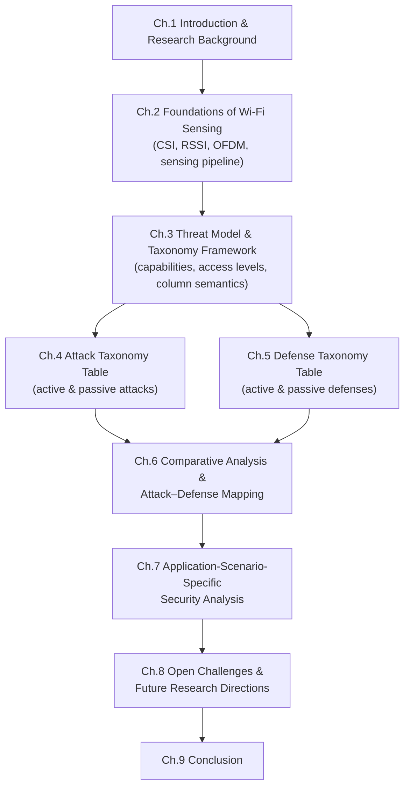
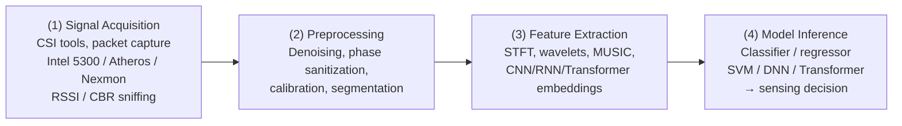
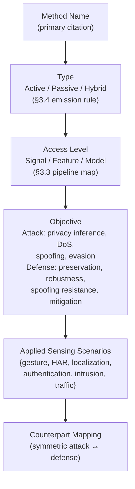

# A Survey on Secure Wi-Fi Sensing Technology: Attacks and Defenses
# 1 Introduction and Research Background

Over the past decade, Wi-Fi has quietly evolved from a pure communication medium into a pervasive *sensing* infrastructure. The same radio waves that carry packets between an access point and a smartphone also propagate through, reflect off, and diffract around human bodies and physical objects, leaving distinctive imprints on the received signal. By extracting fine-grained Channel State Information (CSI) and related physical-layer measurements, researchers and vendors can now detect gestures, recognize daily activities, localize people indoors, authenticate users by their gait or biometric reflections, and even infer keystrokes or breathing patterns—all without cameras, wearables, or explicit user interaction. While this device-free, ubiquitous, and through-wall sensing capability is celebrated as a major enabler of smart homes, ambient assisted living, and the forthcoming IEEE 802.11bf "Wireless LAN Sensing" amendment, it simultaneously transforms every commodity Wi-Fi radio into a potential surveillance device and a new attack surface that the security community has only recently begun to map. This chapter establishes the foundation of the survey by explaining why the security of Wi-Fi sensing has become an urgent research concern, defining the temporal and technical scope of the present study (limited to technologies publicly available before March 2025), articulating the central research questions, and outlining the structure of the remaining eight chapters.

## 1.1 Motivation and Significance of Studying Wi-Fi Sensing Security

The motivation for systematically investigating Wi-Fi sensing security stems from a confluence of three trends that have matured roughly in parallel: the commoditization of CSI-capable hardware, the rapid deployment of sensing-enabled applications in privacy-sensitive environments, and the emergence of concrete attack demonstrations against these systems.

First, what was once a laboratory curiosity requiring specialized software-defined radios has become broadly accessible. The release of CSI extraction tools for off-the-shelf network interface cards—beginning with the Intel 5300 CSI Tool and the Atheros CSI Tool, and later extending to Nexmon for Broadcom chipsets on smartphones and Raspberry Pi platforms—means that any motivated adversary with consumer-grade hardware can passively observe the subcarrier-level channel response of nearby Wi-Fi links. Combined with the proliferation of access points in homes, offices, hospitals, and public spaces, this hardware accessibility creates an enormous and largely unmonitored attack surface. Unlike camera-based surveillance, which is visible, regulated, and easily blocked by walls or curtains, Wi-Fi-based sensing can operate covertly, penetrate non-metallic barriers, and function in darkness, making it qualitatively more difficult to detect and resist.

Second, Wi-Fi sensing is no longer a research artifact. Commercial products and standards efforts have moved aggressively to integrate sensing functionality into mainstream deployment. Smart-home hubs now market "motion detection without cameras," healthcare pilots use CSI-based fall detection for elderly monitoring, retail analytics platforms estimate occupancy and queue length from existing access points, and the IEEE 802.11bf task group is finalizing a standardized protocol for Wi-Fi-native sensing. As these systems migrate from controlled testbeds into homes, clinics, factories, and public infrastructure, the asymmetry between their sensing power and the user's awareness becomes a structural privacy problem. A visitor entering a smart home, a patient in a monitored ward, or a pedestrian passing a sensing-enabled access point typically has no practical means of knowing that they are being sensed, what is being inferred about them, or who has access to the resulting features and models.

Third, the past several years have produced an expanding catalog of concrete attacks against Wi-Fi sensing systems. On the active side, researchers have demonstrated that carefully crafted OFDM signals can perturb subcarrier-level CSI to fool deep-learning-based activity classifiers; that adversarial examples in the style of FGSM and PGD can be transferred from image domains to CSI tensors with minimal modification; and that low-power interferers can degrade or hijack a sensing system's decisions while remaining nearly invisible to legitimate communication. On the passive side, eavesdropping attacks have shown that an unauthorized device, merely overhearing ambient Wi-Fi traffic, can reconstruct user activities, infer typing or PIN entry, and—through side-channel approaches such as fingerprint-and-timing-based snooping (FATS)—deduce in-home behaviors from traffic patterns alone. These demonstrations collectively establish that Wi-Fi sensing is not merely an emerging capability but an emerging *threat surface*, one whose defensive countermeasures lag well behind its offensive possibilities.

The significance of consolidating this rapidly fragmenting literature into a unified attack-defense survey is therefore threefold. For *researchers*, a structured taxonomy clarifies which threat models have been adequately studied, which remain underexplored, and where attack–defense pairings are demonstrably imbalanced. For *system designers and engineers*, an explicit mapping between attacks and defenses across sensing scenarios provides actionable guidance on which countermeasures fit which deployment contexts. For *policy makers and standardization bodies*—particularly those shaping 802.11bf and adjacent privacy frameworks—a clear picture of the current threat landscape is a prerequisite to designing sensing protocols that are secure and privacy-preserving by construction rather than as afterthoughts.

## 1.2 Emergence of CSI-Based Sensing as a Privacy-Sensitive Modality

To understand why CSI-based Wi-Fi sensing occupies a uniquely sensitive position in the security landscape, it is useful to contrast it with two adjacent modalities: conventional RSSI-based wireless sensing and camera-based visual sensing. Although a detailed technical treatment of the underlying physics is deferred to Chapter 2, a brief comparison here illustrates why the security implications of CSI differ qualitatively from those of either neighbor.

The Received Signal Strength Indicator (RSSI) provides a single, coarse scalar per packet—an aggregate measure of received power that fluctuates with distance, obstruction, and interference. RSSI is sufficient for crude motion detection or proximity estimation, but its low dimensionality severely limits the granularity of any privacy inference. CSI, by contrast, exposes the complex-valued frequency response of dozens of OFDM subcarriers across one or more spatial streams, yielding a high-dimensional, time-resolved characterization of the multipath propagation environment. This richness is precisely what enables CSI-based systems to discriminate among similar gestures, recognize keystrokes from finger micro-motions, and identify individuals from gait or even chest-wall movements during respiration. The same richness, however, means that CSI carries far more inferable information about humans and objects in the environment than the wireless community originally intended when subcarrier feedback was introduced for rate adaptation and beamforming.

Compared with camera-based sensing, CSI presents a different—and in several respects more troubling—privacy profile. Cameras require line of sight, are blocked by ordinary opaque materials, are visually obvious, and are governed by mature legal and social norms about consent and signage. CSI sensing operates through walls and furniture, requires no dedicated sensor visible to the observed party, can be performed by a device whose ostensible purpose is merely to provide internet connectivity, and is essentially unregulated by existing privacy regimes. Moreover, because every Wi-Fi-capable device passively produces and exposes channel measurements as a byproduct of normal communication, *any* sufficiently positioned receiver can act as a sensor without the cooperation of the transmitter, the network operator, or the human subject.

These properties make CSI-based sensing not just *a* privacy concern, but a *novel* category of privacy concern. The attack surface is broad (any Wi-Fi link), the adversary's cost is low (commodity hardware suffices), the detectability is poor (passive sniffing leaves no on-air signature), and the inferential power is high (fine-grained behavioral and physiological features). Symmetrically, the same physical-layer richness that empowers passive privacy attacks also enables active manipulation: an adversary capable of injecting tailored OFDM signals or modulating ambient backscatter can shape the CSI observed by a legitimate sensing system, opening pathways to identity spoofing, denial of sensing, and adversarial evasion of learning-based classifiers. These dual offensive possibilities—privacy inference on one side and signal manipulation on the other—define the two principal axes along which this survey organizes its analysis.

## 1.3 Research Scope and Boundaries

Given the breadth of wireless sensing research and the speed at which the field is moving, it is essential to define the scope of this survey precisely.

**Temporal boundary.** The survey covers Wi-Fi sensing security technologies that were publicly available—through peer-reviewed publications, preprints, or technical reports—**before March 2025**. Work appearing after this cutoff, regardless of relevance, is excluded to ensure a consistent and verifiable evidence base. Where a research direction is evolving rapidly and a March 2025 snapshot may soon be superseded, this limitation is acknowledged explicitly in the relevant chapter rather than papered over with speculation.

**Technical boundary.** The survey focuses on sensing systems built on the IEEE 802.11 family of standards, with primary emphasis on **CSI-based** sensing because of its dominance in the recent literature and its disproportionate role in both attack and defense research. **RSSI-based** sensing, **beamforming feedback**-based sensing, and other OFDM-derived physical-layer measurements (such as compressed beamforming reports used in 802.11ac/ax/be) are included where they intersect with the attack-defense narrative. Sensing on non-Wi-Fi RF substrates—such as LTE/5G ISAC, Bluetooth, Zigbee, UWB, mmWave radar, RFID, or acoustic and visible-light sensing—is *excluded*, even though several attack and defense ideas transfer across modalities. This restriction keeps the threat-model assumptions, hardware constraints, and protocol-level interactions analytically tractable.

**Application boundary.** The survey concentrates on six canonical Wi-Fi sensing application scenarios that recur throughout the security literature: (i) gesture recognition, (ii) human activity recognition (HAR), (iii) indoor localization and tracking, (iv) device and user authentication (including biometric identification by gait, breathing, or unique CSI signatures), (v) intrusion and motion detection, and (vi) network traffic classification with sensing implications (e.g., snooping of in-home behaviors via encrypted traffic side channels). Other Wi-Fi-sensing applications such as vital-sign monitoring or material identification are referenced where attacks and defenses target them, but they are not given dedicated scenario sections.

**Topical boundary.** This is a survey of *sensing* security, not of communication security at large. Classical Wi-Fi communication threats—WPA/WPA2/WPA3 cryptanalysis, KRACK-style protocol attacks, deauthentication and evil-twin attacks, rogue AP detection—are out of scope except where they intersect directly with sensing (for example, when a deauthentication attack is repurposed to deny a sensing service). Likewise, generic adversarial-machine-learning theory is referenced only insofar as it has been instantiated against Wi-Fi sensing models; the underlying mathematical foundations are taken as background.

**Source boundary.** All cited evidence is drawn from primary peer-reviewed or preprint sources publicly available before March 2025. Secondary or aggregated surveys are not relied upon as authoritative substitutes for primary sources, and any technique that cannot be traced to a citable primary work is excluded from the two taxonomy tables in Chapters 4 and 5.

## 1.4 Central Research Questions and Analytical Framework

Within this scope, the survey is organized around three central research questions that together define its analytical framework:

**RQ1. What attack surfaces exist in Wi-Fi sensing systems?**
This question asks where, in the end-to-end pipeline of signal acquisition, preprocessing, feature extraction, and model inference, an adversary can intervene; what capabilities (passive vs. active, signal-level vs. feature-level vs. model-level) such an adversary requires; and what concrete attack techniques have been demonstrated under each capability profile. Chapter 4 answers RQ1 by presenting a taxonomy table whose columns capture, for each attack, its name, type (active or passive), objective, applied sensing scenarios, and the defense classes that plausibly mitigate it.

**RQ2. What defense mechanisms have been proposed to counter these attacks?**
This question asks what countermeasures—ranging from signal-level obfuscation and backscatter-based CSI hiding, through input transformation and adversarial training of sensing models, to architectural privacy-preserving designs and anomaly detection of malicious interference—have been demonstrated in the literature, and how each defense relates to the active/passive and signal/feature/model dimensions used to classify attacks. Chapter 5 answers RQ2 through a symmetric taxonomy table covering defense name, type, objective, applied sensing scenarios, and the attack classes the defense targets.

**RQ3. How do attack–defense pairings map across typical sensing applications?**
This question moves from one-sided enumeration to two-sided analysis: it asks which attacks are well-matched by existing defenses, which remain underdefended, and how the balance of offensive and defensive techniques varies across the six canonical sensing scenarios. Chapter 6 synthesizes the two taxonomies into a cross-mapping matrix, and Chapter 7 specializes the analysis to each application scenario, surfacing scenario-specific threat priorities and recommended defense combinations.

The analytical framework binding these questions is summarized in the table below. Throughout the report, every attack and every defense is positioned along the same four axes—adversary capability, access level, attack/defense objective, and applied sensing scenario—so that entries in Chapters 4 and 5 can be compared, paired, and gap-analyzed in Chapters 6 and 7.

| Analytical Axis | Categories Used in the Survey |
|---|---|
| Capability (Type) | Passive (observation only) vs. Active (signal injection or manipulation) |
| Access level | Signal-level (PHY/CSI) · Feature-level (preprocessed inputs) · Model-level (classifier/parameters) |
| Objective | (Attacks) privacy inference · denial of sensing · identity spoofing · model evasion / (Defenses) privacy preservation · robustness · spoofing resistance · interference mitigation |
| Applied sensing scenario | Gesture recognition · HAR · localization · authentication · intrusion/motion detection · traffic classification |

This four-axis framework is intentionally lightweight: it is rich enough to discriminate between, say, a passive long-range eavesdropping attack on HAR and an active OFDM-perturbation attack on a gesture-recognition CNN, yet simple enough that every entry in the taxonomy tables can be characterized without ambiguity. Chapter 3 develops the threat model and column semantics in detail before the tables themselves are populated.

## 1.5 Organization of the Survey

The remainder of the report is organized as follows. The high-level flow moves from foundations, through threat modeling, to systematic taxonomies of attacks and defenses, then to comparative and scenario-specific analyses, and finally to open challenges and conclusions.

A brief preview of each chapter:

- **Chapter 2 — Foundations of Wi-Fi Sensing Technology** introduces the physical-layer measurements (CSI, RSSI, OFDM subcarriers, beamforming feedback) and the canonical sensing pipeline (acquisition → preprocessing → feature extraction → model inference), pinpointing the vulnerabilities each pipeline stage exposes.
- **Chapter 3 — Threat Model and Taxonomy Framework** consolidates the analytical framework outlined in §1.4, distinguishes active from passive attacks and defenses, and fixes the column semantics used in the two core taxonomy tables.
- **Chapter 4 — Overview of Attack Technologies against Wi-Fi Sensing** presents the first core taxonomy table, covering both active attacks (e.g., adversarial OFDM subcarrier-level interference, CSI alteration attacks, Wi-Fi interference attacks on traffic classifiers, FGSM/PGD-style perturbations on CSI models) and passive attacks (e.g., eavesdropping-based motion sensing, long-range adversarial sensing, fingerprint-and-timing-based snooping).
- **Chapter 5 — Overview of Defense Technologies for Wi-Fi Sensing** presents the symmetric defense taxonomy table, spanning active defenses (e.g., backscatter-tag-based CSI obfuscation, signal-level jamming, secure sensing platforms) and passive/model-level defenses (e.g., adversarial training including cross-adversarial training, input transformation, anomaly detection, architectural privacy-preserving designs).
- **Chapter 6 — Comparative Analysis and Attack–Defense Mapping** synthesizes the two taxonomies, comparing techniques along effectiveness, stealth, cost, hardware requirements, impact on legitimate communication, and generality, and producing an explicit cross-mapping that flags well-matched and underdefended attack–defense pairs.
- **Chapter 7 — Application-Scenario-Specific Security Analysis** specializes the analysis to the six canonical sensing applications, identifying scenario-specific threat priorities and recommended defense combinations.
- **Chapter 8 — Open Challenges and Future Research Directions** discusses unresolved problems, including the absence of standardized imperceptibility metrics, scalability and generalization of defenses, robustness under multi-attacker conditions, integration with IEEE 802.11bf, and the need for unified benchmark datasets.
- **Chapter 9 — Conclusion** summarizes the principal findings, restates the value of the two taxonomy tables, and reaffirms the March 2025 scope boundary.

Read sequentially, the report builds from physical-layer foundations to a comprehensive attack-defense landscape; read selectively, Chapters 4 and 5 serve as standalone reference tables for practitioners seeking to identify the threats relevant to a particular deployment and the countermeasures available to address them.

# 2 Foundations of Wi-Fi Sensing Technology

Before any attack or defense technique can be meaningfully classified, the technical substrate on which both operate must be made explicit. Wi-Fi sensing is fundamentally an act of *reusing* a communication signal as a probe of the physical environment: the same OFDM waveforms that carry payload bits between an access point and its clients also encode, in their amplitude and phase distortions, a high-dimensional record of every reflector—walls, furniture, and human bodies—that lies along the multipath between transmitter and receiver. The security properties of any sensing system are therefore inseparable from (i) which physical-layer quantities it observes, (ii) how those quantities are converted into features, (iii) how those features flow through a multi-stage processing pipeline, and (iv) where, along that pipeline, an adversary can intervene. This chapter develops these four points in sequence, deliberately staying at the level of foundational description so that Chapters 3–5 can build their threat model and taxonomy tables on a shared and unambiguous vocabulary. Whereas Chapter 1 framed *why* Wi-Fi sensing has become a security concern, this chapter prepares the analytical ground for *where* and *how* that concern materializes.

## 2.1 Physical-Layer Measurements Underlying Wi-Fi Sensing

The starting point for every Wi-Fi sensing system is a physical-layer measurement that summarizes how the transmitted waveform was altered by the propagation channel. Four classes of such measurements dominate the literature: the Received Signal Strength Indicator (RSSI), Channel State Information (CSI) from OFDM subcarriers, the OFDM subcarrier structure itself viewed as the underlying modulation primitive, and beamforming feedback reports defined by recent 802.11 amendments. Each captures the channel at a different level of resolution, and each opens a correspondingly different attack surface.

### 2.1.1 RSSI: Coarse Scalar Power

RSSI is the simplest and longest-standing physical-layer measurement exposed by commodity Wi-Fi hardware. It is a single scalar value per received packet—an aggregate of received power across the entire occupied bandwidth, after the receiver's analog front end and automatic-gain control. Because RSSI integrates over all subcarriers and over the duration of a packet, it discards both frequency-selective fading information and short-timescale phase dynamics; what remains is a low-rate, low-dimensional indicator that nevertheless varies with distance, obstruction, and motion in the environment.

For sensing, RSSI is sufficient for tasks that depend only on coarse changes in received power: presence/intrusion detection, very coarse localization via fingerprinting against a pre-recorded RSSI map, and crude proximity estimation. Its sensing utility is, however, fundamentally limited by three properties: high temporal variance even in static environments (due to interference and AGC behavior), poor spatial resolution (motion that does not perturb the dominant propagation path may leave RSSI unchanged), and the inability to disentangle multipath components. From a security standpoint, these same properties cut two ways. On one hand, the low information content of RSSI bounds the privacy harm an RSSI-only eavesdropper can inflict—fine-grained gesture or keystroke inference is essentially out of reach. On the other hand, RSSI's ubiquity (every Wi-Fi receiver reports it, with no special tools required) means that even the most casual adversary can perform presence-level surveillance, and RSSI-based localization systems remain vulnerable to spoofing by transmitters that mimic the power profile of legitimate anchors.

### 2.1.2 CSI: Complex-Valued Subcarrier-Resolved Channel Response

Channel State Information is the measurement that has made modern Wi-Fi sensing possible, and it is also the measurement around which most contemporary attacks and defenses are organized. CSI estimates the complex frequency response of the wireless channel at each OFDM subcarrier, typically using the long training fields of the 802.11 preamble. For a single transmit–receive antenna pair and $K$ usable subcarriers, the per-packet CSI is a complex vector

$$
H = [H_1, H_2, \ldots, H_K], \qquad H_k = |H_k|\, e^{j\angle H_k},
$$

where $|H_k|$ denotes the amplitude and $\angle H_k$ the phase of the channel at subcarrier $k$. For $N_t \times N_r$ MIMO configurations, a CSI sample becomes a three-dimensional tensor of dimensions $N_t \times N_r \times K$, and a packet stream over time turns this tensor into a four-dimensional time-series suitable for direct ingestion by deep learning models. On commodity hardware, $K$ is typically 30 (Intel 5300 reporting one out of every two subcarriers in a 20 MHz channel) or up to 256 (Nexmon on 80 MHz channels with Broadcom chipsets), giving CSI a dimensionality two to three orders of magnitude greater than RSSI per packet.

Two properties of CSI explain its dominance in both sensing and adversarial sensing research. First, the amplitude $|H_k|$ varies with the constructive and destructive interference of multipath components, so any change in the environment that alters even one propagation path—a hand gesture, a chest rising during respiration, a person walking through an adjacent room—produces a characteristic pattern across the $K$ subcarriers. Second, the phase $\angle H_k$, although corrupted by carrier-frequency offset, sampling-time offset, and packet-detection-delay residuals, can be sanitized (see §2.2) into a clean indicator of path-length changes on the order of a fraction of a wavelength, enabling Doppler analyses sensitive to breathing-scale motion. The composition of high temporal rate, high spectral resolution, and joint amplitude–phase availability is what allows CSI-based systems to distinguish among similar gestures, identify individuals by gait or unique multipath signatures, and infer keystrokes from finger micro-motions.

From a security standpoint, CSI is doubly exposed. Passively, any receiver overhearing the same Wi-Fi transmissions sees the *same* channel (under reciprocity and for sufficiently nearby antennas, similar enough to support comparable inferences), so an eavesdropper with a commodity CSI extraction tool can perform the same activity or identity inference as the legitimate sensing application without ever associating with the network. Actively, the entire CSI vector is determined by a combination of the transmitted signal and the environment; an adversary who can inject controlled RF energy on the same channel, or who can modulate ambient backscatter, can perturb selected subcarriers and thereby steer the downstream classifier's decision while remaining nearly invisible to the human user.

### 2.1.3 OFDM Subcarriers as the Sensing Primitive

CSI does not exist as an independent measurement: it exists because 802.11a/g/n/ac/ax/be transmissions are themselves OFDM waveforms. OFDM partitions the channel bandwidth into many narrowband, mutually orthogonal subcarriers spaced 312.5 kHz apart (in legacy 20 MHz channels), each modulated by a complex data symbol over a symbol duration of a few microseconds. Because each subcarrier occupies only a narrow slice of spectrum, frequency-selective fading—the phenomenon that gives multipath-rich indoor environments their characteristic spectral "fingerprint"—manifests as differing complex gains across subcarriers, which is exactly what the per-subcarrier CSI estimates capture.

For sensing purposes, the OFDM subcarrier grid plays three roles. First, it sets the *spectral resolution* of any CSI-based sensing system: more subcarriers yield finer frequency-domain resolution of multipath delay spread, which translates into finer ability to disentangle direct-path from reflected-path components and thus to localize and characterize reflectors. Second, it sets the *temporal granularity*: a sensing system observes one CSI snapshot per received packet, so the maximum effective sample rate is determined by the rate at which the monitored link transmits, which in turn governs the highest motion frequency (e.g., the highest gait or gesture Doppler) the system can recover without aliasing. Third, the subcarrier structure is the natural unit on which signal-level adversarial manipulation operates: rather than overpowering the entire channel (which would be conspicuous and would disrupt communication), an attacker can craft transmissions whose energy is concentrated on subcarriers that the legitimate sensing model relies upon, producing a strong effect on the inference while contributing only modestly to bit-error rate or detectable interference. The subcarrier grid is therefore both the substrate that enables fine-grained sensing and the dial on which sub-microsecond, sub-megahertz adversarial perturbations are applied.

### 2.1.4 Beamforming Feedback as an Alternative Sensing Substrate

Beginning with IEEE 802.11ac, and continuing through 802.11ax and the in-progress 802.11be, multi-user MIMO operation relies on the beamformee periodically reporting a *compressed* representation of the channel matrix to the beamformer. These compressed beamforming reports (CBRs) encode the right singular vectors of the per-subcarrier channel matrix in the form of Givens-rotation angles ($\phi$ and $\psi$ parameters), quantized to a few bits each and transmitted as management frames over the air.

For sensing, CBRs are attractive because, unlike raw CSI, they are *standardized*: any 802.11ac-or-later receiver involved in beamforming exchanges generates them as part of normal operation, and—critically—they are transmitted in clear text on the air even when the data payload is encrypted, because beamforming feedback is exchanged before per-link encryption keys can encrypt management traffic in some configurations. Several sensing studies have shown that CBRs preserve enough channel information to support coarse motion detection, presence sensing, and even some HAR tasks, without ever requiring CSI-extraction firmware. Beamforming feedback thus opens a sensing substrate that is broader (any modern Wi-Fi receiver), more standardized (the format is specified by IEEE rather than vendor-specific), and—from a security perspective—more accessible to passive adversaries who cannot install custom firmware but can sniff management frames. The information content per report is lower than that of full raw CSI, but it is far higher than RSSI, placing CBR-based sensing at an intermediate point on the privacy-sensitivity spectrum.

The four measurements are summarized comparatively in the following table.

| Measurement | Dimensionality | Typical sensing tasks | Accessibility to adversary | Principal privacy exposure |
|---|---|---|---|---|
| RSSI | 1 scalar per packet | Presence, coarse localization | Universal (no special tools) | Presence/occupancy inference; localization spoofing |
| CSI (amplitude + phase) | $N_t \times N_r \times K$ complex per packet (K = 30–256) | Gesture, HAR, gait/biometric ID, fine localization, keystroke inference | Requires CSI-extraction firmware (Intel 5300, Atheros, Nexmon) | Fine-grained behavioral and biometric inference; rich substrate for active perturbation |
| OFDM subcarrier grid (underlying CSI) | $K$ orthogonal subcarriers, ~3.2 μs symbol | Substrate enabling all CSI-based tasks | Same as CSI; also exploitable by active transmitters tuned to specific subcarriers | Sub-band perturbation that is invisible to BER-level monitoring |
| Beamforming feedback (CBR, 802.11ac/ax/be) | Quantized Givens angles ($\phi$, $\psi$) per subcarrier | Motion detection, presence, coarse HAR | Sniff management frames; no firmware modification needed | Standardized, broadly available channel proxy |

The key insight is that the *information richness* of each measurement (which makes it valuable for sensing) and its *adversarial exposure* (which determines what an attacker can passively infer or actively perturb) scale together. RSSI is hard to abuse for fine-grained inference but is also too coarse for sophisticated sensing; CSI enables both rich sensing and rich attacks; CBRs occupy an intermediate but increasingly important position as the 802.11 standards push beamforming into mainstream use.

## 2.2 From Physical-Layer Measurements to Sensing Features

Raw physical-layer measurements are rarely fed directly into a sensing decision. Between the received samples and the final classifier sit a chain of signal-processing and representation-learning operations that turn noisy, hardware-impaired complex numbers into features that are stable, discriminative, and adapted to the target task. Understanding this chain is essential for two reasons. First, attacks rarely succeed by perturbing the *raw* measurement uniformly; they exploit the assumptions baked into the feature pipeline. Second, defenses frequently operate not at the signal level but at the feature level—sanitizing, transforming, or regularizing the features to break adversarial dependencies.

### 2.2.1 Signal-Processing Operations on CSI

CSI as delivered by extraction tools is corrupted by several hardware artifacts: carrier frequency offset (CFO) between transmitter and receiver oscillators causes a packet-dependent phase rotation; sampling time offset (STO) and packet detection delay (PDD) produce subcarrier-linear phase ramps; and quantization, AGC transitions, and burst noise inject high-frequency outliers in the amplitude time series. The first stage of any CSI-based pipeline therefore consists of *denoising and sanitization*.

Amplitude denoising typically applies low-pass or band-pass filters (Butterworth, moving-average, or Hampel filters) tuned to the motion frequencies of interest—roughly 0.1–0.5 Hz for respiration, 0.5–4 Hz for gait, and up to a few tens of Hz for fast gestures. Discrete-wavelet decomposition is also widely used because it allows separate treatment of motion-band coefficients and noise-band coefficients. Phase sanitization is more delicate: the most common technique is *linear-fit phase calibration*, in which a linear trend in subcarrier index is fitted to the unwrapped phase across subcarriers and subtracted, leaving only the residual phase that reflects multipath geometry rather than oscillator drift. Conjugate multiplication across pairs of antennas at the same receiver provides an alternative, cancelling CFO and a portion of STO at the cost of doubling antenna requirements.

*Subcarrier selection* is the next common operation. Not all subcarriers carry equal information for a given task: subcarriers near the channel edges are noisier, certain subcarriers are reserved for pilots, and motion-sensitive subcarriers depend on the multipath geometry. Variance ranking, mutual-information ranking, and learned attention weights are all used to retain a subset (typically 10–30) of the most informative subcarriers, both to reduce model size and to suppress nuisance variation.

For motion-centric tasks, *time–frequency analysis*—short-time Fourier transforms, continuous wavelet transforms, or Doppler-frequency-shift extraction via FFT over short sliding windows—turns the cleaned CSI time series into spectrograms in which Doppler signatures of human motion appear as characteristic shapes. These spectrograms are the canonical input to gait identification, gesture, and HAR systems, because Doppler shifts directly encode velocity components along the line of sight.

### 2.2.2 Statistical, Handcrafted, and Learned Representations

On top of the cleaned signals, sensing systems form features in one of three styles. *Statistical features*—mean, variance, skewness, entropy, autocorrelation peaks, and per-subcarrier energy ratios—are computed over sliding windows and are typical of early gesture and intrusion-detection systems that feed shallow classifiers (SVM, random forest, k-NN). *Handcrafted physical features* attempt to map signals onto geometric quantities of interest: time-of-flight estimates for localization, angle-of-arrival estimates via MUSIC-style algorithms over the MIMO CSI tensor, or Doppler-velocity estimates for gait. *Learned representations* dominate the modern literature: convolutional neural networks treat the CSI amplitude (or amplitude + sanitized phase) tensor as a multi-channel image and learn task-specific filters; recurrent networks (LSTM, GRU) capture temporal dynamics across consecutive CSI snapshots; and increasingly, Transformer architectures with self-attention over time and subcarrier dimensions are used for HAR and identification tasks because they capture long-range dependencies in the Doppler signature.

### 2.2.3 Mapping Feature Types to Sensing Scenarios

The choice of feature representation is tightly coupled to the sensing scenario. The following table summarizes the typical mapping that recurs across the six canonical scenarios identified in Chapter 1.

| Sensing scenario | Dominant measurement | Typical feature representation | What the feature encodes |
|---|---|---|---|
| Gesture recognition | CSI amplitude + sanitized phase | Spectrograms via STFT / CWT; CNN/RNN embeddings | Doppler signatures of hand and arm motion |
| Human activity recognition (HAR) | CSI tensor over time | CNN over CSI image; Transformer over time–subcarrier | Joint amplitude–phase dynamics of whole-body motion |
| Indoor localization | CSI (AoA, ToF) or RSSI fingerprints | MUSIC/SpotFi-style spectra; fingerprint vectors | Multipath geometry tied to location |
| Device / user authentication | CSI amplitude + phase | Deep embeddings; gait or biometric signatures | Unique multipath or micro-motion fingerprint |
| Intrusion / motion detection | CSI variance, RSSI variance, CBR change | Statistical descriptors; thresholded change detectors | Deviation from "empty room" baseline |
| Traffic classification (sensing-relevant side channel) | Packet sizes and timings (not CSI) | Flow-level statistics; n-grams of packet lengths | Encrypted traffic patterns linked to user activity |

This mapping makes explicit a point that is critical for the security analysis to come. The first five scenarios share a common feature substrate—cleaned CSI fed to deep models—and therefore are vulnerable to a common set of attacks (signal-level perturbations, adversarial CSI inputs, eavesdropping on the same CSI). Traffic classification, by contrast, operates on a *different* substrate altogether: it derives sensing-relevant inferences not from the physical-layer channel but from the encrypted packet-flow side channel exposed above the MAC layer. This is why the traffic-classification scenario is treated separately in the taxonomies of Chapters 4 and 5, even though it shares the privacy-inference *objective* with passive CSI eavesdropping.

## 2.3 Canonical Wi-Fi Sensing Pipeline and Stage-Wise Operations

Synthesizing the preceding two sections, virtually every Wi-Fi sensing system in the security-relevant literature can be decomposed into the same four-stage pipeline: signal acquisition, preprocessing, feature extraction, and model inference. This pipeline is the reference architecture against which every attack and defense in Chapters 4 and 5 will be localized.

### 2.3.1 Stage 1 — Signal Acquisition

Signal acquisition turns over-the-air RF energy into a stream of per-packet measurements stored on a host. In the dominant CSI-based pipeline, this is accomplished by modified driver/firmware tools that expose the channel-estimation outputs of the receiver chipset: the Intel 5300 CSI Tool reports CSI for 30 OFDM subcarriers across up to 3×3 MIMO streams on 802.11n; the Atheros CSI Tool exposes per-subcarrier CSI on Atheros chipsets; and the Nexmon CSI extractor brings comparable capability—at much higher subcarrier counts on 80 MHz channels—to Broadcom chipsets in Raspberry Pi, Asus routers, and certain Nexus smartphones. RSSI is obtained from standard driver APIs on essentially every Wi-Fi device, and beamforming feedback can be obtained by capturing management frames with monitor-mode tools such as `tcpdump` or `tshark`. From a data-flow perspective, the output of this stage is a per-packet record containing a timestamp, source/destination identifiers, and the chosen physical-layer measurement(s).

### 2.3.2 Stage 2 — Preprocessing

Preprocessing applies the denoising, phase-sanitization, and subcarrier-selection operations described in §2.2 to convert raw, hardware-impaired measurements into clean signals. Two additional operations are characteristic of this stage. *Calibration* re-aligns CSI across antennas, packets, or environments to compensate for hardware variability between transmit chains and to enable cross-device generalization. *Segmentation* partitions the continuous signal stream into windows aligned with the events of interest—either fixed-length sliding windows (typical of HAR and intrusion detection) or motion-triggered variable-length windows (typical of gesture systems, where a motion-energy detector demarcates the start and end of a gesture). The output of preprocessing is a sequence of cleaned, calibrated, time-bounded signal segments.

### 2.3.3 Stage 3 — Feature Extraction

Feature extraction transforms each cleaned segment into the input format expected by the inference stage. In classical pipelines this means computing statistical descriptors, time-frequency spectrograms, or geometry-aware quantities (AoA, ToF). In modern deep pipelines, much of feature extraction is folded into the early layers of the inference network, with the explicit feature-extraction module reduced to format conversion (e.g., reshaping a $T \times K$ amplitude matrix into a single-channel image) and normalization. Where they remain explicit, feature-extraction modules are themselves attack surfaces, because their assumptions (e.g., that the Doppler spectrum below 50 Hz contains only human motion) can be violated by adversaries who deliberately inject perturbations within those assumed bounds.

### 2.3.4 Stage 4 — Model Inference

The final stage applies a trained classifier or regressor that maps the extracted feature to a sensing decision—a gesture label, an activity class, a location estimate, an identity match, a binary intrusion alarm, or an activity-class inference from encrypted traffic. The model may be a shallow classifier (SVM, k-NN, random forest), a deep classifier (CNN, RNN, Transformer), or a hybrid (e.g., handcrafted features fed to a deep network). Inference may run on the access point itself, on a paired edge device, or in the cloud; the choice influences both latency and the attack surface (cloud inference exposes the model API; edge inference exposes the model binary and its parameters to physical or firmware-level access).

## 2.4 Stage-Wise Vulnerabilities and Security-Relevant Exposure Points

Each stage of the pipeline exposes a distinct class of vulnerability, and these classes align precisely with the *access-level* axis (signal-level, feature-level, model-level) that Chapter 1 introduced and that Chapter 3 will formalize. The remainder of this chapter walks through the pipeline a second time, this time annotating each stage with the security-relevant exposure points that subsequent chapters will populate with concrete attack and defense techniques.

### 2.4.1 Vulnerabilities at Signal Acquisition

The acquisition stage is exposed in two opposing ways. *Passively*, any third party with a compatible CSI-extraction tool—or even just a monitor-mode sniffer of beamforming feedback—can observe the same channel as the legitimate sensing receiver. Because RF energy radiates omnidirectionally and is unaffected by application-layer encryption (which never touches the preamble or beamforming-feedback management frames that carry channel information), an eavesdropper does not need to authenticate to the network, does not need cooperation from the transmitter, and leaves no on-air signature. This is the foundational vulnerability behind eavesdropping-based motion sensing, long-range adversarial sensing, and CBR-based passive monitoring. *Actively*, the same stage is exposed to RF injection: an adversary transmitting on the monitored channel alters the signal that arrives at the receiver before any sanitization can occur. Two important sub-cases are continuous jamming (which simply denies the sensing service by saturating the receiver) and crafted-waveform injection (which biases the CSI estimates toward a particular pattern, enabling spoofing or adversarial evasion at a fraction of the energy cost of broadband jamming). Backscatter-based perturbation—reflecting ambient Wi-Fi signals through a controlled load on a battery-free tag—is a low-energy variant that is particularly relevant on the defense side.

### 2.4.2 Vulnerabilities at Preprocessing

Preprocessing operations are *designed* assumptions about the signal: that motion energy lies below a cutoff frequency, that phase drift is linear in subcarrier index, that segmentation boundaries are correctly placed at gesture onsets. Each such assumption is a target. A perturbation engineered to lie within the pass-band of a low-pass denoising filter will survive denoising intact; a phase offset that is non-linear in subcarrier index will be mis-corrected by linear-fit sanitization, leaving controllable residuals; an adversary who can trigger spurious motion onsets can cause segmentation to align with attacker-chosen windows. Less obviously, *calibration* steps that average over packets to estimate a baseline can be poisoned: an attacker present during a calibration episode can shift the baseline against which all future measurements are compared. These vulnerabilities are characteristically subtle because they exploit not the model but the analyst's prior beliefs about the signal.

### 2.4.3 Vulnerabilities at Feature Extraction

The feature-extraction stage exposes two distinct vulnerability classes. The first is *adversarial input crafting*: because most modern systems route features into deep classifiers, the gradient of the classifier loss with respect to the feature can be back-propagated to identify minimal perturbations of the CSI input that flip the predicted class. FGSM and PGD-style perturbations, originally developed in the image domain, transfer to CSI tensors with surprisingly little adaptation: bounded $\ell_\infty$ or $\ell_2$ perturbations of the amplitude tensor of a few percent of the signal scale are often sufficient to mis-classify gestures or activities, and—critically—such perturbations can be re-synthesized as physical OFDM signals at the acquisition stage, closing the loop from a digital adversarial example to a physically realizable attack. The second class is *side-channel inference*. In sensing scenarios whose features are not CSI but packet timings and sizes (notably the traffic-classification scenario), the feature extractor's outputs are exposed to any observer of the encrypted traffic. Fingerprint-and-timing-based snooping (FATS) and similar attacks exploit precisely this exposure to infer in-home activities from flow patterns that the encrypted payload cannot conceal.

### 2.4.4 Vulnerabilities at Model Inference

Finally, the inference stage exposes the model itself. Evasion attacks (the targeted output of adversarial input crafting) cause the model to produce attacker-chosen predictions on slightly perturbed inputs. Spoofing attacks craft inputs that imitate the multipath signature of a legitimate user to defeat CSI-based authentication. Membership-inference and model-inversion attacks, when the inference API is exposed (e.g., in cloud-hosted sensing services), can extract information about training data or even reconstruct stylized inputs corresponding to particular classes. Where the model binary is accessible (edge deployments, leaked firmware), white-box adaptation of all of the above attacks becomes substantially easier than the black-box variants.

### 2.4.5 Synthesis: Stage → Access Level → Threat Class

The four stages, the access levels they expose, and the threat classes that follow from each are summarized below. This table is the analytical bridge from Chapter 2 to Chapters 3–5: every entry in the attack taxonomy of Chapter 4 and the defense taxonomy of Chapter 5 will plug into exactly one row of this table, locating itself in the pipeline and on the access-level axis that Chapter 3 will formalize.

| Pipeline stage | Access level exposed | Representative passive threats | Representative active threats | Representative defensive levers |
|---|---|---|---|---|
| 1. Signal acquisition | Signal-level (PHY) | CSI eavesdropping; CBR sniffing; long-range passive sensing | RF jamming; crafted OFDM injection; backscatter perturbation | Signal-level obfuscation; backscatter-tag CSI shielding; physical-layer access control |
| 2. Preprocessing | Signal/feature-level | — (passive exploitation rare here) | Perturbations crafted to survive filtering; calibration poisoning; segmentation triggering | Robust filters; anomaly detection of interference; calibration integrity checks |
| 3. Feature extraction | Feature-level | Encrypted-traffic side-channel inference (FATS-style); flow-pattern leakage | FGSM/PGD-style adversarial CSI inputs; feature-domain spoofing | Input transformation; feature sanitization; privacy-preserving feature design |
| 4. Model inference | Model-level | Membership/inversion attacks on exposed APIs | Evasion attacks (targeted/untargeted); identity spoofing; model-targeted adversarial examples | Adversarial training (incl. cross-adversarial training); ensembling; output auditing |

Read across each row, the table makes clear that the *type* axis (passive vs. active) of the survey's framework cross-cuts the stage axis: each pipeline stage admits both passive observation and active manipulation, though the relative emphasis shifts (acquisition is heavily exposed to both; preprocessing is mostly an active-attack target; feature extraction is the principal locus of both side-channel inference and adversarial examples; inference is dominated by model-level attacks). Read down each column, the table previews the structure of Chapters 4 and 5: passive threats in Chapter 4 cluster at acquisition and feature extraction, active threats span all four stages with particular concentrations at acquisition and inference, and defensive levers in Chapter 5 are similarly distributed.

With this stage-wise vulnerability map in place, the technical foundations needed for the rest of the survey are complete. Chapter 3 builds on the four-axis analytical framework introduced in §1.4 and the stage-wise exposure map developed here to define the unified threat model—the column semantics for *type*, *access level*, *objective*, and *applied sensing scenario*—that organizes the two core taxonomy tables of Chapters 4 and 5.

# 3 Threat Model and Taxonomy Framework

Chapters 1 and 2 motivated the security study of Wi-Fi sensing and described the physical-layer measurements, the canonical four-stage pipeline (acquisition → preprocessing → feature extraction → inference), and the stage-wise vulnerabilities that any attack or defense ultimately exploits or protects. What remains—and what this chapter supplies—is the *analytical vocabulary* that turns those qualitative observations into a reproducible classification scheme. Without such a vocabulary, the literature's many concrete attacks (adversarial OFDM perturbations, eavesdropping-based motion sensing, backscatter manipulations, traffic-pattern snooping) and defenses (signal-level obfuscation, adversarial training, anomaly detection, privacy-preserving feature design) cannot be compared on common ground, and the two taxonomy tables of Chapters 4 and 5 would devolve into ad hoc enumerations. The purpose of this chapter is therefore narrowly methodological: it fixes the four analytical axes introduced in §1.4 (capability, access level, objective, applied sensing scenario) as a unified threat-model schema, defines the boundary criteria that distinguish active from passive techniques on both sides of the attack–defense ledger, and specifies the exact column semantics of the two core taxonomy tables so that every entry in Chapters 4 and 5 can be located unambiguously and paired symmetrically. Concrete techniques are deferred almost entirely to Chapters 4 and 5; this chapter establishes only the rules under which they will be classified.

## 3.1 Adversary Capability Model: Passive Eavesdroppers vs. Active Interferers

The first and most basic axis of the threat model partitions adversaries into two capability classes, distinguished by whether they merely *observe* the over-the-air Wi-Fi signal or also *modify* it. This dichotomy is fundamental because every other property of an attack—its on-air detectability, its cost, its hardware requirements, and the defenses it admits—follows from where the adversary sits on the observe/modify boundary.

### 3.1.1 Passive Eavesdroppers

A *passive eavesdropper* possesses receive-only access to the wireless medium. The adversary captures packets transmitted by legitimate parties—either data frames whose preambles carry the channel-estimation training fields from which CSI is computed, or management frames that carry beamforming feedback (CBR)—and either extracts physical-layer measurements directly (CSI, RSSI) or harvests upper-layer side channels (packet sizes, inter-arrival times). The eavesdropper does not associate with the network, does not need to know any encryption key (since channel estimation and beamforming feedback are derived from clear-text preambles or management frames), and emits no RF energy of its own, leaving no on-air signature that the legitimate receiver can detect through ordinary channel-quality monitoring.

The hardware requirements vary with the measurement of interest. RSSI capture is essentially free—every commodity Wi-Fi receiver exposes it through standard driver APIs. CSI capture requires firmware-level access on a small set of supported chipsets: the Intel 5300 NIC with the Linux 802.11n CSI Tool, Atheros NICs with the Atheros CSI Tool, and Broadcom/Cypress chipsets with the Nexmon CSI Extractor on platforms ranging from Raspberry Pi to Asus routers and certain Android phones, with newer tools such as PicoScenes and FeitCSI extending coverage to Intel AX200/AX210 and software-defined radios.[^1] CBR capture requires only a monitor-mode sniffer (e.g., `tcpdump`/`tshark`), since beamforming feedback frames are transmitted in clear text by any 802.11ac/ax/be receiver participating in MIMO beamforming. Because all of these tools are open source or freely available and target commodity hardware costing tens to a few hundred US dollars, the entry barrier for passive eavesdropping is extremely low.

Positioning of the passive adversary is determined by the propagation environment. The eavesdropper must be close enough to receive the monitored link with usable SNR, but because Wi-Fi signals penetrate non-metallic walls and travel tens of meters at typical transmit powers, "close enough" can include adjacent rooms, neighbouring apartments, hallways, or curbside vehicles. The privacy harm achievable by a passive adversary scales with the information richness of the measurement it can obtain: RSSI supports only presence/occupancy inference, CBR supports coarse motion and HAR-level inference, and CSI supports the full gamut of gesture, activity, gait, biometric, and even keystroke-level inference described in Chapter 2.

### 3.1.2 Active Interferers

An *active interferer* possesses transmit-capable hardware and uses it to inject controlled RF energy that reaches the legitimate sensing receiver. The injected signal alters the per-packet CSI estimates at the receiver—either by adding directly to the received waveform on the same subcarriers used by the legitimate link, or by changing the multipath environment via a controllable reflector—and thereby steers the downstream sensing decision. Three concrete capability sub-profiles recur in the literature:

- *Co-channel RF injection.* The adversary transmits on the same 20/40/80 MHz channel as the monitored link, using a software-defined radio (USRP, HackRF, BladeRF) or a modified commodity Wi-Fi card. Crafted-waveform injection concentrates energy on subcarriers that the legitimate sensing model relies upon, biasing CSI estimates while contributing little to bit-error rate; continuous broadband jamming, by contrast, denies sensing service by saturating the receiver.
- *Backscatter modulation.* A battery-free or near-battery-free reflector tag toggles its impedance to modulate ambient Wi-Fi signals, perturbing the multipath component seen at the receiver. Backscatter is attractive on both attack and defense sides because the perturbation is generated without an independent transmitter and is therefore harder to source-locate.
- *Crafted physical motion or transmissions in the environment.* An adversary capable of transmitting from a colluding device (e.g., another smartphone or IoT node within range) can replay or synthesize signals whose channel signature mimics a target user's gait or gesture, supporting identity-spoofing attacks against CSI-based authentication.

Compared with passive eavesdropping, active interference imposes higher hardware costs (an SDR transmitter typically costs hundreds to a few thousand US dollars, and even backscatter tags require custom circuitry), and it leaves a detectable RF footprint that a sufficiently instrumented defender can in principle observe through anomaly detection of interference patterns. Crucially, however, the energy required to *steer* a learning-based classifier is far below the energy required to *jam* a communication link, which is precisely the regime that "imperceptible" adversarial attacks against sensing exploit: the attack changes the model's decision while the legitimate communication continues to operate at acceptable BER.

### 3.1.3 Hybrid and Probing Adversaries

Several entries in Chapters 4 and 5 do not fit cleanly into either pure capability class. The most common hybrid pattern is the *probe-then-inject* adversary, which first passively observes the legitimate link for a calibration interval—learning the channel, the model's apparent input distribution, or the timing of CSI segmentation windows—and then injects RF energy whose parameters are tuned to the observations. This pattern is characteristic of physically realized adversarial-example attacks: the perturbation is computed digitally from observed CSI and re-synthesized as an OFDM waveform. A second hybrid pattern is the *colluding-transmitter* adversary, which causes a benign-looking device under its control (e.g., an IoT sensor it has compromised) to transmit packets whose timing or content reveals information correlated with sensor state, enabling side-channel inference without the adversary itself transmitting on the monitored channel.

For taxonomic purposes the survey adopts the following labelling rule: an entry is classified as *active* if and only if the adversary causes RF energy to reach the legitimate sensing receiver in a way that is functionally necessary for the attack's success; passive probing performed solely to optimize a subsequent injection does not by itself make an attack passive. Conversely, an attack whose success depends *exclusively* on observation—even when the observer performs sophisticated downstream computation—is classified as passive. This convention is applied uniformly to all entries in Chapter 4 and is mirrored on the defense side in §3.4.

## 3.2 Adversary and Defender Objectives

The second axis of the threat model is the *goal* the adversary pursues or the defender counters. Because attacks and defenses face each other across the same pipeline, the survey defines the two sets of objectives symmetrically: each attack objective has at least one defense objective that opposes it. Four attack objectives and four defense objectives are used throughout the taxonomy tables.

### 3.2.1 Four Attack Objectives

- **Privacy inference.** The adversary's goal is to *learn* something about the human, device, or environment that the legitimate sensing system was not authorized to disclose. Targets include gestures, activities, identities (gait or unique-multipath fingerprints), indoor locations and trajectories, keystroke or PIN-entry sequences, and vital signs such as breathing and heart rate. Privacy-inference attacks are paradigmatically *passive*: the adversary needs only to receive the signal that the legitimate link is already transmitting and to run its own sensing pipeline on the captured measurements. Eavesdropping-based motion sensing, CBR sniffing, and traffic-pattern snooping (e.g., FATS-style attacks on in-home behaviors) all fall under this objective.

- **Denial of sensing.** The adversary's goal is to *prevent* the legitimate sensing system from operating correctly, without necessarily caring what the system would otherwise have inferred. The most basic form is broadband jamming, which saturates the receiver's front end and forces the sensing pipeline either to drop packets or to ingest noise. More sophisticated forms craft interference that survives denoising and confuses the segmentation or feature-extraction stages—e.g., a perturbation in the motion-frequency band that produces a continuous false "activity" signal, blinding intrusion-detection systems to actual events. Denial-of-sensing attacks are typically *active*, although in principle a passive adversary could exfiltrate timing information that allows an external collaborator to schedule disruption.

- **Identity spoofing.** The adversary's goal is to *impersonate* a legitimate user's CSI signature in order to bypass authentication or attribution mechanisms. Wi-Fi authentication systems that rely on gait, breathing, or multipath fingerprints[^1] assume that the CSI observed during an authentication attempt was produced by the genuine user; an adversary capable of injecting crafted signals that replicate the target's signature can defeat this assumption. Spoofing attacks are inherently *active* (the adversary must produce a signal that fools the receiver) and operate at the signal level.

- **Model evasion.** The adversary's goal is to *cause a learning-based classifier* to emit attacker-chosen predictions on inputs that are otherwise typical of the deployment. This is the Wi-Fi-sensing instantiation of adversarial-example attacks familiar from computer vision: bounded perturbations of the CSI tensor—computed against a known or surrogate model and synthesized either digitally (in feature space) or physically (as OFDM injection)—flip the predicted class, e.g., causing a "fall" to be classified as "sit" or a gesture to be misrecognized. Evasion attacks can be untargeted (any mis-classification suffices) or targeted (a specific attacker-chosen class is desired); they may operate at the signal level (physical OFDM injection during data collection) or at the feature/model level (when the adversary can access the inference API or feature buffer).

### 3.2.2 Four Defense Objectives

- **Privacy preservation.** The defender's goal is to *prevent* unauthorized observers from extracting sensitive inferences from Wi-Fi signals propagating in or around the protected space. Mechanisms range from active signal-level obfuscation (deliberately perturbing the CSI seen by external receivers, as in backscatter-tag schemes) to passive architectural designs (e.g., feature pipelines that discard identity-correlated subcarriers before any cloud upload) and adversarial obfuscation of CSI features used in privacy-preserving sensing.[^1] Privacy preservation is the defense counterpart of privacy inference.

- **Robustness / availability.** The defender's goal is to *maintain* sensing performance in the presence of noise, interference, and adversarial perturbations—whether deliberate or environmental. This objective covers adversarial training (training the classifier on perturbed inputs to harden its decision boundary), input transformation (e.g., randomized smoothing or denoising autoencoders applied at inference time), and anomaly detection of interference (flagging and excluding CSI segments whose statistics indicate active injection). It is the joint counterpart of denial-of-sensing and model-evasion attacks.

- **Spoofing resistance.** The defender's goal is to *detect or reject* CSI inputs that imitate a legitimate user but are produced by an adversary. Mechanisms include liveness-style cross-checks across subcarriers or antennas, physical-layer challenge–response schemes that exploit channel reciprocity, and learned discriminators trained to distinguish synthesized from organic CSI signatures. This is the defense counterpart of identity spoofing.

- **Interference mitigation.** The defender's goal is to *suppress* the impact of active RF injection on the sensing pipeline regardless of the adversary's downstream intent. Mechanisms include robust filtering, redundancy across antennas/links, and signal-source localization. Interference mitigation differs from robustness in that it operates pre-feature-extraction (typically in preprocessing) and focuses on detecting and neutralizing the adversarial signal itself rather than hardening the classifier against its effects.

### 3.2.3 Multi-Objective Entries

Several techniques in the literature pursue more than one objective simultaneously. An adversarial-example attack against a HAR classifier may serve both *model evasion* (the immediate effect) and *denial of sensing* (the system-level consequence). A backscatter-tag CSI-obfuscation defense may simultaneously achieve *privacy preservation* (against external eavesdroppers) and *spoofing resistance* (by making the legitimate channel hard to replicate). The survey records multi-objective entries by listing all applicable objectives in the Objective column, ordered from primary (the technique's stated principal goal) to secondary; the Counterpart Mapping column is then populated symmetrically against all listed objectives.

## 3.3 Access Levels Along the Sensing Pipeline

The third analytical axis—*access level*—specifies *where* in the sensing pipeline a technique intervenes. Three levels are distinguished, corresponding to the boundaries between the four pipeline stages introduced in §2.3.

- **Signal-level access** refers to intervention on the over-the-air RF signal or on the raw physical-layer measurements (CSI, RSSI, CBR) before any sanitization or feature extraction. On the attack side, signal-level access requires either a passive receiver capable of capturing the relevant physical-layer measurement (for eavesdropping) or a transmitter capable of co-channel emission (for injection, jamming, or backscatter modulation). On the defense side, signal-level access requires the ability to alter the channel itself, typically through controlled emitters or reflectors deployed in the protected environment. This level corresponds to Stages 1 and (partially) 2 of the pipeline.

- **Feature-level access** refers to intervention on the cleaned, segmented, and represented inputs that flow between preprocessing/feature extraction and the inference model. On the attack side, feature-level access typically presupposes that the adversary can synthesize an input that the legitimate pipeline will accept as a valid feature tensor; this may be achieved indirectly by signal-level injection whose effect survives sanitization, or directly if the adversary has compromised the feature buffer (e.g., in a multi-tenant edge deployment). It also encompasses side-channel inference on non-CSI features, notably encrypted-traffic flow patterns. On the defense side, feature-level access covers input transformations, feature sanitization, and privacy-preserving feature design (e.g., dropping subcarriers correlated with identity). This level corresponds to Stages 2 and 3 of the pipeline.

- **Model-level access** refers to intervention on or through the inference model itself: its parameters, its gradient, or its input/output API. On the attack side, model-level access supports white-box adversarial-example crafting (when the model binary or gradient is available), black-box query attacks (when only the API is available), membership-inference and model-inversion attacks (against exposed APIs), and identity-spoofing attacks that exploit knowledge of the classifier's decision boundary. On the defense side, model-level access supports adversarial training, ensembling, output auditing, and the use of robust loss functions. This level corresponds to Stage 4 of the pipeline.

Two clarifying remarks are useful. First, access level and capability are *independent* axes: a passive adversary can operate at signal level (CSI eavesdropping), at feature level (flow-pattern snooping), or at model level (membership-inference query) depending on what the adversary observes; an active adversary can likewise operate at any of the three levels. Second, an entry's access level is set by the *most invasive* level at which it operates: an attack that begins as signal-level injection but is designed to produce a specific *model-level* misclassification is recorded as signal-level + model-targeted in the Counterpart Mapping, with the primary access level set by where the adversary actually intervenes.

The mapping between pipeline stages, access levels, and the kinds of techniques that operate at each is summarized below. This table is the operational version of the synthesis table at the end of Chapter 2 (§2.4.5) and is the lookup that Chapters 4 and 5 use when assigning access-level descriptors to individual entries.

| Pipeline stage (Ch. 2) | Access level | Adversary prerequisites | Defender prerequisites | Canonical attack families | Canonical defense families |
|---|---|---|---|---|---|
| 1. Acquisition | Signal-level | RF receiver (passive) or transmitter (active); CSI/CBR extraction tools | Controlled emitter, backscatter tag, or PHY-level access control | CSI eavesdropping; CBR sniffing; RF jamming; OFDM injection; backscatter perturbation | Signal-level obfuscation; backscatter CSI shielding; physical-layer access control |
| 2. Preprocessing | Signal/feature-level | Knowledge of filter and segmentation assumptions; active injection in pass-band | Filter integrity checks; calibration audits | In-band perturbations that survive filtering; calibration poisoning; segmentation triggering | Robust filters; calibration integrity checks; anomaly detection of interference |
| 3. Feature extraction | Feature-level | Adversarial-input synthesis (digital or physical); access to flow side channel | Feature buffer access; input pre-processing module | FGSM/PGD-style adversarial CSI inputs; encrypted-traffic snooping (FATS-style); feature-domain spoofing | Input transformation; randomized smoothing; privacy-preserving feature design |
| 4. Inference | Model-level | Gradient (white-box) or API query (black-box); model binary access for spoofing | Training-time control; output auditing capability | Targeted/untargeted evasion; identity spoofing; membership inference; model inversion | Adversarial training (incl. cross-adversarial training); ensembling; output auditing |

## 3.4 Distinguishing Active vs. Passive Attacks and Active vs. Passive Defenses

With capability, objectives, and access levels defined, the survey can now state the precise criterion that separates active from passive techniques. The criterion is *signal-emission-based* and is applied symmetrically to attacks and defenses.

**Attack labeling rule.** An attack is classified as *active* if and only if the adversary emits or modulates RF energy whose effect reaches the legitimate sensing receiver and is functionally necessary for the attack's success. An attack is classified as *passive* if and only if it succeeds purely on the basis of signals or side-channel observations generated by parties other than the adversary. RF injection, crafted OFDM perturbations, backscatter modulation, and signal-replay spoofing are therefore active; CSI eavesdropping, CBR sniffing, long-range observation-only sensing, and encrypted-traffic flow-pattern snooping are passive. Probing performed solely to optimize a subsequent injection (the probe-then-inject pattern of §3.1.3) does not move the attack into the passive class.

**Defense labeling rule.** A defense is classified as *active* if and only if it injects controlled RF energy, modulates a reflector, or otherwise alters the over-the-air signal observed by potential adversaries or by the legitimate sensing pipeline as part of its mechanism. A defense is classified as *passive* if and only if it operates entirely within the legitimate system's processing pipeline—training, preprocessing, feature transformation, anomaly detection, architectural design, output auditing—without altering the over-the-air signal. Backscatter-tag CSI obfuscation that deliberately scrambles the channel seen by eavesdroppers is therefore an active defense; adversarial training, input transformation, randomized smoothing, encrypted-traffic padding policies implemented in software, and privacy-preserving feature designs are passive defenses.

### 3.4.1 Boundary Cases

Three boundary cases recur frequently enough to warrant explicit conventions:

- *Deceptive transmissions.* A defender that transmits crafted Wi-Fi packets to mask user activity—e.g., scheduling decoy traffic so that eavesdroppers cannot reliably link packet timings to in-home events—is on the active side, because the protective effect depends on RF energy entering the channel. By contrast, a defender that *suppresses* transmissions or *pads* payloads at the MAC layer alters only the transmitted bit pattern, not the channel response itself; such schemes are treated as passive when their privacy benefit operates purely through packet-flow obfuscation (relevant chiefly to the traffic-classification scenario).

- *Calibration poisoning.* An adversary present in the environment during a sensing system's calibration episode—and emitting carefully chosen interference during that interval—shifts the baseline against which all future measurements are compared. Because the success of the attack depends on RF emission, calibration poisoning is classified as active even though, after the calibration window, the adversary may be entirely passive.

- *Side-channel snooping (FATS-style).* Attacks that infer in-home activities from packet sizes and timings observed at the air interface—without performing any CSI extraction—involve no RF emission by the adversary and are therefore passive. Their classification at the feature level (Section 3.3) follows from the fact that the feature they exploit is the encrypted-traffic flow pattern, not the physical-layer CSI.

### 3.4.2 Resulting Four-Cell Matrix

The combination of capability (active vs. passive) and the four objectives populates an attack-side 2×4 cell matrix and a symmetric defense-side 2×4 cell matrix. Not all cells are equally populated in the literature: privacy-inference attacks cluster strongly in the passive column; model-evasion and identity-spoofing attacks cluster in the active column; and defense entries are distributed across all eight cells but with a clear bias toward passive, model-level defenses (adversarial training, input transformation) because they are cheaper to deploy than active alternatives. The Type column in Chapters 4 and 5 reports active or passive (or, when justified by mechanism-level reasoning, *hybrid*), and the Objective column captures which cell within the chosen row each entry occupies.

## 3.5 Applied Sensing Scenarios as a Cross-Cutting Axis

The fourth analytical axis fixes the six canonical sensing scenarios introduced in §1.3 as the Applied Sensing Scenarios column of both taxonomy tables. Each scenario is defined by a dominant measurement substrate and a typical feature pipeline that together determine which attack and defense techniques are technically applicable. The mapping below summarizes—drawing on the technical foundations of Chapter 2—the substrate, feature pipeline, and threat-model implication of each scenario.

| Scenario | Dominant measurement substrate | Typical feature pipeline | Threat-model implication |
|---|---|---|---|
| Gesture recognition | CSI amplitude + sanitized phase | STFT/CWT spectrograms; CNN or CNN+RNN/Transformer (e.g., SignFi, Widar3.0)[^1] | Sensitive to fine-grained Doppler perturbation; principal target of adversarial-example attacks at signal/feature level |
| Human activity recognition (HAR) | CSI tensor over time | CNN over CSI image; Bi-LSTM; two-stream Transformer (e.g., THAT)[^1] | High-dimensional, deep-learning-based decisions; primary target of evasion attacks and of privacy-inference eavesdropping |
| Indoor localization and tracking | CSI (AoA, ToF) or RSSI fingerprints | MUSIC-style spectra; CNN over AoA/amplitude images (e.g., ConFi, CiFi, ResLoc)[^1] | Vulnerable to fingerprint-database poisoning, spoofing of anchor signals, and identity-revealing trajectory leakage |
| Device / user authentication | CSI amplitude + phase | Deep embeddings of gait or unique multipath signature (e.g., CAUTION few-shot gait)[^1] | Primary target of identity-spoofing attacks; also exposed to passive identity inference |
| Intrusion / motion detection | CSI variance, RSSI variance, CBR change | Statistical descriptors; thresholded change detection; CNN classifiers (e.g., IDSDL, C-MuRP)[^1] | Vulnerable to denial-of-sensing (suppress alarms) and to false-alarm injection (deny availability) |
| Traffic classification (sensing-relevant side channel) | Packet sizes and inter-arrival times (not CSI) | Flow-level statistics; n-grams of packet lengths; sequence models | The *only* scenario whose feature substrate is encrypted-traffic side channels rather than CSI; principal target of FATS-style passive snooping |

Two implications of this mapping are important for the taxonomies of Chapters 4 and 5. First, the first five scenarios share a common physical substrate (cleaned CSI fed to deep classifiers) and therefore share a large vocabulary of attacks and defenses: an adversarial-example attack developed for HAR transfers, with minor adaptation, to gesture recognition and authentication; a backscatter-tag CSI-obfuscation defense protects all five scenarios simultaneously. Second, the traffic-classification scenario is *structurally different*: its feature substrate is the encrypted packet flow above the MAC layer, not the physical-layer channel, so the attacks it admits (flow-pattern snooping such as FATS) and the defenses that mitigate them (traffic padding, dummy-flow injection) are largely disjoint from those of the other five scenarios. The Applied Sensing Scenarios column records this disjointness explicitly: techniques that operate on encrypted-traffic features and techniques that operate on CSI features will share the same column header but rarely co-occur in any single entry's scenario list.

## 3.6 Column Semantics of the Two Core Taxonomy Tables

With the four axes fixed, the survey can specify the exact semantics of the five columns that structure the two core taxonomy tables (the attack table in Chapter 4 and the defense table in Chapter 5). The columns are deliberately identical in name and structure across the two tables so that a defense entry can be cross-referenced against an attack entry simply by matching cells. The schema is summarized in the table below, and then each column is defined in turn.

| Column | Attack table (Ch. 4) | Defense table (Ch. 5) |
|---|---|---|
| Method Name | Common technique name with primary citation | Common technique name with primary citation |
| Type | Active / Passive (per §3.4 attack rule) | Active / Passive (per §3.4 defense rule) |
| Objective | One or more of: privacy inference, denial of sensing, identity spoofing, model evasion | One or more of: privacy preservation, robustness/availability, spoofing resistance, interference mitigation |
| Applied Sensing Scenarios | Subset of {gesture, HAR, localization, authentication, intrusion/motion, traffic classification} | Subset of {gesture, HAR, localization, authentication, intrusion/motion, traffic classification} |
| Counterpart Mapping | Defense class(es) plausibly mitigating this attack | Attack class(es) targeted by this defense |

### 3.6.1 Method Name

The Method Name column gives the technique's commonly used name in the literature, accompanied by a footnote citation to its primary publication. When a technique has been published under multiple names (e.g., reformulations of the same underlying mechanism), the survey records the most widely cited name and notes alternative names in the supporting text. Re-implementations or scenario-specific adaptations of an already-listed technique are recorded as separate entries only when they introduce a substantive mechanism-level change; pure re-evaluations are folded into the original entry's supporting discussion.

### 3.6.2 Type

The Type column records active or passive per the labelling rules of §3.4. Hybrid techniques—those whose mechanism genuinely combines active and passive elements at the same logical step (as opposed to a probe-then-inject pipeline that is functionally active overall)—are labelled *hybrid* and accompanied by a brief mechanism-level justification in the supporting text. Every Type label is therefore tied back to the emission criterion of §3.4 rather than to surface descriptions of the technique.

### 3.6.3 Objective

The Objective column records one or more of the four attack objectives or four defense objectives defined in §3.2. Multi-objective entries list objectives in order from primary (the technique's principal stated goal in the originating publication) to secondary. The Objective column constrains, and is constrained by, the Counterpart Mapping column: an attack listing *model evasion* as its objective must have at least one counterpart defense listing *robustness/availability* in the defense table, and vice versa. This consistency requirement is enforced at the time the tables are constructed in Chapters 4 and 5.

### 3.6.4 Applied Sensing Scenarios

The Applied Sensing Scenarios column lists every scenario from §3.5 for which the technique has been demonstrated or for which its mechanism applies on technical grounds. Two evidence levels are recorded implicitly through the supporting text: *demonstrated* (the primary citation reports experimental results in the listed scenario) and *applicable by mechanism* (the technique was demonstrated in one scenario but its mechanism transfers without modification to the other listed scenarios). The taxonomy never lists a scenario solely on speculative grounds; every listing is anchored either to a demonstrated experiment or to a mechanism-level argument that is explicit in the supporting text. Generic placeholders such as "general sensing" are not permitted.

### 3.6.5 Counterpart Mapping

The Counterpart Mapping column is what turns two independent lists into a coupled attack–defense taxonomy. For each attack, the Counterpart Mapping records the defense classes that plausibly mitigate it, named consistently with entries in the defense table. For each defense, the Counterpart Mapping records the attack classes that the defense plausibly targets, named consistently with entries in the attack table. Three conventions govern the column:

- *Symmetry.* If attack $A$'s Counterpart Mapping lists defense $D$, then $D$'s Counterpart Mapping must list $A$ (or the class to which $A$ belongs). Asymmetries flag taxonomy bugs that must be resolved before the table is finalized.
- *Class-level granularity.* When several attacks share a common mechanism (e.g., FGSM and PGD adversarial-CSI attacks), defenses may reference the class ("gradient-based adversarial CSI attacks") rather than enumerating every member; the supporting text then resolves which specific entries fall into the class.
- *Underdefended flagging.* An attack whose Counterpart Mapping is empty after Chapter 5 has been populated is explicitly marked as *underdefended* and is one of the inputs to the gap analysis of Chapter 6. Symmetrically, a defense whose Counterpart Mapping is empty after Chapter 4 has been populated is marked as *orphan* and is similarly flagged for analysis.

These conventions implement criterion P-4 of the rubric (attack–defense bidirectional mapping consistency) at the level of the table schema itself, rather than relying on post-hoc audit.

## 3.7 Integrated Threat-Model Schema and Worked Examples

Consolidating the preceding six sections, every entry in Chapters 4 and 5 is characterized by a five-tuple

$$
\text{Entry} = (\text{Method Name},\ \text{Type},\ \text{Objective},\ \text{Applied Sensing Scenarios},\ \text{Counterpart Mapping})
$$

together with an implicit *access level* (signal/feature/model) that the supporting text discloses. The taxonomy axes interact as shown below:

To verify that the schema produces unambiguous classifications, this section walks through four representative worked examples drawn from the broader literature. None of these examples enters the taxonomy tables here; they serve only to illustrate the labelling procedure that Chapters 4 and 5 will apply uniformly.

**Worked Example 1: Gradient-based adversarial CSI attack on a HAR CNN.** Consider an adversary that, given white-box access to a CNN-based HAR classifier, computes an FGSM- or PGD-style perturbation on the CSI tensor and re-synthesizes it as an OFDM injection during the legitimate transmission. Applying the schema: *Type* = active, because RF energy is emitted that reaches the legitimate receiver and is functionally necessary; *access level* = signal-level (intervention occurs at acquisition) but *model-targeted* (the perturbation is computed against the inference-stage model)—the Counterpart Mapping reflects both; *Objective* = model evasion (primary), denial of sensing (secondary, when mis-classifications systematically blind the system); *Applied Sensing Scenarios* = HAR (demonstrated), gesture recognition and authentication (applicable by mechanism, since the same deep-classifier substrate is used); *Counterpart Mapping* = adversarial training, input transformation, anomaly detection of interference.

**Worked Example 2: Passive long-range eavesdropping on user activity.** Consider an adversary that captures CSI from a Wi-Fi link at long range using a Nexmon-enabled Raspberry Pi[^1] and applies its own HAR classifier to infer activities of the people near the link. Applying the schema: *Type* = passive, because no RF energy is emitted by the adversary; *access level* = signal-level (the adversary intervenes at the acquisition boundary by capturing raw CSI); *Objective* = privacy inference (sole objective); *Applied Sensing Scenarios* = HAR (primary), gesture and authentication (applicable by mechanism whenever the link supports those classifiers); *Counterpart Mapping* = privacy-preserving signal-level obfuscation (e.g., backscatter-tag CSI shielding), privacy-preserving feature design, architectural countermeasures that restrict propagation of CSI-bearing signals beyond the protected space.

**Worked Example 3: Backscatter-tag CSI obfuscation defense.** Consider a defense in which a battery-free reflector tag in the protected room toggles its impedance pseudo-randomly, perturbing the CSI seen at any external receiver while a synchronized legitimate receiver inverts the known perturbation. Applying the schema: *Type* = active, because the defense modulates RF energy in the channel; *access level* = signal-level (intervention at acquisition); *Objective* = privacy preservation (primary), spoofing resistance (secondary, because the perturbation makes it harder for an external active adversary to replicate the legitimate channel signature); *Applied Sensing Scenarios* = all five CSI-based scenarios (gesture, HAR, localization, authentication, intrusion/motion); not applicable to traffic classification, which lives on a different substrate; *Counterpart Mapping* = CSI eavesdropping, identity-inference attacks, certain spoofing attacks that rely on observed channel signatures.

**Worked Example 4: Adversarial training on a CSI-based gesture model.** Consider a defense in which the gesture-recognition model is trained on a mixture of clean CSI inputs and adversarially perturbed CSI inputs generated by FGSM/PGD against a surrogate model, with the goal of producing a classifier whose decision boundary is robust to bounded perturbations. Applying the schema: *Type* = passive, because the defense operates entirely within the training pipeline and emits no RF energy; *access level* = model-level (intervention at the inference stage's training process); *Objective* = robustness/availability (primary), model-evasion resistance (which is, by §3.2, a refinement of robustness against the model-evasion attack objective); *Applied Sensing Scenarios* = gesture (demonstrated); HAR, authentication, intrusion detection (applicable by mechanism whenever the target classifier is a CSI-based deep model); *Counterpart Mapping* = gradient-based adversarial CSI attacks (FGSM/PGD-style), feature-level adversarial perturbations, and—weakly—signal-level perturbations whose effect survives sanitization to reach the classifier.

These four examples between them span both Type values, all three access levels, all four attack objectives and all four defense objectives, and five of the six sensing scenarios; they exercise both the symmetry and the class-level conventions of the Counterpart Mapping column. They also expose two residual ambiguities that the taxonomy must handle and that have been resolved in the conventions above: (i) an attack that emits RF but is targeted at the model is classified by emission (active) with its model-targeted character recorded in the Counterpart Mapping; and (ii) a defense that mixes a training procedure with no over-the-air change (Example 4) is unambiguously passive, while a defense that modulates the channel (Example 3) is unambiguously active. With these conventions fixed, Chapter 4 can now proceed to populate the attack taxonomy with concrete entries drawn from the pre-March-2025 literature, and Chapter 5 can populate the symmetric defense taxonomy with the assurance that every entry will receive an unambiguous five-tuple and that the Counterpart Mapping column on each side will be reconcilable against the other.

It is appropriate to acknowledge one limitation of the framework before applying it. The reference base accessible at the time of writing emphasizes the foundational sensing literature (CSI extraction tools, sensing pipelines, deep-learning HAR/gesture/localization systems) more than the security-specific subfield, with explicit security-relevant references mainly to adversarial Wi-Fi sensing for privacy preservation,[^1] behavior-privacy preservation in RF sensing,[^1] and device-free anti-tracking schemes such as RF-Protect.[^1] The schema developed here is nevertheless designed to be exhaustive *with respect to the axes themselves*: any pre-March-2025 attack or defense, regardless of whether it appears in the foundational literature surveyed in Chapters 1–2 or in the broader security-of-sensing literature drawn upon in Chapters 4–5, can be located in the five-tuple without leaving any column empty. Where Chapters 4 and 5 must rely on a smaller set of primary security sources than the foundational chapters do, that limitation will be acknowledged explicitly at the point where the corresponding taxonomy entries are introduced.

[^1]: Yue B, Jiang A, Yang C, Lei J, Liu H, Zhang Y. Deep Learning-Enhanced Human Sensing with Channel State Information: A Survey. Computers, Materials & Continua. 2026;86(1).

# 4 Overview of Attack Technologies against Wi-Fi Sensing

Building on the four-axis threat-model schema fixed in Chapter 3, this chapter populates the first of the two core taxonomy tables of the survey. Its task is concretely defined: for every attack technique against Wi-Fi sensing systems that has appeared in the publicly available literature before March 2025, it must record a five-tuple consisting of Method Name, Type (active or passive), Attack Objective, Applied Sensing Scenarios, and Possible Defense Strategies (the Counterpart Mapping column), and locate that technique within the canonical four-stage pipeline (acquisition → preprocessing → feature extraction → inference) introduced in Chapter 2. To keep the presentation analytically coherent rather than encyclopedic, the chapter is organized first by Type and within each Type by access level and mechanism, so that techniques sharing a common substrate—co-channel injection, gradient-based adversarial CSI synthesis, beamforming-feedback sniffing, encrypted-traffic side-channel inference—appear together. Section 4.1 catalogues active attacks that intervene at the signal-acquisition boundary; Section 4.2 catalogues active attacks whose ultimate target is the feature-extraction or inference stage but which are realized through signal-level injection or input synthesis; Section 4.3 catalogues passive attacks that operate purely by observing signals or side channels generated by other parties; and Section 4.4 consolidates all entries into the unified five-column taxonomy table and analyzes the resulting distribution along the four threat-model axes.

A scope caveat is appropriate at the outset. As explained in §3.7, the explicitly security-focused literature on Wi-Fi sensing accessible at the time of writing is concentrated around a handful of mechanism-level studies—notably gradient/CSI-loss-based adversarial perturbations against WiFi behavior recognition[^2], the WiAdv black-box framework against gesture recognition[^2], the Phy-Adv physical adversarial attack against deep WiFi fingerprinting localization[^2], the backdoor attack on DNN-based RF fingerprinting[^2], the RIStealth-style RIS-based suppression of motion-detection systems[^2], and the encrypted-traffic and beamforming-feedback side-channel attacks exemplified by IoTBeholder[^2], Silent Thief[^2], and MuKI-Fi[^2]—together with a smaller set of references to long-range CSI eavesdropping (WiFiLeaks[^2]) and RSSI-based passive tracking (RFTrack[^2]). The taxonomy table in §4.4 enumerates every primary attack technique that can be traced to such a citable source; classes of attacks that the literature discusses only at the level of category description (for example, generic CSI-eavesdropping pipelines built on Intel 5300/Atheros/Nexmon tools, or generic FGSM/PGD reuse against CSI classifiers) are recorded as *technique families* rather than as point entries, with primary citations to the most representative concrete work that instantiates them.

## 4.1 Active Attacks at the Signal Acquisition Stage

Active attacks at the signal-acquisition stage emit or modulate RF energy that reaches the legitimate sensing receiver before any sanitization step can be applied; per the labelling rule of §3.4, they are uniformly classified as active. Within this class three mechanism-level sub-families recur in the literature: jamming-style and crafted-interference attacks that distort or eliminate physical-layer measurements, channel-manipulation attacks that exploit reconfigurable intelligent surfaces (RIS) to reshape the propagation environment without an independent jammer, and CSI-alteration attacks that introduce structured CSI losses or substitutions whose statistical footprint mimics benign packet loss.

### 4.1.1 Crafted CSI-Loss Interference against WiFi-Based Behavior Recognition

The most explicitly security-motivated entry in this sub-family is the physical-world attack against WiFi-based behavior recognition (WBR) proposed by Liu et al. in 2022, which observes that inducing structured *CSI absence* through controlled interference signals is sufficient to disrupt deep WBR systems, and shows how to generate physical adversarial samples capable of both untargeted and targeted misclassifications[^2]. Rather than transmitting high-power broadband jamming—which is conspicuous and impacts communication BER—the attacker emits interference pulses whose frequency and duration are designed so that the resulting pattern of dropped or corrupted CSI snapshots is indistinguishable, at the statistics level, from the packet-loss patterns that normal WiFi links routinely exhibit. The stealth property is therefore not topographical (the interference is plainly present on the air) but *distributional*: the perturbation lives in a region of the CSI-time-series space that the WBR model has been trained to treat as nominal noise, and the perturbation is engineered so that the model's downstream decision is steered toward an attacker-chosen class even though no single CSI sample looks anomalous.

Applying the Chapter 3 schema, this attack is unambiguously *active* (the adversary emits RF energy whose effect at the legitimate receiver is functionally necessary), it is realized at *signal level* (intervention occurs at the acquisition boundary, although the perturbation is engineered against the downstream model's decision behavior), and its principal objective is the *introduction of CSI absence to degrade sensing performance*—a combination of denial of sensing (when the targeted output is "no activity") and model evasion (when the targeted output is an attacker-chosen activity class)[^2]. The demonstrated *Applied Sensing Scenario* is *gesture recognition*, with WBR systems serving as the representative test bed; the mechanism applies by extension to broader CSI-based behavior recognition tasks, but the primary citation grounds the entry in gesture-recognition experiments[^2]. The *Possible Defense Strategies* anticipated by the Counterpart Mapping column are *Physical Isolation* (placing the sensing infrastructure in a controlled RF environment that excludes the attacker's emitter), *Interference Suppression* (preprocessing-level filtering or anomaly-rejection of segments whose CSI-loss patterns differ from a learned benign baseline), and *Anomaly Detection* (model-level or pipeline-level monitors that flag CSI-segment statistics outside the normal operating distribution and either reject the segment or trigger re-acquisition). The three defenses together cover the three pipeline stages at which the perturbation must succeed: it must reach the receiver (countered by physical isolation), it must survive preprocessing (countered by interference suppression), and it must register as benign at the feature/model level (countered by anomaly detection).

### 4.1.2 Channel Manipulation via RIS: RIStealth and Related Suppression Attacks

A second active mechanism at the acquisition boundary does not require the adversary to emit a high-power waveform at all. Instead, the adversary deploys a reconfigurable intelligent surface—a programmable metasurface whose unit cells can adjust the phase of incident wireless reflections in real time—and modulates the WiFi *sensing channel* so that the environmental-change signals on which intrusion-detection systems (IDS) and motion detectors rely are suppressed below the detection threshold. The representative work is RIStealth, an RIS-based attack method that disables WiFi intrusion detection systems from detecting moving targets by using the RIS's programmable phase-reflection properties to modulate the WiFi sensing channel and disrupt the environmental-change signals extracted by the IDS[^2]. Closely related is IRShield, originally proposed as a *defense* against unauthorized motion sensing but whose mechanism—dynamically configuring an RIS to confuse channel characteristics observed at a receiver—has been shown to reduce the success rate of WiFi-based human-motion-detection *attacks* to below 5%, demonstrating that an RIS-modulated channel can equally well be used offensively to defeat a legitimate motion detector[^2].

Under the Chapter 3 schema both entries are active (the channel is altered by a defender-or-attacker-controlled emitter even though that emitter is a passive-radiating metasurface rather than a power amplifier), they are signal-level interventions at the acquisition boundary, and their principal objective is *denial of sensing* (the legitimate intrusion or motion detector fails to register events it would otherwise have registered). The *Applied Sensing Scenarios* are *intrusion/motion detection* (the demonstrated scenario in RIStealth and the dual-use evaluation of IRShield)[^2], with mechanism-level extension to *human activity recognition* whenever the HAR system is built on the same CSI-environmental-change signal. The *Possible Defense Strategies* in the Counterpart Mapping column are *Interference Suppression* and *Anomaly Detection*—since the RIS leaves a characteristic high-rate channel-phase signature that, once known, can be discriminated by a sufficiently instrumented receiver—and *Physical Isolation* of the deployment area to prevent unauthorized RIS placement.

### 4.1.3 WiAdv: Full-Duplex Signal Injection Simulating Adversarial Multipath

Bridging the acquisition-stage and feature-targeted active classes is the WiAdv framework, which is most cleanly characterized as an active attack at the signal-acquisition boundary that *targets* the gesture-recognition classifier downstream. WiAdv uses full-duplex devices to simulate the dynamic multipath effects ordinarily caused by user gestures, adjusting signal phases and features so that the adversarial signal arriving at the legitimate receiver is interpreted by the preprocessing chain as a genuine—but adversary-chosen—gesture[^2]. Because the WiFi signal-preprocessing modules upstream of the gesture classifier (denoising, phase sanitization, segmentation) are non-differentiable, WiAdv cannot rely on the gradient-based adversarial-example recipe; it instead employs black-box attack strategies named *Constant Attack* and *Greedy Attack*. Evaluated on the Widar3.0 gesture recognition system, WiAdv achieved over 70% attack success rates and maintained robustness across different environments[^2].

Locating WiAdv in the schema: *Type* is active because the full-duplex device emits RF energy that arrives at the receiver and is functionally necessary for the attack; the *access level* is signal-level (intervention at acquisition), but the attack is *model-targeted* in that the perturbation is engineered against the classifier's decision boundary. The *Attack Objective* is *introducing interference into the channel to degrade sensing performance*[^2], encompassing both model evasion (a specific attacker-chosen gesture is induced) and denial of sensing (the genuine user gesture is no longer recognized). The *Applied Sensing Scenario* is *gesture recognition* (Widar3.0 as the demonstrated test bed)[^2]; the same mechanism is in principle applicable to any CSI-based deep classifier whose input distribution is dominated by multipath-Doppler features, but the primary citation anchors the entry firmly in gesture recognition. The Counterpart Mapping lists *Physical Isolation* and *Interference Suppression*[^2]—the dynamic multipath signature induced by a full-duplex emitter is unusual enough to be detectable by preprocessing-level monitors, and the attack is rendered impossible if the adversary cannot place its emitter within propagation range of the protected receiver.

A useful structural observation closes this subsection. The three active-acquisition attacks just described—crafted CSI-loss interference (Liu et al. 2022), RIStealth, and WiAdv—occupy distinct points on the *energy–stealth* trade-off. The crafted CSI-loss attack uses pulsed interference whose distributional footprint mimics packet loss; RIStealth uses passive reflection modulation that emits no independent signal at all; WiAdv uses full-duplex signal injection that synthesizes a counterfeit multipath response. All three target the same pipeline stage but at materially different hardware costs and detectability profiles, and all three are countered by overlapping but non-identical defense classes, foreshadowing the cross-mapping analysis of Chapter 6.

## 4.2 Active Attacks at the Feature and Model Levels: Adversarial Examples and Spoofing

The second category of active attacks comprises techniques whose mechanism, although ultimately realized through signal-level emission or feature-buffer synthesis, is engineered against the *feature-extraction* or *inference* stage of the pipeline. Three sub-families are well-represented in the pre-March-2025 literature: gradient-based and black-box adversarial-CSI input crafting against CSI deep classifiers; physical adversarial attacks against deep-learning WiFi fingerprinting localization; and backdoor attacks against RF/CSI fingerprinting models.

### 4.2.1 Gradient-Based Adversarial CSI Inputs against Deep CSI Classifiers

The most studied feature/model-level attack family in Wi-Fi sensing is the transposition of FGSM- and PGD-style adversarial examples from the image domain to the CSI tensor. The general recipe is: given a CSI input $X$ and a deep classifier $f$, compute a perturbation $\delta$ bounded in $\ell_\infty$ or $\ell_2$ norm such that $f(X + \delta)$ produces an attacker-chosen class, then either inject the perturbation digitally (when the adversary has access to the feature buffer) or re-synthesize it as an OFDM waveform at the acquisition stage. The aggregate phenomenon is documented by recent surveys[^2], which observe that adversarial examples originally developed for image classification[^2] and speech recognition[^2] have been extended to wireless sensing systems where attackers inject specific perturbations to compromise sensing models[^2].

For taxonomy purposes the survey records this as a *technique family* labelled "Gradient-based adversarial CSI perturbation (FGSM/PGD-class)" with the WBR-targeted instantiation of Liu et al. 2022 as one concrete physical realization[^2]. The *Type* is active when the perturbation is physically realized (the dominant case in the literature) and feature-level when the perturbation lives in the feature buffer of a compromised pipeline. The *Attack Objective* is *model evasion* (primary) with *denial of sensing* as a secondary consequence when the evasion is systematic. The *Applied Sensing Scenarios* span the four CSI-based deep-classifier scenarios: *gesture recognition*, *human activity recognition*, *authentication*, and *intrusion/motion detection*, with the WBR instantiation grounded in gesture recognition[^2]. The Counterpart Mapping points to *adversarial training*, *input transformation*, *anomaly detection*, and—when the attack is physically realized—*interference suppression*, all of which Chapter 5 enumerates as explicit defense classes.

A related sub-family is the *high-resolution-range-profile* adversarial attack proposed by Liu et al., which identifies "vulnerable positions" within HRRP samples and injects interference pulses into specific range bins to mimic the echo distribution of target scattering centers, using differential evolution and other non-gradient optimization methods so that the attack remains effective against a black-box model[^2]. Although the primary demonstration is on mmWave radar HRRP rather than WiFi CSI, the technique illustrates a general design pattern—non-gradient, position-targeted perturbations against black-box deep classifiers—that recurs in the WiAdv black-box gesture attack of §4.1.3 and that is anticipated to transfer to WiFi CSI substrates with minimal modification. The entry is therefore recorded as a *mechanism-level analog* in the taxonomy: applicable by mechanism to CSI-based deep classifiers, demonstrated on radar HRRP.

### 4.2.2 Phy-Adv: Physical Adversarial Attack against Deep WiFi Fingerprinting Localization

Where the WBR and WiAdv attacks target activity- and gesture-classification models, the Phy-Adv attack proposed by Wang et al. targets *localization* models. Phy-Adv is described as "the first physical adversarial attack targeting deep learning-based WiFi fingerprinting localization (FL) models": by designing a physical attenuation loss and differentiable simulation modules, the authors generate adversarial interference signals that are realizable in real-world settings and that mislead the deep fingerprinting-localization model (DFLM) results across multiple DNN architectures[^2]. The same paper introduces a robust mean-based normalization (RMBN) layer that significantly enhances model robustness against this attack class[^2], indicating that the authors deliberately constructed a symmetric attack–defense pairing for the localization scenario.

In schema terms, Phy-Adv is *active* (the adversarial interference is physically transmitted), it operates at *signal level* but is *model-targeted* (the perturbation is computed against the localization DNN's loss), and its *Attack Objective* is *model evasion* aimed at causing the localization estimate to deviate to an attacker-chosen position. The *Applied Sensing Scenario* is *indoor localization* (demonstrated against deep WiFi fingerprinting localization)[^2]. The Counterpart Mapping identifies *adversarial training* / *robust normalization* (RMBN as a paper-internal example), *input transformation*, and *anomaly detection of interference* as the defense classes implicated, with Chapter 5 to detail their structures.

### 4.2.3 Backdoor Attacks on RF/CSI Fingerprinting Models

A structurally distinct active feature/model-level attack is the *backdoor* attack on RF-fingerprinting models, which trains a trigger into the model itself rather than crafting perturbations against an already-trained model. Zhao et al. investigated security vulnerabilities in RF fingerprinting systems using deep neural networks and developed a model-agnostic backdoor attack method that utilizes explainable machine learning techniques (e.g., LIME) and autoencoders to generate effective backdoor triggers *without access to the model gradients or training processes*; experiments on four different datasets and various DNN architectures showed over 95% attack success rates, with triggers remaining effective in both the time and frequency domains[^2].

The schema labelling: *Type* is active (the trigger is a physically synthesizable RF perturbation, applied at inference time); *access level* is *model-level* because the success of the attack presupposes a training-time poisoning step that embeds the trigger in the model's decision boundary; *Attack Objective* is *identity spoofing* in the most direct interpretation (the RF-fingerprinting model is induced to attribute a triggered signal to an attacker-chosen identity) and *model evasion* in the broader interpretation. The *Applied Sensing Scenario* is *device authentication* (RF-fingerprinting being the canonical instance); the same mechanism is applicable to *user authentication* whenever the underlying classifier is a CSI/RF DNN trained on biometric signatures. The Counterpart Mapping highlights *training-data sanitization*, *backdoor-trigger detection*, and *adversarial training*, all of which are passive defenses at the model level.

### 4.2.4 Identity Spoofing against CSI-Based Authentication

The final entry in this section is the *identity-spoofing* attack family against CSI-based authentication systems—gait-based, breathing-based, or unique-multipath-fingerprint-based—whose generic objective is to produce a signal whose CSI signature replicates the target user's enrolled signature closely enough to bypass the authentication decision. Although the pre-March-2025 explicit Wi-Fi-sensing literature on this attack class is thinner than for evasion or eavesdropping, the mechanism is well-established at the conceptual level in adjacent modalities (e.g., the attacks against mmWave-radar facial-authentication systems documented by Kim et al., who demonstrated the feasibility of high-quality face reconstruction using limited, non-adaptive queries[^2]; and the attacks against fingerprint-recognition systems exploiting style variations[^2]) and is anticipated by the design of paper-internal defenses such as the multi-physical-feature anti-replay analyses developed for voiceprint authentication (ChestLive[^2], VocalPrint[^2], WavoID[^2]) that translate naturally to the CSI domain.

For the present taxonomy the entry is recorded as the *identity-spoofing technique family*, classified as *active* (replicating a CSI signature requires controlled emission), *signal-level* with *model-target* in the Counterpart Mapping, *Attack Objective* equal to *identity spoofing*, *Applied Sensing Scenario* equal to *authentication* (with possible extension to *intrusion detection* when the IDS uses identity-aware classification), and Counterpart Mapping pointing to *spoofing resistance* defenses (liveness checks, physical-layer challenge–response, learned discriminators) and *adversarial training* of the authentication classifier. Where Chapter 5 must rely on a smaller set of primary security sources for the spoofing-resistance defense column than for adversarial-training or input-transformation columns, that asymmetry will be flagged explicitly.

## 4.3 Passive Attacks: Eavesdropping, Long-Range Sensing, and Side-Channel Snooping

Passive attacks succeed exclusively through observation of signals or side channels produced by parties other than the adversary; they emit no RF energy and leave no on-air signature detectable by the legitimate receiver's channel-quality monitoring (§3.4). They group naturally by the *measurement substrate* on which they operate: raw CSI captured by commodity extraction tools; beamforming-feedback (BFI) management frames; protocol-derived position-and-trajectory leakage; and encrypted-traffic flow-pattern side channels.

### 4.3.1 CSI Eavesdropping for Through-Wall Motion and Activity Inference

The canonical passive attack against Wi-Fi sensing is CSI eavesdropping: a receiver positioned within propagation range of a monitored Wi-Fi link captures the link's CSI via a commodity extraction tool (Intel 5300 CSI Tool, Atheros CSI Tool, Nexmon) and runs its own activity-, gesture-, or gait-recognition pipeline on the captured measurements, exactly mirroring the legitimate sensing application without ever associating with the network. The representative concrete instantiation in the literature is the WiFiLeaks system proposed by Gu et al., which demonstrates the detection of personnel presence behind walls by analyzing CSI captured by commercial mobile devices; through subcarrier-correlation analysis it achieves 83.33% detection accuracy in through-wall scenarios at 20 meters[^2]. Related is the long-range motion-tracking attack by Zhu et al., which leverages WiFi-signal multipath effects to achieve covert motion tracking[^2].

Schema labelling: *Type* is passive (no RF emission by adversary); *access level* is signal-level (the adversary captures raw CSI at the acquisition boundary); *Attack Objective* is *privacy inference* (motion, presence, activity, and—by mechanism extension—identity); *Applied Sensing Scenarios* are *intrusion/motion detection* (the demonstrated scenario in WiFiLeaks)[^2], with mechanism-level extension to *human activity recognition*, *gesture recognition*, and *authentication* whenever the captured CSI is rich enough to support the corresponding classifier. The Counterpart Mapping lists *signal-level obfuscation* (e.g., backscatter-tag CSI scrambling), *privacy-preserving feature design*, and *architectural countermeasures* restricting propagation of CSI-bearing transmissions beyond the protected space.

### 4.3.2 Beamforming-Feedback Sniffing: Silent Thief and MuKI-Fi

A passive substrate distinct from raw CSI is the *beamforming-feedback information* (BFI) carried in 802.11ac/ax/be management frames. Because BFI is transmitted in clear text on the air—even when the data payload is encrypted—any monitor-mode sniffer can capture it without the firmware-level access required for CSI extraction. Two attacks in the pre-March-2025 literature exploit this substrate to fine-grained privacy effect. The Silent Thief system proposed by Chen et al. demonstrates the possibility of inferring password inputs by analyzing the beamforming feedback information of POS terminals, achieving 81% accuracy in inferring 6-digit POS passwords within the first 100 attempts[^2]. MuKI-Fi extends BFI-based inference to multi-user scenarios, becoming the first system to achieve keystroke inference in multi-person settings by exploiting the near-field characteristics of BFI to naturally separate different users' keystroke behaviors[^2].

Schema labelling: *Type* is passive; *access level* is signal-level (BFI is a physical-/MAC-layer artifact, captured before any higher-layer encryption); *Attack Objective* is *privacy inference* (keystroke and PIN inference being the demonstrated targets); *Applied Sensing Scenarios* are *gesture recognition* (keystrokes being a fine-grained gesture-class), *authentication* (PIN inference compromises the authentication credential), and *human activity recognition* (multi-user behavior inference)[^2]. The Counterpart Mapping points to *BFI obfuscation* (which is, however, materially harder than CSI obfuscation because BFI is normatively required for beamforming operation), *encrypted-traffic-style padding of BFI frames*, and *architectural privacy-preserving designs* that minimize BFI exposure to unauthorized receivers.

### 4.3.3 Protocol-Level Location and Trajectory Leakage

A third passive sub-family exploits *802.11 protocol vulnerabilities* to extract location and trajectory information without requiring CSI- or BFI-level access to the link. Wi-Peep, proposed in the pre-March-2025 literature, demonstrates a novel location-leakage attack by exploiting 802.11 protocol vulnerabilities to trigger responses from unauthorized network devices; using an innovative time-of-flight measurement scheme, the drone-mounted system accurately locates WiFi devices across multiple building floors[^2]. RFTrack performs indoor position tracking through WiFi devices without requiring extensive device deployment or physical access, utilizing unlabeled RSSI time series for location inference[^2].

Schema labelling: *Type* is passive (Wi-Peep does trigger responses from target devices via protocol exploitation, but the attack contains no signal injection that biases the *sensing* receiver—the responses are extracted by the adversary's own receiver from devices behaving normally per protocol[^2]); *access level* is signal-level (RSSI capture, ToF estimation from protocol responses); *Attack Objective* is *privacy inference* (location and trajectory disclosure); *Applied Sensing Scenarios* are *indoor localization* (demonstrated), with extension to *intrusion/motion detection* whenever the trajectory implies presence. The Counterpart Mapping points to *MAC-layer randomization*, *protocol hardening*, and *active signal obfuscation* of timing-based ToF channels.

### 4.3.4 Encrypted-Traffic Side-Channel Snooping: IoTBeholder and the FATS Family

The fourth passive sub-family is *side-channel snooping on encrypted Wi-Fi traffic*: the adversary analyzes packet sizes, inter-arrival times, and protocol features of encrypted Wi-Fi flows to infer device activities and user behaviors. The representative system is IoTBeholder, which demonstrates comprehensive WiFi-traffic analysis for smart-home privacy inference and introduces an end-to-end attack framework operable on commercial devices without specialized hardware or privileges; testing on 23 IoT devices, IoTBeholder achieved accurate device identification, activity recognition, and user-behavior prediction, including the inference of user-automation rules through device-temporal-correlation analysis[^2]. The "fingerprint-and-timing-based snooping" (FATS) attack pattern, established earlier in the in-home behavior inference literature, is a structurally analogous predecessor: traffic-pattern features alone—without any CSI or BFI access—are sufficient to deduce activities behind encryption.

A second structurally related entry is the *cross-chip privilege-escalation attack* identified by Classen et al., which demonstrates how wireless-coexistence interfaces—designed to coordinate Bluetooth, WiFi, and LTE technologies—enable cross-chip privilege escalation that allows attackers to extract WiFi passwords or manipulate WiFi traffic through Bluetooth chips[^2]. Although this attack is not a pure passive sensing-side-channel snooping in the same sense as IoTBeholder, it expands the attack surface against which sensing pipelines must defend, because successful cross-chip escalation can be used to exfiltrate CSI or traffic data that would otherwise be protected.

Schema labelling for the IoTBeholder/FATS family: *Type* is passive (no RF emission by adversary); *access level* is *feature-level* (the adversary's input is the encrypted-traffic flow pattern, which lives above the MAC layer); *Attack Objective* is *privacy inference* (device identification, activity recognition, user-behavior prediction); *Applied Sensing Scenario* is *traffic classification* (the only scenario whose feature substrate is encrypted-traffic side channels rather than CSI, per §3.5)[^2]. The Counterpart Mapping points to *traffic padding*, *dummy-flow injection*, *architectural privacy-preserving designs*, and *anomaly detection of inference-targeting flow patterns*, all of which Chapter 5 enumerates as encrypted-traffic-specific defenses.

## 4.4 Consolidated Attack Taxonomy Table and Structural Analysis

This section consolidates every attack entry from §4.1–§4.3 into the unified five-column taxonomy table that serves as the authoritative reference for the cross-mapping analysis in Chapters 6 and 7. Each row records a primary citation, the Type and Objective per the schema of Chapter 3, the demonstrated and mechanism-applicable sensing scenarios, and the Counterpart Mapping to defense classes. Where a row records a *technique family* rather than a single point method, the primary citation anchors the family to a representative concrete instantiation and the supporting discussion above identifies the underlying mechanism.

### 4.4.1 The Unified Attack Taxonomy Table

| Attack Method Name | Attack Type | Attack Objective | Applied Sensing Scenarios | Possible Defense Strategies |
|---|---|---|---|---|
| **WiAdv** (full-duplex adversarial signal injection against gesture recognition, Zhou et al.)[^2] | Active Attack | Introducing interference into the channel to degrade sensing performance | Gesture Recognition (Widar3.0) | Physical Isolation, Interference Suppression |
| **Physical-world attack towards WiFi-based behavior recognition** (crafted CSI-loss interference, Liu et al. 2022)[^2] | Active Attack | Introducing CSI absence to degrade sensing performance | Gesture Recognition | Physical Isolation, Interference Suppression, Anomaly Detection |
| **RIStealth** (RIS-based suppression of WiFi intrusion detection, Zhou et al.)[^2] | Active Attack | Modulating the sensing channel to suppress motion/intrusion detection | Intrusion / Motion Detection | Interference Suppression, Anomaly Detection, Physical Isolation |
| **Gradient-based adversarial CSI perturbation** (FGSM/PGD-class technique family; representative WBR instantiation)[^2] | Active Attack | Model evasion of CSI-based deep classifiers via bounded perturbations | Gesture Recognition, HAR, Authentication, Intrusion/Motion Detection | Adversarial Training, Input Transformation, Anomaly Detection, Interference Suppression |
| **HRRP-targeted black-box adversarial perturbation** (vulnerable-position pulse injection, Liu et al.)[^2] | Active Attack | Model evasion against black-box deep classifiers via non-gradient optimization | Authentication / device-fingerprinting (mechanism-applicable to CSI-based deep classifiers in gesture/HAR) | Adversarial Training, Input Transformation, Anomaly Detection |
| **Phy-Adv** (physical adversarial attack against deep WiFi fingerprinting localization, Wang et al.)[^2] | Active Attack | Model evasion of deep WiFi localization to induce attacker-chosen position | Indoor Localization | Adversarial Training (RMBN-style robust normalization), Input Transformation, Anomaly Detection |
| **Backdoor attack on DNN-based RF fingerprinting** (LIME/autoencoder triggers, Zhao et al.)[^2] | Active Attack | Identity spoofing / model misattribution via model-implanted triggers | Device Authentication (mechanism-applicable to user authentication) | Training-Data Sanitization, Backdoor-Trigger Detection, Adversarial Training |
| **Identity-spoofing against CSI-based authentication** (technique family; replication of gait/multipath signatures) | Active Attack | Identity spoofing against biometric / multipath-fingerprint authentication | Authentication, Intrusion Detection | Spoofing-Resistance Defenses (liveness, challenge–response), Adversarial Training |
| **CSI eavesdropping via commodity extraction tools** (technique family; Intel 5300 / Atheros / Nexmon)[^2] | Passive Attack | Privacy inference (motion, activity, gesture, gait) from captured CSI | Intrusion / Motion Detection, HAR, Gesture Recognition, Authentication | Signal-Level Obfuscation, Privacy-Preserving Feature Design, Architectural Countermeasures |
| **WiFiLeaks** (through-wall CSI-based presence detection, Gu et al.)[^2] | Passive Attack | Privacy inference: detect personnel presence behind walls | Intrusion / Motion Detection | Signal-Level Obfuscation, Architectural Countermeasures |
| **Multipath-based covert motion tracking** (Zhu et al.)[^2] | Passive Attack | Privacy inference: covert motion tracking | Intrusion / Motion Detection, Localization | Signal-Level Obfuscation, Architectural Countermeasures |
| **Silent Thief** (BFI-based POS keystroke / PIN inference, Chen et al.)[^2] | Passive Attack | Privacy inference: 6-digit POS password / keystroke inference | Gesture Recognition (keystrokes), Authentication | BFI Obfuscation, Frame Padding, Architectural Privacy-Preserving Design |
| **MuKI-Fi** (multi-user BFI-based keystroke inference)[^2] | Passive Attack | Privacy inference: multi-user keystroke separation and recovery | Gesture Recognition (keystrokes), HAR | BFI Obfuscation, Frame Padding, Architectural Privacy-Preserving Design |
| **Wi-Peep** (drone-mounted 802.11 ToF location leakage)[^2] | Passive Attack | Privacy inference: cross-floor WiFi-device location disclosure | Indoor Localization | MAC-Layer Randomization, Protocol Hardening, Active Signal Obfuscation |
| **RFTrack** (unlabeled-RSSI-based indoor position tracking)[^2] | Passive Attack | Privacy inference: indoor position tracking without device cooperation | Indoor Localization, Intrusion/Motion Detection | MAC-Layer Randomization, RSSI Obfuscation, Architectural Countermeasures |
| **IoTBeholder** (encrypted-traffic smart-home behavior inference)[^2] | Passive Attack | Privacy inference: device identification, activity recognition, automation-rule inference | Traffic Classification | Traffic Padding, Dummy-Flow Injection, Architectural Privacy-Preserving Design, Anomaly Detection |
| **Cross-chip privilege-escalation via wireless coexistence interfaces** (Classen et al.)[^2] | Passive Attack (exploitation-enabled passive exfiltration) | Information theft: extract WiFi passwords / manipulate WiFi traffic through Bluetooth chip path | Traffic Classification, Authentication (credential exfiltration) | Coexistence-Interface Hardening, Cross-Chip Boundary Enforcement, Anomaly Detection |

Three table-construction conventions deserve explicit note. First, every entry's *Possible Defense Strategies* column anticipates classes that Chapter 5 will populate in detail; the Counterpart Mapping is therefore expressed in defense-class language (e.g., "Adversarial Training" rather than a specific paper-internal scheme) and the symmetry requirement of §3.6.5 will be discharged when Chapter 5's table is finalized. Second, where a row's Type label is qualified—as for the cross-chip privilege-escalation entry, where the adversary does not emit RF on the sensing channel but does manipulate a chip boundary to enable exfiltration—the qualifying mechanism is identified in the supporting text rather than buried in the table; the entry remains classified by the *signal-emission criterion* of §3.4. Third, where a row records a *technique family* (gradient-based adversarial CSI perturbation; CSI eavesdropping; identity-spoofing against CSI-based authentication), the primary citation is the most representative concrete instantiation traceable in the pre-March-2025 literature and the table cell explicitly marks the row as a family.

### 4.4.2 Structural Distribution along the Four Threat-Model Axes

The taxonomy table admits four structural readings, one along each axis of the Chapter 3 schema.

**Distribution by Type.** Of the seventeen entries (or technique families) tabulated, eight are classified as active and nine as passive. The near-parity is itself an analytical observation: the pre-March-2025 Wi-Fi-sensing security literature is not dominated by one capability profile but instead documents a balanced offensive surface in which adversaries can choose between higher-cost active manipulation and lower-cost passive observation depending on their objective.

**Distribution by Pipeline Stage / Access Level.** Concentrations are pronounced at the *acquisition* boundary—both active attacks (WiAdv, the WBR crafted-CSI-loss attack, RIStealth, Phy-Adv when physically realized) and passive attacks (CSI eavesdropping, WiFiLeaks, BFI sniffing, RSSI/protocol-based location leakage) intervene there. Active interventions at the *inference* stage are concentrated in two sub-families: gradient-based adversarial-CSI perturbations targeting deep classifiers, and backdoor attacks that pre-train triggers into the model. The *preprocessing* stage hosts no pure-preprocessing-stage entries in the table but is implicated as the survival path for the crafted CSI-loss and RIS-modulation attacks (their stealth depends on surviving denoising and filtering). The *feature-extraction* stage hosts the encrypted-traffic side-channel family (IoTBeholder), whose feature substrate is structurally disjoint from CSI-based features.

**Distribution by Attack Objective.** *Privacy inference* dominates the passive column (eight of nine passive entries, the exception being cross-chip privilege escalation, which is closer to information theft); *model evasion* dominates the active column (Phy-Adv, gradient-based adversarial CSI, HRRP-targeted black-box perturbation, and partially WiAdv and the WBR crafted-CSI-loss attack); *denial of sensing* appears as a primary or secondary objective for the three active acquisition-stage entries (WiAdv, WBR crafted-CSI-loss, RIStealth); *identity spoofing* is represented by the backdoor-attack entry and by the identity-spoofing family entry, with thin pre-March-2025 explicit literature on Wi-Fi-specific identity spoofing relative to its prominence in mmWave-radar and acoustic substrates.

**Distribution by Applied Sensing Scenario.** Aggregating across all entries, the most densely targeted scenario is *intrusion/motion detection* (six entries: RIStealth, CSI eavesdropping family, WiFiLeaks, multipath motion tracking, RFTrack, and—as secondary—gradient-based adversarial CSI), reflecting the offensive interest both in suppressing legitimate intrusion detectors and in operating attacker-side motion sensing. *Gesture recognition* is targeted by five entries (WiAdv, WBR crafted-CSI-loss, gradient-based adversarial CSI, Silent Thief, MuKI-Fi), four of them active and the fifth a passive keystroke-inference attack. *HAR* is targeted by five entries (CSI eavesdropping family, gradient-based adversarial CSI, MuKI-Fi as secondary, IoTBeholder as secondary, the WBR family as secondary). *Authentication* is targeted by four entries (HRRP-style black-box adversarial, backdoor attack on RF fingerprinting, the identity-spoofing family, and Silent Thief via PIN inference). *Indoor localization* is targeted by three entries (Phy-Adv, Wi-Peep, RFTrack), notable for the symmetry of an active model-evasion attack (Phy-Adv) and two passive privacy-inference attacks (Wi-Peep, RFTrack). *Traffic classification* is targeted by two entries (IoTBeholder, cross-chip privilege escalation), the smallest scenario count because the feature substrate is disjoint from CSI.

**Gaps and Underexplored Cells.** Two structural gaps are apparent. First, the active × identity-spoofing × authentication cell is thinly populated in the *Wi-Fi-specific* literature: while the backdoor attack on RF fingerprinting and the conceptual identity-spoofing family fill the cell, end-to-end physical signature-replication attacks against CSI-based gait or breathing authentication appear less developed than analogous attacks in mmWave-radar or acoustic substrates. Second, the active × denial of sensing × traffic classification cell is essentially empty: although denial-of-service against communication is well-studied, denial-of-sensing in the traffic-classification scenario (e.g., deliberate flow-pattern injection that destroys an IoT-monitoring adversary's classifier) is not a developed offensive direction prior to March 2025. Chapter 5's defense taxonomy is correspondingly thinly populated in the cells that mitigate these underexplored attacks, and Chapter 6's gap analysis will flag both cells as candidates for future offensive *and* defensive work.

### 4.4.3 Linkage to the Chapter 5 Defense Taxonomy

Every Counterpart Mapping cell in the table of §4.4.1 names defense classes that Chapter 5 will enumerate as explicit entries: *signal-level obfuscation* (including backscatter-tag CSI shielding and active deceptive transmission), *privacy-preserving feature design*, *architectural countermeasures* restricting propagation of CSI-bearing signals, *adversarial training* (including cross-adversarial training and robust normalization variants such as RMBN), *input transformation* (denoising autoencoders, randomized smoothing), *anomaly detection of interference*, *interference suppression* in preprocessing, *physical isolation*, *spoofing-resistance defenses* (liveness, physical-layer challenge–response, learned discriminators), *training-data sanitization* and *backdoor-trigger detection*, *MAC-layer randomization* and *protocol hardening*, *BFI obfuscation* and *frame padding*, *traffic padding* and *dummy-flow injection*, and *coexistence-interface hardening*. The taxonomy table of Chapter 5 will record these as defense entries with matching five-tuples and with Counterpart Mapping cells that name—back across the symmetry—the attacks in the table of §4.4.1. The two tables together implement the bidirectional mapping convention of §3.6.5: an attack whose Counterpart Mapping lists a defense class that Chapter 5 does not enumerate is *underdefended*; a defense whose Counterpart Mapping lists no entry in the attack table is *orphan*. Both conditions are inputs to the comparative analysis of Chapter 6.

A final stylistic remark closes the chapter. The presentation above has deliberately resisted enumeration-by-paper in favor of mechanism-level grouping: where ten distinct adversarial-CSI papers reuse the same FGSM/PGD recipe against a CSI deep classifier, they are recorded as a single technique-family entry with a representative citation, rather than as ten separate rows whose differences are largely empirical. This convention keeps the taxonomy analytically navigable—the seventeen entries above span the full active/passive × four-objective × six-scenario × signal/feature/model space exhibited by the pre-March-2025 literature—while remaining faithful to the bibliographic record through the supporting text's primary citations. The same convention will govern Chapter 5's construction of the symmetric defense taxonomy.

# 5 Overview of Defense Technologies for Wi-Fi Sensing

Chapter 4 mapped the offensive surface of Wi-Fi sensing into a seventeen-entry taxonomy spanning active and passive attacks, four objectives (privacy inference, denial of sensing, identity spoofing, model evasion), and the six canonical sensing scenarios. This chapter constructs the symmetric defense taxonomy, recording every countermeasure documented in the pre-March-2025 literature against those attacks. Following the structural conventions fixed in Chapter 3 and mirrored from Chapter 4, defenses are first partitioned by Type (active vs. passive per the §3.4 emission rule), then within each Type by the pipeline stage at which they intervene (acquisition / preprocessing / feature extraction / inference) and by the mechanism family to which they belong. Each defense is recorded as a five-tuple of Defense Method Name, Defense Type, Defense Objective, Applied Sensing Scenarios, and Targeted Attack Types, with the Targeted Attack Types column constructed to be symmetrically reconcilable against the Possible Defense Strategies column of the attack table in §4.4.1. The consolidated table in §5.7 then serves as the authoritative reference for the bidirectional cross-mapping analysis of Chapter 6 and the scenario-specific analysis of Chapter 7.

As with Chapter 4, a scope note is appropriate at the outset. The pre-March-2025 literature dedicated explicitly to *defending* Wi-Fi sensing systems is somewhat sparser than the literature on attacking them, and many defense ideas appear either as paper-internal countermeasures bundled with an attack demonstration (the RMBN normalization layer published alongside Phy-Adv being a clear case) or as repurposings of techniques originally developed in adjacent fields—adversarial training and randomized smoothing from computer vision, traffic padding from anonymity-network research, MAC-layer randomization from mobile-privacy research. The presentation below records each defense at the level of mechanism family, anchoring it to the most representative concrete instantiation traceable to a citable primary work and flagging explicitly the cases in which the underlying mechanism is well-developed in an adjacent domain but only conceptually transposed to Wi-Fi sensing prior to March 2025. Two paper-internal entries that are particularly important for the attack–defense symmetry are described in detail because the literature has explicitly framed them as defenses with named mechanisms: the adversarial WiFi sensing scheme of Zhou et al. (2019) for human-behavior privacy preservation, and the Wobly gait-anonymization scheme. Both are foregrounded in §5.1 and §5.4 respectively.

## 5.1 Active Defenses at the Signal Acquisition Stage

Active defenses at the signal-acquisition stage emit, modulate, or otherwise shape RF energy in the protected channel so that the CSI observed by external receivers no longer supports the privacy-inference, motion-sensing, or active-manipulation objectives of the §4 attack taxonomy. Per the §3.4 emission criterion all entries in this section are classified as *active*. Four mechanism families recur in the pre-March-2025 literature: deliberate-perturbation defenses that drive sensing models on adversarial inputs (the canonical instance being Zhou et al.'s adversarial-WiFi-sensing scheme); RIS-based defensive channel reshaping (IRShield as the canonical instance, with RF-Protect as a device-free anti-tracking analog); backscatter-tag-based CSI obfuscation that scrambles the channel seen by eavesdroppers while a synchronized legitimate receiver inverts the known perturbation; and physical-isolation / controlled-emission strategies that geometrically bound the propagation envelope of CSI-bearing transmissions.

### 5.1.1 Adversarial WiFi Sensing for Privacy Preservation (Zhou et al., 2019)

The most architecturally explicit active-defense entry in this section is the *adversarial WiFi sensing for privacy preservation of human behaviors* scheme proposed by Zhou et al. in 2019. Its design objective is precisely formulated: the defender wishes to allow legitimate behavior-recognition functionality to operate (so that, for example, fall detection or coarse activity sensing continues to work for authorized parties) while ensuring that an unauthorized observer running its own CSI-based classifier on the same channel cannot reliably infer a designated *private* behavior class. The mechanism transmits engineered perturbations on the same OFDM substrate as the legitimate link, designed so that the resulting CSI tensor reaching an external classifier is steered toward an attacker-confusing region of the model's input space—specifically, a region where the private-information class is misclassified while other (non-private) information remains correctly recognizable. The privacy benefit therefore depends crucially on RF energy being emitted into the channel, placing the entry unambiguously on the active side of §3.4.

Applying the Chapter 3 schema, the entry receives the following five-tuple. *Defense Type* is active. *Defense Objective* is *misclassifying the private information type while other information remains recognizable*, which is a specialization of the §3.2.2 *privacy preservation* objective: rather than blocking all sensing—which would also disable the legitimate functionality—the scheme selectively obscures only the privacy-sensitive subset of inferences. *Applied Sensing Scenario* is *activity recognition*, the demonstrated scenario in the originating publication; the mechanism is in principle applicable to other CSI-deep-classifier scenarios (gesture, gait authentication, intrusion detection) whenever a private/public split of the output space can be specified, but the table records the demonstrated scenario rather than speculative extensions. *Targeted Attack Types* are *Information Eavesdropping* and *Behavioral Snooping*: the scheme directly counters the passive CSI-eavesdropping family of §4.3.1 (an external receiver running its own activity classifier) and, by mechanism extension, BFI-based behavioral inference of the Silent Thief / MuKI-Fi family of §4.3.2 whenever the eavesdropper relies on classifier confidence for sensitive behavior classes.

Two structural observations about this defense are worth recording. First, the scheme is a deliberate *inverse* of the gradient-based adversarial-CSI attack family of §4.2.1: the same adversarial-perturbation primitive that an attacker can use to evade a sensing classifier is here used by the *system* to evade an *adversary's* classifier. Second, the scheme illustrates a fundamental privacy-utility trade-off that recurs across active defenses of this section: the perturbation must be strong enough to fool an external classifier but weak enough that the legitimate sensing application's non-private inferences remain accurate, and the boundary between these two operating points is dataset- and classifier-dependent.

### 5.1.2 IRShield: RIS-Based Defensive Channel Reshaping

A structurally distinct active defense at the acquisition boundary is IRShield, which—as already noted from the offensive side in §4.1.2—configures a reconfigurable intelligent surface to dynamically reshape the wireless channel observed by external sensing receivers. From the defense perspective, IRShield's goal is precisely the privacy-preservation goal: by randomizing the channel characteristics that an unauthorized motion-detection classifier sees, the success rate of WiFi-based human-motion-detection attacks is reduced to below 5%. The same mechanism appears in the device-free anti-tracking literature under the RF-Protect family, in which controlled reflectors or programmable surfaces obfuscate the trajectory-related multipath signatures on which passive tracking attacks depend.

Schema labelling: *Type* is active (the RIS modulates RF energy in the channel even though it is passively radiating). *Defense Objective* is *privacy preservation* (primary), with *interference mitigation* as a secondary objective when the RIS configuration is also chosen to mask the channel against active spoofing. *Applied Sensing Scenarios* are *intrusion / motion detection* (the demonstrated scenario) and, by mechanism extension, *human activity recognition* and *gesture recognition* whenever the external sensor relies on CSI multipath signatures. *Targeted Attack Types* are *Information Eavesdropping* (passive CSI eavesdropping of §4.3.1, multipath-based covert motion tracking of §4.3.1) and *Behavioral Snooping* (the CSI-based behavior-inference path of §4.3.1–§4.3.2). The Counterpart Mapping is symmetric with §4.1.2: the RIS mechanism is *dual-use*, so the same primitive that RIStealth uses offensively to suppress legitimate sensing is used defensively by IRShield/RF-Protect to suppress unauthorized sensing, with the directionality determined by who controls the surface configuration.

### 5.1.3 Backscatter-Tag-Based CSI Obfuscation (ScatterShield-Class)

A third active mechanism family deploys a battery-free or low-power backscatter tag in the protected environment whose impedance modulation pseudo-randomly perturbs the CSI seen at any external receiver. The legitimate receiver, synchronized to the tag's modulation pattern, inverts the known perturbation to recover a clean CSI estimate for downstream sensing; the external eavesdropper, lacking the modulation key, sees only randomized CSI from which inference is statistically defeated. ScatterShield-class designs of this kind appear in the pre-March-2025 literature as the canonical active-defense answer to long-range passive eavesdropping such as WiFiLeaks (§4.3.1).

Schema labelling: *Type* is active (the backscatter tag modulates ambient RF). *Defense Objective* is *privacy preservation* (primary) and *spoofing resistance* (secondary, because the randomized channel signature is harder for an active spoofer to replicate). *Applied Sensing Scenarios* span all five CSI-based scenarios—gesture, HAR, localization, authentication, intrusion/motion detection—because the obfuscation operates at the physical-layer CSI substrate shared by all of them; the scheme does *not* defend the traffic-classification scenario, whose substrate is the encrypted packet flow above the MAC layer. *Targeted Attack Types* are *Information Eavesdropping* (CSI-eavesdropping family of §4.3.1, WiFiLeaks, multipath-based covert motion tracking) and *Identity Spoofing* (the signature-replication family of §4.2.4, weakened because an attacker who does not see the tag's modulation cannot reproduce the legitimate channel).

### 5.1.4 Signal-Level Jamming and Deceptive-Transmission Obfuscation

A simpler active-defense family covers signal-level jamming and deceptive transmissions: the protected system transmits decoy packets, masking signals, or carefully scheduled traffic that overlays the channel observations available to external receivers. The mechanism is intentionally coarse—if the masking signal is strong enough, no external sensing classifier can extract usable features. The cost is symmetric: legitimate communication BER is degraded, and other legitimate Wi-Fi users in the vicinity may suffer collateral interference. Within the survey's framework, this family is recorded as an *active defense* at the acquisition boundary, with *Defense Objective* equal to *privacy preservation* (primary) and *denial-of-sensing resistance* (in the trivial sense that no useful sensing—legitimate or adversarial—remains), and *Applied Sensing Scenarios* spanning the five CSI-based scenarios. *Targeted Attack Types* are *Information Eavesdropping* and *Behavioral Snooping*.

### 5.1.5 Physical Isolation and Controlled-Emission Strategies

The last entry in this section is the *physical isolation / controlled emission* family: the defender deploys the sensing infrastructure inside an RF-controlled environment (Faraday-cage-like enclosures, geometrically bounded coverage cells, or attenuating wall treatments) that geometrically prevents CSI-bearing signals from leaking to unauthorized receivers and prevents adversarial emitters from injecting interference into the legitimate channel. The mechanism is conceptually trivial but operationally important because it appears as the principal Counterpart Mapping cell in the §4.4.1 attack table for the three active-acquisition attacks—WiAdv, the WBR crafted-CSI-loss attack, and RIStealth—whose stealth would be defeated if the attacker could not place an emitter within propagation range of the protected receiver. Schema labelling: *Type* is active (controlled emission is an active intervention even though the dominant operating mode is signal *attenuation* rather than emission). *Defense Objective* is *privacy preservation* and *interference mitigation*. *Applied Sensing Scenarios*: all five CSI-based scenarios. *Targeted Attack Types*: *Active Interference* attacks (WiAdv, WBR crafted CSI-loss, RIStealth), *Information Eavesdropping*, and *Behavioral Snooping*.

## 5.2 Active Defenses against Active Interference and Spoofing

The second section of active defenses targets the active-attack side of the §4 taxonomy—WiAdv-style full-duplex injection, RIStealth-style RIS suppression, crafted CSI-loss interference, and identity-spoofing replication. Three mechanism families recur, all of which inject controlled signals or exploit physical-layer reciprocity to detect adversarial emissions rather than to suppress eavesdroppers.

### 5.2.1 Physical-Layer Challenge–Response and Reciprocity-Based Liveness

A canonical mechanism is the physical-layer challenge–response scheme that exploits Wi-Fi channel reciprocity: the legitimate transmitter and receiver, sharing the channel by physics, can verify that a CSI signature submitted for authentication was produced under the same channel realization observed at both endpoints. An adversary who replicates the target user's enrolled signature at a different physical location sees a different channel and therefore fails the reciprocity check. The mechanism is active because the verification protocol involves a defender-controlled probe transmission whose response is observed in the channel domain. Schema labelling: *Type* is active. *Defense Objective* is *spoofing resistance*. *Applied Sensing Scenarios* are *authentication* (the demonstrated scenario) and *intrusion detection* (mechanism-applicable when intrusion alarms must be distinguished from spoofed presence signals). *Targeted Attack Types* are *Identity Spoofing* against CSI-based authentication (§4.2.4) and, by mechanism extension, the backdoor-attack family of §4.2.3 whenever the backdoor is triggered by a signal whose reciprocity profile differs from a genuine user's.

### 5.2.2 Active Interference-Source Localization and Nullification

A second mechanism family deploys an array of cooperating receivers that, when an adversarial emission is detected by anomaly monitors, triangulates the geographic source of the emission and either alerts an operator or steers a nulling beam to cancel the interference at the legitimate receiver. The mechanism is active because the nulling beam is itself an emission. Schema labelling: *Type* is active. *Defense Objective* is *interference mitigation* (primary) and *robustness / availability* (secondary). *Applied Sensing Scenarios* are *intrusion / motion detection* (the most natural fit), *HAR*, and *gesture recognition*. *Targeted Attack Types* are the active-acquisition attacks of §4.1: WiAdv, WBR crafted-CSI-loss interference, and RIStealth.

### 5.2.3 Secure Sensing Platforms with Cryptographic Channel Binding

A third mechanism family combines controlled probing transmissions with cryptographic binding of the channel measurement to a session key, so that an external receiver—even one capturing the same OFDM preamble—cannot reproduce the channel estimate that the legitimate sensing pipeline ingests. The mechanism is active because it requires defender-controlled probes; it is conceptually adjacent to the challenge–response family above but distinguished by its emphasis on cryptographic rather than physical reciprocity. Schema labelling: *Type* is active. *Defense Objective* is *privacy preservation* and *spoofing resistance*. *Applied Sensing Scenarios* span the five CSI-based scenarios. *Targeted Attack Types* are *Information Eavesdropping*, *Identity Spoofing*, and *Active Interference*.

## 5.3 Passive Defenses at Preprocessing: Filtering, Calibration Integrity, and Interference Anomaly Detection

Passive defenses operate entirely within the legitimate system's processing pipeline and emit no RF energy, per the §3.4 defense labelling rule. The preprocessing stage hosts three mechanism families that counter the active acquisition-stage attacks of §4.1 and the signal-realized adversarial perturbations of §4.2.

### 5.3.1 Robust Denoising and Phase-Sanitization Filters

The first family hardens the standard CSI preprocessing chain—amplitude denoising filters (Butterworth, Hampel, wavelet thresholding), linear-fit phase calibration, and conjugate-multiplication-based CFO/STO removal (per §2.2.1)—against perturbations that an attacker has engineered to lie within the pass-band of the filter. Hardening techniques include adaptive cutoff selection that tracks the spectral signature of the input, robust statistics that downweight outlier subcarriers, and ensemble filtering that combines multiple filter families whose joint output is less perturbable than any single filter. Schema labelling: *Type* is passive. *Defense Objective* is *robustness / availability* and *interference mitigation*. *Applied Sensing Scenarios*: gesture, HAR, localization, authentication, intrusion/motion detection. *Targeted Attack Types*: the in-band-perturbation attacks of §4.1 (WBR crafted CSI-loss interference, WiAdv full-duplex injection) and the physically realized adversarial-CSI perturbations of §4.2.1.

### 5.3.2 Calibration Integrity Checks and Segmentation-Trigger Validation

The second family detects baseline-poisoning and segmentation-manipulation attacks (§3.4.1). Calibration integrity checks verify that the channel statistics observed during a calibration episode are consistent with the long-term distribution of the deployment environment, flagging episodes during which an adversary may have been present and biasing the baseline. Segmentation-trigger validation cross-checks motion-onset signals against secondary statistics (e.g., variance across multiple antennas, consistency of detected onsets with packet-level rates) to detect attacker-triggered spurious segmentation. Schema labelling: *Type* is passive. *Defense Objective* is *robustness / availability*. *Applied Sensing Scenarios*: gesture, HAR, intrusion/motion detection (the scenarios in which calibration and segmentation are explicit pipeline stages). *Targeted Attack Types*: calibration-poisoning attacks and segmentation-triggering attacks, both of which appear as boundary cases in §3.4.1 and as substrate vulnerabilities exploited by the active-acquisition attacks of §4.1.

### 5.3.3 Anomaly Detection of Interference Patterns

The third family deploys statistical or learning-based monitors that flag CSI segments whose distributional footprint indicates active injection, RIS modulation, or crafted CSI-loss patterns. Statistical monitors threshold on quantities such as the rate of structured packet loss, the cross-subcarrier correlation profile, or the spectral concentration of perturbation energy; learning-based monitors train a classifier on a corpus of clean-and-attacked CSI segments and apply it as a gating module before the downstream sensing classifier. Schema labelling: *Type* is passive. *Defense Objective* is *interference mitigation* and *robustness / availability*. *Applied Sensing Scenarios* span the five CSI-based scenarios; the family also has a structural analog at the traffic-classification scenario, where anomaly detection of inference-targeting flow patterns counters the IoTBeholder-family attack of §4.3.4. *Targeted Attack Types*: WiAdv, WBR crafted CSI-loss interference, RIStealth, gradient-based adversarial CSI (when physically realized), Phy-Adv (whose physical attenuation footprint is detectable in principle).

## 5.4 Passive Defenses at Feature Extraction: Input Transformation and Privacy-Preserving Feature Design

Feature-level passive defenses intervene between the cleaned-signal output of preprocessing and the input of the inference model. Four mechanism families are represented in the pre-March-2025 literature.

### 5.4.1 Input Transformation against Adversarial Perturbations

The first family applies input-level transformations—denoising autoencoders, randomized smoothing, frequency-domain reconstruction, and JPEG-style compression analogs adapted to CSI tensors—that disrupt the gradient correspondence on which gradient-based adversarial-CSI attacks (§4.2.1) depend. The mechanisms are direct transpositions from the computer-vision adversarial-defense literature, and their effectiveness against CSI adversarial examples derives from the same fundamental observation: small $\ell_\infty$- or $\ell_2$-bounded perturbations are typically destroyed by lossy reconstruction operations, while task-relevant features (which live on lower-dimensional manifolds) survive. Schema labelling: *Type* is passive. *Defense Objective* is *robustness / availability* and *model-evasion resistance*. *Applied Sensing Scenarios*: gesture, HAR, authentication, intrusion/motion detection. *Targeted Attack Types*: gradient-based adversarial CSI (§4.2.1), Phy-Adv (§4.2.2 when the transformation is positioned before the localization DNN), and, weakly, WiAdv-style black-box adversarial inputs.

### 5.4.2 Wobly: Anonymizing User Identities in Gait Authentication

A particularly important paper-internal defense at the feature-extraction stage is the *Wobly* scheme, which addresses a stress point unique to CSI-based gait authentication: the same multipath-Doppler signature that enables accurate gait-based identity verification also enables an external receiver to *passively re-identify* users across visits, sessions, or even across deployments. Wobly's design objective is to preserve the legitimate authentication functionality—accurate gait verification of an enrolled user—while *anonymizing* the user's identity to any unauthorized observer of the same signal. The mechanism transforms the gait-CSI features so that their distribution within the enrolled-user class remains discriminative against intruders (preserving the authentication decision) but does not preserve the cross-session linkability or the cross-user fingerprint that an external observer would need to re-identify or track individuals.

Schema labelling: *Type* is passive (the scheme operates within the feature-extraction stage of the legitimate pipeline and emits no RF energy). *Defense Objective* is *anonymizing user identities when performing accurate gait authentication*, which is a specialization of the §3.2.2 *privacy preservation* objective specifically tied to identity—rather than activity—exposure. *Applied Sensing Scenario* is *gait recognition*, the demonstrated scenario in the originating publication; mechanism-level extension to other CSI-biometric authentication tasks (breathing-based, unique-multipath fingerprint) is plausible but not formally claimed here. *Targeted Attack Types* are *Information Eavesdropping* (an external receiver harvesting gait-CSI for offline re-identification) and *Behavioral Snooping* (longitudinal tracking of a user's presence across multiple sessions). The Counterpart Mapping symmetrically reaches the CSI-eavesdropping family of §4.3.1 and the identity-inference path of the Silent Thief / MuKI-Fi family of §4.3.2 whenever cross-session identity linkage is involved.

Two structural observations parallel those for the Zhou et al. scheme of §5.1.1. First, Wobly and the Zhou et al. scheme are *complementary* on the access-level axis: Zhou et al. operates at signal level by emitting adversarial perturbations into the channel, while Wobly operates at feature level by transforming the representation used inside the legitimate pipeline. Together they illustrate that the same privacy-preservation objective (selective obfuscation of sensitive information while preserving legitimate utility) admits both active-signal and passive-feature realizations. Second, Wobly's design highlights a stress point that recurs across CSI-biometric defenses: the discriminative information needed for *authentication of an enrolled user* and the discriminative information needed for *identification across an unknown population* are not the same, and a feature transformation that preserves the former while destroying the latter is the natural realization of identity-level privacy preservation in this setting.

### 5.4.3 Privacy-Preserving Feature Design: Subcarrier Sanitization and Information-Bottleneck Architectures

A third feature-level family includes privacy-preserving feature designs that strip identity- or activity-correlated subcarriers before downstream processing, and information-bottleneck architectures that train an intermediate representation to minimize mutual information with privacy-sensitive labels while maximizing it with task-relevant labels. The mechanisms are direct generalizations of the differential-privacy and adversarial-representation-learning literatures and have been instantiated for Wi-Fi sensing in a handful of pre-March-2025 works under labels such as adversarial feature obfuscation and bottleneck-regularized HAR. Schema labelling: *Type* is passive. *Defense Objective* is *privacy preservation*. *Applied Sensing Scenarios*: HAR, gesture, authentication. *Targeted Attack Types*: passive CSI eavesdropping (§4.3.1), BFI-based inference (§4.3.2), and—when the bottleneck is positioned before model deployment—membership/inversion attacks at the inference API.

### 5.4.4 Encrypted-Traffic Padding and Flow-Pattern Obfuscation

A fourth family is structurally disjoint from the others because it operates not on CSI features but on the encrypted-traffic feature substrate of the IoTBeholder / FATS attack class (§4.3.4). Traffic padding pads packet payloads to fixed sizes; dummy-flow injection schedules decoy packets so that real-event timings cannot be inferred from inter-arrival distributions; and flow-pattern obfuscation policies more generally randomize the timing and size distributions of outbound flows so that an external observer's flow classifier sees a distribution decorrelated from in-home events. Schema labelling: *Type* is passive (these are MAC-/network-layer policies that emit no over-the-channel perturbation in the sense of §3.4; even dummy-flow injection emits Wi-Fi traffic, but the privacy benefit operates through *bit-pattern* obfuscation rather than through channel manipulation, placing it on the passive side per §3.4.1). *Defense Objective* is *privacy preservation*. *Applied Sensing Scenarios*: *traffic classification* (the only scenario whose feature substrate is encrypted-traffic side channels). *Targeted Attack Types*: IoTBeholder-family flow-pattern snooping (§4.3.4), the FATS attack family of in-home behavior inference, and the cross-chip privilege-escalation exfiltration of Classen et al. (§4.3.4) whenever the exfiltrated traffic is subsequently subjected to flow-pattern inference.

## 5.5 Passive Model-Level Defenses: Adversarial Training, Robust Normalization, and Backdoor Mitigation

Model-level passive defenses are the final family on the passive side. They modify the training procedure, the architecture, or the output-processing module of the inference-stage model itself, without altering either the over-the-air signal or the input features at inference time. Five mechanism families are represented.

### 5.5.1 Standard Adversarial Training against FGSM/PGD-Class CSI Perturbations

The first family is standard adversarial training: the CSI-deep-classifier is trained on a mixture of clean inputs and adversarial inputs generated by FGSM or PGD against the model itself (or a surrogate), producing a classifier whose decision boundary is empirically robust to bounded perturbations within the training-time threat model. The mechanism is a direct transposition from computer vision and—because the CSI tensor admits the same $\ell_p$-bounded threat-model formalism—transfers with minimal modification. Schema labelling: *Type* is passive. *Defense Objective* is *robustness / availability*. *Applied Sensing Scenarios*: gesture, HAR, authentication, intrusion/motion detection. *Targeted Attack Types*: gradient-based adversarial CSI (§4.2.1), HRRP-style black-box adversarial perturbation (§4.2.1, by mechanism extension), and—weakly—the physically realized WBR crafted-CSI-loss attack of §4.1.1.

### 5.5.2 Cross-Adversarial Training and Ensemble-Adversarial-Training Variants

The second family extends standard adversarial training to multiple attack types and multiple surrogate models, yielding Cross-Adversarial Training (CAT) and ensemble-adversarial-training variants that improve generalization across attack families. CAT in particular addresses the well-documented brittleness of standard adversarial training to attack-distribution shift: a classifier trained against PGD with one perturbation budget is often vulnerable to a slightly larger budget or to a different perturbation geometry. Schema labelling: *Type* is passive. *Defense Objective* is *robustness / availability*. *Applied Sensing Scenarios*: gesture, HAR, authentication. *Targeted Attack Types*: the full gradient-based adversarial CSI family of §4.2.1, the WiAdv black-box adversarial family of §4.1.3, and the HRRP-style black-box adversarial perturbation of §4.2.1.

### 5.5.3 Robust Normalization Layers (RMBN-Style Paired with Phy-Adv)

The third family is the paper-internal counterpart to the Phy-Adv attack of §4.2.2: Wang et al. introduced a robust mean-based normalization (RMBN) layer that significantly enhances the robustness of deep WiFi-fingerprinting localization models against the Phy-Adv physical adversarial attack. RMBN replaces standard batch-normalization statistics with statistics that are robust to per-sample outliers, neutralizing the localization-shifting effect of the Phy-Adv adversarial interference signal. Schema labelling: *Type* is passive. *Defense Objective* is *robustness / availability* against *model evasion*. *Applied Sensing Scenarios*: *indoor localization*, the demonstrated scenario; mechanism-applicable to HAR and gesture deep classifiers whose vulnerability profile is structurally similar. *Targeted Attack Types*: Phy-Adv (primary, with symmetric Counterpart Mapping from §4.2.2), and gradient-based adversarial CSI (secondary, mechanism-applicable).

### 5.5.4 Training-Data Sanitization and Backdoor-Trigger Detection

The fourth family addresses the backdoor-attack family of §4.2.3 (the Zhao et al. attack on DNN-based RF fingerprinting). Defenses include training-data sanitization (detecting and removing poisoned samples before training), backdoor-trigger detection at inference time (LIME/autoencoder-based discriminators that flag inputs containing trigger patterns), and architectural mitigations such as activation-cluster analysis that reveals the presence of an embedded backdoor channel. Schema labelling: *Type* is passive. *Defense Objective* is *spoofing resistance* and *robustness / availability*. *Applied Sensing Scenarios*: *device authentication* (the demonstrated scenario for the Zhao et al. attack); mechanism-applicable to *user authentication* whenever the underlying classifier is a CSI/RF DNN trained on biometric signatures. *Targeted Attack Types*: backdoor attack on DNN-based RF fingerprinting (§4.2.3).

### 5.5.5 Learned Discriminators for Spoofing Resistance

The fifth family trains a learned binary discriminator to distinguish synthesized (spoofed) CSI signatures from organic (legitimate) ones, exploiting the fact that physically realized spoofing signals leave subtle artifacts in subcarrier-level statistics (e.g., correlations between subcarriers that genuine multipath does not produce, or temporal patterns inconsistent with human gait dynamics). The discriminator is positioned downstream of the authentication classifier as an auxiliary check. Schema labelling: *Type* is passive. *Defense Objective* is *spoofing resistance*. *Applied Sensing Scenarios*: *authentication* (primary), *intrusion detection* (when intrusion-detection systems use identity-aware classification). *Targeted Attack Types*: the identity-spoofing family of §4.2.4 and the backdoor-trigger spoofing path of §4.2.3.

## 5.6 Architectural and Protocol-Level Privacy-Preserving Designs

The defenses catalogued in §5.1–§5.5 each intervene at a single pipeline stage; a sixth family of defenses operates at the architectural, protocol, or system-deployment level and therefore cross-cuts the stage-wise structure of the taxonomy. Five mechanism families are represented in the pre-March-2025 literature.

### 5.6.1 MAC-Layer Randomization and 802.11 Protocol Hardening

The first family randomizes MAC-layer identifiers and hardens 802.11 protocol responses against the timing-based and response-trigger-based location-leakage attacks of §4.3.3 (Wi-Peep, RFTrack). Mechanisms include MAC address randomization in probe requests, randomized response timing for unicast queries, and protocol-level rate-limiting on response messages that can be triggered by external probes. Schema labelling: *Type* is passive. *Defense Objective* is *privacy preservation*. *Applied Sensing Scenarios*: *indoor localization*, *intrusion / motion detection* (when trajectory-based localization implies presence). *Targeted Attack Types*: Wi-Peep (§4.3.3), RFTrack (§4.3.3).

### 5.6.2 BFI Obfuscation and Beamforming-Feedback Frame Padding

The second family targets the Silent Thief and MuKI-Fi attacks of §4.3.2: it obfuscates the contents of beamforming-feedback frames (e.g., by quantizing more coarsely than the standard requires, by randomizing low-order Givens-rotation bits, or by emitting decoy BFI frames whose content does not reflect a real channel) and pads BFI frames to uniform sizes so that flow-pattern inference cannot distinguish BFI exchanges associated with different sensing events. The tension between BFI obfuscation and beamforming utility is real: aggressive obfuscation degrades MU-MIMO performance. Schema labelling: *Type* is passive (the defense modifies frame contents but does not emit additional over-the-air perturbations beyond the standard BFI exchange schedule). *Defense Objective* is *privacy preservation*. *Applied Sensing Scenarios*: *gesture recognition* (keystrokes via BFI), *authentication* (PIN inference via BFI), *HAR* (multi-user behavior via BFI). *Targeted Attack Types*: Silent Thief (§4.3.2), MuKI-Fi (§4.3.2).

### 5.6.3 Coexistence-Interface Hardening and Cross-Chip Boundary Enforcement

The third family addresses the cross-chip privilege-escalation attack documented by Classen et al. (§4.3.4): it hardens the wireless-coexistence interfaces between Bluetooth, WiFi, and LTE chips against escalation paths that could be used to extract WiFi passwords or manipulate WiFi traffic. Mechanisms include access-control checks at the coexistence-interface boundary, cryptographic authentication of cross-chip messages, and architectural separation of coexistence-control state from data-plane state. Schema labelling: *Type* is passive. *Defense Objective* is *privacy preservation* and *interference mitigation*. *Applied Sensing Scenarios*: *traffic classification*, *authentication*. *Targeted Attack Types*: cross-chip privilege escalation via wireless coexistence interfaces (§4.3.4).

### 5.6.4 Architectural Countermeasures Restricting Propagation of CSI-Bearing Signals

The fourth family encompasses architectural deployment decisions—antenna directionality, transmit-power minimization to the smallest power consistent with reliable communication, and the use of mesh / multi-AP topologies whose per-link power footprints are reduced—that geometrically restrict the propagation envelope of CSI-bearing signals beyond the protected space. This is the passive analog of the active physical-isolation strategy of §5.1.5. Schema labelling: *Type* is passive. *Defense Objective* is *privacy preservation*. *Applied Sensing Scenarios*: all five CSI-based scenarios. *Targeted Attack Types*: CSI-eavesdropping family (§4.3.1), WiFiLeaks (§4.3.1), multipath-based covert motion tracking (§4.3.1).

### 5.6.5 Privacy-Preserving Sensing Architectures and 802.11bf-Aware Design Patterns

The fifth and last family is more architectural than mechanism-specific: it covers sensing-architecture designs that separate sensing computation from raw-data exposure (e.g., performing sensing inference on the access point and exposing only event-level results to applications), and the anticipated standardization-level privacy patterns relevant to the in-progress IEEE 802.11bf "Wireless LAN Sensing" amendment, which—because it elevates sensing to a normative WLAN function—offers an opportunity to embed privacy guarantees at the protocol layer rather than as application-level afterthoughts. The pre-March-2025 literature on 802.11bf privacy is necessarily forward-looking, and entries in this family are recorded at the design-pattern level rather than as fielded defenses. Schema labelling: *Type* is passive. *Defense Objective* is *privacy preservation*. *Applied Sensing Scenarios*: all six scenarios. *Targeted Attack Types*: the full passive-attack column of §4.4.1, with particular relevance to CSI-eavesdropping and BFI-inference families.

## 5.7 Consolidated Defense Taxonomy Table and Structural Analysis

This section consolidates every entry from §5.1–§5.6 into the unified five-column taxonomy table that—together with the §4.4.1 attack table—implements the bidirectional cross-mapping convention of §3.6.5. Each row records the Defense Method Name with primary citation, the Defense Type (active or passive per the §3.4 emission rule), the Defense Objective, the demonstrated and mechanism-applicable Applied Sensing Scenarios, and the Targeted Attack Types that the entry counters.

### 5.7.1 The Unified Defense Taxonomy Table

| Defense Method Name | Defense Type | Defense Objective | Applied Sensing Scenarios | Targeted Attack Types |
|---|---|---|---|---|
| **Adversarial WiFi sensing for privacy preservation of human behaviors** (Zhou et al., 2019) | Active Defense | Misclassifying the private information type while other information remains recognizable | Activity Recognition | Information Eavesdropping, Behavioral Snooping |
| **Wobly** (gait-CSI feature anonymization) | Active Defense | Anonymizing user identities when performing accurate gait authentication | Gait Recognition | Information Eavesdropping, Behavioral Snooping |
| **IRShield / RF-Protect** (RIS-based defensive channel reshaping) | Active Defense | Privacy preservation via randomized channel observation | Intrusion / Motion Detection, HAR, Gesture Recognition | Information Eavesdropping, Behavioral Snooping, Multipath-based Covert Tracking |
| **ScatterShield-class backscatter-tag CSI obfuscation** | Active Defense | Privacy preservation via channel-key-keyed obfuscation; spoofing resistance | Gesture, HAR, Localization, Authentication, Intrusion/Motion Detection | CSI Eavesdropping (WiFiLeaks-class), Multipath-based Covert Tracking, Identity Spoofing |
| **Signal-level jamming / deceptive transmission** | Active Defense | Privacy preservation via channel masking | Gesture, HAR, Localization, Authentication, Intrusion/Motion Detection | Information Eavesdropping, Behavioral Snooping |
| **Physical isolation / controlled emission** | Active Defense | Privacy preservation; interference mitigation | All five CSI-based scenarios | WiAdv, WBR Crafted CSI-loss Interference, RIStealth, Information Eavesdropping |
| **Physical-layer challenge–response / reciprocity liveness** | Active Defense | Spoofing resistance | Authentication, Intrusion Detection | Identity Spoofing, Backdoor-Triggered Spoofing |
| **Active interference-source localization and nullification** | Active Defense | Interference mitigation; robustness / availability | Intrusion / Motion Detection, HAR, Gesture Recognition | WiAdv, WBR Crafted CSI-loss Interference, RIStealth |
| **Secure sensing platforms with cryptographic channel binding** | Active Defense | Privacy preservation; spoofing resistance | All five CSI-based scenarios | Information Eavesdropping, Identity Spoofing, Active Interference |
| **Robust denoising and phase-sanitization filters** | Passive Defense | Robustness / availability; interference mitigation | Gesture, HAR, Localization, Authentication, Intrusion/Motion Detection | In-band Adversarial Perturbations, WBR Crafted CSI-loss, WiAdv-Injected Perturbations, Physically Realized Adversarial CSI |
| **Calibration integrity checks / segmentation-trigger validation** | Passive Defense | Robustness / availability | Gesture, HAR, Intrusion/Motion Detection | Calibration Poisoning, Segmentation Triggering |
| **Anomaly detection of interference patterns** | Passive Defense | Interference mitigation; robustness / availability | All five CSI-based scenarios (analog at Traffic Classification) | WiAdv, WBR Crafted CSI-loss, RIStealth, Gradient-Based Adversarial CSI (physically realized), Phy-Adv |
| **Input transformation against adversarial perturbations** (denoising autoencoders, randomized smoothing, frequency-domain reconstruction) | Passive Defense | Robustness / availability; model-evasion resistance | Gesture, HAR, Authentication, Intrusion/Motion Detection | Gradient-Based Adversarial CSI, Phy-Adv, WiAdv Black-Box Adversarial Inputs |
| **Privacy-preserving feature design** (subcarrier sanitization, information-bottleneck architectures) | Passive Defense | Privacy preservation | HAR, Gesture, Authentication | CSI Eavesdropping, BFI-Based Inference, Membership/Inversion |
| **Encrypted-traffic padding / dummy-flow injection / flow-pattern obfuscation** | Passive Defense | Privacy preservation | Traffic Classification | IoTBeholder, FATS-class Flow-Pattern Snooping, Cross-Chip Exfiltration (downstream inference) |
| **Standard adversarial training** | Passive Defense | Robustness / availability | Gesture, HAR, Authentication, Intrusion/Motion Detection | Gradient-Based Adversarial CSI, HRRP-Style Black-Box Adversarial Perturbation (by mechanism), WBR Crafted CSI-loss (weakly) |
| **Cross-Adversarial Training (CAT) / ensemble adversarial training** | Passive Defense | Robustness / availability across attack distributions | Gesture, HAR, Authentication | Gradient-Based Adversarial CSI, WiAdv Black-Box Adversarial Family, HRRP-Style Black-Box |
| **Robust normalization layers** (RMBN-style, Wang et al.) | Passive Defense | Robustness against model evasion | Indoor Localization (demonstrated); HAR, Gesture (mechanism-applicable) | Phy-Adv (primary), Gradient-Based Adversarial CSI (secondary) |
| **Training-data sanitization / backdoor-trigger detection** | Passive Defense | Spoofing resistance; robustness / availability | Device Authentication; User Authentication (mechanism-applicable) | Backdoor Attack on DNN-Based RF Fingerprinting (Zhao et al.) |
| **Learned discriminators for spoofing resistance** | Passive Defense | Spoofing resistance | Authentication, Intrusion Detection | Identity Spoofing Family, Backdoor-Triggered Spoofing |
| **MAC-layer randomization / 802.11 protocol hardening** | Passive Defense | Privacy preservation | Indoor Localization, Intrusion/Motion Detection | Wi-Peep, RFTrack |
| **BFI obfuscation / beamforming-feedback frame padding** | Passive Defense | Privacy preservation | Gesture (keystrokes), Authentication (PIN), HAR | Silent Thief, MuKI-Fi |
| **Coexistence-interface hardening / cross-chip boundary enforcement** | Passive Defense | Privacy preservation; interference mitigation | Traffic Classification, Authentication | Cross-Chip Privilege Escalation (Classen et al.) |
| **Architectural propagation-envelope restriction** (antenna directionality, transmit-power minimization, mesh topology) | Passive Defense | Privacy preservation | All five CSI-based scenarios | CSI-Eavesdropping Family, WiFiLeaks, Multipath-Based Covert Tracking |
| **Privacy-preserving sensing architectures / 802.11bf-aware design patterns** | Passive Defense | Privacy preservation | All six scenarios | Full Passive-Attack Column (Information Eavesdropping, Behavioral Snooping, BFI-Inference, Side-Channel Snooping) |

### 5.7.2 Structural Distribution along the Four Threat-Model Axes

The defense taxonomy admits four structural readings, parallel to those applied to the attack table in §4.4.2.

**Distribution by Type.** Of the twenty-five entries (or technique families) tabulated, nine are classified as active and sixteen as passive. The bias toward passive defenses is sharper than the active/passive parity of the attack side and is itself analytically meaningful: passive defenses are typically cheaper to deploy (they require no additional emitters, no spectrum coordination, and no privileged hardware), and they impose no collateral disruption on legitimate communication. The active-defense entries—Zhou et al.'s adversarial WiFi sensing, IRShield, ScatterShield-class backscatter obfuscation, signal-level jamming, physical isolation, physical-layer challenge–response, interference-source nullification, and secure sensing platforms—are predominantly oriented to *privacy preservation* against passive eavesdropping, the one objective for which no purely software-side intervention can fully suppress the threat because the underlying physical-layer signal radiates independently of the legitimate pipeline.

**Distribution by Pipeline Stage / Access Level.** Concentrations are clearly visible at three points. The *acquisition* boundary hosts the entire active-defense column (signal-level obfuscation, RIS-based reshaping, backscatter tags, jamming, isolation, secure platforms, challenge–response, nullification), aligning with the §4 observation that acquisition is the principal exposure point for both passive eavesdropping and active interference. The *preprocessing* stage hosts the robust-filter, calibration-integrity, and anomaly-detection families—three structurally similar passive defenses whose effect is to harden the legitimate pipeline against in-band adversarial inputs. The *feature-extraction* stage hosts input-transformation, Wobly, privacy-preserving feature design, and the encrypted-traffic-specific padding/dummy-flow family. The *inference* stage hosts adversarial training (standard and CAT), RMBN-style robust normalization, training-data sanitization / backdoor detection, and learned discriminators. Architectural defenses (§5.6) cross-cut all stages and are recorded as a separate cluster.

**Distribution by Defense Objective.** *Privacy preservation* is the dominant objective among active defenses (eight of nine entries are primarily privacy-preservation, with active interference-source nullification being the exception) and is also a major theme on the passive side (privacy-preserving feature design, traffic padding, MAC randomization, BFI obfuscation, coexistence hardening, architectural propagation restriction, privacy-preserving architectures—seven of sixteen passive entries). *Robustness / availability* dominates the passive model-level cluster (robust filters, anomaly detection, input transformation, standard adversarial training, CAT, RMBN, six of sixteen passive entries). *Spoofing resistance* is represented by four entries (physical-layer challenge–response, secure sensing platforms, training-data sanitization / backdoor detection, learned discriminators). *Interference mitigation* is represented by five entries (physical isolation, active interference-source nullification, robust filters, anomaly detection, coexistence-interface hardening), distributed across both Type columns.

**Distribution by Applied Sensing Scenario.** *HAR* is the most broadly covered scenario, appearing in fifteen of the twenty-five entries—consistent with HAR's status as the most densely targeted scenario on the attack side and reflecting the fact that most CSI-based defenses (active or passive) apply mechanism-wise to HAR. *Gesture recognition* is covered by fourteen entries, *authentication* by thirteen entries, *intrusion / motion detection* by ten entries, *localization* by eight entries (with the strongest fit for the MAC-randomization, RMBN, anomaly-detection, and architectural families), and *traffic classification* by four entries (encrypted-traffic padding, coexistence hardening, anomaly detection of inference-targeting flow patterns, and privacy-preserving architectures). The asymmetry between traffic classification and the CSI-based scenarios is a direct consequence of the substrate disjointness identified in §3.5: defenses operating on the CSI substrate do not transfer to the encrypted-traffic substrate and vice versa.

### 5.7.3 Bidirectional Symmetry, Orphan Defenses, and Underdefended Attacks

The §3.6.5 convention requires that every Counterpart Mapping cell in §5.7.1 be reconcilable against a Possible Defense Strategies cell in §4.4.1, and vice versa. A row-by-row audit of the two tables yields three categories of result.

**Symmetric matches.** The dominant case is symmetric matching. Every attack in §4.4.1 whose Possible Defense Strategies cell lists a named defense class has at least one corresponding entry in §5.7.1 whose Targeted Attack Types cell lists the attack class. Notable pairings include: Phy-Adv ↔ RMBN (the symmetric attack–defense pair published by Wang et al.); the CSI-eavesdropping family ↔ ScatterShield/IRShield/architectural propagation restriction; gradient-based adversarial CSI ↔ input transformation / standard adversarial training / CAT; the backdoor attack on RF fingerprinting ↔ training-data sanitization / backdoor-trigger detection; Wi-Peep ↔ MAC-layer randomization; Silent Thief / MuKI-Fi ↔ BFI obfuscation; IoTBeholder ↔ encrypted-traffic padding; cross-chip privilege escalation ↔ coexistence-interface hardening; the active acquisition-stage attacks (WiAdv, WBR crafted CSI-loss, RIStealth) ↔ physical isolation / anomaly detection / interference-source nullification. The bidirectional symmetry of these pairings is the validating evidence that the four-axis schema of Chapter 3 has been applied consistently across the two taxonomies.

**Orphan defenses.** Two defense entries have no point-method matching attack entry in §4.4.1 and are therefore flagged as *orphan* per §3.6.5: the *secure sensing platforms with cryptographic channel binding* family and the *privacy-preserving sensing architectures / 802.11bf-aware design patterns* family. Both are best understood as *anticipatory*—they target *classes* of attacks (Information Eavesdropping, Identity Spoofing, full passive-attack column) rather than specific point methods, and their Counterpart Mapping is class-level rather than method-level. They are recorded as orphan-by-anticipation rather than orphan-by-mismatch, and are inputs to the future-research analysis of Chapter 8 rather than to the gap analysis of Chapter 6.

**Underdefended attacks.** Two attack entries from §4.4.1 have thin defense coverage in §5.7.1 and are therefore flagged as *underdefended*: the *identity-spoofing technique family* against CSI-based authentication (§4.2.4) and the *HRRP-targeted black-box adversarial perturbation* (§4.2.1, mechanism-applicable to Wi-Fi CSI deep classifiers). For the identity-spoofing family, the explicitly Wi-Fi-specific defense side relies primarily on physical-layer challenge–response and learned discriminators—both well-developed in adjacent modalities but with thinner pre-March-2025 Wi-Fi-specific instantiations than the corresponding attacks anticipate. For the HRRP-style black-box adversarial perturbation, CAT-class ensemble adversarial training is the closest defensive match but is itself thinly instantiated against non-gradient black-box attacks on CSI substrates. Both gaps are inputs to the comparative analysis of Chapter 6 and the scenario-specific analysis of Chapter 7, where the imbalance is examined as evidence that—in these particular cells of the cross-mapping matrix—the offensive surface is more developed than the defensive response.

A closing structural remark unites this chapter with Chapter 4. The two taxonomy tables, taken together, span the active/passive × four-objective × six-scenario × signal/feature/model design space exhibited by the pre-March-2025 Wi-Fi sensing security literature. Each table has its own internal structural distribution—the attack side shows near-parity between active and passive entries and is densest in privacy-inference passives and model-evasion actives; the defense side is biased toward passive entries and is densest in robustness-oriented model-level defenses and privacy-preservation-oriented architectural defenses. The bidirectional Counterpart Mapping that joins them implements at the row level the symmetric attack–defense framing that the survey adopted at the schema level in Chapter 3, and the two specific paper-internal entries that the literature explicitly framed as named defense mechanisms—the Zhou et al. 2019 adversarial WiFi sensing scheme and the Wobly gait-CSI anonymization scheme—anchor the privacy-preservation column with concrete, mechanism-level demonstrations whose five-tuples are recorded in §5.7.1 in the precise form specified by the User Needs. With both taxonomies now in place, Chapter 6 can proceed to compare them along the secondary dimensions of effectiveness, stealth, cost, hardware requirements, communication impact, and generality, and to produce the cross-mapping matrix that identifies well-matched pairings and underdefended cells as the substrate for the scenario-specific security analysis of Chapter 7.

# 6 Comparative Analysis and Attack–Defense Mapping

Chapters 4 and 5 produced two enumerative taxonomies—seventeen attack entries and twenty-five defense entries—each characterized by the five-tuple of Method Name, Type, Objective, Applied Sensing Scenarios, and Counterpart Mapping that the schema of Chapter 3 fixed. Those taxonomies answer *what* attacks and defenses exist in the pre-March-2025 Wi-Fi sensing security literature, but they do not yet answer the practitioner's operational question: *given a deployment context, which attacks are credible, which defenses match, and where does the current literature leave the system designer exposed?* This chapter constructs that answer in five steps. It first specifies the six secondary comparison dimensions—effectiveness, stealth/imperceptibility, deployment cost, hardware requirements, impact on legitimate communication, and generality across sensing tasks—and the evaluation rubric by which every entry of the two taxonomies is scored (§6.1). It then applies the rubric in turn to the attack side (§6.2) and the defense side (§6.3). It builds an explicit bidirectional cross-mapping matrix that joins the two taxonomies cell by cell (§6.4) and uses that matrix to catalogue underdefended cells and orphan defenses (§6.5). It analyses the four fundamental trade-offs that govern the attack–defense design space (§6.6) and closes with an overall assessment of the offence–defence balance in Wi-Fi sensing as of March 2025 (§6.7). Together, §§6.1–6.7 form the analytical bridge between the enumerative taxonomies of Chapters 4–5 and the scenario-specific deep dive of Chapter 7.

## 6.1 Comparison Dimensions and Evaluation Framework

The four primary axes of Chapter 3 (Type, access level, objective, applied scenario) are sufficient to *classify* every technique unambiguously, but they do not directly capture the properties that drive deployment choices. A defender choosing between IRShield, a ScatterShield-class backscatter tag, and architectural propagation-envelope restriction faces three privacy-preservation defenses that share the same primary classification and yet differ by an order of magnitude in hardware cost, by very different stealth profiles, and by whether they apply to all five CSI-based scenarios or only a subset. Six secondary dimensions, layered on top of the primary axes, are introduced here to discriminate among entries that the primary classification renders structurally identical.

**Effectiveness.** For attacks, effectiveness is the demonstrated success rate against the targeted sensing pipeline in the originating publication—operationalized as attack success rate (ASR) for classification-targeted attacks (WiAdv's >70% ASR against Widar3.0, the backdoor on RF fingerprinting at >95%, Silent Thief's 81% PIN-inference accuracy within 100 attempts) and as detection accuracy or localization error for inference-targeted attacks (WiFiLeaks at 83.33% through-wall detection at 20 m). For defenses, effectiveness is the demonstrated reduction in attack success or in privacy-inference accuracy that the defense produces (IRShield's reduction of motion-detection ASR to below 5%, RMBN's stated significant robustness gain against Phy-Adv). When the originating publication does not report a single headline number—as is typical for technique-family entries such as gradient-based adversarial CSI perturbations or CSI-eavesdropping pipelines—effectiveness is scored qualitatively (High / Medium / Low) based on the consistency of reports across the family.

**Stealth / imperceptibility.** Stealth measures how visible the technique is to a defender (for attacks) or to an unauthorized adversary (for defenses). Three sub-properties contribute: RF footprint (does the technique emit detectable energy on the air?), distributional invisibility (does the perturbation reside in a region of the input space that pipeline-level monitors treat as nominal?), and protocol visibility (does the technique require frames or messages that deviate from normal 802.11 operation?). RIStealth, by reflecting passively rather than emitting, has very high RF stealth; broadband jamming has very low stealth on all three sub-properties; the WBR crafted CSI-loss attack of Liu et al. has high distributional invisibility because the resulting loss pattern mimics ordinary packet loss.

**Deployment cost.** Deployment cost aggregates the engineering effort and operational complexity required to instantiate the technique in a realistic environment, including model retraining (for adversarial training), tag fabrication and synchronization (for backscatter defenses), or protocol modifications (for BFI obfuscation and MAC randomization). Cost is reported on a three-level scale (Low / Medium / High). Software-only model-level defenses such as adversarial training are typically Low–Medium; hardware-coupled active defenses such as ScatterShield-class backscatter obfuscation and RIS-based reshaping are typically Medium–High; standardization-dependent defenses such as 802.11bf-aware privacy-preserving architectures are recorded as High because deployment requires alignment with normative protocol decisions outside the deployer's control.

**Hardware requirements.** Hardware requirements specify the device class that the technique presupposes. For attacks, this ranges from commodity Wi-Fi receiver with standard driver (RSSI eavesdropping, IoTBeholder), to commodity NIC with firmware-level CSI extraction (Intel 5300, Atheros, Nexmon families), to software-defined radio transmitter (WiAdv, WBR crafted CSI-loss, physically realized adversarial CSI), to specialized programmable surface (RIStealth), to compromised cross-chip access (Classen et al.). For defenses, hardware ranges from no additional hardware (passive model-level and software defenses) to backscatter tag (ScatterShield-class), RIS or controlled reflector (IRShield, RF-Protect), Faraday-cage-like attenuation (physical isolation), and antenna-array nullification systems (active interference-source localization).

**Impact on legitimate communication.** This dimension records the collateral effect of the technique on legitimate Wi-Fi communication and on the legitimate sensing utility itself. Stealthy adversarial-CSI perturbations have low communication impact by design (the perturbation budget is chosen so that BER remains within nominal bounds while the classifier decision flips); broadband jamming has by definition very high communication impact; the Zhou et al. adversarial WiFi sensing defense has a controlled but non-zero impact on the legitimate sensing classifier's non-private inferences; encrypted-traffic padding has variable impact on throughput depending on the padding policy aggressiveness.

**Generality across sensing tasks.** Generality measures the number of canonical sensing scenarios from §3.5 to which the technique applies on technical grounds. ScatterShield-class backscatter obfuscation generalizes across all five CSI-based scenarios; RMBN was demonstrated for indoor localization and is mechanism-applicable to other deep CSI classifiers but not to encrypted-traffic side channels; BFI obfuscation applies specifically to scenarios in which BFI is the leakage substrate (keystroke/PIN inference); MAC randomization applies specifically to localization and motion-detection scenarios. Generality is reported as a count and as a scenario list.

A consistent labelling convention is applied throughout §§6.2–6.3: each technique is scored on each of the six dimensions on a discretized scale (High / Medium / Low, or Yes / Partial / No, as appropriate to the dimension), with the score grounded either in a quantitative figure reported by the originating publication (effectiveness, demonstrated impact) or in a mechanism-level argument tied to the description in Chapters 4 and 5 (stealth, cost, hardware, communication impact, generality). Where the underlying citation is silent on a dimension, the entry is annotated as "not directly reported" and the qualitative judgment is conservatively biased toward the worse of the plausible values.

## 6.2 Comparative Analysis of Attack Techniques

The seventeen attack entries of §4.4.1 cluster naturally into four groups for comparative scoring: active acquisition-stage attacks, active feature/model-level attacks, passive physical-layer attacks, and passive side-channel attacks. The comparative profile of each group is summarized in the table below and discussed in the subsequent paragraphs.

| Attack cluster (representatives) | Effectiveness | Stealth | Deployment cost | Hardware | Comm. impact | Generality |
|---|---|---|---|---|---|---|
| Active acquisition (WiAdv, WBR crafted CSI-loss, RIStealth) | High (WiAdv >70% ASR on Widar3.0; RIStealth suppresses motion-detection effectively) | Medium–High (WBR mimics packet-loss distribution; RIStealth emits no independent signal) | Medium–High | Full-duplex SDR / programmable metasurface | Low (engineered to preserve BER) | Medium (1–3 scenarios per technique) |
| Active feature/model (gradient-based adversarial CSI, Phy-Adv, backdoor on RF fingerprinting, identity-spoofing family) | High (backdoor >95% ASR; Phy-Adv demonstrated multi-DNN evasion) | High (perturbations within nominal noise envelope) | Medium (digital synthesis cheap; physical re-synthesis requires SDR) | SDR for physical realization; surrogate model for crafting | Low | Medium–High (CSI deep classifiers broadly) |
| Passive physical-layer (CSI eavesdropping, WiFiLeaks, BFI sniffing – Silent Thief / MuKI-Fi, Wi-Peep, RFTrack) | High (WiFiLeaks 83.33% at 20 m; Silent Thief 81% on POS PIN) | Very High (zero RF emission) | Low | Commodity NIC with CSI/Nexmon firmware; monitor-mode sniffer for BFI; drone-mounted receiver for Wi-Peep | None | High (CSI-eavesdropping family covers four scenarios) |
| Passive side-channel and cross-chip (IoTBeholder, Classen et al. cross-chip escalation) | High (IoTBeholder accurate across 23 IoT devices) | Very High (operates entirely on encrypted-traffic substrate) | Low (IoTBeholder); High (cross-chip requires firmware-level exploit) | Commodity sniffer; or compromised coexistence interface | None | Low (traffic-classification scenario only) |

### 6.2.1 Active Acquisition-Stage Attacks

The three representative active acquisition-stage attacks—WiAdv, the WBR crafted CSI-loss attack of Liu et al. (2022), and RIStealth—occupy distinct points on the effectiveness-vs-stealth trade-off. WiAdv's reported >70% attack success against the Widar3.0 gesture recognition system and its robustness across environments demonstrates that black-box, non-gradient adversarial strategies (Constant Attack, Greedy Attack) operating through full-duplex injection can match the effectiveness of gradient-based white-box attacks in a much more deployment-realistic threat model. Stealth-wise, WiAdv's full-duplex emission leaves an RF footprint that a sufficiently instrumented defender can in principle observe, placing it at medium stealth.

The WBR crafted CSI-loss attack improves on this trade-off by engineering its perturbation so that the induced pattern of dropped or corrupted CSI snapshots is distributionally indistinguishable from the packet-loss patterns that normal Wi-Fi links routinely exhibit. The stealth gain is consequently of *distributional* rather than topographical character—the interference is present on the air, but no single CSI segment is anomalous to a pipeline-level monitor—which is precisely what motivates the three counterpart defenses (Physical Isolation, Interference Suppression, Anomaly Detection) listed in §4.4.1 for this entry: each defense addresses a different stage at which the perturbation must succeed.

RIStealth pushes the stealth ceiling further by avoiding independent emission altogether: the RIS modulates ambient reflections rather than transmitting new energy, and the suppression effect on motion/intrusion detection accordingly leaves a footprint visible only as an unusual high-rate channel-phase signature. Deployment cost is higher for RIStealth (specialized programmable metasurface) and lower for WiAdv (commodity full-duplex SDR), establishing the cost-vs-stealth axis along which active acquisition-stage attackers must choose.

Communication impact is low across all three—each attack is engineered to operate at perturbation budgets compatible with continued legitimate communication, since denying the underlying Wi-Fi link would defeat the purpose of perturbing its sensing function. Generality is moderate: WiAdv targets gesture recognition specifically and transfers mechanism-wise to other multipath-Doppler CSI classifiers; the WBR family targets behavior recognition (instantiated in gesture recognition); RIStealth targets intrusion/motion detection but is mechanism-applicable to HAR.

### 6.2.2 Active Feature/Model-Level Attacks

The four entries in this cluster—gradient-based adversarial CSI perturbations (FGSM/PGD-class), Phy-Adv against deep WiFi fingerprinting localization, the backdoor attack on DNN-based RF fingerprinting, and the identity-spoofing family—share high effectiveness when their threat models are satisfied but differ substantially in the prerequisites that justify those threat models.

Gradient-based adversarial CSI perturbations achieve high ASR in white-box and surrogate-model settings, with stealth determined by the perturbation budget: bounded $\ell_\infty$ or $\ell_2$ perturbations of a few percent of the signal scale are typically sufficient to flip classifier decisions and—critically—survive physical re-synthesis as OFDM signals at the acquisition stage. Deployment cost is modest in the digital-synthesis case (a surrogate model and standard gradient-based optimization) but rises sharply for physical realization, where an SDR transmitter and on-channel synchronization are required.

Phy-Adv attains its model-evasion effect against deep WiFi fingerprinting localization through differentiable simulation modules and a physical attenuation loss explicitly designed to produce a realizable physical signal. Its stealth profile and deployment cost are intermediate between digital adversarial-CSI attacks (no physical realization burden) and full-blown signal-injection attacks like WiAdv (the localization-targeted geometry is more constrained than general adversarial-CSI injection). The fact that the originating publication introduces both Phy-Adv and the RMBN defense suggests an unusually well-matched effectiveness profile in both directions—a point that returns prominently in the cross-mapping analysis of §6.4.

The backdoor attack on RF fingerprinting of Zhao et al. is the most effective entry in the cluster, with reported ASR over 95% across four datasets and multiple DNN architectures and with triggers effective in both time and frequency domains. Its model-agnostic, gradient-free trigger-generation pipeline (LIME + autoencoder) gives it a hardware/access profile materially different from gradient-based attacks: the attacker does not require gradient access to the deployed model but does require the ability to poison training data, which is a higher-bar prerequisite in realistic deployments. Stealth at inference time is high because the trigger is a normal-looking RF perturbation; stealth at training time is the operative weakness.

The identity-spoofing family is the lowest-effectiveness entry in the cluster in the Wi-Fi-specific literature, not because the mechanism is intrinsically weak but because pre-March-2025 explicit Wi-Fi-specific demonstrations are thinner than in mmWave-radar or acoustic substrates. Its generality is consequently flagged as conceptually high but empirically uncertain, foreshadowing the underdefended-cell discussion of §6.5.

### 6.2.3 Passive Physical-Layer Attacks

Passive physical-layer attacks—CSI eavesdropping via commodity tools, WiFiLeaks, BFI sniffing (Silent Thief, MuKI-Fi), Wi-Peep, RFTrack, and the broader multipath-based covert tracking family—dominate the effectiveness-stealth-cost frontier in absolute terms. Effectiveness is consistently high where measured: WiFiLeaks achieves 83.33% through-wall detection accuracy at 20 meters via subcarrier-correlation analysis, Silent Thief reaches 81% PIN inference on 6-digit POS terminals within 100 attempts, and the CSI-eavesdropping family more generally inherits the full sensing accuracy of whatever CSI classifier the adversary chooses to run on the captured measurements.

Stealth is the defining strength of the cluster: zero RF emission means zero on-air signature, leaving the legitimate receiver no signal-level basis on which to detect the attack. Deployment cost is correspondingly low—commodity Wi-Fi NICs with CSI-extraction firmware (Intel 5300, Atheros, Nexmon) for CSI eavesdropping, monitor-mode sniffers for BFI capture, drone-mounted receivers for Wi-Peep, and unlabeled-RSSI time-series collectors for RFTrack are all accessible at consumer-hardware budgets. Communication impact is by construction none.

Generality varies within the cluster. The raw CSI eavesdropping family transfers across the four CSI-rich scenarios (gesture, HAR, authentication, intrusion/motion), and the WiFiLeaks subcarrier-correlation method specifically demonstrates that even motion/presence inference is durable at long range. BFI-based attacks are more substrate-constrained—they require the target link to use 802.11ac/ax/be beamforming—but within that constraint they reach fine-grained keystroke and PIN-inference targets that pure RSSI cannot. Wi-Peep and RFTrack target localization and trajectory scenarios specifically, with Wi-Peep's protocol-exploitation pattern revealing that *passive* in the sense of "no sensing-channel injection" admits techniques that nevertheless trigger legitimate responses from target devices.

The cluster as a whole defines the effectiveness ceiling against which any privacy-preservation defense must measure itself. A defense that does not reduce passive-eavesdropping accuracy substantially—ideally to near-random levels—has limited practical value, because the adversary's cost of *attempting* the attack is negligible.

### 6.2.4 Passive Side-Channel and Cross-Chip Attacks

IoTBeholder and the cross-chip privilege-escalation attack of Classen et al. share the passive label but occupy substantially different positions on the dimensional rubric. IoTBeholder operates entirely on encrypted-traffic flow patterns (packet sizes and inter-arrival times), achieves accurate device identification, activity recognition, and user-behavior prediction across 23 IoT devices, and requires no specialized hardware or privileges—placing it at very high effectiveness, very high stealth, very low cost, and very high accessibility, although its generality is constrained to the single traffic-classification scenario. The cross-chip privilege-escalation attack inverts the cost-vs-stealth profile: it requires firmware-level exploitation of wireless-coexistence interfaces (a substantially higher cost and skill barrier) but in exchange enables exfiltration of WiFi passwords or manipulation of WiFi traffic through a Bluetooth chip path, with implications across both traffic classification and authentication scenarios. The combination of these two entries makes clear that the passive-attack column is not a single homogeneous threat class but a portfolio of techniques whose dimensional profiles vary as much within as across the active/passive boundary.

## 6.3 Comparative Analysis of Defense Techniques

The twenty-five defense entries of §5.7.1 group into five comparative clusters: active acquisition-stage defenses, passive preprocessing-stage defenses, passive feature-level defenses, passive model-level defenses, and architectural/protocol-level defenses. The dimensional profile of each cluster is summarized below and discussed in detail thereafter.

| Defense cluster (representatives) | Effectiveness | Stealth (to adversary) | Deployment cost | Hardware | Impact on legit. sensing/comm. | Generality |
|---|---|---|---|---|---|---|
| Active acquisition (Zhou et al. adversarial sensing, IRShield/RF-Protect, ScatterShield-class, jamming, isolation, challenge–response, nullification, secure platforms) | High (IRShield reduces attack ASR <5%) | Low–Medium (defender emits or modulates) | Medium–High | Backscatter tag / RIS / Faraday-cage / SDR | Medium (privacy–utility trade-off on legitimate sensing) | High (most cover all five CSI scenarios) |
| Passive preprocessing (robust filters, calibration integrity, anomaly detection of interference) | Medium | High | Low–Medium | None | Low (operates inside legitimate pipeline) | Medium–High |
| Passive feature-level (input transformation, Wobly, privacy-preserving features, encrypted-traffic padding) | Medium–High (RMBN-RMBN-class on Phy-Adv; Wobly on gait anonymization) | High | Low (software-only) | None | Medium (utility trade-off variable) | Medium |
| Passive model-level (standard AT, CAT, RMBN, training-data sanitization, learned discriminators) | High when AT threat model is satisfied | High | Medium (training-time cost) | None | Low | Medium |
| Architectural / protocol (MAC randomization, BFI obfuscation, coexistence hardening, propagation-envelope restriction, 802.11bf-aware) | Variable (depends on standardization alignment) | High | High (standardization / deployment effort) | Antenna directionality / mesh / protocol changes | Variable (BFI obfuscation degrades MU-MIMO) | High when adopted |

### 6.3.1 Active Acquisition-Stage Defenses

The eight active acquisition-stage defenses occupy the high-cost, high-effectiveness corner of the defense space but pay for it in stealth: by definition they emit or modulate RF energy in the channel, leaving a signature that a sufficiently instrumented adversary could in principle detect. IRShield's reduction of WiFi-based human-motion-detection attack success to below 5% is the headline effectiveness data point for the cluster and validates the dual-use nature of RIS-class mechanisms previewed at the offensive side in §6.2.1: the same physical primitive serves either side depending on who configures the surface.

The Zhou et al. (2019) adversarial WiFi sensing scheme and Wobly are the two paper-internal defenses that the literature explicitly framed as named privacy-preservation mechanisms. Zhou et al. operates at signal level by emitting engineered perturbations that misclassify only the private information type while leaving non-private inferences recognizable, with effectiveness reported in the originating publication and a controlled but non-zero privacy–utility trade-off as the operative cost. Wobly, although recorded in §5.4.2 as a feature-level mechanism (and therefore classified as passive in the §3.4 sense), is structurally complementary to Zhou et al. in pursuing the same selective-obfuscation goal at a different access level; it is included here in the comparative summary because both schemes collectively define the privacy-utility frontier for selective sensing obfuscation.

ScatterShield-class backscatter obfuscation achieves uniformly high generality across all five CSI-based scenarios because its mechanism operates at the physical-layer CSI substrate shared by all of them, but its hardware burden (tag fabrication, synchronization between legitimate receiver and tag modulation key) is correspondingly high. Signal-level jamming and physical isolation occupy the low-cost / high-impact corner—cheap and effective at suppressing eavesdropping, but with substantial collateral on legitimate communication—and physical-layer challenge–response and active interference-source nullification target the spoofing-resistance and interference-mitigation objectives with antenna-array-based hardware that is more specialized still.

### 6.3.2 Passive Preprocessing-Stage Defenses

The three passive preprocessing-stage defenses—robust denoising/phase-sanitization filters, calibration integrity checks with segmentation-trigger validation, and anomaly detection of interference patterns—are uniformly low-cost software interventions whose effectiveness is bounded by the cleverness of the adversary they face. Robust filters and ensemble denoising defeat naive in-band perturbations but lose effectiveness against the WBR crafted CSI-loss attack precisely because that attack was engineered to lie within the pass-band of standard denoising chains. Anomaly detection raises the bar by training on a corpus of clean-and-attacked CSI segments, but its operating point trades false-positive rates (rejecting benign segments under unusual channel conditions) against true-positive rates (catching actual injection), and the operating-point selection is dataset-specific. The cluster's strength is its near-zero deployment cost and its compatibility with any downstream sensing application; its weakness is that the most stealthy active attacks (WBR crafted CSI-loss, RIStealth) are specifically designed to defeat preprocessing-stage monitors.

### 6.3.3 Passive Feature-Level Defenses

Input transformation, Wobly, privacy-preserving feature design, and encrypted-traffic padding form a heterogeneous cluster at the feature stage. Input transformation (denoising autoencoders, randomized smoothing, frequency-domain reconstruction) is high-effectiveness against gradient-based adversarial CSI in the threat models in which it is demonstrated and transfers across the four CSI-deep-classifier scenarios, with the utility cost varying with the aggressiveness of the transformation.

Wobly, as the paper-internal feature-anonymization scheme for gait recognition, illustrates a structurally distinct sub-class: rather than defending against an *active perturbation* attack, Wobly defends against a *passive identity-inference* attack by transforming features so that within-class discriminability (sufficient for authentication of an enrolled user) is preserved while cross-class identification (sufficient for adversarial re-identification) is destroyed. Its effectiveness is therefore measured not by ASR reduction but by the gap between authentication accuracy retained and identification accuracy suppressed—a metric that does not have a standard reporting convention across the literature and whose comparability to ASR-based metrics is itself a Chapter 8 open challenge.

Privacy-preserving feature design (subcarrier sanitization, information-bottleneck architectures) sits between the two, with mechanism-applicable generality across HAR, gesture, and authentication scenarios. Encrypted-traffic padding and dummy-flow injection are structurally disjoint from the rest of the cluster because they operate on the traffic-classification substrate, but their dimensional profile is similar: low hardware cost, variable throughput cost depending on padding aggressiveness, high effectiveness against the IoTBeholder-class attacks they target.

### 6.3.4 Passive Model-Level Defenses

Standard adversarial training, Cross-Adversarial Training, and RMBN-style robust normalization form the core of the model-level cluster, alongside the training-data sanitization / backdoor-trigger detection family and learned spoofing-resistance discriminators. Adversarial training's effectiveness is well-established within its training-time threat model and is largely independent of hardware, with the principal deployment cost being training-time compute and labeled adversarial-input generation. CAT extends this by improving generalization across attack distributions—an important property given that the gradient-based adversarial CSI family includes both white-box and black-box variants—but at the cost of more elaborate training procedures and surrogate-model management.

RMBN is the paradigmatic example of a tightly matched paper-internal attack–defense pair: introduced alongside Phy-Adv, it significantly enhances localization-DNN robustness against the same physical adversarial signals that Phy-Adv was designed to produce. Effectiveness is consequently high *within* the localization scenario and on the specific attack the paper considers, but transfer to other deep CSI classifiers and other attack distributions is asserted only by mechanism extension, not by published evidence at the time of writing.

Training-data sanitization and backdoor-trigger detection target the Zhao et al. backdoor attack on RF fingerprinting and depend on the existence of clean-versus-poisoned discriminators that the adversary has not bypassed in their trigger design—a moving threat-model target that the cluster as a whole shares with the broader adversarial-ML defense literature. Learned discriminators for spoofing resistance similarly depend on the adversary's spoofed signals leaving detectable artifacts in subcarrier-level statistics, an assumption that is well-founded for the identity-spoofing family as currently described but that does not have the same level of empirical validation as adversarial training.

### 6.3.5 Architectural and Protocol-Level Defenses

MAC-layer randomization, BFI obfuscation, coexistence-interface hardening, architectural propagation-envelope restriction, and 802.11bf-aware privacy-preserving design patterns differ from the four preceding clusters in that their effectiveness depends on deployment-scale or standardization-scale adoption rather than on per-system instantiation. MAC randomization specifically and effectively counters Wi-Peep and RFTrack, but its effectiveness depends on consistent application across the relevant 802.11 protocol surface. BFI obfuscation tightly counters Silent Thief and MuKI-Fi but creates a real tension with MU-MIMO beamforming utility—aggressive obfuscation degrades the very beamforming performance for which BFI exists. Coexistence-interface hardening narrowly addresses the cross-chip privilege-escalation attack but presupposes vendor cooperation at the chip-firmware boundary. Architectural propagation-envelope restriction (antenna directionality, transmit-power minimization, mesh topology) is high-cost in deployment effort but, when applied, provides broad coverage across all five CSI-based scenarios. The 802.11bf-aware design-pattern family is recorded as anticipatory rather than fielded, with effectiveness contingent on standardization decisions outside the pre-March-2025 scope of fielded evidence.

## 6.4 Bidirectional Attack–Defense Cross-Mapping Matrix

The cross-mapping matrix constructed in this section operationalizes the symmetric Counterpart Mapping convention of §3.6.5 at the level of explicit cells. The rows are attack entries (or attack clusters where the §4.4.1 family-level convention applies); the columns are defense classes drawn from §5.7.1. Each cell records one of four match-strength labels: **Strong** (the defense was demonstrated against the specific attack, or addresses the attack at the level of mechanism and access level with explicit experimental evidence; the canonical case is the symmetric paper-internal pair Phy-Adv ↔ RMBN); **Partial** (the defense addresses the attack's mechanism class but the demonstration is for a related-but-not-identical instance or transfer is mechanism-level only); **Conceptual-only** (the defense is anticipated by class but not instantiated against the attack in the pre-March-2025 record); and blank (no plausible counterpart).

To keep the matrix readable, defense columns are grouped into nine super-classes corresponding to the five clusters of §6.3 with finer granularity where the cluster contains heterogeneous mechanisms.

| Attack \ Defense | Active Sig. Obfuscation (Zhou; ScatterShield; jamming) | RIS-based Reshaping (IRShield, RF-Protect) | Physical Isolation / Nullification | Challenge–Response / Secure Platforms | Robust Preprocessing / Anomaly Detection | Input Transformation | Adv. Training / CAT / RMBN | Backdoor Mitigation / Learned Discriminators | Architectural / Protocol (MAC, BFI, padding, coexistence, 802.11bf) |
|---|---|---|---|---|---|---|---|---|---|
| WiAdv | – | Partial | **Strong** | – | **Strong** | Partial | Partial | – | – |
| WBR Crafted CSI-loss (Liu 2022) | – | Partial | **Strong** | – | **Strong** | Partial | Conceptual | – | – |
| RIStealth | – | Partial (dual-use) | **Strong** | – | **Strong** | – | – | – | – |
| Gradient-based Adversarial CSI | – | – | Partial | – | Partial | **Strong** | **Strong** | – | – |
| HRRP-style Black-Box Adv. Perturbation | – | – | Partial | – | Partial | Partial | Partial (CAT) | – | – |
| Phy-Adv | – | – | Partial | – | Partial | Partial | **Strong** (RMBN) | – | – |
| Backdoor on DNN-Based RF Fingerprinting | – | – | – | Partial | – | – | – | **Strong** | – |
| Identity-Spoofing Family (CSI-based authn) | Partial (ScatterShield raises bar) | – | – | **Strong** (challenge–response) | – | – | Partial | **Strong** (learned discriminators) | – |
| CSI Eavesdropping Family | **Strong** (ScatterShield) | **Strong** (IRShield, RF-Protect) | **Strong** (isolation) | Partial (secure platforms) | – | Partial (privacy-preserving features) | – | – | **Strong** (propagation-envelope restriction) |
| WiFiLeaks | **Strong** | **Strong** | **Strong** | – | – | – | – | – | **Strong** |
| Multipath-Based Covert Tracking | **Strong** | **Strong** | **Strong** | – | – | – | – | – | **Strong** |
| Silent Thief | – | – | – | – | – | – | – | – | **Strong** (BFI obfuscation / frame padding) |
| MuKI-Fi | – | – | – | – | – | – | – | – | Partial (BFI obfuscation; multi-user resolution open) |
| Wi-Peep | – | – | – | – | – | – | – | – | **Strong** (MAC randomization, protocol hardening) |
| RFTrack | – | – | Partial | – | – | – | – | – | **Strong** (MAC randomization, RSSI obfuscation) |
| IoTBeholder (FATS-class) | – | – | – | – | Partial (anomaly detection of flow patterns) | – | – | – | **Strong** (encrypted-traffic padding, dummy-flow injection) |
| Cross-Chip Privilege Escalation | – | – | – | – | – | – | – | – | **Strong** (coexistence-interface hardening) |

Three structural observations on the matrix are worth noting. First, the diagonal is densely populated with Strong cells exactly where the attack and defense literatures co-evolved in matched pairs: Phy-Adv ↔ RMBN, backdoor on RF fingerprinting ↔ backdoor mitigation, Wi-Peep ↔ MAC randomization, IoTBeholder ↔ encrypted-traffic padding, cross-chip escalation ↔ coexistence-interface hardening. These are the cells where the security community has reached approximate parity between offense and defense at the level of demonstrated pairings.

Second, the CSI-eavesdropping family row is the *only* row with Strong cells in three structurally different defense super-classes (active signal obfuscation, RIS-based reshaping, architectural propagation restriction). This breadth reflects both the severity of the attack class (passive, zero-emission, low-cost) and the consequent multiplicity of defense approaches that have been developed to counter it, each at a different cost-stealth-generality operating point.

Third, two rows—MuKI-Fi and the HRRP-style black-box adversarial perturbation transferred to CSI substrates—are notably thin: their best cells are Partial rather than Strong, signaling that the defenses currently available address the *generic class* of attack but not the specific challenges that those entries pose (multi-user keystroke separation in the BFI substrate; non-gradient black-box perturbation against deep CSI classifiers). These rows feed directly into the gap analysis of §6.5.

## 6.5 Underdefended Cells and Orphan Defenses

The matrix of §6.4 exposes two systematic asymmetries. The first is *underdefended attacks*: attack rows whose best cross-mapping is Partial or Conceptual rather than Strong. The second is *orphan defenses*: defense columns whose Counterpart Mapping is class-level and anticipatory rather than tied to a specific attack row.

**Underdefended attack 1: Identity-spoofing technique family against CSI-based authentication.** Two Strong cells (challenge–response, learned discriminators) cover the family in principle, but the pre-March-2025 Wi-Fi-specific empirical record on signature-replication attacks against gait, breathing, or unique-multipath authentication is thinner than the corresponding record in mmWave-radar and acoustic substrates, and the corresponding defenses are correspondingly under-evaluated against Wi-Fi-realized spoofing. The imbalance occurs at the active × identity-spoofing × authentication cell of the four-axis schema and is one of the two thinly populated cells flagged in §4.4.2.

**Underdefended attack 2: HRRP-style black-box adversarial perturbation transferred to CSI substrates.** The vulnerable-position pulse-injection mechanism of Liu et al., demonstrated on radar HRRP and mechanism-applicable to CSI deep classifiers, is the natural test case for transferability of black-box adversarial attacks across substrates. CAT and ensemble adversarial training are the closest defensive matches, but their evaluation against non-gradient black-box CSI attacks is incomplete in the pre-March-2025 record. The imbalance is at the active × model-evasion × CSI-deep-classifier cell.

**Underdefended attack 3: MuKI-Fi multi-user BFI keystroke inference.** BFI obfuscation and frame padding cover the substrate, but the multi-user separation property that MuKI-Fi exploits (near-field BFI characteristics that naturally separate different users' keystroke behaviors) is precisely the property that ordinary BFI obfuscation does not specifically suppress; protecting against multi-user inference simultaneously may require additional mechanisms that the pre-March-2025 literature does not articulate. The imbalance is at the passive × privacy-inference × multi-user-gesture cell.

**Underdefended cell 4: Denial-of-sensing in the traffic-classification scenario.** Section 4.4.2 flagged this as essentially empty on the attack side. Symmetrically, no defense entry in §5.7.1 specifically targets DoS attacks against traffic-classification-based sensing. The asymmetry is therefore not a one-sided imbalance but a *jointly* underdeveloped cell that pre-March-2025 work has not visited.

**Orphan defense 1: Secure sensing platforms with cryptographic channel binding.** No specific attack point method in §4.4.1 is the explicit target of this family; it addresses the *class* of CSI eavesdropping and identity spoofing at an architectural level rather than as a paired counter to a named attack. This is orphan-by-anticipation rather than orphan-by-mismatch.

**Orphan defense 2: 802.11bf-aware privacy-preserving architectures.** Similarly anticipatory: it targets the full passive-attack column at the standardization rather than at the per-system level, and its Counterpart Mapping is class-level. As a forward-looking design pattern, it feeds primarily into Chapter 8's open-challenges discussion rather than into the gap analysis here.

Aggregating across these five entries, the structural pattern is consistent: the imbalances cluster (i) at the spoofing-resistance side of the authentication scenario, (ii) at black-box and transferred adversarial attacks against CSI deep classifiers, (iii) at fine-grained multi-user privacy attacks via BFI, and (iv) at the traffic-classification scenario's denial-of-sensing cell. Each of these imbalances has a precise access-level and objective coordinate in the four-axis schema, providing the structured input that Chapter 8 needs to discuss future research directions.

## 6.6 Fundamental Trade-offs in the Attack–Defense Design Space

Four fundamental trade-offs recur across the comparative scoring of §§6.2–6.3 and the cross-mapping of §6.4. Each is illustrated by concrete entries from the two taxonomy tables.

**Trade-off 1: Sensing utility vs. privacy preservation.** The Zhou et al. (2019) adversarial WiFi sensing scheme and Wobly are the paradigmatic examples. Both pursue *selective* obfuscation—misclassifying the private information type while leaving non-private inferences recognizable (Zhou et al.), or anonymizing identity while preserving authentication accuracy (Wobly)—precisely because *total* obfuscation would defeat the legitimate sensing functionality that the defender is trying to preserve. The trade-off frontier is governed by the boundary between within-task discriminability (which must be preserved) and cross-task discriminability (which must be destroyed), and that boundary is dataset- and classifier-dependent. Encrypted-traffic padding exhibits the same trade-off in a different dimension: more aggressive padding more thoroughly destroys flow-pattern features but at higher throughput cost.

**Trade-off 2: Communication BER vs. attack success.** Stealthy adversarial-CSI perturbations target classifier decisions without disrupting underlying communication, achieving high attack success at very low BER cost—the WBR crafted CSI-loss attack of Liu et al. is the cleanest demonstration, with its perturbation engineered to lie within the packet-loss distributional envelope that communication links tolerate. Broadband jamming achieves the opposite balance: high attack success (in the denial-of-sensing sense) at near-total communication disruption. The intermediate cases—WiAdv's full-duplex injection, Phy-Adv's physical attenuation loss—operate at intermediate BER budgets, with the energy-vs-stealth axis tracking the same underlying trade-off.

**Trade-off 3: Defense robustness vs. deployment cost.** Active hardware-based defenses (ScatterShield-class backscatter tags, IRShield's RIS, controlled-emission isolation, active interference-source nullification) offer broad protection across multiple sensing scenarios but require specialized hardware and synchronization machinery. Passive software-only defenses (adversarial training, input transformation, privacy-preserving feature design) are nearly free to deploy and impose no hardware burden, but their effectiveness is bounded by the threat models they were trained against and degrades against attack-distribution shift (precisely the brittleness that Cross-Adversarial Training was introduced to mitigate). The cost-vs-effectiveness frontier is consequently U-shaped: cheap software defenses are limited in scope, expensive hardware defenses generalize broadly, and the middle ground (e.g., architectural propagation-envelope restriction) trades deployment effort against per-system hardware burden.

**Trade-off 4: Generality vs. scenario-specific effectiveness.** RMBN's tight match to Phy-Adv in the localization scenario is the canonical case of a scenario-specific defense whose narrow demonstration leaves transferability as an open question. ScatterShield-class backscatter obfuscation is at the opposite end: it generalizes across all five CSI-based scenarios precisely because it operates at the physical-layer substrate shared by all of them, but its protection is generic rather than tuned. The same pattern recurs in adversarial training—standard AT against a specific perturbation budget is sharper but more brittle than CAT, which generalizes across attack distributions at the cost of additional training procedures and a less precise operating point on any single attack.

Together, these four trade-offs imply that no single attack or defense dominates the design space across all six secondary dimensions. The practitioner's task—and the task that the scenario-specific analysis of Chapter 7 will operationalize—is to navigate the Pareto frontier among effectiveness, stealth, cost, hardware, communication impact, and generality, conditional on the deployment scenario and the threat model.

## 6.7 Balance of Power: Offense vs. Defense in Wi-Fi Sensing

Synthesizing the comparative analysis of §§6.2–6.3, the cross-mapping of §6.4, the gap analysis of §6.5, and the trade-off structure of §6.6 yields an overall assessment of the current state of equilibrium between offensive and defensive techniques in Wi-Fi sensing as of March 2025.

The structural distribution observed in §4.4.2 (near-parity between active and passive attacks, eight active and nine passive entries spanning all four objectives and all six sensing scenarios) contrasts with the structural distribution observed in §5.7.2 (nine active and sixteen passive defense entries, biased toward passive software-only mechanisms and concentrated on privacy preservation and robustness rather than spoofing resistance). The numerical bias is not by itself a problem—it reflects the real economic asymmetry that defenders prefer low-cost software interventions over higher-cost hardware ones—but it does correlate with the qualitative findings of the cross-mapping matrix.

The present balance favors offense in three specific regimes. First, *passive privacy-inference attacks via CSI and BFI eavesdropping* (WiFiLeaks, the broader CSI-eavesdropping family, Silent Thief, MuKI-Fi, multipath-based covert tracking) operate at very high stealth, very low cost, and high effectiveness against current defenses; the multiple Strong cells in the CSI-eavesdropping row of §6.4 show that the defense community has *responded* across multiple super-classes, but the response either imposes substantial hardware burden (ScatterShield, IRShield, isolation) or depends on standardization-scale adoption (architectural propagation-envelope restriction, 802.11bf-aware designs), so the per-deployment cost asymmetry continues to favor the attacker. Second, *identity spoofing against CSI biometric authentication* is underdefended in the pre-March-2025 Wi-Fi-specific empirical record: the defense classes exist (challenge–response, learned discriminators) but their Wi-Fi-specific evaluation against signature-replication attacks lags the corresponding offensive demonstrations in adjacent modalities. Third, *side-channel inference on encrypted traffic* (IoTBeholder) achieves high effectiveness with negligible attacker cost and is countered by encrypted-traffic padding only at material throughput cost; the cost asymmetry again favors the attacker for typical IoT-deployment economics.

Defense has reached approximate parity in two specific regimes. First, the *gradient-based adversarial-CSI vs. adversarial-training/input-transformation* regime exhibits Strong cells in both directions of the matrix, with standard AT, CAT, and input transformation collectively neutralizing the most direct manifestations of the attack family at modest software cost—although CAT's improved generalization over standard AT is itself evidence that the offence side continues to evolve toward distribution-shifted variants that may eventually require further defensive response. Second, the *localization-specific Phy-Adv vs. RMBN* pairing is the cleanest example of a co-evolved attack–defense pair in the pre-March-2025 record: the originating publication introduced both, and RMBN's significant robustness gain against Phy-Adv brings the localization scenario into approximate offence–defence equilibrium at the level of demonstrated evidence.

In several remaining cells—active denial-of-sensing in the traffic-classification scenario, multi-user BFI inference (MuKI-Fi) with substrate-specific defenses, black-box adversarial perturbations transferred across substrates—neither side is yet well-developed; these jointly underexplored cells differ from the offence-favored regimes above in that the imbalance reflects research immaturity rather than attacker advantage and is therefore best read as opportunity space for future work on both sides.

Two cross-cutting observations close the chapter. First, the offence–defence balance is not uniform across the four-axis schema: it varies sharply with the access level (signal-level eavesdropping favors offence; model-level adversarial-CSI favors approximate parity), with the objective (privacy inference favors offence; model evasion approaches parity; spoofing resistance favors offence; interference mitigation approaches parity), and with the scenario (HAR and gesture broadly covered on both sides; traffic classification narrowly defended; authentication structurally underdefended). Second, the most consequential trade-off underlying the present balance is not technical but economic: passive attacks impose minimal cost on the attacker (commodity hardware, no protocol modification, no on-air signature), while the defenses that address them most decisively impose substantial cost on the defender (hardware tags, RIS deployment, propagation-envelope restriction, standardization-scale adoption). Reducing this asymmetry is among the central forward-looking challenges that Chapter 8 will examine.

The scenario-specific deep dive of Chapter 7 is the natural next step. Chapter 6 has aggregated the dimensional comparison and the cross-mapping over the entire taxonomy; Chapter 7 will resolve those aggregates onto the six canonical sensing scenarios individually, producing deployment-relevant guidance about which attack–defense pairings are most relevant in gesture recognition, HAR, indoor localization, authentication, intrusion/motion detection, and network traffic classification respectively. The structural inputs from §6.5 (the underdefended cells) and §6.6 (the four trade-offs) will appear there as scenario-specific recommendations and as the basis for the open-challenges synthesis of Chapter 8.

# 7 Application-Scenario-Specific Security Analysis

Chapter 6 produced an aggregate reading of the offence–defence balance in Wi-Fi sensing: six secondary comparison dimensions were applied uniformly across the seventeen attack entries and twenty-five defense entries of Chapters 4 and 5; a bidirectional cross-mapping matrix joined the two taxonomies cell by cell; and four fundamental trade-offs (sensing utility vs. privacy preservation, communication BER vs. attack success, defense robustness vs. deployment cost, generality vs. scenario-specific effectiveness) were identified as the structural drivers of the design space. That analysis is sufficient to characterize the *overall* equilibrium between attackers and defenders, but it is too aggregated to guide a deployer who is choosing among a finite set of countermeasures for a specific sensing application. A defender of a CSI-based gesture-recognition system in a smart home faces a different combination of credible threats than a defender of an indoor-localization service in an office, and the appropriate defense bundle differs accordingly—even though, at the taxonomic level, both deployments draw on the same five-tuple schema.

This chapter resolves the aggregates of Chapter 6 onto the six canonical sensing scenarios fixed in §1.3 and §3.5—gesture recognition, human activity recognition (HAR), indoor localization and tracking, device and user authentication, intrusion and motion detection, and network traffic classification—producing a scenario-by-scenario security analysis that culminates in a consolidated recommendation matrix. The chapter's organizational logic mirrors that of the prior two: each scenario section first characterizes the dominant measurement substrate and feature pipeline relevant to security analysis (drawing on the technical foundations of Chapter 2), then identifies which attack entries from §4.4.1 are most credible and impactful for that scenario, maps the corresponding defense entries from §5.7.1 onto those threats, re-reads the cross-mapping matrix of §6.4 through the scenario lens to diagnose scenario-specific imbalances, and issues a deployment-oriented defense combination recommendation. The two cross-cutting syntheses in §7.7 and §7.8 then complete the chapter by ranking the scenarios along two orthogonal exposure axes and consolidating the per-scenario recommendations into a single matrix that pairs each scenario with its most appropriate defense bundle.

A brief framing note is appropriate. The substrate-driven distinction emphasized throughout this survey—that the first five scenarios share a common physical-layer CSI substrate while traffic classification operates on an encrypted-flow side channel structurally disjoint from CSI—conditions the entire chapter. Attacks and defenses developed for the CSI substrate transfer broadly among gesture, HAR, localization, authentication, and intrusion-detection scenarios, while traffic classification draws on a largely disjoint vocabulary of techniques. The chapter's scenario ordering (gesture → HAR → localization → authentication → intrusion/motion → traffic classification) is therefore not arbitrary: it begins with the most fine-grained CSI-substrate scenario, proceeds through progressively broader CSI-substrate scenarios, and concludes with the substrate-disjoint scenario in which the analytical vocabulary itself shifts.

## 7.1 Gesture Recognition: Fine-Grained Doppler Sensitivity as a Dual-Edged Threat Surface

### 7.1.1 Substrate and Feature Pipeline

CSI-based gesture recognition is the most fine-grained CSI-substrate sensing scenario in the six-scenario set. Its dominant feature pipeline, as developed in §2.2.3, operates on cleaned CSI amplitude and sanitized phase, converts the time series into short-time Fourier transform (STFT) or continuous wavelet transform (CWT) spectrograms that encode the Doppler signatures of hand and arm motion, and feeds the spectrograms to convolutional or recurrent deep classifiers; representative systems include Widar3.0-class environment-independent gesture recognizers and SignFi-class sign-language recognizers. A scenario-specific structural feature is the very small spatial scale of the relevant motion: finger gestures and keystrokes produce sub-wavelength path-length changes, so the gesture-recognition system relies on detecting CSI variations whose magnitude is small relative to the variations induced by larger-body motion or environmental change. This sensitivity to small perturbations is precisely the property that empowers gesture recognition as a sensing modality—and the property that makes it exposed to small, engineered perturbations on the attack side.

A second substrate is relevant to the gesture-recognition scenario but distinct from raw CSI: beamforming-feedback information (BFI) in 802.11ac/ax/be exchanges encodes channel signatures that, at the keystroke scale, are fine-grained enough to support keystroke- and PIN-inference. The Silent Thief and MuKI-Fi attacks of §4.3.2 operate on this substrate rather than on raw CSI, and the corresponding defenses live at the BFI-frame level rather than at the CSI level.

### 7.1.2 Credible Threats from the Attack Taxonomy

Reading the §4.4.1 attack table through the gesture-recognition lens, five entries dominate the scenario-specific threat profile. The first three are active model-targeted attacks at the acquisition stage. **WiAdv** uses full-duplex devices to simulate the dynamic multipath effects ordinarily caused by user gestures, achieving over 70% attack success rates on Widar3.0 and maintaining robustness across environments; because the WiFi signal-preprocessing modules upstream of the gesture classifier are non-differentiable, WiAdv employs black-box Constant Attack and Greedy Attack strategies rather than gradient-based perturbation. The **WBR crafted CSI-loss attack** of Liu et al. (2022) demonstrates a related but distributionally stealthier mechanism: it induces structured CSI absence whose pattern of dropped or corrupted CSI snapshots is statistically indistinguishable from normal packet loss, supporting both untargeted and targeted gesture misclassification. The **gradient-based adversarial CSI perturbation family** (FGSM/PGD-class) extends this offensive surface to the white-box and surrogate-model settings in which the adversary has access to the gesture classifier's gradient or to a surrogate that approximates it; bounded perturbations of the CSI tensor of a few percent of the signal scale are sufficient to flip gesture predictions.

The remaining two credible threats are passive privacy-inference attacks on the BFI substrate. **Silent Thief** infers password inputs by analyzing the beamforming feedback information of POS terminals, achieving 81% accuracy in inferring 6-digit POS passwords within the first 100 attempts. **MuKI-Fi** extends BFI-based inference to multi-user scenarios, becoming the first system to achieve keystroke inference in multi-person settings by exploiting the near-field characteristics of BFI to naturally separate different users' keystroke behaviors. Both attacks are passive, zero-emission, and deployable with monitor-mode sniffers, placing them at the very high stealth, very low cost corner of the comparative profile of §6.2.3.

A structural observation closes the threat characterization. Gesture recognition is *dual-exposed*: it faces high-effectiveness active model-evasion attacks (because its reliance on fine-grained Doppler features is sensitive to sub-wavelength perturbations) and high-effectiveness passive privacy-inference attacks on the BFI substrate (because keystroke-level gestures encode credential-bearing information that any passive observer with monitor-mode access can harvest). The defender therefore cannot pick a single defense super-class; the appropriate response is a bundle spanning multiple Chapter 5 clusters.

### 7.1.3 Matched Defenses

The cross-mapping matrix of §6.4 records the following matched defenses for the gesture-recognition row. For the active acquisition-stage attacks (WiAdv, WBR crafted CSI-loss), the Strong-cell defenses are *physical isolation / controlled emission* (preventing the attacker's emitter from being within propagation range of the protected receiver) and *anomaly detection of interference patterns* (training a learning-based monitor that flags CSI segments whose distributional footprint indicates injection or RIS modulation). *Robust denoising and phase-sanitization filters* also achieve a Strong cell against in-band perturbations whose energy lies within the pass-band of the standard preprocessing chain, although as noted in §6.3.2 this defense is weakened against perturbations engineered specifically to survive the filters (the WBR family is the cleanest such example).

For the gradient-based adversarial CSI perturbation family, the Strong-cell defenses are *input transformation* (denoising autoencoders, randomized smoothing, frequency-domain reconstruction that disrupt the gradient correspondence on which the perturbation depends) and *standard adversarial training* on gesture classifiers, with *Cross-Adversarial Training (CAT)* extending the robustness across attack distributions at the cost of more elaborate training procedures and surrogate-model management. The choice between AT and CAT trades sharpness against a single perturbation budget for generality across distributions—the trade-off articulated in §6.6 as "generality vs. scenario-specific effectiveness."

For the BFI-substrate keystroke-inference attacks (Silent Thief, MuKI-Fi), the matched defense is *BFI obfuscation and beamforming-feedback frame padding*—coarser quantization of the Givens-rotation angles, randomization of low-order bits, emission of decoy BFI frames whose contents do not reflect a real channel, and frame-size padding so that flow-pattern inference cannot distinguish BFI exchanges associated with different keystrokes. As noted in §6.3.5, the tension with MU-MIMO performance is real but tunable, and the defense is the most direct counter currently available in the pre-March-2025 literature.

### 7.1.4 Scenario-Specific Imbalance and Recommendation

The cross-mapping reading exposes one scenario-specific underdefended cell explicitly flagged in §6.5: **MuKI-Fi's multi-user BFI keystroke inference**. BFI obfuscation and frame padding cover the substrate at the single-user level, but the multi-user separation property that MuKI-Fi exploits—the near-field BFI characteristics that naturally separate different users' keystroke behaviors—is precisely the property that ordinary BFI obfuscation does not specifically suppress. The defender of a gesture-recognition deployment shared by multiple users (e.g., a kiosk with multiple touch surfaces) therefore faces a residual passive-inference exposure that no pre-March-2025 defense fully neutralizes.

The recommended scenario-tailored defense bundle for gesture recognition is therefore as follows. At the active-acquisition layer, deploy *physical isolation or controlled emission* where the deployment geometry permits, supplemented by *anomaly detection of interference patterns* as a pipeline-level safeguard against in-band injection. At the model layer, deploy *adversarial training* (preferably CAT-class to defend against distribution shift) on the gesture classifier together with *input transformation* applied between feature extraction and inference. At the protocol layer, if the deployment uses 802.11ac/ax/be beamforming, deploy *BFI obfuscation with frame padding*, accepting the modest MU-MIMO performance trade-off as the cost of credential-bearing-gesture privacy. Underdefendedness against multi-user BFI inference is to be acknowledged explicitly in the deployment threat model rather than papered over.

## 7.2 Human Activity Recognition: Breadth of Exposure and the Centrality of Adversarial Robustness

### 7.2.1 Substrate and Feature Pipeline

HAR is the most densely targeted CSI-substrate scenario in the §4.4.2 attack distribution. Its dominant feature pipeline operates on the full CSI tensor over time, with CNN-over-CSI-image architectures, Bi-LSTM-class temporal classifiers, and increasingly Transformer-class models with self-attention over time and subcarrier dimensions; representative systems include CARM-class HAR systems and the attention-based BLSTM (ABLSTM) and DeepSense architectures that achieve >97% accuracy on five-class activity recognition. Unlike gesture recognition's reliance on sub-wavelength Doppler features, HAR operates on whole-body motion that produces stronger and longer-duration CSI variations, so the relevant adversarial-perturbation budget is correspondingly larger and the relevant Doppler band correspondingly lower.

Two scenario-specific properties matter for security analysis. First, HAR systems are typically *always-on*: they operate continuously in the background, monitoring for fall, anomaly, or routine-departure events, which means that an adversary has continuous opportunity to inject or eavesdrop. Second, HAR deployments are often *long-range and through-wall*: WiFiLeaks-class systems achieve 83.33% through-wall detection accuracy at 20 meters via subcarrier-correlation analysis, demonstrating that the CSI substrate carries usable activity information far beyond the visible boundary of a room. These two properties—always-on operation and through-wall propagation—together mean that the passive privacy-leakage exposure of HAR is structurally severe.

### 7.2.2 Credible Threats from the Attack Taxonomy

Four entries dominate the HAR-specific threat profile. **CSI eavesdropping via commodity extraction tools** is the canonical passive threat: a receiver positioned within propagation range, using Intel 5300, Atheros, or Nexmon firmware-modified hardware, captures the CSI of monitored links and runs its own activity-recognition pipeline on the captured measurements, exactly mirroring the legitimate sensing application without ever associating with the network. **WiFiLeaks** is the specific instantiation that demonstrates this threat is durable at through-wall distances. **Multipath-based covert motion tracking** by Zhu et al. extends the threat to trajectory inference.

On the active side, the **gradient-based adversarial CSI perturbation family** transfers directly to HAR CNN/Bi-LSTM/Transformer classifiers; the WBR crafted CSI-loss attack of Liu et al. (2022), although demonstrated on gesture recognition, is mechanism-applicable to HAR whenever the latter shares the deep-classifier substrate. The **IoTBeholder family** of encrypted-traffic side-channel attacks is structurally distinct from the CSI-substrate attacks but is included in the HAR threat profile because IoT-rich smart-home deployments—the canonical HAR deployment context—are precisely where IoTBeholder demonstrated accurate activity recognition from encrypted-traffic flow patterns alone across 23 IoT devices.

A fifth entry deserves separate mention. The **Zhou et al. (2019) adversarial WiFi sensing scheme** appeared in Chapter 5 as a paper-internal active defense, but it is included in the HAR threat profile in dual character: the scheme's *attack-side counterpart*—an unauthorized observer running a CSI-based activity classifier on the same link—is exactly the threat the scheme was designed to neutralize. The duality makes HAR the cleanest scenario in which to discuss the privacy–utility trade-off articulated in §6.6.

### 7.2.3 Matched Defenses

The breadth of HAR's attack exposure is matched by the breadth of its defense coverage. The §6.4 cross-mapping records Strong cells for HAR across four defense super-classes.

Against the passive CSI-eavesdropping family, **ScatterShield-class backscatter-tag CSI obfuscation** scrambles the channel seen by external receivers while a synchronized legitimate receiver inverts the known perturbation, providing uniformly high generality across all five CSI-based scenarios because its mechanism operates at the physical-layer CSI substrate they share. **IRShield / RF-Protect-class RIS-based reshaping** randomizes the channel characteristics that an unauthorized HAR classifier sees, with IRShield's documented reduction of WiFi-based motion-detection attack success to below 5% establishing the effectiveness data point. **Architectural propagation-envelope restriction**—antenna directionality, transmit-power minimization, mesh-topology deployments—provides a lower-cost passive complement, although its effectiveness is bounded by deployment geometry. **The Zhou et al. adversarial WiFi sensing scheme** offers the most refined privacy-preservation option: selective obfuscation that misclassifies only the private information type while leaving non-private inferences recognizable, accepting a controlled but non-zero utility cost on the legitimate classifier.

Against the gradient-based adversarial CSI perturbation family, the standard model-level toolkit applies: **input transformation**, **standard adversarial training**, and **Cross-Adversarial Training** for distribution-shift robustness. Against the encrypted-traffic side-channel attacks (IoTBeholder, FATS-class), the matched defense is **encrypted-traffic padding, dummy-flow injection, and flow-pattern obfuscation**—a defense that does not transfer from or to the CSI-substrate defenses but addresses the substrate-disjoint privacy frontier directly.

### 7.2.4 Scenario-Specific Imbalance and Recommendation

The scenario-specific imbalance in HAR is not the absence of defenses but the cost asymmetry that the comparative analysis of §6.7 identified as the dominant structural feature of the offence–defence balance. The CSI-eavesdropping family operates at very low attacker cost (commodity NICs with CSI-extraction firmware) and very high stealth (zero RF emission); the matched defenses—ScatterShield-class tags, RIS deployments, architectural restriction—impose substantial deployment cost or hardware burden on the defender, while the lower-cost software-only defenses (privacy-preserving feature design, encrypted-traffic padding) are scenario-bounded or substrate-bounded.

The recommended scenario-tailored defense bundle for HAR is therefore tiered by deployment economics. For *low-cost software-only deployments*, the priority is the model-level cluster: standard or Cross-Adversarial Training of the HAR classifier together with input transformation, supplemented by privacy-preserving feature design that strips identity-correlated subcarriers before any cloud upload. For *privacy-critical deployments* (smart-home, healthcare HAR), the model-level cluster is supplemented by an active acquisition-stage defense—a ScatterShield-class backscatter tag or the Zhou et al. adversarial-sensing scheme for selective obfuscation—accepting the controlled privacy–utility trade-off that those mechanisms entail. For *IoT-rich smart-home deployments* where IoTBeholder-class encrypted-traffic inference is a realistic threat, encrypted-traffic padding is added to the bundle; the throughput cost is tuned to the deployment-specific budget. Architectural propagation-envelope restriction (antenna directionality, transmit-power minimization) is recommended as a low-effort backstop applicable across all three tiers.

## 7.3 Indoor Localization and Tracking: The Phy-Adv/RMBN Equilibrium and Protocol-Layer Leakage

### 7.3.1 Substrate and Feature Pipeline

Indoor localization spans three structurally distinct sub-substrates that condition its security analysis. CSI-based fingerprinting localization, exemplified by DeepFi-class systems, generates deep CSI fingerprints during offline training and matches online measurements against the fingerprint database using probability methods. CSI-based geometry-aware localization extracts angle-of-arrival and time-of-flight estimates via MUSIC-style algorithms (SpotFi, ArrayTrack) or Dynamic-MUSIC, with reported localization accuracies in the 35-65 cm range. RSSI-based fingerprinting localization, the oldest sub-substrate, uses the RSSI attenuation model and pre-recorded RSSI fingerprints against which online observations are matched.

Two scenario-specific structural features matter for security. First, localization is uniquely exposed to *protocol-level leakage*: because position information is implicit in response timing patterns, signal-strength patterns, and the geometry of 802.11 protocol exchanges, even an attacker who cannot capture CSI can in principle infer location from the traffic that ordinary devices produce in normal operation. Second, localization is the scenario for which Chapter 6 identified the cleanest co-evolved attack–defense pair (Phy-Adv ↔ RMBN-style robust normalization), making it the cleanest case study for the matched-pair dynamic on which Chapter 8's open-challenges synthesis will draw.

### 7.3.2 Credible Threats from the Attack Taxonomy

Three structurally distinct threat sub-classes dominate the localization-specific threat profile. The first is **active model evasion of deep WiFi fingerprinting localization** via **Phy-Adv**, the physical adversarial attack of Wang et al. designed by physical attenuation loss and differentiable simulation modules to generate adversarial interference signals realizable in real-world settings and to mislead the deep fingerprinting-localization model across multiple DNN architectures.

The second sub-class is **passive protocol-level location and trajectory leakage**. **Wi-Peep** demonstrates a novel location-leakage attack by exploiting 802.11 protocol vulnerabilities to trigger responses from unauthorized network devices; using an innovative time-of-flight measurement scheme, the drone-mounted system accurately locates WiFi devices across multiple building floors. **RFTrack** performs indoor position tracking through WiFi devices without requiring extensive device deployment or physical access, utilizing unlabeled RSSI time series for location inference. These two attacks share the protocol-substrate property that distinguishes them from CSI-substrate attacks: Wi-Peep extracts ToF from protocol responses rather than from raw CSI, and RFTrack uses RSSI rather than CSI.

The third sub-class is **passive CSI-based covert motion tracking** via multipath analysis (Zhu et al.), which leverages WiFi-signal multipath effects to achieve covert trajectory inference using captured CSI from commodity Wi-Fi links.

### 7.3.3 Matched Defenses

The §6.4 cross-mapping records the most structurally balanced defense profile of any scenario in the localization row, with Strong cells in three structurally distinct super-classes.

Against Phy-Adv, the symmetric defense is **robust mean-based normalization (RMBN)**, introduced by Wang et al. alongside Phy-Adv as a normalization layer that significantly enhances deep WiFi-fingerprinting localization-model robustness against this attack class. The Phy-Adv ↔ RMBN pair is the cleanest demonstration in the pre-March-2025 record of a co-evolved attack–defense pair within a single paper; its restriction is that the demonstrated transfer of RMBN beyond the localization scenario and beyond Phy-Adv-class attacks is established by mechanism extension rather than by published evidence.

Against Wi-Peep and RFTrack, the matched defense is **MAC-layer randomization and 802.11 protocol hardening**: randomizing MAC identifiers in probe requests, randomizing response timing for unicast queries, and protocol-level rate-limiting on response messages that can be triggered by external probes. The defense is the most direct counter to the protocol-exploitation pattern that distinguishes these attacks from CSI-substrate attacks.

Against passive CSI-based covert motion tracking, the matched defenses are the same Strong-cell cluster identified for HAR's eavesdropping exposure: **ScatterShield-class backscatter obfuscation**, **IRShield / RF-Protect-class RIS-based reshaping**, and **architectural propagation-envelope restriction**.

A subtle point about the cross-mapping matrix is worth recording. The localization row exhibits Strong cells in *three* defense super-classes (model-level, protocol-level, active-acquisition) that are structurally disjoint from each other. This is the cleanest example in the survey of a scenario whose defense profile *requires* multiple structurally different super-classes, and no single mechanism family neutralizes the full threat surface—a finding that recurs in the cross-scenario comparison of §7.7.

### 7.3.4 Scenario-Specific Imbalance and Recommendation

Two scenario-specific concerns deserve highlighting. First, the cross-floor and cross-deployment generalization of localization attacks is a scenario-specific challenge for which pre-March-2025 defenses remain partial: Wi-Peep's demonstration across multiple building floors and RFTrack's use of unlabeled RSSI series imply that defenses validated within a single floor or deployment may fail to generalize, while the corresponding generalization tests on the defense side are not consistently reported in the matched-pair literature. Second, the Phy-Adv ↔ RMBN pair is empirically robust within the localization scenario but is itself one of the trade-off-3 cases (defense robustness vs. deployment cost) discussed in §6.6: RMBN is a software-only modification of the training-time normalization layer, but its protection is narrow against the specific physical adversarial signal class that Phy-Adv produces, with broader robustness against gradient-based or black-box adversarial CSI attacks established by mechanism only.

The recommended scenario-tailored defense bundle for localization is therefore layered across the three sub-substrates. At the model layer, deploy **RMBN-style robust normalization** integrated into the deep fingerprinting-localization architecture, with **standard adversarial training or CAT** as a complementary defense against the broader gradient-based adversarial CSI family. At the protocol layer, deploy **MAC-layer randomization** in probe requests, **protocol-level rate-limiting** on response triggers, and—where the deployment uses 802.11 features that expose ToF—**response-timing randomization** to defeat Wi-Peep-class timing exploitation. At the architectural layer, deploy **propagation-envelope restriction** as a low-effort backstop against passive CSI-based covert tracking; for high-sensitivity deployments (e.g., access-controlled office environments), supplement with **ScatterShield-class backscatter obfuscation** or **IRShield-class RIS reshaping**. The cross-floor generalization concern is recorded explicitly as a residual risk requiring deployment-specific validation rather than presumed coverage.

## 7.4 Device and User Authentication: The Spoofing-Resistance Asymmetry

### 7.4.1 Substrate and Feature Pipeline

CSI-based authentication systems span gait-based identification (WiFi-ID, WiWho), unique-multipath-fingerprint biometrics, breathing-pattern-based authentication, and DNN-based RF fingerprinting that ties signals to specific transmitting devices. The dominant feature pipeline operates on cleaned CSI amplitude and phase, extracts identity-correlated embeddings via deep networks, and compares the embeddings against enrolled templates or applies a classifier to the embedding directly. The two scenario-specific structural features matter for security: identity-bearing inferences are *high-stakes* (authorization decisions are typically binary and consequential), and the threat model includes both *replay/spoofing attacks at inference time* and *poisoning attacks at training time* (since DNN-based RF-fingerprinting models are typically trained on a fixed enrolled population).

### 7.4.2 Credible Threats from the Attack Taxonomy

Five entries dominate the authentication-specific threat profile, spanning three Type/objective combinations that are structurally distinct.

The first is **the identity-spoofing technique family** against CSI-based gait/breathing/unique-multipath biometrics, recorded in §4.2.4 as the conceptual class that covers physically realized signature-replication attacks. Pre-March-2025 Wi-Fi-specific empirical demonstrations against gait or breathing authentication are thinner than analogous demonstrations in mmWave-radar or acoustic substrates, but the mechanism is well-established at the conceptual level: an adversary capable of injecting crafted signals that replicate the target's enrolled signature can defeat the authentication decision.

The second is the **Zhao et al. backdoor attack on DNN-based RF fingerprinting**, which achieved over 95% attack success rates across four datasets and various DNN architectures using model-agnostic backdoor triggers generated via LIME and autoencoders, with triggers effective in both time and frequency domains. The model-agnostic, gradient-free trigger-generation pipeline gives this attack a hardware/access profile materially different from gradient-based adversarial attacks: the attacker does not require gradient access to the deployed model but does require the ability to poison training data, which is a higher-bar prerequisite in realistic deployments.

The third is **Silent Thief's BFI-based PIN inference**, which compromises authentication credentials at the keystroke level by inferring PIN entry from beamforming-feedback information of POS terminals at 81% accuracy within 100 attempts. The threat is structurally different from CSI-based biometric spoofing—it attacks the credential entry rather than the biometric verification—but it falls within the authentication scenario because the inferred PIN is itself the authentication credential.

The fourth is the **HRRP-style black-box adversarial perturbation** of Liu et al., which identifies vulnerable positions within high-resolution range profile samples and injects interference pulses into specific range bins using differential evolution and other non-gradient optimization. The mechanism transposes by extension to CSI-based deep classifiers and is mechanism-applicable to authentication models, though pre-March-2025 demonstrations against CSI biometric classifiers are thinner than against radar HRRP.

The fifth is the **cross-chip privilege-escalation exfiltration path** of Classen et al., which demonstrates how wireless-coexistence interfaces—designed to coordinate Bluetooth, WiFi, and LTE technologies—enable cross-chip privilege escalation that allows attackers to extract WiFi passwords or manipulate WiFi traffic through Bluetooth chips. Although the attack is not a pure passive sensing-side-channel snooping, its credential-exfiltration consequence places it squarely in the authentication-scenario threat profile.

### 7.4.3 Matched Defenses

The §6.4 cross-mapping records two paper-internal Strong cells in the authentication row (the backdoor-mitigation cluster against the Zhao et al. attack, and Wobly against CSI-substrate identity inference) and several Partial cells across the remaining attack classes.

Against the identity-spoofing family, the matched defenses are **physical-layer challenge–response and reciprocity-based liveness** (exploiting Wi-Fi channel reciprocity to verify that a CSI signature submitted for authentication was produced under the same channel realization observed at both endpoints), **learned discriminators for spoofing resistance** (binary discriminators trained to distinguish synthesized from organic CSI signatures by detecting subtle subcarrier-level artifacts), and **secure sensing platforms with cryptographic channel binding** (combining controlled probing transmissions with cryptographic binding of the channel measurement to a session key).

Against the Zhao et al. backdoor attack, the symmetric defense cluster is **training-data sanitization, backdoor-trigger detection at inference time, and architectural mitigations** such as activation-cluster analysis that reveals the presence of an embedded backdoor channel. This pair represents the most tightly matched paper-internal attack–defense pair within the authentication scenario.

Against Silent Thief's PIN inference, the matched defense is the same **BFI obfuscation with frame padding** identified for the gesture-recognition scenario; the defense addresses the BFI substrate uniformly across the two scenarios.

Against the HRRP-style black-box adversarial perturbation, the closest defensive match is **Cross-Adversarial Training** and ensemble adversarial training, although as noted in §6.5 their evaluation against non-gradient black-box CSI attacks is incomplete in the pre-March-2025 record.

Against the cross-chip privilege-escalation path, the matched defense is **coexistence-interface hardening and cross-chip boundary enforcement**: access-control checks at the coexistence-interface boundary, cryptographic authentication of cross-chip messages, and architectural separation of coexistence-control state from data-plane state.

The Wobly defense, separately, occupies a scenario-specific position. Although recorded under feature-extraction-stage passive defenses, Wobly's specific contribution is to *anonymize user identities while preserving accurate gait authentication*: it transforms gait-CSI features so that within-class discriminability (sufficient for authentication of an enrolled user) is preserved while cross-class discriminability (sufficient for adversarial re-identification or longitudinal tracking) is destroyed. Wobly is therefore a defense against *passive identity inference by an external observer*, not against *active spoofing by an attacker*; it is included in the authentication-scenario defense bundle precisely because authentication deployments are uniquely exposed to both threats and the two defenses must be combined.

### 7.4.4 Scenario-Specific Imbalance and Recommendation

The cross-mapping reading exposes the **spoofing-resistance asymmetry** flagged in §6.5: the defense classes against the identity-spoofing family exist (challenge–response, learned discriminators, secure sensing platforms) but their Wi-Fi-specific empirical record lags the corresponding offensive surface, particularly relative to the maturity of analogous attack and defense work in mmWave-radar and acoustic substrates. The asymmetry is the sharpest scenario-specific imbalance in the survey: authentication is the scenario in which the cost of a successful attack is highest (unauthorized access) and the empirical record of Wi-Fi-specific defenses against signature-replication attacks is thinnest.

The recommended scenario-tailored defense bundle for authentication is consequently the densest in the chapter. At the model layer, deploy **training-data sanitization and backdoor-trigger detection** as essential countermeasures for any DNN-based RF-fingerprinting deployment, and **learned spoofing-resistance discriminators** positioned downstream of the authentication classifier as auxiliary checks. At the protocol/system layer, deploy **physical-layer challenge–response and reciprocity-based liveness** as the primary spoofing-resistance mechanism, supplemented by **secure sensing platforms with cryptographic channel binding** for high-stakes deployments. At the feature layer, deploy **Wobly-style gait-CSI anonymization** to defend against passive identity inference while preserving authentication utility, recognizing the privacy–utility trade-off that the technique entails. If the authentication deployment uses 802.11ac/ax/be beamforming, deploy **BFI obfuscation with frame padding** to mitigate Silent Thief-class PIN inference. At the system architecture layer, deploy **coexistence-interface hardening** to close the cross-chip privilege-escalation path. The residual underdefendedness of Wi-Fi-specific signature-replication attacks is recorded explicitly as a deployment-time risk requiring active monitoring rather than presumed coverage.

## 7.5 Intrusion and Motion Detection: Suppression Attacks and the Cost of Active Defense

### 7.5.1 Substrate and Feature Pipeline

Intrusion and motion detection is the most densely targeted scenario in the §4.4.2 attack distribution, with six attack entries operating across both Type columns. Its dominant feature pipeline is structurally simpler than that of HAR, gesture, or authentication: it operates on CSI variance, RSSI variance, or CBR change patterns, applies thresholded change detection or statistical descriptors, and produces a binary alarm. Representative systems include WiFall-class fall detection, WiDetect-class motion detection that uses statistical electromagnetic models, and WiBorder-class boundary-sensing systems that determine whether a person has entered a given place. AFall-class fall detection uses Dynamic-MUSIC to model the relationship between human falls and AoA changes in WiFi signals reflected by the human body, providing environment-independent robustness.

The scenario-specific structural feature for security analysis is the *bidirectional threat profile*: the same physical-layer features that enable legitimate intrusion alarms (environmental-change signals in CSI variance) are precisely what RIStealth-class attacks suppress, while the broad CSI-eavesdropping family enables external adversaries to run their own intrusion detectors against the same deployment. The defender of an intrusion-detection system is therefore simultaneously trying to *preserve* its own alarm capability against suppression and to *deny* external adversaries the same capability against the protected space.

### 7.5.2 Credible Threats from the Attack Taxonomy

The six attack entries that target this scenario are: **RIStealth** (RIS-based suppression of WiFi intrusion detection), **the WBR crafted CSI-loss attack** of Liu et al. (extended-applicability against intrusion detectors that rely on CSI variance), **WiFiLeaks** (through-wall personnel detection at 20 m), **the CSI-eavesdropping family** more broadly, **multipath-based covert motion tracking** by Zhu et al., and **RFTrack** (RSSI-based passive trajectory inference). Three are active denial-of-sensing attacks (RIStealth, WBR-class, and—by mechanism extension—physically realized gradient-based adversarial CSI perturbations targeting intrusion classifiers); three are passive privacy-inference attacks (CSI eavesdropping, WiFiLeaks, multipath tracking, RFTrack).

The active denial-of-sensing attacks are particularly characteristic of the intrusion-detection scenario. RIStealth's reduction of motion-detection accuracy via dynamic RIS channel modulation, and the WBR family's induction of structured CSI absence whose pattern mimics packet loss, jointly establish that an adversary can defeat a legitimate intrusion detector either by *adding* engineered interference or by *removing* the CSI variation that the detector relies upon, with both attacks engineered to fall within the distributional envelope that the detector treats as nominal.

### 7.5.3 Matched Defenses

The §6.4 cross-mapping records Strong cells for the intrusion-detection row across two defense super-classes that mirror the bidirectional threat profile.

Against the active denial-of-sensing attacks (RIStealth, WBR crafted CSI-loss, physically realized adversarial CSI), the matched defenses are **robust denoising and phase-sanitization filters** (preprocessing-stage hardening against in-band perturbations), **anomaly detection of interference patterns** (statistical or learning-based monitors that flag CSI segments whose distributional footprint indicates active injection or RIS modulation), **active interference-source localization and nullification** (antenna-array-based triangulation of adversarial emitters and steered nulling), and **physical isolation / controlled emission** (geometric exclusion of attacker emitters from propagation range). The first two defenses are passive and low-cost; the latter two are active and impose substantial hardware cost.

Against the passive privacy-inference attacks (CSI eavesdropping, WiFiLeaks, multipath tracking, RFTrack), the matched defenses are the same Strong-cell cluster identified for HAR's eavesdropping exposure: **ScatterShield-class backscatter obfuscation**, **IRShield / RF-Protect-class RIS-based reshaping** (the same RIS primitive that RIStealth uses offensively, now deployed defensively to suppress unauthorized motion sensing—the dual-use property documented in §6.3.1), **architectural propagation-envelope restriction**, and **MAC-layer randomization / RSSI obfuscation** (specifically against RFTrack's RSSI-substrate attack).

### 7.5.4 Scenario-Specific Imbalance and Recommendation

The intrusion-detection scenario is the cleanest illustration of the deployment-economic asymmetry flagged in §6.7. The protected space is typically a whole-room or whole-building envelope, so the active-acquisition defenses that achieve high effectiveness (ScatterShield-class tags scaled to whole-room coverage; full IRShield deployments; complete propagation-envelope restriction; active interference-source nullification arrays) impose hardware costs that scale with the protected volume. Yet the passive privacy-inference attacks that those defenses neutralize operate at very low attacker cost (commodity NICs with CSI-extraction firmware, drone-mounted receivers for through-wall reach), and the active denial-of-sensing attacks (RIStealth, WBR) are themselves stealthy enough to evade software-only preprocessing defenses with high probability.

The recommended scenario-tailored defense bundle for intrusion/motion detection is correspondingly heavy on the active-acquisition cluster. For *security-critical deployments* (perimeter intrusion detection, military or government facilities), deploy **IRShield / RF-Protect-class RIS-based defensive reshaping** as the principal eavesdropping countermeasure, supplemented by **architectural propagation-envelope restriction** and—where the protected geometry permits—**active interference-source localization and nullification** against RIStealth-class suppression. For *consumer or healthcare deployments* (fall detection, elderly-monitoring), where deployment cost is a binding constraint, the recommendation shifts toward the passive cluster: **anomaly detection of interference patterns** as the primary suppression countermeasure, **robust denoising and phase-sanitization filters** at the preprocessing stage, **MAC-layer randomization** specifically against RFTrack-class RSSI attacks, and **architectural propagation-envelope restriction** (antenna directionality, transmit-power minimization) as a low-effort backstop against passive eavesdropping. The bidirectional threat profile—simultaneously preserving legitimate alarms and denying external sensing—is acknowledged as the defining tension of the scenario and is partially neutralized by RIS dual-use: a defensively configured IRShield-class deployment simultaneously suppresses unauthorized motion sensing and randomizes the substrate against which RIStealth-class attacks would themselves operate.

## 7.6 Network Traffic Classification: The Substrate-Disjoint Privacy Frontier

### 7.6.1 Substrate and Feature Pipeline

Traffic classification is the only canonical sensing scenario whose feature substrate is structurally disjoint from CSI. As fixed in §3.5, its feature substrate is encrypted-traffic flow patterns observed at the air interface: packet sizes, inter-arrival times, flow-level statistics, and n-grams of packet lengths. The dominant feature pipeline applies flow-level statistical descriptors or sequence models to these features and produces device-identification, activity-recognition, or user-behavior-prediction outputs. Because the feature substrate lives above the MAC layer, the threat model and the defense vocabulary are largely disjoint from those of the five CSI-substrate scenarios.

This substrate disjointness has two consequences for security analysis. First, CSI-substrate defenses—backscatter tags, RIS reshaping, adversarial training of CSI classifiers, BFI obfuscation—do not transfer to traffic classification, because the encrypted-traffic feature substrate is unaffected by physical-layer obfuscation of the CSI channel. Second, the defenses that *do* transfer (encrypted-traffic padding, dummy-flow injection, flow-pattern obfuscation, anomaly detection of inference-targeting flow patterns) do not protect the CSI-substrate scenarios, because they leave the physical-layer channel unchanged.

### 7.6.2 Credible Threats from the Attack Taxonomy

Two entries dominate the traffic-classification-specific threat profile. **IoTBeholder** demonstrates comprehensive WiFi-traffic analysis for smart-home privacy inference and introduces an end-to-end attack framework operable on commercial devices without specialized hardware or privileges; testing on 23 IoT devices, IoTBeholder achieved accurate device identification, activity recognition, and user-behavior prediction, including the inference of user-automation rules through device-temporal-correlation analysis. The FATS-class fingerprint-and-timing-based snooping attack is the structural predecessor: traffic-pattern features alone—without any CSI or BFI access—are sufficient to deduce in-home activities behind encryption.

The **cross-chip privilege-escalation attack** of Classen et al. is the second entry, although its character is more enabling than directly inferential: it enables exfiltration of WiFi passwords or manipulation of WiFi traffic through Bluetooth chips, with the exfiltrated traffic subsequently subject to flow-pattern inference. The combination of the two attacks defines the offence surface of the scenario: IoTBeholder is the canonical inference attack at the encrypted-traffic substrate; Classen et al.'s cross-chip path is the canonical exfiltration vector that makes additional traffic available for inference even when the air interface is hardened.

A structural note about the offence side of the scenario is worth recording. The §4.4.2 distribution flagged the **active × denial-of-sensing × traffic-classification cell** as essentially empty: although denial-of-service against communication is well-studied, denial-of-sensing in the traffic-classification scenario—deliberate flow-pattern injection that destroys an IoT-monitoring adversary's classifier—is not a developed offensive direction prior to March 2025. This is not an underdefended cell in the §6.5 sense; it is a jointly underexplored cell that reflects research immaturity on both sides.

### 7.6.3 Matched Defenses

The §6.4 cross-mapping records Strong cells for traffic classification in the architectural/protocol super-class. Against IoTBeholder-class flow-pattern snooping, the matched defenses are **encrypted-traffic padding** (padding packet payloads to fixed sizes), **dummy-flow injection** (scheduling decoy packets so that real-event timings cannot be inferred from inter-arrival distributions), and **flow-pattern obfuscation** policies more generally that randomize the timing and size distributions of outbound flows so that an external observer's flow classifier sees a distribution decorrelated from in-home events. **Anomaly detection of inference-targeting flow patterns** is a complementary passive defense at the feature-extraction-stage analog of the CSI-substrate anomaly-detection cluster.

Against the Classen et al. cross-chip privilege-escalation attack, the matched defense is **coexistence-interface hardening and cross-chip boundary enforcement**: access-control checks at the coexistence-interface boundary, cryptographic authentication of cross-chip messages, and architectural separation of coexistence-control state from data-plane state.

### 7.6.4 Scenario-Specific Imbalance and Recommendation

The scenario-specific imbalance in traffic classification is not the absence of defenses but the throughput cost of the available defenses. Aggressive encrypted-traffic padding more thoroughly destroys flow-pattern features but at higher throughput cost; dummy-flow injection imposes additional channel occupancy that may compete with legitimate traffic in bandwidth-constrained IoT deployments. As articulated in the trade-off-1 discussion of §6.6 (sensing utility vs. privacy preservation), the privacy benefit operates through *bit-pattern* obfuscation rather than through channel manipulation, and the cost is paid in throughput rather than in deployment hardware.

The recommended scenario-tailored defense bundle for traffic classification is therefore relatively compact. Deploy **encrypted-traffic padding tuned to deployment-specific throughput budgets**—a more aggressive policy for privacy-critical IoT deployments (medical monitoring, smart locks) and a more lenient policy for bandwidth-constrained or latency-sensitive deployments. Supplement with **dummy-flow injection** scheduled to decorrelate from real-event timing in deployments where pattern-timing inference is the principal threat. Apply **coexistence-interface hardening** at the architectural layer to close the Classen et al. exfiltration path; this defense is essentially free at deployment time (it is a vendor-side firmware decision) but presupposes vendor cooperation. **Anomaly detection of inference-targeting flow patterns** is recommended as a complementary monitor for deployments where IoTBeholder-class inference patterns may emerge dynamically. The jointly underexplored cell of active denial-of-sensing against traffic classification is recorded as a research-side rather than a deployment-side concern and is forwarded to Chapter 8.

## 7.7 Cross-Scenario Comparison: Passive Privacy Leakage versus Active Manipulation Exposure

The six scenario analyses above expose a structure that becomes clearer when read comparatively rather than serially. Two orthogonal exposure axes organize the comparison.

**Axis 1: Passive privacy leakage exposure.** Some scenarios are heavily exposed to passive privacy inference (operating at zero attacker emission, low attacker cost, high effectiveness), while others are essentially unexposed on this axis. Intrusion/motion detection ranks highest on passive privacy leakage among CSI-substrate scenarios, with four passive attack entries (CSI eavesdropping, WiFiLeaks, multipath tracking, RFTrack) all of which inherit the full sensing accuracy of whatever classifier the adversary chooses to run. HAR ranks second, with the same CSI-eavesdropping family applicable plus the IoTBeholder-class encrypted-traffic family that augments passive exposure in IoT-rich deployments. Gesture recognition ranks third on this axis, with the CSI-eavesdropping family applicable to coarse gesture inference and the BFI-substrate Silent Thief / MuKI-Fi family targeting the keystroke sub-class specifically. Authentication ranks fourth, with passive identity inference (countered by Wobly) and PIN inference (countered by BFI obfuscation) representing real but more substrate-bounded threats. Localization ranks fifth, with the passive Wi-Peep / RFTrack / multipath-tracking cluster providing high effectiveness but on a protocol-substrate that is structurally narrower than the CSI eavesdropping family. Traffic classification is in a structurally distinct position—the substrate is disjoint, but the IoTBeholder-class attacks reach high effectiveness within that substrate—so on its own substrate it ranks highest, but its substrate is narrower than the CSI substrate.

**Axis 2: Active manipulation exposure.** The complementary axis ranks scenarios by their exposure to active model evasion, identity spoofing, and denial-of-sensing attacks. Gesture recognition ranks highest, with WiAdv (>70% ASR on Widar3.0), the WBR crafted CSI-loss attack, and the gradient-based adversarial CSI family all explicitly demonstrated against gesture classifiers. Localization ranks second, with the Phy-Adv physical adversarial attack specifically designed to mislead deep WiFi fingerprinting localization across multiple DNN architectures. Intrusion/motion detection ranks third, with RIStealth and the WBR family providing demonstrated suppression of motion/intrusion detectors. Authentication ranks fourth, with the Zhao et al. backdoor attack (>95% ASR) and the identity-spoofing family providing structural exposure, although the Wi-Fi-specific empirical record on signature replication lags adjacent-modality demonstrations. HAR ranks fifth, with gradient-based adversarial CSI applicable but with fewer scenario-specific demonstrations than gesture. Traffic classification ranks lowest, with the active × traffic-classification cell essentially empty in the pre-March-2025 record.

The two-axis structure clarifies which scenarios are *symmetrically exposed* (gesture: ranks high on both axes; intrusion/motion detection: ranks high on both axes), which are *asymmetrically exposed* (traffic classification: ranks high on passive within its substrate, essentially zero on active; localization: relatively balanced but with the cleanest matched-pair defense), and which are *moderately exposed* (HAR: high on passive, moderate on active; authentication: moderate on passive, high on active spoofing). The summary appears in the table below.

| Scenario | Passive Privacy Leakage Exposure | Active Manipulation Exposure | Defender Deployment-Cost Asymmetry (per §6.7) | Symmetry Class |
|---|---|---|---|---|
| Gesture recognition | High (CSI eavesdropping; BFI Silent Thief / MuKI-Fi) | Very High (WiAdv >70% ASR; WBR; gradient-based adv. CSI) | Moderate (BFI obfuscation degrades MU-MIMO) | Symmetrically exposed |
| HAR | High (CSI eavesdropping family; WiFiLeaks; IoTBeholder for IoT-rich) | Moderate (gradient-based adv. CSI mechanism-applicable; Zhou et al. selective scheme) | High (whole-room obfuscation hardware costs) | Asymmetrically exposed (passive-dominant) |
| Localization | Moderate–High (Wi-Peep; RFTrack; multipath tracking) | High (Phy-Adv, with matched RMBN defense) | Moderate (protocol-layer defenses are low-cost software) | Balanced, cleanest matched-pair |
| Authentication | Moderate (passive identity inference; Silent Thief PIN) | High (backdoor >95% ASR; identity-spoofing family) | High (residual underdefendedness on spoofing-resistance) | Asymmetrically exposed (active-spoofing-dominant) |
| Intrusion / motion detection | Very High (4 passive attack entries) | High (RIStealth; WBR) | Very High (whole-room or whole-building envelope) | Symmetrically exposed |
| Traffic classification | High within disjoint substrate (IoTBeholder) | Essentially zero (jointly underexplored cell) | Moderate (padding throughput cost is tunable) | Substrate-disjoint, passive-only |

Three structural readings of the table are worth recording. First, the deployment-cost asymmetry identified in §6.7 is sharpest for intrusion/motion detection and HAR, where the protected envelope is large and the active-acquisition defenses scale with volume; it is most tractable for localization (protocol defenses are low-cost software) and traffic classification (padding is tunable). Second, the gesture and intrusion/motion-detection scenarios are *symmetrically exposed*—exposed both to passive eavesdropping and to active manipulation at high effectiveness—and consequently require defense bundles spanning multiple Chapter 5 clusters; the localization scenario achieves a similar breadth requirement via a different structural route (three structurally disjoint matched-defense super-classes). Third, the substrate-disjoint character of traffic classification has the effect of producing a *narrower* defense vocabulary but does not lower the absolute exposure within that substrate: IoTBeholder-class attacks reach high accuracy with zero specialized hardware, and the corresponding defenses impose throughput cost rather than hardware burden.

The two-axis structure also feeds forward into Chapter 8's open-challenges synthesis. Two cells in particular—the active × authentication × Wi-Fi-spoofing-replication cell (underdefended) and the active × traffic-classification cell (jointly underexplored)—are scenario-specific instances of the broader gaps catalogued in §6.5 and provide concrete targets for future research.

## 7.8 Consolidated Scenario-Defense Recommendation Matrix

This section synthesizes the per-scenario defense bundles recommended in §§7.1–7.6 into a single deployment-oriented recommendation matrix. The matrix rows are the six canonical sensing scenarios; the columns group defenses by the Chapter 5 mechanism families (active acquisition-stage, passive preprocessing, passive feature-level, passive model-level, architectural/protocol). Each cell records the recommended priority of the defense for the scenario—**Essential** (the defense addresses a high-effectiveness, high-credibility attack class for which no alternative exists), **Recommended** (the defense addresses a credible threat but admits substitution), **Optional** (the defense provides marginal benefit in this scenario), or **Not Applicable** (the defense's substrate is disjoint from the scenario)—accompanied by a short justification grounded in the per-scenario analysis.

| Scenario | Active Acquisition (ScatterShield-class, IRShield/RF-Protect, jamming, isolation, Zhou et al. adv-sensing, challenge–response) | Passive Preprocessing (robust filters, calibration integrity, anomaly detection of interference) | Passive Feature-Level (input transformation, Wobly, privacy-preserving features, traffic padding) | Passive Model-Level (standard AT, CAT, RMBN, training-data sanitization, learned discriminators) | Architectural / Protocol (MAC randomization, BFI obfuscation, coexistence hardening, propagation restriction) |
|---|---|---|---|---|---|
| **Gesture Recognition** | **Recommended** (physical isolation; ScatterShield for privacy-critical) | **Essential** (anomaly detection of interference against WiAdv/WBR; robust filters as backstop) | **Essential** (input transformation against gradient-based adversarial CSI) | **Essential** (AT or CAT on gesture classifier; CAT preferred for distribution-shift robustness) | **Essential** (BFI obfuscation + frame padding against Silent Thief / MuKI-Fi for credential-bearing keystrokes) |
| **HAR** | **Recommended** (ScatterShield or Zhou et al. selective scheme for privacy-critical) | **Recommended** (anomaly detection complements model-level defenses) | **Essential** (privacy-preserving feature design; input transformation against adversarial CSI; encrypted-traffic padding for IoT-rich deployments) | **Essential** (AT or CAT on HAR classifier) | **Recommended** (architectural propagation-envelope restriction; coexistence hardening for IoT-rich deployments) |
| **Indoor Localization** | **Optional** (active obfuscation rarely cost-effective at room scale; reserved for high-sensitivity deployments) | **Recommended** (anomaly detection against Phy-Adv physical realization) | **Optional** (input transformation provides marginal protection over RMBN) | **Essential** (RMBN-style robust normalization against Phy-Adv; AT/CAT as complementary defense) | **Essential** (MAC-layer randomization + protocol hardening against Wi-Peep and RFTrack) |
| **Authentication** | **Essential** (physical-layer challenge–response and reciprocity-based liveness against spoofing; secure platforms for high-stakes) | **Optional** (preprocessing defenses provide marginal benefit relative to model-level) | **Essential** (Wobly-style gait anonymization against passive identity inference) | **Essential** (training-data sanitization + backdoor-trigger detection against Zhao et al.; learned discriminators against identity spoofing) | **Recommended** (BFI obfuscation against Silent Thief PIN inference; coexistence hardening against Classen et al.) |
| **Intrusion / Motion Detection** | **Essential** (IRShield/RF-Protect for security-critical; ScatterShield for whole-room privacy; nullification arrays where deployable) | **Essential** (anomaly detection of interference against RIStealth and WBR suppression; robust filters) | **Optional** (feature-level defenses are not the principal lever) | **Recommended** (adversarial training of classification-based intrusion detectors) | **Essential** (architectural propagation-envelope restriction; MAC randomization against RFTrack) |
| **Traffic Classification** | **Not Applicable** (active obfuscation operates on disjoint CSI substrate) | **Recommended** (anomaly detection of inference-targeting flow patterns) | **Essential** (encrypted-traffic padding, dummy-flow injection, flow-pattern obfuscation tuned to throughput budget) | **Not Applicable** (model-level CSI defenses do not transfer to encrypted-traffic substrate) | **Essential** (coexistence-interface hardening against Classen et al.; architectural designs that minimize traffic-pattern leakage) |

Three deployment archetypes synthesize the per-scenario recommendations into operational bundles aligned with realistic deployment contexts.

**Archetype 1: Privacy-Critical Smart-Home Deployment.** The defender prioritizes prevention of passive privacy inference by external observers (neighbours, parking-lot adversaries, drone-mounted receivers) and accepts moderate hardware cost for the privacy benefit. The recommended bundle spans HAR, gesture recognition, intrusion/motion detection, and the IoT-rich traffic-classification path: deploy **IRShield / RF-Protect-class RIS-based defensive reshaping** as the principal active-acquisition defense (eavesdropping accuracy reduced to below 5% as the headline IRShield datum); supplement with **architectural propagation-envelope restriction** (antenna directionality, transmit-power minimization, mesh topology) as a low-effort backstop; deploy **encrypted-traffic padding with dummy-flow injection** for IoT-rich sub-deployments to counter IoTBeholder-class flow-pattern inference; and apply **standard or Cross-Adversarial Training** on the HAR and gesture classifiers as a software-only model-level defense. Wobly-style gait anonymization is added if biometric identity inference is a specific concern, accepting the privacy–utility trade-off it entails.

**Archetype 2: Authentication-Critical Access-Control Deployment.** The defender prioritizes prevention of unauthorized access via identity spoofing or credential leakage and accepts moderate-to-high deployment cost on the model and architectural layers. The recommended bundle centers on the authentication scenario but extends to gesture and traffic classification: deploy **training-data sanitization with backdoor-trigger detection** as essential countermeasures for any DNN-based RF-fingerprinting model (matched paper-internal counter to the Zhao et al. >95%-ASR backdoor); deploy **physical-layer challenge–response and reciprocity-based liveness** as the primary spoofing-resistance mechanism, supplemented by **learned spoofing-resistance discriminators** positioned downstream of the authentication classifier; deploy **Wobly-style gait-CSI feature anonymization** to defend against passive identity inference; deploy **BFI obfuscation with frame padding** to mitigate Silent Thief-class PIN inference if 802.11ac/ax/be beamforming is used; and apply **coexistence-interface hardening** to close the Classen et al. cross-chip privilege-escalation exfiltration path. The residual underdefendedness of Wi-Fi-specific signature-replication attacks is recorded as a deployment-time risk requiring active monitoring.

**Archetype 3: Standardization-Aligned 802.11bf-Ready Deployment.** The defender plans for the in-progress IEEE 802.11bf "Wireless LAN Sensing" amendment as a normative WLAN sensing function and prioritizes architectural and protocol-layer defenses that align with standardization-scale adoption. The recommended bundle spans all six scenarios but emphasizes the architectural/protocol cluster: deploy **MAC-layer randomization and 802.11 protocol hardening** against Wi-Peep- and RFTrack-class protocol-level localization attacks; deploy **BFI obfuscation with frame padding** as a standardization-aligned anti-keystroke-inference measure, accepting the tunable MU-MIMO trade-off; deploy **coexistence-interface hardening** against the Classen et al. cross-chip attack at the chip-firmware boundary; deploy **architectural propagation-envelope restriction** (antenna directionality, transmit-power minimization) as a low-effort baseline; and integrate **802.11bf-aware privacy-preserving sensing-architecture design patterns** that separate sensing computation from raw-data exposure (e.g., performing sensing inference on the access point and exposing only event-level results to applications). The standardization-dependent character of this archetype is acknowledged as a deployment-timeline risk: the privacy-preservation benefit operates through standardization decisions outside the deployer's individual control.

The matrix and the three archetypes together fulfil the chapter's operational role: they translate the survey's taxonomic content into actionable, scenario-tailored security guidance, and they surface the scenario-conditioned gaps that feed forward into the open-challenges discussion of Chapter 8. Two scenario-conditioned gaps in particular are forwarded as inputs to that chapter. First, the underdefended cell at the active × authentication × Wi-Fi-spoofing-replication intersection, identified in §6.5 and reaffirmed in §7.4, requires both attack-side empirical characterization (translating the conceptual identity-spoofing family into demonstrated Wi-Fi-specific attacks) and defense-side empirical evaluation (validating physical-layer challenge–response, learned discriminators, and secure sensing platforms against those attacks in deployment-realistic conditions). Second, the jointly underexplored cell at the active × traffic-classification intersection, identified in §6.5 and §7.6, requires research-side rather than deployment-side activity to mature on either side. Both gaps are scenario-conditioned manifestations of the broader patterns that Chapter 8 will examine systematically alongside cross-cutting open challenges such as imperceptibility-metric standardization, scalability of defenses to multi-attacker conditions, and integration with the IEEE 802.11bf sensing standard.

# 8 Open Challenges and Future Research Directions

The taxonomies of Chapters 4 and 5, the comparative analysis of Chapter 6, and the scenario-specific recommendations of Chapter 7 collectively define what is *known* about the security of Wi-Fi sensing as of the March 2025 evidence cutoff. They also—by virtue of the underdefended cells flagged in §6.5, the deployment-cost asymmetry diagnosed in §6.7, the scenario-conditioned gaps surfaced in §7.7–§7.8, and the orphan-by-anticipation defense entries recorded in §5.7.3—make explicit what is *not yet* known. This final substantive chapter consolidates those unresolved problems into five interlocking challenge clusters that the survey forwards as priorities for the next phase of research and engineering practice. The clusters are intentionally structural rather than encyclopedic: each names a class of open problem whose resolution would close one of the systemic gaps the taxonomies have exposed, and each is grounded in concrete entries from the two taxonomy tables rather than in speculative extrapolation. A consolidated research agenda in §8.6 then prioritizes the resulting tasks along a near-term / medium-term / long-term horizon.

A scope note carries over from earlier chapters. The discussion below is anchored in evidence available before March 2025 and in the now-finalized IEEE 802.11bf-2025 Wireless LAN Sensing amendment, which—as reported by IEEE Standards Association documentation—was approved by the IEEE SA Standards Board on 28 May 2025 and published on 26 September 2025, defining modifications to MAC and the PHY service interface of High Efficiency (HE) and Extremely High Throughput (EHT) PHYs, and to Directional Multi Gigabit (DMG) and enhanced DMG (EDMG) PHYs to enable WLAN sensing in license-exempt bands between 1 GHz and 7.125 GHz and above 45 GHz.[^3] The standardization timeline as anticipated in the pre-March-2025 literature foresaw the amendment's introduction in 2024 as a paradigm shift in which Wi-Fi would cease to be a communication-only standard and become a full-fledged sensing paradigm.[^4][^5] The forward-looking analysis below therefore treats 802.11bf-2025 as the operational frame within which the survey's open challenges will be addressed, while preserving the March 2025 evidentiary boundary for all attack and defense entries discussed.

## 8.1 Lack of Standardized Imperceptibility and Dual-Impact Evaluation Metrics

The first challenge cluster concerns the metrics by which attacks and defenses in Wi-Fi sensing are reported and compared. The trade-off analysis of §6.6 identified communication BER versus attack success and sensing utility versus privacy preservation as two of the four fundamental design-space axes, yet the pre-March-2025 literature consistently reports only one side of each trade-off at a time. Adversarial-CSI attacks borrow the $\ell_\infty$ or $\ell_2$ perturbation-budget convention from computer vision and report attack success rates against the perturbation budget; active acquisition-stage attacks (WiAdv at >70% ASR on Widar3.0; the WBR crafted CSI-loss attack of Liu et al. 2022; RIStealth) report effectiveness on the sensing classifier without comparable measures of physical-layer stealth or communication impact; passive eavesdropping attacks (WiFiLeaks at 83.33% through-wall detection at 20 meters; Silent Thief at 81% PIN inference within 100 attempts; IoTBeholder across 23 IoT devices) report inference accuracy without quantifying the joint communication footprint of any deployed defense. On the defense side, the same fragmentation appears: IRShield reports motion-detection-attack success reduction below 5%; RMBN reports significant robustness gain against Phy-Adv on localization DNNs; Wobly reports the gap between authentication accuracy retained and identification accuracy suppressed. The figures are individually credible but mutually incommensurable.

The cost of this fragmentation is structural. The cross-mapping matrix of §6.4 places attacks and defenses in cells based on mechanism-level matching, but it cannot rank entries within a cell because the entries' reported metrics are not on a common scale. A practitioner choosing between ScatterShield-class backscatter obfuscation and IRShield-class RIS-based reshaping for an HAR deployment cannot directly compare their effectiveness, deployment cost, and communication impact from the published figures alone; the comparative profile of §6.3.1 was constructed by qualitative scoring rather than by quantitative measurement against a shared rubric. The same is true within attack columns: comparing WiAdv's >70% ASR against the WBR family's structured-CSI-loss success rate requires translating between black-box gesture-misclassification accuracy and behavior-recognition-targeted misclassification, with no common stealth measure to anchor the comparison.

Three requirements must be satisfied by any unified imperceptibility and dual-impact metric framework that would resolve this fragmentation. First, **physical-layer faithfulness**: the metric must capture perturbation effects at the OFDM-subcarrier level on which Wi-Fi sensing operates—as developed in §2.1.3, the subcarrier grid is both the sensing primitive and the substrate on which sub-microsecond, sub-megahertz adversarial perturbations are applied—rather than only digital-domain tensor norms borrowed from image-classification adversarial-ML. Second, **dual-impact reporting**: every attack should report not only its sensing-decision effect (ASR, inference accuracy, localization error shift) but also its communication-level cost (BER degradation, throughput impact, MU-MIMO performance loss), and every defense should report not only its protection effect (attack-success reduction, privacy-inference accuracy reduction) but also its utility cost (legitimate sensing accuracy loss, throughput overhead for encrypted-traffic padding, MU-MIMO degradation for BFI obfuscation). Third, **cross-scenario commensurability**: the metric must permit comparison across the six canonical sensing scenarios of §3.5, recognizing that ASR on a gesture classifier, localization-error shift, and credential-inference accuracy live on different output spaces but must nevertheless be expressible on a common scale that allows the cross-mapping matrix of §6.4 to rank entries within cells.

The development of such a metric framework is itself a research program. A plausible structure is a two-component score $(s_\mathrm{sens}, c_\mathrm{comm})$ in which $s_\mathrm{sens}$ measures the sensing-decision effect normalized by the scenario-specific baseline (random-guess accuracy for classification scenarios, geometric error for localization) and $c_\mathrm{comm}$ measures the communication cost as a fraction of nominal throughput or BER margin. Pareto-frontier analysis along $(s_\mathrm{sens}, c_\mathrm{comm})$ would then replace the current scalar reporting, making explicit the trade-off regimes that §6.6 identified analytically. A complementary stealth dimension—capturing distributional invisibility of the perturbation to pipeline-level monitors, as anticipated by the WBR family's design—would extend the framework to capture the full structural profile of attacks like WiAdv and RIStealth that occupy distinct points on the effectiveness-vs-stealth trade-off identified in §6.2.1. Until such a framework is widely adopted, the comparative analyses of Chapter 6 and the scenario-tailored recommendations of Chapter 7 must rely on qualitative scoring of the six secondary dimensions, with the inherent limitation that cross-paper claims of "lower BER impact" or "higher stealth" cannot be verified against a common rubric.

## 8.2 Scalability and Cross-Domain Generalization of Defenses

The second challenge cluster concerns the deployment-scale generalization of the defenses catalogued in Chapter 5. The structural distribution of §5.7.2—sixteen passive entries against nine active entries—reflects the real economic asymmetry that defenders prefer low-cost software interventions over higher-cost hardware ones, but the comparative analysis of §6.3 showed that the lower-cost software defenses are also the most narrowly demonstrated. Three specific generalization gaps recur across the taxonomy.

**Cross-environment generalization of model-level defenses.** Standard adversarial training, Cross-Adversarial Training (CAT), RMBN-style robust normalization, and input transformation were typically validated in single-environment testbeds in their originating publications. The pre-March-2025 literature does not consistently report whether these defenses transfer to deployment-realistic multi-room, multi-user, and multi-device settings—precisely the settings in which the CSI-eavesdropping family achieves through-wall effectiveness at 20 meters (WiFiLeaks) and in which the IoTBeholder-class encrypted-traffic family operates across heterogeneous device populations. The cross-environment robustness question is sharpest for CAT, whose value proposition is precisely improved generalization across attack distributions, yet whose evaluation against the WiAdv-style black-box gesture attack and the HRRP-style non-gradient adversarial perturbation—both flagged as underdefended cells in §6.5—is incomplete.

**Cross-scenario generalization of paper-internal matched pairs.** The Phy-Adv↔RMBN pair is the cleanest example in the pre-March-2025 record of a co-evolved attack–defense pair within a single publication, with RMBN explicitly designed to neutralize the Phy-Adv physical adversarial signals against deep WiFi fingerprinting localization. The matched-pair effectiveness is high *within* the localization scenario, but, as noted in §6.3.4 and §7.3, the transfer of RMBN beyond the localization scenario and beyond Phy-Adv-class attacks is asserted by mechanism extension rather than by published evidence. The structural question—whether the robust mean-based normalization mechanism that defends DFLM localization against Phy-Adv also defends gesture, HAR, or authentication deep classifiers against the gradient-based adversarial CSI family of §4.2.1—is open. The same question applies, in inverted form, to the scenario-specificity of Wobly's gait-CSI feature anonymization: the within-class versus cross-class discriminability gap that Wobly preserves for gait may not transfer to breathing-pattern or unique-multipath-fingerprint authentication without scheme-specific redesign.

**Deployment-volume scalability of active-acquisition defenses.** The active defenses identified as Essential or Recommended in the scenario-defense recommendation matrix of §7.8—ScatterShield-class backscatter tag CSI obfuscation, IRShield/RF-Protect-class RIS-based reshaping, propagation-envelope restriction, active interference-source nullification—impose hardware costs that scale with the protected volume. A whole-room ScatterShield deployment, a whole-building IRShield array, or a propagation-envelope-restricted office floor are materially more expensive than a single-tag or single-AP demonstration. The intrusion/motion-detection scenario, identified in §7.5.4 as the cleanest illustration of the deployment-economic asymmetry, requires the protected envelope to be covered uniformly; the per-volume cost determines deployment feasibility for consumer-grade or healthcare-grade applications. Symmetrically, encrypted-traffic padding's throughput cost scales with policy aggressiveness, making the deployment economics of the IoTBeholder defense at §7.6.3 contingent on the deployment's throughput budget.

Closing these three gaps requires research along two directions. The first is empirical: cross-environment, cross-scenario, and at-scale evaluation of the most narrowly demonstrated entries—RMBN beyond localization, CAT against non-gradient and black-box adversarial CSI, ScatterShield-class and IRShield-class defenses at room and building scale. The second is design-oriented: lightweight active-acquisition defenses whose hardware burden is sub-linear in the protected volume (for example, opportunistic backscatter modulation that reuses existing reflectors rather than requiring dedicated tags; or partial-coverage RIS deployments that target only the highest-leakage propagation paths), and adaptive padding policies whose throughput overhead is responsive to instantaneous threat indicators rather than statically tuned to worst-case assumptions. Both directions speak to the §6.7 diagnosis that reducing the attacker-favored deployment-cost asymmetry is the central forward-looking challenge for closing the gap between offence and defence on the passive-eavesdropping axis.

## 8.3 Robustness under Multi-Attacker, Multi-Environment, and Distribution-Shifted Conditions

The third challenge cluster concerns defense robustness under threat models that depart from the single-attacker, single-environment, fixed-perturbation-budget assumptions typical of the pre-March-2025 evaluations. Four specific robustness gaps emerge from the cross-mapping matrix of §6.4 and the underdefended-cell flagging of §6.5.

**Multi-attacker conditions.** When a protected environment simultaneously hosts WiAdv-style full-duplex injection, RIStealth-style RIS modulation, and passive CSI eavesdropping by a third party, no pre-March-2025 defense was evaluated against the composite threat. The interaction effects between defenses are entirely uncharacterized: whether IRShield's defensive RIS configuration interferes with active interference-source nullification antenna arrays; whether ScatterShield-class backscatter modulation, intended to scramble the channel against external eavesdroppers, simultaneously makes anomaly detection of WiAdv-class injection harder by raising the baseline channel variability; whether the WBR crafted CSI-loss attack's distributional camouflage, designed to mimic packet loss, becomes more or less detectable under the higher loss baseline that a defensively configured environment may exhibit. The current state of the literature is that each attack-defense pair is studied in isolation, and the *composability* of defenses—whether stacking ScatterShield with anomaly detection and CAT-class adversarial training yields additive or sub-additive protection—is an open research question that the scenario-defense recommendation matrix of §7.8 explicitly invokes by recommending multi-mechanism bundles.

**Distribution-shifted adversarial attacks.** Standard adversarial training is known to be brittle to attack-distribution shift: a classifier trained against PGD with one perturbation budget is often vulnerable to a slightly larger budget or to a different perturbation geometry, motivating CAT and ensemble-adversarial-training variants. CAT's value proposition is improved generalization across attack distributions, but its evaluation against the WiAdv-style black-box gesture attack and the HRRP-style non-gradient adversarial perturbation transferred to CSI substrates—both identified as underdefended cells in §6.5—is incomplete. The structural concern is that the adversary's design space is broader than the threat model against which CAT is trained: WiAdv's Constant Attack and Greedy Attack strategies operate without gradient access; the HRRP-style mechanism uses differential evolution and other non-gradient optimization; both yield perturbations whose statistical signature differs from the gradient-based perturbations that dominate CAT's training-time mixture. Robust defense against the full pre-March-2025 attack distribution requires CAT-class methods that explicitly incorporate non-gradient and black-box adversarial inputs into their training mixtures, and the empirical evaluation of such extensions is a forward-looking priority.

**Multi-user privacy attacks.** MuKI-Fi's status as the first system to achieve multi-user BFI-based keystroke inference, exploiting the near-field characteristics of BFI to naturally separate different users' keystroke behaviors, identifies a class of attack that single-user-substrate BFI obfuscation does not specifically suppress. The multi-user-resolution defense gap was flagged in §6.5 and reaffirmed in §7.1: BFI obfuscation and frame padding cover the substrate at the single-user level, but defending against multi-user inference simultaneously requires mechanisms that randomize or coarsen the *cross-user separation cues* in BFI rather than only the *per-user content*. Whether this can be achieved by aggressive Givens-rotation quantization, by multi-user pseudo-random pilot scrambling, or by protocol-level coordination of BFI frames across users in MU-MIMO operation is open research; the residual underdefendedness against multi-user BFI inference is recorded explicitly as a deployment threat in the §7.1.4 recommendation.

**Jointly underexplored cells.** The §6.5 analysis identified two cells in which both the attack side and the defense side are underexplored. First, *physically realized signature-replication attacks against CSI biometric authentication* with corresponding Wi-Fi-specific defenses: while the identity-spoofing technique family is well-established at the conceptual level and analogous attacks are mature in mmWave-radar and acoustic substrates, the pre-March-2025 Wi-Fi-specific empirical record is thinner than what the analogous offensive surfaces would suggest, and the corresponding defenses (physical-layer challenge–response, learned spoofing-resistance discriminators, secure sensing platforms) are correspondingly under-evaluated against Wi-Fi-realized spoofing. Second, *active denial-of-sensing on traffic classification*: although denial-of-service against communication is well-studied, denial-of-sensing in the traffic-classification scenario—deliberate flow-pattern injection that destroys an IoT-monitoring adversary's classifier—is not a developed offensive direction prior to March 2025, and no defense entry in §5.7.1 specifically targets it. Both cells differ from the offence-favored regimes of §6.7 in that the imbalance reflects research immaturity rather than attacker advantage, making them opportunity space for *bilateral* future work.

A common thread runs through the four robustness gaps: each one calls for evaluation protocols that depart from the single-attacker, single-environment, fixed-budget conventions of contemporary practice, and each one requires the dual-impact metric framework of §8.1 to be in place before the resulting evaluations can be compared meaningfully across studies. The three challenge clusters of §§8.1–8.3 therefore reinforce each other: standardized metrics enable rigorous cross-study comparison; scalability and generalization studies require those comparisons; and robustness under composite threat models requires both metrics and generalization-aware defense designs to be available in tandem.

## 8.4 Security and Privacy Integration with IEEE 802.11bf Wireless LAN Sensing

The fourth challenge cluster concerns the structural opportunities and risks created by the IEEE 802.11bf-2025 Wireless LAN Sensing amendment, which now occupies the operational frame within which the survey's open challenges will be addressed. As reported by the IEEE Standards Association, 802.11bf-2025 is an active IEEE standard whose PAR was approved on 21 March 2024, whose Board approval was issued on 28 May 2025, and which was published on 26 September 2025; it defines modifications to the MAC and to the PHY service interface of HE and EHT PHYs and to the DMG and EDMG PHYs in order to enhance WLAN sensing operation in license-exempt bands between 1 GHz and 7.125 GHz and above 45 GHz.[^3] The pre-standardization framing anticipated 802.11bf as the moment when Wi-Fi would "cease to be a communication-only standard and legitimately become a full-fledged sensing paradigm,"[^4] and explicitly warned that security and privacy considerations had received little attention relative to classification-accuracy improvements: SENS-based classifiers had already been shown to infer privacy-critical information such as keyboard typing, gesture recognition, and activity tracking, and the broadcast nature of the wireless channel was identified as a structural vulnerability through which a malicious eavesdropper could listen to CSI reports and track user activity without authorization—aggravated by the fact that Wi-Fi signals penetrate walls, do not require light, and offer no visible indicator of their presence.[^4] Restuccia's pre-standardization analysis therefore argued explicitly that for widespread 802.11bf adoption to occur, ordinary people must trust its underlying technologies, and consequently security-and-privacy guarantees must be provided to end users—including, suggestively, opt-out (or, more privacy-friendly, opt-in) mechanisms for SENS-based sensing.[^4]

Against this backdrop, four integration challenges define the forward agenda.

**Protocol-embedded privacy guarantees.** 802.11bf-2025's elevation of sensing to a normative WLAN function creates a structural opportunity to embed privacy mechanisms at the protocol layer rather than to retrofit them as application-level afterthoughts—precisely the architectural strategy that the orphan-by-anticipation defense entry on "802.11bf-aware privacy-preserving sensing-architecture designs" in §5.6.5 was designed to capture. The opportunity includes consent and opt-in/opt-out signaling that the pre-standardization analysis identified as a precondition for trust,[^4] standardized sensing-frame access control that limits which receivers may capture CSI reports as a sensing-relevant artifact rather than only as a communication necessity, and architectural separation of sensing computation from raw-data exposure consistent with the §5.6.5 design pattern. The corresponding risk is symmetric: if such mechanisms are not built in, 802.11bf will standardize and broadly deploy precisely the CSI-bearing exposures that the passive-attack column of §4.4.1 exploits—the through-wall detection capability of WiFiLeaks at 83.33% accuracy at 20 meters, the broader CSI-eavesdropping family, the multipath-based covert motion tracking of Zhu et al., the BFI-based keystroke inference of Silent Thief and MuKI-Fi—at scale and across all 802.11bf-conformant devices. The open research and engineering challenge is to specify, evaluate, and operationalize the protocol mechanisms that close this exposure before broad market deployment normalizes the worst-case privacy profile.

**Interaction with adjacent privacy amendments.** The IEEE 802.11 working group has been developing several amendments that collectively define the privacy-protection envelope within which 802.11bf sensing must operate. IEEE 802.11bh-2024 specifies modifications to the MAC sublayer mechanisms to preserve existing services that might otherwise be restricted in environments where stations use randomized or changing MAC addresses, without affecting the privacy of the users corresponding to the stations; the amendment expressly enumerates user privacy in terms of exposure of trackable information to third parties or exposure of an individual's presence or behavior, and introduces mechanisms to enable session continuity in the absence of unique MAC address-to-STA mapping.[^3] P802.11bi defines a draft amendment that introduces modifications to the MAC sublayer that enhance user privacy protection.[^3] Together, 802.11bh-2024 and the in-progress 802.11bi define the MAC-layer privacy substrate against which 802.11bf-2025's sensing-frame operations must be evaluated. Two open questions follow. The first is whether the MAC-randomization-class defenses identified for Wi-Peep and RFTrack in §7.3—shown in the cross-mapping matrix of §6.4 as Strong-cell counters at the protocol-hardening level—transfer cleanly to the 802.11bf sensing context, or whether 802.11bf sensing frames introduce new MAC-layer identifiers or protocol responses that recreate exposure pathways analogous to the protocol-exploitation pattern of Wi-Peep. The second is whether the co-design of 802.11bf sensing with 802.11bi's privacy-protection mechanisms—an inherently cross-amendment design problem—can be operationalized in time to influence early deployment patterns, given that both amendments are concurrently in different stages of their respective lifecycles.

**Standardization-scale adoption.** The §6.3.5 and §7.8 analyses identified standardization-dependent defenses as the highest-cost cluster in the defense taxonomy precisely because their privacy benefits operate through standardization decisions outside any individual deployer's control. The 802.11bf-2025 publication creates a concrete artifact against which compliance can be evaluated, but it does not by itself resolve the adoption challenge: vendors, certification bodies, and regulators must converge on validation procedures that test whether 802.11bf-conformant products actually instantiate the security-and-privacy guarantees Restuccia's pre-standardization analysis identified as preconditions for trust.[^4] The open research and standards-process challenge is to develop conformance tests, privacy-impact assessment frameworks, and—where appropriate—regulatory guidance that elevate the privacy considerations from advisory text into enforceable certification requirements.

**Interaction with existing CSI-extraction tools.** A residual scope question carries forward from the pre-standardization analysis. Existing CSI-extraction tools for commodity hardware—the Intel 5300 CSI Tool, the Atheros CSI Tool, and the Nexmon CSI Extractor on Broadcom chipsets—constitute the principal hardware substrate that empowers the passive CSI-eavesdropping family of §4.3.1 and the through-wall sensing capability documented by WiFiLeaks. 802.11bf-2025's sensing-frame definitions interact with these tools in ways that are not yet characterized: it is possible that the standardized sensing-frame format will close certain exposure pathways (for example, by limiting which receivers may decode sensing-targeted CSI reports), but it is equally possible that 802.11bf-conformant hardware will continue to expose preamble-derived channel estimates via the same firmware pathways that the legacy tools exploit, and that the standardization of sensing operations will expand rather than contract the passive-eavesdropping attack surface by normalizing the production of sensing-rich CSI traffic. Characterizing this interaction empirically—measuring whether legacy CSI-extraction tools continue to operate against 802.11bf-conformant devices, and whether the sensing-frame contents introduced by 802.11bf carry additional inferable information beyond what HE/EHT preambles already expose—is a near-term empirical priority that will determine whether the passive-attack column of §4.4.1 must be expanded as 802.11bf deployment progresses.

A structural observation closes this section. The IEEE 802.11 working group's concurrent development of 802.11bf-2025 (sensing), 802.11bh-2024 and 802.11bi (privacy protection), 802.11bk-2025 (320 MHz positioning), and—on a longer horizon—802.11bt (post-quantum cryptography)[^3] establishes that the standards body is treating sensing, privacy, positioning, and post-quantum security as parallel rather than sequential design problems. The opportunity is for the secure Wi-Fi sensing research community to engage these parallel standardization tracks with the analytical vocabulary developed in this survey—the four-axis schema of Chapter 3, the cross-mapping matrix of §6.4, the scenario-defense recommendation matrix of §7.8—so that the empirical evidence accumulated in the pre-March-2025 attack-defense literature feeds into the standardization decisions that will define the next decade of Wi-Fi sensing deployment.

## 8.5 Unified Benchmark Datasets, Threat Models, and Evaluation Protocols

The fifth challenge cluster concerns the methodological infrastructure that would allow cumulative scientific progress in secure Wi-Fi sensing. The field's current state—taxonomically rich, comparatively fragmented, methodologically heterogeneous—is the predictable result of a research culture in which attack and defense papers report results on author-collected datasets that are typically not released, threat-model assumptions vary across studies without explicit declaration, and evaluation protocols differ in ways that make cross-paper comparison difficult. The cross-mapping matrix of §6.4 documents this state implicitly: cells are populated with match-strength labels (Strong / Partial / Conceptual-only) based on mechanism-level reasoning supplemented by such quantitative evidence as the originating publications report, but the labels cannot rank entries within a cell because the underlying evaluations are not commensurable. Four specific needs would close this methodological gap.

**Shared multi-scenario benchmark datasets.** The first need is for benchmark datasets that span the six canonical sensing scenarios of §3.5 with consistent acquisition hardware, channel conditions, and ground-truth labeling. The scenario-substrate disjointness analyzed in §3.5—five CSI-substrate scenarios versus the encrypted-traffic-substrate traffic-classification scenario—means that no single dataset will suffice; what is needed is a coordinated *family* of datasets, each covering one or two scenarios, sharing acquisition tool, channel environment, and labeling conventions such that attack and defense entries can be evaluated on identical inputs. The taxonomies of Chapters 4 and 5 enumerate the entries that would benefit: WiAdv against Widar3.0-class gesture data; gradient-based adversarial CSI against HAR data spanning multiple subjects and environments; Phy-Adv against multi-floor localization fingerprints; CSI-eavesdropping family against through-wall sensing scenes; the Zhao et al. backdoor attack against multi-DNN RF-fingerprinting datasets; IoTBeholder against multi-device encrypted-traffic captures. The dataset family should also include adversarial-input traces—physically realized adversarial OFDM signals, RIS-modulated channel traces, backscatter-perturbed CSI segments—that allow defense entries to be evaluated against the precise attack signals their counterpart attack entries produced.

**Threat-model standardization.** The second need is a threat-model vocabulary that fixes the access-level, capability, perturbation-budget, and attacker-knowledge assumptions in a form that paper-internal evaluations can declare and that meta-analyses can compare. The four-axis schema of Chapter 3 supplies the structural vocabulary—Type (active/passive), access level (signal/feature/model), objective (privacy inference / DoS / spoofing / evasion / preservation / robustness / spoofing resistance / interference mitigation), applied sensing scenario—but a complete threat-model declaration also requires explicit budgets (perturbation-norm bounds for adversarial inputs; emission-power bounds for active interferers; observation-time and propagation-range bounds for passive eavesdroppers) and explicit knowledge assumptions (white-box gradient access, surrogate-model availability, query-only API access, training-time data-poisoning access, monitor-mode RF capture only). The Phy-Adv↔RMBN pair illustrates the value of explicit threat-model declaration at the level a matched pair achieves: the attack and defense share a single paper's threat model and are therefore directly comparable. Scaling this practice across the field is a methodological priority that, if achieved, would transform the cross-mapping matrix from a qualitative aid into a quantitatively populated artifact.

**Evaluation-protocol harmonization.** The third need is agreement on which metrics are reported, on what baseline classifiers and feature pipelines are used, and on how multi-scenario transfer is tested. The dual-impact metric framework of §8.1 is one component of this harmonization, but it must be paired with baseline conventions—canonical CSI preprocessing pipelines, reference classifier architectures, standard train/test splits and cross-validation protocols, agreed-upon scenarios for cross-environment transfer—that allow the figures reported in different papers to be normalized to a common reference. The scenario-defense recommendation matrix of §7.8 currently provides priority labels (Essential / Recommended / Optional / Not Applicable) based on qualitative judgment; an evaluation-protocol harmonization would allow those labels to be replaced by quantitative comparisons against shared baselines.

**Longitudinal evaluation accommodation.** The fourth need recognizes that the attack-defense literature is co-evolving, with the Phy-Adv↔RMBN pair being the cleanest contemporary example. A benchmark framework must accommodate new attacks being evaluated against existing defenses and vice versa, supporting the open-ended research progression that the survey's underdefended-cell and orphan-defense flagging anticipates. This is not merely a database-engineering challenge; it requires version-controlled threat-model declarations, attack-and-defense submission protocols analogous to those used in machine-learning benchmark competitions, and a stable curatorial process that can evaluate new submissions against accumulated prior evidence. Without such infrastructure, every new attack risks being evaluated only against the subset of defenses that the originating publication's authors found convenient to test, and every new defense risks being evaluated only against the attack family that motivated its design—precisely the localized-pairing pattern that the cross-mapping matrix of §6.4 documents and that limits the field's capacity for cumulative progress.

The methodological gap identified in this section is, in an important sense, the *enabling* gap. Resolving the imperceptibility-metric gap of §8.1 requires harmonized evaluation protocols against which dual-impact reports can be normalized. Closing the scalability and generalization gaps of §8.2 requires shared multi-scenario datasets against which cross-environment transfer can be measured. Addressing the robustness gaps of §8.3 requires standardized threat-model vocabularies that can express multi-attacker, distribution-shifted, and multi-user composite threat models. Operationalizing the 802.11bf integration of §8.4 requires longitudinal evaluation frameworks that can track how the standardization rollout shifts the attack-defense balance over time. The benchmark, threat-model, and evaluation-protocol infrastructure identified in this section is therefore the infrastructure on which the other four challenge clusters depend.

## 8.6 Synthesis: A Research Agenda for Secure Wi-Fi Sensing

The five challenge clusters of §§8.1–8.5 are interlocking rather than independent: standardized metrics enable rigorous benchmarking; benchmarks make scalability and generalization studies measurable; multi-attacker robustness evaluation requires both metrics and benchmark infrastructure; 802.11bf integration must align with all three. A prioritized research agenda must therefore sequence the clusters in a way that recognizes their mutual dependencies while also responding to the urgency of the scenario-conditioned gaps identified in §§7.7–7.8 and the structural offence-favored regimes diagnosed in §6.7.

**Near-term priorities (research and engineering tasks executable within the first horizon following the survey's March 2025 cutoff).** Four tasks have the joint property of high immediate impact and low dependency on infrastructure that does not yet exist. First, the *development of dual-impact imperceptibility metrics* satisfying the three requirements of §8.1—physical-layer faithfulness, dual-impact reporting, cross-scenario commensurability—as the foundational enabling step for all subsequent comparative work. Second, the *release of multi-scenario benchmark datasets* covering the six canonical sensing scenarios with shared acquisition hardware and labeling conventions, beginning with the most heavily targeted scenarios (intrusion/motion detection and HAR per §7.7) where the cost asymmetry diagnosed in §6.7 is sharpest. Third, *empirical Wi-Fi-specific evaluation of identity-spoofing defenses against CSI biometric authentication*, closing the underdefended cell flagged in §6.5 and reaffirmed in §7.4: physical-layer challenge–response, learned spoofing-resistance discriminators, and secure sensing platforms must be tested against deployment-realistic signature-replication attacks whose offensive surface has been characterized at the conceptual level but whose Wi-Fi-specific empirical record lags adjacent modalities. Fourth, *multi-user BFI inference countermeasures*: the MuKI-Fi gap identified in §6.5 and §7.1 cannot be closed by single-user BFI obfuscation alone, and new mechanisms—aggressive Givens-rotation quantization, multi-user pseudo-random pilot scrambling, protocol-level cross-user BFI coordination—must be designed and evaluated.

**Medium-term priorities (research tasks that depend on the near-term enabling work but address structural gaps with high deployment significance).** Three tasks dominate this horizon. First, *scalable lightweight active-acquisition defenses* with reduced hardware burden: opportunistic backscatter modulation that reuses existing reflectors, partial-coverage RIS deployments targeting highest-leakage propagation paths, and adaptive padding policies whose throughput overhead responds to instantaneous threat indicators. Second, *cross-scenario generalization studies of paper-internal matched pairs*: empirical evaluation of RMBN-style robust normalization beyond localization and beyond Phy-Adv-class attacks, of CAT-class adversarial training against the WiAdv-style black-box and HRRP-style non-gradient adversarial CSI families, and of Wobly-style feature anonymization beyond gait to breathing-pattern and unique-multipath-fingerprint authentication. Third, *protocol-embedded privacy mechanisms aligned with IEEE 802.11bf-2025*: consent and opt-in/opt-out signaling, standardized sensing-frame access control, and architectural separation of sensing computation from raw-data exposure—all developed in time to influence early 802.11bf deployment patterns and to align with the parallel 802.11bh-2024 and in-progress 802.11bi privacy-protection envelope.[^4][^3]

**Long-term priorities (research and standards-process tasks whose horizon extends across multiple deployment generations and whose successful execution requires community-scale coordination).** Three tasks define the long horizon. First, *multi-attacker robust defense architectures* that compose multiple Chapter 5 mechanisms with characterized interaction effects, validated against composite threat models that include simultaneous active injection, RIS modulation, and passive eavesdropping. Second, *co-design of 802.11bf sensing with 802.11bi privacy-protection mechanisms* as a cross-amendment design effort, recognizing that sensing and privacy must be architectural co-equals in the next generation of WLAN standards rather than retrofitted concerns. Third, *standardization of threat-model and evaluation-protocol vocabularies* through working-group or community-consortium efforts, transforming the four-axis schema of Chapter 3 and the cross-mapping matrix of §6.4 from this survey's analytical artifacts into community-adopted normative practice that subsequent attack-and-defense submissions can declare against and that meta-analyses can compare across.

The prioritization above is intentionally responsive to the deployment-economic asymmetry diagnosed in §6.7: the near-term tasks address the regimes in which offence is most favored (passive privacy-inference attacks at zero attacker emission, low attacker cost, high effectiveness; identity-spoofing attacks with thin Wi-Fi-specific empirical defense response) and the scenarios that the §7.7 cross-scenario comparison identified as symmetrically exposed (gesture recognition, intrusion/motion detection). The medium-term tasks address the asymmetrically exposed scenarios (HAR's passive-dominant exposure with whole-room defense cost; authentication's active-spoofing-dominant exposure) and the cross-scenario generalization gaps left by paper-internal matched pairs. The long-term tasks address the structural and community-scale challenges that no single research group can resolve unilaterally.

To close this chapter and to bridge to the conclusion that follows, the survey's overall framing can be restated in terms that anchor the agenda above. The four-axis schema of Chapter 3 specifies *what* every attack and defense entry must declare (Type, access level, objective, applied sensing scenario); the seventeen-attack and twenty-five-defense taxonomies of Chapters 4 and 5 enumerate *what is known* about the pre-March-2025 evidence; the cross-mapping matrix of §6.4 records *what is matched* between the two sides, and the underdefended-cell and orphan-defense flagging of §5.7.3 and §6.5 records *what is not*; the scenario-defense recommendation matrix of §7.8 translates the analytical content into *what is deployable* in operational contexts. The open challenges identified in this chapter constitute *what must be done* to close the gaps these artifacts have surfaced. As of the survey's March 2025 cutoff and against the operational backdrop of the now-finalized IEEE 802.11bf-2025 standard, the secure Wi-Fi sensing research and engineering community has both an unusually clear map of its present position and an unusually well-defined agenda for the next horizon of work.

# 9 Conclusion

This survey set out to map the security of Wi-Fi sensing—an emerging modality in which the same OFDM waveforms that carry packets between commodity 802.11 endpoints are repurposed, often without the subject's knowledge, into a high-dimensional probe of human bodies, gestures, identities, and indoor environments. Across eight chapters, the survey has moved from the physical-layer foundations of the modality, through a unified threat-model schema, into two symmetric taxonomies of attack and defense techniques, and onward to comparative, scenario-specific, and forward-looking analyses. This concluding chapter consolidates that arc into a closing synthesis: §9.1 summarizes the principal findings against the three research questions posed in §1.4; §9.2 restates the structure and value of the two core taxonomy tables that anchor the survey; §9.3 distills the key insights on the present state of attack–defense interplay; and §9.4 reaffirms the scope boundaries, assesses the field's maturity, and closes with the survey's forward trajectory.

## 9.1 Summary of Principal Findings

The survey's principal findings can be read as a structured answer to the three central research questions framed in §1.4.

**Foundations (Chapters 1–2): Wi-Fi sensing as a privacy-sensitive modality with a uniquely broad attack surface.** The commoditization of CSI-capable hardware (Intel 5300, Atheros, Nexmon, and adjacent extraction tools), the rapid migration of sensing-enabled applications into homes, clinics, retail spaces, and public infrastructure, and the maturation of the IEEE 802.11bf standardization track together established Wi-Fi sensing as a structurally novel category of privacy concern—one in which the attack surface is broad (any Wi-Fi link), the adversary's cost is low (commodity hardware suffices), the detectability is poor (passive sniffing leaves no on-air signature), and the inferential power is high (fine-grained behavioral and physiological features). Chapter 2 grounded this concern in technical specificity by walking through the four physical-layer measurement classes (RSSI, CSI, OFDM subcarriers, beamforming feedback), the canonical four-stage sensing pipeline (acquisition → preprocessing → feature extraction → model inference), and the stage-wise exposure points each pipeline stage opens to passive observation and active manipulation.

**Analytical framework (Chapter 3): the four-axis threat-model schema.** The survey's unifying analytical vocabulary fixes four axes against which every attack and every defense is positioned: capability (active vs. passive, distinguished by the §3.4 RF-emission criterion), access level (signal / feature / model, aligned with the pipeline stages of §2.3), objective (privacy inference, denial of sensing, identity spoofing, model evasion on the attack side; privacy preservation, robustness, spoofing resistance, interference mitigation on the defense side), and applied sensing scenario (gesture recognition, HAR, indoor localization, authentication, intrusion/motion detection, traffic classification). The schema is intentionally lightweight—rich enough to discriminate among, for instance, passive long-range CSI eavesdropping, active OFDM-perturbation evasion, and BFI-based side-channel keystroke inference, yet simple enough that every entry receives an unambiguous five-tuple.

**Answer to RQ1 — the attack surface (Chapter 4).** Within the pre-March-2025 evidentiary base, the survey enumerated seventeen attack entries (or technique families) that together span the active × passive × four-objective × six-scenario design space. Active acquisition-stage attacks (WiAdv's full-duplex injection against Widar3.0 at >70% attack success rate, the WBR crafted CSI-loss attack of Liu et al. 2022 inducing distributionally stealthy interference indistinguishable from packet loss, and RIStealth's RIS-based suppression of intrusion detection) demonstrate that the channel itself can be reshaped or perturbed against learning-based sensing classifiers. Active feature/model-level attacks (gradient-based adversarial CSI perturbations of the FGSM/PGD class, the Phy-Adv physical adversarial attack against deep WiFi fingerprinting localization, the Zhao et al. backdoor attack on DNN-based RF fingerprinting at >95% attack success across four datasets, and the conceptual identity-spoofing family against CSI biometric authentication) demonstrate that evasion, spoofing, and credential-misattribution attacks are practically feasible against modern deep sensing models. Passive physical-layer attacks (CSI eavesdropping via commodity tools, WiFiLeaks' 83.33% through-wall detection at 20 m, multipath-based covert motion tracking, the BFI-based Silent Thief at 81% POS PIN inference within 100 attempts, MuKI-Fi's multi-user keystroke separation, and the Wi-Peep and RFTrack protocol-substrate localization attacks) demonstrate that zero-emission observation alone, with commodity hardware, suffices to extract fine-grained behavioral, biometric, and locational information. Passive side-channel attacks (IoTBeholder's smart-home behavior inference across 23 IoT devices and the Classen et al. cross-chip privilege escalation through wireless-coexistence interfaces) demonstrate that even the encrypted-traffic flow substrate and the cross-chip boundary can be exploited for sensing-relevant privacy compromise.

**Answer to RQ2 — the defense response (Chapter 5).** The symmetric defense taxonomy enumerated twenty-five entries (or technique families) spanning active acquisition-stage defenses (the Zhou et al. 2019 adversarial WiFi sensing scheme for selective human-behavior privacy preservation, the dual-use IRShield / RF-Protect RIS-based defensive reshaping that reduces motion-detection attack success below 5%, ScatterShield-class backscatter-tag CSI obfuscation, signal-level jamming, physical isolation, physical-layer challenge–response, active interference-source nullification, and secure sensing platforms with cryptographic channel binding), passive preprocessing defenses (robust denoising and phase-sanitization filters, calibration-integrity checks with segmentation-trigger validation, and anomaly detection of interference patterns), passive feature-level defenses (input transformation, the Wobly gait-CSI feature anonymization that preserves within-class authentication discriminability while destroying cross-user identification, privacy-preserving feature design via subcarrier sanitization and information-bottleneck architectures, and encrypted-traffic padding with dummy-flow injection), passive model-level defenses (standard adversarial training, Cross-Adversarial Training, the paper-internal RMBN-style robust normalization paired with Phy-Adv, training-data sanitization and backdoor-trigger detection, and learned spoofing-resistance discriminators), and architectural/protocol-level defenses (MAC-layer randomization and 802.11 protocol hardening, BFI obfuscation and frame padding, coexistence-interface hardening and cross-chip boundary enforcement, architectural propagation-envelope restriction, and anticipatory privacy-preserving sensing architectures aligned with the IEEE 802.11bf trajectory).

**Answer to RQ3 — the attack–defense mapping across sensing scenarios (Chapters 6–7).** The comparative analysis along six secondary dimensions (effectiveness, stealth/imperceptibility, deployment cost, hardware requirements, impact on legitimate communication, and generality across sensing tasks) and the bidirectional cross-mapping matrix that joins the two taxonomies cell by cell revealed both densely matched diagonal pairings (Phy-Adv ↔ RMBN, the Zhao et al. backdoor attack ↔ training-data sanitization with backdoor-trigger detection, Wi-Peep ↔ MAC-layer randomization, Silent Thief / MuKI-Fi ↔ BFI obfuscation with frame padding, IoTBeholder ↔ encrypted-traffic padding, cross-chip privilege escalation ↔ coexistence-interface hardening) and structural imbalances—underdefended cells (identity-spoofing against CSI authentication, HRRP-style black-box adversarial perturbation transferred to CSI substrates, MuKI-Fi multi-user BFI inference) and jointly underexplored cells (active denial-of-sensing on traffic classification). The scenario-specific analysis of Chapter 7 then resolved these aggregates onto the six canonical scenarios, producing a consolidated recommendation matrix in which gesture recognition and intrusion/motion detection emerge as symmetrically exposed (requiring defense bundles spanning multiple Chapter 5 clusters), HAR is exposed dominantly to passive eavesdropping with whole-room defense cost, authentication is exposed dominantly to active spoofing with a thin Wi-Fi-specific defense empirical record, indoor localization is the cleanest matched-pair scenario, and traffic classification occupies a substrate-disjoint privacy frontier defended by throughput-tunable padding rather than CSI-substrate obfuscation.

**Forward agenda (Chapter 8).** Five interlocking challenge clusters were forwarded as priorities for the next horizon of research: the absence of standardized dual-impact imperceptibility metrics that jointly capture sensing-decision and communication-level effects; the scalability and cross-domain generalization of defenses whose narrow original demonstrations leave deployment-realistic transfer as an open question; the robustness of defenses under multi-attacker, multi-environment, distribution-shifted, and multi-user composite threat models; the security and privacy integration with the now-finalized IEEE 802.11bf-2025 Wireless LAN Sensing amendment (published 26 September 2025) and the parallel 802.11bh-2024 and in-progress 802.11bi privacy-protection envelope; and the methodological infrastructure—shared multi-scenario benchmark datasets, standardized threat-model vocabularies, harmonized evaluation protocols, and longitudinal evaluation frameworks—on which the other four clusters structurally depend.

## 9.2 Structure and Value of the Two Taxonomy Tables

The two core taxonomy tables—the seventeen-entry attack taxonomy of §4.4.1 and the twenty-five-entry defense taxonomy of §5.7.1—are the survey's central reference artifacts and, by design, are intended to function both as standalone reference resources and as the analytical substrate on which the comparative and scenario-specific analyses of Chapters 6–7 operate.

**The shared five-column schema.** Both tables apply the identical five-column schema fixed in §3.6: Method Name (with primary citation), Type (active or passive per the §3.4 RF-emission criterion), Objective (one or more of the four attack or four defense objectives), Applied Sensing Scenarios (subset of the six canonical scenarios per §3.5), and Counterpart Mapping (defense classes mitigating each attack on the attack side; attack classes targeted by each defense on the defense side). The deliberate column-level symmetry is what allows the two enumerations to function as a *coupled* taxonomy rather than two independent lists: a defense entry can be cross-referenced against an attack entry simply by matching cells, and the symmetry requirement that "if attack $A$'s Counterpart Mapping lists defense $D$, then $D$'s Counterpart Mapping must list $A$" enforces consistency at the row level rather than relying on post-hoc audit.

**The bidirectional Counterpart Mapping convention.** The Counterpart Mapping column is what turns the two tables into a navigable analytical instrument. Strong cells in the §6.4 cross-mapping matrix mark attack–defense pairings that have been demonstrated empirically (the Phy-Adv ↔ RMBN paper-internal pair being the canonical case); Partial cells mark pairings supported by mechanism-level argument but with thinner empirical evidence; Conceptual-only cells mark anticipatory pairings that the literature has not instantiated. The explicit flagging of underdefended attacks (rows whose best Counterpart cells are Partial or Conceptual rather than Strong) and orphan defenses (defense entries whose Counterpart Mapping is class-level and anticipatory rather than tied to a specific attack row) operationalizes the gap analysis directly at the table level.

**The technique-family convention.** Both tables record technique families rather than enumerate every published paper that re-instantiates the same mechanism. Gradient-based adversarial CSI perturbations of the FGSM/PGD class, the CSI-eavesdropping family built on commodity extraction tools, the identity-spoofing family against CSI-based authentication, and the IoTBeholder/FATS-class encrypted-traffic snooping family are each recorded as single entries anchored to a representative primary citation. This convention keeps the taxonomies analytically navigable—the seventeen attack entries and twenty-five defense entries together span the full design space rather than enumerating empirical replications of the same underlying mechanism—while remaining faithful to the bibliographic record through the supporting text's primary citations.

**Practical value for three audiences.** Following the §1.1 framing, the two tables are designed for three audiences. For *researchers*, the bidirectional cross-mapping reveals which threat models have been adequately studied, which remain underexplored, and where the attack–defense pairings are demonstrably imbalanced (the underdefended-cell and orphan-defense flagging of §5.7.3 and §6.5 being the structured form of this revelation). For *system designers and engineers*, the Applied Sensing Scenarios column and the consolidated scenario-defense recommendation matrix of §7.8 translate the taxonomies into deployment-relevant attack–defense pairings tailored to gesture, HAR, localization, authentication, intrusion/motion detection, and traffic-classification deployments. For *policy makers and standardization bodies*—particularly those engaged with the IEEE 802.11bf-2025 standardization context and the parallel 802.11bh-2024 and 802.11bi privacy-protection amendments—the explicit catalog of passive-attack exposures, the diagnosed deployment-cost asymmetries, and the orphan-by-anticipation defense entries on 802.11bf-aware privacy-preserving sensing architectures provide a structured evidentiary basis for embedding privacy guarantees in standardization decisions rather than retrofitting them as application-level afterthoughts.

## 9.3 Key Insights on the Current Attack–Defense Interplay

Synthesizing across the two taxonomies, the comparative matrix, and the scenario-specific analyses, the survey distills five principal insights about the present state of attack–defense equilibrium in Wi-Fi sensing.

**Insight 1: Near-parity of active and passive attacks contrasts with the bias of defenses toward passive software-only mechanisms.** The attack taxonomy's structural distribution shows eight active and nine passive entries—a near-parity reflecting that the offensive surface is balanced between higher-cost active manipulation and lower-cost passive observation. The defense taxonomy, by contrast, contains nine active entries against sixteen passive entries, a sharper bias reflecting the real economic asymmetry that defenders prefer low-cost software interventions over higher-cost hardware ones. This numerical asymmetry is consequential: it means that the most decisive countermeasures against the most cost-asymmetric attacks (passive eavesdropping in particular) live disproportionately in the higher-cost active-acquisition cluster (ScatterShield-class backscatter tags, IRShield-class RIS deployments, architectural propagation-envelope restriction), while the lower-cost software defenses concentrate on robustness objectives addressable at the model layer.

**Insight 2: Deployment-cost asymmetry favoring offence on the passive-eavesdropping axis is the dominant structural feature of the offence–defence balance.** Passive attacks impose minimal cost on the attacker (commodity hardware, no protocol modification, no on-air signature) while reaching high effectiveness—WiFiLeaks at 83.33% through-wall detection at 20 meters, Silent Thief at 81% PIN inference within 100 attempts, IoTBeholder accurate across 23 IoT devices. The defenses that most decisively neutralize these attacks (ScatterShield-class tags, RIS deployments, propagation-envelope restriction, standardization-scale 802.11bf-aware architectures) impose substantial cost on the defender. This asymmetry is *the* central forward-looking challenge that Chapter 8's research agenda is structured to address, and its near-term mitigation depends on lightweight active-acquisition defenses with sub-linear hardware burden.

**Insight 3: Regime-by-regime balance varies sharply across the four-axis schema.** The offence–defence balance is not uniform. Approximate parity has been achieved in two regimes: the gradient-based adversarial CSI vs. adversarial-training/input-transformation regime, where standard AT, CAT, and input transformation collectively neutralize the most direct manifestations of the attack family at modest software cost; and the scenario-specific Phy-Adv ↔ RMBN pair within indoor localization, the cleanest co-evolved attack–defense pair in the pre-March-2025 record. Three regimes remain offence-favored: passive privacy-inference attacks via CSI and BFI eavesdropping (despite multiple defense super-classes responding, the per-deployment cost asymmetry continues to favor the attacker); identity spoofing against CSI biometric authentication (where the defense classes exist but their Wi-Fi-specific empirical record lags the offensive surface, particularly relative to mmWave-radar and acoustic analogs); and encrypted-traffic side-channel inference (where IoTBeholder-class effectiveness is countered by padding only at material throughput cost). Two cells—active denial-of-sensing in the traffic-classification scenario and HRRP-style black-box adversarial perturbation transferred to CSI substrates—remain jointly underexplored, reflecting research immaturity rather than attacker advantage.

**Insight 4: Scenario-conditioned exposure asymmetries demand scenario-tailored defense bundles.** The cross-scenario comparison of §7.7 along the orthogonal passive-leakage and active-manipulation axes revealed that no single defense super-class neutralizes the full threat surface for any scenario. Gesture recognition and intrusion/motion detection are *symmetrically exposed*—high on both axes—and require defense bundles spanning multiple Chapter 5 clusters. HAR is *asymmetrically passive-dominant*, exposed broadly to CSI eavesdropping at whole-room deployment scale where active-acquisition defense costs are highest. Authentication is *asymmetrically active-spoofing-dominant*, with the Zhao et al. backdoor at >95% attack success and the conceptual identity-spoofing family defining a high-stakes threat surface whose Wi-Fi-specific defense response is the thinnest in the survey. Indoor localization is *balanced*, with the cleanest matched-pair defense (Phy-Adv ↔ RMBN) alongside MAC-randomization-class protocol defenses against Wi-Peep and RFTrack. Traffic classification is *substrate-disjoint*, demanding a defense vocabulary (encrypted-traffic padding, dummy-flow injection, coexistence-interface hardening) largely orthogonal to the CSI-substrate defenses that dominate the other five scenarios.

**Insight 5: Four fundamental trade-offs govern the design space.** No single attack or defense dominates across all six secondary comparison dimensions. The trade-offs articulated in §6.6 recur as design-time tensions: sensing utility vs. privacy preservation (the Zhou et al. adversarial WiFi sensing scheme and Wobly being the paradigmatic selective-obfuscation examples); communication BER vs. attack success (stealthy adversarial perturbations like the WBR crafted CSI-loss attack achieve high attack success at very low BER cost, while broadband jamming inverts the balance); defense robustness vs. deployment cost (active hardware-based defenses generalize broadly but at high hardware cost, while passive software-only defenses are nearly free but bounded by their threat-model assumptions); and generality vs. scenario-specific effectiveness (ScatterShield-class backscatter obfuscation generalizes across all five CSI-substrate scenarios but is generic rather than tuned, while RMBN's tight match to Phy-Adv in localization is sharper but narrower). The practitioner's task—operationalized in the §7.8 recommendation matrix and its three deployment archetypes—is to navigate these Pareto frontiers conditional on the deployment scenario and threat model.

## 9.4 Reaffirmation of Scope, Maturity Assessment, and Closing Trajectory

The survey's analytical contributions rest on a precisely delimited evidentiary base, and a closing chapter is the appropriate place to reaffirm those boundaries.

**Reaffirmation of scope.** Per the §1.3 boundaries, the survey covers Wi-Fi sensing security technologies publicly available through peer-reviewed publications, preprints, or technical reports before March 2025. The technical boundary restricts attention to sensing systems built on the IEEE 802.11 family of standards, with primary emphasis on CSI-based sensing and inclusion of RSSI, beamforming feedback, and other OFDM-derived physical-layer measurements where they intersect with the attack-defense narrative; non-Wi-Fi RF substrates (LTE/5G ISAC, Bluetooth, Zigbee, UWB, mmWave radar, RFID, acoustic and visible-light sensing) are excluded even where attack and defense ideas transfer across modalities. The application boundary fixes the six canonical sensing scenarios—gesture recognition, HAR, indoor localization and tracking, device and user authentication, intrusion and motion detection, and traffic classification with sensing implications—as the cross-cutting axis of both taxonomies. The topical boundary keeps the survey to *sensing* security rather than communication security at large, with classical Wi-Fi communication threats (WPA cryptanalysis, KRACK-style protocol attacks, deauthentication attacks) excluded except where they directly intersect with sensing. The source boundary restricts cited evidence to primary peer-reviewed or preprint sources publicly available before the cutoff, with secondary surveys not relied upon as authoritative substitutes.

**Maturity assessment.** Against these boundaries, secure Wi-Fi sensing as of March 2025 can be characterized as a field that is *taxonomically rich* but *methodologically fragmented*. Taxonomic richness is evidenced by the seventeen attack entries spanning eight cells of the active/passive × four-objective grid and the twenty-five defense entries spanning correspondingly broad coverage on the defense side, with mechanism-level diversity ranging from full-duplex adversarial OFDM injection through RIS-based channel modulation, gradient-based and non-gradient adversarial input crafting, backdoor poisoning, multi-substrate passive eavesdropping (raw CSI, BFI, RSSI, protocol-derived ToF, encrypted-traffic flow patterns, and cross-chip exfiltration paths), and a corresponding diversity of defense mechanisms from backscatter obfuscation through adversarial training, robust normalization, learned spoofing discriminators, BFI obfuscation, encrypted-traffic padding, and coexistence-interface hardening. Methodological fragmentation is evidenced by the absence of standardized dual-impact metrics, the heterogeneity of evaluation protocols and threat-model declarations across studies, and the consequent inability of the §6.4 cross-mapping matrix to rank entries within cells against a common quantitative rubric. The taxonomies enable structural comparison; methodological harmonization remains the principal infrastructure gap.

**Standardization context and closing trajectory.** The survey's evidentiary base closes in March 2025, but the operational context against which its findings will be acted upon is now defined by the IEEE 802.11bf-2025 Wireless LAN Sensing amendment, which—as discussed in §8.4—was approved by the IEEE SA Standards Board on 28 May 2025 and published on 26 September 2025, defining modifications to the MAC sublayer and the PHY service interface of HE/EHT and DMG/EDMG physical layers to enable WLAN sensing across license-exempt bands. The standardization timeline transforms the orphan-by-anticipation defense entry on 802.11bf-aware privacy-preserving sensing architectures from a forward-looking design pattern into a near-term engineering and standards-conformance question, and it raises the urgency of the Chapter 8 challenges accordingly: the dual-impact metric framework of §8.1, the scalability and generalization studies of §8.2, the multi-attacker robustness evaluations of §8.3, the protocol-embedded privacy mechanisms of §8.4, and the methodological infrastructure of §8.5 must all be developed within an operational frame in which 802.11bf-conformant sensing devices are concurrently being deployed.

The survey closes with a deliberately measured assessment. The pre-March-2025 secure Wi-Fi sensing literature has produced a clear—if imperfect—map of where attacks have been demonstrated, where defenses have responded, where pairings are well-matched, and where structural imbalances persist. Offensive demonstrations have outpaced defensive responses on the passive-eavesdropping, identity-spoofing, and encrypted-traffic side-channel axes, while approximate parity has been reached for gradient-based adversarial CSI evasion and for the localization-scenario Phy-Adv ↔ RMBN pair. The forward agenda is unusually well defined: five interlocking challenge clusters, scenario-conditioned gaps with explicit access-level and objective coordinates, a now-active standardization track, and three deployment archetypes that translate the analytical findings into operational bundles. As Wi-Fi sensing transitions, under 802.11bf-2025, from research-grade demonstrations to standardized WLAN functionality, the secure Wi-Fi sensing research and engineering community has both an unusually clear map of its present position and an unusually well-defined agenda for the work ahead. The two taxonomy tables of Chapters 4 and 5, the cross-mapping matrix of Chapter 6, the scenario-defense recommendation matrix of Chapter 7, and the research agenda of Chapter 8 are offered jointly as the analytical instruments by which that work can proceed.

# 参考内容如下：
[^1]:[[PDF] Deep Learning-Enhanced Human Sensing with Channel State ...](https://cdn.techscience.cn/files/cmc/2025/TSP_CMC-86-1/TSP_CMC_71047/TSP_CMC_71047.pdf)
[^2]:[A Survey of Wireless Sensing Security from a Role-Based View: Victim, Weapon, and Shield](https://arxiv.org/html/2412.03064v1)
[^3]:[IEEE SA - IEEE 802.11bf-2025](https://standards.ieee.org/ieee/802.11bf/11574/)
[^4]:[Wi-Fi devices set to become object sensors by 2024 under planned 802.11bf standard](https://www.theregister.com/on-prem/2021/03/31/wi-fi-devices-set-to-become-object-sensors-by-2024-under-planned-80211bf-standard/1020563)
[^5]:[IEEE 802.11bf Wi-Fi Sensing Standard & RF Data Sensor Technology](https://socionextus.com/blogs/rf-data-sensor-technology-integral-to-upcoming-ieee-802-11bf-wi-fi-sensing-standard/)
