# 低代码开发（Low-Code Development）行业全景调研：截至2021年底的技术、应用、平台与价值审视
# 1 研究背景与范围界定

在企业数字化转型从局部数字化向全面数字化深入推进的过程中，应用软件的供给能力与日益高涨的业务需求之间形成了显著落差。传统软件工程依赖专业开发者完成需求理解、编码实现、测试部署的全链路，其交付速度难以跟上业务侧的迭代节奏；与此同时，全球IT人才缺口持续扩大，企业难以仅靠扩充开发团队来缓解积压。正是在这一背景下，**低代码开发（Low-Code Development）**作为一种以可视化建模与少量代码补充为核心的应用构建范式，从一个略显边缘的技术名词，逐渐演化为2020—2021年间被Gartner、Forrester、IDC等机构反复研讨、被阿里、腾讯、微软、Salesforce等巨头集体押注的产业热点[^1][^2]。但正因其热度过高、概念边界模糊，业界对"低代码究竟是什么、能做什么、谁在做、有何价值"始终存在争议——既有"软件开发民主化的革命"之类的乐观判断，也有"早已出现、并非真正创新"的冷静质疑[^3]。

本章作为整份调研报告的起点，承担三项基础任务：其一，厘清低代码与无代码（No-Code）、快速应用开发（RAD）、第四代语言（4GL）、aPaaS等相邻或前置概念之间的边界，建立全报告统一的术语基准；其二，回顾低代码思想从1980年代4GL/RAD的早期萌芽，到2014年Forrester正式命名，再到2020—2021年市场全面爆发的演进脉络，呈现这一概念走向成熟的内在逻辑；其三，明确以**2021年底**为研究截止点的方法论选择，并搭建"技术基础—应用领域—主流平台—业务优势"四位一体的分析框架，为后续章节提供路线图。

## 1.1 低代码开发的概念界定与术语辨析

要理解低代码，首先需要在一组相互重叠却又彼此区别的术语中确立其精确位置。综合Forrester、Gartner、IBM及中国信息通信研究院等权威机构截至2021年的定义，低代码开发平台（Low-Code Development Platform, LCDP；Gartner语境下亦称低代码应用平台 LCAP）的核心特征可归纳为：**无需编码或仅通过少量代码即可快速生成应用程序的开发平台，允许终端用户使用可视化工具开发应用，必要时可添加代码，并支持在iOS、Android、Web等多平台部署**[^4]。其内在机理是通过可视化界面和拖拽组件实现应用程序开发，具备模型驱动特征，能够整合数据并消除信息孤岛，构建的业务流程、逻辑和数据模型可通过一键交付实现多端部署，并自动跟踪更改、处理数据库脚本与部署流程[^4]。

亿欧智库在《2021中国低代码市场报告》中给出了与之高度一致但更聚焦的定义：低代码平台是指**通过模型驱动的技术路径和可视化的用户界面，实现基于封装组件的通用模块，编写少量代码进行调用即可完成应用程序搭建的开发平台**；而无代码平台则是**无需任何代码便可实现应用程序创建的开发平台**[^5][^6]。IBM从更宏观的视角将低代码归入"快速应用程序开发（RAD）方法"的范畴，强调其通过拖放和下拉菜单等可视化构建块实现自动代码生成，使开发者能够专注于差异化功能，而非编程的共性部分；并明确指出"低代码处于手动编码和无代码之间的平衡点，其用户仍然可以在自动生成的代码上添加自定义代码"[^7]。

理解低代码的关键，是在以下五对概念中辨清其相对位置。

**低代码 vs 无代码**。两者均以可视化界面和预配置模板抽象编码复杂性，常作为PaaS解决方案提供，并采用基于工作流的设计来定义数据的逻辑流程[^7]。差异主要体现在目标用户与定制深度上：Forrester按目标用户区分两类产品——低代码应用平台（LCAP）应用范围更广，可满足专业开发者与公民开发者双重需求，但用户可能仍需具备一定编码技能；而无代码产品（NCDP）专门面向业务用户，可让其在不具备任何专业开发技能的情况下创建自定义应用[^8]。IBM将无代码视为"模块化即插即用低代码开发方法的一个子集"，差异在于"低代码开发中开发者会通过脚本或手动编码提供一定的指导，而无代码则完全不需要人工干预，100%依赖可视化工具"[^7]。从适用场景看，低代码适合业务流程管理平台、网站与移动应用、跨部门工具、外部插件集成以及机器学习库、RPA、传统应用现代化等较复杂场景；无代码则更适合面向业务用户的自助应用、仪表板、内容管理、数据管道、日程规划、设施管理等轻量场景[^7]。

**低代码 vs RAD / 4GL**。低代码并非凭空出现的新发明，其方法论根基可追溯至20世纪80—90年代的快速应用开发（RAD）与第四代编程语言（4GL）。4GL是一种非过程化程序设计语言，核心特征是"通过自动生成处理步骤让用户仅需定义'做什么'而非'怎么做'"，1990年代与数据库技术结合产生了Oracle应用开发环境、PowerBuilder、SQL Windows等工具，被认为应"比3GL提高生产率一个数量级以上"[^9]。RAD则被业内人士定义为"通过利用研讨会或焦点小组收集需求、设计的原型制作和早期重复的用户测试、软件组件的重用等方式，更快、更高质量地开发产品的概念"[^10]。低代码与两者的关系是"传承与突破"——继承了"可视化、组件复用、面向问题"的核心思想，但通过云端部署、模型驱动、跨端交付、生态化连接器等现代技术栈，将适用范围从开发者工具扩展至业务人员可参与的协同开发平台[^10][^11]。

**低代码 vs aPaaS / hpaPaaS**。aPaaS（应用程序平台即服务）是一类云计算服务，为企业提供可用于开发、部署和管理应用程序的云环境；aPaaS创建应用程序主要有两种方法——快速应用程序开发（RAD）与低代码工具[^10]。Gartner推广的"高生产率aPaaS（hpaPaaS）"则被定义为"支持声明式、模型驱动的设计和一步部署的平台"，在云中为开发、部署和执行提供RAD功能[^10]。腾讯云开发者社区的总结指出："高生产力平台和低代码开发都描述了远离代码的抽象并提供一套集成的工具来加速应用交付……因此这两个术语非常一致"[^10]。这意味着低代码与hpaPaaS在能力定位上高度重叠，前者强调开发方式，后者强调云端交付形态。

**低代码 vs 传统手工编码**。两者并非替代关系，而是分工关系。IBM明确指出低代码平台对经验丰富的程序员同样有所助益——"由于几乎不需要任何编码经验，因此编码背景不同的开发人员可以更加灵活自如地应对各项工作……通过消除这一瓶颈，低代码平台缩短了应用程序开发生命周期"[^8]。一种更务实的"低代码最佳实践"主张采用"80/15/5"的分层策略：80%的日常需求基于零代码（拖拽式表单/流程/大屏/报表）、15%的复杂需求基于低代码实现（业务对象设计、逻辑编排、在线编码、API连接器）、5%的最复杂需求由高代码增强（服务编排、复杂流程自动化），并要求低代码平台支持与高代码无缝切换[^12]。

为便于后续章节统一引用，将上述辨析浓缩为下表：

| 概念 | 核心机制 | 目标用户 | 与低代码的关系 |
|------|----------|----------|----------------|
| **低代码（LCDP/LCAP）** | 可视化拖拽+少量代码补充，模型/表单驱动，多端部署 | 专业开发者与公民开发者并重 | 本研究对象 |
| **无代码（NCDP）** | 100%可视化配置，无需编码 | 业务用户为主 | 低代码的子集，定制度更低 |
| **快速应用开发（RAD）** | 原型迭代、组件复用、用户协作 | 专业开发者 | 低代码的方法论前身 |
| **第四代语言（4GL）** | 非过程化、声明式、面向问题 | 数据库应用开发者 | 低代码的技术思想源头 |
| **aPaaS / hpaPaaS** | 云端集成开发与部署环境 | 开发者+业务人员 | 低代码的云端交付形态 |
| **传统手工编码（3GL）** | 全程代码编写 | 专业开发者 | 与低代码互补，覆盖复杂逻辑 |

由此可见，低代码并非孤立的技术名词，而是一组在"可视化—声明式—模型驱动—云端化"光谱上不断累积的工程实践的当代汇流。它向下继承了4GL与RAD对"做什么"而非"怎么做"的抽象传统，向上接驳了云原生、PaaS与跨端交付的现代基础设施，向左与无代码共享可视化界面，向右与传统编码通过"添加代码补充"形成连续体——这一定位决定了它既不是软件革命，也不是简单的营销话术，而是一种**渐进的、面向工程效率与开发者民主化的范式整合**[^3]。

## 1.2 低代码概念的历史演进脉络

低代码概念走向成熟并非线性过程，而是经历了**四个阶段**的累积与跃迁。理解这一脉络，有助于回答"低代码是否是新东西"的争议，也为第2章技术基础的分析提供历史坐标。

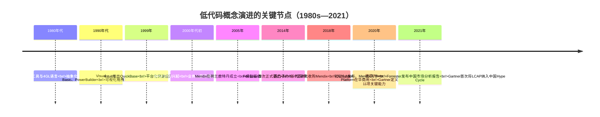

**第一阶段（1980—2000年）：技术源头与早期探索**。20世纪80年代，IBM推出的RAD工具与4GL语言首次尝试通过高度抽象简化编程流程；尽管这些工具尚未实现真正意义上的"低代码"，但为后续发展奠定了理论基础[^11][^13]。90年代，微软的Visual Basic通过可视化界面和拖拽组件简化开发，与Borland Delphi、PowerBuilder一同成为早期低代码思想的代表，使可视化编程进入主流开发者视野[^11][^13]。21世纪初，企业应用集成（EAI）与业务流程管理（BPM）工具进一步推动了"非技术人员通过可视化界面设计业务流程"的实践，将低代码理念从开发者工具延伸至业务侧[^11]。

**第二阶段（2000—2010年）：平台化雏形**。1999年Intuit推出QuickBase，首次实现基于平台的快速应用构建[^11]；2000年后微软Access与FileMaker等数据库工具被广泛用于业务系统搭建，为非技术人员提供了开发可能[^11]。这一阶段最具代表性的事件是2005年Mendix在荷兰鹿特丹成立，"志在打造一款可视化、模型驱动的低代码编程平台，以及建立与低代码平台相关的一整套生态"[^5]。值得注意的是，"低代码开发平台"这一术语本身的源起在不同来源中存在差异——部分行业资料将术语创造时间追溯至2000年左右、归功于Forrester[^3]，而Forrester官方与多数权威综述以**2014年6月Forrester首次正式提出"低代码/零代码"概念**为标志性时间点[^4][^14][^11][^1][^2]。本报告以后者为准，将2014年作为低代码概念正式登场的时间锚点。

**第三阶段（2014—2019年）：概念正式命名与厂商成势**。2014年Forrester首次正式提出"低代码/零代码"概念，将其定义为"只需用很少甚至几乎不需要代码就可以快速开发出系统，并可以将其快速配置和部署的一种技术和工具"[^14][^1]。这一命名行为本身是一次重要的市场协调动作——它把4GL、RAD、可视化编程、BPM等分散实践统一在"Low-Code"标签之下，便于厂商对外传播与客户认知。2016年起，国内厂商如简道云、氚云等进入市场，推动了本土化发展[^11]。2018年，全球低代码市场迎来两个标志性事件：**西门子以约6—7亿欧元（一说约7亿美元）收购Mendix，并将其与西门子工业平台深度整合；同年，OutSystems获得1.5亿美元融资**[^5][^3]。这两起事件将低代码从一个技术名词变成资本与战略级议题，也直接刺激了中国低代码市场的迅速升温[^5][^6][^15]。

**第四阶段（2020—2021年）：疫情催化与市场爆发**。真正把低代码推向市场前列的，是一场数字化浪潮。2020年新冠疫情爆发，封城、停工、居家等防疫措施使在线办公被推向高潮，数千万家企业涌入钉钉、企业微信、飞书、华为云WeLink等数字化平台——App Annie数据显示，2020年2月钉钉下载量环比增长356%，企业微信环比增长171%[^1]。HR、财务、销售、营销等SaaS场景中大量重复性、标准化的操作，直接为低代码应用提供了肥沃土壤[^1]。同年，微软宣布由世纪互联运营的Power Platform正式在中国市场商用[^5][^6]。2021年是低代码概念正式登上中国主舞台的关键年份：1月14日钉钉发布6.0版本，将低代码开发作为核心能力强化，阿里云智能总裁张建锋甚至判断"2021年重要的概念就是低代码、无代码的开发方式会成为业务开发的主流"，同日腾讯云宣布其低码平台LowCode正式开启公测[^3]；1月19日Mendix在北京召开发布会、与腾讯云合作正式进入中国[^5][^15]；据官方数据，钉钉一季度低代码应用增长约38万个，并带动钉钉平台整体应用数翻倍[^1]。Gartner于2020年定义企业级低代码平台的11项关键能力[^4]，并于2021年在《2021年中国ICT技术成熟度曲线报告》中**首次将低代码应用开发平台（LCAP）作为新兴技术热点纳入**，预测在未来2—5年内低代码平台在国内市场将趋向主流采用[^1]；11月12日，"低代码"概念提出者Forrester发布《2021年低代码平台中国市场现状分析报告》，调研二十余家行业主流企业（腾讯、阿里巴巴、百度、华为、微软、轻流、金蝶、用友、帆软等），并将中国厂商划分为9类[^4][^2]。

回顾这一脉络可以得出一个重要判断：**低代码的"40年技术史"与"7年概念史"的张力，恰恰是其饱受争议的根源**。明道云创始人任向晖在与陈果的争论中坦言："代应用平台产品诞生在上个世纪末，距离现在已经20多年了。是革命，也早就革命完了。我们2B创业者追求并非是革命机会，而是渐进的改进机会"[^3]。这种"渐进改进"的定性，比"软件革命"或"营销噱头"的两极判断都更接近事实，也为后续章节客观评估其技术深度与业务价值奠定了基调。

## 1.3 以2021年底为截止点的研究视角与时间边界

本报告将研究截止时间严格设定在**2021年底**，这一选择并非随意，而是基于该时点在低代码行业发展史上的**多重标志意义**。

首先，2021年是市场爆发的关键年份。从市场数据看，根据Gartner的预测，2021年全球低代码开发技术市场将达到138亿美元，比2020年增长22.6%；到2024年所有应用程序开发活动中的65%将通过低代码方式完成，75%的大型企业将使用至少四种低代码开发工具进行应用开发[^1][^8]。亿欧智库测算2020年中国低代码市场规模已达28.5亿元，预计复合增长率49.2%、2025年达267.7亿元——尽管市场渗透率不足1%，但增长曲线明确陡峭[^5][^6][^15]。

其次，2021年是分析机构集中表态的一年。Gartner在该年首次将LCAP纳入《中国ICT技术成熟度曲线报告》[^1]；Forrester于11月12日发布《低代码平台中国市场现状分析报告》，统计显示**过去18个月58%的企业已开始采用低代码平台与工具进行系统搭建，16%的企业计划引入低代码平台**[^2]；亿欧智库发布《2021中国低代码市场报告》，将中国厂商划分为互联网厂商、软件厂商、创新平台商三类，并细分为五种商业模式[^5][^6][^15]。

第三，2021年是巨头与垂直玩家集中入场的一年。钉钉6.0、腾讯云微搭、华为云、阿里宜搭、百度、浪潮等巨头以及简道云、伙伴云、明道云、轻流、ClickPaaS、摩尔元数、数睿数据等垂直玩家共同形成"初创企业与巨头品牌共存"的新格局；仅2021上半年低代码相关领域就完成了至少12起投融资[^1]。同时，7月河南暴雨救援中网易数帆轻舟低代码团队1.5小时上线"河南暴雨·寻找失联者"寻人平台，四川省基于腾讯云微搭低代码以传统方式一半的人工成本、10余天内开发出省级疫情防控健康码平台等公共应急案例，使低代码的社会价值被广泛看见[^1][^2]。

将2021年底作为截止点的另一重要考虑，是**避免与2022年后的新一轮叙事相混淆**。2022年以后，AI生成式技术（如2023年微软Power Platform Copilot）与低代码的融合开启了新阶段，2025年中国软件国际Lumi等支持AI模型接入和全栈可视化开发的平台标志低代码进入智能化新阶段[^11][^13]；中国信通院《低代码发展白皮书（2022年）》虽于2022年正式发布，但其工作组组建于**2021年年底**[^16][^17]，相关产品能力定位图等核心成果属于2022年研究产出，本报告将其作为"研究截止时点附近的过渡性参考"使用，不引入其后续延伸的智能化叙事。同样，金融监管总局2025年12月发布的《银行业保险业数字金融高质量发展实施方案》等2022年后政策动态[^4]，仅可作为"后续展望"的有限参考，不进入主体分析。

这一时间边界设定的方法论意义在于：它确保本报告是一份**面向2021年底的历史快照式审视**，避免后视偏差（hindsight bias），让读者能够看到当时市场参与者、分析机构与企业用户在尚未明确AI融合走向时所形成的真实判断与争议焦点；同时也为后续追踪研究留出了清晰的时间锚点。

## 1.4 研究问题、分析框架与四大主题的逻辑关系

基于上述概念界定与时间边界，本报告将围绕一个核心研究问题展开：**截至2021年底，低代码开发作为一种正在成型的应用构建范式，其"是什么、能做什么、谁在做、有何价值"四个基本面分别呈现何种图景，又彼此构成怎样的内在联系？**

为系统回答这一问题，报告构建了**"技术基础—应用领域—主流平台—业务优势"四位一体**的分析框架。四大主题之间并非简单并列，而是构成层层递进、相互支撑的逻辑闭环：

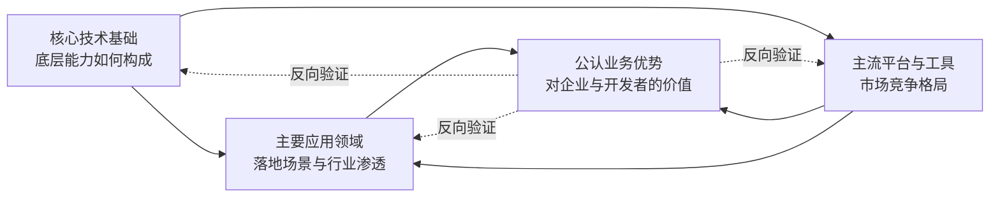

**核心技术基础**回答"底层能力如何构成"——可视化编程、模型驱动架构、元数据驱动、组件化、BPMN工作流引擎、连接器、Serverless与云原生底座、自动化代码生成等技术要素如何叠加构成低代码平台的能力底盘[^4][^12][^17]。这一层决定了低代码平台的能力上限：例如模型驱动决定了平台对企业级复杂应用的支撑力，而表单驱动则更适合轻量场景。

**主要应用领域**回答"落地场景与行业渗透"——业务流程审批、CRM/ERP/HRM等企业管理类应用、数据收集与可视化报表、移动端与多端应用、行业垂直应用（制造、金融、零售、教育、医疗）、IoT与事件驱动应用等[^4][^7]。这一层与技术基础相互制约：表单驱动与模型驱动两条路径在不同复杂度场景下的适用边界，构成了2021年低代码"工作组级简单应用"向"企业级核心业务系统"渗透的关键分水岭。

**主流平台与工具**回答"市场竞争格局与厂商分类"——按厂商起源路径可划分为"应用衍生类厂商"（如致远互联、金蝶、销售易等基于已有产品衍生低代码能力）与"原生低代码厂商"（如OutSystems、Mendix、ClickPaaS、数睿数据等）两大派系[^5][^6][^15]；按地域可分为国际阵营（OutSystems、Mendix、Power Platform、Salesforce等）与国内阵营（钉钉宜搭、腾讯微搭、华为云AppCube、明道云、简道云、轻流等）；按商业模式可分为场景衍生类、应用交付类、平台搭建类等多种模式。这一层是技术与应用在市场中的具象化呈现。

**公认的业务优势**回答"对企业与开发者的价值贡献"——开发效率提升、成本降低、敏捷迭代、降低技术门槛释放公民开发者生产力、缓解IT人才短缺、打破业务与IT壁垒、加速数字化转型、跨端跨系统集成等[^2][^7][^8]。Forrester在2021年中国市场报告中将低代码价值归纳为"更快创新且更具成本效益、让业务人员能够处理变更、灵活支持业务运营动态与弹性伸缩"三方面[^2]。同时，业界对其局限（厂商锁定、黑盒逻辑、复杂业务支撑不足、影子IT与合规风险）也保持着相当冷静的讨论[^8][^3]——本报告将以平衡视角呈现"公认优势"的真实边界。

四个主题在第6章将通过"四维联动分析"被重新整合，揭示技术能力如何决定平台上限、平台类型如何影响应用领域分布、应用领域如何反向塑造业务优势的体现方式，并基于2021年底已浮现的信号（云原生化、AI辅助开发萌芽、生态化与平台化）研判低代码的下一阶段演进方向。第7章则在此基础上凝练整体判断，回应"低代码是技术变革还是营销概念"的核心争议。

需要在此预先说明的研究方法论与局限：本报告以**权威机构原始报告（Forrester、Gartner、IDC、亿欧智库、中国信通院）、主流厂商白皮书与公开案例、主流科技媒体报道**为主要证据来源，对市场规模、平台排名等关键论断尽可能多源交叉验证；对单一来源的"公认观点"保持审慎措辞；对带有营销色彩的优势叙述，主动配套引用质疑性观点（如陈果与任向晖的争论），保持调研的客观性[^3]。同时，由于公开资料对部分国内中小厂商的覆盖深度有限，部分平台的技术细节描述可能存在颗粒度差异，本报告将在相应章节如实说明。

至此，本报告已建立起统一的概念基准（1.1）、清晰的历史坐标（1.2）、明确的时间边界（1.3）与系统的分析框架（1.4），后续四章将依次深入技术基础、应用领域、主流平台与业务优势，第六、七章则在此基础上展开整合分析与结论展望。

# 2 核心技术基础与设计范式

第1章已经厘清，低代码并非凭空出现的技术革命，而是一组在"可视化—声明式—模型驱动—云端化"光谱上不断累积的工程实践的当代汇流。然而，这一定性仍停留在概念层面，要真正理解低代码平台为何能在2020—2021年间从一个边缘概念跃升为产业热点，必须深入其技术内部，回答一个更具体的问题：**支撑一个现代低代码平台从可视化拖拽到一键部署的完整能力链路，究竟由哪些技术要素构成？这些要素彼此之间又形成了怎样的层次结构与协同机制？**

本章将以"自上而下"的剖析顺序展开。先从最直观的可视化编程与声明式范式入手（2.1），逐步深入到承载企业级复杂应用的模型驱动架构（2.2）以及由此分化出的表单驱动与模型驱动两条产品路线（2.3）；继而向下剖析构件层与代码生成层（2.4），向旁延伸至业务流程编排（2.5）、权限治理（2.6）与系统集成（2.7）；最后落到云原生运行时底座（2.8）。在完成各层要素拆解后，2.9节将整合提出"模型驱动+云原生+可视化"三位一体的技术范式判断，2.10节则回应"低代码是否真正创新"的争议，从传承与突破两个维度收束本章，为第3章应用领域与第4章平台分类提供技术坐标。

## 2.1 可视化编程与声明式开发：从"怎么做"到"做什么"的抽象跃迁

低代码平台最直观的技术外壳，是**可视化编程（Visual Programming Language, VPL）**与**声明式开发（Declarative Development）**两种范式的叠加。前者通过图形化元素替代文本代码，后者通过描述"做什么"的意图来取代命令式编程中"怎么做"的步骤指令——两者共同构成了低代码平台降低开发门槛的第一层抽象。

从历史脉络看，可视化编程并非新事物。20世纪90年代Visual Basic、Borland Delphi、PowerBuilder等工具已将"拖拽控件—设置属性—绑定事件"的开发流程引入主流开发者视野，其核心理念是"最终用户应该首先关注GUI，并逐步添加业务逻辑"[^18]。但这一代工具有明显局限：通常是私有商业软件，绑定特定开发环境；目标运行环境也被指定（如VB/Delphi程序往往只能在Microsoft Windows、Oracle应用服务器与Oracle Forms数据库环境运行）；并且因缺乏模块化设计，团队协同开发存在较多限制条件[^18]。这些约束决定了它们最多只能被称为"可视化IDE"，尚未演化为今天意义上的低代码平台。

进入2010年代后，新一代可视化编辑器在三个方向上完成了关键突破。

**第一，从"控件拖拽"到"原子级组件+逻辑编排"的双轨抽象。**以iVX为代表的现代平台提出了"原子级组件"概念——平台通过对组件不断进行抽象与优化，构建可被用户自定义和复用的通用组件库，使开发者能基于这些通用组件快速构建各种应用[^19]。仅有组件库还不足以表达复杂应用的运行逻辑，因此iVX进一步创造了一种**"条件触发式"的非代码逻辑方式**，配合专门的"事件编辑面板"用于编辑和管理触发式逻辑，支持前端、中台与后台的逻辑编辑，并支持MySQL的所有操作逻辑[^19]。这种"组件+事件面板"的双轨设计，是声明式范式在低代码语境下的典型落地——用户不再编写if/else分支与循环，而是描述"当某事件发生时，对哪些组件触发何种操作"。

**第二，从"私有环境绑定"到"可移植应用"的工程化升级。**iVX所开发的应用可以脱离平台独立部署——"对于开发者而言，iVX就是一个'代码生成器'，和手写代码无差别，可以脱离iVX平台任意部署"[^19]。这一特性回应了RAD工具时代"绑定特定运行环境"的诟病，使可视化编程从"封闭工具链"走向"开放工程产物"。

**第三，从"单端开发"到"多端自动适配"的交付方式升级。**iVX所支持的目标运行环境涵盖浏览器WebApp、Android/iOS、小程序、小游戏、钉钉、Win/Mac/Linux以及国产鸿蒙，开发场景覆盖中大型复杂应用、电商、大数据应用、表单、工作流、BI、OA、工业物联网、游戏、网站、视频应用、IM等[^19]。这种"一次编辑、多端部署"的能力，依赖底层编译器对多种目标系统的支持——iVX前端使用React并生成React Core代码，中台采用Node.js直接解析JS代码，后台采用Go架构以追求更高效率与稳定性[^19]，技术含量与传统IDE已不可同日而语。

声明式开发的核心价值在于**降低公民开发者（Citizen Developer）的认知门槛**。当业务人员不需要理解循环、递归、内存管理、并发控制等命令式概念时，他们就能以接近"配置表单"的心智模型完成应用搭建。但声明式范式也有固有局限：当业务逻辑足够复杂（如多实体关联、复杂状态机、嵌套条件、事务一致性）时，单纯的"描述意图"会迅速膨胀为难以维护的可视化拼图。这正是为什么2021年市场上的低代码平台普遍保留了"必要时插入代码"的逃生舱口——IBM对低代码的标准定义即明确，低代码处于手动编码与无代码之间的平衡点，"其用户仍然可以在自动生成的代码上添加自定义代码"。

要让声明式抽象真正承载企业级复杂应用，仅靠可视化外壳与事件面板是不够的，必须引入更高层次的"模型"概念——这便是下一节模型驱动架构所要解决的问题。

## 2.2 模型驱动架构（MDA/MDE）与元数据驱动机制

如果说可视化编程是低代码的"外壳"，那么**模型驱动架构（Model Driven Architecture, MDA）**则是其"骨架"。这一思想的源头可追溯至2001年7月对象管理组织（OMG）正式提出的MDA框架——它不仅早于"低代码"这一术语的诞生（2014年），而且为之后所有"以模型为核心而非以代码为核心"的开发范式提供了理论与标准基础[^20][^18][^21]。

### 2.2.1 MDA的三层模型与四层元建模结构

MDA的核心思想是**将软件开发的重点从"代码"转移到"模型"**，主张通过模型转换技术，从高层业务模型逐步细化为底层代码实现，旨在提高软件的可移植性（Portability）、互操作性（Interoperability）与可重用性（Reusability）[^21]。其在三个不同层次建立系统模型：

| 模型层次 | 关注内容 | 创建者 | 在低代码平台中的对应物 |
|---------|---------|--------|---------------------|
| **CIM（计算无关模型）** | 业务环境与需求，使用领域词汇描述业务概貌，不涉及系统内部结构 | 业务分析人员 | 业务需求描述/可视化业务建模 |
| **PIM（平台无关模型）** | 系统内部逻辑结构，独立于任何具体实现技术，"技术中立" | 应用架构师 | 实体—属性—关联数据模型、流程模型 |
| **PSM（平台相关模型）** | 系统在特定技术平台上的实现细节，一个PIM可转换为多个不同技术平台的PSM | 工具自动生成 | 针对Web/移动/桌面端的运行时配置 |

在该三层模型之外，MDA还构建了**四层元数据建模结构**——元元模型（M3）、元模型（M2）、模型（M1）、对象（M0）——由MOF（元对象设施）定义描述元模型的语言，并用该语言描述自身[^20][^21]。MOF是MDA架构核心中的核心，提供了一种可扩展的元数据管理方式[^21]。

MDA的实现依赖三种核心建模方法的组合：**UML（统一建模语言）**用于表达类图、活动图与状态图；**MOF（元对象设施）**作为UML构造的一个子集而建立，具有足够的表达能力来描述重要的模型；**CWM（公共仓库元模型）**标准化了数据仓库应用程序的生命周期（如设计、构建和管理）[^20]。在模型转换层面，MDA实现了从PIM到PSM的自动化转换，通常遵循**QVT（查询/视图/转换）标准**，或使用ATL等规则引擎实现；此外还定义了**元数据交换（XMI）**与**对象约束语言（OCL）**等关键规范[^20][^21]。

理想的MDA流程是一个**自动化的生产管道**：从CIM到PIM，再到PSM，最后生成代码；与传统手工变换不同，MDA强调由工具自动完成从PIM到PSM再到代码的转换[^21]。同时，MDA要求在模型转换过程中**维护模型转换的追踪关系，支持往返工程（Round-trip Engineering）**，以确保对生成代码的修改能反向同步到上层模型，避免模型与代码割裂——模型转换的同步性对MDA具有重要意义[^21]。

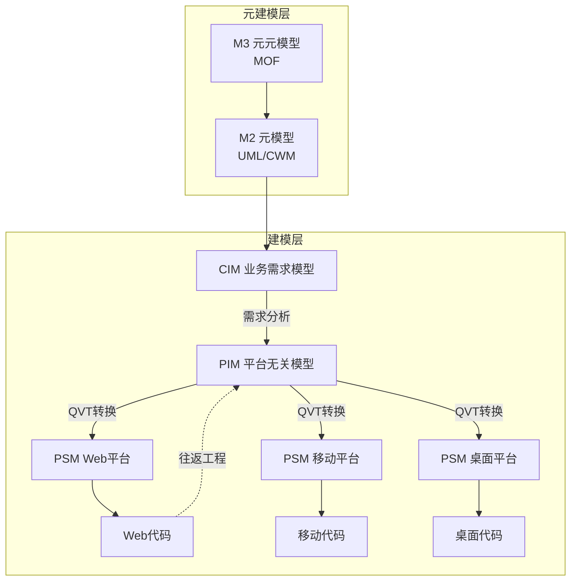

### 2.2.2 元数据驱动与"一次建模、多端复用"

MDA思想落地到低代码平台后，形成了今天行业中常说的**"元数据驱动"（Metadata-Driven）机制**。其要义是：平台不直接生成或维护代码，而是通过元模型描述实体、属性、关系与行为，运行时由通用引擎解释这些元数据并执行相应操作。这种机制带来三个直接收益：其一，**一次建模、多端复用**——同一份业务模型可被Web端、移动端、小程序端共享，避免重复开发；其二，**自动跟踪变更**——模型层面的修改可自动传递到所有依赖该模型的应用，并自动处理数据库脚本与部署流程；其三，**业务模型与展示层解耦**——使企业核心业务实体的稳定性不依赖于具体UI技术的迭代。

MDA的应用领域涵盖电子商务、电信、医疗保健、运输、制造、金融等[^21]，典型案例包括华为iDME引擎和佰思杰MOM平台，可降低维护成本并提升系统性能[^20]。这些案例表明，MDA并非纯学术理论，而是已在工业界、金融业与制造业的复杂系统中得到验证。

低代码相对于早期RAD工具的关键技术分水岭，正在于此——RAD工具本质上是"加速编码"，而模型驱动的低代码平台是"用模型替代编码"。这一区别决定了模型驱动平台天然具备承载企业级复杂应用的能力底盘，也直接导出了下一节将讨论的"表单驱动 vs 模型驱动"两条技术路径的分野。

## 2.3 表单驱动与模型驱动：两大技术路径的分野与适用边界

在2021年的低代码市场中，**表单驱动（Form-Driven）与数据模型驱动（Data Model-Driven）**是两种被反复对比的主流架构理念。它们看似都能实现"快速搭应用"，实则在底层逻辑、能力边界和长期价值上存在本质差异[^22]，这一差异也直接对应了第1章所提及的"工作组级简单应用"与"企业级核心业务系统"两条产品路线。

**表单驱动架构的核心起点是"界面"**——开发者先设计数据收集表单，再为其附加审批流程、简单视图和报表；其逻辑是"由表及里"，先解决"如何展示和收集数据"的问题，再反向关联数据存储和简单逻辑。这种方式上手极快，适合构建问卷调查、请假申请、报修单等线性、轻量的部门级应用，"就像用标准积木快速搭建小模型，能满足即时性的简单需求"[^22]。

**数据模型驱动架构则遵循"由里及表"的逻辑**——先抽象业务实体（如"客户""订单""产品"）及其属性、关联关系，构建结构化的数据模型，再基于该模型可视化配置页面、流程、权限规则；其本质是对业务逻辑的数字化建模，更贴近专业软件开发的"领域建模"思想，"如同先搭建建筑的钢筋混凝土框架，再灵活填充墙体门窗，为复杂应用提供坚实的结构支撑"[^22]。

两条路径的差异在四个具体维度上体现得尤为明显：

| 维度 | 表单驱动 | 数据模型驱动 |
|------|---------|-------------|
| **构建起点** | 界面表单（由表及里） | 业务实体与关系（由里及表）[^22] |
| **复杂业务承载** | 面对多实体关联、非线性状态机时易出现逻辑混乱、数据不一致，需"打补丁"或退回代码开发 | 通过预先定义实体关系（一对多、多对多）和业务规则引擎，能优雅处理复杂业务逻辑[^22] |
| **数据治理** | 各应用独立设计表单和数据存储，易形成分散的"数据烟囱" | 所有应用基于同源数据构建，天然具备数据共享能力，可整合ERP、OA、第三方异构数据[^22] |
| **典型场景** | 问卷、请假、报修等线性轻量应用 | CRM、ERP模块、MES等核心业务系统[^22] |

在多实体关联场景（如一个订单关联多个产品、联系人、付款记录）或非线性状态机场景（如订单从"起草—评审—投产—质检—发货—收款"的全流程）中，表单驱动因缺乏统一的数据结构支撑会显著力不从心；而数据模型驱动可以通过模型明确"项目—任务—人员—工时"等关联关系，实现任务分配、工时统计、进度追踪的全流程联动，且所有操作基于统一数据模型，确保数据一致性和逻辑严谨性[^22]。

这一分野对理解2021年低代码市场格局极其重要。**它从技术根源上解释了为什么以钉钉宜搭、简道云、明道云等为代表的"表单驱动派"主要切入轻量办公自动化场景，而以OutSystems、Mendix、华为AppCube、ClickPaaS等为代表的"模型驱动派"则主攻企业核心业务系统**——选择哪条技术路径，几乎在产品诞生之初就决定了它将服务于哪类客户、能承载多大复杂度的业务。本报告第3章应用领域与第4章平台分类的判别标准，将直接建立在这一分野之上。

需要说明的是，表单驱动与模型驱动并非完全二元对立——成熟的企业级平台往往在底层采用模型驱动，但在表层为业务用户提供表单化配置体验；同样，部分以表单驱动起家的平台也在持续向模型层下沉。但从核心架构倾向看，这两条路径在2021年仍清晰可辨。

## 2.4 组件化、JSONSchema数据建模与AST驱动的代码生成

如果说模型驱动架构定义了低代码平台的"骨架"，那么**组件化体系、结构化Schema与AST代码生成**则构成了其"血肉"——它们决定了开发者能否在可视化层面与底层代码之间获得真正无缝的开发体验。

### 2.4.1 原子级组件与语言完备性

组件化是低代码平台的最基础构件。所有可视化编辑器本质上都是在画布上排布组件，并通过属性面板配置组件行为。但要让组件库真正具备"图灵完备"的表达能力（即能构造任何复杂应用），组件必须达到足够细的粒度——这就是iVX所强调的"原子级组件"概念。iVX通过不断对组件进行抽象和优化实现通用组件构建，并支持用户自定义组件，配合"图灵完备"的逻辑编辑引擎/面板，可以实现几乎所有应用前后台的"无代码"开发[^19]。

平台中间会形成一种**完备的中间语言（支持AST抽象语法树）**：iVX生成的中间代码是一种描述性语言，通过前端拖拽组件和配置事件后生成；这种中间语言类似于积累一个字典，将一个个应用编辑成一篇"文章"[^19]。这种中间表达层是组件化得以走向工程化代码生成的关键。

### 2.4.2 AST驱动的可视化—源码双向绑定

AST（Abstract Syntax Tree，抽象语法树）是源代码的抽象语法结构的树状表现形式，在低代码平台中被用于解析、操作和生成组件的源代码[^23]。AST驱动机制为低代码平台带来三项关键能力：**解析组件结构**（将单文件组件拆分为template、script、style三部分）、**精确操作代码节点**（在语法树层面增删改查组件属性、方法和依赖）、**实时生成高质量代码**（保持代码格式规范，避免手动编写错误）[^23]。

以开源低代码工具Sparrow为例，其AST处理架构采用分层设计：Vue组件解析层使用正则匹配从源文件中提取script内容，并使用Babel parser以ES module模式（含JSX插件）解析生成AST；AST遍历与操作层使用`@babel/traverse`库遍历AST节点，实现对data、methods、components等属性的精准操作[^23]。

更具突破性的是Tango等基于源代码的低代码构建工具所实现的**AST驱动的"实时双向绑定"**——Tango的核心架构采用AST驱动设计理念，将可视化操作与源代码生成紧密结合：AST处理引擎负责代码的解析与生成，可视化编辑器提供直观的拖拽式开发界面，代码生成器将可视化操作转换为可执行代码，工作区管理协调不同模块间的数据流和状态管理[^24]。当开发者在可视化界面进行操作时，AST引擎会实时更新对应的代码；反之，直接修改代码也会同步反映到可视化界面，这种双向绑定机制确保了低代码开发与传统代码开发的无缝切换[^24]。Tango的核心模型（packages/core/src/models/）定义了组件模块、工作区、历史记录等数据模型，作为AST引擎与可视化界面之间的数据桥梁；沙箱模块则提供代码的实时运行环境，允许开发者在编辑过程中即时预览效果[^24]。

```mermaid
graph LR
    A[可视化拖拽操作] -->|属性/结构变更| B[AST处理引擎]
    F[手动修改源代码] -->|代码解析| B
    B -->|遍历操作@babel/traverse| C[抽象语法树]
    C -->|代码生成器| D[可执行源代码]
    C -->|视图渲染| E[可视化编辑界面]
    D -.独立部署.-> G[运行时环境]
    style B fill:#f9f,stroke:#333
```

AST驱动机制的深层意义在于，它为低代码平台回应**"黑盒生成、代码不可控"**这一长期质疑提供了技术答案。当生成的代码本身就是高质量、可读、可维护的标准源代码，并且可以脱离平台独立部署时，低代码就从"封闭的应用搭建器"演化为iVX所称的真正"开发平台"——iVX明确指出，国内外大多数低代码平台由于不具备生成可导出部署独立应用的能力，"还不能算作'开发平台'"[^19]。这种"代码可导出、可独立部署"的属性，是2021年新一代低代码平台与早期SaaS化表单工具的本质区别。

至于JSONSchema等结构化Schema机制，则在表单、数据校验与配置描述层面承担类似AST的"结构化中间表达"角色——它定义了表单字段的类型、约束、关联与展示规则，使表单可以被序列化、版本化与跨平台复用。受可得资料覆盖的限制，本报告对Schema机制不展开详述，但其与AST、元数据共同构成低代码平台"一切皆数据"的工程基础，是后续章节讨论平台能力差异时不可忽视的底层要素。

## 2.5 BPMN工作流引擎与业务流程编排

低代码平台的另一项核心技术是**工作流引擎（Workflow Engine）**——它是"供业务流程可视化设计、管理和控制业务流程的运行，并在实际执行过程中可动态修改业务流程的低代码开发平台的一种核心技术"[^25]。工作流被业内形象比喻为"业务的血液"，一旦流转不畅，业务流程就会出现问题[^25]。

### 2.5.1 工作流引擎的基本职能与价值

工作流引擎一般具备流程的节点管理、流向管理、流程样例管理等重要功能；其中"发送、退回、移交、流程结束"等操作就相当于汽车自动驾驶系统的"自动启动、折返、更换路线、到达终点"等指令[^25]。以请假流程为例，填写请假申请单、审核申请单都对应着一个业务模块，而工作流引擎就负责把这些业务模块串起来，实现业务流的流转[^25]。

利用工作流引擎实现工作流的核心好处包括：确保流程审批及时进行；让发起人不再需要拿着纸质审批表找人审批；便于进行流程管理，使流程进度查询、数据统计等更简单高效[^25]。这些价值在2020—2021年的远程办公浪潮中被放大——当员工分散办公时，工作流引擎几乎是企业唯一可行的流程治理工具。

### 2.5.2 BPMN 2.0规范与主流引擎技术选型

低代码工作流引擎普遍遵循**BPMN 2.0（Business Process Model and Notation，业务流程模型和符号）国际规范**[^25][^26]。BPMN 2.0定义了流程图中各种节点（开始事件、结束事件、任务、网关等）、流向与属性的标准化表达方式，使不同平台间的流程定义可以互操作。

在前端流程设计器层面，市场上常见选型包括LogicFlow、Bpmn.js以及Camunda、Activiti等封装好的编辑建模工具，要求使用BPMN 2国际规范的项目通常选型Bpmn.js[^26][^27]。Bpmn.js的核心实现机制包括：使用bpmn-moddle解析BPMN 2.0 XML文件（XML→内存对象，AST解析）；通过diagram-js实现图表的渲染和编辑，了解Canvas&SVG、绘Shape&Connection、自定义Renderer等底层原理；实现完整的生命周期事件，包括导入、解析、渲染等阶段的事件总线（拖拽、连线、属性配置）；支持通过additionalModules进行功能扩展，扩展机制采用didi库依赖注入DI[^26][^27]。在BPMN层面，引擎还支持基础能力（拖拽、连线、属性配置）、验证机制（如开始事件不能直接连接到结束事件）、数据类型转换（BPMN转XML内置importXML&saveXML、XML转JSON）、自定义渲染（节点颜色、形状、图标）等[^26][^27]。

在后端工作流引擎层面，主流选型分为Activiti和Camunda、Flowable两大类。两者的关键差异在于**是否支持表单与流程解耦**——Camunda和Flowable支持表单和流程解耦，表单单独设计，流程设计时进行表单动态绑定；且Flowable提供Activiti和Camunda工作流引擎的迁移工具，因此实际项目中Flowable常被作为优选[^26][^27]。

下表对常见工作流引擎与设计器进行对比：

| 类型 | 选型 | 关键特性 |
|------|------|---------|
| **前端流程设计器** | Bpmn.js | 符合BPMN 2.0规范，基于diagram-js渲染，支持自定义节点与扩展[^26] |
|  | LogicFlow / Camunda Modeler / Activiti Modeler | 封装好的编辑建模工具 |
| **后端工作流引擎** | Activiti | 经典开源BPM引擎，表单与流程耦合较紧 |
|  | Camunda | 支持表单与流程解耦[^26] |
|  | Flowable | 支持表单与流程解耦，并提供从Activiti/Camunda的迁移工具[^26] |

在国产低代码场景中，美络科技WebOffice综合协同管理平台的审批后台基于美络WebFlow工作流引擎实现：WebFlow提供基于J2EE架构实现的流程引擎，能满足工作流程和工作内容不断变化的需求；企业可在不改变已有系统的情况下迅速调整涉及多部门的业务流程，在业务处理、数据持久化等各方面与应用系统间进行灵活集成；引擎采用组件化设计、支持浏览器端图形化流程配置、节点流向拖拽、符合BPMN 2.0规范，并加入了自由协作流程、投票通过等个性化工作流程支持[^25]。

工作流引擎与表单驱动、模型驱动两条路径的耦合方式略有不同：在表单驱动平台中，工作流通常直接绑定到具体表单，承担"表单—审批—归档"的线性流程；在模型驱动平台中，工作流则承担更复杂的"实体状态机驱动"职能，负责协调多实体、多角色、多系统的复杂业务编排。这一区别将在第3章业务流程管理应用领域中得到更具体的体现。

## 2.6 权限模型与企业级安全治理：RBAC及其扩展

面向企业级落地的低代码平台，必须解决一个核心问题：**当大量公民开发者和业务用户可以自行搭建应用时，如何确保数据访问与操作权限的精细化控制？**这一问题的答案，落在以RBAC为核心、并向ABAC与动态策略引擎扩展的权限治理体系上。

### 2.6.1 RBAC：行业标准的"用户—角色—权限"三层模型

RBAC（基于角色的访问控制）模型作为权限管理的行业标准，凭借"用户—角色—权限"的三层关联逻辑，实现权限的精细化分配与高效管理，是低代码平台权限系统的首选方案[^28]。低代码平台的权限需求区别于传统系统，需兼顾灵活性与易用性——既要支持多企业、多部门的角色自定义，又要适配可视化配置的低代码特性，无需开发者大量编码即可完成权限分配；RBAC模型通过角色作为中间载体，将用户与权限解耦，完美解决这一痛点[^28]。

典型的RBAC落地需要5张核心表的数据模型：用户表（sys_user，存储用户基础信息，密码采用BCrypt加密）、角色表（sys_role，支持企业自定义角色如超级管理员、部门管理员、普通用户）、权限表（sys_permission，分为接口权限与菜单权限）、用户角色关联表（sys_user_role，实现"一个用户多角色、一个角色多用户"的灵活分配）、角色权限关联表（sys_role_permission，实现权限的批量分配与回收）[^28]。该模型的核心优势是解耦用户与权限——通过角色批量分配权限，当企业组织架构调整或权限需求变更时，只需修改角色对应的权限，无需逐个调整用户，大幅提升权限管理效率[^28]。

仅做接口与菜单权限管控对企业级场景而言远远不够，**数据权限过滤**是保障数据安全的关键。具体做法是在角色表中新增数据范围字段（data_scope），定义不同的数据权限范围（如全部数据、本部门数据、本人数据）；在后端接口查询时，通过获取当前登录用户的角色信息解析对应的数据范围，动态拼接SQL条件，实现数据权限的自动过滤[^28]。

### 2.6.2 RBAC的局限与三重验证扩展

纯粹的RBAC在面对复杂的企业场景时会陷入**"静态角色漂移"陷阱**：当业务规则变更、资源属性动态演化或跨租户策略需实时调整时，纯角色驱动的授权迅速失效[^29]。常见的设计陷阱包括：将用户—角色映射硬编码于数据库字段，导致租户隔离策略无法按需覆盖；用字符串匹配代替策略表达式解析，使"编辑自己创建的流程图且状态为草稿"类规则无法执行；OAuth2授权码流中未区分scope粒度，导致write:app隐式包含delete:app/version[^29]。

为此，真正的生产级权限体系必须融合RBAC的结构化管理、ABAC的上下文感知能力，以及可热加载的动态策略引擎，形成**三重验证闭环**[^29]：

| 验证层 | 输入 | 输出 | 失败处理 |
|--------|------|------|---------|
| **RBAC层** | 用户角色集合 + 请求动作 | 是否允许该角色执行基础操作 | 返回403，不进入下一层[^29] |
| **ABAC层** | 请求上下文（时间、IP、设备、资源属性） | 布尔结果 + 策略ID | 记录审计事件，触发风险评分[^29] |
| **动态策略引擎** | 策略ID + 运行时变量（如当前审批链状态） | 最终allow/deny + 可选附加指令（如二次认证） | 调用Webhook通知策略管理员[^29] |

在授权协议层面，符合RFC 9126的**OAuth2.1细粒度授权**可通过scope语义映射函数实现复杂策略——例如"read:dataset"要求资源租户ID等于用户租户ID，"edit:dataset:row"要求资源未被锁定且用户具有editor角色，"deploy:flow"要求用户拥有CI_DEPLOY权限且资源环境在staging/prod范围内[^29]。

权限治理是低代码平台从"工作组级玩具"走向"企业级基础设施"的关键门槛。一个未能在权限层面达到企业级安全合规要求的平台，无论可视化体验多么优秀，都难以承载核心业务系统。这一判断也将在第4章对各主流平台的能力评估中得到映射。

## 2.7 连接器、API集成与iPaaS化能力

低代码平台几乎从不孤立运行——它必须与企业内部既有的ERP、CRM、OA、HRM以及外部SaaS服务连接才能产生真正价值。这就引出了低代码技术栈的另一关键模块：**连接器、API集成与iPaaS化能力**。

### 2.7.1 API：系统对话的通用语言

API（应用程序编程接口）是iPaaS实现系统连接的基础。在iPaaS平台中，API主要承担三种角色：**触发器API**（当某系统发生特定事件如新订单创建时，自动通知平台）、**动作API**（执行具体操作，如在目标系统中创建记录、更新数据）、**查询API**（从源系统获取数据，供后续流程使用）[^30][^31]。一个典型的制造业场景：当SAP ERP中产生新采购订单时，平台通过SAP的API捕获这一事件，然后调用钉钉API向采购经理发送审批通知，审批通过后再调用金蝶API创建应付账款记录，整个过程无需人工干预，数据自动流转[^30]。

### 2.7.2 连接器：预置的系统适配插件

直接编写API调用代码对大多数企业来说门槛过高，因此iPaaS连接器成为关键——它们是预置好的系统适配插件，让非技术人员也能轻松实现系统集成；主流平台通常提供50—200个预置连接器，覆盖ERP、CRM、OA、IM、数据库、文件存储等类别[^30][^31]。连接器的核心优势在于"开箱即用"：企业无需了解目标系统的API细节，只需在界面中选择对应连接器、配置认证信息（如账号密码、API Key），即可建立连接，这大大降低了系统集成的技术门槛[^30]。

### 2.7.3 工作流：自动化流程的编排引擎

如果说API是"语言"、连接器是"插件"，那么工作流就是iPaaS的"大脑"，负责编排整个集成流程的逻辑。一个典型的工作流包含五大元素：**触发条件**（什么事件启动流程）、**执行动作**（流程中要完成的操作）、**条件分支**（根据数据判断走哪条路径，如"订单金额>1万走审批，否则直接通过"）、**数据映射**（定义源字段与目标字段的对应关系）、**错误处理**（当某步骤失败时的应对策略，如"重试3次"、"发送告警"）[^30][^31]。现代平台普遍采用可视化拖拽方式设计工作流——用户从左侧组件库中拖入"触发器""动作""条件判断"等模块，用连线连接它们，配置每个模块的参数，即可完成复杂流程的编排，这种低代码方式让业务人员也能参与集成方案设计[^30]。

需要在此说明的是，可得资料中关于"73%的制造企业面临系统孤岛问题"等具体数据出自IDC 2025年发布的《中国制造业数字化转型白皮书》[^30][^31]，按本报告"截至2021年底"的时间边界要求，不将其作为论据采信，仅引用该资料对API、连接器、工作流三大组件功能机理的描述，这些机理性描述本身在2021年的iPaaS生态中即已成立。

连接器与API集成能力之所以成为低代码平台的核心竞争力指标，是因为它直接决定了平台能否融入企业的既有IT版图。一个连接器生态丰富、可与SAP/Salesforce/钉钉/企业微信等主流系统无缝对接的低代码平台，远比一个孤岛式工具更具企业级吸引力。这也是为什么2021年阿里、腾讯等巨头能凭借自身办公协作生态（钉钉、企业微信）+ 云服务的天然集成优势，迅速在低代码市场占据有利位置——这一判断将在第4章平台格局分析中进一步展开。

## 2.8 Serverless与云原生底座：低代码的现代基础设施

低代码平台的所有上层能力——可视化编辑、模型驱动、工作流、权限、连接器——最终都必须运行在某种执行环境之上。**Serverless与云原生底座**正是2020—2021年间低代码平台得以摆脱传统RAD工具桎梏、向真正"无运维、弹性化、自动扩缩"演进的关键基础设施。

### 2.8.1 Serverless技术演进路径

腾讯云对Serverless技术演进的总结给出了清晰的三阶段图谱：

**Serverless 1.0阶段**：业界普遍认为Serverless = FaaS（函数即服务）。这一阶段的能力主体是云函数的事件驱动、自动部署、无服务免运维、可伸缩性强、扩缩容对用户透明、随用户访问量自动伸缩，让用户成本更加低廉[^32]。

**Serverless 2.0阶段**：业内对Serverless的普遍认知升级为FaaS + BaaS的综合体。腾讯云开发团队将Serverless具体实现为引入云数据库和云存储的模型——云数据库基于MongoDB自研flexDB（文档式数据库，提供增删改查接口），云存储提供文件托管服务，包含CDN加速，开发者不需要申请域名也无需管理服务器[^32]。

**应用层封装阶段**：当Serverless仍只能提供底层SDK和API时，腾讯云团队进一步推出了国内首家基于Serverless的低代码平台微搭——微搭具有一码多端、可视化拖拽编辑、一键完成应用构建和部署、提供业务模型封装、基于模型驱动的表单设计引擎、流程引擎等能力，"帮助开发者除了在底层后台节省运维工作外，上层还可复用沉淀业务组件，更多通过可视化配置来实现和构建应用"[^32]。

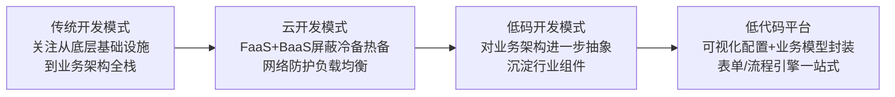

这一演进图谱表明，**Serverless与低代码并非两种独立技术，而是同一抽象趋势在不同层次上的体现**——Serverless从基础设施层屏蔽运维，低代码从应用开发层屏蔽编码，二者天然契合。

### 2.8.2 云原生架构对低代码的赋能

云原生架构是基于云原生技术的一组架构原则和设计模式的集合，旨在将云应用中的非业务代码部分进行最大化的剥离，从而让云设施接管应用中原有的大量非功能特性（如弹性、韧性、安全、可观测性、灰度等），使业务不再受非功能性业务中断困扰，同时具备轻量、敏捷、高度自动化的特点[^33]。简单地说，云原生架构帮助企业的业务功能迭代更快、系统能承受住各种量级的流量冲击，同时构建系统的成本更低[^33]。

传统软件代码通常包括三部分：**业务代码**（实现业务逻辑）、**第三方软件**（业务代码依赖的所有三方库）、**处理非功能性的代码**（实现高可用、安全、可观测性等非功能性能力的代码）；其中只有业务代码对业务真正带来价值，另外两部分都只算附属物，但随着软件规模增大、业务模块规模变大、部署环境增多、分布式复杂性增强，今天的软件构建变得越来越复杂，对开发人员的技能要求也越来越高[^33]。**云原生架构相比传统架构前进了一大步，即从业务代码中剥离了大量非功能性特性到IaaS和PaaS中，从而减少业务代码开发人员的技术关注范围，通过云服务的专业性提升应用的非功能性能力**[^33]。

云原生架构对低代码平台的赋能至少体现在三个层面：其一，**弹性伸缩**——低代码生成的应用可以随流量自动扩缩，避免企业为预期流量过度采购资源；其二，**屏蔽运维**——云函数、容器托管、对象存储等服务屏蔽了冷备热备、网络防护、负载均衡等后端运维能力[^32]，让低代码平台真正实现"一键交付"；其三，**生态联动**——基于同一云厂商的低代码平台可天然集成该厂商的AI服务、数据库、消息队列等产品，形成产品矩阵的协同效应。

腾讯云对此的总结颇为精炼：Serverless孵化出越来越多融合Serverless理念的产品，在丰富了Serverless产品矩阵的同时也反哺和拓展着整个生态——从基础底层的IaaS，到FaaS+BaaS+PaaS的一站式服务，再到应用上层的低码、无码平台，都随着Serverless模式的引入提升了产品的竞争力，开辟了更多可能性，这种"Serverless+X"的趋势值得深思和探讨[^32]。

云原生底座正是2021年新一代低代码平台区别于上世纪RAD工具的本质差异之一——RAD工具受限于本地部署、特定数据库、特定操作系统，而云原生底座赋予了低代码平台无限弹性、跨地域部署与自动化运维的现代化特征。

## 2.9 技术栈的层次结构与"模型驱动+云原生+可视化"三位一体范式

将2.1—2.8节的要素整合起来，可以勾勒出2021年低代码平台技术栈的完整层次结构：

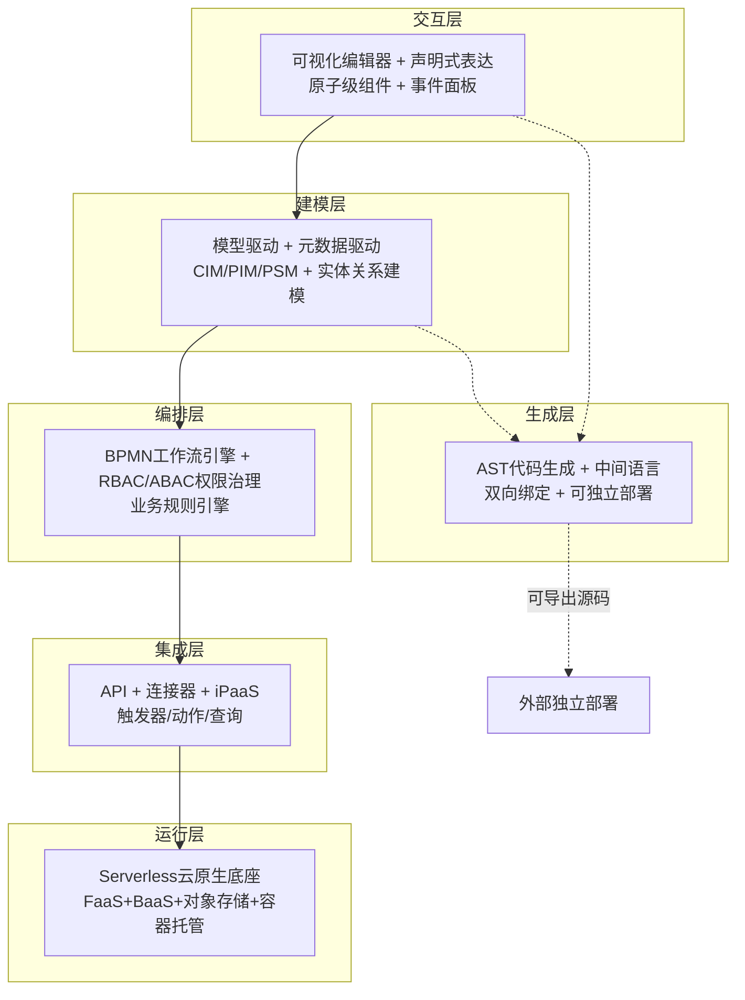

这一层次结构对应了第1章引用的Gartner对企业级低代码平台**11项关键能力**的定义思路——尽管本报告所掌握的资料未完整披露Gartner 11项关键能力的全部清单，但从可视化建模、模型驱动、声明式开发、应用部署、应用生命周期管理、组件库与生态、第三方集成、协作开发、安全治理、扩展性、运行时管理等典型维度看，本节梳理的六层技术栈与Gartner能力框架在方向上高度吻合。

在此基础上，可以验证本章开篇提出的核心判断：**"模型驱动+云原生+可视化"三位一体是2021年低代码技术架构的事实主流范式**。这一论断的依据有三：

**第一，建模层的统一性**。无论是国际厂商OutSystems、Mendix（其创立初衷即"打造一款可视化、模型驱动的低代码编程平台"），还是国内厂商华为iDME、ClickPaaS、腾讯微搭（其"基于模型驱动的表单设计引擎、流程引擎"）[^32]，企业级低代码平台几乎都将"模型驱动"作为承载复杂应用的核心能力——这一选择源于MDA二十年来在工业界（金融、电信、制造）的成熟验证[^20][^21]。

**第二，运行层的统一性**。2020—2021年市场上几乎所有新生代低代码平台都构建在云原生基础设施之上——腾讯微搭基于Serverless（云函数+云数据库+云存储）[^32]，钉钉宜搭、阿里宜搭依托阿里云，华为AppCube依托华为云，Power Platform依托Azure。云原生不再是一个可选项，而是低代码进入企业级市场的入场券。

**第三，交互层的统一性**。所有主流平台都以可视化拖拽+声明式逻辑编排作为面向用户的核心交互范式——这一选择背后是"释放公民开发者"的市场共识：只有当业务人员能直接参与应用构建时，低代码才能真正缓解IT人才短缺、打破业务与IT壁垒。

在三位一体的核心之外，AST代码生成、连接器生态、RBAC权限、BPMN工作流等技术则构成了平台能力差异化的关键变量——它们的成熟度直接决定了一个平台是停留在"工作组级表单工具"，还是能够承载企业级核心业务系统。

需要冷静看待的是，**"三位一体"是一个事实判断而非价值判断**：它并不意味着所有平台都已完美实现这三项能力，更不意味着低代码已不存在技术挑战。例如表单驱动平台在"模型驱动"维度仍有显著欠缺，部分平台的云原生化也尚停留在"部署在云上"而非"原生云架构"层面。但作为一种主流技术范式的方向性指引，"模型驱动+云原生+可视化"在2021年已基本确立。

## 2.10 对传统软件工程的传承与突破

作为本章收束，需要回应第1章遗留的核心争议：**低代码究竟是技术变革，还是营销重新包装？**从本章对技术栈的系统剖析看，答案是一个介于两极之间的清晰判断——**低代码是对四十年来软件工程渐进创新的一次工程化整合，既有显著传承，也有真实突破**。

**传承的维度**包括：

- **对4GL非过程化思想的传承**——低代码的声明式开发范式直接继承了4GL"定义做什么而非怎么做"的核心理念；4GL在1980—1990年代由James Martin等学者推动，曾被认为"应比3GL提高生产率一个数量级以上"[^18]，今天的低代码可视化逻辑编排正是这一思想在新一代基础设施上的延续。
- **对RAD原型迭代与组件复用的传承**——RAD的核心理念"最终用户应该首先关注GUI，并逐步添加业务逻辑"[^18]与今天表单驱动低代码平台的设计哲学几乎完全一致；Visual Basic、Delphi、PowerBuilder在1990年代奠定的拖拽控件传统，至今仍是低代码可视化编辑器的基本模式。
- **对MDA模型转换理论的传承**——OMG于2001年提出的MDA框架（CIM/PIM/PSM三层模型、MOF四层元建模、QVT转换标准）[^20][^21]，为今天的数据模型驱动低代码平台提供了完整的理论基础和工程标准；华为iDME、佰思杰MOM平台等实践案例[^20]证明MDA思想已成功移植到工业级低代码场景。
- **对BPM可视化流程建模的传承**——BPMN 2.0规范、Activiti/Camunda/Flowable工作流引擎[^26][^27]并非低代码专属技术，而是早在BPM时代就已成熟的业务流程治理工具，被低代码平台直接吸纳为标准模块。

**突破的维度**则包括：

- **云原生底座取代本地部署**——Serverless 1.0到2.0的演进路径[^32]、云原生架构对非业务代码的剥离[^33]，让低代码摆脱了RAD时代"绑定特定运行环境"的桎梏[^18]，获得弹性、敏捷与自动化特性。
- **AST驱动的可视化—源码双向绑定**——Sparrow、Tango等工具基于AST实现的实时双向绑定[^23][^24]、iVX中间语言+多平台编译器的工程实践[^19]，让低代码生成的代码不再是黑盒，而是可读、可维护、可独立部署的标准源码，从根本上解决了"低代码=低质量"的疑虑。
- **跨端统一交付**——iVX等平台支持WebApp、Android/iOS、小程序、桌面端等多端编译[^19]，这一能力在20年前的RAD工具上几乎不可想象。
- **连接器生态与公民开发者协同**——iPaaS化的连接器生态[^30][^31]、与钉钉/企业微信/Power Platform等办公协作生态的深度集成，使低代码从"开发者工具"升级为"业务部门与IT部门的协作平台"，这是低代码相对于前置技术最深刻的组织层面突破。

将传承与突破合并起来观察，低代码在技术上的真实定位可以表述为：**它不是软件革命，而是渐进的工程效率整合（progressive integration of engineering productivity）**。这一判断与第1章引用的明道云创始人任向晖的观点高度一致——"代应用平台产品诞生在上个世纪末，距离现在已经20多年了。是革命，也早就革命完了。我们2B创业者追求并非是革命机会，而是渐进的改进机会"。承认低代码的"渐进性"，并不削弱其价值；恰恰相反，它说明低代码站在了一个有四十年积淀的工程传统之上，并通过云原生、AST、连接器等现代基础设施完成了一次具有产业级影响力的整合升级。

这一技术定位将直接指导后续章节的展开：第3章应用领域的分析将沿"表单驱动—工作组级 vs 模型驱动—企业级"的技术分野展开；第4章主流平台的对比将以"建模能力+云底座+生态集成"为核心评估维度；第5章业务优势的归纳将与本章揭示的技术机理一一对应；第6章四维联动分析则会基于本章建立的技术坐标，研判低代码在2022年及以后的演进方向。

# 3 主要应用领域与典型场景

第2章的技术剖析已经建立了一个清晰的判断：低代码平台并非单一技术，而是"可视化—模型驱动—云原生"三位一体的工程整合，并因表单驱动与模型驱动两条路径的分野，天然具备承载不同复杂度业务的能力梯度。本章的任务是把这一技术坐标转换为**应用层证据**——回答"截至2021年底，低代码平台究竟在解决哪些业务问题、被部署在哪些场景中"这一更具体的问题。

为兼顾覆盖广度与分析深度，本章按照**"通用职能场景—企业管理系统—数据与多端—行业垂直—新兴方向"的递进逻辑**展开：先从最贴近企业日常运营的流程审批切入（3.1），逐步走向更具结构复杂性的企业管理系统（3.2）、数据可视化（3.3）与多端交付（3.4），再扩展到行业垂直应用（3.5）与IoT/AI等新兴方向（3.6）；在场景图谱铺陈完毕后，回归第2章的技术分野，比较表单驱动与模型驱动在不同复杂度场景下的适用边界（3.7），归纳低代码从工作组级应用向企业级核心系统渗透的演进轨迹（3.8），最后以Gartner双模IT框架收束（3.9），为第4章主流平台分类提供应用层依据。

## 3.1 业务流程管理与审批自动化：低代码渗透企业的"第一站"

在所有可被低代码替代的场景中，**业务流程审批**几乎是企业最先想到、也最先尝试的切入点。这一选择并非偶然——纸质或邮件审批所带来的痛点几乎存在于每一家中大型组织中。某制造企业的采购审批，从需求提出到最终完成，最长需要两周时间，中间各个环节的等待占了一大半；效率低只是一方面，更重要的是审批过程不透明、责任难以追溯[^34]。员工拿着审批单到处找领导签字，领导出差不在就卡在那里；流程走到哪一步了、还差谁审批、没人能说清楚[^34]。这种"流程黑洞"在远程办公场景下被进一步放大，使得低代码工作流引擎成为企业数字化的高频刚需。

低代码平台之所以能高效解决这一类问题，原因在于第2章2.5节剖析的BPMN工作流引擎能力与表单设计能力的天然耦合。一个典型的部门级流程应用，本质上是"**表单（信息载体）+ 流程（流转规则）+ 权限（角色控制）**"的三件套组合：员工提交申请单（表单），系统按预设规则推送给上级或财务、HR审批（流程），不同角色仅能看到/操作各自职责内的字段（权限）。可视化工作流引擎使非技术人员可以拖拽节点配置审批路径，BPMN 2.0规范保证了节点行为的标准化，而RBAC权限模型则确保数据访问粒度可控。简道云等国内平台正是依托这套"零代码+低代码"双模式、覆盖表单设计、流程配置、数据报表等核心功能的能力，让中小企业可以直接复用CRM、ERP、OA、项目管理等场景的模板[^34]。

在企业实践中，**OA审批、报销、合同、请假、用印**几乎是低代码渗透企业IT的"第一站"组合。其共同特征是：业务规则相对清晰（线性流转或简单分支）、参与角色有限、数据结构单纯、变更频率虽高但变化幅度不大。表单驱动平台在该场景下展现出**几近完美的适配性**——根据第2章2.3节的分析，表单驱动以"由表及里"为核心起点，先解决"如何展示和收集数据"的问题，再反向关联流程和权限，恰好契合这类应用的构建逻辑。某制造企业引入低代码审批后，原本两周左右的采购审批周期可被压缩到数日级别，更重要的是每一步流转都被系统自动记录，使流程进度查询、责任追溯、数据统计变得简单高效。

进一步看，业务流程审批之所以成为低代码的"敲门砖"场景，还有三个深层原因。其一，**痛点最为显性**——员工和管理者对纸质审批低效的体感最强，立项阻力最小；其二，**ROI最易量化**——审批周期、退回率、超时率等指标可立即测量，让企业管理层对低代码的价值形成第一印象；其三，**风险最为可控**——即使流程配置出现问题，业务损失也有限，便于企业在低风险环境下熟悉低代码工作模式。这三点合在一起，使审批自动化成为大量企业引入低代码的"试金石"，并为后续向更复杂场景渗透提供组织基础。

## 3.2 企业管理类应用：CRM、ERP、HRM与进销存

当企业在审批场景取得初步成果后，下一步自然会向更核心的业务系统延伸——**CRM客户管理、ERP核心业务、HRM人事管理、进销存**等企业管理类应用，正是低代码渗透的第二层场景。这一层级的应用与单纯的流程审批有本质区别：它们不再是线性流转的轻量任务，而是涉及多实体关联、状态机驱动、跨部门数据闭环的结构化业务系统。也正是在这一层，**表单驱动与模型驱动两条路径开始出现明确分化**。

### 3.2.1 中小企业的轻量化路径：标准软件"差一口气"的破解之道

中小企业在面对企业管理软件时普遍遭遇一种"削足适履"困境——很多企业购买的标准软件用起来总觉得"差一口气"，功能是有的，但跟企业的实际业务流程对不上；比如某企业有一套CRM系统，但客户分类方式跟公司内部的标准不一样，每次录入数据都要额外转换，既麻烦又容易出错；标准软件的逻辑是固定的，企业只能去适应它，而不是让它适应企业，这种情况在中小企业中非常普遍[^34]。当没有合适的系统时，Excel就成了万能的"临时工"，客户信息、采购记录、库存数据都在Excel里；问题是Excel数据是静态的、无法实时更新，各部门格式不统一，数据无法关联，时间久了版本越来越多——某商贸企业曾有20多份Excel同时在用，每次开会前都要花大量时间汇总数据，而且汇总出来的数字经常对不上[^34]。

针对这一痛点，以**简道云、织信Informat**等为代表的国内低代码平台提供了一种轻量化、可自主迭代的解决方案。简道云作为国内领先的低代码开发平台，主打"零代码+低代码"双模式，支持表单设计、流程配置、数据报表等核心功能，模板覆盖CRM、ERP、OA、项目管理等场景，中小企业可直接复用[^34];以简道云CRM为例，支持客户档案管理、销售漏斗分析、自动化提醒等功能，销售团队可以实时掌握每个客户的跟进状态，避免撞单和漏单[^34]。织信Informat则适用于企业应用开发，不懂编程也可以自主构建ERP、CRM、BPM、进销存、财务管理、资产管理、SCM、人事管理、MIS系统等企业所需的各种管理工具[^35]。

这条路径的本质，是把"购买标准软件"的预算转换为"自建贴合业务系统"的能力——企业不再被软件供应商的产品逻辑绑架，而是用低代码平台围绕自己的业务流程构建系统。这种灵活性对于业务规模较小但流程独特的中小企业极具吸引力，也是为什么2020—2021年间国内表单驱动低代码平台在中小企业市场获得高速增长的根本原因。

### 3.2.2 大中型企业的PaaS化路径：底座敏捷性优先

大中型企业的诉求则呈现完全不同的图景。在大中型企业的数字化转型进入"深水区"后，传统的通用型软件往往会陷入一种尴尬境地：要么功能过于僵化，无法适配复杂的组织架构与多变的业务流程；要么定制开发周期过长，等系统上线时市场机会早已转瞬即逝[^36]。CIO们关注的焦点正在从单纯的"功能覆盖"转向"底座的敏捷性"——基于低代码能力的CRM系统因此成为大中型企业的首选，它不仅能通过图形化界面快速构建业务逻辑，更重要的是赋予了企业在不依赖高强度代码开发的前提下自主迭代管理系统的能力[^36]。

大中型企业CRM的三大"顽疾"集中体现了这一层场景的复杂度：其一，**业务灵活性与系统僵化的矛盾**——成熟的销售方法论、公海池规则、返利逻辑可能每季度甚至每月都在调整，修改一个核心业务字段或审批流往往需要走漫长的IT提单和开发流程，造成"系统拖业务后腿"；其二，**数据孤岛与底层架构不兼容**——企业内部通常已运行ERP、OA、HRM以及复杂的供应链系统，如何实现从线索到回款的全链路数据闭环、并与异构系统深度协议对接，是IT部门面临的技术挑战；其三，**组织权限与安全管控的复杂性**——万人规模以上的企业涉及多事业部、多职能部门、跨地域协作，系统必须支持极其细粒度的权限控制，不仅是菜单级，还必须深入到字段级、数据行级，同时对等保三级、容灾备份、数据加密等安全合规性要求也是普通轻量级CRM难以承受之重[^36]。

为应对这些挑战，大中型企业的低代码CRM选型呈现明确的"五维评估"逻辑——**扩展能力**（系统是否支持元数据驱动架构，当业务量级从万级增长到亿级时底座性能是否能线性扩展）、**集成深度**（API接口的标准化程度，以及是否具备成熟的集成中间件实现与主流企业软件的无缝连接）、**流程自动化引擎**（是否支持图形化配置复杂业务逻辑，如嵌套式多级审批、基于条件的自动任务分配以及跨模块的预警机制）、**安全与合规性**（是否支持私有化部署或混合云部署，是否能支撑复杂的矩阵式组织架构权限管理）、**品牌服务与生态能力**（厂商是否具备大型项目的交付经验、成熟的行业解决方案模板与售后响应专业度）[^36]。纷享销客CRM等领军产品已全面进化为"智能型CRM"，其底座能力基于成熟的PaaS平台[^36]——这本质上印证了第2章2.2节关于"模型驱动+元数据驱动"是承载企业级复杂应用核心能力底盘的判断。

### 3.2.3 两条路径的应用层映射

将上述两条路径并置可以清晰看出：**表单驱动与模型驱动并非孰优孰劣的对立，而是服务于不同客户层级与业务复杂度的两种合理选择**。两类路径在企业管理类应用上的差异可归纳为下表：

| 维度 | 轻量化路径（简道云、织信类） | PaaS化路径（纷享销客类） |
|------|---------------------------|------------------------|
| **目标客户** | 中小企业 | 大中型企业、行业头部 |
| **核心痛点** | 标准软件不贴合、Excel数据混乱 | 业务方法论高频迭代、跨系统集成、复杂权限 |
| **技术路径偏向** | 表单驱动为主 | 模型驱动/元数据驱动为主 |
| **典型应用** | 轻量CRM、进销存、项目管理 | 销售管理全链路、与ERP/OA/HRM深度集成 |
| **底座要求** | 模板复用、表单/流程/报表三件套 | PaaS底座、字段级/行级权限、API集成中间件 |
| **部署方式** | 公有云SaaS为主 | 支持私有化部署或混合云部署 |

这一对比也直接验证了第2章2.3节的核心结论：**架构选择决定客户层级**。表单驱动平台从诞生之日起就更适合工作组级/部门级应用，而模型驱动平台则天生为企业级核心业务而设计——这一分野不仅决定了平台的技术上限，也决定了它的市场定位。

## 3.3 数据收集与可视化报表：轻量BI场景

如果说审批与企业管理类应用解决的是"业务怎么跑"的问题，那么**数据收集与可视化报表**解决的则是"业务跑得怎么样"的问题。管理者做决策需要数据支持，但现实是数据总是"慢半拍"——等报表出来市场行情可能已经变了，等数据汇总完成商机可能已经错过了；传统的数据统计依赖人工Excel汇总，不仅效率低而且容易出错；某销售团队每周要花半天时间整理销售报表，但整理出来的数据往往是三天前的，对管理的参考价值大打折扣[^34]。

低代码平台对这一痛点的解决路径，本质上是一次**从"Excel散落—版本混乱—汇总滞后"到"统一数据源—自动汇总—实时报表"的演进**。当审批表单、CRM跟进记录、进销存出入库、HR考勤等业务数据都被统一沉淀到低代码平台的同源数据底座后，可视化报表组件可以基于这些实时数据自动渲染图表、生成看板。简道云等平台正是凭借"数据统一管理、流程自动流转、报表实时生成"的能力，让企业管理从"被动响应"变成"主动掌控"[^34]。在金融、医疗等数据密集型场景中，低代码平台还可提供强大的数据分析和可视化工具——金融机构可通过低代码平台构建数据加密、细粒度权限管理等安全保障能力，医疗机构可构建医疗数据分析系统辅助医生诊断、构建决策支持系统提高决策的科学性[^37]。

需要冷静界定的是低代码轻量BI与专业BI工具的能力分野。低代码报表能力的本质是**业务一线的自助分析工具**，其优势在于：与业务表单无缝联动（数据产生即可分析）、配置门槛极低（业务人员可自行搭建看板）、迭代速度快（业务规则变化时报表跟随调整）。但它并不试图替代Tableau、Power BI等专业BI工具或企业级数据仓库分析能力——后者面向的是跨系统、跨主题域、跨长时间维度的多维分析与复杂建模，需要专业数据团队的支撑。两类工具在企业数据栈中的定位是**互补而非替代**：低代码轻量BI服务"用业务的人看业务"，专业BI服务"用数据的人挖业务"。

从应用层视角看，数据可视化报表是低代码"价值显性化"的关键场景。审批与CRM应用让业务跑起来，而报表则让管理者**看到**低代码带来的改变。这种"价值可视"的属性，使报表能力成为各大低代码平台在产品宣传中反复强调的核心卖点。

## 3.4 移动端与多端应用：小程序、H5、PC一体化交付

低代码的另一类高频应用场景，是**多端应用交付**。在中国市场尤为特殊的现象是，企业应用不再以PC Web为单一交付形态，而是必须同时覆盖小程序（微信生态/企业微信生态/钉钉生态）、H5、移动App乃至桌面端——这给传统开发模式带来巨大压力，也为低代码的"一次搭建、多端部署"能力创造了肥沃土壤。

腾讯云微搭低代码是这一场景的代表性平台。它定位为**高效、高性能的企业级低代码平台，帮助开发者快速搭建支持多种业务场景的小程序、H5、PC WEB应用**，通过简单的拖拉拽操作而不用编写复杂代码，实现少写代码或者不写代码就能快速高效完成业务目标[^38]。微搭与其他低码平台相比的独特能力之一，是其**与微信生态的深度耦合**——微搭低码平台可以让更多传统服务商和中小企业快速融入微信生态，基于微搭提供的微信生态套件降低交付时间、快速响应需求，帮助大量中小企业实现增长[^39]。在2021年腾讯数字生态大会微搭低代码专场上，微搭发布了**C2B连接器**，宣布与腾讯文档、腾讯会议和企业微信多场景数据打通，让更多开发者和中小企业可以便利地利用腾讯丰富的场景来开发应用，有效降低创新门槛[^39]。

从技术机理看，多端交付能力的实现依赖第2章2.4节剖析的**中间语言+多端编译器**架构。以iVX为代表的平台所支持的目标运行环境涵盖浏览器WebApp、Android/iOS、小程序、小游戏、钉钉、Win/Mac/Linux以及国产鸿蒙，开发场景覆盖中大型复杂应用、电商、大数据应用、表单、工作流、BI、OA、工业物联网、游戏、网站、视频应用、IM等。微搭则将Serverless与低代码结合，传统开发模式下业务往往需要关注前后端全链路的基础配置和流程搭建，而Serverless模式下开发人员的关注点从全链路的细节变成专注UI/数据等逻辑层面，这是关注点从次要任务到主要任务的转移[^39]。

中国市场的多端低代码呈现出明显的**生态化差异竞争**特征。腾讯微搭以微信、企业微信、腾讯文档、腾讯会议为生态枢纽，主打C2B连接能力；阿里钉钉宜搭以钉钉为枢纽，主打企业内部协作场景；这种生态化路径让低代码不再是孤立的工具，而是嵌入到企业既有的协作生态中，借助生态自身的用户基数与连接能力放大价值。微搭还实现了**值得信赖的企业级低代码平台**这一定位——其开放体系主要包括两大部分，一个是数据逻辑能力的开放对应应用开发的后端逻辑，一个是模板设计能力的开放对应应用开发的前端逻辑；基于核心的外部扩展数据源，微搭集成了数据连接、场景化模板、自定义组件、全域营销等企业级能力[^39]。

多端交付场景对低代码价值的放大效应还体现在**省级公共应急平台**的实践中。微搭具备搭建省级健康码项目的能力，几分钟就能快速构建一个小程序/H5——这背后是底层架构的特别设计，包括Serverless与低代码的深度结合以及云开发CloudBase的基础设施支撑[^39]。这一案例不仅展示了多端能力的技术深度，更证明了低代码已经具备承载省级公共服务这种**高并发、高可用、跨端、跨地域**复杂场景的能力。

## 3.5 行业垂直应用：制造、金融、零售、教育、医疗

低代码不仅在通用职能场景广泛落地，也在**多个垂直行业**形成了行业化应用图谱。低代码平台凭借其简化、快速和灵活的特性在各个行业都有广泛的应用前景[^35]。下面按制造、金融、零售、教育、医疗五大行业分别梳理其典型应用场景与差异化诉求。

### 3.5.1 制造业：从生产监控到工业互联网

制造业是低代码垂直落地最具系统性的行业之一。低代码平台可帮助制造企业快速构建**生产计划系统、设备维护系统、质量管理系统**等，降低开发成本和交付时间；低代码平台还能够与物联网技术结合，实现对设备和生产数据的实时监控和分析[^35]。具体细分场景包括：**生产监控系统**实时监控生产过程、**质量管理系统**提高产品质量、**设备维护系统**及时进行设备维护和保养、**资产管理系统**提高资产管理效率[^37]。

制造业的低代码应用也与国家级**工业互联网平台战略**深度耦合。2021年12月30日工业和信息化部公布的2021年工业互联网平台创新领航应用案例名单，聚焦工业企业数字化转型面临的关键问题，围绕**平台化设计、数字化管理、智能化制造、个性化定制、网络化协同、服务化延伸六大应用模式**，140个工业互联网平台应用案例具有技术先进、成效显著、能复制推广等特性[^40]。这六大模式与低代码能力的对应关系尤为紧密：

| 工业互联网应用模式 | 解决的关键问题 | 低代码可承载的能力 |
|------------------|--------------|------------------|
| **平台化设计** | 设计资源分散、工具落后、效率低 | 并行/敏捷/交互/模块化设计协同 |
| **数字化管理** | 数据开发利用低、决策效率低 | 打通业务流程、管理系统与供应链数据 |
| **智能化制造** | 工艺落后、生产效率低、管控弱 | 设备/系统/平台互联互通、动态感知 |
| **网络化协同** | 产业链结构复杂、信息不对称 | 跨企业/跨地区/跨行业研发与制造协同 |
| **个性化定制** | 产品附加值低、多样化需求难满足 | 模块化设计、柔性生产、智能仓储 |
| **服务化延伸** | 制造竞争力下降、运维成本高 | 远程互联、产品追溯、远程运维 |

需要说明的是，这140个案例并非全部由低代码平台搭建，但其底层方法论——通过平台化方式汇聚资源、通过数据贯通打破壁垒、通过协同模式重构产业链——与低代码所主张的"打破业务竖井、增强跨职能沟通"理念高度同源。此外，Mendix具备强大的技术创新能力，例如将LCAP与物联网（IoT）、数字孪生相结合使用，其客户分布在各种规模的企业中，主要集中在金融、制造等领域[^41]——这进一步印证了低代码已从办公自动化向工业核心场景渗透的趋势。

### 3.5.2 金融业：合规、安全与快速响应的平衡

金融行业对低代码的诉求呈现"双刃"特征——既要快速推出不同类型的应用以满足客户需求，又对安全性和可靠性要求极高。低代码平台提供了丰富的安全特性和预定义组件，可以支持金融机构快速构建各类应用如**客户关系管理系统、贷款管理系统、风险评估系统**等；此外低代码平台还能够集成各类第三方金融服务接口，提供更好的用户体验[^35]。具体能力包括两类：一是**快速开发与部署**，可帮助银行和金融机构快速开发和部署新应用从而抢占市场先机，例如构建实时监控金融市场变化的风险管理系统，以及快速建立和优化CRM系统提高客户满意度；二是**数据安全与合规**，通过低代码平台可实现数据的全方位加密保障客户隐私，并提供细粒度的权限管理确保只有授权人员才能访问敏感数据[^37]。

Mendix在金融行业的客户分布也表明，模型驱动的国际低代码平台在金融业拥有特殊吸引力[^41]——这与第2章2.6节强调的"企业级平台必须达到字段级权限、数据行级权限、等保合规"等门槛高度吻合。

### 3.5.3 零售与电子商务：响应市场与供应链协同

零售和电子商务行业需要快速响应市场变化并提供个性化的购物体验。低代码平台可以帮助企业快速创建**电子商务平台、订单管理系统、库存管理系统**等，实现线上销售和供应链的数字化转型；低代码平台还能够与支付系统和物流系统进行集成，提供一体化的解决方案[^35]。在客户体验层面，通过低代码平台可以快速构建和优化在线购物平台、客户反馈系统，及时了解客户需求和意见；在供应链层面，可快速构建库存管理系统实时监控库存情况，开发物流管理系统提高物流效率[^37]。

零售业的低代码价值集中体现在"**快**"上——这一行业的市场窗口期短，谁能更快上线新活动页、新促销规则、新客户分群策略，谁就更可能抓住商机。低代码在这一行业的核心价值不再是替代标准软件，而是**承接标准软件无法覆盖的"长尾敏捷需求"**。

### 3.5.4 教育与医疗：行业特定数据治理诉求

**教育行业**需要灵活的学生管理系统和在线教育平台以提供个性化的学习体验。低代码平台可以帮助学校和教育机构快速构建**学生管理系统、作业管理系统、在线教育平台**等，提高教学效果和学生满意度；低代码平台还能够与学校的信息系统进行集成，实现学生和教师数据的无缝对接[^35]。

**医疗保健行业**对安全性和数据隐私保护要求较高，同时需要快速响应患者需求并提供优质医疗服务。低代码平台可以帮助医疗机构快速构建**电子病历系统、预约挂号系统、医疗资源管理系统**等，提高医生和患者的沟通效率；低代码平台还能够与医疗设备和健康监测设备进行集成，实现健康数据的实时监测和远程诊疗[^35]。在数据分析与决策支持层面，可快速构建医疗数据分析系统辅助医生进行诊断和治疗，并构建决策支持系统提高决策的科学性和准确性[^37]。

### 3.5.5 行业差异化诉求的横向对比

将五大行业并置可以看到，不同行业对低代码的诉求呈现**明显差异化梯度**：

| 行业 | 核心诉求侧重 | 对低代码的关键要求 |
|------|------------|------------------|
| **制造业** | 设备数据集成、生产协同 | 与IoT结合、与工业互联网平台对接 |
| **金融业** | 安全合规、快速迭代 | 数据加密、细粒度权限、私有化部署 |
| **零售业** | 市场响应、客户体验 | 与电商/支付/物流系统集成、多端覆盖 |
| **教育业** | 标准化管理、个性化体验 | 与既有信息系统集成、可复用模板 |
| **医疗业** | 数据隐私、设备集成 | 与医疗设备/HIS系统集成、合规保障 |

行业差异化诉求印证了第2章2.6—2.7节所强调的"集成深度+安全治理"是低代码进入垂直行业的硬性门槛。金融、医疗等强监管行业对私有化部署、等保合规、细粒度权限的要求尤为严苛，这也是为什么这些行业更倾向于选择模型驱动的企业级低代码平台。除了上述五大行业，**物流与运输、公共服务**也是低代码的重要应用领域——前者依靠低代码构建货物追踪、运输调度、配送管理系统，并与GPS和物流信息系统集成；后者依托低代码搭建在线申办系统、公共资源管理系统、智慧城市平台等[^35]。

## 3.6 IoT、事件驱动与AI融合等新兴方向

除了上述相对成熟的应用领域，低代码在2021年还显现出向**IoT事件驱动应用、聊天机器人、AI能力集成**等新兴方向延伸的清晰信号。这些方向虽然尚未规模化，但代表着低代码下一阶段演进的方向性力量。

**IoT与数字孪生方向**最具代表性的案例是Mendix。Mendix具备强大的技术创新能力，例如将LCAP与物联网（IoT）、数字孪生相结合使用——其客户分布在各种规模的企业中，主要集中在金融、制造等领域；Mendix在大多数关键功能得分很高，尤其是在UX设计、集成支持和平台管理方面[^41]。这一探索的意义在于，它验证了**低代码可以作为IoT与业务系统之间的"事件桥梁"**——设备产生的实时数据流不再仅停留在SCADA或工业控制系统层，而是被低代码平台捕获后转化为业务事件（如设备故障触发工单生成、产线异常触发质量预警），从而实现"设备—事件—业务"的全链路闭环。这种事件驱动的范式与传统表单驱动的请求—响应模式有本质区别，标志着低代码能力边界正在向更复杂的实时系统延伸。

**AI融合方向**的萌芽则在腾讯云微搭与ChatGPT结合的实践中显现。我们可以以腾讯云微搭低代码作为搭建平台，演示如何快速开发一个基于ChatGPT的聊天机器人应用——即便是新手开发者也可以试试；本教程适用人群为初级开发者（操作门槛较低，有一定技术背景的非开发者也可以体验），应用类型为小程序或H5应用（基于微搭一码多端特性，也可以直接发布为Web应用）[^42]。其搭建逻辑是：通过微搭的滚动容器与普通容器组件构建对话界面，通过API数据查询接口调用OpenAI的ChatGPT API，通过界面UI与后端数据的联动渲染实现完整的聊天机器人功能，整个过程**30分钟左右即可完成**[^42]。

需要客观说明的是，ChatGPT在2022年11月才正式发布，OpenAI API的广泛可用也主要在2022年以后，因此**严格意义上的"低代码+ChatGPT"实践属于2022年以后的现象**，不构成本报告"截至2021年底"时间边界内的主流应用。但这一案例所揭示的方向性意义仍值得在本章呈现：它说明低代码具备成为**"AI能力封装与分发载体"**的潜质——当大模型API成为标准化能力后，低代码平台可以将其封装为可拖拽的组件，让业务人员在30分钟内完成原本需要专业开发团队数周才能交付的AI应用。本报告将其作为低代码向AI融合演进的方向性信号引用，相关规模化判断不计入2021年底的现状分析。

将IoT与AI两个方向合并观察，可以发现一个共通点：**它们都试图把"原本需要专家才能调用的高门槛技术"封装为低代码组件**。这种"技术普惠化"恰恰是低代码作为应用构建范式的核心使命的延续——从最初降低编程门槛释放公民开发者，到降低IoT集成门槛释放业务人员对设备数据的利用，再到降低AI使用门槛释放业务人员对智能能力的应用，低代码的角色正在从"应用搭建工具"扩展为"先进技术的封装与分发平台"。

## 3.7 表单驱动与模型驱动的场景适用边界比较

完成场景图谱的铺陈后，需要回归第2章建立的"表单驱动 vs 模型驱动"技术分野，系统比较两条路径在不同复杂度场景下的适用边界。这一比较直接服务于第4章按技术路径划分厂商阵营的逻辑。

第2章2.3节已经从架构起点、复杂业务承载、数据治理、典型场景四个维度对两条路径进行了对比。结合本章3.1—3.6的场景实证，可以进一步从**系统集成能力、复杂数据关系处理、开放交互能力、跨系统数据闭环、字段级权限**五个具体维度，剖析表单驱动的不足与模型驱动的优势。

表单驱动的局限主要体现在三个方面。其一，**系统集成能力不足**——在企业实际应用中，很少有独立存在的业务审批业务，多数情况下组织机构需要从钉钉或企业微信读取信息，而各种业务审批则需要跟相应的业务系统完成数据交互；即使是简单的"请销假流程"也需要和企业微信、企业的HR系统（读取员工剩余假期）、CRM等系统进行接口交互才能很好地完成业务流转；而这些系统接口交互使得表单驱动的模式很难以轻量级的模式来运行，在这些系统集成领域则过度地依赖传统编程[^43]。其二，**无法处理复杂数据关系**——表单驱动模型大多数表单起始于通用模板，但实际应用中数据间都会存在一定的数据勾稽关系；特别是一些专有领域类似于财务、人事、政府事务审批中，其表单及流程的核心还是在于数据的流转，在这些领域模板就略显鸡肋，而大多数模板在勾稽关系运算方面过度地依赖二次开发实现[^43]。其三，**开放及交互能力较弱只能局限于内部系统使用**——表单驱动模型大多数主要还是来自于业务系统内部系统（企业OA、CRM），或者作为钉钉、企业微信等平台的附属部分，即使有业务集成也绝大多数局限于内部自有业务系统集成[^43]。

但表单驱动也有其无可替代的优势。**通用流程定制支持**——通过针对流程过程中的抽象充分考虑到了流转过程中的权限分配模型，在一定程度上可以更灵活地完成审批业务上的定制，覆盖大部分流转业务；**权限集成化设计**——根据业务特点以表单和流程为中心最大程度地集成权限模型，实现更细粒度的权限授权；**表单可视化**——在表单方面系统最大程度地提取通用组件、增加拖拽设计抽取通用属性方便用户选择，同时在部分脚本动作中实现可视化处理，在一定程度上减少代码工作量、实现简单业务逻辑[^43]。

将两条路径的场景适用边界整合如下：

| 场景维度 | 表单驱动适用度 | 模型驱动适用度 | 关键判断依据 |
|---------|--------------|--------------|------------|
| **线性审批流程**（请假、报销） | 极高 | 适用但偏重 | 表单+流程+权限三件套天然契合 |
| **多实体关联CRM**（销售—客户—订单—合同） | 中—低 | 极高 | 需要实体关系建模与状态机驱动 |
| **企业级ERP核心模块** | 低 | 极高 | 需要元数据驱动、字段级权限、与外部系统集成 |
| **跨系统数据闭环**（线索到回款） | 低 | 高 | 需要深度API集成与异构系统对接 |
| **数据收集与轻量报表** | 高 | 高（但成本偏重） | 表单驱动更具效率优势 |
| **多端交付**（小程序+H5+PC） | 取决于平台底座 | 取决于平台底座 | 与表单/模型驱动分野无强相关 |
| **IoT事件驱动** | 低 | 中—高 | 需要事件驱动架构与实时数据处理 |

**这一边界比较的核心结论是：两条路径并非孰优孰劣，而是各自适应不同复杂度的应用场景**。表单驱动在线性轻量场景上具有不可替代的效率优势，模型驱动在多实体关联、跨系统集成、企业级复杂业务中具有结构性优势。理解这一边界，对于企业选型低代码平台、对于读者理解第4章的厂商分类，都是基础性的认知坐标。

## 3.8 从工作组级简单应用向企业级核心业务渗透的趋势

综合3.1—3.7的场景分析，可以清晰勾勒出**2020—2021年低代码应用渗透深度的演进轨迹**：

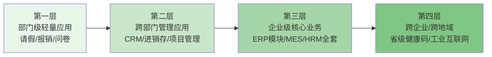

这一渗透曲线的每一层都对应着低代码能力的一次跃迁，并伴随相应的标志性案例与数据支撑。

**第一层至第二层的跃迁**主要发生在2018—2020年。简道云等表单驱动平台通过CRM、进销存、项目管理等模板，使中小企业能够在部门级应用基础上实现跨部门数据互通[^34]。这一层的渗透主要由**Excel数据混乱痛点+标准软件不贴合痛点**双重驱动。

**第二层至第三层的跃迁**则是2020—2021年的主旋律。纷享销客等大中型企业级低代码CRM基于PaaS底座承载复杂销售方法论、公海池规则、返利逻辑等业务，并支持与ERP/OA/HRM的深度集成、私有化部署、字段级/行级权限等企业级要求[^36]。这一层的渗透由**模型驱动平台能力升级+云原生底座成熟+资本与巨头入场**三重力量推动。

**第三层至第四层的跃迁**则在2021年的公共应急案例中得到验证。微搭具备搭建省级健康码项目的能力，几分钟就能快速构建一个小程序/H5——这背后是底层架构的特别设计[^39]。能够在省级公共应急场景下承载海量并发、跨地域部署、跨多端交付的复杂应用，标志着低代码已经不再是"玩具级"工具，而是具备承载关键基础设施的能力。

从市场数据看，这一渗透趋势也有强力佐证：Gartner预计到2025年企业开发的新应用程序中70%将由低代码或无代码技术构建，而2020年这一比例不到25%——这意味着在五年时间窗口内，低代码渗透率将提升约3倍[^41]。同时，Gartner调查发现13%的业务技术人员表示，在过去的12个月中低代码开发平台是组织实现自动化计划的最常用工具之一[^41]。Forrester的相关研究机构报告也显示，到2023年全球超过50%的大中型企业将会把低代码作为主要战略应用平台之一；到2024年低代码应用开发将占应用程序开发65%以上[^39]。

推动这一渗透曲线持续上移的力量，可归纳为**三大结构性驱动力**：其一，**模型驱动能力升级**——Mendix、OutSystems、华为iDME、ClickPaaS等模型驱动平台不断完善企业级建模能力，使低代码可以承载越来越复杂的业务；其二，**云原生底座成熟**——Serverless、容器、对象存储等基础设施的成熟，让低代码生成的应用具备弹性、可观测性、自动化运维等企业级特性；其三，**资本投入与生态化**——Mendix被西门子收购、OutSystems获KKR与高盛3.6亿美元融资估值超过10亿美元[^44]、阿里腾讯华为等巨头集中入局，共同把低代码从一个边缘工具推向产业级基础设施。这三股力量在2020—2021年形成共振，直接催生了应用渗透深度的快速上移。

## 3.9 Gartner双模IT框架下的低代码定位

要从更高的战略层面理解低代码的应用定位，**Gartner于2016年提出的双模IT（Bimodal IT）框架**提供了一个极具解释力的分析视角。

Bimodal是管理两种独立但又相互一致的工作风格的实践：一种关注可预测性，另一种关注探索。**Mode 1**针对更可预测、较为成熟的领域进行优化，专注于利用已知信息，同时将遗留环境改造为适合数字化世界的状态；**Mode 2**则是探索性的，通过实验解决新问题，针对不确定性领域进行优化，这类倡议通常以一个假设开始，并在涉及短迭代的过程中进行测试和调整，可能采用最小可行产品（MVP）方法；两种模式对于创造可观的价值和推动重大组织变革都至关重要，且都不是静态的；将产品和技术更可预测的演进（Mode 1）与新颖创新（Mode 2）相结合，是企业双模能力的本质，二者在数字化转型中都发挥着重要作用[^45]。

中国IT界对双模IT的理解进一步具体化为**"稳态IT"与"敏态IT"**两种治理模式：稳态模式集中在完全理解的、能较精确预知的领域，目标是将这些领域从传统的IT环境进化到更加适应数字化时代的技术，更强调持续的"可靠性"，像马拉松运动员；"稳态"业务具有行业成熟、标准规范、需求明确、长期不变的特点；敏态模式面对的是未知的、全新的问题（如区块链），目标是通过探索、试验来驾驭不确定性，更强调"灵活性"[^46]。大型企业的IT部门在过去一直是成本中心的定位，依靠大量COTS商用软件系统（如ERP和数据仓库）来支撑大规模的业务运作，经年累月形成了业务赖以生存的中后台；复杂的业务逻辑和流程处理让这些系统长成了庞然大物，很难达成数字化时代要求的高响应力；金融行业仍然在经历的"去IOE"历程便是市场倒逼下的IT架构转型[^46]。

将低代码的应用图谱置入双模IT框架，可以得出一个清晰判断：**低代码主要承载敏态IT业务，并逐步向稳态IT渗透，形成"敏态为主、向稳态渐进"的格局**。这一判断有三层支撑：

**第一，低代码的核心能力天然契合敏态IT的诉求**。敏态业务的本质要求是"高响应力、短周期、MVP试错"，而低代码的核心能力恰恰是"快速搭建、灵活迭代、低门槛释放公民开发者"——两者在能力—需求层面形成精准对应。3.1节剖析的审批自动化、3.3节剖析的轻量BI报表、3.4节剖析的多端营销活动页、3.6节剖析的IoT/AI新兴方向，都属于典型的敏态IT场景，也都成为低代码渗透最深、最快的领域。

**第二，低代码正在向部分稳态IT场景渗透**。3.2节剖析的大中型企业级CRM、3.5节剖析的MES制造执行系统、3.8节提及的省级健康码平台，已经触及甚至跨入稳态IT的传统领地。这种渗透由模型驱动平台能力升级所推动——当低代码具备元数据驱动架构、字段级/行级权限、私有化部署、高可用扩展等企业级能力后，它就开始挑战COTS商用软件在稳态IT中的地位。Gartner将OutSystems、Mendix、微软、Salesforce、ServiceNow评为2021年企业低代码应用平台魔力象限的行业领导者[^41]，本身就反映了这些模型驱动平台在企业级稳态场景的实力。

**第三，"敏态为主、向稳态渐进"的格局形成了清晰的渗透节奏**。对于绝大多数企业而言，低代码的引入路径仍然是"先从敏态IT切入、积累信心后再向稳态IT渗透"——这种渐进式渗透既符合企业的风险偏好，也符合低代码平台自身的能力演进节奏。Gartner认为LCAP市场快速增长由三大趋势推动：**民主化**（LCAP开发模式可以使非技术出身的业务人员也能开发出符合业务需求的应用程序，还开创了多部门协作的工作模式）、**超级自动化**（超级自动化集合了多种技术、工具和开发方式，LCAP已成为超级自动化的关键组成部分）、**可组合性**（组织正在采用应用程序组合技术以加快程序的融合效率，LCAP是推动应用服务、功能和能力可组合性的关键技术之一）[^41]——这三大趋势同时作用于敏态IT与稳态IT，将持续推动低代码的渗透边界上移。

需要在此保持冷静的是：**低代码尚未也不会在短期内完全替代稳态IT中的ERP、核心交易系统等COTS商用软件**。稳态IT对极致的可靠性、长期稳定性、与历史数据的兼容性有极高要求，这些诉求往往超出低代码平台当前的能力边界。更现实的格局是：**稳态IT的核心模块仍由COTS或自研系统承载，而其外延模块（如自定义报表、流程审批、移动接入端、轻量管理工具）则由低代码承担**。这种"核心稳定+外延敏捷"的双层架构，可能是低代码在企业IT版图中最现实的定位。

至此，本章已完成从场景图谱到战略定位的完整剖析。**低代码在2021年底的应用面貌可以浓缩为四句话：第一站在审批，主战场在企业管理，价值显性化在数据可视化，扩张边界在多端与垂直行业。其底层规律是表单驱动与模型驱动分别服务于敏态IT与跨越敏态—稳态的能力梯度，整体演进趋势是从工作组级简单应用向企业级核心业务持续渗透**。这一应用层的图谱，将直接成为第4章主流平台分类的现实坐标——按照技术路径与目标场景的差异，国际与国内的低代码厂商各自占据了应用图谱中的特定位置，第4章将系统呈现这一竞争版图。

# 4 主流平台与工具图谱（截至2021年底）

第2章建立了"模型驱动+云原生+可视化"三位一体的技术坐标，第3章铺陈了从部门级审批到企业级核心业务的应用渗透曲线。两条主线最终都指向同一个问题：**在2021年底这一时间断面上，究竟有哪些平台和厂商正在把上述技术与场景转化为产品与市场——他们如何定位、如何竞争、又如何被资本与权威机构所评价？**本章的任务是回答这一问题，搭建一份兼具广度与深度的厂商图谱，为第5章业务优势归纳与第6章四维联动分析提供市场层面的实证基础。

需要预先说明的是，本章不试图穷举所有平台，而是按照统一的分类框架（4.1）筛选代表性厂商，先后剖析国际阵营（4.2）与国内阵营（4.3），再从"应用衍生vs原生低代码"派系比较（4.4）、多维平台对比（4.5）、商业模式与生态定位（4.6）、资本与并购信号（4.7）、权威机构评估（4.8）等角度展开横向分析，最终在4.9收束为对中国低代码市场格局的整体判断。

## 4.1 厂商分类框架：地域、起源路径与技术路线的三维坐标

要在数十家活跃厂商中辨认出有意义的结构性差异，第一步是建立一个稳定的分类框架。综合海比研究院、艾瑞咨询、亿欧智库、Forrester等机构的厂商类型学，本报告采用**"地域阵营—起源路径—技术路线"三维坐标体系**作为全章的统一分类标尺。

**地域维度**区分国际阵营与国内阵营。这一区分不仅源于市场地理边界，更重要的是反映了两大市场在客户成熟度、生态结构、监管诉求上的系统性差异。国际市场低代码概念发展已逾十年（Mendix、OutSystems均布局十多年），中国市场则在2019—2021年才真正形成完整生态体系[^47][^48]。

**起源路径维度**区分**应用衍生类厂商**与**原生低代码厂商**两大派系。应用衍生类厂商指基于既有业务产品（CRM、ERP、OA、BPM等）向PaaS化延伸而形成低代码能力的玩家，如Salesforce、ServiceNow、用友、金蝶、致远互联、销售易等；原生低代码厂商则指自诞生之日即以低代码为核心定位的玩家，如OutSystems、Mendix、ClickPaaS、明道云、数睿数据等。这一区分对应了海比研究院"综合厂商vs独立厂商"的二分法，但更强调"基因起源"对产品形态的深层塑造作用[^48]。

**技术路线维度**承接第2章2.3节建立的表单驱动与模型驱动分野，并进一步细化为模型驱动、表单/数据库驱动、流程驱动、混合型四类技术取向。海比研究院按技术划分为"模型驱动与表单驱动两类"[^48]，亿欧智库进一步将低代码与无代码按目标人群、技术、企业性质三维度划分[^48]，均与本报告的技术路线维度互为印证。

作为补充视角，海比研究院从企业数字化转型需求侧提出的**四类划分**——场景应用型（侧重业务场景应用、占使用者需求45.7%）、产品研发型（满足复杂软件产品或解决方案开发、占37.0%）、平台生态型（提供一站式应用开发或产品服务、占15.7%）、技术赋能型（提供AI算法、区块链等先进技术插件、占1.7%）[^48]——为后续平台对比提供了另一把多维标尺。

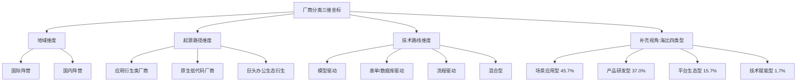

需要强调的是，三维坐标之间并非完全正交，而是存在显著相关性。例如，国际原生低代码厂商（Mendix、OutSystems）多数走模型驱动路线，国内独立厂商（简道云、明道云、伙伴云）则多数偏向表单驱动；巨头办公生态衍生平台（钉钉宜搭、微搭）由于服务多类客户群体，通常采用混合型技术路线。这种相关性本身是市场分化的结果，也是后续各节展开比较时的内在逻辑。

## 4.2 国际阵营代表性平台剖析

国际市场的低代码厂商图谱可按产品定位与技术路线划分为三大组别：模型驱动企业级阵营、巨头办公生态阵营、无代码与水平协作阵营。三者分别对应了第3章渗透曲线中的企业级核心业务、跨部门管理应用、部门级轻量应用三个层级。

### 4.2.1 模型驱动企业级阵营

模型驱动企业级阵营的代表是**OutSystems、Mendix、Appian**三家，它们都有十年以上的技术积累，专攻具有复杂业务逻辑的大型企业级应用。

**OutSystems**的低代码开发平台让软件开发人员和业务用户通过直观的可视化界面来构建应用程序，而不是传统的编写代码方式；用户可以在开发平台灵活拖动各个图形化控件以构建业务流程、逻辑和数据模型等所需的功能，必要时还可以添加自己的代码；完成业务逻辑、功能构建后即可一键交付应用并进行更新，OutSystems会自动跟踪所有更改并处理数据库脚本和部署流程，实现在iOS、Android、Windows Phone和Web等多个平台上的部署[^49]。其UI能力方面，OutSystems通过分析世界领先的应用程序制作了自己的UI部件库，可快速添加到构建的应用程序中；平台覆盖较广的应用场景，从大型任务解决方案（取代传统ERP/CRM系统）、用于内部流程的移动和Web应用程序，到网上银行、帐号注册和客户自助服务应用等[^49]。2018年，私募股权投资机构KKR和高盛共同筹集了3.6亿美元收购OutSystems"大量"少数股权，本次交易对OutSystems的估值超过10亿美元；当时OutSystems在25个国家拥有400多家企业客户，包括丰田、罗技、德勤、施耐德电气和通用金融等，收入远高于1亿美元、每年增长率超过70%[^49]。

**Mendix**起源于荷兰、现总部位于波士顿。2018年8月2日，西门子宣布以约6亿欧元（约合7亿美元）的价格收购Mendix；西门子表示将利用Mendix的技术加速其在云端、物联网和数字化企业的野心，"通过收购Mendix，西门子继续推进其全面数字化和MindSphere IoT投资组合，包括云端领域专业知识、云硬件独立解决方案和高技术人才"[^50]。Mendix的服务在被收购前已深度集成到IBM、SAP和Pivotal的云服务中[^50]。2021年，"低代码、无代码领导者Mendix进军中国市场"[^47]。Mendix具备将LCAP与物联网（IoT）、数字孪生相结合使用的技术创新能力，其客户分布在各种规模的企业中，主要集中在金融、制造等领域，平台在UX设计、集成支持和平台管理方面得分尤高（详见第3章3.5节相关引用）。

**Appian**于1999年创立，总部位于美国弗吉尼亚州麦克莱恩，作为全球领先的低代码自动化平台，加速了具有复杂业务逻辑应用程序的创建，并使客户能够自动化其业务的各项流程；其完善的自动化技术包括行业领先的工作流引擎、机器人过程自动化（RPA）、领先的案例管理功能以及集成的基于谷歌的人工智能（AI）[^51]。Appian的发展呈现明确的"BPM→低代码→AI集成"演进路径：2004年开始由传统的BPM软件服务商逐渐向PaaS模式过渡；2016年推出第一款低代码平台产品；2020年通过融合RPA能力提升其低代码产品能力；2021年又通过布局AI技术领域对低代码平台进行第二次升级、推出Appian+AI平台[^51]。在收入模式上，Appian 2014年开始大幅增加对订阅收费模式的产品的投入、逐渐放弃了毛利率较低的定制开发部署服务；2014—2020年Appian的订阅收入增长了435%、占总收入比由41%提升到了66%[^51]。Appian作为低代码上市第一股于2017年以12美元发行、市值曾达到166亿美元；当前累计客户数不到700家、每年营收达3亿美元、以每年近30%的增长率持续发展；其客户群体定位在政府及大企业，并拿下美国联邦政府、教育部和总务管理局的多个安全认证，成为行业中安全性认可度第一的低代码平台[^51]。在Gartner 2021年企业低代码应用平台魔力象限中，Appian被评为行业挑战者[^51]。

### 4.2.2 巨头办公生态阵营

巨头办公生态阵营的代表是**Microsoft Power Platform、Salesforce、ServiceNow**三家。它们的共同特征是依托母公司的办公协作或CRM/ITSM生态，将低代码作为生态扩展能力。

**Microsoft Power Platform**包含Power Apps、Power Automate、Power BI、Power Virtual Agents等多个组件，定位为"借助AI优先的新式应用程序实现业务转型"，可快速构建和部署全栈应用程序，这些应用具备企业级治理能力并由AI提供支持[^52]。2021年微软在Ignite大会上宣布**开源低代码语言Power Fx**——这是一种基于Microsoft Excel的通用、强类型、声明性和函数式编程语言，同时支持文字表述[^47]。同年微软宣布将超级自回归语言模型GPT-3集成到Power Apps中，进一步提升应用程序开发效率，使得用户通过自然语言就能编程而无需精通任何编码知识[^47]。Power Apps的设计哲学体现在"使用自然语言概述目标、角色和工作流，AI会立即将你的意图转化为结构化的解决方案蓝图"以及"借助AI辅助建议，设计安全且可扩展的数据模型"[^52]——这些能力虽然在2022年后才大规模商用，但开源Power Fx与GPT-3集成的方向性宣示在2021年即已完成。在中国市场，"微软在'Ignite 2021'大会宣布开源低代码语言Power Fx"标志着Power Platform作为巨头办公生态阵营的代表性身份[^47]。

**Salesforce**作为传统CRM巨头衍生的低代码代表，其Platform（平台）收入是七大收入来源之一，被定义为高生产率aPaaS、高控制aPaaS、应用平台软件、业务流程管理套件、数字体验平台等[^53]。所谓的aPaaS实际上就是采用低代码、基于云且具备可拓展性的平台[^53]。在Gartner 2020年发布的企业低代码应用程序平台魔力象限中，Salesforce与新贵创业企业Mendix、OutSystems一起被列入领导者象限；Oracle则被列入挑战者象限[^53]。

**ServiceNow**作为IT服务管理（ITSM）起家的应用衍生型低代码代表，与Salesforce类似，是Forrester 2021年Q2《面向专业开发人员的低代码开发平台Wave》评估的14家厂商之一[^54]。其低代码能力主要服务于IT服务管理与企业工作流自动化场景。

### 4.2.3 无代码与水平协作阵营

无代码与水平协作阵营的代表平台呈现"电子表格基因+水平协作"的共同特征，包括**Google AppSheet、Amazon Honeycode、Bubble、Airtable、Retool**等。

**Google AppSheet**于2020年初被Google收购，定位为"补充了谷歌云的战略、重新构想了应用程序开发空间"[^55]。AppSheet是一家无代码移动构建平台，能够从电子表格、数据库或表单中提取数据，并使用字段或列名作为构建应用程序的基础来工作，自动从中生成移动端的报告生成App、邮件发送App、图像记录App等；以其"定制化导游模块"为例，建立一个有"景点图片"、"景点名称"、"景点位置"三栏的表格，在其中加入相关信息，就可以生成一款简单的导游App[^56]。AppSheet被整合进Google的G Suite——双方在G Suite底层打通后，用户可以更方面地直接通过Sheets和Forms表格工具生成移动应用；AppSheet平台上每月有18000个"活跃应用程序创建者"[^56]。

**Amazon Honeycode**由亚马逊发布，是一种类似于电子表格界面的无代码开发环境，旨在吸引希望构建基本业务线应用程序的非编程人员；"如果你知道如何操作电子表格，并且想将其转换成app，那么你就会需要Honeycode"[^57]。亚马逊副总裁Augustin表示："我们打造Honeycode的初衷是让业务人员、分析师、项目经理等成员轻松地创建一个定制应用程序，无需编写任何代码就能解决问题。电子表格界面是个很好的接入方式，因为大部分人都足够熟悉。"[^57]Honeycode与Airtable都将电子表格带入应用构建领域，但在产品方向上各有侧重；Honeycode在某些方面会被拿来与Retool比较，但后者面向的是更高级的开发者，并且没有隐藏代码[^57]。

**Bubble**是一家开放式可视化编程平台，提供了一个无代码平台，使没有编程技能的人能够设计和发布自己的数字应用程序、市场或工具来解决他们的业务问题；其数字编辑器和云托管平台允许用户以经济实惠的方式启动Web应用程序[^58]。Bubble于2021年7月27日完成A轮融资1亿美元，由Insight Partners领投，BoxGroup、Neo、SignalFire、Third Kind Venture Capital等参与；其更早的2019年6月种子轮融资为630万美元[^58]。

**Airtable**由Howie Liu、Andrew Ofstad和Emmett Nicholas于2012年创办，是一个电子表格-数据库混合体，它具有数据库的功能，但实际上是电子表格；Airtable的表格中的字段类似于电子表格中的单元格，但它还有复选框、电话号码和下拉列表等类型，并且可以引用图片等文件附件；用户可以创建数据库、设置列类型、添加记录、将表与表之间相互链接、相互协作以及排序记录[^59]。自成立以来，Airtable吸引了Netflix、时代周刊和BuzzFeed等企业用户，一度在硅谷掀起一股Airtable潮，成为SaaS公司中ARR从1000万美金达到1亿美金最快的公司之一[^59]。其融资节奏极具代表性：2015年6月A轮760万美元、2018年3月B轮5200万美元、2018年11月C轮1亿美元（估值11亿美元晋身独角兽）、2020年9月D轮1.85亿美金、2021年3月E轮2.7亿美金（估值57.7亿美元）、**2021年12月13日F轮7.35亿美元、估值达到110亿美元**——在不到一年时间内估值翻倍[^59][^60]。Airtable的核心功能体现在Apps（第一个"低代码"特性，基于Javascript编程语言，允许用户在Airtable上创建自己的应用或安装其他开发者开发的开源应用）、Sync（让团队和公司在Airtable上更容易地彼此共享特定数据）、Automations（在Airtable内部创建触发动作工作流）三个层面[^59]。Airtable CEO Howie Liu表示这一轮融资让Airtable实现了盈利、同时计划在几年后上市[^60]。

**Retool**作为面向开发者的内部工具构建平台，定位与Honeycode/Airtable形成对照——它面向的是更高级的开发者，并且没有隐藏代码[^57]。

为便于横向理解，下表汇总国际阵营代表平台的核心定位：

| 平台 | 起源年份 | 技术路线 | 目标用户 | 关键事件 | 典型客户 |
|------|---------|---------|---------|---------|---------|
| **OutSystems** | 2001 | 模型驱动 | 专业开发者 | 2018年KKR+高盛3.6亿美元融资，估值超10亿美元[^49] | 丰田、罗技、德勤、施耐德电气、通用金融[^49] |
| **Mendix** | 2005 | 模型驱动 | 专业开发者+业务开发者 | 2018年Siemens约6—7亿欧元收购[^50]，2021年入华[^47] | 金融、制造业大客户 |
| **Appian** | 1999 | 流程驱动+低代码+AI | 专业开发者 | 2017年上市，2021年Gartner魔力象限挑战者[^51] | 美国联邦政府、教育部、总务管理局[^51] |
| **Microsoft Power Platform** | 2018 | 混合型 | 双用户兼顾 | 2021年开源Power Fx、集成GPT-3[^47] | 全球企业用户 |
| **Salesforce** | 1999/2014 | 应用衍生 | 双用户兼顾 | Gartner 2020/2021魔力象限领导者[^53] | 全球CRM客户 |
| **ServiceNow** | 2004 | 应用衍生 | 双用户兼顾 | Forrester 2021 Wave 14家厂商之一[^54] | 全球ITSM客户 |
| **Google AppSheet** | 2014/2020被收购 | 无代码 | 公民开发者 | 2020年初被Google收购、整合G Suite[^56][^55] | G Suite用户 |
| **Amazon Honeycode** | 2020 | 无代码（电子表格界面） | 公民开发者 | AWS生态[^57] | 业务人员、分析师、PM |
| **Bubble** | - | 无代码可视化 | 公民开发者 | 2021年7月Insight Partners 1亿美元A轮[^58] | 中小企业、独立开发者 |
| **Airtable** | 2012 | 电子表格-数据库混合 | 公民开发者 | 2021年12月F轮7.35亿美元、估值110亿美元[^60][^59] | Netflix、时代周刊、BuzzFeed[^59] |
| **Retool** | - | 内部工具构建 | 高级开发者 | 不隐藏代码[^57] | 中小企业IT团队 |

## 4.3 国内阵营代表性平台剖析

中国市场低代码厂商的图谱可按起源路径分为三组：互联网巨头生态平台、原生低代码独立厂商、传统软件厂商衍生平台。三者分别对应了海比研究院"综合厂商"中的不同类型，以及"独立厂商"群体[^48]。

### 4.3.1 互联网巨头生态平台

互联网巨头生态平台的代表是阿里钉钉宜搭、腾讯云微搭、华为云AppCube、百度爱速搭、字节昆仑五家，它们共同特征是依托母公司的云服务+办公协作生态，将低代码作为战略级生态扩展能力。

**阿里钉钉宜搭**是阿里巴巴自主研发的低代码应用开发平台，基于阿里云的云基础设置和钉钉的企业数字化操作系统，为每个组织提供低门槛、高效率的数字化业务应用生产新模式[^61]。其发展时间线极为关键：2017年3月宜搭在阿里巴巴内部正式上线，在三年多的时间里内部共计搭建了12700多个应用、其中99%的应用都是由HR、财务等没有开发经验的员工自行搭建的[^61]；2019年宜搭正式对外商用，累计服务客户超过6000家，覆盖新零售、医疗、生产制造、能源、教育、酒店6大行业[^61]；2020年春节期间宜搭以低代码、快速搭建应用的优势第一时间助力各级政府及企业快速实现疫情防控和管理，累计搭建2000多个疫情应用、平均每个应用仅需1.5天即上线[^61]；2021年1月钉钉6.0发布会正式宣布**宜搭与钉钉融合**，让钉钉上的1700万组织、4亿用户搭建钉原生应用更简单[^61]；2021年10月在2021云栖大会低代码分论坛上，钉钉宜搭负责人阿里巴巴资深技术专家叶周全（花名骁勇）发布**钉钉宜搭3.0版本，主打易连接、酷数据、更安全**，钉钉上的低代码应用数突破120万、其中宜搭应用数破100万[^61]。同期钉钉发布"两个数字化（组织数字化与业务数字化）"战略、推出全新协作产品"钉闪会"，并宣布截至2021年8月31日用户数突破5亿、各类组织超1900万[^62]。2021年钉钉**升级了低代码聚合平台"钉钉搭"**，为低代码厂商提供能力支持，现已聚集了**宜搭、简道云、氚云、易鲸云、黑帕云、轻流、维格、悉息8款低代码厂商，上线600多低代码应用模板**[^62]。开放接口总数量由年初的1300多个扩大到了2000多个，今年内开放的接口数量比过去两年的总和还多；钉钉平台长出的"钉应用"数超过150万、较年初增长三倍，低代码应用8个月增长86万个[^62]。

**腾讯云微搭**是腾讯云自主研发的低代码工具，是高效、高性能的拖拽式低代码开发平台，向上连接前端的行业业务、向下连接云计算的海量能力，助力企业垂直上云；微搭通过行业化模板、拖放式组件和可视化配置快速构建多端应用（小程序、H5应用、PC Web应用等）[^63]。其技术能力以云开发作为底层支撑，云原生能力将应用搭建的全链路打通，提供高度开放的开发环境，无需关心服务器、数据库等底层运维和技术架构，具备Serverless化的高可用、安全防刷、免流量等能力[^63]。微搭自2021年3月发布以来已在工业、零售、教育、政务等各行业的商业化落地上得到了验证[^63]。微搭与微信生态的深度耦合是其独特能力（详见第3章3.4节）。2021年初腾讯云宣布低代码LowCode平台开启公测[^53]，标志着腾讯正式入局低代码赛道。

**华为云AppCube**（应用魔方）是华为推出的企业级低代码平台，定位与用友、金蝶等成熟厂商一起共同开拓市场[^64]。2022年末华为AppCube全线产品全面升级，在低代码、零代码、数据看板三个方面升级优化[^64]——这一升级动作虽属2022年，但其平台在2021年底已经存在并具备基本形态。

**百度爱速搭**、**字节跳动aPaaS昆仑**也是巨头入局的代表。字节昆仑团队的组建有一段标志性故事：2021年7月黑帕云宣布获得字节跳动数千万元A轮融资[^65]，2022年3月黑帕云宣布将停止服务和维护，原团队被字节跳动收购，**创始人陈金洲及部分团队成员已入职飞书、负责aPaaS产品"昆仑"，将主要面向大客户**[^65]。

### 4.3.2 原生低代码独立厂商

原生低代码独立厂商是中国低代码市场最活跃的力量，代表玩家包括明道云、简道云、轻流、ClickPaaS、奥哲、伙伴云、织信Informat、数睿数据、摩尔元数、vika维格、黑帕云、宜创科技、氚云等。

**简道云**是国内领先的低代码开发平台，主打"零代码+低代码"双模式，支持表单设计、流程配置、数据报表等核心功能，模板覆盖CRM、ERP、OA、项目管理等场景，中小企业可直接复用（详见第3章3.2节）。2021年简道云已成为钉钉低代码聚合平台"钉钉搭"聚合的8家厂商之一[^62]。

**明道云**作为国内较早进入零代码开发领域的平台，具有丰富的数据处理能力和模板资源，为企业提供了灵活的应用搭建解决方案[^66]。明道云在黑帕云2022年关停时被指定为"合作伙伴"——黑帕云用户的套餐未到期的客户可以将业务迁移到其合作伙伴"明道云"平台上[^65]。

**轻流**成立于2015年，定位于无代码厂商。轻流CPO严琦东对创业邦表示："在前两年大家还会认为无代码、低代码这两个赛道有点相像，但是从最近一年来看这两者之间的界限已经越来越清晰了"；轻流认为低代码与无代码的区别主要源于两者受众人群的不同——低代码更多的还是服务于专业的IT开发人员，通过提升这部分人员的整体开发效率来提升IT和信息化的交付效率；而无代码更多的是服务于没有IT背景、不会写代码的业务人员，希望通过一些可视化的应用搭建模式来实现应用层面的系统开发工作[^67]。2021年轻流陆续完成了A+、B轮融资，获得了腾讯投资、源码资本、启明创投等机构的青睐，成为无代码赛道的一家明星创业公司[^67]；轻流已累计完成五轮知名机构近亿元融资[^47]。轻流的产品设计强调"积木"与"图纸"并重——"无代码厂商需要清楚地告诉客户基于手中的这些乐高模块能够做出什么，最终考验的还是每个厂商在细分行业和场景上的理解"[^67]。轻流是钉钉低代码聚合平台8家厂商之一[^62]，也是腾讯云的重要合作伙伴[^64]。

**ClickPaaS**（上海爱湃斯科技有限公司）是企业级低代码PaaS平台，基于领域模型驱动的低代码平台，支持企业构建可组装式应用满足个性化业务需求[^68]。ClickPaaS采用模型驱动开发方式，通过业务模型、数据模型、页面模型、流程模型、集成模型、报表模型实现图形化和可视化的配置，实现从业务故事分析到应用系统落地；立足于工业、政务、金融等行业，构建领域模型，沉淀行业组件和专用算法，将领域最佳实践结合可落地产品，助力中大型企业数字化升级[^68]。ClickPaaS的资质包括高新技术企业、ISO27001体系、ISO20000体系、等保三级、CMMI-3，已服务46个国家、帮助15万+企业用户构建非标业务场景[^68]。ClickPaaS入选Gartner《中国低代码应用平台竞争格局》报告以及Forrester行业云系列报告[^69][^68]。

**奥哲**深圳奥哲科技网络有限公司成立于2010年，拥有一支以创始人徐平俊为代表的国内低代码行业开创团队；奥哲一直致力于通过低代码技术建立完善的产品矩阵，助力不同规模企业完成数字化转型升级[^70]。**奥哲云枢**是一款面向开发者的云端低代码（Low-Code）应用服务平台，通过敏捷构建企业业务应用打通企业；产品亮点包括模块化应用构建+专业流程引擎+业务集成引擎+低代码扩展、灵活的部署模式（支持公有云、私有云、混合云）、深度整合钉钉、阿里云金融级数据安全防护[^71]。云枢有从基础版（118000元）到数字化专享版（5000000元）的多个版本，覆盖不同规模企业需求[^71]。奥哲八大能力包括跨系统业务集成、所见即所得表单设计、拖拉拽流程设计、业务规则配置图形化、跨组织业务协同、配置化视图设计、智能化报表设计、可视化页面设计，并强调"企业应用系统构建效率可提升60%以上"[^72]。奥哲目前已成功服务企业客户10W家以上，包括40%的国内五百强企业及各行业的标杆企业[^70]；奥哲获2021中国低代码平台优秀应用案例奖[^70]，并与阿里钉钉深度绑定[^64]。

**伙伴云**是2021年融资最耀眼的国内独立厂商。伙伴云是一个零代码应用搭建平台，是一个为企业的全流程运营管理与经营核算提供整体解决方案的数据可视化平台，成立于2012年7月；其80后CEO戴志康曾是互联网社区论坛软件Discuz!的创建者，也是国内最早的PHP开发者[^60]。伙伴云通过强大的数据库引擎及权限架构，搭配可灵活定制的流程引擎与大数据分析引擎，打造了一个全流程、实时可视化的经营核算体系；在经历了10000多次产品迭代后，目前伙伴云涵盖了全行业、全场景，其产品有超过240万企业员工在线使用，根据伙伴云数据公司今年的收入相较去年有约4倍的增长，目前累计服务企业超2000000家，平台日更新创建数据量2000万[^60]。**2021年5月伙伴云完成了1700万美元B轮融资，由红杉资本和五源资本领投；12月16日伙伴云宣布完成4000万美元B+轮融资，领投机构暂未披露，老股东红杉中国和五源资本持续加持**[^60]。在完成B+轮融资的一周之前，因客户调性和画像极为匹配，伙伴云与企业微信建立战略合作关系，成为了其唯一一个战略合作的对外平台[^60]。伙伴云的服务对象以主营业务增长较快、数字化需求较高的新势力企业为主，包括**比亚迪、元气森林、泡泡玛特、蔚来汽车、远景动力、良品铺子**等[^60]；比亚迪是伙伴云的深度伙伴之一，伙伴云通过培训比亚迪里面的一个技术团队、教其学会使用低代码，培训时长只需3—4天[^60]。伙伴云于2021年1月作为唯一的低代码/无代码平台入选艾瑞咨询《2021中国企业数字化转型路径实践研究报告》，2021年3月再次入选艾瑞咨询《2021年低代码行业研究报告》[^73]。

**织信Informat**是由深圳市基石协作科技有限公司（成立于2019年）推出的企业级低代码开发平台；公司的母公司是一家为企业进行信息化软件管理咨询和定制的项目服务公司，主要为大型客户（包括平安、腾讯、微众银行等企业）进行内部核心系统的研发服务；基于这些年的项目经验和技术积累，提炼出了一整套低代码开发逻辑[^63]。织信Informat企业级低代码平台目前通过不断的客户交付提炼出高度成熟的核心功能模板（OA办公场景常见的人员管理、流程审批、绩效考核、OKR、日周月报；ERP资源管理常见的资源流管控、数据整合、企业中台）[^63]，覆盖ERP、MES、CRM、WMS、SRM、PLM等场景[^66]。

**摩尔元数**于2021年3月20日完成亿元级B轮融资，由启明创投独家投资，凡卓资本担任独家财务顾问；本次融资额主要用于「Smartdata」平台的产品与技术研发，投入大数据和AI技术研发，提升端到端的效率及用户体验[^47]。

**vika维格**于2021年2月22日完成Pre-A和Pre-A+连续两轮的共超千万美元投资；其中Pre-A+轮由高瓴创投领投，靖亚资本、五源资本跟投；Pre-A轮融资由靖亚资本领投，五源资本跟投；元一资本担任独家财务顾问[^47]。维格表在一年之内连续完成了三轮融资[^74]。维格是钉钉低代码聚合平台8家厂商之一[^62]。

**黑帕云**是一个具有警示意义的案例。黑帕云是新一代数据协作管理网站，由陈金洲于2019年创立；用户可自行拆解业务模型、设置数据维度、字段名称、数据逻辑等，将企业的业务智慧通过一张张的表结构具像化[^75]。黑帕云于2019年10月内测版上线，2020年4月完成750万元人民币天使轮融资（盈动资本），2020年12月完成数千万元Pre-A轮融资（初心资本），2021年7月完成数千万元A轮融资（字节跳动领投、盈动资本跟投），2021年12月发布3.0版本推出超级透视表、全员应用、应用操作日志等功能[^75]。2022年3月21日黑帕云宣布将于2022年5月31日停止服务，团队被字节跳动收购、创始人陈金洲及部分团队成员已入职飞书、负责aPaaS产品"昆仑"[^75][^65]。本报告将黑帕云收购与关停事件作为"2022年的早期信号"引用，其2021年7月获字节跳动A轮、12月发布3.0版本仍属本报告时间边界内的重要事件。

其他原生低代码独立厂商还包括氚云（与阿里钉钉深度绑定[^64]）、宜创科技、数睿数据（被列入"国内默默耕耘十多年的低代码老兵"[^47]）、易鲸云（钉钉搭8家厂商之一[^62]）、悉息（钉钉搭8家厂商之一[^62]）、白码、搭贝、轻骑兵、Zoho Creator等[^66]。

### 4.3.3 传统软件厂商衍生平台

传统软件厂商衍生平台的代表是用友、金蝶、致远互联、销售易、纷享销客、泛微、蓝凌、炎黄盈动、活字格等[^66]。这些厂商的低代码能力是在既有CRM/ERP/OA/BPM产品基础上向PaaS化延伸的结果，特点是行业Know-How深厚、客户基础稳固。

**用友**拟以1.51亿元全资收购低代码平台APICloud，加码YonBIP平台赋能传统产业转型升级[^47]，用友YonBuilder是其低代码产品代表[^66]。**金蝶**云苍穹是其PaaS化低代码平台代表[^66]，金蝶与华为联手共同开拓低代码市场[^64]。**纷享销客**作为CRM起家的应用衍生类厂商，其CRM已全面进化为"智能型CRM"，底座能力基于成熟的PaaS平台（详见第3章3.2节）。其他玩家包括炎黄盈动（被列为"国内默默耕耘十多年的低代码老兵"[^47]）、致远互联、销售易、泛微、蓝凌、活字格、网易CodeWave等[^66]。

下表汇总国内阵营代表平台的核心定位（限于篇幅仅列出最具代表性的玩家）：

| 平台 | 起源类型 | 技术路线 | 关键事件/数据 |
|------|---------|---------|--------------|
| **阿里钉钉宜搭** | 巨头办公生态 | 表单驱动为主 | 2021年钉钉6.0融合、宜搭3.0发布、宜搭应用破100万[^61] |
| **腾讯云微搭** | 巨头办公生态 | 混合型（Serverless+低代码） | 2021年3月发布，与微信/企业微信生态深度耦合[^63] |
| **华为云AppCube** | 巨头办公生态 | 模型驱动 | 与用友、金蝶联手开拓市场[^64] |
| **字节昆仑** | 巨头办公生态 | 多维表格类 | 2021年通过收购黑帕云组建团队，2022年正式推出[^65] |
| **明道云** | 原生独立 | 零代码+低代码 | 接收黑帕云迁移用户[^65] |
| **简道云** | 原生独立 | 零代码+低代码 | 钉钉搭8家厂商之一[^62][^66] |
| **轻流** | 原生独立 | 无代码定位 | 累计五轮近亿元融资[^67][^47] |
| **ClickPaaS** | 原生独立 | 领域模型驱动 | Gartner中国低代码竞争格局代表厂商[^69][^68] |
| **奥哲** | 原生独立 | 模型驱动+流程引擎 | 2021优秀应用案例奖、服务10W+企业[^70][^72] |
| **伙伴云** | 原生独立 | 零代码 | 2021年5月B轮1700万美元+12月B+轮4000万美元[^60] |
| **织信Informat** | 原生独立 | 模板驱动 | 母公司服务平安、腾讯、微众银行等[^63] |
| **摩尔元数** | 原生独立 | 大数据+低代码 | 2021年3月B轮亿元（启明创投）[^47] |
| **vika维格** | 原生独立 | 多维表格 | 2021年三轮融资[^47][^74] |
| **黑帕云** | 原生独立 | 多维数据协作 | 2021年7月字节A轮，2022年关停被收购[^75][^65] |
| **用友YonBuilder** | 传统衍生 | 应用衍生 | 1.51亿元收购APICloud[^47] |
| **金蝶云苍穹** | 传统衍生 | 应用衍生 | 与华为合作开拓[^64] |

## 4.4 应用衍生类与原生低代码两大派系比较

在地域与具体平台的图谱铺陈之后，本节按厂商起源路径展开横向比较，剖析"应用衍生类厂商"与"原生低代码厂商"两大派系的产品哲学差异。这一比较是理解2021年低代码市场结构性张力的关键。

**应用衍生类厂商**以Salesforce、ServiceNow、用友、金蝶、致远互联、销售易、纷享销客、泛微、蓝凌等为代表。其低代码能力是在既有CRM/ERP/OA/BPM产品基础上向PaaS化延伸的结果。这一类厂商的核心优势在于三方面：其一，**行业Know-How深厚**——经过数十年服务大型企业客户的积淀，对销售管理、人事流程、财务核算等业务领域的理解远超新生玩家；其二，**与自家核心产品深度集成**——低代码能力天然作为母产品的扩展模块存在，客户不必担心数据孤岛或集成断裂；其三，**客户认知门槛低**——既有客户对厂商品牌的认可可以低成本迁移到低代码产品上。Salesforce Platform作为aPaaS被列入Gartner魔力象限领导者[^53]、ServiceNow作为ITSM起家的低代码代表被列入Forrester 2021 Wave 14家厂商[^54]，都印证了这一派系在大型企业市场的竞争优势。

但应用衍生类厂商也天然受限于既有产品架构与商业模式：**产品定位起点**是"为既有产品赋能"而非"为通用低代码场景设计"，导致其平台在跨行业、跨业务领域的通用性上存在天花板；**商业模式偏向**也通常仍以传统软件许可+实施服务为主，订阅化转型节奏受存量业务掣肘。

**原生低代码厂商**以OutSystems、Mendix、ClickPaaS、明道云、数睿数据、奥哲、Bubble、Airtable等为代表。其产品自诞生之日即以低代码为核心。原生低代码厂商的优势包括三方面：其一，**平台架构纯粹**——Mendix"志在打造一款可视化、模型驱动的低代码编程平台"（详见第2章2.2节）、ClickPaaS"基于领域模型驱动"[^68]，技术演进灵活、不受历史包袱拖累；其二，**面向跨行业通用市场**——OutSystems覆盖大型ERP/CRM替代场景[^49]、Mendix客户分布在金融、制造等多个行业，市场天花板更高；其三，**技术演进迅速**——Appian从BPM逐步演进至低代码+RPA+AI一体化平台[^51]、Airtable从电子表格演化为水平协作SaaS明星，演进速度远超传统软件厂商。

但原生低代码厂商也面临两个深层挑战：其一，**需要从零积累行业模板与客户信任**——这正是奥哲、ClickPaaS等强调"沉淀行业组件和专用算法"[^68]的原因；其二，**面临巨头生态化挤压**——独立厂商越来越多地被纳入巨头生态（详见4.6节）。

下表从五个维度系统比较两大派系：

| 比较维度 | 应用衍生类厂商 | 原生低代码厂商 |
|---------|--------------|--------------|
| **产品定位起点** | 为既有产品赋能扩展 | 通用应用构建平台 |
| **技术架构纯粹度** | 受母产品架构约束 | 架构纯粹、演进灵活 |
| **行业模板沉淀路径** | 基于母产品行业积累 | 需要从零积累或聚焦垂直行业 |
| **客户群体差异** | 母产品既有客户为主 | 跨行业新增客户为主 |
| **商业模式偏向** | 软件许可+实施服务为主 | 订阅+SaaS为主，部分大客户走平台许可 |
| **典型代表对子** | Salesforce/ServiceNow/用友/金蝶 | Mendix/OutSystems/ClickPaaS/明道云 |

需要客观指出的是，两大派系并非简单的优劣对立，而是在不同细分市场上各有所长。**Mendix（原生模型驱动）与Salesforce Lightning（应用衍生）**同列Gartner 2020年魔力象限领导者[^53]，证明两条路径都可以走向行业头部。**OutSystems（原生）与ServiceNow（应用衍生）**都被Forrester 2021 Wave纳入面向专业开发者的14家代表厂商[^54]，证明在专业开发者市场两类玩家同台竞技。**明道云（原生）与销售易（应用衍生）**在中国市场分别服务于中小企业自助场景和大中型企业CRM场景，市场边界清晰。

在中国市场，**巨头办公生态平台**（钉钉宜搭、腾讯微搭等）实际上构成了介于两大派系之间的第三种力量——它们既不是传统软件厂商的应用衍生，也不是纯粹的原生低代码独立厂商，而是依托母公司云服务+办公协作生态进行战略性入局。这一第三种力量将在4.6节生态定位中得到更深入的剖析。

## 4.5 技术路线、目标用户与场景定位的多维平台对比

承接第2章2.3节与第3章3.7节建立的技术分野，本节对国际与国内主要平台进行多维矩阵对比，从技术路线、目标用户、场景定位三个维度形成厂商坐标。

**技术路线维度**可将平台分为四类：

- **模型驱动派**：OutSystems、Mendix、华为AppCube、ClickPaaS、数睿数据、奥哲云枢——这一派以企业级元数据驱动、领域模型沉淀为核心，承载多实体关联与跨系统集成的复杂业务（详见第2章2.3节、2.2节）。
- **表单/数据库驱动派**：简道云、明道云、伙伴云、Airtable、Bubble、黑帕云——这一派以"由表及里"的表单或多维表格为构建起点，适合部门级与轻量协作场景。
- **流程驱动派**：Appian、Pegasystems、宜创科技——这一派以BPM工作流为核心，承载流程密集型应用（如政府事务、金融审批）。Appian"完善的自动化技术包括行业领先的工作流引擎、机器人过程自动化（RPA）、领先的案例管理功能"[^51]即是典型代表。
- **混合型**：Power Platform、钉钉宜搭、腾讯微搭——这一派兼具表单、模型、流程能力，服务多类客户群体。

**目标用户维度**可将平台分为三类：

- **专业开发者优先**：OutSystems、Mendix、Retool、Appian——这些平台"满足专业开发人员的需求是此类平台的首要目标"，同时"为业务开发人员提供工具和体验"，但买方"应留意供应商当前的工具，更应留意他们对这方面工作的未来承诺和愿景"[^54]。
- **公民开发者优先**：Airtable、Google AppSheet、Amazon Honeycode、伙伴云、简道云——这些平台明确定位于"业务人员、分析师、项目经理等成员轻松地创建一个定制应用程序"[^57]。
- **双用户兼顾**：Power Platform、钉钉宜搭、微搭——这些平台试图同时服务专业开发者与公民开发者。轻流CPO严琦东对低代码与无代码的区分给出了清晰判断："低代码更多的还是服务于专业的IT开发人员，通过提升这部分人员的整体开发效率来提升IT和信息化的交付效率。而无代码更多的是服务于没有IT背景、不会写代码的业务人员，希望通过一些可视化的应用搭建模式来实现应用层面的系统开发工作"[^67]。

**场景定位维度**对应第3章四层渗透曲线，将平台映射到四个应用层级：

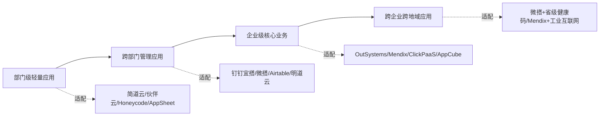

**外部权威坐标**方面，本报告引用两份关键评估报告作为校准参照。

**Forrester 2021年Q2《面向专业开发人员的低代码开发平台Wave》**评估了**14家厂商**：AgilePoint、Appian、GeneXus、HCL Software、Mendix、Microsoft、Oracle、OutSystems、Pegasystems、Salesforce、ServiceNow、Thinkwise Software、Unqork、WaveMaker[^54]。Forrester的核心判断之一是"低代码本来是一种一流开发策略，但现已演变为一个痛点"——新冠疫情危机已表明应用程序快速开发和软件持续迭代升级已成为竞争中的重要筹码，与此同时来自更专业领域的供应商正通过涉及范围更广的使用案例和开发人员的用户画像逐步发展自身的能力，**这导致了数字流程自动化（DPA）和低代码市场的融合**[^54]。Forrester对14家厂商的评估标准涵盖三方面：可从容适应以数据为中心和以流程为中心的开发模式；能够提供适合各类开发人员的工具；满足特定的基础设施、架构和开发流程要求[^54]。

**Gartner 2021企业低代码应用平台魔力象限**虽然本报告未获得完整名单，但据可得资料可知：Gartner将OutSystems、Mendix、微软、Salesforce、ServiceNow评为行业领导者（详见第3章3.9节相关论述），将Appian列为挑战者[^51]，并提出LCAP市场快速增长由民主化、超级自动化、可组合性三大趋势推动。Gartner预测**到2025年全球LCAP市场规模将达到290亿美元，年复合增长率超过20%；到2025年企业开发的新应用程序中70%将由低代码或无代码技术构建，而2020年这一比例不到25%**[^47][^74]。

两份权威报告的核心启示是：截至2021年底，**OutSystems、Mendix、微软、Salesforce**等大厂在国际市场已经占据领导者位置；而**Appian、ServiceNow、Pegasystems**等流程导向玩家与企业级新贵在挑战者/远见者象限保持竞争压力。中国厂商虽然进入了Gartner《2021中国ICT技术成熟度曲线》以及Gartner《中国低代码应用平台竞争格局》报告[^69]、但尚未进入全球魔力象限。

## 4.6 商业模式与生态定位：直接交付、平台+生态与生态共建

低代码厂商的商业模式分化是2021年市场格局演化的关键维度。根据可得资料，可以归纳为四种主流模式。

**直接交付模式**以OutSystems、Appian、ClickPaaS等为代表，向中大型企业直接销售平台许可+实施服务，订阅收入占主体。Appian的转型颇具代表性：**2014年开始Appian大幅增加对订阅收费模式的产品的投入、逐渐放弃了毛利率较低的定制开发部署服务；2014—2020年间Appian的订阅收入增长了435%、占总收入比由41%提升到了66%**[^51]。这一模式适合服务于政府、金融、大型企业等高客单价市场，单客户收入高、客户黏性强。

**SaaS订阅模式**以Airtable、简道云、伙伴云、轻流、Bubble等为代表，按用户/工作空间计费、面向中小企业自助开通。Airtable的盈利路径尤为典型——2021年12月F轮融资让Airtable实现了盈利，CEO Howie Liu表示该公司计划在几年后上市[^60][^59]。伙伴云目前累计服务企业超2000000家、平台日更新创建数据量2000万[^60]，其规模效应体现了SaaS订阅模式在中小企业市场的潜力。

**平台+生态模式**以阿里钉钉宜搭、腾讯微搭、华为AppCube为代表，以巨头办公协作生态（钉钉、企业微信、微信）+ 云服务为依托，通过"被集成"方式聚合ISV与低代码厂商。**钉钉低代码聚合平台"钉钉搭"聚合了宜搭、简道云、氚云、易鲸云、黑帕云、轻流、维格、悉息8款低代码厂商，上线600多低代码应用模板**[^62]。钉钉花大力气做开放生态的运营："钉钉开放平台能力中心不只是开放单一的技术接口，而是形成套餐化的、可一键启用的场景方案，降低开发者的开发门槛"[^62]——这种深度生态化是巨头低代码平台的最显著特征。

**生态共建模式**则体现在多种"站队"现象中：**华为联手用友、金蝶等已经成熟的厂商一起共同开拓市场**[^64]；**轻流、即构科技、泛微成为腾讯云的重要合作伙伴**[^64]；**奥哲网络、简道云、氚云、行翼云等已经和阿里钉钉深度绑定**[^64]；**伙伴云与企业微信建立战略合作关系，成为了其唯一一个战略合作的对外平台**[^60]。这种"站队"现象反映了独立厂商在巨头生态化潮流中的现实选择——一方面，与大平台合作可以让创业公司获得更多客户、快速为大平台搭建起生态圈；另一方面，对独立厂商而言生态依附也意味着部分自主权的让渡[^64]。

四种商业模式在客户覆盖、收入弹性、生态壁垒、长期可持续性上的差异可归纳为下表：

| 商业模式 | 代表厂商 | 客户覆盖 | 收入特征 | 生态壁垒 | 长期可持续性 |
|---------|---------|---------|---------|---------|------------|
| **直接交付** | OutSystems、Appian、ClickPaaS | 中大型企业、政府金融 | 高客单价、订阅化转型中 | 行业Know-How+实施能力 | 强，受疫情数字化推动 |
| **SaaS订阅** | Airtable、简道云、伙伴云、Bubble | 中小企业、自助开通 | 低客单价、规模效应 | 产品体验+模板生态 | 强，但需规模门槛 |
| **平台+生态** | 钉钉宜搭、腾讯微搭、华为AppCube | 生态用户全覆盖 | 通过云服务/广告等多元收入 | 母生态+云底座 | 极强，巨头长期战略 |
| **生态共建** | 钉钉搭8家ISV、伙伴云+企微 | 通过生态触达更多客户 | 收入分成或战略合作 | 与生态绑定 | 中等，受生态主权影响 |

亿欧智库《2021中国低代码市场报告》将商业模式划分为**场景衍生类、应用交付类、平台搭建类等五种**——与本报告四种模式形成交叉验证。结合海比研究院的四类划分（场景应用型、产品研发型、平台生态型、技术赋能型）[^48]，可以看出商业模式分化与厂商类型分化高度相关：场景应用型对应SaaS订阅、产品研发型对应直接交付、平台生态型对应平台+生态、技术赋能型对应少数AI/区块链插件提供者。

## 4.7 市场格局演化的资本与并购信号

以资本流动与并购整合为视角，可以清晰呈现2018—2021年低代码市场格局演化的关键信号。这一节的核心目的是回答："资本市场如何评估低代码？哪些事件正在重塑竞争版图？"

### 4.7.1 国际市场标志性事件

国际市场资本与并购事件可按时间线呈现：

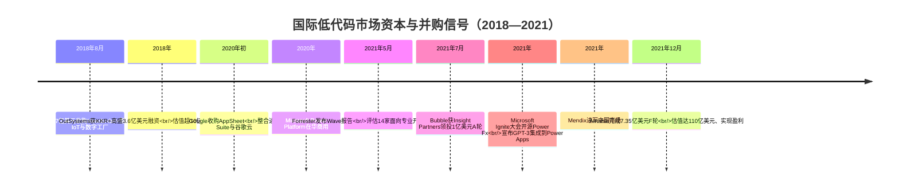

**Siemens对Mendix的收购**[^50]与**OutSystems的3.6亿美元融资**[^49][^70]共同标志着2018年低代码进入资本主流视野——"将低代码的火热推向高潮，随着更多企业的入局目前中国低代码/无代码市场已经形成较完整的体系"[^48]。**Google对AppSheet的收购**[^55]则将低代码战略级整合从西门子工业巨头延展到云服务巨头。**Airtable估值110亿美元**[^60][^59]是2021年最具标志性的资本事件——"看起来很像电子表格的全球低代码领军企业Airtable成为新晋独角兽，给这个赛道再次注入了一针强心剂"[^60]。**Microsoft开源Power Fx并集成GPT-3**[^47]则是2021年AI+低代码方向的最重要伏笔。

### 4.7.2 国内市场标志性事件

国内市场的资本热度同样汹涌。**根据创业邦不完全统计，2021全年国内约有20起低代码/无代码领域融资事件出现；相比之下，2018至2020年3年之中该领域全部投融资事件也只有16起**[^67]——2021年单年融资数量超过过去三年总和。

国内2021年标志性融资与并购事件包括：

- **伙伴云**：5月完成1700万美元B轮（红杉资本、五源资本领投），12月完成4000万美元B+轮（红杉中国、五源资本持续加持）[^60]；
- **轻流**：累计完成五轮知名机构近亿元融资[^67][^47]；
- **摩尔元数**：3月获启明创投亿元级B轮[^47]；
- **vika维格**：2月获Pre-A和Pre-A+连续两轮共超千万美元投资（高瓴创投、靖亚资本、五源资本）[^47]；
- **黑帕云**：7月获字节跳动数千万元A轮（盈动资本跟投）[^75]；
- **百特云享**：5月获数千万Pre-A轮[^47]；
- **用友拟以1.51亿元全资收购APICloud**，加码YonBIP平台赋能传统产业转型升级[^47]；
- **巨头入局**：钉钉发布低代码开发聚合平台"钉钉搭"、腾讯在2021年初内部测试微搭、华为推出应用魔方AppCube、百度上线爱速搭、字节收购黑帕云后推出aPaaS平台昆仑[^64]。

界面记者李京亚总结道："如果说去年是低代码元年，今年低代码领域则成为了科技圈为数不多的真正风口。从资本下场情况看，低代码创业公司融资热从年初持续到年终，知名公司如伙伴云、轻流、ClickPaaS、摩尔元数融资速度普遍很快，并连续获得了重点机构跟投，一家头部机构同时加码几家低代码平台的现象时有发生"[^60]。

### 4.7.3 三大格局趋势的揭示

资本与并购信号揭示出三大格局趋势：

**第一，低代码从边缘工具进入资本主流视野**。从2018年OutSystems估值10亿美元到2021年Airtable估值110亿美元，三年内独角兽估值上限增长10倍；从2018—2020年16起融资到2021年单年20起，融资数量呈现指数级增长。这一趋势的根本动力是数字化转型刚需——"企业强烈的数字化转型需求成为低代码/无代码赛道快速增长的重要原因"[^67]。

**第二，模型驱动企业级平台成为战略并购焦点**。Siemens收购Mendix与Google收购AppSheet分别代表"工业巨头+模型驱动"和"云巨头+无代码"两种战略整合方向，两者共同表明低代码已被视为大型科技集团的战略级资产。这种战略级地位与低代码作为企业数字化基础设施的属性高度一致。

**第三，巨头生态化整合正在重塑独立厂商的生存空间**。一方面，"小公司找不到企业合作落地的应用场景、数据和应用程序的可移植性不佳等问题，创业公司开始寻求用户基数更大的平台合作"；另一方面，"云大厂纷纷下场，并通过投资整合的方式将企业纳入自己的生态范围"[^74][^64]。**黑帕云从2021年7月获字节A轮到2022年3月关停被收购的命运转折**[^75][^65]，正是这一趋势的典型预警——36氪分析指出："黑帕云团队注重产研，产研团队能力很强，但产品商业化暂时没有跟上，且瞄准中小客市场，这是公司难以为继的关键原因。但事实上，不只是黑帕云，曾经火热的'低/无代码'风口，如今这类厂商的商业化正经历艰难爬坡期"[^65]。这一信号属于2022年事件，本报告将其作为"截至2021年底"市场格局向2022年演化的过渡性参照引用，不影响本章对2021年底市场的整体判断。

## 4.8 权威机构评估视角：Forrester Wave、Gartner魔力象限与中国本土研究

权威机构的评估是检验前述厂商图谱准确性的外部坐标。本节系统对比国际与中国权威机构在2021年的厂商评估，呈现中国市场厂商在全球坐标中的位次特征。

### 4.8.1 国际视角

**Forrester 2021年Q2《面向专业开发人员的低代码开发平台Wave》**评估了14家最重要的提供商[^54]，揭示了三个核心观点：低代码本来是一种一流开发策略、但现已演变为一个痛点（数字流程自动化与低代码市场融合）；买方应将有技术背景的IT分析师纳入到开发人员资源池之中、并选择与之相匹配的产品；某些供应商几乎支持在任意地点部署，而其他供应商则仅可提供传统的平台即服务（PaaS）模式[^54]。

**Gartner 2021企业低代码应用平台魔力象限**在多份资料中被反复引用[^47][^53][^51]，其核心判断包括：到2025年全球LCAP市场规模将达到290亿美元、年复合增长率超过20%；到2025年企业开发的新应用程序中70%将由低代码或无代码技术构建，而2020年这一比例不到25%[^47]。Gartner认为LCAP市场快速增长由**民主化**（LCAP开发模式可以使非技术出身的业务人员也能开发出符合业务需求的应用程序）、**超级自动化**（LCAP已成为超级自动化的关键组成部分）、**可组合性**（LCAP是推动应用服务、功能和能力可组合性的关键技术之一）三大趋势推动[^74]。另据Gartner预测，到2024年75%的大型企业将平均使用至少4种低代码开发工具[^60][^67]，未来5年至少需要开发5亿个新应用才能满足中国企业数字化转型的需求[^60]。Gartner仅低代码PaaS部分预计到2025年将扩大到143.8亿美元、复合年增长率为26.4%[^74][^64]。

### 4.8.2 中国本土视角

**Gartner 2021年首次将LCAP纳入《2021年中国ICT技术成熟度曲线报告》**（详见第1章1.3节），同时发布了**《中国低代码应用平台竞争格局》报告**[^69]，ClickPaaS等中国厂商入选该报告[^69][^68]。

**Forrester 2021年11月《低代码平台中国市场现状分析报告》**调研了腾讯、阿里巴巴、百度、华为、微软、轻流、金蝶、用友、帆软等二十余家行业主流企业（详见第1章1.3节）。

**海比研究院与中国软件行业协会《2021年中国低代码/无代码市场研究报告》**于1月19日发布，**报告显示我国整体市场规模已经达到19亿，未来五年复合增长率达到49.5%；第三方使用人员规模达到42.6万人**[^70][^76][^77]。报告从大时代角度提出企业数智化与技术演进的匹配性：在信息化阶段以开发语言主导；互联网化阶段出现低代码工具；未来数智化阶段低代码工具向低代码平台过渡、向所有企业开放[^76]。从技术角度，**数据安全、接口集成、数据模型、可视化分析是低代码/无代码平台的关键技术**[^76]。报告同时按场景应用型（45.7%）、产品研发型（37.0%）、平台生态型（15.7%）、技术赋能型（1.7%）四类划分厂商[^48]。

**亿欧智库《2021中国低代码市场报告》**将厂商分为互联网厂商、软件厂商、创新平台商三类（详见第1章1.3节）。

**艾瑞咨询《2021年低代码行业研究报告》**将伙伴云作为唯一低代码/无代码平台纳入《2021中国企业数字化转型路径实践研究报告》、并再次入选《2021年低代码行业研究报告》[^73]。艾瑞咨询的核心判断是：低代码通常是指APaaS产品，通过为开发者提供可视化的应用开发环境，降低或去除应用开发对原生代码编写的需求量；低代码是传统软件开发逐步优化和演变的产物、并非全新革命[^73]。

### 4.8.3 中国厂商在全球坐标中的位次特征

将国际与中国权威机构的评估结果交叉对比，可以归纳出中国低代码厂商在全球坐标中的三个位次特征：

**第一，中国厂商尚未进入全球魔力象限主流位次**。Gartner 2021全球魔力象限的领导者仍由OutSystems、Mendix、微软、Salesforce、ServiceNow等国际玩家占据，中国厂商进入了Gartner针对中国市场的独立报告（《中国ICT技术成熟度曲线》《中国低代码应用平台竞争格局》），但未进入全球评估的领导者象限。这一位次差距与中国低代码市场起步较晚、市场规模仅19亿元（2021年）、整体处于导入期向成长期过渡阶段的事实相符[^76][^48]。

**第二，中国市场内部已经形成相对清晰的厂商分层**。海比研究院的四类划分、亿欧智库的三类划分、Forrester的9类划分共同显示，中国低代码市场虽然起步较晚，但已经形成"巨头平台—独立厂商—传统软件衍生厂商"三层结构。

**第三，中国市场的厂商评估更强调本土化适配能力**。海比研究院强调"数据安全、接口集成、数据模型、可视化分析"为关键技术[^76]，反映了中国企业对私有化部署、信创合规、与本土生态（钉钉、企业微信、微信）集成的特殊诉求——这些诉求是国际厂商即便在魔力象限领导者位次也未必能完全满足的。

## 4.9 截至2021年底中国低代码市场格局的整体判断

作为本章收束，对截至2021年底中国低代码市场的整体格局形成结构性判断。

**第一，市场结构呈现"初创企业与巨头品牌共存"的双层格局**。阿里钉钉宜搭、腾讯云微搭、华为云AppCube、百度爱速搭、字节昆仑等巨头平台凭借云服务+办公生态优势占据生态枢纽位置；明道云、简道云、轻流、ClickPaaS、奥哲、伙伴云、宜创科技、数睿数据、织信Informat等原生独立厂商在垂直细分市场寻求差异化竞争；用友、金蝶、致远互联、销售易、纷享销客等传统软件厂商衍生类玩家则通过PaaS化转型保持既有客户基础。这一双层格局已经在2021年基本成型，并将在2022年后进一步分化整合。

**第二，市场处于导入期向成长期过渡阶段**。海比研究院明确判断："从发展周期来看，低/无代码市场整体处于导入期向成长期过渡的阶段，行业规模增速快、需求高速增长、商业模式尚不固定、开发商需求还需培育，从业企业数量开始增多，市场集中度不高、市场格局尚不稳定、细分的蓝海领域较多"[^48]。细分来看**低代码市场成熟度略高、现处于成长期初段**，**无代码市场则还处于导入期**——低代码市场应用更早，而无代码则是在2019年才开始进入市场化阶段、尚处于市场导入期[^48]。从细分类型的发展周期来看，产品研发型的成熟度最高、处于成长期的第二阶段；其次是场景应用型；平台生态型和技术赋能型则还处于导入期[^48]。

**第三，巨头入局通过"被集成"与"生态聚合"两种方式重塑独立厂商生存空间**。"被集成"模式以钉钉聚合8家低代码厂商为典型，独立厂商通过加入巨头生态获得用户基数；"生态聚合"模式则体现为腾讯云与轻流等深度合作、华为联手用友金蝶共同开拓市场、伙伴云与企业微信战略合作。**独立厂商"站队"成为普遍现象**——但这种站队也意味着独立厂商需要在自主性与生态依附之间取得平衡，长期生存能力将取决于其在生态内的不可替代性。

**第四，资本热度向商业化压力转化的临界信号已经显现**。一方面，2021年单年20起融资数量超过过去三年总和[^67]、伙伴云从B轮到B+轮估值快速攀升[^60]、Airtable估值翻倍至110亿美元[^59]——资本热度达到峰值；另一方面，**黑帕云从2021年7月获字节A轮到2022年3月关停被收购**[^75][^65]、36氪指出"曾经火热的'低/无代码'风口、如今这类厂商的商业化正经历艰难爬坡期"[^65]——商业化压力已经开始显现。**这一从资本热到商业化爬坡的临界信号，预示着2022年后市场将进入分化整合期**：模型驱动企业级平台与生态依附型独立厂商将更具生存力，纯产品化的中小客赛道玩家将面临更严峻的商业化考验。

整合上述四点判断，可以勾勒出截至2021年底中国低代码市场的基本面貌：**一个规模19亿元、五年复合增速近50%、市场结构双层化、巨头与独立厂商共存、资本热度达到峰值但商业化压力初现的高速成长市场**。这一面貌为第5章"公认的业务优势与价值主张"的归纳提供了市场层面的现实坐标——业界对低代码业务优势的判断与营销叙事，必须放在这一真实市场格局中检验其边界；同时也为第6章"四维联动分析"提供市场层面的整体坐标，回应"低代码厂商的竞争格局已经稳定还是仍在剧烈演化"这一关键问题。结合第2章技术坐标、第3章应用图谱、本章市场图谱，低代码已经具备了第5章展开业务优势归纳所需的完整背景。

# 5 公认的业务优势与价值主张

第2章建立了"模型驱动+云原生+可视化"三位一体的技术坐标，第3章铺陈了从部门级审批到企业级核心业务的应用渗透曲线，第4章则呈现了截至2021年底中国市场"巨头+独立厂商"双层并立的竞争格局。三章的累积证据指向同一个核心问题：**承载了如此多技术叠加、如此多场景应用、如此多资本与巨头押注的低代码，究竟为企业、为开发者、为社会创造了怎样的真实价值？这些价值在多大程度上是技术机理的自然产物，又在多大程度上是市场营销话术的修辞放大？**

本章的任务正是对低代码价值主张进行系统的价值审视。审视的方法论以"平衡视角"为准绳——既不回避业界已经形成的共识性优势，也不放过质疑性声音所揭示的真实边界。叙事将按照"**效率—成本—敏捷—人—组织—战略—集成**"的递进逻辑展开七大公认优势的剖析（5.1—5.7），每项优势均结合权威机构数据与厂商实证案例进行验证；继而以5.8专门呈现业界对低代码局限的冷静讨论，最后在5.9整合两个维度，界定低代码价值的真实边界与适用条件。本章在整体报告结构中承担"价值审视"的核心职能，直接回应第1章提出的"低代码是技术变革还是营销概念"的争议，并为第6章四维联动分析提供价值层面的实证基础。

## 5.1 开发效率提升：从交付周期缩短到应用产能跃迁

在所有被反复强调的低代码价值中，**开发效率提升**几乎是排在最显眼位置的论断。这一论断在权威机构的预测、厂商的产品宣传、媒体的概念叙事中被反复引用，构成了低代码价值主张的"第一张名片"。但这一名片背后的真实依据是什么？我们需要把权威数据、厂商实证与技术机理三层证据并置审视。

权威机构层面，**Forrester的研究表明，企业在采用低代码平台后应用开发速度平均提高了约6—10倍**[^78]；与之相印证，Mendix的研究则给出了一个更聚焦的指标——**低代码开发平台可以将项目交付时间缩短50%以上**[^79]。这两个数字虽然口径不同（前者是开发速度倍数，后者是交付周期缩短比例），但方向高度一致：低代码平台对应用产能的提升不是渐进式的几个百分点，而是数倍级别的跃迁。**Gartner则给出了一个更具市场结构意义的预测——到2024年低代码开发平台将在所有新应用程序开发中的占比达到65%**[^79][^78]；这一预测在第3章与第4章已被多次引用，其底层意味是：低代码不仅在单点项目上提速，而且将在产业层面承担起应用供给的主要载荷。**Forrester的另一项数据则指出使用低代码开发平台可以将开发时间缩短70%以上**[^79]——这一指标进一步收紧了效率提升的下限。

厂商实证层面，第3章与第4章已经引用了若干高密度场景下的案例。**某金融企业在引入低代码开发平台之前平均每个项目的交付周期为6个月，引入低代码平台后平均交付周期缩短至3个月**[^79]；钉钉宜搭在2020年春节疫情防控期间累计搭建2000多个疫情应用，**平均每个应用仅需1.5天即上线**；2021年7月河南暴雨救援中，网易数帆轻舟低代码团队1.5小时上线"河南暴雨·寻找失联者"寻人平台；四川省基于腾讯微搭以传统方式一半的人工成本、10余天内开发出省级疫情防控健康码平台。这些案例的共同特征是**在时间窗口极窄、需求极迫切的应急场景下，低代码把传统开发模式下以月计或周计的交付周期，压缩到日计甚至小时计**——这种压缩不仅是量的变化，更是质的跃迁，让原本因交付滞后而错失的业务机会得以被捕获。

技术机理层面，低代码效率提升并非凭空而来，而是第2章剖析的多项技术能力叠加的自然结果。**传统软件开发通常需要复杂的编码过程和较长的开发周期，而低代码平台通过拖拽式组件、预构建模板和自动化流程，使应用构建速度提升数倍**[^78]。具体而言，可视化拖拽降低了UI构建的时间成本，模型驱动让数据结构与业务逻辑可被一次定义、多端复用，组件库的复用避免了"重复造轮子"，云原生底座屏蔽了部署运维的复杂度，一键交付让从开发到上线的"最后一公里"被压缩。这些机理与第2章2.1—2.8节剖析的技术栈层级一一对应，构成了效率提升的物理基础。

但效率优势也有其适用边界。**应用开发速度提升6—10倍这一论断主要适用于业务规则相对清晰、组件可大量复用、与遗留系统集成度有限的场景**——这类场景正是第3章3.1—3.3节所讨论的审批、轻量CRM、报表等部门级与跨部门管理类应用。在涉及复杂算法、高性能计算、深度遗留系统集成的场景下，低代码的效率优势会显著衰减甚至反转——这一边界将在5.8节展开讨论。理解效率优势的边界，比单纯引用"6—10倍"这一数字更有助于读者形成准确判断。

## 5.2 开发与运维成本降低：人力、时间与资源的多重节约

效率提升的天然延伸是**成本降低**。当应用开发周期从6个月压缩到3个月、当公民开发者可以承担部分开发任务后，企业在人力、时间、资源三个维度上都将获得显著的成本节约。

权威数据层面，**OutSystems的报告显示使用低代码开发平台可以将开发成本降低约40%**[^79]；与之印证的实证案例是**某中小企业通过引入低代码开发平台，成功将IT预算节省了30%，从而将更多资源投入到核心业务的拓展中**[^79]。两个数字虽然口径有别（一为开发环节直接成本，一为整体IT预算），但都指向30%—40%量级的降本空间。

成本降低的来源可以拆解为三层。其一，**减少对昂贵且稀缺的专业开发资源的依赖**——"低代码平台有效地降低了企业的开发成本，减少了对昂贵且稀缺的专业开发资源的依赖"[^78]。专业开发者的人力成本是企业IT支出的主要构成，当公民开发者可以承担部分轻量应用的搭建，专业开发者得以聚焦于真正需要专业能力的核心系统，企业的整体人力支出结构就被优化。其二，**缩短开发周期带来的时间成本节约**——传统开发模式下项目周期长、延期交付是常见问题，不仅影响业务推进，还可能导致客户满意度下降甚至引发合同违约等风险[^79]；低代码通过模块化设计显著缩短了项目开发周期，将这些隐性时间成本转化为显性收益。其三，**云原生底座屏蔽运维带来的资源节约**——根据第2章2.8节的分析，Serverless与云原生架构让应用具备弹性伸缩、自动扩缩、按需付费的特性，企业不再需要为预期流量过度采购资源，运维人力也大幅压缩。

赛迪智库对企业数字化转型困境的分析进一步印证了成本压力的真实性。**赛迪智库科技与标准研究所指出，企业数字化转型面临三大困境：成本过高，在软硬件购买、系统运维、设备升级、人才培养等方面需要持续投入大量时间和资金，而大部分中小企业不具备这个实力**[^80]。**低代码的出现却可利用其高覆盖性、高灵活性、高易用性的优势，为企业大幅度节省了时间成本、人力成本和资金成本**[^80]——这一判断将低代码降本价值与中小企业数字化的现实痛点紧密关联。

然而，成本结构的另一面是**隐性支出**，业界对此的讨论同样不容忽视。**平台订阅费、专属插件购买等隐性支出可能抵消开发效率收益，企业最终仍需为"解锁"高级功能付费**[^81]。这意味着低代码的"40%降本"并非永久性的"沉没节约"，而是需要在订阅周期内持续与平台价格进行博弈。中小企业由于客单价较低、对成本敏感度高，往往更能从低代码SaaS订阅中获益；大中型企业则需要在平台许可、私有化部署、定制开发、迁移风险等多重成本要素中做更精细的权衡。这种**成本收益结构的客户层级差异**，是理解低代码降本价值时不可忽视的现实维度。

综合来看，低代码的降本价值是**真实但有条件**的——它在标准化、轻量化、规模化场景下能产生30%—40%的显性节约，但在高度定制化、超出平台原生能力边界的场景下，可能因订阅费、二次开发、迁移成本等隐性支出而部分抵消。这一边界判断将在5.8与5.9节得到进一步深化。

## 5.3 敏捷迭代与快速响应市场变化

如果说效率与成本是低代码价值的"显性收益"，那么**敏捷迭代能力**则是低代码最具结构性意义的价值维度——它直接对应了第3章3.9节所剖析的Gartner双模IT框架中的敏态IT定位。

敏捷价值的核心机理在于低代码平台的模块化设计。**在快速变化的市场环境中，企业需要具备高度的灵活性以应对各种变化；传统开发模式下系统的调整和升级往往需要较长时间，而低代码开发平台的模块化设计使得系统的调整和升级变得更加灵活和快速**[^79]。这一机理在多个具体场景中得到了反复验证。

在大中型企业销售管理场景，第3章3.2节已经指出销售方法论、公海池规则、返利逻辑可能每季度甚至每月都在调整——传统软件下"修改一个核心业务字段或审批流往往需要走漫长的IT提单和开发流程，造成系统拖业务后腿"。低代码的模块化与可视化配置能力，让业务变更可以由业务部门主导、在小时或日级别完成。在零售业的市场窗口期场景，营销活动页、促销规则、客户分群策略的快速上线决定了商机的捕获效率——低代码所承担的正是这种"标准软件无法覆盖的长尾敏捷需求"。在金融业的市场环境快速变化场景，**低代码平台可以帮助银行和金融机构快速开发和部署新应用从而抢占市场先机**，例如构建实时监控金融市场变化的风险管理系统。

从更宏观的视角看，**传统的数字化转型手段因周期长且过于昂贵和僵化，无法为企业提供高效和敏捷的开发流程，已难以应对不断变化的市场和客户期望；在此背景下，兼顾个性化和敏捷化的低代码迎来了爆发**[^80]。这一行业判断揭示了敏捷性之于低代码的根本意义——**敏捷不是低代码的众多优势之一，而是低代码区别于传统软件开发模式的最核心价值主张**。低代码的所有其他优势（效率、成本、降低门槛、释放公民开发者）最终都汇聚到"业务敏捷"这一价值主轴上。

将敏捷性映射到Gartner双模IT框架可以进一步看清其定位。第3章3.9节已经判断：低代码主要承载敏态IT业务，并逐步向稳态IT渗透。敏态IT的本质要求是"高响应力、短周期、MVP试错"，而低代码的核心能力正是"快速搭建、灵活迭代"。这种能力—需求的精准对应，使敏捷性成为低代码价值主张中最不易被反驳的部分——即便在功能局限、性能瓶颈、厂商锁定等局限性议题上业界存在争议，对低代码"敏捷迭代"这一核心价值的认可几乎是无差别的共识。

值得指出的是，**敏捷价值的真实释放也依赖于企业组织自身的敏捷文化**。如果企业仍然以瀑布式管理、严格审批、长决策链的方式对待低代码项目，那么平台的敏捷能力将被组织流程抵消。这一组织维度的前提条件，是低代码"敏捷迭代"优势能否真正落地的隐性变量。

## 5.4 降低技术门槛与公民开发者生产力释放

低代码的第四项公认优势是**降低技术门槛**。这一优势既是低代码区别于传统编码的根本特征，也是"软件开发民主化"叙事的核心抓手。

技术门槛降低的核心机制在第2章已经剖析：可视化建模和声明式开发使业务人员不再需要理解循环、递归、内存管理、并发控制等命令式概念，就能以接近"配置表单"的心智模型完成应用搭建。**低代码平台显著降低了应用开发的技术门槛，非专业技术人员如业务分析师或运营人员也能直接参与到应用开发过程中，进一步推动了业务与IT之间的密切协作**[^78]。

技术门槛降低的最直接证据是大量"非开发者完成应用搭建"的实证案例。第4章引用的钉钉宜搭数据是其中最具说服力的——2017—2020年间宜搭在阿里巴巴内部累计搭建了12700多个应用，**99%的应用都是由HR、财务等没有开发经验的员工自行搭建的**。这一数字几乎将"低代码=公民开发者赋能"的命题推向了极致——在一家拥有全球顶级技术能力的科技巨头内部，绝大多数应用仍由非开发者搭建，足以证明低代码对技术门槛的削减能力。第4章引用的比亚迪案例同样具有代表性——伙伴云通过培训比亚迪的一个技术团队、教其学会使用低代码，培训时长只需3—4天。从专业开发者数月的学习曲线，到业务人员3—4天的培训周期，这种门槛差距是低代码相对于传统编码的根本不同。

业务部门独立开发的实证则进一步丰富了这一图景。**某制造企业的销售部门需要一个简单的库存管理系统，但IT部门因资源紧张无法立即开发；通过低代码平台，销售部门的员工在短短几天内自行完成了系统的搭建和上线，极大地提升了工作效率**[^79]。这类案例表明，低代码不仅在"门槛降低"上有数据支撑，更在"赋能业务部门解决紧急需求"这一具体价值落点上具备实际可行性。

公民开发者崛起对企业数字化生产关系的重塑是更深远的意义。**Gartner所提"民主化"趋势——LCAP开发模式可以使非技术出身的业务人员也能开发出符合业务需求的应用程序，还开创了多部门协作的工作模式**——已经在第4章被反复引用。Gartner调查发现13%的业务技术人员表示，在过去的12个月中低代码开发平台是组织实现自动化计划的最常用工具之一——这一数字虽然不算极高，但考虑到低代码进入主流视野仅有数年时间，已经反映出公民开发者群体的快速崛起。

需要谨慎区分的是低代码与无代码在目标用户上的差异。第4章已引用轻流CPO严琦东的判断：**低代码更多的还是服务于专业的IT开发人员、通过提升这部分人员的整体开发效率来提升IT和信息化的交付效率；而无代码更多的是服务于没有IT背景、不会写代码的业务人员**。这一区分意味着"降低技术门槛"在低代码与无代码两个语境下有不同的指向——对于低代码，门槛降低意味着专业开发者效率倍增；对于无代码，门槛降低意味着业务人员可以独立完成应用搭建。两者并非对立，而是构成了"技术门槛梯度"的两个层级：无代码消除了编码门槛，低代码消除了大部分编码门槛但保留了必要的代码补充。

公民开发者赋能的另一面是**职业认同冲突**——这是5.8节将专门讨论的话题。技术门槛的削减对企业是赋能，但对部分专业开发者却可能引发"技能替代焦虑"。如何理解这种张力，是评价低代码社会价值时不可回避的维度。

## 5.5 缓解IT人才短缺与开发资源瓶颈

低代码的第五项公认优势是对**IT人才结构性短缺**问题的缓解。这一优势的特殊性在于：它不仅服务于企业的内部效率，更对应着整个产业层面的供需失衡。

人才短缺的现实压力在多份资料中得到反复印证。**赛迪智库科技与标准研究所指出，人才储备不足是中小企业数字化转型升级瓶颈**[^80]。**随着数字化进程推进，IT产业规模不断扩大，人才短缺正快速拉动低代码需求；同时云计算技术大众化为低代码提供发展土壤**[^80]。Gartner的预测进一步把这一短缺量化——第4章已引用其判断"未来5年至少需要开发5亿个新应用才能满足中国企业数字化转型的需求"。5亿这个数字意味着：即使中国所有专业软件开发者满负荷开发，也无法在5年内完成这一供给——人才缺口不是渐进的、可线性扩张的，而是结构性、量级失衡的。

低代码对人才瓶颈的缓解机制是**"专业开发者效率倍增+公民开发者补充供给"的双轨**。前者通过将专业开发者的应用产能提升6—10倍，让有限的开发资源覆盖更多需求；后者通过释放业务人员的开发能力，让公民开发者承担起原本无人响应的长尾需求。两者合力下，企业既不必扩张IT团队规模，也能让应用供给能力线性甚至指数级增长。

**《2022年中国低代码行业生态发展洞察报告》指出低代码能带来四大核心价值**[^80]，其中"促就业"被作为单独一项列出——**通过融合新技术新环境催生新职业、调动中级和基础IT人才需求**[^80]。这一价值维度的提出，将低代码从企业层面的"内部工具"扩展到了产业层面的"就业结构调节器"——它不仅降低了高级开发者的工作压力，也通过释放中级与基础IT人才的发挥空间扩大了就业人口。

将这一优势放在产业战略视角看，意义更为深远。**2021年政府工作报告及"十四五"规划将数字经济提升到前所未有的高度，中国经济发展的新里程正从"规模红利"向"数字创新"迈进，越来越多的企业投入数字经济的建设中，加速向数字化、智能化转型**[^80]。在这一国家战略背景下，低代码对人才瓶颈的缓解不仅是个别企业的问题，更是整个数字经济转型能否如期完成的关键因素之一。**阿里云智能总裁张建锋曾坦言："未来的一个重要趋势就是低代码。工业互联网需要大量系统建设，最清楚应该建什么信息系统的人，是这个岗位上的员工。低代码能够让这些最懂业务的人，不用懂专业编程就能开发，提高协同和创新效率"**[^80]。这一论述从工业互联网的具体场景出发，揭示了低代码"将最懂业务的人转化为应用开发者"的独特价值——它不仅缓解了人才短缺，更让业务知识与开发能力在同一群体内部统一，从根本上提升了应用与业务需求的匹配度。

人才瓶颈缓解优势的真实边界在于：**低代码不能替代专业开发者，只能改变其工作内容的构成**。在算法复杂度高、性能要求严苛、系统集成深度的场景，专业开发者仍然不可或缺；低代码所替代的，是专业开发者原本花在重复性、标准化工作上的时间。这一定位与第2章引用的"80/15/5"分层策略高度一致——80%的标准需求由低代码承担，专业开发者的精力集中于15%—20%的复杂需求上。

## 5.6 打破业务与IT壁垒：组织协作模式的重构

第六项公认优势涉及更深层的组织维度——**打破业务与IT部门之间的协作壁垒**。这一优势的特殊性在于它不只是技术价值，更是组织变革价值。

业务与IT壁垒在传统软件开发模式下几乎是企业的"标配痛点"。**业务部门常常有一些小型或紧急的开发需求，而这些需求可能并不在IT部门的优先级列表中**[^79]——这种优先级错配导致业务部门的紧急需求被搁置，IT部门则因应接不暇而被指责响应迟缓。低代码的出现，恰好提供了一种缓解这一张力的工具方案。

低代码对业务—IT协作模式的重构形成了**"业务自助+IT赋能"的双层架构**：业务部门通过低代码自行完成小型或紧急的开发需求，IT部门聚焦核心系统建设、平台治理与复杂逻辑实现。第三节已引用的制造企业销售部门数日内自建库存管理系统的案例[^79]，正是这一双层架构的典型呈现——业务部门不再被动等待IT排期，IT部门也得以从大量"小而急"的需求中解放出来。

机理层面，**低代码平台增强了业务部门与技术部门之间的协作，推动了组织内部更广泛的创新文化**[^78]。这种增强体现在三个具体维度：其一，**沟通成本下降**——业务人员可以用低代码原型表达需求，而不是用模糊的自然语言描述需求；其二，**需求响应速度提升**——业务部门的部分需求可以由其自助完成，无需进入IT优先级队列；其三，**跨职能协作效率改善**——业务与IT在同一低代码平台上对话，对应用的功能边界、数据模型、流程逻辑形成共同认知。

将这一组织优势与Gartner所提"多部门协作工作模式"趋势相呼应可以看到其长期意义。第4章已引用Gartner对LCAP三大趋势的判断——民主化、超级自动化、可组合性——其中民主化趋势的核心要义正是"开创了多部门协作的工作模式"。这种工作模式的开创，本质上是企业数字化能力从"IT部门独有"向"全员共享"的转化——它不仅提升了应用供给能力，更重塑了企业的数字化生产关系。

需要冷静审视的是组织优势的释放条件。**业务部门的低代码使用必须在企业IT治理框架内进行**——否则可能产生"影子IT"风险（业务部门私自搭建的应用游离于企业数据治理、安全合规、运维管控之外）。一种更合理的实践路径是：IT部门承担低代码平台的治理者角色，制定准入规范、权限策略、数据治理标准；业务部门在治理框架内自助完成应用搭建。这种"治理者—使用者"的新型分工，是组织协作模式重构能否真正落地的关键。第2章2.6节剖析的"三重验证闭环"权限治理机制，正是为这一治理框架提供技术保障的底层支撑。

## 5.7 加速企业数字化转型与跨端跨系统集成

第七项公认优势将前述各项优势整合到企业数字化转型的整体框架中——**低代码作为企业数字化转型加速器的战略价值**。这一价值的特殊性在于它不是单点能力，而是多项能力的系统性叠加。

战略价值的整体性论述以**《2022年中国低代码行业生态发展洞察报告》提出的四大核心价值**为代表：**一是低成本，缩减软件开发成本和人力成本，大幅提高人效价值；二是普惠化，以开箱即用的特性降低软件开发门槛，普遍支持企业数字化升级；三是个性化，基于模板快速开发，敏捷响应需求提升产品个性化应用；四是促就业，通过融合新技术新环境催生新职业，调动中级和基础IT人才需求**[^80]。这四大价值的并列呈现，恰好对应了前述5.1—5.6节剖析的各项具体优势：低成本对应效率提升与成本降低，普惠化对应技术门槛降低与公民开发者赋能，个性化对应敏捷迭代与突破标准软件局限，促就业对应人才结构调节与组织协作模式重构。

数字化转型加速器的具体价值落点在多个权威表述中得到印证。**低代码是数字技术服务实体经济以及互联网研发结构优化的重要能力和必然趋势**[^80]。**腾讯云微搭负责人王倩认为低代码开发正悄然来袭、即将成为数字化转型中坚力量**[^80]。这些判断把低代码定位为数字化转型的"基础设施"而非"工具选项"。

跨端跨系统集成则是低代码战略价值的另一关键维度。第3章3.4节已经剖析过腾讯微搭的多端能力——支持小程序、H5、PC WEB等多端应用的"一码多端"特性；2021年腾讯数字生态大会上微搭发布**C2B连接器，宣布与腾讯文档、腾讯会议和企业微信多场景数据打通**。第4章4.3节则引用了钉钉宜搭的开放生态数据——2021年开放接口总数量由年初的1300多个扩大到了2000多个，今年内开放的接口数量比过去两年的总和还多。这些事实证明，截至2021年底，主流低代码平台已经具备了承担"既有IT版图与新增应用之间协同枢纽"的现实能力。

跨端跨系统集成的战略意义在于它解决了企业数字化转型中最棘手的"系统孤岛"问题。如第2章2.7节所剖析，企业内部往往同时运行着ERP、CRM、OA、HRM等多套系统，加上外部SaaS服务、IoT设备、合作伙伴接口等异构数据源，单点应用开发往往会陷入集成泥潭。低代码平台通过预置连接器+开放API+iPaaS化工作流，让新增应用可以快速接入既有数据流，避免在企业IT版图中再增加一座孤岛。这种"集成友好"的架构属性，使低代码不仅是新应用的开发工具，更是企业IT版图的"连接基础设施"。

战略价值层面的真正考验在于**低代码能否承载"企业级核心业务系统"的稳定运行**。第3章3.8节剖析的"从工作组级简单应用向企业级核心业务渗透"趋势已经表明，截至2021年底低代码已经触及第三层（企业级核心业务）甚至第四层（跨企业/跨地域应用）的应用层级。但在企业级核心业务领域，低代码仍需要持续证明其在安全合规、性能稳定性、长期可维护性等方面的能力——这些考验将在5.8节展开讨论。

至此，从5.1效率提升到5.7数字化转型加速，七大公认优势已经形成了一个相互支撑的价值网络。但任何价值主张都需要在质疑性视角下被检验——下一节将系统呈现业界对低代码局限的冷静讨论。

## 5.8 局限与风险：业界对低代码价值的冷静审视

业界对低代码的讨论从不只有乐观叙事。在Gartner、Forrester、OutSystems、Mendix等机构与厂商力推低代码价值的同时，企业实践者、专业开发者、独立观察者持续提出冷静的质疑。这些质疑并非否定低代码的整体价值，而是揭示其适用边界与潜在风险，是评价低代码必须纳入的另一面。

### 5.8.1 功能局限性：模板化限制与复杂业务支撑不足

低代码最常被指出的局限是**功能局限性**。**低代码平台虽然能快速生成应用，但其功能往往受到平台的限制，难以实现高度定制化的需求**[^82]。这一局限有两个具体表现。其一，**模板化限制**——**低代码平台通常提供一些预定义的模板和组件，尽管这些模板可以满足大部分通用需求，但对于一些行业特定或高度定制化的应用，模板化的功能可能显得捉襟见肘**[^82]。其二，**无法处理复杂业务逻辑**——**复杂的业务规则和逻辑需要高级的编程技巧，而低代码平台的可视化界面可能无法轻松实现这些功能**[^82]。

这一局限的具体案例颇具警示意义：**一家金融公司希望开发一个高度定制化的风险评估系统，然而他们在使用低代码平台时发现，平台无法满足其复杂的业务需求，最终不得不选择传统的高代码开发方式**[^82]。金融风险评估系统涉及复杂数学建模、海量历史数据回测、合规审计追溯等高门槛要求，这类场景正是低代码当前能力边界之外的典型代表。同样的局限在医疗合规、工业实时控制、电信级核心系统等领域同样存在——**当项目涉及复杂算法、高性能计算或特殊行业规范（如金融、医疗合规性）时，低代码平台可能缺乏扩展接口，迫使开发者通过"奇技淫巧"绕过限制，反而降低效率**[^81]。

复杂业务支撑不足在表单驱动平台上尤为显著。第3章3.7节已经从五个具体维度剖析过表单驱动的局限——系统集成能力不足、无法处理复杂数据关系、开放及交互能力较弱。这一局限映射到本章的价值审视，意味着低代码的"效率提升""敏捷迭代"等优势在复杂业务场景下会被显著衰减。

### 5.8.2 性能问题：自动生成代码效率与隐藏瓶颈

性能问题是低代码的第二类局限。**低代码平台生成的代码可能不如手写代码优化，导致性能问题**[^82]。具体表现为两层。其一，**自动生成代码的效率**——**低代码平台自动生成代码的效率可能不高，尤其是在处理大量数据或高并发请求时，生成的代码可能导致系统性能下降**[^82]。其二，**隐藏的性能瓶颈**——**由于开发人员对自动生成的代码理解有限，可能难以发现和解决潜在的性能瓶颈，导致应用在实际运行中出现性能问题**[^82]。

性能问题的量化数据相当具体：**根据某技术调研报告，约有30%的企业在使用低代码平台开发的应用中遇到性能问题，这些问题主要集中在数据处理和并发请求方面**[^82]。30%的比例意味着性能问题不是少数边缘案例，而是企业普遍会遇到的现实风险。**自动生成的代码可能存在冗余循环或低效查询，例如某电商平台用低代码实现促销规则时，因平台生成嵌套查询导致数据库负载激增**[^81]——这类具体的性能陷阱案例提醒企业：低代码生成的代码不应被视为"可信赖的黑盒"，而需要持续的性能监控与优化。

### 5.8.3 安全与合规隐患

安全性是低代码进入金融、医疗等强监管行业的硬性门槛，也是局限性讨论中最受关注的话题之一。**低代码平台的安全性问题也不容忽视，特别是对于涉及敏感数据的应用**[^82]。隐患来自两个维度。其一，**平台本身的安全性**——**低代码平台本身的安全性如果存在漏洞，可能导致开发的应用也存在安全风险；平台的安全性依赖于供应商的维护和更新，而供应商的安全措施和响应速度可能参差不齐**[^82]。其二，**数据隐私和合规性**——**由于低代码平台通常是基于云服务，数据存储和处理的安全性需要特别注意；尤其是在处理涉及敏感数据的应用时，数据隐私和合规性问题可能成为一个重要的隐患**[^82]。

具体的实例是医疗机构的案例：**某医疗机构在使用低代码平台开发病患信息管理系统时，发现平台的安全措施不足，导致病患信息存在泄露风险，最终不得不进行安全加固**[^82]。医疗、金融等行业对数据加密、细粒度权限、审计追溯、灾备合规的要求极为严苛，第2章2.6节剖析的RBAC+ABAC+动态策略引擎的"三重验证闭环"正是为应对这类要求而设计；但平台层面的安全机制完善并不意味着所有低代码应用都自动达到合规标准——配置错误、权限设置失当、数据流向监控缺失等"人因风险"仍可能造成实际泄露。

### 5.8.4 厂商锁定：迁移成本与供应商持续性风险

厂商锁定（Vendor Lock-in）是低代码最受担忧的结构性风险，也是Gartner在其调查中明确指出的关键问题。**根据近期Gartner询问，低代码厂商锁定是IT领导者焦虑的主要原因之一**[^83]——Gartner把厂商锁定列入企业引入低代码时必须面对的核心议题。Gartner的预测同时提供了一个产业背景：**到2025年企业开发的70%新应用将使用低代码或无代码技术，而2020年这一比例不到25%**[^83]。在新应用大规模迁向低代码的同时，厂商锁定风险也在同步放大。

厂商锁定有两层表现。其一，**迁移成本**——**如果企业决定更换低代码平台或转向传统开发方式，迁移成本可能非常高；由于应用的代码和功能深度绑定于特定平台，迁移过程可能需要大量的时间和资源**[^82]。其二，**供应商的持续性**——**企业对低代码平台供应商的依赖性较高，如果供应商停止服务或出现重大问题，企业的应用可能受到严重影响**[^82]。

供应商持续性风险并非纯粹的假设。**Google在2020年关闭了App Maker**[^81]这一历史事件已经构成了对企业的真实警示——即便是Google这样的科技巨头，其低代码产品也可能因战略调整而停止服务。**一旦平台停止更新或需求超出平台能力，迁移到其他系统的成本可能远超初期节省的开发时间**[^81]。在中国市场，第4章引用的黑帕云从2021年7月获字节A轮到2022年3月关停的命运转折，同样为厂商持续性风险提供了本土案例（虽然这一案例发生在2022年，但事件起点在2021年底之前）。

调研数据进一步印证了这一担忧的普遍性：**在某企业调研中，超过50%的受访者表示对低代码平台的供应商锁定问题存在担忧，尤其是中小型企业更为明显**[^82]。50%以上的比例意味着厂商锁定不是个别企业的特殊顾虑，而是行业普遍焦虑。

**厂商锁定发生在客户依赖于供应商的专有技术来解决其挑战时**[^83]——这一定义揭示了锁定问题的根源：低代码平台的核心价值之一是"高度集成、开箱即用"，但这种集成的代价正是与特定平台的深度绑定。如何在"享受集成红利"与"避免锁定风险"之间取得平衡，是企业引入低代码时必须面对的战略选择。第2章2.4节剖析的AST代码可导出能力（如iVX、JNPF等平台的设计取向）正是缓解这一问题的技术路径，但并非所有平台都提供这一能力。

### 5.8.5 缺乏灵活性与创新受限

灵活性不足是功能局限的延伸——**低代码平台的灵活性往往不足，难以应对快速变化的业务需求**[^82]。具体表现为两层。其一，**可扩展性**——**低代码平台的可扩展性可能有限，特别是在需要集成第三方服务或扩展现有功能时，平台的限制可能导致应用难以扩展**[^82]。其二，**创新受限**——**低代码平台的预定义组件和模板可能限制开发人员的创新能力，导致应用的功能和界面趋于同质化，难以在市场中脱颖而出**[^82]。

创新受限的隐性代价在面向客户的产品中尤为明显——当数十家企业使用同一低代码平台搭建客户端时，它们的界面、交互、功能呈现出明显的同质化特征，难以形成差异化竞争力。这一局限对于面向C端用户的产品比内部管理系统更为致命。

### 5.8.6 程序员社群的职业认同冲突

最后一类局限不在技术层面，而在**程序员社群的职业认同**层面。"为什么很多程序员讨厌低代码？"这一问题已经成为社群讨论的高频议题，其背后涉及多重张力。

其一，**对控制力和灵活性的限制**。**代码黑箱化——低代码平台通常隐藏底层实现细节，程序员无法完全掌控代码逻辑，尤其是在调试或优化时，难以直接介入底层机制**[^81]。**模板化限制——平台提供的预设模板和组件可能无法满足高度定制化的需求，导致程序员需要"削足适履"来适应平台规则，反而增加开发复杂度**[^81]。

其二，**职业价值危机**。**技能替代焦虑——低代码的宣传常暗示"人人都是开发者"，程序员可能担心自己的专业壁垒被削弱，尤其是初级开发者或从事标准化业务开发的岗位**[^81]。**长期竞争力担忧——过度依赖平台可能导致技术栈单一化，影响程序员在算法、架构设计等核心能力上的成长，限制职业发展空间**[^81]。

其三，**维护与协作的隐患**。**技术债务风险——低代码生成的代码往往可读性差、结构混乱，后期维护成本可能远超预期**[^81]。**协作摩擦——业务人员直接修改应用逻辑可能导致版本混乱，如市场部门擅自调整表单流程后引发数据异常，程序员需额外投入时间厘清责任**[^81]。

其四，**心理认同冲突**。**工具vs技艺——程序员常将手写代码视为核心技能，低代码可能被视为"玩具工具"，尤其当管理层将其宣传为"取代程序员"的方案时，容易引发群体反感**[^81]。**成就感剥夺——通过拖拽组件完成工作缺乏传统开发中的问题解决快感，例如优化一段代码使性能提升10倍的成就感在低代码中难以复现**[^81]。

其五，**现有平台的成熟度缺陷**。**调试地狱——部分平台缺乏完善的日志系统和调试工具，错误提示模糊，如仅显示"执行错误"而无法定位具体问题**[^81]。

将这些社群声音纳入价值审视，至少有两层意义。首先，它揭示了低代码"软件开发民主化"叙事的另一面——这种民主化对企业是赋能，对部分专业开发者却可能是冲击。其次，它提醒我们：低代码的真正成熟，不仅需要技术能力的完善，也需要在与专业开发者社群的关系中找到合理位置。这正是JNPF等平台所尝试的"平衡设计"方向——**代码可导出，允许开发者从可视化界面直接导出标准代码（如Java或Python），避免"黑箱化"风险，便于后续深度优化或迁移**[^81]；**混合开发模式**则支持在低代码生成的逻辑中插入手写代码，让专业开发者保有"必要时介入底层"的控制权。

将5.8.1—5.8.6的六类局限汇总如下表：

| 局限维度 | 核心表现 | 关键数据/案例 | 适用场景影响 |
|---------|---------|--------------|------------|
| **功能局限性** | 模板化限制、复杂逻辑无法处理 | 金融风险评估系统案例[^82] | 高度定制化、复杂算法场景受限 |
| **性能问题** | 自动生成代码效率不高、隐藏瓶颈 | 约30%企业遇到性能问题[^82] | 大数据量、高并发场景受限 |
| **安全合规隐患** | 平台漏洞、数据隐私风险 | 医疗机构病患信息泄露案例[^82] | 金融、医疗等强监管行业需额外加固 |
| **厂商锁定** | 迁移成本高、供应商持续性风险 | 50%+受访者担忧[^82]、Google关闭App Maker[^81] | 长期战略性应用需审慎评估 |
| **缺乏灵活性** | 可扩展性有限、创新受限 | 同质化界面 | 面向客户的差异化产品受限 |
| **程序员认同冲突** | 控制力受限、职业价值焦虑、技术债务 | 社群讨论高频议题[^81] | 影响平台与专业开发者的合作模式 |

## 5.9 公认优势的真实边界与适用条件

将5.1—5.7的七大优势与5.8的六类局限并置审视，可以得出对低代码价值主张的整体结构性判断——**低代码的公认优势是真实的，但都有清晰的适用边界**。

价值释放充分的场景可以归纳为四类。其一，**标准化流程**——如HR请假审批、行政采购等规则固定的内部工具[^81]，低代码可以将开发效率、成本节约、敏捷迭代三大优势充分释放。其二，**敏态IT场景**——对应第3章3.9节剖析的Gartner双模IT中的敏态领域，包括营销活动页、数据看板、跨部门轻量管理工具等，低代码的"快速搭建、灵活迭代"能力在此最具结构性优势。其三，**原型验证**——快速构建MVP测试市场反应，避免初期过度投入[^81]；低代码让原本需要数周才能完成的原型在数日内交付，极大降低了试错成本。其四，**赋能业务人员**——让产品经理自主调整表单字段，减少沟通成本[^81]；低代码将业务人员从"需求提出者"转化为"应用搭建者"，重塑组织协作模式。

价值释放受限的场景同样可以归纳为四类。其一，**高度定制化**——行业特定或高度个性化的业务规则、用户体验，超出平台预置模板能力边界。其二，**高性能计算**——大数据处理、高并发请求、实时控制等性能敏感场景，自动生成代码的性能损耗可能成为致命瓶颈。其三，**强合规要求**——金融风险评估、医疗数据隐私、政务等保合规等场景，平台的标准安全机制可能无法直接满足行业特定要求，需额外的安全加固与合规审查。其四，**深度遗留系统集成**——与企业内部复杂遗留系统、特定硬件设备的深度集成可能超出低代码平台的能力范围，导致最终仍需传统编码补足[^81]。

针对边界限制，业界已经形成多种**实践原则**来缓解局限。第2章2.10节已经引用过"80/15/5"分层策略——80%的日常需求基于零代码、15%的复杂需求基于低代码、5%的最复杂需求由高代码增强，并要求低代码平台支持与高代码无缝切换。这一策略的本质是承认低代码的能力边界，让其在最适合的场景中释放价值。第5.8.6节引用的JNPF平衡设计原则同样具有指导意义——代码可导出避免黑箱化、混合开发模式让专业开发者保有控制权、开放性与生态化降低厂商锁定风险[^81]。这些原则共同指向一个核心判断：**低代码不是"取代传统编码"的革命性方案，而是"与传统编码互补"的渐进性整合**。这一判断与第1章引用的明道云创始人任向晖的观点、第2章2.10节的传承与突破分析完全一致。

回到第1章提出的核心争议——**低代码是技术变革还是营销概念**——本章的价值审视给出了一个明确但有节制的答案。**低代码具有真实的、可量化的、被权威机构与企业实证反复验证的业务价值——开发效率提升6—10倍、开发成本降低约40%、IT预算节省30%、应用快速上线（疫情应用1.5天、寻人平台1.5小时）、公民开发者大规模赋能（钉钉宜搭99%应用由非开发者搭建）等数据都不是营销修辞，而是有实证支撑的真实收益**[^79][^80][^78]。但同时，**这些价值都有清晰的适用边界——它们在标准化、敏态、轻量化、规模化场景下充分释放，在高度定制化、高性能、强合规、深度集成场景下显著受限**。把"在合适场景下创造30%—40%级别的降本与5—10倍级别的提效"判定为营销概念是不公允的，但把"低代码将全面取代传统编码"判定为产业现实同样是过度乐观的。**最贴近事实的判断是：低代码是一种针对特定场景的工程效率整合方案，在其适用边界内创造真实的产业价值，在其边界之外需要与传统编码、专业开发者形成互补**。

这一价值边界的清晰界定，为第6章四维联动分析提供了关键的实证基础——技术能力如何决定平台上限、平台类型如何影响应用领域分布、应用领域如何反向塑造业务优势的体现方式，都需要在5.9所界定的边界框架下被重新审视。同时，这一界定也为第7章对"低代码作为企业数字化转型基础设施的战略价值"的整体判断提供了平衡的论证基础——既肯定其战略价值的真实性，也明确其战略价值的释放条件。

# 6 四维联动分析：技术、领域、平台与优势的内在关联与发展趋势

第2章至第5章已经分别建立了低代码的技术坐标、应用图谱、市场格局与价值边界四条主线。每一章在收束时都有意为本章预留了"线索接口"——第2章2.10节将技术能力定位为"模型驱动+云原生+可视化的渐进整合"，并指出这一定位将指导后续四维联动分析；第3章3.9节以Gartner双模IT框架将应用图谱嵌入更宏观的战略坐标；第4章4.9节对中国市场"双层格局+导入向成长过渡"的整体判断已经隐含了技术与应用之间的市场化机制；第5章5.9节则在价值边界处明确了"低代码价值真实但有适用条件"的结构性论断。**到本章为止，四条主线已经各自完成了内部论证，但它们之间的因果链条、协同效应与张力关系尚未被系统揭示**。

本章的核心任务正是把这四条相互独立的主线交织为一个相互印证的逻辑闭环。叙事的安排遵循"先因果链条—再闭环张力—再演进信号—再趋势研判"的渐进结构：6.1—6.3依次剖析"技术→平台""平台→领域""领域→优势"三条单向因果链条，6.4整合为完整的四维闭环并识别其内在张力，6.5梳理2021年底已显现的四类演进信号，6.6基于这些信号研判下一阶段演进方向，6.7则提炼贯穿四大主题的核心趋势线索作为整章收束，为第7章的最终结论提供逻辑基础。需要在开篇说明的是，本章不引入新的事实性证据，而是对前四章已建立的事实进行整合、对比、推演与重组——这一定位决定了本章的叙事密度与分析深度，将明显高于前述各章。

## 6.1 技术基础决定平台能力上限：从底层架构到企业级承载力的映射

低代码行业一个看似平淡却极具结构性意义的事实是：**截至2021年底，进入Gartner魔力象限领导者位次或Forrester Wave面向专业开发者评估的厂商，绝大多数都采用模型驱动而非表单驱动的技术路线**。OutSystems、Mendix、微软Power Platform、Salesforce、ServiceNow位列Gartner 2021企业低代码应用平台魔力象限领导者，Appian位列挑战者；Forrester 2021年Q2评估的14家面向专业开发者的低代码厂商中，模型驱动派系厂商占据主导。这一市场位次分布与第2章2.3节剖析的技术分野之间的高度对应，揭示出一条清晰的因果链条：**技术深度→平台层级→市场位次**。

这条因果链条的逻辑起点在第2章2.2节已经埋下——MDA思想的核心是把软件开发的重点从"代码"转移到"模型"，通过元数据描述实体、属性、关系与行为，运行时由通用引擎解释这些元数据并执行相应操作。这种"元数据驱动"机制对企业级复杂应用具有结构性优势：当业务实体之间存在多对多关联（如"客户—订单—产品—合同"）、当业务流转涉及非线性状态机（如"起草—评审—投产—质检—发货—收款"全链路）、当系统需要支撑跨部门跨地域的复杂权限矩阵时，元数据驱动的统一抽象层让平台得以一次定义、多端复用、字段级管控。这正是为什么Mendix客户主要集中在金融、制造等复杂业务领域、Appian客户群定位于政府及大企业、OutSystems客户包括丰田、罗技、德勤、施耐德电气、通用金融等大型客户——这些客户的业务复杂度本身就要求平台具备模型驱动的架构起点。

反观表单驱动平台，其"由表及里"的构建逻辑天然适合线性轻量场景。第3章3.7节已经从五个具体维度剖析过表单驱动的局限——系统集成能力不足、无法处理复杂数据关系、开放及交互能力较弱、跨系统数据闭环弱、字段级权限粒度不足。这些局限不是产品迭代可以根本解决的，而是源于架构起点的结构性约束。也正因如此，简道云、明道云、伙伴云等表单驱动派系厂商主要服务于中小企业的部门级应用市场，而难以与模型驱动派系在企业级核心业务上正面竞争——这并非产品力的高低之分，而是技术路线决定的市场定位差异。

技术深度对平台能力的决定作用并不局限于"模型驱动 vs 表单驱动"这一单一维度，**云原生底座成熟度、AST代码生成能力、连接器生态规模、RBAC/ABAC权限治理深度**等关键技术变量同样在不同方向上塑造着平台能力的差异化。下表将这些技术变量与平台能力上限之间的对应关系系统化：

| 关键技术变量 | 技术机理 | 对平台能力上限的决定作用 | 代表性受益平台 |
|------------|---------|---------------------|--------------|
| **模型驱动深度** | 元数据驱动、领域模型、四层元建模 | 决定能否承载多实体关联、复杂状态机、企业级业务 | OutSystems、Mendix、华为AppCube、ClickPaaS |
| **云原生底座成熟度** | Serverless+FaaS+BaaS+容器托管 | 决定弹性伸缩、可观测性、跨地域部署能力 | 腾讯微搭、钉钉宜搭、Power Platform |
| **AST代码生成与可导出能力** | AST驱动双向绑定、可导出独立部署 | 决定能否摆脱"黑盒"质疑、降低厂商锁定风险 | iVX、Tango类工具 |
| **连接器与API生态规模** | 预置连接器、iPaaS化工作流 | 决定能否融入企业既有IT版图 | 钉钉宜搭（2000+接口）、Power Platform、Salesforce |
| **权限治理深度** | RBAC+ABAC+动态策略引擎 | 决定能否进入金融、医疗等强监管行业 | OutSystems、Appian、Mendix |
| **BPMN流程引擎能力** | BPMN 2.0规范、表单与流程解耦 | 决定流程密集型应用承载力 | Appian、奥哲云枢、Pegasystems |

这张表的整体启示是：**一个低代码平台的能力上限，并非由单一技术决定，而是由其在多维技术变量上的累积深度共同塑造**。OutSystems之所以能进入Gartner领导者位次，不是因为它在某一项技术上拥有压倒性优势，而是因为它在模型驱动、云原生、权限治理、连接器生态等多个维度上都达到了企业级门槛；同样地，钉钉宜搭虽然在模型驱动深度上不如OutSystems，但凭借其与钉钉生态的连接器深度（2021年开放接口数翻倍至2000+）、Serverless云原生底座、跨端交付能力，在中国市场获得了独特的竞争位置。

这一因果链条还呈现出一个值得注意的方向性：**技术深度对平台能力的决定作用具有不可逆性**——架构起点是表单驱动的平台很难"反向"演化为模型驱动平台，因为这涉及底层数据抽象层的根本重构；而架构起点是模型驱动的平台则可以"向上兼容"表单化的简单体验。这种不可逆性是为什么国际企业级阵营（OutSystems、Mendix、Appian）多数有十年以上技术积累、新进入者难以在企业级核心业务市场撼动其地位的根本原因；也是为什么中国市场的模型驱动力量（ClickPaaS、奥哲、华为AppCube、纷享销客）和表单驱动力量（简道云、伙伴云、明道云）在2021年呈现"并存而不互替"的格局——两者在底层架构上的差异，使它们各自占据了不同的市场生态位。

理解了这条因果链条，第4章4.5节中"目标用户与场景定位"的多维矩阵就有了更深的解释力——平台的目标用户与场景定位并非营销选择，而是技术架构的自然结果。这也是为什么Forrester在评估14家面向专业开发者的低代码厂商时特别强调"满足特定的基础设施、架构和开发流程要求"——架构是衡量平台层级最具决定性的客观标尺。

## 6.2 平台类型塑造应用领域分布：起源路径与场景渗透的对应规律

如果说6.1节揭示的是"技术→平台"这条因果链的纵向深度，本节则要剖析"平台→领域"这条因果链的横向分布。第3章建立的从部门级应用到跨企业跨地域应用的四层渗透曲线，与第4章建立的"应用衍生类—原生低代码—巨头生态平台"三类厂商图谱之间，并非简单的"任何平台都能切入任何场景"，而是存在着明确的对应规律。

**应用衍生类厂商的领域分布具有显著的"母产品锚定"特征**。Salesforce的低代码能力Platform天然服务于CRM及其延伸的销售管理、客户服务、合作伙伴管理场景；ServiceNow从ITSM起家、其低代码能力主要服务于IT服务管理与企业工作流自动化；用友、金蝶则将低代码作为其ERP产品向中后台扩展的延伸；纷享销客的智能型CRM底座以PaaS化的方式服务于销售管理全链路。这一"母产品锚定"并不是商业策略上的保守选择，而是产品架构上的必然结果——应用衍生类厂商的低代码能力是从既有业务对象（销售机会、工单、采购单等）抽象出来的，这些业务对象的语义与既有产品深度绑定，迁移到完全异构的业务领域时反而会失去优势。

**原生低代码厂商则呈现"跨行业通用化"取向**。Mendix客户分布在金融、制造等多个行业，其平台不预设特定行业逻辑；OutSystems从大型ERP/CRM替代到内部流程移动应用、再到网银和自助服务，覆盖极广的应用场景；ClickPaaS则强调立足于工业、政务、金融等多行业、构建领域模型、沉淀行业组件和专用算法。这种通用化取向源于原生厂商"为通用应用构建场景设计"的产品定位——它们不绑定任何特定行业语义，而是把行业Know-How的沉淀交给客户或合作伙伴。这种"通用平台+行业模板"的模式，让原生厂商在应用领域分布上呈现出"广覆盖+长尾深耕"的双重特征。

**巨头办公生态平台则占据了一个独特的领域生态位**。第4章引用的钉钉数据极具说服力——2021年钉钉平台长出的"钉应用"数超过150万、较年初增长三倍，低代码应用8个月增长86万个、宜搭应用数破100万。这一应用规模意味着钉钉宜搭已经不再是"单一类型应用的工具"，而是覆盖跨部门管理、流程审批、轻量数据看板、多端协作等多类场景的生态枢纽。腾讯微搭则凭借与微信生态、企业微信、腾讯文档、腾讯会议的深度耦合，在多端交付、C2B连接、省级公共应急等场景占据独特位置。**巨头办公生态平台的领域分布特征是"由母生态用户基数和连接器优势所定义的，而非由技术架构纯粹度定义的"**——它们之所以能跨多个应用层级，是因为母生态本身就跨多个应用层级。

将这三类平台与第3章四层应用渗透曲线对照，可以得出更具结构意义的对应规律：

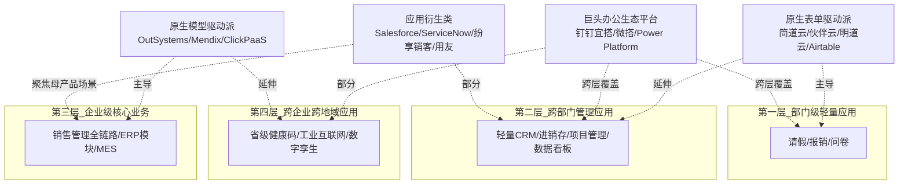

这一对应规律对企业的低代码选型实践具有直接的指导意义——**选择平台不应只看产品宣传，而应根据自身的应用层级需求匹配相应的平台类型**。一家中小企业的部门级应用需求选择OutSystems会因为客单价过高而难以承担，反之一家大型制造企业的MES系统需求选择简道云则会因为架构能力不足而难以落地。第3章3.2节剖析的"中小企业轻量化路径 vs 大中型企业PaaS化路径"两条客户分层路径，本质上就是这一对应规律在客户选型层面的直接投射。

平台类型与应用领域之间的对应规律还揭示了一个更深的产业逻辑：**平台的"通用性"与"垂直深度"之间存在结构性张力**。中国软件网在2021年市场报告中已经隐含这一判断——"既做广又做深是很难的事情，大多数厂商只能二选一"。原生模型驱动派系平台追求通用性（Mendix可服务于金融、制造等多行业），但要在每个垂直行业建立深度Know-How则需要客户和合作伙伴的长期沉淀；应用衍生类厂商在垂直领域有深度Know-How，但通用化扩展则受制于母产品架构。这种张力是后续6.4节将进一步剖析的闭环结构性矛盾之一。

## 6.3 应用领域反向塑造业务优势的体现方式：场景特性与价值落点的耦合

前两节剖析了从技术到平台、从平台到领域的两条单向因果链。本节将进一步揭示这条链条的"反向反馈"——**应用领域如何反过来塑造业务优势的具体体现方式**。第5章5.1—5.7归纳的七大优势并非在所有场景中均匀分布，而是与具体的应用场景特性发生耦合，形成"场景特性—价值落点—权威机构数据指标"的对应关系。

**流程审批类应用最突出效率提升与交付周期缩短优势**。第3章3.1节剖析的某制造企业采购审批从两周压缩到数日级别、第5章5.1节引用的Forrester数据"应用开发速度平均提高6—10倍"在此类场景下最易得到直接的量化验证。流程审批的业务规则相对清晰、参与角色有限、变更频率虽高但变化幅度不大——这些特性恰好契合表单驱动平台"表单+流程+权限"三件套的能力，使效率优势可以无衰减地释放。这也是为什么"OA审批、报销、合同、请假、用印"被反复称为低代码的"敲门砖"场景——它们是低代码价值最容易被显性化、最容易被企业管理层立即认可的场景。

**数据收集与可视化报表类应用最突出敏捷分析与决策响应价值**。第3章3.3节剖析的"从Excel散落到统一数据源、自动汇总、实时报表"的演进，把低代码的"敏捷迭代"优势映射到了管理决策层面——管理者从"等数据"到"看数据"再到"用数据"的节奏被加快。这一价值落点在零售、电商、金融等市场窗口期短的行业尤为关键，业务方法论的迭代频率与报表呈现的实时性直接挂钩。

**企业管理类应用（CRM、ERP、HRM）最突出业务与IT协作模式重构价值**。第3章3.2节剖析的大中型企业CRM选型从"功能覆盖"转向"底座敏捷性"，第5章5.6节剖析的"业务自助+IT赋能"双层架构，在此类场景下形成最完整的协同闭环。当销售方法论每月迭代、当公海池规则需要随业务调整、当返利逻辑需要跟随市场策略变化时，低代码所承载的不只是技术效率，而是企业内部权力与能力分布的重构——业务部门从"需求提出者"转化为"应用搭建者"，IT部门从"应接不暇者"转化为"平台治理者"。

**多端交付应用最突出跨端跨系统集成价值**。第3章3.4节剖析的腾讯微搭"一码多端"能力、第5章5.7节引用的钉钉宜搭2000+接口生态，让低代码不再是孤立工具，而是嵌入到企业既有协作生态中、借助生态自身的用户基数与连接能力放大价值。在这一场景下，低代码的"跨端跨系统集成"优势成为最具差异化的价值落点——它解决的不是单点效率问题，而是"如何让新增应用快速融入既有IT版图"的系统性问题。

**行业垂直应用（制造、金融、医疗）最突出合规安全与行业Know-How沉淀价值**。第3章3.5节剖析的金融业"快速响应+数据安全"双刃诉求、医疗业"数据隐私+设备集成"特殊要求，让低代码在垂直行业的价值落点从单纯的"快"转向"快+稳+合规"的三位一体。这一场景的特殊性也解释了为什么金融、医疗等行业更倾向于选择具备字段级权限、私有化部署、等保合规能力的模型驱动企业级平台，而非表单驱动的SaaS化平台。

将场景特性与价值落点的耦合系统化，可以得到下表：

| 应用场景类型 | 场景特性 | 最突出的价值落点 | 关键量化数据/案例 |
|------------|---------|----------------|----------------|
| **流程审批** | 规则清晰、线性流转、角色有限 | 效率提升、交付周期缩短 | 应用开发速度提升6—10倍、采购审批从两周缩至数日 |
| **数据收集与报表** | 实时性要求高、跨系统汇总 | 敏捷分析、决策响应 | 从"等数据"到"用数据"的节奏跃迁 |
| **企业管理类应用** | 业务规则高频迭代、跨部门 | 业务与IT协作模式重构 | 钉钉宜搭99%应用由非开发者搭建 |
| **多端交付应用** | 跨端、跨生态、需要集成 | 跨端跨系统集成价值 | 钉钉接口数翻倍至2000+、微搭C2B连接器 |
| **行业垂直应用** | 合规严格、行业Know-How复杂 | 合规安全、行业沉淀 | 金融数据加密、医疗HIS集成、Appian政府认证 |
| **公共应急场景** | 时间窗口极窄、高并发 | 极限效率与跨地域部署 | 寻人平台1.5小时上线、省级健康码10余天交付 |

这张表的核心启示是：**低代码的同一项技术能力，在不同场景下会呈现为不同的价值面貌**。例如可视化拖拽这一基础能力——在流程审批场景中体现为"效率提升"，在管理类应用中体现为"业务自助"，在多端交付中体现为"一码多端"，在垂直行业中则体现为"行业模板复用"。同样地，模型驱动这一架构能力——在企业级核心业务中体现为"复杂业务承载力"，在跨系统集成中体现为"统一数据底座"，在垂直行业中则体现为"领域模型沉淀"。**理解这种"同一能力—多重价值"的耦合机制，是评价低代码价值时避免"一刀切"判断的关键认知工具**——既不应在审批场景的成功就推论低代码能解决一切问题，也不应在垂直行业的局限就否定低代码的整体价值。

这一耦合机制还反过来解释了为什么第5章5.8节剖析的"局限与风险"在不同场景下的严重程度差异极大——厂商锁定风险对于审批类应用是次要议题，但对于核心业务系统是战略级风险；性能问题对于轻量管理工具可以忽略，但对于高并发交易系统是致命瓶颈；合规风险对于内部协作场景影响有限，但对于金融医疗行业是准入门槛。**场景特性不仅决定了价值的释放方式，也决定了风险的暴露强度**——这种双向耦合是低代码价值评估必须建立的复合视角。

## 6.4 四维闭环的相互强化与张力：协同效应与结构性矛盾

将6.1—6.3的三条单向因果链组合起来，可以勾勒出一个完整的四维闭环：技术决定平台能力上限、平台类型塑造应用领域分布、应用领域反向塑造业务优势体现，而**业务优势的市场认可度又反向拉动更多技术投入与平台演进**——闭环就此形成。

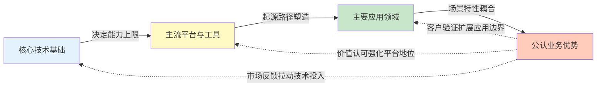

这一闭环的协同强化效应在2020—2021年的市场爆发中得到了系统性印证。一条典型的正反馈链条可以描述为：**模型驱动技术不断成熟 → Mendix、OutSystems等企业级平台能力提升 → 企业级核心业务场景渗透加深 → 敏捷迭代与跨系统集成优势在大客户中被放大 → 资本与产业资源进一步涌入 → 厂商有能力进行新一轮技术投入**。Mendix被西门子收购、OutSystems获KKR与高盛3.6亿美元融资、Appian通过RPA+AI两次升级低代码平台、伙伴云2021年完成B轮与B+轮共计5700万美元融资、Airtable估值翻倍至110亿美元——这些资本事件不是孤立的市场行为，而是四维闭环正反馈的资本市场具象化呈现。

但闭环并非纯粹的良性循环，**其内部同时存在四组结构性张力**，决定了低代码行业演化过程中的内在矛盾与未来分化方向。

**第一组张力：技术深度与公民开发者易用性的取舍**。模型驱动架构带来企业级承载力，但同时也提高了平台使用的认知门槛——业务人员理解"实体—属性—关系"的元模型，远比直接拖拽表单要难。表单驱动平台对公民开发者最友好，但又难以承载复杂业务。这种张力没有完美解法，只能通过分层产品（如同一平台提供面向业务用户的表单层和面向专业开发者的模型层）来部分缓解。Power Platform采用"低代码语言Power Fx+开源化"的方向，本质上就是在专业开发者与公民开发者之间寻找新平衡。

**第二组张力：平台通用性与行业垂直深度的矛盾**。6.2节末尾已经引用过"既做广又做深是很难的事情，大多数厂商只能二选一"的判断。原生模型驱动派系平台追求通用性，但要在金融、医疗、制造等垂直行业建立深度Know-How需要长期客户沉淀；应用衍生类厂商在垂直领域有深度Know-How，但通用化扩展则受制于母产品架构。这一矛盾在2021年的市场上以"巨头通用平台+垂直行业ISV"的生态化整合方式得到部分缓解——钉钉聚合8家ISV、华为联手用友金蝶、腾讯与轻流深度合作，本质上是把"通用平台"与"垂直深度"分配给生态内的不同角色承担。

**第三组张力：生态依附与自主可控的博弈**。独立厂商在巨头生态化潮流中面临的两难选择——加入生态可以获得用户基数与商机，但需要让渡部分自主权；保持独立可以掌控产品演进方向，但要承担自建客户渠道的高成本。第4章4.9节引用的黑帕云从获字节A轮到关停被收购的命运转折是这一博弈的典型缩影：当独立厂商的商业化能力难以独立支撑时，被生态吸纳成为现实选择，但代价是产品独立性的让渡。这一张力背后的更深层逻辑是：**低代码作为基础设施性质的工具，天然具有规模经济效应——用户基数越大、连接器生态越丰富、模板沉淀越多，平台的边际价值越高**。这种规模经济效应让独立厂商的"自主可控"在长期上面临持续的压力。

**第四组张力：降本敏捷与厂商锁定的悖论**。第5章5.8.4节剖析的厂商锁定风险与5.1—5.2节的降本敏捷优势之间，存在着深刻的内在矛盾——**正是因为低代码"高度集成、开箱即用"的特性带来了降本敏捷的显性收益，企业才会深度依赖特定平台；而这种深度依赖恰恰构成了厂商锁定的基础**。Gartner把厂商锁定列为IT领导者引入低代码时的主要焦虑之一并非偶然，企业必须在"享受平台红利"与"承担锁定代价"之间持续权衡。这一悖论的部分缓解方案是技术层面的（如AST代码可导出、混合开发模式），部分则是治理层面的（如多平台并存、避免单点依赖）——但根本性的化解需要整个低代码行业向更开放、更标准化的方向演化。

四组张力共同构成了低代码行业的内在演化动力学——它们不是缺陷，而是行业发展的内生矛盾，推动着技术、平台、领域、优势四个维度持续调整、相互适应。**理解这些张力，对于理解低代码行业未来的演进方向至关重要**——下一节将基于这些张力出发，梳理2021年底已经显现的演进信号。

## 6.5 2021年底显现的演进信号：云原生化、AI辅助、生态化与MDE融合

四维闭环的内在张力推动着低代码行业持续演化。截至2021年底，至少有四类方向性信号已经清晰浮现——它们不是已经规模化的产业现实，而是处于"萌芽—早期推广"阶段的演进苗头，但其方向性意义不容忽视。本节将这四类信号系统梳理，为6.6节的演进路径研判提供事实基础。

**信号一：云原生化深化——Serverless与低代码的深度融合**。第2章2.8节已经剖析过腾讯云的Serverless演进路径：从1.0的FaaS阶段，到2.0的FaaS+BaaS综合体，再到应用层封装阶段推出基于Serverless的低代码平台微搭。这一演进的关键洞察是"Serverless与低代码并非两种独立技术，而是同一抽象趋势在不同层次上的体现"——Serverless从基础设施层屏蔽运维，低代码从应用开发层屏蔽编码，二者天然契合。截至2021年底，腾讯微搭基于云开发CloudBase的Serverless架构、阿里钉钉宜搭依托阿里云的底层能力、华为AppCube依托华为云的云原生基础设施，已经构成了"低代码必基于云原生"的市场共识。这一信号的方向性意义在于：**低代码正在从"部署在云上的工具"演化为"原生云架构的产物"**——后者不仅在弹性、运维、按需付费上具备前者无法比拟的优势，更在与云生态其他能力（AI、大数据、IoT、安全）的协同上拥有结构性领先。

**信号二：AI辅助开发萌芽——从代码补全到自然语言生成**。AI与低代码融合的早期信号在2021年已经清晰显现。第5章相关章节及前述各章已经引用过多个关键事件：**微软2021年Ignite大会开源低代码语言Power Fx并宣布将GPT-3集成到Power Apps**，使得用户通过自然语言就能编程而无需精通任何编码知识；**微软Power Apps的AI Builder功能可基于自然语言描述生成表单**，如输入"创建一个包含姓名、邮箱、提交按钮的反馈表单"系统自动生成相应代码[^84]。同时，**AI辅助编码工具在2021年从实验阶段进入实用化**，典型代表GitHub Copilot、TabNine等基于GPT-3等大规模语言模型，能够通过上下文感知生成代码片段、补全函数甚至修复错误，在重复性代码编写场景中效率提升可达40%以上[^84]。这些信号共同指向同一个方向——低代码与生成式AI的融合将让"意图驱动开发"成为可能：用户用自然语言描述目标，AI辅助生成应用结构、数据模型与界面布局。需要在此严格界定的是，**这一方向在2021年底仍处于"早期推广"而非"主流应用"阶段**——GPT-3集成、AI Builder等能力的大规模商用主要发生在2022年以后，本报告仅将其作为方向性信号引用，不计入2021年底的主流应用现状。前端智能化领域同时讨论的数据隐私与安全（本地化部署、差分隐私、合规审查）、模型可解释性、技能转型压力等挑战[^84]，也将成为AI+低代码融合需要长期化解的议题。

**信号三：巨头生态化与平台化整合——从产品竞争到生态竞争**。第4章已经系统呈现了2021年中国市场"巨头+独立厂商"双层格局的形成过程。**钉钉低代码聚合平台"钉钉搭"聚合宜搭、简道云、氚云、易鲸云、黑帕云、轻流、维格、悉息8款低代码厂商**、**腾讯云与轻流、即构科技、泛微等深度合作**、**华为联手用友、金蝶共同开拓市场**、**伙伴云与企业微信建立战略合作**、**字节跳动通过收购黑帕云团队组建aPaaS"昆仑"**——这些事件共同标志着低代码竞争已经从"单品竞争"演化为"生态竞争"。这一信号的方向性意义在于：**低代码不再是孤立的工具，而是嵌入到母生态中的能力模块**——其价值不仅取决于平台自身的功能完备性，更取决于其所依附的生态规模、连接器深度、ISV丰富度。第4章引用的钉钉数据极具说服力：2021年钉钉开放接口数翻倍至2000+、低代码应用8个月增长86万个。这种生态化整合不仅重塑了厂商的生存空间，也提升了低代码作为产业基础设施的整体规模效应。

**信号四：低代码与MDE/DevOps融合——向更专业化的工程体系靠拢**。第2章已经剖析过MDA/MDE作为低代码理论基础的历史脉络。截至2021年底已有更进一步的趋势——**MDE工件在持续软件工程（CSE）中被视为一等公民，其融合范围广泛，从直接使用现有集成平台到高级的协同演化场景，具体取决于项目需求和MDE在其中的角色**[^85]。这种融合对软件工件开发者和MDE工件开发者都有益处，但要在CSE中为MDE提供全面且顺畅的支持，仍需在几个方向上拓展现有技术水平：MDE技术成熟度提升（如模型转换在复杂工业场景中已可靠，但模型合并等技术还需更多工作以提供自动化解决方案和专业工具）、CI组件的模型感知能力（CI组件应具备模型感知能力，为模型管理操作如UML类图比较提供默认支持，或至少提供标准扩展点）、新的研究方向（开展针对协同演化场景以及更智能的依赖和影响分析算法的研究，以实现MDE项目更好的CSE自动化）[^85]。同时，DevOps相关岗位需求显著增加、其重要性在软件开发社区日益凸显[^85]——这一趋势映射到低代码领域，意味着低代码生成的应用需要能够进入企业既有的CI/CD流水线，参与版本管理、自动化测试、灰度发布等专业化工程流程。这一信号的方向性意义在于：**低代码正在从"业务部门的轻量工具"向"企业工程体系的有机组成部分"演化**——这种演化将逐步消解低代码与传统软件开发之间的边界，让两者在统一的工程治理框架下协同。

四类信号汇聚到一起，可以归纳为下表：

| 演进信号 | 核心事件/证据 | 方向性意义 | 成熟度阶段 |
|---------|--------------|-----------|-----------|
| **云原生化深化** | 腾讯微搭基于CloudBase Serverless架构、钉钉宜搭/AppCube依托云原生底座 | 从"部署在云上"到"原生云架构" | 已规模化 |
| **AI辅助开发萌芽** | Power Fx开源+GPT-3集成、AI Builder自然语言生成表单、Copilot/TabNine在重复代码场景效率提升40%+[^84] | 从"可视化拖拽"向"意图驱动开发" | 早期推广 |
| **巨头生态化整合** | 钉钉搭聚合8家ISV、华为+用友/金蝶、腾讯+轻流、伙伴云+企微 | 从"单品竞争"到"生态竞争" | 形成阶段 |
| **MDE/DevOps融合** | MDE工件作为CSE一等公民、CI组件需具备模型感知能力[^85] | 从"业务部门工具"到"企业工程体系组成" | 学术与产业早期探索 |

这四类信号并不孤立，而是相互交织：云原生化为AI能力的弹性调用提供底座，AI辅助让生态化的连接器与模板更具智能化升级空间，MDE/DevOps融合则让生态内的不同厂商之间能够形成更标准化的协同。它们共同构成了低代码在2022年及以后演进的"信号源头"——下一节将基于这些信号研判演进的具体方向。

## 6.6 下一阶段演进方向研判：智能化、可组合化与产业基础设施化

基于6.5节梳理的四类演进信号，可以对低代码在2022年及以后的演进路径进行方向性研判。需要在开篇明确的是：**本节的研判是基于2021年底已显现信号的方向性外推，而非对2022年后已发生事件的事后追述**——这一界定符合本报告"截至2021年底"的时间边界要求，相关具体落地节奏与规模化时间表将由本报告的局限性边界自然约束，不在此展开预言。

**演进方向一：智能化——从可视化拖拽到意图驱动开发**。6.5节的AI辅助开发萌芽信号将在2022年及以后逐步走向规模化。具体的演进路径可能呈现为四个阶段：第一阶段是AI辅助代码生成（如Copilot嵌入低代码IDE，在用户编辑表达式或脚本时提供智能补全）；第二阶段是智能组件推荐（基于用户搭建意图自动推荐合适的组件、布局、连接器）；第三阶段是自然语言驱动应用搭建（用户用自然语言描述目标，平台自动生成应用骨架，用户在此基础上微调）；第四阶段是AI Copilot嵌入低代码全链路（贯穿需求理解、应用设计、代码生成、测试、部署、运维的端到端智能辅助）。微软2021年开源Power Fx并集成GPT-3、AI Builder自然语言生成表单[^84]等动作，已经为这一演进路径埋下伏笔。智能化方向的本质意义在于：**低代码的核心抽象层将从"拖拽可视化"进一步上移到"意图描述"——这是一次比"代码→可视化"更深层的抽象跃迁**。但同时需要冷静审视的是，AI辅助生成的代码可能存在性能隐患或不符合项目规范，需开发者二次审核[^84]；AI生成的代码可能缺乏可解释性，导致调试困难[^84]——这些挑战与第5章5.8节剖析的低代码现有局限叠加，将使智能化的真正成熟需要相当长的工程演化周期。

**演进方向二：可组合化——与超级自动化、RPA、iPaaS、API经济深度融合**。Gartner在2021年提出的LCAP三大趋势之一即为"可组合性"——**LCAP是推动应用服务、功能和能力可组合性的关键技术之一**。这一趋势的深层逻辑是：当企业从"购买标准软件包"转向"组装能力模块"时，低代码作为模块组装的可视化界面将获得新的战略地位。可组合化方向的具体演进可能呈现为：低代码与超级自动化的深度融合（低代码作为编排层，调度RPA、AI、数据分析等多类自动化能力）；低代码与iPaaS的边界模糊化（连接器生态从"低代码内部模块"演化为"独立的iPaaS层"，被多个低代码平台共享）；低代码与API经济的深度结合（外部API市场成为低代码组件的开放扩展源，让平台能力从"封闭组件库"演化为"开放组件市场"）。Appian通过RPA与AI两次升级低代码平台、Forrester判断"数字流程自动化（DPA）和低代码市场的融合"——这些事件都是可组合化方向的早期信号。可组合化方向的根本意义在于：**低代码不再是孤立的应用搭建工具，而是企业"组合式架构"的关键集成枢纽**——这一定位将让低代码的战略价值从"提升单点效率"升级为"重塑应用供给模式"。

**演进方向三：产业基础设施化——从企业级工具到数字经济供给基础设施**。第5章5.7节已经引用过《2022年中国低代码行业生态发展洞察报告》将低代码定位为"低成本、普惠化、个性化、促就业"的四大价值，以及阿里云智能总裁张建锋"工业互联网需要大量系统建设，最清楚应该建什么信息系统的人是这个岗位上的员工，低代码能够让这些最懂业务的人不用懂专业编程就能开发"的判断。这些表述共同指向一个产业级演进方向：**低代码将从"企业内部工具"升级为"数字经济的应用供给基础设施"**。具体的演进可能呈现为：低代码承担工业互联网平台的应用层供给（呼应第3章3.5节引用的工业互联网平台创新领航应用六大模式）；低代码承担政务数字化的快速响应能力（呼应第1章引用的省级健康码案例）；低代码承担公共应急场景的极限交付能力（呼应寻人平台1.5小时上线案例）；低代码与"数字中国"等国家战略形成结构性匹配（响应Gartner所言"未来5年至少需要开发5亿个新应用才能满足中国企业数字化转型的需求"）。这一方向的实现将使低代码的产业地位从"工具供给者"升级为"基础设施提供者"——其战略价值与商业模式将相应发生质的变化。

将三条演进方向交叉审视，可以发现它们之间存在着深层的协同关系：**智能化提供了能力下沉的技术加速器，可组合化提供了能力整合的架构骨架，产业基础设施化提供了能力扩散的市场容器**。三者合力，将共同推动低代码从2021年的"高速成长期"走向2022年及以后的"基础设施化阶段"。

但同时需要审慎说明这些研判的不确定性边界。第一，技术演进的节奏不确定——AI辅助开发从早期推广到规模化商用需要多长时间、可组合化的技术标准化进度如何，都存在显著不确定性。第二，市场格局的演变不确定——巨头生态化整合对独立厂商的挤压程度、独立厂商在生态依附与自主可控之间的最终平衡点，都可能呈现非线性变化。第三，外部环境的影响不确定——宏观经济、监管政策、地缘政治等因素都可能改变低代码行业的演进路径。这些不确定性意味着，本节的研判是"基于2021年底信号的方向性外推"，而非"对未来的确定性预言"——读者应在此边界框架下审视相关判断。

## 6.7 贯穿四大主题的核心趋势线索：渐进整合、能力下沉与边界扩展

作为整章的收束，本节提炼贯穿技术、领域、平台、优势四个主题的三条核心趋势线索。这三条线索不是对前述各章具体事实的简单复述，而是对四大主题内在发展规律的最高层次抽象，将为第7章的最终结论与战略判断提供逻辑基础。

**第一条线索：渐进整合（Progressive Integration）**。低代码不是断裂式革命，而是四十年软件工程渐进创新的工程化整合。这一线索在四个主题中都有清晰呈现。技术层面，第2章2.10节已经系统论证过"传承与突破"的双重定位——4GL的非过程化思想、RAD的原型迭代、MDA的模型转换理论、BPM的可视化流程建模都被低代码继承下来，云原生、AST、Serverless则提供了突破的新基础设施。领域层面，低代码所切入的审批、CRM、报表、多端应用等场景，并非全新需求，而是企业IT版图中长期存在的需求被低代码以更高效的方式重新承担。平台层面，OutSystems起源于2001年、Mendix起源于2005年、Appian起源于1999年、Salesforce的Lightning Platform、用友/金蝶的低代码能力——主流平台几乎都有十年以上的技术演进史，市场上从边缘工具到主流基础设施的过渡也呈现明显的渐进特征。优势层面，第5章5.9节明确指出低代码的真实价值是"在合适场景下创造30%—40%级别的降本与5—10倍级别的提效"——这是显著但非颠覆性的价值跃迁，是渐进改进而非革命性突破。**渐进整合的线索决定了低代码的真实价值不应被"软件革命"的高调叙事所放大，也不应被"早已存在"的冷静质疑所贬低**——它是一种针对特定场景的工程效率整合方案，在长期累积的基础上完成了一次具有产业级影响力的能力跃迁。

**第二条线索：能力下沉（Capability Democratization）**。低代码的内在逻辑是把原本只有专家才能掌握的能力下沉为公民开发者可用的工具。这一线索同样贯穿四个主题。技术层面，专业开发者的能力（编码、架构设计、系统集成）被下沉为可视化拖拽、声明式配置、连接器调用——这一下沉过程对应了第2章2.1节剖析的从"怎么做"到"做什么"的抽象跃迁。领域层面，原本只有大型企业才能负担的企业级架构能力（元数据驱动、字段级权限、跨系统集成）被下沉为中小企业可负担的SaaS订阅服务——简道云、伙伴云等平台让2000多万家企业获得了过去只有少数大型企业才有的应用搭建能力。平台层面，原本只有云厂商才有的Serverless基础设施、原本只有AI公司才有的大模型能力，正在被下沉为低代码平台中的标准组件——这正是6.6节研判的智能化方向的核心机理。优势层面，"打破业务与IT壁垒""释放公民开发者生产力""缓解IT人才短缺"等优势，本质上都是能力下沉的不同表达。**能力下沉是低代码作为"软件开发民主化"叙事的真实内核**——它不是简单的工具改进，而是企业数字化能力的分布结构性重组。但同时需要承认，能力下沉也带来了第5章5.8节剖析的程序员认同冲突、影子IT风险等张力——这是能力下沉过程中必须长期化解的内生矛盾。

**第三条线索：边界扩展（Boundary Expansion）**。低代码的应用边界在多个维度上持续扩展。这一线索是前两条线索的自然延伸，也是低代码作为"应用构建范式"持续演化的核心动力。从应用层级看，低代码的边界从部门级轻量应用向跨部门管理应用、企业级核心业务、跨企业跨地域应用持续上移——第3章3.8节的四层渗透曲线呈现了这一上移过程。从应用范围看，低代码的边界从企业内部协作向跨企业协同扩展——钉钉宜搭2000+接口、微搭C2B连接器、企业微信生态战略合作，都是跨企业边界扩展的具象化呈现。从行业边界看，低代码从办公自动化场景向工业互联网、金融、医疗、政务、零售等多个行业持续渗透——第3章3.5节的行业垂直应用图谱呈现了这一行业边界扩展。从技术能力看，低代码从单一职能向多端多生态持续扩展——一码多端、连接器生态、AI辅助、IoT集成等能力都在持续拓宽低代码的能力边界。**边界扩展的根本动力是数字化转型对应用供给能力的持续渴求**——当企业数字化进入深水区、当工业互联网与政务数字化进入规模化部署、当公民开发者与专业开发者的协作成为常态时，低代码的边界自然会被市场需求持续推动向外扩展。

三条线索共同勾勒出低代码作为"应用构建范式"的内在发展规律：**渐进整合奠定了技术底盘，能力下沉提供了演化动力，边界扩展呈现了演化结果**。这三条线索互为表里——没有渐进整合就不可能形成能力下沉所需的稳定底盘，没有能力下沉就不可能产生边界扩展所需的市场需求，没有边界扩展就不可能反向拉动渐进整合的持续投入。

将三条线索映射到四大主题的具体内容上，可以得到一个整体性的认知框架：

| 主题 | 渐进整合的体现 | 能力下沉的体现 | 边界扩展的体现 |
|------|--------------|--------------|--------------|
| **核心技术基础** | 4GL/RAD/MDA/BPM传承+云原生/AST突破 | 专业开发能力下沉为可视化操作 | 从单一编程语言到多端多生态技术栈 |
| **主要应用领域** | 既有需求被更高效方式承担 | 大企业能力下沉为中小企业可负担方案 | 部门级→跨部门→企业级→跨企业 |
| **主流平台与工具** | 主流平台多有十年以上演进史 | Serverless/AI能力下沉为平台组件 | 单品竞争→生态竞争→产业基础设施 |
| **公认业务优势** | 显著但非颠覆性的效率跃迁 | 业务与IT协作模式重构 | 内部工具价值→数字经济基础设施价值 |

这一整体认知框架的意义在于，它把第2—5章的具体事实纳入了一个更高层次的演化逻辑——读者不再需要在数十家厂商、数十项技术、数十种场景之间逐一辨认细节，而是可以基于"渐进整合—能力下沉—边界扩展"这三条线索，对低代码行业形成稳定的整体性、结构化认知。当未来出现新的厂商动向、新的技术突破、新的应用场景时，读者可以自然地将其归入相应的线索框架进行解读，而无需重新建构判断逻辑。

至此，本章已经完成了从"技术→平台""平台→领域""领域→优势"三条单向因果链的剖析，到四维闭环的整合呈现，再到协同效应与结构性张力的识别，最后到2021年底演进信号的梳理与下一阶段演进方向的研判，并以三条核心趋势线索作为整章收束。**第2—5章建立的四条独立主线在本章已经被交织为一个相互印证的逻辑闭环，低代码行业截至2021年底的整体面貌也已经形成了"事实+规律+趋势"三层完整的认知图景**。这一认知图景将直接服务于第7章的最终结论——回应"低代码是技术变革还是营销概念"的核心争议、归纳低代码作为企业数字化转型基础设施的战略价值、提出对2022年及以后的合理展望、并指出本研究在数据可得性与时间边界上的局限性。

# 7 研究结论与展望

从第1章的概念界定与历史脉络出发，经过第2章的技术坐标建立、第3章的应用图谱铺陈、第4章的市场格局梳理、第5章的价值边界审视，到第6章的四维联动整合，本报告已经在事实、规律、趋势三个层次上完成了对低代码开发行业截至2021年底的系统性剖析。本章作为整份报告的收束，承担的不是新增证据的引入，而是对已有论证的最终凝练与战略层面的整体判断。叙事将按照"**整体定位—核心争议回应—战略价值归纳—演进展望—研究局限**"的递进结构展开，先以7.1对低代码行业在2021年底这一历史断面上的整体定位与成熟度作出结构化总结，继而以7.2正面回应贯穿全报告的"技术变革还是营销概念"核心争议，再以7.3从产业战略层面整合低代码作为企业数字化转型基础设施的战略意义，以7.4基于已观察到的演进信号对2022年及以后提出有节制的展望，最后以7.5诚实指出本研究在数据可得性、时间边界与覆盖颗粒度上的局限，为后续追踪研究留出清晰方向。

## 7.1 截至2021年底低代码行业的整体定位与成熟度判断

基于第1章至第6章累积的全部证据，对低代码行业在2021年底这一历史断面上的整体定位可以从市场规模、增速、渗透率、市场结构、成熟度阶段五个维度作出结构化总结。

**市场规模层面**，海比研究院、中国软件网与中国软件行业协会联合发布的《2021年中国低代码/无代码市场研究报告》明确指出，我国整体市场规模已经达到19亿元，第三方使用人员规模达到42.6万人[^86][^87];全球低代码市场规模在2020年达84亿美元，预计在2021年超过百亿美元;Gartner则给出了一个更高的口径——2021年全球低代码开发技术市场达138亿美元、比2020年增长22.6%。中国市场19亿元的体量与全球百亿美元级别的规模之间存在显著差距，这既反映了中国低代码市场起步较晚的事实，也意味着中国市场仍具备巨大的纵深增长空间。

**增速层面**，海比研究院预测中国低/无代码市场未来五年复合增长率达到49.5%[^86]、亿欧智库预测年复合增长率49.2%、全球低代码市场预计保持41%左右的年复合增长率[^87];Gartner更具结构意义的预测是"到2024年所有应用程序开发活动中的65%将通过低代码方式完成、75%的大型企业将使用至少四种低代码开发工具进行应用开发"。三组独立来源的数据交叉验证显示，低代码行业正处于一个具有产业级影响力的高速成长通道中。

**渗透率层面**呈现出"绝对低值+陡峭曲线"的特征。2021年中国低代码市场渗透率不足1%——这意味着低代码远未达到普及化阶段;但49.5%的复合增长率叠加未来五年从19亿元向百亿量级跃迁的市场预期[^87]，使其增长曲线明确陡峭。这种"低绝对值+高增长率"的组合，恰恰是任何处于成长期初段的新兴技术市场的典型特征。

**市场结构层面**已经在2021年基本成型为"巨头平台+独立厂商+传统软件衍生"三层并立的格局。阿里钉钉宜搭、腾讯云微搭、华为云AppCube、百度爱速搭、字节昆仑等巨头平台凭借云服务+办公生态优势占据生态枢纽位置;明道云、简道云、轻流、ClickPaaS、奥哲、伙伴云、宜创科技、数睿数据、织信Informat等原生独立厂商在垂直细分市场寻求差异化竞争;用友、金蝶、致远互联、销售易、纷享销客等传统软件厂商衍生类玩家则通过PaaS化转型保持既有客户基础。海比研究院从需求侧给出的四类划分——场景应用型占45.7%、产品研发型占37.0%、平台生态型占15.7%、技术赋能型占1.7%——进一步刻画了这一市场结构的内部权重分布。

**成熟度阶段层面**呈现出明确的"双速发展"特征。海比研究院在2021年的判断是低/无代码市场整体处于导入期向成长期过渡阶段、行业规模增速快、需求高速增长、商业模式尚不固定、市场格局尚不稳定[^86];细分来看，低代码市场成熟度略高、现处于成长期初段，无代码市场则还处于导入期。从细分类型看，产品研发型成熟度最高、处于成长期的第二阶段;其次是场景应用型;平台生态型和技术赋能型则还处于导入期。这种分层成熟度判断比单一的"成长期"或"导入期"标签更贴近事实，也为不同类型厂商的战略选择提供了更细致的市场坐标。

权威机构在2021年的集中表态进一步印证了低代码作为产业热点的地位。**Gartner于2021年首次将低代码应用开发平台（LCAP）作为新兴技术热点纳入《2021年中国ICT技术成熟度曲线报告》**，预测在未来2—5年内低代码平台在国内市场将趋向主流采用;同时发布《中国低代码应用平台竞争格局》报告，ClickPaaS等中国厂商入选。**Forrester于2021年11月12日发布《低代码平台中国市场现状分析报告》**，调研腾讯、阿里巴巴、百度、华为、微软、轻流、金蝶、用友、帆软等二十余家行业主流企业，并将中国厂商划分为9类。**Forrester 2021年Q2《面向自动化和数字化专业人员的低代码开发平台》Wave报告**评估了14家全球低代码供应商，Mendix被评为领导者并在"现有服务"类别获得最高分[^88];微软Power Platform同样获评Wave报告的领导者位置[^88]。海比研究院、亿欧智库、艾瑞咨询等中国本土研究机构也分别在2021年发布了系统性的市场研究报告。**学术界、咨询界与厂商界在2021年这一时点的集中表态本身就是一个标志性事件——它表明低代码已经从一个边缘技术名词正式进入主流产业议程**。

综合五个维度的判断，可以对截至2021年底的低代码行业作出如下整体定位：**这是一个市场规模约19亿元（中国）/138亿美元（全球）、未来五年复合增长率近50%、整体处于导入期向成长期过渡阶段、市场结构形成"巨头+独立+传统衍生"三层并立格局、已获得Gartner/Forrester/海比研究院等权威机构集中认可的高速成长行业**。在这一定位之上，本报告后续各节的争议回应、战略价值归纳与演进展望都将围绕这一基本面展开。

## 7.2 对"技术变革还是营销概念"核心争议的最终回应

第1章在概念演进脉络的剖析中已经埋下了一个贯穿全报告的核心争议——既有"软件开发民主化的革命"之类的乐观判断，也有"早已出现、并非真正创新"的冷静质疑。第2章的传承与突破分析、第5章的价值边界界定、第6章的核心趋势线索都已经分别从技术、价值、规律三个角度对这一争议作出了部分回应。本节作为整份报告的收束节点，需要把这些分散的回应整合为一个最终的、明确的判断。

**最终判断是：低代码既非颠覆性技术革命，也非纯粹的营销话术，而是一种站在四十年软件工程渐进创新基础上、通过云原生与AST等现代基础设施完成产业级整合的工程效率方案**。这一判断有三层支撑。

**第一层支撑来自第2章的技术传承与突破分析**。低代码从1980年代IBM推出的RAD工具与4GL语言开始萌芽，到1990年代Visual Basic、Borland Delphi、PowerBuilder的可视化编程实践，到2001年OMG正式提出MDA框架奠定模型驱动的理论基础[^84]，到BPMN工作流引擎在BPM时代的成熟，再到2010年代云原生、Serverless、AST驱动代码生成等现代基础设施的引入——其方法论根基与技术构件都不是2014—2021年间新发明的，而是数十年累积的工程实践在新一代基础设施上的当代汇流。OMG于2001年颁布的模型驱动架构（MDA）作为衡量软件架构水平的核心关键指标，"通过模型来表示软件系统的各个方面、通过抽象和模型化来提高软件开发的效率和质量"[^84]，这一思想直接成为今天低代码"模型驱动"的理论起点。同时，低代码也并非简单的旧瓶装新酒——云原生底座取代了RAD时代的本地部署、AST驱动的双向绑定回应了"低代码=黑盒"的质疑、跨端统一交付实现了20年前难以想象的多端编译能力、连接器生态与公民开发者协同重构了业务与IT的组织关系。这些突破合在一起，让低代码相对于其前置技术形成了真实的产业级跃迁。

**第二层支撑来自第5章的价值边界界定**。第5章已经明确指出：低代码具有真实的、可量化的、被权威机构与企业实证反复验证的业务价值——Forrester数据显示应用开发速度平均提高约6—10倍、Mendix研究指出项目交付时间缩短50%以上、OutSystems报告显示开发成本降低约40%、Gartner预测到2024年低代码在所有新应用开发中的占比达到65%、钉钉宜搭99%应用由非开发者搭建、寻人平台1.5小时上线、省级健康码10余天交付——这些数据不是营销修辞，而是有实证支撑的真实收益。但同时，这些价值都有清晰的适用边界——在标准化、敏态、轻量化、规模化场景下充分释放，在高度定制化、高性能、强合规、深度集成场景下显著受限。**把"在合适场景下创造30%—40%级别的降本与6—10倍级别的提效"判定为营销概念是不公允的，但把"低代码将全面取代传统编码"判定为产业现实同样是过度乐观的**。

**第三层支撑来自第6章的三条核心趋势线索**。渐进整合奠定了技术底盘——低代码不是断裂式革命，而是四十年软件工程渐进创新的工程化整合;能力下沉提供了演化动力——把原本只有专家才能掌握的能力下沉为公民开发者可用的工具;边界扩展呈现了演化结果——从部门级轻量应用向跨企业跨地域应用持续上移。三条线索共同表明，低代码的本质是一种"渐进的、面向工程效率与开发者民主化的范式整合"，而非"颠覆性的范式革命"。

在这一最终判断基础上，可以分别回应乐观派与质疑派两端的观点。**对于"软件开发民主化的革命"这一乐观叙事**，本报告承认其合理内核——低代码确实通过可视化建模、声明式开发、连接器生态等技术下沉，让业务人员可以承担过去只有专业开发者才能完成的工作，钉钉宜搭99%应用由HR、财务等非开发者搭建的事实已经在企业内部充分验证了这一民主化效应;但本报告同时指出其修辞放大的部分——民主化是有边界的，复杂业务、高性能计算、强合规场景仍然需要专业开发者，"人人都是开发者"的口号在实践中应被理解为"业务人员可以参与更多类型的开发"而非"业务人员可以独立完成所有开发"。**对于"早已出现、并非真正创新"的质疑性声音**，本报告承认其合理内核——4GL、RAD、Visual Basic等技术确实在数十年前已经实现了可视化拖拽、组件复用、声明式开发等思想，主流模型驱动平台多数有十年以上技术演进史;但本报告同时指出其忽略的部分——云原生底座、AST代码生成、跨端编译、连接器生态、AI辅助等现代基础设施的引入，让低代码相对于其前置技术形成了量级跃迁，将其简单等同于"4GL重新包装"是低估了现代基础设施的产业级价值。

**最贴近事实的结论锚点，是明道云创始人任向晖在与陈果争论中给出的"渐进改进"定性**：第1章已经引用过其原话——"代应用平台产品诞生在上个世纪末，距离现在已经20多年了。是革命，也早就革命完了。我们2B创业者追求并非是革命机会，而是渐进的改进机会"。这一来自一线创业者的冷静定性，比"软件革命"或"营销噱头"两极判断都更接近事实。承认低代码的"渐进性"，并不削弱其价值;恰恰相反，它说明低代码站在了一个有四十年积淀的工程传统之上，并通过云原生、AST、连接器等现代基础设施完成了一次具有产业级影响力的整合升级。**这种渐进整合的工程效率方案定位，既避免了乐观派的过度承诺，也避免了质疑派的过度贬低，是本报告对核心争议给出的最终结论**。

## 7.3 低代码作为企业数字化转型基础设施的战略价值

在完成对核心争议的最终回应之后，本节将视角从争议性议题上移到产业战略层面，整合低代码作为企业数字化转型基础设施的战略意义。这一整合不是对前文价值论证的简单复述，而是从更高的产业战略视角对低代码战略地位的最终归纳。

**第一层战略价值：作为企业内部数字化转型加速器的工具价值**。这一层价值在第5章已经系统论证——开发效率提升6—10倍让应用供给从月级压缩到日级、开发成本降低40%让中小企业的数字化负担显著减轻、IT人才瓶颈缓解让企业不必扩张技术团队就能扩大应用产能、业务与IT协作模式重构让组织内部的数字化生产关系被重塑。**赛迪智库科技与标准研究所指出，企业数字化转型面临成本过高、人才储备不足等三大困境**——而低代码恰恰针对这些困境提供了系统性的工具方案。**阿里云智能总裁张建锋的判断颇具代表性："未来的一个重要趋势就是低代码。工业互联网需要大量系统建设，最清楚应该建什么信息系统的人，是这个岗位上的员工。低代码能够让这些最懂业务的人，不用懂专业编程就能开发，提高协同和创新效率"**——这一论述把低代码的工具价值从"提升效率"升华到了"重塑应用与业务需求的匹配度"层面。

**第二层战略价值：作为工业互联网与政务数字化应用层供给的基础设施价值**。第3章3.5节已经引用工业和信息化部2021年12月30日公布的工业互联网平台创新领航应用案例名单——围绕平台化设计、数字化管理、智能化制造、个性化定制、网络化协同、服务化延伸六大应用模式，140个工业互联网平台应用案例具有技术先进、成效显著、能复制推广等特性。低代码所主张的"打破业务竖井、增强跨职能沟通"理念与工业互联网平台"通过平台化方式汇聚资源、通过数据贯通打破壁垒、通过协同模式重构产业链"的底层方法论高度同源。同样，2021年7月河南暴雨救援中网易数帆轻舟低代码团队1.5小时上线寻人平台、四川省基于腾讯微搭以传统方式一半的人工成本10余天内开发出省级疫情防控健康码平台等公共应急案例，证明低代码已经具备承担省级公共应急基础设施的现实能力。**这一层价值的本质是：低代码不再是"企业内部工具"，而是承担产业级与社会级应用供给职能的基础设施**。

**第三层战略价值：作为应对"未来5年5亿个新应用需求"的产业级供给方案价值**。Gartner预测，未来5年至少需要开发5亿个新应用才能满足中国企业数字化转型的需求。5亿这个数字的产业意义已经在第5章被剖析过——即使中国所有专业软件开发者满负荷开发，也无法在5年内完成这一供给。低代码通过"专业开发者效率倍增+公民开发者补充供给"的双轨机制，是化解这一结构性供需失衡的可行方案。**《2022年中国低代码行业生态发展洞察报告》提出的低代码四大核心价值——低成本、普惠化、个性化、促就业——正是这一产业供给方案的具象化呈现**：低成本对应应用供给的边际成本降低、普惠化对应应用供给的覆盖人群扩大、个性化对应应用供给的需求匹配精度提升、促就业对应应用供给的人力资源结构优化。

**第四层战略价值：作为"数字中国""十四五"数字经济战略落地工具的国家战略价值**。第5章已经引用过——2021年政府工作报告及"十四五"规划将数字经济提升到前所未有的高度，中国经济发展的新里程正从"规模红利"向"数字创新"迈进，越来越多的企业投入数字经济的建设中，加速向数字化、智能化转型。在这一国家战略背景下，低代码不仅是企业层面的内部工具，更是整个数字经济转型能否如期完成的关键因素之一。**低代码所提供的"应用供给加速能力"、"业务知识与开发能力统一的组织能力"、"中级与基础IT人才的就业承接能力"，共同构成了数字经济战略在企业基础设施层面的落地工具**。

将四层战略价值整合呈现：

| 战略层级 | 价值核心 | 关键支撑证据 | 适用边界 |
|---------|---------|-------------|---------|
| **工具价值** | 提升单个企业的应用供给能力与业务IT协作效率 | Forrester 6—10倍效率提升、OutSystems 40%成本降低、钉钉宜搭99%非开发者搭建 | 在适用场景内充分释放 |
| **基础设施价值** | 承担工业互联网与政务数字化的应用层供给 | 工业互联网六大模式、省级健康码、寻人平台案例 | 需要平台具备企业级承载力 |
| **产业级供给方案价值** | 化解"5亿新应用"的结构性供需失衡 | Gartner 65%占比预测、49.5%复合增长率[^86] | 需要技术演进与人才培养同步 |
| **国家战略价值** | 作为"数字中国""十四五"数字经济落地工具 | 政府工作报告与十四五规划、四大核心价值框架 | 需要与传统软件开发形成长期互补 |

需要审慎指出的是，**这四层战略价值的释放并非自动达成，而是有清晰的边界条件**。第一，战略价值需要在适用场景内才能充分体现——第5章5.9节界定的标准化、敏态、轻量化、规模化场景是价值充分释放的领域，高度定制化、高性能、强合规、深度集成场景仍然需要传统软件开发承担。第二，战略价值的释放需要与传统软件开发形成长期互补——"80/15/5"的分层策略本质上承认低代码是企业IT版图中的"敏态承担者"而非"全能替代者"。第三，战略价值的释放需要企业组织、人才培养、治理框架的协同演化——单纯引入低代码平台而不重构组织协作模式与治理机制，难以让战略价值真正落地。**理解这些边界条件，比单纯赞美低代码的战略价值更有助于产业各方形成准确判断**。

## 7.4 基于2021年底信号的演进展望：智能化、垂直化、生态化、工程化

基于第6章6.5—6.6节梳理的演进信号与方向研判，本节对2022年及以后低代码行业的演化路径提出有节制的展望。需要在开篇严格界定：**本节的展望严格保持"方向性外推而非确定性预言"的论证立场**——它是基于2021年底已显现信号的方向性推演，而非对2022年后已发生事件的事后追述，相关具体落地节奏与规模化时间表将由本报告的局限性边界自然约束。

**展望主线一：AI+低代码融合方向**。这一方向的2021年底信号包括微软Power Fx开源与GPT-3集成Power Apps、AI Builder基于自然语言生成表单、GitHub Copilot与TabNine等AI辅助编码工具从实验阶段进入实用化并在重复性代码编写场景效率提升40%以上[^84]。从这些信号出发，2022年及以后的演进路径可能呈现为四阶段渐进推进：第一阶段是AI辅助代码补全（如Copilot嵌入低代码IDE，在用户编辑表达式或脚本时提供智能补全）;第二阶段是智能组件推荐（基于用户搭建意图自动推荐合适的组件、布局、连接器）;第三阶段是自然语言驱动应用搭建（用户用自然语言描述目标，平台自动生成应用骨架）;第四阶段是AI Copilot嵌入低代码全链路（贯穿需求理解、应用设计、代码生成、测试、部署、运维的端到端智能辅助）。**这一方向的本质意义在于：低代码的核心抽象层将从"拖拽可视化"进一步上移到"意图描述"——这是一次比"代码→可视化"更深层的抽象跃迁**。

但同时需要冷静讨论AI+低代码融合面临的多重挑战。**数据隐私与安全方面**，AI辅助开发依赖大量代码数据训练模型，可能涉及企业代码库泄露风险，应对策略包括本地化部署、差分隐私、合规审查[^84]。**模型可解释性方面**，AI生成的代码可能缺乏可解释性导致调试困难，需要结合静态分析工具（如ESLint）检查AI代码质量、要求AI生成代码注释解释逻辑[^84]。**技能转型压力方面**，前端开发者需从"代码编写者"向"AI协作者"转型，关键技能包括提示工程等[^84]。这些挑战与第5章5.8节剖析的低代码现有局限叠加，将使智能化的真正成熟需要相当长的工程演化周期，绝非"一年内全面商用"的颠覆性变革。

**展望主线二：行业垂直化方向**。基于第3章3.5节的垂直行业图谱与第6章6.2节的"通用性与垂直深度张力"分析，2022年及以后低代码在制造、金融、医疗、政务、零售、教育等垂直行业的深度渗透将进一步加快。具体演化可能呈现为两个维度：一是**通用平台与垂直Know-How的生态化分工**——通用平台（如Mendix、Power Platform、钉钉宜搭、华为AppCube）承担"应用搭建底座"，垂直ISV（如金融、医疗、制造领域的专业服务商）承担"行业Know-How沉淀";二是**垂直行业模板与连接器的体系化建设**——主流平台将通过预置行业模板、与行业既有系统（HIS、MES、核心交易系统）的深度连接器、行业合规能力（金融等保三级、医疗HIPAA类合规）的内置等方式，降低垂直行业落地门槛。第4章引用的ClickPaaS"立足于工业、政务、金融等行业，构建领域模型，沉淀行业组件和专用算法"、Mendix"客户分布在金融、制造等领域"、Appian"客户群体定位在政府及大企业"、奥哲"40%的国内五百强企业及各行业的标杆企业"等事实，已经为这一垂直化方向提供了起点证据。

**展望主线三：生态化商业模式方向**。第4章4.7节剖析的资本与并购信号表明，巨头生态化整合在2022年及以后将进一步深化。具体演化可能呈现为三个维度：一是**巨头生态化整合的进一步深化**——钉钉聚合8家ISV的"钉钉搭"模式、华为联手用友金蝶模式、腾讯与轻流深度合作模式、伙伴云与企业微信战略合作模式将持续扩展;二是**独立厂商"站队"与差异化生存空间的分化**——独立厂商将在"加入巨头生态获取用户基数"与"保持独立掌控产品方向"之间做出更明确的战略选择，部分厂商将通过加入生态获得规模化机会，部分厂商将通过深度垂直化获得差异化生存空间，少数无法找到清晰生态位的厂商将面临商业化压力（黑帕云从2021年7月获字节A轮到2022年3月关停被收购的命运转折是这一分化的早期信号）;三是**应用衍生与原生低代码两大派系的长期博弈**——前者凭借行业Know-How与既有客户基础在垂直市场保持竞争力，后者凭借通用化能力与跨行业扩展性在新增市场获取份额。**这一方向的本质意义在于：低代码竞争已经从"产品竞争"演化为"生态竞争"——一个低代码平台的长期生存能力，不仅取决于其自身的功能完备性，更取决于其所依附或构建的生态规模、连接器深度、ISV丰富度**。

**展望主线四：与DevOps/MDE融合的工程化方向**。第6章6.5节已经剖析过MDE工件在持续软件工程（CSE）中被视为一等公民的融合趋势[^85]，以及DevOps相关岗位需求显著增加、其重要性在软件开发社区日益凸显的产业趋势[^85]。基于这些信号，2022年及以后低代码与传统软件工程的边界将进一步消解，具体演化可能呈现为三个维度：一是**低代码生成的应用进入企业CI/CD流水线**——参与版本管理、自动化测试、灰度发布等专业化工程流程;二是**MDE技术成熟度的持续提升**——模型转换、模型合并、协同演化等技术从学术研究走向工业级工具，CI组件具备模型感知能力，为常见模型类型（如UML类图）的比较、合并提供默认支持或标准扩展点[^85];三是**低代码与传统软件工程的协同治理**——企业将建立统一的工程治理框架，让低代码生成的应用与传统手工编码的应用在版本控制、安全审计、性能监控等方面遵循一致的标准。**这一方向的本质意义在于：低代码正在从"业务部门的轻量工具"向"企业工程体系的有机组成部分"演化——这种演化将逐步消解低代码与传统软件开发之间的隔阂，让两者在统一的工程治理框架下协同**。

将四条展望主线整合呈现：

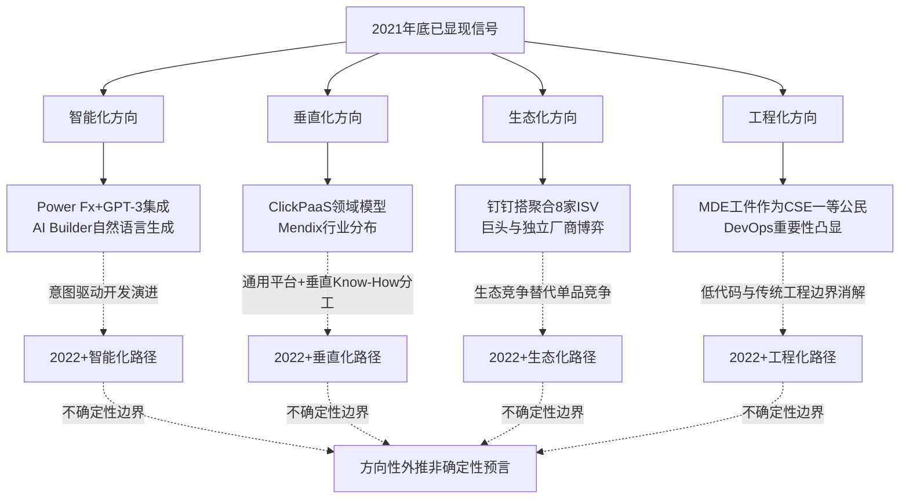

四条展望主线之间存在着深层的协同关系——智能化为垂直化提供能力下沉的技术加速器（如行业大模型让垂直Know-How的应用门槛进一步降低），生态化为垂直化提供能力整合的组织载体（如垂直ISV在巨头生态内承担行业沉淀职能），工程化为智能化提供能力规范的工程保障（如AI生成代码进入CI/CD的统一治理）。四者合力，将共同推动低代码从2021年的"高速成长期"走向2022年及以后的"基础设施化与智能化阶段"。

但同时需要审慎说明这些展望的不确定性边界。**第一，技术演进的节奏不确定**——AI辅助开发从早期推广到规模化商用需要多长时间、AI生成代码的可解释性与安全性如何系统化解决、可组合化的技术标准化进度如何，都存在显著不确定性。**第二，市场格局的演变不确定**——巨头生态化整合对独立厂商的挤压程度、独立厂商在生态依附与自主可控之间的最终平衡点、应用衍生与原生低代码两大派系的市场份额演化，都可能呈现非线性变化。**第三，外部环境的影响不确定**——宏观经济、监管政策、地缘政治、数据安全等因素都可能改变低代码行业的演进路径。这些不确定性意味着，本节的展望是"基于2021年底信号的方向性外推"，而非"对未来的确定性预言"——读者应在此边界框架下审视相关判断。

## 7.5 研究局限与后续追踪方向

作为一份基于公开资料的深度研究报告，本研究在数据可得性、时间边界、覆盖颗粒度三个维度上存在客观局限。诚实指出这些局限，不仅是研究伦理的要求，也是为后续追踪研究留出清晰方向的必要前提。

**数据可得性局限方面**，本研究主要依赖权威机构公开报告（Gartner、Forrester、IDC、海比研究院、亿欧智库、艾瑞咨询、中国信通院等）、主流厂商白皮书与公开案例、主流科技媒体报道作为证据来源。这一来源结构在国际主流厂商（OutSystems、Mendix、Microsoft Power Platform、Salesforce、Appian等）与中国头部巨头平台（钉钉宜搭、腾讯微搭、华为AppCube等）的覆盖深度上较为充分，但在部分国内中小厂商的覆盖深度上存在限制——部分原生独立厂商的技术细节、平台真实客户数、市场份额精确数据、订阅收入规模等关键经营指标缺乏公开披露，导致本报告在第4章对这些厂商的剖析颗粒度低于头部玩家。同时，部分论断（如"某金融企业引入低代码后交付周期从6个月缩短至3个月"、"某中小企业IT预算节省30%"、"约30%企业遇到性能问题"、"超过50%受访者担忧厂商锁定")依赖单一来源或行业泛指性数据，缺乏多源交叉验证;本报告在引用这些数据时已经尽量保持审慎措辞，但仍提醒读者将其作为"行业普遍现象的典型例证"而非"精确的统计学结论"来理解。

**时间边界局限方面**，本报告严格以2021年底为研究截止点。这一边界设定的方法论意义在第1章1.3节已经充分论证——它确保本报告是一份面向2021年底的历史快照式审视，避免后视偏差，让读者能够看到当时市场参与者、分析机构与企业用户在尚未明确AI融合走向时所形成的真实判断。但这一边界也带来了三个具体的覆盖局限。**其一**，对AI+低代码大规模商用的有限覆盖——ChatGPT在2022年11月才正式发布、OpenAI API的广泛可用主要在2022年以后、微软Power Platform Copilot的规模化商用属于2023年事件，本报告仅将2021年底已显现的早期信号（Power Fx开源、GPT-3集成宣示、AI Builder早期能力、Copilot/TabNine在重复代码场景的早期效果）作为方向性外推的依据，对其后续规模化路径只能作有限的方向性展望。**其二**，对行业垂直化深化的有限覆盖——华为AppCube 2022年末的全线产品升级、中国信通院《低代码发展白皮书（2022年）》的正式发布及其产品能力定位图、金融监管总局2025年12月发布的《银行业保险业数字金融高质量发展实施方案》等政策动态等，均不在本报告主体分析的时间边界内，仅作为过渡性参照引用。**其三**，对生态格局演化的有限覆盖——黑帕云从2021年7月获字节跳动A轮到2022年3月关停被收购、字节昆仑的正式推出等过渡性事件，本报告仅作为"2022年的早期信号"作有限引用，不影响对2021年底市场格局的整体判断。

**覆盖颗粒度局限方面**，本报告对不同细分领域的剖析深度存在不均衡。**对国际市场部分细分玩家的剖析深度不及主流厂商**——Pegasystems作为流程驱动派系的代表玩家、Unqork作为面向金融保险垂直行业的低代码玩家、GeneXus作为拉美起源的多平台低代码工具、Thinkwise Software、HCL Software、WaveMaker、AgilePoint等Forrester 2021 Wave评估14家厂商中的非主流玩家，在公开中文资料中覆盖深度有限，本报告未能展开剖析。**对部分新兴方向的覆盖较为有限**——低代码与区块链的融合（如智能合约可视化开发）、低代码与元宇宙的结合（如3D虚拟场景搭建）、低代码在边缘计算与5G应用中的角色等前沿方向，因2021年底相关实践规模较小、公开资料覆盖较少，本报告未能展开。**对部分客户层面的实证案例颗粒度不及预期**——本报告引用的金融、医疗、零售、制造等行业案例多为概括性描述，缺乏对单一案例的深度复盘（如完整的项目交付周期、成本结构、组织变革过程、长期运维成本等）;这一颗粒度的局限源于公开资料的覆盖深度有限，需要通过实地访谈、企业内部数据获取等研究方法在后续追踪中弥补。

基于这些局限，本报告为后续追踪研究提出五个可能方向。

**追踪方向一：2022—2025年AI+低代码融合的规模化路径研究**。重点追踪意图驱动开发的实际落地节奏、AI Copilot在低代码全链路的渗透深度、生成式AI对低代码组件库与模板生态的重塑、AI生成代码的安全性与可解释性治理方案等议题。这一方向是低代码下一阶段最具结构性影响的演进方向，值得持续跟踪。

**追踪方向二：中国市场厂商分化整合的纵向跟踪**。重点追踪巨头生态化整合的进一步深化路径、独立厂商在生态依附与自主可控之间的具体平衡选择、应用衍生与原生低代码两大派系的市场份额演化、低代码厂商的IPO与并购路径等议题。本报告4.7节剖析的资本与并购信号在2022年及以后将继续放大，纵向跟踪有助于揭示中国低代码市场的最终格局。

**追踪方向三：低代码在垂直行业的深度渗透与行业Know-How沉淀模式研究**。重点追踪低代码在制造、金融、医疗、政务、零售、教育等垂直行业的落地深度、通用平台与垂直ISV的协同分工模式、行业Know-How在平台层、模板层、连接器层的分布方式、垂直行业合规能力的标准化建设等议题。这一方向的研究对企业选型、行业政策制定、产业生态建设都具有直接的实践指导意义。

**追踪方向四：低代码与DevOps/MDE融合的工程化标准研究**。重点追踪低代码生成应用进入CI/CD流水线的标准化路径、MDE工件在持续软件工程中的工程化标准、低代码与传统软件工程协同治理框架、低代码应用的版本管理与合规审计标准等议题。这一方向的研究对低代码从"业务工具"升级为"企业工程体系组成部分"具有关键支撑作用。

**追踪方向五：公民开发者群体的职业演化与组织生产关系重构的社会学研究**。重点追踪公民开发者群体的规模演化、技能结构演化、职业路径演化、组织角色演化等议题，同时关注公民开发者与专业开发者的协作模式、影子IT风险的治理路径、企业内部数字化能力分布结构的重组等更深层的组织社会学议题。本报告5.6节剖析的"业务自助+IT赋能"双层架构、5.8.6节剖析的程序员认同冲突等议题，都需要通过更长期、更深入的社会学研究才能充分展开。

至此，本报告完成了从概念界定、技术坐标、应用图谱、市场格局、价值边界、四维联动到结论展望的完整论证。**低代码截至2021年底的整体面貌可以浓缩为一个核心结论：这是一种站在四十年软件工程渐进创新基础上、通过云原生与AST等现代基础设施完成产业级整合的工程效率方案;它既不是颠覆性技术革命，也不是纯粹的营销话术;它在标准化、敏态、轻量化、规模化场景下创造30%—40%级别的降本与6—10倍级别的提效，在高度定制化、高性能、强合规、深度集成场景下需要与传统软件开发形成长期互补;它在2021年底已经获得Gartner、Forrester等权威机构的集中认可，市场格局形成"巨头+独立+传统衍生"三层并立，整体处于导入期向成长期过渡的高速成长阶段;它在2022年及以后将沿智能化、垂直化、生态化、工程化四条主线持续演化，但其最终演化路径仍受多重不确定性影响**。这一最终结论既是对前六章累积论证的凝练，也为后续追踪研究留下了清晰的时间锚点与方法论起点。当2025年、2030年回望2021年底这一历史断面时，希望本报告所记录的真实判断、争议焦点、演进信号能为低代码行业的长期演化提供一份具有参考价值的研究底稿。

# 参考内容如下：
[^1]:[低代码平台,正在成为巨头和资本的新宠儿](http://baijiahao.baidu.com/s?id=1709231657645762028&wfr=spider&for=pc)
[^2]:[腾讯云微搭入选国际权威研究机构Forrester《2021年低代码平台中国市场现状分析报告》](https://cloud.tencent.com/developer/article/1902505)
[^3]:[低代码开发平台并不是一个新的概念](https://dongguan.11467.com/info/13836202.htm)
[^4]:[低代码开发平台](https://baike.baidu.com/item/低代码开发平台/23661682)
[^5]:[旭日初升,臻于至善 - 亿欧智库发布《2021中国低代码市场报告》](https://baijiahao.baidu.com/s?id=1706679327295068510&wfr=spider&for=pc)
[^6]:[旭日初升,臻于至善 - 亿欧智库发布《2021中国低代码市场报告》](https://baijiahao.baidu.com/s?id=1705876240225148902&wfr=spider&for=pc)
[^7]:[低代码与无代码:有什么区别? ](https://www.ibm.com/cn-zh/think/topics/low-code-vs-no-code)
[^8]:[什么是低代码? ](https://www.ibm.com/cn-zh/topics/low-code)
[^9]:[第四代语言](https://baike.baidu.com/item/第四代语言/9006076)
[^10]:[什么是aPaaS?低代码与高生产率的aPaaS和RAD相比如何?](https://cloud.tencent.com/developer/article/1892347)
[^11]:[低代码平台最早是什么时候出现的?](https://blog.csdn.net/weixin_52213728/article/details/146231166)
[^12]:[低代码](https://baike.baidu.com/item/低代码/60863339)
[^13]:[低代码平台最早是什么时候出现的?](https://baijiahao.baidu.com/s?id=1826461338943028949&wfr=spider&for=pc)
[^14]:[Forrester在2014年首次提出()的概念:只需用很少甚至几不需要代码就可以快速开发出系统,并可以将其快速配置和部署的一种技术和工具。](https://aistudy.baidu.com/site/wjzsorv8/8cd47d9a-7797-42f3-9306-b902ded71161?botSourceType=124&eduFrom=196&examQuestionId=eBpVVYFTz8fztRsAblSPvw)
[^15]:[旭日初升,臻于至善 - 亿欧智库发布《2021中国低代码市场报告》 ](https://www.sohu.com/a/480418957_115035)
[^16]:[远光软件参编的中国信通院《低代码发展白皮书(2022年)》正式发布](http://caijing.chinadaily.com.cn/a/202208/25/WS63074121a3101c3ee7ae59f1.html)
[^17]:[低代码产品能力定位图解读(附完整白皮书获取方式)|低代码助力企业数字化转型加速,赋能领域应用持续优化](https://blog.csdn.net/weixin_56668174/article/details/126666485)
[^18]:[回顾“低代码”历史发展,是技术进步了还是倒退了?](https://cloud.tencent.com/developer/article/1906319)
[^19]:[如果你也能认识并使用这个低代码平台,那真的是泰酷辣——iVX低代码平台](https://cloud.tencent.com/developer/article/2512029)
[^20]:[模型驱动架构](https://baike.baidu.com/item/模型驱动架构/22723398)
[^21]:[模型驱动的体系结构](https://baike.baidu.com/item/模型驱动的体系结构/7976564)
[^22]:[企业低代码平台:数据模型驱动vs表单驱动,谁是数字化转型核心引擎?](https://blog.csdn.net/Lubase/article/details/156827665)
[^23]:[Sparrow核心原理揭秘:基于AST的组件代码实时生成技术](https://blog.csdn.net/gitblog_00545/article/details/141453897)
[^24]:[Tango核心架构解析:深入理解AST驱动的低代码引擎原理](https://blog.csdn.net/gitblog_00572/article/details/154974775)
[^25]:[低代码开发如何快速实现业务流程?工作流引擎功不可没!](https://cloud.tencent.com/developer/news/867771)
[^26]:[[项目总结篇]低代码——流程引擎:BPMNJS&Flowable工作流编辑器与引擎实现](https://blog.csdn.net/m0_55049655/article/details/148098965)
[^27]:[低代码——流程引擎:BPMNJS&Flowable工作流编辑器与引擎实现](https://blog.51cto.com/u_15157190/13944718)
[^28]:[低代码平台的权限系统:RBAC模型深度实现](https://blog.csdn.net/CC_longhua/article/details/158690030)
[^29]:[Python低代码平台权限模型设计陷阱:RBAC+ABAC+动态策略引擎三重验证方案(含OAuth2.1细粒度授权Demo)](https://blog.csdn.net/InstrGap/article/details/159480679)
[^30]:[iPaaS 如何连接不同系统?API、连接器与工作流解析 ](https://www.sohu.com/a/1015794153_122725209)
[^31]:[iPaaS 如何连接不同系统?API、连接器与工作流解析 ](https://news.sohu.com/a/1015794153_122725209)
[^32]:[Serverless + 低代码,让技术小白也能成为全栈工程师?](https://cloud.tencent.com/developer/article/1840423)
[^33]:[基于Serverless的云原生转型实践](https://developer.aliyun.com/article/782503)
[^34]:[低代码开发平台能解决什么问题?5大应用场景及实战案例详解](https://www.163.com/dy/article/KQNS4N6N0553HHH5.html)
[^35]:[低代码适用于哪些行业?](https://www.informat.cn/qa/68470)
[^36]:[大中型企业适用「低代码」CRM系统推荐-纷享销客CRM](https://www.fxiaoke.com/crm/uncategorized-85526.html)
[^37]:[低代码适合什么行业](https://www.jiandaoyun.com/blog/article/1016737/)
[^38]:[腾讯云微搭低代码的技术架构](https://developers.weixin.qq.com/community/minihome/article/doc/0008660f9c4d28715fad34be356413)
[^39]:[一文回顾腾讯数字生态大会·微搭低代码专场](https://developers.weixin.qq.com/community/minihome/article/doc/000e6a27688a3050211daa7fa5b813)
[^40]:[关注丨2021年工业互联网平台创新领航应用案例名单公布](https://baijiahao.baidu.com/s?id=1720631574171830804&wfr=spider&for=pc)
[^41]:[Gartner发布《2021年企业低代码应用平台魔力象限》:超级自动化成市场核心驱动之一](https://www.163.com/dy/article/GLCMB39L055240KW.html)
[^42]:[微信开放社区](https://developers.weixin.qq.com/community/develop/article/doc/0000066eb307d8535b4f7d5c95d813)
[^43]:[低代码平台中的“模型驱动”与“表单驱动”有何区别?](https://cloud.tencent.com/developer/article/2170565)
[^44]:[数字化转型浪潮下,中国低/无代码市场发展现状分析](http://tech.chinadaily.com.cn/a/202101/21/WS6009262fa3101e7ce973c018.html)
[^45]:[Bimodal](https://www.gartner.com/it-glossary/bimodal/)
[^46]:[低代码开发平台对企业有什么用?](https://www2.zhihu.com/question/363278094)
[^47]:[低/无代码行业年度盘点,顺势而起,乘势而上](https://www.163.com/dy/article/GU8E3AHH055240KW.html)
[^48]:[数字化转型浪潮下,中国低/无代码市场发展现状分析](http://baijiahao.baidu.com/s?id=1689477939976840987&wfr=spider&for=pc)
[^49]:[新独角兽诞生!低代码开发平台「OutSystems」获 KKR 和高盛 3.6 亿美元融资](http://baijiahao.baidu.com/s?id=1602438926100733025&wfr=spider&for=pc)
[^50]:[西门子以7亿美元收购低代码平台Mendix ](http://www.yuncaijing.com/news/id_11548668.html)
[^51]:[海外低代码平台简析(一):Appian是如何依靠四两拨千斤的策略保持增长](https://cloud.tencent.com/developer/article/1888483)
[^52]:[Power Apps](https://www.microsoft.com/zh-cn/power-platform/products/power-apps?=21vbluecloud)
[^53]:[巨头新贵为何都爱「低代码」?一头数字化现金牛!](https://baijiahao.baidu.com/s?id=1689233333869056718&wfr=spider&for=pc)
[^54]:[Forrester Wave™:面向专业开发人员的低代码开发 平台(2021 年第二季度)](https://www.mendix.com/wp-content/uploads/forrester-wave-report-mendix-low-code-cn.pdf)
[^55]:[谷歌云的“内忧外患”](https://baijiahao.baidu.com/s?id=1657112934527314120&wfr=spider&for=pc)
[^56]:[布局无代码开发,谷歌云在全家桶中加入一道甜品](http://baijiahao.baidu.com/s?id=1656484941530832236&wfr=spider&for=pc)
[^57]:[亚马逊发布Honeycode,无代码开发工具能否改变程序员工作方式?](https://www.xianjichina.com/special/detail_449867.html)
[^58]:[Bubble](https://www.qcc.com/product/3b9072fc0c844f699efd1d1d6f8c2c22.html)
[^59]:[低代码平台 Airtable 再获 7.35 亿美元的融资,一年内估值翻倍](https://www.infoq.cn/article/5siu69wchyxkfzt5aapa)
[^60]:[一举拿下4000万美元融资,伙伴云能成为中国版Airtable么?](https://baijiahao.baidu.com/s?id=1721001659380686692&wfr=spider&for=pc)
[^61]:[什么是宜搭?](http://docs.aliwork.com/docs/yida_support/sbg6g2nsoxacis5y)
[^62]:[云钉一体一年后,钉钉重注开放战略](https://www.163.com/dy/article/GMFF9A9L05119NA8.html)
[^63]:[值得关注的5款低代码开发平台推荐!](https://cloud.tencent.com/developer/article/2137199)
[^64]:[交战“低代码”,云大厂跑马圈地](https://www.163.com/dy/article/HN8UV0H405118O92.html)
[^65]:[36氪独家 | 字节跳动收购低代码公司「黑帕云」,原产品关停,创始人加入飞书](https://36kr.com/p/1664035663353602)
[^66]:[盘点国内最好用的20款低代码开发平台(2025年最新)](https://cloud.tencent.com/developer/article/2535138)
[^67]:[这条赛道一年融资20起!它帮企业“搭建乐高”,如何赢得超20万客户?](https://baijiahao.baidu.com/s?id=1721253828866584274&wfr=spider&for=pc)
[^68]:[上海爱湃斯科技有限公司](https://www.clickpaas.com/)
[^69]:[ClickPaaS-企业级低代码PaaS平台](https://www.clickpaas.com/resource/)
[^70]:[奥哲获2021中国低代码平台优秀应用案例奖,实践最佳数字化](http://baijiahao.baidu.com/s?id=1689826731678116126&wfr=spider&for=pc)
[^71]:[奥哲云枢# ](https://chuangke.aliyun.com/city/xt/services/1351770977506877441.html)
[^72]:[低代码应用开发平台](https://www.cloudpivot.cn/)
[^73]:[伙伴云入选艾瑞咨询《 2021年](https://www.huoban.com/news/post/141703.html)
[^74]:[交战“低代码”,云大厂跑马圈地](https://36kr.com/p/dp2020546345701384)
[^75]:[黑帕云](https://baike.baidu.com/item/黑帕云/54229098)
[^76]:[2021年中国低代码/无代码市场研究报告:市场规模达19亿](http://scitech.people.com.cn/n1/2021/0121/c1007-32006872.html)
[^77]:[https://finance.eastmoney.com/a/202101211784799558.html](https://finance.eastmoney.com/a/202101211784799558.html)
[^78]:[低代码平台是什么?全面准备:概念、作用、优缺点、主流产品盘点](https://baijiahao.baidu.com/s?id=1836990178971423906&wfr=spider&for=pc)
[^79]:[企业需要引进低代码开发平台的5个信号](https://www.jiandaoyun.com/news/article/6836ce6c9b4d8619263c50fd)
[^80]:[“低代码”引领的“数字化革命”](https://weibo.com/ttarticle/p/show?id=2309404765715591987512)
[^81]:[为什么很多程序员讨厌低代码?](https://blog.csdn.net/wangonik_l/article/details/145990223)
[^82]:[低代码产品有什么缺点](https://www.jiandaoyun.com/blog/article/1017408/)
[^83]:[How to Avoid Low-Code Vendor Lock-In](https://www.outsystems.com/blog/posts/vendor-lock-in/)
[^84]:[Mendix荣膺Forrester低代码开发平台“领导者”称号,并在“现有服务”类别中排名第一](https://blog.csdn.net/Mendix/article/details/116988847)
[^85]:[2021年中国低代码/无代码研究报告:市场规模已达19亿](http://baijiahao.baidu.com/s?id=1689389578694902002&wfr=spider&for=pc)
[^86]:[微软高管解读2021财年一财季财报:Azure云业务增长不能孤立看待](http://baijiahao.baidu.com/s?id=1681751035754671337&wfr=spider&for=pc)
[^87]:[2021中国低/无代码平台投融资趋势报告: 融资规模近15亿,估值近70亿,马太效应将愈演愈烈 ](https://www.sohu.com/na/447542057_434604)
[^88]:[2021年中国低代码/无代码研究报告:市场规模已达19亿](http://finance.sina.com.cn/tech/2021-01-20/doc-ikftssan8746843.shtml)
