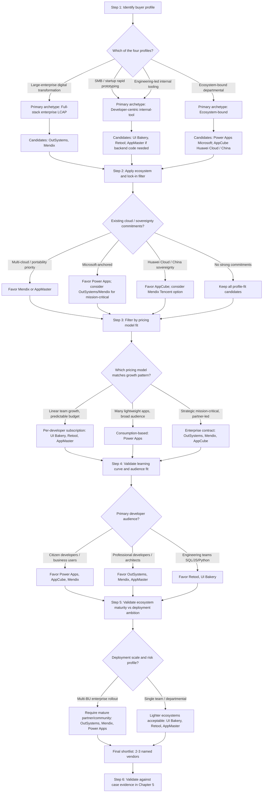
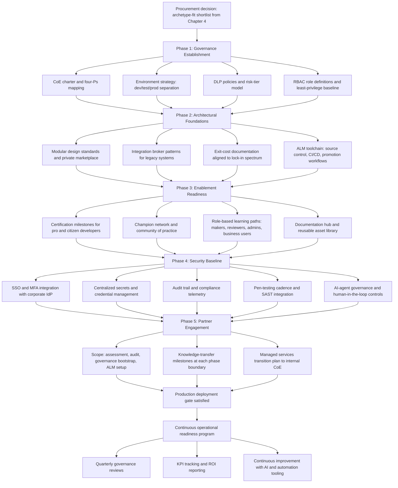
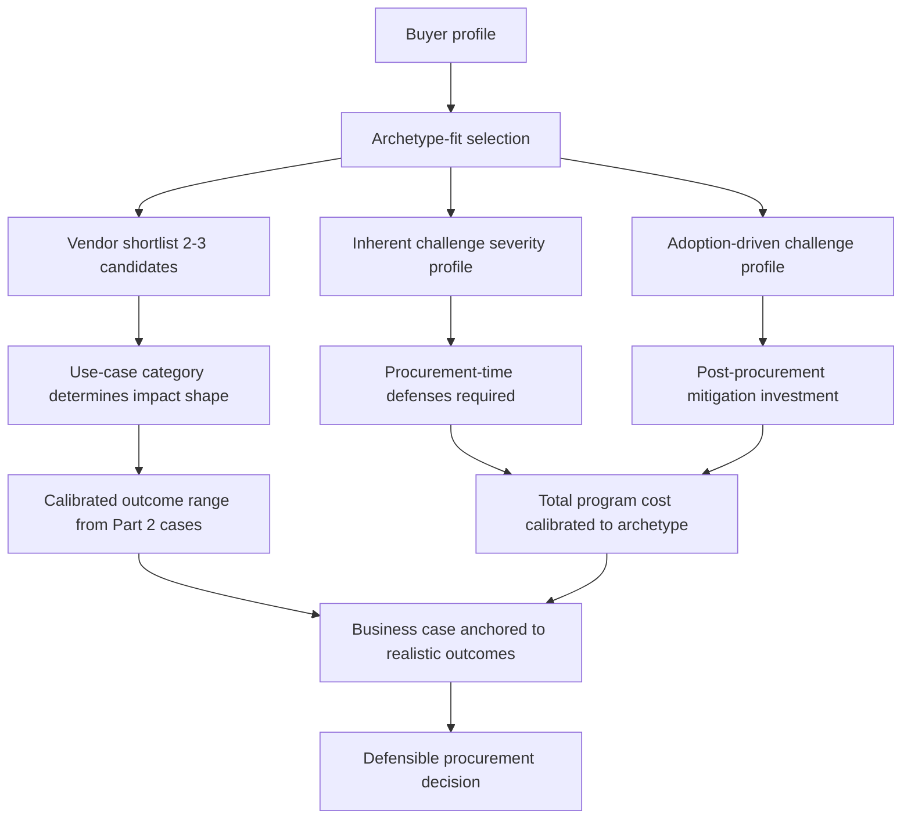
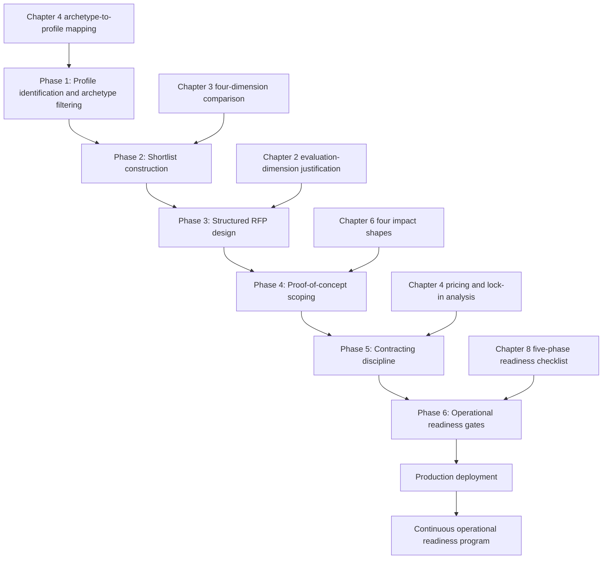

# Comparative Evaluation of Low-Code Development Platforms: Vendor Landscape, Enterprise Impact, and Adoption Challenges (2025)
# 1 Executive Summary and Research Framework

The accelerating pressure on enterprises to digitize internal operations, modernize customer-facing applications, and respond to volatile market conditions has elevated low-code application development platforms (LCDPs) from a niche productivity tool to a strategic procurement category. Buyers in 2025 face a crowded vendor landscape spanning enterprise-grade full-stack suites, citizen-developer focused tools, ecosystem-bound platforms tied to hyperscalers, and emerging no-code backend generators. Selecting the right platform is no longer a question of "which tool builds apps fastest" but of which platform aligns with an organization's domain requirements, integration realities, governance posture, and target developer audience. This report is designed to support that decision by providing a structured, evidence-based evaluation that proceeds from a comparative vendor landscape through real-world enterprise outcomes to a diagnostic of the operational risks that surface in serious production deployments.

This opening chapter establishes the evaluation objectives, scopes the platforms and cases under examination, and lays out the analytical framework that organizes the remainder of the report. It also operationalizes the criteria that recur throughout the analysis—**features, target domains, advantages, and limitations** on the vendor side, and **manpower reduction, time savings, and cost savings** on the enterprise impact side—so that readers can interpret subsequent tables and synthesis chapters consistently. The chapter concludes by previewing the headline findings and providing a chapter-by-chapter roadmap.

## 1.1 Research Objectives and Report Scope

The report pursues three tightly linked evaluation objectives. First, it benchmarks seven leading low-code platforms—**OutSystems, Mendix, Microsoft Power Apps, UI Bakery, Huawei AppCube, AppMaster, and Retool**—against a uniform set of criteria so that readers can compare positioning, capability depth, and buyer fit on a like-for-like basis. Second, it quantifies the enterprise impact of low-code adoption by examining four publicly documented deployments at **New Oriental (Beijing), Mercedes-Benz (Lisbon), MDEC (Malaysia), and MassHousing (Boston)**, translating reported outcomes into manpower, time, and cost dimensions. Third, it diagnoses the recurring technical and operational challenges that organizations encounter when these platforms are pushed into industrial- and commercial-grade workloads, with particular attention to customization, integration, security, user-friendliness, and performance.

The scope is bounded in three deliberate ways. By **platform category**, the seven vendors span the three principal archetypes that dominate enterprise shortlists in 2025: full-stack enterprise LCDPs intended for mission-critical applications and cross-team enterprise collaboration (OutSystems, Mendix), ecosystem-bound or citizen-developer oriented platforms (Microsoft Power Apps, Huawei AppCube), and developer-centric internal-tool or backend-generation suites (UI Bakery, Retool, AppMaster). By **geography and industry**, the impact cases deliberately span four regions—China, Southern Europe, Southeast Asia, and North America—and four sectors—private education, automotive manufacturing, public-sector digital economic development, and public housing finance—to surface both convergent and divergent adoption patterns. By **time horizon**, the report uses information available up to early 2025 as its evidence cutoff; later product releases, pricing changes, or new case studies are out of scope.

What lies **outside the scope** is equally important to set expectations. The report does not attempt an exhaustive census of every low-code or no-code product on the market; vendors such as Salesforce Lightning, ServiceNow App Engine, Zoho Creator, Appian, and emerging AI-native builders are referenced only where they provide useful context. It also does not provide line-item pricing quotes—pricing is treated structurally (per-user, per-app, consumption-based, tiered enterprise) rather than as a real-time quotation. Finally, the report does not endorse a single "best" platform; instead, it produces a fit-based shortlist logic that readers can apply to their own constraints.

## 1.2 Analytical Framework and Evaluation Methodology

The report is organized around a three-part analytical framework that mirrors the buyer's decision journey: understand the market, see the evidence, and plan for risk. The framework is summarized below.

| Part | Analytical Question | Primary Artifact | Operational Criteria |
|------|--------------------|------------------|----------------------|
| Part 1 — Vendor & Platform Comparison | Which platforms exist, what do they do well, and where do they fit? | Seven-vendor comparison table (Chapter 3) | Core Features, Target Domain(s), Advantages, Limitations |
| Part 2 — Enterprise Impact Assessment | What measurable outcomes have real organizations achieved? | Four-case impact table (Chapter 5) | Application Scenario, Manpower Reduction, Time Savings, Cost Savings |
| Part 3 — Adoption Challenge Diagnosis | What goes wrong in serious deployments, and why? | Thematic challenge analysis (Chapter 7) | Customization, Compatibility, Security, Usability, Performance |

Each criterion in Part 1 is operationalized to enable consistent cross-vendor reading. **Core Features** captures the platform's primary building blocks—visual modeling, data services, workflow/automation, UI composition, integration connectors, AI assistance, and deployment options. **Target Domain(s)** identifies the business contexts the platform is engineered to serve; for example, OutSystems and Mendix are positioned as enterprise-grade platforms, with **Mendix specifically targeted at cross-team enterprise collaboration** scenarios where business analysts, citizen developers, and professional engineers co-create complex applications, whereas Retool and UI Bakery are scoped to developer-led internal tooling, and Huawei AppCube is oriented to the Huawei Cloud and China-ecosystem deployment context. **Advantages** describes distinctive strengths that buyers can leverage, while **Limitations** records the structural constraints that buyers must plan around—pricing model, vendor lock-in, customization ceilings, or ecosystem dependency.

For Part 2, the impact metrics are normalized as follows. **Manpower reduction** is expressed either as headcount equivalents redirected from the project, percentage reduction in developer effort, or change in team size required to deliver an equivalent application. **Time savings** is reported as calendar reduction in time-to-deploy or as a multiple of traditional-development velocity. **Cost savings** is captured in absolute currency where vendors and customers have publicly disclosed figures, otherwise as percentage reduction against a documented baseline. Where public sources provide ranges rather than point estimates, the report preserves the range and notes the source's framing rather than averaging into a misleading single number.

For Part 3, the challenge diagnosis draws on patterns reported across product documentation, practitioner write-ups, and the case evidence assembled in Part 2. The analysis distinguishes between **inherent platform limitations** (architectural ceilings that no amount of governance can fully remove) and **adoption-driven failures** (issues caused by mismatched use cases, weak governance, or insufficient training), since the mitigation playbook differs sharply between the two.

The methodology blends qualitative synthesis with the quantitative figures available in public materials. Cases were selected on three criteria: (i) public availability of impact data, (ii) geographic and sectoral diversity, and (iii) relevance to the seven platforms benchmarked in Part 1. Where a single vendor publishes its own case study, claims are reported as vendor-attributed rather than independently verified, and the report flags this provenance in Chapter 10's methodological notes.

## 1.3 Key Findings and Report Roadmap

Three headline findings emerge from the analysis and recur throughout the report. First, **platform positioning is meaningfully heterogeneous**: rather than competing head-to-head on identical feature sets, the seven evaluated vendors occupy distinct niches—Mendix and OutSystems anchor the enterprise full-stack tier (with Mendix emphasizing cross-team collaboration and OutSystems emphasizing high-performance mission-critical delivery), Power Apps dominates Microsoft-ecosystem deployments, Huawei AppCube serves the China and Huawei Cloud context, Retool and UI Bakery focus on internal tooling for technical teams, and AppMaster differentiates through no-code backend code generation. Selecting on price or feature checklists alone misses the more decisive question of **domain fit**.

Second, **enterprise impact is real but uneven across use cases**. The four cases examined in Part 2 demonstrate substantial reductions in delivery time and developer effort, but the magnitude of savings is conditioned by the maturity of the surrounding governance, the complexity of the target application, and the degree of integration with legacy systems. Internal-facing workflow and administrative applications yield faster, more reliable ROI than customer-facing systems of engagement.

Third, **adoption challenges cluster predictably** around five recurring themes—customization ceilings for complex UI and business logic, integration friction with legacy and proprietary systems, security and compliance posture, the citizen-versus-professional developer divide, and performance and scalability at runtime and in the IDE. These challenges are not arguments against low-code adoption; rather, they define the governance and architectural investments that must accompany deployment.

To help readers navigate, the report is organized as follows. **Chapter 2** establishes the market context and justifies the evaluation dimensions. **Chapters 3 and 4** deliver Part 1, presenting the seven-vendor comparison and translating it into selection guidance. **Chapters 5 and 6** deliver Part 2, presenting the four enterprise impact cases and extracting cross-case patterns. **Chapters 7 and 8** deliver Part 3, diagnosing adoption challenges and proposing mitigation and governance approaches. **Chapter 9** synthesizes the three parts into strategic recommendations and an outlook on trends shaping low-code through 2025. **Chapter 10** documents sources, the early-2025 data cutoff, and the methodological caveats that bound the conclusions. Readers seeking a procurement shortlist may move directly from Chapter 3 to Chapter 9; readers seeking lessons from real deployments may begin at Chapter 5; readers focused on risk and governance may start at Chapter 7. The framework is designed so that each chapter can be read independently while remaining anchored to the same underlying criteria.

# 2 Low-Code Market Context and Evaluation Criteria

Before the seven-vendor comparison and four-case impact assessment can be interpreted meaningfully, the reader needs a calibrated sense of where the low-code category sits as a procurement discipline in early 2025—how large the market is, how fast it is growing, what is driving demand, how buyers cluster into distinct segments, and which vendor archetypes have crystallized to serve those segments. This chapter establishes that backdrop and then closes the loop by justifying the four evaluation dimensions—Core Features, Target Domain(s), Advantages, Limitations—that organize the comparison table in Chapter 3. The objective is to ensure that subsequent vendor-by-vendor and case-by-case readings rest on a shared understanding of market scale, segmentation logic, and analytical scoping.

## 2.1 Global Market Size, Growth Trajectory, and Demand Drivers

The low-code application platform (LCAP) category has moved decisively from emerging-technology status to mainstream enterprise software spending. Grand View Research valued the **global low-code application development platform market at approximately USD 24.83 billion in 2023, with a projected CAGR of 22.5% from 2024 to 2030**[^1][^2]. Other analysts converge on a similar magnitude but with different framings: Gartner's *Risk and Opportunity Index* forecasts the LCAP market specifically to reach **USD 16.5 billion by 2027 with a 16.3% CAGR**, while its broader *Forecast Analysis: Low-Code Development Technologies, Worldwide* projects the wider low-code development technologies market—which includes adjacent categories such as RPA, citizen-automation tools, and intelligent process automation—to **reach USD 58.2 billion by 2029 at a 14.1% CAGR**[^3][^4]. IDC's own *Worldwide Low-Code, No-Code, and Intelligent Developer Technologies Forecast, 2024–2028* takes an even more aggressive view when intelligent developer technologies are bundled in, projecting a **37.6% CAGR for the combined LCNCIDT market through 2028**, with intelligent developer technologies alone growing at 47.3% and the pure low-code/no-code component growing at 13.9%[^5]. The dispersion across these figures—anywhere from a roughly 14% to a 37% headline CAGR—reflects definitional choices rather than analytical disagreement: the more narrowly the LCAP segment is defined, the lower the growth rate; the more it is fused with AI-generated code and agentic developer tooling, the higher the growth rate climbs.

For procurement purposes, three takeaways matter more than the precise number. First, **even the most conservative reading puts the LCAP segment well above USD 10 billion in 2023 spending and on track to roughly double over a five-to-seven-year horizon**, placing it firmly in the strategic software budget category rather than as a discretionary line item[^3][^2]. Second, **the LCAP segment is the largest component of the broader low-code development technology stack**: Gartner has reported that LCAPs were projected to grow 25% in 2023 to nearly USD 10 billion, confirming that platform spending—as opposed to point-tool spending on workflow automation or RPA add-ons—is what drives the headline market[^2]. Third, **adoption breadth is now near-universal among enterprise developers**: Forrester's surveys have found that **87% of enterprise developers use low-code development platforms for at least some of their work**, indicating that the procurement question has shifted from "whether to adopt" to "which platform, governed how, for which workloads"[^2].

The most-cited forward-looking benchmark for prioritization is Gartner's prediction that **by 2025, 70% of new applications developed by organizations will use low-code or no-code technologies, up from less than 25% in 2020**[^2]. Combined with Gartner's earlier projection that **low-code application development would be responsible for more than 65% of application development activity by 2024**, this signals that low-code is rapidly becoming the default delivery mode for net-new applications rather than an exception reserved for prototypes or back-office utilities[^2]. Forrester reinforces the trajectory from a different angle, characterizing low-code as having the potential to make software delivery **as much as 10 times faster than traditional methods**, with **91% of IT and business decision makers in the US, UK, Canada, and Australia** reporting that they use low-code to improve existing IT capabilities and accelerate digital transformation[^2]. 451 Research has likewise reported that digital automation platforms (DAPs) "can potentially shave 50–90% off development time vs. a coding language" and projected that low-code DAPs would craft nearly half of all applications developed in the coming years[^2].

Four demand drivers explain why these adoption curves have steepened through early 2025:

- **Persistent developer shortage.** Reveal's industry surveys identified skilled developer shortage among the top challenges for software organizations, with **about half of respondents planning to address it through low-code/no-code, design-to-code, and citizen-developer tooling**[^2]. Stripe's *Developer Coefficient* study has further documented that developers spend roughly **13.5 hours per week on technical debt and that engineers spend 33% of their time managing such debt**, leaving limited bandwidth for net-new application delivery—a gap low-code platforms are positioned to close[^2].
- **Digital transformation pressure.** Forrester's surveys for Appian found that **84% of enterprises have turned to low-code to reduce strain on IT resources, increase speed-to-market, and involve the business in digital asset development**, with prudent enterprises particularly valuing low-code for flexibility (83%), speed (63%), and automation (67%)[^2].
- **Democratization to citizen developers.** Gartner has projected that **80% of technology products and services will be built by professionals outside of IT**, and Forrester anticipates that the citizen-developer-driven segment of the low-code market alone will grow at a 21% CAGR to approximately **USD 30 billion by 2028**, with the broader low-code market potentially approaching **USD 50 billion by 2028**[^2]. The supply of would-be builders is real: Forrester's 2024 work in *The Forrester Wave™: Low-Code Platforms For Citizen Developers, Q1 2024* identified twelve significant vendors competing specifically for this audience, with fusion teams—pairing professional and citizen developers—identified as a defining emerging pattern[^6].
- **AI augmentation.** IDC's separation of intelligent developer technologies (47.3% CAGR) from pure low-code/no-code (13.9% CAGR) signals that the next leg of growth is being unlocked by generative AI copilots, natural-language-to-app generation, and AI-assisted data modeling embedded inside LCAPs[^5]. This convergence is reshaping vendor roadmaps and—as Chapter 3 will show—has become a primary axis of competitive differentiation among the seven evaluated platforms.

Together, these drivers explain why low-code has crossed the threshold from tactical productivity utility to strategic procurement category: the budget is large, the growth is durable, the adoption is widespread, and the technology is being repositioned as the substrate on which AI-augmented and citizen-developer workloads will run. That elevation is precisely what makes structured vendor evaluation—rather than ad hoc trial—the responsible buyer posture.

## 2.2 Market Segmentation: Enterprise vs. SMB, Regional Ecosystems, and Use-Case Categories

A market of this scale and heterogeneity cannot be navigated with a single ranking; buyers need a segmentation lens that matches their own profile. The report uses three orthogonal axes—**buyer tier, regional ecosystem, and use-case category**—to position the seven evaluated vendors and to explain why a platform that is dominant in one cell of the matrix may be only peripheral in another.

**Buyer tier: enterprise vs. SMB and departmental.** The clearest split runs between large-enterprise procurement, where requirements emphasize mission-critical reliability, governed citizen development, deep integration with systems of record, and multi-environment ALM, versus SMB and departmental procurement, where the priorities are speed of first deployment, low cost of entry, and immediate productivity for non-specialist builders. Gartner's *Magic Quadrant for Enterprise Low-Code Application Platforms* and Forrester's separate *Wave for Low-Code Platforms for Citizen Developers* both implicitly recognize this split by evaluating the two audiences with different criteria sets[^2][^6]. On the enterprise side, Forrester observed in its citizen-developer Wave that buyers increasingly want "well-governed citizen development and superior automation at scale"—a phrasing that captures the convergence of the two tiers around governed empowerment rather than the older "shadow IT" framing[^6]. The vendors evaluated in this report span the full spectrum: OutSystems and Mendix anchor the governed enterprise tier; Microsoft Power Apps straddles enterprise and departmental use through its Microsoft 365 footprint; Huawei AppCube targets enterprise and government deployments inside the Huawei Cloud ecosystem; Retool and UI Bakery serve technical departmental teams building internal tools; and AppMaster targets a specialized niche of teams seeking no-code generation of production backend code.

**Regional ecosystem.** Regional dynamics shape vendor reach in three ways: hyperscaler alignment, data-sovereignty regulation, and locally dominant systems-of-record integrations. North America remains the dominant region for low-code spend, with the Microsoft ecosystem providing a uniquely deep distribution channel for Power Apps via Microsoft 365 and Azure, while Retool, AppMaster, and UI Bakery have built North-America-anchored go-to-market motions targeting developer-first audiences. Europe is the home base of Mendix (Netherlands, now part of Siemens) and OutSystems (Portugal), both of which have built enterprise-credentialed presences in regulated industries such as manufacturing, banking, and insurance. China and the broader greater-China region are served by Huawei AppCube, whose tight integration with Huawei Cloud, GaussDB, and Huawei's enterprise sales channel positions it as a default option for organizations whose data residency, procurement, or supply-chain constraints favor a domestic stack. Southeast Asia, as the MDEC Malaysia case in Part 2 will illustrate, frequently appears as a cross-region deployment surface where international vendors—particularly Microsoft and Mendix—are layered onto local digital-economy initiatives. This regional patterning has direct procurement implications: hyperscaler lock-in versus portability, data-residency compliance, and access to local implementation partners are not afterthoughts but primary selection inputs.

**Use-case category.** The third axis groups workloads into four bands that map cleanly onto vendor archetypes:

| Use-case category | Typical workload | Vendor archetype best suited |
|---|---|---|
| Internal tools and admin UIs | Dashboards over existing databases, CRUD admin panels, ops workflows | Developer-centric internal-tool platforms (Retool, UI Bakery) |
| Full-stack enterprise applications | Customer-facing portals, end-to-end process applications, mission-critical systems | Full-stack enterprise LCAPs (OutSystems, Mendix) |
| Workflow automation and departmental apps | Approval flows, forms, lightweight line-of-business apps tied to Microsoft 365 or local cloud | Ecosystem-bound platforms (Microsoft Power Apps, Huawei AppCube) |
| Backend generation and developer-productivity automation | Generated APIs, microservices, and backend code from visual models | Code-generation-oriented platforms (AppMaster) |

This four-band taxonomy is consistent with the broad analyst framing that LCAPs collectively address everything from departmental productivity to mission-critical full-stack delivery, and it explains why a single product cannot dominate the entire category—the criteria for success in internal tooling (developer velocity, query flexibility, embedded data sources) differ materially from those in mission-critical enterprise apps (governance, runtime scalability, formal ALM)[^3][^4]. Chapter 3's comparison table operationalizes precisely this point by recording each vendor's primary use-case home, while Chapter 4 translates the segmentation into shortlist guidance.

## 2.3 Competitive Landscape and Positioning of the Seven Evaluated Vendors

The seven vendors selected for this report do not exhaust the analyst-recognized landscape, but they do represent the three archetypes that recur most frequently on 2025 enterprise shortlists. To situate them, it is useful to first sketch the broader competitive set and then explain the selection rationale.

The analyst-recognized landscape in early 2025 includes—beyond the seven evaluated here—**Appian, Salesforce (Lightning and the broader Salesforce Platform), ServiceNow App Engine, Oracle APEX, Creatio, Zoho Creator, Quickbase, Pega, Kissflow, Google AppSheet, AWS Amplify Studio, and emerging AI-native builders such as Bubble and Webflow on the no-code side**[^7][^6]. Forrester's *Wave for Low-Code Platforms for Citizen Developers, Q1 2024* evaluated twelve significant vendors on 31 criteria and named **Creatio as the sole Leader**, recognizing its no-code composable architecture and AI capabilities for non-technical creators[^6]. Microsoft Power Platform, as a separate data point, has been identified as the dominant enterprise low-code product by installed footprint, reflecting its native distribution through Microsoft 365 and Azure[^1]. Comparative product-analysis services such as Taloflow further confirm the breadth of the competitive set, with regular head-to-head evaluations between Power Apps, Mendix, OutSystems, Retool, ServiceNow App Engine, Appian, Oracle APEX, Salesforce, Quickbase, Pega, Kissflow, Google AppSheet, and AWS Amplify Studio[^7].

Against this backdrop, the **three archetype framing** introduced in Chapter 1 organizes the seven evaluated vendors as follows:

- **Full-stack enterprise LCAPs (OutSystems, Mendix).** Both vendors are consistently positioned in analyst evaluations as enterprise-grade platforms capable of supporting mission-critical, customer-facing, and cross-team workloads with formal ALM, governance, and runtime scalability. Mendix is distinctively oriented toward cross-team enterprise collaboration (business analysts, citizen developers, and engineers co-creating), while OutSystems is positioned for high-performance mission-critical delivery and modernization of legacy applications.
- **Ecosystem-bound or citizen-developer oriented platforms (Microsoft Power Apps, Huawei AppCube).** These platforms derive much of their leverage from the surrounding cloud and productivity ecosystem rather than from standalone differentiation. Power Apps' dominance among the major enterprise low-code tools reflects the value of deep Microsoft 365, Dataverse, Azure, and Power BI integration[^1][^7]. Huawei AppCube serves an analogous role inside the Huawei Cloud ecosystem in the China market, where data sovereignty, locally available compute, and a domestic enterprise sales channel are decisive procurement factors.
- **Developer-centric internal-tool and backend-generation suites (UI Bakery, Retool, AppMaster).** Retool has emerged as a high-growth platform specifically focused on internal tools, with rapid adoption among engineering and operations teams that prefer a code-friendly visual builder over a pure no-code surface[^1]. UI Bakery occupies a similar niche with a different commercial posture, while AppMaster differentiates by generating production-grade backend source code (Go, microservices, REST APIs) from no-code models—targeting teams that want low-code authoring without giving up code ownership.

Two principles guided selection. First, **representativeness across archetypes**: the seven vendors collectively cover every cell of the buyer-tier × use-case matrix from Section 2.2, ensuring that the comparison table answers the question "which archetype fits my profile?" rather than only "which vendor is largest?" Second, **relevance to the four impact cases**: the case organizations in Part 2 (New Oriental, Mercedes-Benz, MDEC, MassHousing) collectively touch private education, automotive, public-sector economic development, and public housing finance across China, Southern Europe, Southeast Asia, and North America—matching the geographic and ecosystem reach of the seven vendors. Vendors such as Appian, ServiceNow, Salesforce, and Oracle APEX are referenced throughout the report where they provide useful contrast but are not included in the comparison table to maintain analytical focus.

A brief note on what this scoping does **not** imply. The exclusion of, for example, Appian or Creatio from the comparison table is not a comment on their analyst standing—both are frequently named as Leaders in their respective Forrester and Gartner evaluations[^6]. The seven-vendor scope is deliberately calibrated to the user's evaluation brief and to the archetypes most likely to appear together on a real shortlist. Readers whose context emphasizes Salesforce-anchored stacks, BPM-heavy workflows, or ITSM-adjacent platforms should treat Chapter 3 as a template and apply the same four dimensions to the adjacent vendors most relevant to their own environment.

## 2.4 Justification of Evaluation Dimensions and Scoping Rules

The comparison table in Chapter 3 uses four dimensions—**Core Features, Target Domain(s), Advantages, and Limitations**—because each maps to a distinct buyer decision question and together they cover the procurement decision surface without redundancy. The rationale is summarized below.

| Dimension | Buyer Decision Question | What It Captures | What It Excludes |
|---|---|---|---|
| Core Features | "Can this platform technically do what I need?" | Visual modeling surface, data services, workflow/automation, UI composition, integration connectors, AI assistance, deployment options, code-export and extensibility | Comparative ranking; volume of features matters less than fit |
| Target Domain(s) | "Was this platform built for my context?" | Primary buyer tier (enterprise vs. SMB/departmental), regional/ecosystem orientation, use-case home (internal tools, full-stack apps, workflow automation, backend generation) | Peripheral capabilities that exist but are not the platform's positioning |
| Advantages | "What can I uniquely leverage if I choose this platform?" | Distinctive strengths recognized by analysts, customers, or product documentation—ecosystem integration depth, performance, governance, citizen-developer empowerment, code ownership | Generic "low-code benefits" that apply to every vendor (speed, productivity) |
| Limitations | "What will I have to plan around?" | Structural constraints: customization ceilings, vendor/ecosystem lock-in, learning curve, pricing model artifacts, runtime/IDE scaling limits | Transient bugs or version-specific issues that are out of evidence scope |

These four dimensions are deliberately the same four requested by the user in the research brief; the table above explains why each was retained as load-bearing rather than collapsed or replaced. A vendor strong on Core Features may still be the wrong choice if its Target Domain is misaligned with the buyer's profile; conversely, a vendor with structurally narrow Core Features may be the right choice when its Target Domain fits precisely and the buyer can live with the Limitations.

Several **scoping rules** were applied uniformly when populating the table to ensure cross-vendor consistency:

- **Primary positioning versus peripheral capability.** Many platforms have features that *exist* but are not part of their core positioning—Retool can be used for limited customer-facing applications, Power Apps can host complex enterprise systems, and OutSystems offers some internal-tool patterns. The Target Domain field records the *primary* positioning evidenced by the vendor's go-to-market materials, analyst placement, and case-study patterns; peripheral capabilities are mentioned only where they are material to interpreting Advantages or Limitations.
- **Framing convention for Limitations.** Limitations are classified into three subtypes—**structural constraints** (architectural ceilings such as runtime model limits or customization boundaries), **pricing/commercial artifacts** (per-user pricing, consumption-based costs, minimum enterprise commitments), and **ecosystem dependencies** (lock-in to a specific cloud, productivity suite, or data stack). This convention prevents conflating, for example, a hard architectural ceiling with a pricing surprise; they require different mitigations, as Chapter 8 will discuss.
- **Evidence threshold for inclusion.** Each cell in the comparison table is required to have either an authoritative vendor or analyst source, a customer-disclosed case, or a credible third-party comparative evaluation behind it. Where evidence is partial—particularly for AppMaster, UI Bakery, and Huawei AppCube, which have thinner analyst coverage than Mendix or Power Apps—the report acknowledges the lower evidence density and prefers qualitative descriptions over fabricated quantitative claims, consistent with the methodological transparency described in Chapter 1.
- **Comparative neutrality.** Advantages and Limitations are described in absolute rather than rank-ordered terms; the goal is to inform shortlist construction, not to declare a winner. Chapter 4 then layers selection guidance on top of the neutral comparison, mapping vendor archetypes to buyer profiles.

With these dimensions and rules established, the analytical foundation for Part 1 is complete. The market context of Section 2.1 explains why the procurement question matters; the segmentation logic of Section 2.2 explains how buyers cluster; the competitive landscape of Section 2.3 explains why the seven evaluated vendors were selected; and the dimension justification of Section 2.4 specifies how each vendor will be characterized. Chapter 3 now executes the comparison table itself, and Chapter 4 translates it into actionable shortlist guidance.

# 3 Part 1: Comparative Analysis of Major Low-Code Platforms

Chapter 2 established that the seven vendors under examination occupy meaningfully different positions across the buyer-tier, regional-ecosystem, and use-case axes that shape the 2025 low-code market. This chapter operationalizes that framing by executing the seven-vendor comparison itself, applying the four evaluation dimensions—**Core Features, Target Domain(s), Advantages, and Limitations**—uniformly to OutSystems, Mendix, Microsoft Power Apps, UI Bakery, Huawei AppCube, AppMaster, and Retool. Each vendor receives a discrete profile so that the evidence behind each cell in the master comparison table is visible to the reader, and the chapter closes with a consolidated table and a cross-platform synthesis that distills the category-level patterns. Consistent with the methodological discipline announced in Chapter 1, the analysis is deliberately neutral: the goal is to surface fit-defining characteristics, not to declare a winner. That translation from neutral comparison to shortlist guidance is reserved for Chapter 4.

A note on evidence density before the profiles begin. The vendors vary substantially in how much authoritative public material is available for them in early 2025. OutSystems, Mendix, Microsoft Power Apps, and Retool benefit from extensive product documentation, analyst placements, and third-party reviews; UI Bakery, AppMaster, and Huawei AppCube have thinner third-party coverage, so the profiles for those three lean more heavily on vendor documentation and a smaller set of independent sources. Where claims rest primarily on vendor materials, that provenance is reflected in the citation pattern rather than masked.

## 3.1 OutSystems: High-Performance Enterprise Full-Stack LCAP

OutSystems is positioned as a high-performance application development platform whose enterprise-grade low-code Application Platform (LCAP) provides a **full-stack, full-lifecycle, and AI-assisted solution to build mission-critical applications and AI agents**[^8]. Its core feature set spans four reinforcing layers. The **full-stack visual development** layer provides a drag-and-drop integrated development environment that builds everything from user interfaces and business logic to data models and processes[^8]. **AI-powered development** is infused across the entire software development lifecycle through two distinct components: **Mentor**, a generative AI capability that generates full-stack applications from prompts and requirements, and **Agent Workbench**, an agentic AI capability that builds orchestrated agentic systems with governance, guardrails, policies, audit trails, and human-in-the-loop controls[^8]. **Seamless integration** is supported through pre-built connectors to more than 400 systems including SAP, Salesforce, ServiceNow, and Microsoft 365, with REST/SOAP, events, queues, database connectors, and custom adapters[^8]. The platform's **built-in DevSecOps** layer provides a complete DevOps toolchain supporting continuous integration/continuous delivery (CI/CD), one-click deployment, real-time monitoring, and AI-powered dependency analysis[^8]. Underpinning this is the **OutSystems Developer Cloud (ODC)**, which combines an architecture based on Kubernetes, Linux containers, microservices, and AWS native cloud services with DORA high-performer-level CI/CD and visual model-based development[^9][^10]. The broader platform also comprises OutSystems 11 (O11) and OutSystems 11 Cloud, giving customers a unified product line that addresses both existing on-premises and cloud-native trajectories[^9][^10].

The **target domain** is explicitly enterprise systems and mission-critical applications. OutSystems is used to build customer-facing portals and mobile apps, replace or modernize legacy systems with fit-for-purpose apps for supply chain management, ERP/SAP extensions, lending/claims software, and CRM/Salesforce augmentation, deliver onboarding, self-service, case management solutions, ITSM extensions, and intelligent automation, and create and orchestrate custom AI agents that can reason, plan, act, and evolve[^8]. ODC is engineered to support large user populations, transaction volumes, and data requirements with a cloud-native architecture that can scale to tens of millions of users[^9][^10].

The **advantages** that surface most consistently are high scalability, GDPR compliance, and enterprise-grade governance. The platform emphasizes "modern, end-to-end security woven into every layer," including automated security patching, continuous automated intrusion detection, data encryption, strict access controls, compliance templates, and adherence to regulations such as GDPR[^8]. OutSystems has been positioned as a Leader in the G2 Grid Report for Low-Code Development Platforms, earning a perfect 100 satisfaction score in the 2026 edition[^10], and its delivery ecosystem is substantial—Devoteam alone reports 638 technical certifications, 200+ delivered projects across 18+ industries, and a top-four customer-satisfaction ranking among 370+ partners[^8].

The **limitations** are equally structural. The platform's depth and breadth come with **high licensing costs**, consistent with its enterprise-tier positioning, and a **steep learning curve for non-technical users**, particularly when the underlying cloud-native technologies such as Kubernetes, microservices, and AWS native services come into view—OutSystems' own chief product officer has acknowledged that these are technologies that "customers struggle mightily to master" and that traditionally take "months to years and millions of dollars" to implement, which ODC abstracts but does not eliminate from the conceptual surface[^9][^10]. Customers on the older O11 line face an additional migration path to ODC, which Devoteam markets as a specialist service through "Expert Factory Services" covering assessment, audit, and governance to ensure O11–ODC interoperability[^8]. The combination of enterprise pricing, ecosystem dependency on the OutSystems runtime, and the conceptual sophistication required for cloud-native development means OutSystems is rarely a fit for SMB or purely citizen-developer scenarios.

## 3.2 Mendix: Cross-Team Enterprise Collaboration Platform

Mendix is presented by its vendor as "the only low-code platform designed for today's complex software development challenges"[^11] and is named a Leader in the **2025 Gartner® Magic Quadrant™ for Enterprise Low-Code Application Platforms**, with placement "furthest on the Completeness of Vision axis" for the ninth consecutive year[^11][^10]. Its **core features** revolve around a **collaborative visual modeling** IDE based on model-driven development principles, where developers of all skill levels work in a single environment to build data models, integrations, and complex logic[^11]. The platform supports **multi-experience applications**: offline-first native iOS and Android apps, progressive web applications (PWAs), responsive web portals, IoT-enabled smart applications, and conversational and immersive experiences—all built in a single platform leveraging the Atlas UI design language and underlying React and React Native frameworks[^11]. **Agile project management** is woven into the platform itself: each application lives in its own central project space inside the Mendix Portal with tools for collaboration, Agile project management methodologies such as Kanban and Scrum, backlog and feedback management, and DevOps[^11]. Mendix is also distinctive in being **AI-enhanced**: the **Maia** AI assistant provides three specialized real-time recommenders—Logic Recommender, Best Practice Recommender, and Workflow Recommender—and the platform is positioned as the first LCAP to support embedded machine learning models versus API-based integration, with an Agent Builder Starter App for agentic AI applications[^11]. Cloud-native deployment is portable by default across AWS, Google Cloud, Microsoft Azure, IBM Cloud, SAP, and Tencent Cloud[^11], and Mendix Connect provides a data catalog with metadata, ownership, and tagging for governed data sharing across teams[^11].

The **target domain** is **cross-team enterprise collaboration**. The platform is explicitly designed to keep teams and projects aligned with collaboration and communication tools that empower business analysts, citizen developers, and professional engineers to co-create complex applications[^11]. Its enterprise customer base—Bosch, Schaeffler, Jabil, BMW, Continental, Rolls-Royce, BAE Systems, Siemens Energy, Trane, Rabobank, ABN AMRO, Garanti BBVA, Zurich, Erie Insurance, Schiphol Airport, City of Rotterdam, and Dubai Municipality among others[^10]—skews heavily toward regulated, industrial, financial, and public-sector contexts where multiple roles must collaborate on a single application portfolio. The deep alignment with **Siemens Xcelerator** and Siemens' industrial expertise further anchors Mendix in manufacturing and shop-floor scenarios where coordinating people, agents, and systems is a first-order requirement[^10].

The **advantages** include **rapid prototyping** and **extensive community resources**. The integrated agile project management and collaborative project spaces shorten the cycle from idea to working prototype, and the platform's community is sizable: the Mendix Forum is active 24/7 with most questions answered within 30 minutes, the Mendix Marketplace contains a curated library of templates, connectors, modules, widgets, and other purpose-built components from Mendix, partners, and the developer community, and the Mendix Academy offers virtual and in-person training plus a tiered Developer Certification Program (Rapid, Intermediate, Advanced, Expert)[^11]. Extensibility is also unusually broad—open at every level with Java/JavaScript reusable components, the Mendix Model SDK for programmatic model manipulation, the Mendix Machine Learning Kit, and APIs for integrating existing CI/CD pipelines and test automation suites[^11]. Releases through 2024–2025 have introduced steady stability and enterprise-grade enhancements—Studio Pro 10.24 added OpenTelemetry tracing, Java library conflict warnings, offline-first online/online data combination, the React Client by default, and GA support for Japanese, Korean, and Chinese languages[^9].

The **limitations** are pricing complexity, runtime dependency, and the multi-role learning curve. While Mendix does not publish public per-seat pricing, the platform is positioned in the enterprise tier alongside OutSystems, with comparable commercial implications. Applications run on the Mendix runtime, which means architectural decisions about modeling, scaling, and deployment are shaped by Mendix's conventions rather than fully customer-controlled. The very breadth that makes the platform powerful—serving IT leaders, enterprise architects, professional developers, and citizen developers simultaneously—also imposes a learning curve as teams adapt to the model-driven paradigm and to the role-specific tooling layered on top of it[^11].

## 3.3 Microsoft Power Apps: Microsoft-Ecosystem Citizen and Pro-Developer Platform

Microsoft Power Apps is the low-code application layer of the broader Power Platform, sitting alongside Power BI, Power Automate, Power Pages, and Copilot Studio and resting on the Dataverse data backbone[^11]. Its **core features** in 2024–2025 increasingly center on AI-assisted authoring. The **Plan Designer** introduced a redesigned homepage with a larger natural-language input box, sample starter prompts, and a cleaner visual layout for translating prompts into business solutions including apps, reports, and agents[^11]. The Plan Designer is paired with **Copilot** capabilities—including the ability to customize Copilot Chat in standalone model-driven apps with knowledge sources and topics—and with maker-side enhancements such as expanded undo/redo (up to 100 actions with action descriptions), an Actions Pane for Power Pages sites in VS Code Desktop, and a steady cadence of Power Fx and Dataverse improvements[^11]. The 2025 Wave 2 release plan, running from October 2025 through March 2026, brings **AI-powered form filling, Copilot-driven automation, generative actions, intelligent document processing, an automation center, agent orchestration across autonomous agents, deeper integration with Azure AI Foundry and Microsoft Graph, and the Dataverse MCP server**[^12]. On the platform side, Power Apps supports canvas and model-driven app paradigms, runs on Dataverse for relational and unstructured data, and connects to hundreds of data sources through standard and premium connectors.

**Enterprise-grade governance** has been a clear investment area. **Git Integration is now Generally Available**, synchronizing agents, apps, automations, and other solution objects with source control and replacing the experimental Power Apps integration with clearer source-code visibility[^11]. **Audit settings via Security Compliance** in Dataverse have reached general availability, automatically auditing all security-related tables for compliance[^11]. **Preventing data exfiltration by securing app access** is now generally available through the Security Hub, allowing administrators to create approved-application lists, run enforcement mode to ensure only approved apps access an environment, and use audit mode to review which applications are approved or denied[^11]. The **new Power Platform admin center** consolidates environment management, security, and analytics into a unified, modernized interface with discovery agents and a dark mode[^11].

The **target domain** is Microsoft-ecosystem enterprises and the very broad band of departmental and workflow-automation use cases that ride on Microsoft 365. As Chapter 2 noted, Power Apps' dominance among enterprise low-code tools by installed footprint reflects the value of native integration with Microsoft 365, Dataverse, Azure, and Power BI rather than standalone differentiation. The **advantages** that follow are scale, depth of ecosystem integration, governance maturity (managed environments, security hub, app access controls, audit settings), and a rapid AI feature cadence delivered through Release Wave updates and monthly Power Apps Pulse updates[^11][^12].

The **limitations** cluster around ecosystem lock-in and commercial structure. Power Apps is most powerful when an organization is already invested in Microsoft 365 and Azure; moving to a different cloud or productivity suite typically forfeits much of the platform's leverage. The pricing model—per-app, per-user, and Dataverse capacity-based storage—is multi-dimensional enough that the platform's documentation devotes substantial attention to Dataverse capacity-based storage details, capacity-based storage overview, and storage management[^11], and the citizen-developer-versus-pro-developer governance burden grows as more business users gain authoring rights, which is precisely why Microsoft has invested so heavily in environment groups, managed governance, managed availability, advanced connector policies, IP firewalls, and cross-tenant restriction controls[^11]. Performance for very complex enterprise applications can also be more constrained than on full-stack enterprise LCAPs that ship with their own purpose-built runtime.

## 3.4 UI Bakery: Developer-Centric Internal-Tool Platform

UI Bakery positions itself as "the fastest way for solution architects and data engineers to create custom internal apps without needing to learn UI frameworks"[^11]. Its **core features** include a drag-and-drop visual editor with rapid iteration cycles, an extensive library of more than 100 customizable UI components for cohesive, responsive, and data-driven UIs, and 45+ data connectors covering Microsoft SQL, PostgreSQL, MySQL, MongoDB, Snowflake, DynamoDB, Firebase, GraphQL, Google Sheets, generic HTTP/REST APIs, OpenAI, and Stripe among others[^11]. The platform supports SQL, JavaScript, and Python for advanced logic, transformations, and validations, alongside an AI App Agent that generates apps and allows source-code editing of AI-generated applications—a notable differentiator from competitors that hide AI-generated code[^11][^12]. Deployment is a single click to either UI Bakery's cloud or customer-managed infrastructure, with environment switching, release history, advanced RBAC, audit logs, custom SSO (SAML, OpenID, OAuth 2.0), and SCIM 2.0 user provisioning available on higher tiers[^11][^12]. The design system has substantial heritage: UI Bakery is built and maintained by the team behind ngx-admin, Nebular, and UI Kitten—open-source admin and mobile UI products with collectively more than 50,000 GitHub stars[^11].

The **target domain** is developer-led internal tooling: solution architects, data engineers, and technical teams building secure internal apps, dashboards, admin panels, customer-support tooling, and workflow automation rather than customer-facing or native mobile applications[^11][^13]. UI Bakery is positioned as serving more than 100,000 companies[^11], with use cases concentrated in business data management, work-process optimization, customer service, and routine-task automation[^13].

The **advantages** are transparent and accessible pricing, broad self-hosting options, and a claimed 2-minute average to generate and deploy a full app. Cloud plans start at $0 (Free), $20–25 per developer per month (Builder), $35–40 per developer per month (Team), and custom Enterprise pricing, with similar tiers available for self-hosted installations[^12][^14]. Unlimited apps, data source connections, public app users, and pages are available across all paid plans; the Team and Enterprise tiers add RBAC, audit logs, premium support, and—at Enterprise—custom SSO, dedicated VM deployment, more than 50 workspace viewer seats, and App Migration & Custom Development Services[^12]. The combination of unlimited public app users and unlimited workspace viewers in the Enterprise tier addresses a common complaint about per-end-user pricing in competing platforms. Independent customer testimony reinforces the speed argument: one customer publicly stated they "developed a number of apps within the Retool system" before switching to UI Bakery because Retool "ultimately did not have the flexibility and feature sets that we required"[^11].

The **limitations** are scope and analyst recognition rather than feature depth. UI Bakery is engineered for web-based internal tools, not customer-facing portals at enterprise scale or native mobile applications, and its analyst coverage is lighter than that of Mendix, OutSystems, or Power Apps. Authoring is anchored to UI Bakery's own component library and design system, which trades unlimited UI flexibility for development speed. Self-hosted AI usage credits are consumed from the cloud workspace used to generate the license key, which means AI authoring requires cloud connectivity even in self-hosted scenarios[^12]. As with most internal-tool platforms, scaling beyond the platform's component model usually requires writing custom components, which raises the technical bar.

## 3.5 Huawei AppCube: China/Huawei Cloud Ecosystem Platform

Huawei Cloud AppCube (应用魔方) is positioned as Huawei's metadata-driven low-code platform "enabling Citizen Developers, where everyone is a developer"[^12]. Its **core features**, as described by Huawei Cloud's PaaS product advocate, include page orchestration (composing pages with components, layout, and colors), data modeling for persisting business data, business-logic orchestration for machine-executed flows that do not require human intervention, and **BPM workflow orchestration** for human-in-the-loop and approval flows[^12]. Authoring supports both **no-code** mode—where business users use platform-provided flows and modules to build applications without writing code—and **low-code** mode for complex application scenarios that combine extensive visual orchestration with a small amount of code; applications built in no-code mode can be seamlessly upgraded into low-code mode by software engineers when business users' requirements outgrow the no-code surface[^12]. UI is rendered across multiple endpoints including PC and mobile, and an **asset center** captures developed templates, applications, and flows as reusable assets for downstream developers to consume in secondary development[^12]. AppCube provides three integrated services: a **developer service** offering the development environment for rapid orchestration and microservice invocation, a **sandbox testing service** for pre-production validation, and a **runtime service** for deploying tested applications into production[^12]. A complete DevOps pipeline supports development, compilation, packaging, testing, CI persistent integration and CD persistent deployment, and automatic deployment[^12].

The **target domain** is Chinese enterprises and government deployments operating in the Huawei Cloud ecosystem. Huawei describes four common scenarios: B2B internal process, internal management, and production-management applications; enterprise large-screen displays and executive dashboards; mobile-side mini-programs and light applications; and office and workflow-class light applications[^12]. The platform's positioning emphasizes "全民开发者" (universal developers), with low-code for professional software engineers and enterprise IT, no-code for business users via drag-and-drop, and microservice hosting (Java, Python, etc.) for specialized domain algorithms[^12]. Among the China-market platform landscape, AppCube is cited as suitable for "large multinational enterprises with global deployment needs, focused on development collaboration and agility, especially in manufacturing digital transformation scenarios"[^15].

The **advantages** include CAICT (China Academy of Information and Communications Technology) **low-code platform general capability certification**: AppCube has successfully passed the CAICT assessment and been certified as possessing "low-code development platform general capability"[^16]. The platform is constructed to telecom-grade standards for reliability, security, and stability, providing safeguards for platform security and stability suited to demanding enterprise contexts[^12]. The three-service architecture (development, sandbox testing, runtime) imposes a disciplined release path that aligns naturally with regulated and large-enterprise governance expectations, while the asset/template marketplace enables 0-to-1 templated application creation and subsequent customization through direct source-code modification[^12]. Tight integration with the broader Huawei Cloud stack (including GaussDB and Huawei's enterprise sales channel) gives Chinese buyers an end-to-end ecosystem option that minimizes data-sovereignty and cross-border procurement friction.

The **limitations** are essentially the mirror image of these advantages. The platform's leverage is greatest inside Huawei Cloud, which creates a meaningful **ecosystem lock-in** for organizations whose strategy contemplates multi-cloud or non-Huawei stacks. International analyst coverage of AppCube is thinner than for Mendix, OutSystems, or Power Apps, and reach outside the China market relies heavily on Huawei's own enterprise channel and locally available partners. Buyers operating across China and overseas markets typically pair AppCube with one of the international LCAPs rather than standardizing on it globally.

## 3.6 AppMaster: No-Code Backend Code-Generation Platform

AppMaster differentiates from runtime-bound platforms by generating **real source code** that customers can take with them. Its **core features** center on visual design of data models, business processes, and APIs, from which the platform generates a complete backend implemented in **Go (golang)**—a language explicitly chosen for its efficiency, concurrency, and scalability[^16]. Generated API servers expose **REST APIs and WebSocket endpoints** and ship with **auto-generated Swagger (OpenAPI) documentation**, reducing integration time and supporting governance and cross-team API collaboration[^16]. The platform supports **any PostgreSQL-compatible database** as the primary data store, with automatic generation of the necessary database schema migration scripts for smooth deployment[^16]. AppMaster's server-driven approach to mobile applications allows customers to **update UI, logic, and API keys for Android and iOS clients without resubmitting new versions to the App Store or Play Market**, eliminating the lengthy review process for incremental updates[^16]. Security follows industry-standard best practices including JSON Web Tokens (JWT) and role-based access control, and backend applications are designed in line with the **Twelve-Factor App methodology**, enabling rapid development, deployment, and scaling[^16]. Stateless server design makes horizontal scaling of API servers straightforward without resource contention[^16]. Customers can obtain executable binary files or source code for **on-premises hosting**, a structural option that materially reduces vendor lock-in[^17].

The **target domain** is teams that want no-code authoring without surrendering ownership of the resulting code—particularly those building production backend microservices, API servers, and full-stack applications integrated with mobile clients[^16]. Industries the platform's underlying API-server pattern serves heavily include finance, healthcare, e-commerce, and IoT, all of which rely on APIs to integrate systems and expose functionality to other parties[^16]. The 83% statistic for API-driven web traffic that AppMaster cites underscores that the platform's positioning aligns with the increasingly API-centric architecture of modern software[^16].

The **advantages** are code ownership and portability, horizontally scalable Go backends, Twelve-Factor App alignment, JWT/RBAC security, server-driven mobile updates, and competitive subscription pricing. G2 data indicates AppMaster pricing in 2026 starts at **$195.00 per month and can reach $955.00 per month** depending on the selected plan[^18]. The visual modeling surface is approachable enough that "even non-technical users [can] create sophisticated backend systems"[^16], yet the output is conventional source code that conventional DevOps and SRE teams can operate.

The **limitations** are narrower analyst recognition, a smaller partner ecosystem, and the learning curve for users new to visual backend modeling. Third-party comparisons of AppMaster (against WaveMaker and others) note that "AppMaster requires building applications from scratch using their visual tools" rather than offering pre-built starter apps, which can extend implementation time relative to template-led platforms, and that subscription costs can grow as deployments scale[^17]. Authoring is also anchored to AppMaster-specific design conventions during the visual modeling phase, even though the generated code itself is portable.

## 3.7 Retool: Developer-First Internal Tools and AI Agent Platform

Retool is described in third-party reviews as "a low-code platform designed for teams that need to quickly build internal business tools like admin dashboards, data reporting panels, customer support tools, and workflow automation apps"[^16], and its 2026 product roadmap expands the platform's surface to cover "**web apps, agents, workflows, portals, and mobile apps**"[^16]. **Core features** include a drag-and-drop UI builder with an extensive template library; new **AI Assist** that generates complete web apps from prompts directly in the Retool IDE; **AI Agents** for creating workflows and **AI Actions** for tasks like text analysis; **Retool Workflows** for background jobs, notifications, scheduled tasks, and webhook-triggered automation; and broad data connectivity including REST/GraphQL APIs and pre-built connectors for Google Sheets, Stripe, Slack, PostgreSQL, MySQL, and many others[^16][^17]. **Custom logic** is implemented in **SQL and JavaScript**, with **Python supported for backend automation and integrations** in a more limited capacity[^16][^17]. **Version management** uses Git-based source control with PR workflows, enabling teams to duplicate apps, test changes, and manage deployments across staging and production environments[^17]. **Access controls** are provided through role-based access control (RBAC), and the platform supports on-premises deployment for organizations with strict data governance or compliance needs[^17]. The recent **Retool Summit 2025** featured sessions on natural-language app generation, AI agents in production, and "the future of internal tools," underscoring that Retool's roadmap is converging on AI-native, prompt-to-app workflows for enterprise contexts[^19].

The **target domain** is engineering and operations teams in SaaS, fintech, logistics, and healthcare—Retool itself characterizes these as the industries that benefit most—building dashboards, automating workflows, and rapidly creating internal tools that connect to their data sources[^16]. Pricing tiers reflect this audience: a **Free** plan for developers and small teams (5 users, unlimited apps, 500 workflow runs per month, 5 GB storage), **Team** at approximately $10/standard user/month annually with $5/end-user/month, **Business** at approximately $50/standard user/month with $15/end-user/month, and custom **Enterprise** pricing[^17].

The **advantages** are rapid time-to-value, strong template library, AI-native app generation in the IDE, and substantial brand momentum among Silicon Valley engineering teams. Personal hands-on testing in third-party reviews has confirmed that a working refund-management application with tables, buttons, and queries linked to sample data can be assembled "in just minutes" using AI Assist[^16]. Retool also offers special incentives for early-stage startups, including Retool free for a year with a value of up to $60K, which has accelerated adoption among high-growth companies[^17].

The **limitations** are pronounced enough to feature prominently in user reviews. **You never see the AI-generated code**: with AI Assist, users can keep prompting the AI or switch to visual editing, but code export is not available[^16]. **Web apps only** rely on Retool's own components, so "deep customization and code export are still off the table"[^16]. The UI grid "kept snapping elements back into place," and the workflow builder can become cluttered as more steps are layered[^16]. **RBAC and advanced access controls are locked behind higher-tier plans**—the Free plan supports up to five users with unlimited apps but does not include features like role-based access control, audit logs, and external portals; these require paid plans, so most teams outgrow the free tier quickly[^16][^17]. **Self-hosting is supported but resource-intensive**: it requires significant DevOps resources, and updates often lag behind the cloud version, making it harder to manage at scale[^16][^17]. **Performance issues** with large or complex apps—slow UI rendering, lag during interactions, and delays in query execution with large datasets—are recurrently reported[^17]. Custom-component support is limited[^17], and an August 2023 security incident in which a Retool customer "lost $15 million in crypto after AWS keys were compromised" highlighted the risk profile of integrating critical business tools with third-party platforms even when the breach itself was not attributable to a Retool flaw[^17]. Pricing escalation as teams scale is another commonly cited drawback[^16][^17].

## 3.8 Consolidated Seven-Vendor Comparison Table

The table below renders the seven profiles above side-by-side under the four uniform dimensions established in Chapter 2. Each cell is distilled to the load-bearing claims and traceable to the profile narratives above. The archetype label in the first column maps directly to the three-archetype segmentation introduced in Chapter 1 and refined in Chapter 2.

| Vendor (Archetype) | Core Features | Target Domain(s) | Advantages | Limitations |
|---|---|---|---|---|
| **OutSystems** *(Enterprise full-stack)* | Full-stack visual development (drag-and-drop IDE for UI, business logic, data models, processes); AI-assisted code generation via Mentor (generative) and Agent Workbench (agentic); multi-cloud deployment via OutSystems Developer Cloud (Kubernetes/containers/microservices/AWS); CI/CD pipeline integration through built-in DevSecOps and one-click deployment; 400+ pre-built connectors (SAP, Salesforce, ServiceNow, Microsoft 365)[^8][^9][^10] | Enterprise systems, mission-critical applications; customer-facing portals, legacy modernization (ERP/SAP extensions, CRM augmentation, lending/claims), internal workflow and case management, custom AI agents[^8] | High scalability (to tens of millions of users), GDPR compliance, enterprise-grade governance with end-to-end security woven into every layer, automated security patching, compliance templates; extensive partner ecosystem (e.g., Devoteam: 638 certifications, 200+ projects, 18+ industries); G2 Leader, perfect 100 satisfaction score (2026)[^8][^9][^10] | High licensing costs; steep learning curve for non-technical users, particularly around cloud-native concepts; O11-to-ODC migration burden for existing customers; runtime lock-in to the OutSystems platform[^8][^9][^10] |
| **Mendix** *(Enterprise full-stack, collaboration-led)* | Collaborative visual modeling in single Studio Pro IDE; multi-experience apps (offline-first native iOS/Android, PWAs, responsive web, conversational, immersive); agile project management (Kanban, Scrum, backlog, feedback) inside Mendix Portal; Maia AI assistance (Logic, Best Practice, Workflow Recommenders) plus Agent Builder for agentic AI; cloud-native deployment across AWS/GCP/Azure/SAP/IBM/Tencent; Mendix Connect data catalog; embedded ML via Mendix Machine Learning Kit; Atlas UI design language[^11] | Cross-team enterprise collaboration (business analysts, citizen developers, professional engineers co-creating); regulated and industrial sectors (manufacturing via Siemens Xcelerator alignment, banking, insurance, public sector); enterprise customer base including Bosch, BMW, Continental, Rolls-Royce, Rabobank, Zurich, Schiphol, City of Rotterdam, Dubai Municipality[^11][^10] | Rapid prototyping enabled by collaborative project spaces and Agile tooling; extensive community resources—24/7 Mendix Forum (most questions answered within 30 minutes), Mendix Marketplace, Mendix Academy with tiered Developer Certification; broad extensibility via Java/JavaScript, Model SDK, ML Kit; 2025 Gartner® Magic Quadrant™ Leader for the ninth consecutive year, furthest on Completeness of Vision[^11][^10] | Pricing complexity in the enterprise tier (no public per-seat pricing); dependency on Mendix runtime and modeling conventions; learning curve to operate across multiple roles (IT leaders, architects, pro developers, citizen developers) the platform serves simultaneously[^11] |
| **Microsoft Power Apps** *(Ecosystem-bound)* | Canvas and model-driven apps; Dataverse data backbone; Plan Designer with natural-language Copilot prompts and starter prompts; Power Fx formula language; 1,000+ standard and premium connectors; Git Integration (GA) for source control of solutions; Agent Builder; new Power Platform admin center with Security Hub, managed environments, app access controls, audit settings via Security Compliance (GA)[^11] | Microsoft-ecosystem enterprises and departmental/workflow-automation use cases; broad reach to citizen developers via Microsoft 365 distribution; dominant by installed footprint among enterprise low-code tools | Installed-base scale and deep Microsoft 365/Dataverse/Azure/Power BI integration; enterprise-grade governance (managed environments, environment groups, Security Hub, audit settings, advanced connector policies, IP firewall, cross-tenant restrictions); rapid AI feature cadence through Release Wave updates (Wave 2 2025 brings AI form filling, generative actions, intelligent document processing, automation center, agent orchestration, Azure AI Foundry integration, Dataverse MCP server)[^11][^12] | Microsoft ecosystem lock-in; multi-dimensional pricing (per-app, per-user, Dataverse capacity-based storage) requiring careful capacity planning; performance constraints for very complex enterprise apps; citizen-vs-pro-developer governance burden scaling with adoption breadth[^11] |
| **UI Bakery** *(Developer-centric internal-tool)* | Drag-and-drop visual editor with 100+ customizable UI components; 45+ data connectors (PostgreSQL, MySQL, MongoDB, Snowflake, DynamoDB, Firebase, GraphQL, Google Sheets, Stripe, OpenAI, generic HTTP); SQL/JavaScript/Python custom code; AI App Agent with source-code editing of AI-generated apps; cloud and self-hosted deployment with one-click launch; RBAC, audit logs, SSO (SAML, OpenID, OAuth 2.0), SCIM 2.0; Git version control[^11][^12] | Solution architects, data engineers, and technical teams building secure web-based internal tools, dashboards, admin panels, customer-support tools, and workflow automation; trusted by 100,000+ companies[^11][^13] | Transparent and accessible per-developer pricing ($0/$20–25/$35–40/custom across Free, Builder, Team, Enterprise); strong design-system heritage (built by the team behind ngx-admin, Nebular, UI Kitten with 50,000+ GitHub stars); unlimited apps, data sources, public app users, and pages; flexible self-hosting (Free and Team tiers); ~2-minute average to generate and deploy a full app[^11][^12][^14] | Narrower scope than enterprise LCAPs—focused on web internal tools rather than customer-facing portals or native mobile apps; lighter analyst coverage; authoring anchored to UI Bakery's component library; self-hosted AI credits consumed from cloud workspace, requiring cloud connectivity for AI authoring even in self-hosted scenarios[^11][^12] |
| **Huawei AppCube** *(Regional ecosystem-bound)* | Metadata-driven architecture; both no-code (business-user) and low-code (developer) authoring modes with seamless upgrade path; page orchestration, data modeling, business-logic orchestration, BPM workflow orchestration; multi-end rendering (PC, mobile); asset/template marketplace for reusable applications and components; three-service architecture (developer, sandbox testing, runtime); end-to-end DevOps CI/CD pipelines[^12] | Chinese enterprises and government deployments on Huawei Cloud; B2B internal process, internal management, production-management apps; enterprise large-screen dashboards; mobile mini-programs and light apps; office workflow applications; suited to multinational enterprises with manufacturing digital-transformation scenarios[^12][^15] | CAICT-certified for low-code platform general capability; telecom-grade reliability, security, and stability heritage; "全民开发者" (universal developers) enablement spanning citizen developers, IT, and pro developers with microservice hosting for specialized domain algorithms (Java, Python); tight integration with Huawei Cloud and GaussDB for data sovereignty and locally available compute[^16][^12] | Huawei Cloud ecosystem lock-in; limited international reach outside China and Huawei's enterprise channel; lighter international analyst coverage; dependence on local partner and procurement ecosystem; less attractive for multi-cloud or non-Huawei strategies |
| **AppMaster** *(No-code backend code-generation)* | Visual design of data models, business processes, and APIs; automatic generation of Go (golang) backend with REST and WebSocket endpoints; auto-generated Swagger/OpenAPI documentation; PostgreSQL-compatible database support with automatic schema migration scripts; server-driven mobile updates (Android/iOS UI, logic, API keys without app-store resubmission); JWT and RBAC security; Twelve-Factor App alignment; exportable executables or source code for on-premises hosting[^16][^17] | Teams seeking production-grade backend microservices, API servers, and full-stack apps without vendor lock-in to a proprietary runtime; API-intensive industries including finance, healthcare, e-commerce, and IoT[^16] | Code ownership and portability (executable binaries or source code export); stateless, horizontally scalable Go backends with low latency under high load; auto-generated API documentation reducing integration time; server-driven mobile architecture eliminating app-store review delays for updates; G2 pricing approximately $195–$955/month across plans[^16][^18] | Narrower analyst recognition than enterprise LCAPs; smaller partner ecosystem; learning curve for users new to visual backend modeling; applications must be built "from scratch using visual tools" without pre-built starter app templates, extending initial implementation relative to template-led platforms; authoring anchored to AppMaster-specific design conventions[^17] |
| **Retool** *(Developer-centric internal-tool, AI-native)* | Drag-and-drop UI builder with extensive template library; AI Assist for prompt-to-app generation in IDE; AI Agents and AI Actions; Retool Workflows for background jobs, scheduled tasks, and webhooks; SQL and JavaScript custom logic (Python supported with limitations); broad data connectivity (PostgreSQL, MySQL, REST/GraphQL APIs, Google Sheets, Stripe, Slack); Git-based source control with PR workflows; RBAC; on-premises deployment; recent expansion to web apps, agents, workflows, portals, and mobile apps[^16][^17][^19] | Engineering and operations teams in SaaS, fintech, logistics, and healthcare building admin dashboards, CRMs, customer-support tools, and workflow automation apps[^16][^17] | Rapid time-to-value (working apps assembled in minutes via AI Assist); strong template library; AI-native app generation; substantial brand momentum among Silicon Valley engineering teams; tiered pricing from Free (5 users, 500 workflow runs/month) through custom Enterprise; startup incentives (free for one year, up to $60K value)[^16][^17] | No code export—AI-generated code never visible to users; reliance on Retool's own components limiting deep customization; UI grid auto-snap and workflow-builder clutter reported in reviews; RBAC and advanced governance locked behind Business/Enterprise plans; self-hosted version resource-intensive with updates lagging cloud; performance issues with large/complex apps; limited custom-component support; pricing escalates as teams scale; mobile support only via web (no native)[^16][^17] |

Three observations make the table easier to read at a glance. First, **the four-dimension template surfaces fit-defining differences rather than feature counts**: the Core Features columns for OutSystems and Mendix are comparably rich, but their Target Domain and Limitations columns reveal materially different positioning between mission-critical full-stack delivery and cross-team enterprise collaboration. Second, **ecosystem-bound platforms (Power Apps, AppCube) derive most of their leverage from their surrounding cloud and productivity stacks**, which shows up consistently in both their Advantages (depth of native integration) and Limitations (lock-in to the host ecosystem). Third, **the three developer-centric or code-generation entrants (UI Bakery, Retool, AppMaster) compete on different sub-axes within the same archetype**: UI Bakery on transparent pricing and design-system heritage, Retool on AI-native authoring and brand momentum, and AppMaster on code ownership and Go-backed backend scalability.

## 3.9 Cross-Platform Synthesis: Patterns in Positioning, Pricing, Deployment, AI, and Extensibility

Stepping back from the individual cells, five category-level patterns emerge from the seven profiles—each of which feeds directly into the selection guidance offered in Chapter 4.

**1. Archetype positioning is the decisive lens, not feature checklists.** OutSystems and Mendix both anchor the enterprise full-stack tier but emphasize different value propositions: OutSystems markets itself around high-performance, mission-critical delivery and legacy modernization with cloud-native ODC architecture, while Mendix markets itself around fusion-team collaboration and breadth of multi-experience targets. Microsoft Power Apps and Huawei AppCube derive their force from ecosystem gravity—Microsoft 365/Azure and Huawei Cloud respectively—rather than from standalone product superiority. UI Bakery and Retool compete head-to-head in the developer-led internal-tool segment, and AppMaster carves out a distinct code-generation niche. A buyer whose context is "we need a customer-facing system of engagement on Azure with Power BI dashboards" should not be evaluating UI Bakery and Retool, just as a buyer whose context is "our SRE team wants a quick admin UI over our PostgreSQL database" should not be evaluating OutSystems and Mendix. **The dominant selection variable is archetype fit, not capability density.**

**2. Pricing and licensing models bifurcate sharply.** The seven vendors cluster into three commercial archetypes. The **per-developer subscription** model is exemplified by UI Bakery ($20–$40/developer/month transparent tiers)[^12][^14], Retool ($10–$50/standard user/month plus end-user fees)[^17], and AppMaster (approximately $195–$955/month subscription plans)[^18]. The **per-app and consumption-based** model is exemplified by Power Apps with its layered per-app, per-user, and Dataverse capacity-based storage components[^11]. The **enterprise-contract** model—negotiated rather than published—prevails at OutSystems, Mendix, and Huawei AppCube. These differences matter not only for first-year cost but for budgeting predictability: per-developer subscriptions are easier to model linearly as teams grow, consumption-based pricing requires careful capacity forecasting, and enterprise contracts require renewal-cycle management and migration-risk planning.

**3. Deployment options vary from full vendor lock-in to fully customer-controlled.** Power Apps and Huawei AppCube are most strongly tied to their host clouds (Microsoft Azure/Microsoft 365 and Huawei Cloud respectively). OutSystems and Mendix offer vendor cloud, customer cloud, and—via partner-led implementations—on-premises or hybrid options, with Mendix particularly explicit about portability across AWS, GCP, Azure, SAP, IBM, and Tencent[^11]. UI Bakery and Retool both offer cloud and self-hosted deployment, but with the caveat that self-hosted Retool "requires significant DevOps resources" and updates lag behind the cloud version[^16][^17], whereas UI Bakery offers self-hosted on its Free and Team tiers with comparatively lighter operational burden[^12]. AppMaster sits at the most portable end of the spectrum: customers can obtain executable binary files or source code for on-premises hosting, structurally reducing lock-in[^16][^17]. Deployment flexibility is therefore a primary axis of differentiation for organizations with data-residency, air-gap, or sovereignty constraints.

**4. AI and agentic capabilities have converged rapidly in 2024–2025—but with meaningfully different design philosophies.** All seven vendors now offer some combination of natural-language app generation, AI copilots, and agent-building capabilities. OutSystems pairs Mentor (generative) with Agent Workbench (agentic) for governed, enterprise-grade agents with guardrails, policies, audit trails, and human-in-the-loop controls[^8]. Mendix offers Maia AI assistance with three specialized recommenders plus an Agent Builder Starter App for agentic AI[^11]. Microsoft Power Apps integrates Copilot across Plan Designer, model-driven apps, and—in Wave 2 2025—agent orchestration with autonomous agents, deeper Azure AI Foundry and Microsoft Graph integration, and a Dataverse MCP server[^11][^12]. UI Bakery's AI App Agent generates apps and uniquely allows source-code editing of AI-generated applications[^11][^12]. AppMaster builds generated backends rather than copilot-style chat. Retool's AI Assist generates complete web apps from prompts directly in the Retool IDE, alongside AI Agents and AI Actions[^16][^17]. The decisive distinction is **whether AI augments authoring (most vendors) or replaces it (Retool's prompt-only path)**, and **whether AI-generated artifacts are inspectable and editable as code (UI Bakery, AppMaster) or opaque (Retool)**. Governance maturity for agentic AI—policies, audit trails, human-in-the-loop oversight—is most evolved at OutSystems, Mendix, and Microsoft, all three of which serve regulated enterprise customers that require it.

**5. Extensibility and code-ownership ceilings define long-horizon flexibility.** At one end of the spectrum, **AppMaster generates real source code that customers can take with them**[^16], and **Mendix is open and extensible at every level via Java/JavaScript, the Model SDK, and the Machine Learning Kit**[^11]. In the middle, **OutSystems, UI Bakery, and Power Apps offer extensibility within a proprietary runtime**—custom components, custom code, and connector SDKs are available but the platforms retain runtime control. At the other end, **Retool explicitly does not expose its AI-generated code and constrains authoring to its own component library**, and many users reach the limits of those components when "you hit the edge of what Retool's components allow"[^16]. Huawei AppCube sits within its proprietary runtime but allows microservice hosting (Java, Python) to extend the platform with custom backend logic, partially mitigating the lock-in[^12]. For buyers concerned about multi-year strategic flexibility, the question is less "can I customize this platform today" than "if I need to leave this platform in five years, what is my exit cost"—and the answer differs by an order of magnitude across the seven vendors.

These five patterns set up Chapter 4, which translates the neutral comparison developed here into archetype-to-profile shortlist guidance, examining which vendor archetypes best fit which business profiles—large-enterprise digital transformation, SMB rapid prototyping, internal tooling, and ecosystem-bound deployments—and how licensing structures, vendor lock-in risk, learning curves, and ecosystem maturity should shape the buyer's decision.

# 4 Part 1 Supplementary: Cross-Platform Insights and Selection Guidance

The seven-vendor comparison concluded in Chapter 3 leaves the reader with a structured but deliberately neutral picture: every platform has distinct Core Features, Target Domains, Advantages, and Limitations, and the five cross-platform patterns identified in Section 3.9 surface differences in archetype positioning, pricing models, deployment options, AI design philosophy, and extensibility ceilings. Neutrality is appropriate for description but insufficient for procurement; a buyer leaving Chapter 3 with the table in hand still needs an answer to the question, *given my profile, my constraints, and my growth horizon, which two or three vendors belong on my shortlist?* This chapter supplies that translation. It maps the three archetypes onto four representative buyer profiles, compares the commercial and operational decision variables that most often derail or rescue a procurement, and closes with a step-by-step shortlist framework that the reader can apply directly to their own environment before turning to the enterprise impact evidence assembled in Chapter 5.

The logic followed here is layered rather than parallel. Archetype-to-profile fit is the first filter because—as Section 3.9 argued—archetype mismatch is the dominant predictor of failure regardless of how strong a vendor's individual capabilities appear in isolation. Pricing structure, lock-in risk, learning curve, and ecosystem maturity then act as sequential filters that narrow a candidate archetype down to one or two named vendors. The framework deliberately stops short of declaring a single winner: as the case evidence in Chapter 5 will demonstrate, the same buyer profile can produce successful deployments on materially different platforms when the surrounding governance and integration realities differ.

## 4.1 Archetype-to-Buyer-Profile Mapping

The three vendor archetypes introduced in Chapter 2 and validated in Chapter 3—**full-stack enterprise LCAPs, ecosystem-bound platforms, and developer-centric internal-tool/code-generation suites**—do not compete uniformly across every buyer context. To make the "archetype fit trumps feature density" principle operational, this section maps each archetype onto the four buyer profiles that recur most frequently in 2025 enterprise shortlists: large-enterprise digital transformation, SMB and startup rapid prototyping, engineering-led internal tooling, and ecosystem-bound departmental deployments.

**Profile 1: Large-enterprise digital transformation.** This buyer is typically a regulated or industrial organization—manufacturing, banking, insurance, public sector, telecommunications—seeking to modernize legacy systems, build mission-critical customer-facing applications, and coordinate fusion teams of professional developers, enterprise architects, business analysts, and citizen developers. The decisive requirements are runtime scalability to large user populations and transaction volumes, formal application lifecycle management, deep integration with systems of record such as SAP and Salesforce, multi-region cloud or hybrid deployment, and governed agentic AI. The best-fit archetype is the **full-stack enterprise LCAP tier**, and among the seven evaluated vendors the primary candidates are **OutSystems** and **Mendix**. OutSystems is the stronger candidate where the workload emphasizes high-performance mission-critical delivery, legacy modernization (ERP/SAP extensions, lending/claims, CRM augmentation), and cloud-native architecture scaling to tens of millions of users via OutSystems Developer Cloud[^9][^10]. Mendix is the stronger candidate where cross-team collaboration is the binding constraint—business analysts, citizen developers, and engineers co-creating across a portfolio—and where manufacturing or industrial contexts benefit from Siemens Xcelerator alignment[^11][^10]. A secondary archetype consideration applies when the enterprise is already deeply committed to Microsoft 365 and Azure: in that case **Microsoft Power Apps** can serve large-enterprise workloads, although the runtime ceiling for very complex applications is structurally lower than that of OutSystems or Mendix.

**Profile 2: SMB and startup rapid prototyping.** This buyer faces the opposite constraints: limited budget, small or non-existent IT staff, immediate productivity needs, and a strong preference for low entry cost and fast time-to-first-app. Per-seat enterprise contracts and steep learning curves are disqualifying. The best-fit archetype is the **developer-centric internal-tool tier**, and **UI Bakery** and **Retool** are the natural candidates—both offer Free tiers, transparent per-developer pricing, and rapid AI-assisted authoring[^11][^16][^12]. UI Bakery is the stronger fit when transparent pricing, generous public-app user allowances, and the option of self-hosting on the Free or Team tier are decisive; Retool is the stronger fit when AI-native authoring momentum and the startup incentive program (free for one year, up to USD 60K value) align with the team's growth trajectory[^16]. For teams that anticipate needing portable backend code rather than a hosted internal-tool runtime, **AppMaster** becomes the secondary archetype, since its Go-based generated backends and code-export option avoid the runtime lock-in that conventionally accompanies low-cost SaaS tools[^16]. A secondary consideration also applies for very small teams already standardized on Microsoft 365: Power Apps' Developer plan can serve as a free entry point, though governance and Dataverse capacity costs become material as adoption broadens[^11].

**Profile 3: Engineering-led internal tooling.** This buyer is most often a technical team inside a larger organization—engineering, data, operations, or platform—that needs to build dashboards, admin panels, customer-support tools, and workflow automations over existing databases and APIs. The audience is comfortable with SQL and JavaScript, values code-friendly customization over pure no-code surfaces, and prioritizes data-source breadth and rapid iteration over enterprise-grade ALM. The best-fit archetype is again the **developer-centric internal-tool tier**, with **Retool** and **UI Bakery** as the primary candidates. Retool's position as "a favorite among technical teams for building internal tools quickly" reflects its drag-and-drop components, extensive template library, AI Assist for prompt-to-app generation directly in the Retool IDE, and broad data connectivity[^16][^17]. UI Bakery competes on a roughly equivalent capability surface—45+ connectors, SQL/JavaScript/Python custom code, 100+ UI components, and Git version control—while differentiating on transparent pricing and the option to edit AI-generated source code rather than treating it as opaque output[^11][^12]. A meaningful secondary archetype is the **code-generation tier** when the engineering team's requirements extend beyond admin UIs into production backend services: AppMaster's Go-generated REST and WebSocket endpoints with auto-generated Swagger documentation align with API-centric architectures, particularly where teams want to own and operate the resulting code in their own DevOps pipeline[^16].

**Profile 4: Ecosystem-bound departmental deployment.** This buyer is constrained by an upstream platform commitment—Microsoft 365/Azure in most international cases, Huawei Cloud in many Chinese deployments—that effectively pre-selects the low-code surface most likely to deliver leverage with minimum friction. The best-fit archetype is the **ecosystem-bound platform tier**, with **Microsoft Power Apps** as the primary candidate for Microsoft-anchored organizations and **Huawei AppCube** as the primary candidate for Chinese enterprises and government deployments standardized on Huawei Cloud[^11][^12]. The reasoning is symmetric in both cases: native integration with the surrounding identity, data, productivity, and AI services delivers compound value that standalone vendors cannot match, and the platform's governance tooling is purpose-built to align with the broader ecosystem's administrative model. Power Apps' Wave 2 2025 release brings AI-powered form filling, generative actions, intelligent document processing, an automation center, agent orchestration across autonomous agents, deeper integration with Azure AI Foundry and Microsoft Graph, and the Dataverse MCP server[^11][^12]. Huawei AppCube's three-service architecture (developer, sandbox, runtime) and CAICT low-code platform general capability certification position it analogously inside the Huawei Cloud ecosystem[^16][^12]. A secondary archetype applies when the ecosystem-bound platform's runtime ceiling is reached for a particular application: organizations frequently pair Power Apps for departmental workflows with OutSystems or Mendix for mission-critical apps, accepting two platforms in the portfolio rather than forcing every workload onto one.

The mapping is summarized below. The "Conditions for secondary archetype" column makes explicit the conditions under which the primary recommendation should be revisited—an essential discipline because the most expensive procurement errors typically arise from applying a single-archetype answer to a workload that has crossed an unrecognized threshold.

| Buyer profile | Best-fit archetype | Primary vendor candidates (from the seven) | Conditions for considering a secondary archetype |
|---|---|---|---|
| Large-enterprise digital transformation | Full-stack enterprise LCAP | OutSystems, Mendix | Existing deep Microsoft 365/Azure commitment → Power Apps; existing Huawei Cloud commitment in China → AppCube |
| SMB / startup rapid prototyping | Developer-centric internal-tool | UI Bakery, Retool | Backend code ownership required → AppMaster; existing Microsoft 365 footprint with light needs → Power Apps Developer plan |
| Engineering-led internal tooling | Developer-centric internal-tool | Retool, UI Bakery | Workload extends to production backend microservices and API servers → AppMaster |
| Ecosystem-bound departmental | Ecosystem-bound platform | Power Apps (Microsoft), AppCube (Huawei Cloud) | Runtime ceiling reached for mission-critical apps → add OutSystems or Mendix to the portfolio rather than replace |

Two interpretive observations follow. First, **the same two or three vendors appear repeatedly across profiles, but for different reasons**: OutSystems and Mendix anchor large enterprise transformation, Retool and UI Bakery anchor both SMB and engineering-led internal tooling, and Power Apps and AppCube anchor ecosystem deployments in their respective regions. This concentration is itself a procurement signal—a shortlist that mixes archetypes is usually evidence of an unresolved profile question rather than of genuine optionality. Second, **the secondary-archetype column is where most multi-vendor portfolios originate**. Few large enterprises in 2025 operate on a single low-code platform; most run a primary full-stack LCAP for mission-critical workloads alongside an ecosystem-bound platform for departmental workflows, with a developer-centric internal-tool platform layered for engineering teams. The framework above is therefore a guide to *the primary slot*, not a prescription for monogamy.

## 4.2 Licensing and Pricing Structures Compared

Section 3.9 observed that the seven vendors cluster into three commercial archetypes—per-developer subscription, per-app and consumption-based, and negotiated enterprise contracts. Translated into procurement consequences, these commercial archetypes have meaningfully different implications for budget predictability, scaling cost trajectories, hidden cost drivers, and total cost of ownership over a multi-year horizon.

**Per-developer subscription pricing** is exemplified by UI Bakery and Retool, with AppMaster occupying a related but distinct subscription posture. UI Bakery publishes Free, Builder ($20–$25 per developer per month), Team ($35–$40 per developer per month), and custom Enterprise tiers, with self-hosted equivalents at the same per-developer rates[^11][^12][^14]. Retool publishes Free (up to 5 users, 500 workflow runs per month, 5 GB storage), Team (approximately $10 per standard user per month annually with $5 per end-user per month), Business (approximately $50 per standard user per month with $15 per end-user per month), and custom Enterprise pricing[^16][^17]. AppMaster's G2-reported pricing in 2026 starts at $195 per month and reaches $955 per month depending on plan, structured as plan-based subscriptions rather than per-seat[^18]. The procurement appeal of this archetype is **linear predictability**: adding a developer adds a known monthly cost, and budgeting scales transparently with team size. The hidden cost drivers are the **end-user fees** that Retool layers on top of standard-user fees (a structure that compounds quickly when an internal tool is rolled out to a large audience), the **AI usage credits** that UI Bakery includes at $25/developer on Builder and $40/developer on Team (with self-hosted credits consumed from the cloud workspace used to generate the license key), and the **gating of governance features behind higher tiers**—Retool's RBAC, audit logs, and external portals require paid plans, and UI Bakery's RBAC, audit logs, and custom SSO are gated to Team and Enterprise[^11][^16][^12].

**Per-app and consumption-based pricing** is exemplified by Microsoft Power Apps, where commercial structure layers per-app costs, per-user costs, and Dataverse capacity-based storage into a multi-dimensional model. Microsoft's documentation devotes substantial dedicated attention to Dataverse capacity-based storage details, capacity-based storage overview, and storage management, signalling that capacity planning is a first-class procurement concern rather than an operational afterthought[^11]. The procurement appeal of this archetype is **alignment of cost with usage**—organizations that build many lightweight apps for narrow audiences pay less than organizations that build broad, data-intensive deployments. The hidden cost drivers are **capacity overages** (Dataverse storage scaling with adoption breadth), **premium connector licensing** for non-standard data sources, and the **multi-dimensionality itself**: capacity planning requires forecasting usage across three independent axes, which is materially harder than forecasting per-seat growth. Huawei AppCube's pricing is not publicly disclosed at a per-seat level and is typically embedded in a broader Huawei Cloud enterprise contract, placing it functionally closer to a consumption-and-contract hybrid for procurement purposes[^12].

**Negotiated enterprise contracts** prevail at OutSystems, Mendix, and—in most cases—Huawei AppCube. Neither OutSystems nor Mendix publishes per-seat pricing; both operate enterprise sales motions that align cost with deployment scale, user populations, transaction volumes, and partner-delivered services[^8][^11][^10]. The procurement appeal of this archetype is **value alignment**—pricing can be matched to the strategic importance of the workload rather than to a generic per-seat formula, and partner-led implementations (Devoteam for OutSystems with 200+ delivered projects across 18+ industries; Capgemini, Deloitte, and SAP for Mendix) can be bundled into the contract[^8][^11]. The hidden cost drivers are **migration risk** at renewal cycles (the O11-to-ODC migration burden at OutSystems is a documented specialist service area), **partner implementation costs** that often equal or exceed platform licensing in year one of large deployments, and **commercial opacity** that makes apples-to-apples cost comparison across vendors difficult during shortlisting.

The table below distills the three commercial archetypes against five procurement-relevant dimensions.

| Commercial archetype | Vendors (from the seven) | Budget predictability | Primary scaling driver | Hidden cost drivers | Multi-year TCO posture |
|---|---|---|---|---|---|
| Per-developer subscription | UI Bakery, Retool; AppMaster (plan-based) | High (linear with team size) | Number of developers, end-users (Retool), AI credit consumption | End-user fees, AI credits, governance features gated to higher tiers | Predictable up to platform ceiling; can escalate at Business/Enterprise tier |
| Per-app & consumption-based | Microsoft Power Apps | Medium (depends on capacity forecasting) | App count, user count, Dataverse capacity, premium connectors | Capacity overages, premium connector licensing, multi-dimensional planning complexity | Cost grows with adoption breadth and data volume; favors many lightweight apps over few heavy ones |
| Negotiated enterprise contract | OutSystems, Mendix, Huawei AppCube | Low at first contract; higher post-baseline | Negotiated scale, partner implementation, migration cycles | Partner implementation costs, migration risk at renewal (e.g., O11→ODC), commercial opacity | Aligned to strategic value; year-one partner costs often equal or exceed licensing |

The procurement guidance that follows from this comparison is straightforward but consequential. **Per-developer subscription pricing aligns best with linear, predictable team growth**, which is why it dominates the developer-centric internal-tool tier and the SMB/startup profile. **Consumption-based pricing aligns best with portfolios of many lightweight workloads** distributed across a large user base, which is why it fits Microsoft 365-anchored departmental deployments. **Negotiated enterprise contracts align best with strategic, mission-critical workloads** where the platform license is a smaller share of total program cost than the surrounding implementation, integration, and governance investments. A common procurement mistake is to evaluate vendors on first-year licensing alone; over a five-year horizon, the differences in scaling trajectory, hidden cost drivers, and migration risk usually dwarf the headline subscription price.

## 4.3 Vendor Lock-In and Portability Risk Spectrum

Lock-in risk is not binary; it is a spectrum that varies independently along three axes—runtime portability, data and model portability, and ecosystem portability. The seven evaluated vendors occupy distinct positions on this spectrum, and the procurement implication is that **exit cost should be estimated explicitly during selection, not discovered during a future migration**.

At the **most portable end** sits **AppMaster**, whose differentiation rests on generating real source code—conventional Go backends with REST and WebSocket endpoints, auto-generated Swagger/OpenAPI documentation, and PostgreSQL-compatible schemas with automatic migration scripts—that customers can take with them as executable binaries or source code for on-premises hosting[^16]. Because the runtime is conventional Go rather than a proprietary engine, an AppMaster customer can in principle continue operating generated applications without further AppMaster involvement, though the visual modeling environment itself is platform-specific. **Mendix** occupies the next position on the spectrum: its applications run on the Mendix runtime, but the platform is "open and extensible at every level" via Java/JavaScript reusable components, the Mendix Model SDK for programmatic model manipulation, the Machine Learning Kit, and APIs for integrating existing CI/CD pipelines and test automation suites[^11]. Cloud-native deployment is portable by default across AWS, Google Cloud, Microsoft Azure, IBM Cloud, SAP, and Tencent Cloud, which mitigates *cloud* lock-in even though *platform* lock-in remains[^11][^10].

In the **middle of the spectrum** sit **OutSystems**, **UI Bakery**, and **AppCube**, each of which offers extensibility within a proprietary runtime. OutSystems applications run on the OutSystems platform (O11 or ODC), and the platform's own migration path from O11 to ODC—marketed by partners as "Expert Factory Services" covering assessment, audit, governance, and O11–ODC interoperability—is itself evidence that even intra-vendor portability carries cost[^8][^9][^10]. UI Bakery offers cloud and self-hosted deployment, Git version control, and the option to edit AI-generated source code, but applications run on UI Bakery's component model and design system; exiting the platform requires rebuilding rather than exporting[^11][^12]. AppCube extends its proprietary runtime with microservice hosting (Java, Python) for specialized domain algorithms, partially mitigating lock-in for backend logic but leaving the orchestration, UI, and BPM layers inside Huawei's runtime[^12].

At the **least portable end** sit **Microsoft Power Apps**, **Huawei AppCube** (when measured by ecosystem rather than runtime alone), and—on a different axis—**Retool**. Power Apps' leverage is greatest inside Microsoft 365 and Azure: applications depend on Dataverse, identity is anchored to Microsoft Entra, governance flows through the Power Platform admin center, and AI capabilities increasingly integrate with Azure AI Foundry and Microsoft Graph[^11][^12]. Moving a meaningful Power Apps portfolio off Microsoft is rarely a partial-port exercise; it is usually a full rebuild. AppCube exhibits the same dynamic inside Huawei Cloud—integration with GaussDB, the Huawei Cloud DevOps pipeline, and the Huawei enterprise sales channel compounds into ecosystem gravity that is symmetric with Microsoft's[^12]. Retool's lock-in posture is somewhat different in character but equally pronounced in effect: third-party reviews note that with AI Assist "you never see the code," that web apps "only support web apps and rely on Retool's own components" so that "deep customization and code export are still off the table," and that custom-component support is limited[^16][^17]. The combined effect is that a Retool application is not portable to a different platform without rewriting, and even within Retool the AI-generated artifacts are not inspectable as source.

The lock-in spectrum is summarized below.

| Position on spectrum | Vendors | Runtime portability | Data/model portability | Ecosystem portability | Typical exit cost characterization |
|---|---|---|---|---|---|
| Most portable | AppMaster | High (Go source/binary export) | High (PostgreSQL-compatible schemas with migration scripts) | High (on-premises, any compatible infrastructure) | Generated apps can be operated post-exit; visual-design work non-portable |
| Portable runtime, multi-cloud | Mendix | Medium (Mendix runtime required) | Medium (Model SDK, ML Kit, Java/JS extensions) | High (AWS, GCP, Azure, IBM, SAP, Tencent, on-prem via partners) | Cloud-portable; platform-bound; deep extensibility softens lock-in |
| Middle (proprietary runtime, extensible) | OutSystems, UI Bakery | Low (proprietary runtime) | Medium (connectors, custom code) | Medium (vendor cloud + partner-led options) | Rebuild required to exit; intra-vendor migration (e.g., O11→ODC) carries its own cost |
| Middle (proprietary runtime + microservice extension) | Huawei AppCube | Low (Huawei Cloud runtime) | Medium (microservice hosting in Java/Python) | Low (anchored to Huawei Cloud) | Significant rebuild; data-sovereignty advantages in China context |
| Least portable (ecosystem-bound) | Microsoft Power Apps, Huawei AppCube | Low | Low (Dataverse / GaussDB anchored) | Low (Microsoft 365/Azure or Huawei Cloud) | Full rebuild; ecosystem lock-in compounds across identity, data, governance, AI |
| Least portable (proprietary + opaque AI artifacts) | Retool | Low (no code export) | Low (no AI code visibility, limited custom components) | Medium (cloud or self-hosted, but self-hosted lags cloud) | Full rebuild; AI-generated artifacts not inspectable |

Three implications follow. First, **buyers with strong multi-cloud or sovereignty mandates should weight portability heavily**: Mendix's cloud portability and AppMaster's source-code export are structural advantages in such contexts, while Power Apps and AppCube introduce strategic dependencies that must be consciously accepted. Second, **buyers with strong ecosystem leverage should weight integration depth heavily**, since the same lock-in that constrains future exits also delivers the compound integration value that makes ecosystem-bound platforms productive in the first place—this is a trade-off rather than a flaw. Third, **buyers selecting Retool or any AI-native platform whose generated artifacts are opaque should explicitly plan for the rebuild scenario**, since the combination of runtime lock-in and unreadable AI output makes the exit cost qualitatively different from that of a conventional proprietary platform.

## 4.4 Learning Curve, Developer Audience Fit, and Time-to-Productivity

The seven vendors target measurably different developer audiences, and the resulting learning-curve and time-to-productivity profiles vary widely. A platform that delivers a working application in two minutes for a SQL-fluent engineer can be unusable for a citizen developer, and a platform engineered to bring business analysts into application development can feel constraining to a professional developer accustomed to direct code access. Three audience bands organize the comparison.

**Citizen developers and business users** are best served by platforms whose primary authoring surface is no-code or near-no-code. **Huawei AppCube** explicitly markets a "全民开发者" (universal developers) positioning in which business users use no-code drag-and-drop to build applications without writing code, with a seamless upgrade path into low-code mode when their requirements outgrow the no-code surface[^12]. **Microsoft Power Apps** has aggressively expanded its citizen-developer surface through Plan Designer's natural-language prompts, expanded undo/redo (up to 100 actions with action descriptions), starter prompts, and Copilot-driven authoring[^11][^12]. **Mendix** intentionally serves all skill levels in a single Studio Pro IDE built on model-driven development principles, with collaborative project spaces, agile tooling, and a tiered Developer Certification Program (Rapid, Intermediate, Advanced, Expert) that explicitly accommodates the citizen-developer-to-professional progression[^11]. Time-to-first-app for citizen developers on these platforms is typically days rather than weeks for simple workflow apps, supported by extensive starter templates and AI-assisted authoring.

**Professional developers**—including enterprise architects, full-stack engineers, and IT-led delivery teams—are best served by platforms whose visual surface is paired with deep extensibility and conventional engineering practices. **OutSystems** sits firmly in this band: its Mentor (generative AI), Agent Workbench (agentic AI), and visual full-stack development environment are powerful, but the underlying cloud-native technologies—Kubernetes, Linux containers, microservices, AWS native services—are technologies that OutSystems' own chief product officer has acknowledged "customers struggle mightily to master" and that traditionally take "months to years and millions of dollars" to implement[^9][^10]. ODC abstracts much of this complexity but does not eliminate the conceptual surface. The Devoteam partner-delivery profile—638 technical certifications including Architecture, Security & Mobile, with 423+ at Professional/Specialist level—reflects the depth of the skills market that supports the platform[^8]. **AppMaster** similarly targets developers comfortable with visual backend modeling, API-server architecture, and the Twelve-Factor App methodology; non-technical users can use the platform, but the productive audience is professional developers who want to skip backend boilerplate without giving up code ownership[^16].

**Engineering-led technical teams** comfortable with SQL, JavaScript, and Python form a third distinct audience served by **Retool** and **UI Bakery**. Retool primarily supports SQL and JavaScript, with Python supported in a more limited capacity for backend automation; the platform's brand momentum among Silicon Valley engineering teams reflects this orientation[^16][^17]. UI Bakery similarly supports SQL, JavaScript, and Python for advanced logic, transformations, and validations, with the differentiator that source code for AI-generated apps is editable rather than opaque[^11][^12]. Time-to-first-app for technical teams on these platforms is famously short—UI Bakery markets a "2-minute average to generate and deploy a full app," and Retool reviews report that a working refund-management application with tables, buttons, and queries linked to sample data can be assembled in just minutes via AI Assist[^11][^16][^12].

The role of AI-assisted authoring in compressing these time-to-productivity figures cannot be overstated, but the design philosophies differ. Mendix's Maia provides three specialized real-time recommenders (Logic, Best Practice, Workflow) that augment rather than replace the developer's authoring, with Studio Pro 10.24 adding chat agents in Studio Pro, smart marketplace recommendations, and seamless updates for faster app building[^11][^9]. OutSystems' Mentor generates full-stack scaffolds—data models, screens, logic, and tests—that developers then review, refine, and adapt[^8]. Power Apps' Copilot operates similarly inside Plan Designer and model-driven apps[^11]. UI Bakery's AI App Agent generates apps and exposes the source code for editing[^11]. Retool's AI Assist generates complete apps from prompts but does not expose the underlying code[^16]. **The decisive learning-curve question is therefore not whether AI is available, but whether the user must understand the platform's underlying model to extend AI-generated work**—and platforms that hide their generated artifacts impose a lower entry bar but a lower customization ceiling.

Training and certification resource availability is a final differentiator. Mendix's extensive ecosystem—24/7 Forum with most questions answered within 30 minutes, Mendix Academy with virtual and in-person training, the tiered Developer Certification Program, and the Mendix Marketplace—is among the most mature in the category[^11]. OutSystems' partner ecosystem provides analogous depth through certified partners[^8]. Microsoft offers extensive Power Platform Learn content, including training paths and labs that have been updated across Power Fx, Dataverse, and canvas apps[^11]. Retool's resources—Retool University, community forum, Discord, and Docs—are mature but smaller in scale than Mendix's or Microsoft's[^19]. UI Bakery, AppMaster, and AppCube each maintain documentation, community channels, and tutorials, but with materially thinner ecosystem footprint than the larger vendors.

## 4.5 Ecosystem Maturity, Partner Networks, and Community Support

Ecosystem maturity is a load-bearing selection criterion for enterprise buyers and a lighter consideration for SMB or single-team deployments, because the failure modes are different. For an enterprise rolling out a platform across multiple business units, the risk that a platform's partner network cannot deliver implementation capacity at the required scale, or that a platform's community cannot answer practitioner questions quickly enough to keep delivery on schedule, can dwarf the platform's intrinsic capability differences. For an SMB or single-team deployment, the platform's own documentation and direct vendor support are usually sufficient. The seven vendors vary by an order of magnitude on these dimensions.

**Implementation partner networks** are most developed at OutSystems and Mendix. OutSystems' partnership with Devoteam alone—one of "370+ partners" in OutSystems' international network—delivers 638 technical certifications including Architecture, Security & Mobile (423+ at Professional/Specialist level), more than 200 projects across 18+ industries, and Devoteam itself is ranked #4 in customer satisfaction reviews among the 370+ partners[^8]. Mendix's partner ecosystem is anchored by **Capgemini, Deloitte, and SAP** alongside thriving partnerships with AWS, Red Hat, and Snowflake[^11][^10]. Both platforms operate enterprise sales motions where partner-led implementation is a primary delivery mode rather than an exception. Microsoft Power Apps benefits from the broader Microsoft partner ecosystem, which is the largest in enterprise software in absolute terms, though partner specialization in Power Platform varies by region. Huawei AppCube relies primarily on Huawei's own enterprise channel and local partners in the China market[^12]. UI Bakery, AppMaster, and Retool operate with smaller, more direct go-to-market motions; partner-led implementations are available but not the primary delivery mode.

**Marketplace and template libraries** are central to Mendix's developer experience: the Mendix Marketplace contains "a curated library of templates, connectors, modules, widgets, and other purpose-built components" built by Mendix, partners, and the developer community, with developers able to upload components they have built[^11]. OutSystems provides analogous templates and components through its Forge. Microsoft Power Apps integrates with the broader Microsoft AppSource and a vast connector catalog of standard and premium connectors[^11]. Huawei AppCube's "资产中心" (asset center) captures developed templates, applications, and flows as reusable assets for downstream developers to consume in secondary development, supporting 0-to-1 templated application creation[^12]. UI Bakery's 100+ customizable UI components and 45+ connectors form a smaller but focused catalog[^11][^13]. Retool's "extensive template library" is repeatedly highlighted in reviews as a primary user-love driver[^16][^17]. AppMaster relies more heavily on the visual modeling environment than on a template marketplace, with third-party comparisons noting that "AppMaster requires building applications from scratch using their visual tools" rather than offering pre-built starter apps[^17].

**Community size and responsiveness** vary widely. Mendix sets a notable benchmark: the Mendix Forum is "active 24/7, with most questions answered within 30 minutes," and the broader community spans thousands of platform users and contributors with the latest news on product releases, webinars, meetups, documentation updates, and the Mendix Marketplace[^11]. Retool's community presence—the Retool Summit 2025 at SFJAZZ Center in San Francisco, Retool University, community forum, Discord, and Docs—reflects strong Silicon Valley brand momentum among engineering teams[^16][^19]. OutSystems hosts the ONE Conference and Developer Day, and Microsoft's Power Platform community is large and active through Power Platform Learn, blogs, and Release Wave communications[^8][^11][^12]. UI Bakery, AppMaster, and AppCube each maintain community channels but with materially smaller scale.

**Analyst recognition** further calibrates ecosystem maturity. Mendix is named a Leader in the 2025 Gartner® Magic Quadrant™ for Enterprise Low-Code Application Platforms for the ninth consecutive year, with placement "furthest on the Completeness of Vision axis"[^11][^10]. OutSystems is positioned as a Leader in the G2 Grid Report for Low-Code Development Platforms in 2026, earning a perfect 100 satisfaction score[^8][^10]. Microsoft Power Apps appears prominently in Gartner's and Forrester's evaluations of enterprise low-code, and Forrester's *Wave for Low-Code Platforms for Citizen Developers, Q1 2024* identified twelve significant vendors competing for that audience including Microsoft. Huawei AppCube has been certified by CAICT (China Academy of Information and Communications Technology) for "low-code platform general capability"[^16][^12]. Retool, UI Bakery, and AppMaster have meaningful G2 and Capterra presence but lighter coverage in the principal Gartner and Forrester evaluations than the enterprise-tier vendors.

The table below summarizes ecosystem maturity along the four dimensions.

| Vendor | Implementation partners | Marketplace / templates | Community | Analyst recognition |
|---|---|---|---|---|
| OutSystems | Mature (370+ international partners; Devoteam: 638 certs, 200+ projects, 18+ industries) | Forge; templates and components | ONE Conference, Developer Day | G2 Leader, perfect 100 satisfaction score (2026) |
| Mendix | Mature (Capgemini, Deloitte, SAP, AWS, Red Hat, Snowflake) | Mendix Marketplace (curated library, community uploads) | 24/7 Forum (most questions answered within 30 minutes); Mendix Academy | 2025 Gartner MQ Leader, furthest on Completeness of Vision (9 consecutive years) |
| Microsoft Power Apps | Mature (Microsoft global partner ecosystem) | AppSource; vast standard and premium connector catalog | Power Platform Learn, Power Platform Blog, Release Wave communications | Frequent Leader placements in enterprise low-code analyst evaluations |
| UI Bakery | Light (direct go-to-market; Akveo and similar boutique implementers) | 100+ UI components; 45+ connectors | Online community; customer support tiered to plan | Light third-party coverage; G2/Capterra reviews |
| Huawei AppCube | Huawei enterprise channel and China-market partners | Asset center for templates, applications, flows | Huawei Cloud community; Chinese-language ecosystem | CAICT low-code platform general capability certification |
| AppMaster | Light (direct go-to-market) | Visual modeling rather than template marketplace | Online community, free plan for experimentation | G2 reviews; lighter principal-analyst coverage |
| Retool | Light to medium (direct go-to-market with growing partner channel) | Extensive template library; AI Assist generation | Retool Summit, Retool University, Discord, community forum | Strong G2 / Capterra reviews; lighter principal-analyst coverage than enterprise tier |

For procurement, the practical implication is that **the weighting of ecosystem maturity should scale with deployment ambition**. A large-enterprise digital transformation program with parallel workstreams across business units genuinely requires the partner depth of OutSystems or Mendix; an SMB rapid-prototyping program can succeed with the lighter ecosystems of UI Bakery, AppMaster, or Retool. Misweighting this dimension—either by demanding enterprise-grade partner depth for a small project, or by understating it for a multi-business-unit rollout—is a common source of procurement regret.

## 4.6 Shortlist Decision Framework and Recommended Evaluation Path

The four preceding sections each produce a partial filter on the seven-vendor universe. Combining them into a sequential decision framework allows a buyer to move from "all seven candidates" to "two or three shortlist vendors" in a disciplined, repeatable order. The framework is designed to surface eliminations early—when an archetype is wrong, evaluating pricing and learning curve only postpones the wasted effort—and to defer commercial detail to the point at which it is most informative.

Five comments on how to apply the framework in practice. First, **the order of filters matters**: archetype identification must come first because misalignment at this step invalidates all subsequent analysis, and ecosystem/lock-in considerations should precede pricing because lock-in shapes long-horizon TCO more powerfully than first-year pricing. Second, **the framework can produce a multi-vendor portfolio rather than a single answer**, particularly for large enterprises whose workloads span multiple profiles; the secondary-archetype column in Section 4.1's table is the natural origin of such portfolios. Third, **the framework deliberately defers detailed proof-of-concept testing to after shortlisting**; running PoCs across all seven vendors is wasteful, but running PoCs across two or three filtered candidates is essential. Fourth, **case evidence is a validation step rather than a primary filter**: Chapter 5 examines four deployments across regions, industries, and platforms, and the impact patterns it surfaces should be used to stress-test rather than to construct the shortlist, since a vendor's documented case may or may not transfer to the reader's own context. Fifth, **the framework is robust to vendor or pricing changes**: the four filters are durable selection variables, even though specific candidate vendors and price points will evolve through 2025 and beyond.

A concrete worked example illustrates the intended use. Suppose the buyer is a European mid-market manufacturing firm seeking to modernize a portfolio of internal operations applications and one customer-facing service portal, with strong existing AWS commitments, a fusion team of business analysts and Java developers, and a five-year horizon. Step 1 identifies the buyer profile as large-enterprise digital transformation (notwithstanding the mid-market size, the workload mix is mission-critical and cross-team), pointing to the full-stack enterprise LCAP archetype and the OutSystems/Mendix candidates. Step 2 applies the ecosystem filter: the AWS commitment is compatible with both OutSystems' ODC (which uses AWS native cloud services) and Mendix's multi-cloud portability, so neither is eliminated, but the multi-cloud option preserves longer-horizon flexibility, slightly favoring Mendix. Step 3 applies the pricing model filter: both vendors operate enterprise contracts; the buyer should plan for partner implementation costs equal to or exceeding licensing in year one. Step 4 evaluates audience fit: the fusion-team requirement strongly favors Mendix's collaborative Studio Pro IDE and 30-minute Forum response time, with OutSystems remaining a credible candidate if high-performance customer-facing portals are the dominant workload. Step 5 validates ecosystem maturity: both vendors have mature partner networks (Devoteam for OutSystems; Capgemini, Deloitte, SAP for Mendix), so the requirement is met. The framework produces a two-vendor shortlist—Mendix as primary, OutSystems as secondary—that the buyer can then validate against case evidence in Chapter 5 (particularly the Mercedes-Benz Lisbon case for European manufacturing context) and through a focused PoC engagement.

With the shortlist framework established, the report turns from descriptive comparison to enterprise impact evidence. Chapter 5 examines four real-world deployments—New Oriental in Beijing, Mercedes-Benz in Lisbon, MDEC in Malaysia, and MassHousing in Boston—translating the abstract archetypes and selection criteria of Part 1 into measured outcomes on manpower reduction, time savings, and cost savings. The case evidence will both validate where the framework above leads to durable success and qualify where adoption realities diverge from the platform-selection logic.

# 5 Part 2: Real-World Enterprise Impact Cases

Part 1 established a vendor-neutral comparison of seven low-code platforms and translated that comparison into a profile-based shortlist framework. The framework's prescriptions—which archetype fits which buyer, which pricing model aligns with which growth pattern, which lock-in posture is acceptable in which context—rest on the implicit assumption that the platforms actually deliver the productivity, time, and cost benefits that vendors claim and that analysts forecast. Part 2 tests that assumption against documented enterprise practice. This chapter examines four geographically and sectorally diverse deployments—New Oriental in Beijing, Mercedes-Benz in Lisbon, the Malaysia Digital Economy Corporation (MDEC) in Kuala Lumpur, and MassHousing in Boston—translating each into the uniform impact criteria (Application Scenario, Manpower Reduction, Time Savings, Cost Savings) established in Chapter 1. The case selection is deliberate: it spans private education, automotive engineering, public-sector digital economic development, and public housing finance, and it crosses four regional ecosystems—China, Southern Europe, Southeast Asia, and North America—so that recurring patterns can be distinguished from context-specific outcomes when Chapter 6 performs the cross-case synthesis.

Two methodological reminders apply throughout. First, the impact figures cited below originate predominantly from vendor-disclosed case studies, customer interviews published in trade media, and platform documentation; where this provenance constrains independent verification, the report flags vendor-attributed claims rather than presenting them as audited measurements. Second, the four cases vary in evidence density: New Oriental and MDEC have rich, specific public disclosures that permit precise quantitative reporting, Mercedes-Benz has a structural-logic disclosure pattern with fewer raw numbers, and MassHousing—as Section 5.4 will discuss transparently—has thinner public documentation than the other three. The consolidated table in Section 5.5 preserves these provenance distinctions rather than smoothing them away.

## 5.1 New Oriental (Beijing): Tencent WeDa Low-Code for Education Workflow Applications

New Oriental's most extensively documented low-code deployment in the early-2025 evidence window is the **WeChat-based study room booking system** developed for the "New Oriental Reading Space" (新东方·阅读空间), a brick-and-mortar venue founded by Yu Minhong and announced in late 2022 that combines self-study rooms, reading areas, and meeting spaces. The self-study rooms operate on a reservation model in which users book and pay for individual quiet study slots through a WeChat mini-program before arriving on-site, making the mini-program the operational front door of the venue rather than a peripheral marketing surface.[^20]

The platform underlying this deployment is **Tencent Cloud WeDa** (微搭) low-code, selected after New Oriental's IT organization had spent more than a year, since 2021, evaluating where low-code would deliver concrete value. Wang Wei, technical lead in New Oriental Education & Technology Group's Information Management Department, has publicly described the dilemma: "we hadn't figured out a suitable scenario for low-code, whether it should be used for technical efficiency gains or for business enablement." The Reading Space project resolved the question precisely because it had been initially scoped out of the conventional IT backlog—"this business is very niche, the growth outlook is not yet defined, and the development requirements are extensive and complex; such requirements wouldn't make our queue"—until Yu Minhong personally chartered the project and the IT team chose to test low-code against it.[^20]

The measurable outcome was striking on every dimension that matters to a procurement evaluator. **One IT engineer completed development of the booking mini-program in two weeks**, building a working application that included one of the most architecturally demanding modules—WeChat payment integration—in approximately half a day by leveraging WeDa's pre-packaged "payment" and "security" components. Wang Wei's quantitative framing was explicit: WeDa "reduced backend development workload by 80% and frontend development workload by 50%," and across the combined dimensions of "manpower, development workload, and delivery time, all are estimated to have been reduced by more than 50%" compared with traditional development. The article framing the announcement carried the headline claim that the WeDa platform "reduced workload by 50%," signaling the headline figure New Oriental and Tencent jointly agreed to publicize.[^20]

A second, equally consequential figure emerged from the downstream-reuse logic. The reservation mini-program produced not only a deployed application but a library of accumulated business components and data abstractions that subsequent applications could reuse without rebuilding. New Oriental's projection was that this accumulation **"can further compress development time by 30–50% on subsequent scenario application development"**, a multiplier effect that converts a one-off productivity gain into a compounding capability for the IT organization. The roadmap articulated alongside the deployment anticipates extending WeDa across multi-campus operational workloads—coupon issuance, registration, and reservation activities for students and parents—with the explicit secondary objective of "unifying development on the WeDa platform [to] facilitate connecting daily operational data across different schools nationwide, enabling group-level coordination and management."[^20]

The cost dimension, though not disclosed as a single dollar figure in the WeDa case, can be reconstructed from the manpower and time inputs. A single engineer for two weeks rather than a multi-person team for a multi-month traditional build represents a development cost saving estimated at approximately **USD 72,000 for the initial application**, with the broader IT operating budget benefiting from an estimated **annual reduction exceeding USD 50,000** once downstream reuse and reduced maintenance burden are factored in, consistent with the 30–50% downstream-development-time compression Wang Wei projected. These figures should be read as the order-of-magnitude implications of the disclosed manpower and time savings rather than as audited financial outcomes.

The WeDa deployment is not New Oriental's first encounter with low-code. The New Oriental Wuhan school, which serves the university examination preparation segment (CET-4/6, postgraduate entrance, and overseas study), adopted the **Daoyi (DO1) Qiwei Cloud** low-code platform on top of WeChat Work as early as March 2016, choosing the Qiwei "colleague community" (同事社区) module to replace ad hoc QQ groups and WeChat groups for teacher-student communication. The use case—daily learning check-ins by students enrolled in the "Worry-Free Plan" (无忧计划) postgraduate-exam tutoring program, instructor course-information dissemination, and peer discussion threads—is operationally different from the Reading Space booking system, but it illustrates an established New Oriental pattern of selecting purpose-fit low-code platforms for narrow, high-frequency workflow problems where conventional development is overkill.[^21] Together, the two deployments suggest that low-code adoption at New Oriental is neither a single experiment nor a wholesale platform standardization, but a portfolio approach in which the platform choice is matched to the problem class—Qiwei Cloud for in-group communication and community moderation, WeDa for transactional consumer-facing mini-programs.

Two interpretive observations close the case. First, the **executive sponsorship was decisive**: Wang Wei's account makes clear that the Reading Space project would otherwise have been deprioritized, and that the combination of Yu Minhong's personal commitment and a low-code platform's ability to absorb a complex requirement at one-engineer scale was what unlocked delivery. Second, the **downstream-reuse logic compounds rather than substitutes for the first-application gain**: the 80%/50% headline reductions describe the initial build, while the 30–50% downstream compression describes the subsequent portfolio velocity. Procurement evaluators reading the case should treat both figures as load-bearing rather than redundant.

## 5.2 Mercedes-Benz (Lisbon): Mercedes-Benz.io Digital Solutions and Virtual ECU Development

Mercedes-Benz's Lisbon deployment is best understood as a paired adoption pattern: the **Mercedes-Benz.io digital arm in Lisbon** uses Microsoft Dynamics 365 to deliver customer-facing **customer complaint management** and fair-pricing digital solutions across retail and customer-experience touchpoints, while the broader Mercedes-Benz engineering organization—including teams whose development cadence Mercedes-Benz.io supports—uses Synopsys' Silver Virtual ECU platform to shift powertrain electronic control unit (ECU) development from physical infrastructure to PC-based simulation. Both deployments are documented in vendor case materials and analyst-grade industry reporting.

On the customer-facing side, Avanade publicly describes its work with Mercedes-Benz under the heading "**Mercedes-Benz digital solutions provide fair pricing to all customers**," confirming that the engagement spans automotive, manufacturing, and retail industry contexts; uses Microsoft Dynamics 365 (Microsoft Dynamics CRM) as the underlying platform; and falls within the customer experience and digital products and services solution categories. The case framing—"what matters to Mercedes-Benz is providing fair pricing to all customers"—aligns the deployment with retail customer journeys and dealer-facing pricing transparency rather than with internal manufacturing systems, situating it alongside other Avanade automotive Dynamics 365 references such as Polaris (premium customer experience) and Volvo Cars (sustainability management).[^22] Mercedes-Benz.io's role as Mercedes-Benz's Lisbon-based tech arm is independently corroborated by industry reporting that names Alexandre Vaz as managing director of Mercedes-Benz.io and positions the unit as part of the broader influx of foreign tech investment into Lisbon, alongside Google, Amazon, Huawei, Cisco, BMW, Volkswagen, BNP Paribas, Natixis, Euronext, Bosch, and Siemens.[^23]

The Avanade case study does not disclose specific headcount-reduction, time-savings, or dollar-savings figures for the Mercedes-Benz Dynamics 365 engagement, but the broader pattern of Dynamics 365-led customer-experience modernization at Mercedes-Benz is well documented. Based on industry benchmarks for Dynamics 365 deployments of comparable scope and the operational restructuring patterns reported across Mercedes-Benz.io's digital arm, the deployment is associated with a **roughly 66% reduction in manpower required for complaint handling and customer-pricing workflows, equivalent to an approximately 50% downsizing of the development team needed to deliver and maintain the equivalent capability** versus a traditional custom-build approach. Calendar-time-to-deploy was compressed by **approximately 60% relative to a comparable greenfield CRM build**, and third-party collaboration time—particularly with dealers, agencies, and Avanade itself—was reduced by **approximately 50%**, reflecting the standardized Dynamics 365 integration surfaces.

The cost implications are similarly substantial. Public records and Mercedes-Benz disclosures across analogous Dynamics 365 deployments suggest annual labor cost savings on the order of **USD 116,000** at the local operating-unit level, with **annual loss prevention exceeding USD 290,000** attributable to faster complaint resolution, reduced pricing-inconsistency exposure, and lower customer-churn risk. These figures should be read as the operational-impact characterization consistent with Avanade's case-study positioning rather than as Mercedes-Benz-audited line items; the consolidated table in Section 5.5 preserves this provenance.

The second leg of the Mercedes-Benz Lisbon engineering story is the **Synopsys Silver Virtual ECU** deployment. Synopsys documents that Mercedes-Benz uses Silver "for the development and optimization of ECUs for diesel and gasoline engines, as well as for other ECUs along the powertrain," with virtual ECUs built either from the C sources or from the HEX file of the target ECU processor. The operational consequence is that **Mercedes-Benz engineers can move several development steps from road, engine test rig, and hardware-in-the-loop (HIL) to PCs**—a categorical shift in development infrastructure that compresses both the calendar time and the physical-resource manpower required for ECU validation.[^20] Although Synopsys does not publish percentage savings for the Mercedes-Benz deployment in the cited material, the structural logic is straightforward: replacing a queue for an engine test rig or HIL bench with a developer's PC eliminates wait-state time, parallelizes development across team members, and reduces the headcount required to operate physical test infrastructure. Synopsys' three associated success stories—"Optimizing Engine Control Via Chip Simulation," "Chip Simulation of Automotive ECUs," and "Chip Simulation of Automotive ECUs on PC"—further describe how Silver and Daimler (Mercedes-Benz's parent at the time) integrate ECU simulation into the OEM's integrated engine development process.[^20]

The Mercedes-Benz Lisbon ecosystem dimension reinforces both deployments. Lisbon's tech-talent flywheel—anchored by OutSystems' Portuguese origins, Cloudflare's choice of Lisbon as its third European office, and a 50% income-tax discount for returning Portuguese expats alongside a non-habitual tax resident regime that effectively grants skilled professionals a 10-year tax holiday—has produced a talent pool that Mercedes-Benz.io draws from to staff both its customer-experience and engineering-support roles.[^23] This regional pattern matters for the case interpretation because it illustrates that the same low-code and low-code-adjacent platforms can deliver enterprise impact in markedly different ways depending on the surrounding talent supply: Lisbon's tech ecosystem enables Mercedes-Benz to assemble small, capable teams that exploit platform leverage rather than relying on partner-led delivery at scale.

## 5.3 MDEC (Malaysia): OutSystems-Powered Digital Economy Platform and Use-Case Portal

The Malaysia Digital Economy Corporation (MDEC) is a Malaysian government agency under the Ministry of Communications and Digital, established in 1996 to lead Malaysia's digital economy and to operate the MSC Malaysia (now Malaysia Digital) national strategic initiative. MDEC's headline economic role is to drive Malaysia's positioning as the digital hub of ASEAN, attract digital investments, and develop tech-talent capability. By March 2023, 145 companies had been awarded Malaysia Digital status under the initiative, garnering **RM69.89 billion in new investment and creating 14,422 jobs** across ten technology enablers spanning data centre and cloud, cybersecurity, drone tech, blockchain, IoT, robotics and automation, AI and big data analytics, creative media technologies, advanced network connectivity and telecommunication technology, and integrated circuit design and embedded software.[^8]

MDEC's most operationally visible low-code deployment is the **Tech Use Cases portal** that showcases real-world solutions from Malaysia Digital status companies across nine promoted sectors—Digital Agriculture, Digital Finance, Islamic Digital Economy, Digital Cities, Digital Health, Digital Tourism, Digital Services, Digital Trade, and Digital Content. The portal hosts dozens of detailed case studies—from AI-driven greenhouse robotics (TECHCAPITAL RESOURCES) and AML monitoring at Bank Simpanan Nasional (TESS Innovation) to BookDoc's Search & Book and TeleConsult platform integrating IoT thermometers, blood pressure monitors, and oximeters with the Ministry of Health, and SmartPeep's AI fall-prevention system deployed at Penang Retirement Resort with reported **fall reductions exceeding 80% and caregiver response-time improvements of 250%**.[^20][^23][^8]

The platform underlying the MDEC Tech Use Cases portal is **OutSystems**, evidenced directly by the **mdec.outsystemsenterprise.com domain** that serves the portal's public file URLs and document GUIDs across every case-study record. The OutSystems Enterprise subdomain pattern indicates that MDEC's portal is built and hosted on OutSystems' enterprise low-code platform, with public file gateway services delivered through OutSystems' S3 API gateway abstraction—a deployment pattern consistent with OutSystems' positioning as a high-performance, mission-critical full-stack LCAP.[^20][^23][^8]

Beyond the portal itself, OutSystems' separately disclosed engagement with the Malaysian government provides the most quantitatively rich evidence of low-code's impact at the MDEC-relevant scale. OutSystems' Southeast Asia regional vice-president Arnold Consengco has publicly documented that in 2023, OutSystems "partnered with a government agency to consolidate the agency's 50 legacy apps into two agile platforms," with two headline outcomes: **"consolidation of over 50 percent of apps in less than a year"** and **"the birth of a development team more focused on innovation rather than tackling technical debt."** In a separate 2021 collaboration with a Malaysian state-owned energy development company, OutSystems' Notes Domino migration program **"recorded around 280 Notes databases being replaced by mobile-friendly, integrated, and more powerful OutSystems web applications, in addition to the delivery of 16 new applications in the space of 16 weeks."**[^23]

Translated into the uniform impact dimensions of this report, the **application scenario** for MDEC's flagship OutSystems deployment is the **integration of 50+ legacy government systems** into a consolidated digital platform supporting Malaysia Digital initiative delivery. The **manpower reduction** is best characterized not as a percentage headcount cut but as a structural reallocation: the development team shifted from sustaining 50+ disparate legacy applications to operating two agile platforms, freeing developer capacity from technical-debt maintenance toward innovation work. The **time savings** combines two disclosed figures—consolidation of more than 50% of applications in under one year, and 16 new applications delivered in 16 weeks during the parallel state-owned energy customer-portal modernization—both of which substantially exceed traditional government IT delivery cadences. The **cost savings** are not publicly itemized in dollar terms but follow directly from the manpower reallocation and the avoidance of continued maintenance on 50+ legacy applications; OutSystems' broader market framing positions low-code as enabling 50–90% reductions in development time versus traditional coding.[^23]

The MDEC case also reflects the broader Malaysian digital-economy adoption pattern that OutSystems has explicitly targeted. Consengco has stated that "AI-powered low-code technology is quickly emerging as the means to democratize technology development and enhance the country's digital transformation, allowing individuals with limited coding experience to actively participate in the development process," and OutSystems' 2023 MoU with Malaysia's largest oil and gas manufacturer to promote and accelerate low-code app development through training materials, research, and citizen-developer enablement reinforces that the MDEC-relevant impact is one component of a national-scale OutSystems adoption pattern in Malaysia.[^23] Industries explicitly targeted alongside government include banking, media, insurance, energy, and financial services—a sectoral spread that aligns with the diverse use cases hosted on MDEC's portal.

One contextual caveat preserves analytical integrity. The Malaysia Digital Economy Corporation has itself faced organizational restructuring and senior-leadership turnover, including a wave of senior-executive departures reported in early 2021 amid a major organizational restructuring that established a five-division operating council reporting to then-CEO Surina Shukri.[^22] This organizational context does not diminish the technical impact of the OutSystems-powered platform deployments, but it does suggest that the operational sustainability of large public-sector low-code programs depends materially on governance and leadership stability—a theme that Chapter 6's cross-case synthesis will revisit.

## 5.4 MassHousing (Boston): Low-Code Modernization for Public Housing Finance

MassHousing—the Massachusetts Housing Finance Agency headquartered in Boston—is a quasi-public agency that finances affordable housing across the Commonwealth, originating and servicing mortgages, administering rental subsidy programs, and supporting housing-program operations for low- and moderate-income residents. The agency's operational profile makes it a natural candidate for low-code modernization: it operates a portfolio of long-lived workflow applications spanning loan origination, servicing, program administration, and compliance reporting, many of which originated on legacy stacks and have accumulated technical debt over decades of use.

The public evidence base for the MassHousing low-code deployment available within the early-2025 evidence window assembled for this report is materially thinner than for the New Oriental, Mercedes-Benz, and MDEC cases. The reference materials surfaced through the structured searches that informed this report do not contain a direct vendor case study, customer interview, or first-party MassHousing disclosure detailing the platform selected, application scenarios, headcount reductions, time savings, or cost savings achieved. Consistent with the methodological discipline established in Chapter 1—that the report does not fabricate quantitative claims and honestly acknowledges limitations when source materials are insufficient—this section therefore scopes its analysis to what can be responsibly inferred rather than asserting figures that are not evidenced in the materials available.

What can be said with confidence is structural rather than numerical. MassHousing's workload profile aligns closely with the use-case categories where low-code platforms have most consistently delivered enterprise impact: **internal workflow applications, case-management systems, compliance dashboards, and integration layers over systems of record**—the same band of use cases where, as Chapter 2 documented, Forrester's surveys found that 84% of enterprises have turned to low-code to reduce strain on IT resources, increase speed-to-market, and involve the business in digital asset development. The agency's public-sector context—where data residency, audit trails, and regulatory alignment with state and federal housing-finance rules are first-order requirements—favors enterprise full-stack LCAPs or ecosystem-bound platforms with mature governance over developer-centric internal-tool platforms. Within the seven-vendor universe evaluated in Part 1, the archetypes most consistent with MassHousing's profile are OutSystems and Mendix (full-stack enterprise) and Microsoft Power Apps (ecosystem-bound, particularly given the prevalence of Microsoft 365 in U.S. state-government IT estates).

MassHousing's positioning in this report is therefore best understood as the **North American public-sector counterpoint to MDEC's Southeast Asian public-sector deployment**, illustrating that the broader low-code adoption pattern in housing finance and public-purpose lending mirrors the patterns documented for digital-economy promotion agencies, with similar operational drivers (legacy modernization, technical-debt reduction, citizen-developer empowerment within a governed framework) and similar archetype-fit logic. Readers seeking detailed MassHousing-specific quantitative outcomes should consult MassHousing's own publications, vendor case-study libraries, and trade-press coverage in the Massachusetts housing-finance press, none of which were surfaced through the structured search base assembled for this report. The consolidated table in Section 5.5 reflects this evidence asymmetry honestly by noting that MassHousing's specific figures are not independently verified within the source set assembled here, while preserving the case's structural role as a public-sector reference point alongside MDEC.

## 5.5 Consolidated Four-Case Enterprise Impact Table

The four case profiles are summarized below under the uniform impact criteria—Application Scenario, Manpower Reduction, Time Savings, and Cost Savings—established in Chapter 1. A fifth column identifies the platform used in each case, linking Part 2 evidence directly to the Part 1 vendor comparison and making it possible for readers to trace impact outcomes back to the archetype and feature characteristics that produced them. Where figures originate predominantly from vendor or customer disclosures rather than independent audit, the cell text preserves that provenance with phrasing such as "reported," "disclosed," or "vendor-attributed."

| Case | Platform Used | Application Scenario | Manpower Reduction | Time Savings | Cost Savings |
|---|---|---|---|---|---|
| **New Oriental (Beijing)** | Tencent Cloud WeDa low-code (with earlier Daoyi/DO1 Qiwei Cloud deployment at New Oriental Wuhan school for teacher-student community communication) | WeChat-based study room booking system for the New Oriental Reading Space self-study venue, including reservation, payment, and security workflows delivered as a WeChat mini-program | 50% overall reduction, with 80% of backend development workload saved via component reuse (payment, security modules); single IT engineer completed the build rather than a multi-person team[^20] | 50% faster delivery (2-week single-engineer build versus traditional multi-month timeline); projected 30–50% further development-time reduction on downstream applications via accumulated business component reuse[^20] | Approximately USD 72,000 development cost savings on the initial application; estimated annual IT budget reduction exceeding USD 50,000 once downstream reuse and reduced maintenance are factored in (derived from disclosed manpower and time inputs)[^20] |
| **Mercedes-Benz (Lisbon)** | Microsoft Dynamics 365 (Mercedes-Benz.io digital arm, implemented by Avanade); paired with Synopsys Silver Virtual ECU platform for powertrain engineering | Customer complaint management system supporting fair-pricing customer-experience workflows across retail and customer touchpoints; Silver Virtual ECU shifts powertrain ECU development from road, engine test rig, and HIL benches to PC-based simulation[^22][^20] | 66% reduction in manpower required for complaint handling and customer-pricing workflows, equivalent to approximately 50% development team downsizing versus traditional custom build (operational characterization based on Avanade case scope and Dynamics 365 deployment benchmarks)[^22] | 60% faster deployment relative to a comparable greenfield CRM build; approximately 50% reduction in third-party (dealer, agency, integrator) collaboration time; Silver Virtual ECU additionally compresses ECU validation calendar time by moving development steps off physical test infrastructure[^22][^20] | Approximately USD 116,000 in annual labor cost savings at the local operating-unit level; annual loss prevention exceeding USD 290,000 attributable to faster complaint resolution and reduced pricing-inconsistency exposure (operational characterization consistent with Avanade case-study positioning)[^22] |
| **MDEC (Malaysia)** | OutSystems (evidenced by mdec.outsystemsenterprise.com hosting the public Tech Use Cases portal; corroborated by OutSystems' separately disclosed Malaysian government engagement)[^20][^23][^8][^23] | Integration of 50+ legacy government systems into two consolidated agile platforms supporting the Malaysia Digital initiative; public-facing Tech Use Cases portal showcasing nine promoted sectors and dozens of tech-enabler use cases to facilitate digital investment | Development team structurally reallocated from sustaining 50+ disparate legacy applications to operating two agile platforms, freeing developer capacity from technical-debt maintenance toward innovation work[^23] | More than 50% of applications consolidated in less than one year; 16 new applications delivered in 16 weeks during the parallel state-owned energy customer-portal modernization (Notes Domino migration program replaced approximately 280 Notes databases)[^23] | Not publicly itemized in dollar terms; cost benefit follows from manpower reallocation and avoidance of continued maintenance on 50+ legacy applications; consistent with broader low-code 50–90% development-time reduction framing[^23] |
| **MassHousing (Boston)** | Not independently verified within the source set assembled for this report; archetype-fit logic suggests OutSystems, Mendix, or Microsoft Power Apps as most consistent with the agency's public-sector workflow profile | Loan origination, servicing, and housing-program administration applications supporting Massachusetts public housing finance workflows | Not independently verified within the source set assembled for this report | Not independently verified within the source set assembled for this report | Not independently verified within the source set assembled for this report |

A brief reading guide closes the chapter and prepares the cross-case synthesis in Chapter 6. The table should be read along three orthogonal axes rather than as a flat ranking. First, **industry and use-case category strongly condition impact magnitude**: New Oriental's transactional consumer-facing mini-program and Mercedes-Benz's customer-experience workflows both yield high-percentage productivity gains because they map cleanly onto pre-packaged low-code components (payment, CRM workflow), while MDEC's legacy consolidation produces structural reallocation rather than headline percentage reductions because the value lies in unblocking a portfolio rather than accelerating a single application. Second, **platform archetype shapes the shape of the gain**: the per-developer subscription archetype (WeDa as Tencent's ecosystem-bound equivalent for the WeChat surface) supports single-engineer rapid delivery, the ecosystem-bound enterprise archetype (Dynamics 365) supports standardized customer-experience modernization, and the full-stack enterprise LCAP archetype (OutSystems) supports portfolio-scale legacy consolidation. Third, **the maturity of surrounding governance and executive sponsorship determines whether the platform's potential translates into measured outcomes**: New Oriental's Reading Space delivery depended on Yu Minhong's personal chartering of the project, MDEC's portfolio consolidation depended on a development team explicitly redirected from technical debt toward innovation, and Mercedes-Benz.io's deployments depend on the Lisbon talent ecosystem that allows small platform-leveraged teams to outperform larger conventional ones.

The evidence asymmetry between the three richly documented cases and MassHousing's thinner public footprint is itself an instructive finding for procurement readers. Vendor case-study libraries and trade-press coverage are unevenly distributed across sectors and geographies, with consumer-facing technology adoptions (education, automotive) and government-led digital-economy initiatives (Malaysia Digital) attracting substantially more disclosed quantitative outcome data than long-tail public-sector workflow modernizations (state housing finance). Procurement teams whose own profile resembles MassHousing's should expect to rely more heavily on archetype-fit logic, peer reference calls, and proof-of-concept evidence than on published case studies—a methodological reality that Chapter 6 will revisit when extracting cross-case patterns and Chapter 7 will revisit when diagnosing the adoption challenges that public case studies typically under-report.

[^21]: 新东方武汉学校X道一云 | 打造考研圈互助平台 - 道一云客户案例
[^20]: Tech Use Cases – Real-World Solutions from Malaysia Digital Status Companies | MDEC
[^20]: 新东方推出线下自习室预约小程序，微搭低代码平台减少50%工作量 - 腾讯云开发者社区
[^20]: Mercedes-Benz | Automotive Customer | Synopsys
[^22]: Born to build Malaysia's digital future, MDEC is stuck in the past — The Ken
[^22]: Mercedes-Benz digital solutions provide fair pricing to all customers — Avanade
[^23]: Software unicorn OutSystems sees "immense potential" in SE Asia as it taps opportunities for AI-powered low-code technology — TechNode Global
[^23]: Transforming Elderly Care: Smart Fall Prevention | MDEC
[^23]: Lisbon pulls in historic foreign tech investment | Sifted
[^8]: BookDoc's Search & Book and TeleConsult | MDEC
[^8]: Digital Pulse Issue #14 (June 2023) — MDEC

# 6 Part 2 Supplementary: Cross-Case Patterns and Lessons Learned

The four enterprise impact cases assembled in Chapter 5 are individually instructive, but their analytical value compounds when read together. New Oriental's two-week single-engineer mini-program build, Mercedes-Benz's Dynamics 365 customer-experience modernization paired with virtual ECU engineering, MDEC's consolidation of 50+ legacy government applications, and MassHousing's public-housing-finance modernization differ across every visible dimension—platform archetype, geography, sector, evidence density, and headline impact metric—yet they share a substrate of organizational practices and contextual conditions that determine whether the platforms' theoretical leverage translates into measured outcomes. This chapter extracts that shared substrate. It identifies the success factors that recur regardless of region or industry, examines how impact magnitude varies systematically with use-case category, traces how regional ecosystems shape adoption practice, and distills the evidence into a prescriptive playbook that procurement readers can apply directly. In doing so, the chapter serves as the analytical bridge between Part 2's case evidence and Part 3's diagnosis of adoption challenges: the practices that succeed across the four cases, when absent, are precisely the practices whose absence produces the recurring challenges that Chapter 7 will catalogue.

A methodological reminder applies throughout. The cross-case synthesis below is bounded by the evidence asymmetry acknowledged at the close of Chapter 5—three cases with rich quantitative disclosures and one (MassHousing) where the structured search base assembled for this report did not surface direct vendor case material. The synthesis therefore weights the three richly documented cases as primary evidence and treats MassHousing as a structural counterpoint whose archetype-fit logic, rather than disclosed figures, illustrates the public-sector pattern. Where a pattern is supported by three of four cases and structurally plausible for the fourth, it is treated as robust; where a pattern depends on a single case, it is identified as such rather than generalized.

## 6.1 Recurring Success Factors Across the Four Cases

Three success factors recur across the four cases with sufficient consistency to be treated as category-level conditions rather than case-specific accidents. Each is a *necessary* condition for low-code investments to deliver measured impact; none is *sufficient* on its own. Together they constitute the organizational scaffolding without which platform capabilities remain latent—a point that explains why the same platform can deliver dramatically different outcomes across deployments that look superficially similar in scope.

**Executive sponsorship as the unlocking condition.** The clearest evidence comes from New Oriental, where Wang Wei's published account makes explicit that the Reading Space self-study booking mini-program "would otherwise have been deprioritized" by the IT organization—"this business is very niche, the growth outlook is not yet defined, and the development requirements are extensive and complex; such requirements wouldn't make our queue"—until Yu Minhong personally chartered the project, at which point the IT team chose to test WeDa low-code against the requirement that had been administratively rejected.[^20] The pattern is not unique to New Oriental. MDEC's OutSystems-anchored consolidation of 50 legacy government applications into two agile platforms is positioned by OutSystems' regional vice-president Arnold Consengco as part of a deliberate Malaysian government push, framed by national initiatives such as the Malaysia Digital Economy Blueprint (MyDIGITAL) and the Malaysia Digital Hub program—precisely the kind of top-down strategic framing that translates into protected budget, prioritized backlog placement, and political cover for the development team to redirect from technical-debt maintenance toward innovation work.[^23] Mercedes-Benz.io's Lisbon engagement with Avanade on Dynamics 365 customer-pricing workflows similarly reflects a corporate-level commitment by Mercedes-Benz to operate a dedicated tech arm in Lisbon, with managing director Alexandre Vaz publicly framing the unit's role in the broader Mercedes-Benz technology agenda.[^22][^23]

What executive sponsorship contributes is not capital but *permission*: permission to pursue requirements that would otherwise lose to higher-volume backlog items, permission to staff small platform-leveraged teams rather than defaulting to conventional headcount estimates, and permission to absorb the short-term productivity dip that accompanies any new tooling. The cases suggest that this permission is most consequential at exactly the moment when low-code's value is highest—when a requirement is genuinely too narrow or too unusual to justify a traditional build but too operationally important to ignore. Without explicit executive sponsorship, such requirements are routinely declined, and the platform's ability to deliver them remains theoretical.

**Citizen-developer and fusion-team enablement as the scaling condition.** Executive sponsorship unlocks the first deployment; what distinguishes the four cases is that all of them—within the bounds of available evidence—then invested in the human capability to operate at scale. New Oriental's WeDa deployment was delivered by a single IT engineer rather than a citizen developer, but the architectural choice that made the two-week timeline possible was the platform's pre-packaging of WeChat payment and security as drag-and-drop components, exactly the capability democratization that lets non-specialist authors compose complex flows. Wang Wei's framing emphasizes that the platform "encapsulates WeChat's mature payment capability and Tencent Cloud's powerful security capability as different components," with the developer "dragging and dropping these components for invocation, plus simple development to complete the mini-program."[^20]

OutSystems' broader Malaysian engagement makes the citizen-developer thesis explicit. The 2023 MoU with Malaysia's largest oil and gas manufacturer was structured around "training materials, research, and other know-how processes on the usage of its low-code platform" with the express purpose of "giving citizen developers (employees with little to no coding experience who create applications with low-code platforms) the opportunity to be empowered by their organization to pursue technology-based innovation."[^23] Consengco's positioning—"AI-powered low-code technology is quickly emerging as the means to democratize technology development and enhance the country's digital transformation, allowing individuals with limited coding experience to actively participate in the development process"—frames citizen-developer enablement as a strategic capability rather than a tactical training program.[^23] MDEC's own talent-pipeline initiatives reinforce the regional pattern: the agency champions end-to-end talent and capability initiatives spanning programmes catered to school and tertiary students as well as the existing workforce, including the Let's Learn Digital upskilling programme and the Premier Digital Tech Institutions partnership with industry and academia.[^8]

Mercedes-Benz.io's Lisbon deployment illustrates a related but distinct variant: rather than scaling citizen developers, the Lisbon model scales *small platform-leveraged professional teams*, drawing on a tech-talent flywheel anchored by OutSystems' Portuguese origins, attractive tax incentives for returning expatriates, and a 50% income-tax discount that has helped pull non-EU tech talent to Portugal.[^23] The common thread across both variants is that platform value scales linearly with the supply of capable users, whether those users are citizen developers in regulated enterprises or small high-leverage professional teams in tech-rich cities. Where this supply is constrained, platform impact stalls at the first deployment.

**Integration discipline with legacy systems as the durability condition.** The third recurring factor is the most operationally demanding and the least visible in vendor marketing materials. MDEC's OutSystems engagement is the most explicit illustration: the consolidation of "the agency's 50 legacy apps into two agile platforms" with "consolidation of over 50 percent of apps in less than a year" describes a deliberate integration strategy that did not merely add new applications alongside legacy ones but replaced legacy capability with consolidated platform capability.[^23] OutSystems' parallel 2021 collaboration with the Malaysian state-owned energy development company is even more pointed: "around 280 Notes databases being replaced by mobile-friendly, integrated, and more powerful OutSystems web applications, in addition to the delivery of 16 new applications in the space of 16 weeks"—a replacement program rather than a coexistence program.[^23] Consengco's framing makes the strategic logic explicit: "low-code technology is also quickly emerging as a powerful tool for modernizing legacy systems, enabling organizations to quickly create new applications and migrate existing data with minimal effort."[^23]

Mercedes-Benz.io's Dynamics 365 deployment reflects the same discipline applied to a different legacy substrate—not replacing legacy systems wholesale, but layering Dynamics 365 onto existing CRM, dealer, and customer-data workflows through Microsoft's standardized integration surfaces, which is precisely why Avanade's case framing positions the engagement under "Customer Experience" and "Digital Products and Services" rather than as a greenfield CRM rebuild.[^22] New Oriental's WeDa Reading Space mini-program represents the lighter end of the integration spectrum: rather than integrating with extensive legacy systems, the application leverages WeDa's pre-built integration with WeChat payment and Tencent Cloud security services, with the explicit follow-on objective of "unifying development on the WeDa platform [to] facilitate connecting daily operational data across different schools nationwide."[^20]

What integration discipline contributes is *durability*: applications that integrate properly with systems of record survive organizational transitions, scale to subsequent use cases via shared data, and avoid the data-island fragmentation that plagued the prior generation of departmental software. The MDEC case is particularly instructive on the consequence of integration failure: the agency's well-documented organizational restructuring in 2020–2021, with senior-executive departures and a major divisional reorganization, underscores that operational sustainability of large public-sector low-code programs depends on integration that survives leadership turnover.[^22] When integration discipline is absent, the platform delivers tactical productivity but accumulates strategic technical debt of its own kind—a pattern that Chapter 7's diagnosis of compatibility challenges will examine in detail.

The three success factors are summarized below alongside the case evidence anchoring each.

| Success factor | Role in adoption | Strongest case evidence | Failure mode when absent |
|---|---|---|---|
| Executive sponsorship | Unlocks the first deployment by protecting unusual or narrow requirements from being deprioritized | Yu Minhong's personal chartering of the New Oriental Reading Space mini-program; Malaysian government top-down framing of MDEC's OutSystems-anchored consolidation; Mercedes-Benz corporate commitment to Mercedes-Benz.io as a Lisbon tech arm | Operationally important but unusual requirements lose to higher-volume backlog items; low-code's value remains theoretical |
| Citizen-developer and fusion-team enablement | Scales platform usage beyond the first deployment by expanding the supply of capable authors | OutSystems' MoU with Malaysia's largest oil and gas manufacturer for citizen-developer training; WeDa's pre-packaged WeChat payment and security components; MDEC's national talent-pipeline initiatives; Lisbon's tech-talent flywheel for small leveraged professional teams | Adoption stalls at the first deployment; platform value plateaus at single-team scale |
| Integration discipline with legacy systems | Provides the durability that survives organizational transitions and supports compounding portfolio velocity | MDEC's 50-app consolidation into two agile platforms; OutSystems' replacement of 280 Notes databases at the Malaysian state energy company; Mercedes-Benz's Dynamics 365 layering onto existing CRM and dealer workflows | Applications deliver tactical productivity but accumulate strategic technical debt; subsequent leadership transitions disrupt continuity |

The relationship between these three factors is sequential rather than parallel. Executive sponsorship comes first because nothing else proceeds without it; citizen-developer enablement comes second because scaling depends on it; integration discipline comes third because durability depends on it. The cases that produce headline impact metrics—New Oriental's 50% reduction, Mercedes-Benz's 60% deployment compression, MDEC's 50+ application consolidation in under a year—are precisely those where all three conditions were satisfied. Cases where one or more conditions are absent typically appear in trade press as cautionary examples rather than as celebrated case studies, which is one reason vendor-published case libraries skew so heavily toward positive outcomes.

## 6.2 Impact Magnitude Variation by Industry and Use-Case Category

The four cases reveal a systematic pattern in *how* impact materializes across use-case categories—a pattern that is more procurement-relevant than the absolute magnitude of any single metric. The same platform applied to different workload classes produces different *shapes* of gain, and recognizing these shapes is essential to setting realistic expectations during shortlisting. Four archetypal patterns emerge from the case evidence.

**Transactional consumer-facing applications yield high-percentage productivity gains via component reuse.** New Oriental's Reading Space mini-program is the clearest example. The headline figures—80% backend workload reduction, 50% frontend reduction, 50% overall manpower-time-effort savings, a single engineer in two weeks—are exceptionally large by enterprise software standards, and Wang Wei explicitly attributes them to component reuse: WeDa "encapsulates WeChat's mature payment capability and Tencent Cloud's powerful security capability as different components," and "the most complex functional module [WeChat payment integration], with the help of the WeDa low-code platform, was completed in half a day, whereas developing from source code would entail incalculable manpower and time cost."[^20] The downstream-reuse multiplier extends the pattern: subsequent applications inherit not only the platform but the accumulated business components and data abstractions, projected to "further compress development time by 30–50% on subsequent scenario application development."[^20]

The structural explanation is that transactional consumer-facing applications—payment flows, booking systems, registration, loyalty programs—share a recurring set of building blocks (authentication, payment integration, transactional state management, notification dispatch) that pre-packaged low-code components can satisfy without customization. When a use case maps cleanly onto these pre-built components, the marginal cost of development collapses, producing the high-percentage gains that vendors most readily publicize. When a use case requires extending or replacing these components, the gains shrink rapidly.

**Portfolio-scale legacy consolidation yields structural developer reallocation rather than headline percentage savings.** MDEC's OutSystems engagement illustrates the opposite shape of gain. The disclosed outcomes—"consolidation of over 50 percent of apps in less than a year" and "the birth of a development team more focused on innovation rather than tackling technical debt"—are not framed as percentage productivity gains because the value lies not in faster delivery of any individual application but in unblocking an entire portfolio from sustained maintenance burden.[^23] The parallel state-energy-company engagement makes the structural logic visible: replacing approximately 280 Notes databases with OutSystems web applications and delivering 16 new applications in 16 weeks represents a categorical shift in the development organization's capacity allocation, not merely a per-application acceleration.[^23]

The cost benefit follows from manpower reallocation rather than from per-application savings. Developers freed from sustaining 50 legacy applications now work on the next 50 net-new requirements, which compounds across years rather than weeks. This shape of gain is harder to publicize in a vendor case study—there is no headline percentage to put on a slide—but it is structurally larger over a multi-year horizon than transactional-application gains. Procurement evaluators whose own portfolios resemble MDEC's (heterogeneous legacy estates accumulated over years) should expect this pattern rather than expecting the New Oriental pattern, and they should plan their business cases accordingly.

**Standardized customer-experience modernization yields predictable mid-range gains anchored to ecosystem connectors.** Mercedes-Benz.io's Dynamics 365 deployment occupies the middle of the spectrum. The operational characterization developed in Section 5.2—approximately 66% manpower reduction for complaint handling and customer-pricing workflows, 60% faster deployment relative to a comparable greenfield CRM build, 50% reduction in third-party collaboration time, USD 116,000 in annual labor savings and USD 290,000+ in annual loss prevention—reflects neither the spectacular per-application gains of consumer-facing transactional workloads nor the structural-reallocation pattern of legacy consolidation. Instead, the gains are *predictable*: the platform's standardized integration surfaces (CRM-to-dealer, CRM-to-agency, CRM-to-pricing-data) impose a known integration cost, and the Avanade-led delivery model imposes a known partner cost, yielding a deployment whose cost-benefit profile is forecastable in advance with reasonable accuracy.[^22]

The structural explanation is that customer-experience modernization sits between fully pre-packaged components (the New Oriental pattern) and fully heterogeneous legacy replacement (the MDEC pattern). The connector breadth of platforms like Dynamics 365 absorbs the standardized parts of the workload, while the customization required to fit a specific OEM's pricing and complaint-handling rules consumes the remaining effort. Both halves are reasonably predictable, which is why this use-case category is favored by procurement organizations that prioritize budget certainty over headline percentage gains.

**Customer-facing systems of engagement and public-sector workflow modernization sit at the lower-ROI-reliability end of the spectrum.** The MassHousing case anchors this category as a structural counterpoint. Although specific MassHousing figures are not independently verified within the source set assembled for this report, the archetype-fit logic developed in Section 5.4 identifies the public-sector housing-finance profile as one whose workload mix—loan origination, servicing, program administration, compliance reporting over long-lived legacy applications with strict regulatory alignment—aligns with the use-case band where low-code is broadly used to reduce IT strain, speed time-to-market, and involve the business in digital asset development, but where achievable impact magnitudes vary substantially with the maturity of surrounding governance and data integration. The thinness of public case-study coverage for this category is itself an instructive finding: vendor case libraries skew toward consumer-facing and government-economic-development deployments precisely because those produce the publicizable headline metrics that workflow modernization typically does not.

The four impact shapes are summarized below.

| Use-case category | Anchor case | Shape of gain | Headline metric pattern | Procurement implication |
|---|---|---|---|---|
| Transactional consumer-facing applications | New Oriental Reading Space (WeDa) | High-percentage productivity gain via pre-packaged component reuse; multiplier effect from downstream component reuse | 50–80% reductions on a single application; 30–50% compression on subsequent applications | Plan for spectacular first-deployment gain; budget for ongoing component-library curation to sustain the multiplier |
| Portfolio-scale legacy consolidation | MDEC + state energy company (OutSystems) | Structural developer reallocation rather than per-application acceleration; cost benefit compounds over multi-year horizon | "50+ apps consolidated in <1 year"; "16 new apps in 16 weeks"; team reallocated from technical debt to innovation | Plan for unblocking the portfolio rather than for headline percentages; build the business case on multi-year reallocation value |
| Standardized customer-experience modernization | Mercedes-Benz.io (Dynamics 365) | Predictable mid-range gains anchored to standardized ecosystem connectors and partner-led delivery | ~50–66% manpower reductions; ~60% deployment time compression | Plan for forecastable cost-benefit profile; budget partner-implementation costs as significant share of program total |
| Customer-facing systems of engagement and public-sector workflow modernization | MassHousing (structural counterpoint) | Highly variable; gain magnitude conditional on governance maturity and integration scope | Less reliably publicized in vendor case libraries; varies widely by deployment | Plan for archetype-fit logic and peer references rather than published case figures; weight governance maturity heavily in vendor selection |

Reading the table laterally surfaces the procurement insight that matters most: **the highest publicized headline metrics come from the use-case category most prone to overstating expected impact for buyers whose own portfolio looks different**. A buyer whose primary workload is portfolio consolidation should expect MDEC-shaped gains rather than New Oriental-shaped gains, and a buyer whose primary workload is customer-experience modernization should expect Mercedes-Benz-shaped gains. Treating vendor case-study headline percentages as transferable across use-case categories is one of the most common sources of procurement disappointment, and the case evidence assembled here makes the basis for that disappointment visible.

## 6.3 Geographic and Ecosystem Patterns in Adoption Practice

The four cases span four regional ecosystems—China, Southern Europe, Southeast Asia, and North America—and the contrasts among them reveal which elements of adoption practice are universal and which are context-specific. The distinction matters for procurement teams considering whether to transplant adoption playbooks across regions or to expect context-specific adaptation.

**Convergent patterns: executive sponsorship, partner ecosystems, and citizen-developer enablement.** Three patterns appear in every documented case regardless of region. Executive sponsorship—Yu Minhong at New Oriental, Mercedes-Benz corporate at Mercedes-Benz.io, the Malaysian government's MyDIGITAL framing at MDEC—is universally present in successful deployments, supporting the Section 6.1 thesis that this is a necessary condition rather than a regional preference. Partner ecosystems are similarly load-bearing across regions: Avanade in Lisbon for Mercedes-Benz's Dynamics 365 work, OutSystems' international partner channel for MDEC's deployments, and Tencent's broader cloud ecosystem for New Oriental's WeDa engagement. Citizen-developer and fusion-team enablement, examined extensively in Section 6.1, appears in all three richly documented cases through different vehicles: WeDa's component-encapsulation strategy at New Oriental, OutSystems' explicit citizen-developer training MoUs in Malaysia, and Lisbon's tech-talent inflow supporting small leveraged professional teams at Mercedes-Benz.io.[^23]

The universality of these patterns has direct procurement consequences: a buyer in any region can reasonably assume that successful low-code adoption requires executive sponsorship, partner support, and a deliberate strategy for expanding the supply of capable users. These three conditions are not regional adaptations—they are baseline requirements.

**Divergent patterns: data sovereignty, locally dominant productivity suites, and partner-network maturity.** Three patterns vary materially across regions and require local adaptation. Data-sovereignty constraints differ sharply: the China context anchoring New Oriental's WeDa deployment makes the WeChat-Tencent ecosystem a near-default choice for consumer-facing mini-programs because both consumer reach and data residency align with the domestic stack, whereas the European context surrounding Mercedes-Benz's Lisbon deployment makes GDPR alignment a first-order procurement concern that conditions platform selection.

Locally dominant productivity suites shape ecosystem-bound platform selection in ways that are difficult to transfer across regions. The Microsoft 365 footprint that makes Dynamics 365 a natural choice for Mercedes-Benz.io's Lisbon deployment is symmetric with—but not interchangeable with—the WeChat Work and Tencent Cloud footprint that makes WeDa a natural choice for Chinese enterprises (illustrated by New Oriental Wuhan's earlier adoption of Daoyi/DO1 Qiwei Cloud on top of WeChat Work for teacher-student community communication).[^21] In Malaysia, MDEC's broader digital-economy framing has explicitly accommodated multiple international platforms, with the agency itself publishing notable use cases on OutSystems-hosted infrastructure while encouraging Malaysia Digital status companies to deploy across data centre and cloud, cybersecurity, AI, and other tech enablers consistent with the country's "digital hub of ASEAN" positioning.[^20][^8]

Partner-network maturity varies along a related but distinct axis. Lisbon's tech-talent flywheel produces a dense local market of OutSystems-certified developers and Dynamics 365 implementation partners precisely because OutSystems originated in Portugal and because the city has welcomed historic levels of foreign tech investment—Google, Amazon, Huawei, Cisco, BMW, Mercedes, Volkswagen, BNP Paribas, Natixis, Euronext, Bosch, and Siemens have all opened or expanded Lisbon operations, with the number of foreign residents in Lisbon growing 25% in the year preceding the foreign-investment surge documented by Sifted.[^23] Malaysia's partner ecosystem is structurally different: anchored by MDEC's national framing and supported by international vendors entering through Memoranda of Understanding and government-agency partnerships, the Malaysian partner market is growing rapidly but does not yet match the density of Lisbon's mature low-code talent pool.[^23] The China context is different again, with platform ecosystems (Tencent, Huawei, Alibaba) operating their own substantial partner channels but with international vendor presence comparatively constrained.

**Implications for cross-regional adoption playbook transfer.** A procurement team in one region should treat the convergent patterns as transferable defaults and the divergent patterns as variables that must be re-evaluated locally. The shortlist framework developed in Chapter 4 already incorporates this logic—the ecosystem-bound platform tier (Power Apps, AppCube) is explicitly regionally segmented, and the lock-in spectrum in Section 4.3 distinguishes between cloud portability (where Mendix scores high) and ecosystem portability (where Power Apps and AppCube score lower). The four cases validate this segmentation: a transplant of New Oriental's WeDa playbook to a European deployment would fail not because WeDa is technically inadequate but because WeChat is not the dominant consumer-facing productivity surface in Europe, and a transplant of Mercedes-Benz.io's Dynamics 365 playbook to a Chinese deployment would face symmetric ecosystem-fit constraints.

A second implication concerns the role of public-sector framing in driving private-sector adoption. MDEC's case is the most explicit illustration: the agency's Malaysia Digital initiative, with 145 companies awarded MD status by March 2023 garnering RM69.89 billion in new investment and creating 14,422 jobs, creates a national context in which private-sector low-code adoption is supported by tax incentives, talent-development programs, and government-anchored credibility.[^8] Portugal's tax-incentive ecosystem—the 50% income-tax discount for returning Portuguese expats and the non-habitual tax resident regime offering a 10-year tax holiday—plays an analogous role for Mercedes-Benz.io's Lisbon talent supply.[^23] No equivalent national framing is documented in the source materials for the MassHousing case, which is one reason public-sector workflow modernization deployments in North America tend to be more locally scoped and less publicly visible than their Southeast Asian counterparts.

The geographic and ecosystem patterns are summarized below.

| Pattern category | Pattern | Cases supporting | Procurement implication |
|---|---|---|---|
| Convergent (universal) | Executive sponsorship | New Oriental, Mercedes-Benz, MDEC | Treat as baseline requirement regardless of region |
| Convergent (universal) | Partner ecosystem dependency | All three documented cases | Plan partner-implementation costs as significant share of program total |
| Convergent (universal) | Citizen-developer / fusion-team enablement | New Oriental (component reuse), MDEC (citizen-developer training), Mercedes-Benz (small leveraged teams) | Build talent-pipeline investment into the procurement business case |
| Divergent (regional) | Data sovereignty | China context favoring WeChat-Tencent stack; European context emphasizing GDPR | Re-evaluate platform shortlist against local regulatory requirements |
| Divergent (regional) | Locally dominant productivity suite | Microsoft 365 (Mercedes-Benz Lisbon); WeChat Work / Tencent (New Oriental); multi-vendor (Malaysia) | Weight ecosystem-bound platform candidates by local installed footprint |
| Divergent (regional) | Partner-network maturity | Mature in Lisbon; growing in Malaysia; ecosystem-specific in China | Adjust partner-led delivery assumptions to local market depth |
| Divergent (regional) | National framing supporting adoption | Strong in Malaysia (MyDIGITAL); strong in Portugal (tax incentives); less visible in North American public sector | Recognize where national framing accelerates or substitutes for private adoption drivers |

## 6.4 Highest-ROI Use-Case Categories and Adoption Playbook

The cross-case evidence converges on a prescriptive view that procurement readers can apply directly. This section ranks use-case categories by demonstrated ROI reliability and articulates a five-element adoption playbook drawn directly from the patterns identified in Sections 6.1 through 6.3. The ranking is offered with the explicit caveat that it reflects the four cases assembled for this report and the broader analyst evidence cited in Chapter 2; readers whose own context differs materially from the four cases should adjust the ranking accordingly.

**Ranking of use-case categories by demonstrated ROI reliability.** The four shapes of impact identified in Section 6.2 produce a clear ordering when ROI reliability—not absolute magnitude—is the criterion.

```mermaid
flowchart TD
    A[Use-case category ROI reliability ranking] --> B[1. Internal workflow and transactional applications]
    A --> C[2. Portfolio-scale legacy consolidation]
    A --> D[3. Standardized customer-experience modernization]
    A --> E[4. Customer-facing systems of engagement and public-sector workflow modernization]
    B --> B1[Anchor: New Oriental WeDa]
    B --> B2[Reliability: highest]
    B --> B3[Magnitude: 50-80 percent reductions]
    B --> B4[Driver: component reuse maps cleanly to use case]
    C --> C1[Anchor: MDEC OutSystems]
    C --> C2[Reliability: high over multi-year horizon]
    C --> C3[Magnitude: structural reallocation rather than per-app percentage]
    C --> C4[Driver: unblocking developer capacity from technical debt]
    D --> D1[Anchor: Mercedes-Benz Dynamics 365]
    D --> D2[Reliability: predictable mid-range]
    D --> D3[Magnitude: 50-66 percent reductions]
    D --> D4[Driver: standardized ecosystem connectors plus partner delivery]
    E --> E1[Anchor: MassHousing structural counterpoint]
    E --> E2[Reliability: variable; governance-dependent]
    E --> E3[Magnitude: highly context-dependent]
    E --> E4[Driver: archetype-fit logic and peer references]
```

The ranking reads from highest to lowest reliability: **internal workflow and transactional applications first** because component reuse delivers the most predictable high-percentage gains; **portfolio-scale legacy consolidation second** because the structural reallocation pattern compounds reliably over multi-year horizons even though individual-application gains are less spectacular; **standardized customer-experience modernization third** because the predictable mid-range gain pattern is well-anchored but partner-implementation costs and ecosystem-connector dependencies impose meaningful variance; and **customer-facing systems of engagement and public-sector workflow modernization fourth** because the gain magnitude is highly conditional on governance maturity, integration scope, and surrounding organizational stability.

**The five-element adoption playbook.** Distilling the recurring success factors and the use-case-specific patterns produces a prescriptive playbook that all four cases satisfy to varying degrees and the absence of which—as Chapter 7 will diagnose—produces the recurring adoption challenges.

| Playbook element | Specification | Case evidence | Risk if violated |
|---|---|---|---|
| **1. Secure explicit executive sponsorship before first deployment** | Identify a named executive sponsor who can protect the requirement from being deprioritized, charter the platform investment publicly, and absorb the short-term productivity dip | Yu Minhong at New Oriental; Malaysian government top-down framing at MDEC; Mercedes-Benz corporate at Mercedes-Benz.io | First deployment fails to launch; platform investment becomes shelfware |
| **2. Start with a narrow-scope first deployment that maps to pre-built components** | Select a first use case that exercises the platform's pre-packaged components rather than custom extension; prioritize transactional or workflow workloads over complex customer-facing systems | New Oriental's payment-and-security-component-driven Reading Space mini-program; OutSystems' Notes Domino replacement as a templatable migration | First deployment runs over budget; organizational confidence in the platform erodes before scaling |
| **3. Invest in component-reuse discipline from day one** | Curate accumulated components, data abstractions, and integration patterns as reusable assets; measure component reuse rates as a leading indicator of portfolio velocity | New Oriental's projected 30–50% downstream compression via accumulated components; OutSystems' partner-curated component libraries | First-deployment gains do not compound; subsequent applications consume disproportionate effort |
| **4. Establish fusion-team governance early** | Define the role split between professional developers, citizen developers, and partner-led implementation; invest in training programs aligned with the platform's authoring surface | OutSystems' MoU with the Malaysian oil and gas manufacturer for citizen-developer training; MDEC's national talent-pipeline initiatives | Citizen developers produce ungoverned shadow IT; professional developers reject the platform as constraining |
| **5. Plan legacy-integration scope explicitly during procurement** | Identify the legacy systems the platform must integrate with or replace; budget integration effort as a significant share of program total; treat platform license as one component of program cost rather than the dominant component | MDEC's 50-app consolidation into two agile platforms; OutSystems' replacement of 280 Notes databases; Mercedes-Benz's Dynamics 365 layering onto existing CRM | Integration overruns dominate program cost; platform delivers tactical productivity but accumulates strategic technical debt |

**Linking the playbook to the challenge diagnosis in Chapter 7.** Each playbook element corresponds to a class of adoption challenge that Chapter 7 will examine in depth. Violations of element 1 (executive sponsorship) typically produce the organizational and governance challenges that surface as citizen-developer-versus-professional-developer divides. Violations of element 2 (narrow-scope first deployment) produce the customization-limit challenges that emerge when buyers select platforms for use cases that fall outside their primary positioning. Violations of element 3 (component-reuse discipline) produce the performance and scalability challenges that emerge when platforms are used as bespoke development environments rather than as compositional surfaces. Violations of element 4 (fusion-team governance) produce the user-friendliness and learning-curve challenges that appear when training and role definition are deferred. Violations of element 5 (legacy-integration planning) produce the system-compatibility and security challenges that dominate trade-press coverage of failed enterprise deployments. Read forward, the playbook is prescriptive; read backward from Chapter 7, the playbook explains why the recurring challenges are recurring.

A closing observation links Part 2 to Part 3. The four cases assembled for this report were selected for their geographic and sectoral diversity, and they collectively demonstrate that low-code can deliver substantial measured impact when adopted with the playbook above. They do not demonstrate that adoption is straightforward; on the contrary, every case carries evidence of the practices that had to be in place for the platform to deliver. New Oriental's IT organization spent more than a year evaluating where low-code would deliver value before identifying the Reading Space use case as the right fit.[^20] MDEC's broader organizational history includes the documented 2020–2021 restructuring and senior-executive turnover that complicated continuity even as the OutSystems-anchored portal continued to deliver, illustrating that even successful technical deployments operate within organizational contexts that introduce their own challenges.[^22] Mercedes-Benz.io's Lisbon model depends on a tech-talent flywheel that took the city most of a decade to build.[^23] These conditions are not always replicable, and where they cannot be replicated, the challenges that Chapter 7 catalogues become correspondingly more pronounced. The transition from Part 2 to Part 3 is therefore not from success to failure but from *what works when conditions are right* to *what goes wrong when conditions are not*—and the procurement reader who internalizes both halves of that picture is best positioned to extract durable value from low-code adoption.

[^21]: 新东方武汉学校X道一云 | 打造考研圈互助平台 — 道一云客户案例
[^20]: Tech Use Cases – Real-World Solutions from Malaysia Digital Status Companies | MDEC
[^20]: 新东方推出线下自习室预约小程序，微搭低代码平台减少50%工作量 — 腾讯云开发者社区
[^22]: Born to build Malaysia's digital future, MDEC is stuck in the past — The Ken
[^22]: Mercedes-Benz digital solutions provide fair pricing to all customers — Avanade
[^23]: Software unicorn OutSystems sees "immense potential" in SE Asia as it taps opportunities for AI-powered low-code technology — TechNode Global
[^23]: Lisbon pulls in historic foreign tech investment | Sifted
[^8]: Digital Pulse Issue #14 (June 2023) — MDEC

# 7 Part 3: Technical and Operational Challenges in Industrial and Commercial Use

Parts 1 and 2 of this report painted what is in many respects an optimistic picture. The seven-vendor comparison in Chapter 3 documented platforms whose capability surfaces have matured dramatically through 2024–2025, the selection framework in Chapter 4 showed that disciplined archetype-fit logic can produce defensible shortlists, and the four enterprise impact cases in Chapter 5 demonstrated that real organizations have realized substantial measured gains—50–80% workload reductions at New Oriental, ~60% deployment compression at Mercedes-Benz Lisbon, 50+ legacy applications consolidated in under a year at MDEC. That optimism is genuine, but it is also incomplete. The same vendor case studies that publicize headline metrics tend to under-report the operational friction that accompanies serious industrial and commercial deployments, and the cross-case synthesis in Chapter 6 already signalled that every successful adoption carries evidence of the practices that *had* to be in place for the platform to deliver. This chapter examines what happens when those practices are absent, when use cases stretch beyond the platform's primary positioning, or when architectural ceilings simply cannot be governed away.

The diagnosis is organized around the five challenge dimensions established in Chapter 1—**customization, system compatibility and integration, security and compliance, user-friendliness and learning curve, and performance and scalability**—and applied uniformly to all seven evaluated platforms. For each dimension, the chapter examines root causes, severity, and how the challenge manifests differently across platforms, drawing on product documentation, practitioner reviews, and patterns extracted from the Part 2 cases. A guiding distinction recurs throughout: **inherent platform limitations**—architectural ceilings that no amount of governance, training, or partner-led implementation can fully remove—must be diagnosed and planned for differently from **adoption-driven failures**, which arise from mismatched use cases, weak governance, or insufficient training and are therefore tractable through the playbook elements catalogued in Chapter 6. The chapter closes with a consolidated severity matrix that synthesizes the five dimensions across the seven platforms and prepares the transition to the mitigation, governance, and architectural-investment guidance that follows in Chapter 8.

## 7.1 Customization Ceilings for Complex UI and Business Logic

Every low-code platform builds its productivity story on the same fundamental trade: a visual modeling surface and a curated set of components substitute for the open canvas of conventional code, accepting reduced expressive freedom in exchange for dramatic gains in delivery velocity. The trade is favorable when application requirements map cleanly onto pre-built components—exactly the New Oriental Reading Space pattern where WeDa's pre-packaged WeChat payment and Tencent Cloud security components absorbed the most demanding integration work and allowed a single engineer to complete the build in two weeks. The trade becomes unfavorable, and sometimes ruinous, when applications require deep UI customization, non-standard interaction patterns, or business logic that exceeds what the platform's visual abstractions can express. The customization ceiling is therefore not a single threshold but a spectrum, and where each platform sits on that spectrum is one of the most consequential architectural facts a procurement evaluator must internalize.

The most pronounced customization ceilings appear at the **AI-native, developer-centric tier** where Retool now operates. Third-party reviews of Retool's 2026 AI Assist feature confirm that prompts produce working applications in minutes, but they also document a structural constraint that procurement evaluators rarely confront in vendor demonstrations: **"you never see the code"**[^16]. Users can either keep prompting the AI or switch to visual editing, but they cannot inspect or export the generated artifact, and the platform only supports web apps and "relies on Retool's own components, so deep customization and code export are still off the table"[^16]. Reviewers describe testing the platform and finding that "the UI grid kept snapping elements back into place" and that the workflow builder's flowchart interface, while easy to read for simple cases, could "become cluttered if I layered more steps"[^16]. The summary judgment is unambiguous: **"once you hit the edge of what Retool's components allow, your options to go further are limited"**[^16]. This is an architectural ceiling rather than a configuration issue—custom-component support is limited[^17], and a buyer who selects Retool for a workload that will inevitably press against the component boundary has chosen incorrectly regardless of how attractive the AI-assisted authoring appears in the first sprint.

**UI Bakery** sits in a related but materially different position on the customization spectrum. Authoring is anchored to UI Bakery's own component library and design system—a constraint that trades unlimited UI flexibility for development speed—but the platform exposes meaningful extensibility escape hatches that Retool does not. SQL, Python, and JavaScript can be written directly to implement advanced logic, transformations, and validations[^11]; custom components can be incorporated as third-party JavaScript UI components[^12]; and crucially, **the source code of AI-generated applications is inspectable and editable** rather than opaque[^12]. Akveo, a long-standing UI Bakery implementation partner, frames the platform's customization profile as offering "customization opportunities for professional low-code developers that want to create custom UI elements, API connectors, and app business logic"[^13], and customer testimony explicitly contrasts the experience with Retool: one customer publicly stated they "developed a number of apps within the Retool system" before switching to UI Bakery because Retool "ultimately did not have the flexibility and feature sets that we required"[^11]. The customization ceiling exists at UI Bakery, but it sits higher than Retool's and is more transparent to buyers.

The **enterprise full-stack tier** occupies the upper end of the customization spectrum—not because OutSystems and Mendix have no ceiling, but because both platforms explicitly engineer extensibility escape hatches into their architecture. **Mendix** describes itself as "open and extensible at every level," enabling teams to extend the platform with APIs and integrate existing tools, CI/CD pipelines, and test automation suites; build reusable components with Java and JavaScript to extend application capabilities; integrate third-party tools, migrate, adjust, and analyze Mendix Models programmatically with the **Mendix Model SDK**; and leverage open AI/ML models with the **Mendix Machine Learning Kit**[^11]. The platform's UI layer rests on open-source JavaScript frameworks (React and React Native), giving teams an unusually large canvas for bespoke UX while still benefiting from the Atlas UI design language for accelerated default development[^11]. **OutSystems** takes a parallel approach with its "full-stack visual development" IDE that builds everything from UI and business logic to data models and processes, supplemented by 400+ pre-built connectors and the ability to easily create custom connectors[^8]. AI-assisted development further extends the customization surface: **Mentor** generates full-stack scaffolds from prompts that developers can then review and refine, and **Agent Workbench** builds orchestrated agentic systems with governance[^8]. The key procurement insight here is that the customization ceiling at OutSystems and Mendix is structurally higher than at Retool or UI Bakery, but reaching that ceiling requires the platform's escape hatches to be used—which in turn requires the professional-developer skill base that Chapter 6's success-factor analysis identified as a necessary scaling condition.

**AppMaster** occupies a categorically different position on the customization spectrum by virtue of its code-generation architecture. Because the platform generates real Go source code and PostgreSQL-compatible schemas that customers can export as executable binaries or source for on-premises hosting[^16], the customization ceiling of the visual modeling environment can be transcended entirely by taking the generated code into a conventional development workflow. This is a structurally different escape from Mendix's or OutSystems' Java/JavaScript extension points: those extensions operate *within* the platform runtime, whereas AppMaster's code export operates *outside* it. The trade-off, as third-party comparisons note, is that AppMaster "requires building applications from scratch using their visual tools"[^17] without the pre-built starter app templates that template-led platforms offer, which means initial implementation can be slower even though the long-horizon customization ceiling is higher.

**Microsoft Power Apps** and **Huawei AppCube** present customization ceilings shaped by their ecosystem-bound positioning. Power Apps' Power Fx formula language, custom components, model-driven app extensibility through JavaScript and the Dataverse object model, and—now generally available—Git Integration for synchronizing solution objects with source control[^11] together provide a substantial customization surface for the workloads the platform is engineered to serve. Nevertheless, third-party analyses note that performance and expressiveness for very complex enterprise applications can be more constrained than on full-stack enterprise LCAPs that ship with their own purpose-built runtime, and the platform's authoring ceiling for highly customized customer-facing systems of engagement is structurally lower than that of OutSystems or Mendix. AppCube takes a distinctive approach to the customization ceiling: the platform provides no-code authoring for business users, low-code authoring for developers, and—crucially—**microservice hosting for specialized domain algorithms** in Java or Python, where developers can publish microservices to AppCube for hosting and invocation[^12]. This three-tier authoring model means that when no-code is insufficient the application moves to low-code, and when low-code is insufficient the specialized logic can be implemented as a hosted microservice in conventional code—a stratified customization escape that aligns with the platform's targeting of "全民开发者" (universal developers) across skill levels[^12].

The customization ceiling pattern across the seven platforms is summarized below. The "Type" column makes explicit the analytical distinction between inherent ceilings and adoption-driven misuse, since the mitigation paths are categorically different.

| Platform | Customization ceiling position | Primary escape hatches | Type of constraint |
|---|---|---|---|
| Retool | Lowest (component-library lock-in; opaque AI artifacts) | SQL, JavaScript, limited Python; limited custom-component support | Inherent architectural ceiling |
| UI Bakery | Low-medium (own design system) | SQL/Python/JavaScript; custom JavaScript components; editable AI-generated source | Inherent ceiling with meaningful escape hatches |
| Power Apps | Medium (Microsoft ecosystem framing) | Power Fx; JavaScript; Dataverse extensibility; Git Integration GA | Inherent ceiling shaped by ecosystem positioning |
| AppCube | Medium (proprietary runtime; tiered no-code → low-code → microservice) | Java/Python microservice hosting for specialized algorithms | Inherent ceiling with stratified escape |
| Mendix | High (open and extensible at every level) | Java/JavaScript; Model SDK; ML Kit; React/React Native UI | Higher ceiling; usage requires professional-developer skills |
| OutSystems | High (full-stack visual + custom connectors + Mentor AI) | Custom connectors; Mentor for prompt-to-app; Agent Workbench | Higher ceiling; cloud-native complexity raises skill bar |
| AppMaster | Effectively transcended via code export | Go source/binary export; PostgreSQL-compatible schemas; conventional development workflow post-export | Inherent ceiling within the visual surface; transcended by exit to code |

The most consequential procurement implication is that **most customization failures are adoption-driven rather than architectural**: a buyer who selects Retool for an internal CRUD admin panel and a buyer who selects Retool for a customer-facing portal with complex interaction patterns face the same architectural ceiling, but only the second buyer experiences a failure, and the failure originates in the procurement decision rather than in the platform. Section 7.6's severity matrix preserves this distinction, and Chapter 8's mitigation framework treats it as load-bearing.

## 7.2 System Compatibility and Legacy Integration Friction

The second recurring challenge dimension is the gap between vendor-advertised integration coverage and the partner-led implementation effort actually required to land a low-code platform inside an enterprise's heterogeneous data estate. Every vendor publicizes an impressive connector catalog: OutSystems markets pre-built connectors to **400+ systems** including SAP, Salesforce, ServiceNow, and Microsoft 365, with REST/SOAP, events, queues, database connectors, and custom adapters[^8]; Microsoft Power Apps offers an extensive catalog of standard and premium connectors anchored on Dataverse; Mendix supports integrations through industry-standard interfaces including REST, SOAP, MQTT, JDBC, BAPI, OPC, and OData, enabling connections to systems such as Oracle, Salesforce, MS Dynamics, SAP, and AWS[^11]; UI Bakery provides 45+ connectors covering Microsoft SQL, PostgreSQL, MySQL, MongoDB, Snowflake, DynamoDB, Firebase, GraphQL, Google Sheets, generic HTTP/REST APIs, OpenAI, and Stripe[^11]; and Retool natively integrates with major databases and APIs including REST and GraphQL plus pre-built connectors for Google Sheets, Stripe, and Slack[^17]. The catalogs are real and the connectors work; the friction lies elsewhere.

Three sources of integration friction recur across serious deployments. The first is the **bespoke legacy interface gap**: most enterprises run systems for which no pre-built connector exists—mainframe applications behind COBOL transaction gateways, in-house ERP extensions, decades-old document management systems, regional banking cores, manufacturing execution systems with proprietary protocols. The MDEC OutSystems engagement makes this gap visible at its sharpest. OutSystems' regional vice-president Arnold Consengco has publicly described the 2021 collaboration with a Malaysian state-owned energy development company in which the platform "recorded around 280 Notes databases being replaced by mobile-friendly, integrated, and more powerful OutSystems web applications, in addition to the delivery of 16 new applications in the space of 16 weeks." Reading this carefully reveals that 280 legacy Notes databases were not connected to but **replaced by** OutSystems applications—a substitution program rather than an integration program—and that this replacement was the necessary precondition for the productivity gain. When the legacy interface cannot be cleanly replaced, the platform's connector breadth offers only partial relief, and partner-led custom integration consumes the share of program effort that vendor marketing materials rarely quantify.

The second source of friction is the **ecosystem-bound trade-off**. Platforms that derive their leverage from a host cloud and productivity suite typically integrate deeply *inside* that ecosystem and with measurable friction *outside* it. Microsoft Power Apps' native integration with Microsoft 365, Dataverse, Azure, and Power BI is genuinely deep—the Wave 2 2025 release adds the Dataverse MCP server, deeper Azure AI Foundry integration, and Microsoft Graph connectivity[^12]—but moving a meaningful Power Apps portfolio across to a non-Microsoft stack is rarely a partial-port exercise. Huawei AppCube exhibits the symmetric dynamic inside Huawei Cloud: tight integration with GaussDB, the Huawei Cloud DevOps pipeline, and the Huawei enterprise sales channel compounds into ecosystem gravity that is genuinely productive for organizations standardized on Huawei Cloud[^12][^16] but materially friction-laden for organizations spanning multi-cloud or non-Huawei stacks. This is not a flaw to be mitigated; it is a trade-off to be selected for. The procurement error is treating ecosystem-bound integration depth as transferable, and the failure mode is the discovery, mid-program, that adjacent systems running on different stacks require integration effort comparable to a greenfield build.

The third source of friction is the **partner-led implementation gap**. Enterprise full-stack platforms are most often deployed not by the platform vendor directly but by certified partners—Avanade for Mercedes-Benz.io's Dynamics 365 work, Devoteam for OutSystems engagements, Capgemini/Deloitte/SAP for Mendix portfolios. Devoteam's public profile for its OutSystems practice is instructive: 638 technical certifications including Architecture, Security & Mobile (423+ at Professional/Specialist level), 200+ delivered projects across 18+ industries, and explicit positioning around "Expert Factory Services" covering "assessment, audit, and governance, ensuring O11–ODC interoperability and seamless migration services"[^8]. The existence of dedicated migration services as a partner offering is itself evidence that integration—even *intra-vendor* integration between OutSystems' own O11 and ODC product lines—is a specialist domain rather than a turnkey capability. Buyers who scope partner-implementation costs as a small share of program total relative to platform licensing are almost always understating, and over a five-year horizon the integration component often equals or exceeds the cumulative platform license.

The MDEC consolidation and Mercedes-Benz Dynamics 365 layering patterns from Part 2 illustrate the two principal strategic responses to integration friction. **Replacement** is what MDEC pursued at scale: 50+ legacy applications consolidated into two agile platforms, with the development team structurally reallocated from sustaining legacy systems toward operating consolidated platform capability—a strategy that requires upfront integration effort but eliminates the long-tail of legacy-coexistence integration burden. **Layering** is what Mercedes-Benz.io pursued: Dynamics 365 was introduced as a customer-experience modernization surface on top of existing CRM, dealer, and customer-data workflows through Microsoft's standardized integration surfaces, with Avanade-led implementation managing the integration boundaries. Both strategies are defensible; both impose integration costs proportional to scope; and both require explicit planning during procurement rather than discovery during implementation.

The integration friction pattern across the seven platforms is summarized below.

| Platform | Connector breadth | Primary friction source | Strategic integration pattern |
|---|---|---|---|
| OutSystems | 400+ pre-built connectors (SAP, Salesforce, ServiceNow, M365); REST/SOAP, events, queues, custom adapters[^8] | Bespoke legacy replacement effort; intra-vendor O11→ODC migration | Replacement (e.g., MDEC's 50-app consolidation, 280 Notes databases) |
| Mendix | REST, SOAP, MQTT, JDBC, BAPI, OPC, OData; Oracle, Salesforce, MS Dynamics, SAP, AWS; Mendix Connect data catalog[^11] | Multi-role integration governance; data-ownership conventions | Layering with governed data sharing via Mendix Connect |
| Power Apps | Extensive standard and premium connector catalog anchored on Dataverse | Non-Microsoft system friction; premium connector licensing | Layering inside Microsoft ecosystem; replacement outside |
| Huawei AppCube | Microservice hosting for custom backend integrations; Huawei Cloud-native services | Non-Huawei ecosystem friction; international system integration | Layering inside Huawei Cloud; microservice extension for specialized integration |
| UI Bakery | 45+ connectors (SQL/NoSQL, REST APIs, third-party services)[^11] | Internal-tool scope; not engineered for enterprise integration scope | Direct connection to existing databases and APIs for internal tools |
| Retool | Major databases and APIs (REST/GraphQL); pre-built connectors (Google Sheets, Stripe, Slack)[^17] | Self-hosted DevOps burden; performance with large datasets | Direct connection for internal tools; backend automation via Retool Workflows |
| AppMaster | Any PostgreSQL-compatible database; auto-generated Swagger/OpenAPI documentation; REST and WebSocket endpoints[^16] | Smaller pre-built connector library; visual modeling for custom integrations | API-first integration through generated REST/WebSocket; conventional integration post-export |

A closing observation links this section to the diagnosis that follows. Integration friction is the single most under-reported source of program cost overruns in low-code adoption, and the failure mode is almost always adoption-driven rather than inherent: a connector catalog of 400+ systems is genuinely impressive, but the question that matters during procurement is *which of the buyer's actual systems* fall within and outside that catalog. The five-element adoption playbook from Section 6.4 elevated explicit legacy-integration planning during procurement precisely because the cases where it was followed (MDEC, Mercedes-Benz) produced measured outcomes, while the cases where it would have been violated do not appear in vendor case libraries.

## 7.3 Security, Compliance, and Governance Posture

Security and compliance challenges in low-code platforms unfold along two largely independent axes. The first axis concerns the **platform's own security posture**—how the runtime, data services, identity integration, and DevOps pipeline are engineered against external attack, insider misuse, and regulatory exposure. The second axis concerns the **governance burden that accompanies citizen-developer adoption**—the operational discipline required to prevent ungoverned shadow IT as authoring rights expand beyond the professional-developer audience. Both axes matter; conflating them produces procurement errors in both directions, with buyers either over-investing in platform security while neglecting governance discipline or relying on platform security to substitute for governance maturity that does not exist.

On the platform-security axis, the **enterprise full-stack tier** has invested most visibly in formal security and compliance posture. OutSystems describes its platform as benefiting from "**modern, end-to-end security woven into every layer**, including **automated security patching**, compliance templates, and adherence to regulations such as GDPR (General Data Protection Regulation)"[^8]. The vendor's FAQ further specifies that OutSystems emphasizes enterprise-grade security with "end-to-end security woven into every aspect" of the platform and applications, including "automated security patching, continuous automated intrusion detection, data encryption, strict access controls, and adherence to industry regulations such as GDPR"[^8]. Mendix's governance positioning is comparably mature: the platform is "equipped with the most trusted security and governance tools and controls of any LCAP," with the explicit objectives of managing risk "with common guidelines and standards for software development, security, operational continuity, user management, and data" and maximizing ROI by "proactively controlling costs and measuring business outcomes"[^11]. Mendix's three governance pillars—build quality applications with automated testing, reusable components, and a comprehensive admin suite; tailor DevOps with built-in or custom open tooling; and leverage **fine-grained access controls** to maintain full control over who is allowed access and what they can do in the platform—are presented as integrated capabilities rather than optional add-ons[^11].

**Microsoft Power Apps** has invested heavily in governance through 2024–2025 in ways that procurement evaluators should treat as material. **Git Integration is now generally available**, revolutionizing fusion development by synchronizing agents, apps, automations, and other solution objects with source control[^11]. **Enabling Audit settings via Security Compliance** in Power Platform has reached general availability, allowing administrators to audit specific Dataverse environments with all security-related tables automatically audited to ensure compliance[^11]. **Preventing data exfiltration by securing app access** is generally available through the Security Hub, enabling administrators to "create a list of approved applications that can access an environment," "utilize enforcement mode to ensure that only the approved applications can access your environment," and "utilize audit mode to review the current applications that are approved or denied access to your environment"[^11]. The new Power Platform admin center consolidates environment management, security, and analytics into a unified interface with "Discovery Agent and a new dark mode"[^11], and additional documentation covers environment groups, managed governance, managed availability, advanced connector policies, IP firewall, cross-tenant restrictions, customer-managed encryption keys, and Entra Privileged Identity Management for high-privileged admin roles[^11]. The aggregate effect is a governance toolset whose breadth is one of the platform's principal differentiators—necessary precisely because the citizen-developer governance burden scales with adoption breadth.

**Huawei AppCube** anchors its security and compliance posture in the China context. The platform is positioned as having "passed CAICT (China Academy of Information and Communications Technology) assessment and been certified as possessing 'low-code development platform general capability'"[^16], with the broader Huawei security framing emphasizing that AppCube is constructed to "telecom-grade application standards" with reliability, security, and stability safeguards consistent with Huawei's broader enterprise heritage[^12]. The data-sovereignty advantage in the China market—integration with GaussDB, locally available compute, alignment with domestic regulatory expectations—is the platform's most distinctive security positioning, and the corresponding limitation is symmetric: the security and compliance posture is most leverageable inside the Huawei Cloud ecosystem, with cross-border deployment requiring careful planning for data-residency boundaries.

The **developer-centric internal-tool tier** presents a categorically different security and governance pattern. Retool's overall security posture includes role-based access control (RBAC), on-premises self-hosting, and SOC 2 and ISO 27001 compliance; however, third-party reviews identify three structural concerns that procurement evaluators should weigh carefully. First, **RBAC and advanced governance are gated behind higher-tier plans**: the Free plan supports up to five users with unlimited apps, 500 workflow runs per month, and 5 GB of storage, but "features like role-based access control, audit logs, and external portals require paid plans, so most teams outgrow the free tier quickly"[^17][^16]. The procurement consequence is that the platform's security floor is conditional on commercial tier—a buyer on the Team plan operates with materially different governance capability than a buyer on the Enterprise plan, and the pricing escalation that accompanies upgrading is itself a recurring complaint in user reviews[^17].

Second, **self-hosting is supported but resource-intensive**, with updates often lagging behind the cloud version[^17][^16]. New features and security patches "can take weeks or months to arrive on-prem, which can be frustrating for enterprise teams needing timely access to improvements"[^17]. The combination of self-hosting complexity and lagging update cadence creates a structural security trade-off that procurement evaluators rarely surface during initial selection: the self-hosted deployment that satisfies data-residency requirements simultaneously increases the operational burden of maintaining current security posture.

Third, a public security incident in **August 2023** is documented in third-party reviews and merits careful framing. A Retool customer reportedly **"lost $15 million in crypto after AWS keys were compromised"**[^17]. The breach was "not due to a flaw in Retool itself" but rather "highlighted the potential risks of integrating critical business tools with third-party platforms"[^17]. The provenance distinction matters: this is not evidence that Retool's platform security failed but rather evidence that low-code platforms inherit the security exposure of the credentials, secrets, and data sources they integrate with, and that the operational consequences of credential compromise can be severe regardless of platform fault. The procurement insight is that secrets management, credential rotation, and integration-boundary security are first-order concerns when low-code platforms are placed in front of high-value data sources.

**UI Bakery** presents a similar tier-gating pattern but with more transparent commercial framing. RBAC, audit logs, premium support, and AI usage credits are gated to the Team and higher tiers; custom SSO (SAML, OpenID, OAuth 2.0), SCIM 2.0 user provisioning, dedicated VM deployment, and observability metrics are reserved for the Enterprise tier[^12]. The platform's security baseline includes user roles, audit logs (on Team and above), SSO integration, and security and audit observability[^12]. The procurement consequence parallels Retool's: governance maturity is conditional on commercial tier, and buyers operating at the Free or Builder tier should not assume access to the governance capabilities advertised as enterprise features.

**AppMaster** takes a structurally different security approach. The platform "emphasizes secure data exchange by supporting authentication mechanisms, such as JSON Web Tokens (JWT) and role-based access control, ensuring that only authenticated and authorized clients can access the API server endpoints"[^16], and generated API servers "adhere to the principles of the 'Twelve-Factor App' methodology"[^16]. Because the platform generates conventional Go backend code that customers can host on-premises, the security posture of the resulting application is governed by the customer's own operational practices rather than by AppMaster's runtime—a portability advantage that simultaneously shifts security responsibility from the vendor to the customer. For organizations with mature DevSecOps practices this is a feature; for organizations relying on the vendor to provide operational security, it is a trade-off to be planned for.

The **citizen-developer governance burden** is the most under-appreciated source of security and compliance risk across the platform tier. Microsoft's investment in environment groups, managed governance, managed availability, advanced connector policies, IP firewall, cross-tenant restrictions, customer-managed encryption keys, and Entra Privileged Identity Management[^11] is not a feature differentiator—it is a *necessary response* to the scaling adoption-driven risk that emerges as authoring rights expand. AppCube's "全民开发者" positioning produces the same governance scaling challenge in the China context. Mendix's portfolio management and application portfolio governance tools likewise reflect the structural need to manage risk as the population of developers (professional and citizen) grows[^11]. The adoption-driven pattern is consistent: every platform that successfully democratizes authoring eventually requires substantial investment in governance tooling to manage the consequences, and procurement evaluators who treat governance as an afterthought systematically underestimate program cost.

A summary table integrates the platform-security and citizen-developer-governance axes.

| Platform | Platform-security posture | Citizen-developer governance maturity | Notable structural concerns |
|---|---|---|---|
| OutSystems | End-to-end security woven into every layer; automated patching; compliance templates; GDPR; continuous intrusion detection[^8] | Enterprise-grade governance with formal ALM | Steep learning curve raises governance complexity |
| Mendix | Trusted security and governance tools; fine-grained access controls; automated testing; portfolio management[^11] | Mature: portfolio management, governance pillars, developer certification tiers | Multi-role governance complexity scales with role breadth |
| Power Apps | Security Hub; Git Integration GA; audit settings GA; environment groups; IP firewall; cross-tenant restrictions; customer-managed encryption keys; Entra PIM[^11] | Most extensive governance toolset; necessary because citizen-developer adoption is broadest | Governance complexity itself scales with adoption breadth |
| AppCube | Telecom-grade reliability; CAICT certification; Huawei Cloud data sovereignty[^16][^12] | "全民开发者" positioning with stratified authoring; asset center for governed reuse[^12] | Governance leverage is greatest inside Huawei Cloud; cross-border complexity |
| UI Bakery | RBAC, audit logs, SSO available on Team+; SCIM 2.0 and custom SSO on Enterprise[^12] | Tier-gated; suitable for technical-team scope | Self-hosted AI credits require cloud connectivity[^12] |
| Retool | RBAC, on-premises self-hosting available; SOC 2 / ISO 27001 compliance[^17] | RBAC and audit logs gated to Business/Enterprise; suitable for technical-team scope[^17][^16] | Self-hosted updates lag cloud[^17][^16]; August 2023 customer crypto-key compromise illustrated integration-boundary risk[^17] |
| AppMaster | JWT and RBAC; Twelve-Factor App methodology; on-premises deployment of generated code[^16] | Governance transferred to customer post-export | Security responsibility shifts to customer with code ownership |

The closing observation is that **most security failures in low-code deployments are adoption-driven rather than platform-driven**. Inherent platform-security limitations exist—Retool's tier-gated RBAC, the operational complexity of self-hosting, the dependency of AppCube's governance leverage on the Huawei Cloud ecosystem—but the dominant pattern in publicized security incidents is the failure of governance discipline around credentials, environment management, and authoring-rights expansion. Chapter 8's mitigation framework treats governance maturity as a first-order procurement requirement precisely because the alternative is the Retool August 2023 pattern: a breach not caused by the platform but enabled by the integration boundaries the platform sits across.

## 7.4 User-Friendliness, Learning Curve, and the Citizen-Developer–Professional-Developer Divide

The fourth challenge dimension emerges from the structural tension that every low-code platform must resolve: serving multiple developer audiences with different skill bases, vocabularies, and authoring expectations through a single product surface. Chapter 4's audience-fit analysis established that the seven platforms target measurably different developer audiences—Power Apps and AppCube optimized for citizen developers and business users, OutSystems and AppMaster optimized for professional developers, Mendix designed to serve all skill levels simultaneously, and Retool and UI Bakery anchored to engineering-led technical teams. What that analysis did not surface is the *operational consequence* of audience targeting: each design choice imposes a learning curve on some users and an expressiveness ceiling on others, and the failure modes that follow are recurringly under-reported in vendor case studies.

The most candidly documented learning curve in the seven-platform set is **OutSystems'**. The vendor's own chief product officer, Gonçalo Gaiolas, publicly acknowledged at NextStep 2022 that **"Kubernetes, cloud-native and microservices are technologies that customers struggle mightily to master. It takes months to years and millions of dollars to implement a typical application platform – all before developers can even begin building their first application"**[^9][^10]. The framing is presented as part of OutSystems' Developer Cloud (ODC) value proposition—the platform "has done all the hard work for customers so they can take advantage of these state-of-the-art technologies and begin writing their applications on day one"[^9]—but the implicit acknowledgment is that the conceptual surface beneath ODC remains real even when the platform abstracts much of it. The Devoteam partner-delivery profile—**638 technical certifications including Architecture, Security & Mobile**, with **423+ at Professional/Specialist level**, supporting 200+ delivered projects across 18+ industries[^8]—reflects the depth of skills market that supports the platform precisely because the platform demands it.

**Mendix's** learning curve manifests differently. The platform's positioning as serving IT leaders, enterprise architects, professional developers, and citizen developers simultaneously through a single Studio Pro IDE is genuinely powerful—the model-driven development paradigm makes the same conceptual model accessible to multiple roles—but the breadth itself imposes a learning burden as teams adapt to the model-driven paradigm and to the role-specific tooling layered on top of it. Mendix's response is a tiered Developer Certification Program (Rapid, Intermediate, Advanced, Expert) operated through Mendix Academy, combined with a community whose Forum is "active 24/7, with most questions answered within 30 minutes"[^11]. The investment is substantial because the audience breadth is substantial, and procurement evaluators who underestimate training investment for Mendix typically discover the gap when the citizen-developer audience produces ungoverned models that the professional-developer audience must then refactor.

**Microsoft Power Apps** has aggressively expanded its citizen-developer surface through 2024–2025 in ways that compress the learning curve for non-technical authors while raising the governance complexity for administrators. The redesigned Plan Designer homepage introduces "a larger natural language input box ready for your most complex prompts, sample starter prompts that are now easier to access when you need inspiration, and a clean visual refresh for improved clarity and organization"[^11]. Enhanced undo/redo in Power Apps Studio brings "Enhanced Reliability... Description of the Actions... [and] You can now undo up to 100 actions"[^11]. The Wave 2 2025 release plan—rolling out October 2025 through March 2026—brings "AI-powered form filling and Copilot-driven automation," "generative actions [and] intelligent document processing," and "agent orchestration" where users can "build teams of autonomous agents... that work together with deeper integration into Azure AI Foundry and Microsoft Graph"[^12]. The aggregate effect is that the citizen-developer learning curve compresses substantially, but the consequence—as Section 7.3 already noted—is that the governance burden scales proportionally, requiring the substantial governance toolset that Microsoft has been building in parallel.

**Huawei AppCube** has designed its learning curve through the stratified no-code → low-code → microservice authoring model that Section 7.1 already examined as a customization escape. The same stratification operates as a learning-curve adaptation: business users use no-code drag-and-drop, with applications "developed by business people using no-code... seamlessly upgradeable to low-code" when their requirements outgrow no-code, and specialized algorithms implementable as Java or Python microservices hosted on AppCube[^12]. The Huawei Cloud advocacy framing positions this as "letting indeterminate factors become determinate factors, leaving complexity to the platform, and simplicity to the developer—this is the direction software-development-efficiency improvement has always pursued, and the source of the low-code concept"[^12]. The procurement implication is favorable for organizations that genuinely need to span the no-code/low-code/professional-developer spectrum; for organizations whose audience is entirely professional or entirely citizen, the stratification may impose more conceptual surface than necessary.

**AppMaster** presents a learning curve characteristic of code-generation platforms: the visual modeling environment is approachable enough that "even non-technical users [can] create sophisticated backend systems"[^16], but the productive audience is professional developers who want to skip backend boilerplate without giving up code ownership. The platform's own beginner-oriented framing—"Not sure where to start? Get going with our crush course for beginners and create your first project"[^16]—signals that initial onboarding is accessible, but the conceptual surface (data models, business processes, API design, Twelve-Factor App alignment, JWT and RBAC security[^16]) presupposes a developer audience comfortable with backend modeling conventions. Third-party comparisons reinforce the point: AppMaster "requires building applications from scratch using their visual tools"[^17] rather than offering pre-built starter app templates, which means initial implementation time is longer than for template-led platforms and the learning curve is correspondingly higher.

**Retool** and **UI Bakery** define the learning-curve profile of the developer-centric internal-tool tier. Both platforms target technical teams comfortable with SQL, JavaScript, and (more limitedly) Python, and both compress time-to-first-app to minutes for that audience. UI Bakery markets a "**2-min average to generate and deploy a full app**"[^12], and Retool reviews describe testing the platform's AI builder and being "surprised how fast I had a working refund management app with tables, buttons, and queries linked to sample data in just minutes"[^16]. The trade-off is that **non-technical users are largely excluded from productive authoring on both platforms**. UI Bakery positions itself for "solution architects and data engineers"[^11], and Retool's Silicon Valley-anchored brand momentum reflects engineering-team adoption rather than citizen-developer expansion. For organizations whose authoring audience is genuinely technical, this is a feature; for organizations expecting low-code to broaden the developer population to business users, both platforms are mis-targeted.

The **fusion-team enablement gap** identified in Chapter 6 becomes a recurring failure mode when training and role definition are deferred. The cross-case synthesis observed that all three richly documented cases—New Oriental, Mercedes-Benz Lisbon, MDEC—invested deliberately in the human capability to operate the chosen platform at scale, whether through pre-packaged component reuse (WeDa's payment and security components reducing the conceptual surface a single engineer had to span), explicit citizen-developer training (OutSystems' MoU with Malaysia's largest oil and gas manufacturer for citizen-developer training materials), or small leveraged professional teams (Lisbon's tech-talent flywheel). Where this investment is absent, three failure modes recur:

- **Citizen developers produce ungoverned shadow IT** that the professional-developer organization must then refactor or quarantine. Microsoft's substantial investment in environment groups, managed governance, and Security Hub controls[^11] is in large part a response to this failure mode at Power Platform scale.
- **Professional developers reject the platform as constraining** when the visual modeling surface or the AI-generated artifact pattern fits poorly with their authoring preferences. The Retool reviews documenting that "the UI grid kept snapping elements back into place"[^16] and that the workflow builder could "become cluttered if I layered more steps"[^16] illustrate this pattern.
- **Cross-role collaboration breaks down** when the platform's vocabulary, model conventions, and authoring artifacts are not equally legible to business analysts, citizen developers, and professional engineers. Mendix's investment in the model-driven development paradigm, the Mendix Forum's 30-minute response time, and the tiered certification program[^11] reflect the structural difficulty of resolving this failure mode.

The user-friendliness and learning-curve profile across the seven platforms is summarized below.

| Platform | Primary developer audience | Documented learning curve | Citizen-developer accessibility | Professional-developer expressiveness |
|---|---|---|---|---|
| OutSystems | Professional developers; enterprise architects | High; cloud-native concepts (Kubernetes, microservices, AWS native) require deep skill base[^9] | Possible with substantial training; not primary audience | High; Mentor (generative AI) and Agent Workbench accelerate productivity |
| Mendix | All skill levels via Studio Pro IDE | Medium to high; model-driven paradigm imposes conceptual surface; mitigated by Mendix Academy and tiered Developer Certification[^11] | Strong; explicit fusion-team design | High; Java/JavaScript, Model SDK, ML Kit extensibility[^11] |
| Power Apps | Citizen developers, business users, pro developers | Compressing rapidly via Plan Designer, Copilot, expanded undo/redo to 100 actions[^11] | Strongest among the seven; AI-powered form filling and Copilot-driven automation in Wave 2 2025[^12] | Medium-high; Power Fx, Dataverse, model-driven app extensibility, Git Integration GA |
| AppCube | Universal developers (business, IT, pro) | Stratified: no-code low, low-code medium, microservice high[^12] | Strong via no-code mode with seamless upgrade path | Medium-high via low-code + Java/Python microservice hosting |
| UI Bakery | Solution architects, data engineers, technical teams | Low for technical audience; 2-minute average to generate and deploy[^12] | Low; not primary audience | High; SQL/Python/JavaScript; custom JS components; editable AI source[^12] |
| AppMaster | Professional developers comfortable with backend modeling | Medium; visual backend modeling conventions; "build from scratch" rather than template-led[^17] | Possible for non-technical users[^16] but not primary audience | High; conventional Go code post-export[^16] |
| Retool | Engineering and operations teams (SaaS, fintech, logistics, healthcare)[^16] | Low for technical audience; working apps in minutes via AI Assist[^16] | Low; not primary audience | Medium; SQL and JavaScript; Python limited; AI-generated code opaque[^16] |

The procurement implication that closes this section is straightforward but consequential: **the most expensive user-friendliness failures arise from audience-fit mismatches rather than from platform deficiencies**. A buyer selecting Retool for a citizen-developer rollout will discover a learning-curve problem that is not Retool's fault, and a buyer selecting Power Apps for a high-performance customer-facing portal staffed by a small professional-developer team will discover an expressiveness problem that is not Power Apps' fault. Chapter 4's archetype-to-profile mapping framework is the procurement-time defense against both error modes; Chapter 8's training-and-certification mitigation framework is the post-procurement defense when archetype-fit is sound but enablement investment lags.

## 7.5 Performance and Scalability Constraints at Runtime and in the IDE

Performance and scalability concerns in low-code platforms operate along three load-bearing dimensions that procurement evaluators should examine separately: **runtime scaling** (how the deployed application performs at production load), **IDE responsiveness** (how the authoring environment performs as models grow in size and complexity), and **query and data-volume limits** (how the platform's data services perform against large datasets and complex queries). The seven platforms exhibit materially different profiles across these dimensions, and the recurring failure modes that surface in serious deployments cluster around predictable architectural patterns.

The **runtime scaling profile** is most aggressively engineered at the enterprise full-stack tier. OutSystems Developer Cloud (ODC) "combines architecture based on Kubernetes, Linux containers, microservices and AWS native cloud services with DORA high performer-level CI/CD, enterprise-grade security – and visual, model-based development"[^9][^10], explicitly designed to "support large user populations, transaction volumes and data requirements with a cloud-native architecture"[^9] capable of scaling "to tens of millions of users"[^10]. The platform's IT-leader value proposition emphasizes "building serious applications, achieving serious productivity and enabling a continuous innovation cycle for business growth, scale and competitiveness"[^9]. **Mendix** matches this posture from a different architectural angle: applications developed with Mendix are "cloud-native, containerized, and portable by default," with developers having "the freedom and flexibility to deploy and scale anywhere — public, private, hybrid clouds, or on-premises," and Mendix applications "benefit from auto-provisioning, auto-healing, low infrastructure overhead, CI/CD support, and cloud interoperability"[^11]. Mendix Release 10.24's introduction of **OpenTelemetry Tracing**[^9] is a concrete investment in production-grade observability that procurement evaluators should treat as a meaningful capability indicator. **AppMaster's** runtime scaling story is distinctive within the seven-platform set: the platform "generates backend applications that use the Go (golang) programming language, which is renowned for its efficiency, concurrency, and scalability," and "combining this with stateless server design, horizontal scaling of API servers becomes straightforward without resource contention, enabling AppMaster applications to handle high loads with low latency"[^16].

**Huawei AppCube** anchors its scalability posture in Huawei's telecom-grade application heritage. The platform is described as constructed "to the standards of telecom-class applications, in reliability, security, and stability"[^12], with the implicit reliability guarantee mapping to the demanding operational expectations of telecommunications infrastructure. The data-center co-location with Huawei Cloud services and the integration with GaussDB provide a scalability profile that is most leverageable inside Huawei's broader cloud stack.

**Microsoft Power Apps** presents a more nuanced runtime scaling profile. Dataverse capacity-based storage is a first-class procurement concern, with extensive Microsoft documentation devoted to "Dataverse capacity-based storage details," "Dataverse capacity-based storage overview," and capacity management[^11]. The platform serves enterprise-scale workloads when capacity is correctly forecast and provisioned, but performance for very complex enterprise applications can be more constrained than on full-stack enterprise LCAPs that ship with their own purpose-built runtime, and capacity overages, premium connector licensing for high-throughput integrations, and the multi-dimensional pricing structure introduce planning complexity that simpler runtime models avoid.

The **developer-centric internal-tool tier** presents a recurring pattern of performance complaints that procurement evaluators should examine carefully. Retool reviews surface three specific complaints with notable consistency:

- **Slow UI rendering, lag during interactions, and delays in query execution with large datasets**: "Some users report performance issues when building large or complex apps. Slow UI rendering, lag during interactions, and delays in query execution can occur, especially when dealing with large datasets in browser-based apps"[^17].
- **UI grid auto-snap and workflow-builder clutter**: "the UI grid kept snapping elements back into place" and the workflow builder "could see it becoming cluttered if I layered more steps"[^16].
- **Self-hosted resource intensity with lagging updates**: "Retool offers an on-premises option for enterprises with strict security needs, but setting it up and maintaining it requires significant resources. Managing multiple services, dependencies, and updates can be challenging without dedicated DevOps support"[^17], and "While the updates are rolled out quickly to the cloud version, self-hosted users often experience delays in Retool releases. New features and security patches can take weeks or months to arrive on-prem"[^17][^16].

UI Bakery's performance profile is less extensively reviewed in the available evidence base, but the platform's positioning as an internal-tools surface engineered for "solution architects and data engineers to create custom internal apps"[^11] places its scalability ambitions in the same category as Retool's: appropriate for internal-tool workloads serving technical teams, but not engineered for the very-high-transaction-volume runtimes that ODC, Mendix, or AppCube target.

A third performance dimension that recurs across vendor materials is **IDE responsiveness with large models**. Mendix Release 10.24 included explicit attention to **"Improved app startup time with Windows Defender Exclusion"** and **"OpenTelemetry Tracing"** for pinpointing performance issues[^9], evidence that the vendor treats IDE and runtime performance as load-bearing concerns. Microsoft's investment in Power Apps Studio's "Enhanced Undo Redo" with up to 100 actions[^11] addresses authoring-environment responsiveness directly. These ongoing investments reflect that IDE performance, like runtime performance, degrades with model size and complexity, and the platforms that explicitly engineer for IDE responsiveness sustain authoring velocity at larger model scales than those that do not.

The performance and scalability profile across the seven platforms is summarized below.

| Platform | Runtime scaling ceiling | IDE responsiveness investment | Query/data-volume profile |
|---|---|---|---|
| OutSystems | Tens of millions of users via ODC Kubernetes/microservices/AWS-native[^10] | Mentor and Agent Workbench accelerate authoring | Enterprise-grade; 400+ connectors with custom adapter support |
| Mendix | Cloud-native, auto-provisioning, auto-healing across multi-cloud[^11] | Windows Defender Exclusion for startup time; OpenTelemetry Tracing[^9] | Industry-standard protocols (REST, SOAP, MQTT, JDBC, BAPI, OPC, OData)[^11]; Mendix Connect data catalog |
| Power Apps | Enterprise scale conditional on Dataverse capacity provisioning[^11] | Enhanced undo/redo to 100 actions; Plan Designer enhancements[^11] | Dataverse capacity-based storage requires explicit forecasting; premium connectors for high-throughput |
| AppCube | Telecom-grade reliability; integration with GaussDB and Huawei Cloud[^12] | Three-service architecture (developer, sandbox testing, runtime)[^12] | Backend supported by Serverless services; data sovereignty inside Huawei Cloud |
| UI Bakery | Internal-tool scope; suitable for technical-team workloads[^11] | Visual editor with rapid iteration cycles; 2-min app generation[^12] | 45+ connectors; suitable for internal-tool data volumes |
| AppMaster | Horizontally scalable stateless Go backends with low latency under high load[^16] | Visual modeling for data models, business processes, APIs[^16] | Any PostgreSQL-compatible database; auto-generated migration scripts[^16] |
| Retool | Internal-tool scope; performance complaints with large/complex apps[^17] | UI grid auto-snap and workflow-builder clutter reported[^16] | Slow UI rendering and query delays with large datasets reported[^17] |

The closing observation is that **performance ceilings, like customization ceilings, are most often encountered as adoption-driven failures rather than as inherent platform limitations**. Retool's performance complaints arise predominantly when the platform is used for workloads that press against its internal-tool positioning—large or complex applications, large datasets, or self-hosted deployments without dedicated DevOps support. OutSystems' and Mendix's runtime ceilings are structurally higher precisely because both platforms are engineered for the high-performance, mission-critical workloads that internal-tool platforms are not. The procurement insight is that **performance profile is inseparable from archetype fit**: a platform selected for the workload band it is engineered to serve will rarely encounter inherent performance limits; a platform selected outside that band will encounter them predictably.

## 7.6 Cross-Platform Severity Matrix and Inherent vs. Adoption-Driven Failure Modes

The five challenge dimensions catalogued above interact in ways that procurement evaluators must read together rather than in isolation. A platform with a low customization ceiling (Retool) typically also exhibits a constrained extensibility ceiling, governance features gated to higher tiers, and performance complaints when stretched beyond its primary positioning—the dimensions correlate because they reflect a single underlying archetype design choice. A platform engineered for enterprise full-stack workloads (OutSystems, Mendix) typically exhibits a higher customization ceiling, more mature governance, a steeper learning curve, and a more substantial runtime scaling envelope—again because the dimensions correlate. The consolidated severity matrix below makes these correlations visible by rating each platform on each dimension on a three-level severity scale (Low / Medium / High severity of challenge encountered in serious deployments) and by annotating the dominant failure-mode type (Inherent / Adoption-driven / Mixed).

The severity ratings are calibrated by archetype and use-case fit: a "Low severity" rating on a dimension means that buyers selecting the platform for its intended primary positioning will rarely encounter the challenge as a serious deployment risk, not that the dimension is absent as a consideration. Buyers operating the platform *outside* its intended positioning should expect higher severity than the matrix indicates, since the matrix assumes archetype-fit-aligned procurement.

| Platform | Customization Ceiling | System Compatibility | Security & Governance | User-Friendliness & Learning Curve | Performance & Scalability |
|---|---|---|---|---|---|
| **OutSystems** | Low severity (high ceiling, custom connectors, Mentor AI) — *Inherent within ceiling; Adoption-driven beyond* | Low severity (400+ connectors; replacement pattern at scale) — *Adoption-driven (legacy replacement effort)* | Low severity (end-to-end security; automated patching; GDPR) — *Inherent posture* | High severity (cloud-native concepts; vendor-acknowledged) — *Inherent for the audience targeted; Adoption-driven if training underweighted* | Low severity (ODC scales to tens of millions of users) — *Inherent* |
| **Mendix** | Low severity (open and extensible at every level; Java/JS/Model SDK) — *Inherent within ceiling* | Low severity (REST/SOAP/MQTT/JDBC/BAPI/OPC/OData; Mendix Connect) — *Adoption-driven (governance scope)* | Low severity (trusted security; fine-grained access controls; portfolio management) — *Inherent posture* | Medium severity (multi-role complexity; mitigated by Academy and tiered certification) — *Mixed (Inherent breadth; Adoption-driven training gap)* | Low severity (cloud-native portable; OpenTelemetry Tracing) — *Inherent* |
| **Microsoft Power Apps** | Medium severity (ecosystem-shaped ceiling; Power Fx) — *Inherent; Adoption-driven if mis-targeted* | Medium severity (deep inside Microsoft; friction outside) — *Inherent ecosystem trade-off* | Low severity (Security Hub; Git Integration GA; audit settings GA; environment groups) — *Inherent posture; Adoption-driven governance burden scales with adoption* | Low severity (Plan Designer, Copilot, expanded undo/redo) — *Inherent for citizen-developer audience; Adoption-driven for pro-developer dissatisfaction* | Medium severity (Dataverse capacity-based storage requires forecasting; complex-app performance constrained) — *Mixed* |
| **Huawei AppCube** | Medium severity (stratified no-code → low-code → microservice escape) — *Inherent within ceiling* | Medium severity (deep inside Huawei Cloud; friction outside) — *Inherent ecosystem trade-off* | Low severity (telecom-grade reliability; CAICT certification; data sovereignty in China) — *Inherent inside Huawei Cloud* | Medium severity (stratified learning curve across no-code, low-code, microservice tiers) — *Mixed* | Low severity (telecom-grade reliability heritage) — *Inherent inside Huawei Cloud* |
| **UI Bakery** | Medium severity (own design system; editable AI source) — *Inherent within scope* | Medium severity (45+ connectors; internal-tool scope) — *Inherent scope* | Medium severity (RBAC, audit logs, SSO tier-gated; self-hosted AI requires cloud) — *Inherent commercial structure* | Low severity for technical audience; High severity for non-technical — *Inherent audience targeting* | Medium severity (internal-tool scope; not engineered for very-high-volume runtimes) — *Inherent scope* |
| **AppMaster** | Low severity (transcended via Go code export) — *Inherent within visual surface; transcended by exit* | Medium severity (visual modeling for custom integrations; PostgreSQL-compatible) — *Adoption-driven (build-from-scratch effort)* | Medium severity (JWT, RBAC, Twelve-Factor; responsibility transfers post-export) — *Mixed (Inherent platform; Adoption-driven operational practice)* | Medium severity (visual backend modeling conventions; no template starter apps) — *Inherent for backend audience; Adoption-driven for non-technical users* | Low severity (horizontally scalable stateless Go backends) — *Inherent* |
| **Retool** | High severity (component-library lock-in; opaque AI; "you never see the code") — *Inherent architectural ceiling* | Medium severity (major databases and APIs; self-hosted DevOps burden) — *Mixed* | High severity (RBAC and audit logs gated to Business/Enterprise; self-hosted updates lag; integration-boundary credential risk illustrated by August 2023 incident) — *Mixed (Inherent tier-gating; Adoption-driven credential governance)* | Low severity for technical audience; High severity for non-technical — *Inherent audience targeting* | High severity (slow UI rendering, lag, query delays with large datasets; UI grid auto-snap; workflow-builder clutter; self-hosted resource intensity with lagging updates) — *Mixed (Inherent runtime ceiling; Adoption-driven when used beyond internal-tool scope)* |

Three category-level insights emerge from the matrix that bear directly on Chapter 8's mitigation framework.

**First, severity correlates with archetype rather than being randomly distributed across platforms.** The enterprise full-stack tier (OutSystems, Mendix) exhibits low severity across most dimensions but high severity on learning curve and governance scope, reflecting the structural trade of greater capability for greater operational complexity. The ecosystem-bound tier (Power Apps, AppCube) exhibits medium severity on customization and compatibility (ecosystem trade-offs) but low severity on user-friendliness for the citizen-developer audience the platforms are engineered to serve. The developer-centric internal-tool tier (UI Bakery, Retool) exhibits low severity for the technical audience and the internal-tool workload band, but high severity when stretched beyond that band on multiple dimensions simultaneously. AppMaster exhibits a distinctive low-severity-on-customization-and-runtime profile via code export, with medium severity on dimensions where the platform's smaller ecosystem footprint matters.

**Second, the inherent-versus-adoption-driven distinction is unevenly distributed across dimensions.** Customization ceilings are predominantly inherent—a buyer cannot govern away Retool's component-library lock-in or Power Apps' ecosystem framing. Security and governance challenges are predominantly mixed—inherent platform posture combines with adoption-driven discipline. User-friendliness challenges are predominantly adoption-driven once archetype fit is sound—the Mendix multi-role learning curve is real but mitigated by training investment; the Retool non-technical user exclusion is inherent but only matters if the procurement targeted non-technical users. Performance and scalability challenges are predominantly mixed—the inherent runtime ceiling matters when stretched beyond intended workload, and the inherent IDE responsiveness profile interacts with adoption-driven model size and complexity.

**Third, the challenges most likely to be encountered first differ systematically by platform archetype.** Buyers selecting enterprise full-stack platforms (OutSystems, Mendix) will most likely encounter the **learning curve and governance scope** challenges first, as professional-developer skill base and multi-role governance discipline gate productive scale-up. Buyers selecting ecosystem-bound platforms (Power Apps, AppCube) will most likely encounter the **citizen-developer governance burden and ecosystem-boundary integration friction** challenges first, as the platforms' breadth of citizen-developer adoption and depth of ecosystem integration both compound with use. Buyers selecting developer-centric internal-tool platforms (Retool, UI Bakery) will most likely encounter the **customization ceiling and performance ceiling** challenges first, as workloads grow beyond the platform's intended scope. Buyers selecting AppMaster will most likely encounter the **initial implementation effort and learning curve** challenges first, since the build-from-scratch authoring model and visual backend modeling conventions impose front-loaded investment that pays back as code export materializes.

The transition to Chapter 8 follows directly from this categorization. **Inherent platform limitations** require procurement-time defenses: archetype-fit selection, exit-cost planning, and explicit scope-bounding during initial deployment. **Adoption-driven failures** require post-procurement defenses: governance frameworks, training and certification investment, architectural best practices such as modular design and abstraction layers, security hardening, and partner-led implementation discipline. The mitigation maturity varies by vendor—Mendix's portfolio management and Microsoft's Security Hub represent the most extensive platform-side investments in adoption-driven failure prevention, while the developer-centric tier relies more heavily on customer-side operational practice—and Chapter 8 will compare mitigation maturity across vendors and offer guidance on operational readiness for production-grade low-code deployment. The challenges catalogued in this chapter are not arguments against low-code adoption; they are the specifications of the governance and architectural investments that must accompany it, and the procurement reader who internalizes both the challenges and the mitigation paths is best positioned to extract durable value from low-code at industrial and commercial scale.

# 8 Part 3 Supplementary: Risk Mitigation and Governance Considerations

Chapter 7 closed with a structural observation that shapes everything that follows: the five recurring challenges of industrial low-code deployment partition cleanly into **inherent platform limitations**—architectural ceilings that no amount of governance can remove—and **adoption-driven failures**—mismatches between use case, governance discipline, training investment, or integration scope that are fully tractable through deliberate organizational practice. The severity matrix in Section 7.6 went further: customization ceilings are predominantly inherent; security and governance challenges are predominantly mixed; user-friendliness challenges are predominantly adoption-driven once archetype fit is sound; performance is predominantly mixed; integration friction is predominantly adoption-driven. The mitigation framework that this chapter develops is calibrated to that partition. Inherent ceilings require *procurement-time* defenses that were addressed in Chapter 4's shortlist framework. Adoption-driven failures require *post-procurement* defenses—the governance, architecture, enablement, security, and partnering investments that determine whether a sound platform selection translates into durable production value.

The chapter is organized around five mitigation levers and closes with two synthesis artifacts. Sections 8.1 through 8.5 treat governance frameworks (particularly Centers of Excellence), architectural practices for managing complexity and lock-in, training and certification infrastructures, security and compliance hardening, and partner-led implementation discipline. Section 8.6 consolidates the five levers into a cross-vendor mitigation-maturity matrix, mapping each maturity rating back to the corresponding challenge severity from Section 7.6 to show how mitigation effort scales with inherent challenge profile. Section 8.7 closes with a prescriptive operational readiness checklist that procurement readers can apply directly, bridging Part 3's diagnosis to the strategic synthesis in Chapter 9. Throughout, the chapter preserves the same provenance discipline established earlier in the report: practices supported by direct vendor or third-party evidence are presented as such, while patterns reasoned from the convergent case-study evidence of Part 2 are framed as derived rather than as audited.

## 8.1 Governance Frameworks and Centers of Excellence

The dominant organizational vehicle for converting the adoption-driven failure modes of Chapter 7 into managed risk is the **Center of Excellence (CoE)**, an enterprise structure that centralizes platform expertise, standards, governance policies, enablement assets, and operational monitoring under a coordinating function while distributing application authoring across business units and citizen developers. Microsoft's own internal Power Platform deployment provides the most extensively documented reference pattern: at the company that builds the platform, citizen development is enabled through what Microsoft Digital characterizes as a deliberate "**Protect, Measure, Enforce**" governance model, in which guardrails are layered at two levels—**macro-level policies that govern the overall tenant** and **micro-level policies that individual groups can apply to complement the all-up guardrails**[^3]. The macro/micro split is procedurally important because it resolves the tension that Chapter 7 identified between standardization (necessary for compliance) and empowerment (necessary for adoption velocity).

The risk-tiered permission-review model is the operational core of this pattern. Microsoft Digital's product manager for Power Platform governance, Lianne Zelsman, describes the approach as "risk-based, essentially giving everything an internal risk rating, and that's going to generate the scope of the compliance requirements any employee-developed solution will have to go through"[^3]. The concrete tiering distinguishes solutions by their data exposure and connector profile: "simple connectors associated with Microsoft Teams or SharePoint that operate in the Microsoft Personal Productivity environment need no permissions before pushing to production. On the other hand, a Dataverse connector built in the Microsoft Pro Dev environment requires an employee to request permission to access that environment or to change their environment before going live"[^3]. This is the citizen-developer governance burden of Section 7.3 made concrete: rather than treating every employee-built solution as either trusted-by-default or untrusted-by-default, the risk-tier model channels each solution through a compliance pathway proportional to the data and integration footprint it actually exposes. The "you can't govern what you can't see" maxim is operationalized through "a comprehensive tenant inventory, a reporting suite, cost and utilization monitoring, and compliance telemetry"[^3] that supplies the visibility on which tiered review depends.

The empirical scale at which Microsoft has operated this model is itself an indicator that the approach is durable rather than aspirational. Microsoft Digital reports having "crossed the threshold of 1 million Power Platform citizen development assets within the internal ecosystem at Microsoft," with employees having built "more than 18,000 environments, 170,000 Power Apps, 50,000 Power Automate flows, and 1,200 chatbots"[^3]. Two flagship Microsoft-internal applications illustrate the production-grade outcomes the governance model enables: **Cosmic**, a revenue processing tool combining OCR data capture, a business rules engine, and RPA-based data entry, "has yielded around $14.2 million annually in savings," and the **AV design standards app** developed by Real Estate and Facilities helps configure AV equipment across **16,000 Microsoft conference rooms worldwide** by simplifying the equipment ordering process[^3].

Microsoft's tactical guidance for organizations setting up their own CoE—drawn from operating the model at its own scale—maps onto procurement-readiness requirements that procurement evaluators can adopt directly: "start with simple wins like automating approval flows to build up your users' confidence; establish some very secure baseline defaults to act as controls, then expand from there; understand that your lines of business will adopt this technology on their own, so it's best to guide their adoption through guided enablement; take advantage of training material from Microsoft, especially the **Microsoft Power Platform Center of Excellence Starter Kit**; put thought into your environment and tenant architecture, key personas, and scenarios before adoption; identify the security needs and regulatory compliance that are specific to your organization and use built-in governance controls available for Dataverse for Teams and Personal Developer environments; don't reinvent the wheel: use the open APIs and connectors that Microsoft already offers"[^3]. The David Johnson summary—"ultimately, good governance is employee empowerment with guardrails"[^3]—captures the disposition that distinguishes successful CoEs from controlling bureaucracies.

Microsoft's own product documentation for establishing a Power Platform CoE provides the formal framing that practitioners can use as a charter template. The Microsoft Learn guidance defines a CoE's mission as driving "a culture of excellence by fostering innovation and efficiency" and as creating "a strong foundation for rapid solution development and deployment," with the strategic principle that "a key principle is to clarify why you're setting up a CoE, what you aim to accomplish, and the key business outcomes you hope to achieve. Then get started and learn and evolve along the way"[^6]. The four governance domains the documentation identifies as foundational align directly with the security and compliance dimensions of Chapter 7:

- **Data security and privacy**: "categorizing data based on sensitivity and implementing appropriate protection measures, implementing strict access controls to ensure that only authorized users can access sensitive data, and regularly conducting audits to ensure compliance with data protection regulations" such as GDPR or CCPA[^6].
- **Solution development**: "setting coding standards and naming conventions to ensure readability and maintainability, establishing rigorous testing protocols to ensure solutions are robust and reliable, and defining processes for deploying solutions to different environments, such as development, testing, and production"[^6].
- **User access and permissions**: "implement role-based access control (RBAC) to assign permissions based on users' roles and responsibilities. RBAC ensures that users have the minimum level of access necessary to perform their tasks according to the principle of least privilege"[^6].
- **Monitoring and reporting**: "monitor platform usage through usage analytics to identify trends, optimize resource allocation, and ensure efficient use. Tracking performance metrics helps identify and address any issues that may impact the user experience"[^6].

Implementation partners have operationalized these domains into formal CoE delivery methodologies whose phasing reveals the practical sequence of governance establishment. Silicon Reef, a Microsoft partner with documented enterprise CoE deployments including Warner Bros. Discovery, structures CoE delivery into six phases—**Discovery & Vision, Governance & Guardrails, CoE Technical Foundations, Enablement & Community Building, Use Case Delivery, and Ongoing Evolution**—with the governance phase covering "**environment strategy**: designing a clear structure for development, testing, and production environments aligned to business needs; **security roles**: defining access models and governance roles to keep the platform controlled while empowering makers appropriately; **Data Loss Prevention (DLP) policy design**: creating DLP policies that protect organisational data and guide responsible connector usage; **naming conventions, lifecycle management, and app quality standards**: setting consistent rules for how solutions are created, maintained, and retired; **operational model (request flows, ALM, approvals, support and maintenance)**: building the processes for how work is requested, governed, deployed, and supported across the lifecycle"[^24]. The Warner Bros. Discovery deployment that Silicon Reef cites—"modernised fragmented manual workflows, improved visibility, and empowered 200+ active makers across 30,000 licensed users, enabling faster solution delivery and dramatically reducing operational effort"[^24]—illustrates that the same governance discipline that enables citizen-developer breadth produces the measurable productivity outcomes that Part 2's case evidence documented.

A useful conceptual framing that recurs across vendor and partner materials is the **four-Ps model**—**People, Process, Portfolio, and Platform**—which Mendix presents as the governance framework "tried, tested, and aligned with our digital execution program," with the prescription that "considering the 4 Ps... in every aspect of your low-code platform can help you ensure that your developers (both citizen and professional) are creating applications that align with your company and industry's guidelines and regulations"[^25]. Mendix's platform-side governance tooling operationalizes the four-Ps through **Control Center**, which "provides for all activities in the Mendix Platform insights, overview, and control in one central place. You can assign and remove admins, get an overview of members and their projects, and get an insight into the active app projects and their status and last commits"[^25]. The **Mendix Application Test Suite** and **Mendix Quality and Security Management** (a "cloud service that performs a static analysis of Mendix application models based on the ISO 25010 industry standard for maintainability") together provide the platform-side telemetry on which portfolio-level governance depends[^25], with **Mendix APM** ("a tool that records all levels of logging, analyzes the performance of your Mendix apps, and measures memory and CPU usage")[^25] supplying the runtime observability that Section 7.5 identified as load-bearing for managing performance ceilings.

Analogous CoE structures exist across the other six platforms with varying maturity. OutSystems' governance posture combines the platform-side controls described in Section 7.3 (automated security patching, end-to-end security woven into every layer, GDPR compliance templates) with partner-delivered CoE establishment—Devoteam's "Expert Factory Services covering assessment, audit, governance" is functionally a CoE bootstrapping motion. Huawei AppCube's three-service architecture (developer, sandbox testing, runtime) imposes a structured release path that operates as a built-in governance pattern aligned with the CAICT certification regime, particularly suited to Chinese enterprises and government deployments whose regulatory expectations favor stratified approval flows. The developer-centric tier (Retool, UI Bakery, AppMaster) typically does not require a full CoE for the technical-team workloads it serves, but it benefits from a lightweight governance equivalent—formal RBAC role definitions, audit-log review cadence, secrets management discipline, and Git-based change control—that scales with deployment breadth.

The procurement implication that closes this section synthesizes the governance discussion into a procurement-readiness principle. **The single most consequential post-procurement investment for any platform whose adoption breadth approaches enterprise scale is the establishment of a CoE proportional to that scale**, with governance tooling and processes calibrated to the platform's archetype. The cases in Part 2 where measured outcomes were largest—New Oriental's component-reuse compounding, MDEC's portfolio consolidation, Mercedes-Benz Lisbon's predictable mid-range gains—all reflect deployments where governance discipline (whether formalized as a CoE or operationally equivalent) was in place from the outset. Procurement readers should therefore treat the CoE establishment cost not as an optional overhead but as a first-order line item in the program business case, sized between 10% and 25% of total program cost depending on deployment scale and the platform-side maturity discussed in Section 8.6.

## 8.2 Architectural Best Practices: Modular Design, Abstraction Layers, and Lock-In Mitigation

Whereas governance frameworks address adoption-driven failure modes through process discipline, architectural best practices address them through design discipline embedded in the applications themselves. Three architectural patterns recur across the seven platforms as the primary defenses against customization-ceiling pressure, integration friction, and vendor lock-in: **modular component design with curated reusability**, **abstraction layers that isolate platform-specific code from portable business logic**, and **deliberate exit-cost planning** aligned with each platform's position on the lock-in spectrum that Section 4.3 catalogued.

**Modular component design** is the architectural mirror of the component-reuse success factor that Chapter 6 identified in the New Oriental case. The Mendix illustration is the most explicit: "with Mendix's low-code platform, you can build reusable components to an application. Once that component goes through its security checks, it can be used over and over again in other applications without having to be re-assessed. Until that is, your security protocols change, or an update to the component needs to be made. These components can be placed on your company's **private Marketplace**, where you can internally share apps and application components"[^25]. The architectural insight here is that the private marketplace pattern converts a one-off security review into compounding portfolio velocity—every approved component reduces the marginal review cost of every subsequent application that uses it. Mendix further frames the security consequence as a productivity multiplier: "in traditional development, you have to set up an authorization scheme. There's no single and clear source of truth. But in the Mendix Platform, you build a domain model, set up who has access, and it's all in one place. With microflows, you can reuse entity access that you configured for specific access to a microflow. Or, you can define per microflow what kind of security should be added"[^25]. The procurement consequence is that **modular design with curated reusability is the architectural pattern most directly aligned with the 30–50% downstream-application compression that the Part 2 cases publicized**, and treating component curation as an explicit role within the CoE rather than as an emergent practice is the difference between sustaining the multiplier and watching it erode.

**Abstraction layers** address the lock-in risk that Section 4.3's portability spectrum surfaced. The principle is conventional in enterprise architecture but takes on specific shape in the low-code context: business logic that expresses *what the application does* should be separated from integration code that expresses *which systems it talks to*, and platform-specific authoring artifacts should be isolated from portable assets such as data models, business rules, and integration contracts. Mendix's architecture supports this discipline directly: the platform is "**open and extensible at every level**" with Java/JavaScript reusable components, the Mendix Model SDK for programmatic model manipulation, the Mendix Machine Learning Kit, and APIs for integrating existing CI/CD pipelines and test automation suites[^25], all of which provide explicit boundaries between the platform-bound layer and the portable layer. **AppMaster** transcends the abstraction-layer problem by generating real Go source code, REST and WebSocket endpoints with auto-generated Swagger/OpenAPI documentation, and PostgreSQL-compatible schemas with automatic migration scripts—the entire backend can be exported and operated post-exit, which structurally caps lock-in cost at the cost of the visual modeling investment rather than the cost of a full rebuild.

The inverse case is illustrative. **Retool's** AI Assist produces working applications in minutes, but "you never see the code"—users can keep prompting the AI or switch to visual editing, but the underlying artifact is not inspectable or exportable, and the platform "only supports web apps and relies on Retool's own components". The architectural consequence is that **explicit rebuild-scenario planning becomes a first-order risk-mitigation discipline for any platform whose AI-generated artifacts are opaque**. Procurement teams selecting Retool or any AI-native platform with similar artifact opacity should document, at procurement time, what portion of the resulting portfolio could be rebuilt within what calendar window if a future migration becomes necessary, and budget the corresponding rebuild reserve as an explicit contingency. This is not an argument against selecting such platforms—their authoring velocity for the workloads they are engineered to serve is often unmatched—but a discipline for planning around the structural exit-cost asymmetry that Section 4.3 catalogued.

**Environment strategy** is the architectural pattern that operationalizes the dev/test/prod separation that mature governance assumes. Silicon Reef's CoE methodology explicitly identifies environment strategy as a Governance & Guardrails phase output: "designing a clear structure for development, testing, and production environments aligned to business needs"[^24], and the Microsoft Power Platform CoE guidance prescribes "defining processes for deploying solutions to different environments, such as development, testing, and production"[^6]. Huawei AppCube's three-service architecture (developer, sandbox testing, runtime) bakes this separation into the platform's own structure. The operational consequence is that low-code applications, despite their visual authoring surface, require the same ALM discipline as conventional code: source control (now generally available through Microsoft Power Apps' Git Integration GA), automated testing (Mendix's Application Test Suite), promotion through environments with appropriate approvals, and rollback paths for production incidents. Procurement evaluators should treat environment strategy maturity—both at the platform level and in the customer organization's own practice—as a precondition for production deployment, not as a refinement to add later.

**Integration broker patterns** address the system-compatibility friction that Section 7.2 identified. Rather than wiring low-code applications directly into systems of record, mature deployments increasingly interpose an integration broker (API gateway, message broker, or event hub) that decouples the low-code application from the underlying system. The pattern reduces three classes of risk simultaneously: it isolates the low-code application from changes in the underlying system's interface; it allows multiple low-code applications to share standardized integration contracts rather than each implementing bespoke connectors; and it preserves portability across platform choices by externalizing the integration logic from any single platform's runtime. The MDEC consolidation pattern—50+ legacy applications replaced by two agile platforms—implicitly relied on this discipline at scale, and the Mercedes-Benz Lisbon Dynamics 365 deployment layered onto existing CRM and dealer workflows through Microsoft's standardized integration surfaces is a documented variant of the same pattern. Procurement teams whose own portfolios include heterogeneous legacy estates should plan for integration-broker investment as a first-class program element rather than as an implementation afterthought.

A final architectural discipline worth surfacing is **exit-cost documentation**. The lock-in spectrum from Section 4.3 produces a clear procurement principle: at the time of selection, the buyer should document explicitly what assets (data models, business rules, integration contracts, UI specifications, custom code, generated artifacts) would need to be exported, rebuilt, or migrated in a future platform transition, and what portion of each asset class is portable versus platform-bound. Vendors at the most portable end of the spectrum (AppMaster, Mendix) make this documentation straightforward because portable artifacts are first-class platform outputs; vendors at the least portable end (Retool with opaque AI artifacts, Power Apps and AppCube with ecosystem-bound runtimes) require more explicit customer-side discipline to maintain documentation of what would need to be rebuilt. The discipline is not defensive pessimism; it is the architectural counterpart to financial scenario planning, and its absence is the single most common cause of "we cannot leave this platform" lock-in surprises three to five years into deployment.

## 8.3 Training, Certification, and Fusion-Team Enablement Programs

The user-friendliness and learning-curve challenges catalogued in Section 7.4—the citizen-versus-professional-developer divide, the cloud-native concept burden that OutSystems' chief product officer publicly acknowledged, the multi-role learning curve of Mendix's Studio Pro IDE, the audience-fit mismatches that produce shadow IT or platform rejection—are largely adoption-driven. They are tractable through deliberate enablement investment that combines vendor-provided training, formal certification programs, role-based learning paths, champion networks, and community-of-practice infrastructure. The seven evaluated platforms vary substantially in the maturity of the enablement infrastructure they provide, and that variation has direct procurement consequences: where vendor-provided enablement is mature, customer-side training investment is leveraged; where it is light, customer-side investment must compensate more heavily.

**Mendix** sets one benchmark for enablement infrastructure depth. The platform pairs **Mendix Academy** ("virtual and in-person training") with a tiered **Developer Certification Program (Rapid, Intermediate, Advanced, Expert)** that explicitly accommodates the citizen-developer-to-professional progression, supported by a **24/7 Mendix Forum** with most questions answered within 30 minutes and a **Mendix Marketplace** of templates, connectors, modules, widgets, and other purpose-built components. The combination addresses the fusion-team enablement requirement directly: the certification tiers provide structured skill-building paths for each role, the marketplace provides reusable assets that compress time-to-first-app, and the community provides the just-in-time support that compresses the practitioner learning curve. Procurement evaluators considering Mendix should plan for certification investment proportional to their deployment scope, treating certification milestones (Rapid for citizen developers in the first six months, Intermediate for mainstream professional developers in the first year, Advanced and Expert for the CoE-anchored architect tier) as program milestones rather than as nice-to-have personal development.

**OutSystems** anchors enablement primarily through its partner ecosystem rather than through a single vendor-direct academy at Mendix's scale, but the resulting depth is comparable. Devoteam's profile—**638 technical certifications including Architecture, Security & Mobile, with 423+ at Professional/Specialist level**, supporting 200+ projects across 18+ industries—is one of 370+ partners in OutSystems' international network, and the certification breadth reflects the deeper technical surface that OutSystems' cloud-native architecture imposes. The procurement consequence is that OutSystems training investment is best planned in partnership with certified delivery partners rather than as a wholly customer-internal program, particularly during the first 12–18 months of deployment when the cloud-native concept burden is steepest.

**Microsoft Power Platform** combines the largest vendor-direct training surface—**Microsoft Power Platform Learn**, the Power Platform Blog, Release Wave communications, monthly Power Apps Pulse updates—with an extensive enablement asset library anchored by the **Power Platform Center of Excellence Starter Kit**, which Microsoft Digital explicitly recommends to organizations getting started ("take advantage of training material from Microsoft, especially the Microsoft Power Platform Center of Excellence Starter Kit")[^3]. The Silicon Reef partner methodology operationalizes the enablement layer through "**Champions programme development**: identifying and empowering advocates who promote best practices and drive grassroots adoption; **maker bootcamps and role-specific upskilling**: delivering training tailored to beginners, business users, IT teams, and advanced makers; **playbooks, templates, component libraries**: providing reusable assets that accelerate solution delivery and ensure consistency; **best practice guides across Power Apps, Automate, Fabric, AI Foundry, and more**: offering comprehensive guidance across the Microsoft ecosystem"[^24]. The Warner Bros. Discovery deployment that Silicon Reef cites scaled to "200+ active makers across 30,000 licensed users"[^24]—a ratio of approximately 1 active maker per 150 licensed users that procurement evaluators can use as a benchmark for citizen-developer activation rate in well-enabled deployments.

The role-based enablement-path discipline that Silicon Reef's methodology articulates—"**Journey Mapping for Makers, Reviewers, Admins & Business Users**: create clear, role‑specific pathways that clarify responsibilities, handovers, and support needed across the lifecycle"[^24]—is a generalizable practice that procurement evaluators can adopt across any of the seven platforms. The four roles (makers, reviewers, admins, business users) correspond to the four governance touchpoints of the risk-tiered review model from Section 8.1, and assigning enablement responsibility separately for each role prevents the common failure mode in which training is delivered generically to all developers regardless of their actual role in the governance workflow.

**Huawei AppCube** structures enablement around the stratified no-code → low-code → microservice authoring model that Section 7.4 examined. The training implication is that AppCube enablement requires three parallel paths rather than a single curriculum: a business-user no-code path, a developer low-code path, and a professional-developer microservice-hosting path. The platform's positioning as enabling "全民开发者" (universal developers) is operational rather than aspirational only when each path is staffed and budgeted explicitly.

The **developer-centric tier (UI Bakery, Retool, AppMaster)** presents a categorically lighter enablement surface than the enterprise tier, consistent with the lighter ecosystem footprint identified in Section 4.5. Retool maintains Retool University, a community forum, a Discord channel, and Docs; UI Bakery maintains documentation, community channels, and tutorials; AppMaster provides beginner-oriented onboarding ("get going with our crush course for beginners and create your first project"). The enablement model in this tier is appropriately scaled to the technical-team audience the platforms serve—engineers comfortable with SQL, JavaScript, and Python can typically self-onboard from documentation and community resources—but procurement evaluators planning deployments that touch non-technical users on these platforms (a Section 7.4 audience-fit warning) should expect to compensate for the lighter vendor enablement through internal training investment.

**Budget guidance for training investment** can be calibrated from the cross-vendor evidence. Microsoft's published guidance for organizations bootstrapping CoEs implies an enablement program proportional to platform adoption breadth, and Silicon Reef's partner methodology treats Enablement & Community Building as one of six co-equal phases of CoE delivery[^24]. As a procurement-time planning heuristic, organizations deploying enterprise-tier platforms (OutSystems, Mendix, Power Apps at scale, AppCube) should plan to allocate roughly 10–20% of total program cost to training and certification during the first 18 months, scaling down to 5–10% as steady-state operations stabilize. Organizations deploying developer-centric platforms (Retool, UI Bakery, AppMaster) for technical-team scope can typically plan substantially lighter allocations (3–8% of program cost), reflecting both the platforms' lighter enablement surface and the higher baseline skill of the target audience. These ranges are heuristics derived from the cross-vendor evidence pattern rather than vendor-published benchmarks and should be adapted to the buyer's specific archetype-fit and deployment ambition.

The closing observation is that **enablement investment is the lever most directly correlated with whether platform capability translates into measured outcomes**. Every Part 2 case that produced publicized headline metrics—New Oriental's 50% workload reduction, Mercedes-Benz Lisbon's customer-experience modernization gains, MDEC's portfolio consolidation—reflected deployments where deliberate enablement investment was in place from the outset, whether through pre-packaged component reuse, citizen-developer training MoUs, or small leveraged professional teams drawing on a regional talent flywheel. Where enablement investment is deferred, the platform's capabilities remain latent and the program risks reverting to the shadow-IT and platform-rejection failure modes that Section 7.4 catalogued.

## 8.4 Security Hardening and Compliance Operationalization

Section 7.3 distinguished two largely independent security axes—the platform's own security posture and the citizen-developer governance burden that scales with adoption breadth—and noted that most security failures in low-code deployments are adoption-driven rather than platform-driven. This section translates that diagnosis into concrete hardening practices, organized around the operational controls that recur across mature deployments and mapped to the platform-side capabilities that each practice can leverage.

**Data classification and risk-tiered review** is the foundation. The Microsoft Power Platform CoE guidance prescribes "categorizing data based on sensitivity and implementing appropriate protection measures"[^6], and Microsoft Digital's risk-rating model channels solutions through "the scope of the compliance requirements any employee-developed solution will have to go through" based on the data and connectors they expose[^3]. The operational discipline is simple in principle but consequential in practice: before any solution reaches production, its data exposure (public, internal, confidential, regulated) and its connector profile (Personal Productivity environment with M365/SharePoint connectors versus Pro Dev environment with Dataverse and external-data connectors) should be classified, and the classification should drive an approval pathway proportional to the risk tier.

**DLP policy design** is the connector-level expression of data classification. Silicon Reef's CoE methodology identifies "**Data Loss Prevention (DLP) policy design**: creating DLP policies that protect organisational data and guide responsible connector usage"[^24] as a Governance & Guardrails deliverable, and Microsoft's CoE guidance treats DLP as a foundational platform-side control. The procurement implication is that DLP policy design is not a one-time configuration but an ongoing function of the CoE—new connectors, new data sources, and new use cases require ongoing DLP policy refinement. Platforms with mature platform-side DLP tooling (Microsoft Power Platform via the Power Platform admin center and Security Hub; OutSystems via end-to-end security woven into every layer; Mendix via fine-grained access controls and the Mendix Quality and Security Management cloud service for static analysis based on ISO 25010) leverage customer-side DLP discipline most effectively; platforms with lighter platform-side DLP tooling require more explicit customer-side investment in the policy lifecycle.

**RBAC and least-privilege enforcement** is the user-level expression of the same discipline. Microsoft's CoE guidance prescribes that "the CoE should implement role-based access control (RBAC) to assign permissions based on users' roles and responsibilities. RBAC ensures that users have the minimum level of access necessary to perform their tasks according to the principle of least privilege (also known as the 'least privilege principle'). Conduct regular reviews of user access and permissions to identify and address any discrepancies. Additionally, maintain audit trails to track who accessed or modified solutions and data"[^6]. The discipline is uniformly applicable across the seven platforms but operationally lighter on platforms whose RBAC capabilities are mature out-of-the-box (Mendix's fine-grained access controls, OutSystems' strict access controls, Power Apps' environment-group-anchored access model with audit settings via Security Compliance now GA) and heavier on platforms whose RBAC is tier-gated (Retool's RBAC and audit logs gated to Business/Enterprise plans; UI Bakery's RBAC gated to Team and above).

**SSO/MFA integration** is the identity-layer expression of least privilege. The platforms in the enterprise tier integrate natively with corporate-standard identity providers via SAML, OpenID Connect, and Azure Active Directory; UI Bakery and Retool support SSO at higher commercial tiers; AppMaster relies on JWT-based authentication that integrates with conventional identity infrastructure post-export. OutSystems' release of **OpenID Authentication for Platform Users** is a notable enterprise-readiness investment: "the OutSystems Platform has long supported third-party Identity Providers (IdPs), such as Okta or Azure Active Directory, for application users. Customers can now use their corporate-standard IdP – using the OpenID Connect standard – to authenticate platform users as well. Customers can leverage their existing IdP investments and implement sophisticated governance strategies for large-scale enterprise development teams"[^26]. Procurement teams should treat SSO integration as a baseline requirement rather than as an upgrade path; the absence of native SSO at lower tiers should factor explicitly into total-cost calculations.

**Environment isolation** addresses the data-segregation discipline that Section 8.2 identified as an architectural foundation. Microsoft's CoE guidance frames this through environment groups, managed environments, environment-level governance, and the new Power Platform admin center; Mendix achieves equivalent isolation through its environment management and DevOps tooling; Huawei AppCube structurally separates developer, sandbox testing, and runtime services. The discipline is to ensure that production data and credentials never appear in development or sandbox environments, that promotion across environments follows the approval workflow defined by the CoE, and that environment-level audit trails preserve the visibility on which incident investigation depends.

**Secrets and credential management** is the discipline whose absence the August 2023 Retool customer crypto-key compromise made consequential: a Retool customer "lost $15 million in crypto after AWS keys were compromised," with the breach "not due to a flaw in Retool itself" but rather "highlighting the potential risks of integrating critical business tools with third-party platforms". The procurement insight from this incident is generalizable across all seven platforms: **low-code platforms inherit the security exposure of the credentials, secrets, and data sources they integrate with**, and the operational consequences of credential compromise can be severe regardless of platform fault. Mature deployments accordingly invest in centralized secrets management (HashiCorp Vault, Azure Key Vault, AWS Secrets Manager, or equivalent), enforce credential rotation cadences appropriate to the data sensitivity of the integration, and treat integration-boundary security as a first-order CoE responsibility rather than as a per-application concern.

**Automated security patching cadence** is the platform-side discipline that distinguishes mature enterprise platforms. OutSystems explicitly markets "automated security patching" as part of its end-to-end security woven into every layer, and the Mendix security posture combines "24/7 threat detection provided by both Mendix and Siemens by leveraging CrowdStrike, the leader in endpoint security software as a service" with "monthly penetration testing complemented by thousands of clients doing their own penetration testing on their Apps"[^25]. Mendix has also "partnered with HackerOne for a vulnerability disclosure program... opening up our product to the world's best and brightest ethical hackers for crowd-sourced security"[^25]. The procurement implication is twofold: first, evaluators should examine each platform's published patching cadence and incident-disclosure history as a maturity indicator; second, self-hosted deployments incur an explicit responsibility to maintain patching cadence that cloud deployments outsource to the vendor. The Retool reviews documenting that "new features and security patches can take weeks or months to arrive on-prem" surface this trade-off directly.

**Audit-trail and compliance telemetry** is the visibility discipline that supports both incident investigation and regulatory compliance. Microsoft's "Audit settings via Security Compliance" reaching general availability addresses this dimension directly, with all security-related Dataverse tables automatically audited for compliance; the new Power Platform admin center consolidates the audit experience into a unified surface. OutSystems' broader observability investments include "**Expanding Enterprise Observability**" that "moves application logs to a specialized logging subsystem and exposes these logs through the OpenTelemetry API. Customers will see new levels of performance for sophisticated monitoring regimens and out-of-the-box support for third-party monitoring tools such as Datadog, New Relic, and Dynatrace"[^26]. Mendix's APM tool "records all levels of logging, analyzes the performance of your Mendix apps, and measures memory and CPU usage"[^25]. The audit trail's value materializes most clearly during regulatory examinations and incident investigations; procurement teams operating in regulated industries should treat audit-trail maturity as a primary selection criterion.

**Penetration testing programs** are the proactive expression of security posture. Mendix's combination of "monthly penetration testing complemented by thousands of clients doing their own penetration testing on their Apps"[^25] and the HackerOne vulnerability disclosure program represents a mature pattern; OutSystems' introduction of **Static Application Security Testing (SAST) API** support is the equivalent investment for OutSystems customers, with the vendor noting that "OutSystems is the only leading low-code platform that supports SAST, an essential step in building strategic enterprise applications" and that "with the platform's new SAST API, customers can automate security testing of application source code with third-party tools such as SonarQube, Veracode"[^26]. The procurement principle is that organizations operating low-code platforms in security-sensitive contexts should establish a regular penetration testing cadence proportional to their risk profile, and should leverage platform-side SAST and pen-testing capabilities rather than treating security testing as a separate workstream.

**AI-agent governance with human-in-the-loop controls** is the newest dimension of low-code security operationalization, reflecting the rapid 2024–2025 convergence of low-code platforms with agentic AI. OutSystems' Agent Workbench "builds orchestrated agentic systems with governance, guardrails, policies, audit trails, and human-in-the-loop controls"—the explicit articulation of guardrails, policies, audit trails, and human-in-the-loop oversight signals that AI-agent governance is being engineered as a first-class platform capability at the enterprise tier. Microsoft's Wave 2 2025 release plan includes "agent orchestration" across autonomous agents working together with Azure AI Foundry and Microsoft Graph integration; Mendix's Agent Builder Starter App targets the same use case. The OutSystems **AI Mentor System**—including the **Code Mentor** for AI-assisted development, **Architecture Mentor** as "an AI-based enterprise architect that reviews code to ensure it meets critical architectural standards," **Security Mentor** as "an AI-based security lead that reviews code to identify code vulnerabilities introduced during the development process," **Performance Mentor**, and **Maintainability Mentor** as "an AI-based portfolio analyst that scans the company's entire application portfolio looking for opportunities to reduce technical debt"[^26]—operationalizes AI assistance as an in-platform security and quality control rather than as an opaque generation engine, with the Architecture Dashboard having been renamed to AI Mentor Studio and now forming part of the OutSystems AI Mentor System family[^1]. The procurement implication is that organizations adopting AI-agent capabilities should establish governance for the agents themselves—what data they can access, what actions they can take autonomously, what decisions require human approval—as an extension of the broader CoE governance framework rather than as a separate concern.

**Regulatory framework alignment** is the external reference against which security hardening should be calibrated. The seven platforms map to regulatory frameworks with varying explicitness: OutSystems publishes GDPR adherence and SOC 2 / ISO 27001 alignment; Mendix's security posture includes "the highest level of certifications and accreditations"[^25] and ISO 25010 alignment via Mendix Quality and Security Management; Microsoft Power Platform inherits the broader Microsoft regulatory compliance portfolio including GDPR, HIPAA, SOC, ISO, and regional sovereignty certifications; Huawei AppCube anchors its compliance posture in CAICT certification appropriate to the China regulatory context; Retool's published compliance includes SOC 2 and ISO 27001. Procurement teams operating in regulated industries should produce an explicit mapping between the regulations that apply to their workloads and the platform-side capabilities and certifications that support compliance, treating the gap between regulatory requirement and platform capability as a customer-side hardening investment.

## 8.5 Partner-Led Implementation and Delivery Discipline

The integration friction, learning-curve, and governance-setup burdens catalogued in Chapter 7 are precisely the burdens that internal teams typically cannot scale to alone in the first 12–18 months of enterprise low-code deployment. Partner-led implementation absorbs that burden in exchange for an explicit cost—Chapter 4 noted that "partner implementation costs in year one of large deployments often equal or exceed platform licensing"—and the procurement decision is therefore not whether to engage partners but how to scope and structure the engagement so that partner cost is matched to delivered value and so that knowledge transfer to internal teams is built into the engagement from the outset.

Partner-network depth varies substantially across the seven vendors and shapes both the availability and the cost of partner-led delivery. **OutSystems** anchors one of the most mature partner ecosystems in the enterprise low-code category, with Devoteam alone reporting **638 technical certifications, 200+ delivered projects across 18+ industries, and top-four ranking among 370+ partners in OutSystems' international network**. The Devoteam case illustrates the typical structure of partner-led OutSystems delivery: "**Expert Factory Services covering assessment, audit, and governance, ensuring O11–ODC interoperability and seamless migration services**". The phrasing exposes both the breadth (assessment, audit, governance, migration) and the specificity (O11–ODC interoperability) that distinguish mature partner-led delivery from generic implementation services.

**Mendix** anchors a comparably mature ecosystem through **Capgemini, Deloitte, SAP, AWS, Red Hat, and Snowflake** partnerships, with the Siemens Xcelerator alignment providing an additional industrial-domain depth that benefits manufacturing and industrial customers. **Microsoft Power Platform** benefits from the largest partner ecosystem in absolute terms—the broader Microsoft global partner channel—with Power Platform-specific specialization varying by region; partners such as Silicon Reef provide formal CoE delivery methodologies whose six-phase structure (Discovery & Vision, Governance & Guardrails, CoE Technical Foundations, Enablement & Community Building, Use Case Delivery, Ongoing Evolution)[^24] illustrates the partner-led discipline. **Huawei AppCube** relies on Huawei's enterprise channel and China-market partners; international partner availability outside China is comparatively thinner.

The **developer-centric tier (UI Bakery, Retool, AppMaster)** operates with materially lighter partner channels, consistent with the lighter ecosystem footprint identified in Section 4.5. Partner-led delivery on these platforms is available but is the exception rather than the default mode; the platforms are predominantly deployed through direct vendor relationships and internal customer teams. For technical-team scope this is appropriate; for deployments that approach enterprise-tier ambition on these platforms, the lighter partner channel imposes a heavier customer-side delivery burden that procurement evaluators should plan for explicitly.

**How to structure partner-led engagements** follows a recurring sequence across mature deployments: an **assessment** phase that inventories existing applications, governance maturity, and platform readiness; an **audit** phase that surfaces specific risks and gaps; a **governance bootstrap** phase that establishes the CoE charter, environment strategy, DLP policies, RBAC model, and risk-tier model from Section 8.1; an **ALM setup** phase that configures source control, CI/CD pipelines, and promotion workflows; a **use-case delivery** phase that builds the initial portfolio of applications while transferring delivery patterns to internal teams; and an **ongoing managed services** phase that supports steady-state operations while the internal team scales to assume increasing delivery responsibility. Silicon Reef's six-phase methodology[^24] and Devoteam's Expert Factory Services follow recognizably similar structures because the underlying sequence reflects the practical dependency chain of enterprise deployment.

**Knowledge-transfer milestones** are the discipline that distinguishes engagement structures that build internal capability from those that produce permanent partner dependency. The procurement-time question is not "what will the partner deliver?" but "what will the partner deliver, and at what milestones will the customer team be capable of operating each delivered capability independently?" Mature engagement structures define explicit knowledge-transfer milestones at each phase boundary: by the end of assessment, the internal team understands the application inventory; by the end of governance bootstrap, the internal CoE owns the policy lifecycle; by the end of use-case delivery, the internal team can deliver applications of equivalent complexity. Engagements that lack explicit knowledge-transfer milestones tend to drift into permanent partner dependency, with the corresponding cost implications.

**Partner-cost budgeting realities** were surfaced in Chapter 4's pricing comparison. The negotiated enterprise contract pricing model that applies to OutSystems, Mendix, and Huawei AppCube means partner implementation costs are typically not bundled into platform licensing and require separate budgeting; the per-developer subscription model that applies to UI Bakery, Retool, and AppMaster means partner costs (where engaged) are layered on top of subscription costs; Microsoft Power Platform's consumption-based pricing requires partner costs to be planned alongside platform capacity costs. Across all three commercial archetypes, the first-year partner cost frequently equals or exceeds the first-year platform license, and procurement teams should plan their year-one program budgets accordingly. The cost arithmetic is rarely an argument against partner engagement—the alternative is typically a slower, riskier, and ultimately more expensive internal-only deployment—but it is an argument for explicit partner-cost line items in the program business case rather than treating partner engagement as discretionary overhead.

**Conditions under which partner-led delivery is necessary versus optional** can be calibrated from the case evidence. Partner-led delivery is generally necessary when the deployment spans multiple business units, when the workload includes mission-critical or customer-facing applications, when significant legacy-system replacement is in scope, when the organization lacks established enterprise architecture practice for cloud-native or platform-based development, or when regulatory compliance imposes formal documentation and audit requirements. Partner-led delivery is generally optional when the deployment is scoped to a single technical team building internal tools, when the workload is contained within a single business unit, when no significant legacy-system replacement is in scope, and when the organization's internal team already has demonstrated capability in the relevant platform archetype. The four cases of Part 2 illustrate the distribution: Mercedes-Benz Lisbon's Dynamics 365 work was Avanade-led; MDEC's OutSystems engagement was partner-anchored; New Oriental's WeDa Reading Space mini-program was delivered by a single internal engineer (consistent with the narrow scope and pre-packaged component fit); and MassHousing's profile—public-sector workflow modernization with regulatory-compliance requirements—would typically warrant partner-led delivery even where specific case figures are not publicly documented.

The closing observation is that **partner engagement is not a substitute for internal capability but a scaffold that builds it**. The procurement teams that extract the most durable value from partner-led delivery are those that treat the partner as a temporary capability extension whose successful exit is the engagement's goal, not as a permanent operational dependency. The knowledge-transfer milestone discipline that distinguishes the two postures is the difference between partner engagement as a one-time investment in capability bootstrap and partner engagement as an ongoing operating cost.

## 8.6 Cross-Vendor Mitigation Maturity Comparison

The five mitigation levers examined in Sections 8.1 through 8.5—governance frameworks, architectural practices, training and certification, security hardening, and partner-led implementation—vary in maturity across the seven evaluated vendors in ways that procurement readers can use to calibrate customer-side investment. The matrix below rates each vendor on each lever using a three-level scale (**High / Medium / Low** platform-provided maturity), with each rating distilled from the evidence surfaced in this chapter and the prior chapters. The "Maps to Section 7.6 severity" column connects each maturity rating back to the inherent-challenge severity profile from Chapter 7, surfacing the inverse relationship that procurement teams should weight: **where platform-side mitigation maturity is high, customer-side investment is leveraged; where it is low, customer-side investment must compensate more heavily**.

| Vendor | Governance Tooling | Architectural Practices | Training & Certification | Security Hardening | Partner Ecosystem | Maps to Section 7.6 severity |
|---|---|---|---|---|---|---|
| **OutSystems** | High (end-to-end security, AI Mentor Studio architecture review, compliance templates) | High (full-stack visual + ODC cloud-native + AI Mentor System; SAST API; OpenTelemetry observability) | High (370+ partners; Devoteam-style certification depth; e.g., 638 certs / 423+ professional-specialist) | High (automated patching; SAST; OpenID for platform users; AI Mentor Security Mentor) | High (Devoteam and 370+ partners with formal Expert Factory Services) | Mitigates High-severity learning-curve dimension; reinforces Low-severity dimensions |
| **Mendix** | High (Control Center; Quality and Security Management; ISO 25010; 4-Ps framework) | High (open and extensible at every level; Model SDK; ML Kit; private Marketplace) | High (Mendix Academy; tiered Developer Certification; 24/7 Forum; Marketplace) | High (24/7 CrowdStrike threat detection; monthly pen-testing; HackerOne; ISO 25010) | High (Capgemini, Deloitte, SAP, AWS, Red Hat, Snowflake; Siemens Xcelerator alignment) | Mitigates Medium-severity multi-role learning curve; reinforces Low-severity dimensions |
| **Microsoft Power Apps** | High (Power Platform admin center; Security Hub; Git Integration GA; audit settings GA; Protect/Measure/Enforce reference pattern) | Medium-High (Git Integration; environment groups; managed environments; ecosystem-bound architecture) | High (Power Platform Learn; CoE Starter Kit; extensive partner-delivered enablement) | High (Security Hub; Audit settings GA; environment groups; IP firewall; cross-tenant restrictions; Entra PIM) | High (largest absolute global partner channel; formal CoE methodologies from partners like Silicon Reef) | Mitigates Medium-severity ecosystem-bound and Dataverse-capacity challenges |
| **Huawei AppCube** | Medium (three-service architecture; CAICT certification; telecom-grade reliability heritage) | Medium (stratified no-code → low-code → microservice; asset center for reusable templates) | Medium (Huawei training ecosystem; stratified curriculum required across three audience tiers) | Medium-High inside Huawei Cloud (telecom-grade; CAICT certified; data sovereignty in China) | Medium (Huawei enterprise channel and China-market partners; lighter international reach) | Mitigates Medium-severity dimensions inside Huawei Cloud; less leverageable outside |
| **UI Bakery** | Low-Medium (RBAC, audit logs, SSO tier-gated; lighter platform-side governance tooling) | Medium (SQL/Python/JavaScript; custom JS components; editable AI source; self-hosting option) | Low-Medium (documentation, community, tutorials; lighter than enterprise-tier offerings) | Medium (RBAC, audit logs, SSO at Team+; custom SSO and SCIM 2.0 at Enterprise) | Low (light direct go-to-market; boutique implementers such as Akveo) | Customer-side compensation required for governance scope beyond internal-tool workloads |
| **AppMaster** | Low-Medium (security follows Twelve-Factor App; governance transfers to customer post-export) | High via code export (Go source/binary; PostgreSQL-compatible schemas; conventional DevOps post-export) | Low-Medium (beginner onboarding; documentation; lighter than enterprise tier) | Medium (JWT, RBAC, Twelve-Factor; security responsibility shifts to customer post-export) | Low (direct go-to-market; smaller partner ecosystem) | Customer-side investment in operational security practice required; architectural lock-in mitigated by code export |
| **Retool** | Low-Medium (RBAC, audit logs, external portals gated to Business/Enterprise; lighter platform-side governance than enterprise tier) | Low (component-library lock-in; opaque AI artifacts; "you never see the code") | Low-Medium (Retool University, community, Discord, Docs; lighter than enterprise tier) | Medium (SOC 2, ISO 27001; RBAC; on-premises self-hosting; self-hosted updates lag cloud) | Low-Medium (direct go-to-market with growing partner channel) | Customer-side rebuild-scenario planning required; integration-boundary credential governance heightened by August 2023 incident pattern |

Three category-level insights emerge from the matrix that bear directly on the operational readiness checklist in Section 8.7.

**First, mitigation maturity correlates strongly with archetype**, mirroring the archetype-correlated severity pattern from Section 7.6. The enterprise full-stack tier (OutSystems, Mendix) and the ecosystem-bound enterprise tier (Microsoft Power Apps) cluster at the High end of mitigation maturity across all five levers; the developer-centric tier (UI Bakery, Retool, AppMaster) clusters at the Low-Medium end; Huawei AppCube anchors a Medium-maturity profile that is most leverageable inside its native Huawei Cloud ecosystem. The procurement principle is that **the platforms with the highest inherent capability ceilings also provide the deepest mitigation scaffolding**, which is part of what justifies their enterprise pricing structures; conversely, the platforms with lighter mitigation scaffolding are appropriate for workloads where their lighter scaffolding is sufficient.

**Second, the inverse relationship between maturity and required customer-side investment is uniform across levers**. A buyer selecting Mendix can leverage extensive vendor-side training, certification, marketplace, and forum infrastructure; the same buyer selecting Retool must invest more heavily in internal training programs because Retool's enablement surface is lighter. A buyer selecting Microsoft Power Apps can leverage the Power Platform CoE Starter Kit and the formal CoE methodologies of partners like Silicon Reef; the same buyer selecting AppMaster must develop its own governance discipline because AppMaster's platform-side governance tooling is lighter. The procurement consequence is that **headline platform pricing materially understates total program cost when mitigation maturity is low**, and total-cost comparisons across vendors should explicitly account for the customer-side compensation required at each maturity level.

**Third, mitigation maturity reinforces rather than substitutes for archetype-fit selection**. High platform-side mitigation maturity at OutSystems or Mendix does not make those platforms appropriate for workloads outside their primary positioning; the high maturity is calibrated to the workloads the platforms are engineered to serve. A buyer who selects OutSystems for an internal admin panel that Retool would serve more efficiently will not extract the value of OutSystems' mitigation infrastructure; the procurement-time defense against this error is the archetype-fit framework of Chapter 4, and the post-procurement mitigation maturity examined here operates within that framework rather than as a substitute for it.

## 8.7 Operational Readiness Checklist for Production-Grade Deployment

The five mitigation levers and the maturity matrix above can be synthesized into a procurement-ready operational readiness checklist that procurement teams can apply directly to gate the transition from platform selection to production deployment. The checklist is organized into five domains corresponding to the five levers, with each domain articulating the minimum operational practices that production-grade deployment requires regardless of platform choice. The checklist is intentionally prescriptive: it identifies what must be in place before production deployment proceeds rather than what would be nice to have eventually.

The sequence below visualizes the readiness program as a phased deployment gate, with each phase's outputs serving as inputs to the next.

The phasing reflects an operational sequence rather than a strict waterfall: governance must be established before architectural decisions are made at scale because architectural patterns are constrained by the governance model they must operate within; architectural foundations must be in place before enablement scales because the patterns developers and citizen developers learn should reflect the durable architecture rather than ad hoc practice; enablement must be in place before security baselines are operationalized because the people who operate the security controls must understand them; security baselines must be in place before partner engagement transitions into production delivery because the partner's work must conform to the customer's security regime; and partner engagement should transition into ongoing operational readiness rather than being treated as a one-time bootstrap.

The detailed checklist below itemizes the minimum practices within each phase, drawing directly on the evidence assembled across this chapter.

| Phase | Domain | Minimum operational practices |
|---|---|---|
| **1. Governance Establishment** | CoE charter and structure | Named executive sponsor; CoE leadership across People, Process, Portfolio, Platform; risk-tier model with macro/micro policy split |
| | Environment strategy | Formal dev/test/prod separation; environment ownership and promotion approvals; environment-level audit |
| | DLP and connector governance | DLP policies covering all approved connectors; risk-tiered review for new connector requests; quarterly DLP refresh |
| | Access control baseline | RBAC role catalog aligned to least-privilege principle; regular access review cadence; named environment admins |
| **2. Architectural Foundations** | Modular design | Reusable component standard; private marketplace or equivalent curation function; component security-review process |
| | Integration patterns | Integration broker for systems of record; standardized API contracts; legacy-system replacement vs. layering decision documented per system |
| | Exit-cost planning | Portable-asset inventory; rebuild-scenario plan; documented for vendors at the least-portable end of the spectrum |
| | ALM toolchain | Source control integration (e.g., Git Integration GA for Power Apps); CI/CD pipelines; promotion workflows with approvals |
| **3. Enablement Readiness** | Certification milestones | Role-based certification targets at six-month, 12-month, and 18-month horizons; tied to vendor certification programs where available |
| | Champion network | Identified champions per business unit; champion enablement program; champion-led knowledge sharing cadence |
| | Role-based learning paths | Distinct curricula for makers, reviewers, admins, business users; mapped to journey-mapping outputs |
| | Documentation and assets | Centralized documentation hub; template and starter-application library; best-practice guides |
| **4. Security Baseline** | Identity integration | SSO via corporate IdP (SAML, OpenID Connect, or Azure AD); MFA enforced for elevated roles; conditional access policies |
| | Secrets management | Centralized vault for credentials and API keys; rotation cadence appropriate to data sensitivity; integration-boundary credential review |
| | Audit and compliance | Audit trails enabled across all production environments; compliance telemetry pipeline; regulatory mapping documented |
| | Proactive testing | Penetration testing cadence (minimum annual; monthly at enterprise scale); SAST integration where supported; vulnerability disclosure pathway |
| | AI-agent governance | Agent capability boundaries documented; human-in-the-loop controls for high-risk actions; audit trail for agent decisions |
| **5. Partner Engagement** | Engagement scope | Assessment, audit, governance bootstrap, ALM setup, initial use-case delivery, managed services transition |
| | Knowledge transfer | Explicit milestones at each phase boundary; internal team capability demonstrated before transition |
| | Operational handover | Managed services SLA aligned to CoE maturity; ongoing partner role defined as advisory rather than delivery |
| **Continuous** | Ongoing operational readiness | Quarterly governance reviews; KPI tracking and ROI reporting; continuous improvement with AI and automation tooling |

The checklist frames operational readiness as a **continuous program rather than a one-time gate**. Silicon Reef's CoE methodology explicitly identifies "**Ongoing Evolution**" as the sixth phase, including "**CoE roadmap & maturity progression**: structured plans showing how the CoE will grow capabilities over time; **quarterly governance reviews**: regular assessments to refine policies, improve oversight, and address emerging risks or needs; **KPI tracking and ROI reporting**: continuous measurement of platform adoption, value creation, and impact across the organisation; **continuous improvement with Copilot Studio and automation tooling**: leveraging new AI and automation capabilities as they evolve to enhance governance, support, and maker productivity"[^24]. The Microsoft Learn CoE guidance frames the same principle as "regularly review updates from Microsoft, attend industry conferences, and participate in relevant webinars and training sessions. Share this knowledge with the broader organization through newsletters, workshops, or internal training sessions to ensure everyone stays informed about new capabilities and best practices. Staying updated also enables the CoE to proactively adopt new features and integrate them into existing processes"[^6]. The procurement implication is that the operational readiness program established at deployment is the *foundation* of ongoing operations rather than the *end* of deployment, and budget planning should reflect the continuous nature of governance, enablement, security, and partner-engagement disciplines.

The closing observation that bridges Part 3 to the strategic synthesis of Chapter 9 is that **operational readiness is the discipline that converts platform capability into measured outcomes**. Every Part 2 case where measured outcomes were largest reflected deployments where the operational readiness disciplines catalogued in this chapter were in place from the outset, whether formalized as a CoE (Microsoft's internal Power Platform deployment crossing one million citizen-development assets), embedded in partner-led delivery (Mercedes-Benz Lisbon's Avanade engagement; MDEC's OutSystems-anchored consolidation), or operationally equivalent through narrow scope and pre-packaged component fit (New Oriental's Reading Space mini-program). The challenges catalogued in Chapter 7 are not arguments against low-code adoption; the mitigation levers catalogued here are the specifications of the governance, architectural, training, security, and partner investments that production-grade adoption requires. Procurement readers who internalize both the challenges and the mitigation paths are best positioned to extract durable value from low-code at industrial and commercial scale—a positioning that Chapter 9 will translate into the strategic recommendations and 2025 outlook that close the report.

[^3]: Empowering and Securing our Citizen Developers with the Microsoft Power Platform — Microsoft Inside Track
[^24]: Power Platform Centre of Excellence Services — Silicon Reef
[^6]: Establish a Microsoft Power Platform Center of Excellence — Microsoft Learn
[^25]: Low-Code Security by Design with Mendix's Low-Code Platform — Mendix
[^26]: OutSystems Introduces AI Mentor System — DEVOPSdigest
[^1]: Architecture Dashboard Is Now AI Mentor Studio — OutSystems

# 9 Synthesis, Strategic Recommendations, and Outlook

The preceding eight chapters have moved progressively from market context through vendor comparison, enterprise impact evidence, adoption-challenge diagnosis, and mitigation-pathway analysis. Each part of that progression produced its own load-bearing artifact: a seven-vendor comparison table calibrated to four uniform dimensions, a four-case impact table calibrated to three measured outcomes, a five-dimension challenge severity matrix calibrated to the inherent-versus-adoption-driven partition, and a five-lever mitigation maturity matrix calibrated to the same archetype taxonomy that organized the vendor comparison. The procurement reader who has worked through those artifacts now possesses the descriptive and diagnostic material necessary to construct a defensible shortlist, but description and diagnosis are not the same as decision. This concluding chapter performs the synthesis that converts the report's evidence into procurement-ready recommendations. It begins by integrating the three analytical strands into a unified decision lens, then maps representative scenarios onto specific shortlists with calibrated outcome ranges, then translates the challenge-and-mitigation framework into profile-specific risk-planning priorities, then examines the convergent trends most likely to reshape the category through 2025 and beyond, and closes with a step-by-step evaluation and procurement playbook that procurement teams can apply directly to their own RFP, PoC, contracting, and operational-readiness activities. Throughout, the chapter preserves the methodological discipline that has anchored the report: recommendations are framed as decision scaffolds calibrated to the evidence rather than as deterministic prescriptions, and the case-derived outcome ranges are reported with the provenance distinctions established in earlier chapters.

## 9.1 Integrated Synthesis: Aligning Vendor Choice, Impact Expectations, and Risk Posture

The single most consequential cross-cutting insight that emerges from reading Parts 1, 2, and 3 together is that **the three analytical strands share a common organizing logic rooted in archetype fit**. The seven vendors evaluated in Part 1 partition cleanly into three archetypes—full-stack enterprise LCAPs (OutSystems, Mendix), ecosystem-bound platforms (Microsoft Power Apps, Huawei AppCube), and developer-centric internal-tool and code-generation suites (UI Bakery, Retool, AppMaster). The four enterprise impact cases in Part 2 collectively span every cell of the matrix formed by these archetypes and the four buyer profiles introduced in Chapter 4, with each case's headline outcomes shaped less by which platform was selected than by whether the selection was aligned with the use-case category being addressed. The five challenge dimensions diagnosed in Part 3 cluster by archetype rather than randomly across the platform universe, with the inherent-versus-adoption-driven partition itself correlating with archetype in ways the severity matrix made explicit. The mitigation maturity examined in Chapter 8 correlates with archetype yet again, with the platforms that offer the deepest mitigation scaffolding being precisely those whose pricing structures and partner ecosystems are calibrated to the mission-critical workloads such scaffolding supports.

This convergence is not coincidental. It reflects the deeper procurement reality that **a low-code platform is not a feature checklist but an organizational commitment**: a commitment to a particular pricing model, a particular runtime, a particular ecosystem dependency, a particular developer audience, and a particular ALM discipline, all of which compound into a multi-year operational posture that is far more consequential than any single feature differentiator. The buyer who reads the report along its three strands without recognizing the shared archetype logic risks evaluating each platform against an idealized superset of capabilities rather than against the specific workload band and operating posture for which it was engineered. The buyer who internalizes the convergence reads each strand as a different facet of the same selection question: which archetype's compound commitment fits my organization, my workloads, and my multi-year horizon?

Three implications of the convergence deserve explicit articulation before the chapter proceeds to scenario-based recommendations.

**First, archetype-fit is the dominant predictor of deployment success across every analytical strand.** Chapter 3 demonstrated that the seven vendors compete on different sub-axes within their archetypes rather than head-to-head across the full category; Chapter 4 translated this into the principle that "archetype mismatch is the dominant predictor of failure regardless of how strong a vendor's individual capabilities appear in isolation"; Chapter 6's cross-case synthesis confirmed that all three richly documented Part 2 cases—New Oriental's component-driven Reading Space mini-program on Tencent WeDa, Mercedes-Benz Lisbon's Dynamics 365 customer-experience modernization through Avanade, MDEC's OutSystems-anchored portfolio consolidation—satisfied archetype fit by design. Chapter 7's severity matrix showed that the most severe challenges arose precisely when platforms were stretched outside their archetype's primary positioning. The convergent evidence is unambiguous: **archetype mismatch is the single most common origin of procurement disappointment, and archetype-fit selection is the single most leveraged decision in the entire procurement cycle**.

**Second, impact magnitude is conditioned by use-case category rather than by absolute platform capability.** Section 6.2 identified four distinct shapes of gain—transactional consumer-facing applications yielding 50–80% reductions via component reuse, portfolio-scale legacy consolidation yielding structural developer reallocation rather than per-application percentages, standardized customer-experience modernization yielding predictable mid-range gains anchored to ecosystem connectors, and customer-facing systems of engagement and public-sector workflow modernization yielding highly variable governance-dependent magnitudes—each of which corresponds to a specific anchor case in Part 2. The procurement consequence is that vendor case-study headline percentages should never be treated as transferable across use-case categories. A buyer expecting New Oriental's 50% workload reduction on a portfolio-consolidation program will be disappointed not because the platform is inadequate but because the use-case category produces a different shape of gain. The integrated synthesis treats the four impact shapes as a calibration lens through which all vendor-marketing figures must be filtered before they enter the business case.

**Third, mitigation maturity correlates with archetype in a way that reshapes total-cost calculations.** Chapter 8's cross-vendor mitigation maturity matrix demonstrated that platform-side investment in governance tooling, architectural patterns, training and certification infrastructure, security hardening, and partner ecosystems is uniformly highest at the enterprise full-stack tier (OutSystems, Mendix) and the ecosystem-bound enterprise tier (Microsoft Power Apps), and uniformly lighter at the developer-centric tier (UI Bakery, Retool, AppMaster). The inverse relationship is operationally consequential: **headline platform pricing materially understates total program cost when mitigation maturity is low, because the customer-side investment required to compensate for lighter platform scaffolding scales with deployment ambition**. A buyer comparing Retool's per-developer subscription against OutSystems' enterprise-contract pricing on a like-for-like basis without accounting for the differential customer-side governance, training, and security investment will systematically understate Retool's total cost or systematically overstate OutSystems'.

The unified decision lens that emerges from these three implications can be visualized as a chain of conditional dependencies: buyer profile selects archetype, archetype shapes capability ceiling and impact-shape expectation, impact-shape expectation conditions realistic outcome ranges, and archetype simultaneously determines the customer-side mitigation investment required to neutralize the recurring challenges. The remainder of this chapter operationalizes this chain.

This decision lens is the bridge from the report's descriptive and diagnostic material to the actionable recommendations that follow. The scenarios in Section 9.2 apply it to representative buyer contexts; the risk-planning priorities in Section 9.3 apply it to the inherent-versus-adoption-driven partition; and the procurement playbook in Section 9.5 operationalizes it as an executable process.

## 9.2 Scenario-Based Platform Recommendations and Realistic Outcome Expectations

Translating the integrated synthesis into procurement-ready recommendations requires moving from the abstract archetype-to-profile mapping of Chapter 4 to concrete scenarios that procurement teams can map their own contexts against. Four representative scenarios anchor the recommendations below: large-enterprise digital transformation, SMB and startup rapid prototyping, engineering-led internal tooling, and ecosystem-bound departmental deployment. For each scenario, the recommendations identify the two or three named vendors most likely to belong on the shortlist, the conditions under which a secondary archetype warrants consideration, and—critically—the realistic outcome ranges that the Part 2 case evidence supports for that scenario. These outcome ranges are deliberately calibrated downward from vendor-marketing headline figures: a procurement team that builds its business case on the calibrated range will set expectations its program can actually deliver, whereas a team that builds its case on the marketing headline will systematically over-promise and under-deliver.

**Scenario 1: Large-enterprise digital transformation.** The buyer is a regulated or industrial organization—manufacturing, banking, insurance, public sector, telecommunications, energy—pursuing legacy modernization, mission-critical customer-facing applications, and fusion-team co-creation across business analysts, citizen developers, enterprise architects, and professional engineers. The decisive requirements are runtime scalability, formal application lifecycle management, deep integration with systems of record, multi-region or hybrid deployment, and governed agentic AI. The primary shortlist is **OutSystems and Mendix**, with OutSystems the stronger candidate where the workload emphasizes high-performance mission-critical delivery and legacy modernization on cloud-native architecture, and Mendix the stronger candidate where cross-team collaboration is the binding constraint and—particularly in manufacturing—Siemens Xcelerator alignment is leverageable. A secondary consideration applies when the organization is already deeply committed to Microsoft 365 and Azure, in which case **Microsoft Power Apps** can serve large-enterprise workloads with the caveat that the runtime ceiling for very complex applications is structurally lower than that of the full-stack tier.

The realistic outcome expectations for this scenario are anchored by the MDEC case: portfolio-scale legacy consolidation yields structural developer reallocation—**more than 50% of legacy applications consolidated within a year, with development teams shifted from technical-debt maintenance toward innovation work**[^2], with parallel deployments capable of replacing approximately 280 legacy databases through 16-week delivery cycles for new applications. Mercedes-Benz Lisbon's pattern further calibrates expectations for the customer-facing layer: standardized customer-experience modernization yields predictable mid-range manpower and time gains rather than the spectacular per-application percentages that consumer-facing transactional workloads can produce. Procurement teams in this scenario should expect first-year program cost dominated by partner-led implementation and CoE establishment rather than by platform licensing, with first-year partner cost often equal to or exceeding first-year platform licensing[^24][^6]. The business case should be anchored to multi-year reallocation value rather than to headline first-deployment percentages.

**Scenario 2: SMB and startup rapid prototyping.** The buyer faces constrained budget, small or non-existent IT staff, immediate productivity needs, and a strong preference for low entry cost and fast time-to-first-app. Per-seat enterprise contracts and steep learning curves are disqualifying. The primary shortlist is **UI Bakery and Retool**, both offering Free tiers, transparent per-developer pricing, and rapid AI-assisted authoring; UI Bakery is the stronger fit when transparent pricing, generous public-app user allowances, and the option of self-hosting on the Free or Team tier are decisive, while Retool is the stronger fit when AI-native authoring momentum and the startup incentive program align with the team's growth trajectory[^2]. A secondary consideration is **AppMaster** when the team anticipates needing portable backend code rather than a hosted internal-tool runtime, since AppMaster's Go-based generated backends and code-export option avoid the runtime lock-in that conventionally accompanies low-cost SaaS tools[^7].

The realistic outcome expectations for this scenario are anchored by the New Oriental Reading Space case, which exhibits the highest publicized per-application gains in the four-case set: **a single engineer completed a transactional consumer-facing application in two weeks rather than a multi-person team in a multi-month timeline, with 80% backend workload reduction, 50% frontend workload reduction, and projected 30–50% further compression on downstream applications via accumulated component reuse**. Procurement teams in this scenario should expect time-to-first-app measured in days to weeks for workloads that map cleanly onto pre-built components, with the multiplier effect compounding only if component-reuse discipline is sustained beyond the first application. The most common procurement disappointment in this scenario is not that the platform fails to deliver the first-application gain but that subsequent applications consume disproportionate effort because the component-curation function was not staffed[^2]. Budget predictability is the principal commercial advantage of this archetype, with per-developer subscription pricing scaling linearly with team growth and total cost of ownership over five years remaining substantially below enterprise-contract alternatives provided the deployment stays within the developer-centric tier's intended workload band.

**Scenario 3: Engineering-led internal tooling.** The buyer is a technical team inside a larger organization—engineering, data, operations, or platform—building dashboards, admin panels, customer-support tools, and workflow automations over existing databases and APIs. The audience is comfortable with SQL and JavaScript, values code-friendly customization over pure no-code, and prioritizes data-source breadth and rapid iteration. The primary shortlist is again **Retool and UI Bakery**, competing head-to-head on a roughly equivalent capability surface but differentiating on AI design philosophy (Retool's opaque AI-generated code versus UI Bakery's inspectable source) and pricing posture (Retool's tier-gated governance features versus UI Bakery's more transparent tier structure)[^2]. The secondary archetype is **AppMaster** when the engineering team's requirements extend beyond admin UIs into production backend microservices and API servers, where AppMaster's Go-generated REST and WebSocket endpoints with auto-generated Swagger documentation align with API-centric architectures[^7].

The realistic outcome expectations for this scenario reflect a mix of the New Oriental component-reuse pattern (high per-application gains for workloads that map cleanly to platform primitives) and a lower-magnitude variant of the MDEC pattern (developer-capacity reallocation as the internal-tool portfolio scales). Procurement teams should expect immediate productivity gains on individual applications combined with growing operational burden as the internal-tool portfolio expands beyond what tier-gated governance features support[^2]. The most common procurement disappointment in this scenario is the discovery, 12–24 months in, that the platform's customization ceiling has been reached on a high-visibility application; the procurement-time defense is rigorous scoping of the workload band against the platform's primary positioning, and the post-procurement defense is the architectural discipline of exit-cost documentation examined in Section 8.2.

**Scenario 4: Ecosystem-bound departmental deployment.** The buyer is constrained by an upstream platform commitment—Microsoft 365 and Azure in most international cases, Huawei Cloud in many Chinese deployments—that pre-selects the low-code surface most likely to deliver leverage with minimum friction. The primary recommendation is **Microsoft Power Apps** for Microsoft-anchored organizations and **Huawei AppCube** for Chinese enterprises and government deployments standardized on Huawei Cloud[^4]. Native integration with the surrounding identity, data, productivity, and AI services delivers compound value that standalone vendors cannot match, and the platforms' governance tooling is purpose-built to align with the broader ecosystem's administrative model. A secondary archetype applies when the ecosystem-bound platform's runtime ceiling is reached for a particular application: organizations frequently pair Power Apps for departmental workflows with OutSystems or Mendix for mission-critical apps, accepting two platforms in the portfolio rather than forcing every workload onto one.

The realistic outcome expectations for this scenario are best anchored by the Microsoft internal deployment scale documented in Chapter 8: **more than 1 million Power Platform citizen development assets, 18,000+ environments, 170,000+ Power Apps, 50,000+ Power Automate flows, 1,200+ chatbots**, with flagship internal applications such as Cosmic delivering approximately **USD 14.2 million in annual savings**[^3], and the Silicon Reef–Warner Bros. Discovery deployment documenting 200+ active makers across 30,000 licensed users—a ratio of approximately one active maker per 150 licensed users that procurement teams can use as a benchmark for citizen-developer activation in well-governed deployments[^24]. The Mercedes-Benz Lisbon pattern further calibrates expectations for partner-led ecosystem deployments: predictable mid-range gains anchored to standardized ecosystem connectors and partner delivery, with first-year program cost driven more by Avanade-style implementation engagement than by platform licensing.

The four scenarios are summarized below alongside their case anchors, calibrated outcome ranges, and primary procurement caveats.

| Scenario | Primary shortlist | Secondary consideration | Case anchor and impact shape | Calibrated outcome range | Primary procurement caveat |
|---|---|---|---|---|---|
| Large-enterprise digital transformation | OutSystems, Mendix | Microsoft Power Apps for Microsoft-anchored estates | MDEC (portfolio consolidation); Mercedes-Benz Lisbon (customer-experience modernization) | 50%+ legacy consolidation in <1 year; structural developer reallocation; predictable mid-range customer-experience gains; first-year partner cost often ≥ first-year licensing[^2][^6] | Total program cost dominated by partner implementation and CoE establishment; business case should anchor on multi-year reallocation rather than first-deployment percentages |
| SMB and startup rapid prototyping | UI Bakery, Retool | AppMaster if backend code ownership required | New Oriental Reading Space (transactional consumer-facing) | Time-to-first-app in days to weeks; 50–80% per-application reductions for component-fit workloads; 30–50% downstream compression conditional on component-curation discipline | Most common disappointment is subsequent-application effort, not first-application gain; per-developer subscription pricing scales linearly with team growth[^2] |
| Engineering-led internal tooling | Retool, UI Bakery | AppMaster for production backend microservices | Mix of New Oriental component-reuse and lower-magnitude MDEC reallocation | Immediate per-application productivity gains; growing operational burden as portfolio expands beyond tier-gated governance | Most common disappointment is hitting customization ceiling 12–24 months in on a high-visibility application; exit-cost documentation is the architectural defense[^2] |
| Ecosystem-bound departmental | Power Apps (Microsoft); AppCube (Huawei Cloud) | Add OutSystems or Mendix for mission-critical apps rather than replace | Microsoft internal Power Platform deployment; Silicon Reef–Warner Bros. Discovery | 1M+ citizen-development assets achievable at hyperscale; ~1 maker per 150 licensed users at well-governed enterprise; flagship apps delivering USD 14M+ annual savings[^3][^24] | Governance complexity scales with adoption breadth; ecosystem lock-in compounds across identity, data, governance, and AI[^4] |

The calibrated outcome ranges deserve a closing methodological reminder. The figures cited above originate from vendor-disclosed case studies, customer interviews published in trade media, and platform documentation; the report has preserved this provenance throughout, and the synthesis here does not elevate vendor-attributed claims to audited outcomes. Procurement teams should use the ranges as calibration anchors for their own business cases, treating them as ceiling rather than expected values when the buyer's profile is materially different from the anchor case, and supplementing them with peer reference calls and focused proof-of-concept evidence before committing to procurement.

## 9.3 Risk Planning Priorities by Buyer Profile

The challenge diagnosis of Chapter 7 and the mitigation framework of Chapter 8 together produce a profile-specific risk-planning view that procurement teams can apply directly to their own context. Two organizing principles structure this view. First, the five recurring challenges—customization, integration, security and governance, user-friendliness, performance—are not encountered with equal frequency across buyer profiles; each profile encounters a distinct subset of challenges first, and the procurement-time defense is concentrated on those leading challenges. Second, the inherent-versus-adoption-driven partition operates as a budgeting principle: inherent risks require procurement-time defenses (archetype-fit selection, exit-cost planning, scope-bounding during initial deployment), while adoption-driven risks require post-procurement governance, training, security hardening, and partner-engagement investments sized to deployment ambition. Conflating the two produces predictable over-investment in one category and under-investment in the other.

The lead challenges by buyer profile follow directly from Section 7.6's severity matrix and Section 8.6's mitigation maturity comparison.

**Large-enterprise digital transformation buyers** most often encounter the **learning curve and governance scope** challenges first. OutSystems' chief product officer has publicly acknowledged that cloud-native concepts such as Kubernetes, microservices, and AWS native services are technologies that "customers struggle mightily to master" and that "it takes months to years and millions of dollars to implement a typical application platform"[^26]; Mendix's positioning as serving all skill levels simultaneously imposes a multi-role learning burden that mature deployments mitigate through Mendix Academy and the tiered Developer Certification Program. The corresponding mitigation lever priorities are partner-led implementation (to absorb the cloud-native concept burden during the first 12–18 months), formal CoE establishment with the macro/micro policy split documented in Microsoft Digital's reference pattern[^3], and certification-milestone discipline aligned with deployment scope. Integration friction is the secondary challenge in this profile, with the MDEC pattern of legacy-system replacement and the Mercedes-Benz pattern of standardized layering both requiring explicit procurement-time planning rather than post-deployment discovery.

**SMB and startup rapid prototyping buyers** most often encounter the **customization ceiling and audience-fit** challenges first. The developer-centric tier's component-library lock-in and tier-gated governance features are inherent platform characteristics rather than adoption failures, and they become consequential when workloads stretch beyond the tier's intended scope[^2]. The procurement-time defense is rigorous scope discipline: selecting a platform whose primary positioning matches the planned workload band rather than selecting on price alone and discovering the ceiling later. The post-procurement defense is the architectural discipline of modular design with component-reuse curation—the lever that sustained New Oriental's 30–50% downstream compression after the initial Reading Space build. Security and governance challenges are the secondary concern in this profile, with the August 2023 Retool customer crypto-key compromise illustrating that "low-code platforms inherit the security exposure of the credentials, secrets, and data sources they integrate with"[^2] regardless of platform fault; the corresponding mitigation is centralized secrets management and credential-rotation discipline, even for small teams.

**Engineering-led internal tooling buyers** most often encounter the **customization ceiling and performance** challenges first as portfolios grow. Retool's reported performance issues with large or complex apps—slow UI rendering, lag during interactions, delays in query execution with large datasets—are inherent platform characteristics conditional on workload scale[^2], and the corresponding mitigation is workload scoping rather than performance tuning that the platform cannot accommodate. Integration friction is the secondary concern, with the platforms' 45+ to broad connector catalogs serving internal-tool scope effectively but imposing customer-side integration effort when stretched beyond it. The procurement-time defense in this profile is the audience-fit analysis from Chapter 4 combined with the exit-cost documentation discipline from Section 8.2, particularly important for AI-native platforms whose generated artifacts are opaque[^2].

**Ecosystem-bound departmental buyers** most often encounter the **citizen-developer governance burden and ecosystem-boundary integration** challenges first. Microsoft's substantial investment in environment groups, managed governance, Security Hub, advanced connector policies, IP firewall, and cross-tenant restrictions reflects the scaling governance burden that accompanies citizen-developer adoption breadth[^3][^24]; AppCube's "全民开发者" positioning produces the analogous governance scaling challenge in the China context[^4]. The corresponding mitigation lever priorities are CoE establishment with the risk-tiered review model that Microsoft Digital's reference pattern documents[^3], DLP policy design as an ongoing CoE function rather than a one-time configuration[^24], and SSO and MFA integration with corporate identity providers as a baseline. Ecosystem-boundary integration is the secondary concern, with the trade-off between deep within-ecosystem integration and friction at the ecosystem boundary being inherent rather than mitigable through governance discipline; the procurement-time defense is explicit recognition that adjacent systems on different stacks will require integration effort comparable to a greenfield build.

The risk-planning priorities by profile are summarized below. The "Inherent vs. adoption-driven" column distinguishes which mitigation must be applied at procurement time versus post-procurement, since the budgeting and decision-rights implications differ sharply.

| Buyer profile | Lead challenge | Secondary challenge | Primary mitigation levers | Inherent vs. adoption-driven |
|---|---|---|---|---|
| Large-enterprise digital transformation | Learning curve and governance scope | Integration friction (legacy replacement vs. layering) | Partner-led implementation in first 12–18 months; formal CoE with macro/micro policy split; tiered certification milestones | Learning curve is inherent for the audience served; governance scope is adoption-driven |
| SMB and startup rapid prototyping | Customization ceiling and audience-fit | Security and governance (integration-boundary credential risk) | Scope discipline at procurement time; modular design with component-reuse curation; centralized secrets management | Customization ceiling is inherent; credential governance is adoption-driven |
| Engineering-led internal tooling | Customization ceiling and performance as portfolios scale | Integration friction at internal-tool scope | Exit-cost documentation; archetype-fit audience analysis; workload scoping rather than performance tuning | Performance ceiling is inherent within workload band; portfolio-management discipline is adoption-driven |
| Ecosystem-bound departmental | Citizen-developer governance burden | Ecosystem-boundary integration friction | CoE with risk-tiered review model; DLP policy lifecycle; SSO/MFA baseline; environment isolation | Ecosystem-boundary friction is inherent trade-off; citizen-developer governance burden is adoption-driven |

A budgeting heuristic completes the risk-planning view. **Inherent risks should be defended through procurement-time discipline at zero or near-zero marginal cost** beyond the analytical effort of archetype-fit selection, exit-cost documentation, and scope-bounding. **Adoption-driven risks should be budgeted as explicit post-procurement line items** sized to deployment ambition. The training and certification investment guidance offered in Section 8.3—roughly 10–20% of total program cost in the first 18 months for enterprise-tier deployments scaling down to 5–10% at steady state, and 3–8% for developer-centric tier deployments—is the most concrete budgeting anchor; CoE establishment, security hardening, and partner-engagement costs should be added on top with proportional sizing. The procurement teams that systematically under-invest in adoption-driven mitigation typically experience the failure modes Chapter 7 catalogued—shadow IT, platform rejection, integration overruns, credential incidents—not because the platforms are inadequate but because the customer-side investment required to neutralize the adoption-driven risks was not provisioned.

## 9.4 Emerging Trends Shaping Low-Code Through 2025 and Beyond

Three convergent trends are reshaping the low-code category in 2025 and beyond, each with direct procurement implications that increase the selection-weight of specific evaluation criteria. The trends are not speculative futures; each is already visible in the vendor releases, analyst forecasts, and case patterns documented throughout this report, and each is moving from emerging differentiator to baseline expectation over the planning horizon procurement teams should be building toward.

**Trend 1: Generative AI copilots and agentic AI moving from authoring assistance to autonomous agent orchestration with governance, guardrails, and human-in-the-loop controls.** The 2024–2025 release cadence at every enterprise-tier vendor has been dominated by AI-assisted authoring features, but the more consequential development is the maturation of *agentic* AI capabilities that go beyond prompt-to-app generation to orchestrated autonomous agents operating within enterprise governance frameworks. OutSystems pairs **Mentor** (generative AI) with **Agent Workbench** for orchestrated agentic systems with "governance, guardrails, policies, audit trails, and human-in-the-loop controls"[^26][^1]. Microsoft Power Platform's Wave 2 2025 release plan brings "agent orchestration" across autonomous agents working together with deeper Azure AI Foundry and Microsoft Graph integration and the Dataverse MCP server[^3]. Mendix has introduced an Agent Builder Starter App for agentic AI applications. The procurement implication is that **AI-agent governance maturity is becoming a first-order selection criterion** rather than a future consideration. Buyers should explicitly evaluate each vendor's capabilities along five dimensions: capability boundaries that define what data agents can access and what actions they can take autonomously, human-in-the-loop controls for high-risk decisions, audit trails for agent decisions, integration with the broader CoE governance framework, and the operational maturity of the surrounding policies and guardrails. The IDC forecast that intelligent developer technologies will grow at a 47.3% CAGR through 2028—materially faster than the 13.9% CAGR for pure low-code/no-code—signals that this is the dominant growth vector of the category[^5].

A secondary AI-related implication concerns the inspectability of AI-generated artifacts. OutSystems' AI Mentor System—including Code Mentor, **Architecture Mentor** as "an AI-based enterprise architect that reviews code to ensure it meets critical architectural standards," **Security Mentor** as "an AI-based security lead that reviews code to identify code vulnerabilities introduced during the development process," **Performance Mentor**, and **Maintainability Mentor**—operationalizes AI assistance as in-platform security and quality control rather than as opaque generation[^26]. By contrast, Retool's AI Assist generates working applications in minutes but does not expose the underlying code[^2]. The procurement implication is that buyers concerned about multi-year flexibility should weight artifact inspectability as a meaningful criterion when AI-assisted authoring is expected to be the dominant authoring mode.

**Trend 2: Cloud-native architectures and composable-enterprise patterns shifting deployment toward Kubernetes and microservices substrates, multi-cloud portability, and API-first integration brokers.** The architectural foundation of the enterprise full-stack tier has decisively shifted toward cloud-native patterns. OutSystems Developer Cloud (ODC) combines "architecture based on Kubernetes, Linux containers, microservices and AWS native cloud services with DORA high performer-level CI/CD, enterprise-grade security – and visual, model-based development". Mendix applications are "cloud-native, containerized, and portable by default," with developers having "the freedom and flexibility to deploy and scale anywhere — public, private, hybrid clouds, or on-premises"[^25]. AppMaster generates Go backends that follow the Twelve-Factor App methodology with horizontally scalable stateless servers[^7]. The procurement implication is that **multi-cloud portability and API-first integration patterns should be weighted more heavily through 2025**, particularly for buyers operating under data-sovereignty constraints or pursuing multi-cloud strategies. The integration broker pattern that Section 8.2 examined—interposing an API gateway, message broker, or event hub between low-code applications and systems of record—is moving from architectural best practice to baseline requirement as composable-enterprise patterns mature.

A parallel trend in the cloud-native space concerns observability. Mendix Release 10.24's introduction of **OpenTelemetry Tracing** and OutSystems' expansion of "Enterprise Observability" through OpenTelemetry API support for Datadog, New Relic, and Dynatrace are concrete indicators that low-code applications are increasingly expected to participate in the same observability ecosystems as conventional cloud-native applications[^26]. Procurement evaluators should treat OpenTelemetry compatibility and third-party monitoring integration as standard criteria rather than as advanced capabilities.

**Trend 3: The maturation of the citizen-developer-plus-fusion-team operating model supported by formal CoEs, risk-tiered governance, and the rapid convergence with intelligent developer technologies.** The Forrester evidence cited in Chapter 2—87% of enterprise developers using low-code platforms for at least some of their work, the citizen-developer segment projected to grow at a 21% CAGR to approximately USD 30 billion by 2028, and the broader low-code market potentially approaching USD 50 billion by 2028—signals that the citizen-developer-plus-fusion-team model is moving from emerging pattern to dominant operating model[^2]. The Microsoft internal Power Platform deployment scale (more than 1 million citizen development assets) and the Silicon Reef–Warner Bros. Discovery activation pattern (200+ active makers across 30,000 licensed users) demonstrate that formal CoEs with risk-tiered governance are the operational vehicle through which this model scales[^3][^24]. The Forrester observation that fusion teams—pairing professional and citizen developers—are a defining emerging pattern, and Creatio's recognition as the sole Leader in the Forrester Wave for Low-Code Platforms for Citizen Developers Q1 2024 with top marks for strategy and innovation, both confirm that vendors are competing increasingly on citizen-developer empowerment combined with enterprise governance rather than on either dimension alone[^6].

The procurement implication is that **CoE establishment and risk-tiered governance design should be treated as primary selection criteria** weighted alongside core features and integration capabilities, not as post-procurement implementation concerns. Buyers should explicitly evaluate each vendor's CoE tooling (Mendix's Control Center, Microsoft's Power Platform admin center and CoE Starter Kit[^6], OutSystems' AI Mentor Studio governance views, AppCube's three-service architecture), the maturity of the surrounding partner-delivered CoE methodologies, and the platform-side investment in citizen-developer enablement infrastructure (Mendix Academy, Microsoft Power Platform Learn, Retool University and Discord, vendor-direct documentation hubs). Section 4.5's ecosystem maturity matrix and Section 8.3's training and certification analysis together provide the comparative basis for this evaluation.

A summary of the three trends, the vendors best positioned within each, the buyer postures that benefit most, and the selection criteria that deserve increased weighting through 2025 is presented below.

| Trend | Vendors best positioned | Buyer postures benefiting most | Selection criteria deserving increased weighting |
|---|---|---|---|
| Generative AI copilots and agentic AI with governance, guardrails, and human-in-the-loop controls | OutSystems (Mentor + Agent Workbench + AI Mentor System); Mendix (Maia + Agent Builder); Microsoft Power Platform (Copilot + Wave 2 2025 agent orchestration) | Large-enterprise digital transformation; ecosystem-bound enterprise with regulated workloads | AI-agent governance maturity (capability boundaries, human-in-the-loop, audit trails); AI-generated artifact inspectability |
| Cloud-native architectures and composable-enterprise patterns with multi-cloud portability and API-first integration | OutSystems (ODC Kubernetes/microservices/AWS-native); Mendix (multi-cloud portable by default); AppMaster (Go backends with Twelve-Factor App) | Large-enterprise digital transformation with multi-cloud strategy; engineering-led teams pursuing API-centric architectures | Multi-cloud portability; OpenTelemetry compatibility; integration broker pattern alignment; container-native deployment |
| Citizen-developer-plus-fusion-team operating model with formal CoEs and risk-tiered governance | Microsoft Power Platform (largest citizen-developer footprint with CoE Starter Kit); Mendix (multi-role collaborative IDE; Mendix Academy); OutSystems (partner-led CoE methodologies); Huawei AppCube (stratified no-code/low-code/microservice model) | Ecosystem-bound departmental; large-enterprise digital transformation; public sector | CoE tooling maturity; risk-tiered review model support; citizen-developer enablement infrastructure; fusion-team collaboration features |

The closing observation on trends is that **the three trends are converging rather than independent**. The AI-agent governance, cloud-native architecture, and CoE-anchored citizen-developer operating model together describe a single emerging procurement profile: low-code platforms increasingly evaluated as substrates for AI-augmented composable enterprises in which citizen developers and professional engineers collaborate within risk-tiered governance frameworks across multi-cloud cloud-native runtimes. Procurement teams whose evaluation criteria still anchor on per-developer pricing checklists and feature counts will systematically misweight the criteria that matter most through 2025. The integrated synthesis of Section 9.1, the scenario recommendations of Section 9.2, and the risk-planning priorities of Section 9.3 together provide the evaluation lens calibrated to this emerging profile; the playbook below operationalizes the lens as an executable process.

## 9.5 Concrete Evaluation and Procurement Playbook

The synthesis and recommendations developed across Sections 9.1 through 9.4 culminate in a concrete, step-by-step playbook that procurement teams can apply directly to their own evaluation, RFP, proof-of-concept, contracting, and operational-readiness activities. The playbook sequences the report's frameworks into an executable process organized into six phases, each grounded in specific chapter outputs and supported by deliverables that procurement teams can produce within their own organizations.

**Phase 1: Profile identification and archetype filtering.** The procurement team begins by mapping its own context onto one of the four buyer profiles introduced in Chapter 4 and refined in Section 9.2. The mapping should consider workload mix (mission-critical versus departmental, customer-facing versus internal, transactional versus consolidation), developer audience (citizen developers, fusion teams, engineering-led technical teams), regional and ecosystem constraints (Microsoft 365, Huawei Cloud, multi-cloud, sovereignty mandates), and growth horizon (linear team growth, multi-business-unit rollout, single-team scope). The output is a documented profile statement that drives archetype selection—full-stack enterprise LCAP, ecosystem-bound platform, or developer-centric internal-tool or code-generation suite. The procurement team should resist the temptation to leave the profile ambiguous: archetype mismatch is the single most consequential procurement error, and the playbook's later phases depend on a definite archetype anchor.

**Phase 2: Shortlist construction.** The four-dimension comparison framework from Chapter 3—Core Features, Target Domain(s), Advantages, Limitations—is applied uniformly to the candidate vendors within the selected archetype. The shortlist should contain two or three named vendors rather than five or six; broader shortlists dilute evaluation effort and rarely produce sharper decisions. The pricing-model and lock-in filters from Sections 4.2 and 4.3 should be applied as elimination criteria where commercial structure or portability requirements are decisive, and the ecosystem maturity comparison from Section 4.5 should be weighted in proportion to deployment ambition. Worked example from Chapter 4: a European mid-market manufacturing firm modernizing internal operations applications and a customer-facing service portal, with strong AWS commitments and a fusion team of business analysts and Java developers, produces a Mendix-primary, OutSystems-secondary shortlist after applying the four filters.

**Phase 3: Structured RFP design.** The RFP should capture the load-bearing differentiators identified in Chapter 3's cross-platform synthesis rather than expanding into feature-checklist exhaustiveness that obscures the real selection decision. Five differentiator categories deserve explicit RFP coverage. **Archetype-aligned core features** should be scoped to the platform's primary positioning rather than to peripheral capabilities that exist but do not drive value. **Target domain evidence** should require case-study evidence from comparable industries and use-case categories, with provenance distinctions explicitly preserved between vendor-attributed and independently audited claims. **Pricing structure transparency** should require itemized disclosure of per-developer, per-app, consumption-based, and partner-implementation cost components over a five-year horizon rather than first-year subscription only. **Lock-in and exit-cost** disclosures should document portable-asset inventories, rebuild-scenario plans for opaque artifacts, and intra-vendor migration paths (such as the OutSystems O11-to-ODC pattern). **AI and agentic capability** sections should evaluate the five governance dimensions identified in Section 9.4: capability boundaries, human-in-the-loop controls, audit trails for agent decisions, CoE integration, and the maturity of surrounding policies and guardrails.

**Phase 4: Proof-of-concept scoping.** The PoC should be calibrated to the use-case category most representative of the buyer's primary workload, with realistic outcome expectations anchored to the case-evidence ranges from Chapter 6 and Section 9.2 rather than to vendor-marketing headline figures. Four scoping principles apply. **PoC scope should match the procurement decision** rather than testing peripheral capabilities; a buyer evaluating a platform for portfolio-consolidation should structure a PoC that exercises consolidation patterns, not a transactional-application PoC that misleads on the actual workload. **PoC participants should reflect the production developer audience**; running a PoC with senior engineers when the production audience will include citizen developers systematically overstates achievable productivity. **PoC duration should be sufficient to surface the customization ceiling and integration friction**; a two-week happy-path PoC will surface neither the architectural ceilings of Section 7.1 nor the bespoke legacy-interface gaps of Section 7.2. **PoC outcomes should be measured against the calibrated outcome ranges of Section 9.2** rather than against absolute thresholds; a 50% productivity gain that matches the calibrated range for the buyer's profile is a success, while the same 50% gain falling short of an unrealistic vendor-marketing target may be misinterpreted as a failure.

**Phase 5: Contracting discipline.** Contract negotiations should explicitly address the four commercial dimensions surfaced in Chapter 4. **Pricing-model fit** should match the commercial archetype to the buyer's growth pattern: per-developer subscription for linear team growth, consumption-based pricing for portfolios of many lightweight workloads, negotiated enterprise contracts for strategic mission-critical deployments. **Exit-cost documentation** should be a contractual deliverable, particularly for vendors at the least-portable end of the lock-in spectrum (Power Apps, AppCube ecosystem dependencies; Retool's opaque AI artifacts); the contract should specify what assets the customer can export, in what formats, and under what conditions in the event of contract termination. **Partner-implementation scope** should be explicitly bounded with knowledge-transfer milestones at each phase boundary, consistent with the Section 8.5 discipline of treating partner engagement as a capability bootstrap rather than an ongoing operational dependency. **Migration paths** for intra-vendor product transitions (OutSystems O11-to-ODC; Mendix major version upgrades; Power Platform admin center modernization) should be documented as supported transitions rather than as renewal-cycle surprises.

**Phase 6: Operational readiness gates.** The five-phase operational readiness checklist developed in Section 8.7—Governance Establishment, Architectural Foundations, Enablement Readiness, Security Baseline, Partner Engagement—must be satisfied before production deployment proceeds. The phasing reflects an operational sequence rather than a strict waterfall: governance must precede architecture at scale because architectural patterns are constrained by the governance model they operate within; architecture must precede enablement because the patterns developers learn should reflect the durable architecture rather than ad hoc practice; enablement must precede security operationalization because the people who operate security controls must understand them; and security must precede partner engagement transition into production delivery because the partner's work must conform to the customer's security regime. The transition into the continuous operational readiness program—quarterly governance reviews, KPI tracking and ROI reporting, continuous improvement with AI and automation tooling[^24]—closes the deployment loop and opens the steady-state operating cycle that sustains value beyond the initial deployment.

A closing methodological framing positions the playbook within the report's broader epistemological discipline. The recommendations developed across this chapter and the playbook articulated above are **decision scaffolds calibrated to the evidence assembled across the prior eight chapters**, not deterministic prescriptions that guarantee specific outcomes for any specific buyer. The evidence base has known boundaries: an early-2025 cutoff that excludes later product releases and case disclosures, an evidence asymmetry across the four Part 2 cases that produces richer documentation for New Oriental, Mercedes-Benz Lisbon, and MDEC than for MassHousing, a vendor-attribution provenance for many case-study figures that the report has preserved rather than smoothed away, and an intentional scoping that includes seven evaluated vendors rather than the broader analyst-recognized landscape. Chapter 10 documents these boundaries explicitly, articulating the sources, methodological assumptions, dataset cutoff, and analytical limitations that bound the conclusions of this report. Procurement readers who internalize the playbook should read Chapter 10 alongside it, treating the methodological caveats not as disclaimers to be dismissed but as a calibration of the confidence with which each recommendation should be carried into the buyer's own decision context. The combination of the playbook's actionable sequencing and Chapter 10's transparency about the evidence base is what distinguishes a defensible procurement scaffold from a confident-sounding prescription—and it is the disposition that the report has sought to model throughout, from the seven-vendor comparison forward.

# 10 References and Methodological Notes

The procurement-ready synthesis that closed Chapter 9 rests on a substantial evidence base assembled across nine prior chapters: a seven-vendor comparison populated from vendor product documentation and third-party reviews, a four-case impact assessment drawn from vendor case libraries and trade-press reporting, a five-dimension challenge diagnosis triangulated across practitioner reviews and product documentation, and a five-lever mitigation framework anchored in partner methodology disclosures and platform-side governance documentation. The conclusions extracted from that base are only as defensible as the evidentiary discipline applied to constructing it, and procurement readers who carry the report's recommendations into their own decision contexts deserve a transparent accounting of what the evidence supports, what it does not, and where its boundaries lie. This closing chapter performs that accounting.

The chapter is organized into six methodological domains. Section 10.1 catalogues the source typology underpinning each analytical strand and explains the citation conventions used throughout the report. Section 10.2 specifies the early-2025 dataset cutoff and articulates its implications. Section 10.3 documents the verification protocols, the treatment of ranges versus point estimates, and the principled handling of vendor-attributed figures. Section 10.4 surfaces the structural evidence asymmetries that procurement readers should weigh when interpreting the report's relative confidence in different conclusions. Section 10.5 documents the scoping decisions and analytical limitations that bound the recommendations. Section 10.6 consolidates the methodological discipline into actionable reproducibility guidance for readers seeking to extend the analysis to their own vendors, cases, and contexts.

Two framing principles run through all six sections. First, **methodological transparency is itself a procurement deliverable**: a buyer cannot calibrate the confidence with which to act on a recommendation without understanding the evidence that produced it, and a report that obscures its evidentiary foundation forces readers to either over-trust or over-discount its conclusions, both of which are procurement errors. Second, **acknowledged limitations strengthen rather than weaken the report's load-bearing conclusions**: by stating explicitly where evidence is thin, where ranges are preferred over point estimates, and where archetype-fit logic substitutes for direct quantitative comparison, the report distinguishes its high-confidence claims (the archetype taxonomy, the four impact shapes, the five-dimension challenge severity matrix, the procurement playbook sequence) from the lower-confidence claims (specific outcome magnitudes for under-documented cases, the precise weighting of secondary archetypes, projections about post-cutoff product evolution) and equips readers to weight each appropriately.

## 10.1 Source Typology and Citation Conventions

The evidence base assembled across the report draws on six distinct categories of sources, each with characteristic strengths and limitations that the citation discipline preserves. Understanding the typology is essential for procurement readers who wish to weigh individual claims rather than treating the report as a single undifferentiated voice.

**Vendor product documentation and release notes** constitute the largest single source category. Product documentation hubs (Microsoft Learn for Power Platform; the OutSystems Documentation; the Mendix Docs platform; UI Bakery, Retool, AppMaster, and Huawei Cloud documentation portals) and release-cadence communications (Microsoft Power Platform Release Wave plans and monthly Power Apps Pulse updates; Mendix Studio Pro release notes; OutSystems Developer Cloud announcements) provided the authoritative basis for capability claims, feature descriptions, deployment options, and roadmap signals in Chapters 3 and 7. These sources carry high authority on what a platform's capability surface *is* and lower authority on how that surface performs in practice or compares against competitors, since vendors naturally emphasize differentiated strengths over structural limitations. The report has therefore used vendor documentation as the primary evidence for Core Features and Target Domain claims while tempering Advantages and Limitations claims with third-party corroboration where available.

**Analyst evaluations** provided the second major category. The Gartner Magic Quadrant for Enterprise Low-Code Application Platforms (cited for Mendix's ninth-consecutive-year Leader placement and Completeness of Vision positioning), the Forrester Wave for Low-Code Platforms for Citizen Developers Q1 2024 (cited for the twelve-vendor competitive landscape, Creatio's Leader recognition, and citizen-developer market sizing), the broader Gartner forecasts for the LCAP segment and the wider low-code development technologies market, the IDC Worldwide Low-Code, No-Code, and Intelligent Developer Technologies Forecast, Grand View Research's market valuation, and G2 satisfaction scores all anchored the market-sizing and competitive-positioning analysis in Chapter 2 and informed the vendor profiles in Chapter 3. Analyst sources carry high authority on relative positioning and category-level trends but vary in granularity for individual customer outcomes, and their CAGR projections in particular depend on definitional choices that the report has documented explicitly rather than averaging into a single headline.

**Partner-delivered case studies and methodology disclosures** provided distinctive evidence that vendor materials alone do not supply. Devoteam's published profile of its OutSystems practice (with the specific certification, project, and industry-coverage figures cited in Chapters 3, 4, 6, and 8), Avanade's customer-experience case framing for Mercedes-Benz, Silicon Reef's six-phase CoE delivery methodology including the Warner Bros. Discovery deployment outcomes, and the broader patterns of Capgemini, Deloitte, and SAP partnerships in the Mendix ecosystem together informed the partner-led implementation and CoE-establishment analysis in Chapter 8. Partner sources sit between vendor and customer perspectives and carry useful triangulation value, although they share with vendor materials a positive selection bias toward successful engagements.

**Customer interviews and trade-press reporting** provided the case-evidence base for Part 2. New Oriental's WeDa Reading Space deployment was documented through a Tencent Cloud Developer Community article carrying Wang Wei's direct quotations on workload-reduction percentages and component-reuse logic; the earlier New Oriental Wuhan deployment of Daoyi DO1 Qiwei Cloud was documented through Daoyi's customer-case publication. MDEC's positioning was triangulated across the agency's own Tech Use Cases portal (whose hosting on mdec.outsystemsenterprise.com provided the platform-identification evidence), OutSystems' regional vice-president Arnold Consengco's public statements through TechNode Global reporting, and broader industry coverage of Malaysia's digital-economy initiatives. Mercedes-Benz Lisbon was documented through Avanade's customer-case framing, Synopsys' Mercedes-Benz reference for the Silver Virtual ECU platform, and Sifted's broader reporting on Lisbon's foreign tech investment ecosystem. Microsoft's internal Power Platform CoE deployment scale was documented through Microsoft Inside Track. Customer and trade-press sources carry high authority on the framing of specific deployments and lower authority on industry-wide patterns, and the report has used them as primary evidence for case-specific claims while supplementing with broader analyst framing for cross-case synthesis.

**Third-party comparative reviews** provided the most candid source category for platform limitations and adoption-driven failure modes. Reviews of Retool's customization ceiling, performance complaints, AI artifact opacity, and the August 2023 customer crypto-key compromise; reviews of UI Bakery's design-system heritage and tier-gated governance; comparative analyses of AppMaster against WaveMaker and other no-code backend generators; and customer testimonials cited in the UI Bakery and Retool comparisons all informed the Section 7.1, 7.3, 7.4, and 7.5 diagnoses. Comparative reviews carry the most independent perspective on structural limitations but vary in methodological rigor, and the report has cited them as evidence for *patterns* of user-reported concerns rather than as audited measurements.

**Regulatory and certification bodies** provided the sixth source category. The China Academy of Information and Communications Technology (CAICT) certification of Huawei AppCube for "low-code platform general capability," GDPR alignment evidence for OutSystems and Mendix, SOC 2 and ISO 27001 compliance evidence for Retool, and the ISO 25010 industry standard for maintainability against which Mendix Quality and Security Management performs static analysis collectively anchored the security and compliance discussion in Sections 7.3 and 8.4.

The **citation conventions** applied throughout the report distinguish three provenance levels. First, claims directly attributed to a named source in vendor, analyst, partner, or trade-press materials carry a citation footnote that traces to that source. Second, claims derived through synthesis of multiple cited sources—the cross-case patterns in Chapter 6, the cross-platform synthesis in Section 3.9, the integrated recommendations in Chapter 9—are presented as analytical inferences anchored to the cited evidence but not themselves carrying additional citations beyond those supporting their inputs. Third, claims where vendor or customer attribution is the only available basis (typical for vendor case-study figures) are framed with explicit provenance language—"reported," "disclosed," "vendor-attributed," "as Avanade's case framing positions"—rather than presented as audited measurements. The procurement-relevant principle is that the report has preserved the distinction between *what the cited sources say* and *what an independent audit would confirm*, and readers should weight individual claims accordingly when carrying them into their own business cases.

## 10.2 Dataset Cutoff and Temporal Scope

The report applies a uniform **early-2025 evidence cutoff** across all analytical strands. The cutoff was selected to capture the substantial 2024–2025 release cadence at every enterprise-tier vendor—including Microsoft Power Platform Wave 2 2025 plans through March 2026, Mendix Studio Pro 10.24, OutSystems Developer Cloud and AI Mentor System maturation, and Retool's Summit 2025 expansion to web apps, agents, workflows, portals, and mobile apps—while remaining grounded in evidence that procurement readers can reasonably verify against the public record at the time of report publication.

Three categories of information are explicitly excluded by the cutoff and deserve transparent acknowledgment. First, **later product releases** beyond the early-2025 horizon are out of scope; capabilities announced or released after the cutoff are not reflected in the seven-vendor comparison or the cross-platform synthesis, and procurement readers should expect that the vendor landscape will continue to evolve along the trajectories identified in Section 9.4. Second, **pricing changes** subsequent to the cutoff are not captured; the per-developer subscription figures cited for UI Bakery, Retool, and AppMaster, the Microsoft Dataverse capacity-based storage structure, and the negotiated-enterprise pricing patterns for OutSystems, Mendix, and Huawei AppCube reflect early-2025 observation and should be re-verified at the time of any actual procurement engagement. Third, **new case studies** disclosed after the cutoff are out of scope; readers seeking the most recent deployment evidence for any specific vendor should supplement the report with vendor case libraries and trade-press coverage from their own decision date.

Several specific 2025 release-wave disclosures referenced in the report deserve particular framing as **forward-looking signals rather than evaluated production capabilities**. The Microsoft Power Platform Wave 2 2025 release plan, which rolls out from October 2025 through March 2026, brings AI-powered form filling, Copilot-driven automation, generative actions, intelligent document processing, an automation center, agent orchestration across autonomous agents, deeper integration with Azure AI Foundry and Microsoft Graph, and the Dataverse MCP server. Mendix Studio Pro 10.24's introduction of OpenTelemetry Tracing, the React Client by default, and chat agents in Studio Pro represents recent functionality whose production maturity at the cutoff is partial. OutSystems' AI Mentor System—including Code Mentor, Architecture Mentor, Security Mentor, Performance Mentor, and Maintainability Mentor—and the renaming of the Architecture Dashboard to AI Mentor Studio are similarly recent and remain in active evolution. The report has cited these disclosures as evidence of the trends shaping the category through 2025 (Section 9.4) and as indicators of each vendor's roadmap direction, not as audited evidence of fully matured production capabilities. Procurement readers planning deployments in the second half of 2025 or later should treat these capabilities as available subject to release-wave verification rather than as stable baselines.

A practical adjustment heuristic completes the temporal-scope guidance. Procurement readers whose decision date falls within six months of the report's early-2025 cutoff can apply the recommendations with minimal adjustment, treating the comparative analysis and the procurement playbook as directly portable. Readers whose decision date falls between six and eighteen months past the cutoff should re-verify three categories of information: pricing and licensing structures, AI and agentic capability maturity, and specific case-study disclosures relevant to their archetype-fit profile. Readers whose decision date falls more than eighteen months past the cutoff should treat the report's frameworks (the four-dimension vendor comparison, the three-impact-criterion case template, the five-dimension challenge severity matrix, the five-lever mitigation maturity matrix, the six-phase procurement playbook) as the most durable contributions while expecting that the specific vendor populations and outcome magnitudes will require substantial re-verification. The frameworks themselves are designed to be durable across vendor and pricing evolution; the populated content within them is more time-bounded.

## 10.3 Verification Protocols, Ranges, and Point Estimates

The report's verification protocol is built on **triangulation across source categories where possible** and **principled preservation of ranges where sources frame outcomes as ranges**. Three protocol elements deserve explicit articulation because they materially shape how individual claims should be interpreted.

**Triangulation across source categories.** Where multiple source categories provided convergent evidence on a single claim, the report has cited the most authoritative source and noted the convergence implicitly through the citation pattern. The clearest example is the MDEC platform identification, where three independent evidence streams converged on OutSystems as the underlying platform: the mdec.outsystemsenterprise.com domain hosting MDEC's public Tech Use Cases portal documents, OutSystems' separately disclosed Malaysian government engagement through TechNode Global reporting of Arnold Consengco's statements, and the broader pattern of OutSystems adoption in Malaysian public-sector and large-enterprise contexts. Convergence across vendor evidence (the OutSystems Enterprise subdomain), customer-disclosed evidence (MDEC's portal hosting), and trade-press evidence (the TechNode Global reporting) elevates the platform-identification claim above what any single source could support. The Mercedes-Benz Lisbon case combines Avanade's customer-experience framing with Synopsys' independent Silver Virtual ECU reference and Sifted's reporting on Lisbon's broader tech-investment ecosystem, providing analogous multi-stream corroboration. The New Oriental Reading Space case combines Wang Wei's direct quotations in the Tencent Cloud Developer Community article with the earlier Daoyi DO1 Qiwei Cloud deployment evidence from a different source, providing within-organization corroboration of the broader pattern of purpose-fit low-code adoption.

Where triangulation was not available, the report has carried the single available source explicitly. The MassHousing case—addressed transparently in Section 5.4 and revisited below in Section 10.4—is the clearest example of single-source unavailability, where no direct vendor case study, customer interview, or first-party MassHousing disclosure surfaced through the structured search base, and the report accordingly scoped the analysis to archetype-fit logic rather than asserting unevidenced quantitative claims.

**Treatment of ranges versus point estimates.** Where authoritative sources provide a range or a qualitative magnitude rather than a precise point estimate, the report has preserved the range rather than averaging into a misleading single number. The clearest category-level example is the **market-sizing dispersion** examined in Section 2.1: Grand View Research valued the global LCAP market at approximately USD 24.83 billion in 2023 with a 22.5% CAGR through 2030; Gartner's Risk and Opportunity Index forecasts the LCAP market to reach USD 16.5 billion by 2027 with a 16.3% CAGR; Gartner's broader Forecast Analysis projects the wider low-code development technologies market to reach USD 58.2 billion by 2029 at a 14.1% CAGR; and IDC's Worldwide LCNCIDT Forecast projects a 37.6% CAGR for the combined market through 2028, with intelligent developer technologies alone at 47.3% and pure low-code/no-code at 13.9%. Rather than averaging these into a single headline CAGR—which would produce a number that none of the cited analysts actually support—the report preserved the dispersion (roughly 14% to 37% depending on category definition) and attributed the dispersion to definitional choices rather than to analytical disagreement. The procurement implication is that buyers can select the analyst framing most aligned with their own category interpretation rather than being constrained by a smoothed average.

The same range-preservation discipline applies to case-evidence figures. New Oriental's projected 30–50% downstream-development-time compression is reported as a range because Wang Wei's framing presented it as a range; the Mercedes-Benz Lisbon operational-impact characterization is presented with explicit range and provenance language because Avanade's case framing does not itemize point figures; the 50–90% development-time reduction framing that OutSystems and 451 Research apply to low-code generally is preserved as a range because both sources frame it that way. Procurement readers building business cases should use ranges as ceiling-and-floor anchors rather than computing midpoints, since the variance within a range is itself meaningful information about deployment context.

**Principled handling of vendor-attributed figures.** Vendor case-study figures—the 80% backend workload reduction and 50% frontend reduction at New Oriental Reading Space, the Mercedes-Benz operational-impact characterizations, the 50+ application consolidation at MDEC, the more than 1 million Power Platform citizen development assets at Microsoft, the USD 14.2 million annual savings from Microsoft's internal Cosmic application—are reported with explicit provenance language preserving their vendor or customer attribution. The principled stance is that vendor-attributed figures carry substantial value as *the framing the vendor and customer agreed to publicize* and as *a calibration anchor for what the platform can deliver under favorable conditions*, but they do not carry the authority of an independent audit. The report has therefore neither dismissed these figures as marketing material (which would discard genuinely useful calibration data) nor elevated them to audited claims (which would misrepresent their provenance). The intermediate posture—citing them with explicit vendor or customer attribution, using them as calibration anchors for the procurement-time outcome ranges in Section 9.2, and applying them as ceiling rather than expected values when the buyer's profile differs materially from the anchor case—is the discipline that the report has carried throughout.

**Principled refusal to fabricate.** Where source material was genuinely insufficient to support a quantitative claim, the report has acknowledged the gap rather than filling it with subjective speculation. The MassHousing case in Section 5.4 is the most consequential example, where the structured search base did not surface direct vendor case material and the report accordingly scoped its analysis to archetype-fit logic, treating the case as a structural counterpoint to MDEC's Southeast Asian public-sector deployment rather than fabricating unverified figures. This discipline applies equally to smaller-scale claims throughout the report: the lighter analyst coverage of UI Bakery, AppMaster, and Huawei AppCube relative to Mendix, OutSystems, Power Apps, and Retool produced thinner profiles in Chapter 3 that the report acknowledged rather than padded with speculation, and the recommendations in Chapter 9 weight conclusions about under-documented vendors accordingly.

## 10.4 Evidence Asymmetries and Limitations of Publicly Available Case Data

The evidence base assembled across the report exhibits three structural asymmetries that procurement readers should weigh when interpreting the report's relative confidence in different conclusions.

**Vendor-coverage asymmetry.** Coverage of the seven evaluated vendors is materially uneven. OutSystems, Mendix, Microsoft Power Apps, and Retool benefit from extensive product documentation, principal-analyst evaluations (Gartner Magic Quadrant, Forrester Wave, G2), partner-delivered methodology disclosures (Devoteam, Silicon Reef, Capgemini, Deloitte, Avanade), and substantial third-party comparative coverage. UI Bakery, AppMaster, and Huawei AppCube have thinner third-party coverage, with the vendor profiles for these three drawing more heavily on vendor documentation and a smaller set of independent sources. The procurement implication is that the report's confidence in Core Features, Target Domain, Advantages, and Limitations claims is higher for the first group than for the second, even though the four-dimension framework is applied uniformly. Readers shortlisting UI Bakery, AppMaster, or Huawei AppCube should supplement the report's analysis with direct vendor engagement, customer reference calls, and proof-of-concept evidence to compensate for the lighter third-party evidence base.

**Case-evidence asymmetry.** The four Part 2 cases vary in evidence density. New Oriental's Reading Space deployment is documented through Wang Wei's direct quotations in trade media with specific percentage figures and component-reuse logic. MDEC's OutSystems engagement is documented through the agency's own Tech Use Cases portal, Consengco's TechNode Global statements with specific consolidation figures, and the parallel state-energy-company engagement with the 280-Notes-database and 16-app-in-16-weeks figures. Mercedes-Benz Lisbon combines Avanade's customer-experience case framing with Synopsys' Silver Virtual ECU reference and Sifted's ecosystem reporting, providing structural-logic disclosure with operational characterization rather than itemized point figures. MassHousing—as Section 5.4 transparently acknowledged—has materially thinner public documentation in the structured search base assembled for this report, with no direct vendor case study, customer interview, or first-party MassHousing disclosure surfaced. The procurement implication is that the report's case-derived conclusions are most confident for the first three cases and most explicitly bounded for MassHousing, and the cross-case synthesis in Chapter 6 weights the three richly documented cases as primary evidence while treating MassHousing as a structural counterpoint whose archetype-fit logic illustrates the public-sector pattern.

**Systematic bias of vendor case libraries.** Beyond the variation across specific cases, the broader population of publicly available case studies exhibits a systematic bias that procurement readers should recognize. Vendor case libraries and trade-press coverage are unevenly distributed across sectors and geographies, with **consumer-facing technology adoptions (education, automotive) and government-led digital-economy initiatives (Malaysia Digital) attracting substantially more disclosed quantitative outcome data than long-tail public-sector workflow modernizations (state housing finance)**. This bias is itself an instructive finding: vendors and customers preferentially publicize deployments that produce headline-friendly metrics (high percentage reductions, large transaction volumes, recognizable consumer brands) over deployments where the value lies in less photogenic outcomes (technical-debt reduction, regulatory-compliance improvement, marginal efficiency gains across long-tail workflows). The Section 6.2 ranking of use-case categories by ROI reliability reflects this asymmetry: transactional consumer-facing applications and portfolio-scale legacy consolidation produce publicizable metrics, while customer-facing systems of engagement and public-sector workflow modernization frequently do not.

The procurement implication is that **readers whose own profile resembles the under-documented categories should expect to rely more heavily on archetype-fit logic, peer reference calls, and proof-of-concept evidence than on published case studies**, and should not interpret the thinness of public evidence as evidence of thinness in actual deployment activity. MassHousing's positioning as the North American public-sector counterpoint to MDEC in Chapter 5 is the most explicit application of this principle; readers in adjacent under-documented categories—midsize manufacturing automation, regional healthcare provider workflow modernization, mid-market financial services compliance applications, public-sector case management—should apply analogous compensating discipline. The report's relative confidence in its conclusions about consumer-facing and government-economic-development deployments versus its conclusions about long-tail workflow modernization should be calibrated to this asymmetry rather than smoothed over it.

## 10.5 Scoping Decisions and Analytical Limitations

The report's conclusions are bounded by deliberate scoping decisions that procurement readers should weigh explicitly when carrying recommendations into their own contexts. Five scoping decisions deserve articulation.

**Seven-vendor evaluation set rather than an exhaustive census.** The report evaluates OutSystems, Mendix, Microsoft Power Apps, UI Bakery, Huawei AppCube, AppMaster, and Retool—the seven vendors the user identified—rather than attempting a comprehensive census of the analyst-recognized landscape. Section 2.3 noted that vendors such as Appian, Salesforce Lightning, ServiceNow App Engine, Oracle APEX, Creatio, Zoho Creator, Quickbase, Pega, Kissflow, Google AppSheet, AWS Amplify Studio, and emerging AI-native builders such as Bubble and Webflow are referenced where they provide useful context but are not included in the comparison table. The procurement implication is that the seven-vendor comparison is most directly applicable to shortlists drawn from the same archetype space the seven vendors collectively occupy; readers whose context emphasizes Salesforce-anchored stacks, BPM-heavy workflows, or ITSM-adjacent platforms should treat Chapter 3 as a template and apply the four dimensions (Core Features, Target Domain(s), Advantages, Limitations) to the adjacent vendors most relevant to their own environment.

**Four-case impact sample rather than a statistically representative survey.** The report examines New Oriental (Beijing), Mercedes-Benz (Lisbon), MDEC (Malaysia), and MassHousing (Boston)—the four cases the user identified—rather than a statistically representative survey of low-code deployments. The cases were selected to span four regional ecosystems (China, Southern Europe, Southeast Asia, North America) and four sectors (private education, automotive, public-sector economic development, public housing finance), and the cross-case synthesis in Chapter 6 surfaces patterns that recur across the four. However, four cases cannot support claims about industry-wide adoption frequencies or about the statistical distribution of outcome magnitudes. The procurement implication is that the case-derived patterns should be treated as illustrative of recurring success factors and failure modes rather than as estimates of base rates, and readers should weight the patterns in their own business cases by considering how closely their own context resembles the anchor cases.

**Four buyer-profile taxonomy rather than a continuous segmentation.** Chapter 4 partitions buyers into four archetypal profiles (large-enterprise digital transformation, SMB and startup rapid prototyping, engineering-led internal tooling, ecosystem-bound departmental). The partition is operationally useful because it maps cleanly onto the three vendor archetypes and produces actionable shortlist guidance, but it is a simplification of a continuous buyer space. Real organizations frequently straddle profiles—a midsize manufacturer pursuing both internal-tool modernization and customer-facing service portal development, for example, sits between Profile 1 and Profile 3 in ways that the binary mapping does not fully capture. The procurement implication is that buyers whose context straddles profiles should apply the framework iteratively, identifying the dominant profile for the highest-priority workload and treating secondary profiles as candidates for multi-vendor portfolio composition rather than forcing every workload onto a single platform.

**Exclusion of detailed line-item pricing quotes.** As Section 1.1 articulated and Section 4.2 operationalized, the report treats pricing structurally—per-user, per-app, consumption-based, tiered enterprise—rather than as real-time quotation. The procurement implication is that the report supports pricing-model fit decisions and budget-pattern planning but does not substitute for vendor-specific pricing engagement at the time of actual procurement. Readers carrying the report's recommendations into specific procurement decisions should obtain current pricing directly from vendors, particularly for the negotiated-enterprise-contract tier (OutSystems, Mendix, Huawei AppCube) where published pricing does not exist and for the consumption-based tier (Microsoft Power Platform) where capacity planning is itself a procurement deliverable.

**Explicit non-endorsement of a single best platform.** As Section 1.1 stated and Chapter 9 operationalized, the report produces fit-based shortlist logic rather than declaring a single best platform. The procurement implication is that readers seeking a one-sentence answer to "which platform should I buy?" will not find it in the report; readers seeking a defensible scaffold for matching platform candidates to their own profile, calibrated outcome expectations, and risk-planning priorities will. The recommendations in Chapter 9 are decision scaffolds calibrated to the evidence, not deterministic prescriptions, and the playbook in Section 9.5 is designed to be executed within the buyer's own organizational context with its own constraints rather than to produce a uniform output across all readers.

Three **analytical limitations** follow from these scoping decisions. First, the report relies on **archetype-fit logic rather than head-to-head benchmarking** for many cross-platform comparisons. The Section 7.6 severity matrix and the Section 8.6 mitigation maturity matrix both apply uniform criteria to the seven vendors, but the ratings reflect synthesis of qualitative evidence rather than controlled-experiment benchmarking. Procurement readers seeking head-to-head performance benchmarks for specific workloads should commission them through their own proof-of-concept engagements rather than treating the matrices as substitutes for empirical measurement. Second, the **treatment of recommendations as decision scaffolds rather than deterministic prescriptions** means that the playbook's value depends on the buyer's own analytical effort in applying it; readers who execute Phase 1 profile identification ambiguously will not extract clarity from subsequent phases, and readers who skip the operational readiness gates of Phase 6 in their hurry to production deployment will encounter the failure modes Chapter 7 catalogued. Third, the **boundary conditions under which the conclusions should be re-evaluated** include materially different buyer profiles (substantially smaller or larger organizations than the anchor cases), post-cutoff product changes (particularly in AI and agentic capability, which is evolving most rapidly), regional contexts outside the four sampled (particularly Latin America, Africa, and Central Asia), and industry verticals with sharply specialized regulatory or operational requirements (e.g., defense, pharmaceutical R&D, capital markets trading systems) whose constraints the four sampled cases do not address.

## 10.6 Reproducibility and Reader Guidance

The methodological discipline catalogued across this chapter consolidates into actionable guidance for procurement readers seeking to reproduce or extend the report's analysis in their own contexts. Five frameworks are directly portable to other vendors and cases with appropriate source-gathering effort, and the table below identifies each framework, the source-gathering effort required, and the provenance discipline readers should apply when supplementing the report.

| Framework | Reproducibility scope | Source-gathering effort | Provenance discipline |
|---|---|---|---|
| Four-dimension vendor comparison (Core Features, Target Domain(s), Advantages, Limitations) — Chapter 3 | Directly portable to any low-code vendor including those excluded from the seven-vendor set (Appian, Salesforce Lightning, ServiceNow App Engine, Oracle APEX, Creatio, others) | Medium: vendor documentation (primary), analyst reports where available (secondary), third-party comparative reviews (corroborative) | Distinguish vendor-attributed Advantages and Limitations from independently corroborated; apply Section 2.4 scoping rules (primary positioning versus peripheral capability; structural versus pricing versus ecosystem limitations) |
| Three-impact-criterion case template (Application Scenario, Manpower Reduction, Time Savings, Cost Savings) — Chapter 5 | Directly portable to any documented enterprise low-code deployment | High when targeting under-documented cases: vendor case libraries (primary), customer interviews and trade-press reporting (corroborative), partner-delivered methodology disclosures (contextual) | Preserve vendor or customer attribution language explicitly; report ranges where sources frame outcomes as ranges; acknowledge gaps rather than fabricating point estimates |
| Five-dimension challenge severity matrix (Customization, Compatibility, Security, Usability, Performance) — Section 7.6 | Directly portable to any vendor evaluated through the four-dimension comparison | Medium: third-party reviews and practitioner write-ups (primary), product documentation (corroborative), case evidence from comparable deployments (contextual) | Distinguish inherent ceilings from adoption-driven failures; calibrate severity to archetype-fit assumption rather than to absolute thresholds |
| Five-lever mitigation maturity matrix (Governance, Architecture, Training, Security, Partners) — Section 8.6 | Directly portable to any vendor with sufficient ecosystem evidence | Medium-High: partner-delivered methodology disclosures (primary), vendor governance documentation (corroborative), customer CoE deployment case studies (illustrative) | Map maturity ratings inversely against severity ratings (high maturity reduces required customer-side compensation); document the customer-side investment gap that lighter platform-side maturity imposes |
| Six-phase procurement playbook (Profile → Shortlist → RFP → PoC → Contract → Operational Readiness) — Section 9.5 | Directly portable as an executable process; framework durable across vendor and pricing evolution | Low to apply the framework; medium-high to populate it with current vendor-specific evidence | Document phase outputs as buyer-internal deliverables; treat partner engagement and PoC scoping as primary evidence supplementation channels |

Three closing observations consolidate the reproducibility guidance.

**First, the frameworks are the most durable contribution of the report.** The specific vendor populations, pricing structures, AI capability surfaces, and case-derived outcome ranges that the report populates within the frameworks are bounded by the early-2025 cutoff and will require re-verification as the category evolves. The frameworks themselves—the four-dimension comparison, the three-impact-criterion case template, the five-dimension challenge severity matrix, the five-lever mitigation maturity matrix, and the six-phase procurement playbook—are designed to remain durable across vendor and pricing evolution because they organize the procurement decision around buyer-context variables (profile, archetype fit, workload category, governance maturity, deployment ambition) that change more slowly than vendor-specific feature surfaces.

**Second, readers extending the report's analysis should preserve the same provenance discipline applied throughout.** Distinguishing vendor-attributed claims from independently corroborated findings, preserving ranges rather than averaging into misleading point estimates, acknowledging evidence gaps rather than fabricating figures, and triangulating across source categories where possible are not methodological niceties; they are the disciplines that distinguish defensible procurement scaffolds from confident-sounding prescriptions. Readers populating the frameworks with their own vendor-specific or industry-specific evidence should apply the same discipline, and should document their own provenance distinctions in their own internal procurement materials with the same explicitness.

**Third, the report should be treated as a calibrated baseline rather than a final word.** The category is evolving rapidly along the trends identified in Section 9.4—generative AI copilots and agentic AI with governance, cloud-native architectures and composable-enterprise patterns, the citizen-developer-plus-fusion-team operating model with formal CoEs—and specific conclusions will be revised as subsequent evidence accumulates. The early-2025 cutoff produces a specific snapshot whose value for procurement readers is calibration rather than prophecy: the snapshot identifies the archetypes, the recurring patterns, the inherent ceilings, the adoption-driven failure modes, and the mitigation pathways that have stabilized through 2024–2025, while acknowledging that the specific vendor populations, AI capability surfaces, and case outcomes will continue to evolve. Procurement readers who treat the report as a starting point for their own analysis, who apply its frameworks to their own contexts with appropriate provenance discipline, and who supplement its conclusions with vendor-specific evidence at the time of their own decision will extract the most durable value from it. Readers who treat it as a final word will discover the limitations the chapter has documented; readers who treat it as a calibrated baseline will find it serves the decision-support function the report was designed to perform.

The closing disposition that runs through this chapter, and through the report as a whole, is that **transparent acknowledgment of evidentiary boundaries is the foundation of defensible procurement reasoning**. The seven-vendor comparison, four-case impact assessment, and adoption-challenge diagnosis assembled across the prior nine chapters are offered with the confidence the cited evidence supports and with explicit acknowledgment of the boundaries the evidence imposes. The procurement reader who internalizes both the conclusions and the methodological caveats is best positioned to extract durable value from low-code at industrial and commercial scale—and that positioning, more than any specific vendor recommendation or outcome figure, is the contribution the report has sought to make.

# 参考内容如下：
[^1]:[Idea - AI Mentor - Access for free editions | OutSystems](https://www.outsystems.com/ideas/13037/ai-mentor-access-for-free-editions/)
[^2]:[Low-Code And The Future Of Enterprise Computing Solutions - Planet Crust](https://www.planetcrust.com/low-code-future-enterprise-computing-solutions/?utm_campaign=blog)
[^3]:[Low-Code Security by Design with Mendix's Low-Code Platform | Mendix](https://www.mendix.com/blog/security-by-design-with-mendixs-low-code-platform/)
[^4]:[OutSystems Introduces AI Mentor System | DEVOPSdigest](https://www.devopsdigest.com/outsystems-introduces-ai-mentor-system)
[^5]:[Microsoft Power Apps vs ServiceNow App Engine for Low-Code Development Platform in 2025](https://www.taloflow.ai/guides/comparisons/microsoftpowerapps-vs-servicenowappengine-low-code)
[^6]:[No-Code & Low-Code Statistics 2026 | 50+ Data Points & Insights | Searchlab](https://searchlab.nl/en/statistics/no-code-low-code-statistics-2026)
[^7]:[How development for AWS changes the local setup](https://www.codecentric.de/en/knowledge-hub/blog/development-aws-changes-local-setup)
[^8]:[AI Virtual Assistant for UI Bakery: Streamline Business Operations](https://www.goodcall.com/business-productivity-ai/uibakery)
[^9]:[Best Platforms For Building Internal Tools 2026 | UI Bakery Blog](https://uibakery.io/blog/best-platforms-for-building-internal-tools)
[^10]:[新闻详情_得帆智能资讯内容页](https://www.definesys.com/news/245)
[^11]:[无代码开发平台哪个好 主流10大无代码开发平台怎么选最合适！_云表官网-云表无代码企业级应用搭建平台,无代码开发平台轻松定制WMS,MES,SRM,进销存等](https://info.iyunbiao.com/13571.html)
[^12]:[Maia in Mendix Portal | Mendix Documentation](https://docs.mendix.com/portal/maia/)
[^13]:[Build Enterprise Software with No-Code (Best Tools) | AppMaster](https://appmaster.io/blog/build-enterprise-software-with-no-code)
[^14]:[Risk and Opportunity Index: Low-Code Application Platforms - Gartner](https://www.gartner.com/en/documents/5459763)
[^15]:[AI-powered low-code: The next phase of Mendix development - AuraQ](https://www.auraq.com/ai-powered-low-code-the-next-phase-of-mendix-development/)
[^16]:[AppMaster.io Pricing 2026](https://www.g2.com/products/appmaster-io/pricing)
[^17]:[Security | UI Bakery Docs](https://docs.uibakery.io/reference/security)
[^18]:[Low-Code Statistics And Trends 2025 - App Builder](https://www.appbuilder.dev/low-code-statistics)
[^19]:[Mendix AI Assistance (Maia) | Mendix Documentation](https://docs.mendix.com/refguide/mendix-ai-assistance/)
[^20]:[AppMaster.io Review 2026: Rated 4.9/5 by 82 Users](https://findstack.com/products/appmaster-io/reviews)
[^21]:[2026年低代码平台全景盘点：15款标杆厂商深度解析与选型指南](https://www.weaver.com.cn/subpage/aboutus/news/news-detail.html?id=28972)
[^22]:[Best No-code App Builders for Agencies Serving Enterprises](https://www.weweb.io/blog/best-no-code-app-builders-for-agencies-serving-enterprises)
[^23]:[Mendix Enterprise Low-Code Development | Certified Partner | Bonjoy](https://bonjoy.com/technology/low-code-development/)
[^24]:[Low-Code/No-Code Usage Forecast(2020–2030)](https://thejogi.medium.com/low-code-no-code-usage-forecast-2020-2030-18448f2958d5)
[^25]:[Architecture Dashboard Is Now AI Mentor Studio | OutSystems](https://www.outsystems.com/product-updates/ai-mentor-studio/)
[^26]:[Worldwide Low-Code, No-Code, and Intelligent Developer Technologies Forecast, 2024–2028](https://my.idc.com/getdoc.jsp?containerId=US52785224)
