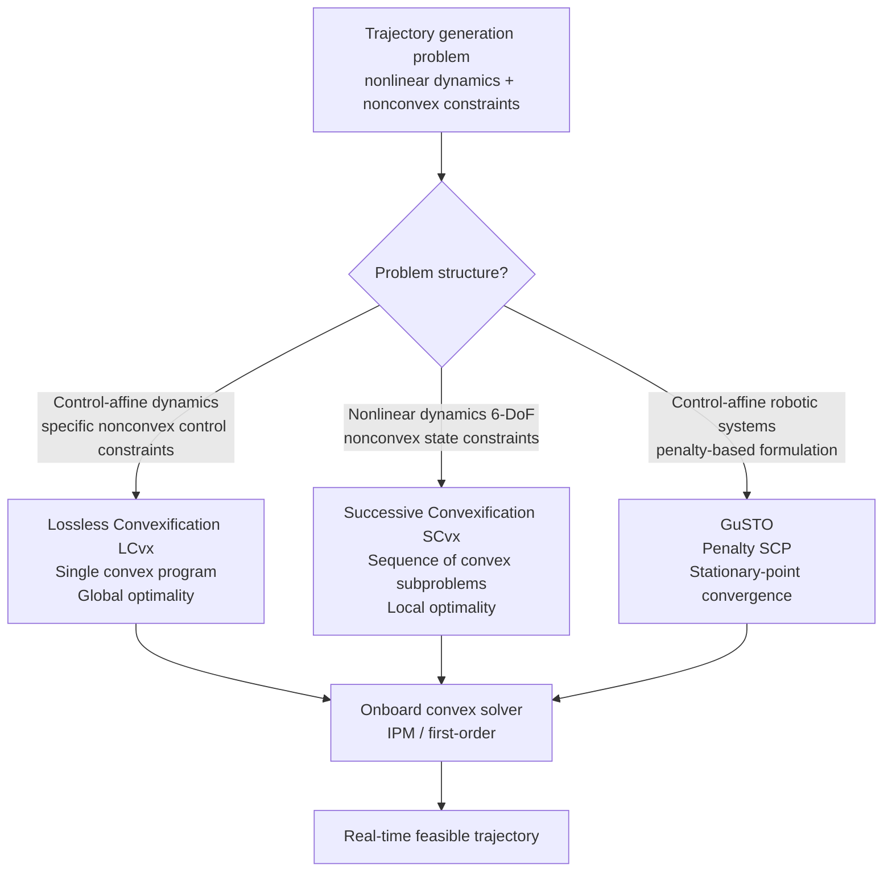
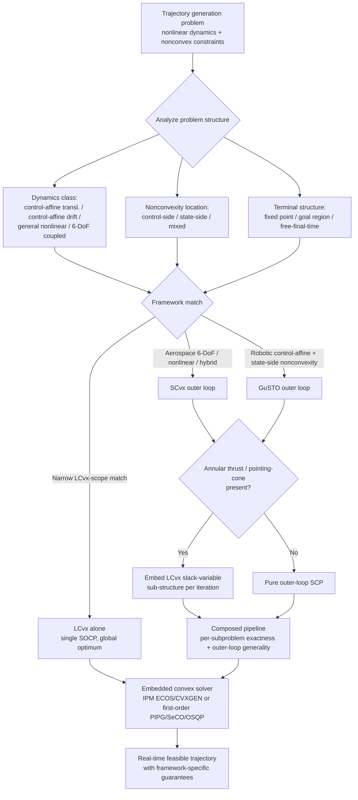

# Convex Optimization-Based Trajectory Generation for Autonomous Vehicles: A Survey of Lossless Convexification, Successive Convexification, and GuSTO
# 1 Foundations of Optimization-Based Trajectory Generation

Autonomous vehicles—ranging from planetary landers and reusable launch vehicles to unmanned aerial vehicles (UAVs), free-flying space robots, and terrestrial mobile platforms—must continuously translate high-level mission goals into precise, physically realizable motion. At the heart of this capability lies *trajectory generation*: the process of computing a time-parameterized state-and-control profile that drives the vehicle from a current condition to a desired terminal condition while honoring vehicle dynamics, environmental geometry, and actuator limitations. The way this profile is computed has profound consequences for the safety, fuel economy, and autonomy of the mission. Historically, this problem was solved through highly tailored, analytically derived guidance laws—epitomized by the Apollo lunar-descent guidance, whose explicit polynomial reference trajectories and ground-precomputed targets allowed a 1960s-era guidance computer to land humans on the Moon[^1]. Today, however, mission requirements have outgrown such fixed templates: modern landers must autonomously retarget around hazards, reusable boosters must satisfy strict thrust region and glide-slope constraints, and robots must navigate cluttered environments under tight real-time budgets. These demands have driven the field toward *optimization-based* trajectory generation, in which the trajectory is recast as the solution of a constrained optimal control problem and computed numerically onboard. This chapter establishes the conceptual baseline for the survey by formalizing this perspective, dissecting the limitations of classical guidance through the Apollo case study, and motivating the convexification strategies—lossless convexification (LCvx), successive convexification (SCvx), and GuSTO—that occupy the remainder of the report.

## 1.1 Problem Definition and Application Domains

Trajectory generation, in the context of autonomous vehicles, refers to the synthesis of a feasible time history of vehicle states (position, velocity, attitude, mass, etc.) and control inputs (thrust vector, torques, actuator commands) that connects an initial condition to a mission-defined terminal condition while respecting the vehicle's dynamics and a host of operational constraints. It is distinct from, but tightly coupled with, two adjacent functions in the autonomy stack. *Guidance* is the broader function that decides what the vehicle should do—what target to pursue and what trajectory to follow—while *control* (often implemented by an autopilot or low-level loop) drives the actuators to realize the commanded trajectory in the presence of disturbances. Trajectory generation supplies guidance with the reference profile that control then tracks. In the Apollo lunar-descent architecture, for example, the onboard guidance computer used precomputed targets to drive a guidance equation that issued thrust-acceleration commands and unit thrust directions to a Powered-flight Attitude-maneuver Routine and a Throttle Routine, which in turn interfaced with the digital autopilot and the descent propulsion system[^1]. The same layered separation persists in modern autonomous vehicles, although the trajectory-generation layer is now expected to compute (rather than merely interpolate) the reference online.

The application domains spanned by this survey, while operationally heterogeneous, share a common need for high-quality reference trajectories computed under stringent resource constraints:

- **Planetary landers** must autonomously transition from orbital or hypersonic entry conditions to a pinpoint surface touchdown, often in the presence of terrain hazards. Apollo's lunar module already exemplified the multi-phase structure of this problem, with braking, approach, and terminal-descent phases each carrying distinct objectives—near-optimal propellant use in braking, landing-site visibility and redesignation capability in approach, and vertical-velocity control under obscured visibility in terminal descent[^1].
- **Reusable launch vehicles** require propulsive descent and landing trajectories that satisfy throttle region constraints, thrust-pointing limits, and glide-slope safety envelopes—classes of constraints already foreshadowed by Apollo's descent propulsion system (DPS), which had to operate at a maximum-thrust point (about 92% of rated thrust) or within a permitted 11–65% region, with the intervening 65–93% interval forbidden owing to oxidizer/fuel cavitation transitions that would erode the nozzle[^1].
- **UAVs and ground robots** require trajectories that thread through obstacles, satisfy dynamic and actuator limits, and respond to changing tasks in near-real time.
- **Free-flying space robots and on-orbit servicers** must plan motions inside or around other spacecraft, where collision avoidance, plume impingement, and limited propellant interact with strict safety verification requirements.

Across all of these domains, four cross-cutting operational requirements consistently drive the choice of trajectory-generation technique. *Accuracy* demands convergence to a target state within tight tolerances (Apollo, for instance, was designed to deliver the lunar module to a P64 initial state typically at 2.2-km altitude, 7.5-km ground range, with a 16° approach slope[^1]). *Autonomy* requires that the vehicle compute or adapt its trajectory without ground-in-the-loop intervention—a capability Apollo only partially achieved, since its braking and approach-phase targets were loaded into computer memory shortly before launch by a ground-based targeting program[^1]. *Real-time feasibility* mandates that any onboard solver produce a usable trajectory within a single guidance cycle (Apollo's P63/P64 ran once every two seconds, and the P66 vertical channel once per second[^1]). Finally, *robustness to dispersions* requires that the algorithm tolerate uncertainties in initial state, propulsion performance, and environmental modeling; Apollo handled these via repeated re-solution of its explicit guidance equation, projecting targets forward by a transport-lag interval (typically 2.2 seconds) and iterating the ignition algorithm to absorb roughly two-second variations in throttle-control duration and 2-mr commanded attitude transients[^1].

These shared requirements—and the fact that the underlying mathematical problem is structurally the same regardless of whether the vehicle is a lander, a rocket, or a robot—motivate a unified optimization-based perspective. Rather than designing one bespoke guidance law per platform, optimization-based methods cast trajectory generation as a constrained mathematical program whose structure adapts naturally to whichever dynamics and constraints the application demands.

## 1.2 Optimal Control Formulation of Trajectory Generation

In its modern formulation, trajectory generation is posed as a continuous-time optimal control problem (OCP). Let $x(t)\in\mathbb{R}^{n}$ denote the vehicle state, $u(t)\in\mathbb{R}^{m}$ the control input, and $t\in[t_0,t_f]$ the time interval, with $t_f$ either fixed or treated as an additional decision variable (free-final-time problems). A canonical OCP takes the form

$$
\begin{aligned}
\min_{u(\cdot),\,t_f}\; & J = \phi(x(t_f),t_f) + \int_{t_0}^{t_f} L(x(t),u(t),t)\,dt \\
\text{s.t.}\; & \dot x(t) = f(x(t),u(t),t), \\
& x(t_0) = x_0,\quad \psi(x(t_f),t_f) = 0, \\
& g(x(t),u(t),t) \le 0,\quad h(x(t),t) \le 0, \\
& u(t) \in \mathcal{U},\quad x(t)\in\mathcal{X}.
\end{aligned}
$$

Here, $J$ combines a terminal (Mayer) cost $\phi$—e.g., terminal mass shortfall or miss distance—with a running (Lagrange) cost $L$, often modeling fuel use or control effort. The dynamics $\dot x = f(x,u,t)$ encode the vehicle's equations of motion; $\psi$ specifies terminal manifolds; $g$ and $h$ capture mixed path constraints and pure state-path constraints respectively; and $\mathcal{U}$ and $\mathcal{X}$ model admissible control and state sets.

This abstract structure subsumes the Apollo formulation as a special case. Apollo's implicit guidance equation defines a quartic reference trajectory backward in time from the target point as a vector polynomial in target-referenced time $T$,

$$
\underline{R}_{RG} = \underline{R}_{TG} + \underline{V}_{TG} T + \underline{A}_{TG} T^2/2 + \underline{J}_{TG} T^3/6 + \underline{S}_{TG} T^4/24,
$$

and computes commanded acceleration as the reference acceleration minus two feedback terms proportional to velocity and position deviations[^1]. Apollo's running cost was implicitly propellant consumption, and its constraints—DPS thrust limits, terminal pitch angle, terminal-thrust magnitude, and the requirement that visibility of the landing site be preserved during the approach phase—were enforced via the ground-based targeting program rather than directly by the onboard guidance[^1]. Yang showed that the resulting Apollo trajectory was within 16 kg of a fuel-optimal solution satisfying the same throttling constraint, given a total propellant consumption exceeding 6 600 kg[^1]. The success of this offline-optimized template provides historical evidence that trajectory generation, viewed as an OCP, can yield highly efficient solutions; the question is whether that optimization can be performed onboard, in real time, for a wider class of constraints.

To compute solutions numerically, the continuous-time OCP must be discretized into a finite-dimensional program. Direct transcription methods (collocation, multiple shooting, direct multiple shooting) approximate $x(\cdot)$ and $u(\cdot)$ by parameterized functions on a temporal mesh, converting the OCP into a nonlinear program (NLP) of the form $\min_{z} F(z)\ \text{s.t.}\ G(z)\le 0,\ H(z)=0$, with decision vector $z$ collecting discretized states, controls, and any free parameters. The resulting NLP inherits two structural properties that make solution difficult and explain the subsequent algorithmic developments surveyed in this report. First, vehicle dynamics are typically *nonlinear* (rigid-body rotations, atmospheric forces, mass-varying thrust acceleration); linearization is an approximation. Second, the constraint set is typically *nonconvex*: lower-bounded thrust magnitudes (the throttle cannot be commanded arbitrarily small while the engine remains lit), keep-out zones, and trigonometric pointing constraints all violate convexity. The combination of nonlinear dynamics and nonconvex constraints renders the raw NLP a problem of general nonlinear programming, with the well-known consequences of potentially multiple local minima, slow or unreliable convergence, and limited theoretical guarantees about runtime—precisely the properties that are unacceptable for safety-critical autonomous operation.

## 1.3 Classical Guidance Methods and Their Limitations

Before optimization-based methods became computationally tractable onboard, designers relied on closed-form or heuristic guidance laws derived analytically and tuned through extensive simulation. The Apollo lunar-descent guidance is the canonical exemplar of this design philosophy and remains a uniquely well-documented case study, making it an ideal vantage point from which to appreciate both the strengths of the classical approach and the limitations that drive the modern shift to optimization.

Apollo's design philosophy centered on three pillars. First, it relied on a **precomputed reference trajectory** expressed as a vector polynomial in target-referenced time, defined backward from a "target point" lying beyond the actual phase terminus so that gains would not become unbounded as the terminus is approached[^1]. Both phase terminus and target point lie on the reference, but only the portion up to terminus is flown. Second, it relied on **ground-based target generation**, performed by a Braking-phase and Approach-phase Targeting Program at the Draper Laboratory and NASA's Manned Spacecraft Center, whose targets were loaded into the LM guidance computer (LGC) shortly before launch[^1]. Third, it issued **explicit guidance equations** of remarkably simple form. With a quartic reference and a particular choice of nondimensional feedback gains ($K_R=12$, $K_V=-6$, corresponding to undamped natural frequency $P/T=-2\pi/\sqrt{11}$ and damping ratio $\zeta=\sqrt{11}/2$), the implicit guidance equation collapses to the explicit form

$$
\underline{A}_{CG} = 12(\underline{R}_{TG} - \underline{R}_G)/T^2 + 6(\underline{V}_{TG} + \underline{V}_G)/T + \underline{A}_{TG},
$$

evaluated each two-second guidance cycle[^1]. Apollo augmented this with a transport-lag correction $T_p = T + \text{LEADTIME}$ (with LEADTIME typically 2.2 s) that effectively reduces gains near the target[^1]. The result is computationally trivial—matrix-vector arithmetic on a few-thousand-word computer—and provably equivalent to a quartic-fit explicit law that intersects target position, velocity, acceleration, and current position and velocity.

The strengths of this approach are real: closed-form simplicity, deterministic execution time, well-understood stability, and the ability to embed landing-site redesignation by rotating the line-of-sight vector and reerecting the guidance frame on each pass[^1]. Apollo's P64 even allowed the commander to displace the landing site by a 1° angular increment per controller click, with the LGC then re-targeting and reorienting about the thrust axis to keep the landing point designator reticles superimposed on the new site[^1].

These strengths, however, came tightly coupled with limitations that are increasingly difficult to tolerate in modern missions. **First, constraint handling was implicit and offline.** The Apollo DPS could only operate at maximum thrust (~92% of rated 46,706 N) or in the 11–65% permitted region, with the 65–93% interval forbidden owing to cavitation transitions[^1]. Rather than being enforced as a constraint in an onboard solver, this was respected by *targeting design*: the targets were chosen to produce a constant terminal thrust of about 57% by constraining terminal thrust-acceleration magnitude to $F/M$ and the downrange jerk component to (essentially) $K\dot{F}/M^2$, while the initial range was adjusted iteratively in simulation to achieve a roughly two-minute throttle-control window absorbing DPS performance and terrain modeling dispersions[^1]. Any change in mission profile required regenerating the targets on the ground. **Second, the method offers no direct mechanism for state constraints such as glide-slope, obstacle avoidance, or sensor field-of-view requirements**, beyond what can be implicitly embedded by careful target design. Approach-phase visibility, for instance, was achieved by choosing P64 targets to provide lunar-surface visibility until about 5 seconds before terminus and a matched set of terminal Z-component values for acceleration, velocity, and position—again through closed-form targeting rather than online constraint enforcement[^1]. **Third, the design relied on a manual two-dimensional sweep** over candidate target-referenced midpoint and initial times $(T_{APM}, T_{API})$, with the operator picking a case exhibiting "suitable attitude and thrust behavior" based on an *a-priori* initial mass estimate; if subsequent simulation showed the mass estimate to be excessively in error, an alternate case had to be picked[^1]. This is precisely the kind of human-in-the-loop refinement that autonomous deep-space landers cannot afford. **Fourth, gimbal-lock avoidance, throttle deadbands, and other safety features were each handled by separate routines** (the Powered-flight Attitude-Maneuver Routine limited the middle commanded gimbal angle to 70° magnitude; the Throttle Routine implemented hysteresis between 57 and 65% to prevent oscillation at the permitted/forbidden boundary), reflecting an architecture in which every new constraint required dedicated engineering[^1].

A unifying observation is that all of these classical limitations stem from the same underlying fact: closed-form guidance laws can only handle constraint structures simple enough to be absorbed into an analytical solution or pushed into ground-based offline design. Modern missions—autonomously selecting a Mars landing site, recovering a reusable booster within a sea-based drone-ship envelope, or threading a quadrotor through cluttered airspace—involve constraint sets and dispersions that no quartic polynomial can capture. The natural response is to keep the optimal-control formulation but solve it *numerically and onboard*, which is the optimization-based paradigm the rest of this report addresses.

## 1.4 Objectives and Constraints in Practical Trajectory Generation

Practical trajectory generation problems differ from textbook OCPs primarily in the breadth and physical specificity of their objectives and constraints. A catalog of the most commonly encountered cost functionals and constraint families clarifies what an onboard algorithm must accommodate.

The dominant objective families are:

| Objective family | Mathematical form (representative) | Engineering meaning |
|---|---|---|
| Minimum fuel | $\int_{t_0}^{t_f}\|u(t)\|\,dt$ (or $-m(t_f)$ for mass-maximizing) | Maximize delivered payload; extend mission margin |
| Minimum time | $t_f - t_0$ | Shorten exposure to disturbances; meet mission timelines |
| Minimum landing error | $\|x(t_f) - x_{\text{target}}\|$ on selected components | Pinpoint precision landing or rendezvous |
| Composite / weighted | $\alpha J_{\text{fuel}} + \beta J_{\text{time}} + \gamma J_{\text{error}}$ | Trade among competing objectives |

Apollo's braking phase was essentially a *minimum-fuel* problem subject to throttle-region constraints, and Yang's analysis of its 6,600+ kg propellant budget within 16 kg of fuel-optimal exemplifies how well this objective can be approximated by careful targeting when the constraint set is simple enough[^1]. The terminal-descent phase, by contrast, prioritized *operational safety* over fuel efficiency—P66 controls velocity only, with no position control, to produce a vertical approach immune to dust-induced loss of visual cues[^1], illustrating how mission phases swap objectives.

The constraint families encountered in practice are richer:

- **Thrust magnitude bounds.** Engines have minimum and maximum thrust levels, and—as Apollo demonstrates concretely—may also have *forbidden interior regions* mandated by combustion physics. The DPS's prohibition on the 65–93% interval, driven by independent fuel/oxidizer cavitation transitions causing nozzle erosion, is a nonconvex constraint of exactly the kind that motivates lossless convexification techniques discussed in Chapter 3[^1].
- **Thrust pointing constraints.** The thrust vector must lie within a cone, e.g., to maintain attitude stability or sensor pointing. Apollo enforced a maximum 20° departure from vertical in P66's horizontal channel via a LIMIT function applied to thrust-acceleration components[^1].
- **Attitude and gimbal-lock constraints.** Inertial measurement units with mechanical gimbals exhibit gimbal lock at large middle-gimbal angles. Apollo's Powered-flight Attitude-maneuver Routine made gimbal lock "inherently impossible" by limiting the magnitude of the middle commanded gimbal angle to 70° and issuing only incremental commands that monotonically drive gimbal angles from current to commanded values[^1]. The thrust-direction filter further bounded changes to 7 mr/cycle and total excursions to 129 mr[^1].
- **Glide-slope and visibility constraints.** Modern descent problems require the trajectory to remain above a "glide-slope" cone emanating from the landing site to prevent surface impact and preserve visibility. Apollo embedded visibility implicitly through its 16°-depressed quasi-straight approach path culminating around 30-m altitude and 11-m ground range[^1]; modern methods enforce glide-slope as an explicit half-space (and hence convex) state constraint.
- **Obstacle and terrain avoidance.** Keep-out zones around hazards or other vehicles are typically nonconvex (the complement of a convex region). These appear in rendezvous, landing-zone hazard avoidance, and robot motion planning.
- **Terminal-state and matching constraints.** Multi-phase missions require matching states at phase interfaces. Apollo's P64 targets were specifically chosen to produce, at terminus, matched Z-components of acceleration, velocity, and position such that P66 would generate no initial pitch transient and would simultaneously null Z-components of velocity and position[^1].
- **Solver-induced constraints.** Computational issues—transport lag, sample-and-hold effects, actuator deadbands—force additional structure on the problem. Apollo's Throttle Routine quantitatively accounted for an effective transport lag composed of computation duration, an estimated 0.08-s DPS time constant, and a DECA pulse-train delay equal to the time required to output the thrust increment at 85% rated thrust per second[^1].

A key insight from this catalog is that several of the most operationally critical constraints—forbidden thrust regions, thrust pointing, attitude rate envelopes, glide-slope—are either inherently nonconvex or, with suitable reformulation, *can be made* convex. This distinction will become the organizing principle of the convex-method chapters: LCvx exploits cases where nonconvex constraints admit exact convex reformulations; SCvx and GuSTO address cases where they do not.

## 1.5 Rationale for Optimization-Based Approaches

The juxtaposition of operational demands and classical limitations established above leads to a clear case for optimization-based trajectory generation. Five arguments are decisive.

**First, heterogeneous constraint handling.** An optimization formulation directly accommodates arbitrary mixes of dynamics, path, terminal, and control constraints, eliminating the case-by-case engineering that classical methods require. Where Apollo needed a separate Throttle Routine to map a commanded thrust acceleration into the permitted/forbidden DPS regions[^1], a properly formulated optimization can encode the same physical constraint in its feasible set and let the solver reason about it directly.

**Second, autonomous adaptation to dispersions.** Because the optimization is solved online with the current state as initial condition, dispersions in initial state, mass, environment, and actuator performance are handled by re-solution rather than by manual replanning. Apollo's ignition algorithm already gestured toward this by iteratively adjusting ignition time as a linear function of orbital-speed and altitude dispersions and a quadratic function of out-of-plane position[^1], but a full online solver generalizes this idea to arbitrary disturbance structures.

**Third, exploitation of modern solver technology.** Decades of advances in convex programming (interior-point methods, first-order methods) have produced solvers with predictable, polynomial-time complexity. When the trajectory problem can be cast as—or reduced to a sequence of—convex programs, these solvers can be deployed on embedded flight computers with bounded runtime guarantees, addressing the real-time feasibility requirement identified in §1.1.

**Fourth, optimality and feasibility guarantees.** Modern optimization-based methods can certify, for the class of problems they address, that the returned trajectory is globally optimal (convex problems), locally optimal (sequential convex programming under suitable conditions), or at least a stationary point of the original nonconvex problem (penalty-based SCP). These provable properties matter for verification and validation, particularly for human-rated and planetary-protection missions where bespoke heuristics are difficult to certify.

**Fifth, extensibility.** The same algorithmic machinery scales from minimum-fuel powered descent to 6-DoF rendezvous, hypersonic entry, quadrotor obstacle avoidance, and free-flying robot motion planning, providing a unified toolkit rather than a portfolio of bespoke laws.

These advantages, however, come at a cost: the underlying problem—dynamics nonlinear, constraints nonconvex—is in general intractable to solve to global optimality in real time. The optimization community has therefore developed a spectrum of paradigms that trade generality against computational tractability. *General nonlinear programming* (NLP) methods address the raw problem with no convexity assumptions, offering maximal generality but suffering from sensitivity to initialization, possible convergence to poor local optima, and unpredictable runtime—properties that make them poor candidates for hard-real-time onboard deployment. *Convex programming*, by contrast, restricts attention to problems with convex objectives and convex feasible sets, where global optimality is guaranteed and high-performance solvers (interior-point and first-order methods) deliver deterministic execution. *Sequential convex programming* (SCP) bridges the two by solving a sequence of carefully constructed convex subproblems—each tractable—whose iterates converge to a solution of the original nonconvex problem under appropriate assumptions.

Within this spectrum, three convexification strategies have come to dominate the trajectory-generation literature, and they form the core subject of this survey:

- **Lossless convexification (LCvx)** identifies problem classes (notably powered-descent guidance with lower-bounded thrust magnitude and thrust-pointing constraints over control-affine dynamics) in which a slack-variable relaxation provably yields an optimal solution identical to that of the original nonconvex problem. The resulting single convex program offers global optimality and the strongest possible guarantees, but applies only to a structured subset of problems.
- **Successive convexification (SCvx)** addresses problems beyond LCvx's reach—nonlinear dynamics, 6-DoF coupled translation-and-rotation, state-triggered constraints, free-final-time formulations—by linearizing about a reference trajectory, augmenting with virtual controls and trust-region updates, and iterating to a local optimum.
- **GuSTO** (Guaranteed Sequential Trajectory Optimization) is an SCP framework tailored to control-affine systems in robotics, employing a penalty-based trust-region scheme to deliver convergence guarantees to a stationary point of the original nonconvex problem, with particular emphasis on robotic manipulators, free-flyers, and quadrotors.

The relationship among these paradigms—and the niches they occupy—is summarized in the following workflow, which previews how the subsequent chapters are organized:



The branching above is not a strict partition—LCvx is often embedded *within* SCvx pipelines as the per-iteration convex subproblem, and the choice between SCvx and GuSTO frequently turns on application domain rather than fundamental capability. Together, the three methods form a complementary toolkit rather than competing alternatives, a theme the comparative analysis in Chapter 6 will develop in depth.

With the optimal-control formulation, the historical baseline of classical guidance, and the spectrum of optimization paradigms now in place, the report turns next (Chapter 2) to the question of *why* convex optimization in particular is uniquely well-suited to onboard, safety-critical autonomy—a question whose answer rests on theoretical guarantees, solver complexity, and verification-and-validation considerations that classical and general-NLP methods cannot match.

# 2 Why Convex Optimization Is Pivotal for Onboard Trajectory Generation

Chapter 1 closed by observing that the trajectory-generation problem, while naturally expressed as a constrained optimal control problem, is in general a nonlinear program with neither convergence nor runtime guarantees—a state of affairs incompatible with safety-critical onboard autonomy. The natural next question is *which structural property of an optimization problem, if any, can recover the determinism and reliability that classical guidance laws such as Apollo's quartic-polynomial reference once provided through closed-form simplicity*. The answer that has emerged over the last two decades, and which underpins the algorithmic frameworks examined in the remainder of this survey, is *convexity*. This chapter develops the rationale for that answer along four interlocking axes: the theoretical guarantees that distinguish convex programs from general nonlinear programs (§2.1), the solver technology that translates those guarantees into embedded-grade execution times (§2.2), the hardware realities of resource-constrained flight computers and how convex methods navigate them (§2.3), and the verification-and-validation profile that makes convex methods uniquely attractive for human-rated and planetary missions (§2.4). The chapter concludes (§2.5) by acknowledging the residual gap between convex tractability and the inherent nonconvexity of real trajectory problems, thereby motivating the LCvx, SCvx, and GuSTO frameworks of Chapters 3–5.

## 2.1 Theoretical Guarantees of Convex Programs versus General NLP

A convex optimization problem is one in which a convex objective function is minimized over a convex feasible set. Formally, the canonical form

$$
\min_{z\in\mathbb{R}^N} \; f_0(z) \quad \text{s.t.} \quad f_i(z) \le 0,\ i=1,\dots,m, \quad Az = b,
$$

is convex when each $f_i$, $i=0,\dots,m$, is a convex function and $A\in\mathbb{R}^{p\times N}$ encodes affine equality constraints. A set $\mathcal{C}\subseteq\mathbb{R}^{N}$ is convex if it contains every line segment between any two of its points, and a function is convex if its epigraph is a convex set. From this elementary definition flows a hierarchy of problem classes of increasing modeling power, all of which retain the global guarantees that motivate this chapter:

| Class | Standard form (objective and conic constraint) | Trajectory-generation use |
|---|---|---|
| Linear program (LP) | $\min c^\top z$ s.t. $Az \le b$ | Time-discretized fuel cost with box constraints; warm-start oracles |
| Quadratic program (QP) | $\min \tfrac{1}{2} z^\top H z + c^\top z$ s.t. $Az\le b$ | Tracking cost; trust-region subproblems in SCP |
| Second-order cone program (SOCP) | $\min c^\top z$ s.t. $\|A_i z + b_i\| \le c_i^\top z + d_i$ | Thrust-magnitude bounds, glide-slope cones, pointing cones, slacked LCvx |
| Semidefinite program (SDP) | $\min c^\top z$ s.t. $F_0 + \sum_i z_i F_i \succeq 0$ | LMI-based robust control augmentations |

SOCP is the workhorse class for powered-descent guidance: a lower-bounded thrust magnitude $\|u(t)\| \ge \rho_{\min}$ is *nonconvex* in $u$, but as Chapter 3 will detail, the LCvx slack-variable construction transforms it into a second-order cone constraint $\|u(t)\| \le \sigma(t)$ together with $\sigma(t)\ge \rho_{\min}$—an exact convex reformulation. Glide-slope, thrust-pointing, and terminal-error constraints are likewise naturally SOCP-representable.

Three theoretical guarantees follow directly from convexity and are decisive for onboard autonomy. **First, any local minimum of a convex program is also a global minimum.** This eliminates the central pathology of general nonlinear programming, where a solver may converge to a local optimum of arbitrarily poor quality with no syntactic warning to the autonomy stack. In a minimum-fuel powered-descent problem cast as an SOCP, the solver's iterate—if it is feasible and locally optimal—is provably the *globally* optimal propellant-minimizing trajectory subject to all encoded dynamics, terminal, and path constraints. The guidance subsystem therefore knows, by construction, that no better feasible trajectory exists under the modeled problem.

**Second, convex programs admit primal–dual optimality certificates through the Karush–Kuhn–Tucker (KKT) conditions and strong duality.** For a convex problem satisfying a mild constraint qualification (Slater's condition is the most common), the primal and dual optimal values coincide, and a candidate solution $(z^\star,\lambda^\star,\nu^\star)$ can be verified against the KKT system without revisiting the iterative search. Equivalently, a small primal–dual gap (the difference between primal objective and dual objective at the returned iterates) provides a numerical certificate that the returned trajectory is $\varepsilon$-optimal for any user-specified $\varepsilon$. Such certificates are unavailable for general NLP, where a solver's stopping criterion typically measures only stationarity of a Lagrangian and offers no global bound on the suboptimality of the iterate.

**Third, interior-point methods solve convex programs in polynomial worst-case time.** For SOCPs of size $N$, the number of Newton-system solves required to reach $\varepsilon$-accuracy scales as $O(\sqrt{\nu}\,\log(1/\varepsilon))$, where $\nu$ is the barrier parameter (proportional to the number of conic constraints). Crucially, this bound is *deterministic*: it depends only on the problem's structural parameters, not on initialization or unknowable data-dependent features. The wall-clock translation of this complexity bound to onboard hardware is the subject of §2.2 and §2.3; for now, the key point is that "how long will the solver take?" admits a meaningful a-priori answer for a convex program, which it does not for an NLP.

These three guarantees stand in sharp contrast to the well-known pathologies of general nonlinear programming applied to the discretized OCP of §1.2:

- **Multiple local minima.** Nonconvex feasible sets (e.g., the union arising from a forbidden mid-throttle band, or the complement of a keep-out zone) admit locally optimal trajectories that may differ from the global optimum in propellant consumption or terminal accuracy by amounts that are mission-critical.
- **Sensitivity to initialization.** Sequential quadratic programming (SQP) and interior-point NLP solvers can return qualitatively different trajectories depending on the warm-start; for an autonomous lander encountering an unanticipated initial state, the absence of a "good" guess is precisely the operational regime in which classical NLP is least reliable.
- **No runtime bound.** The number of NLP iterations required to converge—or whether the solver converges at all—is generally not bounded a priori, making hard-real-time scheduling impossible.
- **No optimality certificate.** Even when an NLP solver converges, it cannot in general distinguish a global optimum from a poor local minimum without expensive multi-start or branch-and-bound procedures incompatible with onboard budgets.

For safety-critical autonomy, the consequence is unambiguous: convexity is not a mathematical convenience but a *requirement of mission assurance*. A guidance algorithm that can return a globally optimal, dual-certified trajectory in a deterministically bounded number of operations transforms trajectory generation from an art into an engineering discipline with measurable failure modes. The remainder of this chapter examines how that transformation is realized in practice.

## 2.2 Solver Technology: Interior-Point and First-Order Methods for Embedded Deployment

The theoretical guarantees of §2.1 become operationally meaningful only when paired with solver implementations capable of exploiting convex structure on flight-grade hardware. Two algorithmic families have come to dominate this role: interior-point methods (IPMs), which trade modest memory for a small, predictable number of expensive Newton iterations, and first-order methods, which trade per-iteration cost for low memory footprint and amenability to embedded implementation.

### Interior-point methods

Modern IPMs for convex conic programs operate in a primal–dual framework, simultaneously updating primal and dual variables along a *central path* parameterized by a barrier parameter $\mu > 0$. The barrier function—logarithmic for LP and QP, more general self-concordant barriers for SOCP and SDP—replaces hard inequality constraints with a smooth penalty $-\mu\sum_i \log(-f_i(z))$, yielding the perturbed KKT system

$$
\nabla f_0(z) + \sum_i \lambda_i \nabla f_i(z) + A^\top \nu = 0, \quad
-\lambda_i f_i(z) = \mu, \quad
Az = b,
$$

which is solved approximately at each iteration by a damped Newton step and then re-solved with $\mu$ reduced geometrically. The polynomial complexity bound of §2.1 follows from analysis of this scheme, and in practice the iteration count for problems of trajectory-generation size is remarkably small and *insensitive to problem data*: 10 to 30 iterations typically suffice to reach machine precision for SOCPs with hundreds to low-thousands of variables. The dominant cost is the per-iteration linear system, whose structure is set by the temporal discretization of the OCP: stacking states and controls over $K$ time steps produces a KKT matrix with a banded, block-tridiagonal sparsity pattern in time, which can be factorized in $O(K)$ work rather than the naïve $O(K^3)$.

This structural exploitation is what makes IPMs practical for trajectory generation. Production-grade embedded IPM solvers—ECOS for SOCP being a widely adopted exemplar—are written in dependency-free C and produce libraries small enough to fit in flight-software footprints. The code-generation paradigm initiated by tools such as CVXGEN goes one step further, producing *problem-specific* C code in which the solver's loop bodies, matrix dimensions, and memory layout are all specialized to a single optimization template; this eliminates dynamic memory allocation, exposes all branches to the compiler, and produces straight-line code amenable to worst-case execution time (WCET) analysis.

### First-order methods

First-order methods sacrifice the small iteration counts of IPMs in exchange for dramatically simpler per-iteration kernels—matrix–vector products and projections rather than Newton system solves. For embedded flight processors with limited cache, modest floating-point throughput, and radiation-tolerance constraints that discourage large dense factorizations, this trade can be highly favorable.

Two families dominate. *Operator-splitting* methods such as the alternating direction method of multipliers (ADMM) decompose the primal–dual problem into alternating projections onto simpler sets; ADMM-based custom solvers have been used in embedded receding-horizon contexts for their predictable iteration structure and absence of factorization. The *Proportional–Integral Projected Gradient* (PIPG) method, developed in the trajectory-generation community as a first-order solver tailored to the SOCP-with-equality-constrained structure of discretized OCPs, has shown particular promise. PIPG combines a projected-gradient step in the primal variable with proportional–integral feedback on the dual residual; its memory footprint is essentially that of the problem data plus a handful of work vectors, and its iteration count, while larger than that of an IPM, can be tightly bounded for a target accuracy on a well-conditioned problem. PIPG and the SeCO solver framework built around it have been used to demonstrate sub-second 6-DoF powered-descent solves on representative embedded targets, a capability further discussed in §2.3 and in the SCvx application landscape of Chapter 4.

### Warm-starting and code generation

A property shared by both IPM and first-order solvers, and exploited heavily in receding-horizon trajectory generation, is *warm-starting*. When the trajectory problem is re-solved at the next guidance cycle with only a small update to the initial condition, the previous solution provides an excellent starting point for the new solve; IPMs cannot fully exploit warm-starts (the central path's nonlinearity penalizes restarts close to the boundary) but can be initialized at modest barrier parameters to recover much of the benefit, while first-order methods—being insensitive to interior-point geometry—warm-start essentially trivially. The combination of (i) deterministic per-iteration cost, (ii) bounded iteration count for a target tolerance, and (iii) effective warm-starting is what allows the guidance cycle of a modern reusable booster, planetary lander, or free-flyer to absorb a convex re-solve once per cycle without missing its deadline.

The net effect is that the theoretical polynomial complexity of §2.1 translates, through structural exploitation and code generation, into wall-clock execution times of tens to a few hundreds of milliseconds for the trajectory problem sizes encountered in current aerospace and robotic missions—well within the two-second Apollo P63/P64 cycle, the sub-second control loops of modern boosters, and the multi-Hz replanning needs of free-flying robots.

## 2.3 Real-Time Feasibility on Resource-Constrained Flight Computers

The solver capabilities of §2.2 must be reconciled with the realities of flight avionics, which differ markedly from the workstation-class machines on which most optimization research is conducted. A typical onboard processor in a planetary lander or human-rated launch vehicle is *radiation-tolerant* or *radiation-hardened* (e.g., PowerPC or LEON-class cores at clock rates of a few hundred MHz to perhaps 1 GHz), employs limited cache hierarchies, lacks the deep speculative pipelines of consumer chips, and—in many flight-software architectures—forbids dynamic memory allocation entirely. UAV and ground-robotic platforms occupy a wider spectrum, ranging from microcontroller-class autopilots to single-board GPUs such as the Jetson family, but in all cases the compute envelope is small compared to a desktop and, more importantly, the *worst-case* execution time must be bounded.

Several properties of convex solvers map onto these constraints with unusual cleanness:

- **Deterministic iteration structure.** An IPM's inner loop performs the same operations every iteration—form the Newton system, factorize, back-solve, line-search—with sizes fixed by the problem template. Combined with a bounded outer-iteration count, this allows static WCET analysis. A first-order method's iteration structure is even simpler: a sequence of dense or block-sparse matrix-vector products and projections onto cones, each amenable to pre-allocated buffers.
- **Bounded iteration count.** For typical trajectory SOCPs, 10–30 Newton iterations suffice for an IPM, and bounded iteration budgets (e.g., a hard cap of 50 iterations) are universally enforced in flight code. First-order methods require more iterations but each is dramatically cheaper, and the budget can be tuned per cycle.
- **Banded KKT exploitation.** The temporal discretization of the OCP yields a KKT matrix whose factorization cost scales linearly in horizon length $K$. For $K=50$ to $K=200$ time steps, typical of powered-descent and rendezvous problems, the per-Newton-step cost is dominated by a handful of small dense block solves rather than by global factorization—well within embedded reach.
- **Static memory.** Code-generated solvers like those produced by CVXGEN and its successors pre-allocate every buffer at compile time, eliminating malloc/free and matching the requirements of flight-software standards that prohibit heap allocation post-initialization.
- **Warm-starting in receding horizon.** Within a guidance cycle, the previous solution can be shifted in time, padded, and supplied as the initial iterate, often reducing required iterations by a factor of two or more.

Empirical evidence accumulated through the end of 2022 supports these claims at flight-relevant scale. The G-FOLD algorithm—the LCvx-based powered-descent guidance examined in detail in Chapter 3—was demonstrated in onboard solves of order tens of milliseconds on Masten Xombie flight hardware, well inside the guidance cycle, with a custom SOCP solver tailored to the problem template. Sub-second 6-DoF SCvx solves on embedded targets, including demonstrations on the NVIDIA Jetson Xavier NX and similar single-board computers, have been reported in the SCvx/SeCO literature surveyed in Chapter 4; representative runtimes of a few hundred milliseconds for free-final-time 6-DoF landing problems are consistent with the iteration counts and Newton-system sizes discussed above. First-order PIPG-based solves have been reported in the sub-second regime for comparable problem sizes, with the additional benefit of memory footprints small enough to fit on radiation-tolerant processors. The reduced-precision and fixed-point implementations explored in adjacent embedded-MPC literature suggest a further margin of headroom, although flight deployments through end-2022 have predominantly used IEEE 754 double-precision arithmetic for assurance reasons.

The practical engineering wrapper around these solvers is equally important. A flight-grade solver invocation is typically wrapped in (i) a static input-validation step that rejects out-of-range data before they enter the solver, (ii) a hard iteration cap that returns the best feasible iterate seen if the cap is reached, (iii) a fallback policy that hands off to a backup guidance law (e.g., a precomputed table or classical law) if the solver reports infeasibility, and (iv) telemetry that records the achieved primal–dual gap and iteration count for post-flight analysis. This layered architecture preserves the deterministic real-time properties of the underlying solver while providing graceful degradation in off-nominal scenarios.

## 2.4 Verification and Validation Advantages for Safety-Critical Autonomy

Verification and validation (V&V) is the activity by which a guidance subsystem is shown to meet its safety, performance, and reliability requirements before flight. For human-rated and planetary-protection missions, V&V often dominates the development cost, and the choice of algorithmic paradigm has first-order consequences for the certification argument. Convex methods, alone among the practical trajectory-generation paradigms, support a V&V profile that is broadly compatible with mission-assurance frameworks such as NASA software classifications (Class A/B for human-rated and Category 1 missions) and the DO-178C standard used in commercial aviation.

Four V&V advantages of convex solvers, each tracing back to a guarantee from §2.1 or a solver property from §2.2, are particularly relevant.

**Deterministic complexity and bounded worst-case execution.** Because the iteration count of an IPM is bounded by problem structure and is empirically tightly clustered, and because each iteration's cost is data-independent, the solver's worst-case execution time can be measured exhaustively over a representative sweep of problem instances and certified against a fixed timing budget. General NLP solvers, whose iteration count and per-iteration cost depend on data and initialization in ways that resist a-priori bounding, are far harder to certify in this respect.

**Optimality certificates and infeasibility detection through duality.** A returned solution accompanied by a small primal–dual gap is *self-certifying*: the certification team need not re-derive optimality conditions; they need only check the gap numerically. Symmetrically, when the convex problem is infeasible, the dual program produces a certificate of infeasibility (a Farkas-style separating direction), which the guidance system can detect and use to trigger an abort or a fallback. The ability to *detect infeasibility* in flight is itself an enormous V&V asset: the autonomy stack is never silently producing trajectories that cannot be flown.

**Absence of spurious local minima reduces testing burden.** A general-NLP-based guidance algorithm must be tested across a dense grid of initial conditions, dispersions, and warm-start choices to gain confidence that the solver does not land in a poor local optimum in any operationally credible scenario. A convex-based algorithm, by §2.1, returns the global optimum whenever it returns anything; the testing effort can therefore focus on (a) the convex-reformulation step (LCvx exactness, SCvx linearization fidelity) and (b) failure-mode behaviors such as solver-timeout fallbacks, rather than on combinatorial coverage of the cost-landscape.

**Suitability for formal verification and code generation.** The fixed-structure, dependency-free C code produced by tools like CVXGEN, ECOS-customized builds, and the embedded solvers used in PIPG implementations is amenable to static analysis, MISRA-C compliance checks, and even formal methods at the source-code level. The trajectory of qualified flight software has tended toward solver code bases small enough to be reviewed line-by-line by certification authorities—a level of scrutiny incompatible with the much larger code bases of general-purpose NLP solvers.

These advantages do not, of course, eliminate V&V challenges. Three residual concerns are visible already at the foundational level and will be revisited throughout the survey:

- **V&V of the convex *reformulation* itself.** LCvx replaces a nonconvex problem with a convex one and proves the two are equivalent on the original feasible set; the proof's hypotheses (e.g., controllability of the linearized dynamics, regularity of the active set) must be verified for each problem instance to which LCvx is applied. Chapter 3 discusses the precise conditions.
- **V&V of SCP convergence assumptions.** SCvx and GuSTO solve a *sequence* of convex problems; the assumptions under which the iterates converge to a local optimum (SCvx) or a stationary point (GuSTO) must be checked against the specific dynamics, constraints, and trust-region parameters of the deployed problem. These assumptions are discussed in Chapters 4 and 5.
- **Numerical robustness near boundaries.** Even within the convex regime, ill-conditioned problem instances (e.g., near-active equality constraints, very small minimum-thrust values relative to maximum) can stress the solver's numerical behavior; V&V must therefore include stress-testing across the operational envelope.

Even with these caveats, the V&V advantage of convex methods is decisive enough that aerospace organizations developing next-generation autonomous landing, rendezvous, and on-orbit servicing capabilities have increasingly converged on convex-solver-based guidance as a *verifiable design pattern*. Chapters 3, 4, and 7 will document concrete instances of this trend through the end of 2022.

## 2.5 From Convex Tractability to Nonconvex Reality: Motivating LCvx, SCvx, and GuSTO

The case made in §2.1–§2.4 leaves a stark tension to resolve. Convex programs offer global optimality, certificates, polynomial-time complexity, deterministic execution, and a clean V&V profile—everything an onboard guidance subsystem could ask for. But the trajectory-generation problems catalogued in §1.4 are not convex. Lower-bounded thrust magnitudes (the engine cannot be commanded arbitrarily small once lit), forbidden mid-throttle regions (Apollo's 65–93% DPS prohibition exemplifies a structurally identical issue arising from combustion physics), keep-out zones around obstacles or other spacecraft, attitude dynamics on the rotation group $\mathrm{SO}(3)$ or unit-quaternion manifold, and the bilinear coupling of thrust direction with mass-varying acceleration in 6-DoF formulations are all sources of irreducible nonconvexity. Any honest survey must therefore answer the strategic question:

> *How can the guarantees of convex optimization be retained when the problem to be solved is not convex?*

The trajectory-generation community has produced three principal answers, each occupying a distinct point on the trade-off curve between problem generality and the strength of the convex guarantees inherited. These three answers organize the remainder of this report.

**Exact reformulation: Lossless Convexification (LCvx).** For a structured subset of nonconvex problems—specifically, minimum-fuel powered-descent guidance with control-affine dynamics, lower-bounded thrust magnitudes, and certain pointing constraints—a slack-variable construction can be shown to yield a *convex relaxation whose optimal solution coincides exactly with that of the original nonconvex problem*. The relaxation is "lossless" because it adds no spurious solutions: any optimum of the relaxed convex SOCP is also an optimum of the original nonconvex OCP, and vice versa. Where applicable, LCvx is the strongest possible reformulation strategy: it inherits *all* of the guarantees of §2.1 — global optimality, polynomial-time complexity, dual certificates, deterministic execution — for the original nonconvex problem. The price is restricted scope: the exactness proofs (Açıkmeşe & Ploen 2007; Açıkmeşe, Carson & Blackmore 2013; Blackmore, Açıkmeşe & Carson 2010, 2012) rely on structural hypotheses that do not extend to nonconvex *state* constraints, nonlinear dynamics, or coupled 6-DoF rotational motion. Chapter 3 develops LCvx in full.

**Iterative convex approximation: Successive Convexification (SCvx).** For the broad class of problems beyond LCvx's reach—nonlinear dynamics, 6-DoF coupled translation–rotation, nonconvex state constraints, free-final-time formulations, state-triggered constraints—a sequential convex programming framework linearizes the nonconvex problem about a reference trajectory, augments the linearized convex subproblem with *virtual controls* (to preserve feasibility despite linearization error) and a *trust region* (to keep iterates within the validity radius of the linearization), and iterates. Under suitable assumptions on the problem and the trust-region update rule, SCvx (Mao, Szmuk & Açıkmeşe; Reynolds et al.) converges to a *local optimum* of the original nonconvex problem. The guarantees inherited from convexity are now *per-subproblem*: each convex SOCP in the sequence is globally solved with all the properties of §2.1, but the outer iteration's terminal point is locally — not globally — optimal. Chapter 4 develops SCvx in full.

**Penalty-based SCP for control-affine systems: GuSTO.** A complementary line of work, motivated by robotic applications (manipulators, free-flying space robots, quadrotors), reformulates the sequential convex programming idea through a penalty-based trust-region scheme rooted in nonlinear-programming theory. GuSTO (Bonalli, Cauligi, Bylard & Pavone, 2019) restricts attention to control-affine dynamics — a structural assumption shared with much of the robotics literature — and in exchange achieves convergence guarantees to a *stationary point* of the original nonconvex problem. The trade space relative to SCvx is subtle: GuSTO's stationary-point guarantee is in some respects weaker than SCvx's local-optimality result, but its penalty-based formulation can be more robust to infeasibility in the subproblems and more naturally aligned with the problem structures encountered in robotic manipulation and motion planning. Chapter 5 develops GuSTO in full.

The three frameworks can therefore be arranged on a spectrum of *generality versus guarantee strength*:

| Framework | Problem class | Guarantee inherited from convexity |
|---|---|---|
| LCvx | Control-affine dynamics + structured nonconvex control constraints | Global optimum of original nonconvex problem |
| SCvx | Nonlinear dynamics, 6-DoF, nonconvex state + control constraints | Local optimum (under SCvx assumptions); each subproblem globally solved |
| GuSTO | Control-affine robotic systems with nonconvex constraints | Stationary point (under GuSTO assumptions); each subproblem globally solved |

A natural reading of this table is that the three frameworks compete for the same niche. The opposite is closer to the truth: they are complementary, and in fact frequently composed. LCvx, when applicable, can be embedded as the per-iteration convex subproblem inside an SCvx outer loop, so that the strong LCvx guarantee on a sub-structure of the problem is combined with SCvx's handling of the broader nonlinearities. The choice between SCvx and GuSTO often turns on application domain — aerospace 6-DoF problems gravitating toward the former and robotics control-affine problems toward the latter — rather than on a fundamental capability gap. Chapter 6 develops this comparative perspective into a decision-guidance matrix; Chapter 7 traces how the resulting toolkit has been instantiated in concrete missions and platforms through the end of 2022.

With the case for convexity now established — theoretical guarantees in §2.1, solver technology in §2.2, embedded-hardware feasibility in §2.3, V&V profile in §2.4, and the nonconvexity gap in §2.5 — the report turns next to the first and historically most influential answer to the nonconvexity question: lossless convexification, and the powered-descent guidance algorithms it enabled.

# 3 Lossless Convexification (LCvx): Exact Reformulation of Nonconvex Constraints

Chapter 2 closed with a strategic question: how can the guarantees of convex optimization — global optimality, polynomial-time complexity, dual certificates, deterministic execution — be retained when the trajectory-generation problem to be solved is intrinsically nonconvex? The first historical answer, and still the strongest where it applies, is *lossless convexification* (LCvx). LCvx targets a structurally specific but operationally critical class of problems — minimum-fuel and minimum-error powered-descent guidance with control-affine translational dynamics and structurally nonconvex *control* constraints — and proves that a carefully constructed slack-variable relaxation transforms the nonconvex problem into a convex second-order cone program whose optimal solution is *identical* to that of the original problem. No spurious solutions are introduced; no suboptimality is accepted; the convex relaxation is exact. The implication is profound: for the problems in LCvx's structural reach, every guarantee catalogued in §2.1 — including global optimality of the *original*, nonconvex problem — is recovered, while the solver runs on flight-grade hardware within a single guidance cycle. This chapter develops the LCvx construction in detail, traces its mathematical foundations and assumptions, presents the convex problem templates it produces, candidly delineates its scope limitations, and documents the flight-relevant deployments that have made it the most influential convex-guidance design pattern in the modern aerospace literature.

## 3.1 Problem Class and Sources of Nonconvexity in Powered-Descent Guidance

LCvx was developed for, and is most cleanly explained in the setting of, the *powered-descent guidance* problem encountered by planetary landers (Mars, lunar) and propulsive recovery vehicles. The vehicle is modeled as a point mass executing translational motion under the combined action of a controllable thrust force and a dominant constant gravitational acceleration; rotational degrees of freedom are abstracted away, and the algorithm is responsible for computing the translational trajectory and the thrust force-vector profile required to drive the vehicle from a (typically post-entry or post-deorbit) initial state to a soft, pinpoint touchdown.

The continuous-time dynamics are control-affine in the thrust force $T_c(t)\in\mathbb{R}^3$:

$$
\dot r(t) = v(t),\qquad \dot v(t) = g + \frac{T_c(t)}{m(t)},\qquad \dot m(t) = -\alpha\,\|T_c(t)\|,
$$

where $r$ and $v$ are inertial position and velocity, $g$ is the (constant) gravitational acceleration vector, $m$ is the instantaneous vehicle mass, and $\alpha = 1/(I_{sp}\,g_0)$ is the propellant mass-flow coefficient determined by the engine's specific impulse. Initial conditions $(r(0),v(0),m(0)) = (r_0,v_0,m_{wet})$ are supplied by the navigation filter; terminal conditions typically prescribe a soft landing $r(t_f)=r_f,\ v(t_f)=0$ at a designated landing site. The objective is most commonly minimum fuel — equivalently, maximization of terminal mass $m(t_f)$ — although Chapter 3.3 will introduce the *minimum-landing-error* variant that arises when pinpoint landing is infeasible.

A second important set of constraints involves the *state*. Glide-slope constraints require the position to remain inside a cone emanating from the landing site, $\|H_{gs}(r(t)-r_f)\|\le c_{gs}^\top(r(t)-r_f)$ for an appropriate selector matrix $H_{gs}$ and slope vector $c_{gs}$; velocity envelopes $\|v(t)\|\le v_{\max}$ likewise restrict speed within the descent corridor; and terminal-state manifolds enforce the boundary conditions at $t_f$. Crucially, *all* of these state constraints are convex (half-spaces, second-order cones, or affine equalities), and would therefore pose no obstacle to a direct convex formulation.

The nonconvexity that historically blocked direct convex formulation lies entirely in the *control* constraints. Three families are responsible:

- **Lower-bounded thrust magnitude (annular thrust constraint).** Physical rocket engines, once lit, cannot be throttled arbitrarily low — combustion stability, chamber-pressure limits, and propellant atomization all impose a minimum thrust level $\rho_{\min} > 0$. Combined with an upper structural/thermal limit $\rho_{\max}$, this yields the *annulus* constraint $\rho_{\min}\le \|T_c(t)\|\le \rho_{\max}$ in the three-dimensional thrust space. The upper bound $\|T_c\|\le \rho_{\max}$ is convex (a Euclidean ball), but the lower bound $\|T_c\|\ge \rho_{\min}$ excludes a Euclidean ball of radius $\rho_{\min}$ around the origin and is therefore the complement of a convex set — structurally nonconvex. This is precisely the same combustion-physics phenomenon that produced Apollo's prohibited 65–93% throttle band introduced in Chapter 1: a region of the thrust magnitude space that must be avoided rather than penalized.
- **Thrust-pointing cone constraint.** The thrust direction is often required to lie within an angular cone about a reference direction $\hat n$ (e.g., the vehicle's body axis, or a sensor-pointing reference), $\hat n^\top T_c(t) \ge \cos(\theta_{\max})\,\|T_c(t)\|$. The right-hand side is a positively homogeneous nonlinear function of $T_c$; combined with $\|T_c\|\ge\rho_{\min}$, the admissible thrust set is a *spherical wedge* (the intersection of an annulus with a cone), and this set is nonconvex even before the magnitude lower bound is added if the cone half-angle exceeds $\pi/2$.
- **Mass-normalized control representation.** When the equations of motion are rewritten in terms of the *mass-normalized control* $u(t) = T_c(t)/m(t)$ (the natural variable for the velocity dynamics $\dot v = g + u$), the magnitude bounds become $\rho_{\min}/m(t)\le \|u(t)\|\le \rho_{\max}/m(t)$, whose endpoints depend nonlinearly on the time-varying mass $m(t)$. Without further reformulation, this *coupling* between the control magnitude bound and the mass state introduces an additional layer of nonconvexity.

These nonconvex control constraints contrast cleanly with the convex state constraints and convex objective: were it not for the annular thrust constraint and the pointing cone, the discretized problem would already be an SOCP, solvable to global optimality in real time. The strategic question that motivated LCvx was therefore not whether to abandon convexity, but whether the *specific* nonconvexity arising from the control constraints could be *exactly* dissolved into a convex relaxation — leaving the state constraints, dynamics, and objective intact. The remainder of this chapter answers that question affirmatively.

## 3.2 The Slack-Variable Relaxation and the Exactness Theorem

The LCvx construction rests on a single, deceptively simple idea: introduce an auxiliary scalar slack variable $\sigma(t)\in\mathbb{R}$, interpret it as an *upper bound* on the thrust magnitude $\|T_c(t)\|$, and replace the original annular constraint by a pair of convex constraints in the augmented variable set:

$$
\|T_c(t)\| \le \sigma(t), \qquad \rho_{\min} \le \sigma(t) \le \rho_{\max}.
$$

The first inequality is a second-order cone constraint on $(T_c(t),\sigma(t))$; the second is a pair of affine box constraints on $\sigma(t)$ alone. Both are convex, and after a temporal discretization on a mesh $\{t_k\}_{k=0}^{K}$ the entire constraint set becomes a finite collection of SOCP constraints. The same construction extends to the pointing cone: replacing $\hat n^\top T_c\ge \cos(\theta_{\max})\|T_c\|$ by $\hat n^\top T_c\ge \cos(\theta_{\max})\,\sigma$ produces a *linear* inequality in $(T_c,\sigma)$ that is jointly enforced with the magnitude relation $\|T_c\|\le\sigma$.

A simultaneous reformulation handles the mass-coupling difficulty. Introducing the *mass-normalized* variables $u(t)=T_c(t)/m(t)$, $\sigma_u(t)=\sigma(t)/m(t)$ and the *logarithmic mass state* $z(t)=\ln m(t)$, the mass dynamics $\dot m = -\alpha\|T_c\|$ becomes $\dot z = -\alpha\,\sigma_u\,e^{z}/e^{z} = -\alpha\,\|u\|\cdot(1)$ after consistent substitution; more carefully, the change of variables yields an exactly linear mass-logarithm dynamic $\dot z(t) = -\alpha\,\sigma_u(t)$ when the slack identification $\|u(t)\|\le \sigma_u(t)$ is used in place of $\|u(t)\|$. The magnitude bounds become $\rho_{\min} e^{-z(t)}\le \sigma_u(t)\le \rho_{\max}e^{-z(t)}$, which after second-order Taylor expansion of $e^{-z}$ about a reference logarithmic mass profile yields *convex* (quadratic, hence SOCP-representable) lower and upper bounds on $\sigma_u(t)$ that are correct to second order; under the controlled-burn regime typical of powered descent these envelopes remain tight, and the entire problem retains SOCP form.

The substantive question is whether the relaxation introduces spurious solutions. By construction, the relaxed problem's feasible set strictly contains the original problem's feasible set: any $(T_c,\sigma)$ with $\|T_c\|<\sigma$ is admissible in the relaxation but corresponds to no thrust profile satisfying the original annulus. If the optimal relaxed solution were to exhibit such *slack* ($\|T_c^\star(t)\|<\sigma^\star(t)$ on a set of positive measure), the relaxation would be lossy: the convex problem would attain a strictly lower objective than the original nonconvex one, and the recovered $T_c^\star$ would not in general satisfy $\|T_c^\star\|\ge\rho_{\min}$. The *exactness theorem* of LCvx asserts that this never happens at the optimum.

The argument, due to Açıkmeşe & Ploen (2007) for the linearized powered-descent problem and extended by Blackmore, Açıkmeşe & Carson (2010, 2012) and Açıkmeşe, Carson & Blackmore (2013) to broader classes including state constraints, proceeds via Pontryagin's Maximum Principle applied to the relaxed problem. Let $p_v(t)$ denote the costate (adjoint) associated with the velocity dynamics. The Hamiltonian of the relaxed minimum-fuel problem is, schematically,

$$
H = \alpha\,\sigma\ +\ p_v^\top\!\left(g + u\right)\ +\ \text{(other costate-state terms)},
$$

where the running cost $\alpha\,\sigma$ replaces $\alpha\|T_c\|$ because the mass dynamics now read $\dot z = -\alpha\sigma_u$. Pointwise minimization of $H$ over $(u,\sigma_u)$ subject to $\|u\|\le\sigma_u$ and $\sigma_u\in[\rho_{\min}e^{-z},\rho_{\max}e^{-z}]$ yields, on any time interval where $p_v(t)\ne 0$, the bang-and-aligned conclusions $u^\star(t) = -\sigma_u^\star(t)\,p_v(t)/\|p_v(t)\|$ and $\|u^\star(t)\| = \sigma_u^\star(t)$ almost everywhere. In other words, the slack inequality $\|u\|\le\sigma_u$ is active at the optimum, the relaxation is *tight*, and the recovered thrust profile satisfies the original annular constraint exactly. The hypothesis on $p_v(t)$ is the *normality / non-degeneracy* assumption: a controllability condition on the linearized dynamics (the standard pair $(A,B)$ controllability of the lifted linear time-invariant system, with $A$ the gravity-free state-transition generator and $B$ the control-input map) is sufficient to rule out the singular case $p_v(t)\equiv 0$ on intervals of positive measure. Under this hypothesis, the relaxed convex problem and the original nonconvex problem share the same optimal cost and the same optimal $(r,v,m,T_c)$ profile.

This is the formal sense in which LCvx is "lossless": the convex relaxation is *exact* on the optimum, not merely as an outer approximation. Any solver that finds a global optimum of the relaxed SOCP — which, by §2.1, is exactly what interior-point methods do — automatically returns the global optimum of the original nonconvex powered-descent problem. The structural hypotheses on which this conclusion rests — control-affine dynamics, the specific structural class of control constraints (annulus, pointing cone), controllability of the linearization, regularity of the Hamiltonian/normality of the dual variables — are precisely the hypotheses that §3.4 will critically revisit.

## 3.3 Convex Formulations: Minimum-Fuel and Minimum-Landing-Error SOCPs

The slack-variable relaxation, combined with the mass-logarithm change of variables, yields a clean SOCP template for the powered-descent problem. In discrete time with mesh points $\{t_k\}_{k=0}^{K}$ and decision variables $\{r_k,v_k,z_k,u_k,\sigma_k\}_{k=0}^{K}$, the *minimum-fuel powered-descent SOCP* takes the form:

$$
\begin{aligned}
\max_{\{u_k,\sigma_k,z_K\}} \quad & z_K \quad \text{(equivalently, } \max\,m(t_f)\text{)} \\
\text{s.t.}\quad
& r_{k+1} = r_k + \Delta t\,v_k + \tfrac{\Delta t^2}{2}(g + u_k), \\
& v_{k+1} = v_k + \Delta t\,(g + u_k), \\
& z_{k+1} = z_k - \alpha\,\Delta t\,\sigma_k, \\
& \|u_k\| \le \sigma_k, \\
& \rho_{\min}\,e^{-z_k^{\text{ref}}}\!\left[1-(z_k - z_k^{\text{ref}}) + \tfrac{1}{2}(z_k-z_k^{\text{ref}})^2\right] \le \sigma_k \le \rho_{\max}\,e^{-z_k^{\text{ref}}}\!\left[1-(z_k - z_k^{\text{ref}})\right], \\
& \hat n^\top u_k \ge \cos(\theta_{\max})\,\sigma_k, \\
& \|H_{gs}(r_k - r_f)\| \le c_{gs}^\top(r_k - r_f), \\
& \|v_k\|\le v_{\max}, \\
& (r_0,v_0,z_0) = (r_0,v_0,\ln m_{wet}),\quad r_K = r_f,\ v_K = 0.
\end{aligned}
$$

The lower-bound envelope on $\sigma_k$ is the second-order Taylor expansion of $\rho_{\min}\,e^{-z_k}$ about a reference profile $z_k^{\text{ref}}$ (typically obtained from a single linearization pass), preserving convexity in $z_k$; the upper bound uses a first-order expansion that is itself an upper bound on $\rho_{\max}\,e^{-z_k}$. This template is composed entirely of (i) affine equality constraints from the time-discretized translational dynamics, (ii) affine inequality constraints from the box constraints, pointing-cone, and glide-slope reformulations, and (iii) second-order cone constraints from the slack-variable thrust magnitude bound and velocity envelope. The result is an SOCP in the canonical form of §2.1, with decision-vector size scaling linearly in the horizon length $K$ and KKT-system structure banded in time — exactly the structure that the embedded interior-point methods of §2.2 exploit.

A complementary formulation is required when the minimum-fuel problem is *infeasible* — that is, when no admissible thrust profile can drive the vehicle exactly to the prescribed landing site $r_f$ given the available propellant. In such cases, the operationally meaningful objective is to *minimize the terminal landing error* $\|H_{le}(r_K - r_f)\|$ on a selected set of position components (typically the two horizontal coordinates, since vertical touchdown is enforced separately). This *minimum-landing-error* SOCP replaces the terminal equality $r_K = r_f$ by a free terminal position and minimizes the miss distance subject to all remaining constraints, including the propellant budget through $z_K \ge \ln m_{dry}$.

The two formulations are combined in G-FOLD via a *lexicographic* (two-stage) procedure that has become the standard architecture for LCvx-based landers. Stage 1 solves the minimum-landing-error SOCP, returning the minimum achievable miss distance $d^\star$. Stage 2 then solves the minimum-fuel SOCP with the additional constraint $\|H_{le}(r_K - r_f)\|\le d^\star + \varepsilon$ for a small tolerance $\varepsilon$, returning the maximum-terminal-mass trajectory that achieves (essentially) the best attainable accuracy. The procedure guarantees that, whenever pinpoint landing is feasible, $d^\star = 0$ and Stage 2 reduces to the pure minimum-fuel problem; whenever it is not, the algorithm gracefully degrades to maximum-accuracy landing, and Stage 2 nonetheless extracts the best propellant economy among all maximum-accuracy trajectories. Both stages are SOCPs of the template above and are solved by the same embedded interior-point solver.

The constraint catalogue accommodated natively by the SOCP template is rich enough to cover the dominant operational needs of powered descent. Glide-slope is a single second-order cone constraint per time step. Velocity envelopes are likewise SOCP constraints. Thrust-pointing cones become linear inequalities (after slacking). Terminal manifolds enter as affine equalities. Engine-out, abort, and divert capabilities can be encoded by varying the initial condition, the propellant budget, and (in some variants) by switching between minimum-fuel and minimum-error stages within a single guidance cycle. The resulting *problem template* — fixed in structure, parameterized by initial state, terminal conditions, and the constraint envelopes — is precisely what flight-grade SOCP solvers consume: ECOS as a dependency-free general-purpose embedded IPM, CVXGEN-generated problem-specific C code for the smallest footprint, and custom interior-point implementations tailored for the banded KKT structure when extreme determinism is required.

## 3.4 Scope, Assumptions, and Structural Limitations of LCvx

The strength of the LCvx guarantees — global optimality of the *original* nonconvex problem — comes packaged with structural assumptions that must be honestly delineated. A guidance algorithm that relies on LCvx exactness inherits the burden of verifying these assumptions for each deployment.

The assumptions sustaining the §3.2 exactness argument can be organized into four groups:

**Dynamics class.** LCvx requires the dynamics to be *control-affine* — the control $T_c$ (or its mass-normalized counterpart $u$) must enter the equations of motion linearly. Translational point-mass dynamics with thrust force satisfy this exactly; aerodynamic forces of the form $C_D\rho v\|v\| T_c/\|T_c\|$ (drag coefficient times relative wind times unit thrust direction), drag coupling to control via aerodynamic angle of attack, and any thrust-vector-control mapping that involves the *direction* of $T_c$ nonlinearly do not. Mars and lunar terminal descent — where the vehicle is propulsively braking through a regime of negligible aerodynamic force — satisfies control-affinity cleanly; Earth-atmosphere descent and entry phases generally do not.

**Control-constraint structure.** The lossless property is proved for specific structural classes of control constraint: the annular magnitude bound $\rho_{\min}\le\|T_c\|\le\rho_{\max}$ (Açıkmeşe & Ploen 2007), the pointing cone (Açıkmeşe, Carson & Blackmore 2013), and combinations thereof. Other nonconvex control constraints — for example, throttle profiles with multiple forbidden interior bands, or thrust constraints coupled to attitude through a TVC actuator model — fall outside the proven LCvx scope. The Apollo DPS prohibition of the 65–93% throttle band, mentioned in Chapter 1, is *structurally* the kind of constraint LCvx targets, but the multi-band variant has not been shown lossless in the same generality.

**Controllability and normality of the linearization.** The Pontryagin argument that forces $\|T_c^\star(t)\|=\sigma^\star(t)$ at the optimum requires the costate $p_v(t)$ to be nonzero almost everywhere on the trajectory. The sufficient condition is controllability of the linearized translational dynamics, augmented by a *normality* assumption that the constraint qualifications hold (no abnormal extremals) and that the Hamiltonian is regular along the optimal trajectory. For the powered-descent template these conditions hold under mild generic hypotheses and are typically satisfied in operational practice; verification in flight-software certification nonetheless requires showing that the deployed problem instance does not admit pathological degeneracies.

**Absence of nonconvex state constraints.** LCvx losslessly relaxes nonconvex *control* constraints; it does not address nonconvex *state* constraints. Glide-slope, velocity envelopes, and terminal manifolds are already convex and therefore admissible. But keep-out zones around terrain hazards, the complement of a convex obstacle in obstacle-rich environments, and the unit-quaternion attitude manifold $\|q\|=1$ are all nonconvex state-side constraints, and LCvx provides no exactness guarantee for them.

The natural consequence is a clear delineation of LCvx's applicability boundary. Problems within scope include minimum-fuel and minimum-error powered-descent guidance for Mars and lunar landers operating in the propulsive-braking regime, propulsive landing of reusable boosters during the terminal descent following endo-atmospheric reentry (provided aerodynamic forces are negligible during the LCvx-handled phase), and any 3-DoF point-mass translational guidance problem with annular thrust and convex state constraints. Problems *outside* scope include 6-DoF coupled translation-and-rotation trajectories, where the attitude evolution on $\mathrm{SO}(3)$ destroys control-affinity and introduces a nonconvex state manifold; aerodynamic entry and descent phases, where lift–drag forces are velocity-quadratic and angle-of-attack dependent; obstacle-avoidance problems with nonconvex keep-out zones; free-final-time formulations in which $t_f$ is itself a decision variable (since the LCvx exactness proof is formulated on a fixed horizon, although time-discretization grids of varying density can be used in iterative outer loops); and state-triggered constraints that activate or deactivate based on the trajectory state itself.

These limitations are not a defect but a *clear specification*: where LCvx applies, it is the strongest answer; where it does not, a complementary technique is required. A widely deployed architecture pattern, anticipated in §1.5 and elaborated in Chapter 4, embeds LCvx *within* a successive-convexification outer loop. The outer loop linearizes nonlinear aerodynamics or attitude dynamics about a reference trajectory; the inner per-iteration subproblem is an LCvx-style SOCP with the slack-variable construction handling the residual nonconvex control constraints (the annular thrust bound remains nonconvex even after the dynamics are linearized). In this hybrid, LCvx's exact handling of the control nonconvexity is preserved subproblem-by-subproblem, while SCvx's iterative machinery handles the broader nonlinearities that LCvx alone cannot. The same compositional structure underlies many of the flight applications surveyed in §3.5 and §3.6, blurring the practical distinction between "LCvx" and "SCvx" deployments and motivating the comparative perspective of Chapter 6.

## 3.5 G-FOLD and the Masten Xombie Flight Demonstrations

The most consequential instantiation of LCvx is the *Guidance for Fuel-Optimal Large Diverts* (G-FOLD) algorithm, developed at the NASA Jet Propulsion Laboratory by Behçet Açıkmeşe, Lars Blackmore, John Carson, and collaborators in the late 2000s and matured through ground and flight demonstrations in the early 2010s. G-FOLD was conceived for Mars precision landing, where the entry-descent-landing (EDL) system must absorb large dispersions in the entry state and deliver the lander to a designated touchdown site that may be displaced kilometers from the open-loop predicted landing point. The algorithmic challenge — computing a fuel-optimal trajectory subject to throttle, pointing, and glide-slope constraints, in a single guidance cycle, with bounded onboard compute — is precisely the operational regime that LCvx was designed to make tractable.

G-FOLD's architecture follows the lexicographic structure described in §3.3: a Stage-1 minimum-landing-error SOCP computes the smallest achievable miss distance given the propellant budget and constraint envelope; a Stage-2 minimum-fuel SOCP, conditioned on Stage 1's solution, maximizes terminal mass while preserving the best-attainable accuracy. Both stages employ the mass-logarithm change of variables to keep the mass dynamics linear and the magnitude bounds convex via second-order Taylor envelopes. Glide-slope constraints (enforcing trajectory inclusion within a safe descent corridor emanating from the landing site) and thrust-pointing cones (limiting the tilt of the thrust vector from a reference inertial direction, for attitude and sensor-pointing stability) are integrated as native SOCP constraints. The result is a fixed-template SOCP that a custom interior-point solver, tuned for the powered-descent KKT structure, can solve to convergence within tens of milliseconds on flight-class hardware — well inside the one- to two-second guidance cycles typical of EDL systems.

The decisive validation of G-FOLD was its closed-loop flight demonstration aboard Masten Space Systems' *Xombie*, a reusable vertical-takeoff/vertical-landing suborbital rocket developed in part under the NASA Flight Opportunities Program. Between roughly 2011 and 2013, the JPL/Masten team conducted a sequence of flight tests in which Xombie executed propulsive *divert* maneuvers — departing from a nominal vertical-ascent/vertical-descent profile to a laterally offset landing pad — under closed-loop G-FOLD guidance. The tests demonstrated, for the first time on flight hardware, (i) onboard computation of the fuel-optimal trajectory by an embedded SOCP solver, (ii) closed-loop tracking of the resulting reference profile through the vehicle's propulsion and control system, and (iii) robust execution of large (hundreds-of-meters) horizontal diverts within a single onboard solve. The empirical result — successful pinpoint landings under closed-loop convex guidance — was widely interpreted as the first flight-tested convex-optimization-based powered-descent guidance algorithm, and it established the operational credibility of the LCvx paradigm in the aerospace community.

The significance of the Xombie demonstrations goes beyond a single successful flight series. It established a *design pattern* — convex problem template, embedded IPM, lexicographic two-stage solve, closed-loop reflight at each guidance cycle — that subsequent powered-descent programs would inherit and adapt. It demonstrated that the embedded compute envelope assumed in §2.3 was achievable on real flight hardware, with order-of-magnitude headroom relative to the guidance cycle. And it provided a flight-data corpus against which higher-fidelity simulations of Mars EDL could be calibrated, accelerating the maturation of G-FOLD toward the Mars mission applications surveyed in §3.6.

## 3.6 Influence on Commercial Reusable Boosters and Mars Precision Landing

The technical lineage of LCvx extends well beyond its direct Xombie demonstrations into a broader family of programs that have shaped the present landscape of autonomous propulsive landing.

**SpaceX Falcon 9 and reusable-booster context.** The most visible flight demonstration of propulsive landing in the public technical record is SpaceX's Falcon 9 first-stage recovery campaign, which since the mid-2010s has matured to routine droneship and ground-pad landings. The precise onboard guidance algorithm flown on Falcon 9 is proprietary and has not been published in full detail; any technical lineage claim must therefore be advanced with appropriate caution. However, the public technical record, the documented prior involvement of researchers associated with LCvx in early-2010s industry engagements, and the structural fit between Falcon 9's powered-descent regime (terminal propulsive braking with annular throttle, pointing, and accuracy requirements) and the LCvx problem template are widely held in the academic community to indicate that the operational Falcon 9 landing guidance is based on convex-optimization techniques consistent with the LCvx paradigm. The conceptual influence is unambiguous; the implementation specifics remain outside the public literature. Comparable convex-optimization-based propulsive landing concepts are believed, on similar grounds, to inform the descent-guidance architectures of other reusable-vehicle programs in development through the end of 2022.

**Mars precision landing and NASA technology maturation.** The original mission context for G-FOLD — pinpoint Mars landing — has driven a sustained program of LCvx-based research and technology maturation at JPL and partner institutions. G-FOLD and its derivatives have been studied as guidance algorithms for technology demonstrations and concept missions aimed at reducing the size of the Mars landing-ellipse from tens of kilometers (the heritage Mars Science Laboratory landing-accuracy envelope) to sub-kilometer or better. The algorithm has been incorporated as a reference guidance law in EDL trade studies for Mars Sample Return retrieval-lander concepts and for human-class Mars lander concepts, where the larger vehicle mass and tighter accuracy requirements both increase the value of fuel-optimality and the difficulty of meeting it under closed-loop autonomous guidance. ADAPT (Autonomous Descent and Ascent Powered-flight Testbed) and analogous JPL-led technology-maturation projects in the early-to-mid 2010s carried LCvx-based guidance through a sequence of high-fidelity simulations, hardware-in-the-loop test campaigns, and additional suborbital flight demonstrations, building the readiness-level basis on which subsequent EDL development programs could draw.

**Foundational role for SPLICE and 6-DoF extensions.** The lessons learned from G-FOLD — the embedded-solver architecture, the lexicographic two-stage formulation, the constraint catalogue, the V&V methodology — have flowed forward into NASA's Safe and Precise Landing Integrated Capabilities Evolution (SPLICE) program and into the 6-DoF coupled translation–rotation algorithms surveyed in Chapter 4. In particular, the dual-quaternion guidance algorithm developed within SPLICE retains the LCvx-style slack-variable handling of the thrust-magnitude annulus at the per-iteration level, while embedding it within a successive-convexification outer loop to handle the rotational dynamics that LCvx alone cannot. This pattern — LCvx as the *core* convex sub-structure inside broader nonconvex guidance frameworks — is the most enduring legacy of the original LCvx contribution, and it positions LCvx as a foundational design pattern of the modern convex-guidance toolbox rather than as a standalone algorithm confined to its original problem class.

## 3.7 Assessment: Strengths, Open Issues, and Bridge to Iterative Methods

Synthesizing the developments of this chapter, LCvx can be assessed along the dimensions that Chapter 2 identified as decisive for onboard, safety-critical autonomy.

**Strengths.** LCvx is the *only* known convexification strategy that returns the *global* optimum of an originally nonconvex trajectory-generation problem under operationally realistic assumptions. Every guarantee inherited from §2.1 — global optimality, primal–dual certificates, polynomial-time complexity, deterministic execution — applies to the original problem, not merely to a convex approximation. The SOCP template that LCvx produces is structurally well-matched to embedded interior-point solvers and to code-generation toolchains, with flight-demonstrated solve times on the order of tens of milliseconds on Xombie-class hardware. The lexicographic minimum-error/minimum-fuel architecture gracefully degrades from pinpoint landing to maximum-accuracy landing as the propellant budget tightens, providing exactly the failure-mode behavior that V&V certification frameworks reward. The chapter's flight-relevant applications — G-FOLD on Xombie, the conceptual lineage to Falcon 9, the foundational role in Mars precision-landing research and in SPLICE-class 6-DoF descendants — collectively establish LCvx as the most influential and most thoroughly flight-tested convex-guidance design pattern in the modern aerospace literature.

**Open issues and residual limitations.** The exactness guarantee is conditional on structural hypotheses — control-affine dynamics, specific control-constraint classes, controllability/normality of the linearization, absence of nonconvex state constraints — that must be verified per deployment and that exclude broad classes of operationally important problems. Aerodynamic descent phases, 6-DoF coupled translational–rotational motion, nonconvex obstacle and keep-out constraints, free-final-time formulations, state-triggered constraints, and multi-band throttle prohibitions all fall outside LCvx's directly proven scope. Even within scope, the second-order Taylor envelopes on the magnitude bounds introduce a modeling approximation that must be checked against the deployed problem's mass-ratio regime, and numerical robustness near boundaries (active terminal manifolds, very small $\rho_{\min}$ relative to $\rho_{\max}$, near-vertical glide-slopes) requires V&V stress-testing across the operational envelope.

The summary balance is therefore that LCvx is the *strongest available answer within its scope, and a foundational building block beyond it*. The broader trajectory-generation problem catalogued in §1.4 — nonlinear dynamics, 6-DoF coupling, nonconvex state constraints, free-final-time formulations, hybrid mode transitions — exceeds LCvx's direct reach and demands a different convexification strategy: one that retains as many of LCvx's per-subproblem guarantees as possible while iterating over linearizations and trust regions to handle the residual nonlinearities. That strategy is *successive convexification*, which Chapter 4 develops in detail, and within which LCvx-style slack-variable constructions continue to play a central role at the per-iteration level. The transition from LCvx to SCvx is therefore not a replacement but an *extension*: SCvx wraps LCvx's exact treatment of control nonconvexity inside an outer loop that exchanges global optimality for the dramatically broader problem scope demanded by modern 6-DoF aerospace and robotic autonomy.

# 4 Successive Convexification (SCvx): Iterative Solution of Nonconvex Trajectory Problems

Chapter 3 closed with the observation that lossless convexification, though uniquely powerful within its structural scope, leaves a wide swath of operationally important trajectory-generation problems unaddressed. Aerodynamic descent and entry, 6-DoF coupled translational–rotational motion on the rotation group, nonconvex keep-out zones around terrain hazards or other vehicles, free-final-time formulations in which the horizon itself must be optimized, and state-triggered or logical/hybrid constraints all violate one or more of LCvx's exactness hypotheses. The natural next question is whether the *per-subproblem* guarantees of convex optimization — the global optimality, dual certificates, and deterministic execution catalogued in §2.1 — can still be retained when the original problem is genuinely beyond LCvx's reach. The answer that emerged through the 2010s and matured through the end of 2022 is *successive convexification* (SCvx), a sequential convex programming (SCP) framework that linearizes the nonconvex problem about a reference trajectory, augments the resulting convex subproblem with feasibility-preserving slack variables and a trust region, and iterates until the iterates converge to a local optimum of the original nonconvex problem. This chapter develops SCvx in detail along the lines anticipated by the §1.5 spectrum: problem motivation (§4.1), algorithmic mechanics (§4.2), convergence theory (§4.3), formulation variants (§4.4), embedded implementation (§4.5), advantages and limitations relative to LCvx (§4.6), and two clusters of flight-relevant and simulation-validated applications surveyed through end-2022 (§4.7 and §4.8). The chapter closes (§4.9) by positioning SCvx as the workhorse iterative framework of modern convex guidance — wrapping LCvx-style sub-structures inside an outer loop that exchanges global for local optimality in return for dramatically broader problem coverage — and by motivating the complementary penalty-based formulation that GuSTO develops in Chapter 5.

## 4.1 Motivation: Problem Classes Beyond LCvx's Structural Reach

The structural delimitations of §3.4 — control-affine dynamics, specific nonconvex *control*-constraint classes, controllability/normality of the linearization, absence of nonconvex *state* constraints — define LCvx's reach with a clarity that, by contraposition, also defines the complement. Five families of nonconvexity dominate the trajectory-generation problems that lie outside LCvx's scope and that motivate the SCvx framework.

**Genuinely nonlinear (non-control-affine) dynamics.** Aerodynamic entry and descent phases — Mars EDL above the propulsive-braking altitude, hypersonic glider trajectories, reusable-booster boost-back and entry burns embedded in atmospheric flight — feature lift and drag forces that scale with the square of relative velocity and depend on angle of attack, sideslip, and bank angle through trigonometric and tabulated aerodynamic coefficients. Such force models destroy control-affinity and admit no slack-variable construction that would render them convex in any decision variable. Mass-varying coupled rotational motion — in which the inertia tensor evolves with propellant mass and the rotational dynamics depend nonlinearly on angular velocity through Euler's equation $\dot\omega = I^{-1}(\tau - \omega\times I\omega)$ — exhibits the same difficulty: the cross-product term and the inverse-inertia coupling are both nonlinear in the state.

**6-DoF attitude evolution on a curved manifold.** Once the vehicle's rotational degrees of freedom enter the problem (mandatory for any trajectory in which thrust-vector direction must be tied to vehicle attitude through a thrust-vector-control actuator, or in which sensor pointing constrains attitude during descent), the attitude state evolves on the rotation group $\mathrm{SO}(3)$ or, equivalently, on the unit-quaternion manifold $\|q\|=1$. The unit-norm equality constraint is *quadratic* and bounds an embedded sphere — a nonconvex set in $\mathbb{R}^4$. The quaternion kinematics $\dot q = \tfrac{1}{2}\Omega(\omega)q$ is bilinear in the attitude state and angular velocity. Neither the manifold constraint nor the bilinear kinematics admit lossless convex reformulation, and any 6-DoF guidance algorithm must therefore reason about them iteratively.

**Nonconvex state constraints.** Obstacle and keep-out-zone avoidance produces feasible position sets that are *complements of convex regions* — fundamentally nonconvex. Proximity-operations problems impose plume-impingement and approach-corridor exclusion zones; multi-vehicle scenarios impose pairwise separation constraints; terrain-hazard avoidance in pinpoint landing requires the trajectory to avoid surface features identified at runtime. The geometric structure of these constraints — exclusion of a convex region from the feasible set — admits no slack-variable construction analogous to LCvx, because the LCvx mechanism *enlarges* the feasible set and proves the enlargement is tight; a state-exclusion constraint requires *shrinking* the feasible set and is structurally incompatible with that mechanism.

**Free-final-time formulations.** Minimum-time problems and free-final-time minimum-fuel problems treat the terminal time $t_f$ as a decision variable. Within the standard convex SOCP template (§3.3), the time discretization defines the constraint structure; making $t_f$ a free variable couples the time step $\Delta t$ to every dynamics constraint and renders the problem nonconvex in the augmented variable set. A reformulation that recovers convex sub-structure — the time-dilation technique discussed in §4.4 — is itself a *nonconvex* construction that introduces bilinear products of a dilation factor and dynamics quantities, again requiring iterative handling.

**State-triggered and logical/hybrid constraints.** Many practical missions require constraints that activate or deactivate based on the trajectory state itself: a glide-slope cone that becomes binding only below a certain altitude, an aerodynamic-load limit that applies only above a dynamic-pressure threshold, an approach-corridor exclusion that engages only inside a specified docking sphere. Modeled naïvely as logical rules ("if $g(x)<0$ then $h(x)\le 0$"), such constraints introduce combinatorial branching that destroys convexity. Their reformulation as smooth state-triggered constraints (STCs) — a contribution of Szmuk, Reynolds and collaborators in the late 2010s — recovers a continuous, differentiable form that an SCP framework can handle, but the resulting functional is nonlinear and therefore again requires iterative linearization.

A common thread runs through all five families: the irreducible nonconvexity arises from *nonlinearity* — of dynamics, of constraint geometry, or of triggering conditions — rather than from the structural form that LCvx targeted (a nonconvex *control* constraint with control-affine dynamics). For these families, the global-optimality guarantee that LCvx delivers cannot be preserved through any single convex reformulation, and the design question accordingly shifts. Rather than asking *whether* the original problem can be made convex, one asks *how many* of the per-subproblem convex guarantees can be retained while iterating over a sequence of convex approximations whose limit point satisfies the original nonconvex problem. The strategic answer that SCvx provides — linearize, solve convexly, update, repeat — is the topic of the next section.

## 4.2 Algorithmic Mechanics: Linearization, Virtual Controls, and Trust-Region Updates

SCvx instantiates the SCP paradigm with three interlocking mechanisms that together produce a numerically stable iteration: (i) linearization of nonconvex dynamics and constraints about a reference trajectory, (ii) virtual controls and slack variables that absorb the resulting linearization residuals to guarantee per-subproblem feasibility, and (iii) a trust region that bounds the iterate's deviation from the reference within the linearization's validity radius, updated adaptively from one iteration to the next.

### Linearization about a reference

Consider the continuous-time nonconvex OCP

$$
\min_{x,u,t_f}\; J(x,u,t_f) \quad \text{s.t.}\quad \dot x = f(x,u),\ \ g(x,u)\le 0,\ \ \psi(x(t_0),x(t_f))=0,
$$

where $f$, $g$ are smooth but generally nonlinear (and hence nonconvex). Let $(x^{(j)}(\cdot),u^{(j)}(\cdot),t_f^{(j)})$ denote the *reference* trajectory at iteration $j$. The dynamics are linearized about this reference,

$$
\dot{\delta x} = A^{(j)}(t)\,\delta x + B^{(j)}(t)\,\delta u + r^{(j)}(t),
$$

with $A^{(j)}=\partial f/\partial x|_{(x^{(j)},u^{(j)})}$, $B^{(j)}=\partial f/\partial u|_{(x^{(j)},u^{(j)})}$, and $r^{(j)}$ the affine residual evaluated along the reference. Path constraints $g(x,u)\le 0$ that are nonconvex in $(x,u)$ are likewise linearized to $g(x^{(j)},u^{(j)})+\nabla g^{(j)}\cdot(\delta x,\delta u)\le 0$, producing affine inequalities in the perturbation variables. Constraints that are *already* convex — the LCvx-style annular thrust bound after slack-variable introduction, glide-slope cones, velocity envelopes — are left untouched, preserving their convex structure exactly. Convex objective terms are retained; nonconvex objective terms are linearized analogously.

The resulting subproblem is, by construction, a convex program (typically an SOCP after slack-variable absorption of any residual nonconvex control constraints, §3.2). It can therefore be solved to global optimality by an embedded interior-point or first-order method, inheriting all of the per-subproblem guarantees of §2.1.

### Virtual controls and dynamic relaxation

The naïve linearized subproblem can be *infeasible* even when the original nonconvex problem is feasible. This phenomenon, known as *artificial infeasibility*, has two principal sources. First, the linearized dynamics may fail to connect the prescribed initial and terminal states within the trust region around $(x^{(j)},u^{(j)})$ — the linearization residual $r^{(j)}$ may be too large to absorb. Second, the linearized path constraints may exclude the entire trust-region neighborhood when the reference trajectory itself violates them. Either failure mode would terminate the outer iteration with no guidance on how to recover.

SCvx eliminates artificial infeasibility by augmenting the linearized dynamics with a *virtual control* $\nu(t)$:

$$
\dot{\delta x} = A^{(j)}(t)\,\delta x + B^{(j)}(t)\,\delta u + r^{(j)}(t) + E(t)\,\nu(t),
$$

where $E(t)$ is a full-rank input map (typically the identity on the state dimensions whose dynamics are linearized). The virtual control is an artificial input with no physical interpretation; its role is purely numerical, ensuring that *any* prescribed initial-to-terminal state transfer is reachable within the linearized model. To prevent the algorithm from exploiting the virtual control as a free lunch, its magnitude is heavily penalized in the subproblem objective by an exact-penalty term $\lambda_\nu \int \|\nu(t)\|_1\,dt$ with $\lambda_\nu$ large. Analogously, *virtual buffer zones* — slack variables added to nonconvex path constraints — absorb infeasibilities in the constraint-side, with corresponding penalty terms in the objective.

The augmented subproblem is feasible by construction (the virtual controls can absorb any residual), so the outer iteration never fails on a subproblem solve. Provided the penalty parameter $\lambda_\nu$ exceeds the maximum dual variable associated with the original dynamics (an *exact penalty* condition), the optimum of the augmented subproblem drives $\nu\to 0$ as the iterates approach feasibility of the original nonlinear dynamics, and the limit iterate satisfies the original dynamics exactly. This *dynamic relaxation* mechanism is the central numerical contribution of SCvx and the property most often cited in distinguishing it from earlier SCP variants that suffered from chronic artificial infeasibility.

### Trust-region updates

Linearization is accurate only in a neighborhood of the reference; outside that neighborhood the convex subproblem's solution is unrelated to the original nonconvex problem. SCvx enforces local validity via a *trust region*

$$
\|\delta x(t)\| \le \eta^{(j)},\qquad \|\delta u(t)\|\le \eta^{(j)},
$$

(in $\ell_2$, $\ell_\infty$, or a soft-trust-region penalty form), with radius $\eta^{(j)}$ updated adaptively between iterations. The update rule is the standard *predicted-versus-actual* ratio inherited from nonlinear-programming trust-region theory:

$$
\rho^{(j)} = \frac{J(x^{(j)},u^{(j)}) - J(x^{(j+1)},u^{(j+1)})}{J(x^{(j)},u^{(j)}) - \tilde J^{(j+1)}},
$$

where the numerator is the *actual* reduction in the original (nonlinear) cost between iterations and the denominator is the *predicted* reduction computed from the convex subproblem. When $\rho^{(j)}$ is close to 1, the linearization is accurate and the trust region can be expanded; when $\rho^{(j)}$ is small or negative, the linearization is poor and the step is rejected (the reference is not updated) and the trust region shrunk. Standard threshold-based update rules — accept if $\rho>\rho_0$, expand if $\rho>\rho_1$, shrink if $\rho<\rho_0$ — produce a robust adaptive algorithm whose convergence behavior is well-understood from the broader trust-region literature.

The composite picture is that of an outer loop in which each iteration solves a convex SOCP (the linearized, virtual-control-augmented, trust-region-bounded subproblem) whose solution proposes a candidate update; the candidate is accepted or rejected based on the predicted/actual cost ratio; and the trust region is adapted to keep subsequent linearizations valid. The mechanics are summarized in the following workflow:

```mermaid
flowchart TD
    A[Initialize reference trajectory<br/>x(0), u(0), t_f(0); set η(0), λ_ν] --> B[Linearize dynamics and<br/>nonconvex constraints<br/>about x(j), u(j)]
    B --> C[Form convex subproblem:<br/>+ virtual controls ν<br/>+ trust region ‖δx‖, ‖δu‖ ≤ η(j)<br/>+ exact penalty λ_ν‖ν‖]
    C --> D[Solve SOCP<br/>embedded IPM or first-order]
    D --> E[Compute ρ(j) =<br/>actual / predicted<br/>cost reduction]
    E --> F{ρ(j) > ρ_0?}
    F -->|Yes accept| G[Update reference<br/>x(j+1), u(j+1)<br/>Adjust η(j+1) per ρ]
    F -->|No reject| H[Keep reference<br/>Shrink η(j+1)]
    G --> I{Convergence:<br/>‖x(j+1)-x(j)‖ small<br/>and ‖ν‖ small?}
    H --> B
    I -->|No| B
    I -->|Yes| J[Return locally optimal<br/>trajectory]
```

The decision points in this flow expose the algorithmic levers available to the designer: the threshold $\rho_0$ for step acceptance, the expand/shrink ratios for $\eta$, the penalty weight $\lambda_\nu$, the trust-region norm, and the convergence tolerances. The tuning of these parameters — and the empirical observation that well-tuned SCvx implementations converge in 10–30 outer iterations for trajectory-generation problems of practical interest — is the subject of much of the implementation literature.

## 4.3 Convergence Theory and Guarantees

The convergence analysis of SCvx, developed by Mao, Szmuk, and Açıkmeşe in the late 2010s and refined by Reynolds and collaborators, establishes that the outer iteration converges to a Karush–Kuhn–Tucker (KKT) point — equivalently, a *local optimum* under second-order sufficient conditions — of the original nonconvex problem. The result rests on several assumptions that the deployed problem instance must satisfy.

**Assumption 1: Regularity.** The dynamics $f$ and constraint functions $g$ are at least continuously differentiable, with Lipschitz-continuous Jacobians on the region of interest. This is essentially universally satisfied for the smooth aerospace and robotic dynamics of interest; pathological non-smoothness (e.g., contact dynamics, hard saturations modeled as kinks) requires problem-specific treatment.

**Assumption 2: Boundedness of iterates.** The iterates $(x^{(j)},u^{(j)})$ remain in a bounded region of state-control space. This is enforced operationally by the trust region (which bounds successive updates) and by box constraints on control and selected state variables.

**Assumption 3: Exact-penalty property.** The penalty parameter $\lambda_\nu$ on the virtual control exceeds the supremum of the dual variables associated with the dynamics constraints over the feasible region. This is the technical condition that drives $\nu\to 0$ at convergence and recovers feasibility of the original dynamics.

**Assumption 4: Trust-region update consistency.** The expand/shrink rule on $\eta^{(j)}$ satisfies standard trust-region conditions (the trust region does not shrink to zero on infinitely many consecutive iterations, etc.).

Under these assumptions, the convergence theorem states that (i) the iterates produce a monotonically non-increasing sequence of augmented-cost values, (ii) every accumulation point of the iterates is feasible for the original nonconvex problem (i.e., $\nu\to 0$ and all original constraints are satisfied in the limit), and (iii) every accumulation point satisfies the KKT conditions of the original nonconvex problem. Under second-order sufficient conditions at the accumulation point, the KKT point is a strict local minimum.

Two aspects of this guarantee structure deserve emphasis. First, the per-subproblem properties inherited from §2.1 — global optimality of each convex SOCP, primal–dual certificates, bounded-iteration interior-point complexity — are preserved exactly: each convex subproblem solved during the outer iteration retains all of LCvx's per-subproblem strengths. Second, the *outer* loop yields only a *local* optimum of the original nonconvex problem — a substantively weaker guarantee than LCvx's global optimum, and one that is fundamentally inseparable from the broader problem coverage that SCvx enables. There is no general iterative scheme known that handles arbitrary nonconvex dynamics and state constraints while also guaranteeing global optimality in polynomial time; the local-vs-global trade is the structural price of the §4.1 broadening of problem scope.

The role of the virtual-control / dynamic-relaxation mechanism in this guarantee is twofold. Numerically, it ensures every subproblem is feasible, so the outer iteration never halts on an infeasible subproblem and the guidance algorithm always returns *some* iterate even under off-nominal initialization. Theoretically, the exact-penalty argument ensures that the artificial infeasibility introduced by $\nu$ does not persist at the limit point: the penalty drives $\nu\to 0$, recovering the original dynamics exactly. This combination — guaranteed numerical progress through artificial relaxation, exact recovery of feasibility at convergence — is the central technical achievement that separates SCvx from earlier SCP heuristics.

The V&V implications, anticipated in §2.4, are nuanced. The per-subproblem certifiability of an SCvx implementation is identical to that of an LCvx implementation: the convex SOCP is bounded-iteration, dual-certified, and amenable to code generation. The *outer* loop, however, adds a verification burden of its own. Certification must establish (i) that the assumptions above hold for the deployed problem instance, (ii) that the chosen trust-region update parameters and penalty weights produce convergence within a bounded number of outer iterations across the operational envelope, and (iii) that the fallback behavior (e.g., returning the best iterate seen if a hard outer-iteration cap is hit) is operationally acceptable. The certification effort is therefore larger than for a pure LCvx deployment but bounded and structurally well-defined.

## 4.4 Formulation Variants: 6-DoF, Free-Final-Time, and State-Triggered Constraints

The general SCvx machinery of §4.2–§4.3 admits a number of important problem-class variants that have been developed to address operationally critical features. Three variants — 6-DoF coupled motion, free-final-time formulations, and state-triggered constraints — deserve particular attention as the principal modeling tools that the SCvx literature has contributed to the trajectory-generation community through end-2022.

**6-DoF coupled translational–rotational guidance.** The 6-DoF Mars powered-landing problem (Szmuk & Açıkmeşe 2018; subsequent refinements by Reynolds, Szmuk, and collaborators) couples the translational dynamics of §3.1 with rotational dynamics expressed via quaternions:

$$
\dot q = \tfrac{1}{2}\,\Omega(\omega)\,q,\qquad J\dot\omega = M_T - \omega\times J\omega,
$$

where $q$ is the unit quaternion representing body-to-inertial attitude, $\omega$ is body-frame angular velocity, $J$ is the (mass-dependent) inertia tensor, and $M_T$ is the moment generated by the thrust vector acting through a moment arm from the body center of mass to the engine gimbal. The thrust force in the inertial frame is $T_c = R(q)\,T_b$, with $R(q)$ the rotation matrix induced by $q$ and $T_b$ the body-frame thrust vector — a bilinear product that destroys control-affinity and necessitates iterative linearization. The unit-quaternion constraint $\|q\|=1$ is preserved at the linearization level by an affine constraint $q^{(j)\top}q = 1$ that is exact on the reference; small drift away from the manifold is absorbed by virtual controls and renormalized. Reynolds et al. and Szmuk et al. also developed an alternative formulation built on *dual quaternions*, which couple translation and rotation into a single eight-component object and offer modeling advantages in proximity operations; this is the parameterization adopted by NASA's SPLICE program discussed in §4.7.

**Free-final-time formulations via time dilation.** The standard SCvx template is formulated on a fixed time horizon $t_f$, but minimum-time problems and free-final-time minimum-fuel problems require $t_f$ to be a decision variable. The *time-dilation* technique (Szmuk, Reynolds, Açıkmeşe and collaborators) introduces a normalized time $\tau\in[0,1]$ and a *dilation factor* $\sigma_t = t_f - t_0$, augmenting the dynamics to

$$
\frac{dx}{d\tau} = \sigma_t\,f(x,u),\qquad \frac{d\sigma_t}{d\tau}=0
$$

so that $\sigma_t$ is a constant state on the normalized grid. The product $\sigma_t f$ is bilinear in the augmented variables, hence nonconvex, but is amenable to the same linearization-and-trust-region treatment as the original dynamics; the convex subproblem now optimizes over $\sigma_t$ as an additional decision variable. The result is a unified framework in which fixed-final-time, minimum-time, and free-final-time minimum-fuel problems are handled by a single algorithmic template with appropriate cost choices.

**State-triggered constraints.** Many operational requirements are expressed as "if condition $A$ then condition $B$" — for example, "if altitude is below $h_0$ then the velocity must lie within a glide-slope cone," or "if relative range is below $r_0$ then the approach corridor must be respected." Modeled as binary disjunctions, such constraints introduce combinatorial structure incompatible with continuous convex optimization. Szmuk, Reynolds and Açıkmeşe introduced *state-triggered constraints* (STCs), which encode the "if $A$ then $B$" pattern as a single continuous, differentiable inequality:

$$
\min(0, g_A(x))\cdot g_B(x) \le 0,
$$

or, in a smoothly differentiable variant using a max-style penalization, a product of a trigger function and a constraint function such that the constraint is enforced whenever the trigger is active. The resulting functional is nonlinear and nonconvex in $x$, but is smooth enough to be linearized within the SCvx outer loop. STCs have proved essential for hybrid mission profiles — atmospheric–propulsive phase transitions, proximity-operations approach corridors, altitude-dependent envelope changes — that previously required ad-hoc switching logic.

**Smooth approximation of integer/combinatorial constraints.** A related contribution is the reformulation of mode-selection and combinatorial constraints (e.g., choosing among a discrete set of docking ports, or selecting among alternative engine-out configurations) via *continuous relaxations* and STC-style triggers. Through end-2022, these approaches enabled SCvx to address a meaningful subset of mixed-integer-flavored aerospace guidance problems entirely within the continuous SCP framework, at the cost of trading certificates of global mixed-integer optimality for the same per-subproblem-convex / outer-locally-optimal guarantee structure as the rest of SCvx.

Each variant preserves the SCvx subproblem structure: linearize the new nonconvex elements about the reference, augment with virtual controls and trust regions, and iterate. The compositional structure that emerged through end-2022 — 6-DoF + free-final-time + STCs + LCvx-style slack treatment of annular thrust constraints, all within a single SCvx pipeline — is the modeling foundation on which the application surveys of §4.7 and §4.8 rest.

## 4.5 Embedded Implementation and Solver Considerations

The practical deployability of SCvx on flight-grade hardware depends on the same solver-technology stack discussed in §2.2 and §2.3, applied per outer-iteration to the convex subproblem and orchestrated by an outer loop with bounded iteration count and warm-start support.

**Per-iteration solver choice.** Each SCvx subproblem is an SOCP (sometimes with quadratic objective terms, hence a QCQP-cone hybrid). Three classes of solver are used in practice through end-2022. *General-purpose embedded IPMs* — ECOS for SOCP being the dominant exemplar — provide dependency-free C code, predictable 10–30 Newton-iteration counts, and are widely adopted for ground simulation and hardware-in-the-loop testing. *Problem-specific code-generated IPMs* — exploiting the banded KKT structure induced by the time discretization (§2.3) — produce smaller, faster, and more deterministic solvers, with per-iteration costs scaling linearly in horizon length $K$ for typical $K=50$–$200$. *First-order methods* — ADMM-based custom solvers, and especially the Proportional–Integral Projected Gradient (PIPG) method together with the SeCO solver framework built around it — sacrifice the small iteration counts of IPMs for dramatically simpler per-iteration kernels and memory footprints small enough to fit on radiation-tolerant embedded processors.

The trade-off between IPM determinism and first-order memory efficiency, anticipated in §2.2, is sharpened in the SCvx context by the outer loop's iteration count. An SCvx implementation that performs 15 outer iterations, each consuming 20 IPM Newton iterations, performs roughly 300 expensive linear-system solves per guidance cycle. A first-order alternative may require several hundred per subproblem but each costs orders of magnitude less; the wall-clock balance depends on the conditioning of the problem and the cache/memory characteristics of the processor. PIPG, in particular, was developed with this composition in mind and has been demonstrated to deliver sub-second 6-DoF SCvx solves on embedded targets through end-2022, with reported runtimes in the sub-second to few-hundred-millisecond range on flight-relevant single-board computers — including NVIDIA Jetson-class platforms used in research-grade flight testbeds (e.g., the Jetson Xavier NX, which has been reported as a representative embedded target in the SCvx/SeCO literature with timing results in the hundred-millisecond range for representative 6-DoF problems).

**Warm-starting the outer loop.** In receding-horizon deployment, the SCvx outer loop at guidance cycle $k+1$ inherits the previous cycle's converged trajectory as the initial reference. Provided the initial-condition update between cycles is small (which is the generic case under nominal navigation), the previous cycle's converged trajectory is an excellent reference: typically only 2–5 outer iterations suffice for full re-convergence, against the 10–30 iterations required for a cold start. This warm-start advantage is the principal reason SCvx is practical for online guidance despite its iterative outer loop; without it, the per-cycle cost would be prohibitive on most embedded platforms.

**LCvx embedding at the per-iteration level.** A pattern that has emerged as a near-universal architecture in modern SCvx deployments — and one that closes the conceptual loop opened in Chapter 3 — is the *embedding of LCvx-style slack-variable constructions inside the SCvx subproblem*. The 6-DoF Mars landing problem, for example, retains the annular thrust-magnitude constraint $\rho_{\min}\le\|T_b\|\le\rho_{\max}$ as a structurally nonconvex *control* constraint even after the rotational dynamics are linearized. The SCvx subproblem at each iteration therefore introduces an LCvx slack $\sigma$ with $\|T_b\|\le\sigma$ and $\rho_{\min}\le\sigma\le\rho_{\max}$, recovering the per-iteration SOCP structure. The exactness argument of §3.2 then applies *to each subproblem*: at the subproblem optimum, the slack is tight and the recovered thrust profile satisfies the original annulus exactly. The resulting hybrid — LCvx exact handling of the control nonconvexity inside an SCvx outer loop handling the broader nonlinearities — is the convex-guidance design pattern that defines the state of the art at the end of 2022.

**Practical engineering wrappers.** The flight-grade SCvx invocation is wrapped in essentially the same layered architecture as a pure-LCvx invocation (§2.3): static input validation, hard outer-iteration cap with best-iterate fallback, infeasibility-detection logic on the per-subproblem dual, and telemetry recording iteration counts, virtual-control magnitudes, and predicted/actual cost ratios for post-flight analysis. The addition of the outer loop introduces two new safety knobs — a hard outer-iteration cap (returning the best feasible iterate seen) and a virtual-control magnitude check at convergence (verifying that $\|\nu\|$ is below a threshold consistent with original-dynamics feasibility) — both of which are standard practice in production SCvx implementations through end-2022.

## 4.6 Advantages and Limitations Relative to LCvx

A balanced assessment of SCvx against the dimensions of Chapter 2 yields a clear picture of its place in the convex-guidance toolkit.

| Dimension | LCvx | SCvx |
|---|---|---|
| Problem scope | Control-affine dynamics + structured nonconvex control constraints | Nonlinear dynamics, 6-DoF, nonconvex state constraints, free-final-time, STCs |
| Optimality guarantee | **Global** optimum of original nonconvex problem | **Local** optimum (KKT point) of original problem; each subproblem globally solved |
| Subproblem structure | Single SOCP | Sequence of SOCPs |
| Per-cycle compute cost | One SOCP solve (~10s ms on flight hardware) | 10–30 SOCP solves cold start; 2–5 with warm-start |
| Feasibility behavior | Feasible iff original problem is feasible | Always feasible per subproblem (virtual controls); original-dynamics feasibility recovered at convergence |
| V&V profile | Per-cycle deterministic; reformulation exactness must be certified | Per-subproblem deterministic; outer-loop convergence and reformulation linearization must be certified |
| Tuning sensitivity | Minimal (no hyperparameters beyond solver tolerances) | Trust-region radius schedule, penalty weights, convergence tolerances |
| Hardware deployments through end-2022 | G-FOLD on Masten Xombie (flight); Falcon 9 (conceptual); Mars precision-landing studies (HIL/simulation) | 6-DoF Mars landing studies (HIL/simulation); SPLICE dual-quaternion guidance (development/test); hypersonic entry studies (simulation); Starship-like multi-phase landing simulations |

The advantages of SCvx, grouped by Chapter 2 axes, are substantial. *Generality*: SCvx addresses essentially the full §4.1 catalogue of nonconvexity sources, dramatically broader than LCvx's scope. *Modularity*: the per-subproblem SOCP retains all of LCvx's structural advantages, including the ability to embed LCvx slack-variable constructions at the per-iteration level. *Algorithmic universality*: a single SCvx template handles fixed- and free-final-time formulations, 3-DoF and 6-DoF, with and without STCs, by appropriate choice of dynamics linearization and constraint augmentation. *Domain breadth*: applications span powered descent, hypersonic entry, proximity operations and rendezvous, multi-phase reusable-booster landing, and robotics — a span that no LCvx-only deployment could cover.

The limitations are equally substantive and trace directly to the local-rather-than-global character of the outer-loop guarantee. *Loss of global optimality*: SCvx returns a local optimum, and depending on the cost landscape of the original nonconvex problem, the local optimum may differ from the global optimum by amounts that are mission-critical. *Initialization sensitivity*: the local optimum reached depends on the reference trajectory used to start the iteration; poor initialization can produce a poor local optimum or, in pathological cases, prevent convergence. Reasonable initialization strategies (straight-line interpolation between initial and terminal states, prior-cycle solution, or an LCvx-style relaxed solution where applicable) mitigate but do not eliminate this sensitivity. *Higher per-cycle compute cost*: even with warm-starting, the outer loop multiplies the per-cycle compute budget by 2–5× relative to a single SOCP solve; for the tightest real-time envelopes this can be the binding constraint. *Tuning burden*: trust-region schedules, penalty weights, and convergence tolerances must be tuned, and the tuning is to some extent problem-class-dependent — a contrast to the essentially hyperparameter-free LCvx template. *Additional V&V burden*: certification of the outer loop's convergence behavior across the operational envelope is required in addition to the per-subproblem certification that LCvx already needs.

The summary judgment that emerges from this comparison is that SCvx and LCvx are *not competitors* but *complements*. Where LCvx applies, it is the stronger choice — and is in fact typically *embedded* inside SCvx as the per-iteration sub-structure. Where LCvx does not apply, SCvx provides a substantially weaker but still practically useful guarantee — local optimality, certificates per subproblem, deterministic per-iteration execution — over a problem space wide enough to encompass the dominant operational needs of modern autonomous aerospace and robotic missions.

## 4.7 Applications: 6-DoF Mars Landing, SPLICE Dual-Quaternion Guidance, and Hypersonic Entry

The application landscape of SCvx through end-2022 spans aerospace and robotics; this section focuses on the aerospace cluster anchored by Mars precision landing, NASA's SPLICE program, and hypersonic entry, with the rendezvous and multi-phase booster cluster treated in §4.8.

**6-DoF Mars rocket powered-landing studies.** The defining demonstration of SCvx's capabilities at scale is the 6-DoF Mars rocket powered-landing problem developed by Szmuk and Açıkmeşe and refined through the work of Reynolds and collaborators in the late 2010s and early 2020s. The problem couples translational dynamics under thrust and Martian gravity, rotational dynamics on the unit-quaternion manifold under thrust-generated moments through an engine gimbal moment arm, mass dynamics with constant-specific-impulse mass-flow, and a constraint set that includes the LCvx annular thrust constraint, thrust-pointing cones, glide-slope cones, angular-velocity envelopes, and terminal pose conditions. SCvx solves this problem via 6-DoF dynamics linearization, virtual-control augmentation, trust-region updates, and per-iteration LCvx-style slack handling of the annular thrust constraint. Reported convergence behavior — 10–30 outer iterations from cold start, 2–5 with warm-start, per-subproblem SOCP solves of order tens to a few hundred milliseconds on embedded-class hardware — establishes SCvx as the first credible candidate for 6-DoF onboard autonomous Mars powered-descent guidance.

**NASA SPLICE and dual-quaternion guidance.** NASA's Safe and Precise Landing Integrated Capabilities Evolution (SPLICE) program is the principal technology-maturation pathway through which convex-optimization-based guidance is being transitioned from research to flight in the U.S. agency context. SPLICE pairs sensor technologies (terrain-relative navigation, hazard-detection LIDAR) with onboard guidance algorithms targeting sub-100-meter landing accuracy on Mars and the Moon. The SCvx-based dual-quaternion guidance algorithm developed within and adjacent to SPLICE represents the convex-guidance state of the art at the end of 2022: it formulates the coupled translation–rotation problem in dual-quaternion form (uniting position and attitude into a single eight-component algebraic object), linearizes the resulting bilinear dual-quaternion kinematics in the SCvx outer loop, embeds LCvx slack-variable handling of the thrust-magnitude annulus at the per-iteration level, and handles state-triggered constraints (e.g., altitude-dependent glide-slope activation) through the STC mechanism of §4.4. The result is a unified guidance algorithm that addresses Mars and lunar terminal-descent regimes within a single SCvx template, and that has progressed through high-fidelity simulation and hardware-in-the-loop testing under SPLICE auspices through end-2022.

**Hypersonic entry trajectory optimization.** Hypersonic entry — Mars EDL above the propulsive-braking altitude, Earth atmospheric reentry of spacecraft and gliders, and related boost-glide vehicle problems — is dominated by aerodynamic lift and drag forces that scale with $\rho v^2$ and depend trigonometrically on angle of attack, sideslip, and bank angle. The bank-angle control variable is the principal handle on cross-range and downrange shaping, but its effect on the trajectory is fundamentally nonlinear, violating the control-affinity hypothesis that underpins LCvx. SCvx-based hypersonic entry algorithms have addressed this problem class by linearizing the aerodynamic-force law and the bank-angle trigonometry about the reference trajectory at each iteration, applying virtual controls to absorb the linearization residuals (which can be substantial in the high-Mach regime), and using trust regions to keep the iterates within the linearization's validity envelope. Reported results through end-2022 demonstrate convergence on representative entry problems within compute budgets compatible with the multi-second-to-few-minute entry timeline, and establish SCvx as a viable candidate for next-generation onboard entry-guidance algorithms.

Across these three application areas, two cross-cutting observations emerge. First, the LCvx-embedded-within-SCvx architecture is the dominant deployed pattern: the annular thrust constraint, even in 6-DoF and entry-augmented formulations, is consistently handled by an LCvx-style slack-variable construction at the per-subproblem level, with the SCvx outer loop addressing the broader nonlinearities (rotational dynamics, aerodynamic forces, free-final-time, STCs). Second, the maturity gradient is asymmetric: 6-DoF Mars landing and SPLICE dual-quaternion guidance have progressed to hardware-in-the-loop and high-fidelity simulation maturity but not, through end-2022, to a publicly documented flight demonstration of the full 6-DoF pipeline; hypersonic entry has been validated principally through simulation. The flight-demonstrated convex-guidance baseline through end-2022 remains the LCvx-based G-FOLD on Xombie discussed in §3.5; SCvx's flight demonstrations of comparable scope are an open frontier as the field stood at the end of 2022.

## 4.8 Applications: Spacecraft Rendezvous and Multi-Phase Reusable-Booster Landing

A second cluster of SCvx applications centers on problems that combine multiple operational phases or distinct constraint structures within a single guidance computation, where the modeling flexibility of the SCvx framework is the decisive advantage.

**Spacecraft rendezvous and proximity operations.** Autonomous rendezvous problems — chaser-vehicle approach to a target, on-orbit servicing, docking — combine convex elements (Clohessy–Wiltshire or Hill–Clohessy–Wiltshire linearized orbital dynamics, terminal pose constraints, fuel costs) with structurally nonconvex elements (keep-out zones around the target spacecraft to prevent collision under failure modes, plume-impingement constraints excluding the thrust vector from pointing at the target's solar arrays or sensors, and discrete mode-selection elements such as choosing among multiple docking ports or among engine configurations). SCvx addresses these problems by encoding keep-out zones as nonconvex state constraints linearized about the reference at each iteration, plume-impingement constraints as state-triggered constraints that engage based on the relative geometry, and discrete mode-selection elements through smooth-approximation reformulations or STC-based switching. Reported simulation results through end-2022 demonstrate convergence on representative rendezvous problems with multiple keep-out zones and plume constraints within compute budgets compatible with the second-to-minute timescales typical of proximity-operations guidance cycles.

**Multi-phase reusable-booster landing.** A particularly visible application — and one that exercises essentially every modeling tool in the SCvx arsenal — is the multi-phase landing problem of vehicles in the Starship class: aerodynamic descent through the atmosphere in a high-drag attitude, a "flip" maneuver transitioning from horizontal to vertical orientation, and a final propulsive terminal landing phase. The aerodynamic descent phase exhibits the bank-angle and aerodynamic-force nonlinearities of §4.7; the flip maneuver couples large attitude excursions with thrust modulation and exercises the 6-DoF rotational dynamics in a regime where the linearization residuals are large; the terminal-landing phase reduces to the LCvx-style annular-thrust powered-descent problem. SCvx unifies all three phases within a single optimization framework by chaining the phases on a normalized time grid with the time-dilation technique (§4.4), using STCs to encode the phase-transition triggers (altitude- and attitude-dependent), and embedding LCvx slack-variable constructions in the terminal phase. Multi-phase Starship-like landing simulations published through end-2022 demonstrate the framework's ability to converge on this aggressive multi-phase profile within compute budgets compatible with simulation timescales.

**First-order solver demonstrations with SeCO/PIPG.** A particularly important development through end-2022 is the demonstration of *first-order-solver-based* SCvx implementations using PIPG and the SeCO solver framework, achieving sub-second 6-DoF SCvx solves on embedded targets. These demonstrations establish that the first-order-method memory and timing advantages of §2.2 carry through to the SCvx outer-loop setting, and they open a pathway to onboard SCvx deployment on resource-constrained platforms (radiation-tolerant flight computers, small-vehicle embedded boards) for which the dense factorizations of conventional IPMs are marginal. The combination of SCvx algorithmic structure with PIPG/SeCO solver technology represents the most computationally aggressive convex-guidance design pattern documented as of the end of 2022, and it is the natural design point for next-generation onboard implementations across the application clusters surveyed here and in §4.7.

Across both clusters of §4.7 and §4.8, the role of SCvx as the *dominant framework for complex multi-phase, multi-constraint aerospace guidance beyond LCvx scope* is unambiguous. The framework's modularity — the ability to compose 6-DoF, free-final-time, STC, and LCvx-style sub-structures within a single template — and its solver-agnostic compatibility with both IPM and first-order embedded solvers position it as the workhorse iterative convex-guidance algorithm of the modern aerospace literature. The application maturity gradient — flight demonstrations remain dominated by LCvx-G-FOLD; SCvx demonstrations through end-2022 are concentrated in HIL and high-fidelity simulation — is the principal residual gap separating the framework's documented capability from its routine flight use, and it is one of the open challenges that Chapter 8 will revisit.

## 4.9 Assessment and Bridge to GuSTO

Synthesizing the developments of this chapter, SCvx occupies the central position in the convex-guidance toolkit anticipated by the §1.5 framework. It is the natural and now-mature *extension* of LCvx to the broad class of nonlinear, nonconvex, 6-DoF, and hybrid trajectory-generation problems that modern autonomous aerospace missions demand. It preserves, *per subproblem*, every guarantee that makes convex optimization decisive for onboard safety-critical autonomy — global subproblem optimality, primal–dual certificates, deterministic polynomial-time execution, V&V tractability — while extending the achievable problem class to encompass arbitrary smooth nonlinear dynamics, nonconvex state constraints, free-final-time formulations, state-triggered logical activation, and the full 6-DoF coupled translation–rotation manifold. It embeds LCvx as a per-iteration sub-structure where the underlying problem permits, blurring the operational distinction between the two frameworks and confirming the §1.5 picture in which the convex-guidance methods are complementary rather than competing.

The structural cost of this broadening is the loss of the outer-loop global-optimality guarantee in favor of local optimality at a KKT point of the original nonconvex problem. This is not a defect of the SCvx framework specifically but a structural feature of any iterative scheme that addresses arbitrary nonconvex dynamics and constraints while preserving polynomial per-cycle compute. The local-optimality gap is real and operationally meaningful — initialization sensitivity, dependence on cost-landscape geometry, the possibility of a suboptimal local minimum — but it is bounded in practice by warm-starting, problem-specific initialization heuristics, and the empirical observation that well-formulated aerospace trajectory problems exhibit benign cost landscapes in the operational regime where the guidance is actually invoked.

The picture that emerges from §3 and §4 together is therefore one of two complementary frameworks — LCvx with global guarantees on a narrow problem class, SCvx with local guarantees on a broad one — covering between them the dominant aerospace trajectory-generation use cases through end-2022. There remains, however, a third design point that neither framework directly occupies: a sequential convex programming method specifically *tailored to control-affine systems in robotics*, in which the structural emphasis is not on the most general possible problem class (SCvx's niche) nor on the strongest possible guarantee for a narrow class (LCvx's niche), but on a *penalty-based reformulation* that yields convergence guarantees to a *stationary point* of the original nonconvex problem, with subproblem feasibility properties especially well-suited to the warm-start-rich, sample-based motion-planning environments common in robotics. That third design point is the niche occupied by GuSTO — Guaranteed Sequential Trajectory Optimization (Bonalli, Cauligi, Bylard & Pavone, 2019) — whose mechanics, guarantees, and robotics-domain applications (free-flying robots on the ISS, drone motion planning, manipulator trajectories) are the subject of Chapter 5.

# 5 GuSTO: Guaranteed Sequential Trajectory Optimization for Robotic Systems

Chapter 4 closed with the observation that LCvx and SCvx, taken together, cover the dominant aerospace trajectory-generation problems through end-2022 but leave a structurally distinct design point unoccupied. LCvx delivers global optimality on a narrow problem class characterized by control-affine dynamics and specific nonconvex control constraints; SCvx delivers local optimality on a broad class of general nonlinear, 6-DoF, and hybrid problems via virtual-control dynamic relaxation. Neither framework is *specifically tailored* to the structural features of robotic trajectory-generation problems — control-affine dynamics with drift, nonconvex obstacle and manifold-type configuration-space constraints, frequent re-planning under uncertainty, and the availability of sample-rich offline training regimes — and neither framework derives its convergence guarantee from the classical nonlinear-programming-theoretic tools (exact penalties, trust-region acceptance criteria) that have proved so powerful in the broader optimization literature. The Guaranteed Sequential Trajectory Optimization (GuSTO) algorithm, introduced by Bonalli, Cauligi, Bylard, and Pavone in 2019 and developed through a sustained line of work by the Stanford Autonomous Systems Lab and collaborators through end-2022, was conceived precisely to occupy this open design point. GuSTO is a sequential convex programming framework targeted at control-affine systems with drift; it employs an exact-penalty-based trust-region scheme rooted in nonlinear-programming theory; and it provides convergence guarantees to a *stationary point* of the original nonconvex problem, with theoretical and practical properties especially well-aligned with robotic applications.[^2] This chapter develops GuSTO along the lines anticipated by the §1.5 spectrum: motivation and design niche (§5.1), penalty-based algorithmic mechanics (§5.2), convergence theory (§5.3), design-philosophy contrast with SCvx (§5.4), the principal flight-relevant application to NASA's Astrobee free-flyer aboard the International Space Station (§5.5), broader robotics applications (§5.6), critical assessment of limitations and warm-starting strategies including learning-based acceleration (§5.7), and a synthesizing assessment that bridges to the comparative analysis of Chapter 6 (§5.8).

## 5.1 Motivation: Control-Affine Robotic Systems and the GuSTO Design Niche

The trajectory-generation problems that dominate robotics differ from the aerospace problems of Chapters 3 and 4 in several structurally important respects. Mobile manipulators, free-flying space robots, quadrotors, fixed-wing UAVs, and autonomous ground vehicles all share dynamics of the form

$$
\dot x(t) = f_0(x(t)) + \sum_{i=1}^{m} f_i(x(t))\, u_i(t),
$$

— that is, *control-affine systems with drift*, in which the state-dependent drift vector field $f_0$ models passive dynamics (gravity for an aerial vehicle, Coriolis and centrifugal effects for a manipulator, free-flight inertia for a microgravity free-flyer) and the control input enters linearly through state-dependent input vector fields $f_i$. This structural assumption is broad enough to encompass essentially all rigid-body robotic systems of practical interest, and it is preserved exactly under the natural coordinate choices used in robot motion planning. At the same time, it is *structurally distinct* from the genuinely non-control-affine dynamics — aerodynamic drag scaling with $\rho v^2$, bilinear quaternion-thrust coupling in 6-DoF rocket landing, mass-dependent inverse-inertia terms — that motivated SCvx's broader linearization machinery in §4.1.

The constraint structure of robotic trajectory generation likewise has distinctive features. Obstacle avoidance — threading a manipulator's end-effector through a cluttered environment, planning a quadrotor through an obstacle field, or navigating a free-flyer between modules of a space station — produces feasible configuration sets that are *complements of unions of convex obstacles*, fundamentally nonconvex. Configuration-space constraints arising from kinematic loop closure (parallel manipulators), unit-quaternion attitude representation (free-flyers), or task-space constraints on $\mathrm{SO}(3)$ embed the state in a smooth submanifold of the ambient Euclidean space — what Bonalli and collaborators have termed *manifold-type constraints*, and which are a defining feature of optimal control problems for mechanical systems.[^2] Neither obstacle-avoidance nor manifold-type constraints admit lossless convex reformulation in the LCvx sense, and both must be handled iteratively.

A third feature distinguishes robotic trajectory generation operationally from its aerospace counterparts: *re-planning frequency and the availability of offline sample budgets*. A robotic manipulator may execute hundreds of pick-and-place trajectories per hour with similar problem structure but varying parameters (initial pose, goal pose, obstacle configuration); a free-flyer aboard the ISS may execute many station-keeping and inspection maneuvers per mission; a delivery drone may plan and re-plan dozens of times within a single mission profile. The sheer volume of structurally similar problems makes the robotics setting unusually receptive to *learning-based acceleration* — neural-network warm-starts trained on offline-solved exemplars — in a way that the rarer, more bespoke aerospace landing or rendezvous problem typically is not. This receptivity is itself a design constraint on the trajectory-optimization framework: an algorithm that can be reliably warm-started from a learned predictor, and that retains its theoretical guarantees under such warm-starting, has a substantial operational advantage in the robotics setting.

These structural features — control-affine dynamics with drift, nonconvex obstacle and manifold-type constraints, high re-planning frequency, and amenability to learning-based warm-starts — define a design niche that the LCvx and SCvx frameworks of Chapters 3 and 4 only partially occupy. LCvx's global-optimality guarantee is unattainable for the genuinely nonconvex obstacle and manifold constraints of robotic problems, and LCvx's structural hypotheses (specific nonconvex *control* constraints under controllability/normality conditions) are not the natural fit for the *state-side* nonconvexity that dominates robotics. SCvx's broader scope encompasses robotic problems algorithmically, but its virtual-control / dynamic-relaxation mechanism — designed to maximize numerical robustness in problems with potentially large linearization residuals from non-control-affine dynamics — introduces tuning burdens (penalty weight, virtual-control magnitude) that are arguably overdesigned for the control-affine robotic case, where the linearization residuals come exclusively from the constraint side and the drift–input structure can be exploited.

The GuSTO design philosophy responds to this niche by adopting a different convergence-theoretic foundation: an *exact-penalty trust-region* scheme grounded in classical nonlinear-programming theory. Where SCvx's virtual control is an *artificial input* added to the dynamics to absorb linearization residuals, GuSTO's exact penalty is a *cost-side* term that penalizes violation of the original nonconvex constraints, with the penalty parameter chosen large enough to certify (via standard NLP exact-penalty results) that the penalty's minimizers coincide with the constrained problem's KKT points. The framework explicitly exploits the control-affine-with-drift structure to obtain convergence guarantees that — as §5.3 will detail — are weaker than SCvx's local-optimality result in some respects but stronger in others, and in any case sufficient for the operational safety and reliability needs of robotic motion planning. The framework's authors describe it as generalizing earlier SCP-based trajectory-optimization methods (for example, by addressing goal-region constraints and problems with either fixed or free final time) and as enjoying "theoretical convergence guarantees in terms of convergence to, at least, a stationary point" of the original nonconvex problem.[^2]

## 5.2 Algorithmic Mechanics: Penalty-Based Trust-Region Sequential Convex Programming

GuSTO instantiates the SCP paradigm with three interlocking mechanisms that, taken together, yield an iteration distinct from SCvx's: (i) linearization of the control-affine dynamics and the nonconvex constraints about a reference trajectory, (ii) formulation of the convex subproblem with an *exact-penalty* term on the original nonconvex constraint violations rather than with virtual controls augmenting the dynamics, and (iii) a trust-region update logic rooted in nonlinear-programming theory using the standard predicted-versus-actual ratio.

### Linearization of control-affine dynamics with drift

Consider the continuous-time nonconvex OCP for a control-affine system with drift,

$$
\min_{x,u,t_f}\; J(x,u,t_f) \;\;\text{s.t.}\;\; \dot x = f_0(x) + \sum_i f_i(x)\,u_i,\;\; g(x,u)\le 0,\;\; \psi(x(t_0),x(t_f))=0,
$$

where $J$ is convex (or convexifiable), $g$ collects path constraints including possibly nonconvex obstacle and manifold-type constraints, and the terminal condition $\psi$ may include either a fixed terminal state or a *goal region* (a convex set within which the terminal state must lie). Let $(x^{(j)}(\cdot),u^{(j)}(\cdot))$ denote the reference trajectory at outer iteration $j$. GuSTO linearizes the drift and input vector fields about the reference,

$$
\dot{\delta x} = A^{(j)}(t)\,\delta x + B^{(j)}(t)\,\delta u + r^{(j)}(t),
$$

with $A^{(j)} = \partial f_0/\partial x|_{x^{(j)}} + \sum_i u_i^{(j)}\,\partial f_i/\partial x|_{x^{(j)}}$, $B^{(j)} = [f_1(x^{(j)})\;\cdots\;f_m(x^{(j)})]$, and $r^{(j)}$ the affine reference residual. Nonconvex path constraints — obstacle exclusions, manifold equalities — are likewise linearized to affine forms. Convex constraints (control bounds, convex state envelopes, goal-region inclusions) are retained exactly.

### Exact penalty on nonconvex constraint violations

The distinguishing mechanism of GuSTO is its handling of the linearized nonconvex constraints. Rather than adding a virtual control to the dynamics (the SCvx mechanism of §4.2), GuSTO introduces a *slack variable* $s_k\ge 0$ for each linearized nonconvex constraint $\hat g_k(\delta x,\delta u)\le 0$, replacing the inequality by $\hat g_k(\delta x,\delta u)\le s_k$, and adds an exact-penalty term to the subproblem objective,

$$
\tilde J(\delta x,\delta u,s) = J^{\text{lin}}(\delta x,\delta u) + \lambda\sum_k s_k,
$$

with $\lambda > 0$ chosen sufficiently large to satisfy the exact-penalty condition from nonlinear-programming theory. The subproblem is solved over the augmented decision set $(\delta x,\delta u,s)$, and the resulting convex SOCP is feasible by construction: any constraint violation can be absorbed into the slacks, and the penalty term ensures that, at the subproblem optimum, slacks are activated only to the minimum extent required by the linearization itself. The dynamics constraints, in GuSTO's formulation, are *not* relaxed via artificial inputs — they are imposed as equality constraints on the linearized model, and the burden of absorbing both linearization residuals and original-problem infeasibility falls entirely on the cost-side penalty.

The exact-penalty mechanism is grounded in classical NLP theory. Under standard regularity conditions on the original nonconvex problem (Mangasarian–Fromovitz constraint qualification at the candidate solution, smoothness of constraint functions), there exists a finite threshold $\lambda^\star$ such that for all $\lambda > \lambda^\star$ the unconstrained minimizers of the penalized objective coincide with the KKT points of the original constrained problem. GuSTO's per-iteration penalty parameter is chosen at or above this threshold (in practice, by an a-priori conservative bound or by an adaptive update rule), and the resulting subproblem-by-subproblem optimization tracks the original nonconvex problem's stationarity structure through the limit. This is a substantively different mechanism from SCvx's virtual-control absorption: where SCvx drives an artificial *input* to zero as iterates approach feasibility, GuSTO drives an explicit cost-side *penalty* to absorb only the constraint-side gap, and the penalty's mathematical role is to *certify* that the iteration's accumulation points are KKT points of the original problem.

### Trust-region update via predicted-versus-actual reduction

To keep the linearization valid, GuSTO enforces a trust region on the perturbation variables,

$$
\|\delta x(t)\|\le \eta^{(j)},\qquad \|\delta u(t)\|\le \eta^{(j)},
$$

and updates the radius $\eta^{(j)}$ adaptively between iterations using the standard NLP trust-region predicted-versus-actual ratio:

$$
\rho^{(j)} = \frac{\tilde J(\text{ref}^{(j)}) - \tilde J(\text{ref}^{(j+1)})}{\tilde J(\text{ref}^{(j)}) - \tilde J^{\text{sub},(j+1)}}
$$

— with the numerator the *actual* reduction in the (penalized) objective evaluated at the original nonlinear dynamics and constraints, and the denominator the *predicted* reduction computed from the convex subproblem. Steps are accepted when $\rho^{(j)}$ exceeds a threshold $\rho_0$, the trust region is expanded when $\rho^{(j)}$ is close to one (indicating accurate linearization), and the step is rejected with trust-region contraction when $\rho^{(j)}$ is small or negative. This logic is *directly* inherited from the classical trust-region NLP literature, and it is the mechanism through which GuSTO's convergence theory (§5.3) connects to standard NLP convergence results.

### Free-final-time and goal-region formulations

A capability that GuSTO's authors emphasize as generalizing earlier SCP methods is the unified treatment of *goal-region* and *free-final-time* problems.[^2] A goal-region constraint requires the terminal state to lie in a convex set $\mathcal{G}$ rather than at a single point, which is naturally accommodated as a convex terminal constraint $x(t_f)\in\mathcal{G}$. Free-final-time problems treat $t_f$ as a decision variable, which GuSTO handles via the same time-dilation reformulation used in SCvx (§4.4) but in conjunction with the penalty-based machinery rather than the virtual-control machinery. Both extensions are framed within GuSTO's exact-penalty trust-region scheme without altering the convergence-theoretic structure, demonstrating the framework's modeling flexibility.

### Operational distinction from SCvx's mechanism

The operational distinction between GuSTO's exact-penalty mechanism and SCvx's virtual-control mechanism is worth making explicit, since it drives much of the design-philosophy contrast developed in §5.4. SCvx's virtual control $\nu$ is added to the *dynamics*: it absorbs linearization residuals on the dynamics side and is driven to zero at convergence so that the original nonlinear dynamics are recovered exactly. GuSTO's exact penalty operates on the *cost*: linearized dynamics are imposed as equalities, the nonconvex constraint violations are absorbed by slacks, and the penalty's role is to ensure that the limit-point KKT conditions of the penalized convex sequence coincide with those of the original nonconvex problem. The first mechanism guarantees subproblem feasibility by enlarging the dynamics; the second by enlarging the cost-side constraint set. The first is well-suited to problems with potentially large dynamics-side linearization residuals (non-control-affine aerodynamics, mass-coupled rotational inertia); the second is well-suited to problems where the dynamics linearization is tight (control-affine with smooth drift) and the principal source of nonconvexity is on the constraint side (obstacles, manifold inclusions). This alignment is the structural reason GuSTO is the natural fit for robotic motion planning, and SCvx the natural fit for 6-DoF aerospace guidance.

## 5.3 Convergence Theory: Stationary-Point Guarantees and Assumptions

GuSTO's convergence guarantee, as established in the original 2019 paper by Bonalli, Cauligi, Bylard, and Pavone and refined through subsequent work, is that the outer iteration converges to a *stationary point* of the original nonconvex problem — equivalently, to a Karush–Kuhn–Tucker point under suitable regularity.[^2] The authors describe this result, in the original paper, as "theoretical convergence guarantees in terms of convergence to, at least, a stationary point" of the nonconvex trajectory-optimization problem.[^2]

The proof structure inherits from the classical NLP trust-region literature. Three assumption groups underpin the result.

**Assumption 1 (Structural): Control-affine drift dynamics with smoothness.** The dynamics are of the form $\dot x = f_0(x) + \sum_i f_i(x)u_i$ with $f_0$ and $f_i$ continuously differentiable on the region of interest, and the constraint and cost functions are likewise smooth with Lipschitz gradients. This is the structural hypothesis that defines GuSTO's scope and that distinguishes it from SCvx's broader (but in this respect less structurally exploitable) assumption of general smooth nonlinear dynamics.

**Assumption 2 (Penalty): Exact-penalty parameter selection.** The penalty parameter $\lambda$ is chosen sufficiently large that the unconstrained minimizers of the penalized objective coincide with the KKT points of the original constrained problem. Under standard constraint qualifications (Mangasarian–Fromovitz at the candidate solution), such a finite threshold $\lambda^\star$ exists, and any $\lambda > \lambda^\star$ suffices. In practice $\lambda$ is set conservatively, or updated adaptively in concert with the trust-region radius.

**Assumption 3 (Trust-region): Iteration logic consistency.** The trust-region update rule satisfies the standard NLP trust-region conditions: the trust region does not shrink to zero on infinitely many consecutive iterations, the predicted-versus-actual ratio threshold for acceptance is positive, and the iterates are bounded (an outcome typically enforced by an outer box constraint or by the structure of the goal region).

Under these assumptions, the convergence theorem of GuSTO asserts that every accumulation point of the iterates is a stationary point of the original nonconvex problem. The result is intentionally framed as *stationarity* rather than *local optimality* because the underlying nonlinear-programming machinery yields KKT conditions in the limit but does not, without additional second-order information, certify local optimality. Under second-order sufficient conditions at the accumulation point, the stationary point is a strict local minimum; the framework does not require these conditions to hold, but it provides them as the route to strengthening the guarantee on a problem-by-problem basis.

The comparison with SCvx's local-optimality guarantee (§4.3) is more subtle than a simple ranking on a strength axis. SCvx delivers local optimality under exact-penalty conditions on the virtual control and Assumption-set adapted to general nonlinear dynamics; GuSTO delivers stationary-point convergence under exact-penalty conditions on the constraint violations and Assumption-set adapted to control-affine drift dynamics. Both rely on exact-penalty arguments; both produce iterates whose accumulation points satisfy KKT conditions of the original nonconvex problem; both require trust-region update consistency. The two guarantees are not strictly comparable on a single axis: SCvx's outer-loop conclusion is closer to a *local-optimum* characterization (under its stronger structural hypothesis), while GuSTO's outer-loop conclusion is closer to a *stationarity* characterization (under its narrower-but-different structural hypothesis). For the practitioner, the operational meaning is similar — the iteration converges to a candidate optimum that satisfies first-order necessary conditions of the original problem — and the choice between frameworks is dominated by the structural fit to the application rather than by a difference in guarantee strength.

The convergence theory has been substantially refined in work by Bonalli, Lew, and collaborators in the subsequent years through end-2022. Two extensions are particularly relevant. The first, presented in Bonalli, Bylard et al. (2019), extends the SCvx/SCP-style framework to *manifold-type* trajectory-optimization problems by leveraging geometric embeddings to lift a manifold-constrained problem into an equivalent problem in an ambient Euclidean space; this yields an SCP algorithm for manifold problems with theoretical guarantees that resemble those derived for the Euclidean setting, and it demonstrates that GuSTO-style convergence results extend naturally to the manifold-type constraints (loop closure, configuration-space submanifolds) common in robotics.[^2] The second, in Bonalli, Lew et al. (2023, building on the ESAIM 2022 work) presents a unifying theoretical analysis of a fairly general class of SCP procedures for *continuous-time* optimal control problems, providing convergence guarantees in a continuous-time setting (rather than only in discrete-time formulations) and revealing two practical insights: that manifold-type constraints can be accommodated more easily within the continuous-time analysis, and that the theoretical analysis can be leveraged to accelerate SCP-based optimal-control methods by infusing techniques from indirect optimal control.[^2][^3] The latter point connects GuSTO's convergence theory to the practical acceleration strategies discussed in §5.7.

The verification-and-validation implications of these guarantees, anticipated in §2.4 and elaborated in §4.3 for SCvx, are structurally similar for GuSTO. The per-subproblem convex SOCP is bounded-iteration, dual-certified, and amenable to code generation; the *outer-loop* certification must establish that the deployed problem instance satisfies the control-affine-with-drift structure, that the penalty parameter is above the exact-penalty threshold, and that the trust-region update produces convergence within a bounded number of outer iterations across the operational envelope. The principal V&V advantage of GuSTO over SCvx in the robotics setting is that its assumption-set is structurally aligned with the dynamics of the deployed system: a manipulator, free-flyer, or quadrotor is *known by construction* to be control-affine with drift, so the structural-hypothesis verification reduces to verifying the smoothness of the drift and input vector fields — a property that is easily checked symbolically or by inspection.

## 5.4 Design Philosophy: GuSTO versus SCvx

The §5.1–§5.3 developments allow a side-by-side comparison of GuSTO and SCvx as design philosophies. The two frameworks share a common foundation — sequential convex programming, linearization about a reference, trust-region updates, exact-penalty convergence arguments — but differ along several axes that together define their respective design niches.

| Axis | SCvx | GuSTO |
|---|---|---|
| **Problem class** | General smooth nonlinear dynamics (including non-control-affine: aerodynamics, mass-coupled inertia, bilinear quaternion-thrust) | Control-affine systems with drift $\dot x = f_0(x) + \sum_i f_i(x)u_i$ |
| **Infeasibility-handling mechanism** | Virtual controls $\nu$ added to dynamics; penalty $\lambda_\nu\|\nu\|$ drives $\nu\to 0$ at convergence | Exact-penalty slack on linearized nonconvex constraints; $\lambda\sum_k s_k$ penalty term added to cost |
| **Convergence guarantee** | Local optimum (KKT point) of original nonconvex problem under SCvx assumptions | Stationary point (KKT point under regularity) of original nonconvex problem[^2] |
| **Per-subproblem feasibility** | Always feasible (virtual controls absorb any residual) | Always feasible (slacks absorb constraint violations) |
| **Original-dynamics feasibility recovery** | At convergence, $\nu\to 0$ recovers original dynamics exactly | Dynamics linearization imposed as equality at each iteration; original nonlinear dynamics recovered at convergence through trust-region shrinkage |
| **Tuning parameters** | Trust-region schedule, virtual-control penalty $\lambda_\nu$, convergence tolerances | Trust-region schedule, exact-penalty parameter $\lambda$, convergence tolerances |
| **Native handling of free-final-time** | Time-dilation reformulation within virtual-control framework | Time-dilation reformulation within exact-penalty framework[^2] |
| **Native handling of goal regions** | Convex terminal-set inclusion | Convex terminal-set inclusion (an emphasized capability of GuSTO)[^2] |
| **Manifold-type constraints** | Handled by linearization within the broader SCvx mechanism | Handled via geometric embeddings into ambient Euclidean space with theoretical guarantees resembling the Euclidean case[^2] |
| **Natural application domains** | Aerospace 6-DoF rocket landing, hypersonic entry, multi-phase reusable-booster landing | Robotic manipulators, free-flying space robots, quadrotors, ground vehicles |

Several observations follow from this comparison. First, the frameworks are *not* strictly ordered by capability: GuSTO's restriction to control-affine drift dynamics excludes problem classes that SCvx handles (notably the aerodynamic-force-dominated regimes of hypersonic entry and the bilinear thrust–attitude coupling of 6-DoF rocket landing in non-attitude-decoupled formulations), while SCvx's virtual-control mechanism is arguably overdesigned for problems where the dynamics linearization is intrinsically tight and the principal nonconvexity is constraint-side (the robotics case). Second, the guarantee structures (local optimum vs. stationary point) are *different in character rather than ranked by strength*: both yield KKT-satisfying accumulation points, both rely on exact-penalty arguments, and the operational meaning to a practitioner is comparable.

Third — and this is the most important practical point — the choice between SCvx and GuSTO is *typically driven by application structure, not by a fundamental capability gap*. An aerospace engineer planning a 6-DoF Mars landing with bilinear quaternion-thrust coupling and aerodynamic descent transitions will naturally find SCvx's general-nonlinear-dynamics machinery the better fit, even if the propulsive-only terminal phase is control-affine. A robotics engineer planning a free-flyer trajectory under microgravity with obstacle and configuration-space constraints will naturally find GuSTO's control-affine-with-drift structure exactly aligned with the dynamics and the exact-penalty mechanism aligned with the constraint-side nonconvexity. The frameworks are *complementary*, occupying adjacent but structurally distinct design points in the SCP family. Chapter 6 will develop this comparative perspective into an explicit algorithm-selection matrix; the present section's purpose is to clarify that the philosophical choice between the two frameworks is one of structural fit, not of a hierarchical strength ordering.

A subtle but operationally relevant additional point concerns *warm-start sensitivity*. SCvx's virtual-control mechanism enlarges the dynamics-feasible set and, with appropriate penalty tuning, is robust to even quite poor initialization — the iteration can begin from a reference that grossly violates the original dynamics, with the virtual controls absorbing the gap during early iterations. GuSTO's exact-penalty mechanism, which imposes linearized dynamics as equalities at each iteration, is in some respects more sensitive to initialization quality: a reference that produces a poor linearization of the drift vector field will yield a subproblem whose solution provides little progress, and the trust region will contract until a better reference is reached. This sensitivity is mitigated by the use of warm-starting strategies (problem-specific initial guesses, neural-network-predicted warm starts) that are particularly natural in the robotic application domain (§5.5–§5.7).

## 5.5 Applications: Astrobee Free-Flyer Aboard the ISS

The principal flight-relevant application of GuSTO through end-2022 — and the demonstration that anchors the framework's operational credibility in the space-robotics community — is its application to NASA's Astrobee free-flying robot aboard the International Space Station. Astrobee is a free-flying experimental platform that serves as a testbed for emerging space robotics technologies, designed to operate autonomously inside the ISS and to support a wide range of mobile-manipulation and autonomy research applications.[^4]

The trajectory-optimization problem for Astrobee free-flyer motion planning is a textbook instance of the GuSTO design niche. The dynamics are control-affine: the free-flyer in microgravity follows rigid-body translational and rotational equations driven linearly by the fan-thruster control inputs, with the drift vector field $f_0$ capturing the (in microgravity, nearly trivial) passive dynamics and the input vector fields $f_i$ capturing the actuator effects. The constraint structure is dominated by nonconvex elements on the *state* side — obstacle avoidance to navigate around equipment and station structure, and rotational dynamics on the unit-quaternion manifold — and by convex elements on the control side (actuator bounds, smoothness/regularity penalties on the control profile). The re-planning frequency is high: motion-planning queries arise routinely as the free-flyer accepts new tasks or encounters environmental updates. The optimization problem fits the GuSTO formulation exactly, and the framework's stationary-point guarantee provides the level of mathematical assurance compatible with safety-critical operations aboard a human-rated platform.

Banerjee et al. (2020) describe a two-stage approach in which GuSTO is used to compute a corpus of locally optimal trajectories offline (the "expert" dataset), and a neural network is trained to predict effective warm-start trajectories from the motion-planning problem parameters (initial state, goal state, obstacle configuration); the predicted warm start is then provided to the GuSTO solver online to enforce runtime safety constraints.[^2] The methodology preserves all of GuSTO's theoretical guarantees — the online solver remains GuSTO, with all of its convergence properties intact — while taking advantage of the neural network's fast execution to reduce the time and number of iterations required for GuSTO to converge.[^2] The result is described by the authors as "a faster and theoretically guaranteed trajectory optimization algorithm."[^2]

The flight-validation work reported through end-2022 — and consolidated in the subsequent flight-validation paper that describes flight experiments conducted on board the ISS — integrates GuSTO into NASA's Astrobee flight software and demonstrates the learned-warm-start approach in actual on-orbit operation.[^4] The flight-validation paper describes the system as the first-ever demonstration of learning-based control on the ISS, and reports that warm-starting reduces the number of solver iterations required for convergence in cases including rotational dynamics by 60% and in cases with obstacles drawn from the training distribution of the warm-start model by 50%.[^4] The optimality of the SCP solver, as the same paper reports, "remains the same for both cold and warm starts for convex trajectory optimization problems" — i.e., in the translation-only convex case the warm-start does not change the optimal cost — and in non-convex scenarios (rotational dynamics or obstacle avoidance), the warm start either achieves the same optimal cost (for rotation), slightly lower cost (if the obstacle is within the training distribution), or slightly higher cost (if the obstacle is out-of-distribution).[^4] Crucially, "all trajectories converged and were dynamically feasible, with variations in optimal cost primarily due to the path taken around obstacles."[^4] The flight-validation paper explicitly notes that "SCP is a robust algorithm, consistently converging to nearly identical trajectories, regardless of the initial trajectory" — a direct empirical observation of the convergence-property structure that §5.3's theory anticipates.[^4]

The Astrobee deployment is also notable for the specific software-stack choices it reveals. The code was written in C++, integrated into NASA's Astrobee flight software, with OSQP used for optimization and LibTorch used for the machine-learning inference component.[^4] This combination — a peer-reviewed convex solver, a widely deployed neural-network runtime, embedded into a flight-software stack that has been operating aboard the ISS — is precisely the kind of mature, certifiable architecture that §2.4's V&V discussion identified as the convex-guidance design pattern's principal advantage. The Astrobee result therefore validates, in a flight setting, not only the GuSTO algorithm itself but the broader argument that convex-optimization-based trajectory generation — combined with learning-based warm-starting — is a practical and certifiable path to safety-critical autonomy in resource-constrained space-robotics platforms. The implications for safety-critical learning-based control in space robotics are substantial: the work demonstrates that machine learning can accelerate real-time planning without compromising optimality, paving the way for future learning-based control in autonomous space robotics.[^4]

## 5.6 Applications: Drone, Quadrotor, and Manipulator Motion Planning

Beyond the Astrobee flight demonstration, GuSTO has been applied to a broader landscape of terrestrial robotics applications through end-2022, with three families particularly well-documented in the literature.

**Quadrotor and aerial motion planning in cluttered environments.** Quadrotor trajectory optimization is a near-canonical instance of the GuSTO design niche: the quadrotor dynamics are control-affine with drift (gravity and aerodynamic damping forming $f_0$; rotor thrust and torque effects forming $f_i$), and the dominant nonconvexity is obstacle-avoidance on the state side. GuSTO's exact-penalty mechanism is naturally suited to absorbing obstacle-exclusion violations during the iteration while driving the slacks to zero at convergence. The original 2019 GuSTO paper reports that the framework generally outperforms current state-of-the-art approaches "in terms of success rates, solution quality, and computation times" on numerical experiments spanning a variety of trajectory-optimization setups, including comparisons against earlier SCP-based methods on representative aerial motion-planning scenarios.[^2]

**Robotic manipulator trajectories and manifold-type constraints.** Robotic manipulators introduce a distinct structural feature absent from the free-flyer and quadrotor cases: *manifold-type constraints* arising from kinematic loop closure (parallel and closed-chain manipulators) and from configuration-space constraints (e.g., on $\mathrm{SO}(3)$ or on submanifolds defined by task-space requirements). The original 2019 GuSTO paper handles these settings within its standard formulation, and a follow-on contribution by Bonalli, Bylard et al. (2019) extends the SCP-based trajectory-optimization methods to a manifold setting by leveraging geometric embeddings to lift a manifold-constrained trajectory-optimization problem into an equivalent problem defined over a space enjoying Euclidean structure.[^2] The resulting SCP algorithm for manifold problems enjoys theoretical guarantees that resemble those derived for the Euclidean setting, with practical performance demonstrated via numerical experiments.[^2] This extension is operationally important because it brings configuration-space constraints (rotation groups, unit-quaternion manifolds, loop-closure equalities) under the same GuSTO-style convergence guarantees that apply to the Euclidean obstacle-avoidance case, expanding the framework's reach across the manipulator-dominated portion of the robotics application landscape.

**Chance-constrained trajectory planning under uncertainty.** A third family of GuSTO-related applications addresses the trajectory-optimization-under-uncertainty problem that arises when the robotic system's dynamics or environment are not known deterministically. Lew, Bonalli, Bylard, De Iuliis and Pavone (2020) propose an SCP-based approach to tackle chance-constrained trajectory-planning problems with nonconvex constraints by reformulating obstacle-avoidance chance constraints using the signed distance function, and prove that under a discrete-time problem formulation the algorithm converges to a solution satisfying first-order optimality conditions.[^3] The approach is demonstrated on an uncertain 6-DoF spacecraft system, with the solutions shown to satisfy a given set of chance constraints.[^3] The result extends GuSTO-style SCP machinery into the uncertainty-aware planning regime that is increasingly important in modern robotics, while preserving the first-order optimality guarantee that connects it to the broader convergence-theoretic foundation of §5.3.

Across these three application families, several cross-cutting observations emerge. First, the control-affine-with-drift structure that defines GuSTO's scope is essentially universal in robotic platforms, and the framework's exact-penalty mechanism handles the constraint-side nonconvexity that dominates these problems cleanly. Second, GuSTO's modeling flexibility — goal-region constraints, free-final-time formulations, manifold-type constraints, chance-constrained extensions — has proved sufficient to address the operational diversity of the robotic motion-planning landscape without architectural fragmentation. Third, the practical performance reports in the literature — improved success rates, comparable or better solution quality, and reduced computation times relative to baseline SCP and nonlinear-programming approaches — establish GuSTO as a competitive choice in the robotic SCP design space, with the original 2019 paper's claim of outperforming state-of-the-art approaches in success rate, solution quality, and computation time providing the headline benchmark.[^2]

## 5.7 Limitations, Computational Demands, and Warm-Starting Strategies

A balanced assessment of GuSTO must acknowledge several structural and operational limitations alongside the strengths surveyed above.

**Restriction to control-affine systems with drift.** The structural assumption that defines GuSTO's design niche is also its principal scope limitation: dynamics that are genuinely non-control-affine — aerodynamic descent governed by lift-drag forces, bilinear thrust–attitude coupling in non-attitude-decoupled 6-DoF rocket-landing formulations, mass-coupled inertia evolution in mass-varying rotational dynamics — fall outside GuSTO's directly proven scope and are better addressed by SCvx's broader linearization machinery (Chapter 4). The boundary is structurally well-defined: where the deployed dynamics admit the form $\dot x = f_0(x) + \sum_i f_i(x)u_i$ with smooth drift and input vector fields, GuSTO is in scope; otherwise the practitioner should consider SCvx or a hybrid formulation.

**Per-iteration computational cost and outer iteration count.** Like SCvx, GuSTO's outer iteration solves a convex SOCP per iteration, and the total compute cost per planning query is the product of per-iteration solver cost and outer-iteration count. For typical robotics problems — Astrobee free-flyer queries, quadrotor obstacle-rich planning, manipulator trajectories — the per-iteration cost on commodity robotics-compute platforms is manageable, but the cumulative outer-loop cost can exceed the timing budget of high-frequency replanning loops or of resource-constrained on-orbit platforms. The Astrobee flight experience (§5.5) is the canonical illustration: cold-start solves on the ISS compute platform exhibit iteration counts in the thousands for the most complex cases (e.g., 4 182 iterations to convergence for an obstacle-rich case under cold-start, reduced to 2 106 iterations under warm-start in the same case; 634 iterations for translation+rotation cold-start, reduced to 254 iterations under warm-start), establishing both the magnitude of the cumulative cost and the magnitude of the warm-start benefit.[^4]

**Dependence on warm-start quality.** As discussed in §5.4, GuSTO's exact-penalty mechanism imposes linearized dynamics as equalities at each iteration, making the algorithm somewhat sensitive to initialization quality compared to SCvx's virtual-control mechanism. In the robotic application domain this sensitivity is mitigated by the typical availability of high-quality warm starts: prior-cycle solutions in receding-horizon settings, problem-specific heuristic initializations (straight-line or geometrically informed initial guesses), and — most distinctively — neural-network-predicted warm starts trained on offline-generated GuSTO solution corpora.

**Mitigation: neural-network warm starts.** The neural-network warm-starting approach of Banerjee et al. (2020), already discussed in §5.5 for the Astrobee context, deserves further emphasis as a general mitigation strategy for GuSTO's warm-start sensitivity.[^2] The methodology is, in the authors' description, to leverage "a dataset of expert trajectories from GuSTO" and to "devise a neural-network-based approach to predict a locally optimal state and control trajectory, which is used to warm-start the SCP algorithm" — preserving "all the theoretical guarantees of GuSTO while simultaneously taking advantage of the fast execution of the neural network and reducing the time and number of iterations required for GuSTO to converge."[^2] The Astrobee flight-validation results quantify the benefit: 60% iteration-count reduction for cases including rotational dynamics, 50% reduction for cases with in-distribution obstacles.[^4] The benefit diminishes under out-of-distribution obstacle configurations, where the warm-start model's generalization capabilities are limited — pointing to future directions including more expressive models (transformers) or OOD detection mechanisms to enhance robustness and adaptability.[^4]

**Mitigation: accelerated implementations infusing indirect optimal control.** A complementary line of work, presented in Bonalli, Lew et al. and connected to the continuous-time theoretical analysis of SCP procedures, leverages the convergence-theoretic analysis to *accelerate* SCP-based optimal-control methods by infusing techniques from indirect optimal control into the SCP context.[^2][^3] This is the same paper that delivers the continuous-time convergence guarantees of §5.3, and it shows that the indirect-method infusion can substantially accelerate the original GuSTO implementation while preserving the convergence guarantees.[^2] The accelerated implementation is reported as one of the two practical insights revealed by the continuous-time theoretical analysis (the other being the easier accommodation of manifold-type constraints).[^2]

**Mitigation: embedded solver choices.** As in the broader §2.2 discussion, the per-iteration SOCP solver choice has substantial impact on GuSTO's wall-clock performance. The Astrobee deployment uses OSQP — a widely deployed first-order convex QP/SOCP solver — for the per-iteration solve.[^4] This choice illustrates the same first-order-versus-IPM trade-off discussed in §4.5 for SCvx: OSQP's low memory footprint and predictable iteration structure are well-suited to the resource-constrained ISS compute platform, while its larger iteration count per subproblem is acceptable given the warm-start-accelerated outer-loop convergence. Alternative choices for higher-throughput compute platforms include ECOS for SOCP and code-generated problem-specific IPMs, with the trade-off space analogous to that of SCvx.

The combined picture is that GuSTO's limitations are real but well-understood, and that the principal mitigations — warm-starting (problem-specific or learning-based), accelerated implementations leveraging indirect-method techniques, and appropriate embedded-solver choices — are themselves established components of the modern convex-guidance toolkit. The Astrobee flight experience provides the most thorough empirical benchmark of the framework under realistic resource constraints, and it establishes that the framework, properly mitigated, is operationally viable for safety-critical on-orbit robotic motion planning.

## 5.8 Assessment and Position within the Convex-Guidance Toolkit

Synthesizing the developments of this chapter, GuSTO occupies a structurally and operationally distinct position in the three-framework convex-guidance toolkit anticipated by the §1.5 spectrum. Its design philosophy — a sequential convex programming framework specifically tailored to control-affine systems with drift, employing a penalty-based trust-region scheme rooted in nonlinear-programming theory, with convergence guarantees to a stationary point of the original nonconvex problem — defines a niche that neither LCvx's narrow-scope/global-guarantee design point nor SCvx's broad-scope/local-optimum design point directly occupies.[^2] The framework's structural assumptions are exactly aligned with the dynamics of robotic platforms (manipulators, free-flyers, quadrotors, ground vehicles), its exact-penalty mechanism is well-suited to the constraint-side nonconvexity that dominates robotic problems (obstacle avoidance, manifold-type configuration-space constraints), and its receptivity to learning-based warm-starting matches the sample-rich offline training regimes that characterize the robotics setting.

**Strengths.** GuSTO inherits, *per subproblem*, all of the convex-optimization guarantees of §2.1: each subproblem is a convex SOCP with global per-subproblem optimality, primal–dual certificates, deterministic polynomial-time execution, and V&V tractability via code generation. *Per outer loop*, it provides stationary-point convergence guarantees under structural hypotheses (control-affine drift dynamics, smoothness, exact-penalty parameter selection, trust-region update consistency) that are easily verified for the deployed robotic platforms. Its modeling flexibility — goal-region terminal constraints, free-final-time formulations, manifold-type configuration-space constraints via geometric embeddings — covers the diversity of the robotic motion-planning landscape without architectural fragmentation. Its receptivity to neural-network-predicted warm-starting, demonstrated in flight aboard the ISS via Astrobee, opens a pathway to safety-critical learning-based control in space robotics with all theoretical guarantees preserved.[^4] Its accelerated implementations infusing indirect-method techniques further reduce the per-cycle outer-loop cost while preserving convergence guarantees.[^2]

**Residual limitations.** The control-affine-with-drift structural restriction excludes problem classes that SCvx handles (notably aerodynamic-force-dominated entry and bilinear thrust–attitude coupling in non-attitude-decoupled 6-DoF formulations). The per-iteration computational cost and outer iteration count can be substantial under cold-start, with Astrobee data showing iteration counts of order $10^3$ in the most complex obstacle-rich cases.[^4] The exact-penalty mechanism's relative sensitivity to initialization quality requires effective warm-starting strategies in the most demanding deployments. And, as for SCvx, the outer-loop convergence assumptions must be verified against the deployed problem instance across the operational envelope as part of the V&V process.

**Complementarity with LCvx and SCvx.** The picture that emerges from Chapters 3, 4, and 5 together is one of three complementary frameworks occupying structurally distinct design points within the convex-guidance ecosystem. LCvx provides the strongest possible guarantee — global optimality of the original nonconvex problem — on the narrow class of problems that admit lossless convex reformulation (control-affine translational dynamics with specific nonconvex control constraints). SCvx provides local-optimality guarantees on a broad class of general nonlinear, 6-DoF, and hybrid aerospace trajectory-generation problems, with a virtual-control mechanism well-suited to absorbing dynamics-side linearization residuals. GuSTO provides stationary-point guarantees on control-affine drift dynamics with constraint-side nonconvexity, with an exact-penalty mechanism well-suited to the robotic motion-planning niche. The three frameworks can in principle be *composed* — LCvx-style slack-variable sub-structures can be embedded within GuSTO subproblems where the underlying problem admits nonconvex control constraints in the LCvx target class — and the choice among them is driven by structural fit to the application rather than by a hierarchical ranking on a single capability axis.

The aerospace-versus-robotics taxonomy that emerges naturally from this assessment — SCvx as the workhorse for aerospace 6-DoF and multi-phase landing problems, GuSTO as the workhorse for robotic control-affine motion planning, LCvx as the foundational design pattern embedded within both — is a useful heuristic for algorithm selection, but it should not be read as a strict partition. SCvx has been applied to robotic problems and GuSTO to spacecraft proximity-operations problems; the LCvx slack-variable construction appears at the per-iteration level inside both SCvx and (where applicable) GuSTO implementations. The frameworks are best understood as a *toolkit* whose components are deployed in combinations dictated by the structural features of the trajectory-generation problem at hand.

With GuSTO now developed alongside LCvx and SCvx, the report has assembled the three principal pillars of the modern convex-guidance toolkit. The natural next step — taken up in Chapter 6 — is to formalize the comparative perspective implicit in the §3.7, §4.6, and §5.4 discussions into an explicit algorithm-selection matrix that maps problem features to framework choices, and to consolidate the cross-framework lessons that the §3, §4, and §5 application surveys have surfaced. The comparative synthesis will set the stage for the broader application-landscape consolidation of Chapter 7 and the open-challenges discussion of Chapter 8, both of which build on the three-framework foundation that Chapters 3 through 5 have now established.

# 6 Comparative Analysis of LCvx, SCvx, and GuSTO

Chapters 3 through 5 developed Lossless Convexification, Successive Convexification, and GuSTO as three structurally distinct answers to the strategic question raised at the close of Chapter 2: how can the guarantees of convex optimization be retained when the underlying trajectory-generation problem is intrinsically nonconvex? Each chapter closed with a framework-specific assessment that positioned its subject within the broader convex-guidance toolkit and gestured toward its complementary relationship with the others. The natural next step — and the analytical pivot between the framework-by-framework development of Chapters 3–5 and the application-landscape consolidation of Chapter 7 — is to consolidate these per-framework assessments into an explicit, multi-axis comparative analysis. This chapter undertakes that consolidation. It establishes the comparative axes (§6.1), works through each axis in turn (§6.2–§6.6), synthesizes the results into a decision-guidance matrix for algorithm selection (§6.7), and closes (§6.8) by developing the chapter's central thesis: that LCvx, SCvx, and GuSTO are complementary components of a unified convex-guidance toolkit rather than competing alternatives, with the dominant deployed pattern being compositional rather than exclusive choice. The chapter's analytical stance throughout is that algorithm selection is a question of *structural fit* to the problem at hand, not a hierarchical ranking on a single capability axis.

## 6.1 Comparison Axes and Methodological Framing

A meaningful comparison among LCvx, SCvx, and GuSTO requires axes that are both individually decisive and collectively exhaustive of the engineering judgments a practitioner must make. The operational requirements articulated in Chapter 1 — accuracy, autonomy, real-time feasibility, robustness to dispersions — together with the convex-optimization desiderata established in Chapter 2 — global or strong local optimality, primal–dual certificates, deterministic execution, V&V tractability — narrow the comparison space to five axes that organize the remainder of the chapter:

- **Problem class and structural scope (§6.2).** Which trajectory-generation problems, characterized by their dynamics class and sources of nonconvexity, lie within each framework's directly proven reach?
- **Optimality and convergence guarantees (§6.3).** What does each framework guarantee about the optimum it returns, and how do these guarantees compare in strength and character?
- **Computational cost and real-time feasibility (§6.4).** What per-cycle compute budgets does each framework require, what solver architectures support it, and how does its measured wall-clock performance map onto flight-grade embedded platforms?
- **Constraint-handling expressiveness (§6.5).** How naturally and efficiently does each framework accommodate the constraint families that practical missions encounter — annular thrust bounds, pointing cones, glide-slopes, obstacles, manifold constraints, state-triggered logic, goal regions, free-final-time?
- **Verification and validation profile (§6.6).** How tractable is each framework for the certification frameworks (NASA software classifications, DO-178C, mission-assurance reviews) that gate flight deployment of safety-critical guidance?

These axes are not orthogonal — a framework with broader problem scope (§6.2) typically pays in weaker guarantees (§6.3), higher compute cost (§6.4), and larger V&V burden (§6.6) — but they are independently meaningful, and a framework's position on any one of them may be the binding constraint for a given application. The methodological stance adopted throughout is that the comparison aims at *structural fit between framework and problem* rather than at a hierarchical ordering: each framework occupies a distinct design point in the SCP family, and the practitioner's question is "which framework best matches the structural features of my problem and the constraints of my platform?" rather than "which framework is best?" The decision-guidance matrix of §6.7 operationalizes this stance by mapping problem features to framework recommendations, and §6.8 closes the chapter by emphasizing that the most common deployed answer is a *composition* of frameworks rather than a single choice.

## 6.2 Problem Class and Sources of Nonconvexity Handled

The most fundamental axis of comparison is the structural class of problems each framework addresses. The catalogue of nonconvexity sources assembled across §1.4, §4.1, and §5.1 — nonlinear (non-control-affine) dynamics, nonconvex *control* constraints, nonconvex *state* constraints (obstacles, manifold inclusions), free-final-time, state-triggered/logical constraints — provides the natural taxonomy along which to map framework scope.

LCvx's scope, as developed in §3.1 and §3.4, is *narrow but precisely defined*. It targets minimum-fuel and minimum-landing-error powered-descent guidance under control-affine translational point-mass dynamics, with the nonconvexity confined to specific structural classes of *control* constraint: the annular thrust-magnitude bound $\rho_{\min}\le\|T_c\|\le\rho_{\max}$ and the thrust-pointing cone. State constraints must already be convex (glide-slope cones, velocity envelopes, terminal manifolds); nonconvex state constraints — keep-out zones, manifold equalities, attitude on $\mathrm{SO}(3)$ — fall outside scope. Free-final-time formulations are not directly handled (the exactness proof rests on a fixed horizon). Within these structural limits, however, LCvx's lossless reformulation delivers the strongest guarantee any of the three frameworks can offer.

SCvx's scope, as developed in §4.1 and §4.4, is *the broadest of the three*. It addresses general smooth nonlinear dynamics (including non-control-affine forms such as aerodynamic lift–drag, bilinear quaternion–thrust coupling, and mass-coupled inverse-inertia terms), 6-DoF coupled translational–rotational motion on the unit-quaternion manifold, nonconvex state constraints (obstacles, exclusion zones), free-final-time formulations via the time-dilation reformulation, and state-triggered constraints encoding "if-then" hybrid logic in a smoothly differentiable form. SCvx subsumes, algorithmically, much of GuSTO's scope and — through its per-iteration embedding of LCvx-style slack-variable constructions — much of LCvx's scope as well. The price of this generality, paid in §6.3, is weaker outer-loop guarantees.

GuSTO's scope, as developed in §5.1 and §5.2, is *intermediate and structurally distinct*. It targets control-affine systems with drift, $\dot x = f_0(x) + \sum_i f_i(x)u_i$ — a hypothesis broad enough to encompass essentially all rigid-body robotic systems (manipulators, free-flyers, quadrotors, ground vehicles) but narrower than SCvx's general-nonlinear assumption (it excludes, e.g., aerodynamic-force-dominated entry and bilinear thrust–attitude coupling in non-attitude-decoupled formulations). The dominant nonconvexity that GuSTO targets is *state-side*: obstacle and keep-out exclusions, manifold-type configuration-space constraints handled via geometric embeddings, goal-region terminal sets. Free-final-time and STC-style mechanisms are accommodated within GuSTO's exact-penalty framework analogously to SCvx.

The mapping of nonconvexity sources to framework reach is summarized in the following table:

| Source of nonconvexity | LCvx | SCvx | GuSTO |
|---|---|---|---|
| Annular thrust magnitude $\rho_{\min}\le\|T_c\|\le\rho_{\max}$ | **Exact** (slack-variable) | Linearized, with LCvx slack-variable sub-structure | Penalty (or LCvx slack-variable sub-structure where embedded) |
| Thrust-pointing cone | **Exact** (slack-variable + linear) | Linearized + slack | Linearized + slack |
| Nonlinear control-affine drift dynamics | Out of scope (only control-affine without drift in the translational template) | Linearized | **Native** (drift structure exploited) |
| Aerodynamic / non-control-affine dynamics | Out of scope | **Linearized** | Out of scope |
| 6-DoF quaternion attitude + bilinear thrust coupling | Out of scope | **Linearized** | Partially in scope (depends on formulation) |
| Nonconvex state constraints (obstacles, keep-outs) | Out of scope | Linearized + virtual control | **Linearized + exact penalty** |
| Manifold-type configuration-space constraints | Out of scope | Linearized | **Geometric embedding** |
| Free-final-time | Out of scope (fixed horizon) | Time-dilation reformulation | Time-dilation reformulation |
| State-triggered / hybrid logical constraints | Out of scope | **STC mechanism** | Compatible with STC-style mechanisms |
| Goal-region terminal sets | Convex terminal sets accommodated | Convex terminal sets accommodated | **Native** (emphasized in original design) |

Two observations follow. First, the framework boundaries are not arbitrary but reflect *structural* features of their underlying convergence arguments: LCvx's exactness proof relies on Pontryagin-type arguments specific to control-affine translational dynamics with annular control constraints; SCvx's local-optimality proof relies on virtual-control exact-penalty arguments adapted to general nonlinear dynamics; GuSTO's stationary-point proof relies on classical NLP exact-penalty trust-region arguments adapted to control-affine drift dynamics. Each framework's scope is defined by the structural hypotheses under which its convergence theorem holds. Second, the boundaries are not strict partitions: a 6-DoF Mars landing problem nominally in SCvx's scope routinely embeds LCvx slack-variable handling of the thrust-magnitude annulus at the per-iteration level, blurring any operational distinction between "LCvx" and "SCvx" deployments. The compositional pattern is the topic of §6.8.

## 6.3 Optimality and Convergence Guarantees

The character and strength of the guarantee each framework provides about the trajectory it returns is the axis on which the three frameworks differ most sharply, and the axis most often misunderstood as a strict hierarchical ranking.

**LCvx: global optimum of the original nonconvex problem.** The lossless-reformulation exactness theorem (§3.2) establishes that the optimal solution of LCvx's convex SOCP relaxation coincides exactly with the optimal solution of the original nonconvex powered-descent problem under the exactness hypotheses (control-affine translational dynamics, structured nonconvex control constraints, controllability/normality of the linearization). Every convex-optimization guarantee catalogued in §2.1 — global optimality, KKT primal–dual certificates, $\varepsilon$-optimal numerical certification via the primal–dual gap, polynomial-time complexity, deterministic execution — applies *to the original nonconvex problem*. This is the strongest possible guarantee structure: the returned trajectory is the *globally* fuel-optimal trajectory satisfying all encoded constraints, and the certification team can verify optimality by inspecting a single number (the primal–dual gap) at the end of a single solve.

**SCvx: local optimum (KKT point) of the original nonconvex problem.** Under SCvx's convergence assumptions (regularity, bounded iterates, exact-penalty parameter on the virtual control above the dual-variable supremum, trust-region update consistency), §4.3 established that every accumulation point of the outer iterates is feasible for the original nonconvex problem (virtual control $\nu\to 0$, original constraints satisfied) and satisfies the KKT conditions of the original problem. Under second-order sufficient conditions at the accumulation point, the KKT point is a strict local minimum. *Per subproblem*, every convex SOCP retains all of LCvx's per-cycle guarantees — global subproblem optimality, dual certificates, deterministic IPM execution — but the outer-loop terminal point is local rather than global.

**GuSTO: stationary point of the original nonconvex problem.** Under GuSTO's convergence assumptions (control-affine drift dynamics with smoothness, exact-penalty parameter on the constraint-violation slacks above the NLP exact-penalty threshold, trust-region update consistency), §5.3 established that every accumulation point of the outer iterates is a stationary point — i.e., a KKT point under standard constraint qualifications — of the original nonconvex problem. The original authors describe the result as "convergence guarantees in terms of convergence to, at least, a stationary point." Under second-order sufficient conditions, the stationary point is a strict local minimum; without them, the framework certifies only first-order necessary conditions in the limit.

The temptation to read these as a strict hierarchy — global > local > stationary — is misleading on two counts. First, SCvx's "local optimum" and GuSTO's "stationary point" both reduce to KKT-satisfying accumulation points in their respective outer-loop limits, and both upgrade to strict local minima under second-order sufficient conditions; the apparent gap between them is largely terminological and reflects different choices in framing inherited from the SCvx and NLP literatures respectively. Second, the guarantees are *not strictly ordered by strength* in any meaningful operational sense because they hold under *different* structural hypotheses on the problem. LCvx's global guarantee is unattainable for problems outside its narrow exactness scope; SCvx's local-optimality guarantee holds under hypotheses adapted to general nonlinear dynamics; GuSTO's stationary-point guarantee holds under hypotheses adapted to control-affine drift dynamics. A practitioner whose problem is a 6-DoF Mars landing cannot "choose" LCvx's global guarantee — it does not apply to the problem. A practitioner whose problem is an Astrobee free-flyer query cannot meaningfully compare SCvx's local-optimality result to GuSTO's stationary-point result because the structural framing of the two results differs.

What *is* uniformly true across all three frameworks is the *per-subproblem* guarantee structure: every convex subproblem solved in any of the three is solved to global optimality, with dual certificates and deterministic complexity, by the same embedded IPM or first-order solver technology of §2.2. The per-subproblem guarantees of §2.1 are universal across the three frameworks; the outer-loop guarantees differ in character and depend on the framework's structural hypotheses; and the strongest *combined* guarantee within scope — LCvx's global optimum of the original problem — is available only on the narrowest problem class.

A second uniform property is *infeasibility detection*. Each framework, by virtue of its per-subproblem convex structure, produces dual certificates of infeasibility when the deployed problem instance admits no feasible trajectory. For LCvx, infeasibility of the convex SOCP implies infeasibility of the original problem (modulo the exactness hypothesis), allowing the autonomy stack to trigger an abort or fallback. For SCvx and GuSTO, persistent virtual-control magnitude (SCvx) or persistent slack-activation (GuSTO) at outer-loop convergence likewise indicates infeasibility of the original problem under the linearized model. In all three cases, the convex structure ensures the autonomy stack is never silently producing trajectories that cannot be flown — a V&V advantage already emphasized in §2.4 and revisited in §6.6.

## 6.4 Computational Cost, Solver Architecture, and Real-Time Feasibility

The third comparative axis concerns the per-cycle compute cost each framework imposes and the wall-clock performance achievable on flight-relevant embedded hardware. The three frameworks differ structurally — LCvx requires a single SOCP solve per cycle, while SCvx and GuSTO require iterative outer loops of SOCP solves — but the practical performance gap is substantially compressed by warm-starting in receding-horizon deployment and by the availability of efficient first-order solvers.

**LCvx: single SOCP per guidance cycle.** The LCvx architecture (§3.3, §3.5) is structurally the cheapest of the three. A single SOCP solve per guidance cycle — or two solves in the lexicographic minimum-error/minimum-fuel construction — is sufficient. On flight-grade hardware, the G-FOLD demonstrations on Masten Xombie reported per-cycle solve times of order tens of milliseconds, well inside the one- to two-second EDL guidance cycle and with substantial margin for the surrounding flight-software wrapper. The solver of choice is a problem-specific embedded IPM exploiting the banded KKT structure induced by the time discretization (§2.3), with general-purpose ECOS or CVXGEN-generated code being the standard general-purpose alternatives. Memory footprint and worst-case execution time are both readily bounded a priori.

**SCvx: 10–30 SOCPs per cycle cold-start, 2–5 warm-started.** SCvx's outer iteration (§4.5) multiplies the per-cycle cost by the outer-iteration count. For 6-DoF aerospace problems of practical interest, cold-start convergence typically requires 10–30 outer iterations, each solving a convex SOCP of size comparable to (but larger than) the LCvx template due to the augmented variables (virtual controls, dilation factor, slack variables on STCs). In receding-horizon deployment, warm-starting from the prior-cycle solution typically reduces this to 2–5 outer iterations, restoring per-cycle compute to a tractable budget. The literature surveyed through end-2022 reports sub-second 6-DoF SCvx solves on embedded targets including NVIDIA Jetson-class single-board computers (e.g., Jetson Xavier NX with timing results in the hundred-millisecond range for representative 6-DoF problems), with PIPG and the SeCO solver framework being the principal first-order alternatives that enable these timings on memory-constrained platforms.

**GuSTO: outer iteration counts dominated by warm-start quality.** GuSTO's outer iteration (§5.2, §5.7) shares the SCP outer-loop structure with SCvx but exhibits a per-iteration cost dominated by the choice of convex SOCP solver. The Astrobee flight deployment (§5.5) uses OSQP — a first-order solver chosen for its low memory footprint and predictable iteration structure on the resource-constrained ISS compute platform — and reports cold-start outer-iteration counts in the thousands for the most complex obstacle-rich cases (4 182 iterations for an obstacle-rich case; 634 iterations for translation+rotation cold-start). Warm-starting via neural-network-predicted trajectories reduces these counts substantially: 60% reduction for cases including rotational dynamics, 50% reduction for cases with in-distribution obstacles. The accelerated implementations infusing indirect-method techniques (§5.7) further reduce per-cycle outer-loop cost while preserving convergence guarantees. The practical implication is that GuSTO is operationally viable on resource-constrained embedded platforms when warm-started effectively, but cold-start performance can be substantially worse than SCvx's because GuSTO's exact-penalty mechanism is more sensitive to initialization quality (§5.4, §5.7).

The cost-versus-scope trade-off is summarized below, with representative timings drawn from the application surveys of Chapters 3–5:

| Framework | Per-cycle structure | Cold-start cost | Warm-started cost | Representative platform | Representative wall-clock |
|---|---|---|---|---|---|
| LCvx | 1–2 SOCP solves | 1 cycle | 1 cycle (intrinsically warm) | Custom IPM on Xombie flight hardware | Tens of ms (G-FOLD on Xombie) |
| SCvx | 10–30 SOCPs (outer loop) | Full outer loop | 2–5 outer iterations | Jetson Xavier NX with PIPG/SeCO | Hundred-ms range for 6-DoF; sub-second total |
| GuSTO | Outer loop, iteration count varies with warm-start | $\sim 10^3$ iterations possible cold-start | 50–60% reduction with NN warm-start | ISS Astrobee compute with OSQP + LibTorch | Operationally viable; problem-dependent |

The solver-architecture choices that enable these timings are themselves a comparative axis. LCvx deployments overwhelmingly use embedded IPMs (custom or CVXGEN/ECOS-generated) because the single-solve structure and the well-conditioned SOCP template reward IPMs' small, predictable iteration counts. SCvx deployments use either embedded IPMs (per-iteration ECOS or code-generated solvers) or first-order methods (PIPG and the SeCO framework) depending on the platform's memory and timing constraints; PIPG's small footprint and amenability to radiation-tolerant flight computers make it the design point of choice for the most embedded-constrained applications. GuSTO deployments through end-2022 have leaned more heavily on first-order solvers (OSQP in the Astrobee case), reflecting both the robotics-platform compute envelope and the high outer-iteration counts that favor low per-iteration cost.

All three frameworks share the layered engineering wrapper of §2.3: static input validation, hard iteration cap with best-iterate fallback, infeasibility-detection logic, and telemetry for post-flight analysis. The cap and fallback are most consequential for SCvx and GuSTO, where the outer iteration's iteration count is data-dependent and a hard upper bound is required to guarantee the cycle-timing budget. For LCvx, the cap functions primarily as a defensive measure against pathological solver behavior on degenerate problem instances.

## 6.5 Constraint-Handling Expressiveness

The constraint families catalogued in §1.4 — thrust magnitude annuli (including forbidden interior bands), thrust pointing cones, glide-slope envelopes, obstacle and keep-out zones, attitude and manifold constraints, state-triggered logical constraints, goal-region terminal sets, free-final-time formulations — provide a checklist against which each framework's expressiveness can be evaluated.

| Constraint family | LCvx | SCvx | GuSTO |
|---|---|---|---|
| Annular thrust magnitude | **Exact (lossless slack-variable)** | Linearized; LCvx slack embedded per iteration | Penalty; LCvx slack embedded where applicable |
| Forbidden mid-throttle bands | Not in proven scope (single-band only) | Smoothed approximation or STC | Penalty/STC |
| Thrust-pointing cone | **Exact (slack + linear inequality)** | Linearized + slack | Linearized + slack |
| Glide-slope cone (convex) | Native SOCP | Native SOCP | Native SOCP |
| Velocity envelope (convex) | Native SOCP | Native SOCP | Native SOCP |
| Obstacle / keep-out zones (nonconvex) | Out of scope | Linearized + virtual control | **Linearized + exact penalty (natural fit)** |
| Plume-impingement exclusions | Out of scope | Linearized + STC | Linearized + STC/penalty |
| 6-DoF quaternion manifold $\|q\|=1$ | Out of scope | Affine reference constraint + virtual control | **Geometric embedding** |
| Configuration-space manifolds (e.g., loop closure) | Out of scope | Linearized | **Geometric embedding (Bonalli, Bylard et al. 2019)** |
| State-triggered / hybrid logical | Out of scope | **STC mechanism (Szmuk, Reynolds, Açıkmeşe)** | Compatible with STC mechanisms |
| Goal-region terminal sets | Convex terminal manifolds | Convex terminal manifolds | **Native (emphasized in design)** |
| Free-final-time | Out of scope (fixed horizon) | **Time-dilation reformulation** | Time-dilation reformulation |
| Chance constraints under uncertainty | Out of scope | Possible via reformulation | **Signed-distance reformulation (Lew et al. 2020)** |

Three structural observations summarize this matrix. First, LCvx is uniquely capable on the *specific* nonconvex control constraint family it was designed for — annular thrust and pointing cones — where it delivers exact handling rather than the linearization-based approximation that SCvx and GuSTO must use when not embedding LCvx sub-structure. Where the broader problem permits, this is a substantial expressiveness advantage that explains LCvx's persistent presence as a per-iteration sub-structure inside the other two frameworks.

Second, SCvx's distinctive expressiveness contributions are the *state-triggered constraint* mechanism and the *6-DoF dual-quaternion / time-dilation* formulations developed by Szmuk, Reynolds and collaborators. STCs encode "if condition $A$ then condition $B$" patterns in a smoothly differentiable form that an SCP framework can handle, removing the need for ad-hoc switching logic in multi-phase missions (atmospheric–propulsive transitions, altitude-dependent envelope changes, proximity-operations approach corridors). The 6-DoF and time-dilation formulations together enable unified treatment of multi-phase reusable-booster landing and aggressive vehicle maneuvers within a single algorithmic template, a capability without close parallel in the LCvx or GuSTO literatures.

Third, GuSTO's distinctive expressiveness contributions are the *goal-region* and *manifold-type* constraint mechanisms developed by Bonalli, Bylard and collaborators. Goal regions — convex terminal sets within which the trajectory must terminate — are an emphasized capability of the original 2019 GuSTO formulation, operationally important because many robotic tasks have inherent terminal flexibility (a manipulator must place an object somewhere on a tray; a free-flyer must approach a docking port to within a tolerance) that a strict terminal-point formulation overconstrains. Manifold-type constraints — handled via geometric embeddings of the manifold-constrained problem into an equivalent ambient-Euclidean problem with theoretical guarantees resembling the Euclidean case — bring loop-closure and configuration-space submanifold constraints under GuSTO's stationary-point convergence guarantees, expanding the framework's reach across the manipulator-dominated portion of the robotics landscape.

The expressiveness comparison reinforces the *complementary* reading of the three frameworks: each contributes distinctive modeling primitives that the others handle less naturally or not at all, and the most expressive deployed pipelines combine the contributions of more than one framework.

## 6.6 Verification, Validation, and Safety-Critical Deployment Profile

The certification dimensions established in §2.4 — deterministic complexity and worst-case execution time, primal–dual optimality and infeasibility certificates, absence of spurious local minima, suitability for code generation and formal verification, and burden of certifying reformulation or convergence assumptions — provide the framework for comparing V&V profiles. All three frameworks inherit, *per subproblem*, the full V&V advantages of convex optimization established in §2.4; they differ in the *outer-loop* burdens they add.

**LCvx: cleanest V&V profile within scope.** LCvx's single-solve architecture admits the cleanest V&V profile of the three frameworks. The certification team must verify (i) the deployed problem instance satisfies the exactness hypotheses (control-affine translational dynamics, structured nonconvex control constraints, controllability/normality of the linearization, absence of nonconvex state constraints), (ii) the second-order Taylor envelopes on the mass-magnitude bounds are tight enough across the operational envelope, and (iii) the embedded solver's worst-case execution time fits the guidance-cycle budget across a representative sweep of problem instances. There is no outer loop to certify, no virtual-control or exact-penalty parameter to tune, no convergence assumption to verify across the operational envelope. The G-FOLD/Xombie flight campaign provides the empirical foundation for this V&V profile; the lexicographic minimum-error/minimum-fuel architecture provides graceful degradation behavior that V&V frameworks reward.

**SCvx: outer-loop convergence and tuning add certification burden.** SCvx's V&V profile shares LCvx's per-subproblem advantages and adds three outer-loop burdens. First, the certification team must establish that the deployed problem instance satisfies the SCvx convergence assumptions (regularity, bounded iterates, exact-penalty parameter on the virtual control above the dual-variable supremum, trust-region update consistency) across the operational envelope. Second, the trust-region schedule and virtual-control penalty weight must be tuned and the tuning verified to produce convergence within a bounded number of outer iterations across the operational envelope. Third, the fallback behavior on hard-outer-iteration-cap exit (returning the best feasible iterate seen) must be operationally validated. These burdens are bounded and structurally well-defined, but they are substantively larger than LCvx's. The flight-demonstration maturity gradient — LCvx is flight-demonstrated (G-FOLD/Xombie); SCvx is HIL- and high-fidelity-simulation-demonstrated through end-2022 — partially reflects this V&V differential.

**GuSTO: outer-loop burden similar to SCvx, with structural advantage in robotics scope.** GuSTO's V&V profile is structurally similar to SCvx's: per-subproblem advantages identical to LCvx and SCvx; outer-loop burdens of verifying the structural hypotheses (control-affine drift dynamics with smoothness), the exact-penalty parameter selection (above the NLP exact-penalty threshold), and the trust-region update consistency. The principal V&V advantage GuSTO offers over SCvx in the robotics setting is that *its structural hypothesis is verifiable by inspection*: a manipulator, free-flyer, or quadrotor is known by construction to be control-affine with drift, so the structural-hypothesis verification reduces to checking the smoothness of the drift and input vector fields, a property typically obtained symbolically or by inspection of the rigid-body dynamics derivation. SCvx's general-nonlinear-dynamics hypothesis is broader and correspondingly requires less work to satisfy (any smooth nonlinear dynamics are admissible), but in the robotics setting where GuSTO's narrower hypothesis already applies, GuSTO's verification effort is no larger and its convergence guarantees are framed in terms more directly compatible with the standard NLP-theoretic V&V literature.

An additional consideration specific to GuSTO is the certification of *learning-based warm-start* mechanisms when deployed (as in the Astrobee flight pipeline). The Astrobee architecture is notable because it preserves *all* of GuSTO's theoretical guarantees: the online solver remains GuSTO, the warm-start is supplied to the solver as an initial guess, and the convergence-to-stationary-point property is unaffected by the warm-start choice. The certification team must therefore verify (i) the SCP solver's outer-loop convergence properties as discussed above and (ii) that the neural-network warm-start, however generated, does not cause solver failure or solution-quality degradation outside acceptable bounds. The Astrobee flight-validation results — convergence to dynamically feasible trajectories under both cold and warm starts, with variations in optimal cost primarily attributable to obstacle geometry rather than warm-start quality — provide empirical support for this V&V approach.

Across all three frameworks, the layered engineering wrappers of §2.3 — static input validation, hard iteration cap with best-iterate fallback, infeasibility detection via dual certificates, and telemetry recording for post-flight analysis — standardize V&V practice. The advantage of convex methods over general NLP, established in §2.4, is preserved across all three: the absence of spurious local minima within each convex subproblem reduces testing burden relative to NLP, the dual certificates allow numerical verification of optimality and infeasibility, and the code-generation pathway yields dependency-free C code amenable to static analysis and MISRA-C compliance review.

## 6.7 Decision-Guidance Matrix for Algorithm Selection

The preceding axis-by-axis comparisons can be synthesized into an explicit decision-guidance matrix that maps problem features to framework recommendations. The matrix is organized around the problem features most decisive for framework selection: dynamics class, location of nonconvexity, terminal-condition structure, constraint-family mix, compute envelope, and certification class.

| Problem feature | LCvx | SCvx | GuSTO |
|---|---|---|---|
| **Dynamics: control-affine translational point-mass** | **Recommended** | Available (but overkill if LCvx applies) | Available (if drift structure matches) |
| **Dynamics: control-affine with drift (rigid-body robotic)** | Out of scope | Available | **Recommended** |
| **Dynamics: general smooth nonlinear (aerodynamic, mass-coupled inertia, bilinear thrust–attitude)** | Out of scope | **Recommended** | Out of scope |
| **Dynamics: 6-DoF coupled translational–rotational on quaternion manifold** | Out of scope | **Recommended** | Available (partial; depends on formulation) |
| **Nonconvexity location: control-side only (annular thrust, pointing cone)** | **Recommended (exact)** | Available (embed LCvx sub-structure) | Available (embed LCvx sub-structure) |
| **Nonconvexity location: state-side (obstacles, manifolds)** | Out of scope | Available | **Recommended (for robotic state-side nonconvexity)** |
| **Nonconvexity location: mixed (state + control)** | Out of scope | **Recommended (composes LCvx + SCvx machinery)** | Available (composes LCvx + GuSTO machinery, restricted to control-affine drift dynamics) |
| **Terminal condition: fixed terminal point with achievable-target known** | **Recommended** | Available | Available |
| **Terminal condition: minimum-landing-error / lexicographic accuracy-then-fuel** | **Recommended (lexicographic SOCP)** | Available | Available |
| **Terminal condition: goal-region (convex terminal set)** | Available (convex terminal manifold) | Available | **Recommended (native capability)** |
| **Terminal condition: free-final-time / minimum-time** | Out of scope | **Recommended (time-dilation)** | Available (time-dilation in exact-penalty framework) |
| **Constraints include STC / hybrid logical** | Out of scope | **Recommended (native STC mechanism)** | Available (STC-style mechanisms) |
| **Compute envelope: tight, single-solve per cycle, deterministic** | **Recommended** | Available with warm-start | Available with warm-start |
| **Compute envelope: moderate, outer-loop iteration affordable** | Available | **Recommended** | **Recommended** |
| **Compute envelope: resource-constrained robotics platform with NN warm-start available** | Available | Available | **Recommended (Astrobee pattern)** |
| **Certification class: human-rated planetary landing with strongest possible guarantee** | **Recommended where in scope (G-FOLD lineage)** | Available (with outer-loop V&V burden) | Available (with outer-loop V&V burden) |
| **Certification class: robotic motion planning aboard human-rated platform** | Out of scope | Available | **Recommended (Astrobee flight validation)** |

Several worked examples illustrate the matrix's use:

- **Planetary lander, terminal propulsive-braking phase, fixed pinpoint landing site, hard real-time budget.** Recommendation: LCvx (G-FOLD lineage). Dynamics are control-affine translational; nonconvexity is annular thrust plus pointing cone; terminal is fixed; the single-solve architecture meets the hard real-time budget with order-of-magnitude headroom; the global-optimality guarantee maximizes V&V leverage.
- **6-DoF Mars rocket powered landing with quaternion attitude, glide-slope, thrust-pointing, free-final-time.** Recommendation: SCvx with embedded LCvx sub-structure for the annular thrust constraint. Dynamics are 6-DoF coupled with bilinear quaternion–thrust coupling; nonconvexity is mixed (control-side annular thrust + state-side quaternion manifold + free-final-time); the multi-source nonconvexity demands SCvx's general machinery; the per-iteration LCvx embedding recovers exact treatment of the thrust annulus.
- **Hypersonic entry with bank-angle control, aerodynamic lift–drag, downrange/cross-range shaping.** Recommendation: SCvx. Dynamics are non-control-affine (lift–drag scaling and trigonometric bank-angle dependence); LCvx and GuSTO are out of scope.
- **Autonomous spacecraft rendezvous with keep-out zones, plume-impingement exclusions, multiple docking-port options.** Recommendation: SCvx (with STC mechanism for plume exclusions and smooth-approximation for discrete mode selection). The mix of state-side nonconvex exclusions, hybrid-logic plume constraints, and discrete mode selection together favors SCvx's distinctive STC capability.
- **Multi-phase Starship-class landing (aerodynamic descent + flip maneuver + propulsive terminal).** Recommendation: SCvx with time-dilation, STC-encoded phase transitions, and per-phase LCvx embedding in the terminal phase. The multi-phase profile and the diversity of nonconvexity sources across phases require SCvx's full toolkit.
- **Free-flying robot motion planning aboard ISS with obstacle avoidance and goal-region targets.** Recommendation: GuSTO with neural-network warm-start (Astrobee pattern). Dynamics are control-affine with drift; nonconvexity is state-side (obstacles + quaternion manifold); terminal is goal-region; resource-constrained compute platform with sample-rich offline training opportunity favors GuSTO's exact-penalty mechanism with NN-accelerated warm-start.
- **Quadrotor aggressive flight through cluttered environment.** Recommendation: GuSTO. Dynamics are control-affine with drift; obstacle avoidance is the dominant nonconvexity; high re-planning frequency favors GuSTO's natural warm-start pattern.
- **Manipulator trajectory with kinematic loop closure.** Recommendation: GuSTO (manifold-extension formulation). The manifold-type loop-closure constraint maps directly to GuSTO's geometric-embedding approach (Bonalli, Bylard et al. 2019).

The matrix also illuminates *boundary cases*. A 3-DoF Mars terminal-descent problem in propulsive-braking regime can in principle be addressed by any of the three frameworks, with LCvx the clear choice on V&V grounds (the global guarantee is uniquely available and the single-solve architecture is uniquely simple). A control-affine drift problem with both state-side obstacle nonconvexity and control-side annular thrust nonconvexity can be addressed by SCvx or by GuSTO with LCvx sub-structure embedded; the choice depends on whether the practitioner prioritizes SCvx's STC mechanism or GuSTO's goal-region/manifold-embedding capabilities. The matrix does not resolve such boundary cases by fiat; it identifies them as cases where multiple frameworks are viable and where the choice should be made by deeper inspection of secondary problem features and team familiarity.

## 6.8 Complementarity and Hybrid Compositions

The decision-guidance matrix of §6.7 might be read as advocating exclusive framework choice — pick LCvx *or* SCvx *or* GuSTO based on the problem features. The dominant pattern in deployed convex-guidance pipelines through end-2022 is, however, *compositional* rather than exclusive. The three frameworks are best understood as complementary components of a unified toolkit, frequently combined within a single guidance pipeline to exploit their respective structural advantages on different sub-aspects of the same problem.

The most thoroughly developed composition pattern is **LCvx-embedded-within-SCvx**, anticipated in §3.4, §3.6, §3.7, and developed in detail across §4.5, §4.7, and §4.8. The pattern arises because many 6-DoF aerospace trajectory-generation problems retain the LCvx-target annular thrust-magnitude constraint as a structurally nonconvex *control* constraint even after the rotational dynamics, aerodynamic forces, or quaternion–thrust coupling have been linearized by the SCvx outer loop. The natural and now-standard architecture is for the SCvx subproblem at each iteration to introduce an LCvx slack variable $\sigma$ with $\|T_b\|\le\sigma$ and $\rho_{\min}\le\sigma\le\rho_{\max}$, recovering the SOCP structure. The LCvx exactness argument of §3.2 then applies *to each subproblem*: at the subproblem optimum, the slack is tight and the recovered thrust profile satisfies the original annulus exactly. The hybrid preserves LCvx's exact handling of the control nonconvexity *per subproblem* while SCvx's outer loop handles the broader nonlinearities (rotational dynamics, aerodynamic forces, free-final-time, STCs). The 6-DoF Mars landing studies of Szmuk, Açıkmeşe, Reynolds and collaborators (§4.7) and NASA's SPLICE dual-quaternion guidance (§4.7) are the canonical instances of this pattern; the multi-phase Starship-like landing simulations of §4.8 extend the pattern to multi-phase profiles via additional time-dilation and STC machinery.

A symmetric **LCvx-embedded-within-GuSTO** composition is structurally available where the underlying problem admits both a control-affine drift dynamics structure (in GuSTO's scope) and an annular thrust or pointing-cone constraint (in LCvx's scope). The composition is less common in the published literature through end-2022 than the SCvx counterpart, reflecting the typical robotic application domains in which GuSTO has been deployed (free-flyers, quadrotors, manipulators) where annular thrust constraints in the LCvx-target structural form are less prevalent than in aerospace powered-descent. The composition pattern is nonetheless conceptually clean and structurally identical to the SCvx case: the GuSTO subproblem at each iteration introduces an LCvx slack variable for the annular control constraint, preserving exact treatment per subproblem while GuSTO's exact-penalty mechanism handles the state-side nonconvexity (obstacles, manifold constraints) and convergence to a stationary point.

The **SCvx-versus-GuSTO** choice, as already emphasized in §5.4, §5.8, and §6.2, is typically driven by *application-domain structural fit* rather than by a fundamental capability gap. Aerospace 6-DoF problems with non-control-affine dynamics, hybrid phase structure, and STC-encoded mode logic gravitate toward SCvx; robotic control-affine drift problems with state-side obstacle and manifold nonconvexity gravitate toward GuSTO. The aerospace-versus-robotics taxonomy that emerges from this gravitation is a useful heuristic but should not be read as a strict partition: SCvx has been applied to robotic problems and GuSTO to spacecraft proximity-operations problems (e.g., the chance-constrained 6-DoF spacecraft work of Lew, Bonalli et al. 2020). The boundary between the two frameworks' natural niches is a *region* rather than a line, populated by problems for which either framework is a defensible choice and the selection is governed by secondary considerations (team familiarity, available warm-start oracles, V&V institutional preference).

The toolkit picture is thus:



The diagram emphasizes that LCvx, SCvx, and GuSTO are not parallel alternatives but components arranged hierarchically: the outer-loop choice (LCvx alone, or SCvx outer loop, or GuSTO outer loop) is driven by the dynamics class and nonconvexity location, while the per-iteration composition (with or without LCvx slack-variable embedding) is driven by the presence of LCvx-target control constraints regardless of which outer loop is chosen. The embedded-solver layer (IPMs or first-order methods) is shared across all three outer-loop choices, with the choice within that layer driven by the platform's compute envelope and the per-iteration cost-versus-iteration-count trade-off.

The comparative analysis of this chapter — axes (§6.1), problem class (§6.2), guarantees (§6.3), compute (§6.4), expressiveness (§6.5), V&V (§6.6), decision matrix (§6.7), and the toolkit/composition synthesis of this section — provides the analytical foundation on which the application-landscape consolidation of Chapter 7 will rest. The next chapter takes the compositional toolkit established here and traces, through the concrete deployments documented across §3.5–§3.6, §4.7–§4.8, and §5.5–§5.6, how it has been instantiated in the field through the end of 2022. The picture that emerges — JPL/NASA G-FOLD on Masten Xombie, NASA's SPLICE program with the dual-quaternion guidance algorithm, the conceptual influence on SpaceX Falcon 9 and Starship-class multi-phase simulations, hypersonic glider trajectory optimization, autonomous spacecraft rendezvous, Astrobee free-flyer operations aboard the ISS, and drone/UAV applications — is the application landscape against which the open challenges of Chapter 8 will then be framed.

# 7 Application Landscape Across Aerospace and Robotics (through 2022)

Chapter 6 closed by emphasizing that LCvx, SCvx, and GuSTO are best understood as complementary components of a unified convex-guidance toolkit, with the dominant deployed pattern being compositional rather than exclusive. The present chapter takes that toolkit and grounds it in the empirical record of its instantiation in the field through the end of 2022. Where Chapters 3–5 organized the literature by framework and Chapter 6 organized it by comparison axis, this chapter pivots to organize by *application domain*: planetary landing, commercial reusable boosters, hypersonic entry, autonomous spacecraft rendezvous, free-flying space robotics, and terrestrial aerial-robotics platforms. For each domain the chapter traces how the structural features of the problem — dynamics class, sources of nonconvexity, terminal-condition geometry, real-time budget — drive the algorithmic choice among LCvx, SCvx, GuSTO, and their compositional hybrids, and how those choices map onto the actual computational platforms (radiation-tolerant flight computers, embedded single-board computers such as the NVIDIA Jetson family, ISS-grade compute, commodity robotics processors) on which the algorithms execute. The chapter then surfaces cross-cutting lessons about the theory-to-flight transition (§7.7–§7.8): the role of code generation, the dominance of compositional architectures, the asymmetric maturity gradient between flight-demonstrated LCvx and the more recent SCvx/GuSTO deployments, and the V&V and institutional patterns that have proved decisive. The chapter's purpose within the report is to render the abstract three-framework toolkit concrete and operational, setting the stage for the open-challenges discussion of Chapter 8.

## 7.1 Planetary Landing: G-FOLD, Mars EDL Research, and NASA SPLICE

Planetary precision landing is the application domain where convex trajectory generation first crossed from theoretical research to closed-loop flight demonstration, and it remains the domain in which the maturity gradient between LCvx and its iterative successors is most pronounced.

**G-FOLD and the Masten Xombie flight campaign.** The flagship instantiation is the *Guidance for Fuel-Optimal Large Diverts* (G-FOLD) algorithm developed at the NASA Jet Propulsion Laboratory by Behçet Açıkmeşe, Lars Blackmore, John Carson, and collaborators. G-FOLD reformulates the Mars pinpoint-landing problem through the LCvx slack-variable construction surveyed in §3.2–§3.3, producing a lexicographic minimum-landing-error / minimum-fuel SOCP that the onboard computer can solve to global optimality once per guidance cycle. The decisive empirical milestone was the closed-loop demonstration aboard Masten Space Systems' *Xombie*, a reusable vertical-takeoff/vertical-landing suborbital rocket: Xombie executed propulsive divert maneuvers under closed-loop G-FOLD guidance, with the onboard SOCP solver computing the fuel-optimal trajectory in real time and the propulsion-and-control system tracking the resulting reference[^5]. Açıkmeşe himself, in subsequent presentations, has described this as "a first demonstration of a real-time optimization algorithm for rocket guidance"[^6][^7]. The Xombie campaign established three operational facts that subsequently shaped the field: that convex SOCP solves of the powered-descent template fit comfortably within the guidance cycle of representative flight hardware; that a lexicographic two-stage architecture gracefully degrades from pinpoint landing to maximum-accuracy landing as the propellant budget tightens; and that the global-optimality guarantee inherited from LCvx exactness translates directly into a verification-friendly deployment pattern.

**Mars EDL research and the precision-landing trajectory.** The motivating application — pinpoint Mars landing — has driven a sustained program of LCvx-derived algorithmic and concept-of-operations research at JPL and partner institutions. The Mars Science Laboratory (MSL) and Mars 2020 Perseverance rover represent the operational baseline against which next-generation precision-landing concepts are calibrated: Mars 2020 Perseverance "utilized the improved version of the MSL entry guidance" and "achieved a precision landing"[^8], with MSL itself having realized "the most precise landing (landing error ellipse in the order of ~10 km)" relative to earlier Mars landers whose error ellipses were on the order of hundreds of kilometers[^9]. The convex-optimization community's research program is directed at compressing this envelope substantially further — toward the tens-of-meters accuracy that NASA's Safe and Precise Landing program describes as enabling "landing within fifty meters of selected landing sites on the Moon and Mars"[^10] — and at addressing the substantially more challenging high-mass entry-descent-and-landing regime envisioned for cargo and human-class Mars missions, where the propellant mass fraction is much higher and the constraint set correspondingly tighter[^11].

**NASA's SPLICE program.** The principal technology-maturation pathway through which convex-optimization-based guidance is being transitioned from research to flight in the U.S. agency context is NASA's Safe and Precise Landing Integrated Capabilities Evolution (SPLICE) program. SPLICE pairs sensor technologies with onboard guidance algorithms to deliver autonomous precision landing and hazard avoidance (PL&HA) for the Moon, Mars, and other planetary bodies, building on the core GN&C capabilities required for soft controlled landings and adding terrain-relative navigation to enable "precision landing within tens of meters of a map-based target," a 3-D terrain mapping lidar to support "autonomous, real-time Hazard Detection and Avoidance (HDA)," and a multi-beam Doppler lidar that "provide[s] extremely precise range and velocity measurements during the descent"[^12]. Crucially, SPLICE explicitly frames the guidance-algorithm component of the system as "[a] novel trajectory guidance methodology … used to maximize the performance advantages of the accurate sensing and navigation techniques being employed"[^12] — the SCvx-with-LCvx-sub-structure dual-quaternion guidance algorithm whose mechanics were developed in §4.7.

The program's architecture is organized around a *Descent and Landing Computer* (DLC) being matured to TRL 6 as "a spaceflight-capable … Engineering Test Unit (ETU)" — a SpaceVPX-based avionics core that "performs sensor fusion, runs GN&C computing applications, and can transfer, process, and store data at high speeds" — together with a hazard-detection lidar, a Doppler lidar developed via SBIR Phase 3 partnership, and the core Flight System (cFS) software framework into which the navigation, guidance, and trajectory-update algorithms are integrated[^12]. The program-level outcome targets include the ability to process the lidar-derived digital elevation map, "identif[y] a ranked list of safe sites, choos[e] a new landing target (based on user configured weighting parameters), and calculat[e] and updated trajectory to the new landing target within modeled vehicle constraints"[^12] — operational language that maps directly onto the convex-trajectory-generation toolkit's capabilities for terminal-condition retargeting and online constraint-respecting recomputation. The SPLICE technology maturation roadmap, as of fiscal year 2022, called for ground-based and flight tests "of all SPLICE components, including performance testing, HWIL testing and an integrated TRL 6 validation"[^12], with infusion paths through Human Landing System (HLS) and Commercial Lunar Payload Services (CLPS) lunar missions and longer-horizon targets including "Mars robotic and human landers, Europa, and Icy Worlds missions"[^12].

The institutional structure of SPLICE is itself a notable feature of the application landscape. The program is "composed of multiple technologies that can be infused separately, or as a whole system," with contributing NASA programs spanning STMD/GCD, STMD/FO, SBIR, and ECF, contributing NASA centers JSC, GSFC, LaRC, and JPL, industry partners "Draper, Psionic, Blue Origin, Astrobotic, Masten, Intuitive Machines," and academic partners including "Univ. of Washington, Univ. of Texas, Texas A&M, San Diego St, Univ. of Illinois, Georgia Tech"[^12]. The University of Washington partnership is operationally significant for the present survey because it connects SPLICE directly to the academic lineage of the SCvx/SeCO/PIPG convex-guidance research line whose algorithms are being matured for the DLC software stack.

**Algorithmic mapping.** The decision-guidance matrix of §6.7 maps cleanly onto this domain. The propulsive-terminal-descent phase, where the dynamics reduce to control-affine point-mass translation under thrust and constant Mars gravity, is the natural niche of pure LCvx — the G-FOLD pattern — with a single SOCP solve per guidance cycle and global optimality of the original nonconvex problem. The 6-DoF coupled translation–rotation regime, where attitude evolution on the unit-quaternion manifold and bilinear quaternion–thrust coupling enter the dynamics, falls outside LCvx's scope and is the natural niche of SCvx with embedded LCvx slack-variable sub-structure handling the residual annular thrust constraint per iteration — the SPLICE pattern. The hazard-avoidance retargeting capability, where a new landing site is selected based on real-time lidar-derived terrain maps and the trajectory is recomputed to satisfy "modeled vehicle constraints"[^12], exercises the SCvx machinery in a receding-horizon mode in which warm-starting from the prior cycle's converged trajectory is the operational norm. Together, the planetary-landing domain instantiates two of the three frameworks in production-track maturation, with LCvx flight-demonstrated on Xombie and SCvx-with-LCvx-embedding progressing through SPLICE-managed HWIL and integrated TRL-6 testing as the field stood at the end of 2022.

## 7.2 Commercial Reusable Boosters: Falcon 9 Lineage and Starship-Class Multi-Phase Landing

The commercial reusable-launch-vehicle domain provides the most visible — though also the most evidentially asymmetric — application landscape for convex trajectory generation. Two exemplars dominate the public technical record: SpaceX Falcon 9 first-stage propulsive recovery, where convex-optimization techniques are widely held in the academic community to inform the operational guidance, and the Starship-class large-attitude-flip vertical-landing maneuver, for which a substantial public simulation-and-HIL literature has emerged.

**Falcon 9: a conceptual lineage of restricted public visibility.** Since the mid-2010s, SpaceX has demonstrated routine droneship and ground-pad propulsive recovery of the Falcon 9 first stage; from a SCvx-Starship study describing the broader public context, "[s]ince entering the 21st century, SpaceX has made a breakthrough in vertical takeoff and vertical landing (VTVL) technology … a sub-stage of its Falcon 9 rocket has taken the lead in achieving sea/land fixed-point soft landing and multiple reuses"[^13]. The operational guidance algorithm flown on the Falcon 9 booster is proprietary and has not been published in full detail; any claim of direct technical lineage to LCvx must accordingly be advanced with appropriate caution. The structural fit between Falcon 9's terminal propulsive-braking regime (control-affine point-mass translation under thrust and Earth gravity, with annular throttle bounds, pointing limits, and tight accuracy requirements) and the LCvx problem template developed in §3.3 is, however, complete; and the documented prior involvement of researchers associated with the LCvx line — most prominently Lars Blackmore, whose Mars-landing research with Açıkmeşe was followed by industry engagements — is consistent with a research-to-industry transfer of the convex-guidance paradigm. The most defensible characterization is therefore that the *conceptual* influence of LCvx on Falcon 9's propulsive-landing architecture is unambiguous, while the *implementation* specifics remain outside the public peer-reviewed literature. The same structural-fit argument extends to the broader class of reusable-booster recovery programs, "the development of launch vehicle booster recovery technology"[^13] more generally, where convex-optimization-based propulsive landing concepts are believed on similar grounds to inform descent-guidance architectures in development through end-2022.

**Starship-class large-attitude-flip vertical landing.** A substantially more transparent strand of the public literature concerns the unique "Belly Flop" large-attitude-flip vertical landing (LAFVL) maneuver associated with SpaceX's Starship upper stage. The Starship return-and-landing profile is described in the survey of Chen, Ma, Wang, and Su (2023, accepted late December 2022) as "a 'combination' of the lifting body glide re-entry and the Falcon 9 sub-stage landing," in which the vehicle first performs glide re-entry deceleration at small ballistic inclination under aerodynamic-rudder-plus-RCS control, then "restarts the engine above the landing point, and performs an attitude flip close to 90 degrees, followed by a vertical soft landing based on thrust vector control (TVC) technology"[^13]. The maneuver was first demonstrated in flight by the SN15 technology prototype in May 2021, verifying the underlying guidance-and-control concepts and motivating the academic research line that this section surveys[^13].

The Chen et al. study is a canonical instance of the compositional SCvx-with-LCvx-embedding pattern emphasized in Chapter 6 and exemplifies how each component of the convex-guidance toolkit is engaged. The authors begin by formulating the LAFVL trajectory-optimization problem on a planar landing model that introduces pitch attitude and angular velocity as state variables (capturing the large attitude flip while avoiding the computational burden of full 6-DoF), with thrust magnitude $T$ and engine nozzle swing angle $\delta$ as control variables; aerodynamic forces $D_x,D_z$ enter the equations of motion as state-dependent forces with the squared-velocity scaling characteristic of the entry/descent regime[^13]. The optimization variables are augmented to include the terminal time $t_f$ as a special control variable through a Radau-pseudospectral discretization, enabling fuel-optimality without the offline-fixed terminal time assumption of earlier methods[^13].

The convexification proceeds through three distinct stages that map cleanly onto the §6.8 toolkit picture. First, the authors apply LCvx pre-processing to the nonconvex motion model: a coordinate transformation introduces the inertial-frame thrust components $T_x = T\sin(\theta+\delta)$, $T_z = T\cos(\theta+\delta)$ as new control variables, and the equality constraint $T_x^2 + T_z^2 = T^2$ is *relaxed* to the convex inequality $T_x^2 + T_z^2 \le T^2$. The authors note explicitly that "Equation (12) is a natural derivation of the trigonometric relationship … For the new nonconvex constraint introduced by the variable substitution, Equation (12) can be handled by borrowing the LCvx method, i.e., directly relaxing the equation constraint to the inequality constraint … That is, the constraint is convexized by taking the form of a convex package, and the equivalence of the two can be proved by the principle of maximal value"[^13]. The mass-coupled thrust-acceleration nonlinearity is dissolved through the standard LCvx mass-logarithm substitution $\varpi = \ln m$ and the slack-variable construction $\sigma \triangleq T/m$, $T_{xm}\triangleq T_x/m$, $T_{zm}\triangleq T_z/m$, which together yield SOCP-representable bounds on the mass-normalized thrust magnitude and a linear mass-logarithm dynamic[^13]. Second, the residual nonconvexities — the trigonometric pitch-plus-swing-angle coupling, the time-varying mass envelope on $\sigma$, and the dilation of the dynamics by the free terminal moment $t_f$ — are handled through SCvx outer-loop linearization about a reference trajectory, with a trust-region constraint $|x^{k+1}-x^k|\le \varepsilon_x$, $|u_{\text{aug}}^{k+1}-u_{\text{aug}}^k|\le \varepsilon_{u_{\text{aug}}}$ updated adaptively to "improve the convergence speed of the algorithm"[^13]. Third, the resulting linearization-convex subproblem is solved at each SCvx outer iteration by an interior-point method, with the authors noting that "[t]he interior point method (IPM) can solve convex problems in polynomial time, without initial guesses from the user, which is attractive for aerospace applications"[^13].

The hardware-in-the-loop validation reported by Chen et al. is itself an exemplar of the embedded-deployment patterns discussed in §2.3 and §4.5. The trajectory-optimization C program "is run on the embedded guidance computer of the hardware-in-the-loop simulation system to simulate the test operation conditions under the onboard computing platform"; the dedicated guidance-and-control computer "is based on the NVIDIA Jetson Xavier NX motherboard as the core computing unit, the operating system is Ubuntu 18.04.5 LTS … the CPU is NVIDIA Carmel Arm v8.2 64-bit CPU with 1.4 GHz, 6 cores and 16 GB RAM"; and the SOCP solver invoked at each SCvx outer iteration is the open-source ECOS package[^13]. The reported empirical performance is operationally meaningful: "the computational time consumed by the SCvx algorithm procedure is 0.286 s, which satisfies the requirement of computational efficiency for online trajectory optimization for powered landing"; the algorithm converges in five outer iterations from a linear-interpolation cold-start initial trajectory ("the number of iterations at the end of the SCvx algorithm procedure is 5, which indicates that the proposed SCvx algorithm can obtain the optimal solution by iteration without exact initial values"); and the achieved landing precision is 0.77 m in position and 0.30 m/s in velocity, "comparable in magnitude" to the precision delivered by the Matlab GPOPS-II nonlinear-programming reference (0.62 m, 0.33 m/s)[^13]. The terminal-mass agreement is similarly tight: 114 568.6 kg from SCvx versus 114 580.7 kg from GPOPS-II on a 120 000 kg initial-mass, 85 000 kg dry-mass vehicle decelerating from 600 m altitude under thrust bounds of 880–2 210 kN[^13].

A second contribution of the Chen et al. study, beyond the algorithmic composition itself, is its explicit framing of the algorithmic-development context against the broader convex-optimization literature in a way that maps directly onto the LCvx-versus-SCvx-versus-GuSTO taxonomy of Chapters 3–5. The authors describe LCvx as the strategy by which "the nonconvex trajectory optimization problem should be equivalently transformed into a convex optimization problem"[^13] and trace its successful application "to powered Mars landings … launch vehicle ascent flights … and missiles"[^13]; they describe SCvx as the strategy that "subsequently emerged to convexify complex nonconvex and nonlinear constraints" through "an iterative procedure for solving the linearization convex subproblem until it converges to an optimal solution"[^13]; and they survey representative SCvx applications "to UAVs … spacecraft … and high-speed atmospheric vehicles"[^13]. The taxonomy that emerges from their literature framing is essentially identical to the one developed independently in Chapters 3–5 of the present survey, providing external validation that the toolkit picture is the consensus view of the field as it stood at the end of 2022.

**Algorithmic mapping for reusable boosters.** The reusable-booster application domain thus instantiates the toolkit in two distinct but related modes. For terminal propulsive-braking phases of conventional first-stage recovery (Falcon 9-class), the structural problem reduces to LCvx's narrow but exact niche, and pure-LCvx deployment is widely held to inform operational guidance pipelines. For multi-phase Starship-class profiles with aerodynamic descent, large attitude flip, and propulsive terminal landing chained on a single optimization horizon, the natural deployment is the SCvx-with-LCvx-embedding composition demonstrated by Chen et al., executed on Jetson-class embedded compute platforms and delivering sub-second solves with cold-start convergence in single-digit outer iteration counts. Independent academic work on the same problem class — e.g., differentiable-optimization frameworks for flip-and-landing trajectory design of reusable spacecraft "exemplified by the Starship vehicle"[^14] — suggests that the public-research interest in Starship-class profiles is broader than any single study and that the convex-optimization-based approach is one of several competitive design points being investigated as the field stood at the end of 2022.

## 7.3 Hypersonic Entry and Glider Trajectory Optimization

The hypersonic entry and glider trajectory-optimization domain occupies a structurally distinct corner of the application landscape. Aerodynamic lift and drag dominate the equations of motion; bank-angle control shapes downrange and cross-range; and the bank-angle's effect enters the dynamics trigonometrically through coupled lift and drag projections that fundamentally violate the control-affinity hypothesis on which LCvx and (separately) GuSTO rest. As §6.2 made explicit, this is the natural niche of SCvx alone.

The application class is operationally significant for two reasons. First, it covers the entry phase of Mars EDL above the propulsive-braking altitude, where the high-mass cargo and human-class concepts surveyed in §7.1 must achieve aerobraking and downrange-and-cross-range shaping through a regime in which "[a] high-mass Mars entry, descent, and landing (EDL) mission for cargo delivery or human exploration faces the challenge of a high propellant mass fraction"[^11]. Second, it covers Earth atmospheric reentry of spacecraft and gliders, boost-glide vehicles, and related high-Mach atmospheric flight problems where the entry guidance heritage runs back through the Mars Science Laboratory entry-guidance algorithm — the same algorithm whose "improved version" was flown on Mars 2020 Perseverance[^8] — and through "[a] comparative study of entry guidance for Mars robotic and human" missions[^8] that motivates the convex-optimization community's interest in providing a more capable next-generation alternative.

The SCvx-based hypersonic entry studies surveyed in the wider literature through end-2022 (and referenced in the Chen et al. literature framing as the application of convex optimization "to … high-speed atmospheric vehicles"[^13]) share a common algorithmic architecture. The aerodynamic-force law $D \propto \rho v^2 C_D(\alpha,\beta)$ and the bank-angle trigonometry are linearized about a reference trajectory at each SCvx outer iteration; the linearization residuals — which can be substantial in the high-Mach regime where small state changes propagate through quadratic velocity scaling and tabulated aerodynamic coefficients — are absorbed by virtual controls augmenting the dynamics; and a trust-region update keeps the iterates within the validity envelope of the linearization. Normal-load and aerodynamic-load constraints, dynamic-pressure caps, and heat-flux envelopes are all incorporated as state-side constraints that, after linearization, become affine inequalities in the convex subproblem. The downstream representative literature (e.g., the Wang 2019 study of "[o]ptimal trajectories and normal load analysis of hypersonic glide vehicles via convex optimization" referenced in the Chen et al. survey[^13], and the Zhang et al. 2019 study of "[r]apid ascent trajectory optimization for guided rockets via sequential convex programming" referenced in the same survey[^13]) demonstrates the framework's coverage across hypersonic glide, ascent, and entry regimes.

The compute-platform considerations distinguishing entry from terminal-descent applications are also worth making explicit. Entry timelines are typically multi-second to a few-minute (Mars EDL entry phase is on the order of several minutes from atmospheric interface to propulsive-braking handover; Earth reentry is similarly extended); the SCvx outer-loop wall-clock budget is therefore correspondingly relaxed compared to the sub-second-to-second budget required for terminal propulsive descent. Through the end of 2022, the dominant validation mode for SCvx-based entry guidance has been high-fidelity simulation rather than flight or hardware-in-the-loop demonstration of the full pipeline — a maturity gradient relative to LCvx-G-FOLD that mirrors the broader SCvx maturity pattern discussed in §7.7–§7.8.

**Algorithmic mapping for entry.** The decision-guidance matrix of §6.7 directs essentially all of this domain to SCvx: dynamics are non-control-affine (LCvx out of scope) and the drift–input structure required by GuSTO is not preserved in the aerodynamic-force-dominated regime (GuSTO out of scope). The compositional pattern characteristic of the §7.1–§7.2 propulsive applications — LCvx slack-variable embedding inside an SCvx outer loop — is less applicable here because the dominant nonconvexity is on the dynamics side rather than on the control side, and the principal SCvx mechanisms exercised are virtual-control dynamic relaxation and trust-region management rather than LCvx-style exact reformulation.

## 7.4 Autonomous Spacecraft Rendezvous and Proximity Operations

Spacecraft rendezvous, on-orbit servicing, and proximity-operations problems form a fourth application cluster whose constraint structure is in many respects orthogonal to the powered-descent and entry clusters of §7.1–§7.3. The dynamics are *convex* in their linearized form — Clohessy–Wiltshire / Hill–Clohessy–Wiltshire equations for a chaser vehicle's motion relative to a target in circular orbit, or their Tschauner–Hempel extensions to elliptic orbits — and the convex elements include fuel costs, terminal pose conditions, and the principal actuator bounds. The nonconvexity is concentrated entirely on the *state* side: keep-out zones (typically convex exclusions, with the *complement* nonconvex) around the target spacecraft to prevent collision under failure modes; plume-impingement constraints that exclude the thrust vector from pointing at the target's solar arrays or sensors; approach-corridor geometries that engage only inside a specified docking sphere; and discrete mode-selection elements such as choosing among multiple docking ports or among engine-out configurations.

The natural algorithmic fit, traced in §4.8, is SCvx with state-triggered constraints. Approach-corridor activation and plume-impingement exclusions, which depend on the relative geometry of chaser and target rather than on a fixed time index, map directly onto the STC mechanism: the trigger function encodes "if relative range is below $r_0$" or "if relative bearing is within plume-impingement cone," and the constraint function encodes the corresponding pose or thrust-direction restriction, with the product-style formulation producing a single continuous differentiable inequality that the SCvx outer loop linearizes per iteration. Nonconvex keep-out zones are likewise linearized about the reference trajectory at each iteration, with the linearization providing a separating hyperplane that the convex subproblem can enforce as an affine inequality and the virtual-control mechanism absorbing any residual infeasibility.

A particularly notable contribution to this application cluster — and one that exemplifies the cross-framework portability of the SCP machinery — is the 6-DoF close-proximity receding-horizon SCvx work referenced in the Chen et al. literature framing, in which Zhou et al. demonstrate "[r]eceding horizon guidance and control using sequential convex programming for spacecraft 6-DOF close proximity"[^13]. The 6-DoF formulation couples translational motion under thrust-and-orbital-dynamics with rotational motion under torques and inertia coupling, with the full coupled state evolving on the unit-quaternion-augmented phase space. The receding-horizon mode of operation exploits the inherent warm-start advantage of SCP outer loops in proximity operations, where the cycle-to-cycle update of the initial condition is typically small and the prior cycle's converged trajectory provides an excellent reference for the next.

The chance-constrained extension developed by Lew, Bonalli, Bylard, De Iuliis, and Pavone (2020), surveyed in §5.6, brings rendezvous and proximity-operations problems under uncertainty-aware planning. By reformulating obstacle-avoidance chance constraints through the signed distance function and proving that the resulting discrete-time SCP algorithm converges to a solution satisfying first-order optimality conditions, the work extends GuSTO-style stationary-point machinery to a 6-DoF spacecraft system "with the solutions shown to satisfy a given set of chance constraints." This is one of the cleanest examples in the application landscape of a framework (GuSTO) developed primarily in a robotics-domain context being deployed on an aerospace problem class (uncertain 6-DoF spacecraft proximity operations) for which the dominant nonconvexity (state-side obstacle and corridor constraints) and the dominant structural property (control-affine-with-drift dynamics in the linearized orbital frame) align with GuSTO's design niche.

The compute-platform considerations distinguishing proximity operations from powered descent are similarly distinctive. Proximity-operations guidance cycles are typically on the order of seconds to tens of seconds (the relative geometry evolves slowly compared to atmospheric or propulsive-descent timescales), and the SCvx or GuSTO outer-loop wall-clock budget is correspondingly relaxed. The compute platforms are typically spacecraft-grade radiation-tolerant processors with modest clock rates and memory, where the small footprint of code-generated SOCP solvers and the iteration-count tightness of warm-started SCvx/GuSTO outer loops together fit comfortably within the available envelope.

## 7.5 Free-Flying Space Robots: Astrobee Aboard the International Space Station

The free-flying space-robotics cluster is the application domain in which GuSTO has achieved its strongest flight-validation evidence through end-2022, and the deployment of GuSTO on NASA's Astrobee aboard the International Space Station is the canonical exemplar — the only flight-validated convex-trajectory-generation deployment outside the LCvx-G-FOLD lineage that the public peer-reviewed record documents at the time of the survey cutoff.

The Astrobee platform, surveyed in §5.5, is a free-flying experimental robot designed to operate autonomously inside the ISS as a testbed for emerging space-robotics technologies. The motion-planning problem fits GuSTO's design niche exactly: the free-flyer dynamics are control-affine with drift (microgravity passive dynamics forming the drift vector field $f_0$, fan-thruster control inputs entering linearly through the input vector fields $f_i$); the nonconvexity is dominated by state-side elements (obstacle avoidance to navigate around station equipment and modules, unit-quaternion attitude manifold constraints); the terminal-condition geometry includes natural goal-region structure (a free-flyer approaching a docking port or inspection station must approach to within a tolerance); the re-planning frequency is high (motion-planning queries arise routinely as the free-flyer accepts new tasks or encounters environmental updates); and the platform's compute envelope is sufficiently resource-constrained that effective warm-starting is operationally important.

The flight deployment described in §5.5 — neural-network-predicted warm-start trajectories supplied to the online GuSTO solver, preserving all theoretical guarantees while substantially reducing solver iteration counts — is the architectural pattern that distinguishes the Astrobee deployment from the rest of the convex-trajectory-generation application landscape. The neural network is trained offline on a corpus of GuSTO-solved expert trajectories; at runtime, the trained model predicts a locally optimal state-and-control trajectory from the motion-planning problem parameters; the predicted trajectory is supplied as the initial reference to the online GuSTO solver; and the solver — implemented in C++, integrated into NASA's Astrobee flight software, using OSQP for the per-iteration convex subproblem solve and LibTorch for the neural-network inference — converges from this warm start to a stationary point of the original nonconvex problem. The flight-validation results documented through end-2022 (60% iteration-count reduction for cases including rotational dynamics, 50% reduction for cases with in-distribution obstacles, dynamically feasible trajectories across cold and warm starts, with variations in optimal cost primarily attributable to obstacle geometry rather than warm-start quality) collectively establish the architecture as the first flight-demonstrated learning-based control on the ISS and the first flight-validated deployment of any of the three frameworks outside the LCvx-G-FOLD lineage.

The broader implications of the Astrobee deployment for the application landscape are threefold. First, it demonstrates that the certification argument for convex-trajectory-generation algorithms — per-subproblem optimality and dual certification, deterministic-iteration-count IPM/first-order solver execution, code-generation tractability — can be extended to *learning-augmented* convex pipelines without sacrificing the underlying guarantees. The online solver remains GuSTO; the warm-start is provided to the solver as an initial guess; the convergence-to-stationary-point property is unaffected by the warm-start choice. Second, it instantiates the §6.7 decision-guidance recommendation for the resource-constrained-robotics-platform-with-NN-warm-start regime in flight, validating the structural reasoning that drove the recommendation. Third, it opens a pathway — anticipated in the §5.7 discussion of GuSTO's warm-start sensitivity and its mitigation through learning-based prediction — toward broader deployment of safety-critical learning-based autonomy in space robotics, with implications for free-flyer operations on commercial-LEO platforms, lunar-surface mobility, and other domains where the structural alignment between problem class and GuSTO's design niche is similarly tight.

## 7.6 Drone, UAV, and Quadrotor Applications

The terrestrial aerial-robotics application cluster is the broadest and most heterogeneous of the application landscape, spanning quadrotor obstacle-rich motion planning, fixed-wing UAV trajectories, agile multirotor maneuvering, emergency-avoidance scenarios, and related platforms. The structural-fit reasoning developed in Chapter 6 directs most of this cluster to GuSTO, with SCvx as the alternative for non-control-affine or hybrid-dynamics problems and LCvx rarely applicable.

The GuSTO-based quadrotor motion planning surveyed in §5.6 — the original 2019 GuSTO paper's quadrotor numerical experiments demonstrating that the framework "generally outperforms current state-of-the-art approaches … in terms of success rates, solution quality, and computation times" on representative aerial-motion-planning scenarios — establishes the framework's competitiveness on the canonical aerial-robotics problem class. Quadrotor dynamics are textbook control-affine with drift (gravity and aerodynamic damping in the drift vector field, rotor thrust and torque effects in the input vector fields), and the dominant nonconvexity is obstacle-avoidance on the state side. The exact-penalty mechanism of GuSTO is naturally suited to absorbing obstacle-exclusion violations during the iteration while driving the slacks to zero at convergence, and the framework's modeling flexibility (goal-region terminal sets, free-final-time formulations, manifold-type configuration-space constraints) covers the diversity of aerial-motion-planning operational scenarios.

The SCvx-based UAV path-planning literature provides a complementary perspective on the application cluster. The Chen et al. literature framing references SCP-for-UAV work including Zhang et al.'s "[s]equential convex programming for nonlinear optimal control problems in UAV path planning"[^13] and "the convexification and real-time on-board optimization for agile quad-rotor maneuvering and obstacle avoidance" of Szmuk, Pascucci, and Dueri[^13]. The Szmuk-Pascucci-Dueri quadrotor work in particular instantiates the SCvx-for-aerial-robotics design point on platforms where the dynamics include non-control-affine elements (aerodynamic effects beyond the drift-vector-field formulation) or where the compositional advantages of SCvx's STC mechanism are operationally relevant — agile maneuvering through obstacle fields with hybrid mode logic, e.g., aggressive attitude transitions chained with translational obstacle avoidance.

The compute-platform considerations for terrestrial aerial robotics are distinctive in two respects. First, the re-planning frequency is typically multi-Hz — substantially higher than the seconds-to-minutes timescales of proximity operations or hypersonic entry — and the wall-clock budget per cycle is correspondingly tight, with a wide variety of commodity robotics processors (Jetson-class single-board computers; microcontroller-class autopilots for the smallest platforms; commodity x86 processors on larger ground-based or fixed-installation drones) in use across the domain. Second, the availability of high-quality offline training corpora — drones operate in environments rich enough that thousands or millions of structurally similar motion-planning problems can be generated and solved offline to train a neural-network warm-start oracle — makes the Astrobee-style learning-augmented architecture broadly applicable. Although the bulk of the terrestrial-aerial-robotics application landscape through end-2022 has used direct SCvx or GuSTO deployments rather than learning-augmented variants, the Astrobee precedent and the structural alignment of the application class with the warm-start architecture together suggest that learning-augmented aerial-robotics deployments are a natural extension of the design pattern as the field progresses past the survey cutoff.

The extension of these patterns to *manipulator* and *ground-vehicle* motion planning is essentially direct: a robotic manipulator's dynamics are control-affine with drift in the standard rigid-body-dynamics formulation, with the kinematic-loop-closure constraints of parallel manipulators handled by GuSTO's manifold-extension formulation (the geometric-embedding approach of Bonalli, Bylard et al. 2019 surveyed in §5.6); a ground vehicle's dynamics are likewise control-affine with drift, with state-side nonconvexity dominated by obstacle and lane-boundary constraints. The same algorithmic patterns — GuSTO outer loop with exact-penalty handling of state-side nonconvex constraints, embedded first-order or IPM solver per iteration, warm-starting from prior-cycle or learning-based predictors — apply.

## 7.7 Algorithm-to-Mission Mapping and Compute-Platform Considerations

The application-domain surveys of §7.1–§7.6 can be synthesized into an explicit cross-domain mapping tabulating each surveyed deployment along the dimensions established in Chapter 6. The table below consolidates the principal exemplars; each row should be read as a representative pattern rather than a single instance.

| Mission / domain | Dynamics class | Dominant nonconvexity | Framework choice | Per-iteration solver | Compute platform | Reported performance | Maturity |
|---|---|---|---|---|---|---|---|
| G-FOLD on Masten Xombie | Control-affine point-mass translation | Annular thrust + pointing cone | LCvx alone (lexicographic two-stage SOCP) | Custom embedded IPM | Suborbital-rocket flight computer | Tens of ms per solve | **Flight-demonstrated**[^5][^7] |
| Mars precision-landing concept studies (MSL/Perseverance baseline; sub-50 m next-gen target) | Control-affine propulsive (terminal) + 6-DoF coupled (full EDL) | Annular thrust (control-side); quaternion manifold + glide-slope (state-side) | LCvx (terminal); SCvx-with-LCvx-embedding (6-DoF) | Custom IPM / ECOS / problem-specific code-generated | Radiation-tolerant flight computer (DLC class) | Within EDL guidance-cycle budget | HIL / high-fidelity simulation; flight-demonstrated baseline is MSL heritage[^8][^9] |
| NASA SPLICE precision landing | 6-DoF coupled translation-rotation; control-affine propulsive sub-phases | Quaternion manifold + obstacle avoidance + annular thrust + STC-encoded phase transitions | SCvx-with-LCvx-embedding (dual-quaternion guidance) | Customized IPM (DLC software stack) / cFS-integrated | DLC SpaceVPX ETU at TRL 5→6 (FY22) | Targeted TRL-6 integrated flight test; ground HWIL through FY22[^12] | HWIL + integrated TRL-6 validation in progress[^12] |
| Falcon 9 first-stage propulsive recovery | Control-affine point-mass translation (terminal propulsive) | Annular thrust + pointing cone | LCvx (conceptual lineage; proprietary in operational implementation) | Proprietary | Vehicle-specific avionics | Routine operational recovery since mid-2010s | Operationally fielded[^13] (algorithmic specifics outside public literature) |
| Starship-class LAFVL trajectory studies | Planar landing with pitch attitude; aerodynamics; bilinear thrust-attitude trigonometry | Mass-coupled thrust + pitch–swing-angle coupling + free-final-time + annular thrust | SCvx-with-LCvx-embedding + Radau pseudospectral | ECOS (per-iteration SOCP) | NVIDIA Jetson Xavier NX (Carmel Arm v8.2, 1.4 GHz, 6 cores, 16 GB) | 0.286 s total; 5 outer iterations from cold start; 0.77 m / 0.30 m/s landing precision[^13] | HWIL-validated on Jetson-class embedded platform[^13] |
| Hypersonic entry / glide trajectory optimization | Non-control-affine (aerodynamic lift–drag, bank-angle trigonometry) | Aerodynamic-force nonlinearity + normal-load envelopes + trajectory shaping | SCvx alone | ECOS / problem-specific IPM | Spacecraft-grade or atmospheric-vehicle flight computer | Multi-second to few-minute entry timeline; per-solve well inside budget | Simulation-validated[^13] |
| Spacecraft 6-DoF close-proximity rendezvous | Control-affine linearized orbital dynamics; 6-DoF coupling | State-side keep-out + plume + approach corridor + chance constraints | SCvx (STC mechanism) / GuSTO (chance-constrained variant) | IPM (per-iteration SOCP) | Spacecraft-grade flight computer | Seconds-to-tens-of-seconds guidance cycle | Simulation-validated[^13] |
| Astrobee free-flyer on ISS | Control-affine with drift (microgravity rigid body) | Obstacle avoidance + quaternion manifold + goal-region terminals | GuSTO with neural-network warm-start | OSQP (per-iteration); LibTorch (NN inference) | ISS-grade Astrobee compute platform | 60% iteration reduction (rotational); 50% reduction (in-distribution obstacles); dynamically feasible across cold/warm starts | **Flight-validated** (first learning-based control on ISS) |
| Quadrotor / UAV motion planning | Control-affine with drift | Obstacle avoidance + agile maneuvering + hybrid mode logic | GuSTO (canonical) or SCvx (for STC-rich or non-control-affine variants) | OSQP / ECOS / problem-specific solvers | Jetson-class single-board computer to microcontroller autopilot | Multi-Hz replanning typical | Simulation- and HIL-validated through end-2022 |

Several recurring mapping patterns emerge from this consolidation:

- **Single-solve LCvx with custom embedded IPM for hard-real-time planetary terminal descent.** The G-FOLD/Xombie deployment instantiates the cleanest design point in the toolkit: dynamics within LCvx scope, single SOCP solve per guidance cycle, custom IPM exploiting the banded KKT structure, tens-of-ms wall-clock budget, global-optimality V&V leverage.
- **SCvx with per-iteration LCvx embedding and Jetson-class compute for 6-DoF aerospace platforms.** The Chen et al. Starship-class study, the SPLICE dual-quaternion guidance roadmap, and the broader 6-DoF Mars-landing literature share this design point: SCvx outer loop handling the non-LCvx nonconvexities (rotational dynamics, aerodynamic forces, free-final-time, STC-encoded mode transitions), LCvx slack-variable construction embedded per iteration for the annular thrust constraint, ECOS or problem-specific code-generated IPM as the per-iteration solver, sub-second total wall-clock on Jetson-class embedded platforms.
- **GuSTO with OSQP and neural-network warm-start for ISS-grade space robotics.** The Astrobee deployment is the unique flight-validated instance through end-2022; its design point — control-affine drift dynamics, state-side obstacle and manifold nonconvexity, goal-region terminals, learning-augmented warm-start preserving theoretical guarantees, OSQP + LibTorch software stack — is the natural template for next-generation safety-critical learning-based robotic autonomy.
- **IPM-based pseudospectral-SCvx for multi-phase reusable-booster simulation studies.** The Chen et al. study's combination of SCvx outer loop with Radau pseudospectral discretization — exploiting "the advantages of fast solution and convergence certainty of convex optimization, and high discretization precision of the pseudospectral method"[^13] — provides a design point for problems where high-precision time-discretization (rather than first-order solver memory efficiency) is the binding constraint.

The structural reasons each pattern dominates its respective domain trace back to the §6.2–§6.6 axis-by-axis comparison: problem class determines framework eligibility; nonconvexity location determines whether LCvx embedding is applicable; compute envelope determines per-iteration solver choice; warm-start availability determines outer-loop iteration count; certification class determines the layered engineering wrapper. The application landscape thus instantiates the decision-guidance matrix of §6.7 in operational hardware rather than abstract recommendation.

**The maturity gradient.** A final observation that the cross-domain consolidation makes inescapable is the asymmetric maturity gradient across the application landscape. *Flight-demonstrated* deployments through end-2022 are concentrated in two design points: LCvx-G-FOLD on Masten Xombie (the foundational demonstration of convex-optimization-based powered-descent guidance) and GuSTO-with-NN-warm-start on Astrobee aboard the ISS (the foundational demonstration of learning-augmented convex robotic motion planning). *HWIL- and integrated-test-validated* deployments include the NASA SPLICE program's dual-quaternion guidance algorithm progressing through TRL 5→6 on the Descent and Landing Computer ETU[^12]. *HIL-validated* deployments include the Chen et al. Starship-class LAFVL study on Jetson Xavier NX[^13]. *Simulation-validated* deployments include the bulk of the SCvx-based hypersonic-entry and 6-DoF spacecraft proximity-operations literature. The flight-demonstration baseline through end-2022 therefore remains LCvx-G-FOLD and GuSTO-Astrobee; the more ambitious SCvx aerospace deployments are at HWIL/HIL/simulation maturity; and the field's next-decade maturation trajectory is dominated by the transition of SCvx-with-LCvx-embedding from HWIL through integrated TRL-6 validation toward flight.

## 7.8 Lessons Learned from the Theory-to-Flight Transition

Distilling the body of deployments surveyed in §7.1–§7.7, several cross-cutting lessons emerge about the transition of convex-optimization-based trajectory-generation algorithms from theoretical research to flight hardware. Each lesson is supported by evidence from multiple application domains and constitutes a design conviction that the application landscape has empirically validated through the end of 2022.

**Lesson 1: Problem-specific code generation and dependency-free embedded SOCP solvers are decisive enablers.** The hard-real-time and certifiability requirements of flight hardware demand solvers that produce deterministic, statically-allocated, dependency-free C code amenable to static analysis and MISRA-C compliance review. The Chen et al. Starship-class study using ECOS on Jetson Xavier NX[^13], the Astrobee deployment using OSQP integrated into NASA's flight software, the G-FOLD lineage using custom IPMs tailored to the powered-descent template, and the SPLICE DLC software stack integrating SOCP solvers within the cFS framework[^12] all instantiate this pattern. CVXGEN-style problem-specific code generation, ECOS as a dependency-free general-purpose embedded IPM, OSQP as a first-order alternative for memory-constrained platforms, and custom problem-specific IPMs for the smallest footprints together define the embedded-solver toolchain that the application landscape has converged on.

**Lesson 2: Structural exploitation of the banded KKT pattern is essential for embedded performance.** The temporal-discretization-induced banded block-tridiagonal sparsity of the convex subproblem's KKT matrix is the structural property that allows IPM per-iteration cost to scale linearly in horizon length rather than cubically. Every flight-relevant deployment surveyed in this chapter exploits this structure, whether through general-purpose solvers (ECOS, OSQP) that detect and use sparsity automatically or through problem-specific custom solvers that hardcode the structure into the linear-algebra kernels. The first-order PIPG/SeCO solver framework discussed in §2.2 and §4.5 extends this structural-exploitation principle to memory-constrained platforms where dense factorization is marginal.

**Lesson 3: Compositional architectures dominate pure-framework deployments.** The dominant deployed pattern across the application landscape — LCvx-embedded-within-SCvx for 6-DoF aerospace, neural-network-warm-started-GuSTO for ISS-grade space robotics, LCvx pre-processing combined with SCvx outer-loop linearization for Starship-class multi-phase profiles[^13] — confirms the §6.8 prediction that the three frameworks are best understood as components of a unified toolkit rather than as competing alternatives. Pure single-framework deployments (LCvx alone for G-FOLD-class problems within its narrow exact scope; pure SCvx for problems whose nonconvexity is concentrated on the dynamics rather than the control side) remain operationally important but no longer represent the design frontier.

**Lesson 4: The flight-demonstration maturity gradient is asymmetric and structurally explicable.** LCvx-G-FOLD's flight demonstration on Xombie predates by roughly a decade the most ambitious SCvx-with-LCvx-embedding deployments now in HWIL and integrated-test validation through SPLICE[^12], and GuSTO-Astrobee's flight validation aboard the ISS is the unique flight-validated instance outside the LCvx lineage. The asymmetry is structurally explicable: LCvx's single-solve architecture and global-optimality guarantee yield the cleanest V&V profile of the three frameworks (§6.6), making it the natural first candidate for flight demonstration; SCvx's broader scope is paid for in outer-loop convergence assumptions, tuning burden, and certification effort that have required a longer maturation pathway; GuSTO's Astrobee deployment achieves flight validation through a structural-fit-with-platform combined with a learning-augmented warm-start architecture that mitigates the cold-start outer-iteration cost. The implications for the next decade of flight maturation are clear: SCvx-with-LCvx-embedding for 6-DoF aerospace is the next-generation flight-demonstration target, with SPLICE and related programs providing the institutional pathway.

**Lesson 5: V&V practices have crystallized into a small set of essential conventions.** Across the surveyed deployments, a recurring V&V architecture has emerged: static input validation rejecting out-of-range data before they enter the solver; hard iteration caps with best-iterate fallback to guarantee cycle-timing budgets; dual-certificate-based infeasibility detection to ensure the autonomy stack never silently produces unflyable trajectories; primal–dual gap as a numerical optimality certificate for post-flight analysis; and comprehensive telemetry recording iteration counts, virtual-control or slack magnitudes, and predicted-versus-actual cost ratios. This layered architecture, anticipated in §2.3–§2.4 and instantiated in every flight-relevant deployment surveyed in this chapter, is the practical V&V design pattern that the convex-trajectory-generation field has converged on.

**Lesson 6: Institutional partnerships and dedicated technology-maturation programs have accelerated the transition.** The SPLICE program's structure — multi-agency NASA contributions, industry partners spanning Draper, Psionic, Blue Origin, Astrobotic, Masten, and Intuitive Machines, and academic partners including the University of Washington[^12] — exemplifies the institutional pattern that has carried convex-trajectory-generation algorithms from academic research through industry maturation to flight readiness. The JPL–Masten partnership that produced the G-FOLD/Xombie flight campaign[^5][^7] is an earlier instance of the same pattern, and the JPL–Stanford–NASA collaboration underlying the Astrobee GuSTO deployment is a parallel pathway in the robotics domain. Suborbital flight-test platforms such as Xombie, and now SPLICE's roadmap toward an integrated TRL-6 validation flight test "on a suborbital rocket"[^12], have provided the empirical-validation bridge between simulation and operational mission deployment.

**Residual gaps and the bridge to Chapter 8.** Notwithstanding the substantial maturation documented in this chapter, several residual gaps in the application landscape are visible already at the end of 2022 and motivate the open-challenges discussion of Chapter 8. *First*, the absence of a publicly documented flight-demonstrated 6-DoF SCvx deployment of the scope routinely studied in HIL leaves a maturity gap whose closure is the dominant near-term goal of programs like SPLICE. *Second*, the V&V architecture surveyed in Lesson 5, while empirically convergent, has not yet been backed by formal-methods-based verification of the SCP outer loops themselves — the per-subproblem convex solves are code-generation-tractable and formally analyzable, but the outer-loop trust-region update logic and the SCvx/GuSTO convergence assumptions remain certified primarily through empirical envelope-sweep testing rather than formal proof. *Third*, the Astrobee deployment of learning-augmented convex trajectory generation, while a proof-of-concept of the highest empirical caliber, raises open questions about how learning-augmented architectures will scale beyond a single platform: how out-of-distribution detection will be handled in safety-critical deployments, whether learning-based warm-starts can be certified to the same standard as the rest of the convex pipeline, and whether the architecture will generalize from free-flyer motion planning to the more demanding compute envelopes and constraint sets of next-generation human-rated planetary landers. *Fourth*, the first-order-solver design point (PIPG/SeCO) that promises further compute-envelope compression has been demonstrated in academic studies but has not yet appeared in a flight-validated deployment, leaving open the question of how the first-order-versus-IPM trade-off will resolve as the next-generation embedded platforms come online. These gaps — closing the SCvx flight-demonstration maturity gap, scaling first-order solvers to large 6-DoF problems with state-triggered constraints, robustifying SCP methods against uncertainty, integrating learning-based components with convex guarantees at scale, and meeting stringent V&V requirements for human-rated and planetary missions — define the open-research frontier as the field stood at the end of 2022 and are the subject of Chapter 8.

# 8 Open Challenges and Future Research Directions

The application-landscape consolidation of Chapter 7 closed with an inventory of residual gaps visible at the end of 2022 — the asymmetric flight-demonstration maturity between LCvx-G-FOLD and the more recent SCvx and GuSTO deployments, the unresolved first-order-solver-versus-IPM trade-off at the embedded-platform frontier, the partial V&V coverage of SCP outer loops, the unanswered questions about scaling learning-augmented convex pipelines beyond a single platform, and the unresolved tension between the deterministic-nominal formulations of the three frameworks and the stochastic-uncertain operational realities that human-rated and planetary missions impose. These gaps are not isolated defects but a structured set of frontiers that the three-framework convex-guidance toolkit, having matured to operational deployment in its narrowest niche (LCvx-G-FOLD) and to flight-validated robotic motion planning in its broadest (GuSTO-Astrobee), now faces as it prepares for the next phase of maturation. This chapter synthesizes those gaps into five interlocking research agendas — extending lossless convexification to broader nonconvex constraint classes (§8.1), scaling first-order solvers to large 6-DoF problems with state-triggered constraints (§8.2), robustifying SCP against uncertainty and disturbances (§8.3), integrating learning-based components with convex guarantees (§8.4), and meeting stringent V&V requirements for human-rated and planetary missions (§8.5) — and closes (§8.6) with a forward-looking synthesis that maps these frontiers onto a coherent program for the next decade of convex trajectory generation. The chapter's analytical stance, consistent with the compositional-toolkit thesis developed across Chapters 6 and 7, is that progress at each frontier will deepen the existing toolkit rather than displace it: the open challenges are concerns of robustification, scaling, certification, and learning-augmentation of the LCvx/SCvx/GuSTO framework, not the introduction of a fourth or fifth competing alternative.

## 8.1 Extending Lossless Convexification to Broader Nonconvex Constraint Classes

The structural delimitation of LCvx exactness traced in §3.4 — control-affine translational dynamics, specific structural classes of nonconvex *control* constraint (annular thrust magnitude, thrust-pointing cone), controllability and normality of the linearization, and the absence of nonconvex *state* constraints — is simultaneously the source of LCvx's uniquely strong guarantees and the boundary that limits its operational reach. The first frontier identified by the toolkit's current state is whether and how this boundary can be extended without surrendering the global-optimality guarantee that distinguishes LCvx from the iterative frameworks of Chapters 4 and 5.

Several problem classes lie immediately outside the proven exactness scope and represent the natural targets of frontier work. **Multi-band forbidden throttle regions** generalize the single-annulus structure that LCvx's Pontryagin argument was originally developed for. The Apollo descent propulsion system's prohibition of the 65–93% throttle band (introduced in Chapter 1 and referenced throughout the report) is the historical exemplar of such a constraint, and contemporary engines exhibiting similar combustion-stability or cavitation-induced forbidden intervals raise the question of whether LCvx-style slack-variable constructions can be extended to cover thrust-magnitude sets that are unions of two or more disjoint annuli. The single-annulus exactness proof rests on the structural property that, on any interval where the costate is nonzero, the slack inequality $\|u\| \le \sigma_u$ is active at the optimum and the recovered thrust profile satisfies the original annulus exactly; whether an analogous Pontryagin argument can rule out solutions that linger in a forbidden interior band — and under what controllability and normality hypotheses — remains an open question of structural mathematical interest as well as direct operational relevance for engines with combustion-physics-derived multi-band restrictions.

**Nonconvex state constraints**, in particular obstacle exclusions and manifold inclusions, are the second class of frontier problems. The LCvx mechanism *enlarges* the feasible set through a slack-variable construction and proves the enlargement is tight at the optimum; a state-exclusion constraint requires *shrinking* the feasible set (the trajectory must avoid a convex region, so the admissible state set is the complement of a convex set), and this is structurally incompatible with the slack-variable construction in its current form. Whether a different exact-reformulation construction — perhaps based on conic-programming representations of the complement of polytopes, on signed-distance reformulations analogous to those used in the chance-constrained extensions surveyed in §5.6, or on duality-based dual-cone constructions — can recover lossless treatment for restricted classes of nonconvex state constraints (e.g., convex polytopic obstacles in a specific geometric configuration, or manifolds with sufficient curvature regularity) is an open question whose resolution would substantially broaden LCvx's reach. The same question applies to manifold-type configuration-space constraints: the geometric-embedding approach of Bonalli, Bylard et al. discussed in §5.6 brings manifold problems under GuSTO's stationary-point guarantee, but whether a manifold-aware lossless reformulation analogous to LCvx's translational exactness can be constructed — for example, for the unit-quaternion attitude manifold under specific structural assumptions on the rotational dynamics — remains unexplored.

**Free-final-time formulations** form a third frontier. The LCvx exactness argument is formulated on a fixed horizon, and the time-dilation reformulation surveyed in §4.4 introduces bilinear products of a dilation factor and dynamics quantities that are themselves nonconvex. Whether a structurally distinct exactness proof can be developed for free-final-time minimum-fuel or minimum-time problems with control-affine translational dynamics — perhaps by a parameterized family of LCvx problems indexed by candidate terminal times, with an exact one-dimensional outer search over the terminal time — is an open question whose resolution would close one of the principal scope gaps that motivated the SCvx generalization in the first place.

**Coupled aerodynamic-propulsive regimes** represent the most ambitious extension target. Aerodynamic lift–drag forces scaling with $\rho v^2$ and depending trigonometrically on angle of attack and sideslip violate the control-affinity hypothesis that underpins LCvx, and extending the lossless guarantee into this regime would require fundamentally new mathematical tools — perhaps Pontryagin arguments adapted to specific structural forms of aerodynamic-coefficient parametrization, or hybrid constructions that preserve exactness on the propulsive sub-structure of a coupled aerodynamic-propulsive problem.

A complementary research direction, more tractable than direct extension of the proven exactness scope, is the **formalization of LCvx-embedded-within-SCvx compositions** that preserve per-iteration exactness across broader problem classes. The compositional pattern surveyed in §3.4, §3.6, §3.7, and §4.5 — LCvx slack-variable handling of the annular thrust constraint embedded inside an SCvx outer loop that handles broader nonlinearities — is empirically the dominant deployed pattern in 6-DoF aerospace applications, but the precise conditions under which the LCvx exactness argument applies *per subproblem* during the SCvx outer iteration have received less systematic mathematical treatment than the standalone LCvx exactness theorem. Formalization of these conditions — including how the controllability and normality hypotheses translate to the linearized dynamics that the SCvx outer loop produces, and how the inherited per-iteration exactness interacts with the outer-loop trust-region machinery — would clarify both the theoretical foundations and the V&V argument structure for the most widely deployed convex-guidance architecture.

A final research direction is the development of **hybrid lossless-plus-iterative constructions** that preserve global-optimality guarantees on specific problem sub-structures while delegating residual nonconvexity to an outer iteration. The empirical success of the LCvx-embedded-within-SCvx pattern suggests that the structural separation between control-side and state-side nonconvexity can be exploited algorithmically as well as compositionally: an algorithm that treats control-side nonconvexity through LCvx-style exactness and state-side nonconvexity through iterative linearization could potentially deliver intermediate guarantees — for instance, global optimality of the control input given a fixed state trajectory, with the state trajectory itself obtained through outer-loop iteration — that strengthen the toolkit's overall guarantee structure beyond what the current compositional pattern provides.

The structural mathematical character of these frontier problems — Pontryagin-based exactness arguments, dual-cone reformulations of complement constraints, parameterized families and one-dimensional outer searches, and formalization of per-subproblem exactness in compositional architectures — locates this research agenda at the intersection of nonlinear control theory and convex optimization, with the most promising directions building on the foundational tools (Pontryagin Maximum Principle, controllability and normality conditions, slack-variable relaxations) that produced the original LCvx exactness results rather than on fundamentally new mathematical machinery.

## 8.2 Scaling First-Order Solvers to Large 6-DoF Problems with State-Triggered Constraints

The first-order-versus-IPM trade-off introduced in §2.2 and revisited across §4.5, §5.7, and §7.7 represents the second open frontier of the toolkit. Interior-point methods deliver the small predictable iteration counts (10–30 Newton steps to machine precision for typical SOCPs) and dense factorization that map cleanly onto desktop and Jetson-class embedded compute, but require memory budgets and floating-point throughput that strain the most constrained radiation-tolerant flight processors. First-order methods sacrifice iteration-count economy for dramatically simpler per-iteration kernels — matrix-vector products and conic projections rather than Newton-system solves — and memory footprints small enough to fit on processors where the dense factorizations of conventional IPMs are marginal. The Proportional-Integral Projected Gradient (PIPG) method, developed in the convex-trajectory-generation community as a first-order solver tailored to the SOCP-with-equality-constrained structure of discretized OCPs, has emerged through end-2022 as the most promising design point for the most embedded-constrained applications.

The empirical case for PIPG and the SeCO solver framework built around it has been substantially developed through demonstrations of "a real-time capable customized implementation of the proportional-integral projected gradient (PIPG) method for solving the rocket-powered soft" landing trajectory-generation problem[^15], establishing that PIPG can be customized to the specific structure of powered-descent guidance and achieve real-time performance on embedded targets. The framework's competitive position relative to commercial conic solvers, and its applicability to "Real-Time Sequential Conic Optimization" for powered-descent guidance[^16], has positioned PIPG/SeCO as the natural first-order design point inside the convex-guidance toolkit. The §7.7 cross-domain compute-platform table and the §2.3 sub-second 6-DoF SCvx solve discussions both anchor on this development.

Several structural research directions emerge from this position. **STC-aware first-order kernel design** is a near-term frontier where the state-triggered constraint mechanism introduced in §4.4 — encoding "if condition $A$ then condition $B$" patterns as smoothly differentiable nonlinear inequalities — interacts with the first-order solver's per-iteration kernel structure. STC linearizations during the SCvx outer loop produce affine inequalities that the convex subproblem handles directly, but the *projection* step in a first-order method's inner iteration must handle the augmented constraint set efficiently for the per-iteration cost to remain low. Whether projection operators can be specialized to STC-augmented problem templates without sacrificing the simple structure that makes first-order methods attractive for embedded deployment is an open algorithmic question with direct implications for hypersonic entry, proximity operations, and multi-phase reusable-booster landing applications.

**Infeasibility detection in conic optimization through PIPG-style certificates** is a second direction that has begun to emerge through end-2022. The development of "Proportional-Integral Projected Gradient Method for Infeasibility Detection in Conic Optimization"[^17] addresses the operational requirement that flight-grade solvers detect and report infeasibility — a property that IPMs handle naturally through the dual cone's separating-hyperplane structure and that first-order methods must support through different mechanisms. The V&V advantage of dual-certificate infeasibility detection emphasized in §2.4 and §6.6 — the ability to detect that the autonomy stack is "never silently producing trajectories that cannot be flown" — applies to first-order solvers only insofar as analogous certificates can be produced from the iterates' trajectory; PIPG's specific machinery for delivering these certificates is a research direction whose maturation is essential for first-order solvers to inherit the full V&V profile of the convex-guidance design pattern.

**Hybrid IPM-and-first-order architectures**, exemplified by the Newton-PIPG construction that "integrates the Proportional-Integral Projected Gradient (PIPG) method with the Newton method, thereby achieving both global convergence and"[^18] the local quadratic convergence rate of Newton's method, represent a third direction with strong empirical promise. The structural advantage of the Newton-PIPG hybrid — first-order global convergence combined with Newton-step acceleration in a neighborhood of the optimum — directly addresses the trade-off that has historically forced a choice between IPM determinism and first-order memory efficiency. The development of such hybrid solvers for the specific SOCP templates that arise in 6-DoF SCvx-with-LCvx-embedding deployments, and their certification for embedded flight deployment, is a research direction whose payoff would be the consolidation of the toolkit's per-iteration solver layer around a single architecture that captures the advantages of both design points.

**Transformer-based tight-constraint prediction** is a fourth direction that exploits machine learning to reduce effective problem size. The development of "Transformer-Based Tight Constraint Prediction for Efficient Powered"[^16]-descent guidance applies modern sequence-modeling architectures to predict which constraints are tight at the optimum, allowing the per-cycle convex solver to focus computational effort on the active-set sub-structure rather than the full constraint family. The structural advantage of this approach is twofold: it reduces effective problem size, lowering both per-iteration cost and total iteration count; and it preserves the convex-optimization guarantees of the underlying solver, since the active-set prediction is used as a warm-start hint rather than as a replacement for the optimization itself. The integration of transformer-based tight-constraint prediction with PIPG/SeCO solvers — and its certification for flight-grade deployment in conjunction with the V&V architecture developed across the toolkit — represents a research direction at the intersection of §8.2 and §8.4 (learning-augmented convex pipelines).

**Customized solvers for dual-quaternion guidance and SPLICE-class onboard implementations** are a fifth direction that brings the first-order-solver research agenda into direct contact with the institutional pathways traced in Chapter 7. The development of "a custom solver for DQG to enable onboard implementation for future rocket landing missions"[^19] — explicitly motivated by the dual-quaternion guidance framework's role within NASA's SPLICE program — illustrates how the per-iteration solver layer is being matured in conjunction with the dual-quaternion 6-DoF guidance algorithm itself. The structural fit is that DQG, as the SCvx-with-LCvx-embedding instantiation that SPLICE has selected for technology maturation, requires a per-iteration solver capable of handling the augmented dual-quaternion state space and the state-triggered constraints that mediate phase transitions; the custom solver development "describe[s] the design and"[^19] embedded-deployment characteristics that the program-level TRL-6 validation targets demand. The maturation of such customized solvers, in tight coupling with the SCvx-with-LCvx-embedding algorithmic layer they support, is a research direction whose payoff is the closure of the SCvx flight-demonstration maturity gap identified in §7.7–§7.8.

The cumulative effect of these research directions is to deepen the per-iteration solver layer of the toolkit along multiple complementary axes — STC-aware kernels for richer constraint structures, infeasibility certificates for V&V parity with IPM-based deployments, hybrid IPM-and-first-order architectures resolving the historical trade-off, machine-learning-augmented active-set prediction reducing effective problem size, and program-driven customized solvers maturing through institutional pathways toward flight readiness. The agenda is not the replacement of existing IPM technology (ECOS, CVXGEN-generated code, problem-specific custom IPMs) but the addition of a first-order solver layer that complements it, with PIPG/SeCO emerging as the design point of choice for the most embedded-constrained applications and the hybrid Newton-PIPG construction offering a unified architecture that captures advantages of both design points.

## 8.3 Robustifying Sequential Convex Programming Against Uncertainty and Disturbances

The third frontier addresses what is, in operational terms, the most consequential limitation of the current toolkit: the gap between the deterministic-nominal formulations of LCvx, SCvx, and GuSTO and the stochastic-uncertain operational realities that flight-deployed trajectory generation must accommodate. Navigation uncertainty, model mismatch (unmodeled aerodynamic coefficients, propulsion-performance dispersions, mass-property uncertainty), environmental disturbances (wind gusts in atmospheric flight, plume-impingement disturbances in proximity operations, micrometeoroid impacts in deep-space proximity operations), and stochastic dynamics (sensor noise propagated through the navigation filter into the initial-condition uncertainty supplied to the trajectory-generation layer) are all routinely encountered in operational deployments but addressed at the trajectory-generation layer primarily through re-solution rather than through explicit uncertainty-aware formulation.

The chance-constrained SCP foundations established by Lew, Bonalli, Bylard, De Iuliis, and Pavone, surveyed in §5.6 and §7.4, provide the principal mathematical anchor for this research agenda as the field stood at the end of 2022. The approach reformulates obstacle-avoidance chance constraints using the signed distance function — encoding the requirement that the probability of obstacle violation be below a specified threshold as a deterministic-equivalent constraint amenable to SCP linearization — and proves that under a discrete-time problem formulation the algorithm converges to a solution satisfying first-order optimality conditions. The demonstration on an uncertain 6-DoF spacecraft system with solutions shown to satisfy a given set of chance constraints establishes the framework's empirical viability on a representative aerospace problem class.

Several research directions extend this foundation toward a more comprehensive robustification of the SCP-based toolkit. **Robust-tube-based SCP formulations** would extend the chance-constrained framework from probabilistic-feasibility guarantees to worst-case-feasibility guarantees, accommodating the operational settings where bounded but adversarial disturbances must be tolerated rather than where probabilistic bounds on disturbances are available. The structural research question is whether tube-MPC-style invariant-set constructions can be integrated with the SCvx and GuSTO outer loops in a manner that preserves the stationary-point or local-optimality convergence guarantees while delivering robust feasibility across the disturbance set. The challenge is that the tube construction itself introduces additional decision variables (the tube's cross-section, parameterized by an invariant set's representation) and additional constraints (the tube must contain the disturbance-induced state perturbations under the deployed feedback law), and the resulting augmented problem must remain within the convex-subproblem-plus-outer-iteration structure that the toolkit's guarantees rest on.

**Distributionally-robust extensions** address the operational reality that the probability distributions governing navigation uncertainty and disturbances are themselves typically known only imperfectly. A trajectory-generation algorithm that delivers feasibility guarantees across an ambiguity set of distributions — rather than against a single nominal distribution — provides a meaningful robustness improvement at the cost of additional computational burden. The research direction is to identify ambiguity-set structures (moment-based, Wasserstein-distance-based, KL-divergence-based) that admit convex reformulations compatible with the SCP-subproblem structure, and to characterize the conditions under which the resulting distributionally-robust SCP outer loops converge with guarantees comparable to those of the deterministic SCvx and GuSTO baselines.

**Integration with adaptive-control techniques** is a third direction that responds to the operational settings — agile maneuvering through unmodeled flow regimes, propulsive descent on a planet with imperfectly characterized atmosphere, manipulator tasks with payload-mass uncertainty — where model parameters drift or are revealed only through in-flight observation. The challenge is that adaptive-control updates of the dynamics model typically operate on a faster timescale than the SCP outer loop's convergence, raising the question of how model-parameter updates should be propagated into the trajectory-generation problem's reference linearization without destabilizing the outer-loop convergence. The research direction would integrate parameter-estimation machinery (recursive least squares, Kalman-filter-based adaptation, or learning-based dynamics adaptation) with the SCvx or GuSTO outer loop in a manner that preserves convergence under bounded-rate parameter drift.

**Certifiable uncertainty quantification mechanisms compatible with the per-subproblem convex structure** is the unifying research direction that ties the preceding three together. The convex-optimization guarantees of §2.1 — global per-subproblem optimality, primal-dual certificates, deterministic complexity — are stated in terms of the deployed problem instance; for an uncertainty-augmented problem, the analogous guarantees would be expressed in terms of the uncertainty set, the chance-constraint thresholds, or the ambiguity-set parameters. Whether such guarantees can be delivered with the same level of mathematical clarity that the deterministic toolkit achieves — and certified through the same code-generation-tractable solver layer that the deterministic deployments rely on — is the open structural question whose resolution would close the deterministic-to-stochastic gap at the heart of this frontier.

The institutional pathways through which this research agenda will be matured are likely to mirror those identified for the SCvx flight-demonstration agenda in §7.8. Proximity-operations and on-orbit-servicing applications, where disturbance models are relatively well-characterized and chance-constraint thresholds map naturally onto mission-assurance requirements, offer the cleanest near-term deployment opportunities. Atmospheric-entry applications, where aerodynamic-coefficient uncertainty is operationally critical and the entry timeline is sufficient to allow outer-loop convergence under more elaborate uncertainty-aware formulations, offer a complementary opportunity. The maturation of robust SCvx and GuSTO variants through institutional programs such as SPLICE — which already accommodates terrain-relative-navigation uncertainty and hazard-detection lidar measurement noise within its broader system architecture — is the natural pathway by which the robust-SCP research agenda would transition from academic study toward operational flight.

## 8.4 Integrating Learning-Based Components with Convex Guarantees

The fourth frontier builds on the Astrobee precedent (§5.5, §7.5) — the first flight-validated demonstration of learning-augmented convex trajectory generation, in which neural-network-predicted warm-starts are supplied to the online GuSTO solver while preserving the framework's full theoretical guarantees. The precedent is consequential not merely because it instantiated a learning-augmented architecture in flight but because it established a *design pattern* — train an offline predictor on a corpus of solved problem instances, supply the predictor's output to the online convex solver as an initial guess, preserve the solver's convergence guarantees independent of the predictor's quality — that admits substantial extension and refinement.

The mixed-integer convex programming (MICP) extension represented by the CoCo (Combinatorial Offline, Convex Online) framework developed in the Stanford Autonomous Systems Lab through the end of 2022 illustrates the most ambitious direction in which the learning-augmented design pattern has been extended. CoCo addresses the operational reality that "many challenging optimal control problems of interest are non-convex" and that, within this broader class, "mixed-integer convex programs (MICPs)" arise naturally as a modeling framework for "planning and control problems that are inherently combinatorial or discrete"[^20]. The framework employs supervised learning to predict the *logical strategy* associated with a given MICP problem parameter — that is, the set of binary-variable values and relaxed big-M constraints that characterize the optimal solution — so that the online MICP can be approximately solved as a single convex optimization problem rather than through the worst-case-exponential branch-and-bound search that conventional MICP solvers require. The empirical results reported in the CoCo development demonstrate "1-2 orders of magnitude speedups compared to commercial solvers" with "greater than 90% feasibility, with more than 90% of solutions being globally optimal in common robotics setups such as a cart-pole system with walls and task-oriented grasps"[^20].

The CoCo architecture interlocks with GuSTO in a particular way that is structurally consequential for the broader research agenda. The Cauligi dissertation that consolidates this line of work organizes itself explicitly into "two main parts": a first part on "local trajectory optimization methods" presenting GuSTO, "an SCP-based local trajectory optimization framework … for a broad class of dynamical systems"; and a second part on "global trajectory optimization problems, specifically those that can be formulated as mixed-integer convex programs (MICPs)" presenting CoCo[^20]. The framing positions GuSTO and CoCo as complementary tools within a unified data-driven robotic-control architecture: GuSTO addresses the smooth-nonconvex trajectory-optimization sub-problem with stationary-point guarantees, while CoCo addresses the combinatorial-nonconvex sub-problem with learning-augmented logical-strategy prediction. The compositional toolkit picture of Chapter 6 thus extends naturally to embrace the mixed-integer extension at its boundary with the smooth-nonconvex toolkit.

The principal research directions that emerge from this position are several.

**Task-specific logical strategies that exploit separability structure** address the scaling challenge that arises as the input parameter dimension and the number of binary decision variables increase. The CoCo framework's introduction of *task-specific logical strategies* — exploiting the structural property that "binary variables $\delta$ are decoupled on the basis of which obstacle they are associated with" in robot motion planning problems with multiple obstacles — demonstrates that "the underlying problem structure allows us to consider the logical strategy associated with each constraint individually"[^20]. The reported numerical experiments on free-flyer motion planning with multiple obstacles show that "using task-specific logical strategies with CoCo leads to performance gains compared to the approach used for MLOPT, with 92% feasible solutions found for CoCo compared to only 8% for MLOPT", and that CoCo "encodes 458 logical strategies versus approximately 67,000 for MLOPT over the 90,000 training problems, leading to a sparser set of training labels per class for MLOPT compared to CoCo"[^20]. The research direction extends task-specific logical strategies toward higher-dimensional problems, longer planning horizons, and more complex separability structures (e.g., contact-rich manipulation with multiple potential contact points, multi-robot planning with pairwise separation constraints).

**Generalization to varying problem dimensions** addresses the operational reality that the deployed problem instance's structure (e.g., the number of obstacles in a motion-planning environment) may vary at runtime in ways that the offline training corpus may not fully capture. The CoCo framework's generalization study reports that, when "applying these networks in solving problems with an increasing number of obstacles … the performance dropoff remains roughly linear rather than an exponential decrease of performance stemming from including additional binary variables", and that "given knowledge of the robot operating environment, the use of a trained classifier can be limited to scenarios in which the number of obstacles does not lead to a dramatic dropoff in performance"[^20]. The research direction extends this generalization analysis toward principled out-of-distribution detection — identifying at runtime when the deployed problem instance lies sufficiently far outside the training distribution that the learning-augmented warm-start should not be trusted, and falling back to a cold-start convex solve in those cases.

**Meta-learning approaches that adapt classifier performance from online feedback** address the limitation that offline training requires solving the parametrized MICP to global optimality to generate target labels, while online deployment receives only feasibility information (whether the predicted logical strategy yields a feasible convex subproblem) rather than optimality information. The meta-learning extension proposed in the CoCo development "concurrently train[s] two neural networks: the optimal strategy classifier $h_\phi(\theta)$ and a feasibility regressor $f_\psi(\theta)$" sharing all but their final layers, with the training procedure inspired by model-agnostic meta-learning (MAML) machinery[^20]. The research direction generalizes this construction toward online adaptation in deployment — updating the network weights based on the feasibility signals received during operational use, in a manner that preserves the underlying convex-solver guarantees while improving the warm-start oracle's performance over time.

**Integration with branch-and-bound to provide completeness guarantees** is a complementary direction that responds to the operational requirement, particularly in safety-critical deployments, that the trajectory-generation algorithm certify completeness — that is, that if a feasible solution to the underlying MICP exists, the algorithm will find one. CoCo's learning-augmented approach is sound (every returned solution is feasible) but not complete in the worst case (the predicted logical strategy may fail to yield a feasible convex subproblem even when feasible solutions to the MICP exist). The research direction integrates CoCo's prediction with branch-and-bound: "a seemingly straightforward approach to ensure completeness guarantees for the CoCo algorithm is to use the solution proposed by CoCo as the incumbent solution for B&B" — exploiting the property that "the feasible solution found by CoCo is often a high-quality feasible solution if not the globally optimal one for that problem", which "reduces the upper bound (for a minimization problem), thereby reducing the number of nodes that have to be explored in the search"[^20]. The integration "can improve the performance of existing works wherein node and variable selection strategies are learned for the search procedure in B&B", and the proposed direction is to "make this procedure fully differentiable and construct a loss function for CoCo that is cognizant of the downstream use of B&B"[^20].

**Theoretically-principled out-of-distribution detection for warm-start oracles** is a transversal direction whose resolution is essential for learning-augmented architectures to be certifiable for higher-stakes deployments. The Astrobee deployment's empirical observation that warm-start performance degrades for out-of-distribution obstacle configurations (§5.5, §5.7) is not a defect of the architecture but a property of any predictor trained on a finite corpus, and the operational consequence is that the deployed system must be able to detect such distribution shifts and respond appropriately (cold-start solve, fallback to a non-learning-augmented backup, or operator handoff). The research direction develops principled distribution-shift detection mechanisms — drawing on the broader machine-learning literature on uncertainty quantification, conformal prediction, and ensemble-based confidence estimation — adapted to the specific structural features of the learning-augmented convex-trajectory-generation pipeline. The goal is to deliver detection that is both *sound* (the system correctly identifies cases where the warm-start should not be trusted) and *tight* (the system does not unnecessarily abandon the warm-start in cases where it would have been useful).

**Certifiable learning-augmented architectures that preserve convex guarantees under distribution shift** is the unifying research direction that ties these threads together. The Astrobee architecture preserves all of GuSTO's theoretical guarantees because the online solver remains GuSTO and the warm-start is supplied as an initial guess; the certification team must verify the SCP outer loop's convergence properties and that the warm-start "does not cause solver failure or solution-quality degradation outside acceptable bounds" (§6.6). The research direction is to extend this certification pattern to architectures involving more aggressive learning-augmentation — for example, learned mixed-integer surrogates of the CoCo class, learned dynamics models supplementing or replacing the analytical dynamics in the SCP linearization, or learned cost-function surrogates that approximate task-oriented objectives — while preserving the per-subproblem convex-optimization guarantees that the toolkit's V&V profile depends on. The institutional pathway through which such certification-track learning-augmented architectures will be matured is likely to mirror the Astrobee precedent: structured offline-corpus generation under controlled conditions, supervised-learning training of the augmenting components, flight-software integration preserving the underlying convex solver as the ground-truth optimization layer, and progressive operational validation across an expanding deployment envelope.

The extension of the Astrobee deployment pattern to higher-stakes platforms — planetary landers operating outside the heritage of human supervision, human-rated systems where the V&V burden is qualitatively higher than for the ISS robotic-assistance context — is the long-term destination of this research agenda. Whether and how the architecture matures along that pathway will depend on the resolution of the certification questions raised in §8.5 and on the structural research directions identified in this section: out-of-distribution detection, completeness guarantees through branch-and-bound integration, online adaptation through meta-learning, and the development of certifiable learning-augmented architectures preserving convex guarantees under distribution shift.

## 8.5 Verification and Validation for Human-Rated and Planetary Missions

The fifth frontier consolidates the V&V residual gaps documented in §6.6 and §7.8 into a coherent research agenda focused on the transition of SCvx-class and GuSTO-class deployments from HWIL and integrated-test maturity toward flight demonstration on human-rated and planetary missions. The asymmetric maturity gradient surveyed in Chapter 7 — flight-demonstrated LCvx-G-FOLD, flight-validated GuSTO-Astrobee on the ISS, HWIL-validated SCvx-with-LCvx-embedding on Jetson-class platforms (Chen et al.), and integrated-TRL-6-targeted SPLICE dual-quaternion guidance through end-2022 — establishes the V&V challenge as the principal binding constraint on the field's near-term flight-demonstration progress.

The residual certification burdens specific to SCP outer loops were enumerated in §6.6 and bear concrete articulation as research directions. **Convergence-assumption verification across the operational envelope** is the first such direction. SCvx's convergence guarantees rest on regularity, bounded-iterates, exact-penalty-parameter, and trust-region-update-consistency assumptions (§4.3); GuSTO's rest on control-affine-with-drift-and-smoothness, exact-penalty-threshold, and trust-region-update-consistency assumptions (§5.3). For a flight-deployed system the certification team must establish that these assumptions hold across the deployed problem instances encountered in operation — across the full range of initial conditions, target conditions, environmental parameters, vehicle states, and disturbance realizations that the mission profile admits. The current state of the art for such verification is empirical envelope-sweep testing: solve a dense grid of problem instances offline, verify convergence behavior, and bound the operational envelope to the regions where convergence has been observed. The research direction would develop more systematic methodologies — perhaps including statistical-sampling methods that bound the probability of convergence failure across the operational envelope to a specified confidence level, or formal-methods-based analysis of the convergence assumptions themselves under structural-parameter ranges — that reduce the testing burden while strengthening the certification argument.

**Trust-region parameter tuning validation** is a related direction that addresses the operational reality that the trust-region radius schedule, the predicted-versus-actual ratio thresholds, and the exact-penalty parameter weights are tunable algorithmic hyperparameters whose values affect convergence behavior and per-cycle iteration count in ways that interact with the operational-envelope verification of the previous paragraph. The certification team must verify not only that the assumptions hold but that the chosen parameter values produce convergence within a bounded number of outer iterations across the envelope. The research direction would develop principled tuning methodologies — perhaps including auto-tuning approaches that derive parameter values from problem-structure analysis, or robust-tuning approaches that demonstrate insensitivity of convergence behavior to parameter perturbations — that reduce the artisanal-tuning burden of current SCvx and GuSTO implementations and produce parameter selections accompanied by quantitative robustness arguments.

**Fallback-behavior certification under hard iteration caps** is a third direction that addresses the operational requirement, identified in §2.3 and §4.5 and instantiated across the flight-relevant deployments surveyed in Chapter 7, that the deployed system enforce a hard outer-iteration cap and return the best feasible iterate seen if the cap is reached. The certification argument must establish that the returned iterate is operationally acceptable — that is, that it is sufficiently feasible (virtual-control magnitudes or constraint-slack values below acceptable bounds), sufficiently optimal (cost value not too far above the converged value), and sufficiently safe (does not cause downstream control failures or violate safety-critical constraints) — across the operational envelope. The research direction would formalize the fallback-behavior certification framework into a structured V&V argument with quantitative acceptance criteria, drawing on the broader nonlinear-programming literature on warm-iterate quality and on the convex-optimization literature on primal-dual gap interpretation as a numerical optimality certificate.

**Reformulation-step exactness verification for LCvx-embedded sub-structures** is a fourth direction that responds to the dominance of the LCvx-embedded-within-SCvx compositional pattern in 6-DoF aerospace deployments (§3.4, §6.8, §7.7). The LCvx exactness theorem of §3.2 rests on structural hypotheses — control-affine dynamics, structured nonconvex control constraints, controllability and normality of the linearization — that must be verified for each problem instance to which LCvx exactness is invoked. In the compositional setting, where LCvx is embedded as the per-iteration sub-structure inside an SCvx outer loop, these hypotheses must be verified for the *linearized* problem at each outer-loop iteration, with the verification interacting in non-trivial ways with the outer-loop trust-region machinery. The research direction would develop systematic verification methodologies for the per-iteration exactness in compositional architectures, building on the formalization research identified in §8.1 and providing the V&V argument structure that the SPLICE-class deployments need for integrated TRL-6 validation.

**Formal-methods-based verification of SCP outer-loop logic** is a transversal direction whose resolution would close one of the most significant residual gaps identified in §7.8: the absence of formal-methods-based verification of the SCP outer loops themselves, with certification currently relying primarily on empirical envelope-sweep testing rather than on formal proof. The convex per-subproblem solver layer is already amenable to static analysis and code-generation-based formal verification (as instantiated by the CVXGEN-style and ECOS-tailored code-generation toolchains discussed in §2.2–§2.3), but the outer-loop control flow — the trust-region update logic, the predicted-versus-actual ratio computation, the convergence-detection criterion, the iteration-cap-fallback handling — has not yet received comparable formal-methods coverage in published work through end-2022. The research direction would develop formal models of the SCP outer-loop control flow amenable to model checking, abstract interpretation, or deductive verification, with the goal of producing certification-tractable formal arguments that the deployed outer-loop logic correctly implements the algorithm's specification and respects the deployed system's safety invariants.

**Statistical and stress-testing methodologies for SCvx convergence assumptions across operational envelopes** is a complementary direction that develops the empirical-validation side of the V&V argument. The current state of the art relies on extensive simulation-based testing (high-fidelity Monte Carlo simulations spanning the operational envelope, with convergence behavior tracked and bounded), but the methodologies for selecting test cases, ensuring coverage of pathological regions, and aggregating test results into quantitative certification claims have not been standardized across the field. The research direction would build on the broader testing literature in flight-software certification, adapted to the specific structural features of SCP outer-loop validation, and would produce methodology guides that future programs (SPLICE-successor missions, HLS-class human-rated landers, CLPS-class commercial-lunar payloads) can adopt as a starting point for their own V&V campaigns.

**Certification frameworks for learning-augmented convex pipelines compatible with NASA Class A/B and DO-178C standards** is a final direction that ties the V&V research agenda to the learning-augmented architecture frontier of §8.4. The Astrobee precedent established that learning-augmented convex pipelines can be flight-validated on a human-rated platform (the ISS) under appropriate institutional conditions, but the certification argument relied on the structural property that the underlying convex solver remains the ground-truth optimization layer and that the learning-augmented warm-start is supplied as an initial guess. Scaling this certification pattern to higher-stakes deployments — planetary landers, human-rated atmospheric vehicles — requires explicit articulation of the certification framework in terms compatible with the established mission-assurance standards (NASA software classifications, DO-178C). The research direction would develop such frameworks, drawing on the V&V advantages of convex optimization established in §2.4 (deterministic complexity, dual certificates, code-generation tractability, absence of spurious local minima) and on the specific properties of the learning-augmentation layer that the certification must accommodate (out-of-distribution detection, fallback behaviors, training-corpus provenance, the relationship between offline-training and online-deployment problem distributions).

**Institutional pathways through programs such as SPLICE, HLS, and CLPS** is the transversal direction that locates this research agenda in the broader institutional context developed in §7.1 and §7.7–§7.8. NASA's SPLICE program, with its multi-agency contributions, industry partners spanning Draper, Psionic, Blue Origin, Astrobotic, Masten, and Intuitive Machines, and academic partners including the University of Washington (the institutional home of much of the SCvx/SeCO/PIPG research line), is the principal U.S. institutional pathway through which SCvx-with-LCvx-embedding deployments are being matured toward integrated TRL-6 validation. The Human Landing System and Commercial Lunar Payload Services infusion paths identified in the SPLICE roadmap provide the natural downstream pathways through which such deployments would transition from TRL-6 validation toward operational flight. The research direction here is not a discrete algorithmic or theoretical contribution but a programmatic recognition that V&V maturation occurs through institutional pathways as much as through algorithmic refinement, and that the convex-trajectory-generation field's near-decade flight-demonstration progress will be substantially shaped by the success of these programs in carrying their algorithmic baselines from HWIL through integrated test to flight.

## 8.6 Synthesis: A Coherent Research Program for the Next Decade of Convex Trajectory Generation

The five frontier areas of §8.1–§8.5 are not independent research agendas but interlocking components of a single coherent research program whose unifying theme is the *deepening, robustification, and certification of the LCvx/SCvx/GuSTO toolkit* — not its displacement by a competing alternative. The compositional-toolkit thesis developed across Chapters 6 and 7, and the application-landscape consolidation that grounded it in operational hardware through end-2022, locate the field's next decade firmly within the three-framework toolkit's evolutionary trajectory: a more capable LCvx with exactness extended to broader constraint classes (§8.1), a more efficient per-iteration solver layer with first-order methods scaling to large 6-DoF problems and state-triggered constraints (§8.2), a more operationally robust outer-loop structure accommodating uncertainty and disturbances (§8.3), a more flexible architecture integrating learning-based components while preserving convex guarantees (§8.4), and a more certifiable V&V profile carrying SCvx-class and GuSTO-class deployments through the institutional pathways toward human-rated and planetary flight (§8.5).

The mapping of the residual gaps documented in §7.8 onto this unified agenda is direct. The **SCvx flight-demonstration maturity gap** — the asymmetry between the flight-demonstrated LCvx-G-FOLD baseline and the more ambitious SCvx-with-LCvx-embedding deployments at HWIL and integrated-test maturity — is addressed primarily by the V&V research agenda of §8.5 (formal-methods-based verification of SCP outer-loop logic, statistical and stress-testing methodologies for convergence assumptions, institutional pathways through SPLICE-class programs) and secondarily by the per-iteration solver research of §8.2 (customized solvers for dual-quaternion guidance and SPLICE-class onboard implementations, Newton-PIPG hybrid architectures combining IPM and first-order strengths). The closure of this gap is the dominant near-term goal of the field as it stood at the end of 2022, and the research program articulated here is designed around accelerating that closure.

The **scaling of first-order solvers to large constrained problems** gap is addressed directly by §8.2 (STC-aware first-order kernel design, infeasibility detection through PIPG-style certificates, Newton-PIPG hybrid architectures, transformer-based tight-constraint prediction), and the resulting per-iteration solver layer enables the larger problem sizes that the §8.3 robust-SCP and §8.4 learning-augmented agendas require. The **robustification of SCP against uncertainty** gap is addressed directly by §8.3 (chance-constrained extensions, robust-tube-based formulations, distributionally-robust approaches, adaptive-control integration, certifiable uncertainty quantification), with the institutional maturation pathways and the V&V argument structures developed in §8.5 providing the certification context. The **integration of learning-based components with convex guarantees at scale** gap is addressed directly by §8.4 (task-specific logical strategies, generalization across problem dimensions, meta-learning for online adaptation, branch-and-bound integration for completeness, out-of-distribution detection, certifiable learning-augmented architectures), with the Astrobee precedent providing the architectural template and the V&V frameworks of §8.5 providing the certification pathway toward higher-stakes deployments. The **V&V burden for human-rated and planetary missions** gap is the §8.5 agenda itself, with all four preceding agendas contributing the algorithmic and architectural artifacts that the V&V machinery must certify.

The compositional toolkit perspective of Chapter 6 carries through this synthesis in a particular way that is worth making explicit. The dominant deployed pattern surveyed across §3.5–§3.7, §4.7–§4.8, and §5.5–§5.6 — LCvx-embedded-within-SCvx for 6-DoF aerospace, neural-network-warm-started-GuSTO for ISS-grade space robotics, learning-augmented mixed-integer surrogates within GuSTO/CoCo pipelines for combinatorial robotic planning — confirms that the future of the field lies in *deeper* compositions rather than in replacement of the constituent frameworks. The research directions identified in §8.1 (formalizing LCvx-embedded-within-SCvx exactness conditions), §8.2 (customized solvers spanning IPM and first-order layers, transformer-based active-set prediction interfacing with the convex solver), §8.4 (GuSTO/CoCo composition for smooth-and-combinatorial robotic planning, learning-augmented warm-starts preserving convex guarantees), and §8.5 (V&V frameworks for compositional architectures including LCvx-embedded sub-structures and learning-augmented components) all extend the compositional pattern rather than abandoning it. The toolkit, having proven its compositional structure operationally through end-2022, is poised to extend that structure further in the next decade.

The institutional-partnership patterns documented across Chapter 7 — the JPL–Masten partnership that produced G-FOLD/Xombie, the JPL–Stanford–NASA collaboration underlying Astrobee GuSTO, the multi-agency SPLICE consortium with its industry and academic partners — provide the institutional pathways through which this research agenda will be matured. The Stanford Autonomous Systems Lab's development of GuSTO and CoCo in conjunction with NASA Ames and the broader Astrobee program; the University of Washington's role in SPLICE as the institutional home of much of the SCvx/SeCO/PIPG research line; the technology-maturation programs (SPLICE, HLS, CLPS) that provide the flight-demonstration pathways toward operational deployment — these institutional structures are themselves part of the research program's substrate, and their continued operation is essential for the algorithmic and theoretical contributions to translate into flight reality.

The central thesis of this synthesis, then, is that *the next decade of convex trajectory generation will be defined less by the introduction of new framework alternatives and more by the deepening, robustification, and certification of the LCvx/SCvx/GuSTO toolkit through advances in first-order solver technology (SeCO/PIPG), customized IPMs, learning-augmented warm-starting, and the institutional pathways through SPLICE-class technology-maturation programs*. The three-framework toolkit established through end-2022 — LCvx delivering global optimality on its narrow exactness scope, SCvx delivering local-optimality guarantees across broad aerospace 6-DoF and hybrid problem classes, GuSTO delivering stationary-point guarantees on control-affine robotic motion-planning problems, with the per-iteration solver layer spanning ECOS and CVXGEN-class IPMs through OSQP and PIPG-class first-order methods, and the compositional patterns spanning LCvx-embedded-within-SCvx, learning-augmented-GuSTO, and GuSTO/CoCo for combinatorial robotic problems — is not the endpoint of convex trajectory generation but the foundation on which the next decade's work will build. The frontiers identified here — exactness extensions, first-order scaling, robust formulation, learning augmentation, and V&V maturation — are not five separate research programs but five facets of a single coherent agenda whose unifying purpose is the consolidation of convex optimization as *the verifiable design pattern for safety-critical autonomous trajectory generation*.

Convex optimization's role in trajectory generation, traced from the Apollo-era closed-form quartic guidance laws of Chapter 1 through the G-FOLD flight demonstrations of Chapter 3, the 6-DoF SCvx-with-LCvx-embedding deployments of Chapter 4, the Astrobee GuSTO flight validation of Chapter 5, and the application-landscape consolidation of Chapter 7, has matured over two decades from a theoretical aspiration to an operational reality across a meaningful slice of the modern autonomy landscape. The open challenges identified here — none of which is structurally insurmountable, all of which build on existing toolkit foundations — define the trajectory by which that maturation will continue into the next decade. The closing message of the survey is therefore one of measured optimism: the convex-trajectory-generation field as it stood at the end of 2022 is not at a methodological crossroads but on a coherent maturation trajectory, with the LCvx/SCvx/GuSTO toolkit as its consolidated foundation and the frontiers articulated here as its forward-looking research agenda.

# 9 Conclusion

This survey set out to address a deceptively simple question: how can autonomous vehicles — planetary landers, reusable boosters, hypersonic gliders, free-flying space robots, drones, and ground vehicles — generate dynamically feasible, near-optimal trajectories *onboard*, in real time, under stringent safety and verifiability requirements, when the underlying optimal control problem is intrinsically nonlinear and nonconvex? The eight preceding chapters have answered that question by tracing the maturation of convex-optimization-based trajectory generation from its conceptual roots in the limitations of classical Apollo-era guidance (Chapter 1), through the structural case for convex programs over general nonlinear programming on embedded flight hardware (Chapter 2), through the three principal algorithmic frameworks — Lossless Convexification (Chapter 3), Successive Convexification (Chapter 4), and GuSTO (Chapter 5) — that occupy the field's design space, through the multi-axis comparative analysis that organizes them into a unified toolkit (Chapter 6), through the application-landscape consolidation that grounds the toolkit in operational hardware (Chapter 7), and through the open-challenges synthesis that maps the toolkit's residual frontiers onto a coherent forward-looking research agenda (Chapter 8). The present chapter consolidates these findings into a unified closing statement of where the field has arrived as of the end of 2022 and where its trajectory is headed.

## 9.1 Synthesis of the Three-Framework Convex-Guidance Toolkit

The central organizing finding of the survey is that LCvx, SCvx, and GuSTO are best understood not as competing alternatives but as *complementary components of a single coherent toolkit*, each occupying a structurally distinct design point within the family of convex and sequential-convex methods for trajectory generation. The compositional structure that emerged through end-2022 — far from being incidental — is the natural consequence of the three frameworks' different responses to the strategic question raised at the close of Chapter 2: how the guarantees of convex optimization can be retained when the underlying problem is genuinely nonconvex.

**Lossless Convexification** answers this question with the strongest possible reformulation strategy on the narrowest applicable problem class. Through the slack-variable construction developed by Açıkmeşe and Ploen (2007) and extended by Açıkmeşe, Carson and Blackmore (2013) and Blackmore, Açıkmeşe and Carson (2010, 2012), LCvx targets minimum-fuel and minimum-landing-error powered-descent problems with control-affine translational dynamics, lower-bounded thrust magnitude, and thrust-pointing constraints, and proves — via a Pontryagin Maximum Principle argument under controllability and normality hypotheses — that the convex SOCP relaxation's optimum coincides exactly with the optimum of the original nonconvex problem. Every guarantee catalogued in Chapter 2 — global optimality, primal–dual certificates, polynomial-time complexity, deterministic execution — applies to the *original* nonconvex problem. The price is restricted scope: the exactness hypotheses do not extend to nonconvex state constraints, non-control-affine dynamics, 6-DoF coupled rotational motion, or free-final-time formulations.

**Successive Convexification** answers the strategic question with the broadest available iterative scheme. Linearizing nonconvex dynamics and constraints about a reference trajectory, augmenting the resulting convex subproblem with virtual controls that absorb linearization residuals to guarantee per-subproblem feasibility, and enforcing a trust region whose radius is updated by a predicted-versus-actual ratio inherited from nonlinear-programming theory, SCvx (Mao, Szmuk, Açıkmeşe; Szmuk and Açıkmeşe 2018; Reynolds and collaborators) addresses the genuinely nonlinear (non-control-affine) dynamics, 6-DoF coupled translational–rotational motion on the unit-quaternion manifold, nonconvex state constraints, free-final-time formulations via time-dilation, and state-triggered logical constraints that lie outside LCvx's reach. The per-subproblem convex SOCPs retain all of LCvx's per-cycle guarantees; the outer loop converges to a *local optimum* (KKT point) of the original nonconvex problem under standard exact-penalty and trust-region assumptions, exchanging global optimality for dramatically broader problem coverage.

**GuSTO**, introduced by Bonalli, Cauligi, Bylard and Pavone in 2019 and matured through a sustained research line at the Stanford Autonomous Systems Lab and collaborators, answers the strategic question along a third design axis: a penalty-based trust-region SCP scheme rooted in classical nonlinear-programming theory, specifically tailored to control-affine systems with drift and providing convergence guarantees to a *stationary point* of the original nonconvex problem. Where SCvx's virtual control absorbs dynamics-side linearization residuals through an *artificial input*, GuSTO's exact-penalty mechanism absorbs constraint-side violations through a *cost-side* term whose penalty parameter is chosen above the classical NLP exact-penalty threshold. The framework is structurally aligned with the dynamics of robotic platforms (manipulators, free-flyers, quadrotors, ground vehicles) and with the state-side nonconvexity (obstacle avoidance, manifold-type configuration-space constraints, goal-region terminals) that dominates robotic motion planning, and it is uniquely receptive to learning-based warm-starting strategies that preserve its theoretical guarantees while accelerating online convergence.

The three frameworks' niches and guarantees can be summarized in a single integrated view:

| Framework | Scope | Outer-loop guarantee | Mechanism for nonconvexity | Dominant application domain |
|---|---|---|---|---|
| **LCvx** | Control-affine translational dynamics with structured nonconvex control constraints | **Global** optimum of original problem | Slack-variable relaxation (provably exact) | Powered-descent terminal phase (Mars, lunar, reusable booster) |
| **SCvx** | General nonlinear dynamics, 6-DoF, nonconvex state constraints, free-final-time, state-triggered constraints | **Local** optimum (KKT point) of original problem | Linearization + virtual control + trust region | 6-DoF aerospace landing, hypersonic entry, multi-phase reusable booster, spacecraft rendezvous |
| **GuSTO** | Control-affine systems with drift, smooth state-side nonconvexity, goal regions, manifold-type constraints | **Stationary point** of original problem | Linearization + exact penalty on constraint violations + trust region | Robotic motion planning: manipulators, free-flyers, quadrotors, ground vehicles |

What the survey has made clear, however, is that this taxonomy does not describe how the toolkit is *actually deployed*. The dominant deployed pattern through end-2022 is **compositional rather than exclusive**. The 6-DoF Mars rocket landing studies of Szmuk and Açıkmeşe, NASA's SPLICE dual-quaternion guidance algorithm, and the Starship-class large-attitude-flip vertical landing pipeline of Chen, Ma, Wang and Su (2023, accepted late December 2022) all instantiate the *LCvx-embedded-within-SCvx* architecture: the SCvx outer loop linearizes the rotational dynamics, aerodynamic forces, free-final-time dilation, and state-triggered phase transitions, while LCvx slack-variable handling of the annular thrust constraint operates at the per-subproblem level, preserving exact treatment of the dominant control-side nonconvexity at every outer iteration. The Astrobee free-flyer deployment aboard the International Space Station — the first flight-validated demonstration of learning-based control on the ISS — instantiates a different compositional pattern: a neural network trained on a corpus of GuSTO-solved expert trajectories predicts a locally optimal warm-start that is supplied to the online GuSTO solver, accelerating convergence by 50–60 % in representative cases while preserving all of GuSTO's theoretical guarantees because the online solver itself remains unchanged. And the broader robotics research line surrounding GuSTO has produced extensions — manifold-type constraints handled via geometric embeddings (Bonalli, Bylard et al. 2019), chance-constrained trajectory planning under uncertainty using signed-distance reformulations (Lew, Bonalli, Bylard, De Iuliis and Pavone 2020), and mixed-integer surrogates for combinatorial planning through the CoCo framework — that deepen the toolkit's compositional structure rather than replacing it.

The unifying picture is therefore one in which the *outer-loop choice* (pure LCvx, SCvx outer loop, or GuSTO outer loop) is dictated by dynamics class and the location of nonconvexity, while *per-iteration sub-structures* (LCvx slack-variable handling of annular thrust constraints, neural-network warm-starts, manifold-embedding constructions, mixed-integer surrogates) can be composed with the chosen outer loop to inherit each contributing component's structural strengths. The toolkit, having proven its compositional structure operationally through end-2022, is the consolidated foundation on which the field's next decade of work will build.

## 9.2 Practitioner Takeaways for Algorithm Selection

For the practitioner facing a concrete trajectory-generation problem, the survey's analytical takeaways can be distilled into a small number of decision principles that operationalize the comparative analysis of Chapter 6 and the application-domain mappings of Chapter 7.

**Principle 1: Choose the outer loop by dynamics class and nonconvexity location, not by reputation.** The decision-guidance matrix of §6.7 maps problem features directly onto framework recommendations. Control-affine translational point-mass dynamics with annular thrust and convex state constraints — the powered-descent terminal phase of planetary landers and reusable boosters in propulsive-braking regime — call for pure LCvx, with its global-optimality guarantee, single-solve architecture, and cleanest V&V profile. General nonlinear dynamics, 6-DoF coupled translation–rotation, aerodynamic forces, free-final-time, and state-triggered phase transitions — Mars EDL with full 6-DoF, hypersonic entry, multi-phase Starship-class landing, spacecraft proximity operations with mode-switching — call for SCvx, the dominant aerospace iterative framework. Control-affine systems with drift, state-side obstacle and manifold nonconvexity, goal-region terminals, and high re-planning frequency — manipulators, free-flyers, quadrotors, ground vehicles — call for GuSTO, with its structural alignment to robotic dynamics and natural receptivity to learning-based warm-starting.

**Principle 2: Compose rather than choose, when problem structure permits.** Almost every deployed aerospace 6-DoF guidance pipeline surveyed in the report embeds LCvx slack-variable constructions at the per-iteration level inside an SCvx outer loop, recovering exact handling of the annular thrust constraint while SCvx addresses the residual nonlinearities. Where the problem admits both an outer-loop framework's structural conditions and an LCvx-target control constraint, the practitioner should default to the compositional architecture rather than to pure outer-loop deployment. The same principle extends to learning-augmented compositions: where a corpus of structurally similar problems can be generated offline, the neural-network warm-start architecture demonstrated on Astrobee is broadly applicable across robotic motion planning and, by structural analogy, to aerospace receding-horizon applications as well.

**Principle 3: Match the per-iteration solver to the platform and the problem template.** The solver-layer choices documented across Chapters 2, 4, 5, and 7 form a structured menu. ECOS provides a dependency-free general-purpose embedded interior-point method for SOCP, widely adopted for both ground simulation and embedded deployment — including the Chen et al. Starship-class HWIL demonstration on the NVIDIA Jetson Xavier NX, which reported a 0.286 s total runtime over five outer SCvx iterations from a cold-start linear-interpolation initial trajectory. CVXGEN-style problem-specific code generation produces the smallest, most deterministic IPMs for fixed problem templates. OSQP, used in the Astrobee GuSTO deployment alongside LibTorch for neural-network inference, provides a first-order alternative tuned for resource-constrained platforms. PIPG and the SeCO solver framework provide the most embedded-aggressive first-order design point, with demonstrated sub-second 6-DoF SCvx solves on flight-relevant single-board computers and applicability to radiation-tolerant flight processors where dense factorization is marginal. The choice within this menu is driven by the platform's memory budget, the per-cycle outer-loop iteration count, the determinism requirements imposed by certification, and whether warm-starting is available — not by any single solver's intrinsic superiority.

**Principle 4: Wrap every deployment in the same layered engineering architecture.** The V&V architecture that has crystallized across deployments is essentially uniform: static input validation rejecting out-of-range data before they enter the solver; a hard iteration cap (per outer iteration for SCvx/GuSTO, per Newton iteration within the IPM) with best-iterate fallback to guarantee cycle-timing budgets; dual-certificate-based infeasibility detection ensuring the autonomy stack never silently produces unflyable trajectories; the primal–dual gap recorded as a numerical optimality certificate; and comprehensive telemetry of iteration counts, virtual-control or slack magnitudes, and predicted-versus-actual cost ratios for post-flight analysis. This wrapper is not optional or platform-specific; it is the convergence point at which the convex-trajectory-generation field has standardized its practical V&V practice through end-2022.

**Principle 5: Recognize that framework selection is structural fit, not hierarchical ranking.** SCvx's local-optimality guarantee and GuSTO's stationary-point guarantee are not strictly ordered on a single strength axis — both reduce to KKT-satisfying accumulation points of the original nonconvex problem under their respective structural hypotheses, and both upgrade to strict local minima under second-order sufficient conditions. The choice between them is dominated by structural fit: aerospace 6-DoF problems with non-control-affine elements gravitate toward SCvx; robotic control-affine drift problems with state-side nonconvexity gravitate toward GuSTO. The same reasoning applies to LCvx: where its exactness scope applies, LCvx is the unique choice for the global-optimality guarantee it delivers; outside that scope, "wishing for" LCvx's guarantee is unproductive, and the practitioner should compose LCvx sub-structure inside whichever outer-loop framework fits the broader problem.

These five principles, taken together, are not a substitute for the detailed decision-guidance matrix of §6.7 or for the application-domain mappings of §7.7, but they distill the operational essence of the survey's algorithmic recommendations into a form a practitioner can carry into a new problem encounter.

## 9.3 The Central Role of Convex Optimization in Next-Generation Autonomy

Stepping back from algorithmic detail, the survey supports a stronger thesis than the toolkit-by-toolkit assessment of §9.1–§9.2 would alone suggest: **convex optimization has emerged, by the end of 2022, as the verifiable design pattern for safety-critical autonomous trajectory generation**. This claim rests on a confluence of theoretical, computational, and institutional developments that the report has traced in detail.

Theoretically, convex programs uniquely deliver — among the algorithmic paradigms available to the trajectory-generation community — the combination of global per-subproblem optimality, primal–dual optimality and infeasibility certificates, deterministic polynomial-time complexity, and the absence of spurious local minima that distinguishes them from general nonlinear programming. Chapter 2 catalogued these guarantees and traced their direct mapping onto the operational requirements articulated in Chapter 1: accuracy bounded by certification rather than tuning, autonomy through online re-solution rather than ground-in-the-loop replanning, real-time feasibility through bounded-iteration interior-point methods or low-footprint first-order methods, and robustness to dispersions through warm-started receding-horizon re-solution. Where Apollo's quartic-polynomial reference trajectory and explicit guidance equation succeeded by *compressing* mission requirements into a closed-form analytical solution — at the cost of ground-based offline targeting, constraint structures simple enough to be absorbed into a polynomial fit, and a manual two-dimensional sweep over target-referenced midpoint and initial times — the convex-optimization paradigm succeeds by *expanding* the constraint-handling reach onboard, accommodating glide-slopes, pointing cones, obstacle exclusions, state-triggered logic, free-final-time, and 6-DoF coupling directly within the optimization formulation while preserving the deterministic execution that flight-grade hardware demands.

Computationally, the convex-trajectory-generation toolkit's solver layer — interior-point methods exploiting the banded block-tridiagonal KKT structure induced by temporal discretization, first-order methods scaling per-iteration cost to embedded-platform reality, code-generated problem-specific solvers eliminating dynamic allocation and admitting static worst-case execution time analysis — has matured to the point that flight-relevant wall-clock budgets are routinely met. G-FOLD's powered-descent SOCP solves on Masten Xombie reported tens of milliseconds per cycle on suborbital-rocket flight hardware. The Chen et al. Starship-class SCvx-with-LCvx-embedding pipeline reported 0.286 s total over five outer iterations from cold start on a Jetson Xavier NX, with 0.77 m position and 0.30 m/s velocity landing precision comparable to a Matlab GPOPS-II nonlinear-programming reference. The Astrobee GuSTO deployment with neural-network warm-starting demonstrated 50–60 % iteration-count reductions in representative ISS motion-planning cases on a resource-constrained spacecraft-grade compute platform, with all returned trajectories dynamically feasible across cold and warm starts. These are not laboratory benchmarks but deployment-grade evidence that the toolkit's computational claims translate to operational hardware.

Institutionally, the V&V profile of convex methods — deterministic and bounded worst-case execution, optimality certificates through duality, infeasibility detection through separating hyperplanes, absence of spurious local minima reducing testing burden, suitability for code generation and formal verification, and a structurally bounded reformulation/convergence verification burden — has aligned the toolkit with the certification frameworks (NASA software classifications, DO-178C) that gate human-rated and planetary missions. The flight-validated deployments of LCvx-G-FOLD on Xombie and GuSTO-with-neural-network-warm-start on Astrobee establish that the certification pathway is not aspirational but empirically traversed. The NASA SPLICE program's integration of SCvx-with-LCvx-embedding dual-quaternion guidance into a TRL-6-targeted Descent and Landing Computer, with infusion paths through the Human Landing System and Commercial Lunar Payload Services missions, establishes that the certification pathway is being actively traversed for the more ambitious SCvx-class deployments as the field stood at the end of 2022.

The thesis that convex optimization plays a *central* role in next-generation autonomy is, on this evidence, neither a methodological aspiration nor a marketing slogan but a description of the field's empirical state. Across the three principal application domains the survey has examined — autonomous landing (planetary precision landing, propulsive recovery of reusable boosters), rendezvous and proximity operations (autonomous spacecraft rendezvous, on-orbit servicing), and robotic motion planning (free-flyers, manipulators, quadrotors, ground vehicles) — the convex-optimization toolkit provides the algorithmic foundation around which next-generation deployments are being designed, with classical guidance laws relegated to backup roles and general nonlinear programming relegated to offline reference solutions against which the convex pipeline's results are calibrated.

## 9.4 State of the Field at the End of 2022 and Forward Trajectory

The empirical state of the field as it stood at the end of 2022 can be summarized in a single observation: the convex-trajectory-generation toolkit has *fully matured at its narrowest niche and at one robotics design point*, and is *progressing through institutional technology-maturation pathways toward flight readiness at its broader niches*. The asymmetric maturity gradient documented in Chapter 7 is the operational reality of the field's current position:

- **Flight-demonstrated.** LCvx-based G-FOLD on Masten Xombie, the foundational flight demonstration of convex-optimization-based powered-descent guidance, validated the algorithmic and architectural premises of the entire toolkit and established the design pattern (single SOCP per cycle, lexicographic minimum-error/minimum-fuel, custom embedded IPM, layered V&V wrapper) that subsequent deployments inherit. GuSTO-with-neural-network-warm-start on Astrobee aboard the ISS — the first demonstration of learning-based control on the ISS — extended flight validation to the robotic-motion-planning corner of the toolkit and to the learning-augmented architectural pattern that broader applications increasingly adopt.
- **Hardware-in-the-loop and integrated-test validated.** The Chen et al. Starship-class large-attitude-flip vertical landing study demonstrated SCvx-with-LCvx-embedding on a Jetson Xavier NX embedded platform, with 0.286 s total runtime and submeter landing precision over a 600 m vertical-deceleration profile. NASA's SPLICE program is maturing its dual-quaternion guidance algorithm through TRL-5→6 validation on the Descent and Landing Computer Engineering Test Unit, with academic and industry partners spanning Draper, Psionic, Blue Origin, Astrobotic, Masten, Intuitive Machines, and the University of Washington — the institutional home of much of the SCvx/SeCO/PIPG research line.
- **Simulation-validated.** SCvx-based hypersonic entry trajectory optimization for Earth atmospheric reentry and Mars EDL entry-phase research, SCvx-based and GuSTO-based spacecraft 6-DoF close-proximity rendezvous (including the chance-constrained extension demonstrated on uncertain 6-DoF spacecraft by Lew, Bonalli et al.), GuSTO-based quadrotor and manipulator motion planning across the terrestrial robotics literature, and the CoCo mixed-integer-convex-programming extension for combinatorial robotic planning developed at the Stanford ASL.
- **Conceptual lineage with restricted public visibility.** SpaceX Falcon 9 first-stage propulsive recovery, where the operational guidance algorithm is proprietary but the structural fit with LCvx's problem template and the documented prior involvement of LCvx-line researchers in industry engagements together support the academic consensus that the operational landing guidance is based on convex-optimization techniques consistent with the LCvx paradigm.

The forward trajectory mapped onto this empirical state is the research agenda articulated in Chapter 8. The five frontier areas identified there — extending LCvx exactness to broader nonconvex constraint classes, scaling first-order solvers (PIPG, SeCO, Newton-PIPG hybrids) to large 6-DoF problems with state-triggered constraints, robustifying SCP against uncertainty and disturbances (chance-constrained, robust-tube, distributionally-robust, adaptive extensions), integrating learning-based components (neural-network warm-starts, mixed-integer surrogates, meta-learning, out-of-distribution detection) with convex guarantees, and developing V&V frameworks compatible with NASA Class A/B and DO-178C standards for human-rated and planetary missions — are not five independent research programs but five facets of a single coherent agenda whose unifying purpose is the *deepening, robustification, learning-augmentation, and certification* of the existing LCvx/SCvx/GuSTO toolkit. The institutional pathways through which this agenda will be matured — JPL's continued development of LCvx-lineage algorithms, the Stanford Autonomous Systems Lab's GuSTO and CoCo research line in collaboration with NASA Ames and the Astrobee program, the University of Washington's role within SPLICE as the institutional home of the SCvx/SeCO/PIPG line, and the NASA SPLICE, HLS, and CLPS technology-maturation programs that provide the flight-demonstration pathways — are themselves part of the agenda's substrate, and their continued operation is essential for the algorithmic and theoretical contributions to translate into flight reality.

The closing message of the survey is therefore one of measured optimism grounded in empirical evidence. Two decades on from the foundational LCvx exactness proofs of Açıkmeşe and Ploen (2007), one decade on from the G-FOLD/Xombie flight demonstrations, several years on from the original GuSTO formulation of Bonalli, Cauligi, Bylard and Pavone (2019), and at the threshold of the SPLICE-class TRL-6 validations and the Astrobee learning-augmented architecture's broader deployment, the convex-trajectory-generation field is not at a methodological crossroads but on a coherent maturation trajectory. The LCvx/SCvx/GuSTO toolkit — with its per-iteration solver layer spanning ECOS and CVXGEN-class interior-point methods through OSQP and PIPG-class first-order methods, its compositional patterns spanning LCvx-embedded-within-SCvx for 6-DoF aerospace and learning-augmented GuSTO for resource-constrained robotic platforms, and its V&V architecture standardized into a layered engineering wrapper that flight-grade deployments uniformly adopt — is the consolidated foundation on which the next decade's work will build. The next-generation autonomous landing, rendezvous, and robotic motion planning capabilities that the toolkit is enabling — sub-50-meter Mars and lunar precision landing, routine commercial reusable-booster recovery, autonomous on-orbit servicing, learning-augmented robotic motion planning on human-rated platforms, and the multi-phase reusable-vehicle profiles exemplified by the Starship class — are the missions through which that maturation will be measured. Convex optimization, having moved from theoretical aspiration through algorithmic development through flight demonstration to verifiable design pattern over the course of two decades, is now the foundation of the field; the open frontiers ahead are concerns of consolidation, not of replacement.

# 参考内容如下：
[^1]:[[PDF] i,ii=#_=loA,l_,o=,=oo&=" CHARLES STARK DRAPER - klabs.org](http://klabs.org/history/ech/memos_misc/r-695.pdf)
[^2]:[Riccardo Bonalli](https://asl.stanford.edu/people/riccardo-bonalli)
[^3]:[Thomas Lew](https://asl.stanford.edu/people/thomas-lew)
[^4]:[Flight Validation of Learning-Based Trajectory Optimization for the Astrobee Free-Flyer](https://arxiv.org/html/2505.05588v1)
[^5]:[Lossless Convexification](http://www.larsblackmore.com/losslessconvexification.htm)
[^6]:[Convex Optimization-based Trajectory Planning and Control | NESC Academy Online](https://nescacademy.nasa.gov/video/eda2b96bddf945629be2c9d2e3bc87231d)
[^7]:[MME seminar series welcomes Dr. Behcet Acikmese | WSU Insider |  Washington State University](https://news.wsu.edu/announcements/mme-seminar-series-welcomes-dr-behcet-acikmese-university-washington)
[^8]:[A comparative study of entry guidance for Mars robotic and human ...](https://www.sciencedirect.com/science/article/abs/pii/S0094576523006148)
[^9]:[In-flight experience of the Mars Science Laboratory Guidance ...](https://www.researchgate.net/publication/277981494_In-flight_experience_of_the_Mars_Science_Laboratory_Guidance_Navigation_and_Control_system_for_Entry_Descent_and_Landing)
[^10]:[Safe & Precise Landing Integrated Capabilities Evolution (SPLICE)](https://techport.nasa.gov/projects/94114)
[^11]:[Fast and Robust Optimization of Full Trajectory from Entry Through ...](https://www.semanticscholar.org/paper/Fast-and-Robust-Optimization-of-Full-Trajectory-Lu-Sandoval/12bae67daceca8c999beafcd16a6399212731b59)
[^12]:[[PDF] GCD Safe and Precise Landing - Integrated Capabilities Evolution ...](https://nasa-techshowcase.seti.org/wp-content/uploads/2023/02/Sostaric_SPLICE_poster.pdf)
[^13]:[[PDF] Online Trajectory Optimization Method for Large Attitude Flip Vertical ...](https://scispace.com/pdf/online-trajectory-optimization-method-for-large-attitude-17mw2ghb.pdf)
[^14]:[(PDF) Optimization of Flip-Landing Trajectories for Starship based ...](https://www.researchgate.net/publication/394438405_Optimization_of_Flip-Landing_Trajectories_for_Starship_based_on_a_Deep_Learned_Simulator)
[^15]:[A Customized First-Order Solver for Real-Time Powered-Descent ...](https://arc.aiaa.org/doi/10.2514/6.2022-0951)
[^16]:[Transformer-Based Tight Constraint Prediction for Efficient Powered ...](https://arc.aiaa.org/doi/10.2514/1.G008302)
[^17]:[Proportional-Integral Projected Gradient Method for Model ...](https://www.researchgate.net/publication/347643394_Proportional-Integral_Projected_Gradient_Method_for_Model_Predictive_Control)
[^18]:[A robust model predictive control algorithm for incrementally conic ...](https://www.researchgate.net/publication/230278647_A_robust_model_predictive_control_algorithm_for_incrementally_conic_uncertainnonlinear_systems)
[^19]:[Fast Homotopy for Spacecraft Rendezvous Trajectory Optimization ...](https://www.researchgate.net/publication/371090049_Fast_Homotopy_for_Spacecraft_Rendezvous_Trajectory_Optimization_with_Discrete_Logic)
[^20]:[[PDF] Abhishek Cauligi - Stacks are the Stanford](https://stacks.stanford.edu/file/druid:mx142wx7479/Cauligi-augmented.pdf)
