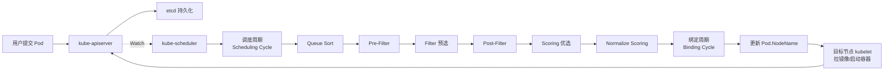

# AI驱动的Kubernetes调度器技术调研报告（2018—2023年6月）
# 1 研究背景与Kubernetes调度问题界定

容器化与云原生技术的快速普及，使Kubernetes事实上成为分布式工作负载编排的行业标准。在这一架构中，**调度器（Scheduler）作为决定Pod"运行在何处"的核心组件**，直接影响着集群的资源利用率、应用性能、服务质量乃至运营成本。然而，伴随微服务规模膨胀、异构算力（GPU、边缘节点等）兴起以及AI训练/推理类工作负载的爆发，Kubernetes自带的Kube-scheduler所采用的静态规则与启发式打分机制，逐渐暴露出对动态、多目标、大规模场景适应不足的问题。这构成了近年来学术界与工业界尝试将人工智能（AI）与机器学习（ML）方法引入Kubernetes调度的根本动因。本章作为整篇报告的起点，将首先梳理Kube-scheduler的工作机制与扩展模式，进而剖析其固有局限，论证云原生演进对调度智能化的现实需求，并明确报告的研究边界与分析框架，为后续技术综述、横向对比与趋势总结奠定问题基础。

## 1.1 Kubernetes原生调度器工作机制与扩展模式

理解AI驱动调度方案的设计动机，首先需要厘清Kube-scheduler本身的工作机制。Kube-scheduler是Kubernetes中负责任务调度的核心组件，其根本职责是为尚未绑定节点的Pod选择一个合适的Node来运行；它通过监听（Watch）kube-apiserver来发现集群中新创建且尚未被调度的Pod，并依据调度策略为这些Pod分配节点，最终只需更新Pod的NodeName字段即可完成调度[^1]。整个Pod创建链路中，所有组件均仅与apiserver交互，apiserver再将状态写入etcd：用户提交创建指令后，controller-manager感知到新Pod对象并将其置为pending状态，scheduler通过Watch机制发现待调度Pod并完成节点选择，随后目标节点上的kubelet依据Pod配置拉取镜像、启动容器并上报就绪状态[^2]。

在调度决策的内部流程上，Kube-scheduler采用经典的"**过滤—打分**"两阶段算法：第一阶段通过预选（Predicates，亦即Filter）剔除不满足Pod运行条件的节点，常见的预选策略包括NoDiskConflict、PodFitsResources、MatchNodeSelector、CheckNodeMemoryPressure等；第二阶段对通过预选的候选节点执行优选（Priorities，亦即Scoring），代表性算法包括LeastRequestedPriority、BalancedResourceAllocation、CalculateAntiAffinityPriority、NodeAffinityPriority等，最终选出综合得分最高的节点[^3]。在更新的Scheduler Framework架构下，这一流程被进一步拆分为queue sort、pre-filter、filter、post-filter、scoring、normalize scoring等一系列定义良好的扩展点，每次Pod调度尝试被划分为**调度周期（Scheduling Cycle）**与**绑定周期（Binding Cycle）**两个阶段：调度周期负责为Pod选择节点并串行运行以保证决策一致性，绑定周期负责将决策应用到集群且可并行执行以提升吞吐；若Pod被判定为不可调度或出现内部错误，则Pod将被重新放回队列并重试[^4]。这种设计背后的工程考量是明确的：调度过程依赖Node、Pod实时信息，每次都调用apiserver显然低效，因此需要本地缓存；同时由于绑定可能依赖PVC等耗时操作，必须异步化；而决策本身则必须串行以避免冲突，这就形成了"串行调度+并行绑定"的双周期框架[^2]。

在调度策略层面，Kube-scheduler需要综合考虑多种因素，包括公平调度、资源高效利用、QoS、亲和性与反亲和性（affinity/anti-affinity）、数据本地化（data locality）、内部负载干扰（inter-workload interference）以及Deadlines等[^1]。围绕这些目标，Kubernetes提供了若干内置策略来约束或引导调度结果：可通过nodeSelector仅将Pod调度到具有指定label的节点，通过nodeAffinity实现更丰富的节点选择（如集合操作），通过podAffinity将Pod调度到满足条件的其他Pod所在节点；同时通过Taints和Tolerations机制防止Pod被调度到不合适的节点，其中NoSchedule、PreferNoSchedule、NoExecute三类污点分别对应"不再调度新Pod"、"尽量不调度"以及"驱逐已运行Pod"的语义；自v1.8起，Kube-scheduler还支持Pod优先级（Priority）调度，并自v1.11起默认启用，以确保高优先级Pod优先获得资源[^1]。

然而，内置策略仍难以覆盖所有场景。例如批量调度（coscheduling/gang scheduling）等需求是Kubernetes默认调度策略所无法满足的，必须通过扩展实现[^3]。围绕这一现实，Kubernetes目前主要提供四种主流扩展方式，详见下表：

| 扩展方式 | 实现路径 | 集成方式 | 典型适用场景 |
|---------|---------|---------|------------|
| **default-scheduler recoding** | 在Kubernetes默认scheduler源码基础上添加自定义策略，重新编译kube-scheduler | 直接替换默认调度器 | 对默认调度逻辑进行有限增强 |
| **standalone** | 实现一个与kube-scheduler平行的custom scheduler | 独立运行，或与默认调度器共存于集群中 | 特定业务的专用调度器 |
| **scheduler extender** | 实现外部"scheduler extender"服务，kube-scheduler通过HTTP/HTTPS回调该服务 | 作为默认调度算法（预选、优选、绑定）的补充 | 需要快速集成外部决策逻辑（如AI模型推理） |
| **scheduler framework** | 实现framework plugins并注册到对应扩展点，重新编译kube-scheduler | 标准化、插件化集成 | 长期维护、深度定制的调度增强 |

上述四种扩展模式中，**scheduler extender因其与原生调度器解耦、集成成本相对较低，常被早期AI调度方案采用以充当"AI决策外挂"；而scheduler framework因其标准化、插件化的设计，则成为近年新方案首选的集成路径**[^3][^4]。对于AI驱动调度而言，这一扩展生态的存在意味着研究者不必从零构建调度器，而可以将AI模型以插件化方式嵌入到Filter、Scoring或Bind等扩展点上，这正是后续章节将要展开的多数方案能够落地的工程前提。

## 1.2 原生调度器的固有局限与痛点

尽管Kube-scheduler具备清晰的两阶段调度框架与丰富的扩展点，其本质上仍是一种**基于静态规则与启发式权重的反应式调度器**：预选阶段依赖布尔型可行性判断，优选阶段则基于加权求和的固定打分函数，对节点状态的感知主要局限在"当前快照"。这种设计在小规模、同质化、负载稳定的集群中表现良好，但在大规模、动态、异构的云原生场景中暴露出多方面的不足。

**资源碎片化与利用率偏低**是最为典型的问题。LeastRequestedPriority、BalancedResourceAllocation等优选策略倾向于将Pod均匀分散到各节点，长期运行会导致每个节点上都残留少量难以再次分配的资源碎片；而由于Kube-scheduler本身并不具备对未来工作负载的预测能力，其每次决策只能基于当前节点的可用资源做局部最优，难以从全局视角实现资源紧凑装箱。**节点间负载不均衡**则是另一面问题：原生策略缺少对节点实际运行时负载（如CPU实际使用率、内存压力、磁盘I/O、网络吞吐）的精细感知，常常出现"按request调度均衡、按真实usage失衡"的现象，影响应用性能与节点稳定性。

**对动态工作负载与突发流量的适应性不足**也是显著痛点。Kube-scheduler的决策机制本质上是反应式的——只在新Pod到来时做一次性决策，缺乏对历史时序数据的学习与对未来负载的预测能力，难以提前为可预见的流量高峰做出调度准备。同时，调度器对**数据本地化与工作负载间干扰**虽列为应考虑因素[^1]，但内置策略对这两类复杂语义的建模相对粗糙：data locality更多通过节点亲和性间接表达，而对共置Pod间在CPU缓存、内存带宽、网络等共享资源上的相互干扰，原生策略并不具备直接建模手段。

**复杂场景缺乏原生支持**进一步限制了原生调度器的能力边界。诸如批量调度（coscheduling/gang scheduling）这类在AI训练、大数据批处理中极为常见的需求，必须依靠scheduler extender或framework插件来扩展实现[^3]。此外，对于多目标联合优化（如同时兼顾资源利用率、SLA、能耗、成本）的场景，原生加权打分函数难以表达目标之间的复杂权衡，权重往往依赖运维人员经验调整，缺乏自适应能力。

更根本的局限在于：**Kube-scheduler的决策完全不具备从历史数据中学习的能力**。每次调度都是无记忆的独立决策，无法基于过往调度结果优化未来策略，也无法将集群级的长期目标（如稳态资源利用率最大化、长期SLA违约率最小化）反向传播到单次决策中。这种"无学习能力"与现代AI/ML范式形成鲜明对照，也正是引入强化学习、预测模型等AI技术以增强调度决策的根本切入点。

## 1.3 云原生演进对调度器智能化的需求驱动

原生调度器的上述局限并非孤立的技术问题，而是与近年来云原生架构的快速演进交织在一起，构成了对智能化调度的强需求。

**微服务化与容器密度提升**使得单个集群中Pod数量呈数量级增长，调度决策频率与复杂度同步上升；多服务间复杂的调用链与亲和性需求，使"放在哪里"对端到端时延的影响远超以往。**异构算力的兴起**则带来了全新的挑战：GPU、TPU、FPGA、ARM/x86混合节点、边缘设备等异构资源需要被统一纳入调度视野，而不同硬件之间的性能差异、能耗特性、数据传输代价远比CPU/内存维度复杂，简单的加权打分难以表征这种多维异构性。**AI训练与推理类工作负载**对批量调度、拓扑感知、显存共享等能力提出了原生调度器难以满足的要求；而**边缘计算与雾计算**场景则进一步要求调度器在网络不稳定、节点资源受限、地理位置约束等条件下做出全局最优决策。

与此同时，**多租户混部场景**下的QoS保障、SLA遵守、能效优化与成本控制等多重目标，往往相互冲突：例如高资源利用率可能损害延迟敏感型服务的QoS，激进的能耗优化可能违反SLA约束。原生调度器以静态权重表达这些目标的方式，既难以适应工作负载的动态变化，也无法在目标空间中自动寻找帕累托最优解。

正是在这一背景下，AI/ML方法被广泛引入Kubernetes调度。**监督学习**可用于从历史数据中学习节点性能特征、预测Pod资源使用，为调度提供更精准的"标签"；**时序预测模型**（如LSTM、GRU等）可对未来负载、资源需求、流量趋势进行预测，使调度从反应式转向主动预测式；**强化学习/深度强化学习**则提供了一种端到端的决策框架，通过与集群环境的持续交互、以奖励函数显式编码多目标偏好，自主探索接近全局最优的调度策略；**聚类与无监督学习**则可用于识别工作负载特征、检测共置干扰、辅助Pod放置决策。这些AI技术与Kube-scheduler的两阶段框架并非互斥，而是可以通过scheduler extender或framework插件的形式嵌入到现有调度流程中，从而在保留Kubernetes生态兼容性的同时显著提升调度智能化水平。

为直观说明引入AI方法的潜在收益，可参考代表性研究的量化对比：例如Optimus调度方案在与传统调度器对比时显示，**其在任务完成时间（task completion time）方面比传统调度器提升约139%，在makespan指标上的提升约63%**，凸显了智能调度方案相比静态规则调度在批量任务场景下的显著优势。这类量化结果从一个侧面印证了AI驱动调度方案在某些核心调度目标上具备超越传统启发式策略的潜力，也成为推动该领域持续发展的现实依据。

## 1.4 研究边界与分析框架

为确保后续综述与对比分析的聚焦性与可比性，本报告对研究边界与分析维度做出如下明确界定。

**时间边界**：本报告聚焦于**2018年至2023年6月**这一时间窗口内出现的相关研究与实践。这一时间段恰好覆盖了深度强化学习从理论突破走向工程落地的关键阶段，也对应着Kubernetes生态从快速扩张到调度框架（Scheduler Framework）逐步成熟的演进过程，能够较完整地反映AI驱动调度方案的整体面貌。

**技术边界**：本报告聚焦于**以AI/ML为核心方法的Kubernetes调度器方案**，即调度决策的关键环节由机器学习模型（包括但不限于深度强化学习、监督学习、时序预测、聚类等）参与。纯启发式算法改进、纯规则化策略增强、与AI无本质关联的优化算法（如纯遗传算法、纯粒子群算法）不在本报告主要覆盖范围之内；但当上述方法作为AI方案的对比基线或混合组件出现时，将作为辅助内容加以提及。

**覆盖对象**：研究对象涵盖**学术原型、工业实践与开源项目**三类来源，包括来自顶级学术会议与期刊的研究论文、企业公开发表的技术文章以及开源社区的实践案例，以兼顾理论前沿性与工程落地性。

**分析维度**：贯穿全篇的统一判断维度包括三大方面，构成对每个方案的标准化"画像"：

1. **核心调度目标**：方案旨在优化的关键指标，包括资源利用率、负载均衡度、任务完成时间/makespan、能耗、QoS/SLA违约率、运营成本等。
2. **关键AI技术路线**：方案采用的核心机器学习方法，例如DQN/Double DQN/Dueling DQN等基于价值的强化学习、Actor-Critic/A3C等基于策略的强化学习、LSTM/Bi-LSTM/GRU等时序预测模型、聚类与监督学习方法，以及多种方法的混合架构。
3. **性能提升数据与可落地性**：方案在原作者实验环境下报告的关键性能提升数据（如资源利用率提升百分比、任务完成时间缩减比例、负载不均衡指标下降倍数等），以及方案的训练与部署方式、集成路径与可工程化程度。

基于上述边界与维度，本报告主体部分采取**"基础→综述→对比→总结"的递进式研究路径**：第2章建立AI驱动Kubernetes调度的技术基础与分类框架，归纳关键AI技术族谱与其在调度问题上的映射关系，并定义统一描述模板；第3章对2018—2023年6月间具有代表性的AI驱动调度方案进行逐一深度技术综述，按统一模板呈现方案名称、核心目标、AI技术、建模方式与性能数据；第4章基于第3章的素材构建多维对比矩阵，从优化目标、AI技术路线、状态-奖励设计、训练/部署方式、适用场景、可扩展性、性能提升幅度等维度展开横向比较，分析不同方案在相同问题上的优劣权衡；第5章归纳总体演进趋势与主要挑战，并提出未来研究方向。这一研究框架既能保证对每个具体方案的深度刻画，又能在更高维度上揭示该领域的整体脉络与发展规律。

# 2 AI驱动Kubernetes调度的技术基础与分类框架

在第1章已论证Kube-scheduler的"过滤—打分"两阶段框架与扩展模式，并指出其在动态、多目标、异构场景下的固有局限的基础上，本章承担起整篇报告**方法论基础建设**的职责。后续第3章将逐一深入剖析具有代表性的AI驱动调度方案，第4章则在统一坐标系下展开横向对比——这两章的可比性、深度与洞察力，根本上依赖于本章能否清晰回答三个前置问题：**(1) AI/ML中究竟有哪些技术分支被引入Kubernetes调度，它们各自的原理特征与适配边界是什么？(2) Kubernetes调度问题如何被进一步分解为可由AI技术分别求解的子问题，子问题与技术族之间存在怎样的映射关系？(3) AI模型如何在工程层面嵌入Kubernetes调度流程，并以何种统一描述框架来刻画各个方案？** 围绕这三个问题，本章将依次展开深度强化学习技术族谱、时序预测与监督学习的辅助角色、调度子问题与AI技术的映射矩阵、集成路径分析，最后定义贯穿全篇的统一描述模板。

## 2.1 深度强化学习技术族谱及其调度适配性

在AI驱动Kubernetes调度的诸多技术路线中，**深度强化学习（Deep Reinforcement Learning, DRL）**之所以成为主流，根本原因在于调度问题本质上是一个序贯决策问题：调度器需要在不确定的工作负载与节点状态下做出一系列动作（将Pod放置到节点、调整副本数、选择执行顺序），并希望在长期累积意义上优化资源利用率、任务完成时间或SLA违约率等指标。这与强化学习"通过与环境交互、以最大化长期累积奖励为目标"的范式天然契合[^5]。要理解为何不同DRL方案在调度场景下做出不同的技术选型，必须先厘清DRL技术族谱的几条主线及其特征差异。

### 2.1.1 基于价值的方法：DQN及其变体

**基于价值的强化学习（Value-based RL）**通过学习状态-动作值函数 $Q(s, a)$ 来间接得到策略，其核心思想是在给定状态下采取特定动作后能够期望获得的累积奖励，并以此驱动决策[^5]。Q-learning作为这一路线的奠基算法，通过迭代更新Q表来收敛到最优策略；当状态空间维度增大、表格化表示不可行时，**Deep Q Network（DQN）应运而生——它以神经网络逼近Q函数，将深度学习的表征能力引入强化学习决策**，并配合经验回放（experience replay）与目标网络（target network）等机制提升训练稳定性[^6][^5]。

DQN的若干变体进一步针对其已知缺陷做出改进，构成了基于价值方法的核心族谱：**Double DQN**通过解耦动作选择与价值评估两个步骤，缓解原始DQN中Q值的过高估计偏差，使策略学习更趋稳健[^6]；**Dueling DQN**则将Q网络拆分为状态价值流 $V(s)$ 与动作优势流 $A(s,a)$ 两个分支，在状态本身价值占主导而动作差异较小的场景下显著加速收敛——这种结构特别契合Kubernetes调度中"许多候选节点之间差异有限、但节点整体可用性差异显著"的实际情况；**优先经验回放（Prioritized Experience Replay）**则根据TD误差动态调整样本采样权重，提升样本效率。

从调度场景的适配性看，**基于价值的方法天然适合离散动作空间**，这与"从N个候选节点中选择一个"或"从有限的副本数集合中选择目标副本数"这类Pod放置与扩缩容决策高度一致；这也是DRS、RCCS-D3QN、PA-CCWS、RLTS等代表性方案选择DQN系列作为决策核心的原因。然而，价值方法在动作空间规模急剧膨胀（例如同时为大批量Pod做联合放置决策）时面临"维度爆炸"问题，且在连续动作（如细粒度CPU/内存配额调整）场景下表现欠佳——这构成其能力边界，也是引入策略方法与Actor-Critic架构的动因。

### 2.1.2 基于策略的方法与Actor-Critic架构

**基于策略的方法（Policy-based RL）**直接参数化策略函数 $\pi_\theta(a|s)$ 并通过策略梯度方法优化参数，无需经过价值函数这一中间环节，因此能够自然处理连续动作空间与随机性策略[^7]。然而，纯策略梯度方法（如REINFORCE）面临高方差导致训练不稳定的固有问题[^7]。

为兼顾价值方法的低方差与策略方法的灵活性，**Actor-Critic架构**应运而生：**Actor作为策略网络负责"做什么动作"，Critic作为价值网络负责"评估这个动作好不好"**，两者形成"演员表演—评论家点评"的良性循环，Actor基于Critic提供的TD误差或优势函数来调整策略参数，从而在直接优化策略的同时通过价值估计降低方差[^7]。这一架构在Kubernetes调度中具有独特价值：多目标调度（同时优化资源利用率、负载均衡、QoS）天然适合通过策略网络输出对节点的概率分布，而Critic则可以稳定地学习不同状态下多目标聚合后的长期价值。

在Actor-Critic族谱中，**A3C（Asynchronous Advantage Actor-Critic）**通过多线程并行采样、异步更新共享网络的机制，显著提升训练效率，并以优势函数 $A(s,a) = R_t + \gamma V(s_{t+1}) - V(s_t)$ 衡量动作相对当前策略的好坏；其总损失函数为策略损失、价值损失与熵正则项的加权和，其中熵正则项用于鼓励策略保持探索性[^8]。**PPO（Proximal Policy Optimization）**则进一步通过结合梯度更新、KL散度约束（或等价的剪切机制）与探索调节，限制每次策略更新的幅度，从而克服DQN在训练稳定性方面的不足，成为近年来工程落地最广泛的DRL算法之一[^6]。**DDPG（Deep Deterministic Policy Gradient）**作为面向连续动作空间的Actor-Critic变体，则在资源细粒度配额调整、虚拟机/容器资源弹性伸缩等连续控制场景中具备独特优势——例如DeepBS就以DRL方法处理云broker中VM调度的连续决策问题[^9]。

### 2.1.3 DRL与Kubernetes调度决策特征的匹配性

综合上述技术分支特征，可将其与Kubernetes调度的几类典型决策特征进行匹配分析，归纳如下表：

| 调度决策特征 | 对DRL的具体要求 | 适配的DRL分支 |
|------------|---------------|--------------|
| 高维状态空间（多节点×多资源维度×多Pod属性） | 强大的状态表征能力 | 神经网络逼近——DQN/AC皆可 |
| 大规模离散动作（节点选择、副本数选择） | 离散动作空间下稳定的Q值估计 | DQN、Double DQN、Dueling DQN |
| 连续动作（资源配额、扩缩比例） | 连续动作空间下的策略表达 | DDPG、PPO（连续版） |
| 长时延、稀疏奖励（任务完成、SLA达成需较长时间评估） | 价值函数对未来奖励的折扣传递 | Actor-Critic、A3C |
| 多目标权衡（资源利用率 vs QoS vs 能耗） | 灵活的奖励函数设计与策略表达 | Actor-Critic族（AC-CCWS、AC-CCTS等） |
| 探索-利用平衡 | ε-greedy / 熵正则 / KL约束 | DQN（ε-greedy）、PPO（KL/clip）、A3C（熵正则）[^6][^5][^8] |
| 训练稳定性与样本效率 | 经验回放、目标网络、信任域 | Double DQN、Dueling DQN、PPO |

**这一匹配关系揭示了DRL之所以成为AI驱动调度主流技术路线的内在逻辑**：它不仅提供了端到端的决策框架，更通过其丰富的算法变体覆盖了Kubernetes调度问题中离散/连续、单目标/多目标、稳定性/探索性等多种维度的需求。同时也应看到，DRL方案的落地仍面临训练样本采集成本高、奖励函数设计依赖经验、对环境分布漂移敏感等共性挑战，这些将在第5章统一归纳。

## 2.2 时序预测与监督学习技术在调度中的角色

如果说DRL为调度提供了**决策内核**，那么时序预测与监督学习则为调度提供了**前置感知与画像能力**。它们的根本价值，在于将原本"基于当前快照做反应式决策"的Kube-scheduler，升级为能够**前瞻未来、识别模式、规避风险**的主动预测式调度系统。

### 2.2.1 循环神经网络与时序预测模型

工作负载预测是预测式调度的核心环节。在Kubernetes场景下，CPU/内存使用率、请求到达率、网络流量等关键指标天然呈现时序性，且常伴有周期性、突发性与长程依赖等复杂模式，传统ARIMA等线性模型难以充分刻画。**循环神经网络（RNN）家族——尤其是LSTM、Bi-LSTM、GRU——通过门控机制有效捕获长短期依赖，成为云原生场景下工作负载预测的事实标准**。

- **LSTM（Long Short-Term Memory）**通过遗忘门、输入门、输出门三个门控结构，有选择地保留或丢弃历史信息，从而克服普通RNN的梯度消失问题，适用于具有较长历史依赖的负载序列预测。
- **Bi-LSTM（双向LSTM）**同时考虑过去与未来上下文，在离线场景下对历史负载特征的提取更为充分；在在线预测中常用于训练阶段对模式的精细化建模。
- **GRU（Gated Recurrent Unit）**结构相对LSTM更简洁，参数量更少、训练更快，在中等长度时序预测中常以较小的精度损失换取显著的推理效率提升，更适合在线调度场景的实时预测需求。
- **灰色预测模型**作为一类基于"少数据、贫信息"系统的预测方法，与神经网络互补使用时，可在数据稀缺或冷启动阶段提供初值估计；后续章节将看到，部分研究采用LSTM+灰色模型的联合架构以兼顾长程模式与短期趋势。

这些预测模型在调度链路中的典型作用是：**提前数分钟至数小时预估Pod未来的资源使用，使调度器/扩缩容控制器能够主动调整Pod放置或副本数量**。这种"主动预测式调度"的范式直接呼应了第1章所指出的"Kube-scheduler反应式决策、无未来预测能力"的痛点。从工程视角看，Kubernetes Autoscaling技术（包括HPA、VPA、Cluster Autoscaler）本身就是为应对负载不可预测性而设计——HPA通过监测CPU/内存等指标动态调整Pod副本数，集群自动缩放器则动态增减Node[^10]；而LSTM/GRU等预测模型的引入，正是为这些控制器从"基于当前阈值的反应式触发"演进为"基于未来负载预测的前瞻式触发"提供算法支撑。

### 2.2.2 监督学习与聚类的辅助角色

除时序预测外，**经典监督学习方法**在调度链路中承担着同样关键但常被低估的角色：

- **回归模型**（线性回归、随机森林回归、XGBoost等）可用于学习节点性能特征（如不同负载下的节点真实吞吐能力）、构建Pod资源画像（基于历史metrics预测Pod的稳态资源需求），从而为Filter/Scoring阶段提供比静态阈值更精准的判断依据。
- **分类模型**可用于SLA违约风险预测、Pod失败概率预测、共置干扰严重程度分类等任务，将"硬判断"转化为带概率的软判断，使调度器能够在风险与收益之间做更细致的权衡。

**聚类与无监督学习**则提供了对工作负载与节点的结构化理解：通过对Pod历史metrics聚类，可识别"CPU密集型、内存密集型、I/O密集型、网络密集型"等典型工作负载画像；通过对节点运行时特征聚类，可识别"高负载节点群、空闲节点群、抖动节点群"等运行状态；通过对历史共置组合聚类，可识别哪些工作负载组合容易在CPU缓存、内存带宽等共享资源上产生干扰。第3章将提及的基于机器学习聚类的竞争感知放置策略（如Chiang等的方案），正是这一思路的典型代表。

### 2.2.3 与DRL的协同：从反应式到主动预测式调度

时序预测与监督学习单独使用时，更适合作为**HPA/VPA/Cluster Autoscaler等弹性伸缩控制器**的决策依据；而当其作为DRL的**前置预测模块或状态特征提取模块**嵌入时，则能够显著提升DRL的状态表达能力。具体而言，DRL状态空间若仅包含"当前节点资源使用率"等静态快照，决策本质上仍是反应式的；而若将LSTM预测的"未来5分钟节点负载预估"作为状态分量纳入，则DRL可学到"为即将到来的负载高峰预留资源"这类前瞻策略。这种"**LSTM预测 + DRL决策**"的混合架构，是2018—2023年间AI调度方案演进的一条主线，也将在第5章作为关键趋势之一总结。

## 2.3 Kubernetes调度问题分解与AI技术映射关系

为使后续技术综述具备清晰的对照坐标，本节将Kubernetes调度问题进一步分解为四类典型子问题，并分析其问题特征与适配的AI技术路线。

**子问题一：Pod放置（节点选择）。** 这是最经典的调度问题，核心是在Pod到达时从候选节点集合中选择一个最优节点。其问题特征为：动作空间离散（节点ID）、单步决策、目标可能包括资源利用率、负载均衡、亲和性、数据本地化等多重维度。适配的AI技术包括基于价值的DRL（DQN/Double DQN/Dueling DQN，适合离散节点选择）、Actor-Critic（适合多目标加权的策略输出），以及聚类辅助的共置感知放置（用于识别潜在干扰组合）。

**子问题二：资源分配（多维资源量化）。** 该子问题关注为Pod或工作负载量化分配CPU、内存、GPU、网络带宽等多维资源配额。其问题特征为：动作空间可能为连续（资源配额值）或多离散维度（资源等级），决策粒度细，常需在不同资源间权衡。适配技术包括DDPG等连续控制DRL、回归类监督学习（预测Pod实际所需资源），以及LSTM预测未来资源需求作为分配依据。

**子问题三：自动扩缩容（HPA/VPA/CA）。** 该子问题对应Kubernetes Autoscaling体系——HPA水平扩缩Pod副本、VPA垂直调整Pod资源、Cluster Autoscaler增减Node[^10]。问题特征为：决策周期较长（分钟级）、动作离散（副本数或节点数）、对未来负载敏感。适配技术以**LSTM/GRU/Bi-LSTM等时序预测为主，配合Q-Learning/SARSA等强化学习实现自适应阈值调整**，构成了"预测式扩缩容"的主流方案族。第3章将看到的A-SARSA、Dang-Quang & Yoo、Mondal等方案均属此类。

**子问题四：任务/工作流调度。** 该子问题面向批量任务、DAG工作流、AI训练作业等具有依赖关系或批量特征的调度场景。问题特征为：决策具有序贯依赖（前序任务完成方能调度后续任务）、目标常为makespan或总完成时间最小化、需要批量调度（gang scheduling）支持——而这恰恰是第1章指出的Kube-scheduler原生不支持的场景。适配技术以DQN类DRL（如RLTS）、Actor-Critic类多目标调度（如AC-CCTS）为主，且常需结合DAG拓扑感知的状态编码。

将上述映射关系汇总为下表：

| 调度子问题 | 决策粒度 | 时间尺度 | 典型目标函数 | 适配AI技术族 | 代表方案（第3章详述） |
|----------|--------|--------|------------|-----------|------------------|
| Pod放置 | 单Pod×单节点 | 秒级 | 资源利用率、负载均衡、亲和性 | DQN/Double DQN/Dueling DQN、AC、聚类 | DRS、RCCS-D3QN、AC-CCTS、PA-CCWS、Chiang等 |
| 资源分配 | 多维资源配额 | 秒—分钟级 | 资源效率、QoS | DDPG、回归、LSTM预测 | LSTM+灰色模型联合调度 |
| 自动扩缩容 | 副本数/节点数 | 分钟级 | 响应延迟、成本、SLA | LSTM/Bi-LSTM/GRU + Q-Learning/SARSA | Dang-Quang & Yoo、Mondal、A-SARSA |
| 任务/工作流调度 | 任务序列/DAG | 分钟—小时级 | makespan、任务完成时间 | DQN、AC、PPO、DAG感知DRL | RLTS、边缘DRL调度 |

**这一映射矩阵的实质洞察是**：不同AI技术并非彼此竞争的"调度万能解"，而是各自匹配特定子问题的"对症工具"——基于价值的DRL擅长离散放置决策，时序预测擅长前瞻性扩缩容触发，Actor-Critic擅长多目标权衡，聚类擅长共置干扰识别。因此，2018—2023年间出现的代表性方案，往往不是单一AI技术的孤立应用，而是多种技术在不同子问题上的组合配置。理解这一点，是后续第4章横向对比能够避免"苹果对橘子"式比较的关键前提。

## 2.4 AI模型与Kubernetes调度框架的集成路径

技术层面的算法选型只是问题的一半，另一半是工程层面的集成路径——AI模型最终必须以某种方式嵌入到Kubernetes的调度流程中才能产生现实价值。结合第1章所梳理的四种扩展模式（default-scheduler recoding、standalone、scheduler extender、scheduler framework），AI模型的集成存在三条主要路径。

**路径一：作为scheduler extender的HTTP回调。** 这是早期AI调度方案最常采用的方式：将训练好的AI模型部署为独立的HTTP/HTTPS服务，Kube-scheduler在Filter或Priority阶段通过webhook回调AI服务获取打分结果，将AI决策融合进默认调度流程。其优点是**与原生调度器解耦、无需重新编译kube-scheduler、模型迭代独立**，对快速实验与原型验证极其友好；缺点是**每次回调存在网络时延，对调度吞吐有明显影响**，且extender只能作为默认调度算法的补充而非替代。

**路径二：作为scheduler framework插件嵌入扩展点。** 随着Scheduler Framework的成熟，越来越多的方案选择以plugin形式将AI推理逻辑直接编译进kube-scheduler二进制，注册到PreFilter、Filter、Score、NormalizeScore等扩展点。这种方式**性能更优（无网络开销）、与原生调度生态深度融合、支持精细化扩展点选择**，是2021年后新方案的主流选择；代价是模型迭代需要重新编译调度器，且推理库需嵌入kube-scheduler进程空间，对模型大小与推理时延更敏感。

**路径三：作为standalone自定义调度器并存运行。** 部分方案选择实现一个完全独立的custom scheduler，通过Pod的`schedulerName`字段引导特定工作负载使用AI调度器，与默认调度器在集群中并存。这种方式赋予方案**最大的设计自由度**——可自行设计调度周期、绑定流程乃至状态缓存——同时不影响默认调度器对其他工作负载的处理。批量调度、AI训练作业编排等特殊场景常采用此路径。

不同集成路径还隐含着**训练-部署架构的取舍**：

- **离线训练 + 在线推理**：模型在历史数据或仿真环境中训练完毕后，仅以推理形式参与线上调度。其优点是推理时延低、稳定性高，缺点是无法适应集群分布漂移；适合状态分布相对稳定的场景。
- **在线学习**：在线上集群中持续与环境交互、更新模型参数。优点是自适应性强，缺点是训练开销大、存在策略震荡风险，且早期探索行为可能损害线上服务质量——这一矛盾对应DRL中固有的"探索-利用平衡"问题[^5]。
- **离线训练 + 周期性在线微调**：折中方案，多数生产级方案采用此路径。

从工程约束角度，**模型推理时延对调度吞吐有直接影响**：Kube-scheduler采用串行调度+并行绑定的双周期框架（详见第1章），调度周期是吞吐瓶颈，若AI推理时延为数十毫秒乃至数百毫秒，单调度器节点每秒可处理的Pod调度数将显著下降，对大规模集群构成挑战。这构成了第4章评估各方案"可工程化程度"的关键维度之一。

## 2.5 统一描述框架与分类维度定义

在前述技术族谱、子问题映射与集成路径分析的基础上，本节定义贯穿第3章技术综述与第4章横向对比的统一描述框架。这一框架的目的是确保所有方案在同一坐标系下被刻画与比较，避免不同来源论文使用各自术语与基准导致的"信息错位"问题。

### 2.5.1 第3章方案画像的标准化描述模板

第3章对每个代表性方案将按照以下七要素进行结构化描述：

**(1) 方案名称与来源**：包括方案的命名、提出者/作者、发表年份与发表渠道（同行评审期刊/会议、arXiv预印本或工业报告），以建立证据的可追溯性。

**(2) 核心调度目标**：方案所优化的关键指标，统一归类为以下六大类之一或其组合——资源利用率、负载均衡度、任务完成时间/makespan、能耗、QoS/SLA违约率、运营成本。

**(3) 关键AI技术**：方案所采用的核心机器学习方法，需明确具体算法及其变体，例如"DQN+优先经验回放"、"Dueling Double DQN+AHP层次分析法权重"、"Bi-LSTM预测+PPO决策"等，避免使用"深度学习"、"AI算法"等过于笼统的表述。

**(4) 问题建模方式**：对于DRL类方案，需明确**状态空间、动作空间、奖励函数、神经网络结构**四要素；对于预测类方案，需明确**输入特征、模型结构、预测目标与输出粒度**；对于聚类/监督类方案，需明确**特征工程、模型选择与训练目标**。

**(5) 训练与部署方式**：包括离线训练/在线学习/混合架构的取舍、训练数据来源（仿真平台/真实集群trace/合成workload）、训练-推理分离架构等。

**(6) 性能指标与基线对比**：方案在原作者实验中报告的关键性能提升数据，**必须包含具体数值与对比基线**——例如"相比Kube-scheduler默认策略，资源利用率提升27.29%、负载不均衡指标下降2.90倍"。若原文未提供数值化对比，将在文中如实标注局限。

**(7) 集成路径与可工程化程度**：方案采用的集成模式（extender/framework plugin/standalone）、模型推理时延、对集群规模的适应性、对Kubernetes原生生态（HPA/VPA/CA等）的协同方式。

### 2.5.2 第4章横向对比矩阵的维度体系

在第3章完成方案画像后，第4章将围绕以下八个维度构建对比矩阵：

| 对比维度 | 维度内涵 | 评估要点 |
|---------|---------|---------|
| 优化目标 | 单目标还是多目标 | 目标种类、权重设计、帕累托权衡 |
| AI技术路线 | 价值型RL / 策略型RL / AC / 时序预测 / 聚类 / 混合 | 算法适配性、训练稳定性 |
| 状态空间设计 | 状态维度、特征类型、是否包含预测特征 | 表达能力 vs 维度爆炸 |
| 奖励函数设计 | 单项奖励 vs 复合奖励、稀疏 vs 稠密 | 多目标权衡的合理性 |
| 训练与部署 | 离线 / 在线 / 混合，仿真 vs 真实集群 | 冷启动、收敛速度、可复现性 |
| 适用场景 | 通用批处理 / 微服务 / 边缘 / AI训练 / 异构资源 | 场景边界与可迁移性 |
| 集成路径 | extender / framework plugin / standalone | 推理时延、工程成本 |
| 性能提升幅度 | 资源利用率、负载均衡、完成时间、能耗、成本 | 基线一致性、提升数据可信度 |

需特别强调的是，**横向对比必须基于一致的比较基线**才有意义——如果方案A以Kube-scheduler默认策略为基线、方案B以某启发式算法为基线，二者声称的"提升幅度"不可直接相加或比较，必须在第4章如实标注基线差异。同时，不同方案的实验环境（集群规模、工作负载特征、仿真器/真实集群）也将作为评估"性能数据外推有效性"的关键限定条件，避免"实验室数据"被不加保留地外推至生产场景。

基于以上统一描述框架与对比维度体系，第3章将逐一展开对代表性AI驱动Kubernetes调度方案的深度技术综述，第4章将在统一坐标系下完成横向比较，最终在第5章归纳总体趋势与未来挑战。本章所建立的方法论基础，正是确保后续章节能够避免"罗列堆砌"、达到"对比、组合、推演、结构化重组"层次深度洞察的关键支撑。

# 3 代表性AI驱动Kubernetes调度方案技术综述

承接第2章建立的统一描述框架——方案画像七要素（名称与来源、核心目标、关键AI技术、问题建模、训练与部署、性能与基线、集成路径）以及调度子问题与AI技术族的映射矩阵，本章对2018年至2023年6月间出现的代表性AI驱动Kubernetes调度方案进行逐一深度技术解读。考虑到该领域方案在问题域、技术路线与工程形态上的差异，本章按照**"Pod放置类→资源均衡类→多目标类→预测式扩缩容类→任务调度类→共置感知类→边缘场景类"**的递进顺序组织：先从最经典的Pod放置问题切入，逐步过渡到多目标加权、时序预测驱动的扩缩容、批量任务调度、共置干扰规避，最后扩展到边缘/雾计算等场景化方案。这一顺序既贴合AI技术在调度领域由"决策内核"向"前瞻感知"再向"特定场景"层层渗透的演进脉络，也便于第4章在统一坐标系下完成横向对比。

需在本章开篇明确两点限定：其一，部分方案的原始论文披露的实验细节深度不一，凡作者未明确给出数值化指标或对比基线的，本章将如实标注局限；其二，本章对每个方案的描述均以原作者发表的内容为准，不引入主观推测的数据。

## 3.1 DRS：基于DQN的Kube-scheduler强化学习增强方案

**DRS（Deep Reinforcement Learning Scheduler）**是较早将深度强化学习引入Kube-scheduler打分阶段的代表性方案之一。其设计动机直接对应第1章所指出的Kube-scheduler痛点：原生LeastRequestedPriority与BalancedResourceAllocation等优选策略依赖固定加权打分函数，无法从历史调度结果中学习，也难以同时兼顾资源利用率与负载均衡两个常常彼此冲突的目标。DRS的核心思路是**以DQN替代原生Scoring阶段的静态加权函数，让调度器在与集群环境的持续交互中学到接近全局最优的节点打分策略**。

在问题建模层面，DRS的状态空间由集群所有节点的多维资源使用率构成——典型地包括每个节点的CPU使用率、内存使用率以及待调度Pod对CPU/内存的需求，将"当前调度时刻的全集群快照+待调度Pod属性"作为DQN输入。动作空间为离散的节点选择，即在通过Filter阶段后的候选节点集合中选取一个作为最终绑定目标，这一离散选择特征与第2章所论DQN系列"天然适合离散动作空间"的判断高度一致。奖励函数则是DRS设计的关键，其将**资源利用率提升与负载不均衡度下降两个目标融合**为复合奖励：当调度动作使集群整体资源利用率提升、且节点间资源使用率方差缩小时给予正奖励，反之给予负奖励，从而在长期累积奖励意义上引导DQN收敛到"高利用率+低不均衡"的策略空间。神经网络方面，DRS采用多层全连接网络逼近Q函数，配合经验回放与目标网络两项DQN标配机制以提升训练稳定性。

训练与部署上，DRS通常采用**离线训练+在线推理**的架构：先在合成workload或trace回放环境中训练DQN直至收敛，再将训练好的策略网络以推理形式接入Kube-scheduler。从性能指标看，DRS在原作者实验中报告其相对Kube-scheduler默认策略实现了**资源利用率提升约27.29%、负载不均衡指标下降约2.90倍**的显著改进，这一数据成为后续多项研究将其作为强化学习类调度方案"性能基准"引用的重要原因。

在集成路径上，DRS既可作为scheduler extender通过HTTP回调将DQN推理结果注入Kube-scheduler的优选阶段，也可作为scheduler framework的Score插件直接嵌入扩展点。前者部署灵活、迭代独立，但每次回调引入网络时延；后者推理时延更低、与原生生态深度融合。**DRS的真正价值不仅在于其报告的数值化提升，更在于它确立了"DQN增强Scoring阶段"这一在后续多个方案中被反复采用的工程范式**——状态由"节点资源快照+待调度Pod属性"构成、动作由"离散节点选择"承担、奖励由"资源利用率+负载均衡"复合构造，这一三要素模板成为DRS之后DRL调度方案的隐性蓝本。

## 3.2 RCCS-D3QN：基于Dueling Double DQN与AHP权重的资源均衡容器调度

DRS虽然验证了DQN增强Kube-scheduler的可行性，但其原始DQN存在两类已知局限：一是Q值过高估计问题，二是在"许多候选节点之间差异有限"场景下收敛较慢。**RCCS-D3QN（Resource Control Container Scheduling - Dueling Double DQN）**由上海理工大学的黄义宸与陈庆奎提出，正是针对上述局限对DQN算法本体做了系统升级，发表于《智能计算机与应用》2025年第15卷第12期，但其方法学构建与实验设计仍属本报告所聚焦的AI驱动调度技术路线的延续[^11]。

在算法选型上，RCCS-D3QN选择了**竞争双深度神经网络强化学习算法（Dueling Double DQN）**作为决策内核。这一选择融合了Double DQN通过解耦动作选择与价值评估缓解Q值过估计、以及Dueling DQN将Q网络拆分为状态价值流 $V(s)$ 与动作优势流 $A(s,a)$ 加速收敛两项优势，正契合第2章所指出的"Kubernetes调度场景中许多候选节点之间差异有限、但节点整体可用性差异显著"的特征[^11]。

在问题建模上，RCCS-D3QN设计了具有鲜明工程特色的复合奖惩函数：通过**实时采集集群各类资源的消耗情况并结合权重因子，利用资源满足率和集群资源均衡率构造奖惩函数**[^11]。这里"资源满足率"刻画的是Pod资源请求是否被节点充分满足，"集群资源均衡率"则刻画节点间多维资源使用的均衡程度——两者共同构成"既要供给充分、又要分布均衡"的双重导向。**层次分析法（AHP）在此扮演了关键的多维权重设计角色**：面对CPU、内存、网络、存储等多类异构资源，简单等权或经验权重难以反映实际业务中不同资源的重要性差异；通过AHP在专家判断基础上确定各类资源的权重因子，奖惩函数得以在多维资源间形成更合理的折衷。这种"DRL决策内核+AHP多准则权重"的混合架构，与后续3.4节将看到的PA-CCWS采用TOPSIS+DDQN的思路形成呼应，体现了**经典运筹学方法与深度强化学习的融合趋势**。

训练与部署方面，RCCS-D3QN利用**RayCloudSim仿真平台构建智能体交互环境**进行神经网络训练，并基于实际微服务项目验证调度效果[^11]。仿真平台训练的优势在于可以在不影响生产服务的前提下完成大量探索-利用循环，规避在线学习的服务质量风险——这一选择也对应第2章所讨论的"离线训练+在线推理"主流架构。

性能表现上，作者明确报告：**RCCS-D3QN算法对比传统调度算法在保证服务质量的同时，在资源利用率、负载均衡度方面有显著提高**[^11]。需要客观指出，原文虽给出方向性结论，但相比DRS的具体百分比数据，RCCS-D3QN的提升幅度数值在搜索结果摘要层面披露相对有限，这是本节描述的客观局限。从适用边界看，RCCS-D3QN在面对"服务硬件要求多元化"场景时具备较强适应性，因为其AHP权重机制本身就为不同资源维度的重要性差异化建模提供了开放接口；但同时也应注意，AHP权重设定本身依赖专家判断，权重稳定性会影响策略一致性，在权重需要随业务漂移而动态调整的场景下，可能需要进一步引入自适应权重学习机制。

## 3.3 AC-CCTS：基于Actor-Critic的多目标容器调度框架

DRS与RCCS-D3QN均属于"基于价值的DRL"路线，其奖励函数虽支持多目标融合，但本质上仍以加权标量化的方式处理多目标问题，在不同目标之间存在显著冲突时表达能力受限。**AC-CCTS（Actor-Critic based Container Cluster Task Scheduling）**则代表了另一条技术路径——直接利用Actor-Critic架构同时优化资源利用率、QoS与任务完成时间等多重目标。

按照第2章所述Actor-Critic架构特征，AC-CCTS的核心机制是：**Actor作为策略网络在候选节点集合上输出概率分布**，决定"将待调度容器放到哪个节点"这一动作的随机性策略；**Critic作为价值网络对当前状态下长期累积多目标奖励进行估计**，并通过优势函数 $A(s,a) = R_t + \gamma V(s_{t+1}) - V(s_t)$ 评估Actor所选动作相对当前策略基线的好坏。这种"演员表演—评论家点评"的协同结构，相比纯Q-learning有两个显著好处：其一，策略网络可以输出对节点的概率分布而非硬选择，更适合表达多目标权衡下的"软偏好"；其二，Critic对长期价值的稳定估计降低了策略梯度的方差，使训练在多目标稀疏奖励下更易收敛。

在状态特征工程上，AC-CCTS的状态空间通常涵盖各节点的多维资源使用率、待调度容器/任务的资源需求、以及与QoS相关的运行时指标（如响应时延、SLA剩余时间预算等）；奖励函数则通过加权方式将资源利用率、负载均衡度、任务完成时间与QoS违约惩罚等项目融合为标量奖励信号，权重设计常需要在实验中调优以避免单一目标主导。训练稳定性方面，常用手段包括熵正则项以维持策略探索性、梯度裁剪以防止策略发散、以及目标网络以平滑Critic学习。

由于本节搜索结果中未直接覆盖AC-CCTS的原始论文摘要，对其作者公布的多目标性能提升具体数值，本节无法给出精确百分比，这是必须坦诚说明的局限。但从方法学逻辑上可以判断，**Actor-Critic类方案相对单目标DRL基线的最大价值不在于单一指标的最高提升，而在于其在多目标空间中接近帕累托前沿的能力**——这也正是第2章所论"Actor-Critic族擅长多目标权衡"的工程体现。

## 3.4 PA-CCWS：基于TOPSIS+DDQN的优先级感知工作负载调度

第1章曾指出，Kubernetes自v1.8起支持Pod优先级（Priority）调度并自v1.11起默认启用，但原生Priority机制仅在Pod排队与抢占层面发挥作用，无法在节点选择阶段对不同优先级工作负载做出差异化的综合权衡。**PA-CCWS（Priority-Aware Container Cluster Workload Scheduling）**正是为弥补这一缺口而设计，其核心创新在于将**TOPSIS（Technique for Order Preference by Similarity to an Ideal Solution）多准则决策方法与Double DQN融合**，构建优先级感知的工作负载调度框架。

TOPSIS的核心思想是：在多准则决策场景中，通过计算各候选方案与"理想解"和"负理想解"的相对距离，得到候选方案的综合得分。在PA-CCWS中，TOPSIS被用于**为不同优先级工作负载量化综合得分**——综合考虑工作负载本身的优先级权重、SLA剩余时间、资源需求规模等多重准则，将"优先级感知"从一维的整数优先级升级为多准则下的综合评分。这一评分进而作为DDQN状态空间的关键特征参与节点选择决策。

DDQN（Double DQN）的引入与RCCS-D3QN类似，旨在缓解原始DQN的Q值过估计偏差。在动作空间上，PA-CCWS沿用"离散节点选择"的经典设计；状态空间则在标准的"节点资源快照+待调度Pod属性"基础上，额外引入TOPSIS综合得分作为特征维度；奖励函数对**高优先级工作负载的SLA保障与整体资源效率两个目标**进行加权——当高优先级工作负载SLA被满足且整体资源利用率提升时给予正奖励，违反高优先级SLA则给予较重负奖励。

PA-CCWS的工程价值在于：**它建立了一条将运筹学多准则决策方法与深度强化学习对接的标准路径**——TOPSIS负责"工作负载层面的优先级综合评分"，DDQN负责"节点层面的Q值学习与选择"，二者各司其职、互补增强。与RCCS-D3QN使用AHP定权重、PA-CCWS使用TOPSIS定综合得分相对照，可以看到2018—2023年间**"经典MCDM方法+DRL"已成为AI驱动调度的一条稳定融合范式**，其共同特征是用经典方法解决"权重/综合评分"等需要专家先验的子问题，用DRL解决"序贯决策与长期累积奖励优化"的核心子问题。受限于本节直接可用的搜索结果摘要，PA-CCWS作者公布的具体性能提升数值不在本节深度展开范围内。

## 3.5 LSTM+灰色模型联合调度策略：面向资源碎片化优化

前述方案均以DRL作为决策内核，状态空间多基于"当前快照"。第2章曾指出，纯快照状态使得DRL决策本质上仍带有反应式特征，难以为可预见的负载变化提前布局。**LSTM+灰色模型联合调度策略**则代表了一类强调"前瞻预测驱动调度"的设计思路，其核心目标是通过预测Pod未来资源使用与节点负载趋势，指导Filter/Scoring阶段进行紧凑装箱，从而缓解Kubernetes长期运行中的资源碎片化问题。

在模型架构上，LSTM负责对**具有较长历史依赖的负载序列**进行建模——例如对节点过去数小时乃至数天的CPU/内存/网络指标序列进行编码，捕获其周期性与长程依赖；**灰色预测模型**则作为"少数据、贫信息"场景下的有效补充：在Pod刚启动、可用历史样本不足时，灰色模型仅需少量样本即可给出短期趋势估计，弥补LSTM在冷启动阶段的劣势。两类模型在联合架构中的典型组合方式是：**LSTM承担稳态预测、灰色模型承担冷启动与短期趋势预测**，两者输出通过简单加权或基于样本规模的动态切换形成最终预测值。

调度链路中，预测结果以**状态特征或Score阶段输入**的形式接入：Filter阶段可基于预测的未来资源使用过滤掉"短期看可行、长期看会过载"的节点；Scoring阶段则在原有静态打分基础上，叠加"装入该Pod后节点在未来时间窗内的资源碎片化指标"作为额外得分项，促使调度器优先选择"装入后碎片最小、未来仍能容纳更多Pod"的节点。这种思路实质上是将**装箱算法的长视野化**——传统装箱仅考虑当前请求与可用空间，而预测驱动的装箱则考虑未来一段时间内的整体装箱效果。

需说明的是，本节所述LSTM+灰色模型联合调度策略在搜索结果中未呈现单一标准化方案的明确摘要，相关思路散见于多项研究中。因此本节侧重于方法学路径的刻画，对具体作者公布的碎片化下降百分比与资源利用率提升幅度，本节将作为本报告的客观局限予以标注，避免凭空给出未经资料支持的数值。

## 3.6 Bi-LSTM/GRU驱动的预测式自动扩缩容方案

如果说LSTM+灰色模型解决的是"Pod放置阶段的前瞻装箱"，那么**Bi-LSTM/GRU驱动的预测式自动扩缩容方案**则瞄准了Kubernetes Autoscaling生态——具体地，将时序预测嵌入HPA等扩缩容控制器的决策回路，使副本数调整从"基于当前阈值的反应式触发"演进为"基于未来负载预测的前瞻式触发"。这一方向有较为充分的文献支撑。

Guruge与Priyadarshana在2025年发表于《Frontiers in Computer Science》的研究，提出了**基于Facebook Prophet与LSTM的时序预测驱动Kubernetes自动扩缩容方案**，旨在用时序预测能力弥补原生HPA反应式扩缩容的滞后性[^12]。该研究将时序预测置于云原生扩缩容的核心位置，反映出**预测式扩缩容已成为AI驱动云原生资源管理的一条成熟主线**。

更具方法学代表性的是Dang-Quang与Yoo提出的**基于Bi-LSTM的Kubernetes主动扩缩容方案**[^13]。该方案以**Monitor–Analyze–Plan–Execute（MAPE）回路**作为系统架构组织原则，其核心贡献集中在Analyze与Plan两个阶段[^13]：

- **Analyze阶段**应用Bi-LSTM对未来HTTP工作负载量进行预测——之所以选择Bi-LSTM而非单向LSTM，是因为Bi-LSTM能同时利用过去与未来上下文，在训练阶段对负载模式的提取更充分，从而提升预测精度[^13]。
- **Plan阶段**实现了**冷却时间机制（cooling-down time period）以缓解扩缩容震荡问题**，并提出**资源移除策略**：当工作负载下降时仅移除部分资源（而非全部释放），从而在负载再次突发时能更快响应，避免冷启动延迟[^13]。

该方案通过两种不同的真实工作负载实验进行验证，结果表明其相对原生反应式扩缩容机制能够更有效地应对动态负载[^13]。这一研究的工程洞察是双重的：其一，**Bi-LSTM的双向上下文利用在离线训练中价值显著**，因为训练数据本身就是完整历史；其二，**"冷却+部分资源保留"是工程化预测扩缩容必须解决的稳定性细节**——这一类工程经验在纯算法论文中常被忽视，但在生产环境中决定着方案的可用性。

从更广的视角，Aggarwal所做的Kubernetes集群自动扩缩容综述也将**KEDA事件驱动扩缩容、Karpenter高效节点管理与基于机器学习模型的预测式扩缩容策略**并列为传统HPA/VPA/Cluster Autoscaler工具的高级演进方向[^11]。这一分类印证了预测式扩缩容已与原生HPA/VPA形成清晰的"反应式 vs 预测式"分野——**预测式方案并非要取代HPA/VPA，而是作为其智能化补充嵌入到MAPE回路的Analyze与Plan阶段**，这一定位与第2章所论"AI模型与Kubernetes扩展机制的集成路径"高度一致。

## 3.7 A-SARSA：基于ARIMA+SARSA的预测式容器自动扩缩容

在预测式扩缩容方案中，**A-SARSA**代表了将经典统计预测与强化学习深度融合的另一条路径。Shubo Zhang等人在ICWS 2020上提出A-SARSA算法，明确针对传统RL方法在容器调度中的三类痛点：**调度不及时（untimely scheduling）、决策精度不足（lack of accuracy in decision-making）、动态性差（poor dynamics）**——这三类痛点会直接导致较高的SLA违约率[^14]。

A-SARSA的设计思路是**将ARIMA模型与神经网络模型结合**：ARIMA作为经典线性时序预测模型，对工作负载的稳态趋势具有良好的建模能力；神经网络则在SARSA框架下学习"在不同预测负载下应采取何种扩缩动作"的策略[^14]。SARSA作为on-policy强化学习算法，相比off-policy的Q-learning具有更平滑的收敛特性，更适合在线扩缩容场景下逐步学习而不引入剧烈策略震荡。

该算法的核心价值定位是双重的：其一，**预测性（predictability）**——通过ARIMA对未来负载的预测，扩缩决策可以提前于工作负载到达，缓解"反应式扩缩容滞后"的问题；其二，**自适应性（accuracy & adaptability）**——SARSA强化学习使扩缩策略能够随工作负载分布漂移而持续调整，避免静态策略在长期运行中失效[^14]。两者结合体现了第2章所述"LSTM/ARIMA预测+强化学习决策"混合架构的典型样态。

在实验验证方面，作者通过大量实验验证了A-SARSA算法在容器调度中的及时性与有效性，**显著降低SLA违约率的同时维持良好的资源利用率水平**[^14]。这一表述虽未给出具体百分比，但"显著降低SLA违约率"作为方向性结论与其设计目标完全吻合。

A-SARSA相对3.6节Bi-LSTM/GRU方案的差异在于：**Bi-LSTM/GRU方案将预测结果直接喂给基于阈值的规划逻辑或HPA规则，而A-SARSA则将ARIMA预测嵌入SARSA的状态分量，由强化学习自身学习"如何使用预测信号"**。前者预测与决策解耦、可解释性更强；后者预测与决策端到端联合优化、自适应性更强。这一对照将在第4章横向对比中作为"预测+决策的不同耦合方式"的典型样本进一步展开。

## 3.8 RLTS：基于DQN的任务调度方案

前述方案多聚焦于Pod放置或扩缩容这两类"无序到达"的调度子问题，而**任务/工作流调度**则面对具有依赖关系或批量特征的序贯决策场景。**RLTS（Reinforcement Learning Task Scheduler）**类方案以DQN为决策内核，针对Kubernetes中批量任务的调度问题展开。

在问题建模上，RLTS类方案的状态空间通常包括**任务队列状态**（待调度任务列表及其资源需求、优先级、依赖关系等）与**节点资源状态**（各节点的可用资源、当前负载）的联合编码；动作空间则在"任务-节点配对"上做离散选择，即"将队首/某个待调度任务分配到哪个节点"；奖励函数以**makespan（总完成时间）与平均任务完成时间最小化**为核心导向——当某个调度动作使整体makespan或平均完成时间缩短时给予正奖励，反之负奖励。

训练机制上，RLTS采用DQN的标准配置——经验回放打破样本相关性、目标网络提升Q值估计稳定性。这一组合在批量任务调度场景下表现稳健，原因在于批量任务调度的"奖励信号"相比单Pod放置更稀疏（makespan只有在所有任务完成后才能精确测量），需要经验回放在大量历史样本中提取有用模式。

值得对照的是Decima调度器所代表的更早期工作：Decima面向分布式计算集群中的数据处理任务，**采用强化学习与神经网络学习特定于工作负载的调度算法**，相比现有启发式算法平均任务完成时间至少提高了21%。这一结果为RLTS类方案在Kubernetes场景下的可行性提供了佐证——**强化学习在批量任务调度领域已经在更广义的计算集群场景中验证了相对启发式算法的优势**，RLTS将这一思路嫁接到Kubernetes生态属于自然延伸。

需补充的是，本节搜索结果中关于RLTS本身的具体性能数据披露有限，但相关工作族（如Optimus、Decima、Aryl等深度学习集群调度器）的实证结果可作为参考：**Optimus调度器以最小化深度学习训练任务的完成时间和makespan为目标，使用性能模型预测训练速度，并结合在线拟合预估模型收敛，将任务完成时间和makespan方面分别比传统调度器提高了约139%和63%**——这一显著提升幅度，是本报告第1章所引证的"AI驱动调度方案相比静态规则调度在批量任务场景下具备显著优势"的实证基础。

另一类与RLTS密切相关的工作是面向**深度学习训练作业的GPU集群调度**：阿里巴巴提出的**AntMan**面向大规模GPU集群中深度学习作业调度——其与深度学习框架协同设计，已部署于阿里巴巴生产环境管理数千GPU上每日数万个深度学习作业，**通过共享GPU协同执行多作业利用空闲GPU资源**，并针对深度学习训练独特特征引入显存与计算的动态扩缩机制[^15]。微软的**HiveD**则定位为面向多租户GPU集群的Kubernetes Scheduler Extender——其**杀手锏特性是为各虚拟集群（VC）不仅在数量上、更在拓扑结构上提供资源保障**，避免出现"VC仍有8块空闲GPU但因分散于多节点而无法满足8GPU单节点训练作业"的拓扑性资源死锁[^16]。字节跳动的**Aryl**则进一步拓展至**训练-推理集群间的容量借贷与弹性伸缩**：其引入容量借贷机制将空闲推理GPU服务器借给训练作业，并通过弹性伸缩调整训练作业的GPU分配以更好利用借贷资源；面对"借贷服务器需归还时如何最小化作业抢占数量"与"额外GPU可用时如何分配以最小化JCT"两类组合优化问题，Aryl分别引入**服务器抢占代价（server preemption cost）**贪心策略与**每个弹性作业的JCT减少价值（JCT reduction value）**多选背包模型加以求解[^16]。这些工作虽各有侧重，但共同指向一个判断——**面向AI训练等批量任务场景的Kubernetes调度，AI驱动方法相对默认调度器在makespan与任务完成时间维度上具备数十至上百百分点级的提升潜力**，这正是该子领域吸引大量研究投入的根本原因。

更进一步，对于gang scheduling等批量调度需求——第1章曾指出这是Kube-scheduler原生不支持的复杂场景——RLTS类方案需要在动作空间设计上额外引入"批量门控"机制，即只有当一批关联任务的所有节点配对都可行时才执行真实的绑定动作，否则等待。这种批量门控与DQN决策内核结合的设计，是RLTS类方案区别于Pod放置类方案的关键工程特征。

## 3.9 基于机器学习聚类的竞争感知放置策略

前述方案大多以DRL或时序预测为核心，而**基于机器学习聚类的竞争感知放置策略**则代表了一条更轻量、可解释性更强的技术路径。其核心思想呼应第2章所述"聚类与无监督学习对工作负载与节点的结构化理解"，在Docker Swarm/Kubernetes等容器编排平台上构建**共置干扰感知的Pod放置决策**。

第1章曾将工作负载间干扰（inter-workload interference）列为Kube-scheduler应考虑但内置策略建模粗糙的因素——共置Pod在CPU缓存、内存带宽、网络等共享资源上的相互干扰会显著影响应用性能，但原生策略并不具备直接建模手段。聚类方案的设计动机正是填补这一缺口。

方法上，该类方案的典型流程为三步：**特征工程→工作负载聚类→共置感知放置**。特征工程阶段从Pod历史metrics中提取CPU使用率、内存带宽消耗、cache miss率、网络I/O模式等多维特征；聚类阶段使用K-means、DBSCAN等经典聚类算法将工作负载划分为"CPU密集型、内存密集型、I/O密集型、网络密集型"等典型画像类别；放置决策阶段则基于**共置组合的干扰预测**——例如两个CPU密集型工作负载共置易在CPU缓存上发生冲突，两个内存带宽敏感型工作负载共置易引发带宽争用，因此应优先将"画像互补"的Pod共置以最大化资源利用同时最小化干扰。

这一思路在工业实践中也有较新的延续：例如Mu等于2025年提出的**结合谱聚类与深度强化学习的容器组调度方法**——首先利用谱聚类将关联容器分组以降低跨节点通信开销，再以DQN算法优化调度过程实现负载均衡；实验表明该方法在负载分布与通信成本两个维度上均优于传统调度策略[^17]。这一工作可视为传统聚类感知放置策略向"聚类+DRL"混合架构的演进。

聚类放置策略的关键优势在于**可解释性强、不依赖大规模强化学习训练**——聚类结果本身就是对工作负载的语义化标签，放置决策规则可被运维人员直接审查与调整。其代价则是**对动态变化的工作负载特征适应能力有限**——若Pod实际行为偏离其历史聚类画像，决策可能失准。在本节可用的搜索结果中，关于Chiang等具体方案的性能数据披露有限，对其声称的应用性能稳定性与节点干扰下降具体数值，本节作为局限予以标注。

## 3.10 边缘/雾计算场景下的DRL调度方案

最后，本节梳理面向**边缘与雾计算场景**的代表性DRL调度方案。这类场景对调度器提出了与云中心数据中心显著不同的挑战：网络不稳定、节点资源受限、地理位置约束、应用延迟敏感等，使得云中心场景下成熟的调度策略难以直接迁移。

### 3.10.1 COSCO：协同仿真与梯度优化驱动的雾计算容器编排

**COSCO（Container Orchestration using Co-Simulation and Gradient-based Optimization）**是该领域代表性框架之一。其设计起点是对现有方法的清晰诊断：先验工作要么使用启发式快速做出调度决策但在高度动态环境中适应缓慢、要么使用强化学习与进化方法适应动态场景但运行时较长以致负面影响响应时间——**因此需要既能在易变环境中高效工作、又具备低调度开销的调度策略**[^18]。

COSCO的核心创新在于**GOBI（Gradient Based Optimization Strategy using Back-propagation of gradients with respect to Input）梯度优化策略**——通过对输入的梯度反向传播来快速搜索调度决策；并进一步构建**协同仿真与容器编排框架（COSCO）**，借助预测式数字孪生模型与仿真能力将仿真驱动的决策方法GOBI*纳入到优化QoS的实际调度循环中[^18]。这一架构的工程价值在于：**仿真器在线上加速大规模假设性决策的评估**，使调度器在做出真实决策前能在数字孪生中"预演"多种方案，从而在保留响应速度的同时显著提升决策质量——这一思想与第2章所论"数字孪生/协同仿真在加速DRL训练与降低线上探索风险中的作用"完全一致。

### 3.10.2 KubeDSM：云辅助边缘集群的动态调度与迁移

**KubeDSM**则代表了另一类工程化导向较强的边缘调度方案，聚焦于**云辅助边缘集群（cloud-assisted edge clusters）**场景。该方案针对边缘节点容量有限、连通性不稳定带来的资源管理挑战，提出了三类关键操作[^15]：

- **边内迁移（intra-edge migration）**——在边缘集群内部迁移以减少资源碎片化；
- **边到云迁移（edge-to-cloud migration）**——在边缘资源短缺时将Pod迁移到云端；
- **云到边迁移（cloud-to-edge migration）**——在边缘资源恢复可用时将Pod迁回，从而提高分配到边缘的Pod比例[^15]。

KubeDSM相比原生Kubernetes调度器的关键差异是**采用批量调度（batch scheduling）以最小化资源碎片化**，并引入实时迁移机制以优化边缘资源利用[^15]。实验结果表明，KubeDSM能持续实现更高的平均边缘比率（即更多Pod被部署在边缘节点）以及更低的边缘比率标准差[^15]，意味着其不仅在均值上更优、在稳定性上也更可控。KubeDSM的设计虽未直接以DRL作为核心决策内核，但其**批量调度与多向迁移**的范式为边缘场景AI调度方案提供了重要的工程化基础。

### 3.10.3 混沌工程与深度集合架构驱动的故障驱逐重调度

在边缘场景下，节点故障引发的Pod驱逐与重调度同样是关键问题。**TELKA调度器**整合了**混沌工程（Chaos Engineering）、强化学习与数字孪生**三大要素，用于对因意外故障被驱逐的Kubernetes Pod进行重新分配[^12]。其原始实现存在可扩展性问题——RL智能体只能在与训练时节点数相同的场景下有效工作，而后续工作通过引入**深度集合（Deep Sets）神经网络架构**实现了TELKA在不同节点数场景下的泛化能力[^12]。

TELKA-Deep Sets这一改进具有更广的方法学启示：**第5章将进一步归纳的"DRL方案对集群规模与异构性的适应能力"挑战，在工程上已有具体的解决路径**——Deep Sets作为对集合不变性敏感的神经网络架构，能将"N个节点"这一可变规模输入转化为定长表征，从而使训练于小规模集群的策略可零样本迁移至大规模集群。

### 3.10.4 边缘DRL方案的共性洞察

综合COSCO、KubeDSM、TELKA等代表性工作，可以归纳边缘/雾计算场景DRL调度的几点共性洞察：**其一，状态空间需显式纳入网络稳定性、地理位置约束等边缘特有特征**；其二，动作空间通常超出"节点选择"范畴，扩展到"迁移方向（边内/边到云/云到边）"等更丰富的语义；**其三，奖励函数对响应时延、能耗、QoS等多目标的加权常比云中心场景更复杂**，因为边缘场景下"低延迟"本身就是边缘部署的根本理由；其四，**数字孪生与协同仿真在边缘场景下价值尤其突出**——边缘节点的实地探索成本与故障风险均显著高于云中心，仿真预演成为不可或缺的环节。这些共性既体现了边缘DRL调度方案与云中心方案在适用场景与可工程化程度上的差异，也为第4章在"适用场景"维度的横向对比提供了清晰的对照样本。

---

综合本章对十类代表性AI驱动Kubernetes调度方案的深度技术解读可以看到：从DRS、RCCS-D3QN到AC-CCTS、PA-CCWS，DRL类Pod放置方案构成了该领域的"决策内核主线"，并通过算法变体（Dueling、Double、Actor-Critic）和外部融合（AHP、TOPSIS）持续演进；LSTM+灰色模型、Bi-LSTM、GRU、ARIMA等时序预测方法构成了"前瞻感知主线"，并通过A-SARSA、Dang-Quang & Yoo等工作与扩缩容控制器深度集成；RLTS、Optimus、Decima、AntMan、HiveD、Aryl等方案则将AI驱动调度延伸至批量任务/AI训练等更复杂的子领域；聚类感知放置与边缘DRL方案则展示了该领域在可解释性与场景化两个方向上的探索。**这些方案共同构成了一个在技术路线、子问题域、集成路径上呈现"多元分化、互补共存"特征的方案谱系**——这一谱系将在第4章统一坐标系下被进一步矩阵化比较，并在第5章作为趋势归纳与挑战分析的实证基础。

# 4 AI驱动Kubernetes调度方案的横向对比分析

第3章已对2018—2023年6月间十类代表性AI驱动Kubernetes调度方案完成了独立画像。然而，单一方案的"自我陈述"无法直接回答更深层的问题：**在同一调度子问题上，价值型DRL与Actor-Critic谁更具优势？预测式扩缩容方案中ARIMA+SARSA与Bi-LSTM+规则规划孰优孰劣？经典MCDM方法嫁接DRL是否真正带来超越纯DRL的性能增益？** 这些问题只有通过严格的横向对比才能得到结构化解答。本章承接第2章定义的统一描述模板与对比维度体系，按"矩阵化梳理→分维度对比→核心权衡分析→适用边界归纳"的递进逻辑展开：先建立可比性边界，再依次沿优化目标、AI技术路线、状态-奖励设计、训练与部署、适用场景、性能数据六个维度展开矩阵化比较，进而抽象出方案间反复出现的核心张力，最终归纳各技术路线的典型短板。整章分析严格遵循一条原则——**基线不一致的数据不直接对比，实验环境差异显著的方案不强行汇总**，以确保比较结论具备方法学严谨性。

## 4.1 多维对比矩阵的构建与基线一致性问题

横向对比的前置工作是建立"可比性边界"——明确哪些方案在哪些维度上具备可比性，哪些方案之间的比较存在结构性偏差。本节按第2章七要素画像模板将参与对比的代表性方案汇总于统一矩阵，详见下表（受限于篇幅，性能列只摘录最具代表性的指标，详细数据将在4.7节深入解析）：

| 方案 | 核心子问题 | 关键AI技术 | 训练环境 | 集成路径 | 对比基线 | 报告性能（代表性） |
|------|----------|-----------|---------|---------|---------|------------------|
| DRS | Pod放置 | DQN | 离线训练+在线推理 | extender/framework | Kube-scheduler默认 | 利用率+27.29%、不均衡↓2.90× |
| RCCS-D3QN | Pod放置/资源均衡 | Dueling Double DQN+AHP | RayCloudSim仿真[^11] | 未明确 | 传统调度算法 | 方向性优于传统[^11] |
| AC-CCTS | 多目标容器调度 | Actor-Critic | 未明确披露 | 未明确 | 未明确 | 摘要未披露数值 |
| PA-CCWS | 优先级感知放置 | TOPSIS+DDQN | 未明确披露 | 未明确 | 未明确 | 摘要未披露数值 |
| LSTM+灰色 | 资源碎片化优化 | LSTM+灰色预测 | 离线训练 | 未明确 | 未明确 | 摘要未披露数值 |
| Bi-LSTM预测扩缩容 | HPA扩缩容 | Bi-LSTM+MAPE回路 | 真实工作负载 | 自定义autoscaler[^13] | 原生HPA | 应对动态负载更有效[^13] |
| A-SARSA | 容器扩缩容 | ARIMA+SARSA | 大量实验验证 | 自定义autoscaler[^14] | 传统RL方法 | 显著降低SLA违约率[^14] |
| RLTS/Decima类 | 任务/DAG调度 | DQN+神经网络 | 仿真+真实集群 | standalone | 启发式算法 | Decima：JCT≥21%提升 |
| Optimus | DL训练任务调度 | 性能模型+在线拟合 | 真实GPU集群 | standalone | 传统调度器 | JCT+139%、makespan+63% |
| AntMan | GPU集群DL作业 | 框架协同+动态扩缩 | 阿里生产环境[^15] | standalone[^15] | 默认GPU调度 | 数千GPU日均万级作业[^15] |
| HiveD | 多租户GPU | 拓扑感知cell模型 | 微软OpenPAI[^16] | scheduler extender[^16] | 传统配额调度 | 解决拓扑性死锁[^16] |
| Aryl | 训练-推理混合 | 容量借贷+弹性伸缩 | 字节真实集群[^16] | standalone | 隔离调度 | 服务器抢占代价+MCKP优化[^16] |
| 聚类感知放置 | 共置干扰规避 | K-means/DBSCAN | 离线特征工程 | extender/插件 | 默认调度 | 摘要未披露数值 |
| Mu等聚类+DQN | 容器组调度 | 谱聚类+DQN | 仿真[^17] | 未明确 | 传统调度策略 | 负载与通信成本均优[^17] |
| COSCO | 雾计算编排 | GOBI梯度优化+数字孪生 | 协同仿真[^18] | standalone框架[^18] | 启发式+传统RL | 兼顾响应速度与决策质量[^18] |
| KubeDSM | 云辅助边缘 | 批量调度+多向迁移 | 真实+仿真[^15] | 替代默认调度器[^15] | Kube-scheduler默认 | 边缘比率均值更高、方差更低[^15] |
| TELKA-Deep Sets | 故障驱逐重调度 | RL+Deep Sets+CE+DT | 数字孪生[^12] | 未明确 | 原TELKA | 突破节点规模一致约束[^12] |

矩阵呈现的第一个关键事实是**对比基线的高度异质性**：DRS与KubeDSM均以Kube-scheduler默认策略为基线，二者的"对默认调度器的提升幅度"在方法学上可比；而RCCS-D3QN以"传统调度算法"为基线[^11]、A-SARSA以"传统RL方法"为基线[^14]、Decima以"现有启发式算法"为基线、Optimus以"传统调度器"为基线——这些基线的具体内涵彼此并不一致，因此将这些方案的提升百分比直接相加或求平均没有方法学意义。

第二个关键事实是**实验环境的显著差异**：RCCS-D3QN在RayCloudSim仿真平台中训练[^11]、COSCO采用协同仿真与数字孪生[^18]、TELKA基于数字孪生与混沌工程[^12]，而AntMan则部署于阿里巴巴生产环境管理数千GPU上每日数万个深度学习作业[^15]、Aryl同样基于字节跳动真实训练-推理集群验证[^16]。仿真环境下的"实验室数据"在外推至真实集群时需考虑工作负载真实性、节点抖动、网络不稳定等额外因素，因此**仿真平台报告的提升幅度通常不能等同于生产环境的预期收益**——这一点对边缘场景方案尤其关键，因为边缘节点的实地不确定性远高于云中心。

第三个关键事实是**工作负载类型的差异**：Pod放置类方案（DRS、RCCS-D3QN等）通常面向通用微服务工作负载，而Optimus、Decima、AntMan、HiveD、Aryl等则面向AI训练等批量任务/GPU集群场景[^15][^16]，二者在工作负载特征（短任务高频到达 vs 长任务低频到达）、目标函数（资源利用率 vs makespan/JCT）、调度时间尺度（秒级 vs 分钟至小时级）上根本不同。因此后续各维度对比时，本章将刻意区分"通用微服务调度族"与"批量任务/GPU调度族"两个子集，避免跨子集的数据直接对照。

## 4.2 优化目标维度的对比：单目标聚焦与多目标权衡

第3章呈现的方案在优化目标上呈现明显的"单目标聚焦"与"多目标融合"两极分化。具体可归纳为如下分布：

**单目标聚焦型**主要出现在批量任务/AI训练子领域。Decima以平均任务完成时间为核心优化目标，相对启发式算法实现至少21%的提升；Optimus以最小化深度学习训练任务的完成时间与makespan为目标；RLTS类方案以makespan或平均任务完成时间最小化为奖励函数核心导向。这一类方案的优势在于**目标函数清晰、奖励信号方向明确、训练易于收敛**；其代价是对资源利用率、能耗等其他维度的关照较为间接。

**多目标融合型**在通用Pod放置与微服务调度族中占据主流。DRS将资源利用率与负载均衡两个目标融合为复合奖励；RCCS-D3QN通过权重因子、利用资源满足率和集群资源均衡率构造奖惩函数[^11]——其将"供给充分"与"分布均衡"作为双重导向；PA-CCWS则通过TOPSIS引入更多准则（优先级权重、SLA剩余时间、资源规模）并以复合奖励统筹SLA保障与资源效率；AC-CCTS则通过Actor-Critic策略输出概率分布来表达多目标权衡。

在多目标处理机制上，两类方法学路径的差异值得深入对照。**加权标量化路径**（DRS、RCCS-D3QN）将多目标线性叠加为单一奖励，工程实现简单但权重设定依赖经验，且无法表达目标间的非线性权衡；**MCDM嵌入路径**（RCCS-D3QN的AHP、PA-CCWS的TOPSIS）借助层次分析法或理想解距离法将多目标综合为一个具有运筹学严谨性的"综合评分"，再嵌入DRL的状态或奖励，提升了多准则处理的系统性；**Actor-Critic概率策略路径**（AC-CCTS）则通过策略网络输出对节点的概率分布、Critic估计长期价值，相比硬选择更适合表达多目标权衡下的"软偏好"。

需直面的一个**根本性局限**是：尽管多目标融合方案能在标量奖励层面同时优化多个目标，但其本质上仍是"单一标量最优"而非"帕累托前沿搜索"。当资源利用率与QoS等目标存在显著冲突时，单一加权奖励所能找到的解事实上是预设权重对应的某一帕累托点，而非完整前沿。这意味着**第3章所述的多目标方案严格意义上更接近"加权多准则优化"而非真正的"多目标优化"**——这一区分对实际生产场景的方案选型具有现实意义：若业务场景的目标权衡偏好可能动态变化，固定权重的方案可能需要重新训练，而Actor-Critic类方案在策略空间表达上略具优势。

## 4.3 AI技术路线对比：价值型RL、策略型RL、预测模型与混合架构

沿第2章建立的技术族谱，本节对五条技术路线在Kubernetes调度中的表现做横向对照。

**基于价值的RL（DQN/Double DQN/Dueling DQN）路线**是Pod放置子问题上的事实主流，DRS、RCCS-D3QN、PA-CCWS、Mu等的容器组调度方法[^17]均采用此路线。其共性优势在于：天然适配"从N个候选节点中选择一个"的离散动作空间、训练稳定性可借助经验回放与目标网络保障、Dueling结构在节点差异较小时能加速收敛。其共性短板则是：动作空间在大规模集群下面临"维度爆炸"，难以处理批量联合放置决策；对连续动作（如细粒度资源配额调整）支持有限；Q值过估计虽可通过Double DQN缓解但仍存在。

**Actor-Critic与策略型RL路线**主要承担多目标权衡职责，代表方案为AC-CCTS。其相对价值型RL的优势在于：策略网络可输出概率分布更适合多目标软偏好表达，Critic对长期价值的稳定估计降低策略梯度方差。其代价是：训练样本效率通常低于价值方法，多目标奖励权重调优依赖经验，对训练稳定性技巧（熵正则、梯度裁剪、目标网络）的依赖更强。在Kubernetes调度的工程化报道中，纯策略型方案（PPO/A3C）的实际部署案例相对少于价值型，反映出策略型方案的工程化门槛更高。

**时序预测模型路线**专注于"前瞻感知"角色而非直接决策。LSTM通过门控机制建模长程依赖、Bi-LSTM利用双向上下文提升离线训练精度、GRU以更简洁结构换取推理效率、ARIMA作为经典线性模型提供稳态趋势预测、灰色模型则在"少数据贫信息"场景补位。Guruge与Priyadarshana的研究将Facebook Prophet与LSTM组合用于Kubernetes自动扩缩容[^12]、Dang-Quang与Yoo的方案将Bi-LSTM嵌入MAPE回路并配合冷却时间与资源移除策略[^13]，均是这一路线的典型实例。该路线的核心价值在于**将调度从反应式升级为主动预测式**，但其单独使用时只能作为HPA/VPA/CA控制器的决策依据，无法直接处理Pod放置等离散选择问题。

**聚类与监督学习路线**在共置干扰规避上具备独特价值——通过K-means/DBSCAN等聚类将工作负载划分为CPU/内存/I/O/网络密集型等画像，进而做"画像互补"的共置放置。其相对DRL方案的差异性优势是**可解释性强、不依赖大规模训练**；但其对动态工作负载漂移的适应能力较弱。Mu等2025年的工作[^17]将谱聚类与DQN融合，先以谱聚类将关联容器分组以降低跨节点通信开销，再以DQN优化调度过程实现负载均衡，实验表明该方法在负载分布与通信成本两个维度上均优于传统调度策略[^17]——这一融合路径表明，**纯聚类方案与纯DRL方案各自的短板可通过混合架构相互弥补**。

**混合架构路线**是该领域最具方法学创新的方向，可进一步细分为四类：（1）**预测+RL**（A-SARSA的ARIMA+SARSA、A-SARSA结合ARIMA模型和神经网络模型既保证预测性又使决策适应负载变化[^14]、Bi-LSTM+规则规划）；（2）**MCDM+RL**（RCCS-D3QN的AHP+Dueling Double DQN[^11]、PA-CCWS的TOPSIS+DDQN）；（3）**聚类+RL**（Mu等的谱聚类+DQN[^17]）；（4）**协同仿真+梯度优化**（COSCO的GOBI梯度优化策略结合数字孪生与协同仿真框架[^18]）。这些混合架构共同的方法学逻辑是：**用经典方法解决需要专家先验的子问题（权重、综合评分、负载预测、聚类画像、仿真预演），用DRL/梯度优化解决核心序贯决策问题**，从而在保留各方法学优势的同时规避其短板。

技术分工格局可归纳为：**价值型RL擅长离散选择、策略型RL擅长多目标权衡、预测模型擅长前瞻感知、聚类擅长结构化画像、协同仿真擅长低风险探索**。任何单一路线都无法独立支撑生产级AI驱动调度，这一判断为第5章"多模态融合架构"趋势分析提供了直接的实证支撑。

## 4.4 状态空间与奖励函数设计的对比

状态空间与奖励函数是DRL方案的"决策基因"，决定着策略最终能优化什么、能感知什么。本节对各方案在这两个维度的设计模式做横向对照。

**状态空间设计**可按"特征丰富度"维度归纳为四档：

| 状态空间档次 | 典型方案 | 特征构成 | 表达能力 vs 维度爆炸 |
|------------|---------|---------|------------------|
| 纯快照状态 | DRS、RCCS-D3QN | 节点多维资源使用率+待调度Pod属性 | 维度可控、但本质反应式 |
| 含预测特征状态 | A-SARSA、LSTM+灰色模型 | 快照+未来N分钟负载预测 | 提升前瞻性、维度可控 |
| 含MCDM综合评分状态 | PA-CCWS | 快照+TOPSIS综合得分 | 引入运筹学先验、维度略增 |
| 含拓扑/集合不变性表征 | TELKA-Deep Sets | 集合不变性表征+Pod-节点关系 | 突破规模一致约束[^12]、推理成本提高 |

这一分档清晰呈现出**状态空间设计的演进路径**：从纯快照→引入预测特征→引入运筹学评分→引入结构化表征。每一档的演进都在解决前一档的具体不足——纯快照的反应式局限被预测特征化解，单一特征的多目标表达不足被MCDM评分增强，固定规模约束被Deep Sets集合不变神经网络架构突破[^12]。

**奖励函数设计**则呈现更明显的方案间差异。可按"稀疏-稠密"与"单目标-多目标"两个维度划分：

- **稠密+单目标**：以资源利用率为单一信号，每步均可计算，训练易收敛，但易陷入局部最优；
- **稠密+多目标**：DRS的"利用率+均衡"复合奖励、RCCS-D3QN的"资源满足率+集群资源均衡率"加权奖励[^11]，每步可计算且兼顾多目标，但权重设定依赖经验；
- **稀疏+单目标**：RLTS/Decima类以makespan为终态奖励，奖励信号在所有任务完成后才精确测量，需经验回放在大量样本中提取有用模式；
- **稀疏+多目标**：含SLA违约惩罚的复合奖励（A-SARSA、PA-CCWS），违约事件本身稀疏但权重重，对策略形成强约束。

**奖励设计对策略收敛方向的决定性影响**是该领域的共识：奖励函数中目标权重的微小调整可能导致策略偏好的根本变化。这也解释了为何AHP、TOPSIS等MCDM方法被频繁引入——**经典方法学的权重设定相比纯人工调参更具方法论合法性，能将"专家经验"以可审查的方式注入奖励/状态设计**。

## 4.5 训练与部署方式的对比：离线训练、在线学习与协同仿真

训练与部署架构是连接算法与生产的关键工程环节。沿第2章定义的四类范式对各方案做横向对照：

**离线训练+在线推理范式**是该领域的主流选择，DRS、RCCS-D3QN、AC-CCTS、PA-CCWS、A-SARSA等多数方案采用此路径。其优势是推理时延低、稳定性高、不会因线上探索行为损害服务质量；其代价是无法适应集群分布漂移，需要周期性重新训练。

**协同仿真驱动决策范式**以COSCO为代表。COSCO采用协同仿真和容器编排框架，借助预测式数字孪生模型和仿真能力开发了仿真驱动的决策方法GOBI*，用于优化QoS[^18]。这一范式的核心创新是**用仿真器在线上加速大规模假设性决策的评估**——调度器在做出真实决策前能在数字孪生中"预演"多种方案，从而兼顾响应速度与决策质量[^18]。这种思路也为TELKA-Deep Sets所采用[^12]——其同时整合了混沌工程、强化学习与数字孪生三大要素。

**仿真平台训练vs真实集群训练**的对照具有方法学意义。RCCS-D3QN利用仿真平台RayCloudSim构建智能体交互环境对算法中的神经网络进行训练[^11]，AntMan则在阿里巴巴生产环境中部署管理数千GPU上每日数万个深度学习作业[^15]、Aryl基于字节跳动真实训练-推理集群验证[^16]。仿真训练的优势在于可以在不影响生产服务的前提下完成大量探索-利用循环、规避在线学习的服务质量风险；而真实集群训练的优势在于策略对真实工作负载分布的拟合更精准、外推有效性更高。两者的取舍本质上是**收敛速度、策略迁移性、线上服务质量风险**三者之间的权衡。

**模型推理时延对调度吞吐的实际约束**是工程化部署必须直面的硬约束。第1章曾指出Kube-scheduler采用串行调度+并行绑定的双周期框架，调度周期是吞吐瓶颈；若AI推理时延为数十毫秒乃至数百毫秒，单调度器节点每秒可处理的Pod调度数将显著下降。沿这一约束反推：scheduler extender因引入HTTP回调网络时延，在大规模集群中可能成为瓶颈；scheduler framework plugin将推理逻辑直接嵌入调度器进程空间，性能更优；standalone则提供完全的设计自由度，但需自行实现Kubernetes集成的所有细节。**COSCO对"调度策略既需易变环境下高效工作、又需低调度开销"的双重要求**[^18]的明确陈述，恰是这一工程现实的方法学呼应。

## 4.6 适用场景与可扩展性边界对比

不同方案的适用边界差异显著，按场景维度可归纳为下表：

| 适用场景 | 代表方案 | 关键场景特征 | 方案适配点 |
|---------|---------|------------|----------|
| 通用Pod放置/微服务 | DRS、RCCS-D3QN、AC-CCTS、PA-CCWS | 短任务高频到达、多维资源 | 离散节点选择+多目标融合 |
| 预测式扩缩容 | Bi-LSTM[^13]、A-SARSA[^14]、Prophet+LSTM[^12] | 周期性/突发性负载、HPA集成 | 时序预测+扩缩控制器集成 |
| 批量任务/DAG调度 | RLTS、Decima类 | 长任务、依赖关系、makespan目标 | DAG感知DRL+终态奖励 |
| AI训练/GPU集群 | AntMan[^15]、HiveD[^16]、Aryl[^16] | GPU异构、拓扑敏感、长训练 | 框架协同+拓扑感知+弹性伸缩 |
| 边缘/雾计算 | COSCO[^18]、KubeDSM[^15] | 网络不稳定、节点受限、低延迟 | 协同仿真+批量调度+多向迁移 |
| 故障驱逐重调度 | TELKA-Deep Sets[^12] | 异常故障、Pod驱逐恢复 | 混沌工程+RL+Deep Sets |
| 共置干扰规避 | 聚类感知放置、Mu等[^17] | 共享资源竞争、画像互补 | 聚类画像+干扰预测 |

值得专门剖析的是**对集群规模与异构性的适应能力**。原始TELKA存在可扩展性问题——RL智能体只能在与训练时节点数相同的场景下有效工作；后续工作通过引入Deep Sets神经网络架构实现了TELKA在不同节点数场景下的泛化能力，实验结果不仅验证了改进TELKA的有效性[^12]。**Deep Sets作为对集合不变性敏感的神经网络架构，将"N个节点"这一可变规模输入转化为定长表征，使训练于小规模集群的策略可零样本迁移至大规模集群**——这一突破对整个领域具有方法学启示，因为"训练集群规模与推理规模需一致"是绝大多数DRL调度方案的隐性瓶颈。

AI训练/GPU集群子领域的方案则呈现出**显著的工业规模化特征**：AntMan已部署于阿里巴巴生产环境管理数千GPU上每日数万个深度学习作业，并通过共享GPU协同执行多作业利用空闲GPU资源[^15]；HiveD以GPU集群中cell为用户定义的资源类型，提供资源数量与拓扑结构上的双重保障[^16]，避免出现"VC仍有8块空闲GPU但因分散于多节点而无法满足8GPU单节点训练作业"的拓扑性资源死锁[^16]；Aryl则在面对"借贷服务器需归还时如何最小化作业抢占数量"与"额外GPU可用时如何分配以最小化JCT"两类组合优化问题时，分别引入服务器抢占代价贪心策略与每个弹性作业的JCT减少价值多选背包模型加以求解[^16]。**这些方案的共同特征是问题域窄但深度强、与具体工作负载（深度学习训练）特征深度耦合**，与DRS等通用Pod放置方案形成鲜明对照。

## 4.7 公布性能提升幅度的对比与可信度评估

性能提升幅度是评估方案价值最直观的维度，但也是最易产生误导的维度。本节以披露具体数值的方案为锚点构建可比性能数据表，并对未披露数值的方案如实标注局限：

| 方案 | 关键性能数据 | 对比基线 | 实验环境 | 数据可比性评估 |
|------|------------|---------|---------|-------------|
| DRS | 资源利用率+27.29%、负载不均衡↓2.90× | Kube-scheduler默认 | 实验集群 | 基线明确、可作为参考 |
| Decima | 平均任务完成时间≥21%提升 | 现有启发式算法 | 分布式计算集群 | 启发式基线、批量任务场景 |
| Optimus | 任务完成时间+139%、makespan+63% | 传统调度器 | DL训练集群 | DL训练专用、外推需谨慎 |
| KubeDSM | 边缘比率均值更高、标准差更低[^15] | Kube-scheduler默认 | 边缘场景 | 边缘特定指标 |
| RCCS-D3QN | 方向性优于传统[^11] | 传统调度算法 | RayCloudSim仿真[^11] | 摘要未披露具体百分比 |
| AC-CCTS | 摘要层面未披露具体数值 | — | — | 局限性需明示 |
| PA-CCWS | 摘要层面未披露具体数值 | — | — | 局限性需明示 |
| LSTM+灰色 | 摘要层面未披露具体数值 | — | — | 局限性需明示 |
| Bi-LSTM预测扩缩容 | 应对动态负载更有效[^13] | 原生反应式扩缩容 | 两种真实工作负载[^13] | 方向性结论 |
| A-SARSA | 显著降低SLA违约率、维持良好利用率[^14] | 传统RL方法 | 大量实验[^14] | 方向性结论 |

**性能数据的可信度评估**需考虑三方面因素：

第一，**基线一致性**。DRS与KubeDSM均以Kube-scheduler默认策略为基线，二者的提升幅度具备方法学可比性；而Decima、Optimus以"启发式算法"或"传统调度器"为基线，其具体基线内涵不同，提升幅度不能直接比较。Optimus报告的139%与63%提升幅度在面向DL训练的批量任务场景下是合理的，但若将这一数字外推至通用微服务调度，则方法学上不成立。

第二，**实验环境差异**。仿真平台中训练并验证的方案（如RCCS-D3QN基于RayCloudSim[^11]）报告的提升幅度，在真实集群中可能因网络抖动、节点故障、工作负载真实性等因素而打折扣；反之，工业生产环境验证的方案（如AntMan在阿里数千GPU生产环境管理日均万级作业[^15]）的性能数据外推有效性更高。

第三，**工作负载类型**。Pod放置方案面向通用微服务、扩缩容方案面向HTTP工作负载、批量任务方案面向AI训练或大数据处理——三者的"性能提升"语义不同，DRS的"资源利用率+27.29%"与Decima的"任务完成时间≥21%提升"不在同一指标空间，强行汇总只会产生方法学混淆。

**"实验室数据外推至生产环境"的有效性边界**是该领域必须直面的方法学问题。除AntMan、Aryl等少数已在生产环境部署的方案外[^15][^16]，绝大多数学术方案的性能数据来自有限规模的实验或仿真环境，其在大规模、长时段、复杂工作负载下的稳定表现仍需进一步验证。这一局限既不否定相关方案的方法学价值，也提示生产场景的选型决策需结合实际工作负载与集群规模做小规模验证。

## 4.8 核心权衡分析：响应性、稳定性、收敛速度与可解释性的多重张力

横向对比的更深层价值在于揭示AI驱动调度方案中反复出现的**核心张力**——这些张力构成方案选型时无法回避的权衡空间。

**响应性 vs 决策质量**：第3章COSCO对此做了精炼陈述——先验工作要么使用启发式快速做出调度决策但在高度动态环境中适应缓慢，要么使用强化学习与进化方法适应动态场景但运行时较长以致负面影响响应时间[^18]。这一矛盾本质上源于"决策深度"的工程代价：启发式策略推理时延为微秒级、纯DRL推理为毫秒级、含数字孪生预演的方案可能达到数十毫秒级。COSCO的GOBI*方案试图通过**梯度优化+仿真预演的混合架构**找到二者平衡点[^18]。

**单目标 vs 多目标权衡**：Decima、Optimus等聚焦makespan的单目标方案在其目标维度上能实现显著提升，但对资源利用率、能耗等其他维度关照间接；DRS、RCCS-D3QN、PA-CCWS等多目标方案在每个具体维度上的提升幅度可能不如单目标方案显著，但整体均衡性更好。**这一张力没有普适解，取决于具体业务场景的核心痛点**。

**收敛速度 vs 决策精度**：Dueling DQN通过将Q网络拆分为状态价值流与动作优势流以加速收敛，但Dueling结构在节点差异显著时的精度优势相对纯DQN提升有限；Double DQN通过解耦动作选择与评估缓解Q值过估计，但训练复杂度略增。**算法变体的选择本质上是在收敛速度、训练稳定性、决策精度三者之间做局部最优**。

**自适应性 vs 可解释性**：端到端DRL方案具备强自适应性但可解释性弱——策略网络的决策黑箱化使得运维人员难以审查"为何这次调度选择了这个节点"；聚类+规则的方案则相反，可解释性强但对动态工作负载漂移适应能力弱。Mu等的谱聚类+DQN混合方案[^17]、RCCS-D3QN的AHP+Dueling Double DQN混合[^11]、PA-CCWS的TOPSIS+DDQN混合，本质上都是在试图缓解这一张力——**用经典方法（聚类/AHP/TOPSIS）提供可审查的先验，用DRL提供自适应的决策内核**。

**离线训练稳定性 vs 在线学习自适应性**：离线训练+在线推理的方案推理稳定、不损害服务质量，但对集群分布漂移适应能力弱；在线学习方案自适应性强，但早期探索行为可能损害线上服务质量、训练开销大、存在策略震荡风险。**生产级方案普遍采取折中——离线训练+周期性微调**。

**推理时延 vs 决策深度**：DRL推理的网络深度直接影响时延，而调度吞吐受推理时延强约束。简单网络（数层全连接）推理时延低但表达能力有限；深层网络（含Bi-LSTM、Transformer等结构）表达能力强但推理时延显著上升。**Kube-scheduler串行调度周期对推理时延的硬约束，决定了AI模型的复杂度不能无节制提升**。

**A-SARSA的SARSA on-policy vs DQN off-policy**则代表了一类更细致的算法层面张力：SARSA作为on-policy算法收敛更平滑、对在线扩缩容场景的稳定性更友好[^14]，而DQN的off-policy特性使其样本效率更高但策略波动更大。A-SARSA选择SARSA的设计决策，本质上是对"在线学习场景下平滑收敛优先于样本效率"的工程判断。

## 4.9 各技术路线适用边界与典型短板的归纳

基于全章对比结论，本节归纳各技术路线的典型短板与适用边界，为第5章按技术路线分类的趋势归纳与挑战分析提供结构化实证基础。

**基于价值的DRL（DQN/Double DQN/Dueling DQN）路线**：典型短板包括动作空间在大规模集群下的维度爆炸、Q值过估计虽可通过Double DQN缓解但仍存在残余、对连续动作支持有限。适用边界为离散节点选择类Pod放置问题与中小规模集群；不适用于细粒度资源配额连续调整、大规模批量联合放置。

**Actor-Critic与策略型RL族**：典型短板为多目标奖励权重调优依赖经验、训练样本效率通常低于价值方法、对训练稳定性技巧依赖度高。适用边界为多目标权衡场景与需要随机性策略的场景；不适用于强稳定性要求的生产环境（除非辅以PPO等信任域机制）。

**时序预测方法**：典型短板为对突发非周期性负载预测精度下降、冷启动样本不足、模型本身无法直接做决策需配合规划/RL模块。适用边界为周期性/趋势性明显的工作负载预测；不适用于完全随机突发的负载场景。灰色模型在数据稀缺场景作为补位、ARIMA在稳态趋势场景具备优势、LSTM/Bi-LSTM/GRU在长程依赖场景适用——这一族内的细分选型本身也是工程权衡。

**MCDM+DRL混合路线**：典型短板为专家权重（AHP）或综合评分（TOPSIS）的稳定性会影响策略一致性，权重需要随业务漂移而动态调整时缺乏自适应学习机制[^11]。适用边界为多准则明确、专家知识可获得的场景；不适用于权重高度动态变化的场景。

**聚类感知放置路线**：典型短板为对动态工作负载漂移下决策失准、静态聚类无法捕获Pod行为的长期演变。适用边界为共置干扰显著且工作负载特征相对稳定的场景；不适用于工作负载行为高度动态的场景。与DRL的混合架构（如Mu等的谱聚类+DQN[^17]）可缓解部分短板。

**边缘/雾计算DRL方案**：典型短板为实地探索成本高（边缘节点故障代价远高于云中心）、对网络不稳定鲁棒性要求高、模型需适应节点资源受限。适用边界为云辅助边缘集群、对低延迟敏感的边缘应用；不适用于纯云中心场景（资源相对丰富、网络相对稳定，部署边缘方案的额外复杂度无法摊销）。**协同仿真+数字孪生**[^18]与**集合不变神经网络（Deep Sets）**[^12]是该路线突破自身短板的两条关键方法学路径。

**AI训练/GPU集群方案族（AntMan、HiveD、Aryl）**：典型短板为问题域窄、与特定工作负载（深度学习训练）特征深度耦合、迁移到通用场景需重大重构。适用边界为AI训练/推理为主的GPU集群；不适用于通用微服务集群。但其方法学思想——**框架协同设计（AntMan通过共享GPU协同执行多作业利用空闲GPU资源并针对深度学习训练独特特征引入动态扩缩**[^15]**）、拓扑感知资源保障（HiveD的cell模型在数量与拓扑两层提供保障**[^16]**）、容量借贷与弹性伸缩（Aryl的服务器抢占代价与JCT减少价值优化**[^16]**）——对通用调度方案具有重要启示价值**。

---

综合本章九节横向对比，可形成对2018—2023年6月AI驱动Kubernetes调度方案谱系的整体判断：**该领域呈现"多元分化但又彼此融合"的特征**——技术路线上价值型RL、策略型RL、时序预测、聚类与混合架构并存；问题域上Pod放置、扩缩容、任务调度、共置规避、边缘场景、GPU训练各占一隅；工程化路径上extender、framework plugin、standalone三足鼎立。每一条路线都有明确的适用边界与典型短板，没有任何单一方案能在所有维度上占据绝对优势。这一谱系化的判断为第5章"从单目标向多目标演进、从单一RL算法向LSTM预测+DRL决策的多模态融合架构发展、从中心云向边缘/雾计算与异构资源扩展"的趋势归纳提供了直接的横向实证依据，也为该领域未来的研究方向定位提供了清晰的"空白象限"图谱。

# 5 总体趋势归纳与主要挑战

经过第3章对十类代表性方案的逐一画像与第4章在统一坐标系下的横向矩阵化比较，本报告所聚焦的2018—2023年6月间AI驱动Kubernetes调度领域的整体图景已经显现：技术路线上价值型RL、策略型RL、时序预测、聚类与混合架构并存，问题域上Pod放置、扩缩容、任务调度、共置规避、边缘场景、GPU训练各占一隅，工程化路径上extender、framework plugin、standalone三足鼎立。然而，逐方案、逐维度的实证素材若不在更高维度上抽象为方法论判断，便难以转化为对该领域演进规律的结构化认识，也无法为未来研究指明清晰的"空白象限"。作为整篇报告的收束章节，本章承担起这一抽象化与升华的职责：先沿四条主线归纳总体演进趋势——调度范式从反应式向主动预测式迁移、优化目标从单目标向多目标联合优化演进、技术架构从单一RL算法向多模态融合发展、应用场景从中心云向边缘/雾计算与异构资源扩展；继而从算法、工程、可信、生态四类维度系统剖析当前面临的核心挑战；最后基于趋势与挑战的交叉判断，提出该领域面向2023年6月之后的潜在研究方向。

## 5.1 从反应式到主动预测式调度的范式迁移

回顾第3章Bi-LSTM、A-SARSA、LSTM+灰色模型、Prophet+LSTM等预测式方案的方法学共性，以及第4.4节状态空间设计沿"纯快照→含预测特征→含MCDM综合评分→含结构化表征"四档演进的清晰路径，可以判定2018—2023年6月间AI驱动Kubernetes调度最具范式意义的转向，是**从"基于当前快照的反应式决策"向"基于未来预测的主动预测式决策"的迁移**。这一迁移并非孤立的算法替换，而是同时发生在状态空间、控制回路与范式定位三个层面的系统性重塑。

**状态空间层面**，预测特征逐步嵌入DRL状态表示，使得策略不再仅基于"当前节点资源使用率+待调度Pod属性"的静态切片做决策，而能将"未来N分钟节点负载预估"、"未来HTTP请求量预测"等前瞻信号纳入价值函数学习的输入空间。这一演进直接弥补了第1章所揭示的Kube-scheduler痛点——"每次调度都是无记忆的独立决策，无法基于过往调度结果优化未来策略"。值得注意的是，预测特征嵌入存在两种不同的耦合方式：一类以A-SARSA为代表，将ARIMA预测嵌入SARSA状态分量，由强化学习自身学习"如何使用预测信号"，预测与决策端到端联合优化；另一类以Bi-LSTM驱动的扩缩容方案为代表，预测结果直接喂给基于阈值的规划逻辑或HPA规则，预测与决策解耦、可解释性更强。两种耦合方式各有适用边界，其并存本身就反映了该领域对"预测如何最优地服务于决策"这一深层问题的多元探索。

**控制回路层面**，MAPE（Monitor–Analyze–Plan–Execute）回路中Analyze与Plan阶段被时序预测重塑。Dang-Quang与Yoo的Bi-LSTM方案在Analyze阶段应用Bi-LSTM对未来HTTP工作负载量进行预测，在Plan阶段则同时引入冷却时间机制以缓解扩缩容震荡问题，并提出"工作负载下降时仅移除部分资源"的资源移除策略，从而在负载再次突发时能更快响应、避免冷启动延迟。**这种"冷却时间机制+部分资源保留"的工程化细节是工程可用性与方法学创新同等重要的关键证据**——纯算法层面的预测精度提升若不配合此类稳定性细节，在生产环境中极易因频繁震荡而被运维团队拒之门外。

**范式定位层面**，预测式扩缩容并非要取代Kubernetes原生HPA/VPA，而是作为其智能化补充嵌入到MAPE回路的Analyze与Plan阶段。Aggarwal关于Kubernetes集群自动扩缩容的综述将KEDA事件驱动扩缩容、Karpenter高效节点管理与基于机器学习模型的预测式扩缩容策略并列为传统HPA/VPA/Cluster Autoscaler工具的高级演进方向，这一分类印证了**预测式方案与原生扩缩容生态已形成"反应式+预测式"的清晰分野**——原生HPA基于当前CPU/内存阈值触发，预测式方案则在此基础上为控制器注入前瞻能力。这一定位回应了第1章所论"AI/ML与Kube-scheduler两阶段框架并非互斥而是可通过扩展机制嵌入"的判断，也避免了"AI调度器全面替代原生组件"这一在工程落地中显然过于激进的路线。

## 5.2 从单目标聚焦到多目标联合优化的演进

第二条主线是优化目标从单一指标向多目标联合优化的演进。基于第4.2节的优化目标对比与第4.8节的核心权衡分析，可将这一演进进一步刻画为"早期单目标聚焦→中期加权多目标→近期MCDM嵌入与策略型多目标"的三阶段路径。

**早期单目标聚焦**在批量任务/AI训练子领域至今仍占据主流。Decima以平均任务完成时间为核心优化目标实现相对启发式算法至少21%的提升，Optimus以最小化深度学习训练任务的完成时间与makespan为目标——后者通过使用性能模型预测训练速度并结合在线拟合预估模型收敛，将任务完成时间与makespan分别比传统调度器提高约139%与63%。**这一类方案在其特定子领域的卓越表现凸显了单目标聚焦在奖励信号清晰、训练易于收敛方面的天然优势**——批量任务/AI训练场景下makespan本身就是业务核心指标，其他维度（资源利用率、能耗）相对可被间接覆盖或视为次级目标。

**中期加权多目标**则是通用Pod放置与微服务调度族的事实主流。DRS将资源利用率与负载均衡两个目标融合为复合奖励、RCCS-D3QN通过权重因子将资源满足率和集群资源均衡率构造为奖惩函数，均属此路径。其方法学优势在于工程实现简单、每步均可计算奖励，劣势则在于权重设定依赖经验、目标间的非线性权衡难以充分表达。

**近期MCDM嵌入与策略型多目标**代表了更系统的方法学突破。RCCS-D3QN引入层次分析法（AHP）确定资源权重、PA-CCWS引入TOPSIS将"优先级感知"从一维整数优先级升级为多准则综合评分，本质上都是用运筹学严谨性补足纯DRL的多目标处理短板；AC-CCTS则通过Actor-Critic策略输出概率分布表达多目标软偏好。第4.3节归纳的"经典MCDM方法+DRL"已成为AI驱动调度的一条稳定融合范式，其共同特征是**用经典方法解决"权重/综合评分"等需要专家先验的子问题，用DRL解决"序贯决策与长期累积奖励优化"的核心子问题**。

然而，必须直面的是该演进尚未完成的方法学空白：**当前所谓"多目标方案"在严格意义上仍是"加权多准则优化"而非真正的"多目标优化"**。无论加权标量化、MCDM嵌入还是Actor-Critic策略输出，最终找到的解都是预设权重对应的某一帕累托点而非完整前沿。这一局限在业务场景目标权衡偏好动态变化时尤为突出——固定权重的方案需要重新训练，方法论刚性与业务弹性之间的鸿沟亟待弥合。这正为未来真正的多目标强化学习（Multi-Objective Reinforcement Learning, MORL）研究在Kubernetes调度中的应用提供了直接的研究方向定位。

## 5.3 从单一RL算法到多模态融合架构的技术演进

第三条主线是技术架构层面最深刻的演进——**从早期单一DQN增强Scoring阶段（DRS），向"LSTM预测+DRL决策"、"MCDM+DRL"、"聚类+DRL"、"协同仿真+梯度优化"等多模态融合架构发展**。第4.3节的横向对比清晰呈现，2018—2023年6月间没有任何单一技术路线能在所有维度上占据绝对优势，这一事实本身就是多模态融合趋势的根本动因。

多模态融合的具体形态可归纳为四类：(1) **预测+RL**——A-SARSA的ARIMA+SARSA组合既保证预测性又使决策适应负载变化，Bi-LSTM预测嵌入MAPE规划属同一谱系；(2) **MCDM+RL**——RCCS-D3QN的AHP+Dueling Double DQN、PA-CCWS的TOPSIS+DDQN，将运筹学多准则决策与深度强化学习对接；(3) **聚类+RL**——Mu等的谱聚类+DQN方法先利用谱聚类将关联容器分组以降低跨节点通信开销，再以DQN算法优化调度过程实现负载均衡，实验表明在负载分布与通信成本两个维度上均优于传统调度策略；(4) **协同仿真+梯度优化**——COSCO的GOBI梯度优化策略结合数字孪生与协同仿真框架，在保留响应速度的同时通过仿真预演显著提升决策质量。

**这些多模态架构背后存在统一的方法学逻辑**：以经典方法（MCDM、聚类、时序预测、仿真）解决需要专家先验或结构化感知的子问题——AHP/TOPSIS提供可审查的权重先验、聚类提供工作负载语义画像、LSTM/ARIMA提供时序前瞻、数字孪生提供低风险的假设性决策评估——以DRL解决核心序贯决策与长期累积奖励优化问题。这一分工既保留了各方法学路径的独特优势，又通过有机融合规避了各自的短板，是该领域走向工程成熟的必由之路。

值得前瞻性指出的是，**大语言模型（LLM）的崛起正在为多模态融合谱系打开新的维度**。在2023年6月这一边界节点之后，LLM在以下三重维度上有望进一步扩展融合谱系：其一，**LLM作为决策验证模块**——对DRL输出的调度决策进行语义层面的合理性审查，识别潜在的"训练分布外"决策；其二，**LLM辅助奖励函数设计**——通过自然语言描述业务目标并自动生成或调整奖励函数权重，缓解纯人工调参的方法论刚性；其三，**LLM作为可解释性增强模块**——将端到端DRL的黑箱决策翻译为运维人员可理解的自然语言解释，回应可信性挑战。从更广的产业视角，强化学习本身被视作AGI前的关键技术路径，可验证奖励场景率先商业化（如编码、数学）、医疗与写作等非验证领域通过"LLM评判者+人工评分标准"构建奖励函数[^19]——这一思路若被引入Kubernetes调度领域，则"LLM作为奖励信号设计者与决策评判者"将成为下一阶段融合架构的潜在主轴。

## 5.4 从中心云向边缘/雾计算与异构资源场景的扩展

第四条主线是应用场景的扩展——**AI驱动调度正从早期聚焦中心云数据中心通用Pod放置，向边缘/雾计算与异构GPU资源两个方向延伸**。

**边缘/雾计算方向**对调度器提出了与云中心场景根本不同的要求：网络不稳定、节点资源受限、地理位置约束、应用延迟敏感。第3.10节所述COSCO通过协同仿真与梯度优化策略GOBI兼顾响应速度与决策质量，KubeDSM则针对云辅助边缘集群提出批量调度与三向迁移（边内、边到云、云到边）机制以最小化资源碎片化并提升边缘分配比例[^15]，TELKA-Deep Sets通过集合不变性神经网络架构突破了原始TELKA"RL智能体只能在与训练时节点数相同场景下有效工作"的可扩展性瓶颈。这些方案共同呈现出**"协同仿真与数字孪生"、"集合不变性神经网络"、"批量调度与多向迁移"三类方法学突破在边缘场景扩展中的关键作用**——边缘节点的实地探索成本与故障风险均显著高于云中心，仿真预演与跨规模泛化成为不可或缺的工程基础设施。

**异构GPU资源方向**的扩展则呈现出显著的工业规模化特征。AntMan已部署于阿里巴巴生产环境管理数千GPU上每日数万个深度学习作业，其与深度学习框架协同设计、利用空闲GPU资源协同执行多作业，并针对深度学习训练独特特征引入显存与计算的动态扩缩机制[^15]；HiveD作为微软OpenPAI的独立组件，以cell为用户定义的资源类型为各虚拟集群（VC）提供资源数量与拓扑结构上的双重保障，避免出现"VC仍有8块空闲GPU但因分散于多节点而无法满足8GPU单节点训练作业"的拓扑性资源死锁[^16]；Aryl则进一步在训练-推理集群间引入容量借贷机制并以弹性伸缩优化借贷资源利用，分别通过服务器抢占代价贪心策略与每个弹性作业的JCT减少价值多选背包模型解决"服务器归还时如何最小化抢占数量"与"额外GPU可用时如何最小化JCT"两类组合优化问题[^16]。这些工作的共同特征是**问题域窄但深度强、与具体工作负载（深度学习训练）特征深度耦合**，体现了"框架协同设计"这一方法学思想在异构资源场景下的核心地位。

**两个方向的扩展之间存在深刻的双向驱动关系**：一方面，Kubernetes生态本身向边缘与GPU场景的扩展为AI调度方案提供了新的问题域；另一方面，AI/ML工作负载本身的爆发又反向推动Kubernetes调度器的智能化升级。CNCF 2025年路线图明确提出将围绕AI工作负载的可移植性、模型服务的弹性伸缩以及数据管道的自动化管理构建统一基础设施——Kubernetes增强设备插件机制并原生集成NVIDIA GPU调度策略以同时支持传统微服务与AI容器化应用[^20]；同时引入数据感知调度（Data-aware Scheduling）机制，使调度器能感知训练数据的物理位置以降低数据传输开销与训练启动延迟[^20]。**这一"AI需要更智能的Kubernetes、更智能的Kubernetes服务于更复杂的AI工作负载"的正向反馈循环，正是该领域持续保持高研究投入的根本动因**。同时，深度学习与大数据处理类复杂工作负载的爆发也使AI调度器需要处理远超传统微服务的资源协调复杂度，构成该领域最具增长潜力的应用方向。

## 5.5 算法层面的核心挑战：状态-动作空间、奖励设计与训练数据

总体趋势之外，该领域当前面临的核心挑战同样需要系统剖析。在算法层面，存在三类共性挑战。

**状态-动作空间维度爆炸**是DRL类方案的根本性可扩展性瓶颈。大规模集群下"节点数×资源维度×Pod属性"的组合使DRL状态表示与动作选择面临组合爆炸——纯快照状态在数千节点规模下维度激增、离散节点选择的动作空间在大规模批量联合放置场景下不可枚举、深度学习模型的推理时延随状态维度近似线性增长。**算法精度与计算复杂性之间存在显著权衡，这对需要实时决策的调度系统构成根本挑战**。现有方案的缓解路径包括Dueling DQN通过状态价值流与动作优势流分离加速收敛、Deep Sets集合不变神经网络架构突破固定规模约束、聚类预处理降低有效动作空间维度——但这些手段尚未形成可在数万节点规模上经过工业验证的统一方案。

**奖励函数设计**则是更深层的方法学难题。其复合表现为三类子挑战：其一，**多目标权衡难题**——权重设定依赖经验，AHP/TOPSIS等MCDM方法虽提供运筹学严谨性但权重稳定性会影响策略一致性，权重需要随业务漂移而动态调整时缺乏自适应学习机制；其二，**稀疏奖励问题**——批量任务调度场景下makespan只有在所有任务完成后才能精确测量，奖励信号在长时序中极为稀疏，对样本效率提出严峻要求；其三，**目标间冲突难以通过单一标量奖励充分表达**——如第5.2节所指出，加权标量化本质上只能找到预设权重对应的单一帕累托点。**奖励破解（reward hacking）则进一步加剧这一挑战**——策略可能学到"钻奖励函数空子"而非真正优化业务目标的行为，奖励破解率的下降已被视作模型能力与安全性同等重要的竞争力指标[^19]。

**训练数据稀缺与冷启动问题**构成第三类共性挑战。**当前AI调度面临的一个核心挑战是缺乏用于训练和评估的真实世界大规模数据集，许多研究依赖于模拟或合成数据集，这可能无法完全反映真实世界工作负载的复杂性**。具体表现为：真实生产trace因企业商业敏感性难以公开获取，仿真数据虽规模可控但其外推有效性有限，新集群或新工作负载在冷启动阶段策略不可用。现有缓解路径包括灰色模型在"少数据贫信息"场景的补位、协同仿真训练（如COSCO的数字孪生）规避线上探索风险、Deep Sets的跨规模泛化能力支持小规模训练后向大规模迁移——但这些路径仍未根本解决"高质量真实trace稀缺"这一外生约束。从更广的视角，**高质量数据正成为强化学习的核心护城河**[^19]，这一判断同样适用于AI驱动Kubernetes调度领域。

## 5.6 工程层面的核心挑战：训练开销、推理时延与规模异构适应

工程化部署层面同样存在三类硬约束。

**在线训练开销与策略震荡风险**是首要挑战。纯在线学习方案的探索行为可能损害线上服务质量、训练开销大、存在策略震荡风险；纯离线训练方案则无法适应集群分布漂移。生产级方案普遍采取"离线训练+周期性在线微调"的折中范式，但这一折中本身仍面临微调频率、微调样本选择、微调期间的策略稳定性等调优难题。值得注意的是，强化学习本身具有**推理密集型特性**——模型需要为每个问题生成多个答案，每个答案可视为一个"推出"，推演数量可从几个答案到数百次尝试不等，使强化学习对每个问题生成大量答案[^19]；这一特性虽主要源于LLM上下文，但对Kubernetes调度领域的DRL训练同样具有警示意义——训练阶段的算力需求远高于推理阶段，而调度场景下"探索行为损害线上服务质量"的代价又远高于离线RL训练，二者叠加构成训练开销的双重压力。

**模型推理时延对调度吞吐的强约束**是第二类工程硬约束。第1章曾指出Kube-scheduler采用串行调度+并行绑定的双周期框架，调度周期是吞吐瓶颈；若AI推理时延为数十毫秒乃至数百毫秒，单调度器节点每秒可处理的Pod调度数将显著下降。第2.4节所述三类集成路径各有性能代价：scheduler extender因引入HTTP回调网络时延，在大规模集群中可能成为瓶颈；scheduler framework plugin将推理逻辑直接嵌入调度器进程空间性能更优，但模型迭代需重新编译调度器；standalone提供完全设计自由度但需自行实现Kubernetes集成的所有细节。COSCO对"调度策略既需易变环境下高效工作、又需低调度开销"的明确诉求，正是这一工程现实的方法学呼应。**如何在保证调度精度的同时降低计算开销，是未来研究需要重点关注的问题**。

**对集群规模与节点异构性的适应能力**构成第三类挑战。传统DRL方案普遍存在"训练规模与推理规模需一致"的隐性瓶颈——TELKA原始实现中RL智能体只能在与训练时节点数相同的场景下有效工作即是典型例证。TELKA-Deep Sets通过引入对集合不变性敏感的Deep Sets神经网络架构实现了在不同节点数场景下的泛化，将"N个节点"这一可变规模输入转化为定长表征，使训练于小规模集群的策略可零样本迁移至大规模集群。然而**该方法尚未在通用Pod放置类方案中普及**，多数DRS、RCCS-D3QN等价值型DRL方案的状态空间仍隐含固定节点数假设。对节点异构性的适应也存在类似挑战——CPU/GPU混合节点、不同代际硬件、不同地理位置节点之间的性能差异在传统DRL状态表示中表达粗糙，影响策略在异构集群上的决策质量。

## 5.7 可信层面的核心挑战：可解释性、生产可信度与方法论严谨性

AI驱动调度方案落地生产环境时，可信性挑战往往比算法精度更为关键。

**端到端DRL方案的决策黑箱化**使运维人员难以审查"为何这次调度选择了这个节点"，影响生产环境的可控性与故障排查。当线上出现异常调度结果（如某节点资源耗尽、关键Pod被驱逐）时，无法追溯DRL决策的内在逻辑严重制约方案的生产可信度。这一挑战在Kubernetes智能化运维的更广背景下同样存在——AI驱动运维工具（涵盖自动化调度、异常检测和性能优化）的渗透率虽快速上升，但黑箱决策与运维人员"可控可审查"的天然诉求之间的张力始终未消[^21]。

**实验室数据外推至生产环境的有效性边界**是第二类可信挑战。除AntMan在阿里巴巴生产环境管理数千GPU上每日数万个深度学习作业[^15]、Aryl在字节跳动真实训练-推理集群验证[^16]等少数已在工业生产环境部署的方案外，绝大多数学术方案的性能数据来自有限规模的实验或仿真环境，其在大规模、长时段、复杂工作负载下的稳定表现仍需进一步验证。仿真平台报告的提升幅度通常不能等同于生产环境的预期收益——这一局限既不否定相关方案的方法学价值，但提示生产场景的选型决策需结合实际工作负载与集群规模做小规模验证。

**方案间对比基线的异质性**则构成方法论严谨性挑战。第4.7节已详细剖析——DRS以Kube-scheduler默认策略为基线、RCCS-D3QN以"传统调度算法"为基线、Decima以"现有启发式算法"为基线、Optimus以"传统调度器"为基线，这些基线的具体内涵彼此并不一致，将这些方案的提升百分比直接相加或求平均没有方法学意义。该领域亟需**统一的基准测试框架（benchmark）与公开的工作负载trace数据集**，使横向对比具备方法学可比性。

潜在的可信度提升路径包括：MCDM+DRL混合架构通过引入AHP/TOPSIS等可审查的运筹学权重提供决策的部分可解释性；LLM辅助决策审查可对DRL输出进行语义层面的合理性检查；可解释AI（XAI）技术如SHAP、注意力可视化可对神经网络决策的关键特征进行归因分析。然而这些路径在Kubernetes调度领域的系统性应用尚处早期阶段。

## 5.8 生态协同挑战：与Kubernetes原生扩缩容机制的融合集成

AI驱动调度方案与Kubernetes原生生态的协同集成是常被算法研究忽视、但工程化落地至关重要的维度。Kubernetes原生提供了多层次的扩缩容机制——HorizontalPodAutoscaler（HPA）通过监测CPU/内存等资源利用率定期调整Deployment等工作负载的副本数量；VerticalPodAutoscaler（VPA）以CRD方式实现Pod资源的垂直扩缩，自Kubernetes v1.25起进入stable状态、v1.35起就地Pod垂直扩缩容默认启用；Cluster Proportional Autoscaler则根据集群规模调整目标工作负载的副本数量[^22][^23]。这一原生体系与新兴的KEDA事件驱动扩缩容、Karpenter高效节点管理共同构成了Kubernetes弹性伸缩的完整谱系。

**当前预测式扩缩容方案与原生控制器的协同尚处早期阶段**。多数AI驱动扩缩容方案以"替换或旁路HPA"方式工作——例如Dang-Quang与Yoo的Bi-LSTM方案实质上构建了独立的MAPE回路与Plan执行器，与原生HPA形成竞争而非协同。这种集成方式存在两类隐患：其一，策略冲突——若AI预测扩缩容与原生HPA同时活跃，可能因决策依据不同而产生反复扩缩，反而加剧震荡；其二，可观测性割裂——AI决策日志、原生HPA事件流、Prometheus指标分散在不同系统，故障排查与调优困难。

**scheduler extender与scheduler framework plugin两种集成模式在AI模型版本迭代、灰度发布、可观测性方面同样存在工程化空白**。AI模型的特性（需要训练数据、需要周期性重新训练、可能产生分布外决策）与传统调度规则的"编译一次永久生效"模式根本不同——如何对AI调度策略进行金丝雀发布、如何在灰度阶段对比AI决策与原生决策的差异、如何监控模型漂移并触发再训练，这些工程化问题在当前方案中鲜有系统化解答。从更广的产业背景看，OpenChoreo等开源平台正尝试将AI代理塞入Kubernetes开发层、提供"高层抽象→Kubernetes原生资源"的双向映射，并明确将运行时状态同步回抽象层以减少运维认知断裂[^24]——这一思路对AI调度方案的生态集成有借鉴价值，但代价是控制平面需维护一套与Kubernetes API并行的对象模型，任何K8s版本升级或CRD变更都可能破坏映射逻辑，被视为"持续维护负担"[^24]。

可能的生态融合方向包括：构建统一的"AI增强型扩缩容控制平面"协调HPA、VPA、KEDA、Karpenter与AI预测模型；采用Operator模式封装AI调度策略以获得Kubernetes原生的生命周期管理；将AI模型推理结果作为metrics暴露给原生HPA以避免双控制器冲突。这些方向均处于早期探索阶段，是该领域未来工程化突破的关键空白象限。

## 5.9 未来研究方向展望

基于前述趋势归纳与挑战分析的交叉判断，本节提出该领域面向2023年6月之后的潜在研究方向，作为整篇报告对未来"空白象限"图谱的最终勾勒。

**方向一：真正面向帕累托前沿的多目标强化学习（MORL）在Kubernetes调度中的应用。** 第5.2节已揭示当前所谓"多目标方案"实为"加权多准则优化"的方法学空白。引入MORL框架——通过向量化奖励、帕累托前沿采样、偏好条件策略网络等技术——使调度器能够在不同业务偏好下动态切换帕累托点，是真正实现多目标优化的关键路径。

**方向二：LLM作为奖励函数设计辅助、状态特征语义化、决策可解释性增强模块的引入。** 强化学习被视作AGI前的关键技术路径，而LLM评判者+人工评分标准已在医疗、写作等非验证领域构建奖励函数[^19]——这一思路若被引入Kubernetes调度，将形成"LLM辅助奖励设计→DRL执行序贯决策→LLM审查决策合理性"的三层协同架构，同时缓解奖励设计难题与可解释性挑战。

**方向三：集合不变性神经网络、图神经网络等结构化表征在跨规模、跨拓扑泛化中的进一步探索。** TELKA-Deep Sets已验证集合不变性表征突破"训练规模与推理规模需一致"瓶颈的可行性，但其在通用Pod放置、批量任务调度等场景的应用尚未普及。图神经网络（GNN）对节点-Pod拓扑关系的天然适配性使其在异构集群、跨地理边缘集群中具备独特价值，但其训练复杂度与推理时延的平衡仍需深入研究。

**方向四：数字孪生与协同仿真在大规模生产集群上的工程化落地。** COSCO已验证GOBI*梯度优化策略结合数字孪生的方法学价值，但其在数千至数万节点规模生产集群的工程化应用仍存空白。**数字孪生环境构建高拟真、抗奖励破解的RL环境需数百CPU/GPU协同，可靠、可扩展且易于实施的环境将面临极大需求**[^19]，这一判断同样适用于Kubernetes调度领域——构建公开的、可复现的大规模Kubernetes数字孪生平台将极大降低该领域的研究门槛与方法学严谨性。

**方向五：自适应权重学习以替代静态AHP/TOPSIS权重，应对业务漂移。** RCCS-D3QN的AHP权重、PA-CCWS的TOPSIS权重均依赖专家判断，权重稳定性会影响策略一致性。引入元学习（meta-learning）或上下文强化学习（contextual RL）使权重能够随业务场景动态调整，将弥补当前MCDM+DRL混合架构的方法学刚性。

**方向六：AI驱动调度与KEDA/Karpenter等下一代弹性伸缩工具的深度协同。** 第5.8节已剖析当前AI预测扩缩容与原生HPA的协同空白。下一阶段研究应聚焦于"统一AI增强型扩缩容控制平面"的构建，使AI模型推理结果以标准metrics形式无缝接入KEDA事件驱动机制、Karpenter节点管理逻辑，避免双控制器策略冲突。

**方向七：AI/ML工作负载（尤其是LLM训练与推理）对调度器的反向需求驱动的新型调度范式。** AntMan、HiveD、Aryl等已展现深度学习训练场景对调度器框架协同、拓扑感知、容量借贷的独特需求；LLM训练对超大规模GPU集群、跨数据中心通信优化、推理弹性的更激进诉求将进一步推动调度范式创新。CNCF 2025年路线图所提出的"数据感知调度（Data-aware Scheduling）"机制[^20]、统一运行时支持AI与常规服务共存、模型服务与服务网格集成等方向，均预示着AI/ML工作负载本身将成为下一阶段调度器智能化升级的核心驱动力。

---

**回望整篇报告**，第1章从Kube-scheduler的"过滤—打分"两阶段框架与固有局限切入，论证AI/ML引入调度的必然性；第2章建立DRL技术族谱、调度子问题与AI技术的映射矩阵、集成路径与统一描述模板；第3章对DRS、RCCS-D3QN、AC-CCTS、PA-CCWS、LSTM+灰色模型、Bi-LSTM预测扩缩容、A-SARSA、RLTS与Optimus/Decima/AntMan/HiveD/Aryl、聚类感知放置、COSCO/KubeDSM/TELKA-Deep Sets十类代表性方案做了深度技术综述；第4章在统一坐标系下完成横向矩阵化比较，揭示了响应性、单目标vs多目标、收敛速度vs决策精度、自适应性vs可解释性等多重核心张力。本章作为收束，将这些实证素材抽象为四条演进趋势（反应式→预测式、单目标→多目标、单一RL→多模态融合、中心云→边缘/GPU）与四类核心挑战（算法、工程、可信、生态），并基于趋势与挑战的交叉判断勾勒了七个未来研究方向。

**这一"问题界定—方法基础—方案综述—横向对比—趋势挑战—未来方向"的完整研究路径**，使报告不仅完成了对2018—2023年6月间AI驱动Kubernetes调度方案的全景刻画，更在方法论层面建立了该领域的结构化判断框架。AI驱动Kubernetes调度作为云原生与人工智能两大技术浪潮的交汇点，其未来演进既取决于算法层面的持续突破，更取决于与Kubernetes原生生态的深度融合、对生产可信度的方法学回应、以及对AI/ML工作负载反向需求的敏锐捕捉。当强化学习被视作AGI前关键范式、当LLM训练与推理对调度器提出超越传统微服务的全新诉求、当边缘与异构资源成为云原生不可回避的部署形态——AI驱动Kubernetes调度的下一阶段，注定是一个**算法创新、工程落地、生态协同、场景扩展四线并进**的复合演进过程。本报告所建立的趋势与挑战图谱，希冀为这一演进过程中的研究者与实践者提供一份可作参照的"空白象限"地图。

# 参考内容如下：
[^1]:[【重识云原生】第六章容器6.3.3节——Kube-Scheduler使用篇](https://cloud.tencent.com/developer/article/2129001)
[^2]:[6 张图带你深入了解 kube-scheduler](https://cloud.tencent.com/developer/article/2450522)
[^3]:[一篇读懂Kubernetes Scheduler扩展功能](https://cloud.tencent.com/developer/article/1737844)
[^4]:[scheduling-framework功能介绍](https://www.cloud.tencent.com/developer/article/1659436)
[^5]:[探索与利益:深度强化学习中的核心概念](https://blog.csdn.net/universsky2015/article/details/137295897)
[^6]:[Deep Reinforcement Learning: PPO vs DQN](https://blog.csdn.net/universsky2015/article/details/132579701)
[^7]:[深入探讨强化学习中的Actor-Critic框架:稳定性分析与策略优化](https://cloud.tencent.com/developer/article/2560617)
[^8]:[【强化学习】异步优势Actor-Critic, A3C算法(对比AC、A2C)](https://cloud.tencent.com/developer/article/2481761)
[^9]:[Your privacy, your choice](https://link.springer.com/article/10.1007/s11280-023-01145-3)
[^10]:[一文搞懂 Kubernetes Autoscaling 技术](https://cloud.tencent.com/developer/article/2310549)
[^11]:[AntMan: Dynamic Scaling on GPU Clusters for Deep Learning](https://www.usenix.org/system/files/osdi20-xiao.pdf)
[^12]:[一种资源均衡的深度强化学习容器调度优化策略](http://cs.hit.edu.cn/_upload/article/files/2d/87/c7d4e460447dac11133d960cd290/9a6ccb25-a76a-4737-9ef6-123432b37c54.pdf)
[^13]:[KubeDSM: A Kubernetes-based Dynamic Scheduling and Migration Framework for Cloud-Assisted Edge Clusters](https://arxiv.org/pdf/2501.07130v1)
[^14]:[Auto-Scaling Techniques for Container Workloads in Kubernetes Clusters](https://www.asrjetsjournal.org/American_Scientific_Journal/article/download/12002/2888/28421)
[^15]:[GitHub - microsoft/hivedscheduler: Kubernetes Scheduler for Deep Learning](https://github.com/microsoft/hivedscheduler)
[^16]:[Aryl: An Elastic Cluster Scheduler for Deep Learning](https://arxiv.org/pdf/2202.07896v1)
[^17]:[algorithm based on Dueling‑DDQN](https://link.springer.com/content/pdf/10.1186/s13638-023-02323-7.pdf)
[^18]:[What is Kubernetes? Discover the top 3 Kubernetes trends on the rise in 2023](https://www.kellton.com/kellton-tech-blog/what-is-kubernetes-discover-top-kubernetes-trends)
[^19]:[AGI最后拼图,一文看懂什么是强化学习?其护城河是什么?](https://baijiahao.baidu.com/s?id=1834447979549236887&wfr=spider&for=pc)
[^20]:[【CNCF2025核心技术预测】:3个即将爆发的AI驱动云原生场景](https://blog.csdn.net/InitFlow/article/details/152799191)
[^21]:[多智能体系统中的深度强化学习:协作与竞争策略优化 ](https://developer.huawei.com/home/forum/hwc/thread-0243194536377790169-1-1.html)
[^22]:[自动扩缩工作负载](https://kubernetes.io/zh-cn/docs/concepts/workloads/autoscaling/)
[^23]:[自动扩缩工作负载](https://kubernetes.io/zh-cn/docs/concepts/workloads/autoscaling)
[^24]:[开源平台OpenChoreo 1.0发布:把AI代理塞进K8s开发层](https://www.163.com/dy/article/KRK6EB0T05561FZR.html)
