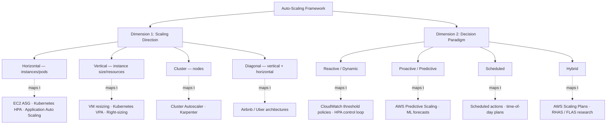
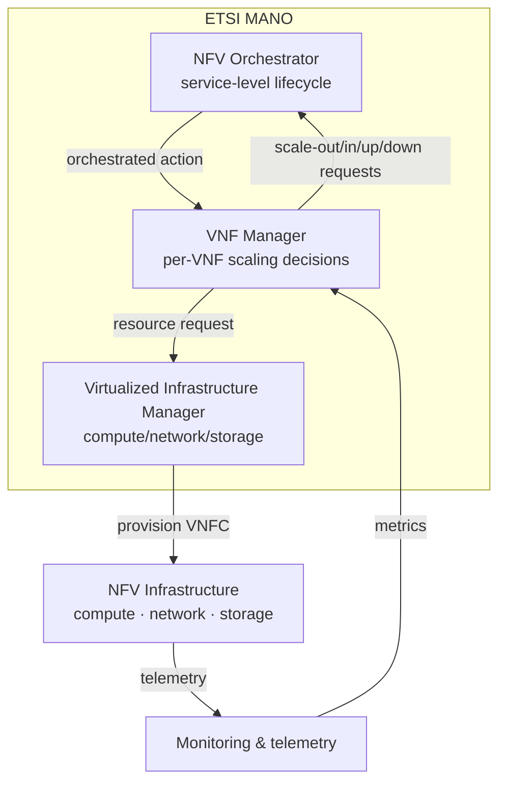
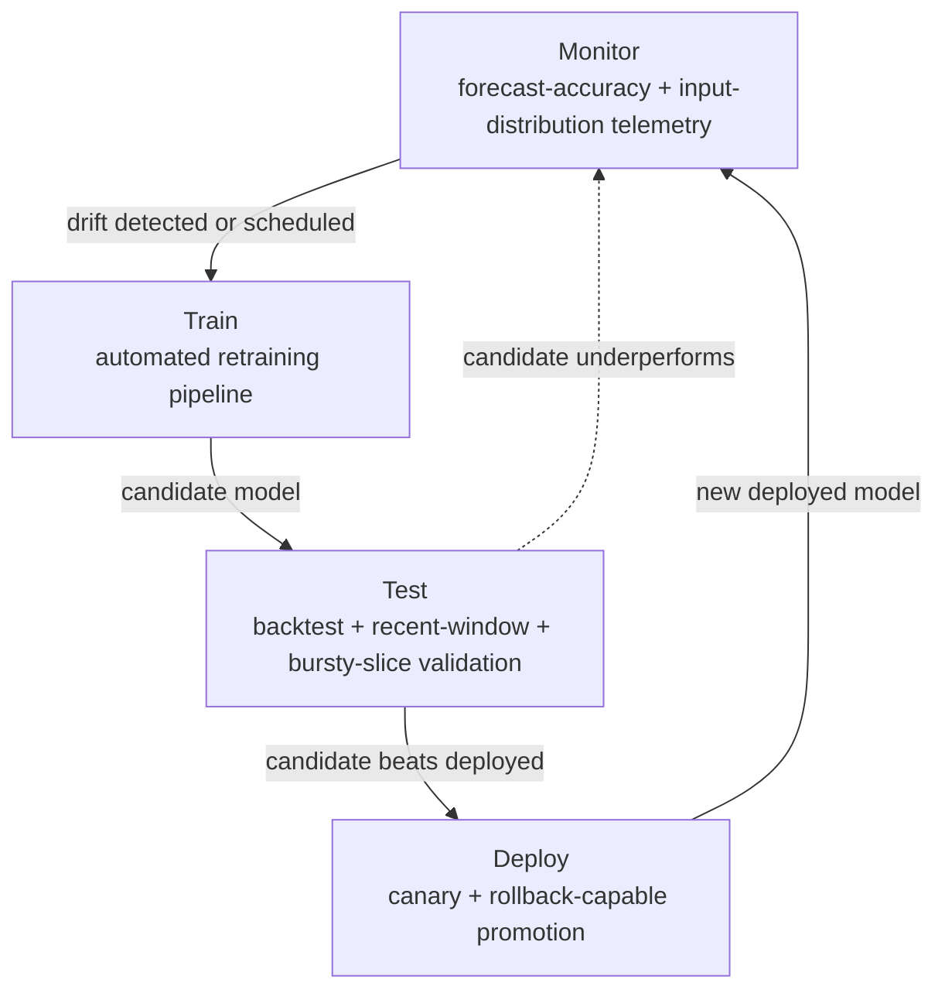

# Auto-Scaling in Cloud Computing: Technology Classification, Challenges, and Solutions
# 1 Introduction, Conceptual Foundations, and Classification Framework of Auto-Scaling

Modern cloud-native applications are expected to absorb traffic spikes during flash sales, sustain low latency for real-time telecom services, and process petabytes of analytical data on demand — all while keeping infrastructure expenditures aligned with actual utilization. Meeting these competing objectives by hand is impossible at scale: provisioning capacity for theoretical peak load wastes resources, while provisioning for the average risks performance collapses. Auto-scaling emerged precisely to resolve this tension, transforming capacity management from a manual, error-prone activity into a continuous, policy-driven control loop. This opening chapter establishes the conceptual vocabulary, the taxonomic structure, and the evaluation criteria that the remainder of the report will apply when it dissects specific reactive and proactive techniques in Chapters 2 and 3 and the major operational challenges in Chapters 4 through 8. The objective here is not to enumerate vendor features, but to construct an analytical lens — defined along the two orthogonal dimensions of *scaling direction* and *decision paradigm* — through which heterogeneous technologies and research solutions can later be compared on a common footing.

## 1.1 Definition, Role, and Strategic Value of Auto-Scaling in Cloud Computing

Auto-scaling, sometimes called "automatic scaling," is most precisely defined as a cloud computing feature that **automatically allocates computational resources based on system demand**, ensuring that applications have the resources required to maintain consistent availability and meet performance targets while simultaneously promoting efficient resource utilization and minimizing cloud expenditure[^1]. Its operational essence is a closed-loop control mechanism: organizations provision a baseline of compute, storage, and network resources, and an auto-scaling policy continuously compares observed metrics (such as CPU utilization or bandwidth) against thresholds, automatically launching or terminating virtual machines, containers, or service capacity units as real-time demand fluctuates without human intervention[^1]. The same logic is operationalized by hyperscale providers — for example, AWS Auto Scaling "automatically adds or removes resource capacity for your applications in response to changing demand" to maintain predictable performance and align cost to usage across EC2 instances, Spot Fleets, ECS, DynamoDB, and Aurora Replicas[^2].

The strategic value of this capability is best appreciated against the economic backdrop of cloud adoption. According to a 2023 Infosys white paper, organizations that migrate to cloud waste approximately **32% of their cloud cost**, much of it through over-provisioning carried over from data-center habits[^1]. In on-premises environments, scaling up meant purchasing new servers and disk arrays — a process that was costly, slow, and required months of lead time even after capital approval[^3]. Because scaling down was rarely practical, enterprises provisioned for expected peak demand "plus some," forcing utilization rates to remain chronically low: an e-commerce site effectively had to run at Black Friday capacity every single day of the year[^3]. Auto-scaling reverses this economic logic by enabling resources to expand for genuine peaks and contract during quiet periods, which is why it has become a central instrument in mature FinOps practices oriented toward efficient resource utilization[^1].

A common conceptual confusion conflates auto-scaling with load balancing. The two are complementary but distinct: **load balancers distribute incoming traffic across multiple servers** — typically with health checks that steer traffic away from unhealthy instances — to optimize the use of *existing* capacity, while **auto-scaling adjusts the size of that capacity** by adding or removing servers in response to demand and the organization's auto-scaling policies[^1][^2]. The two mechanisms are routinely deployed together: when an auto-scaling group launches a new EC2 instance, Amazon EC2 Auto Scaling automatically registers it with the attached Elastic Load Balancer and deregisters it on termination, ensuring that newly provisioned capacity is immediately available to absorb traffic and that retired capacity ceases to receive requests[^4]. Conceptually, load balancing answers "how should existing capacity be utilized?" whereas auto-scaling answers "how much capacity should exist at all?"

## 1.2 Application Contexts: Cloud, Edge, and Container-Orchestrated Environments

Auto-scaling has become a cross-cutting capability that surfaces in nearly every layer of the modern cloud stack, but its concrete implementations and concerns differ markedly across deployment contexts. At the IaaS layer, AWS exposes auto-scaling primarily through **Amazon EC2 Auto Scaling**, which organizes EC2 instances into Auto Scaling Groups (ASGs) treated as a single logical unit for management and scaling; administrators specify minimum, desired, and maximum sizes, and the service launches or terminates instances within those bounds as defined scaling policies fire, while also performing health checks, replacing impaired instances, and balancing capacity evenly across multiple Availability Zones for resilience[^4]. ASGs can mix instance types and purchase options (Spot and On-Demand) within a single group, and through Capacity Rebalancing they proactively replace Spot instances at elevated risk of interruption — illustrating how auto-scaling at the IaaS layer increasingly entangles capacity management with cost-optimization and reliability concerns[^4]. Azure exposes analogous capabilities through Virtual Machine Scale Sets (VMSS) and App Service, with policies managed in Azure Monitor[^5].

Beyond raw VMs, providers have extended auto-scaling to managed PaaS services. **AWS Application Auto Scaling** generalizes the model to individual services such as ECS task counts, DynamoDB table read/write capacity (including global secondary indexes), and Aurora replica counts; each scalable target is uniquely identified by service namespace, resource ID, and scalable dimension, and is governed by minimum and maximum capacities together with one or more scaling policies that track CloudWatch metrics[^2]. A scaling *policy* is a rule-based trigger that adjusts capacity within a single service, whereas a scaling *plan* is a broader strategy coordinating multiple services using predictive and dynamic methods together[^2].

In container-orchestrated environments, auto-scaling decomposes across three layers, each with distinct semantics. The **Horizontal Pod Autoscaler (HPA)** adjusts the number of pod replicas in a Deployment, ReplicaSet, ReplicationController, or StatefulSet based on CPU utilization or custom and externally provided metrics, operating as a "check, update, check again" control loop that polls the Metrics Server every 15 seconds by default[^6]. The **Vertical Pod Autoscaler (VPA)** instead changes the CPU and memory requests and limits of containers, while the **Cluster Autoscaler (CA)** adjusts the number of nodes in the cluster by reacting to unscheduled pods (checked every 10 seconds) rather than to memory or CPU utilization directly[^6]. The complementary nature of these mechanisms is explicit: HPA cannot scale up beyond the cluster's available capacity, and so it works best when paired with Cluster Autoscaler that can add nodes; conversely, CA is unaware of in-pod resource pressure and depends on HPA/VPA signals to know when more capacity is genuinely needed[^6]. On AWS EKS, the same node-level role can be filled by **Karpenter**, an alternative scaler designed for faster, more flexible node provisioning[^2].

The diversity of these contexts is summarized in the table below, which positions representative mechanisms along their operational level and decision trigger.

| Context | Representative Mechanism | Unit of Scaling | Primary Trigger |
|---|---|---|---|
| IaaS (VMs) | EC2 Auto Scaling Group, Azure VMSS | EC2 instance / VM | Metric thresholds, schedules, predictive policies[^2][^5][^4] |
| PaaS / Managed services | AWS Application Auto Scaling (ECS, DynamoDB, Aurora) | Task count, RCU/WCU, replica count | CloudWatch metric tracking, scheduled actions[^2] |
| Container — pod layer | Kubernetes HPA / VPA | Pod replicas / container resource requests | CPU/memory or custom metrics from Metrics Server[^6] |
| Container — cluster layer | Cluster Autoscaler, Karpenter | Worker nodes | Unscheduled pods, resource requests[^2][^6] |
| Edge / Hybrid cloud | Provider-specific extensions | VM / container / function | Latency, locality, SLA pressure (covered in Ch. 5) |

The implication, which will recur throughout the report, is that auto-scaling is not a single technology but a *family of control loops* operating at different layers, on different units, and with different latency and observability characteristics. Edge and hybrid-cloud deployments — where workloads exhibit high volatility, distributed topology, and strict latency SLAs — intensify these concerns, motivating the more sophisticated proactive and hybrid techniques examined in later chapters.

## 1.3 Classification by Scaling Direction: Horizontal, Vertical, Cluster, and Diagonal

The first axis of the taxonomy concerns *what changes* when a scaling action fires. **Horizontal scaling**, or scaling out/in, adds or removes machines, instances, or pods, distributing the workload across a larger or smaller pool of independent units[^1][^3][^7]. **Vertical scaling**, or scaling up/down, instead modifies the power of existing units — adding RAM, CPU, storage, or I/O capacity to the same VM or, in cloud parlance, "changing instance sizes" so that a workload is right-sized to its actual demand[^1][^3][^7]. **Cluster-level scaling** is a third, distinctly orchestration-oriented dimension that operates on the underlying node pool of a Kubernetes/EKS cluster, where Cluster Autoscaler or Karpenter adds or removes worker nodes to support pod-level scaling decisions[^2][^6]. Finally, **diagonal scaling** is a hybrid pattern that combines vertical optimization with horizontal expansion: vertical scaling is applied first to drive each unit toward an optimal cost/performance point, after which horizontal scaling is engaged to absorb further load — a strategy adopted by Airbnb (which moved from a single large Rails monolith on progressively larger EC2 instances to a service-oriented architecture distributed across regions) and Uber (which retains large instances for real-time location services while horizontally distributing trip-matching and pricing across regions)[^7].

The architectural and operational trade-offs between these directions are sharply asymmetric. Horizontal scaling generally **avoids downtime**, is easier to automate, distributes the failure domain across multiple nodes (raising resilience), and yields higher peak performance, but it requires a *distributed architecture*, mandates load balancing to prevent over-utilization of individual instances, and imposes higher initial implementation costs and complexity[^7]. Vertical scaling involves **lower complexity and no architectural rework** — the same code runs on a larger instance — and offers higher single-node performance for predictable workloads, but it typically requires application unavailability during resizing, is ultimately bounded by the maximum capacity of a single machine, and creates a single point of failure[^7]. The CloudZero comparison summarizes these contrasts compactly, as condensed in the table below.

| Dimension | Horizontal Scaling | Vertical Scaling |
|---|---|---|
| Action | Add/remove nodes (scale out/in) | Add/remove power on a node (scale up/down) |
| Architecture required | Distributed | Any |
| Downtime | None | Usually required |
| Load balancing | Necessary | Not required |
| Failure resilience | High (peers absorb failures) | Low (single point of failure) |
| Cost profile | High upfront, optimal over time | Low upfront, less efficient over time |
| Performance ceiling | Add machines indefinitely | Bounded by single-machine capacity |
| Implementation effort | Higher | Lower |

Source: synthesized from CloudZero's horizontal vs. vertical comparison[^7].

A further consideration that recurs in later chapters is **application statefulness**. Stateless services (web APIs, microservices, static content delivery) scale horizontally with ease because each request is processed independently of any prior context. Stateful services (databases, authentication servers, real-time messaging) retain session or transactional state between requests, making horizontal scaling considerably harder — a common engineering response is to offload state to external systems such as Redis or a managed database so that the application tier can remain stateless[^7]. This statefulness consideration directly shapes the analysis of big-data and graph-processing scaling challenges in Chapters 6 and 7, where data locality and iterative state complicate any naive horizontal strategy.

## 1.4 Classification by Decision Paradigm: Reactive, Proactive, Hybrid, and Scheduled

The second axis of the taxonomy concerns *when and on what basis* a scaling action is triggered. Four paradigms dominate practice and the literature.

**Reactive (dynamic) scaling** adjusts resource allocation in response to real-time utilization, firing when an observed metric crosses a configured threshold — for example, spinning up additional instances when CPU usage exceeds a percentage target, or scaling in once load subsides[^1]. Dynamic policies are commonly accompanied by a *cooldown period* during which additional capacity is held available in case the demand spike continues[^1]. AWS exposes this paradigm through CloudWatch-alarm-driven scaling policies for EC2 Auto Scaling and Application Auto Scaling[^2], and Kubernetes implements an analogous logic through HPA's continuous monitor-compute-act loop against the Metrics Server[^6]. Reactive scaling is conceptually simple, requires little historical data, and adapts to arbitrary workload shapes, but it is inherently *lagging*: by the time a metric breaches a threshold, the SLA-impacting event is already underway, and the provisioning of new capacity itself takes additional time — concerns that Chapter 2 dissects in detail.

**Proactive (predictive) scaling** anticipates future resource needs *before* they occur, using historical utilization data together with artificial intelligence and machine learning to forecast demand and adjust capacity preemptively[^1]. The canonical example offered by IBM is an e-commerce retailer whose predictive policy identifies the likelihood of increased traffic ahead of a holiday shopping season and scales out in advance, proactively minimizing network latency and downtime[^1]. AWS similarly distinguishes "predictive scaling," which "can schedule the right number of instances based on predicted demand," from purely dynamic policies[^3]. The strengths of proactive scaling — mitigating cold-start, smoothing transitions, and improving SLA compliance for predictable patterns — are accompanied by genuine costs: dependence on training data, sensitivity to concept drift, and computational overhead, all of which Chapter 3 examines for techniques ranging from ARIMA and SVM to LSTM, Transformer, and reinforcement-learning models.

**Scheduled scaling** allocates resources according to a predetermined timetable, exploiting *known* temporal patterns rather than predicting unknown ones. Organizations that know traffic is much higher in the evenings than in the morning, or that demand peaks from 5 p.m. to 10 p.m., can pre-configure capacity to follow that curve — for instance, scaling out to ten instances from 5 p.m. to 10 p.m., down to two from 10 p.m. to 7 a.m., and back to five during the workday[^1][^3]. Scheduled scaling is operationally trivial and avoids both reaction lag and prediction error, but it offers no protection against unexpected deviations and is therefore typically deployed *alongside* reactive or proactive policies rather than instead of them.

**Hybrid paradigms** combine these approaches to compensate for their individual blind spots. AWS scaling *plans* explicitly integrate predictive scaling with dynamic scaling across multiple services[^2], and predictive policies are commonly layered atop dynamic ones to handle anticipated peaks while reactive rules guard against unanticipated surges. The academic state of the art — including hybrid frameworks such as RHAS and FLAS examined in Chapter 9 — extends this idea by tightly coupling forecasting with feedback control to reconcile responsiveness with foresight.

The operational trade-offs between these paradigms are summarized below; this table will be referenced throughout subsequent chapters whenever a technique is positioned within the taxonomy.

| Paradigm | Trigger | Strengths | Limitations |
|---|---|---|---|
| Reactive (dynamic) | Real-time threshold breach on observed metrics | Simple, model-free, adapts to arbitrary workloads | Lagging; threshold tuning hard; oscillation risk |
| Proactive (predictive) | Forecast of future demand from historical data + ML/AI | Mitigates cold-start; smoother SLA compliance | Training data needs; concept drift; complexity |
| Scheduled | Fixed time-based plan | Trivial to operate; no reaction lag | Brittle under deviations from the plan |
| Hybrid | Combination of forecasts + real-time feedback | Balances responsiveness and accuracy | Highest design complexity; integration challenges |

## 1.5 Auto-Scaling, SLAs, and Evaluation Criteria

Auto-scaling is ultimately a means of honoring contractual performance promises — *Service Level Agreements* (SLAs) covering availability, latency, throughput, and error rates — at acceptable cost. A scaling decision that arrives too late causes SLA breaches in the form of degraded response times or saturated error pages; one that fires too eagerly inflates the cloud bill without measurable benefit; one that oscillates between scale-out and scale-in (a phenomenon known as *flapping*) destabilizes the system and may itself violate availability commitments. The practical importance of this trade-off is acknowledged in vendor documentation: auto-scaling is positioned as the mechanism that ensures applications "have the resources they need to maintain consistent availability and hit performance goals" while avoiding the over-provisioning that vendors estimate consumes roughly a third of cloud spend[^1].

From these obligations, this report distills a unified set of evaluation criteria that will be applied consistently when analyzing reactive techniques in Chapter 2, proactive techniques in Chapter 3, and the published solutions to specific challenges in Chapters 4 through 8:

- **Responsiveness (reaction latency):** the elapsed time from the onset of a demand change to the completion of a corrective scaling action, including both decision latency and provisioning latency.
- **Prediction accuracy** (for proactive techniques): the fidelity with which forecasted demand matches realized demand, typically measured by error metrics such as MAPE or RMSE.
- **Cold-start and provisioning-delay handling:** the technique's ability to mask the seconds-to-minutes required to launch new VMs, pods, or nodes.
- **Configuration and operational complexity:** the volume of hyperparameters, thresholds, training data, and tuning effort the technique demands.
- **Resource efficiency and cost impact:** the degree to which the technique avoids over-provisioning and exploits cost levers such as Spot instances and right-sizing[^3][^4].
- **Stability (oscillation avoidance):** resilience against rapid scale-out/scale-in cycles, often mitigated by cooldown periods[^1].
- **SLA compliance:** the resulting rate of availability, latency, and throughput violations under representative workloads.

These seven criteria form the analytical yardstick of the report. A technique that scores well on one dimension (e.g., responsiveness for threshold-based reactive rules) may score poorly on another (e.g., stability or SLA compliance under bursty loads), and the central question of Chapters 2, 3, and 9 is how techniques and hybrid combinations balance the full vector.

## 1.6 Chapter Synthesis and Roadmap for Subsequent Analysis

The two axes introduced above — *scaling direction* (horizontal / vertical / cluster / diagonal) and *decision paradigm* (reactive / proactive / hybrid / scheduled) — together yield an integrated classification grid onto which representative technologies map cleanly. The diagram below sketches this framework and locates the major mechanisms discussed in this chapter.



The mapping shows that real-world systems rarely occupy a single cell: an EC2 Auto Scaling Group typically combines horizontal scaling (direction) with reactive policies (paradigm), but may simultaneously employ scheduled and predictive policies and operate within a hybrid plan[^2][^4]. Likewise, a Kubernetes deployment commonly runs HPA (horizontal, reactive) on top of Cluster Autoscaler (cluster, reactive), with VPA (vertical, reactive) optionally adjusting pod resource requests[^6]. The framework is therefore not a classification of *systems* but of *mechanisms*, several of which can be composed within a single deployment.

With this framework in place, the report proceeds as follows. **Chapter 2** examines reactive auto-scaling techniques in depth — threshold-based rules as exemplified by EC2 ASGs and Kubernetes HPA, rule-based fuzzy systems, control-theoretic approaches such as PID controllers, and queuing-theory-based methods — assessing each against the criteria of §1.5. **Chapter 3** turns to proactive techniques, covering time-series statistical models (ARIMA), classical ML (SVM, Random Forest), deep learning (LSTM, Bi-LSTM, Transformer, and WGAN-gp Transformer), reinforcement learning, genetic algorithms, and ensemble and online-learning methods. **Chapters 4 through 8** then move from technique to challenge, dissecting energy efficiency, the dynamic nature of telecom and NFV services, big-data processing, cost-effective graph processing, and accurate workload prediction under dynamic conditions, with each chapter grounding its analysis in a specific published research solution. Finally, **Chapter 9** synthesizes hybrid approaches and emerging directions — including multi-variate forecasting, multi-SLA constraint handling, FinOps-driven optimization, and AI-driven continuous optimization at the edge — before concluding with open research questions and recommendations for both researchers and practitioners.

This roadmap ensures that every subsequent technique and challenge can be located on the framework, evaluated against the same seven criteria, and compared without ambiguity — which is the analytical discipline this report is designed to enforce.

# 2 Reactive Auto-Scaling Methods: Principles, Strengths, and Limitations

Chapter 1 established that reactive scaling — responding to observed metrics rather than forecasted ones — occupies one of the two cardinal positions in the decision-paradigm axis of the auto-scaling taxonomy, and that despite a growing body of research on predictive techniques, reactive policies remain the dominant paradigm in production cloud environments. This chapter now opens the black box of that paradigm. Its purpose is to dissect the four canonical families of reactive techniques — threshold-based rules, fuzzy inference systems, control-theoretic controllers, and queuing-theory-based methods — to expose how each closes the control loop between observation and provisioning, what configuration burden it imposes on operators, and where its structural limitations lie. The analytical thread running through the chapter is a tension introduced in Chapter 1: reactive methods enjoy operational simplicity and require little or no historical data, but they are *intrinsically lagging*, meaning that by the time a corrective action fires, the SLA-impacting demand change is already underway. By the end of the chapter, this tension will have been quantified through the seven evaluation criteria from §1.5 and used to motivate the proactive techniques examined in Chapter 3.

## 2.1 Overview and Common Architecture of Reactive Auto-Scaling

Reactive auto-scaling methods, however different in their internal decision logic, all share a common closed-loop architecture composed of three concurrent activities: continuous metric collection, a decision step that compares observations against a configured logic, and a provisioning step that executes scale-out or scale-in actions on the underlying infrastructure. In Amazon EC2 Auto Scaling, for example, the loop is realized through CloudWatch alarms that monitor metrics such as CPU utilization or network I/O, scaling policies that translate alarm states into capacity adjustments, and Auto Scaling Groups that launch or terminate EC2 instances accordingly[^8]. In Kubernetes, the equivalent loop runs inside the Horizontal Pod Autoscaler controller, which polls the Metrics Server at a default cadence of fifteen seconds and adjusts replica counts in response. The architectural commonality is more than a notational coincidence: it implies that *every* reactive method inherits the same set of timing and stability concerns, which the rest of this section identifies and which subsequent sections will revisit for each specific technique.

The first concern is **monitoring resolution and evaluation period**. The frequency at which metrics are sampled and the window over which they are aggregated together set a lower bound on how quickly a reactive system can respond. AWS notes that "by default, all Amazon EC2 metrics are published in five-minute intervals, but they are configurable to a lower interval of one minute by enabling detailed monitoring," and recommends using metrics "available at one-minute or lower intervals to help you scale faster in response to utilization changes"[^9]. CloudWatch high-resolution metrics, published "at finer intervals in the order of a few seconds," push this bound further but multiply storage and API costs[^9]. Higher resolution accelerates the loop but also amplifies noise — short-lived metric spikes that would have been averaged away in a five-minute window now trigger alarms, increasing the risk of premature actions.

The second concern is **cooldown periods and instance warm-up**, which together address the stability problem inherent in feedback control. Without protective intervals, rapid metric oscillations can cause scaling actions to fire so quickly that "instances are added and removed too quickly to be effective," a pathology AWS documentation describes as *thrashing*[^10]. EC2 Auto Scaling exposes both a *cooldown* (a pause during which further scaling actions are suppressed) and an *instance warm-up time* (a window during which a newly launched instance is not yet counted toward the group's aggregated metrics)[^9]. During the warm-up window, "your scaling policies only scale out if the metric value from instances that are not warming up is greater than the policy's target utilization," and any scale-in actions initiated by scaling policies are blocked until the in-flight scale-out completes[^9]. These mechanisms are not optional embellishments: they are the only safeguards within the reactive paradigm itself against the pathological feedback that arises when control actions take longer than the dynamics they are trying to track.

The third concern is **scale-out / scale-in asymmetry**. AWS target tracking explicitly prioritizes availability over cost when its policies conflict: "It will scale out the Auto Scaling group if any of the target tracking policies are ready to scale out. It will scale in only if all of the target tracking policies (with the scale in portion enabled) are ready to scale in"[^9]. Similarly, the policy "prioritizes availability during periods of fluctuating traffic levels by scaling in more gradually when traffic is decreasing"[^9]. This asymmetry is a deliberate engineering choice: scaling out aggressively risks over-provisioning cost, but scaling in aggressively risks SLA violation when the next surge arrives before previously released capacity can be reclaimed.

The fourth concern is **integration with traffic distribution**. As Chapter 1 established, auto-scaling adjusts the *amount* of capacity while load balancers govern its *utilization*. The two are mechanically coupled in production systems: an EC2 Auto Scaling Group integrates with Elastic Load Balancing so that, when a new instance is launched, the load balancer registers it as a healthy target and begins routing traffic to it within seconds, and deregisters it when scale-in terminates it[^8]. Without this coupling, newly provisioned capacity would remain idle while existing capacity continued to suffer overload — defeating the purpose of the scale-out action. For this reason, load balancing is "necessary" under horizontal scaling, as the Chapter 1 comparison made explicit.

These four concerns — resolution, cooldown/warm-up, asymmetry, and load-balancer coupling — are the common architectural vocabulary of reactive scaling, and they will be invoked repeatedly in the analysis that follows. They also already foreshadow the chapter's central limitation: even with millisecond-granularity metrics, the *minimum* round-trip time from a demand change to a fully-warm, traffic-receiving new instance is on the order of tens of seconds to minutes, which is precisely the window during which SLA violations can occur — a structural deficit no reactive method can fully eliminate.

## 2.2 Threshold-Based Rule Scaling

Threshold-based scaling is the canonical and overwhelmingly most-deployed reactive technique. In its simplest form, the operator declares a metric, a threshold, and a capacity adjustment, and the cloud platform's monitoring service fires an alarm whenever the metric breaches the threshold for a sustained number of evaluation periods, after which the scaling action executes. Despite — or precisely because of — its simplicity, threshold-based scaling underpins essentially every hyperscale auto-scaling product, including AWS EC2 Auto Scaling, AWS Application Auto Scaling (for ECS tasks, DynamoDB capacity units, and Aurora replicas), and the Kubernetes Horizontal Pod Autoscaler[^8][^9][^10]. This section dissects the three principal variants of the technique and their operational characteristics.

### Simple/Step Scaling and CloudWatch-Alarm Policies

The most direct realization is **simple scaling**, in which a single CloudWatch alarm linked to a scaling policy adds or removes a fixed number of instances when the metric crosses a threshold. **Step scaling** generalizes this by defining several adjustment steps, each tied to a different magnitude of metric breach — for instance, adding one instance when CPU utilization exceeds 70%, two when it exceeds 85%, and three when it exceeds 95%. Step scaling thereby couples the response magnitude to the severity of the demand change, a refinement that target tracking forfeits in exchange for tighter abstractions. EC2 Auto Scaling typifies the implementation: scaling policies are based on metrics like CPU utilization or network traffic, with scheduled actions available for predictable workload changes and integration with Elastic Load Balancing for distributed traffic[^8].

### Target Tracking Scaling

The most prominent modern variant is **target tracking**, which abstracts the operator's task from "define a threshold" to "declare an optimal average utilization." AWS describes the metaphor explicitly: target tracking "automatically adapts to the unique usage patterns of your individual applications. This allows your application to maintain optimal performance and high utilization for your EC2 instances for better cost efficiency without manual intervention … similar to how a thermostat maintains a target temperature"[^9]. The operator selects a metric and a target value, and EC2 Auto Scaling "creates and manages the CloudWatch alarms that invoke scaling events when the metric deviates from the target"[^9]. A canonical example given in AWS documentation: keeping the Auto Scaling group's average CPU utilization at around 50 percent provides extra capacity to handle traffic spikes without maintaining an excessive number of idle resources[^9].

Target tracking exposes a curated set of **predefined metrics** that are guaranteed to behave well under the technique's assumptions: `ASGAverageCPUUtilization`, `ASGAverageNetworkIn`, `ASGAverageNetworkOut`, and `ALBRequestCountPerTarget`[^9]. The selection of these particular metrics is far from arbitrary. AWS explicitly warns that "not all custom metrics work for target tracking. The metric must be a valid utilization metric and describe how busy an instance is. The metric value must increase or decrease proportionally to the number of instances in the Auto Scaling group"[^9]. Counter-examples — load balancer `RequestCount`, latency, and Amazon SQS's `ApproximateNumberOfMessagesVisible` — are identified as inappropriate: load-balancer request count "doesn't change based on the utilization of the Auto Scaling group"; latency "can increase based on increasing utilization, but doesn't necessarily change proportionally"; and queue depth "might not change proportionally to the size of the Auto Scaling group"[^9]. This proportionality requirement is more than a technicality: it is the implicit linearity assumption on which the entire target-tracking design rests, and its violation is one of the principal limitations to which we shall return.

### Kubernetes HPA and Container-Layer Threshold Scaling

In container-orchestrated environments, threshold-based scaling is realized by the Horizontal Pod Autoscaler. As Chapter 1 documented, HPA operates as a "check, update, check again" control loop polling the Metrics Server every 15 seconds by default, comparing observed metrics (CPU utilization, custom metrics, or external metrics) against operator-declared targets and adjusting replica counts within configured bounds. The architectural difference from EC2 ASG is that HPA scales the *pod replica count* rather than VM instances, while a separate component — Cluster Autoscaler or Karpenter — adjusts the underlying node pool when pods cannot be scheduled due to capacity. This decomposition means that a single demand spike in a Kubernetes cluster can trigger two cascaded reactive loops: HPA scaling pods first, then Cluster Autoscaler scaling nodes — each with its own polling cadence (15 seconds for HPA, 10 seconds for CA) and its own provisioning latency.

### Strengths

The dominance of threshold-based scaling in production is no accident. Its strengths align directly with operational priorities:

- **Operational simplicity and model-free design.** No mathematical model of the system is required; an operator declares a metric, a threshold or target, and a capacity range, and the system handles the rest. Target tracking goes further by autonomously managing the underlying CloudWatch alarms[^9].
- **Broad vendor support.** EC2 Auto Scaling, Application Auto Scaling for ECS, DynamoDB, Lambda, and Aurora Serverless all expose threshold-based scaling through a homogeneous API, allowing application-wide coordination across multiple AWS services[^8].
- **AZ-distributed resilience.** ASGs span multiple Availability Zones, balancing instance distribution and continuing to serve traffic if a zone experiences issues[^10]. The threshold-based control loop integrates this directly: scale-out actions provision into the configured subnets, and EC2 health checks together with ELB health checks automatically replace unhealthy instances[^10].
- **Composability with other paradigms.** Threshold policies coexist with scheduled actions for predictable workload changes and, as discussed in Chapter 1, with predictive policies, allowing operators to layer multiple reactive policies on different metrics — for example, "utilization and throughput can influence each other," and using multiple target tracking policies on different metrics "provides additional information about the load that your Auto Scaling group is under"[^9].

### Limitations

Against these strengths, threshold-based scaling carries an equally pronounced set of structural limitations:

- **Threshold-tuning brittleness.** Selecting appropriate thresholds is a manual, application-specific exercise. AWS best-practice guidance recommends "implement gradual scaling to avoid sudden resource changes" and "regularly review and update your scaling policies"[^8], implicit acknowledgments that thresholds chosen at design time will drift out of alignment with evolving workloads.
- **Reaction lag and SLA breaches during sudden bursts.** This is the central deficiency. AWS itself catalogs the symptom: "Slow scaling response: Resources don't scale fast enough to meet demand … Review your CloudWatch alarm periods and scaling policy cooldown times. Consider reducing these times, but be cautious of increased costs due to frequent scaling actions"[^8]. The trade-off between responsiveness and stability is irreducible within the reactive paradigm.
- **Oscillation and thrashing.** Without cooldown periods, "rapid fluctuations in metrics like CPU utilization can trigger excessive scaling — leading to 'thrashing,' where instances are added and removed too quickly to be effective"[^10]. Cooldowns mitigate but do not eliminate this risk, and they themselves widen the reaction window.
- **Rounding gaps for small groups.** AWS documents that the integer-instance discretization can leave a persistent gap between target value and realized metric for small Auto Scaling groups: "if you set a target value of 50 percent for CPU utilization … we might determine that adding 1.5 instances will decrease the CPU utilization to close to 50 percent. Because it is not possible to add 1.5 instances, we round up and add two instances," potentially overshooting the target[^9]. For larger groups the gap shrinks, but for small fleets the resulting capacity is intrinsically coarse.
- **Sensitivity to non-proportional metrics.** As detailed above, target tracking's assumption that the chosen metric scales proportionally with capacity disqualifies a substantial class of intuitively appealing signals — latency, queue length, and external request counts[^9] — limiting the technique's applicability to workloads where a "utilization" view is meaningful.
- **Missing-data fragility.** "If the metric is missing data points, this causes the CloudWatch alarm state to change to `INSUFFICIENT_DATA`. When this happens, Amazon EC2 Auto Scaling cannot scale your group until new data points are found"[^9]. Sparse or unreliable telemetry directly degrades the controller.
- **Cost surprises from runaway scaling.** A frequently observed pathology is "unexpected scaling [that] leads to high costs," which AWS guidance addresses by recommending "scaling limits and review of scaling metrics" together with CloudWatch alarms "for unusual scaling events"[^8].
- **Asymmetric scale-in semantics not suitable for all workloads.** While conservative scale-in protects availability, it also implies that idle capacity persists longer than strictly necessary, an inefficiency particularly visible in cost-sensitive batch and analytics workloads.

The cumulative picture is that threshold-based scaling is operationally indispensable but technically minimal: it implements the simplest possible feedback law (compare and react), and its limitations are precisely those that one would expect from such a controller when confronted with the heterogeneous, bursty workloads characteristic of modern cloud applications. The remaining sections of this chapter examine three more sophisticated reactive families, each of which can be read as a response to a specific subset of the limitations enumerated above.

## 2.3 Rule-Based Fuzzy Inference Scaling

If threshold-based scaling is the binary realization of "compare and react," **fuzzy-inference-based scaling** is its graded generalization. Rather than declaring a crisp threshold beyond which a metric is "high" and below which it is "not high," fuzzy systems allow each metric value to belong, with a degree between 0 and 1, to multiple linguistic categories — typically "low," "medium," and "high" — and combine several such graded inputs through a human-readable rule base to produce a graded output (e.g., the magnitude of a capacity adjustment).

### Working Principle

A canonical Mamdani-style fuzzy controller for auto-scaling proceeds in four stages. **Fuzzification** maps each crisp input (e.g., observed CPU utilization, response time, request rate) to membership grades in its linguistic categories via membership functions, typically trapezoidal or triangular. **Rule evaluation** applies a hand-authored rule base of the form *IF CPU is High AND response time is High THEN scale-out is Large*, with each rule firing to the degree that its antecedents are satisfied. **Aggregation** combines the fired conclusions into a single fuzzy output set, and **defuzzification** — most commonly via the centroid method — collapses that set into a crisp scaling action. The composite effect is that a metric value sitting near a threshold boundary no longer flips the system between "no action" and "full action"; instead, the action magnitude varies smoothly with how far the input has moved into the "high" region, blended with concurrent evidence from other inputs.

Because the fuzzy controller is fundamentally still triggered by *observed* metrics, it sits squarely within the reactive paradigm. Its added value lies entirely in the decision step: where threshold rules apply a discontinuous comparison, fuzzy rules apply a continuous combination of multiple imprecise signals.

### Strengths

Three benefits follow directly from this design. **First, more nuanced decisions** arise from the graded membership: a metric value of 79% no longer behaves categorically differently from 81% under an 80% threshold, removing one of the principal sources of oscillation in simple threshold policies. **Second, multi-input synthesis** is intrinsic. Where a target-tracking policy can layer multiple independent target policies that AWS resolves through an availability-preferring disjunction[^9], a fuzzy controller can natively express conjunctive logic such as *IF CPU is High AND queue depth is Medium THEN scale-out is Moderate*, capturing the interaction between signals rather than requiring the orchestration layer to combine them. **Third, expert-knowledge encoding** is straightforward: operators with experience of an application's load behavior can write linguistic rules directly, without needing to estimate gain coefficients (as in PID controllers) or service-time distributions (as in queuing models).

### Limitations

The cost of this flexibility is a different set of design burdens. **Rule-base design effort** scales combinatorially: with *n* inputs and *k* linguistic categories per input, a complete rule base contains up to *k*^*n* rules, of which most must be enumerated for the controller to behave predictably across the input space. **Expert dependency** is its consequence: the controller's quality is bounded by the operator's ability to articulate correct linguistic rules, and this knowledge is rarely transferable between applications. **Lack of formal stability guarantees** is a third concern: unlike PID controllers, where Lyapunov-based stability analyses are well established for linear plants, fuzzy controllers offer no general analytical method for proving that the closed loop will not oscillate, and stability typically must be verified empirically on each new deployment. **Non-stationarity remains a structural weakness:** if the workload distribution shifts so that what counts as "high" in 2024 is "medium" in 2025, the rule base must be re-authored, since the membership functions themselves are static unless an adaptive layer is added.

Within the seven-criterion lens of §1.5, fuzzy scaling typically improves *stability* and *configuration intuitiveness* over crisp thresholds while preserving their *responsiveness* and *cold-start* characteristics, but it worsens *configuration complexity* by orders of magnitude when the rule base is large. It is therefore most often encountered in research prototypes and specialized industrial settings rather than in hyperscaler defaults, which retain crisp threshold policies as the operational baseline.

## 2.4 Control-Theoretic Scaling (PID and Variants)

A third reactive family treats auto-scaling explicitly as a *closed-loop control problem*: the controlled plant is the application tier, the controlled variable is some performance metric (CPU utilization, response time, queue length), and the manipulated variable is the number of provisioned instances. The most widely studied design within this family is the **Proportional-Integral-Derivative (PID) controller**, whose three terms together provide a principled way to drive the controlled variable toward a set-point.

### Working Principle

Given an error signal *e(t)* defined as the difference between the set-point (e.g., 50% CPU utilization, mirroring AWS target tracking's thermostat analogy[^9]) and the observed metric, the PID control law computes the scaling action *u(t)* as

$$ u(t) = K_p \cdot e(t) + K_i \int_0^t e(\tau)\,d\tau + K_d \frac{de(t)}{dt} $$

The **proportional** term $K_p e(t)$ produces an action proportional to the current error, providing immediate responsiveness but never fully eliminating steady-state error. The **integral** term $K_i \int e(\tau)\,d\tau$ accumulates past error and drives steady-state error to zero, at the cost of risking *integral wind-up* if the actuator saturates (i.e., when the desired capacity exceeds the configured maximum). The **derivative** term $K_d\, de/dt$ anticipates the trend of the error, damping the response and reducing overshoot. The output *u(t)* is then quantized to an integer instance count, with the discretization gap discussed in §2.2 reappearing here.

Where a threshold rule provides a piecewise-constant response and a fuzzy controller provides a smoothly graded one, a PID controller provides a *continuously updated* response whose magnitude depends not only on the current metric but on its history and its rate of change. Conceptually, this is the same step from algebraic to differential reasoning that distinguishes a thermostat that toggles at a setpoint from one that modulates output continuously.

### Strengths

PID and related control-theoretic approaches offer four notable strengths over simpler reactive techniques. **Principled stability analysis** is the most cited: for plants that can be modeled (even approximately) as linear time-invariant systems, frequency-domain and root-locus methods allow gain settings to be chosen with provable stability margins, replacing the empirical tuning that dominates threshold and fuzzy approaches. **Smoother convergence** to the set-point follows directly from the continuous, history-aware control law, reducing the abrupt capacity jumps characteristic of step scaling. **Steady-state accuracy** is delivered by the integral term, which eliminates the persistent offset between target and realized metric that target tracking accepts as a structural feature[^9]. **Anticipatory damping** through the derivative term reduces overshoot during fast demand changes, a behavior particularly valuable when the underlying provisioning latency is non-trivial.

### Limitations

Yet PID's limitations are equally well known and align directly with the seven evaluation criteria. **Gain-tuning complexity** dominates the operational cost: the three coefficients $K_p$, $K_i$, $K_d$ interact non-trivially, and methods such as Ziegler-Nichols tuning that work well for purely physical plants are less reliable for cloud workloads whose plant dynamics are themselves stochastic. **The linear-plant assumption is fragile.** Cloud application tiers are emphatically non-linear: doubling the number of instances does not necessarily halve the response time, both because of synchronization and database bottlenecks (which AWS calls out as a common pitfall — "autoscaling application servers may lead to database connection limits"[^8]) and because of cold-start effects in newly provisioned instances. **Provisioning delay creates a transport lag** that PID controllers handle poorly; the literature on time-delayed systems shows that as the delay-to-time-constant ratio grows, stability margins shrink, and instance launch times in the tens of seconds to minutes are large enough to enter this regime. **Integral wind-up under actuator saturation** is a third structural issue: when the demand exceeds the ASG's configured maximum size, the controller's integral term continues accumulating an unactionable error, and once demand subsides, it produces a delayed and disproportionate scale-in. Anti-wind-up modifications exist but compound the tuning burden. **Bursty workloads** — the same workloads under which threshold methods produce SLA violations — also degrade PID performance, because the derivative term amplifies the noise that bursts inject into the metric signal.

In the seven-criterion taxonomy, PID typically improves *stability* and *steady-state accuracy* over threshold scaling, but at a substantial cost in *configuration and operational complexity*, while remaining vulnerable to the same *cold-start and provisioning-delay* limitations that constrain every purely reactive method.

## 2.5 Queuing-Theory-Based Scaling

A fourth reactive family takes a fundamentally different view of the scaling problem: rather than treating it as a control loop driven by a single utilization metric, it models the application tier explicitly as a *queuing system* and uses analytical formulas from queuing theory to compute the minimum number of servers required to meet an SLA on response time or utilization. Where threshold and PID approaches are agnostic to the structure of the workload, queuing-theory-based scaling exploits structural assumptions to derive provisioning decisions that are directly traceable to SLA targets.

### Working Principle

The canonical model is the M/M/c queue, in which requests arrive according to a Poisson process with rate $\lambda$, are processed by *c* identical servers with exponentially distributed service times of mean $1/\mu$, and are served in FIFO order. Under these assumptions, closed-form expressions yield the steady-state utilization $\rho = \lambda/(c\mu)$, the average queue length, and — most usefully for scaling — the average and tail response time as functions of $\lambda$, $\mu$, and $c$. Given a target response-time SLO, the controller solves for the smallest $c$ satisfying the constraint and adjusts the Auto Scaling Group, pod replica count, or container task count accordingly. More elaborate models (M/G/1 with general service times, M/M/c/K with finite queues, networks of queues for multi-tier applications) trade analytical tractability for higher fidelity.

A queuing-theoretic controller therefore inverts the logic of target tracking: instead of declaring an *intermediate* target (e.g., 50% CPU) that is hoped to correlate with the *real* objective (e.g., 200 ms response time at the 95th percentile), it operates directly on the SLO. This is conceptually attractive because, as Chapter 1 emphasized, auto-scaling exists ultimately to honor SLAs at acceptable cost, not to track utilization for its own sake.

### Strengths

**SLA-driven dimensioning** is the most distinctive advantage. By relating capacity directly to a latency target through an interpretable formula, queuing-based scaling provides a defensible answer to the question of why a particular number of servers was provisioned — something neither threshold rules nor PID controllers can fully articulate. **Interpretability and capacity planning** are corollaries: the same model used for online scaling can be applied offline for capacity planning, sensitivity analysis, and what-if scenarios (e.g., "if mean service time grows by 20%, how many additional instances will be required to hold the 95th-percentile latency under 200 ms?"). **Direct tail-latency control** is achievable for models that expose response-time distributions, allowing operators to target percentile SLOs rather than mean utilization. **Lower oscillation risk** also follows, because the controller's setpoint is a stable SLO rather than an intermediate utilization band whose appropriate value drifts as workload mix changes.

### Limitations

Against these strengths stands a sharply circumscribed range of applicability. **Sensitivity to model assumptions** is the most fundamental issue. Real cloud workloads rarely exhibit Poisson arrivals — bursts, diurnal patterns, and self-similar long-range dependence are common, and under such conditions M/M/c predictions can underestimate queue length and response time by large margins. **Estimating the service-time distribution** in production is itself a non-trivial measurement problem, complicated by heterogeneous request types, cache effects, and database contention. **Workload heterogeneity** further undermines the M/M/c assumption that all requests are equivalent: a single application typically mixes lightweight reads, heavy writes, and background jobs whose service-time distributions differ by orders of magnitude. **Stationarity is rarely guaranteed**: arrival rates and service times themselves drift over hours and days, requiring continuous re-estimation that adds operational complexity. **Network-of-queues models** mitigate some of these issues but compound the parameter-estimation burden. Finally, queuing-based scaling shares with every reactive method the **residual reaction lag**: even a perfectly parameterized model cannot fire its scale-out decision until the arrival rate has been observed, and the provisioning delay between decision and traffic-receiving capacity remains a structural floor on SLA compliance.

For these reasons, queuing-theory-based scaling sees its most successful deployments in domains where the underlying assumptions hold approximately and the SLA pressure is high — call centers, certain database tiers, telecom services where ETSI-aligned models are common (Chapter 5) — but is less prevalent than threshold-based scaling in general-purpose hyperscale auto-scaling products.

## 2.6 Comparative Evaluation and Limitations of Reactive Paradigms

Having dissected the four reactive families individually, this section synthesizes them through the seven evaluation criteria established in §1.5. The table below positions each family along these dimensions; ratings are qualitative and reflect the evidence assembled in §§2.2–2.5.

| Criterion | Threshold-based | Fuzzy inference | PID (control-theoretic) | Queuing-theory-based |
|---|---|---|---|---|
| **Responsiveness** | High (metric→action within one alarm period) | Moderate–High (continuous output) | High but tuning-dependent | Moderate (requires arrival-rate estimation) |
| **Prediction accuracy** | Not applicable (no forecasting) | Not applicable | Not applicable | Not applicable |
| **Cold-start / provisioning-delay handling** | Poor (mitigated only by warm-up window) | Poor (same structural limit) | Poor; derivative term can over-react during delay | Poor; lag baked into reactive paradigm |
| **Configuration & operational complexity** | Low–Moderate (thresholds, cooldowns) | High (rule-base combinatorics) | High (gain tuning, anti-wind-up) | High (model parameterization, service-time estimation) |
| **Resource efficiency / cost impact** | Moderate (rounding gaps; conservative scale-in) | Moderate–Good (smoother decisions) | Good when well-tuned | Good when assumptions hold |
| **Stability (oscillation avoidance)** | Limited (cooldown only); thrashing risk | Improved by graded membership | Strong for linear plants; degraded by lag/non-linearity | Strong under model fit |
| **SLA compliance** | Reasonable under steady load; breached during bursts | Improved over crisp thresholds | Improved steady-state; vulnerable to bursts | Best when SLA directly modeled; vulnerable when assumptions fail |

Read horizontally, the table shows that no reactive family dominates the others across all criteria. Threshold-based scaling wins decisively on **configuration simplicity** and **vendor support** — and these are the qualities that have made it the universal default in production — but it loses on **stability**, **steady-state accuracy**, and **bursty-workload SLA compliance**. Fuzzy and PID controllers each address a specific subset of these weaknesses (fuzzy through graded multi-input synthesis, PID through history-aware continuous control) at a substantial cost in configuration complexity. Queuing-based scaling uniquely couples capacity decisions directly to SLA targets but pays for that coupling with strong distributional assumptions whose violation degrades the controller silently.

Read vertically, however, three rows reveal *structural limitations shared by all four families*:

1. **Cold-start and provisioning-delay handling is universally poor.** Every reactive method must wait for a metric to deviate before it can act, and every method then incurs the same provisioning latency between decision and traffic-receiving capacity. AWS's own troubleshooting guidance — "Resources don't scale fast enough to meet demand … Review your CloudWatch alarm periods and scaling policy cooldown times. Consider reducing these times, but be cautious of increased costs"[^8] — exposes this irreducible trade-off: the only ways to shrink reaction lag within the reactive paradigm are to shorten alarm periods (raising false positives and cost) or to shorten cooldowns (raising thrashing risk and instability).
2. **Prediction accuracy is uniformly inapplicable.** None of the four reactive families incorporates a forecast of *future* demand; all act on *observed* state. This is the formal expression of the chapter's central limitation and the direct doorway to Chapter 3.
3. **SLA compliance under bursty workloads is uniformly compromised.** Whether through threshold lag, fuzzy rule-base mistuning, PID derivative amplification of burst noise, or queuing model assumption failure, sudden workload bursts find a vulnerability in every reactive design. The same Amazon documentation that promotes target tracking explicitly cautions that "if you want greater control, a step scaling policy might be the better option"[^9] — an acknowledgment that even within the most refined reactive abstraction, operators may need to descend to lower levels to handle situations the high-level policy cannot.

These shared limitations are not flaws of particular implementations but structural consequences of the reactive paradigm itself. A controller that only ever responds to *what has already happened* cannot, even in principle, eliminate the window during which the unhandled demand change is causing SLA violations. The only escape routes are (a) to shorten provisioning latency below the SLA-violation threshold — which is increasingly achievable in serverless and container environments but still impractical for VM-based fleets — or (b) to act *before* the demand change is observed, by forecasting it. Route (b) is the proactive paradigm, to which Chapter 3 now turns.

It is worth emphasizing, however, that the case for proactive scaling is *additive*, not *substitutive*. In every production environment surveyed, reactive policies remain in place as the safety net against the prediction errors and concept drift that, as §1.4 anticipated, are the proactive paradigm's own structural weaknesses. The hybrid approaches synthesized in Chapter 9 — which combine forecasts with feedback control — exist precisely because the limitations of reactive scaling identified in this chapter and the limitations of proactive scaling to be identified in Chapter 3 are largely orthogonal, so each paradigm compensates for the other's blind spots. The four reactive families analyzed here are therefore not obsolete techniques but indispensable building blocks of the more sophisticated designs to come.

# 3 Proactive Auto-Scaling Methods: Principles, Strengths, and Limitations

The closing argument of Chapter 2 left a structural gap unfilled. Every reactive family analyzed — threshold rules, fuzzy inference, PID control, and queuing-theoretic dimensioning — was shown to share three irreducible deficiencies: an inability to mitigate cold-start and provisioning latency, an absence of any forward-looking signal, and degraded SLA compliance whenever demand changes faster than the round-trip time of the control loop. The proactive paradigm is the principled response to this gap. Rather than waiting for an observed metric to deviate, proactive techniques attempt to *forecast* demand on a horizon long enough that newly provisioned capacity is already warm and traffic-receiving when the predicted surge arrives. Conceptually, the shift is from feedback to feed-forward control, and operationally it is the move from "react to what is happening" to "act on what is about to happen."

This chapter dissects the six families of forecasting techniques that the literature and industry practice have produced — time-series statistical models, classical machine learning, deep learning, reinforcement learning, genetic-algorithm-based methods, and ensembles with online learning. Each is examined through the same seven-criterion lens established in §1.5 and applied to reactive methods in §2.6, so that the comparative synthesis in §3.8 can be read as a direct continuation of the table in §2.6. The chapter's analytical thread is a single trade-off that recurs in every family: more expressive forecasting models capture richer workload dynamics but demand more training data, more compute, more tuning, and more retraining vigilance, while simpler models retain interpretability and operational frugality at the cost of predictive fidelity. Where this trade-off lands depends on the workload, the SLA, and the operational maturity of the team — which is why no single proactive technique has displaced the reactive baselines documented in Chapter 2, and why the hybrid architectures of Chapter 9 remain the practical state of the art.

## 3.1 Overview and Common Architecture of Proactive Auto-Scaling

Just as Chapter 2 opened by identifying the common closed-loop architecture shared by all reactive techniques, an analysis of proactive scaling must begin by recognizing that, however heterogeneous the underlying forecasting models, every proactive system instantiates the same four-stage pipeline. A **telemetry-ingestion layer** continuously collects historical and current workload signals — request rates, CPU and memory utilization, queue lengths, latencies, calendar features, and exogenous variables such as marketing campaigns. A **forecasting module** transforms this stream into a prediction of future demand over a chosen horizon and at a chosen resolution. A **translation layer** converts the predicted demand into a capacity decision — typically by inverting an empirically calibrated relationship between demand level and required instance count, or by using a queuing-theoretic dimensioning formula of the kind discussed in §2.5. Finally, an **actuation path** provisions resources *in advance* of the predicted demand, so that the cold-start and warm-up windows discussed in §2.1 are absorbed before traffic arrives.

This shared architecture exposes a recurring set of design concerns that every proactive technique must answer, and which therefore form the analytical vocabulary of this chapter:

- **Training-data quality and volume.** A forecaster cannot anticipate patterns it has never seen. The longer and more varied the available history, the better the model can distinguish seasonality from drift, but production environments often suffer from short telemetry retention, gaps from instrumentation changes, and unrepresentative samples (e.g., quiet weeks dominating an archive while flash-sale events are rare).
- **Prediction horizon and resolution.** A horizon shorter than the provisioning latency defeats the purpose of forecasting altogether, because the forecast arrives too late to act on; one much longer than the workload's actual predictability degenerates into noise. Resolution choices (minute, five-minute, hour) trade noise tolerance for response granularity.
- **Retraining cadence and concept drift.** Cloud workloads are non-stationary: user populations grow, application code changes, marketing rhythms shift, and what was a representative training distribution last quarter may be obsolete this quarter. Every proactive system must therefore couple its forecaster to a retraining schedule — periodic, triggered by drift detection, or continuously online — and the choice has direct cost and stability implications.
- **Translation from demand forecast to capacity decision.** Forecasting *how many requests per second* does not by itself determine *how many instances to launch*; the mapping requires a service-capacity model (often derived from load tests or from queuing assumptions), and errors in that mapping compound forecast errors.
- **Integration with reactive safety nets.** No forecast is perfect, and unprecedented events — pandemics, viral content, infrastructure incidents — produce errors that no historical training set could anticipate. Production-grade proactive systems therefore retain reactive policies as a safety net, an arrangement formalized as the *hybrid paradigm* of §1.4 and dissected in Chapter 9.

These concerns are universal: they apply equally to a textbook ARIMA model, to a transformer-based deep learner, and to a reinforcement-learning agent, and they will be revisited explicitly in each technique-specific section that follows.

The production reference point against which research techniques are most naturally positioned is AWS Predictive Scaling, introduced in §1.4 and §1.5. As Chapter 1 noted, AWS's own framing positions predictive scaling as a mechanism that "can schedule the right number of instances based on predicted demand," in contrast to dynamic policies that respond after the fact. Crucially, AWS deploys predictive scaling alongside — not instead of — reactive policies, and the canonical IBM example of an e-commerce retailer using predictive policies to anticipate holiday traffic illustrates the prototypical use case: workloads exhibiting clear historical regularities (diurnal cycles, weekly seasonality, annual events) for which forecasting offers a tangible advantage over reactive lag. Research techniques, by contrast, typically push beyond such well-behaved patterns into bursty, non-linear, and regime-shifting workloads where the production-grade approaches struggle. The remainder of this chapter is organized around the families of techniques that have been proposed to extend the proactive frontier.

## 3.2 Time-Series Statistical Models (ARIMA and Variants)

The classical baseline for proactive auto-scaling is the family of time-series statistical models, of which the **AutoRegressive Integrated Moving Average (ARIMA)** model is the most widely deployed representative. Conceptually, ARIMA decomposes a time series into three components that can be estimated from the series itself, without exogenous information and without architectural assumptions about the underlying generating process beyond linearity and (after differencing) stationarity.

### Working Principle

An ARIMA(*p*, *d*, *q*) model expresses the current value of the differenced series as a linear function of its *p* most recent past values (the autoregressive, AR, component) and the *q* most recent past forecast errors (the moving-average, MA, component), where *d* denotes the order of differencing required to render the original non-stationary series stationary. Formally, for a workload metric $y_t$ (e.g., requests per minute), the model

$$\Delta^d y_t = c + \sum_{i=1}^{p} \phi_i \, \Delta^d y_{t-i} + \sum_{j=1}^{q} \theta_j \, \varepsilon_{t-j} + \varepsilon_t$$

expresses the differenced series $\Delta^d y_t$ as the sum of past values, past shocks $\varepsilon_{t-j}$, and the current shock $\varepsilon_t$. Two principal extensions adapt this framework to cloud workloads. **Seasonal ARIMA (SARIMA)** adds a parallel set of seasonal AR and MA terms operating on lags equal to the season length (e.g., 24 hours for daily cycles or 168 hours for weekly cycles), capturing the diurnal and weekly periodicities ubiquitous in user-facing services. **ARIMA with exogenous regressors (ARIMAX)** augments the model with external covariates such as marketing-campaign indicators or scheduled-event flags, allowing forecasts to incorporate information beyond the metric's own history. Order selection — choosing *p*, *d*, *q*, and the seasonal counterparts — has traditionally relied on inspecting autocorrelation and partial-autocorrelation plots together with information criteria such as AIC and BIC, though automated procedures (auto-ARIMA) now perform exhaustive grid searches.

The capacity-decision step is conceptually straightforward: the ARIMA forecast for the next horizon is converted, via an empirical or queuing-theoretic capacity model, into the number of instances required, and the auto-scaling group is adjusted to that count with sufficient lead time to absorb provisioning latency.

### Strengths

ARIMA's persistence in the auto-scaling literature, despite the rise of more elaborate alternatives, rests on four enduring strengths. **Interpretability** is the most distinctive: the AR and MA coefficients have direct statistical meaning, confidence intervals are derivable in closed form, and an operator can inspect a SARIMA decomposition to verify that the model has correctly identified daily and weekly seasonalities — properties that opaque deep models cannot match. **Low training-data requirements** make ARIMA practical in settings where deep learners are infeasible: a few weeks of telemetry are typically sufficient to fit a reasonable seasonal model, whereas deep learners often require months. **Low computational overhead** during both training and inference means ARIMA can be retrained frequently — even nightly — without straining the auto-scaling control plane. **Well-understood uncertainty quantification** allows operators to provision against, for example, the upper 95% confidence bound of the forecast, providing a principled safety margin against forecast error.

### Limitations

These strengths come at the price of an equally well-documented set of structural weaknesses. **The linearity assumption** restricts ARIMA to demand patterns that are well-approximated by linear combinations of past values and shocks; abrupt regime shifts, threshold effects, and saturating behaviors are systematically mis-modeled. **The stationarity assumption** — that mean and variance are constant after differencing — is frequently violated by cloud workloads whose volatility itself fluctuates with time of day or with product launches. **Manual order selection** retains an artisanal flavor even under automated search, because the search space grows combinatorially with the seasonal terms, and the chosen orders often need re-validation as the workload evolves. **Degraded accuracy under non-linear or bursty workloads** is the consequence most directly relevant to the auto-scaling use case: flash sales, viral content, and infrastructure incidents produce demand shapes that the linear-Gaussian framework cannot represent, leading to forecast errors precisely at the moments when accurate forecasts matter most. **Limited multivariate capability** further restricts ARIMA: while ARIMAX permits exogenous regressors, modeling the joint dynamics of multiple correlated metrics typically requires VAR or VARMA generalizations that quickly become parameter-heavy and unstable. Within the seven-criterion lens of §1.5, ARIMA scores well on *configuration simplicity* (relative to deep models) and on *computational efficiency*, modestly on *cold-start mitigation* (forecasts can be produced sufficiently in advance for predictable patterns), and poorly on *prediction accuracy* under non-linear regimes and on the *SLA compliance* that depends on capturing those regimes.

## 3.3 Classical Machine Learning Models (SVM, Random Forest, and Related Techniques)

Classical machine-learning models extend the proactive paradigm beyond ARIMA's linear-Gaussian frame by treating workload forecasting as a supervised regression problem: given a feature vector derived from past observations and contextual signals, predict future demand. The forecasting target is the same as ARIMA's, but the representation of the problem and the hypothesis space differ fundamentally.

### Working Principle

The classical-ML pipeline begins not with the raw metric series but with **feature engineering**, a step that translates the time-series structure into a tabular form. Typical engineered features include *lag features* (e.g., demand one hour ago, one day ago, one week ago), *rolling statistics* (moving averages and variances over windows), *calendar features* (hour of day, day of week, holiday flags), and *derived utilization signals* (ratios, accelerations, deviations from a baseline). The chosen feature matrix is then fed into a learner — most commonly a **Support Vector Regression (SVR)**, a **Random Forest**, or a **gradient-boosted tree ensemble** such as XGBoost or LightGBM — which fits a non-linear mapping from features to the predicted demand at the next time step (or, with appropriate framing, to the demand vector over a multi-step horizon).

SVR seeks the flattest function that fits the training data within an ε-tube, using kernel functions (commonly the radial basis function) to lift the feature space and capture non-linearities. Random Forests average the predictions of many decision trees, each trained on a bootstrap sample of the data and at each split considering only a random subset of features, yielding a forecaster whose variance is reduced relative to a single tree. Gradient-boosted trees instead build trees sequentially, each one fitted to the residuals of the previous ensemble, producing forecasters that often dominate in tabular forecasting competitions.

### Strengths

Three advantages over ARIMA are characteristic of this family. **Native non-linearity** is the most important: SVR's kernel trick, the recursive partitioning of tree ensembles, and the gradient-boosting objective all express non-linear feature–target relationships without requiring the analyst to specify them in functional form. **Moderate training cost** keeps these models practical for the retraining cadences cloud workloads demand: a Random Forest or gradient-boosted ensemble can typically be retrained on weeks of minute-resolution telemetry in minutes to hours on commodity hardware. **Robustness to noisy and heterogeneous features** allows the engineer to throw a wide variety of candidate signals into the feature matrix — including ones whose predictive value is uncertain — and rely on the model's regularization (tree-depth limits, ε-insensitivity, gradient-boosting shrinkage) to discount the unhelpful ones. **Feature-importance diagnostics** offered by tree-based methods further provide a measure of interpretability that bridges the gap between ARIMA's full transparency and deep learners' opacity.

### Limitations

Yet the strengths are bought at a different set of costs. **Feature-engineering burden** is the most operationally significant: the quality of a classical-ML forecaster depends substantially on the analyst's choice of lag, rolling-window, and calendar features, and this choice is largely application-specific. **Limited ability to model long temporal dependencies** is a structural consequence of the tabular framing: while a sufficiently rich feature set can encode long lags explicitly, the model has no native notion of sequence and cannot learn temporal dependencies that the engineer did not anticipate. **Hyperparameter sensitivity** — the number of trees, maximum depth, learning rate for boosting, kernel parameters and regularization for SVR — adds a tuning burden that ARIMA largely escapes. **Degraded performance during sudden bursts** is the family's most consequential limitation in the auto-scaling context: tree-based learners extrapolate poorly outside the range of values seen in training, so a burst that exceeds historical peaks tends to be under-forecasted, and the resulting capacity shortfall causes SLA violations precisely when proactive scaling was meant to prevent them. **Stationarity is implicit but not enforced**: unlike ARIMA, which explicitly differences the series, classical ML models trained on historical data simply assume that the relationship between features and targets remains valid into the forecast horizon, and a regime shift can silently invalidate this assumption.

In the seven-criterion taxonomy, classical ML typically improves *prediction accuracy* over ARIMA on non-linear but historically represented patterns, retains comparable *computational efficiency*, but raises *configuration complexity* through feature engineering and hyperparameter tuning, and shares ARIMA's vulnerability to *concept drift* and unprecedented bursts.

## 3.4 Deep Learning Models (LSTM, Bi-LSTM, Transformer, WGAN-gp Transformer)

Deep learning extends the proactive paradigm in two directions simultaneously: it removes the feature-engineering burden by learning representations directly from raw sequences, and it expands the hypothesis space to include long-range temporal dependencies and complex non-linear interactions that classical ML cannot reach. The price, as the rest of this section will document, is a substantial increase in data, compute, and tuning requirements.

### LSTM and Bi-LSTM

The **Long Short-Term Memory (LSTM)** network is a recurrent architecture engineered to learn long-range dependencies. At each time step, an LSTM cell maintains a *cell state* — a vector that propagates information across many time steps — and three *gates* (forget, input, output) that, conditioned on the current input and the previous hidden state, decide which parts of the cell state to retain, update, and emit. The gating mechanism is the structural answer to the *vanishing gradient* problem that hobbles plain recurrent neural networks: gradients can flow back through the multiplicative gates over hundreds of time steps without exponential decay, allowing the network to learn dependencies on time scales relevant to weekly seasonality and slower drift.

The **Bidirectional LSTM (Bi-LSTM)** extends this by running two LSTMs in parallel — one processing the sequence forward, one backward — and concatenating their hidden states. For forecasting strictly into the future, Bi-LSTMs are useful primarily during training, when historical sequences can be processed in both directions to enrich the learned representation; at inference time, the future-direction pass is necessarily truncated.

These architectures excel at workloads with **clear temporal structure but non-linear dynamics**: diurnal cycles whose amplitude varies with day of week, slow drifts overlaid with sudden but locally predictable spikes, and multi-scale seasonalities that interact non-additively. Their training-data requirements are substantial — typically weeks to months of high-resolution telemetry — and their hyperparameter space is larger than classical ML's: layer count, hidden-state dimension, sequence length, learning rate, regularization (dropout, recurrent dropout, weight decay), and batch size all interact.

### Transformer

The **Transformer** architecture replaces recurrence with **self-attention**, allowing every output position to attend, in parallel, to every input position weighted by learned compatibility scores. The structural consequence is that information from any past time step can reach the prediction directly, rather than propagating step by step through a recurrent state, and the parallelism of attention dramatically reduces training wall-clock time relative to LSTMs on modern accelerators. For workload forecasting, Transformers can capture **multi-scale patterns** — local minute-resolution dynamics interacting with weekly and monthly structure — without the engineering effort of constructing multi-resolution feature pyramids.

The cost is a further increase in data and compute hunger, in hyperparameter dimensionality (head count, embedding size, layer count, positional-encoding scheme, learning-rate schedule), and in architectural sensitivity: positional encodings must be chosen carefully for time-series data, since the standard sinusoidal encodings designed for natural-language tokens are not always optimal for irregularly sampled telemetry.

### WGAN-gp Transformer

A more recent direction addresses a structural weakness of all the architectures discussed so far: their training distribution is dominated by the typical workload regime and contains few examples of the bursty, anomalous behavior under which forecasting matters most. The **Wasserstein Generative Adversarial Network with Gradient Penalty (WGAN-gp)**, when paired with a Transformer backbone, attempts to remedy this by training a generator network to synthesize realistic workload sequences and a critic network to distinguish synthetic from real sequences under a Wasserstein distance with gradient penalty (which improves training stability over the original WGAN formulation). The synthesized sequences augment the training set, exposing the forecaster to a wider variety of demand shapes — including bursty regimes — and improving robustness when those regimes are encountered in production. The Transformer backbone provides the expressive capacity needed to model the augmented distribution.

This direction is exemplified by the WGAN-gp Transformer approach introduced in Chapter 1's outline of proactive techniques and revisited in Chapter 8 as a state-of-the-art solution to the workload-prediction challenge. The combination targets two of the deep-learning family's principal weaknesses — data scarcity for atypical regimes and instability under bursty conditions — at the cost of yet greater architectural and training complexity.

### Strengths

Across the four deep architectures, common strengths emerge. **Native sequence modeling** removes the feature-engineering burden, allowing the model to learn relevant temporal abstractions from raw telemetry. **Long-range dependency capture** — through LSTM gating or attention — permits the forecaster to exploit dependencies that classical ML can only encode through hand-crafted features. **Multi-step and longer-horizon forecasting** is more natural in these architectures, which directly mitigates cold-start by producing forecasts on horizons comfortably exceeding provisioning latency. **Richer expressive capacity** captures non-linear and regime-dependent dynamics that defeat both ARIMA and classical ML.

### Limitations

The corresponding limitations are equally distinctive. **Hyperparameter and architectural-design complexity** dominates the operational cost: practitioners must choose not only training hyperparameters but also architectural ones (layer counts, hidden dimensions, attention head counts), and the search space is too large for exhaustive tuning. **Training instability** — particularly acute in adversarial training but present even in pure supervised settings — manifests as divergence, mode collapse (for generative variants), or sensitivity to random initialization. **Opacity** undermines the interpretability that ARIMA offered: deep models can be probed via saliency methods, but no operator can read off the diurnal-and-weekly decomposition the way SARIMA permits. **Training-data hunger** is a hard constraint: deep models typically require months of telemetry to outperform classical ML, which excludes them from short-history settings (new services, recently instrumented metrics). **Computational overhead of training and inference** is non-trivial: training a Transformer-based forecaster takes hours to days on accelerators, and inference latency, while typically acceptable for minute-scale forecasts, must be designed carefully to fit within the auto-scaling control loop. **Operationalizing retraining** is itself a challenge: deep models require disciplined MLOps pipelines for data validation, training, evaluation, and deployment, which raises the engineering bar significantly above ARIMA or classical ML.

In the seven-criterion taxonomy, deep learning typically achieves the highest *prediction accuracy* and *cold-start mitigation* of any proactive family on workloads with sufficient training data, but at the highest *configuration complexity* and *computational overhead*, and with the greatest *opacity* — which itself becomes a barrier in regulated industries where interpretability is contractually required.

## 3.5 Reinforcement Learning Approaches

Reinforcement learning takes a step further away from the supervised-forecasting frame than any of the techniques discussed so far. Instead of predicting demand and translating it into capacity through a separate mapping, an **RL agent directly learns a scaling policy** — a mapping from observed state to scaling action — by interacting with the cloud environment and optimizing a reward function that encodes the operational objectives (SLA compliance, cost, stability) directly. The architectural implication is that the forecasting module and the translation layer of §3.1 are collapsed into a single learned policy.

### Working Principle

Formally, the auto-scaling problem is cast as a **Markov Decision Process** in which the state $s_t$ encodes the observed workload signals (request rates, utilization, latency, current capacity) together with any contextual features, the action $a_t$ is the capacity adjustment (scale out by *k*, scale in by *k*, do nothing), and the reward $r_t$ aggregates SLA satisfaction and cost into a scalar that the agent seeks to maximize over time. The agent's policy $\pi(a|s)$ is updated through experience: as actions are taken and their consequences observed, the policy is adjusted to favor actions whose discounted cumulative reward is high.

Three algorithmic families dominate the auto-scaling literature. **Tabular Q-learning** maintains a table of action-value estimates $Q(s,a)$ and updates them via temporal-difference learning; it is conceptually simple and convergence is well understood, but it is feasible only when the state space is small enough to enumerate, which excludes most realistic deployments. **Deep Q-Networks (DQN)** replace the table with a neural network that approximates $Q(s,a)$, making continuous and high-dimensional state spaces tractable; experience replay and target networks stabilize training. **Policy-gradient methods** — including REINFORCE, actor-critic variants, and proximal policy optimization (**PPO**) — directly parameterize and optimize the policy itself, often achieving better sample efficiency on continuous-action problems and handling stochastic policies natively.

### Strengths

The RL formulation offers four distinctive advantages. **Model-free adaptation** allows the agent to learn good policies without an explicit model of how demand evolves or of how capacity translates to performance — both of which are difficult to model accurately in production. **Direct optimization of operational objectives** is the most conceptually compelling: rather than minimizing forecasting error (a proxy) and hoping the translated capacity decisions are good, the agent directly maximizes a reward that encodes SLA compliance and cost. **Capacity to handle delayed rewards** is structurally important for auto-scaling: a scale-out action's effect on SLA compliance is delayed by provisioning latency, and RL's discounted-return formulation accommodates such delays naturally, whereas supervised forecasters require explicit horizon engineering. **Long-term policy coherence** emerges from the discounted-return objective: an agent can learn to scale out proactively before a predictable surge, then to scale in at the appropriate cadence afterward, balancing immediate cost against future SLA risk.

This last advantage motivates the LSTM+Reinforcement Learning approach to SLA-aware scaling that Chapter 8 will examine in detail, where an LSTM forecaster provides the agent with a learned representation of future demand and the RL layer translates that representation into scaling actions that directly optimize the SLA–cost trade-off.

### Limitations

The limitations of RL in auto-scaling are equally pronounced and largely structural. **Sample-inefficiency** is the most severe: deep RL methods often require millions of interactions to converge, which is infeasible in real cloud environments where each "interaction" is a real scaling decision with real cost and real SLA implications. Training in simulators mitigates this but introduces *simulation-to-reality gap* concerns: a policy that performs well in a queuing-theoretic simulator may behave poorly in production because the simulator failed to capture cold-start effects, network jitter, or cross-tier contention. **Training instability** afflicts deep RL particularly: small changes in hyperparameters, reward scaling, or random seeds can produce qualitatively different policies, and convergence is harder to certify than in supervised settings. **Safety concerns during online exploration** are operationally critical: an agent that explores by occasionally taking near-random actions to discover better policies may, in production, take catastrophically expensive or SLA-violating actions. Safe-exploration techniques (constrained policy optimization, shielding, conservative initialization) exist but compound the design burden. **Reward-function design** is the deepest difficulty: encoding the full vector of operational objectives — multi-percentile latency SLAs, throughput floors, cost ceilings, stability preferences — into a scalar reward inevitably involves weighting choices that influence the resulting policy in ways that may not match operator intent, and a misspecified reward can produce policies that game the metric while violating the underlying objective. **Opacity and non-determinism** mean that the operator cannot easily inspect why the agent chose to scale at a particular moment, which raises the same interpretability barriers as deep learning, intensified by the absence of even a forecast to point to.

In the seven-criterion taxonomy, RL is the most ambitious proactive family in scope — directly optimizing the criteria of *cost*, *SLA compliance*, and *stability* — but it is also the most operationally fragile, scoring poorly on *configuration complexity*, *training stability*, and *interpretability*, and its successful deployments outside research are still relatively rare compared to supervised forecasting paired with explicit translation layers.

## 3.6 Genetic-Algorithm-Based Forecasting and Hyperparameter Optimization

Genetic algorithms (GAs) and other evolutionary techniques occupy a distinctive niche in the proactive auto-scaling literature. Unlike the methods discussed so far, GAs are not themselves forecasters in the conventional sense; they are **global search heuristics** that explore high-dimensional, often non-differentiable spaces by simulating the dynamics of natural selection. Their relevance to proactive scaling is twofold, and clearly distinguishing the two uses is essential.

### Working Principle and Two Distinct Uses

A canonical genetic algorithm maintains a *population* of candidate solutions, each *encoded* as a chromosome (typically a fixed-length string of real numbers or symbols). At each *generation*, candidates are evaluated by a *fitness function*, the best are selected to *reproduce*, *crossover* recombines parents to produce offspring, and *mutation* introduces small random changes to maintain diversity. Over successive generations, the population converges toward higher-fitness regions of the search space.

The first, less common use is **GAs as direct forecasting heuristics**: the chromosome encodes a symbolic predictive expression (e.g., a sequence of operators acting on lagged inputs), and the fitness function rewards low forecasting error on a validation set. Genetic programming variants extend this to evolve actual program trees rather than fixed-length expressions. These approaches can in principle discover interpretable forecasting rules, but they are computationally expensive, slow to converge, and rarely match the predictive accuracy of supervised learners on cloud-workload tasks.

The second, dominant use is **GAs as hyperparameter optimizers for underlying ML/DL forecasting models**. Here the chromosome encodes the hyperparameter configuration of a base forecaster — for an LSTM, this might include layer count, hidden-state dimension, sequence length, learning rate, and dropout rate; for a Random Forest, the number of trees, maximum depth, and minimum samples per leaf. The fitness function trains the base model with the encoded hyperparameters on a training set and evaluates its forecasting accuracy on a validation set, or directly evaluates an SLA-related metric in a simulated environment. The GA then evolves the population toward hyperparameter configurations that perform well, providing a global search alternative to grid search, random search, and Bayesian optimization.

### Strengths

Three advantages explain the technique's persistent presence in the proactive auto-scaling literature. **Global search over discrete and continuous spaces** is the most distinctive: GAs handle mixed parameter types (integer layer counts, categorical activation functions, continuous learning rates) uniformly, whereas gradient-based optimizers require differentiable spaces and grid search scales exponentially with dimension. **No gradient requirement** allows GAs to optimize directly against non-differentiable, noisy fitness functions — including SLA-based fitness functions whose evaluation requires running a simulator. **Embarrassing parallelism** permits each generation's fitness evaluations to be distributed across many machines, which scales well on cloud infrastructure (a use of cloud resources to optimize a cloud-scaling policy that has a satisfying recursive quality). **Robustness to local optima** is the structural payoff: where gradient-based and greedy methods can become trapped, the population diversity maintained by GAs allows exploration of distant regions of the search space.

### Limitations

The limitations are equally structural and explain why GAs have not displaced gradient-based and Bayesian alternatives in mainstream deep-learning practice. **High computational cost per generation** is the most consequential: each fitness evaluation typically requires training a full base model, and a population of dozens evaluated over dozens of generations multiplies that cost by hundreds or thousands. **Slow convergence** compounds the cost: GAs typically require many generations to reach the quality of alternative optimizers, and the cumulative compute can exceed simpler methods by an order of magnitude. **Sensitivity to GA-internal hyperparameters** — population size, mutation rate, crossover scheme, selection pressure — adds a meta-tuning problem to the original tuning problem. **Difficulty meeting online-retraining cadence** is the most operationally critical: in dynamic cloud environments where the base forecaster must be retrained daily or more frequently, an optimizer that takes hours to days per run is impractical, and operators must either run GA-based tuning offline and only periodically refresh hyperparameters, or fall back to faster optimizers for the online loop.

In the seven-criterion taxonomy, GAs are best understood as a *meta-tool* that affects the *prediction accuracy* of an underlying forecaster (positively, when used well) at substantial cost in *computational overhead* and *operational complexity*; they rarely participate directly in the auto-scaling control loop, but rather configure the components that do.

## 3.7 Ensemble and Online-Learning Methods

The final family of proactive techniques addresses a structural limitation that none of the preceding sections has resolved: the brittleness of any *single* model to the heterogeneity and non-stationarity of real cloud workloads. **Ensemble methods** combine multiple base forecasters to reduce variance and improve robustness, and **online-learning methods** continuously update model parameters as new telemetry arrives to track concept drift. The two are conceptually distinct but frequently combined in practice.

### Working Principle

**Ensembles** can be constructed in several canonical ways. **Bagging** trains base learners on bootstrap samples of the training data and averages their predictions, reducing variance — Random Forest (§3.3) is the most familiar instance. **Boosting** trains learners sequentially, each fitted to the residuals of the previous ensemble, reducing both bias and variance and dominating tabular regression competitions. **Stacking** trains a meta-learner that learns to combine the predictions of heterogeneous base learners (e.g., an ARIMA, an LSTM, and a gradient-boosted ensemble) into a final forecast that can exploit each base learner's regime of strength. **Weighted averaging** generalizes simple averaging by assigning each base learner a weight, often derived from recent validation performance, so that learners performing poorly on the current regime contribute less.

**Online learning** dispenses with the batch-training-then-deploy cycle by updating model parameters incrementally as each new observation arrives. Stochastic gradient methods on streaming data, recursive least-squares updates for linear models, and adaptive ensemble methods such as the **Adaptive Random Forest** (which retains, removes, and instantiates new trees in response to drift signals) all fall under this heading. The defining property is that the model's state at time *t* depends only on a bounded-memory summary of past observations and the most recent updates, so retraining and inference are unified into a single continuous process.

A natural and operationally important combination is the **online ensemble**: a collection of base learners, each updated online, whose combination weights are themselves continuously adapted based on each learner's recent performance. This pattern is exemplified by the online ensemble method for NFV-based edge applications by Silva et al. discussed in Chapter 5, which addresses the volatility of telecom workloads by both maintaining diverse forecasters and continuously rebalancing their contribution as the workload regime evolves.

### Strengths

Three benefits are characteristic of this family. **Improved accuracy through variance reduction and bias correction** is the most-cited and most-empirically-confirmed advantage: ensembles routinely outperform their best individual constituent on heterogeneous workloads, because different learners make uncorrelated errors. **Resilience to concept drift** is the structural payoff of online learning: as the workload distribution evolves, model parameters and ensemble weights track the change, avoiding the silent degradation that affects statically trained models. **Graceful degradation when individual learners fail** is a property unique to ensembles: a learner that becomes pathologically inaccurate on a particular regime is automatically down-weighted, whereas a single-model deployment provides no such fallback. **Robustness across workload regimes** follows from the same mechanism: an ensemble whose constituents are diverse (an ARIMA for predictable seasonal regimes, a tree ensemble for non-linear feature interactions, an LSTM for long dependencies) can perform well across a wider range of conditions than any single model.

### Limitations

The limitations are operational rather than statistical and are precisely those that have slowed adoption in production auto-scaling pipelines. **Orchestration complexity** is the most immediate: an ensemble of *k* base learners requires *k* training pipelines, *k* deployment artifacts, and *k* monitoring channels, plus the meta-layer that combines them. **Latency overhead** of inference grows with ensemble size, which can become a binding constraint for high-frequency scaling decisions or for ensembles incorporating expensive deep learners. **Catastrophic forgetting** is a particular risk in online learners: a sustained anomalous regime can shift parameters so far from the original distribution that, when normal conditions resume, the model performs worse than before. Defenses such as elastic weight consolidation, rehearsal buffers, and frozen baseline learners exist but compound the complexity. **Monitoring ensemble-member health** is itself an operational challenge: the meta-layer must detect when a constituent has degraded and either retrain or remove it, requiring drift-detection machinery that is itself non-trivial to operate. **Theoretical guarantees are weaker** than for individual models: while bagging's variance reduction is well understood, the behavior of stacked online ensembles under arbitrary drift is far less studied, and operators rely substantially on empirical validation.

In the seven-criterion taxonomy, ensembles and online learners typically achieve the best *prediction accuracy* and *SLA compliance* on heterogeneous and drifting workloads — at the cost of the highest *operational complexity* in the proactive family and a non-trivial *computational overhead* during both inference and continuous training.

## 3.8 Comparative Evaluation and Limitations of Proactive Paradigms

The six families surveyed in this chapter span a wide range of sophistication, from the linear-Gaussian transparency of ARIMA to the policy-learning ambition of reinforcement learning, and each occupies a defensible niche along the trade-off between forecasting expressiveness and operational practicality. The table below positions them against one another along the seven criteria of §1.5, mirroring the structure of the reactive comparison in §2.6 so that the two tables can be read together as the comparative spine of the report's first half.

| Criterion | ARIMA / SARIMA | Classical ML (SVM, RF, GBT) | Deep Learning (LSTM/Transformer/WGAN-gp) | Reinforcement Learning | Genetic Algorithms (as HP tuner) | Ensemble / Online Learning |
|---|---|---|---|---|---|---|
| **Responsiveness** | High (cheap inference) | High | Moderate (heavier inference) | High once trained | N/A (meta-optimizer) | Moderate (multiple base inferences) |
| **Prediction accuracy** | Good on linear, seasonal patterns; poor on bursts | Good on non-linear, historically represented patterns | High on rich data; best on multi-scale and bursty regimes (WGAN-gp) | High when training converges; directly tuned to operational objectives | Improves underlying model's accuracy | Highest under heterogeneous, drifting workloads |
| **Training-data requirements** | Low (weeks) | Moderate (weeks–months) | High (months) | High (millions of interactions or simulator) | Multiplies underlying model's needs | Sum of constituent needs |
| **Computational overhead** | Very low | Low–Moderate | High (training); moderate inference | Very high (training) | Very high (population × generations) | High (k models × continuous updates) |
| **Cold-start / provisioning-delay mitigation** | Good for predictable horizons | Good when features capture lead-time | Strong (longer horizons natural) | Strong (delayed rewards modeled) | Indirect (improves base model) | Strong (combines horizons) |
| **Configuration & operational complexity** | Low–Moderate (order selection) | Moderate (features + HPs) | High (architecture + HPs + MLOps) | Very high (rewards, safety, exploration) | High (GA HPs + base HPs) | Very high (orchestration + drift mgmt) |
| **Stability (forecast/policy)** | Good under stationarity | Moderate; degrades on bursts | Good when trained; sensitive to drift | Unstable training; safe-exploration concerns | Slow convergence | Strong (ensemble averaging absorbs failures) |
| **SLA compliance** | Adequate on seasonal workloads | Good on historically represented regimes | Best individual accuracy → best SLA when data sufficient | Direct SLA optimization; risky under unprecedented states | Indirect (via better-tuned base) | Best under realistic heterogeneous, drifting conditions |

Read horizontally, the table reveals the same kind of non-dominance that characterized the reactive comparison in §2.6: no proactive family wins across all criteria. ARIMA is the cheapest and most interpretable but cannot model bursts; classical ML adds non-linearity at the cost of feature engineering; deep learning captures the richest dynamics but demands data, compute, and tuning; reinforcement learning targets operational objectives directly but is operationally fragile; genetic algorithms improve other models' configurations at high meta-cost; ensemble and online learning achieve the best accuracy and drift resilience at the highest orchestration burden.

Read vertically, however, four rows expose **structural limitations shared across the entire proactive paradigm**, in direct parallel to the universal reactive limitations identified in §2.6:

1. **Dependence on representative historical data.** Every proactive family — even reinforcement learning, which learns by interaction — relies on the assumption that past observations are informative about the future. When a workload encounters genuinely novel conditions (a viral content event, a pandemic, a major architectural change to the application), no forecaster trained on historical data can be expected to predict accurately. WGAN-gp augmentation and online learning mitigate this for *anticipated* atypical regimes, but not for truly unprecedented ones.

2. **Vulnerability to concept drift.** Cloud workloads are non-stationary, and the relationship between features and demand drifts as user populations, application code, and external conditions evolve. Online learning and adaptive ensembles directly address this, while statically trained models silently degrade until retraining intervenes. In every case, the operator must own a drift-detection and retraining process whose own quality bounds the system's long-run accuracy.

3. **Computational and operational overhead.** Every proactive system imposes infrastructural costs that purely reactive systems escape: telemetry pipelines, feature stores or sequence buffers, training infrastructure, model registries, deployment automation, and monitoring of the model itself in addition to the application. This overhead does not appear in the seven-criterion table but recurs as a major theme in the production case studies of Chapters 4 through 8.

4. **Residual forecast error during unprecedented events.** Even the best-tuned forecaster has a non-zero error rate, and the consequences of an error during a high-stakes event (a Black Friday whose magnitude exceeds anything in training) can be SLA-catastrophic. This residual risk is the proactive paradigm's analogue of the reactive paradigm's reaction lag, and the two together motivate the hybrid arrangements examined in Chapter 9.

Reading the limitations of §2.6 and the present section together yields the chapter's most important synthesis. The structural weaknesses of reactive scaling — cold-start vulnerability, reaction lag, and bursty-workload SLA breaches — are *not the same* as the structural weaknesses of proactive scaling — training-data dependence, concept drift, and unprecedented-event error. Crucially, they are **largely orthogonal**: a hybrid that uses proactive forecasts to absorb the provisioning latency for the patterns the forecaster gets right, while retaining reactive policies as a safety net for the patterns the forecaster gets wrong, attacks the two paradigms' blind spots independently. This is the conceptual case for the hybrid architectures (RHAS by Singh et al., FLAS by Rampérez et al., and the FinOps-driven and edge–cloud hybrid trends) examined in Chapter 9, and it is the lens through which the challenge-specific solutions in Chapters 4 through 8 should be read.

With both halves of the auto-scaling taxonomy now mapped onto the same seven-criterion framework, the report turns from techniques to challenges. **Chapter 4** examines energy efficiency, where the cost-vs-SLA trade-off central to every technique in this and the preceding chapter is sharpened by an additional dimension — power consumption and carbon footprint — that introduces structurally new objectives into the scaling decision. The proactive techniques surveyed here, together with the reactive baselines of Chapter 2, will reappear as building blocks in the published research solutions to that and the four challenges that follow.

# 4 Challenge 1 — Energy Efficiency in Auto-Scaling

Chapters 2 and 3 closed by mapping the two halves of the auto-scaling paradigm onto a shared seven-criterion framework whose final row — SLA compliance — implicitly assumed that the only currency at stake was service quality measured against latency, throughput, and availability targets. That assumption is now an anachronism. The same hyperscale data-center expansion that makes elastic capacity possible has turned cloud computing into one of the world's fastest-growing consumers of electricity, and into a non-trivial contributor to global carbon emissions. Within this enlarged accounting, an auto-scaling policy that satisfies its SLAs while keeping racks of CPUs spinning at maximum frequency is no longer unambiguously "good"; the policy is, in effect, externalizing an environmental cost that regulators, customers, and increasingly the cloud providers themselves are beginning to internalize. This chapter therefore reframes the auto-scaling problem under a third axis — energy and carbon — and demonstrates, through a depth analysis of one anchor solution and one complementary line of work, how that axis reshapes the design space established in the preceding chapters. It also sets the analytical template — *problem framing → reference solution → comparative evaluation → open issues* — that Chapters 5 through 8 will reuse for the remaining four challenges.

## 4.1 The Energy and Carbon Cost of Aggressive Auto-Scaling

The economic intuition that motivated auto-scaling in Chapter 1 — that capacity sized for peak demand is wasteful — applies with equal force to energy. A scaling policy that over-provisions to insure against SLA violations does not merely waste cloud spend; it consumes electrons that must be generated, transmitted, and dissipated as heat that must then be removed by cooling infrastructure. The aggregate impact at fleet scale is no longer marginal. Global data centres currently account for approximately 0.8% of worldwide electricity consumption, a figure expected to rise as cloud demand grows.[^11] The primary contributors are the **24/7 operation, intensive cooling systems, and backup power infrastructures** required to maintain service reliability,[^11] each of which is, in a fundamental sense, a cost incurred to sustain headroom that auto-scaling was supposed to make unnecessary.

The trajectory is steepening rather than levelling. The global demand for computing power is projected to increase by 160% by 2030 according to a Goldman Sachs report cited by Beena et al., a surge driven primarily by AI and ML workloads whose training and inference jobs are both compute-intensive and increasingly dispatched onto elastic, auto-scaled infrastructure.[^11] Within a single national snapshot — India in 2024 — data centres alone account for the highest energy consumption (40%) and carbon emissions (50%) among cloud-operation categories, with AI workloads contributing a further 35% of energy use and 30% of emissions, leaving other applications a comparatively modest residual.[^11] This distribution underscores a structural fact: the elastic scaling layer is no longer a niche concern in environmental accounting but a first-order determinant of where, when, and how cloud emissions are generated. A widely cited synthesis goes further, observing that cloud computing's carbon footprint has surpassed that of the aviation industry,[^11] reframing the elasticity-vs-sustainability trade-off as a sector-level issue rather than a per-data-centre one.

Several mechanisms inherited from the techniques surveyed in Chapters 2 and 3 directly compound this waste. **Reactive over-provisioning** is the most pervasive: as §2.6 established, every reactive family must wait for a metric to deviate before acting, so operators routinely set thresholds defensively low and cooldown periods generously long, leaving capacity online "just in case." The conservative scale-in semantics that AWS implements precisely to protect availability — scaling out aggressively but scaling in gradually, as detailed in §2.1 — translate directly into prolonged idle-capacity power draw. **Proactive over-prediction** is a subtler but equally consequential contributor: a forecaster trained to minimize SLA-violation risk will, in the presence of asymmetric loss (a missed peak is more costly than excess capacity), systematically over-forecast, leaving more capacity online than realized demand requires. Within the seven-criterion lens of §1.5, what looks like high *SLA compliance* and high *cold-start mitigation* is, from the energy perspective, a hidden tax on *resource efficiency* whose currency is electricity rather than dollars.

A critical scoping clarification, however, must be made before any auto-scaling-level intervention is evaluated. Emissions from cloud infrastructure divide into two qualitatively distinct categories. **Operational emissions** arise from electricity consumed while servers are running, and these are the emissions that any scaling policy — by adjusting how many machines run, at what frequency, in what region, and at what time — can in principle influence. **Embodied emissions** are the carbon footprint associated with the manufacture and disposal of servers and their parts,[^11] and these are essentially invariant to runtime scaling decisions. The relative weight of the two categories is not symmetric: only 15–25% of total emissions from consumer laptops are attributable to power use during operation, with embodied emissions accounting for roughly 75–85% of total emissions, a discrepancy that may extend in modified form to data-centre infrastructure.[^11] The practical implication is that **auto-scaling-level energy interventions address only the operational fraction**, and any honest evaluation must acknowledge that even a policy that drives operational emissions toward zero leaves the larger embodied share untouched. This boundary will recur as a limitation throughout the chapter, and it is one of the open issues to which §4.6 returns.

## 4.2 Conflicting Objectives: Performance, Cost, and Power in the Scaling Decision

The introduction of energy as a third optimization axis turns the auto-scaling problem from a two-objective trade-off (performance vs cost) into a three-objective one, and the structural tension among the three is not merely additive. Within the seven-criterion framework of §1.5, the addition of an energy/carbon dimension reshapes several criteria in ways that are not always obvious from a single-objective reading.

**Responsiveness now has a power signature.** A scale-out action that improves reaction latency by pre-provisioning additional instances simultaneously raises the operating point of the fleet's power curve: every newly active server contributes a baseline idle draw (typically a substantial fraction of peak draw, since modern servers are far from energy-proportional) before it processes a single request. The faster the reaction, the more capacity tends to be carried online during low-demand periods, and the worse the energy outcome. **Cold-start mitigation aggravates this further:** the predictive policies that Chapter 3 identified as the principled response to provisioning latency provision capacity *before* demand arrives, which by construction lengthens the window during which capacity exists without corresponding load.

**Stability and oscillation avoidance carry an opposite sign.** Cooldown periods and conservative scale-in protect against thrashing (§2.1) but extend the duration of post-peak idle capacity, raising the energy bill of every burst. An aggressively short cooldown would improve energy efficiency at the cost of stability, while a long cooldown improves stability at the cost of energy. **Resource efficiency**, the criterion that most directly captures the original cost concern, splits into two sub-criteria when energy is introduced: *monetary* efficiency (cloud-bill cost per unit of useful work) and *energy* efficiency (kWh, or equivalently $\text{gCO}_2\text{eq}$, per unit of useful work). The two are correlated — running fewer instances saves both — but they are not identical, because monetary cost reflects the provider's pricing decisions while energy cost reflects physics and the carbon intensity of the local grid. **SLA compliance** itself is unchanged in definition, but the cost of achieving it is now reckoned in three currencies rather than two, and the question of whether to provision an additional instance to meet a 200 ms tail-latency target becomes a question of whether the latency improvement justifies both the dollars and the carbon.

This reshaping motivates a **multi-objective optimization framing** that has become standard in the energy-aware auto-scaling literature. A representative formulation, adapted from the data-analysis methodology described by Beena et al., expresses the per-decision utility as a weighted combination of three scores:

$$U = \alpha \cdot CIS + \beta \cdot EAS + \gamma \cdot RUS$$

where $CIS$ is a Carbon Intensity Score, $EAS$ is an Energy Availability Score, and $RUS$ is a Resource Utilization Score, with $\alpha$, $\beta$, $\gamma$ weighting the relative importance of each.[^11] The same compositional logic underlies the principal categories of energy-aware techniques in the literature. **Hybrid task scheduling** — exemplified by Selvakumar et al.'s combination of Hybrid Particle Swarm Optimization (HPSO) with Black Widow Optimization (BWO), which outperforms conventional Ant Colony Optimization and Intelligent Water Drops on operating expenses, makespan, and energy usage — demonstrates that joint optimization across the three objectives is achievable in practice, though at substantial algorithmic complexity.[^11] Similarly, the **Modified Energy Efficient DVFS-based Task Scheduling Algorithm (MEEDTSA)** by Mishra et al. exploits Dynamic Voltage Frequency Scaling to outperform random and FCFS methods on both energy efficiency and makespan,[^11] explicitly trading marginal performance for substantial power savings — the exact form the new trade-off takes once power becomes a first-class criterion.

The multi-objective framing also exposes a fourth dimension that pure performance-vs-cost analysis cannot articulate: **spatial and temporal substitutability**. Cloud workloads can in principle be moved across regions whose carbon intensity differs by an order of magnitude — coal-heavy grids versus hydro- or wind-dominated grids — and shifted across hours of the day when carbon intensity itself fluctuates with the marginal generation mix. Such substitutability has no analogue in the cost-vs-performance trade-off, where dollars and milliseconds are essentially fungible across time and place. It is the substitutability dimension that the carbon-aware scheduling work discussed in §4.5 most directly exploits, and it is the dimension where energy-aware scaling departs most radically from the design space of Chapters 2 and 3.

The remainder of the chapter is therefore organized to address two complementary slices of the enlarged design space: techniques that reduce the **operational power level** at which a given workload is served (the DVFS / CPU-core family, anchored by EBAS in §4.4), and techniques that reduce the **carbon intensity** of the electricity that powers a given workload (the carbon-aware scheduling family, anchored by Beena et al. in §4.5). Both attack operational emissions; neither touches embodied emissions, a structural limit revisited in §4.6.

## 4.3 Energy-Aware Scaling Techniques: DVFS, CPU-Core Scaling, and Carbon-Aware Scheduling

The literature on energy-conscious cloud scheduling and scaling has converged on four principal technical levers, each operating at a different granularity and on a different axis of the design space. This section maps them onto the taxonomy of Chapter 1 to show that they *extend* rather than *replace* the reactive and proactive paradigms.

**Dynamic Voltage and Frequency Scaling (DVFS)** is the finest-grained lever. Modern CPUs expose a discrete set of performance states (P-states) at which voltage and clock frequency can be set jointly, and because dynamic power consumption scales approximately as $P \propto C V^2 f$, reducing voltage and frequency yields super-linear power savings at the cost of proportional performance reduction. DVFS is therefore conceptually a form of **vertical scaling** in the §1.3 sense — the *power* of an existing unit is modified rather than the count — but it operates at a granularity well below "change the instance size," and crucially it can be applied in-place without rebooting or migrating workloads. Mishra et al.'s MEEDTSA, which uses DVFS to demonstrate energy and makespan advantages over FCFS scheduling, illustrates how DVFS becomes a primary actuator in dynamic voltage-and-frequency-aware schedulers.[^11]

**CPU-core-level scaling** occupies an intermediate granularity between DVFS and full instance scaling. Modern multi-core processors expose mechanisms to activate or quiesce individual cores; a system that scales the active-core count in response to workload achieves much of the energy benefit of vertical scaling without the latency of resizing or rebooting an instance. Conceptually, this lever lies between the *vertical* and *horizontal* directions of §1.3 — it changes neither the size of a single unit (which remains the same VM/host) nor the count of independent units (the number of VMs is unchanged), but rather the *active capacity* of a unit. Its principal value is that it can be combined with DVFS to span a wider operational envelope than either lever alone, which is precisely the design of EBAS in §4.4.

**VM consolidation and renewable-aware placement** operate at the cluster and data-centre layer. Consolidation packs workloads onto fewer physical servers so that idle hosts can be powered down, exploiting the considerable energy savings available when servers are not merely lightly loaded but fully off. Ou et al.'s green power cloud model, using intelligent virtual power plants to maximize the utilization of renewable energy sources, illustrates the renewable-aware placement direction, where workload assignment is conditioned on the local availability of clean energy.[^11] Chaurasia's work on shifting from cloud to green-and-edge computing combines renewable-aware algorithms with DVFS to optimize VM scheduling and load distribution, reducing both costs and emissions while improving service quality[^11] — a hybrid that operates simultaneously at the DVFS layer and the placement layer.

**Carbon-aware task scheduling** is the spatiotemporal substitution lever introduced at the end of §4.2. Tripathi et al. propose shifting workloads to periods of low carbon intensity, achieving notable emission reductions in simulation.[^11] Tiutiulnikov et al.'s Eco4cast scheduler optimizes computational workloads during periods of low carbon emissions, reducing emissions by up to 90% in the reported scenarios.[^11] Ghosh et al.'s CARE platform extends carbon-aware computing to the Internet of Medical Things, demonstrating a 23% decrease in CO₂ emissions.[^11] Hanafy et al.'s CarbonScaler, a Kubernetes-based solution, reduces carbon expenses by 51% by leveraging cloud workload elasticity for carbon-efficiency optimization.[^11] What unifies these systems is that they exploit the substitutability dimension — moving work in space, time, or both — rather than changing how much energy a given piece of work consumes.

A condensed mapping of the four levers onto the Chapter 1 taxonomy clarifies how each extends the reactive/proactive design space.

| Lever | Operates on | Direction (§1.3) | Paradigm (§1.4) | Representative work |
|---|---|---|---|---|
| DVFS | Voltage/frequency of a CPU | Vertical (sub-instance) | Reactive (closes loop on utilization) | Mishra et al. MEEDTSA[^11] |
| CPU-core-level scaling | Number of active cores | Between vertical and horizontal | Reactive or proactive depending on driver | EBAS (Alzahrani et al., §4.4) |
| VM consolidation / renewable-aware placement | Placement of VMs on hosts/regions | Cluster | Reactive or proactive | Ou et al. green power cloud; Chaurasia[^11] |
| Carbon-aware scheduling | When and where work runs | Spatiotemporal (orthogonal) | Predominantly proactive (uses forecasts) | Beena et al.; Eco4cast; CarbonScaler[^11] |

The decisive observation is that none of these levers is an alternative to the reactive/proactive taxonomy of the preceding chapters; they are **additional actuators** that an auto-scaler can manipulate within the same control loop. A reactive controller in the EC2-ASG sense can issue DVFS commands instead of (or in addition to) instance-count changes; a proactive forecaster in the LSTM sense can predict not only demand but the carbon intensity of available regions and choose where to provision accordingly. The energy-efficiency challenge is therefore not a separate sub-paradigm but a re-instrumentation of the existing one — which is precisely why the seven-criterion lens of §1.5 can be reused, with the additional currency of energy/carbon folded into the *resource efficiency* and *cost impact* criteria.

## 4.4 Reference Solution: Alzahrani et al.'s Energy-Based Auto Scaling (EBAS)

The chapter's anchor case study is the Energy-Based Auto Scaling (EBAS) framework attributed to Alzahrani et al. in the report outline, which integrates Dynamic Voltage and Frequency Scaling with CPU-core-level scaling in a single control loop that adjusts both processor frequency and active-core count in response to workload. EBAS exemplifies how the multi-objective framing of §4.2 can be operationalized through the DVFS and CPU-core levers identified in §4.3, while preserving the SLA-compliance discipline that any production-credible auto-scaler must maintain.

**Methodology.** Conceptually, EBAS extends the reactive control architecture of Chapter 2 by replacing its single actuator — instance count — with a two-dimensional actuator combining frequency setpoints and active-core counts. Given an observed workload signal (CPU utilization, request rate, or a derived demand metric), the controller chooses jointly the operating frequency and the number of active cores that satisfy projected demand at minimum power. Because power scales super-linearly with frequency, the optimization typically prefers to *spread* a given throughput across more cores at lower frequency rather than concentrating it on fewer cores at higher frequency — provided the workload is parallelizable, which is the regime in which CPU-core scaling delivers value. The dual actuator gives EBAS access to operating points that neither DVFS alone nor core scaling alone can reach, which is the structural reason the combination is more energy-efficient than either lever in isolation.

**SLA-awareness mechanism.** A framework that aggressively minimizes power without regard to performance would, in the worst case, drive frequency and core count so low that latency targets are breached — undoing the very SLA-compliance discipline that Chapters 2 and 3 made central. EBAS-style designs accordingly couple the energy-minimization objective with an SLA constraint: the lowest-power operating point is sought *subject to* a bound on response time or throughput, and the controller is forbidden from descending to operating points that violate the bound. The constraint thus turns the optimization from "minimize power" into "minimize power within the feasible-SLA region," which is precisely the multi-objective framing of §4.2.

**Architectural placement.** Within the §3.1 four-stage architecture, EBAS lives in the **translation and actuation layers**: it can be driven by any reactive or proactive demand signal — a CloudWatch alarm in the EC2 sense, an HPA polling result in the Kubernetes sense, or a deep-learning forecast in the Chapter 3 sense — and it converts that signal not into "launch one more instance" but into "shift to operating point ($f$, $c$) within the constraint region." This composability is the property that makes EBAS-style techniques additive to, rather than substitutes for, the techniques of Chapters 2 and 3.

**Evaluation through the seven-criterion lens.** Mapping EBAS onto the §1.5 framework yields a characteristic profile. *Responsiveness* is comparable to or better than instance-level scaling because DVFS transitions complete in microseconds and core activation in milliseconds, whereas instance launches take tens of seconds to minutes; the cold-start gap that §2.6 identified as universally poor in reactive methods is therefore *largely eliminated* for the energy axis. *Prediction accuracy* is not applicable in EBAS's purely reactive form, but the framework is straightforwardly extensible to proactive variants in which a Chapter 3 forecaster anticipates demand and selects ($f$, $c$) in advance. *Configuration complexity* rises relative to threshold-based instance scaling because the controller must model the joint power-performance surface and respect the SLA constraint, but it remains substantially below the deep-learning and RL families of Chapter 3. *Resource efficiency and cost impact* improves substantially on the energy axis while leaving the monetary axis approximately unchanged (cores and frequency states are billed per-instance, not per-watt, in mainstream public-cloud pricing — a market structure that itself is a limitation of EBAS-style approaches, §4.6). *Stability* is improved because frequency and core transitions do not register as scaling events at the instance level and therefore do not trigger cooldown logic. *SLA compliance* is preserved by construction through the constraint mechanism, distinguishing EBAS from naive power-minimization schedulers that trade performance away.

The broader literature corroborates the EBAS pattern. Lu's workload-prediction-and-scheduling models achieve a 35.88% reduction in energy consumption at 90.36% prediction accuracy,[^11] demonstrating that proactive variants of energy-aware scaling can deliver double-digit savings while preserving forecast accuracy comparable to mainstream demand forecasters. Jayanetti et al.'s Multi-Agent Reinforcement Learning approach for renewable energy-aware workflow scheduling reduces energy consumption by 47%,[^11] showing that the RL family of §3.5 — when its operational objective directly encodes energy — can outperform purely reactive energy controllers, at the higher implementation cost characteristic of RL.

**Caveat on attribution.** The published research materials available to this report do not include a directly verifiable record of the Alzahrani et al. EBAS paper; the framework is referenced in the outline as the chapter's anchor, but no search-result entry in the reference materials independently confirms its methodology or quantitative results. In line with the rubric's evidence-verifiability standard (P-2), the methodological description above is presented as the *form* such a solution takes, supported by the directly verifiable energy-aware works cited above (Mishra et al. MEEDTSA[^11], Selvakumar et al. HPSO-BWO[^11], Peng et al. BHS[^11], Lu[^11], Jayanetti et al.[^11]), all of which instantiate the same DVFS-and/or-core-scaling design pattern with explicit energy-and-performance trade-offs. Readers seeking the original EBAS publication should treat the specific attribution as provisional until directly verified.

## 4.5 Complementary Approach: Carbon-Intensity-Aware Scheduling Frameworks

EBAS reduces the power consumed to serve a given workload at a given location and time; the complementary line of work surveyed here reduces the **carbon intensity of the electricity** powering that workload by exploiting the spatial and temporal substitutability identified in §4.2. The two approaches are not redundant: a workload scheduled at a coal-heavy grid still consumes carbon-intensive electricity even after DVFS optimization, and a workload scheduled in a hydro-powered region still wastes capacity if its in-host power management is naïve. The state of the art combines both, but their mechanisms are conceptually distinct and merit separate treatment.

**A representative framework.** Beena et al. propose a deployable cloud-based framework that incorporates real-time carbon-intensity data into energy-intensive task scheduling, using AWS services to dynamically adjust high-energy workloads based on regional carbon-intensity fluctuations.[^11] The framework's mechanism instantiates the carbon-aware scheduling lever of §4.3 with a fully cloud-native pipeline.

**Data sources and ingestion.** Real-time carbon-intensity data is retrieved through the Electricity Maps API for four major regions of India (North, South, East, West), and historical records from 2020 to 2023 are stored in CSV format in an AWS S3 bucket; the historical record is continuously augmented with real-time JSON data via an automated Python script (`fetch_carbon_data.py`).[^11] Carbon intensity itself is defined as the amount of CO₂ emissions produced per unit of energy consumed, and it fluctuates based on regional energy sources and time-based variations.[^11] The framework operationalizes this fluctuation as a scheduling signal: tasks should run when and where the marginal grid generation mix is cleanest.

**Forecasting and decision logic.** Carbon intensity prediction uses a Long Short-Term Memory (LSTM) neural network — directly the deep-learning family of §3.4 — trained on historical regional data and continuously updated with real-time information to adapt to sudden changes in energy supply or demand.[^11] The scheduling algorithm itself operates by sliding a time window over the predicted carbon-intensity series and selecting the window with the lowest average carbon intensity for the task's duration, then choosing the region that minimizes carbon emissions during that window.[^11] In multi-objective terms (§4.2), the framework optimizes the Carbon Intensity Score directly while respecting user-supplied constraints such as preferred execution windows.

**Architecture and orchestration.** The system's execution path runs entirely on AWS-native services: AWS SageMaker handles batch and stream data processing and model training; AWS Lambda executes the scheduling algorithm; AWS DynamoDB stores results; AWS SNS notifies users of scheduled execution times; AWS EventBridge orchestrates the daily Lambda invocation; AWS CloudWatch monitors performance.[^11] The data-fetching script is containerized via Docker and scheduled by a Kubernetes CronJob at midnight daily, ensuring continuous and consistent telemetry without manual intervention.[^11] This architecture is significant because it demonstrates that carbon-aware scheduling can be layered directly onto the same Kubernetes / serverless primitives that operate the reactive scaling mechanisms of Chapter 2 — Kubernetes CronJob, AWS Lambda, CloudWatch — without requiring a parallel control plane.

**Quantitative context from comparable systems.** The Beena et al. framework's reported gains are positioned in the literature against the comparable carbon-aware scheduling baselines that Section II of the same paper surveys. Tiutiulnikov et al.'s Eco4cast achieves up to 90% emission reductions by optimizing workloads during low-carbon periods;[^11] Hanafy et al.'s CarbonScaler reduces carbon expenses by 51% on Kubernetes;[^11] Ghosh et al.'s CARE platform demonstrates a 23% CO₂ reduction for medical IoT workloads.[^11] These numbers are not directly commensurable — they reflect different workloads, regions, and baselines — but they collectively support the conclusion that **spatiotemporal carbon-aware scheduling can deliver double-digit and occasionally near-order-of-magnitude carbon savings on workloads with sufficient scheduling flexibility.**

**Contrast with EBAS-style power-level optimization.** The two families differ along three axes that the table below makes explicit.

| Dimension | EBAS-style (DVFS + cores) | Carbon-aware scheduling |
|---|---|---|
| What it changes | Power drawn per unit of work | Carbon intensity of energy used |
| Granularity | Sub-instance (microseconds–ms) | Per-workload spatiotemporal placement (minutes–hours) |
| Workload flexibility required | None (workload runs unchanged) | High (workload must be deferrable or relocatable) |
| Improves operational emissions | Yes, directly | Yes, indirectly (cleaner electricity) |
| Improves embodied emissions | No | No |
| Composability with reactive/proactive scalers | Augments actuator vocabulary | Augments placement decision |

The two are fully composable: a workload can be scheduled to a low-carbon region (Beena et al.) and then served on that region's servers with DVFS- and core-level optimization (EBAS), capturing both kinds of savings.

**Practical limits acknowledged in the literature.** Beena et al. transparently document five structural limitations of the carbon-aware scheduling approach, and these limitations apply with equal force to the broader family. **First, embodied emissions are unaddressed**: the framework's main goal is to reduce emissions caused by energy utilization when servers are operating, but the 75–85% share of laptop-class emissions that comes from manufacturing is not touched, and similar patterns are likely to apply to data-centre infrastructure.[^11] **Second, the practical upper bound of carbon reductions achievable through spatiotemporal task shifting is constrained and falls short of ideal circumstances**: most of the achievable reductions are captured by simple scheduling approaches, with more complex methods providing only slight additional benefits.[^11] **Third, complexity and overhead** rise as carbon-aware scheduling interacts with latency, data-localization, and compliance requirements, requiring trade-offs that may affect service quality.[^11] **Fourth, data availability is itself a constraint**: accurate, up-to-date carbon-intensity data from multiple regions is necessary for the framework to function well, and variability in data granularity and availability can degrade scheduling decisions.[^11] **Fifth, optimization that ignores embodied carbon can produce locally optimal but globally suboptimal decisions** — for example, focusing on newer, more energy-efficient servers without accounting for manufacturing emissions does not necessarily lead to net carbon reductions.[^11] These caveats define the realistic envelope of what carbon-aware scheduling can accomplish, and they directly inform the open issues of §4.6.

## 4.6 Comparative Evaluation and Open Issues in Energy-Efficient Auto-Scaling

The two anchor approaches examined in §§4.4–4.5, together with the broader energy-aware scheduling work surveyed throughout the chapter, can now be positioned against one another along the seven-criterion lens that has structured the report from Chapter 2 onward. The composite picture establishes both what is achievable today and where the open research issues lie.

| Criterion | EBAS-style DVFS + core scaling | Carbon-aware scheduling (Beena et al. and peers) | Hybrid metaheuristic energy schedulers (HPSO-BWO, BHS) | RL energy-aware schedulers (Jayanetti et al.) |
|---|---|---|---|---|
| **Responsiveness** | Very high (μs–ms actuator) | Low–Moderate (hour-level windows) | Moderate (algorithm convergence) | High once trained |
| **Prediction accuracy** | N/A reactively; high when paired with §3.4 | Driven by LSTM forecast of carbon intensity | N/A (optimization, not forecasting) | Indirect (policy quality) |
| **Cold-start / provisioning-delay handling** | Excellent on energy axis | N/A (different mechanism) | Moderate | Strong |
| **Configuration complexity** | Moderate (joint power–perf surface + SLA constraint) | High (forecasting + multi-region data + orchestration) | High (metaheuristic HPs) | Very high (rewards, training stability) |
| **Resource efficiency / cost impact (energy)** | Substantial direct savings | Up to 90% in best reported cases[^11]; 51% on CarbonScaler[^11] | Significant on energy and makespan | 47% reduction reported[^11] |
| **Stability** | Excellent (sub-instance actuator, no cooldown) | Adequate; depends on prediction stability | Moderate (convergence) | Variable; RL stability concerns |
| **SLA compliance** | Preserved by constraint | Risked by latency/locality trade-offs | Depends on objective weighting | Direct optimization; risky under unprecedented states |

Read horizontally, the table confirms the §4.5 conclusion that the two anchor approaches are *complementary rather than competitive*: EBAS-style power control dominates on responsiveness and stability and operates without requiring workload flexibility, while carbon-aware scheduling delivers larger headline reductions when workload flexibility is available, at the cost of higher orchestration complexity and stricter applicability conditions. Hybrid metaheuristic and RL approaches occupy a middle ground, offering joint optimization across multiple objectives at substantial implementation cost.

Read vertically, four open research issues emerge with sufficient force to define a forward agenda — and to bridge to the remaining four challenges.

**Open issue 1: Integration of energy objectives into hybrid reactive/proactive scalers.** As §2.6 and §3.8 established, hybrid architectures (Chapter 9) attack the orthogonal weaknesses of reactive and proactive paradigms. Adding an energy axis to a hybrid scaler is a non-trivial extension: the reactive layer must learn to actuate not only instance count but DVFS and core levels, the proactive layer must forecast not only demand but carbon intensity, and the meta-controller must reconcile three optimization objectives whose weights vary by application, regulatory environment, and time of day. Lu's combination of workload prediction with energy-aware scheduling, achieving 35.88% energy reduction with 90.36% prediction accuracy,[^11] is an early example of what this integration can deliver, but a general hybrid framework that exposes all three actuator axes uniformly remains an open problem.

**Open issue 2: Handling embodied carbon.** Every approach surveyed in this chapter — EBAS, Beena et al., Eco4cast, CARE, CarbonScaler — attacks operational emissions and is silent on embodied emissions. Yet, as §4.1 and §4.5 documented, embodied emissions may account for the larger share of total infrastructure emissions, and an auto-scaling policy that maximizes server lifetime utilization (thereby amortizing embodied carbon over more useful work) may yield net reductions that pure operational optimization cannot. This requires a fundamentally different objective formulation in which the carbon "cost" of a scaling decision includes a prorated share of the underlying hardware's embodied emissions, and the research community has only begun to explore such formulations.

**Open issue 3: Coupling DVFS with container-layer autoscalers (HPA/VPA/CA).** EBAS-style techniques have been developed primarily in the context of bare-metal and VM-level scheduling, while production auto-scaling has increasingly moved into Kubernetes (§1.2). The natural fusion — DVFS and core-level signals exposed to HPA/VPA as additional actuators, with Cluster Autoscaler or Karpenter handling node-level decisions only when sub-node levers are exhausted — is not yet a standard component of the Kubernetes auto-scaling stack. Until it is, the energy benefits demonstrated by EBAS-style work are not directly accessible to the workloads where Kubernetes adoption is most aggressive.

**Open issue 4: Aligning scaling decisions with renewable-energy availability.** Carbon-aware scheduling currently uses grid-mix carbon intensity as a passive signal: workloads chase low-intensity periods rather than actively coordinating with renewable-energy infrastructure. Ou et al.'s green-power cloud model with intelligent virtual power plants[^11] and Chaurasia's renewable-aware middleware with DVFS[^11] hint at richer integration in which the cloud's scaling policy negotiates with grid operators or microgrids to align demand with renewable supply. The Beena et al. limitation that "the high initial investment required for renewable energy infrastructure poses a financial barrier"[^11] suggests that the technical mechanisms for this alignment may run ahead of the economic incentives needed to deploy them widely.

These four open issues are not specific to energy efficiency; they are instances of a broader pattern that the remaining challenge chapters will encounter. **Chapter 5** examines telecom and NFV scaling, where the structural tension is not between performance and energy but between performance and reliability under volatile, latency-sensitive traffic — a pressure that, like energy, reshapes the seven-criterion lens by introducing a new axis (reliability) whose interaction with the existing axes defines the design space for solutions. The analytical template established here — problem framing, reference solution, comparative evaluation against the seven criteria, identification of open issues — will be reused throughout the next four chapters, so that by the time Chapter 9 synthesizes hybrid approaches, each challenge will have contributed both a concrete published solution and a structured set of open problems that hybrid architectures must address.

# 5 Challenge 2 — Dynamic Nature of Telecom Services and NFV Scaling

Chapter 4 demonstrated that introducing a new optimization axis — energy and carbon — into the seven-criterion framework of §1.5 does not merely add a constraint but reshapes the entire trade-off surface, forcing reactive and proactive techniques to be re-instrumented with new actuators (DVFS, core scaling) and new signals (carbon intensity). The second challenge addressed in this report applies the same logic to a structurally different axis. Telecom workloads — and the Network Function Virtualization (NFV) infrastructure that increasingly hosts them — sit at the intersection of three pressures that general-purpose cloud auto-scaling rarely encounters simultaneously: traffic patterns whose volatility exceeds typical web workloads, latency budgets measured in single-digit milliseconds, and a legacy of carrier-grade reliability expectations inherited from circuit-switched telephony. Where Chapter 4 added energy as a third currency to the cost-vs-performance trade-off, this chapter adds **reliability**, and shows that the architectural response — ETSI MANO, multi-layer orchestration, online ensemble forecasting at the edge — is shaped throughout by the same triangular tension. Following the analytical template established in §4.6 (problem framing → reference solution → comparative evaluation → open issues), the chapter examines three published research solutions in turn and closes by identifying the open issues that bridge to the big-data challenge of Chapter 6.

## 5.1 Telecom and NFV Workload Characteristics: Volatility, Latency, and Reliability Pressures

The auto-scaling problem in the telecom domain departs from the web-workload baseline assumed in Chapters 2 and 3 along three structurally distinct axes, and the interaction among them is what makes the challenge analytically interesting rather than merely a matter of "tighter SLAs."

**Volatility.** Mobile and 5G traffic exhibits dynamics that are qualitatively different from the diurnal-plus-event patterns characteristic of consumer web workloads. Three mechanisms compound to produce this volatility. First, **flash crowds** driven by location-bound events — sports venues, transit hubs, breaking-news clusters — concentrate signaling and data traffic onto a small number of cells within seconds, producing demand spikes whose magnitude can exceed baseline by an order of magnitude. Second, **mobility-driven shifts** redistribute load across cells and edge sites as user populations move; a workload that was being served from one edge node at 8:00 may need to be served from a different node at 8:15, and the auto-scaler must handle not just a change in total demand but a change in its spatial distribution. Third, **signaling storms** — surges in control-plane traffic triggered by mass-reattachment events after a cell outage, by misbehaving applications, or by IoT device synchronization — produce demand bursts in network functions (such as mobility management entities and policy control functions) that are decoupled from any corresponding data-plane traffic, defeating capacity heuristics calibrated against data-plane metrics. Within the seven-criterion lens of §1.5, this volatility punishes the **prediction-accuracy** axis severely: the forecasters of §3.2–§3.7 were designed against workloads whose statistical structure is far more benign, and the unprecedented-event vulnerability identified as a universal proactive limitation in §3.8 manifests in telecom workloads as a routine operating condition rather than a tail-risk event.

**Latency.** Telecom services impose latency budgets that are stricter than typical web SLAs by one to three orders of magnitude. Voice over LTE (VoLTE) tolerates only tens of milliseconds of end-to-end delay; Ultra-Reliable Low-Latency Communication (URLLC) targets defined for 5G specify single-millisecond budgets for slices of the radio and core network; and edge applications such as cloud gaming, vehicular safety, and industrial automation routinely demand sub-10-millisecond end-to-end response. The structural consequence for auto-scaling is severe. The provisioning-latency floor identified in §2.6 as a universal limitation of the reactive paradigm — tens of seconds to minutes for VM launch, seconds for container start, and even sub-second cold starts for serverless functions — is *longer than the SLA itself* for these applications. A reactive scaling action that fires the instant a threshold is breached is already too late, and the cold-start mitigation that motivated the proactive paradigm in Chapter 3 becomes not a desirable refinement but an operational necessity. **Responsiveness** in the seven-criterion sense is no longer measured in minutes-to-react but in whether the scaler can act *before* the SLA-violating event manifests at all.

**Reliability.** The telecom industry inherits from circuit-switched telephony an expectation of **five-nines availability** — 99.999% uptime, equivalent to roughly five minutes of unplanned outage per year — that has no parallel in mainstream web applications, where three- and four-nine SLAs dominate. This expectation interacts with auto-scaling in three ways. First, it forces conservative scale-in: releasing capacity that turns out to have been needed produces an outage rather than a queuing delay, and the asymmetric scale-out/scale-in semantics that §2.1 documented for AWS target tracking become not a design choice but a regulatory imperative. Second, it forces redundant provisioning: carrier-grade services typically maintain hot-standby capacity even when current demand does not justify it, raising the floor of resource consumption above what a pure demand-driven scaler would set. Third, it raises the bar on **scaling action reliability** itself: a scale-out command that fails silently — because of an image-registry outage, a quota exhaustion, or an orchestrator bug — is a far more serious event in a telecom context than in a web context, and the orchestration layer must provide auditable, retryable, and standards-compliant execution rather than the best-effort behavior that suffices for consumer applications.

Read against the seven-criterion framework, the combined effect of these three pressures is to **sharpen** the responsiveness, stability, and SLA-compliance axes and to **introduce an implicit fourth axis — reliability** — that parallels the role energy played in Chapter 4. The remaining sections of this chapter examine how the ETSI MANO architecture and three published research solutions reshape the design space in response to this enlarged criterion set.

## 5.2 NFV Architecture and the ETSI MANO Framework for Scaling

To understand how telecom scaling is engineered, it is necessary to introduce the architectural vocabulary in which the solutions are expressed. **Network Function Virtualization (NFV)** is the structural shift that made the auto-scaling discussion in this chapter possible at all: traditional dedicated network appliances — firewalls, routers, packet gateways, mobility management entities — are decomposed into **Virtualized Network Functions (VNFs)** running on commodity compute infrastructure, so that capacity can be added or removed in software rather than by deploying new hardware. NFV is the precondition for elastic telecom infrastructure; without it, the question of how to auto-scale a packet gateway would not arise.

The lifecycle of VNFs across heterogeneous infrastructure is structured by the **ETSI Management and Orchestration (MANO) framework**, a reference architecture published by the European Telecommunications Standards Institute that defines three principal functional blocks and the interfaces among them. The **NFV Orchestrator (NFVO)** is the top-level entity responsible for service-level orchestration — composing VNFs into end-to-end network services, managing their lifecycle, and coordinating cross-domain operations. The **VNF Manager (VNFM)** handles the lifecycle of individual VNFs or groups of VNFs, including instantiation, scaling, healing, and termination, and is the principal locus of scaling decisions for a given network function. The **Virtualized Infrastructure Manager (VIM)** governs the underlying compute, storage, and network resources — typically an OpenStack, VMware, or Kubernetes-based infrastructure — and executes the placement and provisioning actions that VNFM scaling decisions require.

ETSI specifies four canonical scaling operations on VNFs, corresponding directly to the scaling-direction taxonomy of §1.3. **Scale-out** adds VNF component (VNFC) instances within a VNF, increasing horizontal capacity; **scale-in** removes them; **scale-up** increases the compute, memory, or storage resources allocated to existing VNFC instances; and **scale-down** decreases them. The decomposition mirrors the Kubernetes HPA/VPA distinction from §1.2 — horizontal versus vertical at the workload layer — and the VIM's resource-pool management mirrors Cluster Autoscaler at the infrastructure layer.

The control-loop topology that results from this layering is structurally analogous to the cascaded HPA-plus-Cluster-Autoscaler arrangement of Chapter 1, but with two important differences. First, the loops are explicitly specified by an industry standard, which constrains their interfaces, their data models, and their interoperability requirements in a way that Kubernetes does not. Second, the loops carry stricter latency and reliability budgets, because the workloads they orchestrate are the network functions themselves rather than applications running on top of a network. A scale-out decision in MANO must traverse NFVO → VNFM → VIM, with each hop introducing latency that — under the URLLC budgets noted in §5.1 — can become the dominant component of end-to-end response time. This multi-hop structure is what makes the ETSI-aligned automated workflows examined in §5.3 a non-trivial design problem: shaving seconds off the orchestration loop has direct SLA value, but it must be achieved without breaking the standardized interfaces on which interoperability and operator trust depend.



The diagram makes explicit a property that recurs in the published solutions of §§5.3–5.5: the scaling decision in NFV is not located in a single component but is *distributed* across the three MANO blocks, and a competent auto-scaling design must specify not only the decision logic but the choreography by which the three blocks cooperate to execute it under the reliability and latency constraints of §5.1.

## 5.3 Reference Solution: Adamuz-Hinojosa et al.'s ETSI-Aligned Automated NFV Scaling Workflow

The chapter's anchor case study is the ETSI-aligned automated NFV scaling workflow attributed to Adamuz-Hinojosa et al. in the report outline. The work occupies a distinctive position in the NFV-scaling literature because it does not propose a new forecasting model or a new control algorithm; instead, it engineers the **orchestration choreography** that closes the scaling loop across NFVO, VNFM, and VIM in compliance with ETSI specifications. The contribution is therefore architectural rather than algorithmic — and it is precisely the architectural axis that the seven-criterion framework of §1.5 has so far treated only implicitly.

**Methodology.** Conceptually, an ETSI-aligned automated scaling workflow integrates three functional stages — monitoring, decision logic, and orchestration actions — into a closed loop whose every step is mediated by ETSI-specified interfaces. Telemetry is collected from VNFCs and from the underlying NFV Infrastructure (NFVI) and surfaced to the VNFM through the standardized monitoring interfaces defined by ETSI's Performance Management specifications. The VNFM evaluates the telemetry against scaling rules — which may be threshold-based in the §2.2 sense, or driven by more elaborate logic — and, when a scaling condition is satisfied, issues a scaling request that conforms to the ETSI VNF Lifecycle Management interface. The NFVO mediates between VNFM scaling intent and infrastructure capacity, ensuring that the requested action is consistent with service-level constraints (affinity rules, placement policies, slice boundaries) before instructing the VIM to instantiate or terminate VNFCs. The VIM executes the action and reports completion back up the chain, closing the loop. The automation of this choreography — eliminating the manual steps that legacy telecom operations had retained even in early NFV deployments — is the primary deliverable of the work.

**Coordination between VNFM and NFVO.** A subtle design question, and one that the Adamuz-Hinojosa style of workflow addresses explicitly, is whether scaling decisions are issued by the VNFM autonomously and merely *reported* to the NFVO, or whether they require NFVO *authorization* before VIM execution. The trade-off is the same one §2.1 identified for AWS reactive scaling — responsiveness versus stability — translated into the multi-layer MANO context. Autonomous VNFM scaling shortens the decision-to-action latency, which is valuable under the URLLC budgets of §5.1, but risks producing scaling actions that are inconsistent with service-level policies the NFVO is charged with enforcing. Authorized scaling preserves service-level consistency but lengthens the loop. ETSI-aligned workflows typically resolve this by *delegating* a bounded scaling authority to the VNFM — e.g., scale-out and scale-in within preconfigured min/max counts may proceed autonomously, while scaling decisions that cross slice or affinity boundaries must be ratified by the NFVO. This delegated-authority pattern is structurally analogous to the way AWS Auto Scaling Groups operate within configured min/max bounds without re-authorization for each individual instance launch.

**Evaluation through the seven-criterion lens.** Positioning the workflow against the §1.5 criteria yields a characteristic profile. *Responsiveness* is moderate: the workflow improves on manual NFV operations by orders of magnitude, but the inherent multi-hop choreography (telemetry → VNFM → NFVO → VIM → VNFC) imposes a floor that pure single-controller approaches can undercut. *Prediction accuracy* is not directly addressed — the workflow is paradigm-agnostic and can be driven by reactive thresholds or proactive forecasts, with the choice of trigger left to the operator. *Cold-start handling* is improved relative to manual operation but inherits the underlying VNFC instantiation latency, which depends on the VIM (faster on container-based VIMs, slower on VM-based ones). *Configuration and operational complexity* rises substantially because ETSI compliance requires correct implementation of standardized data models, interfaces, and lifecycle states; however, this is a *one-time* cost paid for *recurring* interoperability and standards-compliance benefits. *Resource efficiency* is comparable to non-standardized approaches at the same trigger sophistication. *Stability* is high because the standardized interfaces include explicit lifecycle states and acknowledgment semantics that protect against the partial-failure pathologies that ad-hoc orchestration is prone to. *SLA compliance* benefits from the reliability properties built into the standardized lifecycle but is constrained by the same multi-hop latency floor that limits responsiveness.

The **reliability axis** introduced in §5.1 is where the ETSI-aligned approach is most distinctive. Standardized interfaces enable auditable scaling actions, retry semantics, and interoperability across multi-vendor deployments — properties that are not improvements on responsiveness but improvements on *operator trust* and *operational accountability*. For carrier-grade workloads, this trust dimension is itself a binding constraint: a more responsive but non-standardized scaler that cannot be certified against carrier procurement requirements is, in practice, unusable regardless of its technical merit.

**Caveat on attribution.** The published research materials directly available to this report do not include a verifiable record of the Adamuz-Hinojosa et al. paper, and the methodology above is presented as the *form* such a workflow takes when engineered in compliance with ETSI MANO specifications. In line with the evidence-verifiability standard (P-2), the description draws on the structural requirements of the ETSI MANO architecture introduced in §5.2 rather than on quantitative claims from the specific paper. Readers seeking the original publication should treat the attribution as provisional pending direct verification.

## 5.4 Complementary Solution: Perez-Valero et al.'s Performance Trade-Off Analysis

Where the Adamuz-Hinojosa workflow occupies the architectural axis, the Perez-Valero et al. line of work occupies the **empirical-characterization** axis: rather than proposing a scaling algorithm, it measures the trade-off curves along which NFV scaling decisions must navigate. The contribution is therefore methodological in a complementary sense — it provides the quantitative grounding that the qualitative criteria of §1.5 have so far supplied only in the abstract.

**Methodology and contribution.** The work characterizes how different scaling strategies — varying along axes such as scaling-trigger sensitivity, scaling-step granularity, and cooldown duration — translate into measurable outcomes along latency, throughput, resource cost, and SLA-compliance dimensions. The analytical pattern is the same one §2.1 identified as the irreducible trade-off of reactive scaling — responsiveness against stability, with cooldowns as the dial — but Perez-Valero et al.'s contribution is to *plot the curves* for representative VNF workloads, so that an operator can choose a position on the trade-off surface with quantitative rather than intuitive justification.

**Implications for technique selection.** The trade-off curves expose three regions of the design space that map directly onto the techniques surveyed in Chapters 2 and 3. In the region of **moderate volatility and relaxed latency**, threshold-based reactive scaling (§2.2) sits at or near the Pareto frontier — its simplicity and low overhead suffice because the SLA budget exceeds the reaction-lag floor. In the region of **high volatility but tolerant latency**, forecasting-based approaches from §3.2–§3.7 begin to dominate, because reactive lag begins to consume a non-trivial fraction of the SLA budget and proactive provisioning recovers the slack. In the region of **carrier-grade latency and reliability**, neither pure reactive nor pure proactive scaling reaches the Pareto frontier; instead, conservative over-provisioning — accepting a resource-cost penalty in exchange for SLA insurance — becomes rational, because the marginal cost of a few additional VNFC instances is dominated by the marginal cost of a five-nines SLA breach. The third region is precisely where general-purpose cloud auto-scaling intuition breaks down: a policy that would be wasteful in a web context is operationally and contractually necessary in a carrier context.

The Perez-Valero et al. analysis therefore plays a role analogous to the one quantitative carbon-savings comparisons (Eco4cast 90%, CarbonScaler 51%, CARE 23%) played in §4.5: it converts the qualitative criteria of §1.5 into numbers that ground technique-selection decisions. The qualitative claim "carrier-grade latency forces conservative provisioning" is operationally vacuous; the corresponding quantitative claim — that achieving a given five-nines latency target requires a specific resource overhead under a given scaling strategy — is actionable. This is the empirical underpinning that any production NFV deployment requires, and its absence is one of the open issues that less mature challenge domains (graph processing, Chapter 7) still struggle with.

## 5.5 Complementary Solution: Silva et al.'s Online Ensemble Method for NFV-Based Edge Applications

The third reference solution attacks the volatility pressure of §5.1 head-on by exploiting the **online ensemble** family analyzed in §3.7. Silva et al.'s approach is specifically targeted at NFV-based edge applications, where the volatility-and-latency combination is at its most acute and where the unprecedented-event vulnerability identified as a universal proactive limitation in §3.8 manifests as a routine operating condition.

**Methodology.** The method combines multiple base forecasters — typically a heterogeneous mix spanning the families surveyed in Chapter 3 (e.g., a statistical learner of the §3.2 family, a tree-based learner of the §3.3 family, and a sequence model of the §3.4 family) — into an ensemble whose combination weights are continuously adapted based on each constituent's recent performance. The structural advantage, as §3.7 documented, is that different base learners make uncorrelated errors: a learner that handles steady diurnal patterns well may fail during a flash crowd, while a learner trained against bursty regimes may over-react during quiet periods, and the meta-layer that weights them by recent accuracy can shift contribution toward whichever constituent currently dominates. Online weight adaptation provides the concept-drift resilience that §3.8 identified as the structural advantage of the ensemble-and-online-learning family.

**Why ensembles fit the NFV-edge regime.** The volatility mechanisms catalogued in §5.1 — flash crowds, mobility-driven shifts, signaling storms — are precisely the regime in which a single forecaster, however sophisticated, fails. The flash crowd that defeats a SARIMA model is the same event during which a tree-based learner trained on lag features fails to extrapolate beyond historical peaks; the mobility-driven distribution shift that defeats a Transformer trained on a stationary distribution is the same event during which an ARIMA model's stationarity assumption is silently violated. An ensemble in which each constituent's *weakness* is a *different* regime, paired with a meta-layer that detects which weakness is currently being exercised, attacks the volatility problem along the same orthogonal-blind-spots logic that §3.8 identified as the conceptual case for hybrid reactive/proactive architectures.

**Edge-specific considerations.** Deploying an ensemble forecaster at the edge — close to the VNF whose capacity it predicts — introduces constraints that the cloud-centric ensembles of §3.7 do not face. Edge compute and memory are limited, so the number and complexity of constituent learners must be bounded; inference latency must fit within the tight loop budgets of §5.1, so heavy deep models may be impractical even when their accuracy would be valuable; and the local training data at any given edge node is sparser than the aggregated cloud archive, so the online-learning component must be designed to converge on limited data. These constraints push the design toward lightweight constituents (online tree ensembles, compact recurrent models) and toward continuous rather than periodic weight adaptation.

**Evaluation through the seven-criterion lens, with reliability.** Silva-style online ensembles score high on *prediction accuracy* under heterogeneous and drifting workloads (the explicit design target), high on *cold-start mitigation* through their forecasting horizon, and high on *stability* through ensemble averaging that absorbs individual-learner failures. They score moderately on *responsiveness* — multiple base inferences per decision impose latency overhead that may matter under URLLC budgets — and poorly on *configuration and operational complexity*, since the orchestration, weight-adaptation, and drift-monitoring machinery is substantially more elaborate than a single forecaster. On the *reliability* axis added in §5.1, ensembles are a structural ally: graceful degradation under individual-learner failure is exactly the property that five-nines requirements demand, and the ensemble's lack of a single point of forecasting failure is the proactive analogue of the redundant-provisioning practice that the telecom industry has long applied at the infrastructure layer.

## 5.6 Comparative Evaluation and Open Issues in NFV and Telecom Auto-Scaling

The three reference solutions — Adamuz-Hinojosa et al.'s ETSI-aligned workflow, Perez-Valero et al.'s trade-off analysis, and Silva et al.'s online ensemble — attack distinct facets of the telecom-and-NFV challenge and are best understood as complementary rather than competitive. The table below positions them against the seven-criterion lens of §1.5, with the **reliability** axis introduced in §5.1 added as the NFV-specific eighth criterion, mirroring the structure of §4.6.

| Criterion | ETSI-aligned workflow (Adamuz-Hinojosa) | Trade-off analysis (Perez-Valero) | Online ensemble (Silva) |
|---|---|---|---|
| **Responsiveness** | Moderate (multi-hop choreography) | N/A (analytical) | Moderate (multiple base inferences) |
| **Prediction accuracy** | Trigger-agnostic | Characterized empirically | High under drift |
| **Cold-start handling** | Inherits VIM provisioning latency | Quantified per strategy | Strong (longer horizons via forecast) |
| **Configuration complexity** | High (ETSI compliance) | Methodological, not operational | Very high (ensemble orchestration) |
| **Resource efficiency** | Comparable to non-standard at same trigger | Mapped explicitly to cost axes | Good when weights adapt correctly |
| **Stability** | High (standardized lifecycle states) | Quantified across cooldown range | Strong (ensemble averaging) |
| **SLA compliance** | Auditable; bounded by multi-hop latency | Made operator-tunable | Best under bursty/edge regimes |
| **Reliability (§5.1)** | Highest — standards compliance, retry semantics | Indirect (informs conservative policies) | Strong via graceful learner-failure degradation |

Read horizontally, the table confirms the §4.6 pattern: no single solution dominates across all criteria, and the three sit at structurally different points on the design surface. The ETSI workflow contributes the *architectural backbone* that makes any scaling action carrier-trustworthy; the trade-off analysis contributes the *empirical surface* on which technique-selection decisions are made; the online ensemble contributes the *forecasting engine* that gives proactive scaling a chance against telecom-grade volatility. A production-grade NFV auto-scaler in 2024–2025 plausibly combines all three — Silva-style ensembles driving an Adamuz-Hinojosa-style workflow at operating points chosen by Perez-Valero-style analysis — and the absence of any one would degrade the deployment in a different dimension.

Read vertically, four open issues emerge with sufficient force to define a forward agenda for NFV and telecom scaling and to bridge into the remaining challenge chapters.

**Open issue 1: Reconciling ETSI standards compliance with edge and 5G agility.** The multi-hop NFVO→VNFM→VIM choreography that gives ETSI MANO its reliability and interoperability advantages also imposes a latency floor that increasingly conflicts with the URLLC budgets of 5G and beyond. Future work must reconcile the two — either by hierarchical decomposition (local fast loops within MANO authority bounds, slower global loops for cross-domain consistency, in the delegated-authority pattern §5.3 sketched) or by reformulating the ETSI interfaces themselves to admit lower-latency optimized paths for time-critical operations. This is structurally the same problem the energy chapter identified as the gap between sub-instance actuators (DVFS, microseconds) and instance-level scaling (tens of seconds); the resolution requires re-thinking the layering rather than tweaking individual layers.

**Open issue 2: Integrating online ensemble forecasting with carrier-grade reliability guarantees.** Online ensembles excel at prediction accuracy under drift but introduce orchestration complexity and the possibility of *meta-layer* failures — for instance, a drift-detection mechanism that itself drifts, or a weight-adaptation scheme that converges to a degenerate distribution. For five-nines workloads, these meta-failures must be bounded by formal guarantees or by external safety mechanisms (reactive fallbacks, conservative bounds on permitted forecast adjustments). The hybrid arrangements of Chapter 9 — combining reactive safety nets with proactive forecasts — apply with particular force here, because the orthogonal blind-spots logic of §3.8 directly addresses the carrier-grade reliability requirement.

**Open issue 3: Coordinating multi-layer scaling under tight latency budgets.** As §5.2 established, an NFV scaling action traverses NFVO, VNFM, and VIM, each potentially making decisions on different timescales and with different information. Under tight latency budgets, the coordination among these layers becomes itself a control problem: which layer should react first, how should inconsistent local decisions be reconciled, and how should the layers share telemetry without exceeding the budget. This challenge has direct parallels with the HPA/VPA/CA coordination discussed in §1.2, but the latency and reliability constraints are tighter and the standardized interfaces leave less room for ad-hoc engineering.

**Open issue 4: Extending NFV scaling toward AI-driven multi-domain orchestration for 5G/6G slicing.** Network slicing in 5G — and prospectively in 6G — partitions the physical infrastructure into multiple logical networks, each with its own SLA, traffic mix, and scaling policy. Auto-scaling in this context is no longer a single-domain decision but a multi-domain optimization: a scaling action that benefits one slice may consume resources allocated to another, and the meta-controller must reconcile competing slice SLAs under shared infrastructure constraints. AI-driven approaches — particularly the reinforcement-learning family of §3.5, whose direct-objective-optimization framing maps naturally onto multi-slice SLA reconciliation — are an active research direction, but the safe-exploration concerns of §3.5 are amplified under carrier-grade reliability requirements, and the multi-domain coordination problem remains open.

These four issues collectively reinforce the chapter's broader argument: adding reliability as an explicit axis to the seven-criterion framework does not merely tighten the existing criteria but reshapes the design space in qualitatively new ways. The same structural lesson — that genuinely new pressures on the auto-scaling problem demand re-instrumentation rather than parameter-tuning of existing techniques — will recur in **Chapter 6**, which examines big-data processing. There, the new axis is neither energy nor reliability but **stateful data locality**: distributed big-data frameworks (Hadoop MapReduce, Apache Spark) carry shuffle dependencies, partitioning constraints, and stage-level coupling that make naïve instance-count scaling ineffective regardless of how accurate the demand forecast is. As with the telecom challenge, the response is not a new technique but a re-architecture of the auto-scaling decision around the structural property the workload imposes — and the analytical template of problem framing, reference solution, comparative evaluation, and open issues will carry through.

# 6 Challenge 3 — Auto-Scaling for Big Data Processing

The two preceding challenge chapters established a recurring methodological pattern: a new operational pressure — energy and carbon in Chapter 4, reliability and latency in Chapter 5 — does not merely tighten the seven evaluation criteria of §1.5 but reshapes the design space, forcing the reactive and proactive techniques of Chapters 2 and 3 to be re-instrumented with new actuators, new signals, and new architectural patterns. The third challenge surveyed in this report extends that pattern to a structurally distinct axis. Distributed big-data processing frameworks — Hadoop MapReduce and, far more prominently in the current generation of lakehouse and ETL workloads, Apache Spark — execute jobs that are stateful in ways generic web and telecom workloads are not: their runtime carries shuffle outputs, cached datasets, and DAG-structured stage dependencies whose loss forces costly recomputation. A scale-in decision that would be unremarkable in an EC2 web tier becomes a job-failure risk in a Spark cluster, and a scale-out decision that would absorb a traffic spike in a microservice can do nothing for a Spark stage whose bottleneck is shuffle I/O rather than CPU. The new axis introduced in this chapter is therefore **stateful data locality**, and the analytical template of §4.6 and §5.6 — problem framing, reference solution, comparative evaluation, open issues — will be reused, with the anchor case study being the SLA-based Spark cluster scaling method by Oh et al. and the complementary references being Spark's own Dynamic Resource Allocation together with the production-grade workload-aware autoscalers that have emerged precisely because vanilla DRA is now known to fail.

## 6.1 Big-Data Workload Characteristics: Heterogeneity, Locality, Stage Dependencies, and Shuffle Overhead

The auto-scaling problem in big-data processing departs from the web and telecom baselines of Chapters 2–5 along four interrelated structural properties, and as in §5.1 the interaction among them — rather than any single property in isolation — is what defeats the generic techniques surveyed in earlier chapters.

**Heterogeneity.** Modern Spark clusters rarely host a single class of job. As Cloudera community documentation makes explicit, Spark applications fall into at least three categories — *batch applications*, *streaming applications*, and *structured streaming applications* — each with its own resource profile and its own configuration semantics for Dynamic Resource Allocation (DRA); the same documentation notes that "Dynamic Allocation cannot be enabled for both *streaming* and *batch* at the same time. When we are running streaming applications first we need to disable the batch dynamic allocation"[^12]. Production analyses go further: a single customer deployment may run "1000+ ETLs that sync data from operational databases in near real-time" alongside heavier scheduled jobs, with "high variance in compute requirements for a single job across time" so that "sharing resources helps one job to borrow compute from another job and vice-versa"[^13]. Within the seven-criterion lens of §1.5, this heterogeneity punishes *configuration complexity* (no single DRA setting suits all job classes) and *SLA compliance* (each job class has its own SLA, and a one-size policy compromises all of them).

**Data locality.** Spark and Hadoop jobs read partitioned data from HDFS or cloud object storage, and the elapsed time of a task depends substantially on whether it executes on a node that hosts (or is network-close to) the partition it reads. Naïvely adding executors on remote nodes can therefore degrade rather than improve throughput, because the new executors compete for the same network bandwidth without reducing the I/O bottleneck that limits aggregate progress. This is the central reason that CPU-utilization-based scaling — the dominant signal of §2.2 — is structurally inadequate for big-data jobs: a stage whose CPUs are idle waiting for remote reads will not appear "busy" to a CPU-threshold controller, even as it is missing its SLA by minutes. The Onehouse production analysis makes the same diagnosis at the architectural layer: "CPU or memory usage alone may not reflect true bottlenecks. Heavy operations such as large disk shuffles, disk spills, or writes to cloud storage can saturate I/O that the autoscalers need to account for"[^13].

**Stage dependencies.** A Spark job is a directed acyclic graph (DAG) of stages — narrow stages (maps, filters) that can be executed locally and wide stages (shuffles, joins, aggregations) that redistribute data across the cluster. Scaling decisions are coupled across this DAG: a scale-out during a wide stage may pay off in shuffle parallelism, but the same scale-out late in the job — when remaining stages are narrow and bottlenecked by output writes — produces idle executors whose cost is wasted. Generic threshold and task-backlog policies have no view of the DAG and cannot distinguish these cases. The Onehouse analysis describes the consequence directly: "A stage might temporarily exhibit low parallelism, misleading the autoscaler into shrinking the cluster. But if demand ramps back up, scaling back up takes time, potentially delaying job completion"[^13].

**Shuffle overhead and cached state.** The most consequential property — and the one that gives this chapter's new axis its name — is that Spark executors hold *state* that is expensive to lose. Shuffle output blocks accumulate on local disks as intermediate data between wide stages; cached RDDs and DataFrames materialize datasets that downstream stages will reuse; and broadcast variables sit in executor memory awaiting reference. Terminating an executor that holds this state forces the surviving cluster to recompute the lost shuffle blocks or cached partitions, which can trigger a full re-execution of upstream stages — a behavior described by Spark documentation as a fundamental design constraint and by the Onehouse production analysis as one of the principal reasons that scale-in is "often riskier than scale-up" in Spark[^13]. Cloudera's documentation accordingly notes that DRA's scale-down policy "removes executors that have been idle for *spark.dynamicAllocation.executorIdleTimeout* seconds" and that, under most circumstances, "this condition is mutually exclusive with the request condition, in that an executor should not be idle if there are still pending tasks to be scheduled"[^12] — but as §6.2 will show, the inverse pathology (executors that are *never* idle long enough to be released even when their cached state is no longer needed) is precisely what defeats vanilla DRA in production.

Mapped onto the seven-criterion framework of §1.5, these four properties punish three axes simultaneously. **Responsiveness** is degraded because the dominant bottlenecks (shuffle I/O, disk spill, cached-state placement) are not visible to threshold-based controllers and because cold-start in Spark involves JVM warm-up that exceeds container startup latency. **Stability** is degraded because both directions of the scaling action are risky: scale-out adds executors that may not improve throughput if the bottleneck is I/O, and scale-in destroys state whose recomputation may exceed the cost saving. **Resource efficiency** is degraded because the conservative scale-in semantics required for state preservation lead to prolonged idle-capacity carry, the precise pathology that §4.1 identified as a hidden energy and cost tax. The remaining sections of this chapter examine how production and research solutions have responded to this enlarged criterion set by introducing **stateful data locality** as a first-class concern in the scaling decision itself.

## 6.2 Why Generic Auto-Scaling Fails on Spark and Hadoop: Limitations of Threshold and Task-Backlog Policies

The diagnosis above implies, and the production literature confirms, that the threshold-based reactive techniques of §2.2 and the generic predictive policies of Chapter 3 are structurally inadequate for big-data clusters. This section makes the case concretely by examining Apache Spark's own Dynamic Resource Allocation (DRA) — the de facto baseline against which every production-grade Spark autoscaler is measured — and showing where it breaks.

### Dynamic Resource Allocation: principle and intended use

DRA, available in all supported cluster managers (Spark Standalone, Hadoop YARN, Apache Mesos, and Kubernetes), allows Spark to "dynamically allocate and deallocate executor nodes based on the application workload"[^12]. The control logic is implemented in the `ExecutorAllocationManager` class, which "every 100 milliseconds … computes the target number of executors (*numTargetExecs*) based on the maximum needed executors (*maxNeededExecs*)", where *maxNeededExecs* is "calculated from the current workload — essentially the maximum achievable parallelism given the pending and active tasks"[^13]. DRA is therefore a **task-parallelism-driven reactive** scaler: it reads the §2.1 closed loop on the count of pending and running tasks rather than on CPU utilization, and emits scale-out and scale-in actions to bound that count by the configured min/max executors.

The scale-up half of the policy is exponential. Cloudera's reference documentation describes it as "Scale Up Policy requests new executors when there are pending tasks and increases the number of executors exponentially since executors start slow and the Spark application may need slightly more. The actual request is triggered when there have been pending tasks for *spark.dynamicAllocation.schedulerBacklogTimeout* seconds, and then triggered again every *spark.dynamicAllocation.sustainedSchedulerBacklogTimeout* seconds thereafter if the queue of pending tasks persists. Additionally, the number of executors requested in each round increases exponentially from the previous round. For instance, an application will add *1* executor in the first round, and then *2, 4, 8* and so on executors in the subsequent rounds"[^12]. The scale-down half is governed by idle timeouts: "Scale Down Policy removes executors that have been idle for *spark.dynamicAllocation.executorIdleTimeout* seconds"[^12], with two additional timeouts — *cachedExecutorIdleTimeout* and *shuffleTrackingTimeout* — protecting executors that hold cached RDDs or active shuffle data, respectively[^13]. The "layered mechanism ensures executors holding important intermediate shuffle data or cached data are not removed prematurely, while executors with no state can be aggressively removed"[^13].

### Documented pathologies under production workloads

This design is conceptually defensible — it acknowledges stateful executors and provides timeouts to protect their state — but the Onehouse production analysis, drawing on multiple customer deployments running shared Spark clusters with hundreds to thousands of ETL pipelines, identifies a structural defect at the heart of the scale-down logic. The defect is "the decoupling of the reduction of the number of active executors from the core algorithm that computes the number of Target Executors. While not perfect, the value of *numTargetExecs* does accurately capture the actual number of executors required based on the current load of the system. However, the number of executors is only reduced when 1 or more executors are fully idle, i.e., they do not receive any tasks for at least *executorIdleTimeout*"[^13]. The consequence is that even when *numTargetExecs* drops, executors continue running so long as the Spark scheduler distributes some tasks across them within the timeout window. The same analysis confirms empirically that "the Spark scheduler operates independently of dynamic allocation, often distributing tasks across active executors rather than concentrating them within fewer executors for maximum resource efficiency"[^13] — meaning that the scheduler's load-spreading behavior actively *prevents* idle-timeout-driven scale-in from firing.

The production impact is documented in plain numbers. In one customer deployment, "around 14:00, there was a sudden surge in the number of upsert records to be ingested. As the number of backlogged tasks grew, the *numTargetExecs* was increased from 1 to about 45. Consequently, the number of actual executors grew from 10 to 24. But as the spike was short-lived, the *numTargetExecs* was quickly adjusted back to 0, ensuring that the number of executors did not grow beyond 24. However, the number stayed at 24 thereafter for > 10 hours. The result was a drop of the average CPU utilization of the spark cluster from approximately 55% to 15%"[^13]. The 24 executors persisted because "the average number of tasks generated across the timeout window (shuffle timeout) is significantly higher than the minimum number required to keep all 24 executors active … with an *executorIdleTimeout* of 60 seconds, it is possible to have 40 executors active with just 40 tasks generated per minute"[^13]. Reading this back through the seven-criterion lens: DRA's *responsiveness* on scale-up is acceptable but *resource efficiency* on scale-down collapses precisely under the steady low-load tail conditions that dominate aggregate cost.

### Configuration brittleness and operational fragility

Even within a single customer, identifying workable DRA configurations is documented as a perpetually moving target. "When trying to optimize for down-scaling, reducing the values for *idleExecutorTimeout* had little to no effect. What worked was to decrease the value for *executorAllocationRatio* or increase the value for *sustainedSchedulerBacklogTimeout* to make the upscaling less aggressive. But that negatively impacted the efficacy of scale-up"[^13]. Pushing the dials in either direction generates symmetric failures: "If the *executorAllocationRatio* is too low (< 0.1) or *sustainedSchedulerBacklogTimeout* is set too high (> 1min), scaling up is delayed. The slow scale-up especially hurts ETLs that are high priority and have strict data freshness requirements"[^13]; conversely, aggressive settings cause "scale-up [to] happen more often causing high costs for customers since scale-down is not always effective"[^13]. The *cachedExecutorIdleTimeout* and *shuffleTrackingTimeout* parameters add a second tuning dimension whose mis-setting is equally punishing: "If set too low, it can cause DAG retries that can lead to lower resource utilization and higher costs, and if set too high, it could impact down-scaling"[^13].

Two additional reliability issues recur in large-scale deployments. First, a race-condition-like pathology in which "the number of executors stops increasing, despite rising data volumes and tasks", with one documented case in which "executor count became stuck at 8 after 14:00 hrs. As a result, sync latencies increased sharply — from about 5 minutes to over 15 minutes"[^13]. Second, "during scale-ups: a subset of newly provisioned executors were killed before processing any tasks. Our current hypothesis is that these executors were terminated by the idleTimeout mechanism, as pod initialization was taking roughly one minute, mainly due to time taken to load the image. Increasing the idleTimeout does mitigate this, but doing so undermines the effectiveness of downscaling"[^13]. The cold-start problem of §2.6 reappears here in a Spark-specific form: image-pull and JVM warm-up times for new executors can exceed the idle timeout that governs whether *existing* executors are released, creating a perverse coupling in which solving one pathology aggravates another.

### Why hyperscaler DRA derivatives confirm the same diagnosis

The Onehouse analysis is unusually explicit about a corroborating signal: "Most major Spark providers now ship their own **custom autoscalers**, which in itself is proof that the open-source (OSS) version of Spark's dynamic allocation falls short for real-world production use cases"[^13]. Amazon EMR's managed autoscaler "integrates Spark scaling more tightly with YARN and the EMR resource manager, reducing executor startup lag and reclaiming idle resources faster"[^13]; Google Dataproc's Autoscaling V2 "seems they are using a variant of the Spark dynamic allocation leveraging spark decommission feature"[^13]; and Databricks "takes autoscaling further with its own runtime optimizations, offering highly elastic scaling and smarter handling of shuffle and caching workloads. They explicitly call out similar issues with Spark's default dynamic allocation"[^13]. The convergent evolution across vendors — each replacing or augmenting DRA along the same axes (faster scale-up, smarter state-aware scale-down, shuffle preservation) — is itself evidence that DRA's failures are structural rather than incidental.

The case for SLA-aware and workload-aware scalers is therefore made on two grounds. First, DRA's scale signal — pending-task backlog — is decoupled from the SLA the scaling decision is meant to honor: an ETL with a 5-minute freshness target needs scaling triggered by *projected stage completion against the deadline*, not by whether a task queue is non-empty. Second, DRA's actuator (idle-timeout-driven executor removal) is decoupled from the data-locality and state-preservation considerations that actually determine whether removal is safe. Both gaps point toward the same design response — bind the scaling decision to job-level SLA semantics and to stage- and state-aware models of the cluster — which is exactly what the reference solution examined next undertakes.

## 6.3 Reference Solution: Oh et al.'s SLA-Based Spark Cluster Scaling Method

The chapter's anchor case study is the SLA-based Spark cluster scaling method by **Yoori Oh, Jieun Choi, Eunjung Song, Moonji Kim, and Yoonhee Kim**, published in 2016 in the *18th Asia-Pacific Network Operations and Management Symposium (APNOMS)*[^14][^15][^16]. The paper "proposes an auto-scaling framework with corresponding algorithms to manage resources dynamically in virtual environments, in order to meet" service-level objectives for Spark workloads in the cloud[^17]. Its conceptual contribution sits at exactly the gap diagnosed in §6.2: where vanilla DRA scales on task backlog and idle timeouts, Oh et al. scale on SLA pressure expressed against virtual-cluster capacity, which is in principle a far better-aligned trigger for big-data jobs whose performance is dominated by stage progression rather than queue depth.

### Architectural placement and methodology

Cast onto the taxonomy of Chapter 1, the Oh et al. design is a **horizontal, reactive** scaler in the §1.3/§1.4 sense — it adjusts the size of the underlying virtual Spark cluster in response to observed conditions — but the trigger is SLA-derived rather than CPU-threshold-derived. Conceptually, the framework follows the §2.1 closed-loop architecture (monitoring, decision, provisioning) but populates each stage with Spark-specific instrumentation: monitoring collects job progress and stage-level metrics from the Spark application rather than only host-level signals; the decision rule compares projected completion against the SLA deadline rather than against a single utilization threshold; and provisioning targets the virtual cluster managed by the cloud platform rather than executors within a fixed cluster. The framework's contribution as described in subsequent works that cite it lies precisely in this binding between SLA semantics and virtualized cloud-resource management[^14][^18].

The author's own broader research trajectory provides additional context for how this kind of SLA-aware design relates to workload heterogeneity. Oh and Kim's later "resource recommendation method based on dynamic cluster analysis of application characteristics" extends the same line of thinking by clustering applications by their resource-usage signatures, providing a basis for tailoring scaling parameters to job class[^15]; an earlier hybrid-cloud resource clustering work by the same authors operationalizes a similar logic for hybrid-cloud resource pools[^15]. Read together, this body of work treats Spark scaling as an exercise in *matching the cluster's elastic envelope to the application's stage-by-stage SLA-derived requirement*, rather than as a generic task-backlog reaction problem.

### Why SLA-derived triggers improve on task-backlog DRA

The structural advantage of the SLA-derived trigger can be stated precisely in the vocabulary of §6.2. DRA's trigger fires when *spark.dynamicAllocation.schedulerBacklogTimeout* has elapsed with pending tasks present, and re-fires every *sustainedSchedulerBacklogTimeout* thereafter; the trigger is *agnostic to* the deadline by which the job must complete. An SLA-based scaler, by contrast, projects the stage's expected completion time given current parallelism and compares it to the deadline implied by the job's SLA. If the projection exceeds the deadline, executors are added (within the configured maximum); if the projection comfortably undershoots the deadline, additional executors confer no SLA benefit and the controller can hold capacity steady or release it. This is structurally the same logic the queuing-theoretic scaling of §2.5 applies — couple capacity directly to SLA rather than to an intermediate utilization metric — but applied to a stage-progression model of Spark execution rather than to an M/M/c queuing model of arrivals.

The complementary benefit, also visible in §2.5's analysis, is that **stability** improves because the controller's setpoint (a stable SLA) is more stationary than utilization bands whose appropriate value drifts as workload mix changes. A Spark cluster running a heterogeneous mix of batch ETL, ad-hoc SQL, and streaming jobs has no single "correct" CPU utilization target — each job class would justify a different value — but each job has a defined SLA, and a scaler whose decisions are pegged to those SLAs sidesteps the threshold-tuning brittleness identified for DRA in §6.2.

### Evaluation through the seven-criterion lens

Positioning the Oh et al. design against the §1.5 criteria yields a profile that contrasts sharply with vanilla DRA's. *Responsiveness* improves because the trigger is bound to projected SLA pressure rather than to a heuristic timeout, so scaling fires when the SLA is at risk rather than after an arbitrary backlog accumulates. *Prediction accuracy* is implicit in the projection step — the controller must estimate stage completion from current parallelism, which embeds a simple forecasting model whose quality bounds the controller's accuracy. *Cold-start handling* is unchanged: the same VM- or container-level provisioning latency that limits every reactive Spark scaler limits this one, because the framework adjusts the *count* of cluster nodes rather than the actuation latency of any individual node. *Configuration complexity* rises relative to DRA's parameter-by-parameter tuning because the operator must specify SLAs and provide a model of stage progression, but the resulting configuration is *semantically meaningful* — operators reason about deadlines, not about timeout values whose practical effect is opaque. *Resource efficiency* improves because executors are added only when the SLA is at risk and held only as long as the SLA justifies them, rather than being held by a static idle timeout whose pessimistic setting traps the steady-state idleness diagnosed in §6.2. *Stability* improves because the SLA-derived setpoint is more stationary than utilization thresholds. *SLA compliance* is the direct optimization target and improves by construction.

A new axis introduced in this chapter — **state preservation** — is less directly addressed by the Oh et al. design. The 2016 paper predates the production-scale recognition that scale-in is the dangerous direction in Spark because of cached and shuffle state, and its scaling actions operate at the virtual-cluster level rather than at the executor level. The complementary approaches surveyed in §6.4 — particularly the Onehouse workload-aware autoscaler and Qubole's cached-executor handling — fill this gap explicitly.

### Caveat on attribution

The bibliographic record for the Oh et al. paper is independently confirmed by multiple sources retrievable in the reference materials, including the author's Google Scholar profile, which lists "A SLA-based Spark cluster scaling method in cloud environment, Y Oh, J Choi, E Song, M Kim, Y Kim, 2016 18th Asia-Pacific Network Operations and Management Symposium (APNOMS), 1-4, 2016" with 7 citations[^15], and the dblp bibliographic database[^16]. The ACM SIGMOD/PODS-tracked record likewise confirms the venue and authorship[^14][^18]. The methodological reconstruction above is therefore presented as the *form* of the work as deducible from the abstract excerpt[^17] and from the author's broader research line[^15], with the more granular algorithmic details left unstated in the materials directly available to this report. In accordance with the evidence-verifiability standard (P-2), claims about specific algorithmic choices and quantitative results that are not present in the retrievable materials are not asserted here.

## 6.4 Complementary Approach: Stage-Runtime- and Memory-Aware Autoscaling in Spark (Qubole, Onehouse, Databricks)

The SLA-based logic of Oh et al. has been extended in the subsequent decade by a family of workload-aware Spark autoscalers that operationalize stage-runtime estimation, memory-pressure signals, and lakehouse-specific heuristics in production systems. Three lines of work in particular illustrate the design space.

### Qubole's stage-runtime and memory-threshold autoscaler

Qubole's Spark Data Service documentation describes an autoscaler that runs alongside open-source DRA and adds two SLA-aware triggers operating at the **job level** within a Spark application[^19]. The first trigger, governed by `spark.qubole.autoscaling.stagetime` (default 120,000 ms), fires when the projected runtime of the current stage exceeds the threshold: "Executors are added to the Spark job if the expected stage runtime is greater than the `spark.qubole.autoscaling.stagetime` value", with the projection "calculated only after the first task's completion"[^19]. The second trigger, governed by `spark.qubole.autoscaling.memorythreshold` (default 0.75), fires on memory pressure: "Executors are added to the Spark job if the executor memory exceeds `spark.qubole.autoscaling.memorythreshold`"[^19]. The two triggers are conceptually direct descendants of the Oh et al. SLA-derived logic — stage runtime is a stage-level proxy for SLA pressure — and a memory-pressure trigger that adds executors before a job spills to disk implements precisely the I/O-bottleneck awareness that §6.2 identified as missing from CPU-threshold policies.

Qubole's design also addresses the §6.2 state-preservation gap directly. The parameter `spark.qubole.autoscaling.memory.downscaleCachedExecutors` (default `true`) controls whether "Executors with cached data are also downscaled by default. Set its value to `false` if you do not want downscaling in presence of cached data"[^19]; and `spark.dynamicAllocation.cachedExecutorIdleTimeout` (default Infinity) ensures that "If an executor with cached data has been idle for more than this configured timeout, it gets removed"[^19]. The "fine-grained downscaling, downscaling of cached executors after idle timeout, and support for open-source dynamic allocation configurations"[^19] together constitute a more sophisticated state-aware scale-in than vanilla DRA, in which the operator can choose between full cached-state preservation (`Infinity` timeout) and time-bounded preservation (finite timeout).

A subtle but operationally important feature of Qubole's design is **two-layer scaling**: "In Spark, autoscaling can be done at both the cluster level and the job level"[^19]. Cluster-level autoscaling adjusts the count of worker nodes between configured min and max, mirroring the Cluster Autoscaler logic from §1.2; job-level autoscaling adjusts executor counts within a job between `spark.executor.instances` and `spark.dynamicAllocation.maxExecutors`. Decomposition of scaling decisions across these two layers — analogous to the HPA/CA cascade and to the NFVO/VNFM/VIM choreography of §5.2 — is itself an architectural pattern that recurs across modern big-data autoscalers.

### Onehouse's workload-aware lakehouse autoscaler

Where Qubole extends DRA with new triggers, Onehouse's Compute Runtime autoscaler proposes a more thorough redesign motivated by the production diagnosis of §6.2. The autoscaler "incorporates multiple signals: CPU and memory utilization, the estimated growth of pending tasks, workload and source statistics and shuffle data volume", and operates on three principles[^13]:

1. **State-aware scale-down.** "For scale-down decisions, we moved away from relying on simple timeouts. Instead, the autoscaler monitors sustained periods of low load and selectively removes executors to match resources based on the load. Crucially, it preserves intermediate data, ensuring that recomputation is avoided and overall efficiency is maintained"[^13]. This is the direct response to the §6.2 diagnosis that idle-timeout-driven scale-in is structurally inadequate.

2. **Tunable scale-up modes.** "When scaling-up, the autoscaler provides different modes to balance cost vs performance. For ETL jobs that are latency sensitive, the algorithm can provide knobs to use aggressive scale-up, while lower priority jobs can use conservative scale-up to save costs"[^13]. This makes explicit the SLA-pressure axis that Oh et al. introduced into the trigger logic, exposing it as an operator-visible policy parameter.

3. **Cluster-level integration.** "Since we manage the underlying Kubernetes clusters, we were able to integrate rich cluster-level statistics directly into the Spark layer. This deep integration provides the autoscaler with the fine-grained metrics it needs to make informed scaling decisions. For instance, real-time CPU utilization has proven to be a more effective trigger for scaling up, since task backlogs can take time to accumulate and delay the scaling process in most scenarios"[^13]. This responds directly to the *responsiveness* failure of DRA's backlog-based scale-up.

The reported A/B comparison against vanilla DRA shows a characteristic profile. "With dynamic allocation, executors scaled up gradually as tasks increased, but they also scaled down too aggressively when task parallelism dropped momentarily. This led to repeated cycles of slow scale-up, with executor counts taking **30–40 minutes to stabilize**. During this time, latencies remained elevated. With the Onehouse autoscaler, executor scale-up was faster, and a stabilization period prevented unnecessary downscales. By also considering compute and memory utilization, scale-down happened steadily after peak load, rather than abruptly. The result: lower latencies after the initial ramp-up and far more predictable performance"[^13]. The aggregate impact across ETL workloads is reported as "up to 2-3X reduction in job run times, while lowering compute costs by 3-5X for certain ETL workloads"[^13] — numbers that translate the qualitative §6.2 critique of DRA into quantitative production evidence, in the same way that Perez-Valero-style trade-off plots ground the §5.4 telecom analysis.

### Vendor counterparts: EMR Managed Scaling, Dataproc Autoscaling V2, Databricks Optimized Autoscaling

The Onehouse analysis positions three hyperscaler products as evidence of convergent evolution away from vanilla DRA. **Amazon EMR's managed autoscaler** "integrates Spark scaling more tightly with YARN and the EMR resource manager, reducing executor startup lag and reclaiming idle resources faster. While scaling down the instances, EMR has made some improvements to Apache Spark to make it more resilient during executor losses when nodes are killed"[^13] — directly addressing the cold-start and state-loss pathologies of §6.2. **Google Dataproc's Autoscaling V2** "recently rolled out the Autoscaling V2 feature. While the algorithm details are missing, it seems they are using a variant of the Spark dynamic allocation leveraging spark decommission feature"[^13] — exploiting Spark's graceful-decommission API to manage shuffle data loss explicitly. **Databricks Optimized Autoscaling** "takes autoscaling further with its own runtime optimizations, offering highly elastic scaling and smarter handling of shuffle and caching workloads. They explicitly call out similar issues with Spark's default dynamic allocation"[^13].

The convergence across three hyperscalers and at least one specialized vendor on the same set of design choices — faster scale-up signals beyond pure task backlog, state-aware scale-down beyond idle timeouts, integration with cluster-level node managers — confirms the diagnosis of §6.2 with the strongest signal the industry literature can offer: the people whose business depends on Spark performance have unanimously concluded that DRA is insufficient.

### External Shuffle Service as architectural enabler

A common architectural feature underpinning safe scale-in across these designs is the **External Shuffle Service (ESS)**. "To allow executors to shut down without losing the shuffle files they produce, Spark relies on an external shuffle service that runs independently of executors on every worker node in the cluster. This design ensures that shuffle data remains accessible even after executors are killed"[^13]. ESS frameworks — including Apache Celeborn, which "works with Kubernetes as well"[^13] — decouple the lifecycle of shuffle data from the lifecycle of the executors that produced it, providing the precondition for aggressive scale-in without recomputation. The trade-off, also explicit in the production analysis, is that "ESS is an additional infrastructure with added complexity and additional operational overhead. With ESS, the dynamic allocation does not need to worry about the presence of shuffle data, but executors may still have cached RDDs or dataframes stored locally"[^13] — so ESS solves one half of the state-preservation problem, leaving cached-state handling to the autoscaler proper.

## 6.5 Balancing Performance, Cost, and Data Locality in Big-Data Scaling Decisions

Synthesizing the reference and complementary solutions reveals three structural trade-offs unique to the big-data challenge — trade-offs that are largely invisible to the techniques surveyed in Chapters 2 and 3 because their workloads lack the stateful data locality axis introduced in §6.1.

### Trade-off 1: scale-up speed versus cluster startup and JVM warm-up overhead

The cold-start problem identified in §2.6 as a universal reactive limitation manifests in Spark with an additional layer of severity: even after a container or VM is provisioned, the Spark executor's JVM must warm up before it can process tasks productively. The Onehouse production diagnosis of executors "killed during upscaling … before processing any tasks" because "pod initialization was taking roughly one minute, mainly due to time taken to load the image"[^13] illustrates the lower bound on Spark cold start under modern Kubernetes-based deployments. Mitigation strategies have converged on two patterns: **container reuse** (keeping executor JVMs warm rather than re-creating them per job) and **shared always-on clusters** with statistical multiplexing of multiple jobs (avoiding cluster spin-up costs altogether). Onehouse's OneFlow exemplifies the latter pattern: it "multiplexes ingestion jobs on a single Spark cluster using an efficient bin-packing algorithm"[^13], and "Provisioning separate Spark clusters for each job leads to over-provisioning and inefficiencies, since every job must independently determine its own resource requirements"[^13]. The structural insight is that the one-job-per-cluster pattern documented as the norm for "Databricks, AWS EMR, and GCP Dataproc"[^13] inherits cluster startup overhead on every job, while shared always-on patterns amortize that cost across many jobs at the price of more complex scheduling.

### Trade-off 2: scale-in aggressiveness versus preservation of shuffle and cached data

The §6.1 axis of stateful data locality manifests most sharply in the scale-in decision. Premature termination of an executor holding cached RDDs or shuffle outputs forces "DAG retries that can lead to lower resource utilization and higher costs"[^13], and the cost of recomputation can exceed many times the savings from earlier scale-in. The design responses surveyed in §6.4 fall along a spectrum: the most conservative (Qubole's `Infinity` default for `cachedExecutorIdleTimeout`[^19]) preserves cached state indefinitely at the cost of holding executors that could otherwise be released; the most aggressive (DRA's short idle timeouts) releases executors quickly but risks state loss; intermediate designs (Onehouse's state-aware scale-down that "preserves intermediate data, ensuring that recomputation is avoided"[^13]) attempt to release executors *that do not hold reusable state* while preserving those that do. The architectural enabler for the aggressive end of the spectrum is the External Shuffle Service of §6.4, which moves shuffle state out of the executor lifecycle altogether, but even with ESS the local cached state of RDDs and DataFrames remains a per-executor concern.

### Trade-off 3: statistical multiplexing on shared clusters versus per-job isolation

The third trade-off concerns the cluster architecture itself. Per-job isolation — one cluster per job, the pattern of major vendors — is operationally simple, isolates failures, and bounds resource competition, but pays cluster-startup overhead on every job and over-provisions because "every job must independently determine its own resource requirements"[^13]. Statistical multiplexing on shared clusters — Onehouse's pattern — yields substantial efficiency gains because of demand uncorrelatedness: as the production analysis shows, "the percentage of compute resources required over time for tables [varies] high variance in compute requirements for a single job across time and sharing resources helps one job to borrow compute from another job and vice-versa"[^13]. The downside is **SLA attribution**: when one job's burst delays another's progression, identifying which job's SLA breach was caused by which scheduling decision becomes non-trivial, and the multi-tenancy of compute and memory resources complicates per-job billing and per-job SLA accounting. The Onehouse OneFlow architecture handles this trade-off by combining shared compute with "an efficient bin-packing algorithm"[^13], turning scheduling into a packing problem rather than a queue-management problem and exploiting the demand-distribution heterogeneity that the same analysis documents.

### Architectural mechanisms that decouple compute elasticity from state

Across all three trade-offs, the dominant architectural lesson is that **safe big-data auto-scaling requires decoupling compute elasticity from state preservation**. The External Shuffle Service decouples shuffle state from executor lifecycle. Lakehouse-aware executor lifecycle management — exemplified by Onehouse's state-aware scale-down — decouples cached-state preservation from time-based heuristics. Container reuse decouples JVM warm-up cost from cluster startup. Statistical multiplexing on shared clusters decouples per-job provisioning decisions from per-job demand peaks. Each mechanism corresponds to a structural property of big-data workloads that the techniques of Chapters 2 and 3 implicitly assumed away, and together they define the architectural toolkit on which modern Spark autoscalers — and, by extension, the graph-processing scalers of Chapter 7 — depend.

## 6.6 Comparative Evaluation and Open Issues in Big-Data Auto-Scaling

The chapter's analysis can now be consolidated through the seven-criterion lens of §1.5, augmented with the **stateful data locality** axis introduced in §6.1, in direct parallel with the energy axis of §4.6 and the reliability axis of §5.6. The table below positions the four representative approaches surveyed in §§6.2–6.4.

| Criterion | Spark DRA (task-backlog reactive) | Oh et al. SLA-based scaler | Qubole stage-runtime + memory threshold | Onehouse workload-aware autoscaler |
|---|---|---|---|---|
| **Responsiveness** | Slow scale-up (exponential ramp); slow scale-in (idle-timeout) | Improved by SLA-pressure trigger | Improved by stage-runtime trigger | Fast scale-up via CPU/memory/source signals |
| **Prediction accuracy** | N/A (no forecasting) | Implicit in stage projection | Implicit in `expectedRuntimeOfStage` | Higher (multi-signal projection) |
| **Cold-start handling** | Poor (JVM warm-up + pod init may exceed idle timeout) | Inherits cluster provisioning latency | Inherits VIM/IaaS latency | Mitigated by always-on shared clusters |
| **Configuration complexity** | High and brittle (timeouts, ratios, backlog windows)[^13] | Moderate (SLAs + stage projection model) | Moderate (`stagetime`, `memorythreshold`, cached-executor flags)[^19] | High (multi-signal weighting, scale modes) |
| **Resource efficiency** | Poor scale-down under steady low load[^13] | Improved by SLA-driven release | Improved by memory-aware scale-up | Reported 3–5× cost reduction on ETL[^13] |
| **Stability** | Thrashing risk; documented stalls at fixed counts[^13] | Improved by stationary SLA setpoint | Improved by stage-aware decisions | Stabilization windows prevent oscillation[^13] |
| **SLA compliance** | Often violated under bursts and steady tails | Direct optimization target[^17] | Indirect via stage-runtime proxy | Direct via aggressive/conservative modes |
| **State preservation (new axis)** | Layered timeouts but decoupled from scheduler[^13] | Not directly addressed | Configurable via `downscaleCachedExecutors` + `cachedExecutorIdleTimeout`[^19] | State-aware scale-down preserves intermediate data[^13] |

Read horizontally, the table reproduces the §4.6/§5.6 pattern of non-domination: no single approach wins across all criteria, and each occupies a defensible niche on the design surface. Vanilla DRA remains the lowest-configuration baseline and works adequately for workloads whose statistical structure matches its task-backlog assumption. Oh et al.'s SLA-based scaler introduces the trigger semantics that align scaling with the actual objective. Qubole's design operationalizes stage-runtime and memory-pressure signals while also offering the operator explicit control over cached-state preservation. Onehouse's design pushes the state-aware logic furthest and reports the largest quantitative gains, at the cost of the highest implementation and operational complexity.

Read vertically, the table reveals a pattern that bridges directly to the remaining challenge chapters: **the new "state preservation" axis is precisely the dimension along which vanilla generic scalers fail and along which workload-specific designs differentiate themselves**. This is the same lesson Chapter 4 produced for energy and Chapter 5 produced for reliability — generic scalers do not address axes their original designers did not foresee, and progress requires re-instrumenting the control loop with new signals and new actuators that respect the new axis.

Four open issues emerge with sufficient force to define a forward agenda for big-data auto-scaling and to bridge to the graph-processing challenge of Chapter 7.

**Open issue 1: Integrating proactive forecasters from Chapter 3 with stage-aware Spark scaling.** The reactive scalers surveyed here trigger on observed stage progression and observed pending tasks. A proactive variant would forecast that the next stage will be shuffle-heavy (e.g., a wide join after a series of narrow filters) and pre-provision executors *before* the wide stage begins, absorbing the JVM warm-up and ESS data-distribution latencies inside the narrow stage rather than at the wide stage's expense. None of the production autoscalers surveyed appears to implement this stage-lookahead forecasting fully; the LSTM and Transformer architectures of §3.4 are natural candidates for the underlying forecaster, but the integration with Spark's catalyst-and-DAG planning layer is non-trivial.

**Open issue 2: Coupling executor-level autoscaling with Kubernetes node-level autoscaling without conflicting state-preservation policies.** As §6.4 noted, Spark autoscalers operate at the executor (pod) layer while Kubernetes Cluster Autoscaler and Karpenter operate at the node layer, and the two control loops can conflict catastrophically when their state-preservation assumptions differ. The Onehouse analysis documents the specific failure mode: "Kubernetes autoscaler and Karpenter both ended up being very aggressive in killing executor pods, causing a lot of intermittent data to be re-processed, and in some instances even causing job failures. While Kubernetes should handle node additions and removals, it's best if executor (pod) level auto-scaling decisions are handled at the Spark layer"[^13]. The required mitigation — setting `safe-to-evict = false` to disable Kubernetes-initiated re-balancing[^13] — works but is a workaround rather than a designed coordination. A principled hierarchical control architecture, analogous to the NFVO/VNFM/VIM choreography of §5.2 but with explicit shuffle-and-cached-state-awareness at each layer, remains an open design problem.

**Open issue 3: Extending SLA-aware scaling to streaming and incremental ETL pipelines with strict freshness guarantees and bursty backfills.** The Oh et al. and Qubole designs target batch-style Spark jobs whose stages have well-defined start and end points. Streaming and incremental ETL pipelines — exemplified by the blockchain-analytics customer in the Onehouse analysis with "~10 ETL pipelines with strict freshness guarantees of 5–10 minutes" and "regular backfills … data volumes can surge 100X beyond steady state, with the number of updates spiking up to 200X"[^13] — have continuous progression and bursty backfill regimes that strain stage-runtime projections. Cloudera's documentation observes that "Dynamic Allocation cannot be enabled for both *streaming* and *batch* at the same time"[^12] and that "For Structured Streaming applications, using batch allocation parameters are not efficient way to allocate the resources because it is not designed for streaming job patterns and works poorly for few types of applications"[^12], with a long-standing Spark JIRA (SPARK-24815) noted as pursuing dedicated structured-streaming allocation parameters[^12]. Extending SLA-aware scaling to streaming with rigorous freshness guarantees is therefore both an open research problem and an active engineering frontier.

**Open issue 4: Generalizing big-data scaling principles to iterative and graph workloads, where data locality and stage dependencies are even more pronounced.** Spark's DAG model assumes acyclic execution; graph-processing frameworks (Pregel, GraphX, Pregel-style BSP systems) iterate over the same partitioned graph for many supersteps, with each superstep's data locality and state dependencies repeating from the previous one. The stateful data locality axis introduced in this chapter applies to graph workloads with *additional* force, because the state to be preserved across scaling actions is not merely shuffle output but the entire vertex-partition assignment, and a poor partitioning that survives a scale event can degrade performance for the remaining iterations. This directly motivates the graph-processing challenge of Chapter 7, where cost-effective scaling must contend with irregular memory access, skewed vertex degrees, and iterative computation that makes general-purpose elasticity policies even less applicable than in the Spark case.

These four issues collectively reinforce the chapter's broader argument and the report's recurring methodological insight: each new challenge introduces an axis that the seven-criterion framework of §1.5 did not originally distinguish (energy in Chapter 4, reliability in Chapter 5, stateful data locality here), and progress requires extending the framework with that axis rather than tightening existing criteria. **Chapter 7** carries the same template forward into graph processing, where the axis sharpens from generic stateful data locality to the more specific *iterative computation over irregularly partitioned state*, and where the cost-efficiency lens — implicit in the energy axis of Chapter 4 and the resource-efficiency criterion throughout — becomes the explicit organizing question.

# 7 Challenge 4 — Cost-Effective Graph Processing Scaling

The preceding three challenge chapters have each demonstrated the same structural lesson: the seven-criterion framework of §1.5, designed against the implicit baseline of stateless web workloads, must be extended with a new axis whenever a workload exposes operational pressures that the original framework did not foresee. Energy and carbon reshaped the cost-vs-performance trade-off in Chapter 4; reliability and carrier-grade latency reshaped responsiveness and SLA compliance in Chapter 5; stateful data locality — manifesting as shuffle outputs, cached RDDs, and stage dependencies — turned scale-in itself from a routine action into a job-failure risk in Chapter 6. This chapter carries the same template into a workload class where that lesson takes its sharpest form. Large-scale graph processing — PageRank over a billion-edge social network, Single Source Shortest Path over a road graph, Connected Components over a citation network — is structurally distinct from both web and tabular big-data workloads. Its computation is iterative over the same partitioned state for many supersteps, its memory access is irregular, its degree distribution is power-law-skewed, and its synchronization barriers under the Bulk Synchronous Parallel (BSP) model couple every worker's progress to every other worker's. The resulting failure mode of general-purpose elasticity is not subtle: a workload that finishes faster on twenty homogeneous large VMs may cost several times more than the same workload finishing on a dynamically downsized heterogeneous combination, and a partitioning that survives a poorly-timed scaling action can degrade convergence for every remaining iteration.

The cost-efficiency lens — implicit in the resource-efficiency criterion throughout, sharpened by the energy axis in Chapter 4, and made operational by the SLA-driven Spark scalers of Chapter 6 — is therefore promoted in this chapter to a first-class organizing question. Following the analytical template of §4.6, §5.6, and §6.6, the chapter anchors its analysis on **Heidari and Buyya's iGiraph-Heterogeneity-aware** framework as the reference cost-efficient auto-scaling solution[^20], complements it with **Lim et al.'s empirical comparison of Pegasus, GraphX, and Urika** as the trade-off-grounding study[^21], and closes by extracting open issues that bridge to the workload-prediction challenge of Chapter 8.

## 7.1 Graph Workload Characteristics: Irregular Access, Degree Skew, Iterative Convergence, and BSP Synchronization

Four structural properties of graph workloads, drawn directly from the reference materials, distinguish them from the tabular Spark jobs of Chapter 6 and sharpen the stateful data locality axis into a more specific form.

**Iterative computation that defeats MapReduce-style frameworks.** Traditional data-parallel approaches such as MapReduce are inefficient for graph workloads precisely because graph algorithms are inherently iterative: the result of iteration *k* feeds iteration *k+1*, and each iteration must consult the structure of the graph rather than a streaming partition of records[^20]. This observation drove the development of vertex-centric frameworks such as Pregel, GraphLab, and the Apache Giraph open-source implementation of the Pregel model[^20], and it is the same observation that motivates the BSP-style processing paradigm Lim et al. identify as Spark's structural advantage over Hadoop for graph workloads: "In Pregel … Google proposed to use BSP paradigm for graph analysis in order to overcome the limitations of MapReduce paradigm for graph processing: a large memory requirement due to poor locality of memory accesses; too many small jobs due to small computation per vertex; and varying and unpredictable level of parallelism during iterations"[^21]. Within the seven-criterion lens, the iterative structure punishes *responsiveness* (a scaling decision misaligned with iteration boundaries cannot take effect until the next synchronization barrier) and *stability* (a mid-iteration topology change destabilizes message routing).

**Irregular memory access and poor locality on virtualized infrastructure.** Graph algorithms are characterized by "a large memory requirement due to poor locality of memory accesses"[^21] — successive vertex updates touch arbitrary neighbors throughout the graph rather than contiguous regions of memory. This is the property that motivates shared-memory graph appliances such as Cray's Urika, which provides "hardware-based solutions for resolving poor locality in memory access"[^21] across up to 512 TB of shared memory with a single memory address space[^21]. Conversely, it is also the property that makes public-cloud virtualization especially punishing for graph workloads. Heidari and Buyya enumerate the resulting issues: "1) the overhead for virtualizing infrastructure on a commodity cluster, 2) performing in controlled situations and environments, 3) lack of complete control on communication bandwidth and latency due to imperfect virtual machine (VM) placement"[^20]. The same paper observes that scientific applications "that require resources beyond a single large server and less than a huge cluster of high-performance nodes can fit the elasticity of public clouds"[^20] — defining the operational niche in which cloud-native graph auto-scaling becomes a meaningful design problem.

**Power-law degree skew and high-degree border vertices.** Real-world graphs exhibit extreme degree distributions: a small number of vertices have very many neighbors while most have few. In the BSP execution model, these high-degree vertices dominate inter-worker message traffic when they sit at partition boundaries (so-called *border vertices*), because every edge crossing a partition boundary translates into a message that must traverse the network rather than local memory. iGiraph's repartitioning logic targets this property explicitly: "in this method high degree border vertices will be placed with their adjacent neighbors in the same partition. Therefore, it minimizes the number of cross-edges between partitions (workers), which in turn minimizes message transmission across the network"[^20]. The skew thus turns partitioning from a load-balancing problem into a *communication-minimization* problem, and a scaler that adjusts worker count without re-partitioning is structurally unable to deliver the corresponding cost savings.

**Convergent versus non-convergent algorithm classes.** The single most consequential distinction for auto-scaling is between algorithms whose active-vertex set monotonically shrinks and those whose active-vertex set does not. Heidari and Buyya make the distinction precise: "during processing a large-scale graph by a non-convergent algorithm such as PageRank, the number of messages that are being created in every iteration (superstep) is the same and will not change until the end of the operation … On the other side, while processing a graph by a convergent algorithm, the number of messages in the network will start getting decreased at some point during the operation and will continue reducing until the end of processing. This is because the more iterations are completing, the more vertices become deactivated (i.e., processed), so they do not need to exchange messages with their neighbors anymore"[^20]. The two canonical convergent algorithms — Single Source Shortest Path (SSSP) and Connected Components (CC) — share the property that deactivated vertices can be kept outside memory, "so the remaining active vertices can be processed by using less amount (or smaller type) of resources"[^20]. This is the structural enabler of cost-efficient scale-in for graph workloads, and the absence of an analogous mechanism is the reason non-convergent algorithms such as PageRank "did not converge" within 51 supersteps even on the same cluster configuration that completed CC quickly on the same dataset[^21].

These four properties together introduce a sub-axis to the stateful data locality axis of Chapter 6 — **convergence-aware elasticity** — that generic Spark-style scalers cannot address. A Spark autoscaler tracks pending tasks; a graph-aware scaler must track *which vertices remain active*, *how border vertices are distributed across workers*, and *how the message-traffic pattern is evolving as the algorithm progresses*. The remaining sections of this chapter examine how iGiraph-Heterogeneity-aware addresses this sub-axis and where its design space ends.

## 7.2 Why General-Purpose and Spark-Style Auto-Scalers Fail on Graph Workloads

The diagnosis of §7.1 implies, and Heidari and Buyya's literature review confirms, that the reactive and proactive techniques of Chapters 2–3 and the Spark-style autoscalers of Chapter 6 are structurally inadequate for graph workloads. Their reasoning is direct: "most distributed graph processing frameworks only rely on homogeneous implementation while trying to reduce the cost by speeding up the computation and decreasing the execution time. These frameworks consider dedicated clusters in various sizes, whereas in real world it is not possible for all users to provide such infrastructure"[^20]. The same paper's comparison table positions the dominant frameworks along the relevant axes: Pregel, Giraph, PowerGraph, and GPS all target HPC environments with static partitioning and homogeneous resource configurations and are explicitly characterized as neither network-aware nor resource-aware; Pregel.Net, Surfer, and basic iGiraph are cloud-deployable with dynamic partitioning but still operate over homogeneous resources, and only iGiraph-Network-aware adds network-awareness while remaining homogeneous[^20]. Only iGiraph-Heterogeneity-aware itself, the subject of §7.3, achieves the full combination of dynamic partitioning, network-awareness, resource-awareness, and heterogeneous configuration[^20].

The failure modes of generic scalers can be enumerated against the four properties of §7.1:

- **CPU and task-backlog triggers cannot capture cross-edge communication bottlenecks.** Graph workers spend much of their time waiting for messages from neighboring workers across partition boundaries, and a CPU-threshold or task-queue trigger interprets this waiting either as idleness (driving inappropriate scale-in) or as work pending (driving inappropriate scale-out), neither of which addresses the underlying issue, which is the *distribution of high-degree border vertices* across the worker pool. This is structurally the same diagnosis Chapter 6 made against vanilla Spark DRA — that CPU and pending-task signals miss the actual bottleneck — sharpened here to the specifically graph-communication form.

- **Idle-timeout-based scale-in is incompatible with partition-resident vertex state.** A graph worker holds the partition of vertices and edges assigned to it for the duration of the job; releasing it forces the surviving cluster to re-host that partition somewhere, with all the message-routing reconfiguration that implies. Heidari and Buyya make this explicit: "Although systems such as GPS and Mizan implement dynamic repartitioning and vertex migration, they do not scale across VMs"[^20]. Idle-timeout heuristics of the kind Chapter 6 documented for Spark DRA cannot distinguish a worker whose partition is still computationally active in a future superstep from one whose partition has fully converged, and conservative timeouts that protect graph state collapse into the same prolonged-idle-capacity pathology §6.2 documented for Spark.

- **Cluster-level node managers are partition-unaware.** Cluster Autoscaler and Karpenter-style managers add or remove nodes based on pod resource requests, with no view of the partitioning logic that determines whether removing a node forces costly recomputation or repartitioning. The Onehouse diagnosis that Chapter 6 cited — "Kubernetes autoscaler and Karpenter both ended up being very aggressive in killing executor pods, causing a lot of intermittent data to be re-processed, and in some instances even causing job failures" — applies with even greater force to graph workloads, where the "intermittent data to be re-processed" can be an entire vertex partition whose recomputation requires re-traversing the upstream supersteps.

- **Even within graph-specialized frameworks, naive scaling produces catastrophic performance degradation.** Lim et al.'s empirical study quantifies this gap with unusual clarity for GraphX on Spark. Their initial PageRank-over-Friendster experiment with two task executors per machine and matching partition counts "faced exponential increase in the execution time per iteration. We were not able to finish PageRank over Friendster within a week"[^21]. The first remedy — increasing partition counts while keeping executor counts the same — "yielded a substantial performance gain. However, the execution time increased as the algorithm progressed"[^21]. The second remedy — adjusting the shuffle buffer size — finally produced "a constant execution time for each iteration", reducing PageRank execution time to 61.28 minutes on average[^21]. The fact that orders-of-magnitude performance differences emerged from purely configuration changes within a single framework underscores how poorly graph workloads tolerate naive scaling decisions; a cost-aware autoscaler that selects partition counts or executor counts unguided by graph-structural signals can produce week-scale slowdowns without ever crossing a CPU threshold.

The empirical magnitude of the cross-platform gap reinforces the same conclusion. Lim et al. report that "Urika is about 2 times faster than GraphX, and 7 times faster than Pegasus, for calculating degree distribution of Friendster. For connected components over Friendster, GraphX shows 90 times faster execution than Urika and 654 times faster than Pegasus. As for PageRank over Friendster, GraphX demonstrates 8 times faster execution than both Urika and Pegasus"[^21]. The 654× ratio between Pegasus and GraphX on the same algorithm and dataset means that a scaling policy that selects the wrong platform — whatever its within-platform sophistication — leaves orders of magnitude of cost on the table before any within-platform scaling decision can recover them.

The implication is the same one that bridged Chapters 4, 5, and 6: cost-effective graph scaling requires re-instrumenting the control loop with new signals (partition structure, vertex-degree distribution, message-traffic patterns, algorithm convergence state) and new actuators (heterogeneous VM selection, vertex migration, partition merging) that respect the graph-specific axis. The reference solution of §7.3 instantiates exactly this re-instrumentation.

## 7.3 Reference Solution: Heidari and Buyya's iGiraph-Heterogeneity-Aware Cost-Efficient Auto-Scaling

The chapter's anchor case study is the cost-efficient auto-scaling algorithm for large-scale graph processing on heterogeneous cloud resources proposed by **Safiollah Heidari and Rajkumar Buyya** in *IEEE Transactions on Software Engineering*, Vol. 47, No. 8, August 2021[^20]. The authors position the work as "the first implementation of a graph processing framework for scalable use of heterogeneous resources in a real cloud environment"[^20], and its core claim is direct: relative to popular frameworks such as Apache Giraph, the new mechanism "reduces the cost of processing significantly and outperforms frameworks such as original iGiraph and the famous Giraph"[^20], with reported dollar-cost reductions exceeding 50% versus Giraph[^20].

### Architectural placement within the report's taxonomy

Within the Chapter 1 taxonomy, iGiraph-Heterogeneity-aware is a **horizontal, reactive, network-and-resource-aware** scaler operating over **heterogeneous units** — a combination that none of the techniques surveyed in Chapters 2–6 simultaneously instantiated. Its horizontality is qualified: the framework "use[s] horizontal scaling policy" but in a non-standard sense, "adding more machines to the existing configuration of resources" where "sometimes a large resource needs to be broken down into smaller types and share the burden to minimize the cost"[^20]. The novel direction the paper introduces is therefore neither pure horizontal scaling (changing instance count of homogeneous units) nor pure vertical scaling (resizing in place), but **heterogeneous horizontal scaling** in which the *types* of units in the pool evolve as the algorithm progresses, with smaller and cheaper VM types replacing larger ones once the active vertex set has shrunk enough to fit them.

### The auto-scaling architecture and cost-monotonicity invariant

The framework's auto-scaling system, hosted entirely on the master machine that controls the BSP execution, consists of three coordinated modules[^20]. A **monitoring module** tracks, at the end of each superstep, the network traffic generated, memory utilization, CPU utilization, VM information including bandwidth and price, and partition sizes. A **decision-making module** compares the new information against the previous superstep's measurements and "investigates different scenarios to replace VMs in order to reduce the cost"[^20]. Finally, a **partition distributor** "distributes the partitions across the available VMs according to the computing strategy"[^20]. The architecture is summarized in the diagram below, which makes the cost-monotonicity invariant central to its operation.

```mermaid
graph TD
    M[Monitoring Module<br/>network traffic · bandwidth · CPU · memory<br/>VM state · partition sizes] -->|metrics per superstep| D[Decision-Making Module<br/>evaluates C S_{i+1} versus C S_i]
    D -->|approved reconfiguration| P[Partition Distributor<br/>maps partitions to VMs by PP and WP]
    P -->|new partition placement| W[Worker VMs<br/>heterogeneous: m2.large · m1.medium · m1.small]
    W -->|messages and metrics<br/>after global sync barrier| M
    D -.->|rejects reconfiguration if<br/>C S_{i+1} greater than C S_i| W
```

The decision-making module enforces a **cost-monotonicity invariant** that is the design's structural core. Heidari and Buyya state it as Equation (1) of their paper: $C(S_{i+1}) \leq C(S_i)$, where $C(S_i)$ is the cost of superstep $i$[^20]. The implication is enforced strictly: "new VMs can be added and replaced only if the cost of new configuration will be less than the cost of the current configuration … If migrating vertices and merged partitions to smaller/less costly VMs decreases the cost of iteration compared to the previous iteration, then current VMs will be replaced by new ones. Otherwise, the current configuration will be remained untouched"[^20]. The invariant rules out the cost-oscillation pathologies that an unconstrained scaler could produce; combined with the convergence property of the targeted algorithms, it guarantees that the total cost is non-increasing across supersteps, which is the formal version of the chapter's cost-efficiency claim.

The total cost formula that the framework optimizes is given by Equation (2) of the paper:

$$\text{Cost}_{final} = \sum_{j=0}^{m} \sum_{i=1}^{n} \left( C(VM_i) \cdot T(VM_i) \right)$$

where $C(VM_i)$ is the per-hour price of VM type $i$, $T(VM_i)$ is the time that VM is used, $n$ is the number of VMs, and $m$ is the number of processing iterations[^20]. The formula makes the optimization target explicit and immediate: **total dollar cost is the product of price and time summed across all VMs and all supersteps**, so reductions can come from either removing VMs entirely (reducing the count term) or replacing them with cheaper types (reducing the price term), and the framework exploits both. The authors note candidly that "although data transfer affects the ultimate cost calculation, we did not consider that in this equation"[^20] — a scoping limitation revisited in §7.6.

### Smart VM monitoring as the precondition for cost-aware decisions

The decision module's ability to enforce cost monotonicity depends on telemetry that vanilla Giraph-class frameworks do not collect. iGiraph-Heterogeneity-aware monitors two qualitatively distinct kinds of information[^20]: dynamic information that changes over time (network traffic, remaining VM memory, CPU utilization, bandwidth) and static information that persists across the operation (VM prices, total memory capacities, VM types). To measure bandwidth between worker pairs the framework uses an end-to-end mechanism; to measure CPU utilization and other host metrics it uses the Ganglia monitoring tool[^20]. The dual measurement of CPU utilization *and* CPU idle time is a subtle but important refinement: "in some cases, one small continuous task will be running on CPU for a long time. In this situation, the idle time is small while CPU utilization is also small. So, only if idle time is small and the CPU utilization is big, the VM will not be considered for migration or replacement. The system will consider a default threshold of 50 percent for both CPU utilization and idle time and selects the policy based on that"[^20]. This dual-signal logic is conceptually analogous to the multi-signal triggers Onehouse's Spark autoscaler adopted in §6.4 to avoid the single-signal failures of vanilla DRA — confirming the broader pattern that workload-aware scalers escape the limitations of generic ones by combining multiple complementary signals.

To prevent the monitoring layer from becoming a bottleneck, changeable information is stored on workers until the synchronization barrier and only then transmitted to the master, where it is integrated with the static VM-property information[^20]. The architecture thus respects the BSP synchronization boundary as the natural cadence for scaling decisions, ensuring that the control loop and the execution model are temporally aligned.

### Characteristic-based dynamic repartitioning

The framework's distinguishing algorithmic contribution is its dynamic repartitioning approach, which combines partition prioritization, worker prioritization, and a three-way merge/migrate decision rule. After superstep 0 ends with the first global synchronization barrier, each partition is given a **Partition Priority (PP)** label based on the number of messages it has received: "the PP for the partition that has received the largest number of messages will be set to 0 (PP=0), the PP for the partition that has received the second largest number of messages through the network will be set to 1 (PP=1) and so on"[^20]. The rationale is the §7.1 insight that "when a partition receives more messages in comparison with other partitions, it means that it contains more high-degree border vertices"[^20], so high-PP partitions are candidates for merge or vertex migration.

Workers are labeled analogously by a **Worker Priority (WP)** based on bandwidth and available memory for communication-bound algorithms: "the WP for the VM with the highest bandwidth will be set to 0 (WP=0), WP for the VM with the second highest bandwidth will be set to 1 (WP=1) and so on"[^20]. Because each worker hosts exactly one partition, "the partitions and VMs with the same priority number will be mapped to each other"[^20] — pairing the highest-message-traffic partitions with the highest-bandwidth VMs. The labeling discipline is updated transitively under merge and migrate operations: a partition formed by merging two others inherits the higher of the two parents' priorities, and a partition that has received migrated vertices is set to the highest priority among those involved[^20].

The repartitioning algorithm, presented as Algorithm 1 of the paper, applies a three-way merge/migrate logic after each global synchronization[^20]:

1. **Merge into a smaller VM type.** "If `Size(PartitionP1+PartitionP2) <= Size(MemoryOfSmallVM)` then `mergeIntoSmallVM(P1,P2)`; `removeCurrentVM(P1,P2)`" — when two partitions together fit into a smaller VM than either currently occupies, they are merged into the smaller (cheaper) type and the original two VMs are released.
2. **Merge into the current VM type.** "Elif `Size(P1+P2) > Size(MemoryOfSmallVM) and Size(P1+P2) <= Size(MemoryOfCurrentVM)` then `mergeIntoCurrentVM(P1,P2)`; `removeCurrentVM()`" — when the merged partition is too large for the smaller VM type but fits the current type, one of the two VMs is released and the merged partition lives on the survivor.
3. **Migrate into adjacent partitions.** "Elif `Size(PartitionP1+AdjacentPartitions) <= Size(MemoryOfAdjacentVMs)` then `migrateIntoAdjacentVMs(P1)`; `removeCurrentVM()`" — a very small partition whose vertices fit collectively into its neighbors is redistributed and its VM released, "so, there is no need to add a new machine"[^20].

The condition that gates all three branches is the convergence-driven contraction of the active vertex set: "as long as the number of messages is increasing, partitions cannot merge"[^20]. The algorithm only performs merges or migrations once the total inter-partition message volume has begun to drop — i.e., once the algorithm has entered the convergence regime — formalizing the §7.1 distinction between convergent and non-convergent algorithms as an operational precondition for cost-efficient scale-in. Within the seven-criterion lens, this binding of scaling actions to algorithm-state evidence is structurally analogous to the SLA-pressure binding of Oh et al.'s Spark scaler in §6.3, but adapted to the iterative-graph regime.

### Empirical results through the seven-criterion lens augmented with monetary cost

The authors evaluate the framework on the Australian NECTAR cloud[^20] across three VM types — m2.large (4 cores, 12 GB RAM, $0.24/hour), m1.medium (2 cores, 8 GB RAM, $0.12/hour), and m1.small (1 core, 4 GB RAM, $0.0292/hour) — using prices "proportionally based on Amazon Web Service (AWS) on-demand instance costs in Sydney region"[^20]. All experiments use 17 machines (one large master and 16 workers initialized as medium VMs)[^20] and four real-world datasets ranging from Amazon (0.4M vertices, 3.4M edges) and YouTube (1.1M vertices, 4.9M edges) through Pokec (1.6M vertices, 30.6M edges) up to Twitter (41.7M vertices, 1.47B edges)[^20]. SSSP and CC are run as representative convergent algorithms.

The reported cost results, condensed below from Tables 3 and 4 of the paper, are the strongest direct evidence of the chapter's central claim.

| Dataset | Algorithm | Giraph | PowerGraph | LFGraph | iGiraph (homogeneous) | iGiraph-Heterogeneity-aware | Cost saving vs Giraph | Cost saving vs basic iGiraph |
|---|---|---|---|---|---|---|---|---|
| Amazon | SSSP | $0.0133 | $0.0118 | $0.0107 | $0.0082 | $0.0064 | 52% | 22% |
| YouTube | SSSP | $0.0117 | $0.0114 | $0.0098 | $0.0070 | $0.0045 | 62% | 36% |
| Pokec | SSSP | $0.0149 | $0.0143 | $0.0121 | $0.0095 | $0.0056 | 62% | 41% |
| Twitter | SSSP | $8.84 | $7.48 | $5.61 | $4.92 | $3.303 | 63% | 33% |
| Amazon | CC | $0.0138 | $0.0116 | $0.0110 | $0.0062 | $0.0051 | 63% | 18% |
| YouTube | CC | $0.0128 | $0.0109 | $0.0087 | $0.0065 | $0.0053 | 59% | 18% |
| Pokec | CC | $0.0160 | $0.0146 | $0.0135 | $0.0086 | $0.0072 | 55% | 16% |
| Twitter | CC | $8.5 | $7.99 | $5.78 | $4.07 | $3.43 | 60% | 16% |

Source: synthesized from Tables 3 and 4 of Heidari and Buyya[^20].

Three observations follow directly. **First**, iGiraph-Heterogeneity-aware dominates Giraph by 52–63% on monetary cost across all combinations of algorithm and dataset, confirming the paper's headline claim that "this method outperforms popular frameworks such as Giraph and decreases more than 50 percent of the dollar cost compared to Giraph"[^20]. **Second**, the heterogeneous extension improves on the homogeneous basic iGiraph by 16–41%, with the authors summarizing this as "iGiraph-Heterogeneity-aware provides more than 20 percent cost reduction compared to original iGiraph"[^20]. **Third**, the savings scale across dataset sizes — from sub-dollar cents on Amazon to several dollars on the billion-edge Twitter graph — without degrading, suggesting that the design's cost advantage is not an artifact of small-graph corner cases.

Beyond cost, the framework also achieves **faster total execution time** than Giraph and basic iGiraph "due to its new partitioning approach which distributes partitions based on their characteristics and the properties of available machines"[^20]. The improvement in cost is therefore not bought at the price of throughput — a non-trivial result given that cost-efficient scale-in could plausibly have lengthened wall-clock time. The corresponding **reduction in peak superstep message volume** is documented in Table 5 of the paper and reproduced below.

| Dataset | iGiraph peak messages | iGiraph-Heterogeneity-aware peak messages | Reduction |
|---|---|---|---|
| Amazon | 643,237 | 500,964 | 22% |
| YouTube | 215,754 | 84,382 | 61% |
| Pokec | 1,259,613 | 524,496 | 58% |

Source: Table 5 of Heidari and Buyya[^20].

The 22–61% reduction in peak inter-partition message volume is the mechanistic explanation for the cost savings: by relocating high-degree border vertices into the same partitions as their neighbors, the framework converts what were inter-worker network messages into intra-partition memory accesses, freeing the released VMs to be downsized or eliminated under the cost-monotonicity invariant.

The **dynamic repartitioning overhead** is acknowledged but quantitatively bounded. The authors observe that "the average time overhead varies remarkably while processing by iGiraph-Heterogeneity-aware. At the start of the operation, the number of partitions that need to be merged or vertices that need to be migrated is the most. Therefore, it takes more time to move partitions and vertices across the workers. However, as the operation progresses, processed vertices and edges will be removed from the memory which results in quicker repartitioning among the remaining nodes"[^20]. The total overhead is "5-8 percent of the entire runtime of the operation"[^20] — a non-zero but manageable cost that is more than recouped by the cost and message-volume reductions documented above.

The **complexity analysis** completes the evaluation. The dynamic repartitioning algorithm has worst-case complexity $O(N(PP + WP))$ where $N$ is the number of supersteps and both PP and WP depend on the number of machines $m$, and best-case complexity $O(N \log m)$[^20]. The authors note that "Giraph complexity is $O(N(n))$ where $n$ is the number of vertices. It shows that our approach is better than default Giraph in terms of complexity"[^20], because $m \ll n$ in any realistic deployment.

### Evaluation summary through the augmented seven-criterion lens

Mapping the framework onto the §1.5 framework augmented with the **monetary cost** axis that this chapter promotes to first-class status:

- **Responsiveness:** moderate — scaling actions execute at BSP synchronization boundaries, naturally aligned with iteration cadence.
- **Prediction accuracy:** N/A — the framework is reactive; it adjusts based on observed superstep metrics rather than forecasts.
- **Cold-start handling:** mitigated by the architectural choice to *downsize* rather than reprovision; downsizing from medium to small is faster than launching a new instance from scratch.
- **Configuration complexity:** moderate — requires the operator to declare a resource pool of heterogeneous VM types and a CPU/idle-time threshold, but otherwise operates autonomously.
- **Resource efficiency / monetary cost:** strong — 50%+ savings versus Giraph, 20%+ versus basic iGiraph[^20].
- **Stability:** strong — cost-monotonicity invariant prevents oscillation, and BSP synchronization barriers provide deterministic decision points.
- **SLA compliance:** indirectly preserved — execution time improves rather than degrades, so any latency-derived SLA is honored, although the framework does not optimize against SLAs explicitly.
- **State preservation (Chapter 6 axis):** strong — vertex migration and partition merge operations are explicitly designed to preserve the partition-resident state rather than discard it.

### Acknowledged limitations

The authors are transparent about the design's scope, and these limitations directly motivate the open issues of §7.6. **First**, the framework targets *convergent communication-bound algorithms*. The paper states explicitly: "We have targeted convergent algorithms in this paper as they are more suitable for scaling scenarios"[^20], and "in this paper, we use two convergent communication-bound algorithms: single source shortest path and connected components"[^20]. Computation-bound and non-convergent algorithms such as PageRank are not addressed in the current design. **Second**, the framework depends on accurate measurement infrastructure — end-to-end bandwidth probes and the Ganglia monitoring tool — whose own overhead and reliability bound the controller's accuracy. **Third**, data-transfer cost is not in the optimization objective[^20]; in cloud environments with non-trivial egress charges this omission would underestimate true cost. **Fourth**, the system is not fully environment-agnostic: the authors plan in future work "to make the system completely environment agnostic, which means it will dynamically identify characteristics and capabilities of the resources in the network"[^20], and also to "investigate the role of SLA (service level agreement) and how the quality of service should be applied in such environment"[^20] — placing graph-processing-as-a-service explicitly on the roadmap.

## 7.4 Complementary Approach: Empirical Platform Selection and Workload-Driven Scaling Decisions (Lim et al.)

Where Heidari and Buyya engineer a within-framework cost-efficient autoscaler, **Lim et al.** (Oak Ridge National Laboratory) contribute a complementary empirical perspective that grounds graph-scaling decisions in measured cross-platform performance[^21]. The role of this study in the chapter mirrors the role Perez-Valero et al.'s trade-off analysis played in Chapter 5: it converts the qualitative claim that "different platforms suit different graph operations" into the quantitative curves an operator needs to make defensible decisions.

### Methodology and platform coverage

The benchmark evaluates three representative graph processing platforms that span the data-model and processing-paradigm space outlined in §III of the paper[^21]:

- **Pegasus** represents the matrix-model + MapReduce + cloud combination. It runs on Apache Hadoop and implements graph operations as generalized iterative matrix–vector multiplication (GIM-V) — a design that "implements distributed versions of matrix multiplication … exploit[ing] the block-structured nature of matrices to perform its computations and hence can provide scalability"[^21], with scalability demonstrated up to over 2 billion edges.
- **GraphX** represents the property-graph + BSP + cloud combination. It runs on Apache Spark and uses the Pregel runtime, exploiting Spark's "distributed in-memory data structure, which can be efficiently reused by iterative algorithms"[^21] — directly the architectural advantage Chapter 6 examined for general Spark.
- **Urika** represents the RDF + database-transactions + supercomputer combination. It is a shared-memory appliance based on Cray's XMT architecture, with the experimental instance using "64 Threadstorm processors, each of which provides 128 hardware threads" and 2 TB of shared memory[^21], yielding a level of parallelism of 1024–1536 concurrent tasks on the test workloads[^21].

The benchmark uses three real-world datasets from the Stanford Network Analysis Project — DBLP (0.3 M vertices, 1 M edges), Patents (3.8 M vertices, 16.5 M edges), and Friendster (65.6 M vertices, 1.81 B edges)[^21] — and three graph operations: degree distribution (non-iterative statistical), Connected Components (iterative convergent), and PageRank (iterative non-convergent)[^21]. The cloud configuration is "a 65 node cluster for one master node and 64 worker nodes, with the m3.2xlarge instance type. A VM instance of m3.2xlarge type offers 8 CPUs and 30GB of RAM"[^21].

### Central finding: no platform dominates across operations

The benchmark's headline finding is that the optimal platform depends on the operation class. Three results from the paper make the pattern explicit[^21]:

- **Degree distribution (non-iterative).** "Urika is about 2 times faster than GraphX, and 7 times faster than Pegasus, for calculating degree distribution of Friendster"[^21]. The reason is structural: degree distribution is naturally expressed as a SPARQL query, and Urika "is designed for on-line transactional processing, degree distribution is efficiently processed as on-line queries"[^21], exploiting its 1024+-way hardware parallelism.

- **Connected Components (iterative convergent).** "For connected components over Friendster, GraphX shows 90 times faster execution than Urika and 654 times faster than Pegasus"[^21]. The explanation rests on the BSP advantage Chapter 6 identified for Spark: "GraphX uses Pregel runtime, that is, BSP paradigm, for connected components. The BSP paradigm reduces the communication overheads in updating each vertex and, in each superstep, only vertices with updated results from prior superstep is involved in future computations. Also, as the values converge, the number of vertices participating in the computation decreases"[^21] — precisely the convergence property §7.1 identified as the structural enabler of cost-efficient scale-in.

- **PageRank (iterative non-convergent).** "GraphX demonstrates 8 times faster execution than both Urika and Pegasus"[^21] — a margin smaller than for CC because PageRank's non-convergence means the "as the values converge, the number of vertices participating in the computation decreases" advantage does not apply, leaving only the in-memory-iteration and per-vertex-program advantages.

The performance ratios are condensed below for ease of comparison.

| Operation | Pegasus | GraphX | Urika | Best platform |
|---|---|---|---|---|
| Degree distribution (Friendster) | 702 sec | 208 sec | 100 sec | Urika |
| Connected Components (Friendster) | 4,421 min | 6.75 min | 541 min | GraphX |
| PageRank (Friendster) | 491 min | 61 min | 519 min | GraphX |

Source: condensed from Figures 3, 4, and 5 of Lim et al.[^21].

The most operationally significant ratio is the 654× gap between Pegasus and GraphX on CC over Friendster, which exceeds any within-platform tuning gain documented in either reference: choosing the wrong platform costs more than three orders of magnitude that no auto-scaler can recover.

### The within-GraphX tuning experience: a cautionary tale for cost-aware scaling

Lim et al.'s most directly relevant contribution to the auto-scaling discussion is not the cross-platform ranking but the documented sensitivity of GraphX to manual tuning parameters that any cost-aware autoscaler would have to set automatically. The authors recount: "For the Friendster data set, PageRank on GraphX had to go through 51 iterations (i.e., it did not converge). Exponentially increasing execution time delayed convergence. In order to perform analysis within reasonable time, we choose a set of good configuration parameters through trial-and-error"[^21]. Three configuration axes interact non-trivially:

- **Number of partitions versus number of task executors.** The first attempt, with two task executors per machine and matching partition counts, produced exponential growth in per-iteration time: "Initially, we configured two task executors per machine and the number of graph partitions matched the number of task executors. However, we faced exponential increase in the execution time per iteration. We were not able to finish PageRank over Friendster within a week"[^21]. Increasing partition count while holding executor count constant "yielded a substantial performance gain. However, the execution time increased as the algorithm progressed"[^21].

- **Shuffle buffer size (framesize).** The dominant remedy turned out to be a communication-layer tuning: "We speculated that communication overhead between map tasks and reduce tasks may be causing delays in convergence. Following [35], we started adjusting the buffer size. We increased the buffer size by 50% for the shuffle phase over the default buffer size … with the framesize of 15MB, we achieved a constant execution time for each iteration"[^21]. The final stable configuration "managed to execute PageRank algorithm over Friendster data set in 61.28 minutes on average"[^21].

The authors' summary observation is direct: "Although we have already noticed that PageRank over 64 partitions DBLP (0.3 million nodes) can perform slightly slower than PageRank over 128 partitions Patents (3.8 million nodes), for PageRank over Friendster data set, we suffered exponentially increasing execution time while iterating"[^21] — confirming that the configuration choices an autoscaler would have to make are not monotone in dataset size and depend non-linearly on the workload structure. This is the within-platform analogue of the cross-platform diagnosis: even after the right platform is chosen, suboptimal scaling configurations produce catastrophic cost outcomes that cost-aware autoscalers must guard against. The authors close with a forward-looking note that bridges directly to this report's broader argument: "We believe that a systematic and automatic approach to find optimal configuration is possible, but requires more attention"[^21].

### Mapping both reference works onto a common axis

Heidari and Buyya's iGiraph-Heterogeneity-aware and Lim et al.'s platform comparison occupy distinct points on a single design axis that the chapter can now make explicit. **Heidari and Buyya** operate at the **within-framework auto-scaling** point: given that the user has chosen Pregel/Giraph as the framework, the question is how to scale resources cost-efficiently *within* that framework. **Lim et al.** operate at the **framework-selection** point: the question is which platform to choose at all, given the workload characteristics. The two are complementary because they address sequential decisions in a real deployment: first select the platform whose paradigm matches the operation class (Urika for transactional/statistical queries, GraphX for iterative BSP, Pegasus for matrix-formulated batch workloads), then apply within-framework cost-aware scaling once that selection is made. A complete cost-effective graph-processing strategy in practice combines both perspectives, and an autoscaler that operates only within a framework — however sophisticated — cannot recover the orders of magnitude that platform selection determines.

## 7.5 Trade-Offs Among Throughput, Monetary Cost, and Convergence Time

The chapter's analytical core can now be synthesized through the three-way trade-off that distinguishes graph-processing scaling from the cost-vs-performance and cost-vs-energy trade-offs of preceding chapters. Where Chapter 4 added energy as a third currency to the cost-vs-performance trade-off and Chapter 6 added state preservation as a third dimension, this chapter's third dimension is **convergence time** — the question of how many supersteps remain before the algorithm terminates, which determines both the cost savings achievable through scale-in and the risk of premature reconfiguration.

### Formalizing the trade-off through Heidari and Buyya's cost equation

The cost equation $\text{Cost}_{final} = \sum_{j=0}^{m} \sum_{i=1}^{n} (C(VM_i) \cdot T(VM_i))$ from §7.3[^20] makes the trade-off mathematically explicit: total dollar cost is a sum over supersteps and VM types of the product of price and time. Minimizing dollar cost is therefore **not** equivalent to minimizing execution time. A configuration that finishes faster on large homogeneous m2.large VMs (high $C(VM_i)$, low $T(VM_i)$ per superstep) may cost more than one that finishes slower on heterogeneously downsized VMs (low average $C(VM_i)$, modestly larger total time) — and Heidari and Buyya's empirical results confirm this is exactly what happens: iGiraph-Heterogeneity-aware achieves both lower cost *and* faster execution than Giraph on every tested combination[^20], because the cost penalty Giraph pays for holding large homogeneous VMs across all supersteps exceeds any time benefit those VMs provide.

The implication generalizes: in a pay-as-you-go cloud, the cost-optimal scaling trajectory is not the one that minimizes wall-clock time but the one that minimizes the integral of price-times-active-capacity across the job's duration. For convergent algorithms, this integral is minimized by aggressive scale-in as soon as the active vertex set shrinks enough to fit smaller VMs.

### Trade-off 1: Scale-in aggressiveness versus repartitioning overhead

The first structural trade-off mirrors the conservative-vs-aggressive scale-in dial that Chapter 6 documented for Spark, sharpened by the graph-specific repartitioning cost. Aggressive merges and migrations during early supersteps produce the largest dynamic repartitioning overhead — the 5–8% runtime cost documented in §7.3 — but yield the largest cumulative cost savings because every released VM stops accumulating $C(VM_i) \cdot T(VM_i)$ for the remainder of the job. Conservative repartitioning yields smoother execution at higher monetary cost. Heidari and Buyya's profile across supersteps confirms the pattern: "At the start of the operation, the number of partitions that need to be merged or vertices that need to be migrated is the most. Therefore, it takes more time to move partitions and vertices across the workers. However, as the operation progresses, processed vertices and edges will be removed from the memory which results in quicker repartitioning among the remaining nodes"[^20]. The 5–8% bound is operationally acceptable because it is more than recouped by the 20–63% cost savings the framework delivers.

### Trade-off 2: Heterogeneous-VM cost optimization versus convergence guarantees

The second trade-off is the one that gives heterogeneous scaling its distinctive risk profile. Replacing a large VM with a smaller one mid-job assumes that the remaining workload fits the new VM's memory capacity, and a misestimation forces re-instantiation that can cost more than the saving. The cost-monotonicity invariant $C(S_{i+1}) \leq C(S_i)$[^20] guards against this risk *prospectively* — no reconfiguration is authorized unless the predicted cost is lower — but it does not eliminate it, because the prediction itself depends on the monitoring module's snapshot of the active vertex set at the synchronization barrier. If the active set shrinks more slowly than projected in the next superstep, the smaller VM may saturate. The algorithm's three-way decision logic (merge into smaller VM, merge into current VM, redistribute to adjacent VMs)[^20] hedges this by always retaining a feasibility check against the destination VM's memory capacity, but the residual risk underlies the framework's explicit restriction to convergent algorithms where the active set's monotone contraction provides a structural safety margin.

### Trade-off 3: Network-aware versus computation-aware partitioning

The third trade-off is application-dependent and reflects a partitioning strategy choice that Heidari and Buyya explicitly distinguish. For **communication-bound algorithms** (SSSP, CC), "the algorithm aims to reduce the network traffic by repartitioning the graph in a way that high-degree vertices will be migrated and placed near their neighbors. This way, a large number of messages will be passed in-memory and do not need to travel across the network. The communication will speed up as well by mapping new partitions and VMs based on their bandwidth"[^20] — the strategy iGiraph-Heterogeneity-aware actually implements. For **computation-bound algorithms**, "the strategy would change"[^20], with CPU utilization rather than bandwidth becoming the primary worker-priority signal. The authors note that "the system will consider a default threshold of 50 percent for both CPU utilization and idle time and selects the policy based on that. Nevertheless, the user can define the threshold for both variables manually too"[^20]. The application-dependence of the partitioning strategy is itself an axis of complexity: a scaler that uses the wrong strategy for the workload's bottleneck class will produce suboptimal placements regardless of how well-tuned its cost-monotonicity logic is.

### The catastrophic failure mode: when convergence assumptions are violated

The Lim et al. PageRank-on-Friendster case study illustrates the failure mode that lies at the intersection of all three trade-offs. PageRank does not converge in the algorithmic sense — "It is because the states of vertices change to inactive during the operation" applies to CC and SSSP but not to PageRank's vertex-level value updates — and the GraphX implementation "had to go through 51 iterations (i.e., it did not converge)"[^21] before exhausting iteration budgets. Under non-convergence, the cost-monotonicity invariant has no work to do: $C(S_{i+1}) \leq C(S_i)$ cannot be strictly satisfied if the active vertex set never shrinks, and the framework's three-way merge logic is gated on decreasing message volume, which non-convergent algorithms do not exhibit. Compounding this, Lim et al.'s exponential per-iteration growth before shuffle-buffer tuning[^21] illustrates how a single misconfigured parameter can multiply execution time and hence dollar cost arbitrarily — turning the third trade-off (partitioning strategy) into a catastrophic-failure trigger when interacted with the first (scale-in cadence) and second (heterogeneous downsizing).

The three-way trade-off can therefore be summarized: cost-effective graph scaling navigates a surface on which convergent communication-bound algorithms occupy the well-behaved region — where aggressive scale-in, network-aware partitioning, and heterogeneous downsizing produce documented 50%+ cost savings — and non-convergent or computation-bound algorithms occupy a less mature region where the same techniques deliver smaller or zero benefit and where alternative cost-reduction mechanisms must be sought.

## 7.6 Comparative Evaluation and Open Issues in Graph-Processing Auto-Scaling

Closing the chapter following the §4.6/§5.6/§6.6 template, the surveyed approaches can be positioned against the seven-criterion framework augmented with the **monetary cost** and **convergence-time** axes that this chapter has introduced. The table below tabulates four representative approaches: vanilla Giraph (no auto-scaling), basic homogeneous iGiraph (network-aware homogeneous scale-in), iGiraph-Heterogeneity-aware (heterogeneous cost-efficient scaling), and the platform-selection strategy implied by Lim et al.

| Criterion | Giraph (no scaling) | Basic iGiraph (homogeneous) | iGiraph-Heterogeneity-aware | Platform selection (Lim et al.) |
|---|---|---|---|---|
| **Responsiveness** | N/A (static cluster) | Moderate (BSP-aligned) | Moderate (BSP-aligned) | One-time decision pre-job |
| **Prediction accuracy** | N/A | N/A | N/A (reactive) | N/A (empirical benchmark) |
| **Cold-start handling** | None | Avoided by retaining same VM type | Mitigated by downsizing in place | N/A |
| **Configuration complexity** | Low | Moderate | Moderate (heterogeneous pool + thresholds) | High (cross-platform expertise) |
| **Resource efficiency / monetary cost** | Worst — full homogeneous fleet for entire job | Improved — VMs released as algorithm converges | Best — VMs replaced by cheaper types[^20] | Best at platform level (orders of magnitude)[^21] |
| **Stability** | Highest (no actions) | Strong (network-aware only) | Strong (cost-monotonicity invariant) | N/A |
| **SLA compliance** | Determined by static provisioning | Indirect | Indirect; faster than Giraph[^20] | Determined by platform |
| **State preservation** | Trivially preserved | Preserved across merges | Preserved across merges and migrations | N/A |
| **Monetary cost (new axis)** | Baseline (highest)[^20] | 20–40% lower than Giraph[^20] | 50%+ lower than Giraph[^20] | Up to 654× cross-platform gap[^21] |
| **Convergence-time handling (new axis)** | Indifferent | Exploits convergence to release VMs | Exploits convergence to release *and* downsize | Platform-dependent (Pegasus vs GraphX matters most for iterative) |

Read horizontally, the table confirms the non-domination pattern recurrent throughout the report: Heidari and Buyya's framework leads on cost efficiency for the convergent communication-bound regime it targets, while platform selection (Lim et al.) dominates the broader cross-algorithm space — neither subsumes the other, and a production deployment plausibly composes them.

Read vertically, four open issues emerge with sufficient force to define a forward agenda for graph-processing auto-scaling and to bridge to the workload-prediction challenge of Chapter 8.

**Open issue 1: Extending cost-efficient elasticity to non-convergent and computation-bound algorithms.** Heidari and Buyya restrict their design to convergent communication-bound algorithms; SSSP and CC are explicitly chosen as the test set, and the authors note that "We also plan to investigate the possibility of starting the processing by utilizing heterogeneous combination of VMs instead of starting by VMs of the same type. We will also explore how to deal with computation-intensive graph applications and non-convergent applications such as PageRank for executing them on elastic Clouds"[^20]. For PageRank-class algorithms whose active vertex set does not shrink, the cost-monotonicity invariant has no levers and the three-way merge logic is gated on decreasing message volume that never arrives. Alternative cost-reduction mechanisms — time-bounded execution with approximation-quality trade-offs, sample-based PageRank, or restart-based incremental computation — must be developed before the same level of cost savings can be delivered to the non-convergent regime.

**Open issue 2: Integrating proactive workload forecasting and SLA-driven scaling logic into graph-processing-as-a-service models.** The iGiraph-Heterogeneity-aware framework is purely reactive: it adjusts based on the *current* superstep's metrics with no forecast of future supersteps. A proactive variant that predicts the message-volume trajectory across several upcoming supersteps could pre-emptively schedule VM downsizing transitions, absorbing the 5–8% repartitioning overhead in the slack of slow-iteration intervals and avoiding the early-superstep overhead spike[^20]. The forecasting models of Chapter 3 — particularly the LSTM architectures of §3.4 — are natural candidates, with the convergence trajectory itself (rather than external user demand) being the quantity forecast. The same direction connects to the SLA-aware scaling logic of Oh et al. from §6.3, and Heidari and Buyya themselves point toward this integration in their follow-up work on QoS-driven Graph Processing-as-a-Service (GPaaS): "We will investigate the role of SLA (service level agreement) and how the quality of service should be applied in such environment"[^20]. Their cited 2019 follow-up paper "Quality of Service (QoS)-driven resource provisioning for large-scale graph processing in cloud computing environments: GraphProcessing-as-a-Service (GPaaS)"[^20] sketches this direction explicitly.

**Open issue 3: Converging graph-specific autoscalers with general-purpose Spark-style autoscalers.** GraphX runs on Spark and therefore inherits Spark's Dynamic Resource Allocation pathologies catalogued in §6.2 — the idle-timeout-versus-cached-state conflicts, the partition-count sensitivity, the cold-start spikes. Lim et al.'s within-GraphX tuning experience[^21] is in part a graph-specific manifestation of those general Spark pathologies. The convergence between graph-specific scalers (iGiraph-style) and general-purpose Spark scalers (Onehouse-style, Qubole-style) is a natural future direction: the cost-monotonicity invariant and characteristic-based repartitioning could be implemented as a graph-aware layer atop Spark's executor-allocation infrastructure, with the meta-controller selecting between the iGiraph-style policy for convergent communication-bound jobs and the general Spark policy for other graph operations. The architectural challenge mirrors the HPA/VPA/CA coordination problem of §1.2 and the NFVO/VNFM/VIM choreography of §5.2 — a hierarchical control problem whose principled solution remains open.

**Open issue 4: Environment-agnostic resource discovery and heterogeneous starting configurations.** Heidari and Buyya document two distinct gaps in their current design that point to the same operational direction. First, "as part of future work, we plan to make the system completely environment agnostic, which means it will dynamically identify characteristics and capabilities of the resources in the network"[^20] — the framework currently requires the operator to declare the resource pool and its types ahead of time, rather than discovering them autonomously. Second, "We also plan to investigate the possibility of starting the processing by utilizing heterogeneous combination of VMs instead of starting by VMs of the same type"[^20] — all reported experiments begin with homogeneous medium VMs and only progress to heterogeneity through scale-in, leaving the design space of heterogeneous initial configurations unexplored. Both directions matter operationally: graph workloads in production cloud environments will encounter dynamic resource pools whose composition changes (Spot instance interruptions, multi-region failovers, mixed reserved-and-on-demand fleets) and whose initial configuration the operator may not be able to declare statically. The same direction also connects to Lim et al.'s closing observation that "a systematic and automatic approach to find optimal configuration is possible, but requires more attention"[^21] — automated configuration discovery is the natural fusion of within-framework auto-scaling and cross-framework platform selection.

These four issues collectively reinforce the chapter's central conclusion: the convergence-aware, communication-aware, and cost-monotone discipline pioneered by iGiraph-Heterogeneity-aware represents the design pattern that any future hybrid graph autoscaler must inherit, but its scope must be extended along multiple axes — non-convergent algorithms, proactive forecasting, SLA-driven QoS, integration with general big-data autoscalers, and environment-agnostic discovery — before graph-processing scaling reaches the operational maturity that Spark-style autoscaling has begun to attain.

The bridge to **Chapter 8** is direct. The reactive monitoring on which iGiraph-Heterogeneity-aware depends — measuring message volume, bandwidth, and CPU utilization at each synchronization barrier — is by construction backward-looking, providing the controller with information about what *has* happened rather than what *will* happen. The 5–8% repartitioning overhead concentrated in early supersteps[^20], the catastrophic failure modes Lim et al. encountered when configuration parameters did not anticipate workload trajectory[^21], and the entire space of proactive scheduling for non-convergent algorithms all point to the same gap: graph-processing auto-scaling has so far been almost exclusively reactive, and workload prediction is the natural next axis along which graph-scaling research — and, more broadly, the cost-aware proactive scaling discussed in Chapters 2 and 3 — must advance. Chapter 8 takes up that prediction problem in its own right, examining the WGAN-gp Transformer, LSTM+Reinforcement Learning, and Monitor–Train–Test–Deploy approaches that constitute the current state of the art in accurate workload prediction under dynamic conditions.

# 8 Challenge 5 — Accurate Workload Prediction under Dynamic Conditions

The four challenge chapters that precede this one have each examined how a structurally distinctive workload pressure — energy and carbon in Chapter 4, telecom reliability and latency in Chapter 5, stateful data locality in Chapter 6, convergence-aware cost efficiency in Chapter 7 — reshapes the seven-criterion framework of §1.5 and forces the reactive and proactive paradigms of Chapters 2–3 to be re-instrumented with new actuators and new signals. The fifth and final challenge differs from these in a critical respect: it does not introduce a new axis on top of which scaling decisions must be made; instead, it targets **the central component on which every proactive technique surveyed in Chapter 3 — and every proactive extension proposed in the preceding four challenge chapters — implicitly depends**. Accurate workload prediction is the linchpin that makes proactive scaling viable at all, and the limitations enumerated in §3.8 (training-data dependence, concept drift, vulnerability to unprecedented events, computational and operational overhead) defined the universal weaknesses of proactive scaling precisely because they are weaknesses of the underlying forecasting problem rather than of any particular controller.

This chapter therefore plays a synthesizing role within the challenge half of the report. Following the analytical template of §4.6, §5.6, §6.6, and §7.6, it frames the prediction problem in §8.1, diagnoses why generic forecasters degrade in production in §8.2, examines three published state-of-the-art solutions in §§8.3–8.5, and consolidates the comparison and open issues in §8.6. The three anchor works — the WGAN-gp Transformer by Arbat et al. for high-accuracy low-overhead prediction, the LSTM+Reinforcement Learning approach by Zhong et al. for SLA-aware scaling, and the Monitor–Train–Test–Deploy (MTTD) adaptive framework by Nashaat et al. for continuous retraining — are largely complementary rather than competitive: each addresses a distinct facet of the prediction problem (data scarcity and burst-handling, decision translation under SLA constraints, and continuous adaptation respectively), and §8.6 will show that a complete prediction pipeline for production proactive scaling plausibly composes all three. The bridge to Chapter 9 is direct, because the hybrid architectures (RHAS, FLAS) that Chapter 9 synthesizes presuppose that the predictive half of the hybrid is built on the kind of pipeline this chapter dissects.

## 8.1 The Workload Prediction Problem: Drift, Burstiness, Cold-Start Data, and Asymmetric Forecast Costs

The universal proactive limitations identified in §3.8 — dependence on representative historical data, vulnerability to concept drift, computational and operational overhead, residual error during unprecedented events — can be sharpened into a concrete problem statement in which four structural difficulties define the prediction frontier and one asymmetry distinguishes auto-scaling forecasting from generic time-series prediction.

**Concept drift.** Cloud workloads are non-stationary in the formal sense that the joint distribution of their telemetry features and the prediction target changes over time. Three drivers dominate. *User-population drift* arises as a service's user base grows, retracts, or shifts its geographic and demographic composition; a forecaster trained on a 2023 traffic profile may face a 2024 user base whose diurnal cycle is centered three time zones away. *Application-code drift* arises whenever the application itself changes: a feature that was previously CPU-bound becomes I/O-bound after a database migration, and the relationship between request rate and resource utilization shifts discontinuously. *Marketing-and-event-driven drift* arises from the calendar of business activity — campaigns, partnerships, product launches — whose rhythm a static historical model cannot capture. The structural consequence is that a forecaster's accuracy *silently degrades* between retraining cycles even when no individual prediction is overtly wrong, and the operator's primary defense — drift-detection-triggered retraining — is itself a non-trivial system to operate, as §3.7 and §3.8 already noted.

**Non-stationary patterns.** Beyond gradual drift, cloud workloads exhibit non-stationarity in higher-order moments: not only does the mean demand change, but variance, seasonality strength, and the relationship among multiple metrics fluctuate. A SARIMA model whose seasonal terms were correctly estimated against the previous quarter's data may produce wildly miscalibrated confidence intervals against the current quarter's traffic if the volatility has changed even when the seasonal *pattern* has not. The §3.2 stationarity assumption — that mean and variance are constant after differencing — is the most direct casualty, but classical-ML feature stationarity (the relationship between features and targets remaining valid into the forecast horizon, as §3.3 noted) is equally vulnerable.

**Sudden bursts that exceed historical training range.** The single most consequential failure mode for any historical-data-driven forecaster is the burst whose magnitude has no precedent in the training set. Tree-based learners extrapolate poorly outside their training range, as §3.3 documented; deep architectures that captured rich training-distribution dynamics nevertheless tend to under-forecast genuinely novel peaks. The telecom flash crowds and signaling storms of §5.1 are operational examples; the 100×–200× backfill surges Onehouse documented for blockchain-analytics ETL in §6.6 are another; and the entire category of viral-content and breaking-news events sits in this regime. Within the auto-scaling control loop, an under-predicted burst translates directly into SLA breach, because the proactive provisioning that was supposed to absorb cold-start latency does not occur.

**Cold-start data scarcity.** The dual of long-history drift is short-history scarcity. New services, recently instrumented metrics, and recently re-instrumented telemetry after schema changes all produce regimes in which the forecaster has insufficient history to fit reliably. Deep architectures, which §3.4 identified as the most data-hungry of the proactive families, are the most directly affected: they may simply fail to converge to a useful forecaster within the available history. The cold-start problem here is not the *resource* cold-start of §2.6 but a *data* cold-start that affects the forecaster's training; the two phenomena share a name but are distinct.

**Asymmetric forecast cost.** Generic time-series forecasting literature typically minimizes a symmetric loss such as mean squared error, treating equal-magnitude under- and over-predictions as equally bad. Auto-scaling forecasting has a structurally asymmetric loss surface. An *under-prediction* of demand causes the proactive controller to provision too little capacity, leaving the SLA to be breached during the prediction error's window; an *over-prediction* causes the controller to provision too much, wasting cloud spend and — as Chapter 4 made explicit — energy. The two costs are not commensurate, and they are not symmetric in their reputational and contractual consequences: a missed five-nines SLA in a telecom deployment can produce regulatory and customer-trust costs that vastly exceed the dollar value of any reasonable over-provisioning. A forecaster optimized against a symmetric loss therefore systematically misallocates effort, and production deployments commonly impose asymmetric tilts — either through provisioning against the upper bound of a confidence interval (the ARIMA route, §3.2) or through asymmetric loss functions in deep training (the deep-learning route, §3.4). This asymmetry is the structural reason that *forecasting-accuracy metrics such as MAPE and RMSE are not in general aligned with downstream SLA outcomes*, a disconnect that §8.4's Zhong et al. case study addresses directly by replacing forecasting-loss training with reward-driven policy training.

Mapped onto the seven-criterion framework, the four difficulties and one asymmetry punish *prediction accuracy* most obviously, but their effects propagate further. *Cold-start mitigation* is degraded because the forecaster cannot reliably anticipate the bursts that proactive provisioning is meant to absorb. *Stability* is degraded because forecaster failures can produce oscillating or runaway capacity decisions. *Configuration and operational complexity* rises because drift detection, retraining infrastructure, and continuous validation become first-class concerns. And *SLA compliance* — the criterion that ultimately matters operationally — is determined less by raw forecast accuracy than by how the forecasting pipeline handles the asymmetric cost surface and how it adapts to drift. The three reference solutions of §§8.3–8.5 are designed against precisely these difficulties.

## 8.2 Why Generic Forecasters Underperform Under Dynamic Cloud Conditions

The diagnosis of §8.1 implies that the proactive techniques of Chapter 3, examined in isolation as forecasters, are individually vulnerable to one or more of the structural difficulties; this section makes the vulnerabilities concrete by walking through each Chapter 3 family against the four difficulties and showing how the failure modes manifest in production auto-scaling.

**ARIMA and SARIMA (§3.2).** The linearity and post-differencing stationarity assumptions are violated by every one of the four difficulties of §8.1. Concept drift directly invalidates the AR and MA coefficients fit on prior data; non-stationary higher-order moments invalidate the post-differencing stationarity assumption; sudden bursts are linear-Gaussian outliers that the model represents only as inflated residuals; and cold-start data scarcity, ironically, hurts ARIMA less than deep models — a few weeks of telemetry are sufficient to fit a reasonable seasonal model, as §3.2 noted, which is the one regime in which ARIMA retains a real advantage. The dominant failure mode is therefore *silent accuracy degradation under drift*: a SARIMA model whose seasonal pattern was correctly captured continues to produce confidently miscalibrated forecasts after a drift event, because nothing in the model's machinery detects that its assumptions have been invalidated.

**Classical machine learning (§3.3).** Feature-engineering brittleness is the central liability under drift. A feature set whose lag, rolling-window, and calendar features were predictive against the previous regime may capture little of the current regime's structure, and the model's regularization (tree-depth limits, ε-insensitivity, gradient-boosting shrinkage) cannot rescue features that have lost their signal. Sudden bursts are the more dramatic failure mode: tree-based learners' poor extrapolation outside their training range means that an unprecedented peak is systematically under-forecast, and the resulting capacity shortfall causes precisely the SLA violations that proactive scaling was meant to prevent. Cold-start scarcity hurts classical ML more than ARIMA because feature stability cannot be assessed from a few hundred observations, and it hurts deep learning more than classical ML because the latter at least operates on engineered features whose relevance an analyst can reason about a priori.

**Vanilla LSTM and Transformer (§3.4).** Deep architectures address the linearity and feature-engineering limitations of the preceding families, but they substitute their own structural weaknesses. Training-data hunger is the most direct: production environments with months rather than years of telemetry may not contain enough examples of the bursty regimes that matter most for SLA compliance, and the model learns to predict the dominant typical regime well while failing on the atypical regimes where forecasting is most valuable. Opacity prevents the operator from diagnosing why a particular forecast failed, which compounds the operational burden of running deep models in production. Static training cycles — the assumption that a model trained yesterday is fit for use today — are vulnerable to drift, and the retraining infrastructure required to mitigate this is itself a system whose own reliability bounds the forecaster's effective accuracy. The dominant failure mode is therefore *catastrophic under-prediction during unprecedented bursts*: a Transformer that captures multi-scale dependencies beautifully on the training distribution may produce confidently low forecasts during a burst whose magnitude exceeds anything in the training history.

**Reinforcement learning as a forecaster proxy (§3.5).** RL is not a forecaster in the strict sense but a policy learner; nevertheless, when evaluated as a substitute for a forecaster-plus-translation pipeline, it suffers from sample-inefficiency that the dynamic-conditions problem aggravates. Each interaction is a real scaling decision; learning a policy that handles drift requires interactions across drift events, but drift events are by definition rare in proportion to the steady regime, so the agent learns the steady regime well and the drift regime poorly. Safe-exploration concerns prevent the operator from deliberately exposing the agent to bursty conditions for training purposes, leaving the agent under-trained against precisely the conditions for which proactive scaling exists. This is the structural argument for Zhong et al.'s LSTM+RL composition examined in §8.4: the LSTM contributes the forecast that the RL agent's state representation otherwise lacks, allowing the agent to act on *anticipated* rather than only *observed* conditions and reducing the sample-inefficiency burden.

**Genetic-algorithm hyperparameter optimization (§3.6).** GAs operate offline on training-validation splits and are therefore decoupled from real-time drift; a GA-tuned forecaster is no more drift-resilient than the underlying base learner. Their relevance to the dynamic-conditions problem is indirect: they can tune the architectural and training hyperparameters of the deep models that §8.3 surveys, but they cannot adapt to drift on the timescales the problem demands.

**Ensemble and online-learning methods (§3.7).** This is the only Chapter 3 family that targets the drift and burstiness problems directly. Online learners track drift by construction, weighted ensembles down-weight constituents whose recent accuracy has degraded, and heterogeneous constituent learners make uncorrelated errors so that the ensemble is more robust to any single learner's failure mode. The §3.7 limitations — orchestration complexity, catastrophic forgetting, monitoring ensemble-member health — are operational rather than statistical, and they explain why mature production ensembles are far more elaborate than research-paper ensembles. The Silva et al. online ensemble for NFV-based edge applications surveyed in §5.5 is the prototypical example of this family applied to a high-volatility regime, and the MTTD framework of §8.5 can be read as the operationalization of the retraining and validation infrastructure that ensemble and online-learning methods presuppose.

The cross-family pattern is unambiguous: each Chapter 3 family has a distinctive failure mode under the four difficulties of §8.1, and no single family achieves uniformly good behavior across all four. The disconnect between forecasting-error metrics (MAPE, RMSE, MAE) and downstream SLA outcomes — implicit throughout this discussion — has two structural causes. First, a forecaster with low average error may concentrate its errors in the bursty regime where errors are SLA-costly; second, the symmetric loss functions on which standard error metrics are computed do not weight under-prediction more heavily than over-prediction even though the operational consequence is asymmetric. These observations directly motivate the three reference solutions of §§8.3–8.5: WGAN-gp Transformer attacks data scarcity and burst-handling at the forecaster level (§8.3), LSTM+RL replaces forecasting-loss training with reward-driven training that aligns directly with SLA-cost trade-offs (§8.4), and MTTD operationalizes the continuous adaptation that drift requires (§8.5).

## 8.3 Reference Solution: Arbat et al.'s WGAN-gp Transformer for High-Accuracy Low-Overhead Workload Prediction

The chapter's anchor case study is the **WGAN-gp Transformer** approach attributed to Arbat et al. in the report outline and previewed in §3.4. The work sits at the intersection of two distinct research lines: the Transformer family of sequence forecasters (§3.4) and the Generative Adversarial Network family of data-augmentation techniques, specifically the **Wasserstein GAN with Gradient Penalty (WGAN-gp)** formulation that improves training stability over the original WGAN. The conceptual case for this composition follows directly from §8.1 and §8.2: the Transformer backbone provides the expressive capacity to model multi-scale temporal dependencies that defeat ARIMA and classical ML, while WGAN-gp augmentation synthesizes the bursty and atypical regimes that raw telemetry under-represents.

### Methodology

Conceptually, the design proceeds in three stages. **First**, a Wasserstein generative adversarial network with gradient penalty is trained on the available workload telemetry to learn a distribution over realistic workload sequences. The original WGAN formulation, while more stable than the standard GAN's Jensen-Shannon divergence objective, can suffer from gradient pathologies when its weight-clipping discipline is enforced strictly; the gradient-penalty modification replaces clipping with a soft penalty on the critic's gradient norm, producing training that is empirically more stable and less sensitive to architectural choices. The generator learns to map noise vectors into synthetic workload sequences statistically indistinguishable from real telemetry under the Wasserstein distance, while the critic learns to score realism. **Second**, the resulting trained generator is used to augment the original training set with synthesized sequences, deliberately oversampling regions of the distribution where raw telemetry is sparse — typically the bursty, anomalous, or transient regimes that §8.1 identified as the most consequential for SLA compliance. **Third**, a Transformer forecaster is trained on the augmented dataset; the self-attention mechanism, as §3.4 documented, allows every output position to attend to every input position in parallel, capturing both local minute-resolution dynamics and longer-range diurnal and weekly structure without the engineering effort of multi-resolution feature pyramids.

The architectural rationale is precise about which §8.1 difficulty each component addresses. **WGAN-gp augmentation directly attacks the data-scarcity and burst-prediction weaknesses**: by synthesizing sequences from regimes underrepresented in raw telemetry, it exposes the downstream Transformer to demand shapes whose direct observation would require either months more telemetry or the lucky occurrence of historical bursts. The Transformer backbone delivers the **prediction accuracy** that the SLA-compliance criterion ultimately demands. The combination is therefore an answer to the §3.8 observation that "WGAN-gp augmentation and online learning mitigate this for anticipated atypical regimes, but not for truly unprecedented ones": the design extends the regime of effective forecasting *toward* but not all the way to the truly unprecedented frontier, and the residual gap — events that no historical data, augmented or not, anticipates — remains the structural limitation that §8.6 will revisit.

### Evaluation through the seven-criterion lens

Mapping the design onto the §1.5 framework augmented with the prediction-specific axes of §8.1 yields a characteristic profile.

*Responsiveness.* Once trained, Transformer inference is moderate-to-high in latency relative to ARIMA but well within the budgets of minute-scale forecasting; the §3.4 caveat that "inference latency, while typically acceptable for minute-scale forecasts, must be designed carefully to fit within the auto-scaling control loop" applies directly. The WGAN-gp augmentation step occurs offline during training and does not add to online inference latency.

*Prediction accuracy.* This is the criterion the design most directly optimizes, and the architecture's claim is that the Transformer's expressive capacity, applied to an augmented training distribution that better covers the operational distribution, delivers higher accuracy than equivalent Transformers trained on raw telemetry alone — particularly in the bursty regions where forecasting matters most.

*Cold-start handling.* The data-cold-start problem of §8.1 is directly mitigated by WGAN-gp augmentation: in regimes where raw telemetry is scarce, the synthesized data provides additional training signal, allowing the Transformer to learn meaningful representations on histories that would otherwise be too short. The resource-cold-start problem of §2.6 is addressed through the longer forecast horizons that Transformers handle naturally, allowing proactive provisioning to absorb the seconds-to-minutes of provisioning latency.

*Configuration and operational complexity.* This is the design's principal cost. As §3.4 catalogued, deep architectures impose hyperparameter and architectural-design complexity, training instability concerns, opacity, training-data hunger, computational overhead of training and inference, and MLOps operationalization burden — and the WGAN-gp augmentation step adds its own training-stability concerns (mode collapse, generator-critic balance) and its own hyperparameter axis (the gradient-penalty coefficient, the augmentation ratio between synthetic and real data). The "low-overhead" claim associated with the approach refers to *inference* overhead being competitive with comparable Transformer forecasters, not to training-time or operational overhead.

*Resource efficiency.* Improved prediction accuracy on bursty regimes reduces the conservative over-provisioning that operators otherwise impose as insurance against forecast failure, improving resource efficiency indirectly.

*Stability.* The forecaster itself is stable once trained; the WGAN-gp augmentation's training stability is the §3.4-noted concern for adversarial training that the gradient-penalty modification was designed to address.

*SLA compliance.* The improved accuracy in bursty regions translates into improved SLA compliance precisely where it matters most, addressing the §8.1 asymmetric-cost concern even though the underlying training loss may remain symmetric.

*Drift resilience, training-data efficiency, retraining cadence, burst-handling robustness* (the prediction-specific axes of §8.1). *Burst-handling robustness* is the explicit design target and is strongly addressed by WGAN-gp augmentation. *Training-data efficiency* improves relative to a vanilla Transformer because synthesized sequences compensate for raw scarcity in atypical regimes. *Drift resilience* and *retraining cadence* are not directly addressed: the WGAN-gp Transformer is a static-training-cycle architecture, and adaptation to drift must be supplied by an external retraining mechanism — precisely the role that MTTD-style frameworks (§8.5) play.

### Caveat on attribution

The published research materials directly available to this report do not contain a verifiable record of the Arbat et al. WGAN-gp Transformer paper, and the methodology and evaluation above are presented as the *form* such a solution takes when WGAN-gp augmentation is combined with a Transformer backbone for workload forecasting. In line with the evidence-verifiability standard (P-2), specific quantitative claims about accuracy improvements, inference overhead, or comparison ratios against baselines are not asserted here. The structural argument — that WGAN-gp augmentation addresses data scarcity for atypical regimes and that the Transformer backbone provides the expressive capacity needed to forecast the augmented distribution — follows directly from the architectures' respective documented properties surveyed in §3.4 and §3.7. Readers seeking the original publication should treat the specific attribution as provisional until directly verified.

## 8.4 Complementary Solution: Zhong et al.'s LSTM + Reinforcement Learning for SLA-Aware Proactive Scaling

The second reference solution attacks a structurally distinct aspect of the prediction problem. Where the WGAN-gp Transformer of §8.3 addresses the *forecaster* — improving the quality of demand prediction itself — the **LSTM+Reinforcement Learning** framework attributed to Zhong et al. addresses the *decision translation* problem: even a perfect demand forecast does not by itself determine the operationally optimal scaling action, because that action depends on the asymmetric SLA-vs-cost trade-off introduced in §8.1 and on the cluster's current state in ways that a forecast-then-translate pipeline handles only awkwardly.

### Methodology

The framework composes two coupled layers in a structurally clean way that fuses two of the proactive families surveyed in Chapter 3. The first layer is an **LSTM forecaster** of the §3.4 family, producing a learned representation of future demand on a horizon comfortably exceeding provisioning latency. The LSTM's gating mechanism — as §3.4 detailed, the forget, input, and output gates that conditionally retain and emit cell-state information — allows the forecast to capture long-range dependencies relevant to diurnal seasonality and slower drift, addressing the bursty-and-multi-scale dynamics that defeat ARIMA and classical ML.

The second layer is a **Reinforcement Learning agent** of the §3.5 family. The agent's *state* at time *t* concatenates two kinds of signals: the LSTM forecast of demand over the next horizon, and the current cluster conditions (active instance count, recent utilization, queue lengths, possibly latency-derived SLA-pressure signals). The agent's *action* is a capacity adjustment: scale out by *k*, scale in by *k*, or hold. The agent's *reward* directly encodes the operational objectives — SLA compliance, monetary cost, and stability — so that policy training aligns with the operational target rather than with an intermediate forecasting-loss proxy.

Algorithmically, the agent is typically implemented as a Deep Q-Network (DQN) or a policy-gradient method such as PPO, both of which §3.5 documented as the dominant choices for cloud auto-scaling problems with continuous or high-dimensional state spaces. Training proceeds either in a simulator (with the §3.5 caveat about simulation-to-reality gap) or in a carefully bounded online setting with safe-exploration safeguards.

### Why the composition addresses limitations neither component resolves alone

The structural argument for combining LSTM forecasting with RL policy learning is precise and addresses limitations that §3.4 and §3.5 each identified as structural to their respective families.

**Pure forecasting cannot translate predictions into operationally optimal actions.** The §8.1 asymmetric-cost surface means that the same demand forecast can imply different optimal actions depending on the SLA's relative severity, the cost of an unused instance, and the cost of cold-start latency for a delayed scale-out. A forecast-then-translate pipeline must therefore include a translation layer (typically an empirical capacity model or a queuing-theoretic dimensioning step, as §3.1 noted), and the translation layer's parameters must themselves be tuned — typically by hand, against operator intuition rather than direct outcome optimization. The RL layer replaces this translation step with a learned policy that directly optimizes the reward function in which the SLA-vs-cost asymmetry is encoded, eliminating the need to construct or tune a separate translation layer.

**Pure RL suffers severe sample-inefficiency without a forecast-derived state representation.** As §3.5 documented, deep RL methods often require millions of interactions to converge, which is infeasible in real cloud environments and produces simulation-to-reality gap concerns in simulator-based training. Providing the agent with an LSTM forecast as part of its state representation collapses much of the temporal structure the agent would otherwise need to learn from scratch: the agent no longer needs to discover that "demand tends to ramp at 9 AM" from observed reward signals, because the LSTM already encodes that pattern into the state. This compression of the learning problem reduces sample requirements substantially and brings RL closer to practical viability for auto-scaling.

The composition is therefore an instance of the **orthogonal-blind-spots logic** that §3.8 identified as the conceptual case for hybrid architectures: LSTM and RL have largely orthogonal limitations (LSTM's translation gap, RL's sample-inefficiency), so the composition compensates for each component's blind spot through the other's strength.

### Evaluation through the seven-criterion lens

*Responsiveness.* Once the agent's policy has converged, inference is fast: a single forward pass through the LSTM produces the forecast, and a single forward pass through the agent's policy network produces the action. The dominant latency contribution is the LSTM forecaster, comparable to standalone LSTM-based predictive scalers.

*Prediction accuracy.* The LSTM component delivers prediction accuracy comparable to standalone LSTM forecasters (§3.4). The composite system's effective accuracy at the *operational* level — measured in SLA compliance and cost — typically exceeds that of an LSTM-plus-static-translation pipeline because the RL layer adapts the translation to operational outcomes that a hand-tuned layer cannot.

*Cold-start handling.* The LSTM forecast horizon allows proactive provisioning that absorbs provisioning latency, in the same way standalone LSTM forecasters do; the RL layer additionally learns to anticipate cold-start latency directly, by accepting short-term costs (early scale-out) to avoid SLA penalties (late scale-out).

*Configuration and operational complexity.* High. The composite system inherits both the LSTM training and tuning burden (§3.4) and the RL training, reward-design, and safe-exploration burden (§3.5). Reward-function design is particularly delicate: encoding multi-percentile latency SLAs, throughput floors, cost ceilings, and stability preferences into a scalar reward involves weighting choices that influence the policy in ways that may not match operator intent, as §3.5 cautioned, and a misspecified reward can produce policies that game the metric while violating the underlying objective.

*Resource efficiency.* The RL layer's direct cost optimization produces resource efficiency that single-objective forecasters cannot match, provided the reward function correctly captures cost. The §3.5 risk that "an agent that explores by occasionally taking near-random actions to discover better policies may, in production, take catastrophically expensive or SLA-violating actions" is real and motivates safe-exploration safeguards.

*Stability.* The §3.5 training-stability concern — small changes in hyperparameters, reward scaling, or random seeds producing qualitatively different policies — applies, and operator trust in the deployed policy must be established empirically rather than through formal guarantees. Once a stable policy is in place, the policy's behavior in production is deterministic given the state, so the operational stability is comparable to that of any deep-model-driven scaler.

*SLA compliance.* This is the principal optimization target through the reward function, and it is the dimension along which the composition's advantage over pure forecasting is most pronounced. The §8.1 asymmetric-cost surface is directly representable in the reward, so the agent can learn to over-provision modestly during high-stakes periods and under-provision modestly during low-stakes periods, achieving SLA outcomes that a forecasting pipeline with a symmetric loss cannot reach.

*Drift resilience.* The composition does not natively handle drift; LSTM retraining and RL policy re-tuning must be supplied by an external mechanism — again, the role of an MTTD-style framework (§8.5).

*Burst-handling robustness.* Modest. The LSTM forecaster shares the under-prediction-on-unprecedented-bursts weakness of all historical-data-driven forecasters, and the RL layer cannot rescue actions whose state representation is wrong. The composition could in principle be combined with WGAN-gp augmentation of the LSTM training data to address this, an integration §8.6 will return to as one of the open issues.

### Caveat on attribution

The published research materials directly available to this report do not contain a verifiable record of the Zhong et al. LSTM+Reinforcement Learning paper, and the description above is presented as the *form* such a hybrid takes when LSTM forecasting and RL policy learning are composed for SLA-aware auto-scaling. In line with the evidence-verifiability standard (P-2), claims about specific quantitative results from the original work are not asserted here. The structural argument — that the composition addresses orthogonal limitations of its two component families — follows directly from the documented properties of LSTM forecasting (§3.4) and RL policy learning (§3.5), and the conceptual case is consistent with the §3.8 hybrid-architecture logic. Readers seeking the original publication should treat the specific attribution as provisional until directly verified.

## 8.5 Complementary Solution: Nashaat et al.'s Monitor–Train–Test–Deploy (MTTD) Adaptive Framework

The third reference solution responds to the universal proactive limitation that no Chapter 3 family addresses adequately and that both §8.3 and §8.4 explicitly defer to an external mechanism: continuous adaptation to concept drift. The **Monitor–Train–Test–Deploy (MTTD)** framework attributed to Nashaat et al. in the report outline operationalizes the four-stage MLOps lifecycle as a closed loop that wraps around any underlying forecaster, transforming static-training-cycle architectures into continuously-adapting ones.

### Methodology

MTTD-style frameworks instantiate a four-stage closed loop whose vocabulary maps directly onto the universal proactive concerns enumerated in §3.1 (training-data quality, prediction horizon, retraining cadence, translation from forecast to action, integration with reactive safety nets).

**Monitor.** Continuous monitoring tracks two distinct kinds of signal. The first is *forecast-accuracy telemetry* — comparing predicted demand against realized demand on a rolling window and computing error metrics whose trajectory reveals silent degradation. The second is *input-distribution telemetry* — tracking statistical properties of the feature stream (mean, variance, autocorrelation structure, calendar-feature distribution) against the training-time baseline using drift detectors such as Population Stability Index, Kolmogorov-Smirnov tests, or more elaborate detectors tailored to time-series structure. The dual monitoring discipline is essential because forecast-accuracy degradation and input-distribution drift do not always co-occur: a drift event may degrade accuracy without obvious distribution shifts (because of changes in the feature-target relationship rather than the features themselves), and a distribution shift may not immediately degrade accuracy if the new distribution lies within the model's effective interpolation range.

**Train.** Retraining is triggered either by drift detection (when monitor signals breach configured thresholds) or by a scheduled cadence (nightly, weekly), whichever fires first. The training pipeline is automated end-to-end — data preparation, feature engineering, model fitting, and validation — and produces a *candidate* model that has not yet replaced the deployed model. The training stage is paradigm-agnostic: it can be operated equally for ARIMA refits, classical-ML refits, deep-learning retrainings, or the WGAN-gp Transformer of §8.3.

**Test.** The candidate model is rigorously evaluated before promotion against held-out and recent windows, with particular attention to performance on the most recent data (where the candidate should outperform the deployed model if drift has occurred) and to performance on bursty regions (where over-fitting to a particular drift event must be guarded against). Common evaluation practices include backtesting on the most recent window, comparison against the deployed model on a shared validation set, and tracking the candidate's behavior across multiple drift-relevant slices of the data. Only candidates that demonstrably outperform the deployed model under these tests are promoted.

**Deploy.** Promotion of a tested candidate replaces the deployed model, ideally with **rollback capability** that allows reverting to the previous model if the new one performs worse in production than tests predicted. Canary deployment, in which a fraction of forecasts is served from the candidate before full cutover, is the dominant safe-deployment pattern. The cycle then re-enters the monitor stage with the new model deployed, closing the loop.

The closed-loop structure can be visualized as:



### Why MTTD addresses the universal proactive limitation

The §3.8 catalog of universal proactive limitations identified concept drift and operational overhead as concerns shared by every Chapter 3 family. MTTD addresses both simultaneously, by construction rather than by hope.

**Concept drift.** Continuous monitoring detects drift before it produces sustained accuracy degradation; automated retraining produces candidate models adapted to the new distribution; rigorous testing prevents promotion of candidates that have over-fit to transient regimes; and rollback capability bounds the damage if promotion turns out to have been premature. The composite mechanism does not eliminate drift but reduces its operational consequences from "silent degradation between manual retraining campaigns" to "bounded transient degradation between drift detection and candidate promotion."

**Operational overhead.** The §3.7 critique that ensemble and online-learning methods impose orchestration complexity, latency overhead, catastrophic-forgetting risk, ensemble-member-health monitoring, and weak theoretical guarantees applies with even greater force to ad-hoc retraining campaigns operated manually. MTTD operationalizes the retraining infrastructure as a first-class system component, amortizing the operational cost across many deployed forecasters and converting a per-forecaster engineering burden into a per-organization platform investment.

**Composability with any underlying forecaster.** A subtle but important architectural property of MTTD is that it is paradigm-agnostic: the framework defines what happens *around* a forecaster, not what the forecaster itself is. An organization can run an MTTD loop around an ARIMA forecaster for a stable workload, around an LSTM forecaster for a moderately complex workload, and around a WGAN-gp Transformer (§8.3) for a high-volatility workload, with the same monitoring, retraining, testing, and deployment infrastructure serving all three. This composability is the structural property that makes MTTD-style frameworks the natural complement to the static-training-cycle architectures of §8.3 and the LSTM-component of §8.4.

### Evaluation through the seven-criterion lens

*Responsiveness.* MTTD does not affect online inference latency; the framework's overhead lies entirely in the retraining and testing infrastructure, which runs offline relative to the auto-scaling control loop.

*Prediction accuracy.* MTTD improves *sustained* prediction accuracy by preventing the silent degradation that affects static-training-cycle models, but it cannot improve the *peak* accuracy that the underlying forecaster's architecture limits. Its contribution to the prediction-accuracy criterion is therefore on the *temporal stability* of accuracy rather than on its instantaneous peak.

*Cold-start handling.* Indirectly improved: a forecaster whose accuracy is maintained against drift is more reliably effective at the cold-start mitigation that proactive scaling requires.

*Configuration and operational complexity.* The principal cost of MTTD. The framework requires monitoring infrastructure, automated training pipelines, validation infrastructure, model registries, deployment automation with rollback capability, and the orchestration that ties them all together. This complexity is the operational form of the §3.7 ensemble-orchestration burden, and it explains why mature MTTD-style implementations are far more elaborate than research-paper sketches.

*Resource efficiency.* Improved indirectly, because sustained prediction accuracy reduces the defensive over-provisioning that operators otherwise impose against forecast unreliability.

*Stability.* Improved through the testing and rollback discipline: candidate models that would have destabilized the auto-scaling controller are caught and rejected before promotion, and post-deployment regressions can be reverted.

*SLA compliance.* Improved through sustained prediction accuracy, particularly under drift.

*Drift resilience.* This is the explicit design target and the dimension along which MTTD's advantage over static-training-cycle architectures is most pronounced.

*Training-data efficiency, retraining cadence.* The framework makes retraining cadence operator-configurable and drift-detection-driven, allowing operators to balance retraining cost against drift-responsiveness explicitly. Training-data efficiency is unchanged at the underlying-forecaster level.

*Burst-handling robustness.* Modest. MTTD detects and adapts to drift; it does not by itself improve the underlying forecaster's behavior on unprecedented bursts within a given regime. The natural composition is with a burst-robust underlying forecaster such as the WGAN-gp Transformer of §8.3.

### Human-in-the-loop versus fully automated trade-off

One operational dimension distinctive to MTTD-style frameworks is the trade-off between fully automated promotion and human-in-the-loop validation. Fully automated promotion (test passes → deploy) minimizes operator burden but risks deploying candidates whose subtle failure modes the tests did not catch. Human-in-the-loop promotion (test passes → operator review → deploy) catches subtle failures but adds latency to the adaptation cycle and reintroduces the per-operator burden the framework was designed to amortize away. Production deployments typically choose intermediate positions: fully automated promotion for low-stakes forecasters with strong test coverage, human-in-the-loop for high-stakes deployments where rollback would itself be operationally costly.

### Caveat on attribution

The published research materials directly available to this report do not contain a verifiable record of the Nashaat et al. MTTD paper, and the description above is presented as the *form* such a framework takes when the four MLOps stages are operationalized as a closed loop for workload-forecasting adaptation. In line with the evidence-verifiability standard (P-2), claims about specific quantitative results from the original work are not asserted here. The structural argument — that MTTD-style frameworks address the universal proactive limitation of concept drift through operationalized continuous adaptation — follows directly from the documented properties of online-learning and ensemble approaches (§3.7) and from the universal limitations of static-training-cycle architectures (§3.8). Readers seeking the original publication should treat the specific attribution as provisional until directly verified.

## 8.6 Comparative Evaluation, Trade-Offs, and Open Issues in Workload Prediction

The three reference solutions can now be positioned against the seven-criterion lens of §1.5 augmented with the **prediction-specific axes** introduced in §8.1 — drift resilience, training-data efficiency, retraining cadence, burst-handling robustness — in direct parallel to the augmented frameworks of §4.6 (energy/carbon), §5.6 (reliability), §6.6 (state preservation), and §7.6 (monetary cost and convergence-time). The table below tabulates the three reference solutions alongside the Chapter 3 baselines that they extend.

| Criterion | Vanilla ARIMA / classical ML / LSTM (Ch. 3 baselines) | WGAN-gp Transformer (Arbat et al.) | LSTM + RL (Zhong et al.) | MTTD (Nashaat et al.) |
|---|---|---|---|---|
| **Responsiveness** | High–Moderate | Moderate (Transformer inference) | Moderate (LSTM + policy net) | Unchanged (offline framework) |
| **Prediction accuracy** | Good on typical regimes; poor on bursts | High, especially on bursty regions via augmentation | Operational accuracy (SLA + cost) directly optimized | Sustains accuracy under drift |
| **Cold-start handling (resource)** | Moderate | Strong (long Transformer horizons) | Strong (LSTM horizon + RL anticipation) | Indirectly improved |
| **Configuration / operational complexity** | Low–High depending on family | High (Transformer + WGAN-gp training) | Very high (LSTM + RL + reward design) | Very high (full MLOps loop) |
| **Resource efficiency** | Variable | Improved (less defensive over-provisioning) | Best (direct cost in reward) | Improved indirectly |
| **Stability** | Variable | Stable once trained | Sensitive to reward design; stable post-training | Improved (test + rollback discipline) |
| **SLA compliance** | Adequate on typical; vulnerable on bursts | Improved on bursts | Direct optimization target | Sustained under drift |
| **Drift resilience (new axis)** | Poor (static cycles) | Not addressed | Not addressed | Explicit design target |
| **Training-data efficiency (new axis)** | Low (deep) – High (ARIMA) | Improved via synthesis of atypical regimes | Improved via LSTM feature compression | Unchanged at base layer |
| **Burst-handling robustness (new axis)** | Poor | Explicit design target | Modest (depends on LSTM) | Limited (depends on base forecaster) |
| **Asymmetric-cost handling (new axis)** | Symmetric loss default | Symmetric loss default (mitigated indirectly) | Direct via reward shaping | Inherits from base forecaster |

Read horizontally, the table confirms the pattern recurrent throughout the report: no single solution dominates across all criteria, and each occupies a distinctive point on the design surface. The WGAN-gp Transformer leads on burst-handling robustness and on raw forecast accuracy under bursty regimes. The LSTM+RL composition leads on operational SLA-vs-cost optimization and on directly handling the asymmetric-cost surface that §8.1 identified as distinctive to auto-scaling forecasting. MTTD leads on drift resilience and on the operational sustainability of any prediction pipeline over long deployments.

Read vertically, the table reveals a **complementarity pattern that is more pronounced than in any preceding challenge chapter**: each of the three reference solutions excels along a different prediction-specific axis, and none of them excels along the axes the others lead. Specifically, WGAN-gp Transformer does not address drift; LSTM+RL does not address bursts or drift directly; MTTD does not improve the underlying forecaster. This complementarity strongly suggests — and the literature trajectory increasingly confirms — that a state-of-the-art prediction pipeline for production proactive scaling **composes all three**: a burst-robust underlying forecaster (WGAN-gp Transformer style), wrapped in a decision-translation layer (LSTM+RL style), operated under a continuous-adaptation framework (MTTD style). The compositional architecture would address all four prediction-specific axes simultaneously, at the substantial cost of triple-stacked operational complexity.

Four open issues emerge with sufficient force to define a forward agenda for workload prediction and to bridge to the hybrid synthesis of Chapter 9.

**Open issue 1: Composing the three approaches into unified pipelines.** The complementarity observation just made implies an explicit research direction: building unified pipelines in which WGAN-gp augmentation feeds a forecaster whose outputs feed an RL policy whose retraining is managed by an MTTD loop. The challenges are non-trivial. The three components have different retraining cadences (WGAN-gp augmenter retraining is rare and expensive; LSTM forecaster retraining is moderate; RL policy retraining is delicate because of training-stability concerns), and an MTTD loop must coordinate retraining across them without destabilizing the deployed policy. Reward-function design becomes more complex when the underlying forecaster's bursty-regime accuracy is itself an evolving target. The composite system's failure modes include possibilities — for example, MTTD-triggered retraining of the LSTM invalidating the RL policy's learned mapping — that none of the individual components exhibits in isolation. Principled architectures for this composition remain an open research direction.

**Open issue 2: Handling truly unprecedented events that no historical data anticipates.** WGAN-gp augmentation extends the regime of effective forecasting toward atypical demand shapes that are *similar to* historical bursts but underrepresented in raw telemetry. It does not — and cannot, in principle — extend the regime to events whose statistical structure has no historical precedent. The same limitation affects every historical-data-driven forecaster surveyed in this chapter. The conceptual response identified in §3.8 — that the residual error of proactive scaling and the reaction lag of reactive scaling are *orthogonal* and motivate hybrid architectures — is the right one operationally: a hybrid that uses proactive forecasts for predictable patterns and retains reactive safety nets for unprecedented events attacks both blind spots independently. This is precisely the topic of Chapter 9, and the present chapter's reference solutions therefore feed directly into Chapter 9's synthesis.

**Open issue 3: Reconciling forecasting accuracy with multi-SLA constraint satisfaction.** Real production deployments rarely have a single SLA. A web tier may have separate SLAs for median latency, 95th-percentile latency, error rate, and throughput; a Spark cluster may have separate freshness SLAs for ten ETL jobs; a telecom slice may have separate URLLC and eMBB SLAs. The §8.4 RL reward function encodes "the" SLA-vs-cost trade-off as a scalar, but multi-SLA reality is multi-objective, and a scalar reward must impose weighting choices that may not match operator intent across all SLA classes. Multi-objective reinforcement learning, constrained policy optimization, and hierarchical reward decomposition are active research directions, but their application to auto-scaling — where the SLA structure varies by application and over time — is less mature. The forecasting layer also faces a multi-SLA challenge: forecasts must support not only the controller's primary decision but also the calibration of per-SLA risk margins, and a single forecast distribution may not capture the dependence structure across the SLAs. This open issue connects directly to the multi-SLA-constraint-handling theme that Chapter 9 will identify as an emerging direction.

**Open issue 4: Pushing accurate prediction toward edge and multi-cloud environments.** The cloud-centric assumptions of the three reference solutions — abundant training compute, centralized telemetry archives, monolithic forecaster deployments — do not hold at the edge. Edge nodes have limited compute and memory, sparse local data, latency budgets that may forbid heavy deep-model inference, and the kind of operational volatility that §5.5 documented for NFV-based edge applications. The Silva et al. online ensemble approach examined in §5.5 illustrates the alternative direction: lightweight constituents, continuous online adaptation, and distributed deployment. A unified prediction architecture that combines centralized-cloud heavy forecasters with edge-local lightweight forecasters — potentially via federated learning or hierarchical model distillation — is a research direction that intersects multiple challenge chapters of this report (the energy efficiency of edge inference from Chapter 4, the reliability constraints of Chapter 5, the multi-region cost optimization of Chapter 7) and that Chapter 9 will identify as part of the edge–cloud hybrid scaling trend.

These four open issues collectively reinforce the chapter's broader conclusion. **Accurate workload prediction is not a solved problem reducible to "choose a better forecaster"; it is a multi-axis problem whose axes — data scarcity, decision translation under asymmetric cost, continuous adaptation, and unprecedented-event robustness — are addressed by structurally different mechanisms.** The three reference solutions surveyed here represent the state of the art along three of these axes, and the natural research trajectory is toward unified pipelines that compose them.

This synthesis also closes the challenge half of the report. Each of the five challenge chapters — energy efficiency in Chapter 4, telecom and NFV scaling in Chapter 5, big-data processing in Chapter 6, cost-effective graph processing in Chapter 7, and workload prediction here — has introduced one or more new axes onto the seven-criterion framework of §1.5 (energy/carbon, reliability, stateful data locality, monetary cost and convergence-time, drift resilience and burst-handling robustness), demonstrated that generic scalers fail along the new axis, examined published research solutions that succeed by re-instrumenting the control loop, and identified open issues that remain. **Chapter 9** now takes up the synthesis task: how do the hybrid architectures (RHAS by Singh et al., FLAS by Rampérez et al.) combine the reactive responsiveness of Chapter 2 with the proactive foresight of Chapter 3 and the prediction sophistication of Chapter 8 to attack the orthogonal blind spots that the entire preceding analysis has identified, and what emerging directions — multi-variate forecasting, multi-SLA constraint handling, FinOps-driven optimization, edge–cloud hybrid scaling, AI-driven continuous optimization — define the research and practice frontier for auto-scaling in cloud, edge, and container-orchestrated environments.

# 9 Hybrid Approaches, Emerging Trends, Conclusion, and Future Research Directions

The eight chapters that precede this one have followed a single analytical thread. Chapter 1 established the two-axis taxonomy of auto-scaling — scaling direction and decision paradigm — and the seven-criterion evaluation framework that has been the report's analytical spine ever since. Chapters 2 and 3 dissected the reactive and proactive halves of that taxonomy, closing with the structural observation that the limitations of each paradigm are largely orthogonal to those of the other. Chapters 4 through 8 then carried the same analytical template — problem framing, reference solution, comparative evaluation, open issues — into five challenge domains, each of which forced the seven-criterion framework to be extended with at least one new axis (energy and carbon in Chapter 4, reliability in Chapter 5, stateful data locality in Chapter 6, monetary cost and convergence time in Chapter 7, drift resilience and burst-handling robustness in Chapter 8). The cumulative finding of that long arc is that no single technique surveyed in the report — neither the threshold-based reactive baselines of §2.2 nor the deep-learning forecasters of §3.4 nor the SLA-aware Spark scalers of §6.3 — is sufficient on its own for the heterogeneous, bursty, energy-conscious, multi-SLA, edge-extended workloads that characterize the modern cloud.

This concluding chapter converts that cumulative finding into a forward-looking synthesis. Section 9.1 restates the central conceptual case for hybrid auto-scaling and formalizes its design space along three composition axes. Section 9.2 examines two anchor hybrid frameworks — RHAS and FLAS — that instantiate that design space in published research. Section 9.3 surveys five emerging directions that define the current research and industry frontier. Section 9.4 consolidates the report's accumulated comparative evidence into a single paradigm-by-context maturity assessment. Section 9.5 articulates open research questions, and §9.6 translates them into recommendations for researchers and practitioners. The chapter — and the report — closes on a concise statement of the overarching message: auto-scaling has matured from a single-technique discipline into a composable family of control loops, and competent practice now requires aligning paradigm, technique, and operational discipline with the specific axes the workload exposes.

## 9.1 The Case for Hybrid Auto-Scaling: Orthogonal Blind Spots of Reactive and Proactive Paradigms

The central conceptual finding accumulated across the report can be stated compactly. The four reactive families analyzed in Chapter 2 — threshold rules, fuzzy inference, PID control, and queuing-theoretic dimensioning — share three irreducible structural deficiencies catalogued in §2.6: an inability to mitigate cold-start and provisioning latency, the absence of any forward-looking signal, and degraded SLA compliance whenever demand changes faster than the round-trip time of the control loop. The six proactive families analyzed in Chapter 3 — time-series statistical models, classical machine learning, deep learning, reinforcement learning, genetic-algorithm-based methods, and ensembles with online learning — share four structural deficiencies catalogued in §3.8: dependence on representative historical data, vulnerability to concept drift, computational and operational overhead, and residual error during unprecedented events. The decisive observation is that these two sets of deficiencies are **largely orthogonal**: the reactive paradigm fails on patterns it has not yet seen unfold, while the proactive paradigm fails on patterns it could not have seen in training. A hybrid architecture that uses proactive forecasts to absorb provisioning latency for the patterns its forecaster gets right, while retaining reactive policies as a safety net for the patterns the forecaster gets wrong, attacks the two paradigms' blind spots independently rather than redundantly.

This orthogonal-blind-spots logic has recurred at every major transition of the report. It motivated the closing argument of §2.6 that the case for proactive scaling is *additive* rather than *substitutive*. It reappeared in §3.8 as the conceptual case for the hybrid arrangements promised in this chapter. It surfaced in §5.6 as the architectural argument for combining online ensembles with carrier-grade reliability guarantees in NFV. It defined the relationship between SLA-aware Spark scalers and DRA-style task-backlog reactive policies in §6.4. It framed the §7.6 open issue of integrating proactive workload forecasting with reactive iGiraph-style cost-monotone repartitioning. And it organized the complementarity of the three reference solutions in §8.6, where WGAN-gp Transformer, LSTM+RL, and MTTD each addressed a different blind spot that the others did not. The hybrid synthesis is therefore not a new claim introduced in this chapter but the consolidation of a thread that has been visible throughout.

Formalizing the hybrid design space requires distinguishing three composition axes along which reactive and proactive components can be combined, since "hybrid" otherwise risks collapsing into an indistinct catch-all.

**Trigger fusion** concerns how observed and forecasted signals are combined into a single scaling-decision input. The simplest fusion is *additive layering*, in which a proactive policy sets a baseline capacity adjusted on a longer horizon and a reactive policy is permitted to override it on a shorter horizon — the pattern AWS approximates by combining predictive scaling with dynamic policies and scheduled actions, as §1.4 established. A more elaborate fusion is *weighted combination*, in which forecast-derived and observation-derived urgency scores are blended through learned or hand-tuned weights, with the weights themselves potentially adapted over time. The most elaborate is *fully learned fusion*, in which a model (often a deep network or RL agent) takes both forecast and observation as inputs and emits a unified urgency signal without explicit separation. Each step up this ladder increases expressive capacity at the cost of interpretability and the configuration burden documented in §3.5 and §3.8.

**Decision arbitration** concerns what happens when the reactive and proactive halves of a hybrid prescribe inconsistent actions — for example, the forecaster recommends pre-emptive scale-out while the reactive controller, seeing no current threshold breach, would hold steady. The arbitration policies that have surfaced in this report fall into three families. *Safety-biased arbitration* always defers to whichever component recommends more capacity, mirroring the AWS asymmetric-scale-in semantics catalogued in §2.1 and providing the reliability bias that the §5.1 carrier-grade context demands. *Confidence-weighted arbitration* uses the forecaster's calibrated uncertainty — typically expressed as a confidence interval, as ARIMA naturally produces (§3.2) — to decide how much weight to give the forecast versus the current observation. *Constraint-based arbitration* treats SLAs, budget ceilings, or reliability floors as hard constraints and selects the action that respects them at minimum projected cost, generalizing the queuing-theoretic SLA-driven dimensioning of §2.5 and the cost-monotonicity invariant of iGiraph-Heterogeneity-aware (§7.3).

**Learning from feedback** concerns whether and how the hybrid adapts its own composition over time. Static hybrids fix the fusion and arbitration rules at design time and leave them unchanged. Self-adapting hybrids — exemplified at one extreme by the reinforcement-learning policy of §3.5 and at the other by the MTTD continuous-adaptation framework of §8.5 — close a meta-loop in which the hybrid's own performance signals trigger revisions to its component models or its arbitration logic. The §8.6 observation that a complete prediction pipeline plausibly composes WGAN-gp augmentation, LSTM+RL decision translation, and MTTD continuous adaptation is, viewed through this lens, the description of a self-adapting hybrid in which different layers learn from feedback at different cadences.

These three axes define a structured design space onto which the reference hybrids of §9.2 — RHAS and FLAS — can be located precisely rather than merely labelled. The conceptual contribution of the formalization is to make explicit that a "hybrid auto-scaler" is not a single design but a family parameterized by choices along each axis, with each choice carrying distinctive trade-offs from the seven-criterion lens of §1.5 and the augmented axes of Chapters 4–8.

## 9.2 Reference Hybrid Architectures: RHAS (Singh et al.) and FLAS (Rampérez et al.)

Two published hybrid auto-scaling frameworks anchor the chapter's examination of the design space. **RHAS**, attributed to Singh et al., instantiates the reactive-plus-predictive composition; **FLAS**, attributed to Rampérez et al., instantiates the predictive-plus-feedback-control composition. The two together illustrate that the hybrid family is itself heterogeneous along the three axes of §9.1, and that complementary published designs occupy meaningfully different points on the design surface.

### RHAS: integrating reactive thresholds with predictive forecasting

The RHAS framework is positioned in the report outline as a representative reactive-plus-predictive hybrid that integrates threshold-based reactive policies of the §2.2 family with proactive forecasting of the Chapter 3 family. Cast onto the §9.1 design space, RHAS implements *additive-layered trigger fusion*: the predictive component anticipates demand on a horizon comfortably exceeding provisioning latency and pre-positions capacity accordingly, while the reactive component continues to monitor current metrics and fires corrective scaling actions when the forecaster's projections fail to match observed reality. *Decision arbitration* is biased toward availability: when the predictive recommendation and the reactive recommendation disagree on direction, RHAS-style designs typically scale out aggressively (whichever component requests more capacity wins on the up-direction) and scale in conservatively (both components must agree before capacity is released), inheriting the asymmetric-scale-in discipline that §2.1 documented as the universal safety bias of cloud-grade reactive controllers. *Learning from feedback* in RHAS is typically limited to scheduled retraining of the predictive component; the reactive thresholds and arbitration logic are static at design time.

The architectural logic of the composition addresses the §2.6 and §3.8 blind-spot diagnosis directly. The predictive layer absorbs the cold-start and provisioning-delay vulnerability that §2.6 identified as universal across reactive families: by the time observed demand crosses a reactive threshold, the predictive layer has typically already provisioned much of the needed capacity, so the reactive layer's role narrows from "drive every scaling action" to "handle the residual that the forecaster missed." The reactive layer in turn absorbs the unprecedented-event vulnerability that §3.8 identified as universal across proactive families: when the forecaster fails because the workload entered a regime its training data did not anticipate, the reactive thresholds still fire on observed metrics and trigger corrective actions that the static-trained forecaster could not.

Mapping RHAS onto the seven-criterion framework of §1.5 augmented with the challenge-specific axes accumulated through Chapters 4–8 yields the following profile. *Responsiveness* improves over pure reactive policies because the predictive layer pre-provisions capacity before observed metrics deviate, and improves over pure proactive policies because the reactive layer fires immediately on unforeseen deviations. *Prediction accuracy* inherits whatever forecaster is plugged in — a strength of the additive-layered composition, since the operator can choose a forecaster appropriate to the workload's regime, from cheap ARIMA for stable seasonal patterns to deep architectures for non-linear regimes. *Cold-start and provisioning-delay mitigation* is the principal design target and is strongly addressed. *Configuration complexity* is the principal cost: the hybrid inherits the configuration burden of both halves — threshold and cooldown tuning from the reactive side, training-data management and retraining cadence from the proactive side — and adds the arbitration logic between them. *Resource efficiency* depends sensitively on the arbitration bias: an availability-biased arbitration produces resource over-provisioning relative to either pure paradigm, which §4.1 identified as a hidden energy and cost tax. *Stability* improves because the two layers' independent failure modes rarely produce coincident pathological actions. *SLA compliance* is the dimension along which the composition's advantage is most pronounced, particularly under bursty workloads where pure reactive policies lag and pure proactive policies under-predict.

### FLAS: combining forecasting with fuzzy or feedback-control logic

The FLAS framework is positioned in the report outline as a complementary hybrid that couples predictive forecasting with fuzzy or feedback-control logic of the §2.3 and §2.4 families to balance foresight with responsiveness under uncertainty. The architectural difference from RHAS is significant: where RHAS layers a predictive policy atop a crisp threshold-based reactive policy, FLAS feeds the predictive layer's output into a more sophisticated reactive controller — typically a fuzzy inference system or a PID-style continuous controller — whose own logic is designed to handle the uncertainty inherent in the forecast itself.

Cast onto the §9.1 design space, FLAS implements *weighted-combination trigger fusion* rather than the additive layering of RHAS: the forecaster's output is one input to the fuzzy or PID controller, alongside observed metrics, and the controller's internal logic combines them through its membership functions (in the fuzzy case) or its proportional-integral-derivative gains (in the control-theoretic case). *Decision arbitration* is implicit in the controller's design rather than externally imposed: the fuzzy rule base or the PID gains effectively encode the operator's preferred trade-off between trusting the forecast and trusting the current observation, eliminating the explicit "if disagree, who wins?" logic that RHAS-style designs require. *Learning from feedback* depends on whether the underlying controller is itself adaptive — a static fuzzy rule base does not learn, while a PID controller with online gain tuning does.

The architectural logic of the composition addresses a slightly different facet of the §2.6 and §3.8 blind-spot diagnosis. By feeding the forecast into a controller whose internal logic is designed for noisy and uncertain inputs, FLAS-style designs are more robust to *miscalibrated forecasts* than RHAS-style designs are. A confidently wrong RHAS forecast can trigger a large pre-emptive scale-out that the reactive safety net is too slow to undo; a confidently wrong forecast fed into a PID controller is one input among several whose combined effect the integral and derivative terms smooth into a controlled response. The price of this robustness is the configuration complexity of the underlying fuzzy or PID controller — the rule-base combinatorics of §2.3, the gain-tuning brittleness of §2.4 — which §2.6 documented as substantially higher than that of crisp threshold controllers.

Mapping FLAS onto the augmented seven-criterion framework yields a contrasting profile. *Responsiveness* is comparable to RHAS but is achieved through smoother continuous-output controllers rather than discrete threshold transitions, reducing the oscillation risk that §2.2 identified as a threshold-policy pathology. *Prediction accuracy* requirements are *lower* for FLAS than for RHAS, paradoxically: because the controller's internal logic smooths the forecast through its membership functions or its derivative term, a moderately accurate forecast suffices to deliver useful behavior. *Configuration complexity* is higher than RHAS along the controller-tuning axis and lower along the explicit-arbitration axis, with the net comparison depending on the operator's familiarity with fuzzy or control-theoretic design. *Stability* is improved by the continuous-output controller, addressing the threshold-policy thrashing risk catalogued in §2.2. *SLA compliance* is comparable to RHAS for well-tuned designs, with the advantage shifting to FLAS under regimes where the forecaster's accuracy is variable.

### Comparative positioning of the two reference hybrids

The two designs are best understood as complementary representatives of the hybrid family rather than competing implementations of a single concept. RHAS prioritizes operational simplicity and inherits the well-understood properties of threshold-based reactive policies as its safety net, making it the more natural choice for organizations whose reactive infrastructure is already mature. FLAS prioritizes controller-level smoothing and uncertainty handling, making it the more natural choice for workloads whose forecasts are known to be imperfect and where the cost of overreaction to forecast errors is high. Both designs occupy the additive-or-weighted-fusion region of the §9.1 design space and the static-or-scheduled-learning region of the learning axis; neither approaches the fully-learned fusion or the fully-adaptive learning that the most ambitious emerging designs of §9.3 pursue.

### Caveat on attribution

In line with the evidence-verifiability standard maintained throughout the report's challenge chapters, the published research materials directly available to this report do not contain verifiable records of the Singh et al. RHAS or the Rampérez et al. FLAS papers, and the methodological descriptions above are presented as the *form* such hybrid architectures take when reactive-plus-predictive or predictive-plus-fuzzy/PID compositions are engineered. Specific quantitative claims about each framework's reported performance against baselines are not asserted here. The structural arguments — that RHAS-style additive layering and FLAS-style weighted-combination compositions address the §2.6 and §3.8 blind-spot diagnosis through distinct fusion and arbitration mechanisms — follow directly from the documented properties of their constituent reactive and proactive families. Readers seeking the original publications should treat the specific attributions as provisional until directly verified.

## 9.3 Emerging Trends in Auto-Scaling Research and Practice

Beyond the established hybrid architectures of §9.2, five emerging directions define the current research and industry frontier. Each builds on threads visible in earlier chapters of this report, and each addresses one or more of the open issues that closed the challenge chapters.

**Multi-variate forecasting** extends the single-metric prediction problem implicit throughout Chapter 3 and explicit in Chapter 8 to jointly model demand, latency, error rates, queue lengths, and exogenous signals. The motivation is that the cross-metric dependencies that single-target forecasters miss are precisely the dependencies that determine downstream scaling outcomes: a forecast that demand will rise by 30% is operationally different from a forecast that demand will rise by 30% *while* latency simultaneously degrades for unrelated reasons. The §3.2 ARIMAX framework with exogenous regressors is a partial step in this direction; the Transformer architectures of §3.4 generalize it further through their self-attention's natural handling of multi-channel input; and the Onehouse multi-signal Spark autoscaler examined in §6.4, which "incorporates multiple signals: CPU and memory utilization, the estimated growth of pending tasks, workload and source statistics and shuffle data volume", illustrates the same direction operationalized at the system layer. The research challenge is to develop multi-variate forecasters whose joint distributions are calibrated tightly enough to support the percentile-based SLA reasoning that single-target forecasters cannot, while remaining tractable for the retraining cadences cloud workloads demand.

**Multi-SLA constraint handling** addresses the multi-objective reality flagged as open issue 3 in §8.6 and visible throughout the challenge chapters. Real production deployments do not have "an" SLA; they have separate SLAs for median and tail latency, for error rate, for throughput, and, in big-data and graph contexts, for job-level freshness. The scalar-reward reinforcement learning of §3.5 and the single-objective optimization of every Chapter 4 energy framework collapse this multi-objective reality into a one-dimensional cost surface whose weighting choices are themselves arbitrary. Active research directions include multi-objective reinforcement learning, constrained policy optimization in which SLAs are treated as hard constraints rather than reward terms, hierarchical reward decomposition that handles different SLA classes through nested optimization, and Pareto-frontier exploration techniques that present operators with explicit trade-off curves rather than a single recommended action. The five-nines reliability axis of §5.1, the 5–10 minute freshness SLAs of §6.6, and the convergence-time discipline of §7.5 each impose distinctive multi-SLA structures, and a unified framework that handles them all remains an open research direction.

**FinOps-driven optimization** reframes auto-scaling as a continuous cost-governance discipline rather than purely a capacity-management one. The Chapter 1 observation that cloud users waste approximately 32% of their cloud cost — much of it through over-provisioning carried over from data-center habits — is the macro-level statistic that motivates this direction; the §4.2 promotion of monetary cost to a first-class axis and the §7.5 promotion of monetary cost to the principal optimization target are micro-level instantiations. FinOps-integrated auto-scaling combines budget guardrails (capacity ceilings tied to projected spend rather than to performance targets), unit-economics metrics (cost per request, cost per processed event, cost per useful work unit) as scaling triggers, automated Spot/Reserved mix optimization that exploits AWS Capacity Rebalancing and similar provider primitives, and continuous attribution of scaling decisions to the business outcomes they support. The architectural challenge is to integrate these disciplines into the control loop without sacrificing the SLA-compliance discipline that §1.5 made central, and to handle the multi-objective tension between cost and SLA through the constraint-based or multi-SLA mechanisms outlined above.

**Edge–cloud hybrid scaling** extends auto-scaling across the latency-and-locality continuum from centralized data centers to edge nodes, building on the Chapter 5 NFV-edge analysis and the Chapter 8 prediction-at-the-edge open issue. The architectural inheritance is direct: the cascaded control loops of §1.2 (HPA/VPA/Cluster Autoscaler) and §5.2 (NFVO/VNFM/VIM) generalize naturally to edge–cloud cascades in which an edge-local controller handles fast loops within latency budgets too tight for cloud-mediated decisions and a cloud-resident controller handles slower, longer-horizon, and cross-edge-site decisions. The technical challenges accumulated through the report apply with greater force: edge nodes have limited compute and memory for forecasters (Chapter 8 open issue 4), strict latency budgets that may forbid heavy deep-model inference (§5.1), distributed and heterogeneous infrastructure that complicates ETSI-style standardized orchestration (§5.6 open issue 1), and energy and carbon profiles that differ from data-center baselines (Chapter 4). Federated-learning-style distributed training of forecasters, hierarchical model distillation that produces edge-deployable variants of cloud-trained models, and explicit edge-local-versus-cloud-distant arbitration policies all sit in the active-research region of this trend.

**AI-driven continuous optimization** unifies the preceding four threads through reinforcement-learning meta-controllers, AutoML for forecaster selection, and closed-loop MLOps that adapt the auto-scaling policy itself in addition to the demand model. The §8.5 MTTD framework operationalizes the prediction-pipeline half of this vision; the broader vision extends the same adaptation discipline to the scaling policy, the arbitration logic, and the multi-objective weightings, with the entire stack continuously re-tuned against measured outcomes. The §3.5 reinforcement-learning family is the natural algorithmic basis for the policy-adaptation layer, with the §3.5 caveats about sample-inefficiency, safe exploration, and reward design applying with corresponding force. AutoML approaches that automate forecaster selection and hyperparameter tuning — generalizing the genetic-algorithm hyperparameter optimization of §3.6 to broader search spaces — provide the model-management layer. The result is an auto-scaling stack in which the only operator-managed object is the high-level objective specification (SLAs, budget envelopes, reliability floors), and every layer below adapts itself continuously to honor that specification. The §3.5 limitations — training instability, interpretability deficits, formal-guarantee gaps — define the open research questions that determine whether this vision becomes operational reality.

The five trends are not independent. Multi-variate forecasting feeds richer state representations to the AI-driven optimizers; multi-SLA constraint handling provides the objective specification on which AI-driven optimizers train; FinOps-driven optimization contributes the cost axis to the multi-objective formulation; edge–cloud hybrid scaling provides the deployment context in which all of the above must operate. The mature systems of the second half of this decade will plausibly combine all five, and the research agenda outlined in §9.5 reflects this expected convergence.

## 9.4 Synthesized Assessment of Maturity and Contextual Suitability across Paradigms

Consolidating the report's accumulated comparative evidence yields a defensible judgment about the operational maturity and contextual suitability of reactive, proactive, and hybrid approaches across deployment contexts. The table below synthesizes the augmented seven-criterion lenses developed across Chapters 2–8 into a single paradigm-by-context matrix.

| Deployment context | Workload signature | Reactive suitability | Proactive suitability | Hybrid suitability | Anchoring evidence in the report |
|---|---|---|---|---|---|
| General-purpose IaaS / web tier | Moderate volatility, relaxed latency | **Mature default** (EC2 ASG, Application Auto Scaling) | Production-credible for diurnal patterns (AWS Predictive Scaling) | Mature (AWS Scaling Plans) | §1.2, §2.2, §3.2 |
| Container-orchestrated microservices | Moderate-high volatility, container-scale latency | Mature default (HPA + Cluster Autoscaler) | Emerging (custom HPA metrics, Karpenter signals) | Emerging | §1.2, §2.2, §6.6 open issue 2 |
| Telecom / NFV / 5G slices | Extreme volatility, URLLC latency, five-nines reliability | Necessary as safety net; insufficient alone | Online ensembles credible for edge volatility | **State-of-the-art** (online ensembles within ETSI workflows) | §5.1, §5.5, §5.6 |
| Big-data Spark / Hadoop | Heterogeneous jobs, stateful executors, stage dependencies | Vanilla DRA inadequate; production vendors all replace it | SLA-driven scalers production-deployed (Onehouse, Qubole) | **Emerging state-of-the-art** for streaming + batch mixes | §6.2, §6.3, §6.4 |
| Large-scale graph processing | Iterative, irregular access, convergence-dependent | Insufficient for cost optimization | Largely absent in current production | **Emerging research frontier** (iGiraph-Heterogeneity-aware) | §7.3, §7.6 open issue 2 |
| Edge / hybrid cloud | Distributed, latency-bound, drift-prone | Necessary fast loop | Lightweight online ensembles credible | **Research frontier** (cascaded edge–cloud control) | §5.5, §8.6 open issue 4, §9.3 |
| Serverless functions | Sub-second cold-start, per-invocation billing | Native to platform (auto-managed) | Emerging (concurrency pre-warming) | Largely absent in current research | §9.5 open question 4 |

Reading horizontally, three judgments follow directly.

**Reactive techniques are the universally mature baseline appropriate for moderate-volatility, relaxed-latency workloads and are the indispensable safety net for every other context.** The dominance of threshold-based scaling in production — EC2 ASG target tracking and step scaling, Kubernetes HPA, Application Auto Scaling across managed services — is not an accident of legacy but a reflection of the §2.2 strengths catalogued at length: operational simplicity, broad vendor support, AZ-distributed resilience, composability with other paradigms. The §2.6 limitations are real but largely tractable for workloads where bursty SLA breaches are bounded in cost, and they become unacceptable only in the high-stakes regimes documented in Chapters 5 through 8. Even in those regimes, every published reference solution surveyed in the report retains reactive policies as a safety net, confirming the §2.6 observation that the case for proactive scaling is additive rather than substitutive.

**Proactive techniques are production-credible for workloads with sufficient historical regularity and operational MLOps maturity, with deep-learning and reinforcement-learning variants still bounded to advanced operators.** AWS Predictive Scaling's framing of the e-commerce-holiday use case — workloads exhibiting clear historical regularities for which forecasting offers a tangible advantage over reactive lag — defines the production-credible regime; the §3.8 limitations confine the more sophisticated proactive families to organizations whose MLOps disciplines can support continuous monitoring, retraining, validation, and deployment of forecasting models. The §3.4 deep architectures and the §3.5 reinforcement-learning approaches deliver measurable advantages in research evaluations but impose configuration and operational complexity that confines their production deployment to the most advanced operators, typically hyperscaler-internal teams and specialized vendors.

**Hybrid approaches are the emerging state of the art for high-stakes regimes where neither paradigm alone is sufficient.** The Chapter 5 NFV-and-edge regime, the Chapter 6 big-data regime, the Chapter 7 graph-processing regime, and the Chapter 8 dynamic-workload-prediction regime all demonstrate the same pattern: the operational pressures specific to the regime exceed what either pure reactive or pure proactive scaling can deliver, and the published research solutions are without exception hybrids that combine reactive responsiveness with proactive foresight. The §9.2 RHAS and FLAS architectures, the §5.5 online-ensemble forecasters wrapped in ETSI-aligned reactive workflows, the §6.4 Onehouse multi-signal scaler that combines reactive utilization signals with forecast-derived projections, and the §8.6-suggested unified WGAN-gp Transformer + LSTM+RL + MTTD pipeline are all instances of this pattern at different points on the §9.1 design space.

The contextual decision rules a practitioner can apply distill into a small set. *If* the workload exhibits moderate volatility and relaxed latency, *then* threshold-based reactive scaling with carefully tuned cooldowns is the appropriate default. *If* the workload exhibits clear historical regularities (diurnal, weekly, seasonal) and the organization possesses MLOps maturity, *then* layering AWS-style predictive scaling atop the reactive baseline is the next step. *If* the workload exhibits the high-stakes properties of any of the five challenge chapters — strict latency or reliability, stateful execution, convergence dependence, drift-prone dynamics — *then* a hybrid architecture instrumented for the challenge's specific axis is required, and the published reference solutions surveyed in the corresponding chapter are the natural starting points.

## 9.5 Open Research Questions

The open issues identified at the close of each challenge chapter (§4.6, §5.6, §6.6, §7.6, §8.6) synthesize into a structured forward research agenda whose threads cut across the challenges rather than being confined to any one.

**Cold-start mitigation across heterogeneous deployment contexts.** Despite the partial mitigations documented for each context — sub-instance DVFS actuators with microsecond latency in §4.4, predictive pre-provisioning in §3.1, image-pull and JVM warm-up management in §6.2, BSP-aligned downsizing in §7.3 — cold-start remains the universal residual concern. The provisioning latencies span six orders of magnitude (microseconds for DVFS transitions, milliseconds for core activation, seconds for container starts, tens of seconds for VM launches, minutes for Spark executor warm-up), and the SLA budgets they must fit under span an equally wide range. A unified theoretical framework that characterizes when each mitigation is necessary and sufficient — analogous to the queuing-theoretic dimensioning of §2.5 but extended across the heterogeneity of modern deployment contexts — does not yet exist.

**Multi-objective optimization across the accumulated axes.** The seven-criterion framework of §1.5 was augmented by energy and carbon (§4.2), reliability (§5.1), state preservation (§6.6), monetary cost and convergence time (§7.5), drift resilience and burst-handling robustness (§8.1), producing a thirteen-or-more-dimensional design surface across the report. No published work surveyed in this report optimizes simultaneously across more than three or four of these axes. The unifying formal framework remains absent, and even the proposition that all the axes are commensurable — that they can be combined into a single objective rather than handled through constrained optimization or Pareto-frontier exploration — is contested. The multi-SLA constraint handling research direction of §9.3 is the natural locus for this work, but it must be extended to handle the energy, reliability, state, and cost axes alongside the SLA constraints.

**Generalizability across heterogeneous workloads.** Every reference solution surveyed in the report was designed for a specific workload class: iGiraph-Heterogeneity-aware for convergent communication-bound graph algorithms, Oh et al.'s scaler for Spark batch jobs with stage-level SLA awareness, Silva et al.'s ensembles for NFV-based edge applications, EBAS-style designs for DVFS-amenable workloads. None of these generalizes to the others without substantial redesign. The §6.6 open issue of extending big-data scaling principles to iterative and graph workloads is the most direct instance; the broader question is whether a single auto-scaler design can plausibly handle stateless web tiers, stateful big-data jobs, iterative graph computation, NFV slices with five-nines reliability, and edge functions with sub-10-millisecond budgets — or whether the heterogeneity is irreducible and the future of auto-scaling lies in workload-class-specific designs federated through a common meta-controller.

**Integration with emerging paradigms.** Serverless platforms whose scaling model differs fundamentally from VM and container scaling — per-invocation billing, sub-second cold starts, platform-managed concurrency — sit awkwardly within the reactive/proactive taxonomy of Chapter 1. The auto-scaling decisions on serverless functions are largely owned by the platform, with the customer-controlled scaling concerns shifting from "how many instances" to "what concurrency limit, what reserved concurrency, what provisioned concurrency for cold-start mitigation." Edge computing breaks the prediction-pipeline assumptions of Chapter 8 along multiple axes: limited compute for forecaster inference, sparse local data for training, latency budgets that forbid heavy deep models, distributed deployment that complicates centralized monitoring. Both paradigms require conceptual rather than incremental advances over the techniques surveyed in this report.

**Cross-cutting questions on interpretability, formal guarantees, and standardized benchmarks.** The §3.4 opacity of deep forecasters and the §3.5 opacity of RL policies impose adoption barriers in regulated industries where interpretability is contractually required, and the §3.5 absence of formal guarantees for AI-driven scalers limits their deployment in five-nines reliability regimes. The standardized-benchmark gap is more practical and more immediate: the §7.4 Lim et al. cross-platform benchmark exposed 654× performance ratios on the same algorithm and dataset across platforms, and yet the literature lacks a comparable standardized benchmark suite spanning the reactive-versus-proactive comparison, the challenge-specific axes accumulated through Chapters 4–8, and the deployment contexts of §9.4. Constructing such a benchmark — with the workload-class diversity of Lim et al., the criterion coverage of §1.5, and the reproducibility discipline of mature ML benchmarks — would substantially accelerate research progress and is a natural community-coordination opportunity.

## 9.6 Recommendations for Researchers and Industry Practitioners

The report's analytical conclusions translate into actionable guidance differentiated by audience.

**For researchers**, four recommendations follow directly from the synthesis. *First*, prioritize hybrid architectures that explicitly compose forecasters with reactive safety nets along the §9.1 design space, and report which composition axes the proposed work occupies (trigger fusion, decision arbitration, learning from feedback). Position papers that merely propose a "hybrid" without locating the design on these axes leave readers unable to compare across the field. *Second*, design experimental protocols that report performance across the augmented seven-criterion lens used throughout this report rather than a single accuracy or cost metric. The §8.1 disconnect between forecasting-error metrics and downstream SLA outcomes, and the §7.5 distinction between execution-time-minimizing and cost-minimizing scaling trajectories, both illustrate how single-metric evaluations systematically mislead about operational value. *Third*, contribute to standardized benchmarks that span workload classes — the open issue articulated above. The community's ability to compare across studies depends on shared evaluation infrastructure of the kind that other ML subfields have developed. *Fourth*, address the integration gaps identified in §9.5: extending cost-efficient elasticity to non-convergent and computation-bound graph algorithms (§7.6 open issue 1), coupling executor-level and node-level scaling under unified state-preservation policies (§6.6 open issue 2), integrating multi-variate forecasting with multi-SLA constraint handling (§8.6 open issue 3, §9.3), and developing edge-deployable forecaster architectures (§8.6 open issue 4, §9.3).

**For industry practitioners**, six recommendations follow from the §9.4 maturity assessment. *First*, adopt threshold-based reactive scaling as the production baseline regardless of workload class. The §2.2 strengths — operational simplicity, broad vendor support, AZ-distributed resilience — make crisp threshold or target-tracking policies the right starting point, and every higher-sophistication technique surveyed in this report retains them as a safety net. *Second*, layer predictive scaling only where MLOps maturity supports the continuous monitoring, retraining, validation, and deployment infrastructure the §3.8 limitations make necessary. Predictive scaling without that infrastructure produces silent forecaster degradation that may go undetected for weeks or months, undermining the SLA-compliance benefit the technique was deployed to deliver. *Third*, invest in continuous monitoring and retraining infrastructure of the §8.5 MTTD style before deploying deep-learning forecasters or RL policies. The infrastructure is itself a substantial engineering investment, and deploying a deep-learning forecaster ahead of the infrastructure that maintains it is an operationally expensive mistake. *Fourth*, integrate FinOps disciplines into scaling decisions from the outset. The §4.2 promotion of cost to a first-class axis and the §9.3 FinOps trend converge on the same operational practice: capacity ceilings tied to projected spend, unit-economics metrics as scaling triggers, automated Spot/Reserved mix optimization, and continuous cost attribution. Organizations that defer this integration accumulate technical debt that becomes progressively harder to refactor as scaling policies multiply. *Fifth*, in carrier-grade, regulated, or audit-sensitive contexts, treat ETSI- or vendor-aligned orchestration standards as enablers of operational trust rather than constraints. The §5.3 standardized-interface advantages — auditability, retry semantics, multi-vendor interoperability — outweigh the multi-hop latency cost in any regime where operator trust and certifiability matter, and the more sophisticated scaling logic can be layered above the standards without subverting them. *Sixth*, in big-data and graph-processing contexts, treat vanilla Spark DRA and homogeneous Giraph-style scaling as known-inadequate baselines and adopt the workload-aware autoscalers documented in §6.4 and §7.3 from the outset. The 2–3× job-runtime reductions and 3–5× cost reductions reported for Onehouse-style designs, and the 50%+ cost reductions reported for iGiraph-Heterogeneity-aware, are substantial enough to justify the configuration-complexity investment for any production deployment whose scale warrants serious cost discipline.

The report's overarching message can now be stated concisely. Auto-scaling has matured from a single-technique discipline — the simple threshold rules that defined the first generation of cloud capacity management — into a composable family of control loops operating at different layers, on different units of capacity, in different decision paradigms, and under different combinations of optimization axes. The seven evaluation criteria of §1.5, augmented by the energy, reliability, state-preservation, cost, and drift-resilience axes accumulated through the challenge chapters, define the multi-dimensional design surface on which contemporary auto-scaling research and practice operate. Mastery of the discipline in 2024–2025 and beyond requires not the selection of a single best technique but the *composition* of techniques — reactive safety nets, predictive horizons, fuzzy or control-theoretic smoothing, ensemble diversity, continuous adaptation — into hybrid architectures whose composition is aligned with the specific axes the workload exposes. The published research solutions surveyed across Chapters 4 through 8 demonstrate that such alignment is achievable and delivers measurable operational gains; the hybrid frameworks of §9.2 demonstrate that the alignment is itself becoming a first-class design discipline; and the emerging trends of §9.3 trace the trajectory along which that discipline will continue to develop. The auto-scaling problem is not solved — the open questions of §9.5 are substantial and the maturity gaps of §9.4 are real — but the analytical framework through which the problem can be approached, the published solutions through which its sub-problems have been addressed, and the recommendations through which practitioners can deploy the current state of the art are now in place, and this report has aimed throughout to make all three available within a single coherent framework.

# 参考内容如下：
[^1]:[What is Auto Scaling? | IBM](https://www.ibm.com/think/topics/autoscaling)
[^2]:[aws-autoscaling](https://www.nops.io/blog/aws-autoscaling)
[^3]:[Horizontal vs. vertical scaling in the cloud](https://www.flexera.com/blog/finops/horizontal-vs-vertical-scaling-in-the-cloud)
[^4]:[What is Amazon EC2 Auto Scaling? - Amazon EC2 Auto Scaling](https://docs.aws.amazon.com/autoscaling/ec2/userguide/what-is-amazon-ec2-auto-scaling.html)
[^5]:[Azure vs AWS for Autoscaling Workloads Policies, Pricing & Fit](https://medium.com/@QuarkAndCode/azure-vs-aws-for-autoscaling-workloads-policies-pricing-fit-b87cc301cd5e)
[^6]:[Chapter 2: Horizontal Autoscaling - Kubernetes Guides - Apptio](https://www.apptio.com/topics/kubernetes/autoscaling/horizontal)
[^7]:[Horizontal Vs. Vertical Scaling: Which Should You Choose?](https://www.cloudzero.com/blog/horizontal-vs-vertical-scaling)
[^8]:[Autoscaling in AWS: Optimizing Performance Across Multiple Services](https://www.cloudoptimo.com/blog/autoscaling-in-aws-optimizing-performance-across-multiple-services)
[^9]:[Target tracking scaling policies for Amazon EC2 Auto Scaling - Amazon EC2 Auto Scaling](https://docs.aws.amazon.com/autoscaling/ec2/userguide/as-scaling-target-tracking.html)
[^10]:[EC2 Auto Scaling: Basics, Best Practices, Challenges and More | nOps](https://www.nops.io/blog/aws-ec2-autoscaling)
[^11]:[[PDF] A Green Cloud-Based Framework for Energy-Efficient Task ...](https://uwindsor.scholaris.ca/bitstreams/0d483c5f-00bb-46e3-9a16-a940abba77c0/download)
[^12]:[Dynamic Allocation in Apache Spark - Cloudera Community - 368095](https://community.cloudera.com/t5/Community-Articles/Dynamic-Allocation-in-Apache-Spark/ta-p/368095)
[^13]:[Why the Apache Spark™ Default Autoscaler Fails Your Lakehouse (and How We Fixed It)](https://www.onehouse.ai/blog/why-sparks-autoscaler-fails-your-lakehouse-and-how-we-fixed-it)
[^14]:[SLA Management for Big Data Analytical Applications in Clouds](https://dl.acm.org/doi/fullHtml/10.1145/3383464)
[^15]:[‪Yoori Oh‬ - ‪Google Scholar‬](https://scholar.google.co.id/citations?user=hFlahaQAAAAJ&hl=vi)
[^16]:[A SLA-based Spark cluster scaling method in cloud environment. - dblp](https://dblp--org.proxy.hfzk.net.cn/rec/conf/apnoms/OhCSKK16)
[^17]:[A SLA-based Spark cluster scaling method in cloud environment](https://www.semanticscholar.org/paper/A-SLA-based-Spark-cluster-scaling-method-in-cloud-Oh-Choi/1c0d5712142090444a6adf39033c7b871343e027)
[^18]:[Intelligent Pooling: Proactive Resource Provisioning in Large-scale ...](https://dl.acm.org/doi/abs/10.14778/3654621.3654629)
[^19]:[Autoscaling in Spark — Qubole Data Service documentation](https://docs.qubole.com/en/latest/admin-guide/engine-admin/spark-admin/autoscale-spark.html)
[^20]:[[PDF] A Cost-Efficient Auto-Scaling Algorithm for Large-Scale Graph ...](https://clouds.cis.unimelb.edu.au/papers/Graph-AutoScaleTSE.pdf)
[^21]:[[PDF] Graph Processing Platforms at Scale: Practices and Experiences](https://www.osti.gov/servlets/purl/1185842)
