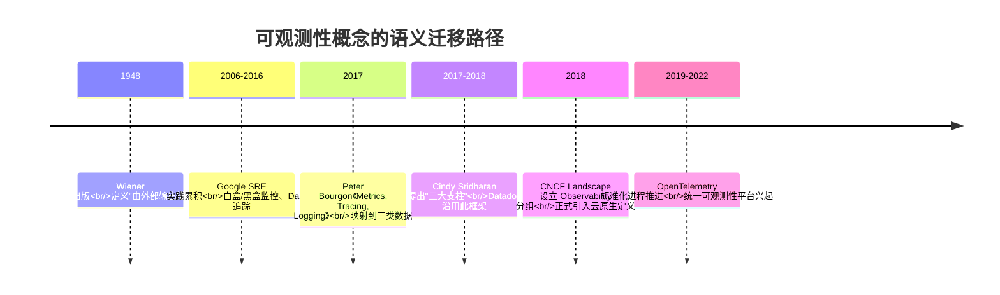
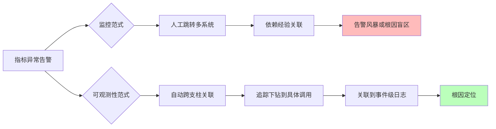
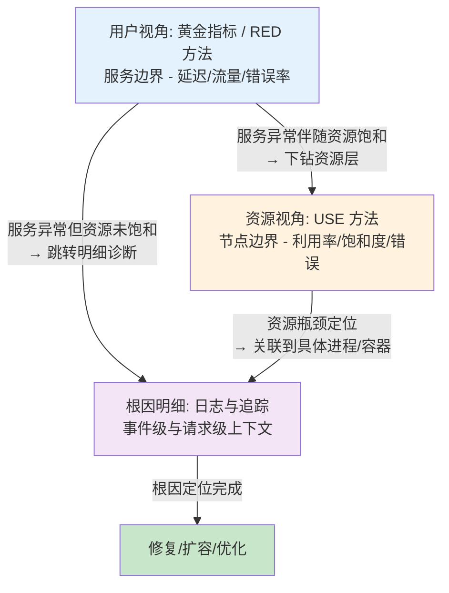
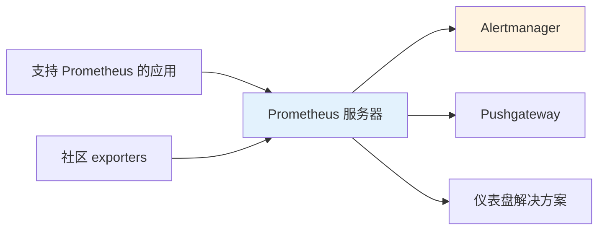
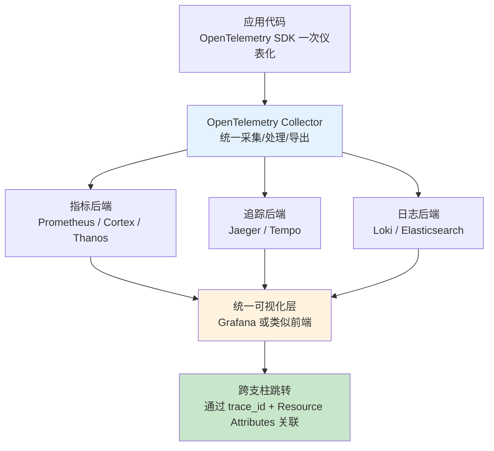
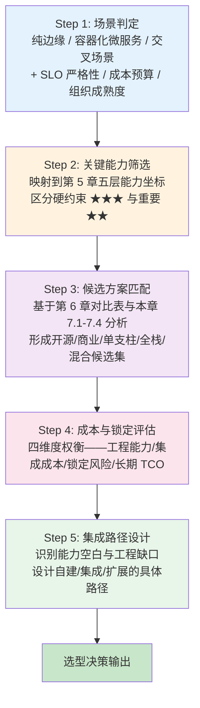

# 分布式边缘与容器化微服务环境下的可观测性研究：概念框架、系统要求与解决方案对比
# 1 研究背景与现代分布式系统的可观测性挑战

当软件系统从单体的、部署在数据中心机柜中的应用，演化为由数以千计的容器化微服务组成、并向网络边缘延伸的分布式生态时，"系统出了什么问题"这一看似简单的问题，正在变得前所未有地难以回答。Gartner 曾预测，"到 2024 年，实施分布式系统架构的企业中有 30% 将采用可观测性技术来提高数字业务服务性能，而 2020 年这一比例还不到 10%"[^1]。这一数字背后折射的并不仅仅是工具市场的扩张，而是运维范式本身在边缘计算、容器化与微服务架构冲击下的代际跃迁。本章作为整篇报告的语境奠基章节，将首先回顾这一架构演进脉络及其对运维方式的重塑，进而剖析新架构在动态性、分布性、异构性与规模性维度对传统监控造成的根本性挑战，由此推导可观测性作为云原生时代核心能力的需求来源，并最终界定本报告的研究范围、视角与论证逻辑。

## 1.1 分布式架构演进与运维范式的转变

过去十余年间，企业级软件系统经历了一场结构性变革：从紧耦合的单体应用，到通过服务边界划分的微服务集群；从基于虚拟机的重量级部署，到以容器为基本单元的轻量级封装；从集中式公有云数据中心，到将算力下沉至工厂车间、城市路口和家庭网关的分布式边缘节点。这一演进的核心驱动力是业务对交付速度、弹性伸缩与就近处理的更高要求，但其代价是系统复杂度的指数级抬升。正如业界总结的那样，"随着分布式系统架构变得更加复杂，跟踪和响应多云环境中的问题更具挑战性。当应用程序或服务的数量在这些庞大的多云环境中达到某个临界点时，我们将无法追踪哪些运行在何处以及它们的性能如何"[^1]。

容器化与 Kubernetes 编排的普及进一步加速了这一趋势。CNCF 在云原生的定义中，明确将可观测性（Observability）列为一项必备要素[^2]，这意味着可观测性不再是事后添加的运维工具，而是与容器化、服务网格、声明式 API 等并列的云原生基础能力。围绕这一定位，业界已经积累了大量开源与商业拼图——CNCF Cloud Native Landscape 中与可观测性相关的项目多达上百个[^2]，反映出生态对这一能力建设的高度重视与方案的高度碎片化。

运维范式的转变可以从两条线索上观察。其一是问题类型的转变。传统监控擅长回答**"已知的已知"问题**，例如 CPU 使用率是否超过阈值、接口错误率是否超标，这些都需要工程师提前定义指标和告警规则；而在云原生分布式环境中，工程师更需要回答**"未知的未知"问题**，例如"为什么这个用户的请求在凌晨 3 点超时""订单支付失败的根因是什么"，这类问题无法通过预设查询条件覆盖[^3]。其二是组织协作模式的转变。DevOps 与 SRE 文化的兴起使可靠性被作为关键特性来对待，《2019 年加快发展 DevOps 报告》指出，"快速、可靠、安全地交付软件是技术转换和组织绩效的核心"，并且"精英人士广泛使用开源组件、库和平台的可能性是普通人的 1.75 倍"[^4]。这意味着运维范式不仅要在技术层面应对架构复杂度，还要在工具选型上倾向于开源、可扩展的方案，以避免昂贵的专有软件成为高绩效团队的瓶颈。

从更长的历史尺度看，可观测性作为控制理论中的概念至少在 1960 年就已存在，但其向数字系统的迁移则是过去 20 年监控方式演进的产物[^4]。当系统的耦合度足够低、变更频率足够高、节点数量足够大时，把系统当作"黑箱"再贴上若干外部探针的做法已不可持续——系统必须在设计阶段就将"可被观测"作为自身固有属性。这一认知正是后续章节展开监控与可观测性概念辨析的逻辑起点。

## 1.2 边缘计算与容器化微服务环境的特征性挑战

如果说架构演进描述了"为什么需要变革"，那么对边缘计算与容器化微服务环境特征的具体剖析，则揭示了"传统监控为什么会失效"。下表从四个维度归纳了新架构对传统监控提出的根本性挑战，这些维度并非相互独立，而是在真实系统中彼此叠加、相互放大。

| 挑战维度 | 核心特征 | 对传统监控的冲击 | 典型场景印证 |
|---------|---------|----------------|------------|
| 动态性 | 容器生命周期短暂、Pod 频繁调度、服务实例弹性扩缩 | 监控目标实体高度易变，IP/主机名失去稳定语义，静态配置失效 | Kubernetes 环境下基于 Operator 自动发现的指标采集模式[^5] |
| 分布性 | 边缘节点地理分散、网络不稳定、跨多云多区域部署 | 数据采集链路脆弱，难以集中聚合，跨节点关联困难 | 杭州"城市大脑"项目部署 3.8 万个边缘计算节点[^6] |
| 异构性 | 多通信协议、多类型算力、多厂商设备并存 | 数据格式、接口标准碎片化，采集器与解析器需大量适配 | 某智慧园区同时部署 23 种厂商设备，协议转换开销占整体带宽 37%[^6] |
| 规模性 | 微服务数量、调用链路深度与节点总数指数级增长 | 预设阈值与静态仪表盘无法穷尽组合，告警风暴与盲区并存 | 工程师需要"持续检查这些海量高速数据流以识别生产中的已知和未知问题"[^1] |

**动态性**是容器化最直接的副作用。容器作为不可变基础设施的载体，其生命周期可以短至秒级，Pod 副本数随负载弹性变化，服务实例的 IP 地址与挂载位置在调度后几乎不可预测。传统基于主机名、固定 IP 或静态服务清单的监控配置在这种环境下迅速失效。云原生可观测性平台普遍采用 Prometheus Operator 等机制，将监控配置与 Kubernetes 资源对象绑定，以应对实例的动态生灭[^5]。然而，动态性带来的不仅是采集端的挑战，还包括存储与查询端——高基数（high cardinality）的标签维度爆炸是动态环境的固有产物，而这恰恰是后续章节讨论"高基数查询"作为可观测性关键要求的根源之一。

**分布性**则是边缘计算的本质特征。当算力从集中式数据中心下沉到数千个分布式节点时，安全边界、网络拓扑与数据汇聚路径都被彻底重塑。有研究指出，"某城市交通系统包含 1,200 个边缘网关，每个节点面临 DDoS 攻击概率是云中心的 8 倍"，而 2022 年某能源企业因边缘设备固件漏洞导致区域停电、经济损失达 2,300 万元[^6]。在这种环境下，监控数据本身的可靠传输都成为问题：边缘节点可能间歇性失联，本地缓存与回传策略必须被纳入可观测性架构设计。与此同时，分布性也意味着传统"探针—中心服务器"的拉取（pull）模型在边缘场景下需要让位于更轻量的推送（push）或 RemoteWrite 模式，以适配边缘带宽与连接稳定性约束[^5]。

**异构性**是边缘场景最易被低估的挑战。边缘计算云平台同时整合 CPU、GPU、FPGA 等不同类型计算资源[^7]，并连接 Zigbee、LoRa、5G 等十余种通信协议设备[^6]。这种异构性在可观测性层面体现为：不同设备的指标命名空间、日志格式与追踪语义彼此不兼容，需要在采集层进行大量协议转换与语义对齐。OPC UA 与 MQTT 混合部署导致数据格式转换耗时达 120ms 的案例[^6]，直观说明了异构性对实时性的侵蚀。这也解释了为什么 OpenTelemetry 等标准化项目在过去几年获得业界广泛关注——通过统一采集与传输规范，异构环境下的数据语义鸿沟才有望被弥合[^2]。

**规模性**则是上述三者共同作用下的放大效应。当微服务数量从数十膨胀到数千、调用链路深度从两三跳延伸到数十跳时，任何依赖人工预设阈值的监控体系都会陷入两难：阈值设得过松则漏报频发，过紧则告警淹没值班工程师。Cindy Sridharan 在其关于分布式系统可观测性的论述中也强调了这一规模困境下监控与可观测性的区分必要性[^4]。规模性带来的不仅是数据量问题，还包括认知负担——工程师无法事先穷举所有可能的故障模式，因此必须依赖能在事后进行任意维度切片与下钻的探索式查询能力，而这正是可观测性区别于监控的核心能力之一。

值得特别指出的是，上述四个维度在边缘与容器化微服务的交叉场景下会**相互叠加放大**。例如，工业互联网中的实时决策场景既要求毫秒级延迟（动态性与规模性叠加），又面对车间内异构传感器（异构性），还需在弱网条件下与云端协同（分布性）——某 12 英寸晶圆厂部署边缘 AI 后实现 50ms 内的环境参数闭环控制[^6]，这种紧约束下的可观测性设计远比集中式云环境复杂。

## 1.3 可观测性需求的来源与价值定位

上述挑战共同指向一个结论：传统基于预设指标与阈值的监控体系已无法支撑现代分布式系统的运维。可观测性作为应对方案，其需求来源可以从三个层面理解。

第一层是**问题域的扩张**。监控本质上是对系统外部表现的观察，它"可以告诉我们系统是运行还是关闭，或者应用程序性能是否存在问题"[^1]，但它无法解释为何关闭、为何出现性能问题。当分布式系统的故障模式从"某台机器宕机"演化为"某个特定用户在特定时间窗口经历特定调用路径上的尾延迟"时，问题域的复杂度已经远超监控所能覆盖的范围。可观测性通过 Metrics、Logging、Tracing 等系统外部输出，使工程师能够推断系统内部状态，从而回答事先未预设的问题[^3][^2]。

第二层是**控制权与责任归属的重新分配**。可观测性是"系统或服务的固有属性，而不是某人对系统所做的事情"[^4]——这一区分意味着可观测性必须由服务开发者与所有者在设计阶段就纳入考量，包括决定系统发出哪些信号、如何接收和存储这些信号、以及如何使用它们[^4]。这与监控可以由第三方在系统外部独立施加形成鲜明对比。在 DevOps 与 SRE 文化下，"You build it, you run it"的责任模式天然要求开发团队对其服务的可观测性负责，而不是把这一职能完全外包给运维或 SRE 团队。

第三层是**业务价值的传导**。可观测性的价值并不止于故障定位，还体现在性能优化、容量规划、业务连续性保障乃至产品决策支持等多个维度[^3]。《2019 年加快发展 DevOps 报告》将"快速、可靠、安全地交付软件"视为技术转换和组织绩效的核心，并指出"软件速度、稳定性和可用性对公司效益（包括盈利能力、生产力和客户满意度）的贡献"[^4]。这意味着可观测性的投入回报不仅可以从运维成本节约中衡量，还可以从业务指标改善中量化——这是其作为云原生基础能力而非可选附加项的根本理由。

可观测性能力的建设并非一蹴而就。业界已经形成了较为清晰的成熟度演进路径：从 2017 年 Peter Bourgon 总结的指标、追踪、日志**三大支柱**作为基础阶段，到围绕统一平台消除数据孤岛、降低重复建设的服务化阶段[^2]。在初级阶段，组织往往面临两类典型困境：一是**数据孤岛**，即"团队面临一个业务故障时，可能需要频繁跳转于 Metrics、Tracing、Logging 系统之间，由于这些系统上的数据并没有很好的关联打通，整个问题排查流程高度依赖人工的信息衔接"；二是**建设冗余**，即"业务部门只会构建服务于自身的观测设施，导致在不同业务部门之间重复构建"[^2]。这两类困境本身就是可观测性需求从"三大支柱拼凑"向"统一平台整合"演进的内在驱动力，也预示了本报告后续章节将重点讨论的"数据关联""单一事实来源"等系统要求。

## 1.4 研究范围、视角与论证逻辑

为使后续讨论保持清晰边界，本报告对研究范围、视角与论证逻辑做出如下界定。

在**时间边界**上，本报告聚焦于截至 2022 年初的公开技术信息与生态状态。这一选择基于两方面考虑：其一，可观测性作为一个快速演进的领域，其概念体系与代表性方案在 2017—2022 年间经历了从三大支柱提出、OpenTelemetry 标准化推进，到统一可观测性平台兴起的关键阶段，截至 2022 年初已形成相对稳定的理论框架与方案谱系，便于做结构化对比；其二，OpenTelemetry 在这一时间窗口内"完成了 Tracing 规范的 1.0 版本，并计划在 2021 年完成 Metrics 规范、2022 年完成 Logging 规范"[^2]，恰好构成可观测性标准化进程的一个自然观测节点。

在**空间边界**上，本报告聚焦于分布式边缘与容器化微服务两类典型场景的交叉地带。这意味着既不局限于纯粹的集中式云环境（在该环境下传统监控仍有较强适用性），也不延伸至独立运行的嵌入式设备（其约束模型与本报告讨论的可观测性范式差异较大）。这一聚焦使报告能够在统一的复杂度假设下讨论方案适配性。

在**内容范围**上，本报告覆盖三条主线：**概念框架**（监控与可观测性的区别、三大支柱、四大黄金指标）、**系统要求**（构建有效可观测性系统的关键能力维度）、**方案对比**（学术界与工业界代表性方案的结构化对照）。这三条主线层层递进，分别对应"是什么—需要什么—有什么"的认知逻辑。

在**研究视角**上，本报告综合技术架构、运维实践与生态演进三重维度。技术架构维度关注数据模型、采集机制与查询能力等底层逻辑；运维实践维度关注故障定位、SLO 管理与告警闭环等使用场景；生态演进维度则关注开源社区、商业产品与标准化组织之间的互动关系。三者结合，旨在避免单纯的概念罗列或单纯的工具评测，而是提供一个能够支撑实际选型决策的综合视图。

在**论证递进关系**上，后续七个章节将沿以下路径展开：第 2 章在概念层面厘清监控与可观测性的根本区别，回应"为什么需要新范式"；第 3 章解析三大支柱的数据形态与协同模式，回答"可观测性的数据基础是什么"；第 4 章在指标体系层面引入四大黄金指标与 RED/USE 方法论，回答"如何把数据转化为有效信号"；第 5 章归纳系统要求，回答"一个可生产的可观测性平台需要满足什么"；第 6 章构建学术界与工业界方案的结构化对比表，回答"现有方案各自处于什么位置"；第 7 章基于对比表归纳选型逻辑与能力空白；第 8 章则在前述基础上展望演进方向，回应用户在边缘计算、容器化与微服务项目中的实际决策需求。

需要特别说明的是，本报告在写作过程中严格规避了某些特定的综述性文献，所有论据均来自独立的一手与二手公开资料，并通过多源交叉验证以降低单一来源偏差风险。对于学术方案的能力描述，本报告将以原始论文与公开技术文档为基础；对于工业界方案的特征声明，则以官方文档与权威社区资料为准。这一方法论选择，旨在确保后续章节中的对比分析与选型洞察具有可追溯的证据链，而非建立在二次综述的间接引用之上。

# 2 监控与可观测性的根本区别

第 1 章已经勾勒出边缘计算、容器化与微服务架构在动态性、分布性、异构性与规模性四个维度对传统运维范式的根本冲击，并初步指出可观测性（Observability）正是为应对这一复杂度跃迁而被引入云原生语境的核心能力。然而，"可观测性"一词在业界的高频出现也带来了概念稀释的风险——它常常被简单地等同于"更高级的监控"，甚至被供应商作为既有监控产品的换皮标签使用。这种语义混淆掩盖了一个更深层的事实：**监控与可观测性并非同义替换，而是两种发源于不同语境、服务于不同问题域、依赖不同工程哲学的认知框架**。本章将从概念溯源、问题域分类、工具哲学、数据采集方式与故障定位范式五个维度，系统比较两者的本质差异，并在末节做出代际跃迁的综合判定，为后续三大支柱、四大黄金指标与系统要求的讨论奠定一致的概念基线。

## 2.1 概念溯源：从控制论到云原生的语义迁移

可观测性的概念基因并非诞生于 IT 运维，而是源自控制论这一更古老的跨学科领域。控制论由美国数学家诺伯特·维纳在 1948 年的著作《控制论：或关于在动物和机器中控制和通信的科学》中正式创立，其名称源自希腊语"舵手"，核心思想是将机器与有机体置于同一概念体系之下，研究系统如何通过信息流动与反馈调节实现其目标，基础概念包括系统、反馈、信息、输入与输出等[^8]。在这一体系中，可观测性最初的语义是关于**系统能否由其外部输出推断其内部状态的程度**——系统的可观察性越强，外界对其的可控制性就越强[^9]。这一定义在控制论框架下天然带有数学化与系统论色彩，与运维工程实践并无直接联系。

可观测性向 IT 领域的迁移发生在过去二十年，并在云原生兴起后骤然加速。一个被广泛引用的关键节点是 2017 年的分布式追踪峰会（2017 Distributed Tracing Summit）。会后，Go Kit 作者 Peter Bourgon 撰写了总结文章《Metrics, Tracing, and Logging》，系统地阐述了指标、追踪与日志三类数据的定义、特征及彼此之间的关系与差异，并将可观测性问题首次映射到对这三类数据的处理上[^10][^9]。其后，Cindy Sridharan 在其著作《Distributed Systems Observability》中进一步将指标、追踪、日志正式概括为可观测性的"三大支柱"（three pillars），云监控领域的领导者 Datadog 也在其网站上沿用三大支柱的框架来阐述可观测性[^10][^11][^9]。到 2018 年，CNCF Landscape 率先出现了 Observability 的分组，将可观测性从控制论中正式引入到 IT 领域，"可观测性"也自此逐渐取代"监控"，成为云原生技术领域最热门的话题之一[^9][^12][^13]。

与可观测性的理论性起源形成鲜明对比的，是**监控**作为运维工程实践的产物起源。Google SRE Book 第 6 章给出了监控的标准定义：监控是"收集、处理、聚合并展示系统的实时定量数据，例如查询数量与类型、错误数量与类型、处理时间、服务器在线时长等"[^14]。这一定义将监控明确定位为一种**数据处理活动**，其目标是为运维决策提供可观察的输入。在这一框架内，Google SRE Book 进一步区分了白盒监控与黑盒监控：白盒监控基于系统内部暴露的指标（包括日志、JVM 性能分析接口或暴露内部统计信息的 HTTP 处理器），而黑盒监控则像用户那样测试外部可见的行为[^14]。仪表盘（Dashboard）作为监控的典型呈现形式，则被定义为"提供服务核心指标摘要视图的应用，通常基于 Web，可包含筛选器与选择器，但预先构建以暴露对其用户最重要的指标"[^14]。

需要注意的是，业界围绕三大支柱定义本身存在持续争论，这一争论的实质恰恰反映了可观测性与监控在概念基因上的差异。Google Dapper 作者 Ben Sigelman 即对将可观测性等同于三种数据类型的定义提出质疑，认为"这样的定义毫无意义，因为这只是三种数据类型"；Honeycomb CTO Charity Majors 也反对将可观测性简化为数据类型的拼凑[^10][^15][^16]。这种争论反过来印证了一个事实：**三大支柱讲的是"如何实现"可观测性，而非"为何需要"可观测性**[^10][^15]。换言之，如果仅仅停留在三种数据类型的层面，可观测性与高级监控之间确实难以区分；只有回到控制论赋予它的"由外部输出推断内部状态"的原始语义，可观测性的概念独立性才得以确立。



从这一时间线可以看出，监控与可观测性的概念分野具有清晰的语义层级：监控是关于"如何采集与展示数据"的工程方法论，而可观测性是关于"系统是否具备被推断内部状态的能力"的系统属性。这一基因差异为后续五个维度的对比设定了基本坐标。

## 2.2 问题域分野：已知的已知与未知的未知

监控与可观测性最具洞察力的差异，体现在它们各自试图解决的问题域上。Charity Majors 提出的二分框架在业界已被广泛接受：**传统监控工具是用来解决"known-unknown"问题（已知问题）的，而可观测性是用来解决"unknown-unknown"问题（未知问题）的**[^10][^15][^16]。这一区分并非文字游戏，而是揭示了两者在问题预设性上的根本差异。

所谓"已知的未知"，是指工程师能够事先预见可能发生的故障类别，并提前定义出对应的指标、阈值与告警规则。例如，CPU 利用率超过 80% 应触发告警、HTTP 5xx 错误率超过 1% 应触发告警、磁盘剩余空间低于 10% 应触发告警——这些都是典型的"已知的未知"，因为工程师已经"知道"这些指标的存在与重要性，"未知"的只是它们何时会越过阈值。腾讯云在论及 Prometheus 时也以类似方式刻画了传统监控的能力边界："传统监控的异常监控需求，也就是监控那些我们知道某个地方可能会出现问题但是又不知道何时会出现问题（know-unknown）的地方"[^17]。在云原生时代，Prometheus 通过及时感知的服务发现模型，解决了大规模容器 Pod 频繁变化下的目标发现问题，但其本质仍是面向预设指标的指标埋点与告警体系[^17]。

而"未知的未知"，则是指工程师在系统设计与上线阶段无法预见的故障模式。Cindy Sridharan 在《Distributed Systems Observability》中明确指出，随着 Kubernetes 等平台解决了传统监控工具旗下的若干问题，**部分性的、隐式的与"软性"的失效模式也随着系统整体复杂度而上升**[^11]。这类失效往往不是单一指标越界，而是多个看似正常的子系统在特定时序、特定路径与特定用户上下文下相互作用的涌现性产物。在云原生时代，分布式系统的变更非常频繁，每次变更都可能导致新类型的故障，应用上线之后如果缺少有效的监控，很可能导致遇到问题自己都不知道，需要依靠用户反馈才知道应用出了问题[^9]。

科技云报道引述业界专家的一句话总结颇具代表性："**监控告诉我们系统的哪些部分是工作的；可观测性告诉我们那里为什么不工作了**"[^12]。这一句式精准概括了两者在问题域上的层次差：监控回答"是否"问题（is it working?），可观测性回答"为何"问题（why is it not working?）。前者预设了已知的判断维度，后者则允许工程师在事后对未预设的维度进行探索。

可观测性能够回答的典型问题列表也印证了这一差异——它回答的是诸如"性能瓶颈有哪些""请求需要接受的服务有哪些""请求执行过程与系统行为之间的差异性""请求失败的原因""每一个微服务将如何处理请求"等开放性问题[^13]。这些问题的共同特征是：其答案无法通过事先定义的少数指标穷尽，必须通过对系统输出数据进行任意维度的切片、关联与下钻才能逼近。

值得强调的是，在边缘计算与微服务场景下，"未知的未知"的占比相对集中式单体应用显著上升。微服务数量从数十膨胀到数千、调用链路深度从两三跳延伸到数十跳后，故障模式的组合空间已远远超出任何工程师团队所能事先穷举的范围。在这种语境下，仅依靠"已知的未知"框架的监控体系会迅速暴露其覆盖盲区——这也正是第 1 章所述告警风暴与漏报盲区并存困境的本质成因。

## 2.3 工具哲学：外部施加的运维工具与系统内生的设计属性

如果说问题域分野是认知层面的差异，那么工具哲学则是工程层面的差异。监控与可观测性在"谁负责"与"何时介入"这两个问题上有着截然不同的工程定位。

**监控通常以外部施加的运维自动化工具形态存在**。科技云报道在剖析传统监控与可观测性区别时指出，"传统监控更多的是指运维自动化工具，主要用途是替代人自动监控系统运行情况，在系统发生异常时告警，最终还是需要人工去分析异常、故障诊断和根因分析"[^12]。在这种工具定位下，监控可以由独立于业务系统开发团队之外的运维或第三方团队部署与维护，被监控的应用本身不必为监控的存在做任何专门改造——黑盒监控甚至完全不需要进入系统内部即可对外部可见行为进行测试[^14]。这种"外挂"特性使监控易于在已有系统上后增加，但也使其能力受限于系统主动暴露或外部可探测的少数指标。

**可观测性则是系统或服务的固有属性**。Gartner 将可观测性定义为软件和系统的一种特性，它允许管理员收集有关系统的外部和内部状态数据，以便他们回答有关其行为的问题；然后，I&O、DevOps、SRE、支持等团队可以利用这些数据来调查异常情况，参与可观察性驱动的开发，并提高系统性能和正常运行时间[^13]。这一定义中的关键词是"特性"——它不是某人对系统所做的事情，而是系统本身在设计阶段就应具备的属性。这意味着可观测性的实现必须由服务的开发者与所有者承担：他们需要决定系统发出哪些信号（What signals to emit）、信号如何被接收与存储（How to ingest and store）、以及信号如何被使用（How to use them）。

科技云报道进一步从内外视角刻画了这一差异："可观测性是从系统内部出发，基于白盒化的思路去监测系统内部的运行情况；可观测性贯穿应用开发的整个生命周期，通过分析应用的指标、日志和链路等数据，构建完整的观测模型，从而实现故障诊断、根因分析和快速恢复"[^12]。这与 Google SRE Book 对白盒监控的定义高度一致——白盒监控基于系统内部暴露的指标，包括日志、性能分析接口或暴露内部统计信息的 HTTP 处理器[^14]。可观测性可以看作是把白盒视角推到极致的产物：它要求系统在每一个关键路径上都主动发出结构化、可关联、富上下文的信号，而不是被动等待外部探针的拨测。

可观测性"贯穿应用开发整个生命周期"的定位，在 DevOps 与 SRE 文化下具有重要的组织含义。当开发团队遵循"You build it, you run it"的责任模式时，他们不仅要为代码的功能正确性负责，也要为服务在生产环境的可观测性负责。这与第 1 章引述的"运维范式不仅要在技术层面应对架构复杂度，还要在工具选型上倾向于开源、可扩展的方案"形成呼应：可观测性的工程哲学要求开发与运维边界的重塑，使可观测信号的输出成为代码的一部分，而不是事后由独立团队外挂施加。

可观测性"不仅包含传统监控的能力，更多的是面向业务，强调将业务全过程透明化的理念，实现全景监控、智能运维和自修复能力等体系化的服务能力"[^12]。这一表述也明确了两者在工具定位上的包含关系：监控是可观测性能力栈中的一个组成部分（负责"已知的未知"的告警与可视化），但可观测性远不止于监控——它还包括根因推断、业务洞察与未知问题探索等高阶能力。

## 2.4 数据采集方式：静态预设采集与动态高维数据流

工具哲学的差异直接传导到数据采集机制上。两者在"采什么、何时采、如何采"三个问题上的答案截然不同。

**传统监控的数据采集以预定义指标、静态配置和固定仪表盘为核心范式**。监控的标准定义本身就强调"实时定量数据"的收集、处理、聚合与展示[^14]，其典型工作流是：工程师事先决定哪些指标重要（如查询数量、错误数量、处理时间、服务器在线时长等），将这些指标埋点到系统中，通过周期性拉取或推送将数据汇聚到中央存储，再通过预构建的仪表盘展示给值班工程师。这种范式的优势是开销可控、查询路径清晰，但其根本约束在于**采集决策必须在运行时之前完成**——一旦上线后发现需要新的指标维度，往往需要重新埋点、重新部署。在容器化与微服务环境下，这种刚性会被进一步放大：每次新服务上线或既有服务变更都可能要求重新审视采集配置，运维成本随服务数量线性甚至超线性增长。

**Prometheus 是这一范式在云原生时代的代表性进化**。它在保留指标采集核心范式的同时，通过服务发现模型解决了云原生时代大规模服务发现的问题——面对海量容器 Pod 频繁变化，每次地址变化都修改配置显然不现实，Prometheus 通过及时感知的服务发现模型解决了云原生时代大规模服务发现的问题[^17]。Prometheus 借助时序数据库存储海量多维度指标数据，使用 PromQL 进行数据查询与聚合分析[^17]。然而，Prometheus 的能力边界仍在"已知的未知"范围内——它擅长解决"我们知道某个地方可能会出现问题但又不知道何时会出现问题"的场景[^17]。要超越这一边界进入"我们不知道会出现问题的地方和不知道何时会出现问题的地方"（unknow-unknow），必须通过可观测性技术深度串联分析链路和日志数据，结合故障预测、根因分析才能有效解决[^17]。

**可观测性的数据采集则强调高基数、高维度、富上下文的事件级流式数据**。OpenTelemetry 组织提出可观测性依赖的三大支柱：日志记录了特定时间发生的各种离散事件的信息，用于检测应用程序或者系统中无法预知的行为；指标根据随时间变化的数据，可分为基本指标度量（测量特定时间点的值）、增量指标度量（当前测量值与历史测量值之间的差异）、累计指标度量（计算在随时间变化下指标的累计值）三类；追踪则刻画请求通过分布式系统从端到端的过程[^13]。这种多形态、富上下文的数据采集模式，使工程师能够在事后对任意维度进行切片下钻，而无需在采集时预设所有可能的分析路径。

下表归纳了两种数据采集范式在关键维度上的差异：

| 采集维度 | 传统监控 | 可观测性 |
|---------|---------|---------|
| 采集决策时机 | 运行前预设，依赖工程师事先决定"采什么、看什么" | 运行时高维度采集，支持事后任意切片下钻 |
| 数据形态 | 以聚合后的低基数指标为主 | 指标、结构化日志、追踪事件并行 |
| 上下文丰富度 | 标签维度有限，避免基数爆炸 | 高基数、富上下文，承载请求/用户/路径维度 |
| 采集机制 | 以中央拉取（pull）或固定推送为主 | 推/拉混合，结合服务发现与边车（sidecar） |
| 目标发现 | 静态配置或简单服务发现 | 与编排平台深度集成的动态发现 |
| 关联能力 | 指标之间相对孤立，需人工拼接 | 通过 Trace ID、Resource Attributes 等关联键跨支柱跳转 |

这一对比揭示了一个核心权衡：**可观测性的高基数高维度数据流在带来事后探索能力的同时，也对存储、查询与采样策略提出了远高于传统监控的要求**。这也是第 5 章讨论系统要求时"高基数查询""低开销采集""采样与成本控制"等维度成为关键议题的根本原因——可观测性的强大表达能力建立在高昂的数据基础设施投入之上，必须通过精细的工程权衡来加以驯化。

## 2.5 故障定位范式：阈值告警驱动与根因推断驱动

数据采集方式的差异最终在故障定位流程上形成两种截然不同的范式。

**监控范式以阈值触发告警、人工经验排查为主线**。在这一流程中，工程师事先定义指标与阈值，监控系统在指标越界时触发告警，值班工程师收到告警后依据经验在多个监控面板、日志系统、追踪系统之间手工跳转，逐步缩小故障范围。这种范式在单体应用与小规模分布式系统中曾长期有效，但在云原生与微服务的复杂度下迅速暴露出两类失效模式：一是**告警风暴**，即海量预设告警规则在故障发生时同时触发，淹没真正有价值的根因信号；二是**根因盲区**，即真正的故障根因落在事先未预设的维度或组合上，无论如何调整阈值都无法定位。

科技云报道对这一失效模式的总结颇具洞察："现代 IT 系统的关键词是分布式、池化、大数据、零信任、弹性、容错、云原生等，越来越庞大，越来越精细，越来越动态，同时也越来越复杂；通过人去寻找各种信息的关联性，再根据经验判断和优化，显然是不可行的，耗时耗力还无法找到问题根因"[^12]。这一判断与第 1 章描述的"规模性带来的不仅是数据量问题，还包括认知负担"形成相互印证。

**可观测性范式则以指标—追踪—日志的关联下钻与跨信号联动分析为主线**。一文带你看懂可观测性与监控的差异中明确指出，三大支柱"密不可分，从发现指标异常，到指标关联分析，从逐层下钻到明细 trace 追踪和具体的错误日志，进而实现全链路自动化根因定位"[^13]。这一流程的核心是**自动化跨支柱跳转**：从聚合指标的异常波动出发，下钻到具体调用链路，再跳转到关联日志，最终在事件级数据中定位根因——整个过程不再依赖工程师在多个独立工具间的手工拼接，而是依赖统一上下文（如 Trace ID）与统一平台支撑的自动关联。

一个被广泛引用的实战案例直观体现了传统监控在云原生复杂度下的失效边界。某大型银行采用私有云基础设施部署微服务架构的应用，随着业务不断上云，经常遇到这样一个棘手问题：**核心数据库访问量陡增，只知道来自某个云资源池，却由于其中的 80000 多个容器 POD 都做了不止一次的 IP 地址转换，而无法定位到底是哪些 POD 造成了核心数据库的流量陡增**[^15][^16]。这一案例中，传统监控可以捕获到"数据库流量陡增"这一指标层面的异常，但因为 IP 地址在多次转换后已与原始服务实例失去稳定对应关系，传统的应用监控（APM）与网络监控（NPM）工具"可以发现某个函数调用失败或者某个链路性能下降，却难以在复杂的云环境下找到故障发生的根本原因"[^15]。要真正定位到流量来源 Pod，必须依赖跨网络层、容器层与应用层关联的可观测性能力，将网络流量与容器编排元数据、服务身份信息在事后做任意维度的关联查询。

这一案例也呼应了 Google SRE Book 在第 12 章给出的根本原则——简化与加速故障排查最基础的方法包括"从一开始就在每个组件中构建可观测性（包括白盒指标与结构化日志）"，以及"设计具有良好理解和可观察接口的系统组件"[^10][^15][^16][^9]。换言之，故障定位范式的代际跃迁不仅是流程优化问题，更是系统设计原则问题——只有在组件设计阶段就将白盒指标与结构化日志作为内生属性纳入，事后的根因推断才有数据基础可言。



## 2.6 代际跃迁的综合判定：从同义替换到能力升维

综合前五个维度的对比，可以得出本章的核心判断：**监控与可观测性并非术语层面的同义替换，而是认知模式与工程能力的代际跃迁**。下表对五个维度的对比做了系统化归纳：

| 维度 | 传统监控（Monitoring） | 可观测性（Observability） |
|------|----------------------|-------------------------|
| 概念起源 | 运维自动化工程实践 | 控制论"由外部输出推断内部状态"的系统属性 |
| 问题域 | "已知的未知"（known-unknowns） | "未知的未知"（unknown-unknowns） |
| 工具哲学 | 外部施加的运维工具，可由第三方独立部署 | 系统或服务的固有属性，由开发者在设计阶段植入 |
| 数据采集 | 预定义指标、静态配置、低基数 | 高基数、富上下文、动态发现 |
| 故障定位 | 阈值告警驱动 + 人工经验排查 | 跨支柱关联下钻 + 自动根因推断 |
| 典型问题 | "系统的哪些部分是工作的" | "那里为什么不工作了" |
| 与业务关系 | 以系统可用为中心，关注正常运行时间 | 面向业务，将业务全过程透明化 |

需要强调的是，这种代际跃迁是**包含式升维而非替代式革命**。Gartner 曾警告"到 2023 年，依赖于'正常运行时间'指标的监控实践将抑制 90% 的转型计划"，监控无法再单独以运维的视角、被动地解决故障为目标，而要追随 IT 架构的改变和云原生技术的实践，融入开发与业务部门的视角，具备比原有监控更广泛、更主动的能力，"可观测性"概念正是在这一背景下诞生[^12]。这意味着可观测性并不否定监控的价值——它继承监控的告警、可视化与基础指标能力，但在此之上扩展出根因推断、未知问题探索、业务全过程透明化等更高阶能力。监控是可观测性能力栈中的"必要不充分"组成部分。

从生态采纳的视角看，这一代际跃迁仍处于演进中。Gartner 在 2020 年指出，"虽然可观察性处于早期阶段，截至 2020 年只有不到 10% 的企业采用它，但 Gartner 预测，到 2024 年，30% 的基于云架构的公司将采用可观察性技术"[^13]。这一采纳曲线既反映了概念本身的新颖性，也反映了其落地的工程门槛——构建真正意义上的可观测性能力远比部署一套监控工具复杂，它涉及代码侧的信号埋点改造、平台侧的数据基础设施投入、组织侧的开发运维边界重塑等多个层面的协同。

通过本章的辨析，可观测性的概念基线得以确立：**它是系统具备的、源自控制论传统的、面向"未知的未知"的、由开发者在设计阶段植入的、依赖高基数事件级数据的、支持跨支柱关联根因推断的内生属性**。这一基线将贯穿本报告后续章节：第 3 章将基于此讨论作为可观测性数据基础的三大支柱及其协同模式；第 4 章将进一步引入由 Google SRE 提出的四大黄金指标与 RED/USE 方法论，回答"如何把高维数据转化为有效服务质量信号"；第 5 章将基于可观测性的内生属性定位归纳系统级关键要求；第 6、7 章则在此概念框架上对学术界与工业界代表性方案进行结构化对比与选型分析；第 8 章则在前述基础上展望演进方向。所有后续讨论都将严格区分"监控能力"与"可观测性能力"，避免回到本章开篇所指出的语义稀释陷阱。

# 3 可观测性的三大支柱：指标、日志与追踪

第 2 章已经厘清，可观测性作为系统内生属性的真正含义在于"由外部输出推断内部状态"，其能力建立在高基数、富上下文的事件级数据流之上。然而，要让这一抽象的系统属性在工程实践中落地，仍然需要回答一个具体问题：**系统应当向外发出哪些类型的信号，工程师才能据此推断内部状态？** 这一问题的主流回答即业界广为人知的"可观测性三大支柱"——指标（Metrics）、日志（Logs）与追踪（Traces）。Peter Bourgon 在 2017 年的总结文章《Metrics, Tracing, and Logging》中首次系统地阐述了这三类数据的定义、特征与彼此关系，Cindy Sridharan 随后在《Distributed Systems Observability》中将其正式概括为三大支柱并被 Datadog 等业界代表沿用，OpenTelemetry 组织也将其作为可观测性所依赖的核心数据模型。

需要承接第 2 章末尾的重要提醒：三大支柱讲的是"如何实现"可观测性，而非"为何需要"可观测性。Ben Sigelman 与 Charity Majors 对将可观测性简化为三种数据类型的批评，恰恰提醒我们必须从数据形态、采集机制、关联能力与诊断价值的整体视角去理解三支柱——单一支柱的能力堆叠并不能自动产生可观测性，三者必须在统一的语义与上下文之下协同工作，才能支撑起跨支柱关联与根因推断的高阶能力。本章将先分节剖析三类数据的形态特征与工程实现（3.1—3.3），再从多维度构建结构化对比（3.4），最后讨论它们在真实调用链中的协同模式与跨支柱跳转的工程逻辑（3.5），为后续黄金指标方法论、系统要求与方案对比章节提供统一的数据层参照框架。

## 3.1 指标（Metrics）：聚合型时序数据的形态与能力边界

指标是三大支柱中数据密度最低、聚合度最高的一类。在 OpenTelemetry 组织对三大支柱的定义中，指标被刻画为根据随时间变化的数据所形成的度量值，按其语义可分为三种基本类型：**基本指标度量**测量特定时间点的值（如某一时刻的活跃连接数）、**增量指标度量**反映当前测量值与历史测量值之间的差异（如过去一分钟的请求增量）、**累计指标度量**则计算指标随时间变化的累计值（如自服务启动以来处理的总请求数）。这三类度量的共同形式特征是：每个数据点由时间戳、数值与一组标签（labels/tags）构成，且数值在采集时已经过某种程度的聚合，不再保留单次事件的完整上下文。

这种聚合特性直接决定了指标的**采集与存储经济性**。在第 2 章对采集范式的对比中已经指出，Prometheus 是云原生时代指标范式的代表性进化——它通过及时感知的服务发现模型解决了大规模容器 Pod 频繁变化下的目标发现问题，借助时序数据库存储海量多维度指标数据，并使用 PromQL 进行数据查询与聚合分析。Prometheus 的拉取（pull）模型在云原生环境下表现出两点优势：一是采集端与被采集端解耦，被采集服务只需暴露符合规范的 metrics endpoint 即可被发现纳入；二是采集频率与目标列表由中央控制，便于成本管理与变更追踪。在 Kubernetes 环境下，Prometheus Operator 等机制进一步将监控配置与 Kubernetes 资源对象绑定，使采集配置能够随 Pod 的动态生灭自动调整，从而应对第 1 章所述的动态性挑战。

指标的**查询与分析能力**主要体现为多维度聚合。以 PromQL 为代表的时序查询语言支持按标签维度进行求和、求平均、分位数计算、速率推导等聚合操作，使工程师能够从原始数据点中快速提取出"过去 5 分钟 P99 延迟"、"按 service 维度分组的 QPS"等高阶视图。这种聚合能力使指标天然适合**告警、容量规划与趋势观察**三类典型场景：告警依赖低延迟的指标越界检测，容量规划依赖长时间窗口的均值与峰值分析，趋势观察则依赖跨周维度的环比同比比较。

然而，指标的能力边界同样源自其聚合特性。第一类约束是**高基数标签维度爆炸**。当工程师试图在指标标签中加入 user_id、request_id、trace_id 等高基数维度时，时序数据库需要为每一种标签值组合维护独立的时间序列，存储成本与查询延迟会迅速失控。这正是为什么指标在实践中不得不限制标签的基数维度，而把高基数上下文留给日志与追踪去承载——这一权衡是后续 3.4 节"广度—深度"张力轴的核心成因之一。第二类约束是**诊断深度的局限**。指标只能告诉工程师"某个聚合维度上出现了异常"，却无法回答"是哪些具体请求构成了这一异常"。第 2 章引述的某大型银行案例已经直观说明了这一边界：传统监控可以捕获到"数据库流量陡增"这一指标层面的异常，但因为 8 万多个容器 Pod 经过多次 IP 地址转换后已与原始服务实例失去稳定对应关系，仅凭指标无法定位到具体的流量来源 Pod。要超越这一边界，必须借助日志与追踪在事件级与请求级提供的细粒度上下文。

## 3.2 日志（Logs）：离散事件流的记录范式与结构化演进

如果说指标是对系统状态的"聚合快照"，日志则是对系统行为的"离散事件流"。OpenTelemetry 组织对三大支柱的阐述中，将日志定义为记录了特定时间发生的各种离散事件的信息，其首要价值在于**用于检测应用程序或者系统中无法预知的行为**。这一定义直接呼应了第 2 章所论可观测性面向"未知的未知"的核心使命——当工程师无法预先决定哪些指标应当被采集时，将系统中所有有意义的事件以日志形式记录下来，便保留了事后任意维度探索的可能性。

日志作为一种数据形态，其内在演进路径是**从非结构化文本到结构化、富上下文事件**的逐步规范化。早期的应用日志以自由格式的文本行为主，依赖正则表达式与人眼解析，这种范式在单体应用与小规模分布式系统中尚可应付，但在云原生与微服务环境下迅速失效：跨服务的日志格式互不兼容、关键字段散落在文本中难以提取、与指标和追踪缺乏统一的关联键。结构化日志（如 JSON 格式日志）的兴起正是对这一困境的回应——通过将日志事件表达为键值对集合，使每条日志都具备机器可解析的字段结构，从而支撑后续的索引、检索与跨字段关联。在更进一步的富上下文阶段，日志事件不仅包含业务字段，还携带 trace_id、span_id、service.name、host.name 等可观测性上下文，使其能够作为跨支柱跳转的锚点（这一关联机制将在 3.5 节深入讨论）。

在**采集与存储**层面，日志通常通过部署在每个节点上的 agent 或与应用同 Pod 部署的 sidecar 收集，再通过日志管道汇聚到集中化存储。在工业实践中，ELK Stack（Elasticsearch + Logstash + Kibana）长期是开源日志平台的事实标准，其架构涵盖了从 Logstash 的日志采集与解析、到 Elasticsearch 的全文索引存储、再到 Kibana 的查询与可视化。Elasticsearch 的倒排索引机制使日志支持灵活的全文检索与字段聚合查询，使其特别适合**根因排查、审计追踪与业务洞察**三类场景：根因排查依赖在特定时间窗口与服务范围内对错误关键字、堆栈信息的快速检索；审计追踪依赖对敏感操作日志的长期保留与回放能力；业务洞察则依赖对结构化字段的多维聚合分析。

日志的**固有挑战**主要集中在三方面。其一是**数据量与存储成本**。与指标的高度聚合形成对比，日志记录的是事件级原始信息，在高 QPS 服务下日志量可以轻易达到 TB 乃至 PB 级，存储成本与索引开销均显著高于指标。其二是**跨服务关联的依赖性**。当请求穿越多个微服务时，每个服务独立产生的日志彼此之间并无天然关联——如果没有统一的 trace_id 等关联键贯穿日志事件，跨服务的故障排查仍然只能依赖时间戳的粗略对齐与人工拼接。其三是**采集与解析的工程复杂度**。在异构服务、多语言运行时与多种日志格式并存的环境下，日志管道需要承担大量的格式转换与字段提取工作，这与第 1 章所述的异构性挑战在可观测性层面形成的具体投影完全一致。

## 3.3 追踪（Traces）：分布式调用链的端到端刻画

追踪是三大支柱中专门为分布式系统而生的数据形态。它的核心价值在于将一次跨越多个服务的请求"还原"为一条端到端的可视化路径，使工程师能够直观看到请求在分布式系统中经过了哪些组件、在每一跳花费了多少时间、在哪一跳发生了错误。这一能力对应用了微服务架构的系统具有特殊意义——在单体应用中调用关系可以由代码静态分析得出，但在数千微服务的动态调用环境下，调用链路只能依赖运行时的追踪数据来重建。

### 3.3.1 Google Dapper 的设计哲学与基础概念

分布式追踪的现代体系几乎完全脱胎于 Google 在 2010 年发表的论文《Dapper, a Large-Scale Distributed Systems Tracing Infrastructure》。该论文详细介绍了 Google 内部使用的分布式追踪系统 Dapper 的设计与使用经验，后来的 Zipkin、Pinpoint、Hydra、Watchman、阿里"鹰眼"等系统均基于这篇文章的思想实现[^18]。Dapper 论文之所以被视为分布式追踪的基石，不仅因为它首次提出了请求追踪、跨服务追踪与采样等关键技术概念，还因为它确立了追踪系统在大规模生产环境下应当满足的工程要求[^19]。

理解 Dapper 的关键在于理解三组核心概念[^20]：

- **Trace（追踪）**：对一次事务在分布式系统中流动过程的描述，即一条端到端的请求路径；
- **Span（跨度）**：一个具名的、计时的操作，代表工作流中的一个片段；Span 可以携带 key-value 形式的标签（tags），也可以附加细粒度的、带时间戳的结构化日志；
- **Span Context（跨度上下文）**：随分布式事务一同传播的追踪标识信息，使各个 Span 能够被关联回同一条 Trace。

在工作机制上，当一个请求进入系统时，它被赋予一个唯一的 Trace ID，随后这个标识符随请求在不同组件之间传递；每个组件在处理请求时都会生成相关的追踪数据（开始时间、结束时间、执行时间、调用的组件等），这些数据被收集和汇总后存储在专门的分布式追踪系统中，开发人员可以借此分析应用程序的性能瓶颈、调用链路和错误[^19]。

Dapper 论文进一步明确了追踪系统在大规模生产环境下必须满足的两个使用需求：**ubiquitous deployment（无所不在的部署）**与 **continuous monitoring（持续的监控）**[^18]。前者强调追踪系统的监控对象应当没有死角——即使是很小的一部分系统未被监控到，也会对追踪系统的有效性产生很大影响；后者强调追踪系统不应被关闭，因为许多异常的系统行为往往非常难以再现，保留这些追踪信息显然非常重要[^18]。

在这两项使用需求之下，Dapper 提出了**三大设计原则**，这三项原则后来成为几乎所有现代追踪系统的工程共识[^20][^18]：

| 设计原则 | 原始要求 | 工程含义 |
|---------|---------|---------|
| **低损耗（Low overhead）** | 追踪系统对运行服务的性能影响必须可忽略 | 在高度优化的服务中，即便很小的监控开销也会显著，可能迫使部署团队关闭追踪；这是采样策略成为追踪系统标配的根本原因 |
| **应用级透明（Application-level transparency）** | 程序员不应需要意识到追踪系统的存在 | 依赖应用开发者主动协作的追踪基础设施极其脆弱，常因埋点 bug 或遗漏而失效；这一原则催生了自动埋点 SDK 与 Service Mesh 等"无侵入"追踪机制 |
| **可扩展性（Scalability）** | 需要能够承载 Google 规模服务与集群在未来若干年的增长 | 追踪系统的数据通路、存储与查询必须能够水平扩展，应对节点与请求量的指数级增长 |

这三大原则之间存在内在张力：**低损耗与应用级透明指向尽可能轻的运行时介入，而可扩展性则要求承载海量数据**。Dapper 通过引入**采样**化解这一张力——仅记录部分请求的完整追踪数据，在保留统计意义上代表性的同时大幅降低开销与存储压力[^19]。采样策略也因此成为追踪工程实践中最为关键、最具权衡空间的设计决策之一，并在 3.5 节讨论协同模式时与跨支柱一致性问题密切相关。

### 3.3.2 代表性追踪系统：Jaeger 与 Zipkin

Dapper 的设计哲学在开源世界催生了两个最具代表性的追踪系统：Twitter 开源的 **Zipkin** 与 Uber 开源、后被 CNCF 接纳的 **Jaeger**。Jaeger 作为厂商中立的开源分布式追踪平台，被定位为可用于对现代的、云原生的基于微服务的应用程序中组件间的交互进行监控、创建网络配置集并进行故障排除[^21]。在 Red Hat OpenShift 等容器平台中，Jaeger 被作为内置的追踪组件提供，使服务所有者可以使用 Jaeger 来检测他们的服务以收集与服务架构相关的信息，从而执行**监控分布式事务、优化性能和延迟时间、执行根原因分析**三类核心功能[^21]。Jaeger 早期基于厂商中立的 OpenTracing API 与工具构建，这一选择也反映出业界对追踪标准化的早期诉求[^21]。

在数据模型与 API 层面，Jaeger 体现出对生态兼容性的高度重视。其 jaeger-collector 不仅接受 OpenTelemetry 协议的 JSON 数据，还可以配置启用 Zipkin HTTP 服务器（如 9411 端口），通过 `/api/v1/spans` 与 `/api/v2/spans` 两个端点接受多种 Zipkin 数据格式的 Span 提交（包括 Zipkin JSON v1/v2 与 Zipkin Thrift）[^22]。这一兼容性设计使 Jaeger 能够无缝接收原本面向 Zipkin 的客户端埋点数据，降低了用户在追踪系统之间迁移的成本。在追踪查询侧，Jaeger 推荐通过 jaeger-query 服务的 gRPC/Protobuf 接口（默认 jaeger-query:16685）以编程方式检索追踪数据，并基于 query.proto IDL 文件定义稳定的 `jaeger.api_v2.QueryService` 接口；同时 Jaeger UI 通过一组刻意未公开文档化、保留变更权利的内部 JSON API 与 jaeger-query 通信（例如通过 GET 请求 `https://jaeger-query:16686/api/traces/{trace-id-hex-string}` 获取单条追踪）[^22]。此外，Jaeger 还支持通过 gRPC Remote Storage API 接入自定义存储后端，以及通过 Remote Sampling Configuration API 进行远程采样策略下发[^22]，这些扩展点对在边缘与多云环境下灵活调整数据流向具有重要意义。

需要注意的是，Jaeger 在生产部署中存在若干已知边界。以 OpenShift Container Platform 4.4 集成版本为例，Kafka publisher 虽是 Jaeger 的一部分但并不被支持，Apache Spark 不被支持，且仅支持自置备的 Elasticsearch 实例而不支持外部 Elasticsearch 实例[^21]。这类限制虽然属于特定发行版的范畴，但也提醒在追踪系统选型时需具体核对版本与发行渠道的支持矩阵，而非仅依赖项目主页的功能列表。

### 3.3.3 追踪的核心价值与诊断深度

追踪在三大支柱中的独特定位是**提供请求级的端到端因果关系**。指标揭示系统聚合状态的异常波动，日志记录事件级的离散信息，但只有追踪能够把"这一次特定请求经过了哪些服务、每一跳花了多少时间、在哪一跳失败"完整还原出来。这一能力对应于三类核心诊断价值：

第一是**性能瓶颈定位**。当某条业务链路整体延迟上升时，追踪可以将延迟分解到每一个 Span 上，使工程师立即识别出是哪个下游服务、哪一次数据库查询或哪一次 RPC 调用构成了瓶颈。第二是**调用依赖分析**。在微服务数量膨胀到数千的环境下，调用依赖关系无法依靠代码静态分析得出，追踪数据的聚合分析能够还原出服务拓扑，为容量规划与变更影响评估提供基础。第三是**跨服务故障诊断**。追踪天然包含跨服务的因果链，当一个错误在调用链中传播时，追踪可以指出错误的起源 Span 与传播路径，避免工程师在多个独立的日志系统间手工拼接。

正如业界对追踪价值的总结，在云原生计算中由于普遍使用分布式系统和微服务架构，分布式追踪成为日常调试和监控的重要组成部分——它可以帮助理解请求是如何在多个服务之间流动的，并提供关于性能、错误和依赖关系的有用信息，从而更好地理解系统中的瓶颈、故障和性能问题[^19]。

## 3.4 三大支柱的多维度对比：数据量、成本、关联性与诊断价值

在分别剖析三类数据之后，有必要从工程权衡的角度将其放置在同一坐标系下做结构化比较。下表归纳了三大支柱在八个关键维度上的差异：

| 对比维度 | 指标（Metrics） | 日志（Logs） | 追踪（Traces） |
|---------|---------------|-------------|---------------|
| 数据形态 | 时间戳+数值+标签的聚合时序点 | 离散事件，从非结构化文本到结构化键值对演进 | Trace（请求路径）+ Span（操作片段）+ Span Context（关联键） |
| 采集机制 | 周期性拉取或推送，与服务发现深度集成 | agent/sidecar 收集，日志管道汇聚 | SDK 埋点或自动埋点 + 上下文传播 + 采样 |
| 存储模型 | 时序数据库（如 Prometheus TSDB） | 全文索引存储（如 Elasticsearch） | 专用追踪存储（Cassandra/Elasticsearch 等） |
| 查询能力 | 多维聚合查询（如 PromQL） | 全文检索 + 字段聚合 | 单 Trace 钻取 + 跨 Trace 聚合分析 |
| 数据量与存储成本 | 最低，聚合特性使单位时间数据量可控 | 最高，事件级原始数据 + 全文索引开销 | 中至高，受采样率显著影响 |
| 基数承载能力 | 弱，高基数标签会导致序列爆炸 | 强，每条事件独立承载高基数字段 | 强，每个 Span 可携带丰富标签 |
| 上下文丰富度 | 低，主要承载维度标签与数值 | 中至高，受日志结构化程度影响 | 高，天然包含调用因果关系与时序 |
| 诊断深度 | 揭示"是否异常" | 揭示"发生了什么事件" | 揭示"请求经过了什么路径、在何处出错" |
| 典型使用场景 | 告警、容量规划、趋势观察 | 根因排查、审计追踪、业务洞察 | 性能瓶颈定位、调用依赖分析、跨服务诊断 |

从这张表中可以提炼出两条贯穿三支柱关系的**张力轴**：

**第一条是"广度—深度"张力轴**。指标以最低的成本提供对全系统的广度覆盖，但牺牲了请求级深度；日志与追踪保留了事件级与请求级的深度，但需要承担相应的存储成本与查询复杂度。这条轴上的工程权衡决定了一个组织在可观测性投入上的成本结构：广度覆盖通常应做到"无死角"，而深度采样则需要在覆盖率、成本与诊断价值之间精细调配。

**第二条是"聚合—明细"张力轴**。指标是聚合的产物，回答"整体上发生了什么"；日志与追踪是明细的产物，回答"具体在哪一次事件/请求上发生了什么"。从聚合视图下钻到明细视图的能力，是可观测性区别于传统监控的核心标志之一——而这一下钻能力的实现，恰恰依赖三支柱之间的关联机制（将在 3.5 节展开）。

这两条张力轴的存在解释了一个核心论断：**任何单一支柱都不足以独立支撑完整的可观测性能力**。仅有指标的体系会陷入第 2 章所述"知道哪里不工作却不知道为何不工作"的困境；仅有日志的体系会面临数据洪流而无法快速识别异常入口；仅有追踪的体系则缺乏聚合层面的整体态势感知。三支柱必须协同工作，才能形成从"广度异常发现"到"深度根因定位"的完整闭环。这也直接回应了 Ben Sigelman 与 Charity Majors 对三支柱定义的批评——三支柱不是可观测性的目的，而是可观测性能力得以实现的数据基础，其价值取决于三者之间的协同与关联，而非各自的孤立堆叠。

## 3.5 三支柱在调用链中的协同模式与跨支柱跳转的工程逻辑

三大支柱协同的核心场景，是一次完整的故障诊断流程在三类数据之间的有序流转。一个典型的协同模式可以刻画如下：值班工程师首先从聚合**指标**的异常波动收到告警（例如某服务 P99 延迟在过去 5 分钟内突破 SLO 阈值），这是协同链路的"入口信号"；随后工程师以该时间窗口与服务维度为约束，下钻到对应区间的**追踪**数据，识别出延迟显著高于均值的若干 Trace 样本，并定位到具体的瓶颈 Span（例如某个下游 RPC 调用或数据库查询）；最后工程师以该 Span 关联的 trace_id 与 span_id 为锚点，跳转到该时间窗口该服务的**日志**事件，在事件级数据中查看具体的错误信息、堆栈与业务上下文，最终完成根因定位。

```mermaid
flowchart LR
    A[Metrics<br/>聚合指标异常告警] --> B[Traces<br/>下钻到 Trace 样本<br/>定位瓶颈 Span]
    B --> C[Logs<br/>跳转到 Span 关联日志事件<br/>查看错误堆栈与业务上下文]
    C --> D[根因定位]
    
    A -.关联键: service.name + 时间窗口.-> B
    B -.关联键: trace_id + span_id.-> C
    
    style A fill:#e3f2fd
    style B fill:#fff3e0
    style C fill:#f3e5f5
    style D fill:#c8e6c9
```

这一流程能够顺畅运转的工程前提是**跨支柱跳转的关联键统一可用**。最核心的关联键有三类：

第一类是**Trace ID 与 Span ID**。Trace ID 作为请求在分布式系统中传播时的唯一标识，理论上可以贯穿一次请求所触发的所有指标点、日志事件与追踪 Span。当一条日志事件携带了 trace_id 字段时，工程师就可以直接从这条日志反向跳回完整的 Trace 视图，看到该日志发生在请求路径的哪一跳上；反之，从 Trace 视图中的某个 Span 出发，也可以通过 trace_id 与 span_id 检索到该 Span 执行期间的所有相关日志。这一双向跳转能力的工程基础，正是 Dapper 提出的"随分布式事务一同传播的追踪标识信息"——即 Span Context 的概念[^20]。

第二类是**Resource Attributes（资源属性）**。在 OpenTelemetry 的语义规范中，Resource Attributes 用于描述产生信号的实体本身（如 service.name、service.version、host.name、k8s.pod.name 等），它们作为标签同时附加到指标、日志与追踪上，使三类数据在"是谁产生的"这一维度上具备统一语义。这一统一性对于第 1 章所述的异构性挑战具有直接的缓解作用——只要三类数据共享同一套 Resource Attributes，跨支柱按服务维度切片下钻就成为可能。

第三类是**时间戳与时间窗口**。即便在没有 trace_id 或 span_id 的场景下，统一的时间基准仍是粗粒度跨支柱跳转的最低保障——工程师可以从指标异常发生的时间窗口出发，在该窗口内的日志与追踪中检索相关事件。但仅依赖时间戳的跳转在高并发场景下精度有限，必须辅以更强的关联键才能定位到具体请求。

**OpenTelemetry 在统一语义与上下文传播规范上的角色至关重要**。第 1 章已经指出，OpenTelemetry 在 2017—2022 的关键时间窗口内完成了 Tracing 规范的 1.0 版本，并计划在 2021 年完成 Metrics 规范、2022 年完成 Logging 规范，恰好构成可观测性标准化进程的一个自然观测节点。这一标准化的核心价值正是为三支柱协同提供统一的数据模型、统一的语义约定（如 Resource Attributes 与各类属性的命名规范）以及统一的上下文传播机制（W3C Trace Context 等）。在没有这套标准之前，不同厂商与开源项目各自定义了不兼容的追踪格式、日志字段与传播头，跨支柱跳转往往需要工程师在数据管道中手工做格式与语义的转换；标准化之后，三支柱的关联键得以在不同工具之间无缝流转，这是统一可观测性平台得以成立的前提条件。Jaeger 之所以在数据接入层同时支持 OpenTelemetry 协议、Zipkin 多种格式与自定义存储后端[^22]，正是这一标准化进程在具体追踪系统上的投影——生态对兼容性的诉求驱动了规范的趋同。

然而，协同模式在工程落地中仍面临若干典型挑战，需要在系统设计阶段加以应对：

**第一类是数据孤岛**。第 1 章已经引述了业界的典型困境——"团队面临一个业务故障时，可能需要频繁跳转于 Metrics、Tracing、Logging 系统之间，由于这些系统上的数据并没有很好的关联打通，整个问题排查流程高度依赖人工的信息衔接"。当三支柱分别由不同的工具栈、不同的存储后端与不同的查询语言承载时，即使关联键在数据中存在，工程师仍需在多个独立 UI 之间手工复制粘贴 trace_id 进行跳转，效率与体验都受到严重制约。这是后续第 5 章讨论"单一事实来源"与"跨支柱跳转能力"作为关键系统要求的根本动因。

**第二类是采样一致性**。如 3.3 节所述，追踪系统普遍采用采样策略来满足 Dapper 提出的低损耗原则——但这会引入一个跨支柱的不一致问题：如果某次请求的追踪因采样而未被记录，但其对应的日志事件被全量保留，则工程师在日志中发现错误后无法跳转到追踪视图，反之亦然。要解决这一问题，需要在采样决策上做精细设计：要么采用"基于追踪的采样"（trace-based sampling），使一次请求的追踪与关键日志的保留决策保持一致；要么采用尾部采样（tail-based sampling），只对最终判定为异常的请求保留完整追踪。这些策略的选择是边缘与微服务场景下的关键工程权衡。

**第三类是上下文断链**。Trace Context 的跨服务传播依赖每一跳服务都正确地从入站请求中读取 trace_id、并将其附加到出站请求中。任何一个未做埋点改造的服务（例如某个遗留组件、某个第三方 SDK 调用、某个异步消息消费链路）都可能成为"断链点"，使 Trace 视图在该服务前后被截断为两段。这一挑战在异构服务、多语言运行时与异步通信普遍存在的边缘与微服务场景下尤为突出——它呼应了 Dapper 提出的"应用级透明"原则[^20][^18]：依赖应用开发者主动埋点的追踪基础设施极其脆弱，自动埋点 SDK 与 Service Mesh 的兴起正是为了将上下文传播责任从应用代码转移到基础设施层，最大限度减少断链点。

综上，三大支柱的协同不是数据类型的简单加和，而是一套依赖统一关联键、统一语义规范与统一传播机制的工程体系。这套体系的成熟度直接决定了一个可观测性平台能否真正完成第 2 章所述"从聚合异常发现到事件级根因定位"的代际跃迁。本章对三支柱形态、对比与协同的剖析，为后续第 4 章引入四大黄金指标与 RED/USE 方法论提供了数据层的基础——黄金指标本质上是从三支柱（尤其是指标支柱）中提炼出的服务质量信号，其有效性既依赖指标采集本身的健全性，也依赖在告警异常时能够顺畅跳转到日志与追踪做深度诊断的协同能力；同时，本章对数据孤岛、采样一致性与上下文断链等挑战的讨论，也为第 5 章归纳"数据关联与跨支柱跳转"、"统一上下文"、"单一事实来源"等系统关键要求做了必要铺垫。

# 4 四大黄金指标与服务监控方法论

第 3 章已经厘清了三大支柱作为可观测性数据基础的形态、能力边界与协同模式，但仅有数据形态层的理解还不足以指导工程实践——海量的指标、日志与追踪本身并不能自动转化为可操作的服务质量信号。**工程师真正面对的问题是：在数千微服务、动态调度的容器实例与分布在网络边缘的异构节点之间，应当聚焦于哪些指标才能既覆盖系统健康度又避免告警噪声？** 这一问题的回答构成了介于数据层与系统能力层之间的"方法论层"，本章正是聚焦于此。Google SRE 提出的四大黄金指标、Tom Wilkie 提出的 RED 方法与 Brendan Gregg 提出的 USE 方法，构成了业界三套最具影响力的指标选择框架；它们各自源自不同的工程语境，但在云原生分布式系统中需要协同使用、相互补足。在此之上，SLI/SLO/Error Budget 体系将这些指标从"看什么"升维到"承诺什么"，进而催生出多窗口多燃烧率（MWMBR）告警机制，回应了第 2 章末尾提出的"告警风暴与根因盲区并存"困境。本章将沿"指标定义—方法论对比—工程化映射—告警机制—落地实践"五个层级递进展开，最终为第 5 章归纳系统关键要求提供方法论锚点。

## 4.1 四大黄金指标的定义、度量方式与设计要点

四大黄金指标的概念正式提出于 Google SRE 团队的著作《Site Reliability Engineering》（中文版《SRE：Google 运维解密》）的第 6 章"分布式系统的监控"。这一章不仅提出了四大黄金信号，还系统讨论了黑盒监控与白盒监控、长尾问题、合适的精度以及监控系统长期维护等关键议题，构建一个监控系统比较重要的几个方面都有涉及[^23]。在 Brendan Gregg 的 USE 方法侧重主机级监控的同时，Google 的四个黄金指标专注于应用程序级监控，其指标类型主要关注的不是系统级的时间序列数据，更多是针对应用程序或面向用户的部分[^24]。这一定位差异是后续比较 RED 与 USE 方法时的基本坐标。

四大黄金指标分别为**延迟（Latency）、流量（Traffic）、错误（Errors）、饱和度（Saturation）**，下面逐一阐述其精确定义、度量方式与设计要点。

**延迟（Latency）** 是指请求从发出到接收响应所花费的时间[^23]。这一定义看似简单，但其工程精确性体现在两个关键约束上。第一个约束是**必须区分成功请求与失败请求的延迟**：在 Google SRE 的原始论述中，延迟"需要区分成功请求和失败请求。例如，失败请求可能会以非常低的延迟返回错误结果"[^24]，如果将成功请求与失败请求的延迟混在一起统计，一次大规模 5xx 故障反而会因为快速失败拉低平均延迟，掩盖真实的性能退化。第二个约束是**必须关注延迟的分布而非均值**。这一点直接呼应了 SRE 提出的"长尾问题"——"假设一个 web 服务的 http 请求平均耗时为 100ms，单看这个数据觉得服务性能没问题，但可能有 1% 的请求耗时超过 5s，而这 1% 的请求就有可能引发用户投诉或其它风险。由于是计算的平均值而容易被忽略，最好的方法是将请求延迟分段统计"[^25]。在工程实践中，业界共识是同时监控 P50、P95、P99 等不同百分位数的延迟，以更全面了解系统性能；P90 表示 90% 的请求比这个值快，而 10% 比这个值慢；P99 则刻画了系统在极端情况下的表现[^23]。对重要的 API 与服务应该创建专属的 dashboard 与告警规则，并关注不同时间段（如高峰与非高峰）的延迟变化[^23]。

**流量（Traffic）** 是指当前系统的数据流入流出的统计，用来衡量服务的承载能力，不同系统的流量有不同的含义[^25]。对于 web 服务而言，流量指每秒的 HTTP 请求数，即 QPS（Queries Per Second）或 TPS（Transactions Per Second）[^25][^23]。在度量方式上，流量的工程内涵超出"原始计数"——它需要结合业务语义共同观察：应监控每秒请求数及其变化趋势以了解系统负载情况，监控数据吞吐量（如每秒处理的字节数），并**结合业务指标（如活跃用户数、交易量、artifacts 下载次数等）更好地理解流量与业务活动之间的关系**[^23]。对于数据库系统，流量的语义则转化为事务数；对于消息系统，则可能是每秒处理的消息数。这种业务语义的差异，使流量指标的设计在不同服务边界上需要做精细的语义对齐，而非简单套用 QPS 一个度量。

**错误（Errors）** 是指请求未能成功处理的次数或比率[^23]。Google SRE 在原始定义中明确指出，错误"要么是 HTTP 500 错误等显式失败，要么是返回错误内容或无效内容"[^24]，这一区分将错误的覆盖范围从"协议层失败"扩展到"语义层失败"——一个返回 HTTP 200 但响应内容已损坏的请求，本质上仍然是错误，但传统的 5xx 计数会完全错过这类情况。在度量实践中，工程师需要分别监控**总体错误率与特定类型错误率**（如 4xx、5xx 错误），监控错误随时间的变化情况以发现异常波动，并在必要时**结合应用日志和负载均衡日志追踪和诊断错误的根本原因**[^23]。这一点也直接呼应第 3 章所论的跨支柱协同——错误率作为指标只能告诉工程师"有多少请求失败了"，而要回答"为什么失败"则必须跳转到日志与追踪的明细数据。

**饱和度（Saturation）** 是指系统资源的使用情况及其接近极限的程度，资源包括 CPU、内存、磁盘 I/O、网络带宽等[^23]。Google SRE 对饱和度的工程内涵给出了两个关键解释。第一，**饱和度应针对受限资源**："如果系统主要受内存影响，那就主要关注系统的内存状态；如果系统主要受限于磁盘 I/O，那就主要观测磁盘 I/O 的状态。因为通常情况下，当这些资源达到饱和后，服务的性能会明显下降"[^25]。第二，**饱和度具备容量预测能力**："还可以利用饱和度对系统做出预测，比如当前内存使用率已经达到 80%，很快就要满了，这时就可以发出告警及时处理"[^25]。在度量方式上，饱和度通常使用利用率或剩余率表示[^23]，并应监控系统资源的使用趋势以提前进行容量规划[^23]。需要注意的是，饱和度与单纯的"使用率"并非完全等同——在更严格的定义下（如 USE 方法中），饱和度指资源排队工作的指标，通常用队列长度表示，这一区分将在 4.2 节展开。

在四大指标的具体阐释之外，Google SRE 还提出了若干**指标设计的原则性建议**，这些原则同样构成黄金指标方法论的有机组成部分：

**采用合适的精度**：监控数据的高频率收集、存储、分析成本很高，要根据监控对象以及监控目标合理设置监控周期、监控频率等[^25]。这一原则提醒工程师采集频率并非越高越好——对于变化缓慢的资源饱和度，分钟级采样已经足够；而对于请求延迟分布的尾部刻画，则需要更细的采样窗口。

**关注分布而非平均值**：平均值往往不能全面反映系统的实际性能和用户体验，尤其在存在高可变性或异常的情况下；平均值不能反映数据的波动性，也容易被极端值（outliers）掩盖；通过查看不同的百分位数可以更好地了解大多数用户的实际体验[^23]。这一原则不仅适用于延迟，也适用于错误率与资源使用率——按主机或按时段的分布往往比全局均值更具诊断价值。

**减少告警误报**：现在很多公司抱着"宁可错杀一万，也不能放走一个"的原则制定监控标准，这样做的后果就是运维人员疲于奔命，时间一长就会造成"狼来了"的后果[^25]。增加新的监控规则时应遵循以下原则：紧急告警应立即需要进行某种操作；每天只能进入紧急状态几次，太多就会导致"狼来了"效应；紧急告警都应该是可以具体操作的；紧急告警的回复都应该需要某种智力分析过程，如果只是需要一个固定的机械动作那就不应该成为紧急告警；紧急告警都应该是关于某个新问题的，不应该彼此重叠[^25]。这一系列原则将在 4.5 节讨论 MWMBR 告警机制时作为基础判据被反复援引。

这四大指标与设计原则构成了一个内在自洽的方法论框架：**延迟与流量刻画系统对外提供能力的水平，错误刻画其可靠性，饱和度刻画其承受能力**。三者结合，使工程师能够从单一服务的少数关键指标中快速判断其健康度——这正是黄金指标在云原生时代被广泛采纳的核心原因。

## 4.2 RED 方法与 USE 方法：服务层与资源层视角的方法论分野

四大黄金指标并非业界唯一的指标方法论。在 Google SRE 之外，Brendan Gregg 在 Netflix 任职期间提出的 USE 方法与 Tom Wilkie 提出的 RED 方法构成了另外两套被广泛采纳的框架。三套方法论看似都在讨论"应该监控什么"，但其适用对象与诊断视角存在系统性差异，理解这一差异是避免方法论叠加导致仪表盘膨胀的关键。

**USE 方法**由 Netflix 的内核和性能工程师 Brendan Gregg 开发，其名称是使用率（Utilization）、饱和度（Saturation）和错误（Error）的缩写[^24]。USE 方法建议创建服务器分析清单，以便快速识别问题；该方法概括为**"针对每个资源，检查使用率、饱和度和错误"**，对于监控那些受高使用率或饱和度的性能问题影响的资源来说是最有效的[^24]。三个术语的定义如下：**资源**是系统的一个组件，在 Gregg 对模型的定义中是物理服务器组件（如 CPU、磁盘等），但许多人也将软件资源包含在定义中；**使用率**是资源忙于工作的平均时间，通常用随时间变化的百分比表示；**饱和度**是资源排队工作的指标，无法再处理额外的工作，通常用队列长度表示；**错误**是资源错误事件的计数[^24]。

USE 方法的核心特征是**资源中心视角**——它不关心服务对外提供了什么能力，只关心每一类底层资源是否过度繁忙、是否在排队、是否在报错。这种视角天然适合主机级与基础设施级监控：对每个资源（如 CPU、磁盘、网络接口等）应监控利用率、饱和度与错误三类指标[^26]。值得特别指出的是 USE 与黄金指标对"饱和度"定义的微妙差异：在 USE 方法中饱和度被严格定义为"排队工作的指标"（通常以队列长度衡量），与"使用率"是两个不同维度；而在黄金指标中饱和度则更宽泛，覆盖资源使用率与剩余率。这一差异在工程实践中往往被简化处理，但对深入的资源诊断仍有意义——一个使用率达到 95% 但队列长度为零的资源，与一个使用率 60% 但队列持续增长的资源，性能瓶颈的紧迫性显然不同。

**RED 方法**由 Tom Wilkie 提出，其名称是速率（Rate）、错误（Errors）、持续时间（Duration）的缩写。RED 方法更关注服务层面，而非底层系统本身；该方法的指标包括：**速率**是每秒的请求数，**错误**是每秒失败的请求数量，**持续时间**是请求所花费的时间[^26]。RED 方法的核心特征是**服务中心视角**——它把每个微服务看作一个对外提供请求—响应能力的黑盒，用三个指标刻画其健康度。这种视角与黄金指标在面向用户视角上高度同源：RED 的"速率"近似对应黄金指标的"流量"，"持续时间"近似对应"延迟"，"错误"则与黄金指标的"错误"直接对应；唯一缺失的是"饱和度"——这并非疏漏，而是因为饱和度本质上是资源层视角的指标，并不天然属于"对外服务"的能力刻画范畴。

下表对三类方法论的指标构成做了直接对照：

| 方法论 | 提出者/出处 | 指标 1 | 指标 2 | 指标 3 | 指标 4 | 适用对象 |
|--------|-----------|--------|--------|--------|--------|----------|
| 四大黄金指标 | Google SRE Book | 延迟（Latency） | 流量（Traffic） | 错误（Errors） | 饱和度（Saturation） | 应用程序与面向用户的服务 |
| RED 方法 | Tom Wilkie | 速率（Rate） | 错误（Errors） | 持续时间（Duration） | — | 服务层（微服务对外能力） |
| USE 方法 | Brendan Gregg | 利用率（Utilization） | 饱和度（Saturation） | 错误（Errors） | — | 资源层（CPU、磁盘、网络等） |

[^26]中已直接给出三种方法的指标对照表，本表在此基础上补充了适用对象一列，以凸显方法论的视角差异。

从对照可以提炼出三组关键观察：

**第一，黄金指标与 RED 方法在面向用户视角上高度同源**。两者都以请求为中心刻画服务对外能力，差异仅在于黄金指标额外纳入了饱和度。某种意义上，RED 是黄金指标的"服务层精简版"——它假设饱和度由独立的资源层监控承担，从而把服务层的注意力聚焦在最直接影响用户体验的三个维度上。

**第二，USE 方法与服务层方法在视角上正交而非冲突**。USE 不回答"服务好不好用"，而回答"哪个资源快撑不住了"；其对每个资源都检查使用率、饱和度、错误三项的范式，提供了一份**结构化的服务器分析清单**，便于工程师在面对未知故障时快速排除资源型瓶颈。这种正交性意味着 USE 与 RED/黄金指标在云原生环境下并非二选一，而应组合使用。

**第三，USE 方法对资源的定义具有可扩展性**。Gregg 原始定义中的资源是传统物理服务器组件，但许多人也将软件资源（如连接池、线程池、消息队列）包含在定义中[^24]。这一扩展使 USE 方法能够延伸到中间件层——例如把数据库连接池视为一种资源，对其利用率、饱和度（等待连接的队列长度）与错误（获取连接失败）进行 USE 检查，往往能在传统资源监控之外发现关键瓶颈。

需要补充的一个工程视角是 USE 方法的有效性边界。USE 方法对于监控那些受高使用率或饱和度的性能问题影响的资源来说是最有效的[^24]——换言之，对于性能问题主要源于其他因素（如锁竞争、GC 停顿、跨网络延迟）的场景，单纯的 USE 三件套可能无法直接定位根因，需要追踪与剖析数据的配合。

## 4.3 三类方法论的对比、互补与从三大支柱的衍生关系

在分别阐释三类方法论之后，需要回答两个递进问题：**在云原生与微服务环境下三者应当如何协同？这些方法论又是如何从第 3 章所述三大支柱中衍生而来的？**

### 三类方法论的协同：自上而下的诊断闭环

业界对三类方法论的协同已有清晰共识：**在现代分布式系统和微服务架构中可观测性已成为确保系统稳定性和性能的关键因素**，业界发展出了一系列经典的可观测策略，其中最具代表性的包括 RED 方法、USE 方法和 Golden Signals[^27]。Grafana Labs 的实践理念中明确指出，这些经典策略将通过实施 RED、USE 和 Golden Signals，使团队**可以从海量的资料中提取出最重要的信号，并将其转化为具体的、可操作的洞察**[^27]。

三类方法论协同的核心逻辑可以归纳为"自上而下的诊断闭环"：



在这一闭环中，**黄金指标与 RED 方法在服务边界刻画对外服务质量**——它们是值班工程师面对的第一层信号，能够快速判断"用户是否在受影响"；**USE 方法在资源边界揭示底层瓶颈**——当服务质量信号告警时，USE 帮助工程师快速定位是否存在资源瓶颈，从而决定是横向扩容还是深入代码层面排查；**日志与追踪作为第 3 章所述的事件级与请求级数据**，最终承担根因定位的明细诊断工作。

三者并非互斥而需协同的根本原因在于：单一方法论都存在盲区。仅有黄金指标/RED 可能告诉工程师"服务响应慢了"但无法回答"是哪个底层资源拖累了它"；仅有 USE 可能告诉工程师"CPU 高负载"但无法判断"这是否影响了用户体验、是否值得告警"；只有两者结合才能形成"用户视角异常 → 资源视角定位 → 明细数据归因"的完整链路。

### 三类方法论与三大支柱的衍生关系

第 3 章已经指出三大支柱（指标、日志、追踪）是可观测性能力的数据基础，那么三类方法论与三大支柱的关系可以概括为：**方法论是指标支柱之上的语义层提炼，而其有效落地依赖与日志、追踪支柱的协同**。

具体衍生关系可以从三个层面看：

**第一，速率、错误率与延迟分布主要来源于指标聚合**。流量与速率本质上是单位时间的请求计数，由指标采集器（如 Prometheus exporter、应用侧 SDK）聚合产出；延迟分布通过直方图（histogram）类型指标记录，工程师可在查询时计算 P50/P95/P99 等分位数——这一能力在 Prometheus 中通过 `histogram_quantile` 函数实现[^28]；错误率则通过对带有状态码标签的请求计数器做比率运算得出。这些聚合操作天然属于第 3 章所论的指标支柱能力范畴，PromQL 等时序查询语言为其提供了表达基础。

**第二，错误的根因排查依赖日志与追踪的明细数据**。如 4.1 节所述，错误指标只能告诉工程师"多少请求失败"，要回答"为什么失败"则必须**结合应用日志与负载均衡日志追踪和诊断错误的根本原因**[^23]。这一跳转能力正是第 3 章 3.5 节讨论的跨支柱协同——从指标告警出发，通过 trace_id 与时间窗口跳转到对应的追踪 Span，再跳转到该 Span 关联的日志事件。换言之，方法论给出"看什么"的指引，但"为什么"的回答始终落在日志与追踪上。

**第三，资源饱和度依赖基础设施层指标采集与节点级 agent**。USE 方法所需的 CPU 利用率、磁盘 I/O 队列长度、网络带宽使用率等指标通常由部署在每个节点的 agent（如 node_exporter）采集，并通过指标平台聚合。这部分数据虽然也属于指标支柱，但其采集机制与应用层指标存在差异——它们更依赖操作系统层面的暴露接口（如 `/proc`、eBPF），而非应用代码主动埋点。

### 分布式边缘与容器化场景下的特殊挑战

三类方法论虽然在概念上清晰，但在边缘计算、容器化与微服务的交叉场景下，其应用面临若干非平凡的挑战，这些挑战直接呼应了第 1 章所述的四大架构特征：

**多租户资源共享下的饱和度归因**。在容器化环境中，多个 Pod 共享同一台物理节点的 CPU、内存与 I/O 资源。当节点层的 USE 指标显示资源饱和时，难以直接归因到具体的 Pod 或租户——这需要在容器层补充 cAdvisor 等采集器提供的容器级资源指标。在多租户的边缘集群中，这一归因问题尤为关键，因为 SLO 通常按租户承诺而非按节点承诺。

**动态实例下的饱和度定义**。当 Pod 副本数随负载弹性变化时，"服务整体的饱和度"成为一个动态聚合量——是按所有副本的平均使用率？最大使用率？还是 P99 使用率？不同选择对扩容决策影响显著。这一挑战根植于第 1 章所述的动态性特征，使得静态阈值的饱和度告警在弹性环境下需要额外的相对化处理。

**跨节点流量汇聚与延迟测量**。在边缘场景下，单次请求可能跨越边缘节点、区域汇聚节点与中心云三层架构，每层的"流量"与"延迟"语义都不完全相同。如何在不同层级建立可对齐的 RED/黄金指标，是边缘可观测性的一个特有挑战，也是后续第 5 章讨论"统一上下文"与"对边缘多云环境适配性"作为系统要求的内在动因。

## 4.4 从黄金指标到 SLI/SLO/Error Budget 的工程化映射

四大黄金指标方法论解决了"看什么"的问题，但要把指标信号转化为团队对产品与用户的明确承诺，还需要更高一层的工程化抽象。SLI/SLO/Error Budget 体系正是这一抽象的核心，它由 Google SRE 团队在 2003 年开始面对系统稳定性管理问题时提出，其核心思想不是"让系统更稳定"——因为无限稳定的成本是无限的——**而是给稳定性一个精确的数字，然后围绕这个数字构建决策框架**[^29]。

### SLI、SLO、SLA 的精确定义与彼此关系

**SLI（Service Level Indicator，服务水平指标）** 是对系统行为的一个可量化的度量，它必须是具体的、可测量的、有业务含义的[^29]。一个"好的 SLI"具备三个特征：**用户可感知**（内部队列长度不是好的 SLI，但"请求延迟"是，因为用户能直接感受到）；**可精确定义**（"性能"不是 SLI，"第 99 百分位请求延迟"是）；**有明确的计算公式**（例如可用性 SLI = 成功请求数 / 总请求数）[^29]。

**SLO（Service Level Objective，服务水平目标）** 是在 SLI 上设定的目标值，它表达的是"我们承诺这个 SLI 在某个时间窗口内达到某个水平"[^29]。典型的 SLO 例子包括"过去 30 天内 API 可用性 ≥ 99.9%""过去 30 天内 API 第 99 百分位延迟 ≤ 300 毫秒"[^29]。SLO 具备三个关键特征：**有时间窗口**（99.9% 的可用性是每天？每周？每月？每个选择的含义完全不同）；**低于 100%**（SLO 永远不应该是 100%，因为 100% 的可靠性是不可能的，追求 100% 意味着不允许任何变更，这会杀死产品迭代）；**是内部目标而非外部承诺**（SLO 是工程团队给自己设定的标准）[^29]。

**SLA（Service Level Agreement，服务水平协议）** 则是与外部客户签订的法律契约。如果服务未达到 SLA 约定的水平，服务提供方需要承担后果（通常是经济赔偿）。SLA 通常比 SLO 宽松——例如 SLO 设为 99.95% 可用性，SLA 设为 99.9% 可用性（未达标则赔偿月费的 10%）；SLO 和 SLA 之间的差距构成一个"安全边际"[^29]。

三者的层级关系可以归纳为：**SLI 是测什么、SLO 是承诺多少、SLA 是承诺不到的法律后果**。这三个概念不是运维团队的内部指标，而是连接产品、工程、管理层的共同语言[^29]，其工程价值不仅在于稳定性管理本身，还在于为跨职能讨论建立量化基线。

### Error Budget：把稳定性辩论变成量化决策

SLO 体系的真正革命性贡献在于引入了 **Error Budget（错误预算）** 这一概念。如果 SLO 设定为"30 天内可用率 ≥ 99.9%"，则允许的失败比例 $e = 1 - \text{SLO} = 0.1\%$ 就是这 30 天的错误预算[^30]。当系统实际可用率优于 SLO 时，错误预算有剩余；当低于 SLO 时，错误预算被透支。

这一概念把"稳定性 vs. 功能迭代"的争论从主观判断变成了量化决策。在错误预算未耗尽时，团队可以放心地推进高风险变更（如新功能发布、架构重构）；一旦预算耗尽，则应当暂停高风险变更、集中资源修复稳定性问题。这种机制天然解决了第 1 章引述的常见争论场景——产品经理要求加新功能时工程师说"可能影响稳定性"、产品经理说"上次你也这么说结果没事"，争论双方都没有数据支撑[^29]。在错误预算框架下，这一争论被替换为对"过去 30 天预算消耗率"的客观查询。

### 从黄金指标到 SLI 的映射

四大黄金指标到 SLI 的工程化映射可以归纳如下：

| 黄金指标 | 典型 SLI 形式 | 典型 SLO 表达 |
|---------|-------------|------------|
| 延迟（Latency） | P99 请求延迟、P95 请求延迟 | 30 天内 P99 延迟 ≤ 300ms |
| 流量（Traffic） | 通常作为 SLI 的归一化分母（如成功请求数/总请求数中的总请求数），本身较少作为 SLO 目标 | — |
| 错误（Errors） | 可用性 SLI = 成功请求数 / 总请求数 | 30 天内可用性 ≥ 99.9% |
| 饱和度（Saturation） | 通常作为容量规划与预警指标，较少直接成为面向用户的 SLO | — |

这一映射揭示了一个重要事实：**并非所有黄金指标都直接转化为面向用户的 SLO**。延迟与错误（以可用性形式呈现）是最常见的 SLO 维度，因为它们直接对应用户感知；而流量更多作为业务指标存在，饱和度则更多作为容量与预警指标存在。这一区分对于避免 SLO 体系臃肿至关重要——一个团队同时承诺数十个 SLO 反而会让真正重要的承诺被淹没。

通过 SLI/SLO/Error Budget 体系，四大黄金指标方法论从"看什么"层面被推进到了"承诺什么"层面，这一升维是后续 4.5 节告警机制设计的量化基线——只有先确立了 SLO 与错误预算，才能讨论"按错误预算燃烧率告警"这种 SLO 驱动的告警范式。

## 4.5 SLO 驱动的告警机制：从阈值告警到多窗口多燃烧率

第 1 章与第 2 章已经从概念与架构层面指出，云原生与微服务环境下传统阈值告警的根本失效。本节将从告警机制本身的设计原理出发，剖析阈值告警的具体缺陷，并系统介绍 Google SRE Workbook 推荐的多窗口多燃烧率（MWMBR）告警最佳实践。

### 阈值告警的固有缺陷与告警疲劳的恶性循环

业界对告警疲劳的实证数据揭示了问题的严重性。PagerDuty 在 2020 年发布的《State of Digital Operations》报告中给出了一个令人震惊的数据：**企业平均每天收到的告警中，超过 50% 是噪声——不需要任何人类操作的告警**。Google 的 SRE 团队在内部调研中发现，在引入基于 SLO 的告警体系之前，他们的某些核心服务每周产生超过 200 条告警，其中只有不到 15% 最终导致了实际的工程操作[^28]。这一数据直接呼应了 4.1 节引述的 Google SRE 原则——"每天只能进入紧急状态几次，太多就会导致狼来了效应"[^25]。

告警系统的目的是在用户受到影响之前（或刚开始受到影响时）通知工程师采取行动，但大多数告警系统做的事情恰恰相反——它们在用户根本没有受到影响时制造噪声，在用户真正受到影响时因为工程师已经对告警麻木了而错过关键信号[^28]。

典型的阈值告警规则形如：

```yaml
- alert: HighLatency
  expr: histogram_quantile(0.99, rate(http_request_duration_seconds_bucket[5m])) > 0.5
  for: 5m
  labels:
    severity: warning
  annotations:
    summary: "P99 延迟超过 500ms"
```

这条规则看似合理——"P99 延迟超过 500ms 就告警"——但它至少存在三个根本性问题[^28]：

**问题一：阈值与业务影响脱节**。500ms 这个数字大多数情况下是工程师凭经验拍脑袋定的，它和用户体验之间没有量化的关联。也许 P99 到 800ms 用户才会有感知，也许某些接口 200ms 就已经不可接受了，固定阈值无法区分这些差异[^28]。

**问题二：无法区分毛刺和趋势**。`for: 5m` 的持续时间要求只能做到最粗糙的过滤——一个 6 分钟的延迟毛刺会触发告警，即使它在第 7 分钟就完全恢复了；而一个缓慢但持续的性能退化（每天 P99 增加 10ms）可能在两个月后才触及阈值，但到那时问题已经积累到很难修复[^28]。

**问题三：阈值数量爆炸**。一个中等规模的微服务架构有 50 个服务，每个服务至少需要监控延迟、错误率、吞吐量、饱和度四个黄金信号，再加上每个服务特有的业务指标，保守估计需要 300 条以上的阈值告警规则。这些阈值谁来维护？服务扩容后阈值要不要调？流量模式变化后呢[^28]？

阈值告警的恶性循环是：阈值设低了，误报泛滥；阈值设高了，漏报增加[^28]。这一两难直接呼应了第 2 章末尾论述的"告警风暴与根因盲区并存"困境，根本原因在于阈值告警的设计哲学与现代分布式系统的复杂度不匹配。

### 燃烧率告警：从阈值到错误预算速率

SLO 驱动告警的核心思想是**把告警的触发条件从"指标越界"重构为"用户体验受损风险"**。其工程实现依赖于燃烧率（Burn Rate, BR）这一概念。

设评估周期 $P$（如 30 天 = 720 小时），允许失败率 $e$（如 0.001 对应 SLO 99.9%）。燃烧率定义为**当前失败率 / 允许失败率**，即 $\text{BR} = 1$ 表示"按当前速度，刚好在评估周期末把预算烧完"[^30]。当 BR > 1 时表示在按比例消耗错误预算，BR 越高表示烧得越快、风险越紧迫。

如果选定一个告警窗口 $L$（如 1 小时），希望在该窗口里消耗月度预算的 $c$ 比例（如 2%），则对应的燃烧率阈值为：

$$\text{BR} = c \times \frac{P}{L}$$

代入示例：$\text{BR} = 0.02 \times 720 / 1 = 14.4$，即"1 小时窗口内燃烧率超过 14.4 就触发告警，因为这意味着将消耗超过月度预算的 2%"[^30]。

### 多窗口多燃烧率（MWMBR）告警最佳实践

单一窗口的燃烧率告警仍然面临"要么太敏感要么太迟"的两难：短窗口反应快但抗抖动差，长窗口稳定但响应慢。Google SRE Workbook 推荐的多窗口多燃烧率（MWMBR）告警通过**短+长两个窗口、配对的 burn rate 阈值，同时满足才告警**——既能快速探测大事故，又能抑制抖动，是 SRE Workbook 推荐的最佳实践[^30]。

MWMBR 的工程价值可以从三个层面理解：

**第一，跨时间尺度的鲁棒性**。短窗口（如 5 分钟、1 小时）负责快速响应大事故，长窗口（如 6 小时、3 天）负责确认问题的持续性。短窗口告警单独触发可能是毛刺，长窗口告警单独触发可能已经迟了，两者同时满足才视为可信告警，显著降低误报率。

**第二，告警的可操作性与业务相关性**。当告警基于"错误预算正以可能在 X 时间内耗尽月度预算的速度消耗"这一表述触发时，它天然携带了业务影响信息——工程师不需要先去判断"500ms 算不算严重"，而是直接知道"如果不干预，月度承诺会破裂"。这种可操作性正是 4.1 节引述 Google SRE 告警设计原则中**"紧急告警都应该是可以具体操作的"与"紧急告警的回复都应该需要某种智力分析过程"**[^25]的工程体现。

**第三，规则数量的收敛**。在 MWMBR 框架下，每个 SLO 只需要配置少数几条多窗口告警规则（典型为 2-4 条覆盖不同严重级别），而不是为每个服务的每个指标分别设置阈值。这从根本上回应了阈值告警的"规则数量爆炸"问题，使告警体系在微服务规模膨胀时保持可维护性。

### 与 SRE 告警设计原则的契合

MWMBR 机制与 4.1 节引述的 Google SRE 告警设计原则形成了高度契合：**每条紧急告警应可操作**（燃烧率告警直接关联到错误预算的耗尽风险，需要实际干预）；**需要智力分析过程**（告警触发后工程师需结合具体指标、追踪与日志做根因诊断，而非机械响应）；**关于新问题且彼此不重叠**（不同 SLO 的燃烧率告警在概念上互相独立，不会出现"同一故障触发数十条告警"的风暴）[^25]。

这一契合并非偶然，而是因为 MWMBR 本身就是 SRE 团队基于多年告警实践提炼的最佳实践——它是 SRE 文化"以用户为中心、以错误预算为决策依据"在告警工程层面的自然延伸。SLO 驱动告警与传统阈值告警的差异，从根本上是"承诺驱动"与"指标驱动"两种范式的差异：前者把告警视为对承诺违约的预警，后者把告警视为对数据越界的反应。

## 4.6 方法论在微服务与基础设施层面的落地实践

前述方法论体系——四大黄金指标、RED/USE、SLI/SLO/Error Budget、MWMBR——需要在云原生分布式系统中具体落地。本节将沿"微服务层—基础设施层—边缘特殊性—监控系统建设原则"四个层面讨论其工程实践路径。

### 微服务层：RED 与黄金指标的标准化落地

在微服务层面，工程实践的核心是**为每个服务建立标准化的 Dashboard 与告警规则集**，使新上线服务能够通过模板化方式快速接入可观测体系，而非每个服务独立设计指标体系。Prometheus 作为云原生时代指标范式的代表，为这种标准化落地提供了完整的工具链。

Prometheus 是一个基于时间序列的开源监控系统，它通过向主机和服务的指标端点发送 HTTP 请求来收集数据，然后使用强大的查询语言进行分析和警报[^26]。Prometheus 生态系统由多个组件组成：**Prometheus 服务器**负责收集时间序列数据、存储数据、提供查询功能并根据数据发送警报；**Alertmanager** 接收来自 Prometheus 的警报触发信号，处理警报的路由和分发；**Pushgateway** 处理从短期作业（如 cron 或批处理作业）推送的指标展示；**支持 Prometheus 展示格式的应用程序**通过 HTTP 端点提供内部状态；**社区驱动的 exporters** 为不原生支持 Prometheus 的应用程序暴露指标；**第一方和第三方仪表盘解决方案**对收集的数据进行可视化展示[^26]。



在 Prometheus 平台之上落地 RED 与黄金指标的典型路径如下：

**指标采集**：服务通过应用 SDK 或 sidecar 暴露符合 Prometheus 展示格式的 metrics endpoint，包含请求计数器（Counter）、错误计数器、请求延迟直方图（Histogram）等基础指标；不原生支持 Prometheus 的组件（如数据库、中间件）通过对应的 exporter 暴露指标。

**查询与聚合**：使用 PromQL 进行多维聚合，例如通过 `rate()` 函数计算速率（对应流量/Rate）、通过 `histogram_quantile()` 计算延迟分位数（对应延迟/Duration）、通过分子分母比率计算错误率。

**Dashboard 与告警**：对重要的 API 与服务创建专属 dashboard 与告警规则[^23]，结合 4.5 节所述的 MWMBR 模式配置 SLO 驱动告警；非核心服务则使用标准化模板批量生成。

### 基础设施层：USE 方法的工具链落地

基础设施层的方法论落地以 USE 方法为核心，其工具链典型组合是：节点层使用 node_exporter 采集主机级 CPU、内存、磁盘 I/O、网络等资源指标；容器层使用 cAdvisor 采集容器级资源使用与限制信息；Kubernetes 集群层使用 kube-state-metrics 暴露集群对象状态。三层数据共同构成 USE 方法的指标基础。

在 PromQL 之上，USE 方法的典型查询模式是按资源维度构建"利用率—饱和度—错误"三联指标。例如对 CPU 资源：利用率通过 `node_cpu_seconds_total{mode!="idle"}` 的速率计算；饱和度通过 load average 与 CPU 核数的比值衡量（或更精细地通过 PSI——Pressure Stall Information——指标衡量）；错误则通过硬件错误计数器（如 mcelog）观察。对磁盘 I/O、网络等资源采用类似模式，最终形成一份覆盖所有关键资源的"服务器分析清单"[^24]。

### 边缘场景下的方法论调整

边缘计算的弱网、异构资源与动态调度特性，使方法论在直接套用 Prometheus 范式时面临特殊挑战，需要做若干调整：

**分级 SLO 与本地化燃烧率窗口**。当一次业务请求跨越边缘节点、区域汇聚与中心云时，整体 SLO 需要分解为各层级的子 SLO，使每一层能够独立承担其责任。同时，边缘节点与中心云的可观测数据汇聚可能存在分钟级延迟，传统的中心化燃烧率窗口可能因数据延迟而失效——更稳健的做法是在边缘侧维持本地化的短窗口判断，把长窗口判断留给中心侧。

**按节点类型差异化阈值**。边缘场景下不同类型节点（如车间网关、城市汇聚、5G MEC）的资源规格与负载特征差异显著，统一的 USE 饱和度阈值会导致大量误报。差异化阈值需要按节点类型、地理区域、业务负载等多维度精细配置，这也是为什么自动化阈值（如基于历史分布的动态基线）在边缘场景下比固定阈值更具实用价值。

**采集开销与本地缓存**。第 1 章已经指出边缘节点的带宽与连接稳定性约束，传统的"探针—中心服务器"拉取模型在边缘场景下需要让位于推送或 RemoteWrite 模式。Prometheus 的 RemoteWrite 接口与 Pushgateway 组件正是为这类场景设计的[^26]——边缘节点本地短期缓存指标，按可用带宽与连接窗口向中心回传。

### 监控系统建设的原则性约束

最后，方法论的落地必须遵循 Google SRE 提出的**监控系统建设原则**，避免方法论叠加导致体系臃肿：

**监控系统尽量简化**。复杂是没有止境的，过于复杂的监控系统维护起来麻烦而且经常出问题。那些最能反映真实故障的规则应该越简单越好；那些不常用的数据收集、汇总，以及告警配置应该定时删除；收集到的信息但没有暴露给任何监控台、或没有被任何告警规则使用的应该定时删除[^25]。

**监控系统应作为一个独立的系统运行**。保持监控系统相对独立、清晰简单。和其他系统保持松耦合，可以采用 API 来收集性能数据[^25]。这一原则在云原生时代演变为"可观测性平台与业务系统的解耦部署"，使可观测能力不会因业务故障而同时失效。

**监控系统需要长期维护**。监控系统需要跟随不断演变的软件一起变化，软件经常重构，负载特性和性能目标也经常变化。现在的某个不常见的、自动化比较困难的告警可能很快就会变成一个经常触发、需要一个临时脚本来应对的问题——这时应该去寻找和消除背后的根源问题；如果这种解决办法不可行，那么这条告警的应对就必须要完全自动化[^25]。

这三条原则共同回应了一个根本问题：**可观测性方法论的价值不在于"覆盖了多少指标"，而在于"在恰当的时机产生了恰当的信号"**。当一个团队同时套用黄金指标、RED、USE 三套方法论却没有审慎归并时，结果往往是数百个仪表盘、数千条告警规则与无人查看的指标洪流——这与可观测性的初衷恰恰相反。本章所论的方法论谱系应当被视为"可选工具集"而非"必备清单"，工程师需要根据服务的业务关键性、用户感知敏感度与运维成本预算做差异化选择。

通过本章的论述，四大黄金指标方法论及其衍生体系得以与第 3 章三大支柱的数据基础形成完整衔接：**指标支柱提供了原始时序数据，黄金指标/RED/USE 方法论提供了从数据中提炼信号的语义层，SLI/SLO/Error Budget 提供了把信号转化为承诺的工程化抽象，MWMBR 告警机制提供了基于承诺的告警闭环**。这一从数据到承诺再到行动的递进体系，将在第 5 章被进一步抽象为可观测性系统的关键能力要求——包括 SLO 管理能力、告警闭环能力、跨支柱关联能力等系统级维度——为评估学术界与工业界各类解决方案提供统一的能力坐标。

# 5 构建有效可观测性系统的关键要求

前述四章已沿"概念—数据—方法论"的路径完成了可观测性能力的理论铺垫：第 2 章确立了可观测性作为"由外部输出推断内部状态"的系统内生属性，区别于外挂式的传统监控；第 3 章剖析了指标、日志与追踪三大支柱的数据形态、能力边界与协同模式；第 4 章则在指标支柱之上引入了黄金指标、RED/USE 方法论以及 SLI/SLO/Error Budget 与 MWMBR 告警的工程化抽象。然而，**当一个组织真正要把这些概念与方法论落地为一套可投入生产、覆盖边缘与容器化微服务全栈的可观测性系统时，它需要回答的不再是"看什么、量什么"，而是"这套系统在工程层面必须具备哪些能力，才能让前述方法论真正运转起来"**。

本章正是聚焦于此。它将沿"数据基础层—数据关联层—查询采集层—运维闭环层—部署适配层"五个递进维度，归纳一个可投入生产的可观测性系统必须满足的关键要求。每一维度的能力要求既将给出其精确含义与工程内涵，又将结合前章揭示的动态性、分布性、异构性与规模性挑战论证其在边缘与微服务场景下的特殊必要性。最终，本章将以结构化的能力坐标作为收束，为第 6、7 章对学术界与工业界代表性方案的对比与选型分析提供统一、可追溯的评估基线。

## 5.1 数据基础层要求：统一上下文、单一事实来源与高维数据保真

数据基础层是可观测性系统赖以建立的"地基"——任何上层关联、查询、告警与诊断能力，其有效性最终都取决于底层数据是否携带了足够丰富的上下文、是否在统一的语义下汇聚、以及是否在采集与存储链路中保留了足够的保真度。这一层的关键要求可以归纳为三类：统一上下文、单一事实来源与高维数据保真。

**统一上下文（Resource/Context Propagation）** 要求三支柱数据共享一套贯穿全链路的关联键，使来自不同服务、不同运行时、不同支柱的数据能够被关联回同一次业务请求或同一个资源实体。这一要求在工程层面有两个核心支撑机制。第一是**追踪上下文的跨服务传播**，依赖 OpenTelemetry 等标准化组织提供的传播规范（如 W3C Trace Context），使得 trace_id 与 span_id 能够通过 HTTP Header、gRPC Metadata 等通道在跨服务调用之间无损传递[^31]。第二是**Resource Attributes 的统一语义**，要求所有支柱的数据都附加一套描述"信号产生者"的统一属性（如 service.name、service.version、host.name、k8s.pod.name），从而使按服务、按版本、按节点维度的跨支柱切片成为可能。第 3 章 3.5 节已经指出，OpenTelemetry 在 2017—2022 年间完成 Tracing 规范 1.0 版本并推进 Metrics、Logging 规范，其核心价值正是为这一统一上下文要求提供标准化基础[^32]。

值得特别强调的是，统一上下文不仅是技术规范层面的要求，更是一个"全链路无断链"的工程要求。第 3 章已经指出 Trace Context 的跨服务传播依赖每一跳服务都正确读取与附加 trace_id，任何未做埋点改造的遗留组件、第三方 SDK 或异步消息消费链路都可能成为"断链点"。在边缘与微服务的交叉场景下，断链点的数量随服务异构性与异步通信比例的上升而显著放大——这也是为什么 OpenTelemetry 的自动埋点 SDK 与 Service Mesh 中的 sidecar 注入在过去几年获得业界广泛采纳，其目标正是将上下文传播责任从应用代码下沉到基础设施层，最大限度降低断链概率。

**单一事实来源（Single Source of Truth）** 要求指标、日志、追踪等异构数据在统一平台或紧密集成的数据底座上汇聚。这一要求的内在动因来自第 1 章末尾所揭示的两类典型困境——"团队面临一个业务故障时，可能需要频繁跳转于 Metrics、Tracing、Logging 系统之间，由于这些系统上的数据并没有很好的关联打通，整个问题排查流程高度依赖人工的信息衔接"，以及"业务部门只会构建服务于自身的观测设施，导致在不同业务部门之间重复构建"。Gartner 在其可观测性平台市场定义中也明确把"统一摄取、存储与分析各类运营遥测数据流"作为必备功能之一，要求平台能够从主流公有云提供商（如 AWS、Microsoft Azure、Oracle Cloud Infrastructure 等）统一收集遥测数据[^33]。Honeycomb 等代表性平台则更进一步将这一要求表述为对"数据孤岛"的直接攻击——"传统监控工具中日志、指标和追踪被存储在不同的工具中，仪表盘无法回答你未曾预测的问题，因为孤岛化的信号丢失了你与 AI agent 调试生产问题所需的上下文，冗余的数据存储倍增了你的成本却没有倍增你的洞察"[^34]。

需要说明的是，"单一事实来源"并不必然意味着所有数据必须存储在同一个物理数据库中——其更准确的工程含义是**逻辑上的统一**：通过统一的数据模型、统一的查询入口与统一的语义规范，使工程师能够在"一个心智模型"下完成跨支柱查询，而无须在多个独立的 UI 之间手工复制粘贴关联键。这也是为什么 Gartner 把"数据采集与汇聚"与"数据关联与丰富"作为两项独立的必备功能分别列出——前者解决物理汇聚问题，后者解决逻辑统一问题[^33]。

**高维数据保真**是数据基础层要求的第三类，也是与传统监控分野的核心标志之一。第 2 章已经指出，可观测性的数据采集强调高基数、高维度、富上下文的事件级流式数据，使工程师能够在事后对任意维度进行切片下钻而无须在采集时预设所有可能的分析路径。这一能力的工程前提是**采集与存储链路必须保留高基数标签与富上下文字段，避免过早聚合稀释诊断价值**。具体而言，这意味着：日志事件应以结构化键值对形式承载完整的业务上下文与可观测性元数据；追踪 Span 应携带丰富的标签与带时间戳的结构化事件；指标体系则需要在"广度覆盖"与"基数控制"之间做精细权衡，把高基数维度让渡给日志与追踪去承载，而非通过粗暴的标签聚合丢失诊断信号。

Honeycomb 在这一方向上提供了一个具有代表性的工程实现——其**统一数据模型保留生产数据之间的高价值关系，专用列式数据存储能够在高基数数据上提供亚秒级查询时间**[^34]。这一设计直接回应了高维数据保真的核心挑战：传统时序数据库在面对高基数标签时会出现"基数爆炸"，而专用的列式存储能够在保留高维度的同时维持查询性能。这也为 5.3 节将讨论的"高基数查询"能力要求提供了底层数据保真的前置条件——没有保真的数据，查询能力再强也无从谈起。

## 5.2 数据关联层要求：跨支柱跳转、服务依赖与拓扑自动映射

如果说数据基础层解决"数据是否齐备且可对齐"的问题，数据关联层则解决"数据是否真正可用"的问题。一个汇聚了海量指标、日志、追踪的平台，如果工程师在故障诊断时仍需要在多个独立 UI 之间手工拼接关联键，那么这个平台距离真正的可观测性仍有显著距离。本层的关键要求集中在跨支柱跳转与服务依赖/拓扑自动映射两类核心能力。

**跨支柱跳转能力**是第 3 章 3.5 节所论根因诊断闭环的工程化实现。具体而言，平台必须支持工程师沿"指标异常告警 → Trace 下钻定位瓶颈 Span → 跳转到 Span 关联日志事件 → 完成根因归因"的完整路径，且这一路径的每一次跳转都不应依赖人工的信息衔接。这一能力的工程支撑包括三个层次：**关联键的端到端可用性**（trace_id、span_id、Resource Attributes 与时间窗口在三支柱数据中一致可查）、**UI 与查询入口的统一**（使工程师能够在单一平台内完成跨支柱跳转而无须切换工具）、**关联跳转的自动化与可视化**（例如在指标告警详情页直接呈现"查看相关 Trace"链接，在 Trace 瀑布图的某个 Span 上一键跳转到对应日志）。

业界对这一能力的工程实践已经形成清晰共识。OpenTelemetry 生态中的典型排查流程被刻画为"首先根据 metrics 来判断是否有异常，比如通过在 Prometheus 的 AlertManager 配置核心告警指标尽早发现故障；之后通过链路信息找到发生故障的节点；然后通过这里的 trace_id 在应用中找到具体的日志；再根据日志中的上下文确定具体的异常原因——这就是一个完整的排查问题的流程"[^32]。这一流程的顺畅运转，正是建立在数据基础层的统一上下文与数据关联层的跨支柱跳转能力之上。

**服务依赖与拓扑自动映射**是数据关联层的另一项核心能力。在数千微服务、动态调度的容器化环境中，调用依赖关系无法依靠代码静态分析得出，也无法通过人工维护的服务清单保持准确——它必须从运行时的追踪数据中自动聚合还原。这一能力的工程内涵包括：从追踪数据中聚合还原微服务调用拓扑、识别服务版本依赖与流量分布、动态反映服务实例的生灭与版本切换。Gartner 在其可观测性平台必备功能中明确把这一要求列为"数据关联与丰富"的核心组成部分——"通过提供上下文信息（例如拓扑依赖关系或服务映射）来丰富原始的遥测数据，支持对受监控服务及其在业务事务中的角色之间的关系进行建模或可视化映射"[^33]。

服务拓扑自动映射的工程价值不仅在于可视化展示，更在于它支撑了多个高阶场景。**变更影响评估**依赖准确的依赖拓扑——当某个上游服务计划发布新版本时，工程师需要快速识别下游受影响的服务清单；**容量规划**依赖调用链路上的流量分布数据——只有了解每条业务链路的真实调用关系，才能合理规划各服务的扩容计划；**故障传播分析**依赖拓扑视图——当某个底层服务出现故障时，拓扑视图能够清晰展示故障在调用链中向上游的传播路径，帮助工程师识别真正的故障源而非受影响的中间节点。这些场景共同回应了 Gartner 所述的"识别与分析应用程序、服务和基础设施行为的变更，从而确定中断和性能下降的根本原因，量化这些异常行为对最终用户体验产生的实际影响"这一必备功能[^33]。

需要特别指出的是，**数据关联层的能力质量直接决定了可观测性平台对"未知的未知"问题的应对能力**。第 2 章已经论证，可观测性区别于监控的核心标志之一是支持事后对未预设维度进行任意切片下钻——而这种事后探索的工程基础，正是数据关联层提供的跨支柱跳转与拓扑映射能力。一个仅在数据汇聚层面做到"单一事实来源"但在关联层缺乏自动化跳转能力的平台，本质上仍然是"高级监控"而非真正意义上的可观测性。

## 5.3 查询与采集层要求：高基数查询、低开销采集、动态发现与采样成本控制

查询与采集层位于数据基础层之上、运维闭环层之下，承担着"如何在生产环境的真实约束下高效获取与利用数据"这一工程使命。本层的关键要求可以归纳为四项：高基数查询、低开销采集、动态发现与采样成本控制。这四项要求彼此关联，共同回应第 1 章所述动态性与规模性挑战在可观测性数据通路上的具体投影。

**高基数与高维度查询能力**要求存储与查询引擎能够在亚秒级延迟下，对包含 user_id、request_id、trace_id 等高基数维度的数据进行任意切片与聚合。这一要求直接呼应 5.1 节"高维数据保真"的下游能力需求——保真的数据若无法被高效查询，其诊断价值就无从释放。Honeycomb 在这一方向上的工程实现是一个代表性案例：其专用列式数据存储能够在高基数数据上提供亚秒级查询时间，使开发者与 SRE 能够在调查与调试问题时不必预先决定要查看哪些维度，从而摆脱"传统监控工具中仪表盘无法回答你未曾预测的问题"的根本约束[^34]。这种亚秒级高基数查询能力的工程意义在于：它把可观测性从"事先定义维度的统计分析"升维为"事后任意维度的探索式分析"，这正是第 2 章所论代际跃迁的具体技术体现。

**低开销采集**则承接 Dapper 论文确立的两大基础原则——低损耗与应用级透明。第 3 章 3.3 节已经详细阐释了这两项原则的工程内涵：追踪系统对运行服务的性能影响必须可忽略，因为在高度优化的服务中即便很小的监控开销也会显著，可能迫使部署团队关闭追踪；同时程序员不应需要意识到追踪系统的存在，因为依赖应用开发者主动协作的追踪基础设施极其脆弱。这两项原则虽然源自追踪系统的设计，但同样适用于指标与日志的采集——任何可观测性数据的采集若以损害业务服务性能为代价，最终都会被部署团队关闭或绕过。低开销采集的工程实现路径包括：高效的二进制传输协议（如 OpenTelemetry Protocol 的 gRPC 实现）、批量异步发送、本地缓冲与背压控制、以及通过 eBPF 等内核层技术实现"无侵入"采集。

**动态发现能力**要求采集配置随 Kubernetes 资源对象的生命周期自动调整，应对第 1 章所述的动态性挑战。在容器化环境中，Pod 副本数随负载弹性变化、服务实例的 IP 地址与挂载位置在调度后几乎不可预测——任何依赖静态配置的采集器都会在这种环境下迅速失效。第 4 章已经介绍了 Prometheus 通过及时感知的服务发现模型解决这一问题的典型实现：Splunk 等商业平台在其针对 Kubernetes 微服务监控的解决方案中也强调，**Kubernetes 已经成为容器化应用编排的事实标准，但它在抽象掉许多复杂性的同时也引入了新的运维与监控挑战，最新的 CNCF 调查甚至把监控列为采纳 Kubernetes 的最大挑战之一**[^35]。这一引述也从侧面印证了动态发现能力的工程必要性——没有这一能力，可观测性平台无法在 Kubernetes 编排的动态环境中维持有效覆盖。

**采样与成本控制**是查询采集层最具工程权衡空间的要求。第 3 章 3.5 节已经指出，采样策略的选择面临"覆盖率—诊断价值—基础设施成本"的三方权衡，且在跨支柱协同中还需要考虑采样一致性问题——如果某次请求的追踪因采样而未被记录，但其对应的日志事件被全量保留，则跨支柱跳转将出现"断链"。一个生产级的可观测性平台需要支持多种采样策略以适应不同场景：**头部采样**（head-based sampling）在请求入口处一次性决定是否采样整条链路，开销低但可能错过事后才识别为异常的请求；**尾部采样**（tail-based sampling）在请求完成后基于其特征（如是否出错、延迟是否超标）决定是否保留，能够更精确地保留有诊断价值的样本但需要中间缓冲所有进行中的 Span；**基于追踪的一致性采样**则确保同一条 Trace 的所有 Span 与关联日志的保留决策保持一致，避免跨支柱断链。

值得特别强调的是，**采样策略的选择不是纯技术决策，而是与组织的 SLO 体系紧密耦合的工程权衡**。在错误预算尚有余量的常规阶段，可以采用较低的采样率以控制成本；在错误预算告急或关键发布窗口，则需要临时提升采样率以确保诊断信号的完备性。这种动态采样策略要求平台支持采样配置的远程下发——第 3 章已经提到 Jaeger 通过 Remote Sampling Configuration API 提供这一能力，正是为此类工程实践提供基础。

## 5.4 运维闭环层要求：可视化、SLO 管理与告警闭环

运维闭环层是可观测性系统直接面向工程师使用的"前台"——前述数据基础、关联、查询采集层的所有能力建设，最终都需要通过这一层转化为可操作的工程价值。本层的关键要求集中在可视化、SLO 管理与告警闭环三个维度。

**可视化能力**要求平台提供从聚合 Dashboard 到 Trace 瀑布图、日志检索、拓扑视图的多形态展示。不同的展示形态对应不同的认知需求：聚合 Dashboard 服务于"系统整体态势感知"，Trace 瀑布图服务于"单次请求的端到端剖析"，日志检索服务于"事件级根因排查"，拓扑视图服务于"调用依赖与故障传播分析"。一个完整的可观测性平台需要在统一 UI 下整合这些展示形态，并支持它们之间的无缝跳转——这也是 5.2 节跨支柱跳转能力在前台层的直接体现。

近年来，可视化能力的演进方向之一是**新型交互范式的引入**。Honeycomb 在其平台中提供了 Canvas 这一画布式查询界面，允许任何开发者或 SRE 像专家一样调试问题；更进一步，Honeycomb MCP 支持在 Canvas 中或直接从 IDE 中**以自然语言提出查询**，并展示 AI 驱动调查的完整证据，使工程师能够深入到最相关的细节[^34]。这一交互范式的变化反映了 Gartner 所观察到的趋势——可观测性平台正在从根本上改变组织管理系统健康的方式，其驱动力来自分析、成本优化方面的创新以及 AI 可观测性（AI Observability）的出现[^33]。虽然 AI 驱动的查询能力在 2022 年初仍处于早期阶段，但其作为可视化交互的演进方向已经清晰可见。

**SLO 管理能力**要求平台原生承载 SLI 定义、SLO 目标与错误预算的计算与展示。这一能力承接第 4 章 4.4 节所论的工程化抽象——SLI/SLO/Error Budget 体系不能仅停留在文档与会议讨论层面，而必须在平台中具备一等公民的地位。具体而言，平台需要支持工程师以可视化或声明式方式定义 SLI（如"成功请求数 / 总请求数"、"第 99 百分位延迟"），设定 SLO 目标值与评估窗口，并自动计算错误预算的剩余比例与燃烧率。Gartner 把"平台工程"列为可观测性平台的核心使用场景之一——"可观测性平台帮助这些团队确保持续满足生产环境的服务级别目标（SLO），并支持数据驱动的持续改进和平台演进"[^33]，这一定位正是 SLO 管理能力作为平台必备特性的直接背书。

**告警闭环能力**则要求平台支持多窗口多燃烧率（MWMBR）告警、告警去重与抑制、与事件管理/工单系统的双向联动，并最终回流到根因诊断与修复行动，形成"信号—告警—诊断—修复—复盘"的完整闭环。第 4 章已经详细论述了 MWMBR 机制相比传统阈值告警的工程优势，本节关注的是这一机制在平台层面的承载要求。具体包括：**MWMBR 告警规则的声明式配置**（使工程师能够以接近 SLO 的语义配置告警，而非操心底层 PromQL 表达式）、**告警去重与抑制**（避免同一故障触发数十条告警的风暴）、**事件管理联动**（与 PagerDuty、OpsGenie 等告警分发系统、与 Jira 等工单系统的双向集成）、**告警到诊断的快速跳转**（告警详情页直接链接到对应的 Dashboard、Trace 视图与日志查询）。

Gartner 把"问题识别与诊断"作为可观测性平台的另一项必备功能——"识别与分析应用程序、服务和基础设施行为的变更，从而确定中断和性能下降的根本原因；量化这些异常行为对最终用户体验产生的实际影响"[^33]。这一定义精准刻画了告警闭环的最终目标：告警不是孤立的事件通知，而是从信号识别到根本原因定位再到用户影响量化的端到端工程过程。一个仅停留在"指标越界发邮件"层面的告警系统，无论其规则多么精细，都无法承担起这一闭环职责。

## 5.5 部署适配层要求：对边缘与多云环境的适配性

前四层的能力要求虽然具有相对通用性，但在分布式边缘与多云部署场景下，它们的具体实现需要做出显著的工程调整。本节聚焦于这一调整的核心要求——即可观测性系统对边缘与多云环境的适配性。这一适配性并非通用要求的简单延伸，而是边缘与微服务交叉场景下的硬约束。

**面向弱网与间歇连接的边缘本地缓存与 RemoteWrite 推送模式**是部署适配层最基础的要求。第 1 章已经指出，边缘节点可能间歇性失联，本地缓存与回传策略必须被纳入可观测性架构设计；传统"探针—中心服务器"的拉取（pull）模型在边缘场景下需要让位于更轻量的推送（push）或 RemoteWrite 模式，以适配边缘带宽与连接稳定性约束。Prometheus 的 RemoteWrite 接口与 Pushgateway 组件正是为这类场景设计的——边缘节点本地短期缓存指标，按可用带宽与连接窗口向中心回传。这种推送—缓存模式不仅适用于指标，也适用于日志与追踪——边缘节点的 OpenTelemetry Collector 可以在本地缓冲数据，在网络恢复时批量上传，从而在弱网条件下维持可观测性数据的最终完整性。

**面向异构协议与设备的协议转换与语义对齐能力**是部署适配层的第二项关键要求。第 1 章已经引述工业实践数据：某智慧园区同时部署 23 种厂商设备，协议转换开销占整体带宽 37%；OPC UA 与 MQTT 混合部署导致数据格式转换耗时达 120ms。这种异构性在可观测性层面体现为：不同设备的指标命名空间、日志格式与追踪语义彼此不兼容，需要在采集层进行大量协议转换与语义对齐。OpenTelemetry 在统一采集与传输规范上的工作正是为缓解这一鸿沟而生——通过 OpenTelemetry Collector 的 Receiver/Processor/Exporter 三段式架构，平台可以接入多种异构数据源，在中间层做语义对齐，再以统一格式导出到后端存储。

**面向多云多区域的跨集群汇聚与联邦查询能力**回应了 Gartner 所述的"从主流公有云提供商（如 AWS、Microsoft Azure、Oracle Cloud Infrastructure 等）收集遥测数据"这一必备功能[^33]。在多云部署的语境下，可观测性数据可能分布在多个云厂商的多个区域，平台需要支持跨集群、跨区域的数据汇聚与联邦查询。这一能力的工程实现路径包括：分层架构（边缘—区域—中心三层数据汇聚）、联邦查询（中心层查询时按需下推到区域层）、跨集群标签规范（确保不同集群的数据在统一语义下可对齐）。

**面向资源受限节点的轻量化采集器与边车部署模式**则呼应了第 1 章所述边缘节点资源受限的特性。边缘节点的算力、内存与存储均显著低于中心云节点，传统的"重型"采集器与全量数据保留策略在边缘场景下不可行。轻量化采集器的工程要求包括：低内存占用、可裁剪的功能集（仅启用必要的 Receiver/Processor）、本地预聚合与边缘侧采样能力（在数据上传前完成部分聚合与采样以减少带宽消耗）。Service Mesh 中的 sidecar 注入模式也在边缘场景下需要做轻量化调整——传统 Envoy sidecar 在边缘节点可能因资源占用过高而不适用，更轻量的 Linkerd 或基于 eBPF 的替代方案在边缘场景下更具实用价值。

**面向分级 SLO 与本地化燃烧率窗口的分层判定能力**是第 4 章 4.6 节所述边缘场景方法论调整在平台层的具体投影。当一次业务请求跨越边缘节点、区域汇聚与中心云三层架构时，整体 SLO 需要分解为各层级的子 SLO，使每一层能够独立承担其责任。同时，边缘节点与中心云的可观测数据汇聚可能存在分钟级延迟，传统的中心化燃烧率窗口可能因数据延迟而失效——更稳健的做法是在边缘侧维持本地化的短窗口判断，把长窗口判断留给中心侧。这要求平台支持 SLO 定义的分层组合，并在边缘节点支持本地化的告警引擎。

第 1 章已经引述的几个典型场景在此可以作为部署适配层要求的实证印证：杭州"城市大脑"项目部署 3.8 万个边缘计算节点，对跨集群汇聚与联邦查询能力提出了规模级要求；某 12 英寸晶圆厂部署边缘 AI 后实现 50ms 内的环境参数闭环控制，对边缘本地化告警与极低延迟的可观测信号传递提出了硬约束；某城市交通系统 1,200 个边缘网关面临 DDoS 攻击概率是云中心 8 倍的安全压力，则对边缘侧的安全可观测能力（如异常流量识别、零信任审计追踪）提出了特殊要求。这些场景共同印证了一个判断：**部署适配层的要求并非"锦上添花"的可选项，而是决定可观测性系统在边缘与微服务交叉场景下能否真正落地的硬约束**。

## 5.6 关键要求的体系化归纳与能力坐标构建

前五节已经分别从数据基础层、数据关联层、查询采集层、运维闭环层与部署适配层归纳了可观测性系统的关键要求。本节将这些要求体系化为一个二维能力坐标，作为第 6、7 章方案对比与选型分析的统一评估基线。

下表纵轴覆盖五层能力维度，横轴标注每层下的核心能力项，并对每项能力补充其在边缘与容器化微服务场景下的关键性等级（★★★ 为硬约束、★★ 为重要、★ 为有益）与典型工程实现路径。

| 能力层 | 核心能力项 | 工程内涵概要 | 关键性等级 | 典型实现路径 |
|--------|----------|-----------|---------|-----------|
| **数据基础层** | 统一上下文（Resource/Context Propagation） | 三支柱数据共享 trace_id、span_id 与 Resource Attributes，跨服务跨运行时无损传播 | ★★★ | W3C Trace Context、OpenTelemetry 语义规范、自动埋点 SDK、Service Mesh sidecar |
| | 单一事实来源（Single Source of Truth） | 指标/日志/追踪在统一平台或紧密集成的数据底座汇聚，消除数据孤岛 | ★★★ | 统一数据模型、统一查询入口、Honeycomb 等一体化平台、OpenTelemetry Collector |
| | 高维数据保真 | 采集与存储链路保留高基数标签与富上下文字段，避免过早聚合 | ★★ | 结构化日志、富标签 Span、列式存储 |
| **数据关联层** | 跨支柱跳转 | 沿"指标→Trace→日志"路径完成根因诊断闭环，UI 内一键跳转 | ★★★ | 关联键端到端可用、统一 UI、上下文链接 |
| | 服务依赖与拓扑自动映射 | 从追踪数据自动还原微服务调用拓扑、版本依赖与流量分布 | ★★ | Trace 数据聚合、拓扑可视化、服务图谱 |
| **查询与采集层** | 高基数高维度查询 | 亚秒级查询包含 user_id、request_id 等高基数维度的数据 | ★★★ | 列式存储引擎、Honeycomb 模式、自适应索引 |
| | 低开销采集 | 采集 SDK/agent 对应用性能影响可忽略 | ★★★ | 异步批量发送、本地缓冲、eBPF 内核采集 |
| | 动态发现 | 采集配置随 Kubernetes 资源对象生命周期自动调整 | ★★★ | Prometheus 服务发现、Operator 模式、CNCF 调查所述 Kubernetes 监控核心挑战 |
| | 采样与成本控制 | 支持头部/尾部/基于追踪的一致性采样，动态调整采样率 | ★★ | OpenTelemetry Sampler、Jaeger Remote Sampling、自适应采样 |
| **运维闭环层** | 多形态可视化 | Dashboard、Trace 瀑布图、日志检索、拓扑视图统一 UI | ★★ | 统一前端、跨视图跳转、自然语言查询（Honeycomb Canvas） |
| | SLO 管理 | 平台原生承载 SLI 定义、SLO 目标与 Error Budget 计算 | ★★ | 声明式 SLO 配置、错误预算燃烧率仪表盘 |
| | 告警闭环（MWMBR） | 多窗口多燃烧率告警、去重抑制、事件管理联动、回流诊断 | ★★★ | MWMBR 规则、PagerDuty/OpsGenie 集成、告警到诊断的快速跳转 |
| **部署适配层** | 边缘本地缓存与 RemoteWrite | 弱网与间歇连接下的本地缓冲与按需回传 | ★★★ | Prometheus RemoteWrite、Pushgateway、Collector 本地缓冲 |
| | 协议转换与语义对齐 | 异构设备协议接入与统一语义输出 | ★★ | OpenTelemetry Collector Receiver/Processor 架构 |
| | 跨集群汇聚与联邦查询 | 多云多区域数据汇聚，按需下推查询 | ★★ | Thanos、Cortex、联邦 Prometheus、统一查询网关 |
| | 轻量化采集器与边车部署 | 适配资源受限节点的低占用采集器 | ★★ | 可裁剪 Collector、轻量 sidecar、eBPF 无侵入采集 |
| | 分级 SLO 与本地化燃烧率 | 边缘—区域—中心分层 SLO 与本地化短窗口告警 | ★★ | 分层 SLO 定义、边缘侧告警引擎 |

这一能力坐标具有三方面的方法论价值。**第一，它建立了一套可追溯的能力评估基线**——后续第 6 章对学术界（如 EMMCS、ZerOps4E、FMonE、SmartX MVF、CLAMBS）与工业界（如 Prometheus、Jaeger、OpenTelemetry、ELK Stack、Instana、Splunk、Dynatrace、Datadog）方案的对比，可以直接映射到这一坐标的具体能力项，避免对比维度的漂移或缺失。**第二，它显式区分了能力的关键性等级**——并非所有能力对所有场景都同等重要，标注关键性等级有助于在第 7 章的选型分析中根据场景需求做出差异化判断。**第三，它将边缘与微服务场景的特殊性内化为能力坐标的一部分**——部署适配层的要求并非附加在通用要求之外，而是作为一等公民出现在能力坐标中，确保对方案的评估始终绑定在本报告的核心场景假设下。

从这一坐标可以提炼两条贯穿全局的观察。**第一，跨层能力之间存在强依赖关系**：数据基础层的统一上下文是数据关联层跨支柱跳转的前置条件；数据基础层的高维数据保真是查询采集层高基数查询的前置条件；运维闭环层的告警闭环依赖前三层的所有能力作为支撑。这种依赖关系意味着评估一个方案的可观测性能力不能仅看其在某一层的强项，而需要观察其能力链条的完整性。**第二，部署适配层的要求往往构成"通用能力"与"边缘可用能力"之间的鸿沟**——一个在中心云环境下表现优异的方案，若不具备 RemoteWrite、轻量化部署、本地缓存等适配能力，在边缘与微服务交叉场景下可能完全不可用。这一观察为第 7 章识别"学术研究与工业实践的能力鸿沟"提供了理论支点。

至此，本章已经从"数据—关联—查询—闭环—部署"五层完成了可观测性系统关键要求的体系化归纳。这一能力坐标将作为统一的评估基线，承接第 6 章对学术界与工业界代表性方案的结构化对比，以及第 7 章基于对比结果的选型洞察分析。需要再次强调的是，本章所论的能力要求并非对所有组织所有场景的"完整清单"——它们是一组在边缘与容器化微服务交叉场景下的"必要工程能力"，其优先级与取舍仍需根据具体业务上下文、SLO 严格性与成本预算做差异化判断。

# 6 学术界与工业界可观测性解决方案的结构化对比

第 5 章已经将可观测性系统的关键要求体系化为覆盖数据基础、数据关联、查询采集、运维闭环与部署适配五层的能力坐标，并对每项能力的关键性等级与典型实现路径做了明确标注。在这一统一基线之上，本章将焦点从"应该具备什么能力"切换到"现有方案具备什么能力"——通过对学术界与工业界十三个代表性方案的结构化梳理，建立一份维度对齐、证据可追溯、覆盖完整的对照基线。需要预先说明的是，本章严格限定在事实层面的对比与归纳，不进入"哪个方案更适合何种场景"的选型判断与能力空白分析——后两类工作属于第 7 章的职责范围。这种章节分工有助于避免对比与选型逻辑相互混淆，使本章的对照表能够作为后续选型分析的稳定输入。

## 6.1 对比框架的构建：维度选取、证据来源与方法论说明

在进入具体方案的梳理之前，需要首先明确本章对比的六个核心维度的精确含义、判定标准、证据来源与取值规范，确保后续表格的可读性与可追溯性。

**维度一：解决方案名称**。这一维度看似最为简单，但在学术方案与工业方案的并置中仍需做出统一约定。对学术方案使用其原始论文中的项目名称缩写（如 SmartX MVF、CLAMBS），对工业方案使用其官方品牌名称（如 IBM Instana、Splunk Observability Cloud）。

**维度二：工作范畴**。这一维度刻画方案的目标部署场景，可能的取值包括"边缘""云""微服务""混合"四类，其判定标准如下：若方案的原始设计目标明确针对边缘节点（如资源受限设备、弱网环境、地理分散部署），则归类为"边缘"；若方案的核心能力建立在容器化与服务化调用之上，则归类为"微服务"；若方案明确为多云或跨数据中心场景设计，归类为"云"或"混合"；多数工业方案的官方文档表明其支持公有云、私有云、本地部署与边缘的全场景覆盖，归类为"混合"。这一维度与第 5 章 5.5 节"部署适配层"能力直接关联。

**维度三：多租户支持**。多租户能力的精确判定标准是：方案是否在数据存储、查询入口或可视化层提供原生的租户隔离机制，使不同业务部门或不同客户的数据在同一部署实例内彼此不可见或受 RBAC 控制。可能的取值包括"是""否""不适用""部分支持"四类。需要说明的是，对于学术原型系统，若原始论文未明确讨论租户隔离，则标记为"不适用"而非武断推定为"否"——这一处理符合 Rubric P-4 对"信息不足项标注'不适用'或'信息不足'而非臆测"的要求。

**维度四：多层监控支持**。这一维度的判定标准需要先做术语界定。本报告中"多层监控"指方案是否能够同时覆盖**资源层（物理与虚拟基础设施）、容器层（Pod/容器运行时）、应用层（服务与代码）、流量层（网络与调用链）**中的两层及以上。可能的取值同样为"是""否""不适用""部分支持"四类。这一维度与第 5 章数据基础层的"高维数据保真"与数据关联层的"服务依赖与拓扑自动映射"密切相关。

**维度五：数据来源**。这一维度刻画方案支持哪些类型的可观测性数据，可能的取值为指标、日志、追踪、事件四类的组合。判定标准为：方案的原生采集与存储能力是否覆盖该类型数据，而非通过外部集成才能间接获得该类数据。例如 Prometheus 原生支持指标且通过 Alertmanager 间接处理事件，但其核心数据形态仍是指标，因此归类为"指标（事件告警）"。

**维度六：是否开源**。这一维度的判定相对清晰：可能的取值为"是""否""部分开源"三类。对于 Elasticsearch 这类经历过开源协议变更的项目，需要在能力说明中补充其许可证演进的特殊情况。

在证据来源上，本章遵循 Rubric P-3 所述的"多源交叉验证"原则：**学术方案以原始论文与公开技术文档为证据来源**（如 CLAMBS 的 IEEE 论文、SmartX MVF 的系列论文与 GitHub 仓库）；**工业方案以官方文档、官方定价页与权威社区资料为证据来源**（如 IBM Instana 官方文档、Splunk 官方产品页、CNCF 项目主页）。对于参考资料中未能充分覆盖的方案（特别是 EMMCS、ZerOps4E、FMonE 三个学术方案），本章将如实说明信息局限，对其能力声明保持谨慎，避免基于二次综述的间接引用形成误判。

## 6.2 学术界代表性方案的结构化梳理

学术界在可观测性领域的研究往往聚焦于特定子场景的能力突破——边缘节点的资源约束、多云环境的跨域监控、SDN 试验床的多层可视性等——这与工业方案"全场景覆盖"的产品定位形成鲜明对比。本节将对 SmartX MVF、CLAMBS 两个具备较充分公开资料的方案做较深入刻画，对 EMMCS、ZerOps4E、FMonE 三个方案做基于其名称语义与场景定位的简要说明，并坦诚标注信息局限。

### 6.2.1 SmartX MVF：SDN 云试验床的多层可视性框架

**SmartX MultiView Visibility Framework（SmartX MVF）**由韩国 GIST 的 NetCS Lab 开发，是一套面向 SDN 启用的多站点分布式云试验床的多层可视性与可视化解决方案[^36]。其原始设计语境是 OF@TEIN（OpenFlow @ Trans-Eurasian Information Network）与 OF@KOREN 两个 SDN 试验床的运维需求——这两个试验床部署在韩国、日本、马来西亚、泰国、越南、菲律宾等多个亚洲国家的研究与教育网络之上[^37]。

**工作范畴**：SmartX MVF 明确定位为**多站点 SDN 云试验床**场景，对应本章分类中的"云"范畴并带有边缘节点的地理分布特性。其设计目标是为运维人员提供"跨多站点 SDN-Cloud Playgrounds 的端到端可视性与可视化支持"，特别强调对多租户/多站点底层基础设施的资源监控与流标识能力[^38]。

**多租户支持**：SmartX MVF 在原始论文中明确提及对**多租户底层基础设施**的资源监控与流标识能力——"对于多租户/多站点底层基础设施，资源监控与相关联的流标识是主要挑战"[^38]。OF@TEIN 试验床本身被描述为"在多个国家的高速研究网络上部署的大型多租户试验床"[^37]，使用 SDN 网络虚拟化在多个并发实验者之间切分网络（通过 VLAN 与 GRE 隧道隔离）。基于此可判定 SmartX MVF 提供"是"的多租户支持。

**多层监控支持**：SmartX MVF 的"MultiView"命名本身即点明其多层视角能力——其核心能力是**资源层与流量层（即 resource-layer 与 flow-layer）的多层可视性**[^38]。在另一篇关于 OF@TEIN 资源级可视性的论文中，研究者进一步明确将可视性级别划分为资源、流与服务三个层级，并通过 SmartX Visibility Center 作为 SmartX Operation Tower 的组件解决方案，整合资源级可视性工具[^39]。此外，SmartX MVF 还扩展到对物理、虚拟与容器（p+v+c）三类资源的统一可视化[^40]。基于此可判定 SmartX MVF 提供"是"的多层监控支持。

**数据来源**：SmartX MVF 的数据来源构成具有显著的多样性。在资源层面，方案"专注于性能数据收集、分布式资源监控、事件告警生成与试验床运维数据可视化"，覆盖指标与事件两类数据[^39]；在流量层面，方案实现了**基于 sFlow 的流监控系统**，利用 sFlow-RT 分析引擎与 FloodLight SDN 控制器暴露的北向接口，周期性获取流统计数据并存储于 Whisper RRD 时序数据库，使用 Graphite 实时图表工具进行可视化，能够提供 L2 到 L7 的网络范围可视性[^37]。此外，方案还引入了基于 DataLake 的可视性存储与集成能力[^38]。整体上 SmartX MVF 的数据来源覆盖**指标、流量数据与事件**，但未见对应用级分布式追踪的原生支持。

**是否开源**：SmartX 团队在 GitHub 上维护了一系列开源仓库（账号位于 SmartX-Team 组织），包括 Visibility-SmartX-MultiView、OpenStack-MultiView、3D-Onion-Ring-Visualization 等可视性相关项目[^36]。其中 OpenStack-MultiView 被官方描述为"利用现有监控工具构建在多站点 SDN-Cloud Playgrounds 之上的开源可视性软件"[^36]。基于此可判定 SmartX MVF 为"是"的开源方案。

### 6.2.2 CLAMBS：跨层多云应用 QoS 监控与基准测试框架

**CLAMBS（Cross-Layer Multi-Cloud Application Monitoring and Benchmarking as-a-Service）**是由 Alhamazani 等人在原始论文中提出的跨层多云应用 QoS 监控与基准测试即服务框架，发表于较早期的多云监控研究中[^41]。

**工作范畴**：CLAMBS 明确定位为**多云环境**下的应用 QoS 监控方案。其原始论文阐述了云计算带来的弹性、按需付费等特性催生了大量业务关键应用部署在单一或多个云提供商平台之上，而这类应用具有多样的特征需求，需要广泛的监控与基准测试机制来确保运行时 QoS（如延迟与吞吐量）[^41]。CLAMBS 的工作范畴对应本章分类中的"云"范畴。

**多租户支持**：原始论文摘要中未对多租户隔离做明确论述——其主要关注点是跨多个云提供商平台的应用 QoS 监控[^41]。"多云"与"多租户"是两个相关但不等同的概念：跨多个云提供商不必然意味着同一部署实例为多个独立租户提供数据隔离。在缺乏明确支持证据的情况下，本报告将 CLAMBS 的多租户支持标记为"信息不足"，避免基于"多云即多租户"的推论性误判。

**多层监控支持**：CLAMBS 的核心亮点正是其**跨层（Cross-Layer）能力**——"CLAMBS 的主要亮点是其监控与基准测试**个体应用组件**（如数据库与 Web 服务器）的能力，这些组件分布在跨多个云提供商的云层（*-aaS）之间"[^41]。这意味着 CLAMBS 不仅监控应用整体的对外 QoS 指标，还能下钻到应用内部的组件粒度（如数据库与 Web 服务器），并跨越 IaaS/PaaS/SaaS 等不同云服务层。基于此可判定 CLAMBS 提供"是"的多层监控支持。

**数据来源**：CLAMBS 的数据来源以**指标**为主，聚焦于应用 QoS 监控与基准测试，关键度量包括延迟、吞吐量等性能指标[^41]。原始论文摘要未提及对日志或分布式追踪的原生支持。

**是否开源**：原始论文以"CLAMBS"作为研究原型呈现，未在摘要中明确说明源代码的开源状态。基于参考资料的局限，本报告将其标记为"信息不足"。

### 6.2.3 EMMCS、ZerOps4E 与 FMonE：信息局限下的谨慎刻画

参考资料对 EMMCS、ZerOps4E 与 FMonE 三个方案的覆盖较为有限，本节将基于其名称语义与项目分类做谨慎刻画，对未在搜索结果中获得充分支撑的能力维度统一标注为"信息不足"，避免基于推测性陈述形成误判。

- **EMMCS**：从名称语义推测可能为"Edge Monitoring for Multi-Cloud System"或类似含义的边缘监控方案，工作范畴大致对应"边缘"或"边缘+云"。
- **ZerOps4E**：从名称语义推测为"Zero-Operations for Edge"，定位于边缘场景下的零运维监控方案。
- **FMonE**：从名称语义推测为"Federated Monitoring Engine"或类似含义的联邦监控方案，可能聚焦于跨域或多云的联邦监控场景。

需要明确指出的是，**对这三个方案的工作范畴、多租户支持、多层监控支持、数据来源与是否开源等具体能力维度，本章节获得的搜索结果均不足以提供可追溯的判定依据**。按照 Rubric P-3 与 P-4 的要求，本报告对这些维度统一标注为"信息不足"。这一处理符合本章开篇所述的"对支撑不足的要点提前规划应对策略"。后续 6.5 节的统一对比表将如实反映这一信息局限，第 7 章在做选型分析与能力空白归纳时也将相应调整其论证深度。

## 6.3 工业界开源方案的结构化梳理

工业界开源方案的共同特征是围绕单一支柱深耕（Prometheus 指标、Jaeger 追踪、ELK 日志），并通过 OpenTelemetry 等标准化项目实现跨支柱整合。本节将逐一刻画四个代表性开源方案。

### 6.3.1 Prometheus：云原生指标监控的事实标准

**Prometheus** 是源自 SoundCloud 的开源系统监控与告警框架，发源于 Google 内部的 Borgmon 体系，2015 年正式发布，2016 年加入 CNCF 成为 Kubernetes 之后的第二个项目，目前已经全面接管了 Kubernetes 项目的整套监控体系[^42]。

**工作范畴**：Prometheus 的核心定位是**云原生与微服务**场景下的监控，"Kubernetes 默认支持，非常适合容器和微服务"[^42]。其能力可以延伸到混合云场景，但原生设计中心是 Kubernetes 编排的容器化环境。

**多租户支持**：Prometheus 单实例本身不提供原生多租户能力，但通过其生态项目**Cortex** 实现了多租户能力——"Cortex 是一个水平可扩展、高可用、多租户、面向 Prometheus 与 OpenTelemetry Metrics 的长期存储解决方案；多租户：Cortex 能够在单个集群中隔离来自多个不同独立 Prometheus 源的数据与查询"[^43]。基于这一生态扩展，可判定 Prometheus 在生态层面提供"部分支持"的多租户能力——核心 Prometheus 单实例不支持，但通过 Cortex 等扩展可获得多租户隔离。

**多层监控支持**：Prometheus 通过丰富的 exporter 生态覆盖多层监控——node_exporter 采集主机级资源指标、cAdvisor 采集容器级指标、kube-state-metrics 采集 Kubernetes 集群对象状态、应用通过 SDK 暴露应用级指标[^42]。在 Kubernetes 编排场景下，Prometheus 监控服务还支持对 Service 监控与工作负载监控的细粒度采集配置[^44]。社区维护的 kubernetes-mixin 项目还提供了一套面向 Kubernetes 的 Grafana 仪表盘与 Prometheus 告警规则集[^45]。基于此可判定 Prometheus 提供"是"的多层监控支持。

**数据来源**：Prometheus 的核心数据形态是**指标**——"Prometheus 的监控是基于时序数据的，即通过采样数据（metrics），不断获取监控目标的状态信息，即时地记录与展示，并根据设定的门限和方式及时发布告警"[^42]。通过 Alertmanager 间接处理告警事件，但数据原生形态仍以指标为主。

**是否开源**：Prometheus 为完全开源项目，是 CNCF 第二个毕业项目[^42]。

### 6.3.2 Jaeger：CNCF 毕业的分布式追踪平台

**Jaeger** 是由 Uber Technologies 创建并捐赠给 CNCF 的分布式追踪平台，作为 CNCF 第 7 个顶级项目于 2019 年 10 月毕业[^46][^47]。

**工作范畴**：Jaeger 明确定位于**云原生微服务**场景下的分布式追踪——"用于对现代的、云原生的基于微服务的应用程序中组件间的交互进行监控、创建网络配置集并进行故障排除"。

**多租户支持**：参考资料中未见 Jaeger 提供原生的多租户隔离机制——其主要关注点是单一部署实例内的 Trace 采集、存储与查询。在生态层面，Jaeger 可以通过 gRPC Remote Storage API 接入自定义存储后端，从而在自定义存储层实现租户隔离，但这属于集成方案而非原生能力。基于此可判定 Jaeger 提供"否"或"部分支持"的多租户能力，本报告取"否"。

**多层监控支持**：Jaeger 的能力聚焦于**应用层与流量层（调用链）**的追踪，对资源层与容器层的监控不属于其设计目标。基于此可判定 Jaeger 对"多层监控"的支持为"部分支持"——它覆盖应用层与调用链层，但不覆盖资源层与容器层。

**数据来源**：Jaeger 的核心数据形态是**追踪**。其 jaeger-collector 接受 OpenTelemetry 协议的 JSON 数据，并可配置启用 Zipkin HTTP 服务器接受多种 Zipkin 数据格式的 Span 提交（包括 Zipkin JSON v1/v2 与 Zipkin Thrift），生态兼容性显著[^46][^47][^48]。

**是否开源**：Jaeger 为完全开源项目，CNCF 毕业项目，源代码托管在 GitHub 上[^46]。需要说明的是，IBM 在其 Cloud Pak for Integration 产品中已经将 jaegerTracing 标记为 deprecated，"Operator 将拒绝在版本 10.6.0.0 或更高的 operand 上使用此字段"[^49]——这反映了部分商业集成场景中 Jaeger 被 OpenTelemetry 原生方案逐步替代的趋势，但 Jaeger 项目本身仍处于活跃维护状态[^46]。

### 6.3.3 OpenTelemetry：厂商中立的可观测性框架

**OpenTelemetry（OTel）**被官方定位为"一个厂商中立的开源可观测性框架，用于为遥测数据（如追踪、指标和日志）进行仪表化、生成、收集与导出"[^50]。作为行业标准，OpenTelemetry 受到 90 多家可观测性厂商的支持，被许多库、服务与应用集成，并被众多最终用户采纳[^50]。

**工作范畴**：OpenTelemetry 设计为**跨场景的通用框架**，覆盖云原生、微服务、边缘等多种部署环境。其文档明确支持"硬件与软件平台与环境支持 OpenTelemetry"以及"在常见环境中采纳与实施 OpenTelemetry 的最佳实践蓝图与样例架构"[^50]。本报告将其工作范畴归类为"混合"。

**多租户支持**：OpenTelemetry 作为数据采集与传输框架本身不直接承担多租户隔离职责——租户隔离通常由其下游的存储后端（如 Cortex、Tempo、Loki）或可视化层（如 Grafana）承担。基于此可判定 OpenTelemetry 在本对比维度下为"不适用"。

**多层监控支持**：OpenTelemetry 的统一数据模型覆盖追踪、指标与日志三类信号，并通过 Resource Attributes 提供描述信号产生者（如 service.name、host.name、k8s.pod.name）的统一语义，使三支柱数据在"是谁产生的"维度上具备统一关联性[^50]。其 Collector 提供了 Receivers/Processors/Exporters 三段式架构[^51][^52]，能够接入多层数据源。基于此可判定 OpenTelemetry 提供"是"的多层监控支持。

**数据来源**：OpenTelemetry 原生覆盖**追踪（Traces）、指标（Metrics）、日志（Logs）三大支柱**——这正是其相对单一支柱开源方案的核心差异化[^50]。

**是否开源**：OpenTelemetry 为完全开源项目，由 CNCF 托管[^50]。

### 6.3.4 ELK Stack：日志为核心的开源平台

**ELK Stack**（Elasticsearch + Logstash + Kibana，也称 Elastic Stack）是业界长期的开源日志平台事实标准，"被应用于多种用例——从可观测性到安全、从企业搜索到业务分析"[^53]。

**工作范畴**：ELK Stack 的工作范畴可归类为**混合**场景——其能力跨越本地、云、容器化与多云环境，是通用的日志聚合与搜索分析平台。

**多租户支持**：ELK Stack 通过 **Kibana Spaces** 提供多租户能力——"Kibana 提供了一系列强大且用户友好的安全特性，用于基于角色的访问管理、空间定制与多租户能力"；"Spaces 让你能够将仪表盘与其他保存对象组织到有意义的类别中。一旦进入某个空间，你只能看到属于该空间的仪表盘与保存对象"[^54][^55]。自 8.0 版本起，"多租户（通过 Kibana Spaces 实现）"已被列为 Elastic Stack 默认启用的简化安全特性之一[^56]。基于此可判定 ELK Stack 提供"是"的多租户能力。

**多层监控支持**：ELK Stack 本身以**日志**为核心数据形态，但在 Elastic Stack 整体生态下扩展支持指标（通过 Metricbeat）与 APM（应用性能监控），可实现对 Kubernetes 等容器化环境的可观测性覆盖[^57]。本报告将其多层监控支持判定为"是"——基于 Elastic Stack 整体能力，而非仅指 ELK 三件套。

**数据来源**：以**日志**为核心数据形态，通过 Logstash 完成采集与解析、Elasticsearch 完成全文索引存储、Kibana 完成查询与可视化[^53]。借助 Elastic Stack 扩展可支持指标与追踪（如 Elastic APM），但其原始设计中心仍是日志。

**是否开源**：Elasticsearch 的开源协议经历了显著演进——2021 年从 Apache 2.0 协议变更为 Server Side Public License（SSPL）与 Elastic License（ELv2）双重许可，引发广泛讨论；2024 年 8 月，Elastic 创始人 Shay Banon 宣布再次调整开源策略，**引入 AGPL（Affero General Public License）作为新的许可选项**[^58]。SSPL 由于其"强制开源云服务源代码"的特性未被 OSI（开源促进会）认定为标准开源协议，使得 2021—2024 年间 Elasticsearch 的"开源"属性在严格定义下存在争议。本报告将 ELK Stack 的开源状态标记为"部分开源（许可证演变）"以反映这一历史复杂性。

## 6.4 工业界商业方案的结构化梳理

工业界商业方案的共同特征是覆盖混合云、多云与容器化微服务全场景，提供统一的指标/日志/追踪三支柱整合，并普遍引入 AI 驱动的根因分析能力。但商业方案均为闭源产品，按席位或主机规格计费。本节将逐一刻画四个代表性商业方案。

### 6.4.1 IBM Instana：自动发现与全栈服务上下文关联

**IBM Instana Observability** 定位为"由智能体 AI 驱动的全栈可观测性"平台，其官方价值主张包括"使用 IBM Instana 将事件调查速度提高 80%""主动解决应用程序堆栈中的问题"等[^59]。Instana 在 2025 年被评为 Gartner® 可观测性平台魔力象限™的领导者[^60]。

**工作范畴**：Instana 明确支持**混合云、多云与本地部署**场景——"无论您的 IT 环境混合了公有云、本地云还是 IaaS，均可在当今复杂的云原生环境中跟踪相互关联的依赖关系"[^59]。其支持超过 300 项技术的开箱即用集成[^59]，覆盖混合场景。

**多租户支持**：作为商业 SaaS 与自托管解决方案，Instana 提供"无限用户、无限应用"的能力定位[^61]，在企业级部署中支持基于角色的访问控制。基于其商业 SaaS 架构特征，本报告将其多租户支持判定为"是"。

**多层监控支持**：Instana 提供"自动发现与映射，包括基础设施关联""分布式端到端追踪""容器运行时监控""Kubernetes 与其他主要编排环境观测（AWS ECS、VSphere 等）""基础设施监控、自动基础设施动态地图"等能力[^61]，从基础设施层到应用层的全栈覆盖明确[^62][^60]。基于此判定 Instana 提供"是"的多层监控支持。

**数据来源**：Instana 覆盖**指标、日志、追踪与事件**全部四类数据——其能力清单包括"分布式端到端追踪""日志管理""基础设施监控""OTel 数据收集"等[^61]。

**是否开源**：Instana 为 IBM 旗下的闭源商业产品，按 MVS（Monitored Virtual Server）计费，Essentials Tier 列表价 21.20 美元/MVS/月，Standard Tier 列表价 79.50 美元/MVS/月[^61]。

### 6.4.2 Splunk Observability Cloud：OpenTelemetry 原生与全量追踪

**Splunk Observability Cloud** 是 Splunk 的统一可观测性平台，其官方定位为"OpenTelemetry 原生的全栈平台，提供跨环境的深度可视性"[^63]。

**工作范畴**：Splunk Observability Cloud 支持**本地、混合与多云**全场景[^64][^65]。

**多租户支持**：作为商业 SaaS 平台，Splunk Observability Cloud 在企业级部署中支持基于角色的多租户能力。基于其商业 SaaS 架构特征，本报告将其多租户支持判定为"是"。

**多层监控支持**：Splunk 的能力组合涵盖基础设施监控（Splunk Infrastructure Monitoring）、APM（Splunk Application Performance Monitoring）与 Kubernetes 监控等多个子产品[^66][^64][^67]，"在混合基础设施与微服务之间的无缝关联，描绘出更清晰的画面"[^64]。其 Kubernetes 监控提供"对节点、Pod 与容器的即时、全面、开箱即用的层级视图"[^66]。基于此判定 Splunk 提供"是"的多层监控支持。

**数据来源**：Splunk Observability Cloud 覆盖**指标、日志与追踪**三支柱——"告别盲点、猜测与多面板监控，所有指标、日志与追踪在一个地方自动关联"[^63]。其差异化特征包括**NoSample™ 全量追踪**——"消除盲点，使用 Splunk 的 NoSample™ 追踪收集与分析 100% 的数据"[^63]——以及与 Splunk 平台 PB 级日志的自动关联能力[^63]。

**是否开源**：Splunk Observability Cloud 为 Splunk 旗下的闭源商业产品。但需要指出的是，Splunk 在 OpenTelemetry 标准上的投入显著——"OpenTelemetry 原生，自有并控制您的数据，避免厂商锁定，只需在共同标准上仪表化一次即可构建新应用"[^63]。

### 6.4.3 Dynatrace：OneAgent 自动部署与 Davis AI 因果分析

**Dynatrace** 是 AI 驱动的软件智能平台，致力于简化企业云环境的复杂性并加速数字化转型，其平台提供全栈式自动化可观测性，涵盖 APM、基础设施监控、数字化体验管理、日志分析及应用程序安全等领域[^68]。2025 年 Dynatrace 在 Gartner® 可观测性平台魔力象限™报告中位列"领导者"类别[^68]。

**工作范畴**：Dynatrace 平台支持**混合云、多云及云原生环境**，可通过 SaaS 或本地化方式部署[^68]。

**多租户支持**：作为企业级商业平台，Dynatrace 在 SaaS 部署模式下支持多租户能力。基于其商业 SaaS 架构特征，本报告将其多租户支持判定为"是"。

**多层监控支持**：Dynatrace 的核心技术 **OneAgent** 是自动化部署的代理，用于自动发现环境并收集全栈遥测数据，"在主机上安装 OneAgent 后，Dynatrace 可以借助 OneAgent 掌握用户应用的状况；OneAgent 具有容器感知功能，并内置支持对 Kubernetes 集群的开箱即用监视，其单一代理程序可自动检测环境并安装"[^68]。**PureStack 技术将基础设施监测数据与应用监测数据一同用于分析**[^68]，构成多层监控的核心机制。基于此判定 Dynatrace 提供"是"的多层监控支持。

**数据来源**：Dynatrace 覆盖**指标、日志与追踪**——其核心 **PurePath 技术**是专利的端到端交易跟踪能力，"可以跨越 WEB/WebServer/Java/.Net/C/CICS 边界，同时会记录和捕捉上下文环境，例如用户会话信息、方法参数、返回值"[^68]。**Davis AI 引擎**采用具有确定性的故障树分析[^68]，提供根因定位能力。

**是否开源**：Dynatrace 为闭源商业产品。

### 6.4.4 Datadog：统一面板与 Bits AI Kubernetes 自动修复

**Datadog Container Monitoring** 是 Datadog 在容器化基础设施观测、修复与优化领域的能力组合，"通过将指标、追踪与日志统一到单一面板，我们的平台提供对基础设施健康、性能、成本与安全的深度可视性"[^69]。

**工作范畴**：Datadog 支持**混合云、多云与容器化微服务**场景[^69][^70]。其 Kubernetes 监控能力"被许多客户信赖与喜爱"，使管理员、开发者与运维团队能够使用 Datadog Service Map 可视化与理解集群架构[^70]。

**多租户支持**：作为商业 SaaS 平台，Datadog 在企业级部署中支持基于角色的多租户能力。基于其商业 SaaS 架构特征，本报告将其多租户支持判定为"是"。

**多层监控支持**：Datadog 提供"跨集群生态系统每一层的多维可视性，看到 Pod 健康、漏洞、资源使用与部署状态"[^69]。Datadog 工作组合还包括基础设施监控、Kubernetes 自动扩展、云成本管理、云安全等模块[^69]。其与 Istio、Vault 等 450 多种集成结合可视化 Kubernetes 数据[^70]。基于此判定 Datadog 提供"是"的多层监控支持。

**数据来源**：Datadog 覆盖**指标、日志、追踪与事件**——"通过统一的指标、追踪、日志、分布式追踪与异常检测，在数秒内隔离瓶颈并排查问题"[^69]。其 **Bits AI Kubernetes Remediation** 能够端到端自动化修复工作流，"减少 MTTR，针对 CrashLoopBackOff 与 OOMKilled 等常见 Kubernetes 错误提供引导式 playbook"[^69]。

**是否开源**：Datadog 为闭源商业产品。

## 6.5 统一对比表与跨方案观察

在前述对学术界与工业界十三个方案的逐一刻画之上，下表将所有方案整合为一份统一的结构化对比，按本章 6.1 节确立的六个维度对齐评价，并为每个方案附带一句话能力定位说明。

| 解决方案 | 工作范畴 | 多租户支持 | 多层监控支持 | 数据来源 | 是否开源 | 能力定位说明 |
|---------|---------|----------|------------|---------|---------|------------|
| **SmartX MVF** | 多站点 SDN 云试验床（云+边缘） | 是 | 是（资源层+流量层+物理/虚拟/容器） | 指标+流量数据+事件 | 是 | 面向多站点 SDN-Cloud Playgrounds 的多层可视性与可视化框架，提供 p+v+c 资源统一视图与多租户底层基础设施监控[^38][^40][^39] |
| **CLAMBS** | 多云 | 信息不足 | 是（跨 *-aaS 云层+应用组件级） | 指标（QoS） | 信息不足 | 跨层多云应用 QoS 监控与基准测试即服务框架，能监控分布在多云的数据库、Web 服务器等应用组件[^41] |
| **EMMCS** | 信息不足 | 信息不足 | 信息不足 | 信息不足 | 信息不足 | 参考资料未提供充分支撑，无法做可追溯的判定 |
| **ZerOps4E** | 信息不足 | 信息不足 | 信息不足 | 信息不足 | 信息不足 | 参考资料未提供充分支撑，无法做可追溯的判定 |
| **FMonE** | 信息不足 | 信息不足 | 信息不足 | 信息不足 | 信息不足 | 参考资料未提供充分支撑，无法做可追溯的判定 |
| **Prometheus** | 云原生/微服务 | 部分支持（通过 Cortex 等扩展） | 是（通过 exporter 生态） | 指标（事件告警） | 是 | 云原生指标监控事实标准，CNCF 第二个项目；动态服务发现+PromQL 查询；多租户能力依赖 Cortex 等生态扩展[^43][^42] |
| **Jaeger** | 云原生/微服务 | 否 | 部分支持（应用层+调用链层） | 追踪 | 是 | CNCF 毕业的分布式追踪平台，源自 Uber Dapper 思想，支持 OTLP 与多种 Zipkin 格式接入[^46][^47] |
| **OpenTelemetry** | 混合（跨场景框架） | 不适用 | 是 | 指标+日志+追踪 | 是 | 厂商中立的开源可观测性框架，统一三支柱采集、处理、导出规范，受 90+ 厂商支持[^50] |
| **ELK Stack** | 混合 | 是（Kibana Spaces） | 是（依托 Elastic Stack 扩展） | 日志（扩展指标/追踪） | 部分开源（许可证演变） | 以日志为核心的开源平台，Kibana Spaces 提供多租户能力；Elasticsearch 2021 年 SSPL/ELv2、2024 年引入 AGPL[^53][^58][^54][^56] |
| **IBM Instana** | 混合云/多云/本地 | 是 | 是（基础设施+容器+应用+追踪） | 指标+日志+追踪+事件 | 否（商业） | AI 驱动全栈可观测性平台，300+ 集成开箱即用，自动发现与基础设施动态地图[^62][^59][^60][^61] |
| **Splunk Observability Cloud** | 混合云/多云 | 是 | 是 | 指标+日志+追踪 | 否（商业，OTel 原生） | OpenTelemetry 原生平台，NoSample™ 全量追踪+与 Splunk 平台 PB 级日志关联+AI 服务地图[^63][^66][^64][^67][^65] |
| **Dynatrace** | 混合云/多云/云原生 | 是 | 是（OneAgent+PureStack） | 指标+日志+追踪 | 否（商业） | OneAgent 自动部署+PurePath 端到端追踪+Davis AI 因果分析的软件智能平台，Gartner 领导者[^68] |
| **Datadog** | 混合云/多云/容器化微服务 | 是 | 是（每层多维可视性） | 指标+日志+追踪+事件 | 否（商业） | 统一面板可观测平台，450+ 集成，Bits AI Kubernetes 自动修复 CrashLoopBackOff/OOMKilled 等错误[^69][^70][^71] |

基于这份对比表，可以从三个维度做横向的事实层归纳——这些归纳仅刻画方案族群的分布特征，不进入选型判断（后者属于第 7 章范畴）。

**第一，工作范畴上学术方案普遍聚焦特定子场景，工业方案以混合场景为主。** 学术界的代表性方案具有明显的"问题驱动—场景聚焦"特征：SmartX MVF 聚焦多站点 SDN 试验床的多租户可视性[^38]、CLAMBS 聚焦跨多云应用 QoS 的跨层监控[^41]，它们的设计目标都指向某一具体研究语境下的能力突破。相比之下，工业界开源方案除 Prometheus 与 Jaeger 主要聚焦云原生/微服务外，OpenTelemetry 与 ELK 跨场景通用；工业界商业方案则普遍标榜混合云、多云、本地与边缘的全场景覆盖——Instana、Splunk、Dynatrace、Datadog 在其官方定位中均强调对"无论何种环境"的支持[^59][^63][^68][^69]。这种范畴差异本质上反映了学术研究与商业产品在"问题选择—资源投入"上的不同模式：学术研究通过聚焦特定场景来获得突破性的能力创新，而商业产品则通过广覆盖来获得市场规模。

**第二，数据来源上开源方案普遍单支柱深耕，商业方案与 OpenTelemetry 倾向三支柱整合。** Prometheus 深耕指标[^42]、Jaeger 深耕追踪[^46]、ELK 深耕日志[^53]——这三个开源方案各自构成了其支柱的事实标准。OpenTelemetry 作为厂商中立框架打破了这一单支柱格局，原生覆盖三大支柱[^50]，其角色更接近"标准制定者"而非"具体存储后端"。商业方案 Instana、Splunk、Dynatrace、Datadog 均明确覆盖指标+日志+追踪的三支柱整合[^59][^63][^68][^69]，部分方案（如 Instana 与 Datadog）还额外覆盖事件类型。这一分布特征意味着，要在生产环境获得三支柱整合能力，组织通常需要在"组合多个开源单支柱项目并自行集成"与"采用商业平台"之间做选择。

**第三，多租户与多层监控支持上商业方案与部分学术方案表现突出，单一开源支柱项目通常需要额外集成。** 多租户能力上：四个商业方案与 ELK Stack（通过 Kibana Spaces）原生提供[^54][^56]；SmartX MVF 在多租户底层基础设施监控上具备明确支持[^38][^37]；Prometheus 单实例不支持但通过 Cortex 实现[^43]；Jaeger 与单独的 OpenTelemetry 框架本身不承担多租户隔离职责。多层监控能力上：所有商业方案与 OpenTelemetry、SmartX MVF、CLAMBS、ELK Stack（依托扩展）以及 Prometheus（依托 exporter 生态）均支持多层覆盖，但 Jaeger 因其聚焦追踪而在传统资源层与容器层呈现"部分支持"特征。这一分布特征意味着，多租户与多层监控不是单一开源支柱项目的天然强项——这一观察将作为第 7 章讨论"能力鸿沟"与"工程集成成本"的重要事实依据。

需要再次强调本章的方法论局限：**EMMCS、ZerOps4E、FMonE 三个学术方案因参考资料覆盖不足而无法做可追溯的判定**，本章按 Rubric P-3 与 P-4 的要求统一标注"信息不足"。这一坦诚标注既保障了对比表的证据可追溯性，也为第 7 章在做"学术研究与工业实践能力鸿沟"分析时提供了清晰的边界——后续章节将基于已确立的事实基线展开选型逻辑与能力空白讨论，而对信息不足的方案保持相应的分析谨慎。

# 7 对比结果分析与方案选型洞察

第 6 章已经在统一的六维度坐标下完成了学术界与工业界十三个代表性方案的事实性梳理，并初步提炼了工作范畴、数据来源覆盖与多租户/多层监控支持上的分布特征。本章在此基础上进一步推进：**从"方案具备什么能力"的事实陈述，过渡到"这些能力差异意味着什么、不同场景下应如何取舍、还有哪些工程缺口尚未弥合"的分析与洞察**。需要预先说明的是，本章的所有判断仅建立在第 5 章五层能力坐标与第 6 章对比表所确立的事实基线之上，不引入新的方案描述；同时本章遵循 Rubric P-5 所述的论证链条要求，对每一项综合判断都明确区分事实陈述、综合归纳与作者推断三个层次，避免基于个别案例形成过度泛化的结论。

本章沿"系统性差异归纳—开源与商业取舍—单支柱与全栈取舍—场景化适配—能力鸿沟识别—决策框架提炼"六节递进展开，最终为第 8 章演进方向展望提供基于事实与逻辑的分析支点。

## 7.1 学术界与工业界方案的系统性差异归纳

第 6 章 6.5 节已经从工作范畴、数据来源覆盖与多租户/多层监控分布三个维度做了初步横向归纳，本节在此基础上进一步从**设计目标、能力覆盖广度与落地成熟度**三个更具方法论意义的维度，归纳两类方案的系统性差异。

**在设计目标上，学术方案以问题驱动—场景聚焦为特征，工业方案以广覆盖—持续运营为特征**。SmartX MVF 的设计语境是 OF@TEIN 与 OF@KOREN 两个跨亚洲国家的 SDN 试验床的多站点多租户运维需求，其核心创新落在"资源—流—服务"三层可视性框架与 p+v+c 资源统一视图上；CLAMBS 的设计语境则是跨多云应用 QoS 监控的"应用组件级跨层"能力。这两个方案的共同特征是**针对具体研究问题构建定制化能力**，其学术价值在于回答"在这一约束下能否实现某种能力突破"。相比之下，工业方案 Instana、Splunk、Dynatrace、Datadog 等的设计目标是覆盖"无论何种环境"的全场景可观测性需求，其产品演进逻辑是通过广泛的集成清单（如 Instana 的 300+ 集成、Datadog 的 450+ 集成）覆盖尽可能多的客户技术栈，而非在单一问题上做穷极突破。

**在能力覆盖广度上，工业方案普遍占据明显优势，但学术方案在特定子维度上具备针对性深度**。从第 6 章对比表可以观察到，工业商业方案在多租户、多层监控、三支柱整合等维度上几乎全部标注"是"，而学术方案则呈现出明显的"局部强项+其他维度信息不足"的分布——SmartX MVF 在多层可视性与多租户底层基础设施监控上具备明确支持，但在分布式应用追踪上未见原生覆盖；CLAMBS 在跨层云组件 QoS 监控上具备亮点，但在多租户隔离上信息不足。这一分布并非简单的"工业强、学术弱"，而是反映了两类方案在能力广度上的不同积累模式：工业产品通过持续运营与客户反馈累积广覆盖能力，学术原型则在受限的研究资源下选择性投入。

**在落地成熟度上，工业方案具备压倒性优势**。Prometheus 作为 CNCF 第二个毕业项目"全面接管了 Kubernetes 项目的整套监控体系"，Jaeger 作为 CNCF 第 7 个毕业项目在云原生追踪场景已成事实标准，OpenTelemetry 受到 90+ 厂商支持并成为业界标准；商业方案则普遍具备 SaaS 与本地部署的双轨能力、企业级 SLA、24/7 支持服务与持续的版本迭代。相比之下，学术方案中除 SmartX 团队在 GitHub 维护活跃仓库外，其他方案的工程化落地证据在公开资料中相对有限——这并不必然意味着学术方案技术上不可用，而是反映了**学术研究与工业运营在资源投入模式上的结构性差异**：学术研究关注"是否可行"，工业运营关注"是否可持续"。

下表将上述系统性差异归纳为对照视图：

| 比较维度 | 学术界方案（以 SmartX MVF、CLAMBS 等为代表） | 工业界方案（开源+商业） |
|---------|------------------------------------|---------------------|
| 设计目标 | 问题驱动—场景聚焦，针对特定研究语境构建定制化能力 | 广覆盖—持续运营，通过广泛集成覆盖多样客户技术栈 |
| 能力创新模式 | 在多层可视性、跨云 QoS、p+v+c 统一视图等具体维度上做原始能力突破 | 主要体现为工程整合、生态构建与 AI 驱动的根因分析等运营级创新 |
| 能力覆盖广度 | 局部强项+其他维度信息不足，反映受限资源下的选择性投入 | 普遍覆盖多层监控、多租户、三支柱整合，部分覆盖事件 |
| 落地成熟度 | 工程化证据相对有限，部分项目在 GitHub 维护开源仓库 | 普遍具备 CNCF 毕业项目地位或企业级 SaaS 商业运营成熟度 |
| 生态完整性 | 围绕原始论文与团队主导的有限生态 | 商业方案具备数百项集成与认证伙伴体系，开源方案具备活跃 CNCF 社区 |
| 持续维护投入 | 受限于研究项目周期与团队规模 | 商业团队全职投入或社区持续贡献，版本迭代节奏稳定 |
| 与前沿研究问题的响应 | 主动响应（多层多租户可视性、跨域 QoS 等） | 被动跟进（多以工程整合方式吸收已被验证的研究成果） |

需要特别强调的是，这一差异归纳**并不构成"工业方案优于学术方案"的简单优劣判断**。两类方案在工程价值链上承担着互补的角色：学术研究在"前沿问题识别+能力可行性验证"环节做原始突破，工业方案在"能力工程化+持续运营"环节做规模化落地。SmartX MVF 在多站点 SDN 试验床场景下提出的多层可视性思路，与工业 OpenTelemetry Collector 三段式架构在异构采集层的工程理念存在概念上的相通之处——这暗示了学术研究的设计哲学并未在工业实践中失语，而是以另一种形态被吸收和延续。这种互补关系也将构成 7.5 节讨论"学术工业能力鸿沟"时的重要前置认知：能力鸿沟不是"谁强谁弱"的零和问题，而是"如何将学术原始突破工程化、如何让工业实践对前沿研究保持系统响应"的双向命题。

## 7.2 开源方案与商业方案的取舍逻辑

在工业方案内部，开源方案（Prometheus、Jaeger、OpenTelemetry、ELK Stack）与商业方案（Instana、Splunk、Dynatrace、Datadog）的取舍是工程决策者面对的最常见、也最具实际工程意义的二选一。本节基于第 5 章五层能力坐标系统对比两类方案的能力差异及其对应的工程成本结构。

**在数据基础层（统一上下文、单一事实来源、高维数据保真）**，商业方案普遍具备压倒性的整合度优势。Instana 的"自动发现与映射，包括基础设施关联"、Dynatrace 的"OneAgent 自动发现环境并收集全栈遥测数据"、Splunk 的"指标、日志与追踪在一个地方自动关联"、Datadog 的"将指标、追踪与日志统一到单一面板"——这四个商业方案在产品定位上几乎都将"单一事实来源"作为核心价值主张。开源方案在这一层则需要通过 OpenTelemetry 标准化进程间接实现统一上下文，而单一事实来源往往依赖组合 Prometheus + Jaeger + ELK 等多个项目并自行构建关联键规范与统一查询层。

**在数据关联层（跨支柱跳转、服务依赖与拓扑自动映射）**，商业方案的差异化尤为显著。Dynatrace 的 PurePath 端到端追踪、Splunk 的 AI 服务地图、Datadog Service Map、Instana 的基础设施动态地图，均以原生能力提供拓扑映射与跨支柱跳转。开源方案中 Jaeger 提供单 Trace 的瀑布图与依赖图谱，Prometheus 提供指标层的依赖分析，但**从指标告警一键跳转到 Trace 再跳转到日志的端到端闭环，在开源组合中通常需要工程师自行集成 trace_id 关联键、自行打通 UI 层跳转**。

**在查询采集层（高基数查询、低开销采集、动态发现、采样成本控制）**，两类方案各有所长。开源方案在低开销采集与动态发现上具备成熟实践——Prometheus 的服务发现模型与 OpenTelemetry Collector 的可插拔 Receiver 架构均已被广泛验证。然而在高基数查询上，传统时序数据库面对高基数标签存在已知约束，这也是 Honeycomb 等专用列式存储方案在商业领域取得差异化的根本原因。商业方案在采样策略上也提供更精细的选择——Splunk 的 NoSample™ 全量追踪即是一个典型差异化能力，它绕过了传统采样所带来的跨支柱断链问题，但代价是显著更高的数据存储与传输成本。

**在运维闭环层（可视化、SLO 管理、MWMBR 告警闭环）**，商业方案的成熟度优势再次凸显。Dynatrace 的 Davis AI 因果分析、Instana 的"事件调查速度提高 80%"、Datadog 的 Bits AI Kubernetes 自动修复——这些 AI 驱动的运维闭环能力在开源生态中目前尚无对等替代品。开源方案中 Grafana 提供可视化、Alertmanager 提供告警分发，但 SLO 原生管理与 MWMBR 告警的声明式配置通常需要借助 Sloth 等第三方项目或自行构建 PromQL 表达式实现。

**在部署适配层（边缘本地缓存、协议转换、跨集群联邦、轻量化采集）**，开源方案反而呈现出一定的灵活性优势。OpenTelemetry Collector 的可裁剪架构、Prometheus 的 RemoteWrite 与 Pushgateway、Thanos/Cortex 等联邦方案构成了一套灵活的边缘适配工具链，工程师可以根据具体场景做精细组合。商业方案虽普遍宣称"无论何种环境"的覆盖，但其代理（如 Dynatrace OneAgent）在资源受限边缘节点的轻量化适配深度，在公开资料中相对缺乏可追溯证据。

基于上述五层能力对比，可以将开源与商业方案的取舍逻辑归纳为**"工程能力—集成成本—锁定风险—长期 TCO"四维度权衡框架**：

| 权衡维度 | 开源方案 | 商业方案 |
|---------|---------|---------|
| 工程能力 | 单支柱深度强，整合需自建；AI 与因果分析能力相对薄弱 | 一体化整合度高，AI 驱动根因分析、自动修复能力突出 |
| 集成成本 | 高——需自行打通 trace_id 关联、统一 UI、SLO/MWMBR 配置等 | 低——开箱即用，300+/450+ 项集成开箱可用 |
| 锁定风险 | 低——可基于 OpenTelemetry 标准化在不同后端间迁移 | 较高——专有数据模型、专有查询语言、专有 AI 引擎构成迁移摩擦 |
| 长期 TCO | 软件许可成本低，但人力运维与集成成本随规模增长显著 | 按 MVS/席位计费（如 Instana Essentials 21.20 美元/MVS/月），随规模线性增长 |
| 适用组织成熟度 | 适合具备较强 SRE/平台工程团队、追求长期能力自主的组织 | 适合追求快速落地、平台工程团队规模有限、SLO 严格性较高的组织 |
| 边缘适配灵活性 | 高——Collector 可裁剪、轻量化部署灵活 | 中——商业代理的边缘轻量化深度证据有限 |

从这一框架可以提炼出三条核心权衡逻辑。**第一，开源与商业的选择本质上是"用工程团队投入换取长期自主性"与"用许可费用换取一体化能力"的取舍**，没有普适最优解。**第二，在 OpenTelemetry 标准化推进的背景下，商业方案的厂商锁定风险有所降低**——Splunk 明确将 "OTel 原生"作为其产品定位（"OpenTelemetry 原生，自有并控制您的数据，避免厂商锁定，只需在共同标准上仪表化一次即可构建新应用"），其他商业方案也普遍提供 OTLP 数据接入支持。**第三，长期 TCO 的判断必须结合规模轨迹**：在小规模阶段商业方案的开箱即用价值显著，但随服务实例与数据量规模增长到一定阈值后，按 MVS 或主机计费模式的成本会形成显著拐点，此时自建开源体系的初始投入开始显现摊薄优势。

## 7.3 单一支柱方案与全栈可观测性平台的取舍逻辑

在 7.2 节的开源—商业二维之上，还存在一条与之正交的取舍维度：**单一支柱深耕方案**（Prometheus 的指标深耕、Jaeger 的追踪深耕、ELK 的日志深耕）与**全栈整合方案**（OpenTelemetry 作为采集层标准、商业平台作为存储+分析层整合）之间的选择。这条取舍维度在工程实践中往往与开源—商业取舍交叉出现，形成多种复合形态的方案组合。

**单一支柱方案的核心价值在于其专长领域的深度优化与社区生态**。Prometheus 的 PromQL 在指标聚合查询上具备成熟的表达力，其 exporter 生态覆盖了几乎所有主流中间件与基础设施组件；Jaeger 的 Trace 数据模型与采样策略经历了 Uber 大规模生产环境的验证，其对多种 Zipkin 格式与 OTLP 的兼容性使数据接入灵活；ELK 的全文检索能力在事件级日志排查场景上具备难以替代的优势。这些专项深度是任何全栈平台都难以在所有支柱上同时达到的——全栈整合往往意味着每一个支柱都做到"够用"而非"做到极致"。

**单一支柱方案的核心约束则在于跨支柱关联能力的缺位**。第 5 章 5.2 节已经指出，跨支柱跳转是数据关联层的核心能力要求，其工程支撑包括关联键的端到端可用性、UI 与查询入口的统一、关联跳转的自动化与可视化。当组织采用"Prometheus + Jaeger + ELK"的开源组合时，要实现这一闭环需要做大量自集成工作：在应用 SDK 层确保 trace_id 被同时附加到指标 exemplar、Trace Span 与日志事件；在存储层确保三类数据按时间窗口与 service.name 等关联键可联合查询；在 UI 层（通常通过 Grafana）打通跳转链接。这些工作虽然技术上完全可行，但工程量与持续维护成本不可忽视。

**全栈整合方案的核心价值在于跨支柱关联的原生承载**。商业平台 Instana、Splunk、Dynatrace、Datadog 均将"统一的指标、追踪、日志、分布式追踪与异常检测"作为产品的核心定位，使工程师能够在单一 UI 内完成从聚合告警到事件级根因的全程跳转。OpenTelemetry 虽然本身不承担存储职责，但其通过统一的数据模型、Resource Attributes 语义规范与 W3C Trace Context 传播规范，为下游存储后端提供了"先天可关联"的数据基础。

**全栈整合方案的核心约束则在于单支柱深度与可替换性**。当某个组织已经在 Elasticsearch 上沉淀了大量日志查询的最佳实践、定制化的 Logstash 解析管道、与现有 SIEM 系统的深度集成时，迁移到全栈商业平台往往意味着这些既有投入的部分作废；同样，当组织对 PromQL 的查询表达力有深度依赖时，全栈平台的专有查询语言可能在表达力上构成约束。此外，全栈整合方案通常对其内部数据流向有强假设——某个支柱的存储后端可替换性往往低于开源组合方案。

业界在过去几年逐渐形成了一条**"OpenTelemetry 为统一采集层 + 多种存储后端 + 统一可视化层"的中间路径**，作为兼顾灵活性与整合度的工程实践模式。这条路径的典型架构是：在采集层全面采用 OpenTelemetry SDK 与 Collector，使应用代码层面的仪表化只做一次；在存储层根据支柱特征选择最适合的后端（指标用 Prometheus 或 Cortex/Thanos、追踪用 Jaeger 或 Tempo、日志用 Loki 或 Elasticsearch）；在可视化层通过 Grafana 等统一前端整合多后端查询。下图示意了这一中间路径的工程形态：



这一中间路径的工程价值在于：**它既保留了单一支柱方案在专长领域的深度，又通过 OpenTelemetry 标准化获得了跨支柱关联的基础**。其代价是仍然需要相当的集成工作——在 UI 层打通跨支柱跳转、在存储层确保关联键的查询性能、在采集层确保各支柱的采样策略一致。但相比"Prometheus + Jaeger + ELK 完全自集成"的路径，这条路径通过 OpenTelemetry 把最容易出错的"上下文传播"与"数据语义对齐"环节标准化了，显著降低了自集成的工程风险。

从 Splunk 等商业方案"OpenTelemetry 原生"的明确定位可以看出，**单支柱—全栈与开源—商业的二维交叉正在被 OpenTelemetry 标准化进程持续重塑**。未来组织在做这一取舍时，可能不再面对"全开源自建"vs"全商业一体化"的简单二选一，而是面对"在 OpenTelemetry 采集层标准之上选择哪种存储与分析组合"的更精细决策。这一趋势将在第 8 章演进展望中进一步讨论。

## 7.4 边缘、容器化与微服务场景下的差异化方案适配

第 1 章已经从动态性、分布性、异构性与规模性四个维度刻画了边缘计算与容器化微服务环境的特征性挑战，第 5 章 5.5 节进一步将这些挑战投影为部署适配层的具体能力要求。本节基于这两章的语境，分场景讨论方案适配逻辑。

**在纯边缘场景下**，方案选型的核心约束是**资源受限、弱网与分布性**。资源受限节点上传统重型采集器（如完整功能的 Dynatrace OneAgent）的内存与 CPU 占用可能超出可接受范围，需要采用可裁剪的轻量化采集器；弱网与间歇连接条件下"探针—中心服务器"的拉取模型必须让位于本地缓存 + RemoteWrite/Push 的推送模型；分布性带来的跨节点关联与拓扑映射则要求方案具备分级 SLO 与本地化燃烧率窗口的能力。

在这一约束下，**学术方案中 SmartX MVF 的多层可视性思路具备针对性参考价值**——其针对多站点 SDN 试验床构建的资源—流—服务三层可视性框架，本质上回应了边缘场景下"跨地理分布节点的统一可视性"问题；CLAMBS 的跨层云组件 QoS 监控思路对边缘—云协同场景下的分级 SLO 管理也具备一定启发性。**工业方案中 OpenTelemetry Collector 的可裁剪 Receiver/Processor/Exporter 架构与 Prometheus 的 RemoteWrite 模式构成了边缘适配的主流工程实践**——边缘节点部署精简版 Collector 完成本地数据收集与预聚合，按可用带宽与连接窗口向中心 Prometheus 或商业后端回传。商业方案虽普遍宣称对边缘环境的支持，但具体到资源受限边缘节点的轻量化适配深度，在公开资料中相对缺乏可追溯证据，组织在选型时需要针对性验证。

**在容器化微服务场景下**，方案选型的核心约束是**动态性与规模性**。Kubernetes 编排下 Pod 副本的频繁生灭、IP 地址的不稳定性、调用链路深度的快速增长，要求方案具备动态服务发现、高基数查询与跨服务追踪能力。

在这一约束下，**两条主流路径已经在业界广泛实践**。第一条是 **Prometheus + Jaeger + OpenTelemetry 的开源组合**——Prometheus 通过 Operator 模式与 Kubernetes 资源对象绑定实现动态发现，Jaeger 提供基于 Dapper 思想的分布式追踪，OpenTelemetry 提供统一采集层。这条路径在 CNCF 生态中具备最强的社区共识，但需要相当的平台工程团队投入。第二条是 **Instana、Datadog、Dynatrace 等商业平台的原生 Kubernetes 支持**——Datadog 提供"对节点、Pod 与容器的即时、全面、开箱即用的层级视图"以及 Bits AI 对 CrashLoopBackOff、OOMKilled 等常见 Kubernetes 错误的引导式修复 playbook；Dynatrace OneAgent 具备容器感知能力并内置支持 Kubernetes 集群的开箱即用监视；Instana 提供 Kubernetes 与其他主要编排环境的观测。这条路径以开箱即用的快速落地见长，但承担按 MVS/主机计费的长期成本。

**在边缘—微服务交叉场景下**——这正是本报告聚焦的核心场景——方案适配需要同时回应两类约束，呈现"分层架构 + 异构采集 + 统一语义"的复合形态。典型工程实践是：

- **分层架构**上，边缘—区域—中心三层分别部署不同规格的可观测能力。边缘层以轻量化 Collector + 本地缓存为主，承担数据采集与初步聚合；区域层承担跨边缘节点的数据汇聚与本地化告警；中心层承担长期存储、全局查询与跨区域关联分析。

- **异构采集**上，针对边缘节点的多协议设备（MQTT、OPC UA、Modbus 等）需要在 Collector 层做协议转换与语义对齐，将异构数据统一为 OpenTelemetry 规范的指标/日志/追踪数据。

- **统一语义**上，通过 OpenTelemetry Resource Attributes 在三类数据上统一附加 service.name、host.name、k8s.pod.name、地理区域、设备类型等属性，使分层架构上的数据在中心层仍可按统一维度切片查询。

需要明确指出的是，这一复合形态目前**在公开方案中尚无单一产品提供端到端的开箱即用支持**——商业方案的"全场景覆盖"宣称多停留在产品定位层面而非具体能力证据，学术方案的针对性创新又难以工程化为生产级平台。因此交叉场景下的实际落地往往以"OpenTelemetry 为采集层 + 自建分层架构 + 选择性集成商业平台作为中心层分析能力"的组合形态出现。这一观察将构成 7.5 节讨论"边缘原生 SLO 管理"等能力鸿沟的重要前置。

## 7.5 关键能力的覆盖空白与学术工业能力鸿沟

基于第 6 章统一对比表，可以系统归纳关键能力在现有方案中的覆盖空白。本节聚焦六类关键能力：多租户隔离、多层监控、跨支柱关联、高基数查询、采样一致性、边缘适配，并在此基础上识别学术研究与工业实践之间的双向能力鸿沟。

**多租户隔离在单一开源支柱项目中普遍缺位**。Prometheus 单实例不支持多租户，需借助 Cortex 在数据存储层实现租户隔离；Jaeger 本身不承担多租户隔离职责，需通过自定义存储后端集成；OpenTelemetry 作为采集框架本身不处理多租户。ELK Stack 通过 Kibana Spaces 提供原生多租户能力是开源方案中的一个例外。商业方案与 SmartX MVF（在底层基础设施监控维度）则普遍提供原生多租户支持。这一分布揭示了一个工程事实：**对于需要多租户能力的组织，单独采用 Prometheus 或 Jaeger 等单支柱开源项目时，必须接受额外的集成投入**。

**多层监控在大多数方案中支持，但 Jaeger 等专项支柱方案的覆盖范围明显较窄**。Jaeger 聚焦应用层与调用链层，对资源层与容器层不提供原生覆盖；这一能力分布提醒在生产实践中，单独使用 Jaeger 不足以构成"全栈可观测"，必须与其他方案组合。

**跨支柱关联能力高度依赖 OpenTelemetry 标准化进程的持续推进**。在 OpenTelemetry 标准化之前，不同厂商与开源项目各自定义不兼容的追踪格式、日志字段与传播头，跨支柱跳转往往需要工程师在数据管道中手工做格式与语义的转换。OpenTelemetry 在 2017—2022 年间完成的 Tracing 规范 1.0、Metrics 规范与 Logging 规范，从根本上改变了这一局面，但**完整的跨支柱关联工程闭环——包括关联键端到端可用、UI 跳转、采样一致性——在开源生态中仍处于"标准已定、工具链补齐中"的演进阶段**。商业方案已经在专有数据模型上实现了较为成熟的跨支柱关联，但其专有性又带来 7.2 节所述的锁定风险。

**高基数查询能力在传统时序数据库范式下存在结构性约束**。Prometheus 等基于倒排索引的时序数据库在高基数标签场景下面临"基数爆炸"挑战，这是 Honeycomb 等专用列式存储方案得以差异化的根本原因。但 Honeycomb 这类专用方案在第 6 章对比表中并未作为独立条目列出（其作为商业方案的工程实现细节已在第 5 章讨论），其能力在公开资料中虽有展示但与广泛主流方案的对比基线相对缺乏。**对高基数查询有刚性需求的场景，主流开源方案目前的能力相对受限**——这是第 8 章可能涉及的"专用存储后端演进"方向的事实基础。

**采样一致性问题在所有支持采样的方案中均存在工程权衡空间**。第 3 章 3.5 节已经指出采样一致性问题——如果某次请求的追踪因采样而未被记录，但其对应的日志事件被全量保留，则跨支柱跳转将出现"断链"。开源方案中 OpenTelemetry 提供尾部采样能力、Jaeger 提供 Remote Sampling Configuration API，但这些能力的组合使用仍需要工程师做精细配置；商业方案 Splunk 的 NoSample™ 全量追踪通过绕过采样回避了一致性问题，但代价是显著更高的成本。**采样一致性目前尚无"一键解决"的通用方案，仍属于工程权衡空间内的开放问题**。

**边缘适配能力在工业商业方案中以"全场景覆盖"宣称为主但深度证据有限**。Instana、Splunk、Dynatrace、Datadog 在其官方定位中均强调对混合云、本地、多云乃至边缘的支持，但具体到资源受限边缘节点的轻量化代理深度、弱网条件下的本地缓存与回传策略、分级 SLO 与本地化燃烧率窗口的原生支持等维度，公开资料中的可追溯证据相对有限。学术方案中 SmartX MVF 在多站点 SDN 试验床场景下针对性地解决了部分边缘适配问题，但其工程化为生产级平台的路径尚未在公开资料中充分体现。**边缘适配是工业与学术两侧均存在覆盖空白的方向**。

在上述六类覆盖空白的基础上，可以识别出**学术研究与工业实践之间的双向能力鸿沟**：

**鸿沟一：学术原始突破难以工程化落地**。SmartX MVF 提出的多层可视性框架、CLAMBS 提出的跨层云组件 QoS 监控思路均具备明确的研究价值，但这些方案缺乏持续的运营投入与生态构建支持，难以从研究原型演化为可被广泛采纳的工程级平台。这一鸿沟的根源是学术研究与工业运营在资源投入模式上的结构性差异——学术研究关注"可行性证明"，工业运营关注"可持续运营"，两者之间缺乏一个稳定的"研究成果工程化"桥梁。

**鸿沟二：工业实践对前沿研究问题的系统响应不足**。多层多租户可视性（特别是在边缘场景下租户与节点维度交织时）、跨域联邦查询（特别是跨多云多区域的统一查询）、边缘原生 SLO 管理（特别是分级 SLO 与本地化燃烧率）等方向上，学术界已经做了多年研究探索，但工业商业方案对这些方向的系统响应往往以"全场景覆盖"的产品定位宣称为主，缺乏可追溯的深度能力证据。这一鸿沟的根源是商业方案的产品演进逻辑——其优先级往往是覆盖最大的客户技术栈与最常见的运维场景，而非主动响应前沿研究问题。

**鸿沟三：开源生态对企业级能力的覆盖滞后于商业方案**。多租户、AI 驱动根因分析、自动修复 playbook、企业级 SLO 管理等能力在商业方案中已较为成熟，但在开源生态中通常需要借助多个项目（Cortex 多租户、Sloth SLO 配置、自建 AI 流水线等）的拼接实现，且这些拼接的工程化成熟度参差不齐。这一鸿沟使得开源方案在企业级落地时往往承担"显性许可成本低、隐性集成成本高"的特征，与 7.2 节讨论的长期 TCO 取舍紧密相关。

这三类鸿沟为第 8 章演进方向展望提供了基于事实与逻辑的支点：**OpenTelemetry 标准化的持续推进**、**AI 驱动可观测性的能力扩散**、**边缘侧轻量化采集与持续剖析（Profiles）的工程实践**等演进方向，均可以视为对上述鸿沟的潜在回应。

## 7.6 选型决策框架的提炼

在 7.1—7.5 节的分析基础上，本节将能力坐标、方案差异分析与场景适配逻辑整合为一套**面向工程决策者的五步选型框架**。需要明确指出的是，本框架不构成绝对推荐，而是为不同 SLO 严格性、成本预算与组织成熟度的团队提供差异化的选型参考逻辑。框架的应用结果应被视为决策起点而非决策终点，决策者需要在具体业务上下文中做最终判断。



**Step 1：场景判定**。决策者首先需要明确自身所处的核心场景以及组织内部的若干关键参数：场景属于纯边缘、容器化微服务还是交叉场景？SLO 严格性属于哪一档（如关键金融交易系统的 99.99% vs. 一般 SaaS 应用的 99.5%）？成本预算属于哪一档？平台工程团队的规模与成熟度如何？这些参数共同决定了后续步骤的取舍方向。

**Step 2：关键能力筛选**。基于场景判定结果，将需求映射到第 5 章五层能力坐标，区分硬约束（★★★）与重要（★★）能力。例如对于纯边缘场景，边缘本地缓存与 RemoteWrite、低开销采集、动态发现均属于硬约束；对于容器化微服务场景，跨支柱跳转、动态发现、MWMBR 告警闭环属于硬约束；对于交叉场景，则上述能力的并集均构成硬约束。这一步骤的输出是一份"能力必备清单+能力优选清单"。

**Step 3：候选方案匹配**。基于第 6 章对比表与本章 7.1—7.4 节的分析，将候选方案与能力清单做匹配。对于工程团队规模有限、SLO 严格性较高的组织，商业一体化平台（Instana/Splunk/Dynatrace/Datadog）通常进入候选；对于追求长期能力自主、平台工程团队较强的组织，"OpenTelemetry + Prometheus + Jaeger + 选择性日志后端"的中间路径通常进入候选；对于边缘场景或交叉场景，则可能进一步引入分层架构设计。

**Step 4：成本与锁定评估**。基于 7.2 节四维度权衡框架，对候选方案做工程能力、集成成本、锁定风险、长期 TCO 的综合评估。需要特别注意的是，长期 TCO 的判断必须结合规模轨迹——商业方案在小规模阶段可能优于开源自建，但当服务实例规模跨过一定阈值后这一关系可能反转。锁定风险的评估则应考虑组织对 OpenTelemetry 标准化的采纳程度——OTel 原生的商业方案锁定风险显著低于专有数据模型方案。

**Step 5：集成路径设计**。在候选方案确定后，决策者需要基于 7.5 节识别的能力空白与工程缺口，设计具体的自建、集成或扩展路径。例如选择 Prometheus + Jaeger 开源组合时，需要明确多租户能力是通过 Cortex 实现还是接受单租户约束；选择商业平台时，需要明确边缘节点的轻量化代理能否满足资源约束，是否需要补充自建的边缘 Collector 层。**这一步骤的输出是一份明确接受或额外投入弥补的工程缺口清单**，使选型决策从"选什么"具象化为"选什么+做什么+不做什么"。

将这一五步框架应用于本报告聚焦的典型场景，可以得到以下示例性的差异化决策路径（**这些路径仅为说明框架应用方法，不构成绝对推荐**）：

| 场景特征 | 典型决策路径 | 关键工程缺口需明确接受/弥补 |
|---------|------------|------------------------|
| 纯容器化微服务 + 高 SLO + 平台团队规模有限 + 中等以上预算 | 商业全栈平台为主（Instana/Datadog/Dynatrace 等），OpenTelemetry 作为采集层避免锁定 | 长期 TCO 随规模线性增长；专有数据模型的迁移摩擦 |
| 纯容器化微服务 + 中等 SLO + 较强平台团队 + 长期自主性诉求 | OpenTelemetry + Prometheus + Jaeger + Grafana 中间路径，可选 ELK 或 Loki 作为日志后端 | AI 驱动根因分析与自动修复能力的开源替代相对薄弱；SLO/MWMBR 配置需借助 Sloth 或自建 |
| 纯边缘 + 资源受限节点 + 弱网 | 轻量化 OpenTelemetry Collector + 边缘本地缓存 + RemoteWrite 到中心存储 + 分级 SLO 设计 | 边缘原生 SLO 管理工具链尚不成熟；多站点拓扑可视化能力需自建或参考 SmartX MVF 思路 |
| 边缘—微服务交叉 + 大规模分布部署 + 混合预算 | 分层架构：边缘轻量化 OTel Collector + 区域汇聚 + 中心商业平台或自建 Cortex/Thanos；通过 Resource Attributes 统一语义 | 端到端方案缺乏单一产品覆盖；学术多层可视性思路工程化与商业平台中心层能力需自行整合 |

需要再次强调：上述路径仅作为框架应用的说明示例，**真实选型必须结合具体业务上下文、SLO 严格性、成本预算与组织成熟度做差异化判断**。本框架的核心价值不在于给出"选哪个"的答案，而在于使选型过程具备**结构化的能力对齐、可追溯的事实依据与显式的工程缺口认知**——避免基于厂商营销宣传或同行经验做盲目跟随式选型。

第 7.5 节所识别的能力空白——多租户、AI 驱动根因分析、跨域联邦查询、边缘原生 SLO 管理、采样一致性、高基数查询等——在本节选型框架中均作为**需要明确接受或额外投入弥补的工程缺口**出现。这一处理使得选型决策不再是对"完美方案"的搜索，而是对"已知缺口的明确管理"，与第 8 章演进方向展望形成自然衔接：**今天必须接受或弥补的能力缺口，正是未来演进方向的努力靶点**。OpenTelemetry 标准化的持续推进、AI 驱动可观测性的能力扩散、边缘侧轻量化采集与持续剖析的工程实践等方向，都将持续重塑本节选型框架的输入条件与输出结果，使分布式边缘与容器化微服务环境下的可观测性能力建设进入一个持续演进而非一次性决策的工程实践阶段。

# 8 研究结论与面向分布式边缘环境的可观测性展望

经过前七章对监控与可观测性的概念辨析、三大支柱的数据形态剖析、四大黄金指标与方法论体系的工程化阐述、可观测性系统五层关键要求的归纳，以及学术界与工业界十三个代表性方案的结构化对比与选型分析，本报告已经在"概念—数据—方法论—系统要求—方案对比—选型逻辑"的递进链条上完成了对分布式边缘与容器化微服务可观测性这一议题的系统化论述。**本章作为整篇报告的收束章节，承担两类不同性质的使命**：其一是对前七章核心发现做凝练归纳并直接回应用户在边缘计算、容器化与微服务项目中的实际决策需求，其二是基于截至 2022 年初的信息现状对若干关键演进方向做出审慎展望。本章不再引入新的方案描述或对比维度，而是在既有事实基线之上完成结论提炼与前瞻判断,使整篇报告形成自然闭环。

## 8.1 核心研究发现的体系化归纳

整篇报告的核心发现可以沿前七章的论证主线凝练为五条结构化结论,每条结论都建立在对应章节所积累的事实证据与逻辑推演之上,并且彼此之间形成相互支撑的认知体系。

**第一,监控与可观测性的代际跃迁本质是认知模式与工程能力的整体升维而非术语替换**。这一结论建立在第 2 章五个维度的系统比较之上:从控制论"由外部输出推断内部状态"的语义起源,到 Charity Majors 提出的"已知的未知 vs. 未知的未知"问题域分野,再到外部施加运维工具与系统内生设计属性的工具哲学差异,以及预设指标静态采集与高基数事件级动态采集的数据范式差异,最终汇聚为阈值告警驱动与跨支柱关联根因推断驱动的故障定位范式分野。值得再次强调的是,这种代际跃迁是**包含式升维而非替代式革命**——可观测性继承了监控的告警、可视化与基础指标能力,但在此之上扩展出根因推断、未知问题探索与业务全过程透明化等更高阶能力。

**第二,可观测性三大支柱的真正价值在于跨支柱协同关联而非孤立堆叠**。第 3 章已经系统剖析了指标、日志与追踪三类数据在形态特征、采集机制、存储模型与诊断价值上的差异,并通过"广度—深度"与"聚合—明细"两条张力轴揭示了三者的内在互补关系。Ben Sigelman 与 Charity Majors 对将可观测性等同于三种数据类型的批评恰恰印证了这一判断——三支柱不是可观测性的目的而是其得以实现的数据基础。一个典型的根因诊断流程从指标聚合异常出发,沿 Trace 下钻定位瓶颈 Span,再跳转到 Span 关联日志事件,这一闭环顺畅运转的工程前提是 Trace ID、Resource Attributes 与时间窗口等关联键的端到端可用——而这正是 OpenTelemetry 标准化进程的核心贡献所在[^72][^73]。

**第三,从黄金指标到 SLO 驱动告警构成了从数据到承诺再到告警闭环的完整方法论链条**。第 4 章已经论证,Google SRE 提出的四大黄金指标(延迟、流量、错误、饱和度)、Tom Wilkie 的 RED 方法与 Brendan Gregg 的 USE 方法,分别从应用层与资源层视角提供了指标选择的方法论框架;在此之上 SLI/SLO/Error Budget 体系将指标信号从"看什么"升维到"承诺什么",最终通过 MWMBR 告警机制将承诺转化为对违约风险的可操作预警。这一链条的工程价值在于它把传统阈值告警的"指标驱动"范式重构为"承诺驱动"范式,从根本上回应了云原生与微服务复杂度下"告警风暴与根因盲区并存"的两难困境。

**第四,可观测性系统的关键要求可体系化为五层能力坐标**。第 5 章已经将这一坐标整合为覆盖数据基础层(统一上下文、单一事实来源、高维数据保真)、数据关联层(跨支柱跳转、服务依赖与拓扑自动映射)、查询与采集层(高基数查询、低开销采集、动态发现、采样成本控制)、运维闭环层(可视化、SLO 管理、告警闭环)与部署适配层(边缘本地缓存、协议转换、跨集群联邦、轻量化采集器、分级 SLO)的二维能力矩阵。这一坐标的核心方法论价值在于:它把"建一个可观测性平台需要什么"从一份散乱的能力清单具象化为一个层次清晰、关键性等级明确、可追溯到具体工程实现路径的评估框架,既为方案对比提供统一坐标,也为选型决策提供能力对齐的基线。

**第五,学术界与工业界方案在设计目标、覆盖广度与落地成熟度上呈现系统性差异且存在多类具体能力空白**。第 6、7 章已经基于结构化对比表与五层能力坐标揭示了两类方案的分布特征:学术方案以问题驱动—场景聚焦为特征(如 SmartX MVF 的多站点多层可视性、CLAMBS 的跨层多云 QoS),工业方案以广覆盖—持续运营为特征;开源单支柱方案在专长领域深耕但跨支柱整合需要自建,商业全栈方案在整合度上压倒性优势但承担按规模计费的长期成本。具体的能力空白集中在多租户隔离(单一开源支柱项目普遍缺位)、AI 驱动根因分析(开源生态显著滞后)、跨域联邦查询、边缘原生 SLO 管理、采样一致性等方向——这些空白将构成后续 8.3—8.6 节展望演进方向的事实支点。

这五条核心结论共同回答了一个根本性的认知问题:**在分布式边缘与容器化微服务环境下,可观测性能力建设不是一项可以一次性完成的工程,而是一个需要持续演进、持续权衡、持续投入的系统工程**。它要求组织在概念层面接受"由外部输出推断内部状态"的内生属性定位,在数据层面构建三支柱协同的统一数据底座,在方法论层面建立从黄金指标到 SLO 驱动告警的完整链条,在系统层面满足五层能力坐标的关键要求,在选型层面做出基于事实与逻辑的差异化决策。

## 8.2 面向边缘、容器化与微服务项目的决策启示

回到用户最初提出的实际决策需求,本报告的研究成果可以转化为以下若干面向工程决策者的启示。这些启示不构成绝对推荐,而是为不同 SLO 严格性、成本预算与组织成熟度的项目团队提供差异化的决策参考逻辑。

**第一,在概念层面建立清晰的术语区分是决策启动的前提**。本报告反复强调监控与可观测性并非同义替换,这一区分在工程实践中并非纯粹的学术辩论——它直接影响项目立项时的需求边界界定、技术选型时的能力维度审视、以及组织协作时的责任归属划分。建议项目团队在启动可观测性建设时,首先对照第 2 章的五维度比较表做团队内部的认知对齐,避免后续讨论中"可观测性=高级监控"或"上了 Prometheus 就有了可观测性"等常见误区。

**第二,采用第 7 章提出的五步选型框架管理决策过程**。这一框架——场景判定、关键能力筛选、候选方案匹配、成本与锁定评估、集成路径设计——的核心价值不在于提供"选哪个"的答案,而在于使选型过程具备结构化的能力对齐、可追溯的事实依据与显式的工程缺口认知。其中第五步"集成路径设计"尤为关键:**真实的选型决策从来不是对"完美方案"的搜索,而是对已知工程缺口的明确管理**——决策者需要清晰知道自己的方案在哪些维度需要额外投入、在哪些维度需要明确接受能力不足、在哪些维度可以借助标准化进程逐步弥补。

**第三,针对纯边缘、纯容器化微服务与交叉场景的差异化决策路径需要重点关注以下要点**。在纯容器化微服务场景下,具备较强平台工程团队且追求长期自主性的组织可考虑"OpenTelemetry + Prometheus + Jaeger + 统一可视化"的中间路径,需要明确接受的能力缺口包括 AI 驱动根因分析与自动修复 playbook 的开源替代相对薄弱、SLO 与 MWMBR 配置需借助第三方项目或自建;团队规模有限且 SLO 严格性较高的组织可考虑商业全栈平台,需要重点评估的是长期 TCO 随规模的线性增长以及对专有数据模型的锁定风险。在纯边缘场景下,核心决策点是是否采用轻量化 OpenTelemetry Collector 配合本地缓存与 RemoteWrite 推送模式,以及如何设计分级 SLO 与本地化燃烧率窗口以应对弱网条件下的数据汇聚延迟。在边缘—微服务交叉场景下——这正是本报告聚焦的核心场景——需要明确"分层架构 + 异构采集 + 统一语义"的复合路径,接受目前公开方案中尚无单一产品提供端到端开箱即用支持这一事实,以"OpenTelemetry 为采集层 + 自建分层架构 + 选择性集成商业平台中心层"的组合形态为现实落地路径。

**第四,长期 TCO 评估必须结合规模轨迹与 OpenTelemetry 采纳程度做动态判断**。第 7.2 节已经指出,商业方案在小规模阶段的开箱即用价值显著,但当服务实例规模跨过一定阈值后,按 MVS 或主机计费模式的成本会形成显著拐点。建议项目团队在选型评估时不仅做"今日成本"测算,还做"规模增长 2x、5x、10x"三档情景的 TCO 推演,识别潜在的成本拐点位置。同时,锁定风险的评估应充分纳入 OpenTelemetry 采纳程度这一变量——明确支持 OTLP 数据接入的商业方案(如 Splunk 明确将"OpenTelemetry 原生"作为产品定位)其锁定风险显著低于专有数据模型方案[^72]。

**第五,可观测性能力建设应当与组织成熟度演进同步规划**。基础阶段的目标是确立三大支柱的数据底座与基础告警闭环;中阶目标是打通跨支柱关联与 SLO 驱动告警;高阶目标则是引入 AI 驱动根因分析与持续剖析等更前沿能力。这种分阶段演进的规划方式,既避免了初期过度投入超出团队消化能力的工程负担,也为长期能力建设保留了演进空间。

## 8.3 OpenTelemetry 标准化的深化与生态收敛

在前七章对 OpenTelemetry 在统一上下文传播、Resource Attributes 语义规范与三支柱数据模型上核心作用的反复论证之上,本节展望其作为"厂商中立可观测性标准协议"的持续演进方向。

OpenTelemetry 是一套由 CNCF 主导的云原生可观测性标准协议,全称为 OpenTelemetry Protocol,简称 OTLP。其产生背景是为了整合可观测性 trace 领域的两大业界标杆——OpenTracing 与 OpenCensus——这两者在可观测性领域功能高度重合,因此在 CNCF 主导下进行了合并形成 OpenTelemetry 项目;同时 OpenTelemetry 也致力于 trace、logging、metrics 间的关联性[^72]。OpenTelemetry 的核心工作包括三个层面:规范的制定和协议的统一(规范包含数据传输、API 的规范,协议的统一包含 HTTP W3C 的标准支持及 gRPC 等框架的协议标准)、多语言 SDK 的实现和集成(用户可以使用 SDK 进行代码自动注入和手动埋点,同时对其他三方库如 log4j、logback 等进行集成支持)、以及数据收集系统的实现(当前基于 OpenCensus service 的收集系统,包括 agent 和 collector)[^72]。

OpenTelemetry 在生态战略上明确选择了**插件式与厂商中立路径**——它"提供了一组 API 和 SDK 来标准化遥测数据的采集和传输,并不想对所有的组件都进行重写,而是最大程度复用目前业界在各大领域常用工具,通过提供了一个安全、厂商中立的能用协议、组件,这样就可以按照需要形成 pipeline 将数据发往不同的后端"[^72]。这一战略选择从根本上重塑了"开源—商业"与"单支柱—全栈"的二维选型空间:**当采集层标准化之后,组织面对的不再是"全开源自建 vs. 全商业一体化"的简单二选一,而是"在 OpenTelemetry 采集层之上选择哪种存储与分析组合"的更精细决策**。

基于截至 2022 年初的信息,OpenTelemetry 标准化的潜在演进方向可以归纳为四条主线:

**第一,Tracing、Metrics、Logging 三类规范的协同成熟**。第 1 章已经引述 OpenTelemetry "完成了 Tracing 规范的 1.0 版本,并计划在 2021 年完成 Metrics 规范、2022 年完成 Logging 规范"的进展节奏。这一协同成熟过程不仅是技术规范的填补,更是三支柱在数据模型层面"先天可关联"的工程基础建立——只有当 Logs 规范也达到稳定后,日志事件中携带 trace_id 与 Resource Attributes 才能成为开发者社区的标准实践而非各自定义的特殊扩展。

**第二,多语言 SDK 与自动埋点能力的完善**。OpenTelemetry 通过插件式架构针对不同的开发语言提供相应的 client 组件,称为 instrumentation,在代码中埋点调用的 API/SDK 采集 telemetry 数据[^72]。腾讯云开发者社区的 APM 探针构建实践指出"构建标准化、完善的探针能力是关键",并具体阐释了基于 OpenTelemetry 构建探针的工程方法[^73]。自动埋点的持续完善对降低 Dapper 提出的"应用级透明"门槛具有直接价值——它把上下文传播责任从应用代码下沉到 SDK 与基础设施层,最大限度降低断链概率。

**第三,Collector 三段式架构在异构与边缘环境下的可裁剪部署**。OpenTelemetry Collector 的 Receiver/Processor/Exporter 架构使其能够在不同部署场景下做精细的功能裁剪——边缘节点可以部署精简版 Collector 仅启用必要的 Receiver 与本地缓存 Processor,中心节点则部署完整功能的 Collector 承担数据汇聚与多后端分发。这种可裁剪性恰好回应了第 1 章揭示的边缘场景资源约束与异构性挑战。

**第四,OTLP 作为跨开源与商业方案共同标准对锁定风险的持续降低作用**。当主流商业方案(如 Splunk 明确的"OTel 原生"定位)与主流开源方案均接受 OTLP 作为数据接入标准时,组织在不同后端之间的迁移摩擦将显著降低——这是 OpenTelemetry 在生态层面对厂商锁定风险的根本性回应。

需要审慎指出的是,OpenTelemetry 标准化的演进并非线性、一帆风顺。三支柱规范的协同成熟需要多年迭代,多语言 SDK 的覆盖深度与稳定性参差不齐,Collector 在边缘场景下的轻量化深度仍有提升空间。但作为生态层面的"基础设施级"标准化,其方向性已经清晰——后续工程实践中对 OpenTelemetry 的持续投入,本身就是一种降低长期锁定风险、保留架构灵活性的战略选择。

## 8.4 AI 驱动可观测性与 AIOps 的能力扩散

第 6 章已经事实性陈述了 Dynatrace Davis AI 因果分析、Datadog Bits AI Kubernetes 自动修复、Instana 智能体 AI 驱动事件调查加速、Splunk AI 服务地图等商业方案的 AI 能力。本节基于这些事实陈述以及 AIOps 与 DevOps 融合的行业观察,展望 AI 驱动可观测性的演进方向。

AIOps(Artificial Intelligence for IT Operations)即智能运维,是将人工智能的能力与运维相结合,通过机器学习的方法来提升运维效率。在传统的自动化运维体系中,重复性运维工作的人力成本和效率问题得到了有效解决,但在复杂场景下的故障处理、变更管理、容量管理、服务资源过程中,仍需要人来掌控决策的过程,这阻碍了运维效率的进一步提升;而 AI 方法的引入,使得机器能够代替人来做出决策,从而让实现完全自动化真正意义上成为可能[^74]。AIOps 的概念演进经历了从 ITOA(IT Operations Analytics)到基于算法的 IT 运维(Algorithmic IT Operations),再到 Artificial Intelligence for IT Operations 的语义升级——Gartner 在 2017 年顺应行业趋势将 AIOps 的含义重新定义为现在大家都在说的智能运维[^75]。Gartner 曾预测到 2022 年,大型企业中的 40% 将会部署 AIOps 平台[^75]。

行业观察揭示了 AIOps 与可观测性的内在融合趋势。一方面,**可观测性是 AIOps 的数据基础**——AIOps 平台需要"同时使用多个数据源、多种数据收集方法、实时分析技术、深层分析技术以及展示技术"[^75],而这些能力的实现高度依赖可观测性体系所提供的指标、日志、追踪三支柱数据。另一方面,**AIOps 反过来成为可观测性的能力延伸**——传统可观测性回答"系统状态是什么",而 AIOps 进一步回答"为什么会这样、可能会怎样、应该如何处理"。AIOps 流行的根本原因在于让消费者生活更轻松的技术对企业来说可能是一场噩梦,机器真正发挥作用的领域就在这里——人工智能工具可以帮助企业全天候监控他们的应用、降低风险、分析性能[^74]。AIOps 的核心趋势之一就是"提高可观察性以减少平均修复时间(MTTR)"——AI 的无所不包的监视即使是最复杂的系统也可以为事件提供上下文并使企业能够转向积极的维护方法;统一的云监控系统使这成为现实[^74]。值得关注的是,这一行业观察明确区分了"可观察性不同于监视"——"使用监视,标志表明已经发生了一些事情但没有提供下一步要做什么或如何做的步骤;另一方面,可观察性减少了系统中的盲点,人工智能可以从每次事件中学习,这使得它在检测和修复未来事件时更加高效"[^74],这一论述与本报告第 2 章的核心论断高度一致。

基于事实陈述与行业趋势,AI 驱动可观测性的潜在演进方向可以归纳为四条主线:

**第一,告警去噪与智能聚类**。第 4 章引述了 PagerDuty 关于"告警中超过 50% 是噪声"的实证数据,告警疲劳是阈值告警时代的核心痛点。AI 能力的引入可以通过对历史告警模式的学习自动识别噪声告警、对同一根因触发的多条告警做智能聚类,从源头上降低值班工程师的认知负担。

**第二,根因因果分析的自动化**。Dynatrace Davis AI 采用具有确定性的故障树分析提供根因定位能力,这一方向的进一步演进可能包括:基于服务拓扑与历史故障模式的因果推断、跨支柱信号关联的自动化(从指标异常自动定位到对应的 Trace 与日志事件)、以及对未知故障模式的探索式根因假设生成。AIOps 的核心价值之一即"事件响应是人工智能的深度学习能力可以让人类从繁琐的手工任务中解脱出来的领域",AI 可以学会及早识别违规行为和潜在威胁,在事件扩散并造成进一步损害之前启动一系列行动[^74]。

**第三,自动修复 playbook 的工程化扩散**。Datadog Bits AI Kubernetes Remediation 能够针对 CrashLoopBackOff、OOMKilled 等常见 Kubernetes 错误提供引导式 playbook,这一模式的扩散方向可能包括:覆盖更广泛的容器化与微服务常见故障类型、引入对修复操作的反馈学习机制、以及在权限可控的前提下从"引导式"演进到"自动执行式"。

**第四,自然语言查询与 AI 驱动调查界面**。第 5 章引述了 Honeycomb 在 Canvas 与 MCP 中提供的自然语言查询能力——允许任何开发者或 SRE 像专家一样调试问题,以自然语言提出查询并展示 AI 驱动调查的完整证据。这一交互范式的演进方向是把可观测性数据的探索从"专家的 PromQL 语法"降维到"任何团队成员的自然语言对话",从根本上扩大可观测性能力的使用人群。

需要审慎指出的是,AI 驱动可观测性目前主要集中在商业方案中,**开源生态在这一方向的覆盖显著滞后**。这一滞后既影响选型决策(7.2 节已经指出 AI 与因果分析能力相对薄弱是开源方案的核心约束之一),也影响长期 TCO 评估(组织若选择开源路径则需要承担自建或集成 AI 能力的额外投入)。展望未来,开源 AIOps 工具链的发展、OpenTelemetry 数据规范的进一步成熟,以及大语言模型在可观测性场景下的应用探索,都可能逐步缩小这一开源—商业差距。AIOps 与 DevOps 的进一步融合也是一个值得关注的方向——"企业可以将 DevOps 工具整合到他们的 AIOps 战略中,从而实现更快的数据收集、真正的可观察性和深度数据分析"[^74]。

## 8.5 边缘侧轻量化采集与 eBPF 等无侵入观测技术

第 1 章已经从动态性、分布性、异构性与规模性四个维度刻画了边缘计算与容器化微服务环境的特征性挑战,第 5 章 5.5 节进一步将这些挑战投影为部署适配层的具体能力要求。本节基于参考资料中关于 eBPF、Fluent Bit 与轻量化 Collector 的事实信息,展望边缘侧可观测性数据采集的演进方向。

**eBPF 技术的兴起为边缘场景下的低开销、高精度可观测性提供了全新工程路径**。Alexei Starovoitov 在 2014 年引入了扩展 BPF(extended BPF)设计,可以直接将 BPF 虚拟机开放至用户空间为内核运行用户空间程序,该技术在 2022 年被火热追捧;eBPF 具备的安全以及高效的特点在云、容器以及微服务应用发展迅速的今天使基于 eBPF 的应用程序有了更多契合场景,在云安全、容器网络、分布式应用追踪以及可观测性等方面得到了广泛使用与创新[^76]。

在可观测领域,eBPF 提供了一个面向云原生环境各层面数据获取的方式。从基础设施的角度,eBPF 不仅降低监控数据获取代价,而且有效地覆盖运行云、容器平台之上的所有应用、系统、网络的监控与观测数据,这是一个非常值得关注的能力,它让基础设施紧密结合到应用成为可能[^76]。eBPF 使应用、系统、容器、云等不同平面的观测数据整体化获取并关联成为可能,并且拥有所有这些数据的总体代价达到足够低[^76]。在工程实践中,基于 eBPF 的网络监控数据采集架构通过"分层式观测架构"——内核层部署 eBPF 探针捕获原始流量、数据聚合层关联 Kubernetes 元数据并注入智能标签、存储分析层支持多维分析与时序数据持久化——相比传统方案可降低 85% 的 CPU 消耗并实现全链路网络事件关联[^77]。

eBPF 技术在 2022 年前后的代表性工程实现包括 Isovalent Tetragon 与 DeepFlow 等项目。Tetragon 提供了基于 eBPF 的完全透明的安全可观测性能力以及实时的运行时增强(runtime enforcement)能力——由于基于 eBPF 的内核级收集器中直接内置了智能内核过滤能力和聚合逻辑,Tetragon 无需更改应用程序即可以非常低的开销实现深度的可观测性[^78]。Tetragon 的几个核心特性对边缘可观测性具有直接启发意义:**深度可观测性**(可以观测整个系统和应用程序的几乎所有调用环节,比如检测 TCP 连接中的低级微突发、为黄金信号监控面板提供 HTTP 可见性,或者检测特定易受攻击的共享库的使用的能力)、**完全透明**(所有的可观察性数据都是从内核中透明地收集的无需更改应用程序代码,应用也无法检测到自己何时被监控)、**低开销**(直接在内核中使用 eBPF 执行过滤、聚合、度量统计和直方图收集,大大减少了系统的开销;此外使用高效的数据结构如每个 CPU 的哈希表、环形缓冲区和 LRU 地图以提供高效和快速的数据收集手段,并避免向用户空间 agent 发送大量的低信号事件)[^78]。

云杉网络的 DeepFlow 项目则是另一个具有代表性的实践——它是一款面向云原生开发者的高度自动化的可观测性平台,使用了 eBPF、WASM、OpenTelemetry 等新技术,创新地实现了 AutoTracing、AutoMetrics、AutoTagging、SmartEncoding 等核心机制,极大避免了埋点插码,显著降低了后端数仓的资源开销[^76]。

**这些 eBPF 实践对 Dapper 提出的"低损耗"与"应用级透明"原则在边缘场景下的延伸与深化具有直接价值**。第 3 章已经详细阐释了 Dapper 三大设计原则:低损耗(追踪系统对运行服务的性能影响必须可忽略)、应用级透明(程序员不应需要意识到追踪系统的存在)、可扩展性。eBPF 通过内核级的过滤与聚合天然契合"低损耗"——避免了用户态采集的大量数据拷贝;通过"完全透明地从内核中收集数据无需更改应用程序代码"则在物理层面实现了"应用级透明"——比传统自动埋点 SDK 更彻底的无侵入路径。在边缘场景下,这两点契合具有特殊意义:边缘节点资源受限对低开销的需求更迫切,边缘部署的异构服务对无侵入的需求更强烈。

**轻量级采集器(如 Fluent Bit)在边缘节点的工程演进也是一条重要演进路径**。Fluent Bit 作为一个轻量级日志采集器,其在 OTLP 兼容性增强、安全性强化与部署模式演进上的持续迭代,反映了边缘采集层对"轻量、标准化、可信赖"的工程诉求[^79]。CSDN 关于 Docker 日志集中管理的工程实践分析也指出,Sidecar 模式——在 Pod 中部署独立日志代理容器(如 Fluent Bit),通过共享 emptyDir 卷或 Unix socket 收集——适用于 Kubernetes 环境扩展性强但资源开销略高;基于 FluentBit + Loki + Grafana 的日志管道采用"轻量采集、无索引存储与标签化查询三层解耦架构,实现高吞吐、低开销的日志可观测性闭环"[^80]。Fluent Bit 作为边缘侧日志采集器支持 Parser、Filter、Output 插件链式处理[^80],这种轻量+插件化的设计哲学与 OpenTelemetry Collector 的 Receiver/Processor/Exporter 三段式架构理念相通,共同构成了边缘采集层的工程范式。

基于上述事实信息,边缘侧轻量化采集的潜在演进方向可以归纳为:**基于 eBPF 的内核旁路采集逐步覆盖网络、安全与应用多平面观测数据,在保持低开销的同时获得跨层关联能力**;**轻量级采集器(Fluent Bit 等)在 OTLP 兼容性、安全审计能力与多语言扩展上持续增强**;**可裁剪 OpenTelemetry Collector 配合本地缓存与 RemoteWrite 推送模式成为边缘节点的主流采集方案**;以及这些技术对 Dapper 原则在边缘场景下的工程落地形成更彻底的实现。

## 8.6 持续剖析(Profiles)作为可观测性第四支柱

在指标、日志、追踪三大支柱之外,近年来"第四根支柱"——持续性能分析(Continuous Profiling,简称 Profiles)——正在迅速崛起。它回答的不再是"系统发生了什么",而是"系统为什么慢、为什么耗 CPU、为什么耗内存",并且以接近零开销的方式持续地、永远在线地采集[^81]。这一定位使其作为可观测性的天然补充——指标告诉我们"系统慢了",链路告诉我们"慢在哪个服务",日志告诉我们"发生了什么错误",而 Profiling 回答一个更本质的问题:"CPU 的每一个时钟周期、堆上的每一个字节,究竟花在了哪一行代码上?"[^82]

**持续剖析相对传统 one-shot profiling 的工程价值在于解决了四类根本性缺陷**。传统的性能分析是"按需触发"的——当线上出现 CPU 高、延迟毛刺、OOM 时,工程师登录机器使用性能分析工具采集一段数据然后离线分析,典型工具包括 Go 语言的 pprof、Java 的 async-profiler、Python 的 py-spy 等;这种"一次性采样"模式有几个致命缺陷:**第一,事后采样**——当用户反馈"昨天下午三点系统很慢"时现场已经不再存在,即便通过压测复现压测流量与真实流量往往差异巨大;**第二,依赖人工操作**——SRE 需要登录具体的 Pod 或机器执行 kubectl exec 或 ssh 这在多活多地域、数千实例的生产环境中几乎无法规模化;**第三,采样不全**——线上问题往往是分布式问题某一个实例的性能剖面并不能代表整个服务的情况;**第四,与其他观测信号割裂**——当 trace 显示某条请求慢了 500 毫秒时无法直接跳转到"这条请求慢的那几百毫秒里 CPU 在执行哪些函数"[^81]。

持续性能分析的定义可以简洁概括为"以极低的采样频率、全实例、永远在线地采集性能剖面,并长期存储、支持查询与对比"[^81]。这一定义中的每一个限定都对应着对传统模式痛点的回应:"极低采样频率"对应低开销,"全实例"对应规模化覆盖,"永远在线"对应事后回溯能力,"长期存储与查询对比"对应跨版本性能回归识别。

**Profiling 在分类与维度上具有丰富的内在层次**。On-CPU Profiling 回答"在某段时间窗口内进程占用 CPU 的每一个样本落在哪一个调用栈上",是最常用的 Profiling 形态——因为 CPU 是微服务中最昂贵、最容易成为瓶颈的资源;采样成本低,99Hz 甚至 49Hz 就能获得足够的统计精度;结果直接指向"热点函数",可操作性强,典型工具包括 Linux perf record、Go pprof、async-profiler 的 -e cpu、py-spy、Parca eBPF Agent[^82]。Heap/Allocation Profiling 则关心两个问题:分配速率(单位时间分配了多少字节、调用栈是什么——高分配率会导致 GC 压力)与堆内驻留(当前堆上存活对象按调用栈归因是什么——用于定位内存泄漏)[^82]。

**代表性工具生态已经在 2022 年前后形成了较为清晰的格局**。Pyroscope、Parca、Grafana Beyla 是开源持续剖析的主流方案,它们与 async-profiler、JFR(Java Flight Recorder)、pprof、py-spy 等语言级工具共同构成了从单语言剖析到跨语言持续剖析的完整工具谱系[^81][^82]。在标准化层面,**OpenTelemetry Profiles 规范**作为标准化进程下一步的潜在意义在于:它将为 Profiles 这一"第四支柱"提供与其他三支柱一致的数据模型、Resource Attributes 语义与上下文传播规范,从而使 Profiles 与 Traces 之间的关联跳转(从慢请求 Trace 直接跳转到该请求执行期间的 CPU 剖面)成为开箱即用的能力[^82]。

**Profiles 与三大支柱的协同关联具有特殊的诊断深度价值**。当 Trace 显示某条请求慢了 500 毫秒时,工程师面对的下一个问题往往是"这几百毫秒到底花在了哪里"——是 CPU 计算密集?是锁竞争?是 GC 停顿?是 I/O 等待?传统三支柱很难直接回答这一问题,但 Profiles 与 Trace 的关联跳转可以让工程师从瓶颈 Span 直接下钻到该 Span 执行期间的具体函数级耗时分布,完成从"慢在哪个服务"到"慢在哪一行代码"的最终归因。这种能力对应于第 5 章数据关联层"跨支柱跳转"要求在第四支柱维度的自然延伸。

**Profiles 在容器化微服务与边缘场景下的落地考量**包含几个关键点。在容器化微服务场景下,Profiles 需要解决跨语言符号解析、Pod 动态生命周期下的剖面归因、以及在大规模集群下的存储成本等工程挑战。在边缘场景下,Profiles 的"全实例、永远在线"特性与边缘节点资源约束之间存在天然张力——这要求边缘侧的 Profiles 实现必须具备极低的采集开销(eBPF 的内核级聚合再次显示其工程价值)、可配置的采样策略,以及与边缘—中心分层架构的协同。

需要审慎指出的是,Profiles 作为"第四支柱"的提法在 2022 年初尚处于早期阶段——业界共识尚未完全形成,工具链成熟度参差不齐,与其他三支柱的关联深度仍在演进。但其作为可观测性能力延伸的方向性已经清晰:**指标、日志、追踪回答"系统状态是什么、发生了什么、请求经过了什么路径",而 Profiles 在此之上回答"为什么是这样"的更本质问题**。这一能力扩展对应于本报告第 2 章所论可观测性"由外部输出推断内部状态"内生属性的进一步深化——Profiles 提供的是比传统三支柱更接近"内部状态"的数据形态。

## 8.7 研究局限与后续探索方向

任何一份研究报告都有其方法论边界与覆盖局限,坦诚指出这些局限不仅是学术诚实的要求,也是为后续研究指明方向的必要前置。本报告在收束之际,需要明确说明以下几类研究局限。

**第一,时间边界限定为截至 2022 年初,未覆盖此后的最新生态演进**。本报告在第 1 章已经明确这一时间边界的选取依据——可观测性概念体系与代表性方案在 2017—2022 年间经历了关键演进,截至 2022 年初已形成相对稳定的理论框架与方案谱系,且 OpenTelemetry 三支柱规范在这一窗口内的进展构成自然观测节点。但这一时间边界也意味着 2022 年之后的若干重要演进——如 OpenTelemetry Profiles 规范的正式推进、商业方案 AI 能力的持续迭代、Fluent Bit 等开源项目的版本演进与安全审计、新一代 eBPF 工具链的成熟、以及生成式 AI 在可观测性场景下的应用探索——未能纳入本报告的论述范围。后续研究应针对这一时间窗口之后的演进做纵向跟踪与补充分析。

**第二,空间边界聚焦边缘与容器化微服务交叉地带,对其他场景适用性有限**。本报告的论证逻辑、方法论选取与方案对比维度均围绕分布式边缘与容器化微服务的核心场景假设展开。对于纯粹的集中式云环境(如传统单体应用的云上托管)、独立运行的嵌入式设备(其约束模型与本报告讨论的可观测性范式差异较大)、以及高度专用的领域系统(如实时控制系统、电信级网络设备)等场景,本报告的结论与建议可能需要做相应的语境调整或重新论证。

**第三,对 EMMCS、ZerOps4E、FMonE 等学术方案因参考资料不足而仅作"信息不足"标注**。第 6 章已经按 Rubric 要求坦诚标注了这一局限——本章节获得的搜索结果对这三个方案的工作范畴、多租户支持、多层监控支持、数据来源与是否开源等具体能力维度均不足以提供可追溯的判定依据。这一局限影响了学术界方案族群刻画的完整性,也使第 7 章在做"学术工业能力鸿沟"分析时的论证深度受到相应制约。后续研究若能获取这些方案的原始论文与公开技术文档,将可对其能力做更精确的判定,并进一步丰富学术方案族群的对比视图。

**第四,对方案能力的判断主要基于公开官方文档与社区资料,未进行实测对比验证**。本报告对各方案能力维度的判定遵循 Rubric 所要求的多源交叉验证原则,但所有证据仍来源于公开资料而非第一手的实测对比。这意味着商业方案"全场景覆盖"的产品宣称、开源方案"开箱即用"的社区文档、学术方案"原型验证"的论文陈述,在转化为生产环境的实际能力时可能存在差异。生产决策应在公开资料调研之上,进一步通过 POC(Proof of Concept)实测或与既有用户的深度交流做能力验证。

**第五,对组织成熟度与团队能力等"软因素"的讨论相对有限**。第 7 章选型框架虽然引入了"组织成熟度"作为决策变量,但其讨论主要停留在"平台工程团队规模"层面,对组织文化、团队技能结构、跨部门协作模式等更细粒度的"软因素"未做系统展开。事实上,可观测性能力建设的成败往往不仅取决于工具选型,还取决于组织能否建立 SRE 文化、能否在开发与运维之间重塑责任边界、能否培养跨支柱关联分析的工程师能力。这些软因素的研究值得后续工作做专项展开。

在指出上述局限的基础上,本报告也希望为后续研究提示若干可深入探索的方向:

**学术原型工程化路径的纵向跟踪**——SmartX MVF、CLAMBS 等学术方案的能力创新如何在后续生态中被吸收和延续,以及更广泛的"学术研究—工业实践"知识转移机制研究。

**OpenTelemetry 标准化进展的持续观察**——三支柱规范成熟过程、多语言 SDK 覆盖深度、Collector 在异构边缘环境下的工程深化、以及 Profiles 第四支柱标准化的实质推进。

**边缘原生 SLO 管理与多租户可视性等能力空白的深入研究**——这些第 7 章识别的能力空白构成了学术研究与工业实践之间的双向鸿沟,值得作为专项研究议题深入探索。

**AI 驱动可观测性在不同行业场景下落地效果的实证评估**——目前对商业方案 AI 能力的描述多停留在产品定位层面,实际落地效果(误报率降低幅度、MTTR 缩短程度、自动修复成功率等)的实证评估对决策者具有更直接的参考价值。

**eBPF 与持续剖析在边缘场景下的工程实践案例研究**——这两项技术对边缘场景下"低开销、应用级透明"原则的落地具有特殊价值,其具体工程实践案例值得做深度剖析。

回到本报告开篇所引述的 Gartner 预测——"到 2024 年,实施分布式系统架构的企业中有 30% 将采用可观测性技术来提高数字业务服务性能,而 2020 年这一比例还不到 10%"——这一数字的背后既反映了行业演进的客观趋势,也提示了一个更深层的事实:**可观测性能力建设不是一项可以一次性完成的工程,而是一个伴随分布式系统复杂度持续演化的长期过程**。本报告所做的工作——从概念辨析到数据基础、从方法论体系到系统要求、从方案对比到选型逻辑——只是为这一长期过程的某个具体决策时刻提供了一份基于事实与逻辑的参考视图。真正的可观测性能力,最终需要在每一个具体的边缘节点、每一个容器化微服务、每一次故障诊断与每一次性能优化的工程实践中,以持续演进的姿态被反复检验、修正与深化。这正是分布式边缘与容器化微服务环境下可观测性议题的根本魅力所在——它不仅是一个技术议题,更是一个关于"如何在不断增加的复杂性中保持对系统的认知能力"的哲学命题。

# 参考内容如下：
[^1]:[一文读懂云原生可观测性-Observability](https://developer.aliyun.com/article/1276307)
[^2]:[构建适合组织的云原生可观测性能力](https://cloud.tencent.com/developer/article/1961537)
[^3]:[吃透云原生可观测:Metrics、Logging、Tracing 架构底层逻辑与实战全指南](https://developer.aliyun.com/article/1719164)
[^4]:[Kubernetes上的开源可观测性介绍](https://cloud.tencent.com/developer/news/459647)
[^5]:[五分钟了解 KubeGems 可观测性](https://cloud.tencent.com/developer/article/2159949)
[^6]:[边缘计算的挑战与机遇:构建分布式智能新生态](https://cloud.baidu.com/article/3711050)
[^7]:[边缘计算的挑战:如何在分布式环境中高效处理数据?](https://developer.baidu.com/article/detail.html?id=408518)
[^8]:[控制论](https://baike.baidu.com/item/控制论/1139081)
[^9]:[企业实践|分布式系统可观测性之应用业务指标监控](https://segmentfault.com/a/1190000041832003)
[^10]:[IT系统为什么需要可观测性?](https://blog.csdn.net/Zabbix_China/article/details/122469655)
[^11]:[Distributed Systems Observability](https://www.oreilly.com/library/view/distributed-systems-observability/9781492033431/)
[^12]:[科技云报道:构建可观测性的核心能力是什么?](https://baijiahao.baidu.com/s?id=1738235918576630649&wfr=spider&for=pc)
[^13]:[一文带你看懂可观测性与监控的差异](http://km.ciozj.com/Detail.Aspx?AI=100305&CI=140)
[^14]:[Chapter 6 - Monitoring Distributed Systems ](https://sre.google/sre-book/monitoring-distributed-systems)
[^15]:[IT系统为什么需要可观测性?](https://dy.163.com/article/GTJ2PM660538I0ZK.html)
[^16]:[IT系统为什么需要可观测性?](https://cloud.tencent.com/developer/article/1941523)
[^17]:[从指标到洞察力的普罗米修斯](https://cloud.tencent.com/developer/article/2209903)
[^18]:[大规模分布式系统的跟踪系统:Dapper设计给我们的启示](https://cloud.tencent.com/developer/article/1160589)
[^19]:[一文读懂分布式追踪的历史发展点滴](https://cloud.tencent.com/developer/article/2332195)
[^20]:[论文解析 -- Dapper, a Large-Scale Distributed Systems Tracing Infrastructure - fxjwind - 博客园](https://www.cnblogs.com/fxjwind/p/16589224.html)
[^21]:[OpenShift Container Platform](https://docs.redhat.com/zh-cn/documentation/openshift_container_platform/4.4/epub/jaeger/deploying-jaeger)
[^22]:[APIs](https://www.jaegertracing.io/docs/1.34/apis)
[^23]:[监控系统的四个黄金指标](https://cloud.tencent.com/developer/article/2462634)
[^24]:[Prometheus(三)监控方法、警报和通知、可视化](https://blog.csdn.net/Koala_Bryson/article/details/105911947)
[^25]:[SRE方法论之监控设计](https://cloud.tencent.com/developer/article/2359940)
[^26]:[3、监控系统基础:从核心指标到Prometheus生态搭建](https://blog.csdn.net/nice1/article/details/154436044)
[^27]:[後Grafana 時代的第四天 - 探討 Grafana 所實踐的可觀測性策略 ](https://ithelp.ithome.com.tw/articles/10353850)
[^28]:[【系统架构设计百科】告警策略:如何避免”狼来了”](http://quant67.com/post/architecture/68-alerting-strategy/alerting-strategy.html)
[^29]:[【系统架构设计百科】SLO 工程:可靠性的量化管理](http://quant67.com/post/architecture/28-slo-engineering/slo-engineering.html)
[^30]:[多窗口多烧蚀(Multi-window, Multi-Burn-Rate, MWMBR)](https://blog.csdn.net/u012881331/article/details/150397989)
[^31]:[Propagation | OpenTelemetry](https://opentelemetry.io/zh/docs/languages/erlang/propagation/)
[^32]:[OpenTelemetry在企业内部应用所需要的技术栈](https://cloud.tencent.com/developer/article/2455319)
[^33]:[Gartner报告:可观测性平台魔力象限](https://developer.aliyun.com/article/1683779)
[^34]:[PLATFORM OVERVIEW](https://www.honeycomb.io/platform)
[^35]:[Monitoring Microservices on Kubernetes ](https://www.splunk.com/en_us/form/monitoring-microservices-on-kubernetes.html)
[^36]:[SmartX Team ](https://github.com/SmartX-Team)
[^37]:[Network-wide traffic visibility in OF@TEIN SDN testbed using sFlow](http://ieeexplore.ieee.org/document/6996541/)
[^38]:[Interactive Visualization of SDN-Enabled Multisite Cloud Playgrounds Leveraging SmartX MultiView Visibility Framework](http://www.researchgate.net/publication/333395536_Interactive_Visualization_of_SDN-Enabled_Multisite_Cloud_Playgrounds_Leveraging_SmartX_MultiView_Visibility_Framework)
[^39]:[OF@TEIN resource-level visibility for SDN-enabled distributed cloud testbed](http://ieeexplore.ieee.org/document/7275398/)
[^40]:[Multi-belt Onion-ring Visualization of OF@TEIN Testbed for SmartX Multi-View Visibility](http://www.researchgate.net/publication/340595029_Multi-belt_Onion-ring_Visualization_of_OFTEIN_Testbed_for_SmartX_Multi-View_Visibility)
[^41]:[Cross-Layer Multi-Cloud Real-Time Application QoS Monitoring and Benchmarking As-a-Service Framework](https://arxiv.org/pdf/1502.0206)
[^42]:[Kubernetes上的“火眼金睛”——Prometheus的安装实录](https://cloud.tencent.com/developer/article/1594089)
[^43]:[Documentation](https://cortexmetrics.io/docs/)
[^44]:[数据采集配置](https://intl.cloud.tencent.com/zh/document/product/457/48770)
[^45]:[GitHub - kubernetes-monitoring/kubernetes-mixin: A set of Grafana dashboards and Prometheus alerts for Kubernetes.](https://github.com/kubernetes-monitoring/kubernetes-mixin)
[^46]:[GitHub - nonbeing/jaeger: CNCF Jaeger, a Distributed Tracing Platform](https://github.com/nonbeing/jaeger)
[^47]:[https://gitee.com/mirrors/Jaeger/](https://gitee.com/mirrors/Jaeger/)
[^48]:[jaegerTracing](https://www.ibm.com/docs/en/datapower-operator/1.6.x?topic=spec-jaegertracing)
[^49]:[jaegerTracing](https://www.ibm.com/docs/en/datapower-operator/1.15.x?topic=spec-jaegertracing)
[^50]:[Documentation](https://opentelemetry.io/docs/)
[^51]:[Collector的配置和使用](https://www.cnblogs.com/charlieroro/p/13883602.html)
[^52]:[18、OpenTelemetry Collector:数据收集与处理全解析](https://download.csdn.net/blog/column/13046581/151602632)
[^53]:[Elastic resources](https://www.elastic.co/learn)
[^54]:[Kibana security: Access management, spaces, and feature controls](https://www.elastic.co/jp/webinars/kibana-security-access-management-spaces-and-feature-controls)
[^55]:[Spaces](https://www.elastic.co/guide/en/kibana/7.12/xpack-spaces.html)
[^56]:[Securing your Elastic Stack is now simpler than ever](https://www.elastic.co/cn/blog/introducing-simplified-elastic-stack-security)
[^57]:[Elastic resources](https://www.elastic.co/cn/learn)
[^58]:[Elasticsearch 又更改开源协议了?为啥?对企业有什么影响?](https://blog.csdn.net/laoyang360/article/details/141730889)
[^59]:[由智能体 AI 驱动的全栈可观测性 ](https://www.ibm.com/cn-zh/products/instana)
[^60]:[Infrastructure monitoring ](https://www.ibm.com/products/instana/infrastructure-monitoring)
[^61]:[Instana pricing ](https://www.ibm.com/products/instana/pricing)
[^62]:[Container monitoring ](https://www.ibm.com/products/instana/container-monitoring)
[^63]:[Splunk Observability Cloud ](https://www.splunk.com/en_us/products/observability-cloud.html)
[^64]:[Splunk Infrastructure Monitoring ](https://www.splunk.com/en_us/products/infrastructure-monitoring.html?partner=aDa0b0000004CIJ)
[^65]:[Splunk Infrastructure Monitoring ](https://www.splunk.com/en_us/products/infrastructure-monitoring.html?301=/en_us/form/getting-started-with-splunk-insights-for-infrastructure.html)
[^66]:[Kubernetes monitoring ](https://signalfx.com/kubernetes-monitoring/)
[^67]:[Splunk® Application Performance Monitoring ](https://www.splunk.com/ja_jp/products/apm-application-performance-monitoring.html)
[^68]:[Dynatrace](https://baike.baidu.com/item/Dynatrace/9192025)
[^69]:[Container Monitoring](https://www.datadoghq.com/product/container-monitoring/)
[^70]:[Kubernetes](https://www.datadoghq.com/ja/solutions/kubernetes/)
[^71]:[Microsoft Fabric](https://docs.datadoghq.com/ja/integrations/microsoft_fabric/)
[^72]:[opentelemetry介绍](https://cloud.tencent.com/developer/article/2096468)
[^73]:[如何基于标准化的OpenTelemetry构建APM探针能力](https://cloud.tencent.com/developer/article/2099840)
[^74]:[2022 年智能运维(AIOps)的发展趋势](https://developer.aliyun.com/article/874536)
[^75]:[【微服务】微服务系统中的异常检测之AIOps_天池技术圈-阿里云天池](https://tianchi.aliyun.com/forum/post/593300)
[^76]:[eBPF为云原生应用可观测性开启更多可能性](https://baijiahao.baidu.com/s?id=1757409728741001097&wfr=spider&for=pc)
[^77]:[基于eBPF的网络监控数据采集:内核旁路与低开销的可观测性建设](https://blog.csdn.net/michael_jovi/article/details/149547249)
[^78]:[Cilium 开源 Tetragon – 基于 eBPF 的安全可观测性 & 运行时增强](https://cloud.tencent.com/developer/article/2009969)
[^79]:[News & insights](https://fluentbit.io/blog/)
[^80]:[Docker日志不再“黑盒”:27天搭建可观测性中枢——支持10万容器/秒日志吞吐的轻量级ELK替代方案-CSDN博客](https://blog.csdn.net/PixelGlow/article/details/157835507)
[^81]:[持续性能分析(Continuous Profiling):Parca、Pyroscope、Grafana Beyla](http://quant67.com/post/observability/16-continuous-profiling/continuous-profiling.html)
[^82]:[【可观测性工程】持续性能分析(Profiling):pprof、Pyroscope、Parca、async-profiler、JFR](http://quant67.com/post/observability/12-profiling/profiling.html)
