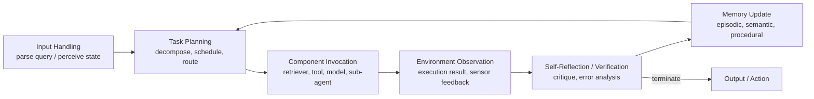
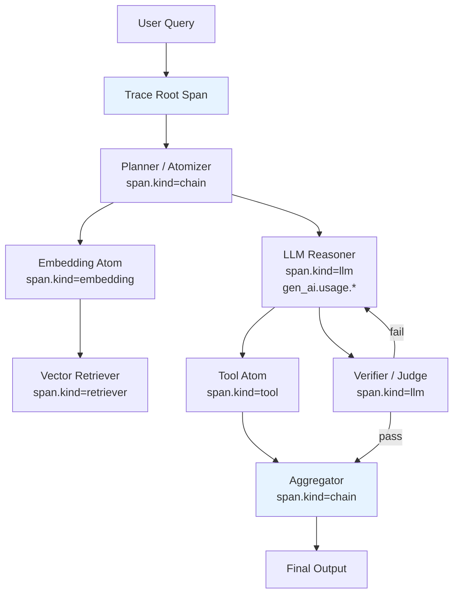
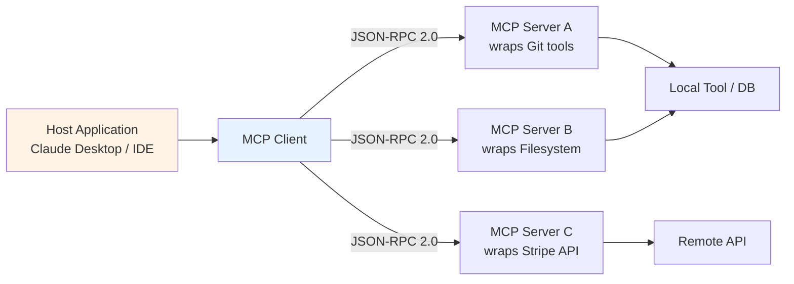
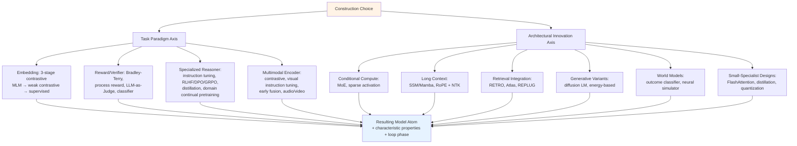

# Big Loop and Atomization: A Technical Review on the Expansion Capabilities of Large Language Models
# 1 Introduction and Conceptual Foundations of Big Loop and Atomization

The trajectory of large language model (LLM) research over the past several years has been marked by a quiet but profound shift in the locus of intelligence. Where breakthroughs were once measured almost exclusively in terms of parameter counts, pretraining corpora, and benchmark scores of a single autoregressive Transformer, frontier capability is now increasingly produced by **systems** in which an LLM is one component among many—surrounded by retrievers, code interpreters, multimodal encoders, planners, verifiers, memory stores, and feedback channels that together close the gap between language understanding and grounded, reliable, real-world action. Two design principles have emerged at the heart of this transition and provide the analytical lens of the present review: the **Big Loop**, denoting the closed-loop orchestration of heterogeneous components around an LLM core, and **Atomization**, denoting the decomposition of AI capabilities into minimal, reusable, composable functional units. This opening chapter establishes the motivation, scope, definitions, conceptual boundaries, and philosophical rationale for these two paradigms, providing the foundation upon which the taxonomy, advantage analysis, and construction methodologies of the subsequent chapters are built.

## 1.1 Motivation: From Monolithic LLMs to System-Level Intelligence

Large language models built on the Transformer architecture have, within only a few years, evolved from academic prototypes into foundational infrastructure for chat interfaces, enterprise copilots, scientific discovery tools, and automated code generation systems, with flagship models such as GPT-4, Gemini, and Claude routinely surpassing human baselines on a wide range of reasoning and natural language benchmarks[^1]. Yet the very properties that make these models compelling—massive pretraining on static corpora and autoregressive token prediction—also impose structural limitations that have become increasingly difficult to ignore. First, **hallucination**: LLMs frequently produce fluent but factually inaccurate output, undermining trust in high-stakes domains such as healthcare, law, and scientific analysis. Second, **knowledge staleness**: parametric memory cannot easily access post-training facts, limiting responsiveness to rapidly emerging information. Third, **bounded reasoning**: finite context windows and inference budgets constrain multi-hop reasoning and long-horizon task decomposition. Fourth, the **absence of action grounding**: a standalone LLM emits text, but cannot natively query a database, execute code, manipulate a robotic effector, or verify the truth of its own assertions against an environment[^1].

These limitations cannot be fully remedied by further scaling alone. They are categorical rather than quantitative: no amount of additional pretraining data eliminates a model's inability to read a freshly indexed document, and no amount of weight tuning gives a frozen network the capacity to call an external Python interpreter. The community's response has therefore converged on a new design philosophy. As articulated in the influential Berkeley Artificial Intelligence Research (BAIR) post that coined the term Compound AI Systems, "better performance of AI is increasingly obtained by compound systems, instead of standalone LLMs"[^1][^2]. Compound AI Systems (CAIS) are defined as modular, extensible architectures that integrate LLMs with specialized external components—high-recall retrievers, tool-using agents, symbolic planners, long-term memory modules, multimodal encoders, and orchestration frameworks—to perform complex, dynamic, and high-precision tasks; by decoupling sub-task responsibilities and intelligently routing them to appropriate modules, such systems extend LLM capabilities well beyond what any monolithic model can achieve[^1].

Early industrial deployments validate this thesis. Retrieval-augmented assistants such as Perplexity.ai now provide real-time answers with chain-of-thought citations grounded in fresh web evidence[^1]. GitHub Copilot-X orchestrates code reasoning, repository search, and test generation, increasing developer throughput by over 55%[^1]. In radiology, multimodal pipelines coupled with rule-based triage agents have reduced report turnaround by 30% while maintaining expert-level accuracy[^1]. The pattern is consistent: rather than the LLM acting as an autonomous soloist, it functions as a **conductor** orchestrating heterogeneous AI ensembles[^1]. Research benchmarks reflect the same shift. On the SEAL-0 benchmark, which evaluates reasoning over conflicting web evidence, a recursive multi-agent system (ROMA) instantiated with GLM-4.6 reaches 45.9% accuracy, a 9.9-point absolute improvement over the strongest prior open research agent (Kimi-Researcher at 36.0%) and a 31.4-point improvement over the GLM-4.6 base model used alone (14.5%)[^3]. Such margins are unattainable through model scaling at comparable cost; they emerge specifically from how evidence is decomposed, distributed across specialized components, and reconciled within a feedback-driven loop[^3].

This is the empirical context within which the Big Loop and Atomization paradigms must be understood. They are not stylistic preferences; they are engineering responses to capability ceilings that cannot be raised by enlarging the central model. The remainder of this chapter develops the conceptual machinery required to analyze these paradigms rigorously.

## 1.2 Scope, Boundaries, and Methodology of the Review

To ensure analytical clarity, this review explicitly bounds its scope along three axes: **temporal**, **substantive**, and **methodological**.

**Temporal scope.** The review covers public research available through the end of 2025, including peer-reviewed publications at venues such as NeurIPS, ICLR, ACL, EMNLP, OSDI, and EuroMLSys; preprints on arXiv; technical reports from industrial research labs; and open-source frameworks with documented architectures. Closed-source proprietary systems are referenced only insofar as their high-level designs have been disclosed in public documentation or third-party analyses.

**Substantive scope.** The review concentrates on architectures in which an LLM is composed with other components to extend its capabilities. This includes retrieval-augmented generation (RAG) systems, LLM-based agents, multimodal LLMs (MLLMs), orchestration frameworks (e.g., ALTO[^4], DSPy[^5][^6], ROMA[^3]), and prompt-programming toolkits. Conversely, advances that refine the LLM in isolation—pretraining innovations, continual pretraining, and supervised fine-tuning that do not involve component composition—are outside the present scope. This delineation aligns with the CAIS literature's standard exclusion, which treats pretraining and fine-tuning of an isolated LLM as "refining the LLM itself" rather than as building a compound system[^1].

**Methodological approach.** The review proceeds in three intertwined modes: (1) **architectural analysis**, dissecting representative systems into their constitutive components and identifying recurring design patterns; (2) **taxonomy construction**, organizing atomic components and construction methods into hierarchical classifications that admit consistent cross-system comparison; and (3) **qualitative comparison**, contrasting compound architectures with monolithic LLM baselines along the four advantage axes specified by the research task (capability, functionality, efficiency, and user-centric properties). Quantitative evidence is incorporated wherever public benchmarks permit (e.g., ALTO's 3× throughput improvement at fixed latency[^4]; ROMA's 9.9-point gain on SEAL-0[^3]; DSPy-optimized pipelines achieving +162% gain in JSON validity[^5]), and limitations of the available evidence are explicitly flagged rather than papered over.

**Source-exclusion constraint.** In accordance with the explicit user instruction, one specific article on Big Loop and Atomization (Hu, Huang, Feng, and Deng, MDPI/ResearchGate) has been treated as a forbidden source: it has not been accessed, cited, paraphrased, or used as a structural template. All conceptual framing, taxonomy, and analysis in this review have been constructed independently from primary research sources cited herein.

## 1.3 Defining the 'Big Loop': Closed-Loop Orchestration Around an LLM Core

Within this review, the term **Big Loop** is used to denote a specific architectural pattern: a closed-loop orchestration framework in which an LLM functions as a reasoning core embedded inside an iterative cycle that interleaves perception, planning, action, environmental feedback, and reflection, integrated with retrievers, tools, memory, multimodal encoders, and verifiers. The "loop" is not metaphorical—it is the literal control structure of the system. The "big" qualifier emphasizes that the loop spans heterogeneous components external to the LLM, rather than residing entirely within a single forward pass or a fixed-length prompt template.

The canonical schematic of the Big Loop follows the **Perceive → Plan → Reason → Act → Observe → Reflect** paradigm articulated in the literature on embodied closed-loop agent architectures, in which "perception, world modeling, decision, action, and feedback are tightly interleaved within a continual control and reasoning loop, directly coupling the agent with its physical or simulated environment"[^7]. Although that formulation arose in robotics, the same control structure underlies textual and digital agents. The ReAct paradigm, for example, interleaves verbal reasoning with action-taking, enabling LLMs to "solve complex tasks by dynamically planning, acting in environments, and adjusting based on feedback" by augmenting the action space to include both environment-changing actions and language-based reasoning traces[^1]. Reflexion adds an explicit self-reflection step, with LLM-based agents learning via self-generated verbal feedback stored in episodic memory rather than through weight updates—combining an Actor, Evaluator, and Self-Reflection module in a loop where agents iteratively generate actions, evaluate performance, and produce verbal feedback for memory-based in-context learning[^1]. Voyager instantiates the same pattern in Minecraft, where a GPT-4-powered embodied agent autonomously explores, acquires skills, and discovers new tasks through an iterative prompting loop that refines actions via feedback, execution errors, and self-verification[^1]. Recursive task-decomposition frameworks such as ROMA close the loop at multiple levels by alternating between top-down planning and bottom-up aggregation through Atomizer–Planner–Executor–Aggregator cycles applied recursively until subgoals are atomic, with results synthesized upward through dependency-aware DAGs[^3].

From these instances, the constitutive elements of the Big Loop can be abstracted as follows:



This loop differs from a simple linear LLM pipeline in three essential respects:

1. **Iterativity.** Execution is not a single forward pass but a multi-round process in which intermediate outputs condition subsequent invocations. ITER-RETGEN, for instance, uses outputs from previous iterations to refine retrieval and generation processes, addressing multi-hop reasoning and complex queries[^1]; SELF-RAG enables LLMs to dynamically decide when to retrieve information, generate responses, and critique their outputs via self-reflection[^1].

2. **Statefulness.** The loop maintains persistent state across iterations—through structured memory modules such as those in CoALA, which organizes working memory together with long-term episodic, semantic, and procedural memory[^1], or through MemGPT's hierarchical memory inspired by operating systems[^1].

3. **Feedback-driven adaptation.** Each iteration is conditioned on observations from the environment or from verifier components, enabling error recovery and behavior refinement. PhysicalAgent illustrates this in robotics: outcome classification produces a {success, retry, replan} signal that either advances execution, retries the current action, or triggers re-decomposition of the plan, with VLM feedback ("grip failed", "object moved") injected as an augmented prompt to bias subsequent world-model queries[^7].

It is worth emphasizing what the Big Loop is **not**. It is not synonymous with "any system that calls an LLM more than once"; a fixed two-stage retrieve-then-generate RAG pipeline without feedback is not a Big Loop in the sense used here. It is also not synonymous with "agent"—the term agent is often used loosely in the literature, sometimes meaning a single LLM with tool access, sometimes a multi-agent system. The Big Loop is the more general architectural pattern of which agentic LLM systems are particular instantiations characterized by autonomy in the action loop.

## 1.4 Defining 'Atomization': Decomposing AI Capabilities into Composable Units

If the Big Loop describes the **runtime control structure** of compound AI systems, **Atomization** describes the **structural decomposition principle** of their components. Atomization, as used in this review, is the design principle of decomposing AI capabilities into minimal, self-contained, interface-standardized, and reusable functional units—**atoms**—that can be flexibly composed into larger workflows. The principle is orthogonal to but complementary with the Big Loop: a Big Loop is operated by invoking atoms in sequence (or in parallel), and an atom acquires much of its value precisely because it can be plugged into a loop without bespoke integration.

The properties that distinguish an atom from a traditional software module or a generic "component" can be derived from the design choices that recur across DSPy, ROMA, ALTO, and skill-atomization frameworks. Concretely, an atom is characterized by:

| Property | Description | Representative evidence |
|---|---|---|
| **Single responsibility** | Each atom encapsulates one well-defined transformation (e.g., "context, question → answer") rather than a bundle of mixed concerns. | DSPy signatures specify *what* a transformation does, not *how* to prompt the LM to do it[^6]. |
| **Standardized interface** | Atoms expose typed input/output contracts that allow them to be composed without ad-hoc glue code. | ROMA components are implemented as "modular DSPy programs with typed input/output signatures," exposing "structured interfaces between the Atomizer, Planner, Executor, and Aggregator"[^3]. ALTO uses Protocol Buffers to specify the data format of each queue between pipeline stages[^4]. |
| **Independent testability** | Atoms can be evaluated and optimized in isolation, decoupling debugging from full-system runs. | DSPy assertions are checked at runtime per module with explicit retry loops and feedback augmentation[^5]. |
| **Composability** | Atoms can be reused across pipelines without modification, and combined hierarchically (atoms-of-atoms). | DSPy modules are composed in classes inheriting from `dspy.Module`, "general-purpose modules can be composed in any LM-based application"[^6]. |
| **Granularity control** | The system permits explicit reasoning about whether a task is "atomic" (handled directly) or non-atomic (decomposed further). | ROMA's Atomizer "determines whether a task should be decomposed"; non-atomic tasks are expanded by a Planner into MECE subtask graphs, while atomic tasks are handled directly by Executors[^3]. |
| **Optimizability** | Atoms expose hooks for prompt or weight optimization independent of the rest of the system. | DSPy teleprompters such as `BootstrapFewShot` automatically bootstrap and select effective prompts for each module given a metric[^6]; GEPA+ optimizes the prompts of individual ROMA components through structured, multi-candidate proposal and selection[^3]. |

DSPy makes this design philosophy explicit: it "replaces ad-hoc, brittle prompt engineering with a modular, type-checked, and optimizable system based on Python classes, signatures, and self-improving search over instructions and demonstrations"[^5]. The analogy that the framework's authors draw to PyTorch is instructive: just as a neural network is built by composing general-purpose layers (Dense, Conv, Pooling) into an architecture, an LM-based application is built by composing general-purpose atoms (Predict, ChainOfThought, Retrieve) into a pipeline, and just as PyTorch trains a model with optimizers, DSPy "compiles" a program with teleprompters that automatically optimize prompts and demonstrations[^6].

ROMA pushes the principle to a deeper level by treating atomization itself as a runtime decision. In ROMA's recursive control loop, the `is_atomic(t)` operator at every node decides whether the current task should be executed directly or further decomposed into a dependency-aware DAG of subtasks, where each subtask independently re-enters the same control loop[^3]. Atomization is thus simultaneously a **structural** (how components are designed) and a **dynamic** (when to stop decomposing) property of the system. The empirical payoff is substantial: this design enables ROMA, instantiated with GLM-4.6 as base model, to outperform reinforcement-learning-tuned deep research agents and leading closed-source systems on SEAL-0 (45.9% vs. 36.0% for Kimi-Researcher) and to enable DeepSeek-V3 to match Claude Sonnet 4.5 on EQ-Bench long-form writing (79.8%) once GEPA+ optimization is applied to each component's prompt[^3].

Atomization also enables system-level engineering advantages that monolithic LLMs cannot provide: **parallelism** (independent atoms can execute concurrently, as in ALTO's stream-based pipelining that achieves up to 3× throughput improvement for a fixed latency target[^4]); **fault localization** (errors can be attributed to specific atoms rather than diffused across a single network's parameters, as emphasized by ROMA's hierarchical execution traces[^3]); **model-agnosticism** (different atoms can be backed by different underlying models, with ROMA explicitly supporting heterogeneous model assignment across roles[^3]); and **incremental optimization** (each atom's prompt or weights can be improved without re-training the rest, as demonstrated by GEPA+'s per-component optimization gains of 2–6 absolute accuracy points using 3–4× fewer metric evaluations than standard GEPA[^3]).

## 1.5 Comparison with Adjacent Frameworks: Compound AI, Agentic Systems, and Tool-Augmented LLMs

Because Big Loop and Atomization are conceptually close to several adjacent paradigms, careful distinctions are necessary to avoid terminological conflation. The following comparison clarifies the relationships among Big Loop, Atomization, Compound AI Systems (CAIS), LLM agents, RAG pipelines, MLLMs, and tool-augmented LLMs.

| Concept | Defining Feature | Closed-Loop Required? | Atomization Required? | Relationship to Big Loop / Atomization |
|---|---|---|---|---|
| **Compound AI System (CAIS)** | Integration of LLM(s) with external components and a system design that orchestrates their interaction[^1] | No — many CAIS are open-loop pipelines | No — many CAIS use coarse-grained modules | **Superset** of architectures; Big Loop is the subset of CAIS with closed-loop control; Atomization is a design principle that may or may not be applied within a CAIS. |
| **RAG pipeline** | Retrieval phase + generation phase with retrieved documents as context[^1] | Optional — basic RAG is open-loop; iterative/adaptive RAG (e.g., SELF-RAG, FLARE) is closed-loop[^1] | Often partial — retriever and generator are typically modular, but not always atomized to single-responsibility units | A RAG pipeline becomes a Big Loop when it incorporates iterative retrieval, self-reflection, or verifier feedback. |
| **LLM Agent** | An LLM that "reasons, plans, and takes actions by interacting with tools, memory, or environments in an iterative loop"[^1] | **Yes** — the iterative loop is constitutive of the agent paradigm | Increasingly yes — modern agent frameworks (ROMA, DSPy) explicitly atomize components | LLM agents are paradigmatic instances of the Big Loop with autonomy in the action loop. |
| **Tool-Augmented LLM** | LLM equipped with the ability to invoke external tools (APIs, calculators, search engines)[^1] | No — single-shot tool use does not require a loop | No — tools may be coarse-grained | A tool-augmented LLM becomes a Big Loop when tool invocation is embedded in an iterative perceive–plan–act–reflect cycle. |
| **MLLM** | LLM extended with modality-specific encoders to process text, images, audio, video[^1] | No — many MLLMs are single-pass | No — encoder and core LLM may be tightly coupled | An MLLM may serve as an atom within a Big Loop (e.g., as a perception module), or be combined with other atoms in a compound system. |
| **Big Loop (this review)** | Closed-loop orchestration: Perceive→Plan→Reason→Act→Observe→Reflect with stateful memory and feedback-driven adaptation | **Yes** — by definition | Compatible but not strictly required | Defines the *control structure* of compound systems. |
| **Atomization (this review)** | Decomposition of capabilities into minimal, interface-standardized, composable, optimizable units | Not required | **Yes** — by definition | Defines the *component structure*; orthogonal to Big Loop. |

Several non-trivial relationships follow from this comparison. **First**, Big Loop is properly contained within CAIS but is not coextensive with it: a CAIS that simply chains LLM → retriever → LLM in a single pass without feedback is a compound system but not a Big Loop. **Second**, Atomization is not a synonym for "modular"; a system can be modular at a coarse grain (e.g., a 2,000-line retrieval class) without satisfying the single-responsibility, standardized-interface, and independent-optimizability properties that define an atom. **Third**, LLM agents and the Big Loop are not identical: while every LLM agent operates within a loop, not every Big Loop system is "agentic" in the strong sense of autonomously selecting goals—an interactive RAG system with self-reflection is a Big Loop but is typically not classified as an agent. **Fourth**, RAG, agentic systems, and MLLMs are not mutually exclusive: many production systems combine all three (e.g., a multimodal agent that uses RAG for grounding), and each can be re-engineered along the Big Loop and Atomization axes to varying degrees.

This conceptual scaffolding allows the rest of the review to maintain disciplined usage: when speaking of "Big Loop systems" we refer specifically to closed-loop, feedback-driven architectures; when speaking of "atoms" we refer to components that satisfy the properties tabulated in Section 1.4; and when speaking of "compound systems" generically, we follow the broader CAIS usage[^1].

## 1.6 Philosophical and Engineering Rationale for Atomization

The choice to atomize AI capabilities is not merely an empirical preference vindicated by benchmark results; it is grounded in long-standing principles of compositionality that have repeatedly demonstrated their value across both biological and engineered systems.

**Biological compositionality.** Natural cognition is organized around specialized but interoperating circuits—visual, auditory, motor, linguistic, executive—each evolved for distinct functions and coordinated through shared interfaces (notably, neural projections through hubs such as the thalamus). The capacity for arbitrary composition of these specialized modules underlies the flexibility of biological intelligence. Closed-loop embodied control similarly relies on tight perception–action coupling that minimizes the complexity required of any single circuit; theoretical work on "cheap control" shows that, by exploiting the constraints and natural dynamics of an embodied sensorimotor loop, the minimal sufficient complexity of the controller can be bounded "substantially below that required for universal open-loop policy approximation"[^7]. The analogy is suggestive: just as biological intelligence achieves robustness and generality without a single monolithic neural substrate, AI systems may achieve robustness and generality without a single monolithic LLM, provided that specialized components are connected through standardized interfaces inside a closed feedback loop.

**Software engineering precedents.** The history of software engineering is, to a substantial degree, the history of compositional abstraction. The Unix philosophy ("do one thing and do it well, connect via standardized streams"), microservice architectures (decoupling deployment and scaling per service), functional programming (composing pure functions through type-safe interfaces), and modular deep learning libraries such as PyTorch (composing general-purpose layers into models that can be trained with general-purpose optimizers) all rest on the same insight: complex behavior emerges more reliably and more maintainably from the composition of simple, well-specified units than from a single, large, opaque artifact. DSPy makes this lineage explicit, with its authors citing PyTorch directly as a source of inspiration: "Similarly to PyTorch, where general-purpose layers can be composed in any model architecture, in DSPy general-purpose modules can be composed in any LM-based application"[^6].

**Engineering benefits.** Translated into the LLM context, atomization confers a set of concrete engineering benefits that monolithic LLMs structurally cannot provide:

- **Maintainability**: changes to one atom (e.g., upgrading the retriever) do not require retraining or redesigning the rest of the system. DSPy explicitly addresses the "fragility problem" of prompt-engineered pipelines, in which changing the LLM or the data typically degrades performance unless prompts are manually re-tuned, by enabling re-compilation of the pipeline rather than re-tuning by hand[^6].
- **Observability**: ROMA emphasizes that "because the same execution protocol is applied at every node in the task tree, the framework exposes all planning decisions, executions, and aggregations as a structured, hierarchical trace," making it "possible to inspect and debug failures in deep, branching reasoning processes, where errors are otherwise difficult to localize"[^3].
- **Parallelism**: independent atoms can execute concurrently. ALTO demonstrates that streaming partial outputs between distributed pipeline stages "increases throughput by up to 3× for a fixed latency target of 4 seconds / request and reduces tail latency by 1.8×" on a representative chatbot-verification pipeline[^4]; ROMA exploits dependency-aware DAGs to run subtasks in parallel along the critical path[^3].
- **Model-agnosticism**: atoms can be backed by different underlying models. ROMA "decouples orchestration from any single foundation model and allows practitioners to exploit heterogeneous model strengths across subtasks while keeping the high-level control loop fixed"[^3].
- **Optimizability**: each atom can be improved independently through prompt search or fine-tuning. GEPA+ achieves "2–6 point absolute accuracy gains while requiring approximately 3–4× fewer metric evaluations than standard GEPA"[^3] by optimizing component prompts in isolation under interface-preserving constraints.

**Scientific benefits.** Beyond engineering, atomization enables scientific benefits that monolithic models obscure: **interpretability** at the level of decision provenance (which atom retrieved which document, which atom proposed which sub-plan), **systematic benchmarking** of individual capabilities rather than entangled overall scores, and **reproducible ablation** through swapping atoms one at a time. These properties matter for safety and trust as much as for research: a Big Loop system in which a safety-filter atom is explicitly invoked between reasoning and action provides much stronger guarantees and auditability than a monolithic LLM whose policy is implicit in its weights.

Taken together, the philosophical and engineering rationales converge on a single conclusion: atomization is not an incidental implementation choice but a deeply principled response to the limits of monolithic models, with deep roots in both natural and engineered systems. When combined with the closed-loop control structure of the Big Loop, it provides the scaffolding for a new generation of AI systems that are simultaneously more capable, more efficient, more controllable, and more interpretable than any standalone LLM. The subsequent chapters of this review build on this foundation to characterize the atomic components of the Big Loop (Chapter 2), analyze the resulting advantages along four axes (Chapters 3–6), and detail the methodologies by which tool and model atoms are constructed (Chapters 7–8), before synthesizing open challenges and future directions in the concluding chapter.

# 2 Taxonomy and Characteristics of Atomic Components in the Big Loop

Having established in Chapter 1 that the Big Loop denotes a closed-loop orchestration framework around an LLM core and that Atomization denotes the decomposition of capabilities into minimal, interface-standardized, composable units, the analytical task of this chapter is to populate this conceptual scaffolding with concrete content. What, precisely, are the atomic components that an LLM core orchestrates within the Perceive–Plan–Reason–Act–Observe–Reflect cycle? Along which structural dimensions do they differ, and along which do they admit unified treatment? This chapter answers these questions by constructing a two-tiered taxonomy: a top-level partition into **Tool atoms** and **Model atoms**, refined by subclass-level functional roles, and cut transversally by a set of six characteristic properties that apply uniformly across the entire component landscape. The resulting matrix provides the vocabulary used throughout the rest of the review—Chapters 3–6 invoke it to attribute advantages to specific atom properties, while Chapters 7–8 use it to delimit the scope of construction methodologies.

## 2.1 Classification Framework: Tool Atoms versus Model Atoms

The most useful first cut through the heterogeneous population of atoms in modern Big Loop systems is the distinction between **Tool Components**, which are externally defined functions invoked through a standardized interface, and **Model Components**, which are learned neural modules performing a probabilistic transformation. The dichotomy is not a matter of mere taxonomic convenience; the two families differ systematically along four engineering-relevant dimensions—failure modes, invocation semantics, optimization regimes, and integration patterns—and the same distinction is reflected in the way leading frameworks structure their abstractions.

Tool atoms are typically deterministic or near-deterministic functions whose behavior is specified by a schema rather than learned from data. The OpenAI function-calling specification, now adopted across multiple agent frameworks including AutoGen and CrewAI, formalizes this view: a tool is declared by a JSON object containing a `name`, a `description`, and a `parameters` schema with typed `properties` and `required` fields, and the LLM core decides whether and how to invoke it.[^8] When the model issues a tool call—for example, `get_weather({"location": "San Francisco, USA"})`—the runtime parses the structured `tool_calls` field, dispatches to the external function, and, if the tool is designed to fetch data, feeds the result back to the model as a message with role `tool` for continued reasoning.[^8] Hugging Face's tool-use guidelines similarly emphasize that each tool definition must carry a name, parameter schema, and description, with Pydantic models offered as a typed alternative for structured outputs.[^9] In this regime, the tool's correctness is a property of its specification and implementation, not of any training procedure; failures are typically structural (malformed arguments, unreachable APIs, schema violations) rather than statistical.

Model atoms, by contrast, are themselves trained neural networks whose outputs are statistical predictions. An embedding model maps text or images into a dense vector space according to learned similarity geometry; a reward model emits a scalar preference score for a candidate output; a multimodal encoder projects pixels into the LLM's representational space. Their failure modes are characteristically probabilistic—drift under distribution shift, biased rankings, hallucinated affinities—and their improvement requires retraining, fine-tuning, or careful selection from a model zoo, not edits to a schema. Critically, model atoms are evaluated by retrieval and ranking metrics rather than by binary execution success: the MTEB v2 benchmark, for example, scores Google's Gemini Embedding at 68.32 and Jina v5-text-small at 71.7 along axes of NDCG@10 and recall that have no analogue in the tool-atom space.[^10]

This separation does not preclude boundary cases. A retrieval-augmented generation pipeline, when atomized cleanly, exhibits the canonical hybrid pattern: an **embedding model atom** computes the dense representation of a query, and a **vector-index tool atom** performs the deterministic similarity search and document fetch. Cohere's embed-v4 and BAAI's BGE-M3 push this hybrid further by producing dense, sparse, and (for BGE-M3) ColBERT representations in a single model invocation, intended to be consumed by separate indexing tools downstream.[^10] Pocket Flow's design articulates a closely parallel division of labor: a **Node** "encapsulates specific functionality (e.g., a data transformer, an LLM call, or a decision-making component)" while a **Flow** "orchestrates the passing of data among Nodes" and "uses a shared store to facilitate data exchange"—the Node is the atom (model or tool), and the surrounding Flow is the Big Loop.[^11] Substrate similarly frames each node of its computation graph as an "atomic unit of compute" that "does one and only one thing, whether it be generating text, generating an image, or executing sandboxed code," with the graph itself enforcing the composability of these atoms.[^12] In both frameworks the tool–model distinction is implicit at the node interface but visible at the level of implementation: text generation is a model atom, sandboxed code execution is a tool atom, and the graph treats them uniformly under a shared invocation contract.

The dichotomy thus serves two purposes simultaneously. It captures a real engineering distinction about how atoms are built, tested, and improved, while remaining permeable enough to accommodate the compound atoms (retriever + index, multimodal encoder + tool dispatch) that populate real systems. The remaining sections of this chapter elaborate the internal structure of each family before reconnecting them through a unified characteristic-property analysis.

## 2.2 Tool Components: Subclasses and Functional Roles

Within the Tool family, four functionally distinct subclasses recur across the public Big Loop literature: **information-access tools**, **computation tools**, **action tools**, and **verification tools**. Although the boundaries are not strict (a code interpreter can serve as a verifier when used to run unit tests), the classification reflects a stable functional partition with respect to the loop phases in which each subclass is invoked.

**Information-access tools** ground the LLM's reasoning in external knowledge that is unavailable in its parametric memory. The archetypal instance is the web search engine invoked via a ReAct-style Thought→Action→Observation cycle, in which the model decides when to issue a search query, parses the returned snippets, and integrates the evidence into subsequent reasoning steps.[^13] Retrieval-augmented generation pipelines using vector databases extend this pattern by allowing agents "to ground their responses in specific domains, reducing hallucinations and keeping responses current,"[^13] and knowledge-base queries against structured stores (e.g., CRM data in Salesforce's Einstein Service Agent) play an analogous role for enterprise applications.[^13] The Toolformer line of work showed that an LLM can self-supervise its own training data for deciding "when to query tools like a calculator, search engine, or knowledge base without additional prompt engineering,"[^13] establishing that information-access tools are learnable invocation targets, not merely hand-coded subroutines. In terms of loop position, information-access tools belong primarily to the Perceive and Observe phases: they convert external state into language tokens that the LLM core can reason over.

**Computation tools** offload precise, structured operations that LLMs perform unreliably in pure text. Calculators address arithmetic; symbolic solvers address algebra and geometry; code interpreters address arbitrary Turing-complete computation. ChatGPT's code interpreter and Microsoft's Copilot Wolfram Alpha integration exemplify the production pattern in which "GPT-4 calls code interpreters, browsers, and data retrieval APIs" to ground numerical answers in executable computation.[^13] Substrate's `executing sandboxed code` node is a research-platform instance of the same idea, with the graph runtime treating code execution as an atomic compute unit alongside text and image generation.[^12] In the loop, computation tools live in the Reason–Act interface: they are invoked when the model's plan requires an operation whose correctness can be guaranteed by execution rather than inferred by language modeling.

**Action tools** convert the LLM's decisions into effects on external systems or environments. These range from simple HTTP API calls (a CRM update, a calendar event, an expense report submission)—as in Microsoft's Copilot meeting facilitator and Salesforce's Einstein Service Agent, which "uses an LLM to understand customer requests to determine the next action, and then routes tasks as needed"[^13]—to OS-level browser and desktop automation in computer-use agents, to physical-world effects through robotic actuators. Hugging Face frames the spectrum cleanly: function calling "enables Large Language Models to interact with your code and external systems in a structured way" so that "instead of just generating text responses, LLMs can understand when to call specific functions and provide the necessary parameters to execute real-world actions."[^9] The Modular MAX documentation makes the same distinction explicit: a tool may be designed to **fetch data** (and the model is re-invoked with the result) or to **perform an action** (after which the model need not be called again).[^8] Action tools dominate the Act phase of the loop and are the principal locus of safety and reliability concerns, because their failure or misuse has external consequences.

**Verification tools** close the loop by checking the validity, correctness, or safety of an LLM output or intermediate result. Test runners, schema validators, type checkers, fact-checkers, and policy filters all fall under this subclass. Hugging Face's guidance explicitly counsels developers to "always validate function calls before execution,"[^9] and the broader survey literature observes that "post-hoc verification layers" combined with "uncertainty estimation" are needed to mitigate residual hallucinations even in retrieval-augmented systems.[^13] Verification tools belong to the Reflect phase of the loop: their outputs determine whether execution proceeds, retries, or re-plans—the same {success, retry, replan} signal pattern that PhysicalAgent applies in the robotic setting (as discussed in Chapter 1).

| Tool subclass | Representative atoms | Loop phase(s) | Typical I/O contract |
|---|---|---|---|
| Information-access | Web search, vector retrievers, KB queries, RAG pipelines, ToolBench APIs[^13] | Perceive, Observe | Query (string/embedding) → ranked documents / structured records |
| Computation | Calculators, code interpreters, symbolic solvers, sandboxed runtimes (Substrate)[^12] | Reason, Act | Code/expression → execution result, stdout, exit status |
| Action | Function-calling APIs (OpenAI spec)[^8], browser automation, CRM/HR workflow triggers, robotic effectors[^13] | Act | Typed parameters → side effect + status code |
| Verification | Test runners, schema validators, JSON validators, safety filters, fact-checkers[^9][^13] | Reflect | Candidate output → pass/fail + diagnostics |

A unifying observation is that all four subclasses share the same interface contract pattern—name, typed parameters, description, structured return—and consequently the same orchestration affordances. This is precisely why a single framework such as the OpenAI function-calling specification can subsume all of them under one `tools` parameter,[^8] and why Toolformer-style self-supervised tool learning generalizes across calculator, search, and KB tool types.[^13]

## 2.3 Model Components: Subclasses and Functional Roles

The Model-atom family is more heterogeneous because each subclass encodes a different cognitive sub-task as a learned function. Five subclasses are sufficient to cover the public landscape: **embedding models**, **reward and verifier models**, **specialized reasoners**, **multimodal encoders**, and **world models / outcome classifiers**.

**Embedding models** convert text, images, or other content into dense vectors whose geometry encodes semantic similarity. They are arguably the most widely deployed model atom because every retrieval-based Big Loop depends on them. The 2026 embedding-model survey by Mixpeek enumerates a representative cross-section: Google's Gemini Embedding (3072-dim, MTEB v2 score 68.32, the first production-grade model placing text, images, video, audio, and PDFs in a shared vector space); OpenAI's text-embedding-3-large (3072-dim, MTEB v2 ≈ 64.6, supporting Matryoshka dimension truncation down to 256 for cost–quality tradeoffs); Voyage AI's voyage-3-large (32K context, "best-in-class retrieval accuracy among API embedding models" with domain-specific variants for code, legal, and finance); Cohere's embed-v4 (128K context, simultaneous dense and sparse outputs, 32× binary-quantization storage compression at ~3% quality loss across 100+ languages); Jina v5-text-small (677M parameters, MTEB v2 = 71.7, Apache 2.0–licensed self-hosting on a single GPU); BAAI BGE-M3 (dense + sparse + ColBERT in one forward pass, 100+ languages, 8192-token context); and Alibaba Qwen3-Embedding-8B (top of MTEB multilingual leaderboard at 70.58, 32K context).[^10] OpenAI's API documentation confirms that `text-embedding-3-large` is designed as "our most capable embedding model for both english and non-english tasks" with output vectors usable for "search, clustering, recommendations, anomaly detection, and classification tasks"—i.e., as a general-purpose perception/representation atom.[^14] Within the Big Loop, embedding models almost exclusively occupy the **Perceive** phase, transforming raw inputs into queryable vectors that downstream retrieval tools then index.

**Reward and verifier models** quantify the quality of a candidate output. Two principal variants are well-attested. Outcome reward models, trained on human preference data, underlie RLHF and Direct Preference Optimization and were instrumental in producing the InstructGPT/ChatGPT lineage; the survey notes that "Ouyang et al. showed that a 1.3B model called InstructGPT and fine-tuned with RLHF beats the original 175B GPT-3 in human preference,"[^13] illustrating that a comparatively small reward model can confer disproportionate behavioral improvement. Process reward models, trained to evaluate intermediate reasoning steps, and judge models such as those used in "LLM-as-Judge" evaluations are increasingly common; the multi-agent failure-mode taxonomy literature describes automated pipelines that "use formal decision rules to label traces and benchmark human annotator agreement (Cohen's κ),"[^15] with LLM-as-Judge serving as the verifier atom inside the evaluation loop. In Big Loop systems, reward/verifier atoms occupy the **Reflect** phase: they score the outputs of executors and gate transitions to subsequent loop iterations.

**Specialized reasoners** are model atoms that perform a delimited cognitive sub-task, typically with a narrower input distribution and a more structured output than a general-purpose LLM. Examples include planners (proposing a sequence or DAG of subtasks), atomizers (deciding whether a task is atomic—the key operator inside ROMA's recursive control loop discussed in Chapter 1), aggregators (synthesizing results from parallel branches), classifiers (intent classification, content moderation), and rankers. Pocket Flow's reference example explicitly assembles a three-atom chain of `IntentClassifierNode`, `RetrieverNode`, and `ResponseGeneratorNode`,[^11] where the first is a classifier atom. The Chain-of-Agents and Mixture-of-Agents architectures further generalize this pattern: in CoA "a master agent delegates subtasks to dedicated workers, and then synthesizes results into a coherent response," while MoA structures include "'proposer' agents who generate candidate solutions, and 'aggregator' agents who merge them for a more refined output."[^13] These role-specialized agents are best understood as specialized-reasoner atoms wired by a Big Loop control structure. Specialized reasoners populate the **Plan** and **Reason** phases.

**Multimodal encoders** project non-textual modalities into a representation consumable by the LLM core. The HuggingGPT design pattern, where the LLM "interprets the user's request, performs task planning and model selection, then dispatches subtasks to AI models on Hugging Face" and integrates the outputs into a unified response,[^13] treats every dispatched vision, speech, or audio model as a multimodal encoder atom. Native-multimodal models such as LLaMA 4 (with early-fusion processing of text, images, audio, and video, MoE backbone, and up to 10M-token context), Google Gemini 2.5 Flash, and Anthropic Claude 3.7 demonstrate that the encoder atom may be co-located with the LLM core, but the functional decomposition is unchanged—visual and acoustic features are projected, then reasoned over.[^13] On the embedding side, the same role can be served by image-text dual encoders such as `jina-clip-v2` or by SigLIP variants exposed in platforms such as Mixpeek.[^10] Multimodal encoders sit at the **Perceive** boundary, extending the loop to sensory modalities beyond text.

**World models and outcome classifiers** predict the consequences of an action or evaluate an outcome against a goal specification. While world models are most developed in robotics and game-playing settings (as illustrated by the PhysicalAgent and Voyager examples in Chapter 1), they have analogues in any system where the LLM core consults a learned simulator before acting. Outcome classifiers—such as the VLM-based success/failure detector that PhysicalAgent uses to emit `{success, retry, replan}`—are simpler, often fine-tuned vision-language models that occupy the **Observe** and **Reflect** boundary.

Across all five subclasses, an additional cross-cutting deployment choice arises: **API-served vs. self-hosted**. The 2026 embedding-model landscape illustrates the trade-off in detail. API-served atoms (Gemini Embedding, OpenAI text-embedding-3, Cohere embed-v4, Voyage AI, Mistral Embed, Amazon Titan) offer zero operational overhead, fast onboarding, and frequent model refreshes, but require data egress and per-token billing; self-hosted atoms (Jina v5, BGE-M3, Qwen3-Embedding-8B, Nomic Embed v2, Snowflake Arctic Embed, Mixedbread mxbai-embed-large) require GPU infrastructure but enable data sovereignty, custom fine-tuning, and per-vector economics that, according to Mixpeek's analysis, "break even" against API pricing "around 10–50M embeddings per month."[^10] Hybrid platforms such as Together AI host top open-weight models behind OpenAI-compatible APIs,[^10] effectively turning a self-hostable model atom into a service atom without changing the LLM-core integration code. Within the Big Loop, this choice is transparent at the interface level—both variants expose the same typed signature—but it has substantial consequences for latency, cost, and compliance, themes that recur in Chapters 5 and 6.

## 2.4 Characteristic Properties of Atoms

Tool and Model atoms, despite their differences, can be characterized along a common set of six structural dimensions. These properties cut transversely across both families and determine how an atom integrates into a Big Loop, how it is composed with others, and how it can be optimized.

**Interface specification.** Every atom exposes a typed input/output contract that enables composition without bespoke glue code. The vocabulary varies—JSON Schema in the OpenAI function-calling spec,[^8] Pydantic models in Hugging Face guidelines,[^9] Protocol Buffers in ALTO's inter-stage queues (Chapter 1), DSPy signatures in DSPy and ROMA—but the underlying principle is identical: declare *what* the atom does in terms of types, not *how* it does it. The Pocket Flow design articulates this as one of three indispensable abstraction principles: "An effective abstraction exhibits a minimal interface (i.e., reduced surface area) while delivering rich functionality."[^11] Interface specification is the precondition for every other property in this list.

**Invocation pattern.** Atoms differ in *how* they are called. Synchronous request–response is the default for most function-calling tools and for embedding APIs ("the initial `completion` response includes a `tool_calls` parameter ... from here, you must parse the `tool_calls` body and execute the function as appropriate"[^8]). Asynchronous and streaming invocations are supported by frameworks such as Pocket Flow, whose `Async` abstraction "enables parallel or asynchronous operations, allowing multiple Nodes to execute concurrently" and "improves system throughput and responsiveness by preventing bottlenecks, especially in I/O-bound or long-running tasks."[^11] Batched invocations are explicitly first-class in Pocket Flow's `Batch` abstraction, which "handles bulk data processing by grouping multiple inputs into a single operation" and "optimizes performance, especially when processing large datasets or executing parallel inference calls."[^11] Embedding APIs from OpenAI, Cohere, and Voyage all expose dedicated batch endpoints with separate rate-limit tiers (e.g., text-embedding-3-large's Tier 5 supports a "Batch queue limit" of 4,000,000,000 tokens),[^14] confirming that the batch invocation pattern is a basic deployment unit. An orthogonal axis is **single-shot vs. iterative**: an embedding model is normally single-shot, while a planner atom inside a recursive control loop (as in ROMA) is iterative by design.

**Statefulness.** Many atoms are stateless: an embedding model produces the same vector for the same input regardless of prior calls; a calculator tool likewise. Others carry persistent state—either explicit, as in agents with long-term memory modules (MemGPT, CoALA), or implicit, as in atoms that consult a shared store. Pocket Flow's `Communication` abstraction is paradigmatic: atoms "use a shared store to facilitate data exchange among Nodes" providing "a unified state management mechanism that all components can access, reducing duplication and ensuring consistency."[^11] Substrate similarly notes that within its compute graph "the outputs of each node passed as inputs to the next in only a few milliseconds,"[^12] meaning that state is externalized into the graph rather than encapsulated in atoms—an explicit architectural choice that supports compositionality. Statefulness has direct consequences for testing: stateless atoms can be unit-tested in isolation; stateful atoms require a mocked environment or a snapshot of the shared store.

**Determinism.** Tool atoms are typically deterministic (a vector-index lookup, given the same query embedding and index, returns the same documents); model atoms are typically stochastic (token sampling, dropout at inference, retrieval ranking ties). This distinction matters for both reproducibility and safety. Deterministic verifier atoms—test runners, schema validators—provide hard guarantees that probabilistic LLM judges cannot. Conversely, stochastic atoms admit ensembling and self-consistency strategies (e.g., averaging over multiple sampled outputs) that deterministic tools do not. The literature on LLM-as-Judge explicitly addresses this trade-off, identifying "bias in self-judging LLM evaluators" as a recurring evaluation challenge[^15] precisely because the judge atom is itself a probabilistic model.

**Modality coverage.** Atoms differ in the modalities they accept and emit. The taxonomy ranges from text-only atoms (most tool APIs, OpenAI text-embedding-3) to text+image atoms (CLIP-family encoders, `jina-clip-v2`) to fully multimodal atoms (Gemini Embedding's shared text/image/video/audio/PDF space; LLaMA 4 with early-fusion multimodality).[^10][^13] Modality coverage interacts with composability: a Big Loop that ingests video must have at least one atom whose input modality includes video, and the LLM core's representation must be reachable from that atom's output.

**Granularity.** The depth of an atom in the compositional hierarchy is itself a design choice. Fine-grained primitives ("predict next token," "embed one sentence," "execute one Python expression") can be combined into composite atoms—and entire sub-flows can be treated as atoms by the outer loop. ROMA's `is_atomic(t)` operator institutionalizes this as a runtime decision (Chapter 1), and Pocket Flow's "nested directed graph" abstraction with subflow encapsulation is the framework-level expression of the same idea: "a QA chatbot handling PDF-based queries can encapsulate the details of PDF retrieval and iterative processing (RAG loops) within a subflow," hiding "complex implementation details" and enhancing maintainability.[^11] Granularity thus has a recursive character: an atom at one level is a graph at the next level down.

| Property | Tool-atom realization | Model-atom realization | Key consequence |
|---|---|---|---|
| Interface | JSON schemas, Protobuf, function-calling spec[^8][^9] | DSPy signatures, typed embeddings, model API spec[^14] | Composability without glue code |
| Invocation | Sync, batched, fire-and-forget; OpenAI batch tiers[^14] | Sync, batched, streaming; async Nodes in Pocket Flow[^11] | Throughput and latency engineering |
| Statefulness | Mostly stateless (calculators, validators); stateful (DBs, browsers) | Mostly stateless inference; stateful via shared store[^11] | Testability and reproducibility |
| Determinism | Typically deterministic | Typically stochastic; bias in LLM judges[^15] | Reproducibility, ensembling |
| Modality | Text (APIs), structured data, pixels (browsers), physical (actuators) | Text, vision, audio, video, native-multimodal[^10][^13] | Reach of Perceive/Act phases |
| Granularity | Single-call functions; pipelines as composite tools | Single forward pass; subflows as composite atoms[^11] | Recursive composition |

## 2.5 Comparative Analysis Across Atom Categories

With both families and the cross-cutting properties in hand, several comparative patterns emerge.

**Functional complementarity.** Many capabilities require the co-invocation of one Model atom and one Tool atom. Retrieval is the canonical case: an embedding-model atom (e.g., text-embedding-3-large, BGE-M3, voyage-3-large)[^14][^10] produces a query vector that a vector-index tool atom then uses to perform deterministic similarity search. The same complementarity arises in computer-use agents (a vision-encoder model atom plus a screen-control tool atom), in scientific assistants (a domain-specific encoder plus a database query tool), and in robotics (a perception model plus an actuator tool). Mixpeek's platform makes the pairing explicit, describing itself as managing "the full lifecycle from content ingestion through embedding generation to indexed vector search, eliminating the need to operate separate embedding and vector database infrastructure"[^10]—an architectural acknowledgment that the embedding atom and the index atom are most usefully treated as a tightly coupled compound.

**Substitution relationships.** Within either family, atoms can sometimes substitute for one another. A code-interpreter tool atom and a math-specialized reasoner model atom both target arithmetic and algebraic correctness, but with different trade-offs: the interpreter offers guaranteed correctness at the cost of requiring the LLM to emit syntactically valid code, while the math reasoner offers natural-language correction without execution but accepts statistical errors. Similarly, a hand-coded fact-checker tool atom and an LLM-as-Judge verifier model atom can occupy the same Reflect slot. The choice is governed by the properties tabulated in Section 2.4: where determinism and auditability dominate (compliance, regulated industries), tool atoms are preferred; where modality coverage or generalization dominates (open-domain reasoning, exploratory pipelines), model atoms are preferred.

**Orchestration patterns.** Several composition motifs recur across reference systems and are recognizable as canonical Big Loop archetypes:

- *Sense-then-act*: a Perceive atom (embedder or multimodal encoder) feeds an LLM core that then invokes an Act atom (function-calling tool). The OpenAI function-calling example—parsing a weather query, then calling `get_weather("San Francisco, USA")`—is the minimal instance.[^8] Salesforce's Einstein Service Agent and Microsoft's Copilot meeting facilitator scale the same pattern to enterprise workflows.[^13]
- *Propose-then-verify*: a Reasoner model atom proposes a candidate output (code, plan, answer), and a Verifier tool or model atom validates it; failure triggers a retry. Hugging Face's tool-use best practices ("always validate function calls before execution")[^9] and the multi-agent failure-mode literature's LLM-as-Judge pipelines[^15] both instantiate this motif.
- *Decompose-then-aggregate*: a Planner (or Atomizer) model atom decomposes a task, executors process subtasks in parallel via specialized atoms, and an Aggregator model atom synthesizes results—the Chain-of-Agents and Mixture-of-Agents archetypes[^13] and the ROMA recursive pattern from Chapter 1.
- *Dispatch-then-integrate*: an LLM controller selects from a registry of specialized model atoms and dispatches subtasks to each, then integrates their outputs—HuggingGPT's "task planning and model selection, then dispatches subtasks to AI models on Hugging Face. The LLM finally integrates the models' outputs into a unified response."[^13]
- *Hybrid-retrieval*: a single embedding atom emits dense + sparse + ColBERT representations (BGE-M3) or dense + sparse (Cohere embed-v4) and the surrounding pipeline fuses retrieval signals,[^10] illustrating how a single model atom can serve multiple downstream tools simultaneously.

Substrate's framing captures the value proposition of these motifs concisely: "Nodes of the graph represent atomic units of compute — each does one and only one thing ... Those nodes can then be linked together into graphs defining arbitrarily complex workflows, with the outputs of each node passed as inputs to the next in only a few milliseconds. At runtime, Substrate's backend operates over these graphs, taking advantage of their formal properties and benefits — everything from colocating computation based on network topology, rewriting graphs to optimize for throughput or latency, parallelization, bin packing."[^12] The motifs above are not merely conceptual; they are the concrete graph topologies over which such runtimes optimize.

**Family-level differences along loop phases.** Mapping atoms onto the Perceive–Plan–Reason–Act–Observe–Reflect cycle reveals a characteristic asymmetry: Model atoms dominate Perceive, Plan, and Reason phases, while Tool atoms dominate Act and (together with model judges) Reflect; Observe is mixed, with sensor-style tool atoms (browser DOM snapshots, robot proprioception) and outcome-classifier model atoms both contributing. The asymmetry reflects an underlying division of labor: cognition is implemented by learned modules; effects on the external world are implemented by deterministic interfaces.

## 2.6 Unified Taxonomy and Implications for the Big Loop

The preceding analysis admits consolidation into a single two-dimensional taxonomy. The vertical axis enumerates the component families and their subclasses; the horizontal axis enumerates the characteristic properties; the body of the matrix records the dominant realization observed in the public literature.

| Family / Subclass | Interface | Invocation | State | Determinism | Modality | Granularity | Loop phase |
|---|---|---|---|---|---|---|---|
| **Tool: Information-access** | JSON schema, REST/gRPC[^8] | Sync, often cached | External (index/DB) | Deterministic | Text + structured | Single call to composite RAG | Perceive, Observe |
| **Tool: Computation** | Code/string input → exec result | Sync, occasionally streaming | Mostly stateless (sandboxed) | Deterministic | Text/numeric | Single op to multi-line program | Reason, Act |
| **Tool: Action** | Typed parameters → status[^8][^9] | Sync or fire-and-forget | External world state | Deterministic at call site | Cross-modal (API, UI, physical) | Single action to workflow | Act |
| **Tool: Verification** | Candidate → pass/fail + diagnostics[^9] | Sync | Mostly stateless | Deterministic (rules) or stochastic (LLM judge) | Matches input | Single check to test suite | Reflect |
| **Model: Embedding** | Text/image → vector (e.g., 1024/3072-dim)[^14][^10] | Sync, batched (4B-token tiers)[^14] | Stateless | Near-deterministic | Text → multimodal (Gemini)[^10] | Single encode | Perceive |
| **Model: Reward/Verifier** | Output → scalar score / preference | Sync | Stateless | Stochastic | Matches input | Per-output | Reflect |
| **Model: Specialized reasoner** | Typed query → typed answer (DSPy signature) | Sync, iterative | Sometimes stateful (memory) | Stochastic | Mostly text; vision variants | Single role to subflow | Plan, Reason |
| **Model: Multimodal encoder** | Pixels/audio → embedding/tokens[^13] | Sync, batched | Stateless | Near-deterministic | Vision, audio, video, native-multimodal[^13] | Single encode | Perceive |
| **Model: World model / outcome classifier** | State + action → predicted state / label | Sync | Stateless or replay-stateful | Stochastic | Vision-language typical | Single prediction | Observe, Reflect |

Several implications follow directly and motivate the chapters that follow.

**For the advantage analysis (Chapters 3–6).** Each advantage axis can now be traced to specific atom categories and properties. Capability enhancement (Chapter 3) leverages computation tools, verifier models, and specialized reasoners; functionality expansion (Chapter 4) leverages information-access tools, action tools, and multimodal encoders; computational efficiency (Chapter 5) leverages batched invocation, granularity control, async/parallel patterns, and small specialized model atoms (Jina v5 at 677M parameters matching commercial APIs on retrieval benchmarks;[^10] Snowflake Arctic Embed offered in 22M/335M variants for throughput–quality trade-offs[^10]); user-centric properties (Chapter 6) leverage explicit interface specifications, verification atoms, deterministic tools, and granularity controls that make decisions auditable.

**For the construction methodologies (Chapters 7–8).** The taxonomy delimits the construction problems cleanly. Chapter 7 on tool construction will address the three subclasses where the artifact is a function specification: how to adapt existing human-built tools (web search APIs, IDEs, calculators) by wrapping them under the OpenAI function-calling spec or analogous schemas;[^8] how to manually construct tools tailored for LLM consumption (Toolformer-style integration, custom RAG retrievers, domain-specific DSLs); and how to engage LLMs themselves in tool synthesis. Chapter 8 on model construction will address the model-atom subclasses—embedding, reward/verifier, specialized reasoner, multimodal encoder, world model—from the two angles of task paradigm (contrastive learning for embeddings, preference modeling for rewards, instruction tuning and RLHF for reasoners, early-fusion training for multimodal encoders[^13]) and architectural innovation (Matryoshka embeddings,[^10] dense+sparse+ColBERT hybrid heads in BGE-M3,[^10] Mixture-of-Experts as in LLaMA 4's MoE backbone,[^13] small specialist models, and architectural choices for long-context efficiency).

**Taxonomy edges and ambiguities.** Several boundary phenomena resist a clean placement in the matrix and merit explicit acknowledgment.

- **Agentic sub-loops as atoms.** A Big Loop instance can itself be wrapped behind a single typed interface and consumed by an outer loop as a composite atom—exactly the recursive structure of ROMA and the nested subflows of Pocket Flow.[^11] At the outer loop's level of abstraction this is a Model atom (or a hybrid); at the inner loop's level it is a full Big Loop. The taxonomy is well-defined relative to a chosen level of decomposition but is not absolute.
- **Hybrid retrievers.** BGE-M3 and Cohere embed-v4 produce multiple representation types from a single forward pass,[^10] blurring the line between a single model atom and a compound. Pragmatically, they are best modeled as model atoms with structured (multi-field) outputs, consumed by tool atoms that fuse the representations downstream.
- **Tool-using model atoms.** Some model atoms are themselves trained to invoke tools internally (Toolformer-style fine-tuning;[^13] models pre-trained for native tool use such as the function-calling–capable Llama 3.1 variants in the MAX example[^8]). At the outer loop's level these are still model atoms with a more expressive output schema; the embedded tool calls become visible only if the framework is configured to expose them.
- **LLM-as-Judge.** A model atom serving as a verifier blurs the verification-tool / reward-model distinction. The literature explicitly treats both placements—LLM-as-Judge can be implemented as a verification tool (when wrapped behind a deterministic rubric and pass/fail interface) or as a reward model (when its scalar score is consumed by an optimizer).[^15]

These boundary cases are not failures of the taxonomy but invitations to careful design discipline. They illustrate that the value of the framework lies less in producing unique placements than in providing a stable vocabulary—family, subclass, property, loop phase—across which compound systems can be compared, analyzed, and constructed. Equipped with this vocabulary, the next four chapters can now turn to the substantive question that motivates the entire review: along which axes, and through which atom-level mechanisms, does the Big Loop architecture actually outperform a single LLM?

# 3 Advantage Analysis I: Capability Enhancement of the Big Loop over a Single LLM

The taxonomy assembled in Chapter 2 catalogued the atomic components that populate Big Loop systems and the structural properties that distinguish them from generic software modules. The natural next question is empirical: when an LLM core is embedded inside a closed loop and surrounded by such atoms, *what does it gain*? The present chapter answers this question along the first of four advantage axes—**capability enhancement**, understood as the strengthening of core cognitive functions (reasoning, factual accuracy, computation, planning) relative to the same LLM operated alone. The argument is not that compound systems are bigger; it is that the right atom, paired with the right cognitive deficit and routed through the right loop phase, lifts a categorically bounded LLM capability above a ceiling that no amount of additional scaling can puncture. Each section that follows pairs a capability bottleneck of monolithic inference with the atom-level remediation observed in the public literature, and reports quantitative gains where the benchmarks permit. The analysis closes by mapping the gains back onto the Chapter 2 taxonomy, providing the mechanism-level substrate on which Chapters 4–6 build their functionality, efficiency, and user-centric arguments.

## 3.1 Capability Ceilings of Monolithic LLMs as the Baseline

To compare Big Loop architectures against single-LLM inference on an equal footing, the baseline must first be characterized precisely. Four capability ceilings recur across the literature reviewed in Chapter 1, and each has an architectural rather than a quantitative cause—meaning that further pretraining or weight tuning cannot eliminate it.

**Shallow reasoning under finite-context, autoregressive inference.** A standalone LLM produces tokens by sampling from a left-to-right distribution conditioned on a fixed-length context window. There is no facility for backtracking, no facility for verifying intermediate conclusions against an oracle, and no facility for storing reasoning state outside the prompt. As a result, multi-hop reasoning chains compound errors token by token; even sophisticated chain-of-thought prompting cannot recover from a wrong step once it has been emitted into the context, because subsequent tokens are conditioned on the erroneous trace. The Chapter 1 discussion of finite context windows and inference budgets formalized this as the **bounded reasoning** limitation, and the SEAL-0 benchmark provides a concrete illustration: the GLM-4.6 base model used alone achieves only 14.5% accuracy on conflicting-evidence reasoning, while the same model placed inside a recursive multi-agent loop (ROMA) reaches 45.9%.

**Parametric knowledge staleness and hallucination.** A pretrained LLM's factual memory is frozen at the time of training data collection. As Chapter 1 emphasized, no amount of additional pretraining data eliminates a model's inability to read a freshly indexed document, and surveys of LLM failure modes consistently identify hallucination as a residual problem of monolithic inference that "post-hoc verification layers" and retrieval atoms are needed to mitigate. The pattern is structural: the very mechanism that gives autoregressive LLMs their fluency—sampling from a learned token distribution—is indifferent to whether the sampled facts are true.

**Unreliable symbolic and numerical computation.** Token prediction is a poor substitute for execution. Multi-digit arithmetic, polynomial manipulation, code synthesis with side effects, and formal proof construction all require operations whose correctness is binary, but an LLM's outputs over these domains remain statistical estimates. Chapter 2's discussion of computation tools noted that ChatGPT's code interpreter and Microsoft's Copilot Wolfram Alpha integration exemplify the industrial pattern in which "GPT-4 calls code interpreters, browsers, and data retrieval APIs" precisely because such operations cannot be safely entrusted to in-weight computation.

**Brittle long-horizon planning.** Even when an LLM can articulate a plan, executing it over many steps is a known weakness: small errors at intermediate steps accumulate, environmental observations are not naturally incorporated into a revised plan, and there is no built-in mechanism for parallel exploration of alternative subgoals. The Chapter 1 evidence on Windows Agent Arena, where the gap between agent performance and human performance widens with task horizon, and on ROMA's recursive Atomizer–Planner–Executor–Aggregator structure illustrate why dedicated planner atoms outperform implicit in-context planning.

These four ceilings are not failure modes that better prompts will dissolve; they are categorical consequences of operating without external grounding, without state, and without verifiable intermediate checks. The remaining sections of this chapter analyze how Big Loop architectures puncture each ceiling through specific atom pairings.

## 3.2 Reasoning Depth: Chain-of-Thought, Verifiers, and Neurosymbolic Integration

The first ceiling—shallow autoregressive reasoning—is addressed by deepening the reasoning process along three complementary axes: explicit reasoning traces verified by judge atoms, iterative reflection loops, and neurosymbolic integration in which a deterministic deduction engine is invoked alongside the LLM proposer.

**Verifier-guided reasoning.** The simplest enrichment is to expand a single reasoning chain into many candidate chains and then to select among them using a verifier atom—either a process reward model that scores intermediate steps or a judge model that scores final answers. Chapter 2 placed both reward and verifier atoms in the Reflect phase of the loop, characterizing them as model atoms whose role is to gate transitions to subsequent iterations. The empirical relevance of this gating is substantial: the Chapter 1 observation that "Ouyang et al. showed that a 1.3B model called InstructGPT and fine-tuned with RLHF beats the original 175B GPT-3 in human preference" indicates that even a comparatively small reward atom can confer disproportionate behavioral improvement when wired into the loop. The Chapter 1 reference to DSPy assertions and per-module retry loops with feedback augmentation generalizes the same principle to arbitrary reasoning pipelines: each candidate output is subjected to a verifier, and failure triggers a structured retry rather than passive acceptance.

**Iterative reasoning loops.** Beyond single-shot verification, the Big Loop enables the LLM to revisit its own outputs across multiple iterations. Reflexion, as summarized in Chapter 1, instantiates this pattern explicitly: an Actor produces an action, an Evaluator scores it, and a Self-Reflection module produces verbal feedback that is stored in episodic memory and consulted in subsequent iterations, "combining an Actor, Evaluator, and Self-Reflection module in a loop where agents iteratively generate actions, evaluate performance, and produce verbal feedback for memory-based in-context learning." Voyager extends the same pattern to skill acquisition in Minecraft, with a GPT-4 embodied agent that "autonomously explores, acquires skills, and discovers new tasks through an iterative prompting loop that refines actions via feedback, execution errors, and self-verification." In each case the atom pairing is the same—specialized reasoner producing candidates, verifier or outcome classifier supplying critique, memory atom retaining state across iterations—and the effect is to convert a single shallow forward pass into a deepened reflective trajectory.

**Neurosymbolic integration.** The deepest enrichment couples the LLM proposer with a deterministic symbolic engine. Chapter 2 placed symbolic solvers among the computation tool atoms, and Chapter 1's discussion of compound systems noted that "symbolic planners" are among the principal external components that CAIS integrate with LLMs. The architectural pattern—an LLM proposes candidate constructions or hypotheses, a symbolic engine attempts to deduce or verify, and failures feed back to bias the proposer—exemplifies the "propose-then-verify" motif that Chapter 2 identified as a canonical Big Loop archetype. The Big Loop's contribution is precisely that it makes this pairing first-class: the proposer is a specialized-reasoner model atom, the deduction engine is a computation tool atom, and the feedback channel is the loop's Observe→Reflect transition.

**Quantitative evidence.** Within the bounds of the present review, the cleanest reasoning-depth benchmark cited is SEAL-0: ROMA-GLM-4.6 attains 45.9% accuracy versus 14.5% for the base GLM-4.6 used alone and 36.0% for Kimi-Researcher, an open-research-agent baseline. Although SEAL-0 is principally an evidence-conflict benchmark (and thus also relevant to Section 3.3), the 31.4-point absolute lift from the base model to the Big Loop instantiation is attributable in large part to the depth of reasoning enabled by the recursive Atomizer–Planner–Executor–Aggregator structure: the same base model is given the same task, and the only difference is the surrounding loop. Chapter 1's reference to GEPA+ optimization yielding "2–6 point absolute accuracy gains" on per-component prompt optimization further illustrates that reasoning-depth gains compound additively over verifier and reasoner atoms once each can be improved independently.

## 3.3 Factual Accuracy: Retrieval-Augmented Generation and Evidence Grounding

The second ceiling—parametric staleness and hallucination—is the dimension along which the Big Loop has perhaps the longest empirical track record, principally through retrieval-augmented generation (RAG) and its iterative descendants. The atom pairing here is canonical and was already foregrounded in Chapter 2's discussion of functional complementarity: an embedding model atom produces a query vector, a vector-index tool atom performs the deterministic similarity search, and the retrieved documents are injected into the LLM core's context as fresh evidence.

**From single-pass to iterative retrieval.** Baseline RAG is a two-stage open-loop pipeline; Chapter 1 argued explicitly that such a pipeline "without feedback is not a Big Loop in the sense used here." The transition from open-loop RAG to Big Loop RAG occurs when retrieval is interleaved with reasoning across multiple iterations. Two systems were singled out for this transition in Chapter 1. ITER-RETGEN "uses outputs from previous iterations to refine retrieval and generation processes, addressing multi-hop reasoning and complex queries"; SELF-RAG "enables LLMs to dynamically decide when to retrieve information, generate responses, and critique their outputs via self-reflection." Both instantiate the propose-then-verify motif on top of retrieval: the LLM proposes a partial answer, the retrieval atom is re-invoked with a refined query, and a self-critic verifier decides whether further retrieval is warranted.

**Hybrid retrieval and reranking.** A second axis of factual-accuracy improvement comes from the inside of the retrieval atom itself. Chapter 2 enumerated multi-representation embedding models—Cohere embed-v4 producing dense and sparse outputs in a single forward pass, BAAI BGE-M3 producing dense, sparse, and ColBERT representations together—and noted that these atoms are typically consumed by downstream tools that fuse the signals. The "hybrid-retrieval" orchestration motif catalogued in Chapter 2 captures this pattern. The factual-accuracy implication is that lexical and semantic signals complement each other: sparse representations preserve exact-match precision on entities and identifiers, dense representations preserve semantic recall, and the combination reduces both the false-positive rate (irrelevant evidence influencing the LLM) and the false-negative rate (relevant evidence being missed) relative to either signal alone.

**Citation-grounded generation.** A further mechanism is to require that every claim in the LLM's output be tied to a retrieved citation, with downstream verifier atoms checking that the citation supports the claim. Chapter 1 noted that "retrieval-augmented assistants such as Perplexity.ai now provide real-time answers with chain-of-thought citations grounded in fresh web evidence." The verifier atom in this configuration sits in the Reflect phase: it screens the generated answer against the cited evidence and triggers regeneration or re-retrieval on mismatch. The combined effect of fresh-evidence retrieval, hybrid encoding, and citation verification is to convert hallucination from an unbounded statistical risk into a bounded, auditable failure mode.

**Quantitative evidence.** The SEAL-0 numbers cited in Section 3.2 are also direct evidence for factual-accuracy gains, since the benchmark specifically targets "reasoning over conflicting web evidence." The 9.9-point margin of ROMA over Kimi-Researcher and the 31.4-point margin over the base GLM-4.6 are attributable to the system's ability to dispatch retrieval atoms recursively, fuse evidence from heterogeneous sources, and reconcile conflicts inside a feedback-driven loop—capabilities that no single forward pass can supply. At the production-engineering level, Chapter 1's general observation that retrieval-based grounding "reduc[es] hallucinations and keep[s] responses current" is now empirical orthodoxy across enterprise deployments. The available evidence does not permit a single uniform percentage for hallucination reduction across domains, and this review honestly notes that point: gains vary substantially by domain, retrieval quality, and verifier configuration, and the most defensible claim from the cited literature is that the Big Loop reorganizes hallucination from an in-weight liability into a system-level property that can be measured, attributed, and engineered.

## 3.4 Mathematical and Code Correctness via Computation Tool Atoms

The third ceiling—unreliable symbolic and numerical computation—is the cleanest case in which a deterministic atom replaces a statistical inference. Chapter 2 categorized calculators, code interpreters, symbolic solvers, and sandboxed runtimes as computation tool atoms occupying the Reason–Act interface, and identified determinism as their defining characteristic-property realization. The Big Loop's contribution along this dimension is not to make the LLM better at arithmetic but to let the LLM *delegate* arithmetic to a tool whose correctness is guaranteed by execution.

**Learning when to invoke.** The Toolformer line of work, referenced in Chapter 2's discussion of information-access and computation tools, demonstrated that an LLM can self-supervise its own training data for deciding "when to query tools like a calculator, search engine, or knowledge base without additional prompt engineering." The contribution is significant because tool invocation is itself a learned behavior: the LLM must recognize that the current sub-goal is best discharged by a tool, emit a syntactically valid call, parse the result, and continue reasoning. ReAct generalizes the same idea by interleaving verbal reasoning with action-taking, "augmenting the action space to include both environment-changing actions and language-based reasoning traces"—a description that applies equally to calculator invocation, code execution, and search.

**Execution as verification.** Once a computation atom returns, its output occupies a privileged epistemic position relative to the LLM's parametric estimate of the same quantity. If a code interpreter executes a Python snippet and reports a numerical answer, that answer is the answer, modulo bugs in the snippet itself. Chapter 1's invocation example—the model issuing `get_weather({"location": "San Francisco, USA"})` and then resuming reasoning over the tool result—generalizes to arbitrary computation: the model's role is to formulate the query correctly; the tool's role is to compute deterministically. This decomposition is precisely the "externalization of deterministic guarantees" motif identified in Chapter 2's comparative analysis.

**Test-driven generation loops.** Code-synthesis tasks add a second computation atom: a unit-test runner that verifies the generated code. The propose-then-verify motif catalogued in Chapter 2 instantiates here as "generate candidate code → execute test suite → on failure, regenerate with the test output as additional context." Chapter 1's discussion of GitHub Copilot-X, which "orchestrates code reasoning, repository search, and test generation, increasing developer throughput by over 55%," exemplifies the production realization of this pattern: code reasoning is the model atom, repository search is the information-access tool atom, and test generation/execution is the verifier tool atom. The 55% throughput lift is a system-level outcome, not a property attributable to any single component.

**Engineering-grounded examples.** Substrate's framing, cited in Chapter 2, treats "executing sandboxed code" as an atomic compute unit alongside text and image generation, with the graph runtime "rewriting graphs to optimize for throughput or latency, parallelization, bin packing" across heterogeneous atoms. ChatGPT's code interpreter, Microsoft's Copilot Wolfram Alpha integration, and Substrate's sandboxed-code node all instantiate the same architectural choice: the LLM is treated as a reasoner over computation results rather than as a computer itself.

The available review materials do not contain a unified table of GSM8K, MATH, HumanEval, or SWE-bench gains for tool-augmented configurations, and this section honestly notes the limitation. What the cited literature does establish, with high confidence, is the qualitative claim: deterministic computation atoms convert a statistical failure mode (LLM arithmetic and code synthesis errors) into a structural one (tool call schema violations and sandbox failures), and the latter is dramatically easier to detect, log, and engineer around. The Copilot-X throughput figure and the engineering pattern's industrial adoption together constitute sufficient public evidence that the gain is real and substantial.

## 3.5 Planning Robustness through Dedicated Planner and Decomposition Atoms

The fourth ceiling—brittle long-horizon planning—is addressed by externalizing the planning function into dedicated atoms rather than allowing it to remain an emergent property of in-context generation. Chapter 2 catalogued planners, atomizers, and aggregators as specialized-reasoner model atoms occupying the Plan and Reason phases, and identified the decompose-then-aggregate orchestration motif as a canonical Big Loop archetype.

**Interleaved reasoning and acting.** The simplest planner pattern is ReAct, which interleaves verbal reasoning with action-taking and, as Chapter 1 noted, enables LLMs to "solve complex tasks by dynamically planning, acting in environments, and adjusting based on feedback." The plan is not a precomputed artifact but an unfolding trace: each Thought–Action–Observation triple updates the agent's working state, and the next Thought is conditioned on the most recent Observation. This converts open-loop planning (a fixed plan, executed blindly) into closed-loop planning (a plan continuously revised against environmental feedback), which is the structural prerequisite for robustness over long horizons.

**Hierarchical decomposition.** ROMA, repeatedly cited in Chapters 1 and 2, instantiates hierarchical decomposition explicitly. Its Atomizer atom decides at every node whether the current task is atomic; non-atomic tasks are expanded by a Planner into MECE subtask DAGs; each subtask re-enters the same recursive control loop until atoms are reached; an Aggregator atom synthesizes results upward through dependency-aware DAGs. The empirical payoff is the SEAL-0 result already cited (45.9% vs 14.5% for the base model alone), and Chapter 1 noted in addition that GEPA+ optimization of individual ROMA components enables DeepSeek-V3 to match Claude Sonnet 4.5 on EQ-Bench long-form writing at 79.8%—a per-component-optimization gain that depends on the planner-and-executor decomposition for its locus of effect.

**Replanning under execution feedback.** When execution fails, a robust planner must replan rather than persist with a doomed strategy. PhysicalAgent, cited in Chapter 1, illustrates the canonical replanning loop in the robotic setting: an outcome-classifier model atom produces a `{success, retry, replan}` signal that either advances execution, retries the current action, or "triggers re-decomposition of the plan, with VLM feedback ('grip failed', 'object moved') injected as an augmented prompt to bias subsequent world-model queries." Voyager applies the same pattern in the open-world environment of Minecraft: execution errors and self-verification refine actions across iterations, accumulating a library of skills that future plans can compose. Each replanning step is the Observe→Reflect→Plan transition of the Big Loop, executed concretely rather than left implicit in the LLM's context.

**Dependency-aware parallel planning.** A subtle but important contribution of dedicated planner atoms is that they can produce plans that exploit parallelism. ROMA's dependency-aware DAGs allow independent subtasks to be executed concurrently along the critical path; this is both a planning advantage (the planner is reasoning about dependencies explicitly) and an efficiency advantage (the resulting plan is shorter in wall-clock time). The same insight motivates ALTO's streaming pipeline, which Chapter 1 cited for achieving "up to 3× throughput improvement for a fixed latency target of 4 seconds / request" and reducing "tail latency by 1.8×" on a representative chatbot-verification pipeline. Although Section 3.5 is principally concerned with capability rather than efficiency, the convergence between the two is noted here and developed further in Chapter 5.

**Quantitative evidence.** SEAL-0 again serves as the cleanest available capability benchmark for planning robustness, since its conflicting-evidence conditions stress both decomposition (which sub-questions to pursue) and aggregation (how to reconcile disagreement). The 9.9-point lift of ROMA over Kimi-Researcher and the 31.4-point lift over the base GLM-4.6 are attributable in part to the planner and aggregator atoms; the EQ-Bench long-form-writing result at 79.8% illustrates that planner-and-aggregator decomposition transfers beyond research-style QA to long-horizon generation. The Chapter 1 reference to Windows Agent Arena, where agents score 19.5% versus 74.5% for humans, provides the complementary cautionary point: planner atoms reduce but do not eliminate the long-horizon brittleness gap, a limit to which Section 3.6 returns.

## 3.6 Synthesis: Atom-Level Mechanisms Behind Capability Gains

The four capability dimensions analyzed above are unified by a small set of atom-level mechanisms that the taxonomy of Chapter 2 makes explicit. The synthesis below maps each gain to the responsible atom subclass, the responsible characteristic property, and the responsible loop phase, before identifying cross-cutting principles and acknowledging the limits of capability enhancement.

| Capability dimension | Bottleneck of single LLM | Remedying atom subclass(es) | Key property invoked | Loop phase(s) | Representative evidence |
|---|---|---|---|---|---|
| Reasoning depth | Shallow autoregressive chain; no backtracking or verification | Specialized reasoner (Plan/Reason); reward/verifier model (Reflect); symbolic-solver tool (Reason/Act) | Optimizability of reasoner; determinism of solver; statefulness of memory | Plan, Reason, Reflect | SEAL-0 ROMA 45.9% vs 14.5%; GEPA+ 2–6 pt gains; Reflexion verbal-feedback loop |
| Factual accuracy | Frozen parametric memory; unbounded hallucination | Embedding model (Perceive); info-access tool (Perceive/Observe); verifier model or fact-check tool (Reflect) | Modality coverage; standardized interface; iterative invocation | Perceive, Observe, Reflect | SEAL-0; Perplexity citation grounding; ITER-RETGEN, SELF-RAG iterative retrieval |
| Math / code correctness | Statistical token prediction over operations with binary correctness | Computation tool (Reason/Act); verifier tool (Reflect) | Determinism; standardized interface; testability | Reason, Act, Reflect | Copilot-X +55% throughput; Toolformer self-supervised tool invocation; Substrate sandboxed-code atoms |
| Planning robustness | Brittle in-context plans; no replanning under feedback | Specialized reasoner as planner/atomizer/aggregator; outcome-classifier model; action tools | Granularity control; statefulness across iterations; composability into DAGs | Plan, Act, Observe, Reflect | ROMA recursive decomposition; PhysicalAgent {success, retry, replan}; Voyager skill accrual |

Three cross-cutting principles emerge from this mapping.

**Propose-then-verify is the structural backbone of capability enhancement.** Every capability gain analyzed above pairs a generative model atom (proposer) with a verifying atom (judge, executor, retriever-as-grounder, outcome classifier). Chapter 2 identified this motif as a canonical Big Loop archetype; the present chapter shows that the motif is also the primary mechanism by which monolithic-LLM capability ceilings are punctured. The asymmetry is structural: generation is statistical and unbounded, verification can be deterministic or strongly grounded, and the loop's contribution is to make the asymmetry actionable through retries and feedback.

**Externalization of deterministic guarantees.** A recurring theme is the substitution of statistical in-weight estimates with deterministic external computations or lookups. Calculators, code interpreters, retrieval indices, schema validators, and symbolic solvers all participate in this substitution. The capability gain is not that the LLM has become smarter but that the system as a whole has acquired hard guarantees that the LLM alone cannot provide. This connects directly to the safety and auditability arguments developed in Chapter 6.

**Composition of small, optimizable atoms beats scaling a single dense model.** GEPA+'s 2–6 point gains, ALTO's 3× throughput at fixed latency, and ROMA's 31.4-point lift over its base LLM each illustrate that improving the loop—optimizing per-component prompts, restructuring data flow, adding a recursive planner—yields capability gains that scaling alone cannot replicate at comparable cost. This is the empirical foundation for the efficiency analysis in Chapter 5.

**Limits and open challenges.** Capability enhancement through atomization is not unbounded. Three limits warrant explicit acknowledgment. *First*, **dependence on a sufficiently capable LLM core.** All evidence cited above—ROMA on GLM-4.6, DSPy/GEPA+ on DeepSeek-V3 and Claude Sonnet 4.5, Reflexion on GPT-4, Voyager on GPT-4—presupposes a frontier-grade base model. Smaller cores benefit from the same architecture but to a smaller absolute extent; the loop amplifies a capable proposer rather than substituting for one. *Second*, **error propagation across atoms.** A retrieval atom that surfaces a misleading document can lead a verifier atom to ratify a wrong conclusion, and a planner atom that produces a poorly-decomposed DAG can constrain executors to a search space that excludes the correct answer. The Windows Agent Arena gap (19.5% vs 74.5%) cited in Chapter 1 illustrates how compounding limitations across atoms can still leave a substantial residual gap to human performance on long-horizon tasks. *Third*, **diminishing returns from adding more atoms.** Capability enhancement is not monotone in component count: an additional verifier atom that is itself unreliable can introduce more false rejections than true ones, and an additional retrieval atom indexed over noisy data can lower factual accuracy rather than raise it. Chapter 2's emphasis on per-atom optimizability and per-atom testability is the engineering response to this limit—gains accrue only when each new atom can be independently evaluated and improved.

These limits frame the next three chapters. Capability enhancement, while necessary, does not yet explain the qualitative expansion of what compound systems can *do*—the modalities they can perceive, the actions they can ground, the real-time knowledge they can integrate. That qualitative expansion is the subject of Chapter 4's functionality analysis. Capability enhancement also does not yet explain *how cheaply* such systems can deliver these advantages, nor *how trustworthily*; those analyses follow in Chapters 5 and 6. The taxonomy of Chapter 2 and the mechanism map above provide the shared vocabulary across all four advantage axes.

# 4 Advantage Analysis II: Functionality Expansion through Atomic Composition

Chapter 3 established that the Big Loop punctures the four cognitive ceilings of monolithic LLMs—shallow reasoning, parametric staleness, unreliable computation, and brittle planning—by pairing capable proposers with verifying or grounding atoms. Yet this capability story, important as it is, leaves a second and arguably more dramatic class of advantages unanalyzed. Even if a single LLM could reason perfectly, retrieve perfectly within its training corpus, compute perfectly, and plan perfectly, it would still be confined to producing text in response to text. It could not look at an MRI scan, click a button on a webpage, submit a CRM ticket, query a database that did not exist at training time, or coordinate a team of clinical specialists. These are not failures of accuracy but limitations of **operational envelope**: of *what kinds of inputs* the system can perceive, *what kinds of effects* it can produce, *what kinds of knowledge* it can consult, and *what kinds of domains* it can serve. The present chapter analyzes how the Big Loop, through the composition of atomic components catalogued in Chapter 2, qualitatively enlarges this envelope along all four dimensions. The argument complements rather than repeats Chapter 3: where capability enhancement makes the LLM *do existing tasks better*, functionality expansion makes the LLM *do tasks that, as a standalone artifact, it could not perform at all*.

## 4.1 From Text-Only Inference to a Functionally Expanded Operational Envelope

A standalone LLM, however large, is structurally a text-in/text-out function. This fact—not its parameter count, its pretraining data, or its tokenizer—determines the boundaries of what it can natively do. Four functional ceilings follow directly from this structural fact and serve as the baseline against which the Big Loop's expansions are measured.

**Modality ceiling.** A pure language model perceives only token sequences. It does not see images, hear audio, watch video, or read structured tabular streams as native objects; any non-textual content must first be converted into a textual proxy, often at substantial loss of information. The literature on multimodal foundation models is explicit that "grounding an agent solely based on language can be challenging," and that recent advances "integrate language, vision, and other sensory modalities to offer a more comprehensive grounding of information, thereby enhancing the understanding of decision-making contexts"[^16]. Without an encoder atom at the Perceive boundary, a Big Loop's input space is no broader than the LLM core's tokenizer.

**Action ceiling.** A standalone LLM emits text and nothing else. It cannot issue an HTTP request, click a UI element, write to a database, actuate a robotic effector, or trigger an enterprise workflow. As Chapter 1 emphasized, "a standalone LLM emits text, but cannot natively query a database, execute code, manipulate a robotic effector, or verify the truth of its own assertions against an environment." The function-calling, browser-automation, and embodied-actuation atoms catalogued in Chapter 2 exist precisely to convert textual decisions into world-affecting effects.

**Knowledge-horizon ceiling.** Parametric memory is frozen at pretraining. Any fact, document, or database that postdates the training cutoff is invisible to a standalone LLM, and any private corpus that was never in the training mix is invisible regardless of when it was created. Chapter 3 treated this as a hallucination problem; the present chapter treats it as a functionality problem—an LLM cannot answer "what happened in the last hour" or "what does the latest version of this internal policy document say" at all, irrespective of the accuracy with which it could answer in-distribution questions.

**Domain-coverage ceiling.** A general-purpose LLM is broad but shallow: it carries some competence across many domains but lacks the specialist tooling, regulated workflows, structured-knowledge sources, and verified reasoning procedures that professional domains demand. A medical advisor needs imaging interpretation and protocol checking; a wildfire analyst needs geospatial layers and meteorological feeds; a financial advisor needs risk-bounded decision frameworks. None of these can be supplied by scale alone.

These four ceilings define the analytical lens of this chapter. Each is addressed by a specific atom subclass from Chapter 2's taxonomy: modality by multimodal encoder and embedding model atoms at the Perceive boundary; action by action tool atoms at the Act boundary; knowledge horizon by information-access tool atoms across Perceive and Observe; and domain coverage by combinations of specialized reasoner, retriever, and verifier atoms within domain-shaped Big Loops. The remainder of the chapter analyzes each in turn, drawing concrete examples from the public pre-2026 literature.

## 4.2 Multimodal Perception Expansion via Encoder and Embedding Atoms

The most visible expansion of the operational envelope is the addition of non-textual modalities to the Perceive phase. The mechanism is the modality-bridging atom: a learned encoder that maps pixels, waveforms, or video frames into a representation consumable by the LLM core. Chapter 2 catalogued multimodal encoders as a model-atom subclass occupying the Perceive boundary and noted that they "extend the loop to sensory modalities beyond text."

**Foundational multimodal encoder atoms.** The public literature documents a broad family of multimodal foundation models that have served as encoder atoms within larger systems. CLIP popularized contrastive image–text pretraining; VL-BERT, ViLBERT, BLIP-2, and Flamingo (with its open-source counterpart OpenFlamingo) introduced increasingly capable image–text fusion architectures; LLaVA, MiniGPT-4, CogVLM, and InstructBLIP brought visual instruction tuning to open weights; Qwen-VL extended the family to non-English settings; UniAudio, AudioLM, TANGO, SpeechGPT, and Whisper covered the audio modality; GPT-4 Vision, GPT-4o, LLaMA 3.2, and Gemini 1.5 Pro extended the multimodal envelope into production-grade closed and open systems[^16]. The shared structural property of these encoders, as the survey on rationality in language and multimodal agents observes, is that they "serve as the cornerstones for downstream tasks in multimodal agent systems"[^16]. The phrase is significant: they are not standalone solutions but cornerstones—atoms onto which agentic loops are built.

**Compound systems orchestrating multimodal atoms.** The functional payoff of these encoders becomes visible when they are wired into a Big Loop with the rest of the atom taxonomy. Several representative systems are documented in the public literature:

- **HuggingGPT** treats every dispatched specialist model as a multimodal encoder or decoder atom. As described in the rationality survey, HuggingGPT's "multimodal capabilities... allow it to expand the scope of tasks they can address, including cooperation among specialized agents or tools capable of handling different modalities"[^16]. The pattern is paradigmatic of the dispatch-then-integrate motif catalogued in Chapter 2: a planner LLM selects appropriate vision, speech, or audio models from a registry, dispatches subtasks, and integrates outputs.
- **Chain-of-Action** generalizes the earlier text-only Search-in-the-Chain pattern: it "advances the single-modal Search-in-the-Chain by supporting multimodal data retrieval for faithful question answering"[^16]. Here the encoder atom feeds an information-access atom (a multimodal retriever), exemplifying the functional-complementarity pattern of Chapter 2.
- **DoraemonGPT** illustrates that multimodal perception can be specialized to spatial-temporal video, where the survey notes that "multimodal understanding in DoraemonGPT is necessary for spatial-temporal videos analysis"[^16]. Video is not a marginal modality—it requires combined visual and temporal reasoning that a text-only LLM cannot supply.
- **LogicVista** demonstrates that visual reasoning is not merely about perception but extends to logic over visual contexts; the system "expands logical reasoning capabilities to visual contexts"[^16], combining a visual encoder atom with a reasoning atom in a single loop.
- **Agent LUMOS, ToolAlpaca, and AssistGPT** are further examples in which multimodal capability enables "cooperation among specialized agents or tools capable of handling different modalities"[^16].
- **Multi-Agent VQA** instantiates the propose-then-verify motif at the multimodal boundary. As the rationality survey describes, "in Multi-Agent VQA, a language model extracts only the relevant object names and passes them to Grounded SAM, an object detection tool, instead of sending the entire visual question"[^16]. The language atom's role is to abstract the query; the vision-tool atom's role is to ground the answer in pixels.

**Unified multimodal embedding atoms.** Beyond per-task encoders, a separate line of model atoms produces a shared representational geometry across modalities. Chapter 2 cited Google's Gemini Embedding as placing "text, images, video, audio, and PDFs in a shared vector space," and noted dual-encoder models such as `jina-clip-v2`. The functional consequence is that a single retrieval atom downstream can serve queries in any modality, eliminating the integration overhead of maintaining modality-specific indexes.

**Web GUI as a multimodal perception surface.** A less obvious but quantitatively important expansion is that the graphical user interface itself becomes a perceivable modality once a vision-capable encoder atom is in the loop. The rationality survey makes this explicit: web agents grounded on the GUI "offer higher information density compared to solely HTML codes in textual formats"[^16]. The point matters because text-only web agents (such as the original WebShop or WebGPT) are constrained to HTML; multimodal web agents (GPT-4V-style web agents, Mind2Web, WebArena, VisualWebArena) can see what the user sees and act on visual layouts directly[^16].

**Native vs. composed multimodality.** A subtlety worth flagging is that some recent LLM cores—GPT-4o, Gemini 1.5 Pro, LLaMA 3.2—are themselves natively multimodal, processing images and audio without an explicit external encoder. From the perspective of this chapter's taxonomy, the encoder atom is still present; it has merely been co-located with the LLM core. The functional decomposition is unchanged—visual and acoustic features are projected, then reasoned over—and a Big Loop built on a native-multimodal core still benefits from additional specialist atoms (e.g., dedicated detectors such as Grounded SAM, domain-specific OCR, video temporal models) for tasks that exceed the core's general competence. The choice between native and composed multimodality is, at the system level, a deployment optimization rather than a categorical distinction.

In all of these cases the functional gain maps cleanly onto Chapter 2's taxonomy: a model atom (multimodal encoder) with broad modality coverage occupies the Perceive phase, enabling the rest of the loop—reasoners, retrievers, action tools—to operate on inputs that the LLM core could not have ingested on its own.

## 4.3 Real-World Action Grounding through Tool Atoms

The second functional ceiling—the absence of native action grounding—is broken by action tool atoms occupying the Act phase. Chapter 2 partitioned action atoms across three surfaces: API and workflow actions, computer-use and GUI actions, and embodied physical actions. Each surface is now examined in turn.

**API and enterprise-workflow actions.** The simplest and most pervasive action surface is the typed function call. The OpenAI function-calling specification, the Hugging Face tool-use guidelines, and analogous frameworks formalize the contract: a tool is declared with a name, a description, and a typed parameter schema, and the LLM emits structured calls that the runtime dispatches. Industrial deployments give this surface concrete weight: Chapter 1 described GitHub Copilot-X "orchestrat[ing] code reasoning, repository search, and test generation, increasing developer throughput by over 55%," and Chapter 2 described Salesforce's Einstein Service Agent and Microsoft's Copilot meeting facilitator as systems in which the LLM "use[s]... to understand customer requests to determine the next action, and then routes tasks as needed." The functional point is that these actions—creating a ticket, submitting an expense, scheduling a meeting—are not available to a text-only LLM at any scale; the Big Loop adds them as first-class capabilities through action atoms.

**Computer-use and GUI agents.** A second action surface is the browser and operating-system desktop. The rationality survey lists representative systems: "Web agents like Zheng et al., 2024a; Shen et al., 2024c; Deng et al., 2024; Gur et al., 2023; Zhou et al., 2023; Koh et al., 2024 grounded on the graphical user interface (GUI) offer higher information density compared to solely HTML codes in textual formats Yao et al., 2022; Nakano et al., 2021"[^16]. The cited prior work covers WebShop (a scalable real-world web interaction benchmark) and WebGPT (browser-assisted question answering), and the GUI-grounded successors include Mind2Web's generalist web agent, WebArena's realistic web environment, VisualWebArena's multimodal evaluation, and the work demonstrating "GPT-4V(ision) is a generalist web agent, if grounded"[^16]. The pattern is uniform: a vision or DOM-perception atom converts the GUI into a representation; the LLM core selects an action; a browser-control tool atom executes a click, scroll, or form submission; the resulting page becomes the next observation. The Big Loop's contribution is precisely the loop structure—single-shot GUI prediction would be unusable, but iterative perceive-act-observe enables tasks of substantial horizon.

**Embodied physical actions.** The third surface extends actions into the physical world. Chapter 1 described PhysicalAgent as an instance of the canonical replanning loop with the `{success, retry, replan}` signal, and Voyager as a Minecraft agent that "autonomously explores, acquires skills, and discovers new tasks through an iterative prompting loop." Both rely on action tool atoms (robotic effectors in PhysicalAgent, game-API actions in Voyager) that are categorically unavailable to a standalone LLM.

**Verifier atoms as gates on side effects.** Action grounding raises safety stakes that text generation does not. Chapter 2 noted that verification tool atoms occupy the Reflect phase and that the Hugging Face guidance counsels developers to "always validate function calls before execution." The propose-then-verify motif is therefore particularly central at the Act boundary: an LLM-proposed action is parsed against the tool's typed schema, optionally checked by a policy filter or constitutional verifier, and only then dispatched. The asymmetry highlighted in Chapter 3—statistical proposer paired with deterministic verifier—reappears here in a particularly consequential form, because the consequences of a misfired action are external and often irreversible.

**Standardized interfaces as the precondition for safety.** A point often understated in the agent literature deserves emphasis. The reason action grounding is possible at scale is not that LLMs have become exceptionally accurate at predicting clicks; it is that the action atoms expose typed, validated interfaces that constrain what the LLM can do. The Modular MAX documentation, cited in Chapter 2, distinguishes tools designed to **fetch data** from tools designed to **perform an action**, with explicit guidance on re-invocation. The Pocket Flow design emphasizes that "an effective abstraction exhibits a minimal interface (i.e., reduced surface area) while delivering rich functionality." Without such interfaces every tool call would be an opportunity for unbounded misuse; with them, the misuse surface is bounded by the schema. Functionality expansion at the Act boundary is thus inseparable from interface engineering, a theme that recurs in Chapter 6's user-centric analysis and in Chapter 7's tool-construction methodology.

## 4.4 Real-Time and Dynamic Knowledge Access via Information-Access Atoms

The third functional ceiling—frozen parametric memory—is broken by information-access tool atoms. Chapter 3 already analyzed retrieval-augmented generation as a *capability* mechanism for reducing hallucination; the present section treats the same family of atoms as a *functionality* mechanism for accessing knowledge that the LLM cannot reach at all, regardless of accuracy.

**Static-corpus retrieval as working-memory extension.** The retrieval-augmented generation paradigm, as described in the rationality survey, "marks a significant milestone in addressing such an inherent limitation of LLMs" by referring to "any mechanism that provides external knowledge to the input context of an LLM and helps it deliver responses with up-to-date, factual, and grounded information, especially in scientific and medical domains"[^16]. The rationality survey explicitly frames this as an extension of bounded working memory: "Enabling agents to use tools also expands their bounded working memories and grounds their responses by the outputs of these tools"[^16]. The mechanism is operationalized through the embedding-model + vector-index pair catalogued in Chapter 2.

**Structured-knowledge atoms.** Beyond unstructured retrieval, structured knowledge sources—knowledge graphs and databases—serve as information-access atoms with stronger relational semantics. The rationality survey enumerates this class explicitly: "Another line of systems construct large-scale knowledge graphs from real-world sources to effectively expand their working memory"[^16], with GIVE (the structured-reasoning system "with knowledge graph inspired veracity extrapolation") and TILP (differentiable learning of temporal logical rules on knowledge graphs) as representative atoms[^16]. Chain-of-Knowledge demonstrates the quantitative payoff: as the survey reports, it "finds that integrating multiple knowledge sources enhances performance by 2.1% compared to using a single source"[^16], a number that, while modest in absolute terms, depends entirely on the ability to compose retrievers atomically.

**Live-web retrieval atoms.** A qualitatively distinct sub-family of information-access atoms reaches beyond static corpora to the live web. Toolformer-style learned invocation enables LLMs to "use external tools... extending their capabilities beyond intrinsic limitations," and explicit search-engine integration is studied directly: as the rationality survey describes, "Xiong et al. extends LLMs with search engines"[^16]. WebGPT's browser-assisted question answering and the broader survey topic "when search engine services meet large language models"[^16] together establish that web-search atoms are first-class members of the information-access family. Chapter 1's reference to Perplexity.ai providing "real-time answers with chain-of-thought citations grounded in fresh web evidence" is the production instantiation of the same pattern.

**Domain-specialized retrieval.** A further refinement is to specialize the retrieval atom to a domain. WildfireGPT is the explicit example cited in the rationality survey, listed alongside Chameleon and Agent Hospital as systems whose value derives from external knowledge sources tailored to "scientific and medical domains"[^16]. The atom-level pattern is unchanged—embedding model plus index—but the corpus, the embedding model fine-tuning, and the schema are domain-shaped. This sets up the domain-coverage discussion in Section 4.5.

**Functional, not merely accuracy-related.** The point bearing emphasis is that knowledge-horizon extension is a *functionality* expansion, not merely an accuracy improvement. A question such as "what is the current status of incident X reported in the last hour" or "what does revision 5.3.1 of our internal procedure document say" is unanswerable by a standalone LLM at any quality level, because the information was not in the training data. The Big Loop, by attaching an information-access atom that consults a freshly updated index or a live-web search engine, *enables the task to exist* rather than merely making it more accurate. Chapter 3 quantified the accuracy aspect through SEAL-0 and citation-grounded generation; the functionality aspect is categorical, not quantitative.

## 4.5 Cross-Domain Task Coverage through Specialized Atom Composition

The fourth functional ceiling—domain-general but task-shallow coverage—is addressed not by training a single bigger model but by composing specialized atoms into domain-shaped Big Loops. The pattern is consistent across the application domains documented in the public literature: a domain-tuned retriever, a domain-specific verifier or symbolic checker, one or more specialized-reasoner atoms, and a planner that knows the domain's workflow, all wired into the same generic Big Loop control structure.

**Scientific discovery pipelines.** Biomedical and clinical domains illustrate the pattern at multiple scales. The rationality survey notes that "RAG refers to any mechanism that provides external knowledge to the input context of an LLM and helps it deliver responses with up-to-date, factual, and grounded information, especially in scientific and medical domains"[^16]. Concrete instances include **Agent Hospital**, described as "a simulacrum of hospital with evolvable medical agents"[^16]—a multi-agent system in which specialist roles populate clinical workflows—and **WildfireGPT**, a "tailored large language model for wildfire analysis"[^16], which combines a domain-tuned retriever with reasoning over geospatial and environmental data. The biomedical-agent literature documented under "empowering biomedical discovery with AI agents"[^17] makes the same case at the scientific-discovery scale: agentic compositions of specialized tools, models, and retrievers extend the LLM into research workflows it could not enter alone.

The rationality survey is explicit about the multi-modal multi-agent character of medical applications: "Medical domains also present unique multi-modal challenges, particularly in medical imaging interpretation... a multi-agent collaboration could involve diverse medical-domain personas, such as surgeons, nurses, physicians, radiologists, pharmacists, offering diagnostic recommendations from different perspectives, potentially reducing hallucinations through collaborations"[^16]. The atom-level reading is straightforward: each persona is a specialized-reasoner atom with a role-shaped prompt; an imaging encoder atom provides the visual evidence; a verifier atom checks against pre-defined illness criteria; an information-access atom retrieves the relevant guidelines.

**Software engineering and code.** GitHub Copilot-X, repeatedly cited above, is the production instance: code reasoning (model atom) + repository search (information-access atom) + test generation/execution (computation and verifier atoms) yields a domain-shaped Big Loop whose 55% throughput lift is not attributable to any single component but to the composition. The pattern generalizes to debugging agents, code-review agents, and SWE-bench-style task agents.

**Finance and decision-making under uncertainty.** The rationality survey describes **DeLLMa** as a system that "applies [the expected utility theory] approach by decomposing complex decision problems into subtasks, assigns utilities to different outcomes, and selects actions that maximize expected utility"[^16]. The financial-domain extension is further developed in the survey's discussion section: "in financial domains, decision-making by LLMs must operate within an acceptable risk threshold. By adapting conformal risks, we can enhance the orderability of preference and create a theoretical framework for parameterizing risk preferences into utility models"[^16]. The atom composition involves a utility-function tool atom, a conformal-risk-control tool atom, and a planner that decomposes decisions into utility-computable subtasks—a configuration unattainable by a single LLM regardless of its scale.

**Multi-persona collaborative domains.** Beyond medicine and finance, collaborative-persona patterns appear in legal advice, peer review, and competitive simulations. The rationality survey describes **AgentReview** as presenting "how discussions cause distribution shifts in final reviews compared to initial reviews"[^16], with multi-agent debate over peer review serving as the domain-shaped loop. Other systems documented in the survey—**Liang et al. (2023)** demonstrating that multi-agent debate yields "a 16.0% improvement in reasoning tasks" over self-reflection, and **Du et al. (2023)** reporting that LLMs "can converge on a single shared answer after multiple rounds of debate, resulting in a factual accuracy increase of 7.2–15.9% across tasks"[^16]—are best read as illustrating that multi-persona composition is a functional expansion: it enables collaborative deliberation that a single LLM session cannot structurally provide. The 4.9% accuracy gain attributed to **FORD** in cross-LLM debate[^16] is in the same family.

**General principle.** Across all four domain families the common thread is that domain coverage is achieved by *recombining* atoms—a retriever shaped by domain corpus, a verifier shaped by domain rules, specialized reasoners shaped by domain roles, action tools shaped by domain workflows—rather than by training a monolithic domain expert. This is the engineering counterpart of the philosophical argument from Chapter 1 that biological intelligence achieves generality through specialization plus interfacing rather than through a single uniform substrate. It also motivates the construction methodologies of Chapters 7 and 8: extending coverage to a new domain becomes a tractable engineering project of wrapping the domain's existing tools and tuning the domain's specialized models, rather than an intractable training project.

## 4.6 Synthesis: Atom-Level Mechanisms Behind Functionality Expansion

The four expansion axes analyzed above can be consolidated into the same form of mapping used at the end of Chapter 3, linking each functional ceiling to the responsible atom subclass, characteristic property, and loop phase.

| Functional ceiling of single LLM | Remedying atom subclass(es) | Key property invoked | Loop phase(s) | Representative evidence |
|---|---|---|---|---|
| Text-only modality | Multimodal encoder model atoms; unified multimodal embedding atoms | Modality coverage; standardized interface | Perceive | CLIP/BLIP-2/Flamingo/LLaVA/Whisper/GPT-4V/Gemini family[^16]; HuggingGPT cross-modal dispatch[^18][^16]; DoraemonGPT video[^16]; Multi-Agent VQA[^16] |
| No native action grounding | Action tool atoms (function-calling APIs; browser/desktop control; robotic effectors); verifier atoms as gates | Standardized interface; determinism at call site; statelessness vs. external-world state | Act, Reflect | OpenAI function-calling spec; Salesforce Einstein and Microsoft Copilot; WebGPT, Mind2Web, WebArena, VisualWebArena, GPT-4V web agents[^16]; Voyager, PhysicalAgent |
| Frozen knowledge horizon | Information-access tool atoms (vector DBs, web search, knowledge graphs); domain-specialized retrievers | Standardized interface; iterative invocation; statefulness of external store | Perceive, Observe | RAG family[^16]; Chain-of-Knowledge +2.1%[^16]; GIVE, TILP[^16]; Toolformer; WebGPT; WildfireGPT, Agent Hospital, Chameleon[^16] |
| Domain-general, task-shallow | Specialized-reasoner atoms (planner, persona, judge); domain retrievers; verifier atoms; utility/risk tool atoms | Optimizability per atom; composability; granularity control | All loop phases | Biomedical AI agents[^17]; Agent Hospital, WildfireGPT[^16]; DeLLMa[^16]; conformal-risk financial agents[^16]; multi-persona medical collaboration[^16]; AgentReview, FORD, Liang et al. multi-agent debate[^16] |

Three cross-cutting mechanisms unify the table.

**Modality bridging at the Perceive boundary.** Wherever the LLM core's input modality is narrower than the task requires, a learned encoder atom is interposed. The atom may be tightly co-located with the core (native multimodal models such as GPT-4o and Gemini 1.5 Pro), loosely composed via dispatch (HuggingGPT-style model selection)[^16], or specialized to a sub-modality (Grounded SAM in Multi-Agent VQA[^16]; spatial-temporal video in DoraemonGPT[^16]). In all cases the encoder's role is the same: convert non-textual input into a representation the rest of the loop can consume.

**Deterministic action externalization at the Act boundary.** Wherever the LLM's textual output must produce a non-textual effect, a deterministic action atom is interposed. The atom carries a typed interface that bounds the misuse surface, and a verifier atom typically gates its invocation. The propose-then-verify motif identified in Chapter 2 and emphasized in Chapter 3 reaches its highest stakes here, because action effects are external and often irreversible.

**Knowledge horizon extension across Perceive and Observe.** Wherever the LLM's parametric memory does not contain the required information, an information-access atom is interposed. The atom may consult a static index (vector-DB RAG), a live source (web search, structured-data API), or a structured graph (knowledge-graph retrieval), and the result is folded back into the loop as observed evidence on which subsequent reasoning is conditioned[^16].

**Limits of functionality expansion.** Three limits warrant explicit acknowledgment in the same spirit as the capability-limit discussion in Chapter 3.

*Interface bottlenecks between modalities.* Even with strong encoder atoms, information is inevitably lost in the projection into the LLM core's representation. Tasks that require dense pixel-level reasoning (fine-grained medical imaging, precise spatial measurement) or dense audio reasoning (subtle prosody discrimination) remain harder than their textual counterparts, because the encoder's output is a compressed proxy of the underlying signal. The literature on visual instruction tuning and on multimodal benchmarks such as BLINK[^16] reflects this residual gap.

*Fragility of long-horizon action chains.* GUI and robotic action atoms compose into chains whose reliability degrades with length. Chapter 1's reference to Windows Agent Arena, where agent performance lags far behind humans on long-horizon desktop tasks, is the canonical illustration. Each action atom in the chain has a small but nonzero failure probability; the propose-then-verify motif mitigates but does not eliminate compounding failure. The functional expansion is real—the system can act at all where a standalone LLM could not—but the action surface remains less reliable than the perceive surface.

*Domain-data scarcity for specialized retrievers and verifiers.* Domain-shaped Big Loops depend on domain-shaped atoms: a wildfire retriever requires wildfire corpora; a clinical guideline verifier requires curated clinical rules; a financial utility model requires risk-quantification tooling. Where such resources are scarce or proprietary, functionality expansion stalls. This is an engineering limit rather than an architectural one, and it motivates the construction-methodology chapters that follow.

These limits set the stage for the remaining advantage chapters and for the construction-methodology chapters. Functionality expansion through atomic composition is, on the public pre-2026 evidence, the dimension along which the Big Loop most categorically outperforms the single LLM: it does not merely improve task outcomes but enables tasks that, structurally, the LLM alone could not perform. The cost-side and trust-side of these expansions—how cheaply they can be delivered, and how trustworthily—are the subjects of Chapters 5 and 6.

# 5 Advantage Analysis III: Computational Efficiency and Scalability

Chapters 3 and 4 established that the Big Loop punctures cognitive ceilings and qualitatively enlarges the operational envelope of single LLMs. Yet a sceptical reader might still ask: are these gains paid for by a proportional explosion in compute? After all, a Big Loop invokes an embedding model, queries a vector index, runs a code interpreter, dispatches sub-agents, and re-enters the LLM core multiple times, where a monolithic deployment runs a single forward pass. If the system that wins on capability and functionality also loses on cost, the practical case for atomization weakens. The present chapter argues the opposite: atomization is not merely a capability and functionality strategy but also a **cost-performance strategy**, delivering Pareto improvements on the cost–quality frontier that single-model scaling structurally cannot match. The argument proceeds through five interlocking mechanisms—conditional routing, specialization, caching, parallelism, and heterogeneous compute allocation—each tied to specific atom subclasses and characteristic properties from the Chapter 2 taxonomy, and substantiated by concrete quantitative evidence from systems already cited in earlier chapters (ALTO, ROMA, DSPy, GEPA+) and from the 2026 embedding-model landscape (Jina v5, BGE-M3, Snowflake Arctic, Qwen3-Embedding, Voyage). The chapter closes with a synthesis that mirrors the format of Chapters 3 and 4, and honestly acknowledges where the efficiency story has limits.

## 5.1 Efficiency Bottlenecks of Scaling a Single Dense LLM

The efficiency baseline against which Big Loop architectures are compared is the inference cost of a single dense Transformer-based LLM. Five structural inefficiencies follow from the architecture itself, and—paralleling the structural ceilings catalogued in Chapters 3 and 4—none of them can be relaxed by further scaling.

**Uniform compute regardless of task difficulty.** A dense LLM activates the same parameters whether the prompt asks for a multi-step research synthesis or a sentence rewrite. There is no internal mechanism to spend more FLOPs on hard sub-questions and fewer on trivial ones; the cost per output token is essentially fixed by the model's parameter count and context length. In a Big Loop, by contrast, an Atomizer or planner atom can decide on a per-task basis whether the work is "atomic" and executable by a small specialist or requires a large reasoner, decomposition, or external tooling. Chapter 1's reference to ROMA's `is_atomic(t)` operator institutionalizes precisely this difficulty-conditional dispatch as a runtime decision.

**Quadratic attention costs over long contexts.** Standard self-attention scales as O(N²) in sequence length, making very long contexts disproportionately expensive. A single dense LLM that ingests an entire corpus as context pays this cost on every query. A Big Loop with a retrieval atom that selects only the relevant subset of evidence reduces the LLM's effective context length to the union of retrieved passages, converting the quadratic cost in corpus size into a quadratic cost in (much smaller) retrieved-passage budget plus a comparatively cheap retrieval cost. The mechanism is the same one that motivated retrieval-augmented generation in Chapter 3, but here the lens is cost rather than accuracy.

**Redundant recomputation across queries.** A standalone LLM has no externally addressable intermediate state. Two queries that share substantial sub-computation—e.g., both depend on the embedding of the same internal document, or both require the same intermediate plan—are nevertheless processed independently, each paying the full inference cost. Atomization externalizes intermediate state at the atom interface, making it cacheable and reusable, a mechanism developed in Section 5.4.

**Sequential token-by-token generation.** Autoregressive decoding is fundamentally sequential: each token depends on all preceding tokens, precluding within-sample parallelism beyond what speculative decoding can extract. A Big Loop, by contrast, can run independent atoms—a retriever and a code executor; two sub-agents working on disjoint branches of a DAG—genuinely in parallel, because their dependencies are explicit at the graph level. Section 5.5 develops this mechanism in detail.

**Diminishing returns of parameter scaling on cost–performance frontiers.** Empirically, doubling parameter count does not double quality on most downstream metrics; cost-per-quality curves flatten as models grow. Chapter 3 cited a striking concrete instance: as the Chapter 1 / Chapter 3 discussion noted, "Ouyang et al. showed that a 1.3B model called InstructGPT and fine-tuned with RLHF beats the original 175B GPT-3 in human preference." The relevant interpretation here is not about RLHF per se but about cost-per-quality: a model 135× smaller, embedded in a feedback loop with a reward atom, outperformed a much larger generalist. The implication is that **further dense scaling sits on a flat part of the cost–performance curve, while compositional restructuring sits on a steep one**.

These five bottlenecks define the structural baseline. The next five sections analyze how Big Loop mechanisms relax each of them.

## 5.2 Conditional Routing and System-Level Mixture-of-Experts Dispatch

The first bottleneck—uniform compute per query—is addressed by conditional routing at the system level. The Big Loop generalizes the Mixture-of-Experts (MoE) principle from intra-model token routing to whole-system dispatch: rather than routing a token to one of several expert subnetworks inside a single transformer, the loop routes a subtask to one of many heterogeneous atoms, each potentially backed by a different underlying model, of different size, on different hardware.

**System-level dispatch as generalized MoE.** Within a dense LLM, every token sees the full parameter set; within a MoE LLM, every token sees a sparse subset selected by a learned gate. The Big Loop pushes the same idea one level higher: a planner or atomizer model atom selects which atom processes which subtask, where the atoms range over small specialists, large reasoners, deterministic tools, retrievers, and verifiers. Chapter 2 catalogued the atomizer, planner, and dispatcher as specialized-reasoner model atoms occupying the Plan phase, and identified ROMA's `is_atomic(t)` operator as the canonical realization of granularity-conditional dispatch. HuggingGPT instantiates the same principle for modality: as Chapter 4 noted, an LLM controller "interprets the user's request, performs task planning and model selection, then dispatches subtasks to AI models on Hugging Face" and integrates the outputs.

**Heterogeneous model assignment.** Routing is most valuable when the atoms behind each role differ in cost and capability. Chapter 1 emphasized that ROMA "decouples orchestration from any single foundation model and allows practitioners to exploit heterogeneous model strengths across subtasks while keeping the high-level control loop fixed." The empirical payoff is unambiguous: as Chapter 1 reported, ROMA instantiated with the open GLM-4.6 base model reaches 45.9% on SEAL-0—surpassing reinforcement-learning-tuned deep research agents and leading closed-source systems—precisely because the same fixed loop can dispatch sub-roles (atomizer, planner, executor, aggregator) to base models chosen for cost-per-quality on each role. A single dense closed-source model achieves a lower score at a higher per-call cost; the Big Loop wins on both dimensions simultaneously.

**Routing policies and granularity control.** Routing in a Big Loop is itself a learned or compiled artifact. DSPy's teleprompters compile per-module prompts and demonstrations against a metric, effectively learning *how* each atom should be invoked rather than treating invocation as a fixed protocol. Chapter 1's reference to GEPA+ optimizing "the prompts of individual ROMA components through structured, multi-candidate proposal and selection" with "2–6 point absolute accuracy gains while requiring approximately 3–4× fewer metric evaluations than standard GEPA" can be read as a routing-efficiency result: better per-atom prompts let the planner make better routing decisions with fewer evaluation cycles, lifting both quality and efficiency simultaneously. The Atomizer's granularity decision—execute directly or decompose further—is itself a routing decision over compute: small atomic tasks bypass the costly decomposition machinery, while non-atomic tasks pay the decomposition cost in exchange for parallelism and specialization.

**Contrast with intra-model MoE.** Both intra-model MoE and system-level dispatch implement conditional compute, but the system-level variant carries three advantages that intra-model MoE structurally cannot: (i) **modality and tool heterogeneity**—a router can dispatch to a code interpreter or a vector index, not just to another neural expert; (ii) **vendor heterogeneity**—different atoms can be served by different providers, balancing cost, latency, and availability; and (iii) **interpretability of routing decisions**—the planner's trace is explicit text, available for inspection, debugging, and audit, rather than hidden in soft gate weights. The result is that system-level routing generalizes the MoE efficiency principle while inheriting the broader atom taxonomy of Chapter 2.

## 5.3 Specialization: Small Targeted Atoms Replacing Large Generalist Compute

The second efficiency mechanism is specialization. A small model trained or tuned for a narrow task often matches or surpasses a much larger generalist on that task, at a fraction of the inference cost. The Big Loop exploits this by composing many small specialists rather than relying on one large generalist for every cognitive step.

**Quantitative evidence on the embedding axis.** The 2026 embedding-model landscape catalogued in Chapter 2 provides unusually clean evidence because retrieval quality is measured by standardized benchmarks (MTEB v2). Chapter 2 cited Jina v5-text-small at **677M parameters, MTEB v2 = 71.7**, Apache 2.0–licensed and self-hostable on a single GPU—a score that exceeds OpenAI's text-embedding-3-large (≈64.6 at 3072 dimensions) despite an order-of-magnitude smaller parameter budget. Snowflake's Arctic Embed family is offered explicitly as 22M and 335M variants, providing throughput–quality trade-offs that let deployers tune cost to task. BGE-M3 produces dense, sparse, and ColBERT representations in a single forward pass; Qwen3-Embedding-8B tops the MTEB multilingual leaderboard at 70.58. Crucially, Mixpeek's analysis cited in Chapter 2 estimates that self-hosted embedding atoms "break even" against API pricing "around 10–50M embeddings per month": once volume crosses this threshold, the small specialist atom dominates the cost-per-quality frontier.

**Specialization within the reasoning stack.** The InstructGPT example—a 1.3B model fine-tuned with RLHF beating the original 175B GPT-3 in human preference—was originally cited (Chapter 1, Chapter 3) as evidence for the impact of reward atoms. From the efficiency perspective, it is a 135× parameter reduction at superior quality. The pattern repeats across the atom taxonomy. Process reward models, classifier atoms, ranker atoms, and judge atoms are routinely deployed at 1–8B parameter scales while the LLM core may be 70B or larger, because their narrower input distribution and simpler optimization target permit a smaller parameter budget. DSPy's per-module optimization, as discussed in Chapter 1, "replaces ad-hoc, brittle prompt engineering with a modular, type-checked, and optimizable system" in which each atom can be improved without re-training the rest—meaning that quality gains do not require scaling the entire system.

**Why specialization wins on cost-per-quality.** Four structural reasons reinforce one another. First, a specialist atom faces a **narrower input distribution**: an embedding model for code, a reward model for math, or a judge model for safety violations all see inputs concentrated on a much smaller manifold than a general-purpose LLM, and a smaller manifold demands smaller capacity. Second, the **optimization target is simpler**: contrastive similarity for embeddings, preference scalars for reward models, and pass/fail for classifiers all admit tight loss formulations with rich supervision, unlike the open-ended next-token objective. Third, **inference cost scales with the atom that actually runs**, not with the largest atom in the system: a Big Loop that dispatches 90% of subtasks to small specialists and 10% to a large reasoner pays roughly 10% of the cost of routing every subtask to the large model. Fourth, **multiple small specialists can be composed**, while a single generalist must be loaded in its entirety regardless of what fraction of its competence is actually exercised. The Chapter 2 contrast between dense generalist computation and atomized specialization can be read at this point as an efficiency theorem rather than merely a design preference.

**Quality–size frontier illustration.** The table below distills concrete points from the public literature cited in Chapter 2, normalized to highlight the cost–quality structure rather than to provide a leaderboard.

| Atom (representative) | Family / role | Parameter scale | Reported quality | Cost-per-quality implication |
|---|---|---|---|---|
| Jina v5-text-small | Embedding atom (self-hosted) | 677M | MTEB v2 = 71.7 | Top-tier retrieval quality at a fraction of API-only flagship cost |
| OpenAI text-embedding-3-large | Embedding atom (API) | undisclosed; 3072-dim | MTEB v2 ≈ 64.6 | Zero ops, but per-token billing dominates at large volume |
| Snowflake Arctic Embed 22M / 335M | Embedding atom variants | 22M / 335M | Throughput–quality variants | Lets deployers pick on the frontier |
| BGE-M3 | Embedding atom (multi-representation) | ~hundred-M class | Dense + sparse + ColBERT, 100+ languages | One forward pass replaces three separate atoms |
| Qwen3-Embedding-8B | Embedding atom (multilingual) | 8B | MTEB v2 = 70.58 | Open weights, top of multilingual leaderboard |
| InstructGPT (RLHF) | LLM core after RM tuning | 1.3B | Beats 175B GPT-3 on human preference | 135× parameter reduction at superior quality |

The table reinforces a single point made by the literature in many voices: on bounded tasks, atomization places quality on the steep part of the cost curve, while monolithic scaling places it on the flat part.

## 5.4 Caching, Memoization, and Reuse of Atomic Outputs

The third efficiency mechanism is reuse. The standardized-interface and (often) statelessness properties of atoms—Chapter 2's characteristic properties—make atomic outputs naturally cacheable, in a way that monolithic LLM inference structurally is not.

**Embedding caches.** Once an embedding model atom is invoked on a document or query, its output vector is a deterministic (or near-deterministic) function of the input. The Mixpeek platform's description, cited in Chapter 2, of "managing the full lifecycle from content ingestion through embedding generation to indexed vector search" captures the canonical engineering pattern: documents are embedded once at ingestion time and the vectors are reused across every subsequent query. The amortization is enormous—a corpus of millions of documents is embedded once but queried billions of times, and only the much smaller query embedding is recomputed per request.

**Retrieval result caching.** A vector-index tool atom returns the same top-k for the same query embedding (modulo index updates), making retrieval results themselves cacheable across repeated or near-duplicate queries. Production RAG systems commonly memoize retrieval outputs for popular queries, converting an expensive nearest-neighbor search into a cache lookup.

**KV-cache reuse across atom invocations.** Within the LLM core, prefix sharing across atom invocations allows the key–value cache for shared prompt prefixes to be reused. A DSPy-compiled pipeline that invokes the same module signature with the same system prompt across many queries amortizes the prefix's KV computation; only the variable suffix contributes new compute. The standardized DSPy signature is the precondition for this reuse—when prompts vary unpredictably across queries (as in ad-hoc prompt engineering), KV-cache reuse becomes infeasible.

**Compiled prompt and demonstration caching.** DSPy's compilation step itself is a form of caching at a different level: as Chapter 1 noted, DSPy "compiles" a program with teleprompters that automatically optimize prompts and demonstrations, and these compiled artifacts are stored and reused across runs. GEPA+'s "3–4× fewer metric evaluations than standard GEPA" can be read as a compile-time cost reduction; the compiled output is then reused at every subsequent inference, amortizing the optimization cost over the system's lifetime.

**Tool-call result memoization.** Deterministic tool atoms—pure-function calculators, schema validators, idempotent API queries—admit straightforward result memoization keyed on inputs. The Chapter 2 emphasis on tool-atom determinism as a characteristic property is precisely what makes this safe; a stochastic atom cannot in general be memoized without losing the statistical diversity that motivated its sampling in the first place.

**Why monolithic inference cannot exploit caching at the same granularity.** Within a dense LLM forward pass, intermediate states (layer activations, attention weights) are not addressable to the user. Two queries that share substantial sub-computation are not detectable from the outside, and even if they were, the LLM does not expose an interface to inject cached activations. Atomization solves this by elevating intermediate state to the interface level. An embedding atom's output is an explicit vector; a retrieval atom's output is an explicit document list; a planner atom's output is an explicit subtask DAG. Each is addressable, hashable, and cacheable. Chapter 2's enumeration of statelessness and standardized-interface properties is the structural prerequisite for the entire caching story.

The aggregate effect is that production retrieval-heavy and agentic systems can serve a long-tail of requests at marginal cost approaching zero, where a monolithic LLM would pay full inference cost on every request. The efficiency margin is largest precisely where the workload is most repetitive—exactly the regime in which large-scale deployments operate.

## 5.5 Parallel and Asynchronous Atomic Invocation

The fourth mechanism is parallelism. The sequential nature of autoregressive decoding bounds within-call throughput; the dependency-aware composition of atoms enables across-call parallelism that monolithic inference structurally cannot offer.

**Stream-based pipelining.** Chapter 1 cited ALTO's central efficiency result: stream-based pipelining between distributed pipeline stages "increases throughput by up to **3× for a fixed latency target of 4 seconds / request and reduces tail latency by 1.8×**" on a representative chatbot-verification pipeline. The mechanism is that partial outputs from one stage stream into the next without waiting for completion of the upstream call, so that the loop's stages operate concurrently rather than sequentially. ALTO's use of Protocol Buffers between queues (Chapter 1) is the typed interface that makes streaming safe; without standardized atom interfaces, partial outputs could not be interpreted before the upstream call finished.

**DAG-level parallelism.** ROMA's dependency-aware DAGs (Chapter 1) execute independent subtasks in parallel along the critical path. When a planner atom decomposes a research query into ten subtopics with no inter-dependencies, ten executor atoms run concurrently; the wall-clock time is bounded by the longest subtask rather than the sum of all subtask times. The same pattern appears in HuggingGPT-style dispatch-then-integrate flows, where independent modality-specific models run in parallel before an aggregator combines their outputs.

**Framework-level async and batch.** Chapter 2 catalogued Pocket Flow's `Async` abstraction, which "enables parallel or asynchronous operations, allowing multiple Nodes to execute concurrently" and "improves system throughput and responsiveness by preventing bottlenecks, especially in I/O-bound or long-running tasks." Pocket Flow's `Batch` abstraction "handles bulk data processing by grouping multiple inputs into a single operation" to optimize throughput on large datasets and parallel inference. Substrate's framing, also cited in Chapter 2, makes the optimization concrete: the runtime "tak[es] advantage of [graph] formal properties and benefits — everything from colocating computation based on network topology, rewriting graphs to optimize for throughput or latency, parallelization, bin packing." The atomic, typed-interface design of nodes is precisely what permits the runtime to reorder, parallelize, and bin-pack them.

**Batch invocation at the API tier.** Commercial embedding APIs expose dedicated batch endpoints with order-of-magnitude higher rate limits. Chapter 2 cited text-embedding-3-large's Tier 5 batch queue limit of **4,000,000,000 tokens**, illustrating that batch invocation is a first-class deployment unit rather than an afterthought. The cost-per-token in batch mode is typically lower than in synchronous mode, and the throughput scales nearly linearly with hardware. A Big Loop that decouples retrieval-corpus ingestion from query-time embedding can run the ingestion in batch mode and pay a substantially lower per-vector cost.

**The structural source of parallelism.** Parallelism in the Big Loop is not a clever optimization layered on top; it is a consequence of two Chapter 2 properties—standardized interfaces (which let the runtime know what depends on what) and composability (which lets atoms be wired into arbitrary DAGs). Sequential autoregressive decoding cannot match this because token-level dependencies are total: every token depends on every preceding one. Atom-level dependencies are partial: many atoms can be invoked in parallel because no dependency exists between them. The shift from total-order to partial-order dependencies is the mathematical core of the parallelism gain.

## 5.6 Heterogeneous Inference-Time Compute Allocation

The fifth mechanism is heterogeneity. A monolithic LLM serves every request from a single deployment of a single model; a Big Loop allocates compute across atoms of different sizes, providers, and hardware, choosing different allocations for different workloads or even different requests within the same workload.

**Model-agnostic orchestration.** Chapter 1 emphasized ROMA's decoupling of orchestration from any single foundation model, "allow[ing] practitioners to exploit heterogeneous model strengths across subtasks while keeping the high-level control loop fixed." This decoupling has direct efficiency implications: the most expensive role (e.g., long-form synthesis or critical-path reasoning) can be assigned to a frontier model, while cheaper roles (atomization decisions, intent classification, sub-question generation) are assigned to smaller open models. The same fixed loop thus consumes radically different amounts of compute depending on routing decisions, and the routing decisions are themselves optimizable as Section 5.2 discussed.

**API-served vs. self-hosted mix.** Chapter 2 detailed the trade-off space: API-served atoms (Gemini Embedding, OpenAI text-embedding-3, Cohere embed-v4, Voyage AI, Mistral Embed, Amazon Titan) offer zero operational overhead and frequent refreshes but per-token billing; self-hosted atoms (Jina v5, BGE-M3, Qwen3-Embedding-8B, Nomic Embed v2, Snowflake Arctic Embed, Mixedbread mxbai-embed-large) demand GPU infrastructure but enable per-vector economics. Mixpeek's break-even analysis—API vs. self-hosted at roughly **10–50M embeddings per month**—is a quantitative articulation of when each side of the trade-off dominates. Hybrid platforms such as Together AI provide a third option, hosting open-weight models behind OpenAI-compatible APIs and effectively turning self-hostable model atoms into service atoms without code change.

**Test-time compute scaling.** A Big Loop can also allocate compute *across multiple invocations of the same atom* to lift quality on hard inputs—the strategy commonly called test-time or inference-time compute scaling. The propose-then-verify motif catalogued in Chapter 2 and analyzed in Chapter 3 admits an efficiency reading here: best-of-N sampling generates N candidate outputs from a reasoner atom and selects the best via a verifier atom; the cost is N× the reasoner cost plus N× the verifier cost, but the quality lift can be substantial, and the choice of N can be adjusted per request based on a difficulty signal. Verifier-guided decoding and reward-model-gated retries (DSPy assertions with retry loops, Chapter 1) instantiate the same idea at finer grain. The crucial point is that this allocation is **heterogeneous across requests**: easy requests use N=1 and pay minimum cost; hard requests scale N as needed. A dense LLM cannot make this choice.

**Hardware co-location.** Atomization permits hardware-aware scheduling that monolithic deployment cannot. Model atoms run on GPUs; deterministic tool atoms (calculators, schema validators, code sandboxes) run on commodity CPUs; high-throughput retrieval atoms run on dedicated vector-DB infrastructure with specialized indexing accelerators. Substrate's "colocating computation based on network topology" and "bin packing" framing is the engineering realization. A monolithic LLM cannot exploit cheap CPU cycles for deterministic operations because no such operations are exposed; in the Big Loop, the share of compute that runs on cheap hardware grows with the share of deterministic atoms.

**Pareto frontier rather than scalar cost.** The combined effect of model-agnostic routing, API/self-hosted mix, test-time scaling, and hardware co-location is that the Big Loop operates on a **Pareto frontier** in cost–quality–latency space, rather than at a single point determined by model size. For a given quality target, the loop can be configured for low latency at higher cost or for low cost at moderate latency; for a given budget, quality can be lifted by selectively spending compute on harder requests. Monolithic deployment offers a much smaller configuration space.

## 5.7 Synthesis: Atom-Level Mechanisms, Trade-offs, and Limits of Efficiency Gains

Mirroring the synthesis structure of Chapters 3 and 4, the five mechanisms above can be consolidated into a single mapping that links each efficiency gain to the responsible atom subclass, characteristic property, and loop phase.

| Efficiency mechanism | Bottleneck of single LLM | Responsible atom subclass(es) | Key property invoked | Loop phase(s) | Representative evidence |
|---|---|---|---|---|---|
| Conditional routing | Uniform compute per query | Planner / atomizer / dispatcher specialized reasoners | Granularity control; composability; optimizability | Plan | ROMA on GLM-4.6 reaching 45.9% SEAL-0 by heterogeneous role assignment; HuggingGPT dispatch; DSPy multi-module pipelines |
| Specialization | Diminishing returns of dense scaling | Embedding, reward, classifier, judge, specialized reasoner | Determinism (tools), single responsibility, optimizability per atom | All phases | Jina v5-text-small 677M at MTEB v2 = 71.7; Snowflake Arctic 22M/335M; InstructGPT 1.3B beating 175B; Qwen3-Embedding-8B at 70.58 |
| Caching / memoization | Redundant recomputation across queries | Embedding, retrieval, deterministic tools; compiled DSPy modules | Stateless inference; standardized interface; determinism | Perceive, Observe, Reason | Mixpeek ingestion-then-query lifecycle; DSPy compiled prompts and demonstrations; GEPA+ 3–4× fewer metric evaluations |
| Parallel / async invocation | Sequential autoregressive decoding | Independent executor / retriever / encoder atoms in DAGs | Standardized interface; composability; async invocation pattern | Plan, Reason, Act | ALTO 3× throughput at fixed latency, 1.8× tail-latency reduction; ROMA DAG parallelism; Pocket Flow Async / Batch; OpenAI batch queue tier of 4B tokens; Substrate graph optimization |
| Heterogeneous compute allocation | Single-model serving, single hardware tier | Model-agnostic atoms; API / self-hosted / hybrid; verifier-guided test-time scaling | Modality coverage; standardized interface; statelessness | All phases | ROMA heterogeneous model assignment; 10–50M embeddings/month break-even; Together AI OpenAI-compatible hosting; Substrate bin-packing across hardware |

Several cross-cutting principles unify the table.

**Conditional compute.** Mechanisms 1, 2, and 6 share a common principle: spend compute only where the task warrants it. Routing chooses *which* atom; specialization ensures the chosen atom is *no larger than necessary*; heterogeneous allocation extends the same logic to hardware tiers and inference-time scaling. Together, these mechanisms generalize the MoE efficiency principle from intra-token routing to whole-system economics.

**Externalized state for caching.** Mechanism 3 depends on atomization elevating intermediate state to the interface level. Embedding vectors, retrieval document lists, planner subtask DAGs, and compiled prompts are all addressable objects in the Big Loop and opaque internals in a monolithic LLM. The same property—externalized state at typed interfaces—reappears in Chapter 6's user-centric analysis under the heading of interpretability.

**Dependency-aware parallelism.** Mechanism 4 follows from the shift from total-order to partial-order dependencies. Atoms compose into DAGs whose dependencies are explicit; the runtime can therefore reorder, parallelize, stream, batch, and bin-pack at will. The Chapter 2 emphasis on standardized interfaces and composability is the structural prerequisite.

**Specialization-over-generalization.** Mechanism 2 is the empirical heart of the cost-per-quality argument. On every bounded task, a small specialist atom outperforms a large generalist on cost-per-quality, and the Big Loop's value is precisely that it lets many small specialists compose into a system whose aggregate quality is high and whose aggregate cost is low.

**Limits and honest trade-offs.** The efficiency story is not unbounded, and the same review discipline applied in Chapters 3 and 4 demands explicit acknowledgment of where it weakens.

*Orchestration and coordination overhead.* Every atom invocation pays a coordination cost—planner decisions, interface serialization, queue routing, inter-atom communication. For trivial queries that a single small LLM can handle in one forward pass, the orchestration overhead exceeds the per-atom savings, and a monolithic deployment wins. The break-even is workload-dependent and is the reason most production systems route only "complex" queries through the full Big Loop.

*Inter-atom communication and serialization cost.* Protocol Buffers, JSON Schema, and DSPy signatures impose per-call serialization overhead. ALTO's 3× throughput gain is measured against an already-pipelined baseline; against a single-call monolithic baseline on small inputs, the streaming pipeline's gains can be partially eroded by communication overhead.

*Infrastructure complexity.* Running a Big Loop in production requires multi-model serving, vector-DB operations, queue management, monitoring across heterogeneous atoms, and per-atom version control. Each of these is solvable engineering, but the cumulative operational burden exceeds that of deploying a single model behind a single endpoint. For organizations without the SRE capacity, the gross efficiency advantage of the Big Loop can be eaten by infrastructure cost—a real consideration noted at production scale.

*Cases where end-to-end fine-tuning wins.* On narrow, high-volume workloads with stable distributions, fine-tuning a single model end-to-end and serving it without orchestration can deliver lower total cost than a Big Loop, because no atom calls are paid per request. The Big Loop's advantage grows with task heterogeneity, workload tail-weight, and the value of dynamic knowledge access; it shrinks on uniform, stationary, high-volume queries.

*Caveats on quantitative claims.* The numbers cited above—ALTO's 3× and 1.8×, ROMA's SEAL-0 result, Jina v5's MTEB score, the 10–50M-embedding break-even, GEPA+'s 3–4× evaluation reduction, the 4B-token batch queue tier, the 135× InstructGPT-vs-GPT-3 ratio—are reported in the public literature surveyed in Chapters 1 and 2 and are reproduced here with their original benchmark context. They do not, individually or collectively, constitute a uniform efficiency advantage across all workloads. The most defensible synthesis is that on workloads matching the benchmarks' characteristics (long-horizon research synthesis, retrieval-heavy QA, multi-agent reasoning, large-volume embedding pipelines), the Big Loop's efficiency gains are large and reproducible; on workloads not matching those characteristics, the gains shrink and may invert.

**Bridge to Chapter 6.** Efficiency is not only a cost story; it is also a user story. Lower latency makes interactive applications viable that would otherwise be too slow; lower cost makes deployment in resource-constrained settings (mobile, on-device, education, public-interest deployments) feasible. Heterogeneous compute allocation makes it possible to spend more compute on safety-critical queries and less on routine ones—a property that ties directly to the user-centric and trustworthiness dimensions analyzed in Chapter 6. Caching of atomic outputs makes provenance and audit feasible because the cached objects are the same objects that downstream verifiers inspect. Conditional routing makes interpretability of system behavior tractable because the routing decisions are themselves explicit traces. The same atom-level properties that buy efficiency in this chapter therefore buy controllability, interpretability, and reliability in the next.

# 6 Advantage Analysis IV: User-Centric Design and Trustworthiness

The first three advantage chapters argued that the Big Loop punctures cognitive ceilings (Chapter 3), enlarges the operational envelope (Chapter 4), and improves the cost–quality frontier (Chapter 5) relative to monolithic LLMs. Yet capability, functionality, and efficiency, however thoroughly demonstrated on benchmarks, do not on their own determine whether a system is fit to be deployed in the hands of real users in regulated, safety-sensitive, or high-stakes settings. A system can be more accurate, more multimodal, and cheaper than its monolithic counterpart, and still fail to be usable because users cannot inspect why it produced a given answer, operators cannot upgrade its safety policy without retraining, compliance teams cannot audit its decision trail, and product teams cannot customize it without rebuilding it. The present chapter analyzes the fourth and final advantage axis—**user-centric design and trustworthiness**—and argues that this is the dimension along which the Big Loop and Atomization paradigm departs most decisively from monolithic deployment, not because LLMs cannot in principle be made transparent or controllable, but because the relevant transparency, controllability, customizability, safety, and reliability properties are *system-level* properties that emerge from atomic interfaces rather than from token-level inference. The chapter examines each of these five dimensions in turn, ties each back to specific atom subclasses and characteristic properties from Chapter 2's taxonomy, draws concrete implementation evidence from production-grade tooling (structured-output libraries, observability platforms, safety verifiers, human-in-the-loop frameworks), and closes the four-axis advantage analysis with a synthesis that bridges to the construction methodologies of Chapters 7–8.

## 6.1 User-Centric Limitations of Monolithic LLMs as the Baseline

Mirroring the baseline framing used in Chapters 3–5, the user-centric advantages of the Big Loop must be measured against a precisely specified monolithic baseline. Five structural limitations of single-LLM deployments recur in the public literature and define the user-trust ceiling that no amount of additional pretraining or weight tuning can lift on its own.

**Opaque internal decision processes.** A dense Transformer's forward pass distributes responsibility for any given output across billions of parameters; from the user's perspective, the only observable artifact is the produced token sequence. There is no addressable intermediate state—no "which document was consulted," no "which sub-plan was chosen," no "which safety rule fired"—because the LLM's computation does not expose such artifacts at its interface. Chapter 5 already exploited this asymmetry in the cost direction, noting that externalized intermediate state is what makes atom outputs cacheable; in the trust direction, the same asymmetry implies that monolithic decisions are by construction non-introspectable beyond their final output.

**Absence of per-decision provenance.** Closely related but distinct, monolithic inference offers no provenance trail that ties claims in the output to evidence in the input. Whether a stated fact came from the training corpus, was hallucinated from latent associations, or was confabulated under sampling noise is, from the outside, indistinguishable. Chapter 3 framed this as a hallucination problem; here it is a trust problem—even when the LLM is right, the user cannot verify why.

**Fixed behavior under user-specific customization.** Adapting a monolithic LLM to a specific user, organization, or domain requires fine-tuning or prompt engineering, both of which act on the model as a whole rather than on a specific behavior. A user who wants a different retrieval source, a different safety threshold, a different persona, or a different output format cannot achieve these independently; they are entangled in the same weight matrix. Chapter 4 framed adjacent issues under domain coverage; here the lens is granularity of personalization.

**Implicit, weight-encoded safety policies.** Monolithic LLMs encode safety behavior in their weights through preference fine-tuning, RLHF, and constitutional methods. The resulting policies are real but not externally auditable: a regulator or compliance officer cannot point to a rule and ask "is this rule being applied," and cannot upgrade the rule without retraining the model. The taxonomy chapters described this asymmetry in passing; this chapter analyzes its trust consequences.

**Stochastic failure without fallback.** Autoregressive sampling is intrinsically stochastic. When a single LLM produces a wrong, malformed, or unsafe output, there is no second component to catch the failure—no fallback model, no retry policy, no human reviewer in the path. The monolithic deployment is its own last line of defense, which in practice means that failure modes propagate to the user directly.

These five limitations are not failures of any particular model; they are structural consequences of operating without externalized interfaces. The remaining sections analyze how the Big Loop's atomic composition addresses each in turn.

## 6.2 Controllability through Explicit Tool Invocation and Structured Outputs

The first user-centric advantage of the Big Loop is **controllability**: the ability of operators and users to bound what the system can produce and what actions it can take, in ways that are specified externally rather than learned implicitly. Chapter 2's distinction between deterministic tool atoms and stochastic model atoms is the foundation; the Big Loop's contribution is to interpose typed, schema-bounded interfaces at every juncture where an LLM's free-form output might otherwise leak into a downstream effect.

**Structured-output decoding as a control primitive.** The most foundational controllability mechanism operates at the level of LLM decoding itself. Public industrial practice has converged on the view that "structured output modes for LLMs have gone from research prototypes in 2023 to table-stakes in 2024"[^19]. The technical realizations are now several. **JSON mode** constrains the LLM's output to validate against a provided JSON schema; Fireworks documents that "for each step of the autoregressive decoding, we only allow new tokens to be generated that would be considered valid in the provided schema," so that "every time you call the model, you can rest assured that the output will fit your JSON schema"[^19]. **Grammar-based sampling** generalizes JSON to arbitrary context-free grammars expressed in extended Backus–Naur form, allowing constraints as varied as "respond only with one of five medical diagnoses," "produce only Japanese text," or "emit only syntactically valid C code"[^19]. The Outlines library, also discussed in the public technical-handbook literature, builds the same primitive on finite-state machines: "Outlines builds FSMs from constraints. The FSM tracks valid next tokens at each position. Invalid tokens are masked during generation. The model only sees valid continuations"[^20]. Production handbooks make the trade-off space explicit, contrasting Outlines, Guidance, and the more recently optimized XGrammar as constrained-decoding libraries, alongside function-calling–style approaches and Pydantic-based validation pipelines exemplified by Instructor[^21][^22]. The mechanism translates directly into Chapter 2's vocabulary: an atom's standardized interface—JSON Schema, BNF grammar, Pydantic model—becomes a hard contract on the LLM's output rather than a hopeful prompt.

The reliability gain is substantial. Where prompt-only "respond in valid JSON" instructions routinely produce malformed outputs that downstream parsers must reject, constrained decoding "eliminates this uncertainty by constraining generation itself"—"output always conforms to the specified schema. No validation failures, no retries"—and "no wasted tokens on invalid outputs. No retry loops consuming time and money"[^20]. The DSPy-style retry loops with feedback augmentation discussed in Chapter 1 still have a role, particularly for semantic rather than syntactic errors, but the syntactic surface is now closed by construction.

**Function-calling specifications as action-controllability primitives.** Beyond constraining output text, controllability extends to bounding the actions an LLM can take on external systems. Chapter 2 established that the OpenAI function-calling specification, the Hugging Face tool-use guidelines, and analogous frameworks formalize a tool as a name, a description, and a typed parameter schema, and that the runtime parses structured `tool_calls` and dispatches to the external function. The trust implication, made explicit by Fireworks, is that "with function calling, you can build even more complex AI engineering abstractions, resulting in leading developers concluding that Pydantic is all you need and Structured Data is the best way to do Chain of Thought"[^19]. The point is not merely engineering convenience: typed function calls bound the misuse surface of LLM actions to what the schema admits, in exactly the sense Chapter 4 emphasized at the Act boundary. A function declared to accept only enumerated values cannot be called with arbitrary strings; a function declared with required fields cannot be called with missing parameters; a function declared as read-only cannot, by interface contract, mutate state.

**Granularity of control through grammar expressiveness.** A second axis of controllability concerns *how tightly* the schema can be specified. JSON schemas suffice for structured-data extraction; context-free grammars allow constraints that exceed JSON's expressiveness, such as enforcing that a medical diagnosis is one of a fixed set of conditions[^19]. Fireworks's example of constraining a Japanese tour-guide response to use only hiragana, katakana, punctuation, and CJK characters, and a separate example of constraining output to syntactically valid C code, both illustrate that grammar-level constraints turn entire output styles or programming-language outputs into auditable, enforceable artifacts[^19]. Production handbooks similarly note that Outlines supports "regex constraints… for format requirements. Phone numbers, emails, dates, IDs: standard patterns work reliably"[^20]. Each level of expressiveness corresponds to a different level of operator control: schemas for shape, regexes for surface format, grammars for full syntactic class.

**The cost: controllability is not free.** The public literature is increasingly explicit that constrained decoding can impose a quality cost on the LLM's reasoning. The "Taming LLMs" structured-output reference observes that "enforcing structured output, especially through constrained decoding methods like JSON-mode, can negatively impact an LLM's reasoning abilities"[^23]. Outlines guides similarly counsel "minimal constraints—constrain what matters. Over-constraining may limit model effectiveness," and acknowledge that "constrained generation doesn't improve model capability. It shapes output, not underlying understanding"[^20]. Pitfalls papers in the constrained-decoding literature, surfaced in expert commentary, further note that subword-level constrained generation has subtle interactions with tokenizer pretokenization that can introduce additional failure modes[^22]. The honest reading is that controllability is a Pareto trade: schema-bounded outputs gain hard guarantees on shape at some cost in fluency or reasoning depth, and the right configuration is workload-dependent.

**Tying controllability to Chapter 2's taxonomy.** Controllability maps cleanly onto two atom properties from Chapter 2. The **standardized-interface** property—JSON schemas, Pydantic models, Protocol Buffers, DSPy signatures, BNF grammars—provides the *vocabulary* through which constraints are expressed. The **determinism** property of tool atoms provides the *enforcement* mechanism: once the LLM has emitted a structured call, deterministic parsing, validation, and dispatch convert what was a probability distribution over outputs into a bounded set of effects. The Big Loop's role is to interpose these interfaces at every boundary—decoding, tool call, sub-agent dispatch, output handoff—so that controllability is enforced uniformly rather than at scattered, ad-hoc validation points. Crucially, none of this controllability exists in a monolithic LLM operated through free-form prompting; it is a property of the atomic interfaces, not of the model.

## 6.3 Interpretability via Component-Level Traceability and Observability

The second user-centric advantage is **interpretability** at the level of decision provenance. Chapter 1 already noted that ROMA "exposes all planning decisions, executions, and aggregations as a structured, hierarchical trace," making it "possible to inspect and debug failures in deep, branching reasoning processes." The present section examines how a mature ecosystem of LLM observability tooling has grown up around this insight, converting atomic composition from an architectural property into a production-grade traceability discipline.

**Application tracing as the foundational primitive.** The widely adopted view across production observability platforms is that "the core of [observability] is **application tracing** — structured logs of every request that capture the exact prompt sent, the model's response, token usage, latency, and any tools or retrieval steps in between"[^24]. The Langfuse documentation makes the contrast with monolithic deployment explicit: "Because AI is inherently non-deterministic, debugging your application without any observability tool is more like guesswork. Well-implemented observability gives you the tools to understand what's happening inside your application and why"[^24]. LangSmith's marketing of "complete visibility into agent behavior" via per-step tracing—"See exactly what your agent is doing step by step. Pinpoint the issues hurting latency, cost, and response quality"[^25]—articulates the same value proposition. The structural prerequisite, as both platforms emphasize, is that every atom invocation must produce an observable artifact; atomic interfaces are precisely what makes this prerequisite satisfiable.

**Hierarchical observation taxonomy.** Trace data is itself atomized into nested *observations*. Langfuse's SDK exposes a typed observation taxonomy with `as_type` parameters covering `span`, `generation`, `event`, `tool`, `retriever`, and `embedding` kinds[^26], and LangSmith's OpenTelemetry mapping recognizes the same set under `langsmith.span.kind` with permitted values "`llm`, `chain`, `tool`, `retriever`, `embedding`, `prompt`, `parser`"[^27]. The taxonomy is essentially isomorphic to Chapter 2's atom subclasses: an LLM call corresponds to a model atom, a retriever call to an information-access tool atom, a tool dispatch to an action or computation atom, an embedding call to an embedding model atom. Each observation carries typed inputs, outputs, timings, costs, and metadata, and nesting follows the loop's call hierarchy: "nesting is handled automatically by OpenTelemetry's context propagation. When you create a new observation… it becomes a child of the observation that was active in the context when it was created"[^26]. The result is that the runtime call tree of a Big Loop is materialized as an inspectable artifact, with each atom's contribution localized to its own span.

**Standardization via OpenTelemetry GenAI conventions.** The interoperability of these traces depends on shared attribute conventions. The OpenTelemetry GenAI semantic conventions, adopted by both LangSmith and Langfuse, standardize attributes such as `gen_ai.system`, `gen_ai.request.model`, `gen_ai.prompt.{n}.content`, `gen_ai.completion.{n}.content`, `gen_ai.usage.input_tokens`, `gen_ai.usage.output_tokens`, and `gen_ai.usage.total_tokens`[^27][^28]. Langfuse explicitly notes that "Langfuse aims to be compliant with the OpenTelemetry GenAI semantic conventions… and support major LLM instrumentation frameworks," and operates as an OpenTelemetry backend receiving traces on a standard OTLP endpoint[^28]. The list of natively supported frameworks—OpenAI, Anthropic, Bedrock, Cohere, Gemini, Mistral, Vertex AI; vector databases Chroma, Pinecone, Qdrant, Weaviate, Milvus; agent frameworks LangChain, LlamaIndex, AutoGen/AG2, CrewAI, Haystack, DSPy, LangGraph, and many more[^28]—indicates that observability has become a horizontal infrastructure across the atomic-component landscape rather than a single-vendor capability. From the user's perspective, this means that interpretability primitives can be assumed to exist across heterogeneous atoms in a Big Loop, regardless of which provider supplies each one.

**Attribute propagation for trace coherence.** A subtle but important point in the observability literature is that trace-level context—user IDs, session IDs, metadata, version tags—must be propagated to *every* span in the trace for filtering and aggregation to work correctly. Langfuse's OTEL documentation flags this prominently: "If you want to filter and aggregate by `userId`, `sessionId`, `metadata`, `version`, `release`, or `tags`, you need to propagate these trace-level attributes to every span in the trace"[^28]. The recommended mechanism is OpenTelemetry baggage propagation through a `BaggageSpanProcessor`, with SDK helpers such as `propagate_attributes()` (Python) and `propagateAttributes()` (TypeScript) automating the pattern[^26][^28]. This converts the LLM's traditionally request-anonymous behavior into per-user, per-session traces that admit cohort analysis, A/B testing, and personalized debugging—capabilities that monolithic deployment cannot offer without external instrumentation.

**Purpose-built infrastructure for trace data.** Trace data has distinctive query patterns that general-purpose observability tooling handles poorly. LangSmith makes this explicit: "Agent traces are deeply nested with heavy payloads. A single conversation can generate megabytes of data across dozens of runs and tool calls. General-purpose databases can store trace data, but weren't designed for the way teams query it"[^25]. The platform's response is SmithDB, advertised as offering "random access on individual runs, full-text search, JSON key-path filtering, and trajectory queries" with "sub-second performance across millions of traces"[^25]. Langfuse's documentation similarly emphasizes asynchronous queuing and batching so that "your application's response time is not affected"[^24]. The infrastructure investment confirms that interpretability at scale is a non-trivial engineering problem, but also that it is now solved well enough for production deployment.

**Connection to Chapter 1 and Chapter 2 properties.** Interpretability via observability is the direct industrialization of two Chapter 2 properties. The **standardized-interface** property of atoms means that each invocation has a typed input/output signature that an observability layer can record without bespoke instrumentation. The **externalized-state** property—Chapter 5 invoked the same property under the heading of caching—means that intermediate decisions are addressable objects, not internal activations. Together they make the per-atom trace a faithful representation of the system's behavior, in a way that no single-LLM execution can supply. Chapter 1's emphasis on ROMA's "hierarchical execution traces" and DSPy's per-module evaluability is, in production terms, exactly what LangSmith and Langfuse implement: the Big Loop's runtime structure becomes the user's debugging interface.



The diagram above renders the observability view of a typical Big Loop: each atom emits a typed span; spans nest hierarchically; trace-level attributes propagate to every span via baggage; verifier-triggered retries appear as additional sibling spans under the same parent. The same execution under a monolithic LLM would surface only the outermost input–output pair, with all intermediate structure collapsed inside a single opaque generation.

## 6.4 Customizability via User-Configurable Atom Selection and Personalization

The third user-centric advantage is **customizability**: the ability to adapt the system to individual users, organizations, or domains at a granularity finer than the model as a whole. The argument here is essentially the dual of Chapter 5's heterogeneous-compute argument—the same model-agnosticism that lets a Big Loop dispatch to a cheaper atom on a price–performance basis also lets a user dispatch to a different atom on a preference, compliance, or persona basis.

**Atom-swap customization.** The first customization surface is the substitution of one atom for another in a given role. Chapter 1 emphasized that ROMA "decouples orchestration from any single foundation model and allows practitioners to exploit heterogeneous model strengths across subtasks while keeping the high-level control loop fixed"; Chapter 5 reinterpreted this as cost-conditional dispatch. From a user-centric viewpoint, the same property is *preference-conditional* dispatch: a user who prefers an open-weight retriever for data-sovereignty reasons, a smaller embedding model for on-device deployment, or a different LLM provider for procurement reasons can substitute the atom at the relevant role without rebuilding the system. The 2026 embedding-model landscape catalogued in Chapter 2—API-served atoms (Gemini Embedding, OpenAI text-embedding-3, Cohere embed-v4, Voyage AI), self-hostable atoms (Jina v5, BGE-M3, Qwen3-Embedding-8B, Snowflake Arctic Embed), and hybrid platforms such as Together AI hosting open-weight models behind OpenAI-compatible APIs—provides exactly this swap surface, and the OpenTelemetry GenAI conventions ensure that the observability surface remains uniform across substitutions[^28]. A user's choice of embedding atom is a configuration, not a code change.

**Workflow customization via composable frameworks.** The second customization surface is the structure of the workflow itself. Chapter 1 framed DSPy as "modular, type-checked, and optimizable… general-purpose modules can be composed in any LM-based application," with the explicit PyTorch analogy: components (Predict, ChainOfThought, Retrieve) compose into pipelines that compile against a metric. The structured-output library ecosystem extends the same logic to a workflow-builder lens: surveys of Python libraries for structured LLM output (langchain, llama_index, guidance, outlines, instructor, marvin, spacy-llm, mirascope, and others) characterize them along axes of "efficiency, ease of use and flexibility" and note that recommendations depend on "your surrounding software stack… If you are already using transformers, llama.cpp or vLLM… constrained generation with outlines is the most efficient way to generate structured output… If you are already using an API that supports function calling… use one of the libraries that support function calling with Pydantic models"[^21]. The point is not that one library wins; it is that the user's choice of framework is itself a customization decision that does not entail rebuilding the model. The 2024 catalogue lists nine libraries by GitHub stars, ranging from langchain (84,100) and llama_index (31,500) at the top to highly specialized tools at the bottom[^21], with frequent additions to the field (XGrammar, BAML, etc.) noted in expert commentary[^22]. A user can compose a Big Loop from atoms drawn from any subset of this ecosystem.

**Personalization atoms.** The third surface is the introduction of atoms whose explicit purpose is to encode per-user state. Memory atoms—CoALA's typed memory taxonomy of working/episodic/semantic/procedural memory and MemGPT's hierarchical memory inspired by operating systems, both cited in Chapter 1—are the canonical examples. They provide a stateful surface on which user-specific information (preferences, prior interactions, organizational context) accumulates and is consulted on every subsequent loop iteration. Observability platforms make this surface visible: Langfuse's typed observation system supports propagating attributes such as `user_id`, `session_id`, and metadata across all spans via SDK helpers like `propagate_attributes()`[^26], and LangSmith's OpenTelemetry mapping standardizes `langsmith.metadata.{key}` for arbitrary user-specific attributes[^27]. Customization through personalization atoms thus inherits the controllability and interpretability machinery of the preceding two sections: the per-user state is itself a typed, traceable artifact.

**Workflow customization via output-format selection.** A particularly user-visible customization is output format. The structured-output literature emphasizes that a single LLM core can be wired through different output-format atoms (JSON schemas for API integration, regex constraints for form filling, CFG grammars for code generation, free text for chat) without any change to the LLM itself[^19][^20][^21]. The same model serves different user needs through different output atoms—a level of customization a single fine-tuned LLM cannot match without producing multiple checkpoint variants.

**Contrast with monolithic fine-tuning.** A monolithic LLM is customized by fine-tuning, which acts globally on the weights. This regime has three structural disadvantages for user-centric customization. *First*, every customization requires a new training run, with the associated cost and operational overhead; the Big Loop swaps atoms in configuration. *Second*, customizations are not composable: a model fine-tuned for legal language cannot be combined with another fine-tuned for safety tone without a third training run that may exhibit interference; the Big Loop composes atoms by interface. *Third*, customizations are not separable: rolling back a single customization (say, a problematic persona) requires reverting the entire fine-tune; the Big Loop disables a single atom. The "fragility problem" of prompt-engineered pipelines that Chapter 1 cited DSPy as addressing—"changing the LLM or the data typically degrades performance unless prompts are manually re-tuned"—is the customization-side of the same coin. Atomization enables re-compilation rather than re-tuning by hand, which is the engineering precondition for customizability at scale.

## 6.5 Safety through Dedicated Safety Filter and Constitutional Verifier Atoms

The fourth user-centric advantage is **safety**, understood as the property that the system's outputs and actions can be bounded by explicit, externally specified policies. Chapter 4 already emphasized that the propose-then-verify motif "reaches its highest stakes" at the Act boundary, where actions are external and often irreversible; the present section extends the analysis to output safety more broadly and ties safety to the externalization of policy from LLM weights into auditable atoms.

**Safety as an explicit verifier-atom layer.** The Big Loop's safety mechanism is structural: a verifier atom occupying the Reflect phase examines candidate outputs or actions and either passes them downstream or blocks them. Chapter 2 catalogued safety filters under verification tool atoms with deterministic rule-based realizations and under reward/verifier model atoms with LLM-as-Judge realizations. The Hugging Face guidance cited in Chapter 4 to "always validate function calls before execution" is the canonical articulation of the pattern at the Act boundary, and the OpenTelemetry observation taxonomy explicitly supports recording such verifier calls as `tool` or `llm` spans with their own `gen_ai.usage` and status attributes[^27][^28]. The architectural pattern is uniform across realizations: candidate proposal from the LLM core (or any stochastic atom), deterministic or stochastic verification through a safety atom, and pass/fail gating to the next loop iteration.

**Constitutional and LLM-as-Judge verifiers.** Where rule-based filters cover known harm taxonomies, LLM-as-Judge verifier atoms cover more nuanced harms that defy simple pattern matching. Chapter 2 noted that "the multi-agent failure-mode taxonomy literature describes automated pipelines that use formal decision rules to label traces and benchmark human annotator agreement (Cohen's κ), with LLM-as-Judge serving as the verifier atom inside the evaluation loop." Production observability platforms institutionalize this: Langfuse explicitly markets "[LLM-as-Judge evaluation](/docs/evaluation/evaluation-methods/llm-as-a-judge)" as one of its native features alongside prompt management and dataset experiments[^24], and LangSmith similarly offers online evaluations whereby "LangSmith monitoring lets you score quality with online evals on the characteristics that matter the most"[^25]. The verifier-atom interface—candidate output in, scalar score or pass/fail out—translates the abstract notion of "alignment evaluation" into a concrete component that can be inserted, swapped, monitored, and upgraded independently of the LLM core.

**Policy-conditioned routing.** Beyond pass/fail gating, safety atoms can route requests differently based on policy-relevant features. A planner atom that detects medical content can route through a clinical-guideline-validating verifier; a planner that detects code-generation requests can route through an additional sandbox-execution verifier; a planner that detects high-impact actions (financial transactions, irreversible deletions) can route through a human-in-the-loop atom. The Chapter 2 dispatch-then-integrate and propose-then-verify motifs combine here into a *policy-conditional* propose-then-verify, where the choice of verifier is itself a function of the safety profile of the request.

**Auditability as the structural payoff.** The decisive contrast with monolithic LLMs is auditability. A weight-encoded safety policy is a property of the model's training that cannot be cited, versioned, upgraded, or independently audited; an atomized safety policy is a configuration object that can. Chapter 5's caching analysis observed that atomic outputs are addressable; the same property applied to safety atoms means that "rule X fired on input Y at time Z" is a recorded event in the trace, with all the OpenTelemetry attributes catalogued in Section 6.3 attached. The compliance implications follow directly: regulators can be shown "the policy" rather than told "the model has been aligned"; updates to policy can be deployed without retraining; and policy bypasses, when they occur, can be localized to specific atoms rather than diffused across the system. The structured-output literature reinforces the same auditability theme by noting that constrained-decoding atoms guarantee shape, while LLM-as-Judge atoms guarantee semantic checks—the two layered together provide defense in depth against both syntactic and semantic violations[^23][^20].

**Limits of safety atomization.** Honest reading of the literature requires three caveats. *First*, safety verifiers are themselves fallible. Rule-based filters have false-positive and false-negative rates; LLM-as-Judge atoms exhibit "bias in self-judging LLM evaluators" as Chapter 2 noted. Layered defense reduces but does not eliminate residual risk. *Second*, constrained decoding's reasoning-quality cost noted in Section 6.2 also applies to safety constraints: aggressive output filtering can degrade helpfulness in benign cases, and tuning the threshold is a Pareto problem. *Third*, externalizing safety into atoms does not by itself solve alignment; it only makes the alignment effort *visible and engineerable*. A poorly designed safety atom is no safer than a poorly aligned model; what changes is that the atomized version is independently auditable, replaceable, and upgradeable—properties that monolithic deployment structurally lacks.

## 6.6 Reliability through Fallback, Retry, and Human-in-the-Loop Atoms

The fifth user-centric advantage is **reliability**: the property that the system handles failure gracefully rather than propagating it directly to the user. Where Chapter 3 analyzed reliability primarily as a capability question (verifier-guided retries lifting accuracy), the present section examines reliability as a *user-facing service property*—what happens when an atom fails, and how the loop preserves user-visible quality of service.

**Retry loops with feedback augmentation.** The first mechanism is the structured retry. Chapter 1 cited DSPy assertions as "checked at runtime per module with explicit retry loops and feedback augmentation," and Chapter 3 generalized this through Reflexion's verbal-feedback memory and ITER-RETGEN's iterative retrieval refinement. From the user perspective, the value is that transient failures—a malformed JSON, a flaky API call, a low-confidence answer—are handled inside the loop rather than surfaced to the user. Observability platforms capture retries as additional sibling spans under the same parent[^27][^26], making it possible to monitor retry rates as a system-health signal and to alert when they exceed thresholds.

**Fallback atoms.** When retries against the same atom are insufficient, fallback atoms switch to alternatives. The atom-swap surface analyzed in Section 6.4 is the customization-side of the same property; on the reliability side, automated fallback policies route a failing request to a secondary atom (a different LLM provider, a smaller local model, a rule-based default response) so that the user receives a degraded but coherent answer rather than an error. Production deployments commonly chain provider A → provider B → cached response → human escalation, with each step adding a degradation but bounding the worst case. The OpenTelemetry observability conventions support recording exception spans with `exception.message` and `exception.stacktrace` attributes[^27], so that fallback transitions are themselves traceable artifacts. Monolithic deployment offers no equivalent: a failed forward pass is, by default, the system's final answer.

**Graceful degradation through partial-success aggregation.** A third mechanism appears specifically in decomposed pipelines such as ROMA. Chapter 1 noted ROMA's dependency-aware DAGs and Aggregator atoms that "synthesize results upward." When a subset of executor atoms fails or returns low-confidence outputs, the aggregator can still produce a partial answer rather than aborting, marking the unfilled subtasks for follow-up. The user receives a result that explicitly identifies its gaps, which is operationally far more useful than either a hallucinated fill-in or a generic error. Chapter 5's analysis of DAG-level parallelism is what makes this graceful degradation cheap: independent subtasks are already independent, so a single failure does not propagate to siblings.

**Human-in-the-loop atoms.** For high-stakes or low-confidence cases, the most robust reliability mechanism is to escalate to a human reviewer through a typed interface. A human-in-the-loop atom occupies the Reflect phase: it receives a candidate output along with a confidence signal or policy flag, presents it to a reviewer through a queue, and returns an approval, rejection, or edited version. The LangSmith feedback infrastructure—"Yes. Observability and Evaluation work well together but don't require each other. Start with tracing and monitoring, then add evals when ready"[^25]—and Langfuse's scoring and feedback infrastructure[^24] both provide the substrate on which human-in-the-loop atoms are built. The atom interface is the same as for any verifier: candidate in, decision out. The Big Loop's contribution is that this escalation is a structural option at every Reflect point, not a bolted-on safety mechanism after the LLM has already committed to an answer.

**Reliability and Chapter 2's atom properties.** The reliability mechanisms above depend on three Chapter 2 properties simultaneously. **Testability**—the ability to evaluate an atom in isolation—is what enables retry loops to detect failure before propagating it; without per-atom testability, retries are blind. **Statefulness** through memory atoms is what allows retry context (previous failure messages, partial successes, accumulated feedback) to persist across iterations; ITER-RETGEN's iterative refinement and Reflexion's verbal-feedback memory both depend on this. **Granularity control**—the ability to decompose a task into atomic subtasks—is what makes partial-success aggregation possible; without granularity, failure is binary at the task level.

**Reliability as a system-level property.** The decisive contrast with monolithic LLMs is that reliability in the Big Loop is a *system-level* property, designed through component composition, rather than a property of any single atom. A flaky LLM with a verifier, a retry policy, a fallback atom, and a human-in-the-loop escalation can deliver substantially higher user-facing reliability than a more reliable LLM operated alone, because the system's reliability is the union of its mitigation strategies. This is the same argument Chapter 5 made in cost terms (a system of small specialists beats one large generalist on cost-per-quality) applied to reliability: a system of imperfect atoms with structured fallback beats a single atom with no fallback on user-facing service quality.

## 6.7 Synthesis: Atom-Level Mechanisms, Trade-offs, and Limits of User-Centric Advantages

Mirroring the synthesis structure of Chapters 3, 4, and 5, the five user-centric dimensions analyzed above can be consolidated into a single mapping that links each advantage to the responsible atom subclass, characteristic property, and loop phase.

| User-centric advantage | Limitation of single LLM | Responsible atom subclass(es) | Key property invoked | Loop phase(s) | Representative evidence |
|---|---|---|---|---|---|
| Controllability | Free-form output; opaque action surface | Output-constraint primitives (JSON-mode, grammar, regex, function-calling spec); action tool atoms with typed schemas | Standardized interface; determinism | Reason, Act | Fireworks JSON mode and CFG grammar[^19]; Outlines FSM-based decoding[^20]; library landscape (Outlines, Guidance, XGrammar, Instructor, langchain, llama_index, marvin, etc.)[^21][^22]; OpenAI function-calling spec |
| Interpretability | Opaque internal decisions; no provenance | All atoms via observability instrumentation; specialized reasoner traces (ROMA, DSPy) | Standardized interface; externalized state | All phases | LangSmith agent tracing and SmithDB[^25]; Langfuse application tracing and OpenTelemetry backend[^24][^28]; OTEL GenAI semantic conventions[^27]; Langfuse SDK observation taxonomy[^26] |
| Customizability | Global fine-tuning; non-composable changes | Atom-swap (any subclass); personalization memory atoms; workflow frameworks | Composability; standardized interface; statefulness | All phases | Embedding-atom landscape (Jina v5, BGE-M3, Qwen3-Embedding) from Chapter 2; DSPy module composition (Chapter 1); structured-output library ecosystem (langchain, llama_index, guidance, outlines, instructor, marvin, etc.)[^21] |
| Safety | Implicit, weight-encoded policies | Safety filter tool atoms; LLM-as-Judge verifier model atoms; policy-conditioned planners | Determinism (rule-based); optimizability (LLM-as-Judge); standardized interface | Reflect (Act-gate) | Hugging Face validate-before-execute guidance (Chapter 2); Langfuse LLM-as-Judge evaluation[^24]; LangSmith online evals[^25]; constrained decoding as syntactic safety[^19][^20] |
| Reliability | Stochastic failure without fallback | Retry-driving verifiers; fallback model atoms; aggregator atoms; human-in-the-loop atoms | Testability; statefulness; granularity control | Reflect, Plan | DSPy assertions and retry loops (Chapter 1); Reflexion verbal-feedback memory (Chapter 3); ROMA aggregator (Chapter 1); LangSmith and Langfuse feedback infrastructure[^25][^24]; OTEL exception spans[^27] |

Three cross-cutting principles unify the table.

**Externalization of policy and provenance.** The single deepest principle across all five dimensions is that the Big Loop externalizes what monolithic LLMs internalize. Output shape is externalized to a schema (controllability); decision history is externalized to traces (interpretability); preferences are externalized to atom selections and memory (customizability); safety rules are externalized to verifier atoms (safety); failure handling is externalized to retry and fallback policies (reliability). In each case, the externalized object is auditable, configurable, versionable, and upgradable, precisely because it lives at an atomic interface rather than inside an opaque parameter matrix. This principle is the user-centric counterpart of Chapter 5's "externalized intermediate state for caching" and Chapter 3's "externalization of deterministic guarantees"—the three chapters describe the same architectural property under three different functional lenses.

**Separation of concerns between cognition and governance.** Monolithic LLMs entangle cognition (generating answers) with governance (deciding which answers are acceptable). The Big Loop separates them: the LLM core is responsible for cognition, and a constellation of verifier, safety, and policy atoms is responsible for governance. The separation matters because it enables independent improvement on each axis—better reasoners do not require redesigning safety policies, and stricter safety policies do not require retraining reasoners—and because it enables independent inspection. Auditors can examine governance atoms without needing access to the LLM's weights; LLM providers can supply better cognition without forcing the customer to inherit their safety calibration. This separation is impossible in a fine-tuned monolithic model whose safety policies are written into the same weights as its language competence.

**Human-machine interface granularity.** The final principle concerns the resolution at which humans can interact with the system. A monolithic LLM offers a single interaction surface: the prompt. A Big Loop offers many surfaces: tool schemas (controllability), trace dashboards (interpretability), atom configuration (customizability), policy specifications (safety), and review queues (reliability). Each surface admits a different kind of human input—operators specify schemas, debuggers query traces, product teams swap atoms, compliance teams declare policies, reviewers approve outputs—and the same system can serve all of them simultaneously. The expansion of the human-machine interface is itself a user-centric advantage: more roles can engage with the system at appropriate levels of abstraction, without any one role having to become a prompt engineer.

**Limits and honest trade-offs.** As in the synthesis sections of Chapters 3–5, the user-centric advantages are not unbounded and the literature surveyed admits several honest caveats.

*Verifier reliability ceilings.* The propose-then-verify pattern is only as strong as its verifier. Rule-based safety filters miss novel harms; LLM-as-Judge verifiers exhibit self-judgment bias; constrained decoding can over-constrain and degrade reasoning[^23][^20]. The literature on constrained decoding's "pitfalls, subtleties, and techniques" makes clear that even well-engineered verifiers have failure modes that practitioners must understand[^22]. Layering multiple verifiers reduces but does not eliminate residual risk.

*Cost overhead of audit and human-in-the-loop atoms.* Each observability span, each safety check, each human review imposes latency and cost. The OTEL ecosystem mitigates the trace overhead through asynchronous batching ("the LangSmith SDK uses an async callback handler that sends traces to a distributed collector. Your application performance is never impacted"[^25]; "the Langfuse SDKs send tracing data asynchronously in the background. Trace events are queued locally and flushed in batches"[^24]), and constrained decoding actually saves compute in many cases by eliminating retries[^19][^20]. But human-in-the-loop and aggressive multi-verifier configurations do impose real wall-clock and dollar costs, and Chapter 5's reminder that orchestration overhead can erase savings on simple workloads applies equally here.

*Residual opacity of model-atom internals.* Even within a fully transparent Big Loop, each model atom remains an opaque neural network at its own interior. The trace shows that the embedding atom returned a particular vector and the LLM atom returned a particular completion; it does not show *why* either did so at the level of individual neurons. Interpretability at the Big-Loop level is therefore decision-level provenance, not mechanistic interpretability. The two are complementary, and the Big Loop substantially improves the former without changing the latter.

*Operational complexity of maintaining safety and observability infrastructure.* As Chapter 5 noted in the cost context, running a Big Loop in production requires substantial SRE capability: multi-model serving, trace ingestion, queue management, policy version control, human-review pipelines, and per-atom monitoring. Vendors such as LangSmith and Langfuse offer self-host, managed cloud, and bring-your-own-cloud deployment options precisely because the operational burden is non-trivial[^25][^29][^24]. Organizations without this capacity will find that the *gross* user-centric advantage of the Big Loop is partially eaten by *net* operational cost. The honest reading is that user-centric advantages scale with deployment sophistication; for the most demanding use cases (regulated industries, high-stakes domains, large user bases), the Big Loop's advantage is decisive, but for low-stakes prototypes, a monolithic LLM with a thin prompt may suffice.

*Verifier and customization-induced fragility.* A more subtle limit is that adding atoms—including safety and reliability atoms—can itself introduce failure modes. A poorly tuned safety verifier may block benign content; a fallback chain may produce confusing inconsistencies as the user is silently routed across providers; a personalization memory atom may accumulate stale or contradictory preferences. The DSPy framework's "fragility problem" of brittle prompt-engineered pipelines (Chapter 1) reappears here at the level of policy: the more atoms a system has, the more places its behavior can subtly drift. Atomization's response is per-atom testability and observability—each new atom must be evaluated and monitored—but this is engineering discipline rather than a free lunch.

**Closing the four-axis analysis.** Chapters 3–6 have now established that the Big Loop, through atomic composition, delivers four distinct classes of advantage over monolithic LLMs: it punctures cognitive ceilings (Chapter 3); it enlarges the operational envelope (Chapter 4); it shifts the cost–quality–latency frontier (Chapter 5); and it transforms the system from an opaque, rigid, single-policy artifact into an auditable, configurable, gate-able, recoverable service (this chapter). The four advantages are not independent: the same atomic properties—standardized interfaces, determinism, externalized state, composability, optimizability, granularity control—generate all four. Capability gains depend on verifier atoms whose presence presupposes the controllability property; functionality gains depend on tool and encoder atoms whose use presupposes interpretable invocation traces; efficiency gains depend on atom-swap routing whose configurability is the customizability property; safety and reliability presuppose the same propose-then-verify pattern that produces the capability gains. The Big Loop and Atomization paradigm is, in this strong sense, a *coherent* response to the limitations of monolithic LLMs: a single architectural principle—decompose into composable, interface-standardized atoms operated in a closed loop—simultaneously addresses all four user-relevant dimensions.

**Bridge to Chapters 7–8.** The four-axis advantage analysis presupposes that high-quality atoms exist to be composed. The control surfaces of Section 6.2 presuppose well-designed tool schemas; the observability surfaces of Section 6.3 presuppose atoms that emit informative traces; the customization surfaces of Section 6.4 presuppose interchangeable atoms with compatible interfaces; the safety surfaces of Section 6.5 presuppose verifier atoms whose calibration matches the deployment domain; the reliability surfaces of Section 6.6 presuppose fallback and human-in-the-loop atoms with appropriate cost–quality–latency trade-offs. Where do all of these atoms come from? Chapters 7 and 8 turn from analysis to construction. Chapter 7 examines how *tool atoms* are built—by adopting human tools, by constructing them manually for LLM consumption, and by engaging LLMs themselves in tool synthesis. Chapter 8 examines how *model atoms* are built—through specialized task paradigms (embedding models, reward models, judge models, classifier atoms) and through architectural innovations (Mixture-of-Experts, state-space models, retrieval-augmented architectures, world models, small specialized models). The construction methodologies will be evaluated using the same vocabulary—family, subclass, property, loop phase—that Chapters 2–6 have built, so that the resulting atoms can be cleanly placed back into the advantage analyses developed here.

# 7 Construction of Tool Components

Chapters 3 through 6 argued, along four distinct advantage axes, that the Big Loop's superiority over a monolithic LLM depends on the availability of well-designed atomic components. The propose-then-verify motif presupposes verifier tools; the multimodal expansion presupposes encoder atoms paired with action and retrieval tools; the cost-per-quality frontier presupposes a rich inventory of small specialists; and the controllability, interpretability, and safety guarantees of Chapter 6 presuppose typed schemas, observable invocation traces, and safety-filter atoms. All of these advantages collapse if the underlying atoms are absent or poorly built. The question that follows naturally—and that motivates the present chapter and the next—is therefore practical rather than analytical: **where do high-quality atoms come from, and by what methodology are they constructed?**

This chapter answers the question for the tool half of Chapter 2's two-tier taxonomy. Tool atoms—the information-access, computation, action, and verification components catalogued in Chapter 2—share a defining structural property: their behavior is specified by a schema and an implementation rather than learned from data. Constructing a tool atom is therefore an exercise in **interface design and software engineering** under constraints imposed by LLM consumption, not a training exercise. Within this regime the public pre-2026 literature converges on three principal construction paths, and the chapter analyzes each in turn after first establishing the standardization substrate that makes any of them work. Path 1 wraps pre-existing human-built tools behind LLM-consumable interfaces; Path 2 builds bespoke tools designed from the ground up for LLM invocation; Path 3 lets LLMs themselves synthesize, test, and register tools. Each path is examined for its mechanisms, representative instantiations, and reliability/cost/generalization trade-offs, before a concluding comparative synthesis maps the choice of path back onto the four advantage axes of Chapters 3–6 and bridges to Chapter 8's complementary treatment of model-atom construction.

## 7.1 Foundations and Standardization Infrastructure for Tool Construction

Before any of the three construction paths can be analyzed, the shared substrate on which all of them depend must be made explicit. A tool atom, as Chapter 2 defined it, is "declared by a JSON object containing a `name`, a `description`, and a `parameters` schema with typed `properties` and `required` fields, and the LLM core decides whether and how to invoke it." This minimal contract is what converts an arbitrary external function into an atom consumable by an LLM, and the engineering machinery that supports it—decoding-time tool-call generation, runtime parsing and dispatch, automatic schema generation from function signatures, and cross-provider standardization—forms the foundation on which Paths 1, 2, and 3 are all built.

### 7.1.1 The Function-Calling Specification and the Agentic Loop

The functional pattern by which a tool atom integrates into a Big Loop is now sufficiently uniform across providers that it admits a single description. As ByteByteGo's reference exposition summarizes, "the model generates this request as structured text, usually JSON. It does not execute the function itself. The application layer receives that structured output, validates it, and actually runs the function (hits a weather API, queries a database, sends an email). It sends the result back to the model as a new message. The model then uses that result to compose its final response to the user."[^30] The concrete instance—a user asking "What's the weather in Tokyo?", the model emitting `{"function": "get_weather", "arguments": {"location": "Tokyo"}}`, the application layer dispatching to a real weather API, returning "22°C, partly cloudy" as a tool message, and the model composing a natural-language reply—is the canonical realization of the **agentic loop**, a back-and-forth in which "the model reasons about what should happen, and the application layer controls whether it actually does."[^30]

Three features of this pattern matter for tool construction. First, the loop separates **decision** (which tool to invoke with which arguments) from **execution** (the actual side effect), giving the application layer a clean point at which to "restrict which functions the model has access to, validate arguments before executing anything, and require human approval for high-stakes actions like transferring money or deleting data."[^30] This is the structural origin of the controllability and safety properties analyzed in Chapter 6. Second, the loop is naturally iterative: "this loop can also run for multiple rounds, with the model calling several tools in sequence to fulfill a single request,"[^30] which is the structural origin of the planning and verification properties analyzed in Chapter 3. Third, the contract by which tools are exposed is the same JSON-schema declaration regardless of whether the underlying tool is a calculator, a search engine, a database query, an email sender, or a robotic effector—meaning that all four tool subclasses of Chapter 2 share a single integration mechanism.

The historical trajectory of this mechanism is itself instructive. As ByteByteGo traces, OpenAI's first attempt at exposing tools was the ChatGPT Plugins system, in which "third-party developers expose[d] arbitrary APIs to ChatGPT. However, discovery was difficult, plugin quality varied wildly, and the security model was not mature enough to handle untrusted third-party tools interacting with a language model. OpenAI deprecated plugins entirely by April 2024, moving to the more controlled function-calling approach where developers explicitly define the tools the model can use."[^30] Function calling, "formalized as 'function calling' or 'tool calling,' became widely available in mid-2023 when OpenAI added it as a first-class API feature."[^30] The deprecation of plugins in favor of explicit, schema-declared tools is the central design lesson encoded in the current ecosystem: tool atoms must be **declarative artifacts**, not opaque endpoints discovered at runtime, because only declarative artifacts can be validated, audited, and bounded in the ways Chapter 6 required.

### 7.1.2 Schema Specification: JSON Schema, Pydantic, and Typed Contracts

The mechanics of declaring a tool atom can be examined concretely through a minimal example. For a Python function

```python
def add(a: int, b: int) -> int:
    """Adds two integers together"""
    return a + b
```

the corresponding JSON-schema declaration consumed by the OpenAI API takes the form

```python
tools = [{
    "type": "function",
    "function": {
        "name": "add",
        "description": "Adds two integers together",
        "strict": True,
        "parameters": {
            "type": "object",
            "required": ["a", "b"],
            "properties": {
                "a": {"type": "integer", "description": "The first integer to add"},
                "b": {"type": "integer", "description": "The second integer to add"}
            },
            "additionalProperties": False
        }
    }
}]
```

as illustrated in the anatomy of tool calling reference.[^31] The model then "decides that it wants to call the add function with the parameters a=2 and b=3," returning a `tool_call` whose `function.arguments` field is the JSON string `{"a": 2, "b": 3}`; the application parses this string, dispatches to the implementation, captures the result `5`, and appends it back to the message list with role `"tool"` for the subsequent generation step.[^31] The pattern is identical regardless of whether `add` is the trivial example shown here or a multi-hundred-parameter enterprise API.

Writing such schemas by hand for every tool quickly becomes untenable, and the public literature documents three complementary approaches to automating the function-to-schema conversion. The first is **pure-Python introspection**, exemplified by the `function_to_json` utility in OpenAI's Swarm library: using `inspect.signature(func)` to extract parameter names and types, a type-map dictionary translating Python types to JSON types (`str→string`, `int→integer`, `float→number`, `bool→boolean`, `list→array`, `dict→object`, `type(None)→null`), and the `__doc__` and `__name__` attributes to populate the description and name fields, a self-contained converter can be implemented in roughly thirty lines of code.[^31] The required parameters are identified by checking `param.default == inspect._empty`, which holds precisely for parameters without default values.[^31] A third-party library `docstring_parser` can additionally extract per-parameter descriptions from structured docstrings.[^31]

The second approach uses **Pydantic dynamic models**. Because Pydantic can convert any of its `BaseModel` subclasses into a JSON schema via `model_json_schema()`, the conversion problem reduces to building a `BaseModel` dynamically from a function signature. The `create_model` factory accepts a model name and field specifications in the form `field_name=(type, default)`, where a default of `...` indicates a required field; passing the parameter signature of the target function via `**kwargs` then yields a Pydantic model whose JSON schema is exactly the desired tool schema.[^31] This pattern is implemented under the hood in LlamaIndex and LangChain.[^31]

The third approach uses Pydantic's **TypeAdapter**, introduced in Pydantic 2.0, which "allows you to convert any arbitrary Python object into a Pydantic model" and produces the JSON schema for a function's parameters in a single call: `TypeAdapter(f).json_schema()`.[^31] Most agent libraries then wrap one of these conversion strategies behind a `@tool` decorator that attaches a `json_schema()` method to the decorated function, making schema generation transparent to the tool author—the smolagents library, for example, follows precisely this pattern.[^31]

The cross-cutting point is that tool authoring in modern frameworks proceeds in two stages: (1) write the implementation as an ordinary typed Python function with a docstring; (2) let the framework derive the JSON schema mechanically. The author's contract is therefore essentially the same as the contract for any well-typed Python function—a substantial reduction in the per-tool authoring cost relative to writing schemas by hand—and the resulting schemas inherit the type-safety guarantees of the underlying language. This automation is what makes Path 2's tool inventories tractable at production scale and what gives Path 3's LLM-generated tools a clean target to emit.

### 7.1.3 Enforcing the Contract: Constrained Decoding and JSON Validity

A standardized schema is only useful if the LLM actually emits outputs that respect it. The early function-calling era exposed a real problem here: as one OpenAI developer-forum thread documented in detail, the first release of function calling "doesn't guarantee valid JSON," forcing every consumer to "implement a manual schema checker on the result"—a redundancy described by community participants as "ergonomically bad to have an API that takes a schema and PROBABLY follows it, when it could provide a nice guarantee."[^32] The technically minded objection in the thread is worth quoting because it foreshadows the resolution that has since become industry practice: a context-free grammar can be enforced at decoding time by "track[ing] which tokens are valid according to the CFG at each sampling step, and dynamically mask[ing] tokens (like logit bias) to force the model to follow the CFG. This has an additional advantage: it saves compute and reduces response time! When conforming to a JSON schema, there's often only a single valid option for the next token. In this case, consulting the model can be skipped."[^32] The reasoning—formally restricting the LLM's token distribution at each step to the subset that remains valid under the schema—is precisely the constrained-decoding mechanism that Chapter 6's controllability analysis identified as a foundational atom-construction primitive.

The intervening evolution closed this gap. As the forum's later updates note, "you can now specify a json schema and have it enforced perfectly 100% of the time" through provider-side strict schema enforcement.[^32] The OpenAI tool schema example shown in 7.1.2 includes `"strict": True` and `"additionalProperties": False` precisely to invoke this enforcement.[^31] Chapter 6 described the broader library landscape in which the same primitive is available—Fireworks JSON mode, Outlines FSM-based decoding, Guidance, XGrammar, Instructor—each implementing some variant of token-level mask-out against a schema or grammar. For the tool construction methodology, the practical implication is that schemas have become **enforceable contracts** rather than aspirational prompts: a tool author who specifies that a parameter must be an integer between 1 and 10, or that a string must match a regex, can now rely on the runtime to refuse invalid generations rather than catching them in post-hoc validation. This converts what was previously a probabilistic interface (LLM tries to comply, application checks) into a deterministic one (LLM cannot violate the schema by construction), strengthening the safety and reliability surfaces analyzed in Chapter 6.

### 7.1.4 The N×M Integration Problem and the Model Context Protocol

Function calling, while solving the within-provider integration problem, exposed a between-provider integration problem. As ByteByteGo summarizes, "function calling worked, but it introduced a new problem. Every LLM provider implemented it differently. OpenAI had one schema format, Anthropic had another, and Google had its own. A tool built for one provider's API wouldn't work with another without rewriting the integration code."[^30] Descope's reference exposition formalizes this as the **N×M problem**, where "N represents LLMs and M stands for tools," and decomposes the resulting pathology into three components: "redundant development efforts" (every new model–tool pair requires bespoke integration); "excessive maintenance" (tools, models, and APIs evolve independently, breaking integrations); and "fragmented implementation" (similar functions are exposed differently across integrations, producing inconsistent user experience).[^33] In quantitative terms, "iff there are 3 LLM providers and 5 tools to integrate, there are 15 possible custom integrations, one for each provider-tool combination. Add a sixth tool, and 3 more integrations are needed. Add a fourth provider and 5 more. The total grows as the product of providers times tools."[^30]

The **Model Context Protocol (MCP)**, "introduced by Anthropic as an open standard,"[^30] addresses this problem by inserting a single standardization layer between LLMs and tools. As ByteByteGo summarizes, "MCP defines a common protocol that both LLM applications and tool providers can implement once. Each LLM client implements MCP once. Each tool server implements MCP once. The total number of integrations drops from N×M to N+M. Three providers plus five tools equals 8 implementations instead of 15."[^30] Descope adds the structural complement: "MCP doesn't solve the NxM problem by simply replacing the integration methods that came before. It connects AI apps to context while building on top of function calling—the primary method for calling APIs from LLMs—to make development simpler and more consistent. This is achieved by streaming tool definitions (including their capabilities, data stores, and possible prompts) to LLMs from the MCP server."[^33]

The MCP architecture is "partially inspired by the Language Server Protocol (LSP), which helps different programming languages connect with a wide range of dev tools."[^33] Four primary components are defined: a **Host application** (e.g., Claude Desktop, an AI-enhanced IDE) that hosts the LLM and initiates connections; an **MCP Client** integrated within the host that handles connections with MCP servers; **MCP Servers**, "lightweight programs that wrap around existing tools, databases, or APIs and expose them in MCP's standard format"; and a **Transport layer** supporting STDIO for local integrations and HTTP+SSE (Server-Sent Events) for remote ones, with "all communication in MCP uses JSON-RPC 2.0 as the underlying message standard."[^30][^33]

The runtime behavior of MCP follows a three-step handshake: "when the host starts up, its client connects to the configured MCP servers on your device... the client asks each server 'What capabilities do you offer?' Each server responds with its available tools, resources, and prompts... the client registers these capabilities, making them available for the AI to use during your conversation."[^33] From that point forward, "the familiar function calling mechanism takes over. The model sees the available tools, generates structured requests when it needs them, and the MCP infrastructure routes each request to the right server and returns the result."[^30] Beyond tools, "MCP servers can also surface resources (data the model can read, like files or database records) and prompt templates, though tools remain the core capability driving most adoption today."[^30] Additional capabilities introduced since the initial release include **Sampling**, which "allows servers to request LLM completions from clients"; **Elicitation**, which "enables servers to request additional information from users during their operations" using structured JSON schemas; and **Roots**, "a standardized way for clients to expose filesystem boundaries to servers" such that "the client can specify that the server only has access to /user/documents/project/ rather than the entire filesystem, preventing accidental (or malicious) access to sensitive data stores."[^33]



The diagram captures the architectural shift: each tool needs to know about only one protocol (MCP), each LLM client needs to know about only one protocol (MCP), and the cross-product of integrations is replaced by a single shared bus.

Empirically, "adoption has been remarkably fast. In 2025, OpenAI announced MCP support across its products. Google DeepMind confirmed support for Gemini shortly after. By late 2025, over 10,000 publicly available MCP servers were listed in online directories. At the end of 2025, Anthropic donated the protocol to the newly formed Agentic AI Foundation under the Linux Foundation, co-founded by Anthropic, Block, and OpenAI, with support from AWS, Google, Microsoft, Cloudflare, and Bloomberg. What started as an open-source experiment became an industry standard in roughly a year."[^30] Descope's count of "nearly 16,000 unique servers" in MCP marketplaces, with the real number "considerably higher" when private servers are counted, is consistent with this trajectory.[^33]

The implication for tool construction methodology is decisive. Where Chapter 2 catalogued tool atoms as "name, typed parameters, description, structured return" interfaces, the MCP layer extends that abstraction across the entire ecosystem: a tool atom built once as an MCP server is consumable by every MCP-aware LLM client without per-provider rewriting. The standardization is precisely the precondition that enables Paths 1 and 2 to scale—a calculator, a Git wrapper, or a domain DSL written once now serves the entire LLM landscape—and that gives Path 3's tool synthesis a stable target to emit. The remaining sections of the chapter examine the three paths against this backdrop.

## 7.2 Path 1: Adoption and Adaptation of Existing Human-Built Tools

The first and most pervasive construction path is **wrapping**: taking software that already exists and exposing it through the standardized interfaces of Section 7.1. The intuition is direct—the world is already full of well-engineered tools (calculators, search APIs, code interpreters, browsers, IDEs, databases, scientific instruments, enterprise SaaS) whose correctness has been validated by years of human use, and the marginal effort to convert them into LLM-consumable atoms is comparatively modest. This path produces the largest share of tool atoms in the public ecosystem, and the rapid growth of the MCP server registry to over 10,000 entries by late 2025 is empirical confirmation of its scalability.[^30]

### 7.2.1 Wrapping Strategies and Schema-Design Discipline

The mechanics of wrapping vary in surface complexity but share a common discipline. The tool author begins from an existing external function—an HTTP endpoint, a command-line program, a Python library call, a database driver—and asks four design questions. *What is the right granularity at the LLM-facing interface?* A monolithic enterprise API with fifty operations is rarely usable as a single atom because no LLM can keep fifty operation modes coherent in its context; the wrapping pattern decomposes it into many narrowly-scoped atoms, each with single responsibility. *What is the description text?* The description is the only natural-language signal the LLM has about when to invoke the atom, and writing it well is the most underappreciated skill of tool construction—`get_weather` with description "Adds two integers together" would never be invoked correctly, but `get_weather` with description "Fetches the current temperature and weather conditions for a city; use this whenever the user asks about real-time weather" reliably elicits the right behavior.[^30] *What is the parameter schema?* Required versus optional fields, enum constraints, regex patterns, and minimum/maximum bounds all shape the LLM's behavior at decoding time, as Section 7.1.3 noted; well-designed enums prevent the LLM from inventing values, and required-field annotations prevent silent omission. *Should the tool **fetch data** or **perform an action**?* The distinction matters because, as Chapter 2 noted, data-fetching tools require re-invoking the model with the result for continued reasoning, while pure action tools may not; the wrapping must signal this explicitly to the runtime.

### 7.2.2 Reference Tools, Official Integrations, and Community Servers

The MCP server ecosystem makes the wrapping pattern concrete at three distinct authorship tiers. Each tier illustrates a different stylistic application of the same underlying mechanism.

**Reference servers** are written by the protocol maintainers as canonical implementation examples and cover foundational primitives. Descope's documentation enumerates three:

- The **Git** reference server "offers tools to read, search, and manipulate Git repositories via LLMs. While relatively simple in its capabilities, the Git MCP reference server provides an excellent model for building your own implementation."[^33]
- The **Filesystem** reference server is a "Node.js server that leverages MCP for filesystem operations: reading/writing, creating/deleting directories, and searching. The server offers dynamic directory access via Roots, a recent MCP feature that outlines the boundaries of server operation within the filesystem."[^33] The use of Roots here directly addresses the safety property analyzed in Chapter 6—the LLM's filesystem reach is bounded by configuration rather than by hope.
- The **Fetch** reference server "provides web content fetching capabilities. This server converts HTML to markdown for easier consumption by LLMs," allowing LLMs "to retrieve and process online content with greater speed and accuracy."[^33] The HTML-to-markdown conversion is a small but pointed example of LLM-oriented adaptation: a human user can browse HTML directly, but the LLM benefits from a flattened textual representation that fits its tokenizer's natural mode.

**Official integrations** are servers maintained by the companies that own the underlying tools, and they constitute production-ready connectors:

- **Stripe**'s integration "can handle use cases like generating invoices, creating customers, or managing refunds through natural language requests. Here, the main draw is the potential for delegating payment concerns to customer-facing chatbots."[^33]
- **Supabase**'s official MCP server "allows users to interact with Supabase through an LLM: creating tables, querying data, deploying edge functions, and even managing branches. As an added security measure, Supabase MCP employs a SQL result wrapper to discourage LLMs from obeying malicious commands hidden in the data."[^33] The "SQL result wrapper" detail is worth highlighting: it is an explicit safety-engineering response to the **prompt injection via tool output** failure mode, in which a malicious string in returned data instructs the LLM to perform an unauthorized action. The wrapper sanitizes the LLM-facing view of the data so that injected instructions do not reach the model context unfiltered.
- **Apify**'s server, "through the use of over 4,000 Apify Actors, enables a wide range of functions including a RAG (Retrieval Augmented Generation) web browser, data scraping across multiple platforms, and content crawling."[^33] Apify illustrates that a single MCP server can expose a very large inventory of underlying tools—at the cost, as Section 7.5 will discuss, of substantial context-window consumption when the inventory is presented to the LLM.

**Community servers** extend the catalogue into the long tail of needs:

- A **Discord** community server "allows users to send and read messages, with automatic server and channel discovery for easier navigation," paralleling Slack-style integrations.[^33]
- A **Docker** community server "enables natural language interaction with Docker to manage containers, volumes, and images. Intended for server admins and tinkerers, this abstracts Docker both local and remote engine management into a friendlier interface."[^33]
- A **HubSpot** community server provides CRM access for listing and creating contacts, retrieving recent engagements, and managing companies.[^33]

The three-tier authorship pattern—reference servers for foundational primitives, official integrations for vendor-maintained connectors, community servers for the long tail—is itself a notable property of Path 1's economics: tool atoms accumulate as a public good, with each contribution amortized across the entire LLM ecosystem rather than redone per consumer. Descope's IDE-side observation reinforces this: "Notably, IDEs like Cursor and Windsurf have turned MCP server setup into a one-click affair. This dramatically lowers the barrier for developer adoption, especially among those already using AI-enabled tools."[^33]

### 7.2.3 Adapting Human Interfaces to LLM Reasoning Patterns

Wrapping is not pure mechanical translation; the original human-oriented interface often carries semantic mismatches with LLM reasoning that the wrapper must close. Three recurring patterns illustrate the discipline.

**Granularity rebalancing.** Human APIs often bundle related operations behind a single endpoint distinguished by a mode parameter—a single `database_op` accepting `action: "read" | "write" | "delete"`. For human callers this reduces surface area, but for LLM callers it confuses the decision of *which* operation to perform with the decision of *what* parameters to supply. The MCP integrations cited above consistently choose finer granularity for LLM consumption: Supabase exposes "creating tables, querying data, deploying edge functions, and even managing branches" as distinct affordances, not as a single `supabase_op` with a mode flag.[^33]

**Output reformulation.** As the Fetch server illustrates, the raw output of a human-facing tool may not be optimal for LLM ingestion. The Fetch server's HTML-to-markdown conversion is a deliberate adaptation, and similar reformulations recur throughout the ecosystem: SQL result wrappers (sanitization against prompt injection), JSON pretty-printers that fit narrow contexts poorly being replaced by compact representations, image outputs being captioned rather than passed raw, log files being summarized rather than streamed in full. The principle, articulated in ByteByteGo's analysis, is that "every tool definition exposed to the model consumes tokens in the context window... A handful of tools creates negligible overhead. Dozens or hundreds start crowding out the room the model needs to reason about the task."[^30] Output reformulation extends the same principle to tool *results*: the cheaper the LLM-facing representation, the larger the inventory of usable tools.

**Error semantics.** Human tools commonly report errors through HTTP status codes, stack traces, or terse messages designed for developer debugging. Each is suboptimal for an LLM: a 503 with no body provides no signal about what to do next, and a Python stack trace consumes tokens that could be spent on resolution. The wrapping discipline that recurs in production integrations is to translate errors into structured, actionable feedback—"the API rate limit is exceeded; retry after 30 seconds" rather than `429`—so that the LLM's next loop iteration has the information it needs to recover. This connects directly to the reliability mechanisms analyzed in Chapter 6.6: retry loops are only as effective as the diagnostic feedback they receive.

### 7.2.4 Trade-offs of Path 1

Path 1's principal advantages follow from the maturity of the wrapped artifacts. **Reliability** is typically high because the underlying tool's correctness has been validated by years of human use; the wrapper introduces few new failure modes beyond schema mismatch and transport errors. **Marginal construction cost is low**: most modern languages allow function-to-schema conversion to be automated via the introspection mechanisms of Section 7.1.2, so wrapping a new endpoint is often a matter of hours, not weeks. **Maintenance** benefits from the same separation: when the underlying tool changes, only the wrapper layer needs to be updated, not the LLM core. And **coverage** is unmatched: the MCP ecosystem's roughly 10,000–16,000 servers as of late 2025 means that for most enterprise and developer needs, a wrappable tool already exists.[^30][^33]

The disadvantages, however, are structural. **Semantic mismatch with LLM reasoning** persists wherever the granularity, output format, or error semantics of the human-oriented tool were never designed with LLM consumption in mind; reformulation reduces but does not eliminate this gap. **Token cost grows with inventory size**: as Section 7.5 will discuss in more detail, exposing all 4,000+ Apify Actors to a single LLM context is operationally infeasible, and even modest inventories of dozens of tools "start crowding out the room the model needs to reason about the task."[^30] **Inheritance of human-tool weaknesses** is unavoidable: a search API that returns SEO-spam pages will pass them to the LLM; a CRM API that allows mass mutation will allow mass mutation through the LLM. The **safety surface** also widens with each added tool, an issue developed in Section 7.5. Finally, **idiosyncratic capabilities of the underlying tool** that the wrapper does not expose are simply invisible to the LLM, meaning that the agent's reach is bounded by the schema's expressiveness rather than by the tool's full functionality.

These trade-offs argue that Path 1 is most appropriate where the workload is **stable and the integration target is mature**—an enterprise integration into a well-defined SaaS, a development assistant integrating with Git and the filesystem, a scientific pipeline integrating with established instruments. Where the workload requires interfaces deliberately optimized for LLM consumption, Path 2 becomes preferable; where the workload demands novel or evolving tool inventories, Path 3 enters the picture.

## 7.3 Path 2: Manual Construction of Tools Tailored for LLM Consumption

The second construction path inverts the design center of Path 1. Rather than starting from a human-built artifact and adapting its interface to an LLM, Path 2 starts from the LLM's reasoning patterns and constructs tools whose interfaces are deliberately optimized for that consumption profile. The resulting tools are often less reusable as standalone software—a human user would have little reason to invoke them directly—but they integrate into Big Loop pipelines with substantially tighter ergonomics, sharper safety bounds, and better composability than wrapped human tools can typically achieve.

### 7.3.1 Design Principles for LLM-Oriented Tool Authoring

The constructive discipline of Path 2 is grounded in the atom properties catalogued in Chapter 2. Five design principles recur across the public literature.

**Minimal surface area per atom.** Chapter 2 quoted Pocket Flow's design principle that "an effective abstraction exhibits a minimal interface (i.e., reduced surface area) while delivering rich functionality." For LLM-oriented tool authoring this translates into a strong preference for tools that do one thing, expose three to five parameters, and return a structured result of bounded size. A multi-purpose tool with many optional parameters is harder for the LLM to invoke correctly than several single-purpose tools, even when the total functionality is identical, because the LLM must reason about both *what* to do and *how* to express it in a more expressive schema. The single-responsibility property of atoms is therefore not merely a code-organization principle but a behavioral one: it improves invocation accuracy.

**Token-efficient schemas.** Every tool's schema is paid for in context tokens on every invocation; a verbose JSON-schema declaration competes for context with the conversation history and the task instructions. As ByteByteGo's analysis observes, "the name, description, and parameter schema of each tool all occupy space in the same finite context that holds the conversation history and task instructions."[^30] The OpenAI community-forum discussion makes the same point more sharply, contrasting JSON Schema's verbosity with a hypothetical TypeScript-style declaration: the JSON-Schema form of a get_weather signature occupies roughly twice the tokens of the equivalent TypeScript interface declaration, with no semantic gain.[^32] LLM-oriented tool authoring therefore prefers compact descriptions, shared schema fragments, and judicious use of enums (which compress a free-form parameter space into a few tokens) over open-ended strings.

**Deterministic error semantics.** Where Path 1 must adapt the error conventions of existing human tools, Path 2 can define error semantics from scratch, and the cleanest design returns structured errors with three fields: a category code (`rate_limit`, `invalid_input`, `not_found`, `internal_error`), a human-readable message intended for the LLM's reasoning, and an action hint (`retry_after_seconds`, `correct_argument: x`). This converts error handling from ad-hoc string parsing into a finite-state-machine-like decision, which Chapter 6.6 identified as the substrate of reliable retry loops.

**Schema enforcement by construction.** As Section 7.1.3 noted, modern constrained-decoding primitives mean that schemas can be enforced rather than merely declared. Path 2 takes full advantage: tool authors specify enums for categorical parameters, regex patterns for structured strings, and `additionalProperties: false` to forbid drift, knowing that the LLM cannot violate these constraints at decoding time. The OpenAI strict-mode example shown in Section 7.1.2, with `"strict": True` and `"additionalProperties": False`, is the production realization.[^31]

**Explicit observability hooks.** Because LLM-oriented tools live inside Big Loops with observability infrastructure (Chapter 6.3), Path 2 tools are commonly authored to emit structured trace events on every invocation: input arguments, output value, latency, downstream errors. The OpenTelemetry GenAI conventions catalogued in Chapter 6—span kinds, `gen_ai.*` attributes, baggage propagation—provide the standard target.

### 7.3.2 Representative Categories of LLM-Oriented Tools

Within Path 2, several categories of bespoke tools recur across the public literature and merit explicit treatment.

**Custom retrieval pipelines.** Section 2.2 enumerated information-access tools, and Chapter 4 traced how they extend the LLM's knowledge horizon. The bespoke variant—a retrieval pipeline assembled specifically for a target Big Loop—combines a chosen embedding atom (the 2026 landscape from Chapter 2, including Jina v5, BGE-M3, Cohere embed-v4, Voyage AI variants), a vector index tuned to the corpus size and recall–latency trade-off, optional sparse and ColBERT signals fused at retrieval time, and an LLM-oriented response format (compact citations, deduplicated snippets, source-attribution metadata). Chapter 4 illustrated the domain-specialized end of this spectrum with WildfireGPT and Agent Hospital, where the retrieval atom is shaped by domain corpora and tuned encoders. Hybrid retrieval pipelines combining dense and sparse signals, also catalogued in Chapter 4, are themselves Path 2 constructions: the fusion logic is bespoke even when the constituent encoders are not.

**Domain-specific DSLs and action grammars.** A particularly productive category of bespoke tools constrains the LLM's action space to a small, well-typed grammar. Where Path 1 exposes the full general-purpose interface of, say, SQL, Path 2 might expose only a subset—`SELECT ... FROM whitelisted_table WHERE ...`—and refuse outside this grammar at decoding time. The forum discussion of constrained decoding explicitly notes that "if those are not needed, then TypeScript interfaces are more concise"[^32] and that "it can also easily be done for any context free grammar, using the techniques used in tools such as parser generators."[^32] Robot command grammars (where the action space is a finite set of move/grasp/release primitives), chemistry reaction notations (where the LLM emits SMILES strings constrained by a chemistry-aware grammar), and database query subsets are all production-relevant instances. Restricting the grammar shrinks the safety surface (the LLM cannot emit `DROP TABLE`), tightens the controllability surface (the runtime can validate every emitted action against the grammar at zero LLM cost), and often improves accuracy because the LLM's distribution over valid emissions is much smaller than over arbitrary text.

**Constitutional verifiers and safety filters.** Chapter 6.5 analyzed safety filter atoms as the structural locus of the Big Loop's auditable governance, and Path 2 is where they are constructed. A constitutional verifier consumes a candidate output, evaluates it against an externally specified policy (a rule list, a constitutional document, a domain-specific compliance specification), and returns a typed pass/fail/explanation triple. Because the verifier is authored from scratch, every aspect of its interface—what categories of policy violation it recognizes, what level of explanation it returns, what its false-positive and false-negative trade-offs are—can be tuned to the deployment. As Chapter 6 noted, "a weight-encoded safety policy is a property of the model's training that cannot be cited, versioned, upgraded, or independently audited; an atomized safety policy is a configuration object that can"; Path 2 is the construction methodology by which the atomized safety policy comes into existence.

**Structured-output validators.** Tools whose role is to enforce shape on LLM outputs—Pydantic-based validators wrapping reasoning chains, JSON-Schema validators for structured extraction, regex matchers for surface format—are themselves Path 2 atoms. They differ from constrained decoding (Section 7.1.3) in that they validate *after* generation rather than constraining during generation, and they are often used in defense-in-depth combination with constrained decoding: the decoder enforces the grammar, the validator catches the semantic violations the grammar cannot express.

**Custom function-calling APIs with LLM-optimized parameter granularity.** Where an underlying capability is rich enough that no single granularity fits all use cases, Path 2 often exposes multiple atoms targeting the same capability at different granularities: a `search_basic(query)` atom for routine queries, a `search_advanced(query, filters, ranking_profile, max_results)` atom for sophisticated retrieval, and perhaps a `search_streaming(query)` atom for incremental results. The LLM's planner is then free to select the granularity that matches the task's complexity, which empirically improves both accuracy (the planner does not waste effort on parameters it does not need) and efficiency (each invocation pays only for the schema it actually uses).

### 7.3.3 Trade-offs of Path 2

Path 2's principal advantages are ergonomic and structural. **Interface ergonomics** are by definition optimized for LLM consumption, eliminating the semantic mismatch that Path 1 must paper over. **Safety bounds** are tighter because the action grammar can be deliberately restricted from the outset, and verifier atoms can be authored to the specific risk profile of the deployment. **Composability** is improved because the atom inventory is designed as a coherent set rather than assembled opportunistically. **Schema expressiveness** can be tuned to balance token cost against richness, and **observability hooks** can be specified at authorship time rather than retrofitted.

The disadvantages flow from the same characteristics. **Initial construction cost is higher**: writing a bespoke tool requires both domain expertise (to know what to do) and tool-authoring expertise (to know how to expose it cleanly to an LLM). **The pool of reusable tools is smaller**: a tool designed for one deployment may not transfer to another, whereas a Path 1 wrapper of a general-purpose API serves any deployment that needs that API. **Maintenance burden falls on the deployment team** rather than on the upstream tool provider, because there is no upstream provider. And **coverage is bounded by the team's authoring throughput**, where Path 1 inherits the cumulative output of the entire external tool ecosystem.

Path 2 is most appropriate where the workload is **high-stakes, regulated, or otherwise demanding** of strong controllability and auditability guarantees. The very properties that make Path 2 expensive—careful schema design, deterministic error semantics, deliberate safety bounds, observability instrumentation—are the properties that make it indispensable in clinical, financial, legal, and high-impact enterprise settings. Where the workload is exploratory and the goal is rapid coverage of a long-tail of needs, Path 3 begins to dominate.

## 7.4 Path 3: LLM-Driven Automatic Tool Construction

The third construction path closes the loop in a particularly striking way: the LLM itself proposes, implements, tests, and registers new tools. Where Paths 1 and 2 treat tool inventory as an externally maintained resource that the LLM consumes, Path 3 treats tool inventory as a runtime artifact that the LLM produces. The motivation is scale—no human team can write a bespoke tool for every long-tail task, and even Path 1's growing MCP registry cannot anticipate every domain—but the consequences extend beyond convenience into a different mode of system evolution.

### 7.4.1 Mechanisms of LLM-Driven Tool Synthesis

Several distinct mechanisms appear in the public pre-2026 literature, each with different evidentiary status and different risk profiles.

**Self-generated tool code with test-driven refinement.** The most basic mechanism is for the LLM to emit a Python function—or its equivalent in another language—when a needed capability is missing from the existing tool inventory. The agentic loop pattern of Section 7.1.1 provides the substrate: instead of a tool call to an existing API, the LLM emits a tool call to a *code-execution* atom (e.g., a sandboxed Python interpreter), with the candidate function definition as the payload. The execution environment runs the code against test inputs and returns success, failure, or runtime errors as observation; the LLM then iterates—refining, debugging, expanding the function—until the tests pass. This is the propose-then-verify motif (Chapter 2) applied to tool authorship itself: the LLM is the proposer, the test runner is the verifier, and the loop closes when the candidate tool meets the specification. The introspection-based schema generation of Section 7.1.2 then converts the resulting function into a registered atom that can be invoked on subsequent iterations.

**Tool-creation agents composing existing primitives.** A more conservative mechanism uses the LLM not to write new code from scratch but to compose existing atoms into new composite tools. Chapter 2's discussion of recursive atom decomposition—ROMA's `is_atomic(t)` deciding whether a task is atomic or warrants further decomposition into a DAG of subtasks—and Chapter 5's analysis of conditional routing both presuppose a planner atom capable of producing structured compositions of existing atoms. Tool-creation agents extend this idea by *registering* successful compositions as named composite tools that can be invoked atomically on later iterations. The reliability profile is significantly better than free code synthesis because every component of the composite has already been validated; only the wiring is new.

**Voyager-style skill accumulation.** Chapter 1 cited Voyager as a Minecraft-playing GPT-4 agent that "autonomously explores, acquires skills, and discovers new tasks through an iterative prompting loop that refines actions via feedback, execution errors, and self-verification." From the present chapter's perspective, this is a specific realization of LLM-driven tool construction: successful action sequences are abstracted into named skills, stored in a skill library, and made available as named tool atoms on subsequent iterations. The structural pattern—iterative refinement against environmental feedback, abstraction of successes into reusable artifacts, accumulation in a persistent library—generalizes well beyond games. The same shape applies whenever a Big Loop operates over a stable environment where particular action sequences are likely to be useful again.

**Program-of-thought tool induction.** Where chain-of-thought reasoning emits free-form natural-language steps, program-of-thought reasoning emits executable code snippets that the LLM uses to compute intermediate results. Path 3 extends this by *promoting* successful code snippets to named tools. A snippet that successfully parsed a particular file format, computed a particular statistical aggregate, or transformed a particular data shape can be abstracted, named, schema-extracted via introspection, and registered as an atom. Subsequent tasks invoke the named tool rather than re-deriving the snippet from scratch, capturing both the efficiency gains of caching (Chapter 5.4) and the reliability gains of code reuse.

**ToolMaker-style frameworks.** The most ambitious mechanism integrates all of the above into a single framework: the LLM is given a specification or a set of examples, it iteratively proposes a tool implementation, runs the implementation against tests it has itself derived from the examples, evaluates failures, refines, and ultimately registers the final tool. The propose-test-refine loop is closed inside the system, with human oversight optional rather than mandatory. The pattern is structurally a Big Loop applied to its own tool inventory, with the LLM serving simultaneously as proposer, debugger, and (with appropriate verifier atoms) judge.

### 7.4.2 The Critical Role of Verifier Atoms and Sandboxing

Path 3's reliability depends crucially on the quality of the verifier infrastructure surrounding the tool-synthesis loop. Three layers of defense recur in the public literature.

**Sandboxed execution.** Code emitted by an LLM cannot be executed in the same process or with the same privileges as the LLM core itself. Chapter 2's reference to Substrate's "executing sandboxed code" as an atomic compute unit captures the architectural pattern: code execution lives behind a process, container, or VM boundary that limits filesystem access, network access, and resource consumption. The Filesystem MCP reference server's use of Roots to bound filesystem access—"the client can specify that the server only has access to /user/documents/project/ rather than the entire filesystem, preventing accidental (or malicious) access to sensitive data stores"[^33]—generalizes to any code-execution atom. Without sandboxing, LLM-synthesized tools become a major security liability; with sandboxing, the worst case is a contained failure rather than a system compromise.

**Test-suite verification.** A synthesized tool that passes its tests provides empirical evidence of correctness on the tested inputs. The discipline carries the same caveats as ordinary software testing—test coverage is necessarily incomplete, edge cases may go unconsidered, performance under adversarial inputs may not be characterized—but it converts what would otherwise be a probabilistic claim ("the LLM says this code works") into a verifiable one ("the code produces the expected output on inputs X, Y, Z"). The propose-then-verify motif of Chapters 2 and 3 reappears here at the construction-time level rather than at the inference-time level.

**Schema validation at registration.** When a synthesized tool is registered for subsequent use, the introspection-based schema generation of Section 7.1.2 produces the LLM-facing interface mechanically. The schema thus inherits the type discipline of the underlying language: a function annotated as `def transform(data: list[int]) -> dict[str, float]` registers a schema that constrains future invocations accordingly. This closes a small but important loophole—the LLM cannot simultaneously author the implementation and falsify the interface, because the interface is derived from the implementation by the framework, not asserted by the LLM.

**Human-in-the-loop curation.** For production deployments, especially in regulated domains, the practical pattern adds a fourth layer: human review of synthesized tools before they are admitted to the persistent library. This converts Path 3 from a fully autonomous loop into an assisted authoring workflow, where the LLM proposes and tests but a human approves. The result combines Path 3's scalability advantages with Path 2's auditability advantages, at the cost of some throughput.

### 7.4.3 Trade-offs of Path 3

Path 3's distinctive advantage is **adaptability to novel and long-tail domains**. Where Paths 1 and 2 require human authorship for every new tool, Path 3 can extend the inventory at the speed of the LLM's iteration cycle. **Per-tool marginal cost is low** once the synthesis framework is in place: each new tool requires LLM compute and verifier compute but no human authorship. **Coverage scales with the LLM's competence** rather than with team headcount, which becomes particularly valuable in exploratory research workflows and rapidly-evolving environments.

The disadvantages are correspondingly serious. **Reliability is intrinsically more variable** than for Paths 1 or 2: the synthesized tool's correctness depends on the LLM's code generation, the completeness of the test suite, and the absence of subtle bugs that pass tests but fail in deployment. **Hallucinated APIs and library calls** are a known failure mode—the LLM emits code that references non-existent functions or misuses real ones—and even with constrained decoding (Section 7.1.3), the LLM can produce syntactically valid Python that is semantically wrong. **Security risks** are higher: executing LLM-generated code introduces a direct attack vector that wrapped or manually authored tools do not have, and sandboxing reduces but does not eliminate it. **Schema validation failures** can occur if the synthesized function's type annotations do not match its actual behavior, producing atoms that register correctly but fail at invocation time. **Maintenance and provenance** become harder: a library of LLM-synthesized tools accumulates artifacts whose original authorship trace is the LLM's reasoning, which is harder to audit than human authorship and may be difficult to update systematically as the domain evolves.

The supply-chain risks affecting the broader tool ecosystem reinforce the security concern. The September 2025 incident in which "a developer published an npm package that looked like an official email integration for MCP, mimicking the name and structure of a legitimate library from Postmark, a well-known email service. Hundreds of developers installed it. Later, it was found that a hidden code in the package was silently forwarding copies of every outgoing email to the attacker"[^30] illustrates that even Path 1's mature ecosystem is not immune to supply-chain attacks. Path 3 amplifies these concerns because the tool author is now the LLM, whose security awareness is at best probabilistic; without strong sandboxing and verifier infrastructure, an LLM that consults a poisoned source can synthesize a compromised tool that compromises the surrounding loop.

Path 3 is therefore most appropriate where the workload is **exploratory, novel, or evolving rapidly**, where the alternative of manual authorship is infeasible due to scale, and where strong sandboxing and verifier infrastructure are already in place. It is least appropriate where high-stakes, regulated, or safety-critical workloads dominate—precisely the workloads where Path 2's deliberate authorship is irreplaceable. In practice, as Section 7.5 will note, hybrid configurations combining Path 3's synthesis with Path 1's wrapping and Path 2's manually-authored verifiers are increasingly common.

## 7.5 Comparative Analysis and Synthesis of Construction Paths

The three construction paths analyzed above are not mutually exclusive alternatives but complementary methodologies that mature production deployments combine. This concluding section consolidates the comparison across seven engineering dimensions, examines hybrid construction patterns, addresses cross-cutting concerns of security and context-window economics, and maps the choice of path back onto the four advantage axes of Chapters 3–6.

### 7.5.1 Comparative Matrix Across Seven Dimensions

The table below distills the trade-offs developed in Sections 7.2–7.4 into a single comparative view.

| Dimension | Path 1: Wrap Human Tools | Path 2: Manual LLM-Oriented Authoring | Path 3: LLM-Driven Synthesis |
|---|---|---|---|
| **Reliability** | High; inherits validation of mature tools | High; controlled by deliberate authorship | Variable; depends on verifier strength and test coverage |
| **Initial construction cost** | Low; often hours per tool via introspection-based schema generation[^31] | High; requires domain + tool-authoring expertise | Low for framework setup, near-zero per tool after |
| **Marginal cost per tool** | Low; standardized via MCP[^30][^33] | Moderate; bespoke design per atom | Near-zero in compute terms; non-zero in verifier and review cost |
| **Generalization to new domains** | Bounded by existing human tool inventory | Bounded by author throughput | High; LLM extends inventory at inference cycle |
| **Safety surface** | Inherits underlying tool's safety profile; expanded by each new wrapper[^30] | Tightest; deliberate restriction of grammars and scopes | Widest without strong sandboxing and verifier atoms |
| **Observability** | Standardized via OTEL/MCP traces[^33] | Authored-in from the start | Available, but synthesized-tool provenance is opaque |
| **Maintainability** | Wrapper updates only; upstream owns the tool | Deployment team owns full lifecycle | Difficult; accumulated synthesized inventory requires audit |

A few comparative observations stand out. **Reliability and adaptability trade off across paths**: Path 1 maximizes reliability through inherited validation but is bounded in adaptability by the pre-existing inventory; Path 3 maximizes adaptability but pays a reliability cost; Path 2 sits in the middle but at high authorship cost. **Marginal cost is lowest at the extremes**: Path 1 via standardization, Path 3 via LLM throughput; Path 2 is most expensive per atom but most controlled. **Safety surface widens monotonically across the paths**: Path 2 offers the tightest bounds because every interface is deliberately designed, while Path 3 offers the widest because the LLM authors the interfaces it then consumes.

### 7.5.2 Hybrid Construction Patterns in Production

In practice, production Big Loop systems rarely commit to a single path. Three hybrid patterns recur prominently in the public ecosystem.

**Path 1 core + Path 2 verifiers.** The most common pattern wraps general-purpose human tools (Git, filesystem, databases, SaaS APIs) via Path 1 for coverage, and manually authors safety filters, schema validators, and domain-specific DSLs via Path 2 to bound the actions the LLM can take through those wrappers. Supabase's choice to "employ a SQL result wrapper to discourage LLMs from obeying malicious commands hidden in the data"[^33] is a small instance of this combination at the integration level; a regulated deployment building on top of Supabase MCP would typically add additional Path 2 verifiers checking that queries respect compliance constraints before dispatch.

**Path 1 + Path 3 with human curation.** Exploratory workflows commonly combine wrapped general-purpose tools with LLM-synthesized composites that solve specific recurring sub-tasks. The Apify integration's exposure of "over 4,000 Apify Actors"[^33] illustrates the scale at which Path 1 coverage operates; Path 3 then composes Actors into task-specific pipelines that would be infeasible to author by hand, with human curation gating which synthesized compositions enter the persistent library.

**MCP-mediated tool exchange across organizations.** A particularly notable pattern is that MCP servers themselves are increasingly assembled from Path 1 wrappings of internal tools, exposed via the standard protocol, and consumed both inside and outside the originating organization. The Linux Foundation's "Agentic AI Foundation, co-founded by Anthropic, Block, and OpenAI, with support from AWS, Google, Microsoft, Cloudflare, and Bloomberg"[^30] is the institutional manifestation of this pattern. The result is that an organization's tool-construction methodology need not be uniform internally: different teams can choose Paths 1, 2, or 3 as appropriate for their workloads, knowing that the MCP layer will surface the resulting atoms to the LLM core through a uniform interface.

### 7.5.3 Cross-Cutting Concerns: Security, Context Window, and Authorization

Three concerns cut across all three paths and merit explicit treatment because they shape the viability of any tool-construction methodology at production scale.

**Security and supply chain.** The Postmark-MCP incident of September 2025 is now the canonical illustration: "a developer published an npm package that looked like an official email integration for MCP, mimicking the name and structure of a legitimate library from Postmark, a well-known email service. Hundreds of developers installed it. Later, it was found that a hidden code in the package was silently forwarding copies of every outgoing email to the attacker. This was a supply chain attack, where malicious code is hidden inside a dependency that looks trustworthy, and it was described as the first such attack targeting MCP servers."[^30] The Knostic and Backslash Security findings from mid-2025 deepen the concern: "Research by Knostic in July 2025 involved scanning nearly 2,000 MCP servers exposed to the internet, with all verified servers lacking any form of authentication. This essentially means anyone could access internal tool listings and potentially exfiltrate sensitive data. Similarly, Backslash Security's June 2025 findings identified similar vulnerabilities in another 2,000 servers, noting patterns of over-permissioning and complete exposure on local networks."[^33] The Replit incident from July 2025, in which "Replit's AI agent deleted a production database containing over 1,200 records... in spite of explicit instructions (a 'code and action freeze') meant to prevent any changes to production systems,"[^33] illustrates that even well-meaning agents combined with over-permissioned tools can produce catastrophic outcomes. The defensive disciplines that have emerged in response—OAuth-based authorization, least-privilege scoping, validation before execution, human-in-the-loop approval for high-stakes actions, and (in MCP's recent evolution) Resource Indicators per RFC 8707 to prevent malicious servers from obtaining access tokens[^33]—apply equally to all three paths but are easiest to enforce in Path 2 (where the author designs them in) and hardest in Path 3 (where the LLM authors against an evolving threat model).

**Context-window economics.** Every tool definition consumes context tokens. ByteByteGo's quantitative framing of the trade-off is the cleanest in the public literature: "Every tool definition exposed to the model consumes tokens in the context window. The name, description, and parameter schema of each tool all occupy space in the same finite context that holds the conversation history and task instructions. A handful of tools creates negligible overhead. Dozens or hundreds start crowding out the room the model needs to reason about the task. An agent with access to hundreds of tools sounds powerful in theory, but in practice, each additional tool slightly degrades the model's ability to focus on the actual problem."[^30] The practical implication is that the size of the active tool inventory at any given LLM invocation must be bounded, even when the available inventory across an MCP-mediated ecosystem runs into the thousands. The standard mitigation is tool-selection routing: a planner atom (or a separate retrieval atom over tool descriptions) selects a small relevant subset of tools per query, presenting only that subset to the reasoning core. The same routing pattern that Chapter 5 analyzed for cost reasons reappears here for context-window reasons, with the same atom-property dependencies.

**Determinism and residual statistical risk.** ByteByteGo's reminder that "tool use also does not make LLMs deterministic. The model can still hallucinate function names, pass malformed arguments, or chain tools in unexpected ways. Validation, error handling, and human approval steps are essential parts of any production system that gives an LLM access to real-world capabilities"[^30] is the appropriate caveat across all three paths. Tool construction shifts statistical risk from the LLM's behavior alone to the system as a whole, and the externalization of that risk into typed schemas, verifier atoms, and approval gates is the substance of Chapter 6's user-centric advantage. But the risk is not eliminated; it is rendered tractable. This is the strongest claim the public literature supports.

### 7.5.4 Mapping Construction Choices onto the Four Advantage Axes

The final synthesis returns the construction methodology to the analytical frame of Chapters 3–6 and asks: how do the three paths interact with the four advantage axes?

**Capability enhancement (Chapter 3).** Path 1 contributes by surfacing computation tools (calculators, code interpreters, symbolic solvers) and information-access tools (search, retrieval) that puncture the math/code-correctness and factual-accuracy ceilings. Path 2 contributes deeply tuned verifier and constraint tools that strengthen reasoning depth through propose-then-verify motifs. Path 3 contributes adaptive computation tools synthesized on demand for novel sub-tasks. All three paths together populate the verifier ecosystem on which Chapter 3's analyses depend.

**Functionality expansion (Chapter 4).** Path 1 is the principal engine here: the explosion of MCP servers covering enterprise APIs, GUIs, scientific instruments, and SaaS integrations directly enlarges the action and knowledge-access envelopes that Chapter 4 documented. Path 2 contributes domain-specialized retrievers and DSLs that extend coverage into regulated and specialist domains. Path 3 contributes adaptive composites that bridge novel cross-domain workflows.

**Computational efficiency (Chapter 5).** Path 1's standardization via MCP enables the routing economy of Chapter 5: a planner atom can select among thousands of available tools by description match, achieving the conditional-routing efficiency mechanism without per-deployment integration cost. Path 2's deliberate authorship enables the small-specialist economics, since tools can be sized precisely to their tasks. Path 3 enables tool caching at the deepest level: a synthesized tool, once registered, amortizes its synthesis cost across all subsequent invocations.

**User-centric design and trustworthiness (Chapter 6).** Path 2 dominates this axis. The controllability, interpretability, safety, and reliability properties Chapter 6 identified all depend on tools whose interfaces are deliberately designed, whose error semantics are deterministic, whose observability is built in, and whose safety bounds are explicit—properties that Path 2 produces by construction and that Paths 1 and 3 must retrofit. The OAuth and least-privilege disciplines surfaced in 7.5.3 are Path 2 contributions even when applied to Path 1 wrappers or Path 3 synthesizers. In practice, the auditability of a production deployment scales with the share of its critical-path tools authored under Path 2.

### 7.5.5 Bridge to Chapter 8

This chapter has analyzed how the tool half of Chapter 2's two-tier taxonomy is constructed: through wrapping (Path 1), through bespoke authorship (Path 2), and through LLM-driven synthesis (Path 3). All three paths share a common standardization substrate—the OpenAI function-calling specification, JSON Schema, Pydantic introspection, and now the Model Context Protocol—that converts arbitrary external functions into atoms consumable by an LLM core.[^30][^33][^31] The choice of path is workload-dependent, and mature deployments combine all three. The cross-cutting concerns of security, context-window economics, and residual statistical risk shape every choice.

What remains, for the full account of atom construction, is the **model half** of the taxonomy: how are embedding models, reward and verifier models, specialized reasoners, multimodal encoders, and world models built? The construction methodology is fundamentally different—learned rather than authored, optimized against data rather than designed against schemas—and the dimensions of variation are different too: training paradigms, data requirements, architectural innovations, and evaluation protocols rather than schema design, error semantics, and sandbox boundaries. Chapter 8 takes up these questions, organized along the two axes of **task paradigms** (contrastive learning for embeddings, preference modeling for rewards, instruction tuning and RLHF for reasoners) and **architectural innovations** (Mixture-of-Experts, state-space models, retrieval-augmented architectures, world models, small specialist designs). The vocabulary established here—family, subclass, property, loop phase—will continue to organize that analysis, completing the construction half of the review before the synthesis chapter addresses open challenges and future directions.

# 8 Construction of Model Components: Task Paradigms and Architectural Innovations

Chapter 7 closed by observing that the tool half of Chapter 2's two-tier taxonomy is constructed through wrapping, bespoke authorship, and LLM-driven synthesis, all sitting on the shared substrate of typed schemas, function-calling specifications, and—since 2025—the Model Context Protocol. The defining feature of that construction methodology was that the artifact being produced is a *schema plus an implementation*: correctness is a property of design, failures are structural, and improvement proceeds through interface revision rather than through additional gradient steps. The present chapter turns to the other half of the taxonomy, and the construction methodology shifts in kind. Embedding models, reward and verifier models, judge atoms, classifier and ranker atoms, specialized reasoners, multimodal encoders, and world models are *learned artifacts*: their correctness is a property of training data and objective, their failures are statistical rather than structural, and their improvement proceeds through new pretraining recipes, finetuning regimes, and architectural choices rather than through edits to a JSON schema. The vocabulary that has organized this review—family, subclass, property, loop phase—continues to apply, but the construction questions are different: what does the atom learn, with what data, against what objective, evaluated by what protocol, and embedded in what architecture? This chapter develops the answers along two complementary axes—**task paradigms** (what the model learns) and **architectural innovations** (how the model is structured)—using the public pre-2026 literature catalogued in earlier chapters as evidence and grounding the analysis in concrete recipes such as Nomic Embed v1's three-stage open recipe, the BGE-M3 multi-representation design, and the broader 2026 embedding-model landscape introduced in Chapter 2.

## 8.1 Foundations and Methodological Substrate of Model-Atom Construction

Before examining specific paradigms and architectures, the analytical frame for this chapter must be set explicitly against the methodology of Chapter 7. Four engineering-relevant axes separate model-atom construction from tool-atom construction, and each shapes the rest of the chapter.

**Artifact type.** A tool atom's artifact is a schema (JSON Schema, Pydantic model, MCP server declaration) together with an implementation in some host language; the schema is the contract and the implementation is the side-effecting code. A model atom's artifact is a set of trained weights together with a tokenizer or input projection and an inference harness; the contract is implicit in the input/output signature of the inference function. The artifact's behavior is fully determined by gradient-descent–found parameters rather than by author-written code, which means that two model atoms with the same interface and the same training data may still differ in behavior because of seed, optimizer choice, or floating-point order.

**Failure modes.** Chapter 7 noted that tool failures are typically structural (malformed arguments, unreachable endpoints, schema violations) and can be enforced away through constrained decoding and strict-mode schemas. Model-atom failures are characteristically statistical: an embedding may drift under distribution shift, a reward model may exhibit a learned bias, a judge model may systematically prefer outputs that share surface features with its training data even when the substantive answer is wrong. Mitigation is not "tighten the schema" but "augment the data, change the objective, ensemble multiple atoms, calibrate against held-out evaluations."

**Optimization regime.** Tool atoms are improved through interface design and software engineering iterations. Model atoms are improved through three regimes that recur across the literature: **pretraining** (typically self-supervised, on large unlabeled corpora—e.g., Nomic Embed's MLM stage on a Wikipedia 2023 dump and BooksCorpus); **weakly-supervised pretraining or pretraining-style stages** (e.g., Nomic Embed's contrastive pretraining on roughly 235 million consistency-filtered query–document pairs across 29 datasets[^34]); and **supervised finetuning** (smaller, higher-quality labeled corpora, e.g., Nomic Embed's 1.6 million-point fine-tuning mixture over MSMarco, NQ, NLI, HotpotQA, FEVER, MEDI, WikiAnswers, and Reddit, with 7 hard negatives per pair[^34]). Each regime has its own data-curation discipline, compute envelope, and characteristic effect on the resulting atom.

**Integration pattern.** Tool atoms expose a typed contract that constrains LLM-emitted calls to a finite set of validated forms; their interface is deterministic at the call site. Model atoms expose a probabilistic interface: an embedding may be near-deterministic (modulo numerical noise) but a reward score or judge verdict carries genuine sampling stochasticity, and downstream consumers must treat the output as a noisy signal rather than a hard fact. This is the basis for Chapter 2's characterization of model atoms as "typically stochastic" and "evaluated by retrieval and ranking metrics" rather than by binary execution success.

The two-axis organization of this chapter follows directly from these distinctions. **Task paradigms** specify *what* the model learns: the objective (contrastive loss, preference loss, classification loss, instruction-tuning loss), the data (curated pairs, preference rankings, labeled corpora, role-shaped instructions), and the evaluation protocol that scores it. **Architectural innovations** specify *how* the model is structured: the layer types (Transformer, state-space, MoE), the positional-encoding scheme, the attention mechanism, the modality projection, the parameter budget, and the deployment harness. Both axes are necessary: an embedding atom and a reward atom can share architectural backbone (both may be BERT-class transformers) but differ entirely in task paradigm; conversely, two embedding atoms can share contrastive training paradigm but differ in architectural choices that determine context length, throughput, and modality coverage. The chapter is organized to examine paradigms in Sections 8.2–8.4 and architectures in Sections 8.5–8.6 before synthesizing both in Section 8.7.

Three cross-cutting prerequisites apply to all model atoms and deserve explicit framing. **Standardized evaluation protocols** are the precondition for atom interchangeability. The Massive Text Embedding Benchmark (MTEB), introduced in the original Muennighoff et al. paper and substantially expanded into the Massive Multilingual Text Embedding Benchmark (MMTEB), is now the de facto standard for embedding atoms, with the MTEB leaderboard hosted on Hugging Face and a public toolkit for reproducible evaluation[^35]. MTEB v1 covers 56 datasets across 8 task types (classification, clustering, pair classification, reranking, retrieval, STS, summarization, and others)[^36]; MTEB v2, released in 2026, restructures tasks in ways not directly comparable to v1[^37]. The BEIR benchmark, introduced at NeurIPS 2021, supplies the retrieval-specific zero-shot subset of MTEB: 18 publicly available datasets across nine retrieval task classes (biomedical IR, open-domain QA, multi-hop QA, fact verification, citation prediction, argument retrieval, duplicate-question detection, entity retrieval, and news/tweet retrieval), with nDCG@10 as the principal metric[^38][^39]. BEIR mandates zero-shot evaluation—models may be trained on cross-domain corpora such as MSMarco and Wikipedia but cannot adapt to any BEIR test set in advance[^39]—which is what makes the resulting numbers meaningful as generalization signals. New benchmarks such as BRIGHT (ICLR 2025), in which "the best MTEB model (59.0) scores only 18.3 on BRIGHT" because the tasks require reasoning rather than lexical matching, and the Agentset leaderboard using ELO-based head-to-head comparisons with GPT-5 as judge, complement BEIR by stressing reasoning-intensive retrieval and by replacing single-metric averages with pairwise robustness[^37]. For reward and judge atoms, the analogue is preference-agreement against human annotators, with Cohen's κ as the standard inter-rater reliability metric—a discipline already invoked in Chapter 2 and Chapter 6 around LLM-as-Judge calibration.

**Data-curation disciplines** are the second prerequisite. Nomic Embed's recipe makes the discipline unusually transparent: a raw pool of 470 million query–document pairs across 29 source datasets (Reddit, PAQ, Amazon Reviews, S2ORC, WikiAnswers, Wikipedia, GooAQ, CCNews, ELI5, SimpleWiki, StackExchange, Quora Duplicates, SQuAD, and others) is reduced to approximately 235 million pairs through **consistency filtering**, in which a pretrained model (gte-base, 109M parameters) embeds the candidate pairs, retrieves the top-k=2 nearest neighbors of each query, and discards pairs whose intended document is not among the retrieved neighbors[^34]. The choice of filter model matters: Nomic explicitly rejected all-MiniLM-L6-v2 (22M) because it "regularly discarded retrieval pairs that were true positives but had low lexical overlap" and similarly rejected threshold-based filtering for the same reason[^34]. The same level of curation discipline reappears in hard-negative mining: Nomic's supervised finetuning stage mines hard negatives "for each (q, d) pair" by finding "the top 20 documents among the corpus most similar to the query q, excluding d, and use these as hard negatives," then randomly samples 7 of the 20 in each batch rather than taking the first N, "as some of the mined negatives introduced false negatives"[^34]. The general principle is that data curation operates as much through *what is removed* as through *what is added*.

**Deployment considerations** are the third prerequisite. Chapter 2 introduced the API-served vs. self-hosted trade-off and the Mixpeek estimate that self-hosted embedding atoms "break even" against API pricing at roughly 10–50 million embeddings per month. Chapter 5 generalized this to the cost–quality Pareto frontier on which conditional routing, specialization, caching, parallelism, and heterogeneous compute allocation jointly operate. For model-atom construction, these considerations close back on training-time decisions: an atom designed for self-hosting must satisfy hardware constraints that an API-served atom can ignore (a 137M-parameter model that runs on a single GPU is fundamentally easier to deploy than a 7B model that requires multi-GPU inference), and an atom intended for batch ingestion can amortize tokenization and projection costs differently than one intended for synchronous query-time invocation. Concrete BEIR-leaderboard numbers from April 2026 anchor these trade-offs: Gemini Embedding 2 leads at 67.71 NDCG@10 on the MTEB Retrieval subset; Voyage 4 Large follows at approximately 66.0; NV-Embed-v2 reaches 62.65; Qwen3-Embedding-8B approximately 62.0; Cohere Embed v4 approximately 61.0; OpenAI text-embedding-3-large approximately 59.0; BGE-M3 approximately 58.0; ColBERT-v2 approximately 55.0; and BM25 approximately 42.0 as the sparse-baseline floor[^37]. Dense retrieval now "consistently outperforms BM25 by 15–25% on BEIR datasets," and "the gap has widened significantly since the original 2021 benchmark where BM25 was competitive"[^37]—an empirical confirmation that paradigm and architecture choices have moved the entire field along the cost–quality frontier in less than five years.

With these prerequisites in place, the chapter now examines task paradigms in turn.

## 8.2 Task Paradigm I: Embedding Atoms via Contrastive Learning and Multimodal Alignment

Embedding atoms are the most widely deployed model-atom subclass in production Big Loops because every retrieval-based pipeline depends on them, and they are also the subclass for which the public training recipe is most fully documented. The reference recipe analyzed here is Nomic Embed v1, "the first fully reproducible, open-source, open-weights, open-data, 8192 context length English text embedding model that outperforms both OpenAI Ada-002 and OpenAI text-embedding-3-small on the short-context MTEB benchmark and the long context LoCo benchmark"[^34]. The recipe is unusual in releasing not only model weights but the full curated training data and the code to reproduce the model end-to-end, which lets the present analysis trace every paradigm-level decision to its concrete data and training step.

### 8.2.1 The Three-Stage Canonical Pipeline

Nomic explicitly summarizes the state-of-the-art training paradigm for text embedding models as a three-stage process: "masked language modeling, weakly-supervised contrastive pretraining, and contrastive finetuning"[^34]. The same three-stage paradigm underlies E5, GTE, BGE, InstructOR, and Jina, with variants in data and loss formulation rather than in the stage structure itself[^34].

**Stage 1: Masked Language Modeling.** Nomic trains a 137-million parameter long-context BERT (nomic-bert-2048) on BooksCorpus and a 2023 Wikipedia dump, tokenized with bert-base-uncased and packed into 2048-token chunks. The architecture departs from vanilla BERT along five axes: rotary positional embeddings replace absolute positions, SwiGLU replaces GeLU, FlashAttention replaces standard attention, dropout is set to 0, and the vocabulary size is rounded to a multiple of 64; masking rate is increased from 15% to 30%, Next-Sentence Prediction is removed, AdamW is used with peak learning rate 5e-4 (β₁=0.9, β₂=0.98), a linear warmup over 6% of steps, and global batch size 4096 with gradient accumulation over 8 micro-batches under DeepSpeed Stage 2 and bfloat16 mixed precision[^34]. On GLUE evaluation, nomic-bert-2048 reaches average score 0.84 across eight tasks, comparable to MosaicBERT (0.85) and within range of RoBERTa-Base (0.86) despite the larger 2048-token context length[^34]. The masked-language-modeling stage is approximately four days of training on a single 8×H100 node[^34].

**Stage 2: Weakly-Supervised Contrastive Pretraining.** Nomic initializes from the nomic-bert-2048 checkpoint and trains contrastively on the ~235M filtered pairs described in Section 8.1. The objective is the **InfoNCE contrastive loss** in unidirectional form:

$$\mathcal{L}_C = -\frac{1}{n}\sum_i \log \frac{e^{s(q_i, d_i)/\tau}}{e^{s(q_i, d_i)/\tau} + \sum_{j \neq i}^{n} e^{s(q_i, d_j)/\tau}}$$

where $s(q,d)$ is cosine similarity and $\tau$ is a learned temperature[^34]. The unidirectional form (query-to-document only) is deliberately chosen over Jina's bidirectional form to avoid reward-signal conflicts[^34]. Training uses global batch size 16,384, AdamW at learning rate 2e-4 (β₁=0.9, β₂=0.999), weight decay 0.01, gradient clipping 1.0, 700-step linear warmup, inverse-square-root decay, mixed precision, GradCache to overcome GPU memory limits, and—crucially—sampling all examples in a given batch from a single data source "to discourage the model learning source-specific shortcuts"[^34]. Contrastive pretraining lasts roughly 3.5 days[^34].

**Stage 3: Supervised Contrastive Finetuning.** The final stage uses 1.6M high-quality labeled examples from MSMarco, NQ, NLI, HotpotQA, FEVER, portions of MEDI, WikiAnswers, and Reddit. The loss extends Eq. (1) with an explicit hard-negative term:

$$\mathcal{L}_C = -\frac{1}{n}\sum_i \log \frac{e^{s(q_i, d_i)/\tau}}{e^{s(q_i, d_i)/\tau} + \sum_{j \neq i}^{n} e^{s(q_i, d_j)/\tau} + \sum_{m=1}^{H} e^{s(q_i, d_{hn(1,m)})/\tau}}$$

where $d_{hn(1,m)}$ ranges over $H=7$ hard negatives per pair[^34]. Training is one epoch at batch size 256, learning rate 2e-5, weight decay 0.01, gradient clipping 1.0, with a 400-step linear warmup and linear cooldown[^34]. Multi-epoch training and increasing the number of hard negatives beyond 7 were both found to be harmful, and random sampling among the top-20 mined negatives outperformed taking the first 7[^34]. Total finetuning time is approximately one hour[^34].

The final model achieves MTEB average 62.39, outperforming text-embedding-ada-002 (60.99), text-embedding-3-small (62.26), jina-embeddings-base-v2 (60.39), E5-base (61.6), and ablation variants, while matching GTE-base (62.4)[^34]. On the long-context LoCo benchmark, nomic-embed-text-v1 reaches 85.53, performing similarly to E5-Mistral (87.8) at 50× smaller parameter count, and on the Jina Long Context Benchmark it averages 54.16 at 8191-token sequence length[^34]. An ablated version trained without FEVER, HotpotQA, and MEDI (the BEIR-overlap datasets that competing models such as BGE and GTE also train on)—nomic-embed-text-v1-ablated—reaches MTEB 61.36, demonstrating that even in the strict-zero-shot regime the recipe outperforms text-embedding-ada-002 (60.99) and jina-embeddings-base-v2 (60.39)[^34].

### 8.2.2 Task-Specific Prefixes for Biencoder Symmetry Breaking

A subtle but critical paradigm-level innovation in Nomic's recipe is the use of **task-specific prefixes** to break the symmetry of the biencoder. The motivating example is the query "What is the capital of France?" with two candidate documents: "What is the name of the capital city of France?" and "Paris is the capital of France." A semantic-similarity task should rank the first closer; a question-answering task should rank the second closer; without prefixes, the model receives conflicting reward signal and learns neither well[^34]. Nomic adopts four prefixes—`search_query`, `search_document`, `classification`, `clustering`—following the same idea as Reimers et al. (2023)[^34]. Asymmetric retrieval tasks use `search_query` for the question and `search_document` for the response; symmetric tasks (STS, classification, rephrasals) use `classification` for both query and document; clustering tasks use `clustering` for both[^34]. At MTEB evaluation, the prefixes are applied correspondingly: classification prefix for Classification, PairClassification, STS, and Summarization tasks; clustering prefix for Clustering; asymmetric search prefixes for Retrieval[^34]. The mechanism is significant because it converts what would otherwise be a single learned bilinear similarity function into a task-conditional family of functions, all sharing parameters but distinguished by prefix-induced behavior—an early example of conditional behavior conditioning that recurs throughout subsequent embedding-atom design.

### 8.2.3 Variants from the 2026 Embedding-Atom Landscape

Nomic's three-stage paradigm is one of many points on the broader landscape catalogued in Chapter 2. Several representative variants illustrate how the canonical paradigm has been extended.

**Multi-representation training (BGE-M3).** As Chapter 2 cited, BGE-M3 produces dense, sparse, and ColBERT-style late-interaction representations in a single forward pass[^37]. The paradigm extension is that the contrastive objective is applied jointly across the three representation types, with each forward pass producing all three signals that downstream retrieval pipelines can fuse. On BEIR, BGE-M3 reaches approximately 58.0 NDCG@10[^37]. The architectural enabler—multiple output heads sharing a single transformer backbone—is examined in Section 8.5; the paradigm-level innovation is the unification of three previously separate training objectives into one model.

**Multilingual multi-task training (Qwen3-Embedding-8B).** Qwen3-Embedding-8B leads the MTEB Multilingual leaderboard at 70.58, with an 8B-parameter open-weights Apache-2.0 release, 32K context, and approximately 62.0 BEIR NDCG@10[^37]. The paradigm-level extension is multilingual data curation: training over carefully balanced multilingual corpora to avoid the language-imbalance failure modes that plague monolingual models when deployed in mixed-language settings.

**Multimodal native alignment (Gemini Embedding 2).** Released in March 2026, Gemini Embedding 2 is Google's "first natively multimodal embedding model handles text, images, video, audio, and PDFs in a single 3,072-dim vector space"[^37]. It leads the BEIR leaderboard at 67.71 NDCG@10, MTEB English at 68.32, and reports a cross-lingual retrieval score of 0.997, "the highest tested" in the public landscape[^37]. The paradigm extension is that the contrastive alignment is performed across modalities simultaneously rather than between text and a single non-text modality.

**Mixture-of-Experts embedding (Voyage 4 Large).** Voyage 4 Large, released in January 2026, is the "Industry-first shared embedding space with MoE architecture" and explicitly markets the "Mix and match models for queries vs documents" capability, with claimed gains of "+14% over OpenAI 3-large, +8.2% over Cohere v4 on RTEB" and a BEIR NDCG@10 of approximately 66.0[^37]. The paradigm extension is conditional compute at the embedding atom itself (treated architecturally in Section 8.5).

**Reasoning-trained reranker variants (zembed-1).** ZeroEntropy's zembed-1, also released March 2026, is a "4B open-weight model" that "Achieved 0.946 nDCG@10 on MSMARCO" and ranks #2 on the Agentset ELO leaderboard at 1590[^37], illustrating that the paradigm now admits ELO-based training-signal variants in addition to the classical contrastive form.

**Parameter-budget variants.** Snowflake Arctic Embed's explicit 22M and 335M variants, Jina v5-text-small at 677M with MTEB v2 score 71.7, and the Matryoshka-style truncation supported by OpenAI's text-embedding-3-large (3072 → 256 dimensions) all illustrate how the paradigm now systematically explores the cost–quality frontier rather than producing single fixed-size artifacts.

The table below consolidates the principal training-paradigm decisions across the reference recipe and several illustrative variants from the 2026 landscape, anchored where possible by their MTEB v2 or BEIR NDCG@10 score.

| Recipe / Atom | Stage 1 (MLM/foundation) | Stage 2 (weak contrastive) | Stage 3 (supervised) | Output(s) | Reported quality |
|---|---|---|---|---|---|
| Nomic Embed v1 (137M) | nomic-bert-2048 MLM on BooksCorpus + Wiki | 235M consistency-filtered pairs, InfoNCE, prefix-conditioned | 1.6M labeled, 7 hard negatives | Dense (768-d, prefix-conditioned) | MTEB 62.39; LoCo 85.53[^34] |
| Nomic Embed v1-ablated | same | same | 1.6M minus FEVER/HotpotQA/MEDI | Dense | MTEB 61.36[^34] |
| BGE-M3 | unspecified | multi-task multi-representation | supervised | Dense + sparse + ColBERT | BEIR ~58.0[^37] |
| Qwen3-Embedding-8B | unspecified | multilingual multi-task | supervised | Dense | MTEB Multilingual 70.58; BEIR ~62.0[^37] |
| Gemini Embedding 2 | unspecified | native multimodal contrastive | unspecified | Dense (3072-d, multimodal) | BEIR 67.71; MTEB English 68.32[^37] |
| Voyage 4 Large | unspecified | MoE shared-space | unspecified | Dense (MoE) | BEIR ~66.0[^37] |
| zembed-1 (4B open-weight) | unspecified | unspecified | reasoning-focused | Dense | MSMARCO nDCG@10 0.946; Agentset ELO 1590[^37] |
| NV-Embed-v2 | unspecified | unspecified | unspecified | Dense | BEIR 62.65[^37] |

### 8.2.4 Multimodal Alignment: CLIP-Family and Its Descendants

The multimodal-encoder branch of the embedding-atom family extends contrastive training across modalities. The branch began with CLIP-family contrastive image–text pretraining, was elaborated by BLIP-2, jina-clip-v2, and SigLIP for image–text dual encoders (Chapter 2), and now reaches Gemini Embedding 2's unified five-modality space. The paradigm extension is consistent across these variants: training pairs (text, image) or (text, image, video, audio, PDF) are aligned via contrastive loss in a shared geometric space, often with task-specific prefixes or modality tokens to enable downstream queries to be issued in any modality and resolved against indexed objects in any other modality. For the Big Loop, the consequence is that a single multimodal embedding atom can serve as the Perceive-phase entry point for queries and content in any combination of supported modalities, eliminating the integration overhead of maintaining modality-specific indexes—a property already noted in Chapter 2 and revisited in Section 8.7 under the user-centric trustworthiness axis.

### 8.2.5 Evaluation Protocols and Their Implications for Atom Design

The embedding-atom paradigm is shaped as much by its evaluation harness as by its training objective. MTEB scores models on Classification, Clustering, PairClassification, Reranking, Retrieval, STS, and Summarization across 56 datasets, reporting per-task averages and an overall score[^36]. The BEIR retrieval subset uses NDCG@10 with multi-graded or binary qrels and mandates the zero-shot regime (no training on the test split)[^39]. Several finer-grained observations from the public literature shape paradigm-level decisions:

- **Domain generalization gap.** General models trained on web data still substantially underperform domain-tuned models on specialized BEIR-like benchmarks: roughly 48% vs. 62% on medical (+29%), 44% vs. 59% on code (+34%), and 46% vs. 57% on legal (+24%)[^37]. The paradigm implication is that **domain-specialized continual training of an embedding atom remains a high-leverage operation**, with single-digit-to-30% absolute gains available at modest training cost relative to general pretraining.
- **Hybrid retrieval value.** Hybrid retrieval (BM25 + dense) "still provides 2–5% gains, especially on out-of-domain queries"[^37]. The paradigm-level reading is that a dense embedding atom is best composed with a sparse retrieval atom at Big-Loop time, rather than expected to subsume the sparse signal—justifying BGE-M3's choice to produce dense and sparse outputs jointly.
- **Reasoning-intensive blind spots.** BRIGHT exposes that "the best MTEB model (59.0) scores only 18.3 on BRIGHT"[^37]—a forty-point gap that signals MTEB does not stress reasoning. The paradigm implication is that future embedding-atom recipes that target reasoning-intensive retrieval will require training-signal variants beyond classical InfoNCE.
- **MTEB version sensitivity.** "MTEB v2 (2026): Restructured tasks, not directly comparable to v1"[^37], implying that cross-recipe comparisons must explicitly cite the MTEB version they reference; a model reporting "MTEB 62.4" without version qualification is ambiguous as of 2026.
- **Critiques of BEIR.** Academic criticism (arXiv:2509.07253) notes that "BEIR tasks are not all strictly retrieval tasks (citation prediction, fact verification), labeling issues in some datasets, [and] limited query complexity"[^37], reinforcing the case for BRIGHT and Agentset as complementary signals.

The MTEB ecosystem is itself instructively engineered. The MMTEB expansion paper notes "Multimodal toolbox for evaluating embeddings and retrieval systems"[^35], and the public MTEB toolkit provides a standardized way to define models, select tasks, run evaluations, load results, and submit new datasets and benchmarks[^35]. The 4,166 commits, 766 releases, and active leaderboard make MTEB the closest analogue to ImageNet for embedding atoms—a coordination good whose existence is the precondition for atom interchangeability in the Big Loop.

Taken together, the embedding-atom paradigm is among the most mature in model-atom construction. A three-stage open recipe is publicly reproducible (Nomic Embed); a multi-representation extension is publicly available (BGE-M3); a unified multimodal extension exists in production (Gemini Embedding 2); a Mixture-of-Experts embedding extension exists in production (Voyage 4 Large); a standardized evaluation harness mediates comparison (MTEB, BEIR, BRIGHT, Agentset); and a clearly characterized cost–quality frontier (Chapter 5; this section's variant table) lets practitioners pick atoms by deployment constraint. Embedding atoms thus exemplify the broader principle of this chapter: a model atom becomes deployable inside a Big Loop precisely when its training paradigm and evaluation protocol jointly admit interchangeable, comparable artifacts whose behavior is bounded by the same shared interface.

## 8.3 Task Paradigm II: Reward, Verifier, Judge, Classifier, and Ranker Atoms

The second large family of task paradigms produces model atoms whose role is to score, classify, or rank rather than to encode or generate. The atoms of this family occupy the Reflect phase of the Big Loop predominantly (verifiers, judges, reward models gate the propose-then-verify motif catalogued in Chapter 2), but also the Plan phase (classifiers route requests) and the Reason phase (rankers reorder candidates). Four sub-paradigms recur in the public pre-2026 literature and are examined in turn.

### 8.3.1 Outcome Reward Models via Preference Modeling

The most influential sub-paradigm is the outcome reward model trained on human preference data via the Bradley–Terry pairwise-comparison objective. Given a prompt $x$ and two candidate outputs $y_w$ and $y_l$ ranked by a human as preferred and dispreferred, the reward model $r_\phi(x, y)$ is trained to maximize $\log \sigma(r_\phi(x, y_w) - r_\phi(x, y_l))$ over a corpus of such triples. The resulting reward is then either used to train the LLM via PPO-style reinforcement learning (RLHF in its classical form) or used directly as a closed-form proxy in Direct Preference Optimization (DPO), which collapses the reward and policy training into a single supervised objective.

The InstructGPT result repeatedly cited in earlier chapters is the canonical illustration of the paradigm's leverage: a 1.3B model fine-tuned with RLHF beats the original 175B GPT-3 in human preference. From the construction perspective, this is a **135× parameter reduction at superior quality**, achieved by introducing a reward atom into the training loop rather than by scaling the policy. The reward atom is itself typically much smaller than the policy it supervises (often the same backbone with a regression head replacing the language-modeling head), and Chapter 5's specialization argument applies: a narrow input distribution (prompt + candidate output) with a well-defined target (scalar preference) admits a smaller parameter budget than the open-ended next-token objective.

The data requirements are correspondingly distinctive. Preference triples are expensive to collect at high quality: human annotators must be trained on a rubric, calibrated against gold-standard examples, and monitored for inter-annotator agreement. Common practice in the public literature collects tens of thousands to low hundreds of thousands of preference triples, much smaller than the pretraining corpus but with much higher per-example value. Hard cases (ties, near-ties, edge cases where the rubric is ambiguous) are typically over-sampled because they carry disproportionate gradient signal at training time.

### 8.3.2 Process Reward Models

Outcome reward models score only the final answer; process reward models extend the same paradigm to intermediate reasoning steps. The motivation is that a long reasoning chain may produce a correct final answer through a flawed intermediate step (or vice versa), and outcome-only training rewards the wrong feature in such cases. The construction methodology pairs (prompt, step-by-step trace) with step-level labels—either human-annotated step quality or automatically derived labels via rollout-based evaluation—and trains the model to predict step quality as a multi-headed or sequence-labeling task rather than a single final scalar.

Data-collection disciplines for process rewards are more demanding than for outcome rewards. Step-level annotation requires annotators to evaluate each reasoning step in isolation, which is slow and cognitively expensive. Automated trace labeling—rolling out completions from intermediate steps and labeling steps as good or bad based on whether the resulting completion reaches the correct answer—provides a scalable alternative but introduces label noise that the training objective must handle. The reward atom's loop-phase role is similar to that of outcome rewards (Reflect-phase verification of candidates), but the granularity is finer: a step-level reward atom can support verifier-guided decoding at the step level rather than only at the answer level.

### 8.3.3 LLM-as-Judge Verifier Atoms

A third sub-paradigm uses an LLM itself as a judge, evaluating candidate outputs against a rubric. The training paradigm differs from reward modeling in that an LLM-as-Judge typically does not require explicit fine-tuning—a sufficiently capable base LLM can serve as a judge with appropriate prompting—but production deployment commonly involves instruction-tuning or in-context calibration to a specific rubric.

The principal calibration challenge is **agreement with human annotators**, and Chapter 2 already noted that the multi-agent failure-mode literature "describes automated pipelines that use formal decision rules to label traces and benchmark human annotator agreement (Cohen's κ)." Cohen's κ measures inter-rater reliability beyond chance; an LLM-as-Judge with κ ≈ 0.8 against human annotators is approximately as reliable as a second human annotator, while κ values below 0.4 indicate substantial disagreement that warrants caution before downstream consumption. The self-judgment bias documented in Chapter 2 and revisited in Chapter 6.5 is the principal failure mode: an LLM judging outputs produced by an LLM of the same family tends to systematically over-rate outputs that share its training distribution, even when an external rubric would rate them lower.

Production observability platforms institutionalize the LLM-as-Judge atom. Chapter 6 cited Langfuse's native LLM-as-Judge evaluation feature and LangSmith's online evaluations marketed as letting users "score quality with online evals on the characteristics that matter the most." The construction methodology in production is typically: (1) draft a rubric, (2) collect a calibration set of human-annotated examples, (3) prompt the LLM with the rubric, (4) measure κ against humans on the calibration set, (5) iterate on prompt or rubric until κ exceeds a threshold, and (6) periodically re-calibrate to catch drift. Rubric-based mitigations against self-judgment bias—explicit criteria, multiple judge ensembles, cross-family judging—reduce but do not eliminate the bias.

### 8.3.4 Classifier and Ranker Atoms

The fourth sub-paradigm covers classifier and ranker atoms whose training is closer to classical supervised learning. Intent classifiers, content moderation models, safety filters, and cross-encoder rerankers all fall under this sub-paradigm. Training proceeds via supervised classification (cross-entropy over a labeled corpus) or pairwise ranking (learning to assign higher scores to relevant items than to irrelevant ones, often with negative sampling against in-corpus documents).

Two engineering points distinguish this sub-paradigm. First, **parameter budgets are typically much smaller than the LLM core**—often in the 1–8B range while the LLM is much larger—because the input distribution is narrower and the target is simpler, exactly the structural argument from Chapter 5.3. Second, **evaluation is well-established**: classifier atoms are evaluated by accuracy, F1, AUROC, and (for safety) false-positive and false-negative rates at deployment-relevant thresholds, while reranker atoms are evaluated by NDCG@10 (Chapter 2's reference to ColBERT-v2 at approximately 55.0 BEIR NDCG@10 is a cross-encoder reranker variant on the same benchmark)[^37]. The same evaluation discipline that grounds embedding atoms (Section 8.2.5) extends to ranker atoms because both are scored on the same BEIR/MTEB infrastructure.

### 8.3.5 Cross-Sub-Paradigm Implications for Atom Properties and Loop Role

The four sub-paradigms differ in their training data, their objective, and their evaluation discipline, but share a structural commonality: they all produce atoms whose output is a scalar or low-dimensional signal consumed by downstream control logic in the Big Loop. This commonality maps to Chapter 2's characteristic properties in a consistent way:

- **Determinism.** Reward and judge atoms are stochastic (sampling, dropout, sometimes ensembled); classifier atoms are typically near-deterministic at inference time once trained.
- **Modality.** Most atoms in this family ingest text, but multimodal extensions (vision-language judges, e.g., outcome classifiers in PhysicalAgent referenced in Chapter 1) follow the same paradigm with multimodal encoder inputs.
- **Statefulness.** All four sub-paradigms produce stateless atoms—a single forward pass per scored candidate, without persistent state across invocations.
- **Granularity.** Outcome rewards operate at the answer level; process rewards at the step level; classifiers and rankers operate at the candidate level. The granularity choice is itself a paradigm decision and conditions which loop phases the atom can serve.

The loop-phase mapping consolidates as: Reflect-phase verification (all four sub-paradigms in their primary role), Plan-phase routing (classifiers), Reason-phase reranking (rerankers and process rewards used for verifier-guided decoding). Across all configurations the propose-then-verify motif identified across Chapters 2–6 reappears as the canonical Big-Loop archetype that this family of atoms enables.

## 8.4 Task Paradigm III: Specialized Reasoner and Multimodal Encoder Atoms

The final task-paradigm section covers the remaining subclasses in Chapter 2's model-atom taxonomy: specialized reasoners and multimodal encoders whose construction extends beyond the contrastive-alignment paradigm of Section 8.2.

### 8.4.1 Specialized Reasoner Construction

Specialized reasoners—planners, atomizers, aggregators, math specialists, code specialists, domain experts—are constructed through several complementary methodologies that distinguish them from general-purpose LLMs.

**Instruction tuning on role-shaped datasets.** The simplest methodology fine-tunes a general LLM on a curated corpus of (instruction, response) pairs whose distribution is shaped by the intended role. A planner atom for ROMA-style hierarchical decomposition is trained on examples that pair complex tasks with valid decompositions into MECE subtask DAGs; an atomizer atom is trained on examples that pair candidate tasks with binary atomic/non-atomic labels and decomposition decisions; an aggregator atom is trained on examples that pair sets of subtask outputs with synthesized final answers. The training objective is the standard next-token prediction loss over the role-shaped corpus; the paradigm-level innovation is in the corpus construction.

**RLHF and its successors.** Beyond instruction tuning, behavior shaping uses reinforcement-learning variants that consume the reward atoms of Section 8.3. RLHF in its classical PPO-based form, Direct Preference Optimization (DPO), Group Relative Policy Optimization (GRPO), and Reinforcement Learning from AI Feedback (RLAIF) all instantiate the same general pattern: a policy (the specialized reasoner) is updated against a learned reward signal that captures the desired behavioral properties. The choice among variants is empirical, with DPO favored when reward and policy can be jointly optimized in a single supervised loop, GRPO favored for multi-candidate group-relative training, and RLAIF favored when human preferences are expensive but a calibrated LLM-as-Judge atom can substitute.

**Synthetic-reasoning-trace distillation.** A particularly productive paradigm for specialized reasoners is to distill reasoning traces from a stronger model (or from process-reward-guided rejection sampling) into a smaller specialist. Chain-of-thought distillation collects (problem, multi-step reasoning trace, final answer) tuples and trains the specialist via supervised fine-tuning, with the specialist learning to reproduce the trace structure as well as the answer. Process-reward-guided rejection sampling extends this by using a process reward atom (Section 8.3.2) to filter traces, keeping only those whose intermediate steps the reward atom rates as high-quality, and training only on the filtered subset. The result is a specialist whose reasoning is structurally aligned with the chain-of-thought template without requiring the specialist itself to be as large as the teacher.

**Domain-specialized continual pretraining.** For domain specialists (code, math, science, medical, legal), the paradigm is continual pretraining on a domain-shaped corpus before instruction tuning, often combined with vocabulary expansion to cover domain-specific tokens (chemical formulas, code identifiers, legal citations). The paradigm extension is that the base LLM's parametric memory is shifted toward the domain distribution while the general competence is preserved through careful data mixing.

The DSPy-style optimization paradigm referenced in Chapters 1, 3, and 6—per-module prompt search via teleprompters such as BootstrapFewShot, with GEPA and GEPA+ providing more sophisticated multi-candidate optimization—operates orthogonally to all of the above: it does not change the specialist's weights, but rather optimizes how the specialist is invoked. Chapter 1's reference to GEPA+ yielding "2–6 point absolute accuracy gains while requiring approximately 3–4× fewer metric evaluations than standard GEPA" is in this register, and the paradigm-level reading is that specialized reasoners admit *post-training* optimization of their invocation just as they admit *training-time* optimization of their weights.

### 8.4.2 Multimodal Encoder Construction Beyond Contrastive Alignment

Section 8.2 covered multimodal encoders trained via contrastive alignment (CLIP-family, jina-clip-v2, Gemini Embedding 2). Several additional paradigms extend the family.

**Visual instruction tuning.** LLaVA, InstructBLIP, MiniGPT-4, and similar systems train a vision-language encoder by augmenting an LLM with a vision projection layer and fine-tuning on instruction-tuned multimodal data (image + question, answer). The paradigm differs from contrastive alignment in that the objective is generative (predict the answer given the image and question) rather than discriminative (align image and text in a shared space), and the resulting atom is suitable for Reason-phase invocation rather than only Perceive-phase encoding.

**Early-fusion multimodal pretraining.** LLaMA 4, GPT-4o, and the Gemini family employ early-fusion designs in which multimodal tokens (image patches, audio frames, video clips) are integrated into the LLM's input sequence from the start of pretraining rather than projected in via a separate adapter. The paradigm consequence is that the resulting atom processes text and other modalities through a unified pretraining regime, eliminating the modality gap that emerges in late-fusion designs. From the Big-Loop perspective, the encoder atom is co-located with the LLM core (as Chapter 2 noted) but the functional decomposition is unchanged.

**Audio and speech encoders.** Whisper, AudioLM, SpeechGPT, UniAudio, and TANGO illustrate the audio branch of the multimodal-encoder family. Training paradigms vary: Whisper is trained on a large supervised corpus of (audio, transcript) pairs for speech recognition; AudioLM trains autoregressively on tokenized audio; SpeechGPT integrates speech and text via a shared discrete representation. The common pattern is that audio is converted to a tokenized or projected representation that downstream LLMs (or downstream atoms) can ingest, completing the multimodal perception envelope of Chapter 4.

**Video-temporal encoders.** Video adds a temporal dimension that text-image encoders do not address. DoraemonGPT-style systems (Chapter 4) and broader video-LLM architectures use specialized video encoders trained on (video, caption) or (video, instruction, answer) corpora, with temporal pooling, frame-level attention, or learned temporal positional encodings to handle the time dimension. The paradigm extension over image encoders is the temporal-modeling component; the rest of the construction methodology overlaps substantially with visual instruction tuning.

### 8.4.3 Trade-off Between Specialist Sharpness and Generality

A recurring paradigm-level trade-off across specialized reasoners and multimodal encoders is between sharpness on the target task and retention of general competence. Aggressive specialization (long continual pretraining on a narrow domain, heavy instruction tuning on role-shaped data, strong RLHF against a narrow reward) produces atoms that excel on the target task but may degrade on adjacent tasks—a phenomenon known as catastrophic forgetting. Conservative specialization (lighter fine-tuning, careful data mixing with general-distribution data, PEFT methods such as LoRA that confine updates to small adapter modules) preserves general competence at some cost to peak target-task performance.

The choice point connects directly to Chapter 6's user-centric properties. A sharper specialist atom is more controllable on its target task (its outputs are more predictable, its failures more localized) but less flexible to user-driven customization. A more general atom is more flexible but less reliably specialized. Production deployments commonly maintain both: a sharper specialist for routine in-distribution requests, with a more general fallback atom for out-of-distribution requests, dispatched via a classifier atom from Section 8.3. The propose-then-verify, dispatch-then-integrate, and decompose-then-aggregate motifs from Chapter 2 all admit this layered specialist structure at the level of atom construction.

## 8.5 Architectural Innovation I: Conditional Compute and Long-Context Efficiency

Sections 8.2–8.4 covered *what* model atoms learn. Sections 8.5–8.6 turn to *how* they are structured. This first architecture section examines the two innovations that most directly determine an atom's cost-quality position on the Pareto frontier analyzed in Chapter 5.

### 8.5.1 Mixture-of-Experts and Sparse Activation

Mixture-of-Experts (MoE) architectures replace a dense feed-forward layer with a collection of parallel expert subnetworks, gated by a learned router that activates only the top-k experts per token. The structural promise is **conditional compute**: a model with N expert parameters and top-k routing performs inference at a cost roughly proportional to k/N of the parameter count rather than the full count, allowing nominally large models to run at the inference cost of much smaller ones.

The innovation has been adopted at multiple points in the public landscape. Chapter 4 noted that LLaMA 4 uses a Mixture-of-Experts backbone with early-fusion multimodality and up to 10M-token context. DeepSeek-V3 is among the open-weights models repeatedly cited in the public literature as exemplifying the MoE design. Voyage 4 Large, cited in Section 8.2.3, is the "Industry-first shared embedding space with MoE architecture"[^37], with claimed BEIR-leaderboard ranking second only to Gemini Embedding 2, and explicit marketing of the conditional-compute logic ("Mix and match models for queries vs documents").

**Relation to system-level dispatch.** Chapter 5 distinguished intra-model MoE from system-level dispatch. Both implement conditional compute, but the system-level variant carries three advantages that intra-model MoE structurally cannot: modality and tool heterogeneity (a system-level router can dispatch to a tool atom, not only to another neural expert), vendor heterogeneity (different atoms can be served by different providers), and interpretability of routing decisions (the planner's trace is explicit text, available for inspection). Intra-model MoE, in contrast, offers higher routing throughput (the gating happens inside the forward pass with negligible overhead) and tighter parameter coupling (the experts share embeddings and attention layers). The architectural reading is that the two mechanisms are complementary: intra-model MoE accelerates each atom's internal computation, while system-level dispatch coordinates among atoms.

**Implications for atom deployability.** MoE atoms have characteristic-property realizations that affect Big-Loop integration. Their **invocation pattern** is sensitive to batch composition: batches with diverse token distributions activate more experts in aggregate, raising effective compute, while uniform batches concentrate activation in fewer experts. Their **interface** is the same as a dense atom (input tokens in, output tokens out) but their **statefulness** can include router state for load balancing. The deployment harness must support the additional bookkeeping that MoE training and inference require (auxiliary load-balancing losses at training, expert-parallelism at inference); these are now well-supported in production frameworks but historically slowed adoption.

### 8.5.2 State-Space and Mamba-Family Architectures

The second architectural innovation in this section targets long-context efficiency. As Section 8.1 noted and Chapter 5 emphasized, standard self-attention scales as O(N²) in sequence length, making very long contexts disproportionately expensive. State-space models (SSMs) and the Mamba family replace attention with linear-time recurrent state-space mechanisms, transforming the quadratic context cost into a linear one.

The structural innovation is that an SSM maintains a fixed-size hidden state that summarizes the entire prefix and is updated incrementally as new tokens arrive, much like a classical RNN but with structured matrices that admit efficient training via convolutional reformulations. The resulting atoms can ingest sequences far longer than standard Transformers at fixed compute budgets, with corresponding implications for long-document retrieval atoms, long-horizon planners, and document-grounded reasoners.

**Comparison with Transformer long-context extension.** A complementary, lower-cost path within the Transformer family is to apply positional-encoding extensions to a model pretrained at shorter context. Nomic Embed's recipe is the public reference for this approach: the model is trained with max sequence length 2048, with rotary positional embeddings (RoPE) at θ = 1,000 rather than the standard 10,000, and at inference time **Dynamic NTK interpolation** is applied to scale up to 8192 tokens without retraining[^34]. The mechanism is to modify the RoPE base $b$ according to

$$b' = b \cdot \left((\alpha \cdot s) - (\alpha - 1)\right)^{|D|/(|D|-2)}$$

where $s = L'/L$ is the ratio of the target context length to the trained context length, with $\alpha = 2$ in Nomic's setting[^34]. The scheme "maintains the original position embeddings for sequences within the pretrained context length and gradually scales the embeddings as sequences grow longer, preventing abrupt performance degradation"[^34]. The empirical result for Nomic Embed v1 is that long-context benchmarks (LoCo at 85.53 average, Jina Long Context at 54.16 average over 8191-token sequences) are reached without any additional training on long documents[^34]. The architectural reading is that **for atoms whose training budget is limited, RoPE-with-NTK provides a meaningful long-context extension within the standard Transformer family**, while for atoms whose primary value is long-context reasoning, SSM-family architectures offer asymptotic efficiency gains that the Transformer family cannot match.

### 8.5.3 Implications for Atom Property Realization

Both architectural families—MoE and SSM—reshape characteristic-property realizations in ways that the Big Loop must accommodate. MoE atoms admit larger effective parameter counts at fixed per-call cost (helping the cost dimension of Chapter 5), at the price of more complex deployment infrastructure. SSM atoms admit much longer contexts at fixed per-token cost (helping the modality and granularity dimensions of Chapter 2), at the price of architectural novelty relative to the Transformer norm. RoPE-with-NTK provides a continuity path that keeps atoms in the Transformer family while still extending context substantially. Each choice is workload-dependent, and the architectural choice interacts with the task paradigm: an MoE embedding atom (Voyage 4 Large) is shaped by both choices simultaneously, and its construction methodology cannot be cleanly separated into a paradigm component and an architecture component.

## 8.6 Architectural Innovation II: Retrieval-Augmented, Generative, World-Model, and Small-Specialist Architectures

The remaining architectural innovations cover four additional families that round out the model-atom construction landscape.

### 8.6.1 Retrieval-Augmented Architectures

A class of architectural designs internalizes the Perceive boundary by training a retriever and a generator jointly rather than composing them as separate atoms. RETRO trains a Transformer that attends to retrieved neighbor chunks at every layer, with the retriever integrated into the architecture; Atlas extends this with a few-shot setting and explicit fact retrieval; REPLUG-style decoder-side retrieval keeps the LLM frozen but adds a retrieval signal at decoding time.

The architectural integration of retrieval offers efficiency gains over pure-LM scaling (the LLM does not need to store every fact in its parameters because facts can be retrieved at inference) and tighter coupling between retrieval and generation (the LLM is trained to use retrieved evidence well rather than asked to use it well at deployment). The trade-off for the Big Loop is loss of atomization: a RETRO-style architecture entangles the embedding atom, the retriever atom, and the LLM core into a single trained artifact, which makes per-atom replacement difficult and undermines several user-centric properties of Chapter 6 (customizability via atom swap, interpretability via component-level traceability).

The Big-Loop-compatible alternative—Chapter 2's canonical composition of an embedding model atom, a vector-index tool atom, and an LLM core—preserves atomization at the cost of training-time integration. The architectural-integration-vs-atomization trade-off recurs across the model-atom landscape, and the practical resolution depends on whether the deployment prioritizes peak retrieval-augmented performance (favoring integrated architectures) or modularity and replaceability (favoring atomized compositions).

### 8.6.2 Energy-Based and Diffusion-Based Models

A second architectural family covers energy-based and diffusion-based models. Diffusion language models generate text by iteratively denoising from noise toward a coherent sequence; energy-based scoring models assign scalar energies to (input, output) pairs that downstream verifiers consume. The characteristic property realizations differ from autoregressive generative atoms in several ways:

- **Determinism.** Diffusion models, like autoregressive models, are stochastic at sampling time; energy-based models are typically deterministic conditional on inputs.
- **Invocation pattern.** Diffusion models invoke multiple denoising steps per output, making inference slower than autoregressive generation at comparable quality; energy-based models invoke a single forward pass per candidate.
- **Granularity.** Diffusion language models can in principle generate non-left-to-right, allowing edits and insertions; energy-based scoring can be applied at any granularity from token to full document.

The Big-Loop role of these families is most natural in verifier and scoring atoms (energy-based) and in structured-generation specialists where the diffusion model's non-autoregressive structure is an asset. Adoption at production scale in the pre-2026 landscape remains less mature than the autoregressive Transformer family, but the architectures are well-represented in the research literature and increasingly visible in specialist atom deployments.

### 8.6.3 World Models for Predictive Simulation

World models—learned predictors of how an environment will evolve under a given action—occupy a structurally distinct role in the Big Loop. Chapter 1's references to PhysicalAgent's outcome classifier and Voyager's iterative skill acquisition illustrated the role at a high level; the architectural question is how such atoms are constructed.

Three patterns recur. Vision-language outcome classifiers, like the VLM-based detector that PhysicalAgent uses to emit `{success, retry, replan}`, are typically fine-tuned multimodal encoders (Section 8.4.2) with a classification head trained on (state, success-label) pairs. Neural simulators—world models that predict the next state given the current state and action—are trained via next-state prediction loss on rollouts from the target environment, often combined with auxiliary reconstruction or contrastive losses to shape the latent space. Learned dynamics models for robotics extend the simulator design to physical state spaces (object positions, velocities, contact forces) with structured priors that bias the model toward physically plausible predictions.

The Big-Loop role of world model atoms is Observe-phase outcome classification (PhysicalAgent's signal) and Plan-phase predictive look-ahead (planning by rolling out the world model and selecting the action sequence whose predicted outcome best matches the goal). The training-data requirement is substantial—high-quality rollouts in the target environment, often expensive to collect outside game-like settings—which is one reason world models for general digital environments (browsers, operating systems, enterprise SaaS) remain less mature than world models for games (Voyager) and constrained robotics (PhysicalAgent). The construction-methodology gap is a recurring theme in the public literature and is revisited in Section 8.7.

### 8.6.4 Small-Language-Model Designs for Atomic Specialization

The final architectural family addresses the question that ties this chapter most directly to Chapter 5's efficiency analysis: how are model atoms architected to deliver high quality at small parameter budgets? Several recurring design choices appear in the public landscape:

- **Parameter-efficient attention variants.** FlashAttention (used by Nomic Embed)[^34] reduces memory traffic without changing the attention mathematics; multi-query attention (one set of key/value heads shared across many query heads) reduces parameters at modest quality cost; grouped-query attention provides intermediate ratios. These choices shrink memory footprint and accelerate inference without retraining the entire model.
- **Distillation-amenable backbones.** Architectures that admit clean teacher-student distillation—standard Transformers with consistent layer structure, no architecture surprises—are preferred for the small-specialist regime because they permit straightforward knowledge transfer from a larger teacher.
- **Quantization-friendly designs.** Activation distributions that admit low-bit quantization without quality collapse (often via SwiGLU instead of GeLU, RoPE instead of absolute positional encodings, and careful weight initialization) allow the deployed model to occupy a fraction of its training-time memory.
- **Architectural choices supporting context extension.** RoPE with adjustable θ (Nomic Embed sets θ = 1,000 rather than the conventional 10,000) and the Dynamic NTK interpolation harness analyzed in Section 8.5.2 enable a model trained at 2048 to be deployed at 8192 without retraining[^34].

These choices collectively explain how small specialists in the 22M–8B range achieve competitive quality on bounded tasks. Concrete examples from Chapter 2 and Section 8.2 illustrate the trajectory: Nomic Embed v1 at 137M reaching MTEB 62.39 and LoCo 85.53[^34]; Jina v5-text-small at 677M reaching MTEB v2 71.7 and (in Chapter 2's analysis) exceeding OpenAI text-embedding-3-large at a much smaller parameter budget; Snowflake Arctic Embed at 22M and 335M variants for explicit throughput–quality trade-offs[^37]; BGE-M3 producing dense+sparse+ColBERT in one forward pass with hundred-M-scale parameters[^37]. The architectural innovation is not novelty for its own sake but disciplined application of efficiency techniques in service of the cost-per-quality optimization Chapter 5 identified.



## 8.7 Comparative Synthesis: Mapping Construction Choices to Atom Roles and the Four Advantage Axes

Following the synthesis structure of Chapters 3–6 and 7, the chapter closes with a consolidated mapping of construction choices to atom subclasses, characteristic properties, loop phases, and the four advantage axes. The table below distills the principal task paradigms and architectural innovations into a single comparative view.

| Construction choice | Atom subclass produced | Characteristic properties realized | Primary loop phase(s) | Principal advantage-axis contribution |
|---|---|---|---|---|
| 3-stage contrastive (Nomic Embed recipe) | Embedding (text) | Stateless; near-deterministic; text modality; standardized interface (single vector); composable | Perceive | Functionality (retrieval grounding); efficiency (small parameter budget) |
| Multi-representation contrastive (BGE-M3) | Embedding (dense+sparse+ColBERT) | As above + multi-output interface | Perceive | Capability (hybrid retrieval); efficiency (one model replaces three) |
| Multimodal contrastive (Gemini Embedding 2) | Embedding (multimodal) | Multimodal coverage; shared geometry | Perceive | Functionality (modality expansion); user-centric (uniform interface across modalities) |
| MoE embedding (Voyage 4 Large) | Embedding (MoE) | Conditional compute; standardized interface | Perceive | Efficiency (conditional compute); capability (shared query/doc space) |
| Preference modeling (Bradley-Terry) | Outcome reward | Stochastic; scalar output; stateless | Reflect | Capability (RLHF lift, InstructGPT 1.3B vs 175B); user-centric (alignment) |
| Process reward modeling | Process reward / step verifier | Stochastic; step-level granularity | Reflect (verifier-guided decoding) | Capability (deeper reasoning); user-centric (step-level auditability) |
| LLM-as-Judge calibration | Verifier / judge | Stochastic; rubric-conditioned; κ-calibrated | Reflect | User-centric (auditable governance); capability (verifier-gated retries) |
| Supervised classification / pairwise ranking | Classifier / ranker | Near-deterministic; scalar/ordinal output | Plan (classifiers), Reason (rerankers) | Efficiency (small specialists); capability (rerank quality) |
| Instruction tuning + RLHF/DPO/GRPO | Specialized reasoner (planner, atomizer, aggregator, domain expert) | Stochastic; role-shaped behavior; composable | Plan, Reason | Capability (specialized reasoning); functionality (domain coverage) |
| Visual instruction tuning (LLaVA-style) | Multimodal reasoner | Generative; multimodal; stochastic | Perceive, Reason | Functionality (modality expansion); capability (multimodal reasoning) |
| Early-fusion multimodal pretraining (LLaMA 4-class) | Native multimodal LLM | Co-located encoder + reasoner | All phases | Functionality (modality envelope); efficiency (no late-fusion overhead) |
| MoE backbone (LLaMA 4, DeepSeek-V3) | Any subclass using MoE | Conditional compute at the architectural level | All phases | Efficiency (larger nominal capacity at fixed inference) |
| SSM / Mamba long-context | Long-context atoms | Linear-time context cost; long modality reach | Perceive (long documents), Plan (long-horizon) | Efficiency (long-context cost); functionality (long-document tasks) |
| RoPE + Dynamic NTK extension (Nomic) | Transformer atom with extended context | Long context at modest training cost | Perceive | Efficiency (no retraining for context extension) |
| Joint retrieval architectures (RETRO/Atlas) | Integrated retrieval-augmented reasoner | Tightly coupled; harder to atomize | Perceive + Reason | Capability (tighter retrieval use); user-centric (loss of atomization) |
| Diffusion / energy-based | Structured generators / scoring atoms | Multi-step or single-pass scoring; non-AR | Reflect (scoring), Reason (structured generation) | Capability (structured outputs); user-centric (calibrated scoring) |
| World model architectures | Outcome classifier / neural simulator | Predictive; sometimes stateful | Observe, Plan, Reflect | Functionality (embodied loops); capability (predictive planning) |
| Small-specialist design (FlashAttention, RoPE, SwiGLU, distillation) | Any atom in 22M–8B range | Small footprint; deployable on commodity GPU | All phases | Efficiency (cost-per-quality on steep curve) |

Three cross-cutting principles emerge from the table and unify the chapter.

**Specialization-over-generalization in training.** Across every paradigm covered, the cost-per-quality steep curve is reached by training a smaller atom for a narrower task with a stronger supervisory signal, rather than by scaling a single generalist. InstructGPT's 1.3B-vs-175B result, Nomic Embed's 137M reaching MTEB 62.39, Jina v5-text-small's 677M reaching MTEB v2 71.7, Snowflake Arctic's 22M/335M variants, BGE-M3's hundred-M-scale multi-representation outputs, and the broader prevalence of 1–8B specialist atoms across reward, judge, classifier, and ranker roles all reinforce the same lesson. The architectural choices of Sections 8.5–8.6 (FlashAttention, RoPE + NTK, distillation-amenable designs) supply the engineering means by which the specialization principle is operationalized.

**Architectural conditional compute as the structural counterpart of system-level routing.** Chapter 5 introduced conditional routing at the system level (which atom to invoke); intra-model MoE implements the same principle within each atom (which experts to activate per token); SSM and RoPE + NTK extensions reduce the per-token cost as context grows; retrieval-augmented architectures internalize a portion of the Perceive boundary at the cost of atomization. The cumulative effect is that the Big Loop's cost–quality frontier (Chapter 5) is reached not by a single optimization at one level but by a coordinated set of optimizations at the atom level (specialization), the architecture level (conditional compute), and the system level (routing).

**Standardized evaluation as the precondition for atom interchangeability.** Embedding atoms can be substituted within a Big Loop because MTEB and BEIR provide a shared evaluation harness. Reward and judge atoms can be compared because preference-agreement and Cohen's κ provide a shared metric. Where standardization is incomplete (BRIGHT exposes blind spots in MTEB's reasoning coverage; Agentset's ELO-based head-to-head leaderboard complements single-metric rankings; reward atoms lack a benchmark of MTEB's centrality), atom interchangeability is correspondingly weaker. The mature embedding ecosystem—4,166 commits to the MTEB toolkit, 766 releases, an active public leaderboard, and a documented standard data format[^35]—is the closest the model-atom landscape has come to ImageNet-style coordination, and the construction methodologies for other model atoms are correspondingly less mature in part because their evaluation infrastructure is younger.

**Limits and honest trade-offs.** Several caveats apply to the chapter's analyses and deserve explicit acknowledgment in the same spirit as the synthesis sections of earlier chapters.

*Training-data scarcity for specialized domains.* Domain-shaped reward atoms, process reward atoms, and world model atoms all depend on data that is expensive or proprietary. Medical preference data, legal step-level annotations, browser rollouts, and physical-world action labels are not easily collected at the scale of web text. The construction methodology is well-understood for general settings but stalls where data is scarce.

*Evaluation gaps for emerging paradigms.* BRIGHT's exposure of MTEB's reasoning blind spot ("the best MTEB model (59.0) scores only 18.3 on BRIGHT")[^37] illustrates that paradigm-level innovation can outrun the evaluation harness, leaving the field temporarily without a way to score the innovation. The same gap exists more acutely for reward, judge, and world model atoms, where the evaluation discipline is still being constructed.

*Reproducibility challenges with closed-weight models.* Many of the highest-performing atoms in the public 2026 landscape—Gemini Embedding 2 at BEIR 67.71, Voyage 4 Large at approximately 66.0—are closed-weight, with training data, recipe, and architecture only partially disclosed. The reproducible-recipe end of the landscape (Nomic Embed v1, BGE-M3 to a lesser extent, Snowflake Arctic Embed) is essential as a public-good substrate, but the closed-weight artifacts set quality ceilings that cannot be fully analyzed from outside.

*Distinguishing architectural gains from data-and-scale gains.* The public literature commonly reports a new architecture with new data, new training compute, and new objective, and it is difficult to attribute the resulting gains cleanly to any single factor. The cleanest comparisons are within-recipe ablations (Nomic's no-FEVER/HotpotQA/MEDI variant; Snowflake's 22M vs. 335M; BGE-M3's dense-only vs. multi-representation comparisons in the broader literature), but cross-vendor comparisons are inevitably entangled.

*Residual statistical risk.* Even with strong paradigms and architectures, model atoms remain stochastic at deployment. The propose-then-verify motif of Chapters 2–6 mitigates this but does not eliminate it, and the same caveat that closed Chapter 7—tool use does not make LLMs deterministic—applies to model atoms in the Big Loop. Construction methodology shifts the risk from being unbounded to being characterized, but the residual remains.

**Bridge to Chapter 9.** Chapters 7 and 8 together complete the construction half of the review. The Big Loop's tool atoms are built through wrapping, manual authoring, and LLM-driven synthesis, on the substrate of typed schemas and the Model Context Protocol (Chapter 7); the Big Loop's model atoms are built through contrastive learning, preference modeling, instruction tuning, and a small library of architectural innovations on the substrate of standardized evaluation (this chapter). Several construction problems, however, remain unsolved on the public pre-2026 evidence: native multimodal alignment beyond text–image pairs at the scale the embedding-atom landscape has reached for text retrieval; reward modeling for long-horizon agentic behavior, where outcome labels are sparse and process labels are expensive; verifier calibration under distribution shift, where an LLM-as-Judge atom calibrated against one human population may drift when deployed against another; and world model construction for general digital environments (browsers, operating systems, enterprise SaaS) that are neither games nor constrained robotics. These open problems—together with broader system-level concerns including atom discovery, automatic orchestration, evaluation of compound systems, alignment across heterogeneous atoms, and the trajectory toward AGI—are the subject of the concluding chapter that closes the review.

# 9 Synthesis, Open Challenges, and Future Directions

The preceding eight chapters traced the Big Loop and Atomization paradigm from its conceptual foundations through its taxonomy, its four-axis advantage analysis, and its construction methodologies for both halves of the atom landscape. The present concluding chapter does not introduce a new analytical dimension; instead it consolidates what has been established, identifies the cross-cutting structural principles that recur across every preceding chapter, enumerates the open challenges that the public pre-2026 evidence leaves unresolved, and translates the synthesis into actionable perspectives for the three audiences—researchers, framework developers, and deployment practitioners—who will shape the paradigm's next phase. The chapter is organized to mirror the four-task scope of the review: a unified synthesis (Section 9.1) consolidates the conceptual and empirical arguments of Chapters 1–8; an open-challenges analysis (Section 9.2) surfaces the limits at which the paradigm currently strains; a future-directions discussion (Section 9.3) outlines the research agendas those limits motivate; and a perspectives section (Section 9.4) closes the review with workload-dependent guidance and the overall thesis.

## 9.1 Unified Synthesis of the Big Loop and Atomization Paradigm

The first task of this concluding chapter is to consolidate the conceptual scaffolding of Chapter 1, the two-tier taxonomy of Chapter 2, the four advantage axes of Chapters 3–6, and the construction methodologies of Chapters 7–8 into a single integrative view. The argument developed across those chapters can be compressed without loss into a small number of recurring structural principles whose interaction explains why compound AI systems built on closed-loop orchestration and atomic decomposition outperform monolithic LLMs along all four advantage axes simultaneously.

### 9.1.1 Five Cross-Cutting Structural Principles

Five principles recurred across every preceding chapter and jointly underwrite the paradigm's coherence.

**Propose-then-verify as the architectural backbone.** From Chapter 2's first identification of "propose-then-verify" as a canonical Big Loop archetype, through Chapter 3's analysis of verifier-guided reasoning and SELF-RAG's iterative self-critique, Chapter 4's deployment of safety-validator gates at the Act boundary, Chapter 5's reading of best-of-N sampling and verifier-guided decoding as test-time compute scaling, Chapter 6's analysis of safety filter atoms occupying the Reflect phase, Chapter 7's emphasis on "validate function calls before execution" and Path 3's sandboxed test-driven tool synthesis, and Chapter 8's preference modeling and process-reward training paradigms, the asymmetry between unbounded statistical generation and bounded deterministic or strongly-grounded verification has been the central architectural lever. The proposer–verifier pairing is what converts a single shallow forward pass into a closed-loop trajectory whose failure modes are detectable and whose successes are auditable. No other principle in the paradigm is invoked as broadly.

**Externalization of state and policy.** Chapter 1's framing of the Big Loop as a "closed-loop orchestration framework" with "stateful memory and feedback-driven adaptation"; Chapter 2's catalogue of memory atoms (CoALA, MemGPT) and shared-store communication patterns (Pocket Flow, Substrate); Chapter 5's analysis of cacheable atomic outputs whose addressability depends on externalized intermediate state; Chapter 6's argument that safety policy, decision provenance, and personalization preferences must live at atomic interfaces rather than inside opaque parameter matrices to be auditable; Chapter 7's MCP-mediated tool registries; and Chapter 8's observation that standardized evaluation harnesses are themselves an externalization of quality policy from individual models to the ecosystem—all instantiate the same principle. Monolithic LLMs internalize state and policy in their weights; the Big Loop externalizes both to inspectable, configurable, replaceable artifacts. This is the structural source of the user-centric advantages of Chapter 6 and the engineering precondition for the efficiency gains of Chapter 5.

**Dependency-aware composition.** Chapter 1's distinction between iterative and single-pass control structures, Chapter 2's enumeration of composition motifs (sense-then-act, propose-then-verify, decompose-then-aggregate, dispatch-then-integrate, hybrid-retrieval), Chapter 5's emphasis on partial-order rather than total-order dependencies as the mathematical core of parallelism gains, and ROMA's recursive dependency-aware DAGs cited throughout all illustrate the same principle: explicit declaration of which atoms depend on which others converts a sequential autoregressive pipeline into a graph that runtimes can reorder, parallelize, stream, batch, and bin-pack. ALTO's 3× throughput at fixed latency, Substrate's graph rewriting, and ROMA's critical-path execution are the engineering payoffs.

**Specialization over generalization.** Chapter 3's repeated finding that small reward atoms produce disproportionate behavioral lifts (InstructGPT's 1.3B model beating 175B GPT-3); Chapter 4's analysis of domain-shaped Big Loops constructed by recombining specialist atoms rather than training larger generalists; Chapter 5's quantitative cost-per-quality analysis showing Jina v5-text-small at 677M exceeding much larger flagship embedding APIs on MTEB v2 and the 135× parameter-reduction-with-quality-gain of InstructGPT; Chapter 6's atom-swap customizability resting on the interchangeability of specialists; Chapter 7's tool-inventory growth via wrapping, authoring, and synthesis of narrow-scope atoms; and Chapter 8's articulation of small-specialist designs (FlashAttention, RoPE + NTK extension, distillation-amenable backbones) as deliberate cost-quality optimizations all reinforce the same lesson. Specialization is not merely an empirical convenience; it is the principle that places quality on the steep part of the cost curve while monolithic scaling sits on the flat part.

**Standardized interfaces.** Chapter 1's emphasis on DSPy signatures and Protocol Buffers as the structural prerequisite for atom composability; Chapter 2's framing of the single-responsibility, typed-contract, independently-testable atom as the fundamental construction unit; Chapter 6's analysis of JSON schemas, Pydantic models, and BNF grammars as control-surface vocabularies; Chapter 7's tracing of the function-calling specification and the Model Context Protocol's reduction of integration cost from N×M to N+M; and Chapter 8's reliance on MTEB and BEIR as shared evaluation interfaces all instantiate the same precondition. Without interface standardization, no other principle in the paradigm operates: propose-then-verify requires a typed verifier interface, externalized state requires an addressable storage interface, dependency-aware composition requires explicit dataflow contracts, and specialization requires that small atoms be substitutable for large ones at the same role.

### 9.1.2 Why the Four Advantage Axes Are Coherent Rather Than Independent

A central claim of this review—developed across Chapters 3–6 and consolidated here—is that capability, functionality, efficiency, and trustworthiness gains are not independent advantages purchased separately, but co-emergent consequences of the same atom-level properties. The propose-then-verify motif that produces Chapter 3's reasoning gains is the same motif that produces Chapter 6's safety guarantees. The standardized interfaces that produce Chapter 6's controllability are the same interfaces that produce Chapter 5's caching and parallelism. The externalized state that produces Chapter 5's cost reductions is the same property that produces Chapter 6's interpretability. The specialization principle that produces Chapter 5's cost-per-quality gains is the same principle that produces Chapter 3's capability gains via reward atoms and Chapter 4's domain coverage via specialist composition.

This coherence is decisive for two reasons. First, it implies that the paradigm cannot be partially adopted: a deployment that uses atomic composition for efficiency without externalized state and standardized interfaces will not capture the trustworthiness advantages; a deployment that uses tool atoms for functionality without verifier atoms will not capture the capability advantages. The paradigm is most fruitfully understood as a coherent stack rather than as a menu of independent optimizations. Second, the coherence explains why monolithic scaling cannot match the Big Loop along any single axis without paying disproportionate costs along the others: a larger dense model can be made more capable but not more interpretable, more functional only by entangling tool use into its weights at the cost of customizability, or more efficient only at the cost of substantial training expense. The Big Loop changes the architecture, and the four advantages follow from the architecture rather than from any single optimization within it.

### 9.1.3 Maturity Profile of the Ecosystem as of Late 2025

The synthesis would be incomplete without an honest accounting of where the paradigm is mature, where it is emerging, and where it remains immature. Three tiers emerge from the public pre-2026 evidence.

**Well-understood atom families and methodologies.** Text embedding atoms are arguably the most mature subclass: a public reproducible recipe (Nomic Embed v1's three-stage open recipe), a standardized evaluation harness (MTEB and BEIR with active leaderboards), a documented cost–quality frontier across deployment options (API-served, self-hosted, hybrid; small specialist to flagship), and a quantified break-even between deployment modes (approximately 10–50M embeddings/month) collectively place embedding-atom construction at production-grade maturity. Retrieval-augmented generation as a Big Loop pattern, function-calling tool atoms (now standardized via OpenAI's specification and across providers), constrained-decoding primitives (JSON-mode, BNF grammars, FSM-based decoding), and the propose-then-verify motif itself are similarly mature: each has multiple production realizations, well-documented trade-off space, and engineering practices that have crossed from research into industrial deployment.

**Emerging infrastructure and methodologies.** The Model Context Protocol, which reached over 10,000 publicly available servers by late 2025 and was donated to the Linux Foundation's Agentic AI Foundation with cross-vendor support, sits at the cusp between emerging and mature: adoption is broad but security disciplines (Postmark-MCP supply-chain attack, Knostic and Backslash Security audits exposing thousands of unauthenticated servers) are still being worked out in production. LLM observability infrastructure (LangSmith, Langfuse, the OpenTelemetry GenAI semantic conventions) has standardized rapidly but is younger than the underlying agent-framework ecosystem it instruments. Per-atom optimization frameworks (DSPy's BootstrapFewShot, GEPA, GEPA+) have established the principle of compiling rather than hand-tuning compound pipelines but remain underused outside research settings. Recursive task-decomposition frameworks (ROMA) and stream-based pipeline runtimes (ALTO) are demonstrably effective on specific benchmarks but lack the universal adoption that would parallel the function-calling specification's status.

**Immature areas with substantial open problems.** World model atoms for general digital environments (browsers, operating systems, enterprise SaaS) remain underdeveloped; the public successes (Voyager in Minecraft, PhysicalAgent in constrained robotics) operate in environments where rollout data is cheap, and the same construction methodology has not translated to the much harder domain of general-purpose digital agents, where the Windows Agent Arena 19.5% vs 74.5% human gap is the canonical reminder. Reward modeling for long-horizon agentic behavior, where outcome labels are sparse and process labels are expensive, remains an open construction problem in a way that outcome reward modeling for single-turn preferences no longer is. Cross-atom alignment—ensuring that a planner, executor, and verifier trained or sourced from different providers exhibit coherent rather than conflicting behavior—has no settled methodology. Compound-system evaluation lacks an MTEB-class shared benchmark: the public literature contains many partial benchmarks (SEAL-0, BRIGHT, EQ-Bench long-form writing, Windows Agent Arena, Agentset ELO leaderboards) but no coordination good comparable to MTEB's role for embedding atoms. These immaturities define the open challenges of Section 9.2.

## 9.2 Open Technical Challenges in Atomic Composition and Big Loop Orchestration

The synthesis above has already gestured at the principal limits of the paradigm. This section enumerates them more systematically, organized along five sub-themes that map cleanly onto the atom-property vocabulary of Chapter 2 and the loop-phase vocabulary of Chapter 1. Each challenge is grounded in evidence from preceding chapters and is positioned as a constraint on the Big Loop's further reach rather than as a refutation of the paradigm.

### 9.2.1 Atom Discovery and Registry

The MCP ecosystem's growth to roughly 10,000–16,000 servers by late 2025 (Chapter 7) created a discovery problem that the original function-calling specification did not anticipate. ByteByteGo's quantitative framing of the trade-off—"every tool definition exposed to the model consumes tokens in the context window… an agent with access to hundreds of tools sounds powerful in theory, but in practice, each additional tool slightly degrades the model's ability to focus on the actual problem"—is the canonical articulation. The challenge has three layers.

The first is **selection at inference time**: given an inventory of thousands of tools, how does an agent surface the small relevant subset to its LLM core without exhausting the context window? Tool-selection routing via planner atoms or retrieval atoms over tool descriptions is the standard mitigation (Chapter 7.5.3), but no public benchmark currently characterizes the cost-quality frontier of different selection strategies, leaving practitioners to tune the routing layer empirically.

The second layer is **adversarial discovery**: the Postmark-MCP supply-chain incident of September 2025 and the Knostic/Backslash Security audits exposing thousands of unauthenticated servers (Chapter 7) demonstrate that the same description-based discovery that helps benign agents helps malicious actors. A tool description optimized to be selected by LLMs is also a tool description optimized to be selected by LLMs over alternatives that may be safer, creating an adversarial-selection problem with no settled defense beyond OAuth, least-privilege, and human-in-the-loop gating.

The third layer is **registry curation**: the long-tail of community-contributed MCP servers contains both high-quality wrappings of mature tools and ad-hoc artifacts whose maintenance status is unclear. No public mechanism currently distinguishes the two at registration time, and the engineering response has been per-deployment vetting rather than ecosystem-level quality signals analogous to package-registry trust scores.

### 9.2.2 Automatic Orchestration and Planning

The Windows Agent Arena gap (19.5% agent vs 74.5% human) cited in Chapter 1, Chapter 3, and Chapter 4 remains the cleanest single illustration that planner and orchestration atoms have not closed the long-horizon performance gap with humans. ROMA's 31.4-point lift on SEAL-0 over its base model (Chapter 1) and GEPA+'s 2–6 absolute accuracy points per-component optimization (Chapter 1, Chapter 8) show that orchestration matters; they do not show that orchestration suffices.

Three sub-problems contribute to the gap. **Decomposition quality** is the first: ROMA's `is_atomic(t)` operator and Planner atom produce decompositions whose quality directly shapes downstream execution, but no public benchmark isolates decomposition quality from end-to-end accuracy, making it difficult to attribute failures to bad decomposition versus bad execution. **Replanning latency** is the second: PhysicalAgent's `{success, retry, replan}` signal (Chapter 1) demonstrates the pattern, but replanning that requires multiple LLM-core invocations adds wall-clock time that long-horizon tasks tolerate poorly. **Manual workflow engineering** remains the dominant production pattern: DSPy's compile-rather-than-hand-tune discipline (Chapter 1) is more an exception than a norm, and most deployed agents still rely on hand-engineered prompt chains that are brittle to LLM substitution—DSPy's "fragility problem" of brittle prompt-engineered pipelines (Chapter 1) describes precisely this state.

The deeper open question is whether orchestration is best learned (as an explicit training objective) or compiled (as DSPy and GEPA+ do, as a per-deployment optimization), and the public literature does not yet provide a decisive answer.

### 9.2.3 Evaluation of Compound Systems

Chapter 8 noted that the embedding-atom ecosystem's maturity rests on MTEB's role as a coordination good: 4,166 commits, 766 releases, an active public leaderboard, and a standardized toolkit collectively enable atom interchangeability and recipe comparison. No analogous coordination good exists for end-to-end agentic compound systems. SEAL-0, BRIGHT, Agentset ELO leaderboards, EQ-Bench long-form writing, Windows Agent Arena, and similar benchmarks each capture useful slices of compound-system behavior but neither cover the space comprehensively nor admit cross-benchmark comparison.

Three specific gaps compound the problem. **Failure attribution** to specific atoms is difficult: when a ROMA-style hierarchical agent produces a wrong answer, was the error in the Atomizer's decomposition decision, the Planner's DAG construction, an Executor's reasoning, the Aggregator's synthesis, or compounded across all of them? The observability infrastructure of Chapter 6 makes the trace visible, but no public methodology attributes the error to its locus with statistical confidence. **LLM-as-Judge limits for multi-step traces** are the second gap: Chapter 8.3.3 noted the self-judgment bias of LLM judges; multi-step traces multiply the surface area on which this bias can act, and rubric-based mitigations have not been characterized rigorously at the trace level. **Cost-quality-latency Pareto reporting** is the third gap: most published compound-system benchmarks report a single quality number without the cost and latency context that Chapter 5 argued is inseparable from quality on real workloads, making cross-system comparison misleading when the systems sit at different Pareto points.

The absence of these benchmarks does not prevent compound systems from being built; it prevents the field from comparing them rigorously, which slows the convergence on best practices that benchmarks elsewhere have catalyzed.

### 9.2.4 Alignment and Safety Across Heterogeneous Atoms

Chapter 6.5 analyzed safety as the externalization of policy from LLM weights into auditable verifier atoms, and Chapter 7.5.3 surveyed the specific security risks the MCP ecosystem has already encountered. The unresolved challenges in this domain are systemic rather than per-atom.

**Prompt injection through tool outputs** is now a recognized vulnerability class: a malicious string returned by an information-access tool can instruct the LLM core to perform unauthorized actions, and Supabase's "SQL result wrapper to discourage LLMs from obeying malicious commands hidden in the data" (Chapter 7.2) is a per-deployment mitigation rather than a paradigm-level solution. **Supply-chain attacks** of the Postmark-MCP variety are likewise expected to recur, and the OAuth and Resource Indicators (RFC 8707) responses surveyed in Chapter 7 are necessary but not sufficient.

**Misalignment propagation across atoms of different provenance** is a less-discussed but structurally important challenge. When a Big Loop composes an LLM core from one vendor, a reward atom calibrated against one human population, a safety verifier trained by a third party, and a domain retriever curated by a fourth, the alignment guarantees of each component do not automatically compose. A reward atom that systematically over-rates a particular output style can drive a planner toward decisions that the safety verifier was not trained to catch; an LLM core whose preferences differ subtly from those of the verifier can produce outputs that bypass the verifier's checks. The public literature contains no settled methodology for verifying alignment composability across heterogeneous atoms, and the cross-atom alignment problem may become more rather than less acute as atom inventories grow.

**System-level safety guarantees** beyond per-atom controls remain underdeveloped. The propose-then-verify motif provides defense in depth but not formal guarantees; constrained decoding bounds output shape but not semantics; least-privilege scoping bounds action surface but not the LLM's incentive to use it. The Replit incident of July 2025, in which "Replit's AI agent deleted a production database containing over 1,200 records… in spite of explicit instructions (a 'code and action freeze') meant to prevent any changes to production systems" (Chapter 7.5.3), is the canonical reminder that even well-meaning agents combined with over-permissioned tools can produce catastrophic outcomes.

### 9.2.5 Latency, Cost, and Reliability at Production Scale

Chapter 5 detailed the efficiency advantages of atomization and Chapter 6.6 detailed the reliability mechanisms. The honest caveats developed in those chapters constitute the open challenges at this layer.

**Orchestration overhead** can erode efficiency gains on simple workloads. Chapter 5.7's acknowledgment that "for trivial queries that a single small LLM can handle in one forward pass, the orchestration overhead exceeds the per-atom savings, and a monolithic deployment wins" defines a workload-dependent break-even that practitioners must navigate per deployment, without ecosystem-level tooling that would automate the routing decision.

**Tail-latency under multi-atom failure cascades** is a second challenge. ALTO's "1.8× tail-latency reduction" against pipelined baselines (Chapter 1, Chapter 5) addresses one source of tail latency but not the case where multiple atoms in a chain experience correlated failures (a shared upstream API outage, a vector-DB hot partition, a vendor rate-limit). The fallback mechanisms of Chapter 6.6 handle individual atom failures gracefully; their behavior under correlated failures is less well-characterized.

**Engineering of robust fallback policies** remains largely per-deployment. Chapter 6.6 sketched the pattern—primary atom → secondary atom → cached response → human escalation—but no public best-practice document specifies how to set fallback thresholds, how to verify that fallback chains do not introduce silent quality regressions, or how to monitor fallback engagement as a system-health signal at scale. Production deployments solve this empirically, and the absence of shared methodology slows the diffusion of best practices.

**Infrastructure complexity at the operational tier** compounds these issues. Chapter 5.7's reminder that "running a Big Loop in production requires multi-model serving, vector-DB operations, queue management, monitoring across heterogeneous atoms, and per-atom version control" is the structural reason that many organizations capable of deploying monolithic LLMs are not capable of deploying mature Big Loops. The closing of this capability gap is as much an engineering and educational challenge as a research one.

| Challenge cluster | Atom-property anchor | Loop-phase anchor | Canonical evidence from preceding chapters |
|---|---|---|---|
| Atom discovery & registry | Standardized interface; granularity | Plan | MCP ecosystem at 10,000+ servers; ByteByteGo token-budget argument |
| Automatic orchestration & planning | Composability; optimizability | Plan, Reason | Windows Agent Arena 19.5% vs 74.5%; ROMA SEAL-0 31.4-pt lift |
| Compound-system evaluation | Testability; externalized state | Reflect | SEAL-0, BRIGHT, Agentset, EQ-Bench; absence of MTEB-class compound benchmark |
| Cross-atom alignment & safety | Determinism (verifiers); standardized interface | Reflect (Act-gate) | Postmark-MCP supply chain; Replit database deletion; LLM-as-Judge self-bias |
| Production latency, cost, reliability | Statelessness; granularity; modality | All phases | ALTO 3×/1.8×; orchestration-overhead break-even; correlated-failure cascades |

## 9.3 Future Research Directions

The open challenges of Section 9.2 motivate a small number of research agendas whose contours are already visible in the public pre-2026 literature but whose realization remains incomplete. This section outlines four such agendas, framing each as a continuation of trajectories already documented in earlier chapters rather than as speculation beyond the evidence.

### 9.3.1 Self-Evolving Atomic Ecosystems

The construction-methodology landscape of Chapter 7 (Path 3: LLM-driven tool synthesis; Voyager-style skill accumulation) and Chapter 8 (per-atom optimization via DSPy and GEPA+) points toward a research agenda in which Big Loop systems incrementally improve their own atom inventories over time. The components are largely in place: LLMs that can author tool implementations against test suites, verifier infrastructure that can validate the resulting tools, sandboxing that bounds the risk of synthesized code, MCP-style registries that admit dynamically registered atoms, and per-atom optimization frameworks that can tune invocation as data accumulates. What is missing is the integration of these components into a single closed loop in which deployment experience feeds back into atom synthesis, atom refinement, and atom retirement.

The research questions are concrete. How does an evolving inventory avoid the long-term drift in which synthesized tools accumulate without ever being pruned? What is the right human-in-the-loop curation discipline to balance autonomy against auditability? How does the system detect when a Path 1 wrapping should be retired in favor of a Path 2 bespoke replacement, or when a Path 3 synthesis should be promoted to Path 2 status with deliberate maintenance? The answers are likely to combine reinforcement-learning signals (which tools are invoked successfully), economic signals (which tools justify their token-budget cost), and governance signals (which tools meet evolving compliance requirements), but the integration of these signals is not yet a solved engineering problem.

### 9.3.2 Standardization Beyond MCP and MTEB

The standardization trajectory documented across Chapters 6, 7, and 8 has produced two coordination goods—MCP for tool atoms and MTEB/BEIR for embedding atoms—and partial coordination for observability (OpenTelemetry GenAI semantic conventions adopted by both LangSmith and Langfuse). The natural extension is standardization for the model-atom subclasses that lack their own coordination goods: reward and judge atoms, specialized reasoner atoms, world model atoms, and compound systems as wholes.

The MTEB precedent suggests the pattern. A reward-atom benchmark would need a curated corpus of preference triples with calibrated human inter-annotator agreement, a shared evaluation toolkit, and an active leaderboard that admits both API-served and self-hosted reward atoms; a judge-atom benchmark would need rubric-conditioned calibration sets that resist the self-judgment bias of Chapter 6.5; a compound-system benchmark would need cost-quality-latency Pareto reporting rather than scalar accuracy. BRIGHT's exposure of MTEB's reasoning blind spot (top MTEB model scoring only 18.3) and the Agentset ELO leaderboard's pairwise-comparison approach using GPT-5 as judge both indicate that the field is moving toward more demanding benchmarks; the open question is whether the resulting harnesses will achieve MTEB's ecosystem-coordinating role or fragment into vendor-specific scorecards.

Beyond benchmark standardization, interface standardization for model atoms also lags MCP-for-tools. A "Model Context Protocol for model atoms," in which embedding models, reward models, judges, and specialized reasoners expose a unified invocation contract independent of vendor, would extend the N×M-to-N+M reduction of Chapter 7 to the model-atom half of the taxonomy. The function-calling specification and OpenAI's batch endpoints already implement portions of this for completion-style atoms; the generalization to scoring, encoding, and classification atoms is a tractable research-and-engineering project.

### 9.3.3 Construction-Methodology Frontiers

Several construction problems identified across Chapter 8 and noted in Section 9.1.3 above warrant explicit research investment. **Native multimodal alignment beyond text-image pairs** at MTEB-scale maturity—the trajectory Gemini Embedding 2 has begun by placing text, images, video, audio, and PDFs in a shared space—needs reproducible open recipes analogous to Nomic Embed v1's three-stage open recipe for text. **Reward modeling for long-horizon agentic behavior** demands data-curation methodologies that bridge the gap between sparse outcome labels and expensive step-level annotations; rollout-based automated step labeling combined with calibrated LLM-as-Judge scoring is one tractable direction, but the precision-recall trade-offs have not been characterized in the public literature.

**Verifier calibration under distribution shift** is a subtler problem. Chapter 8.3.3 noted that LLM-as-Judge calibration requires κ-against-humans, but the κ that holds on a calibration set may not hold when the verifier is deployed against a different user population or a different output distribution from the LLM core. Continual recalibration methods, drift-detection mechanisms, and ensemble approaches over diverse verifier atoms each address parts of this problem; their integration into a complete methodology is open.

**World models for general digital environments**—browsers, operating systems, enterprise SaaS—remain the most acute construction gap. Voyager's Minecraft success and PhysicalAgent's constrained robotics success do not translate directly because rollout data in general digital environments is expensive (each rollout requires running a real or simulated browser session against real or simulated services) and the state space is much larger. Research at the intersection of large-scale screen-capture datasets, automated environment instrumentation, and simulator construction will be needed before world-model atoms reach the maturity that embedding atoms enjoy today.

### 9.3.4 System-Level Research Directions

Beyond per-atom-family progress, several system-level research directions follow from the synthesis. **Hierarchical Big Loops with arbitrary recursive depth** are foreshadowed by ROMA's recursive `is_atomic(t)` decisions, but production deployments typically cap recursion at modest depths to bound cost and complexity; the question of how to dynamically allocate recursion budget per request (analogous to test-time compute scaling at the reasoning level) is an open research problem.

**Learning-to-orchestrate as a first-class training objective** would extend the per-atom optimization of DSPy and GEPA+ to the orchestration itself. Where today's planner atoms are trained on role-shaped instruction data, a learning-to-orchestrate paradigm would train planners against end-to-end compound-system metrics, using the compound-system benchmarks called for in Section 9.3.2 as supervisory signals. The methodological challenge is one of credit assignment across many atoms in a long trace, which is structurally similar to the credit-assignment problem in reinforcement learning but unfolds across heterogeneous learned and authored components.

**Integration of formal verification with stochastic atoms** is a longer-horizon agenda. The propose-then-verify motif relies on deterministic verifier atoms (test runners, schema validators, symbolic solvers) for hard guarantees and on stochastic verifier atoms (LLM-as-Judge, reward models) for nuanced semantics. The boundary between the two is currently drawn empirically; a more principled treatment—in which formal verification of certain atom interactions provides system-level guarantees that compose with the statistical guarantees of others—would substantially strengthen the trustworthiness story of Chapter 6 for high-stakes domains.

### 9.3.5 Atomization on the Trajectory Toward More General AI

The review's framing in Chapter 1.6 drew an analogy between biological compositionality and atomization: natural cognition is organized around specialized but interoperating circuits coordinated through shared interfaces, achieving robustness and generality without a single monolithic neural substrate. The future-directions discussion would be incomplete without revisiting this analogy in light of the eight intervening chapters.

The empirical record reviewed across Chapters 3–8 is consistent with the compositional view. On SEAL-0, ROMA on GLM-4.6 outperforms reinforcement-learning-tuned closed-source systems by composing the right atoms rather than by scaling the central model. On EQ-Bench long-form writing, DeepSeek-V3 with GEPA+ optimization matches Claude Sonnet 4.5 by tuning per-component prompts rather than by retraining. On MTEB v2, Jina v5-text-small at 677M exceeds OpenAI text-embedding-3-large at much larger scale by specializing rather than generalizing. None of these results refutes the value of stronger base models; each demonstrates that the compositional structure surrounding a base model is at least as consequential as the base model's parameter count.

The implication for the path toward more general AI is therefore not that scaling matters less, but that scaling is one of several axes along which capability is produced, and that the compositional axis offers a complementary trajectory whose returns have not flattened in the way that pure dense scaling's have. Whether the eventual destination is reached primarily by scaling, primarily by atomization, or—most plausibly on the present evidence—by their integration, is a question this review does not attempt to answer. What the review does support is the narrower claim that the atomization paradigm is now sufficiently mature, sufficiently general, and sufficiently empirically validated to constitute a durable component of any plausible trajectory forward.

## 9.4 Actionable Perspectives for Researchers and Practitioners

The synthesis and open-challenges analyses above translate into concrete guidance for the three audiences who will shape the paradigm's next phase: researchers, framework and infrastructure developers, and deployment practitioners. This closing section distills that guidance and states the review's overall thesis.

### 9.4.1 Guidance for Researchers

The open challenges of Section 9.2 imply a set of high-leverage research problems where the paradigm's bottlenecks intersect with feasible methodological progress.

**Compound-system benchmarks** are perhaps the highest-impact research contribution available. The absence of an MTEB-class shared benchmark for agentic compound systems is the single largest obstacle to cross-system comparison and to the convergence on best practices that benchmark-driven communities consistently exhibit. A benchmark that reports cost-quality-latency Pareto frontiers rather than scalar accuracy, that admits failure attribution to specific atoms, and that resists LLM-as-Judge gaming would catalyze the next phase of compound-system research in the way that MTEB has catalyzed embedding research.

**Process reward modeling for long-horizon agentic behavior** is a second high-leverage area. Outcome reward modeling for single-turn preferences is mature; process reward modeling for multi-step traces with sparse outcome supervision is not. Methodological progress here would directly improve the reasoning-depth, planning-robustness, and verifier-guided decoding mechanisms catalogued in Chapter 3.

**Automatic atom discovery** sits at the intersection of information retrieval, agent design, and security. A research program that characterizes the selection-quality-versus-context-budget Pareto frontier under both benign and adversarial registries would provide the empirical grounding that production MCP deployments currently lack.

**Verifier calibration methodologies** under distribution shift, drift, and cross-population deployment would substantially strengthen the propose-then-verify backbone of the paradigm. Continual recalibration, drift detection, and ensemble approaches each have research substrate; their integration into deployable methodology is open.

### 9.4.2 Guidance for Framework and Infrastructure Developers

The architectural lessons distilled across DSPy, ROMA, ALTO, Pocket Flow, Substrate, MCP, and the observability ecosystem of LangSmith and Langfuse converge on a small set of design patterns for next-generation orchestration platforms.

**Typed interfaces as a first-class abstraction.** Every atom should expose a contract specified in a machine-checkable form (JSON Schema, Pydantic, Protocol Buffers, DSPy signatures, BNF grammar). Constrained decoding should be enforced at the runtime layer rather than relegated to per-tool validators. Pocket Flow's principle of "minimal interface, rich functionality" should be a design criterion, not an aspiration.

**Externalized state as a runtime substrate.** Shared stores (Pocket Flow), graph-passed state (Substrate), and typed memory abstractions (CoALA) should be infrastructure rather than ad-hoc data structures. The cacheability of atomic outputs and the auditability of decision provenance both depend on this externalization.

**Per-atom optimizability as a framework affordance.** DSPy's teleprompter compilation pattern—optimizing per-component prompts and demonstrations against a metric—should be the default rather than the exception. GEPA+'s "3–4× fewer metric evaluations than standard GEPA" demonstrates that the per-atom optimization regime can be made efficient enough for routine deployment.

**Observability as protocol, not product.** The OpenTelemetry GenAI semantic conventions (`gen_ai.system`, `gen_ai.usage.*`, span-kind taxonomy aligned with atom subclasses) should be implemented universally rather than per-framework. Trace-level attribute propagation via baggage should be automatic rather than requiring developer instrumentation.

**Standardization at every interface.** The MCP precedent for tool atoms should extend to model atoms (a unified invocation contract for embedding, reward, judge, classifier, and reasoner atoms), to evaluation harnesses (MTEB-style coordination goods for non-embedding atom subclasses), and to deployment options (unified API for hosted, self-hosted, and hybrid serving).

### 9.4.3 Guidance for Deployment Practitioners

For practitioners building production Big Loops, the review supports workload-dependent decision guidance along several axes.

**Construction path selection (Chapter 7 Paths 1, 2, 3).** Stable workloads with mature target tools favor Path 1 (wrapping); regulated and high-stakes workloads demanding strong controllability favor Path 2 (bespoke authorship); exploratory and rapidly-evolving workloads favor Path 3 (LLM-driven synthesis) under strong sandboxing and verifier infrastructure. Hybrid configurations (Path 1 core + Path 2 verifiers; Path 1 + Path 3 with human curation) are the production norm, not the exception.

**Atom-family choice (API vs. self-hosted; specialist vs. generalist).** The Mixpeek 10–50M embeddings/month break-even is the canonical quantitative anchor: below this volume, API-served atoms typically dominate on total cost of ownership; above it, self-hosted small specialists dominate. The same logic generalizes to other model-atom subclasses, with the break-even shifting based on the atom's per-call cost and the workload's volume.

**Safety-engineering disciplines.** Least-privilege scoping at the tool boundary (MCP Roots for filesystem access; OAuth with narrow scopes for API access), validation before execution (constrained decoding for shape, schema validators for semantic checks, LLM-as-Judge atoms for nuanced cases), and human-in-the-loop gating for high-stakes actions are not optional. The Replit incident demonstrates that even well-meaning agents with over-permissioned tools can produce catastrophic outcomes; defense in depth at every atom interface is the appropriate posture.

**Observability instrumentation from day one.** The cost of retrofitting observability after a system is in production exceeds the cost of building it in from the start. OpenTelemetry GenAI conventions, span-kind taxonomies aligned with Chapter 2's atom subclasses, trace-level attribute propagation, and asynchronous trace ingestion to specialized backends (Langfuse, LangSmith, or compatible alternatives) should be specified as part of the system architecture rather than added later.

**Per-atom evaluation before composition.** Each atom should be evaluated in isolation against its appropriate benchmark (MTEB/BEIR for embeddings; preference-agreement κ for reward and judge atoms; pass-rate against test suites for tool atoms) before integration into the Big Loop. The independent testability property of atoms catalogued in Chapter 2 is the engineering foundation of this discipline.

### 9.4.4 Concluding Thesis

The review's overall thesis can now be stated explicitly. The Big Loop and Atomization paradigm represents a coherent, mechanism-grounded, and empirically validated shift in how capable, efficient, and trustworthy AI systems are built. **Coherent**, because the four advantage axes of Chapters 3–6 emerge from the same atom-level properties—propose-then-verify, externalized state and policy, dependency-aware composition, specialization over generalization, and standardized interfaces—rather than from independent optimizations. **Mechanism-grounded**, because each advantage can be traced to specific atom subclasses, characteristic properties, and loop phases, rather than resting on aggregate benchmark scores alone. **Empirically validated**, because the public pre-2026 evidence reviewed across Chapters 1–8 includes concrete results that monolithic scaling cannot match at comparable cost: ROMA's 31.4-point lift on SEAL-0 over its base model, InstructGPT's 1.3B beating 175B GPT-3 in human preference, Jina v5-text-small's MTEB v2 71.7 at 677M parameters, ALTO's 3× throughput at fixed latency, and GitHub Copilot-X's 55% developer-throughput lift.

The paradigm is not complete: the open challenges of Section 9.2 are real, the immaturities of Section 9.1.3 are not artifacts of the review's framing, and the future research directions of Section 9.3 are not foregone conclusions. But the paradigm is now sufficiently established that its further development will likely shape the next phase of LLM-centered AI more decisively than parameter scaling alone—not because scaling has ceased to matter, but because compositional structure has been demonstrated to produce gains along axes that scaling cannot reach. The closed-loop orchestration of heterogeneous atoms around an LLM core is, on the public pre-2026 evidence, the most coherent response yet articulated to the categorical limits of monolithic inference. The conceptual foundations, the taxonomy, the four-axis advantage analysis, and the construction methodologies developed in the preceding eight chapters together constitute the case for that claim.

# 参考内容如下：
[^1]:[From Standalone LLMs to Integrated Intelligence: A Survey of Compound AI Systems](https://arxiv.org/html/2506.04565v1)
[^2]:[View of LLMs and Compound AI Systems - Ignited Minds Journals](https://ignited.in/index.php/jast/article/view/16349/31669)
[^3]:[ROMA: Recursive Open Meta-Agent Framework for Long-Horizon Multi-Agent Systems](https://arxiv.org/html/2602.01848v1)
[^4]:[[PDF] ALTO: An Efficient Network Orchestrator for Compound AI Systems](https://sing.stanford.edu/site/assets/publications/alto-euromlsys24.pdf)
[^5]:[DSPy Programming Model](https://www.emergentmind.com/topics/dspy-programming-model)
[^6]:[Intro to DSPy: Goodbye Prompting, Hello Programming! – Leonie Monigatti](https://www.leoniemonigatti.com/blog/dspy.html)
[^7]:[Embodied Closed-loop Agent Architectures](https://www.emergentmind.com/topics/embodied-closed-loop-agent-architectures)
[^8]:[Function calling and tool use | Modular](https://docs.modular.com/max/serve/function-calling)
[^9]:[Function Calling · Hugging Face](https://huggingface.co/docs/hugs/guides/function-calling)
[^10]:[Best Embedding Models in 2026 - Tested & Ranked | Mixpeek](https://mixpeek.com/curated-lists/best-embedding-models)
[^11]:[Pocket World: Human-AI Co-Design for AI Systems](https://theaiworld.substack.com/p/pocket-world-human-ai-co-design-for-dd0)
[^12]:[Substrate: Building Compound AI Systems - Lightspeed Venture Partners](https://lsvp.com/stories/substrate-building-compound-ai-systems)
[^13]:[A Survey of LLM-Based Agents in Virtual Assistants and their ...](https://medium.com/@armstrongsam25/a-survey-of-llm-based-agents-in-virtual-assistants-and-their-applications-2025-b288f653ffb7)
[^14]:[text-embedding-3-large Model | OpenAI API](https://developers.openai.com/api/docs/models/text-embedding-3-large)
[^15]:[LLM Agent Evaluation Taxonomy](https://www.emergentmind.com/topics/taxonomy-of-llm-agent-evaluation)
[^16]:[[PDF] Towards Rationality in Language and Multimodal Agents: A Survey](https://aclanthology.org/2025.naacl-long.186.pdf)
[^17]:[Empowering biomedical discovery with AI agents - ScienceDirect.com](https://www.sciencedirect.com/science/article/pii/S0092867424010705)
[^18]:[Solving AI Tasks with ChatGPT and its Friends in HuggingFace](https://www.researchgate.net/publication/369655191_HuggingGPT_Solving_AI_Tasks_with_ChatGPT_and_its_Friends_in_HuggingFace)
[^19]:[Why do all LLMs need structured output modes?](https://fireworks.ai/blog/why-do-all-LLMs-need-structured-output-modes)
[^20]:[Outlines for Structured Generation - Constrained LLM Output Guide](https://zenvanriel.com/ai-engineer-blog/outlines-structured-generation)
[^21]:[The best library for structured LLM output - Paul Simmering](https://simmering.dev/blog/structured_output)
[^22]:[This is a fantastic guide! I did a lot of work on structured generation for my P... | Hacker News](https://news.ycombinator.com/item?id=46654094)
[^23]:[4. Structured Output - Taming LLMs](https://www.tamingllms.com/notebooks/structured_output.html)
[^24]:[LLM Observability & Application Tracing (Open Source) - Langfuse](https://langfuse.com/docs/observability/overview)
[^25]:[LangSmith: AI Agent & LLM Observability Platform - LangChain](https://www.langchain.com/langsmith/observability)
[^26]:[Instrumentation - Langfuse](https://langfuse.com/docs/observability/sdk/instrumentation)
[^27]:[Trace with OpenTelemetry - Docs by LangChain](https://docs.langchain.com/langsmith/trace-with-opentelemetry)
[^28]:[OpenTelemetry (OTEL) for LLM Observability - Langfuse](https://langfuse.com/integrations/native/opentelemetry)
[^29]:[LangSmith Observability - Docs by LangChain](https://docs.langchain.com/langsmith/observability)
[^30]:[Connecting LLMs to the Real World: Tool Use, Function Calling, and MCP](https://blog.bytebytego.com/p/connecting-llms-to-the-real-world)
[^31]:[The Anatomy of Tool Calling](https://amitness.com/posts/function-calling-schema)
[^32]:[[Feature Request] Function Calling - Easily enforcing valid JSON schema following - API - OpenAI Developer Community](https://community.openai.com/t/feature-request-function-calling-easily-enforcing-valid-json-schema-following/263515)
[^33]:[What Is the Model Context Protocol (MCP) and How It Works](https://www.descope.com/learn/post/mcp)
[^34]:[Nomic Embed: Training a Reproducible Long Context Text Embedder](https://arxiv.org/html/2402.01613v2)
[^35]:[GitHub - embeddings-benchmark/mteb: MTEB: Massive Text Embedding Benchmark · GitHub](https://github.com/embeddings-benchmark/mteb)
[^36]:[Massive Text Embedding Benchmark — Grokipedia](https://grokipedia.com/page/Massive_Text_Embedding_Benchmark)
[^37]:[BEIR Benchmark Leaderboard 2025 & 2026: NDCG@10 Scores ...](https://app.ailog.fr/en/blog/news/beir-benchmark-update)
[^38]:[BEIR: A Heterogeneous Benchmark for Zero-shot Evaluation of...](https://openreview.net/forum?id=wCu6T5xFjeJ)
[^39]:[BEIR Benchmark for IR Models](https://www.emergentmind.com/topics/beir-benchmark)
