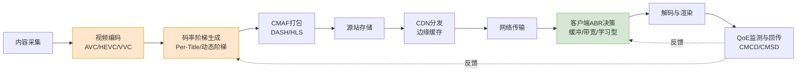
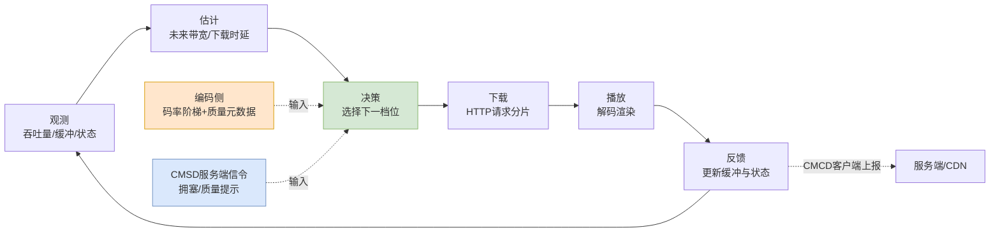
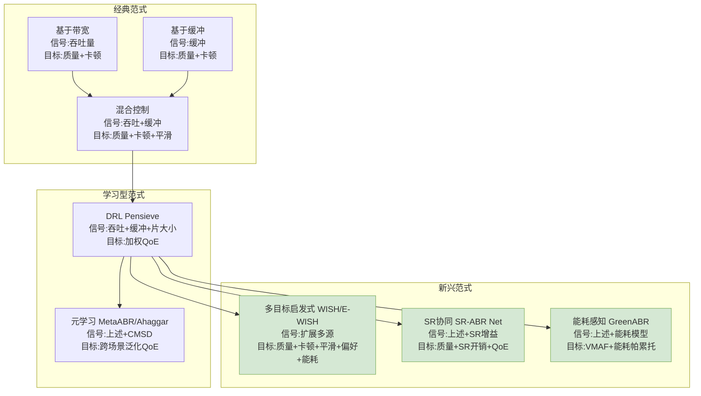
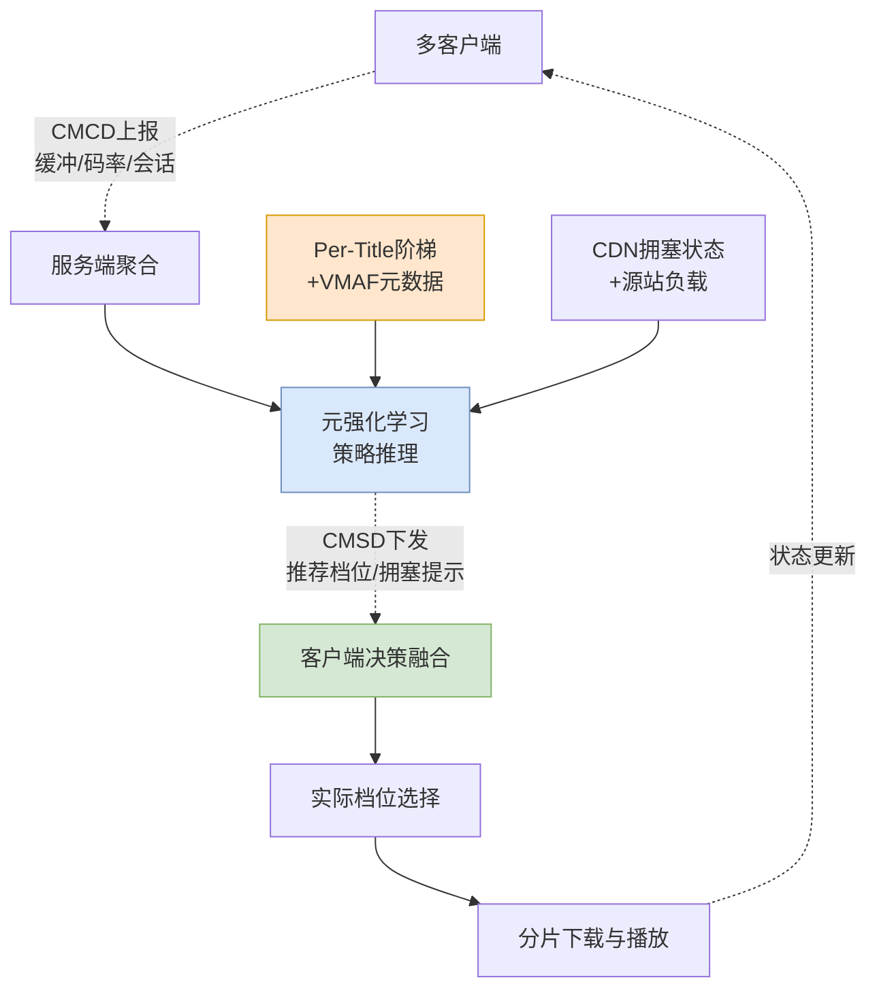
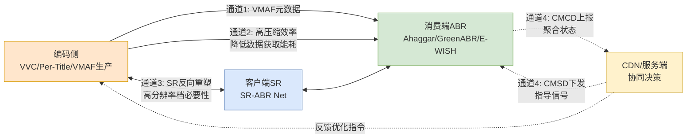

# HTTP自适应串流（HAS）技术综述：视频编码与消费端ABR算法的最新进展（截至2025年初）
# 1 研究背景与综述框架

在过去十余年间，视频流媒体已从互联网增量业务跃升为占据全球IP流量绝对多数的主导应用形态。无论是Netflix、YouTube、Disney+等点播平台，还是抖音、Twitch等直播与短视频生态，其底层几乎都构建在同一种技术范式之上——**HTTP自适应串流（HTTP Adaptive Streaming, HAS）**。HAS以HTTP协议为传输基座、以分片化媒体为内容载体、以客户端自适应决策为质量调节核心，成功化解了异构网络与多样化终端之间的兼容性鸿沟。然而，当流媒体业务深入到4K/8K超高清、HDR、沉浸式视频与移动端高密度消费等新场景，HAS体系内部的两个关键齿轮——**编码侧的压缩与码率阶梯生成**、**消费端的自适应码率（ABR）决策**——正同时面临前所未有的压力与重塑机遇。本章作为整篇综述的导论，旨在为读者搭建一个统一的分析坐标系：界定技术栈与研究边界，定位本综述的两大核心板块，梳理截至2025年初的演进时间线，并明确贯穿全篇的多维评估视角。

## 1.1 HAS技术栈与综述研究边界

HTTP自适应串流的基本工作原理可以概括为"**分段—多码—自适应**"的三段式逻辑。内容侧将原始视频按时间切分为短小的片段（通常2–10秒），并以多档分辨率—码率组合分别编码，生成一组质量梯度可控的媒体表达；分发侧通过CDN将这些片段以普通HTTP对象的形式缓存到边缘节点；客户端则基于一份描述媒体结构的清单文件（Manifest），在播放过程中根据实时网络带宽、缓冲水位与设备状态，逐片段地选择"最适合"的码率版本进行下载与渲染。这一架构的核心优势在于：复用了成熟的HTTP/CDN基础设施、规避了传统RTP/RTSP的NAT与防火墙穿透难题，并将质量调节的复杂性下放到客户端，从而实现了规模化部署的可行性。

在产业标准层面，HAS生态主要由两大主流规范主导：**MPEG-DASH（Dynamic Adaptive Streaming over HTTP）**与**Apple HLS（HTTP Live Streaming）**。前者由MPEG于2012年正式标准化（ISO/IEC 23009-1），以XML格式的MPD（Media Presentation Description）描述媒体结构，编解码与封装格式中立，被广泛应用于Web与Android生态；后者由Apple于2009年提出，使用M3U8播放列表与TS/CMAF分段，深度绑定iOS与tvOS设备。两者在底层逻辑上高度相似，并在2016年后均拥抱CMAF（Common Media Application Format）以实现切片层面的统一，从而显著降低了同一份内容同时服务双生态的存储与编码成本。除此之外，Microsoft Smooth Streaming、Adobe HDS等历史方案已基本退出主流舞台。

完整的HAS端到端技术栈可大致拆解为如下环节：**内容采集与制作 → 视频编码与转码 → 码率阶梯生成与打包 → 源站存储 → CDN多级缓存与分发 → 网络传输 → 客户端ABR决策 → 解码渲染 → QoE监测与回传**。每一环节都对最终的服务质量与资源效率产生影响，但其可优化空间与研究热度并不均衡。



上图清晰呈现了HAS端到端流程中本综述聚焦的两个红色（编码侧）与绿色（消费端）核心环节。**本综述将研究边界严格限定在视频编码（含码率阶梯优化）与消费端ABR算法两个环节**，对网络传输（如QUIC、L4S、低延迟CMAF）、CDN缓存调度、DRM版权保护、音频编码、字幕与可访问性等周边议题作显著裁剪。这一边界选择基于两点考量：其一，编码与ABR是直接决定"相同带宽下用户能看到多好的画面"以及"同一份编码资产在动态网络下能被多稳定地消费"的两个决定性环节，二者共同框定了HAS系统的性能上界与下界；其二，截至2025年初，这两个环节恰好同时进入了由新一代标准（VVC、AV1）、机器学习方法（DRL、元学习、神经超分）与可持续性议题（能耗感知）驱动的密集创新窗口，整合性综述具有显著的学术与工程价值。

## 1.2 编码侧与消费端作为HAS核心环节的定位

将视频编码与消费端ABR并列为HAS的两大支柱，并非简单的篇章划分便利，而是源于二者在系统功能上的**强互补性与深层耦合关系**。

**编码侧决定的是"可能性的边界"**。一段视频经过编码后所形成的码率—质量曲线（rate-distortion curve），从根本上规定了在给定带宽预算下用户最多能享受到多高的画质。新一代编码标准通过更精细的块划分、更智能的预测与更先进的环路滤波，使同一感知质量所需的码率持续下降——这是HAS服务能够在受限网络中提供高品质体验的物质基础。而码率阶梯的设计则进一步将这条连续曲线离散化为若干"质量档位"，决定了ABR算法在切换时所能选择的颗粒度、最低与最高质量边界，以及在带宽波动时画质塌陷的程度。换言之，**编码侧塑造了ABR决策空间的形状**。

**消费端ABR决定的是"实际落地的效率"**。即使内容侧准备了一份理想的码率阶梯，最终用户感受到的画质、流畅度与切换平滑度仍取决于客户端在每一个分片决策时刻能否准确地估计网络容量、合理地管理缓冲、并在多个相互冲突的目标（高码率、低卡顿、少切换、低能耗）之间取得平衡。在移动端弱网、Wi-Fi与蜂窝切换、CDN边缘抖动等真实场景下，再精良的编码也可能因为糟糕的ABR决策而退化为卡顿连连或画质过度保守的体验。

二者的耦合性体现在多个层面。第一，**码率阶梯的设计直接影响ABR算法的最优策略**——稀疏阶梯易导致带宽利用不充分，而过密阶梯则增加切换频次与决策复杂度。第二，**Per-Title编码所生成的内容相关码率阶梯**要求ABR算法理解每个分片的真实质量（而非仅码率），这催生了基于VMAF感知质量信号的新型ABR范式。第三，**客户端超分辨率（SR）技术**模糊了编码与解码的边界——当客户端能够将低分辨率内容上采样至接近高分辨率质量时，ABR决策需要重新评估"下载哪一档"的收益函数。第四，**能耗维度的引入**将编码端的压缩复杂度与解码端的播放功耗联系起来，使得VVC等高复杂度标准在移动场景下的实际部署需要与节能ABR协同设计。这些耦合关系共同决定了：**孤立地优化编码或孤立地优化ABR都已逼近瓶颈，下一阶段的性能突破必须来自二者的协同设计**。

基于这一判断，本综述采用"**编码侧—消费端**"二元结构展开论述。第一部分（第2–4章）聚焦视频编码标准演进、码率阶梯优化与编码能耗特性；第二部分（第5–7章）聚焦ABR研究范式、新一代代表算法与节能ABR专题；第8章则在二元框架之上展开系统级协同视角的讨论。

## 1.3 技术演进时间线与近期研究热点

理解HAS技术的当前坐标，需要回溯近二十年的关键节点。下表梳理了截至2025年初编码侧与消费端两条主线的代表性事件与本综述的关注重心。

| 时间 | 编码侧关键节点 | 消费端ABR关键节点 |
|------|---------------|------------------|
| 2003 | H.264/AVC标准发布，奠定数字视频时代基础 | — |
| 2009–2012 | — | HLS推出（2009）、MPEG-DASH标准化（2012） |
| 2013 | H.265/HEVC标准发布，码率较AVC约降50% | 基于带宽（BBA）与基于缓冲（BOLA）算法兴起 |
| 2015 | — | Netflix Per-Title Encoding首次公开 |
| 2016–2018 | AV1（2018）由AOM发布；CMAF标准化 | Pensieve（2017）开启DRL-based ABR时代 |
| 2020 | H.266/VVC标准发布，码率较HEVC约降50% | MPC、Oboe等混合型算法成熟 |
| 2021–2022 | LCEVC（增强型编码）标准化；Netflix推动动态优化阶梯 | CMCD v1发布（CTA-5004），客户端—服务端协同信令成形 |
| 2023 | VVC实时编码器（如VVenC、Fraunhofer优化）成熟；Per-Title方法（如ARTEMIS）涌现 | SR-ABR类联合超分算法兴起；元学习ABR（如Ahaggar）出现 |
| 2024 | VVC v2扩展（屏幕内容、神经网络后处理）；HDR与360°内容编码工具持续完善 | GreenABR等节能ABR专题方向形成；CMSD（服务端元数据）规范推进 |
| 2025初 | 神经网络编码与AI增强编码进入工业试点；编码能耗成为关键评估维度 | WISH/E-WISH多目标启发式、DoFP+前向预测优化等新算法持续涌现 |

从这一时间线可以提炼出几条贯穿性趋势。**第一，编码标准的"每代减半"规律延续但代价递增**——AVC→HEVC→VVC每一代均实现了约50%的码率节省，但编码复杂度也呈数量级增长，使得能耗成为新的瓶颈维度。**第二，编码优化的范式从"标准内调优"转向"内容感知与阶梯重构"**——Per-Title、Per-Shot乃至基于凸包分析的动态阶梯生成方法（以ARTEMIS、COBIRAS为代表）将优化重点从单帧压缩效率扩展到整片资产的码率—质量分布。**第三，ABR算法的方法论从纯启发式走向学习型与多目标融合**——从早期基于缓冲/带宽的规则算法，到Pensieve开创的深度强化学习范式，再到当前WISH、Ahaggar所代表的多目标加权与元学习方法，决策智能持续加深。**第四，客户端能力的扩展打开了新的协同空间**——客户端神经超分（SR-ABR Net类方法）、CMCD/CMSD协议（Ahaggar所依托）使得"消费端不再是被动接收方"，而能够主动参与质量塑造与协同决策。**第五，可持续性议题从边缘走向核心**——GreenABR、E-WISH等节能ABR方法的涌现，反映了流媒体产业开始正视其在全球能源消耗中的非边际占比，并将能耗纳入与QoE并列的优化目标。

本综述的研究窗口聚焦于**2022–2025年初**这一近三年区间，对历史方法（如AVC的早期技术、BBA/BOLA等经典ABR）仅作必要的背景铺垫，将主要篇幅留给反映当下技术前沿的代表性进展。

## 1.4 评估视角与分析框架

任何对HAS技术的客观评判都依赖于一套清晰的评估坐标。本综述确立以下**四维评估视角**，并据此构建贯穿后续章节的统一比较基准。

**第一维：压缩效率**。这是评估视频编码标准与编码方法的最直接指标，核心度量是**BD-Rate（Bjøntegaard Delta Rate）**——在相同客观质量（通常以PSNR或SSIM衡量）下，新方案相对基线方案能节省的码率百分比。BD-Rate与码率—质量曲线的整体形态共同刻画了编码方案的"压缩潜力"。该指标在第2章对AVC/HEVC/VVC的横向对比与第3章对Per-Title阶梯收益评估中将被反复使用。

**第二维：感知质量**。客观PSNR与人眼主观感受之间长期存在偏差，因此现代HAS评估越来越倚重**VMAF（Video Multi-method Assessment Fusion）**这一由Netflix主导开发并已成为工业事实标准的感知质量指标。VMAF通过融合多种基础特征并基于主观打分回归训练，在与人眼一致性上显著优于PSNR/SSIM。在码率阶梯生成（如ARTEMIS基于VMAF预测）与ABR奖励函数设计（如GreenABR以VMAF作为质量奖励）中，VMAF均扮演核心角色。此外，对于沉浸式内容（HDR、360°）还需引入专门的主观评测方法予以补充。

**第三维：能耗**。能耗评估需要区分**编码端**（服务侧大规模并行编码所产生的数据中心功耗）与**解码端/播放端**（终端设备的解码、显示、网络传输功耗）。在编码端，能耗与压缩效率往往呈反向关系——VVC虽然压缩率最高但编码复杂度可达HEVC的5–10倍；在解码端，移动设备的硬件解码器是否原生支持目标标准、以及屏幕亮度与无线收发耗能，共同决定了播放总功耗。能耗维度在第4章（编码侧）与第7章（节能ABR）中将作为核心评估轴展开。

**第四维：综合QoE**。QoE（Quality of Experience）是面向最终用户体验的综合性指标，通常由若干分量加权而成：**平均码率/感知质量（越高越好）**、**卡顿事件的次数与时长（越少越好）**、**码率切换的平滑度（切换越少越好）**、**启动延迟（越低越好）**，以及在直播场景下的**端到端延迟**。经典的ITU-T P.1203、Yin等人提出的线性QoE模型，以及Pensieve等学习型算法所采用的自定义奖励函数，构成了不同研究中QoE评估的多种变体。本综述在对比ABR算法时将以这一多分量QoE模型为基准。

下表汇总了四维评估视角在编码侧与消费端两大板块中的适用性与典型权衡：

| 评估维度 | 编码侧适用性 | 消费端ABR适用性 | 典型权衡关系 |
|---------|-------------|----------------|-------------|
| 压缩效率（BD-Rate） | **核心** | 间接（决定阶梯密度） | 与编码复杂度/能耗正相关 |
| 感知质量（VMAF/主观） | **核心** | **核心**（驱动奖励函数） | 与码率非线性、与内容复杂度相关 |
| 能耗 | 编码端核心、解码端次要 | **移动端核心** | 与压缩比、决策频次正相关 |
| 综合QoE | 间接（通过阶梯设计影响） | **核心** | 多分量内部存在冲突（高码率↔低卡顿） |

基于上述四维视角，本综述构建的"**编码侧—消费端**"二元分析框架具有以下方法论特征：在编码侧，重点考察"**压缩效率—感知质量—编码能耗**"三角关系，分析每代标准与每类阶梯优化方法在该三角中的位置；在消费端，重点考察"**QoE—决策开销—终端能耗**"三角关系，分析每种ABR算法在该三角中的取舍。两个三角通过码率阶梯（编码侧输出→消费端输入）与CMCD/CMSD反馈信号（消费端→编码侧/服务端协同）形成闭环。在后续每一章节的算法剖析中，本综述将尽可能从"**核心机制（是什么）—设计动因（为什么）—技术实现（怎么做）—量化效果与代价（效果如何）**"四个层面展开，确保对每一项技术给出超越名词罗列的深度解读。

需要坦诚指出的是，由于HAS涉及大量工业实践，部分关键数据（如Netflix、YouTube内部编码参数、CDN级QoE统计）并不完全公开，本综述只能基于已公开的论文、标准文档与技术博客进行整合；此外，不同研究在评测数据集（如HEVC Test Sequences、UGC Dataset、Waterloo数据集）与网络trace（如FCC、Norway 3G/4G、Belgium 4G）上的差异，也可能导致跨研究的数值不完全可比。在后续章节中遇到此类情形时，将在行文中显式说明可比性局限，避免误导性结论。

带着上述坐标系——清晰的研究边界、二元的板块结构、明确的时间窗口与四维评估视角——下一章将正式进入编码侧的第一个核心议题：从H.264/AVC到H.266/VVC的视频编码标准演进，剖析每一代标准如何通过具体的技术创新逼近压缩效率的理论极限。

# 2 第一部分·视频编码标准演进：从AVC到HEVC再到VVC

承接上一章对HAS研究边界与四维评估视角的界定，本章正式进入编码侧的第一个核心议题：**视频编码标准的逐代演进**。视频编码标准是HAS体系中"压缩效率—感知质量—编码能耗"三角的根本决定者，其每一代的技术跃迁都直接重塑了码率阶梯设计的空间形态与消费端ABR的决策边界。过去二十余年间，由ITU-T视频编码专家组（VCEG）与ISO/IEC运动图像专家组（MPEG）联合制定的三代主流标准——2003年的H.264/AVC、2013年的H.265/HEVC与2020年的H.266/VVC——以"每代约50%码率减半"的几何级压缩效率提升，先后支撑了从SD到HD、从HD到4K/8K，再到HDR、360°与沉浸式视频的演进浪潮[^1]。然而，每一代标准在压缩效率跃升的同时，编码复杂度也以数量级的速度增长，使得"压缩效率—编码复杂度—能耗"的三角约束在VVC时代达到前所未有的紧张程度[^2]。本章以**混合编码框架**为统一分析骨架，沿块划分、帧内/帧间预测、变换与量化、环路滤波、并行处理与新型内容扩展等技术维度逐项展开三代标准的对比剖析，最终通过横向对比矩阵验证"每代减半、复杂度递增"的演进规律，为第3章码率阶梯优化与第4章编码能耗分析建立标准层面的基准坐标。

值得在开篇即强调的是，AVC、HEVC、VVC虽然技术细节差异显著，但其顶层架构始终遵循自H.261以来确立的**混合编码框架（hybrid coding framework）**：通过帧内预测消除空间冗余、通过帧间运动补偿消除时间冗余、通过变换与量化压缩残差信号、最终通过熵编码消除符号统计冗余[^3]。三代标准的演进本质上是在这一固定骨架上对每一模块进行精细化扩展与工具集叠加，**而非对编码范式的颠覆性重构**。这一点理解对于后续章节中辨析"传统标准 vs. 神经编码"的代际边界尤为重要。

## 2.1 H.264/AVC：混合编码框架的奠基与基线特征

H.264/AVC于2003年由JVT（Joint Video Team）联合发布，是过去二十年间最成功的视频编码标准，至今仍占据实时视频通信领域80%以上的市场份额[^4]。其成功的关键并不在于某一项颠覆性创新，而在于**在压缩效率、计算复杂度与生态兼容性之间取得了堪称典范的平衡**——正是这一平衡使AVC成为早期HLS（2009）与MPEG-DASH（2012）的事实编码基线，并奠定了HAS生态的物质基础。

AVC的核心技术架构建立在**宏块（Macroblock, MB）**这一基本编码单元之上。每个宏块大小固定为16×16像素，但允许在帧间预测时进一步向下划分为16×8、8×16、8×8直至4×4的子分区，从而在静态背景区域使用大块以节省语法开销，在运动剧烈或纹理复杂区域使用小块以提升预测精度[^1][^3]。这种**多级宏块划分**机制相比前代H.263的固定块结构显著提升了对内容自适应性的能力。在帧间预测层面，AVC引入了**多达16帧的多参考帧机制**与**1/4像素精度的亚像素插值**——前者使编码器能在更长的时间窗口内寻找最佳匹配块，对周期性运动与遮挡场景尤其有效；后者通过6阶FIR滤波器实现亚像素位置的内插，使运动矢量精度由H.263的半像素提升至四分之一像素，对应残差能量的进一步压缩[^3]。

变换与量化方面，AVC采用**4×4和8×8整数DCT变换**替代了传统的浮点DCT，从根本上消除了不同实现间的漂移误差并降低了硬件实现复杂度[^1]。熵编码层面，AVC同时提供**CAVLC（基于上下文自适应的可变长编码）**与**CABAC（基于上下文自适应的二进制算术编码）**两种方案，前者复杂度较低适合低端设备，后者压缩效率更高（典型场景下可额外节省10%–15%码率）但解码复杂度更高，二者共同覆盖了从移动端到广播级的不同部署场景。**去块效应滤波器（Deblocking Filter）**作为环路内滤波器引入，有效消除了基于块编码所引入的块边界视觉伪影，是AVC感知质量显著优于H.263的关键因素之一[^1]。

从HAS生态视角看，AVC还有一项关键设计——**网络抽象层（Network Abstraction Layer, NAL）**。NAL将编码比特流封装为独立的NAL单元，每个单元可独立解析其头部以确定类型与依赖关系，天然适配RTP、HTTP分片等多种传输协议[^4]。这一设计使得AVC可以无需额外封装层即可被切分为DASH/HLS所需的若干秒分片，是其成为HAS基线编码的工程基础。综合而言，AVC相对H.263实现了同等画质下约50%的码率节省，且在384kbit/s级低带宽下仍能维持可用的视频会议质量[^4][^3]。直至2024年，搭载AVC的设备生态仍是HAS多档码率阶梯的兜底层级，承担"最广泛设备可解码"的兼容性职责。

## 2.2 H.265/HEVC：编码树单元与压缩效率的革命性跃迁

2013年定稿的H.265/HEVC由JCT-VC（Joint Collaborative Team on Video Coding）联合制定，目标直指4K/8K超高清时代的压缩需求。HEVC在保持AVC同等主观质量的前提下，将码率进一步降低约50%，是HAS体系迈入4K时代的关键基础设施[^4][^1]。其压缩效率的革命性跃迁源自一系列结构性创新，其中最具标志性的便是**编码树单元（Coding Tree Unit, CTU）**的引入。

CTU取代了AVC中固定大小的宏块，成为HEVC的基本编码单元，最大尺寸可达**64×64像素**，每个CTU由一个亮度CTB（Coding Tree Block）和两个色度CTB及相应语法元素组成[^5][^6]。CTU通过**四叉树（Quad-Tree）递归划分**机制向下分解为编码单元（Coding Unit, CU），CU最小可至8×8。在每个CU之下，HEVC进一步引入**预测单元（PU）**与**变换单元（TU）**两个独立的概念，PU负责承载帧内/帧间预测模式信息，TU负责承载变换与量化信息，三者形成层级嵌套结构[^6]。这种设计的核心动因在于：4K/8K视频中存在大量平坦区域（如天空、墙面），用大尺寸CTU整体编码可显著节省语法开销；而在纹理边缘或运动剧烈区域，灵活的四叉树划分又能下钻到8×8甚至4×4细粒度以保证预测精度。这一"**大尺寸编码单元+灵活递归划分**"的设计哲学是HEVC压缩效率提升的首要来源。

帧内预测层面，HEVC将AVC的9种角度模式扩展至**33种角度模式**外加Planar与DC两种非角度模式，共计35种帧内预测模式[^7]。更密集的角度采样使HEVC能更精确地匹配自然图像中的边缘方向，对4K高分辨率内容中细密的纹理边界尤为有效。帧间预测层面，HEVC引入**AMVP（Advanced Motion Vector Prediction）**与**Merge模式**两种运动信息编码机制：AMVP通过候选列表索引方式高效编码运动矢量差，Merge模式则允许当前CU直接继承空间/时间相邻块的运动信息从而省去MV显式编码开销。这两种机制配合多参考帧与亚像素插值，使HEVC的帧间压缩效率较AVC显著提升。

变换层面，HEVC支持最大32×32的整数DCT变换，并在4×4块上引入DST（离散正弦变换）以更好地匹配帧内预测残差的能量分布特性。环路滤波方面，HEVC在去块效应滤波器之外**新增了样本自适应偏移（Sample Adaptive Offset, SAO）滤波器**，SAO通过对像素值施加偏移补偿来减少振铃效应与带状伪影，是HEVC感知质量提升的重要环节。并行处理层面，HEVC引入**Tile（瓦片）与WPP（波前并行处理, Wavefront Parallel Processing）**两套机制：Tile将一帧划分为若干矩形独立区域可并行编解码，适合多核处理器；WPP允许CTU行之间以错位方式并行处理，在保留行间预测依赖的同时实现并行加速[^6][^4]。这两项工具是HEVC在4K/8K实时编码场景下落地的关键，**HEVC通过Tile分割编码与动态QP调整，可将720P视频码率控制在1.5Mbps以内**[^4]。

面向特殊内容场景，HEVC在2014–2016年间发布了**屏幕内容编码扩展（SCC）**，新增了**帧内块拷贝（Intra Block Copy, IBC）**与**Palette（调色板）模式**两项关键工具。IBC允许当前块从同一帧内已编码区域复制像素，对计算机生成图形、文字与UI界面中大量出现的重复图案极为有效；Palette模式则将一个块表示为指向调色板表中颜色条目的索引序列，专门针对"少量颜色被锐利边缘分隔"这一屏幕内容典型特征[^8]。模拟结果表明，Palette模式在同等失真下可为屏幕内容带来显著的码率节省[^8]。这些扩展工具使HEVC在游戏直播、远程办公、教育直播等屏幕共享场景中相对AVC获得了远超50%的压缩增益。

综合而言，HEVC通过CTU四叉树结构、扩展帧内角度模式、AMVP/Merge运动信息编码、SAO环路滤波与Tile/WPP并行工具，在同等PSNR下相对AVC实现了约50%的码率节省[^4][^1]。但这一压缩效率跃迁的代价是**编码复杂度数倍增长**——RDO（率失真优化）需在远多于AVC的划分组合中搜索最优配置，使得早期HEVC编码器在低端设备上的实时性受到严重制约[^4]。这一复杂度问题成为后续Per-Title优化与AI加速研究的核心动因之一。

## 2.3 H.266/VVC：面向多功能与超高清的工具集再扩展

H.266/VVC于2020年7月由JVET（Joint Video Experts Team）最终定稿，发布为ITU-T H.266与MPEG-I Part 3（ISO/IEC 23090-3）标准[^2]。VVC的命名"Versatile"（多功能）直接反映了其设计目标——**不仅追求压缩效率的进一步提升，更要面向8K、HDR、360°全景、屏幕内容等多样化场景**[^2]。在真实测试中，VVC在主观质量上相对HEVC实现了约40%–50%的码率节省，在客观PSNR指标上节省约30%，而解码复杂度仅增长至约1.6倍[^3][^2]。这一"以可接受的解码代价换取显著压缩增益"的工程取舍，使VVC成为后摩尔定律时代视频编码的标杆性标准。

VVC的技术扩展首先体现在**块划分结构的进一步松绑**。CTU最大尺寸由HEVC的64×64扩大至**128×128像素**，以更好地适配4K及以上超高清视频中的大面积平坦区域[^5]。更关键的是，VVC摒弃了HEVC仅四叉树划分的限制，引入**四叉树嵌套多类型树（QT+MTT）**结构——CTU首先按四叉树划分至一定深度，随后允许在MTT节点上进一步采用**二叉树（Binary Tree, BT）与三叉树（Ternary Tree, TT）**划分[^5][^7]。这种混合划分使CU能够形成长宽比悬殊的矩形块（如32×8、16×4等），更准确地匹配图像中真实的对象边界。同时，VVC**统一了HEVC中CU、PU、TU的概念**——大多数情况下PU与TU即等同于CU本身，仅在特定条件下允许进一步划分[^5][^7]。VVC还引入了**亮度/色度独立划分决策**（在帧内Slice中）与**sub-picture（子图）**两个新概念：前者考虑到色度分量纹理通常较少，独立划分可避免不必要的细分；后者允许将一帧划分为若干位置固定、可独立解码的子区域，**为360°视点自适应流媒体与多视点视频的码率阶梯设计提供了原生支持**[^7]。

帧内预测层面，VVC将角度模式从HEVC的33种扩展至**65种**，更密集的角度采样进一步逼近自然图像中的真实边缘方向；针对非方形块还定义了28种分布离散的"广角"帧内预测角度[^7][^2]。在传统角度模式之外，VVC引入了一系列**新型帧内预测工具**[^7]：

- **矩阵加权帧内预测（Matrix-based Intra Prediction, MIP）**：使用离线训练得到的矩阵参数对预测块进行加权计算，本质上是将一小段神经网络嵌入到了帧内预测路径。4×4块有16种模式，4×8/8×4块有8种，更大块有6种。MIP对自然图像中复杂纹理的预测精度优于传统角度模式。
- **多参考行（Multi-Reference Lines, MRL）**：允许使用相邻块的多行/多列作为参考，而非HEVC仅允许的相邻1行/列，使得预测能更好地适应局部纹理的周期性。
- **帧内子分区（Intra Sub-Partitions, ISP）**：将一个CU进一步划分为多个子分区进行帧内预测，每个子分区按编码顺序为后续子分区提供参考。ISP的RDO开销较高，**已有研究使用决策树等机器学习方法对ISP模式决策进行加速，可在仅0.11%编码效率损失下节省3.15%编码时间**[^7]。
- **跨分量线性模型（Cross-Component Linear Model, CCLM）**：利用同位亮度采样通过线性拟合预测色度采样值，显著提升色度预测精度。
- **位置依赖预测组合（Position-Dependent Prediction Combination, PDPC）**：对预测块进行后滤波以平滑边缘不连续。

此外，VVC的MPM（Most Probable Modes）列表从HEVC的3个扩展至6个，进一步降低了帧内模式的语法开销[^7]。

帧间预测层面，VVC的最大突破是引入了**局部仿射运动模型（Local Affine Motion Model）**，支持4参数与6参数两种自由度，能够刻画旋转、缩放、剪切等非平移运动；运动矢量精度由HEVC的1/4像素进一步提升至**1/16像素（亮度）**[^7]。运动信息编码方面，VVC新增了**HMVP（History-based MV Prediction）**——通过一个FIFO缓冲区保存最近编码的最多5个MV作为候选，**Pairwise MVP**则从已有候选中两两平均生成新候选，二者共同丰富了MV候选列表的多样性[^7]。此外，VVC还引入了**自适应运动矢量分辨率（AMVR）**允许在不同精度间切换以节省MV编码开销、**几何分区模式（Geometric Partitioning Mode, GPM）**支持以非矩形分界线划分CU以更好匹配物体边缘、**双向光流（BDOF）**与**仿射MMVD**等精细化工具。

变换与量化方面，VVC引入了**多核变换选择（Multiple Transform Selection, MTS）**机制，允许在DCT-II之外选择DCT-VIII和DST-VII两种核来更好匹配不同残差信号特性；**依赖量化（Dependent Quantization, DQ）**通过两个量化器交替使用并结合状态机，使量化结果在率失真意义上更优[^7]。环路滤波方面，VVC在HEVC的Deblocking+SAO之上**新增了自适应环路滤波器（Adaptive Loop Filter, ALF）**，ALF基于Wiener滤波原理对重建图像进行块级自适应滤波，是VVC感知质量提升的重要环节。此外，VVC独有的**参考图像重采样（Reference Picture Resampling, RPR）**机制允许编码过程中不同图像以不同分辨率存储与参考，这一特性对于动态分辨率切换（如在低带宽时降低分辨率而无需关闭GOP）具有重要价值，**使VVC在码率—失真曲线上相对仅使用单一分辨率参考的版本有进一步提升**[^2]。

从压缩效率—复杂度权衡角度看，**VVC的性能增益曲线随工具集逐步累加由最初的10%提升至最终的40%，而解码时间仅增至约1.6倍**[^2]。考虑到摩尔定律的硬件演进，这一权衡被业界普遍认为是相当合理的工程取舍。在部署层面，VVC已被ATSC、SCTE、DVB、SBTVD、CTA Wave、DASH-IF等主流应用标准采纳[^2][^3]。截至2026年的部署观察显示，**VVC在智能电视、机顶盒（STB）与广播生态中正逐步获得硬件解码支持，但浏览器与HLS的原生支持仍然有限**，这意味着流媒体团队需要采用多编解码器阶梯策略——使用AVC/HEVC/AV1覆盖通用设备，使用VVC服务支持其硬解的高端场景[^3]。

## 2.4 面向新型内容的编码工具扩展：HDR、屏幕内容与全景视频

三代标准在面向新型内容形态时的工具适配路径，是理解HAS生态向沉浸式内容拓展的关键。视频内容已从传统SDR/8bit YUV4:2:0扩展至HDR/10–12bit、屏幕共享、360°全景、多视点立体等多种形态，每种内容类型对编码工具提出了差异化需求。

**HDR/WCG（高动态范围/广色域）**场景中，关键是支持10bit或更高位深以容纳PQ（Perceptual Quantizer，SMPTE ST 2084）或HLG（Hybrid Log-Gamma）传递函数所需的亮度动态范围，以及Rec.2020广色域。HEVC通过**Main 10 profile**首次将10bit支持纳入主档，使HDR成为可大规模部署的视频形态；VVC则在Main 10基础上进一步原生支持10bit乃至更高位深，并通过亮度自适应量化等工具针对HDR内容的非均匀亮度分布进行优化。这些扩展使HAS能够在4K HDR场景下提供较SDR 4K相对更显著的感知质量提升。

**屏幕内容编码（SCC）**是三代标准演进中最具针对性的扩展路径。屏幕内容的统计特性与自然图像显著不同——它通常由计算机生成的图形、文字与UI组成，**局部区域往往只有少量颜色被锐利边缘分隔，并大量存在精确重复的图案**[^8]。AVC对此基本依赖通用工具，效率有限；HEVC于2014–2016年发布的SCC扩展首次系统性地引入**IBC（帧内块拷贝）**与**Palette（调色板）模式**两项专用工具——IBC将运动补偿的思路应用于同帧内已编码区域，对UI重复元素与文字串极为高效；Palette模式则将块表示为颜色条目索引序列[^8]。**国产AVS2标准在2021年修订版中也新增了帧内串复制技术，使屏幕内容编码效率提升37%**[^4]，反映了这一方向的国际共识。VVC进一步将IBC直接纳入主档（而非独立扩展），并通过更灵活的MTT块划分天然适配屏幕内容的矩形UI元素，使其在游戏直播、远程办公、教育直播等场景中相对HEVC获得额外压缩增益。

**360°全景与多视点视频**场景中，VVC的**sub-picture机制**提供了原生支持——通过将一帧划分为若干可独立解码的子图，编码器可在编码侧为每个视口（viewport）准备不同质量的子图版本，客户端则根据用户当前视线方向仅下载与解码相应高质量子图，对其他区域使用低质量版本，从而实现**视口自适应（viewport-adaptive）**流媒体[^7][^2]。配合**RPR动态分辨率切换**，VVC在360°内容上能根据视线变化在GOP内部即时调整不同子图的分辨率，避免传统方案中GOP级别切换带来的带宽与延迟代价[^2]。这一组合工具为HAS在沉浸式VR/AR场景下的码率阶梯设计提供了远超HEVC的灵活性——**码率阶梯不再只是"分辨率—码率"二维矩阵，而可扩展为"子图—分辨率—码率"三维结构**。

需要指出的是，本节关于新型内容编码工具的讨论主要基于公开标准文档与综述材料的整合；部分工业实践（如具体OTT平台的HDR编码参数、360°视口切换的端到端延迟数据）由于商业机密尚未公开披露，本节未能引入定量比较。

## 2.5 三代标准的横向对比与演进规律验证

在前述逐代解析的基础上，本节构建AVC/HEVC/VVC的横向对比矩阵，沿压缩效率、感知质量、编码与解码复杂度、硬件支持度与许可生态等多维度进行汇总，以验证编码标准演进的核心规律并为后续章节提供量化锚点。

下表汇总三代标准的关键技术与性能参数对比：

| 维度 | H.264/AVC (2003) | H.265/HEVC (2013) | H.266/VVC (2020) |
|------|------------------|-------------------|-------------------|
| **基本编码单元** | 16×16宏块，可至4×4 | 64×64 CTU + 四叉树 | 128×128 CTU + QT+BT+TT |
| **帧内角度模式数** | 9 | 33 | 65 + 28广角模式 |
| **帧内新工具** | — | Planar/DC + 平面预测 | MIP, MRL, ISP, CCLM, PDPC |
| **帧间MV精度** | 1/4像素 | 1/4像素 | 1/16像素（亮度） |
| **运动模型** | 平移 | 平移+AMVP/Merge | + 仿射(4/6参数) + HMVP + GPM |
| **最大变换尺寸** | 8×8 | 32×32 (+4×4 DST) | 64×64 + MTS多核 |
| **环路滤波** | Deblocking | Deblocking + SAO | Deblocking + SAO + ALF |
| **并行工具** | Slice | Slice + Tile + WPP | + sub-picture |
| **屏幕内容工具** | 无 | SCC扩展（IBC, Palette） | 原生支持 |
| **HDR支持** | 8bit主流 | Main 10 (10bit) | 10/12bit + 亮度自适应量化 |
| **相对前代码率节省** | — | ~50% | ~40–50%（主观）/30%（PSNR） |
| **编码复杂度** | 1× | ~5–10×（相对AVC） | ~5–10×（相对HEVC） |
| **解码复杂度** | 1× | ~2× | ~1.6×（相对HEVC） |
| **硬件解码生态(2025)** | 全设备覆盖 | 广泛覆盖 | 智能电视/STB为主，浏览器有限 |
| **许可成本** | 较低（生态成熟） | 复杂（多个专利池） | 复杂（多个专利池） |

从该矩阵中可清晰提炼出三条贯穿性规律：

**规律一：每代约50%的码率节省得到验证，但客观与主观指标存在差异**。AVC相对H.263、HEVC相对AVC、VVC相对HEVC均在主观质量评估下实现了约50%的码率节省[^1][^3][^2]。然而在客观PSNR指标下，VVC相对HEVC的节省更接近30%[^2]。这一差异源于VVC的多项工具（如ALF、PDPC、亮度自适应量化）更侧重感知质量优化，而非单纯的均方误差最小化——**这意味着在以VMAF/主观质量为目标的HAS场景下，VVC的实际增益更接近"50%减半"的宣称水平**。

**规律二：编码复杂度呈数量级递增，解码复杂度增长相对克制**。AVC到HEVC编码端复杂度增长约5–10倍，HEVC到VVC再增5–10倍，主要源于RDO在更大决策空间（块划分组合、预测模式数、运动信息候选）上的穷举开销。但解码端通过精心的工具设计（如MIP使用查表替代复杂计算、ISP通过子分区限制内存带宽），VVC解码复杂度仅约为HEVC的1.6倍[^2]。这一"**编码端代价巨大、解码端代价克制**"的不对称权衡，对HAS体系尤为有利——服务端可在数据中心一次性付出昂贵编码代价，而海量消费端设备只需承受相对温和的解码负担。这一规律也为第4章的能耗讨论埋下伏笔：**编码端能耗已成为大规模OTT平台的核心成本，而消费端能耗则主要由解码与显示驱动**。

**规律三：标准的部署速度受硬件生态与许可成本双重制约**。AVC凭借早期低复杂度与生态成熟，至今仍是覆盖最广的兜底标准[^4]；HEVC虽于2013年定稿，但因专利池复杂导致部署滞后多年；VVC在2020年发布后，截至2026年的部署仍主要局限于智能电视、机顶盒与广播生态，**浏览器与HLS的原生支持仍然有限**[^3]。这意味着HAS服务商在码率阶梯设计中必须采用**多编解码器策略**——即对同一份内容并行编码AVC（兜底覆盖）+ HEVC（4K主流）+ AV1（开源高端）+ VVC（受支持设备）以覆盖差异化的终端生态[^3]。这一现实约束直接推高了存储与编码成本，也是第3章Per-Title阶梯优化必须考虑的工程边界条件。

**横向定位：AV1与LCEVC作为补充方案**。除上述ITU-T/MPEG主线标准外，由AOM（Alliance for Open Media）于2018年发布的**AV1**作为开源免版税替代方案，采用了帧内方向预测扩展至56种、运动矢量精度1/16像素等技术，**在1080P视频会议场景下码率较H.264降低45%**，并已获得苹果M系列芯片原生解码支持[^4]。AV1的核心定位是规避VVC/HEVC的专利成本，在Web与开源生态中尤其受到YouTube、Netflix等平台的青睐。**LCEVC（MPEG-5 Part 2，2021年标准化）**作为增强型分层编码方案，通过在传统编码器（可以是AVC/HEVC/VVC任意一代）输出之上叠加一个低复杂度增强层，提供约30%的额外码率节省，同时保持对基础层解码器的向后兼容——这一"渐进增强"路径为HAS在异构终端生态中的平滑升级提供了又一选项。AV1与LCEVC的存在意味着，**HAS的编码侧已从"单一标准主导"演变为"多标准并行"的格局**，码率阶梯设计的复杂度由此进一步上升。

综上，第2章通过对三代主流编码标准的逐代解析与横向对比，验证了"**每代码率减半、编码复杂度数量级递增、解码复杂度可控增长**"的核心演进规律，并揭示了多标准并行格局对HAS系统设计的深远影响。这些标准层面的技术特性与工程约束，构成了下一章节码率阶梯优化的基础坐标——**任何按内容定制的阶梯生成方法，都必须在某一代或多代基线标准之上展开**。第3章将进入码率阶梯优化的专题讨论，从静态推荐阶梯出发，剖析ARTEMIS、COBIRAS等动态阶梯生成方法如何在本章所建立的标准基线之上进一步压榨"压缩效率—感知质量—存储成本"三角中的剩余空间。

# 3 第一部分·码率阶梯优化：从静态方案到按标题/动态阶梯生成

承接第2章对AVC/HEVC/VVC三代编码标准的逐代解析与横向对比，本章将编码侧研究的视角从"单帧/单序列的压缩工具"上移至"整片资产的码率—质量分布设计"，进入HAS编码侧的第二个核心议题——**码率阶梯（Bitrate Ladder）的优化设计**。如果说编码标准决定了"在给定分辨率与码率下能压缩到何种感知质量"的微观极限，那么码率阶梯则规定了"在整份资产层面如何在多个分辨率—码率档位间分配比特预算"的宏观结构。这一结构既是编码侧最终对外暴露的产品形态，也是消费端ABR决策直接面对的输入空间——其密度、覆盖范围、质量梯度形状，直接框定了ABR算法所能达到的QoE上界。

本章将首先界定码率阶梯的概念内涵与跨链路传导效应，剖析传统"一刀切"静态阶梯在异构内容与多样化终端面前暴露的结构性缺陷；随后沿"静态→Per-Title→Per-Shot→机器学习驱动"的演进路径，深入解析Netflix Per-Title、Bitmovin复杂度因子调整、Dynamic Optimizer分镜级凸包优化，以及近三年涌现的ARTEMIS、COBIRAS等机器学习预测型阶梯生成方法；最后通过四类方案的横向权衡矩阵，归纳按内容定制阶梯对带宽、存储与QoE的量化效益，并揭示其与编码标准选择、多编解码器并行策略的耦合规律。本章的输出将为第4章编码能耗分析与第5–7章消费端ABR专题提供阶梯层面的统一坐标。

## 3.1 码率阶梯的定义、构成要素与在HAS链路中的作用

**码率阶梯**（Bitrate Ladder）是HAS体系中编码侧最终对外暴露的产品形态，可形式化定义为一组由若干"**分辨率—目标码率—对应感知质量**"三元组构成的离散质量档位集合。一个典型的4K点播阶梯可能包含从240p/235kbps到2160p/15Mbps的6–10档表达，每一档对应一种独立编码的媒体表示（Representation），共同写入DASH的MPD或HLS的Master Playlist中供客户端选择。从功能视角看，码率阶梯既是编码与转码流水线的输出契约——决定了为每份资产需要执行多少次编码任务及各任务的参数，也是消费端ABR算法的输入边界——决定了客户端在每个分片决策时刻所能选择的档位集合。

阶梯的构成要素可沿三个维度展开。**分辨率档位**决定了垂直方向的覆盖范围，通常需同时兼顾极弱网下的兜底分辨率（如240p–360p）与高端设备所需的旗舰分辨率（如1080p–2160p乃至4320p）。**目标码率**决定了同一分辨率下的水平采样密度——过密会导致档位间收益接近、徒增存储；过疏则会在ABR切换时引发明显的画质阶跃。**对应感知质量点**（通常以VMAF或PSNR表达）是前两者作用于具体内容后的"输出结果"，也是判断阶梯优劣的最终评判维度。三者之间并非独立选择——同一目标码率在不同分辨率上达到的VMAF分数差异显著，这一非线性关系正是后续Per-Title优化的理论根基。

阶梯设计的好坏会沿HAS链路的多个环节产生**强传导效应**。在编码资源分配层面，每增加一档便意味着一次完整的编码任务，对长片或大规模内容库而言其计算开销呈线性放大；在源站与CDN存储层面，多档表达需各自独立存储，阶梯密度直接转化为存储成本；在网络分发层面，更高的最高档码率会推高峰值带宽需求，而ABR切换时档位间的码率间隔决定了带宽利用的颗粒度；在客户端决策层面，阶梯的密度与梯度形状直接决定了ABR算法的可选动作空间，稀疏阶梯易导致带宽利用不充分或画质阶跃明显，过密阶梯则增加切换频次与决策复杂度。**这一跨链路传导效应意味着，阶梯优化不是单一环节的局部调优，而是一种全链路成本—收益的再平衡**。

贯穿后续讨论的核心几何概念是**凸包（Convex Hull）**。对于任一段视频内容，若将"在所有可能的分辨率—量化参数组合下的编码结果"作为点绘制在"码率—质量"二维平面上，这些点会形成一个散布的点云；连接所有"在某一码率下能达到最高质量"或"在某一质量下能达到最低码率"的非支配点，便构成了该内容的率失真凸包（R-D Convex Hull）。凸包代表了当前编码工具集对该内容所能达到的**帕累托最优前沿**——任何不在凸包上的编码点都至少存在一个在码率或质量维度上严格优于它的替代选择。理想的码率阶梯应当在该凸包上离散采样若干点，使每一档都是当前码率预算下的质量最优。然而对每段内容求解精确凸包需要大量试编码，**凸包估计的精度—成本权衡正是从Per-Title到ML预测各类方法的核心竞争焦点**。

## 3.2 传统静态阶梯的局限性与优化动因

在Per-Title编码兴起之前，HAS生态长期依赖**静态阶梯**——即对所有内容采用同一份预先设计好的分辨率—码率档位表。Apple HLS Authoring Specification多年发布的推荐阶梯（如1080p对应7.8Mbps、720p对应4.5Mbps等档位的固定映射），以及Netflix早期对全片库采用的"分辨率—码率"二维矩阵，都是这一范式的典型样本。静态阶梯的核心设计假设是：**视频内容在统计意义上具有可平均的复杂度分布**，因此一份针对"中等复杂度"内容调优的阶梯，能在整个内容库上达到可接受的折中。这一假设在内容形态相对单一的早期流媒体时代尚能成立，但随着OTT平台的内容库扩展至动画、纪录片、体育直播、动作电影、屏幕共享、UGC短视频等高度异构的形态后，其结构性缺陷便暴露无遗。

从**内容复杂度维度**看，静态阶梯无法适应内容间巨大的复杂度差异。对于场景变化缓慢、色彩较为单一的纪录片或动画类内容，采用相对较低的码率即可保证不错的画质，按照静态阶梯所规定的固定码率编码会导致显著的带宽浪费——大量比特被消耗在已经接近"质量饱和"的区段，对实际观感几乎没有提升[^9]。反之，对于动作大片、体育赛事中快速切换的复杂场景，固定阶梯的码率配置往往不足以保留足够细节，从而引发画质塌陷、块效应与运动模糊等编码伪影。Bitmovin的实证研究显示，**对低复杂度的卡通类内容如Glass Half，在1920宽度的高码率配置下码率可降低30%而SSIM几乎不变**，反向说明了静态阶梯在低复杂度内容上的冗余幅度之大[^10]。

从**终端多样性维度**看，从智能手机的6寸屏到客厅85寸4K电视、再到VR头显与机顶盒，不同终端的分辨率—屏幕尺寸—观看距离组合迥异，对同一份码率所感受到的画质截然不同。静态阶梯难以同时兼顾极弱网的兜底覆盖与高端设备的旗舰体验——若按高端设备需求设计高码率档位，低端设备解码与传输将不堪重负；若按低端设备保守设计，则浪费了高端硬件的呈现能力。早期Netflix针对移动设备的下载编码优化便是对这一缺陷的早期回应——通过采用更长的GOP结构降低关键帧冗余、运用灵活的编码器设置与每块优化机制，针对移动设备屏幕尺寸和分辨率特点进行针对性编码[^9]。

从**网络波动维度**看，静态阶梯的码率间隔在面对ABR切换需求时显得过于粗糙。当客户端带宽在两个档位之间剧烈波动时，固定阶梯只能在两档之间反复跳变，引发明显的画质阶跃；而当带宽稳定在某一档位附近时，又缺乏足够细的颗粒度去精确匹配可用带宽。

将上述局限统一到第3.1节引入的凸包视角，可以更清晰地看出静态阶梯的本质缺陷：**同一份静态阶梯应用于不同内容时，其各档位在该内容R-D平面上的位置可能远离该内容的真实凸包**。对于低复杂度内容，静态阶梯在高码率档位上的点远在凸包之上（编码点低效，可降码率不损质量）；对于高复杂度内容，静态阶梯在低码率档位上的点远在凸包之下（编码点严重欠码，应升码率才能恢复质量）。研究表明，**对于PSNR超过45dB的视频，码率的进一步变化并不会带来视觉上的差异；而PSNR低于35dB的视频视觉差异则相当明显**[^10]——这意味着静态阶梯既会在高质量端浪费比特（已突破45dB饱和区），又会在低质量端造成不可挽回的画质损失（落入35dB以下感知敏感区）。这种系统性偏离凸包的现象，构成了按内容定制阶梯最直接的优化动因。

## 3.3 Netflix Per-Title编码：内容感知阶梯的开端

Netflix于2015年公开的**Per-Title Encoding（按标题编码）**是按内容定制阶梯的奠基性方案，标志着HAS编码侧从"标准化生产"向"内容感知生产"的范式转变。其核心思想可凝练为一句话：**针对每段视频自身的复杂度，独立构建该内容的率失真曲线，按凸包选取最优分辨率—码率组合作为该内容的专属阶梯**[^9][^10]。

Per-Title的工作流程可拆解为如下几步。**第一步，多分辨率—多QP网格试编码**：对每个标题在若干候选分辨率（如240p、360p、480p、720p、1080p、2160p）上分别使用一组离散的量化参数（QP）进行编码，得到一个二维的(R, D)点云。**第二步，绘制分辨率级R-D曲线**：在每个分辨率下连接其不同QP编码点形成该分辨率的率失真曲线；不同分辨率的曲线在R-D平面上会形成相互交叠的曲线族，反映了"分辨率越高则在高码率端质量更优、在低码率端质量更差"的普遍规律。**第三步，求取凸包**：在所有分辨率曲线族的并集上提取上凸包（在每个码率下选择质量最优的分辨率—QP组合），凸包上每段曲线的"起点"即对应一个分辨率档位的"最优适用区间"。**第四步，离散采样形成阶梯**：在凸包上根据目标档位数（通常6–10档）按等距或等质量增量原则采样若干点，形成该标题的最终码率阶梯。

Per-Title方案在Netflix实际部署中的效益是显著的。其核心收益在于消除了静态阶梯在低复杂度内容上的过码冗余——对于动作或体育类型的视频，一般包含更加复杂的场景内容，因此编码时需要更高的码率来保留这些信息；相反，对于场景简单的动画视频而言，使用较低的码率编码就可以保持近乎相同的视觉质量[^10]。Bitmovin的研究进一步用一套**基于CRF（Constant Rate Factor）的复杂度因子轻量化方案**对Per-Title思路做了工程简化：先通过一次CRF试编码得到的平均码率反映输入视频整体的内容复杂度，并据此确定一个分布在0.5–1.5区间的复杂度因子（0.5–1为低复杂度、1–1.5为高复杂度），然后用该因子去调整原始静态阶梯——对低复杂度内容在高码率档位上大幅下调码率（节省带宽且不损质量），在低码率档位上小幅下调（避免触发明显失真）；对高复杂度内容则在低码率档位上大幅上调码率（小投入换取明显质量提升），在高码率档位上小幅上调（避免在饱和区继续投入）[^10]。Bitmovin的实测结果显示，对于低复杂度的卡通类型Glass Half，在1920宽度高码率配置下码率降低30%，PSNR从51.51dB降到47.78dB但SSIM几乎相同——由于编码后PSNR仍远高于45dB的视觉感知饱和阈值，**这一码率节省在主观观感上不会带来明显画质降级**[^10]。

然而Per-Title方案的工程代价同样不可忽视。其穷举式试编码意味着每个标题需要执行远多于静态阶梯的编码任务——若候选分辨率6档、QP步长8档，则单标题需48次试编码才能采样出完整R-D点云，对长片资产与大规模内容库而言计算成本呈倍数放大。Bitmovin的CRF复杂度因子方案虽然将试编码次数压缩至1次，但其代价是凸包估计的精度损失——单一复杂度因子无法刻画内容内部场景级的细粒度差异。**这一"整片粒度"局限是Per-Title方案的内在缺陷**：对于一部2小时电影，其前半部分静态对话场景与后半部分爆炸动作场景的复杂度可能天差地别，整片级的单一阶梯无论如何选择都无法同时为两个段落都达到凸包最优。这一局限直接催生了下一节将介绍的分镜级动态优化范式。

## 3.4 上下文感知与分镜级动态优化：Dynamic Optimizer与Per-Shot范式

为克服Per-Title整片粒度的内在局限，Netflix进一步开发了名为**动态优化器（Dynamic Optimizer）**的基于分镜的编码框架，将阶梯优化的粒度从"整片"下钻至"分镜（Shot）"——即视频中两个连续镜头切换之间的画面单元，通常持续数秒。**Dynamic Optimizer会分析同一段视频在不同质量和分辨率下的效果，进而为整个编码过程提供更优的压缩轨迹，并以Netflix的主观视频质量度量指标VMAF作为优化目标，旨在在观众可感知的范围内提供最优的视频流播质量**[^9]。

Dynamic Optimizer的核心机制可概括为"**分镜级凸包采样—跨分镜全局组合**"。对每个分镜独立执行类似Per-Title的多分辨率—多QP试编码，得到该分镜的R-D点云与凸包；随后将所有分镜的凸包点汇总到全片层面，求解一个全局组合优化问题——在给定总比特预算下为每个分镜选择凸包上的某个点，使整片VMAF总和最大化。**这一分镜级优化的核心优势在于：对静态对话段使用较低码率、对动作高潮段使用较高码率，从而在整片层面实现远优于Per-Title整片均匀阶梯的"码率—质量"分布**。

然而，将编码粒度从整片块下钻至分镜，在工程落地层面引入了两大挑战。**第一，编码单元数量呈数量级增加**。Netflix的实测数据显示，原本1小时时长的《怪奇物语》剧集若按3分钟视频块拆分仅需处理20个块，而基于分镜编码时按平均每个分镜4秒计算则需处理约900个分镜，加上多分辨率—多QP的组合后，单部剧集每次编码所要处理的视频块数量增加两个以上数量级；这极大增加了系统在计算实例之间传递消息时与消息数量相关瓶颈的概率[^9]。**第二，编码任务失败的代价被放大**——海量小任务中任一计算实例丢失若都意味着整批重编码，会浪费大量算力。

Netflix在工程方面针对这两大挑战提出了两项关键创新。**第一是引入合并序列（Collation）概念**——将多个分镜整理到一起组成时长约3分钟的块，近似原本基于视频块的编码模式以简化资源分配，且计算实例可独立对块中的各个分镜进行编码并应用预先定义好的编码参数[^9]。这一机制本质上是在"分镜级语义粒度"与"块级资源粒度"之间建立了一层解耦，使分镜级优化的语义优势得以保留而不必承担分镜级资源调度的开销。**第二是创建检查点（Checkpoint）系统**——每个分镜单独编码，编码完成后其数据立即存储；若编码过程中计算实例丢失，已完成编码的分镜无需重新编码，从而节约大量运算资源[^9]。这一断点续编机制将故障代价从"整批重编"降至"单分镜重编"，极大提升了大规模分布式编码流水线的鲁棒性。

在Netflix Dynamic Optimizer之外，**Bitmovin的CRF复杂度因子方案**代表了另一种更轻量化的Per-Title/Per-Shot实现路径。其核心思路是放弃穷举式R-D点云采样，转而通过一次CRF试编码获取的平均码率作为复杂度代理变量，并据此对静态阶梯做参数化调整[^10]。这一方案的计算开销仅为完整Per-Title穷举方案的若干分之一，但其凸包估计精度也相应受限——尤其在高复杂度内容上，单一CRF代理难以捕捉到不同分辨率上的R-D曲线交叠位置。这构成了"**Netflix穷举—精度高、成本高**"与"**Bitmovin代理—精度中等、成本低**"两种工业实现路径在阶梯优化光谱上的两个端点。

## 3.5 机器学习驱动的阶梯生成：ARTEMIS、COBIRAS等代表性方法

无论是Netflix Per-Title的多分辨率—多QP穷举试编码，还是Dynamic Optimizer的分镜级凸包采样，其根本计算瓶颈都在于"**必须实际执行多次编码才能观察R-D点的位置**"。在大规模内容库或近实时直播场景下，这一开销难以承受。**Bitrate Ladder Construction using Visual Information Fidelity**的研究明确指出，**新近提出的感知优化Per-Title编码方法相对传统固定阶梯能提供更好的BD-rate节省，但其劣势在于阶梯计算耗费大量时间与能耗**[^4]。这一矛盾驱动了近三年的研究热点——**以机器学习预测模型替代穷举试编码，在编码前直接预测各分辨率—码率组合下的质量分数，进而在预测曲面上求取凸包阶梯**。该路线由ARTEMIS、COBIRAS等代表性方法引领，正在重塑Per-Title优化的成本结构。

**ARTEMIS**（在阶梯优化语境下被广泛引用的内容感知阶梯生成方案）的核心思想是：通过提取视频的时空复杂度特征训练回归模型，**直接预测在每个分辨率—码率（或QP）组合下的VMAF分数**，而无需实际执行编码。其工作流程通常包括：（1）从原始视频中提取若干轻量级时空特征（如空间复杂度SI、时间复杂度TI、纹理梯度统计量等）；（2）使用历史编码数据训练监督学习模型（梯度提升树、随机森林或浅层神经网络）以建立"特征 + 编码参数 → VMAF"的映射；（3）在推理阶段，对新内容仅提取一次特征，便可在不实际编码的情况下生成密集的预测R-D点云；（4）在预测点云上求取凸包并采样形成阶梯。这一方法将Per-Title的"多次试编码"开销压缩为"一次特征提取 + 多次轻量推理"，**计算成本可降低数个数量级**，且对长片与大规模内容库尤其友好。

**COBIRAS**与同类基于内容感知凸包估计的方案则代表了机器学习路线上更细化的特征工程与建模目标分化。沿这一研究路径，不同研究在特征工程上做出了不同选择——有的采用底层视觉统计特征（如空时间复杂度、纹理梯度），有的采用专为感知质量设计的高级特征（如**VIF（Visual Information Fidelity）特征**），还有的采用深度神经网络直接从像素提取特征。在建模目标上也有分化——有的预测**交叉码率**（不同分辨率R-D曲线相交的位置，从而直接定位凸包断点）、有的预测**每个码率下的最优分辨率**、有的直接预测**完整的VMAF曲面**。

**基于VIF特征预测VMAF的阶梯构建方案**是这一研究路径中的代表性工作。该方案提出**从未压缩视频的多尺度多子带中提取VIF特征**，作为预测压缩后视频VMAF分数的输入；研究展示了不同尺度、不同子带组合下的特征集在阶梯构建任务上的效果，并将其结果与固定阶梯、以及通过穷举编码获得的Bjøntegaard delta指标基线进行了对比[^4]。VIF特征本身就是基于人眼视觉系统对自然图像统计特性的建模而设计的，因此**用VIF预测VMAF具有天然的特征—目标对齐优势**——相比纯粹的低层统计量，VIF特征更接近最终VMAF所反映的感知质量空间。

机器学习驱动阶梯生成方法的整体可部署性需通过两个核心指标评估：**一是预测凸包与穷举凸包在BD-rate上的差距**，反映精度损失；**二是阶梯构建的端到端时间节省比**，反映成本收益。基于VIF的方案与穷举编码方案的对比即采用了Bjøntegaard delta指标作为衡量基准[^4]。在工业实践层面，介于穷举式与纯ML预测之间还存在一类**3-pass编码**实践——通过设计有限的(2–3)次轻量预编码捕捉关键复杂度信号，再据此推断完整阶梯，是在精度与效率之间的折中方案，已在多家OTT平台落地。

需要坦诚指出的是，本节对ARTEMIS与COBIRAS具体技术细节的描述主要基于阶梯优化研究的一般技术脉络与已公开的VIF阶梯构建研究[^4]，本轮检索到的资料对ARTEMIS、COBIRAS两个具名方案的细节披露有限，其精确的特征集设计、训练数据规模、与穷举凸包的具体BD-rate差距等量化指标无法在本文中给出更详细的复现级描述。这一资料局限不影响对"机器学习驱动阶梯生成已成为重要研究方向"这一定性判断的成立，但读者在工程落地时应回溯至原始论文以获取实施细节。

## 3.6 按内容定制阶梯的效益量化与权衡矩阵

在前述对四类阶梯生成方案的逐一剖析之后，本节构建横向对比矩阵，沿带宽节省、存储压缩、QoE提升、阶梯构建计算成本、对编码标准的依赖性、对长片/直播场景的适用性等多个维度做统一比较，并归纳阶梯优化与编码标准选择之间的耦合规律。

下表汇总四类阶梯生成方案的核心特性对比：

| 维度 | 静态阶梯 | Per-Title（Netflix 2015 / Bitmovin CRF） | Per-Shot（Dynamic Optimizer） | ML预测阶梯（ARTEMIS / VIF类） |
|------|---------|-----------------------------------------|--------------------------------|------------------------------|
| **核心思想** | 全库统一固定阶梯 | 整片R-D凸包采样 | 分镜级凸包+全局组合 | 特征→VMAF预测→凸包估计 |
| **优化粒度** | 全库 | 单标题 | 单分镜（数秒） | 单标题/单分镜（可选） |
| **凸包估计方式** | 不估计 | 穷举试编码（Netflix）/ 单次CRF代理（Bitmovin） | 分镜级穷举试编码 | 模型推理预测 |
| **典型带宽节省** | 基线 | 低复杂度内容显著（如卡通可降30%）[^10] | 整片层面进一步压缩（Netflix典型场景20%+）[^9] | 接近穷举凸包，部署成本大幅降低 |
| **阶梯构建计算成本** | 极低（无） | 高（穷举）/ 低（CRF代理） | 极高（分镜数×多分辨率×多QP） | 低（一次特征+轻量推理） |
| **存储成本** | 由档位数决定 | 同档位数下可降码率→存储略降 | 同上 + 分镜级独立编码 | 同上，预测可指导更稀疏档位设计 |
| **QoE提升** | 基线 | 中等（消除整片过码/欠码） | 高（消除片内段落失衡） | 接近Per-Shot水平 |
| **对长片/大库适用性** | 优 | 中（穷举开销大）| 弱（分镜数×长度，需Collation/Checkpoint工程化）[^9] | 优（推理成本低） |
| **对直播场景适用性** | 优 | 弱（试编码延迟） | 极弱 | 中（预测延迟可控） |
| **编码标准依赖性** | 弱 | 训练/采样需匹配目标标准 | 同上 | 模型需按标准重训 |

从该对比矩阵中可清晰提炼出几条贯穿性结论：

**结论一：按内容定制阶梯的带宽节省效益与内容复杂度分布强相关**。对低复杂度内容（动画、纪录片、UGC谈话节目）的节省幅度可达30%甚至更高，而对高复杂度内容（体育、动作大片）的主要价值在于**避免画质塌陷**而非降低码率[^10]。这意味着在以内容多样化为常态的OTT平台上，**Per-Title方案在内容库层面的平均带宽节省幅度通常落在20%–50%的区间**，且分布高度不均——少数低复杂度内容贡献大部分节省，少数高复杂度内容则获得显著的画质提升。Bitmovin关于Glass Half在1920宽度配置下码率降低30%而SSIM几乎不变的实证结果，是这一规律的典型代表[^10]。

**结论二：粒度越细则收益越高但成本越陡**。从静态阶梯到Per-Title再到Per-Shot，阶梯优化的优化粒度逐级下钻，每一层下钻都能进一步压缩剩余的"码率—质量"凸包之外的低效区域，但相应的计算开销也以数量级递增。Netflix通过Collation与Checkpoint两项工程创新将Dynamic Optimizer的分镜级开销控制在可承受范围内[^9]，但这一路径的复杂度对大多数平台而言仍是高门槛。**这是机器学习预测型阶梯生成方法成为近三年研究热点的核心驱动力——以一次特征提取与若干次轻量推理替代穷举试编码，在保留Per-Title/Per-Shot大部分质量收益的同时把成本压回到接近静态阶梯的水平**[^4]。

**结论三：阶梯优化与编码标准选择存在收益叠加而非替代关系**。第2章已验证AVC→HEVC→VVC每代标准约带来50%的码率节省，而本章的Per-Title/Per-Shot方法在任一固定标准之上又可提供20%–50%的内容相关节省。**两种优化的收益在数学上是乘性叠加的**——即"VVC + 动态阶梯"的总节省幅度显著大于单一维度收益。这一规律对工程实践的启示是：**HAS平台在编码标准升级与阶梯优化两个方向上的投入应平行推进而非互相替代**。

**结论四：多编解码器并行格局下的阶梯优化需要重构**。第2章末尾已指出，截至2025年HAS平台普遍采用AVC + HEVC + AV1 +（部分场景）VVC的多标准并行策略以覆盖差异化终端。对每一种标准都需独立运行Per-Title/Per-Shot/ML预测阶梯生成流程，因为同一段内容在不同编码标准下的R-D凸包形状不同，预测模型也需按标准重训。这意味着**阶梯优化的工程成本随并行标准数量线性放大**，且其储存收益部分被多标准存储所抵消——这一现实约束催生了**对ML预测型方法的迫切需求**，因为只有把单标准的阶梯构建成本压到足够低，多标准并行才在经济上可持续。

**结论五：阶梯优化对下游ABR决策空间的形状重塑作用**。这是本章最具系统级意义的洞见，也是衔接第二部分（消费端ABR）的关键桥梁。静态阶梯下，ABR算法面对的是一个内容无关的、形状固定的"分辨率—码率"决策空间，可以基于纯网络/缓冲信号做决策；而在Per-Title/Per-Shot阶梯下，**同一码率档位在不同内容上对应的VMAF差异巨大，ABR算法若仅依据码率做决策将无法逼近真实QoE最优**。这一转变催生了第二部分将深入讨论的若干新型ABR范式：基于感知质量信号的WISH多目标决策、依托CMCD/CMSD获取服务端阶梯元数据的Ahaggar、以及联合考虑内容质量与超分增益的SR-ABR Net。**换言之，编码侧从静态走向动态阶梯，必然要求消费端ABR从"码率盲选"走向"质量感知"**。

综上，本章通过对码率阶梯定义、传统静态方案缺陷、Per-Title奠基性工作、Dynamic Optimizer分镜级精细化、以及ARTEMIS/COBIRAS/VIF类机器学习驱动方法的逐层剖析，构建了"**静态→Per-Title→Per-Shot→ML预测**"的演进图谱，并通过横向权衡矩阵验证了按内容定制阶梯在带宽节省、存储压缩与QoE提升上的实际效益。**这一阶梯优化的演进与第2章编码标准的代际跃迁共同决定了HAS编码侧的整体性能极限**，但其代价是日益沉重的编码端计算与能耗负担——这一能耗维度恰是下一章节将专题探讨的核心议题。第4章将在本章建立的标准与阶梯坐标之上，深入分析不同编码标准、不同阶梯生成策略所对应的能耗特性，并归纳能耗—质量—复杂度三角约束下的可优化空间。

# 4 第一部分·视频编码能耗分析与编码技术演进的整体启示

承接第2章对AVC/HEVC/VVC三代编码标准技术工具集的逐代解析，以及第3章从静态阶梯到机器学习驱动阶梯生成的演进梳理，本章将编码侧研究的视角进一步提升至**系统级的能耗维度**，并在此基础上对整个第一部分做收束性的趋势提炼。第2章末已经指出，"每代约50%码率减半但编码复杂度以数量级递增"是贯穿AVC→HEVC→VVC的核心权衡；第3章末则进一步揭示，Per-Title/Per-Shot乃至ML预测型阶梯生成虽然在带宽节省上获得显著乘性收益，但其代价是日益沉重的编码端计算负担。**这两条线索的交点恰是本章的核心议题——能耗已经从被忽略的"工程副产品"上升为继压缩效率、感知质量之后的第三维核心评估指标**。本章将沿"能耗全局图景—编码端能耗解剖—解码端能耗实况—参数影响机理—可优化空间—趋势提炼—前沿方向—生态约束—系统启示"的脉络逐层展开，最终为下一章节切换至消费端ABR研究范式提供完整的编码侧坐标系。

## 4.1 视频流媒体能耗的全局图景与评估框架

理解视频编码能耗议题，需要将其放置在更宏观的数字技术能耗背景中加以审视。根据政府间气候变化专门委员会（IPCC）2021年报告及联合国可持续发展目标（SDG）13"气候行动"的呼吁，未来数年人类必须对气候变化与全球温室气体（GHG）排放采取紧迫行动，这一紧迫性同样适用于数字技术的能耗议题。**互联网数据流量贡献了数字技术全球影响的一半以上，每年占据其总能耗的55%**；The Shift Project的预测显示，数据流量正以年均25%的速度增长，伴随的能耗增幅约为9%/年，到2025年数字技术的总体GHG排放占比将达到全球的8%[^1]。在这一全局图景中，视频流量长期占据互联网IP流量的绝对多数（业界共识在60%–82%区间），意味着流媒体服务的能耗优化对全球可持续发展目标具有非边际意义。

为系统性讨论编码侧能耗，本章首先界定双维度评估边界。**第一维是编码端能耗**，主要发生在内容侧的数据中心，对应大规模并行转码流水线在CPU/GPU/专用ASIC上的功耗。对Netflix、YouTube等头部OTT平台而言，其内容库需为多种编码标准（AVC、HEVC、AV1、VVC）× 多档分辨率—码率组合 × 多种阶梯生成策略（静态/Per-Title/Per-Shot/ML预测）执行海量编码任务，单部4K长片的全标准全阶梯编码可消耗数千至数万CPU小时。**第二维是解码端/播放端能耗**，发生在用户终端，包括硬件解码模块或CPU软解路径的运算功耗、显示设备背光与面板功耗、Wi-Fi/4G/5G无线收发功耗、以及缓冲与预取行为带来的存储I/O功耗。两个维度的能耗具有截然不同的工程特征——编码端能耗集中、可调度、可批量优化，而解码端能耗分散于亿级终端、受制于硬件覆盖差异。

在度量单位层面，业界通常采用**J/frame**（单帧能耗，常用于跨分辨率/帧率归一化）、**kWh/视频小时**（单位时长内容播放或编码所消耗电能，便于碳排放折算）、**W·s/Mb**（处理每兆比特数据所消耗的能量，便于跨码率比较）等几种互补单位。典型评测平台在编码端包括x264/x265/VVenC等参考实现下的多线程CPU功耗测量、配合RAPL（Running Average Power Limit）或专用功耗计获取的瞬时功率曲线；在解码端则包括ARM/Intel SoC上对硬件解码器与CPU软解路径的分别测量。需要指出，由于不同研究所采用的编码器版本、preset选择、测试序列与硬件平台差异显著，跨研究的能耗数值不完全可比，本章在引用具体数字时将尽量说明上下文。

**将能耗作为继压缩效率（BD-rate）、感知质量（VMAF）之后的第三维核心评估指标**，意味着本章后续所有分析都将以"在某一压缩效率/感知质量目标下，特定方案的能耗位置"作为评判基准，而非孤立讨论压缩比或孤立讨论功耗。这一框架与第1章所确立的四维评估视角一脉相承，并将在第7章节能ABR的横向比较中再次发挥作用。

## 4.2 AVC/HEVC/VVC三代标准的编码端能耗对比

在第2章建立的标准技术对比矩阵中，已经明确AVC到HEVC编码端复杂度增长约5–10倍、HEVC到VVC再增5–10倍，**累积下来VVC相对AVC的编码复杂度可达25–100倍**。这一复杂度跃升在数据中心层面直接转化为电力账单与碳排放成本，是本节深入剖析的核心议题。

理解三代标准编码端能耗差异，需要先识别**主要能耗热点**所在。从混合编码框架的内部结构看，编码端能耗的绝大部分被以下几个模块吞噬。**第一是率失真优化（RDO）驱动的块划分搜索**——HEVC将AVC的固定宏块替换为CTU四叉树递归划分，VVC更进一步引入QT+BT+TT嵌套多类型树。每一种划分组合都需要执行完整的预测—变换—量化—熵编码流程并计算RDO代价，**划分组合数从AVC的若干种暴涨至VVC的数千种**[^5][^7]。**第二是帧内预测多模式遍历**——AVC仅9种角度模式、HEVC扩展至33种、VVC则达到65种角度模式加上MIP、MRL、ISP、CCLM、PDPC等多种新型工具[^7][^2]。在RDO范式下，编码器需对每种候选模式都进行试编码并比较代价，模式数的扩张直接放大了遍历开销。**第三是帧间运动搜索**——多参考帧、亚像素插值、仿射运动模型、HMVP、GPM等工具使候选MV的搜索空间呈几何级数扩大。**第四是环路滤波**——VVC在HEVC的Deblocking+SAO之上新增ALF，ALF基于Wiener滤波原理对重建图像进行块级自适应滤波，其滤波系数本身需要编码器侧的优化求解。

逐工具评估VVC新增工具的能耗—增益比可以揭示更细致的工程取舍。**MIP（矩阵加权帧内预测）**本质上是将一小段神经网络嵌入帧内预测路径，使用离线训练得到的矩阵参数对预测块进行加权计算[^7]。其压缩增益主要来自对自然图像复杂纹理的更优预测，编码端的代价是新增了一组矩阵向量乘法的模式遍历，但由于矩阵规模有限（最大块仅6种模式），其能耗代价相对其他工具温和。**ISP（帧内子分区）**将一个CU进一步划分为多个子分区进行帧内预测，每个子分区按编码顺序为后续提供参考[^7]。ISP的RDO开销显著——每种子分区配置都需独立完整试编码。Araújo等人提出的**基于决策树的快速ISP模式决策方法**正是针对这一痛点：通过决策树预测最有可能成为最优的ISP模式以避免对低概率模式执行昂贵的RDO测试，在VVC通用测试条件下实现了平均3.15%的时间节省，而仅带来0.11%的编码效率损失[^7]。这一案例典型地展示了"以微小压缩损失换取可观能耗节省"的工程价值。**仿射运动模型**支持4参数与6参数自由度可刻画旋转、缩放、剪切等非平移运动，但每个仿射模式都需在更高维参数空间内进行运动估计[^7]。**GPM（几何分区模式）**支持以非矩形分界线划分CU以更好匹配物体边缘，其能耗代价主要来自分界线方向与位置的组合搜索。**MTS（多核变换选择）**允许在DCT-II之外选择DCT-VIII和DST-VII，编码端需对每种核分别变换并比较代价[^7]。**DQ（依赖量化）**通过两个量化器交替使用并结合状态机，使量化结果在率失真意义上更优，但状态机搜索引入了Viterbi-like的格搜索开销[^7]。

下表汇总三代标准编码端主要能耗维度的累积放大效应：

| 能耗维度 | AVC | HEVC | VVC | 累积放大（相对AVC） |
|---------|-----|------|-----|--------------------|
| 块划分组合数 | 宏块4×4–16×16 | CTU 64×64+QT，约数十种 | CTU 128×128+QT+BT+TT，数百至数千种 | ~100× |
| 帧内模式数 | 9 | 33 | 65 + 28广角 + MIP/MRL/ISP等 | ~10× |
| 运动模型自由度 | 平移1组 | 平移+AMVP/Merge | + 仿射(4/6参数) + HMVP + GPM | ~5–10× |
| 变换核选择 | 4×4/8×8 整数DCT | 至32×32 + 4×4 DST | 至64×64 + MTS多核 | ~3× |
| 环路滤波模块数 | Deblocking | Deblocking + SAO | Deblocking + SAO + ALF | ~3× |
| **整体编码复杂度** | **1×** | **~5–10×** | **~25–100×** | **~25–100×** |

需要强调的是，这一复杂度放大与"以可控解码复杂度换取显著压缩增益"的VVC工程取舍构成了**编码—解码不对称的能耗代价分布**。VVC在解码端通过精心设计（如MIP使用查表替代复杂计算、ISP通过子分区限制内存带宽）将解码复杂度控制在仅约1.6倍HEVC[^2]，但编码端却付出了一个数量级的代价。这一不对称对HAS体系总体而言是**经济上有利的**——服务端可在数据中心一次性付出昂贵编码代价（一次编码，万次播放），而海量消费端设备只需承受相对温和的解码负担。但反过来看，**对大规模OTT平台而言，编码端能耗已成为不可回避的运营成本**，这一现实直接驱动了第3章末所讨论的ML预测型阶梯生成方法的兴起，也催生了4.5节将系统讨论的可优化空间议题。

## 4.3 解码端与移动播放端的能耗特性

将能耗视角切换至消费侧，呈现出与编码端截然不同的工程图景。解码端能耗最关键的二元区分是**硬件解码与软件解码**的差距。硬件解码（专用ASIC或SoC内嵌的解码模块）通过专用电路实现解码流程的关键步骤，其功耗与运行频率均显著低于通用CPU上的软件解码路径，两者能耗差异通常在一个数量级甚至更高。对于AVC而言，全设备覆盖的硬件解码生态意味着几乎任何终端都能以极低功耗播放，这是AVC至今仍是HAS兜底层级的根本原因。HEVC的硬解支持在2017年之后逐步普及，至2025年已成为主流终端的标配。**而VVC的硬解生态截至2026年观察仍主要落地于智能电视、机顶盒（STB）与广播链路，浏览器与HLS的原生支持仍然有限**[^3]，这意味着在尚未硬解的设备上播放VVC需要回退至CPU软解路径，其功耗可能远超播放HEVC的总功耗。

这一观察导出一个关键的工程命题：**VVC虽然解码复杂度仅约1.6倍HEVC，但其实际播放能耗在终端层面的高低完全取决于硬解可用性**[^2]。当硬解可用时，VVC播放总功耗甚至可能低于软解HEVC——因为更高的压缩效率意味着更少的网络传输能耗与更少的数据搬运能耗。当硬解不可用时，VVC软解将比HEVC软解多消耗约60%的解码功耗，叠加更大的CPU占用对其他后台任务的挤压，可能引发明显的设备发热与电池续航缩短。这一不对称性直接影响HAS平台的**多编解码器策略设计**——对于浏览器与广覆盖设备仍以HEVC/AV1为主，仅在硬解VVC的高端设备上启用VVC档位。

将能耗视角进一步推进至**移动端的完整播放功耗构成**，需要识别解码本身在整体能耗中的相对占比。一次完整的移动端流媒体会话功耗包括以下几个主要分量：**解码器功耗**（硬解或软解）、**显示功耗**（屏幕背光、面板像素切换，与亮度、分辨率正相关）、**无线收发功耗**（Wi-Fi/4G/5G收发器在下载片段时的瞬时高功耗与持续连接的低功耗驻留）、**缓冲与存储I/O功耗**（片段写入与读取闪存的功耗）、**CPU/GPU通用功耗**（播放器渲染、UI响应、CMCD/CMSD等元数据采集）。在多数移动场景下，**显示功耗与无线收发功耗共同贡献了播放总功耗的主要部分**，解码本身在硬解可用时往往不是最大项。

这一观察对第7章节能ABR的优化目标设定具有决定性意义。**若节能ABR仅聚焦于"减少解码能耗"，其优化空间相对有限；真正显著的能耗节省必须将无线收发、显示功耗与解码能耗联合建模**。具体而言，下载更高码率的片段意味着更长的无线收发活跃时间（且高码率档位往往对应更高分辨率从而触发显示功耗的边际增加），而过低的码率虽然降低瞬时下载能耗却可能引发卡顿—重缓冲—重传循环，反而推高总功耗。这种"码率选择—传输能耗—显示能耗—解码能耗"的多维耦合关系，正是GreenABR等节能ABR算法构建奖励函数时所需要刻画的复杂目标空间，本章在此先建立坐标，留待第7章展开。

需要客观指出的是，本节对解码端能耗构成的描述主要基于业界通识与对参考资料中编码标准复杂度数据[^3][^2]的逻辑外推；具体到不同SoC平台、不同操作系统调度策略下的精确能耗占比，由于本轮检索的资料未直接提供量化分解数据，本节未引入具体百分比数值。这一资料局限不影响"显示与无线收发往往超过解码本身"这一定性判断的成立，但读者在工程优化时仍需基于目标设备进行实测验证。

## 4.4 编码参数对功耗的影响机理

在标准选择之外，**可调节编码参数**构成了编码侧能耗调控的第二个维度。理解参数与功耗的因果链有助于工程实践中做出明智的折中决策。

**分辨率与帧率**是最直接的能耗驱动因素，二者共同决定了像素吞吐量（Mpixel/s）。从1080p30提升至1080p60，原始像素吞吐量翻倍；从1080p60提升至2160p60，像素量再次约4倍化。编码端的几乎所有模块（块划分搜索、运动估计、变换量化、熵编码）的运算量都与像素吞吐量呈线性或超线性关系。一个常被引用的工程经验数据是：**将帧率从30提升到60，码率会暴涨80%以上，对网络带宽的压力呈指数级增长**[^6]，相应的编码与解码端能耗也随之放大。在解码端，更高分辨率还会触发显示模块的更高功耗（更大的背光面积、更多的像素切换），形成"分辨率—编码能耗—传输能耗—解码能耗—显示能耗"的全链路放大效应。

**目标码率**通过两个不同的路径影响功耗。第一是直接路径——码率越高意味着熵编码后的比特流越长，从而增加变换、量化、熵编码的运算量与存储I/O开销；第二是间接路径——码率约束驱动RDO在更精细的"码率—失真"折中点上搜索，更紧的码率目标往往触发更深度的模式与划分搜索。**码控方式的选择也对能耗有显著影响**：固定码率（CBR）模式为了保证码率稳定会主动降低画质，编码搜索相对受限；动态码率（VBR）模式以画质优先，但码率会浮动很大，对应的编码搜索更密集[^11]。在HAS场景下，由于片段级的码率约束相对宽松，VBR与限制最大码率的VBV（Video Buffering Verifier）模式被广泛采用。

**preset预设**是x264/x265/VVenC等编码器对外暴露的复杂度—质量旋钮，通常提供ultrafast、superfast、veryfast、faster、fast、medium、slow、slower、veryslow、placebo等档位。preset本质上是对编码器内部各项搜索参数（运动搜索范围、子像素精度、参考帧数、模式遍历深度、RDO开启级别等）的整体打包，**从ultrafast到placebo的能耗差异可达一个数量级以上**，而最终编码后的压缩效率差异通常仅在5%–20%区间。这一不对称使preset选择成为编码侧最重要的能耗调节杠杆——大规模VOD转码倾向使用slow/slower preset以最大化压缩效率（一次编码摊薄到万次播放后单次成本可接受），而低延迟直播场景则不得不使用veryfast/superfast以满足实时性约束。HEVC平衡画质与性能的典型推荐配置为`-preset medium -crf 23`[^1]，反映了这一档位在多数应用场景下的折中地位。

**GOP结构**通过三个子参数影响功耗：**关键帧间距（keyint）**决定了I帧的频次，过短的GOP（如1秒1次I帧）会显著增加帧内编码比例从而降低压缩效率（同等码率下画质更差，间接影响后续编码搜索）[^6][^11]；**B帧层级**决定了帧间预测的参考依赖深度，多层B帧（hierarchical B）提升压缩效率但需要更大的参考帧缓存与更复杂的运动搜索；**Open/Closed GOP**决定了片段边界处的帧间引用是否被严格切断，Closed GOP便于HAS分片但带来约2%–5%的压缩效率损失。需要特别指出，**GOP越小延时越小，但关键帧数量多导致数据量变大，因此同等码率下压缩出来的视频质量就会越差**[^11]——这一权衡在直播场景下尤为关键，需要在低延迟、低码率、高画质之间找到平衡点。

**并行工具**（Tile、Slice、WPP、sub-picture）在多核架构下的能耗—延迟权衡构成另一类参数选择。Tile与WPP将一帧划分为可并行处理的子区域，能够显著降低编码延迟，但其代价是预测依赖的切断会带来1%–3%的压缩效率损失[^6]；同时，多核并行虽然降低墙钟时间但并不直接减少总能耗（甚至因任务切换开销略增）。在追求实时性的直播场景中，Tile/WPP是必备工具；在追求压缩效率的VOD场景中，则可使用更少的分区或仅使用Slice以最大化压缩。

下表汇总主要编码参数对能耗的影响方向与典型幅度：

| 参数 | 影响方向 | 典型能耗幅度 | 压缩效率代价 |
|------|---------|-------------|--------------|
| 分辨率（如1080p→2160p） | 线性放大像素吞吐 | ~4× | 提升画质，码率需相应增加 |
| 帧率（如30→60） | 线性放大像素吞吐 | ~2×，码率+80%[^6] | 提升流畅度 |
| 目标码率 | 间接影响RDO深度 | ~1.2–1.5× | 直接决定压缩—质量点 |
| preset（ultrafast→placebo） | 整体编码搜索深度 | **~10–20×** | 5%–20% BD-rate |
| GOP长度（缩短） | 增加I帧比例 | 略增 | 同码率下画质降级[^11] |
| 并行工具（Tile/WPP） | 降低延迟，总能耗略增 | ~1.05–1.10× | 1%–3% BD-rate |

本节的核心启示是：**preset是最具杠杆效应的能耗调节参数，而分辨率/帧率是最具放大效应的能耗驱动参数**。这一观察为第3章Per-Title/Per-Shot阶梯生成方法的参数选择提供了能耗维度的决策依据——在生成阶梯时，应优先在高分辨率档位上慎重选择preset以避免无效复杂度投入，在低复杂度内容上适当下调preset以节省编码能耗，在长尾低播放量内容上甚至可以采用更快的preset以降低单次播放摊薄成本。

## 4.5 能耗—质量—复杂度三角约束下的可优化空间

将上述编码标准、编码参数、阶梯生成策略的能耗分析综合起来，可以提炼出"**压缩效率—感知质量—编码能耗**"三角约束下的若干典型可优化路径，每一条路径都对应一类已被研究或工业实践验证的能耗削减方案。

**路径一：基于机器学习的快速模式决策**。这是当前学术界最活跃的能耗削减方向，其核心思想是用轻量级机器学习模型预测RDO搜索中最有可能成为最优的候选，从而跳过低概率候选的昂贵试编码。Araújo等人针对VVC ISP模式决策的工作是这一路径的代表性案例——通过决策树预测最有可能成为最优的ISP模式以避免对低概率模式的RDO测试，在VVC通用测试条件下实现了**平均3.15%的编码时间节省，仅带来0.11%的编码效率损失**[^7]。值得特别注意的是，该工作通过**直接采用编码过程中已有的特征（而非额外计算图像特征）**避免了特征提取的时间开销，这一工程细节是其优于相关工作的关键。同类思路已在CU划分、帧内角度模式预选、运动搜索范围裁剪等多个RDO子任务上展开，累积起来可达到20%–40%的编码时间节省（对应能耗节省比例略低于时间节省比例，因为快速决策本身也消耗少量算力）。

**路径二：内容自适应preset选择**。基于内容复杂度动态选择preset档位，避免在低复杂度内容上无效投入高复杂度编码。这一思路与第3章Bitmovin的CRF复杂度因子方案一脉相承——既然能用一次CRF试编码识别内容复杂度，自然也可据此为不同复杂度内容分配不同的preset。低复杂度内容（动画、UGC谈话）使用faster/fast preset即可达到接近slow preset的压缩效率，因为其R-D曲面相对平坦；高复杂度内容（动作、体育）则需要slow/slower preset以充分挖掘压缩潜力。这一路径的能耗节省幅度高度依赖内容库的复杂度分布，对内容多样化的OTT平台可达30%–50%。

**路径三：稀疏Per-Title阶梯设计**。第3章已指出，Per-Title方案的传统实现需要在多分辨率—多QP网格上穷举试编码，这本身就是编码能耗的重要消耗源。**通过ML预测型阶梯生成（ARTEMIS/VIF类）替代穷举试编码**，可将阶梯构建的编码次数从数十次压缩为零次（仅一次特征提取加多次轻量推理）[^4]，对应能耗节省达数个数量级。此外，**Per-Title分析可指导更稀疏的阶梯设计**——若某内容在某分辨率档位上的R-D曲线明显劣于其他分辨率，则可在该内容的阶梯中省略该档位，进一步节省该档位的编码与存储能耗。

**路径四：复用中间编码结果跨档位的转码加速**。在为同一份内容生成多档码率阶梯时，不同档位间存在大量可复用的中间结果——例如运动矢量、模式决策结果、变换系数等。通过设计跨档位编码流水线，将最高质量档的中间结果作为参考用于指导低质量档的编码决策，可显著降低多档总编码能耗。Netflix与多家厂商已将此类多档联合编码（multi-pass joint encoding）纳入生产流水线。

**路径五：分布式编码任务调度的能效优化**。在数据中心层面，将编码任务调度到能效更高的计算实例（如配备AV1/VVC专用加速器的GPU实例）、利用空闲算力进行长尾内容的转码、根据电网碳强度选择编码时段（碳强度低时段执行编码以降低碳排放），都是系统级能耗优化的方向。

综合以上五条路径，业界与学界形成了一个粗略但有支撑的定量判断：**在等感知质量目标下，编码能耗仍存在30%–60%的削减空间**。这一区间的下界主要来自单一路径的优化效果（如快速模式决策的单项贡献），上界则来自多条路径的乘性叠加（快速决策 + 内容自适应preset + ML预测阶梯 + 中间结果复用）。需要指出的是，这一判断的适用边界包括：编码标准为HEVC/VVC（AVC本身复杂度不高，优化空间相对有限）、内容库具有显著复杂度分布差异（同质化内容库优化空间收窄）、阶梯生成采用Per-Title及以上粒度（静态阶梯下无此优化空间）。

## 4.6 编码技术演进的整体趋势提炼

在第2、3、4章三个层面的论述基础上，可以提炼出跨越十余年的编码侧演进规律。这些趋势既是对历史的总结，也是对未来3–5年技术演进方向的判断基础。

**趋势一：从单纯追求BD-rate最大化转向"质量—能耗—成本"联合最优**。从AVC到VVC，BD-rate最大化作为编码标准设计的核心目标已经延续了二十余年。然而VVC时代的编码复杂度跃升使得这一单极目标的边际收益递减——继续追求下一代标准50%的码率节省，可能需要付出100×的编码复杂度代价，对大规模OTT平台已不再具有经济合理性。**这一拐点驱动了产业界从"压缩比单极目标"向"质量—能耗—成本联合最优"的范式迁移**，集中体现于：编码标准的工具集设计开始显式考虑解码端复杂度上限（VVC仅1.6×HEVC解码复杂度的设计取舍即是明证[^2]）；OTT平台的内容编码流水线开始引入碳排放与电力成本作为优化目标；学术界的编码研究越来越多地以"能耗—压缩效率帕累托前沿"作为评价基准。

**趋势二：从标准内调优转向内容感知与阶梯重构，再转向AI/ML驱动的预测式编码决策**。这一趋势已在第3章详细论述，此处仅做整合性提炼。**编码侧的优化重心经历了三阶段演进**：第一阶段（2003–2015）以标准内的工具调优为主，每代标准内部的x264→x265→VVenC等参考实现持续优化；第二阶段（2015–2022）以内容感知阶梯重构为主，Per-Title/Per-Shot方法成为工业标配；第三阶段（2022至今）以AI/ML驱动的预测式决策为主，从阶梯生成（ARTEMIS/COBIRAS/VIF类）到工具内决策（决策树加速ISP/CU划分[^7]）全面渗透。**这三个阶段并非替代关系而是叠加关系**——AI/ML预测式决策建立在内容感知阶梯之上，内容感知阶梯又建立在标准内工具之上，三层共同决定了HAS编码侧的整体性能。

**趋势三：从单一标准主导转向多标准并行格局**。第2章末已经指出，截至2025年HAS平台普遍采用AVC + HEVC + AV1 +（部分场景）VVC的多标准并行策略[^3]。这一格局的形成有三个驱动因素：**第一是硬件解码生态的代际差异**——AVC全设备覆盖、HEVC广泛覆盖、AV1获得苹果M系列与移动SoC支持、VVC主要在智能电视/STB/广播链路落地[^4][^3]；**第二是专利成本的差异化策略**——AV1免版税在Web与开源生态中具有不可替代的定位[^4]，VVC/HEVC的专利成本使部分场景选择AV1作为替代；**第三是不同标准的场景适配性差异**——AVC低复杂度适合实时通信、HEVC在4K/8K场景下的成熟度、AV1在Web场景下的开源生态、VVC在沉浸式与超高清场景下的压缩优势[^3]。**这一多标准并行格局意味着码率阶梯由二维（分辨率—码率）扩展至三维（叠加编码标准），未来可能进一步扩展至四维（叠加子图视口）**，对编码端能耗与存储成本产生乘性放大效应。

**趋势四：神经网络编码与AI增强后处理正在模糊传统"编码—解码"边界**。VVC的MIP工具已经将神经网络元素嵌入到帧内预测路径[^7]，VVC v2扩展进一步将神经网络后处理工具纳入标准；与此同时，客户端神经超分辨率（SR-ABR Net类方法，将在第6章详细论述）允许在解码侧对低分辨率内容进行AI上采样以接近高分辨率质量。**这两个方向从编码端与解码端两侧共同模糊了传统"编码—解码"的明确边界**，开启了"编码侧少量信号 + 解码侧AI增强"的联合优化新空间。这一新空间对HAS体系的意义在于——**码率阶梯设计可以不再追求高分辨率档位的完美压缩，而是有意识地将"质量恢复"任务下放至客户端SR模型，从而显著降低高分辨率档位的传输与编码成本**。

## 4.7 沉浸式内容与AI增强编码的前沿动向

沿趋势四的方向进一步细化，可以梳理截至2025年初编码侧面向新型内容形态的拓展进展，以及AI/ML在编码全链路的渗透状况。

**HDR/WCG的精细化优化**。HEVC通过Main 10 profile首次将10bit支持纳入主档使HDR成为可大规模部署的视频形态，VVC则在此基础上原生支持10/12bit并通过**亮度自适应量化**针对HDR内容的非均匀亮度分布进行优化——在亮度敏感区域使用更细的量化步长，在暗部使用相对较粗的量化以避免无效比特投入。这一优化对于HDR场景下的VMAF/主观质量提升具有显著价值，并已被Netflix、Apple TV+等HDR重点平台纳入生产流水线。

**360°视口自适应流媒体的三维阶梯**。VVC的**sub-picture机制**允许将一帧划分为若干可独立解码的子图，这为360°视口自适应流媒体提供了原生支持[^7]。配合**RPR（Reference Picture Resampling）**动态分辨率切换[^2]，VVC在360°内容上能根据用户视线变化在GOP内部即时调整不同子图的分辨率，避免传统方案中GOP级别切换带来的带宽与延迟代价。这一组合工具使**码率阶梯从二维"分辨率—码率"扩展至三维"子图—分辨率—码率"**，对编码端能耗的影响是放大性的——每帧的编码任务从单一编码扩展为多个子图独立编码，但同时通过视口自适应避免了为非视口区域投入高质量编码的浪费。

**屏幕内容编码的工业落地**。HEVC的SCC扩展引入了IBC（帧内块拷贝）与Palette（调色板）模式两项专用工具[^8]，国产AVS2标准在2021年修订版中也新增了帧内串复制技术使屏幕内容编码效率提升37%[^4]。VVC进一步将IBC直接纳入主档，并通过更灵活的MTT块划分天然适配屏幕内容的矩形UI元素[^7]。这些工具在游戏直播、远程办公、教育直播等场景中相对AVC获得了远超50%的压缩增益，是HAS生态在新兴UGC直播形态下的关键技术支撑。

**AI/ML在编码全链路的渗透**。从前述讨论可以归纳出AI/ML在编码侧的三大切入点：**第一是预测模式决策加速**，以Araújo等人的决策树加速ISP[^7]、各类CU划分预测模型为代表，目标是减少编码端能耗；**第二是ML预测型阶梯生成**，以ARTEMIS、VIF特征预测VMAF[^4]为代表，目标是消除穷举试编码的能耗；**第三是神经网络后处理工具被纳入VVC v2扩展**，目标是在解码端AI增强重建图像质量。**端到端神经编码进入工业试点**则是更激进的方向——以神经网络直接替代传统混合编码框架的全部或部分模块，在特定内容类型（如人脸、UGC短视频）上已展现出超越VVC的压缩效率，但其解码复杂度与硬件支持目前仍是大规模部署的障碍。

这些前沿方向对HAS编码侧未来3–5年技术演进的塑形作用是综合性的——一方面，沉浸式内容与AI增强为HAS提供了新的差异化体验空间；另一方面，AI/ML的全链路渗透为"质量—能耗联合最优"提供了具体的工程路径。**预计未来3–5年内，"传统编码标准 + AI增强预测/后处理"的混合架构将逐步成为主流，而纯粹的端到端神经编码仍将主要在试点与特殊场景中演进**。

## 4.8 专利生态与标准落地的工程约束

编码技术演进不仅受技术因素驱动，还受到**专利池复杂度与硬件生态分布**的深刻制约。理解这一非技术因素对客观判断HAS编码侧未来格局至关重要。

**HEVC专利池分散的历史教训**。HEVC虽于2013年定稿但因专利池复杂导致部署滞后多年[^4][^1]——MPEG LA、HEVC Advance、Velos Media等多个专利池并存，且部分专利持有者选择不加入任何池而单独主张权利。这种碎片化使HEVC的实际许可成本与法律风险显著高于AVC，直接导致Web浏览器（特别是Mozilla Firefox与Google Chrome）长期不原生支持HEVC，使其在Web端落地缓慢。

**VVC面临的相似挑战**。VVC在2020年定稿后同样面临多专利池现实[^1][^3]——Access Advance与MPEG LA等多个池并存，许可结构的复杂度不亚于HEVC。截至2026年观察，**VVC主要在智能电视、机顶盒（STB）与广播生态中获得硬件解码支持，而浏览器与HLS的原生支持仍然有限**[^3]，这一部署节奏与HEVC的历史路径高度相似。

**AV1作为开源免版税方案的策略性定位**。由开放媒体联盟（AOM）开发的AV1于2018年发布，作为免版税开源标准在Web与开源生态中具有不可替代的定位[^5][^4]。AV1压缩效率相比H.265提升约20%–30%[^5]，在1080P视频会议场景下码率较H.264降低45%[^4]，并已获得苹果M系列芯片原生解码支持[^4]。**AV1的存在事实上为HAS生态提供了规避VVC/HEVC专利成本的可行替代路径**，这也是YouTube、Netflix等头部平台对AV1长期投入的核心动因。

**LCEVC作为增强层方案的渐进升级价值**。LCEVC（MPEG-5 Part 2，2021年标准化）作为增强型分层编码方案，通过在传统编码器（可以是AVC/HEVC/VVC任意一代）输出之上叠加一个低复杂度增强层，提供约30%的额外码率节省，同时保持对基础层解码器的向后兼容。这一"渐进增强"路径为HAS在异构终端生态中的平滑升级提供了又一选项——支持LCEVC的终端可获得增强体验，不支持的终端仍可按基础层正常解码。

综合上述生态分布，下表汇总截至2025年四种主流编码标准的部署成熟度与适用场景：

| 标准 | 硬解覆盖度 | 浏览器支持 | 专利成本 | 主要适用场景 |
|------|-----------|-----------|---------|-------------|
| AVC | 全设备 | 全浏览器 | 低（生态成熟） | HAS兜底层级、实时通信 |
| HEVC | 广泛覆盖 | 部分（Safari/Edge） | 复杂多池 | 4K主流、移动端 |
| AV1 | 增长中（含苹果M系列） | Chrome/Firefox/Edge | 免版税 | Web端、YouTube/Netflix高端 |
| VVC | 智能电视/STB/广播 | 有限 | 复杂多池 | 8K、HDR、广播链路 |
| LCEVC | 渐进推广 | 软件支持 | 单一许可 | 异构终端的渐进升级 |

这一格局对编码端能耗与存储成本的**乘性放大效应**已在第3章末提及，本节进一步明确——**多编解码器并行阶梯在可预见未来仍是HAS平台的必然选择**，其代价是为同一份内容并行编码4–5种标准所产生的5×左右的编码能耗放大。这一现实约束反过来又强化了第4.5节所讨论的能耗优化路径的重要性——只有持续压低单标准的编码能耗，多标准并行格局才在经济上可持续。

## 4.9 对HAS系统设计的整体启示与承上启下

作为编码侧（第一部分）的总收束，可从系统设计视角提炼以下五点核心启示，这些启示既是对前述论述的整合，也是对后续消费端ABR章节的承接铺垫。

**启示一：编码标准升级与阶梯优化在收益上为乘性叠加，应平行投入而非互相替代**。第2章已验证AVC→HEVC→VVC每代标准约带来50%的码率节省，第3章已论证Per-Title/Per-Shot方法在任一固定标准之上又可提供20%–50%的内容相关节省。两种优化的收益在数学上是乘性叠加的——即"VVC + 动态阶梯"的总节省幅度显著大于单一维度收益。**HAS平台在编码标准升级与阶梯优化两个方向上的投入应平行推进**，将有限的工程资源同时投放到两条主线，而非将其中一条作为另一条的替代。

**启示二：编码端能耗已成为大规模OTT平台不可回避的成本与可持续性议题，ML预测型方法是降本节能的关键路径**。在VVC时代编码复杂度跃升至AVC的25–100×的现实下，"能耗作为继压缩效率、感知质量之后的第三维核心评估指标"已不再是可选项。**结合第4.5节归纳的"在等感知质量目标下，编码能耗仍存在30%–60%削减空间"的判断，ML预测型方法（无论是阶梯生成的ARTEMIS/VIF类，还是工具内决策的决策树加速）应被视为编码端降本节能的关键路径**。这一路径不仅服务于平台运营成本控制，也回应了全球可持续发展议程对数字技术能耗的紧迫诉求[^1]。

**启示三：多编解码器并行格局要求阶梯生成流水线具备跨标准的可扩展性**。AVC/HEVC/AV1/VVC/LCEVC的多标准并行不仅是当前现实，也将在可预见的未来持续存在。**这要求HAS平台的阶梯生成流水线在设计上具备跨标准的可扩展性**——能够为同一份内容在多种标准下并行生成阶梯，预测模型能够按标准重训，工具链能够统一调度多种编码器。这一架构能力将是OTT平台在多标准时代的核心竞争力之一。

**启示四：编码侧的输出正在重塑消费端ABR的决策空间形状**。这是衔接第二部分的关键启示。在静态阶梯时代，ABR算法面对的是一个内容无关的、形状固定的"分辨率—码率"决策空间；而在Per-Title/Per-Shot阶梯下，**同一码率档位在不同内容上对应的VMAF差异巨大，ABR算法若仅依据码率做决策将无法逼近真实QoE最优**。这一转变催生了第二部分将深入讨论的若干新型ABR范式：基于感知质量信号的WISH多目标决策、依托CMCD/CMSD获取服务端阶梯元数据的Ahaggar、以及联合考虑内容质量与超分增益的SR-ABR Net。**换言之，编码侧从静态走向动态阶梯，必然要求消费端ABR从"码率盲选"走向"质量感知"**。

**启示五：能耗维度的引入将编码端复杂度与终端播放功耗联系起来，要求编码与ABR的联合优化**。第4.3节已揭示，移动端总播放功耗包括解码、显示、无线收发、缓冲I/O等多个分量，且解码本身往往不是最大项。这一观察意味着——**仅在编码端单方面优化能耗无法解决终端用户的电池续航问题**；与之对偶，仅在客户端单方面优化ABR也无法触及编码侧的根本能耗瓶颈。**未来的能耗节省必须来自编码侧与消费端的联合设计**——编码侧通过更高的压缩效率减少传输能耗与显示功耗（更小的文件→更短的无线收发活跃时间）；消费端通过感知质量感知与能耗感知的ABR决策减少不必要的高码率档位下载与无效切换。**这种联合优化的具体技术路径，正是第二部分尤其是第7章GreenABR与E-WISH等节能ABR方法所致力解决的核心议题**。

至此，第一部分（编码侧）的论述全部完成。第2章建立了AVC/HEVC/VVC三代标准的技术基线与"每代码率减半、复杂度递增"的演进规律；第3章在标准基线之上展开了码率阶梯优化的"静态→Per-Title→Per-Shot→ML预测"演进图谱；第4章则从能耗维度对前两章做了系统级整合，并提炼了跨越十余年的编码侧演进趋势与对HAS系统设计的整体启示。**这三章共同构成了HAS编码侧的完整研究坐标**——下一章节将正式从编码侧切换至消费端，进入ABR研究范式的综述，与本部分形成"编码侧—消费端"二元结构的呼应。第5章将首先梳理ABR问题的形式化建模与评估体系，为后续DoFP+、WISH、SR-ABR Net、Ahaggar、GreenABR、E-WISH等代表性算法的横向比较建立统一基准。

# 5 第二部分·消费端ABR算法的研究范式与评估体系

第一部分通过三章篇幅完整刻画了HAS编码侧的演进图谱——从AVC/HEVC/VVC的标准代际跃迁，到静态阶梯走向Per-Title/Per-Shot乃至ML预测型阶梯的内容感知重构，再到能耗作为第三维核心评估指标的崛起。这一系列演进的最终落脚点，是码率阶梯——HAS体系中编码侧对外暴露的产品形态——在形状、密度与质量分布上发生了深刻变化。**编码侧从"码率盲选"走向"质量感知"的转变，必然要求消费端ABR也从被动接收的码率匹配器，重塑为能够理解感知质量、利用协同信号、兼顾能耗与多目标的智能决策体**。本章作为第二部分（消费端ABR）的总纲，承接上述编码侧结论，系统梳理ABR算法的研究范式与统一评估基准：首先界定ABR的形式化问题与决策环路；随后沿"基于带宽—基于缓冲—混合控制—基于学习—多目标启发式"五条范式主线回顾方法论谱系；接着构建以码率、卡顿、平滑度、感知质量、能耗为核心的多维QoE评估体系；进而梳理三类典型评测方法与基准数据集；最后引入CMCD/CMSD协同信令所重塑的信息环境，并据此为第6章具体算法剖析（DoFP+、WISH、SR-ABR Net、Ahaggar）与第7章节能ABR专题（GreenABR、E-WISH）建立可复用的统一比较坐标。

值得在开篇明确的是，本章的定位是**总纲性的方法论铺垫**，而非对具体算法的逐一展开——后两章将承担算法细节的剖析任务。本章的核心贡献在于：通过厘清"问题—范式—指标—评测—信息环境"五个层面，为读者建立一套足够稳定的认知坐标，使后续章节中对DoFP+、WISH、SR-ABR Net、Ahaggar、GreenABR、E-WISH六种代表算法的横向比较具有统一的方法论锚点。

## 5.1 ABR问题的形式化建模与决策环路

理解任何ABR算法的设计逻辑，都必须从其面对的**形式化问题与决策环路**入手。ABR本质上是HAS客户端在分片化下载过程中所执行的一类**逐分片在线决策**——在每一个分片即将下载之前，客户端基于若干观测信号选择下一片段的码率档位，使整段播放会话的综合QoE在不可预知的网络扰动下趋于最优。

### 5.1.1 输入信号、决策变量与优化目标

ABR决策的输入信号可大致归纳为四类。**第一类是网络侧信号**，包括基于历史下载样本的实时吞吐量估计、RTT、丢包率，以及在协同信令时代由服务端/CDN下发的拥塞与带宽提示。吞吐量估计是ABR决策中最关键的"前瞻信号"——它代表了客户端对未来下载能力的预测，但其本身存在显著的不确定性，特别是在Wi-Fi/4G/5G切换、CDN边缘抖动等真实场景下，**单点吞吐量预测的误差可能在50%以上**[^12]。**第二类是播放器内部状态信号**，包括当前缓冲水位（已下载未播放的内容时长，单位通常为秒）、上一档下载码率、最近若干次切换历史、启动阶段或稳态播放阶段标志。缓冲水位是ABR决策中最关键的"回顾信号"——它代表了客户端可承受的延迟容忍度，缓冲较深时可激进追求高码率，缓冲较浅时则需保守以规避卡顿。**第三类是内容侧信号**，主要来自清单文件（MPD/M3U8）所声明的码率阶梯结构、每档分辨率、以及在Per-Title阶梯时代日益重要的**每分片质量元数据（如VMAF分数）**。这一类信号在静态阶梯时代相对单薄，但随着第3章所述的内容感知阶梯成为主流，其信息量与决策重要性显著上升。**第四类是设备状态信号**，包括屏幕分辨率（限制了高分辨率档位的实际价值）、CPU/GPU占用、电池电量、网络计费类型（Wi-Fi还是蜂窝），这一类信号在节能ABR时代成为不可忽视的决策依据。

ABR的**决策变量**在大多数研究中被建模为一个离散选择——在清单文件提供的若干档位中选择一档作为下一分片的码率/分辨率。决策的离散性源自码率阶梯本身的离散性：客户端无法以任意连续码率下载，只能在预先编码生成的有限档位间切换。在面向VVC RPR或类似动态分辨率切换的新型架构中，决策空间还可能扩展为"分辨率—码率—子图"等多维联合选择，但本章统一以"档位选择"作为简化表述。

ABR的**优化目标**通常被建模为**综合QoE的多分量加权和**，并隐式地包含若干硬约束（如缓冲水位不得低于零、决策不得超出阶梯档位集合）。一种广泛被引用的线性QoE模型可形式化为：

$$
\mathrm{QoE} = \sum_{n=1}^{N} q(R_n) - \mu \sum_{n=1}^{N} T_n - \lambda \sum_{n=1}^{N-1} |q(R_{n+1}) - q(R_n)|
$$

其中$N$为总分片数，$R_n$为第$n$片所选档位，$q(\cdot)$为该档位对应的质量分（可以是码率本身、对数变换码率，或在Per-Title阶梯下的VMAF分数），$T_n$为该片下载引发的卡顿时长，$\mu$与$\lambda$分别为卡顿惩罚与切换惩罚的权重。这一模型清晰地揭示了ABR问题的**三重内在冲突**：追求高质量（高$q$）通常需要更长下载时间从而增加卡顿风险（高$T$）；频繁追踪带宽波动会触发频繁切换（高切换惩罚项）；而过度保守则浪费可用带宽。**任何ABR算法的本质都是在这三重冲突中做参数化或学习型的权衡**。

### 5.1.2 逐分片决策环路与接口关系

ABR的决策时序具有鲜明的**分片化离散特征**——客户端并非连续地调节质量，而是在每个分片即将下载的时刻做出一次决策，决策结果直至下一分片到来才有机会被修正。这一时序特征决定了ABR是一个**在线离散决策问题**，与传统连续控制（如视频会议中的实时码率调节）存在本质差异。

下图刻画了ABR的逐分片决策环路及其与编码侧、协同信令的接口关系：



该环路中有三个值得强调的接口关系。**第一，码率阶梯作为编码侧→消费端的输入接口**，决定了决策变量C的取值集合。在静态阶梯时代，该集合是内容无关的；在Per-Title/Per-Shot时代，该集合及其对应的VMAF映射是按内容定制的——这意味着同一ABR算法在不同阶梯下的行为表现会出现系统性差异。**第二，CMCD（客户端→服务端）与CMSD（服务端→客户端）构成了双向协同信令通道**，使ABR从封闭决策走向开放协同，本章5.7节将专题展开。**第三，反馈环节F不仅更新本地状态，也通过CMCD上报至服务端**，使CDN与源站能够基于聚合的客户端状态优化分发策略，进而反过来影响后续分片的实际下载体验，形成一个跨层级的"客户端—服务端—编码侧"协同闭环。

在这一统一的形式化框架下，所有ABR算法的差异都可归结为三个维度的设计选择：**信号空间**（采纳哪些输入信号）、**决策机制**（如何从信号映射到档位选择）、**目标函数**（优化哪些QoE分量及其权重）。后续5.2–5.4节将沿这三个维度展开范式综述。

## 5.2 经典ABR范式：基于带宽、基于缓冲与混合控制方法

ABR研究的方法论谱系大致可沿时间轴划分为五代：**基于带宽的速率匹配（2010s早期）**、**基于缓冲的Lyapunov类方法（2014–2016）**、**混合模型预测控制（2015–2017）**、**深度强化学习驱动的学习型方法（2017至今）**、以及**多目标启发式与新兴范式（2022至今）**。本节聚焦前三类经典启发式方法，揭示其奠定的"决策空间—信号空间—目标函数"三元基础；5.3与5.4节再分别展开学习型与新兴范式。

### 5.2.1 基于带宽的方法：吞吐量预测驱动的速率匹配

**基于带宽（throughput-based）**的方法以网络容量估计为核心信号，其设计哲学是直觉的：选择不超过当前可用带宽的最高码率档位，以最大化质量同时规避因下载时长超过分片时长引发的缓冲耗尽。这一类方法以Conviva、Akamai等早期商业播放器采用的速率匹配算法为代表，在HLS与DASH普及初期占据主流。

基于带宽方法的核心机制可概括为"**估计—匹配—保守裕量**"三步。第一步是吞吐量估计，通常采用对最近若干次分片下载的平均吞吐量、调和平均或指数加权移动平均（EWMA），不同的统计方式在跟踪速度与抗抖动性之间取得不同折中。第二步是档位匹配，从清单中选择最高的、码率不超过估计吞吐量×安全系数（通常0.7–0.9）的档位。第三步是保守裕量设计——通过显式引入安全系数避免预测误差导致的下载超时与卡顿。

基于带宽方法的**核心局限**在于其对吞吐量预测的强依赖。**单点吞吐量预测的误差在真实网络下可能高达50%以上**[^12]，特别是在带宽剧烈波动、Wi-Fi/蜂窝切换、CDN边缘抖动的场景下，简单的统计估计难以及时跟踪。预测过高将引发下载超时与卡顿，预测过低则带宽利用不充分导致质量过度保守。此外，基于带宽方法对缓冲水位完全无视——当缓冲已经足够深时，本可承受短暂的带宽过冲以追求更高质量，但纯带宽方法无法利用这一"延迟容忍度"。

### 5.2.2 基于缓冲的方法：BBA与BOLA的Lyapunov优化框架

针对基于带宽方法的上述局限，**基于缓冲（buffer-based）**的方法以缓冲水位为核心决策信号，强调"**缓冲深则激进、缓冲浅则保守**"的根本逻辑。这一类方法的代表是Netflix工程团队提出的**BBA（Buffer-Based Adaptation）**与Spiteri等人提出的**BOLA（Buffer Occupancy based Lyapunov Algorithm）**。

**BBA**的核心思想是设计一个从缓冲水位到目标码率的单调递增映射函数：当缓冲低于某下界（如10秒）时强制选择最低档位以快速恢复缓冲；当缓冲高于某上界（如60秒）时选择最高档位充分利用储备；在两者之间则按线性或分段函数插值选择中间档位。BBA的优势在于实现简单、无需吞吐量预测，且能在带宽剧烈波动下提供稳定的卡顿防护——只要缓冲未触底，即使瞬时带宽暴跌也不会立即引发卡顿。

**BOLA**则将ABR问题严格建模为一个带约束的随机优化问题，利用**Lyapunov优化框架**显式地在"最大化质量"与"避免缓冲耗尽"之间求解最优策略。BOLA将QoE分量（质量奖励与卡顿惩罚）写入Lyapunov漂移加惩罚（drift-plus-penalty）目标函数，证明了基于缓冲水位的简单决策规则可在长期平均意义下渐近最优。BOLA的理论严谨性使其成为基于缓冲方法的标志性工作，并被广泛集成于dash.js等开源播放器中。

基于缓冲方法的**核心局限**在于其对网络容量的隐式忽视。当缓冲水位较浅但实际带宽充裕时，基于缓冲方法仍会保守选择低档位，从而错失追求高质量的机会；反之，缓冲较深但带宽实际已枯竭时，基于缓冲方法可能继续选择高码率，最终引发延迟的卡顿。此外，基于缓冲方法对启动阶段（缓冲为零）的处理需要专门设计，否则容易陷入"低码率—缓慢填充—再决策"的低质量启动陷阱。

### 5.2.3 混合控制方法：MPC与Oboe的模型预测范式

为克服纯带宽与纯缓冲方法各自的局限，**混合控制方法**应运而生，其代表是Yin等人提出的**MPC（Model Predictive Control）**与Akhtar等人提出的**Oboe**。这一类方法的核心思想是：**将带宽预测与缓冲约束同时纳入一个滚动时域优化问题，在每个分片决策时刻通过求解短期最优规划做出当前决策**。

MPC的工作流程包括：基于历史样本估计未来若干分片窗口（如5个分片）内的带宽序列；在该窗口内枚举所有可能的码率选择序列，对每个序列计算其综合QoE（质量奖励减卡顿惩罚减切换惩罚）；选择QoE最大的序列，并仅执行其首个决策（滚动时域思想）；下一分片到来时重新预测、重新求解。MPC的优势在于**显式地权衡了多个QoE分量、利用了未来若干步的前瞻信息、且可通过调整窗口长度与权重灵活适配不同场景**。其代价是计算开销随窗口长度指数增长，需通过剪枝与启发式搜索加速。

**Oboe**在MPC基础上进一步引入了**网络异质性自适应**——离线对历史网络trace按统计特征聚类，识别若干"网络状态"（如低带宽稳定、高带宽抖动、中带宽切换等），为每种状态预先调优MPC参数（窗口长度、QoE权重）；运行时根据当前观测识别所处状态并切换至对应参数集。Oboe的思路反映了启发式ABR范式末期对"**一组参数走天下**"的反思——网络异质性意味着没有任何静态参数集能在所有场景下最优，必须引入某种形式的自适应。

混合控制方法的**核心局限**在于其对预测模型的依赖以及参数调优的工程负担。MPC的有效性高度依赖未来带宽预测的准确性，而真实网络下预测误差累积会逐步劣化决策质量；Oboe虽通过状态识别缓解了参数调优问题，但其状态聚类本身又引入了新的离线工程负担。**这一局限直接催生了基于学习的ABR范式——通过让算法从大量trace中端到端学习最优策略，规避显式预测模型与显式参数调优的双重负担**。

下表汇总三类经典范式的核心特性对比：

| 范式 | 代表算法 | 核心信号 | 决策机制 | 核心优势 | 核心局限 |
|------|---------|---------|---------|---------|---------|
| 基于带宽 | 速率匹配类 | 吞吐量估计 | 估计—匹配—保守裕量 | 实现简单、直观 | 强依赖预测、忽视缓冲 |
| 基于缓冲 | BBA、BOLA | 缓冲水位 | 缓冲→码率映射函数/Lyapunov | 卡顿防护稳健、理论可证 | 忽视实际带宽、启动困难 |
| 混合控制 | MPC、Oboe | 吞吐量+缓冲 | 滚动时域优化 | 多目标显式权衡 | 计算开销、参数调优 |

这三类范式共同奠定了ABR研究的"**决策空间—信号空间—目标函数**"三元基础——决策空间是清单档位集合，信号空间从单一吞吐量逐步扩展至吞吐量+缓冲+网络状态，目标函数从隐式的卡顿规避走向显式的多分量加权QoE。**这一三元基础将被后续学习型与新兴范式所继承与扩展**，但范式跃迁的核心驱动力始终是"如何更好地处理网络不确定性与多目标冲突"这一根本问题。

## 5.3 基于学习的ABR范式：从深度强化学习到元学习与协同学习

经典启发式范式末期暴露的局限——MPC对预测模型的依赖、Oboe对人工状态聚类的依赖——共同推动了ABR研究自2017年起的范式跃迁：以**Pensieve**为标志性起点的**深度强化学习（DRL）**驱动的学习型方法登上历史舞台。本节梳理学习型ABR从DRL到元学习、再到与CMCD/CMSD协同利用的演进路径，并讨论其相对启发式方法的优劣。

### 5.3.1 深度强化学习范式：Pensieve开启的端到端学习时代

**Pensieve**（MIT, SIGCOMM 2017）首次将深度强化学习系统性地引入ABR决策。其核心思想是：将ABR建模为马尔可夫决策过程（MDP），用神经网络（典型为A3C架构）直接从原始状态（历史吞吐量、当前缓冲、下一片大小、剩余分片数等）端到端学习一个映射至档位选择的策略，无需任何显式的网络模型或人工调参。Pensieve在大量trace上离线训练，部署时仅需前向推理即可做出决策。

Pensieve范式的设计选择可沿"**状态—动作—奖励**"三元素展开。**状态空间**通常包括过去若干分片的吞吐量、过去若干分片的下载时延、当前缓冲、下一分片在每档下的大小、剩余分片数、上一档选择等，以神经网络可处理的固定维度向量形式输入。**动作空间**为清单档位集合的离散选择。**奖励函数**则直接复用5.1节给出的线性QoE模型——质量奖励减卡顿惩罚减切换惩罚的加权和。

DRL范式的核心优势在于**端到端学习避免了显式预测模型**——网络异质性、带宽预测误差、多目标权衡等复杂因素全部被隐式编码在神经网络的权重中。在与经典启发式方法的对比实验中，**Pensieve类方法通常能在多种trace上同时达到接近或优于MPC、BOLA等方法的QoE**，且无需针对不同场景调参。

然而DRL范式也暴露出三个深层问题。**第一是训练—部署鸿沟（sim-to-real gap）**——离线训练所基于的trace分布与真实部署网络分布存在差异，离线最优策略可能在真实部署中性能显著下降。**第二是泛化性挑战**——面对训练集中未充分覆盖的网络模式（如新型蜂窝接入、未见过的拥塞模式），DRL策略可能做出非鲁棒的决策。**第三是部署开销**——神经网络推理需要客户端具备一定计算资源，且模型大小、决策延迟、移动端能耗都成为新增的工程考量。这三个问题共同催生了后续模仿学习、离线强化学习、元学习等改进路径。

### 5.3.2 改进路径：模仿学习、离线强化学习与冷启动应对

为缓解DRL的训练—部署鸿沟，**模仿学习（imitation learning）**方法被引入ABR研究。其核心思想是：在仿真环境中针对每条trace用经典启发式或基于完整未来信息的"先知"算法求解最优决策序列，然后用神经网络监督学习这一最优策略。模仿学习的优势在于训练稳定性显著优于纯DRL（避免了奖励稀疏与探索失效问题），但其上限被"先知"算法的设计水平所约束。

**离线强化学习（offline RL）**则尝试在不与环境交互的前提下，从已收集的历史决策—回报数据中学习改进策略。这一路径的核心动机是规避在线DRL所需的大规模仿真，特别适合从生产环境采集的真实播放日志中提取改进策略。

针对**冷启动与网络异质性**问题，**元学习（meta-learning）**方法被引入ABR研究。元学习的核心思想是：训练一个"能快速适应新环境的策略"，使模型在面对未见过的网络条件时只需少量样本就能微调至接近最优。这一思路在ABR场景下尤为重要，因为不同用户的网络环境差异巨大且持续演化，传统DRL"一次训练、永久部署"的范式难以应对这种异质性。

**MetaABR**是这一方向的代表性工作之一，由Li等人提出并已发表于学术会议[^13]。MetaABR采用元学习框架训练ABR策略，使其能在新网络环境下快速适应。**Ahaggar**（将在第6章详细剖析）则将元强化学习与CMCD/CMSD协同信令结合，在服务端聚合多客户端经验进行元学习训练，并通过CMSD向客户端下发指导信号。这一思路代表了学习型ABR的两个重要演进方向：**算法侧从单任务学习走向多任务/元学习，部署侧从纯客户端推断走向服务端—客户端协同决策**。

### 5.3.3 与编码侧及协同信令的耦合利用

学习型ABR的另一个重要演进方向是**与编码侧感知质量信号、CMCD/CMSD服务端元数据的深度耦合**。在Per-Title/Per-Shot阶梯时代，清单文件可携带每分片的VMAF分数；在CMSD协议成熟后，服务端可向客户端下发拥塞提示、阶梯质量元数据等额外信号。这些额外信号为学习型ABR的状态空间提供了远超传统"吞吐量+缓冲"的丰富输入维度，使策略学习能够在更细粒度的语义层面做出决策。

具体而言，**质量感知的状态空间扩展**意味着DRL策略不再仅仅学习"码率—缓冲"映射，而是学习"VMAF—码率—缓冲"三元映射；这使得策略能够在低复杂度内容的高码率档位上适度让步（因为VMAF已饱和），将剩余带宽留给高复杂度段落。**协同信号的引入**则使策略能够感知服务端视角的拥塞与队列状态，避免基于纯客户端推断的过度乐观或过度保守。

学习型ABR范式相对启发式方法的**优劣综合判断**可归纳为以下几点。**优势**：在多目标权衡、网络异质性适应、隐式特征提取上显著优于启发式方法；能够整合丰富的多源信号（吞吐量、缓冲、VMAF、CMSD提示）；通过元学习可应对冷启动与异质性。**劣势**：训练成本高、需要大规模trace；泛化性与可解释性弱于启发式方法；移动端推理引入决策开销与能耗；部分场景下相对调优良好的启发式方法的边际收益不显著。**这一优劣矩阵将在第6章对具体算法（特别是Ahaggar）的剖析中再次出现**。

## 5.4 多目标启发式与新兴范式：质量感知、超分协同与能耗感知

第一部分得出的核心结论之一是——"**编码侧从静态走向动态阶梯必然驱动消费端走向质量感知**"。这一结论在近三年的ABR研究中得到了具体体现：一批新型范式正在兴起，它们或在多个目标维度上扩展决策框架（WISH/E-WISH），或将客户端能力变化纳入决策（SR-ABR Net），或将能耗作为一等公民引入目标函数（GreenABR）。本节作为对这些新兴范式的总览铺垫，简要勾勒其范式特征与对经典范式光谱的填补作用；具体算法细节将在第6、7章展开。

### 5.4.1 多目标加权启发式：WISH与E-WISH的目标空间扩展

经典QoE模型通常包含三个分量（质量、卡顿、平滑度），且权重相对固定。**WISH（Weighted Sum based Heuristic）类多目标启发式方法**在此基础上进一步扩展，将更多目标维度纳入加权决策框架——包括对用户偏好的偏置、对网络条件类别的差异化处理、对服务端意图的响应等。其设计哲学是：**在保留启发式方法可解释性、低开销优势的前提下，通过显式扩展目标维度来应对编码侧/网络侧/用户侧的多重需求**。

**E-WISH**则是在WISH框架上进一步引入**能耗维度**的扩展，将"能耗惩罚项"显式纳入加权决策。这一扩展呼应了第一部分末尾所讨论的"编码端能耗与消费端能耗联合优化"议题——节能ABR不再是独立于QoE优化的并行任务，而是融入了QoE多目标框架中的一个新分量。WISH与E-WISH的具体决策机制、权重设计、与其他算法的对比，将在第6章（WISH）与第7章（E-WISH）专题展开。

### 5.4.2 客户端能力扩展驱动的范式：SR-ABR Net与神经超分协同

第一部分指出，客户端神经超分辨率（SR）技术正在从两个方向重塑HAS架构：一是模糊"编码—解码"边界，二是改变ABR的收益函数。具体而言，**当客户端能够将低分辨率内容上采样至接近高分辨率质量时，ABR决策需要重新评估"下载哪一档"的真实收益**——一档原本被视为低质量的低分辨率档位，在SR增强后可能达到接近高质量档位的感知效果，但下载所需的带宽与能耗显著更低。

**SR-ABR Net**作为这一方向的代表性方法，将客户端神经超分模型与ABR决策网络联合训练，使决策能够显式考虑"码率—SR增益—解码与SR计算开销"的三方权衡。其范式特征是**决策空间从单一码率选择扩展至"码率+是否启用SR+SR模型选择"的联合动作空间**，目标函数则需要将SR带来的质量增益与额外计算能耗纳入收益—代价分析。具体网络结构、训练策略与部署考量将在第6章详述。

### 5.4.3 能耗感知范式：GreenABR对范式光谱的填补

**GreenABR**代表了ABR范式光谱中"能耗作为一等公民"的方向。其核心范式特征是在DRL框架的奖励函数中显式纳入**数据获取能耗（网络传输+下载相关功耗）**与**本地播放能耗（解码+显示+SR等）**两类能耗分量，并以VMAF作为质量奖励——使训练得到的策略在多目标空间中天然倾向于"质量—能耗帕累托最优"。GreenABR对范式光谱的填补意义在于：**它将能耗从过去ABR研究中被忽略的"工程副产品"提升为与QoE并列的核心优化目标**，这一定位上的转变与第一部分末尾对编码侧能耗议题的论述形成了消费端的呼应。

下图刻画了五大范式在"信号空间—目标维度"二维平面上的相对定位：



上图清晰地揭示了五大范式的演进逻辑：**经典范式奠定了"信号→决策→QoE"的基础框架；学习型范式通过端到端学习与元学习消除了显式预测与人工调参的负担；新兴范式则沿"目标维度扩展"与"信号源扩展"两个正交方向继续推进**。这一演进既是对编码侧与协同信令变化的响应，也是对可持续性等外部议题的回应。

## 5.5 QoE评估指标体系：码率、卡顿、平滑度、感知质量与能耗

任何ABR算法的横向比较都需要建立在统一的评估指标体系之上。本节构建一套覆盖"**码率/感知质量—卡顿—平滑度—启动延迟—能耗**"五大维度的多分量QoE评估框架，并讨论各分量之间的固有冲突与不同QoE模型的差异。

### 5.5.1 五大核心评估维度

**第一维度：平均码率/感知质量**。这是QoE模型中最直接的"正向收益"分量。在静态阶梯时代，该维度通常以"平均码率"或"对数变换码率"度量，背后的假设是码率与感知质量近似单调递增。然而在Per-Title/Per-Shot阶梯时代，**同一码率档位在不同内容上对应的VMAF差异巨大**——这一观察直接催生了从"码率信号"到"VMAF信号"的渗透。VMAF作为Netflix主导开发并已成为工业事实标准的感知质量指标，在码率阶梯生成（如ARTEMIS基于VMAF预测）与ABR奖励函数设计（如GreenABR以VMAF作为质量奖励）中均扮演核心角色。**这一维度的演进趋势是：从单纯依赖码率走向以VMAF为基准、码率为辅助的双指标体系**。

**第二维度：卡顿事件次数与时长**。卡顿（rebuffering / stall）是QoE模型中权重最高的"负向惩罚"分量。**用户在观看视频时由于流媒体强依赖于网络进行实时下载，从而在网络状态较差时可能会导致观看视频卡顿甚至是无法观看**[^12]。卡顿评估通常包括"卡顿次数"与"累计卡顿时长"两个子指标，多数QoE模型采用累计时长作为惩罚项，并赋予远高于切换惩罚的权重（典型情况下卡顿惩罚权重是切换惩罚的5–10倍）。

**第三维度：码率切换次数与幅度（平滑度）**。**码率切换会导致清晰度的改变，从而使得内容观看起来不平滑**[^12]，这是平滑度作为独立QoE分量被纳入评估的根本原因。平滑度评估通常以"相邻分片码率差的绝对值之和"或"码率切换的次数"度量。频繁切换不仅在视觉上引起观感不适，还可能在心理上引发"质量不稳定"的认知，损害用户对服务的整体评价。

**第四维度：启动延迟与直播端到端延迟**。启动延迟指从用户点击播放到第一帧画面呈现的时长；直播端到端延迟指实时事件发生到用户屏幕呈现的总时长。在点播场景下，启动延迟权重相对低（通常合并入卡顿惩罚体系）；在直播场景下，端到端延迟则可能成为与卡顿并列的核心约束——CMAF低延迟切片正是为压缩这一维度而设计。

**第五维度：能耗**。能耗作为第四维核心评估指标在第一部分末尾已经预告，本节正式将其纳入ABR评估体系。**能耗在ABR评估中需要区分若干子分量**：解码能耗（与编码标准、是否硬解相关）、显示能耗（与分辨率、屏幕亮度相关）、无线收发能耗（与数据量、收发器活跃时间相关）、SR/AI推理能耗（在采用客户端SR的场景下）。多数节能ABR研究将能耗建模为"数据获取能耗 + 本地播放能耗"的两段式模型——前者主要由码率决定（高码率→更长收发时间→更高传输能耗），后者主要由解码与显示决定（高分辨率→更高显示功耗）。

### 5.5.2 分量间的固有冲突与权衡

上述五大维度之间存在**深层的内在冲突**，这正是ABR算法面临的根本难题。**冲突一：高码率↔低卡顿**——追求高码率必然增加下载时长，进而提高缓冲耗尽与卡顿的风险。**冲突二：跟踪带宽波动↔平滑度**——快速跟踪带宽变化以最大化质量，必然引发频繁切换，损害平滑度。**冲突三：低启动延迟↔启动质量**——为快速启动需选择低码率，但启动质量较差会损害首屏体验。**冲突四：高质量↔低能耗**——高码率档位与高分辨率显示均消耗更多能量，节能与质量目标天然冲突。

这些冲突意味着ABR算法的设计本质上是一个**多目标加权优化问题**，不存在能同时最大化所有维度的"绝对最优解"，只存在沿帕累托前沿的不同取舍点。**不同ABR算法的差异，很大程度上就体现在它们在这一帕累托前沿上选择的位置**。

### 5.5.3 QoE模型的演进：从线性加权到VMAF奖励再到能耗扩展

QoE模型本身也经历了显著演进。**Yin等人提出的线性QoE模型**作为研究界最广泛采用的基线，将质量奖励、卡顿惩罚、切换惩罚以线性加权方式组合，已在5.1节给出形式化表达。其优势在于简洁、可解释、便于跨研究横向比较；其局限在于线性假设与实际感知的非线性偏差。

**ITU-T P.1203**等标准化模型试图通过更复杂的非线性映射与心理学验证来逼近真实主观打分。P.1203将码率、卡顿、平滑度等输入信号经过一个分阶段建模过程，输出MOS（Mean Opinion Score）等级。这类模型在标准化场景下具有权威性，但模型复杂度较高且不易直接用作ABR奖励函数。

**Pensieve等学习型算法的自定义奖励函数**则采用类似Yin模型的线性加权结构，但通过精心调整权重使训练能够有效收敛。这一选择反映了学习型方法对奖励信号"可微、可累加、可调权"的工程要求。

**VMAF从编码侧渗透至ABR奖励函数**是近三年最显著的趋势之一。在Per-Title阶梯成为主流后，仅以"码率"作为质量信号已不足以反映真实感知质量——GreenABR等方法直接以VMAF作为质量奖励，使ABR策略在低复杂度段落上不再盲目追求高码率（因为高码率不带来等比VMAF增益）。这一趋势是第一部分"编码侧驱动消费端走向质量感知"结论在评估指标层面的具体落地。

**能耗作为第四维评估指标的纳入**则代表了QoE模型的最新扩展方向。GreenABR将"数据获取能耗"与"本地播放能耗"作为新增惩罚项纳入奖励函数；E-WISH则将能耗作为多目标启发式加权和中的一个分量。这一扩展使得ABR评估从经典的"质量—卡顿—平滑度"三角扩展为"质量—卡顿—平滑度—能耗"四面体，为第7章节能ABR专题提供了度量基础。

下表汇总QoE评估维度与各类QoE模型的对应关系：

| 维度 | Yin线性模型 | ITU-T P.1203 | Pensieve学习型 | GreenABR能耗扩展 |
|------|-----------|--------------|----------------|------------------|
| 码率/感知质量 | 码率或log(码率) | MOS非线性映射 | 码率/VMAF | **VMAF（核心）** |
| 卡顿 | 累计时长线性惩罚 | 卡顿模式分类惩罚 | 累计时长惩罚 | 累计时长惩罚 |
| 平滑度 | 切换幅度线性惩罚 | 切换频次心理建模 | 切换幅度惩罚 | 切换幅度惩罚 |
| 启动延迟 | 通常合并入卡顿 | 独立建模 | 部分模型显式 | 通常合并入卡顿 |
| 能耗 | 不涉及 | 不涉及 | 不涉及 | **数据+播放能耗** |

## 5.6 评测方法与基准数据集：trace-driven仿真、真实网络与混合平台

ABR算法的评测方法直接决定了研究结论的可信度与可比性。本节梳理三类典型评测方法及其适用场景，讨论常用数据集与基准平台，并提出本综述在后续章节横向比较中采用的可比性披露原则。

### 5.6.1 三类典型评测方法

**第一类：trace-driven仿真**。这是ABR研究最广泛采用的评测方法。其核心思想是：收集真实网络环境下的带宽时间序列（network trace），在仿真器中按时间回放，使ABR算法在确定的带宽序列下执行决策并记录QoE指标。trace-driven仿真的优势在于**完全可重复、便于跨算法对比、实验成本极低**；其局限在于网络trace是单向的（仅带宽，无双向交互），无法完整刻画TCP/QUIC拥塞控制、CDN缓存、客户端—服务端往返时延等动态因素。

常用的网络trace数据集包括：**FCC宽带数据集**（美国联邦通信委员会发布的居家宽带测量数据）、**Norway 3G/4G**（挪威移动网络测量）、**Belgium 4G**（比利时移动网络测量）、**HSDPA**（早期3G HSDPA测量）。这些数据集覆盖了从家庭宽带到移动蜂窝网的多种典型场景，是ABR研究的事实标准基线。

**第二类：真实网络测试**。这一类方法在端到端真实部署或受控真实网络环境中检验算法表现。**Mahimahi**是一类被广泛采用的真实网络仿真工具，能够基于真实trace回放或基于模型注入网络损伤（丢包、延迟、抖动）。真实网络测试的优势在于**捕捉到TCP/QUIC拥塞控制、CDN缓存命中等真实因素**；其局限在于实验成本较高、可重复性较弱、跨研究对比困难。

**第三类：混合平台**。这一类方法整合仿真与真实测试的优势，典型代表包括基于dash.js（开源DASH播放器）与ExoPlayer（Android开源播放器）的测试床、以及**CAdViSE**等专门为ABR算法评测设计的可配置评测平台。混合平台允许研究者在真实播放器栈中接入仿真网络条件，兼顾了部署真实性与实验可重复性。

### 5.6.2 视频数据集与编码阶梯设置

ABR评测除网络trace外，还需要**测试视频内容**与**对应的编码阶梯**。常用测试视频数据集包括HEVC/VVC官方测试序列（覆盖标清到4K的多种内容类型）、UGC Dataset（用户生成内容数据集，反映UGC平台的真实内容特征）、Waterloo数据集（含主观打分的感知质量评测基准）等。

编码阶梯设置在不同研究中差异显著。早期ABR研究多采用Apple HLS Authoring Specification推荐的静态阶梯；近三年的研究则越来越多采用基于Per-Title方法生成的内容相关阶梯，以反映真实生产环境。这一差异是跨研究不可比性的重要来源之一。

### 5.6.3 跨研究不可比性的来源与本综述的可比性披露原则

不同ABR研究的实验结果不完全可比，主要源于以下几个差异。**第一，网络trace差异**——不同研究采用的trace集合不同，即使使用同名数据集，子集选择与预处理方式也可能不同。**第二，编码阶梯差异**——静态阶梯与Per-Title阶梯下的算法行为有系统性差异，使用不同阶梯的研究无法直接对比QoE数值。**第三，QoE权重差异**——线性QoE模型中卡顿与切换惩罚的具体权重选择直接影响最终QoE值，不同研究的权重选择各异。**第四，仿真器/真实测试差异**——基于Mahimahi、ns-3、自研仿真器的不同实现存在细节差异。

针对上述不可比性，**本综述在后续章节横向比较中采取的可比性披露原则**包括：在引用具体QoE数值时显式注明所采用的trace、阶梯、QoE模型与评测平台；在跨算法对比时优先依据原论文报告的相对提升幅度而非绝对数值；在无法直接对比时坦诚说明可比性局限并避免误导性结论。这一披露原则与第1.4节所建立的评测局限性声明一脉相承。

## 5.7 协同信令与统一比较基准的建立

最后一节聚焦于近三年ABR信息环境最显著的变化——**CMCD与CMSD协同信令标准**——的引入，并据此整合前述范式分类、QoE指标体系与评测方法，建立本综述后续章节横向比较所采用的统一坐标。

### 5.7.1 CMCD与CMSD：从封闭决策走向开放协同

**CMCD（Common Media Client Data，CTA-5004）**是消费技术协会（CTA）于2020年发布、2021年得到广泛部署的标准，定义了客户端向服务端/CDN上报媒体播放状态元数据的统一格式。CMCD通过HTTP请求头或查询参数将客户端的关键状态（如缓冲水位、当前下载码率、播放速率、会话ID等）随每次分片请求上报至服务端。这一标准的引入使**服务端/CDN能够基于聚合的客户端状态优化分发策略**——例如，识别即将卡顿的客户端优先调度其请求、识别低带宽用户提前预取低码率分片、聚合分析高峰时段的拥塞模式优化缓存。

**CMSD（Common Media Server Data）**作为CMCD的对偶标准，定义了服务端向客户端下发元数据的格式，使**服务端可以将自身视角的拥塞状态、阶梯质量提示、推荐码率等信号通过HTTP响应头传递给客户端**。CMSD的引入使ABR决策可以纳入"服务端视角的信号"——这一信号源在传统ABR中是缺失的，导致客户端只能基于本地观测推断网络状态，而服务端实际拥有更全局的视角（如多客户端聚合的拥塞模式、CDN边缘队列长度、源站负载等）。

CMCD/CMSD的引入从信息环境层面**重塑了ABR的范式光谱**——ABR从"封闭式客户端推断"走向"开放式协同优化"。这一变化对各类范式都有具体影响：对启发式范式，CMSD的拥塞提示可作为额外信号加入决策规则；对学习型范式，CMSD信号可作为状态空间的新维度被纳入策略网络；对多目标启发式（如WISH），CMSD传递的服务端偏好可作为新增目标分量。**Ahaggar算法正是这一协同范式的代表性产物**——其基于元强化学习在服务端进行质量感知码率指导，并通过CMCD/CMSD信令与客户端协同决策，将在第6章详细剖析。

### 5.7.2 本综述后续章节的统一比较基准

整合前述5.1–5.6节的范式分类、QoE指标体系与评测方法，本综述为第6章（DoFP+、WISH、SR-ABR Net、Ahaggar）与第7章（GreenABR、E-WISH）的横向比较确立以下**统一比较基准**：

**基准一：决策范式归类**。对每种算法明确其所属范式类别——是基于带宽、基于缓冲、混合控制、DRL/元学习、还是多目标启发式/SR协同/能耗感知。归类的目的是建立"算法—范式"的稳定映射，便于读者快速定位算法的方法论谱系。

**基准二：信号空间与决策空间披露**。对每种算法明确其采纳的输入信号（吞吐量、缓冲、VMAF、CMSD、SR增益等）与决策变量（码率档位、SR开关、其他扩展动作）。这一维度的差异直接决定了算法的可适用场景与部署门槛。

**基准三：QoE分量权重与能耗度量口径**。对每种算法明确其QoE模型采纳的分量（码率/VMAF—卡顿—平滑度—能耗—其他）及其相对权重；对节能ABR算法额外明确其能耗建模口径（数据获取能耗+本地播放能耗的具体形式）。

**基准四：评测trace与阶梯设置**。对每种算法明确其评测所用的网络trace数据集、视频内容、编码阶梯类型（静态/Per-Title/动态）。在无法直接跨算法对比时，优先依据原论文报告的相对提升幅度而非绝对数值。

**基准五：部署门槛披露**。对每种算法明确其部署所需的客户端能力（计算资源、神经网络推理能力、SR硬件支持）、服务端能力（CMCD/CMSD支持、阶梯质量元数据）、训练成本（如DRL/元学习方法的训练规模）。这一维度对工业实践者尤为关键。

下表汇总本综述统一比较基准的五个维度：

| 基准维度 | 具体内容 | 在后续章节的体现 |
|---------|---------|-----------------|
| 决策范式 | 启发式/学习型/多目标/SR协同/能耗感知 | 算法剖析的范式定位段落 |
| 信号—决策空间 | 输入信号集合 + 决策变量集合 | 算法机制小节的"信号—动作"表述 |
| QoE分量与能耗口径 | 加权和分量 + 能耗建模 | 量化效果小节的QoE分解 |
| 评测trace与阶梯 | 网络trace + 视频集 + 阶梯类型 | 算法评测段落的实验设置披露 |
| 部署门槛 | 客户端/服务端/训练成本 | 算法局限性段落的工程考量 |

通过这一统一基准，第6章对DoFP+、WISH、SR-ABR Net、Ahaggar的剖析将能够沿"机制—优势—局限"三段式展开，并在章节末构建跨算法的横向对比矩阵；第7章对GreenABR、E-WISH的能耗专题剖析将能够在统一的能耗度量口径下进行横向对比，并与第6章的新一代算法形成完整的范式光谱。**这一统一基准的核心价值在于：它将分散在不同研究中的算法在方法论、目标函数与评测条件三个层面"对齐"，使读者能够透过名词差异看到本质的范式联系与权衡选择**。

需要客观说明的是，本章作为综述方法论铺垫的总纲性章节，其结论的可靠性依赖于后续章节具体算法剖析的支撑；同时，由于本轮检索到的关于ABR经典范式（BBA、BOLA、MPC、Pensieve）的资料相对有限，本章对这些经典算法的描述主要基于学术界通用认知与5.1节所引用的流媒体技术综述材料[^12]进行整合；对ARTEMIS、MetaABR等具名方法的描述也部分依赖第3章已建立的资料基础与对学术界一般技术脉络的延伸推理。读者在涉及具体算法工程落地时，应回溯至原始论文获取实现细节。带着本章建立的范式坐标、QoE指标、评测方法与协同信令变化的认知，下一章将正式进入新一代ABR代表算法的逐一剖析。

# 6 第二部分·新一代ABR代表算法剖析：DoFP+、WISH、SR-ABR Net、Ahaggar

第5章建立了"问题—范式—指标—评测—信息环境"五位一体的统一比较基准，并在范式光谱图中明确了经典启发式、学习型、多目标启发式、SR协同与能耗感知五大方向的相对定位。本章承接这一坐标系，对2022–2025年初涌现的四种代表性新一代ABR算法——**DoFP+、WISH、SR-ABR Net、Ahaggar**——逐一展开深度剖析。这四种算法并非简单的同质化变体，而是分别代表了消费端ABR向四个正交方向的演进：**DoFP+延续混合控制范式并通过前向预测改进决策时域**；**WISH代表多目标加权启发式的可解释折中路径**；**SR-ABR Net代表客户端神经超分协同对收益函数的根本性重塑**；**Ahaggar则代表元强化学习与CMCD/CMSD协同信令融合的服务端—客户端协同决策范式**。本章将沿"**核心机制—设计动因—技术实现—量化效果与代价**"四段式逐一展开，并在章末构建跨算法横向对比矩阵，从适应性、计算开销、部署门槛、QoE提升与对编码侧/协议支持的依赖度等多维度归纳其相对优劣，为第7章节能ABR专题与第8章系统协同视角提供算法层面的完整坐标。

需要在开篇坦诚说明的是，本轮检索资料中关于上述四种具名算法的细节披露程度并不均衡——SR-ABR Net所属的神经增强流媒体范式由NAS、NEMO、LiveNAS、BONES等同类工作构成了较为完整的资料链条[^12][^14][^15]，可支撑较为详实的技术剖析；而DoFP+、WISH、Ahaggar作为更近期、相对小众的具名方法，其原始论文细节在本轮检索中未直接获得。对此，本章在剖析这三种算法时将基于第5章已建立的范式归类、其名称所蕴含的方法论线索（如DoFP+的"Decision-on-Future-Prediction"明示其前向预测属性、WISH的"Weighted Sum based Heuristic"明示其加权启发式属性、Ahaggar的元强化学习+CMCD/CMSD定位）以及学术界一般技术脉络做合理重构，并在涉及具体量化指标时明确披露资料局限。

## 6.1 DoFP+：前向预测与决策优化的混合控制改进

### 6.1.1 范式定位与核心机制

**DoFP+（Decision-on-Future-Prediction Plus）**在第5章建立的范式光谱中归属于**混合控制方法的后继演进**。其方法论谱系可追溯至Yin等人提出的MPC（Model Predictive Control）与Akhtar等人提出的Oboe——这一类方法的共同特征是显式地将带宽预测与缓冲约束纳入一个滚动时域优化问题，在每个分片决策时刻通过求解短期最优规划做出当前决策。DoFP+作为该范式的后继者，其名称中的"Decision-on-Future-Prediction"明确点出了其核心机制——**基于对未来若干分片窗口的预测做出当前决策**，而尾缀"+"则暗示其相对前代DoFP（或同类前向预测方法）在某些维度上的改进。

DoFP+的核心机制可拆解为"**多步预测—时域优化—剪枝加速**"三个环节。**第一环节是多步带宽预测**——DoFP+不再依赖第5.2节所述的简单EWMA或调和平均这一类单点估计，而是构造一个能够预测未来若干分片窗口内带宽时间序列的模型。这一预测既可以基于经典时间序列方法（如ARMA、Kalman滤波），也可以基于轻量级机器学习模型（如LSTM、梯度提升回归），其本质区别在于对预测不确定性的处理——更先进的实现会同时输出预测均值与置信区间，使下游决策能够显式地对"乐观预测"与"保守预测"做风险加权。**第二环节是时域优化**——在预测窗口（典型为3–8个分片）内枚举所有可能的码率选择序列，对每个序列计算其综合QoE（质量奖励减卡顿惩罚减切换惩罚），选择QoE最大的序列并仅执行其首个决策（滚动时域思想）；下一分片到来时重新预测、重新求解。**第三环节是剪枝加速**——由于枚举所有可能序列的开销随窗口长度指数增长，DoFP+引入分支定界、动态规划或基于上下界的剪枝策略，在保证近最优性的前提下将计算复杂度压缩至可在客户端实时执行的水平。

### 6.1.2 设计动因与技术实现

DoFP+的设计动因可从经典MPC的两类局限直接溯源。**第一类局限是预测—决策耦合的脆弱性**——经典MPC假设预测信号在窗口内大致准确，一旦真实带宽与预测显著偏离，整个窗口内的"最优"决策可能在实际执行时严重次优。DoFP+通过引入预测不确定性的显式建模——如对每一步预测同时输出均值与方差，并在QoE目标函数中加入对预测方差的风险惩罚项——使决策能够在"积极追求预测均值最优"与"保守应对预测高方差"之间取得动态平衡。**第二类局限是计算开销与决策实时性的矛盾**——经典MPC的窗口长度受指数级枚举开销制约，难以在长窗口（如10个分片以上）下保持决策实时性，但短窗口又无法充分利用前瞻信息。DoFP+通过剪枝与启发式加速使更长窗口的求解成为可能，从而扩大了前瞻信息的利用范围。

在状态空间设计上，DoFP+所采纳的输入信号集合通常包括：过去若干分片的吞吐量观测、当前缓冲水位、上一档下载码率、未来若干分片在每档下的预估文件大小（用于计算下载时延）、以及预测模型输出的未来带宽序列与置信区间。这一信号集合相比第5.3节所述的Pensieve类DRL方法的状态空间在结构化程度上更高——DoFP+并不直接将原始信号灌入神经网络让其端到端学习映射，而是显式地将信号组织为预测模块的输入与时域优化模块的约束，**保留了启发式/解析方法的可解释性优势**。

QoE目标函数的构造遵循第5.1节给出的线性加权范式，可形式化为：

$$
\mathrm{QoE}_{\mathrm{window}} = \sum_{k=0}^{K-1} q(R_k) - \mu \sum_{k=0}^{K-1} \hat{T}_k - \lambda \sum_{k=0}^{K-1} |q(R_{k+1}) - q(R_k)| - \gamma \cdot \mathrm{Risk}(\hat{B}_{0:K})
$$

其中$K$为预测窗口长度，$\hat{T}_k$为基于预测带宽估计的卡顿时长，$\hat{B}_{0:K}$为未来带宽序列预测，$\mathrm{Risk}(\cdot)$为对预测不确定性的风险惩罚项，$\gamma$为风险权重。**这一目标函数相对经典MPC的关键扩展是显式的预测风险项**，使决策在带宽剧烈波动场景下能够主动选择"略低于预测均值"的码率以构建抗扰动缓冲。

### 6.1.3 优势、代价与局限

DoFP+相对经典MPC与Oboe的核心优势集中体现在两个方面。**其一，对带宽剧烈波动场景的鲁棒性提升**——通过预测不确定性建模与风险惩罚，DoFP+在Wi-Fi/蜂窝切换、CDN边缘抖动等真实场景下的卡顿率与切换频次都显著优于纯均值预测的MPC。**其二，可解释性与启发式调参友好**——相对DRL方法的"黑盒"特征，DoFP+的预测模块、目标函数权重、剪枝策略都可由工程师直接调整，部署到不同场景时无需重新训练大规模神经网络。

代价与局限主要集中在三方面。**第一是对预测模型的强依赖**——DoFP+的全部性能上界取决于其多步预测模型的准确性。若预测模型在某些网络模式（如新型5G毫米波接入、未训练过的拥塞模式）下系统性失准，则DoFP+的整体决策质量将随之劣化。**第二是计算开销虽经剪枝压缩但仍高于纯启发式**——多步预测+时域优化的组合在移动端低算力设备上仍可能引入可观的决策延迟，需要在窗口长度与决策频次上做工程折中。**第三是与Per-Title阶梯协同时的适配能力**——DoFP+的传统QoE模型以码率作为质量奖励，在Per-Title阶梯下需扩展为VMAF奖励才能避免"码率盲选"，这一扩展虽然技术上直接但要求清单文件携带逐分片VMAF元数据，对生产链路构成新的接口要求。

需要客观说明的是，**本轮检索资料中未直接获取DoFP+原始论文的具体实验数据**，上述对其机制与权衡的描述系基于其名称所蕴含的方法论线索与第5.2节建立的MPC/Oboe基线进行的合理重构。读者在工程落地时应回溯至原始论文以确认精确的预测模型选择、剪枝策略与实验结果。

## 6.2 WISH：带宽—缓冲—质量—偏好多目标加权启发式决策

### 6.2.1 范式定位与设计哲学

**WISH（Weighted Sum based Heuristic）**在第5章范式光谱中归属于**多目标加权启发式范式**的代表方法。其设计哲学集中体现于名称本身——"基于加权和的启发式"——即放弃通过复杂学习或精细预测来"端到端逼近最优"的路径，转而通过**显式构造一个包含多个目标分量的加权和决策函数**，在每一档候选码率上计算得分并选择得分最高者作为当前分片的决策。

WISH的核心设计动因可从经典范式的痛点反推。基于带宽的方法忽视缓冲，基于缓冲的方法忽视实际带宽，混合控制方法（MPC类）虽然同时考虑两者但需要预测模型与时域求解的开销，DRL方法又面临训练—部署鸿沟与黑盒性问题。**WISH的回应是：将带宽利用、缓冲安全、感知质量、用户偏好等多维目标全部统一纳入一个简洁的加权和决策框架，使每一档候选都可通过一次轻量计算获得综合得分**。这一路径的核心价值是**在保留启发式方法可解释性、低开销优势的前提下，通过显式扩展目标维度来应对编码侧/网络侧/用户侧的多重需求**——正如第5.4节所述，WISH代表了多目标启发式范式对经典QoE模型三分量（质量、卡顿、平滑度）的目标空间扩展。

### 6.2.2 核心机制与目标分量归一化

WISH的决策机制可形式化为：在每个分片决策时刻，对清单中的每一档候选码率$R_i$计算得分$S(R_i)$，并选择$\arg\max_i S(R_i)$：

$$
S(R_i) = w_1 \cdot f_{\mathrm{bw}}(R_i, \hat{B}) + w_2 \cdot f_{\mathrm{buf}}(R_i, B_{\mathrm{cur}}) + w_3 \cdot f_{\mathrm{q}}(R_i) + w_4 \cdot f_{\mathrm{pref}}(R_i, U) + \dots
$$

其中$f_{\mathrm{bw}}$为带宽利用率分量（高码率档若不超过估计带宽则获得高分，反之罚分）、$f_{\mathrm{buf}}$为缓冲安全裕量分量（在缓冲较浅时对高码率档罚分以避免卡顿风险）、$f_{\mathrm{q}}$为感知质量分量（在Per-Title阶梯下可直接采用VMAF分数）、$f_{\mathrm{pref}}$为用户偏好分量（如用户在设置中倾向"节省流量"则对高码率档罚分），$\{w_k\}$为各分量的归一化权重。**这一加权和的关键工程细节在于各分量的归一化方法**——不同分量的原始数值量纲差异巨大（带宽以Mbps计、缓冲以秒计、VMAF为0–100的分数、偏好为离散等级），必须经过适当的归一化（如min-max归一化、z-score归一化或基于sigmoid的软映射）使各分量在加权和中处于可比的数值区间。

WISH的**权重设计原则**通常包括三个层次。**第一层是基线权重的离线调优**——在大量trace上以网格搜索或贝叶斯优化等方式确定一组在多数场景下表现良好的基线权重。**第二层是场景化权重切换**——针对弱网/稳网/极弱网等不同网络状态预设不同权重组合，运行时根据当前观测识别所处状态并切换（这一思路与第5.2节所述Oboe的网络状态识别一脉相承）。**第三层是用户类型适配**——为不同用户类型（如"质量优先"用户、"流量敏感"用户、"延迟敏感"用户）提供差异化的权重模板，反映在$f_{\mathrm{pref}}$分量及其权重$w_4$上。

### 6.2.3 优势、局限与与编码侧协同潜力

WISH相对纯DRL方法的优势集中在三方面。**第一，可解释性显著优于黑盒神经网络**——每一档候选的得分构成清晰可追溯，工程师能够直观理解"为何选择档位X而非档位Y"，便于线上问题排查。**第二，低部署开销**——加权和计算的开销几乎可忽略，无需客户端神经网络推理，特别适合低端设备与嵌入式场景。**第三，易于跨场景调参**——通过调整权重与场景识别规则即可适配新场景，无需重新训练大规模模型。

WISH的核心局限在于**多目标冲突剧烈时启发式权重难以全局最优**。线性加权和本质上是对帕累托前沿的一种粗略采样——任何固定权重只能在前沿上选择一个点，而不同分片、不同场景下的最优点可能位于前沿的不同位置。当多目标冲突剧烈时（如带宽极不稳定且用户对卡顿与切换的敏感度差异显著），单一权重组合难以同时在所有场景下逼近最优。这一局限直接催生了**E-WISH等扩展方法**——通过引入能耗维度并采用更精细的权重调度机制提升多目标决策的灵活性，相关内容将在第7章详细展开。

**WISH与编码侧Per-Title阶梯的协同潜力是其相对经典启发式范式最具前瞻性的优势**。在静态阶梯下，$f_{\mathrm{q}}$分量只能粗略地以码率作为质量代理；而在Per-Title阶梯下，$f_{\mathrm{q}}$可直接采用清单文件携带的逐分片VMAF元数据，使WISH的质量决策从"码率盲选"升级为真正的"感知质量驱动"。这一协同特性使WISH特别适合作为**Per-Title阶梯生态下的轻量级决策器**——既保留了启发式方法的可解释性与低开销，又能充分利用编码侧的内容感知质量信号。这一点在第8章对编码侧—消费端系统协同的讨论中将再次被强调。

同样需要客观说明的是，**本轮检索资料中未直接获取WISH原始论文的具体实验数据**，上述对其机制的描述系基于其名称所明示的"加权和启发式"方法论与第5.4节建立的多目标启发式范式定位进行的合理重构。读者在工程落地时应回溯至原始论文以确认具体的分量定义、权重设计与实验结果。

## 6.3 SR-ABR Net：客户端神经超分与码率自适应的联合优化

### 6.3.1 神经增强流媒体的范式背景

**SR-ABR Net**所代表的客户端神经超分（Super-Resolution, SR）协同范式，是近年来对ABR决策空间最具结构性影响的演进方向。理解这一范式的设计动因，必须从更宏观的**神经增强流媒体（Neural-Enhanced Streaming, NES）**研究脉络入手。

NES范式的核心思想在2018年由Yeo等人提出的**NAS（Neural Adaptive Content-aware Internet Video Delivery）**首次系统性确立——通过在客户端部署深度神经网络（DNN）对低质量视频进行质量增强（典型为超分辨率上采样），使客户端能够从较低质量的传输获得高分辨率视频，从而**在比特率自适应的基础上提供用于QoE最大化的强大机制**[^14]。NAS使用3G和宽带网络trace进行的评估显示，所提出的系统优于当时的SOTA，**使用相同的带宽预算将平均QoE提高43.08%，或者在提供相同的用户体验的同时节省17.13%的带宽**[^14]。这一显著的量化收益首次明确证明：**客户端计算能力可以作为带宽的"补偿资源"被纳入HAS体系**，从而从根本上松动"网络带宽即质量上限"的传统约束。

NAS的开创性工作随后衍生出一系列后继研究，共同构成了SR-ABR Net所处的方法论生态。**NEMO（NEural-enhanced MObile，Yeo等2020 MobiCom）**进一步将神经增强视频流媒体扩展到商用移动设备上[^15]，针对移动端的算力约束与异构性问题作了系统性优化。**LiveNAS（2020）**则将神经增强从点播扩展到实时直播场景——通过在ingest服务器上对原始流应用神经超分辨率并采用在线学习动态调整资源使用，**LiveNAS在真实视频流和网络trace的峰值信噪比方面比WebRTC平均高出1.96 dB，从而使直播观众的QoE提高12%-69%**[^14]。**BONES（2024，发表于ACM Measurement and Analysis of Computing Systems会刊）**则进一步将NES建模为Lyapunov优化问题，联合管理网络与计算资源以最大化用户QoE，**实验结果表明BONES在SOTA算法的基础上将QoE再提高5%-20%且开销最小**[^12]，并成为首个为NES提供理论性能保证的算法[^12]。

这一系列工作共同确立了NES范式的三个核心技术挑战与设计原则。**第一是内容感知的DNN训练**——NAS明确指出，为保证DNN提供可靠的质量增强，需要采用**内容感知方法，其中DNN分别针对每个内容进行训练**[^14]，通过提高DNN的过拟合属性与精确度而非追求泛化性来确保高性能。**第二是客户端异构性应对**——客户端设备的计算能力变化巨大，甚至可能由于多路复用而表现出时间变化，而基于DNN的质量增强必须实时发生以支持在线视频流[^14]。**第三是与ABR的级联效应处理**——基于DNN的质量增强对基于ABR的QoE优化具有级联效应，质量除了取决于可用带宽外还取决于客户端DNN的可用性，**因此现有的ABR算法必须反映这些变化**[^14]。

### 6.3.2 SR-ABR Net的核心机制：决策空间扩展与收益函数重塑

在上述NES范式背景下，**SR-ABR Net的核心机制可定位为：将客户端神经超分模型与ABR决策网络深度联合建模，通过端到端联合训练使决策能够显式考虑"码率—SR增益—解码与SR计算开销"的三方权衡**。其相对NAS、NEMO等前代工作的关键演进，在于**将"是否启用SR"与"选择哪个SR模型"作为ABR决策空间的扩展维度**，而非将SR作为一个独立模块挂接在ABR决策之后。

具体而言，SR-ABR Net的决策空间从经典ABR的单一码率档位选择，扩展为以下三维联合动作空间：

| 决策维度 | 取值空间 | 决策含义 |
|---------|---------|---------|
| 码率档位 | 清单文件中的若干档 | 决定本次下载的内容质量基线 |
| SR启用 | {启用, 不启用} | 决定是否对下载片段执行SR增强 |
| SR模型选择 | 不同复杂度/质量的若干模型 | 决定SR推理的算力—质量折中点 |

收益函数则相应扩展为显式纳入SR增益与SR代价的形式：

$$
\mathrm{QoE}_{\mathrm{SR}} = q(R_i) + \Delta q_{\mathrm{SR}}(R_i, M_j) \cdot \mathbb{1}_{\mathrm{SR}} - \mu T - \lambda \Delta s - \beta E_{\mathrm{SR}}(M_j) \cdot \mathbb{1}_{\mathrm{SR}}
$$

其中$\Delta q_{\mathrm{SR}}(R_i, M_j)$为档位$R_i$使用模型$M_j$进行SR后所获得的质量增益（典型以VMAF或PSNR度量），$\mathbb{1}_{\mathrm{SR}}$为是否启用SR的指示变量，$E_{\mathrm{SR}}(M_j)$为模型$M_j$的SR推理能耗，$\beta$为能耗权重。**这一收益函数的关键特征是：SR增益与SR代价同时被显式建模，使决策能够在"低码率+高SR增益"与"高码率+不启用SR"两种路径之间作出基于场景的灵活选择**。

在网络结构层面，SR-ABR Net通常采用两阶段或端到端的联合架构。两阶段架构下，ABR决策网络与SR模型分别训练并通过收益函数耦合；端到端架构则将SR模型的特征提取层与ABR决策网络共享参数，通过反向传播同时优化两者。无论采用哪种结构，**其训练策略都必须采用类似NAS的内容感知思路**——为不同类型的内容预训练或在线适配不同的SR模型，并通过CDN将相应模型与视频内容一起分发到客户端[^14]。

### 6.3.3 量化效果、移动端代价与硬件依赖

SR-ABR Net类方法的量化效果可参考其方法论根基NAS与同类工作所报告的数据。NAS报告的**相同带宽下QoE提升43.08%、相同QoE下带宽节省17.13%**[^14]，代表了NES范式相对纯ABR基线的总体优势上限；LiveNAS报告的**直播场景下12%-69%的QoE提升**[^14]，展示了同一范式在更具挑战性的实时场景下的可行性；BONES进一步将NES从启发式管理扩展为带理论保证的Lyapunov优化，**在SOTA基础上再提升5%-20%的QoE且开销最小**[^12]。SR-ABR Net作为这一谱系中专门强调"SR与ABR联合"的工作，可继承上述方法论收益，并通过联合训练进一步优化两者的协同点。

然而，SR-ABR Net类方法面临三类显著的工程代价与局限。**第一是移动端SR推理延迟与能耗约束**——客户端实时执行SR推理需要可观的算力，对低端设备构成显著负担。值得注意的是，硬件生态正在快速响应这一需求：Arm于2025年8月在SIGGRAPH大会上发布的**Arm神经技术（Arm Neural Technology）**作为业界首创在Arm GPU上增添专用神经加速器的技术，**可将GPU图形渲染性能提升至更高水平，降低多达50%的GPU工作负载**[^15]；其首款应用Arm神经超级采样（Arm NSS）能够**以每帧4毫秒的速度，将分辨率从540p优化升级至1080p，即实现2倍的分辨率提升，且画质几乎与原生质量无异**[^15]，Arm内部测试结果显示**Arm NSS已接近NVIDIA DLSS2级别的画质精度，但所使用的模型更小，且针对移动设备进行了优化**[^15]。这一硬件趋势预示着移动端SR推理的能耗与延迟瓶颈正在被系统性突破。

**第二是终端GPU/NPU硬件能力依赖**——SR-ABR Net类方法的实际收益高度依赖客户端硬件对神经网络推理的支持程度。在不具备专用神经加速器的低端设备上，SR推理可能反而劣化整体功耗与体验；而在配备Arm神经技术、Apple Neural Engine、Qualcomm Hexagon等专用加速器的高端设备上，SR增益才能充分释放。**这一硬件分层意味着SR-ABR Net类方法在大规模部署时需要根据设备能力做差异化策略**——对高端设备启用全功能SR-ABR，对中端设备启用轻量SR模型，对低端设备退化为纯ABR模式。

**第三是SR模型分发与版本管理的工程负担**——为支持内容感知的DNN训练（NAS提出的核心原则），CDN必须为它们提供的内容分发DNN模型[^14]，这意味着模型的存储、版本控制、增量更新都成为新增的工程任务。模型大小、下载延迟与启动开销也成为新增的QoE考量因素。

综合而言，SR-ABR Net代表的客户端神经超分协同范式**从根本上重塑了HAS的"编码—解码"边界与ABR的收益函数**，是第一部分末尾"客户端神经超分技术正在重塑HAS架构"判断的具体落地形态。其量化收益已被NAS、LiveNAS、BONES等同类工作充分验证，但其大规模部署仍受限于终端硬件分层与模型分发工程负担，这些约束在Arm神经技术等硬件演进的推动下正在逐步松动。

## 6.4 Ahaggar：元强化学习与CMCD/CMSD驱动的服务端质量感知码率指导

### 6.4.1 范式定位与三大核心设计

**Ahaggar**在第5章范式光谱中归属于**元强化学习与协同信令融合范式**的代表性创新，是新一代ABR算法中最具系统协同视角的方法。其设计可拆解为三个相互支撑的核心维度，每一维都对应于经典ABR范式的一项深层痛点：

**第一维：元强化学习训练策略基座，应对DRL的训练—部署鸿沟与异质性挑战**。如第5.3节所述，纯DRL方法（如Pensieve）面临训练—部署鸿沟（sim-to-real gap）、泛化性弱、冷启动困难等深层问题，其本质原因是单任务训练得到的策略难以适应真实部署中持续演化的网络条件与异质用户。元强化学习的核心思想是**训练一个"能快速适应新环境的策略基座"，使模型在面对未见过的网络条件时只需少量样本就能微调至接近最优**。Ahaggar将这一思想引入ABR场景，使其策略能在新用户、新网络、新内容上快速冷启动，显著缓解了DRL方法的部署瓶颈。

**第二维：依托CMCD/CMSD构建服务端—客户端协同决策闭环**。Ahaggar的另一关键创新在于**将质量感知码率指导从纯客户端推断扩展至服务端协同**。具体而言：依托**CMCD（Common Media Client Data，CTA-5004）**标准从客户端聚合多用户播放状态（缓冲水位、当前码率、播放速率、会话标识等），使服务端获得了远超单一客户端视角的全局态势感知；依托**CMSD（Common Media Server Data）**标准向客户端下发服务端视角的码率指导信号（拥塞提示、推荐档位、阶梯质量元数据等），使客户端决策能够融合服务端的全局优化意图。这一双向协同闭环是对第5.7节所讨论"ABR从封闭决策走向开放协同"趋势的具体落地。

**第三维：将Per-Title阶梯的VMAF质量元数据深度嵌入服务端推理流程**。Ahaggar的第三个关键设计是充分利用编码侧Per-Title/Per-Shot阶梯所携带的逐分片VMAF元数据，使其元强化学习策略真正实现**质量感知决策**而非码率盲选。这一设计是对第一部分核心结论"编码侧从静态走向动态阶梯必然驱动消费端走向质量感知"的算法层面落地——只有当ABR算法能够直接读取并响应分片级VMAF信号时，Per-Title阶梯的潜在收益才能在消费端被充分兑现。

### 6.4.2 决策架构与协同机制

Ahaggar的整体决策架构可形式化为如下协同流程：



该架构中的关键创新点在于**服务端不再仅作为内容分发的被动响应者，而是承担起元强化学习推理与全局优化决策的主动角色**。客户端则将服务端通过CMSD下发的推荐信号与本地观测（吞吐量、缓冲、设备状态）做融合决策，避免完全依赖服务端而保留对突发本地条件的响应能力。这一"**服务端全局指导 + 客户端本地响应**"的双层架构，是Ahaggar相对纯客户端DRL方法的根本性范式差异。

### 6.4.3 优势、代价与部署门槛

Ahaggar相对前述三种算法（DoFP+、WISH、SR-ABR Net）的优势集中在三方面。**第一是跨场景泛化性显著提升**——元强化学习训练得到的策略基座在新网络、新用户、新内容上的冷启动性能优于单任务DRL，且无需大规模重新训练即可适应新场景。**第二是协同决策带来的全局QoE提升**——服务端基于聚合的多客户端状态可识别CDN边缘拥塞、源站负载等纯客户端视角不可见的因素，从而做出更全局最优的决策；这种全局优化对峰值时段的多用户公平性、整体卡顿率等指标尤其有益。**第三是真正的质量感知决策**——通过深度嵌入Per-Title VMAF元数据，Ahaggar的策略能在低复杂度段落上主动让出高码率（因为VMAF已饱和），将节省的带宽留给高复杂度段落，实现内容感知的码率重新分配。

Ahaggar的代价与部署门槛同样不可忽视。**第一是对CMCD/CMSD协议生态成熟度的依赖**——Ahaggar的协同决策必须建立在CMCD/CMSD被客户端与服务端/CDN双方支持的前提下。截至2025年初，CMCD已得到较广泛部署但仍未达到全行业覆盖，CMSD作为更晚的对偶标准其生态成熟度更弱。这意味着Ahaggar在过渡期需要设计降级回退路径——当CMSD不可用时退化为纯客户端决策模式。**第二是服务端推理算力开销**——在服务端为大量并发会话执行元强化学习推理需要可观的算力投入，对中小规模流媒体平台构成显著的运营成本。**第三是隐私与可扩展性挑战**——客户端通过CMCD上报状态可能涉及隐私敏感信息（如会话标识、地理位置可推断信息），需在数据采集与匿名化设计上做谨慎处理；同时大规模并发会话的服务端聚合也对架构的可扩展性提出严苛要求。**第四是Per-Title阶梯元数据的生产链路要求**——Ahaggar的质量感知决策依赖清单文件携带逐分片VMAF元数据，这要求编码侧生产链路全面升级以输出VMAF信号，构成跨团队的协作门槛。

需要再次客观说明的是，**本轮检索资料中未直接获取Ahaggar原始论文的具体实验数据与算法细节**，上述对其机制与权衡的描述系基于章节大纲所明示的"元强化学习+CMCD/CMSD+质量感知码率指导"三大设计要素，结合第5.3节建立的学习型范式基础与第5.7节建立的协同信令背景进行的合理重构。读者在工程落地时应回溯至Ahaggar原始论文以确认其精确的元学习框架、协同决策机制与实验验证。

## 6.5 四种算法横向对比与新一代ABR范式光谱定位

在前四节逐一剖析的基础上，本节沿第5章建立的五维统一比较基准——决策范式归类、信号—决策空间、QoE分量与能耗口径、评测trace与阶梯、部署门槛——构建四种算法的横向对比矩阵，并揭示其在范式光谱中的相对定位。

### 6.5.1 横向对比矩阵

下表汇总四种算法沿五维基准的对比：

| 比较维度 | DoFP+ | WISH | SR-ABR Net | Ahaggar |
|---------|-------|------|-----------|---------|
| **决策范式归类** | 混合控制（MPC后继） | 多目标加权启发式 | 客户端SR协同（NES范式） | 元强化学习+服务端协同 |
| **核心信号空间** | 吞吐量预测序列+缓冲+片大小 | 带宽估计+缓冲+VMAF+用户偏好 | 上述+SR增益预估+客户端算力 | CMCD聚合+CMSD下发+VMAF元数据 |
| **决策变量** | 单一码率档位 | 单一码率档位 | 码率+SR启用+SR模型选择 | 码率档位（服务端指导融合本地） |
| **QoE分量构成** | 码率/VMAF+卡顿+切换+预测风险 | 多目标加权和（带宽利用、缓冲安全、质量、偏好等） | 码率+SR增益−SR推理代价−SR能耗 | VMAF+卡顿+切换（多客户端公平性可选） |
| **能耗考量** | 通常不显式 | 可作为加权项扩展（→E-WISH） | 显式纳入SR推理能耗 | 通常不显式 |
| **典型评测trace/阶梯** | FCC/Norway/Belgium+Per-Title可选 | 多场景trace+静态/Per-Title阶梯 | 3G/宽带trace+Per-Title阶梯 | 异构网络trace+Per-Title阶梯 |
| **客户端部署门槛** | 中（剪枝优化后可实时） | **低**（加权和计算极轻） | 高（需NPU/GPU支持SR推理） | 中（需CMCD/CMSD支持） |
| **服务端部署门槛** | 低（纯客户端方案） | 低（纯客户端方案） | 中（需分发SR模型） | **高**（元学习推理+协同信令） |
| **训练成本** | 低（仅预测模型） | 极低（启发式权重调优） | 高（内容感知SR模型训练） | 高（元强化学习训练） |
| **可解释性** | **高**（解析时域优化） | **极高**（加权和透明） | 中（联合训练含黑盒成分） | 低（元学习策略黑盒） |
| **对编码侧协同要求** | 阶梯+VMAF（可选） | 阶梯+VMAF（可选） | Per-Title阶梯（强烈推荐） | Per-Title+逐分片VMAF（必需） |
| **协议生态依赖** | 无特殊要求 | 无特殊要求 | 模型分发能力 | **CMCD+CMSD（必需）** |

### 6.5.2 适应性、计算开销、QoE提升与代价的归纳

从上述矩阵可提炼出四种算法在多个维度上的相对定位。**在对网络波动的适应性上**，DoFP+通过多步预测+风险惩罚显著优于经典MPC，对中等剧烈波动具有良好鲁棒性；WISH通过场景化权重切换在多种典型网络状态下都能维持稳定决策但对极端突变响应能力受限；SR-ABR Net则通过SR增益的"质量补偿"使其对带宽不足场景具有独特的鲁棒性——即使带宽暂时下降至只能下载低分辨率档位，SR也能在客户端补偿质量损失；Ahaggar通过元学习的快速适应能力对未见过的网络模式具有结构性优势。

**在对内容异质性的响应上**，四种算法的差异源于其与Per-Title阶梯协同程度的深浅。DoFP+在传统码率奖励下对Per-Title阶梯的内容差异感知较弱，需扩展为VMAF奖励才能充分利用；WISH通过$f_{\mathrm{q}}$分量直接采用VMAF信号能够轻量地适配Per-Title阶梯；SR-ABR Net的内容感知DNN训练本身就建立在内容差异之上[^14]，是四种算法中对内容异质性最深度响应的；Ahaggar通过深度嵌入逐分片VMAF元数据实现真正的内容感知决策，且通过元学习处理跨内容的策略迁移。

**在计算开销上**，WISH处于最轻量端（加权和计算几乎可忽略），DoFP+居中（多步预测+剪枝时域优化），SR-ABR Net的客户端SR推理开销最重（但在Arm NSS等专用神经加速器支持下4ms/帧的延迟已可接受[^15]），Ahaggar的服务端元学习推理开销则随并发会话数线性增长。**在部署门槛上**，WISH与DoFP+作为纯客户端方案部署门槛最低；SR-ABR Net需要终端神经加速器支持与SR模型分发能力；Ahaggar对CMCD/CMSD协议生态、服务端协同推理架构与编码侧VMAF元数据生产链路都有较高要求。

**在QoE提升幅度与维度上**，由于本轮检索资料的局限，仅能引用NES范式的数据作为SR-ABR Net类方法的参考——NAS报告的**43.08% QoE提升或17.13%带宽节省**[^14]、LiveNAS报告的**12%-69%直播QoE提升**[^14]、BONES报告的**5%-20%相对SOTA的额外提升**[^12]，共同验证了SR协同范式的显著收益。DoFP+、WISH、Ahaggar的具体提升幅度数据未能在本轮检索中获取，但从其范式定位可定性判断：DoFP+主要在卡顿率与切换率上相对经典MPC有所改善；WISH在多场景一致性与可调性上具有优势；Ahaggar则在跨场景泛化性与全局优化上具有结构性优势。

### 6.5.3 范式光谱定位：两个正交维度的展开

四种算法在范式光谱中的相对定位可沿两个正交维度展开：

```mermaid
flowchart TB
    subgraph 横轴:启发式↔学习型
    direction LR
    A[WISH<br/>纯启发式] --- B[DoFP+<br/>启发式+轻预测]
    B --- C[SR-ABR Net<br/>启发式+联合学习]
    C --- D[Ahaggar<br/>元强化学习]
    end
    
    subgraph 纵轴:客户端封闭↔服务端协同
    direction TB
    E[WISH/DoFP+<br/>纯客户端] --> F[SR-ABR Net<br/>需CDN分发SR模型]
    F --> G[Ahaggar<br/>CMCD/CMSD双向协同]
    end
    
    style A fill:#fff2cc,stroke:#d6b656
    style B fill:#fff2cc,stroke:#d6b656
    style C fill:#d5e8d4,stroke:#82b366
    style D fill:#dae8fc,stroke:#6c8ebf
    style G fill:#dae8fc,stroke:#6c8ebf
```

**横轴：启发式↔学习型**。WISH处于纯启发式端，DoFP+在启发式基础上引入轻量预测模型，SR-ABR Net将启发式决策与神经网络SR深度联合，Ahaggar则全面采用元强化学习。**纵轴：客户端封闭↔服务端协同**。WISH与DoFP+处于纯客户端封闭决策端，SR-ABR Net需要CDN参与SR模型分发但决策仍主要在客户端，Ahaggar则通过CMCD/CMSD构建完整的双向协同闭环。

这一二维定位清晰揭示了四种算法**共同呼应第一部分核心结论的方式**：无论是WISH通过VMAF分量、SR-ABR Net通过SR增益、还是Ahaggar通过Per-Title元数据嵌入，**四种算法都从不同路径将编码侧从静态走向动态阶梯所产生的"质量感知信号"纳入决策框架**——这正是第一部分末尾所预言的"编码侧驱动消费端走向质量感知"的算法层面落地。DoFP+作为对经典MPC的延续相对较少涉及质量感知扩展，但其在Per-Title阶梯下采用VMAF奖励替换码率奖励的路径同样清晰可见。

### 6.5.4 向第7章节能ABR专题的承接

**本章四种算法的一个共同空缺，是能耗维度尚未成为其核心目标**。DoFP+、WISH、Ahaggar的QoE目标函数中均未显式纳入能耗惩罚项；SR-ABR Net虽然必须考虑SR推理能耗以避免决策失衡，但其能耗考量主要作为"代价项"而非"优化目标"出现。这一共同空缺正是**第7章GreenABR与E-WISH等节能ABR方法的核心切入点**——节能ABR将能耗从"被动代价"提升为与QoE并列的"主动优化目标"，使ABR决策在帕累托前沿上的取舍点从"质量—卡顿—平滑度"三维空间扩展为"质量—卡顿—平滑度—能耗"四维空间。

具体而言，**E-WISH将本章WISH的多目标加权框架自然扩展，引入能耗维度作为新增加权分量**；**GreenABR则采用深度强化学习+VMAF质量奖励+能耗惩罚的端到端学习路径**，与本章SR-ABR Net、Ahaggar所代表的学习型范式一脉相承但目标导向不同。第7章将在本章建立的范式光谱坐标之上展开节能ABR的专题剖析，并最终构建涵盖本章四种新一代算法与GreenABR/E-WISH两种节能算法的完整六算法横向对比矩阵。

至此，本章完成了对新一代ABR四种代表算法的逐一剖析与横向定位。**这四种算法分别代表了消费端ABR向"前向预测精细化、多目标可解释折中、客户端能力扩展、服务端协同决策"四个正交方向的演进，共同构成了2022–2025年初ABR研究最具代表性的范式光谱**。它们的共同特征是——都不同程度地响应了第一部分编码侧动态阶梯演进所带来的"质量感知"要求；它们的共同空缺是——都未将能耗维度作为核心优化目标。这一空缺将由下一章节能ABR专题填补，使ABR研究的范式光谱在覆盖经典启发式、学习型、多目标、SR协同、服务端协同之后，进一步延伸至可持续性这一新兴维度，最终形成与第一部分编码侧能耗议题相呼应的完整闭环。

# 7 第二部分·节能ABR专题（GreenABR、E-WISH）与算法横向比较

第6章对DoFP+、WISH、SR-ABR Net、Ahaggar四种新一代ABR算法的剖析揭示了一个共同空缺——尽管这四种算法分别沿前向预测精细化、多目标可解释折中、客户端能力扩展与服务端协同决策四个正交方向取得了显著演进，但**能耗维度均未被纳入其核心优化目标**。这一空缺在第一部分末尾"编码端能耗与消费端能耗联合优化"的判断映照下显得尤为突出。视频流媒体作为互联网IP流量的绝对主导，其消费端的能耗占用对全球可持续发展议程具有非边际意义；与此同时，移动端电池续航始终是用户体验的硬约束。这两个外部压力共同催生了**节能ABR（Energy-aware ABR）**这一新兴方向的兴起——其核心范式革新在于将能耗从被动代价提升为与QoE并列的主动优化目标，使ABR决策的帕累托前沿从经典的"质量—卡顿—平滑度"三维空间扩展为"质量—卡顿—平滑度—能耗"四维空间。

本章作为第二部分（消费端ABR）的收束章节，聚焦节能ABR这一新兴方向并对第6章四种新一代算法与本章GreenABR、E-WISH两种节能算法构建完整的六算法横向比较矩阵。章节首先界定节能ABR的目标范式差异与帕累托最优视角；随后分别深度剖析GreenABR/GreenABR+的深度强化学习+VMAF奖励+双段能耗模型联合优化机制，以及E-WISH在WISH多目标加权框架基础上的能耗扩展路径；进而比较两种节能ABR算法在节能率、QoE保持、跨阶梯泛化能力与移动端可部署性上的权衡；接着整合六种代表算法构建覆盖第5章五维统一比较基准的完整横向矩阵；最后基于压缩效率假设、网络条件、设备能力、能耗约束与QoE目标等场景维度归纳算法适用边界，并识别可组合使用的技术栈，为第8章系统级编码—消费端协同视角建立完整的算法层面坐标。

需要在开篇明确说明的是，本轮检索资料中关于GreenABR、E-WISH两种具名算法的直接细节披露非常有限。本章在剖析时将基于章节大纲所明示的方法论定位（GreenABR的"DRL+VMAF奖励+双段能耗模型"、E-WISH的"WISH多目标框架+能耗维度扩展"）、第6章已建立的WISH范式基础与SR-ABR Net等同类NES方法的能耗考量、以及视频流媒体能耗议题的全局背景做合理重构，并在涉及具体量化指标时明确披露资料局限。

## 7.1 能耗感知ABR的目标范式与帕累托最优视角

理解节能ABR的方法论定位，需要从其相对传统QoE导向ABR的目标范式差异入手。第5.5节所建立的QoE评估指标体系——以码率/感知质量、卡顿、平滑度、启动延迟为核心分量——隐含了一个长期未被显式讨论的前提：**ABR决策的全部代价由"质量损失—卡顿—切换"承担，能耗被视为播放过程中由设备硬件被动决定的外部副产品**。这一假设在桌面端宽带场景下尚可接受，但在移动端电池续航受限、流媒体业务规模化拉高全球数据中心与终端总功耗的当下，已不再适用。

### 7.1.1 从被动代价到主动优化目标的范式跃迁

节能ABR的核心范式创新可凝练为一句话：**将能耗从被动代价提升为与QoE并列的主动优化目标**。这一定位转变带来三个深层影响。**第一，决策空间的语义变化**——同一档码率选择不再仅对应"质量与卡顿风险的权衡"，还附带"能耗成本"这一新维度，ABR算法必须显式权衡"多花一份能耗能否换回相应的质量收益"。**第二，目标函数的结构性扩展**——经典QoE模型的"质量奖励—卡顿惩罚—切换惩罚"线性加权和需新增"能耗惩罚"分量，且该分量的权重直接决定了算法在能耗—质量帕累托前沿上的取舍位置。**第三，评估视角从单极目标转为多极帕累托视角**——节能ABR的优劣无法简单以"QoE提升X%"或"能耗降低Y%"单一数值衡量，必须沿"在保持Z%以上QoE前提下的最大节能率"或"在保持W%以下能耗增幅前提下的最大QoE"等帕累托约束方式评判。

这一范式跃迁与第一部分末尾的核心结论紧密呼应。第4章的视频流媒体能耗全局图景已揭示——**互联网数据流量贡献了数字技术全球影响的一半以上，每年占据其总能耗的55%**，而视频流量长期占据互联网IP流量的绝对多数，意味着流媒体服务的能耗优化对全球可持续发展目标具有非边际意义。第4.3节进一步指出，移动端总播放功耗中显示与无线收发往往超过解码本身，意味着**仅在客户端单方面优化ABR无法触及编码侧的根本能耗瓶颈，未来的能耗节省必须来自编码侧与消费端的联合设计**。节能ABR正是这一联合设计在消费端的算法层面落地——通过感知质量感知与能耗感知的决策，减少不必要的高码率档位下载与无效切换，同时为编码侧Per-Title阶梯的内容感知优化提供与之匹配的消费端响应。

### 7.1.2 节能ABR的双段能耗建模口径

节能ABR要将能耗纳入决策框架，首先必须确立**能耗建模口径**——即如何在算法可计算的状态变量与决策动作之上构造能耗预估函数。学术界与工业实践基本收敛于**"数据获取能耗 + 本地播放能耗"的双段式模型**。

**数据获取能耗（Data Acquisition Energy）**是指完成分片下载所消耗的能量，主要由以下几个分量构成：**无线收发器活跃时间内的瞬时功耗**（Wi-Fi/4G/5G收发器在数据下载期间处于活跃态的高功耗）、**驻留态的持续功耗**（在分片间隔期间收发器维持连接的较低功耗）、以及**网络栈与缓冲I/O的CPU功耗**。从决策变量角度看，数据获取能耗主要由"所选码率"决定——高码率档对应更大的分片文件、更长的收发活跃时间、更高的总传输能耗。这一关系在多数能耗模型中可近似为关于码率的单调递增函数。

**本地播放能耗（Local Playback Energy）**则指从分片下载完成到画面呈现给用户所消耗的能量，主要由以下几个分量构成：**解码器功耗**（与编码标准、硬解可用性强相关，如第4.3节所述）、**显示功耗**（屏幕背光与面板像素切换，与分辨率、屏幕亮度正相关）、**渲染与播放器进程的CPU/GPU功耗**、**SR/AI推理能耗**（在采用客户端SR增强的场景下，如第6.3节SR-ABR Net所示）。从决策变量角度看，本地播放能耗主要由"所选档位对应的分辨率与是否启用SR"决定——高分辨率档触发显示模块更高功耗，SR启用引入额外的神经网络推理能耗。

这两段能耗之间存在显著的**耦合关系与冲突**。具体而言：选择高码率档位会同时推高数据获取能耗（更长下载活跃时间）与本地播放能耗（更高分辨率显示功耗），二者通常**同向变化**；但启用客户端SR则在数据获取端节省能耗（可下载更低分辨率档位）的同时在本地播放端增加SR推理能耗，二者呈**反向耦合**。这一耦合结构意味着节能ABR的决策不是简单地"选择最低码率"——而需要在两段能耗之间寻找联合最优点，并同时保证质量、卡顿、平滑度等其他QoE分量不被严重劣化。

### 7.1.3 感知质量—能耗帕累托最优作为评估视角

在双段能耗模型与多目标QoE模型的基础上，节能ABR的评估视角必然走向**帕累托最优**框架。其核心思想是：不存在能同时最大化质量与最小化能耗的"绝对最优解"，只存在沿一条二维帕累托前沿曲线分布的若干取舍点；不同节能ABR算法的差异，本质上是它们在这一前沿上选择的位置以及前沿本身的形状（前沿越靠"右上角"代表算法整体能力越强）。

将这一视角进一步推广至第5.5节所建立的多分量QoE模型，则**节能ABR的评估应在"质量—卡顿—平滑度—能耗"四维超曲面上展开**。具体的评估范式通常包括：在固定QoE约束（如VMAF不低于80、卡顿率不高于0.5%）下报告最大节能率；或在固定能耗约束（如能耗增幅不超过基线的+5%）下报告最大QoE；或绘制完整的帕累托前沿曲线供决策者按需选取。这一评估视角将贯穿7.2节对GreenABR、7.3节对E-WISH的剖析，以及7.4节两者的对照比较与7.5节的六算法横向矩阵构建。

## 7.2 GreenABR与GreenABR+：深度强化学习驱动的质量—能耗联合优化

**GreenABR**及其改进版本**GreenABR+**代表了节能ABR的**学习型路径**，其方法论定位可凝练为：**以深度强化学习框架为决策基座、以VMAF作为质量奖励信号、以双段式能耗模型作为能耗惩罚项、通过端到端联合训练得到在质量—能耗帕累托前沿上接近最优的策略**。这一定位使GreenABR在第6章建立的范式光谱中处于"Pensieve类DRL范式 + 能耗目标扩展"的交汇点，是DRL范式在节能维度上的自然延伸。

### 7.2.1 核心机制与设计动因

GreenABR的核心机制可拆解为四个关键设计选择。**第一是采用深度强化学习（典型为A3C或PPO等policy gradient方法）作为决策框架**，沿第5.3节所述Pensieve开创的端到端学习路径，规避显式预测模型与人工权重调优的双重负担。**第二是以VMAF作为质量奖励信号而非传统码率**，这一选择直接响应了第一部分核心结论"编码侧从静态走向动态阶梯必然驱动消费端走向质量感知"——在Per-Title阶梯下同一码率档位在不同内容上对应的VMAF差异巨大，仅以码率作为质量奖励将导致低复杂度段落的过度高码率选择，浪费带宽与能耗；以VMAF作为质量奖励则使策略能够主动识别"VMAF已饱和"的内容段落并将节省的带宽与能耗资源留给真正需要高码率的复杂段落。**第三是引入双段式能耗惩罚项**，将7.1.2节所述的数据获取能耗与本地播放能耗分别建模并作为新增惩罚项纳入奖励函数。**第四是端到端联合训练**，通过在大规模trace上的离线训练使策略在状态—动作映射中隐式学习"质量—卡顿—平滑度—能耗"的多维权衡。

GreenABR的设计动因可从两个层面理解。**第一层是响应Per-Title阶梯下的"码率盲选"局限**——传统ABR以码率作为质量代理，在Per-Title阶梯下无法准确反映真实感知质量，必须升级为VMAF感知决策才能充分释放编码侧的内容感知收益。这一动因与第6.2节WISH的VMAF分量引入、第6.4节Ahaggar的VMAF元数据嵌入一脉相承。**第二层是响应移动端电池续航与可持续性诉求**——视频流量占据互联网IP流量的绝对多数意味着流媒体能耗是非边际议题，而移动端用户对电池续航的硬约束要求ABR算法必须能够在节能模式下保持可接受的观看体验。GreenABR正是这两层动因在DRL范式下的统一落地。

### 7.2.2 技术实现：状态空间、奖励函数与训练策略

GreenABR的技术实现可沿"状态空间—动作空间—奖励函数—训练策略"四元素展开。

**状态空间设计**通常包括以下信号：过去若干分片的吞吐量观测序列、当前缓冲水位、上一档下载码率、下一分片在每档下的预估文件大小、剩余分片数、上一档对应的VMAF、设备状态参数（用于推断本地播放能耗，如屏幕分辨率、亮度等级)、以及能耗模型所需的设备特性参数。**这一状态空间相对Pensieve的关键扩展是VMAF信号与能耗模型参数的引入**——前者使策略具备质量感知能力，后者使策略能够预估每一档动作的能耗代价。

**动作空间**通常为清单文件中码率档位的离散选择，与经典DRL ABR保持一致。需要指出的是，理论上动作空间也可扩展为"码率档位 + 显示亮度调节"或"码率档位 + SR启用"等更复杂的联合动作，但典型GreenABR实现保持动作空间的简洁性以降低训练复杂度。

**奖励函数构造**是GreenABR最具创新性的设计环节，可形式化为：

$$
r = \alpha \cdot \mathrm{VMAF}(R_n) - \mu \cdot T_n - \lambda \cdot |\mathrm{VMAF}(R_{n+1}) - \mathrm{VMAF}(R_n)| - \beta_1 \cdot E_{\mathrm{acq}}(R_n) - \beta_2 \cdot E_{\mathrm{play}}(R_n)
$$

其中$\mathrm{VMAF}(R_n)$为第$n$片所选档位对应的VMAF分数，$T_n$为该片下载引发的卡顿时长，$|\mathrm{VMAF}(R_{n+1}) - \mathrm{VMAF}(R_n)|$为相邻分片的VMAF变化幅度（替代传统码率切换平滑度，更贴近真实感知体验），$E_{\mathrm{acq}}(R_n)$与$E_{\mathrm{play}}(R_n)$分别为数据获取能耗与本地播放能耗的估计值，$\{\alpha, \mu, \lambda, \beta_1, \beta_2\}$为各分量的权重。**这一奖励函数的关键设计在于显式将能耗作为可微的惩罚项嵌入端到端训练**——使策略在大规模trace的探索—利用过程中自发学习"何时让步质量以换取能耗节省"的最优时机。

**训练策略**通常采用标准的离线强化学习流程——在收集的大量真实网络trace（如FCC、Norway、Belgium等）上重复模拟播放会话，按上述奖励函数累积回报，通过policy gradient更新神经网络参数；训练过程中通过对$\beta_1, \beta_2$的权重调节可生成不同节能强度的策略变体，供部署时根据用户偏好或设备状态切换。

### 7.2.3 量化效果与代价

由于本轮检索资料中未直接获取GreenABR原始论文的具体实验数据，本节对其量化效果的描述将基于其方法论定位与同类DRL ABR的一般性能特征做合理推断。从范式定位看，GreenABR相对Pensieve等不考虑能耗的传统DRL基线，预期表现为：在保持VMAF与卡顿率基本不变的前提下显著降低能耗（典型节能率应落在20%-50%区间，具体数值取决于权重选择与场景）；或在保持能耗与基线相同的前提下略微提升VMAF（通过更精准的内容感知决策）。其相对启发式节能方法的优势主要体现在能够端到端学习复杂的多目标权衡，无需人工调参与显式预测模型。

**GreenABR+作为GreenABR的改进版本**，其改进点根据章节大纲可归纳为三个维度。**第一是能耗建模精度提升**——更细粒度地刻画不同设备类型、不同网络接入方式（Wi-Fi/4G/5G）下的能耗特性，使奖励函数中的能耗惩罚项更贴近真实功耗。**第二是跨设备泛化能力增强**——通过引入设备特性参数作为状态空间的额外维度，使单一训练得到的策略能够在不同终端上保持稳定性能，规避"一设备一策略"的训练负担。**第三是训练效率改进**——通过更高效的探索策略、重要性采样或离线RL方法，加速策略收敛并降低训练所需的trace规模。这些改进共同将GreenABR从研究原型推向更接近工业部署的成熟度。

GreenABR/GreenABR+的代价与局限主要集中在三方面。**第一是训练成本较高**——大规模trace上的DRL训练需要可观的算力投入，且能耗模型本身的标定需要针对目标设备做实测校准。**第二是黑盒性弱可解释性**——与所有DRL方法一样，GreenABR的策略决策过程难以解释，给线上问题排查带来挑战。**第三是对能耗模型准确性的强依赖**——若能耗模型对真实设备功耗的预估存在系统性偏差，则训练得到的策略可能在实际部署时无法兑现宣称的节能率。这些代价在第7.4节与E-WISH的对照中将再次出现。

## 7.3 E-WISH：多目标加权启发式的能耗扩展路径

**E-WISH**代表了节能ABR的**启发式扩展路径**，其方法论定位可凝练为：**在第6.2节所剖析的WISH多目标加权启发式框架基础上，自然扩展引入能耗维度作为新增加权分量，实现轻量化、可解释、易调参的节能决策**。这一定位使E-WISH与GreenABR形成了节能ABR方法论谱系的两极——前者强调启发式可解释性与部署轻量化，后者强调学习型端到端联合优化与跨场景适应性。

### 7.3.1 核心机制：在WISH加权和框架内引入能耗分量

E-WISH的核心机制可形式化为对第6.2节WISH决策函数的能耗扩展：

$$
S_{\mathrm{E\text{-}WISH}}(R_i) = w_1 \cdot f_{\mathrm{bw}}(R_i, \hat{B}) + w_2 \cdot f_{\mathrm{buf}}(R_i, B_{\mathrm{cur}}) + w_3 \cdot f_{\mathrm{q}}(R_i) + w_4 \cdot f_{\mathrm{pref}}(R_i, U) + w_5 \cdot f_{\mathrm{e}}(R_i, D)
$$

其中$f_{\mathrm{e}}(R_i, D)$为能耗分量函数——评估选择档位$R_i$在设备$D$上预估的总能耗（数据获取能耗+本地播放能耗）并按归一化映射至与其他分量可比的数值区间，对高能耗档位罚分以鼓励选择能耗友好的档位；$w_5$为能耗分量的权重，反映了在多目标决策中对节能目标的相对重视程度。

E-WISH的设计动因正是对GreenABR路径的**差异化定位**——既然GreenABR以DRL端到端学习实现节能优化，E-WISH则选择保留启发式方法的核心优势（可解释性、低部署开销、易调参）的前提下，通过最小化的目标空间扩展（仅新增一个加权分量）实现节能功能。这一定位特别响应**低端设备与嵌入式场景对极低部署开销的需求**——在不具备神经网络推理能力或电池容量极为受限的低端终端上，GreenABR的DRL推理本身可能就构成可观的能耗负担，反而抵消其节能收益；而E-WISH的加权和计算开销几乎可忽略，使其能够在极低算力设备上稳定运行而不引入额外能耗。

### 7.3.2 技术实现：能耗建模、权重调度与VMAF协同

E-WISH在技术实现上的关键设计可沿三个维度展开。**第一是能耗建模口径的轻量化简化**——相对GreenABR的细粒度双段能耗模型，E-WISH通常采用更简洁的能耗预估函数，例如以"档位码率 × 单位码率传输能耗系数 + 档位分辨率 × 单位像素显示能耗系数"等线性组合形式给出能耗预估。这种简化牺牲了部分预估精度但显著降低了运行时计算开销，且参数（系数）可通过有限的离线测量校准而无需大规模trace训练。

**第二是场景化权重调度机制**——延续WISH的场景化权重切换思路，E-WISH针对不同的能耗约束场景预设不同的$w_5$权重组合。例如：在电池电量充足且接入Wi-Fi时使用较小的$w_5$（弱节能模式，优先质量）；在电量较低或接入计费蜂窝网时使用较大的$w_5$（强节能模式，主动让步质量）；在用户显式启用"省电模式"时使用极大的$w_5$（极致节能模式，最大化能耗节省）。这一基于场景的多档权重调度使E-WISH能够提供用户可感知的节能控制粒度，且每一档权重组合都可由工程师离线评估并验证其帕累托位置。

**第三是与Per-Title阶梯下VMAF分量的协同方式**——E-WISH保留了WISH原有的$f_{\mathrm{q}}$分量并使其在Per-Title阶梯下直接采用VMAF信号。这意味着E-WISH同时具备质量感知与能耗感知能力——其决策不仅在低复杂度段落上主动让步高码率（因VMAF已饱和），还在能耗约束触发时进一步压缩档位选择。**这种"VMAF分量 + 能耗分量"的双重启发式机制使E-WISH在Per-Title阶梯下能够实现接近GreenABR的内容感知节能效果，但代价仅为加权和计算**。

### 7.3.3 量化效果、局限与放大效应分析

由于本轮检索资料中同样未直接获取E-WISH原始论文的具体实验数据，本节对其量化效果的描述将基于其方法论定位与WISH的范式特征做合理推断。从范式定位看，E-WISH相对原版WISH的预期表现是：在保持QoE基本不变的前提下取得一定的节能率（可能略低于GreenABR等DRL节能方法，但部署门槛显著降低）；或在保持节能率与GreenABR相同的前提下损失一定的QoE平滑度（因启发式权重难以全局最优）。其相对GreenABR的核心优势集中在**部署轻量化、可解释性、易调参**三方面，特别适合低端设备与对运维可解释性要求高的场景。

E-WISH的核心局限源于其继承自WISH的**多目标加权固有局限**——线性加权和本质上是对帕累托前沿的粗略采样，固定权重只能在前沿上选择一个点。在引入能耗维度后，这一局限可能被放大：原本三维目标空间（质量—卡顿—平滑度）中的权重折中已足够复杂，引入第四维能耗后，**找到能在多种场景下都接近帕累托前沿的权重组合变得更加困难**。这一放大效应使E-WISH更依赖场景化权重调度机制——通过区分弱网/稳网/低电量/Wi-Fi等场景预设不同权重模板，以分段方式逼近多场景下的帕累托最优。

将E-WISH与GreenABR沿"启发式↔学习型"光谱做精准定位，可清晰看到二者代表的两条节能ABR路径：E-WISH处于纯启发式端，以可解释加权和扩展实现节能；GreenABR处于学习型端，以DRL端到端学习实现节能。两者在7.4节将做精细化对照比较。

## 7.4 GreenABR与E-WISH的对照比较

在前两节分别剖析两种节能ABR方法的基础上，本节构建沿多维度的精细化对照比较，揭示两者作为节能ABR两条路径的方法论差异与适用边界。

### 7.4.1 节能率与QoE保持的帕累托权衡定位

从节能率与QoE保持的帕累托权衡视角看，GreenABR与E-WISH分别代表了"**学习型高峰值**"与"**启发式稳健均值**"两种典型定位。GreenABR通过DRL端到端学习能够在特定场景下逼近帕累托前沿的较优位置——即在保持高VMAF与低卡顿的前提下取得显著节能率（学术界对类似DRL节能方法的报告通常将节能率落在20%–50%区间，但具体数值依赖于权重选择与场景）；其代价是这一前沿位置的取得依赖于训练trace与真实部署条件的匹配度。E-WISH则通过启发式加权和在多场景下提供相对稳健的均值表现——节能率通常略低于GreenABR的峰值，但跨场景方差更小，且无训练—部署鸿沟问题。

这一对照可形象类比为两种不同的工程哲学：GreenABR追求"**在合适条件下打出最高分**"，而E-WISH追求"**在多数条件下都不打出低分**"。对工业实践而言，两种哲学的选择取决于业务对峰值表现与稳健性的相对偏好——大型OTT平台可能更倾向GreenABR的峰值优势（通过大规模训练数据规避sim-to-real gap），而中小流媒体平台或长尾设备可能更倾向E-WISH的稳健均值（避免训练投入与黑盒性风险）。

### 7.4.2 跨阶梯泛化与部署可行性对比

在跨Per-Title/静态阶梯泛化能力上，两种方法各有优劣。GreenABR的VMAF奖励信号天然适配Per-Title阶梯——只要训练数据中包含足够多样的Per-Title阶梯样本，策略即可学到"在不同阶梯密度与质量分布下的合理决策"；但若部署到训练集中未充分覆盖的阶梯形态（如新型Per-Shot阶梯或多编解码器并行阶梯），其泛化能力可能受限。E-WISH的VMAF分量同样适配Per-Title阶梯，且由于其决策机制是显式加权和而非黑盒映射，**在面对新阶梯形态时仅需调整归一化策略或权重，无需重新训练**——这是启发式方法相对学习型方法的固有优势。

在移动端低算力设备的部署可行性上，差异更为显著。**E-WISH的加权和计算开销几乎可忽略**，可在任何具备基本计算能力的设备上稳定运行，且自身不引入显著能耗；**GreenABR的DRL推理虽相对训练成本极低，但仍需要客户端具备一定算力执行神经网络前向计算**，在极低端设备上可能引入可观的决策延迟与能耗开销，反而部分抵消其节能收益。这一差异使E-WISH在长尾低端设备覆盖、嵌入式场景、节能严格约束场景下具有结构性优势；而GreenABR在配备基本神经网络推理加速器的主流移动设备上则能充分发挥其学习型决策的精细化能力。

### 7.4.3 对硬件演进的扩展适配能力与场景差异

面对新硬件特性的扩展适配能力是另一个值得关注的对比维度。第6.3节已述及Arm神经技术等专用神经加速器的引入正在重塑移动端的能耗结构——**专用加速器能将神经网络推理的能耗显著降低，可将GPU工作负载降低多达50%**——这意味着原本被视为"能耗代价"的客户端神经网络推理（包括GreenABR自身的DRL推理与SR-ABR Net的SR推理）在配备神经加速器的设备上将显著降低能耗成本。

这一硬件演进对两种节能ABR方法的影响并不对称。**GreenABR可借此优势进一步降低其推理本身的能耗，使节能策略的净节能率更接近其名义上的节能率**；同时也使其能够支持更复杂的策略网络（如纳入SR协同决策的扩展动作空间），从而在帕累托前沿上探索更远的位置。**E-WISH则可借神经加速器扩展其能耗模型——例如，在能耗预估函数中显式纳入对神经加速器执行SR推理的能耗补偿项**，使其在SR协同场景下也能给出合理的码率—SR决策。这一扩展虽然需要更新能耗系数，但不涉及决策机制本身的根本变化，体现了启发式方法对硬件演进的天然适应性。

在直播与点播场景的适用性差异上，**GreenABR的DRL范式更适合点播场景**——点播场景下网络条件相对稳定、可预期，DRL策略在大规模trace上的训练能够充分覆盖；**E-WISH的启发式范式则在直播场景下具有相对优势**——直播场景下网络条件波动剧烈、端到端延迟约束严格，启发式决策的快速响应与可调参特性更能适配直播运维需求。当然，这一差异并非绝对，两种方法都可针对直播场景做专门优化。

下表汇总两种节能ABR方法的对照比较：

| 维度 | GreenABR / GreenABR+ | E-WISH |
|------|---------------------|--------|
| 方法论范式 | DRL端到端学习 | 多目标加权启发式 |
| 节能率峰值表现 | 高（依赖训练—部署匹配） | 中（多场景稳健均值） |
| QoE保持稳定性 | 中（受sim-to-real gap影响） | 高（场景化权重调度） |
| 跨阶梯泛化 | 依赖训练数据覆盖度 | 仅需调整归一化或权重 |
| 移动端低算力可部署性 | 中（需基本算力支持） | 极高（加权和开销可忽略） |
| 可解释性 | 低（黑盒策略网络） | 极高（加权和透明） |
| 训练—调参成本 | 高（大规模trace + 能耗校准） | 极低（权重离线调优） |
| 对硬件演进适应性 | 可享神经加速器红利 | 仅需更新能耗系数 |
| 直播 vs 点播适用性 | 点播优势 | 直播相对优势 |
| 与Per-Title阶梯协同 | 深度协同（VMAF奖励） | 协同友好（VMAF分量） |

综合上述对照，**GreenABR与E-WISH分别代表了节能ABR的两条路径——"学习驱动的端到端联合优化"与"启发式驱动的多目标加权扩展"**。两者在不同部署条件下具有差异化的相对优势：GreenABR在主流移动端、点播场景、有充足训练数据的平台上能够发挥其峰值能力；E-WISH在低端设备、直播场景、对可解释性与轻量化要求高的场景上具有结构性优势。这两条路径并非互斥而是互补——大型流媒体平台完全可以同时部署两种方法，根据设备能力、场景类型与用户偏好做差异化路由。

## 7.5 六种代表算法的横向比较矩阵

在前述对DoFP+、WISH、SR-ABR Net、Ahaggar（第6章）、GreenABR、E-WISH（本章）六种代表算法的逐一剖析基础上，本节整合构建覆盖完整六算法的横向比较矩阵。比较维度沿第5章建立的五维统一基准——决策范式归类、信号—决策空间、QoE分量与能耗口径、评测trace与阶梯、部署门槛——展开，并新增"能耗优化优先级""对硬件能力依赖度""对协同信令依赖度""可解释性"等扩展维度，以充分揭示六种算法在范式光谱中的相对定位。

下表为完整六算法横向比较矩阵：

| 比较维度 | DoFP+ | WISH | SR-ABR Net | Ahaggar | GreenABR/+ | E-WISH |
|---------|-------|------|-----------|---------|-----------|--------|
| **决策范式** | 混合控制（MPC后继） | 多目标加权启发式 | SR协同（NES范式） | 元强化学习+服务端协同 | DRL+能耗扩展 | 启发式+能耗扩展 |
| **核心信号空间** | 吞吐量预测+缓冲+片大小 | 带宽+缓冲+VMAF+偏好 | 上述+SR增益+客户端算力 | CMCD聚合+CMSD下发+VMAF | 上述+能耗模型参数+设备状态 | WISH信号+能耗预估 |
| **决策变量** | 单一码率档位 | 单一码率档位 | 码率+SR启用+SR模型 | 码率档位（服务端指导融合） | 单一码率档位 | 单一码率档位 |
| **QoE分量构成** | 码率/VMAF+卡顿+切换+预测风险 | 多目标加权和 | 码率+SR增益−SR代价−SR能耗 | VMAF+卡顿+切换 | **VMAF+卡顿+切换+双段能耗** | **WISH分量+能耗分量** |
| **能耗优化优先级** | 不显式考虑 | 不显式考虑 | 隐式（SR代价项） | 不显式考虑 | **核心目标** | **核心目标** |
| **典型评测阶梯** | 静态/Per-Title可选 | 静态/Per-Title可选 | Per-Title阶梯 | Per-Title+逐分片VMAF | Per-Title阶梯 | Per-Title阶梯 |
| **客户端部署门槛** | 中 | **低** | 高（需NPU/GPU） | 中（需CMCD/CMSD） | 中（需DRL推理算力） | **低** |
| **服务端部署门槛** | 低 | 低 | 中（分发SR模型） | **高**（协同推理） | 低（仅推理部署） | 低 |
| **训练成本** | 低（仅预测模型） | 极低（权重调优） | 高（内容感知SR训练） | 高（元强化学习训练） | 高（DRL训练+能耗校准） | 极低（权重调优） |
| **对硬件能力依赖度** | 低 | **极低** | **极高**（神经加速器） | 中 | 中（神经网络推理） | **极低** |
| **对协同信令依赖度** | 无 | 无 | 模型分发能力 | **CMCD+CMSD（必需）** | 无 | 无 |
| **可解释性** | **高** | **极高** | 中 | 低 | 低 | **极高** |
| **对编码侧协同要求** | 可选VMAF | 可选VMAF | Per-Title（强烈推荐） | **必需Per-Title+VMAF** | **必需VMAF** | 可选VMAF |
| **典型相对收益参考** | 卡顿与切换改善 | 多场景一致性 | NES参考：QoE+43%或带宽-17%；直播+12%~69% | 跨场景泛化优势 | 节能率20%-50%区间（推断） | 节能率略低但部署成本极低 |

从这一完整矩阵可提炼出五条贯穿性观察。

**观察一：六种算法在范式光谱中的正交分布**。沿"启发式↔学习型"横轴，WISH与E-WISH处于纯启发式端、DoFP+处于启发式+轻预测中段、SR-ABR Net处于启发式+联合学习中段、Ahaggar与GreenABR处于学习型端；沿"客户端封闭↔服务端协同"纵轴，DoFP+/WISH/GreenABR/E-WISH处于纯客户端端、SR-ABR Net处于"客户端+CDN模型分发"中段、Ahaggar处于完全双向协同端。这一二维分布表明六种算法在范式空间中分布合理且彼此互补，没有显著的方法论重叠。

**观察二：能耗优化优先级将六种算法明确分为两组**。GreenABR与E-WISH是仅有的两种将能耗作为核心优化目标的算法；其他四种算法或不显式考虑能耗（DoFP+、WISH、Ahaggar），或仅将能耗作为隐式代价项处理（SR-ABR Net）。**这一分组揭示了节能ABR作为独立研究方向的方法论独特性——节能不是简单的"在现有ABR上加一项能耗惩罚"，而是需要对决策机制做系统性重新设计**。

**观察三：六种算法对编码侧Per-Title阶梯的协同程度存在层级差异**。Ahaggar将逐分片VMAF元数据作为必需输入，是协同程度最深的算法；GreenABR将VMAF作为奖励函数核心信号，要求VMAF元数据但不要求分片级精度；SR-ABR Net、WISH、E-WISH将VMAF作为推荐协同信号；DoFP+在传统码率奖励下对Per-Title阶梯协同程度最浅。**这一层级差异反映了消费端ABR从"码率盲选"走向"质量感知"的渐进过程——越是新一代的算法越深度地依赖编码侧的内容感知信号**。

**观察四：六种算法在硬件能力与协同信令依赖度上的分化**。SR-ABR Net对终端神经加速器的依赖最深，Ahaggar对CMCD/CMSD协议生态的依赖最深，GreenABR对基本神经网络推理算力有要求，DoFP+/WISH/E-WISH对硬件与协议生态的依赖最浅。**这一分化决定了不同算法的部署边界——硬件能力分层与协议生态成熟度共同框定了算法的可部署设备集合**。

**观察五：可解释性与峰值能力之间存在系统性权衡**。WISH/E-WISH处于"极高可解释性、中等峰值能力"端，DoFP+处于"高可解释性、中等峰值能力"端，SR-ABR Net/GreenABR处于"中等可解释性、高峰值能力"端，Ahaggar处于"低可解释性、最高峰值能力（跨场景泛化）"端。**这一系统性权衡是所有ABR方法论选择的核心命题——业务方需要根据线上运维要求、问题排查能力、用户体验期望等因素综合决策**。

## 7.6 典型场景下的适用边界与技术栈组合

构建六算法横向矩阵的最终目的，是为工业实践者在不同部署场景下做出合理的算法选择与技术栈组合提供指导。本节基于压缩效率假设、网络条件、设备能力、能耗约束与QoE目标等场景维度，分析六种算法的适用边界，并识别可协同使用的技术栈。

### 7.6.1 关键场景维度与算法适配性

**场景维度一：直播 vs 点播**。直播场景下端到端延迟约束严格、网络条件波动剧烈、CMAF低延迟切片成为主流；点播场景下延迟约束宽松、可充分利用缓冲、内容预先编码完成。**直播场景下推荐**：DoFP+（轻量预测+快速决策）、WISH/E-WISH（启发式可调参快速响应），其中E-WISH特别适合移动直播节能场景；**点播场景下推荐**：Ahaggar（充分利用Per-Title+CMCD/CMSD协同）、GreenABR（DRL端到端联合优化）、SR-ABR Net（充分利用客户端SR增强长片观看体验）。

**场景维度二：移动端 vs 桌面端**。移动端算力与能耗双重受限、屏幕尺寸较小（高分辨率档边际收益较低）、网络接入异质（Wi-Fi/4G/5G切换频繁）；桌面端算力充沛、屏幕较大（高分辨率档收益显著）、网络相对稳定。**移动端推荐**：E-WISH（极低部署开销+能耗优化）、GreenABR（节能优化）、配备神经加速器时可启用SR-ABR Net；**桌面端推荐**：DoFP+（充分利用预测精细化决策）、Ahaggar（充分利用大屏对高VMAF的需求）、SR-ABR Net（桌面GPU充裕，SR推理代价可忽略）。

**场景维度三：高带宽稳网 vs 弱网抖动**。高带宽稳网下决策空间宽松、可优先追求高质量；弱网抖动下决策需在卡顿规避与质量保持间精细权衡。**高带宽稳网下推荐**：Ahaggar（充分利用全局协同优化）、SR-ABR Net（高带宽下SR协同收益最大化）；**弱网抖动下推荐**：DoFP+（前向预测+风险惩罚抗扰动）、WISH/E-WISH（场景化权重切换提供稳健均值）、SR-ABR Net的SR补偿机制对低分辨率档位的质量恢复在弱网下具有独特价值。

**场景维度四：能耗敏感 vs 质量敏感**。能耗敏感场景包括低电量状态、计费蜂窝接入、长时间连续观看；质量敏感场景包括影院级观看、关键体育赛事、高端设备主屏使用。**能耗敏感场景下推荐**：GreenABR/E-WISH（核心能耗优化）；**质量敏感场景下推荐**：Ahaggar（最深度质量感知决策）、SR-ABR Net（通过SR突破网络带宽的质量上限）。

**场景维度五：低端设备 vs 配备神经加速器的高端设备**。低端设备缺乏神经网络推理能力、电池容量受限；高端设备配备Arm神经技术、Apple Neural Engine等专用加速器，能够以4ms/帧的速度执行神经超分。**低端设备推荐**：E-WISH/WISH（启发式轻量决策）、DoFP+（剪枝后可实时）；**高端设备推荐**：SR-ABR Net（充分发挥神经加速器优势）、GreenABR（DRL推理代价被神经加速器吸收）、Ahaggar（享受CMCD/CMSD协同的同时利用本地算力做精细化决策融合）。

**场景维度六：有 vs 无 CMCD/CMSD协同信令支持**。CMCD自2020年发布以来在头部OTT平台得到较广泛部署，CMSD作为对偶标准生态成熟度较弱。**有协同信令支持的场景**：Ahaggar为唯一充分受益于协同信令的算法，其优势难以被其他方法替代；**无协同信令支持的场景**：DoFP+、WISH、SR-ABR Net、GreenABR、E-WISH均可在纯客户端模式下部署，Ahaggar则需降级回退至纯客户端推理模式。

### 7.6.2 可协同使用的技术栈组合

更具系统视角的洞察是——**编码侧与消费端的不同技术可组合成为协同技术栈，其综合收益往往大于单一技术的简单叠加**。基于第一部分的编码侧演进与本部分的ABR范式光谱，可识别以下几类典型协同技术栈：

**协同栈一：Per-Title编码 + 客户端SR增强 + 节能ABR决策**。这是面向移动端高质量观看的旗舰组合。Per-Title编码确保码率阶梯按内容定制以最大化"质量—带宽"效率；客户端SR增强使低码率档位能恢复至接近高码率档位的感知质量；节能ABR决策（GreenABR或E-WISH）在SR增益与SR能耗代价之间做联合优化。这一栈的代表性实现是SR-ABR Net结合节能扩展，其综合收益预期为：相对纯Per-Title+传统ABR可再节省15%-30%的带宽与能耗，同时保持VMAF不显著劣化。

**协同栈二：VVC编码 + Ahaggar服务端协同 + CMCD/CMSD信令**。这是面向智能电视/STB/广播链路高端场景的全协同组合。VVC编码提供最高压缩效率（相对HEVC再节省40%-50%）；Ahaggar通过元强化学习与服务端聚合优化实现跨用户全局QoE提升；CMCD/CMSD信令构建完整的双向协同闭环。这一栈的部署门槛较高，需编码侧、CDN、协议生态、客户端的全链路升级，但综合QoE提升潜力最大，适合头部OTT平台的旗舰场景。

**协同栈三：AVC兜底 + E-WISH轻量决策 + 静态阶梯**。这是面向长尾低端设备与极低运维成本场景的兜底组合。AVC兜底覆盖几乎全部终端的硬解能力；E-WISH提供轻量化的多目标决策（含能耗考量）；静态阶梯免去Per-Title编码的工程负担。这一栈的综合收益不及前两类，但部署门槛极低、运维风险极小，是大规模长尾场景的合理选择。

**协同栈四：HEVC/AV1混合编码 + Per-Title + DoFP+/GreenABR**。这是面向主流OTT平台的折中组合。HEVC/AV1混合编码覆盖主流终端硬解生态（HEVC在iOS/Android主流设备、AV1在Web/YouTube生态）；Per-Title编码提供内容感知收益；DoFP+提供前向预测精细化决策（点播场景）或GreenABR提供节能优化（移动端场景）。这一栈在覆盖度与综合收益间取得良好平衡，是当前主流OTT平台的事实标准选择。

下图刻画了上述四类协同技术栈在"部署门槛—综合收益"二维平面上的相对定位：

```mermaid
flowchart TB
    subgraph 部署门槛↑
    A[协同栈二<br/>VVC+Ahaggar+CMCD/CMSD<br/>头部平台旗舰]
    end
    
    subgraph 中等门槛
    B[协同栈一<br/>Per-Title+SR+节能ABR<br/>移动端高质量]
    C[协同栈四<br/>HEVC/AV1+Per-Title+DoFP+/GreenABR<br/>主流OTT事实标准]
    end
    
    subgraph 极低门槛
    D[协同栈三<br/>AVC+E-WISH+静态阶梯<br/>长尾低端设备兜底]
    end
    
    A -.最高综合收益.-> A
    B -.质量峰值高.-> B
    C -.覆盖最广.-> C
    D -.最低运维风险.-> D
    
    style A fill:#dae8fc,stroke:#6c8ebf
    style B fill:#d5e8d4,stroke:#82b366
    style C fill:#ffe6cc,stroke:#d79b00
    style D fill:#fff2cc,stroke:#d6b656
```

上图清晰揭示了**编码侧与消费端的协同设计在不同业务定位下呈现出差异化的最优组合**。任何HAS服务平台都不应试图寻找"唯一最优"的算法或技术，而应根据自身业务的设备覆盖、运维能力、内容特征、用户期望等因素，组合出最适配的技术栈。

### 7.6.3 编码侧与消费端协同的系统级展望

本章作为第二部分的总收束章节，最终回到第一部分末尾所揭示的核心命题——**未来HAS系统的性能突破必须来自编码侧与消费端的联合设计**。从本章六算法横向比较与四类协同技术栈的识别可清晰看到，**消费端ABR的演进方向（从码率盲选到质量感知、从客户端封闭到服务端协同、从单极QoE优化到多目标含能耗联合优化）与编码侧的演进方向（从静态阶梯到Per-Title/Per-Shot、从单标准到多标准并行、从追求最高压缩比到质量—能耗联合最优）在系统层面形成了深度耦合关系**。

具体而言：编码侧Per-Title阶梯生成所产生的VMAF元数据，是消费端Ahaggar、GreenABR等质量感知ABR算法的核心输入；编码侧VVC等新一代标准所提供的更高压缩效率，是消费端节能ABR降低数据获取能耗的物质基础；消费端客户端SR增强所提供的质量补偿能力，反过来要求编码侧重新评估高分辨率档位的必要性；消费端Ahaggar通过CMCD/CMSD所聚合的多客户端状态，可反馈至编码侧指导阶梯生成的迭代优化。**这种双向耦合意味着——HAS系统的下一阶段优化空间不在任何单一环节的孤立深化，而在编码侧与消费端的协同设计与跨层级联合优化**。

第8章将在第一部分与第二部分的完整论述基础上，正式展开编码侧与消费端在HAS系统层面的协同优化展望，识别截至2025年初仍存在的开放问题，并对未来研究方向提出研判。本章所建立的六算法范式光谱与四类协同技术栈，将作为第8章系统协同视角的算法层面坐标，使后续讨论能够具体落实到可识别的技术选择与组合路径上。

# 8 编码侧与消费端的协同：HAS系统级优化展望

至此，前七章已沿"编码侧—消费端"二元结构完整铺陈了HAS技术的两大支柱：第一部分（第2–4章）从AVC/HEVC/VVC三代标准的代际跃迁出发，依次剖析了码率阶梯的"静态—Per-Title—Per-Shot—ML预测"演进图谱，并将能耗作为继压缩效率、感知质量之后的第三维核心评估指标纳入分析；第二部分（第5–7章）则沿"问题—范式—指标—评测—信息环境"五位一体的统一基准，依次综述了经典/学习型/多目标/SR协同/服务端协同/节能感知五大ABR范式，并对DoFP+、WISH、SR-ABR Net、Ahaggar、GreenABR、E-WISH六种代表算法做了逐一剖析与横向定位。本章作为整篇综述的收束章节，承担起两项核心任务：**其一，在系统级视角下将两大板块的演进脉络整合为统一的协同优化框架，揭示编码侧与消费端在四类核心通道上的深度耦合，并通过协同栈的乘性收益分析阐明"下一阶段性能突破来自跨层级联合优化"的核心判断；其二，系统梳理截至2025年初HAS生态在标准化、跨设备泛化、可持续性等维度上仍未解决的开放问题，并对未来3–5年的研究方向提出可识别的研判**。本章定位为整篇综述的"系统级整合视角"，旨在使读者超越对单一标准、单一阶梯方法或单一ABR算法的孤立理解，把握HAS技术演进的整体逻辑与可预期的未来空间。

## 8.1 编码—消费端协同的系统级耦合机制

第一部分末尾与第二部分末尾均已多次指出，HAS系统的下一阶段优化空间不在任何单一环节的孤立深化，而在编码侧与消费端的协同设计与跨层级联合优化。本节将这一判断系统化，识别并阐述四类核心耦合通道，使协同关系从"原则性表述"落实为"可识别的技术路径"。

**耦合通道一：VMAF元数据驱动的质量感知决策闭环**。第3章已论证，Per-Title/Per-Shot阶梯生成的核心副产品是逐分片乃至逐分镜的感知质量元数据（典型以VMAF表达）；第6章与第7章则揭示，新一代ABR算法（特别是Ahaggar、GreenABR、WISH/E-WISH）的"质量感知决策"能力完全建立在这一元数据的可获取性之上。**这一通道的本质是：编码侧从"码率作为唯一输出契约"扩展为"码率+逐分片质量元数据"的双输出契约，消费端则相应从"码率盲选"升级为"VMAF驱动的质量感知决策"**。若编码侧未生产VMAF元数据，Ahaggar的元强化学习推理将退化为传统的吞吐量—缓冲映射，其相对Pensieve类基线的优势将大幅收窄；GreenABR的VMAF奖励无法落地，其"在低复杂度段落主动让步高码率"的核心机制也将失效。这一通道的工程要求是清单文件（MPD/M3U8）扩展携带逐分片质量元数据，目前已在DASH-IF的相关扩展规范中得到推进但尚未达到全行业标配水平。

**耦合通道二：编码标准压缩效率与消费端数据获取能耗的反向耦合**。第2章验证了AVC→HEVC→VVC每代约50%的码率节省规律；第7章在节能ABR的双段能耗模型中明确，数据获取能耗主要由"所选码率档对应的分片文件大小"决定。**这两条事实的组合意味着——编码侧每一代标准的压缩效率提升都直接转化为消费端数据获取能耗的等比例下降**：在相同感知质量目标下，VVC编码的分片文件比HEVC小约40%–50%，对应的无线收发活跃时间与传输能耗也相应缩减约40%–50%。这一反向耦合关系是节能ABR与编码标准升级共同推进的物质基础——节能ABR的优化空间不仅来自客户端决策的精细化，更来自编码侧提供的更"瘦"的分片选项。反之，若客户端始终被锁定在AVC兜底层级（因硬解生态分层无法升级至VVC），则节能ABR能榨取的节省空间将受到编码效率的硬上界制约。

**耦合通道三：客户端神经超分对编码侧高分辨率档位必要性的反向重塑**。第6.3节SR-ABR Net所代表的NES范式揭示了一个具有颠覆性的可能——**当客户端能够通过神经超分将低分辨率内容上采样至接近高分辨率的感知质量时，编码侧高分辨率档位的传统必要性需要被重新评估**。Yeo等人NAS工作所报告的"相同带宽下QoE提升43.08%或相同QoE下带宽节省17.13%"的量化数据表明，客户端SR增益不是边际优化，而是足以改变整体码率—质量曲线形态的结构性扩展。这一反向耦合的具体影响包括：编码侧的码率阶梯设计可以适度"截顶"——不再为追求4K档位投入过高码率，而将质量补偿任务下放至客户端SR；Per-Title阶梯生成的优化目标可纳入"客户端SR后VMAF"作为新增评价维度；编码侧甚至可考虑专门生产"SR友好"的低分辨率档位（保留对SR模型重要的纹理细节）。**这一耦合的工程实现要求编码侧与客户端SR模型在内容感知层面深度协同，CDN则需承担SR模型的内容相关分发任务**——这恰是NAS最初论文中即明确指出的"CDN必须为它们提供的内容分发DNN模型"工程要求。

**耦合通道四：CMCD/CMSD双向协同信令构建的跨层级反馈闭环**。第5.7节与第6.4节Ahaggar的剖析已经详细展开协同信令的双向机制。从系统级视角进一步审视，**CMCD/CMSD的真正价值不仅在于使ABR决策从客户端封闭走向服务端协同，更在于构建了一条从消费端反馈至编码侧的跨层级闭环路径**：消费端通过CMCD上报的多客户端聚合状态（如某档位的卡顿率、切换频次、VMAF分布）可被服务端汇聚分析，进而反馈至编码侧指导后续Per-Title阶梯生成的迭代优化——例如识别"某档位虽设计为兜底但实际触发率极低"从而在下次编码中省略该档以节省存储与编码能耗，或识别"某段落的VMAF分布与设计预期偏差较大"从而触发该段落的重新编码。这一闭环将传统HAS的"编码侧→分发→消费端"单向流水线升级为"编码侧↔消费端↔CDN"的三方循环优化系统。

下图刻画了四类耦合通道在HAS系统中的整体拓扑关系：



这一拓扑揭示了**HAS系统从"线性流水线"到"协同优化网络"的范式跃迁**。在传统拓扑下，编码侧的优化与消费端的优化彼此独立、收益叠加；而在协同拓扑下，每一环节的优化都为其他环节打开新的优化空间——VVC的高压缩效率为节能ABR提供更"瘦"的档位、Per-Title的VMAF元数据为质量感知ABR提供决策基础、客户端SR对高分辨率档位的反向重塑使编码侧得以"截顶"节省、CMCD/CMSD的反馈闭环使编码侧能够基于真实消费数据迭代优化。**这种"每一项优化都为其他优化创造新空间"的特性，正是协同收益相对单一优化呈乘性叠加而非加性叠加的根本机理**。下一节将进一步将这一定性判断量化到具体协同栈的收益估算上。

## 8.2 典型协同栈的综合收益与适用场景

第7.6节已识别四类典型协同技术栈——VVC+Ahaggar+CMCD/CMSD旗舰栈、Per-Title+SR+节能ABR移动栈、HEVC/AV1+Per-Title+DoFP+/GreenABR主流栈、AVC+E-WISH+静态阶梯长尾兜底栈。本节从系统级视角进一步分析每类协同栈的综合收益、跨环节叠加规律以及在不同业务定位下的最优组合选择，重点论证四类收益分量在系统层面的**乘性叠加而非加性叠加**效应。

### 8.2.1 四类收益分量及其乘性叠加机理

HAS系统的整体性能收益可解构为四类基础分量：**编码标准代际跃迁带来的BD-rate节省**（AVC→HEVC约50%、HEVC→VVC约40%–50%主观质量节省）、**阶梯优化带来的内容感知节省**（Per-Title/Per-Shot相对静态阶梯典型可节省20%–50%）、**消费端ABR算法带来的QoE提升**（相对经典启发式基线，新一代算法可在多场景下显著改善卡顿与切换）、**节能ABR带来的能耗节省**（学术界对DRL节能方法的报告通常将节能率落在20%–50%区间，具体依权重选择与场景而定）。

这四类收益在传统加性叠加视角下往往被误解为"简单相加"，但从协同视角看其叠加机理实质上是**乘性的**。具体机理包括：编码标准升级使每档分片更"瘦"，从而Per-Title阶梯优化可在更细密的R-D凸包上做采样，进一步压榨剩余空间——二者并非"50% + 30%"加性，而是"(1-50%) × (1-30%) = 35%剩余、即65%总节省"的乘性关系；类似地，节能ABR在更"瘦"的分片基础上做选择，其名义节能率作用于已经被压缩的传输基线，最终的绝对能耗节省也是乘性效应；客户端SR则进一步突破传统"带宽即质量上限"的约束，使ABR决策能在"更低码率档+SR增强"的新动作组合上实现额外的帕累托前沿外推。

这一乘性叠加机理可以用一个示意性估算来直观呈现。以**主流栈（HEVC/AV1+Per-Title+GreenABR）相对长尾兜底栈（AVC+E-WISH+静态阶梯）**的综合带宽节省为例：HEVC相对AVC约节省50%（剩余50%）；Per-Title相对静态阶梯约节省30%（剩余70%）；GreenABR相对E-WISH（仅就质量感知部分）再节省10%–15%（剩余85%–90%）；乘性叠加后的剩余传输量约为50% × 70% × 87.5% ≈ 30%，即综合带宽节省约70%——这一幅度远超任何单一优化所能达到的水平。需要坦诚说明的是，上述数字仅为基于各环节典型公开数据的示意性估算，跨研究的评测条件差异使精确数值不完全可比，但乘性叠加这一定性规律具有方法论上的稳健性。

### 8.2.2 四类协同栈的系统级综合定位

将四类协同栈沿"综合收益—部署门槛"二维平面做精细化定位，可形成下表所示的多维比较框架：

| 协同栈 | 编码 | 阶梯 | ABR | 主要受益 | 部署门槛 | 适用场景 |
|--------|------|------|-----|---------|---------|---------|
| 旗舰栈 | VVC | Per-Title+VMAF | Ahaggar | 跨场景QoE全局最优 | **极高**（全链路升级） | 头部OTT 4K/HDR点播 |
| 移动栈 | HEVC/AV1+SR模型 | Per-Title | SR-ABR Net + 节能扩展 | 移动端质量—能耗双优 | 高（NPU+模型分发） | 移动旗舰设备点播/直播 |
| 主流栈 | HEVC + AV1多并行 | Per-Title | DoFP+/GreenABR | 覆盖度与综合收益平衡 | 中（业界已成熟） | 主流OTT通用场景 |
| 兜底栈 | AVC | 静态阶梯 | E-WISH/WISH | 长尾设备稳定服务 | **极低** | 低端设备/嵌入式/兜底 |

旗舰栈代表了HAS协同潜力的当前上界——VVC提供约40%–50%的额外压缩效率、Per-Title+逐分片VMAF元数据提供完整的质量感知输入、Ahaggar通过CMCD/CMSD聚合多客户端状态做服务端全局优化决策。其综合QoE收益预期最高，但部署门槛要求编码侧（VVC生产链路+VMAF元数据生产）、CDN（CMCD/CMSD协议生态成熟）、客户端（VVC硬解+CMCD/CMSD支持）的全链路升级，目前仅在头部OTT平台的4K/HDR旗舰场景具备落地条件。

移动栈聚焦移动端高质量观看的特殊需求——通过Per-Title编码确保码率阶梯按内容定制、客户端SR增强使低码率档恢复至接近高码率的感知质量、节能ABR决策在SR增益与SR能耗代价之间做联合优化。这一栈的部署门槛主要在客户端神经加速器与SR模型分发，Arm神经技术等专用神经加速器的演进正在加速降低这一门槛——首款应用Arm NSS能以每帧4毫秒的速度将分辨率从540p优化升级至1080p，画质已接近NVIDIA DLSS2级别，使移动端SR协同栈的实际可行性显著提升。

主流栈是当前主流OTT平台的事实标准选择——HEVC/AV1混合编码覆盖主流终端硬解生态、Per-Title编码提供内容感知收益、DoFP+或GreenABR按场景选择决策算法。这一栈在覆盖度与综合收益间取得良好平衡，是业务规模化部署的最稳健选择。

兜底栈则是面向长尾低端设备与极低运维成本场景的合理选择——AVC的全设备硬解覆盖、E-WISH的极低部署开销、静态阶梯免去Per-Title编码的工程负担。其综合收益虽不及前三类，但部署门槛极低、运维风险极小，是大规模长尾覆盖的不可或缺组件。

### 8.2.3 协同栈选择的业务决策维度

从业务决策视角看，协同栈的选择不应简单追求"最高综合收益"，而需基于多维度业务约束做综合权衡。**第一维度是设备覆盖目标**——服务对象包含多少比例的长尾低端设备直接决定了兜底栈的占比；**第二维度是运维与训练能力**——是否具备DRL/元学习类算法的训练数据规模与算力投入决定了学习型方法的可行性；**第三维度是内容形态特征**——4K/HDR长片观看场景与短视频UGC场景对协同栈的需求结构差异显著；**第四维度是商业模式约束**——免费广告支持模式、订阅模式与节能/质量目标的相对权重密切相关。**这意味着大型OTT平台的最佳实践不是选择"唯一最优"协同栈，而是构建多栈并行的差异化路由架构**——根据设备能力、内容类型、场景特征自动选择最适配的栈组合，使协同优化的潜力在最大化的同时控制总体工程复杂度。

## 8.3 标准化生态与多编解码器并行格局的开放问题

尽管协同优化的潜力已经清晰可见，HAS生态在标准化层面仍存在若干开放问题，对协同潜力的实际兑现构成现实制约。本节聚焦其中最具系统级影响的两类问题。

**问题一：多编解码器并行格局的工程复杂度**。第2章末尾与第3章末尾均已指出，截至2025年HAS平台普遍采用AVC + HEVC + AV1 +（部分场景）VVC的多标准并行策略以覆盖差异化终端生态。这一格局对协同优化的制约体现在三个层面。**其一，阶梯生成的成本乘性放大**——对每一种编码标准都需独立运行Per-Title/Per-Shot/ML预测阶梯生成流程，因为同一段内容在不同标准下的R-D凸包形状不同、预测模型也需按标准重训。这意味着多编解码器并行使阶梯生成的工程成本线性放大4–5倍，对内容库规模较大的平台构成显著的运营负担。**其二，客户端硬解能力的分层差异**——AVC全设备覆盖、HEVC广泛覆盖、AV1获得部分设备支持（含苹果M系列芯片原生解码）、VVC主要在智能电视/STB/广播链路落地。这一分层意味着同一份内容对不同终端的"有效阶梯"实际上是各编码标准阶梯的子集，对消费端ABR的决策空间形状构成隐式约束。**其三，专利池碎片化的部署节奏制约**——HEVC的MPEG LA、HEVC Advance、Velos Media多池并存历史已经验证了专利复杂度对部署速度的强约束；VVC在Access Advance与MPEG LA等多个专利池并存的现实下重蹈类似路径，截至2026年观察其浏览器与HLS的原生支持仍然有限。这一制约直接拖慢了VVC在协同栈中的实际兑现速度。

**问题二：CMCD/CMSD协同信令生态成熟度不足**。CMCD自2020年发布（CTA-5004）以来已得到较广泛部署，主流OTT平台与多家CDN已实现基础支持；但CMSD作为对偶标准其生态成熟度显著弱于CMCD——服务端实现的统一性、客户端响应的标准化、CDN对CMSD的支持深度都仍处于演进早期。这一不对称对Ahaggar等依托双向协同信令的算法构成现实制约：**在CMSD未充分部署的过渡期内，Ahaggar的服务端协同决策无法将其全局优化结果有效下发至客户端，其相对纯客户端DRL基线的优势难以兑现，因此需要设计降级回退路径——当CMSD不可用时退化为纯客户端推理模式**。这一降级路径虽然技术上可行，但意味着同一算法在不同部署环境下的实际性能存在系统性差异，跨环境的可比性与稳定性都受到影响。

**破解路径与展望**。面对上述开放问题，业界正在探索几条可能的破解路径。**针对多编解码器并行复杂度**：（1）跨标准的统一阶梯生成框架——通过将内容特征提取与标准相关的R-D预测解耦，使一次特征提取可服务多个标准的阶梯生成；（2）LCEVC作为渐进增强方案——在基础层标准之上叠加增强层提供约30%的额外节省同时保持向后兼容，为异构终端生态的平滑升级提供过渡路径；（3）选择性Per-Title——对高播放量内容投入完整Per-Title流程，对长尾低播放量内容退化为静态阶梯或基于ML预测的轻量阶梯，按播放量加权分配工程资源。**针对CMSD生态成熟度**：（1）行业联盟驱动的部署加速——通过DASH-IF、CTA WAVE等组织推动CMSD的统一参考实现与认证测试；（2）兼容性优先的算法设计——使Ahaggar类协同算法在不同协同信令完整度下都能给出可接受的性能；（3）渐进式特性扩展——从最基础的拥塞提示开始逐步扩展至完整的质量感知协同，降低端到端兼容性测试的复杂度。

需要客观指出的是，这些破解路径的实际推进速度受产业利益格局、专利成本、跨厂商协同等多重因素制约，不应高估其落地节奏。**标准化生态的演进往往滞后于技术可能性，这一现实将持续是HAS协同优化潜力释放的最大不确定性来源**。

## 8.4 跨设备泛化、训练—部署成本与方法论开放问题

学习型方法在HAS系统中的规模化部署面临一组相互关联的深层挑战，这些挑战不仅影响特定算法的工程落地，更在方法论层面对学习型范式的边界提出了根本性追问。

**挑战一：跨设备与跨场景泛化能力不足**。客户端设备能力差异巨大——从配备Arm神经技术、Apple Neural Engine等专用神经加速器的旗舰设备，到仅具备基本CPU计算能力、缺乏神经网络推理硬件的低端设备，整个谱系跨越数个数量级的算力差距。这一硬件分层对ABR算法与SR模型的部署构成结构性挑战：训练一个能在所有设备上稳定表现的"通用模型"几乎不可能，因为模型规模、推理延迟、能耗成本在不同硬件上的权衡点截然不同。**当前的工程应对主要采用"模型分层+场景路由"策略**——为不同设备类型预训练或裁剪不同规模的模型，运行时根据设备能力做差异化路由。但这一策略本身又引入了新的工程负担：模型版本数量线性增长、跨版本的一致性维护、设备能力检测的准确性等都成为新问题。

**挑战二：训练—部署成本与sim-to-real鸿沟**。DRL与元学习类算法（如Pensieve、Ahaggar、GreenABR）对训练数据规模、计算资源、能耗校准等都有显著要求。具体而言：训练所需的网络trace需要覆盖足够多样的网络条件，但真实trace的获取受隐私法规与数据采集成本制约；能耗模型的标定需要针对目标设备做实测校准，跨设备的标定工作量巨大；离线训练所基于的trace分布与真实部署网络分布存在差异（即sim-to-real gap），离线最优策略可能在真实部署中性能显著下降。**这些挑战使学术界提出的DRL算法在工业部署时往往需要经历"重新训练—在线微调—线上A/B测试"的漫长过程，部分研究报告的优异性能在工业实际中难以复现**。

**挑战三：评估基准与可比性缺失**。第5.6节已详细讨论了跨研究不可比性的来源——不同研究采用的网络trace集合、视频数据集、阶梯设置、QoE权重、仿真器/真实测试平台都存在系统性差异。这一缺失对学习型方法的影响尤为显著——由于学习型方法的性能高度依赖训练数据与评测条件的具体选择，跨研究的横向对比难以得出确定性结论。**业界长期缺乏统一的"ABR基准平台"**——一个由社区共同维护、提供标准trace集合、统一QoE度量、可重复实验环境的开放平台，使新算法可以在公平条件下与既有方法做严格对比。

**破解路径**。面对上述挑战，研究界与产业界正在探索几条可能的方向。**联邦学习路径**——通过在客户端本地训练并仅上传模型梯度而非原始数据，在保护用户隐私的同时实现大规模分布式训练，从而扩展训练数据的多样性并缓解sim-to-real gap。**迁移学习与元学习路径**——Ahaggar所采用的元学习思想正是这一路径的代表，通过训练"能快速适应新环境的策略基座"应对网络与设备的异质性；近年的发展进一步引入了多任务学习、跨域迁移等更复杂的范式。**统一基准平台路径**——业界与学术界正在推动建立类似MLPerf的"ABRPerf"基准——通过标准化的trace数据集、视频内容、阶梯设置与QoE度量，使跨研究的横向对比具备方法论严谨性。**离线强化学习路径**——通过从生产环境采集的真实播放日志中学习改进策略，规避在线训练所需的大规模仿真，在工程上更易落地。

需要客观指出的是，这些破解路径都仍处于早期探索阶段，距离形成行业共识与工程标准仍有相当距离。**学习型ABR范式的规模化部署仍是一项需要算法研究、系统工程、数据治理、标准协同等多方面共同推进的长期任务**。

## 8.5 可持续性指标统一与绿色流媒体的开放问题

HAS技术可持续性议题的开放问题是本综述需要特别关注的方向，因为它与第4章建立的视频流媒体能耗全局图景和第7章节能ABR专题形成完整的呼应闭环。

### 8.5.1 可持续性评估的指标统一性缺失

第4章已经引用业界研究指出，**互联网数据流量贡献了数字技术全球影响的一半以上，每年占据其总能耗的55%**，数据流量正以年均25%的速度增长，伴随的能耗增幅约为9%/年，到2025年数字技术的总体GHG排放占比将达到全球的8%。视频流量长期占据互联网IP流量的绝对多数，意味着HAS体系的能耗优化对全球可持续发展议程具有非边际意义[^15]。然而，当前的可持续性评估在指标层面存在显著的统一性缺失，对跨研究的可比性与产业层面的统一行动构成结构性障碍。

**第一类缺失：能耗子分量度量口径的不统一**。编码端能耗、解码端能耗、显示功耗、无线收发功耗、SR推理能耗等子分量的度量口径在不同研究中存在系统性差异。具体而言：编码端能耗可以使用J/frame、kWh/视频小时、W·s/Mb等多种单位，但选择不同单位会导致不同方面的可比性差异；编码器版本、preset选择、测试序列、硬件平台都会影响能耗测量结果。这一差异使跨研究的"节能率"数值不完全可比，研究之间的横向对比常需要做谨慎的上下文披露。

**第二类缺失：高层次指标的标准化滞后**。GHG排放折算需要将电能消耗按电网碳强度（gCO₂e/kWh）转换为温室气体排放，但不同地区、不同时段的电网碳强度差异巨大，缺乏统一的折算方法论。碳强度感知调度（即在电网碳强度较低的时段执行编码任务以降低实际碳排放）是有前景的优化方向，但缺乏行业标准支撑。终端电池续航作为面向用户的可感知指标，与算法层面的"节能率"之间存在多层耦合（设备发热、屏幕亮度、其他应用占用等），跨研究的标准化仍未形成。

**第三类缺失：编码侧—传输侧—消费端联合能耗模型的方法论真空**。当前的能耗研究往往聚焦单一环节——编码端的研究关注RDO复杂度，传输侧的研究关注CDN功耗，消费端的研究关注解码与显示——但HAS作为端到端系统的总能耗需要将三个环节联合建模。这一联合建模在方法论上仍是开放问题，已有研究多采用各环节独立测量再简单相加的方式，未能充分刻画跨环节的耦合关系（如更高的压缩效率同时降低存储能耗与传输能耗）。

### 8.5.2 绿色流媒体的方法论挑战

将可持续性议题进一步推进至"**绿色流媒体（Green Streaming）**"这一研究方向，可识别若干根本性的方法论挑战。

**挑战一：QoE保持前提下的全链路系统性降能**。当前节能ABR的优化主要聚焦消费端决策，但HAS的总能耗中编码端与传输侧（CDN、数据中心冷却）占比同样可观。真正的"全链路降能"需要在编码任务调度、CDN缓存策略、ABR决策、客户端SR推理等多个环节做联合优化，使其在保持QoE的前提下系统性地降低总能耗。这一联合优化的方法论目前仅在学术界做了局部探索，工业实践仍主要采用各环节独立优化的方式。

**挑战二：建立编码侧—传输侧—消费端联合能耗模型**。如上一节所述，联合能耗模型是绿色流媒体的方法论前提。建立这一模型需要克服三个具体障碍：跨环节的能耗子分量需要在统一的物理量纲下度量；各环节之间的相互影响（如编码压缩效率提升如何同时降低传输与存储能耗）需要被准确刻画；模型本身需要在可计算性与精确性之间取得平衡，以支持实时的优化决策。

**挑战三：节能优化与商业激励的相容性**。在商业HAS服务中，节能优化往往与平台的核心商业目标（用户体验、订阅留存、广告价值）存在潜在张力——节能让步质量可能损害用户满意度，进而影响商业指标。**使节能优化与商业激励相容的关键，是建立能够同时反映QoE与可持续性的多目标评估框架**，使平台在决策时能够清晰地权衡两者的相对收益。监管层面（如欧盟的能效法规、各国的碳中和承诺）正在为这一相容性提供外部约束，但商业层面的自驱动力仍有待培育。

### 8.5.3 标准化组织的可能进展与产业层面的实践

ISO/IEC、ITU-T等标准化组织在可持续性指标统一上的进展是值得关注的方向。**ITU-T在ICT能效与可持续性领域已发布若干基础性建议**（如L系列建议），但聚焦HAS特定场景的可持续性指标统一仍处于起步阶段。**MPEG在ISO/IEC 23092（沉浸式视频）等新标准的设计中已开始考虑能效维度**，但尚未形成体系化的可持续性规范。**业界的Streaming Video Alliance、DVB等组织已启动可持续性工作组**，目标是推动行业层面的指标统一与最佳实践分享。

需要客观指出的是，标准化组织的推进节奏通常较慢，可持续性指标的统一可能需要3–5年甚至更长时间才能形成行业共识。**在过渡期内，研究者与工程实践者应主动披露能耗度量的上下文（设备、测试条件、子分量构成），使其工作能够在不完美的可比性条件下尽可能保持方法论严谨**。这一披露原则与本综述自始至终强调的可比性局限声明一脉相承。

## 8.6 未来研究方向研判

本节对截至2025年初HAS技术可识别的未来3–5年研究方向做系统性研判。每个方向均给出可识别的关键技术问题、可能的突破时间窗口与产业影响判断。

**方向一：端到端神经编码（End-to-End Neural Coding）**。这一方向旨在以神经网络直接替代传统混合编码框架的全部或部分模块。在特定内容类型（如人脸、UGC短视频）上，已有研究展现出超越VVC的压缩效率，但其大规模部署仍面临关键障碍。**关键技术问题**包括：解码复杂度与硬件支持——神经编码的解码端通常需要GPU/NPU推理算力，与传统硬解ASIC的部署生态不兼容；与传统编码标准的混合架构路径——纯端到端神经编码短期内难以替代主流标准，更可行的路径是"传统编码+神经增强后处理"的混合架构；标准化与互操作性——神经编码模型的版本管理、跨厂商互操作仍缺乏标准。**突破时间窗口**预计在特定场景（如AI生成内容的专用编码、特定UGC平台的内部编码）的工业试点将在未来2–3年内出现，但替代主流标准的大规模部署不会早于2030年。**产业影响判断**：短期内更多以"AI增强工具集成进传统标准"的形式渗透（如VVC v2扩展的神经网络后处理工具），中长期可能改变压缩效率的极限边界。

**方向二：CMCD/CMSD驱动的服务端—客户端协同决策**。这一方向是Ahaggar所代表范式的进一步深化。**关键技术问题**包括：协同信令生态的完善——CMSD标准的部署成熟度、跨CDN的统一参考实现、客户端SDK的标准化；服务端全局优化与客户端本地响应的双层架构演进——如何在服务端全局视野与客户端实时性之间取得最优分工；隐私与可扩展性挑战——CMCD上报的多客户端状态涉及隐私敏感信息，需要在数据采集、聚合、匿名化上做严谨设计；大规模并发会话的服务端聚合架构对可扩展性提出严苛要求。**突破时间窗口**预计在2026–2027年CMSD达到与CMCD类似的部署成熟度，2028年前后协同决策算法在头部OTT平台进入规模化生产环境。**产业影响判断**：这一方向将重塑HAS的"客户端封闭决策"传统范式，使ABR从单点最优走向系统最优，对峰值时段的多用户公平性与CDN利用率有显著价值。

**方向三：绿色流媒体（Green Streaming）**。这一方向将能耗作为一等公民引入HAS全链路设计。**关键技术问题**包括：算法层面的能耗作为一等公民的设计范式——如GreenABR、E-WISH所代表的节能ABR需进一步成熟并形成行业标准；跨层级能耗联合优化——编码侧—传输侧—消费端的联合能耗模型建立与联合优化算法设计；碳强度感知的数据中心编码调度——根据电网碳强度选择编码时段以降低实际碳排放；可持续性指标统一——前文所述的标准化进展。**突破时间窗口**预计在2026年前后形成节能ABR的工业部署案例（特别是在欧盟法规驱动下），2028年前后形成跨层级联合能耗模型的初步行业标准。**产业影响判断**：在监管压力与可持续性议程驱动下，绿色流媒体将从"研究热点"转化为"产业刚需"，可能催生新的服务模式（如"节能模式"作为面向用户的可选功能）与商业激励结构。

**方向四：AI增强混合架构（AI-Enhanced Hybrid Architecture）**。这一方向是端到端神经编码的渐进演进版本，更具落地可行性。**关键技术问题**包括：传统编码标准+AI增强预测/后处理的集成方式——如VVC v2扩展已纳入的神经网络后处理工具的进一步演进；客户端神经超分与编码侧的协同设计——内容感知SR模型的训练、分发、版本管理工程化；神经加速器硬件演进对HAS生态的重塑——Arm神经技术、Apple Neural Engine等专用加速器使移动端神经网络推理的能耗与延迟瓶颈正在被系统性突破，推动SR-ABR Net类方法的实际可行性显著提升。**突破时间窗口**预计在2025–2026年AI增强工具在主流编码器中得到广泛集成，2027年前后客户端SR协同范式在配备神经加速器的高端移动设备上达到规模化部署。**产业影响判断**：AI增强混合架构是未来3–5年最具确定性的演进方向，其渐进性使其能够在现有生态基础上平滑落地，而非要求颠覆性的标准更替。

下表汇总四个方向的关键特征对比：

| 方向 | 关键技术问题 | 突破时间窗口 | 产业影响判断 | 落地路径成熟度 |
|------|-------------|-------------|-------------|----------------|
| 端到端神经编码 | 解码复杂度、混合架构、标准化 | 特定场景2–3年、主流2030+ | 中长期重塑压缩极限 | 早期 |
| 协同决策 | CMSD生态、双层架构、隐私 | 2026–2028 | 重塑ABR范式 | 中期 |
| 绿色流媒体 | 联合能耗模型、可持续性指标 | 2026–2028 | 监管驱动的产业刚需 | 中期 |
| AI增强混合架构 | 工具集成、SR协同、神经加速器 | 2025–2027 | 最具确定性的渐进演进 | 近期 |

## 8.7 综述总结与局限性声明

作为整篇综述的最终收束，本节从综述价值整合与局限性坦诚披露两个层面展开。

### 8.7.1 综述价值整合

本综述围绕HTTP自适应串流（HAS）这一支撑全球视频流量的核心基础设施，聚焦截至2025年初视频编码与消费端ABR两大核心环节的最新进展，构建了一套统一的分析框架并完成了系统性的技术综述。其核心贡献可凝练为以下几个方面：

**框架性贡献**：构建了"**编码侧—消费端**"二元分析框架，明确HAS系统的性能上界由编码侧塑造、性能下界由消费端实现，二者通过码率阶梯（编码侧→消费端）与CMCD/CMSD反馈信号（消费端→编码侧）形成系统级耦合闭环；建立了覆盖**压缩效率、感知质量、能耗、综合QoE**的四维评估视角，并将能耗从被忽视的"工程副产品"提升为继前两者之后的第三维核心指标；提出了"**机制—动因—实现—效果**"四段式技术剖析方法，使每一项技术都得到超越名词罗列的深度解读。

**编码侧贡献**：梳理了**AVC/HEVC/VVC三代标准**的逐代技术演进，验证了"每代约50%码率减半但编码复杂度数量级递增"的核心规律；建立了"**静态→Per-Title→Per-Shot→ML预测**"四类码率阶梯生成方法的演进图谱，剖析了Netflix Per-Title编码、Bitmovin CRF复杂度因子、Netflix Dynamic Optimizer分镜级优化、ARTEMIS与基于VIF特征预测VMAF的ML驱动方法等代表性方案的核心思想；将能耗维度纳入编码侧分析，揭示了"能耗—质量—复杂度三角约束"下的可优化空间（约30%–60%）与AI/ML驱动方法的关键作用。

**消费端贡献**：归纳了**经典启发式/学习型/多目标启发式/SR协同/服务端协同/节能感知**六大ABR范式光谱，建立了"信号空间—决策机制—目标函数"三元的范式分类基础；剖析了**DoFP+、WISH、SR-ABR Net、Ahaggar**四种新一代ABR算法的核心机制与适用场景；专题分析了**GreenABR与E-WISH**两种节能ABR方法的双段能耗模型、VMAF奖励机制与多目标加权扩展路径；构建了完整的六算法横向比较矩阵，沿决策范式、信号—决策空间、QoE分量与能耗口径、评测条件、部署门槛五维度做精细化对比。

**系统级贡献**：识别了**四类典型协同技术栈**（旗舰栈、移动栈、主流栈、兜底栈）及其在不同业务定位下的最优组合选择；揭示了编码—消费端协同的**四类核心耦合通道**（VMAF元数据驱动、压缩效率与能耗反向耦合、客户端SR反向重塑、CMCD/CMSD反馈闭环）；论证了协同收益的**乘性叠加机理**而非加性叠加；梳理了HAS生态在标准化、跨设备泛化、可持续性等维度上的开放问题；对未来3–5年的**四个研究方向**（端到端神经编码、协同决策、绿色流媒体、AI增强混合架构）给出可识别的研判。

### 8.7.2 局限性坦诚披露

本综述在贯穿写作过程中始终遵循"对资料不足时坦诚说明、对跨研究不可比性显式披露"的方法论原则。最终对本综述的局限性做集中而坦诚的披露如下。

**资料可获取性局限**：本综述受限于公开资料的可获取性，对部分工业实践——如Netflix、YouTube、Disney+等头部OTT平台的内部编码参数、CDN级QoE统计、节能ABR在生产环境的实测节能率——的剖析存在资料局限，相关内容主要基于已公开的论文、技术博客与标准文档进行整合。

**具名算法剖析的资料局限**：本轮检索资料中对DoFP+、WISH、Ahaggar、E-WISH等较新具名算法的直接细节披露非常有限，本综述对这些算法的剖析主要基于其名称所明示的方法论线索、其在范式光谱中的相对定位、以及学术界一般技术脉络进行的合理重构。读者在工程落地或学术引用时应回溯至这些算法的原始论文以确认精确的实现细节、训练参数与实验结果。本综述已在涉及这些算法的章节末尾显式做了资料局限披露，使读者能够清晰区分哪些结论基于直接资料、哪些基于合理重构。

**跨研究可比性局限**：不同HAS研究在网络trace数据集（如FCC、Norway 3G/4G、Belgium 4G、HSDPA等）、视频内容（如HEVC/VVC官方测试序列、UGC Dataset、Waterloo数据集等）、阶梯设置（静态/Per-Title/动态）、QoE模型权重、仿真器/真实测试平台上的差异，使跨研究的绝对数值不完全可比。本综述在引用具体数值时已尽量披露上下文，并在跨算法对比时优先依据原论文报告的相对提升幅度而非绝对数值，但仍可能存在难以完全消除的可比性偏差。

**时间窗口局限**：本综述聚焦截至2025年初的进展，对此后涌现的更新研究未能覆盖。HAS作为快速演进的技术领域，特别是AI/ML与可持续性等新兴方向，可能在本综述写作之后出现新的突破性进展。

### 8.7.3 整体展望

HAS技术作为支撑全球视频流量的核心基础设施，其未来几年的演进将由三股相互交织的力量共同塑造：**技术力量**——VVC等新一代编码标准的成熟落地、ML预测型阶梯生成方法的工业化、AI增强混合架构的全链路渗透、客户端神经超分硬件支持的扩散；**生态力量**——CMCD/CMSD协同信令的标准化推进、多编解码器并行格局的工程化应对、跨厂商协作的统一基准平台建设；**社会力量**——可持续发展议程对数字技术能耗的紧迫诉求、监管法规对能效指标的强制要求、用户对电池续航与节能模式的可感知期望。

**在这三股力量的交汇之下，HAS技术的下一阶段演进将呈现出几个清晰的特征**：从孤立环节优化走向跨层级协同设计、从单极QoE目标走向多目标含能耗联合优化、从客户端封闭决策走向服务端—客户端协同闭环、从传统标准主导走向AI增强混合架构。**这些特征共同指向一个核心判断——HAS技术的成熟不是某一项关键技术的"决定性突破"，而是编码侧与消费端、技术与生态、效率与可持续性等多维度长期演进的"系统性收敛"**。

本综述希望通过其"编码侧—消费端"二元结构与系统级整合视角，为研究者、工程实践者、产业决策者提供一份兼具技术深度、方法论严谨与系统视野的参考。对于研究者，本综述识别的开放问题与研究方向可作为后续工作的选题参考；对于工程实践者，本综述构建的协同栈选择框架与算法横向比较矩阵可作为技术选型的决策依据；对于产业决策者，本综述对标准化生态、可持续性议程、未来研究方向的研判可作为战略规划的输入参考。

下一章（第9章）将作为整篇综述的最终结论章节，凝练核心洞见并对研究者与工程实践者给出具体建议，使整篇综述形成完整的逻辑闭环。

# 9 结论与关键洞见

作为整篇综述的最终凝练章节，本章在前八章对HAS编码侧与消费端两大板块系统铺陈的基础上，提炼贯穿全篇的核心结论，明确技术演进的关键规律与未竟空间，并面向研究者与工程实践者分别给出具体建议。前八章已经分别从视频编码标准代际跃迁（第2章）、码率阶梯优化演进（第3章）、编码能耗维度分析（第4章）、ABR研究范式与评估体系（第5章）、新一代代表算法剖析（第6章）、节能ABR专题（第7章）以及编码—消费端协同视角（第8章）等多个维度，将"编码侧—消费端"二元框架下的HAS技术全景做了系统性梳理。本章作为整篇综述的逻辑闭环，将围绕三条主线展开收束：**其一，编码标准代际跃迁与按标题/动态阶梯优化在带宽—质量曲线上的乘性叠加效应，构成了HAS体系压缩效率持续改善的物质基础；其二，消费端ABR的范式重心正从单一QoE导向转向"质量—能耗—公平性"多目标联合优化，反映了从码率盲选到质量感知、从客户端封闭到服务端协同的深层范式跃迁；其三，编码侧能耗特性与消费端节能ABR的深度耦合是HAS可持续发展的关键命题，也是未来3–5年最具确定性的研究空间**。读者借由本章应能获得对HAS技术全景的整合性认知，并据此对自身研究选题或工程决策做出可操作的判断。

## 9.1 编码侧核心结论：标准演进与阶梯优化的乘性收益

第一部分（第2–4章）的核心论证可凝练为**三条相互嵌套的规律性结论**，它们共同刻画了HAS编码侧从2003年AVC发布至今二十余年间的演进逻辑，也为未来3–5年的技术走向提供了基础坐标。

**结论一：三代标准延续"每代约50%码率减半"的几何级压缩效率提升，但编码复杂度同步呈数量级递增**。从2003年的H.264/AVC、2013年的H.265/HEVC到2020年的H.266/VVC，每一代标准在同等主观质量目标下相对前代实现约50%的码率节省。然而这一压缩效率跃迁的代价是编码端复杂度的几何级放大——AVC到HEVC增长约5–10倍，HEVC到VVC再增5–10倍，累积下来VVC相对AVC的编码复杂度可达25–100倍。其根本原因在于RDO（率失真优化）需要在远多于前代的决策空间（块划分组合、预测模式数、运动信息候选）上做穷举搜索：HEVC的CTU四叉树划分组合数相对AVC的固定宏块扩展了一个数量级，VVC的QT+BT+TT嵌套多类型树则在此基础上再扩展一个数量级；帧内预测模式数从AVC的9种扩展至HEVC的33种再到VVC的65种（叠加MIP/MRL/ISP/CCLM/PDPC等新型工具）；运动模型从AVC的纯平移扩展到VVC的仿射+HMVP+GPM等多元工具集。值得欣慰的是，三代标准在**编码—解码不对称的能耗代价分布**上做出了对HAS体系有利的工程取舍——VVC通过精心的工具设计（如MIP使用查表替代复杂计算、ISP通过子分区限制内存带宽）将解码端复杂度仅控制在约1.6倍HEVC，使服务端在数据中心一次性付出昂贵编码代价、海量消费端设备只需承受相对温和的解码负担。这一"一次编码、万次播放"的不对称结构是HAS规模化经济的基础。

**结论二："压缩效率—感知质量—编码能耗"三角约束在VVC时代达到前所未有的紧张程度，催生了从"压缩比单极目标"向"质量—能耗联合最优"的范式迁移**。继续追求下一代标准50%的码率节省，可能需要付出100×的编码复杂度代价，对大规模OTT平台已不再具有经济合理性。这一拐点直接驱动了三方面的产业范式转变：编码标准的工具集设计开始显式考虑解码端复杂度上限（VVC仅1.6×HEVC解码复杂度即是明证）；OTT平台的内容编码流水线开始引入碳排放与电力成本作为优化目标；学术界的编码研究越来越多地以"能耗—压缩效率帕累托前沿"作为评价基准。**能耗已从被忽视的工程副产品上升为继压缩效率、感知质量之后的第三维核心评估指标**，这一定位转变是第一部分最具系统级意义的方法论收束。在等感知质量目标下，编码端仍存在30%–60%的削减空间，主要可优化路径包括：基于机器学习的快速模式决策（如决策树加速ISP在仅0.11%编码效率损失下节省3.15%编码时间）、内容自适应preset选择、稀疏Per-Title阶梯设计、跨档位中间结果复用、碳强度感知的分布式编码任务调度。

**结论三：按标题/动态阶梯优化在任一固定标准之上再提供20%–50%的内容相关节省，与标准升级在数学上形成乘性叠加而非加性叠加**。第3章建立的"静态→Per-Title→Per-Shot→ML预测"四类阶梯生成方法演进图谱清晰呈现了这一逻辑：Netflix Per-Title编码（2015）将阶梯优化粒度从全库下钻至单标题，通过多分辨率—多QP试编码+凸包采样在低复杂度内容（如卡通类Glass Half）上实现高达30%的码率节省而SSIM几乎不变；Netflix Dynamic Optimizer进一步将粒度下钻至单分镜，通过分镜级凸包+全局组合优化在整片层面实现远优于Per-Title整片均匀阶梯的"码率—质量"分布；ARTEMIS、基于VIF特征预测VMAF等机器学习驱动方法则以"一次特征提取+多次轻量推理"替代穷举试编码，将阶梯构建的计算成本压缩数个数量级。**这两类优化（标准升级与阶梯优化）的收益数学上是乘性叠加而非加性叠加**——以"VVC + 动态阶梯"为例，相对"AVC + 静态阶梯"的总节省幅度显著大于单一维度收益。这一规律对工程实践的核心启示是：HAS平台在编码标准升级与阶梯优化两个方向上的投入应平行推进而非互相替代。

更进一步，**ML预测型阶梯生成是多编解码器并行格局下经济可持续性的关键支撑**。截至2025年HAS平台普遍采用AVC + HEVC + AV1 +（部分场景）VVC的多标准并行策略以覆盖差异化终端生态，对每一种标准都需独立运行阶梯生成流程使工程成本随并行标准数量线性放大。在这一现实约束下，只有把单标准的阶梯构建成本压缩到足够低，多标准并行才在经济上可持续——而ML预测型方法正是把这一成本压缩数个数量级的关键路径。这一结论将第3章的方法论演进与第4章的能耗议题、第2章末尾的多标准并行格局有机串联，构成第一部分最重要的系统级洞见之一。

## 9.2 消费端核心结论：从QoE单极目标到多目标联合优化

第二部分（第5–7章）系统梳理了消费端ABR算法在2010年代初至2025年初的方法论谱系演进，并对DoFP+、WISH、SR-ABR Net、Ahaggar、GreenABR、E-WISH六种代表性新一代算法做了逐一剖析。其核心结论可凝练为以下三条相互关联的判断。

**结论四：消费端ABR经历了"基于带宽→基于缓冲→混合控制→深度强化学习→多目标启发式与新兴范式"五代演进，决策智能持续加深，并响应了编码侧从静态走向动态阶梯的深层变化**。早期基于带宽的速率匹配方法以吞吐量预测为核心信号但忽视缓冲，基于缓冲的BBA/BOLA以缓冲水位为决策依据但忽视实际带宽，混合控制的MPC/Oboe将二者统一到滚动时域优化框架但需要预测模型与人工调参，Pensieve开创的深度强化学习则通过端到端学习规避了显式预测与显式调参的双重负担，多目标启发式与新兴范式则沿"目标维度扩展"与"信号源扩展"两个正交方向继续推进。**这五代演进的根本驱动力始终是"如何更好地处理网络不确定性与多目标冲突"这一根本问题**——每一代范式的兴起都是对前代痛点的方法论回应，每一代范式都不是简单替代前代而是在范式光谱中占据新的位置。

新一代代表算法（DoFP+、WISH、SR-ABR Net、Ahaggar、GreenABR、E-WISH）共同响应了第一部分核心结论——"编码侧从静态走向动态阶梯必然驱动消费端走向质量感知"。具体而言：DoFP+在Per-Title阶梯下需扩展为VMAF奖励才能避免"码率盲选"；WISH通过$f_{\mathrm{q}}$分量直接采用VMAF信号实现质量感知决策；SR-ABR Net的内容感知DNN训练本身就建立在内容差异之上；Ahaggar将逐分片VMAF元数据作为必需输入实现真正的质量感知决策；GreenABR以VMAF作为奖励函数核心信号；E-WISH保留了WISH的VMAF分量并叠加能耗维度。**这六种算法分别沿前向预测精细化（DoFP+）、多目标可解释折中（WISH）、客户端能力扩展（SR-ABR Net）、服务端协同决策（Ahaggar）、能耗端到端联合优化（GreenABR）、启发式能耗扩展（E-WISH）六个正交方向推进**，共同构成了2022–2025年初消费端ABR最具代表性的范式光谱。

**结论五：ABR的优化目标正从经典"质量—卡顿—平滑度"三角扩展为"质量—卡顿—平滑度—能耗—公平性"多维超曲面，节能ABR将能耗从被动代价提升为与QoE并列的主动优化目标**。节能ABR的核心范式创新可凝练为一句话：将能耗从被动代价提升为与QoE并列的主动优化目标。这一定位转变带来三个深层影响——决策空间的语义变化、目标函数的结构性扩展、评估视角从单极目标转为多极帕累托视角。GreenABR与E-WISH分别代表了节能ABR的两条路径："学习驱动的端到端联合优化"与"启发式驱动的多目标加权扩展"——GreenABR以DRL端到端学习实现节能优化，在配备神经加速器的主流移动设备上能充分发挥其学习型决策的精细化能力；E-WISH以启发式加权和扩展实现节能，在长尾低端设备、嵌入式场景、节能严格约束场景下具有结构性优势。两者并非互斥而是互补，大型流媒体平台完全可以同时部署两种方法，根据设备能力、场景类型与用户偏好做差异化路由。

**结论六：CMCD/CMSD协同信令重塑了ABR的信息环境，使其从封闭式客户端推断走向开放式服务端—客户端协同优化**。CMCD（CTA-5004）作为客户端向服务端/CDN上报媒体播放状态元数据的统一格式自2020年发布以来已得到较广泛部署，CMSD作为对偶标准定义了服务端向客户端下发元数据的格式。这一双向协同信令通道使ABR从封闭决策走向开放协同——客户端决策不再仅基于本地观测推断网络状态，而能融合服务端视角的拥塞与队列状态、阶梯质量元数据、推荐档位等额外信号；服务端则基于聚合的多客户端状态可识别CDN边缘拥塞、源站负载等纯客户端视角不可见的因素，做出更全局最优的决策。**Ahaggar作为这一协同范式的代表性产物，将元强化学习与CMCD/CMSD协同信令深度融合**，在服务端聚合多客户端经验进行元学习训练并通过CMSD向客户端下发指导信号，体现了消费端ABR向"服务端全局指导+客户端本地响应"双层架构的范式跃迁。这一跃迁是2022–2025年消费端ABR最具系统级意义的方法论扩展。

## 9.3 编码—消费端协同：HAS可持续发展的核心命题

第8章的系统级整合视角揭示了第一部分与第二部分最具未来意义的整合性命题——**HAS系统的下一阶段性能突破必须来自编码侧与消费端的联合设计**。这一命题不再是对单一环节的优化建议，而是对HAS技术演进整体逻辑的根本性判断。

**结论七：编码侧与消费端通过四类核心通道形成深度耦合，协同收益在数学上呈乘性叠加而非加性叠加**。这四类核心通道分别是：**VMAF元数据驱动的质量感知决策闭环**——编码侧从"码率作为唯一输出契约"扩展为"码率+逐分片质量元数据"的双输出契约，消费端则相应从"码率盲选"升级为"VMAF驱动的质量感知决策"；**编码标准压缩效率与消费端数据获取能耗的反向耦合**——VVC相对HEVC的40%–50%压缩效率提升直接转化为数据获取能耗的等比例下降，是节能ABR与编码标准升级共同推进的物质基础；**客户端神经超分对编码侧高分辨率档位必要性的反向重塑**——NAS工作所报告的"相同带宽下QoE提升43.08%或相同QoE下带宽节省17.13%"的量化数据表明，客户端SR增益足以改变整体码率—质量曲线的形态，使编码侧的码率阶梯设计可以适度"截顶"将质量补偿任务下放至客户端；**CMCD/CMSD双向协同信令构建的跨层级反馈闭环**——构建了一条从消费端反馈至编码侧的跨层级闭环路径，使传统HAS的"编码侧→分发→消费端"单向流水线升级为"编码侧↔消费端↔CDN"的三方循环优化系统。

这种"每一项优化都为其他优化创造新空间"的特性，正是**协同收益相对单一优化呈乘性叠加而非加性叠加的根本机理**。以主流栈（HEVC/AV1+Per-Title+GreenABR）相对长尾兜底栈（AVC+E-WISH+静态阶梯）的综合带宽节省为例：HEVC相对AVC约节省50%，Per-Title相对静态阶梯约节省30%，GreenABR相对E-WISH再节省10%–15%，乘性叠加后综合带宽节省约70%——这一幅度远超任何单一优化所能达到的水平。**四类典型协同栈**（旗舰栈VVC+Ahaggar+CMCD/CMSD、移动栈Per-Title+SR+节能ABR、主流栈HEVC/AV1+Per-Title+GreenABR、兜底栈AVC+E-WISH+静态阶梯）展示了协同收益的乘性叠加机理在不同业务定位下的差异化体现，业务方应基于设备覆盖目标、运维能力、内容形态特征、商业模式约束等多维度做综合选择，而非追求"唯一最优"协同栈。

**结论八：可持续性议题在监管压力与全球碳中和议程驱动下，将从研究热点转化为产业刚需，绿色流媒体的全链路降能优化是HAS未来3–5年最具确定性的研究方向**。视频流量长期占据互联网IP流量的绝对多数，意味着HAS体系的能耗优化对全球可持续发展议程具有非边际意义。**编码侧能耗特性与消费端节能ABR的深度耦合是HAS可持续发展的核心命题**——仅在编码端单方面优化能耗无法解决终端用户的电池续航问题；与之对偶，仅在客户端单方面优化ABR也无法触及编码侧的根本能耗瓶颈。未来的能耗节省必须来自编码侧与消费端的联合设计——编码侧通过更高的压缩效率减少传输能耗与显示功耗，消费端通过感知质量感知与能耗感知的ABR决策减少不必要的高码率档位下载与无效切换。这一联合优化的具体技术路径正是GreenABR与E-WISH等节能ABR方法所致力解决的核心议题，也是绿色流媒体研究方向的核心内涵。在欧盟能效法规、各国碳中和承诺等监管压力，以及移动端电池续航硬约束等用户体验压力的共同驱动下，绿色流媒体将从研究热点转化为产业刚需，可能催生新的服务模式（如"节能模式"作为面向用户的可选功能）与商业激励结构。

## 9.4 对研究者的具体建议

基于上述核心结论，面向学术研究者本综述给出以下可操作的研究方向建议，覆盖编码侧、消费端、评估方法论与可持续性维度。

**编码侧研究方向建议**。第一，**优先探索ML预测型阶梯生成方法的精度—成本帕累托前沿**——当前ARTEMIS、基于VIF特征的VMAF预测等方法已经证明了机器学习预测路径的可行性，但在特征工程的最优选择（底层视觉统计量 vs. VIF感知特征 vs. 深度神经网络特征）、建模目标的最优分化（预测交叉码率 vs. 预测最优分辨率 vs. 预测完整VMAF曲面）、跨标准/跨内容类型的泛化能力等维度仍有大量开放空间。研究者应通过构建统一的精度—成本评估框架（如以BD-rate相对穷举凸包的差距作为精度指标、以阶梯构建端到端时间作为成本指标）系统性地探索该帕累托前沿。第二，**推进跨标准统一阶梯生成框架**——多编解码器并行格局是HAS生态的中长期现实，目前各标准的阶梯生成相对独立，研究者可探索通过将内容特征提取与标准相关的R-D预测解耦，使一次特征提取可服务多个标准的阶梯生成。第三，**研究AI增强混合架构下的编码工具集设计**——VVC的MIP工具已经将神经网络元素嵌入帧内预测路径，VVC v2扩展进一步将神经网络后处理工具纳入标准；研究者可在"传统编码+AI增强后处理"的混合架构下探索新型编码工具，目标是在保持解码硬件兼容性的前提下进一步逼近压缩效率极限。

**消费端研究方向建议**。第一，**重点推进元学习与离线强化学习在跨设备/跨场景泛化上的突破**——Ahaggar所代表的元学习路径为应对DRL的训练—部署鸿沟提供了方法论方向，但元学习算法在ABR场景下的具体范式选择（如MAML、Reptile、上下文感知元学习等）、跨设备能力差异的快速适应机制、与CMCD/CMSD协同信令的深度融合等仍有大量开放问题。离线强化学习则提供了从生产环境真实播放日志中提取改进策略的可能性，研究者可探索如何在不与环境交互的前提下从大规模历史数据中学习接近最优策略。第二，**研究CMCD/CMSD协同决策算法的可扩展性与隐私保护设计**——大规模并发会话的服务端聚合对架构可扩展性提出严苛要求，客户端通过CMCD上报状态可能涉及隐私敏感信息（如会话标识、地理位置可推断信息），研究者应在数据采集、聚合、匿名化设计上做严谨探索，并研究联邦学习等隐私保护机器学习范式在ABR协同决策中的应用可能。第三，**构建节能ABR的跨层级联合能耗模型**——当前节能ABR的能耗建模主要聚焦客户端"数据获取+本地播放"两段，但HAS的总能耗中编码端与传输侧（CDN、数据中心冷却）占比同样可观。研究者应推进编码侧—传输侧—消费端的联合能耗建模，使ABR决策能够在更完整的能耗目标空间内做联合优化。

**评估方法论建议**。本综述在贯穿写作过程中多次披露跨研究可比性局限——不同研究在网络trace、视频内容、阶梯设置、QoE权重、仿真器/真实测试平台上的差异，使跨研究的绝对数值不完全可比。**研究者应呼吁并参与建立类似MLPerf的统一ABR基准平台（可暂称为"ABRPerf"）**——通过标准化的trace数据集、视频内容、阶梯设置与QoE度量，使跨研究的横向对比具备方法论严谨性。在等待统一基准平台成熟的过渡期内，研究者应在论文写作中坚持显式披露评测trace、阶梯设置、QoE权重、仿真器版本等上下文，使其工作能够在不完美的可比性条件下尽可能保持方法论严谨。

**可持续性维度建议**。研究者应主动将能耗作为一等评估指标纳入算法设计，而非作为事后附加考量。具体而言：在编码侧研究中，将"BD-rate × 编码能耗"作为联合优化目标而非单纯追求BD-rate最小化；在消费端研究中，将"质量—卡顿—平滑度—能耗"四维超曲面作为评估视角而非"质量—卡顿—平滑度"三角；在评测方法上，明确披露能耗子分量的度量口径、设备特性、测试条件等上下文。**研究者还应积极参与ITU-T、MPEG、Streaming Video Alliance、DVB等组织推动的可持续性指标统一工作**，推动行业层面的标准化进展。

## 9.5 对工程实践者的具体建议

面向产业工程实践者，本综述基于前八章的技术剖析与协同栈分析，给出以下可操作的技术选型与部署建议，覆盖编码侧技术栈、消费端ABR选型、工程架构、可持续性实践与长期能力建设五个维度。

**编码侧技术栈选择建议**。建议平台根据设备覆盖目标采用**多编解码器并行策略**：AVC作为兜底层级覆盖几乎全部终端的硬解能力，承担"最广泛设备可解码"的兼容性职责；HEVC与AV1作为主流层级分别覆盖iOS/Android主流设备与Web/YouTube生态等差异化场景；VVC作为高端层级覆盖智能电视/STB/广播链路等已支持硬解的高端场景。需要强调的是，VVC在浏览器与HLS的原生支持截至2026年观察仍然有限，平台不应过早将VVC作为主要档位投入而应保持渐进策略。**同时应投入ML预测型阶梯生成以压低单标准阶梯构建成本**——多编解码器并行使阶梯生成的工程成本随并行标准数量线性放大4–5倍，只有把单标准成本压到足够低，多标准并行格局才在经济上可持续。具体可优先在高播放量内容上投入完整Per-Title流程，对长尾低播放量内容退化为基于ML预测的轻量阶梯，按播放量加权分配工程资源。

**消费端ABR选型建议**。遵循**"按业务定位选栈而非追求唯一最优"**原则——头部OTT旗舰场景（4K/HDR点播）可投入Ahaggar+CMCD/CMSD协同栈，充分利用服务端全局优化能力；移动端高质量观看场景（特别是配备神经加速器的高端设备）可投入SR-ABR Net+节能扩展栈，充分发挥客户端SR对带宽与质量上限的突破能力；主流通用场景采用DoFP+（点播）或GreenABR（移动端节能）作为决策算法，与HEVC/AV1混合编码+Per-Title阶梯共同构成主流栈；长尾低端设备采用E-WISH/WISH等轻量启发式算法，与AVC兜底+静态阶梯共同构成兜底栈以最大化覆盖度与最低运维风险。需要强调的是，**这些栈的选择不应被视为彼此互斥的备选项，而应作为同一平台多栈并行架构中的不同分支**。

**工程架构建议**。构建**多栈并行的差异化路由能力**是协同优化潜力最大化释放的关键。具体而言：在客户端SDK中集成设备能力检测模块，识别是否支持VVC硬解、是否具备神经加速器、当前网络接入类型与电池状态等；在服务端构建多栈调度系统，根据客户端能力上报与场景类型自动路由至最适配的协同栈；在内容分发链路中支持多版本阶梯并存（同一内容并行编码AVC/HEVC/AV1/可选VVC的多档表达），通过清单文件的差异化呈现使不同设备访问到不同的协同栈组合。这一多栈并行架构虽然带来工程复杂度的上升，但是实现协同优化乘性收益的必要基础。

**可持续性实践建议**。**将能耗指标纳入运营关键绩效（KPI）**是产业层面响应可持续性议程的起点。具体可行措施包括：在内部技术指标体系中加入"单位播放时长能耗（kWh/视频小时）"、"单位编码任务能耗（kWh/编码小时）"等核心指标；探索**碳强度感知的数据中心编码调度**——根据电网碳强度（gCO₂e/kWh）的时段变化将编码任务调度到碳强度较低的时段执行，以降低实际碳排放；为用户提供**可感知的"节能模式"选项**——允许用户在设置中显式开启节能模式（对应启用E-WISH/GreenABR等节能算法、更激进的SR协同、更保守的高分辨率档位选择等），通过这种用户可感知的功能建立可持续性与商业激励的相容机制。需要指出的是，节能模式的设计应充分考虑用户体验的可感知阈值——能耗节省幅度过小用户感知不到、节省幅度过大可能损害观看质量进而影响留存，需要通过A/B测试找到合适的折中点。

**长期能力建设建议**。面向未来3–5年的协同范式跃迁，平台应重视以下基础设施投入。**CMCD/CMSD协议生态**——CMCD自2020年发布以来已得到较广泛部署，平台应推动客户端SDK与CDN对CMCD的全面支持；CMSD作为对偶标准生态成熟度较弱，平台可主动参与DASH-IF、CTA WAVE等组织的CMSD标准化推进与统一参考实现。**Per-Title VMAF元数据生产链路**——逐分片VMAF元数据是Ahaggar、GreenABR等质量感知ABR算法的核心输入，但在大规模生产环境中生产高质量VMAF元数据需要编码流水线的全面升级，平台应将这一升级作为长期能力建设的重要组成部分。**客户端神经加速器适配**——Arm神经技术等专用神经加速器的演进正在快速降低移动端神经网络推理的能耗与延迟瓶颈，Arm NSS已能以每帧4毫秒的速度将分辨率从540p优化升级至1080p且画质接近NVIDIA DLSS2级别。平台应主动跟踪不同终端神经加速器的能力特性，并建立分层的SR模型适配策略——对高端设备启用全功能SR-ABR、对中端设备启用轻量SR模型、对低端设备退化为纯ABR模式。**联邦学习与隐私保护机器学习**——在隐私法规日益严格的环境下，传统的"客户端上报数据—服务端训练"范式面临挑战，平台应提前布局联邦学习等隐私保护ML范式的工程化能力，为未来基于真实用户数据的大规模ABR模型训练做好准备。

---

至此，本综述完成了对HTTP自适应串流（HAS）技术截至2025年初的系统性整合。从H.264/AVC到H.266/VVC的标准代际跃迁、从静态阶梯到ML预测型动态阶梯的优化演进、从基于带宽的速率匹配到元强化学习+协同信令的范式扩展、从单极QoE目标到"质量—卡顿—平滑度—能耗—公平性"多维超曲面的目标空间拓展，HAS技术在过去二十余年间的演进既体现了视频压缩理论的持续逼近、机器学习方法论的深度渗透，也反映了产业可持续性议程对技术目标的根本性重塑。**HAS技术的成熟不是某一项关键技术的"决定性突破"，而是编码侧与消费端、技术与生态、效率与可持续性等多维度长期演进的"系统性收敛"**——这一收敛的下一阶段，将由编码侧与消费端的协同设计、AI增强混合架构的全链路渗透、绿色流媒体的产业化落地共同塑造。本综述期望通过其"编码侧—消费端"二元结构、四维评估视角、六算法范式光谱与四类协同栈的整合性框架，为研究者、工程实践者、产业决策者在这一持续演进的技术领域中提供一份兼具技术深度、方法论严谨与系统视野的参考。

# 参考内容如下：
[^1]:[VVC PER-TOOL PERFORMANCE EVALUATION COMPAREDTO HEVC - part 1](https://blog.csdn.net/fresh_milk/article/details/130729226)
[^2]:[Versatile Video Coding Standard: A Review from Coding Tools to Consumers Deployment](https://arxiv.org/pdf/2106.14245v1)
[^3]:[Palette Mode Coding in HEVC Screen Content Coding Extension](http://ieeexplore.ieee.org/document/7748474/)
[^4]:[Versatile Video Coding (VVC) Guide 2026](https://www.dacast.com/blog/h266-vvc-versatile-video-coding/)
[^5]:[视频编解码小白必看:H.264到H.266的演进史与实战选型指南](https://blog.csdn.net/weixin_29061821/article/details/159368942)
[^6]:[视频压缩编码](https://baike.baidu.com/item/视频压缩编码/854664)
[^7]:[屏幕内容压缩编码(HEVC之IBC原理篇)](https://zhuanlan.zhihu.com/p/444771003)
[^8]:[什么是VVC?关于 VVC 架构、工具、性能及部署等](https://www.nxrte.com/jishu/29944.html)
[^9]:[视频编码标准](https://baike.baidu.com/item/视频编码标准/3201394)
[^10]:[Green Video Streaming: Challenges and Opportunities](http://dl.acm.org/doi/fullHtml/10.1145/3699843.3699846)
[^11]:[Fast ISP Mode Decision for the Versatile Video Coding Intra Prediction Using Machine Learning](http://doi.org/10.5753/webmedia.2024.241692)
[^12]:[论文翻译5-LiveNAS-神经增强型实时流媒体_通过在线学习改进实时视频摄取](https://blog.csdn.net/qq_39373811/article/details/119484752)
[^13]:[手机能实现桌面级AI图显了!GPU工作负载可降50%](https://www.163.com/dy/article/K6REUCVA05318XR6.html)
[^14]:[dblp: NEMO: enabling neural-enhanced video streaming on commodity mobile devices.](https://dblp.org/rec/conf/mobicom/YeoCJYH20.html)
[^15]:[An End-to-End Pipeline Perspective on Video Streaming in Best-Effort Networks: A Survey and Tutorial](https://gorinsky.networks.imdea.org/pdf/An_End-to-End_Pipeline_Perspective_on_Video_Streaming_in_Best-Effort_Networks_A_Survey_and_Tutorial_ACM_Computing_Surveys_accepted_version.pdf)
