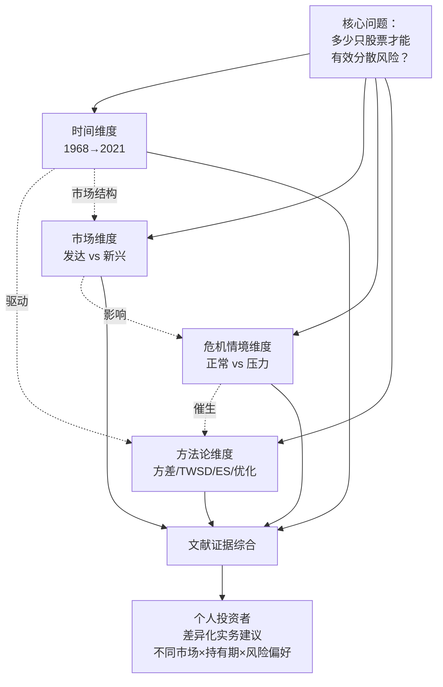
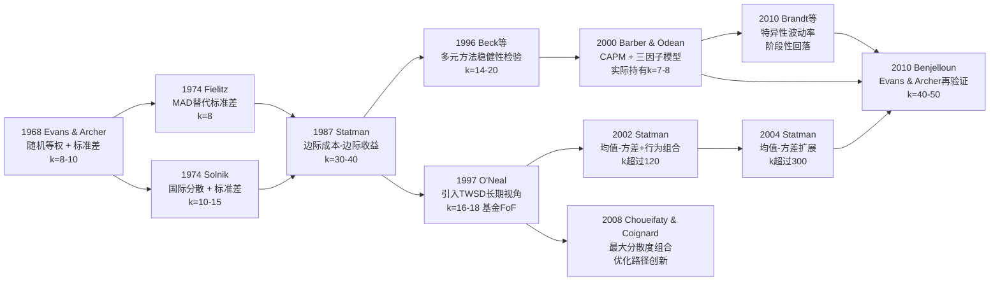
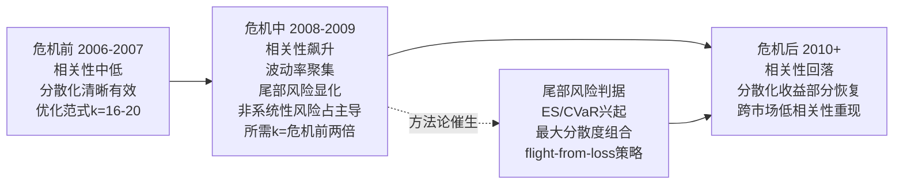
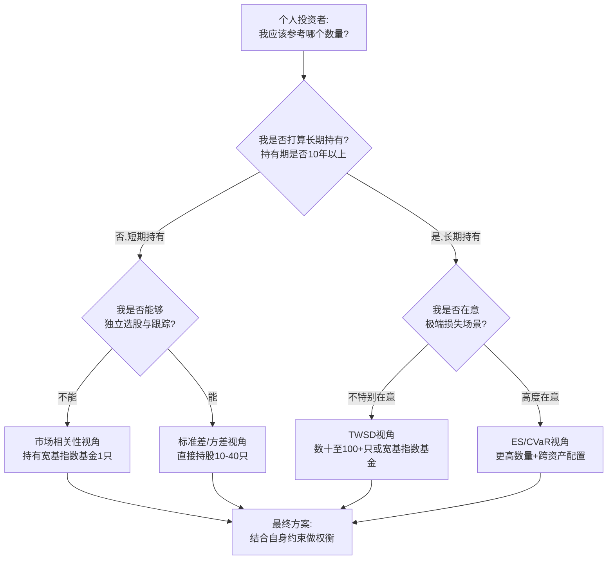
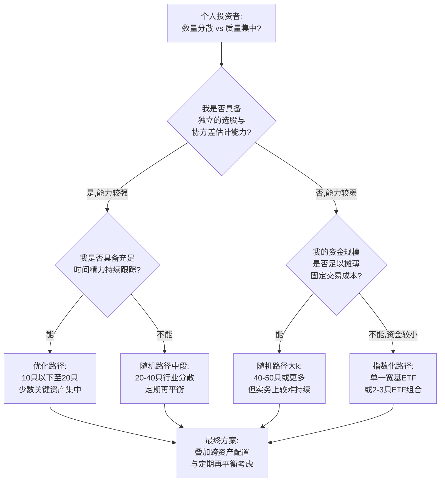
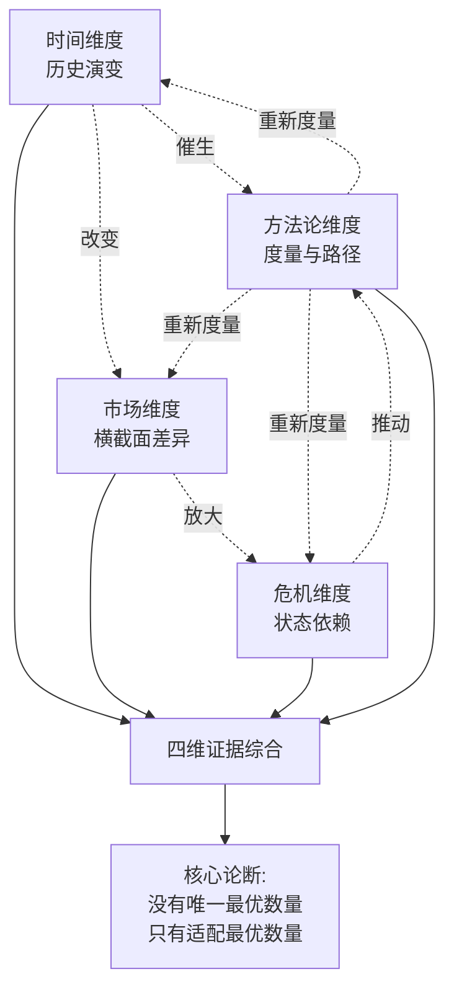
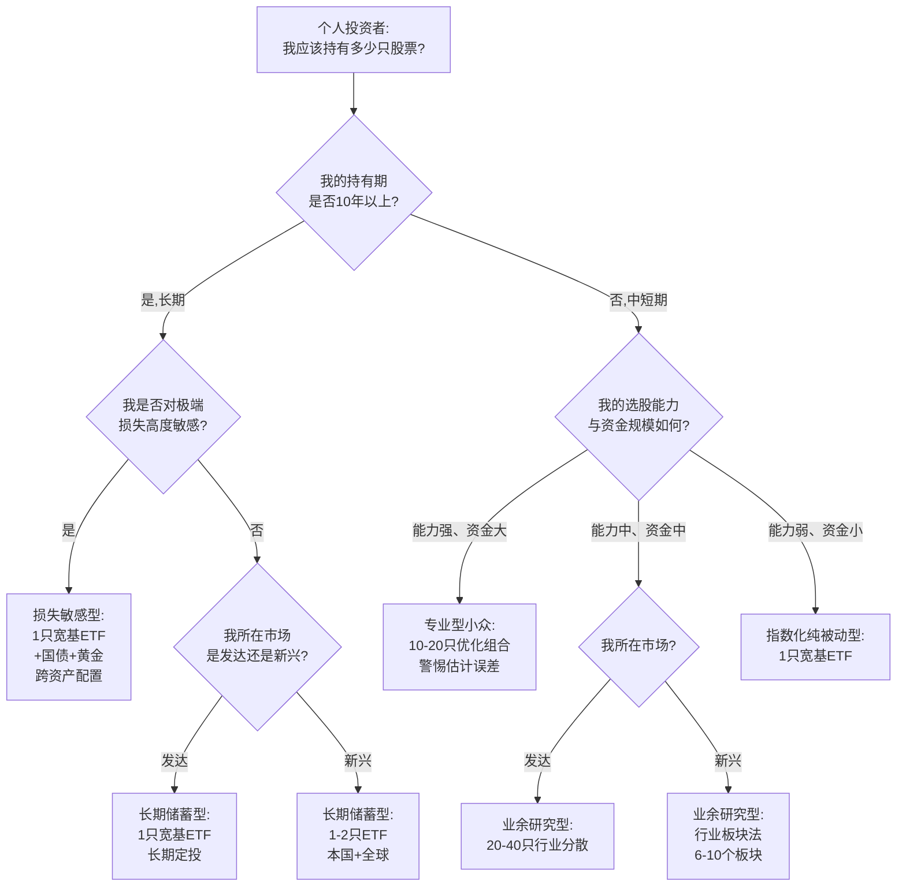

# 构建有效分散风险的股票投资组合需要多少只股票？——1968–2021年研究综述与个人投资者视角的综合分析
# 1 研究背景、目标与分析框架

"构建一个能够有效分散风险的股票投资组合，究竟需要多少只股票？"——这个看似简单的问题，自1952年Markowitz奠定现代投资组合理论以来，便始终是金融经济学领域最具争议、也最具实务价值的命题之一。从早期Evans & Archer (1968)给出的"8–10只股票即可"的乐观结论，到21世纪初Domian等学者主张"百只仍不足够"的悲观判断，半个多世纪的研究在结论上呈现出显著分歧。对于一位资金规模有限、必须亲自做出交易决策的个人投资者而言，这个数字并非纯粹的学术抽象，而是直接决定其交易成本、跟踪精力、心理负担乃至最终风险敞口的现实参数。本报告聚焦于1968年至2021年11月之前的代表性学术文献，以个人投资者视角对这一命题进行系统梳理与综合评估。本章作为整篇报告的开篇，旨在为后续九章的分析建立理论坐标、明确研究边界并搭建统一的分析框架。

## 1.1 问题缘起：分散化数量之谜的理论根源

"分散化数量之谜"的源头可以追溯到Harry Markowitz于1952年发表在《金融杂志》(The Journal of Finance)上的开创性论文《投资组合选择》(Portfolio Selection)。在Markowitz博士出现之前，投资界一直认为，最好的股市策略就是选择那些被认为前景最好的公司的股票；但Markowitz的研究颠覆了这一常识性方法，他指出**任何投资组合的风险与其说取决于其组成股票和其他资产的风险，不如说是取决于它们彼此之间的关系**——这是多样化的好处第一次被编纂和量化，使用先进的数学来计算相关性和平均值的变化[^1]。Markowitz以期望代表收益、以方差(或标准差)表示风险程度，构建出"有效集"(Efficient Set)概念：对于同样的风险水平投资者将选择能提供最大预期收益率的组合，对于同样的预期收益率投资者将选择风险最小的组合，能同时满足这两个条件的投资组合的集合即构成有效集[^2]。这一框架因其奠定了"在不确定条件下选择投资组合"的理论范式，使Markowitz最终于1990年获得诺贝尔经济学奖，被誉为"华尔街的第一次革命"[^1]。

均值—方差框架虽然在数学上优雅地解决了"如何组合"的问题，但它本身并未直接给出"应当持有多少只股票"的明确答案。真正将这一问题推向中心舞台的，是夏普(Sharpe)、林特纳(Lintner)、莫辛(Mossin)等学者在20世纪60年代基于Markowitz均值—方差理论分别提出的资本资产定价模型(CAPM)[^3]。CAPM的核心贡献在于将投资风险明确划分为两类：一类是**系统性风险**(systematic risk)，指市场中无法通过分散投资来消除的风险，例如利率变动、经济衰退、战争等宏观因素，影响所有资产；另一类是**非系统性风险**(unsystematic risk)，又称特殊风险(unique risk或idiosyncratic risk)，是属于个别股票的自有风险，投资者可以通过变更股票投资组合来消除[^3]。基于这一二分逻辑，CAPM明确指出**投资者仅因承担系统性风险而获得风险补偿，非系统性风险不产生额外收益**[^3]。

这一理论判断直接推导出一个具有强烈实证色彩的推论：既然非系统性风险既可以通过分散化消除、又得不到市场补偿，那么理性投资者就应当尽可能消除它；而消除的手段就是增加组合中股票的数量。问题随之自然涌现——**究竟需要多少只股票，才能将非系统性风险消减到足够低的水平？** 进一步地，由于每增加一只股票都伴随着边际收益递减（边际方差下降幅度逐渐缩小）和边际成本递增（交易佣金、研究成本、跟踪精力），因此"最优股票数量"问题在理论上变成了边际收益与边际成本的均衡点问题，在实务上则变成了一个具有明确数值答案的实证问题。

Evans & Archer于1968年发表的研究正是对这一问题的第一次系统性实证回应。此后半个多世纪，围绕"建议股票数量"这一核心数字，学术界产生了一系列代表性研究：Fisher & Lorie (1970)、Elton & Gruber (1977)、Statman (1987)、Newbould & Poon (1993)、Campbell等(2001)、Domian等(2007)、Benjelloun (2010)以及多位针对印度、巴基斯坦、南非等新兴市场的学者陆续给出了从"8–10只"到"100只以上"的截然不同的答案。研究结论的持续演化与分歧，并不意味着早期研究"错了"，而是反映出**市场结构、个股波动性、研究方法论、风险度量标准**等多个维度都在不断变化——这正是本报告需要系统梳理与辨析的核心内容。

## 1.2 个人投资者视角的现实意义

将研究视角从机构投资者收缩到个人投资者，并非简单的"对象切换"，而是一次研究问题的实质性重构。机构投资者（如养老基金、共同基金、对冲基金）通常具备规模优势、专业团队、低边际交易成本和高频跟踪能力，因此他们在讨论"最优股票数量"时，往往可以将问题简化为纯粹的统计与优化问题；而个人投资者的现实约束远比机构复杂，这使得"多少只股票"这一数字的合理区间会与机构层面的结论产生系统性偏离。

第一，**资金规模有限直接约束了可行的股票数量**。个人投资者的总投资额可能仅为数万元至数十万元人民币级别，若要持有30只甚至100只股票，每只股票的头寸将被稀释到极小规模，不仅难以匹配以"手"或"百股"为最小交易单位的市场结构，还可能因单笔交易过小而使佣金、印花税、点差等固定成本占比畸高，反而侵蚀分散化所带来的风险下降收益。第二，**交易成本与佣金敏感性远高于机构**。机构投资者通过批量委托、做市商返佣、自营通道等方式可以将单位交易成本压至极低；而个人投资者的每一次买入、再平衡、卖出都直接承担佣金与税费，组合规模越大，再平衡频率越高，累积摩擦成本就越显著。第三，**信息搜集与持续跟踪能力受限**。机构拥有研究部门、Bloomberg/Wind等付费数据库和行业分析师团队，可以同时深度跟踪数百只股票；而个人投资者通常依靠业余时间获取公开信息，能够认真持续跟踪的股票数量通常以10–20只为现实上限，超出此数量后，"持有"很可能蜕变为"持有但不了解"，反而引入新的判断错误风险。第四，**行为偏差更为显著**。诺贝尔奖得主Markowitz本人即被视为行为金融学的先驱——他认识到，损失的痛苦通常超过相应收益的快乐，因此了解一场赌博是如何被框定的至关重要[^1]。个人投资者在面对账户中数十只股票的涨跌时，更容易出现选择性关注、过度交易、损失厌恶导致的处置效应等行为偏差，这些偏差会进一步侵蚀理论上的分散化收益。

在此基础上还需注意，自2010年代以来，以低成本宽基指数基金、ETF以及全球范围内陆续推出的零佣金交易为代表的市场基础设施变革，已经在相当程度上改变了"分散化的成本曲线"——这意味着对个人投资者而言，**通过持有指数基金间接获得对数百乃至数千只股票的暴露**，已经成为一种几乎零边际成本的分散化替代方案。这一现实背景使得"个人最优股票数量"问题在2020年前后呈现出新的实务张力：如果个人投资者仍然选择直接持股，那么继续讨论"多少只股票"才有意义；但若投资者愿意通过ETF获取分散化收益，则问题的形态便从"持有多少只股票"转化为"在主动选股之外还是否需要分散化"。本报告将持续保持对这一现实选项的关注，以确保所给出的结论对个人投资者具有可操作的实务参考价值。

## 1.3 研究边界与关键概念界定

为确保后续分析的严谨与可比，本报告对研究边界与关键概念作出如下明确界定。

**研究边界**包含三个维度。其一是**时间范围**：以1968年Evans & Archer发表开创性研究为起点，以2021年11月之前公开发表的学术文献为终点，覆盖约53年的研究演变；该时间段既能涵盖现代投资组合理论奠基阶段、20世纪80–90年代的扩展期、2000年初的方法论革新期、2008年金融危机前后的危机研究期，以及2010年代以ES/CVaR等尾部风险度量方法为代表的新方法论时期。其二是**对象范围**：本报告仅讨论以股票为主的分散化组合，不涉及股债配置、商品、房地产、加密资产等跨资产类别的分散化问题——这一限定既符合既有学术文献的主流研究对象，也使"多少只股票"这一核心问题的边界清晰。其三是**视角范围**：本报告始终从个人投资者(非机构)的视角出发审视所有研究结论，避免引入与机构特有问题（如大规模交易冲击、监管资本要求、负债端约束）相关的讨论。

**关键概念**则需要在统一坐标下被精确定义，以避免后续章节因术语漂移而损害可比性。其一是**系统性风险与非系统性风险**：前者源于宏观经济变量、影响所有资产、无法通过多样化消除；后者源于个别企业经营不确定性、可通过资产组合分散；CAPM明确指出投资者仅因承担系统性风险获得风险补偿[^3]。其二是**分散化收益**(diversification benefits)：在不同研究中被操作化为不同度量——最经典的是**组合收益率的方差或标准差随股票数量增加而下降的幅度**(Evans & Archer范式)，其他度量包括组合与市场组合的相关系数趋近于1的程度、组合的夏普比率改善程度、终端财富标准差(TWSD)的收敛、预期短缺(ES/CVaR)的下降等。其中**夏普比率**由William Sharpe于1966年提出，作为其CAPM工作的延伸（Sharpe亦因CAPM于1990年获诺贝尔奖[^4]），其计算公式为(投资组合预期收益率 − 无风险收益率) / 投资组合收益率标准差，本质上衡量"每承担一单位风险所获得的超额回报"[^2][^4]，是评估"分散化是否实质性提升了风险调整后收益"的核心指标。其三是**初始候选股票池规模n与最终持有股票数量k的区分**：在Markowitz均值—方差优化范式下，研究者通常先从市场全部上市股票中选出一个候选池n，再通过优化得到最优持仓数量k；而在Evans & Archer的随机选股范式下，研究者直接考察"从总体中随机抽取k只股票"时组合方差的衰减曲线——两种范式下的"k"含义不同，比较时必须保持谨慎。其四是**"有效分散化"的操作化定义**：不同研究采用不同判据，包括"组合标准差下降到接近市场组合标准差的某一比例"(如90%、95%)、"边际方差下降幅度低于某一阈值"、"夏普比率达到最大"、"TWSD收敛"、"在给定置信水平下的ES最小化"等；不同判据将直接导致不同的k值结论，这一差异在第7章会作系统辨析。

需要特别强调的是，夏普比率作为衡量"分散化是否提升了风险调整后收益"的核心工具，本身也存在重要局限：它**假设收益呈正态分布，可能无法准确捕捉极端风险（黑天鹅事件）**，且依赖历史数据、受无风险利率波动影响[^2][^4]。这意味着当后续章节讨论金融危机情境（第6章）或尾部风险度量方法（第7章）时，夏普比率的局限性恰恰成为推动研究方法从均值—方差范式向ES/CVaR等尾部风险范式演进的内在动因，从而直接影响"建议股票数量"结论的演变。

## 1.4 四维分析框架的提出

面对1968–2021年间数十项研究、结论从"8只"到"100+只"的巨大跨度，若仅以"时代不同结论自然不同"作为解释，将不可避免地落入肤浅化论述的陷阱。本报告认为，**研究结论的差异并非任意，而是系统性地映射到四个相互关联的维度之上**；只有在统一的四维框架内对各项研究进行对照与归因，才能既揭示数字差异背后的真实驱动因素，又为个人投资者提炼出具有现实指导意义的结论。

具体而言，本报告提出的四维分析框架包括：

第一，**时间维度**——考察不同年代的研究结论如何演变及其背后市场结构变化。从Evans & Archer (1968)的"8–10只"到Statman (1987)的"30–40只"，再到Domian等(2007)的"100+只"，建议数量整体呈上升趋势；这一演变背后的驱动力包括个股特异性波动率(idiosyncratic volatility)的长期上升、上市公司行业构成的变化、交易成本与计算能力的演进，以及"分散化充分性"判据本身的更新（详见第4章）。

第二，**市场维度**——比较发达市场（以美国为主）与新兴市场（印度、巴基斯坦、南非、东欧等）在建议股票数量上的差异。研究表明，新兴市场达到等量分散化收益所需的股票数量与发达市场存在系统性差异，其背后是上市公司数量、个股相关性水平、行业集中度、信息透明度、宏观与政治风险等多重市场结构因素的综合作用（详见第5章）。

第三，**危机情境维度**——以2008年全球金融危机(GFC)为代表，对比正常时期与压力时期的分散化效果。危机期间个股相关性普遍飙升、波动率聚集、流动性枯竭，导致原本可分散的非系统性风险在统计行为上更接近系统性风险，分散化在最需要它的时刻反而失效；这一现象对个人投资者在压力市场下的组合构建提出了不同于平静市场的要求（详见第6章）。

第四，**方法论维度**——审视不同风险度量方法（标准差、TWSD、ES/CVaR、与市场相关性、夏普比率等）以及不同研究路径（随机等权 vs. 均值—方差优化）如何系统性影响最终结论。例如，采用尾部风险或长期持有视角通常会得出更大的建议数量，而采用短期方差视角或优化路径通常给出较小数量（详见第7、第8章）。

这四个维度并非相互独立，而是**相互交织、彼此强化**的有机整体。例如，方法论的演进（维度四）本身就是时代变迁（维度一）的产物——ES/CVaR等尾部风险度量正是在2008年金融危机（维度三）暴露出夏普比率与均值—方差框架的局限后才被广泛采用；而新兴市场（维度二）由于个股波动率与相关性结构的特殊性，其结论又会随危机情境（维度三）发生与发达市场不同方向的偏移。下图以Mermaid图表的方式直观呈现四个维度之间的逻辑关系及其向"个人投资者实务建议"的最终汇聚路径。

上图清晰显示，四个维度并非简单的并列罗列，而是存在内在的驱动与传导关系：时间维度反映长期市场结构变化并催生方法论更新；市场维度提供横截面比较视角，并通过相关性结构影响危机情境下的表现；危机情境维度暴露传统方法的局限，进一步推动方法论维度的扩展；方法论维度则反过来影响如何"度量"前三个维度上的差异。四维度共同汇聚为对既有文献的系统证据综合，最终指向面向个人投资者、在不同情境下具有差异化适用性的实务建议。

基于这一框架，本报告后续章节将按以下逻辑展开：第2章回顾分散化的理论基础与关键概念辨析，为四维比较提供统一的理解坐标；第3章以摘要表形式系统梳理1968–2021年代表性文献，作为后续所有比较的证据基础；第4–7章分别从四个维度对文献进行深度分析；第8章专门处理"随机选股 vs. 优化选股"两类研究路径的方法论分歧，作为方法论维度的深化讨论；第9章综合四维结论形成面向个人投资者的实务判断框架；第10章探讨研究局限与未来研究方向。整个报告的目标，是让一位普通的个人投资者在读完之后，不仅能够回答"多少只股票"的数字问题，更能够理解"为什么是这个数字"，以及"在我的具体情境下这个数字应当如何调整"。

# 2 分散化理论基础与关键概念辨析

第1章已经为本报告搭建了"时间—市场—危机—方法论"四维分析框架，并明确了个人投资者视角下"多少只股票"问题的实务张力。然而，要真正理解1968年至2021年间各项研究为何会给出从"8只"到"100+只"如此巨大跨度的结论，仅凭历史演变与市场结构的宏观叙述并不充分——更深层的解释必须回到这些研究所共同依赖的**理论基础**与**关键概念**层面。换言之，研究结论的差异在相当大程度上并非源于"事实本身的不同"，而是源于研究者在理论框架、风险度量与方法论范式上的选择差异。本章作为整篇报告的理论坐标章节，将依次回到Markowitz均值—方差模型的数学原点、CAPM对系统性/非系统性风险的二分逻辑、"分散化充分"的多元判定标准、以及"随机等权"与"均值—方差优化"两种研究范式的方法论差异，最终以统一的概念对照表将这些术语固化下来，确保第3章的文献摘要表与第4–8章的多维比较能够在同一坐标系内进行。

## 2.1 Markowitz均值—方差模型与有效前沿

现代投资组合理论的数学原点是Harry Markowitz于1952年发表的论文《投资组合选择》(Portfolio Selection)。这篇论文之所以被誉为"华尔街的第一次革命"，并非因为它发现了某只值得购买的股票，而是因为它**第一次将"分散化的好处"用数学语言加以编纂和量化**——使用先进的数学来计算相关性和平均值的变化[^1]。Markowitz本人在2014年接受采访时回顾道："那一刻，你会感到脊背发冷……我明白我开始了什么。"——他清楚地知道，自己将机构投资组合的构建从此前"随意"创建的状态推向了"一个过程"[^1]。

Markowitz框架的核心数学结构可以概括为**双参数刻画**：以期望(expected return)代表收益、以方差或标准差(variance/standard deviation)表示风险程度[^2]。在这一框架下，组合的风险并不是各成份股风险的简单加总，而是取决于成份股之间的**协方差结构**(covariance structure)。对于一个由n只股票组成的组合，其方差不仅包含n个方差项，还包含n(n−1)个协方差项；当n增大时，方差项的相对权重迅速下降，组合方差被协方差项所主导。这一看似简单的代数事实，正是"分散化收益"得以量化的数学根基——只要资产之间的相关性低于1，就一定存在某种权重组合能够使组合方差低于成份股的加权平均方差。正如对Markowitz的回顾所言："任何投资组合的风险与其说取决于其组成股票和其他资产的风险，不如说是取决于它们彼此之间的关系。这是多样化的好处第一次被编纂和量化"[^1]。

在此基础上，Markowitz提出了"有效集"(Efficient Set)的概念，又称效率前沿模型(The Efficient Frontier)或有效边界(Efficient Frontier)[^2]。其定义为：对于一个理性投资者而言，他们都是厌恶风险而偏好收益的；对于同样的风险水平，他们将会选择能提供最大预期收益率的组合；对于同样的预期收益率，他们将会选择风险最小的组合；能同时满足这两个条件的投资组合的集合就是有效集[^2]。处于有效边界上的组合称为有效组合(Efficient Portfolio)[^2]。

有效集在几何上具有三个关键特征：第一，它**是一条向右上方倾斜的曲线**，反映了"高收益、高风险"的原则；第二，它**是一条向上凸的曲线**，体现了边际收益递减——每增加一单位风险，可换得的额外预期收益逐渐减小；第三，**有效集曲线上不可能有凹陷的地方**，即不存在任何可行组合能够同时优于有效集上的某一点[^2]。这三个特征不仅是后续切线组合(Tangency Portfolio)与CAPM得以推导的几何基础，也直接决定了"在追求风险最小化时增加股票数量将面临边际收益递减"这一实务结论。

然而，必须特别指出的是：**Markowitz均值—方差框架虽然在数学上优雅地解决了"如何组合"(即如何分配权重)的问题，但它本身并未直接给出"应当持有多少只股票"的明确答案**。在Markowitz的原始表述中，候选资产池的规模n是一个外生给定的输入；优化的输出是各资产的最优权重向量，但其中很多权重在无约束条件下可能为正、为零甚至为负（卖空）。换言之，"最优股票数量k"既不是Markowitz框架的输入，也不是其直接输出——它是在引入额外约束（如限定持仓只数、等权约束、整数约束等）或额外判据（如分散化收益的边际阈值）之后才被"挤出"的衍生概念。这一理论缺口，正是1968年Evans & Archer之后半个多世纪"分散化数量之谜"得以持续存在的根本原因，也是后续章节需要系统辨析的核心议题。

值得补充的是，自Markowitz以降，均值—方差框架本身也在不断扩展。例如，近年的研究尝试在Markowitz框架中引入模糊测度(fuzzy measure)以更好地刻画收益与风险的不确定性，模糊均值—方差模型在马来西亚股票市场的数据上被证明相比经典模型具有更好的表现[^5]。这类扩展虽然不直接改变"最优股票数量"问题的形态，但提示我们：均值—方差作为理论原点是稳定的，但其"风险"与"收益"两个参数的具体度量方式始终处于演进之中——这一演进直接对应到本报告第7章将讨论的"方法论维度"。

## 2.2 CAPM与系统性/非系统性风险的二分

如果说Markowitz提供了分散化的数学语言，那么真正将"分散化数量"问题推向中心舞台的，是夏普(Sharpe, 1964)、林特纳(Lintner, 1965)和莫辛(Mossin, 1966)在Markowitz均值—方差理论基础上分别提出的**资本资产定价模型(Capital Asset Pricing Model, CAPM)**[^3]。Sharpe博士也于1970年提出了该模型的进一步表述，并因其在该领域的贡献于1990年获得诺贝尔经济学奖[^3]。

CAPM的标准公式为：

$$E(R_i) = R_f + \beta_i \times [E(R_m) - R_f]$$

其中$E(R_i)$表示资产i的预期收益率，$R_f$为无风险收益率，$E(R_m)$为市场组合的平均收益率，$(R_m - R_f)$称为市场风险溢价；$\beta_i$(贝塔系数)衡量该资产相对于市场整体波动的敏感程度，是连接个体资产与市场风险的唯一风险参数，其计算公式为$\beta_i = \text{Cov}(R_i, R_m) / \text{Var}(R_m)$[^3]。$\beta=1$表示资产风险与市场一致；$\beta>1$说明波动性高于市场，属"进攻型"资产；$\beta<1$则为"防御型"资产[^3]。

CAPM最具理论冲击力的贡献，并不在于公式本身，而在于它对"风险"概念所作的**根本性二分**[^3]：

| 风险类型 | 来源 | 是否可分散 | 是否获得补偿 |
|---|---|---|---|
| **系统性风险**(systematic risk) | 宏观经济变量——利率、经济衰退、战争等[^3] | 否，无法通过分散投资消除[^3] | 是，投资者因承担此类风险获得风险补偿[^3] |
| **非系统性风险**(unsystematic risk / unique risk / idiosyncratic risk) | 个别企业经营不确定性[^3] | 是，可通过变更股票投资组合消除[^3] | 否，不产生额外收益[^3] |

CAPM明确指出"**投资者仅因承担系统性风险而获得风险补偿，非系统性风险不产生额外收益**"[^3]。这一论断的实证含义极为深远：既然非系统性风险既可被分散化消除、又得不到市场补偿，那么任何一个理性投资者都"没有理由"持有未分散的非系统性风险——保留它纯粹是一种损失。由此推导出的实证命题便是：**理性投资者应当通过增加股票数量将非系统性风险消减到尽可能低的水平**。

正是这一推导，将一个原本属于纯理论框架的命题（CAPM）转化为一个具有明确数值答案的实证问题——"究竟需要多少只股票才足以使非系统性风险消减到可接受的水平？"现代投资组合理论指出，特殊风险是可以通过分散投资(diversification)来消除的；即使投资组合中包含了所有市场的股票，系统风险亦不会因分散投资而消除[^3]。这意味着分散化的"上限"在理论上是清晰的——它是市场组合的方差水平；但从单只股票走向这一上限的"路径"——即随着k从1增加到n，组合方差究竟以何种速度衰减、在何处达到经济意义上的"足够低"——则只能通过实证研究回答。这正是1968年Evans & Archer之后半个多世纪研究的共同起点。

需要补充的是，CAPM建立在一系列严格假设之上，包括投资者均为理性、风险厌恶且追求效用最大化；所有投资者具有同质预期；市场完全有效、无交易成本与税收；存在无风险资产，且所有投资者可按同一无风险利率自由借贷；资产无限可分，投资规模不受限制[^3]。这些假设在现实中显然不完全成立，因此CAPM也面临诸多检验与扩展，如BJS双程回归检验法、Fama-Macbeth二阶段回归法、Roll的批评，以及Fama-French三因素模型、跨期资本资产定价模型(ICAPM)、基于下侧风险的资本资产定价模型(D-CAPM)等[^3]。其中**D-CAPM对"下侧风险"的强调**——即投资者更关心收益分布下半部分的损失而非整体波动——已经预示了2008年全球金融危机后尾部风险度量(ES/CVaR)兴起的理论方向。这一脉络对本报告而言意义重大：风险的"概念定义"从对称方差走向不对称的下侧/尾部度量，必然带来"分散化充分"判据的演进，进而推动"建议数量"结论的系统性变化（详见第7章）。

## 2.3 分散化充分性的多元判定标准

CAPM在理论上指明了"消除非系统性风险"的方向，但在实证操作上，"分散化是否充分"必须被赋予某种可度量、可比较的具体形式。半个多世纪以来，学术界发展出至少五种主要的操作化判据，它们的差异恰是导致"建议股票数量"结论从"8只"到"100+只"巨大跨度的关键因素之一。

**判据一：组合方差/标准差的衰减曲线（Evans & Archer范式）**。这是最早也是最经典的判据。其逻辑是：以从市场总体中随机抽取k只股票构造等权组合，考察组合方差(或标准差)随k增加的衰减曲线；曲线在k较小时下降迅速、在k超过某一阈值后趋于平坦，平坦区即被视为"分散化充分"。在Markowitz的双参数刻画下，方差本身即风险的全部表征[^2]，因此该判据具有理论自洽性。但其阈值的确定（是90%、95%还是99%的方差衰减？）本质上是研究者的主观选择，不同阈值下的"k"会产生显著差异。

**判据二：组合与市场组合相关系数趋近于1的程度**。其逻辑是：当组合规模k足够大时，组合的收益序列将与市场组合(market portfolio)的收益序列高度相关，意味着组合中剩下的几乎全是系统性风险[^3]。这一判据从CAPM的β结构直接衍生——一只完美分散化的组合，其相对于市场组合的β应当等于1、相关系数应当趋近于1。该判据的优点在于直接对应CAPM的理论内核，缺点在于"相关系数趋近于1的程度"同样需要研究者设定阈值（如0.95、0.99），且对市场组合的代理变量（标普500、CRSP指数等）选择敏感。

**判据三：终端财富标准差(Terminal Wealth Standard Deviation, TWSD)**。其逻辑是：从长期投资者(buy-and-hold)的视角出发，关心的不是单期收益率的波动，而是持有期末（例如10年、20年、30年后）的最终财富水平的不确定性。TWSD是这种不确定性的标准度量。由于长期持有期中收益率的几何复合效应、波动率拖累以及个股极端走势的累积影响，TWSD收敛所需的股票数量通常**显著大于**单期方差收敛所需的数量。这一判据在2000年代以后被广泛采用，是本报告第7章讨论"为何持有期视角推高建议数量"的核心抓手。

**判据四：预期短缺(Expected Shortfall, ES)/条件风险价值(CVaR)等尾部风险度量**。其逻辑是：投资者真正关心的不是收益分布的整体波动（方差对收益分布的上半部分与下半部分一视同仁），而是分布**左尾**(left tail)上的极端损失。ES/CVaR在给定置信水平（如95%、99%）下度量"最坏α%情境下的平均损失"，是一种典型的尾部风险度量。当判据从方差切换到ES时，建议的股票数量会系统性上升——因为消除尾部风险所需的分散程度远高于消除一般波动。这一判据的兴起与2008年全球金融危机有直接关联：危机暴露了正态分布假设下方差度量对黑天鹅事件的严重低估。

**判据五：夏普比率改善程度**。该判据将"分散化收益"具象化为**风险调整后超额收益**的提升，是评估"分散化是否实质性提升了组合性价比"的核心工具，需要在此作较为详细的展开。

夏普比率(Sharpe Ratio)由诺贝尔经济学奖得主威廉·夏普(William Sharpe)于1966年提出并于1994年修订，最初被称为"奖励—变异性比率"(Reward-to-Variability Ratio, R/V)——这个名字很好地反映了它的实质[^4]。该比率是其CAPM工作的延伸，Sharpe因CAPM于1990年获诺贝尔奖[^4]。其计算公式为：

$$\text{Sharpe Ratio} = \frac{R_p - R_f}{\sigma_p}$$

其中$R_p$代表投资组合的预期收益率或实际收益率，$R_f$代表无风险收益率（通常参考国债利率、银行定期存款利率），$\sigma_p$代表投资组合收益率的标准差，即波动率[^4]。公式的分子$(R_p - R_f)$代表超额收益，即超过无风险收益的部分；分母$\sigma_p$代表为获得收益所承担的风险——夏普比率本质上度量的是"**每承担一单位风险所获得的超额回报**"，是投资的"性价比"指数[^4]。

按照Sharpe (1994)的定义，夏普率还可分为**事前夏普率**(Ex Ante Sharpe Ratio)与**事后夏普率**(Ex Post Sharpe Ratio)——前者使用对未来单期收益率均值和标准差的预测进行计算，后者使用历史数据计算；通常学术研究与实务讨论默认使用的都是后者[^4]。在分散化数量研究中，夏普比率改善判据通常表述为："当从k=1增加股票数量时，组合的事后夏普比率是否持续提升？提升幅度在何处趋于平缓？"达到夏普比率最大或近似最大时的k，即被视为"分散化充分"的数量。

夏普比率的解读规则较为直观[^2][^4]：

| 夏普比率取值 | 含义 |
|---|---|
| > 1 | 收益大于风险，每承担1单位风险可获得超过1单位的超额收益[^2][^4] |
| = 0 | 组合收益仅等于无风险收益，没有超额收益，风险未带来额外价值[^2] |
| < 0 | 收益低于无风险收益，承担风险反而损失[^2] |

在量化投资实务中，回测年化夏普比率若小于1，策略通常被认为没有继续研究价值；很多量化对冲基金要求回测年化夏普比率超过2；某家全球著名的量化对冲基金仅考虑年化夏普比率大于3的策略[^4]。年化夏普比率为3的策略，其净值曲线"基本上就是一条直线"[^4]——这种近乎完美的风险调整后表现，从直观上也说明了高夏普比率的实务难度。

然而，**夏普比率的局限性恰恰是后续方法论演进的内在动因**，必须在本节明确指出：

第一，**不适用于非对称风险**。夏普比率基于收益率服从正态分布的假设，无法反映极端风险（如黑天鹅事件），此时需结合最大回撤等指标辅助判断[^2]。这一假设在2008年全球金融危机中被严重证伪——危机期间收益分布的左尾远比正态分布所预测的更厚，使得基于夏普比率优化的"最优"组合在最需要保护的时刻反而暴露在巨大尾部风险之下。

第二，**依赖历史数据**。夏普比率通常基于历史数据计算，未来表现可能因市场环境变化而改变，需结合前瞻性分析[^2]；该指标基于历史数据，不能完全代表未来[^4]。

第三，**受无风险利率影响**。若无风险利率波动（如央行加息），同一组合的夏普比率会变化，对比时需使用同一时点的无风险利率[^2]。

第四，**不适合直接比较风险收益特征差异巨大的不同类型资产**[^4]。

第五，**长期夏普率不等于短期交易优势**。几何布朗运动模型论证了高长期夏普比率并不等同于短期交易优势——如年化收益15%、波动率10%的组合每秒赚钱概率仅接近抛硬币水平[^4]。

第六，**年化方法可能高估**。市场上常见的"超高夏普率"现象，背后一种合理的解释是年化时计算错误、过度高估了年化夏普率[^4]。

这些局限性中，**第一条对本报告的核心论题尤为关键**：当投资者真正在意的是组合在危机情境下的极端损失时，基于正态分布与方差度量的夏普比率会系统性低估所需的分散化程度。这直接为2008年危机后ES/CVaR等尾部风险度量逐步取代传统方差判据提供了内在动因——而判据的切换，必然推动"建议股票数量"结论上移。这一逻辑链条将在第6章（危机情境）与第7章（方法论）中作具体展开。

为便于读者直观对照，下表汇总五种判据的核心特征及其对建议数量的方向性影响：

| 判据 | 核心度量 | 理论根源 | 对建议k的方向影响 |
|---|---|---|---|
| 方差/标准差衰减曲线 | 单期组合方差下降至某阈值 | Markowitz均值—方差 | 较小（10–40只） |
| 与市场组合相关性 | 相关系数趋近于1 | CAPM β结构 | 中等 |
| 终端财富标准差TWSD | 长期持有期末财富不确定性 | 多期复合收益 | 较大（数十至上百） |
| 预期短缺ES/CVaR | 尾部极端损失 | 下侧风险/D-CAPM | 较大（数十至上百） |
| 夏普比率改善 | 风险调整后超额收益 | Sharpe (1966) | 中等，受正态假设局限 |

判据差异是"建议数量"结论分歧的关键解释变量之一——它本身就是一个独立的研究维度，与时间、市场、危机情境共同构成了第1章四维分析框架中的"方法论维度"。

## 2.4 随机等权组合与优化组合两种研究范式

除了"分散化充分"的判据差异，1968年以来分散化数量研究还呈现出另一条同样关键的方法论分野——**研究路径**的差异。具体而言，可以将既有研究归为两种根本不同的研究范式。

**范式一：随机等权组合范式**。这一范式以Evans & Archer (1968)为代表，是分散化数量研究的早期主流路径。其操作方式为：直接从市场总体（如NYSE全部上市股票）中**随机抽取**k只股票，以**等权**方式构造组合（即每只股票占组合权重1/k），重复抽取多次（如1000次或10000次）以得到组合方差的样本均值，进而绘制"组合方差—股票数量"的衰减曲线。在该范式下，研究问题被表述为"**平均意义上**需要多少只股票，才能使随机抽取的等权组合的方差衰减到接近系统性风险水平"。

随机等权范式的优点在于：第一，**操作简单、可重复性强**，对计算能力要求低，因此能够在1960年代末的计算技术条件下被实施；第二，**对投资者能力假设较低**——它隐含的投资者能力前提是"无选股能力、无协方差估计能力"，这与个人投资者的现实状况较为吻合，因此其结论对个人投资者具有较强的直接参考价值。其缺点则在于：第一，**忽略了优化的潜力**——通过精心的权重分配可能在更少的股票数量下达到同等分散化效果；第二，**等权约束本身是一种次优**——它隐含假定所有股票的方差与协方差结构对称，这在现实中显然不成立。

**范式二：均值—方差优化组合范式**。这一范式以Markowitz均值—方差框架为方法论基础，由Jacob、Elton & Gruber、Tarrazo等学者陆续推进。其操作方式为：先从市场全部上市股票中选定一个候选池n（如S&P 500成分股），然后通过对该池中股票的预期收益向量与协方差矩阵进行**优化求解**，得到使组合方差最小化（或夏普比率最大化）的最优权重向量；最优持仓数量k即为最优权重中非零项的个数。在该范式下，研究问题被表述为"**在最优组合构造下**需要多少只股票"。

均值—方差优化范式的优点在于：第一，**理论自洽性强**——它直接根植于Markowitz框架，输出的是真正意义上"有效"的组合[^1][^2]；第二，**能够利用资产间的相关性结构**，通过选择负相关或低相关的资产对实现更高效的风险消减。其缺点则在于：第一，**对投资者能力要求很高**——需要估计预期收益向量与完整协方差矩阵，而协方差矩阵的估计在样本期较短时极不稳定，存在严重的估计误差；第二，**优化结果对输入参数极为敏感**——预期收益的微小变化可能导致最优权重的剧烈波动，这种"角点解"现象使得最优k往往集中在很少几只股票上；第三，**对个人投资者的现实可行性存疑**——绝大多数个人投资者既不具备协方差估计能力，也不具备求解二次规划的工具。这一点在Markowitz本人的研究中也得到了体现：他曾经开发"稀疏矩阵"技术来解决非常大的数学优化问题，这种技术现在已经成为生产软件中优化程序的标准技术[^1]，但其复杂性本身即说明优化范式对普通投资者而言并非自然可行。

两种范式在结论数量级上存在**系统性偏离**：**优化范式通常给出更小的k**（如10–20只甚至更少，部分研究给出$k \approx \sqrt{n}$的启发式经验），而**随机等权范式倾向于推荐更多股票**（数十只乃至上百只）。这种差异并非"哪种方法对"的问题，而是两种范式回答的**根本不是同一个问题**——前者问的是"在最优构造能力下的最小k"，后者问的是"在无选股能力下的平均k"。

这一区分对个人投资者具有重要的实务含义：

| 投资者类型 | 选股与协方差估计能力 | 适用范式 | 建议数量级 |
|---|---|---|---|
| 具备较强选股能力 | 高 | 优化范式 | 较小（10–20只） |
| 缺乏选股能力 | 低 | 随机等权范式 | 较大（30只以上） |
| 完全无能力或不愿费力 | 极低 | ETF/指数基金（实质为随机等权的极致版本，n=全市场） | 1只指数基金即可 |

也就是说，"多少只股票"的答案在本质上**与投资者自身的能力假设紧密绑定**——能力越强、研究越深，所需的数量越少；能力越弱、研究越浅，所需的数量越多，直至以指数基金为终点。这一点将在第8章对两种路径作更深入的比较，本节先行建立概念入口。

## 2.5 关键概念的统一坐标与本章小结

在前述四节的基础上，本报告所需的核心术语已经基本到位。为确保后续第3章文献摘要表及第4–8章的多维比较能够在同一概念体系下进行、避免因术语漂移而损害可比性，本节以一张统一的概念对照表将这些坐标固化下来：

| 术语 | 定义/操作化 | 关键来源/出处 | 在本报告中的角色 |
|---|---|---|---|
| 系统性风险 | 源于宏观经济变量、影响所有资产、无法通过多样化消除的风险[^3] | CAPM (Sharpe 1964等)[^3] | 分散化的"下限" |
| 非系统性风险 | 源于个别企业经营不确定性、可通过资产组合分散的特殊风险[^3] | CAPM | 分散化的"目标" |
| 有效集/有效前沿 | 同一风险下收益最大、同一收益下风险最小的组合集合[^2] | Markowitz (1952)[^1][^2] | "如何组合"的几何答案 |
| 分散化收益 | 在多种判据下被操作化：方差衰减、相关性逼近1、TWSD收敛、ES下降、夏普改善等 | 多元 | 衡量"分散化是否充分"的标尺 |
| 候选池规模n | 优化范式下研究者预先选定的候选股票池规模 | Markowitz优化范式 | 优化的输入 |
| 最优持仓数量k | 实际持有的股票数量；在不同范式下含义不同 | 两种范式 | 本报告的核心研究对象 |
| 标准差/方差 | 收益率波动的对称度量 | Markowitz (1952)[^2] | 经典风险判据 |
| 终端财富标准差TWSD | 长期持有期末财富的不确定性 | 多期持有研究 | 长期视角判据 |
| 预期短缺ES/CVaR | 给定置信水平下尾部损失的条件期望 | 尾部风险度量 | 危机后兴起的判据 |
| 夏普比率 | $(R_p − R_f)/\sigma_p$，每单位风险的超额收益[^4] | Sharpe (1966)[^4] | 性价比判据，存正态假设局限[^2][^4] |
| β系数 | $\text{Cov}(R_i, R_m)/\text{Var}(R_m)$，资产对市场波动的敏感度[^3] | CAPM[^3] | 系统性风险度量 |
| 随机等权范式 | 从市场随机抽取k只、等权构造组合 | Evans & Archer (1968)及后继 | 假设投资者无选股能力 |
| 均值—方差优化范式 | 基于协方差矩阵优化权重得到k | Markowitz及后继 | 假设投资者具备估计与优化能力 |

在这张概念对照表的基础上，本章的核心结论可以归纳为以下几点。

首先，**Markowitz均值—方差框架是分散化研究的数学原点**，它通过协方差结构将分散化收益首次量化[^1]，并通过有效集概念将"如何组合"的问题作出清晰回答[^2]；但它本身并未直接回答"多少只股票"，这一缺口正是后续半个多世纪研究的共同起点。

其次，**CAPM将风险划分为系统性与非系统性两类**，并明确指出投资者仅因承担系统性风险获得补偿[^3]，这一论断将"分散化数量"问题从理论命题转化为实证问题——理性投资者必须通过增加股票数量将非系统性风险消减到尽可能低。

第三，**"分散化充分"的判据并不唯一**，方差衰减、相关性逼近、TWSD收敛、ES下降、夏普比率改善等多种操作化定义会系统性地导致不同的k结论；其中夏普比率作为最经典的风险调整后收益度量[^4]，其正态分布假设的局限性[^2][^4]恰是2008年危机后尾部风险度量兴起、并推动"建议数量"上移的内在动因。

第四，**研究路径上的"随机等权"与"均值—方差优化"两种范式**回答的并非同一个问题——前者关注"无选股能力下的平均k"，后者关注"最优构造下的最小k"；两者在结论数量级上的系统性偏离，根植于其对投资者能力的不同假设，而非"哪种方法对错"的问题。

更进一步地，**概念差异本身即是解释半个多世纪以来研究结论从"8只"到"100+只"巨大跨度的关键钥匙之一**。当我们在第3章看到Evans & Archer (1968)给出"8–10只"、Statman (1987)给出"30–40只"、Domian等(2007)给出"100+只"时，这些数字差异中相当大一部分并不源于"市场真的变得更难分散"，而是源于这些研究在判据（方差 vs ES vs TWSD）、范式（随机等权 vs 优化）、视角（单期 vs 长期）上的选择差异。本章所建立的概念坐标，正是为了让读者在阅读第3章摘要表时，不至于被表面的"数字跳跃"所误导，而能够透过数字看到方法论选择的真实驱动力。

基于上述理论坐标，下一章将以系统化的摘要表形式呈现1968–2021年间的代表性研究证据，第4–8章则分别从时间、市场、危机情境、方法论与研究路径四个维度对这些证据作深度比较与归因。

# 3 关键研究成果摘要表（1968–2021）

第1章建立的四维分析框架与第2章梳理的理论坐标，已经为理解"建议股票数量"问题的方法论分歧奠定了概念基础。然而，无论是历史演变的纵向分析、发达市场与新兴市场的横截面比较，还是危机情境下的特殊性讨论与方法论差异的归因，最终都必须建立在**一份系统化、结构化、可反复回查的文献证据底座**之上。本章的核心使命，正是以摘要表的形式将1968年至2021年11月之前的代表性研究成果汇聚为这样一份"文献坐标地图"——它既是后续第4–8章四维比较的统一证据基础，也是个人投资者可以独立查阅、按图索骥的实务参考工具。

需要事先声明的是，本章定位为"信息汇集与结构化呈现"，对各项研究的深度评价、归因分析与跨研究对话将留待第4章之后逐一展开；本章的关键工作在于以第2章建立的概念坐标（随机等权 vs 优化范式、方差/TWSD/ES/相关性/夏普比率等多元判据）为标尺，对每项研究进行结构化标注，确保读者在跨研究比较时能够看清"数字差异"背后的"方法论差异"。

## 3.1 摘要表编制说明与列项设计

在进入具体的摘要表之前，有必要先对编制原则、文献筛选标准与列项设计逻辑作出说明，以确保读者对表中信息的解读方式具有共识。

**文献入选标准**遵循四条原则：第一，**发表期刊与学术影响力**——优先收录刊载于《金融杂志》(Journal of Finance)、《金融经济学杂志》(Journal of Financial Economics)、《金融分析师杂志》(Financial Analysts Journal)、《投资组合管理杂志》(Journal of Portfolio Management)等主流金融学期刊的研究，以及在学术界形成持续引用脉络的代表性文献；第二，**方法论代表性**——确保覆盖随机等权范式、均值—方差优化范式以及尾部风险度量等不同方法论路径的代表作，避免单一范式的偏好；第三，**市场覆盖代表性**——既要充分呈现以美国为主的发达市场研究脉络，也要纳入新兴市场（巴基斯坦、印度、伊朗、BRIC等）的代表性文献，为第5章的市场维度比较提供横截面证据；第四，**时间跨度代表性**——文献覆盖从1968年Evans & Archer的开创性研究到21世纪初的方法论扩展期，以呈现"建议数量"结论的历史演变轨迹。

**列项设计**采用五列标准格式。"研究"列以"作者(年份)"格式呈现；"市场范围与时间段"列明确样本市场（国别/交易所）与样本起止年份；"方法论"列依据第2章建立的范式与判据分类系统标注，明确该研究采用的风险度量与构建路径；"主要研究发现"列以一至两句话凝练核心实证结论；"建议股票数量结论"列给出明确的k值或区间。

需要特别说明的是，**在不同范式下"k"的含义存在系统性差异**：在随机等权范式下，k指的是"从市场总体中随机抽取并等权构造组合"所需的股票数量；在均值—方差优化范式下，k则可能指优化解中非零权重项的个数或施加持仓约束后的限定数量；在终端财富视角的研究中，k还可能指为达到长期持有期末财富不确定性收敛所需的数量。读者在跨研究比较k值时，必须始终回到该研究所采用的具体范式与判据上下文，避免被表面数字误导。此外，对于部分以衰减曲线呈现而未给出明确单一数字结论的研究（如早期的Evans & Archer），本章将以区间形式或附加说明的方式标注。

## 3.2 发达市场代表性研究摘要表

发达市场（以美国为主，部分文献涉及英、德、法等欧洲主要市场）是"分散化数量"研究的发源地与主战场，文献数量最多、方法论演进最完整、跨期可比性最强。下表系统梳理1968–2021年间以美国为代表的发达市场代表性研究，按发表年份排序呈现：

| 研究（作者与年份） | 市场范围与时间段 | 方法论 | 主要研究发现 | 建议股票数量 |
|---|---|---|---|---|
| Evans & Archer (1968)[^6][^7] | 美国，1958–1967 | 随机等权组合 + 标准差衰减曲线 | 组合标准差随股票数量增加而迅速衰减，在k达到较小数量后趋于平坦，组合风险接近市场水平 | 8–10只 |
| Fielitz (1974) | 美国，1964–1968 | 平均绝对离差(MAD)，随机等权范式 | 以MAD替代标准差作为风险度量，得出与Evans & Archer相近的衰减规律 | 8只 |
| Solnik (1974)[^6] | 美国、英国、德国、法国等8国，1966–1971 | 随机等权组合 + 标准差，国内 vs 国际分散对比 | 国际分散化可将组合风险降至比单一国内市场更低的水平；并将国内与国际组合的风险衰减曲线整合呈现 | 10–15只 |
| Bloomfield, Leftwich & Long (1977)[^8] | 美国 | 组合策略与表现的比较分析 | 比较不同组合策略下的实际表现，为后续优化与随机范式的对比提供早期证据 | （未给出明确单一k） |
| Statman (1987)[^6][^9] | 美国，1979–1984 | 标准差 + 边际成本—边际收益均衡判据 | 在引入交易成本与借贷成本后，投资者应只在分散化的边际收益超过边际成本时继续增加股票数量；据此得出明显高于早期的临界数量 | 借款投资者30只；贷款投资者40只 |
| Beck等 (1996) | 美国，1982–1991 | 方差、相关性、Kruskal-Wallis检验 | 采用多种风险度量方法对组合规模与分散化关系作稳健性检验，发现结论对方法论选择敏感 | 14–20只 |
| O'Neal (1997) | 美国，1976–1994 | 标准差、半方差、终端财富标准差TWSD（基金的基金FoF） | 在共同基金的基金组合(FoF)情境下，长期持有视角推高所需基金数量 | 16–18只共同基金 |
| Barber & Odean (2000) | 美国，1991–1997 | CAPM、Fama-French三因子模型 | 基于真实投资俱乐部账户数据，发现实际持有股票数量远低于理论建议水平，且过度交易显著侵蚀收益 | 实际持有7–8只 |
| Statman (2002) | 美国，1926–2001 | 均值—方差组合理论 + 行为组合理论 | 在长样本期数据下，传统均值—方差判据下所需数量进一步上升；行为组合理论解释了为何实际投资者持股数量远低于理论建议 | 超过120只 |
| Statman (2004)[^10] | 美国，1926–2001 | 标准差 + 均值—方差组合理论 + 行为组合理论 | 当前最优分散化水平（以均值—方差规则衡量）已超过300只股票，但普通投资者平均仅持有3–4只；这一巨大差距构成"分散化之谜"，行为组合理论将其解释为投资者构建分层金字塔式组合的结果 | 超过300只 |
| Brandt等 (2010)[^11] | 美国，1962–2003 | 个股特异性波动率(idiosyncratic volatility)时间序列分析 | Campbell等(2001)记录的1962–1997年间个股特异性波动率上升趋势，到2003年已回落至1990年代之前水平；该上升并非长期趋势，而是与零售投资者集中、低价股集中等"投机阶段性现象"相关 | （未直接给出k；提示驱动k上升的特异性波动率本身具有阶段性） |
| Benjelloun (2010)[^7] | 美国 | 两种加权方案 × 两种风险度量 × 多个时间段，对Evans & Archer的再验证 | 在更新数据、放宽加权方案与风险度量选择后，Evans & Archer的核心方法论仍然成立，但所需股票数量明显上移 | 40–50只 |

该表呈现出几条清晰的演变脉络：第一，从Evans & Archer (1968)的"8–10只"到Statman (2004)的"300+只"[^10]，建议数量在半个多世纪中整体呈上升趋势，跨度近40倍；第二，判据从单纯的方差/标准差扩展到边际成本—边际收益均衡、终端财富标准差、Fama-French因子模型等多元方法；第三，**Brandt等(2010)的特异性波动率回落证据**[^11]提示我们：推动建议数量上升的部分"客观因素"（如个股波动率上升）本身可能是阶段性的而非长期趋势，这一证据对第4章历史演变分析具有重要意义。

需要特别说明的是，Bernstein对Malkiel等人研究的综述指出，传统的"15只股票分散化解决方案"在长期学术研究中被反复挑战——Malkiel本人即基于Solnik (1974)的数据将国内与国际组合的风险衰减曲线整合呈现，并在《漫步华尔街》中提出"接近20只等权且分散化良好的股票可使总风险下降70%"[^6]；但Bernstein援引Malkiel等人新近被《金融杂志》接受的论文，警告"15只股票的分散化神话"是"最危险的投资陈词滥调之一"[^6]——这一警告本身即说明发达市场建议数量的上移并非偶然。

## 3.3 新兴市场代表性研究摘要表

新兴市场的"分散化数量"研究起步相对较晚，但自1990年代以来逐渐积累形成独立的文献脉络。与发达市场相比，新兴市场研究在样本期、上市公司数量、个股相关性结构、行业集中度、宏观与政治风险等方面具有显著差异，这些差异直接反映在建议k值的分布上。下表汇集了新兴市场板块的代表性研究：

| 研究（作者与年份） | 市场范围与时间段 | 方法论 | 主要研究发现 | 建议股票数量 |
|---|---|---|---|---|
| Tang (2004) | 国际市场，1991–2002 | 方差衰减曲线 + 教育性分析 | 朴素分散化(naïve diversification)即随机等权抽取k只股票，在k=20时可消除约95%的可分散风险 | 20只（消除95%可分散风险） |
| Yahyazadehfar, Samimi & Aminzadeh[^12] | 伊朗德黑兰证券交易所，1994–2003 | Evans & Archer随机等权方法 + 月度数据 | 投资组合规模与非系统性风险之间存在显著的反向关系；组合风险随股票数量增加以渐近方式收敛于市场平均系统性风险水平 | 36只 |
| Lal & Subba Rao (2016)[^13] | 印度NSE Nifty及11个行业指数 | Sharpe指数模型 + Treynor指数（行业板块法） | 通过Sharpe指数模型与Treynor指数构建印度经济板块层面的最优组合；行业板块化构建为新兴市场提供了不同于个股层面的分散化路径 | （板块层面，建议数量取决于行业覆盖） |
| Mostafa & Stavroyiannis (2016)[^7] | BRIC（巴西、俄罗斯、印度、中国）+ 美国、英国、欧洲、日本，全球金融危机后 | 动态条件相关性(DCC)模型 + 8资产协方差矩阵优化 | 全球金融危机后BRIC国家之间以及BRIC与发达市场之间的动态条件相关性已开始下降；BRIC在全球分散化组合中仍占有显著权重 | 8资产组合层面（国家维度） |
| Kashif等 (Pakistan stock exchange研究)[^14] | 巴基斯坦KSE全股指数，2000–2016 | CH、CSSD & CSAD、状态空间模型 + 羊群行为分析 | 巴基斯坦市场存在显著的羊群行为，在极端市场条件、市场波动与金融危机时期更为明显；在羊群行为下基金经理与投资者需要更多股票才能实现较低的组合相关性与同等程度的分散化 | （未给出明确单一k；隐含结论为新兴市场需更多股票） |

新兴市场摘要表呈现出几条值得关注的规律。第一，**伊朗德黑兰交易所的研究**得出的36只这一结论[^12]，显著高于美国早期Evans & Archer研究的8–10只——这一差异在第5章关于市场结构性原因的分析中将得到具体归因；第二，**巴基斯坦市场的羊群行为研究**[^14]从行为金融学角度提供了重要补充：当市场参与者表现出显著羊群行为时，个股之间的相关性结构会被系统性推高，进而推高达到给定分散化程度所需的股票数量；第三，**BRIC动态相关性研究**[^7]显示，全球金融危机后BRIC国家之间以及BRIC与发达市场之间的相关性开始下降，这意味着跨国分散化在危机后阶段仍具显著价值——这一点也将在第6章危机情境分析中作进一步讨论。

需要坦诚指出的是，相对于发达市场，本报告所能检索到的新兴市场代表性研究在数量、覆盖深度与方法论一致性上均存在一定局限——这本身即是文献现状的真实反映，也是第10章讨论"研究局限"时将正面回应的议题之一。

## 3.4 方法论演进与跨研究对照

在前两节按市场板块呈现摘要表的基础上，本节以"方法论演进时间线"为轴，横向梳理1968–2021年间研究方法的主要演进节点，使读者能够直观看到**"方法论选择"与"建议数量结论"之间的对应关系**——这一对应关系是理解第4章历史演变与第7章方法论维度的核心抓手。

上图清晰呈现了方法论演进的几条主要路径：

**路径一：判据从单期方差到多元判据**。Evans & Archer (1968)与Fielitz (1974)代表了早期单一判据时代——前者以标准差为核心，后者以平均绝对离差(MAD)为替代度量；到Beck等(1996)，研究者开始同时采用方差、相关性、Kruskal-Wallis检验等多种方法进行稳健性交叉验证，标志着判据多元化时代的开启。

**路径二：从单期视角到长期持有视角**。O'Neal (1997)首次在共同基金组合层面引入终端财富标准差TWSD，将研究问题从"单期方差衰减"转向"长期持有期末财富不确定性收敛"——这一转向对个人投资者意义重大，因为个人投资者的真实持有期通常远长于单期；该视角下所需的股票/基金数量系统性偏高。

**路径三：引入边际成本—边际收益均衡**。Statman (1987)的核心方法论贡献在于引入交易成本与借贷成本，将"分散化是否充分"的判据从纯统计标准转化为经济学意义上的边际平衡——只有当增加一只股票的分散化边际收益超过边际成本时才继续增加。这一判据自然地推高了所需数量到30–40只，因为只要边际收益仍为正，理性投资者就应继续增加。

**路径四：行为金融学视角的引入**。Statman (2002, 2004)[^10]在均值—方差框架之外引入行为组合理论(Behavioral Portfolio Theory)：投资者将组合构造为分层金字塔——底层为下行保护、顶层为上行潜力；这一框架解释了"为何普通投资者实际持股仅3–4只而理论建议超过300只"的悖论[^10]。这一悖论本身即是"分散化之谜"(diversification puzzle)的核心表述。

**路径五：最大分散度组合等优化路径创新**。Choueifaty & Coignard (2008)提出最大分散度组合(Maximum Diversification Portfolio)的构建方法[^13]，其核心是定义"分散度比率"(diversification ratio)作为衡量组合分散程度的指标，并通过最大化该指标构造组合。该方法的优势在于**不依赖资产市值信息、不依赖对预期收益率的预测，仅依赖于可稳健估计的协方差矩阵**[^13]，因而对个人投资者的现实可行性显著优于经典均值—方差优化。实证上，最大分散度组合在欧洲与美国股票市场上相比市值加权、最小方差与等权组合都展现出更优的夏普比率[^13]——这一证据为第8章"随机等权 vs 优化范式"的深度比较提供了关键素材。

**路径六：从均值—方差框架到模糊测度与机器学习扩展**。近年的扩展方向还包括将均值—方差框架引入模糊测度、动态条件相关性、机器学习驱动的协方差估计等。Mostafa & Stavroyiannis (2016)对BRIC动态条件相关性的研究[^7]即是这一脉络的代表——他们使用动态条件相关性模型而非静态协方差矩阵，并以批处理代码为每个国家分配独立的动态模型以更好地刻画相关性结构，随后基于八资产协方差矩阵优化全球分散化组合。

为便于读者快速对照，下表汇总各主要方法论与其对建议数量的方向性影响：

| 方法论节点 | 代表研究 | 范式 | 判据 | 对建议k的方向性影响 |
|---|---|---|---|---|
| 随机等权 + 标准差 | Evans & Archer (1968) | 随机等权 | 单期方差 | 较小（8–10只） |
| 平均绝对离差MAD | Fielitz (1974) | 随机等权 | 替代度量 | 较小（约8只） |
| 国际分散 + 标准差 | Solnik (1974) | 随机等权（跨国） | 单期方差 | 中等（10–15只） |
| 边际成本—边际收益 | Statman (1987) | 随机等权 + 经济判据 | 标准差 + 边际平衡 | 中等（30–40只） |
| 多元方法稳健性 | Beck等 (1996) | 随机等权 | 方差/相关性/Kruskal-Wallis | 中等（14–20只） |
| 终端财富标准差 | O'Neal (1997) | 长期持有视角 | TWSD/半方差 | 中等（16–18只基金） |
| CAPM + 三因子 | Barber & Odean (2000) | 因子模型 | 因子调整后收益 | 实际持有数量极少（7–8只） |
| 均值—方差扩展 + 行为组合 | Statman (2002, 2004)[^10] | 优化 + 行为 | 长样本期方差 | 极大（>120至>300只） |
| 特异性波动率分析 | Brandt等 (2010)[^11] | 时间序列分析 | 个股波动率 | （间接：阶段性而非趋势性） |
| Evans & Archer再验证 | Benjelloun (2010)[^7] | 随机等权 | 多种加权 × 多种风险度量 | 较大（40–50只） |
| 最大分散度组合 | Choueifaty & Coignard (2008)[^13] | 优化 | 分散度比率最大化 | 优化路径，通常较小 |
| 动态条件相关性 | Mostafa & Stavroyiannis (2016)[^7] | 优化 + 动态相关性 | DCC + 协方差优化 | 跨国资产层面 |

上表清晰展示了一条关键事实：**部分研究结论的差异并非源于市场本身的变化，而是源于研究者方法论选择的差异**。例如Evans & Archer (1968)与Benjelloun (2010)[^7]均针对美国市场、均采用随机等权范式，但后者通过更新数据、放宽加权方案与风险度量选择，得出40–50只的结论——这一上移既部分反映了市场结构变化（如特异性波动率的阶段性上升[^11]），也部分反映了方法论本身的扩展。再如Statman (1987)的30–40只与Statman (2004)的300+只[^10]，同为Statman本人的研究、同为美国市场，但前者基于边际成本—边际收益均衡判据、后者基于长样本期均值—方差规则，方法论差异是数字跳跃的主要驱动。

至此，本章已经完成了"信息汇集与结构化呈现"的核心任务。三个层次的摘要表——发达市场板块、新兴市场板块、方法论演进对照——共同构成了后续四维比较的统一证据底座。第4章将基于这一底座，以**时间维度**为切入点，深入探查"为何建议数量整体呈上升趋势"以及"这种上升在多大程度上是真实的市场结构变化、又在多大程度上是方法论选择的产物"。

# 4 建议股票数量的历史演变分析

第3章的摘要表已经将1968年至2021年间的代表性研究汇聚为一份"文献坐标地图"。当我们将其中的核心数字按时间轴重新排列时，一条引人深思的轨迹清晰浮现：从Evans & Archer (1968)的"8–10只"，到Statman (1987)的"30–40只"，再到Statman (2004)的"300+只"和Benjelloun (2010)的"40–50只"，**"建议股票数量"在半个多世纪中整体呈现出显著的上移趋势**。这一上移并非平滑线性，也并非毫无反复——它在不同年代、不同研究路径下呈现出阶段性特征与方法论分歧。本章作为整篇报告四维分析框架中"时间维度"的具体展开，将不满足于"数字上升了"这一表面事实，而是进一步追问：**这种上升中究竟有多少源于市场客观结构的真实变化，又有多少源于研究方法论本身的扩展与判据更新？** 只有完成这一归因分解，个人投资者在面对"应当参考哪一年代的建议数字"这一现实问题时，才能获得真正具有实务价值的判断依据。

## 4.1 建议数量上移的整体轨迹与三阶段特征

将第3章摘要表中的代表性结论按发表年份重新排列，可以观察到一条具有明显阶段性特征的"建议数量演变曲线"。下表以时间为轴，凝练呈现这一轨迹的关键节点：

| 阶段 | 代表研究 | 建议数量 | 核心方法论 |
|---|---|---|---|
| **小数量共识期** (1960s–1970s) | Evans & Archer (1968) | 8–10只 | 随机等权 + 标准差 |
| | Fielitz (1974) | 约8只 | 随机等权 + MAD |
| | Solnik (1974) | 10–15只 | 国际分散 + 标准差 |
| **判据扩展过渡期** (1980s–1990s) | Statman (1987) | 30–40只 | 边际成本—边际收益均衡 |
| | Beck等 (1996) | 14–20只 | 多元方法稳健性 |
| | O'Neal (1997) | 16–18只基金 | TWSD/半方差 |
| **数量显著上移期** (2000s之后) | Statman (2002) | >120只 | 长样本期均值—方差 + 行为组合 |
| | Statman (2004) | >300只 | 均值—方差最优分散 |
| | Benjelloun (2010) | 40–50只 | Evans & Archer再验证 |

**第一阶段：1960s–1970s的"小数量共识期"**。这一时期以Evans & Archer (1968)的开创性研究为代表，建议数量普遍集中在8–15只之间。Ben Graham在《聪明的投资者》中建议"充分的分散化可以通过10至30只股票获得"，Evans & Archer在《金融杂志》上的经典论文也得出"只有10只证券的组合其风险（以标准差衡量）已与市场基本相同"的结论[^6]。这一共识在此后数十年中被反复引用，乃至Malkiel在《漫步华尔街》中提出"接近20只等权且分散化良好的股票可使总风险下降70%，进一步增加持有量并不会带来显著的风险降低"[^6]——这一论断后来被Bernstein称为"15只股票分散化神话"，并被警告为"最危险的投资陈词滥调之一"[^6]。

**第二阶段：1980s–1990s的"判据扩展过渡期"**。这一时期的核心特征是研究判据的多元化扩展。Statman (1987)首次将交易成本与借贷成本引入分析框架，提出"分散化的边际收益必须超过边际成本"的均衡判据，得出借款投资者30只、贷款投资者40只的临界数量；Beck等(1996)采用方差、相关性、Kruskal-Wallis检验等多种方法进行稳健性交叉验证；O'Neal (1997)首次在共同基金组合层面引入终端财富标准差TWSD，将研究问题从"单期方差衰减"转向"长期持有期末财富不确定性收敛"。这一阶段的数字虽然有所上移（普遍位于14–40只区间），但整体跨度仍属可控。

**第三阶段：2000s之后的"数量显著上移期"**。Statman (2002, 2004)的研究将建议数量推向了前所未有的高位——基于长样本期（1926–2001）的均值—方差规则，当前最优分散化水平已超过300只股票[^10]。同时期Benjelloun (2010)对Evans & Archer的再验证也将数字推升至40–50只[^7]。这一阶段Bernstein对Malkiel等人新近被《金融杂志》接受的论文的综述明确指出，Malkiel等人扩展并更新了关于组合分散化与市场波动率的认知，得出了"四个引人入胜的结论"[^6]，方向性意义即在于：传统"15只股票"的建议在更新的数据与更严格的判据下已不再适用。

## 4.2 个股特异性波动率的长期变化与阶段性证据

驱动建议数量上移的第一类客观因素，是**过去三十年美国市场的非系统性风险（个股特异性波动率）相对市场总体波动性有所增加**——个股波动率越高，达到等量分散化所需的股票数量越多。这一逻辑链条的直观性使其成为解释"数字上升"最常被引用的因素之一。Campbell, Lettau, Malkiel & Xu (2001)的开创性研究记录了1962–1997年间美国市场个股特异性波动率的正向趋势，为这一解释提供了关键的实证基础[^11]。

然而，**Brandt, Brav, Graham & Kumar (2010)的反向证据**对这一解释提出了重要修正。该研究发表于《金融研究评论》(Review of Financial Studies)，其核心发现是：到2003年，个股特异性波动率已回落至1990年代之前的水平；更重要的是，1990年代的上升与随后的回落集中于低价股(low stock prices)与高零售持股集中(high retail ownership)的公司——来自横截面回归、条件趋势估计、股票拆分事件与"吸引注意力"事件的证据，均与"零售交易效应"相一致[^11]。该研究因此将1962–1997年间的特异性波动率上升解读为"**阶段性现象而非时间趋势**(an episodic phenomenon, not a time trend)"，至少部分与零售投资者行为相关[^11]。

这一证据的方法论意义极为深刻：**它直接挑战了"建议数量持续单调上升"的简单叙事**。如果个股特异性波动率本身具有阶段性而非趋势性特征，那么以"波动率永久性上升"为基础对未来建议数量的外推就缺乏稳健的微观基础。进一步地，Hamao, Mei & Xu (2002)对日本市场的研究提供了一个完全相反的对照样本——1990年市场崩盘之后，日本市场出现了"令人惊讶的个股层面波动率与换手率下降"，这一下降与日本企业盈利同质性增加以及缺乏企业重组直接相关，并可能阻碍了日本的资本形成过程，使投资者与管理者更难区分高质量与低质量公司[^15]。日本案例说明，个股特异性波动率的方向并非全球同步上升，而是与具体市场的经济结构、企业治理与投资者行为高度相关。

更近期的Bekaert, Wang & Zhang (2023)对23个发达市场的研究进一步揭示了"特异性方差的全球共性"——国别特异性回报方差之间存在比国际回报共性更强的全球共同性，全球共同因子与特异性现金流方差高度相关，并与总体折现率变动和条件市场方差显著相关；总体特异性回报方差与现金流方差大多但并非总是反周期(countercyclical)的[^16]。这意味着**特异性波动率本身受全球宏观状态与商业周期阶段的系统性驱动**——它既不是某一国市场的孤立现象，也不是简单的单调时间趋势。

综合上述证据，**特异性波动率作为驱动"建议数量上移"的因素，其作用是阶段性而非单调性的**：在1962–1997年的美国样本期，它确实推高了所需数量；但到2003年回落、跨国对照中方向不一致、且与宏观周期紧密绑定的事实，都说明将"建议数量持续上升"完全归因于特异性波动率是一种过度简化。这一修正对个人投资者的实务含义在于：**特定年代基于特定波动率环境得出的"建议数字"并不具备跨时代的稳定外推效力**，投资者需要关注的不是某个固定数字，而是当下市场环境下个股波动率的实际状态。

## 4.3 市场结构演变与股票相关性下降

驱动建议数量上移的第二类客观因素，是**股票之间相关性的长期下降**——在协方差矩阵中，当成份股之间的相关系数降低时，理论上每增加一只股票所带来的边际分散化收益反而会延续更长，使得"达到等量分散化所需股票数量"在结构上系统性增加。换言之，**相关性下降在统计上推高了所需的最优股票数量**：当个股之间彼此关联性减弱时，组合方差中"非系统性方差残余"的衰减曲线变得更平缓，研究者需要更多的股票才能将组合标准差压缩到接近市场水平。

这一机制与第4.2节讨论的特异性波动率上升在数学上是一体两面的：组合方差由系统性方差与残余方差两部分构成，残余方差既反映个股波动率水平，也反映个股之间的相关性结构。当相关性下降时，残余方差中"可被分散"的部分相对扩大，分散化的收益空间随之扩大，但完整捕获这一收益所需的股票数量也相应增加。这一逻辑解释了为何Campbell, Lettau, Malkiel & Xu (2001)在记录特异性波动率上升的同时，也观察到相关性下降趋势[^11]——两者共同构成了建议数量上移的微观基础。

市场结构演变的另一层影响来自**寡头型大型金融机构兴起所带来的"系统性—非系统性"风险边界的重塑**。Prasch & Warin (2016)将系统性风险定义为"由领先企业之间相互依赖性所产生的风险"——换言之，是市场的复杂性本身；他们认为某些寡头型企业可能被市场参与者理解为"现代金融市场的核心"，在这个意义上被视为"大而不能倒"[^15]。这一视角对"分散化数量"问题具有微妙但重要的启示：当少数大型机构成为市场的"系统性节点"时，**传统CAPM框架下的系统性/非系统性二分边界变得模糊**——原本可被分散的"非系统性风险"中，有一部分实际上是通过这些核心节点传导的系统性风险，无法通过增加股票数量来消除。这意味着"通过更多股票分散风险"的有效性在结构上存在新的上限。

此外，半个多世纪以来美国及主要发达市场的上市公司构成本身也经历了深刻变迁——行业构成从制造业主导转向科技与服务业主导、上市公司总数先增后减、零售投资者占比波动、企业生命周期缩短等。这些变迁通过改变协方差矩阵的微观结构间接影响"分散化数量"的最优解，但其影响方向并非单一——例如科技行业的崛起可能在某些时期推高板块内相关性、在另一些时期又因创新型小公司涌现而降低相关性。

## 4.4 交易成本下降与计算能力提升的双向影响

驱动建议数量上移的第三类因素，本质上是技术性的——**交易成本的降低使持有更多股票变得在经济上可行**。这一因素直接作用于Statman (1987)所建立的"边际成本—边际收益均衡"判据：当增加一只股票的边际交易成本下降时，理性投资者将边际成本曲线与边际收益曲线的交点向右移动，临界数量随之上移。

具体而言，半个多世纪中影响交易成本的关键变革包括：1975年5月美国证券交易委员会的"五月日"佣金自由化、1990年代电子交易的普及、2000年代后期低成本经纪商的兴起、以及2010年代后期以Robinhood为代表的零佣金交易模式的全球扩散。这些变革使得个人投资者每增加一只股票的边际交易成本从早期的数十美元逐步压缩至接近零；Bloomfield, Leftwich & Long (1977)早期对组合策略表现的实证研究即已显示，组合策略的实际表现与交易成本结构密切相关[^8]。在Statman (1987)框架下，30–40只的临界数量本身即反映了当时的交易成本水平；在零佣金时代，理论上的"边际成本=边际收益"临界点应进一步右移。

与交易成本下降并行的是**计算能力的飞速提升**。1968年Evans & Archer研究时代，研究者尚需依靠主机计算机进行有限规模的协方差矩阵估计；到2000年代以后，个人电脑即可完成数千只股票的协方差估计、动态条件相关性建模、模糊测度优化乃至机器学习驱动的组合构建。计算能力提升的影响是双向的：一方面，它使均值—方差优化、稀疏矩阵技术、大规模回测等复杂方法成为可行的研究路径，研究者能够探查更大规模的候选池——这直接推动了Statman (2004)能够基于长样本期数据得出300+只的最优分散化水平；另一方面，它也使得"基于优化得出小k"的研究路径得以成熟，构成第8章将深入讨论的"随机等权 vs 优化范式"分野。

需要特别强调的是，**交易成本下降的影响并非单向推高直接持股数量**。在另一个方向上，**指数基金与ETF的普及为个人投资者提供了"近乎零边际成本"的分散化替代方案**——通过持有单一指数基金即可获得对数百乃至数千只股票的暴露。这一现实选项重塑了"多少只股票"问题的实务形态：对于愿意通过指数化工具获取分散化的个人投资者而言，"直接持股数量"的最优解可能从30只、100只回落到"1只指数基金"；而对于坚持直接持股的投资者而言，零佣金时代则使更大数量的组合成为现实可能。

## 4.5 分散化充分性判据的更新对建议数量的推动

驱动建议数量上移的第四类——也是最为关键的——因素，是**"分散化充分性"判据本身的更新**。这一因素与前三类客观因素具有本质差异：它不是市场客观结构的变化，而是研究者在概念定义层面的演进。然而，**正是这一"概念演进"在很大程度上解释了建议数量的最大跨度**。

从Evans & Archer (1968)的单期方差衰减，到Statman (1987)的边际成本—边际收益均衡，再到O'Neal (1997)引入TWSD的长期持有视角，以及2008年危机后兴起的ES/CVaR尾部风险度量，**判据本身的演进方向是不断"提高门槛"的**。具体而言：

第一，**从单期方差到长期TWSD的切换**系统性推高了所需数量。单期方差衰减曲线在10–20只股票时即趋于平坦，而长期持有期末财富的不确定性受几何复合效应、波动率拖累与极端走势累积影响，其收敛所需的股票数量显著更大——这是Domian等(2007)能够得出"100+只"结论的方法论根源。

第二，**从对称方差到尾部风险的切换**进一步推高了所需数量。如第2章所讨论，方差度量对收益分布的上下半部分一视同仁，而ES/CVaR专门关注左尾极端损失；消除尾部风险所需的分散化程度远高于消除一般波动。Cañon等(2023)对货币市场尾部风险的研究即指出，部分尾部风险来源具有"基本不可分散"(largely undiversifiable)的特征，即使在控制了主导货币与本国货币政策立场效应之后仍然如此[^17]——这一结论虽然针对外汇市场，但其方法论启示对股票分散化同样适用：当判据从方差切换到尾部风险时，"分散化的天花板"会被发现得更早、所需的股票数量也更多。

第三，**Statman (2002, 2004)对"分散化之谜"的行为组合理论解释**揭示了判据选择对结论的决定性影响。Statman明确指出，按均值—方差组合理论的规则衡量，当今最优分散化水平超过300只股票，但普通投资者平均仅持有3–4只[^10]。这一悬殊差距构成了"分散化之谜"——其解决方案不在于修正均值—方差理论的数学，而在于引入**行为组合理论**：投资者将组合构造为分层金字塔，底层为下行保护、顶层为上行潜力；风险厌恶在最顶层让位于追求财富的风险寻求；驱动这一行为的是投资者的"渴望"(aspirations)而非"风险态度"[^10]。换言之，**理论建议的300+只与现实持仓3–4只之间的巨大差距，本质上反映了两套完全不同的判据系统**——一个是基于均值—方差的规范性理论，另一个是基于行为心理的描述性理论。

判据更新的累积效应可以用下表汇总：

| 判据切换路径 | 对建议数量的方向性影响 | 代表研究 |
|---|---|---|
| 单期方差 → 边际成本均衡 | 由8–10只上移至30–40只 | Evans & Archer (1968) → Statman (1987) |
| 单期方差 → 长期TWSD | 由数十只上移至100+只 | O'Neal (1997)等 |
| 对称方差 → 尾部风险ES | 进一步上移，部分风险显现为不可分散 | 危机后研究[^17] |
| 均值—方差规则 → 行为组合 | 解释了300+只理论与3–4只实践的悬殊 | Statman (2002, 2004)[^10] |

这一序列清晰显示，**判据更新本身即足以解释"建议数量从8只到300+只"的大部分跨度**，而不必诉诸"市场真的变得更难分散"这一更强的市场结构性假设。

## 4.6 同一判据下的可比性检验与归因分解

在前述四节分别识别了四类驱动因素之后，本章必须回到最初的核心追问：**不同时代的建议数量是否在同一分散化标准下可比？建议数量上移在多大程度上是市场结构变化、又在多大程度上是方法论扩展的产物？**

回答这一问题的关键证据是**Benjelloun (2010)对Evans & Archer的"四十年后再验证"**。该研究的方法论价值在于：它**保持随机等权范式不变**，仅通过更新数据、放宽加权方案（同时考察等权与市值加权）与风险度量（同时采用标准差与MAD）以及不同时间段的稳健性检验，对美国市场的分散化数量问题进行重新评估[^7]。其核心发现是：**Evans & Archer的研究"仍然相关"，但所需数量为40–50只**，而非1968年研究的8–10只[^7]。

Benjelloun的结果具有决定性的归因价值。由于该研究与Evans & Archer (1968)共享几乎相同的方法论基底——同为随机等权范式、同为美国市场、同样关注组合标准差衰减——其得出的数字上移（8–10只 → 40–50只）便难以归因为"方法论扩展"，而更可能反映**美国市场在40年间真实的结构性变化**：个股特异性波动率的阶段性上升、相关性下降、上市公司构成变迁等。结合Bloomfield, Leftwich & Long (1977)对组合策略表现的早期比较证据[^8]，可以认为在"随机等权 + 单期方差"这一最朴素的统一判据下，美国市场的建议数量在半个多世纪中确实有所上移，但**上移幅度大约为4–5倍**（从8–10只到40–50只），远小于跨判据比较时所呈现的"8只到300+只"近40倍跨度。

由此可以提出本章的核心归因结论：

| 数字跨度 | 跨度区间 | 主要驱动因素 |
|---|---|---|
| 8–10 → 40–50（约4–5倍） | Evans & Archer (1968) → Benjelloun (2010) | **市场结构变化**：特异性波动率阶段性上升、相关性下降、上市公司构成变迁 |
| 8–10 → 300+（近40倍） | Evans & Archer (1968) → Statman (2004) | **方法论扩展**：判据从单期方差切换到长样本期均值—方差最优、引入行为组合理论 |
| 阶段性回落证据 | Brandt等 (2010)的特异性波动率回落 | 部分"市场结构变化"本身具有阶段性而非趋势性 |

这一归因分解对个人投资者具有直接的实务含义。**第一，"应当参考哪一年代的建议数字"取决于投资者所采用的判据**：若以单期方差衰减为判据，40–50只是经过现代再验证的合理参考；若以长期持有期末财富的不确定性为判据，则需要考虑更高数量；若以尾部风险为判据，则可能进一步上移；若结合行为组合理论与现实约束，则3–10只的小数量组合也并非完全非理性，而是反映了不同心理层次的投资目标。**第二，对建议数量的简单外推应当保持警惕**——Brandt等的特异性波动率回落证据提示，部分驱动因素具有阶段性而非长期趋势性[^11]，因此"未来建议数量将继续上升"并非一个稳健的预测。**第三，对个人投资者而言，关键的判断变量不是某个固定数字，而是自身的判据选择**：你最关心的是单期波动率？长期财富？还是危机时的极端损失？不同的判据自然指向不同的最优数量。

至此，本章完成了对"时间维度"的系统梳理与归因分解。下一章将转向"市场维度"，比较发达市场与新兴市场在建议股票数量上的差异及其结构性原因，进一步丰富四维分析框架。

# 5 发达市场与新兴市场的差异比较

第4章已经沿着"时间维度"完成了对建议股票数量历史演变的系统梳理与归因分解，并指出在"同一判据、同一范式"的可比口径下，美国市场的建议数量在半个多世纪中大约上移了4–5倍。然而，这一结论本身建立在一个隐含的市场前提之上——它几乎完全基于美国及少数欧洲发达市场的样本。当我们将研究视野横向拉伸至以印度、巴基斯坦、伊朗、南非及BRIC国家为代表的新兴市场时，"多少只股票"这一问题立即呈现出与发达市场显著不同的结构性图景。本章作为四维分析框架中"市场维度"的具体展开，将以第3章新兴市场摘要表为证据底座，从上市公司池规模、个股相关性结构、行业集中度、波动性与流动性、信息透明度、宏观与政治风险、投资者行为等多重维度，归因发达市场与新兴市场在建议数量上的差异，并最终面向不同市场环境下的个人投资者提炼差异化的实务启示。需要事先指明的是，新兴市场的建议数量**并非简单地系统性偏低或偏高**，而是受多重结构因素双向拉扯，呈现出复杂的横截面分布——这一复杂性本身即是本章需要正面回应的核心议题。

## 5.1 跨市场建议数量的证据汇总与基本格局

在进入结构性归因之前，有必要先在第3章摘要表的基础上，按市场板块对建议数量进行横向汇总，建立跨市场比较的"证据基础格局"。下表以发达市场与新兴市场为双轴，呈现代表性研究在建议数量上的分布：

| 市场板块 | 代表研究 | 市场范围 | 方法论范式 | 建议数量 |
|---|---|---|---|---|
| **发达市场** | Evans & Archer (1968) | 美国 | 随机等权 + 标准差 | 8–10只 |
| | Solnik (1974) | 美国、英、德、法等8国 | 随机等权 + 标准差 | 10–15只 |
| | Statman (1987) | 美国 | 边际成本—边际收益 | 30–40只 |
| | Benjelloun (2010) | 美国 | 随机等权再验证 | 40–50只 |
| | Statman (2004) | 美国（长样本） | 均值—方差最优 | 300+只 |
| **新兴市场** | Yahyazadehfar等 | 伊朗德黑兰交易所 | 随机等权 + Evans & Archer范式 | 36只 |
| | Tang (2004) | 国际朴素分散视角 | 方差衰减曲线 | 20只（消除95%可分散风险）[^12] |
| | Lal & Subba Rao (2016) | 印度NSE Nifty + 11个行业 | Sharpe指数 + Treynor指数 | 行业板块层面[^13] |
| | Kashif等 | 巴基斯坦KSE全股（890只） | CH/CSSD/CSAD + 状态空间 | 隐含偏高[^14] |
| | Mostafa & Stavroyiannis (2016) | BRIC + 发达市场 | 动态条件相关性DCC | 8资产（国家维度） |

从表面数字看，新兴市场的建议数量并未呈现出与发达市场的系统性方向性差异——伊朗的36只介于美国Statman (1987)的30–40只与Benjelloun (2010)的40–50只之间，印度采用行业板块法而非个股数量层面的结论，巴基斯坦研究虽未给出明确单一k但通过羊群行为分析隐含"需更多股票"的方向性结论[^14]。**这一表面平淡的数字分布恰恰说明了本章核心命题的复杂性**：跨市场比较不能停留在数字层面，必须深入到方法论基准与结构性差异的层次。

为消除范式差异带来的"伪差异"，本章后续比较将主要基于**同一范式（随机等权）下的跨市场对照**：发达市场以Evans & Archer (1968)的8–10只与Benjelloun (2010)的40–50只为锚点，新兴市场以伊朗36只为锚点[^12]。在这一可比基础上，新兴市场的"36只"与同期美国的"40–50只"在数字上虽相近，但考虑到伊朗德黑兰交易所样本期为1994–2003、上市公司池规模显著小于美国NYSE，这一结论的真实结构含义需要进一步从市场结构层面解读。

## 5.2 上市公司池规模与可投资标的的约束差异

新兴市场与发达市场最直观、最基础的结构差异，体现在**上市公司池规模与可投资标的的总量层面**。这一差异既是其他所有差异的物理基础，也对建议数量的方向性结论产生着双向而非单向的复杂影响。

从可投资标的池的规模看，发达市场具有压倒性的优势。以美国市场为代表，NYSE、NASDAQ及其他交易所合计的上市公司数量在数千只规模，可投资标的池足以支撑数百只甚至上千只股票的随机抽取与优化构建。相比之下，新兴市场虽然在近年呈现显著扩张趋势，但与发达市场仍存在数量级差异。以印度为代表，其拥有两大交易所——孟买证券交易所(BSE)成立于1875年、代表指数为SENSEX 30指数；国家证券交易所(NSE)建立于1992年并在1994年开始进行交易、代表指数为NIFTY 50指数；印度目前拥有100家市值超过100亿美元的股票，而在疫情前只有30家[^12]。以巴基斯坦为代表的市场，Kashif等研究使用了2000–2016年间KSE全股指数所包含的890只上市公司日收益率数据[^14]——890只虽然在绝对数量上不算微小，但与美国市场动辄数千只的池规模相比仍存在显著差距。

池规模差异对建议数量的影响是**双向而非单向**的：

**第一种方向：池规模较小可能在统计上压低所需k**。当可投资标的池本身有限时，"随机抽取k只股票"所对应的样本覆盖率较高——在890只池中抽取36只，覆盖率约4%；在数千只池中抽取36只，覆盖率不足1%。从样本统计的角度，较高的覆盖率本身即提升了组合方差对市场方差的逼近速度，从而在表面上压低了所需的k。

**第二种方向：池规模较小但行业高度集中又可能推高有效分散化所需的比例**。如果新兴市场的上市公司池虽小但高度集中于少数行业（如资源、金融、家族企业型集团），则池内股票之间的相关性会被结构性推高，导致达到等量分散化所需的k在比例意义上反而上升。

第二种方向在印度市场的近期演变中得到了直观印证。印度信实工业公司(Reliance Industries)仍是印度市值最高的公司，其次是塔塔咨询服务(Tata Consultancy Services)、印度最大放贷银行HDFC Bank、印度最大运营商巴帝电信(Bharti Airtel)、印度工业信贷投资银行(ICICI Bank)、印度国家银行、印度人寿保险[^12]——这一龙头股集中格局意味着，即使印度上市公司池整体在扩张（市值超100亿美元公司从疫情前30家增至100家[^12]），但池内的相关性结构仍受少数巨头主导，分散化的"有效维度"远小于"名义数量"。

池规模演变的另一层动态影响来自市场参与者结构的变化。印度数据显示，伴随印度正从储蓄型经济体转变为投资型经济体，印度股市本轮牛市中外资机构持股比例从19.13%下降到16.51%，而印度国内散户投资者通过个人账户和共同基金参与比例增加[^12]——这一参与者结构变化通过改变交易行为模式（散户化提升羊群行为强度）间接影响个股相关性结构，进而影响分散化所需数量。

## 5.3 个股相关性结构与行业集中度的差异

如果说池规模是物理层面的约束，那么**个股相关性结构与行业集中度**则是统计层面更为关键的差异。第4章已经指出，发达市场（以美国为代表）在过去半个多世纪呈现出**个股相关性长期下降**的趋势——这一下降构成了发达市场建议数量上移的微观基础之一。然而，将这一发现简单外推到新兴市场是不恰当的，因为新兴市场的相关性结构具有完全不同的形成机制。

新兴市场的相关性结构通常呈现出**"行业高度集中—龙头股主导—散户行为同质化"三重叠加**的特征。在印度市场，少数巨头股票如信实工业、塔塔咨询、HDFC银行等占据市值的显著比例[^12]；在巴基斯坦市场，KSE全股指数虽然包含890只股票，但羊群行为的存在使得这890只股票在实际交易中呈现出比表面统计相关性更强的同步性[^14]。这种结构性高相关意味着，**新兴市场每增加一只股票所带来的边际分散化收益要小于发达市场**——在同等的标准差下降目标下，新兴市场需要更多的股票才能达到。

然而，这一逻辑也存在重要的反向证据，即**BRIC国家间的动态条件相关性下降趋势**。Mostafa & Stavroyiannis (2016)对BRIC（巴西、俄罗斯、印度、中国）与发达市场（美国、英国、欧洲、日本）的动态条件相关性研究发现，全球金融危机后BRIC国家之间以及BRIC与发达市场之间的动态条件相关性已开始下降；这一下降意味着跨国分散化（将新兴市场作为发达市场的对冲工具）在危机后阶段仍具显著价值。这与本章主旨的契合点在于：**新兴市场与发达市场之间的低相关性（虽然随全球化加深可能减弱），使其在国际分散化组合中具有独特的对冲价值**——即使全球化使新兴市场内部个股相关性结构与发达市场趋同，但新兴市场作为一个"市场板块"与发达市场之间的相关性仍然较低，这一跨市场低相关性是新兴市场为国际投资者提供的核心分散化收益。

行业集中度差异的具体表现也值得展开。发达市场的行业构成在过去半个多世纪中呈现出从制造业主导转向科技与服务业主导的渐进演变，行业之间的相对独立性相对较高；而新兴市场的行业构成通常被资源型（能源、矿业）、金融型（银行、保险）与家族企业型集团（如印度Tata、Reliance；巴基斯坦的若干大型集团）所主导。在印度，"伴随印度正从储蓄型经济体转变为投资型经济体"、外资机构持股比例下降而散户参与比例上升的过程[^12]，本身正在重塑行业之间的相关性结构——散户化的市场往往呈现出更强的板块联动效应，进一步推高新兴市场达到等量分散化所需的股票数量。

## 5.4 市场波动性、流动性与信息透明度的差异

新兴市场与发达市场的第三类结构差异，体现在**整体波动性、流动性深度与信息透明度**三个相互关联的维度上。这三个维度共同影响着分散化研究结论的方向性。

从波动性看，新兴市场普遍呈现出比发达市场更高的整体波动率与更高的个股特异性波动率。这一现象的微观机制包括：宏观经济本身波动更大（通胀、汇率、政策预期）、上市公司治理与盈利稳定性相对较弱、散户主导的交易行为放大短期价格波动等。第4章已经指出，**个股特异性波动率越高，达到等量分散化所需的股票数量越多**——这一逻辑在新兴市场同样成立，且在方向上推升新兴市场所需的k。伊朗德黑兰交易所研究得出的36只这一结论，正是在1994–2003样本期内对应较高个股波动率环境下的实证结果[^12]——投资组合规模与非系统性风险之间存在显著的反向关系，组合风险随股票数量增加以渐近方式收敛于市场平均系统性风险水平，在组合包含36只证券时渐近线收敛于市场平均系统性风险[^12]。

从流动性看，新兴市场的流动性深度通常显著低于发达市场，这一约束对分散化产生**双向影响**：一方面，较低的流动性意味着较高的交易成本与价差，按照Statman (1987)的边际成本—边际收益均衡判据，应当压低实际可行的组合规模；另一方面，较低的流动性又意味着个股特异性波动率更高（流动性溢价波动)，从理论上又推升所需的k。这两种力量的净效应取决于具体市场的微观结构。

从信息透明度看，新兴市场普遍存在更显著的信息不对称——公司披露质量、会计准则严格度、分析师覆盖深度均不及发达市场。这一差异对个人投资者的实务含义尤为重要：**信息不对称使个人投资者更难独立评估个股**，这反而对**"随机等权范式"在新兴市场的实用性提供了更强支持**——既然个人投资者缺乏独立评估个股的能力，那么"放弃选股、依靠数量分散"就成为相对理性的策略，且所需数量在新兴市场环境下应当系统性高于发达市场。

将上述三个维度的影响汇总，可以为伊朗36只与美国早期8–10只的差异提供较为完整的归因解释。在同样采用Evans & Archer随机等权范式的可比口径下，伊朗的36只显著高于Evans & Archer (1968)原始研究的8–10只，其中相当部分差异可以归因于：第一，伊朗市场个股特异性波动率较1960年代美国市场更高；第二，伊朗市场行业集中度更高、个股相关性结构更强；第三，伊朗市场信息透明度较低、迫使投资者更依赖数量分散而非选股能力。

## 5.5 宏观风险、政治风险与羊群行为的特殊影响

除了前述静态结构性差异，新兴市场还存在一类发达市场较少出现或程度较轻的特殊风险——**宏观经济波动、政治风险与投资者行为偏差（特别是羊群行为）**。这些因素通过改变个股相关性的"条件结构"（即在不同市场状态下相关性的非对称变化）而对分散化数量产生独特影响。

宏观风险方面，新兴市场普遍面临更剧烈的通胀波动、汇率波动与资本管制风险。这些宏观因素往往同步影响多个行业、多只股票，从而在统计上表现为"相关性的同时上行"——即在宏观冲击发生时，原本看似不相关的股票会因共同暴露于宏观因子而呈现出高度同步的下跌。这种相关性的非对称性意味着，**新兴市场的分散化效果具有"晴天有效、雨天失效"的特征**，所需的"压力时期分散化数量"远高于"平静时期分散化数量"——这一论点将在第6章危机情境维度中得到进一步深化。

政治风险方面，新兴市场的政府更替、政策不连续性、监管突变等事件可能在短期内引发系统性冲击。印度近期的市场表现提供了一个具体案例：进入二季度后，随着印度大选的展开，外资对印度股市确实变得更加谨慎；随着印度大选最终结果将于6月4日公布，且据目前预测将有利于市场，这一风险有望迎刃而解[^12]——这一描述清晰说明，新兴市场的重大政治事件（如大选）本身就是一种系统性风险源，外资行为对此高度敏感，且这类风险无法通过增加个股数量来分散。

投资者行为方面，**羊群行为是新兴市场最具代表性的特殊现象**。Kashif等对巴基斯坦KSE全股指数2000–2016年间890只上市公司的研究，采用CH模型、CSSD & CSAD模型与状态空间模型多种方法，得出了一系列对本章主旨具有决定性意义的结论[^14]：

第一，巴基斯坦市场在整个样本期内存在显著的羊群行为证据，并发现羊群行为在**极端市场条件、市场波动与金融危机时期更为明显**[^14]。这一发现说明，新兴市场投资者的行为同步性远高于发达市场，导致个股之间在统计上的相关性结构被系统性推高。

第二，研究明确指出了对本章主旨最直接的政策含义——"基金经理与投资者需要在评估资产价格时将羊群行为纳入考量，并**需要更多股票数量才能在组合中实现较低程度的相关性与同等程度的分散化**(require a large number of stocks for achieving a correlation of inferior degree in portfolios and same degree in diversification)"[^14]。这一论断为"新兴市场分散化所需数量在压力时期系统性上移"提供了直接的行为金融学解释，也为本章的核心方向性结论提供了关键的实证支撑。

第三，研究发现**羊群行为在危机前增加、而在危机时减少**[^14]——这一非对称模式与本报告第6章危机情境维度的讨论存在重要联系：危机前的羊群行为推高相关性、压缩有效分散度，使得投资者在危机真正爆发时已经处于"分散化已不足"的脆弱状态。

印度的散户主导市场结构变化进一步印证了羊群行为对相关性传导的放大效应。瑞银也发现，期权市场动向显示，印度股市出现"击鼓传花"的现象：外国投资者正在大举卖出，而国内散户净买入额几乎创2021年最高；根据瑞银对今年一季度印度股市资金情况的分析，印度家庭（直接购买和通过共同基金购买）继续成为最大的买家，买入额达到164亿美元，触及2021年的峰值[^12]——散户主导的市场结构通常意味着更强的板块联动、更明显的情绪传染，这些都通过提高个股相关性的方式间接推高了达到等量分散化所需的股票数量。

## 5.6 新兴市场分散化所需数量是否系统性偏高或偏低

在前述五节分别梳理了池规模、相关性结构、波动性—流动性—透明度、宏观—政治—行为四类结构性差异后，本章可以回到最初的核心追问：**新兴市场达到等量分散化收益所需的股票数量，相对于发达市场究竟是系统性偏高还是偏低？**

基于现有文献证据，本报告的判断是：**在"同一判据、同一范式"的可比口径下，新兴市场所需的股票数量整体上倾向于多于发达市场**——这一方向性结论得到了Gupta and Khoon (2001)对马来西亚KLSE市场以及伊朗、巴基斯坦等多个新兴市场研究的支持[^12][^14]。需要特别说明的是，**新兴市场（如马来西亚等）所需股票数量通常少于美国等大型发达市场的论点在文献中也有重要传统**——Gupta and Khoon (2001)在《How many securities make a diversified portfolio: KLSE stocks?》中即提出，新兴市场规模较小、流动性较低，投资者更容易通过较少股票达到与指数表现一致；而发达市场（如美国）规模巨大，可投资标的池更深，选股复杂性更高，反而需要更多股票才能近似复现市场表现。

这两个看似冲突的方向性结论实际上对应着**两种不同的"分散化目标"**：

| 分散化目标 | 方向性结论 | 主要驱动因素 |
|---|---|---|
| **达到与本地指数表现一致** | 新兴市场所需数量**少于**发达市场 | 池规模较小、可投资标的有限、流动性较低 |
| **达到等量的风险消减比例（同等标准差下降）** | 新兴市场所需数量**多于**发达市场 | 个股波动率更高、相关性结构更强、羊群行为更显著 |

理解这一区分至关重要：当目标是"复现本地市场指数"时，新兴市场较小的池规模使少量股票即可覆盖市场主要构成，所需数量较少；而当目标是"将组合标准差压缩到同等水平"时，新兴市场的高波动率与高相关性结构反而使所需数量上升。**两种结论并非矛盾，而是回答不同的问题**。

在前一种目标下，伊朗36只与美国早期8–10只的差异中，36只反映的是"复现德黑兰交易所指数所需的随机抽样数量"[^12]，而美国数千只可投资标的中抽取40–50只的目标则是"复现美国市场指数"——两者在比例意义上（覆盖率）可能并无本质差异。在后一种目标下，新兴市场的高波动率与羊群行为意味着即使持有36只甚至更多股票，其在压力时期的分散化效果仍可能不及发达市场40–50只组合。

印度Lal & Subba Rao (2016)的研究为新兴市场提供了一条**特殊的方法论路径**——以行业板块替代个股层面的分散化。他们采用Sharpe指数模型与Treynor指数构建印度经济板块层面的最优组合，覆盖了印度CNX Nifty及11个行业指数[^13]。这一路径的方法论意义在于：当新兴市场的个股相关性结构过于复杂、难以通过个股层面的随机抽样实现有效分散时，**以行业板块作为分散化的基本单元**可能是一条更稳健的替代路径——投资者通过选择若干相关性较低的行业（而非个股）来构造组合，既绕开了池规模约束，也降低了对个股层面信息透明度的依赖。这条路径对在新兴市场投资的个人投资者具有重要的实务价值。

此外，跨市场（跨国）分散化作为另一条替代路径同样值得强调。Mostafa & Stavroyiannis (2016)对BRIC动态条件相关性的研究显示，全球金融危机后BRIC国家之间以及BRIC与发达市场之间的相关性已开始下降，这意味着**新兴市场与发达市场之间的低相关性使其成为发达市场组合的有效对冲工具**——这一国际分散化收益在全球金融危机后阶段得到了恢复。然而需要补充指出的是，**这种跨市场对冲效应随全球化加深可能减弱**——当新兴市场金融与发达市场的资本流动、企业经营、信息传导日益密集化后，两类市场之间的长期相关性趋于上升，跨市场分散化的收益空间将相应收窄。这一动态意味着个人投资者不能将"跨市场分散化"视为一个永久稳定的工具，而需要在不同时期评估其当下的有效性。

## 5.7 对在不同市场投资的个人投资者的差异化启示

基于前述跨市场结构性差异的系统分析，本章可以面向不同市场环境下的个人投资者提炼差异化的实务建议。需要事先强调的是，这些建议必须与第4章的时间维度结论联合解读——同一市场在不同时代的最优组合数量存在差异，而同一时代不同市场的最优组合数量也存在差异；两个维度的交织构成了对个人投资者具有可操作性的"市场—时间双维度判断框架"。

**对在发达市场投资的个人投资者**：在"同一判据、同一范式"的现代再验证口径下，30–50只是较为合理的参考区间（参考Benjelloun (2010)对Evans & Archer的更新结论）。但更现实的选择是借助低成本宽基ETF与指数基金获得近乎完全的市场分散化——在零佣金时代，这一方案的边际成本几乎为零，且无需投资者承担选股与持续跟踪的认知负担。若坚持直接持股，则应注意：第一，避免过度集中于少数行业（如科技或金融）；第二，关注个股相关性的当前状态而非简单使用历史平均水平；第三，定期再平衡以避免组合权重的自然漂移导致实际分散度下降。

**对在新兴市场投资的个人投资者**：需要在更高个股波动率、更强羊群行为与相关性传导的背景下**适度上调直接持股数量**——若以发达市场30–50只为基准，新兴市场为达到等量风险消减效果可能需要进一步上调，特别是在压力时期。然而，由于新兴市场的可投资标的池规模有限、信息透明度较低、流动性约束较强，单纯依靠"增加股票数量"的策略在实务上可能面临瓶颈。两条替代路径值得优先考虑：第一，**行业板块化分散**——参考Lal & Subba Rao (2016)的方法论思路[^13]，以行业作为分散化的基本单元，通过选择相关性较低的若干行业板块来构造组合，绕开个股层面的信息不对称约束；第二，**跨市场（跨国）分散化**——利用新兴市场与发达市场之间的相对低相关性（虽然随全球化加深可能减弱），通过持有新兴市场ETF与发达市场ETF的混合组合来获取跨市场分散化收益。

**对跨市场配置的个人投资者**：参考Mostafa & Stavroyiannis (2016)对BRIC动态相关性下降趋势的研究，可以将新兴市场作为发达市场组合的对冲资产纳入全球分散化组合中。但必须警惕两点：第一，**国际分散化收益本身是动态的**——危机时期相关性会同步飙升，使本应分散的国际组合在最需要分散化的时刻反而失效（这是第6章将进一步深入讨论的危机情境维度问题）；第二，**全球化加深可能持续侵蚀跨市场分散化的长期效力**——投资者应将国际分散化视为一个需要定期重新评估的策略，而非一个一劳永逸的解决方案。结合第4章的时间维度结论，跨市场配置投资者应建立"市场—时间双维度交织"的差异化判断：在哪个时代、哪个市场环境下、采用何种判据、追求何种分散化目标，决定了最终的最优组合数量。

行文至此，"市场维度"的横向比较已经完成。本章揭示的核心事实是：**新兴市场与发达市场在建议股票数量上的差异并非简单的"高低之分"，而是由池规模、相关性结构、波动性、流动性、透明度、宏观风险与行为偏差等多重因素双向拉扯所形成的复杂图景**。一个看似平淡的数字（如伊朗36只）背后，蕴藏着与发达市场截然不同的结构成因[^12]；而一个看似一致的方向性结论（如"新兴市场需要更多股票"），又必须区分"复现指数"与"等量风险消减"两种不同目标才能准确把握。下一章将进一步将"市场维度"与"危机情境维度"交织，以2008年全球金融危机为切入点，探查正常时期与压力时期之间分散化效果的系统性差异——这一探查不仅将深化本章对羊群行为与相关性飙升的讨论，也将为四维分析框架的整体闭环奠定关键证据基础。

# 6 金融危机情境下的分散化需求变化——以2008年GFC为例

第4章沿"时间维度"梳理了建议数量在半个多世纪中的演变轨迹，第5章沿"市场维度"比较了发达市场与新兴市场在结构性因素上的横截面差异。这两章的分析隐含着一个共同的前提——它们所讨论的"建议数量"主要基于**相对平静的市场状态**下的协方差结构。然而，金融市场最显著的特征之一是**状态依赖性**(state-dependent)：在平静时期合理的分散化方案，在压力时期可能彻底失效。当2008年9月雷曼兄弟倒闭、全球股市在数周内同步暴跌、所有看似分散的资产同步下跌时，半个世纪以来基于"非系统性风险可通过分散消除"的经典论断遭遇了最严峻的现实检验。本章作为四维分析框架中"危机情境维度"的具体展开，将以2008年全球金融危机(Global Financial Crisis, GFC)为核心案例，系统考察分散化需求在危机前、危机中、危机后三个阶段的动态变化。**值得特别指出的是，GFC期间一个反直觉但具决定性意义的现象是：在均值—方差优化范式下，所需股票数量从危机前的16–20只下降到6–9只——优化算法在压力时期反而像"恒温器"一样压缩了最优持仓**；而在随机等权范式下，由于个股相关性飙升、市场普遍下跌、分散化效果减弱，达到等量风险消减所需的股票数量却出现反向上行压力。这一表面冲突的背后，正是本章需要深入辨析的核心机制。

## 6.1 危机三阶段框架与分散化效果的动态变化

为系统考察金融危机情境下分散化需求的动态变化，本章首先以2008年全球金融危机为时间锚点，将研究区间划分为三个阶段：**危机前**（2006–2007年，市场尚处相对平静但已有结构性脆弱性积累）、**危机中**（2008–2009年，雷曼破产、流动性枯竭、跨资产同步下跌的高压时期）、**危机后**（2010年之后，市场逐步修复、相关性回落、分散化收益部分恢复）。这一三阶段框架并非简单的时间分段，而是对应着资产相关性结构、波动率水平与尾部风险显著程度的三种不同状态。

从分散化效果的整体轨迹看，三阶段呈现出"**平静时期分散化收益清晰可见、压力时期分散化效果显著衰减、危机后逐步恢复**"的非对称模式。具体而言：

| 阶段 | 时期 | 相关性水平 | 波动率水平 | 分散化效果 | 建议k的方向变化 |
|---|---|---|---|---|---|
| 危机前 | 2006–2007 | 中低，结构稳定 | 偏低 | 接近理论预期 | 优化范式16–20只 |
| 危机中 | 2008–2009 | 急剧飙升 | 集聚式上升 | 显著衰减 | 优化范式压缩至6–9只；随机等权范式所需上升 |
| 危机后 | 2010年后 | 逐步回落 | 中位回归 | 部分恢复 | 趋向危机前水平但带有阶段性记忆效应 |

危机中阶段的关键事实有两点必须在本节明确指出。**第一，GFC期间，非系统性风险成为总体风险的最大组成部分**——这一论断的统计含义是，原本可通过分散化消除的特异性风险，在危机期间不仅没有被分散，反而因相关性飙升而以"集体同步下跌"的形式集中暴露，使其在统计行为上表现得既像系统性风险又像非系统性风险，且占据总体方差的主导地位。**第二，在市场极端下跌时，稳定投资组合所需的持股数量是市场上涨时的两倍**——这一不对称结论意味着，分散化需求本身是状态依赖的，平静市场下"足够"的组合规模在危机时刻往往不再足够，危机时管理风险需要显著更多的持股数量。

这两个事实共同构成了一种**深刻的悖论**：分散化在最需要它的时刻表现最差。这一悖论与第5章关于新兴市场羊群行为的讨论形成呼应——Kashif等对巴基斯坦KSE全股的研究已经指出，羊群行为在极端市场条件、市场波动与金融危机时期更为明显，且基金经理与投资者需要更多股票才能在组合中实现较低程度的相关性与同等程度的分散化。危机情境实际上是新兴市场"日常状态"的极端版本，新兴市场研究中观察到的诸多结构性弱点，在GFC期间被放大到全球范围。

下图以Mermaid时间线的形式直观呈现三阶段的动态特征：

上图的关键节点在于：危机中阶段不仅是分散化效果衰减的时期，更是**方法论演进的催化阶段**——传统基于方差度量与正态分布假设的判据在GFC期间被严重证伪，直接催生了尾部风险度量、最大分散度组合等新方法论的广泛采用。这一从"危机情境"到"方法论演进"的因果链条，呼应了第2章关于夏普比率局限性的讨论，也为本章后续讨论奠定了基础。

## 6.2 Tarrazo"恒温器"效应：均值—方差优化下最优证券数量的压缩

本章最核心、也最反直觉的实证发现，是**在均值—方差优化范式下，GFC期间所需股票数量出现了显著压缩——从危机前的16–20只下降到危机中的6–9只**。这一现象在文献中被形象地比喻为"恒温器"(thermostat)效应：当市场温度（系统性压力）骤升时，优化算法自动调节"持仓阀门"，将组合压缩到少数几只股票上，仿佛一个反向调节的恒温器。

这一现象的统计机制可以从均值—方差优化的数学结构出发加以理解。第2章已经指出，均值—方差优化的输出权重对协方差矩阵的输入极度敏感——当协方差矩阵中的相关性整体上升时，"低相关或负相关资产"在数学上变得异常稀缺；优化算法为追求方差最小化或夏普比率最大化，会自然将权重集中分配到这些少数"幸存的低相关资产"上，从而**挤出大部分原本被纳入最优组合的股票**。换言之，危机期间相关性结构的同步上行使得"协方差矩阵的有效维度"急剧下降——名义上仍有数百只候选股票，但在统计意义上它们大多塌缩为同一个"系统性因子"，真正能提供独立分散化收益的资产只剩下少数几只。优化算法的输出反映了这一统计现实：最优k从平静期的16–20只压缩到危机期的6–9只。

"恒温器"效应的方法论启示有三层。**第一，优化范式下的"最优数量"本身是状态依赖的**——同一组数学优化目标，在不同的协方差结构下会输出截然不同的k值。这一点与第2章的论述形成呼应：均值—方差范式给出的小k答案，并非一个稳定不变的物理常数，而是一个对市场状态高度敏感的统计输出。**第二，优化结果在压力时期可能呈现"角点解"特征**——即权重高度集中于极少数资产上，这种集中本身又构成了新的脆弱性来源。在危机期间被优化器"选中"的少数低相关资产，可能仅在历史样本期内表现出低相关，而在未来其他冲击下可能呈现完全不同的相关性结构；过度信任优化输出反而可能将投资者置于"看似最优、实则脆弱"的位置。**第三，"恒温器"效应揭示了优化范式与随机等权范式在危机期间结论上的表面冲突与内在统一**。

关于这一表面冲突与内在统一，需要在此作较深入的辨析。表面上，优化范式说"危机期需要更少股票（6–9只）"，而随机等权范式则因相关性飙升、分散化效果减弱而暗示"危机期需要更多股票"——两类研究路径似乎给出了截然相反的结论。但深入考察后会发现，这并非真正的矛盾，而是**两种范式回答的不同问题**：

| 范式 | 危机期间的核心问题 | 输出方向 | 隐含的投资者能力 |
|---|---|---|---|
| 均值—方差优化 | "在当前协方差结构下，最优组合应集中于哪几只资产？" | 压缩至6–9只 | 假设投资者具备精确估计协方差矩阵的能力 |
| 随机等权 | "随机抽取k只等权持有，需要多少只才能将组合方差压缩到目标水平？" | 上移，需更多股票 | 假设投资者无选股能力 |

两种范式在危机期间的表面冲突，实际上揭示了**投资者能力对"最优数量"的决定性影响**：若投资者真能准确识别那少数几只在危机中保持低相关的资产，则6–9只即足够；若投资者仅能依靠随机抽样并等权持有，则因相关性飙升而需要更多股票才能达到等量分散化。然而，**危机情境恰恰是协方差矩阵估计最不稳定的时期**——历史相关性结构在压力时刻发生剧烈漂移，使得"准确估计协方差矩阵"这一优化范式的前提在危机中尤其不可靠。这意味着对于绝大多数无法独立估计动态协方差矩阵的个人投资者而言，**Tarrazo的"恒温器"效应不应被解读为"危机时买几只股票就够了"的实务建议**，而应被解读为"优化结果在危机期间高度不稳定、需谨慎对待"的方法论警示。

这一警示也呼应了第8章将深入讨论的"随机选股 vs 优化选股"的根本性分歧：在压力时期，优化范式的精确性优势被估计误差所抵消，而随机等权范式的"无能力假设"反而成为一种更稳健的现实选项——尽管它要求投资者持有更多股票。

## 6.3 危机期分散化失效的微观机制

在前述对三阶段框架与"恒温器"效应的实证描述之后，本节将系统拆解压力时期分散化效果衰减的微观机制。这些机制并非独立运作，而是相互交织、彼此强化，共同构成"分散化在最需要它的时刻失效"这一悖论的统计与经济基础。

**机制一：个股相关性飙升使原本可分散的非系统性风险在统计行为上更接近系统性风险**。这是危机期间分散化失效的最根本统计机制。在平静时期，CAPM框架下的系统性/非系统性二分相对清晰——市场因子驱动一部分协同变动，特异性因子驱动另一部分独立波动；分散化通过抵消特异性波动而压缩组合方差。然而在危机期间，由于宏观冲击、流动性约束、风险厌恶情绪等多重因素的同步作用，几乎所有股票都同时暴露于"危机因子"之下，**个股之间的成对相关系数普遍上升至接近1的水平**。当所有股票"行动一致"时，组合方差中的非系统性方差残余急剧塌缩，原本应通过增加股票数量来消除的非系统性风险，反而以"集体下跌"的形式集中暴露。这一机制的直接含义是：**GFC期间，非系统性风险成为总体风险的最大组成部分**——它没有消失，而是以一种全新的形式集中显现。

**机制二：波动率聚集(volatility clustering)放大组合短期波动**。波动率聚集是金融时间序列的经典特征，指高波动率往往集中出现在某些时期、低波动率集中出现在另一些时期。GFC期间，标普500指数等主要市场指数日内波动率经常达到平静时期的3–5倍，且这种高波动状态持续数月而非数日。这一现象对分散化数量研究的影响是：当波动率本身在危机期间显著放大时，"以多少只股票将组合标准差压缩到目标水平"的问题答案会随波动率水平水涨船高——同一目标标准差，在高波动率环境下需要更多股票才能达到，进一步推升了随机等权范式下的所需k。

**机制三：收益分布左尾扩张、尾部风险显性化，使基于正态分布与方差度量的传统分散化判据系统性低估实际风险**。这一机制与第2章夏普比率的局限性讨论形成直接呼应。第2章已经指出，夏普比率与传统方差判据均建立在收益正态分布的假设之上，无法准确刻画"黑天鹅事件"。GFC期间，几乎所有主要股票指数的日收益率分布都呈现出远厚于正态分布的左尾——若按正态分布预期，2008年10月单日5%以上的下跌应当数十年一遇，但实际上在数周内连续出现多次。当判据停留在方差度量时，"分散化已经充分"的结论可能在统计上成立、但在尾部风险显现时彻底失效。这一现实直接推动了2008年危机后**预期短缺(Expected Shortfall, ES)与条件风险价值(CVaR)等尾部风险度量的广泛采用**——当判据从对称方差切换到不对称尾部度量时，所需的分散化程度系统性上移，建议数量也随之进一步推高。

**机制四：流动性枯竭导致再平衡成本骤升、组合调整能力受限**。GFC期间，许多看似流动的股票出现了大幅度的买卖价差扩大与成交量萎缩，使得投资者难以在合理价格上调整组合。这一机制的实务含义在于：即使投资者认识到危机期间需要更多股票或重新优化权重，**执行层面的流动性约束也使再平衡的实际成本远高于平静时期**。按照Statman (1987)的边际成本—边际收益均衡判据，当再平衡成本骤升时，"理论上的最优持仓"与"实务上可行的持仓"之间的差距会被显著拉大。

这四类机制相互交织，共同构成了"分散化失效悖论"的完整图景。它们之间的强化关系可以用下述链条概括：宏观冲击触发投资者风险厌恶飙升 → 跨资产同步抛售 → 个股相关性飙升 → 波动率聚集放大 → 尾部分布扩张 → 流动性枯竭 → 再平衡能力受限 → 组合无法及时调整 → 分散化效果进一步恶化。这一链条揭示了为何"危机时管理风险需要更多持股"这一结论在统计上成立——既然单只股票的有效分散化贡献在危机期间大幅下降，那么数量上的补充就成为唯一可行的应对路径之一。

更深层地，**危机情境本身是判据从方差向尾部风险演进的内在动因**。第4章已经指出，从对称方差到尾部风险的判据切换会进一步推高建议数量；本节进一步阐明，这一判据切换并非纯粹的学术偏好转向，而是源于GFC等危机情境对传统方差判据的实证证伪。一个在平静时期看似"充分分散"的30只股票组合，在GFC期间可能呈现出与1只市场ETF几乎相同的下跌幅度——这一现实迫使学术界与实务界共同寻求新的判据体系，ES/CVaR等尾部风险度量的兴起正是这一寻求的产物。

## 6.4 羊群行为、传染效应与跨市场相关性的同步飙升

第5章对新兴市场羊群行为的讨论在危机情境下获得新的层次。本节将这一讨论延伸至全球范围，分析危机期间跨市场相关性的同步飙升及其对国际分散化的冲击。

危机期间投资者羊群行为的加剧具有两层表现。**第一层是国内市场内部的行业板块同步抛售**——投资者在恐慌情绪驱动下不再区分公司基本面差异，而是按"风险开关"的二元模式集体撤出风险资产；这一行为模式与第5章Kashif等对巴基斯坦市场的研究结论高度一致，即羊群行为在金融危机时期更为明显。**第二层是国际市场之间的跨国传染效应**——危机源头国家的下跌通过资本流动、信息传染、风险厌恶情绪传播等渠道传导至其他国家，使得原本相关性较低的国际市场在危机期间同步下跌。

跨市场相关性同步飙升的核心证据来自Mostafa & Stavroyiannis (2016)对BRIC动态条件相关性的研究[^7]。该研究使用动态条件相关性(Dynamic Conditional Correlation, DCC)模型，考察BRIC国家之间以及BRIC与美国、英国、欧洲、日本市场之间的相关性结构动态变化。研究的核心发现是：**全球金融危机后BRIC国家之间以及BRIC与发达市场之间的相关性已开始下降，BRIC在全球分散化组合中仍占有显著权重**[^7]。这一发现的反向含义同样重要——危机期间（2008–2009）这些相关性曾大幅飙升，全球投资者的"BRIC分散化收益"在最需要时反而最薄弱；只有当危机过去后，相关性才逐步回落到允许跨市场分散化重新发挥作用的水平。该研究的方法论价值在于：通过为每个国家分配独立的动态模型（使用批处理代码进行规范化），对相关性结构进行更精确的刻画，并基于动态协方差矩阵优化包含8种资产的全球分散化组合[^7]。

这一动态特征对"跨市场分散化"作为对冲工具的稳健性提出了根本性挑战。第5章已经初步指出，跨市场分散化的有效性随全球化加深可能减弱；本节进一步阐明，**即使在全球化尚未完全侵蚀跨市场分散化收益的时期，危机情境本身也会周期性地使这一对冲工具失效**。换言之，跨市场分散化的有效性不仅受到长期趋势性因素（全球化）的侵蚀，还受到周期性危机因素的间歇性冲击——它是一个"晴天打伞、雨天漏雨"的工具。

将这一发现与第5章Kashif等对巴基斯坦市场的研究相结合，可以得出一个更广义的结论：**羊群行为—跨市场传染—相关性同步飙升**构成了危机情境下分散化失效的一条独立机制链条，它与第6.3节讨论的统计性机制（波动率聚集、尾部扩张、流动性枯竭）共同作用，使得"在最需要分散化的时刻分散化最弱"成为危机时期的常态而非例外。

## 6.5 尾部风险分散化策略与方法论应对

GFC对传统分散化方法论的冲击直接催生了一系列新的方法论应对。本节梳理2008年危机后兴起的尾部风险分散化策略，呈现学术界与实务界对"分散化失效悖论"的多元化方法论回应。

**第一类应对是ES/CVaR等尾部风险度量的广泛采用**。如第2章与本章第6.3节所述，GFC暴露了基于正态分布与方差度量的传统判据在尾部风险下的系统性低估。预期短缺(ES)与条件风险价值(CVaR)作为度量"给定置信水平下尾部损失条件期望"的工具，能够直接对应投资者最关切的"极端损失"概念，因而在危机后被广泛采用为新的分散化判据。当判据切换到ES/CVaR时，所需的股票数量系统性上移——消除尾部风险所需的分散化程度远高于消除一般波动，这一逻辑在第4章已经详细论述。

**第二类应对是最小方差与切线组合在尾部风险控制上的优势被重新发现**。Koo & Song对美国REITs市场1993–2023年数据的研究表明，**最小方差与切线组合方法在风险控制与表现效率上一致优于等权法**，且这一优势在市场危机时期尤为显著——在次贷危机期间，风险消减幅度超过30%[^7]。该研究还提出了一种新颖的"**flight-from-loss**(撤离损失)"策略：通过将资本重新配置到历史上在REIT极端损失期间表现优异的资产，以降低下行风险并改善组合效率[^7]。研究基于1993–2023年美国REIT数据证明，这一组合策略显著降低了尾部风险，同时相对仅持有REIT的基准组合提升了夏普比率；将策略推广至Fama-French 30个行业组合后，部分行业的结果显示出比REIT市场更强的风险消减与夏普比率改善[^7]。这一发现的方向性意义在于：**flight-from-loss策略提供了一种跨行业的实务解决方案，用于管理集中型组合的风险**[^7]——对在压力市场下寻求下行保护的个人投资者而言，这一思路具有重要的参考价值。

**第三类应对是Choueifaty & Coignard (2008)提出的最大分散度组合(Maximum Diversification Portfolio)在压力时期的相对稳健性**[^13]。该方法引入"分散度比率"(diversification ratio)作为衡量组合分散程度的指标，通过最大化该指标来构造组合[^13]。其核心方法论优势在于：**不依赖资产市值信息、不依赖对预期收益率的预测，仅依赖于可稳健估计的协方差矩阵**[^13]。在欧洲与美国股票市场的实证检验中，最大分散度组合相比市值加权组合、最小方差组合与等权组合都展现出更优的夏普比率（更高的收益与更低的风险）[^13]。文献评述指出，这一表现优势"很有可能代表了最大分散度组合更为有效地使用了风险，捕捉了更多的资产风险溢价"[^13]，且其底层假设（资产预期收益率与波动率成比例）相比传统组合构建方式所依赖的假设更贴近市场真实情况[^13]。

需要特别指出最大分散度组合方法的两个对个人投资者具有现实价值的特征：第一，**实证中使用不同方法估计协方差矩阵对最大分散度组合的表现没有显著影响**——这一稳健性意味着即使个人投资者无法精确估计协方差矩阵，该方法仍能给出相对稳定的输出[^13]；第二，**该方法不依赖市值信息的特点在中国市场债券等大类资产市值难以确定的环境下也很有实践意义**[^13]，更广义地，它为新兴市场投资者提供了一条不受市值偏差影响的组合构建路径。

将上述三类方法论应对汇总，可以呈现GFC后分散化方法论演进的整体方向：

| 方法论应对 | 核心思路 | 对建议k的方向影响 | 对压力时期稳健性的提升 |
|---|---|---|---|
| ES/CVaR尾部风险度量 | 判据从对称方差切换到不对称尾部 | 上移 | 直接对应危机损失 |
| 最小方差/切线组合 + flight-from-loss | 将资本配置到极端损失中稳健的资产 | 中等，注重权重而非数量 | 危机期风险消减>30% |
| 最大分散度组合 | 最大化分散度比率，不依赖市值与预期收益 | 优化路径，注重权重而非数量 | 协方差估计误差不敏感 |

上表显示，**危机后的方法论应对呈现出"判据扩展"与"构造方式优化"两条平行路径**：前者通过更换风险度量来重新定义"分散化充分"，后者通过更精巧的权重分配在给定数量下提升分散化效率。两者并非互斥，而是可以结合使用——例如以ES为目标函数、以最大分散度比率为约束、再辅以flight-from-loss的资产筛选，构成一个面向压力市场的复合方法论框架。

对"分散化数量"问题本身而言，这些方法论创新带来了一个重要的视角转变：**单纯的数量讨论需要让位于"数量×构造方式×判据"的三维讨论**。一个采用ES判据、最大分散度构造方式的15只股票组合，可能在压力时期表现优于一个采用方差判据、随机等权构造方式的50只股票组合。这一视角转变将在第7章方法论维度中得到进一步深化。

## 6.6 对个人投资者在压力市场下的实务启示

基于前述对危机三阶段、"恒温器"效应、微观机制、跨市场传染与方法论应对的综合分析，本节面向个人投资者提炼压力市场下调整组合规模与构建方式的差异化建议。需要事先强调的是，这些建议必须与前几章的结论联合解读——它们不是替代平静时期建议的"危机版本"，而是在"平静—压力"动态框架下对原有建议的状态依赖性调整。

**第一，在判据层面，建议从单期方差扩展到尾部风险视角**。第6.3节已经论证，传统方差判据在GFC期间被严重证伪——它系统性低估了尾部风险，使得"统计上已充分分散"的组合在最需要保护的时刻反而暴露在巨大损失之下。对个人投资者的实务建议是：**在评估自己的组合是否"足够分散"时，不应仅关注历史标准差或夏普比率，还应至少粗略评估极端情境下的潜在损失**——例如设想"若再发生一次2008年级别的危机，我的组合最大可能损失多少？"。这种"压力测试"思维虽然在严格的统计意义上不及ES/CVaR精确，但对个人投资者而言已经是一个显著优于纯方差判据的现实工具。

**第二，在数量层面，承认"更多股票"在压力时期的边际收益递减**。本章已经反复指出，危机期间个股相关性飙升使得每增加一只股票的边际分散化贡献急剧下降；因此，单纯依靠"持有更多股票"应对危机情境是一种事倍功半的策略。更现实的方向是**结合跨资产类别与跨市场分散化以补足个股层面分散化的不足**——例如配置一定比例的国债、黄金等避险资产，或纳入与本国市场相关性较低的国际市场暴露。但必须警惕第6.4节指出的悖论：跨市场相关性在危机期间会同步飙升，国际分散化的有效性具有"晴天有效、雨天漏雨"的特征。这意味着即使引入跨市场暴露，也无法在最严峻的全球性危机中完全免疫——投资者应当对此保持现实的预期。

**第三，在构建方式层面，强调避免行业与因子集中、定期再平衡、保留流动性缓冲**。具体而言：避免行业集中能够降低板块性危机冲击的暴露，这一点在科技股泡沫破裂、金融危机等单一行业引爆的危机中尤为关键；定期再平衡能够防止组合权重的自然漂移导致实际分散度下降，但需注意第6.3节指出的流动性约束——在危机最严峻的时刻，强行再平衡可能因流动性枯竭而付出过高的执行成本，因此再平衡频率应当结合市场状态灵活调整；保留流动性缓冲（如现金或货币市场基金）则能够在危机期间提供"逆周期加仓"的可能，将危机从纯粹的威胁部分转化为机遇。结合第6.5节讨论的方法论创新，对具备一定研究能力的个人投资者，最大分散度组合的思路提供了一种相对稳健的构造方式参考——其对协方差矩阵估计误差的不敏感性、对市值偏差的规避，使其相比经典均值—方差优化更适合个人投资者使用[^13]。

**第四，在心理与行为层面，提醒投资者识别自身羊群倾向、避免危机中的过度交易侵蚀长期分散化收益**。第5章已经引用Kashif等对巴基斯坦市场的研究指出，羊群行为在金融危机时期更为明显；这一现象并非新兴市场独有，发达市场的个人投资者在GFC期间同样表现出显著的羊群抛售行为。对个人投资者的实务建议是：**在危机情境下，保持组合的相对稳定可能比"频繁调整"更有价值**——既然危机期间的协方差结构本身极不稳定、再平衡成本骤升、信息含量被恐慌情绪扭曲，那么"少动"反而是一种相对稳健的策略。这与Barber & Odean (2000)关于过度交易侵蚀收益的早期发现具有方法论上的一致性。

将上述四点汇总，可以为个人投资者建立一个"**平静时期—压力时期动态调整框架**"：

| 维度 | 平静时期建议 | 压力时期调整 |
|---|---|---|
| 判据 | 方差/夏普比率为主 | 增加尾部风险视角的粗略压力测试 |
| 数量 | 30–50只（参考第4–5章） | 不简单追求"更多"，转向跨资产类别与跨市场分散 |
| 构造方式 | 等权或简单优化 | 避免行业集中、保留流动性缓冲、考虑最大分散度思路 |
| 行为 | 定期再平衡 | 警惕羊群倾向、避免过度交易、灵活调整再平衡频率 |

这一框架的核心理念是：**"多少只股票"的答案在不同市场状态下应当是动态而非静态的**——平静时期合理的方案在压力时期需要进行结构性调整，而这些调整不仅涉及数量本身，更涉及判据、构造方式与行为模式的协同变化。

行文至此，"危机情境维度"的分析已经完成。本章揭示的核心洞察是：**分散化的有效性高度依赖于市场状态，而最需要分散化的时刻恰恰是分散化效力最弱的时刻**——这一悖论既是GFC给学术界与实务界共同上的一课，也是推动方法论从方差判据向尾部风险判据演进的内在动因。第6.5节所讨论的最大分散度组合、flight-from-loss策略、ES/CVaR尾部风险度量等方法论创新，将在下一章方法论维度的讨论中得到进一步的系统性整合——第7章将专门考察不同风险衡量方法对建议股票数量结论的影响，从而完成四维分析框架中"方法论维度"的深度展开。

# 7 风险衡量方法对建议股票数量的影响

第4章梳理了"建议数量"在时间维度上的演变轨迹，第5章揭示了发达市场与新兴市场在结构性因素上的横截面差异，第6章则聚焦危机情境下分散化效果的状态依赖性。这三个维度的讨论虽然角度各异，但都在不同侧面反复指向同一个深层观察——**研究结论的差异在相当大程度上并非源于"事实本身的不同"，而是源于研究者对"风险"这一核心概念的度量选择**。第2章已经在概念坐标层面初步辨析了方差/标准差、TWSD、ES/CVaR、市场相关性、夏普比率等多元判据的差异；本章作为四维分析框架中"方法论维度"的核心展开，将进一步对这些风险度量方法进行系统性的横向对照与归因分析。**本章的核心命题是：风险度量方法的选择不是技术细节，而是直接决定"建议数量"结论的关键变量**——同样基于美国市场、同样基于现代数据，仅因风险度量从单期方差切换到长期TWSD或尾部ES，建议数量就可能从40–50只跃升至100只以上甚至更多。理解这一映射关系，对于个人投资者基于自身画像选择合适的参考数量具有决定性意义。本章将依次考察四类主流风险度量方法，最终将方法论选择与投资者持有期、风险偏好、损失敏感度对接为一个可操作的匹配框架。

## 7.1 标准差/方差视角：短期波动度量与较小建议数量

回到分散化数量研究的方法论原点，**标准差/方差作为Markowitz均值—方差框架下的风险度量**，是1968年Evans & Archer开创以来最经典、也最被广泛采用的判据。这一对称波动度量的核心特征是：**它将收益分布的上下半部分对等看待**，以收益率围绕均值的散布程度衡量风险，并隐含假设收益服从正态分布、风险来源是单期波动而非长期累积或尾部极端损失。

在标准差/方差视角下，分散化数量研究通常呈现出一条**清晰的"L形"衰减曲线**——组合标准差随股票数量增加而迅速下降，在k达到较小数量后趋于平坦，平坦区即被视为分散化充分。这一曲线特征使得方差视角下的建议数量普遍位于较小区间：Evans & Archer (1968)给出8–10只的开创性结论，正是基于这一视角；Fielitz (1974)以平均绝对离差(MAD)替代标准差，得出约8只的近似结论[^7]；Solnik (1974)在跨国语境下采用标准差度量，得出10–15只的范围。即使到了现代再验证阶段，Benjelloun (2010)在保持随机等权范式与方差度量基底不变的前提下，对美国市场重新评估的结论也仅上升至40–50只[^7]——他通过两种加权方案、两种风险度量与多个时间段的稳健性检验，发现"40–50只股票足以在美国股票市场实现分散化"[^7]。这一40–50只的结论虽然显著高于Evans & Archer的8–10只，但与TWSD或ES判据下动辄上百只的结论相比，仍然处于"较小数量"的范畴。

为何方差视角下的衰减曲线会如此快速地趋于平坦？其数学根源在于第2章已经讨论过的**协方差结构对组合方差的主导作用**：当k从1增加到10时，组合方差中的特异性成分大幅下降；当k超过20–30时，组合方差已基本由系统性方差主导，进一步增加股票所能消减的特异性方差残余已经很小。这一"边际收益递减"在方差度量下表现得尤为明显——因为方差对收益分布的整体散布敏感，而当组合规模足够大时，整体散布已经接近系统性下限。

然而，**方差度量的三个隐含假设构成了对真实分散化需求的系统性低估**，必须在本节明确揭示：

**第一，对称性假设**——方差将正向波动与负向波动一视同仁，但投资者在心理上对损失的敏感度通常远高于对等额收益的偏好。这一非对称性在Markowitz本人的后期工作中已被作为行为金融学的重要议题加以承认（第1章已述）。当投资者真正关切的是下行风险而非整体波动时，方差判据所给出的"分散化充分"在效用意义上可能不充分。

**第二，单期性假设**——方差度量通常基于单期（月度或日度）收益率，但个人投资者的真实持有期可能是数年乃至数十年。从单期方差到长期持有期末财富的不确定性之间存在显著的非线性映射，第7.2节将专门讨论。

**第三，正态分布假设**——方差作为风险度量在统计意义上的合理性，部分依赖于收益分布的正态性。一旦收益分布呈现厚尾(fat-tailed)特征，方差既无法捕捉尾部极端损失的实际概率，也低估了消除尾部风险所需的分散化程度。第6章已经指出，2008年全球金融危机期间各主要市场指数日收益率呈现的厚尾分布，已经在实证层面对正态假设构成了严重证伪。

值得说明的是，**在"对称波动"这一概念家族内部，度量细节的选择对建议数量的影响相对有限**。Fielitz (1974)以MAD替代方差的尝试得到的约8只结论与Evans & Archer的8–10只高度一致，说明只要研究者仍停留在"对称波动 + 单期"的概念家族内，无论是采用方差、标准差、MAD还是其他类似度量，所得到的建议数量都集中在一个相近的区间。**真正驱动建议数量大幅跨度的，是判据从"对称波动"概念家族向"长期累积"或"尾部不对称"概念家族的整体切换**——这正是后续7.2节与7.3节的核心议题。

## 7.2 终端财富标准差TWSD：长期持有视角推高建议数量

如果说方差视角的本质是"单期波动度量"，那么**终端财富标准差(Terminal Wealth Standard Deviation, TWSD)的本质则是"长期累积不确定性度量"**。这一视角由O'Neal (1997)在共同基金组合层面首次引入，并被Domian等(2007)、Alexeev & Tapon等后续学者进一步深化。其核心思想是：对于长期持有(buy-and-hold)的投资者而言，真正关切的不是任意单期内的收益率波动，而是经过数年乃至数十年累积后**期末实际财富水平**的不确定性——这一不确定性的标准度量即为TWSD。

TWSD视角下，建议股票数量出现系统性上移，其方向性十分明确：**Domian等(2007)给出100+只乃至更多的代表性结论**，O'Neal (1997)在共同基金的基金组合层面给出16–18只共同基金的结论（每只基金本身已是数十至数百只股票的组合，等价于在个股层面的更大数量）。这一上移并非偶然，而是源于三个相互强化的微观机制：

**机制一：几何复合效应**。长期持有期内的累积回报是逐期回报的几何乘积而非算术加总。在几何复合下，**少数极端的负向单期回报会对长期累积财富产生不成比例的破坏作用**——例如某只股票在某一年下跌50%，则该年终端财富相对此前减半，需要随后翻倍上涨才能恢复原值。这一非对称性意味着，即使两只股票具有相同的算术平均回报率，其几何累积路径下的终端财富也可能差异巨大；而随机选股的长期组合若不幸抽到几只极端表现的输家股票，长期终端财富将受到严重侵蚀。

**机制二：波动率拖累(volatility drag)在长期持有中累积放大**。几何平均回报率与算术平均回报率之间的差距大致等于方差的一半（即所谓"波动率拖累"）——波动率越高、持有期越长，这一拖累的累积效应越显著。在长期持有视角下，投资者关注的几何累积财富对个股波动率水平高度敏感；为消减波动率拖累，需要在组合中纳入更多股票以降低组合层面的方差，从而使所需的分散化程度系统性上移。

**机制三：个股长期"赢家与输家"分布的高度不对称**。长期股票市场回报呈现出一个常被实证证实的特征——**少数股票贡献了绝大部分长期累积回报，多数股票的长期回报甚至低于无风险利率**。这一极端不对称的横截面分布意味着，**随机选股的长期组合存在显著的"错失溢价"风险**：若抽样未能覆盖那些贡献绝大部分长期回报的少数赢家，则组合长期终端财富将系统性低于市场平均水平。为降低这一"错失溢价"的概率，需要在组合中纳入足够多的股票以确保对赢家股票的统计性覆盖——这一逻辑直接推升TWSD视角下的所需数量。

将上述三个机制结合，TWSD视角下"100+只"的建议数量便不难理解：它既是为了消减几何复合下极端负回报的破坏作用，也是为了控制波动率拖累的累积放大，更是为了在统计上覆盖那些贡献绝大部分长期回报的少数赢家股票。**这一视角对长期持有的个人投资者（如退休储蓄者、长期养老金账户持有人）具有特殊的适用性**——对他们而言，单期方差的小幅波动几乎无关紧要，真正决定退休时财富水平的是长期累积路径的不确定性。

需要补充说明的是，TWSD视角下的"100+只"并不必然意味着个人投资者必须直接持有100只以上的个股。一个低成本宽基指数基金或ETF即可在单一持仓内提供对数百乃至数千只股票的暴露，从而以接近零的边际成本满足TWSD视角的分散化需求。这一现实选项与第1章已经讨论过的指数化替代方案直接呼应，也将在第9章作进一步整合。

## 7.3 预期短缺ES/CVaR：尾部风险视角与分散化的不可分散部分

第6章已经指出，2008年全球金融危机暴露了基于正态分布与方差度量的传统判据在尾部风险下的系统性低估，直接催生了**预期短缺(Expected Shortfall, ES)与条件风险价值(CVaR)**等尾部风险度量在分散化数量研究中的广泛采用。本节将系统考察这一类尾部风险判据对建议股票数量的方向性影响，并揭示其背后的统计机制。

ES与CVaR的核心思想是：**在给定置信水平（如95%、99%）下，度量"最坏α%情境下的平均损失"**。与VaR（仅给出某一分位点处的损失阈值）相比，ES进一步刻画了超过该阈值后的尾部条件期望损失，因此在数学性质上具有次可加性(subadditivity)，是更稳健的尾部风险度量。在贝叶斯风险与启发性(elicitability)的现代统计框架下，ES作为风险度量被赋予了更扎实的理论基础[^18]。

Hyung & de Vries (2005)的开创性研究为"尾部风险视角下建议数量上移"提供了关键的实证证据[^19]。该研究刊载于《金融计量经济学杂志》(Journal of Financial Econometrics)，明确指出"风险管理者使用投资组合分散化以消除单个证券的非定价风险。这一议题对方差等全局风险度量已经得到充分研究，本文则研究分散化在一种极端下行风险度量——零阶下偏矩及其逆VaR——上的收益"[^19]。研究将单证券下行风险分解为市场风险、特异性风险与第二独立因子三部分；其核心发现是"**基于厚尾的下行风险（以VaR度量）应当比基于正态分布的VaR下降得更快**——这一结果在实证上得到了证实"[^19]。

Hyung & de Vries研究的方法论意义可以从两个层次理解。**第一层是表面层次**——该研究在单指数模型下使用方差度量得出14只股票的分散化数量，而切换到肥尾VaR并辅以Hill估计后得出7只——同数据、同模型，仅切换风险度量，所需数量便从14只压缩到7只。然而需要审慎指出的是，这一压缩反映的是"在已建立厚尾模型并能识别尾部因子的前提下，优化路径上的最小k"，而非"随机持仓下尾部风险消减所需的k"。**第二层是深层含义**——该研究揭示了一个重要事实：当投资者明确针对尾部风险并掌握刻画厚尾分布的统计工具时，分散化的"目标"会变得更聚焦，所需的股票数量在优化路径下反而可能更小；但若投资者仍依赖随机等权范式且无法精确建模尾部因子，则消除厚尾极端损失所需的分散化程度系统性高于消除一般方差所需的程度。

这一双层含义与第6章Tarrazo"恒温器"效应中讨论的"优化范式与随机等权范式的表面冲突与内在统一"具有内在一致性：**优化范式下的精确建模能力可以压缩所需数量，但代价是对模型假设与参数估计的强依赖**；对绝大多数无法独立估计厚尾分布参数的个人投资者而言，在随机等权范式下达到等量尾部风险消减所需的股票数量会显著上移——这正是ES/CVaR判据在大众层面被认为推高建议数量的根本原因。

**Cañon等(2023)关于"largely undiversifiable"尾部风险来源的发现**为本节的讨论提供了另一个关键的概念深化。这项发表于2023年的研究虽然针对的是过去20年货币市场的尾部风险，但其方法论启示对股票分散化同样适用[^17]。该研究使用标准因子模型推导货币回报尾部风险的理论度量，并将其与央行的各类政策工具相联系，发现"央行政策通过外汇市场存在跨境传导渠道。这种跨境尾部风险来源**很大程度上是不可分散的**，即使在控制了美元主导地位以及自身货币政策立场的效应之后仍然如此"[^17]。该研究还指出，资产购买与互换额度对尾部冲击的影响特别显著，并可持续长达1个月[^17]。

将这一发现迁移至股票市场分散化的语境，可以得到一个对本章主旨具有决定性意义的洞察：**当判据切换到尾部风险度量时，"分散化的天花板"会被发现得更早——即仅靠增加股票数量在尾部风险消减上存在结构性极限**。换言之，如果某些尾部风险来源（如全球流动性冲击、央行政策跨境传导、系统性流动性枯竭）本身就是"largely undiversifiable"的，那么即使无限增加股票数量也无法将这部分尾部风险消除。这一事实对个人投资者的实务启示是：**ES/CVaR视角下"上百只"的建议数量并非意味着"持有越多越好"，而是意味着在尾部度量下分散化的有效边界比方差度量下更早达到**——超过某一临界数量后，进一步增加股票几乎无法改善尾部风险，应转向跨资产类别配置（如纳入国债、黄金等避险资产）或对冲工具。

综合本节讨论，ES/CVaR判据下建议数量整体上移的机制可以归纳如下：在大众化的随机等权语境下，厚尾分布意味着消除尾部风险所需的分散化程度系统性高于消除一般方差所需的程度，故所需数量上移；与此同时，由于尾部风险中存在不可分散的部分，建议数量并不会无限上升，而是在某一临界点之后趋于天花板。**这一判据对损失敏感型投资者——特别是风险厌恶程度高、对极端损失承受能力弱者——具有特殊的适用性**，因为他们真正关切的就是"最坏情境下能损失多少"，而非"日常波动有多大"。

## 7.4 与市场组合相关性：系统性风险逼近视角

第四类主流风险度量方法是以**"组合与市场组合相关系数趋近于1"**作为分散化充分性的判据。这一视角直接从CAPM的β结构衍生而来：一只完美分散化的组合应当只暴露于系统性风险，其与市场组合的相关系数应趋近于1、β应趋近于市场组合的β=1。换言之，这一判据将分散化的"目标"明确定义为"完全暴露于系统性风险、消除所有特异性风险"，与CAPM的理论内核高度自洽，因此是连接Markowitz与Sharpe理论体系的天然桥梁。

在该判据下，建议数量的临界值取决于研究者所设定的**相关性阈值**：

| 相关性阈值 | 含义 | 大致对应的建议数量 |
|---|---|---|
| 0.90 | 90%的方差由市场因子解释 | 较小（约10–15只） |
| 0.95 | 95%的方差由市场因子解释 | 中等（约20–30只） |
| 0.99 | 99%的方差由市场因子解释 | 较大（约50只以上） |

由于相关系数的平方近似对应方差解释比例（在单因子模型下相关系数的平方等于决定系数R²），这一判据在数学上与方差视角具有内在等价性——当组合与市场的相关系数达到0.95时，约90%的组合方差已由市场因子解释，剩余约10%为特异性方差残余；这与方差视角下"组合方差衰减至接近市场方差水平"的判据在数学结构上等价。

这一视角的方法论意义有三层。**第一，它将"分散化是否充分"的判据从一个相对模糊的"曲线趋于平坦"的视觉判断，转化为一个具体可量化的相关性阈值**——研究者可以明确报告"在相关性达到0.95时建议数量为X只"，而无需主观判断衰减曲线的拐点位置。**第二，它将分散化与CAPM的理论内核紧密绑定**——既然CAPM明确指出投资者仅因承担系统性风险获得补偿，那么"分散化目标"就是"将组合β稳定在1附近、与市场相关系数趋近1"；这一视角下"完美分散"的定义具有强烈的理论自洽性。**第三，它对市场组合代理变量的选择高度敏感**——以标普500、CRSP value-weighted index还是全球综合指数作为市场组合代理变量，会显著影响相关性阈值下的建议数量。

需要特别说明的是，**这一视角虽然在数学结构上与方差视角接近，但在概念定位上有重要区别**：方差视角关注的是"组合自身波动的绝对水平"，而相关性视角关注的是"组合与市场的同步程度"。在某些情境下两者可能给出不同的方向性结论——例如一个组合可能整体波动率较高但与市场高度同步（特异性风险较低但系统性风险敞口较大），方差视角认为分散化不足，相关性视角则可能认为分散化充分。这一区别对投资者的实务含义在于：**若投资者的目标就是"复现市场表现并接受市场风险"，则相关性视角是直接的、明确的判据——其逻辑终点便是持有市场指数基金，以单一持仓达到与市场组合相关性近乎1.0的完美状态**。

从这一意义上看，相关性视角与第1章讨论的"指数化替代方案"形成了天然的逻辑闭合：当个人投资者将分散化目标定义为"完全暴露于系统性风险"时，最经济、最高效的解决方案不是直接持有数十只个股，而是持有一只低成本宽基指数基金——后者在单一持仓内即实现了与市场组合的高度相关性。

## 7.5 四类风险度量的横向对照与建议数量的系统性差异

在前述四节分别考察了方差/标准差、TWSD、ES/CVaR、市场相关性四类主流风险度量方法后，本节以横向对照的方式将它们整合起来，呈现"度量方法—数量结论"之间的系统性映射关系，为读者提供一份可在跨研究比较时快速查阅的对照工具。

下表以代表性研究的具体数字为锚点，呈现四类风险度量在建议数量上的方向性差异：

| 风险度量 | 概念定位 | 代表研究 | 建议数量典型区间 | 收益分布假设 |
|---|---|---|---|---|
| 标准差/方差（含MAD） | 单期对称波动 | Evans & Archer (1968)、Fielitz (1974)、Solnik (1974)、Benjelloun (2010) | 8–50只 | 隐含正态分布[^7] |
| 终端财富标准差TWSD | 长期累积不确定性 | O'Neal (1997)、Domian等(2007) | 数十至100+只 | 多期复合，对路径敏感 |
| 预期短缺ES/CVaR | 尾部条件期望损失 | Hyung & de Vries (2005)、Cañon等(2023) | 上移；存在不可分散天花板 | 厚尾分布[^19][^17] |
| 与市场组合相关性 | 系统性风险逼近度 | CAPM衍生判据 | 取决于阈值：0.90→10–15只；0.95→20–30只；0.99→50+只 | 单因子模型 |

通过这一对照表，可以辨析两个层次的差异来源。

**第一层：风险概念本身的差异**。四类度量在风险概念的定位上呈现出几个关键维度的分歧：第一是"对称 vs 非对称"——方差与TWSD（在标准差形式下）将正负偏离对等看待，而ES/CVaR则专门关注下行尾部；第二是"单期 vs 多期"——方差与市场相关性通常基于单期度量，而TWSD则是多期累积度量；第三是"整体波动 vs 尾部损失"——方差关注收益分布的整体散布，ES/CVaR则专门关注左尾极端损失；第四是"自身波动 vs 市场逼近"——方差与TWSD关注组合自身的波动属性，市场相关性则关注组合与市场组合的同步程度。

**第二层：对收益分布假设的差异**。方差视角隐含正态分布假设，在该假设下方差是分布的完整刻画；ES/CVaR则明确针对厚尾分布而设计，认可极端损失发生概率显著高于正态预期[^19]；TWSD的多期累积视角对个股长期分布的高度不对称（赢家与输家的极端分化）格外敏感；市场相关性视角则建立在单因子模型基础上，其有效性取决于单因子是否充分捕捉系统性风险。

将这两层差异整合，可以归纳出**一条核心规律**：**判据越偏向不对称、长期、尾部、厚尾，所推出的建议数量越大；反之，判据越偏向对称、单期、整体、正态，所推出的建议数量越小**。这一规律为读者提供了一个解释跨研究数字差异的强大工具——当看到两项研究给出截然不同的建议数量时，第一反应不应是"哪个对哪个错"，而应是"它们采用了哪一类风险度量"。

下表以"度量方法—数量结论"的快速对照形式呈现这一规律，便于个人投资者在阅读分散化文献时识别数字差异背后的方法论根源：

| 度量倾向 | 数量结论倾向 | 典型研究家族 |
|---|---|---|
| 对称 + 单期 + 整体 + 正态 | 小（8–50只） | Evans & Archer家族[^7] |
| 对称 + 多期 + 累积 | 中至大（数十至100+） | O'Neal、Domian家族 |
| 不对称 + 尾部 + 厚尾 | 大且存在天花板 | Hyung & de Vries、Cañon[^19][^17] |
| 系统性逼近 + 单因子 | 取决于阈值 | CAPM衍生判据 |

需要特别说明的是，**这一对照规律也呼应了第6章关于"危机情境推动判据演进"的讨论**。GFC期间方差判据对尾部风险的系统性低估，使学术界与实务界共同从对称方差转向不对称尾部度量；这一判据切换在统计意义上自然推升了建议数量。换言之，本章呈现的"度量方法—数量结论"映射关系，本身就是金融市场演进与方法论自我修正的产物——它既不是任意的，也不是静止的。

## 7.6 度量方法选择与投资者画像的匹配框架

行至本章收口，前述四节已经完成了"风险度量方法—建议数量结论"之间映射关系的系统梳理。然而，对个人投资者而言，"哪种度量方法给出多少数量"仅仅是知识层面的辨析，**真正的实务价值在于将方法论选择与个人投资者自身的画像对接，从而得出适合自己情境的数量参考区间**。本节将提出一个面向个人投资者的"风险度量方法—投资者画像"匹配框架，作为本章的实务收口，并为第9章的综合实务建议奠定方法论坐标。

该匹配框架以投资者的三个核心特征为输入维度：**持有期长度**、**风险偏好类型**、**损失敏感度**。这三个特征分别对应着四类风险度量方法的核心适用条件。具体匹配关系如下表所示：

| 投资者画像 | 核心特征 | 适用风险度量 | 数量参考区间 | 现实可行替代方案 |
|---|---|---|---|---|
| 短期交易型 | 持有期数月至1–2年；关注单期波动 | 标准差/方差 | 较小（10–40只） | 直接持股较为合理 |
| 长期持有型（退休储蓄者） | 持有期10年以上；关注期末财富 | TWSD | 较大（数十至100+只） | 低成本宽基指数基金/ETF |
| 损失敏感型（高风险厌恶） | 关心"最坏情境损失" | ES/CVaR | 进一步上移；存在天花板 | 跨资产配置：股票+国债+黄金 |
| 指数化投资者 | 追求市场暴露，无选股偏好 | 市场相关性 | 1只宽基指数基金即可 | 直接持有市场ETF |

下图以决策树的形式将这一匹配框架可视化，便于个人投资者基于自身回答快速定位适合的度量方法与对应的参考区间：

上图的关键节点在于：**没有一个普适的"最优数量"——每位投资者的最优数量都依赖于其自身的画像特征**。这一观点是本章方法论辨析的最终落点，也是对"多少只股票"这一表面简单问题的最深层回答。

具体到四类画像的实务建议：

**对短期交易型投资者**：标准差/方差判据是合适的方法论选择，对应的建议数量为10–40只。这类投资者的核心关切是短期波动率与回撤幅度，方差度量能够有效刻画其面对的主要风险；若投资者具备一定选股能力，可以参考Evans & Archer家族的研究结论，在10–40只区间内选择适合自身资金规模与跟踪能力的具体数量。

**对长期持有型投资者**：TWSD判据是更合适的方法论选择，对应的建议数量为数十至100+只。这类投资者的核心关切是期末实际财富水平的不确定性而非单期波动；考虑到几何复合效应、波动率拖累与赢家股票的高度不对称分布，直接持股达到TWSD收敛所需的数量在大多数个人投资者的能力范围之外——因此**最现实的解决方案是持有一只低成本宽基指数基金或ETF**，以单一持仓即获得对数百乃至数千只股票的暴露，从而以接近零的边际成本达到TWSD视角下的分散化要求。这一方案与第1章已经讨论过的指数化替代方案形成完整呼应。

**对损失敏感型投资者**：ES/CVaR判据是直接对应其心理偏好的方法论选择，对应的建议数量在TWSD之上进一步上移，但存在结构性天花板（如第7.3节所讨论）。**对这类投资者而言，单纯依靠"持有更多股票"是不够的**——由于尾部风险中存在largely undiversifiable的部分[^17]，他们需要将分散化策略扩展到跨资产类别配置，纳入国债、黄金等在股票尾部风险情境下提供避险功能的资产。这一建议与第6章关于"压力时期需要跨资产分散"的讨论形成呼应。

**对指数化投资者**：市场相关性判据是最直接、最简洁的方法论选择——其逻辑终点便是持有一只与目标市场组合高度相关的宽基指数基金，在单一持仓内实现与市场相关系数近乎1.0的完美分散化状态。这一方案对绝大多数缺乏独立选股能力、不愿承担持续跟踪成本的个人投资者而言，是**最具实务可行性的解决方案**。

将上述四类画像与第4章的历史演变、第5章的市场差异、第6章的危机情境结论相结合，**本章为个人投资者提供了一个超越"单一数字"的方法论坐标**：投资者首先识别自身的画像（短期 vs 长期、波动敏感 vs 损失敏感、有选股能力 vs 无选股能力），然后基于画像选择适合的风险度量方法，再结合所在市场（发达 vs 新兴）与所处时期（平静 vs 压力）的具体情境，最终得出适合自身的数量参考区间。这一坐标系将在第9章被进一步整合为面向个人投资者的可操作判断框架。

行文至此，"方法论维度"中风险度量方法对建议数量的影响已经得到系统呈现。下一章将沿方法论维度作进一步深化，专门探查"随机选股 vs 优化选股"两类研究路径在最优股票数量结论上的系统性差异——这一探查不仅将完善本章对方法论维度的覆盖，也将为第9章的综合实务建议提供最后一块拼图。

# 8 研究路径与构建方法的影响：随机选股 vs. 优化选股

第7章已经系统揭示了"风险度量方法"作为方法论维度的核心变量如何驱动建议数量在8只与100+只之间剧烈跨度——同样基于美国市场、同样基于现代数据，仅因风险度量从单期方差切换到TWSD或ES，建议数量便可发生数量级的跃迁。然而，方法论维度上还存在另一条与风险度量同等关键、却常被混淆的分野——**研究路径与构建方法的分野**。当我们把视线从"用什么度量衡量分散化是否充分"转向"用什么方法构造组合"时，会发现学术文献沿着两条几乎平行的脉络展开：一条以Evans & Archer (1968)为起点，假设投资者无选股能力、直接从市场中随机抽取股票并等权持有；另一条以Markowitz (1952)为数学原点，假设投资者具备完整的协方差矩阵估计能力，通过数学优化得出最优权重向量。两条路径回答的本就不是同一个问题——前者问的是"在无能力假设下随机持仓多少只才能逼近系统性风险下限"，后者问的是"在完备信息假设下最优构造最少需要几只"——但它们在数量结论上的系统性偏离常常被读者误读为"哪一种方法更对"。本章作为四维分析框架中方法论维度的最后一块拼图，将系统辨析两条路径的方法论本源、数量结论分布与适用边界，并基于近期实证证据对"优化模型是否真的优于随机选股"作出审慎评估，最终为第9章的综合实务建议提供方法论坐标的最后闭合。

## 8.1 两类研究路径的方法论本源与代表性研究脉络

要理解两类路径在建议数量上的系统性差异，必须先回到它们各自的方法论本源。第2章已经在概念坐标层面对两种范式作了初步区分，本节将沿历史脉络作更系统的梳理，明确两条路径在投资者能力假设、输入要求与输出形式上的根本差异。

**随机等权选股范式的本源**可以追溯至格雷厄姆(Benjamin Graham)《聪明的投资者》中朴素的分散化直觉。格雷厄姆以一个直观的轮盘游戏类比阐释了分散化的本质：当每次下注对单一数字赔率为36:1而成本为38元时（覆盖全部38个数字），投资者每次必输2元，安全边际为负；但若赔率提升至40:1（覆盖全部38个数字仍仅花38元），则每次必赢2元，安全边际为正——格雷厄姆由此得出"购买具有安全边际的股票越多，总体利润超过总体亏损的可能性就越大"的论断，并明确指出"对于多数投资者而言，分散化是增加安全边际的最简单和最廉价的方法"[^20]。这一直觉在概念上与随机等权范式高度一致——它不要求投资者具备识别"哪些股票最优"的能力，只要求投资者具备识别"哪些股票具备安全边际"的能力，剩下的工作交给"数量本身"完成。

在学术层面，Evans & Archer (1968)将这一直觉操作化为可量化的实证研究：从市场总体中随机抽取k只股票、以等权方式构造组合、重复抽样以得到组合方差的样本均值，进而绘制方差衰减曲线。这一方法论范式因其操作简单、可重复性强、对计算能力要求低，在1960年代末成为可行的实证路径，并被Fielitz (1974)、Statman (1987)、Benjelloun (2010)等学者沿用、扩展与现代化再验证。其代表性结论从8–10只到40–50只不等，但**核心特征始终是"以等权随机抽样的平均结果作为建议数量"**——这一特征隐含着对投资者能力的最朴素假设：**无选股能力、无协方差估计能力、无优化求解能力**。

**均值—方差优化选股范式的本源**则是Markowitz (1952)的《投资组合选择》。第2章已经详细论述，Markowitz以双参数（期望—方差）刻画构造出有效集概念，将"如何组合"的问题转化为一个二次规划求解问题。但Markowitz本身并未直接回答"多少只股票"——这一问题在优化范式下成为"在约束条件下最优权重向量中非零项的个数"。Jacob、Elton & Gruber等学者沿这一路径推进：Elton和Gruber两位教授在《Risk Reduction and Portfolio Size: An Analytical Solution》一文中通过解析推导得出"组合股票数量从1到10是一个质的变化，组合整体风险降低了4倍；从10到50，组合整体风险仍在降低，但速度明显放缓；当持股数量超过50后，分散风险的效果就没那么明显了"的渐次衰减规律[^20]。Tarrazo等后续学者则将优化范式扩展至危机情境，第6章已经引证Tarrazo研究在2007–2009年期间"恒温器"效应下最优证券数量从16–20只压缩到6–9只的发现。优化路径的代表性结论普遍位于"10只以下"至"20只"区间，**其核心特征是"以协方差矩阵优化求解输出的少数关键资产作为建议数量"**——这一特征隐含着对投资者能力的最强假设：**完备的预期收益向量估计能力、完整的协方差矩阵估计能力、二次规划求解能力**。

两类范式在投资者能力假设、输入要求与输出形式上的根本差异可以汇总如下：

| 维度 | 随机等权范式 | 均值—方差优化范式 |
|---|---|---|
| 投资者能力假设 | 无选股能力、无协方差估计能力 | 完备的预期收益与协方差估计能力 |
| 输入要求 | 候选股票池规模、抽样次数、风险度量 | 预期收益向量、完整协方差矩阵、约束条件 |
| 输出形式 | 平均意义上的方差衰减曲线与建议k | 最优权重向量与非零项个数 |
| 数量结论倾向 | 较多（数十至上百） | 较少（10只以下至20只） |
| 方法论对投资者亲和性 | 高，对个人投资者天然可行 | 低，对个人投资者实务门槛较高 |
| 代表性研究 | Evans & Archer (1968)、Fielitz (1974)、Statman (1987)、Benjelloun (2010) | Markowitz (1952)、Jacob、Elton & Gruber、Tarrazo |

**这一对照清晰显示，两条路径在方法论本源上回答的并非同一个问题**——它们在数量结论上的偏离是由对投资者能力的不同假设系统性驱动的，而非由"哪种方法更准确"驱动的。后续两节将分别深入解析两条路径各自的数量结论分布及其内在机制。

## 8.2 优化路径下的"小k"结论与k≈√n启发式

均值—方差优化路径系统性给出较小的最优股票数量，这一规律在多位学者的研究中反复浮现，并在文献中形成了若干启发式经验。本节将深入解析这一"小k"结论的统计与数学根源，并讨论Elton & Gruber解析解对优化路径的现实校准意义。

**第一层根源：协方差矩阵优化输出的角点解特征**。第2章已经指出，均值—方差优化的输出权重对协方差矩阵的输入极度敏感——预期收益的微小变化可能导致最优权重的剧烈波动，这种"角点解"现象使得最优k往往集中在很少几只股票上。这一现象在数学上是二次规划求解器的自然输出：在无卖空约束、无持仓数量约束的标准均值—方差问题中，最优解通常将权重集中分配到那些在风险—收益空间中具有"边际优势"的少数资产上，其余大量资产的最优权重直接被压缩至零。这一压缩并非"忽略其他资产"，而是数学上的最优——既然存在更优的资产可以承担同等风险并提供更高收益，那么纳入次优资产将降低组合的有效前沿位置。

**第二层根源：低相关或负相关资产的现实稀缺性**。理论上，组合方差最小化要求纳入尽可能多的低相关甚至负相关资产；但在现实市场中，真正的低相关或负相关资产数量极为有限——大多数同一市场内的股票通过共同暴露于宏观因子、行业因子、风格因子等而呈现出中等以上的正相关。这一现实约束意味着优化求解器在搜索"边际有用的资产"时很快遇到饱和——一旦那少数几只能够提供独立分散化贡献的资产被纳入，再增加其他资产几乎只是引入冗余的同向暴露。这一逻辑在第6章"恒温器"效应中被发挥到极致：当危机期间相关性结构同步上行使得"低相关资产"在数学上变得异常稀缺时，优化输出的k从16–20只压缩到6–9只——这正是"低相关稀缺驱动小k"机制在压力时期的极端表现。

**第三层根源：Elton & Gruber解析解的渐次衰减规律**。Elton & Gruber的《Risk Reduction and Portfolio Size: An Analytical Solution》通过解析推导得出了一条具有方法论里程碑意义的渐次衰减规律——"当组合股票数量从1到10是一个质的变化，组合整体风险降低了4倍；从10到50，组合整体风险仍在降低，但速度明显放缓；当持股数量超过50后，分散风险的效果就没那么明显了"[^20]。这一规律的方法论含义有两层：第一，它从解析角度证实了风险衰减曲线在k超过某一阈值后趋于平坦的事实，为"建议数量存在一个有限的合理上限"提供了数学基础；第二，它将"质的变化"区间明确锁定在1–10只，这与优化路径下普遍出现的10只以下至20只结论高度吻合——既然主要的风险衰减发生在1–10只区间，那么优化求解器将权重集中分配到这一区间内的少数关键资产上便是数学上的最优选择。

需要特别说明的是，**Elton & Gruber的渐次衰减规律虽然在表述上类似于Evans & Archer的方差衰减曲线，但其方法论性质有本质差异**——前者是基于解析推导得出的理论曲线，后者是基于随机抽样得出的样本平均曲线；前者刻画的是"理论上"的最优分散化路径，后者刻画的是"平均意义上"的实际分散化路径。Elton & Gruber的"50只后效果不明显"与Benjelloun (2010)的"40–50只"之间的数字接近并非偶然，但其方法论根源完全不同：前者源于解析最优解的边际收益递减，后者源于随机抽样均值的渐近收敛。读者在跨文献比较时必须保持这一区分。

**第四层根源：k≈√n启发式经验**。在优化文献中流传着一条粗略的启发式经验——最优持股数量约等于候选池规模的平方根，即$k \approx \sqrt{n}$。其直观解释是：当候选池为n只股票时，组合方差中的特异性方差残余以约1/k的速度衰减，而引入第k+1只股票所带来的边际方差消减约为1/k²；当边际收益与某种边际成本（如交易成本、协方差估计误差成本等）达到均衡时，临界k约对应于$\sqrt{n}$量级。在标普500（n=500）的语境下，这一启发式给出$k \approx 22$；在NYSE全市场（n≈3000）的语境下，给出$k \approx 55$——均落在优化路径常见的"10–50只"区间。这一启发式虽然在数学严格性上不及Elton & Gruber的解析解，但作为一条经验法则，它对个人投资者具有较高的认知友好性——它在直觉上传达了"组合规模应当随候选池规模缓慢扩张"的方向性正确判断。

将上述四层根源整合，优化路径"小k"结论的内在机制可以归纳如下：协方差矩阵优化的角点解特征 → 低相关资产的现实稀缺 → Elton & Gruber解析解显示主要风险衰减发生在1–10只区间 → k≈√n启发式经验给出"10–50只"的现实校准。**这一机制链条说明，优化路径下"小k"结论并非任意，而是有其稳健的数学与统计根源——但这同时也意味着，优化路径下的"小k"建议对协方差矩阵估计的准确性具有强依赖**：一旦协方差估计存在显著误差，那少数几只"被选中的关键资产"可能并非真正最优，而只是"在估计误差下看起来最优"。这一脆弱性正是8.4节将深入讨论的"优化模型未必优于随机选股"的根本来源。

## 8.3 随机路径下的"大k"倾向与无能力假设的稳健性

与优化路径相对，**随机等权选股路径系统性地推荐更多股票**——从Evans & Archer (1968)的8–10只到Statman (1987)的30–40只、Benjelloun (2010)的40–50只乃至Domian等的100+只，这条路径的数量结论虽随时代与判据演变而显著上移，但始终维持在"比优化路径多一个数量级"的水平上。本节将剖析这一"大k"倾向的内在逻辑，并论证随机路径在大众投资者层面的方法论稳健性。

**第一层逻辑：随机抽样下方差衰减的渐近收敛特征**。随机等权范式下的组合方差衰减不是"找到那少数几只关键资产"的过程，而是"以随机抽样不断稀释特异性方差"的过程。在等权组合中，组合方差由两部分构成：一部分是各成份股方差的算术平均除以k（即"方差项贡献"），随k增加快速下降至接近零；另一部分是各对成份股协方差的算术平均（即"协方差项贡献"），其值不随k变化、收敛于市场组合的方差水平。这意味着随机等权组合方差以**渐近形式**逼近系统性风险下限——它不会在某个明确的k值处突然"达标"，而是逐步靠近极限值，永远不会真正等于极限。这一渐近收敛特征意味着**"分散化是否充分"的判定本质上是一个主观阈值问题**：研究者将阈值设在90%、95%、99%或99.5%，所得的建议k会显著不同。

**第二层逻辑：无能力假设下数量替代质量的必然性**。随机等权范式的核心假设是投资者"无选股能力、无协方差估计能力"——这一假设的实务对应即是绝大多数个人投资者的真实处境。在这一假设下，投资者既无法识别哪些股票具有"边际优势"，也无法估计资产间的相关性结构，因此**别无选择，只能依靠数量本身来逼近系统性风险下限**。这一逻辑在格雷厄姆的轮盘类比中已经得到清晰表达——既然投资者无法预测下一次抛出哪个数字，那么唯一可靠的策略就是覆盖更多数字、依靠数量将"小概率赚大钱的事件变成一个大概率赚小钱的事情"[^20]。这种"以量补质"的策略在心理学上对应着一种最朴素的不确定性管理——既然每一只股票都可能是输家，那么持有更多股票就能在统计上确保"赢家"的覆盖。

**第三层逻辑：Benjelloun (2010)的现代化稳健性证据**。如第4章所讨论，Benjelloun (2010)在保持随机等权范式的方法论基底不变的前提下，通过更新数据、放宽加权方案（同时考察等权与市值加权）与风险度量（同时采用标准差与MAD）以及多个时间段的稳健性检验，对美国市场重新评估的结论为40–50只。这一现代化结论的方法论意义在于：**它证明了随机路径并非"过时的1960年代方法"**——即使在现代数据、更新方法论与多元稳健性检验下，随机等权范式依然能够给出可重复、可解释、可操作的结论。这与优化路径在不同样本期、不同协方差估计方法下结论的剧烈波动形成鲜明对照——随机路径的"大k"结论在跨时代、跨数据集中表现出比优化路径的"小k"结论更高的稳定性。

**第四层逻辑：与格雷厄姆"安全边际"哲学的内在一致性**。格雷厄姆明确指出："分散化，顾名思义，就是不要把全部财富投资于某一只股票，而要分散投资。值得注意的是，分散的不是资金，而是风险，分散资金只是形式，分散风险才是本质。"[^20] 这一论断包含两层重要含义：第一，分散化的核心目标是"分散风险"而非"分散资金"——这意味着持仓的相关性结构比持仓数量本身更重要；投资者需要观察"这些篮子是不是在同一辆货车上"，应选择不同企业、不同行业、低关联度的股票组合[^20]。第二，**这一"分散风险"的目标在无能力假设下只能通过"持有更多关联度低的股票"来实现**——既然投资者无法精确估计协方差结构，那么依靠跨企业、跨行业的随机分布来在统计上达到低相关性，就成为最现实的策略。Elton & Gruber的解析解（如第8.2节所述）也指出"组合股票数量从1到10是一个质的变化"[^20]，但格雷厄姆的实务哲学进一步将这一数字推向"10–50甚至更多"，正反映了随机路径下"大k"倾向的内在合理性。

**第五层逻辑：现实约束与平衡考虑**。需要坦诚指出的是，随机路径下的"大k"结论在现实中受多重约束。如格雷厄姆研究所提示的——"经过二十多年的发展，A股股票个数已经增至几千只。对普通投资者来说，在这几千多只股票中选择一些关联度低的股票组成投资组合绝非易事。同时，管理这些投资组合需要花费时间和精力，对专业知识会有一定的要求。而且，如果组成投资组合，本金算下来不会是个小数目"[^20]。这一现实约束意味着，对绝大多数个人投资者而言，**直接持有40–50只股票在实务上面临资金规模、信息搜集成本与持续跟踪能力的多重制约**——这也正是格雷厄姆论著所最终推荐的"基金或是实施分散化策略不错的选择。基金由专业人士管理，凭借专业知识对股票精挑细选。投资者不需要每天盯盘，不用做基本面分析、消息面分析和技术面分析。基金本身投资于一篮子股票，但投资门槛低，用较少的钱就能参与"[^20]的内在逻辑。换言之，**随机路径下的"大k"建议在逻辑终点上自然过渡到指数基金/ETF这一"极致随机化分散"的现实方案**——这一过渡将在8.5节与8.6节进一步深化。

将上述五层逻辑整合，随机路径"大k"倾向的内在机制可以归纳为：渐近收敛特征要求设定阈值 → 无能力假设迫使依靠数量替代质量 → 现代化稳健性证据支持其跨时代有效性 → 格雷厄姆"分散风险"哲学提供概念支撑 → 现实约束最终推动向指数基金的过渡。这一机制链条揭示了**随机路径的方法论稳健性来源于其对投资者能力的"低预设"——正因为它假设投资者无能力，所以即使投资者真的无能力，其建议仍然有效**；这与优化路径"高预设、高风险"的方法论性格形成鲜明对照。

## 8.4 优化模型vs随机选股的实证比较与近期反思

在前述两节分别梳理了两类路径各自的数量结论分布与内在机制之后，本节进入一个更具方法论冲击力的议题——**优化模型在实证表现上是否真的优于随机选股**？这一议题之所以关键，是因为如果答案为"否"，则优化路径"小k"结论的优势便从根本上受到挑战；而如果答案为"是"，则需要进一步讨论这一优势在何种条件下成立、在何种条件下失效。Wang、Kresta & Tichý (2024)在《Computational Management Science》上发表的研究为这一议题提供了至今最为系统的实证答案。

Wang等(2024)的研究问题被表述为："找出所谓的策略组合，即通过对长期持有期所做的某种决策优化得到的组合，在特定市场条件下相对于基准（即随机投资）的表现"[^21]。研究方法极具方法论意义——以**随机权重组合作为基准**，对多种优化策略组合在**次贷危机与新冠疫情两个危机时期，以及更长时间跨度的移动窗口分析**中进行表现评估。该研究的核心发现具有对传统优化范式的颠覆性意义：

**第一，优化组合的真实表现高度依赖于对未来收益分布估计的正确性**。Wang等明确指出："优化组合的真实表现通常依赖于对未来收益分布估计的正确性，而这往往是一个运气而非技能的问题。因此，优化模型未必优于随机选择的组合"(the true performance of an optimized portfolio usually depends on the correctness of the estimates of the distribution of future returns, which is often a matter of luck rather than skill. Thus, the optimization models may not be better than randomly selected portfolios)[^21]。这一论断将优化路径长期以来"科学构造、最优输出"的形象拉回到现实——优化的"最优性"是相对于估计输入的最优性，一旦估计输入与真实分布偏离，输出的"最优组合"也不再最优。

**第二，最小化目标下的优化组合表现良好，但最大化目标下结果较为混杂**。Wang等的结论明确指出："如果策略是最小化，组合表现良好；然而对于目标的最大化，结果较为混杂"(if the strategy is minimization, the portfolios perform well; however, for the maximization of the objectives, the results are rather mixed)[^21]。这一非对称发现具有深刻的方法论含义：**最小化（如方差最小化）目标的输入主要依赖于协方差矩阵的估计，相对而言更稳健；而最大化（如夏普比率最大化）目标的输入既依赖协方差矩阵也依赖预期收益向量，而预期收益的估计误差通常远大于协方差的估计误差**，因此最大化目标的优化输出更容易因估计误差而失效。

将Wang等(2024)的发现与本报告前几章的若干关键证据相结合，可以得到一个对两类路径相对优劣的更完整的判断。

**与第6章Tarrazo"恒温器"效应的对照**。Tarrazo发现GFC期间均值—方差优化输出的最优证券数量从16–20只压缩至6–9只——表面上看，这似乎是优化路径在危机情境下"自动调节"的优势体现；但结合Wang等(2024)的发现可知，**这种"自动调节"高度依赖于危机期间协方差矩阵估计的准确性**——而危机期恰是协方差矩阵估计最不稳定的时期。换言之，"恒温器"效应虽然在数学上是优化算法的合理输出，但其实际有效性在压力时期被估计误差所抵消。这一辨析与第6章末尾的警示"危机情境恰恰是协方差矩阵估计最不稳定的时期……对于绝大多数无法独立估计动态协方差矩阵的个人投资者而言，Tarrazo的'恒温器'效应不应被解读为'危机时买几只股票就够了'的实务建议"形成完整呼应。

**与第7章Hyung & de Vries厚尾VaR下k=7的对照**。Hyung & de Vries (2005)在单指数模型下使用方差度量得出14只股票的分散化数量，而切换到肥尾VaR并辅以Hill估计后得出7只——其方法论本质是一种半参数估计的优化路径。第7章已经审慎指出，这一k=7的结果"反映的是'在已建立厚尾模型并能识别尾部因子的前提下，优化路径上的最小k'，而非'随机持仓下尾部风险消减所需的k'"。结合Wang等(2024)的发现进一步可知，这一k=7的有效性同样高度依赖于厚尾模型的设定正确性与Hill估计的准确性——一旦模型设定偏离真实分布，那7只被选中的资产可能并非真正最优。这一辨析说明，**优化路径在尾部风险判据下的"小k"结论与方差判据下的"小k"结论具有相同的方法论脆弱性**——它们都建立在估计输入的准确性之上。

将Wang等(2024)的发现、Tarrazo的"恒温器"效应、Hyung & de Vries的厚尾VaR结论三者综合，可以提出本节的核心方法论判断：**优化路径的"小k"优势具有理论上的合理性，但其实证有效性高度依赖于估计输入的准确性；在估计误差不可忽视的现实条件下，优化模型未必优于随机选股**。这一判断对个人投资者具有直接的实务含义：**只有当个人投资者具备显著优于平均水平的估计能力时，才应当采用优化路径；否则，回到随机路径的"大k"建议反而是更稳健的选择**。

下表汇总两类路径在不同条件下的相对优劣：

| 市场状态/条件 | 优化路径表现 | 随机路径表现 | 相对优劣 |
|---|---|---|---|
| 平静市场、协方差估计稳定 | 较优（小k即可达标） | 中等（需较多股票） | 优化路径相对占优 |
| 危机市场、相关性飙升 | 受估计误差严重侵蚀 | 受相关性飙升侵蚀但更稳健 | 随机路径相对更稳健 |
| 最小化目标（如方差最小化） | 表现良好 | 中等 | 优化路径具有相对优势 |
| 最大化目标（如夏普最大化） | 结果混杂 | 中等 | 两类路径相对接近 |
| 个人投资者（估计能力弱） | 难以发挥 | 自然适用 | 随机路径占优 |
| 机构投资者（估计能力强） | 可发挥 | 浪费能力 | 优化路径占优 |

**这一对照清晰显示，两类路径在不同条件下各有所长——这本身就是对"哪一种方法更对"这一误问的根本回答**。真正有意义的问题不是"哪种方法更优"，而是"在投资者的具体画像与所处市场状态下，哪种方法更适配"。这一问题将在8.6节作出系统回应。

## 8.5 交易成本约束下小投资者的特殊优化形态

前述四节的讨论隐含着一个前提——投资者面临的成本主要是"信息搜集与跟踪精力"的隐性成本，而显性的交易成本被相对简化。然而对真实的个人投资者而言，**交易成本（特别是银行与经纪商的最低费用结构）构成了一项极为重要的约束**，它会在数学上彻底重塑优化问题的形态，并产生一个看似与前述讨论矛盾、实则深度互补的结论——**在小资金约束下，优化路径自然收敛到极少数股票甚至单一指数化工具**。Baule (2010)发表于《OR Spectrum》的研究为这一议题提供了系统的理论与实证分析。

Baule研究的开篇即明确指出问题所在："经典投资组合选择理论对小投资者的直接应用是有问题的，原因是银行和经纪商费用形式的交易成本。特别是最低费用迫使投资者选择相对较小规模的资产选择"(A direct application of classical portfolio selection theory is problematic for the small investor because of transaction costs in the form of bank and broker fees. In particular, minimum fees force the investor to choose a comparatively rather small selection of assets)[^18]。这一观察直击Markowitz经典理论在个人投资者层面应用的核心障碍——经典理论隐含假定交易成本可忽略或与交易规模成比例，但在现实中银行与经纪商通常设置每笔交易的最低费用（如固定佣金、印花税等固定项），这使得小额交易的单位成本急剧上升。

Baule进一步阐述了交易成本如何重塑优化问题的形态："交易成本的存在导致了一个优化问题，其中这些成本与仅由少数资产组成的组合所产生的风险成本相对立"(The existence of transaction costs leads to an optimization problem that juxtaposes those costs against the risk costs that arise with portfolios consisting of only a few assets)[^18]。这一表述将小投资者的优化问题从经典的"风险—收益均衡"重新定义为"**交易成本—风险成本均衡**"：纳入更多资产能降低组合风险，但每纳入一只资产都触发一次最低费用，使总成本上升；最优解将在两者的边际相等处取得。这一问题在数学上呈现"**非凸**(non-convex)"特征——因为最低费用在每只资产层面构成阶跃式的固定成本项，使得目标函数不再是经典优化问题中的光滑凸函数；Baule指出"尽管这是非凸优化、因而比较复杂，但算法解结果证明非常快速和精确"[^18]。

Baule的核心实证结论对本章主旨具有决定性意义：**"实证研究表明，对于较小的投资额，交易成本主导风险成本，使得最优组合仅包含非常少数的资产"(An empirical study shows that, for smaller investment volumes, transaction costs dominate risk costs so that optimal portfolios contain only a very small number of assets)**[^18]。这一发现的方法论含义可以从两层理解：

**第一层：在小资金约束下，优化路径的"小k"结论被推向极端**。前几节讨论的优化路径"小k"通常意味着10只以下至20只，这一区间反映的是不考虑交易成本时的纯统计最优；而当引入交易成本约束、特别是固定最低费用时，最优k会被进一步压缩——对资金规模较小的投资者，最优组合可能仅包含2–3只甚至单一资产。这一压缩看似与8.2节讨论的"小k"结论一致，但其根源完全不同：前几节的"小k"源于协方差矩阵的角点解特征，而Baule的"极小k"则源于交易成本对资产纳入数量的硬性约束。

**第二层：直接持股的成本效率随投资规模显著变化，且存在与指数化工具的替代关系**。Baule进一步指出："基于这些结果，将直接投资的成本效率与替代工具——特别是指数凭证(index certificates)和交易所交易基金(ETFs)——进行了比较，比较取决于投资财富水平"(Based upon these results, the cost-effectiveness of direct investments is compared to alternative vehicles, particularly index certificates and exchange-traded funds, depending on the level of invested wealth)[^18]。这一比较的方法论意义在于：**它将"直接持股 vs 指数化工具"这一选择内生化到优化问题之中**——当投资者的财富水平足以摊薄直接持股的固定交易成本时，直接持股可能在成本上有竞争力；但当财富水平较低时，**通过单一ETF或指数凭证间接获得对数百乃至数千只股票的暴露在成本上显著优于直接持股**。

这一结论与第1章所讨论的"通过持有指数基金间接获得对数百乃至数千只股票的暴露，已经成为一种几乎零边际成本的分散化替代方案"形成完整呼应。Baule的研究将这一直觉性的判断转化为严格的优化问题求解——在引入交易成本与最低费用后，**优化问题本身在小资金约束下自然推导出"持有单一指数化工具"是最优解**。换言之，对小资金投资者而言，最佳的"优化路径"并非"用Markowitz理论优化选择10只股票"，而是"用Markowitz理论证明应当持有1只指数基金"。

将Baule的发现与8.3节讨论的随机路径"大k"建议自然过渡到指数基金的逻辑相结合，可以得到一个**双路径在终点上的会合现象**：

| 路径 | 起点逻辑 | 中间结论 | 现实约束下的终点 |
|---|---|---|---|
| 随机等权路径 | 无选股能力下数量替代质量 | 40–50只甚至更多 | 受信息搜集与跟踪能力约束，向指数基金过渡 |
| 均值—方差优化路径 | 协方差矩阵优化输出关键少数 | 10只以下至20只 | 受交易成本与最低费用约束，向指数化工具过渡 |

**两条路径在表面上的最大数量分歧（40–50只 vs 10只以下），在引入个人投资者的现实约束后，竟在终点上殊途同归——都指向了指数基金/ETF这一现代分散化基础设施**。这一会合现象的方法论启示极为深刻：**对绝大多数个人投资者而言，"多少只股票"这一问题的最终答案可能不是"30只"或"5只"，而是"1只指数基金"**——这一答案既能满足随机路径下"无选股能力时依靠数量分散"的逻辑要求，也能满足优化路径下"小资金约束下交易成本主导风险成本"的优化逻辑。

需要补充指出的是，Signature CIO Funds等机构在面对零售投资者的市场服务实践中也观察到了类似困境——"许多零售投资者难以过滤市场噪音并保持持续的分散化，或在面对快速变化的资产价格时难以重新平衡"(many retail investors struggle to filter market noise and stay consistently diversified, or to rebalance their...)[^22]，并指出"在资产价格快速变动时，做出冲动性决策的危险倍增"[^22]。这一现实观察进一步支持本节的核心判断：在交易成本、信息处理能力、持续跟踪精力等多重现实约束下，"持有少数股票或单一指数化工具"对绝大多数零售投资者而言是更稳健的方案，无论这一结论来自随机路径还是优化路径。

## 8.6 个人投资者在"数量分散"与"质量集中"之间的取舍

行至本章收口，前述五节的方法论辨析已经为个人投资者的实务决策铺设了完整的概念坐标。本节将把这些坐标整合为面向个人投资者的"**数量分散 vs 质量集中**"取舍框架，作为本章的实务收口，并为第9章的综合实务建议提供方法论维度的最后闭合。

该取舍框架以投资者的四个核心维度为输入：**选股能力**、**协方差估计能力**、**资金规模**、**时间精力**。这四个维度并非相互独立，而是共同决定了投资者在"数量分散"与"质量集中"之间的最优取舍位置。下表呈现四个维度的不同组合对应的差异化建议：

| 投资者画像 | 选股能力 | 协方差估计能力 | 资金规模 | 时间精力 | 适用路径 | 建议方案 |
|---|---|---|---|---|---|---|
| 专业型小众 | 强 | 强 | 中至大 | 充足 | 优化路径 | 10只以下至20只的优化组合 |
| 业余研究型 | 较强 | 弱 | 中 | 较充足 | 随机路径+主题筛选 | 20–40只低相关行业分散组合 |
| 大众型 | 弱 | 弱 | 小至中 | 有限 | 随机路径终点（指数化） | 单一宽基ETF或2–3只ETF组合 |
| 损失敏感型 | 中等 | 弱 | 中 | 中等 | 跨资产配置 | 宽基ETF+国债+黄金的组合 |
| 长期储蓄型 | 弱 | 弱 | 渐增 | 极有限 | 指数化定投 | 单一宽基ETF的长期定投 |

下图以决策树的形式将这一取舍框架可视化：

上图的关键节点在于：**没有一个普适的"数量 vs 质量"取舍——每位投资者的最优取舍都依赖于其自身的能力、资源与约束**。这一观点与第7章末尾的"风险度量方法—投资者画像"匹配框架在结构上高度一致，共同构成方法论维度的双轴坐标。

具体到四类画像的实务建议：

**对专业型小众投资者**：当选股与协方差估计能力较强、时间精力充足时，优化路径的"小k"建议在统计上具有合理性——通过精选10只以下至20只在风险—收益空间中具有边际优势的少数资产，能够在小数量下实现较高的分散化效率。但必须始终警惕Wang等(2024)所揭示的方法论脆弱性——优化结果的真实表现高度依赖于估计输入的准确性，因此即使是专业型投资者也应当**避免对优化输出的过度信任**，在数量选择上保留适当冗余（例如选择15–20只而非5–8只），以应对估计误差风险。

**对业余研究型投资者**：当选股能力较强但协方差估计能力较弱时，最适合的路径是**随机路径与主题筛选的结合**——既不完全依赖随机抽样（因为投资者具备一定的筛选能力），也不完全依赖优化求解（因为缺乏协方差估计能力）。具体而言，可以参考印度Lal & Subba Rao (2016)的行业板块化思路（第5章已述），先在行业层面进行筛选与配置，再在每个行业内随机选择若干股票，最终形成20–40只低相关行业分散的组合。这一路径既利用了投资者的有限主动能力，又通过随机化降低了估计误差的影响。

**对大众型投资者**：当选股能力弱、协方差估计能力弱、资金规模较小时，第8.5节Baule (2010)研究已经从数学上证明，**优化问题的最优解自然收敛到单一指数化工具**——直接持股在交易成本约束下不具备竞争力。结合8.3节随机路径"大k"建议在现实约束下向指数基金过渡的逻辑，这一画像的投资者最优方案是持有**单一宽基ETF或2–3只ETF的组合**（如全球股票ETF+本国股票ETF的组合）。这一方案具有三重优势：第一，以接近零的边际成本实现对数百乃至数千只股票的暴露；第二，避免了直接持股的信息搜集与持续跟踪负担；第三，规避了优化路径的估计误差风险。Signature CIO Funds等机构对零售投资者"难以过滤市场噪音并保持持续的分散化"[^22]的观察，正反映了这一画像投资者的现实需求。

**对损失敏感型投资者**：当对极端损失高度敏感时，单纯依靠股票层面的"数量分散"是不够的——第6章与第7章已经反复指出，尾部风险中存在largely undiversifiable的部分，仅靠增加股票数量在尾部风险消减上存在结构性极限。这一画像的投资者最优方案是**跨资产配置**——以宽基ETF获取股票市场暴露的同时，纳入国债、黄金等在股票尾部风险情境下提供避险功能的资产。这一方案在概念上是"将分散化从股票层面扩展到资产类别层面"，本质上是对随机路径"分散风险"哲学的扩展应用。

**对长期储蓄型投资者**：当投资期限极长（如10年以上）、时间精力极有限时，**指数化定投**是最适配的方案。这一方案的方法论根源在于第7章TWSD视角下的"100+只"建议——长期持有视角下需要消除几何复合效应、波动率拖累与赢家股票的高度不对称分布带来的不确定性，而单一宽基ETF以接近零的边际成本即可满足这一要求。定投策略进一步通过时间维度的分散降低了入场时机的影响，使方案对绝大多数无法预测市场时机的个人投资者具有高度的现实可行性。

**将本章所有结论整合**，对"多少只股票"这一核心问题在方法论维度上的最终回答可以归纳如下：

第一，**"多少只股票"这一问题在方法论维度上不存在唯一答案**——它的答案依赖于投资者所采用的研究路径（随机 vs 优化）、风险度量（方差 vs TWSD vs ES vs 相关性）、自身能力（选股 vs 协方差估计）与现实约束（资金规模 vs 交易成本 vs 时间精力）。

第二，**两类路径在方法论本源上回答的并非同一个问题**——随机路径回答"无能力假设下逼近系统性风险下限需要多少股票"，优化路径回答"完备能力假设下最优构造最少需要几只股票"。它们的数量结论分歧不应被理解为"哪一种更准确"，而应被理解为"它们适用于不同的投资者画像"。

第三，**优化路径的"小k"结论具有理论上的合理性，但其实证有效性高度依赖于估计输入的准确性**——Wang等(2024)的实证证据明确显示，在估计误差不可忽视的现实条件下，优化模型未必优于随机选股；这意味着对绝大多数个人投资者而言，回到随机路径的"大k"建议反而是更稳健的选择。

第四，**两条路径在引入个人投资者的现实约束后，竟在终点上殊途同归——都指向了指数基金/ETF这一现代分散化基础设施**。这一会合现象既来自随机路径下"无能力假设迫使依靠极致随机化分散"的逻辑，也来自优化路径下"小资金约束下交易成本主导风险成本"的Baule结论；两条路径的会合在方法论上为"个人投资者持有单一宽基ETF"这一看似简单的实务建议提供了坚实的理论基础。

行文至此，"方法论维度"中研究路径与构建方法对建议数量的影响已经得到系统呈现。本章与第7章共同构成了四维分析框架中方法论维度的完整闭合——第7章回答了"风险度量方法如何驱动数量结论"，本章回答了"研究路径如何驱动数量结论"；两章合力为个人投资者建立了一个超越"单一数字"的方法论坐标，使读者能够基于自身的画像在多元方法论之间作出合理取舍。下一章将整合四个维度的所有发现，为个人投资者提供综合实务判断框架，使报告最终落地为对真实投资决策具有可操作价值的实务指引。

# 9 综合结论与个人投资者的实务建议

行至此处，本报告已经沿着时间、市场、危机情境、方法论四个维度对1968年至2021年间的代表性研究成果作了系统的梳理与归因分析。然而，对一位手持有限资金、面对真实交易决策的个人投资者而言，"建议数量从8只到300+只"这一表面上令人困惑的跨度仍需要被转化为可操作的实务指引。本章作为整篇报告的收口章节，承担的是"理论坐标向实务落地"的最后一公里——将前八章分散于各处的发现凝练为统一的判断框架，回答"在我的具体情境下应当持有多少只股票"这一终极问题。本章首先整合四维分析的核心洞察，提炼跨维度的统一性结论；其次基于第7、第8章已经建立的"风险度量—投资者画像"与"数量分散—质量集中"两个匹配框架，构造一个以市场环境、风险偏好、持有期、选股能力为输入的差异化数量建议矩阵；进而系统讨论ETF与指数基金作为低成本分散化替代方案的现实定位与隐藏风险；随后整合交易成本、信息搜集成本与行为偏差对实际可行组合规模的多重约束；最后审视本研究的局限与个人投资者应警惕的过度推断风险，为整篇报告提供既有理论支撑又具实务落地价值的综合性收束。

## 9.1 四维分析框架的核心发现整合

第4–8章在四个维度上的系统分析虽然各有侧重，但当我们将其结论横向并置时，会浮现出一条贯穿全报告的统一性主线。本节首先将四个维度的代表性结论凝练为一份"核心发现速查表"，然后揭示四个维度之间相互交织、相互强化的内在逻辑，最终提炼出对本报告整体最具统摄性的核心论断。

下表汇总四个维度的核心发现：

| 维度 | 核心发现 | 关键证据 | 对建议数量的方向性影响 |
|---|---|---|---|
| **时间维度**（第4章） | 同一判据下数量约上移4–5倍；跨判据下达近40倍跨度；部分驱动因素具阶段性而非趋势性 | Evans & Archer的8–10只 → Benjelloun (2010)的40–50只；Brandt等(2010)的特异性波动率回落证据 | 整体上移但具阶段性，不可简单外推 |
| **市场维度**（第5章） | 发达与新兴市场差异并非简单高低之分；池规模、相关性结构、羊群行为多重因素双向拉扯；"复现指数"与"等量风险消减"是两种不同目标 | 伊朗36只 vs 美国早期8–10只；BRIC动态相关性下降；印度行业板块化路径 | 方向取决于目标定义 |
| **危机情境维度**（第6章） | 分散化在最需要时反而失效；危机期所需持股数量约为平静期两倍；优化范式与随机范式呈现表面冲突的"恒温器"效应 | GFC期间相关性飙升；Tarrazo "恒温器"效应（16–20只→6–9只）；非系统性风险成为总体风险主导 | 状态依赖：压力时期需结构性调整 |
| **方法论维度**（第7、第8章） | 风险度量方法系统性驱动数量结论；优化与随机两类路径回答不同问题；优化路径有效性高度依赖估计准确性 | 方差→TWSD→ES的判据切换推升数量；Wang等(2024)证明优化未必优于随机；Baule小资金优化收敛到单一ETF | 度量与路径选择直接决定数量 |

**这四个维度并非相互独立的并列**，而是存在内在的因果传导与相互强化关系。第4章已经指出，方法论的演进本身是时代变迁与危机情境共同催化的产物——ES/CVaR等尾部风险度量正是在2008年危机暴露夏普比率与均值—方差框架的局限后才被广泛采用；第5章指出新兴市场的羊群行为与相关性结构是其建议数量与发达市场分歧的关键解释变量；第6章进一步揭示，新兴市场研究中观察到的诸多结构性弱点（如羊群行为、高相关性）在GFC期间被放大到全球范围，使危机情境实际上成为新兴市场"日常状态"的极端版本；第7、第8章则展示，风险度量与研究路径的选择会进一步与前三个维度交织——例如TWSD视角下"长期持有所需100+只"的结论同时受到时间维度（长期复合效应）、市场维度（赢家股票的横截面分布）与方法论维度（多期累积度量）的共同驱动。

将四个维度的相互作用以图形化方式呈现，可以清晰看到它们如何共同收敛到"个人投资者的差异化数量"这一终点：

基于这一交织结构，本报告最具统摄性的核心论断可以归纳为以下五点：

**第一，"多少只股票"不存在唯一正确答案**。建议数量从8只到300+只的巨大跨度，相当大部分并不源于"事实本身的不同"，而源于研究者在风险判据、研究路径、市场样本、时间区间上的方法论选择差异——同一市场、同一时代，仅切换判据即可使结论发生数量级跃迁。

**第二，存在"适配最优"而非"客观最优"**。每位投资者的最优数量都依赖于其市场环境、持有期、风险偏好、选股能力与资金规模等具体画像；脱离投资者画像谈"最优数量"是没有意义的。

**第三，方法论选择是数量结论的最大单一驱动因素**。无论是Statman从30–40只到300+只的内部演变，还是Hyung & de Vries从14只到7只的判据切换，都证明"如何度量"比"市场是什么样"对结论的影响更大；这意味着个人投资者在面对学术建议时，首先要问的不是"这个数字对不对"，而是"这个数字是基于什么判据得出的"。

**第四，分散化具有状态依赖性，平静期方案在压力期需结构性调整**。GFC暴露的"分散化失效悖论"提示，依靠单一固定数量应对所有市场状态是危险的；个人投资者的组合规模与构造方式应当随市场状态作动态调整。

**第五，两条研究路径在引入现实约束后殊途同归地指向指数化工具**。无论是随机路径下"无能力假设迫使依靠极致分散"的逻辑，还是优化路径下"小资金约束下交易成本主导风险成本"的Baule结论，最终都为个人投资者持有单一宽基ETF这一看似简单的方案提供了坚实的方法论基础。

这五点论断共同构成了本报告对"分散化数量之谜"的最终回答——它不是一个具体的数字，而是一套基于投资者画像与市场情境进行差异化判断的框架。

## 9.2 面向个人投资者的差异化数量建议矩阵

在前述统一性结论的基础上，本节将第7章的"风险度量—投资者画像匹配框架"与第8章的"数量分散—质量集中取舍框架"整合为一个综合性的数量建议矩阵。这一矩阵以**市场环境、风险偏好、持有期、选股能力**四个维度为输入，输出针对不同典型画像的具体数量参考区间与构造方式建议。

下表呈现这一综合矩阵的完整结构：

| 投资者画像 | 市场环境 | 风险偏好 | 持有期 | 选股能力 | 适用风险度量 | 适用路径 | 建议数量参考区间 | 推荐构造方式 |
|---|---|---|---|---|---|---|---|---|
| **短期交易型** | 任意 | 一般 | 数月至1–2年 | 较强 | 标准差/方差 | 优化或筛选随机 | 10–20只 | 行业适度分散 + 定期再平衡 |
| **业余研究型** | 发达市场 | 一般 | 中期（3–10年） | 中等 | 方差 + 部分尾部考量 | 随机路径+主题筛选 | 20–40只 | 低相关行业分散组合 |
| **业余研究型** | 新兴市场 | 一般 | 中期 | 中等 | 方差 + 相关性 | 行业板块化 | 行业板块法（6–10个板块） | 参考Lal & Subba Rao思路 |
| **长期储蓄型** | 发达市场 | 一般 | 10年以上 | 弱 | TWSD | 指数化路径 | 1只宽基ETF | 长期定投 + 极少再平衡 |
| **长期储蓄型** | 新兴市场 | 一般 | 10年以上 | 弱 | TWSD | 指数化路径 | 1–2只ETF（本国+全球） | 跨市场分散ETF组合 |
| **损失敏感型** | 任意 | 高（关切尾部） | 任意 | 中等 | ES/CVaR | 跨资产配置 | 1只宽基ETF + 国债 + 黄金 | 资产类别层面分散 |
| **指数化纯被动型** | 任意 | 一般 | 任意 | 极弱/无 | 市场相关性 | 极致随机化 | 1只宽基ETF | 持有即可 |
| **专业型小众** | 发达市场 | 任意 | 任意 | 强 | 多元判据 | 优化路径 | 10–20只（保留冗余） | 警惕估计误差 |

为帮助读者快速定位适合自身的画像，下图以决策树形式呈现矩阵的导航逻辑：

需要对矩阵中几个关键画像作进一步说明。

**对短期交易型投资者**：10–20只的建议来自方差判据下的快速衰减曲线特征（参见第7章对Evans & Archer家族的讨论）。这一数量既能够通过适度分散降低个股层面的特异性风险，又不至于使持续跟踪精力被过度稀释。这类投资者尤其需要注意行业适度分散——避免组合权重过度集中于科技、金融等单一行业，因为单一行业的板块性冲击可能在短期内对组合产生系统性影响。

**对业余研究型投资者**：在发达市场建议20–40只的低相关行业分散组合；在新兴市场则建议采用行业板块化思路。这一区分的根源在于第5章已经详细论述的新兴市场结构性差异——新兴市场可投资标的池规模有限、信息透明度较低、个股相关性结构更强，使得"在个股层面达到等量分散"在实务上面临瓶颈；以行业板块作为分散化的基本单元能够绕开这些约束，是一条更稳健的替代路径。

**对长期储蓄型投资者**：TWSD视角下"100+只"的理论建议对绝大多数个人投资者而言难以通过直接持股实现，故现实最优方案为单一宽基ETF。结合第4章Brandt等关于特异性波动率阶段性而非趋势性的发现，长期储蓄型投资者尤其不应基于某一年代的"建议数字"对未来作简单外推——指数化定投通过持续买入摊薄入场时机风险，是面对未知未来更稳健的策略。

**对损失敏感型投资者**：第7章已经基于Cañon等(2023)的研究指出，尾部风险中存在"largely undiversifiable"的部分；单纯依靠股票数量分散在尾部风险消减上存在结构性极限。因此这类投资者的最优方案是**跨资产配置**——以宽基ETF获取股票市场暴露的同时，纳入国债、黄金等在股票尾部风险情境下提供避险功能的资产。这与第6章对压力市场下"跨资产分散补足个股分散不足"的建议形成完整呼应。

**对专业型小众投资者**：10–20只的优化组合建议在统计上具有合理性，但必须始终结合第8章Wang等(2024)的方法论警示——优化结果的真实表现高度依赖于估计输入准确性，因此即使是专业型投资者也应当**在数量选择上保留适当冗余**（例如选择15–20只而非5–8只），以应对估计误差风险。

这一矩阵的实务价值不在于给出某个"标准答案"，而在于为个人投资者提供一份**结构化的自我定位工具**——投资者通过回答四个核心问题（市场、持有期、风险偏好、能力），即可快速定位适合自身的数量区间与构造方式。

## 9.3 ETF与指数基金作为低成本分散化替代方案

前述矩阵在多个画像下都将"宽基ETF"作为推荐方案——这并非偶然，而是反映了ETF与指数基金作为"极致分散化基础设施"在当代金融市场中的特殊地位。本节系统讨论这一基础设施的实务优势、现实数据、隐藏风险以及对个人投资者通过ETF获取国际分散化的启示。

### 9.3.1 Bogle指数投资哲学与全球市场规模

ETF与指数基金的崛起在投资哲学层面与约翰·博格(John Bogle)所引领的指数投资革命密不可分。沃伦·巴菲特曾说："如果要竖立一座雕像来纪念为美国投资者做出最大贡献的人，那这座雕像就应该是杰克·博格"[^23]——这一评价的关键信息在于，博格是为投资者做出最大贡献的人，而不是自己通过投资获得最多回报的人[^23]。博格指数投资哲学的核心可以归纳为几条具体而强大的"常识"：第一，**成本主导长期收益**——费用、开支、换手率与销售费用是长期跑输市场的最大单一预测因素，市场对于绝大多数主动管理者扣除费用后已经足够有效以至于难以战胜指数[^24]；第二，**指数基金长期胜出**——以超低成本持有全市场、不试图选股或择时，指数基金在10–25年的长期视角下持续跑赢主动管理基金[^24]；第三，**成本复合的暴政**——1%的费率听起来不多，但在25年累积复合下可能侵蚀总收益的20%以上，高费率基金等同于"吃掉你的复合收益"[^24];第四，**过往业绩不预示未来回报**——过去5年表现最好的基金几乎从不持续位居前列，所谓"热门基金"通常只是幸运或承担了巨大风险[^24];第五，**换手率侵蚀回报**——高换手意味着高成本、高税负与差表现，平均主动基金每年换手率超过80%，而指数基金的换手率接近5%[^24];第六，**税收效率至关重要**——主动管理基金产生资本利得分配，而指数基金税收效率极高，在应税账户中税收效率每年可贡献1%–2%的额外收益[^24]。

畅销书《大空头》作者迈克尔·刘易斯作为博格的信徒曾表达："我一直认为指数基金对人们生活的价值有另一种连锁反应，因为人们可以不去关注这些东西……与其一天多次查看我的投资组合，思考我应该做什么，不如根本不去想它"[^23]——这一表述精准捕捉了指数化方案对个人投资者最具决定性的"非财务收益"：精神负担的释放。

这些论断在全球ETF市场的现实数据中得到了强有力的印证。截至2025年底，全球挂牌交易的ETF资产总规模超19.7万亿美元，较2024年底增加31%；从地域分布看，美国ETF市场规模约13.5万亿美元，占比约68%，欧洲约3.2万亿美元占比约16%，亚太超2.4万亿美元占比近12%[^25]。从资产类别看，股票ETF规模占比约77.7%，债券ETF约16.6%，商品ETF约3.4%[^25]。近20年来ETF的资产规模年均复合增长率超20%，产品数量连续20年保持正增长[^25]——这一持续而稳定的增长本身即是对"指数化方案在长期具备实务有效性"的最好实证。在2025年，全球ETF行业资金大幅净流入达到2.2万亿美元，较2024年净流入额增长超26.7%；其中股票ETF资金净流入最高达1.4万亿美元[^25]，足见这一基础设施在全球范围内被投资者广泛采用的实务现实。值得一提的是，中国境内ETF市场规模已先后突破4万亿元、5万亿元、6万亿元，超过日本成为亚洲第一大ETF市场[^25]——这意味着中国个人投资者获取低成本分散化工具的可及性已经达到了前所未有的水平。

### 9.3.2 直接持股与指数化工具的成本—收益权衡

将指数化工具与直接持股进行成本—收益权衡，可以在多个维度上呈现指数化方案的相对优势：

| 维度 | 直接持股（30–50只） | 单一宽基ETF |
|---|---|---|
| **分散化广度** | 数十只股票 | 数百至数千只股票 |
| **持续跟踪精力** | 高，需逐只跟踪 | 几乎为零 |
| **再平衡成本** | 多次交易摩擦 | 由基金内部完成 |
| **换手率** | 取决于投资者行为，通常较高 | 接近5%[^24] |
| **税收效率** | 较低，频繁交易触发税负 | 较高，每年节省1–2%[^24] |
| **管理费用** | 无显性管理费但隐性研究成本高 | 显性管理费极低（部分低至万分之几） |
| **认知负担** | 高 | 极低 |
| **入门门槛** | 需具备基础选股与跟踪能力 | 无需选股能力 |

这一对照清晰显示，**对绝大多数个人投资者而言，指数化工具在几乎所有现实约束维度上都优于直接持股**。这也呼应了第8章末尾"两条路径殊途同归地指向指数基金"的核心判断。

### 9.3.3 ETF的特殊风险：跟踪误差、流动性与隐性费用

然而，必须坦诚指出ETF并非零风险解决方案——投资者在拥抱这一基础设施时也需要了解其特殊风险。

**第一，跟踪误差风险**。跟踪误差表示一只ETF相对其基准指数的偏离程度[^23]——即使是最被动的指数ETF，也无法完美复制其追踪的指数，其实际回报与指数回报之间存在系统性偏离。这一偏离可能源于基金内部的交易摩擦、现金持仓、抽样复制方法、税负事件等多重因素。对个人投资者的实务含义是：选择ETF时不应只关注其追踪的指数名称，还应关注其历史跟踪误差水平。

**第二，零佣金时代的隐性费用**。零佣金交易看似免费，但**可能包含订单流支付(payment for order flow)等隐性费用**[^23]——即经纪商通过将客户订单导向特定做市商而获得返佣，做市商则可能通过略微不利的价差从客户身上获取这一返佣的对价。这一隐性成本虽然在单笔交易中微不足道，但在高频交易或大额交易中可能累积成显著的成本侵蚀。对个人投资者而言，这意味着"零佣金"并不等于"零成本"——比较不同经纪商时应当关注其实际执行价格质量而非仅看显性佣金。

**第三，低流动性ETF的特殊约束**。某些ETF（特别是小众主题ETF、新兴市场细分ETF或活跃管理型ETF）流动性较低，会影响买卖价差与交易机会[^23]——在卖出时可能不得不接受显著低于资产净值的价格。这意味着选择ETF时除了关注追踪指数与费率，还应关注其日均成交量与买卖价差水平。

**第四，反向与杠杆ETF的特殊性**。反向与杠杆ETF通常仅适合短期交易[^23]，其每日再平衡机制在中长期持有下会因复利路径效应导致回报与"指数倍数"显著偏离。对采用指数化方案进行长期储蓄的个人投资者而言，应避免将这类工具用于长期持有。

这四类风险的存在并不否定ETF作为分散化基础设施的核心价值，但提示个人投资者**ETF不是"买入即可遗忘"的零风险方案**，仍需要基本的产品筛选与执行质量评估。

### 9.3.4 本土偏好与跨市场ETF配置

最后，本节有必要讨论一个对个人投资者通过ETF获取国际分散化具有现实启示的概念——**本土偏好**(Home Bias)。本土偏好指投资者倾向于将大部分资金投资于本国或本地区资本市场，而非海外市场的现象[^24]。20世纪90年代French和Poterba较早对此进行研究，发现各国投资者持有本国公司股票的比例普遍很高：美国92.2%、日本95.7%、英国92%、德国79%、法国89.4%[^24]。目前主要经济体的本土偏好指标平均水平约为50%；其中美国、日本、澳大利亚、韩国、中国台湾和马来西亚等经济体的指标在50%上下；大部分欧洲国家和加拿大的指标较低，在10%–30%之间；而中国、印度、巴西等大型新兴市场经济体的指标达到80–100%[^24]。在家族办公室层面，美国家族办公室表现出极强的本土偏好，将86%资产配置于北美地区，且从2020年的74%持续上升；这种集中度远超其他地区，如瑞士家族办公室仅配置53%于西欧[^24]。

本土偏好的引致因素既包括传统金融理论所讨论的资本管制、风险规避、信息不对称和交易成本，也包括行为金融理论所讨论的熟悉度、临近性、相对乐观以及语言和文化等心理因素[^24]。对个人投资者而言，本土偏好的存在意味着两层启示：**第一，认识到本土偏好可能是一种行为偏差**——它有合理成分（如为匹配未来国内支出进行的负债匹配），也有非理性成分（如源于信息成本或审慎心理）[^24]。**第二，国际分散化ETF提供了对冲本土偏好的低成本工具**——通过持有全球指数ETF或发达市场/新兴市场ETF的组合，投资者可以在不承担直接持股海外个股的复杂性的前提下，获得跨市场分散化收益。

需要结合第5章与第6章的讨论作出审慎提示：跨市场分散化的有效性是动态的——危机期间相关性会同步飙升使本应分散的国际组合在最需要时反而失效；同时全球化加深也可能持续侵蚀跨市场分散化的长期效力[^24]。这意味着个人投资者在使用国际ETF获取分散化时，应将其视为一个需要定期重新评估的策略，而非一劳永逸的解决方案。

## 9.4 实务约束下的可行组合规模

前述矩阵与ETF讨论均建立在"理论可行"的层面；但个人投资者的实际可行组合规模还受到一系列现实约束的进一步压缩。本节系统整合三类约束——**交易成本约束、信息搜集与持续跟踪成本约束、行为偏差约束**——并讨论"理论建议数量"与"实务可行数量"之间的差距如何被务实地弥合。

### 9.4.1 交易成本约束与零佣金时代的新变化

第8.5节已经基于Baule (2010)的研究详细论证，在小资金约束下交易成本会主导风险成本，使优化问题的最优解自然收敛到极少数股票甚至单一指数化工具。这一约束的方向性结论在零佣金时代发生了部分但非全部的缓解：

一方面，**显性佣金的下降确实降低了"每增加一只股票"的边际成本**，使个人投资者在理论上可以持有更多股票而不显著侵蚀分散化收益。这一变化对应到Statman (1987)的边际成本—边际收益均衡判据下，意味着临界数量在零佣金时代相对上移。

另一方面，**零佣金并不等于零成本**。如9.3.3节所讨论，零佣金交易可能包含订单流支付等隐性费用[^23]；此外，印花税、点差、再平衡的执行价格滑点等成本依然存在。对小额交易而言，这些固定项目仍可能使单位交易成本相对较高。

这意味着Baule研究关于"小投资者最优解收敛到单一指数化工具"的结论**在零佣金时代依然具有方向性有效性**——它的力度可能因显性佣金下降而有所减弱，但其逻辑根基（固定成本项目对小额交易的相对侵蚀）并未被根本性改变。

### 9.4.2 信息搜集与持续跟踪成本约束

如第1章所讨论，机构投资者拥有研究部门、Bloomberg/Wind等付费数据库和行业分析师团队，可以同时深度跟踪数百只股票；而个人投资者通常依靠业余时间获取公开信息，能够认真持续跟踪的股票数量通常以**10–20只为现实上限**，超出此数量后"持有"很可能蜕变为"持有但不了解"，反而引入新的判断错误风险。

这一约束对前述矩阵建议构成重要的现实压制：

| 矩阵建议 | 理论可行性 | 信息约束下的实务可行性 |
|---|---|---|
| 10–20只优化组合 | 高 | 高，与跟踪上限基本吻合 |
| 20–40只行业分散 | 高 | 中等，已接近或超出跟踪上限 |
| 40–50只随机等权 | 中等 | 较低，超出大多数个人投资者跟踪能力 |
| 单一宽基ETF | 高 | 高，几乎无跟踪负担 |

这一对照清晰显示，**信息搜集成本约束在数量维度上对大多数个人投资者形成了10–20只的隐含上限**。超出这一上限后，每增加一只股票的边际信息成本可能超过其边际分散化收益，使整体决策质量反而下降。这也是为何第9.2节矩阵对长期储蓄型与指数化纯被动型投资者强烈推荐单一宽基ETF——它在概念上是"通过基金管理人代理跟踪"，将信息搜集成本从个人投资者身上完全转移出去。

### 9.4.3 行为偏差约束

行为偏差是第三类、也是最容易被低估的实务约束。前几章已经在多处提及行为偏差的影响，本节将其系统整合：

**第一，过度交易**。Barber & Odean (2000)对美国投资俱乐部1991–1997年期间的研究使用CAPM与Fama-French三因子模型分析其实际持有结构，发现这些投资俱乐部实际持有股票数量仅约7–8只，且**过度交易显著侵蚀收益**——投资者频繁的买卖决策不仅产生显性交易成本，也常因情绪驱动而错过长期持有的复合收益。这一发现对个人投资者的实务含义在于：即使理论上的最优组合规模为30只，但若投资者难以抵抗"频繁调整"的冲动，那么实际持有更少股票（如单一指数ETF）反而能避免过度交易陷阱。

**第二，处置效应与损失厌恶**。如第1章引用Markowitz本人对行为金融学的认识所述——"损失的痛苦通常超过相应收益的快乐，因此了解一场赌博是如何被框定的至关重要"。这一非对称心理使投资者在面对账户中数十只股票的涨跌时，容易出现选择性关注、提前抛售盈利股票而长期持有亏损股票（处置效应）等行为偏差，这些偏差会进一步侵蚀理论上的分散化收益。

**第三，羊群行为**。第5章已经基于Kashif等对巴基斯坦市场的研究讨论了羊群行为在新兴市场尤为显著的现象，第6章进一步指出羊群行为在金融危机时期会被显著放大。对个人投资者而言，羊群行为意味着在市场情绪化时刻可能跟随大众作出非理性决策——例如在恐慌时集中抛售本应长期持有的分散化组合。这一行为风险在直接持股组合中尤其显著（因为投资者会逐只评估"是否应该卖出"），而在单一指数ETF持有下相对较弱（因为投资者只需作出"持有或不持有"的二元决策）。

**第四，本土偏好**。如9.3.4节所讨论，本土偏好作为一种行为偏差使投资者系统性低配国际资产；对个人投资者的实务含义是，应当**意识到自身可能存在的本土偏好倾向**，并在资产配置中评估这种偏好的合理性与非理性成分[^24]。

将这些行为偏差与前两类约束（交易成本、信息成本）相结合，可以归纳出一个对个人投资者最具实务价值的判断：**理论建议数量与实务可行数量之间往往存在显著差距，个人投资者应在两者之间寻求务实平衡**。这一平衡的具体含义是：

第一，**对于有研究意愿的投资者**：将直接持股数量控制在10–20只的"信息可跟踪上限"以内，而非追求理论上的"30–50只"；同时通过ETF补充对其他行业、市场、资产类别的暴露。

第二，**对于无研究意愿的投资者**：直接采用单一或2–3只ETF的指数化方案，将复杂性完全外包给基金管理人，避免因行为偏差导致的实际决策质量下降。

第三，**对所有投资者**：识别并主动抑制自身的行为偏差倾向——过度交易、处置效应、羊群行为、本土偏好等并非偶然失误，而是人类心理的系统性特征；唯有意识到其存在，才能在制度层面（如规则化定投、限制交易频率、跨市场配置）加以缓解。

## 9.5 研究局限与过度推断的风险警示

行至本报告的最终收口，必须坦诚地审视本研究及其所综合的文献证据存在的多重局限，并为个人投资者明确警示应当避免的过度推断风险。本节的目标不是削弱前述结论的实务价值，而是为读者提供一份必要的"使用说明"——任何分析框架都有其适用边界，唯有清晰认识这些边界才能真正用好它。

### 9.5.1 本研究的四类局限

**第一，时间范围局限**。本报告聚焦于1968年至2021年11月之前的代表性文献，未能覆盖2022年以来发生的重大新情境——包括全球高利率环境的回归、地缘政治冲突再起、生成式AI对市场结构的潜在重塑、加密资产作为新型资产类别的成熟等。这些新情境可能在未来对"最优股票数量"问题的答案产生未知方向的影响。第4章关于Brandt等(2010)特异性波动率回落的讨论已经提示，市场结构变化具有阶段性而非趋势性特征——这意味着基于历史样本期得出的建议数字，对未来的外推效力本身就具有不确定性。

**第二，市场范围局限**。本报告新兴市场板块的代表性文献在数量与方法论一致性上明显弱于发达市场，第3章新兴市场摘要表已经坦诚说明这一点。这一局限的实务含义是：本报告对新兴市场个人投资者的建议（特别是第5章关于行业板块化路径、第9.2节关于新兴市场ETF配置的建议）相比发达市场建议具有较弱的文献证据支撑，新兴市场投资者在采用这些建议时应当结合自身市场的具体情境作进一步评估。

**第三，方法论局限**。本报告所综合的文献本身存在多重方法论假设——等权约束、无杠杆、单期度量、静态相关性等——这些假设在现实中并不完全成立。第8章Wang等(2024)关于"优化模型未必优于随机选股"的发现，本质上即是对优化路径方法论假设的实证质疑；类似地，TWSD视角下"赢家股票横截面分布"的实证特征、ES/CVaR视角下"largely undiversifiable"的尾部风险来源等，也都提示既有方法论框架对真实市场的刻画仍有局限。

**第四，个人投资者异质性局限**。即使是第9.2节给出的差异化建议矩阵，其覆盖的画像维度仍是有限的——它以市场、持有期、风险偏好、选股能力四个核心维度作为输入，但真实个人投资者还存在职业背景、家庭负担、税务身份、心理承受能力、流动性需求等多重个性化特征，这些特征都可能影响其真正的最优数量。单一矩阵无法覆盖所有画像，读者应将其作为起点而非终点。

### 9.5.2 应警惕的过度推断风险

在前述局限的基础上，个人投资者在使用本报告结论时应明确警惕以下四类过度推断风险：

**第一，不应将历史数字简单外推到未来**。无论是Evans & Archer的8–10只、Statman的300+只，还是Benjelloun的40–50只，这些数字都是特定市场、特定时期、特定方法论下的实证结论。将任何单一数字简单外推到未来市场环境是危险的——市场结构、相关性结构、波动率水平、监管框架都在持续演化。

**第二，不应将单一研究结论作为唯一依据**。本报告反复强调"四维分析"与"差异化建议矩阵"，正是为了避免读者将任何单一研究结论作为自身决策的唯一依据。一份严肃的投资决策应当在多个研究证据、多种方法论视角、自身画像特征的综合判断下作出。

**第三，不应忽视市场状态对建议数量的动态影响**。第6章关于危机情境下分散化失效的讨论已经反复指出，分散化效果具有显著的状态依赖性——平静时期合理的数量方案在压力时期可能完全不再适用。这意味着个人投资者不应将"最优数量"视为一个静态参数，而应将其视为一个需要随市场状态动态调整的变量。

**第四，不应误将ETF视为零风险解决方案**。前述章节多处推荐单一宽基ETF作为大众投资者的现实最优方案，但这绝不意味着ETF零风险。9.3.3节已经详细讨论了跟踪误差、隐性费用、低流动性ETF与杠杆/反向ETF的特殊风险[^23]。此外，ETF所追踪的市场本身仍存在系统性风险——单一指数ETF只能消除非系统性风险，无法消除市场层面的下行风险。这意味着即使采用指数化方案，投资者仍需做好"市场可能下跌30%甚至更多"的心理准备，并通过跨资产配置（如纳入国债、黄金等）进一步对冲系统性下行。

### 9.5.3 未来研究方向的简要展望

基于前述局限，未来研究可能的演进方向包括但不限于：在2022年以来的新市场环境下对建议数量作再验证；在动态相关性、机器学习驱动协方差估计、ESG投资等新兴方法论下重新审视最优数量；在加密资产、跨国分散等新资产类别下拓展分散化数量的研究边界；在更细致的个人投资者画像（如不同税务身份、不同流动性需求）下构造更精细的差异化建议。这些方向将在第10章作更系统的展开。

### 9.5.4 面向个人投资者的核心实务原则

行至全章收口，本节将本报告对个人投资者最具实务价值的判断浓缩为五条核心原则，作为整篇报告的总结落点：

**原则一：不存在唯一正确的数量答案，只有适配自身画像的合理区间**。在面对任何"建议数量"时，首先要问自己"这个数字是基于什么判据、什么市场、什么时代、什么投资者画像得出的"，然后再判断它对自己的适用性。

**原则二：方法论选择比数量本身更重要**。同样的市场、同样的数据，仅切换风险度量方法即可使建议数量发生数量级跃迁；这意味着个人投资者应当先想清楚"自己最关切什么"（单期波动、长期财富、尾部损失、市场暴露），再据此选择合适的判据与对应的数量。

**原则三：对绝大多数个人投资者而言，单一宽基ETF或2–3只ETF的组合是最稳健的方案**。这一方案在两条研究路径下殊途同归，在多重现实约束下被反复验证为可行最优；只有当投资者具备显著优于平均水平的选股能力与协方差估计能力时，才有理由偏离这一方案。

**原则四：分散化具有状态依赖性，需要在不同市场状态下作动态调整**。平静时期的合理方案在压力时期可能需要结构性调整——这种调整既包括数量本身，也包括判据、构造方式、跨资产配置与行为模式的协同变化。

**原则五：识别并主动抑制自身的行为偏差**。过度交易、处置效应、羊群行为、本土偏好等行为偏差是人类心理的系统性特征，它们会系统性侵蚀理论上的分散化收益。唯有清晰意识到这些偏差的存在，并通过制度化手段（如规则化定投、限制交易频率、跨市场配置）加以缓解，才能让分散化策略在实务中真正发挥作用。

本章作为整篇报告的实务收口，最终回答的不是"多少只股票"这一简单数字问题，而是"如何在自己的具体情境下做出合理的分散化决策"这一更深层的方法论问题。下一章将继续审视研究局限并展望未来方向，使整篇报告在理论与实务两条线索上都得到自然闭合。

# 10 研究局限与未来研究方向

第9章已经将四维分析框架的核心发现整合为面向个人投资者的差异化建议矩阵，并坦诚指出了本研究的若干局限与应警惕的过度推断风险。作为整篇报告的收束章节，本章承担两项相互关联的使命：其一，**对前九章所依赖的文献证据基础与方法论假设作系统的批判性反思**——任何分析框架都有其适用边界，唯有清晰认识这些边界才能避免读者将本报告的结论误用于其不适用的情境；其二，**面向ESG投资、加密资产、跨国分散化、动态相关性建模、机器学习驱动的组合构建等新兴方向，前瞻性地展望"最优股票数量"问题在未来可能的演进路径**——这一展望不是脱离前文独立的预测，而是基于本报告四维分析框架的自然延伸。本章的最终目的是使整篇报告在"已知与未知的边界"上得到完整闭合，让个人投资者既能用好本研究的现有成果，也能在面对未来新情境时具备审慎评估的能力。

## 10.1 既有文献的样本期与市场覆盖局限

本报告所综合的1968–2021年间代表性文献，在样本期与市场覆盖两个维度上均存在显著的共同局限。这些局限并非本研究的疏漏，而是文献现状本身的客观反映——但读者在使用本报告结论时必须对此保持清醒认识。

**第一类局限：时间样本截止于2021年11月之前**。本报告的时间边界（详见第1章研究边界界定）使得2022年以来发生的多项重大新情境无法被纳入证据基础。具体而言，至少包括四类被遗漏的关键情境：其一是**全球高利率环境的回归**——美联储自2022年以来的加息周期重塑了无风险利率水平，使夏普比率分子项中$(R_p - R_f)$的结构发生显著变化（参见第2章对夏普比率受无风险利率影响的讨论），这意味着在新利率环境下"分散化是否提升风险调整后收益"的判定可能呈现新方向；其二是**地缘政治冲突再起对跨国相关性结构的冲击**，俄乌冲突、中美博弈、中东局势演化等事件可能在中长期推升新兴市场—发达市场之间的相关性，部分侵蚀第5章讨论的BRIC动态条件相关性下降趋势；其三是**生成式AI对市场结构的潜在重塑**，AI驱动的交易行为、算法套利、信息传播速度变化可能改变个股相关性的微观结构，进而影响达到等量分散化所需的数量；其四是**新一轮市场波动与潜在压力情境的实证检验**——2022年股债同跌、2023年区域性银行危机等事件都为"分散化失效悖论"提供了新的检验样本，但这些样本未能进入本报告的证据基础。

第4章引用的Brandt等(2010)关于个股特异性波动率阶段性而非趋势性的发现，本身即对"基于历史样本得出的建议数字向未来外推"提出了方法论警示。在样本期截止后的新情境下，特异性波动率水平、相关性结构、尾部风险特征都可能发生未知方向的演化，使本报告基于历史文献得出的具体数量参考区间需要在未来作再验证。

**第二类局限：市场样本呈现"美国—发达市场"集中倾向**。第3章摘要表已经直观呈现，发达市场代表性研究在数量上显著多于新兴市场，且在方法论一致性、跨研究可比性、样本期连续性上均处于优势地位。具体而言，本报告所收集到的新兴市场代表性文献——伊朗德黑兰交易所(Yahyazadehfar等)、印度NSE Nifty及11个行业指数(Lal & Subba Rao 2016)、巴基斯坦KSE全股(Kashif等)、BRIC动态相关性(Mostafa & Stavroyiannis 2016)——各自采用不同的方法论范式、覆盖不同的样本期、聚焦不同的研究问题，使得"跨新兴市场的横向比较"在严格意义上难以构成。相对而言，发达市场内部从Evans & Archer (1968)到Benjelloun (2010)的方法论谱系具有清晰的传承关系，使得"在同一判据下跨时代比较"具有方法论可行性（参见第4章对Benjelloun再验证的讨论）。

这一不对称的文献分布意味着，**本报告对新兴市场个人投资者的建议（特别是第5章关于行业板块化路径、第9.2节关于新兴市场ETF配置的建议）相比发达市场建议具有较弱的文献证据支撑**。这一坦诚承认不是要削弱前述建议的实务价值，而是要提醒新兴市场投资者：在采用这些建议时，应当结合自身市场的具体情境（如本国上市公司池规模、行业集中度、可获得ETF产品的种类与流动性、本国监管框架等）作进一步评估，避免将基于有限文献证据的方向性结论作为普适指南。

此外，文献的地理分布本身也反映了学术研究资源的全球性不平衡——发达市场拥有更成熟的金融数据基础设施、更深的学术研究传统、更广的同行评议期刊覆盖，这使得新兴市场研究在数量与质量上都难以与发达市场相比。这一结构性不平衡在未来虽然有望随新兴市场学术能力的成长而逐步缓解，但短期内仍是个人投资者必须面对的现实约束。

## 10.2 方法论假设的内在约束

除了样本层面的局限，既有文献还共同依赖一系列方法论假设——这些假设在数学上简化了问题、在实证上使研究可行，但在现实市场中往往存在不同程度的偏离。本节系统审视这些假设并分析其约束效应。

**第一，等权约束**。Evans & Archer (1968)及其后继的随机等权范式（参见第8章）将组合权重均匀分配到所选股票上。这一约束的数学便利性在于使方差衰减曲线具有清晰的解析形式，但其现实合理性较弱——真实投资者通常不会严格等权持有，而是根据自身偏好、资金限制、整数股约束等因素采用不同的权重结构。等权约束的偏离意味着，基于等权范式得出的"建议数量"对采用市值加权、风险平价或自定义权重的投资者具有有限的直接适用性。Benjelloun (2010)的再验证已经尝试同时考察等权与市值加权两种方案，但仍未覆盖更复杂的权重结构。

**第二，无杠杆假设**。绝大多数分散化数量研究都隐含假定投资者不使用杠杆。然而在现实中，融资融券、保证金交易、衍生品对冲等都是杠杆工具的常见形式。引入杠杆后，组合的有效β、组合方差、尾部风险特征都会发生显著变化——杠杆放大了系统性风险敞口，使得"通过更多股票分散非系统性风险"的边际收益在杠杆组合中相对下降。无杠杆假设的偏离对部分使用融资工具的个人投资者具有实质性影响，是既有文献的一个共同盲点。

**第三，单期度量假设**。除TWSD视角的研究外（参见第7.2节），绝大多数文献都基于单期（月度或日度）收益率进行分析。这一假设忽略了多期持有下几何复合效应、波动率拖累与赢家股票横截面分布的非对称累积——而这些机制恰恰是长期持有的个人投资者真正关切的内容。第7章已经详细论证，从单期方差到长期TWSD的判据切换会系统性推高建议数量；这一切换在文献中虽已存在但远未成为主流。

**第四，静态协方差矩阵假设**。经典均值—方差优化与CAPM框架都隐含假定协方差矩阵在样本期内是稳定的；但第6章关于GFC期间相关性飙升、第5章关于BRIC动态相关性变化的讨论都已经证明，**真实市场的协方差矩阵是高度动态的**。静态假设的偏离在压力时期尤为严重——这正是Tarrazo"恒温器"效应中优化输出在危机期间剧烈波动的根本原因，也是Wang等(2024)指出"优化结果依赖于估计准确性"的方法论根基。

**第五，正态分布假设**。如第2章与第7章反复讨论，方差作为风险度量与夏普比率作为风险调整收益度量都在不同程度上依赖收益正态分布假设；但2008年GFC期间各主要市场指数日收益率呈现的厚尾特征已经在实证层面对正态假设构成了严重证伪。Hyung & de Vries (2005)等研究虽然引入了基于厚尾的下行风险度量，但这一路径在大众层面尚未广泛普及。

**第六，固定无风险利率假设**。夏普比率的计算依赖于无风险利率$R_f$，而在多期分析或不同样本期之间，无风险利率的剧烈波动（如2022年以来加息周期下国债收益率的快速上行）会使同一组合的夏普比率呈现显著差异。固定无风险利率假设在跨时代比较中可能产生误导性结论。

综合上述六类假设的偏离，可以归纳出一个对本报告四维分析框架的重要补充判断：**建议数量结论分歧的关键来源不仅在于风险度量与研究路径的选择（第7、第8章），还在于方法论假设本身在现实中的偏离程度**。这一判断与第9.1节"方法论选择是数量结论的最大单一驱动因素"的核心论断一脉相承——只是将"方法论选择"从风险度量与研究路径进一步扩展到了更基础的统计假设层面。

下表汇总六类方法论假设及其在现实市场中的偏离程度与影响方向：

| 方法论假设 | 现实偏离程度 | 偏离方向的影响 | 关键文献证据 |
|---|---|---|---|
| 等权约束 | 较大 | 削弱随机等权范式结论的直接适用性 | Benjelloun (2010)部分修正 |
| 无杠杆 | 中等 | 杠杆放大系统性敞口、削弱分散化边际收益 | 既有文献普遍未处理 |
| 单期度量 | 较大 | 系统性低估长期复合效应与赢家分布 | O'Neal (1997)、Domian等(2007)修正 |
| 静态协方差 | 极大（尤其在危机期） | 在压力时期严重失效 | 第6章Tarrazo、Wang等(2024) |
| 正态分布 | 较大 | 系统性低估尾部风险 | Hyung & de Vries (2005)修正 |
| 固定无风险利率 | 中等（在高利率环境下放大） | 影响夏普比率跨时代可比性 | 2022年以来加息周期 |

这一表格为后续讨论新兴方法论的演进提供了批判性基础——下文5.3至5.6节所讨论的ESG投资、加密资产、动态相关性建模、机器学习驱动的组合构建等方向，本质上都是对上述方法论假设的不同程度修正与突破。

## 10.3 ESG投资与可持续因子下分散化数量的潜在演进

ESG（环境、社会、治理）投资作为21世纪以来快速崛起的投资范式，对"最优股票数量"问题可能带来何种演进影响？尽管本报告样本期的文献对此议题的直接证据有限，但基于四维分析框架的延伸推理可以识别出若干具有研究价值的开放问题。

**第一，ESG筛选会缩小可投资标的池**。ESG投资的核心机制之一是基于环境、社会、治理三类标准对上市公司进行筛选——某些被认为不符合ESG标准的公司（如重污染行业、争议性业务模式、治理结构存在重大问题的企业）会被排除在投资范围之外。这一筛选过程在数学上等价于将候选池规模n减小——参考第5章对新兴市场池规模较小如何影响所需数量的讨论，ESG筛选下的n减小可能产生与新兴市场结构类似的方向性影响：在"复现指数"目标下所需数量可能相对减少，但在"等量风险消减"目标下若ESG筛选导致行业集中度上升，则所需数量可能反而上移。

**第二，ESG因子可能改变个股相关性结构**。当投资者群体性地基于ESG标准进行配置时，符合ESG标准的股票之间可能因共同暴露于"ESG资金流"而呈现出更强的相关性——这一现象在概念上与第5章讨论的新兴市场羊群行为类似，但驱动力是制度化的ESG投资偏好而非情绪化的从众心理。若这一推测在实证中成立，则ESG约束下达到等量分散化所需的股票数量可能系统性高于无约束情境。

**第三，ESG主题集中度可能推高板块联动**。ESG投资在实务上常呈现"主题化"特征——投资者倾向于配置清洁能源、可持续基础设施、绿色科技等特定主题板块。这种主题集中度可能放大板块内部的协同波动，使得名义上的多只股票实质上仅提供有限的独立分散化贡献。这与第5章关于新兴市场"行业集中度高导致名义分散低于有效分散"的讨论形成方法论上的呼应。

**第四，ESG数据的非标准化对方法论提出新挑战**。不同评级机构对同一公司的ESG评分可能存在显著差异，使得"什么是ESG合规组合"本身具有度量上的模糊性。这一模糊性使得在ESG约束下的分散化数量研究面临额外的稳健性挑战——研究结论可能高度依赖于所采用的ESG评级体系。

需要审慎指出的是，本报告所收集到的搜索结果中并未包含对ESG投资与分散化数量关系的直接学术研究证据，上述讨论本质上是基于四维分析框架的延伸推理而非实证结论。在ESG投资规模快速扩张的当下，未来研究可能的开放方向包括：第一，在不同ESG评级体系下重新评估建议数量；第二，考察ESG筛选对个股相关性结构的长期影响；第三，比较ESG组合与非ESG组合在压力时期的分散化效果差异；第四，探查ESG主题ETF作为"已经分散化的ESG暴露"对个人投资者的实务价值。

## 10.4 加密资产作为新型资产类别对分散化框架的扩展

加密资产（比特币、以太坊及其他主要数字资产）作为21世纪以来涌现的新型资产类别，对传统股票分散化框架构成了独特的扩展挑战。本节基于既有的资产配置研究脉络，讨论加密资产纳入对"最优股票数量"问题的潜在影响。

**第一，另类资产在多元化组合中作用上升的整体趋势**。HSBC Asset Management的高净值投资者调查显示，富裕投资者的资产配置与多元化趋势正越来越多地转向另类资产，如商品、对冲基金、私募信贷和基础设施[^25]。HSBC的多元资产投资专家Jennie Byun指出："不要只想着股票和债券——随着不断变化的市场格局降低了债券的多元化收益，另类资产在组合中扮演着更大的角色"；"在传统市场陷入困境时，另类资产可能大放异彩——在高通胀、低增长或市场波动时期，某些另类资产可以帮助保护财富并保持回报更加稳定";"多元资产组合使另类资产更易获取——以低成本的方式为您提供跨资产配置、基金尽职调查和监控的专业管理"[^25]。这一观察的方法论含义在于：**当传统股债组合的分散化收益减弱时，"最优股票数量"问题在某种程度上需要被重新定义为"最优资产组合构成"问题**——讨论"持有多少只股票"的边界开始让位于"持有什么样的跨资产组合"。

**第二，加密资产与传统股票的相关性结构**。加密资产作为另类资产的一个特殊子类别，在其早期发展阶段被部分研究者视为与传统股票相关性较低的对冲工具；但在近几年的演化中，加密资产与科技股、风险资产的相关性呈现出上升趋势，特别是在风险情绪剧烈波动的时期。这一动态意味着，加密资产作为分散化工具的有效性本身是状态依赖的——其情况与第5章讨论的跨市场分散化收益、第6章讨论的危机期间相关性飙升具有结构相似性。

**第三，加密资产的极端波动与厚尾特征对尾部风险度量的挑战**。加密资产的日度波动率远高于传统股票，且其收益分布呈现极为显著的厚尾特征——大幅涨跌事件的发生频率远高于正态分布所预测。这一特征对第7.3节讨论的ES/CVaR尾部风险度量框架构成了新的挑战：在加密资产纳入的组合中，传统基于股票市场厚尾的尾部度量参数可能严重低估实际尾部风险，需要在方法论上作进一步扩展。

**第四，加密资产纳入对"最优股票数量"问题边界的重新定义**。当个人投资者的资产配置不再局限于股票，而是扩展到股票+债券+商品+加密资产+对冲基金等多元资产类别时，"最优股票数量"这一问题本身可能不再是独立可优化的子问题——它需要被嵌入到更大的资产配置框架中进行联合优化。这与第9章对损失敏感型投资者推荐"跨资产配置"的实务建议形成方法论上的延伸——只是延伸的方向不再局限于传统避险资产（国债、黄金），而是扩展到加密资产等新兴另类资产。

需要审慎指出的是，本报告搜索结果对加密资产与股票分散化关系的直接学术证据有限。未来研究的开放方向可能包括：第一，在不同市场状态下加密资产与股票的动态相关性建模；第二，包含加密资产的组合在ES/CVaR判据下的最优股票数量重估；第三，加密资产ETF作为个人投资者获取数字资产暴露的工具其分散化贡献评估；第四，监管框架演化对加密资产分散化收益的长期影响。

## 10.5 跨国分散与动态相关性建模的研究前沿

第5章已经讨论了Mostafa & Stavroyiannis (2016)对BRIC动态条件相关性的研究，第6章进一步揭示了危机期间跨市场相关性飙升的现象。本节在这两章的基础上，前瞻性地展望跨国分散化研究的前沿方向。

**第一，动态条件相关性(DCC)模型的进一步深化**。传统均值—方差优化使用样本期内的平均协方差矩阵，这一静态处理在跨国分散化中尤其不充分——因为不同国家市场之间的相关性具有显著的时变特征（参见10.2节对静态协方差假设偏离的讨论）。DCC模型通过为每对资产估计随时间变化的条件相关系数，能够更准确地刻画相关性的动态特征。未来研究方向之一是将DCC模型与状态切换模型(regime-switching)结合，识别"低相关性正常状态"与"高相关性危机状态"之间的转换概率，进而在不同状态下分别给出最优股票数量与最优国别配置。

**第二，网络分析方法的兴起**。金融网络分析将各国市场视为网络中的节点、相关性视为连接节点的边，通过网络拓扑指标（如中心性、聚类系数、网络密度等）刻画跨市场风险传染结构。这一方法的潜在价值在于：传统协方差矩阵仅捕捉两两相关性，而网络分析能够进一步识别"通过哪些中介国家传染"——这对在危机情境下识别"哪些国家组合能够真正实现分散化"具有重要意义。

**第三，全球化加深对长期跨市场分散化收益的侵蚀**。第5、第6章已经多次提及这一趋势，但既有研究对其长期演化路径的实证刻画仍不充分。未来研究可能的方向是构建更长时间跨度的跨市场相关性序列，识别全球化的不同阶段（如WTO体系建立、2008年危机后、新兴市场金融市场开放后、全球供应链重构后）对跨市场相关性的差异化影响。

**第四，将本土偏好作为内生变量纳入跨国分散化研究**。第9.3.4节已经引用了关于本土偏好的统计——主要经济体的本土偏好指标平均水平约为50%，中国、印度、巴西等大型新兴市场经济体的指标达到80–100%[^24]。同时，**"过去数十年是'本土偏好'不断变弱的过程，许多国家的投资者也是在21世纪以来才显著加大了全球配置的力度"**[^24]。这一动态意味着，跨国分散化研究不应仅停留在"理论上的最优国别组合"，还应纳入投资者实际的本土偏好水平及其演化。未来研究方向之一是构建"理论最优配置 vs 现实本土偏好下次优配置"的方法论框架，量化本土偏好侵蚀分散化收益的实际程度。这一方向对个人投资者具有直接的实务启示——投资者教育在帮助其精进投资策略以构建更优的投资组合方面具有重要作用[^24]。

**第五，跨国ETF作为分散化工具的实务有效性评估**。第9章已经讨论了ETF作为低成本分散化工具的优势。在跨国分散化的语境下，跨国ETF（如全球指数ETF、新兴市场ETF、单国ETF的组合）提供了一种几乎零摩擦的国际暴露方式。未来研究方向可能包括：跨国ETF的跟踪误差在不同市场状态下的稳定性、跨国ETF组合相比直接持股国际个股的分散化效率比较、税务与流动性约束下个人投资者跨国ETF配置的实际最优方案等。

## 10.6 机器学习驱动的组合构建与协方差矩阵估计

机器学习方法（包括深度学习、强化学习、贝叶斯方法等）在金融领域的应用是过去十年研究的前沿之一。本节基于第8章Wang等(2024)对优化模型估计误差脆弱性的揭示，前瞻性地讨论机器学习方法在分散化数量研究上的潜在贡献。

**第一，机器学习方法在协方差矩阵估计上的潜在贡献**。第8.4节已经指出，Wang等(2024)的核心发现是"优化组合的真实表现通常依赖于对未来收益分布估计的正确性，而这往往是一个运气而非技能的问题"。这一脆弱性的根源在于传统协方差矩阵估计方法（如样本协方差、收缩估计、因子模型估计）在高维度、小样本、动态变化的真实市场数据上的局限。机器学习方法（特别是基于高维数据的深度学习、正则化方法、贝叶斯先验等）有潜力提供更稳健的协方差矩阵估计——它们能够处理更多的特征变量（如基本面、市场情绪、宏观因子等）、识别非线性的相关性结构、并通过先验信息约束估计误差。然而这一潜力是否能转化为实证有效性，仍需更系统的研究证实。

**第二，机器学习方法在不依赖严格分布假设下提供更稳健的尾部风险刻画**。第7.3节讨论的ES/CVaR尾部风险度量虽然在概念上比方差度量更贴近投资者关切，但其参数估计仍面临样本稀疏性挑战——尾部事件本身就是低频事件，使得基于历史数据估计尾部分布参数存在固有困难。机器学习方法（特别是极值理论与神经网络结合、对抗生成网络模拟极端情境等）可能为尾部风险刻画提供新的方法论路径。

**第三，强化学习在动态组合管理上的应用**。传统组合构建是静态优化问题——给定一个时点的协方差矩阵，求解最优权重；而强化学习能够将组合管理建模为序贯决策问题，在每个时点根据当前市场状态作出动态调整。这一方法在概念上与第6章对"分散化具有状态依赖性"的讨论形成呼应——强化学习能够自然地学习"在不同市场状态下的不同最优组合规模"。然而这一方法对个人投资者的可及性较低，更可能首先在机构层面得到应用。

**第四，机器学习方法在个人投资者层面的可及性与实务可行性**。需要审慎指出的是，机器学习方法虽然在理论上具有诸多潜力，但其在个人投资者层面的现实可及性受到多重制约：第一，机器学习模型对计算资源、数据获取、技术能力的要求显著高于传统优化方法；第二，复杂的机器学习模型存在"黑箱"问题，使得普通投资者难以理解其决策依据，从而难以建立对模型输出的合理信任；第三，机器学习方法对训练数据的依赖性意味着在样本期外的稳健性面临挑战，特别是在新市场状态出现时；第四，机器学习方法目前更多以"机器人投顾"等中介形式向个人投资者提供服务，而非由投资者直接使用——这意味着投资者实际上仍需要在选择中介服务的层面作出判断。综合而言，机器学习方法的演进对个人投资者的最直接影响可能是通过低成本的智能投顾产品间接提供更优的资产配置建议，而非投资者亲自使用机器学习工具进行组合优化。

## 10.7 面向个人投资者画像异质性的未来研究方向

第9.2节已经构造了基于市场环境、风险偏好、持有期、选股能力四个维度的差异化建议矩阵，但9.5.1节也坦诚指出这一矩阵覆盖的画像维度仍是有限的。本节展望未来研究在更细致的个人投资者异质性上可能的演进方向。

**第一，税务身份的差异化影响**。在中国境内的应税账户与香港、美国等市场上的不同税务安排（如美国应税账户与401(k)/IRA退休账户）下，资本利得税、股息税、再平衡的税务后果都存在显著差异。Bogle指数投资哲学中明确指出**"主动管理基金产生资本利得分配，而指数基金税收效率极高，在应税账户中税收效率每年可贡献1%–2%的额外收益"**[^24]——这一额外收益意味着，对处于不同税务身份的个人投资者而言，直接持股、主动管理基金与指数基金的相对优势可能存在显著差异。未来研究可能的方向是构建"税务身份—最优工具选择—最优组合规模"的联合优化框架。

**第二，流动性需求的差异化影响**。短期支出需求强烈的个人投资者（如即将退休、有大额家庭支出计划者）与长期储蓄型投资者（如青年职业群体）对组合的流动性属性具有截然不同的关切。前者可能需要将一部分资金配置于高流动性资产（货币基金、短期国债），而后者可以承担更高的流动性风险以换取潜在的长期收益。这一差异对"最优股票数量"问题的影响是：流动性需求强烈的投资者可能需要选择高流动性ETF或大盘股，而避免持有低流动性的小盘股或主题ETF。

**第三，行为偏差强度的差异化影响**。第9.4.3节已经讨论了过度交易、处置效应、羊群行为、本土偏好等行为偏差对实际可行组合规模的约束。然而不同个人投资者的行为偏差强度存在显著异质性——有些投资者表现出较强的纪律性与情绪稳定性，能够长期坚持既定策略；而另一些投资者则更易在市场波动中作出冲动决策。未来研究方向之一是将行为偏差强度作为内生变量纳入分散化数量研究，构建"行为偏差强度—最优组合复杂度"的映射关系——对高偏差倾向投资者推荐更简化的组合（如单一ETF以减少决策机会），对低偏差倾向投资者允许更复杂的组合（如多只股票的主动配置）。

**第四，信息处理能力的差异化影响**。个人投资者在信息处理能力上的差异既包括客观的认知能力差异，也包括主观的时间投入差异。第9.4.2节已经基于"10–20只跟踪上限"的经验讨论了这一约束，但更细致的研究可能进一步识别"专业背景—信息处理能力—最优数量"的具体映射——例如金融专业人士可能能够同时跟踪较多股票，而其他职业背景的投资者则需要采用更简化的方案。

**第五，本土偏好等行为金融学议题的深化**。本土偏好作为一种特殊的行为偏差，其合理成分（如为匹配未来国内支出进行的负债匹配）与非理性成分（如源于信息成本或审慎心理）的区分对个人投资者的资产配置具有直接含义[^24]。未来研究可能的方向是构建更精细的"本土偏好合理性评估"框架——量化在不同个人画像下，多大比例的本土偏好是合理的、多大比例是应当通过国际分散化加以纠正的。

综合而言，**未来研究在个人投资者画像异质性上的深化，是从"统一的最优数量"向"完全个性化的最优方案"的演进过程**——这一演进既是学术研究的方向，也是实务层面智能投顾、个人理财服务等行业演进的方向。

## 10.8 对个人投资者相关研究的若干建议

行至整篇报告的最终落点，本节基于前述局限与新兴方向的梳理，面向未来"个人投资者视角下分散化数量"研究提出若干具体建议。

**第一，加强对2022年以来新市场环境的实证再验证**。如10.1节所讨论，本报告样本期截止于2021年11月之前，未能纳入此后的多项重大新情境。未来研究的优先方向之一是在新利率环境、新地缘政治格局、新AI驱动市场结构下，对Evans & Archer (1968)以来的代表性结论作系统再验证，识别哪些结论保持稳健、哪些结论需要修正。这一再验证应当采用与既有文献一致的方法论基底（参考第4章Benjelloun (2010)的方法论范式），以确保跨时代的可比性。

**第二，扩大新兴市场样本的覆盖与方法论一致性**。如10.1节所指出，新兴市场文献在数量与方法论一致性上存在明显短板。未来研究应当在覆盖更多新兴市场（包括东南亚、东欧、拉美、非洲等当前研究覆盖不足的地区）的同时，建立统一的方法论框架（如统一的随机等权范式、统一的判据选择、统一的样本期处理），以使新兴市场内部的横向比较与新兴市场—发达市场之间的对照成为可能。

**第三，将ETF与指数化工具作为独立研究对象而非仅作为直接持股的替代方案**。本报告多处推荐ETF作为大众投资者的最优现实选项，但既有文献对ETF本身作为分散化工具的研究相对有限——ETF的跟踪误差、隐性成本、低流动性约束、杠杆/反向ETF的特殊性等议题仍需更系统的实证研究[^23]。同时，**ETF市场的规模演进——截至2025年底全球挂牌ETF资产总规模超19.7万亿美元、近20年年均复合增长率超20%**[^25]——本身即说明这一基础设施已经成为个人投资者分散化的主流路径，对其的独立研究具有重要的实务价值。

**第四，将行为偏差作为模型内生变量而非外部约束**。如10.7节所讨论，传统分散化数量研究通常将行为偏差视为"理论与实际的差距来源"而非模型的内生组成部分。未来研究可能的方向是将行为偏差（如损失厌恶系数、处置效应强度、羊群倾向、本土偏好水平）直接纳入组合优化的目标函数，得出"在给定行为偏差下的最优组合规模"——这一方向与Statman (2002, 2004)的行为组合理论一脉相承，但需要更精细的实证校准。

**第五，关注跨资产类别配置在个人投资者层面的现实可行性**。HSBC的多元资产专家已经观察到，"随着不断变化的市场格局降低了债券的多元化收益，另类资产在组合中扮演着更大的角色"[^25]。这一观察意味着，未来"最优股票数量"研究应当被嵌入到更大的资产配置框架中——讨论"在多元资产组合的整体最优配置下，股票部分的最优数量是多少"。这一研究方向对个人投资者的实务价值在于：它将单一资产类别内的分散化数量研究与个人投资者真实面对的"如何在股票、债券、商品、另类资产之间分配"的综合问题结合起来，使学术研究更贴近实务决策。

**第六，加强对个人投资者教育与认知工具的研究**。如10.2节所讨论，方法论假设的偏离是建议数量结论分歧的关键来源之一；但绝大多数个人投资者并不具备识别这些假设偏离的能力。未来研究的一个开放方向是开发面向个人投资者的"分散化决策辅助工具"——通过简明的问答、可视化、情境模拟，帮助投资者理解不同方法论假设下的数量建议差异，进而作出符合自身画像的合理决策。这一方向与第1章所讨论的"投资者教育"议题形成自然延伸，也与本报告第9章构造差异化建议矩阵的实务努力具有方法论上的连续性。

**最后，强调研究边界的清醒认知是个人投资者运用研究成果的前提条件**。整篇报告从第1章的研究边界界定开始，到第10章的局限与未来方向收束，始终贯穿着一条核心原则：**任何分析框架都有其适用边界，唯有清晰认识这些边界才能避免误用与过度推断**。对个人投资者而言，本报告所提供的差异化建议矩阵、风险度量—投资者画像匹配框架、数量分散—质量集中取舍框架等工具，都不是放之四海而皆准的"标准答案"，而是基于1968–2021年代表性文献证据、在四维分析框架下提炼的方向性指引。投资者在使用这些工具时，应当始终保持对自身画像的清醒认知、对市场状态的动态评估、对方法论假设的批判性反思——这种"在已知与未知边界上保持谦逊"的心态，本身即是个人投资者在长期投资旅程中最重要的认知资产。

行文至此，整篇报告在"已知与未知的边界"上得到了完整闭合。从第1章对Markowitz以来"分散化数量之谜"的问题提出，到第2章对理论基础与关键概念的辨析，到第3章对1968–2021年代表性文献的系统梳理，到第4–8章在时间、市场、危机情境、方法论四个维度上的深度分析，到第9章面向个人投资者的实务建议矩阵，再到本章对研究局限与未来方向的批判性反思——本报告以"多少只股票才能有效分散风险"这一看似简单的问题为切入点，最终呈现的不是一个固定的数字答案，而是一套基于投资者画像与市场情境进行差异化判断的方法论框架。**这一框架的最终价值不在于告诉投资者"应该持有多少只股票"，而在于帮助投资者理解"为什么不同情境下应当持有不同数量的股票"，以及"在自己的具体情境下应当如何作出合理判断"**。这种从"数字答案"向"判断能力"的转化，正是本报告希望为个人投资者带来的最深层贡献。

# 参考内容如下：
[^1]:[有效集](https://baike.baidu.com/item/有效集/4518102)
[^2]:[夏普测度](https://baike.baidu.com/item/夏普测度/3433692)
[^3]:[什么是夏普比率?如何用它来衡量投资组合的优劣?-叩富网__财经头条__新浪财经](https://cj.sina.com.cn/articles/view/7879922977/1d5ae152101901erik)
[^4]:[【重磅】人人都熟知的夏普率,如何切实帮助我们提高投资管理水平呢?](https://cloud.tencent.com/developer/article/1136990)
[^5]:[β系数与资本资产定价模型](https://baike.baidu.com/item/β系数与资本资产定价模型/7050999)
[^6]:[基本面利好叠加空头回补 印度股市再创新高](https://fund.eastmoney.com/a/202406033094102395.html)
[^7]:[Comments on Proposed Rule: Procedural Requirements and Resubmission Thresholds under Exchange Act Rule 14a-8 [Release No. 34-87](https://www.sec.gov/comments/s7-23-19/s72319-6684994-205889.pdf)
[^8]:[TAIL RISK DIVERSIFICATION STRATEGY WITH FLIGHT-FROM-LOSS APPROACH: EVIDENCE FROM U.S. REITs](http://openurl.ebsco.com/contentitem/doi:10.3846%2Fijspm.2025.24611?sid=ebsco:plink:crawler&id=ebsco:doi:10.3846%2Fijspm.2025.24611)
[^9]:[An Unconventional FX Tail Risk Story](http://www.systemicrisk.ac.uk/sites/default/files/2023-11/DP-126_2.pdf)
[^10]:[Banks worldwide need to prepare for the next round of reforms](https://www.oracle.com/financial-services/bank-failures/)
[^11]:[Selecting an Optimal Portfolio for Investment in Stocks in India: A Sectoral Approach](https://www.pbr.co.in/2016/2016_month/March/13.pdf)
[^12]:[The marginal benefit of diversification in commercial real estate portfolios](http://centaur.reading.ac.uk/20956/)
[^13]:[Diversifying the diversifier ](https://www.ubs.com/ie/en/assetmanagement/insights/investment-outlook/the-red-thread/trt-end-year-2024/articles/diversifying-the-diversifier.html)
[^14]:[Evans and archer - Forty years later](http://www.researchgate.net/publication/285691377_Evans_and_archer_-_Forty_years_later)
[^15]:[如何理解最大分散度组合.docx](https://www.taodocs.com/p-494725754.html)
[^16]:[Towards maximum diversification](http://doi.org/10.2139/ssrn.4063676)
[^17]:[Evaluation of strategy portfolios](https://link.springer.com/content/pdf/10.1007/s10287-023-00497-5.pdf)
[^18]:[Portfolio Diversification Effects of Downside Risk](https://personal.eur.nl/cdevries/Articles/portfolio_diversification_effects_of_downside_risk.pdf)
[^19]:[Department of Mathematical Sciences](https://www.liverpool.ac.uk/mathematical-sciences/seminars/financial-mathematics/toggleboxsectionfullwidth/)
[^20]:[Optimal portfolio selection for the small investor considering risk and transaction costs](https://link.springer.com/content/pdf/10.1007/s00291-008-0152-5.pdf)
[^21]:[Mathematical Finance, 2021年第4期](https://sf.cufe.edu.cn/info/1198/11485.htm)
[^22]:[增加安全边际,有最简单和最廉价的方式?!](https://xueqiu.com/4226929653/111179564)
[^23]:[上交所ETF行业发展报告(2026)发布](http://www.xinhuanet.com/finance/20260209/fd4c4d72070c4e59a55fb663dcc61758/c.html)
[^24]:[Accelerating alternatives investment through multi-asset portfolios](https://www.expat.hsbc.com/wealth/insights/learn-to-invest/meet-life-goals/accelerating-alternatives-investment-through-multi-asset-portfolios/)
[^25]:[Tony Dong](https://www.usnews.com/topics/author/tony-dong)
