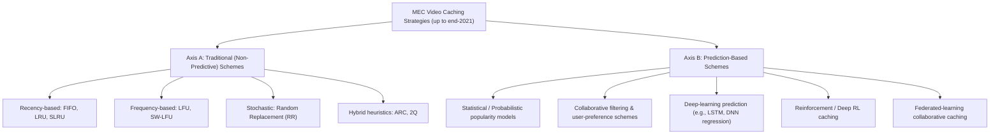
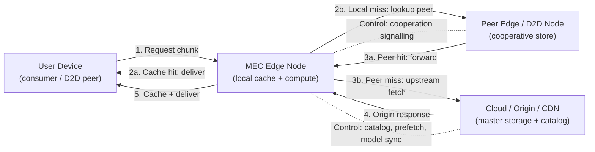
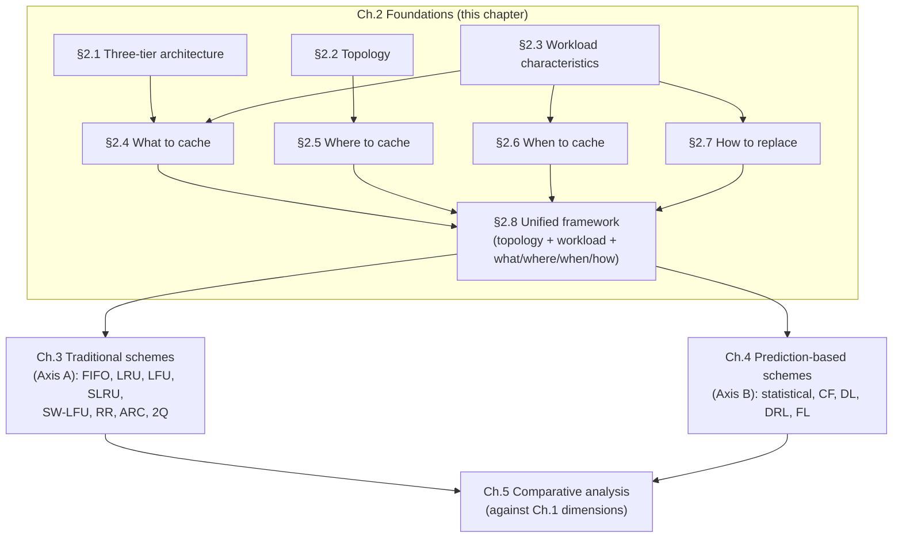
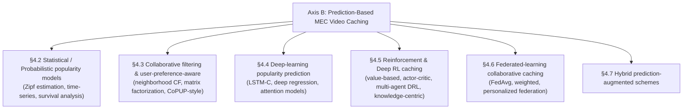

# Content Caching Strategies in Mobile Edge Computing-Assisted Video Streaming: A Survey of Approaches up to 2021
# 1 Introduction and Research Background

The past decade has witnessed an unprecedented convergence of two technological currents: the explosive growth of mobile video consumption on one hand, and the architectural shift of computing and storage resources from centralized clouds toward the network edge on the other. Where these currents intersect, a new design space has emerged in which content caching at Mobile Edge Computing (MEC) nodes is no longer an optional optimization but a structural necessity for sustainable, low-latency video delivery. This chapter establishes the foundations of the present survey: it motivates the problem from a traffic-engineering and quality-of-experience perspective, situates MEC as the enabling architectural paradigm, demarcates the temporal and topical scope of the study, introduces the two-axis taxonomy that organizes the remainder of the report, and fixes the evaluation dimensions through which subsequent chapters will compare individual caching schemes. By the end of this chapter, the reader should possess a clear understanding of *why* MEC video caching is a critical research subject, *what* analytical lens this survey adopts, and *how* the following chapters together provide a coherent answer.

## 1.1 Motivation: The Rise of Mobile Video Traffic and Network Pressures

The single most consequential macro-trend shaping the design of contemporary mobile networks is the dominance of video in mobile data traffic. Over the second half of the 2010s and into the early 2020s, mobile video became the principal component of cellular workload, driven by the proliferation of smartphones with high-resolution displays, the popularity of on-demand platforms (such as YouTube and Netflix), the rapid rise of short-form video and live streaming applications, and the broader 5G-era expectation that high-definition (and increasingly ultra-high-definition and immersive) video should be deliverable to any user, anywhere, at any time. By the end of 2021, video had come to account for the majority of global mobile data traffic, and industry forecasts consistently projected that its share would continue to grow over the subsequent years. This concentration is significant not only in absolute volume terms but also because video is *qualitatively* demanding: it is bandwidth-intensive, latency-sensitive, often bursty in arrival patterns, and tightly coupled to user Quality-of-Experience (QoE) metrics such as startup delay, rebuffering frequency, and bitrate stability.

The consequences for the underlying network are twofold. First, **backhaul and core links experience sustained, high-volume congestion**. In traditional content distribution, every request that misses local infrastructure must traverse the radio access network, the mobile backhaul, the operator core, and ultimately reach a content-origin server (or a distant Content Delivery Network — CDN — point of presence) before content can flow back to the user. When the dominant traffic class is video, even a modest fraction of misses translates into very large absolute volumes traversing these expensive, capacity-constrained links. Backhaul provisioning costs scale roughly with peak throughput, and operators are therefore under continuous pressure to suppress redundant transit of identical popular video chunks.

Second, **end-to-end latency becomes a binding QoE constraint**. The round-trip time between a mobile user and a remote origin or CDN node typically spans tens to hundreds of milliseconds, and is dominated by propagation, queuing, and transcoding delays along the path. For Video-on-Demand (VoD) services, this manifests primarily as startup delay and re-buffering events under adaptive bitrate (ABR) streaming; for live streaming and emerging interactive formats (e.g., low-latency live, 360-degree, and volumetric video), latency requirements tighten further, with sub-second or even tens-of-millisecond targets that are simply not achievable when content must be fetched from distant servers on every request.

A third, often under-appreciated pressure is **redundancy in user demand**. Empirical studies of video access patterns consistently observe heavily skewed (often Zipf-like) popularity distributions, in which a small set of titles or chunks accounts for a disproportionately large fraction of requests. From a networking standpoint, this means that the same popular video segments are repeatedly transported across backhaul links on behalf of users served by the same base station or geographic region — a structurally wasteful pattern that is precisely the situation caching is designed to eliminate.

Taken together, these three factors — sheer volume, latency sensitivity, and request redundancy — establish the practical necessity of moving cached copies of popular video content as close as possible to end users. Caching at the network edge converts repeated remote fetches into local hits, simultaneously offloading the backhaul, reducing user-perceived latency, and improving QoE. It is against this background that MEC-based caching has emerged as a focal research area.

## 1.2 MEC as an Enabler for Edge Video Caching

Mobile Edge Computing, as standardized by ETSI and broadly adopted in 5G architectures, refers to the deployment of computing, storage, and networking resources at the edge of the mobile network — typically co-located with base stations (e.g., eNodeB/gNodeB), Radio Access Network (RAN) aggregation points, or local data centers within one or a few hops of the user. From the perspective of video delivery, MEC nodes are attractive because they sit *behind* the radio interface but *ahead* of the backhaul: a request served from an MEC cache traverses only the radio link and the local edge node, bypassing the backhaul, core, transport, and origin altogether. This architectural property is what makes edge caching qualitatively different from traditional CDN caching, which still requires transit through significant portions of the operator's network.

MEC-enabled edge caching can be deployed in several topological configurations, each of which extends the design space:

- **Single-cell caching**, in which each MEC node independently manages its local cache to serve users attached to a single base station.
- **Multi-cell or cooperative edge caching**, in which neighboring MEC nodes coordinate their caching decisions and exchange content among themselves, effectively pooling storage to form a larger virtual cache.
- **Device-to-Device (D2D)-assisted caching**, in which user equipment also participates in content storage and short-range forwarding, exploiting peer redundancy to further offload the infrastructure.
- **Hierarchical caching**, combining device, edge, and cloud tiers, each with progressively larger capacity but higher delivery cost.

Despite these architectural advantages, MEC caching is shaped by a set of fundamental constraints that distinguish it from cloud or CDN caching:

- **Severely limited storage capacity per node**: each base station can host only a small fraction (often a few percent or less) of the catalog of popular videos. Selection therefore matters acutely.
- **Heterogeneous and localized user demand**: the population attached to a given cell is small and demographically distinctive, so global popularity rankings do not necessarily predict local hit patterns.
- **Dynamic content popularity**: video popularity changes on time scales of hours to days (and faster for short-form content and live events), so caching decisions cannot be made once and frozen.
- **Limited cooperation bandwidth**: while edge nodes may exchange content, the inter-edge links also carry costs, so cooperative gains must outweigh coordination overhead.
- **Energy and computational budgets**: edge nodes are not data centers; their CPU, memory bandwidth, and energy are constrained, which limits the sophistication of any on-line learning or optimization routine running on them.

The central tension that motivates the entire body of MEC video caching research can therefore be stated succinctly: **how to maximize content delivery utility — measured by hit ratio, latency, and backhaul savings — under tight, heterogeneous, and time-varying storage and computation budgets at the edge**. Every caching scheme reviewed in subsequent chapters is, fundamentally, a specific resolution of this tension.

## 1.3 Scope and Temporal Boundaries of the Survey

To keep the analysis tractable and the conclusions defensible, this survey adopts explicit boundaries.

**Temporal boundary.** The study covers mainstream MEC-assisted video caching strategies proposed or established up to the **end of 2021**. Work published in 2022 or later — including more recent surveys, large-language-model-driven caching, or post-2021 federated and reinforcement-learning advances — is outside scope and is not incorporated, even where it would extend the discussion. This cutoff is chosen so that the survey describes a coherent state of the art at a well-defined historical moment, rather than a continuously moving target.

**Architectural scope.** The survey considers MEC caching deployments in their commonly studied forms:

- single-cell MEC caching at a base station or access point;
- multi-cell and cooperative MEC caching, where neighboring edge nodes share state and/or content;
- D2D-assisted MEC caching, where user devices participate alongside infrastructure caches;
- hierarchical edge–cloud caching where MEC interacts with an upstream CDN/cloud tier.

**Service scope.** The video services considered include Video-on-Demand (VoD), adaptive bitrate (ABR) streaming, and live streaming, with occasional reference to specialized cases such as multi-view or vehicular video where they have produced influential caching designs.

**Topical exclusions.** Topics that are adjacent but not central — including pure transcoding offloading without caching, video super-resolution at the edge as a standalone task, pricing and incentive mechanisms for caching, and security/attack-resilience of caches — are mentioned only where they directly interact with cache decision-making. Likewise, generic non-video edge caching (e.g., IoT data, software updates) is referenced only insofar as its algorithms have been ported to the video-streaming setting.

**A note on a specifically excluded source.** Per the constraints of this study, a particular post-2021 survey on MEC for video streaming (Khan et al., arXiv 2209.05761) is treated as out of scope; its content is neither consulted nor cited, and any overlap of topics with the present survey is incidental and arises only from the shared underlying literature predating 2022.

## 1.4 Two-Axis Taxonomy: Traditional vs. Prediction-Based Caching

The mainstream MEC video caching strategies up to end-2021 are organized in this survey along a **two-axis taxonomy** that distinguishes schemes by the *nature of the decision rule* governing what to cache and what to evict.

**Axis A — Traditional (non-predictive) caching.** These schemes derive caching decisions from deterministic, history-based heuristics applied to past access patterns. They make no explicit model of *future* demand; instead, they assume — implicitly — that recently observed behavior is a sufficient proxy for what will be requested next. The canonical representatives are First-In-First-Out (FIFO), Least Recently Used (LRU), Least Frequently Used (LFU), Random Replacement (RR), and well-known refinements and hybrids such as Segmented LRU (SLRU), Sliding-Window LFU (SW-LFU), Adaptive Replacement Cache (ARC), and 2Q. Their decision logic is computationally lightweight, easy to reason about, and requires no training data, which is why they remain ubiquitous as **baselines** in MEC video caching evaluations.

**Axis B — Prediction-based caching.** These schemes make caching decisions on the basis of an explicit, learned, or statistical *model of future demand* — either of content popularity, of individual user behavior, or of both. Within this axis the survey further distinguishes five methodological subfamilies:

- **Statistical and probabilistic popularity models** (e.g., Zipf-parameter estimation, time-series forecasting, survival analysis);
- **Collaborative-filtering and user-preference-aware schemes** that adapt recommender-system techniques to caching;
- **Deep-learning-based prediction**, in which models such as LSTMs and deep regression networks forecast per-content popularity;
- **Reinforcement-learning and Deep Reinforcement Learning (DRL)** approaches that treat caching as a sequential decision problem and learn policies through interaction;
- **Federated-learning-based collaborative caching**, in which prediction models are trained across edges (or devices) without centralizing user data, addressing privacy and non-IID data simultaneously.

The two axes are not symmetric in their internal logic. Traditional schemes are differentiated chiefly by *which recency/frequency signal they trust*; prediction-based schemes are differentiated chiefly by *how the predictive model is constructed and where it is trained*. They are, however, **mutually exclusive at the level of the primary decision mechanism**: a scheme whose caching decisions ultimately reduce to recency/frequency heuristics belongs to Axis A, while a scheme whose decisions rest on a learned or statistical forecast belongs to Axis B. Hybrid designs — e.g., LRU augmented with a popularity-prediction admission filter — are explicitly flagged as such rather than silently placed in one branch.

The conceptual structure of the taxonomy is summarized in the diagram below:

Each terminal node in this diagram corresponds to a class of schemes that will be analyzed in Chapters 3 and 4 using the structural triplet — core working principle, advantages, limitations — required by the present survey's methodology.

## 1.5 Evaluation Dimensions and Comparative Metrics

To make comparisons across schemes meaningful and reproducible, all schemes reviewed in this survey are evaluated against a consistent set of dimensions. Four of these are *primary* — they appear in virtually every MEC video caching paper from the period under study — and several are *secondary* but routinely relevant.

**Primary dimensions:**

- **Cache hit ratio.** Defined as the fraction of content requests that are served from the local (or cooperating) MEC cache rather than fetched from upstream. It measures the *effectiveness* of the content-selection and replacement policy under the prevailing demand distribution.
- **Latency reduction (user-perceived delivery delay).** Captures the QoE impact of caching: a hit served from the edge typically experiences only radio-link delay, whereas a miss accrues backhaul and origin round-trip time. Both average and tail latency are relevant for video.
- **Backhaul offloading (traffic relief).** Quantifies the volume of traffic that does *not* traverse the backhaul because it was served from the edge. While correlated with the hit ratio, it is not identical: different videos and bitrates impose different byte costs per request, and chunk-level versus file-level caching can decouple the two metrics.
- **Computational and storage overhead.** Captures the algorithmic cost of running the caching policy on the MEC node. For traditional schemes, this is typically O(1) per access; for prediction-based schemes, it spans training cost, inference cost, model storage, and (in federated settings) communication overhead.

**Secondary dimensions** that recur throughout the survey include: **adaptability to time-varying popularity** (how rapidly a scheme tracks shifts in demand), **privacy implications** (whether user-side data must leave the device), **deployment complexity** (operational and integration burden), and **cooperative gain** (the marginal benefit derived from multi-edge or D2D coordination).

These dimensions are summarized in the table below, which also previews the comparative perspective developed in Chapter 5.

| Dimension | What it measures | Why it matters for MEC video | Typical strength of traditional schemes | Typical strength of prediction-based schemes |
|---|---|---|---|---|
| Cache hit ratio | Fraction of requests served locally | Direct utility of cache | Reasonable under stable, skewed popularity | Higher under dynamic or personalized demand |
| Latency reduction | Average / tail end-to-end delay | QoE for VoD / ABR / live | Good for popular content | Better tail behavior when prediction is accurate |
| Backhaul offloading | Bytes saved on transit | Operator cost | Proportional to hit ratio | Can be optimized for byte-cost, not just hit count |
| Computational overhead | CPU, memory, training, inference | Edge feasibility | Very low (O(1) typical) | Moderate to high; varies by model |
| Adaptability | Speed of tracking demand changes | Trending content, live | Limited; reactive only | Strong if model is fresh |
| Privacy | Whether user data leaves device | Regulatory / ethical | Inherent (no user modelling) | Risky unless federated |
| Deployment complexity | Operational effort | Practicality | Trivial | Non-trivial (data pipeline, retraining) |

The key insight previewed by this table — and developed in detail in Chapter 5 — is that **no single dimension is sufficient on its own**: a scheme with the highest hit ratio may be infeasible at the edge due to overhead, and a scheme with negligible overhead may miss most of the achievable backhaul savings. Practitioners therefore face a multi-objective trade-off, and the choice between traditional and prediction-based schemes (or a hybrid of both) is fundamentally a workload-dependent decision.

## 1.6 Chapter Organization and Roadmap of the Survey

Building on the foundations laid here, the remainder of the survey proceeds as follows.

- **Chapter 2** develops the MEC-assisted video streaming architecture and caching fundamentals, formalizing the roles of cloud, edge, and user tiers, and articulating the four canonical caching design questions — *what* to cache, *where* to cache, *when* to cache, and *how* to replace — that recur in every concrete scheme.
- **Chapter 3** analyzes Axis A in depth, presenting traditional caching schemes (FIFO, LRU, LFU, SLRU, SW-LFU, RR, ARC, 2Q, and notable hybrids) using the required structural triplet of *core working principle*, *advantages*, and *limitations* for each.
- **Chapter 4** analyzes Axis B in depth, organized by predictive methodology: statistical/probabilistic models, collaborative filtering and user-preference-aware schemes, deep-learning popularity predictors, reinforcement and deep reinforcement learning policies, and federated collaborative caching. The same structural triplet is applied to every scheme.
- **Chapter 5** synthesizes the two axes, performing a cross-cutting comparison along the evaluation dimensions established in Section 1.5 and identifying the workload regimes in which each family dominates.
- **Chapter 6** consolidates the key challenges and open issues that remained unresolved as of end-2021 — diversified and dynamic popularity, multi-edge cooperation under storage scarcity, privacy-preserving prediction, retraining cost, and integration with mobility and adaptive streaming — and closes the survey with concise concluding observations.

The roadmap can be visualized as follows, with the present chapter providing the conceptual scaffold on which the substantive technical analysis is constructed.

In short, this opening chapter has framed the problem (video traffic and network pressures), identified the enabling architecture (MEC), demarcated the scope (mainstream strategies up to end-2021), established the organizing taxonomy (traditional vs. prediction-based), and fixed the evaluation dimensions (hit ratio, latency, backhaul offload, complexity, and selected secondary criteria). Subsequent chapters can now drill into individual schemes with the assurance that every analysis will be reported through a shared analytical lens, and that all comparative conclusions will be referenced back to the foundations established here.

# 2 MEC-Assisted Video Streaming Architecture and Caching Fundamentals

The preceding chapter framed *why* MEC video caching matters and *how* this survey organizes the literature. Before drilling into specific schemes, however, a shared conceptual scaffold is needed — one that fixes the architectural reference model, identifies the workload properties that condition design, and decomposes every caching scheme into the same four canonical decisions. Without such a scaffold, the comparative analyses of Chapters 3 and 4 would risk conflating mechanisms operating at different system layers (e.g., admission control vs. eviction, single-cell heuristics vs. cooperative placement). This chapter therefore plays a deliberately *structural* role: it does not yet evaluate any concrete algorithm, but it establishes the vocabulary and reference architecture against which all subsequent algorithms will be described. By the end of this chapter, every scheme reviewed in the remainder of the report can be unambiguously located by (i) its assumed topology, (ii) the workload regime it targets, and (iii) its specific answers to the four questions — *what*, *where*, *when*, and *how* — that together constitute the design space of edge video caching.

## 2.1 Three-Tier System Architecture: Cloud, Edge, and User Roles

MEC-assisted video streaming is most usefully modelled as a **three-tier system** comprising a cloud/origin tier, an edge tier, and a user tier. Each tier plays a distinct role in storage, computation, and delivery, and the interactions among them define the data and control flows in which caching decisions are embedded.

The **cloud/origin tier** sits at the top of the hierarchy. It is the authoritative source of all video content: ingestion pipelines from content producers terminate here, master copies of every title (often in multiple bitrate representations) are stored on bulk object storage, and the global catalog — metadata, manifests, DRM keys, and recommendation feeds — is managed centrally. The cloud also typically hosts heavy-weight analytics (e.g., training of recommendation and popularity models on aggregated logs), and serves as the *fall-back* delivery path: whenever a request cannot be satisfied at the edge, it is ultimately resolved against the cloud (or a regional CDN point of presence that fronts it). The defining property of the cloud tier from a caching standpoint is its essentially unbounded storage but high delivery cost in terms of latency and backhaul utilization.

The **edge tier** is the central locus of MEC caching. An edge node consists of a compute and storage instance co-located with — or one short hop behind — a Radio Access Network (RAN) attachment point: a base station (eNodeB/gNodeB), a small-cell, a RAN aggregation site, or a local data center serving a metropolitan cluster of cells. ETSI's MEC reference framework specifies the interfaces by which such nodes host applications, expose RAN-side context (radio conditions, mobility events, location), and communicate with the operator's core. For caching purposes, the salient functions of the edge node are threefold: (i) it provides a *local content store* whose capacity is small in absolute terms but large relative to per-cell demand for popular titles; (ii) it provides *compute resources* sufficient to run cache management logic, lightweight prediction, and — in more sophisticated designs — on-line learning; and (iii) it exposes a *low-latency delivery path* to the users attached to its RAN element, since serving from the edge bypasses the backhaul, transport, and origin segments altogether.

The **user tier** comprises mobile devices that consume video content. In the simplest model, devices are pure consumers: they issue HTTP(S) requests for segments and play them back. In richer MEC designs — particularly those incorporating Device-to-Device (D2D) cooperation — devices also act as *peer caches*, storing previously viewed or proactively pushed content and forwarding it over short-range radio links to nearby devices on request. Devices are additionally the natural source of *user-side context*: viewing history, preference signals, mobility traces, and (in federated designs) locally trained model updates. Whether such data leaves the device, and how it is processed if it does, becomes a defining axis of prediction-based schemes.

Between these tiers flow both a **data plane** and a **control plane**. On the data plane, a video request originating from a user is first resolved against the edge cache; on a hit, the chunk is returned immediately over the radio link; on a miss, the edge issues an upstream fetch toward the cloud/CDN, optionally caches the returned chunk for future use, and then delivers it to the user. On the control plane, the edge maintains cache state (a directory of stored content, recency/frequency counters, or learned model parameters), exchanges signalling with the cloud (catalog updates, prefetch instructions, model synchronization), and — in cooperative deployments — coordinates with neighboring edges (content directories, shared eviction decisions, or exchanged model gradients).

The data and control flows underlying a single request are summarized below.

The key insight from this reference model is that **caching decisions are local in execution but global in implication**: every choice an edge node makes about admission, eviction, or cooperation has consequences for backhaul load (cloud-facing) and QoE (user-facing). Subsequent chapters' analyses of specific schemes will therefore be read consistently against this same three-tier picture.

## 2.2 Edge Caching Deployment Topologies

Within the three-tier reference model, the edge tier itself can be configured in several **topological variants**, each of which redefines the effective storage pool, the coordination cost, and the achievable retrieval latency. The four canonical topologies are summarized in Table 2.1 and elaborated below.

| Topology | Storage pooling logic | Coordination requirement | Implication for hit ratio / latency |
|---|---|---|---|
| Single-cell (isolated) | Each MEC node manages its own cache independently | None | Hits cheap (only radio); misses always go to origin |
| Multi-cell cooperative | Neighboring MECs form a virtual shared cache via content exchange | Content directory and exchange protocol among edges | Higher aggregate hit ratio; inter-edge transfer adds modest latency |
| D2D-assisted | User devices act as peer caches under edge coordination | Device-side storage management and short-range discovery | Offloads even the radio link; depends on peer density and willingness |
| Hierarchical edge–cloud | Edge sits between device tier and CDN/cloud as one of several storage layers | Cross-tier prefetch and eviction signalling | Smooth fallback gradient; storage cost rises with proximity |

**Single-cell caching** is the simplest topology: each MEC node serves only the users attached to its associated RAN element, and its cache is dimensioned and managed in isolation. The design space collapses to a per-node admission/eviction decision, with no inter-edge interaction. This topology underlies the bulk of the *baseline* evaluations in the MEC video caching literature, particularly when comparing classical replacement policies. Its principal limitation is that each node sees only the request stream of its own cell, so popularity estimates are noisy, and any content stored on a neighbor must still be fetched from the origin on a local miss.

**Multi-cell cooperative caching** addresses this limitation by federating the caches of neighboring edges into a *virtual* shared store. When a request misses locally, the edge consults a directory (centralized, distributed-hash-based, or gossip-maintained) to check whether a neighbor holds the content; if so, the chunk is fetched over the inter-edge link rather than from the origin. This effectively multiplies the catalog coverage of any individual cell, at the cost of (i) coordination overhead to maintain the directory, (ii) inter-edge transit delay (which is, however, normally much smaller than the backhaul-plus-origin round-trip), and (iii) more complex joint placement decisions, since storing the same hot item at every neighbor wastes the pooling opportunity. Cooperative caching is the topology under which many of the more sophisticated prediction-based schemes — particularly multi-agent reinforcement learning and federated approaches reviewed in Chapter 4 — are formulated.

**D2D-assisted caching** extends the cache hierarchy outward to user devices themselves. Devices with sufficient storage and battery may hold previously downloaded or proactively pushed content and serve it, over short-range links (e.g., Wi-Fi Direct, sidelink), to nearby peers under the coordination of the edge node. The structural appeal is that, on a successful D2D delivery, *even the radio access link of the requesting user is offloaded* (relative to its serving cell's downlink), and the edge cache is also spared. The structural cost is that D2D performance depends on peer density, mobility, and incentive/consent issues, and the edge must additionally manage device-side cache state — a non-trivial extension of the control plane.

**Hierarchical edge–cloud caching** treats the system as an explicit *cascade* of storage layers, in which a request that misses the edge may be intercepted by a regional/aggregation cache before falling all the way through to the origin. From a design standpoint, this generalizes the binary edge/origin model into a multi-tier one, and motivates placement policies that store the very hottest items at the user-facing edge while keeping a deeper "long tail" at the aggregation layer. The cost of accessing each layer increases with distance from the user, providing a natural gradient for placement and admission decisions.

For the purposes of this survey, these four topologies are not mutually exclusive: real MEC deployments — and many of the schemes reviewed in Chapters 3 and 4 — combine elements (e.g., multi-cell cooperation layered atop a hierarchical edge–cloud, or D2D extensions to a cooperative cluster). What matters for the subsequent analysis is to identify, for each scheme, *which topology it assumes*, since that assumption sets the boundary of its placement and cooperation decisions.

## 2.3 Video Workload Characteristics Conditioning Caching Design

Generic caching theory — developed initially for operating-system buffers, web objects, and database pages — provides only part of the design vocabulary needed for MEC video caching. The video workload exhibits a set of characteristics that *qualitatively* differentiate it from generic content, and any caching scheme that ignores these properties leaves substantial efficiency on the table.

**Granularity: file-level vs. chunk/segment-level.** Modern HTTP-based adaptive streaming protocols — most prominently MPEG-DASH and Apple HLS — partition each video title into many small segments (typically 2–10 seconds of media each), packaged as independently addressable HTTP resources. A two-hour movie at multiple bitrates may correspond to several thousand individually fetchable objects. The implication for caching is fundamental: the unit over which admission, eviction, and hit-ratio accounting must be performed is the *segment*, not the *title*. Caching only the first few segments of many titles — sufficient to mask startup latency while the long tail is fetched lazily — can be more efficient than caching whole titles for fewer items. Conversely, eviction policies that operate naively at the segment level may evict still-needed segments mid-playback, hurting QoE in ways that are invisible to file-level metrics.

**Multiple bitrate representations under ABR.** Each segment exists in several quality variants (different bitrate/resolution encodings), and an ABR client may switch among them mid-playback based on observed throughput. Caching must therefore decide *which representations* to store: holding all variants of a title multiplies storage cost, while holding only one variant defeats the adaptivity that ABR was designed to provide. Schemes that account for representation overlap (e.g., via Scalable Video Coding (SVC) layers, where higher-quality layers are additive) can ameliorate this, but they remain a non-trivial complication relative to single-object caching.

**Zipf-like popularity skew.** Empirical studies of video access — across YouTube-style, IPTV, and VoD workloads — consistently report heavily skewed popularity distributions that are well-approximated by Zipf or Mandelbrot–Zipf laws: a small set of titles attracts a disproportionate share of requests, while a long tail of items is rarely or only occasionally accessed. This skew is *favorable* to caching in principle: even a small cache can capture a large fraction of requests if it stores the right items. It is also the structural reason why simple recency/frequency heuristics (Chapter 3) achieve respectable hit ratios under stable workloads.

**Temporal popularity dynamics.** Popularity is not static. Different content classes exhibit distinctive temporal signatures: blockbuster releases or trending short videos show a sharp *rising* phase followed by a slow decay; live events and news content are *ephemeral*, with concentrated demand windows of hours to days; classic catalog items maintain *stable* low-to-moderate popularity over long horizons. Each pattern places different demands on the caching scheme: a policy that is too slow to evict yesterday's hot title will waste storage on declining items, while a policy that is too aggressive will discard items that are still in their rising phase. This temporal dynamic is the principal reason why purely reactive recency/frequency heuristics — though useful as baselines — are often outperformed by predictive schemes when the workload is non-stationary.

**Spatial heterogeneity of demand.** Because each cell serves a small, demographically distinctive population, *local* popularity distributions can diverge significantly from the *global* one. A title that is globally popular may be cold in a given cell, and a niche title may be locally hot. Caching schemes that simply mirror a global ranking will therefore underperform schemes that learn — explicitly or implicitly — the local distribution. Spatial heterogeneity is also what makes cooperative caching valuable: neighboring cells may have *complementary* hot sets, so federating their caches captures the union.

**Bursty and correlated arrivals.** Video requests are not independent: live events trigger synchronized surges, episodic releases produce coordinated demand among subscribers, and recommendation systems funnel users toward overlapping content. Such correlation amplifies the value of *anticipatory* admission (push-based prefetching during off-peak hours) and motivates the proactive timing dimension discussed in Section 2.6.

These workload properties motivate both halves of the taxonomy introduced in Chapter 1. Skewed popularity makes recency/frequency heuristics broadly viable; temporal dynamics, spatial heterogeneity, and correlated arrivals create the headroom that prediction-based schemes attempt to exploit.

## 2.4 What to Cache: Content Selection

The first canonical caching question is **what** to cache — that is, which items, drawn from a potentially vast catalog, deserve a slot in scarce edge storage. Although the formal answer in every scheme reduces to a ranking over candidate items, the design choices behind that ranking differ in three structural respects.

**Granularity of the cacheable unit.** Selection may operate on (i) entire titles, (ii) individual segments under DASH/HLS, or (iii) layered representations under SVC. Title-level selection is conceptually simplest but ignores the chunked nature of ABR delivery; segment-level selection aligns with the actual unit of HTTP retrieval and enables fine-grained policies such as "cache the first N segments of many titles to mask startup" or "cache only the highest-bitrate representations of the top-K titles." Layered selection further allows admitting a base layer broadly while reserving enhancement layers for the most popular content, trading quality for catalog coverage.

**Scope of popularity estimation.** The popularity signal used in selection may be *global* (drawn from operator-wide or catalog-wide logs maintained in the cloud), *local* (estimated from the request stream of the cell or cluster the edge serves), or *user-specific* (derived from individual viewing history and preference profiles). Global signals are easier to obtain and aggregate, but they suffer from the spatial heterogeneity discussed in Section 2.3; local signals are noisier (the per-cell sample size is small) but better matched to actual demand; user-specific signals enable personalization but raise privacy concerns that motivate the federated approaches reviewed in Chapter 4.

**Decision basis.** Selection criteria can be grouped along the same two axes as the taxonomy of Chapter 1. *Heuristic* selection treats observed recency or frequency as a proxy for future utility: items that have been accessed recently, or frequently, are deemed worth caching. *Predictive* selection, in contrast, estimates an explicit forecast of future demand — over a defined horizon and at a chosen granularity — and ranks candidates by predicted utility. The cleanest conceptual distinction is therefore that heuristic selection asks "what has been useful?", while predictive selection asks "what will be useful?". Both eventually produce a ranking, but the second is, in principle, able to incorporate signals (e.g., release schedules, recommendation pushes, social-media trends) that the first cannot.

In addition to these dimensions, selection in practice must also account for *cost asymmetry* (large or high-bitrate items occupy more storage but also offload more bytes per hit) and *cache-coherence cost* (an item evicted today may be re-fetched tomorrow at full backhaul cost). The schemes analyzed in Chapters 3 and 4 differ in how — and how explicitly — they trade off these factors.

## 2.5 Where to Cache: Placement and Cooperation

Once selection has identified *what* deserves to be cached, the **where** question asks how chosen items should be distributed across the available edge (and possibly device) storage. In a single-cell topology, this question is trivial — each item is either at the local node or not. In cooperative, D2D, and hierarchical topologies, it becomes a non-trivial distributed resource-allocation problem with several characteristic trade-offs.

The first trade-off is **replication versus partitioning**. Replicating a hot item across multiple cooperating edges guarantees that any user in the cluster experiences a local hit, but wastes the pooling benefit: storage devoted to a duplicate could have held a different item. Partitioning — assigning each item to at most one cooperating node and routing inter-cell requests as needed — maximizes catalog coverage but increases the per-miss retrieval cost and the coordination burden. Most realistic schemes lie between these extremes, replicating only the very hottest items (whose local-hit value justifies the duplication) and partitioning the rest.

The second trade-off concerns **coordination overhead**. Joint placement decisions require some shared state: a directory of who holds what, an exchange protocol for transfers, and — for prediction-based variants — synchronization of model parameters or popularity estimates. The protocols supporting this state consume bandwidth on the inter-edge plane and CPU on the edges themselves, and they introduce consistency challenges (stale directories cause incorrect routing). Schemes that propose elaborate cooperative placement must therefore justify the cooperative gain against this overhead.

The third trade-off is **placement under user mobility**. A user who moves across cells while consuming a long video benefits if successive cells hold the relevant segments. This argues for placement decisions that account for predicted mobility paths — placing follow-on segments along the trajectory — and connects placement intimately with prediction-based schemes (Chapter 4). In purely heuristic deployments, mobility is typically handled reactively: each new cell admits requested segments on miss, accepting the corresponding backhaul cost.

The fourth structural consideration is the **interaction with hierarchical layers**. In a hierarchical edge–cloud deployment, "where to cache" is also a question of *which tier*: items with extremely concentrated local demand should be held at the user-facing edge, while items with diffuse but non-negligible demand may be more efficiently held at an aggregation tier shared across many cells. The placement decision thus becomes multi-dimensional, with both geographic and hierarchical coordinates.

The remainder of this survey treats placement as logically distinct from selection — even when the same algorithm decides both — because it allows scheme-by-scheme analysis to separate "what is worth caching at all" from "where, given limited storage, it should live."

## 2.6 When to Cache: Reactive versus Proactive Timing

The **when** question concerns the *temporal mode* in which cache state is updated. Two regimes anchor the design space.

**Reactive (on-demand) caching.** Under the reactive regime, the cache changes only in response to actual requests. When a request misses the cache, the corresponding content is fetched from upstream and (typically) admitted into local storage, possibly evicting another item. All classical heuristics — FIFO, LRU, LFU, RR, and their variants reviewed in Chapter 3 — operate in this mode: their entire input is the *history* of observed requests, and their state evolves in lockstep with that history. Reactive caching is attractive because it requires no forecast, no separate prefetch traffic, and no off-peak coordination; it simply lets demand drive cache content. Its limitation is structural: items must be requested at least once before they are admitted, so the *first* user to request a trending item always pays the full backhaul cost, and an item with a brief but intense popularity window may never accumulate enough access weight to displace incumbents in time.

**Proactive (push-based) caching.** Under the proactive regime, the cache is updated in anticipation of demand: a prediction component forecasts which items will be popular within some horizon (the next hour, the next day, the duration of a live event), and a prefetch mechanism transfers those items into edge storage *before* user requests arrive. Proactive caching can be timed deliberately to off-peak periods when backhaul links are underutilized, converting expensive peak-hour transit into cheap off-peak transit. It is the natural operating mode of prediction-based schemes (Chapter 4): the predictive model produces a forward-looking ranking, the proactive mechanism translates that ranking into placement, and the eviction policy retires items whose forecasted utility has fallen.

Two parameters condition any proactive design. The **prediction horizon** sets how far in the future the forecast must reach; horizons too short are no better than reactive (the request has already arrived by the time the prefetch completes), while horizons too long amplify forecast error. The **update interval** sets how often the prediction is refreshed and the cache state correspondingly adjusted; intervals too frequent waste compute and inter-tier traffic, while intervals too long fail to track popularity dynamics.

Reactive and proactive timing are not mutually exclusive. **Hybrid timing** schemes — in which the bulk of the cache is curated proactively while a residual fraction is filled reactively to handle unpredicted demand — appear repeatedly in the literature. The structural point for the present survey is that timing is an *orthogonal* axis to the selection logic itself: a recency/frequency heuristic is reactive by construction, but in principle a *predicted popularity* signal can be deployed either reactively (used to bias admission when a request arrives) or proactively (used to prefetch). Chapter 4 will return to this distinction when classifying specific predictive schemes.

## 2.7 How to Replace: Eviction Policies and Cache Management

The **how** question — replacement — is logically the last of the four canonical decisions but the most algorithmically prominent in the traditional literature, because under fixed storage every admission implies an eviction. Before turning, in Chapter 3, to concrete eviction algorithms, it is useful to fix the conceptual building blocks they draw on and the lifecycle in which they sit.

Replacement policies are built from a small set of **signal primitives**:

- **Recency**: how long ago a cached item was last requested. Recency-based policies (LRU and its variants) bet that items accessed recently will be re-accessed soon.
- **Frequency**: how often the item has been requested over some window. Frequency-based policies (LFU and its windowed variants) bet that historical hit counts are predictive of future ones.
- **Age**: how long the item has been resident, independent of access. Age-based logic underlies FIFO and is sometimes combined with recency.
- **Predicted future utility**: an explicit forecast — produced by a statistical, deep-learning, or reinforcement-learning model — of the item's expected hit count or byte savings over the next horizon. Replacement policies in prediction-based schemes (Chapter 4) ultimately reduce to ranking items by such a predicted utility and evicting the lowest-ranked.
- **Cost factors**: per-item retrieval cost (e.g., upstream byte cost, latency penalty) and per-item storage footprint, used in cost-aware variants.

It is conceptually important to distinguish **admission control** from **eviction**. Admission decides whether an incoming item is worth caching at all; eviction decides which incumbent to displace if it is. Many sophisticated schemes — for instance, ARC and 2Q in the traditional family, and prediction-gated admission filters in the predictive family — exploit this separation to avoid polluting the cache with one-hit-wonders. Schemes that conflate the two (admit on every miss, evict only by recency) are simpler but more vulnerable to cache pollution under bursty workloads.

Replacement also sits within a broader **cache-management lifecycle**: (i) request arrival and lookup, (ii) on miss, an upstream fetch and an admission decision, (iii) on admission, eviction of the displaced item, (iv) periodic maintenance such as window slides, counter decay, or model refresh, and (v) — in cooperative or proactive topologies — coordination events (directory updates, prefetch pushes, model synchronizations). Any concrete scheme can be located within this lifecycle by identifying which primitives it activates at which step.

This decomposition sets up the **structural triplet — core working principle, advantages, limitations —** that Chapter 3 applies to each traditional eviction algorithm and Chapter 4 applies to each prediction-based scheme. By the time the reader reaches those chapters, every algorithm description should be readable as a particular instantiation of the building blocks introduced here.

## 2.8 Unified Conceptual Framework for Scheme Comparison

The architectural reference model (Section 2.1), the topological design space (Section 2.2), the workload characteristics (Section 2.3), and the four canonical questions (Sections 2.4–2.7) jointly define a **unified framework** in which any MEC video caching scheme can be characterized along a small number of orthogonal axes. Concretely, every scheme reviewed in the rest of this report will be located by the following descriptors:

1. **Assumed topology** — single-cell, multi-cell cooperative, D2D-assisted, hierarchical, or a combination.
2. **Targeted workload regime** — stable vs. dynamic popularity; global vs. heterogeneous spatial distribution; file-level vs. segment-level granularity; stationary vs. correlated/bursty arrivals.
3. **Answer to "what to cache"** — selection granularity (title, segment, layer) and scope (global, local, user).
4. **Answer to "where to cache"** — replication, partitioning, mobility-aware placement, hierarchical tier choice.
5. **Answer to "when to cache"** — reactive, proactive, or hybrid; prediction horizon and update interval if applicable.
6. **Answer to "how to replace"** — which signal primitives (recency, frequency, age, predicted utility, cost) the eviction (and admission) policy uses, and how they are combined.
7. **Position in the Chapter-1 taxonomy** — Axis A (traditional/non-predictive), Axis B (prediction-based), or explicitly hybrid.
8. **Evaluation footprint** — which of the Chapter-1 dimensions (hit ratio, latency, backhaul offload, computational overhead, adaptability, privacy, deployment complexity) the scheme primarily addresses, and which it leaves untouched.

The relationship of these descriptors to the rest of the report is summarized in the diagram below: the architectural and workload elements of this chapter feed into the four canonical questions, whose answers determine each scheme's position on the Chapter-1 taxonomy and its scoring against the Chapter-1 evaluation dimensions.

Three observations follow from this framework and prepare the ground for the subsequent chapters.

First, **the framework is descriptive, not prescriptive**: it does not assert that any combination of descriptors is best, only that every scheme can be located by them. The actual evaluation of strengths and weaknesses is deferred to Chapters 3, 4, and 5.

Second, **the four canonical questions are coupled, not independent**. A choice about *what* to cache constrains the meaningful options for *where* (a globally hot item is more naturally replicated than partitioned), and a choice about *when* (proactive vs. reactive) constrains the meaningful options for *how* to replace (a proactive scheme has predicted utility available as a replacement signal; a purely reactive heuristic does not). The decompositional value of the framework lies in *naming* the questions separately so that the coupling can then be examined, not in claiming that the questions can be optimized in isolation.

Third, **the framework explicitly bridges this chapter and Chapter 1's evaluation dimensions**. The choice of selection scope conditions hit ratio and privacy; the choice of placement and topology conditions cooperative gain, backhaul offload, and deployment complexity; the choice of timing conditions adaptability and computational overhead; the choice of replacement signals conditions hit ratio and overhead. Chapter 5's cross-scheme comparison will exploit precisely these couplings to identify which scheme family dominates under which workload regime.

With the architecture, topology, workload, and four canonical decisions now in place — and with the structural triplet (principle, advantages, limitations) set as the required reporting format — the survey is ready to descend into the concrete schemes. Chapter 3 applies the framework to traditional, non-predictive caching algorithms, and Chapter 4 applies it to the family of prediction-based schemes.

# 3 Traditional Caching Schemes in MEC Video Streaming

Chapter 2 established the architectural reference model, the topological design space, the workload characteristics of mobile video, and the four canonical questions — *what*, *where*, *when*, and *how* — that decompose every caching scheme. Building on that scaffold, the present chapter descends into the first half of the two-axis taxonomy introduced in Chapter 1: the family of **traditional (non-predictive) caching schemes** that constitute Axis A. These are the schemes that, despite their conceptual age and well-documented shortcomings under modern video workloads, remain the dominant evaluation baselines against which every prediction-based proposal in the MEC video caching literature up to 2021 is benchmarked. The chapter dissects each canonical representative — FIFO, LRU, LFU, SLRU/S3-LRU, SW-LFU, RR, ARC, and 2Q — using the mandatory structural triplet of *core working principle*, *advantages*, and *limitations*, and explicitly maps each algorithm's decision signals onto the video-workload properties (Zipf-like popularity skew, temporal dynamics, ABR segment granularity, spatial heterogeneity, correlated arrivals) enumerated in §2.3. The chapter closes by explaining why these schemes endure as MEC baselines, thereby preparing the comparative ground for Chapter 4's prediction-based family and Chapter 5's cross-cutting synthesis.

## 3.1 Overview and Classification of Traditional Caching Schemes

The defining property of every scheme analyzed in this chapter is that its caching decisions reduce to **deterministic (or stochastic), history-based heuristics applied to observed access patterns**, without any explicit forecast of future demand. In the unified framework of §2.8, these schemes share a common answer to the *when* question — they operate **reactively**: cache state changes only in response to actual request arrivals, never in anticipation of them. They differ principally in their answer to the *how* question, that is, in **which signal primitive** (recency, frequency, age, randomness, or a combination) governs the eviction (and, in the more sophisticated members of the family, the admission) decision.

A useful sub-classification of the family, anticipated in Chapter 1 and elaborated here, organizes the canonical schemes along the primary decision signal they trust:

- **Age-based**: FIFO, in which the sole signal is the order of arrival into the cache.
- **Recency-based**: LRU and its segmented refinement SLRU (including the S3-LRU variant), in which the elapsed time since last access governs eviction.
- **Frequency-based**: LFU and its windowed variants such as Jumping Window LFU (JW-LFU) and Sliding Window LFU (SW-LFU), in which the access count over a chosen horizon governs eviction.
- **Stochastic**: Random Replacement (RR), in which no signal is consulted at all.
- **Hybrid recency–frequency**: ARC and 2Q, in which two structurally distinct lists or queues separate one-time accesses from items with demonstrated re-access value, and a combined recency–frequency criterion drives eviction.

Two further structural observations are needed before turning to the individual schemes. First, the schemes differ in whether they conflate or separate **admission control** from **eviction**. Pure FIFO, LRU, and LFU admit every missed item unconditionally and use the eviction policy alone to manage capacity; SLRU, 2Q, and ARC explicitly separate admission (via a probationary segment or short-term queue) from eviction (in the protected/long-term portion), which is structurally what enables their improved resistance to "one-hit-wonder" pollution. Second, the schemes are not equally cheap. The naïve formulations of LRU and FIFO are O(1) per access; LFU in its priority-queue implementation is O(log n); ARC and 2Q reclaim O(1) by replacing the priority queue with carefully managed LRU lists. The computational-overhead column of any comparative table is thus *not* a uniform advantage of the family — it varies across members, and matters acutely for MEC nodes whose compute budget is bounded.

Across all members, the framework descriptors from §2.8 collapse to a narrow profile. They assume the **single-cell topology** as their reference setting (cooperative extensions exist but are not intrinsic to the algorithm); they make no distinction in their *selection scope* between global and local popularity — they simply work on the request stream observed locally; and they answer *what to cache* implicitly, by admitting whatever has just been missed. Their analytic interest, therefore, concentrates almost entirely on the *how* question, and that is where the subsequent sections focus their attention.

## 3.2 FIFO (First-In-First-Out)

**Core working principle.** FIFO is the simplest of all cache replacement policies. The cache is treated as a queue: when a new item is admitted into a full cache, the algorithm removes the **oldest item — the one that was added first** — and appends the new item at the back, irrespective of how recently or how frequently any item has been accessed.[^1] Implementation requires only a hash map for O(1) lookup and an ordered queue for O(1) eviction, with no per-access metadata updates beyond the initial insertion timestamp.[^1] In the MEC video context, FIFO answers the *what* question by admitting every missed segment, the *where* question only locally, the *when* question reactively, and the *how* question by age alone.

**Advantages.**
- **Minimal implementation complexity and overhead**: FIFO is straightforward to implement and incurs the lowest computational and memory cost among the schemes considered in this chapter, requiring no recency or frequency state.[^1][^2]
- **O(1) per-access operations** in both time and space, making it a natural fit for the constrained CPU and memory budgets of edge nodes.[^1]
- **Predictable, easily reasoned-about behavior**: the eviction order is deterministic and trivially auditable, which simplifies operational debugging on MEC deployments.[^1]
- **Reasonable performance under workloads with consistent or periodically refreshed access patterns**, such as static CDN-style assets that are updated on a known cadence: by ensuring older versions are removed first, FIFO aligns naturally with the lifecycle of such content.[^1]
- **Suitability for resource-constrained settings**: it is widely recognized as appropriate for embedded and low-overhead environments where simplicity is paramount.[^1][^2]

**Limitations.**
- **Complete blindness to access patterns**: FIFO does not consider the frequency or the recency of access to items and therefore cannot distinguish a hot video segment from a transient one.[^1][^2]
- **Risk of evicting frequently accessed items** simply because they were inserted earliest, which is structurally damaging under the Zipf-like popularity skew (§2.3) typical of video workloads.[^1]
- **Poor adaptability to changing access patterns** such as those induced by trending content or live-event surges; FIFO never updates its eviction order in response to access events, so it cannot track popularity drift.[^1]
- **Empirically inferior hit ratios relative to recency-aware policies**: in a simulation-based comparison of cache replacement algorithms for video services, FIFO recorded the *smallest* hit ratio among all algorithms evaluated, and in benchmark results FIFO delivered roughly 40.1 % hit rate compared to 71.2 % for LRU under the same workload, confirming its structural disadvantage under video-like demand.[^2]
- **Inability to exploit temporal locality** that is characteristic of VoD binge-watching sessions and ABR segment fetches, where successive segments of an in-progress playback are far more likely to be re-requested in the near term than items already evicted.[^1]

## 3.3 LRU (Least Recently Used)

**Core working principle.** LRU operates on the principle that **the least recently used item should be the first to be evicted when the cache is full**.[^1] Concretely, (i) when an item is accessed (read or updated), it is moved to the front of the cache, marking it as the most recently used; (ii) when a new item must be admitted into a full cache, the algorithm removes the item at the back of the cache — the one whose last access is furthest in the past; (iii) the new item is then inserted at the front.[^1][^3] The standard efficient implementation combines a hash map for O(1) lookup with a doubly linked list for O(1) reordering and eviction, yielding constant-time get and put operations.[^1][^3] The algorithm exploits the assumption of **temporal locality** — items accessed recently are more likely to be accessed again soon — which is a common pattern in many computing workloads, including binge-style VoD consumption and the sequential segment fetches of ABR streaming.[^3]

**Advantages.**
- **Strong performance under workloads with temporal locality**, which encompasses many video access patterns, particularly trending short-form content and active VoD playback sessions where the very recently fetched segments are highly likely to be requested again.[^1][^3]
- **Automatic adaptability to changing access patterns**: by always keeping the most recently used items in the cache, LRU tracks shifts in user behavior without any explicit retraining or parameter retuning.[^3]
- **Conceptual simplicity** combined with **constant-time get and put operations** when implemented with the hash-map-plus-doubly-linked-list approach.[^1][^3]
- **Ubiquity as a baseline**: LRU is among the most widely used cache replacement policies in computer systems, deployed in operating systems for virtual memory page replacement, in database buffer pools, in web browsers, in CDN edge caches, and in popular in-memory caching systems such as Memcached and Redis, which makes it the universal reference against which every MEC video caching proposal is measured.[^3]
- **Balance of simplicity and effectiveness**, often performing well in practice without the operational burden of parameter tuning required by more sophisticated alternatives.[^1]

**Limitations.**
- **Scan-vulnerability (lack of scan resistance)**: LRU performs poorly when faced with a scanning workload in which a large number of items are accessed once and never again; such a scan can **flush the entire cache of useful items**.[^3] This vulnerability is particularly relevant in MEC video caching because the segment-level retrieval of long ABR playlists can resemble such a one-time sequential scan, pushing valuable popular items out of the cache as the long tail of a single user's session passes through.
- **Neglect of access frequency**: LRU considers only recency, not frequency of access, which can lead to suboptimal decisions when a high-frequency item has merely not been touched in the very recent past.[^1][^3]
- **Poor performance under cyclic access patterns larger than the cache size**: if the working set is cyclic and exceeds cache capacity, LRU will systematically evict the next-needed item just before it is requested.[^1]
- **Memory overhead from auxiliary data structures**: the doubly linked list needed for constant-time reordering increases memory usage relative to FIFO.[^3]
- **Concurrency challenges in multi-threaded edge deployments**: maintaining the LRU order in concurrent environments can become a synchronization bottleneck and require careful locking strategies.[^3]

## 3.4 LFU (Least Frequently Used)

**Core working principle.** LFU is the prototypical frequency-based scheme. Its operating logic is to **determine popularity based on the number of requests for each video and replace the content with the fewest requests** when the cache is full. Each item in the cache is associated with a counter that tracks how many times it has been accessed; the counter is incremented on every access; and on a miss-induced eviction, the algorithm removes the item with the lowest access count.[^1] If multiple items share the same lowest count, a secondary criterion such as recency is typically used to break the tie.[^1] Two notable variants — **Jumping Window LFU (JW-LFU)** and **Sliding Window LFU (SW-LFU)** — bound the counting horizon temporally so that the popularity signal does not accumulate indefinitely; SW-LFU is treated in detail in §3.6, and JW-LFU is mentioned here as the discrete-window analogue in which counters are reset (rather than slid) at fixed epoch boundaries.

**Advantages.**
- **Effectiveness under workloads with stable access frequencies**: LFU performs well when popularity distributions are heavily skewed and reasonably stationary, conditions that match the bulk of the Zipf-like body of video popularity (§2.3).[^1]
- **Capture of long-term content popularity**: by aggregating access counts over an extended history, LFU preserves evergreen catalog items that may not have been accessed in the most recent moments but remain durably popular — a property well-suited to classic catalog content and CDN edge caches where long-term popularity drives byte-level offloading.[^1]
- **Often more effective than LRU for certain access patterns**, particularly those dominated by stable frequency rather than transient bursts of recency.[^1]
- **Optimality under the Independent Reference Model (IRM)**: under the workload abstraction in which each page reference is drawn independently from a fixed distribution, LFU is known to be the optimal policy, providing a theoretical justification for its use under stationary popularity.[^4]

**Limitations.**
- **Cache pollution by historically popular but now-obsolete content**: LFU can suffer from "cache pollution" in which infrequently used items remain in the cache for a long time due to high initial access counts that no longer reflect current demand.[^1] This is structurally damaging in MEC video caching, where trending content is intrinsically non-stationary.
- **Slow adaptation to changing access patterns**: by design, LFU emphasizes long-term frequency and is therefore slow to admit newly trending items that have not yet accumulated comparable counts.[^1][^4]
- **Logarithmic implementation complexity in naïve forms**: LFU's running time per request is logarithmic in the cache size when implemented via a priority queue, an overhead that is non-trivial relative to LRU's O(1) operations.[^4]
- **Need for periodic counter rescaling**: to prevent unbounded counter growth and to allow the cache to forget stale popularity, LFU must periodically rescale (or otherwise decay) all reference counts, an operational burden absent from recency-based schemes.[^4]
- **Weak handling of newly admitted items**: a new admission starts with a count of one and is therefore highly likely to be the next eviction victim, a structural bias against novelty that is particularly damaging for the short startup phase of trending video content.[^1]
- **Obliviousness to recent history**: LFU pays almost no attention to recent history and may keep items in the cache long after they have become irrelevant, an "accumulation of stale pages" that is the mirror image of LRU's scan-vulnerability.[^4]

## 3.5 Segmented LRU (SLRU) and the S3-LRU Variant

**Core working principle.** Segmented LRU refines plain LRU by partitioning the cache into **multiple LRU-managed segments** with explicit promotion and demotion rules between them. In a two-segment SLRU, the cache is divided into a **probationary segment** for newly admitted items and a **protected segment** for items that have demonstrated re-access; an item that arrives at the cache enters the probationary segment, and is promoted to the protected segment upon its next access (a hit). Eviction is performed from the LRU end of the probationary segment, while items demoted from the protected segment (when the protected segment overflows) are re-inserted at the MRU end of the probationary segment. **S3-LRU** is a three-segment variant in which **the cache is divided into three segments and the most frequently requested videos are stored in the highest segment**, with intermediate items in a middle segment and recently admitted, not-yet-revisited items in the lowest segment. Promotion progresses upward on each subsequent hit, while eviction always targets the bottom segment, so that items must accumulate evidence of repeated use before they can enter — and remain in — the protected upper layers.

**Advantages.**
- **Improved scan resistance relative to plain LRU**: one-time sequential segment fetches under ABR (which resemble a scan, §2.3) pass through the probationary or lowest segment without polluting the protected layers, since they never accumulate the second hit required for promotion.
- **Better protection of repeatedly requested popular video segments**: items that have been accessed at least twice are held in higher segments and are thereby insulated from displacement by transient one-hit-wonders.
- **Retention of O(1) per-access operations**: each segment is itself an LRU list, so SLRU and S3-LRU preserve the constant-time complexity that makes LRU attractive at the edge.[^1][^3]
- **Implicit combination of recency with a coarse-grained frequency signal**: an item's segment position reflects how many times it has been re-accessed, providing a primitive form of frequency awareness without the full counter machinery of LFU.

**Limitations.**
- **Sensitivity to segment-size tuning**: the division of cache capacity between probationary and protected segments (or among the three segments in S3-LRU) is a tunable parameter whose optimal value is workload-dependent and cannot be fixed once for all MEC deployments.
- **Residual blindness to long-term frequency**: although segments encode a binary or ternary recurrence signal, they do not record the absolute number of accesses, so an item that is hit twice and then becomes cold is treated identically to one that is hit fifty times.
- **Continued vulnerability to large working-set shifts**: when popularity drifts substantially (e.g., across day–night boundaries or during a major content release), the protected segment can retain stale items while the probationary segment churns rapidly, slowing the cache's overall response to the new working set.
- **Increased implementation complexity** relative to plain LRU due to the additional segment boundaries and promotion/demotion logic.

## 3.6 Sliding Window LFU (SW-LFU) and Jumping Window LFU (JW-LFU)

**Core working principle.** Sliding Window LFU is a temporally bounded refinement of LFU designed to address the latter's rigidity under non-stationary workloads. Instead of counting accesses over the cache's entire lifetime, SW-LFU **counts accesses only within a sliding time window of fixed length** that advances continuously with the current time. Accesses that fall outside the window are no longer credited to the item's count, so stale popularity decays naturally without requiring explicit periodic rescaling. The closely related **Jumping Window LFU (JW-LFU)** is a discrete-epoch counterpart: counters accumulate during a fixed-length epoch and are either reset or otherwise reweighted at epoch boundaries. The two variants share the goal of bounding the temporal horizon of the frequency signal, and they differ chiefly in whether that horizon advances continuously (SW) or in steps (JW).

**Advantages.**
- **Better tracking of time-varying video popularity** such as daily trending content and ephemeral live events: by restricting the count to recent activity, the windowed variants discard popularity accumulated long ago and therefore respond more nimbly to popularity drift than classical LFU.
- **Elimination of the periodic-rescaling burden of classical LFU**: the sliding (or jumping) window provides automatic forgetting, so the operational complication of choosing and triggering rescaling events is avoided.[^4]
- **Improved cache freshness under churn**: under workloads in which the hot set rotates over hours or days (the temporal pattern characteristic of trending short-form video), the windowed variants more rapidly retire items whose popularity has cooled.
- **Compatibility with O(1) operations** in carefully designed implementations that use bucketed counters rather than priority queues.

**Limitations.**
- **Window-size sensitivity**: the choice of window length is a tunable parameter with a clear trade-off — a window that is too short yields noisy estimates dominated by sampling variance, while a window that is too long is slow to discard items whose popularity has cooled. No single setting is optimal across MEC deployments with heterogeneous workloads.
- **Memory overhead for per-window counters**: maintaining the sliding-window state requires either timestamp metadata per access or bucketed counters indexed by time, both of which inflate the per-item memory footprint relative to plain LFU.
- **Continued inability to anticipate rising content**: like all schemes in this chapter, SW-LFU and JW-LFU are reactive — they can only credit accesses that have already occurred, so they cannot pre-position content for an anticipated demand surge (such as a scheduled live event).
- **Edge-effect noise**: items that have just entered the window or are about to leave it experience abrupt count changes that can cause unstable eviction decisions near the window boundary.

## 3.7 Random Replacement (RR)

**Core working principle.** Random Replacement is the stochastic baseline of the cache-replacement literature: upon overflow, the algorithm **selects a victim uniformly at random** from the set of cached items, irrespective of recency, frequency, age, or any other signal.[^3] No per-item state is maintained beyond the cache directory itself.

**Advantages.**
- **Minimal metadata and trivially constant overhead**: RR requires neither a doubly linked list (as LRU does) nor access counters (as LFU does), only a way to draw a random index into the cache directory.[^3]
- **Lock-free implementability**: because no ordering state must be maintained on every access, RR avoids the synchronization bottlenecks that complicate concurrent LRU implementations at busy edge nodes.[^3]
- **Surprisingly competitive on some workloads**: random replacement is very simple and "can work surprisingly well in some cases", although LRU typically performs better for workloads with temporal locality.[^3]
- **Frequent use as a sanity-check baseline**: precisely because RR ignores all workload structure, it provides a lower bound against which any structurally aware scheme should be expected to demonstrate improvement.

**Limitations.**
- **Statistically inferior hit ratios under skewed video demand**: under Zipf-like popularity distributions, an algorithm that ignores structure cannot exploit the heavy concentration of demand on a small set of items.
- **High variance**: hit ratios under RR fluctuate across runs and time windows, making operational predictability — itself a valuable property at the edge — difficult to guarantee.
- **Lack of adaptability to any structural property of the workload**: temporal locality, popularity skew, segment-level access patterns, and spatial heterogeneity are all invisible to RR by construction.
- **Absence of any QoE-aware logic**: RR cannot favor segments whose loss would damage user experience (e.g., the first few segments of a video, which affect startup delay).

## 3.8 Adaptive Replacement Cache (ARC)

**Core working principle.** ARC is the canonical example of a *hybrid recency–frequency, self-tuning* scheme within the traditional family. It maintains **two LRU lists**: one (denoted $L_1$ in the original formulation) containing pages that have been seen only once recently, and another ($L_2$) containing pages that have been seen at least twice recently.[^5][^4] Conceptually, $L_1$ captures **recency** while $L_2$ captures **frequency**.[^5][^4] Each list is internally split into a **top portion** (whose items are physically cached) and a **bottom portion** of "ghost" entries (whose items have been evicted from the cache but whose identifiers are retained to inform future adaptation), and the cache directory therefore tracks twice as many pages as the cache memory holds.[^4] ARC continually adapts a partition parameter $p$ that sets the target size of the top portion of $L_1$ relative to that of $L_2$. The adaptation is driven by a **learning rule**: a hit in the ghost portion of $L_1$ (an item that was evicted from the recency list and is now re-requested) signals that recency deserves more space and increments $p$; a hit in the ghost portion of $L_2$ signals that frequency deserves more space and decrements $p$.[^4] The learning rates depend on the relative sizes of the two ghost portions, so smaller lists experience larger increments and the algorithm "invests" in the list that is performing best.[^4]

**Advantages.**
- **Self-tuning behavior without offline parameter selection**: ARC requires no user-specified parameters and adapts its partition between recency and frequency online in response to the observed workload, removing the workload-specific pretuning that plagues many alternative schemes such as LRU-2, 2Q, LRFU, and LIRS.[^4]
- **Scan resistance**: a long sequence of one-time-only sequential read requests passes through the recency list ($L_1$) without ever entering the frequency list, so the items in $L_2$ — which represent the durably popular content — are not flushed by a scan.[^4] In MEC video terms, sequential ABR segment fetches do not displace the genuinely hot videos.
- **Constant-time per-request complexity**: like LRU, ARC has O(1) operations per request and is no more difficult to implement than LRU; in empirical comparisons its computational overhead is essentially the same as that of LRU and substantially lower than that of LRU-2 (roughly twice the LRU overhead) and LRFU (which can be an order of magnitude or more slower).[^4]
- **Low space overhead**: a real-life implementation measured ARC's space overhead at approximately **0.75 % of the cache size**, which is marginal relative to LRU.[^5][^4]
- **Empirically universal performance**: ARC has been shown to perform as well as — and sometimes better than — a fixed replacement policy with the best workload-specific offline parameter choice across numerous traces drawn from databases, workstation disk drives, a commercial ERP system, an SPC1-like synthetic benchmark, and web search workloads, while substantially outperforming LRU virtually uniformly across these workloads and cache sizes.[^4] For example, at a 4 GB cache on the SPC1-like benchmark, LRU delivers a hit ratio of approximately 9.19 % while ARC achieves 20.00 %.[^4]
- **Continual adaptation rather than locking into a fixed regime**: ARC never stops adapting, so a workload that fluctuates between a recency-favoring regime and a frequency-favoring regime is tracked accordingly, with the adaptation parameter $p$ ranging across its full domain in response.[^4]

**Limitations.**
- **Doubled directory footprint relative to LRU**: ARC must remember twice as many page identifiers as the cache holds, because of the ghost portions of $L_1$ and $L_2$.[^4] While the per-entry cost is small, the directory size is intrinsically larger.
- **Absence of an explicit model of video-specific patterns**: ARC operates on uniform page sizes and a generic notion of access; it does not natively account for ABR segment granularity, multiple bitrate representations under SVC/DASH, or the layered structure of video content (§2.3).
- **Oscillation cost in highly stable workloads**: because ARC never stops adapting, its parameter $p$ continues to fluctuate even when the workload is genuinely stationary, and these fluctuations can cost slightly relative to a fixed-parameter policy tuned offline to the exact optimal $p$ for that workload.[^4]
- **Lack of cooperative or proactive capability**: ARC is intrinsically a single-cache, reactive policy; it offers no mechanism for cooperation across multiple MEC nodes (§2.2) and cannot prefetch in anticipation of demand. Extending ARC to cooperative or proactive MEC settings is therefore a separate design exercise.
- **Demand-paging assumption**: ARC was formulated for uniform-page demand paging and does not by itself address variable-size objects such as video files of differing length and bitrate, which can affect byte-level offloading metrics.[^4]

## 3.9 2Q Algorithm

**Core working principle.** 2Q is a constant-complexity precursor and structural cousin of ARC. It uses **two queues** to separate one-time accesses from items with demonstrated re-access value: a short-term LRU queue (often denoted $A_{1in}$) for items that have been seen only once recently, and a long-term LRU queue ($A_m$) for items that have proven re-access value.[^4] A third structure, a ghost queue ($A_{1out}$), records identifiers of items evicted from the short-term queue, and a re-access to an item in this ghost queue is the trigger that promotes the item into the long-term queue on its next admission.[^4] On admission, an item enters the short-term queue; on a subsequent hit while resident in the short-term queue (or via the $A_{1out}$ mechanism), it is promoted to the long-term queue; on overflow, the algorithm evicts from the appropriate queue according to observed behavior. The algorithm thus achieves the same conceptual goal as ARC — separating one-hit-wonders from genuinely popular items — but with a simpler structure and explicit tunable parameters governing the queue sizes.[^4]

**Advantages.**
- **Constant-time complexity**: 2Q uses a simple LRU list instead of the priority queue required by LRU-2, reducing the implementation complexity to constant per request — a significant practical step forward over LRU-2.[^4] In empirical comparisons, the computational overhead of 2Q is essentially the same as that of LRU and ARC.[^4]
- **Scan resistance**: like ARC, 2Q protects the long-term queue from one-time sequential scans, since scanned items never accumulate the re-access required to be promoted out of the short-term queue.[^4]
- **Separation of one-hit-wonders from genuinely popular items**: this structural separation is well-matched to the long-tail structure of video catalogs, where a large fraction of titles are accessed only once or twice within any cache horizon (§2.3).
- **Lower overhead than priority-queue-based LFU variants**: 2Q avoids the logarithmic per-request cost of classical LFU and LRU-2 while still incorporating a form of frequency awareness through the promotion mechanism.[^4]
- **Competitive hit ratios when well tuned**: in trace-driven evaluations, 2Q with offline-optimal parameters performs comparably to LRU-2, LRFU, and LIRS, and close to ARC across a wide range of cache sizes and workloads.[^4]

**Limitations.**
- **Sensitivity to tunable threshold parameters**: 2Q introduces parameters such as $K_{in}$ (the size of the short-term queue) and $K_{out}$ (the size of the ghost queue), and the authors of the original algorithm noted that "Fixing these parameters is potentially a tuning question"; the parameters are sensitive to the workload type and "need to be carefully tuned".[^4]
- **No single fixed parameter choice works uniformly well across workloads and cache sizes**: empirical evidence indicates that the optimal $K_{in}$ and $K_{out}$ values shift with workload statistics, so an MEC operator deploying 2Q must either accept suboptimal performance or invest in workload-specific tuning.[^4]
- **Lack of online self-adaptation**: 2Q itself does not adapt its parameters in response to evolving workloads; this is precisely the limitation that motivated the development of ARC, which retains 2Q's constant-time complexity and scan resistance while adding online adaptation.[^4]
- **Continued workload-specific tuning burden**: in deployments where the workload mix shifts substantially over time (e.g., across day–night boundaries or during major content releases), 2Q's static parameterization can leave performance on the table relative to self-tuning alternatives.

## 3.10 Summary Comparison of Traditional Schemes

The eight schemes analyzed in §§3.2–3.9 can be summarized along a small set of structural dimensions that anticipates the deeper cross-cutting comparison of Chapter 5. The table below consolidates the principal points for ease of reference.

| Scheme | Primary signal | Per-access complexity | Scan resistance | Self-tuning | Notable strength | Principal limitation |
|---|---|---|---|---|---|---|
| FIFO | Age (arrival order) | O(1) | No | No | Lowest overhead; predictable | Blind to access patterns; smallest hit ratio in video traces[^2] |
| LRU | Recency | O(1) | No | No | Strong under temporal locality; ubiquitous baseline | Scan-vulnerable; ignores frequency[^3] |
| LFU | Frequency (cumulative) | O(log n) naïve | Partial | No | Captures long-term popularity | Cache pollution; slow to adapt; needs rescaling[^4] |
| SLRU / S3-LRU | Recency + recurrence segment | O(1) | Yes | No | Protects re-accessed items from scans | Segment-size tuning required |
| SW-LFU / JW-LFU | Frequency (windowed) | O(1) with bucketed counters | Partial | No | Tracks time-varying popularity | Window-size sensitivity |
| RR | None (random) | O(1) | No | No | Trivial overhead; lock-free | Inferior hit ratios under skewed demand[^3] |
| ARC | Recency + frequency (dual lists + ghost) | O(1) | Yes | Yes | Empirically universal; ~0.75 % space overhead[^5][^4] | No native segment/bitrate awareness; oscillation cost |
| 2Q | Recency + recurrence (dual queues + ghost) | O(1) | Yes | No | Constant-time; scan-resistant | Parameters $K_{in}, K_{out}$ require workload tuning[^4] |

Three patterns are immediately visible. First, **complexity does not monotonically buy hit ratio**: the most expensive of the classical schemes (LFU) is *not* the best performer on diverse workloads; the self-tuning ARC, which retains O(1) operations, dominates empirically.[^4] Second, **scan resistance, once introduced (in SLRU, ARC, 2Q), is a structural advantage that all later schemes converge on** — a recognition that real workloads, and especially video workloads, contain long one-time sequences that pure LRU cannot tolerate. Third, **self-tuning, even within the traditional family, marks a qualitative break**: ARC is the only scheme in the table that does not require offline parameter selection, and its empirical universality stems precisely from that property.[^4]

## 3.11 Hybrid and Composite Heuristic Variants

Beyond the canonical schemes above, the literature contains a family of **hybrid composite heuristics** that combine the primitive signals introduced earlier — recency, frequency, age, randomness, and cost — into richer decision rules, while remaining firmly on Axis A by virtue of their reliance on history-based logic rather than explicit forecasting.

Representative examples include **FIFO–LFU hybrids**, which augment FIFO's queue discipline with per-item access counters so that frequently accessed items can be retained longer in the cache; this combination has been proposed as a way to harness "the simplicity of FIFO and the high hit ratio of LFU", allowing frequently accessed items to stay longer while rarely accessed items are replaced first.[^2] **Adaptive FIFO with an aging mechanism** assigns weights to items in the queue in ascending order of how frequently they have been accessed, so that frequently accessed items accumulate weight and their eviction is delayed; the item with the highest accumulated weight relative to its arrival position becomes the next eviction candidate.[^2] **FIFO with LRU** combines FIFO's prioritization of arrival order with LRU's retention of recently accessed data, typically by setting a threshold under which items initially managed by FIFO are migrated to an LRU-managed sub-cache once they are accessed within a given window.[^2]

Beyond FIFO-centric hybrids, the literature also recognizes **LRU-K**, which extends LRU by considering the K most recent references to each item and replacing the page with the least-recent K-th most recent reference; this provides a better distinction between frequently and infrequently used items than plain LRU.[^3][^4] **LIRS (Low Inter-reference Recency Set)** maintains a variable-size LRU stack that selects pages based on their inter-reference recency, and **FBR (Frequency-Based Replacement)** divides the LRU list into new, middle, and old sections and combines per-item reference counts with section-based "factoring out locality" rules.[^4] Finally, **cost-aware variants** incorporate per-item retrieval cost or chunk size into the eviction calculus, evicting items whose retention yields the lowest expected byte-cost saving rather than simply the lowest access count.

These hybrids share a common structural triplet:

- **Core working principle**: combine two or more primitive signals (recency, frequency, age, cost) into a single ranking, often via segmented lists, weighted counts, or threshold-based promotion.
- **Advantages**: richer signal combination leading to improved hit ratios under mixed workloads; explicit handling of multiple workload regimes; in cost-aware variants, alignment between eviction decisions and operator-relevant byte-level metrics. Empirically, hybrid FIFO–LFU has been reported to raise hit rates substantially relative to plain FIFO (e.g., from approximately 40 % toward 64 % on a representative benchmark), narrowing the gap with LRU and LFU.[^2]
- **Limitations**: added implementation complexity; parameter sensitivity (segment sizes, weight schedules, thresholds, K in LRU-K); and — most importantly — a residual *non-predictive* character. These hybrids still rely on observed history alone and cannot anticipate rising content before requests arrive.

Two scope-defining clarifications are worth stating explicitly. First, **the schemes in this section remain on Axis A** so long as their primary decision rule is heuristic and history-based; their hybrid character lies in the *combination of signal primitives*, not in the introduction of a forecast. Second, **the schemes are distinct from the prediction-augmented hybrids treated in Chapter 4**, which combine a recency/frequency heuristic with a learned model of future popularity (for example, an LRU policy gated by an LSTM-based admission filter). The distinction matters: a hybrid that ingests a forecast belongs to Axis B even if the eviction step is LRU, because the *primary* decision rule has acquired a predictive component.

## 3.12 Why Traditional Schemes Endure as MEC Baselines

The schemes analyzed in this chapter have well-known shortcomings under video-specific workloads — segment-level granularity, multi-bitrate ABR variants, temporal popularity drift, spatial heterogeneity, and correlated arrivals are largely invisible to them — and yet they remain **ubiquitous baselines** in MEC video caching research up to 2021. Six structural reasons account for this persistence, each rooted in the architectural and workload reality of MEC.

First, **the O(1) computational and memory profile of LRU, FIFO, RR, ARC, and 2Q is compatible with the constrained edge hardware** identified in §2.1: MEC nodes are not data centers, and policies whose per-access cost is constant — independent of cache size — fit naturally within the CPU, memory-bandwidth, and energy budgets of base-station-collocated compute instances. Even classical LFU's logarithmic cost is acceptable for moderate cache sizes, and its windowed variants reclaim O(1) with careful counter bucketing.[^4]

Second, **traditional schemes require no training data, no training pipeline, and no retraining cost**. There is no model to fit, no inference engine to run, no parameter file to ship to each edge node, and no concept of "model staleness". For an operator standing up an MEC deployment, the operational burden of any of the schemes in this chapter is minimal compared with the data-pipeline and lifecycle-management burden of a learned model.

Third, **determinism and analytic tractability** make these schemes natural reference points. The eviction order under FIFO, LRU, LFU, and (parametrically) 2Q is fully predictable given the request trace; ARC's adaptation, though dynamic, is governed by a deterministic learning rule. This determinism is precisely what makes them *reproducible baselines*: a paper proposing a new prediction-based scheme can be evaluated against LRU and LFU on the same trace by any independent reader, with no ambiguity about hyperparameters or random seeds.

Fourth, **ease of integration into existing CDN and edge software stacks** is a powerful inertial force. LRU and FIFO are implemented in essentially every operating system, every database buffer manager, every web cache (e.g., Squid, Varnish), and every in-memory cache library (e.g., Memcached, Redis).[^3] An MEC deployment that re-uses such off-the-shelf software gets these policies "for free", whereas a custom predictive scheme requires bespoke development, deployment automation, and ongoing maintenance.

Fifth, **acceptable performance under the stable, heavily skewed component of video popularity distributions**. The Zipf-like head of the popularity distribution (§2.3) is genuinely well served by recency- and frequency-based heuristics: a small cache of the top-ranked items captures a large share of requests regardless of how those items were chosen, provided the choice mechanism is not pathologically wrong. Under stable workloads — for instance, evergreen catalog content with slowly evolving popularity — LRU, LFU, and ARC deliver hit ratios that are difficult to improve upon meaningfully without a sophisticated and well-trained predictor.

Sixth, and most importantly for the methodology of the present survey, **traditional schemes serve as the de facto comparison floor against which every prediction-based proposal must demonstrate gains**. In the MEC video caching literature up to 2021, the typical evaluation pattern is to report hit ratio, latency, and backhaul-offload curves for the proposed predictive scheme alongside LRU, LFU, and (increasingly) ARC or 2Q across cache sizes. The traditional schemes therefore play a normative role: they define what "no learning" can achieve, and the magnitude of the gap above them justifies the additional computational, data, and operational cost of a predictive approach.

These reasons do not, of course, deny the **headroom that traditional schemes leave on the table**. Under dynamic popularity (live events, viral short-form video), spatially heterogeneous demand (cells with idiosyncratic local hot sets), correlated arrivals (synchronized release events, recommendation-driven surges), and ABR segment-level structure with multiple bitrate variants, the assumption that *recently or frequently observed* behavior fully captures *future* utility breaks down. The cleanest evidence comes from empirical benchmarks reporting that even the best traditional scheme cannot match the hit ratios achievable by predictive approaches whose forecasts are calibrated to these non-stationary signals.[^2] Precisely this gap motivates the prediction-based family analyzed in Chapter 4: a family that, in exchange for training data, model complexity, and inference cost, attempts to convert "what has been observed" into "what is about to happen" — and thereby to recover the headroom that history alone cannot reach.

The structural triplet has now been applied to every canonical Axis-A scheme, the workload-specific weaknesses have been catalogued, and the operational reasons for the family's persistence as baselines have been articulated. Chapter 4 takes the next step, applying the same analytical triplet to the prediction-based family — statistical and probabilistic popularity models, collaborative filtering and user-preference-aware schemes, deep-learning predictors, reinforcement and deep reinforcement learning policies, and federated collaborative caching — and Chapter 5 will then synthesize the two families along the evaluation dimensions established in Chapter 1.

# 4 Caching Schemes Based on User Behavior and Content Popularity Prediction

Chapter 3 concluded that the traditional, non-predictive schemes — FIFO, LRU, LFU, SLRU, SW-LFU, RR, ARC, and 2Q — leave structural headroom on the table whenever the workload departs from the stable, heavily-skewed regime in which simple recency/frequency heuristics happen to work. Temporal dynamics (trending content and live-event surges), spatial heterogeneity (cells with idiosyncratic local hot sets), correlated arrivals (synchronized release windows and recommendation-driven funnels), and the segment- and bitrate-level granularity of modern adaptive streaming together define a workload in which "what has been observed" is a systematically poor proxy for "what is about to be requested". This chapter analyzes the second axis of the two-axis taxonomy introduced in Chapter 1: the family of **prediction-based MEC video caching schemes** whose caching decisions rest, in their primary decision mechanism, on an explicit AI-driven or mathematically-grounded model of future demand. The chapter is organized along the five methodological subfamilies set out in the outline — statistical/probabilistic popularity models, collaborative-filtering and user-preference-aware schemes, deep-learning predictors, reinforcement-learning policies, and federated-learning collaborative caching — and applies, to every concrete scheme, the same structural triplet (core working principle, advantages, limitations) used in Chapter 3, while locating each scheme within the unified framework of Chapter 2 (topology, workload regime, and the four canonical decisions). The chapter closes with hybrid prediction-augmented designs and a cross-cutting synthesis that prepares the explicit Axis-A vs. Axis-B comparison of Chapter 5.

## 4.1 Overview and Classification of Prediction-Based Caching Schemes

### 4.1.1 Structural Rationale: Why Prediction at the Edge

The defining property of every scheme analyzed in this chapter is that its caching decisions are derived from **predictions about future demand** — either at the level of aggregate content popularity, at the level of individual user behavior, or at both levels simultaneously. These predictions are generated by AI models (most commonly neural networks and reinforcement-learning policies) or by mathematical/statistical models (Zipf-style estimators, time-series forecasters, survival-analysis hazard models, recommender-system decompositions). In every case, the primary decision rule — which item is admitted, where it is placed, and which is evicted — is governed by *predicted future utility* rather than by *observed historical recency or frequency alone*. In the language of Chapter 1, this is the rule that places a scheme on Axis B.

The structural rationale for moving to prediction follows directly from the workload analysis of §2.3. When popularity is non-stationary, a forecast that anticipates the *rising phase* of a trending item allows the cache to be populated *before* the demand surge — converting the first wave of misses (which a reactive heuristic must pay in full) into hits. When demand is spatially heterogeneous, a model trained on per-cell traces (or personalized to the users of a given cell) can target storage at locally hot items that a global ranking would miss. When arrivals are correlated (synchronized live events, scheduled releases, recommendation cascades), a forecast can ingest the exogenous signals (event schedules, recommender outputs, social-media trends) that recency and frequency alone cannot encode. And when the cacheable unit is the ABR segment or SVC layer, prediction can be performed at that fine granularity, enabling decisions of the form "cache the first N segments of many trending items" or "cache only the base layer of the long tail" that are invisible to a uniform-page heuristic.

### 4.1.2 The Common Decision Pipeline of Axis-B Schemes

Despite their methodological diversity, all prediction-based schemes share a **common five-stage decision pipeline**:

1. **Feature collection** — assembling the raw inputs from which the predictor will draw inference.
2. **Prediction model** — a statistical, learned, or RL-policy artifact that maps features to a forecast.
3. **Ranking and utility computation** — translating the forecast into a per-item utility score (predicted hit count, predicted byte savings, predicted preference, learned Q-value, etc.).
4. **Placement and admission** — deciding which items to position at which edge node, possibly proactively (prefetch during off-peak windows) or reactively (admit on first request gated by the forecast).
5. **Eviction** — retiring items whose predicted utility has fallen below that of incoming candidates.

The structural difference between Axis B and Axis A is therefore not the absence of admission/eviction logic (every cache must perform these), but the insertion of stages (1)–(3) ahead of them: predicted utility replaces or augments the recency/frequency signal that a Chapter-3 scheme would have consulted at stage (4).

### 4.1.3 Feature Categories Consumed by the Predictor

Across the literature surveyed, the inputs to prediction-based MEC video caching models fall into **four broad categories of features**, and most concrete schemes consume some combination of them:

- **Static features** — descriptors of the content that are fixed at publication time and do not vary thereafter. Typical examples include video duration, publication (release) date, the audio/video standard or codec, the title, the keywords or tags assigned by the publisher, and the textual description or synopsis. These features encode "what the content is" and provide the priors that allow a model to make defensible predictions about cold-start items for which no access history yet exists.
- **Temporal features** — time-varying signals derived from the unfolding access history of each item. Typical examples include the number of views accumulated to date, the number of shares, the number of subscriptions associated with the channel, the age of the video (elapsed time since publication), and aggregate watch time. These features encode the *trajectory* of an item through its popularity life cycle, and are the natural input for time-series and recurrent models.
- **Cross-domain features** — signals about an item or its producer that originate outside the MEC operator's own request logs. Typical examples include the reputation of the content creator (e.g., subscriber count, historical view-per-publication ratio, presence on partner-publisher lists) and the diffusion of the content on other social media platforms (mentions, retweets, embeddings on third-party sites). These features encode exogenous evidence about what is about to become popular before the local request stream reflects it.
- **Social features** — relational signals about the users themselves. Typical examples include the social-graph relationships between users (followers and followees), explicit social interactions (likes, shares, comments), and group co-viewing patterns. These features encode the *propagation structure* through which content reaches the user population served by a given cell.

Within this taxonomy, a sub-class of strategies based on **"content popularity evolution"** stands out: instead of forecasting an absolute popularity value, these schemes model how popularity *evolves* over time — its rise, peak, decay, and lifetime distribution — and use the predicted evolution curve to determine when each item should enter the edge cache, how long it should remain, and when it should be retired. Content-popularity-evolution methods naturally combine static features (which set the prior on a typical evolution shape for items of a given class) with temporal features (which localize the current item on its evolution curve) and, in richer formulations, cross-domain and social features (which condition the curve on exogenous propagation evidence).

### 4.1.4 Orthogonal Design Dimensions

Beyond the choice of methodological subfamily and feature mix, every prediction-based scheme can additionally be located along four orthogonal design dimensions, summarized in the table below.

| Design dimension | Range of choices | Implication |
|---|---|---|
| Training location | Cloud / edge / device / federated across edges | Determines data-pipeline burden, latency of model refresh, and privacy posture |
| Prediction horizon | Minutes (live events) to days (catalog drift) | Sets the look-ahead of placement decisions; horizons too short collapse toward reactive, horizons too long inflate forecast error |
| Update interval | Continuous online / periodic batch | Trades model freshness against compute and inter-tier signalling cost |
| Deployment mode | Proactive prefetch / reactive prediction-gated admission / hybrid | Determines whether predictions drive off-peak prefetch or only gate the reactive admission step |
| Prediction granularity | Title / segment / representation / user-item pair | Aligns the forecast with the cacheable unit (file vs. ABR chunk vs. SVC layer vs. personalized recommendation) |

These dimensions are coupled in practice — for instance, device-side training is essentially obligatory whenever raw user-side preferences must be kept private, which in turn favors federated aggregation and longer update intervals — and the subsequent sections will identify, for each scheme family, the characteristic region of this design space that it occupies.

### 4.1.5 Classification of the Five Subfamilies

Within the Axis-B family, this chapter distinguishes five methodological subfamilies, organized by *how the predictive model is constructed*:

The five subfamilies are not exclusive — concrete proposals frequently combine, say, a deep-learning predictor with a federated training topology, or a collaborative-filtering popularity prior with a DRL placement policy — but they are *methodologically distinguishable* by the principal predictive engine, and the chapter's structure follows that engine. Section 4.7 then treats schemes whose distinctive contribution is the *hybridization* of a predictive component with a Chapter-3 heuristic.

## 4.2 Statistical and Probabilistic Popularity Prediction Schemes

The lowest-complexity entry point into Axis B is the family of schemes whose predictor is a **statistical or probabilistic model of content popularity**. Compared with their deep-learning and reinforcement-learning successors, these schemes consume modest features (typically the temporal access trajectory and, in richer variants, a small set of static descriptors), produce interpretable forecasts, and impose minimal compute load on the MEC node — properties that make them the natural bridge from the frequency-based heuristics of Chapter 3.

### 4.2.1 Zipf and Mandelbrot–Zipf Parameter Estimation

**Core working principle.** The Zipf-based family exploits the well-established empirical observation (§2.3) that video request frequencies follow a heavily-skewed distribution well-approximated by a Zipf law $p(k) \propto k^{-\alpha}$, in which the $k$-th most popular item attracts a fraction proportional to $k^{-\alpha}$ of all requests for some skew exponent $\alpha$. The Mandelbrot–Zipf refinement adds a plateau parameter $q$, yielding $p(k) \propto (k+q)^{-\alpha}$, which better matches the flattened head of many video catalogs. A scheme in this family estimates $\alpha$ (and $q$) from observed per-item access counts over a sliding estimation window, ranks all candidate items by their estimated popularity, and places the top-$K$ items in the edge cache, where $K$ is the cache capacity in items (or, more accurately, the largest prefix of the ranking that fits within the storage budget). The estimate is refreshed periodically so that the parameter tracks drifts in the skew.

**Advantages.**
- **Lightweight and interpretable**: a single scalar (or pair of scalars) summarizes the popularity distribution, and the resulting ranking is trivially auditable by operators.
- **Low edge overhead**: parameter estimation and ranking are O(n log n) per refresh cycle (which is infrequent), with negligible per-request cost in steady state — comparable to the windowed LFU variants of Chapter 3.
- **Strong fit under stationary or slowly drifting popularity**: when the catalog and the user mix are stable, Zipf-based placement approaches the optimal static placement under the Independent Reference Model.
- **No training data beyond access logs required**: parameter estimation can be performed entirely on locally observed counts, requiring no labels, no cross-tier data movement, and no cold-start bootstrapping for the predictor itself.

**Limitations.**
- **Stationarity assumption**: the entire derivation rests on the supposition that the underlying distribution is approximately fixed within the estimation window. Trending content (whose rank changes faster than the window length) and live events (whose lifetime is shorter than typical refresh intervals) are systematically mishandled.
- **Estimation-window sensitivity**: too short a window yields noisy $\alpha$ estimates dominated by sampling variance; too long a window smears over the very popularity drift the scheme is supposed to track — a trade-off structurally analogous to the window-size dilemma of SW-LFU.
- **Cold-start blindness**: an item with no observed accesses has no rank under the estimated distribution; it can only be admitted reactively on its first miss, at which point a true predictor would have already prefetched it.
- **Spatial-heterogeneity blindness in the global variant**: if $\alpha$ is estimated on operator-wide logs, the resulting ranking misses the per-cell hot sets identified in §2.3; per-cell estimation reintroduces the small-sample-size problem.

### 4.2.2 Time-Series Forecasting of Per-Content Request Rates

**Core working principle.** Time-series schemes model the per-item request rate as a stochastic process and forecast its value one or more steps ahead. Canonical instantiations include **ARIMA-style autoregressive models**, which fit an autoregressive-integrated-moving-average structure to the historical request series of each item (or each item class), and **exponential-smoothing models** (e.g., Holt–Winters), which decompose the series into level, trend, and seasonal components and project them forward. The forecast for the next window is interpreted as the predicted utility of caching the item; items are ranked by forecasted demand and the top-$K$ are prefetched at the start of the window. Refresh occurs at the boundary of each forecast window.

**Advantages.**
- **Native handling of temporal dynamics**: trend and seasonality components capture the rising/declining behavior of trending content and the diurnal patterns that frequency heuristics ignore.
- **Per-item granularity**: the model can be fitted independently for each item (or shared across a cluster of similar items), enabling fine-grained placement decisions.
- **Statistically principled uncertainty**: classical time-series models produce prediction intervals as well as point forecasts, which can be exploited by a risk-averse placement policy (e.g., admit only items whose lower confidence bound exceeds a threshold).
- **Modest training cost**: fitting an ARIMA or exponential-smoothing model is computationally inexpensive and can be performed at the edge.

**Limitations.**
- **Linear-Gaussian assumptions**: ARIMA and exponential smoothing are fundamentally linear models, ill-suited to the highly nonlinear bursts of viral propagation that dominate the upper tail of video popularity.
- **Cold-start failure**: an item with too short a history offers no series to fit; the scheme must fall back on a default rank or on a heuristic during the initial period.
- **Per-item fitting cost at catalog scale**: maintaining an independent model per item is feasible for thousands of items but does not scale gracefully to the millions of segments in a large ABR catalog.
- **Insensitivity to cross-domain signals**: by design, classical time-series models consume only the item's own past values; they cannot incorporate the cross-domain or social signals (creator reputation, social-media diffusion) that would inform a richer predictor.

### 4.2.3 Survival-Analysis-Based Lifetime Models

**Core working principle.** Survival-analysis schemes treat the *lifetime* of a video — the duration of its active popularity window — as a random variable and model it through a hazard function $h(t)$, i.e., the instantaneous rate at which an item "dies" (i.e., loses popularity) at age $t$. The estimated hazard, combined with static features (publication date, content class, creator profile) and temporal features (current age, accumulated views), yields an estimated survival curve from which the expected remaining popular lifetime of each cached item can be derived. Cache decisions follow naturally: items whose remaining lifetime is short should be evicted, and items whose hazard is currently low (i.e., that are still in their rising or plateau phase) should be retained or admitted. This is the most explicit instantiation of **content-popularity-evolution-based strategies**: the entire decision logic rests on a model of how popularity unfolds over time, not on a snapshot of recent activity.

**Advantages.**
- **Direct alignment with content life cycle**: by modelling the evolution rather than the instantaneous value, the scheme is naturally robust to short-term noise and is the most semantically faithful representation of how trending content actually behaves.
- **Natural handling of retirement**: the survival curve provides a principled criterion for evicting items whose popularity is structurally declining, complementing reactive eviction signals.
- **Static-feature exploitation**: hazard models commonly condition on covariates (content class, duration, publisher), which lets them generalize across items and reduces cold-start severity for new items whose static profile resembles previously-modeled cohorts.

**Limitations.**
- **Distributional-assumption sensitivity**: parametric hazard families (e.g., Weibull, log-logistic) constrain the shape of the modeled lifetime distribution; mis-specification under workloads with multi-modal lifetimes (e.g., re-trending content) degrades predictive accuracy.
- **Censoring complications**: items still in the cache at evaluation time are right-censored — their true lifetime is not yet observed — and the operational logic must handle censoring explicitly, increasing implementation complexity.
- **Limited responsiveness to sudden exogenous events**: a hazard model fitted on historical lifetimes cannot anticipate an external shock (a celebrity mention, a news event) that abruptly extends an item's life; cross-domain features must be injected to address this.

### 4.2.4 Positioning of the Statistical Subfamily

The statistical/probabilistic subfamily occupies the "low-complexity, low-data, low-overhead" corner of the Axis-B design space. It is the natural choice when the operator (i) cannot afford the data-pipeline and retraining cost of deep models, (ii) targets workloads dominated by the stable Zipf-like head of the catalog, or (iii) needs interpretable decisions for operational audit. As a bridge from Chapter 3, it can be understood as *replacing the implicit popularity proxy of LFU/SW-LFU with an explicit, model-based one*, thereby gaining cold-start handling via static-feature conditioning (in the survival variant) and trend/seasonality tracking (in the time-series variant), while still falling short of the nonlinear-dynamics modelling provided by the deep-learning subfamily of §4.4.

## 4.3 Collaborative-Filtering and User-Preference-Aware Caching Schemes

The schemes of §4.2 forecast popularity as an aggregate property of the content; they do not look at *who* is requesting it. The collaborative-filtering and user-preference-aware subfamily reverses that emphasis: it adapts the techniques of modern recommender systems — neighborhood-based collaborative filtering, matrix factorization, latent-factor models, content-based preference profiling — to predict the **per-user (or per-cluster) item utility** experienced by the population attached to a given cell, and uses those predictions to drive edge caching decisions. The defining feature signal of this subfamily is therefore the **social and preference-graph signals** introduced in §4.1.3: follower/followee relations, like/share/comment interactions, and the latent affinities those interactions reveal.

### 4.3.1 Neighborhood and Matrix-Factorization Collaborative Filtering for Edge Caching

**Core working principle.** Neighborhood-based collaborative filtering predicts the rating (or implicit utility) that a user $u$ would assign to item $i$ from the ratings of users similar to $u$ (user-based CF) or items similar to $i$ (item-based CF). Matrix factorization decomposes the user-item interaction matrix into latent user and item factor vectors $\mathbf{p}_u, \mathbf{q}_i$, and predicts utility as their inner product $\hat{r}_{ui} = \mathbf{p}_u^\top \mathbf{q}_i$. In the MEC-caching adaptation, the edge node aggregates the predicted utilities over the users currently attached to its cell — typically by summing $\hat{r}_{ui}$ across users $u$ for each item $i$ — to obtain a **local cell-level utility ranking**, and admits the top-$K$ items into its cache. Placement is reactive at the per-request level (a hit is served locally) but proactive at the per-aggregation-cycle level (the ranking is refreshed periodically, and prefetches populate the cache ahead of demand).

**Advantages.**
- **Native personalization and exploitation of spatial heterogeneity**: by aggregating preferences over the specific users in the cell, the resulting ranking is matched to local demand rather than to a global popularity proxy.
- **Cold-start handling for items via content-based hybrids**: when CF is augmented with content-based descriptors (static features such as keywords, description, codec), new items inherit a preference signal from their similarity to previously rated items.
- **Cooperative gain when neighbor cells are complementary**: in a multi-cell topology, neighboring cells whose user populations exhibit complementary preferences can pool storage to cover a wider union of locally-hot items, with the recommender's similarity structure providing the natural metric for such pooling.

**Limitations.**
- **Sparsity of the per-cell user-item matrix**: the population attached to one cell is small, and most users have interacted with only a tiny fraction of the catalog; the resulting matrix is highly sparse, which degrades both neighborhood-similarity estimates and matrix-factorization convergence.
- **Demographic-skew sensitivity**: a cell whose user population is demographically narrow will produce a ranking concentrated on a narrow content slice; if the active user mix shifts (e.g., commuter influx in the morning), the ranking lags.
- **Privacy exposure when raw preferences are centralized**: aggregating per-user interaction histories at the edge — or worse, at the cloud — to compute the factorization exposes potentially sensitive viewing data. This concern is precisely what motivates the federated alternative of §4.6.
- **Cold-start for new users**: a freshly attached user has no interaction history; the cell's aggregated ranking either ignores them or assigns them a generic prior, both of which are imperfect.

### 4.3.2 Content-Popularity-and-User-Preference (CoPUP-Style) Schemes

**Core working principle.** A widely-used class of schemes — generically referred to here as **CoPUP-style** (Content Popularity and User Preference) — combines a *global content-popularity signal* with a *local user-preference signal* into a hybrid score that drives edge placement. The global signal supplies the prior that a globally trending item is worth caching even if no local user has explicitly expressed a preference for it; the local signal supplies the personalization that captures cell-specific tastes. Formally, the per-item caching score takes the form $s_i = \lambda \cdot \pi_i + (1-\lambda) \cdot \rho_i^{\text{cell}}$, where $\pi_i$ is the global popularity estimate, $\rho_i^{\text{cell}}$ is the aggregated cell-level preference score, and $\lambda \in [0,1]$ trades off the two signals. Items are ranked by $s_i$ and the top-$K$ are admitted; the mixing weight $\lambda$ is either fixed by design or adapted online based on the relative predictive accuracy of the two component signals.

**Advantages.**
- **Robustness across workload regimes**: when local demand is sparse or noisy, the global popularity term dominates and the scheme degrades gracefully toward a popularity-ranked baseline; when local demand is rich and distinctive, the preference term takes over and personalization kicks in.
- **Cooperative compatibility**: in multi-cell topologies, the global term provides a natural coordination signal across cells, while the preference terms differentiate each cell's specific contribution to the cooperative cache.
- **Compatibility with explicit feature mixes**: $\pi_i$ can itself be a model that consumes static and temporal features, while $\rho_i^{\text{cell}}$ can consume social features — yielding a scheme that, at the score-aggregation level, integrates all four feature categories of §4.1.3.

**Limitations.**
- **Mixing-weight calibration**: the parameter $\lambda$ is workload-dependent and difficult to set without offline tuning or online adaptation; a poorly-tuned $\lambda$ inherits the worst of both worlds rather than the best.
- **Two-pipeline operational burden**: separate machinery is required to maintain the popularity estimator and the preference model, with attendant data-pipeline and retraining costs.
- **Privacy tension**: the preference signal is intrinsically user-side, and computing $\rho_i^{\text{cell}}$ at the edge requires either centralizing user histories or moving to a federated formulation (§4.6).

### 4.3.3 Proactive vs. Reactive User-Preference-Profile Schemes

A particularly clear instantiation of the preference-aware family is provided by the pair of **User Preference Profile (UPP)** schemes — the **Proactive User Preference Profile (P-UPP)** and the **Reactive User Preference Profile (R-UPP)** — which differ specifically in *when* the predicted preference signal is consumed in the caching lifecycle.

**P-UPP (Proactive User Preference Profile).** The principle of P-UPP is to **pre-fetch the Most Likely to be Requested (MLR) videos based on local user data within the cell**. Concretely, the edge node aggregates the preference profiles of the users currently attached to its cell, computes for each candidate video a "most likely to be requested" score from those profiles, and proactively pulls the top-ranked MLR items into local storage *before* requests arrive. The prefetch is timed to off-peak intervals so that the proactive transfer does not contend with peak-hour user traffic. The cache state, once populated, is then maintained reactively until the next MLR refresh cycle.

- **Advantages.** Anticipation of demand allows the very first request for an MLR item to be served as a local hit rather than a backhaul miss, directly addressing the structural weakness of reactive schemes; off-peak timing converts expensive peak-hour transit into cheap off-peak transit; and the locality of the aggregation (the cell's own users) ensures that the prefetched content is matched to actual local taste rather than to a global average.
- **Limitations.** P-UPP requires up-to-date per-user preference data within the cell, which raises privacy concerns when collected centrally; the proactive prefetch incurs bandwidth cost even when its predicted utility does not materialize (false positives waste storage and transit); and the scheme's responsiveness is bounded by its refresh interval, so demand spikes between cycles are still handled reactively.

**R-UPP (Reactive User Preference Profile).** The R-UPP counterpart consumes the same per-cell preference profile but applies it *reactively* at the moment of admission: when a request misses the cache and an item must be fetched from upstream, the preference profile is consulted to determine whether the item warrants admission (and which incumbent it should displace), rather than performing the admission unconditionally as a Chapter-3 heuristic would. The scheme thus uses prediction not to prefetch but to **gate** the admission decision.

- **Advantages.** R-UPP avoids the bandwidth cost of speculative prefetching: only items that have already been requested are considered for admission, so no transit is wasted on items that the prediction misjudges. The scheme is also operationally simpler than P-UPP — no off-peak scheduler is required — and integrates more readily with existing reactive cache infrastructure.
- **Limitations.** Because admission is still triggered by an actual request, the *first* user to demand a rising item always pays the full backhaul cost; R-UPP cannot amortize that first miss across the cell. It thus captures only part of the anticipatory benefit that P-UPP delivers, while inheriting the same per-cell preference-data and privacy requirements.

The P-UPP/R-UPP pair is illuminating because it isolates the **timing dimension** identified in §2.6 within an otherwise common feature-and-prediction framework: the same preference profile drives admission in both schemes, but the moment of application — before vs. after a request — produces qualitatively different operational profiles, and the choice between them is a textbook instance of the proactive-vs-reactive trade-off.

## 4.4 Deep-Learning-Based Popularity Prediction Schemes

When the workload departs sufficiently far from Zipf-like stationarity, and when the available features extend beyond per-item access histories to encompass the full static, temporal, cross-domain, and social signal set, the predictive task itself becomes nonlinear in ways that the classical statistical models of §4.2 cannot capture. The deep-learning subfamily addresses this gap by training **deep neural networks** — recurrent architectures (LSTM, GRU), deep regression networks, and convolutional or attention-based models — to forecast video popularity at the file, segment, or representation level, and by translating those forecasts into cache placement and replacement decisions.

### 4.4.1 LSTM-C: LSTM-Based Edge Caching

**Core working principle.** LSTM-C-style schemes apply a **Long Short-Term Memory (LSTM)** recurrent neural network to the temporal request series of each video (or each video class) to forecast the next-window request count. The LSTM consumes a windowed history of temporal features — view counts, share counts, watch-time aggregates, video age — and, in richer variants, also encodes static features (codec, duration, keywords) and cross-domain features (creator reputation, social-media diffusion) as auxiliary inputs. The output is a forecasted popularity score over the next prediction horizon. The edge node ranks all candidate videos by the LSTM's forecast and proactively populates its cache with the top-ranked items at the start of each horizon; lower-ranked incumbents are evicted to make room. Training is typically performed in the cloud on aggregated traces, with the resulting model parameters shipped to the edge for inference.

**Advantages.**
- **Capture of nonlinear temporal dynamics**: the LSTM's gated recurrence captures the rising-peak-decay shape of trending content far more faithfully than a linear autoregressive model, materially improving hit ratio under non-stationary workloads.
- **Multi-feature ingestion**: by extending the input layer, LSTM-C can consume the full static/temporal/cross-domain/social feature mix, making it a structurally natural home for content-popularity-evolution modelling.
- **Segment- and representation-aware variants**: when applied at segment-level granularity, the same architecture forecasts demand for individual ABR chunks, enabling decisions of the form "cache the first N segments of many trending items" that are invisible to title-level heuristics.
- **Empirical hit-ratio gains**: across the deep-learning caching literature, LSTM-based predictors are routinely reported to deliver hit-ratio improvements over LRU/LFU baselines on non-stationary workloads, particularly during the rising phase of trending content.

**Limitations.**
- **Training-data volume requirements**: training a deep recurrent model requires substantial historical request traces; operators with limited logs (or with strict data-retention policies) cannot fit the model adequately.
- **Model staleness and retraining cost**: the LSTM is fitted on a historical window and must be periodically retrained as the underlying popularity dynamics shift; the retraining incurs cloud-side compute and cross-tier model-distribution cost.
- **Inference latency on constrained edge hardware**: although LSTM inference is comparatively cheap per item, evaluating the network across thousands of catalog items at each refresh cycle taxes the edge CPU budget identified in §2.1.
- **Weak interpretability**: the forecast is the output of a network with many millions of parameters and offers no human-readable rationale; operational audit and debugging are correspondingly harder than for the statistical schemes of §4.2.
- **Vulnerability to distribution shift**: a model trained on past patterns can perform poorly when an unprecedented event (a novel viral genre, a regulatory restriction on a competitor) abruptly changes the input distribution.

### 4.4.2 Deep Regression Networks for Video Popularity

**Core working principle.** Deep regression schemes apply a feed-forward (or attention-augmented) deep neural network to a *flat feature vector* describing each candidate item — concatenating static features (duration, publication date, codec, title-embedding, keyword-embedding, description-embedding), temporal features (current view count, shares, subscriptions, age, watch time), cross-domain features (creator-reputation score, social-media-diffusion index), and social features (interactions within the user network) — and regress on the next-horizon popularity (or rank, or hit-count). Unlike LSTM-C, deep regression models do not maintain an explicit recurrent state; instead, they consume the temporal history as engineered features, which simplifies training and inference at some cost to dynamic modelling. The forecast is then used in the same ranking-and-placement loop as in §4.4.1.

**Advantages.**
- **Simpler training pipeline than recurrent models**: feed-forward networks are easier to train, easier to regularize, and more efficient at inference than gated recurrent models of comparable capacity.
- **Natural ingestion of heterogeneous feature types**: embedding layers handle categorical and textual features (title, keywords, description) directly, and dense layers integrate the resulting representations with numerical static and temporal features.
- **Cold-start handling via static features**: an item with no temporal history can still receive a defensible forecast from its static-feature embedding, partially addressing the cold-start blindness of §4.2's pure statistical schemes.

**Limitations.**
- **Loss of fine temporal structure**: by collapsing the request history into engineered summary features, deep regression discards information that a recurrent model would have retained, weakening the forecast during the rising phase when each successive observation matters most.
- **Feature-engineering burden**: temporal summaries (rolling means, growth rates, recency indicators) must be specified by hand, and their choice substantially affects performance.
- **Same training-data, staleness, inference-cost, interpretability, and distribution-shift limitations as LSTM-C**: these limitations are inherent to deep models in general and are not mitigated by the regression formulation.

### 4.4.3 Convolutional and Attention-Based Variants

Beyond the recurrent and feed-forward architectures, the literature surveyed also includes **convolutional neural networks** (which apply 1-D convolutions over the temporal request series to extract local patterns) and **attention-based models** (which use self-attention to weight the influence of distant history elements adaptively). These variants share the structural triplet of the LSTM-C and deep-regression families: their advantage lies in extracting richer representations of the historical signal, and their limitations lie in the additional training cost, the inference burden on edge hardware, and the further loss of interpretability. For brevity, they are not separately enumerated, but they sit firmly within the §4.4 subfamily and share the placement-and-eviction pipeline already described.

### 4.4.4 Positioning of the Deep-Learning Subfamily

Deep-learning predictors occupy the "high-capacity, high-data, high-overhead" end of the Axis-B design space. Their distinctive value is the **modelling of nonlinear, multi-feature, non-stationary dynamics** that the statistical schemes of §4.2 cannot capture; their distinctive cost is the **data and lifecycle burden** that the statistical schemes do not incur. In the language of the unified framework (§2.8), deep-learning schemes are typically *proactive in deployment* (the forecast populates an off-peak prefetch), *cloud-trained but edge-inferred* (training location is cloud, inference location is edge), and *file- or segment-granular* (depending on the prediction target). They are the natural choice when the operator commands sufficient data and compute to absorb the model-management overhead and when the workload exhibits the nonlinear dynamics that justify it.

## 4.5 Reinforcement-Learning and Deep-Reinforcement-Learning Caching Schemes

The schemes of §§4.2–4.4 treat prediction and decision as a two-stage pipeline: a predictor forecasts utility, and a deterministic placement/eviction rule consumes that forecast. The reinforcement-learning (RL) subfamily collapses these stages into a single **sequential decision problem**: caching is modelled as a Markov decision process, and the agent (the edge node, or a federation of edge nodes) learns a policy that directly maps states to caching actions through interaction with the environment. The reward signal optimizes the metrics the operator cares about — hit ratio, latency, backhaul cost, or a weighted combination thereof — and the learned policy adapts to non-stationarity through ongoing experience.

### 4.5.1 Single-Agent Deep Reinforcement Learning for Edge Caching

**Core working principle.** A single-agent DRL caching scheme formulates the problem as follows. The **state** $s_t$ encodes the current cache contents, the recent request history, and (in richer variants) static and temporal features of the candidate items; the **action** $a_t$ is the caching decision (which item to admit, which to evict, or — in proactive variants — which items to prefetch in the next window); and the **reward** $r_t$ is a function of the immediate cache-hit indicator, the latency saved, and possibly the backhaul bytes offloaded. A deep network — value-based (DQN-style) or policy-gradient/actor-critic — is trained to maximize the cumulative discounted reward. The trained policy is deployed at the edge, where it issues caching actions in real time; periodic retraining (or online fine-tuning) tracks workload drift.

**Advantages.**
- **Joint optimization of multi-objective rewards**: by encoding hit ratio, latency, and backhaul cost into a single reward function (with operator-chosen weights), DRL natively performs the multi-objective trade-off that two-stage predict-then-decide pipelines must handle externally.
- **Adaptability to non-stationarity**: the policy continues to learn from experience after deployment, tracking shifts in popularity without an explicit predictor refresh cycle.
- **No explicit popularity forecast required**: the policy implicitly internalizes whatever predictive structure is useful for maximizing the reward, sidestepping the brittle assumption that a particular popularity model captures all the relevant dynamics.
- **Natural handling of correlated rewards**: when caching an item displaces another whose future utility was also significant, the temporal-difference learning rule accounts for the displacement cost — something a myopic ranking-based scheme cannot do.

**Limitations.**
- **Sample inefficiency**: DRL requires large numbers of (state, action, reward) trajectories to converge; in a live MEC deployment, exploration during convergence can degrade real-user QoE.
- **Slow convergence and training instability**: deep-RL training is notoriously sensitive to hyperparameter choices, reward shaping, and replay-buffer composition; convergence is not guaranteed and is rarely fast.
- **Large state/action spaces under realistic granularities**: when actions are formulated at segment-level over a multi-thousand-item catalog, the action space explodes, and tractable formulations require action-space factorization or hierarchical decision structures.
- **Edge compute and memory burden**: deploying a deep policy at every MEC node is feasible but non-trivial, particularly when inference must run on every request arrival; computational overhead is the principal cost relative to Chapter-3 baselines.
- **Exploration risk in live deployments**: a misjudged exploratory action evicts a useful item or admits a useless one, with immediate (if small) QoE consequences; operators are therefore reluctant to deploy on-policy RL without an off-policy pretraining phase.

### 4.5.2 Multi-Agent DRL for Cooperative Edge Caching

**Core working principle.** In multi-cell cooperative topologies (§2.2), each MEC node is modelled as an agent in a **multi-agent reinforcement learning (MARL)** system. Each agent observes its own local state (cache contents, local request stream) and possibly limited information about its neighbors (their cache directories, summary statistics, or selectively shared observations); each agent's action is its local caching decision; and the reward is shaped to align local actions with the cluster-wide objective of maximizing aggregate hit ratio while minimizing backhaul traffic and inter-edge transit. Centralized-training-with-decentralized-execution (CTDE) is the most common framework: agents are trained jointly with access to global information, but at deployment each agent acts on its own local observation.

**Advantages.**
- **Native handling of cooperation and content partitioning**: the joint reward incentivizes agents to specialize their local caches so that the union covers the cluster-wide hot set, avoiding the duplication that uncoordinated greedy ranking would produce (§2.5).
- **Joint policy gain over independent learners**: empirical results in the literature surveyed report that cooperative MARL outperforms a federation of independently trained single-agent DRL policies, particularly when neighbor caches are complementary.
- **Native handling of mobility**: in vehicular or pedestrian-mobility settings, the multi-agent formulation can absorb hand-over events into the state transition and learn placement policies that account for the predicted trajectory of users across cells.

**Limitations.**
- **Combinatorial growth of the joint state-action space**: the curse of dimensionality is more acute in the multi-agent setting; tractable formulations rely on factored value functions, value-decomposition networks, or attention-based aggregation, all of which add architectural complexity.
- **Non-stationarity from the agent's perspective**: each agent's environment includes the policies of its neighbors, which themselves change during training; convergence guarantees of single-agent RL no longer apply.
- **Coordination communication overhead**: even under CTDE, deployment-time agents may need to exchange summary statistics or cache directories, consuming inter-edge bandwidth.
- **All single-agent DRL limitations carry over** with respect to sample inefficiency, training cost, edge compute burden, and exploration risk.

### 4.5.3 DRL for Vehicular Multi-View 3D Video Caching

**Core working principle.** A specialized application of DRL caching is to **vehicular multi-view 3D video** delivery, in which each user requests one or more *views* of a 3D scene and the relevant views are jointly determined by the user's spatial position and orientation. The caching agent must decide, at each MEC node along a road network, which view-and-segment combinations to cache, taking into account predicted vehicular trajectories, view-selection probabilities, and the multi-view encoding structure. The state encodes vehicular positions and view-request histories; the action is the per-MEC view-segment caching decision; the reward combines hit ratio with view-quality and latency metrics specific to the immersive-video QoE.

**Advantages.**
- **Workload-specific structure exploited**: the multi-view, mobility-driven character of the workload is exactly the regime in which generic heuristics break down most dramatically, and DRL's flexibility allows the policy to absorb this structure into its decisions.
- **Tight coupling with predicted mobility**: by including vehicular trajectory in the state, the policy can pre-position views along the road ahead of vehicle arrival, eliminating cold-cell misses at hand-over.
- **Native QoE-aware reward**: the reward can include view-quality terms (e.g., the cost of missing a primary view at a given position) that are invisible to file-level hit-ratio metrics.

**Limitations.**
- **Restricted generalizability**: a policy trained on one road network, view-encoding scheme, or vehicular density distribution may not transfer cleanly to another deployment.
- **Heavy state representation**: encoding vehicular trajectories and view geometry produces a high-dimensional state that taxes the on-edge inference budget.
- **Acute sample-inefficiency in a niche domain**: the smaller request volume of specialized vehicular 3D services exacerbates the data requirement of DRL training.

### 4.5.4 Knowledge-Centric Proactive Edge Caching

**Core working principle.** A further refinement, **knowledge-centric proactive edge caching**, integrates *domain knowledge* — content taxonomies, structural relations between items, known life-cycle priors, or symbolic constraints — directly into the RL state representation or reward function. Concretely, items are embedded into a knowledge graph (capturing genre, creator, series-episode relations) and the agent's state includes the relevant subgraph; the reward can be augmented with terms that reward respecting known life-cycle constraints (e.g., not evicting an episode while subsequent episodes of the same series remain cached). The policy is otherwise trained as in §4.5.1, but with the enriched representation accelerating convergence and improving generalization.

**Advantages.**
- **Improved sample efficiency**: the structural priors carried by the knowledge graph reduce the exploration burden, allowing the agent to converge on sensible policies with fewer interactions.
- **Better cold-start handling**: items connected in the knowledge graph to known popular items inherit a defensible initial caching prior, bypassing the cold-start blindness of pure history-based RL.
- **Reduced staleness risk**: the symbolic relations encoded in the knowledge graph evolve more slowly than raw popularity, providing a stable scaffold on which the dynamic component of the policy operates.

**Limitations.**
- **Knowledge-graph construction and maintenance cost**: the symbolic representation must be built, kept current, and integrated with the catalog ingestion pipeline — a substantial operational burden absent from pure data-driven RL.
- **Embedding-dimensionality trade-offs**: representing the knowledge subgraph at sufficient resolution inflates the state dimension and offsets some of the sample-efficiency gain.
- **Domain-specific fragility**: a knowledge graph that is well-curated for one content domain (e.g., serialized drama) may be impoverished for another (e.g., short-form viral video), bounding the scheme's portability.

### 4.5.5 Positioning of the RL Subfamily

The RL/DRL subfamily occupies the "most adaptive, most expressive, highest training cost" region of Axis B. It is the natural choice when (i) the operator's reward function is intrinsically multi-objective, (ii) the topology requires cooperative decisions that cannot be cleanly decomposed into independent per-cell rankings, (iii) workload non-stationarity is severe enough that periodic retraining of a separate predictor would lag the dynamics, or (iv) the workload has specialized structure (mobility, multi-view geometry, knowledge-graph relations) that two-stage predict-then-decide pipelines cannot exploit efficiently. The cost is correspondingly higher: training data, training time, deployment compute, and operational risk are all materially greater than for the predictor-based subfamilies of §§4.2–4.4.

## 4.6 Federated-Learning-Based Collaborative Caching Schemes

A recurring concern across §§4.3–4.5 is that the most informative features for prediction — user preference histories, social interactions, individual viewing trajectories — are intrinsically user-side and intrinsically sensitive. Centralizing such data at the edge or in the cloud, as the schemes considered so far implicitly require, raises serious privacy concerns and increasingly conflicts with regulatory frameworks (GDPR-style data-localization regimes). The federated-learning (FL) subfamily addresses this directly: prediction models — for popularity, for user preference, or for RL value functions — are trained **collaboratively across edges (and/or devices) without centralizing raw user data**, preserving privacy by design while still exploiting the distributed training signal that would otherwise be lost.

### 4.6.1 Federated Training Topologies for MEC Caching

Three federated topologies recur in the MEC caching literature:

- **Device-to-edge federation**: each user device trains a local model on its private viewing history and uploads only model updates (gradients or parameter deltas) to its serving MEC node, which aggregates them into a cell-level model. Raw histories never leave the device.
- **Edge-to-edge federation**: each MEC node trains a local model on its cell's aggregated (already-edge-side) data and exchanges model updates with neighbor edges or a regional aggregator, producing a cluster-level model that incorporates spatially heterogeneous experience without centralizing the underlying logs.
- **Hierarchical federation**: a combination of the two, with device-to-edge federation at the lower tier and edge-to-cloud-aggregator federation at the upper tier, mirroring the three-tier system architecture of §2.1.

### 4.6.2 Aggregation Mechanisms and Personalization

**Core working principle.** Federated learning for edge caching follows the standard FL training loop: at each communication round, the aggregator distributes the current global model to participating clients (devices or edges); each client performs a local training step on its private data and computes a model update; the aggregator collects updates and combines them — most commonly via **FedAvg-style weighted averaging** of parameters, with weights typically proportional to local dataset size; and the next round begins. After convergence (or at periodic checkpoints), each cell **localizes** the aggregated model — either by direct deployment or by fine-tuning on local data — and uses the localized model to drive its caching decisions through the same ranking-and-placement pipeline as the centralized variants.

Beyond plain FedAvg, the literature surveyed includes:

- **Weighted aggregation schemes** that down-weight unreliable clients or up-weight clients whose distributions are deemed more representative.
- **Personalized federation**, in which each client maintains both a shared global component and a personalized local component, addressing the heterogeneity of cell-level workloads explicitly.

### 4.6.3 Federated Variants of the Earlier Subfamilies

The federated topology is essentially **orthogonal** to the predictive methodology: any of the predictors of §§4.3–4.5 can be trained federatively. Federated collaborative filtering trains a matrix-factorization model with user factors held device-side and item factors aggregated across the federation. Federated deep popularity prediction trains an LSTM-C or deep-regression model on distributed traces. Federated DRL trains a policy network — or, in some formulations, only the value-function approximator — across cooperating edges. In every case, the structural triplet of the underlying predictor (§§4.3–4.5) carries over; the federation adds its own advantages and limitations on top, summarized below.

**Advantages.**
- **Privacy preservation by design**: raw user data — viewing histories, preferences, social interactions — never leaves the device or the cell, satisfying regulatory constraints and reducing the operator's exposure to data-breach risk.
- **Exploitation of distributed training data**: the federation can in principle leverage *all* the training data across the system without ever centralizing it, yielding a more representative model than any single cell could train alone.
- **Cooperative gain across heterogeneous cells**: cells with complementary workloads contribute distinct information to the federation, and the aggregated model reflects the union — a structural fit with the cooperative topology of §2.2.
- **Alignment with regulatory and operational constraints**: data-localization requirements, which would otherwise force per-jurisdiction model training, are satisfied automatically.

**Limitations.**
- **Non-IID data degrading convergence**: the data at each client is, by construction, *non-IID* — each cell sees only its own demographically distinctive workload — and FedAvg-style aggregation converges more slowly (and, in pathological cases, to a worse fixed point) under non-IID partitioning than under the IID case its theory assumes.
- **Communication overhead between edges and aggregator**: each federation round transmits model updates across the operator's network; for large models (deep LSTMs, DRL policies), the cumulative communication cost can be substantial.
- **Vulnerability to stragglers and client drift**: slow or unreliable clients delay round completion; clients that diverge from the global model between aggregations introduce drift that the aggregator must correct.
- **Additional model-management complexity**: the federation must coordinate participant selection, round scheduling, version control, and aggregator failover, all of which add operational moving parts absent from a single-trainer pipeline.
- **Residual privacy risks from gradient leakage**: although raw data is not transmitted, gradient updates have been shown to leak information about the underlying data under sufficiently powerful inversion attacks; full privacy guarantees require additional mechanisms (differential privacy, secure aggregation) that themselves cost accuracy or compute.

### 4.6.4 Positioning of the Federated Subfamily

Federated caching is best understood as an **orthogonal extension** of the predictor-based subfamilies of §§4.3–4.5 rather than as a methodologically distinct predictive engine. Its distinctive contribution is the privacy-preserving training topology, and its placement in Axis B is justified by the fact that the underlying predictor remains the primary decision mechanism. The federated topology is most strongly motivated when (i) the most informative features are user-side and sensitive, (ii) regulatory or operational constraints prohibit centralization, or (iii) the operator wishes to exploit a large distributed training set that no single cell could replicate locally. Its principal costs — non-IID convergence, communication overhead, gradient-leakage risk — must be balanced against these motivations on a deployment-by-deployment basis.

## 4.7 Hybrid Prediction-Augmented Schemes and Cross-Cutting Observations

### 4.7.1 Hybrid Prediction-Augmented Schemes

A practically important class of designs sits between the heuristic family of Chapter 3 and the pure-predictive subfamilies of §§4.2–4.6: schemes that explicitly **combine a prediction-based component with a traditional heuristic**. Three patterns recur. **LRU or LFU with a learned admission filter** retains the constant-time eviction logic of the underlying heuristic but inserts, ahead of admission, a small predictive model that decides whether an incoming item is worth admitting in the first place — converting plain LRU into a "predicted-admission" variant that resists one-hit-wonder pollution without redesigning the eviction structure. **Popularity-gated 2Q/ARC** retains the dual-list architecture of §§3.8–3.9 but uses a predicted popularity signal (rather than a single observed re-access) to promote items from the probationary to the protected list, sharpening the scheme's ability to retain genuinely popular items. **Proactive prefetching layered over a reactive eviction policy** uses any of the §§4.2–4.6 predictors to populate a reserved fraction of the cache off-peak, while a Chapter-3 heuristic manages the remaining fraction reactively.

By the classification rule established in Chapter 1 — a scheme whose decisions rest in their primary decision mechanism on a learned or statistical forecast belongs to Axis B — these hybrids are correctly placed in this chapter, not in Chapter 3. The structural triplet for hybrid schemes follows the pattern of their predictive component (advantages: improved hit ratio over the pure heuristic, simpler integration than a fully predictive scheme; limitations: still incurs forecast cost, still subject to staleness, and the heuristic component bounds the achievable gain). The practical attractiveness of hybrids is that they require modifying only one stage of an existing cache-management lifecycle rather than replacing the whole pipeline, which lowers the deployment barrier for operators with legacy heuristic-based infrastructure.

### 4.7.2 Cross-Cutting Patterns Across the Five Subfamilies

Several patterns recur across the subfamilies surveyed in this chapter, and identifying them prepares the cross-axis comparison of Chapter 5.

**Where prediction is sited in the cache lifecycle.** Predictions can enter the lifecycle at three distinct points: at *admission* (used as a gating filter), at *placement* (used to drive proactive prefetch and inter-cell partitioning), or at *eviction* (used to compute the predicted utility of incumbents). The statistical subfamily of §4.2 typically operates at placement; the user-preference subfamily of §4.3 spans admission (R-UPP) and placement (P-UPP); the deep-learning subfamily of §4.4 most often operates at placement with optional eviction-side ranking; the RL subfamily of §4.5 spans all three by virtue of jointly learning the entire policy; and the federated subfamily of §4.6 inherits the lifecycle position of its underlying predictor. The lifecycle position has direct consequences: admission-time prediction wastes the least bandwidth on speculative fetches but captures the least anticipatory benefit, while placement-time proactive prefetch captures the most benefit at the highest speculative cost.

**Prediction horizon and retraining cadence.** Schemes optimized for fast-moving content (trending short-form, live events) use short horizons (minutes to hours) and high retraining cadences; schemes optimized for catalog drift use longer horizons (hours to days) and slower retraining. The trade-off identified in §4.1.4 — that horizons too short collapse toward reactive while horizons too long inflate forecast error — is workload-specific, and no single setting dominates.

**Interaction with cooperative and mobility extensions.** Cooperative topologies amplify the value of prediction: when neighboring cells can specialize their caches, a forecast that captures complementary local hot sets unlocks a cooperative gain that a uniform heuristic cannot. Multi-agent DRL (§4.5.2) and edge-to-edge federation (§4.6.1) are explicitly designed to exploit this. Mobility amplifies the value of prediction further, because the forecast can pre-position content along predicted user trajectories — a capability invisible to history-based heuristics.

**Workload-regime rewards by subfamily.** The five subfamilies are differentially rewarded by different workload regimes: statistical schemes excel under stable Zipf-like popularity; user-preference schemes excel under demographically distinctive cells with rich preference data; deep-learning predictors excel under non-stationary trending workloads with rich multi-feature inputs; RL/DRL schemes excel under multi-objective, cooperative, or mobility-driven regimes; and federated schemes excel under privacy-constrained regimes with abundant distributed training data. No single subfamily dominates across all regimes — a finding that directly motivates the comparative-analysis methodology of Chapter 5.

### 4.7.3 Mapping the Subfamilies onto the Chapter-1 Evaluation Dimensions

Finally, the five subfamilies (together with hybrids) can be mapped onto the evaluation dimensions of §1.5 to preview the comparative analysis of Chapter 5. The mapping below assigns each subfamily a qualitative profile against the seven dimensions.

| Subfamily | Hit ratio | Latency reduction | Backhaul offload | Compute overhead | Adaptability | Privacy | Deployment complexity |
|---|---|---|---|---|---|---|---|
| §4.2 Statistical / Probabilistic | Moderate–High under stable popularity | Moderate | Moderate | Low | Limited to slow drift | Moderate (aggregate logs) | Low |
| §4.3 Collaborative / Preference (incl. P-UPP, R-UPP, CoPUP) | High when per-cell data rich | High (P-UPP) / Moderate (R-UPP) | High (P-UPP) | Moderate | Moderate | Low (centralized preferences) | Moderate |
| §4.4 Deep-Learning | High under non-stationarity | High | High | High (training + inference) | Strong if model fresh | Low (centralized features) | High |
| §4.5 Reinforcement / Deep RL | High when converged | High | High | Very High (training + on-edge inference) | Strong (continual learning) | Low (centralized state) | Very High |
| §4.6 Federated Collaborative | High; tracks underlying predictor | High; tracks underlying predictor | High; tracks underlying predictor | High (local training + communication) | Depends on aggregation cadence | High (privacy-by-design) | Very High |
| §4.7 Hybrid prediction-augmented | Higher than pure heuristic, lower than pure predictive | Improved | Improved | Heuristic + small predictor | Improved | Tracks predictor | Moderate |

Three patterns are immediately visible from the table. First, **no Axis-B subfamily dominates on every dimension**: the deep-learning and DRL subfamilies achieve the highest hit-ratio ceiling but pay for it in compute overhead and deployment complexity, while the statistical and hybrid subfamilies achieve a more modest hit-ratio gain at much lower cost. Second, **privacy is the dimension where federated schemes uniquely excel**: they are the only subfamily that achieves "high" privacy by design, and this is the structural justification for the additional non-IID and communication costs they impose. Third, **adaptability and compute overhead are strongly coupled**: the same model capacity that grants adaptability under non-stationarity also imposes the inference and retraining cost that bounds edge feasibility.

With every subfamily now characterized through the structural triplet, located within the unified framework of Chapter 2, and mapped onto the evaluation dimensions of Chapter 1, the prediction-based half of the taxonomy has been comprehensively surveyed. Chapter 5 next places the two axes side by side and performs the explicit cross-cutting comparison along these same dimensions, identifying the workload regimes under which each family — and each subfamily within Axis B — demonstrates relative strength.

# 5 Comparative Analysis of Traditional and Prediction-Based Caching Strategies

Chapters 3 and 4 have separately characterized the two halves of the two-axis taxonomy: the traditional, non-predictive family — FIFO, LRU, LFU, SLRU, SW-LFU, RR, ARC, 2Q, and their hybrid composite variants — and the prediction-based family organized into five methodological subfamilies (statistical/probabilistic, collaborative filtering and user-preference-aware, deep learning, reinforcement learning, and federated). What has not yet been performed is a *side-by-side* reading of the two families against a common set of evaluation lenses. That is the role of the present chapter. Building on the descriptor framework of §2.8 and the evaluation dimensions fixed in §1.5, the analysis proceeds dimension by dimension, identifies the workload regimes that condition each comparison, and culminates in a workload-regime-conditioned verdict and a practitioner decision matrix. The purpose is explicitly not to crown a universal winner — none of the dimension-wise comparisons supports such a conclusion — but to expose the structural trade-offs that MEC video caching practitioners faced up to the end of 2021, and to prepare the ground for the open-issues discussion of Chapter 6.

## 5.1 Comparative Methodology and Conditioning Variables

A defensible cross-family comparison requires a common analytical scaffold, an explicit set of conditioning variables, and an honest stance on what the underlying literature can and cannot support.

**Evaluation dimensions.** The comparison adopts the eight dimensions inherited from §1.5: the four primary dimensions — cache hit ratio, transmission latency, backhaul traffic offloading, computational and storage overhead — and four secondary but recurring dimensions — adaptability to time-varying popularity, privacy implications, deployment complexity, and cooperative gain. Each scheme analyzed in Chapters 3 and 4 contributes evidence to one or more of these dimensions, and the present chapter reads that evidence laterally rather than scheme by scheme.

**Unified descriptor framework.** Every comparison is grounded in the four canonical caching questions of §§2.4–2.7 (what, where, when, how to replace), the three-tier architecture and topology choices of §§2.1–2.2 (single-cell, multi-cell cooperative, D2D-assisted, hierarchical edge–cloud), and the workload properties of §2.3 (Zipf-like popularity skew, temporal dynamics, ABR segment granularity, spatial heterogeneity, correlated arrivals, mobility). The descriptor framework ensures that each dimension-wise comparison is *anchored* in a structural property of the scheme rather than in a free-standing empirical claim.

**Conditioning variables.** The comparative conclusions of this chapter are explicitly *conditional* on workload regime. Six conditioning variables recur throughout the analysis:

- **Popularity stationarity**: stable Zipf-like vs. drifting/trending/ephemeral.
- **Spatial heterogeneity**: global popularity proxy adequate vs. per-cell hot sets distinctive.
- **Arrival correlation**: independent reference vs. correlated bursts (live events, scheduled releases, recommendation funnels).
- **Mobility profile**: stationary attached users vs. handover-prone vehicular/pedestrian users.
- **Cacheable-unit granularity**: file-level titles vs. ABR segments vs. SVC representations.
- **Topology**: single-cell isolated vs. multi-cell cooperative vs. D2D-assisted vs. hierarchical edge–cloud.

A scheme's standing on any given evaluation dimension is meaningful only when these conditioning variables are specified; the comparative tables in subsequent sections therefore qualify their entries by regime rather than asserting unconditional rankings.

**Stance on quantitative evidence.** The underlying literature surveyed in Chapters 3 and 4 uses heterogeneous traces (YouTube-style logs, IPTV traces, synthetic Zipf workloads, vehicular multi-view traces), heterogeneous cache sizes, heterogeneous catalog sizes, and heterogeneous metrics (file-level hit ratio, segment-level hit ratio, byte hit ratio, mean delivery latency, tail latency, backhaul-bytes-saved, weighted reward). Aggregating across these into a single quantitative leaderboard would be misleading. The analysis therefore proceeds as a **qualitative-structural comparison**, integrating the numerical reference points already reported in Chapters 3 and 4 — for example, the simulation-based observation that FIFO records the smallest hit ratio among traditional algorithms (≈40.1 % vs. LRU's 71.2 % under the same workload), and the report that ARC achieves a 20.00 % hit ratio against LRU's 9.19 % at a 4 GB cache on the SPC1-like benchmark, as well as a roughly 0.75 % space overhead — as *illustrative anchors* rather than as universal performance claims. Where direct comparable measurements between Axis A and Axis B are unavailable, the comparison rests on the structural property that explains the expected ordering (e.g., proactive prefetching of trending items must, by construction, lower first-miss latency relative to a purely reactive heuristic when the forecast is accurate).

**Reading guide.** The remainder of the chapter proceeds dimension by dimension (§§5.2–5.9), then synthesizes the dimensions into a workload-regime-conditioned verdict (§5.10), and finally consolidates the synthesis into a practitioner decision matrix (§5.11). Each dimension-wise section closes with an explicit identification of the regime in which one family's advantage is most pronounced, so that the synthesis of §5.10 can be read as the accumulated implication of the preceding analyses.

## 5.2 Cache Hit Ratio Comparison

Cache hit ratio is the most universally reported metric in the MEC video caching literature, and the dimension along which Axis A and Axis B have been most directly compared. The structural picture that emerges from Chapters 3 and 4 can be summarized as follows.

**Stable Zipf-like regime: traditional schemes approach the achievable ceiling.** When popularity is heavily skewed and approximately stationary within the cache's effective horizon, the upper bound on achievable hit ratio is essentially set by the concentration of the popularity distribution, and any scheme that reliably stores the top-ranked items captures most of the achievable benefit. Within Axis A, this regime is precisely where the better-engineered traditional schemes shine. ARC, with its self-tuning recency–frequency balance and its ghost-list-driven adaptation, has been empirically demonstrated to perform as well as — and often better than — a fixed replacement policy with the best workload-specific offline parameter choice, substantially outperforming LRU virtually uniformly across diverse traces and cache sizes (e.g., 20.00 % vs. 9.19 % at a 4 GB cache on the SPC1-like benchmark). 2Q approaches ARC when well-tuned. LFU, when popularity is genuinely stationary, attains the Independent-Reference-Model optimum. Under this regime, the marginal hit-ratio premium that a prediction-based scheme can offer is small — the ceiling is close — and is often eroded by the inevitable forecast error of the predictor.

**Non-stationary regime: prediction-based schemes open a measurable gap.** When popularity drifts on time scales comparable to or shorter than the cache's effective adaptation horizon — the canonical case of trending content, live events, viral short-form video, and recommendation-driven surges — the structural assumptions underlying the traditional schemes break down. SW-LFU and ARC ameliorate but do not eliminate the problem: SW-LFU still requires observed accesses within the window before an item is credited, and ARC still adapts based on hits to its ghost lists, which are themselves derived from past accesses. The structural ceiling of all Axis-A schemes is therefore set by the fact that they can only react, not anticipate. The prediction-based subfamilies of Chapter 4 break this ceiling: a forecast that correctly identifies an item as *about to* trend allows the cache to be populated before the first user request, converting the entire rising phase from misses into hits. The deep-learning subfamily (§4.4) is the most natural carrier of this gain when the forecast can ingest static, temporal, cross-domain, and social features simultaneously; the RL/DRL subfamily (§4.5) achieves comparable or better gains when the workload is jointly multi-objective and the reward function can encode hit-ratio alongside latency and byte cost.

**Spatially heterogeneous regime: per-cell prediction outperforms global heuristics.** Traditional schemes, operating on the locally observed request stream of a single cell, implicitly track local popularity but suffer from small-sample noise: the per-cell request volume is modest, and the resulting recency/frequency signals are noisy. Prediction-based schemes that exploit personalization — the collaborative-filtering and user-preference-aware subfamily (§4.3), particularly CoPUP-style hybrids and the P-UPP/R-UPP pair — can amplify the per-cell signal by conditioning on user preference profiles, social-graph structure, and content-similarity priors, capturing per-cell hot sets that a noisy frequency counter would miss. The hit-ratio premium of these schemes is most pronounced precisely when the per-cell demand distribution is most distinctive from the global one.

**Drivers of the prediction-based premium.** Three factors govern whether the structural advantage of Axis B converts into a realized hit-ratio gain. **Forecast quality** is the dominant factor: a poorly fitted predictor (under-trained, mis-specified, or trained on a stale distribution) produces a ranking that is no better — and sometimes worse — than recency/frequency, and the operational cost of running the model is then incurred for no benefit. **Retraining cadence** determines how quickly the model tracks distributional drift; a model refreshed daily on workloads that rotate hourly cannot deliver its potential. **Prediction horizon** must be matched to the placement-and-prefetch lifecycle: horizons that are too short collapse the scheme toward reactivity, while horizons that are too long inflate forecast error (§4.1.4).

**Convergence regimes.** Two regimes drive the families toward convergence in achievable hit ratio. First, when the catalog is small enough — or the cache large enough — that essentially the entire popular head can be held locally, both families saturate near 100 % and the gap closes. Second, when forecast quality degrades severely (e.g., under sustained distribution shift or in cold-start cells with little training data), prediction-based schemes lose their structural advantage and degrade toward, or below, well-engineered baselines such as ARC. Hybrid prediction-augmented schemes (§4.7.1) are explicitly designed to provide graceful degradation in this regime by retaining the heuristic floor.

The headline structural conclusion of this section is that **Axis A approaches the ceiling under stable workloads while Axis B opens a measurable premium under non-stationary or spatially heterogeneous workloads**, with the magnitude of the premium gated by forecast quality, retraining cadence, and prediction horizon.

## 5.3 Transmission Latency and QoE Comparison

Latency — average and tail — is the dimension on which the proactive/reactive distinction of §2.6 matters most directly, and where the difference between Axis A and Axis B is most easily traced to a structural mechanism rather than to forecast quality alone.

**Average-latency picture.** Both families deliver low latency for content that resides in the cache at the moment of request: on a hit, the request traverses only the radio link and the local edge node, bypassing the backhaul, transport, and origin segments (§2.1). The average-latency comparison therefore reduces, to first order, to the hit-ratio comparison of §5.2. Under stable workloads where the hit-ratio gap is small, the average-latency gap is correspondingly small; under non-stationary workloads where Axis B opens a measurable hit-ratio premium, that premium translates directly into an average-latency reduction.

**Tail-latency and first-miss penalty.** The structural picture differs in the tail. Every traditional scheme is **reactive by construction**: the cache state changes only in response to actual request arrivals, which means that the *first* request for any item — including the first user to access a rising trending item or a newly released live-event feed — incurs the full backhaul-plus-origin round-trip. For VoD startup, this manifests as elevated startup-delay percentiles; for ABR streaming, as occasional first-segment rebuffering at the start of trending content; for live streaming and low-latency live, where targets are sub-second or tens of milliseconds, the first-miss penalty can render the experience unacceptable. Axis A cannot eliminate this penalty by construction.

Prediction-based schemes can eliminate the first-miss penalty *when the forecast is accurate*. P-UPP (§4.3.3), LSTM-C with off-peak prefetch (§4.4.1), and horizon-aware DRL placement (§4.5.1) all share the property that they admit items into the cache before the first request arrives, converting what would have been a first-miss into a first-hit. This is the unique structural contribution of proactive timing to QoE, and it is invisible to any Axis-A scheme.

**Sensitivity to forecast accuracy.** When the forecast is *inaccurate*, the proactive mechanism does not produce additional latency — the user still suffers the same first-miss penalty as under a reactive baseline — but the bandwidth consumed by the speculative prefetch is wasted. The latency benefit of Axis B is therefore one-sided: accurate forecasts reduce tail latency materially, while inaccurate forecasts do not increase it. The reactive variant R-UPP (§4.3.3) deliberately forgoes this benefit in exchange for eliminating speculative prefetch waste, which is an attractive trade when bandwidth-on-prefetch is the binding constraint.

**ABR, rebuffering, and segment-level effects.** Under adaptive bitrate streaming, the latency-related QoE metric of greatest practical importance is *rebuffering frequency* during playback, which depends on whether successive segments — at the bitrate the player has chosen — are immediately available. Segment-granular prediction-based schemes (LSTM-C applied at segment granularity, DRL with segment-level action spaces) can prioritize caching the segments most likely to be requested next, including across bitrate variants, in ways that uniform-page heuristics cannot. The structural advantage of Axis B in this regime is enabled by the granularity descriptor of §2.8 rather than by the predictor itself, but the granularity is only operationally useful when paired with a predictor that can rank at that granularity.

**Live and low-latency live.** For live streaming and low-latency live, where sub-second or tens-of-millisecond targets dominate, the first-miss penalty of Axis A is structurally disqualifying for any content not already pre-staged. Predictive schemes — particularly those that ingest event schedules as cross-domain features and prefetch live channels into the edge cache before the broadcast window opens — are essentially mandatory in this regime, although the gain depends on whether the operator can supply the event-schedule signal to the predictor.

**Regime where Axis B's latency advantage is most pronounced.** The latency-comparison verdict is most decisively in favor of Axis B in workloads dominated by **freshly trending content, scheduled live events, and personalized rising items in demographically distinctive cells** — precisely the regimes where the first-miss penalty falls on a sizeable fraction of traffic and where forecast quality is structurally good enough to suppress it.

## 5.4 Backhaul Traffic Offloading Comparison

Backhaul offload is correlated with hit ratio but is *not* identical to it: different videos and bitrates impose different byte costs per request, and a scheme that hits more often on small items than on large ones may offload fewer bytes than one with a lower hit count on larger items. Under chunk-level/segment-level caching with multiple bitrate representations under ABR — and even more so under SVC layering — the decoupling between hit count and bytes saved becomes operationally important.

**Traditional schemes: offload roughly proportional to hit ratio under stable workloads.** None of the canonical Axis-A schemes natively incorporates byte cost into the eviction calculus. FIFO, LRU, LFU, SLRU, SW-LFU, RR, ARC, and 2Q all operate on a uniform-page or uniform-object abstraction in their canonical formulations and treat all admissions as having equal storage and bandwidth cost. Under stable workloads where the popularity distribution is approximately the same across bitrate variants, this produces backhaul offload that is roughly proportional to the hit ratio. The principal exception within Axis A is the family of **cost-aware hybrid composite variants** noted in §3.11 — which incorporate per-item retrieval cost or chunk size into the eviction ranking — but these remain non-predictive and are bounded in adaptability by their history-based decision logic.

**Prediction-based schemes: byte-cost-aware optimization is structurally available.** Two structural mechanisms allow Axis B to outperform Axis A on bytes saved beyond the hit-ratio gain alone. **Segment- and representation-granular prediction** allows the forecast to rank ABR segments and bitrate variants individually, which lets the placement decision weight high-bitrate (high-byte-saving-per-hit) variants of trending titles more heavily than the equivalent low-bitrate variant — a decision that a uniform-page heuristic cannot make explicitly. **Byte-cost-aware reward shaping** in DRL formulations (§4.5.1) allows the reward function to directly include the bytes-offloaded contribution per hit, so the learned policy optimizes for backhaul savings rather than for hit count.

**Off-peak prefetching as a backhaul-economic mechanism.** A structural mechanism that is unique to proactive Axis-B schemes is the conversion of *peak-hour transit into off-peak transit*. P-UPP and proactive LSTM-C/DRL variants explicitly time their prefetch transfers to off-peak intervals when backhaul links are underutilized; the prefetched content then absorbs requests that would have traversed the backhaul during peak hours. Because operator backhaul provisioning costs scale roughly with peak throughput (§1.1), shifting the same byte volume from peak to off-peak hours has economic value even when the cumulative byte count is unchanged. This benefit is structurally invisible to Axis A, whose admissions are triggered by user requests and therefore occur at the time those requests arrive.

**Speculative prefetch waste.** The principal Axis-B risk on this dimension is the reverse of the gain: a prefetch whose predicted utility does not materialize consumes backhaul transit for no offsetting hit. Under accurate prediction, this cost is small and is dwarfed by the savings; under poor prediction, it can erode or invert the byte-offload gain. Hybrid prediction-augmented schemes (§4.7.1) can dampen this risk by gating prefetch decisions through a residual heuristic floor.

**Regime where Axis B's offload advantage is most pronounced.** The byte-offload advantage of Axis B is most pronounced in **high-ABR-bitrate, segment-granular, peak-skewed workloads** where the byte-cost-aware optimization and off-peak shifting mechanisms are both fully exercised, and where the forecast is reliable enough that speculative prefetch waste is contained.

## 5.5 Computational, Storage, and Communication Overhead Comparison

The overhead dimension is the structural counterweight to the hit-ratio and latency advantages of Axis B, and it is where the constrained CPU, memory-bandwidth, and energy budgets of MEC nodes (§2.1) impose a hard ceiling on scheme sophistication.

**Traditional schemes: O(1) operations and negligible memory beyond directories.** As established in §3.10, FIFO, LRU, RR, ARC, and 2Q operate at O(1) per access; LFU is O(log n) in its naïve formulation but can be reduced to O(1) under bucketed-counter implementations of its windowed variants. Memory overhead is bounded by the cache directory itself, with modest auxiliary structures (doubly linked lists for LRU; dual lists plus ghost portions for ARC, contributing ≈0.75 % space overhead in measured implementations; segment counters for SLRU; sliding-window state for SW-LFU). None of the canonical traditional schemes requires training data, model storage, or inter-tier communication beyond the data-plane fetches themselves. The aggregate overhead is essentially zero from an operational standpoint.

**Prediction-based schemes: a graded cost gradient.** The five Axis-B subfamilies form a clear cost gradient, which can be summarized as:

| Subfamily | Training cost | Per-refresh inference cost | Model storage | Communication cost | Net edge burden |
|---|---|---|---|---|---|
| §4.2 Statistical / probabilistic | Very low (parameter estimation) | Very low | Negligible (a few scalars per item) | Negligible | Low |
| §4.7 Hybrid prediction-augmented | Low–Moderate | Low | Small model + heuristic state | Negligible | Low–Moderate |
| §4.3 Collaborative / preference | Moderate (factorization, profile update) | Moderate | Latent factors per user/item | Moderate (preference aggregation) | Moderate |
| §4.4 Deep-learning predictors | High (cloud-side, periodic) | Moderate–High (on-edge per refresh) | Large network parameters | Moderate (model distribution) | High |
| §4.5 Reinforcement / Deep RL | Very high (sample-inefficient, slow convergence) | High (on-edge per decision) | Policy/value network parameters | Moderate (multi-agent coordination) | Very High |
| §4.6 Federated collaborative | High (distributed local training) | High (tracks underlying predictor) | Tracks underlying predictor | High (per-round update transmission) | Very High |

Three structural patterns are visible. First, **the statistical subfamily is the only Axis-B family whose net edge burden approaches that of well-engineered Axis-A schemes**; its overhead penalty is essentially the cost of an additional parameter-estimation step on top of frequency counting. Second, **deep-learning, RL, and federated subfamilies impose qualitatively higher edge burdens** — training pipelines, model-distribution machinery, on-edge inference engines, and (for federated variants) per-round update transmission — that have no analogue in Axis A. Third, **hybrid prediction-augmented schemes occupy an intermediate position** by composing a lightweight predictive component with the underlying heuristic's O(1) eviction; the heuristic floor bounds the worst-case behavior at the cost of capping the achievable gain.

**Implication for edge feasibility.** The overhead gradient interacts with the cost-sharing topology. Statistical and hybrid schemes are feasible on essentially any MEC node that can already run a Chapter-3 heuristic. Deep-learning predictors are feasible at the edge when inference is run only at refresh cycles (e.g., hourly) rather than per request, and when the operator can absorb cloud-side training cost. RL/DRL schemes are feasible at the edge only when the policy network is sized to the edge inference budget; full-scale formulations with large state-action spaces and continual on-edge learning push against the upper limit of the edge envelope. Federated variants add inter-tier communication cost on top of the underlying predictor's burden, and are operationally feasible only when the operator's control-plane can carry the per-round update traffic without disturbing the data plane.

**Regime where Axis A's overhead advantage is most decisive.** The overhead-comparison verdict is most decisively in favor of Axis A in **deployments with severely constrained edge hardware, limited data-pipeline infrastructure, or strict energy budgets** — exactly the deployments where prediction-based schemes cannot recoup their hit-ratio premium because the model that would deliver the premium cannot be run with adequate freshness.

## 5.6 Adaptability to Time-Varying Popularity Comparison

Adaptability — how quickly a scheme tracks shifts in demand — is the dimension on which the structural distinction between *reactive* and *anticipatory* timing matters most clearly.

**Axis A: bounded reactive adaptability.** Every scheme in Chapter 3 is reactive: its state evolves only in response to observed requests. Within this constraint, the schemes vary in how aggressively they retire stale signal. LRU adapts on every access by promoting the touched item to the MRU end, which makes it responsive to the most recent request pattern but blind to longer-term frequency. SW-LFU bounds the frequency horizon to a sliding window, retiring stale popularity automatically; ARC continually adapts its recency–frequency partition through the ghost-list learning rule, which lets it follow workload shifts between regimes without offline retuning. Hybrid composite variants (§3.11) further mix signals to track multiple regimes. Nevertheless, none of these schemes can credit an access that has not yet occurred: by the time the first request for a rising item arrives, the scheme has missed the opportunity to pre-position it. The structural ceiling of Axis A adaptability is therefore bounded by the speed at which it can integrate fresh observations into its eviction order, which is at best comparable to the inverse of the request inter-arrival time at the cell.

**Axis B: anticipatory adaptability bounded by retraining/update cadence.** Prediction-based schemes can in principle anticipate dynamics rather than merely track them — provided that the predictive model's inputs ingest signals about *forthcoming* demand. The deep-learning subfamily achieves this through trend-aware temporal features, cross-domain features (creator reputation, social-media diffusion), and event-schedule signals; the RL/DRL subfamily achieves it through learned policies whose temporal-difference updates internalize anticipatory structure; the user-preference subfamily achieves it through personalized recommender outputs that funnel users toward predictable content. The adaptability ceiling of Axis B is bounded not by request arrivals but by the *retraining cadence* (statistical and deep-learning), *online-learning rate* (RL/DRL), or *federation round frequency* (federated).

**Trade-off between freshness and overhead.** Higher retraining cadence costs more cloud-side compute and more model-distribution bandwidth; higher online-learning rates risk instability and exploration-time QoE degradation; higher federation round frequency increases inter-tier communication cost. The adaptability advantage of Axis B is therefore *purchased* with the overhead identified in §5.5, and the realized adaptability gain in any given deployment depends on whether the operator's data pipeline and control plane can sustain the cadence required to track the workload.

**Hybrid degradation.** Under sustained distribution shift severe enough that the predictor cannot be retrained quickly enough, Axis B's adaptability advantage erodes; in extreme cases, a stale model can be worse than a well-tuned ARC, because the stale model's confident predictions actively misdirect placement. This is the regime in which hybrid prediction-augmented schemes (§4.7.1) recover their value: the heuristic component continues to track the workload reactively even when the predictor degrades.

**Regime where Axis B's adaptability gain is most pronounced.** The adaptability advantage of Axis B is most pronounced in **fast, exogenously-driven popularity rotation** — viral short-form video, scheduled live events with known broadcast windows, recommendation-funnel cascades, and demographic-shift-driven cell-level drift — provided that the operator can sustain the retraining and update cadence required to keep the model fresh.

## 5.7 Privacy Implications Comparison

The privacy dimension is qualitatively different from the others: it is not a performance metric but a *posture* that conditions whether a scheme can be deployed at all under a given regulatory regime, and that conditions the operator's exposure to data-breach and reputational risk.

**Axis A: privacy-friendly by construction.** Traditional schemes consume only aggregate request streams at the cache layer and require no user-side modelling, no preference profiling, and no behavioral inference. The state they maintain — recency order, frequency counters, segment-position metadata — does not link cached items to identifiable users beyond what the underlying request logging already implies, and operates entirely within the edge node. From a regulatory standpoint, Axis A schemes are essentially invisible to data-protection frameworks because they do not introduce additional user-side data flows beyond those already incurred by the act of serving the request.

**Axis B: privacy exposure scales with personalization.** The privacy posture of Axis B is heterogeneous across subfamilies. The statistical/probabilistic subfamily (§4.2), which consumes only aggregate per-item access counts, is essentially as privacy-friendly as Axis A. The collaborative-filtering and user-preference-aware subfamily (§4.3) creates structural privacy exposure: the per-user interaction matrix, the user preference profiles consumed by P-UPP and R-UPP, and the social-graph signals that enter CoPUP-style hybrids all constitute potentially sensitive viewing data, and their aggregation at the edge — let alone at the cloud — is a regulatory and reputational concern. The deep-learning subfamily (§4.4) inherits the exposure of whatever features it consumes; when the features include user-side preferences and social interactions, the exposure is comparable to that of collaborative filtering. The RL/DRL subfamily (§4.5) similarly inherits the exposure of its state representation.

**Federated learning as the structural Axis-B privacy response.** The federated subfamily (§4.6) is the methodologically distinctive response to this exposure: by training the predictor — popularity model, preference factorization, or RL value function — without centralizing raw user data, it provides privacy by design. Raw histories never leave the device (device-to-edge federation) or the cell (edge-to-edge federation), and the aggregated model parameters carry no direct user-level information. This places federated schemes alone among Axis-B subfamilies in achieving a privacy posture that is structurally comparable to that of Axis A while retaining the predictive performance of the underlying methodology.

**Residual privacy risks that federation alone does not eliminate.** Federation is not a privacy panacea. Gradient updates have been shown to leak information about the underlying training data under sufficiently powerful inversion attacks, and aggregated models remain vulnerable to membership-inference attacks that test whether a specific data point participated in training. Achieving full privacy guarantees requires additional mechanisms — differential privacy, secure aggregation, trusted execution environments — that themselves cost accuracy, compute, or operational complexity. The privacy advantage of federated schemes is therefore *real but bounded*: federation eliminates the most obvious exposure (raw data centralization) but does not eliminate all residual channels.

**Regulatory conditioning.** The practical weight of this dimension depends on the regulatory regime under which the operator deploys. Under GDPR-style data-localization and data-minimization regimes, the privacy posture is not merely a desirable property but a deployment prerequisite, and the comparison between Axis A and Axis B in such jurisdictions collapses toward "Axis A or federated Axis B only". Outside such regimes, the dimension is weighted against the operator's risk appetite and the predicted reputational cost of a hypothetical data incident.

**Regime where the privacy dimension dominates.** The privacy dimension is *decisive* — outweighing hit-ratio and latency considerations — whenever the deployment is subject to strict data-protection regulation or whenever the operator has determined that personalization-driven exposure is incompatible with its risk posture. In such deployments, the realistic choice set is reduced to Axis A and federated Axis B subfamilies, irrespective of what hit-ratio premium a centralized predictor might in principle achieve.

## 5.8 Deployment Complexity and Operational Burden Comparison

Deployment complexity captures the day-to-day operational reality of running a caching scheme in production: data pipelines, retraining lifecycles, monitoring, A/B testing, rollback, version control, and integration with the operator's existing CDN and edge software stacks.

**Axis A: essentially zero operational burden.** As established in §3.12, LRU and FIFO are implemented in essentially every operating system, every database buffer manager, every web cache (e.g., Squid, Varnish), and every in-memory cache library (e.g., Memcached, Redis); LFU, SLRU, RR, ARC, and 2Q are similarly available as off-the-shelf components or as straightforward adaptations of LRU. An MEC deployment that re-uses such infrastructure gets Axis-A schemes for free, with no data pipeline, no retraining schedule, no model-version control, no A/B framework, and no rollback procedure beyond standard configuration management. Operational monitoring reduces to standard cache hit-ratio dashboards.

**Axis B: bespoke ML infrastructure required.** Every Axis-B subfamily imposes infrastructure obligations that do not exist for Axis A. A data pipeline must ingest the static, temporal, cross-domain, and social features required by the predictor (§4.1.3) and deliver them in a form the model can consume. A training pipeline must fit the model — in the cloud for centralized variants, distributed across edges or devices for federated variants — on an operational schedule. A model-distribution mechanism must ship trained parameters to each MEC node and roll back to a previous version if a regression is detected. A monitoring stack must track prediction quality alongside cache hit-ratio so that model degradation can be detected before it manifests as a user-facing QoE problem. An A/B testing framework must allow new model versions to be evaluated against incumbents without exposing the full user base to regressions. Each of these is a non-trivial engineering investment, absent from the Axis-A operational profile.

**Operational gradient within Axis B.** The deployment-complexity gradient within Axis B follows the overhead gradient of §5.5, but adds complications specific to model lifecycle management:

- **Statistical/probabilistic schemes** require only periodic parameter re-estimation, which is operationally close to LFU's counter-rescaling routine and imposes only a modest incremental burden.
- **Collaborative / preference-aware schemes** add user-preference data pipelines and the cold-start handling required for new users and new items.
- **Deep-learning predictors** add cloud-side training infrastructure, model-distribution channels, and the inference engine at each edge.
- **RL/DRL schemes** add the most demanding lifecycle: training-environment construction, reward-shaping iteration, exploration-policy management, and the operational risk associated with on-edge exploration in live deployments.
- **Federated schemes** add aggregator infrastructure, participant-selection mechanisms, round scheduling, secure-aggregation primitives, and the non-IID-aware aggregation logic that handles heterogeneous client distributions.

**Hybrid prediction-augmented schemes as a deployment-feasibility compromise.** Hybrid schemes (§4.7.1) explicitly target the deployment-complexity gradient. By layering a small predictive component onto an existing Chapter-3 heuristic, they require modifying only one stage of the cache-management lifecycle — typically admission or an admission-gate filter — rather than replacing the entire pipeline. The heuristic component retains its off-the-shelf status, the predictive component can be a lightweight statistical or shallow-network model, and the rollback path is straightforward (disable the gate). This makes hybrids the practical middle ground for operators with legacy heuristic-based infrastructure that cannot absorb a wholesale ML transition.

**Regime where deployment complexity is decisive.** The deployment-complexity dimension dominates the decision in **small or medium operators without existing ML platforms, in conservative production environments where rollback safety is paramount, and in greenfield MEC deployments where the priority is to ship a functional cache rather than to extract the last percentage point of hit ratio**. In such regimes, the realistic choice set is bounded to Axis A and the lighter-weight Axis-B subfamilies (statistical, hybrid).

## 5.9 Cooperative Gain and Topology Sensitivity Comparison

The topologies of §2.2 — single-cell, multi-cell cooperative, D2D-assisted, hierarchical edge–cloud — define the effective storage pool available to the caching system, and the two families differ structurally in how they exploit (or fail to exploit) topologies richer than the single-cell baseline.

**Axis A under non-single-cell topologies.** None of the canonical traditional schemes is intrinsically cooperative. Their decision logic operates on the single-cache abstraction: an item is either at the local node or not, and eviction is decided by the local recency/frequency signal alone. Extending these schemes to cooperative multi-cell, D2D-assisted, or hierarchical topologies requires *retrofitting* the surrounding infrastructure — content directories (centralized, DHT-based, or gossip-maintained), inter-edge exchange protocols, replication-versus-partitioning policies — without modifying the eviction logic itself. The cooperative gain achieved by such retrofits is bounded by the retrofit's structural choices and by the fundamental fact that the eviction logic at each node remains locally myopic: each node makes its decisions on the basis of its own request stream without internalizing the placement decisions of its neighbors. Naïve retrofits can therefore produce substantial duplication of hot items across cooperating nodes, wasting the pooling opportunity that cooperation was supposed to capture (§2.5).

**Axis B under cooperative topologies: native exploitation.** Several Axis-B subfamilies are designed from the outset to exploit topologies richer than the single-cell baseline. **Multi-agent DRL** (§4.5.2) treats each MEC node as an agent in a system whose joint reward incentivizes complementary specialization across neighbor caches, structurally avoiding the duplication problem and capturing the union of neighbors' hot sets — empirical results in the literature surveyed report that cooperative MARL outperforms a federation of independently trained single-agent DRL policies, particularly when neighbor caches are complementary. **Edge-to-edge federated learning** (§4.6.1) provides a privacy-respecting parallel mechanism: distributed training across cooperating edges produces a model that internalizes spatially distributed experience, and the aggregated model can drive coordinated placement decisions across the cluster. **CoPUP-style hybrids** (§4.3.2) provide a coordination signal across cells in their global popularity component while preserving cell-specific differentiation in their preference component, supplying a natural cooperative-placement criterion without requiring a full MARL formulation.

**Mobility-driven trajectory prediction.** Under user mobility — particularly in vehicular settings (§4.5.3) — the structural advantage of Axis B is amplified further. A predictor that ingests mobility signals can pre-position content along predicted user trajectories, so that successive cells along the path already hold the segments the user is about to consume at hand-over. Axis A has no equivalent mechanism: each new cell admits requested segments on miss, paying the corresponding backhaul cost at each hand-over.

**Coordination overhead.** The cooperative gain in both families is bounded by coordination overhead: directory maintenance, content-exchange protocol cost, and (for predictive variants) model-synchronization or gradient-exchange traffic. The structural distinction is that Axis A pays only the data-plane cost of cooperation (directory lookups, inter-edge transfers), while Axis B additionally pays the control-plane cost of coordinated learning (model updates, joint training). Whether the cooperative gain outweighs the cumulative overhead is workload- and topology-specific; the literature surveyed identifies clear gains in dense, complementary-demand deployments and diminishing returns under uniform, sparse, or weakly-correlated cell populations.

**D2D-assisted and hierarchical extensions.** D2D-assisted caching (§2.2) further extends the cache hierarchy outward to user devices, and the privacy-preserving federated subfamily provides the natural training mechanism for D2D-aware predictors that respect device-side data locality. Hierarchical edge–cloud caching introduces a gradient of storage layers (§2.2), in which predictive schemes can perform tier-aware placement — assigning concentrated local demand to the user-facing edge and diffuse long-tail demand to aggregation tiers — that uniform-page Axis-A schemes cannot articulate.

**Regime where Axis B's cooperative advantage is most decisive.** The cooperative-gain dimension is most decisively in favor of Axis B in **dense multi-cell deployments with complementary per-cell demand, in mobility-prone topologies (pedestrian, vehicular) with frequent hand-overs, and in hierarchical edge–cloud deployments where tier-aware placement can be exploited**. In single-cell or sparsely cooperating topologies, the dimension contributes little to the comparison.

## 5.10 Workload-Regime-Conditioned Synthesis: When Each Family Dominates

The dimension-wise analyses of §§5.2–5.9 do not produce a universal winner because no single dimension dominates the others, and the relative weight of the dimensions depends on the workload regime. Synthesizing these analyses, four representative workload regimes can be identified, each with a defensible verdict on the family (or specific subfamily within Axis B) that dominates.

**Regime I — Stable Zipf-like popularity, stationary users, single-cell topology.** This is the regime in which Axis A is structurally adequate: the popularity ceiling is set by the concentration of the distribution, well-engineered heuristics (ARC, well-tuned 2Q, LFU) approach that ceiling, the latency picture is dominated by the hit-ratio picture, byte offload is roughly proportional to hit ratio, overhead is negligible, adaptability requirements are modest (no fast drift to track), privacy considerations favor the inherently privacy-friendly Axis A, and there is no cooperative gain to capture. The prediction-based premium under this regime is small and does not justify the overhead, data-pipeline, and operational burden of Axis B. The **dominant choice is Axis A, specifically ARC for its self-tuning behavior and its empirically demonstrated universal performance** (with the ≈20.00 % hit ratio at 4 GB on the SPC1-like benchmark vs. LRU's 9.19 % serving as the canonical illustration). 2Q is a close alternative under stable conditions where the workload-specific tuning of its parameters can be performed once.

**Regime II — Dynamic trending and live popularity, stationary users, single- or lightly-cooperative topology.** This is the regime in which Axis B's hit-ratio premium and proactive latency advantage are realized most cleanly. Workload non-stationarity erodes the Axis-A ceiling — SW-LFU and ARC ameliorate but cannot anticipate — while accurate forecasts can suppress the first-miss penalty for rising items and pre-stage live-event content during off-peak windows. Within Axis B, the **dominant choice is the deep-learning subfamily** (LSTM-C-style predictors with multi-feature input), with **statistical schemes (time-series, survival-analysis) as a lighter-weight fallback** when data volumes or compute budgets do not support deep models. Hybrid prediction-augmented schemes (LRU/2Q with a learned admission gate) are an attractive compromise when the operator's existing infrastructure is heuristic-based and the migration cost of a fully predictive pipeline is prohibitive.

**Regime III — Demographically distinctive cells with rich per-user preference data.** This is the regime in which personalization unlocks gains that aggregate popularity cannot reach. The collaborative-filtering and user-preference-aware subfamily (§4.3), and particularly CoPUP-style hybrids that combine global popularity with local preference, capture per-cell hot sets that frequency counters miss. The P-UPP/R-UPP pair clarifies the operational trade-off: P-UPP delivers the strongest QoE gain at the cost of speculative prefetch bandwidth and tighter privacy requirements, while R-UPP forgoes the anticipatory benefit but eliminates prefetch waste. When privacy regulation or operational caution constrains the centralization of preference data, the **dominant choice is federated collaborative filtering** (or federated preference-aware variants), which delivers comparable predictive performance while preserving the privacy posture that Axis A intrinsically enjoys.

**Regime IV — Mobile users in cooperative multi-edge or vehicular topologies.** This is the regime in which the cooperative-gain dimension dominates and where Axis A's lack of native coordination becomes structurally limiting. Multi-agent DRL (§4.5.2) is the canonical Axis-B response: agents trained under centralized-training-with-decentralized-execution specialize their local caches to complement their neighbors, and the joint policy internalizes mobility-driven hand-over dynamics. For specialized vehicular multi-view 3D video, the DRL formulation of §4.5.3 captures the workload-specific view-and-trajectory structure that no generic heuristic can articulate. When privacy or regulatory constraints additionally favor distributed training, **edge-to-edge federated variants** of the underlying predictor (popularity or preference) provide a parallel route to the same cooperative gain.

The four regimes can be summarized in the following decision matrix.

| Workload regime | Dominant family | Specific subfamily | Principal justification |
|---|---|---|---|
| I. Stable Zipf-like, stationary, single-cell | Axis A | ARC (alternatively well-tuned 2Q or LFU) | Hit-ratio ceiling close; overhead and operational simplicity decisive |
| II. Dynamic trending / live, stationary | Axis B | Deep-learning predictors (LSTM-C); statistical/hybrid as lighter alternatives | Anticipatory prefetch suppresses first-miss penalty; non-stationarity erodes Axis-A ceiling |
| III. Demographically distinctive cells with preference data | Axis B | Collaborative filtering / CoPUP / P-UPP; federated variants under privacy constraint | Personalization captures local hot sets invisible to global heuristics |
| IV. Mobile users in cooperative or vehicular topologies | Axis B | Multi-agent DRL; vehicular multi-view DRL; edge-to-edge federation | Native exploitation of cooperative gain and mobility-driven placement |

Two cross-regime observations emerge. First, **the family-level verdict is consistent with the Chapter-1 thesis that the choice is workload-dependent rather than universal**: each regime supports a different verdict, and no single family dominates across all four. Second, **hybrid prediction-augmented schemes serve as a robust middle ground across regimes**: in Regime I they reduce to the heuristic floor with negligible cost; in Regimes II–IV they capture a substantial fraction of the predictive premium at a fraction of the deployment burden of a fully predictive pipeline. This robustness, combined with their compatibility with legacy infrastructure, is the structural reason why hybrids appear repeatedly across the literature surveyed.

## 5.11 Design Trade-offs and Practitioner Decision Matrix

The dimension-wise comparison and regime-conditioned synthesis can finally be consolidated into a practitioner decision matrix that maps deployment constraints to recommended scheme families. The matrix is organized along the deployment-constraint dimensions that the analysis has identified as decisive: edge compute budget, available training data, privacy posture, regulatory regime, expected workload non-stationarity, topology, and mobility profile.

| Deployment constraint / setting | Recommended scheme family | Specific recommendation | Rationale |
|---|---|---|---|
| Severely constrained edge compute / no ML platform | Axis A | ARC; LRU/LFU as baseline | O(1) operations; off-the-shelf availability; zero data-pipeline burden |
| Constrained compute with modest non-stationarity | Hybrid (Axis A + lightweight predictor) | LRU/2Q with admission-gate filter; statistical/probabilistic schemes | Heuristic floor + small predictive gain at low marginal cost |
| Moderate compute, abundant logs, single-cell, dynamic workload | Axis B | Deep-learning predictor (LSTM-C-style); statistical time-series fallback | Anticipatory placement under non-stationarity; sufficient data to train |
| Moderate compute, demographically rich cells, no privacy constraint | Axis B | CoPUP-style; P-UPP (proactive) or R-UPP (bandwidth-cautious) | Personalization gain decisive when local distribution diverges from global |
| Strict privacy / regulatory regime | Axis A or federated Axis B | ARC for stable regimes; federated CF / federated deep predictor for dynamic | Privacy posture decisive; federated learning is the only Axis-B path preserving it |
| Cooperative multi-edge with complementary cells | Axis B | Multi-agent DRL; edge-to-edge federation | Native exploitation of complementary specialization; coordination gain net of overhead |
| Vehicular / multi-view immersive video | Axis B | Vehicular multi-view DRL | Workload-specific structure (mobility, views) only DRL can absorb |
| Specialized content domain with rich taxonomy | Axis B | Knowledge-centric proactive DRL | Symbolic priors accelerate convergence and improve cold-start handling |

Four principal multi-objective trade-offs underlie this matrix and recur across deployments.

**Hit-ratio gain vs. computational and storage overhead.** Higher hit ratio under non-stationary workloads is the principal reward of Axis B, but it is purchased with training, inference, model-storage, and (under federation) communication overhead. The trade-off is favorable when the workload genuinely exhibits the non-stationarity that the model is designed to capture, when the operator's compute and data infrastructure can sustain the model's freshness requirements, and when the operational savings (backhaul offload, QoE improvement, peak-shaving) recoup the overhead. It is unfavorable in the opposite regime, where Axis A and hybrid schemes are preferable.

**Adaptability vs. deployment complexity.** The adaptability advantage of Axis B is purchased with the entire ML lifecycle apparatus — data pipelines, training schedules, model-distribution channels, monitoring stacks, A/B frameworks, rollback procedures. The trade-off is favorable when the workload's drift rate exceeds what reactive Axis-A heuristics can absorb and when the operator has (or can acquire) the engineering capacity to run the lifecycle. It is unfavorable when deployment speed, rollback safety, or operational simplicity are paramount, in which case hybrid schemes provide the most practical middle ground.

**Personalization gain vs. privacy exposure.** The personalization gain of preference-aware schemes is purchased with the centralization or aggregation of user-side data. The trade-off is favorable when the operator has clean consent flows and a regulatory regime that permits the data flow, and unfavorable when the regime is restrictive or the reputational cost of a hypothetical incident is high. Federated learning is the structurally distinctive mechanism for shifting the trade-off frontier: it allows much of the personalization gain to be retained while sharply reducing the exposure, at the cost of communication overhead and non-IID convergence complications.

**Cooperative gain vs. coordination overhead.** The cooperative-gain advantage of cooperative Axis-B schemes (multi-agent DRL, edge-to-edge federation) is purchased with inter-edge coordination traffic and joint-training complexity. The trade-off is favorable in dense, complementary-demand topologies where the union of neighbor hot sets is substantially larger than any individual cell's, and unfavorable in sparse or uniformly-distributed deployments where the cooperative gain is small and the overhead dominates.

**Hybrid prediction-augmented schemes as a deliberate compromise.** Across all four trade-offs, hybrid prediction-augmented schemes occupy a deliberate compromise position. They retain the heuristic floor — which bounds worst-case behavior under predictor staleness, simplifies rollback, and preserves off-the-shelf compatibility — while capturing the easier portion of the predictive premium through a lightweight learned component. They are not the optimal choice in any single regime: a fully predictive Axis-B scheme will outperform them under accurate prediction, and a pure Axis-A scheme will outperform them on overhead and operational simplicity. But they are the *robust* choice across regimes, and their prevalence in the literature surveyed reflects exactly this property.

**Open issues previewed for Chapter 6.** The trade-offs above remained, as of end-2021, structurally unresolved at the points where their underlying tensions are sharpest. The handling of highly diversified and time-varying content popularity — where the retraining cadence required to sustain Axis-B's adaptability advantage strains operator data pipelines — remained an open problem. Multi-edge cooperation under storage scarcity remained limited by the coordination overhead and the non-IID convergence costs that bound cooperative gain. Privacy-preserving prediction beyond plain federation — incorporating differential privacy and secure aggregation without prohibitive accuracy loss — remained an active research direction rather than a settled solution. The cost of model retraining under sustained distribution shift remained a binding constraint on the deployment of deep-learning and DRL schemes. And the integration of caching with mobility management and quality-adaptive streaming — particularly under emerging low-latency live and immersive-video workloads — remained only partially addressed by the schemes surveyed.

These five open issues form the substantive agenda of Chapter 6, which consolidates the comparative insights of the present chapter into a coherent closing perspective on the state of MEC video caching strategies up to end-2021.

# 6 Key Challenges, Open Issues, and Concluding Observations

The five chapters preceding this one have established a complete analytical arc: Chapter 1 framed the necessity of Mobile Edge Computing (MEC) caching as a response to mobile video traffic pressures and fixed the two-axis taxonomy and evaluation dimensions; Chapter 2 supplied the unified architectural and conceptual framework against which every scheme could be located; Chapters 3 and 4 applied the structural triplet — core working principle, advantages, limitations — to every canonical scheme in the traditional and prediction-based families respectively; and Chapter 5 read the two families laterally along the evaluation dimensions, producing a workload-regime-conditioned synthesis and a practitioner decision matrix. What remains is to identify the points at which this analytical arc encounters genuinely unresolved structural tensions — the open problems that the state of MEC video caching strategies up to the end of 2021 had not yet settled — and to close the survey with a coherent set of concluding observations.

This closing chapter performs both tasks. Sections 6.1 through 6.5 examine, in turn, the five principal open challenges that emerged from the preceding analysis: the difficulty of caching under workloads whose popularity is both diversified across content classes and time-varying on multiple time scales; the difficulty of cooperating across multiple edge nodes under tight storage budgets and non-trivial coordination costs; the difficulty of performing predictive caching while genuinely preserving user privacy; the difficulty of sustaining predictive models under continuous distribution shift without exceeding operator compute and bandwidth budgets; and the difficulty of coupling caching decisions with user mobility and with adaptive-bitrate quality decisions. For each challenge, the discussion identifies precisely which structural tensions previously articulated in Chapter 5 underlie its persistence, why the schemes surveyed in Chapters 3 and 4 only partially addressed it, and where the boundary between resolved and unresolved sat at the end of 2021. Section 6.6 then consolidates the comparative findings of the entire survey into a set of concise concluding observations and offers a coherent characterization of the state of the field at the temporal boundary of the study. Per the scope established in §1.3, no material beyond end-2021 is introduced; the chapter is a closing perspective on what had been achieved, not an outlook on what came next.

## 6.1 Handling Highly Diversified and Time-Varying Content Popularity

The first and most pervasive open challenge concerns the structure of the video workload itself. As established in §2.3 and re-examined throughout Chapter 5, modern mobile video traffic is not a homogeneous mass of requests drawn from a single, well-behaved popularity distribution; it is a heterogeneous mixture in which long-form Video-on-Demand titles, short-form viral clips, scheduled live broadcasts, and niche catalog items coexist within the same cell — and within the same MEC cache. Each of these content classes follows a qualitatively distinct popularity trajectory: long-form VoD exhibits a slow rise and a long decay measured in weeks; short-form viral content shows a sharp, narrow popularity spike measured in hours; live events produce concentrated demand windows whose boundaries are exogenously fixed by broadcast schedules; and niche catalog items maintain stable, low-amplitude popularity over months or years. Within each class, popularity is further non-stationary on time scales that range from minutes (during live-event surges and viral cascades) to days (during the rising and decaying phases of trending content), with the rotation of the cell-level "hot set" potentially occurring multiple times within a single day.

The structural difficulty for Axis-A schemes is straightforward and was articulated in Chapter 3 and §5.6: every traditional scheme is **reactive by construction**, in the sense that its cache state evolves only in response to actual request arrivals, and its adaptability ceiling is therefore bounded by the rate at which fresh observations can be integrated into its eviction order. SW-LFU bounds the frequency horizon to a sliding window; ARC continually adapts its recency–frequency partition through the ghost-list learning rule; hybrid composite variants (§3.11) mix signals to track multiple regimes simultaneously. Yet none of these schemes can credit an access that has not yet occurred, and none can distinguish the *class* of an item — whether a newly admitted segment belongs to a long-form catalog title or a viral short-form clip — without an external signal. The rising phase of trending content, the broadcast onset of a scheduled live event, and the demographic-shift-driven rotation of the cell-level hot set are all transitions whose first wave of demand the reactive heuristic must absorb as misses. The structural ceiling that this imposes on hit ratio under non-stationary regimes is precisely what the comparative analysis of §5.2 identified as the headroom Axis B is designed to recover.

The structural difficulty for Axis-B schemes is more subtle and was articulated across §§4.1, 4.4–4.6, 5.2, and 5.6. Predictive schemes can in principle anticipate dynamics rather than merely track them, by ingesting static, temporal, cross-domain, and social features into a model that forecasts forthcoming demand. But the diversity of content classes implies that a single predictor — fitted on aggregated traces — is being asked to capture qualitatively different popularity trajectories simultaneously: the slow polynomial decay of long-form VoD, the sharp Gaussian spike of viral short-form, the rectangular demand window of live events, and the flat baseline of niche catalog. Even deep recurrent architectures such as the LSTM-C-style predictors of §4.4.1, which capture nonlinear rising-peak-decay shapes far more faithfully than linear autoregressive models, struggle when the underlying signal is generated by a *mixture* of qualitatively different processes whose mixing weights themselves change over time. The natural response — training class-conditional or content-class-specific submodels — is feasible only when the class label is reliably available, which is itself a non-trivial inference problem for newly published content and for content that occupies multiple classes simultaneously (e.g., a live-event recording that subsequently enters the VoD catalog).

The non-stationarity dimension compounds the difficulty. As §5.6 made explicit, the realized adaptability of any Axis-B scheme is bounded not by request arrivals but by its **retraining cadence** — the rate at which the underlying predictive model is refreshed against new observations. Higher cadence costs cloud-side compute and model-distribution bandwidth; in federated topologies, it costs additional per-round communication; in RL/DRL formulations, it implies either more frequent on-policy updates (with their attendant exploration-time QoE cost) or a faster off-policy retraining loop with associated stability risks. Operator data pipelines, in turn, are sized to absorb a certain rate of training-data ingestion, feature-engineering computation, model-fitting compute, and parameter distribution; the cadence required to track minute-scale drift during a viral cascade or a live event substantially exceeds the cadence required to track day-scale drift in the long-form catalog. Operating the predictor at the higher cadence wastes resources during the slow periods; operating it at the lower cadence loses the predictive premium during the fast periods.

This dual difficulty — **capturing nonlinear rising-phase dynamics across heterogeneous content classes while sustaining a retraining cadence matched to the fastest drift the workload exhibits** — is the principal open issue underlying the diversified-and-time-varying-popularity challenge. The schemes surveyed in Chapter 4 only partially addressed it. Content-popularity-evolution-based strategies (§4.2.3) modeled the temporal shape of popularity explicitly but, in their parametric hazard formulations, were sensitive to mis-specification under multi-modal lifetimes. Knowledge-centric proactive caching (§4.5.4) injected symbolic priors that improved sample efficiency and cold-start handling but introduced their own maintenance burden in keeping the knowledge graph current. Hybrid prediction-augmented schemes (§4.7.1) provided a graceful-degradation floor against predictor staleness but capped the achievable upside at the heuristic's ceiling. The CoPUP-style mixture of global popularity with local preference (§4.3.2) hedged across regimes by combining two signals, but its mixing weight $\lambda$ remained a tunable parameter without a principled adaptive setting.

The unresolved tension at the boundary of end-2021 was therefore not whether predictive caching could in principle outperform reactive heuristics under non-stationary workloads — Chapter 5 documented that it could — but whether the *operational cost* of sustaining such an advantage across the full spectrum of content-class diversity and drift time scales would remain bounded by what operators were realistically willing and able to provision. The schemes surveyed in Chapter 4 demonstrated existence proofs for the predictive premium under specific workload assumptions; the harder open problem was the design of a single coherent predictive infrastructure capable of simultaneously serving the diversified mixture of content classes that real mobile video workloads actually exhibit.

## 6.2 Cooperative Caching Among Multiple Edge Nodes Under Storage Scarcity

The second open challenge concerns the structure of edge storage itself. As articulated in §1.2 and §2.1, each MEC node — co-located with a base station, a small-cell, a RAN aggregation site, or a local data center — can host only a small fraction (often a few percent or less) of the catalog of popular videos. This storage scarcity is intrinsic to the architecture and is not reducible by engineering: edge nodes are not data centers, and their physical, energy, and economic budgets are bounded by their deployment context. Selection therefore matters acutely, and so does *pooling*: federating the caches of neighboring edges into a virtual shared store — the multi-cell cooperative topology of §2.2 — multiplies the catalog coverage of any individual cell and is the single most powerful architectural response available to the storage-scarcity problem.

Yet, as the comparative analysis of §5.9 made explicit, the cooperative gain is purchased with non-trivial coordination overhead. Joint placement decisions require some shared state: a directory of who holds what (centralized, distributed-hash-based, or gossip-maintained), an exchange protocol for inter-edge content transfers, and — in prediction-based variants — synchronization of model parameters or popularity estimates. The protocols supporting this state consume bandwidth on the inter-edge plane, CPU on the edges themselves, and introduce consistency challenges (stale directories cause incorrect routing). Cooperation must therefore deliver enough additional hit ratio and backhaul offload to justify these costs, and the open question — unresolved at end-2021 — was the design of cooperation protocols whose net benefit was robustly positive across the full range of deployment topologies.

The structural difficulty bifurcates along the Axis-A / Axis-B distinction. For Axis A, the deeper problem identified in §5.9 is that the canonical traditional schemes are **intrinsically single-cache in their decision logic**: their eviction is governed by the locally observed recency or frequency signal alone, with no native mechanism for internalizing the placement decisions of neighbors. Extending FIFO, LRU, LFU, SLRU, SW-LFU, RR, ARC, or 2Q to a cooperative topology requires retrofitting the surrounding infrastructure — directories, exchange protocols, replication-versus-partitioning policies — without modifying the eviction logic itself. The retrofit's structural choice between *replication* (storing the same hot item at multiple neighbors, which guarantees local hits but wastes the pooling opportunity) and *partitioning* (assigning each item to at most one cooperating node, which maximizes catalog coverage but increases per-miss retrieval cost) is left to the cooperation layer, not to the eviction algorithm. Naïve retrofits — in which each node greedily admits whatever its local recency/frequency heuristic identifies as worth caching — produce substantial duplication of the global head of the popularity distribution across neighbor caches, exactly the pattern that cooperative pooling was meant to eliminate. As §2.5 noted, most realistic schemes lie between replication and partitioning, replicating only the very hottest items whose local-hit value justifies the duplication and partitioning the rest, but the cleanest selection of which items belong in which category requires either an external coordinating signal or a mechanism to couple eviction decisions across nodes — neither of which is provided by the eviction algorithms themselves.

For Axis B, the multi-agent DRL formulation of §4.5.2 and the edge-to-edge federated formulation of §4.6.1 were the methodologically distinctive responses to this difficulty. Multi-agent DRL under centralized-training-with-decentralized-execution explicitly trains agents to specialize their local caches in complementary ways, so that the union of neighbor hot sets is substantially larger than any individual cell's; the joint reward incentivizes precisely the avoidance of duplication that naïve retrofits cannot. Edge-to-edge federation distributes training across cooperating edges so that the aggregated model internalizes spatially distributed experience without centralizing the underlying logs. Both approaches were shown in the literature surveyed to outperform federations of independently trained or independently configured local schemes, particularly when neighbor caches were complementary.

Yet, as §§4.5.2 and 4.6.4 also made explicit, the cooperative Axis-B schemes only partially resolved the coordination-overhead trade-off. Multi-agent DRL suffers from combinatorial growth of the joint state-action space (the curse of dimensionality is more acute in the multi-agent setting), from non-stationarity from each agent's perspective (each agent's environment includes the policies of its neighbors, which themselves change during training), and from coordination-communication overhead at deployment time (even under CTDE, agents may need to exchange summary statistics or cache directories). Edge-to-edge federation adds inter-tier communication cost on top of the underlying predictor's burden — each round transmits model updates across the operator's network — and inherits the non-IID convergence challenges that arise when each cell sees only its own demographically distinctive workload. The cooperative gain is thus genuine but bounded by the cumulative overhead, and the boundary at which the gain just balances the overhead depends on deployment density, demand complementarity, inter-edge bandwidth, and the specific cooperation protocol chosen.

Storage scarcity sharpens these tensions further. When each node holds only a few percent of the catalog, the marginal value of an additional cooperating neighbor is high — each neighbor potentially adds a few additional percent of effective catalog coverage — but the marginal *coordination cost* per neighbor is also non-negligible, and scales with the number of neighbors involved. The design of efficient cooperation protocols that scale gracefully to dense deployments (where each cell has many neighbors within useful inter-edge latency) remained an open problem at end-2021: the literature surveyed offered formulations that worked well in two- or three-edge clusters but whose convergence properties and overhead profiles in larger clusters were less clearly characterized. Dense and complementary-demand deployments clearly favored cooperative Axis-B schemes, as §5.9 documented; uniform-demand and sparse-cooperating topologies offered less obvious cooperative gain, and the choice between cooperative Axis-B and well-engineered single-cell Axis-A under such conditions remained workload- and deployment-dependent rather than universally settled.

The unresolved tension underlying this challenge is therefore the **design of cooperation protocols whose coordination overhead is sublinear in the number of cooperating edges while preserving the complementary-specialization gain that motivates cooperation in the first place**. This requires advances in directory mechanisms (to keep state-exchange cost bounded), in joint-training architectures (to handle non-stationarity in multi-agent learning), and in privacy-respecting federation (to bound the gradient-exchange burden), none of which had reached a settled solution at end-2021. The schemes surveyed in Chapters 3 and 4 supplied building blocks but not a comprehensive resolution; cooperative caching under storage scarcity remained an active and unsettled research direction at the temporal boundary of the survey.

## 6.3 Privacy-Preserving Prediction at the Edge

The third open challenge — privacy-preserving prediction at the edge — was raised at multiple points in the preceding chapters and consolidated as an evaluation dimension in §5.7, where it was characterized as qualitatively different from the performance metrics: not a metric to be optimized but a *posture* that conditions whether a scheme can be deployed at all under a given regulatory regime. The structural shape of the challenge can now be stated explicitly.

The personalization-driven Axis-B subfamilies — collaborative filtering and user-preference-aware schemes (§4.3), deep-learning predictors that consume user-side features (§4.4), and RL/DRL formulations whose state representations include behavioral histories (§4.5) — create structural privacy exposure that has no analogue in Axis A. As §5.7 made explicit, the per-user interaction matrix consumed by neighborhood and matrix-factorization collaborative filtering, the user preference profiles consumed by P-UPP and R-UPP, and the social-graph signals that enter CoPUP-style hybrids are all potentially sensitive viewing data, and their aggregation at the edge — let alone at the cloud — is a regulatory and reputational concern. Under GDPR-style data-localization and data-minimization regimes, the privacy posture is not merely a desirable property but a deployment prerequisite, and §5.7 noted that in such jurisdictions the realistic choice set collapses toward "Axis A or federated Axis B only".

Federated learning, as analyzed in §4.6, is the methodologically distinctive response to this exposure. By training the predictor — popularity model, preference factorization, or RL value function — without centralizing raw user data, federation provides privacy by design: raw histories never leave the device (device-to-edge federation) or the cell (edge-to-edge federation), and the aggregated model parameters carry no direct user-level information. This places federated schemes alone among Axis-B subfamilies in achieving a privacy posture that is structurally comparable to that of Axis A while retaining the predictive performance of the underlying methodology. The federated subfamily's privacy advantage was the structural justification for the additional non-IID and communication costs documented in §§4.6.3 and 5.5.

Yet federation is not a privacy panacea, and the residual gap is precisely where the open challenge sits. As both §4.6.3 and §5.7 made explicit, federation eliminates the most obvious privacy exposure (raw data centralization) but does not eliminate all residual channels. Three categories of residual risk persist. First, **gradient leakage**: model updates transmitted between clients and aggregator have been shown to leak information about the underlying training data under sufficiently powerful inversion attacks, since the gradient at a particular parameter point encodes a non-trivial amount of information about the data point that produced it. Second, **membership-inference attacks**: aggregated models remain vulnerable to attacks that test whether a specific data point participated in training, even when the training data itself is never directly exposed. Third, **the non-IID convergence cost**: data at each client is, by construction, non-IID — each cell sees only its own demographically distinctive workload — and FedAvg-style aggregation converges more slowly (and, in pathological cases, to a worse fixed point) under non-IID partitioning than under the IID case its theory assumes. The non-IID cost is not strictly a privacy issue but is structurally entangled with privacy in federated MEC settings, because the very heterogeneity that makes federation valuable (each cell contributes distinct information) is also what makes its training dynamics unstable.

Achieving full privacy guarantees beyond plain federation requires additional mechanisms — differential privacy, secure aggregation, trusted execution environments — each of which carries its own cost. Differential privacy adds calibrated noise to gradient updates or aggregated parameters to bound the influence of any single training example on the output; the cost is a reduction in model accuracy whose magnitude depends on the chosen privacy budget. Secure aggregation uses cryptographic protocols to ensure that the aggregator can compute the sum of client updates without seeing any individual update; the cost is additional computation and communication overhead per round, and increased complexity in protocol design. Trusted execution environments use hardware-isolated enclaves to process sensitive data without exposing it to the surrounding software stack; the cost is dependence on specific hardware capabilities and the operational complexity of attestation and key management. Each of these mechanisms had been investigated in the broader federated-learning literature, but their integration into MEC video caching specifically — with its constrained edge compute budgets, its tight refresh cadences, and its tolerance for only marginal accuracy loss before the predictive premium evaporates — remained largely an open problem at end-2021.

The unresolved tension underlying this challenge is therefore the **trade-off between predictive accuracy and rigorous privacy guarantees at edge-feasible cost**. Plain federation pushes the trade-off frontier outward by eliminating raw-data centralization without sacrificing model expressiveness, but residual channels remain. Adding differential privacy, secure aggregation, or trusted execution further pushes the frontier toward rigorous guarantees but at accuracy and overhead costs that, at end-2021, had not been characterized comprehensively in the MEC video caching setting. The open question was not whether predictive caching could be made privacy-preserving in principle — federated learning had demonstrated that it could be — but whether the cost of moving from "privacy by topology" to "privacy by rigorous guarantee" could be reduced to a level compatible with the edge feasibility constraints established in Chapter 2. Until that question was settled, the practical privacy posture of MEC video caching deployments remained a per-deployment design decision conditioned on regulatory regime, operator risk appetite, and the specific predictive engine adopted, rather than a problem with a single canonical solution.

## 6.4 Model Retraining Cost and Lifecycle Sustainability

The fourth open challenge concerns the *sustainability* of predictive models over time, and it interacts directly with the diversified-and-time-varying-popularity challenge of §6.1, the cooperative-caching challenge of §6.2, and the privacy-preserving-prediction challenge of §6.3. Where §6.1 framed the *external* difficulty — workloads whose dynamics demand high retraining cadence — and §§6.2–6.3 framed the *coordination and privacy* difficulties — cooperative training and federated training each impose their own overheads — this section addresses the *internal* lifecycle cost: the recurring engineering and operational burden of keeping predictive models accurate as the data distribution they were fitted on continuously shifts.

The overhead gradient consolidated in §5.5 is the structural baseline. Statistical and probabilistic schemes (§4.2) impose low net edge burden: parameter re-estimation is operationally close to LFU's counter-rescaling routine and adds only a modest incremental cost. Collaborative-filtering and preference-aware schemes (§4.3) add moderate burden in the form of factorization updates and preference-profile maintenance. Deep-learning predictors (§4.4) impose high burden through cloud-side training, model-distribution channels, and on-edge inference engines. RL and DRL schemes (§4.5) impose very high burden through sample-inefficient training, slow convergence, exploration-time QoE risks, and on-edge inference at every decision point. Federated variants (§4.6) inherit the burden of the underlying predictor and add per-round update transmission. Hybrid prediction-augmented schemes (§4.7.1) occupy an intermediate position by composing a lightweight predictive component with the underlying heuristic's O(1) eviction.

The lifecycle dimension layers on top of this static overhead picture. A model fitted once and deployed forever incurs only its initial training cost, but — as §5.6 made explicit — its adaptability ceiling is then bounded by its retraining cadence, and a model that is never retrained becomes increasingly stale as the underlying popularity distribution shifts. A stale predictor, in turn, can be *worse* than a well-tuned heuristic, because its confident predictions actively misdirect placement: the cache is populated with what the model believes will be popular rather than with what the recency/frequency signal would have indicated, and when the model's beliefs no longer match reality, the misdirection is sustained until the next retraining. The risk profile of an unmaintained deep-learning predictor under sustained drift is therefore qualitatively worse than that of a well-engineered Axis-A scheme, because the heuristic at least continues to track the workload reactively. This is the structural reason why hybrid prediction-augmented schemes provide graceful degradation: the heuristic floor bounds the worst-case behavior under predictor staleness.

The sustainability problem is therefore not whether models *can* be retrained — they can, by construction — but whether the cumulative cost of doing so at the cadence the workload demands remains bounded by what operators are willing and able to provision. Three categories of cost matter. **Cloud-side training compute** scales with the model size, the training dataset size, and the retraining frequency; for deep recurrent models trained daily on operator-wide traces, this is a non-trivial standing cost in operator data centers. **Model-distribution bandwidth** scales with the model size, the number of edge nodes, and the retraining frequency; for large networks distributed to many edges at high cadence, this consumes operator backbone capacity that would otherwise serve user-plane traffic. **On-edge inference compute** scales with the model size, the catalog size, and the refresh cycle frequency; even when inference is run only at refresh cycles rather than per request, evaluating a network across thousands of catalog items at each refresh taxes the edge CPU budget identified in §2.1.

Federated variants compound these costs in specific ways. Per-round communication cost scales with the model size, the number of participating clients, and the round frequency; for large models and frequent rounds across many clients, this becomes a binding constraint. The non-IID convergence overhead means that more rounds are required to reach a given accuracy than under IID conditions, so the cost-per-unit-accuracy is structurally higher than for centralized training on the same data. Personalized federation, which maintains both a shared global component and a personalized local component to address heterogeneity, adds further state and additional fine-tuning compute per client.

The schemes surveyed in Chapter 4 only partially addressed the lifecycle sustainability problem. Several structural directions had been explored within the temporal scope of the survey, each addressing one facet of the cost gradient.

- **Incremental learning** — updating model parameters with new observations as they arrive rather than refitting from scratch at each retraining cycle — was a natural direction for reducing cloud-side training compute, since the incremental cost per update is much smaller than full retraining. Its limitation is well known in the broader machine-learning literature: incremental updates without careful safeguards can produce catastrophic forgetting, in which the model loses competence on past data distributions as it adapts to new ones; in MEC video caching specifically, this can manifest as the predictor losing its ability to forecast the long-tail catalog correctly while adapting to the trending head.
- **Transfer learning across cells** — initializing a per-cell or per-cluster model from a model trained on operator-wide or domain-wide data, and fine-tuning on the local distribution — was a natural direction for reducing per-cell training compute, since the bulk of representational learning is performed once globally and the per-cell cost is reduced to a fine-tuning step. Its limitation is that the transferability of the pre-trained representation depends on the similarity between the source and target distributions, and that the fine-tuning step itself still incurs per-cell compute and data-pipeline cost.
- **Knowledge-distilled lightweight edge models** — training a large, expressive model centrally (the "teacher") and distilling its predictions into a smaller, edge-feasible model (the "student") for deployment — was a natural direction for reducing on-edge inference compute, since the student can be sized to the edge envelope while inheriting much of the teacher's predictive quality. Its limitation is that distillation introduces an additional training step in the lifecycle and that the student's expressiveness ceiling is bounded by its size, so the predictive premium of the teacher is only partially preserved.

Each of these directions reduces one component of the cumulative lifecycle cost, but none of them eliminates the fundamental tension. The unresolved tension underlying this challenge is the **design of retraining strategies that preserve predictive quality under continuous distribution shift while keeping cumulative cloud compute, model-distribution bandwidth, and on-edge inference cost bounded by operator budgets**. The schemes surveyed in Chapter 4 demonstrated that high predictive quality was achievable under favorable training conditions; the harder question — whether that quality could be sustained indefinitely under realistic operational constraints — remained open at end-2021, and the answer was likely to differ across content classes, deployment scales, and operator capacities.

A subsidiary but operationally important point follows from this analysis. As §3.12 noted, traditional schemes serve as the de facto comparison floor against which every prediction-based proposal must demonstrate gains, but the comparison is fair only when the lifecycle costs of the predictive scheme are fully accounted for. A predictor that delivers a 10% hit-ratio premium over LRU during the first month of deployment but degrades to parity over six months as the model becomes stale — and that costs the operator a sustained engineering investment in training, distribution, and monitoring — is not unambiguously superior to LRU under any reasonable accounting. The lifecycle dimension is therefore not merely an engineering concern but a *first-class evaluation criterion* in the Axis-A versus Axis-B comparison, and the schemes surveyed in Chapter 4 are, in retrospect, more uniformly compelling under their published evaluation horizons than they are over the multi-year operational horizons in which the lifecycle costs accumulate.

## 6.5 Integration of Caching with Mobility Management and Adaptive Streaming

The fifth open challenge concerns the *coupling* between cache placement decisions and two other decision processes that operate concurrently in MEC video streaming: **mobility management** (which determines the user's serving cell as the user moves, and which generates handover events that change the cell-to-content binding) and **adaptive streaming** (which determines the bitrate representation each segment is delivered in, and which generates per-segment, per-representation request patterns that condition what should be cached at what granularity). The schemes surveyed in Chapters 3 and 4 addressed each of these in isolation but not in unified combination, and the unresolved integration problem sits squarely at the boundary of end-2021 MEC video caching research.

**The mobility-caching coupling.** As §2.5 noted, a user who moves across cells while consuming a long video benefits if successive cells hold the relevant segments. This argues for placement decisions that account for predicted mobility paths — placing follow-on segments along the trajectory. In purely heuristic Axis-A deployments, mobility is typically handled reactively: each new cell admits requested segments on miss, accepting the corresponding backhaul cost at each handover. This pattern is precisely what §5.9 identified as the structural blindness of Axis A to mobility: each handover event represents a fresh request against a cache that has no knowledge of where the user has been or where they are heading.

Only specialized Axis-B variants explicitly integrate mobility into placement decisions. Multi-agent DRL formulations (§4.5.2) can absorb handover events into the state transition and learn placement policies that account for the predicted trajectory of users across cells. The DRL formulation for vehicular multi-view 3D video (§4.5.3) goes further by including vehicular positions and view-request histories in the state, enabling pre-positioning of view-segment combinations along the road ahead of vehicle arrival and eliminating cold-cell misses at handover. Yet these formulations carry costs that bound their applicability: the multi-agent DRL approach inherits the combinatorial growth and non-stationarity challenges of §4.5.2; the vehicular formulation is workload-specific and has restricted generalizability across road networks, view-encoding schemes, and vehicular density distributions. More broadly, integrating mobility prediction with cache placement requires a coupled model that forecasts both user trajectories and content demand, and that bridges the time scales on which these two predictions are meaningful (seconds-to-minutes for handover prediction; minutes-to-hours for popularity dynamics).

**The adaptive-streaming-caching coupling.** As §2.3 explained, modern HTTP-based adaptive streaming partitions each video title into many small segments, packaged as independently addressable HTTP resources, and each segment exists in several quality variants (different bitrate/resolution encodings). An ABR client may switch among them mid-playback based on observed throughput. The implication for caching is that the unit over which admission, eviction, and hit-ratio accounting must be performed is the segment, not the title; that schemes that cache only one bitrate representation defeat the adaptivity that ABR was designed to provide; and that segment-level eviction policies that operate naively may evict still-needed segments mid-playback, hurting QoE in ways that are invisible to file-level metrics. Scalable Video Coding (SVC) layering further complicates the picture by introducing additive enhancement layers whose caching value depends on whether the base layer is also cached, and emerging low-latency live and immersive video formats further tighten the timing constraints and the per-segment QoE sensitivity.

The Axis-A response to this challenge is structurally bounded: the canonical traditional schemes operate on uniform-object abstractions and treat all admissions as having equal storage and bandwidth cost. ARC, the most empirically robust Axis-A scheme, was formulated for uniform-page demand paging and does not by itself address variable-size objects such as video files of differing length and bitrate, as §3.8 explicitly noted. Cost-aware hybrid variants (§3.11) incorporate per-item retrieval cost or chunk size into the eviction calculus, partially closing the gap, but they remain history-based heuristics and cannot articulate the kind of fine-grained "cache the first N segments of many trending items, in the most likely bitrate variant" decision that ABR-aware placement would require.

The Axis-B response is more capable in principle but uneven in practice. Segment-granular LSTM-C variants (§4.4.1) can forecast demand at the level of individual ABR chunks, enabling segment-level placement decisions, and the deep-learning subfamily as a whole can in principle be trained at any granularity supplied by the feature extraction pipeline. DRL formulations can incorporate segment- and representation-level actions into their action space, as §4.5.1 implicitly assumed. Yet the schemes surveyed do not generally articulate a unified joint optimization that places, evicts, and quality-adapts in coordination; rather, they treat caching as the primary problem and quality adaptation as either a downstream consequence (the cached representation determines the user's available quality range) or an exogenous signal (the bitrate distribution observed in past requests conditions the popularity forecast). The interaction with SVC layering, in particular, was only partially explored in the literature surveyed within scope, and the low-latency live and immersive-video extensions raised additional timing constraints whose interaction with caching had not been comprehensively characterized at end-2021.

**The unified joint-optimization open problem.** The deepest version of this challenge is the open problem of **unifying cache placement, mobility prediction, and ABR/SVC quality adaptation into a coherent joint optimization**. Each of these is itself a sequential decision problem with non-trivial structure: cache placement is a multi-armed-bandit-like problem over a large catalog under storage constraint; mobility prediction is a trajectory-forecasting problem over a network topology; quality adaptation is a control-theoretic problem over throughput and buffer dynamics. The schemes surveyed in Chapter 4 demonstrated that each could be addressed individually by suitable Axis-B techniques, but a joint formulation — in which the cache, the mobility predictor, and the ABR controller share state and coordinate their decisions — remained largely unrealized at end-2021. Multi-agent DRL provides a natural framework for such joint formulations, but the combinatorial cost of a joint state-action space spanning all three decision processes was at the upper limit of what was tractable, and the resulting policies' generalizability across deployments had not been comprehensively characterized.

The unresolved tension underlying this challenge is therefore the **integration of three structurally different decision processes — caching, mobility, and quality adaptation — into a unified framework that respects the time-scale differences, the granularity differences, and the QoE differences between them, while remaining computationally tractable on MEC infrastructure**. The schemes surveyed in Chapters 3 and 4 addressed pairs of these decisions in specialized formulations (caching with mobility in vehicular DRL; caching with quality adaptation in segment-granular LSTM-C; mobility with quality adaptation in classical handover-aware ABR) but not all three simultaneously in a coherent design. At the temporal boundary of end-2021, this integration remained an open and active research direction whose contours had been mapped but whose canonical solution had not been settled.

## 6.6 Concluding Observations on the State of MEC Video Caching up to End-2021

The preceding sections have identified five principal open challenges that remained unresolved at the temporal boundary of the survey. Each challenge sits at a point where a structural tension articulated in Chapter 5 manifests as a concrete unresolved problem: the diversified-and-time-varying-popularity challenge sits at the intersection of the adaptability and overhead dimensions; the cooperative-caching challenge sits at the intersection of the cooperative-gain and coordination-overhead dimensions; the privacy-preserving-prediction challenge sits at the intersection of the privacy and predictive-accuracy dimensions; the model-retraining-cost challenge sits at the intersection of the adaptability and deployment-complexity dimensions; and the mobility-and-adaptive-streaming-integration challenge sits at the intersection of the granularity descriptor and the multi-decision-process structure of real video delivery. The five challenges are not independent: they overlap and reinforce one another, and progress on any one of them is conditioned by progress on the others. They jointly define the agenda that MEC video caching research carried forward from end-2021, while remaining outside the scope of any post-2021 developments.

Against this backdrop, the comparative analytical arc of the survey supports a set of concise concluding observations about the state of the field as of end-2021.

**First, the choice between traditional and prediction-based caching is workload-dependent rather than universal.** The four-regime synthesis of §5.10 documented this most explicitly: under stable Zipf-like popularity with stationary users in a single-cell topology, the dominant choice is Axis A, specifically ARC for its self-tuning behavior and empirically demonstrated universal performance; under dynamic trending and live popularity, the dominant choice is Axis B, with deep-learning predictors as the natural carrier of the anticipatory advantage; under demographically distinctive cells with rich preference data, the dominant choice is the collaborative-filtering and user-preference-aware subfamily, with federated variants preserving the privacy posture when regulation or operator caution requires it; under mobile users in cooperative or vehicular topologies, the dominant choice is multi-agent DRL or vehicular-specialized DRL formulations. No single family — and no single subfamily within Axis B — dominates across all four regimes. The two-axis taxonomy introduced in §1.4 is therefore best understood not as a hierarchy but as a *partition* of the design space whose appropriate region depends on the deployment context, and the unified descriptor framework of §2.8 provides the vocabulary for identifying which region a given deployment occupies.

**Second, hybrid prediction-augmented designs occupy a structurally robust middle ground across regimes.** As §4.7.1 introduced and §5.11 consolidated, hybrid schemes layer a small predictive component onto an existing traditional heuristic, typically as an admission-gate filter ahead of an LRU or 2Q eviction stage or as a promotion criterion in segmented or dual-list architectures. Across the four regimes of §5.10, hybrid schemes are not the optimal choice in any single regime — a fully predictive Axis-B scheme will outperform them under accurate prediction, and a pure Axis-A scheme will outperform them on overhead and operational simplicity — but they are the *robust* choice across regimes, retaining a heuristic floor that bounds worst-case behavior under predictor staleness, preserving off-the-shelf compatibility with legacy CDN and edge software stacks, and capturing a substantial fraction of the predictive premium at a fraction of the deployment burden of a fully predictive pipeline. The prevalence of hybrids in the literature surveyed reflects exactly this property, and their structural role is to **trade peak performance for variance reduction** across the workload distribution that real deployments actually face.

**Third, no single evaluation dimension dominates the design problem.** The eight dimensions inherited from §1.5 — cache hit ratio, transmission latency, backhaul traffic offloading, computational and storage overhead, adaptability to time-varying popularity, privacy implications, deployment complexity, and cooperative gain — interact in ways that prevent any single one from serving as a sufficient design criterion. The dimension-wise comparisons of §§5.2–5.9 documented that a scheme excelling on hit ratio may be infeasible at the edge due to overhead; a scheme with negligible overhead may miss most of the achievable backhaul savings; a scheme with the strongest adaptability may impose unsustainable retraining costs; a scheme with the highest cooperative gain may demand coordination protocols whose overhead erodes that gain in sparse topologies. Practitioners face a genuine multi-objective trade-off, and the four trade-off pairs articulated in §5.11 — hit-ratio gain versus computational and storage overhead, adaptability versus deployment complexity, personalization gain versus privacy exposure, and cooperative gain versus coordination overhead — define the structure of the design problem rather than a sequential ranking to be optimized one dimension at a time.

**Fourth, the persistence of traditional schemes as baselines reflects genuine operational advantages rather than mere inertia.** As §3.12 documented and §5.5 and §5.8 confirmed, the canonical Axis-A schemes remain ubiquitous baselines in MEC video caching research up to 2021 not because they outperform predictive alternatives under non-stationary workloads — Chapter 5 documented that they do not — but because their O(1) per-access complexity, their absence of training data and retraining cost, their determinism and analytic tractability, their off-the-shelf availability in essentially every operating system, database buffer manager, web cache, and in-memory cache library, their acceptable performance under the stable, heavily skewed component of video popularity distributions, and their role as the de facto comparison floor against which every prediction-based proposal must demonstrate gains together justify their continued central role. The illustrative numerical anchors documented in Chapter 3 — FIFO's ≈40.1 % hit rate compared to LRU's 71.2 % under the same workload, ARC's ≈20.00 % hit ratio against LRU's 9.19 % at a 4 GB cache on the SPC1-like benchmark with a ≈0.75 % space overhead, the empirically universal performance of ARC across diverse traces — together establish that within Axis A there is a clear ordering, that ARC dominates the family on the hit-ratio dimension while preserving O(1) cost, and that the family as a whole continues to define what "no learning" can achieve in MEC video caching deployments.

**Fifth, the two-axis taxonomy and the unified descriptor framework together provide a coherent organizing structure for the field.** The contribution of the present survey is not the discovery of any individual scheme — every scheme analyzed is drawn from the existing literature within scope — but the integration of these schemes into a single analytical structure: the two-axis taxonomy introduced in §1.4, the unified descriptor framework consolidated in §2.8, the structural triplet (core working principle, advantages, limitations) applied uniformly to every scheme in Chapters 3 and 4, the evaluation dimensions fixed in §1.5, and the workload-regime-conditioned comparative synthesis of Chapter 5. This structure allows any concrete MEC video caching scheme published within the temporal scope to be located by (i) its position on the two-axis taxonomy, (ii) its descriptor profile (topology, workload regime, what/where/when/how decisions), (iii) its structural triplet, and (iv) its evaluation footprint, and it allows comparisons across schemes to be conducted on a consistent analytical basis rather than ad hoc.

**Sixth, the broader trajectory of the field, as of end-2021, was one of progressive structural enrichment rather than the displacement of any earlier paradigm by a later one.** Traditional schemes did not disappear as predictive schemes emerged; rather, they became the floor against which predictive schemes were measured and the substrate on which hybrid prediction-augmented designs were built. Statistical and probabilistic predictors did not disappear as deep-learning predictors emerged; rather, they became the lighter-weight alternative under modest data and compute budgets and the lower-complexity baseline for evaluating deeper architectures. Single-agent DRL did not disappear as multi-agent DRL emerged; rather, it became the natural choice for single-cell deployments where cooperative gain was unavailable. Centralized prediction did not disappear as federated prediction emerged; rather, the two coexisted as alternative training topologies whose appropriate choice depended on the privacy regime. The cumulative shape of the field at end-2021 was therefore one in which a heterogeneous portfolio of techniques — traditional, statistical, collaborative-filtering, deep-learning, RL/DRL, federated, and hybrid — coexisted, each suited to particular regions of the design space, and the practitioner's task was the *informed selection* of the appropriate technique for the deployment context rather than the adoption of a universally dominant approach.

**Closing scope statement.** Per the temporal boundary established in §1.3, this survey has examined mainstream MEC-assisted video caching strategies up to the end of 2021. Work published in 2022 or later — including more recent surveys, post-2021 advances in federated and reinforcement-learning approaches, and any emerging caching paradigms based on large-scale generative or foundation models — is outside scope and has not been incorporated. Within this temporal boundary, the analytical contribution of the survey is the integration of traditional and prediction-based MEC video caching strategies into a single coherent analytical framework, organized along the two-axis taxonomy of §1.4, grounded in the unified descriptor framework of §2.8, evaluated along the eight dimensions of §1.5, and synthesized into the workload-regime-conditioned comparative analysis of Chapter 5 and the open-issues consolidation of the present chapter. The state of the field that this analysis characterizes is one in which the foundational problems of MEC video caching had been comprehensively mapped, in which a rich repertoire of techniques had been developed to address particular regions of the design space, in which the comparative trade-offs among these techniques had been well-articulated, and in which the principal open challenges had been identified — diversified and time-varying popularity, cooperative caching under storage scarcity, privacy-preserving prediction, model retraining cost, and integration of caching with mobility and adaptive streaming — even as the canonical solutions to those challenges remained, at the temporal boundary of the survey, an active research agenda rather than a settled body of practice. This characterization is offered as the survey's closing perspective on the state of MEC video caching strategies up to the end of 2021, and the survey accordingly closes here.

# 参考内容如下：
[^1]:[Cache Algorithms: FIFO vs. LRU vs. LFU – A Comprehensive Guide](https://algocademy.com/blog/cache-algorithms-fifo-vs-lru-vs-lfu-a-comprehensive-guide/)
[^2]:[[PDF] Enhancing Cache Performance Through FIFO replacement ...](https://wjarr.com/sites/default/files/fulltext_pdf/WJARR-2025-2918.pdf)
[^3]:[Understanding Cache Replacement Policies: A Deep Dive into LRU – AlgoCademy Blog](https://algocademy.com/blog/understanding-cache-replacement-policies-a-deep-dive-into-lru/)
[^4]:[[PDF] ARC: A Self-Tuning, Low Overhead Replacement Cache](https://www.cs.cmu.edu/~natassa/courses/15-721/papers/arcfast.pdf)
[^5]:[PPT - Outperforming LRU with an Adaptive Replacement Cache Algorithm PowerPoint Presentation - ID:1812322](https://www.slideserve.com/hedia/outperforming-lru-with-an-adaptive-replacement-cache-algorithm)
