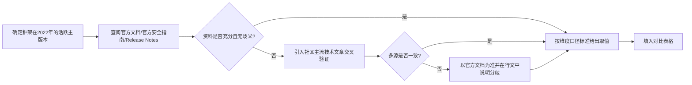
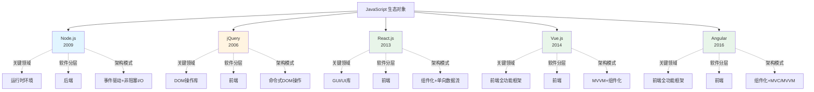
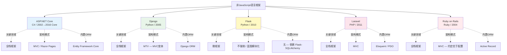
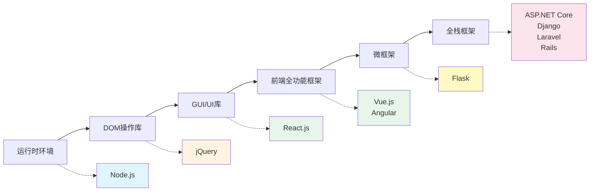
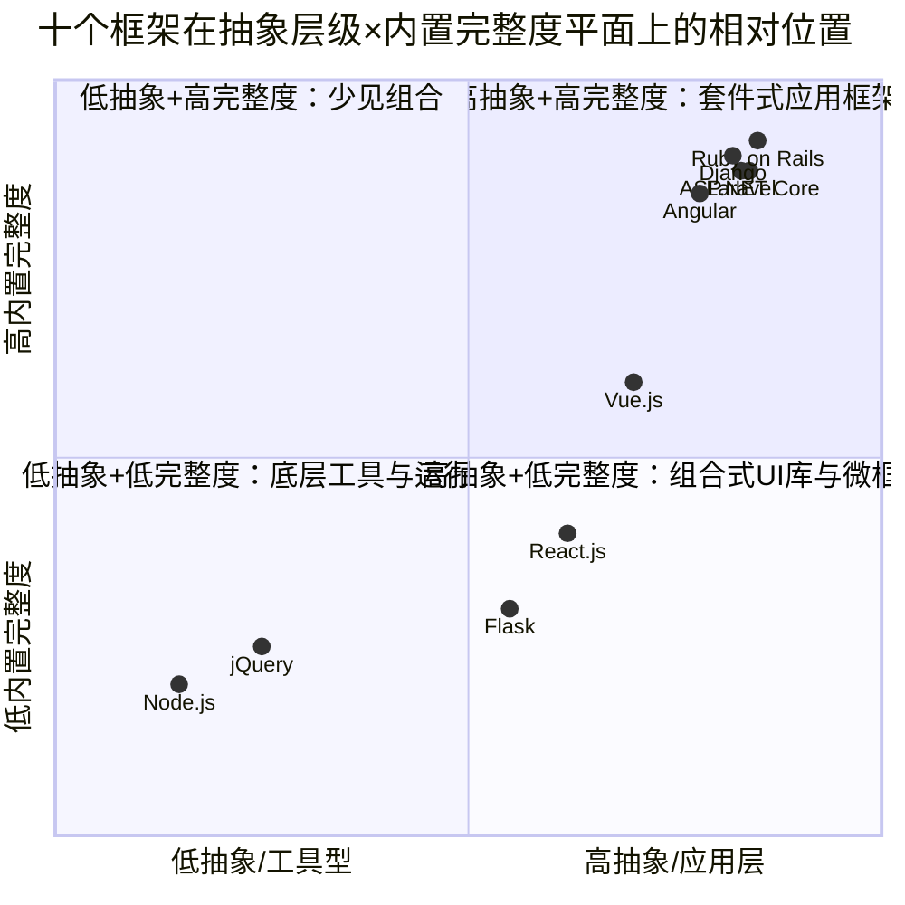
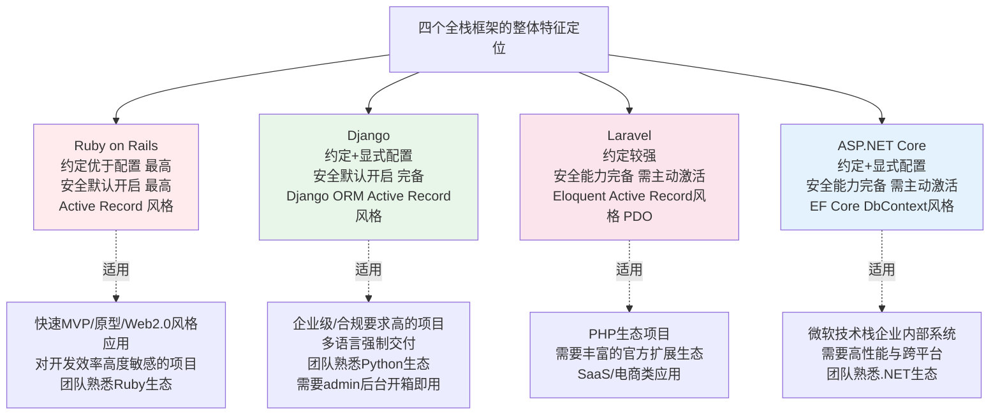
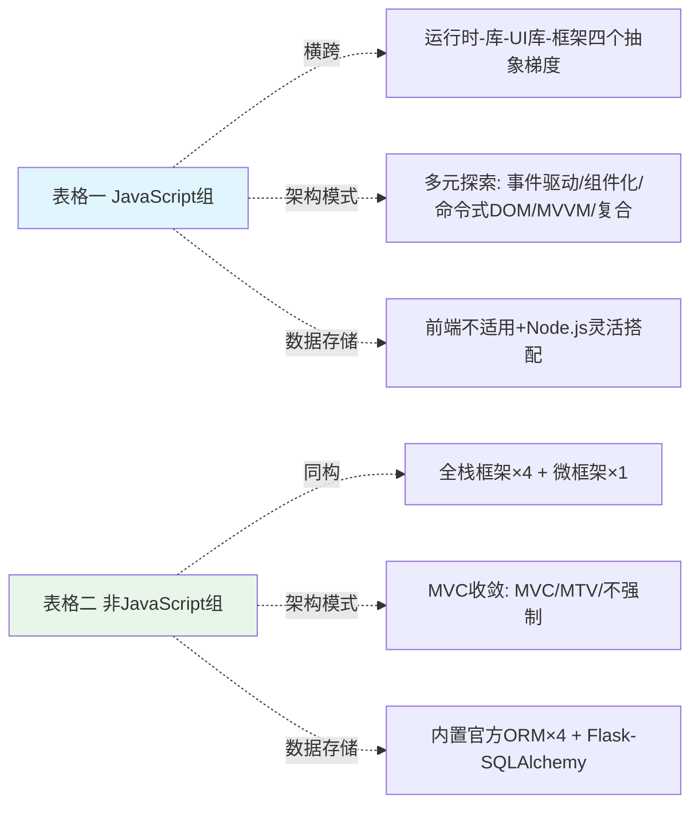
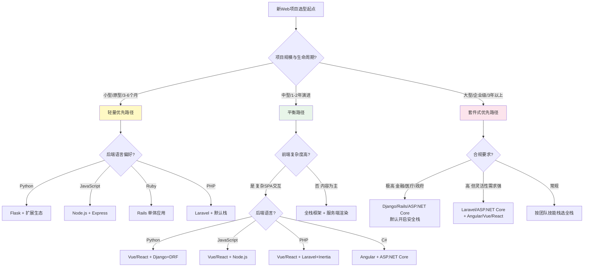

# 2022年主流Web开发框架多维度对比研究：面向新项目技术选型的决策参考
# 1 研究背景、目标界定与对比方法论

## 1.1 研究背景与应用场景界定

Web开发框架数量在过去二十年间呈爆发式增长。仅以Python生态为例，目前可供选择的网络编程框架已多达几十个，逐个学习显然不现实[^1]。同时，前端生态也涌现出React、Vue、Angular等数十个具有代表性的库与框架[^2]。在框架供给极度丰富、技术演进速度持续加快的背景下，**为一个新的Web项目挑选合适的技术栈，已经从"是否使用框架"的问题，演变为"在众多框架中如何择优"的复杂决策**。这正是本研究试图回应的核心现实需求。

本报告的核心应用场景被明确界定为：**为一个尚未启动开发的新Web项目进行前后端技术选型**。这一定位带来三重边界约束。其一，研究并非面向既有项目的迁移评估，因此不讨论从旧框架平滑过渡到新框架的成本、兼容层与重构路径；其二，研究并非框架演进史的学术回顾，对每个框架的早期版本特性与已废弃机制仅在必要时作为背景提及，不作为对比维度的取值依据；其三，研究并非性能基准测试报告，不涉及具体压测数据（如QPS、内存占用、冷启动时间），而是聚焦于框架自身在能力维度上的结构性差异。

时间基准统一锚定在**2022年**。选择这一时间切片有两重意义。一方面，2022年是Web框架生态相对成熟稳定的年份：服务端方面Django已发布4.x系列、Laravel进入9.x阶段、Ruby on Rails发布7.x、ASP.NET Core延续在.NET 6/7体系；前端方面Angular保持在14/15版本、Vue 3已全面普及、React 18发布；运行时方面Node.js长期支持版本已迭代至18 LTS。这构成一个**可被作为"快照"加以横向对比的稳定参照系**。另一方面，将时间锁定可避免后续版本演进（如Bun崛起对Node.js的冲击、新一代前端框架的兴起）干扰对比口径的一致性，确保所有判定都在同一历史坐标下成立。

本报告的目标读者画像主要包括三类角色：负责为新项目拍板技术路线的**技术决策者**、需要评估架构落地可行性的**软件架构师**，以及刚刚组建、面临首次选型的**新项目团队**。围绕这三类读者的共同关切——"哪个框架适合我的项目"，报告将以横向对比与决策建议为最终落脚点，而不是停留在对单个框架的功能罗列。

## 1.2 对比对象与双表分组依据

本报告对比的十个框架为用户明确指定，可按编程语言归属划分为两组。第一组是基于JavaScript（运行于浏览器或Node.js运行时）的五个对象：**Node.js、React.js、jQuery、Angular、Vue.js**。第二组是基于其他编程语言（C#、Python、PHP、Ruby）的五个对象：**ASP.NET、Django、Flask、Laravel、Ruby on Rails**。最终交付形态为两张结构化对比表格，分别承载这两组对比对象。

之所以采用**双表分组而非合并为单表**，并非仅出于排版考量，而是基于两类生态在结构上的本质差异。其一，两组框架的**运行环境根本不同**。JavaScript类的Node.js、React.js、jQuery、Angular、Vue.js共享浏览器或Node运行时这一统一执行环境，其包管理、构建工具链（npm/yarn、Webpack、Babel等）也高度共通[^2]。而ASP.NET运行于.NET CLR、Django与Flask运行于Python解释器、Laravel依托PHP-FPM、Rails构建于Ruby VM之上，它们的运行环境、包管理器（NuGet、pip、Composer、RubyGems）、部署模型完全分立。

其二，两组框架的**软件分层定位结构性不对称**。JavaScript组中既包含前端UI库（React.js）、前端DOM操作库（jQuery）、前端全功能框架（Angular、Vue.js），也包含纯粹的后端运行时（Node.js），其内部已经横跨前后端；而非JavaScript组则**清一色为后端全栈框架**（包括ASP.NET、Django、Laravel、Rails的MVC/MTV体系，以及Flask的微框架定位）。这种结构差异决定了：如果将十个对象混在一张表中，纯前端库在"数据存储""CSRF防护"等后端相关维度上将不得不大面积标注"不适用"，而纯后端框架在"DOM操作模式""组件化"等前端相关取值上又难以匹配，**对比表格的信息密度与可读性会被大幅稀释**。

其三，**社区生态与协作模式存在差异**。前端JavaScript生态以快速迭代、库与库自由组合为特征，开发者通常需要自行拼装路由、状态管理、UI组件等模块；后端语言生态则更倾向于"约定优于配置"的全栈一体化交付，从ORM、模板引擎、表单处理到安全防护一并打包提供。这种"组合式 vs 套件式"的差异，若在同一张表里用同一套维度去刻画，会出现取值口径错位的问题（例如"国际化是否内置"在React上是"不适用本体、需react-intl/i18next"，在Django上则是"内置完整i18n框架"，二者在同一格内的并置容易让读者误判其可比性）。

基于上述三点结构性差异，**分组建表本质上是为了在每张表内部维持口径统一**，而通过两张表的并列对照，再观察跨语言生态的共性与差异，从而既不损失对比一致性，也不丢失全局视野。

## 1.3 七项对比维度的口径定义

报告对每个框架将沿七项维度展开统一描述。为避免不同框架在同一维度上出现取值标准漂移，需要在此为每一维度建立**清晰的判定口径与取值范围**。

**维度0：发布年份（首次公开发布）**。取首次面向社区公开发布的年份作为锚点，而非项目立项或代码私有开发年份。这一取值用于反映框架的成熟度与生态积累周期。

**维度1：关键领域（Key Area）**。这是七项维度中分类最易引发误解的一项，因此需要明确分级：
- **运行时环境（Runtime Environment）**：提供编程语言在特定平台上的执行能力，本身并非Web框架，但承载Web应用运行。典型如Node.js。
- **GUI库 / UI库（GUI Library）**：聚焦于用户界面渲染，不规定路由、数据层、构建流程等全套架构。典型如React.js（其官方定位即"用于构建用户界面的JavaScript库"）。
- **DOM操作库（DOM Manipulation Library）**：以简化DOM选择、事件绑定、AJAX调用为核心目标的轻量级库，典型如jQuery。
- **前端全功能框架（Front-end Framework）**：提供路由、状态管理、组件化、模板系统等完整前端开发解决方案，典型如Angular、Vue.js。
- **全栈Web框架（Full-stack Framework）**：除封装网络与线程操作，还提供HTTP栈、数据库读写管理、HTML模板引擎等一系列功能的网络框架，典型如Django[^1]。本报告中ASP.NET、Django、Laravel、Rails均归入此类。
- **微框架（Micro-framework）**：属于非全栈框架，但更加轻量级，仅提供核心路由与请求处理，数据库、表单、认证等能力交由第三方扩展[^3]。典型如Flask。

**维度2：软件分层（Software Layer）**。按前端、后端、全栈三类归属判定。前端是用户直接接触的界面，负责展示内容和处理交互；后端运行在服务器上，负责处理业务逻辑、管理数据和与前端通信，前者用户能看到，后者用户看不见但承担登录验证、支付、数据存储等关键操作[^2]。需要特别指出，**Node.js作为运行时环境，其归属为"后端"**——它常用作Web服务器端JavaScript的执行平台，与浏览器内的JavaScript执行环境对应。

**维度3：主要架构模式（Primary Architectural Pattern）**。这一维度用于刻画框架对应用代码组织方式的默认引导。常见可选取值包括：
- **MVC（Model-View-Controller）**：将应用分为模型、视图、控制器三层，View传送指令到Controller，Controller完成业务逻辑后要求Model改变状态，Model将新数据发送到View[^4]。这是最经典的服务端Web框架架构，Django、Rails、Laravel、ASP.NET MVC均以此为基础。
- **MTV（Model-Template-View）**：Django使用的变体表达，本质仍是MVC，只是命名上将"View"称为"Template"、将"Controller"角色称为"View"。
- **MVVM（Model-View-ViewModel）**：核心是数据绑定，通过ViewModel让View与Model自动同步，**Vue以MVVM为核心设计理念**[^5]。
- **MVP（Model-View-Presenter）**：MVC的改进版，让View完全"被动"，不直接与Model交互[^5]。本报告涉及的十个框架中无以MVP为主推架构者，仅作背景说明。
- **事件驱动 / 非阻塞I/O**：以事件循环为核心调度机制，典型如Node.js。
- **组件化 + 单向数据流**：以可复用组件树和自上而下的数据流为核心，典型如React.js。

需要强调的是，**架构模式标注的是"框架推崇或默认引导"的模式**，而非"项目中绝对必须使用"的模式。例如基于Vue也可模拟MVC，但Vue官方文档与生态主导方向是MVVM[^5]。

**维度4：主要数据存储（Primary Data Storage）**。此维度记录两类信息：其一是框架内置或官方推荐的ORM（如Django ORM、Eloquent、Active Record、Entity Framework），其二是社区主流的数据库搭配（如关系型数据库MySQL/PostgreSQL/SQL Server，或文档数据库MongoDB等）。**对于纯前端库（React.js、jQuery）与前端框架（Vue.js、Angular），数据存储不在其职责范围内，统一标注为"不适用"**，并在表注中说明前端层通过API与后端通信，不直接负责数据持久化。

**维度5：国际化支持（Internationalization, i18n）**。采用二分判定：
- **内置支持**：框架核心代码或官方维护的子模块即提供多语言资源加载、区域格式化、翻译消息管理等能力，无需引入第三方库即可启用。
- **需额外库**：框架本体不直接提供i18n机制，需依赖社区维护或第三方官方扩展（如React的react-intl/i18next、Vue的vue-i18n、Flask的Flask-Babel等）。

对于Node.js这类运行时，其本身不提供Web应用层的i18n机制，国际化能力取决于其上层框架（如Express、Koa、NestJS等）及具体库的引入，因此在报告中将作专门说明。

## 1.4 安全维度的五类攻击分级标准

安全是Web框架选型中权重极高的维度，但也是最容易出现判定口径不统一的维度——同一种攻击在不同语言生态、不同框架定位下，"内置防护"的含义可能截然不同。为此，本报告对五类典型攻击建立**统一的四级判定标准**。

首先明确五类攻击的定义与防护对象：

**XSS（跨站脚本攻击，Cross-Site Scripting）**：攻击者通过在网页中注入恶意脚本（如JavaScript），让恶意代码在受害者浏览器中执行，可能窃取用户敏感信息、操控浏览器行为甚至控制用户账户，包括存储型XSS（恶意脚本存储在服务器）、反射型XSS（恶意脚本通过URL传递）和DOM型XSS（在客户端动态生成执行）[^6][^7]。框架层面的内置防护主要体现在**模板引擎的自动输出转义**与**用户输入的过滤/编码机制**[^6]。

**Clickjacking（点击劫持）**：与XSS、CSRF并列为典型Web安全攻击类型[^8]。攻击者通过透明iframe叠加诱导用户点击非预期目标。框架层面的防护通常通过设置`X-Frame-Options`或CSP的`frame-ancestors`等HTTP响应头实现。

**CSRF（跨站请求伪造，Cross-Site Request Forgery）**：攻击者利用用户已登录的Web应用程序会话，伪装成用户发送请求来执行非用户意愿的操作，例如通过恶意链接诱使用户点击导致账户转账、修改密码等操作；防御措施通常包括使用CSRF Tokens、检查Referer/Origin头、实施双重验证等[^7]。框架内置CSRF防护通常表现为请求中间件自动校验Token。

**DDoS（分布式拒绝服务攻击）**：通过大量分布式请求耗尽目标服务资源[^7]。这一攻击层级显著高于应用代码——其防护主要依赖CDN、WAF、网络层流量清洗、操作系统层连接数限制等基础设施手段，**Web应用框架本身通常不具备防御DDoS的能力**。

**远程代码执行（RCE，Remote Code Execution）**：攻击者通过应用漏洞在服务器执行任意代码，常见诱因包括反序列化漏洞、模板注入、命令注入（输入恶意命令影响服务器操作系统）等[^9]。框架层面通常通过参数化查询、安全的反序列化API、沙箱化的模板渲染等设计降低RCE风险，但**完全防御RCE需结合代码审计与运行环境加固**，框架层只能提供"减少暴露面"的支持。

在上述定义基础上，本报告对每一类攻击在每个框架上的防护情况，采用**四级判定**：

| 等级 | 取值 | 认定依据 |
|------|------|----------|
| 1 | **内置支持** | 框架核心或官方默认中间件直接提供该类攻击的防御能力，开发者无需引入第三方库即可获得基础防护（例如Django的CSRF中间件、模板自动转义；Laravel的`VerifyCsrfToken`中间件；Rails对XSS的默认转义等） |
| 2 | **需额外库** | 框架本体未提供针对该攻击的官方防护机制，但生态中存在成熟的第三方扩展可弥补（例如Flask本体不内置CSRF防护，需引入Flask-WTF等扩展） |
| 3 | **不支持** | 框架既未提供官方机制，主流生态也无对应的标准扩展，开发者需自行实现防御逻辑 |
| 4 | **不适用** | 该攻击不在框架设计层面可解决的范围内（例如DDoS对所有应用框架普遍属于此类，因其本质是基础设施层问题；又如纯运行时Node.js不直接处理HTTP请求体内容，XSS/CSRF的防御责任分配给其上层Web框架） |

特别需要说明三种"边界情形"的处理规则：

其一，**Node.js作为运行时的特殊性**。Node.js本身是JavaScript执行环境，不直接承担HTTP请求语义层的安全防护——这些职责落在Express、Koa、Fastify、NestJS等上层框架与具体中间件上。因此在五类攻击维度上，Node.js本体大多标注为"不适用（由上层框架/中间件负责）"，并在表注中明确说明这一责任分配。

其二，**前端库/框架在CSRF维度上的特殊性**。CSRF的核心防御机制（Token生成与校验）发生在服务端，前端的角色是在请求中携带Token；因此React.js、Vue.js、jQuery、Angular本身在CSRF维度上通常标注为"不适用"或"配合后端"，避免与服务端框架的"内置CSRF中间件"在同一维度上产生口径混淆。

其三，**前端库在XSS维度上的差异化处理**。虽然XSS的最终触发场景在浏览器，但模板/组件层的自动转义机制可大幅减少XSS暴露面。例如以组件化方式渲染的前端框架（React、Vue、Angular）默认对插值表达式进行HTML转义，可视为"内置部分XSS防护"；而jQuery作为DOM操作库，`.html()`等API默认不做转义，由开发者自行控制，这类情况会区别标注。

## 1.5 研究边界、判定流程与交付形态

为确保后续章节的对比建立在可控的边界之上，本节最后明确研究范围、判定流程与交付形态。

**研究范围边界**：本报告聚焦于框架自身能力的多维定性对比，**不包含性能基准测试**（如吞吐量、延迟、内存占用的实测数据）、**不包含具体业务场景压力评估**（如电商秒杀、实时音视频的并发压力实测），也**不包含商业生态指标**（如招聘市场规模、薪资水平、培训资源丰富度）。这些维度虽然对实际选型具有参考价值，但其客观可比性高度依赖具体测试环境与样本，与本报告"以框架内置能力为核心"的对比取向不直接重合，故不作纳入。

**判定工作流程**：每个框架在每个维度上的取值，遵循以下三步流程。



上述流程的关键节点在于**资料权威性的分级**：一手资料（官方文档、官方安全指南、主版本Release Notes）权重最高；二手资料（社区博客、问答平台、技术专栏）作为补充与交叉验证之用；遇到一二手矛盾时，以一手为准并在报告中显式说明分歧来源。

**交付形态**：本报告的核心交付物为两张结构化对比表格——**表格一**对比Node.js、React.js、jQuery、Angular、Vue.js五个JavaScript生态对象（见第6章），**表格二**对比ASP.NET、Django、Flask、Laravel、Ruby on Rails五个非JavaScript语言对象（见第7章）。两张表格在维度列上完全一致（发布年份、关键领域、软件分层、架构模式、数据存储、国际化、安全五子项），从而支持表间的纵向对照。

围绕两张核心表格，**第2章与第3章**将分别为两组框架建立"画像"，即从设计哲学、定位、架构基因等角度还原其特征，为表格中每一格的取值提供可追溯的事实依据；**第4章与第5章**则按维度展开横向比较，挖掘表面取值之下的结构性差异与权衡逻辑；**第8章**在所有对比完成后，给出面向具体项目场景的选型决策路径与组合建议，并坦诚说明本报告的局限——**安全维度判定主要基于框架内置能力而非部署环境综合考量；时间基准固定为2022年未涵盖后续版本演进；架构模式判定关注框架默认引导方向，不代表项目中绝对约束**。

通过上述方法论奠基，后续七个章节将在统一的研究边界、判定口径与交付预期下展开，确保最终的两张对比表格既可单独作为速查工具，也能与正文章节共同构成一份逻辑自洽、证据充分的选型参考。

# 2 JavaScript 生态框架画像：Node.js、React.js、jQuery、Angular、Vue.js

承接第1章对七项对比维度与判定口径的方法论奠基，本章将进入对五个JavaScript生态对象的逐一画像。需要特别强调的是，在JavaScript生态内部，这五个对象在抽象层级与职责边界上并不处于同一平面：Node.js是支撑JavaScript在服务端运行的**运行时环境**，jQuery是简化浏览器端DOM操作的**轻量级库**，React.js被官方明确定义为"用于构建用户界面的JavaScript库"——一个聚焦于视图层的**UI库**，而Angular与Vue.js则属于提供路由、组件、数据绑定等完整能力的**前端全功能框架**。这种"运行时—库—UI库—框架"的层级差异，是后续维度判定（特别是关键领域、软件分层、架构模式）取值的核心依据。本章为五个对象逐一建立画像，并在最后一节做横向归纳，为第6章对比表格一的每一格取值提供可追溯的事实支撑。

## 2.1 Node.js:基于V8的服务端JavaScript运行时

Node.js的诞生具有鲜明的"工程师驱动"色彩。其创始人Ryan Dahl在2008年末注意到Google为Chrome浏览器推出了全新的V8 JavaScript引擎,他本想寻找一种语言以"推送"而非"轮询"的方式构建Web应用。Ryan Dahl对C/C++和系统调用十分熟悉,他最初考虑用Ruby实现这一目标,但发现Ruby虚拟机的性能不足以满足需求,最终转向V8并以C++构建运行时。2009年2月,他首次在博客上宣布准备基于V8创建一个轻量级Web服务器并提供配套库;同年5月,Node.js的最初版本在GitHub上发布;2010年底,Node.js获得云计算服务商Joyent资助,Ryan Dahl全职推动其发展[^10]。这一段历史决定了Node.js从诞生之初就**以"运行时性能"和"非阻塞I/O"为核心命题**,而非以构建Web应用层抽象为目标。

按照第1章关键领域口径的定义,**Node.js应被严格归类为"运行时环境(Runtime Environment)",而非Web框架**。这一判定可由其官方文档原文直接佐证:Node.js v16.10.0与v22.0.0两份官方API参考文档在开篇均明确写道"Node.js is a JavaScript runtime built on the V8 JavaScript engine"[^11][^12]。正因如此,在软件分层维度上,Node.js一致归属于"后端"——它常作为Web服务器端JavaScript的执行平台,与浏览器内的JavaScript执行环境对应,这与第1章已明确的归类规则保持一致。

Node.js的架构基因可概括为**"单线程+事件驱动+非阻塞I/O"三位一体**。在传统Java、PHP、.NET等服务端语言中,每一个客户端连接通常会分配一个独立线程,每个线程约耗费2MB内存,从而限制了单机并发能力。Node.js则不为每个连接创建新线程,而是仅使用一个主线程,通过事件循环(Event Loop)与回调机制将I/O任务委托给底层异步机制;当I/O操作完成时产生事件并触发回调,主线程因此无需在I/O等待中空转[^10][^13]。更精细地说,Node.js通过**libuv库**实现跨平台异步I/O,其事件循环包含六个有序阶段——Timers、Pending callbacks、Idle/Prepare、Poll、Check、Close callbacks——分别处理不同类别的回调与系统事件[^14]。这一架构在第1章"主要架构模式"维度上对应"事件驱动+非阻塞I/O"的取值。

从开发模型演进看,Node.js的异步表达经历了"回调地狱→Promise→async/await"的渐进式优化。早期版本以回调函数为主,导致深度嵌套的"回调金字塔";Promise化API和`util.promisify`减轻了这一问题;而async/await语法糖则将异步代码组织得近似同步风格[^14]。

2022年时间切片下,Node.js的活跃主版本格局有两条主线值得记录。其一是**Node.js 16(代号"Gallium")**,该版本于2021年4月发布,于2021年10月被提升为LTS,其支持期延续至2022年10月、维护期延续至2024年4月,内置V8引擎升级至9.0、定时器Promise API、AbortController、稳定的Async Context Tracking等能力[^15][^16]。其二是**Node.js 18**,于2022年4月19日发布,内置了`fetch`(基于undici的实验性实现)、`node:test`测试模块、全局Web Streams API等标准化能力,V8引擎升级至10.1/10.2,该版本于2022年10月25日转为LTS版本[^17][^18][^19]。这两版的共同方向被官方与社区概括为"std lib在标准化,user lib在精细化"[^17],代表了Node.js从"小内核+大社区"向"渐进内置现代Web能力"的演进。

需要特别说明的是,**作为运行时,Node.js本身并不直接承担HTTP请求语义层的安全防护职责**。HTTP路由、模板渲染、CSRF Token生成与校验、输出转义等能力均由其上层Web框架(如Express、Koa、Fastify、NestJS等)及具体中间件(如Helmet)负责;Express生态的典型安全防护实践包括使用Helmet设置HTTP安全头、配置CORS、JWT身份认证等,这些均不属于Node.js运行时本体的范畴[^20][^21]。这一责任分配格局为第5章与第6章在XSS、CSRF、Clickjacking维度上将Node.js本体标注为"不适用(由上层框架/中间件负责)"提供了直接依据。

## 2.2 React.js:声明式组件化UI库

React.js于2013年由Facebook软件工程师Jordan Walke创建,起初用于Facebook内部,2013年5月在JSConf US上正式开源[^22][^23]。其官方文档对自身的定位非常明确——首页与"描述用户界面"一节均开宗明义地写道:**React是一个"用于构建用户界面(UI)的JavaScript库"**[^11][^24]。这一表述对第1章关键领域维度的判定至关重要:React应归入"GUI库/UI库",而非"前端全功能框架"。其根本原因在于,React本身不提供路由、HTTP客户端、状态管理、构建工具等"全栈前端"必备模块,这些能力均由社区生态(React Router、Redux、Next.js等)拼装供给[^22]。在软件分层上,React显然属于"前端";同时官方文档也指出React"还可以使用Node进行服务器渲染,或使用React Native开发原生移动应用"[^24],这扩展了其使用场景但不改变其前端UI库的核心定位。

React的设计哲学建立在**三大支柱**之上。其一是**声明式编程**:开发者只需为应用的每一个状态设计简洁的视图,数据变动时React自动高效更新并渲染合适的组件,无需手动操作DOM[^24]。其二是**组件化**:UI被拆分为可重用、可嵌套的组件,从按钮、文本、图像等小单元到整个页面,屏幕上的所有内容都可以被分解成组件;组件本质上是"可以任意添加标签的JavaScript函数"[^11][^24]。其三是**单向数据流**:数据通过`props`自上而下传递,组件内部通过`state`管理自身状态,这种自上而下的数据流模式被官方对比为对早期双向数据绑定模式问题的回应——双向绑定容易导致变化级联且难以追踪,而单向数据流则使数据变更路径清晰可控[^25]。

围绕这三大支柱,React的核心机制包括**虚拟DOM**(在数据变动时仅高效更新和渲染必要的部分,带来更好的性能与更快的UI更新)[^22]、**JSX语法**(看起来很像HTML但更为严格、可显示动态信息的JavaScript语法扩展,可在Babel REPL中查看其编译为原生JavaScript的步骤)[^11][^24]、以及Hooks机制等。在架构模式维度上,这些特征综合形成"**组件化+单向数据流**"的取值,需要与传统MVC/MVVM明确区分。

2022年是React发展史上的关键节点——**React 18于2022年3月29日发布**[^26][^27][^28]。这一版本侧重于性能改进和渲染引擎更新,并为未来的"并发"特性奠定基础。其核心新能力包括:**并发渲染(Concurrent Rendering)**(通过新的`createRoot` API取代`ReactDOM.render`启用)、**自动批处理(Automatic Batching)**(多状态更新自动合并,减少不必要渲染)、**过渡更新(Transitions)**(通过`useTransition`区分紧急与非紧急更新)、**新Hooks**(包括`useId`、`useTransition`、`useDeferredValue`、`useSyncExternalStore`、`useInsertionEffect`)、**Suspense支持的流式SSR**(通过`renderToPipeableStream`等API改善首屏加载体验)等[^26][^27][^28]。这些特性使React 18在2022年成为画像的标准参考版本。

React作为"库"而非"框架"的定位决定了其**生态组合特征**:路由由React Router处理、状态管理由Redux/Mobx/Zustand等承担、服务端渲染由Next.js提供、移动端由React Native拓展[^22][^17]。这种"自由拼装"模式带来灵活性,但也意味着开发者需要自行决策这些"非核心但必要"的能力如何组织——与Angular的"套件式批电池"形成对比,这一差异将在第4章被进一步展开。

在第1章安全维度口径下,React有两条特别值得记录的默认行为。其一,**React默认对插值表达式进行HTML转义**:在JSX中通过`<div>{userInput}</div>`渲染的内容,即便其中包含`<script>`标签也会被转义为纯文本,不会被作为可执行HTML注入[^18]。其二,`dangerouslySetInnerHTML`是显式的"危险出口":React团队有意将其命名为"危险地设置"以警示开发者,该prop接收一个`{__html: ...}`对象而非纯字符串,这一设计本身就是一种"类型/污点"标记机制,旨在让开发者明确表达自己执行不安全操作的意图;官方文档明确警告"`innerHTML`的不当使用可能使你面临跨站脚本(XSS)攻击,而对用户输入进行无害化处理是出了名的容易出错"[^19][^18]。这两条行为为第6章在XSS维度上对React的取值提供了关键事实。

## 2.3 jQuery:化繁为简的DOM操作库

jQuery于**2006年1月14日**由John Resig在纽约的BarCamp上首次发布,定位为一个JavaScript库[^29][^30]。它的诞生背景是早期Web开发中浏览器DOM API的冗长与跨浏览器兼容性的混乱——同一个事件绑定在不同浏览器下需要写不同的代码。jQuery以"write less, do more"为口号,通过封装大量原生JS方法、处理浏览器兼容性、提供统一的链式API,极大降低了前端开发门槛[^29]。其核心能力簇被广泛归纳为五块:**CSS选择器获取元素、链式调用筛选、DOM常见操作(属性/类名/样式)、动画效果、事件绑定、AJAX封装**[^29][^28][^22]。

按照第1章关键领域口径,jQuery应归入"**DOM操作库(DOM Manipulation Library)**",软件分层上属于"前端"。需要特别强调的是,**jQuery与现代组件化框架(React/Vue/Angular)在本质上属于不同代际的工具**:jQuery是命令式DOM操作工具,即开发者主动通过`$("#xx").html(...)`、`$("#xx").addClass(...)`等API"指挥"DOM如何变化;而React/Vue/Angular是数据驱动的声明式渲染,开发者只声明"数据是什么状态,UI该长什么样",由框架自动完成DOM更新。这一差异在第1章"主要架构模式"维度上对应"**命令式DOM操作**"这一取值,而非MVC/MVVM/组件化。

2022年时间切片下,jQuery处于**3.6.x维护阶段**。3.6.0于2021年3月发布,主要包含若干bug修复与改进(如JSONP错误响应、focus事件修复等)[^31];3.6.1于2022年8月26日发布,**距上一个版本时隔一年零五个月**——这一发布节奏本身就反映了jQuery进入"维护为主、功能少有新增"的稳态[^32]。3.6.1的改进包括基础设施迁移(CI从Travis迁至GitHub Actions、在Node 16而非15上测试)、对focus事件、`addClass(array)`错误值跳过、自定义CSS属性值trim处理、`jQuery.trim`性能提升等小修小补,并发布了不含ajax和effects模块的"slim"版本(比常规版本小约6k gzip后)[^32]。

在2022年的前端生态中,**jQuery已显著边缘化**:大型新项目普遍采用React、Vue、Angular等现代框架;jQuery主要存在于遗留系统维护、传统多页Web应用、CMS主题、邮件营销页面等场景[^33][^34]。社区调研文章直言"虽然团队成员都在使用React、Vue等现代框架开发新功能,但核心业务页面仍然依赖jQuery"的现象在企业级应用中并不少见[^33]。

在第1章安全维度口径下,jQuery有两点特别值得记录。其一,**`.html()`等API默认不做HTML转义**,这一行为与React/Vue的默认转义形成鲜明对比。在jQuery 3.5.0之前,`.html()`、`.append()`等DOM操作方法即便执行了消毒处理,也仍会执行将来自不受信任来源的HTML——这就是著名的**CVE-2020-11022/CVE-2020-11023漏洞**,影响范围覆盖所有1.0.3 <= jQuery < 3.5.0版本,可能导致XSS攻击[^35][^33][^36]。其二,jQuery社区的XSS防护最佳实践依赖开发者自觉:推荐使用`.text()`代替`.html()`(`.text()`会将内容作为纯文本处理,不解释HTML标签)、`.val()`代替`.html()`更新输入框值、对必须使用HTML的位置采用DOMPurify进行净化、避免在选择器中拼接用户输入等[^37][^38][^24]。

升级到jQuery 3.5.0以上版本仅是"安全长征的第一步",真正考验开发者的是在日常编码中建立"肌肉记忆"级别的安全习惯[^38]。这一点对第6章在jQuery的XSS、Clickjacking等维度上的取值具有直接含义——其内置防护能力相比组件化框架的"默认转义"机制处于结构性弱势,**关键安全责任落在开发者使用习惯而非框架默认行为之上**。

## 2.4 Angular:TypeScript驱动的前端全功能框架

Angular的代际划分需要特别厘清。其前身**AngularJS(1.x)** 由Misko Hevery与Adam Abrons发起,于2010年发布,基于MVC架构,以双向数据绑定和依赖注入为标志性特性,但因性能瓶颈、可维护性差、学习曲线陡峭等问题受到限制[^22][^39][^35]。**2016年9月,Angular团队发布了完全重写的版本Angular 2**,基于TypeScript开发,采用组件化架构,性能与可维护性大幅提升;此后每半年发布一个大版本,Angular 4、5、6……命名上不再使用"Angular 2"而统称为"Angular"[^39][^40]。**AngularJS与Angular之间的差异被开发者社区形容为"Java和JavaScript"或"雷锋与雷峰塔"的关系**[^40],二者实质上是两套不同的框架。需要明确的是,**2022年时间切片下,AngularJS官方已停止维护,本报告对Angular的画像专指Angular 2+(以下简称Angular)**[^35]。

2022年Angular的活跃主版本为**Angular 14(2022年6月发布)** 与Angular 15。Angular 14完成了两项重要的RFC——**Strictly Typed Reactive Forms**(关闭了团队仓库的#1 GitHub issue,实现表单的严格类型化)与**Standalone Components**(以开发者预览形式引入,旨在通过减少对NgModule的依赖来简化Angular应用编写)[^36][^29]。这两项更新代表了Angular在"严格类型"与"简化样板"两个方向上的演进。

按照第1章关键领域口径,Angular归入"**前端全功能框架(Front-end Framework)**",软件分层归属"前端"。其官方网站对自身的定位非常直接——"Angular is the framework for building scalable web apps with confidence"[^28]。Angular的"全功能"特性体现在其**内置完备的"批电池"套件**:

| 能力维度 | Angular内置机制 |
|---------|----------------|
| 语言基础 | TypeScript(提供静态类型检查与现代JS特性) |
| 组织结构 | 基于NgModule的模块化、基于装饰器的组件 |
| 依赖管理 | 内置依赖注入(DI)机制 |
| 异步处理 | RxJS驱动的响应式数据流 |
| 路由 | 内置@angular/router |
| 表单 | 模板驱动表单 + 响应式表单 |
| HTTP | HttpClient(@angular/common/http) |
| 国际化 | 内置i18n,Angular 9起支持编译时i18n |
| 渲染引擎 | Ivy渲染器(Angular 9起默认) |

[^39][^32]

在架构模式维度上,Angular的取值需要细致界定。从历史脉络看,AngularJS 1.x明确采用MVC(并通过`$scope`实现双向数据绑定与脏检查机制);而Angular 2+则演进为**组件化为核心、辅以MVC/MVVM思想**的复合架构——视图层通过组件树组织,数据流通过服务+DI注入,变更检测由Ivy渲染器结合Zone.js实现[^39][^35][^22]。社区与官方资料中,Angular的架构常被描述为"组件化+MVC"或"组件化+MVVM",两种表述都有合理依据,本报告在第6章倾向以"**组件化+MVC/MVVM**"复合表述记录,以反映其多面性。

依赖注入是Angular的标志性特性。其官方文档定义DI为"a design pattern and mechanism for creating and delivering some parts of an application to other parts of an application that require them",并解释了"dependency consumer"与"dependency provider"两个角色,以及在应用启动时创建的根注入器(root injector)如何管理实例化与依赖查找[^37][^38]。这一机制使得组件、指令、管道、可注入服务之间形成松耦合关系,显著提升了可测试性与可维护性[^39]。

在第1章安全维度口径下,Angular作为典型的"批电池齐全"框架,其内置安全能力相对全面。其官方Security文档明确列出框架对**XSS**的防护:Angular将所有值视为"不可信",通过`DomSanitizer`类对绑定到DOM的值进行净化(sanitization),开发者需显式调用`bypassSecurityTrustHtml`等API才能绕过净化——这与React的`dangerouslySetInnerHTML`机制一脉相承[^41][^42]。对于**CSRF/XSRF**,Angular的`HttpClient`内置了基于Cookie+Header的XSRF防护机制:拦截器默认从名为`XSRF-TOKEN`的Cookie中读取Token并将其作为`X-XSRF-TOKEN`头附加到所有"变更类"请求(如POST)中,但不附加到GET/HEAD或绝对URL请求中——这是一种与服务端配合的标准CSRF防御模式[^33]。Angular官方Security文档还建议"keep current with the latest Angular library releases"以及避免修改私有副本以确保安全修复能及时获得[^41]。这些"内置批电池"特征,为第6章对Angular在XSS、CSRF等子维度上的"内置支持"取值提供了直接依据。

## 2.5 Vue.js:渐进式MVVM前端框架

Vue.js由前Google工程师**尤雨溪(Evan You)** 创建,设计动机在很大程度上是为了在Angular(学习曲线陡峭)与React(需要额外学习JSX)之间寻找一条更易上手的中间路径[^23][^36]。其演进轨迹被尤雨溪在VueConf 2022的演讲中清晰地划分为三个阶段:**库阶段(2013-2015)** ——2013年12月发布第一个以"Vue.js"命名的版本(0.6.0)、2014年2月首次在HackerNews上公开发布(首周获得400+ GitHub Star)、2014年10月实现首个单文件组件、2014年11月完成第一次完全重写(0.11);**框架阶段(2015-2016)** ——2015年8月发布第一版Vue Router、2015年10月26日发布Vue 1.0(代号Evangelion)、2015年12月发布vue-cli、2016年3月发布Vuex;**通用框架阶段** ——后续Vue 2.x/3.x的演进[^43]。这一演进轨迹本身就说明了Vue从"库"到"框架"的定位升级。

按照第1章关键领域口径,Vue.js应归入"**前端全功能框架(Front-end Framework)**",软件分层归属"前端"。其官方网站直接定义自身为"**The Progressive JavaScript Framework**"——一个易学易用、性能出色、灵活多变的Web前端框架[^44][^45]。其官方主页强调三个核心特征:**易学易用**(基于标准HTML、CSS、JavaScript构建,提供容易上手的API与一流文档)、**性能出色**(经过编译器优化、完全响应式的渲染系统,几乎不需要手动优化)、**灵活多变**(丰富的、可渐进式集成的生态系统,可以根据应用规模在库和框架间切换自如)[^44][^45]。

2022年时间切片下,Vue的版本格局形成"**Vue 3全面普及+Vue 2.7作为最后过渡版本**"的双线状态。**Vue 3**已经成为默认主版本,采用Proxy重写的响应式系统、组合式API、Tree-shaking友好的模块化设计、~10KB的压缩后体积等[^46]。**Vue 2.7**则于2022年7月发布,作为Vue 2的最后一个次级版本,**从Vue 3反向移植了组合式API、`<script setup>`、SFC CSS `v-bind`等关键特性**,以便仍因依赖兼容性、浏览器支持要求或升级精力有限而留在Vue 2的用户也能享受Vue 3的便利[^47][^37]。Vue 2.7同时支持`defineComponent()`、`h()`、`useSlot()`、`useAttrs()`、`useCssModules()`、`set()`、`del()`、`nextTick()`等具名API,以及在模板表达式中使用ESNext语法[^47][^37]。这一双线格局为第6章在Vue的版本特征描述上提供了细致依据。

在架构模式维度,Vue的核心定位是**MVVM(Model-View-ViewModel)**——通过数据绑定让View与Model自动同步。其响应式原理在Vue 2与Vue 3之间有实现层面的差异:Vue 2基于`Object.defineProperty`劫持数据的getter和setter,无法检测对象属性的添加或删除、数组变异方法需要特殊处理;Vue 3基于Proxy实现,原生支持对象和数组的所有操作,性能与依赖追踪精度均有提升[^46][^36]。Vue 2.7由于浏览器兼容性考虑保留了`Object.defineProperty`方案[^46]。

Vue的核心特征构成可概括为:**单文件组件(Single-File Components, `.vue`文件)**——将模板、脚本、样式统一封装在一个文件中,通过编译器编译为运行时组件对象[^48];**模板语法与渲染函数双轨**——既支持指令式模板(如`v-if`、`v-for`、`v-bind`、`v-on`)便于上手,也支持`h()`渲染函数与JSX便于灵活编程;**组合式API与选项式API并存**——前者通过`<script setup>`(2022年Vue 3.2版本起成为稳定的SFC编译时语法糖)提供更少样板、更佳类型推导[^49][^31],后者保持Vue传统的`data/methods/computed`组织方式;**官方生态完备**——Vue Router负责路由,Pinia(以及历史上的Vuex)负责状态管理[^44][^45]。

在第1章安全维度口径下,Vue的XSS防护机制与React/Angular保持一致的"默认转义"原则。Vue官方文档明确指出:"**无论是使用模板还是渲染函数,内容都是自动转义的**",并以`<h1>{{ userProvidedString }}</h1>`为例说明如果`userProvidedString`包含`<script>alert("hi")</script>`,则会被转义为对应的HTML实体字符,从而防止脚本注入;Attribute绑定(`v-bind`)同样会自动转义[^40][^50]。这种转义"是使用textContent这样的浏览器原生API完成的,所以只有当浏览器本身存在漏洞时,才会存在漏洞"[^40]。

但Vue官方也警告了**两个显式的"危险口"**:其一是`v-html`,用于在确定HTML安全的前提下显式渲染HTML内容,但"用户提供的HTML永远不能被认为是100%安全的,除非它在iframe这样的沙盒环境中,或者该HTML只会被该用户看到";其二是**永远不要使用不可信任的模板**——"使用Vue时最基本的安全规则就是不要将无法信赖的内容作为你的组件模板",因为模板会被编译成JavaScript,模板内的表达式将作为渲染过程的一部分被执行,使用不可信任的模板等同于允许任意JavaScript在应用中执行,在服务端渲染时还可能导致服务器被攻击[^40][^50][^21]。这些默认行为与显式语义设计,为第6章在Vue的XSS维度上的"内置支持(默认转义)"取值提供了清晰依据。

## 2.6 五个JavaScript对象的对比定位归纳

在前五节为每个JavaScript生态对象建立画像后,本节将其在"关键领域—软件分层—架构模式"三维度上的归属做横向归纳,直接对应第6章对比表格一的核心列。



从该归纳图可以读出五个对象在**抽象层级与职责边界**上的结构性差异:

**Node.js是运行时,不参与HTTP语义本身**。它是支撑JavaScript在服务端执行的平台,既不规定Web应用如何组织代码,也不直接处理HTTP请求/响应的具体语义层防护——这些职责均落在Express/Koa/Fastify/NestJS等上层框架与Helmet等中间件之上。这一点决定了Node.js与其他四个JavaScript对象不在同一层级,在跨维度对比时需要单独说明。

**jQuery是命令式补丁工具**。它解决的是早期浏览器DOM API冗长与跨浏览器兼容性的"局部痛点",通过简洁的链式API和封装,让开发者以"主动指挥DOM"的方式完成界面操作。jQuery不规定应用的架构组织方式,也不强加任何模式,这种"轻量补丁"的特性使其极易嵌入既有项目,但同时也意味着大型应用难以仅靠jQuery维持可维护性。

**React是组合式UI层**。React将"视图层"的能力极致化——提供组件、Hooks、虚拟DOM、单向数据流等核心机制,但路由、状态管理、SSR等能力交由社区生态拼装。这种"组合式"模式赋予开发者最大的灵活性,但也要求开发者具备拼装与决策能力。

**Angular是套件式全栈前端**。它将一个前端应用所需的几乎所有能力——模块、组件、DI、路由、表单、HTTP客户端、国际化、安全净化、构建工具(Angular CLI)——以官方维护的方式打包提供。这种"套件式"模式降低了选型决策成本,但也带来更陡的学习曲线[^39]与更强的框架"意见性"。

**Vue是渐进式中间路线**。Vue兼顾了易上手性(模板语法、选项式API)与现代性(组合式API、Proxy响应式),提供完备的官方生态(Vue Router、Pinia)但不强制使用,允许"按需采用"。Vue 2.7的存在还体现了其对生态兼容性的高度照顾[^47][^37]。

这一归纳直接对应第6章对比表格一中**关键领域、软件分层、架构模式**三列的取值,也为第4章按维度横向比较时识别"**组合式 vs 套件式**"(React与Vue/Angular的对比)、"**运行时 vs 框架**"(Node.js与其余四者的对比)、"**命令式 vs 声明式**"(jQuery与React/Vue/Angular的对比)等结构性权衡逻辑提供了清晰铺垫。

需要再次强调的是,这五个对象虽同属JavaScript生态,但在抽象层级上**横跨"运行时—库—UI库—框架"四个梯度**——这是后续表格中部分单元格出现"不适用"标注的根本原因。例如,Node.js在"数据存储"维度上虽不像纯前端库那样标"不适用",但其本身不包含ORM;React/jQuery/Vue/Angular在"数据存储"上则统一标"不适用",因为数据持久化不在前端层的职责范围内。这一归纳为后续章节在维度判定上保持口径一致提供了关键支撑。

# 3 非 JavaScript 语言框架画像：ASP.NET、Django、Flask、Laravel、Ruby on Rails

第2章以"运行时—库—UI库—框架"的层级差异为主线，完成了对五个JavaScript生态对象的画像。本章承接同样的画像方法，转向基于C#、Python、PHP、Ruby四种语言的五个后端框架。与JavaScript组内部跨越四个抽象梯度不同，本组五个对象在分层定位上**高度同构**——它们清一色运行在服务端、负责处理业务逻辑与数据持久化，并且其中四个（ASP.NET、Django、Laravel、Rails）属于"batteries-included"风格的全栈框架，仅Flask以"微框架"自我定位。这种"4+1"的结构反而让"全栈框架vs微框架"的对比意义更加突出，本章在各节画像之后将专门归纳这一结构性差异。

每个画像将按统一结构展开：语言基础与运行环境、发布年份与版本演进、关键领域与软件分层、设计理念与架构模式、数据存储默认搭配、国际化能力、安全内置机制。这一结构与第1章定义的七项对比维度一一对应，为第7章对比表格二的每一格取值提供可追溯的事实依据。

## 3.1 ASP.NET Core：跨平台高性能的.NET全栈Web框架

ASP.NET的演进史可以追溯到二十多年前。其第一个版本于2002年初作为.NET Framework 1.0的一部分发布，最初设计目的是为微软平台开发者提供一个比Classic ASP和ActiveX更现代的Web开发方式[^51]。早期的**ASP.NET Web Forms时代（2002-2008）** 以XML Web服务为核心叙事，当时ASP.NET的程序经理Rob Howard曾写道"XMLWebServices代表了微软.NET策略，是ASP.NET的一个核心特性"[^51]。然而随着Web标准化进程的推进和MVC理念的普及，微软在2007年推出了ASP.NET MVC，逐步将开发模式从"页面+服务器控件"转向更具可测试性与关注点分离的MVC架构。

**2016年是ASP.NET历史上的分水岭**。微软发布了完全重写的**ASP.NET Core 1.0**，将原本仅运行于Windows的封闭平台重构为开源、跨平台、模块化的现代Web框架。微软官方对ASP.NET Core的定位非常直接——"适用于.NET的新式高性能Web开发框架，在Windows、Linux、macOS、and Docker上运行"，并指出ASP.NET Core在独立TechEmpower基准中比其他流行的Web框架更快[^52]。其开源属性也十分突出：和.NET的其余部分一样，ASP.NET在GitHub上开放源代码，.NET整体拥有超过10万项贡献、3700多家公司参与[^52]。

按照第1章关键领域口径，ASP.NET Core应归入"**全栈Web框架（Full-stack Framework）**"，软件分层归属"后端"。其官方文档明确指出ASP.NET Core用于"create web apps and services that are fast, secure, cross-platform, and cloud-based"，涵盖交互式Web应用、Web API、MVC模式应用、实时应用等多种工作负载[^53][^54][^55]。需要强调的是，ASP.NET Core支持**多种页面/API开发范式并存**：基于控制器的MVC、Razor Pages（页面聚焦的Web UI，"clean separation of concerns"）、Minimal APIs、Blazor（基于WebAssembly的客户端组件）、SignalR（实时通信）等[^54][^55]。其中Razor Pages在Program.cs中通过`builder.Services.AddRazorPages()`与`app.MapRazorPages()`启用，为页面聚焦场景提供了比MVC更简洁的代码组织方式[^56][^57]。

2022年时间切片下，ASP.NET Core的活跃版本格局对应**.NET 6（2021年11月发布的LTS版本）与.NET 7（2022年11月发布）**。.NET 6引入了Minimal APIs、热重载等关键能力，并采用统一的`Program.cs`启动模型[^56]。

在架构模式维度，ASP.NET Core的主推架构为**MVC**——这是从ASP.NET MVC时代延续至今的核心模式，将应用分为模型、视图、控制器三层，开发者通过`Controllers`、`Views`、`Models`目录组织代码并通过路由将URL映射到控制器动作[^53][^55]。Razor Pages则可视为MVC的"页面聚焦变体"，二者在底层均使用Razor引擎渲染HTML。

在数据存储维度，ASP.NET Core的官方推荐ORM是**Entity Framework Core（EF Core）**。微软官方文档明确指出"如果要编写需要使用关系数据的新的ASP.NET Core应用程序，则Entity Framework Core是应用程序访问数据的建议方式"[^58]。EF Core被定义为"一种支持.NET开发人员将对象保存到数据源或从数据源中保存的对象关系映射程序（O/RM）"，通过NuGet包集成不同数据库提供程序——SQL Server、SQLite、Azure Cosmos DB等[^59]。其架构核心是`DbContext`子类，通过`DbSet<T>`属性表示实体集合，例如：

```csharp
public class CatalogContext : DbContext
{
    public CatalogContext(DbContextOptions<CatalogContext> options) : base(options) {}
    public DbSet<CatalogItem> CatalogItems { get; set; }
    public DbSet<CatalogBrand> CatalogBrands { get; set; }
    public DbSet<CatalogType> CatalogTypes { get; set; }
}
```

这一示例来自微软官方电子书《使用ASP.NET Core和Azure构建新式Web应用程序》[^58]。从历史脉络看，EF Core前身是2008年.NET Framework 3.5 SP1中的EFv1，**EF Core 1.0于2016年6月27日与ASP.NET Core 1.0、.NET Core 1.0同步发布**，是一个完全重写的代码库以提高效率、功能与跨平台能力；EF Core 2.0于2017年8月14日与ASP.NET Core 2.0同步发布[^59]。2022年时间切片下的EF Core版本为EF Core 6/7，与.NET 6/7同步。数据库搭配上，SQL Server为最经典的官方推荐组合，但EF Core也支持SQLite、PostgreSQL（通过Npgsql）、MySQL等多种数据库提供程序。

在国际化维度，ASP.NET Core提供**内置的本地化中间件与资源文件机制**，通过`IStringLocalizer`、`IHtmlLocalizer`、`IViewLocalizer`等接口及`.resx`资源文件实现多语言支持，并通过`RequestLocalizationMiddleware`根据请求头、Cookie或URL参数协商当前文化。

在安全维度，ASP.NET Core在五类攻击上的内置防护情况可归纳如下。**XSS**方面，Razor视图引擎对所有插值表达式默认进行HTML编码，开发者需显式调用`Html.Raw()`才能绕过编码——这一机制与Vue的`v-html`、React的`dangerouslySetInnerHTML`一脉相承。**CSRF**方面，ASP.NET Core提供内置的防伪令牌（AntiForgeryToken）机制，对所有Razor Pages与`POST`类MVC动作默认启用反伪造验证，通过隐藏字段与Cookie双重携带Token实现校验。**Clickjacking**方面，框架本身未默认设置`X-Frame-Options`头，但通过中间件可轻易配置；EF Core与参数化SQL查询机制将**远程代码执行（特别是SQL注入引发的RCE暴露面）** 显著降低。

需要补充说明的是，本报告对ASP.NET的画像聚焦于**2022年活跃的ASP.NET Core**，而非已停止演进的ASP.NET Framework或Web Forms。这一选择符合第1章"研究面向新项目选型"的边界——新项目不应基于已停止主线演进的Web Forms构建。

## 3.2 Django：Python生态的"batteries-included"全栈框架

Django是Python生态中最具代表性的全栈Web框架，其设计哲学以"**batteries-included**"为核心标志——即在框架核心代码中即提供Web开发所需的几乎所有基础设施：ORM、表单系统、模板引擎、认证授权、admin后台、国际化、缓存、安全中间件等。这种"开箱即用"的取向与同语言生态中的Flask形成鲜明对比，也是本节画像的主线。

按照第1章关键领域口径，Django应归入"**全栈Web框架**"，软件分层归属"后端"。Django的标志性架构模式是**MTV（Model-Template-View）**——这是其对传统MVC的Python式重命名：Model对应数据模型层、Template对应HTML模板层（即传统MVC的View）、View对应业务逻辑控制层（即传统MVC的Controller）。这一命名差异本质上不改变MVC的核心分层思想，但容易让初学者混淆，本报告在第7章对比表格中将以"**MTV（即MVC变体）**"形式记录其架构模式取值。

2022年时间切片下，Django的活跃版本格局对应**Django 4.0（2021年12月发布）与Django 4.1（2022年8月3日发布）**。Django 4.1官方发布说明明确记载该版本于"August 3, 2022"发布，支持Python 3.8、3.9、3.10、3.11（自4.1.3起）[^56][^57][^60]。这一版本带来两项重要演进。其一是**类视图的异步处理器**：View子类现在可以定义`async`HTTP方法处理器，例如：

```python
import asyncio
from django.http import HttpResponse
from django.views import View

class AsyncView(View):
    async def get(self, request, *args, **kwargs):
        await asyncio.sleep(1)
        return HttpResponse("Hello async world!")
```

[^56][^57][^60]。其二是**异步ORM接口**：`QuerySet`现在为所有数据访问操作提供异步接口，命名上与同步操作一致但添加`a`前缀，例如`acreate()`、`aget()`等，开发者可在不使用`sync_to_async()`包装的前提下编写异步代码：

```python
async for author in Author.objects.filter(name__startswith="A"):
    book = await author.books.afirst()
```

官方同时说明"此阶段底层数据库操作仍保持同步"[^56][^57][^60]——这意味着Django 4.1的异步ORM接口在编程模型上是异步的，但实际I/O仍以线程池形式同步执行。

在数据存储维度，Django的官方ORM——通常被称为"**Django ORM**"——是其最具标志性的内置组件之一。Django ORM采用Active Record风格的模型定义，通过`models.Model`基类与字段类型声明实现表结构映射，并通过迁移系统（`makemigrations`/`migrate`）管理schema演进。Django官方支持的数据库后端包括PostgreSQL、MySQL/MariaDB、SQLite、Oracle，其中PostgreSQL被社区视为"首选搭配"——这与Django对PostgreSQL特定特性（JSONB字段、数组字段、全文搜索等）的深度支持密切相关。

在国际化维度，Django提供**完整的内置i18n框架**——基于GNU gettext体系，通过``/``模板标签、`gettext()`/`gettext_lazy()` Python函数、`.po`/`.mo`翻译文件、`LocaleMiddleware`中间件等组件实现多语言资源管理与请求语言协商。Django对i18n的内置支持在Python Web框架中处于领先地位，无需任何第三方扩展即可启用。

在安全维度，Django在五类攻击上的内置防护是其最为人称道的特性之一。Django官方安全文档开篇即点出"Web应用安全的黄金法则：永远不要信任用户控制的数据"[^53][^55]，并对各类攻击逐一描述了防护机制。

**XSS方面**，Django明确指出"Using Django templates protects you against the majority of XSS attacks"——使用Django模板可以保护应用免受大部分XSS攻击。"Django templates escape specific characters which are particularly dangerous to HTML"——Django模板对HTML中特别危险的特定字符进行转义[^53][^54][^55]。但官方文档同时坦诚说明这一机制并非万无一失：例如`<style class={{ var }}>...</style>`这种属性未加引号的场景，如果`var`被设置为`'class1 onmouseover=javascript:func()'`，仍可能导致未授权的JavaScript执行；使用`is_safe`、`safe`模板标签、`mark_safe`、关闭`autoescape`时也需要特别小心[^53][^54][^55]。这种"内置默认转义+显式逃生口"的设计与Vue、React、ASP.NET Razor等组件化框架保持一致。

**CSRF方面**，Django通过`django.middleware.csrf.CsrfViewMiddleware`提供内置的CSRF防护，对所有非安全HTTP方法（POST、PUT、PATCH、DELETE）的请求自动校验CSRF Token，并通过``模板标签在表单中生成隐藏Token字段。**Clickjacking方面**，Django提供`XFrameOptionsMiddleware`，默认设置`X-Frame-Options: DENY`响应头，阻止页面被嵌入iframe；开发者可通过`X_FRAME_OPTIONS`设置或`xframe_options_exempt`装饰器进行细粒度控制。**远程代码执行方面**，Django ORM对所有查询参数进行参数化绑定，从根本上消除SQL注入引发的RCE暴露面；Django模板系统的沙箱化设计也降低了模板注入的风险。**DDoS方面**，按照第1章口径，DDoS属于基础设施层问题，Django本体在该维度上标注"不适用"。

这种"内置+默认开启"的多层防护机制使Django成为对安全要求较高的项目（如政府、金融、医疗等领域）的常见选择，也是第7章对比表格二中Django多个安全子维度取"内置支持"的事实依据。

## 3.3 Flask：Python生态的WSGI微框架

Flask的故事始于一个愚人节玩笑。2010年4月1日，Armin Ronacher在网上发布了一篇关于"下一代Python微框架"的介绍文章，文章里称这个"Denied"框架不依赖Python标准库，只需要复制一份`deny.py`放到项目文件夹就可以开始编程；伴随着一本正经的介绍、名人推荐语、示例代码和演示视频，这个"虚假"的项目让不少人信以为真；**5天后的2010年4月**，Flask从这么一个愚人节玩笑诞生了[^61]。其命名据说是对另一个Python Web框架Bottle的双关调侃——"另一种容器"[^61]。

Flask的核心定位由其官方文档直接给出："Flask是一个轻量级的WSGI Web应用程序框架。它旨在使入门变得快速而简单，能够向上扩展到复杂的应用程序"[^62][^63]。微软Visual Studio文档则进一步澄清了"微框架"这一术语的含义："Flask is called a 'micro' framework because it doesn't directly provide features like form validation, database abstraction, authentication, and so on. These features are instead provided by special Python packages called Flask extensions"——Flask之所以被称为"微"框架，是因为它不直接提供表单验证、数据库抽象、身份认证等功能，这些功能由名为Flask扩展的特殊Python包提供，扩展无缝集成到Flask中以至于看起来像Flask自身的一部分[^54]。

按照第1章关键领域口径，Flask应归入"**微框架（Micro-framework）**"——这是其与Django在关键领域维度上的核心差异。软件分层归属"后端"。Flask的两个核心依赖被官方明确点出：**Werkzeug WSGI工具集**与**Jinja2模板引擎**[^62][^63][^61]。

Flask的极简核心可由一个最小应用清晰展示：

```python
from flask import Flask
app = Flask(__name__)

@app.route('/')
def index():
    return 'Hello, Flask!'

if __name__ == '__main__':
    app.run(debug=True)
```

这一最小骨架包含三个核心要素：`Flask(__name__)`创建应用实例并以`__name__`定位静态文件/模板路径；`@app.route('/')`通过路由装饰器将URL与视图函数绑定；`app.run()`启动开发服务器[^58]。

在架构模式维度，Flask本身**不强制MVC等特定架构**，开发者可根据项目规模自由组织代码。社区实践常见的演进路径是从单文件应用→蓝图（Blueprint）模块化→应用工厂模式（`create_app`函数+配置类）的MVC风格组织[^64]。Flask提供的"**蓝图机制**"是其模块化的官方推荐工具，允许将路由、视图、模板等按子模块组织并注册到主应用上[^62][^63]。

2022年时间切片下，Flask的活跃版本对应**Flask 2.x系列**。社区资料显示2022年的常见版本为Flask 2.1.3等[^52]。Flask 2.x相对1.x的主要演进包括异步视图支持（基于Python 3.7+的`asyncio`）、嵌套蓝图、新的`Click` CLI集成等。

在数据存储维度，**Flask本身不内置任何ORM或数据库抽象层**——这是其"微框架"定位的直接体现。社区主流方案是引入**Flask-SQLAlchemy扩展**：该扩展基于SQLAlchemy核心功能封装，提供声明式模型定义与关系映射，典型用法如下：

```python
from flask_sqlalchemy import SQLAlchemy
db = SQLAlchemy()

class User(db.Model):
    __tablename__ = 'users'
    id = db.Column(db.Integer, primary_key=True)
    username = db.Column(db.String(80), unique=True)
    email = db.Column(db.String(120), nullable=False)
```

其核心优势包括智能连接池管理、事务安全机制、链式查询构建器等[^65]。这一"需要额外引入"的事实，构成第7章对比表格二中Flask在"数据存储"维度相对Django/Rails/Laravel/ASP.NET的核心差异——后四者均内置官方ORM，而Flask本体仅提供路由与请求处理。

Flask的**扩展生态**是其能力补完的关键。社区维护的核心扩展包括[^65][^52][^58]：

| 扩展 | 提供能力 |
|------|---------|
| Flask-SQLAlchemy | 数据库ORM |
| Flask-WTF | 表单处理与CSRF保护 |
| Flask-Login | 用户认证状态管理 |
| Flask-Migrate | 数据库迁移 |
| Flask-Mail | 邮件发送 |
| Flask-Babel | 国际化与本地化 |
| Flask-RESTful / Flask-RESTPlus | REST API开发 |
| Flask-Admin | 后台管理框架 |
| Flask-Bootstrap | 集成Bootstrap前端 |

在国际化维度，**Flask本体不内置i18n机制**，需引入**Flask-Babel扩展**才能获得多语言资源加载、区域格式化、翻译消息管理等能力[^65][^52]。这一事实使Flask在第7章对比表格中的国际化维度取值为"**需额外库**"，与Django的"内置支持"形成对照。

在安全维度，Flask的内置防护需分项细看，呈现"**部分内置+部分需扩展**"的混合状态：

**XSS方面**，Flask通过Jinja2模板引擎提供**默认自动转义**。Jinja2在Flask中的默认配置是"在扩展名为`.html`、`.htm`、`.xml`和`.xhtml`的模板中开启自动转义"，并可在模板中通过``手动设置是否转义[^60]。Flask官方安全文档明确指出"Flask配置Jinja2自动转义所有值，除非显式地指明不转义。这就排除了模板导致的所有XSS问题"[^66]。但官方同时警告"在其它的地方小心"：生成HTML而不使用Jinja2、在用户提交的数据上调用`Markup`、发送上传的HTML文件或文本文件、未用引号包裹的属性等场景仍可能导致XSS漏洞——例如`<a href={{ href }}>`这种未加引号的属性绑定可能被注入`onmouseover=alert(document.cookie)`等事件处理器[^66]。

**CSRF方面**，Flask本体**不内置CSRF防护**——这一点由Flask 0.10.1官方安全文档明确：CSRF"是一个非常复杂的话题"，文档"只会提及CSRF是什么和理论上如何避免它"，但不提供框架级实现[^66]。社区主流的CSRF防护方案是引入**Flask-WTF扩展**：该扩展通过`FlaskForm.csrf_token`字段自动生成和验证Token[^65]。这一事实使Flask在CSRF维度的取值为"**需额外库**"，与Django/Rails/Laravel/ASP.NET的"内置支持"形成对照。

**Clickjacking方面**，Flask本体不提供专门的中间件设置`X-Frame-Options`头，开发者需通过`@app.after_request`钩子或Werkzeug响应对象手动设置；通常这一维度判定为"**需额外库/手动配置**"。**远程代码执行方面**，Flask本身不直接处理数据库查询，SQL注入风险取决于所用ORM（如Flask-SQLAlchemy基于SQLAlchemy的参数化查询提供原生防护）；Jinja2模板引擎的沙箱设计降低了模板注入风险，但官方安全文档警告需避免在用户提交数据上调用`Markup`等不安全API[^66]。**DDoS方面**，按统一口径标注"不适用"。

Flask"微框架+扩展生态"的取向使其在**快速原型开发、中小型项目、需要高度定制化的场景**中具有显著优势——例如企业内部管理系统、物联网后端服务、数据可视化平台、RESTful API服务等[^64]。但同时也意味着开发者需要承担更多的拼装与决策成本：选择哪个ORM、哪个表单库、哪个认证方案、如何组织MVC结构、如何配置安全头，全部由开发者自行决定。这一"自由 vs 套件"的权衡是第7章对比表格中Flask与其他四个全栈框架的核心结构性差异。

## 3.4 Laravel：PHP生态的优雅全栈框架

Laravel由**Taylor Otwell于2011年6月**首次发布（Laravel 1.0），其设计目标是提供比CodeIgniter更现代的PHP Web框架替代方案，以"为Web工匠打造的PHP框架"（A PHP Framework for Web Artisans）为口号，强调简单、优雅、富有表现力的语法[^65][^52][^67]。其发展历程被开源社区记录如下[^65][^52]：

- **2011年6月**：Laravel 1.0发布，核心特性包括简单的路由系统、轻量级模板引擎（Blade前身）、基础数据库抽象层；
- **2012年**：Laravel 3发布，引入Artisan命令行工具、数据库迁移系统、单元测试支持；
- **2013年**：Laravel 4彻底重写框架核心，采用Composer依赖管理，引入Illuminate组件库、Eloquent ORM、队列系统与邮件服务集成——这一版本奠定了现代Laravel的基础；
- **2015-2017年**：Laravel 5系列演进，引入中间件、事件广播、Jetstream、通知、Livewire等；
- **2019年**：Laravel 6发布，引入语义化版本控制；
- **2020年**：Laravel 7、Laravel 8相继发布；
- **2022年2月**：Laravel 9发布。

**2022年时间切片下，Laravel的活跃版本是Laravel 9**。该版本最初按原节奏应在2021年9月发布，但由于Laravel依赖九个Symfony组件，而Symfony 6.0计划于2021年11月发布，Laravel团队选择**延迟Laravel 9发布至2022年1月（实际发布日为2022年2月）**——这样可以将底层Symfony组件升级到Symfony 6.0，而不必被迫等到2022年9月才能执行此升级，同时也将Laravel的发布周期从每六个月一次的主版本调整为**每十二个月一次的主版本**，并且年度发布固定在Symfony发布后两个月[^62][^68][^69]。

Laravel 9的主要新特性包括[^68][^69]：

- 使用的PHP版本最低要求是**PHP 8**；
- 为`routes:list`引入新设计；
- 新增`--coverage`测试选项；
- 默认使用匿名存根迁移（Anonymous Stub Migrations）；
- 新的查询器构建接口；
- 将邮件功能从SwiftMailer迁移至**Symfony Mailer**；
- **Flysystem 3.x**集成；
- 优化Eloquent访问器/修改器；
- 使用Enums（PHP 8.1）的隐式路由绑定；
- 控制器路由组；
- Laravel Breeze API & Next.js脚手架；
- Laravel Scout数据库引擎；
- 全文索引/Where子句；
- 渲染内联Blade模板；
- 优化Ignition异常页面；
- 新的`str()`和`to_route()`辅助函数。

Laravel 9是一个**LTS（长期支持）版本**，在2024年2月之前接收错误修复，在2025年2月之前接收安全修复[^68][^69]。Laravel的官方支持策略明确：所有Laravel版本的bug修复提供18个月，安全修复提供2年[^70]。

按照第1章关键领域口径，Laravel应归入"**全栈Web框架**"，软件分层归属"后端"。其核心特性包括[^65][^67]：

- **MVC架构**：基于经典的MVC设计模式组织代码；
- **Eloquent ORM**：强大的Active Record风格ORM，使用面向对象的方式操作数据库；
- **路由**：简单而灵活的路由系统；
- **Blade模板引擎**：可创建可重用、模块化的视图组件；
- **中间件**：对应用程序进行全局处理，并提供身份验证、CSRF保护等内置中间件；
- **Artisan命令行工具**：提供丰富的脚手架与运维命令；
- **完整测试套件**：单元测试、功能测试、浏览器测试；
- **内置安全功能**：针对SQL注入、XSS等常见Web攻击提供防御机制。

在数据存储维度，Laravel的官方内置ORM是**Eloquent**——一个Active Record风格的ORM。Eloquent的核心是"模型（Model）"概念：每个模型通常对应数据库中的一张表，通过模型实例执行CRUD操作[^63]。典型模型定义如下：

```php
namespace App\Models;
use Illuminate\Database\Eloquent\Model;

class User extends Model
{
    protected $fillable = ['name', 'email', 'password'];
    protected $hidden = ['password', 'remember_token'];
    protected $casts = [
        'email_verified_at' => 'datetime',
        'password' => 'hashed',
    ];
}
```

[^63]。Eloquent ORM支持CRUD、关系管理（一对一、一对多、多对多、多态关联）、查询作用域、访问器/修改器等高级功能，结合预加载、分块处理、索引优化等策略可有效避免N+1查询和内存溢出[^63]。

Laravel的数据库底层采用**PDO（PHP Data Objects）作为数据库驱动**——这一选择是Laravel"安全+跨库+可维护"的核心基础。PDO提供统一API（`prepare`、`execute`、`fetch`等），Laravel无需为MySQL、PostgreSQL、SQLite、SQL Server分别实现驱动；PDO原生支持预处理（Prepared Statements），是防止SQL注入的核心机制；PDO以`PDOException`报错并被Laravel捕获为`QueryException`[^71]。Laravel的数据库抽象层架构可归纳为：

```
Eloquent ORM → Query Builder → Connection（持有PDO实例）→ PDO → 实际数据库
```

[^71]。这一架构使Laravel在数据库选择上具有高度灵活性——MySQL/PostgreSQL/SQLite/SQL Server均为一等公民。

在架构模式维度，Laravel的主推架构为**MVC**，并通过Blade模板引擎、Eloquent模型、控制器路由组组织代码[^65]。**中间件机制**是Laravel架构的另一关键特性——通过`php artisan make:middleware`创建中间件，并在`app/Http/Middleware`目录中组织，可在请求到达应用程序之前或响应返回之后执行任务[^64]。Laravel框架本身包含若干内置中间件，包括用于身份验证和CSRF保护的中间件[^64]。

在国际化维度，Laravel提供**内置i18n支持**——通过`resources/lang`目录下的语言文件、`__()`/`@lang`等辅助函数、`trans_choice()`复数处理、Locale切换等机制实现多语言资源管理。

在安全维度，Laravel在五类攻击上的内置防护构成其重要卖点[^65][^67]：

**XSS方面**，Laravel通过**Blade模板引擎的默认转义机制**提供内置防护。Blade对`{{ $variable }}`语法默认进行HTML转义，开发者需要显式使用`{!! $variable !!}`才能输出未转义内容[^58][^67]。Laravel还提供`e()`全局辅助函数（本质封装了`htmlspecialchars($value, ENT_QUOTES, 'UTF-8', false)`，默认禁用`double_encode`避免重复编码）[^58]。需要警惕的是，Blade默认转义仅覆盖"输出到HTML文本内容"这一种场景——一旦用于HTML属性值、JS字符串、JSON、URL等上下文，单纯依赖Blade默认转义并不充分，需要按上下文选用`e()`、`json_encode()`、`urlencode()`等[^58]。对于富文本，应使用HtmlSanitizer等库预过滤，而非简单`strip_tags()`[^58]。

**CSRF方面**，Laravel提供**内置的CSRF防护机制**——这是其安全设计的标志性特性之一。Laravel官方文档明确说明："Laravel为应用程序管理的每个活动用户会话自动生成CSRF'令牌'。此令牌用于验证经过身份验证的用户是实际向应用程序发出请求的人"[^61][^72]。具体实现机制如下：

- 当前会话的CSRF令牌可通过请求的会话或`csrf_token()`辅助函数访问；
- 每个HTML表单中应包含隐藏的`_token`字段，可通过`@csrf` Blade指令自动生成；
- `App\Http\Middleware\VerifyCsrfToken`中间件被包含在`web`中间件组中，**自动验证所有POST、PUT、PATCH、DELETE请求中的令牌**[^61][^72]。

官方文档还以一个典型攻击场景说明CSRF防护的必要性：如果应用有`/user/email`路由接受POST请求来更改电子邮件地址，没有CSRF防护时，恶意网站可创建HTML表单指向该路由并自动提交，诱使用户在不知情下修改邮箱[^61][^72]。

**远程代码执行（特别是SQL注入引发的RCE暴露面）方面**，Laravel通过Eloquent ORM和查询构造器使用PDO参数绑定，**有效防止SQL注入**[^67]。建议避免拼接原生SQL，必要时使用参数化查询：

```php
DB::select("SELECT * FROM users WHERE name = ?", [$name]);
// 或命名绑定
DB::select("SELECT * FROM users WHERE name = :name", ['name' => $name]);
```

[^67]。**Clickjacking方面**，Laravel通过中间件机制可灵活设置`X-Frame-Options`等安全响应头。**DDoS方面**，按统一口径标注"不适用"。

Laravel官方还推荐多层综合安全实践[^67]：保持Laravel版本更新以获取安全补丁、使用CSRF保护（默认开启）、对用户上传文件进行类型/大小/内容检查、日志中避免记录敏感数据、配合CSP头与FormRequest验证等。这些"内置+生态"的多层防护使Laravel在企业级PHP项目选型中具有显著优势。

## 3.5 Ruby on Rails："约定优于配置"的全栈典范

Ruby on Rails（简称Rails或RoR）由**David Heinemeier Hansson于2004年**发布第一个版本[^73][^74][^65]。其官方定位是"a full-stack framework"——一个全栈框架，"ships with all the tools needed to build amazing web apps on both the front and back end"，涵盖HTML模板渲染、数据库更新、邮件收发、通过WebSockets维持实时页面、异步任务入队、云端文件上传、常见攻击的安全防护等几乎所有Web开发能力[^75]。

按照第1章关键领域口径，Rails应归入"**全栈Web框架**"，软件分层归属"后端"。Rails在J2EE和PHP开发者中备受推崇——它使用严格的MVC架构（这吸引了大量J2EE开发者），同时构建基本系统极为轻松（这对PHP开发者有吸引力）[^73]。

Rails最具影响力的两大设计理念深刻塑造了其后所有Web框架的演进方向：

**"约定优于配置"（Convention Over Configuration）**——Rails为应用的各个方面都设定了默认约定，只要遵循这些约定，就能省去大量配置工作[^74][^65]。例如：模型命名为单数（如`User`），对应的数据库表名自动为复数形式（`users`）；控制器命名为复数（如`UsersController`）；`id`列作为表的主键无需额外指定；视图文件默认放在`app/views`目录下[^74][^65]。这种约定使开发过程更加快捷高效，同时保证了项目结构的一致性和可预测性。

**"不要重复自己"（DRY - Don't Repeat Yourself）**——Rails强调代码重用，通过局部视图、Concern模块、辅助方法等机制鼓励开发者编写可维护、可重用的代码[^74]。

这两大理念共同构成Rails对开发效率的核心承诺——使用Rails可以快速构建基本系统，这也是其吸引PHP开发者的关键[^73]。

2022年时间切片下，Rails的活跃版本对应**Rails 7.0**。Rails 7.0官方Release Notes明确该版本要求"Ruby 2.7.0+ required, Ruby 3.0+ preferred"[^76]，发布于2021年12月。该版本的重要变化包括[^76]：

- Sprockets成为可选依赖——`rails` gem不再依赖`sprockets-rails`；
- 移除了若干已废弃配置（`dbconsole`中的废弃配置、`ActionDispatch::Response.return_only_media_type_on_content_type`、`Rails.config.action_dispatch.hosts_response_app`、`ActionDispatch::SystemTestCase#host!`等）；
- 整合了对Hotwire（Turbo + Stimulus）的官方默认支持，使Rails在不强制使用前端SPA框架的情况下也能提供流畅的现代Web交互；
- 引入加密属性（encrypted attributes）的Active Record支持等。

Rails 7继续延续了Rails一贯的"全栈批电池"风格——Active Record做ORM、Action View做HTML模板、Action Controller做控制器、Action Mailer做邮件、Action Cable做WebSockets、Active Job做后台任务、Active Storage做文件上传、Action Text做富文本编辑等[^76][^75]。

在架构模式维度，Rails的主推架构是**MVC**——而且是最严格意义上的MVC。Rails官方资料明确："使用Rails框架的应用程序是用模型-视图-控制器设计模式开发的"[^73]。其MVC分层如下[^73]：

- **Model**：不仅仅是数据，还执行适用于该数据的所有业务规则。模型既充当网关守卫又充当数据存储；
- **View**：基于模型中的数据生成用户界面。视图可能通过各种方式向用户显示输入的数据，但视图本身从不处理传入的数据，数据显示之后视图的工作就完成了；
- **Controller**：接收来自外界的事件（通常是用户输入），与模型进行交互，并向用户显示相应的视图。

Rails应用的标准目录结构由以下根目录构成：`app`、`components`、`config`、`db`、`doc`、`lib`、`log`、`public`、`Rakefile`、`README`、`script`、`test`、`tmp`、`vendor`[^73]。

在数据存储维度，Rails的官方内置ORM是**Active Record**——它是Rails对象关系映射（ORM）层的实现，用于连接数据库和操作数据。Rails官方文档明确："ActiveRecord严格遵循标准的ORM模型：**表映射到类，行映射到对象，列映射到对象属性**"[^73]。这种严格的对应关系是Rails MVC理念的直接体现。Active Record支持模型关联、表单处理与验证、回调机制、加密敏感数据、优雅的SQL查询表达等高级能力[^75]。数据库搭配上，Rails支持PostgreSQL、MySQL、SQLite等主流关系数据库；社区资料也介绍了Rails与Oracle数据库的结合使用方式[^73]。

在国际化维度，Rails提供**内置的i18n框架**——通过`config/locales`目录下的`.yml`翻译文件、`I18n.t()`/`t()`辅助方法、`I18n.locale`Locale切换、复数处理、日期/数字格式化等机制实现多语言支持。这一内置能力使Rails无需任何第三方gem即可构建国际化应用。

在安全维度，Rails的官方安全指南——《Ruby on Rails安全指南》——是其最具特色的资源之一。指南开篇即点出Web应用安全的现实背景：据Gartner Group估计，**75%的攻击发生在Web应用层面**，报告称"在进行了安全审计的300个网站中，97%存在被攻击的风险"——这是因为针对Web应用的攻击相对来说更容易实施，其工作原理和具体操作都比较简单，即使是非专业人士也能发起攻击[^77]。

Rails在五类攻击上的内置防护机制可归纳如下：

**会话安全方面**，Rails官方安全指南将"会话"列为第一个安全切入点——"HTTP是无状态协议，会话使其有状态"[^77]。Rails自动新建会话或加载已有会话，会话ID由`SecureRandom.hex`生成，是随机的32个十六进制字符，通过所在平台中生成加密安全随机数的方法（OpenSSL、`/dev/urandom`或Win32）生成；**目前还无法暴力破解Rails的会话ID**[^77]。

**XSS方面**，Rails在视图渲染时默认对所有输出进行HTML转义——开发者需要显式调用`raw()`或`html_safe`才能输出未转义内容。这一机制与Django、Laravel、ASP.NET保持一致。

**CSRF方面**，Rails通过`protect_from_forgery`机制提供内置CSRF防护——`ApplicationController`默认包含`protect_from_forgery with: :exception`配置，对所有非GET请求自动校验CSRF Token，Token由Rails自动嵌入表单的`authenticity_token`隐藏字段中。

**Clickjacking方面**，Rails**默认设置`X-Frame-Options: SAMEORIGIN`响应头**——这意味着任何Rails应用在不做任何额外配置的情况下，已经默认阻止其页面被外部站点通过iframe嵌入。这一"默认安全"的设计正是Rails官方资料强调的"providing solid security protections for common attacks"[^75]的具体体现。

**远程代码执行/SQL注入方面**，Rails Active Record通过参数化查询辅助方法（如`where(name: params[:name])`）默认对SQL查询参数进行转义；官方文档明确"Ruby on Rails提供了一些十分智能的辅助方法，例如，用于防止SQL注入的辅助方法，极大减少了这一安全风险"[^77]。但Rails官方安全指南也坦诚说明："并不存在什么即插即用的安全机制。安全性取决于开发者如何使用框架，有时也取决于开发方式。安全性还取决于Web应用环境的各个层面，包括后端存储、Web服务器和Web应用自身等"[^77]——这种诚实的态度对安全维度的判定具有重要参考意义。

**DDoS方面**，按统一口径标注"不适用"。

此外，Rails官方资料还提及框架在HTTP请求处理生命周期中提供的多层防护机制：包括请求过滤与参数处理（强制参数、过滤器、参数白名单和验证）、防止SQL注入、使用HTTPS和清理用户输入等[^78]。

Rails被全球大量知名互联网公司采用——GitHub、Airbnb、Shopify等知名平台的早期版本都是用Rails构建的[^74]，Rails官方网站列举的"big names"也包括许多过去二十年间用户量达到数百万、市值达到数十亿的公司[^75]。这种企业级采用证明了Rails在"快速开发+稳健安全"维度上的成熟度。

## 3.6 五个非JavaScript框架的对比定位归纳

在前五节为每个非JavaScript框架建立画像后，本节从语言生态、设计哲学、架构模式、ORM内置度、国际化与安全"内置批电池"完整度五个维度做横向归纳，直接对应第7章对比表格二中关键领域、软件分层、架构模式、数据存储等列的取值。



从该归纳图可以读出三组**结构性对比**，它们构成第7章对比表格二的核心分析线索，也为第5章按维度横向比较时识别共性与权衡逻辑提供铺垫。

**第一组对比：全栈框架 vs 微框架——内置能力覆盖广度的差异。** ASP.NET、Django、Laravel、Rails四者均以"batteries-included"为定位，在ORM（EF Core/Django ORM/Eloquent/Active Record）、模板引擎（Razor/Django Templates/Blade/ERB）、表单系统、认证授权、国际化、安全中间件等维度上均提供官方内置实现，开发者无需引入第三方库即可启动一个功能完整的Web应用。Flask则以"微框架"自我定位，核心仅提供路由、请求处理与模板渲染（基于Werkzeug+Jinja2），其他能力交由Flask-SQLAlchemy、Flask-WTF、Flask-Login、Flask-Babel等扩展实现[^54][^65][^61]。这一差异在第7章对比表格中将表现为：**Flask在"数据存储""国际化""CSRF防护"等多个维度上取"需额外库"值，而其余四者均取"内置支持"**。这种"4+1"的对比结构使Flask成为整张表格中最具结构性差异的对象。

**第二组对比：约定优于配置 vs 显式配置——开发心智模型的差异。** Rails是"约定优于配置"理念的开创者与最坚定的实践者，从模型命名（单数→表名复数）、控制器命名、目录结构、URL路由约定到Active Record的表/类/列映射，几乎每一个层面都贯彻"按约定走、无需配置"的原则[^73][^74][^65]。Laravel虽然没有Rails那样极致的"约定全栈"，但同样在路由、Eloquent模型、Blade模板、Artisan命令等层面体现了"约定优于配置"的影响。ASP.NET Core与Django则采取"约定+显式配置"的混合路线——既有目录约定（Django的`models.py`/`views.py`/`urls.py`、ASP.NET Core的`Controllers`/`Views`/`Models`），也通过`settings.py`、`Program.cs`等显式配置文件管理具体行为。Flask则是"显式配置"取向最强的——开发者需要显式声明应用工厂、显式注册蓝图、显式引入扩展、显式定义中间件，几乎没有任何"魔法约定"。这一差异影响的不是表格中的某个取值，而是开发者选用框架时的**学习路径与心智成本**——约定优于配置降低了启动门槛但限制了灵活性，显式配置提高了灵活性但增加了样板代码。

**第三组对比：语言生态分立——包管理、部署模型、社区文化的差异。** 五个框架分属四种不同的编程语言生态，导致它们在工具链层面几乎完全独立：

| 框架 | 语言 | 包管理器 | 主流部署模型 |
|------|------|---------|------------|
| ASP.NET Core | C# | NuGet | Kestrel + IIS/Nginx反代；Docker；Azure |
| Django | Python | pip | Gunicorn/uWSGI + Nginx；Docker |
| Flask | Python | pip | Gunicorn/uWSGI + Nginx；Docker |
| Laravel | PHP | Composer | PHP-FPM + Nginx/Apache；Forge/Vapor |
| Ruby on Rails | Ruby | RubyGems | Puma + Nginx；Heroku/容器 |

这种语言生态分立意味着：在新项目选型时，**团队的语言技能栈往往是决定性约束**——一个深度使用C#的团队选择ASP.NET Core的成本远低于Python或Ruby团队，一个PHP团队选择Laravel的成本远低于其他语言团队。同时，社区文化也存在显著差异：Rails社区强调"快速开发+开发者愉悦"，Django社区强调"安全+稳健+企业级"，Laravel社区强调"优雅语法+丰富生态"，ASP.NET社区背靠微软强调"企业级+性能+长期支持"，Flask社区强调"灵活+轻量+可扩展"。这些文化差异在第8章的选型建议中将作为重要的"软因素"进入决策框架。

在**内置安全能力**的"完整度"维度上，五个框架呈现出近似的"全栈4+微框架1"模式：

| 安全维度 | ASP.NET Core | Django | Laravel | Rails | Flask |
|---------|--------------|--------|---------|-------|-------|
| XSS（模板默认转义） | 内置（Razor） | 内置 | 内置（Blade） | 内置 | 内置（Jinja2） |
| CSRF | 内置（AntiForgery） | 内置（CsrfViewMiddleware） | 内置（VerifyCsrfToken） | 内置（protect_from_forgery） | 需额外库（Flask-WTF） |
| Clickjacking | 可配置（中间件） | 内置（XFrameOptionsMiddleware） | 可配置（中间件） | 内置（默认SAMEORIGIN） | 需额外库/手动 |
| SQL注入（参数化） | 内置（EF Core） | 内置（ORM） | 内置（Eloquent/PDO） | 内置（Active Record） | 依赖所用ORM |
| DDoS | 不适用 | 不适用 | 不适用 | 不适用 | 不适用 |

这张归纳表清晰显示：**对安全要求较高的项目，Rails与Django是"默认开箱即用程度"最高的两个选择**——Rails默认设置`X-Frame-Options: SAMEORIGIN`、Django提供完整的CsrfViewMiddleware/XFrameOptionsMiddleware/SecurityMiddleware套件；Laravel与ASP.NET Core紧随其后，安全能力同样完备但部分需通过中间件配置激活；Flask则需要开发者通过扩展生态主动拼装。这一对比将在第5章被进一步深入展开。

需要再次强调的是，本章五个画像统一锚定在**2022年时间切片**——ASP.NET Core对应.NET 6/7、Django对应4.0/4.1、Flask对应2.x、Laravel对应9（2022年2月发布的LTS版本）、Rails对应7.0（2021年12月发布、Ruby 3.0+推荐）。这一时间锚定确保了第7章对比表格二中所有"发布年份"列以"框架首次发布年份"为准（ASP.NET=2002、Django=2005、Flask=2010、Laravel=2011、Rails=2004），而所有"版本特性"相关的取值则以2022年活跃主版本为参考，与第1章方法论中"框架版本号反推时间基准"的指导原则保持一致。

# 4 关键领域、软件分层、架构模式与数据存储的横向比较

第2章与第3章已为十个框架分别建立了完整画像，本章不再重复对单个框架的描述，而是把视角切换到**横向维度的比较平面**。具体而言，本章选取"关键领域+软件分层""架构模式""数据存储"三组维度——它们共同刻画一个框架在新项目选型坐标系中的三大核心属性：**它是什么、它怎样组织代码、它如何与持久化层协作**。这三组维度的取值并非彼此独立，而是存在显著的内在耦合：一个被定位为"前端UI库"的对象几乎必然采用组件化架构，并在数据存储维度上标注"不适用"；一个被定位为"全栈框架"的对象则几乎必然内置MVC/MTV类分层架构与官方ORM。识别这种耦合关系，是本章在表格化对比之外能够提供的核心洞察，也是第8章场景化选型建议得以成立的结构性依据。

## 4.1 关键领域与软件分层的定位差异及其对开发模式的影响

如果把第1章定义的六类关键领域取值——运行时环境、DOM操作库、GUI/UI库、前端全功能框架、微框架、全栈框架——视作一根从"轻量补丁"到"重型套件"的抽象层级轴，那么十个框架的分布并不均匀：JavaScript组横跨四个抽象梯度，非JavaScript组则高度集中。



从该分布可以直接读出三个结构性事实。其一，**JavaScript组并非一个同质生态**——Node.js、jQuery、React.js、Vue.js/Angular分别位于四个不同的抽象梯度上，彼此之间在职责边界上不可替代：Node.js不能替代React来渲染UI、jQuery不能替代Vue来组织一个完整SPA、React不能替代Angular提供路由与HTTP客户端。这一事实在第2章已通过"组合式vs套件式""命令式vs声明式""运行时vs框架"三组对照得到详细阐释。其二，**非JavaScript组高度同构**——ASP.NET Core、Django、Laravel、Rails四者均归入"全栈框架"梯度，Flask作为唯一的"微框架"形成对照，这正是第3章归纳的"4+1"结构。其三，**前后端的分布并不对称**：JavaScript组中有4个对象工作在前端（jQuery、React、Vue、Angular）、1个工作在后端（Node.js）；非JavaScript组全部工作在后端。十个框架中没有任何一个对象的软件分层取值为"全栈"——这一点对第6、7章对比表格中"软件分层"列的填写具有直接含义。

将"关键领域+软件分层"两个维度交叉后，可以归纳出十个框架在四象限上的分布：

| 软件分层 ＼ 内置完整度 | 轻量/局部能力 | 完整套件 |
|---------------------|-------------|---------|
| **前端** | jQuery（DOM操作库） | React.js（UI库，需生态拼装才完整）、Vue.js、Angular |
| **后端** | Node.js（运行时，非框架本身）、Flask（微框架） | ASP.NET Core、Django、Laravel、Ruby on Rails |

这一交叉视图揭示了**开发模式的四种典型路径**。第一种是**渐进式增强路径**——以jQuery嵌入既有HTML页面，按需附加交互能力，不强加任何架构约束，适合传统多页应用（MPA）、CMS主题、邮件营销页面、遗留系统局部改造。第二种是**单页应用（SPA）路径**——以React/Vue/Angular构建客户端渲染的完整前端应用，通过API与后端通信，前后端彻底解耦；这一路径的代价是首屏加载较慢、SEO复杂度增加，但收益是交互体验流畅、前后端可独立部署。第三种是**全栈一体化路径**——以Django/Rails/Laravel/ASP.NET Core为主导，由后端框架负责路由、业务、数据持久化以及HTML模板渲染（Razor/Django Templates/Blade/ERB），前端往往以服务端渲染的传统页面为主，必要时辅以Hotwire（Rails 7默认集成）、Livewire（Laravel生态）等"少JS"方案。第四种是**全JavaScript栈路径**——以Node.js为后端运行时（搭配Express/Koa/NestJS等上层框架）、React或Vue为前端，实现前后端语言统一，团队技能栈高度集中。

需要专门指出的是，**Node.js"使前后端语言统一成为可能"这一历史影响远超出运行时本身的技术意义**。在Node.js出现之前，Web开发几乎必然意味着"前端JavaScript+后端某种其他语言"的双语言栈；Node.js让JavaScript延伸到服务端后，配合React/Vue等前端框架，"全JS栈"成为新项目选型的一条现实路径。这一路径对中小团队尤其友好——一个开发者可以同时承担前后端职责而无需切换语言上下文，对新人招聘与培训也降低了成本门槛。这一意义在第8章前后端组合建议中将再次被强调。

由此可以提炼出**选型的两条主轴**：其一是"**轻量库 vs 全栈框架**"——决定项目的启动门槛与决策成本；其二是"**纯前端 vs 纯后端 vs 全JS栈**"——决定团队的语言技能栈与前后端分工模式。这两条主轴贯穿后续各节。

## 4.2 轻量库与全栈框架的权衡：组合式与套件式的两条路线

"轻量 vs 全栈"的权衡跨越语言生态普遍存在，并不局限于某一种技术阵营。在JavaScript生态内部，React作为"GUI库"与Angular作为"前端全功能框架"已经体现了这一对立——React提供视图层但路由/状态管理/HTTP客户端均交由社区生态（React Router、Redux/Zustand、Axios等）拼装，Angular则以官方维护的方式打包提供模块、组件、DI、路由、表单、HttpClient、i18n等完整套件。在Python生态内部，Flask以"微框架"自我定位、仅提供路由与请求处理，Django则以"batteries-included"风格内置ORM、admin后台、认证、i18n、安全中间件等几乎所有Web开发能力。在Node.js生态内部，同样存在Express类微框架与NestJS类全栈框架的对立（虽然后者不在本报告的十个对象中，但作为佐证可一并提及）。这种"组合式 vs 套件式"的对立**跨越JavaScript、Python乃至更广义的Web开发生态，构成一个普遍的结构性权衡**。

两条路线的取舍可归纳为下表：

| 维度 | 组合式/轻量路线（React、jQuery、Flask） | 套件式/全栈路线（Angular、Django、Rails、Laravel、ASP.NET Core） |
|------|----------------------------------|--------------------------------------------|
| **启动门槛** | 极低——几行代码即可Hello World（如Flask的5行最小应用） | 中高——需要理解模块、路由、ORM、模板等多个层面的约定 |
| **决策成本** | 高——每个"非核心但必要"的能力（路由、状态、ORM、认证、i18n、CSRF）都需要开发者主动选型 | 低——官方维护的默认方案直接可用，"按约定走" |
| **灵活性** | 高——每一层都可替换，技术栈高度定制 | 中——与框架约定深度绑定，偏离约定的成本递增 |
| **可维护性（长期）** | 取决于团队的拼装能力与文档纪律；技术栈漂移风险较高 | 较稳定——官方升级路径明确，社区最佳实践收敛 |
| **新人上手** | 慢——需要先理解整个拼装栈的结构 | 快——遵循官方教程即可产出符合规范的代码 |
| **团队规模适配** | 中小团队、个人项目、定制化原型 | 大团队、企业级系统、长期演进项目 |
| **典型短板** | 拼装栈的"组合熵"随项目复杂度上升而急剧增加 | "意见性"较强，偏离主流路径时摩擦明显 |

这张对比表的核心洞察在于：**组合式与套件式之间不存在绝对的优劣，只有适配场景的差异**。React的灵活性使其成为大型互联网公司中需要高度定制化UI的产品（如Facebook、Instagram、Airbnb的部分模块）的首选，但同时也意味着团队需要在路由、状态管理、SSR等维度做出一系列决策——这些决策若没有清晰的工程文化与文档纪律支撑，长期来看会演化为"技术栈漂移"的隐患。Angular的"批电池"特性则恰好相反：陡峭的学习曲线换取了"全队技术栈强一致"的长期维护红利，这正是Angular在大型企业内部系统中持续受到青睐的核心原因。

在Python生态内部，**Flask与Django的对比是这一权衡最经典的样本**。第3章的画像已经显示：Flask本体不内置ORM、不内置CSRF防护、不内置i18n，所有这些能力均依赖扩展生态——Flask-SQLAlchemy、Flask-WTF、Flask-Babel等。这种"微核心+扩展"模式使Flask在快速原型、数据可视化平台、轻量API服务、物联网后端等场景下具有显著优势：开发者可以仅引入所需扩展，避免Django那样"哪怕只做一个简单API也要拖入整套admin+模板+ORM"的重量。但同时，Flask项目在演化到中等复杂度时往往会经历一次"重构阵痛"——蓝图拆分、应用工厂模式、配置类管理、扩展初始化顺序等问题如果没有提前规划，会显著增加维护成本。Django则恰恰相反——其"约定"前期带来的学习成本，会在项目演化到中大型规模时通过"统一的代码风格、明确的目录结构、内置的admin与迁移系统"得到回报。

由此可归纳出一般性结论：**适配中小型快速原型、定制化要求高、团队语言/工程文化偏好"自由"的项目，倾向组合式/轻量路线；适配企业级、合规要求高、团队规模大、需要长期演进的项目，倾向套件式/全栈路线**。这一结论在第8章场景化选型建议中将与具体项目类型挂钩，进一步细化为可操作的决策路径。

## 4.3 架构模式对可维护性、可测试性与开发效率的影响

十个框架在架构模式维度上的取值呈现出较高的多样性，按其推崇的默认引导方向可分为七组：

| 组别 | 框架 | 架构模式 | 核心特征 |
|------|------|--------|---------|
| MVC经典派 | ASP.NET Core、Laravel、Ruby on Rails | MVC | 模型-视图-控制器三层分离，Controller处理请求、Model承载业务与持久化、View负责模板渲染 |
| MVC变体 | Django | MTV（即MVC） | Model-Template-View，"Template"对应传统View、"View"对应传统Controller |
| MVVM派 | Vue.js | MVVM（+组件化） | ViewModel让View与Model自动同步，响应式数据绑定 |
| 组件化复合派 | Angular | 组件化+MVC/MVVM | 组件树+依赖注入+服务层，复合多种模式 |
| 单向数据流派 | React.js | 组件化+单向数据流 | 数据通过props自上而下传递，state管理局部状态 |
| 事件驱动派 | Node.js | 事件驱动+非阻塞I/O | 单线程事件循环+libuv异步I/O |
| 命令式DOM派 | jQuery | 命令式DOM操作 | 链式API主动指挥DOM变化 |
| 不强制架构派 | Flask | 不强制（蓝图模块化） | 由开发者自由选择，社区惯例为蓝图+应用工厂 |

这种多样性背后存在一个**共同主线——关注点分离的程度与方式**。MVC/MTV在服务端将"展示—业务—数据"三个关注点切分到三个目录中；MVVM在客户端将"视图渲染—状态管理"通过数据绑定解耦；组件化将"UI单元的视图与行为"封装在可复用的组件内；事件驱动将"I/O等待—业务逻辑"在时间维度上解耦。**架构模式的选择本质上是关注点切分维度的选择**，而切分维度直接影响三个工程指标：可维护性、可测试性、开发效率。

**关注点分离的程度**上，MVC经典派（Rails、Laravel、ASP.NET Core、Django）做得最为彻底——三个目录的物理隔离让新人能够快速定位代码所在层级，团队协作时也容易约定"Controller不写业务""Model不调用Controller"等纪律。Vue的MVVM与Angular/React的组件化则把分离做在更细的粒度上——以组件为单元，每个组件内部完成视图与局部状态的耦合、组件之间通过明确的数据流接口通信。jQuery的命令式DOM操作几乎不强加任何分离——所有的视图操作与业务逻辑都可能混在同一段`$(function(){...})`代码块中，这正是大型jQuery项目难以维护的根源。Flask的"不强制"则把分离责任完全交给开发者——项目早期看起来简洁，到中期可能出现"所有路由都在一个`app.py`里"的失控状态，需要主动通过蓝图与应用工厂重构。

**可测试性**上，MVC经典派的Controller天然适合独立单元测试——以Rails的`ApplicationController`子类为例，可通过fixture构造请求、断言响应状态码与视图渲染。Django的View（即MVC中的Controller）同样可以通过`TestClient`独立测试。组件化框架的可测试性体现为"组件可隔离渲染测试"——React的`@testing-library/react`、Vue的`@vue/test-utils`、Angular的`TestBed`都提供了将单个组件隔离挂载、模拟props、断言渲染输出的能力。Node.js事件驱动代码的测试复杂度则相对较高——异步回调、Promise链、事件监听器的测试需要小心处理异步等待、超时、错误传播等问题，社区常用Jest/Mocha+Sinon等组合。jQuery代码因缺乏分层结构，单元测试通常退化为"DOM快照测试"——在jsdom中渲染HTML后操作jQuery、断言DOM变化，难以触及"业务逻辑"层面。

**开发效率**上，"约定优于配置"的MVC全栈派（Rails最为典型、Laravel/Django/ASP.NET Core紧随其后）在项目启动期具有显著优势——`rails generate scaffold User name:string`一行命令即可生成完整的CRUD链路（模型、迁移、控制器、视图、路由），这种"脚手架驱动"的开发节奏极大降低了重复劳动。组件化框架在UI迭代频繁的项目中开发效率较高——可复用组件库的累积让后期开发变成"组合既有组件"，这正是大型互联网公司前端工程的常态。Node.js的事件驱动模型在I/O密集型场景（如WebSocket实时通信、API网关、文件流处理）中具有效率优势，但在CPU密集型场景下反而可能成为瓶颈。

**新人上手效率**上，MVC经典派与"约定优于配置"派提供了最低的认知门槛——遵循官方教程即可产出符合规范的代码；jQuery因其简单的链式API也具有较低的入门门槛，但"上手快不等于维护易"，这是jQuery被现代框架取代的核心原因。组件化框架则需要新人先理解组件、props/state、单向数据流等核心概念，初期学习曲线较陡，但概念稳定后产出效率快速提升。

需要特别强调的是，**架构模式标注的是"框架默认引导方向"而非"项目绝对约束"**。基于Vue也可以以"组件化+MVC"的方式组织代码（将业务逻辑抽离到独立的Service模块）；基于React也可以引入MVVM风格的响应式状态库（如MobX）；基于Flask也可以严格按MVC目录结构组织。本报告在第6、7章对比表格中记录的架构模式取值，反映的是框架官方文档、生态主流实践、教程示例的主导方向，**不应被理解为"使用该框架就必须遵循该模式"的强约束**。

## 4.4 数据存储路线对比：内置ORM、灵活搭配与不适用的三种处理

数据存储维度是十个框架之间分化最显著的维度之一，按其处理方式可清晰归为三类：

```mermaid
graph TB
    DS[数据存储维度三类处理]
    
    DS --> A[第一类：内置官方ORM路线]
    DS --> B[第二类：灵活搭配路线]
    DS --> C[第三类：不适用]
    
    A --> A1[Django + Django ORM<br/>典型搭配 PostgreSQL/MySQL]
    A --> A2[Rails + Active Record<br/>典型搭配 PostgreSQL]
    A --> A3[Laravel + Eloquent (PDO)<br/>典型搭配 MySQL/PostgreSQL]
    A --> A4[ASP.NET Core + EF Core<br/>典型搭配 SQL Server/PostgreSQL]
    
    B --> B1[Flask + Flask-SQLAlchemy<br/>等扩展]
    B --> B2[Node.js + Mongoose/Sequelize/Prisma<br/>搭配 MongoDB 或任意关系数据库]
    
    C --> C1[React.js / Vue.js / Angular / jQuery<br/>前端层不直接负责持久化]
    
    style A fill:#e8f5e9
    style B fill:#fff9c4
    style C fill:#fce4ec
```

**第一类：内置官方ORM路线**。ASP.NET Core、Django、Laravel、Rails四个全栈框架均提供官方维护的ORM——EF Core、Django ORM、Eloquent、Active Record。这条路线的核心优势体现在四个方面。其一是**开箱即用**——开发者无需在项目启动期花费精力选型ORM，直接使用官方推荐方案即可，配合脚手架命令（如Rails的`generate scaffold`、Laravel的`make:model`、Django的`makemigrations`、EF Core的`dotnet ef migrations add`）几行命令即可建立完整的数据库交互链路。其二是**统一的迁移工具**——四个ORM均提供从代码模型派生数据库schema变更的迁移命令，使schema演进可版本化、可回滚、可团队协作。其三是**查询DSL一致性**——同一个项目中所有数据访问代码使用同一套查询API（Active Record的`User.where(...)`、Django ORM的`User.objects.filter(...)`、Eloquent的`User::where(...)`、EF Core的LINQ查询），降低了认知负担。其四是**与框架其他组件深度集成**——例如Rails的`form_for @user`能自动根据Active Record模型生成表单字段，Django的`ModelForm`能从Django ORM模型自动派生表单类，Laravel的`Eloquent\Casts`与Blade模板深度协作，EF Core与ASP.NET Core的依赖注入容器无缝集成。

数据库搭配上，四个框架虽然均支持多种关系数据库，但社区实践中存在"经典默认搭配":Rails社区高度青睐PostgreSQL（与Active Record的特性深度配合）、Django社区同样以PostgreSQL为首选（与JSONB字段、数组字段等PostgreSQL特性深度集成）、Laravel社区以MySQL/MariaDB为主流（PHP生态历史惯性）、ASP.NET Core则以SQL Server为最经典搭配（微软生态一体化）。这些"经典搭配"并非强制性——四个ORM都支持其他主流关系数据库的替换——但在团队不具备特定数据库偏好时，按"经典搭配"选型可获得最丰富的社区资料与最佳的工具链支持。

**第二类：灵活搭配路线**。Flask与Node.js走的是这条路线，但两者的"灵活"含义不完全相同。Flask的灵活性来自其"微框架"定位——本体不内置ORM，社区主流方案是引入Flask-SQLAlchemy扩展（基于SQLAlchemy封装）；如果项目需要使用其他ORM（如Peewee、Tortoise-ORM），Flask完全不介入。Node.js的灵活性则源自其"运行时"定位——它本身不提供任何HTTP语义层抽象，更不会涉及ORM；具体的ORM选择取决于其上层框架与项目偏好，Mongoose（MongoDB对象建模工具）、Sequelize（支持MySQL/PostgreSQL/SQLite/SQL Server的关系型ORM）、Prisma（现代TypeScript-first的查询构建器）、TypeORM等都是常见选项。

这条路线的优势是**数据库选型自由度高、技术栈定制灵活**——一个Node.js项目可以同时使用Mongoose连接MongoDB存储用户文档、用Sequelize连接PostgreSQL存储交易数据、用Redis（通过ioredis）做缓存；一个Flask项目可以根据团队偏好选择SQLAlchemy或Peewee。但代价是**决策成本与拼装复杂度上升**——团队需要自行决定ORM、迁移工具、连接池配置、事务管理、N+1查询优化策略等一系列问题；不同ORM的API风格差异较大，团队成员之间的技能迁移成本也较高。

值得专门提及的是，**Node.js常配MongoDB**这一搭配在社区中具有特殊的历史地位——著名的"MEAN栈"（MongoDB + Express + Angular + Node.js）与"MERN栈"（MongoDB + Express + React + Node.js）使Node.js+MongoDB的组合成为全JavaScript栈的代表性选择。这一组合的优势是"从数据库到前端全用JSON"的数据格式统一，劣势是放弃了关系型数据库在事务、约束、复杂查询上的能力——具体项目应根据业务模型选择，并非"全JS栈必须用MongoDB"。

**第三类：不适用**。React、Vue、Angular、jQuery四个前端层对象在数据存储维度上统一标注"不适用"。其根本原因是**数据持久化属于后端职责**——前端层通过API（REST、GraphQL、tRPC等）与后端通信，不直接负责数据存储。即便是Angular这样的"全功能前端框架"，其HttpClient也只是API调用的客户端，并不涉及数据库连接、SQL生成、事务管理等持久化能力。在第6章对比表格中，这四个对象的"主要数据存储"列将统一标注"不适用（前端层，通过API与后端通信）"，并在表注中显式说明。这一处理对应第1章方法论中已经明确的口径，确保了对比表格的取值一致性。

需要补充说明的是，**纯前端框架虽然不负责"持久化"，但仍可能涉及"客户端状态存储"**——例如React的Redux/Zustand、Vue的Pinia/Vuex、Angular的NgRx管理的是应用内存状态，浏览器的LocalStorage/IndexedDB管理的是客户端本地存储。这些机制不属于"数据存储"维度所讨论的"后端持久化"，但在第8章涉及SPA项目选型时仍可能被提及。

## 4.5 四维度交叉小结：定位—架构—存储的耦合关系

将前四节做交叉归纳，可以得出一个非常重要的结构性洞察：**关键领域定位、架构模式、数据存储这三组维度并非彼此独立，而是存在强耦合关系**。这种耦合体现为三条规律：

**规律一：全栈框架几乎必然内置MVC类架构与官方ORM**。ASP.NET Core（MVC + EF Core）、Django（MTV + Django ORM）、Laravel（MVC + Eloquent）、Rails（MVC + Active Record）四者完美印证这一规律——"全栈"的定位意味着要在一个框架内同时承担路由分发、业务逻辑、数据持久化、HTML渲染的全部职责，而MVC正是历史上被反复验证能够支撑这种"全职责"的代码组织模式；官方ORM则是"全栈"承诺在持久化层面的具体兑现。这一规律的反向推论同样成立：**当一个新项目选择"全栈框架"路线时，团队几乎不可避免地要接受MVC（或MTV）架构与官方ORM作为打包合同**，而不是仅采纳框架的一部分。

**规律二：前端框架几乎必然采用组件化架构且不涉及数据存储**。React、Vue、Angular三者均以组件为基本组织单元（差异仅在于辅以单向数据流、MVVM、还是依赖注入），并在数据存储维度上统一标"不适用"。这一规律的根源在于**前端的核心职责是"将状态映射为视图"**——组件化恰好是表达这种"状态→视图"映射的最佳粒度；而数据持久化天然属于另一个进程（后端）甚至另一台机器（数据库服务器），不在前端框架的责任范围内。

**规律三：运行时既不规定架构也不内置ORM**。Node.js作为运行时，其"架构模式"取值（事件驱动+非阻塞I/O）描述的是**底层调度机制**而非"应用层代码组织模式"——一个Node.js应用具体采用MVC、组件化、事件驱动哪种代码组织，完全取决于其上层框架（Express偏自由、NestJS偏MVC、Koa偏中间件管道）。同样，Node.js本体不内置ORM，具体选用Mongoose/Sequelize/Prisma取决于业务模型与团队偏好。这一规律的本质是**运行时的抽象层级低于"应用框架"**，因此运行时只规定"如何执行JavaScript"，不规定"如何组织Web应用代码"。

基于这三条耦合规律，可以绘制十个框架在"**抽象层级 × 内置完整度**"二维平面上的相对位置：



这一相对位置图揭示了三个关键聚类。**左下象限**聚集了Node.js与jQuery——它们的共同特征是抽象层级低、不直接提供应用层完整能力，分别在"运行时执行JS"与"简化DOM操作"上各司其职。**右下象限**聚集了Flask与React.js——它们抽象层级较高（已经在讨论"Web应用"或"UI组件"），但内置完整度有意保持低位以换取灵活性，是典型的"组合式"选择。**右上象限**聚集了Angular、Django、Rails、Laravel、ASP.NET Core——它们抽象层级高且内置完整度高，是典型的"套件式"选择；Vue位于该象限的下沿，反映其"渐进式"特性允许从轻量库形态逐步演化到完整框架形态。**左上象限**几乎无对象——"低抽象+高内置完整度"的组合在逻辑上较少见，因为"高内置完整度"通常意味着已经在应用层做出了大量决策。

这一二维分布图同时也是**新项目选型的核心参考底图**：项目对"开箱即用程度"的要求越高，应越靠近右上象限选择；对"灵活定制"的要求越高，应越靠近右下象限选择；项目本身定位为"底层服务/运行时支撑"的，左下象限的Node.js是合理起点。Vue位于Angular与React之间的位置，恰好对应其"渐进式中间路线"的设计哲学——可以以轻量库形态嵌入既有页面，也可以构建完整SPA。

需要再次强调本章给出的判断只是"**默认引导方向**"的结构性归纳——具体项目仍可在违背规律的方向上做出选择（例如基于Express+Mongoose搭建一个完全自定义架构的Node.js全栈应用），但**违背规律意味着放弃框架提供的"路径红利"**，团队需要为此付出额外的拼装、规约、文档与培训成本。本章建立的"定位—架构—存储"三维耦合视图，为第5章在国际化与安全维度上观察"全栈框架的结构性优势"做了铺垫——下一章我们将看到，**正是这种"内置完整度"的差异，决定了全栈框架在CSRF、Clickjacking、i18n等维度上相对于前端库与微框架的系统性优势**。

# 5 国际化与安全支持的深度对比

第4章在"定位—架构—存储"三维度上揭示了一条贯穿十个框架的耦合规律：**框架的内置完整度越高，其在应用层各个横切关注点（cross-cutting concerns）上的默认能力就越完备**。本章将这一规律延伸到两组对项目选型权重极高的横切关注点——**国际化（Internationalization, i18n）**与**安全（Security）**——展开深度对比。这两组维度之所以被放在同一章共同讨论，是因为它们具有共同的结构特征：都属于"几乎每个生产级Web应用都会遇到、但又难以由业务代码独立解决"的横切问题；都强烈依赖框架的"默认开箱"能力来降低开发与维护成本；也都最能反映"全栈框架 vs 前端库/微框架/运行时"的结构性差异。

本章按"国际化先行、安全分项展开、最后交叉归纳"的顺序组织：5.1—5.2聚焦国际化，5.3—5.7按XSS、CSRF、Clickjacking、RCE、DDoS五项展开（之所以调整顺序为XSS→CSRF→Clickjacking而非大纲原顺序，是为了让从"应用层最常遇见"到"基础设施层"的递进逻辑更顺畅），5.8单独讨论Node.js运行时的责任分配特殊性，5.9做跨维度交叉归纳。本章的结论将直接支撑第6、7章对比表格中"国际化"列与"安全"五项子列的取值，也将为第8章"对合规与安全有高要求项目优先选择全栈框架"的论断提供事实基础。

## 5.1 国际化支持的两条路线：内置i18n框架与扩展库拼装

按照第1章定义的二分判定口径——**内置支持**与**需额外库**——十个框架在国际化维度上的归属呈现出与"全栈框架 vs 库/微框架/运行时"几乎完全一致的分布。

| 阵营 | 框架 | 典型实现机制 |
|------|------|------------|
| **内置阵营** | Django | 基于GNU gettext的完整i18n框架，提供``/``模板标签、`gettext()`/`gettext_lazy()` Python函数、`.po`/`.mo`翻译文件、`LocaleMiddleware`中间件[^79] |
| | Ruby on Rails | `config/locales`目录下的`.yml`翻译文件、`I18n.t()`辅助方法、`I18n.locale`切换、复数与日期数字格式化 |
| | ASP.NET Core | `IStringLocalizer`/`IHtmlLocalizer`/`IViewLocalizer`接口、`.resx`资源文件、`RequestLocalizationMiddleware`协商当前文化 |
| | Laravel | `resources/lang`目录下的语言文件、`__()`/`@lang`辅助函数、`trans_choice()`复数处理、Locale切换 |
| | Angular | 通过Angular CLI添加`@angular/localize`包（`ng add @angular/localize`），配合模板`i18n`属性与编译时本地化机制[^80] |
| **需额外库阵营** | Flask | 需引入Flask-Babel扩展提供翻译消息管理与区域格式化 |
| | React.js | 需引入react-intl或i18next/react-i18next进行多语言支持[^57][^81] |
| | Vue.js | 需引入vue-i18n等社区维护扩展 |
| | jQuery | 需依赖第三方插件实现i18n |
| | Node.js | 运行时本体不提供i18n，依赖上层框架（如Express+i18n中间件、NestJS的i18n模块）与具体库 |

**Angular的"内置"需要特别澄清**。虽然Angular官方在文档中将本地化作为框架级能力提供，但启用i18n并非"零配置"——开发者需要通过Angular CLI显式执行`ng add @angular/localize`命令，该命令会在`package.json`与TypeScript配置文件中添加`@angular/localize`包，在`tsconfig.json`中加入`types: ["@angular/localize"]`，并在`main.ts`顶部添加类型定义引用[^80]。如果未安装`@angular/localize`却尝试构建本地化版本（例如在模板中使用了`i18n`属性），Angular CLI会报错并提示后续步骤[^80]。命令支持`--use-at-runtime`选项决定`$localize`是否可在运行时使用[^80]。这一机制属于"**官方维护的子模块、按需启用但完全集成于框架核心工具链**"，符合第1章"内置支持"的判定口径——与之对照，react-intl/vue-i18n等是**社区维护、与框架核心解耦**的第三方库，其归属于"需额外库"阵营。

这一对比揭示了"内置"的真正含义：**并非"零配置即用"，而是"框架核心团队维护、与构建工具链深度集成、官方文档作为正式章节覆盖"**。Django的`LocaleMiddleware`同样需要在`settings.py`的`MIDDLEWARE`配置中显式加入[^79]，Rails的Locale切换需要通过`before_action :set_locale`配置，但这些步骤都属于官方文档中明确列出的"启用"流程，而非依赖任何官方维护范围之外的第三方包。Django官方文档同时指出："Django的国际化钩子默认是开启的，这意味着在框架的某些位置存在一些i18n相关的开销。如果你不使用国际化，你应该在配置文件里设置`USE_I18N = False`"[^79]——这种"默认开启、可选关闭"的设计正是"内置"在工程层面的具体体现。

**React/Vue/jQuery阵营的"需额外库"则呈现出生态多样性**。在React生态中，react-intl与i18next/react-i18next是两个最主流的选择，前者由Yahoo开源、与FormatJS标准对齐、在GitHub上长期保持较高的Star数；后者则是一个跨平台的JavaScript国际化框架，可用于浏览器、Node.js、React Native等多种环境[^57][^81][^51]。一个典型的i18next+React集成需要安装`i18next`、`react-i18next`、`i18next-http-backend`、`i18next-browser-languagedetector`等多个包，并创建独立的`i18n.js`配置文件配置`fallbackLng`、`debug`、`interpolation`等选项[^81]。社区资料归纳了二者的差异：**i18next配置灵活、支持多种后端与平台、有活跃的插件生态，但学习成本较高；react-intl专为React应用设计、自然融入React组件体系、渲染性能优化较好，但项目脱离React则不适用**[^57]。社区也有观点指出"react-intl比react-i18next更受欢迎，是React本地化的首选解决方案"[^51]——选型在生态中存在争议，本身就反映了"需额外库"路线带来的决策成本。Vue生态中的vue-i18n虽然由Vue官方核心团队维护、与Vue生态深度协作，但它并未被包含在Vue核心代码之内，仍需`npm install vue-i18n`独立引入。

**Node.js的特殊性**在于其运行时定位——它本身不存在"应用层国际化"的概念。一个Node.js Web应用是否支持国际化、如何支持，完全取决于其上层框架与所选扩展。Express应用常用`i18n`、`i18next-express-middleware`等中间件；NestJS提供官方维护的`nestjs-i18n`模块；Koa生态有`koa-i18n`等。因此本报告在Node.js的i18n维度上将统一标注为"**需额外库（取决于上层框架）**"，并在表注中说明这一责任分配。

## 5.2 国际化能力差异对开发效率与维护成本的影响

"内置 vs 需额外库"的差异在多语言项目实际落地时，会通过四个层面体现为具体的开发效率与维护成本差距：**翻译消息提取工具链、Locale协商机制、模板/组件层翻译API、构建与部署集成**。

**翻译消息提取**层面，内置阵营提供官方维护的工具命令。Django的`django-admin makemessages -l zh_CN`一行命令即可扫描所有`.py`与模板文件，提取`gettext()`/``等标记的字符串到`.po`文件——Django官方文档明确"使用函数`gettext()`来指定翻译字符串。按照惯例，将其作为下划线（`_`）导入，以保存输入"，并解释了为何不沿用Python标准库`gettext`在全局命名空间安装`_()`的做法[^79]。Rails生态有`i18n-tasks` gem辅助检测缺失/未使用翻译；Laravel的`__()`键值可通过命令行工具批量管理；Angular CLI的`ng extract-i18n`命令可从模板中提取`i18n`标记的字符串到XLIFF/XMB/JSON文件[^76]。需额外库阵营则依赖各扩展自身的工具链——i18next有`i18next-parser`、react-intl有`extract-intl`，但这些工具不属于框架官方核心，团队需自行配置与维护。

**Locale协商**层面，内置阵营通常通过中间件根据请求头`Accept-Language`、Cookie或URL参数自动确定当前语言。Django官方建议"确保你的项目已经激活了翻译（最快的办法是检查MIDDLEWARE是否包含`django.middleware.locale.LocaleMiddleware`）"[^79]；Rails通过`before_action`配合`I18n.locale = params[:locale] || I18n.default_locale`形成约定俗成的模式；ASP.NET Core的`RequestLocalizationMiddleware`内置多种Provider（QueryString、Cookie、AcceptLanguageHeader）；Angular则通过编译时本地化生成多份bundle、由部署层路径前缀切换Locale。需额外库阵营则需要团队自行决定Locale检测策略：i18next提供`i18next-browser-languagedetector`等可选模块，开发者需手动配置探测顺序、缓存策略[^81]。

**模板/组件层翻译API**层面，内置阵营的翻译标记与框架其他组件深度协作。Django的``可以与表单字段标签、admin界面、错误消息一体化复用[^79]；Laravel的`@lang`可在Blade模板中与Eloquent模型属性自由组合；ASP.NET Core的`@inject IViewLocalizer Localizer`可在Razor视图中以`@Localizer["Hello"]`方式无缝调用。需额外库阵营则需要团队自行约定调用方式——react-intl的`<FormattedMessage id="greeting"/>`组件式调用与i18next的`useTranslation()` hook调用风格差异较大，团队成员之间的技能迁移成本相对较高[^81]。

**构建与部署集成**层面，内置阵营的多语言资源可以与框架自身的部署流水线无缝集成（如Django的`compilemessages`、Angular CLI的多Locale构建）；需额外库阵营则需要团队自行设计资源的加载策略（静态打包 vs 运行时按需加载）、CDN分发、版本控制等。

基于上述四层差异，可以归纳出**两条选型倾向**：

**第一条倾向：多语言企业级项目优先选择内置阵营**。当项目从启动期就明确"必须支持5种以上语言、覆盖多个地区、有合规要求的本地化交付"时，内置阵营的优势近乎压倒性——团队无需在i18n选型上投入决策成本，新人按官方文档即可上手，工具链与构建流程开箱即用，长期维护中翻译资源与业务代码的同步性可由框架自身保证。典型案例如多语言电商、跨国SaaS、政府/医疗等场景。

**第二条倾向：中小型项目或前端SPA项目可灵活选择需额外库阵营**。当项目仅需支持2-3种语言、或前端SPA高度定制化、或团队已经在React/Vue技术栈深耕时，引入react-intl/i18next/vue-i18n是完全合理的选择——这些库的成熟度足以支撑生产级多语言交付，且生态文档丰富、社区活跃。**对中小团队尤其需要警惕的是不要把i18n推迟到项目中后期才引入**——retrofitting i18n到一个已经积累了大量硬编码字符串的代码库，成本通常显著高于在项目初期就建立翻译标记规范。

需要特别说明的是，**Node.js作为运行时不直接提供i18n能力**这一事实在第6章对比表格中将以"需额外库（依赖上层框架）"形式标注。这与Node.js在安全维度上"由上层框架/中间件负责"的责任分配模式一脉相承——运行时只规定"如何执行JS"，应用层的横切关注点全部下移到上层框架与社区扩展。

## 5.3 XSS防护：模板默认转义与显式逃生口的统一范式

将十个框架在XSS（跨站脚本攻击）维度上的内置防护机制并置观察，可以读出一个跨语言生态的**统一范式——"默认转义 + 显式逃生口"**。这一范式的核心思想是：框架在动态内容渲染时默认对HTML特殊字符（`<`、`>`、`&`、`"`、`'`等）进行实体编码，将其作为纯文本而非可执行HTML处理；同时提供一个语义上明确"危险"的API，允许开发者在确信内容可信的前提下显式绕过转义。

| 框架 | 默认转义机制 | 显式逃生口 |
|------|------------|----------|
| Django | 模板对特定HTML危险字符自动转义[^71][^67] | `mark_safe`、``、`is_safe`、关闭`autoescape`[^71][^67] |
| Laravel | Blade对`{{ $var }}`自动转义 | `{!! $var !!}` |
| Ruby on Rails | ERB视图默认HTML转义所有输出 | `raw()`、`html_safe` |
| ASP.NET Core | Razor对插值表达式默认HTML编码 | `Html.Raw()` |
| Angular | DomSanitizer对绑定到DOM的值进行净化[^72] | `bypassSecurityTrustHtml`/`Url`/`Style`/`Script`/`ResourceUrl`系列API[^72] |
| Vue.js | `{{ }}`插值自动转义、`v-bind`属性绑定自动转义[^59][^64] | `v-html`（高风险，仅渲染可信内容）[^59] |
| React.js | JSX `{var}`插值自动转义（HTML特殊字符转为实体编码）[^74][^78] | `dangerouslySetInnerHTML={{__html: ...}}`[^74][^78] |
| Flask | Jinja2在`.html`/`.htm`/`.xml`/`.xhtml`模板中自动转义 | `Markup`包装、`` |
| jQuery | **无默认转义**——`.html()`将参数作为HTML解析 | 推荐使用`.text()`代替`.html()`、第三方DOMPurify净化 |
| Node.js | 运行时不参与HTTP响应渲染，无XSS防护职责 | — |

**这一范式的统一性来自一个共同的工程经验**：用户提供的字符串在大多数情况下应被视为不可信，框架自动转义可以消除90%以上的XSS暴露面；而在少数确实需要渲染原始HTML的场景（富文本编辑器输出、Markdown渲染、管理员维护的内容片段），框架通过命名上明显标记"危险"的API将责任显式移交给开发者。这种"**安全默认 + 显式选择不安全**"的设计模式，本质上是一种**类型/污点（taint）标记机制**——`dangerouslySetInnerHTML`接收`{__html: string}`对象而非纯字符串[^74][^78]、`v-html`是一个独立指令而非属性[^59]、`mark_safe`是一个独立函数调用，所有这些设计都强迫开发者写出"我知道这是危险的"代码，从而降低无意识中引入XSS的可能性。

**Angular的DomSanitizer机制是这一范式中最为精细的实现**。Angular将所有绑定值视为"不可信"——即便是绑定到`[href]`、`[src]`、`[innerHTML]`等不同上下文的同一个字符串，DomSanitizer也会根据上下文（HTML/Style/Script/URL/ResourceUrl）使用不同的净化策略[^72]。Angular官方文档明确警告："调用任何`bypassSecurityTrust...`API都会禁用Angular对传入的值的内置净化机制。要小心翼翼的检查和审计所有的值和到该调用的代码执行路径"[^72]；并建议"当使用bypassSecurityTrust...时，请尽量确保尽早调用该方法，并且让他尽可能接近值的来源，以便能更容易地验证使用它时有没有引入安全风险"[^72]。这种"上下文敏感净化 + 显式信任标记"的设计，是Angular作为"全功能前端框架"在安全维度上能力深度的直接体现。

**Vue与React的XSS默认防护机制原理高度相似**。Vue官方源码层面通过`escapeHTML`函数对动态文本节点进行转义，将`&`、`<`、`>`、`"`、`'`转换为对应的HTML实体[^64]；React则在JSX编译时对`{var}`插值自动转义，例如用户输入`<script>alert('XSS')</script>`会被转义为`&lt;script&gt;alert('XSS')&lt;/script&gt;`并作为纯文本显示[^78]。Vue对此的官方解释非常直白："这种转义是使用textContent这样的浏览器原生API完成的，所以只有当浏览器本身存在漏洞时，才会存在漏洞"[^64]。

**Vue的两个显式逃生口需要单独提及**。第一个是`v-html`，Vue官方明确警告"用户提供的HTML永远不能被认为是100%安全的，除非它在iframe这样的沙盒环境中"[^59]；第二个更隐蔽——**永远不要使用不可信任的模板**，因为模板会被编译成JavaScript，模板内的表达式将作为渲染过程的一部分被执行，使用不可信任的模板等同于允许任意JavaScript在应用中执行，在服务端渲染时还可能导致服务器被攻击。这一警告对Vue与所有支持模板编译的框架（Angular、React的JSX、ASP.NET Razor）同样适用。

**对于v-html与dangerouslySetInnerHTML的安全使用，社区已经形成相对统一的工程实践**：第一，**禁止直接渲染用户输入**——用户提交的内容必须先经过净化；第二，**强制使用DOMPurify等库净化**——`DOMPurify.sanitize(html, { ALLOWED_TAGS: ['b', 'i', 'em', 'strong', 'p', 'br'], ALLOWED_ATTR: ['class'] })`形式的白名单净化是工业级实践[^78][^59]；第三，**优先由后端处理富文本**——服务端用Python的`bleach`、Node.js的`sanitize-html`等库按白名单过滤后再下发给前端，配合HTTP响应头`Content-Security-Policy: script-src 'self'`形成纵深防御[^59][^68]。

**jQuery构成这一范式的异类**。`.html()`方法默认将参数作为HTML解析，不做任何转义——这意味着`$("#div").html(userInput)`会直接将用户输入插入DOM并执行其中的脚本。社区资料明确指出，在jQuery 3.5.0之前的版本中，即便执行了消毒处理也仍可能将来自不受信任来源的HTML执行（即著名的CVE-2020-11022/CVE-2020-11023漏洞）。jQuery社区的最佳实践依赖**开发者自觉**：使用`.text()`代替`.html()`将内容作为纯文本处理、使用`.val()`代替`.html()`更新输入框值、对必须使用HTML的位置采用DOMPurify进行净化、避免在选择器中拼接用户输入。这种"**关键安全责任落在开发者使用习惯而非框架默认行为**"的状况，使jQuery在XSS维度上相对React/Vue/Angular处于结构性弱势。

**Flask通过Jinja2提供内置的默认转义**。Jinja2在Flask中的默认配置是在扩展名为`.html`、`.htm`、`.xml`、`.xhtml`的模板中开启自动转义，与Vue/React的转义机制功能等价。但Flask官方安全文档明确警告几个"在Jinja2之外"的XSS暴露场景：生成HTML而不使用Jinja2、在用户提交的数据上调用`Markup`、发送上传的HTML文件或文本文件、未用引号包裹的属性等——例如`<a href={{ href }}>`这种未加引号的属性绑定可能被注入`onmouseover=alert(document.cookie)`等事件处理器。

**Django模板的转义机制及其局限也需要诚实记录**。Django官方安全文档坦陈"使用Django模板可以保护应用免受大部分XSS攻击"——但同时指出这一机制并非万无一失[^71][^67]。一个典型反例是`<style class={{ var }}>...</style>`——如果`var`被设置为`'class1 onmouseover=javascript:func()'`，仍可能导致未授权的JavaScript执行，因为浏览器渲染"不完美HTML"时可能将该属性值解析为多个属性；Django官方文档建议"加引号即可修复"[^71][^67]。同样，使用`is_safe`与自定义模板标签、`safe`模板标签、`mark_safe`、关闭`autoescape`时也需要特别小心[^71][^67]。这种"内置默认转义 + 上下文敏感的边界场景需要开发者警惕"的诚实态度，是Django安全文档值得肯定的特征。

**Node.js作为运行时本体不参与HTTP响应渲染**，因此XSS维度上的具体防护责任落在上层Web框架（Express、Koa、Fastify、NestJS）与中间件（如Helmet提供的`xssFilter`设置`X-XSS-Protection`头[^69]）。Node.js在XSS维度上将统一标注为"**不适用（由上层框架/中间件负责）**"。

基于以上对比，第6、7章表格中XSS子项的取值规则可归纳如下：**框架核心包含默认转义机制者标"内置支持"**（Django、Laravel、Rails、ASP.NET Core、Angular、Vue、React、Flask）；**框架核心不提供默认转义、依赖开发者自觉者标"需额外库/手动控制"**（jQuery）；**运行时层不参与HTTP语义的标"不适用"**（Node.js）。

## 5.4 CSRF防护：服务端中间件的"内置开箱"与前端层的"配合后端"

CSRF（跨站请求伪造）的核心防御机制——Token生成与校验——发生在服务端。这一事实决定了**CSRF维度的取值高度集中在后端全栈框架**，而前端库的角色仅为"配合后端在请求中携带Token"。

| 框架 | CSRF防护取值 | 实现机制 |
|------|-----------|--------|
| Django | 内置支持 | `CsrfViewMiddleware`默认对非GET请求校验Token，``模板标签生成隐藏字段 |
| Laravel | 内置支持 | `VerifyCsrfToken`中间件包含在`web`中间件组中，自动验证所有POST/PUT/PATCH/DELETE请求，`@csrf` Blade指令生成隐藏Token字段[^76] |
| Ruby on Rails | 内置支持 | `protect_from_forgery with: :exception`默认包含在`ApplicationController`中，自动校验非GET请求 |
| ASP.NET Core | 内置支持 | AntiForgeryToken机制对所有Razor Pages与POST类MVC动作默认启用反伪造验证 |
| Flask | **需额外库** | 本体不内置CSRF防护，需引入Flask-WTF扩展（通过`FlaskForm.csrf_token`字段自动生成和验证Token） |
| Angular | 内置（前端侧配合） | HttpClient内置基于`XSRF-TOKEN` Cookie与`X-XSRF-TOKEN` Header的拦截器机制，自动为变更类请求附加Token |
| React.js | 不适用（配合后端） | 自身不负责CSRF Token生成与校验，由后端框架处理；前端只需在请求中携带后端下发的Token |
| Vue.js | 不适用（配合后端） | 同上 |
| jQuery | 不适用（配合后端） | 同上；AJAX请求需手动在header或form中携带后端下发的Token |
| Node.js | 不适用（由上层框架负责） | 上层框架如Express通常引入`csurf`等中间件提供CSRF防护[^69] |

**Laravel的CSRF防护是这一范式的典型代表**。Laravel官方文档明确说明：CSRF是Web常见的攻击之一，"Laravel为应用程序管理的每个活动用户会话自动生成CSRF'令牌'。此令牌用于验证经过身份验证的用户是实际向应用程序发出请求的人"。其实施机制有三层：第一层是中间件——`App\Http\Middleware\VerifyCsrfToken`被默认包含在`web`中间件组中，自动验证所有POST、PUT、PATCH、DELETE请求中的令牌[^76]；第二层是模板辅助——开发者只需在表单中加入`@csrf` Blade指令即可生成隐藏的`_token`字段；第三层是会话绑定——Token与用户会话深度绑定，确保每个用户每个会话使用独立Token。

Laravel的中间件机制本身也值得专门提及——它提供了一种方便的机制来过滤进入应用的HTTP请求，"Laravel已经内置了一些中间件，包括身份验证、CSRF保护等"[^76]。中间件被想象为"一系列的'层'，HTTP请求必须经过它们才会触发您的应用程序，每一层都可以检测接收的请求，甚至可以完全拒绝请求访问您的应用"[^76]。这种**中间件管道作为安全防护的天然位置**，正是Django/Rails/Laravel/ASP.NET Core能够提供"内置开箱"CSRF防护的架构基础。

**Angular的HttpClient内置XSRF防护是一个值得专门讨论的边界情形**。按照大纲，前端框架通常在CSRF维度上标"不适用（配合后端）"，但Angular的HttpClient提供了一种**前端侧的CSRF配合机制**：它会自动从名为`XSRF-TOKEN`的Cookie中读取Token，并将其作为`X-XSRF-TOKEN`头附加到所有"变更类"请求（POST/PUT/PATCH/DELETE）中，但不附加到GET/HEAD或绝对URL请求中。这是一种与服务端配合的标准CSRF防御模式——服务端需要在响应中下发`XSRF-TOKEN` Cookie，并在接收请求时校验`X-XSRF-TOKEN`头。**这种"前端框架内置了与后端约定的CSRF配合机制"的设计，使Angular在前端阵营中独树一帜**——React、Vue、jQuery都需要开发者自行编写拦截器或在每个AJAX调用中手动添加Token。

需要指出的是，这种"Cookie携带Token+Header回传"的模式在服务端框架中同样常见。例如Spring Security的CSRF防护采用类似设计：将CSRF Token包含在元标记中，前端通过`<meta name="_csrf">`读取并在AJAX请求时设置到自定义header（默认header名为`X-CSRF-TOKEN`）[^69]；服务端在接收PATCH/POST/PUT/DELETE方法时进行防护校验[^69]。这种"前后端约定"的CSRF防御模式在2022年已成为跨语言生态的事实标准。第6章表格中Angular的CSRF子项将以脚注形式标注"内置前端侧配合机制（HttpClient自动附加X-XSRF-TOKEN Header）"。

**Flask的"需额外库"判定是Python生态内Flask与Django差异的最直接体现**。Flask本体不内置CSRF防护——这一事实在Flask官方安全文档中得到确认：CSRF是"一个非常复杂的话题"，文档只提及CSRF是什么和理论上如何避免它，但不提供框架级实现。社区主流方案是Flask-WTF扩展，通过`FlaskForm`基类的`csrf_token`字段自动生成和验证Token。这意味着一个Flask新项目在启动期就需要做出CSRF防护方案的决策——而Django项目则无需操心这一点。

**Node.js作为运行时**在CSRF维度同样标"不适用（由上层框架负责）"。社区主流的Node.js CSRF防护方案是Express生态的`csurf`中间件（虽然该包在2022年已不再积极维护，但仍是事实标准）、NestJS的`@nestjs/csurf`等[^69]。这一责任下移与Node.js在XSS维度上的处理一脉相承。

按照第1章口径，这一对比可以归纳为一个清晰的规则：**只有具备"HTTP请求中间件管道+会话管理+模板系统"三件套的全栈后端框架，才能在CSRF维度上取"内置支持"**。Flask虽然有中间件钩子但不内置CSRF机制，前端库虽然能携带Token但不能生成与校验Token，运行时则根本不参与HTTP请求语义层——这些都是结构性而非工程性的限制。社区资料归纳的CSRF核心防御要点同样支持这一判断：采用同步器Token模式（Synchronizer Token Pattern）需要"Cookie中设置`__Host-`前缀的Secure Token、Token与用户会话/请求参数双向绑定、设置128位以上随机熵值"[^79]——这三要素均要求服务端框架统一管理，前端无法独立完成。

## 5.5 Clickjacking防护：X-Frame-Options与frame-ancestors的内置差异

Clickjacking（点击劫持）是一种视觉上的欺骗手段——攻击者使用一个透明的iframe覆盖在一个网页上，诱使用户在不知情的情况下点击透明iframe上的功能性按钮[^82]。其防护机制相对单一——主要通过HTTP响应头`X-Frame-Options`（DENY/SAMEORIGIN/ALLOW-FROM）控制页面是否可以被嵌入到`<frame>`、`<iframe>`、`<embed>`、`<object>`等元素中[^77][^82][^75]。

在2022年时间切片下，各框架在Clickjacking防护上的内置情况呈现出明显的"**默认开启 vs 可配置 vs 需手动**"三级分布：

| 框架 | Clickjacking防护取值 | 默认行为/实现方式 |
|------|-----------|----------------|
| Ruby on Rails | 内置支持（默认开启） | 默认设置`X-Frame-Options: SAMEORIGIN` |
| Django | 内置支持（默认开启） | `XFrameOptionsMiddleware`默认输出`X-Frame-Options: DENY`，可通过`X_FRAME_OPTIONS='SAMEORIGIN'`设置或`xframe_options_exempt`装饰器细粒度控制[^77] |
| ASP.NET Core | 内置支持（需配置中间件） | 未默认设置`X-Frame-Options`头，可通过中间件灵活配置 |
| Laravel | 内置支持（需配置中间件） | 通过中间件机制可灵活设置`X-Frame-Options`等安全响应头 |
| Flask | 需额外库/手动配置 | 本体不提供专用中间件，需通过`@app.after_request`钩子或Werkzeug响应对象手动设置 |
| Node.js | 需额外库（依赖中间件） | 生态主要依赖Helmet中间件的`frameguard`（默认`X-Frame-Options: SAMEORIGIN`）[^69] |
| React.js | 不适用 | 客户端框架无法在自身页面响应头层面阻止iframe嵌入 |
| Vue.js | 不适用 | 同上 |
| Angular | 不适用 | 同上 |
| jQuery | 不适用 | 同上 |

**Rails与Django是"默认开箱即用程度"最高的两个框架**。Rails在不做任何配置的情况下，默认对所有响应输出`X-Frame-Options: SAMEORIGIN`，意味着Rails应用页面默认只能被同源页面嵌入；Django同样通过`XFrameOptionsMiddleware`默认输出`X-Frame-Options: DENY`（即任何iframe嵌入都被禁止），同时通过`X_FRAME_OPTIONS`配置项与`xframe_options_exempt`/`xframe_options_sameorigin`/`xframe_options_deny`装饰器提供细粒度控制[^77]。社区案例显示，当Django项目需要实现同域名内嵌网页时，开发者经常遇到"`Refused to display in a frame because it set 'X-Frame-Options' to 'deny'`"的报错[^77]——这一现象正是Django"安全默认"特性的反向印证：框架默认设置`DENY`已经阻止了任何iframe嵌入，开发者需要主动放宽配置才能实现合法嵌入需求。

**ASP.NET Core与Laravel虽具备中间件机制但未默认设置该响应头**——这意味着新项目的开发者需要主动通过中间件配置激活Clickjacking防护。这种差异体现了不同框架在"**安全的默认值是什么**"这一哲学问题上的不同选择：Rails与Django选择"安全优先、按需放宽"，ASP.NET Core与Laravel选择"自由优先、按需收紧"。

**Node.js生态的Helmet中间件值得专门提及**——这是Express生态最常用的安全中间件集合，它通过设置各种HTTP响应头来增强应用安全性，包含11个独立的安全中间件，其中多个专门针对XSS、Clickjacking、传输安全等防护[^69]。一个典型的Helmet配置示例如下[^69]：

```javascript
const helmet = require('helmet');
app.use(helmet({
  contentSecurityPolicy: false,
  xssFilter: true,
  frameguard: { action: 'deny' }  // 完全禁止iframe嵌入
}));
```

其中`frameguard`中间件设置`X-Frame-Options`头、`xssFilter`设置`X-XSS-Protection`头、`hsts`强制HTTPS连接[^69]。这种"中间件即安全"的模式是Node.js生态在Clickjacking、XSS等HTTP头相关防护上的事实标准。

**关于X-Frame-Options与CSP frame-ancestors的现代演进需要简要说明**。X-Frame-Options早期由IE8于2009年引入，IE8+、Opera 10.50+、Safari 4+、Chrome 4.1+、Firefox 3.6.9+均支持[^75]。在2022年时间切片下，框架内置机制仍以`X-Frame-Options`为主，但现代浏览器（Chrome、Firefox、Edge）自2020年起已默认忽略`X-Frame-Options`（当存在`Content-Security-Policy`的`frame-ancestors`指令时），后者才是当前W3C推荐的标准方案[^80]。`Content-Security-Policy: frame-ancestors 'none'`等价于`X-Frame-Options: DENY`但更可靠、可扩展，可以明确放行多个可信来源（这是`allow-from`做不到的）[^80]。X-Frame-Options的`allow-from`指令在Chrome 46+、Firefox 76+已完全不生效[^80]。**对2022年的新项目而言，推荐的工程实践是CSP的`frame-ancestors`与`X-Frame-Options`双重设置**——前者作为现代浏览器的主防护、后者作为旧浏览器（IE10/11）的兜底；二者顺序无关，浏览器各自按支持度解析[^80]。社区也指出："若后端框架（如Spring Security、Django）自动注入`X-Frame-Options`"应注意配置覆盖关系[^80]——这与Django默认输出`X-Frame-Options`的事实形成对照印证。

**前端层框架在Clickjacking维度上统一标"不适用"**——这一处理基于一个根本事实：Clickjacking防护需要在HTTP响应头层面声明，而响应头由服务端控制，与客户端框架（React、Vue、Angular、jQuery）无关。即便是Angular这样的"全功能前端框架"也无法在客户端层面阻止自身被iframe嵌入，因为这违反了浏览器的安全模型——客户端代码在iframe被嵌入后才执行，此时阻止已经为时过晚。第6章表格中这四个对象的Clickjacking子项将统一标"不适用（HTTP响应头由服务端控制）"。

## 5.6 远程代码执行防护：参数化查询与模板沙箱的"减少暴露面"机制

远程代码执行（RCE）是五类攻击中**最严重也最难完全防御**的一类。其常见诱因包括反序列化漏洞、模板注入、命令注入、SQL注入引发的存储过程执行等。框架层面的防护主要体现在两个方向：**参数化数据库查询**（消除SQL注入引发的RCE暴露面）与**沙箱化模板渲染**（降低模板注入风险）。

| 框架 | RCE防护取值（侧重SQL注入与模板注入） | 实现机制 |
|------|----------------------------------|--------|
| Django | 内置支持 | Django ORM对所有查询参数默认参数化绑定；模板系统沙箱化设计；社区资料指出Django ORM自动生成的SQL语句默认采用参数化处理[^79] |
| Ruby on Rails | 内置支持 | Active Record通过参数化查询辅助方法（如`where(name: params[:name])`）默认转义；官方文档明确提供"用于防止SQL注入的辅助方法" |
| Laravel | 内置支持 | Eloquent ORM和查询构造器使用PDO参数绑定，从源头消除SQL注入RCE暴露面 |
| ASP.NET Core | 内置支持 | EF Core对所有LINQ查询自动转化为参数化SQL，从根本上消除SQL注入引发的RCE暴露面 |
| Flask | 部分内置（取决于所用ORM） | 本体不直接处理SQL；常配的Flask-SQLAlchemy基于SQLAlchemy提供原生参数化查询；Jinja2模板沙箱化设计降低模板注入风险 |
| Node.js | 不适用（运行时层） | 运行时本身无防护；`eval`/`Function`构造器、不安全的反序列化、命令注入是其上层应用的RCE暴露面 |
| React.js | 不适用 | 不直接接触服务端代码执行；潜在RCE暴露面在`dangerouslySetInnerHTML`配合恶意payload时可能导致XSS而非RCE |
| Vue.js | 不适用 | 同上；服务端渲染时使用不可信任模板可能导致服务器被攻击 |
| Angular | 不适用 | 同上 |
| jQuery | 不适用 | 同上 |

**ORM参数化查询是RCE防护的核心机制**。社区安全资料明确指出，根据OWASP相关报告，SQL注入仍位居Web安全威胁前列，**参数化查询通过预编译语句将用户输入与SQL逻辑分离，可防范95%以上的注入攻击**[^79]。一个典型的对比示例如下[^79]：

```python
# 危险写法（字符串拼接，存在SQL注入风险）
cursor.execute(f"SELECT * FROM users WHERE id = {user_input}")

# 安全写法（参数化查询）
cursor.execute("SELECT * FROM users WHERE id = ?", (user_input,))
```

Django ORM、Active Record、Eloquent、EF Core四个内置ORM均默认采用参数化处理[^79]——这意味着开发者使用框架推荐的查询API（`Model.objects.filter(...)`、`Model.where(...)`、`DbContext.Set<T>.Where(...)`等）几乎不可能在无意中引入SQL注入。

但社区安全文章也提醒了几个常见的"绕过点"[^79]：第一，**慎用`extra()`/`raw()`等执行原生SQL的方法**——例如Django的`Model.objects.raw()`如果直接拼接字符串则会绕过ORM防护；第二，**避免使用字符串拼接的F表达式**；第三，**验证QuerySet的输入参数类型**。这些注意事项对Laravel的`DB::raw()`、Rails的`find_by_sql`同样适用。Laravel官方建议"避免拼接原生SQL，必要时使用参数化查询"：

```php
DB::select("SELECT * FROM users WHERE name = ?", [$name]);
// 或命名绑定
DB::select("SELECT * FROM users WHERE name = :name", ['name' => $name]);
```

**Flask的RCE防护取决于扩展生态**。Flask本体不直接处理SQL，因此SQL注入风险完全取决于所用ORM——Flask-SQLAlchemy基于SQLAlchemy的参数化查询提供原生防护，与Django ORM/Eloquent/Active Record/EF Core在能力上等价。Jinja2模板引擎的沙箱设计降低了模板注入风险，但官方安全文档警告需避免在用户提交数据上调用`Markup`等不安全API。本报告在第7章表格中将Flask的RCE子项标注为"**需额外库（依赖ORM选型）**"，与CSRF/i18n维度的处理保持一致。

**Node.js作为运行时**在RCE维度同样标"不适用"。Node.js本体不提供防护，但其上层应用可能通过多种途径引入RCE：`eval()`与`Function`构造器直接执行字符串代码、不安全的反序列化（如使用`node-serialize`等存在已知漏洞的库）、命令注入（通过`child_process.exec`拼接用户输入）、原型污染等。Node.js应用的RCE防护责任完全落在应用代码与所引入的库上。

**前端层框架在RCE维度统一标"不适用"**——它们运行在浏览器沙箱内，不直接接触服务端代码执行。前端层最接近"代码执行"的能力是`dangerouslySetInnerHTML`/`v-html`/`bypassSecurityTrustHtml`/`.html()`这些显式HTML注入API，但其后果通常是XSS（已在5.3节讨论）而非传统意义上的RCE。一个值得专门提及的边界情形是**Vue对服务端渲染（SSR）的特殊警告**：使用不可信任的模板"在服务端渲染时还可能导致服务器被攻击"——这是少数前端框架可能间接引发服务端RCE的场景，但其根源在SSR环境而非Vue本体设计。

**需要诚实强调的是：RCE的完全防御无法仅靠框架层完成**。框架层的参数化查询与模板沙箱只能"减少暴露面"——降低开发者无意中引入注入漏洞的概率；但反序列化漏洞、文件上传后的执行、命令注入、第三方依赖中的已知漏洞等，都需要结合**代码审计、依赖扫描（如Snyk、npm audit、OWASP Dependency-Check[^78]）、运行环境加固、最小权限原则**等综合措施才能有效防御。这一观点与Rails官方安全指南"安全性取决于开发者如何使用框架，有时也取决于开发方式"的诚实表述一脉相承。

## 5.7 DDoS的"不适用"判定与基础设施层防护分工

**DDoS（分布式拒绝服务攻击）对所有十个框架普遍标"不适用"**——这是本报告在五类攻击维度上唯一对所有对象采用一致取值的子项。

这一判定的依据已经在第1章方法论中明确：DDoS本质是**网络层与基础设施层问题**，需要依赖CDN（如Cloudflare、AWS CloudFront）、WAF（Web Application Firewall，如AWS Shield、Cloudflare WAF）、网络层流量清洗、操作系统层连接数限制、反向代理速率限制（如Nginx的`limit_req`、HAProxy的`stick-table`）等手段。Web应用框架本身在设计层面**无法**提供对真正分布式攻击的有效防御——即便框架在每个请求处理路径上加入限流逻辑，攻击流量在到达应用层之前已经消耗了网络带宽、TLS握手资源、Web服务器连接池，应用层的防御已经为时过晚。社区安全资料对DDoS防护的描述也指向流量清洗与基于NetFlow的异常检测等基础设施层手段[^79]，与应用框架本身的能力边界相互呼应。

**部分框架生态提供"应用层限流"扩展**作为辅助手段：Node.js的`express-rate-limit`、Django的`django-ratelimit`、Rails的`Rack::Attack`、Laravel的`ThrottleRequests`中间件等。这些扩展可以缓解：

- **轻量级洪水攻击**——单个IP的高频请求；
- **慢速攻击**（Slowloris等）——通过限制连接数与超时时间；
- **暴力破解**——对登录端点的密码尝试洪水；
- **API滥用**——单个用户/Token的高频API调用。

但这些扩展**对真正的分布式攻击（数千甚至数百万源IP同时发起的洪水）无效**——因为基于IP的限流逻辑在面对僵尸网络分布式攻击时无法准确区分合法用户与攻击者，过严的限流会误伤合法用户，过宽则失去防护意义。因此本报告坚持将DDoS维度对所有十个框架标为"**不适用（基础设施层问题，需依赖CDN/WAF/网络层防护）**"。

**这一处理保持了对比表格的口径一致性**——避免出现某些框架标"需额外库"（指限流扩展）而另一些标"不支持"的混乱。同时，这一明确标注**对项目选型决策具有重要的提示意义**：技术选型者不应将DDoS防护期望寄托于框架本身，而应在架构设计阶段将CDN/WAF/反向代理纳入基础设施规划，并在框架层面通过限流扩展提供应用层补充防护。

## 5.8 Node.js运行时的安全责任分配特殊性

Node.js在五类攻击维度上的取值呈现出与其他九个对象不同的模式——**XSS、CSRF、Clickjacking、RCE四项均标"不适用（由上层框架/中间件负责）"，仅DDoS与其他对象保持一致**。这一特殊性需要专门讨论，以避免读者将"Node.js在安全维度上大量不适用"误读为"Node.js应用不安全"。

**核心事实是**：Node.js是JavaScript运行时，不直接处理HTTP请求语义层的安全防护——这些职责落在Express、Koa、Fastify、NestJS等上层Web框架与具体中间件上。这与浏览器内的jQuery/React/Vue等前端对象"配合后端"的责任分配形成对照——前端的"配合后端"是因为防护职责在服务端，Node.js的"由上层框架/中间件负责"是因为防护职责在比运行时更高的应用层。

**典型的Node.js + Express + Helmet安全栈示例**可清晰展示这一责任分配[^69]：

```javascript
const express = require('express');
const helmet = require('helmet');
const app = express();

// Helmet提供多重HTTP头安全防护
app.use(helmet());

// 或自定义配置
app.use(helmet({
  contentSecurityPolicy: false,    // 单独配置CSP
  xssFilter: true,                 // 启用XSS过滤器
  frameguard: { action: 'deny' }   // 禁止iframe嵌入
}));

// 特别设置X-XSS-Protection头部
app.use(helmet.xssFilter({ setOnOldIE: true }));
```

在这一组合中：**Helmet中间件**通过设置`X-Frame-Options`、`X-XSS-Protection`、`Strict-Transport-Security`等HTTP头提供XSS、Clickjacking、传输安全等防护，其中`xssFilter`配置`setOnOldIE: true`可确保在旧版IE浏览器上也启用此保护[^69]；**csurf等中间件**可提供CSRF Token生成与校验；**Express自身**提供路由与请求处理但不内置安全防护；**Node.js运行时**仅承担JavaScript执行环境职责。这种**"运行时—框架—中间件—应用代码"四层责任分配**意味着：

- **基于Node.js构建的Web应用完全可以具备与Django/Rails/Laravel/ASP.NET Core等同的安全能力**——前提是开发者正确选用与配置上层框架和中间件；
- **但开发者需要承担更多的"安全决策成本"**——选择哪个Web框架（Express偏自由、NestJS偏MVC）、引入哪些安全中间件（Helmet、csurf、express-rate-limit、express-validator）、如何配置CSP/CORS/HSTS等细节，全部由开发者自行决定；
- **这与Flask在Python生态中的"微框架+扩展"模式高度相似**——同样要求开发者主动拼装安全栈，区别在于Node.js的"拼装"发生在运行时之上的两层（Web框架+中间件），而Flask的"拼装"发生在微框架之上的一层（扩展）。

基于这一责任分配模式，第6章对比表格中**Node.js在XSS、CSRF、Clickjacking、RCE四项均标"不适用（由上层框架/中间件负责）"，并在表注中明确说明**：Node.js应用的实际安全能力取决于其Express/Koa/NestJS等上层框架与Helmet/csurf等中间件的选用与配置。这一处理与第1章方法论中Node.js在多个维度上的"运行时特殊性"处理保持一致——同样的逻辑也适用于"数据存储""国际化""架构模式（应用层组织模式）"等维度。

## 5.9 国际化与安全维度的交叉归纳：全栈框架的结构性优势

将国际化与五项安全维度做交叉归纳，可以提炼出本章的核心结论：**全栈后端框架（Django、Rails、Laravel、ASP.NET Core）在"内置完整度"维度上对前端库（React、Vue、jQuery）、微框架（Flask）、运行时（Node.js）形成系统性优势**。这一优势可通过一张交叉对比表清晰呈现：

| 框架 | i18n | XSS | CSRF | Clickjacking | RCE（SQL注入） | DDoS |
|------|------|-----|------|--------------|------------|------|
| **Django** | 内置 | 内置 | 内置 | 内置（默认DENY） | 内置 | 不适用 |
| **Ruby on Rails** | 内置 | 内置 | 内置 | 内置（默认SAMEORIGIN） | 内置 | 不适用 |
| **Laravel** | 内置 | 内置 | 内置 | 可配置中间件 | 内置 | 不适用 |
| **ASP.NET Core** | 内置 | 内置 | 内置 | 可配置中间件 | 内置 | 不适用 |
| **Flask** | 需额外库 | 内置 | 需额外库 | 需手动 | 依赖ORM | 不适用 |
| **Angular** | 内置 | 内置 | 前端侧配合 | 不适用 | 不适用 | 不适用 |
| **Vue.js** | 需额外库 | 内置 | 不适用 | 不适用 | 不适用 | 不适用 |
| **React.js** | 需额外库 | 内置 | 不适用 | 不适用 | 不适用 | 不适用 |
| **jQuery** | 需额外库 | 需手动 | 不适用 | 不适用 | 不适用 | 不适用 |
| **Node.js** | 需额外库 | 不适用 | 不适用 | 不适用 | 不适用 | 不适用 |

这张交叉表揭示了**三组结构性分布**：

**第一组——全栈后端框架的"全面内置"分布**。Django、Rails、Laravel、ASP.NET Core在i18n、XSS、CSRF、Clickjacking、RCE五项上几乎全部取"内置支持"。这意味着一个采用这四个框架之一的新项目，**仅需遵循官方教程即可在启动期获得"安全+多语言"的完整防护基线**——无需独立的i18n选型、无需CSRF扩展、无需手动配置Clickjacking防护头、无需担忧SQL注入。这是"batteries-included"哲学在选型层面给开发者的最大红利。**Rails与Django的"开箱默认开启"程度最高**——Rails默认设置`X-Frame-Options: SAMEORIGIN`、Django提供完整的CsrfViewMiddleware/XFrameOptionsMiddleware/SecurityMiddleware套件[^77][^79]；Laravel与ASP.NET Core紧随其后，安全能力完备但部分维度（如Clickjacking）需主动通过中间件激活。

**第二组——Flask的"4+1"差异化分布**。Flask仅在XSS（通过Jinja2自动转义）一项取"内置"，i18n、CSRF、Clickjacking三项均取"需额外库/需手动"，RCE取决于所用ORM。这一分布正是第3章"4+1"结构在安全维度的具体体现——**Flask的微框架定位使其在每一个横切关注点上都需要团队主动决策与拼装**。对中小项目而言这是灵活性优势，对企业级项目而言则是工程治理负担。

**第三组——前端层与运行时的"大量不适用"分布**。React、Vue、Angular、jQuery、Node.js在多个安全子项上取"不适用"——这并非"不安全"，而是**安全防护责任不在该对象的设计范围内**。前端层的不适用源于"防护职责在服务端"，运行时的不适用源于"防护职责在上层框架/中间件"。Angular在CSRF维度的"前端侧配合"是这一阵营中唯一的特例。

**这一全栈框架的结构性优势在三类项目场景中尤为重要**：

**场景一：合规要求高的行业项目**——金融、医疗、政府、能源等领域的Web应用通常需要通过等保、PCI DSS、HIPAA、GDPR等合规审计。这些审计对XSS、CSRF、Clickjacking、SQL注入等基础防护有强制要求。采用Django/Rails/Laravel/ASP.NET Core的项目可以以"框架内置即满足审计要求"的方式快速通过合规检查；采用Flask/Node.js拼装栈的项目则需要额外提交"安全栈选型与配置文档"以证明等效性。

**场景二：多语言强制交付项目**——跨国电商、跨境SaaS、政府门户、国际组织官网等。这类项目从启动期就明确"必须支持5种以上语言"——内置i18n阵营的Django/Rails/Laravel/ASP.NET Core/Angular可直接按官方文档启用，需额外库阵营则需要在react-intl/i18next/vue-i18n之间做选型决策，并自行规划与构建工具链的集成[^57][^81][^51]。

**场景三：安全审计严格的企业级系统**——大型企业内部系统、ERP/CRM定制开发、SaaS B2B产品等。这些项目通常有专职的安全团队进行定期审计，对"默认开箱即用的安全防护"有强偏好——因为开发团队的安全实践水平参差不齐，框架内置的强默认能减少"个人疏忽"导致的安全风险。

**但全栈框架的"内置优势"并不替代深度安全实践**。Rails官方安全指南诚实指出："**并不存在什么即插即用的安全机制。安全性取决于开发者如何使用框架，有时也取决于开发方式。安全性还取决于Web应用环境的各个层面，包括后端存储、Web服务器和Web应用自身等**"。这一表述对所有十个框架同等适用——开发者仍需：

- 遵守安全编码规范（避免`mark_safe`/`Html.Raw()`/`v-html`/`dangerouslySetInnerHTML`等显式逃生口的滥用）；
- 保持框架与依赖版本更新（订阅官方安全公告、定期运行`npm audit`/`bundle audit`/`safety check`/`composer audit`等依赖扫描工具，配合Snyk、Dependabot、OWASP Dependency-Check等持续监控[^78]）；
- 在框架内置之上叠加**纵深防御**——HTTPS（HSTS）、CSP（包括`frame-ancestors`、`script-src`等指令[^80][^68]）、WAF（应用层防火墙）、CDN（边缘流量清洗）、最小权限原则（数据库账号、文件系统权限）；
- 对富文本与用户上传内容做服务端净化（Python的`bleach`、Node.js的`sanitize-html`、PHP的HtmlSanitizer等），不依赖客户端净化作为唯一防线[^59]。

这一观点呼应了第1章方法论中"安全维度判定主要基于框架内置能力而非部署环境综合考量"的局限性说明——本报告的安全维度对比聚焦于框架默认能力，并不构成对实际生产部署安全性的完整评估。

**本章结论将作为第8章场景化选型建议中两条核心论断的直接事实依据**：第一，"**对合规与安全有高要求的项目优先选择全栈框架**"——基于本章对Django/Rails/Laravel/ASP.NET Core在五项安全子项与i18n上"全面内置"分布的归纳；第二，"**多语言强制交付项目优先选择内置i18n阵营**"——基于5.1—5.2节对内置与需额外库两条路线在开发效率与维护成本上的对比。同时，第8章在讨论全JS栈（Node.js+React/Vue）方案时也将引用本章对"运行时责任下移"的分析——提示该路线在获得"前后端语言统一"红利的同时，需在安全与i18n两个维度承担额外的拼装与治理成本。

# 6 对比表格一：JavaScript 框架横向对比

第2章为Node.js、React.js、jQuery、Angular、Vue.js五个JavaScript生态对象逐一建立了画像，第4章在"定位—架构—存储"三维度上揭示了它们之间的耦合规律，第5章则进一步深入国际化与五项安全子维度的横向对比。本章作为整份报告的核心交付物之一，将上述章节累积的判定结果以**结构化表格的形式集中呈现**——既作为支撑前文论述的速查工具，也作为读者独立查阅时可直接消费的成果物。

本章不再对单个框架展开新的描述，而是聚焦于三件事:**表格本身的清晰呈现、对边界情形（特别是"不适用"标注）的统一规则说明、以及对表格的横向与纵向阅读指引**。通过这三个层次的组织,使读者既能在表格中快速定位某个框架在某一维度的取值,也能理解每个取值背后的判定依据与语义边界,避免将"不适用"误读为"不支持"或将"内置"误读为"零配置即用"。

## 6.1 表格构建说明与判定依据回顾

在正式呈现对比表格之前,有必要回顾表格构建所依循的方法论约束,这些约束已在第1章中详细定义,此处仅作简要复述以便读者带着清晰的判定规则进入表格阅读。

**发布年份**取首次面向社区公开发布的年份,而非项目立项或私有开发年份。需要特别说明的是Angular的年份处理:虽然其前身AngularJS于2010年发布,但**2016年9月发布的Angular 2是完全重写的版本**,与AngularJS在架构上属于不同框架(社区甚至以"Java与JavaScript"或"雷锋与雷峰塔"形容二者关系),且AngularJS在2022年时间切片下官方已停止维护,因此本报告对"Angular"的年份处理统一以**2016年(Angular 2+重写发布)** 作为锚点,在表格中以"2016(Angular 2+重写)"形式标注,并附脚注说明AngularJS 1.x首次发布于2010年。

**关键领域**按六类取值集合判定:运行时环境、DOM操作库、GUI/UI库、前端全功能框架、微框架、全栈Web框架。**软件分层**按前端、后端、全栈三类取值——其中Node.js作为运行时环境归类于"后端"(它常作为Web服务器端JavaScript的执行平台)。**主要架构模式**标注的是框架默认引导或推崇的模式,而非项目中绝对必须采用的模式。**数据存储**对纯前端对象统一标"不适用"——前端通过API与后端通信,不直接负责数据持久化。**国际化**采用"内置支持/需额外库"二分判定,其中"内置"意为框架核心团队维护、与构建工具链深度集成、官方文档作为正式章节覆盖,并非"零配置即用"。**安全五子项**(XSS、Clickjacking、CSRF、DDoS、RCE)按"内置支持/需额外库/不支持/不适用"四级判定。

需要再次强调五项操作规则,这些规则贯穿表格一全文:

1. **Node.js作为运行时**:在多个应用层维度(架构模式、数据存储、国际化、XSS、CSRF、Clickjacking、RCE)上标"不适用(由上层框架/中间件负责)",其本身仅承担JavaScript执行环境职责;
2. **jQuery作为DOM操作库**:其架构模式取值为"命令式DOM操作"而非MVC/MVVM/组件化,在XSS维度上区别于React/Vue/Angular的"内置默认转义"——`.html()`等API默认不做转义,标"需额外库/手动控制";
3. **纯前端对象**(React、Vue、Angular、jQuery)在数据存储维度统一标"不适用",在CSRF、Clickjacking、RCE维度多数情形下标"不适用"(Angular的CSRF为例外,后文专门说明);
4. **DDoS维度**对所有五个对象统一标"不适用(基础设施层问题)",体现第5.7节的统一判定;
5. **架构模式取值反映框架官方主推方向**,基于具体框架仍可在违背规律的方向上做出选择,但需付出额外的拼装与治理成本。

带着这五条规则进入下一节的完整对比表,读者可以更准确地理解每一格取值的语义边界。

## 6.2 JavaScript 生态五框架七维度完整对比表

下表呈现Node.js、React.js、jQuery、Angular、Vue.js五个对象在七项核心维度上的完整对比。为提高表格密度与可读性,**安全列在主表中以"见6.3节安全子表"的形式占位**,五项安全子项的详细取值在6.3节单独展开。

| 维度 | Node.js | React.js | jQuery | Angular | Vue.js |
|------|---------|----------|--------|---------|--------|
| **发布年份** | 2009[^11] | 2013[^22] | 2006[^29] | 2016(Angular 2+重写)[^40][^22] | 2014[^23] |
| **关键领域** | 运行时环境(JavaScript Runtime)[^11][^12] | GUI/UI库(用于构建用户界面的JavaScript库)[^11][^24] | DOM操作库(JavaScript Library)[^29] | 前端全功能框架(Front-end Framework)[^39] | 前端全功能框架(渐进式JavaScript框架)[^44][^45] |
| **软件分层** | 后端(服务端JavaScript执行环境) | 前端 | 前端 | 前端 | 前端 |
| **主要架构模式** | 事件驱动 + 非阻塞I/O(基于libuv事件循环)[^26][^13][^14] | 组件化 + 单向数据流(声明式、基于虚拟DOM)[^24][^25] | 命令式DOM操作(链式API、不强制架构)[^28][^23] | 组件化 + MVC/MVVM复合(依赖注入、Ivy渲染器)[^39][^22] | MVVM + 组件化(响应式数据绑定)[^46][^36] |
| **主要数据存储** | 不直接内置;通过上层框架与ORM(Mongoose、Sequelize、Prisma等)搭配MongoDB或任意关系数据库[^83] | 不适用(前端层,通过API与后端通信) | 不适用(前端DOM操作库,通过AJAX与后端通信) | 不适用(前端框架,通过HttpClient与后端通信) | 不适用(前端框架,通过API与后端通信) |
| **国际化支持** | 需额外库(依赖上层框架与具体库如i18next、nestjs-i18n等)[^31][^84] | 需额外库(react-intl或i18next/react-i18next)[^35][^57][^51] | 需额外库(jQuery.i18n.properties等第三方插件)[^85][^27] | 内置支持(@angular/localize官方维护子模块)[^35][^86] | 需额外库(vue-i18n,官方核心团队维护但独立引入)[^41][^87] |
| **安全(XSS)** | 详见6.3节 | 详见6.3节 | 详见6.3节 | 详见6.3节 | 详见6.3节 |
| **安全(Clickjacking)** | 详见6.3节 | 详见6.3节 | 详见6.3节 | 详见6.3节 | 详见6.3节 |
| **安全(CSRF)** | 详见6.3节 | 详见6.3节 | 详见6.3节 | 详见6.3节 | 详见6.3节 |
| **安全(DDoS)** | 详见6.3节 | 详见6.3节 | 详见6.3节 | 详见6.3节 | 详见6.3节 |
| **安全(RCE)** | 详见6.3节 | 详见6.3节 | 详见6.3节 | 详见6.3节 | 详见6.3节 |

**主表的关键判定依据回顾**:

- **Node.js的关键领域判定**严格依据其官方API参考文档原文——v16.10.0与v22.0.0两份官方文档均明确写道"Node.js is a JavaScript runtime built on the V8 JavaScript engine"[^11][^12],因此归类为"运行时环境"而非Web框架。其架构模式"事件驱动+非阻塞I/O"对应V8引擎之上、基于libuv的事件循环机制[^26][^13][^14],事件循环包含Timers、Pending callbacks、Idle/Prepare、Poll、Check、Close callbacks六个有序阶段[^14]。
- **React.js的关键领域判定**直接依据其官方文档——React首页与"描述用户界面"一节均开宗明义地定义自身为"用于构建用户界面(UI)的JavaScript库"[^11][^24],因此归入GUI/UI库而非"前端全功能框架"——路由(React Router)、状态管理(Redux等)、SSR(Next.js)等能力均由社区生态拼装。
- **jQuery的关键领域判定**为DOM操作库,这一定位被jQuery社区资料统一确认[^29]——它通过封装大量原生JS方法、处理浏览器兼容性、提供统一的链式API[^28][^23],极大降低了早期前端开发门槛,与现代组件化框架属于不同代际的工具。
- **Angular的关键领域判定**为前端全功能框架——其官方资料明确说明Angular是基于TypeScript的开源框架,采用基于组件的架构,提供一套全面的工具和功能用于构建动态单页应用[^39][^22]。架构模式取值为"组件化+MVC/MVVM复合"反映了Angular 2+的多面性[^22]。
- **Vue.js的关键领域判定**为前端全功能框架——其官方网站直接定义自身为"The Progressive JavaScript Framework"[^44][^45],并强调易学易用、性能出色、灵活多变三大特征。架构模式以MVVM为核心,辅以组件化[^46][^36]。

**数据存储维度的统一处理**:Node.js在该维度上的取值"不直接内置,依赖上层框架与ORM选型"反映了运行时定位的特殊性——它本身不规定数据持久化机制,Mongoose(MongoDB对象建模工具)、Sequelize(支持MySQL/PostgreSQL/SQLite/SQL Server)、Prisma、TypeORM等都是常见选项[^83]。React、Vue、Angular、jQuery四个前端对象的"不适用"标注则统一反映了"数据持久化属于后端职责"的分工原则——即便是Angular的HttpClient,也只是API调用的客户端,并不涉及数据库连接、SQL生成、事务管理等持久化能力。

**国际化维度的"内置1+需额外库4"分布**值得特别关注。Angular作为唯一的"内置支持"取值,其依据是`@angular/localize`包作为Angular CLI官方维护的子模块——通过`ng add @angular/localize`命令即可在`package.json`与TypeScript配置中添加该包,在`tsconfig.json`中加入`types: ["@angular/localize"]`,并在`main.ts`顶部添加类型定义引用。这与vue-i18n、react-intl等"社区维护、与框架核心解耦"的第三方库属于不同性质——后者归属于"需额外库"阵营。需要再次强调,这里的"内置"并不意味着"零配置即用",而是"框架核心团队维护、与构建工具链深度集成、官方文档作为正式章节覆盖"。

## 6.3 安全五子项分项展开与边界情形标注

由于安全维度涉及五个子项,主表中以占位形式呈现,本节将其单独展开为子表格,对五个框架×五个安全子项共25格逐一标注取值并附简短判定依据。

| 安全子项 | Node.js | React.js | jQuery | Angular | Vue.js |
|---------|---------|----------|--------|---------|--------|
| **XSS** | 不适用(由上层框架/中间件负责;Express生态常用Helmet的`xssFilter`设置`X-XSS-Protection`头)[^21][^69] | 内置支持(JSX `{var}`插值默认HTML转义,`dangerouslySetInnerHTML`为显式逃生口)[^19][^18] | **需额外库/手动控制**(`.html()`默认不转义;历史CVE-2020-11022/11023影响所有1.0.3 <= jQuery < 3.5.0版本;推荐`.text()`代替`.html()`或DOMPurify净化)[^24][^37][^35][^33] | 内置支持(DomSanitizer对绑定到DOM的值进行上下文敏感净化;`bypassSecurityTrust...`系列API为显式逃生口)[^72] | 内置支持(`{{ }}`插值与`v-bind`属性绑定默认自动转义,`v-html`为显式逃生口)[^40][^78][^59][^64] |
| **Clickjacking** | 不适用(由上层框架/中间件负责;Express生态依赖Helmet的`frameguard`默认设置`X-Frame-Options`)[^69] | 不适用(HTTP响应头由服务端控制,客户端框架无法在自身页面响应头层面阻止iframe嵌入) | 不适用(同上) | 不适用(同上) | 不适用(同上) |
| **CSRF** | 不适用(由上层框架/中间件负责;Express生态常用csurf等中间件) | 不适用(配合后端;Token生成与校验由服务端框架完成) | 不适用(配合后端;AJAX请求需手动在header或form中携带后端下发的Token) | **内置(前端侧配合)**(HttpClient内置基于`XSRF-TOKEN` Cookie与`X-XSRF-TOKEN` Header的拦截器机制,自动为变更类请求附加Token)[^33] | 不适用(配合后端) |
| **DDoS** | 不适用(基础设施层问题,需依赖CDN/WAF/反向代理速率限制等手段) | 不适用(同上) | 不适用(同上) | 不适用(同上) | 不适用(同上) |
| **RCE** | 不适用(运行时本身不参与HTTP请求处理;但需警惕`eval`/`Function`构造器、不安全反序列化、命令注入等应用层暴露面)[^25] | 不适用(运行在浏览器沙箱内,不直接接触服务端代码执行;`dangerouslySetInnerHTML`配合恶意payload的风险归属于XSS而非RCE) | 不适用(同上) | 不适用(同上) | 不适用(同上;但服务端渲染时使用不可信任模板可能导致服务器被攻击)[^40] |

**三类边界情形的处理需要专门强调**。

**第一类:Node.js在四项安全子项上的"不适用(由上层框架/中间件负责)"标注**。这一标注反映了运行时的特殊性——Node.js是JavaScript执行环境,不直接处理HTTP请求语义层的安全防护,这些职责落在Express、Koa、Fastify、NestJS等上层框架与具体中间件上。一个典型的Node.js + Express + Helmet安全栈可清晰展示这一责任分配:Helmet中间件通过设置`X-Frame-Options`、`X-XSS-Protection`、`Strict-Transport-Security`等HTTP头提供XSS、Clickjacking、传输安全等防护,包含11个独立的安全中间件,其中多个专门针对Web应用常见攻击[^69]。这种**"运行时—框架—中间件—应用代码"四层责任分配**意味着:基于Node.js构建的Web应用完全可以具备与全栈框架同等的安全能力,但开发者需要承担更多的安全决策成本——选择哪个Web框架、引入哪些安全中间件、如何配置CSP/CORS/HSTS等细节,全部由开发者自行决定。需要补充指出的是,**Node.js本体仍存在过运行时级别的RCE漏洞**(如CVE-2022-32223的DLL劫持漏洞,Node.js进程尝试加载providers.dll时没有指定DLL的绝对路径,攻击者可在当前工作目录写入恶意DLL文件进行DLL劫持攻击,最终执行任意代码)[^25]——这类漏洞与"应用层RCE防护"是不同性质的问题,通过及时升级Node.js版本得到缓解,不影响本表中"不适用"的应用层判定。

**第二类:CSRF维度上的三种处理方式差异**。React.js、Vue.js、jQuery三个前端对象在CSRF维度统一标"不适用(配合后端)",其根本原因是CSRF的核心防御机制(Token生成与校验)发生在服务端,前端的角色仅为在请求中携带Token。**Angular在该维度上独树一帜**——其HttpClient提供了一种前端侧的CSRF配合机制:自动从名为`XSRF-TOKEN`的Cookie中读取Token,并将其作为`X-XSRF-TOKEN`头附加到所有"变更类"请求(POST/PUT/PATCH/DELETE)中,但不附加到GET/HEAD或绝对URL请求中[^33]。这是一种与服务端配合的标准CSRF防御模式——服务端需要在响应中下发`XSRF-TOKEN` Cookie,并在接收请求时校验`X-XSRF-TOKEN`头。**这种"前端框架内置了与后端约定的CSRF配合机制"的设计,使Angular在前端阵营中独树一帜**——React、Vue、jQuery都需要开发者自行编写拦截器或在每个AJAX调用中手动添加Token。因此本表对Angular的CSRF子项标"内置(前端侧配合)",并通过表注明确说明其依赖服务端约定。

**第三类:jQuery在XSS维度的"需额外库/手动控制"取值**。这是表格一中jQuery与其他四个对象(乃至与全栈后端框架)在安全维度上最显著的结构性差异。**jQuery的`.html()`方法默认将参数作为HTML解析,不做任何转义**——这意味着`$("#div").html(userInput)`会直接将用户输入插入DOM并执行其中的脚本。社区资料明确指出,在jQuery 3.5.0之前的版本中,**即便执行了消毒处理也仍可能将来自不受信任来源的HTML执行**——这就是著名的CVE-2020-11022/CVE-2020-11023漏洞,影响范围覆盖所有1.0.3 <= jQuery < 3.5.0版本,可能导致XSS攻击[^35][^33]。jQuery社区的XSS防护最佳实践依赖**开发者自觉**:使用`.text()`代替`.html()`将内容作为纯文本处理(`.text()`方法会将内容作为纯文本处理,不解释其中的HTML标签[^24][^39][^37])、使用`.val()`代替`.html()`更新输入框值、对必须使用HTML的位置采用DOMPurify进行净化、避免在选择器中拼接用户输入。**升级到jQuery 3.5.0以上版本仅是"安全长征的第一步",真正考验开发者的是在日常编码中建立"肌肉记忆"级别的安全习惯**——这种"关键安全责任落在开发者使用习惯而非框架默认行为"的状况,正是jQuery在XSS维度上的取值与React/Vue/Angular不同的根本原因。

**React、Vue、Angular三者在XSS维度上的"内置支持"取值依据**则相对一致——三个框架均默认对动态插值进行HTML转义。React的JSX `{var}`插值会将HTML特殊字符(`<`、`>`、`&`、`"`、`'`等)转义为对应实体编码,例如用户输入`<script>alert('XSS')</script>`会被转义为纯文本显示,需要显式使用`dangerouslySetInnerHTML={{__html: ...}}`才能绕过转义[^18];React官方文档明确警告"`innerHTML`的不当使用可能使你面临跨站脚本(XSS)攻击,而对用户输入进行无害化处理是出了名的容易出错"[^19]。Vue的`{{ }}`插值与`v-bind`属性绑定同样默认自动转义,Vue官方解释"这种转义是使用textContent这样的浏览器原生API完成的,所以只有当浏览器本身存在漏洞时,才会存在漏洞"[^40][^59][^64];`v-html`为显式逃生口,但Vue官方警告"用户提供的HTML永远不能被认为是100%安全的"[^40][^78]。Angular则通过DomSanitizer提供更为精细的**上下文敏感净化**——它会根据上下文(HTML/Style/Script/URL/ResourceUrl)使用不同的净化策略,开发者需显式调用`bypassSecurityTrustHtml`等API才能绕过净化[^72]。Angular官方文档明确警告:"调用任何`bypassSecurityTrust...`API都会禁用Angular对传入的值的内置净化机制。要小心翼翼的检查和审计所有的值和到该调用的代码执行路径"[^72]。

**DDoS维度的全表"不适用"标注**是表格一中唯一对五个对象采用一致取值的子项。这一处理基于第5.7节已经详细讨论的事实:DDoS本质是网络层与基础设施层问题,需要依赖CDN(如Cloudflare、AWS CloudFront)、WAF(Web Application Firewall)、网络层流量清洗、反向代理速率限制(如Nginx的`limit_req`)等手段;Web应用框架本身在设计层面无法提供对真正分布式攻击的有效防御。即便部分上层框架生态提供"应用层限流"扩展(如Node.js的`express-rate-limit`),这些扩展也仅能缓解轻量级洪水攻击、慢速攻击、暴力破解、API滥用等场景,**对真正的分布式攻击(数千甚至数百万源IP同时发起的洪水)无效**——基于IP的限流逻辑在面对僵尸网络分布式攻击时无法准确区分合法用户与攻击者。这一明确标注对项目选型决策具有重要的提示意义:**技术选型者不应将DDoS防护期望寄托于框架本身,而应在架构设计阶段将CDN/WAF/反向代理纳入基础设施规划**。

## 6.4 "不适用"标注的统一规则与表注说明

观察6.2与6.3两节呈现的完整对比表,"不适用"标注在Node.js与四个前端对象上出现频次较高。为避免读者将"不适用"误读为"不支持"或"安全性差",本节对其语义做统一澄清。**"不适用"的核心含义是:该维度涉及的能力或防护职责不在该对象的设计范围内**——这与"框架试图提供但未提供"(对应"不支持")在根本上不同。在表格一中,"不适用"具体体现为三类语义:

**第一类:职责不在该对象设计范围内**。这一类适用于React.js、Vue.js、Angular、jQuery四个前端对象在多个维度上的"不适用"标注,具体包括:

- **数据存储**——四个前端对象统一标"不适用",因为数据持久化属于后端职责;前端层通过API(REST、GraphQL等)与后端通信,不直接负责数据库连接、ORM、事务管理等持久化能力。即便是Angular这样的"全功能前端框架",其HttpClient也只是API调用的客户端。这一处理与第4.4节明确的口径完全一致。
- **CSRF**(React/Vue/jQuery)——CSRF的核心防御机制(Token生成与校验)发生在服务端,前端的角色仅为在请求中携带Token。前端层无法独立生成与验证Token,因为这需要会话管理与服务端密钥——这些都在前端的能力边界之外。Angular的HttpClient虽然提供了内置的XSRF Header拦截器,但其本质仍是"前端侧的配合机制",需要服务端约定`XSRF-TOKEN` Cookie的下发与`X-XSRF-TOKEN` Header的校验,因此本表对Angular特别标"内置(前端侧配合)"以区分。
- **Clickjacking**(所有四个前端对象)——Clickjacking防护需要在HTTP响应头层面声明`X-Frame-Options`或CSP的`frame-ancestors`指令,而响应头由服务端控制,与客户端框架无关。即便是Angular也无法在客户端层面阻止自身被iframe嵌入——这违反了浏览器的安全模型,客户端代码在iframe被嵌入后才执行,此时阻止已经为时过晚。
- **RCE**(所有四个前端对象)——前端运行在浏览器沙箱内,不直接接触服务端代码执行,因此"远程代码执行"作为应用层威胁不在前端框架的设计范围内。前端层最接近"代码执行"的能力是`dangerouslySetInnerHTML`/`v-html`/`bypassSecurityTrustHtml`/`.html()`这些显式HTML注入API,但其后果通常是XSS而非传统意义上的RCE。

**第二类:由上层框架/中间件负责**。这一类适用于Node.js在多个应用层维度上的"不适用"标注。Node.js作为JavaScript运行时,其抽象层级低于"应用框架"——它只规定"如何执行JavaScript",不规定"如何组织Web应用代码",更不直接处理HTTP请求语义层的安全防护。这些职责下移至Express、Koa、Fastify、NestJS等上层Web框架,以及Helmet、csurf、express-rate-limit、express-validator等具体中间件。这种责任分配模式意味着:

- Node.js本体在XSS、CSRF、Clickjacking、RCE四项上标"不适用",但**基于Node.js构建的Web应用完全可以具备与Django/Rails/Laravel/ASP.NET Core等同的安全能力**——前提是开发者正确选用与配置上层框架和中间件;
- 在国际化维度上同样如此——Node.js本体不提供i18n机制,具体能力取决于上层框架(如Express+i18n中间件、NestJS的nestjs-i18n模块、Koa的koa-i18n等)与具体库(如i18next)的引入[^31][^84];
- 在数据存储维度上,Node.js"不直接内置"但通过Mongoose、Sequelize、Prisma等ORM搭配各种数据库,具体选型完全开放[^83]。

这种"运行时责任下移"的特性使Node.js在第8章的选型讨论中将被特别提示——选择Node.js作为后端运行时意味着获得"前后端语言统一"的红利,但同时也需要承担更多的拼装与治理成本。

**第三类:基础设施层问题**。这一类专门适用于DDoS维度对所有十个框架(在第7章将同样适用于非JavaScript组)的"不适用"标注。如5.7节所述,DDoS本质是网络层与基础设施层问题,无法通过应用框架本身有效解决。这一明确标注的工程意义在于:**避免开发者产生"选择某框架就能防御DDoS"的错误预期**——任何生产级Web应用都需要在框架之外配置CDN、WAF、反向代理速率限制等基础设施层防护。

通过上述三类语义的清晰区分,**表格一中所有"不适用"标注都具有明确的工程含义,不应被理解为框架在该维度上的能力短板**。这一规则对第7章的非JavaScript框架对比表同样适用——尽管非JavaScript组全部为后端对象,大部分维度上不会出现"不适用",但DDoS维度的统一标注、以及Flask在部分维度上的"需额外库"取值,同样需要在阅读时保持类似的语义自觉。

## 6.5 表格阅读指引与跨维度观察提示

完整的对比表已经在6.2与6.3节呈现,本节为读者提供两个方向的阅读提示,帮助将零散的取值串联为结构化洞察。

**横向观察(沿行读取):单个框架的整体画像**。沿行阅读可以快速读出某个框架在七项维度上的整体定位。以两个对比强烈的例子为例:

**Angular沿行读取**——发布于2016年(Angular 2+重写)、前端全功能框架、前端分层、组件化+MVC/MVVM复合架构、数据存储不适用、**国际化内置支持(@angular/localize)**、XSS内置(DomSanitizer)、CSRF内置(前端侧配合,HttpClient自动附加XSRF Header)、Clickjacking与RCE不适用(前端层)、DDoS不适用(基础设施层)。这一行画像清晰展现了Angular作为"批电池齐全"前端框架在内置完整度上的最高分布——其国际化是表格一中唯一的"内置支持"取值,CSRF是前端阵营中唯一具备"前端侧内置配合"机制的对象。这两项"独占内置"特性正是Angular作为"套件式"前端框架的工程红利,也对应了第4.2节"组合式 vs 套件式"权衡中Angular的典型定位。

**jQuery沿行读取**——发布于2006年、DOM操作库、前端分层、命令式DOM操作架构、数据存储不适用、国际化需额外库、**XSS需额外库/手动控制(关键差异)**、CSRF/Clickjacking/RCE/DDoS均不适用。这一行画像凸显了jQuery作为DOM操作库在"安全默认"维度上相对React/Vue/Angular的**结构性弱势**——`.html()`等API默认不做转义,关键安全责任落在开发者使用习惯上,历史CVE-2020-11022/11023的影响范围覆盖了几乎所有3.5.0之前的版本。这一画像对项目选型的提示是:在新项目中使用jQuery需要团队具备明确的安全编码规范,否则容易因疏忽引入XSS漏洞;jQuery更适合维护遗留系统、构建传统多页应用,而非作为新建SPA的主力工具。

**纵向观察(沿列读取):同一维度上的框架差异分布**。沿列阅读可以快速读出五个框架在同一维度上的差异分布,识别出"代际差异""非对称分布""统一标注"等结构性特征。

**架构模式列展现的代际差异**:"事件驱动+非阻塞I/O(Node.js,2009)→组件化+单向数据流(React,2013)→命令式DOM操作(jQuery,2006)→MVVM+组件化(Vue,2014)→组件化+MVC/MVVM复合(Angular,2016)"——这一序列不仅是不同框架的架构取值,更是Web前端架构思想从命令式(jQuery)向声明式(React/Vue/Angular)演进的代际缩影。jQuery代表的命令式DOM操作时代,开发者主动通过`$("#xx").html(...)`、`$("#xx").addClass(...)`等API指挥DOM如何变化;而React/Vue/Angular代表的现代框架时代,开发者只声明"数据是什么状态,UI该长什么样",由框架自动完成DOM更新。这一代际差异不仅影响代码组织方式,也直接影响了第4.3节讨论的可维护性、可测试性与开发效率。

**国际化列展现的"1+4非对称分布"**:Angular内置(`@angular/localize`)、Node.js/React/jQuery/Vue均需额外库。这一分布反映了第5.1节归纳的"内置阵营"与"需额外库阵营"在JavaScript生态内部的分布——**仅有Angular作为最具"套件式"特征的前端框架将i18n纳入官方维护范围**,其余四个对象(包括Vue官方核心团队维护但独立引入的vue-i18n)均归入"需额外库"。这种非对称分布对多语言项目选型具有直接含义:**当项目从启动期就明确需要支持5种以上语言时,Angular是表格一中唯一可以"按官方文档直接启用"的选择**;其他对象虽然生态成熟、库选择丰富(如React的react-intl/i18next、Vue的vue-i18n),但需要团队在启动期就做出选型决策并自行规划工具链集成。

**安全列(XSS子项)展现的"内置3+需手动1+不适用1"分布**:React/Angular/Vue内置默认转义、jQuery需手动控制、Node.js不适用(由上层框架/中间件负责)。这一分布揭示了"组件化前端框架"作为一个代际整体相对"DOM操作库"的安全优势——通过模板/JSX的默认转义机制,组件化框架将"无意中引入XSS"的暴露面大幅压缩;而jQuery需要开发者通过明确的编码习惯(`.text()`代替`.html()`、DOMPurify净化)才能达到等效防护。这一对比与第5.3节"默认转义 + 显式逃生口"的统一范式相印证。

**安全列(DDoS子项)的全表"不适用"统一标注**则是另一种重要的纵向观察——它清晰传达了一个跨框架共识:**DDoS防护无法在应用层独立解决**。这一统一标注既保证了表格的口径一致性,也避免了开发者产生"选择某框架就能防御DDoS"的错误预期。

**跨表配合阅读的必要性**:**表格一应与第7章的非JavaScript框架对比表(表格二)配合阅读,以观察两类生态在结构上的本质差异**。具体提示包括:

- **抽象层级差异**:JavaScript组横跨"运行时—库—UI库—框架"四个抽象梯度(Node.js、jQuery、React、Vue/Angular分别处于不同梯度),非JavaScript组则同构于"全栈后端框架+1个微框架"的"4+1"结构——这种结构差异决定了两张表内部的"不适用"标注分布完全不同:表格一中纯前端对象在多个后端维度上标"不适用",表格二中后端对象在所有维度上几乎都有具体取值(仅DDoS统一不适用)。
- **架构模式差异**:表格一中架构模式取值高度多样(事件驱动、组件化、命令式DOM操作、MVVM等),表格二中则高度集中在MVC及其变体(MTV);这反映了"前端架构思想的多元探索"与"后端架构思想的MVC收敛"两种生态成熟度的差异。
- **数据存储维度差异**:表格一中纯前端对象统一标"不适用",仅Node.js通过上层ORM搭配多种数据库;表格二中四个全栈框架均内置官方ORM(Entity Framework Core、Django ORM、Eloquent、Active Record),Flask则需依赖Flask-SQLAlchemy等扩展。这一对比直接呼应第4.4节"内置ORM路线与灵活搭配路线"的归纳。
- **国际化与安全维度差异**:表格一中Angular是唯一的i18n内置者、Angular是CSRF前端侧配合的唯一内置者,而表格二中Django/Rails/Laravel/ASP.NET Core四个全栈框架普遍内置i18n、CSRF、Clickjacking等多项安全防护——这种"全栈后端框架在内置完整度上的系统性优势"正是第5.9节归纳的核心结论,也是第8章场景化选型建议的重要事实依据。

通过上述横向、纵向、跨表三个方向的阅读,**表格一既可作为速查工具独立使用**(读者可在阅读其他章节时随时翻阅以确认某框架在某维度的取值),**也可作为后续章节论证的事实基础**——第8章将基于本表与表格二的取值分布,结合具体项目场景(实时应用、单页应用、内容驱动网站、企业级系统、快速原型、RESTful API、传统多页Web应用等),给出多维度的选型决策路径与前后端组合建议。

读者在使用本表时需要保持的关键认知是:**表格中的每一格取值都是2022年时间切片下框架默认能力的结构性归纳,不构成对实际生产部署的完整评估**——具体项目的安全性、可维护性、性能等指标仍取决于开发实践、部署环境、依赖管理等综合因素,这一点已在第1章方法论与第5.9节中明确说明。同时,**架构模式取值反映的是框架默认引导方向**,基于Vue也可以以组件化+MVC的方式组织、基于React也可以引入响应式状态库——表格中的取值不应被理解为"使用该框架就必须遵循该模式"的强约束。

带着这些阅读提示,读者可以将表格一作为理解JavaScript生态结构与选型决策的核心参考工具,与下一章的非JavaScript框架对比表共同构成本报告完整的结构化对比成果。

# 7 对比表格二：非 JavaScript 语言框架横向对比

第3章为ASP.NET Core、Django、Flask、Laravel、Ruby on Rails五个非JavaScript后端框架建立了完整画像，第4章在"定位—架构—存储"三维度上揭示了它们之间的耦合规律——尤其是"4+1"结构（四个全栈框架+一个微框架）这一贯穿本组的核心分布特征，第5章则进一步在国际化与五项安全子维度上展开了深度对比，并归纳出"全栈后端框架在内置完整度上的系统性优势"这一核心结论。本章作为整份报告的第二个核心结构化交付物，将上述章节累积的判定结果以**结构化表格的形式集中呈现**，与第6章的JavaScript框架对比表配合形成完整的对比成果。

与第6章保持完全一致的写作策略，本章不再对单个框架展开新的描述，而是聚焦于四件事：**表格构建依据的方法论复述、结构化表格的清晰呈现、"4+1"结构与"默认开启程度"等边界情形的统一规则说明、以及表格的横向/纵向/跨表三个方向的阅读指引**。通过这四个层次的组织，使表格二既可作为速查工具独立消费，也可与第6章表格一形成纵向对照，共同支撑第8章场景化选型建议的事实基础。

## 7.1 表格构建说明与判定依据回顾

在正式呈现对比表格之前，简要回顾本章构建表格所依循的方法论约束——这些约束已在第1章中详细定义，并在第6章的同名小节中针对JavaScript组做过具体复述，本节再针对非JavaScript组做一次同口径的回顾，以确保两张表的判定标准完全统一。

**发布年份**取首次面向社区公开发布的年份。五个对象的年份分布为：**ASP.NET=2002**（作为.NET Framework 1.0的一部分发布）[^81][^51]、**Ruby on Rails=2004**（David Heinemeier Hansson发布第一个版本）、**Django=2005**（社区公认的首次公开发布年份）、**Flask=2010**（Armin Ronacher在2010年4月的"愚人节玩笑"5天后真正发布）[^61]、**Laravel=2011**（Taylor Otwell于2011年6月发布Laravel 1.0）[^65][^52]。

**ASP.NET的年份处理需要专门说明**。其历史跨越了一次重大代际重写——2002年发布的ASP.NET Web Forms运行于Windows-only的.NET Framework之上，而**2016年发布的ASP.NET Core 1.0是完全重写的开源、跨平台版本**[^51][^52]。本报告对ASP.NET的画像聚焦于2022年活跃的ASP.NET Core（对应.NET 6/7），与第1章"研究面向新项目选型"的边界约束保持一致——新项目不应基于已停止主线演进的Web Forms构建。因此本表在"发布年份"列采用**双锚点标注"2002（ASP.NET 1.0）/2016（ASP.NET Core重写）"**，以同时反映其历史根源与现代形态。这种处理在原则上与第6章表格一中Angular的"2016（Angular 2+重写）"标注保持一致——两者都经历过一次"完全重写"的代际跨越，单一年份不足以准确描述其当前定位。

**关键领域**按第1章定义的六类取值集合判定。五个对象呈现典型的**"4+1"分布**：ASP.NET Core、Django、Laravel、Ruby on Rails归入"**全栈Web框架（Full-stack Framework）**"——除封装网络与线程操作外，还提供HTTP栈、数据库读写管理、HTML模板引擎等一系列完整功能；Flask归入"**微框架（Micro-framework）**"——属于非全栈框架但更加轻量级，仅提供核心路由与请求处理，数据库、表单、认证等能力交由第三方扩展[^54]。这一"4+1"分布是表格二的核心结构性特征，也是后续多个维度上Flask与其余四个对象出现系统性差异的根源。

**软件分层**全部为"**后端**"。这与第6章JavaScript组中"4个前端+1个后端运行时"的分布形成对照——非JavaScript组在分层维度上高度同构，五个对象均运行在服务端、负责处理业务逻辑与数据持久化。

**主要架构模式**标注的是框架默认引导或推崇的模式。五个对象集中在MVC及其变体：ASP.NET Core的MVC/Razor Pages[^54][^56][^57]、Django的MTV（即MVC变体，Model-Template-View）、Laravel的MVC[^65][^67]、Rails的MVC（约定优于配置）[^73][^75][^74]、Flask的不强制架构（社区惯例为蓝图+应用工厂模式）[^52][^64]。

**主要数据存储**记录两类信息：框架内置或官方推荐的ORM，以及社区主流的数据库搭配。四个全栈框架均提供官方维护的ORM——**Entity Framework Core（ASP.NET Core）**[^58][^59]、**Django ORM**、**Eloquent（Laravel）**[^63][^71]、**Active Record（Rails）**[^73]；Flask本体不内置任何ORM，社区主流方案是引入**Flask-SQLAlchemy扩展**[^65][^64]。

**国际化**按"内置支持/需额外库"二分判定。四个全栈框架均提供完整的内置i18n机制；Flask本体不内置i18n，需引入**Flask-Babel扩展**[^65][^52]。

**安全五子项**（XSS、Clickjacking、CSRF、DDoS、RCE）按"内置支持/需额外库/不支持/不适用"四级判定。

需要再次强调本章特别适用的三条操作规则：

1. **Flask作为唯一微框架在多个维度上"需额外库"的统一标注模式**——包括数据存储（Flask-SQLAlchemy）、CSRF（Flask-WTF）、国际化（Flask-Babel）、Clickjacking（手动配置）等多项；这种"需额外库"反映的是Flask"微框架+扩展"的设计哲学，而非"功能缺失"。
2. **DDoS维度对所有五个对象统一标"不适用"**——DDoS本质是网络层与基础设施层问题，需依赖CDN/WAF/反向代理速率限制等手段[^79]，应用框架本身在设计层面无法提供对真正分布式攻击的有效防御。这一统一标注与第6章表格一保持完全一致。
3. **四个全栈框架的安全维度普遍内置但"默认开启程度"存在细致差异**——例如Rails默认设置`X-Frame-Options: SAMEORIGIN`、Django默认`DENY`，而ASP.NET Core与Laravel虽具备中间件机制但未默认设置该响应头；这些差异不影响"内置支持"的取值，但需在表注与7.4节中详细说明。

带着这三条规则进入下一节的完整对比表，读者可以更准确地理解每一格取值的语义边界与工程含义。

## 7.2 非JavaScript语言五框架七维度完整对比表

下表呈现ASP.NET Core、Django、Flask、Laravel、Ruby on Rails五个对象在七项核心维度上的完整对比。为提高表格密度与可读性，**安全列在主表中以"见7.3节安全子表"的形式占位**，五项安全子项的详细取值在7.3节单独展开。

| 维度 | ASP.NET Core | Django | Flask | Laravel | Ruby on Rails |
|------|--------------|--------|-------|---------|---------------|
| **发布年份** | 2002（ASP.NET 1.0）/ 2016（ASP.NET Core重写）[^51][^52] | 2005 | 2010[^61] | 2011[^65][^52] | 2004 |
| **关键领域** | 全栈Web框架（适用于.NET的新式高性能Web开发框架，跨平台运行）[^52] | 全栈Web框架（"batteries-included"风格） | **微框架（Micro-framework）**[^54] | 全栈Web框架（"为Web工匠打造的PHP框架"）[^65][^67] | 全栈Web框架（"a full-stack framework"，覆盖前后端全部能力）[^75] |
| **软件分层** | 后端 | 后端 | 后端 | 后端 | 后端 |
| **主要架构模式** | MVC + Razor Pages（页面聚焦Web UI）[^54][^56][^57] | **MTV（即MVC变体，Model-Template-View）** | 不强制（蓝图模块化+应用工厂模式为社区惯例）[^52][^64] | MVC（基于MVC设计模式）[^65] | MVC（约定优于配置，"使用Rails框架的应用程序是用模型-视图-控制器设计模式开发的"）[^73][^74] |
| **主要数据存储** | **Entity Framework Core**（官方推荐ORM，支持SQL Server/SQLite/PostgreSQL/Cosmos DB等）[^58][^59]；经典搭配SQL Server | **Django ORM**（内置官方ORM，迁移系统配套）；经典搭配PostgreSQL/MySQL | **需额外库**（本体不内置ORM，社区主流为Flask-SQLAlchemy扩展）[^65][^64] | **Eloquent ORM**（Active Record风格，基于PDO参数绑定）[^63][^71]；经典搭配MySQL/PostgreSQL | **Active Record**（"严格遵循标准的ORM模型：表映射到类，行映射到对象，列映射到对象属性"）[^73]；经典搭配PostgreSQL |
| **国际化支持** | 内置支持（`IStringLocalizer`/`IHtmlLocalizer`/`IViewLocalizer`接口、`.resx`资源文件、`RequestLocalizationMiddleware`） | 内置支持（基于GNU gettext的完整i18n框架，``/``模板标签、`gettext()`函数、`LocaleMiddleware`）[^79] | **需额外库（Flask-Babel扩展）**[^65][^52] | 内置支持（`resources/lang`目录、`__()`/`@lang`辅助函数、`trans_choice()`复数处理） | 内置支持（`config/locales`目录的`.yml`翻译文件、`I18n.t()`辅助方法、复数与日期数字格式化） |
| **安全（XSS）** | 详见7.3节 | 详见7.3节 | 详见7.3节 | 详见7.3节 | 详见7.3节 |
| **安全（Clickjacking）** | 详见7.3节 | 详见7.3节 | 详见7.3节 | 详见7.3节 | 详见7.3节 |
| **安全（CSRF）** | 详见7.3节 | 详见7.3节 | 详见7.3节 | 详见7.3节 | 详见7.3节 |
| **安全（DDoS）** | 详见7.3节 | 详见7.3节 | 详见7.3节 | 详见7.3节 | 详见7.3节 |
| **安全（RCE，侧重SQL注入与模板注入）** | 详见7.3节 | 详见7.3节 | 详见7.3节 | 详见7.3节 | 详见7.3节 |

**主表的关键判定依据回顾**：

- **ASP.NET Core的关键领域判定**严格依据微软官方文档——ASP.NET Core被定义为"适用于.NET的新式高性能Web开发框架，在Windows、Linux、macOS、and Docker上运行"，并指出"它比独立TechEmpower基准中其他流行的Web框架更快"[^52]。其支持多种页面/API开发范式并存，包括基于控制器的MVC、Razor Pages（页面聚焦Web UI，"clean separation of concerns"）、Minimal APIs、Blazor、SignalR等[^53][^54][^55]。
- **Django的关键领域判定**为全栈Web框架，"batteries-included"风格在Web开发领域几乎是其代名词——框架核心代码即提供ORM、表单系统、模板引擎、认证授权、admin后台、国际化、缓存、安全中间件等几乎所有基础设施[^79]。
- **Flask的关键领域判定**为微框架，这一定位由其官方文档与微软Visual Studio文档共同确认。Flask被官方定义为"一个轻量级的WSGI Web应用程序框架，它旨在使入门变得快速而简单，能够向上扩展到复杂的应用程序"[^62][^63]，微软文档进一步澄清"Flask is called a 'micro' framework because it doesn't directly provide features like form validation, database abstraction, authentication, and so on. These features are instead provided by special Python packages called Flask extensions"——Flask之所以被称为"微"框架，是因为它不直接提供表单验证、数据库抽象、身份认证等功能，这些功能由名为Flask扩展的特殊Python包提供[^54]。
- **Laravel的关键领域判定**为全栈Web框架，其"为Web工匠打造的PHP框架"口号强调简单、优雅、富有表现力的语法[^65][^67]，并内置MVC架构、Eloquent ORM、Blade模板引擎、Artisan命令行工具、中间件、内置安全功能等完整能力[^76][^64][^65]。
- **Rails的关键领域判定**为全栈Web框架，其官方定位明确："Rails is a full-stack framework. It ships with all the tools needed to build amazing web apps on both the front and back end with strong conventions"——涵盖HTML模板渲染、数据库更新、邮件收发、通过WebSockets维持实时页面、异步任务入队、云端文件上传、常见攻击的安全防护等几乎所有Web开发能力[^75]。

**架构模式维度的统一处理**：四个全栈框架均集中在MVC及其变体，仅Flask"不强制"——这一分布反映了非JavaScript后端框架在20余年演进中对MVC理念的高度收敛，与第6章JavaScript组架构模式的多元探索形成鲜明对比。需要专门指出**Django的MTV只是MVC的Python式重命名**：Model对应数据模型层、Template对应HTML模板层（即传统MVC的View）、View对应业务逻辑控制层（即传统MVC的Controller）。这一命名差异本质上不改变MVC的核心分层思想，但容易让初学者混淆，本表中以"**MTV（即MVC变体）**"形式记录其架构模式取值。**Flask的"不强制"则反映其微框架定位**——开发者可根据项目规模自由组织代码，社区实践常见的演进路径是从单文件应用→蓝图（Blueprint）模块化→应用工厂模式（`create_app`函数+配置类）的MVC风格组织[^64]。

**数据存储维度的"4+1"分布**是表格二最具结构性意义的对比之一。四个全栈框架均提供官方维护的ORM，且每个ORM都有自身的设计风格特征：

- **Entity Framework Core**：DbContext风格，通过`DbSet<T>`属性表示实体集合，与ASP.NET Core的依赖注入容器无缝集成；EF Core前身是2008年.NET Framework 3.5 SP1中的EFv1，EF Core 1.0于2016年6月27日与ASP.NET Core 1.0同步发布[^59]。
- **Django ORM**：Active Record风格，通过`models.Model`基类与字段类型声明实现表结构映射，并通过迁移系统（`makemigrations`/`migrate`）管理schema演进；Django 4.1引入异步ORM接口（`acreate()`/`aget()`等异步方法）[^56][^57]。
- **Eloquent**：Active Record风格，使用PDO作为底层数据库驱动——这一选择是Laravel"安全+跨库+可维护"的核心基础。PDO提供统一API屏蔽数据库差异、原生支持预处理是防止SQL注入的核心机制、异常驱动错误处理与Laravel的异常体系契合[^63][^71]。
- **Active Record（Rails）**：Active Record风格的开创者与最坚定的实践者，"严格遵循标准的ORM模型：表映射到类，行映射到对象，列映射到对象属性"——这种严格的对应关系是Rails MVC理念的直接体现[^73]。

Flask则需要引入Flask-SQLAlchemy扩展才能获得ORM能力。该扩展基于SQLAlchemy核心功能封装，提供声明式模型定义与关系映射，核心优势包括智能连接池管理、事务安全机制、链式查询构建器等[^65]。这种"需额外库"特性是表格二中Flask与其余四个对象的核心结构性差异——后四者均内置官方ORM，而Flask本体仅提供路由与请求处理。

**国际化维度的"4+1"分布与数据存储维度形成完全一致的模式**：四个全栈框架均提供完整的内置i18n机制，Flask则需引入Flask-Babel扩展。Django的i18n基于GNU gettext体系，使用`gettext()`函数（按惯例作为下划线`_`导入）标记翻译字符串，并通过`xgettext`工具提取到`.po`文件——Django官方文档明确"使用函数`gettext()`来指定翻译字符串。按照惯例，将其作为下划线（`_`）导入，以保存输入"[^79]，并解释了为何不沿用Python标准库`gettext`在全局命名空间安装`_()`的做法（避免与Python交互式终端"上一个结果"的`_`变量冲突）。Django对i18n的内置支持在Python Web框架中处于领先地位，无需任何第三方扩展即可启用。其余三个全栈框架的内置i18n机制虽实现细节各异，但工程效果等价——均提供官方维护的翻译资源管理、Locale协商、与模板/视图层的深度集成。Flask-Babel扩展虽然成熟稳定，但与Flask本体解耦，归入"需额外库"阵营[^65][^52]。

## 7.3 安全五子项分项展开与边界情形标注

由于安全维度涉及五个子项，主表中以占位形式呈现，本节将其单独展开为子表格，对五个框架×五个安全子项共25格逐一标注取值并附判定依据。

| 安全子项 | ASP.NET Core | Django | Flask | Laravel | Ruby on Rails |
|---------|--------------|--------|-------|---------|---------------|
| **XSS** | 内置支持（Razor视图引擎对所有插值表达式默认HTML编码，`Html.Raw()`为显式逃生口） | 内置支持（Django模板对HTML危险字符自动转义；`mark_safe`/`safe`标签/`autoescape`关闭为显式逃生口）[^53][^54] | 内置支持（Jinja2在`.html`/`.htm`/`.xml`/`.xhtml`模板中开启自动转义；`Markup`包装/``为显式逃生口）[^66][^60] | 内置支持（Blade对`{{ $var }}`自动HTML转义；`{!! $var !!}`为显式逃生口；`e()`辅助函数封装`htmlspecialchars`默认禁用`double_encode`）[^58][^67] | 内置支持（ERB视图默认HTML转义所有输出，`raw()`/`html_safe`为显式逃生口） |
| **Clickjacking** | 内置支持（需配置中间件激活；可通过中间件灵活配置`X-Frame-Options`头） | **内置支持（默认开启，`XFrameOptionsMiddleware`默认输出`X-Frame-Options: DENY`）**[^77] | **需手动配置**（本体不提供专用中间件，需通过`@app.after_request`钩子手动设置响应头） | 内置支持（需配置中间件激活；通过中间件机制可灵活设置`X-Frame-Options`等安全响应头） | **内置支持（默认开启，自动设置`X-Frame-Options: SAMEORIGIN`，默认阻止页面被外部站点iframe嵌入）**[^75] |
| **CSRF** | 内置支持（AntiForgeryToken机制对所有Razor Pages与POST类MVC动作默认启用反伪造验证） | 内置支持（`CsrfViewMiddleware`默认对非GET请求校验Token，``模板标签生成隐藏字段） | **需额外库（Flask-WTF扩展通过`FlaskForm.csrf_token`字段自动生成和验证Token）**[^66][^65] | 内置支持（`VerifyCsrfToken`中间件包含在`web`中间件组中，自动验证所有POST/PUT/PATCH/DELETE请求；`@csrf` Blade指令生成隐藏Token字段）[^61][^72] | 内置支持（`protect_from_forgery with: :exception`默认包含在`ApplicationController`中，会话ID由`SecureRandom.hex`生成32个十六进制字符）[^77] |
| **DDoS** | 不适用（基础设施层问题，需依赖CDN/WAF/反向代理速率限制等手段） | 不适用（同上） | 不适用（同上） | 不适用（同上） | 不适用（同上）[^79] |
| **RCE（侧重SQL注入与模板注入）** | 内置支持（EF Core对所有LINQ查询自动转化为参数化SQL，从根本上消除SQL注入引发的RCE暴露面）[^59] | 内置支持（Django ORM对所有查询参数默认参数化绑定，模板系统沙箱化设计；社区资料指出Django ORM自动生成的SQL默认采用参数化处理）[^79] | **依赖所用ORM**（本体不直接处理SQL；常配的Flask-SQLAlchemy基于SQLAlchemy提供原生参数化查询；Jinja2模板沙箱设计降低模板注入风险） | 内置支持（Eloquent ORM和查询构造器使用PDO参数绑定，有效防止SQL注入；建议避免拼接原生SQL，必要时使用参数化查询）[^63][^71][^67] | 内置支持（Active Record通过参数化查询辅助方法默认转义；官方文档明确"Ruby on Rails提供了一些十分智能的辅助方法，例如，用于防止SQL注入的辅助方法，极大减少了这一安全风险"）[^77] |

**三类边界情形的处理需要专门强调**。

**第一类：Flask作为唯一微框架在多项安全子项上"需额外库/需手动配置"的统一逻辑**。Flask在CSRF（需Flask-WTF）、Clickjacking（需手动配置响应头）、RCE（依赖所用ORM）三个子项上的取值与四个全栈框架形成系统性对比。其根本原因是Flask的微框架定位——本体仅提供路由与请求处理，所有应用层横切关注点的具体实现都通过扩展生态完成。Flask官方安全文档对此有明确表述：CSRF"是一个非常复杂的话题"，文档"只会提及CSRF是什么和理论上如何避免它"，但不提供框架级实现[^66]。需要特别指出的是，**Flask在XSS子项上仍取"内置支持"**——这是因为Flask的两个核心依赖之一是Jinja2模板引擎[^62]，而Jinja2在Flask中的默认配置是"在扩展名为`.html`、`.htm`、`.xml`和`.xhtml`的模板中开启自动转义"[^60]。Flask官方安全文档明确"Flask配置Jinja2自动转义所有值，除非显式地指明不转义。这就排除了模板导致的所有XSS问题"[^66]。但官方同时警告了几个"在Jinja2之外"的XSS暴露场景：生成HTML而不使用Jinja2、在用户提交的数据上调用`Markup`、发送上传的HTML文件、未用引号包裹的属性等——例如`<a href={{ href }}>`这种未加引号的属性绑定可能被注入`onmouseover=alert(document.cookie)`等事件处理器[^66][^60]。

**第二类：四个全栈框架在Clickjacking维度上"默认开启vs需配置"的细致差异**。虽然四个全栈框架在Clickjacking维度均取"内置支持"，但其"默认开启程度"存在重要差异，这一差异需要在表注中清晰说明：

- **Ruby on Rails**——"**默认开启**程度最高"。Rails在不做任何配置的情况下，默认对所有响应输出`X-Frame-Options: SAMEORIGIN`，意味着任何Rails应用页面默认只能被同源页面嵌入。这一"默认安全"的设计正是Rails官方资料强调的"providing solid security protections for common attacks"的具体体现[^75]。
- **Django**——"**默认开启**程度同样很高"。Django通过`XFrameOptionsMiddleware`默认输出`X-Frame-Options: DENY`（即任何iframe嵌入都被禁止），同时通过`X_FRAME_OPTIONS`配置项与`xframe_options_exempt`/`xframe_options_sameorigin`/`xframe_options_deny`装饰器提供细粒度控制[^77]。社区案例显示，当Django项目需要实现同域名内嵌网页时，开发者经常遇到"`Refused to display in a frame because it set 'X-Frame-Options' to 'deny'`"的报错——这一现象正是Django"安全默认"特性的反向印证：框架默认设置`DENY`已经阻止了任何iframe嵌入，开发者需要主动放宽配置为`SAMEORIGIN`才能实现合法的同源嵌入需求[^77]。
- **ASP.NET Core与Laravel**——"**需配置中间件激活**"。两者虽具备中间件机制可灵活设置`X-Frame-Options`等安全响应头，但未默认设置该响应头，新项目的开发者需要主动通过中间件配置激活Clickjacking防护。

这种差异体现了不同框架在"**安全的默认值是什么**"这一哲学问题上的不同选择：Rails与Django选择"安全优先、按需放宽"，ASP.NET Core与Laravel选择"自由优先、按需收紧"。对2022年的新项目而言，无论选择哪个全栈框架，工程上推荐的实践是**`Content-Security-Policy: frame-ancestors`与`X-Frame-Options`双重设置**——前者作为现代浏览器的主防护、后者作为旧浏览器（IE10/11）的兜底[^80]。

**第三类：所有五个对象在DDoS维度的一致"不适用"标注**。这一标注与第6章表格一完全一致，反映了一个跨框架共识——**DDoS防护无法在应用层独立解决**。社区安全资料对DDoS防护的描述也指向流量清洗与基于NetFlow的异常检测等基础设施层手段[^79]，与应用框架本身的能力边界相互呼应。即便部分全栈框架生态提供"应用层限流"扩展（如Django的`django-ratelimit`、Rails的`Rack::Attack`、Laravel的`ThrottleRequests`中间件等），这些扩展也仅能缓解轻量级洪水攻击、慢速攻击、暴力破解、API滥用等场景，对真正的分布式攻击无效。因此本表对所有五个对象在DDoS维度统一标"不适用（基础设施层问题）"——这一明确标注对项目选型决策具有重要的提示意义：**技术选型者不应将DDoS防护期望寄托于框架本身，而应在架构设计阶段将CDN/WAF/反向代理纳入基础设施规划**。

**XSS子项的"默认转义+显式逃生口"统一范式**值得专门归纳。观察五个对象在XSS子项上的取值，可以读出一个跨语言生态的统一设计模式：

| 框架 | 模板引擎 | 默认转义API | 显式逃生口 |
|------|---------|------------|----------|
| ASP.NET Core | Razor | `@var`插值默认HTML编码 | `Html.Raw()` |
| Django | Django Templates | `{{ var }}`自动转义[^53][^54] | `mark_safe`、``、`` |
| Flask | Jinja2 | 在`.html`等模板中自动转义[^60] | `Markup`、`` |
| Laravel | Blade | `{{ $var }}`自动转义[^58] | `{!! $var !!}` |
| Ruby on Rails | ERB | 默认HTML转义所有输出 | `raw()`、`html_safe` |

这一统一范式的核心思想是：**框架在动态内容渲染时默认对HTML特殊字符进行实体编码，将其作为纯文本而非可执行HTML处理；同时提供一个语义上明确"危险"的API，允许开发者在确信内容可信的前提下显式绕过转义**。这种"安全默认+显式选择不安全"的设计模式跨越C#/Python/PHP/Ruby四种语言的五个框架一致存在，是2022年Web框架在XSS防护上的事实共识，也与第6章表格一中React/Vue/Angular的XSS防护机制（`dangerouslySetInnerHTML`/`v-html`/`bypassSecurityTrustHtml`）形成完整呼应。

需要特别说明的是，**Laravel的Blade默认转义仅覆盖"输出到HTML文本内容"这一种场景**——一旦用于HTML属性值、JS字符串、JSON、URL等上下文，单纯依赖Blade默认转义并不充分。例如`href="{{ url('/user/' . $id) }}"`看似安全，但如果`$id`是用户可控且含双引号或`>`，会提前闭合标签导致XSS；又或者前端用`JSON.parse('{ "name": "{{ $name }}" }')`，`$name`里的`"`或`\`不做额外处理就会破坏JSON结构[^58]。这一注意事项对Django、Flask、ASP.NET Core、Rails同样适用——所有动态拼接到HTML属性、JS字符串、CSS值、URL参数中的变量，都不能依赖模板默认转义[^58]。

**CSRF子项的"4+1"分布**同样需要专门归纳。四个全栈框架（ASP.NET Core、Django、Laravel、Rails）均提供内置CSRF防护，仅Flask需引入Flask-WTF扩展。Laravel官方文档对CSRF防护的实施机制有详细说明，可作为这一阵营的典型代表："Laravel为应用程序管理的每个活动用户会话自动生成CSRF'令牌'。此令牌用于验证经过身份验证的用户是实际向应用程序发出请求的人。由于此令牌存储在用户的会话中，并且每次重新生成会话时都会更改，因此恶意应用程序将无法访问它"[^61][^72]。其实施机制有三层：

- **第一层是中间件**——`App\Http\Middleware\VerifyCsrfToken`被默认包含在`web`中间件组中，自动验证所有POST、PUT、PATCH、DELETE请求中的令牌[^61][^72][^76][^64]；
- **第二层是模板辅助**——开发者只需在表单中加入`@csrf` Blade指令即可生成隐藏的`_token`字段；
- **第三层是会话绑定**——Token与用户会话深度绑定，确保每个用户每个会话使用独立Token。

Rails的CSRF防护机制同样典型：`protect_from_forgery with: :exception`默认包含在`ApplicationController`中，对所有非GET请求自动校验CSRF Token；Rails的会话ID由`SecureRandom.hex`生成32个十六进制字符，通过OpenSSL、`/dev/urandom`或Win32等加密安全随机数方法生成，"目前还无法暴力破解Rails的会话ID"[^77]。这种**"具备HTTP请求中间件管道+会话管理+模板系统三件套"**的全栈架构基础，正是四个全栈框架能够在CSRF维度上提供"内置开箱"防护的根本原因——而Flask虽然有中间件钩子但不内置CSRF机制，因此归入"需额外库"阵营。

**RCE子项的判定逻辑**集中在SQL注入与模板注入两个维度。四个全栈框架的内置ORM均默认采用参数化处理——Django ORM、Active Record、Eloquent、EF Core均通过参数化查询从根本上消除SQL注入引发的RCE暴露面[^63][^79][^71][^67]。社区安全资料明确指出，参数化查询通过预编译语句将用户输入与SQL逻辑分离，"可防范95%以上的注入攻击"[^79]。但社区也提醒了几个常见的"绕过点"：第一，**慎用`extra()`/`raw()`等执行原生SQL的方法**；第二，**避免使用字符串拼接的F表达式**；第三，**验证QuerySet的输入参数类型**[^79]。这些注意事项对Laravel的`DB::raw()`、Rails的`find_by_sql`同样适用。Flask的RCE防护则取决于扩展生态——本体不直接处理SQL，因此SQL注入风险完全取决于所用ORM，Flask-SQLAlchemy基于SQLAlchemy的参数化查询提供原生防护。

**需要诚实强调的是：RCE的完全防御无法仅靠框架层完成**。Rails官方安全指南对此有非常坦诚的表述："并不存在什么即插即用的安全机制。安全性取决于开发者如何使用框架，有时也取决于开发方式。安全性还取决于Web应用环境的各个层面，包括后端存储、Web服务器和Web应用自身等"[^77]。这一观点对所有五个框架同等适用——框架层的参数化查询与模板沙箱只能"减少暴露面"，降低开发者无意中引入注入漏洞的概率；但反序列化漏洞、文件上传后的执行、命令注入、第三方依赖中的已知漏洞等，都需要结合代码审计、依赖扫描、运行环境加固、最小权限原则等综合措施才能有效防御。

## 7.4 "4+1"结构与全栈框架内置完整度的统一规则

观察7.2与7.3两节呈现的完整对比表，可以清晰看到表格二的核心结构特征——**Flask作为唯一微框架与四个全栈框架在多个维度上形成系统性的"4+1"差异**。本节对这一结构差异进行规则化总结，并对四个全栈框架内部的细致差异做进一步澄清，避免读者将表格中的取值简化为"全栈框架=好、微框架=坏"的二元判断。

**"4+1"结构的三类"需额外库/需手动"语义**。Flask在表格二的多个维度上呈现出与全栈框架不同的取值，但这些"差异"实际上反映了三类不同的语义层次，工程含义各不相同：

**第一类：数据存储维度的"需额外库（Flask-SQLAlchemy）"**——反映Flask本体不直接处理SQL。Flask的两个核心依赖被官方明确点出：Werkzeug WSGI工具集与Jinja2模板引擎[^62][^63]，并不包含任何ORM或数据库抽象层。社区主流方案是引入Flask-SQLAlchemy扩展，该扩展基于SQLAlchemy核心功能封装，提供声明式模型定义与关系映射，典型用法包括`db.Column`字段类型、`__tablename__`表名映射、`db.session`事务管理等[^65]。这种"需额外库"在工程实践上几乎与四个全栈框架的内置ORM等价——成熟、稳定、文档丰富、社区主流采用——区别仅在于需要在`pip install`时显式引入。

**第二类：CSRF与国际化维度的"需额外库（Flask-WTF/Flask-Babel）"**——反映Flask本体不提供该应用层能力。Flask-WTF扩展通过`FlaskForm.csrf_token`字段自动生成和验证Token，是Python生态中最成熟的Flask CSRF防护方案[^65]；Flask-Babel扩展提供翻译消息管理与区域格式化，是Flask多语言项目的事实标准[^65][^52]。这两类扩展同样属于"成熟、稳定、社区主流"的范畴，工程上等价于全栈框架的内置机制——但对项目选型决策具有一个重要含义：**Flask项目在启动期就需要主动决策"引入哪些扩展"，而全栈框架项目可以直接按官方教程开始**。这种"决策成本前移"是微框架路线的典型代价。

**第三类：Clickjacking维度的"需手动配置"**——反映Flask不提供专用中间件但可通过钩子设置响应头。Flask本体不提供专门的中间件设置`X-Frame-Options`头，开发者需通过`@app.after_request`钩子或Werkzeug响应对象手动设置；或引入Flask-Talisman等扩展统一管理安全响应头。这种"需手动配置"在工程上的实现门槛较低（几行Python代码即可），但同样体现了Flask"由开发者主动决策每一项安全防护"的设计哲学。

**这三类语义在工程实践上的统一规则是**：**Flask的"需额外库/需手动"不应被理解为"功能缺失"，而应被理解为"决策成本下放给开发者"**。Flask生态的成熟度足以支撑生产级Web应用——Flask-SQLAlchemy、Flask-WTF、Flask-Babel、Flask-Login、Flask-Migrate等扩展共同构成了一个完整的能力补完体系。对中小项目而言，这种"按需引入"的灵活性是优势；对大型项目而言，这种"每一层都需要决策"的负担可能在中后期演变为治理挑战。

**四个全栈框架内部的细致差异**也需要专门说明，避免读者将"内置支持"简化为"四个框架完全等价"的误读。这些差异虽不影响表格中"内置支持"的取值，但在第8章场景化选型时具有实际工程含义：

**差异一：约定优于配置程度**。Rails是"约定优于配置"理念的开创者与最坚定的实践者，从模型命名（单数→表名复数）、控制器命名、目录结构、URL路由约定到Active Record的表/类/列映射，几乎每一个层面都贯彻"按约定走、无需配置"的原则。Rails官方强调"约定优于配置"的核心红利是"keep your agents from producing a huge, unmaintainable mess"——通过强约定避免代码库失控[^75]。Laravel在路由、Eloquent模型、Blade模板、Artisan命令等层面同样体现了"约定优于配置"的影响[^65]，但相对Rails略为宽松。Django与ASP.NET Core采取"约定+显式配置"的混合路线——既有目录约定（Django的`models.py`/`views.py`/`urls.py`、ASP.NET Core的`Controllers`/`Views`/`Models`），也通过`settings.py`、`Program.cs`等显式配置文件管理具体行为。这一差异影响的是**新人上手效率与代码风格统一性**——Rails与Laravel的"按约定走"使新人产出符合规范的代码所需的时间最短，Django与ASP.NET Core则在灵活性与约定之间取得平衡。

**差异二：安全默认开启程度**。Rails与Django的"默认开箱即用程度"最高——Rails默认设置`X-Frame-Options: SAMEORIGIN`、Django提供完整的`CsrfViewMiddleware`/`XFrameOptionsMiddleware`/`SecurityMiddleware`套件并对Clickjacking默认输出`DENY`[^77][^75]。Laravel与ASP.NET Core紧随其后，安全能力同样完备但部分维度（如Clickjacking）需主动通过中间件配置激活。这一差异对**对安全有高要求且团队安全实践水平参差不齐的项目**具有重要含义——Rails与Django的"默认安全"可以减少"个人疏忽"导致的安全风险，而Laravel与ASP.NET Core则需要团队具备明确的"必须激活哪些安全中间件"的工程规范。

**差异三：官方ORM风格**。四个全栈框架的官方ORM呈现两种主要风格：

- **Active Record风格**：Eloquent（Laravel）、Active Record（Rails）、Django ORM。这一风格的核心特征是"模型类直接对应数据库表，模型实例直接对应数据库行"——`User.find(1)`、`User::find(1)`、`User.objects.get(id=1)`等查询API直接返回模型实例，模型实例的属性直接对应数据库字段。Rails官方对此有最严格的表述："**表映射到类，行映射到对象，列映射到对象属性**"[^73]。
- **DbContext / Repository风格**：Entity Framework Core（ASP.NET Core）。这一风格的核心特征是"通过DbContext子类作为持久化网关，通过`DbSet<T>`属性表示实体集合"——`context.CatalogItems.Where(...)`、`context.SaveChanges()`等API将实体集合与持久化操作解耦[^58][^59]。

两种风格在工程效果上等价，但代码风格与组织方式差异较大。**Active Record风格的优势是"直观、上手快、代码量少"**，劣势是模型类同时承担数据访问与业务逻辑容易导致"胖模型"问题；**DbContext风格的优势是"持久化关注点与业务关注点分离更清晰"**，劣势是样板代码相对较多。对2022年的新项目选型而言，这一风格差异主要影响**团队偏好与既有技术栈**——熟悉.NET生态的团队对DbContext风格更亲近，熟悉Ruby/Python/PHP生态的团队对Active Record风格更亲近。

基于上述三类差异，可以归纳出四个全栈框架在2022年时间切片下的**整体特征定位**：



这一定位归纳为第8章按具体项目场景给出选型建议提供了直接的事实基础。需要再次强调的是，**四个全栈框架在表格中"内置支持"的取值是等价的**——四者都能为一个新项目提供"安全+i18n+ORM+模板"的完整基线；它们之间的差异更多体现在**约定程度、默认值哲学、ORM风格、语言生态**等"软因素"上，这些软因素往往与团队既有技能栈、项目业务领域、公司技术栈偏好深度耦合，难以通过单一维度对比给出"最优"判断。

## 7.5 表格阅读指引与跨表对比观察

完整的对比表已经在7.2与7.3节呈现，本节为读者提供三个方向的阅读提示，并衔接与第6章表格一的跨表对照，帮助将零散的取值串联为结构化洞察，为第8章场景化选型建议奠定阅读基础。

**横向观察（沿行读取）：单个框架的整体画像**。沿行阅读可以快速读出某个框架在七项维度上的整体定位。以两个对比强烈的例子为例：

**Ruby on Rails沿行读取**——发布于2004年、全栈Web框架、后端分层、**MVC（约定优于配置）架构**、**Active Record内置ORM（"表→类、行→对象、列→属性"严格映射）**、**内置i18n**、**XSS内置（ERB默认转义+`raw()`逃生口）**、**CSRF内置（`protect_from_forgery`默认开启）**、**Clickjacking内置（默认`SAMEORIGIN`）**、**RCE内置（参数化查询辅助方法）**、DDoS不适用。这一行画像凸显了Rails作为"**约定优于配置+全栈批电池+默认安全**"的典范定位——Active Record/默认SAMEORIGIN/内置i18n/`protect_from_forgery`形成了表格二中"**最高默认开启程度**"的画像[^73][^77][^75][^74]。这一画像对项目选型的直接含义是：**当团队熟悉Ruby生态、项目对开发效率高度敏感、需要快速从原型推进到生产时，Rails是表格二中"按官方文档走即可获得完整安全+i18n+ORM基线"的最具默认友好性的选择**。Rails官方对此的表述是"convention over configuration. Ruby on Rails scales from PROMPT to IPO"——从原型到IPO的全生命周期支持[^75]。

**Flask沿行读取**——发布于2010年、**微框架**、后端分层、**不强制架构（蓝图模块化为社区惯例）**、**数据存储需额外库（Flask-SQLAlchemy）**、**国际化需额外库（Flask-Babel）**、XSS内置（Jinja2自动转义）、**CSRF需额外库（Flask-WTF）**、**Clickjacking需手动配置**、**RCE依赖所用ORM**、DDoS不适用[^54][^62][^63][^66][^60][^65][^52][^64][^61]。这一行画像凸显了Flask作为"**微框架+扩展拼装**"的差异化定位——多项"需额外库"/"手动配置"反映其灵活但需主动决策的特性。这一画像对项目选型的直接含义是：**Flask适合快速原型、中小型项目、需要高度定制化的场景**——例如企业内部管理系统、物联网后端服务、数据可视化平台、RESTful API服务等[^64]；但对企业级项目而言，需要团队具备明确的"扩展选型+安全防护激活"的工程规范，否则容易在中后期演化为"扩展拼装栈难以治理"的隐患。

**纵向观察（沿列读取）：同一维度上的框架差异分布**。沿列阅读可以快速读出五个框架在同一维度上的差异分布，识别出"MVC收敛""4+1分布""默认开启程度差异"等结构性特征。

**架构模式列展现MVC及其变体的高度收敛**：ASP.NET Core的MVC/Razor Pages、Django的MTV、Laravel的MVC、Rails的MVC、Flask的不强制（蓝图模块化为社区惯例）——五个对象中有四个直接采用MVC作为主推架构，加上Django的MTV变体本质仍是MVC[^73][^56][^57][^74][^65]。这一收敛分布与表格一中JavaScript组架构模式的多元探索（事件驱动、组件化、命令式DOM操作、MVVM、组件化+MVC/MVVM复合等）形成鲜明对比，**反映后端框架在20余年演进中对MVC理念的共同认同**。这种收敛的工程含义是：**对后端框架的选型，架构模式本身不再是关键差异维度**——任何一个全栈框架都能提供成熟的MVC支持；选型的关注点应转移到语言生态、官方ORM风格、安全默认开启程度、约定优于配置程度等其他维度。

**数据存储列展现"4个内置官方ORM+1个依赖扩展"的"4+1"分布**：EF Core/Django ORM/Eloquent/Active Record均为框架核心团队维护的官方ORM，Flask则需引入Flask-SQLAlchemy扩展[^63][^65][^58][^59][^71]。这一分布是Flask"微框架"定位的最直接体现——本体不内置ORM是其设计哲学的核心特征，而非工程缺陷。

**国际化列展现"4个内置+1个需额外库"的相同"4+1"分布**：四个全栈框架均提供完整的内置i18n机制，Flask需引入Flask-Babel扩展[^65][^79][^52]。这种"i18n与数据存储两个维度上完全平行的4+1分布"清晰展现了Flask与全栈框架在设计哲学上的系统性差异。

**安全多列展现全栈框架在内置完整度上的系统性优势**：将五个对象在XSS/CSRF/Clickjacking/RCE四项上的取值并置观察，可以读出一个清晰的"内置支持"分布——四个全栈框架在四项上基本全部为"内置支持"（仅Clickjacking维度上ASP.NET Core与Laravel需配置中间件激活），Flask则在XSS（内置）+CSRF（需额外库）+Clickjacking（需手动）+RCE（依赖所用ORM）上呈现混合分布。这种"全栈框架的全面内置 vs 微框架的混合分布"正是第5.9节归纳的"**全栈后端框架在内置完整度上的系统性优势**"的具体体现，也是第8章"对合规与安全有高要求项目优先选择全栈框架"论断的核心事实依据。

**跨表对照观察**：将表格二与第6章表格一并置对比，可以识别出三组跨表结构性差异，这些差异共同构成本报告"为何采用双表分组"的根本理由：

**第一组差异：同构后端框架 vs 横跨四个抽象梯度的JavaScript组**。表格二中五个对象同构于"全栈后端框架+1个微框架"的"4+1"结构，软件分层全部为后端；表格一中五个对象则横跨"运行时—库—UI库—框架"四个抽象梯度（Node.js、jQuery、React.js、Vue.js/Angular分别处于不同梯度），软件分层呈"4个前端+1个后端运行时"的非对称分布。这种结构差异决定了两张表内部"不适用"标注的分布完全不同——表格一中纯前端对象在多个后端维度上标"不适用"（数据存储、CSRF、Clickjacking、RCE），表格二中后端对象在所有维度上几乎都有具体取值（仅DDoS统一不适用）。

**第二组差异：MVC收敛 vs 架构模式多元**。表格二中架构模式高度集中在MVC及其变体；表格一中架构模式取值高度多样（事件驱动+非阻塞I/O、组件化+单向数据流、命令式DOM操作、MVVM+组件化、组件化+MVC/MVVM复合等）。这一对比反映了"**后端架构思想的MVC收敛**"与"**前端架构思想的多元探索**"两种生态成熟度的差异——后端在20余年演进中对MVC理念形成共识，前端则在Web交互模型从"页面提交"到"SPA"再到"组件化"的快速演进中持续探索新的架构表达。

**第三组差异：内置ORM普遍 vs 前端层数据存储不适用**。表格二中四个全栈框架均内置官方ORM，Flask需依赖Flask-SQLAlchemy扩展；表格一中四个前端对象（React/Vue/Angular/jQuery）统一标"不适用"，Node.js通过上层框架与ORM搭配多种数据库。这一对比直接呼应第4.4节"数据存储路线的三种处理"的归纳——**内置官方ORM路线（四个非JavaScript全栈框架）+ 灵活搭配路线（Flask、Node.js）+ 不适用（四个前端对象）**——三类处理在两张表之间形成完整覆盖。



通过上述横向、纵向、跨表三个方向的阅读，**表格二既可作为速查工具独立使用**（读者可在阅读其他章节时随时翻阅以确认某框架在某维度的取值），**也可作为后续章节论证的事实基础**。具体而言，表格二为第8章场景化选型建议提供了至少两条核心论断的事实依据：

**第一条论断**："**对合规与安全有高要求的项目优先选择全栈框架**"——基于本表中四个全栈框架在五项安全子项与i18n上"全面内置"的分布。金融、医疗、政府、能源等领域的Web应用通常需要通过等保、PCI DSS、HIPAA、GDPR等合规审计，这些审计对XSS、CSRF、Clickjacking、SQL注入等基础防护有强制要求。采用Django/Rails/Laravel/ASP.NET Core的项目可以以"框架内置即满足审计要求"的方式快速通过合规检查；采用Flask拼装栈的项目则需要额外提交"扩展选型与安全配置文档"以证明等效性。

**第二条论断**："**中小型/原型项目可灵活采用Flask+扩展生态**"——基于本表中Flask"需额外库/需手动配置"的分布在工程实践上等价于"按需引入"的灵活性。Flask的轻量核心（仅Werkzeug+Jinja2两个核心依赖）[^62][^63]使其在快速原型开发、中小型项目、需要高度定制化的场景中具有显著优势——例如企业内部管理系统、物联网后端服务、数据可视化平台、RESTful API服务等[^64]。但对中小团队尤其需要警惕的是不要把i18n、CSRF防护、ORM选型推迟到项目中后期才引入——retrofitting这些横切关注点到一个已经积累了大量代码的Flask项目中，成本通常显著高于在项目初期就建立扩展选型规范。

读者在使用本表时需要保持的关键认知与第6章一致：**表格中的每一格取值都是2022年时间切片下框架默认能力的结构性归纳，不构成对实际生产部署的完整评估**——具体项目的安全性、可维护性、性能等指标仍取决于开发实践、部署环境、依赖管理等综合因素。Rails官方安全指南"安全性取决于开发者如何使用框架"的诚实表述[^77]对所有五个框架同等适用。同时，**架构模式取值反映的是框架默认引导方向**，基于Flask可以严格按MVC目录结构组织、基于Django/Rails/Laravel也可以脱离MVC约定走自定义路线——表格中的取值不应被理解为"使用该框架就必须遵循该模式"的强约束。

带着这些阅读提示，读者可以将表格二作为理解非JavaScript后端框架生态结构与选型决策的核心参考工具，与第6章表格一共同构成本报告完整的结构化对比成果。**下一章将基于这两张表的取值分布，结合具体项目场景（实时应用、单页应用、内容驱动网站、企业级系统、快速原型、RESTful API、传统多页Web应用等），给出多维度的选型决策路径与前后端组合建议**——这是整份报告从"结构化对比"走向"可操作选型建议"的最后闭环。

# 8 应用场景适用性、技术选型建议与研究结论

前七章已经完成从方法论奠基、十个框架的逐一画像、四组维度的横向比较、深度的国际化与安全分项对比，到两张结构化对比表格的完整呈现。截至第7章结尾，本报告已经为读者提供了一份**可独立查阅的"框架×维度"二维参考工具**——读者可在其中快速定位任意一个框架在任意一个维度上的判定取值与判定依据。然而，正如第1章所述，本报告的核心应用场景是"为一个尚未启动开发的新Web项目进行前后端技术选型"——这意味着仅有"框架×维度"的对比工具是不够的，还需要进一步引入"项目场景"这一维度，构建"**项目场景×框架×维度**"的三维决策视角，才能将前七章累积的事实证据转化为可操作的选型建议。

本章作为整份报告的收官章节，承担三重任务：其一，建立"项目类型×框架"的适用性矩阵，并对七类典型项目场景逐一展开优势与短板分析；其二，构建多维度选型决策路径，给出四类典型的前后端组合建议；其三，对2022年时间切片下的核心研究发现做收束性归纳，并坦诚说明研究局限与后续可深入的研究方向。通过这三层组织，使整份报告从"结构化对比"最终走向"可操作的选型参考"。

## 8.1 七类项目场景下十个框架的适用性矩阵

将七类典型Web项目类型作为横轴、十个框架作为纵轴，可以构建一个"框架×项目类型"适用性矩阵。每个单元格采用三档判定：**★（优势场景，框架基因与项目类型高度契合，是首选或主力选择之一）、○（可用场景，框架可以胜任但并非天然优势或最优选择）、✗（不推荐场景，框架在该项目类型下存在结构性短板或几乎不被考虑）**。

| 框架 ＼ 项目类型 | 实时应用 | 单页应用（SPA） | 内容驱动网站 | 企业级系统 | 快速原型 | RESTful API服务 | 传统多页Web应用（MPA） |
|----------------|--------|---------------|-------------|----------|--------|---------------|---------------------|
| **Node.js** | ★ | ○（作后端） | ○ | ○ | ★ | ★ | ○ |
| **React.js** | ★（前端） | ★ | ○ | ★（前端） | ○ | ✗ | ✗ |
| **jQuery** | ✗ | ✗ | ○（旧主题/局部增强） | ✗ | ○ | ✗ | ★ |
| **Angular** | ○（前端） | ★ | ○ | ★ | ✗ | ✗ | ✗ |
| **Vue.js** | ★（前端） | ★ | ○ | ★ | ★ | ✗ | ○（渐进增强） |
| **ASP.NET Core** | ○（SignalR） | ○（Blazor） | ○ | ★ | ○ | ★ | ★ |
| **Django** | ○ | ✗（后端API角色） | ★ | ★ | ○ | ★（配合DRF） | ★ |
| **Flask** | ○ | ✗（后端API角色） | ○ | ○ | ★ | ★ | ○ |
| **Laravel** | ○（Reverb/广播） | ○（配合Inertia+Vue/React） | ★ | ★ | ★ | ★ | ★ |
| **Ruby on Rails** | ○（Action Cable） | ○（配合Hotwire） | ★ | ★ | ★ | ★ | ★ |

**矩阵构建的关键判定依据**可按项目类型分组说明。

**实时应用**判定中，Node.js获得"★"是因为其事件驱动+非阻塞I/O架构与WebSocket协议天然契合——单线程事件循环机制特别适合处理高并发实时场景，相对于传统线程池模型在高并发连接场景下具有吞吐量优势[^88]。React与Vue作为前端配合实时应用的可视化层同样获得"★"——典型如WebSocket推送数据后通过React/Vue的响应式机制即时更新视图。Rails、Laravel、ASP.NET Core虽分别提供Action Cable、Reverb、SignalR等实时通信能力，但它们的全栈定位使其更适合"业务为主+实时为辅"的混合场景，故标"○"。jQuery在实时应用上标"✗"——其命令式DOM操作模式与高频实时数据流的状态同步需求难以匹配。

**单页应用（SPA）**判定中，React、Angular、Vue三者同获"★"——这是它们的核心适用场景。React以"组件化+单向数据流"为SPA提供视图层基础，Angular以"批电池齐全"的方式提供路由/HTTP/表单/i18n全套SPA开发能力，Vue以"渐进式"路线在轻量与完整之间灵活定位。Django、Flask、Laravel、Rails、ASP.NET Core在SPA场景中通常担任"后端API"角色而非SPA本身——其中Django配合Mozilla的Firefox Monitor、AMO等公共服务采用了"Django + React"前后端分离架构[^89]；Laravel则通过Inertia.js提供了"无需独立API层"的现代单体应用路径[^90]。jQuery不参与SPA构建，标"✗"。

**内容驱动网站**判定中，Django、Rails、Laravel同获"★"——三者均提供成熟的"内容+模板+admin后台"开箱体验。Django生态中的Wagtail是一个值得专门提及的代表性CMS，它"基于Django构建，提供了丰富的页面构建和内容编辑功能，具有高度可定制性和用户友好的后台界面"，并通过StreamField、EmbedBlock等机制让"内容编辑者无需编写代码即可无缝集成第三方内容"[^91]。ASP.NET Core同样可胜任内容驱动场景但生态CMS不如Django/Rails丰富，标"○"。jQuery在该场景中作为"旧主题与局部增强"工具仍有现实价值，标"○"。

**企业级系统**判定中，ASP.NET Core、Angular获"★"——前者在.NET生态中长期承担企业级Web应用主力角色，跨平台与高性能特性使其成为微软系大型企业的标配；后者的TypeScript深度集成、严格类型系统、依赖注入与全功能套件特性使其成为前端企业级首选，State of JS 2022调查报告显示**超过34%的大型企业选择Angular作为其前端框架**，得益于其完整的解决方案特性和强大的类型系统支持[^92]。Django、Rails、Laravel、React、Vue同获"★"——均有大量企业级生产部署案例支撑。Instagram使用Python + Django作为后端核心，"即使已经拥有超过30亿的注册用户，Instagram仍然是Python和Django的重度使用者"[^93]；Pinterest早期为Django + MySQL，后期"Django作为核心API层"配合Memcached、Redis、Kafka等服务[^89]。

**快速原型**判定中，Flask、Rails、Vue、Laravel获"★"。Flask的"5行代码Hello World"展现了微框架在原型期的极致简洁。Rails的"约定优于配置"使`rails generate scaffold User name:string`一行命令即可生成完整CRUD链路。Vue的"易学易用"与渐进式特性使前端原型搭建门槛极低。Laravel的Artisan脚手架与"3天内完成基础架构搭建"的中小项目效率同样属于快速原型友好阵营。Node.js通过Express等极简框架也具备快速原型能力，标"★"。Angular在快速原型场景中因学习曲线陡峭与样板代码较多而标"✗"。

**RESTful API服务**判定中，Flask、Node.js、Django（配合Django REST Framework，DRF）、Laravel、Rails、ASP.NET Core均获"★"——这是后端框架最普遍的现代用法。Flask以微框架+Flask-RESTful扩展提供极简API开发体验；Node.js常配合Express构建高性能REST API；Django REST Framework被业界誉为"构建强大Web API的终极工具，能够帮助开发者快速创建高性能、可扩展的后端服务"[^94]；Laravel、Rails、ASP.NET Core同样提供成熟的API路由与序列化机制。前端层框架（React/Vue/Angular/jQuery）作为API消费方而非提供方，标"✗"。

**传统多页Web应用（MPA）**判定中，Django、Rails、Laravel、ASP.NET Core四个全栈框架同获"★"——服务端渲染HTML仍是它们的天然适用场景。jQuery在MPA场景中保留"★"地位——作为渐进增强工具与服务端渲染页面深度协作，至今仍是CMS主题、邮件营销页面、政府/企业网站等场景的常见选择。React/Angular在MPA场景中标"✗"，因其架构基因强烈倾向SPA。Vue因其"渐进式"特性可作为MPA页面的局部增强工具（类似jQuery的现代替代品），标"○"。

这一矩阵的**核心价值在于将抽象的"框架画像"转化为具体的"项目契合度判断"**。读者在为新项目选型时，可首先确定项目类型，再沿对应列查阅各框架的适用档位，结合8.2节的展开分析做出第一轮筛选。

## 8.2 按项目类型展开的优势场景与短板场景分析

适用性矩阵给出了"在/不在/可在"的三档判定，但每个判定背后的"为什么"需要进一步展开。本节按七类项目类型逐一深度分析，每类同时点明"短板"以避免一面倒的乐观陈述。

**实时应用（聊天/协作/在线游戏/IoT推送）**的核心需求是**高并发连接+低延迟双向通信**。Node.js在该场景的优势近乎压倒性——其单线程事件循环机制特别适合处理高并发实时场景，**WebSocket服务器实现仅需几行代码**即可建立完整的连接+消息广播链路[^88]：

```javascript
const WebSocket = require('ws');
const server = new WebSocket.Server({ port: 8080 });
server.on('connection', (socket) => {
  socket.on('message', (data) => {
    server.clients.forEach(client => {
      if (client.readyState === WebSocket.OPEN) {
        client.send(data);
      }
    });
  });
});
```

这段示例展现了Node.js在实时场景的核心优势——**事件驱动模型与WebSocket的语义高度契合**。前端配合通常采用React或Vue——通过响应式状态管理在收到推送数据后自动重新渲染界面。**Node.js在实时场景的潜在短板**是单线程对CPU密集型任务的限制——如果实时应用同时涉及大量音视频转码、复杂业务计算，需要通过Worker Threads或微服务架构分散负载。Rails的Action Cable、Laravel的Reverb（"Laravel 11带来了架构级革新，最显著的改进是统一的配置管理和Laravel Reverb原生WebSocket支持"[^95]）、ASP.NET Core的SignalR同样提供实时能力，但它们更适合"业务为主+实时为辅"的混合场景，纯实时高并发场景仍以Node.js为优势选择。

**单页应用（SPA）**的核心需求是**复杂客户端交互+状态管理+流畅页面切换**。React、Vue、Angular三者的核心差异已在第2章与第4章充分讨论，此处从SPA项目选型角度做整合分析：

| 维度 | React | Vue | Angular |
|------|-------|-----|---------|
| 团队规模适配 | 中大型团队 | 中小型团队 | 大型团队 |
| 学习曲线 | 中（需适应JSX与生态拼装） | 平缓（模板语法直观） | 陡峭（TS+DI+RxJS+模块系统） |
| 生态成熟度 | 极丰富但需自行拼装 | 完备且渐进式 | 官方维护一站式 |
| 性能特征 | 虚拟DOM+并发渲染（React 18） | 响应式系统优化+轻量 | 默认变更检测稍重，可优化 |
| 典型适用 | 大规模动态应用 | 中小型应用、快速上手 | 企业级长期演进 |

社区评价归纳：React以"组件化思想非常强、灵活性高"适合大规模动态应用；Vue以"语法最简单、学习曲线平缓"适合中小项目；Angular以"完整的工程化解决方案"成为最"企业级"的选择[^96]。另一份对比同样指出："Vue更适合中小项目和渐进迁移，React强大但学习曲线陡；初学者易忽略生态整合，但掌握后能显著提升效率"[^97]。**SPA场景的共同短板**是首屏加载延迟与SEO挑战——React 18的Suspense支持的流式SSR、Vue/Nuxt、Angular Universal等机制可部分缓解，但相对服务端渲染的传统多页应用仍有差距。

**内容驱动网站（CMS/博客/官网/媒体平台）**的核心需求是**内容编辑体验+模板灵活性+admin后台开箱即用**。Django与Rails在该场景的优势来自其"batteries-included"哲学——Django的admin后台可直接根据Model生成增删改查界面，Rails的Active Admin、Mozilla的Firefox Monitor与AMO（addons.mozilla.org）等公共服务即为典型Django应用[^89]。Django生态中的Wagtail进一步将这一优势推向极致——它"基于Django构建"，通过StreamField、EmbedBlock等机制让"内容编辑者无需编写代码即可无缝集成第三方内容，开发者也能通过灵活配置满足复杂需求"[^91]。Laravel在内容驱动场景同样有强势表现——其Blade模板引擎、Eloquent ORM、Artisan脚手架的组合使CMS类应用开发效率较高。**短板**方面，全栈框架渲染HTML的传统模式在面对"丰富前端交互"需求时不如SPA路径流畅，但可通过Hotwire（Rails 7默认集成）、Livewire（Laravel生态）、Inertia.js（Laravel+Vue/React）等"少JS"方案缓解[^90]。

**企业级系统（内部办公/ERP/CRM/B2B SaaS）**的核心需求是**长期可维护性+严格类型安全+团队协作规模化+合规与审计**。ASP.NET Core与Angular的TypeScript+严格类型+全套件组合在该场景中表现突出——Angular通过TypeScript接口定义"明确数据契约"，编译时类型检查"减少35%运行时错误"，代码自动补全"提升开发效率40%"[^92]，并通过功能模块化与领域驱动设计原则组织代码结构。Django的内置安全机制（CSRF、XSS默认转义、XFrameOptions默认DENY）使其在合规要求高的政府/医疗/金融场景中有结构性优势——Instagram、Pinterest、Mozilla的多项核心服务均基于Django构建[^89][^93]。Rails、Laravel同样有大量企业级生产案例。**企业级场景的共同短板**是初期开发节奏相对慢——严格类型与全套件意味着较多样板代码，对快速验证业务假设的早期项目不够友好；这一短板恰好是后续"快速原型"场景的优势所在。

**快速原型（MVP/概念验证/创业早期产品）**的核心需求是**分钟级Hello World+脚手架红利+最小化决策成本**。Flask的5行代码可启动一个完整Web应用，Rails的`generate scaffold`一行命令产出完整CRUD链路，Vue的`<script setup>`+Vite组合提供极速前端开发体验，Laravel的Artisan+BuildAdmin/FastAdmin组合"能让中小型项目在3天内完成基础架构搭建"[^95]。Instagram的早期发展轨迹是这一场景的典范——"初创团队仅13人，早期技术栈极度精简"，依靠Django的"全功能内置"特性"让小团队无需重复造轮子"，最终支撑数亿用户[^89]。**短板**方面，快速原型路径的隐患是"原型变生产"——很多原型代码因业务推进未经重构直接进入生产，需要团队具备"原型期保持架构纪律"的工程意识。

**RESTful API服务**的核心需求是**路由清晰+序列化便捷+认证授权完善+文档自动化**。Django REST Framework（DRF）被誉为"构建强大Web API的终极工具"——通过ModelSerializer减少重复代码、自定义验证方法、TokenAuthentication认证机制、`select_related`/`prefetch_related`性能优化等最佳实践，可显著提升API开发效率[^94]。Flask通过Flask-RESTful扩展提供轻量API开发体验，配合Docker容器化可实现"机器学习模型部署"等场景的快速服务化[^98][^99]。Node.js+Express的微服务架构在大型系统中同样有广泛应用——"独立部署、技术异构性、弹性边界"等微服务核心特征与Node.js的轻量异步特性高度契合[^100][^101]。Laravel、Rails、ASP.NET Core同样提供成熟的API开发能力。**API场景的选型分歧主要在性能与生态之间**——纯API微服务追求高并发优先选Node.js+Fastify或Go，业务复杂度高的API层优先选Django+DRF或Laravel。

**传统多页Web应用（MPA）**的核心需求是**服务端渲染+SEO友好+局部交互增强**。Django、Rails、Laravel、ASP.NET Core四个全栈框架均提供成熟的MPA开发能力——模板引擎渲染HTML、表单提交触发页面刷新、CSRF Token嵌入表单、admin后台直接可用。jQuery在MPA场景中的现实价值不容忽视——尽管社区调研显示"虽然团队成员都在使用React、Vue等现代框架开发新功能，但核心业务页面仍然依赖jQuery"的现象在企业级应用中并不少见，jQuery仍是CMS主题、邮件营销页面、传统网站局部交互增强的常见选择。**MPA场景的短板**是用户体验相对SPA较弱——每次操作都触发页面刷新，过渡动画与状态保持需要额外工作；但其优势是开发简单、SEO天然友好、对低带宽用户更友好，这些优势在内容驱动网站、政府门户、博客等场景中仍然显著。

通过这七类场景的展开，可以看出**没有"全能"框架**——每个框架都有其优势场景与短板场景。这一认识直接通向下一节的多维度选型决策路径。

## 8.3 多维度选型决策路径与前后端组合建议

仅按项目类型筛选还不够，实际选型还需要综合考虑项目规模、团队技能栈、安全合规、国际化、性能与并发五个维度。本节构建一个可操作的决策流程图，并给出四类典型的前后端组合建议。



**决策路径的五个维度可分别细化为以下检查清单**：

**维度一：项目规模与生命周期**。3-6个月的快速原型项目应优先轻量栈（Flask、Rails单体、Express），将"启动效率"作为最高权重；1-2年的中型项目应在轻量与套件之间取平衡，常见路径是"前端SPA+后端全栈框架"；3年以上的大型项目应优先套件式路径，将"长期可维护性"作为最高权重。

**维度二：团队技能栈**。这往往是实际选型中权重最高的"硬约束"——一个深度使用C#的团队选择ASP.NET Core的成本远低于Python或Ruby团队，一个PHP团队选择Laravel的成本远低于其他语言团队。**违背团队既有技能栈的选型几乎注定失败**，即便所选框架在技术层面更优。

**维度三：安全合规需求**。一般业务无强制合规审计——选型自由度最高；高合规（金融、医疗、电商支付）——优先Django/Rails/ASP.NET Core/Laravel等内置安全栈完备的全栈框架；极高合规（政府等保、HIPAA、PCI DSS）——除框架选型外还需结合代码审计、依赖扫描、WAF/CDN/HTTPS强制等综合防护。

**维度四：国际化需求**。无i18n需求——任何框架均可；2-3种语言——任意框架配合社区扩展（react-intl/vue-i18n/Flask-Babel）即可；多语言强制交付（5种以上）——优先内置i18n阵营（Django/Rails/Laravel/ASP.NET Core/Angular），降低翻译资源管理与工具链拼装成本。

**维度五：性能与并发要求**。普通业务CRUD（QPS<1000）——任何框架均可；高并发（QPS>1000）——后端优先Node.js+优化、Go、或Java/.NET高性能框架；实时通信（WebSocket）——Node.js具有最直接的事件驱动优势。

基于这些维度的交叉，可以归纳出**四类典型的前后端组合建议**：

**组合一：React/Vue + Django/Rails/Laravel/ASP.NET Core（"前端SPA+后端全栈框架"经典组合）**。这是2022年最主流的现代Web应用架构——前端通过React或Vue构建SPA、后端通过Django REST Framework/Rails API/Laravel API/ASP.NET Core Web API提供RESTful或GraphQL接口。**适用边界**：中大型业务系统、企业级SaaS、复杂交互+严格后端业务逻辑的项目。**潜在风险**：前后端独立部署带来的接口契约管理复杂度、CORS配置、认证Token传递等。Mozilla的Firefox Monitor与AMO即采用"Django+React前后端分离"架构[^89]。

**组合二：Node.js + React/Vue（"全JavaScript栈"组合）**。这是中小团队最具效率优势的选择——一种语言贯穿前后端，团队成员可在前后端之间自由流动，新人培训成本最低。Laravel的Inertia.js提供了一种巧妙的现代单体应用变体——"通过在后端控制器返回组件名与props的JSON响应，由前端动态渲染实现SPA体验，避免了独立API开发"[^90]，这种模式在Laravel+Vue/React组合中尤其受欢迎，将"全栈框架的开发效率"与"SPA的用户体验"结合。**适用边界**：中小团队、快速迭代产品、初创企业。**潜在风险**：纯Node.js在CPU密集型业务上的限制、关系型数据建模复杂时MongoDB等文档库的局限、依赖生态快速变化带来的版本治理压力。

**组合三：Angular + ASP.NET Core（微软/企业级一体化组合）**。这是.NET生态企业的"教科书级"组合——Angular的TypeScript+全套件+依赖注入与ASP.NET Core的TypeScript友好API+Entity Framework Core+强类型契合度极高，两者均采用TypeScript作为主要语言（ASP.NET Core通过Web API与Angular消费的接口契约可通过OpenAPI/Swagger自动生成TypeScript类型）。微软文档明确演示了通过升级助手将"ASP.NET MVC 5应用程序升级到ASP.NET Core"的并行增量项目升级方法[^102]——这种官方提供的渐进式迁移路径降低了既有.NET项目现代化的成本。**适用边界**：微软系大型企业、需要长期维护的内部办公/ERP/CRM系统、对类型安全与团队规模化协作有强要求的项目。**潜在风险**：技术栈强绑定微软生态、Angular陡峭学习曲线对新人不友好、版本升级成本（Angular每半年大版本可能带来breaking change）。

**组合四：jQuery + 传统服务端渲染框架（遗留/轻量项目组合）**。jQuery配合Django/Rails/Laravel/ASP.NET Core的服务端渲染模板，仍然是2022年大量项目的现实选择——CMS主题、政府门户、企业内部信息系统、传统电商等场景中，"服务端渲染HTML+jQuery局部增强"的模式提供了开发简单、SEO友好、维护成本低的综合平衡。**适用边界**：内容驱动网站、对前端交互复杂度要求不高的项目、需要快速产出且后续维护人员技能多样的项目。**潜在风险**：jQuery已显著边缘化、招聘市场上jQuery专精开发者减少、jQuery 3.5.0以下版本存在CVE-2020-11022/11023等XSS漏洞需主动升级、长期演进存在向现代框架迁移的成本。Vue可以作为jQuery的现代替代品——以渐进增强方式嵌入既有服务端渲染页面，同时享有响应式数据绑定与组件化的现代特性。

**选型的最终建议**是：先沿决策流程图筛选出2-3个候选组合，再结合团队访谈、技术原型验证（Spike）、运维与基础设施评估、招聘市场调研做最终决定。**避免基于单一维度（如"性能最高"或"最流行"）做选型决策**——任何单一维度的优势都可能被其他维度的劣势抵消，综合权衡才是工程实践的常态。

## 8.4 长期维护成本与生态风险等易被忽视的因素

功能维度的对比是选型决策的基础，但项目的3-5年生命周期中往往会有一些"软因素"对决策起决定性作用——这些因素在启动期容易被低估，但在中后期可能成为项目成败的关键。本节集中讨论六类容易被忽视的因素。

**因素一：长期维护成本与团队漂移**。"约定优于配置"的框架（Rails、Laravel）在团队成员更替时具有显著优势——新人按官方教程即可产出符合项目规范的代码，代码风格在团队之间高度统一。组合式框架（React+各种自选库）在团队稳定时具有最大灵活性，但**团队成员更替时容易出现"前任的拼装栈无人能完全理解"的隐患**——状态管理选了Redux还是Zustand？路由选了React Router还是TanStack Router？SSR用Next.js还是自建？每一个决策点都可能成为后续维护者的认知障碍。一个常被低估的事实是：**软件的总成本中开发期通常只占30%-40%，长期维护占60%-70%**——选型决策对维护期成本的影响远大于对开发期成本的影响。

**因素二：生态边缘化风险**。jQuery的演进轨迹是这一风险的典型案例——从2006年的革命性工具到2022年的"维护为主、功能少有新增"，其3.6.1版本与上一个版本时隔一年零五个月才发布的节奏反映了进入稳态后的成熟度。AngularJS 1.x的官方停止维护则是更激进的边缘化案例——一个曾在企业级前端占据主导地位的框架在2022年已进入"非新项目应避免选用"的状态，迫使大量基于AngularJS的项目面临完全重写或迁移到Angular 2+的高成本决策。**新项目选型时应主动考察框架的版本演进策略、官方维护承诺、社区活跃度趋势**——一个发布节奏放缓、关键贡献者流失、企业赞助者撤资的框架可能在2-3年内陷入边缘化。

**因素三：商业基础设施依赖风险**。PyleSoft的案例是这一风险的生动案例——他们最初在Laravel Vapor上构建B2B电商平台，"作为他们的扩展需求的完美解决方案"，但几年后"运行复杂的混合基础设施：Vapor处理Web请求、Laravel Forge管理服务器作为workers、AWS服务一团乱麻地维系整个系统"，**基础设施账单达到每月11000美元**[^103]。最终他们完全迁移到Laravel Cloud，**基础设施成本下降50%、平台每天处理13个站点150万请求、团队每年节省100-200工时**[^103]。这一案例提示：**依赖商业托管服务的框架（如Vapor、Heroku、Vercel等）在项目早期带来便利，但中后期可能面临成本失控或迁移压力**——选型时应评估"从托管服务退出"的迁移成本，避免被特定商业服务深度绑定。

**因素四：招聘与团队培养成本**。框架的招聘市场规模直接影响团队扩张能力——React/Vue/Angular在2022年的招聘市场上规模显著大于Svelte/Solid等新兴框架；Java/Python/JavaScript的后端工程师供给远大于Ruby/PHP；Rails开发者在中国一线城市的供给相对有限。**State of Developer Ecosystem 2022报告**记录的趋势可为参考——"开发者认为有前景的技术包括AI/ML、Rust、JavaScript、Go、Kotlin、Blockchain"，"想要采用的编程语言是Go、Rust、Kotlin、TypeScript、Python"，而"正在失去流行度的编程语言包括PHP、Ruby、Objective-C、Scala"[^104]。这并非否定PHP/Ruby的技术价值——Instagram用Python+Django支撑数十亿用户、Laravel生态在2022年依然保持活力——但提示选型者需要在"技术契合度"与"招聘可得性"之间做权衡。Go语言在企业级生产环境中的采用从2016年的66%上升至2021年的78%[^105][^106]，这一趋势若延续可能影响后端框架选型的长期格局。

**因素五：框架版本演进与breaking change**。各框架的发布节奏与breaking change策略差异显著：Angular每6个月发布大版本、可能引入breaking change；React 18的并发渲染特性虽然向后兼容但需要主动启用`createRoot`；Vue 3相对Vue 2有破坏性变更，2022年Vue 2.7作为"Vue 2的最后一个次级版本"反向移植Vue 3的核心特性以平滑过渡；Django遵循每8个月发布大版本+每3年LTS的策略；Laravel 9调整为"每12个月一次主版本"并固定在Symfony发布后两个月；Rails 7发布于2021年12月，对Ruby版本有"Ruby 2.7.0+ required, Ruby 3.0+ preferred"的要求。**选型时应评估团队对版本升级的承受能力**——快速演进的框架带来新特性红利但需要持续投入升级成本；慢速演进的框架稳定但可能错过新特性。

**因素六：第三方依赖与安全补丁响应**。一个生产级Web应用通常依赖数十至数百个第三方包——这些包的安全漏洞响应速度直接影响应用的整体安全性。npm生态的依赖图复杂度极高、Composer/RubyGems/PyPI/NuGet生态各有不同的安全治理机制。**Snyk、Dependabot、npm audit、bundle audit、safety check、composer audit等依赖扫描工具应作为CI/CD流水线的标准环节**。框架本身的安全公告订阅、社区漏洞披露渠道、官方补丁发布节奏，同样应作为选型评估的一部分。

这六类"软因素"在项目启动期容易被技术维度的对比遮蔽，但**在项目3-5年生命周期中往往比启动期的功能对比更具决定性**。一个常见的现象是：项目启动时基于功能对比选了"最优"框架，3年后却因团队漂移、生态边缘化、招聘困难等原因不得不重写——这种"再实现成本"通常是初始选型决策时未被充分评估的隐性成本。

## 8.5 核心研究发现与十个框架的差异化定位归纳

经过前七章的对比分析与本章前四节的场景化展开，本报告在2022年时间切片下得出的核心研究发现可归纳为四点。

**发现一：十个框架在"抽象层级×内置完整度"平面上呈现四类聚类**。第4.5节绘制的二维分布图清晰展现了这一聚类——左下象限聚集Node.js与jQuery（低抽象+低内置完整度，分别是运行时与DOM操作库）、右下象限聚集Flask与React.js（高抽象+低内置完整度，分别是Python微框架与JavaScript UI库）、右上象限聚集Angular/Django/Rails/Laravel/ASP.NET Core（高抽象+高内置完整度，套件式应用框架），**Vue则处于右上象限下沿的"渐进式中间路线"特殊位置**——它兼具完整框架的能力与渐进式集成的灵活性，可在轻量库与完整框架之间灵活定位。

**发现二："组合式 vs 套件式""约定优于配置 vs 显式配置""内置批电池 vs 扩展拼装"三组结构性权衡跨越JavaScript与非JavaScript生态普遍存在**。这三组权衡的核心机制是相同的——以"启动门槛与决策成本"换取"灵活性与定制能力"。组合式/扩展拼装路线（React、Flask、Node.js）在中小型项目与快速原型场景中具有效率优势，套件式/约定优于配置路线（Angular、Rails、Django、Laravel、ASP.NET Core）在企业级与长期演进项目中具有维护优势。**没有任何一条路线"普适最优"**——这一认识贯穿本报告对每一组对比的分析。

**发现三：全栈后端框架在国际化与安全多子项上对前端库/微框架/运行时形成系统性的内置完整度优势**。第5.9节的交叉对比表清晰展现了这一优势——Django、Rails、Laravel、ASP.NET Core在i18n、XSS、CSRF、Clickjacking、RCE五项上几乎全部取"内置支持"，而Flask在多项上取"需额外库"、前端层框架在多项上取"不适用"、Node.js在多项上取"不适用（由上层框架/中间件负责）"。这一结构性优势**对合规要求高的项目具有决定性价值**——通过框架内置即可满足审计要求，无需额外提交安全配置文档。

**发现四：2022年时间切片下行业出现五项共性趋势**。其一是**异步/响应式编程普及**——Django 4.1引入异步类视图与异步ORM接口、Node.js在async/await成熟后事件循环效率进一步提升、React 18并发渲染、Vue 3的Proxy响应式系统等。其二是**TypeScript深度集成**——Angular长期以TypeScript为核心、Vue 3全面拥抱TypeScript、React生态TypeScript采用率快速上升、JetBrains报告显示"TypeScript的使用率在过去6年里几乎翻了三倍"[^104]。其三是**安全默认转义成事实标准**——除jQuery外，几乎所有主流前端框架与后端模板引擎均默认对动态内容HTML转义，"默认转义+显式逃生口"成为跨语言生态的统一范式。其四是**MVC在后端高度收敛**——五个非JavaScript后端框架中四个直接采用MVC、Django的MTV本质仍是MVC、Flask的社区惯例同样向MVC风格组织。其五是**组件化在前端成为主流**——React、Vue、Angular三大主流前端框架均以组件为基本组织单元，单向数据流、MVVM、依赖注入等具体机制虽各异，但"组件化+可复用UI单元"的核心思想完全统一。

**十个框架的差异化定位可用一句话概括**，便于读者最终速查：

| 框架 | 一句话定位 |
|------|-----------|
| **Node.js** | 基于V8的服务端JavaScript运行时，事件驱动+非阻塞I/O，实时应用与高并发I/O场景的首选基础设施 |
| **React.js** | Facebook出品的声明式UI库，组件化+单向数据流，灵活性最高的组合式SPA技术栈核心 |
| **jQuery** | 早期DOM操作库的代表，命令式链式API，2022年主要用于遗留系统维护与传统多页应用增强 |
| **Angular** | Google维护的TypeScript驱动企业级前端框架，"批电池齐全"的套件式SPA一站式解决方案 |
| **Vue.js** | 尤雨溪发起的渐进式JavaScript框架，在轻量库与完整框架之间灵活定位，学习曲线最平缓的现代前端选择 |
| **ASP.NET Core** | 微软的跨平台高性能.NET全栈框架，企业级C#项目与微软系基础设施的首选 |
| **Django** | Python生态的"batteries-included"全栈框架，内容驱动网站与合规要求高的企业级系统的经典选择 |
| **Flask** | Python生态的WSGI微框架，"微核心+扩展生态"的代表，快速原型与RESTful API的灵活选择 |
| **Laravel** | "为Web工匠打造的PHP框架"，优雅语法+丰富官方生态+Inertia等现代化路径，PHP生态的事实标准 |
| **Ruby on Rails** | "约定优于配置"理念的开创者，全栈批电池+默认安全+开发效率极致，快速MVP与中型业务系统的经典选择 |

## 8.6 研究局限性说明与后续研究方向展望

任何研究都有其边界，本报告也不例外。**第1章的方法论已经预先声明了若干边界约束**，本节将这些约束与研究过程中观察到的实际局限做汇总说明，使读者能够在使用本报告时准确判断其适用范围与解释力。

**局限一：安全维度判定主要基于框架内置能力，未纳入实际部署环境的综合考量**。本报告对XSS、CSRF、Clickjacking、RCE、DDoS的判定，聚焦于框架核心代码或官方默认中间件提供的能力——这一判定口径在第1章已经明确。但实际生产部署中，应用安全性还高度依赖CDN（如Cloudflare、AWS CloudFront的边缘流量清洗）、WAF（应用层防火墙）、反向代理（Nginx/HAProxy的速率限制与请求过滤）、HTTPS强制与HSTS、CSP（Content Security Policy）等多层防御机制。Rails官方安全指南诚实指出"安全性还取决于Web应用环境的各个层面，包括后端存储、Web服务器和Web应用自身等"——这一观点对所有十个框架同等适用。**本报告的安全维度对比不构成对实际生产部署安全性的完整评估**，读者在做合规审计、生产部署设计时应结合本报告之外的部署环境综合考量。

**局限二：时间基准固定为2022年，未涵盖后续版本演进**。本报告在第1章明确将研究锚定在2022年时间切片——这一锁定保证了对比口径的一致性，但也意味着报告无法覆盖2023年及之后的演进。具体而言，可观察到的后续演进包括但不限于：**Bun崛起对Node.js生态的冲击**（Bun作为新的JavaScript运行时在某些基准测试中显著超过Node.js）、**React 19与Server Components**（进一步重塑React的SSR与SPA边界）、**Vue 3.4+**的性能优化、**Angular 17的Signals**响应式机制（向Vue/Solid的响应式范式靠拢）、**Rails 8**、**Laravel 11/12**（继续推动Octane等常驻内存方案）、**Django 5**、**.NET 8/9**等。**新项目在2023年及之后选型时应在本报告基础上补充查阅各框架的最新Release Notes**——本报告的方法论框架与维度划分仍然适用，但具体取值可能因版本演进而变化。

**局限三：未包含性能基准测试与商业生态指标**。本报告聚焦于框架自身能力的多维定性对比，**不包含性能基准测试**（如QPS、延迟、内存占用、冷启动时间等实测数据）、**不包含商业生态指标**（如招聘市场规模、薪资水平、培训资源丰富度、咨询服务可得性）。这些维度对实际选型具有重要参考价值——例如TechEmpower基准测试可提供框架间相对性能参考，JetBrains的Developer Ecosystem报告可提供开发者偏好趋势[^104]——但其客观可比性高度依赖具体测试环境与样本范围，与本报告"以框架内置能力为核心"的对比取向不直接重合。**读者在做最终选型决策时应结合性能基准测试报告与本地化招聘市场调研**，与本报告的能力对比形成互补。

**局限四：架构模式判定为"框架默认引导方向"，不代表项目绝对约束**。本报告在第1章已明确说明：架构模式标注的是"框架推崇或默认引导"的模式，而非"项目中绝对必须使用"的模式。基于Vue也可模拟MVC、基于React也可引入MVVM风格的响应式状态库（如MobX）、基于Flask也可严格按MVC目录结构组织、基于Django也可偏离MTV走自定义路线。**违背框架默认引导方向的项目可以工作，但需要付出额外的拼装、规约、文档与培训成本**——这些隐性成本在选型决策时容易被低估。读者在使用本报告时应理解架构模式取值的"引导性"而非"强制性"语义。

基于上述局限，**后续可深入的研究方向至少包括以下五个**。

其一，**跨年度纵向演进研究**——以2018-2022-2025-2028为时间切片，追踪十个框架（及新进入主流的框架）在关键领域、架构模式、安全能力等维度上的演进轨迹，识别"长青框架"与"边缘化框架"的不同演进规律。其二，**含性能压测的混合方法对比**——在本报告定性对比基础上，加入TechEmpower等基准测试数据，构建"能力×性能"二维评估模型，为高并发场景的选型提供更完整的决策依据。其三，**特定行业垂直场景选型研究**——金融、医疗、电商、教育、政府等行业各有独特的合规、性能、可用性需求，针对具体行业的框架选型研究可比通用对比更具操作性。其四，**新一代框架的横向扩展对比**——Bun/Deno（新JavaScript运行时）、Svelte/Solid（无虚拟DOM的新一代前端框架）、Astro（Islands Architecture）、Remix（Web Fundamentals优先）、FastAPI（Python异步API框架）等在2022年及之后崛起的框架，可作为本报告十框架对比的横向扩展。其五，**AI辅助开发对框架选型偏好的影响**——大语言模型对各框架的"训练充分度"差异显著（如对Django/Rails的代码生成质量通常高于对小众框架）、AI辅助开发工具（GitHub Copilot、Cursor等）对各框架的支持成熟度差异，可能逐步成为新的选型考量因素。

**整份报告的最终立场可归结为一句话**：在2022年时间切片下，十个框架各有其差异化定位与适用边界，不存在"全能最优"的选择；选型决策应建立在"项目场景×团队约束×多维度权衡"的综合分析之上，而非单一维度的简单比较。本报告通过结构化的对比表格、深度的维度分析、场景化的适用性矩阵，希望为读者提供一份**既可作为速查工具、也可作为决策参考、还可作为知识图谱**的多用途选型资源。

从第1章的研究边界界定，到第2-3章的十个框架画像，再到第4-5章的横向维度比较，第6-7章的两张结构化对比表格，直至本章的场景化建议与研究归纳——整份报告完成了从"研究边界划定"到"事实证据积累"再到"决策建议输出"的完整闭环。读者在使用本报告时，可根据自身需求灵活进入任意章节——快速查阅可直接翻至第6章与第7章的表格，深度理解某个框架可查阅第2章与第3章的画像，关注某个维度可查阅第4章与第5章的对比，做选型决策可直接进入本章的适用性矩阵与组合建议。在Web开发框架持续演进、生态格局持续变化的现实下，**保持开放的学习心态、尊重团队既有约束、做综合权衡而非单一优化**，才是技术选型决策的长期最优策略。

# 参考内容如下：
[^1]:[Python 四大主流 Web 编程框架](https://blog.csdn.net/2301_79535733/article/details/160593224)
[^2]:[前端vs 后端:技术分工详解——从用户界面到系统逻辑的全解析](https://blog.csdn.net/2302_80871796/article/details/147013504)
[^3]:[Python Web 框架大乱斗:哪个框架适合你?](https://cloud.tencent.com/developer/article/1115321)
[^4]:[MVC、MVP、MVVM 架构的特点与区别](https://cloud.tencent.com/developer/article/2369468)
[^5]:[Vue中的MVC、MVP、MVVM有什么区别?一篇搞懂前端架构模式](https://blog.csdn.net/wcy041222/article/details/159212561)
[^6]:[前端(十六)——Web应用的安全性研究](https://developer.aliyun.com/article/1337673)
[^7]:[Web前端安全问题分类综合以及XSS、CSRF、SQL注入、DoS/DDoS攻击、会话劫持、点击劫持等详解,增强生产安全意识](https://blog.csdn.net/u012347650/article/details/139489876)
[^8]:[Web安全要点:XSS、Clickjacking与CSRF攻防-CSDN博客](https://blog.csdn.net/qq_44005305/article/details/128683935)
[^9]:[Web前端安全问题分类综合以及XSS、CSRF、SQL注入、DoS/DDoS攻击、会话劫持、点击劫持等详解,增强生产安全意识](https://blog.csdn.net/u012347650/article/details/138059019)
[^10]:[十款提升开发效率的Flask核心扩展解析](https://developer.baidu.com/article/detail.html?id=5805563)
[^11]:[如何快速实现Koa后端国际化:i18next完整集成指南](https://blog.csdn.net/gitblog_00540/article/details/154002293)
[^12]:[1.2 Node.js的发展历史和特点](https://xiaoshuo.qq.com/read/1026846811/13)
[^13]:[Django 4.1 release notes](https://docs.djangoproject.com/en/6.0/releases/4.1/)
[^14]:[前端安全攻防指南:XSS / CSRF / 点击劫持与常见防护实践(含真实案例拆解)](https://leoclass.blog.csdn.net/article/details/155286213)
[^15]:[Laravel 9 Release Date](https://laravel.com/blog/laravel-9-release-date)
[^16]:[结合使用 Oracle 和 Ruby on Rails](https://www.oracle.com/technetwork/cn/tutorials/rubyrails-095981-zhs.html)
[^17]:[变化— Flask Documentation (3.0.x)](https://www.osgeo.cn/flask/changes.html)
[^18]:[Security in Django](https://docs.djangoproject.com/en/5.0/topics/security/)
[^19]:[Middleware - Laravel 中文网 为 Web 工匠创造的 PHP 框架](https://laravel.p2hp.com/cndocs/5.4/middleware)
[^20]:[安全注意事项](https://www.kancloud.cn/hartnett/flask/131542)
[^21]:[前端国际化:i18next与React-Intl的多语言支持](https://www.jianshu.com/p/7d31197278bc)
[^22]:[Razor Pages architecture and concepts in ASP.NET Core](https://docs.microsoft.com/en-us/aspnet/core/mvc/razor-pages/index)
[^23]:[Laravel 快速入门](http://v4.golaravel.com/docs/4.2/quick)
[^24]:[Node.js学习笔记(一)——Node.js概要、NPM与package.json](https://cloud.tencent.com/developer/article/2126719)
[^25]:[Microsoft Build](https://learn.microsoft.com/zh-tw/archive/blogs/ieinternals/combating-clickjacking-with-x-frame-options)
[^26]:[Plugins ](https://vuejs.org/guide/reusability/plugins.html)
[^27]:[欢迎来到 Flask 的世界 — Flask中文文档(3.1.x)](https://dormousehole.readthedocs.io/)
[^28]:[X-Frame-Options](https://blog.csdn.net/CNXBDSa/article/details/119459919)
[^29]:[Django 4.1 release notes](https://docs.djangoproject.com/en/dev/releases/4.1/)
[^30]:[前端安全攻防:XSS、CSRF与防御实战](https://blog.51cto.com/qian5201314/14536816)
[^31]:[React:类组件(中)](https://blog.csdn.net/Au_ust/article/details/146139781)
[^32]:[PostgreSQL还是MongoDB?选错数据库,你的Node.js应用可能快不了](https://cloud.tencent.com/developer/article/2637694)
[^33]:[Security in Django](https://docs.djangoproject.com/en/5.2/topics/security/)
[^34]:[欢迎访问Flask — Flask Documentation (3.0.x)](https://www.osgeo.cn/flask/)
[^35]:[如何防止点击劫持_X-Frame-Options设置【方法】](https://m.php.cn/faq/2315724.html)
[^36]:[SpaceX-API前端国际化:i18next与react-intl实现](https://blog.csdn.net/gitblog_01125/article/details/153459194)
[^37]:[How to localize Angular apps with ease](https://localazy.com/blog/localize-angular-app-i18n-l10n-localazy)
[^38]:[Tutorial: Work with the Flask web framework in Visual Studio](https://learn.microsoft.com/en-us/visualstudio/python/learn-flask-visual-studio-step-01-project-solution)
[^39]:[Release Notes](https://laravel.com/docs/9.x/releases)
[^40]:[ASP.NET documentation](https://learn.microsoft.com/vi-vn/aspnet/core/)
[^41]:[X-Frame-Options](https://blog.csdn.net/hjh_cos/article/details/121052939)
[^42]:[Razor Pages architecture and concepts in ASP.NET Core](https://docs.microsoft.com/aspnet/core/razor-pages/)
[^43]:[Flask 用户指南](http://doc.yonyoucloud.com/doc/wiki/project/flask-guide/the-model.html)
[^44]:[LoopBack数据源连接器终极指南:MySQL、MongoDB、PostgreSQL无缝集成实战](https://blog.csdn.net/gitblog_00773/article/details/154966008)
[^45]:[Accelerate your agents with convention over configuration.](https://rubyonrails.org/)
[^46]:[Announcement](https://laravel.com/blog/category/announcement)
[^47]:[Ruby on Rails 7.0 Release Notes](https://guides.rubyonrails.org/v7.0/7_0_release_notes.html)
[^48]:[Add the localize package](https://angular.io/guide/i18n-common-add-package)
[^49]:[Ruby on Rails入门指南:打造强大Web应用的捷径](https://blog.csdn.net/bytebardy/article/details/151760546)
[^50]:[Django 4.1 release notes](https://docs.djangoproject.com/en/5.0/releases/4.1/)
[^51]:[CSRF 保护](https://docs.golaravel.com/docs/9.x/csrf)
[^52]:[Angular——DomSanitizer服务](https://blog.csdn.net/qq_44327851/article/details/134917456)
[^53]:[PHP最主流的10个框架,其发展历史及主要特点](https://blog.csdn.net/admans/article/details/139278247)
[^54]:[翻译](https://docs.djangoproject.com/zh-hans/3.1/topics/i18n/translation/)
[^55]:[Laravel的历史和发展](https://blog.csdn.net/2501_93581845/article/details/152225042)
[^56]:[在ASP.NET Core 应用中使用数据](https://learn.microsoft.com/zh-cn/dotnet/architecture/modern-web-apps-azure/work-with-data-in-asp-net-core-apps)
[^57]:[Vue.js模板语法中防止XSS攻击的HTML内容转义安全策略](https://m.php.cn/faq/2227767.html)
[^58]:[Security in Django](https://docs.djangoproject.com/fr/2.2/topics/security/)
[^59]:[Laravel的主要特性是什么?](https://blog.csdn.net/m0_61505785/article/details/157618151)
[^60]:[Vue.js 中的 XSS 攻击防护机制详解](https://blog.csdn.net/qq_39903567/article/details/156430952)
[^61]:[laravel如何防止SQL注入和XSS攻击_Laravel防护SQL注入与XSS攻击方法](https://www.php.cn/faq/1583516.html)
[^62]:[Ruby on Rails中的HTTP请求处理机制 ](https://my.oschina.net/u/9523125/blog/18728900)
[^63]:[Python---Flask 轻量级Web框架](https://mzkyle.blog.csdn.net/article/details/158067334)
[^64]:[Security in Django](https://docs.djangoproject.com/en/4.0/topics/security/)
[^65]:[Angular中使用DomSanitizer防范跨站脚本攻击类(XSS)的安全问题](https://www.cnblogs.com/viola-sh/p/14185233.html)
[^66]:[Entity Framework Core](https://baike.baidu.com/item/Entity%20Framework%20Core/22688814)
[^67]:[spring security CSRF防护](https://cloud.tencent.com/developer/article/2039213)
[^68]:[Laravel 9 正式发布](https://weibo.com/ttarticle/p/show?id=2309404734916364731213)
[^69]:[Node.js Express中间件防止XSS攻击的7个实践](https://www.jianshu.com/p/c89b7eee52c8)
[^70]:[Ruby on Rails深度应用:DataTables插件实战指南](https://blog.csdn.net/weixin_28939623/article/details/141692274)
[^71]:[Laravel 9 正式发布](https://baijiahao.baidu.com/s?id=1724252175194349742&wfr=spider&for=pc)
[^72]:[Spring Security配置内容安全策略](https://cloud.tencent.com/developer/article/2002813)
[^73]:[什么是 ASP.NET Core?](https://dotnet.microsoft.com/zh-cn/learn/aspnet/what-is-aspnet-core)
[^74]:[第1章 初识Flask](https://chuangshi.qq.com/read/22987517/5)
[^75]:[深入理解Python Flask 开发:从基础架构到生产实践](https://blog.csdn.net/pujungong/article/details/149032135)
[^76]:[网络安全防护实战指南: 常见攻击解决方案](https://www.jianshu.com/p/f609364120a8)
[^77]:[web前端React和Vue框架与库安全实践](https://blog.csdn.net/xyphf/article/details/149883049)
[^78]:[Laravel 使用 PDO 作为底层数据库驱动的庖丁解牛](https://blog.csdn.net/qq_36777143/article/details/155873349)
[^79]:[CSRF 保护 ](https://laravel.p2hp.com/cndocs/9.x/csrf)
[^80]:[【Web开发】Flask框架基础知识](https://cloud.tencent.com/developer/article/2111798)
[^81]:[Middleware - Laravel 中文网 为 Web 工匠创造的 PHP 框架](https://laravel.p2hp.com/cndocs/10.x/middleware)
[^82]:[Laravel怎么处理Blade模板XSS防护最佳实践_Laravel默认转义避免漏洞【教程】](https://m.php.cn/faq/2240902.html)
[^83]:[ASP.NET发展史([译])](https://www.cnblogs.com/wzyandi/p/16778090.html)
[^84]:[ReactJS 国际化 (i18n) 的 react-intl 与 react-i18next](https://segmentfault.com/q/1010000043027333/a-1020000043027335)
[^85]:[Ruby on Rails 安全指南](https://ruby-china.github.io/rails-guides/security.html)
[^86]:[ASP.NET documentation](https://learn.microsoft.com/en-ca/aspnet/)
[^87]:[Laravel Eloquent ORM?ORM怎样操作数据库?](https://www.php.cn/faq/1497339.html)
[^88]:[用Node.js构建可扩展的实时应用](https://www.jianshu.com/p/dd21b1db9c0d)
[^89]:[Django著名案例有哪些?](https://blog.csdn.net/ChailangCompany/article/details/153417823)
[^90]:[Laravel Inertia.js如何与Vue或React结合_现代单体应用构建](https://m.php.cn/faq/1549025.html)
[^91]:[告别复杂嵌入:Wagtail让第三方内容集成像拖放一样简单](https://blog.csdn.net/gitblog_00528/article/details/151133643)
[^92]:[Angular实战项目: 构建企业级大型前端应用](https://www.jianshu.com/p/24d66394350a)
[^93]:[30亿用户的Instagram用Python开发,Python到底牛在哪?](https://cloud.tencent.com/developer/news/328562)
[^94]:[Django REST Framework API开发最佳实践:构建高性能Web服务](https://blog.csdn.net/gitblog_00560/article/details/154776472)
[^95]:[2025 PHP Web 框架: ‌Laravel、ThinkPHP、Hyperf、Yii、webman谁才是你的“版本答案”?](https://new.qq.com/rain/a/20251215A01ZUV00)
[^96]:[前端三大框架争霸赛:React vs Vue vs Angular](https://cloud.tencent.com/developer/article/2519184)
[^97]:[2025 前端框架决战:Vue 与 React 分析优缺点及使用场景!](https://blog.csdn.net/m0_58552717/article/details/153792052)
[^98]:[机器学习模型部署指南:使用Flask与Docker实现REST API服务](https://www.cnblogs.com/dblens/p/19566708)
[^99]:[深度学习模型服务化:Flask REST API实战](https://blog.csdn.net/weixin_36289742/article/details/157794219)
[^100]:[构建微服务架构:Node.js 在微服务中的应用与挑战](https://blog.csdn.net/mmc123125/article/details/144409452)
[^101]:[基于Node.js的微服务架构设计与实践](https://www.jianshu.com/p/ba6445153561)
[^102]:[练习- 将应用升级到 ASP.NET Core](https://learn.microsoft.com/zh-cn/learn/modules/modernize-aspnet-framework-to-core/5-exercise-upgrade-aspnet-app/)
[^103]:[PyleSoft Cuts Infrastructure Costs 50% Migrating from Vapor to Cloud](https://laravel.com/blog/pylesoft-cuts-infrastructure-costs-50-migrating-from-vapor-to-cloud)
[^104]:[The State of Developer Ecosystem 2022](https://blog.jetbrains.com/?p=312768/)
[^105]:[What’s New in Go: The Developer Ecosystem Report 2022](https://blog.jetbrains.com/?p=311201)
[^106]:[What’s New in Go: The Developer Ecosystem Report 2022](https://blog.jetbrains.com/?post_type=go&p=321282)
