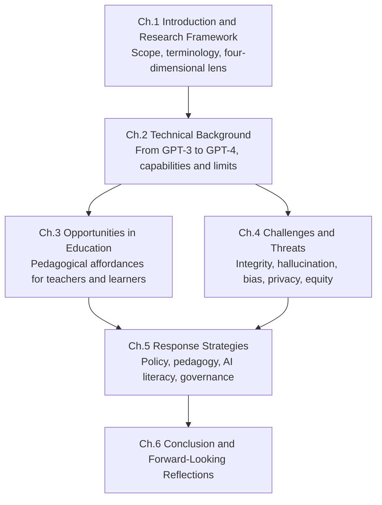
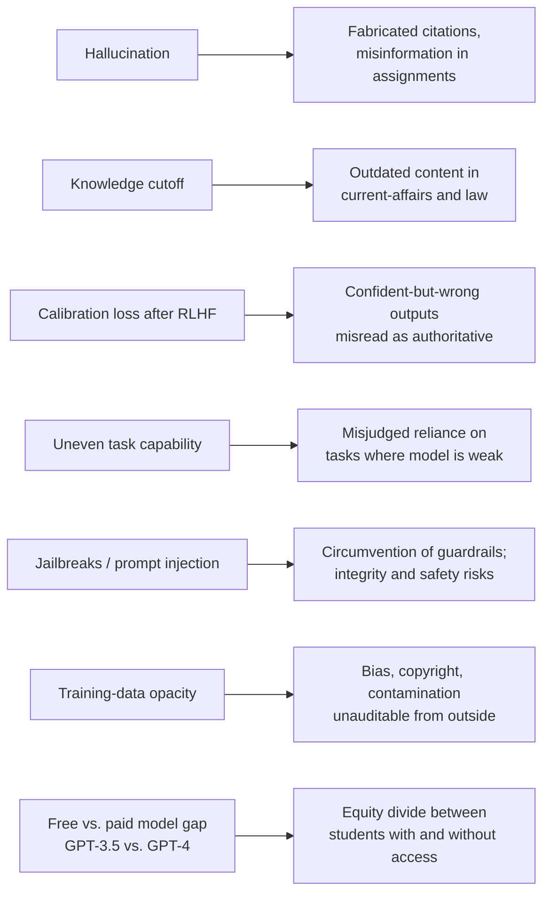
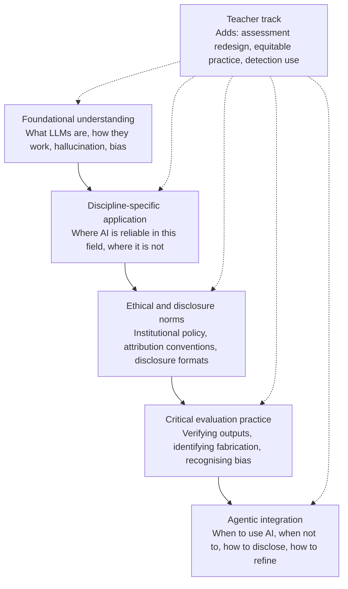
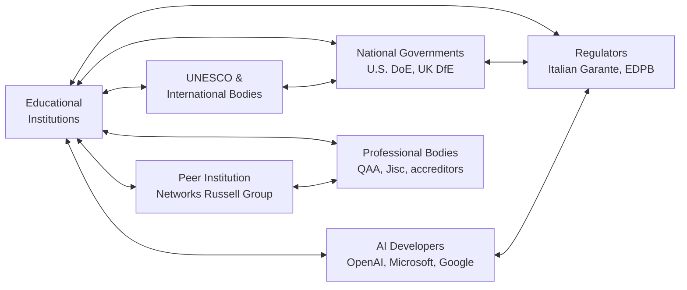

# Opportunities and Challenges of Generative AI in Education: A Comprehensive Analysis Centered on ChatGPT (Through May 2023)
# 1 Introduction and Research Framework

In late November 2022, the public launch of ChatGPT marked what many observers have characterized as a discontinuity in the relationship between artificial intelligence and everyday knowledge work. Within weeks, the chatbot had migrated from a technical curiosity to a household reference, prompting headlines such as *The Atlantic*'s December 2022 declaration that "the college essay is dead"[^1] and triggering a cascade of institutional responses from universities, ministries of education, and data protection regulators. For the education sector—an institution historically organized around the human production, evaluation, and certification of text—this development is not merely an incremental technological upgrade but a structural perturbation of the very artefacts (essays, problem sets, code, citations) through which learning has been demonstrated and assessed. This chapter establishes the rationale, scope, conceptual vocabulary, and analytical framework for examining that perturbation, with a strict temporal boundary extending through May 2023, the period during which the educational community's earliest, most formative responses crystallised.

## 1.1 Research Background and Significance

The salience of generative AI for education in this window cannot be appreciated without reference to the speed and scale of ChatGPT's diffusion. Launched on 30 November 2022 as a free, web-based conversational interface to OpenAI's underlying large language model, ChatGPT achieved an adoption velocity unmatched by prior consumer internet services, surpassing **100 million users within roughly two months**[^2]. Crucially, a substantial share of these early users were students and educators, who almost immediately began testing the system against the routine artefacts of academic life. By December 2022, a Wharton professor had reported that ChatGPT earned a **B on an MBA examination**, and a Minnesota law school professor reported a **C across a battery of law exams**, with the model conspicuously weak on mathematical reasoning—a deficit that OpenAI announced as improved in its 30 January 2023 release notes[^1]. A contemporaneous Stanford student survey reported that **17% of respondents had used ChatGPT during their Fall 2022 final exams**, with **5.5% submitting answers directly without edits**, and a notable share of respondents expressing uncertainty as to whether such use would violate the honor code[^1]. These early empirical signals indicated that the technology was not waiting for institutional permission; it was already being absorbed into the practice of studying, writing, and assessing.

This rapid diffusion provoked an equally rapid, but markedly less coordinated, institutional reaction. On the regulatory front, Italy's data protection authority (the *Garante*) on **31 March 2023** ordered a temporary block of ChatGPT in Italy, citing the absence of a lawful basis for the massive collection of personal data used to train the model, a March 2023 data breach affecting conversations and payment information, the system's tendency to produce inaccurate information about individuals, and the lack of age-verification mechanisms despite the service being directed at users aged 13 and older[^2]. After OpenAI implemented measures—publishing disclosures on training data, providing EU users a form to object to processing under the GDPR, and introducing age-attestation at sign-up—ChatGPT was restored in Italy on **28 April 2023**[^3][^4]. On the institutional front, a WCET survey conducted in spring 2023 found that only **8% of responding institutions had developed or implemented at least one AI-related policy**, while **65% reported that they intended to develop policies but had not yet done so**, with initial discussion focused predominantly on academic integrity[^5]. These data points jointly demonstrate why the period from November 2022 through May 2023 constitutes a critical analytical window: norms, policies, pedagogical practices, and legal interpretations were being actively contested and redefined, often in the absence of empirical evidence, against a moving technological target.

The significance of analysing this window is therefore threefold. First, it captures the **formative discourse**—the framing assumptions, anxieties, and aspirations through which subsequent regulation and pedagogy would be filtered. Second, it captures **first-order empirical observations** (exam performance, student uptake, faculty experimentation) before the field was saturated by speculative claims. Third, and most importantly for educational stakeholders, it captures the moment at which the four principal stakeholder groups—**students, teachers, institutions, and policymakers**—were simultaneously confronted with the same artefact but interpreted it through divergent frames: as a productivity tool, a cheating vector, an accessibility aid, a privacy hazard, or a geopolitical signal. A research framework attentive to this divergence is essential because, as later chapters will show, the dual-lens analysis of opportunities and challenges cannot be reduced to a single stakeholder's perspective.

## 1.2 Core Concepts and Terminology

Because the discourse on generative AI in education has been characterised by terminological drift—where "AI," "ChatGPT," and "LLM" are often used interchangeably as a kind of synecdoche, in the way "Coke" stands for all carbonated soft drinks in some regions[^1]—this report adopts a precise and consistent vocabulary, defined below and applied uniformly across subsequent chapters.

**Generative artificial intelligence (GenAI)** denotes a subset of artificial intelligence in which machine learning models, typically using deep learning architectures, produce new content—text, images, audio, video, or code—that resembles their training data in structure and style[^6][^7]. **Large language models (LLMs)** are a specific class of generative AI designed to comprehend and generate human-like natural language; they are trained on vast text corpora drawn from the open internet and other sources, learning statistical regularities that allow them to predict the most probable next token given a prompt[^8][^7]. As one university library guide describes the underlying mechanism, an LLM functions as "a super-smart version of autocomplete" that has read an enormous *corpus* of text and produces similar text in response to prompts, while remaining "prone to *hallucinate*, or make up probable-sounding (but false) information"[^8]. **Hallucination** in this report therefore refers specifically to the generation of plausible-sounding but factually incorrect or fabricated content—including fabricated quotations, page numbers, and citations, a phenomenon documented in early 2023 when ChatGPT produced a confidently attributed McPherson quotation linked to a page that in the actual book reads "This page intentionally left blank"[^1].

**ChatGPT** denotes OpenAI's conversational interface to its GPT family of models, first released to the public on 30 November 2022[^1]. The free tier was, in early 2023, served by a model whose training data extended through January 2022, while the paid tier (later integrated into Microsoft's Copilot offering) used a more advanced model with data through April 2023[^8]. This report uses "ChatGPT" to refer to the specific OpenAI product and reserves "LLM" or "GenAI tool" for broader references to the class of systems, which by mid-2023 included **Microsoft's Bing/Copilot integration**, **Google's Bard**, and emerging tools from Meta and others[^8][^1]. **Prompt engineering** (or "prompt hacking") refers to the practice of iteratively refining the input given to an LLM to obtain a desired output, including techniques such as specifying length, style, source-type ("use credible sources"), or persona ("in the style of…")[^1].

Two further concepts must be foregrounded because they constitute load-bearing terms in later chapters. **AI literacy** in this report is understood not as mere tool fluency but as a multidimensional competency encompassing critical evaluation of AI outputs, ethical judgment about appropriate use, awareness of bias and limitations, and the agency to integrate or decline AI assistance in context-appropriate ways[^5]. **Academic integrity** is treated not as a static rule set against plagiarism, but as the broader institutional commitment to honest, attributable, and reflective intellectual work—a commitment whose operational meaning is itself being renegotiated under conditions of human-AI collaboration[^5].

The following table consolidates these working definitions to anchor terminology across the report.

| Term | Working Definition (as used in this report) | Indicative Source |
|------|---------------------------------------------|-------------------|
| Generative AI (GenAI) | A class of AI that generates new content (text, image, audio, video, code) resembling training data | [^6][^7] |
| Large Language Model (LLM) | A deep-learning model trained on large text corpora to predict and generate human-like language | [^8][^7] |
| ChatGPT | OpenAI's conversational LLM interface, public release 30 November 2022 | [^1] |
| Hallucination | Plausible-sounding but factually false or fabricated output, including fake citations | [^8][^1] |
| Prompt engineering | Iterative refinement of inputs to elicit desired LLM outputs | [^1] |
| AI literacy | Critical, ethical, and agentic competency in evaluating and using AI tools | [^5] |
| Academic integrity | Institutional commitment to honest, attributable, reflective intellectual work | [^5] |

## 1.3 Research Questions and Scope

Building on this conceptual foundation, the report is organised around three interlocking research questions that together constitute a balanced opportunity-risk inquiry:

1. **What pedagogical and learning opportunities does generative AI, and ChatGPT in particular, offer to instructors and students in the period through May 2023?** This question examines the realistic affordances of the technology—from lesson planning and feedback drafting for instructors, to brainstorming, outlining, summarisation, and code generation for students—and distinguishes documented uses from speculative claims[^8][^1].

2. **What risks does generative AI pose to academic integrity, output reliability, equity, privacy, and the development of foundational cognitive skills?** This question encompasses the empirical reality of fabricated citations and confidently incorrect content[^1], the limits of detection technologies whose outputs can be evaded by trivial paraphrasing[^1], data-protection concerns that surfaced in the Italian intervention[^2], and the contested question of whether tools that augment writing also displace the practice through which writing competencies are developed.

3. **How are educational institutions, regulators, and other stakeholders responding through policy, governance, and pedagogical redesign?** This question examines the early policy landscape, in which institutions overwhelmingly recognised the need for guidance but had not yet implemented it[^5], and traces emerging frameworks—governance, operations, pedagogy—that attempt to convert reactive bans into proactive integration[^5].

The **scope** of the report is delimited along three axes. *Temporally,* primary evidence is bounded by 31 May 2023; later sources may be referenced only where they describe pre-May-2023 events, and such use is noted transparently. *Sectorally,* the report focuses primarily on **higher education**, where the bulk of early 2023 empirical observation and institutional response was concentrated, while explicitly acknowledging the **K-12 relevance** of issues such as age verification, minor-protection, and foundational skill development—concerns made vivid by the Italian *Garante*'s focus on the absence of mechanisms preventing access by users under 13[^2]. *Thematically,* the inquiry is restricted to educational applications and adjacent integrity, ethics, privacy, and equity concerns; broader applications of generative AI in non-educational sectors (creative industries, journalism, software development outside coursework contexts, healthcare delivery) are referenced only insofar as they illuminate educational implications. Within these boundaries, the report deliberately holds opportunities and challenges in comparable analytical depth, refusing either techno-utopian or techno-pessimistic framing.

## 1.4 Analytical Framework and Report Structure

To navigate the heterogeneity of the early 2023 discourse, this report employs a **four-dimensional analytical framework** that explicitly resists treating generative AI as a single-dimensional phenomenon. The four dimensions—technological, pedagogical, ethical, and institutional—are derived inductively from the early literature and policy discourse, and align closely with the AI policy ecosystem framework proposed by WCET, which categorises institutional AI policy needs across **governance, operations, and pedagogy**, with **ethical and responsible use** undergirding all three[^5]. The framework is summarised below.

| Dimension | Focal Questions | Primary Stakeholders | Indicative Subject Matter |
|-----------|-----------------|---------------------|---------------------------|
| Technological | What can the system actually do, and where does it fail? | Developers, IT staff, informed users | Model architecture, parameter scale, benchmarks, hallucination, context limits |
| Pedagogical | How does the tool reshape teaching, learning, and assessment? | Faculty, students, instructional designers | Personalisation, feedback, assessment redesign, AI-literacy curricula |
| Ethical & Integrity | What values, harms, and norms are at stake? | Students, faculty, ethics bodies | Plagiarism, bias, hallucination harms, equity, attribution |
| Institutional & Regulatory | What governance structures, policies, and laws apply? | Administrators, regulators, policymakers | Acceptable-use policies, GDPR/privacy, age verification, IP, accreditation |

These dimensions are not silos but mutually constitutive lenses. A claim about the pedagogical opportunity of personalised tutoring (Chapter 3), for instance, depends on the technological capability documented in Chapter 2 (sufficient context window, reasoning ability, multilingual coverage) and is simultaneously constrained by ethical concerns over hallucination (Chapter 4) and institutional questions about equitable access to paid versus free tiers[^8][^5]. Conversely, a regulatory action such as the Italian ban (Chapter 4) is intelligible only against the technological reality that training pipelines ingest personal data at internet scale[^2], and its resolution required pedagogically and institutionally meaningful disclosures—a chain of reasoning that Chapter 5 develops into response strategies.

The flow of analysis across the report's six chapters follows this layered logic:

This structure operationalises a deliberate methodological commitment: **Chapter 5's recommendations must traceably address the opportunities surfaced in Chapter 3 and the challenges surfaced in Chapter 4, both grounded in the technical baseline of Chapter 2.** Recommendations untethered from documented capability or documented harm risk becoming either generic exhortations or moral panic; conversely, capabilities and challenges discussed without reference to actionable response are merely descriptive. The framework thus enforces analytical accountability across chapters.

A final methodological orientation must be noted. The early 2023 evidence base is inevitably uneven: empirical studies of student usage are limited and often institution-specific (e.g., the Stanford survey); benchmark claims for models such as GPT-4 derive substantially from developer announcements and require independent triangulation; and policy developments are fast-moving and jurisdiction-specific. Wherever evidence is contested, single-sourced, or speculative, this report will mark the uncertainty in the text rather than smooth it over. Where claims rest on developer self-reports (e.g., model parameter counts, exam scores), they will be presented as such, and corroboration—where it exists in the May 2023 record—will be cited. This commitment to **transparent epistemic humility** is itself a substantive response to one of the core challenges generative AI poses to education: the difficulty, in an age of fluent machine prose, of distinguishing confident assertion from verified knowledge[^1].

With these foundations established, Chapter 2 turns to the technical evolution of generative AI and the GPT family, providing the capability baseline against which both the educational opportunities of Chapter 3 and the threats of Chapter 4 must be assessed.

# 2 Technical Background and Development of Generative AI and GPT Models

Chapter 1 closed by signalling that any credible analysis of generative AI in education must rest on a clear-eyed account of what the underlying systems can and cannot do. The institutional anxieties, regulatory interventions, and pedagogical experiments documented in the introduction were all responses to a specific technological artefact—a conversational interface to a particular family of large language models—whose capabilities and limitations are neither self-evident nor uniformly distributed across tasks. This chapter therefore reconstructs the technical lineage and capability profile of generative AI, with deliberate attention to the GPT family that culminated in **GPT-4, released on 14 March 2023**[^9]. It traces the architectural trajectory leading to ChatGPT, examines the GPT-3 to GPT-4 transition along scale and alignment dimensions, verifies the headline capability claims against benchmark evidence while flagging methodological caveats, distils the capabilities most consequential for teaching and learning, and documents the inherent limitations that constrain educational deployment. The chapter is deliberately descriptive: it builds the empirical referent that Chapters 3, 4, and 5 will draw upon when evaluating opportunities, risks, and responses.

## 2.1 Evolution of Generative AI and the GPT Lineage

Generative AI, as defined in Chapter 1, denotes machine-learning systems that produce new content resembling their training data. Its modern incarnation in language is the outcome of a multi-decade arc that moved from rule-based and statistical natural language processing—where systems relied on hand-crafted grammars or n-gram probabilities—toward neural language models capable of learning distributed representations of words and sequences from data alone. Within that arc, the decisive inflection was the transformer architecture, which replaced recurrent sequence processing with self-attention and made the training of very large language models computationally tractable at scale. OpenAI's GPT series operationalised this architecture as a left-to-right next-token predictor trained on web-scale corpora; each successive generation (GPT-1, GPT-2, GPT-3, and the GPT-3.5 family) increased model size, data scale, and breadth of capability, while preserving the same underlying objective of predicting the next word in a document[^9].

Two methodological additions transformed this base capability into the conversational, instruction-following behaviour that made ChatGPT culturally salient. The first is **supervised fine-tuning on instruction data**, which trains the base model to respond to user requests rather than merely continue arbitrary text. The second is **reinforcement learning from human feedback (RLHF)**, in which human raters compare model outputs and a reward model is fitted to those preferences, after which the language model is optimised against the reward. OpenAI is explicit that "the model's capabilities seem to come primarily from the pre-training process—RLHF does not improve exam performance (without active effort, it actually degrades it). But steering of the model comes from the post-training process—the base model requires prompt engineering to even know that it should answer the questions."[^9] This decoupling—capability from pre-training, behaviour from post-training—is foundational for the chapters that follow: it explains why the same underlying competence can yield strikingly different educational experiences depending on how the system is prompted and which safety guardrails are in force.

ChatGPT, released to the public on **30 November 2022**, packaged a GPT-3.5-class model behind a free conversational interface, and was followed on 14 March 2023 by the integration of GPT-4 into the paid ChatGPT Plus tier and a waitlisted API[^9]. The proximate technical context for the educational discourse analysed in this report is therefore not the GPT series in the abstract, but the specific moment at which a transformer-based, instruction-tuned, RLHF-aligned LLM became accessible through a browser tab, free at the point of use, to anyone with an account.

## 2.2 Architectural Shift and Scaling: From GPT-3 to GPT-4

The GPT-3 to GPT-4 transition is most usefully read along three axes: scale, infrastructure, and alignment. On the **scale** axis, GPT-3, released in 2020, was a dense transformer with 175 billion parameters trained on hundreds of billions of tokens of internet text. GPT-4's architecture and parameter count, by contrast, are not disclosed by OpenAI; the technical report is "deliberately vague" about "training data," "model size," and benchmark methodology, with OpenAI citing "competitive and safety reasons"[^10]. Independent commentators have noted that, in the absence of an official parameter count, third-party estimates ranged from roughly 200 billion to 1.8 trillion parameters, and that without this number "we can't calculate training efficiency or compare against open source models fairly"[^10]. Widely circulated estimates in the technical press placed GPT-4 in the trillion-parameter range and speculated that it employed a Mixture-of-Experts design rather than a dense transformer, but these remain unconfirmed by the developer; this report therefore treats specific parameter figures for GPT-4 as informed conjecture rather than verified fact.

On the **infrastructure** axis, OpenAI describes having "rebuilt our entire deep learning stack and, together with Azure, co-designed a supercomputer from the ground up" for GPT-4's workload, with GPT-3.5 having served as a "first test run" of that system[^9]. A central engineering claim is **predictable scaling**: OpenAI states that it "accurately predicted in advance GPT-4's final loss on our internal codebase…by extrapolating from models trained using the same methodology but using 10,000x less compute," and successfully extrapolated pass rates on a HumanEval subset from models with 1,000x less compute[^9]. Predictable scaling is significant for educational stakeholders not because it bears directly on classroom practice, but because it underwrites OpenAI's claim that further capability gains are anticipatable—shifting the policy question from "what can this system do today?" to "what should institutions prepare for as scaling continues?"

On the **alignment** axis, OpenAI reports having spent "6 months iteratively aligning GPT-4" using lessons from adversarial testing and ChatGPT, with the result that GPT-4 "responds to requests for disallowed content" 82% less often than GPT-3.5 and responds to sensitive requests in accordance with policy 29% more often[^9]. The training pipeline incorporates an additional safety reward signal during RLHF, supplied by a GPT-4 zero-shot classifier that judges safety boundaries and completion style. More than 50 external experts in domains including AI alignment, cybersecurity, biorisk, and trust and safety contributed adversarial red-teaming, whose findings fed back into mitigations[^9]. These alignment investments matter pedagogically because they shape the system's refusal patterns—what it will and will not write for a student—and because, as OpenAI itself notes, "jailbreaks" to generate disallowed content remain possible and "as the 'risk per token' of AI systems increases, it will become critical to achieve extremely high degrees of reliability in these interventions"[^9].

Scale, infrastructure, and alignment together constitute the *conditions* for the capability gains documented next. They do not, however, explain those gains uniformly: as the benchmark evidence below shows, the same architectural and scale leap produced dramatically different magnitudes of improvement across task types.

## 2.3 Benchmark Evidence of Capability Leap

The most-cited capability claim for GPT-4 is its performance on the **Uniform Bar Exam**: 298 out of 400, around the 90th percentile of test-takers, compared with GPT-3.5's 213 out of 400 at around the 10th percentile[^9]. OpenAI frames this as illustrative of "human-level performance on various professional and academic benchmarks," noting that exams were drawn from the most recent publicly available tests or purchased 2022–2023 practice editions, that no exam-specific training was performed, and that only "a minority of the problems in the exams were seen by the model during training"[^9]. The full simulated-exam suite reported by OpenAI extends well beyond the bar exam; the table below consolidates the principal results most relevant for an educational audience.

| Exam | GPT-4 (with vision) | GPT-4 (no vision) | GPT-3.5 |
|------|--------------------|--------------------|----------|
| Uniform Bar Exam (MBE+MEE+MPT) | 298/400 (~90th %ile) | 298/400 (~90th) | 213/400 (~10th) |
| LSAT | 163 (~88th) | 161 (~83rd) | 149 (~40th) |
| SAT Evidence-Based Reading & Writing | 710/800 (~93rd) | 710/800 (~93rd) | 670/800 (~87th) |
| SAT Math | 700/800 (~89th) | 690/800 (~89th) | 590/800 (~70th) |
| GRE Quantitative | 163/170 (~80th) | 157/170 (~62nd) | 147/170 (~25th) |
| GRE Verbal | 169/170 (~99th) | 165/170 (~96th) | 154/170 (~63rd) |
| GRE Writing | 4/6 (~54th) | 4/6 (~54th) | 4/6 (~54th) |
| USABO Semifinal 2020 | 87/150 (99th–100th) | 87/150 (99th–100th) | 43/150 (31st–33rd) |
| Medical Knowledge Self-Assessment | 75% | 75% | 53% |
| AP Calculus BC | 4 (43rd–59th) | 4 (43rd–59th) | 1 (0th–7th) |
| AP Biology | 5 (85th–100th) | 5 (85th–100th) | 4 (62nd–85th) |
| AP English Language & Composition | 2 (14th–44th) | 2 (14th–44th) | 2 (14th–44th) |
| AP English Literature & Composition | 2 (8th–22nd) | 2 (8th–22nd) | 2 (8th–22nd) |
| AP Macroeconomics | 5 (84th–100th) | 5 (84th–100th) | 2 (33rd–48th) |
| AP Statistics | 5 (85th–100th) | 5 (85th–100th) | 3 (40th–63rd) |
| Codeforces Rating | 392 (below 5th) | 392 (below 5th) | 260 (below 5th) |
| Leetcode (easy / medium / hard) | 31/41, 21/80, 3/45 | 31/41, 21/80, 3/45 | 12/41, 8/80, 0/45 |
| Sommelier (Intro / Certified / Advanced) | 92% / 86% / 77% | 92% / 86% / 77% | 80% / 58% / 46% |

Source: OpenAI GPT-4 release and technical report[^9][^11].

On machine-learning benchmarks designed specifically for language models, GPT-4 attains 86.4% on **MMLU** (57-subject professional and academic multiple-choice, 5-shot), up from GPT-3.5's 70.0%; 95.3% on **HellaSwag** (commonsense reasoning, 10-shot); 96.3% on **ARC Challenge** (grade-school science, 25-shot); 87.5% on **WinoGrande** (pronoun resolution, 5-shot); **67.0% on HumanEval** Python coding (0-shot), up from 48.1%; and an F1 of 80.9 on **DROP** reading-and-arithmetic comprehension, up from 64.1[^9][^11]. On translated MMLU, GPT-4 outperforms the English-language performance of GPT-3.5 and other LLMs in 24 of 26 tested languages, including low-resource ones such as Latvian, Welsh, and Swahili[^9].

A critical reading of these numbers, however, reveals **substantial heterogeneity in the gains**. Independent benchmark analysis of the technical report identifies a clear bifurcation: the benchmarks on which GPT-4 dominates GPT-3.5 by more than 20% are concentrated in multi-step reasoning, code generation, and formal logic—Bar Exam (+39.9%), HumanEval (+39.3%), AP Calculus BC (a raw jump from a 1 to a 4), DROP (+26.2%), MMLU (+23.4%)—while benchmarks where GPT-4 "barely moved the needle" cluster in pattern recognition and common-sense language understanding: SAT Evidence-Based Reading & Writing (+6.0%), WinoGrande (+7.2%), GRE Quantitative (+3.7%), and AP English Language and AP English Literature, on both of which GPT-4 scored a **2 out of 5—identical to GPT-3.5**[^10][^11]. A plausible reading is that "GPT-3.5 was already near ceiling on simpler language tasks. The gains from scaling showed up primarily in harder reasoning tasks"[^10]. The MMLU subject-level breakdown reinforces this pattern: GPT-4's gains over GPT-3.5 are largest in Abstract Algebra (+31 points), Formal Logic (+21), and College Physics (+19), and smallest in Marketing (+4) and other subjects relying on memorised facts and common knowledge[^10].

Several **methodological caveats** further qualify the headline figures. First, OpenAI does not disclose training data, making it impossible for external researchers to assess **exam contamination**—the report itself acknowledges that "a minority of the problems in the exams were seen by the model during training"[^9]. Second, few-shot counts vary across benchmarks (0-shot, 3-shot, 5-shot, 10-shot, 25-shot), complicating cross-benchmark comparison[^10]. Third, the choice of AP subjects reported in the release is partial, raising the possibility of selection bias; the fuller table reproduced in independent coverage shows weaker performance on AP English subjects and AMC mathematics competitions[^10][^11]. Fourth, on the **LMSYS Chatbot Arena**, which measures human preference rather than structured task performance, GPT-4's lead over GPT-3.5 (~130 Elo points in early 2023) was "smaller than the gap the benchmarks would suggest"; humans noticed GPT-4 was better, but not "bar exam: 10th to 90th percentile" better[^10]. Fifth, on visual benchmarks GPT-4 ties or modestly exceeds prior state-of-the-art on standard tasks such as VQAv2 (77.2% vs. 77.4% for PaLI-17B) while nearly doubling prior performance on AI2 Diagram (78.2%)—a strong but uneven multimodal profile[^10][^9].

The integrative takeaway for the educational analysis that follows is therefore deliberately bifurcated. **GPT-4 represents a genuine capability leap on tasks requiring multi-step reasoning, mathematics, and code—precisely the tasks long considered the heartland of formal academic assessment.** But the leap is moderate to negligible on tasks involving open-ended writing, literary interpretation, and certain forms of commonsense reasoning, where GPT-3.5 was already strong. Any pedagogical claim about GPT-4 must specify which task class is at stake; sweeping characterisations such as "AI has passed the bar" are, taken in isolation, misleading.

## 2.4 Education-Relevant Capabilities of GPT-4 and Contemporaries

From the benchmark profile and the system descriptions, seven capabilities most directly shape what generative AI can offer—and threaten—in educational settings. They are summarised below and then elaborated in sequence.

| Capability | Technical Manifestation | Educational Relevance |
|------------|-------------------------|------------------------|
| Natural language generation | Fluent, register-sensitive prose across genres | Drafting, summarising, paraphrasing, feedback |
| Multi-step reasoning | Bar exam, MMLU formal logic, AP Calculus BC, HumanEval | Tutoring in STEM, problem walk-throughs, code |
| Multimodal input | 78.2% on AI2 Diagram, 78.0% TextVQA, 88.4% DocVQA, 75.1% Infographic VQA[^9] | Interpreting diagrams, worksheets, charts |
| Extended context window | 8,192 tokens (gpt-4); 32,768 tokens (gpt-4-32k), ~50 pages | Document-level interaction, long readings |
| Multilingual coverage | Outperforms GPT-3.5 English baseline in 24 of 26 translated MMLU languages | Inclusive and multilingual education |
| Steerability | System messages prescribing tone, style, persona | Configurable tutor personas, scaffolded dialogue |
| Ecosystem breadth | ChatGPT, Bing/Copilot (Microsoft), Bard (Google) | Multiple entry points; variable policy surfaces |

**Natural language understanding and generation** across registers is the most general affordance: GPT-4 produces coherent prose at lengths and in styles appropriate to academic, professional, and conversational contexts, and is "more reliable, creative, and able to handle much more nuanced instructions than GPT-3.5"[^9]. **Multi-step reasoning and problem-solving** is most evident in the mathematical and code benchmarks—the +300% raw improvement on AP Calculus BC, the jump from 48.1% to 67.0% on HumanEval, and the gains on formal-logic MMLU subsections—suggesting that the system can support not only final-answer generation but also intermediate explanatory steps that resemble worked examples[^10][^9].

**Multimodal input** is novel relative to GPT-3.5: GPT-4 "can accept a prompt of text and images" and generate text outputs over "documents with text and photographs, diagrams, or screenshots"[^9]. The benchmark profile—**77.2% VQAv2, 78.0% TextVQA, 78.5% ChartQA, 78.2% AI2 Diagram, 88.4% DocVQA, 75.1% Infographic VQA, 87.3% TVQA**—indicates particular strength on tasks involving scientific diagrams, document layouts, and chart interpretation, though OpenAI cautions that image inputs remained a research preview rather than a generally available product at the time of the March 2023 announcement, with a single partnership (Be My Eyes) as the rollout channel[^9]. For education, this profile maps onto the routine artefacts of instruction—worksheets, lecture slides, hand-drawn diagrams, problem figures—and foreshadows the pedagogical opportunities and integrity concerns Chapter 3 and Chapter 4 will examine.

**Extended context windows**—**8,192 tokens for the standard GPT-4 endpoint and 32,768 tokens (approximately 50 pages of text) for the gpt-4-32k variant**—permit document-level interaction such as analysing a full chapter, a long syllabus, or a multi-page student submission in a single exchange[^9]. **Multilingual coverage** is documented through translated MMLU, on which GPT-4 outperforms GPT-3.5's English baseline in 24 of 26 tested languages, including low-resource languages such as Latvian (around 2 million speakers) and Welsh (around 600,000 speakers)[^9]; this capability is foundational for the multilingual and inclusive-education opportunities Chapter 3 will discuss, while also surfacing equity concerns when access to GPT-4 is gated behind a subscription.

**Steerability** through system messages allows developers and, increasingly, end users to prescribe style, tone, and persona. OpenAI's illustrative example casts GPT-4 as a **Socratic tutor** that refuses to give a student the answer to a system of linear equations and instead asks scaffolded questions—"Can you see any possible way to eliminate one of the variables by combining the two equations?"—even when the student insists "Just tell me the answer please!"[^9] This is the clearest piece of OpenAI-supplied evidence that the same underlying capability can be configured to instruct rather than to substitute, a point Chapter 5 will develop into a response strategy. OpenAI itself, however, warns that "system messages are the easiest way to 'jailbreak' the current model" and that adherence to bounds is imperfect[^9].

Finally, the **ecosystem breadth** matters: in early 2023, ChatGPT was not the only conversational LLM. Microsoft integrated GPT-4-class capability into Bing/Copilot (initially as "the new Bing"), and Google launched Bard. The LMSYS Chatbot Arena—an early human-preference leaderboard—showed GPT-4 leading (~1250 Elo) followed by Claude v1 (~1150), GPT-3.5-turbo (~1120), and open-source contenders such as Vicuna-13B (~1050) and Alpaca-13B (~1000)[^10]. For institutions, this ecosystem heterogeneity means that an "AI policy" focused only on a single product surface (e.g., chat.openai.com) misses the multiple entry points—browser integration, search bars, mobile assistants—through which students and faculty actually encountered LLM capability.

## 2.5 Inherent Technical Limitations and Their Educational Implications

The capabilities above coexist with limitations that no amount of marketing language elides. OpenAI's own release acknowledges that GPT-4 "still is not fully reliable (it 'hallucinates' facts and makes reasoning errors)" and that "great care should be taken when using language model outputs, particularly in high-stakes contexts"[^9]. Five technical limitations are most consequential for educational use, and each maps onto a specific risk class developed in Chapter 4.

**Hallucination** remains the headline failure mode. GPT-4 scores 40% higher than the latest GPT-3.5 on OpenAI's internal adversarial factuality evaluations and shows progress on TruthfulQA, but OpenAI explicitly states that hallucination is reduced rather than eliminated, and that the model "can sometimes make simple reasoning errors which do not seem to comport with competence across so many domains, or be overly gullible in accepting obvious false statements from a user"[^9]. The library-guide observation introduced in Chapter 1—that LLMs function as "super-smart autocomplete" and are "prone to hallucinate"—is corroborated here at the level of the developer's own self-assessment. For education, hallucination is the technical substrate of fabricated citations, invented historical facts, and confidently wrong worked solutions.

**Knowledge cutoff and the absence of continual learning** further constrain reliability. GPT-4 "generally lacks knowledge of events that have occurred after the vast majority of its data cuts off (September 2021), and does not learn from its experience"[^9]. Combined with the free ChatGPT tier's earlier cutoff noted in Chapter 1, this means the system can confidently misreport recent events—an obvious hazard for courses in current affairs, law, medicine, or any rapidly moving field.

**Reduced calibration after RLHF** is a more subtle but pedagogically significant limitation. OpenAI reports that the *base* pre-trained GPT-4 is well-calibrated—"its predicted confidence in an answer generally matches the probability of being correct"—but that "through our current post-training process, the calibration is reduced"[^9]. In educational terms, the very alignment process that makes the model conversational and helpful also dulls its ability to flag its own uncertainty, increasing the risk that students take its confident tone as a proxy for correctness.

**Uneven capability across task types**, documented in Section 2.3, is itself a limitation when read prescriptively. A teacher considering ChatGPT as a literature-analysis aide cannot infer competence from its bar-exam performance; an instructor encountering it as a calculus tutor cannot dismiss it on the basis of its AP English Language score of 2. The asymmetry of gains means that **educational deployment requires task-specific evaluation**, not generalised endorsement or generalised prohibition.

**Vulnerability to jailbreaks, prompt injection, and confidently wrong predictions** rounds out the limitation profile. OpenAI states that "there still exist 'jailbreaks' to generate content which violate our usage guidelines," that the model "can also be confidently wrong in its predictions, not taking care to double-check work when it's likely to make a mistake," and that humans-in-the-loop, grounding with additional context, or avoidance of high-stakes uses may be appropriate depending on the use-case[^9]. The opacity of training data, which Section 2.2 noted in connection with parameter count, is itself a limitation insofar as it forecloses independent audit of bias, copyright provenance, and contamination[^10].

Finally, the **gap between developer-reported benchmarks and subjective human preference**—the more moderate ~130 Elo-point GPT-4 advantage on the LMSYS Chatbot Arena versus the dramatic bar-exam jump—is itself a methodological limitation of how capability is presented[^10]. Educational decision-makers reading marketing materials should expect the lived experience of using GPT-4 in classrooms to be *less* discontinuous from GPT-3.5 than benchmark headlines suggest, particularly for open-ended writing tasks.

The mapping from these limitations to the educational risks analysed in Chapter 4 can be made explicit:

Two of these limitation–risk pairings deserve emphasis as bridges to subsequent chapters. The **free-versus-paid divide** between a GPT-3.5-class free ChatGPT and the GPT-4-class paid tier (US$20/month at ChatGPT Plus, with API pricing at $0.03 per 1K prompt tokens and $0.06 per 1K completion tokens for the 8K context model, doubled for the 32K variant)[^9][^11] is not merely a commercial detail but a structural determinant of educational equity: students whose institutions or families can pay for GPT-4 obtain access to a system that is markedly stronger at the very reasoning, mathematics, and coding tasks where the leap is largest. Chapter 4 returns to this as a digital-divide concern. The **calibration loss combined with hallucination** is the technical substrate of the academic-integrity and source-verification challenges Chapter 4 will analyse: a system that sounds confident, writes fluently, fabricates plausibly, and yet cannot reliably flag its own uncertainty is precisely the system around which traditional essay-based assessment becomes brittle.

This chapter has established the empirical referent for the rest of the report. **Generative AI, as embodied by ChatGPT and GPT-4, is the product of a transformer-based, instruction-tuned, RLHF-aligned design whose scaling has produced disproportionate gains on multi-step reasoning, mathematical, and coding tasks, while leaving open-ended language and commonsense tasks closer to GPT-3.5-era performance.** Its capabilities—fluent generation, multi-step reasoning, multimodal input, extended context, multilingual coverage, and steerability—define the affordance space within which educational opportunities can be imagined. Its limitations—hallucination, knowledge cutoff, calibration loss after RLHF, uneven task profile, jailbreak vulnerability, training-data opacity, and a free–paid capability gap—define the threat space within which those opportunities must be governed. Chapter 3 now turns to the opportunities side of that ledger, drawing on these capabilities to examine where, how, and for whom generative AI may reshape teaching and learning.

# 3 Opportunities of Generative AI in Education

Chapter 2 closed by mapping a precise affordance space: fluent natural-language generation, multi-step reasoning, multimodal input, extended context, multilingual coverage, and steerability, all available—at varying tiers of capability—through a free browser interface and a growing constellation of partner products. The pedagogical question this chapter takes up is what, within that affordance space, has *actually* begun to materialise as educational opportunity during the formative window from November 2022 through May 2023, and what remains promissory. Following the report's commitment to dual-lens analysis and transparent epistemic humility, the chapter deliberately treats opportunities as *capabilities that have been pedagogically operationalised in documented settings*, distinguishing these from the broader rhetoric of educational transformation that surged through the period. Three classes of evidence anchor the discussion: vendor-led pilots that crossed from announcement into measurable deployment (Khanmigo, Duolingo Max); contemporaneous national surveys of teacher and student behaviour (Walton Family Foundation/Impact Research, Study.com, Stanford); and conceptual analyses published at or near the May 2023 cutoff (Xu et al.'s ICRES paper, the U.S. Department of Education's *AI and the Future of Teaching and Learning* report). The chapter is organised along an axis that moves outward from the learner, through the instructor, to the institutional and scholarly perimeter, and concludes with a stakeholder-differentiated reality check that sets up Chapter 4's challenge analysis.

## 3.1 Personalized and Adaptive Learning at Scale

The most prominent and best-documented early-2023 opportunity is the use of conversational LLMs as scaffolded, one-to-one tutors. The aspiration itself is not new—Benjamin Bloom's 1984 "two-sigma" finding that students taught one-to-one with mastery learning performed roughly two standard deviations above conventionally taught peers has long served as the benchmark against which any technology-mediated personalisation is measured, and Sal Khan, in announcing Khanmigo, explicitly invoked the goal of "a personal tutor for every student"[^8]. What is genuinely new in early 2023 is that the underlying technological substrate—an instruction-tuned, RLHF-aligned LLM accessible through a chat interface and steerable via system prompts—is for the first time capable of supporting tutorial dialogue across virtually any subject in natural language, in real time, at marginal cost.

The Khanmigo pilot is the most instructive case for separating documented capability from aspiration. Khan Academy had been working with OpenAI on GPT-4 integration for approximately six months before its public announcement on 14 March 2023, the same day as GPT-4's release, with Sal Khan personally spending around 20 hours training the model to "be better at tutoring and some of the math, like diagnosing students' errors"[^12]. The custom prompting layer reorients the model away from its default tendency—Khan Academy's Chief Learning Officer Kristen DiCerbo noted that even with explicit instructions the base model "really defaulted to answering questions"—toward a Socratic posture in which Khanmigo asks rather than tells, hints at next steps rather than supplying solutions, and refuses to write essays while suggesting how to construct them[^13][^12]. This Socratic configuration is precisely the use-case OpenAI itself foregrounded in the GPT-4 release demonstration, in which a system message constrains the model to refuse a student's request for the answer to a system of linear equations and to ask scaffolded questions instead—a piece of vendor evidence that the underlying capability supports tutorial rather than substitutive behaviour, even if the default behaviour is the opposite.

The architectural ingredients of personalisation in this period are now identifiable. **Steerability through system prompts** (Chapter 2.4) supplies the persona and pedagogical posture; **grounding in a verified content library**—in Khanmigo's case, Khan Academy's curriculum across hundreds of courses—reduces the hallucination surface by constraining the topical domain; and **integration with the surrounding learning environment** allows the tutor to know which video the learner is watching or which exercise they are attempting, supporting contextual rather than free-floating dialogue[^12]. Beyond tutoring proper, Khanmigo as announced in March 2023 also supported debate-with-AI, vocabulary-in-context generation, and conversational role-play with historical figures—uses Section 3.5 will return to[^12].

Duolingo Max, announced the same day, instantiates the same pattern in the language-learning vertical. Built on GPT-4 through a partnership that began in September 2022, Max introduced two features: **Roleplay**, in which learners practise conversational scenarios (ordering coffee in a Paris café, discussing vacation plans) with AI characters that respond and adapt in real time, followed by AI-generated feedback on accuracy and complexity; and **Explain My Answer**, which generates contextual explanations of why a learner's answer was correct or incorrect across most exercise types[^14][^15]. CEO Luis von Ahn framed the rationale in the same terms as Khan: "Most people don't have access to a one-on-one human tutor, but I believe AI will allow us to eventually recreate the experience of a human tutor and scale it to everyone in the world"[^15]. Crucially, Duolingo emphasised that the scenarios were written by human experts who specified the initial prompt and steered where the conversation should go—again locating the personalisation gain in the *combination* of LLM capability and curated pedagogical scaffolding, not in the raw model[^14].

It is essential to be precise about what early 2023 evidence does and does not establish. The *deployment* facts are well-documented: Khanmigo entered limited pilot on 14 March 2023, expanded through partner districts in California (Atwater Elementary, Long Beach Unified, Compton Unified) and elsewhere during the spring 2023 semester, with several districts piloting it in classrooms by May; by November 2023 more than 40 school districts and 28,000 students and teachers were participating[^13][^12]. Duolingo Max launched on iOS in the U.S. and select markets for Spanish/French learners. Anecdotal teacher reports from this period were enthusiastic—an Indiana high school teacher described Khanmigo as a "game changer" that allowed differentiation "in ways I haven't been able to before"—and a *New York Times* reporter who observed Khanmigo at Khan Lab School wrote that "automated study aides could usher in a profound shift in classroom teaching and learning"[^13]. What is *not* yet established by May 2023 is rigorous, peer-reviewed evidence of learning-outcome gains comparable to Bloom's two-sigma claim; pilot data on engagement and persistence was preliminary, and the substantive growth figures (e.g., Khanmigo's expansion from 68,000 pilot users in 2023–24 to over 700,000 in 2024–25, or Duolingo's later Q2 2024 DAU figures) lie outside the report's temporal window[^16][^17]. The honest synthesis is therefore that **the technical and design conditions for one-to-one tutorial dialogue at scale were demonstrably in place by May 2023, with credible early classroom uptake, but learning-outcome evidence at population scale remained promissory**.

Beyond these flagship pilots, the more general personalisation opportunity—what Xu et al. describe as ChatGPT's potential to "transform traditional higher education into a more personalised, quality-driven, and student-centred learning experience"—rests on four affordances that the technical evidence in Chapter 2 supports: adaptive pacing (the system can rephrase or elaborate until the learner signals comprehension), scaffolded questioning (steerable via prompts), customised feedback in natural language ("This subjunctive is used for hypotheticals because…"), and cross-disciplinary connection ("I'm learning entropy in computer science class, but I'm also learning it in chemistry class. How are these concepts linked?"), the last of which exploits the breadth of a general-purpose model that earlier specialised tutors could not match[^12][^18]. The pedagogical mechanism here is not magic; it is the conversion of an opaque, intimidating subject matter into a low-stakes dialogue in which the learner can ask "stupid" questions without social cost—an affordance whose value rises sharply for learners who lack at-home academic support or who are reluctant to ask in front of peers.

## 3.2 Support for Student Productivity in Writing, Coding, and Research

Independent of curated pilots, students were themselves the most rapid adopters of generative AI in the educational sector during this period, and their uses constitute the second major opportunity class. The empirical evidence is uneven, sometimes inconsistent across surveys, and frequently bundled with concerns about cheating that Chapter 4 will analyse separately. To preserve the dual-lens commitment, the present section treats only those student uses that fall within the boundary of legitimate scaffolding—idea generation, explanation, vocabulary practice, code learning, paraphrasing one's own draft—while explicitly deferring boundary-crossing uses (submitting AI-written essays as one's own work, completing at-home exams with hidden AI assistance) to Chapter 4.

The headline figures from contemporaneous surveys situate the scale of adoption. A January 2023 Study.com survey of approximately 1,000 college students reported that **89% had used ChatGPT to help with a homework assignment**, 48% had used it for an at-home test or quiz, 53% had used it to write an essay, and 22% had used it to outline a paper[^19][^20]. The Walton Family Foundation's Impact Research survey, conducted 2–7 February 2023 with 1,002 K-12 teachers and 1,000 students aged 12–17, found that 22% of students reported using ChatGPT weekly or more, and that majorities of both students (68%) and teachers (73%) agreed that ChatGPT "can help them learn more at a faster rate"[^21][^22]. The Stanford student survey introduced in Chapter 1 found that 17% of respondents had used ChatGPT during Fall 2022 finals. These figures—drawn from independent surveys with different sampling frames, instruments, and timings—jointly establish that within two to three months of public launch, **a substantial minority to majority of students were using ChatGPT for school work**, with the precise share varying by population and definition.

What did they use it *for* that fell within the scaffolding boundary? Three patterns emerge from the case-study evidence collected by the Walton Family Foundation and from contemporaneous reporting. First, **concept explanation and gap-bridging**: Kentucky high school junior Zachary Clifton described his use of ChatGPT as "being able to access a new chapter of the textbook," using it to bridge gaps in his understanding rather than to substitute for the textbook[^23][^22]. Second, **idea generation and brainstorming for one's own work**: another high school student described using ChatGPT as a debate coach to brainstorm topics, and a third reported "fiddling around with it for inspiration" in music and writing[^22]. Third, **explanation of one's own errors**, a use that the Duolingo Max "Explain My Answer" feature explicitly operationalises but that students also pursued informally in the free ChatGPT, asking it not to produce a final product but to explain why an attempted answer was wrong[^15]. The Walton survey's overall framing—that 75% of students believe ChatGPT can help them learn faster, and a clear majority view it as "another example of why we can't keep doing things the old way"—captures a posture of pragmatic instrumentality rather than wholesale substitution[^21].

The capability bridge from Chapter 2 explains why the productivity gain is particularly pronounced in **coding**: GPT-4's HumanEval pass rate of 67.0% compared with GPT-3.5's 48.1% means that a substantial fraction of routine programming exercises and debugging tasks are now amenable to natural-language dialogue. Computer-science students can paste an error message and a code snippet and obtain a structured explanation of the bug, an affordance that—when used to *understand* the error rather than to bypass the exercise—accelerates the loop between writing, breaking, and fixing code that constitutes the practical core of learning to program. Similarly, **paraphrasing and vocabulary work**—a routine task for English-language learners and writing-development students—maps directly onto GPT-4's documented strengths in fluent generation across registers; Khan Academy's vocabulary reading-comprehension activity, in which the AI generates a passage with one misused word that the student must identify, exemplifies how raw paraphrase capability can be re-engineered into an exercise rather than a shortcut[^12].

Two reality-check observations complete the picture. First, **student productivity benefits are unevenly distributed across task types**, mirroring the benchmark heterogeneity documented in Chapter 2.3: GPT-4 supports multi-step reasoning, code, and structured explanation more strongly than it supports literary interpretation, where its AP English scores remained at GPT-3.5 levels. A student using ChatGPT to clarify a calculus derivation is operating in the model's strong zone; a student using it to interpret a Shakespearean sonnet may be operating where it offers little beyond a generic, sometimes superficial reading. Second, the survey evidence that establishes high adoption rates does not, by itself, establish learning *gains*; it establishes *use*. The question of whether students who use ChatGPT to scaffold their work end up learning more, the same, or less than their non-using peers is precisely the question that Chapter 4 will frame as the cognitive-displacement risk and that empirical research after May 2023 would begin to address. Within the report's temporal boundary, the honest claim is that productivity *opportunities* are documented and substantial, but their conversion into durable learning remains an open empirical question.

## 3.3 Instructor-Facing Affordances: Lesson Planning, Materials Creation, and Feedback

A striking and arguably under-reported feature of the early-2023 evidence base is that, in several large surveys, **teachers were using ChatGPT more, and more constructively, than students were**. The Walton Family Foundation's national survey found that within two months of ChatGPT's release, **51% of K-12 teachers reported using ChatGPT, with 40% using it at least once a week, compared with 22% of students reporting weekly-or-more use**; 64% of teachers said they planned to implement the technology more often[^21][^24]. Adoption was higher among Black (69%) and Latino (69%) teachers than among their white peers, an equity-relevant finding to which Section 3.4 returns[^21][^24]. The U.S. Department of Education's May 2023 report *Artificial Intelligence and the Future of Teaching and Learning* framed this teacher-led pattern through the principle "always center educators in AI"—the recommendation that AI should be treated as a tool that teachers decide when and how to use, rather than a replacement for them[^20].

The instructor-side opportunity space falls into five functional categories that the survey and case evidence collectively document.

**Lesson planning and differentiation** is the most frequently reported use. Sal Khan estimated that "teachers spend 30, 40, 50% of their time developing lesson plans, grading papers"—a figure that, even if approximate, frames the productivity stakes—and reported that Khan Academy's lesson-plan-development activity, refined with experienced teachers and pedagogical experts, was already "quite good" by mid-March 2023[^12]. The Walton Family Foundation's case study of Illinois 8th-grade math teacher Diego Marin captures the differentiation use: "ChatGPT is like a personalised 1:1 tutor that is super valuable for students, especially in the math space," and at the planning level the teacher reported using the tool to generate differentiated supports for students at varied levels in the same class[^21][^24]. Khan's own description of the teacher mode—"the teacher will have a teaching assistant. The teacher will ask it, 'Hey, what have the kids been up to?' And it will say, 'I helped Billy with this, I helped Mary with this'"—frames the AI not as instructional substitute but as administrative confidante[^12].

**Rubric, quiz, and assessment generation** is the second category. The capability profile from Chapter 2—fluent generation across structured formats, multi-step reasoning sufficient to construct problem sets with varying difficulty—maps directly onto the production of standards-aligned quiz items, scoring rubrics, and short-answer prompts. Pittsburgh English teacher Patrick Powers's testimony that ChatGPT is "like having a personal assistant in your pocket" captures the routine character of these tasks: not pedagogically novel, but time-consuming, and now compressible from hours to minutes[^23]. Khanmigo's teacher-mode features as announced in March 2023 explicitly included quiz generation and rubric creation aligned to standards[^12].

**Individualised feedback on student writing** is the third category. The same capability that allows a student to receive a paraphrase or critique of their draft from ChatGPT allows a teacher to use the tool to draft *first-pass* feedback for thirty student papers in the time previously consumed by five, freeing higher-judgement work (substantive disciplinary commentary, identification of conceptual misunderstandings) for human attention. The pedagogical question of whether AI-drafted feedback is *better*, *worse*, or *different* in kind from teacher-drafted feedback is not settled by May 2023; what is established is that the technical capability for first-pass feedback at the scale of a typical class is in place.

**Parent and administrative communication** is the fourth category. Khan Academy's Khanmigo teacher mode included tools for drafting parent communications and standards-aligned reports[^16][^12]. The opportunity here is not pedagogical innovation but reclaim of teacher time from administrative writing—a domain where fluent, register-appropriate language generation is precisely what the technology delivers.

**Classroom activity ideation and lesson hooks** is the fifth category, and arguably the one most directly tied to pedagogical creativity. Khan's example of projecting a Khanmigo conversation onto a classroom screen and inviting students to "have a conversation with George Washington" who is "visiting our class today" illustrates a category of use—the AI as a generator of vivid, discussion-anchoring artefacts—that has no obvious analogue in pre-2023 educational technology[^12]. American history teacher Joe Welch likened ChatGPT to "a personalised Google" that lowers barriers for students; for him, the affordance was as much in classroom-experience design as in content delivery[^23].

Two synthesising observations connect this opportunity class to the rest of the report. First, the **demographic pattern** of higher teacher adoption among Black and Latino educators (69% each, versus a 51% overall) cuts against the default assumption that AI adoption tracks privilege; it suggests that teachers serving under-resourced student populations are particularly attuned to tools that offset structural constraints on planning time and differentiated instruction[^21][^24]. Section 3.4 returns to this as part of the equity argument. Second, the teacher-led adoption pattern positions instructors as **first-mover stakeholders in the integration question**: by the time most institutions had policy guidance in place (a question Chapter 5 addresses), substantial numbers of teachers had already worked out personal pedagogical conventions for which uses were acceptable and which were not, supplying the bottom-up evidence base that any top-down policy must reconcile with.

## 3.4 Multilingual, Inclusive, and Accessible Education

The third opportunity class extends the personalisation and productivity affordances of the preceding sections along a horizontal equity axis: who, geographically, linguistically, and by ability, can access the kinds of educational experiences previously confined to well-resourced settings. The technical foundation is the multilingual coverage documented in Chapter 2.4—GPT-4 outperforming GPT-3.5's English baseline on translated MMLU in 24 of 26 tested languages, including low-resource languages such as Latvian and Welsh—combined with the multimodal input capability and the natural-language interface that lowers the prerequisite digital-literacy threshold for adoption.

For **language learning**, the most concrete early-2023 instantiation is Duolingo Max's Roleplay, which simulates everyday conversational scenarios that traditional bite-sized lessons could not deliver, and Explain My Answer, which provides natural-language explanations of grammar and usage that previously required either a human tutor or careful self-directed study with reference materials[^14][^15]. Khanmigo's expansion to 34+ languages by late 2024 lies outside the May 2023 cutoff and so cannot be invoked as evidence within the report's temporal boundary, but the underlying capability—a single multilingual model that can converse with a learner in their first language while teaching content in their target language—is documented as of GPT-4's March 2023 release[^16]. For **English-language learners** in primarily English-instructed classrooms, the affordance is symmetrical: an AI that can rephrase a textbook paragraph in simpler English, translate a key concept into the learner's L1 for comprehension, or simulate the kind of low-stakes conversational practice that integrates content learning with language acquisition.

For **students with disabilities or non-traditional learning needs**, the opportunities operate through several channels. Conversational interfaces lower barriers for learners who find traditional text-heavy interfaces challenging, including learners with dyslexia or attention differences who may benefit from being able to ask the AI to break long passages into shorter chunks or to convert dense prose into structured summaries. The multimodal input capability documented in Chapter 2—GPT-4's ability to interpret diagrams, document layouts, and infographics—creates the technical basis for accessibility tools that, for example, describe a complex figure to a visually impaired student. OpenAI's partnership with Be My Eyes, an app supporting blind and low-vision users, was an early indication of this direction at the GPT-4 release. Xu et al., in their May 2023 review, list accessibility for "students with disabilities or other challenges that may make traditional learning environments difficult" among the explicit benefits of integrating ChatGPT into Personal Learning Environments[^18].

The **democratising claim**—most forcefully articulated by Sal Khan—is that AI tutoring brings the kinds of Socratic, high-discussion, individualised learning experiences "that well-off kids who go to Andover already have" into ordinary classrooms with 30 students, where, in his words, "usually only 10 are really participating, and the other kids kind of check out"[^12]. The claim is substantive and the technical conditions for its realisation are in place; what is contested empirically is the conversion rate from access to learning. Two early-2023 deployment patterns offer partial validation. First, Khan Academy explicitly priced and structured Khanmigo to support equity: "there'll be no charge for low-income schools," with an initial $20/month subscription for individuals reduced over the spring of 2023, and free access for U.S. teachers via the Microsoft partnership later in 2024[^12][^16]. The pricing announcements made in March 2023 confirm a nonprofit posture; by November 2023 the district price had been cut from $60 to $35 per student per year (outside the May cutoff but confirming a direction visible at the cutoff)[^13]. Second, the Walton Family Foundation's demographic findings—higher ChatGPT adoption among Black and Latino teachers—suggest that the demand for democratising tools is concentrated precisely where the equity gap is largest[^21].

Two reality checks bound this opportunity. The **free-versus-paid capability gap** identified at the end of Chapter 2 (Section 2.5) is itself an equity hazard: the GPT-3.5-class free ChatGPT and the GPT-4-class paid tier differ most sharply on the multi-step reasoning, mathematics, and coding tasks where the leap is largest. Students whose families can afford ChatGPT Plus, or whose schools can purchase Khanmigo licences, access a system meaningfully stronger at those tasks than students who can only access the free tier. The democratising opportunity is therefore real but conditional on either institutional subsidy (Khanmigo's free-for-low-income-schools commitment is a model) or model commoditisation. The second reality check is that **language coverage is uneven below the surface of headline benchmarks**: while GPT-4 outperforms GPT-3.5 across 24 of 26 translated MMLU languages, the corpus base, cultural reference set, and idiomatic fluency in low-resource languages remain weaker than in English, and many languages spoken by educational populations worldwide are not in the benchmark set at all[^18]. The opportunity for multilingual education is genuine but is most fully realised in English and a tier of well-resourced languages, with diminishing returns elsewhere.

## 3.5 Creativity, Critical Thinking, and Higher-Order Engagement

A fifth opportunity class addresses what is perhaps the deepest pedagogical question raised by generative AI: whether the technology can be configured to support, rather than displace, the higher-order cognitive work that is the formal aim of education. Three concrete use patterns evident by May 2023 suggest that this is achievable when, and only when, pedagogical design is explicit.

**Role-play with historical figures and content-domain personas** is the most striking. Sal Khan's example of students conversing with George Washington—debating the Federalist Papers, asking why the country was founded as a republic rather than a monarchy—repurposes the LLM's capacity for register-sensitive generation into an instructional artefact. As Khan put it: "Already we have high school American history… But now you can also talk to George Washington, debate the Federalist papers—these very high-order thinking skills that we would've thought were impossible with technology a few years ago"[^12]. The pedagogical mechanism is not magic; it is the conversion of passive content (a textbook chapter) into active dialogue, with the AI playing the role traditionally played by an absent expert and the student forced to formulate questions, evaluate responses, and pursue follow-ups. Crucially, the use depends on the surrounding pedagogical framing: a teacher who projects the conversation onto a classroom screen and asks "Billy, what do you want to ask George?" turns it into a shared discussion artefact, while a student who privately uses the same feature to write a "report on what George Washington thinks" turns it into a fabrication risk.

**AI as debate opponent and dialectical partner** is the second pattern. Khanmigo as announced supported the function of taking the opposite side of a debate, allowing students to develop and defend arguments against an interlocutor who would not concede prematurely[^12]. Kentucky high school student Laila Ayala's reported use of ChatGPT as a debate coach to "brainstorm topics" for her debate team operationalises the same pattern in the free ChatGPT[^22]. The underlying pedagogical insight is well-established—dialectical engagement promotes the kind of structured reasoning that lecture-and-listen pedagogies cannot easily produce—and the AI affords scaling that engagement to one-on-one settings on demand.

**Vocabulary-in-context and craft-of-writing exercises** illustrate how a tool that *can* write essays can be reconfigured to *teach* the elements of writing. Khan Academy's vocabulary reading-comprehension activity generates a passage in which one word has been misused; the student's task is to identify the misuse and the correct word, after which the AI generates the next passage[^12]. This is precisely the kind of exercise that uses generative capability to expand a small instructional resource (a vocabulary list) into a large practice surface, while keeping the cognitive load—identification, justification, choice—on the learner. Xu et al.'s argument that ChatGPT, when integrated thoughtfully into Personal Learning Environments, can "promote critical thinking and self-regulated learning by encouraging students to think deeply about the questions asked by the chatbot and take charge of their learning process," and can "enhance creativity and imagination," runs through these design patterns rather than around them[^18].

It is essential to flag the dependency. The same model that supports these higher-order uses *will* answer the linear-equation problem if asked plainly, *will* write the essay for the student who phrases the request as a request, and *will* draft the debate position if not actively configured to push back. The opportunity for higher-order engagement is conditional on either (a) a custom-prompted interface like Khanmigo whose system message constrains the model's default behaviour, or (b) a pedagogical design in the surrounding classroom that converts free-form AI access into a structured task. Where neither obtains, the same capability that supports critical-thinking exercises supports cognitive-offloading shortcuts—a tension that Chapter 4 will analyse and Chapter 5 will address through assessment redesign.

## 3.6 Acceleration of Scholarly and Administrative Workflows

The sixth opportunity class operates at the institutional perimeter of education: not classroom instruction proper, but the scholarly, advising, and administrative workflows that surround it. The technical bridge from Chapter 2 is the extended context window—8,192 tokens for the standard GPT-4 endpoint and 32,768 tokens (approximately 50 pages) for gpt-4-32k—that makes document-level interaction technically feasible for the first time. Where GPT-3.5's roughly 4K-token context limited interaction to short exchanges, GPT-4's longer window supports the ingestion of a draft chapter, a full literature review, a course syllabus, or a multi-page student submission in a single exchange.

**Literature summarisation and draft synthesis of research notes** is the most documented academic-workflow use. Students and researchers can paste a long article or a collection of notes and obtain a structured summary, an extraction of key claims, or a comparison across multiple sources. Within the May 2023 evidence base, this use is described primarily in pilot reports and conceptual analyses rather than in large-scale empirical studies. Pilot studies referenced in the broader literature—including a "lessons from a pilot study using ChatGPT in business higher education" and a two-year pilot on integrating generative AI in first-year writing—begin the empirical investigation but do not yet provide population-scale outcome data[^17][^25]. The honest claim is that the *capability* for document-level scholarly assistance is established by GPT-4's release, that *early pilots* indicate uptake, and that *measured effects on research quality* are an open empirical question.

**Administrative writing**—syllabi, recommendation letters, committee reports, programme descriptions, parent and student communications—is a high-yield workflow target because the cognitive content is often modest while the time cost is substantial. Faculty time freed from administrative drafting can plausibly be reinvested in higher-judgement work (mentoring, course design, research). The argument runs symmetrically to the teacher-side affordances of Section 3.3 but operates at a different scale and with different professional norms.

**Academic advising and degree planning** is a third specific institutional use. An eight-week pilot at the University of New Mexico provided 15 advisors with guided access to GPT-4 for degree planning and policy interpretation, structured as a community-of-practice cohort with AI-literacy scaffolding[^25]. The design is significant beyond its specific findings: it operationalises the integration of AI capability with professional judgement, with explicit attention to where the model is trustworthy (e.g., synthesising policy text) and where it is not (e.g., final degree-completion determinations that require institutional authority). This pilot model—a small, guided cohort with literacy-building as a core deliverable—is a template Chapter 5 will return to.

**Code-assisted research and exploratory data analysis** rounds out the workflow category. GPT-4's HumanEval performance establishes that the model can support routine scientific scripting, data cleaning, and visualisation tasks—uses that accelerate the empirical phases of research without substituting for substantive disciplinary judgement.

Two synthesising observations apply. First, the workflow gains are most pronounced where **cognitive content is low and time cost is high**—precisely the inverse of the high-cognitive, low-time-cost work (substantive disciplinary analysis, original argument construction) that constitutes the core of scholarly and educational value. The opportunity is therefore well-aligned with the principle that AI should automate low-value work to expand the time available for high-value human work, provided the substitution boundary is observed. Second, the workflow gains depend on **document-grounding to manage hallucination risk**: a research summary that contains a fabricated citation undermines its own purpose. The technical capability for document-grounded interaction is in place, but its responsible deployment requires institutional practices (verification, source disclosure) that Chapter 5 will develop.

## 3.7 Stakeholder-Differentiated Opportunity Synthesis and Reality Check

Having surveyed the six opportunity classes, this chapter closes by mapping them across the four stakeholder groups introduced in Chapter 1 (students, teachers, institutions, policymakers) and flagging the evidentiary strength of each opportunity claim. The table below consolidates the analysis and explicitly distinguishes documented uses (empirical study or operating pilot at scale by May 2023), vendor-led case reports (Khanmigo, Duolingo Max), anecdotal testimony (individual teacher and student case studies), and aspirational claims (transformative outcomes for which the technical conditions are in place but population-scale evidence is not).

| Stakeholder | Opportunity | Evidentiary Strength (May 2023) | Key Source(s) |
|-------------|-------------|--------------------------------|----------------|
| Students | One-to-one Socratic tutoring (in piloted, prompt-engineered settings) | Vendor case report + early pilot data | Khanmigo pilot[^16][^12]; Duolingo Max[^14][^15] |
| Students | Brainstorming, outlining, explanation of concepts | Multi-survey empirical (high adoption) | Walton/Impact Research[^21][^22]; Study.com[^19] |
| Students | Code learning and debugging | Benchmark + capability evidence | GPT-4 HumanEval (Ch. 2.3) |
| Students | Conversational language practice | Vendor case report at scale | Duolingo Max Roleplay[^14][^15] |
| Students | Vocabulary, paraphrase, and craft-of-writing exercises | Vendor case report + design analysis | Khanmigo features[^12]; Xu et al.[^18] |
| Students | Population-scale learning-outcome gains comparable to human tutoring | Aspirational (capability in place, outcomes unmeasured) | Bloom framing via Khan[^12] |
| Teachers | Lesson planning and differentiation | Strong empirical (51% adoption within 2 months) | Walton survey[^21][^24] |
| Teachers | Quiz, rubric, and assessment drafting | Strong empirical + vendor features | Walton survey[^21]; Khanmigo[^12] |
| Teachers | First-pass feedback on student writing | Capability-established; uptake reported anecdotally | Teacher testimonials[^23] |
| Teachers | Parent and administrative communication drafting | Vendor feature + anecdotal | Khanmigo[^16][^12] |
| Teachers | Activity ideation and lesson hooks (e.g., historical-figure dialogue) | Vendor demonstration + anecdotal | Khanmigo[^12]; Welch[^23] |
| Teachers | Recovery of 30–50% of time historically spent on planning/grading | Aspirational (Khan estimate; empirical confirmation pending) | Khan[^12] |
| Institutions | Multilingual and inclusive access via free/subsidised tiers | Vendor commitment + pricing evidence | Khanmigo pricing[^13][^12] |
| Institutions | Document-level workflow acceleration (advising, syllabi, reports) | Pilot evidence (small-cohort) | UNM advisor cohort[^25]; Khan Academy AI for Education course[^13] |
| Institutions | Closing equity gaps via universal access to high-quality tutoring | Aspirational (technical conditions in place; equity-conditional on access tier) | Khan democratisation framing[^12] |
| Policymakers | National-survey-grade evidence base for designing guidance | Strong empirical | Walton[^21]; Study.com[^19]; U.S. Dept. of Education May 2023 report[^20] |
| Policymakers | International coordination on opportunity-sharing | Early action (UNESCO May 2023 ministerial)[^13] | UNESCO 40-minister convening[^13] |
| Policymakers | Evidence-based regulatory frameworks balancing opportunity and risk | Aspirational (frameworks emerging; not yet stabilised) | U.S. Dept. of Education report[^20]; UNESCO convening[^13] |

Three integrative observations arise from this stakeholder mapping. First, **the strongest evidentiary base in early 2023 sits with teacher-side opportunities**—the Walton/Impact Research survey is the most rigorous early national instrument, and its core finding (51% K-12 teacher adoption within two months, 40% weekly) is the firmest opportunity claim in the chapter[^21][^24]. By contrast, the student-side opportunity claims rest on a mix of survey data, vendor case reports, and anecdotal testimony, with substantial uncertainty about whether documented use translates into documented learning.

Second, **the most ambitious opportunity claims—universal Bloom-two-sigma learning, full replacement of expensive human tutoring, closure of equity gaps—remain promissory in this temporal window**. The technical conditions for those outcomes are in place, leading vendors (Khan Academy, Duolingo) have launched pilots, and early enthusiasm is genuine, but the population-scale evidence that would convert promissory claims to demonstrated outcomes lies beyond May 2023. The report's commitment to transparent epistemic humility requires that this distinction be held throughout: capability is not yet demonstrated impact.

Third, **the opportunity space is unevenly distributed across the free-versus-paid divide, the English-versus-other-language divide, the under-resourced-versus-well-resourced-institution divide, and the prompt-engineered-product-versus-raw-ChatGPT divide**. The same technology that, configured as Khanmigo and grounded in Khan Academy's curriculum, produces Socratic dialogue with hallucination guardrails, will, accessed as free ChatGPT by an unsupported student, produce a complete essay on request. The opportunities catalogued in this chapter are therefore not properties of the technology in the abstract but of the *combinations* of technology, pedagogical design, institutional support, and stakeholder literacy in which the technology is embedded.

This last observation forms the natural bridge to Chapter 4. The same capabilities that, in supportive combinations, generate the opportunities surveyed above will, in unsupportive combinations, generate the risks that the next chapter analyses—academic-integrity erosion, hallucinated content presented as fact, bias-encoded outputs, cognitive offloading that undermines foundational skill development, privacy hazards of the kind that produced the Italian *Garante* intervention, and the digital divides that distribute both opportunities and risks unequally. Holding the dual lens requires reading Chapter 4 not as a refutation of the opportunities documented here but as their constitutive shadow—the conditions under which the same affordances flip from enabling to disabling.

# 4 Challenges and Threats of Generative AI in Education

Chapter 3 closed by observing that the very capabilities that, in supportive combinations, generate the documented opportunities of generative AI in education will, in unsupportive combinations, generate the risks that this chapter now analyses. The transition is not rhetorical but structural: the same fluent text generation that drafts a first-pass lesson plan will draft a first-pass essay for a student to submit; the same multi-step reasoning that explains a calculus derivation will produce a confident but incorrect derivation; the same multilingual coverage that opens inclusive education will encode the bias of an opaque, English-dominant training corpus; the same free chat interface that democratises access will harvest minors' personal data without lawful basis or age verification. Reading Chapter 4 as the constitutive shadow of Chapter 3, rather than as a refutation of it, is essential to the dual-lens analysis to which this report is committed. The eight risk classes that follow are not speculative anxieties; each is anchored either in empirical evidence from the November 2022–May 2023 window, in documented technical limitations of the systems themselves, or in regulatory and legal events that occurred during that window. The chapter closes with a comparative severity matrix that explicitly maps each risk class onto stakeholder groups and prepares the input specification for the response strategies of Chapter 5.

## 4.1 Academic Integrity Erosion and the Reconfiguration of Cheating

The most immediately visible challenge generated by ChatGPT's release has been the destabilisation of traditional academic-integrity frameworks. The mechanism is straightforward and follows directly from the technical baseline established in Chapter 2: a system that can generate fluent, register-appropriate prose on virtually any topic, that produces different outputs each time it is prompted, and that is accessible free of charge through a browser tab renders the take-home essay, the homework problem set, and the unsupervised online quiz trivially outsourceable. What was historically a high-friction act of dishonesty—locating an existing paper to copy, paying a contract writer, or coordinating with another student—has collapsed into a frictionless act of prompt entry.

The empirical scale of student uptake within the first two months of ChatGPT's release is sobering. The Study.com survey of approximately 1,000 college students conducted in January 2023 found that **89% of college students had used ChatGPT to help with a homework assignment, 48% had used it for an at-home test or quiz, 53% had used it to write an essay, and 22% had used it to outline a paper**[^19][^26][^20]. Among teen students aged 13–17, a separate Big Village survey found that **40% used ChatGPT to complete schoolwork**, even though 60% of that same population themselves believed that using AI was cheating[^20]—a striking dissonance between behaviour and stated norm. The Walton Family Foundation's national survey of 1,002 K-12 teachers and 1,000 students aged 12–17, conducted 2–7 February 2023, found that **15% of students admitted to using the program without their teachers' permission**, while teachers reported having caught such use in 10% of cases—suggesting that detected unauthorized use was lower than self-reported unauthorized use, with the gap itself indicative of the detection problem analysed in Section 4.8[^21][^24]. The Stanford student survey cited in Chapter 1 added that 17% of respondents had used ChatGPT during Fall 2022 finals, with 5.5% submitting answers directly without edits.

These figures must be read carefully. They are drawn from different sampling frames (college students, K-12 students, K-12 students plus teen non-students), different recall windows, and different instruments, and the discrepancy between Study.com's 89% homework-use figure and Walton's 15% unauthorized-use figure is partly explained by Walton's restriction to *unauthorized* use—that is, to use against a teacher's explicit instruction. The composite picture is nevertheless clear: **within two months of public release, ChatGPT had been absorbed into the routine practice of completing academic work by a substantial fraction of students at every level surveyed, with a non-trivial subset using it in ways their instructors had not sanctioned**.

The conceptual challenge for academic-integrity frameworks is deeper than the numbers suggest. AI-generated text is neither plagiarism in the classical copy-paste sense—because each output is novel and cannot be located in any prior corpus through string-matching against existing sources—nor original student work, because the substantive cognitive labour was performed by the model rather than the student. Existing honour codes, drafted in an era when "your own work" presupposed a binary distinction between human authorship and human copying, are linguistically and procedurally underequipped to govern collaborations with non-human, non-citeable interlocutors. The Wall Street Journal commentary by Dean Emeritus John J. Goyette of Thomas Aquinas College captures the pedagogical concern with unusual directness: a student who completes an essay "without performing research, contemplating the subject matter, refining and ordering arguments, or painstakingly choosing the exact words to express the right idea" fails "not only to retain knowledge, but also to develop their capacities for creative and critical thinking"[^26]. The point is not that AI use is always cheating but that the meaning of "your own work" must be renegotiated under conditions of human–AI collaboration—and the renegotiation cannot be deferred to the technology vendors.

Early institutional responses confirmed both the urgency of the challenge and the inadequacy of pure prohibition. New York City Public Schools, the largest U.S. school district, banned ChatGPT from district networks and devices in early January 2023, only to reverse the ban in May 2023, in an arc that has become emblematic of first-wave overreach followed by pragmatic recalibration[^23]. The reversal does not signal that the underlying concern has been resolved; it signals that bans confined to institutional networks fail when the same tool remains accessible on every student's personal phone, and that prohibition without alternative pedagogy concedes the policy field to the technology rather than reclaiming it. The empirical persistence of cheating concerns is documented in Study.com's own follow-up reporting: in 2023, **72% of college professors were worried about ChatGPT's impact on cheating, and 26% of teachers had caught students cheating using ChatGPT**, with subsequent surveys finding 38% of educators observing or suspecting unauthorized AI use[^23]. The structural lesson, which Chapter 5 develops, is that integrity must be reconstructed at the level of assessment design rather than rule enforcement.

## 4.2 Hallucination, Fabricated Citations, and the Reliability Crisis

If academic-integrity erosion is the most visible challenge, hallucination is the most empirically documented technical risk in the May 2023 evidence base. The phenomenon was named with clinical precision by Alkaissi and McFarlane in their February 2023 *Cureus* paper, which coined the term **"artificial hallucination"** to describe ChatGPT's tendency to "generate responses without backing data much like a person under the influence of hallucinations can speak confidently without proper reasoning"[^27]. The simile is not merely literary; it captures the technical reality identified in Chapter 2.5: a system trained on next-token prediction and aligned through RLHF will generate outputs that are statistically plausible and conversationally fluent regardless of whether they correspond to verifiable facts, and the very alignment process that improves conversational helpfulness simultaneously degrades the model's calibration—its ability to flag its own uncertainty.

The most rigorous empirical investigation of one specific hallucination class—fabricated bibliographic citations—was conducted by Walters and Wilder, who used ChatGPT to generate 84 short literature reviews on 42 multidisciplinary topics in the first week of April 2023, then evaluated the 636 cited works through systematic searches of Google, Google Scholar, Amazon, the Directory of Open Access Journals, PubMed, Scopus, WorldCat, and publisher websites[^28]. Their findings establish the empirical baseline that any serious discussion of AI reliability in education must reckon with.

| Metric | GPT-3.5 | GPT-4 | Cross-study aggregate |
|--------|---------|-------|----------------------|
| Fabricated citations (do not correspond to real works) | **55%** | **18%** | 51% (732 citations, 6 prior studies) |
| Substantive errors among real (non-fabricated) citations | **43%** | **24%** | — |
| Book-chapter citations fabricated | 70%+ | 70% | — |
| Articles citing fabricated journals/publishers | minority | minority | — |
| Citations including hyperlinks (real works) | <10% | <10% | — |
| Hyperlinks inaccurate when included | ~33% | ~33% | — |

Source: Walters & Wilder, *Scientific Reports* 13:14045 (2023), supplemented by aggregate from six prior systematic studies[^28].

Several features of this evidence deserve emphasis. First, **GPT-4 is a major improvement over GPT-3.5 but the problem persists**: nearly one in five GPT-4 citations is still fabricated, and nearly one in four real GPT-4 citations contains substantive errors in author names, article titles, dates, journal names, volume numbers, or page numbers[^28]. The Chapter 2.3 observation that GPT-4's capability gains are uneven across task types is corroborated here: citation accuracy improved meaningfully but did not approach reliability sufficient for unsupervised academic use. Second, **fabricated citations look legitimate at first glance**: most include the names of real journals, real publishers, and real organisations, and only the specific work cited is invented—a pattern that defeats casual verification and requires database-level checking[^28]. Third, the cross-study aggregate from six independent prior investigations (Wagner & Ertl-Wagner on radiology, Bhattacharyya et al. on medical content, Day on geography, Hueber & Kleyer on rheumatology, Athaluri et al., Gravel et al. on medical questions) places the average fabrication rate across 732 citations at **51%**, with field-specific variation: higher in geography, lower in medicine, but always at levels incompatible with reliance on ChatGPT as a literature-retrieval tool[^28].

A particularly disquieting finding is that **ChatGPT often provides inaccurate responses when asked to verify the legitimacy of its own citations**[^28]. As Gravel and colleagues phrased it, ChatGPT is "confidently wrong"[^28]. The Duke University Libraries guidance, published in March 2023 by librarians Hannah Rozear and Sarah Park, captures the operational consequence in language educators can use directly: "AI can confidently generate responses without backing data much like a person under the influence of hallucinations can speak confidently without proper reasoning. If you try to find these sources through Google or the library—you will turn up NOTHING"[^27]. The Duke guidance, paralleled by SMU Libraries and others, lists explicit do-not-use cases—"DO NOT ask ChatGPT for a list of sources on a particular topic"; "Be wary of asking ChatGPT to summarize a particular source, or write your literature review"; "Do not expect ChatGPT to know current events or predict the future"—and recommends instead the uses for which the system is actually suited: keyword generation, database suggestions, and writing-style improvement[^27]. A reader comment beneath the Duke post reported "20 out of 20 cited patents or articles were fictitious"[^27], dramatising at individual scale the systemic finding documented at the level of the 636-citation sample.

The structural explanation for why hallucination persists draws together threads from Chapter 2. As Walters and Wilder explain, ChatGPT "is fundamentally not an information-processing tool, but a *language*-processing tool. It mimics the texts—not necessarily the substantive content—found in its information base," and although next-token prediction explains the general phenomenon, "if ChatGPT relied solely on predictive algorithms to generate citation information, however, we might expect *all* the bibliographic citations to be fabricated or otherwise incorrect"[^28]. The intermediate fabrication rate—half rather than all—suggests that the model partially recognises citations as a special text class but fails to apply the verbatim-copy treatment that citations require. Compounding the structural problem, the model is reinforcement-trained to produce confident, helpful responses; humans are more likely to be satisfied with confident answers; and the result is, in the formulation that bears repeating, a system that is "confidently wrong"[^28].

The migration of hallucination from inconvenience to professional-stakes risk in medical, legal, and scientific contexts is empirically demonstrated. Bhattacharyya and colleagues found high rates of fabricated and inaccurate references in ChatGPT-generated medical content[^28]; Wagner and Ertl-Wagner found that 64% of citations in radiology answers were fabricated[^28]; and the *New York Times* documented, in a now-iconic case, a New York attorney who filed a federal-court brief citing six ChatGPT-fabricated cases, an event that the Walters–Wilder paper itself cites as illustrative[^28]. For educators, the implication is double-edged: students who use ChatGPT to research term papers risk submitting fabricated scholarship, and faculty who use ChatGPT to draft course materials or feedback risk transmitting hallucinated content to learners. The reliability crisis is not a minor technical caveat that future versions will fix; it is, as of May 2023, a structural feature of how the systems work.

## 4.3 Bias, Ideological Skew, and Representational Harms

The bias profile of generative AI in education is harder to evidence than hallucination because it is harder to measure: hallucinated citations either exist or do not, but stereotyped, Anglocentric, or culturally skewed outputs require comparative analysis to detect, and the underlying training data are not disclosed. The training-data opacity flagged in Chapter 2.2—OpenAI's deliberate non-disclosure of GPT-4's data composition, model size, and detailed methodology for "competitive and safety reasons"—is itself a first-order barrier to independent bias audit. External researchers cannot determine which languages, cultural traditions, demographic groups, and intellectual viewpoints are over- or under-represented in the training corpus, and therefore cannot diagnose the bias profile of outputs except through downstream behavioural testing.

What is documented through such downstream testing, within the May 2023 evidence base, has two principal components. First, OpenAI's own GPT-4 release acknowledged residual bias and disallowed-content failures, reporting that the model "responds to requests for disallowed content" 82% less often than GPT-3.5 and responds to sensitive requests in accordance with policy 29% more often—improvements that, by their phrasing, presuppose the existence of pre-mitigation bias and unsafe outputs. The same release noted that "jailbreaks" remain possible and that "as the 'risk per token' of AI systems increases, it will become critical to achieve extremely high degrees of reliability in these interventions." For educational use, the relevant inference is that the system arrives at the classroom with bias and disallowed-content tendencies that have been mitigated but not eliminated, and whose residual extent is observable only through end-user experience.

Second, the multilingual coverage that Chapter 3.4 framed as an inclusion opportunity is, when read from the bias side, simultaneously a representational hazard. GPT-4 outperforms GPT-3.5's English baseline on translated MMLU in 24 of 26 languages, but the corpus base, cultural reference set, and idiomatic fluency in low-resource languages remain weaker than in English; the result is that students learning in non-dominant languages encounter a system trained predominantly on Anglophone sources, with the cultural defaults that implies. Khan Academy's response—designing Khanmigo "to work as well in Spanish or Hindi or Yoruba as it does in English" by training with native speakers and partner institutions in those linguistic communities—is a vendor-side acknowledgement that out-of-the-box multilingual capability does not equate to culturally appropriate instruction, and that bias mitigation requires active design intervention beyond what scale alone delivers.

A particularly consequential bias finding that crosses the boundary between bias-in-outputs and bias-in-detection is the result reported by Liang and colleagues that **GPT detectors are biased against non-native English writers**[^28]. The structural mechanism is that non-native writing patterns—simpler vocabulary, more regular syntactic structures, less idiomatic phrasing—statistically resemble the patterns AI detectors are trained to flag as AI-generated. The consequence is that students writing in their second language are systematically more likely to be falsely accused of AI use than their native-speaking peers. This is an unusually clean instance of how bias in AI systems compounds existing educational disadvantage: the very students whose linguistic vulnerability is greatest face the greatest false-positive risk from the integrity-protection mechanism deployed to police AI use. Section 4.8 returns to this finding in the context of detection-tool inadequacy; here it serves to underscore that bias does not operate only at the level of model output but propagates through the institutional apparatus built around the model.

The educational implications follow directly. In subject matter selection, AI-generated examples, problems, and historical references default to the cultural reference frame of the training corpus, which over-represents Anglophone, North-Atlantic, and recent-era material; teachers using AI to generate worksheets, examples, or contextual problems must actively counter-prompt to produce culturally responsive content rather than relying on default outputs. In feedback and evaluation, AI-generated commentary on student writing may apply register and style preferences encoded in the training data that are not neutral but reflect the editorial conventions of the dominant corpus. In representation, what students see modelled—who appears as scientist, leader, protagonist in AI-generated text—is statistically shaped by the source data; the same opacity that prevents external audit prevents systematic correction.

## 4.4 Cognitive Offloading and the Erosion of Foundational Skills

The fourth risk class is at once the most pedagogically consequential and the least amenable to empirical demonstration within the May 2023 window: the concern that routine reliance on generative AI displaces the cognitive labour through which writing, reasoning, and disciplinary competencies are developed. Chapter 3.5 distinguished scaffolded use (in which AI supports learners in performing the cognitive work themselves) from substitutive use (in which AI performs the cognitive work in the learner's stead); the present subchapter addresses the structural concern that, absent deliberate pedagogical design, the easier path is substitutive, and that students who consistently follow the easier path forfeit the developmental process for the artefact.

The argument is laid out most directly in Goyette's contemporaneous commentary: "A student who aces a quiz without studying the material has learned nothing. The same is true for a student who completes an essay without performing research, contemplating the subject matter, refining and ordering arguments, or painstakingly choosing the exact words to express the right idea. These students fail not only to retain knowledge, but also to develop their capacities for creative and critical thinking"[^26]. The point is structural rather than moralistic: writing is not merely a vehicle for demonstrating thought but a process through which thought is constructed; the act of refining an argument is the act of refining one's understanding; the painstaking choice of words is the painstaking choice of meanings. A pedagogy that grades the artefact while permitting the AI to generate the artefact grades a proxy for learning that the AI has decoupled from learning itself.

The Big Village survey of teens cited in Section 4.1 illuminates the substitutive temptations with unusual clarity. When asked why they use AI for schoolwork, teens cited: "they didn't like school (24%), retention didn't matter because of technology (22%), they use it because others are using it (22%), they're afraid of doing badly (17%) and they don't believe the subject matter is important (8%)"[^20]. None of these motivations is compatible with the cognitive-development frame of education; all are compatible with treating school as a credentialing obstacle to be efficiently surmounted. The structural risk is that AI lowers the cost of efficient surmounting precisely at the developmental window in which cognitive capacities are formed.

It must be acknowledged honestly that **population-scale longitudinal evidence of cognitive-skill erosion was not available within the May 2023 window**. The Walters–Wilder citation study, the Walton Family Foundation survey, and the Study.com adoption survey establish use; they do not establish what use has done to long-term cognitive development. The post-May-2023 literature that would begin to address this question—on illusions of understanding from outsourcing thinking to LLMs, on errors in citation-attributed claims in literature reviews, on fluency without fidelity—is by the terms of this report's temporal boundary not part of the primary evidence base, although such later titles are visible in the citation trail of the Walters–Wilder paper[^28]. The honest claim in May 2023 is that cognitive offloading is a structurally compelling hypothesis with growing pedagogical and anecdotal support, that the developmental mechanism through which writing and reasoning are learned is well-established independently, and that the conjunction of these supplies sufficient warrant for treating cognitive offloading as a primary motivation for assessment redesign—but not yet sufficient warrant for treating it as quantified harm. Chapter 5 will accordingly position assessment redesign less as a response to demonstrated cognitive damage than as a response to the conditions under which demonstrated cognitive damage is most likely to develop.

## 4.5 Data Privacy, Minor Protection, and the Italian Garante Intervention

If the cognitive-displacement risk is the least empirically settled, the data-protection risk is the most empirically dramatised. The Italian data protection authority's temporary ban of ChatGPT on **31 March 2023** stands as the most consequential regulatory event of the analytical window and exposes risk classes that conversational AI in education has not yet adequately addressed.

The *Garante*'s rationale, as introduced in Chapter 1.1, comprised four interlocking grounds. *First*, the authority found **no lawful basis under the GDPR for the massive collection of personal data used to train the model**: training on internet-scraped text that includes personal data about identifiable individuals, absent a lawful basis such as consent or legitimate interest meeting GDPR's necessity tests, breaches Article 6. *Second*, the *Garante* cited the **March 2023 data breach** in which conversations and payment information of ChatGPT users were exposed—a breach OpenAI itself disclosed and attributed to a bug in an open-source library. *Third*, the authority noted ChatGPT's tendency to **produce inaccurate information about identifiable individuals**, a direct intersection of the hallucination risk analysed in Section 4.2 with the GDPR principle of data accuracy: a system that confidently fabricates biographical details about real persons creates a per-output data-protection violation independent of the training-data question. *Fourth*, and most consequentially for education, the *Garante* found that the service was directed at users 13 and older but **lacked any meaningful age-verification mechanism**, exposing minors to content potentially unsuitable for their developmental stage.

OpenAI's remediation, leading to the lifting of the ban on **28 April 2023**, illustrates the institutional template that any educational deployment of conversational AI must now expect to satisfy. The company published disclosures on the data used for training and the rights of data subjects; provided a form through which EU users could object to processing under the GDPR; introduced an age-attestation step at sign-up; and committed to ongoing dialogue with the authority on age verification and lawful-basis questions. The structural lessons for education are several and cut deeper than the Italian episode itself.

For **K-12 institutions**, the minor-protection finding is determinative: a service that does not verify age cannot be permitted for direct student use without the institution itself supplying the verification layer, parental consent infrastructure, and content controls. The default U.S. baseline under COPPA—which restricts the collection of personal information from children under 13—and the broader European GDPR framework converge on the requirement that schools, not service providers, become the responsible custodians of student access.

For **higher education**, the lawful-basis and breach risks generalise to any institutional use that involves submitting student work, identifiable feedback, or course materials to the system. A student paper submitted to ChatGPT for feedback drafting transmits the student's intellectual output to a third-party processor under terms most users have not read; a faculty member who uploads a class roster to generate personalised communications transmits personal data of students who never consented to such processing. The technical capability for document-level interaction documented in Chapter 2.4 expands the data-protection surface proportionally.

For **policymakers and administrators**, the principle most clearly extracted from the *Garante* episode is that **conversational interfaces collect personal data at scale by default**, that the training pipelines of foundation models ingest the open web with personal data embedded, and that the regulatory framework designed for an earlier generation of data processors applies to generative AI without specific adaptation. Institutions cannot treat ChatGPT as analogous to a calculator or a word processor; it is a data processor in the GDPR sense, and the procurement, consent, and processing structures appropriate to data processors must be applied.

For **students and teachers**, the privacy risk is asymmetric: students typically lack the institutional standing to negotiate terms of service, while teachers may underestimate the data-protection consequences of routine use. The pedagogical opportunities of Chapter 3 cannot be ethically realised without an institutional layer that absorbs the data-protection responsibility on behalf of users who are not positioned to absorb it themselves—a point Chapter 5 develops into the governance recommendations.

## 4.6 Equity, Access, and the Free-versus-Paid Digital Divide

The free-versus-paid capability gap identified in Chapter 2.5 operates as an equity hazard across every opportunity class catalogued in Chapter 3. Within the May 2023 commercial structure, the freely accessible ChatGPT was served by a GPT-3.5-class model, while GPT-4-class capability was gated behind ChatGPT Plus at US $20 per month. API pricing further stratified access for developer-built applications: $0.03 per 1K prompt tokens and $0.06 per 1K completion tokens for the 8K-context GPT-4 variant, with both doubled for the 32K-context variant. The pricing structure is not incidental; it determines which students access which capability profile.

Chapter 2.3's analysis of the GPT-3.5-to-GPT-4 capability gap is essential here. The benchmark heterogeneity identified there showed that GPT-4's gains over GPT-3.5 are concentrated in multi-step reasoning, mathematics, formal logic, and code generation: +39.9 percentage points on the Uniform Bar Exam, +39.3 on HumanEval, +26.2 on DROP, +23.4 on MMLU, and from a 1 to a 4 on AP Calculus BC. These are precisely the cognitive task classes where structured academic assistance has historically been most valuable and most expensive—where one-to-one tutoring, professional test prep, and private supplemental instruction have most clearly tracked socioeconomic privilege. A free tier that delivers GPT-3.5-class capability on these tasks while a paid tier delivers GPT-4-class capability therefore reproduces, within the AI access stratum itself, the very pattern of unequal access to high-quality intellectual support that AI was advertised to dissolve.

The Walters–Wilder citation findings deepen the equity reading. GPT-3.5's 55% citation fabrication rate compared with GPT-4's 18% means that students restricted to the free tier are not merely receiving slower or less elegant responses; they are receiving responses **three times more likely to contain fabricated sources**, with downstream consequences for any work they produce on the basis of those responses[^28]. The student who cannot afford ChatGPT Plus and uses free ChatGPT to support a literature review submits work whose citation reliability is substantially lower than the student whose family or institution can afford the upgrade—an outcome that compounds rather than relieves existing academic disadvantage.

The Liang et al. finding on detector bias against non-native English writers further compounds the structural inequity[^28]. Non-native speakers, who already face disadvantage in English-instructed academic contexts, face elevated false-positive rates from the very integrity-protection apparatus that institutions deployed in response to AI adoption. The compounding is exact: the student who pays for GPT-4 produces work whose AI assistance is more capable; the student who writes in a non-dominant English register faces both lower-tier AI assistance and higher detection-bias exposure; the student who can do neither operates at the intersection of all three disadvantages.

Beyond the model-tier divide, the broader digital-access landscape conditions which students can plausibly benefit from AI at all: stable internet connectivity, personal device availability, time and space for unsupervised tool use at home, and the family-level digital literacy needed to set up accounts and navigate terms of service. These are not abstract concerns but the operational substrate of any educational AI policy. The Walton Family Foundation's survey finding that **Black (69%) and Latino (69%) teachers reported higher ChatGPT adoption rates than the 51% overall** captured demand from educators serving disadvantaged students[^21][^24]; the absence of an institutional subsidy structure for the corresponding student access risks satisfying that demand on the teacher side without delivering the corresponding opportunity on the student side. Khan Academy's pricing-equity commitment for Khanmigo (no charge for low-income schools, free U.S. teacher access through the Microsoft partnership) is the kind of vendor-side correction that the equity risk requires, but it does not generalise across vendors, and the default condition of educational AI access in early 2023 remains stratified by ability to pay.

## 4.7 Copyright, Intellectual Property, and Authorship Ambiguities

The legal landscape surrounding generative AI was actively contested during the analytical window, with three landmark early-2023 developments directly affecting how educational institutions should treat AI-generated content. The legal questions are unsettled, but the early signals are clear enough to constrain institutional policy choices.

The first development is the **Andersen v. Stability AI** class action, filed on **13 January 2023** in the Northern District of California by visual artists Sarah Andersen, Kelly McKernan, and Karla Ortiz against Stability AI, Midjourney, and DeviantArt[^29][^30]. The complaint alleged direct and vicarious copyright infringement through the unauthorized ingestion of billions of copyrighted images into AI training datasets and through the generation of works "in the style of" the artists, along with DMCA violations, right-of-publicity violations, and unfair competition[^29][^30]. The case was the first of its kind insofar as it involved creators collectively challenging an AI company's training-data practices, and it was followed by more than a dozen similar class actions by authors and visual artists. In an October 2023 order (lying just outside the May cutoff but resolving claims filed within it), Judge William Orrick largely granted the defendants' motions to dismiss while preserving the core direct-infringement claim and granting leave to amend[^29]. The unresolved questions—whether training on copyrighted works without permission constitutes infringement, whether AI outputs that "invoke" copyrighted works are derivative works, and how the substantial-similarity test applies when "the copyrighted works themselves are alleged to have not only been used to train the AI models but also invoked in their operation"—were live and uncertain through May 2023[^30].

The second development is **Getty Images v. Stability AI**, filed on **3 February 2023** in the Delaware District Court[^31]. Getty alleged that Stability AI had scraped its image library without licence to train Stable Diffusion, with outputs sometimes including degraded versions of Getty's watermark—a feature that, in subsequent rulings on related cases, has supported survival of certain DMCA copyright-management-information claims where outputs are visibly traceable to plaintiff works[^32]. Together with *Andersen*, the *Getty* action established that the legality of training-data ingestion was an open question through 2023, with implications for any educational use of training-data-derived outputs.

The third and most directly relevant development for education is the U.S. Copyright Office's **21 February 2023** decision on *Zarya of the Dawn*, the graphic novel by Kristina Kashtanova that included AI-generated images produced via Midjourney[^33][^34]. The Office's reasoning, set out in a detailed letter from Associate Register Robert J. Kasunic, distinguished three categories of authorship within the work[^34]:

1. The **text** of the work, written entirely by Kashtanova without AI assistance, was found to contain "more than the 'modicum of creativity' required for protection" and is registrable[^34].
2. The **selection, coordination, and arrangement** of images and text into a compilation, performed by Kashtanova, was found to be "the product of creative choices" and protectable as a compilation under 17 U.S.C. § 101[^34].
3. The **individual Midjourney-generated images** were found not to be the product of human authorship: "Midjourney users are not the 'authors' for copyright purposes of the images the technology generates" because "Midjourney begins the image generation process with a field of visual 'noise,' which is refined based on tokens created from user prompts," and "the information in the prompt may 'influence' generated image, but prompt text does not dictate a specific result"[^34].

The Office's metaphor is precise and instructive: prompts "function closer to suggestions than orders, similar to the situation of a client who hires an artist to create an image with general directions as to its contents," and "if Ms. Kashtanova were to enter those terms into an image search engine, she could not claim the images returned in response to her search were 'authored' by her, no matter how similar they were to her artistic vision"[^34]. The "sweat of the brow" argument—that Kashtanova spent extensive effort iterating prompts—was rejected on the established ground that effort does not substitute for the creative-spark requirement of *Feist*[^34]. Minor Photoshop edits to a generated image were judged insufficient to add the requisite creativity, while substantive human edits could in principle ground human authorship of derivative work[^34].

The implications for educational use are extensive and unresolved. *First*, the authorship status of AI-assisted student work is uncertain: a student who submits an essay drafted by ChatGPT and lightly edited is, by analogy to the Kashtanova reasoning, not the author of the underlying expression, though they may be the author of selection-and-arrangement choices. *Second*, the status of AI-generated content in theses and dissertations—works that universities certify as the candidate's original scholarly contribution—is under-theorised: existing definitions of "original work" presupposed human authorship of the substantive content. *Third*, the training-data question raised in *Andersen* and *Getty* remains unresolved for educational use: if AI outputs are eventually held to incorporate protected elements of training works, students and faculty who submit AI-generated content into the institutional record may inherit downstream liability they cannot themselves audit. *Fourth*, attribution conventions remain absent: standard citation styles (APA, MLA, Chicago) did not, by May 2023, contain stable formats for citing conversational AI, and the question of whether AI use must be disclosed at all is institution-by-institution.

The honest synthesis is that **educational institutions in early 2023 were obliged to navigate intellectual-property questions whose judicial resolution lay years ahead**, with the *Zarya* decision supplying the most relevant guidance: human authorship lies in the selection, coordination, arrangement, and substantive editing of AI-generated material, not in the prompting or generation itself. Chapter 5's policy recommendations on disclosure and attribution must accept this provisional state without pretending to a settlement that does not yet exist.

## 4.8 The Inadequacy of AI-Detection Technologies

In the absence of stable policy frameworks, AI-detection tools became the first-line institutional response to the integrity challenge, with products including GPTZero, Turnitin's AI-detection feature, OpenAI's own released-then-quietly-deprecated AI Text Classifier, Copyleaks, and Content at Scale variously deployed by 2023[^20]. Section 4.1 documented the scale of the challenge they were asked to address; the present subchapter analyses why they are structurally inadequate as the sole integrity strategy.

Three interlocking limitations are documented within the May 2023 evidence base. The *first* is **technical unreliability**. As the Augusta University guidance for teachers acknowledged in summarising the field, "AI creator tools and AI detection tools will never be perfectly accurate. Humans created AI programs and are always training them on new information"[^20]. Detection tools are themselves trained on outputs from specific model versions and parameter configurations, and they degrade against newer models, against models they were not trained on, and against outputs that have been even lightly post-processed. The detection arms race is asymmetric: each capability advance in generation requires a corresponding detection update, while every detection method that achieves reliable performance becomes a target for evasion.

The *second* is **evasion through trivial paraphrasing**. As Walters and Wilder note in passing while distinguishing detection from citation-checking, "the best AI detectors are highly accurate"[^28] under controlled conditions, but the same paper observes that no publicly available detector then checked for fabricated citations as a discriminative signal, and that the citation-error fingerprint is more diagnostic than the lexical-statistical features detectors actually use. Generations passed through a paraphrase pass, a synonym-substitution pass, or a "make this sound more like a student" prompt typically evade lexical-pattern detection while preserving substantive content. Students who learn that the integrity defence is detection-centric learn to defeat detection rather than to write themselves.

The *third*, and most consequential ethically, is **systematic false-positive bias against non-native English writers**, documented by Liang and colleagues[^28]. The structural mechanism is that non-native English writing patterns statistically resemble the patterns AI detectors flag as machine-generated, with the result that students writing in their second language face elevated false-accusation risk. The dignity and procedural cost of false accusation in academic-integrity adjudication is high; the distribution of that cost onto students who already face structural disadvantage in English-medium instruction is itself an equity harm independent of whether the underlying cheating-detection function works.

A *fourth* limitation, less dramatised but operationally consequential, is the **mismatch between adoption rates of generation and detection**. The Augusta University summary reported that "about 60% of teachers know about ChatGPT" while "3 in 5 teachers have never used it," and that 72% of teachers had not received faculty guidance on ChatGPT in 2023[^20][^23]. Detection tools are useful only insofar as instructors have the training, institutional support, and class-time bandwidth to integrate them into grading workflows; in the absence of that infrastructure, detector access is necessary but not sufficient.

The integrative finding is that **detection-centric responses are structurally inadequate as the sole integrity strategy**. They are useful as one signal among many, but they cannot substitute for assessment redesign that reduces the value of submitted artefacts whose provenance cannot be verified, and they cannot substitute for AI literacy that teaches students which uses are appropriate and which are not. The Augusta University guidance captures the operational conclusion: "AI detection software allows teachers to use AI in their classrooms while keeping students from relying too heavily on the technology"[^20]—a framing in which detection is part of an integration strategy rather than a prohibition strategy. Chapter 5 develops this transition explicitly.

## 4.9 Comparative Severity Assessment and Stakeholder-Differentiated Risk Synthesis

Having surveyed the eight risk classes, this final subchapter consolidates them into a comparative severity matrix that distinguishes risks by **evidentiary strength**, **time horizon**, **intervention tractability**, and **primary stakeholder impact**. The matrix functions as the explicit input specification for Chapter 5: each response strategy proposed there must be traceable to one or more rows of this matrix, ensuring the accountability between identified harm and proposed remedy that the report's analytical framework requires.

| Risk Class | Evidentiary Strength (May 2023) | Time Horizon | Primary Tractability Path | Most Affected Stakeholders |
|------------|-------------------------------|--------------|---------------------------|---------------------------|
| 4.1 Academic-integrity erosion | **Strong empirical** (Study.com 89% homework use; Walton 15% unauthorized; Stanford 17% finals use)[^19][^26][^21] | Immediate | Pedagogy + Policy | Students, teachers, institutions |
| 4.2 Hallucination & fabricated citations | **Strong empirical** (Walters–Wilder 55%/18% fabrication; 51% cross-study aggregate)[^27][^28] | Immediate, persistent | Technology + AI literacy | Students, researchers, faculty |
| 4.3 Bias & representational harms | **Partial empirical + structural** (training-data opacity; Liang detector bias)[^28] | Immediate, deepening | Technology + governance | Non-native speakers, under-represented groups, all learners |
| 4.4 Cognitive offloading | **Structurally hypothesised** (developmental theory; survey of motivations[^20]; no longitudinal data) | Emergent (long-term) | Pedagogy (assessment redesign) | Students (especially in formative years) |
| 4.5 Privacy & minor protection | **Strong regulatory** (Italian Garante 31 March–28 April 2023; March 2023 breach) | Immediate | Law + Institutional governance | Minors, students, institutions, regulators |
| 4.6 Equity & free-vs-paid divide | **Strong structural** (Ch. 2.5 pricing; Walters–Wilder cross-tier fabrication differential[^28]; Liang detector bias[^28]) | Immediate, compounding | Institutional subsidy + Policy | Students from under-resourced contexts |
| 4.7 Copyright & authorship | **Strong legal** (Andersen Jan 2023[^29][^30]; Getty Feb 2023[^31]; Zarya 21 Feb 2023[^33][^34]) | Multi-year (judicial) | Law + Institutional policy | Faculty, students, institutions |
| 4.8 Detection inadequacy | **Strong technical + ethical** (Liang non-native bias[^28]; evasion via paraphrasing; Augusta summary[^20]) | Immediate | Pedagogy + Technology | Non-native speakers, all students, teachers |

Three integrative observations frame the transition to Chapter 5.

*First*, **the most urgent and best-evidenced risks for the May 2023 window are hallucination/reliability, academic-integrity erosion, privacy/minor protection, and equity**. These four are characterised by strong empirical or regulatory evidence, immediate time horizons, and multiple available tractability paths. Any response strategy that does not address them is, by the standard of this analysis, inadequate. Cognitive displacement and copyright/authorship are critical but less empirically settled in the May 2023 window: cognitive displacement is a structurally compelling hypothesis whose longitudinal evidence base lies in the future, while copyright/authorship is empirically dense at the level of litigation but legally unresolved.

*Second*, the **tractability paths are not interchangeable**. Hallucination is most directly addressable through technology (model improvements, retrieval-augmented generation, citation-checking layers) and AI literacy (teaching users not to trust unverified outputs), while academic-integrity erosion is most directly addressable through pedagogy (assessment redesign) and policy (acceptable-use frameworks); privacy is most directly addressable through law and institutional governance; equity requires institutional subsidy combined with policy. A response strategy that defaults to a single instrument—be it banning, detection, or unrestricted permission—will under-address the majority of the risks documented above. Chapter 5's response architecture must accordingly operate across multiple instruments simultaneously.

*Third*, the **stakeholder asymmetry of harm is consequential for prioritisation**. Students bear the brunt of the equity divide, the detection-bias risk, and the cognitive-displacement risk; minors bear the brunt of the privacy risk; faculty and institutions bear the brunt of the integrity, copyright, and reputational risks; policymakers and regulators bear the brunt of the systemic-governance risk. A response strategy that aligns instruments only with the priorities of the most institutionally powerful stakeholder will systematically under-address the harms borne by the least powerful—a pattern that, given the demographic findings of higher teacher adoption in Black and Latino classrooms and the elevated false-positive risk for non-native speakers, would compound rather than relieve existing educational disadvantage.

Reading this risk inventory against the opportunity catalogue of Chapter 3 confirms the dual-lens claim with which Chapter 1 opened. The same fluent generation that supports Khanmigo's Socratic tutoring (3.1) supports the trivial outsourcing of essays (4.1); the same reasoning capability that enables code-learning dialogue (3.2) underpins confidently wrong derivations (4.2); the same multilingual coverage that enables inclusive education (3.4) encodes Anglocentric defaults and supports detection bias against non-native writers (4.3, 4.8); the same accessibility through a free browser interface that democratises access (3.4) collects personal data of minors without verification (4.5); the same paid-tier capability that vendors offer as a productivity premium (3.6) bifurcates educational access along socioeconomic lines (4.6); the same generative capability whose outputs powered the early Khanmigo and Duolingo Max pilots (3.1) sits under unresolved copyright and authorship questions (4.7). The dual-lens reading is not a rhetorical balancing exercise but a structural finding: opportunities and risks share the same technological substrate and emerge from the same capability profile under different combinations of pedagogical design, institutional support, and stakeholder literacy.

The implication for Chapter 5 is determinative. If opportunities and risks share substrate, no response can be designed that maximises the former while eliminating the latter; the realistic objective is to govern the combinations under which the substrate's outputs are pedagogically productive rather than harmful. The response strategies that follow accordingly span pedagogical redesign, institutional governance, AI literacy, technological countermeasures, ethical guardrails, and stakeholder engagement—mapped traceably onto the risk classes documented in this chapter and onto the opportunity classes documented in Chapter 3.

# 5 Response Strategies and Recommendations for Educators and Institutions

Chapter 4 closed with a structural finding rather than a rhetorical balance: opportunities and risks share the same technological substrate and emerge from the same capability profile under different combinations of pedagogical design, institutional support, and stakeholder literacy. The implication for the response architecture that follows is determinative. If opportunities and risks cannot be separated at the level of the technology itself, they must be separated at the level of the *combinations* in which the technology is embedded—and shaping those combinations is precisely the work of pedagogical, institutional, and regulatory response. This chapter develops a layered, stakeholder-differentiated response architecture organised around six interlocking instruments: pedagogical redesign, institutional policy frameworks, AI literacy capacity building, technological countermeasures, ethical governance and equity safeguards, and multi-stakeholder collaboration. Each instrument is mapped traceably onto the risk classes documented in Chapter 4's severity matrix and the opportunity classes catalogued in Chapter 3, with concrete reference to documented institutional templates from the November 2022–May 2023 window. The chapter is deliberately constructed as a bridge: it converts the descriptive analysis of preceding chapters into actionable recommendations while acknowledging, in line with the report's commitment to transparent epistemic humility, which recommendations rest on strong evidence, which on regulatory imperative, and which remain provisional pending further empirical or judicial resolution.

## 5.1 Framing the Response Architecture: From Reactive Bans to Layered Integration

The strategic logic of this chapter is best understood through the emblematic arc of New York City Public Schools' response. In early January 2023, the largest U.S. school district banned ChatGPT from district networks and devices, citing concerns about "negative impacts on student learning, and concerns regarding the safety and accuracy of content"[^23]. By May 2023, the same district reversed the ban, with Chancellor David Banks explaining in a Chalkbeat opinion piece that "our students are participating in and will work in a world where understanding generative AI is crucial"[^23]. The reversal is significant not because the underlying integrity and safety concerns had been resolved—Chapter 4 documented that they had not—but because the institution had recognised what a network-level ban could and could not accomplish: it could not prevent access through personal devices, it could not substitute for pedagogical engagement with the technology, and it concedied the policy field to the technology vendors rather than reclaiming it for educators. The same recognition surfaces in the *Plagiarism Checker* synthesis of leading-university policies, which observed that institutions across the UK and US had moved toward an "embrace with caution" philosophy on the premise that "if you can't beat them, join them"—not as a capitulation but as the realistic basis for governance that engages rather than excludes[^26].

Two structural reasons explain why single-instrument responses are inadequate. *First*, the risk classes documented in Chapter 4 are heterogeneous in their tractability paths. Hallucination is most directly addressable through technology and AI literacy; academic-integrity erosion through pedagogy and policy; privacy through law and institutional governance; equity through institutional subsidy combined with policy; copyright through provisional disclosure conventions pending judicial resolution. A response that defaults to a single instrument—be it network bans, detection software, or unrestricted permission—will, by construction, under-address the majority of the risks. *Second*, the opportunity classes documented in Chapter 3 are themselves conditional on supportive combinations of capability and pedagogy: Khanmigo's Socratic configuration depends jointly on technical steerability, prompt engineering, content grounding in a verified curriculum, and surrounding classroom design. Stripping away any layer collapses the opportunity. A response architecture that does not cultivate each of these layers simultaneously cannot deliver the opportunities it claims to enable.

The six instruments developed in this chapter, and their primary mappings onto the eight risk classes and six opportunity classes of the preceding chapters, are summarised below.

| Instrument | Section | Primary Risks Addressed (from Ch. 4) | Primary Opportunities Enabled (from Ch. 3) |
|------------|---------|--------------------------------------|--------------------------------------------|
| Pedagogical redesign | 5.2 | 4.1 Integrity erosion; 4.4 Cognitive offloading | 3.1 Personalisation; 3.5 Higher-order engagement |
| Institutional policy frameworks | 5.3 | 4.1 Integrity; 4.7 Copyright/authorship | 3.2 Productivity; 3.3 Teacher workflows |
| AI literacy capacity building | 5.4 | 4.2 Hallucination; 4.3 Bias; 4.8 Detection bias | All opportunity classes |
| Technological countermeasures | 5.5 | 4.1 Integrity; 4.2 Hallucination | 3.6 Workflow acceleration |
| Ethical governance & equity | 5.6 | 4.5 Privacy; 4.3 Bias; 4.6 Equity | 3.4 Inclusive education |
| Multi-stakeholder collaboration | 5.7 | All systemic risks | All systemic opportunities |

The architecture rests on three operating principles that govern the remainder of the chapter. *Proportionality*: the intensity of response must scale to the severity and tractability of the risk; immediate-and-tractable risks (privacy, integrity erosion) warrant immediate-and-specific responses, while emergent-and-structural risks (cognitive offloading) warrant pedagogical reform whose evidence base will mature over time. *Stakeholder differentiation*: the response burdens and capacities of students, teachers, institutional leaders, and external policymakers are not symmetric, and instruments must be assigned to the stakeholders best positioned to operate them. *Traceability*: every recommendation must connect to a documented opportunity or risk, ensuring that the response architecture neither generates generic exhortation nor moral panic untethered from evidence.

## 5.2 Pedagogical Redesign: Assessment Reform and Process-Centred Learning

The pedagogical instrument is positioned first because it addresses the two risk classes—academic-integrity erosion (4.1) and cognitive offloading (4.4)—that policy enforcement and detection technology cannot, on their own, resolve. The structural insight is the one articulated in Chapter 4.1: integrity must be reconstructed at the level of assessment design rather than rule enforcement. A take-home essay graded as a product, in a world where the product can be generated frictionlessly, has been decoupled from the cognitive labour the grade is supposed to certify. The response is not to police the artefact more aggressively but to redesign the assessment so that the artefact's value depends on the process through which it was produced.

Tapiwa Gundu's systematic literature review of ChatGPT-proofing assessment practices, presented at the 22nd European Conference on e-Learning in 2023, provides the most thorough early-2023 synthesis of the redesign agenda. Reviewing 28 papers across multiple bibliographic databases, Gundu concludes that "traditional assessment methods, such as written examinations and standardised tests, were designed for a different era and often fall short in assessing the diverse skills and competencies required in the modern workforce" and that "the 21st century education systems demand a more holistic approach to assessments that goes beyond testing memorisation and instead evaluates critical thinking, problem-solving, creativity, collaboration, and digital literacy"[^19]. The review's specific critique of exams and tests—that they have a narrow focus, place too much emphasis on memorisation rather than critical thinking, create stress and anxiety, assess only learnt rather than applied content, provide limited feedback, and can be culturally biased—maps with unusual directness onto the integrity vulnerabilities exposed by ChatGPT: exactly those assessment types whose limitations Gundu identifies are also those for which ChatGPT can most easily generate plausible answers[^19].

Gundu's proposed redesign rests on three assessment modalities that are structurally less susceptible to AI substitution and pedagogically more aligned with cognitive-development goals. *Adaptive assessments* harness e-learning platforms' capacity for personalised feedback, allowing learners to focus on areas requiring improvement and encouraging a growth mindset[^19]. *Formative assessments* are "ongoing and diagnostic in nature" and, when seamlessly integrated into courses, provide "continuous feedback to learners and instructors", fostering deeper understanding, encouraging active engagement, and supporting metacognitive skills as students monitor their own progress[^19]. *Authentic assessments* "mirror real-world challenges and tasks, allowing learners to demonstrate their knowledge and skills in practical contexts"—simulating workplace scenarios, case studies, and project-based evaluations that "encourage critical thinking, problem-solving, and creativity, preparing learners for the demands of their future careers"[^19]. To these Gundu adds learner-centric mechanisms—self-assessment that develops metacognitive skills, personalised learning pathways enabled by learner data analytics, and gamified assessments that engage intrinsic motivation through badges, points, and progress indicators[^19].

A second, complementary tradition argues for restoring older pedagogical tools rather than designing new digital ones. The Wall Street Journal commentary by Dean Emeritus John J. Goyette articulates this view with unusual directness: in light of the empirical scale of ChatGPT-assisted cheating documented in the January 2023 Study.com survey (89% of students using ChatGPT for homework, 53% submitting AI-generated essays), Goyette argues that "it's time to take a step back from technology and return to pedagogical tools that have served educators for centuries. Start by eliminating online classes and banning screens in the classroom"[^26]. He recommends a "more personal and in-person approach to assessment", retiring take-home exams—"which were ripe for abuse long before AI"—in favour of "in-class evaluations such as blue-book essays, oral exams and chalkboard demonstrations", and restoring "conversation to its position of prominence in the classroom" through the Socratic seminar that "exposes students to rational discourse that actively engages the mind"[^26].

The two traditions are not as opposed as their rhetorical postures suggest. Gundu's authentic assessments and Goyette's oral exams converge on the principle that assessment must be tightly coupled to observable cognitive engagement, whether through the demonstrable process of producing a real-world artefact or through the demonstrable performance of in-person reasoning. The Russell Group's third principle—that "universities will adapt teaching and assessment to incorporate the ethical use of generative AI and support equal access"—operationalises the convergence at the institutional level, observing that "universities continually update and enhance their pedagogies and assessment methods in response to drivers including new research, technological developments and workforce needs – adapting to the use of generative AI technology is no different" and that "incorporating the use of generative AI tools into teaching methods and assessments has the potential to enhance the student learning experience, improve critical reasoning skills and prepare students for the real-world applications of the generative AI technologies they will encounter beyond university"[^20][^22]. Birmingham's Deputy Pro-Vice-Chancellor Michael Grove framed the synthesis pointedly: "The rapid rise of generative AI will mean we need to continually review and re-evaluate our assessment practices. But we should view this as an opportunity rather than a threat… By focusing our assessments upon higher order cognitive skills such as the application, analysis, synthesis and evaluation of knowledge, we can ensure we continue to produce graduates with the skills that are needed in a knowledge-based economy"[^22].

A third strand of redesign—drawing directly on the opportunity analysis in Chapter 3—integrates *scaffolded AI use* into assessment design rather than excluding it. Where Khanmigo's prompt-engineered Socratic configuration converts substitutive temptations into structured learning (Chapter 3.1), assessment design can do the same at scale: students may be required to submit not only a final artefact but also the AI conversation that produced it, with annotations explaining which AI suggestions were accepted, which were rejected, and why. The Russell Group's fourth principle explicitly endorses creating "an environment where students can ask questions about specific cases of their use and discuss the associated challenges openly and without fear of penalisation"—an institutional posture that converts AI use from a hidden act into a teachable process[^20][^22]. The pedagogical mechanism here is the inverse of the substitutive failure mode: rather than allowing AI to perform the cognitive labour while the student takes credit for the artefact, structured AI-integrated assessment makes the cognitive labour of *evaluating, refining, and curating* AI outputs into the assessment object itself, and that labour is itself a substantive twenty-first-century competency.

A reality check is essential. Process-centred assessment, oral examination, and AI-integrated assignment design are all **substantially more resource-intensive than the take-home essay they would replace**. Faculty time, class-time bandwidth, scoring reliability training, and rubric development costs all rise. Birmingham, Oxford, Cambridge, and Imperial can support these costs in ways that under-resourced community colleges, large public lecture courses with 400 students, and primary and secondary schools facing staffing shortages cannot. The pedagogical recommendation is therefore not that every institution should instantly migrate to oral examinations across the curriculum, but that the **direction of reform is clear** and that the **resource implications must be planned**—a point Section 5.6 returns to under the equity-safeguard frame. The transition from product-based to process-based assessment is a multi-year institutional project, not a semester-level adjustment, and it requires faculty development investment that few institutions had begun by May 2023.

## 5.3 Institutional Policy Frameworks: Acceptable-Use, Disclosure, and Integrity Codes

The policy instrument operates as the formal institutional expression of the response architecture, converting pedagogical principles and ethical commitments into rules that students, faculty, and administrators can act on. The early-2023 landscape was, as Chapter 1.1 observed, characterised by a documented governance gap: the WCET spring 2023 survey found that only 8% of responding institutions had developed or implemented at least one AI-related policy, while 65% reported intent to develop policies but had not yet done so. By July 2023—just beyond the strict cutoff but documenting policies developed before it—the Russell Group of 24 British research universities had collectively articulated principles that constitute the most coherent multi-institutional policy template of the analytical window, and several leading universities had published institutional policies whose comparison illuminates the design space.

The Russell Group's five principles, published 3 July 2023 and developed through engagement with the Quality Assurance Agency for Higher Education, Jisc's National Centre for AI in Tertiary Education, and the UK Department for Education's March 2023 statement, articulate the canonical structure of a generative-AI policy[^20][^22]. They are:

1. **Universities will support students and staff to become AI-literate**, with explicit attention to privacy and data considerations, potential for bias, inaccuracy and misinterpretation, ethics codes, plagiarism, and exploitation in the development of AI tools[^22].
2. **Staff should be equipped to support students to use generative AI tools effectively and appropriately**, with resources and training so that staff can provide clear guidance; appropriate uses likely to differ between academic disciplines, with institution-wide policies applied in disciplinary context[^22].
3. **Universities will adapt teaching and assessment to incorporate the ethical use of generative AI and support equal access**, with autonomy for university and disciplinary variation, and explicit attention to the risk that "elements of generative AI used within universities may reside behind paywalls or be restricted to paying subscribers" and that "universities will need to consider how best to respond to a potential proliferation of such subscription tools and attempt to ensure fairness of access"[^22].
4. **Universities will ensure academic rigour and integrity is upheld**, with all 24 Russell Group universities having reviewed academic conduct policies to reflect generative AI, making clear where use is inappropriate, supporting informed decisions, and cultivating "an environment where students can ask questions about specific cases of their use and discuss the associated challenges openly and without fear of penalisation"[^22].
5. **Universities will work collaboratively to share best practice as the technology and its application in education evolves**, with regular evaluation of policies, monitoring of effectiveness, fairness, and ethical implications, and inter-disciplinary approach to emerging challenges[^22].

The Russell Group framework's significance is not only its content but its consensus mode: 24 institutions, with substantial autonomy and varied disciplinary profiles, converged on a shared statement that frames AI engagement as an opportunity for educational adaptation rather than a threat to be excluded. Russell Group Chief Executive Tim Bradshaw framed the strategic posture explicitly: "This is a rapidly developing field, and the risks and opportunities of these technologies are changing constantly. It's in everyone's interests that AI choices in education are taken on the basis of clearly understood values"[^22].

Individual institutional policies populate the framework with operational specifics, and their comparison reveals a spectrum of permissibility anchored by common elements. The table below consolidates the key contours of policies documented in the *Plagiarism Checker* synthesis for six leading institutions.

| Institution | Default Stance on AI in Assessment | Disclosure Requirement | Distinctive Element |
|-------------|-----------------------------------|------------------------|----------------------|
| **Oxford** | Permitted for skill development, brainstorming, practice; AI material cannot be presented as own work in summative work | Clear acknowledgment when AI assistance permitted by instructor | "Unauthorised use of AI falls under the plagiarism regulations and would be subject to academic penalties"[^26] |
| **Cambridge** | Prohibited in summative work unless explicitly permitted by assessment brief | AI-generated content in summative work = academic misconduct unless brief states otherwise | Encourages "open discussion about AI use in independent study and formative (ungraded) tasks"[^26] |
| **Imperial College London** | Permitted for starting research and idea generation; not acceptable to use without explicit instruction | Disclosure required for any AI use in coursework | "Authenticity interviews" with students to verify submitted work reflects their own understanding[^26] |
| **Harvard** | Three options at faculty discretion: maximally restrictive (banning all AI), fully encouraging (with attribution), or mixed | Faculty-determined, must be communicated clearly and frequently | "No one-size-fits-all course policy"; faculty cautioned not to input student work into public AI platforms for privacy reasons[^26] |
| **Stanford** | AI assistance akin to help from another person; "using generative AI tools to substantially complete an assignment or exam… is not permitted" | Acknowledgment of significant AI help required; disclosure encouraged "when in doubt" | Tied to existing Honor Code; faculty freedom to allow or disallow in their courses[^26] |
| **MIT** | Tied to existing academic integrity and information security policies | "You should disclose the use of generative AI tools for all academic, educational, and research-related uses" | Explicit warning not to "input sensitive personal or institutional data into AI tools like ChatGPT"[^26] |

Three policy design lessons emerge from the comparison. *First*, the spectrum from Cambridge's "prohibited unless explicitly permitted" to Harvard's "faculty discretion across three options" represents not contradictory positions but legitimate variants of a shared underlying principle: **default rules must be clear, must allow disciplinary and pedagogical variation, and must require disclosure when AI is permitted**. Cambridge prohibits-unless-permitted and Stanford permits-help-but-not-substitution both arrive at the same operational outcome through different default settings; the design choice is contextual rather than absolute. *Second*, **disclosure is the common element across all six policies**, even when the substantive permission differs. The institutional consensus that AI use in graded work must be either prohibited or disclosed is the clearest convergence in the May 2023 policy landscape, and it operationalises the academic-integrity principle without depending on technical detection. *Third*, **data-protection cautions appear across the policies**, with Harvard, MIT, and Imperial all warning against inputting student work, exam materials, or sensitive institutional data into public AI tools—a convergence that addresses Risk 4.5 at the policy level even before institutional procurement arrangements catch up.

Drawing on these templates, a policy-design checklist that institutions can operationalise emerges:

1. **Define scope**: specify which AI tools and use cases the policy covers, with explicit reference to ChatGPT, Bing/Copilot, Bard, and the class of conversational LLMs more broadly[^26].
2. **Set default rule with disciplinary variation**: articulate the institution-wide default (prohibited unless permitted, or permitted with disclosure) and provide for departmental adaptation within the institutional baseline[^20][^22].
3. **Require disclosure and attribution**: specify how students must acknowledge AI use, including format (footnote, appendix, "AI usage" statement), and the underlying principle that "presenting AI-generated material as one's own work is a violation"[^26].
4. **Address data privacy**: caution against inputting sensitive personal or institutional data into public AI tools and identify approved, institutionally licensed alternatives where feasible[^26].
5. **Establish review cadence**: treat the policy as "a living document" subject to periodic review as technology evolves, with feedback channels from students and faculty[^26][^22].
6. **Provide training and rationale**: explain to students and staff *why* the rules are what they are, supporting AI literacy rather than mere compliance[^20][^22].
7. **Specify consequences and procedural fairness**: outline what counts as misuse and what process applies, including provision for the false-positive bias documented in Section 4.8 (e.g., authenticity interviews of the Imperial type as a procedural option rather than an algorithmic verdict)[^26].

On copyright and authorship ambiguities (Risk 4.7), the prudent interim recommendation, pending judicial resolution of the *Andersen*, *Getty*, and analogous cases, is a disclosure convention modelled on the U.S. Copyright Office's *Zarya of the Dawn* reasoning: students should be required to disclose AI-generated content within submitted work, identify the portions of the work that constitute their own substantive contribution (selection, coordination, arrangement, substantive editing), and acknowledge that authorship credit attaches to those portions. This convention does not resolve the underlying legal questions—it cannot—but it positions institutional record-keeping such that, whichever way judicial resolution settles, the institution and its students will be on the right side of the disclosure requirement that any plausible resolution will require.

## 5.4 Capacity Building: AI Literacy Curricula for Students and Teachers

If pedagogy and policy define what should happen, AI literacy defines who is capable of doing it. As Chapter 1.2 framed the term, AI literacy is not mere tool fluency but a multidimensional competency encompassing critical evaluation of AI outputs, ethical judgment about appropriate use, awareness of bias and limitations, and the agency to integrate or decline AI assistance in context-appropriate ways. The capacity-building instrument is positioned as foundational because none of the other instruments can succeed without it: pedagogical redesign requires faculty who can design AI-integrated assessments, policy compliance requires students and staff who understand what the rules mean and why, detection-tool deployment requires teachers who can interpret signals, and ethical governance requires institutional actors who can recognise bias and privacy hazards in the systems they procure.

The Russell Group's first principle states the foundational claim directly: "Universities will support students and staff to become AI-literate"[^20][^22]. The principle is operationalised through specific competency targets: understanding that AI tools "are capable of processing vast amounts of information to generate responses but they have significant limitations", and that "all students and staff understand the opportunities, limitations and ethical issues associated with the use of these tools and can apply what they have learned as the capabilities of generative AI develop"[^22]. The specific limitations the principle highlights—privacy and data considerations, potential for bias replicating human biases and stereotypes, inaccuracy and misinterpretation, ethics codes that may not be embedded or verifiable, plagiarism risk from AI re-presenting others' work, and exploitation in the development pipeline including outsourced data labelling in poor working conditions—map almost one-to-one onto the risk classes documented in Chapter 4[^22]. AI literacy is, in this framing, the integrative skill that allows users to recognise risks in real time rather than relying on external policing.

The University of Edinburgh's Vice-Principal Gavin McLachlan articulated the workforce-development case for AI literacy with particular clarity: "Universities will now have a responsibility to ensure their students are AI literate, both to support the use of these tools in their learning, but also more widely to equip them with the skills they need to use these tools appropriately through their careers. Because it seems very likely every job and sector will be transformed by AI to some extent"[^22]. The Russell Group's second principle extends the literacy obligation to staff: "Universities will develop resources and training opportunities, so that staff are able to provide students with clear guidance on how to use generative AI to support their learning, assignments, and research"[^22]. The principle's recognition that "the appropriate uses of generative AI tools are likely to differ between academic disciplines" reinforces that AI literacy is not a generic add-on but a disciplinary competency that must be developed within disciplinary contexts[^22].

Several documented early-2023 literacy initiatives populate the framework with operational specifics. *Wharton Interactive's Practical AI for Instructors and Students*, a five-part video course released by Faculty Director Ethan Mollick and Director of Pedagogy Lilach Mollick from July 2023 onwards (with content developed through the preceding months), explicitly addresses both teacher and student audiences with a curriculum covering how LLMs work, how to prompt different models effectively, the ethical concerns including training-data copyright and bias replication, and how AI can be used to make teaching easier and more effective with example prompts and guidelines[^3]. Mollick's framing positions AI literacy within the broader claim that "AI is everywhere everyone has access to the most powerful AI model in the world and students are using it in all kinds of ways including to cheat and we just can't tell if they're doing so AI is undetectable and continues to be so"[^3]—a candour about detection limits that itself models the critical awareness AI literacy aims to develop.

*Library-led literacy guidance* emerged as a particularly effective deployment channel because libraries, as Chapter 4.2 noted in connection with Duke and SMU, sit at the intersection of information evaluation, research methodology, and disciplinary scholarship. The Duke and SMU library guides documented in Chapter 4.2 are the operational form of student-facing literacy: they teach students what ChatGPT is (a language-processing tool, not an information-processing tool), what hallucination is and why it occurs, which uses are appropriate (keyword generation, database suggestions, writing-style improvement) and which are not (literature retrieval, source verification), and how to recognise the signs of fabricated content. The Augusta University guidance for teachers, also documented in Chapter 4, addresses the symmetrical teacher-facing literacy task: what AI detection is and is not capable of, what red flags to look for in student work, and how AI can be embraced in the classroom while keeping students from relying too heavily on it[^20].

The *University of New Mexico advisor cohort* model introduced in Chapter 3.6 illustrates a small-cohort, community-of-practice approach to literacy development. Fifteen advisors received guided access to GPT-4 over eight weeks, structured around AI-literacy scaffolding that explicitly identified where the model was trustworthy (synthesising policy text) and where it was not (final degree-completion determinations requiring institutional authority). This model—a small, guided cohort with literacy-building as a core deliverable, working with real institutional tasks—is reproducible across institutional contexts and represents a tractable path between large lecture-style training and individual self-study.

The *U.S. Department of Education's "always center educators in AI" principle*, articulated in its May 2023 report on Artificial Intelligence and the Future of Teaching and Learning, frames the strategic posture for teacher-facing literacy: AI is "a tool [teachers] can use to lighten their workload and provide more individualized support to students. It's important to let teachers decide when and how to use AI"[^20]. The principle positions teachers as the active interpreters of AI capability within their classrooms rather than passive recipients of vendor-led integration, and it implies an institutional investment in teacher AI literacy as the precondition for that active interpretation. The Walton Family Foundation's national survey reinforces the urgency: while 51% of K-12 teachers had used ChatGPT within two months of release, the Augusta University synthesis noted that "in 2023, 20% of teachers did not report being aware of ChatGPT"—an awareness gap that subsequent literacy efforts substantially closed, but which underscores that teacher AI literacy in early 2023 was uneven and rapidly evolving[^21][^23].

Specific student-facing literacy competencies, drawing on the documented sources, include:

- **Understanding hallucination**: recognising that LLMs produce plausible but potentially false content, that fabrication rates in citations are substantial even with GPT-4 (Chapter 4.2), and that AI confidence is not a proxy for accuracy.
- **Prompt engineering**: iteratively refining inputs to elicit desired outputs, specifying length, style, source-type, and persona, and understanding the relationship between prompt specificity and output quality.
- **Critical evaluation of outputs**: verifying citations against actual databases, cross-checking factual claims against authoritative sources, and recognising the limits of AI competence in one's discipline.
- **Ethical disclosure**: knowing when AI use must be acknowledged, how to format the acknowledgment, and how to distinguish substantive AI assistance from incidental use.
- **Awareness of bias and equity**: recognising that AI outputs reflect training-data biases and that detection tools exhibit systematic false-positive bias against non-native English writers (Section 4.8).
- **Data-protection literacy**: understanding what information should not be entered into public AI tools and what privacy implications attach to AI use.

Teacher-facing literacy competencies extend these to the pedagogical and institutional level:

- **Assessment redesign**: recognising which assessment formats are AI-vulnerable and which are AI-resistant, and designing accordingly.
- **Classroom integration**: configuring AI tools to support learning (Khanmigo-style Socratic scaffolding) rather than substitute for it.
- **Detection of misuse**: using detection tools as one signal among many, understanding their limitations, and applying procedural fairness to suspected misuse.
- **Equitable practice**: recognising the free-vs-paid divide and the detection-bias risk, and adjusting practice to avoid compounding disadvantage for students writing in their second language or working from under-resourced contexts.

A practical implementation pathway, drawing together the Russell Group principles, the U.S. Department of Education report, and the documented literacy initiatives, is summarised in the flow below.

The honest claim about AI literacy in May 2023 is that the foundational competencies are clear, the documented institutional initiatives are emerging, and the empirical evidence of literacy outcomes at scale remains preliminary. Subsequent surveys would document substantial growth in teacher AI literacy (rising from baseline 2023 levels to 84% of educators actively using AI tools by 2024)[^23], but the May 2023 condition was one of recognised need with uneven implementation. The structural recommendation is that institutions treat literacy not as a one-time training event but as a sustained, multi-stakeholder programme integrated into the curriculum for students and into professional development for staff.

## 5.5 Technological Countermeasures and Their Limits

The technological instrument is positioned fourth rather than first because Chapter 4.8 documented that detection-centric responses are structurally inadequate as the sole integrity strategy. Repositioning technology as one signal among many—rather than as the primary defence—is itself the most important strategic move this subchapter recommends. Within that repositioning, three classes of technological countermeasure warrant analysis: AI-detection tools, watermarking and provenance technologies, and secure assessment environments.

**AI-detection tools** available by May 2023 include GPTZero, Turnitin's AI-detection feature, OpenAI's own AI Text Classifier (released February 2023 and quietly withdrawn shortly thereafter due to low accuracy), Copyleaks, and Content at Scale. The Augusta University synthesis describes the operational profile of three: Copyleaks uses algorithms to detect human-versus-AI content with the first 250,000 words free and a paid tier thereafter; Content at Scale uses natural language processing to evaluate text up to 25,000 characters and is free; GPTZero was created specifically for educators, accepts pasted text or PDF/Word/text file uploads, requires a free account, and was widely adopted in early 2023[^20]. The same synthesis is candid about the limits: "AI creator tools and AI detection tools will never be perfectly accurate. Humans created AI programs and are always training them on new information. AI detectors are a good way for teachers to catch students who are using AI to complete homework. AI content programs still produce mistakes and are usually fairly simple to spot. An AI detection program can save teachers time and catch anything that may slip past them"[^20].

The Chapter 4.8 limitations recur here at the deployment level. *Technical unreliability*: detection tools degrade against newer model versions, against models they were not trained on, and against lightly post-processed outputs. *Evasion through paraphrasing*: outputs passed through a synonym-substitution or "make this sound more like a student" pass typically defeat lexical-pattern detection. *Systematic false-positive bias against non-native English writers*: the bias documented by Liang and colleagues compounds the integrity-defence apparatus with an equity harm. *Mismatch between adoption rates of generation and detection*: the Augusta synthesis reported in 2023 that "about 60% of teachers know about ChatGPT" while "3 in 5 teachers have never used it", and the Walton survey found teachers nearly four times more likely to have allowed students to use ChatGPT (38%) than to have caught unauthorized use (10%)[^20][^21]. Detector capacity without instructor capacity is operationally inert.

The recommended deployment posture, consistent with the Augusta guidance that "AI detection software allows teachers to use AI in their classrooms while keeping students from relying too heavily on the technology", treats detection as part of an integration strategy rather than a prohibition strategy[^20]. Concretely: detection signals should trigger procedural review—not algorithmic verdict—through mechanisms such as Imperial College London's authenticity interviews, in which a flagged student is asked to discuss their submitted work with the instructor; detection thresholds should be calibrated to minimise false positives, with the recognition that the cost of false accusation is disproportionate; and detection use should be disclosed to students transparently, with explanation of how the tool works and why it is being used. Ethan Mollick's candid acknowledgment that "AI is undetectable and continues to be so" frames the realistic posture: detection is a useful but limited signal in an arms race that the defending side cannot reliably win[^3].

**Watermarking and provenance technologies** were under active research and development in early 2023 but had not yet been deployed at scale by the major LLM providers. The conceptual approach involves embedding statistical signatures in AI-generated text that, while imperceptible to readers, can be reliably detected by verification tools holding the appropriate key. The educational appeal is obvious: if AI providers reliably watermark outputs, detection becomes a tractable signal-processing problem rather than a fragile pattern-matching one. The honest claim in May 2023 is that watermarking remained a promising but unproven approach: technical research existed, but no major LLM provider had committed to reliable, persistent watermarking, and any voluntary scheme would be defeated by the existence of unwatermarked open-source models. The recommendation for institutions is to support, but not yet rely on, watermarking as a future component of the technological instrument.

**Secure in-person and proctored assessment environments** complete the technological countermeasure set, returning—as Goyette argued—to forms of assessment that are structurally less susceptible to AI substitution because the assessment context itself excludes AI access[^26]. The technological dimensions include offline computer-based testing (with locked-down browsers that prevent access to external tools), proctored video supervision of remote examinations, and in-class blue-book and chalkboard examinations that require no technology at all. Each has trade-offs: in-class examination is logistically and pedagogically expensive, particularly for large-enrolment courses; proctored online examination raises its own privacy and equity concerns (proctoring software has been criticised on bias and surveillance grounds); and locked-down browsers can be circumvented through second devices. The recommendation, consistent with the pedagogical analysis in Section 5.2, is that secure assessment environments are appropriate for the subset of summative assessment that warrants high-stakes verification, while formative and process-based assessment occupies the larger volume of evaluation activity.

**Retrieval-augmented generation (RAG) and document-grounded systems** address the hallucination risk (4.2) at the technology layer rather than the user layer. Where standard ChatGPT generates from its trained parameters alone, RAG systems retrieve from a curated document corpus and ground their generation in retrieved passages, with the retrieved sources available for verification. Khanmigo's grounding in Khan Academy's curriculum is the most prominent educational instantiation in the May 2023 window: the constraint to a verified content domain substantially reduces the fabrication surface compared with the free-form open-web generation of standard ChatGPT. The institutional recommendation is to prefer document-grounded AI tools over free-form ones for educational deployment wherever possible, with explicit understanding that grounding reduces but does not eliminate hallucination and that source verification remains a user-side responsibility.

The integrative conclusion of this subchapter is that **technological countermeasures function effectively only when embedded within the pedagogical, policy, and literacy instruments developed in the preceding subchapters**. Detection signals are useful in classrooms where teachers have the training and authority to interpret them procedurally; document-grounded AI is useful where curriculum design supports verified-source pedagogy; secure assessment is useful where pedagogical reform has clarified which assessments warrant the cost of secure delivery. Technology without these surrounding instruments is, in the Walton-survey condition, a detector activated by a teacher who lacks the time and guidance to act on its signals, in an integrity framework whose pedagogical foundations have not been redesigned.

## 5.6 Ethical Governance, Data Protection, and Equity Safeguards

The ethical governance instrument addresses three of the most empirically settled risks in Chapter 4: privacy and minor protection (4.5), bias (4.3), and equity (4.6). The Italian *Garante* intervention of 31 March 2023 and the subsequent lifting of the ban on 28 April 2023 provide the determinative regulatory template. The *Garante*'s remediation requirements—publication of disclosures on training data and data-subject rights, a form through which EU users can object to processing under the GDPR, an age-attestation step at sign-up, and ongoing dialogue with the authority on age verification—do not directly govern educational institutions but they establish the operational template for what regulatory compliance in conversational AI looks like[^3][^4]. Subsequent investigations by other European authorities, including a Polish complaint and, by the end of 2023, the *Garante*'s formal notification to OpenAI of suspected GDPR violations, confirm that the regulatory pressure documented in early 2023 was the leading edge rather than an isolated event[^4].

Several concrete institutional obligations flow from the *Garante* template and the broader privacy framework. *Lawful-basis assessment for institutional use*: institutions procuring AI tools for educational deployment must satisfy themselves that the vendor's processing of personal data has a lawful basis under applicable data-protection law (GDPR in Europe, COPPA and FERPA in the U.S., comparable instruments elsewhere), with attention to whether consent, contract, or legitimate interest is the basis claimed and whether the basis withstands the scrutiny standard the *Garante* applied. *Age-verification infrastructure for K-12 contexts*: the *Garante*'s finding that ChatGPT lacked meaningful age verification, combined with the U.S. COPPA framework, means that K-12 institutions deploying conversational AI for direct student use must supply the age-verification layer the vendor does not, typically through institutional account provisioning, parental consent infrastructure, and content controls. *Breach-response protocols*: the March 2023 ChatGPT data breach, in which conversations and payment information were exposed, illustrates that vendor security incidents are not hypothetical, and institutions must have protocols for notifying affected users, assessing exposure, and adjusting deployment in response. *Disclosure of training-data practices*: institutional procurement should require, where possible, vendor transparency on training-data composition, opt-out mechanisms, and the lawful basis claimed.

A critical structural principle, foregrounded in Chapter 4.5, governs the allocation of data-protection responsibility. **The institution—not the individual student or faculty member—must absorb data-protection responsibility on behalf of users not positioned to negotiate vendor terms.** Students typically lack the institutional standing to negotiate terms of service; teachers may underestimate the data-protection consequences of routine use. MIT's policy guidance that users should "not input sensitive personal or institutional data into AI tools like ChatGPT" and Harvard's caution to faculty "not to input student work into public AI platforms" articulate the principle at the individual level, but they cannot substitute for institutional procurement of AI services with appropriate data-protection terms[^26]. Where such procurement is possible (institutional ChatGPT Enterprise licences with no-training-on-inputs clauses, OpenAI Azure deployments with GDPR-compliant data residency, Khanmigo and similar education-specific products with explicit student-data protections), institutions should prefer these channels over public consumer-grade access for any use involving student data.

**Bias auditing** addresses the representational harms documented in Chapter 4.3 within the constraint that training-data opacity prevents direct audit of input data. The available auditing modalities are downstream behavioural testing—systematically probing model outputs for stereotyped, Anglocentric, or culturally skewed responses—and culturally responsive prompt design that actively counters default biases. The Khan Academy model is instructive at the vendor side: Khanmigo is "designed to work as well in Spanish or Hindi or Yoruba as it does in English" through training with native speakers and partner institutions in those linguistic communities, recognising that out-of-the-box multilingual capability does not equate to culturally appropriate instruction. The institutional analogue is procurement criteria that prefer AI tools whose vendors have invested in bias-mitigation across the languages and cultural contexts of the student population, and curricular practice that teaches faculty to recognise and counter default biases in AI-generated content.

**Equity safeguards** address the free-vs-paid divide (4.6) and the compounded disadvantage documented in connection with the detection-bias finding. Several documented templates inform the recommendations:

- **Institutional subsidy structures for paid-tier access**, modelled on Khan Academy's commitment that there would be "no charge for low-income schools" for Khanmigo, and on the broader principle that paid-tier AI access for under-resourced institutions and students should be a structural feature of equitable deployment rather than an exceptional act of charity.
- **Accommodation for non-native English writers in detection workflows**, recognising the Liang et al. finding of systematic false-positive bias and establishing procedural fairness mechanisms that do not rely on detector output alone as the basis for integrity adjudication.
- **Infrastructure provision** for under-resourced students, including devices, connectivity, time-and-space for unsupervised tool use, and family-level digital literacy support, such that students whose home environments do not naturally support AI use are not disadvantaged in classrooms where AI competency becomes expected.
- **Fair-access provision within the Russell Group framework**: the third principle's recognition that "elements of generative AI used within universities may reside behind paywalls or be restricted to paying subscribers" and that "universities will need to consider how best to respond to a potential proliferation of such subscription tools and attempt to ensure fairness of access" establishes the institutional obligation at the policy level[^22].

The Russell Group principles' broader framing of the equity question—that the integration of AI into education must "support equal access" and that "all teachers should be empowered to design sessions, materials and assessments using AI tools"—operationalises ethical governance at the institutional level[^22]. The principle that universities will provide "fairness of access so that students and staff can access the generative AI tools and computing resources they need in support of their teaching and learning practices" converts the abstract equity commitment into a concrete procurement and provisioning obligation[^22].

A cross-cutting institutional commitment, articulated in the Russell Group's monitoring principle, is that universities "will regularly evaluate policies and guidance for staff and students relating to generative AI tools and their impact on teaching, learning, and assessment practices. This will include monitoring the effectiveness, fairness, and ethical implications of the integration of generative AI tools into academic life"[^22]. The monitoring commitment positions ethical governance not as a one-time policy commitment but as a continuous institutional practice—essential given the pace of technological change and the evolving evidence base on bias, privacy, and equity outcomes.

## 5.7 Multi-Stakeholder Collaboration: Engaging Developers, Policymakers, and the Broader Ecosystem

The collaboration instrument acknowledges what every preceding section has implied: no single institution can resolve the structural challenges of generative AI alone. The technical capabilities are determined by AI developers, the regulatory framework by policymakers, the procurement options by vendors, and the broader norms by the cumulative practice of peer institutions. Effective response requires engagement across these constituencies, and the May 2023 window saw the first wave of coordinated efforts that institutions can both participate in and learn from.

The most significant international coordination event of the analytical window was **UNESCO's Ministerial Roundtable on Generative AI in Education on 25 May 2023**, convened virtually as the beginning of "an open international dialogue to advance cooperation on Generative AI in education"[^4]. The roundtable brought together Ministers of Education and AI experts "to support education leaders in developing sound governance structures and policy responses in their diverse and unique contexts, through technical advice and peer-to-peer exchange"[^4]. UNESCO's framing of the meeting captures the strategic stakes: the launch of ChatGPT "has accelerated the development and launch of several other tools that can produce language, images, computer codes and other outputs with remarkable speed and fluency. These emerging technologies present immediate - as well as far-reaching - opportunities, challenges and risks to education systems"[^4]. The roundtable's outputs were to "inform the development of UNESCO guidelines to help Member States establish policies to ensure safe, ethical, effective and equitable use of AI in education"[^4]. As an institutional template, the UNESCO roundtable illustrates two principles: international coordination is necessary because the underlying technology is borderless, and ministerial-level coordination is appropriate because the policy questions span educational, regulatory, and ethical domains that no single ministry can address alone.

At the **national level**, the U.S. Department of Education's Office of Educational Technology released its report *Artificial Intelligence and the Future of Teaching and Learning* in May 2023, articulating the "always center educators in AI" principle and providing recommendations for schools and teachers who want to use AI[^20]. The report functions as a national-level coordinating document that supplies common reference points for state and district policy without imposing federal mandate. Similar national-level documents emerged in other jurisdictions, including the UK Department for Education's March 2023 statement on generative AI in education that, in the words of the Russell Group's reference, "set out its position on the use of generative AI in the pre-university education sector"[^22]. The institutional implication is that engagement with national-level guidance—through advisory roles, comment periods, and pilot implementation—is part of how institutions shape the regulatory environment they will operate within.

At the **inter-institutional level**, the Russell Group's fifth principle commits universities to "work collaboratively to share best practice as the technology and its application in education evolves", with "collaboration between universities, students, schools, FE colleges, employers, sector and professional bodies, with the ongoing review and evaluation of policies, principles and their practical implementation"[^20][^22]. The principle is specific about the categories of partner—schools and further education colleges (recognising the K-12-to-tertiary continuity), employers (recognising the workforce-development stakes), professional bodies (recognising the accreditation implications)—and about the cadence of engagement (regular review rather than one-time consultation). The Russell Group framework itself models the form: 24 autonomous institutions arriving at a shared statement through engagement with AI experts, leading academics, and external coordinating bodies.

At the **institution-developer level**, the documented partnerships of the analytical window establish templates for productive engagement. The Khan Academy-OpenAI partnership for Khanmigo—six months of joint development before the March 2023 launch, with Sal Khan personally training the model in tutoring and error diagnosis—illustrates how an educational organisation with deep curricular expertise can shape a product to pedagogical purposes that the underlying technology does not deliver by default. The Duolingo-OpenAI partnership, beginning September 2022 and operationalising Duolingo Max in March 2023, illustrates the same pattern in the language-learning vertical, with Duolingo specifying the conversational scenarios and pedagogical scaffolding that converted raw LLM capability into instructional design. The institutional recommendation, for institutions large enough to pursue them, is that direct engagement with AI developers—on data-protection terms, equity pricing, content guardrails, and pedagogical configuration—can shape vendor products in ways that institutional procurement alone cannot. For institutions too small to negotiate individually, the inter-institutional collaboration documented in the Russell Group framework supplies the collective bargaining capacity that individual engagement lacks.

At the **regulatory engagement level**, the Italian *Garante* intervention illustrates the productive—if adversarial—form of regulatory pressure that shaped vendor behaviour during the analytical window. OpenAI's remediation in response to the *Garante*'s requirements produced concrete improvements (training-data disclosures, GDPR objection forms, age-attestation) that benefit all users, not only Italian ones[^3][^4]. The institutional implication is that supporting and participating in regulatory processes—through complaints, evidence submissions, and participation in consultation—is part of the response architecture rather than external to it.

The collaboration instrument's integrative claim is that **institutions cannot succeed in isolation but they can collectively shape the environment they operate in**. The flow below summarises the principal collaboration channels documented in the analytical window and their respective roles.

The collaboration instrument, like the others, is most effective when sustained: one-time meetings produce one-time outcomes, while ongoing engagement produces evolving alignment. The Russell Group's commitment that the principles will be reviewed and updated, UNESCO's positioning of the May 2023 roundtable as the "beginning of an open international dialogue", and the national-level reports' framing as foundational rather than final all model the same point.

## 5.8 Stakeholder-Differentiated Action Matrix and Prioritised Recommendations

The chapter closes by synthesising the six instruments into a prioritised, stakeholder-differentiated action matrix that traces each recommendation back to the risk and opportunity classes it addresses. The matrix is organised across four stakeholder groups (students, teachers, institutional leaders, external policymakers/regulators) and three time horizons (immediate actions feasible by the autumn 2023 term, medium-term actions for the 2023–24 academic year, longer-term structural reforms). For each recommendation, the matrix specifies the primary instrument(s) involved (P=Pedagogy, IP=Institutional Policy, AL=AI Literacy, T=Technology, EG=Ethical Governance, MC=Multi-stakeholder Collaboration), the risk(s) addressed from Chapter 4's severity matrix, and the opportunity(ies) enabled from Chapter 3's catalogue.

| Stakeholder | Time Horizon | Recommended Action | Instrument(s) | Risk(s) Addressed | Opportunity Enabled |
|-------------|--------------|---------------------|---------------|--------------------|---------------------|
| **Students** | Immediate | Disclose AI use in submitted work per institutional policy | IP | 4.1 | 3.2 |
| Students | Immediate | Verify all AI-generated citations against actual databases before submission | AL, T | 4.2 | 3.6 |
| Students | Immediate | Refrain from inputting personal or sensitive data into public AI tools | AL, EG | 4.5 | — |
| Students | Medium-term | Develop AI literacy across the competencies of Section 5.4 | AL | 4.2, 4.3, 4.4 | All |
| Students | Medium-term | Use AI for scaffolded learning (concept explanation, error diagnosis) rather than substitution | P, AL | 4.4 | 3.1, 3.2, 3.5 |
| Students | Longer-term | Participate in institutional consultation on AI policy as the user community most affected | MC | 4.6 | — |
| **Teachers** | Immediate | Communicate course-specific AI policy to students clearly at the start of term | IP, AL | 4.1 | 3.3 |
| Teachers | Immediate | Treat detection-tool output as one signal among many, with procedural fairness for flagged work | T, IP, EG | 4.8 | — |
| Teachers | Immediate | Use AI for first-pass lesson planning, rubric drafting, and routine communication | P | — | 3.3 |
| Teachers | Medium-term | Redesign at least one assessment per course toward process-based, authentic, or in-person format | P | 4.1, 4.4 | 3.5 |
| Teachers | Medium-term | Complete institutional AI literacy training; develop discipline-specific competencies | AL | 4.2, 4.3 | 3.3 |
| Teachers | Medium-term | Recognise equity implications of AI use (free-vs-paid divide, detection bias) in classroom practice | EG, AL | 4.6, 4.8 | 3.4 |
| Teachers | Longer-term | Participate in cross-institutional best-practice sharing and pedagogical research | MC | 4.4 | 3.1, 3.3 |
| **Institutional leaders** | Immediate | Publish or update institutional AI policy along the lines of Section 5.3 checklist | IP | 4.1, 4.7 | All |
| Institutional leaders | Immediate | Conduct data-protection assessment of any AI tools authorised for institutional use | EG | 4.5 | — |
| Institutional leaders | Immediate | Provide preliminary AI literacy guidance to faculty and students | AL | 4.2, 4.3 | All |
| Institutional leaders | Medium-term | Implement teacher development programme for assessment redesign | P, AL | 4.1, 4.4 | 3.3, 3.5 |
| Institutional leaders | Medium-term | Negotiate institutional AI licences with appropriate data-protection terms | EG, MC | 4.5 | All |
| Institutional leaders | Medium-term | Establish equity subsidy structure for paid-tier AI access for under-resourced students | EG | 4.6 | 3.4 |
| Institutional leaders | Longer-term | Embed AI literacy in core curricula; conduct longitudinal monitoring of learning outcomes | AL, MC | 4.3, 4.4 | All |
| Institutional leaders | Longer-term | Engage AI developers on product configuration, pricing, and pedagogical design | MC | All systemic | All |
| **External policymakers/regulators** | Immediate | Issue national-level guidance modelled on U.S. DoE and UK DfE 2023 documents | MC, EG | All | All |
| External policymakers | Immediate | Enforce existing data-protection law on AI vendors (Garante template) | EG | 4.5 | — |
| External policymakers | Medium-term | Convene multi-stakeholder coordination forums (UNESCO model) | MC | All systemic | All |
| External policymakers | Medium-term | Address copyright and authorship questions through statutory or regulatory clarification | IP | 4.7 | — |
| External policymakers | Longer-term | Develop frameworks for AI literacy as a foundational competency in national curricula | AL, MC | 4.2, 4.3, 4.4 | All |
| External policymakers | Longer-term | Establish equity-oriented access frameworks to prevent compounding of digital divides | EG, MC | 4.6 | 3.4 |

The matrix's evidentiary stratification is essential to its honest use. **Strong empirical evidence** underpins recommendations on teacher AI literacy training (Walton Family Foundation's documented 51% adoption rate combined with the documented teacher demand for guidance), policy disclosure requirements (the convergence across the six leading-university policies analysed in Section 5.3), and assessment redesign (Gundu's systematic review of 28 papers documenting the inadequacy of traditional methods)[^19][^21]. **Strong regulatory imperative** underpins recommendations on data-protection compliance and age verification (the *Garante* template and the GDPR/COPPA framework)[^3][^4]. **Strong technical evidence** underpins recommendations on the limits of detection tools and the importance of document-grounded AI for hallucination reduction (Chapter 4.2 fabrication-rate evidence and Chapter 4.8 detection-tool analysis). **Provisional reasoning pending further empirical or judicial resolution** underpins recommendations on specific copyright disclosure formats (pending *Andersen*, *Getty*, and analogous case resolutions), specific detection-tool thresholds (pending stable detector performance benchmarks), and the precise contours of cognitive-offloading mitigation (pending longitudinal evidence on AI use and skill development).

A final integrative observation closes the chapter and bridges to Chapter 6. The recommendations above are not separable interventions to be selected from a menu; they are interdependent components of an integrated response. Pedagogical redesign without AI literacy produces well-designed assessments that students do not understand how to engage with. Policy frameworks without ethical governance produce rules without the infrastructure to enforce them. Detection technology without procedural fairness produces algorithmic accusation rather than integrity. AI literacy without institutional procurement produces individual competence in a vendor environment that the institution has not shaped. Multi-stakeholder collaboration without institutional capacity produces meetings without implementation. The integrated response architecture asks institutions, policymakers, educators, and students to act across all six instruments simultaneously, with the recognition that each instrument compensates for the limits of the others.

This integrated, layered, and stakeholder-differentiated response architecture provides the foundation on which Chapter 6 develops the forward-looking reflections that conclude the report. The honest claim that emerges from this chapter is that **thoughtful integration—rather than prohibition or unchecked adoption—offers the most viable path forward**, but that thoughtful integration is a substantial, multi-year project requiring sustained investment in pedagogy, policy, literacy, technology, ethics, and collaboration. The early-2023 institutional templates documented above—the NYC ban-and-reverse arc, the Russell Group principles, the six leading-university policies, the U.S. Department of Education report, the UNESCO ministerial roundtable, and the bottom-up teacher AI literacy work documented in the Walton and Study.com surveys—jointly demonstrate that the work of integration is genuinely under way. They also demonstrate, with equal clarity, that the work is at its beginning rather than its end, and that the open questions Chapter 6 will articulate are themselves part of the productive uncertainty within which the educational sector is now operating.

# 6 Conclusion and Forward-Looking Reflections

The November 2022 launch of ChatGPT inaugurated a period of unusual analytical urgency for education. Within six months, a free conversational interface to a frontier large language model had crossed the threshold from technical curiosity to routine instrument of academic work, regulatory crisis, ministerial convening, and institutional self-reckoning. This report has reconstructed that period—from the public release of ChatGPT on 30 November 2022 through the close of May 2023—with deliberate attention to what the evidence base of that window does and does not establish, and with a sustained commitment to holding opportunities and challenges in comparable analytical depth. This final chapter performs three functions. It synthesises the dual-lens findings developed across the preceding chapters into a coherent overall judgment; it defends the report's central normative thesis that thoughtful integration—neither prohibition nor unchecked adoption—offers the most viable path forward; and it articulates the open questions whose resolution lies beyond the temporal boundary of this analysis but which the May 2023 evidence base enables us to specify with unusual clarity. The chapter does not introduce new evidence; it consolidates, judges, and looks forward.

## 6.1 Synthesis of the Dual-Lens Findings

The most fundamental analytical claim of this report, developed in Chapter 1 and elaborated through Chapters 2–5, is that generative AI in education must be understood through a dual lens in which opportunities and challenges share the same technological substrate. This is not a rhetorical balancing exercise designed to appear even-handed but a structural finding about the nature of the technology itself. The capability profile established in Chapter 2—fluent natural-language generation, multi-step reasoning, multimodal input, extended context windows of up to roughly 50 pages in gpt-4-32k, multilingual coverage across 24 of 26 tested languages, and steerability through system prompts—does not bifurcate into "opportunity capabilities" and "risk capabilities" that institutions might preserve and suppress respectively. The same fluent generation that enables Khanmigo's Socratic scaffolding (Chapter 3.1) enables the trivial outsourcing of take-home essays documented in the Study.com survey, where 89% of college students reported using ChatGPT for homework and 53% for essay writing within roughly two months of release (Chapter 4.1). The same multi-step reasoning that powers code-learning dialogue (Chapter 3.2), with GPT-4 reaching 67% on HumanEval against GPT-3.5's 48.1%, underpins the confidently wrong derivations and 18%–55% citation fabrication rates documented by Walters and Wilder (Chapter 4.2). The same multilingual coverage that opens inclusive education (Chapter 3.4) encodes the Anglocentric defaults that the training-data opacity foregrounded in Chapter 2.2 prevents external researchers from auditing, and supports the systematic detection-tool bias against non-native English writers identified in Chapter 4.8.

Reading the report's findings in this integrated way produces a synthesis judgment with several specific contours. **First**, the strongest evidentiary base across the entire analytical window concerns *adoption rather than outcomes*. The Walton Family Foundation/Impact Research survey of 1,002 K-12 teachers and 1,000 students aged 12–17 in early February 2023 documented 51% teacher adoption with 40% weekly use, and 22% weekly-or-more student use, all within roughly two months of release. The Study.com January 2023 survey, the Stanford finals survey reporting 17% use during Fall 2022 examinations, and the Walton finding that 15% of students admitted unauthorized use while teachers had caught such use in only 10% of cases, jointly establish that generative AI moved from launch to embedded practice with an institutional response lag that the WCET spring 2023 finding—only 8% of institutions had implemented an AI policy, with 65% intending to but not yet having done so—captures precisely. The empirical record on what this adoption *does* to learning, by contrast, remains substantially open at the May 2023 cutoff; the Khanmigo and Duolingo Max pilots had launched in March 2023 but had not yet generated population-scale outcome evidence.

**Second**, the most empirically settled risk evidence concerns *reliability and regulatory exposure*. The Walters–Wilder citation analysis of 636 references generated in early April 2023—**55% fabrication for GPT-3.5, 18% for GPT-4**, with substantive errors in 43% and 24% of the real citations respectively, and an aggregate 51% fabrication rate across six prior systematic studies covering 732 citations—establishes hallucination as a structural feature of the technology rather than a minor caveat, and one that improved markedly with the GPT-3.5-to-GPT-4 transition without approaching reliability sufficient for unsupervised academic use. The Italian *Garante*'s ban of 31 March 2023, the March 2023 data breach exposing conversations and payment information, and the lifting of the ban on 28 April 2023 conditional on training-data disclosures, GDPR objection forms, and age-attestation supplied the regulatory template that defines the lower bound of compliance for any conversational AI deployed in educational contexts, with the *Garante*'s subsequent formal notification of suspected GDPR violations confirming that the regulatory pressure documented in early 2023 was a leading edge rather than an isolated event.

**Third**, the most institutionally formative policy templates emerged in the latter weeks of the window. The Russell Group's five principles, developed through engagement with the Quality Assurance Agency, Jisc, and the UK Department for Education's March 2023 statement and published 3 July 2023, articulated the canonical multi-institutional framework: AI literacy, staff capacity, assessment adaptation with equal access, integrity safeguards, and ongoing collaborative review.[^2] The six leading-university policies analysed in Chapter 5.3 converged on a common operational core—disclosure requirements when AI is permitted, data-protection cautions, and disciplinary variation within an institutional baseline—while diverging on the default permission setting. The U.S. Department of Education's May 2023 report articulated the "always center educators in AI" principle. UNESCO's Ministerial Roundtable on Generative AI in Education on 25 May 2023 convened Ministers of Education and AI experts to begin "an open international dialogue to advance cooperation on Generative AI in education," with the express aim of informing "the development of UNESCO guidelines to help Member States establish policies to ensure safe, ethical, effective and equitable use of AI in education".[^4] The NYC Public Schools ban-and-reverse arc—January 2023 prohibition, May 2023 reversal with the Chancellor's recognition that "our students are participating in and will work in a world where understanding generative AI is crucial"—bookends the analytical window with the strategic lesson that single-instrument prohibition is structurally inadequate.

**Fourth**, the dual-lens findings exhibit a stakeholder asymmetry that any synthesis must foreground. Students bear the brunt of the equity divide between GPT-3.5-class free access and GPT-4-class paid access, the detection-bias risk documented by Liang and colleagues, and the structurally hypothesised cognitive-displacement risk; minors bear the brunt of the privacy and age-verification failures that the Italian *Garante* identified; faculty and institutions bear the integrity, copyright, and reputational risks; and policymakers bear the systemic governance burden whose international coordination UNESCO's May 2023 convening only began to address.[^4] This asymmetry is not symmetrical with the opportunity distribution: teachers were the earlier and more substantial adopters in the Walton survey (51% versus 22% weekly-or-more), with notably higher adoption among Black (69%) and Latino (69%) educators serving the very populations bearing the most acute equity risks. The opportunities and risks are real on both sides, but their incidence does not align across stakeholder groups, and any honest synthesis must hold this asymmetry visible rather than collapsing it into aggregate statements about "AI in education."

The overall judgment that emerges is therefore precise. **As of May 2023, generative AI had been demonstrated to be embedded in educational practice, to offer capabilities that—under supportive combinations of pedagogical design and institutional support—enable documented opportunities, and to generate risks whose severity ranges from immediate and empirically settled (hallucination, integrity erosion, privacy) to structurally hypothesised and longitudinally uncertain (cognitive offloading).** No version of this judgment that captures only the opportunities or only the risks is faithful to the evidence base.

## 6.2 Validating the Thoughtful Integration Thesis

The normative argument that thoughtful, layered integration—rather than prohibition or unchecked adoption—offers the most viable path forward is not a default centrist posture. It is a position that follows from the structural finding of Section 6.1 and that the documented institutional record of the analytical window substantially validates.

The case against **prohibition** rests on four converging lines of evidence. First, prohibition confined to institutional networks fails when the same tool remains accessible on every student's personal phone, a recognition that the NYC Public Schools reversal made operational. Second, prohibition concedes the policy field to the technology vendors rather than reclaiming it for educators, an inversion that the Russell Group's collective insistence on "embrace with caution" explicitly rejected. Third, prohibition forgoes the documented teacher-side opportunities—51% adoption within two months, with constructive uses in lesson planning, rubric drafting, differentiation, and parent communication that the Walton survey and the U.S. Department of Education's "always center educators" principle both validated. Fourth, prohibition forgoes the documented workforce-development case articulated by Edinburgh's Vice-Principal Gavin McLachlan: students entering a world where "every job and sector will be transformed by AI to some extent" cannot be served by educational institutions that exclude the technology from the educational environment.[^2]

The case against **unchecked adoption** rests on the equally strong evidence from Chapter 4. The 51% cross-study citation fabrication rate documented by Walters and Wilder; the empirical scale of unauthorized integrity violations documented in the Study.com, Walton, and Stanford surveys; the regulatory exposure dramatised by the Italian *Garante*'s ban; the unresolved copyright and authorship questions of *Andersen*, *Getty*, and *Zarya of the Dawn*;[^2] the detection-tool bias against non-native English writers; and the free-vs-paid divide that reproduces existing inequality within the access stratum jointly establish that unrestricted deployment is incompatible with institutional duties to students, with applicable data-protection law, and with educational equity. The empirically settled risks alone—reliability, integrity, privacy, equity—rule out the unchecked-adoption posture; the structurally hypothesised risks (cognitive offloading) add precautionary weight without being necessary to the conclusion.

The case **for layered integration** rests on the recognition that the six instruments developed in Chapter 5—pedagogical redesign, institutional policy frameworks, AI literacy capacity building, technological countermeasures, ethical governance and equity safeguards, and multi-stakeholder collaboration—are interdependent rather than substitutable. The structural argument is straightforward: each instrument addresses a subset of the eight risk classes and enables a subset of the six opportunity classes, but no instrument addresses all of them or enables all of them. Pedagogical redesign without AI literacy produces well-designed assessments that students do not understand how to engage with; policy frameworks without ethical governance produce rules without the infrastructure to enforce them; detection technology without procedural fairness produces algorithmic accusation rather than integrity; AI literacy without institutional procurement produces individual competence in a vendor environment that the institution has not shaped. The instruments compensate for each other's limits, and removing any one degrades the overall architecture.

The **operational preconditions** for successful integration, as the analytical window made visible, are at least four. *Institutional capacity* to author and revise policy, recognised by the WCET spring 2023 finding that 65% of institutions intended to develop policy but had not yet done so—a gap that the rapid emergence of the Russell Group framework, the six leading-university policies, and the U.S. Department of Education report by mid-2023 began to close. *Faculty development capacity* for assessment redesign and AI-integrated pedagogy, which Gundu's systematic review framed as the most demanding component of the response architecture and which the resource-asymmetry observations of Chapter 5.2 flagged as the principal equity hazard. *Procurement capacity* for institutional AI licences with appropriate data-protection terms, a precondition that smaller and under-resourced institutions cannot satisfy alone and which the multi-stakeholder collaboration instrument is partially designed to address. *Sustained engagement capacity*, recognised by the Russell Group's commitment that its principles would be reviewed and updated over time and by UNESCO's positioning of the May 2023 roundtable as the beginning rather than the conclusion of international dialogue.[^4]

The **resource asymmetries** that constrain the realisation of thoughtful integration are an integral part of the honest defence of the thesis. The pedagogical redesign agenda outlined in Chapter 5.2—authentic assessments, oral examinations, AI-integrated assignment design, individualised feedback verification—is substantially more resource-intensive than the take-home essay it would replace. Institutions with large research budgets and small class sizes can implement these reforms in ways that under-resourced community colleges, lecture courses with 400 students, and primary and secondary schools facing staffing shortages cannot. Khan Academy's pricing-equity commitment for Khanmigo (no charge for low-income schools) and the Russell Group's principle of "fairness of access" begin to address this asymmetry, but the default condition of the May 2023 window is that the institutions best positioned to implement thoughtful integration are also those whose students bear the lowest underlying equity burden, while the institutions whose students bear the highest equity burden face the greatest implementation difficulty.[^2] The thesis that thoughtful integration is the most viable path forward must be qualified by the recognition that *viable* is not synonymous with *easy* and that the conditions for genuine viability include institutional, governmental, and inter-institutional commitments that are themselves the subject of the open questions Sections 6.4 and 6.5 will articulate.

## 6.3 Stakeholder-Differentiated Implications and Strategic Priorities

The action matrix at the close of Chapter 5 catalogued recommendations across four stakeholder groups and three time horizons. The concluding stakeholder synthesis elevates from that matrix the most consequential priorities for each group, with explicit attention to the asymmetry of response burdens and capacities.

For **students**, the highest-priority commitments concern AI literacy and disclosure. The core student-facing competencies—understanding hallucination, verifying citations, recognising the limits of AI in one's discipline, disclosing AI use per institutional policy, and refraining from inputting personal or sensitive data into public AI tools—are not optional sophistication but the foundational conditions under which AI use can be reconciled with educational purpose and institutional integrity. The Big Village survey finding that 60% of teens who used AI for schoolwork themselves believed such use was cheating, even as 40% did so, captures the dissonance that AI literacy must resolve. The structural implication is that students cannot be passive recipients of institutional AI policy; they are the user community most affected and their participation in policy consultation—as the Russell Group framework's collaboration principle envisages—is necessary to the legitimacy of the outcomes.[^2]

For **teachers**, the highest-priority commitments concern assessment redesign and equitable practice. The Walton survey finding that teachers were the earlier and more substantial adopters of ChatGPT establishes that teachers entered the integration project with substantial demand and modest institutional support; the U.S. Department of Education's "always center educators in AI" principle articulates the institutional commitment that should meet that demand. Concretely, the teacher-side priorities include redesigning at least one assessment per course toward process-based, authentic, or in-person formats; using AI for first-pass lesson planning and routine communication while reserving substantive disciplinary feedback for human judgement; recognising the free-vs-paid divide and the detection-bias risk in classroom practice; and treating detection-tool output as one signal among many with procedural fairness for flagged work. The demographic pattern documented in the Walton survey—higher adoption among Black (69%) and Latino (69%) teachers serving the very populations bearing the most acute equity risks—underscores that teacher-led integration is also equity-led integration when properly supported.

For **institutional leaders**, the highest-priority commitments concern policy authoring, procurement, and capacity building. The institutional policy-design checklist consolidated in Chapter 5.3—defining scope, setting default rules with disciplinary variation, requiring disclosure and attribution, addressing data privacy, establishing review cadence, providing training and rationale, and specifying procedurally fair consequences—operationalises the convergent practice of the six leading universities analysed. The procurement priority—negotiating institutional AI licences with appropriate data-protection terms in light of the *Garante* template—is the principal mechanism through which institutions absorb data-protection responsibility on behalf of users who are not positioned to negotiate vendor terms themselves.[^3][^4][^2] The equity priority—establishing subsidy structures for paid-tier AI access for under-resourced students, modelled on Khan Academy's commitment that there would be "no charge for low-income schools" for Khanmigo—is the principal mechanism through which institutions prevent the free-vs-paid divide from compounding existing disadvantage. The capacity-building priority—embedding AI literacy in curricula and professional development—is the foundational investment without which the other instruments cannot succeed.

For **external policymakers and regulators**, the highest-priority commitments concern national-level guidance, enforcement of existing law, multi-stakeholder coordination, and provisional resolution of copyright and authorship questions. The U.S. Department of Education and UK Department for Education 2023 documents established the template for national-level guidance; UNESCO's May 2023 ministerial roundtable established the template for international coordination, with the express purpose of informing UNESCO guidelines to help Member States "establish policies to ensure safe, ethical, effective and equitable use of AI in education".[^4] The Italian *Garante*'s intervention illustrated that enforcement of existing data-protection law against AI vendors is both legally available and operationally effective, producing concrete remediations—training-data disclosures, GDPR objection mechanisms, age-attestation—that benefited all users rather than only Italian ones.[^3][^4][^2] Crucially, regulatory engagement must be conducted with awareness of the harms borne by the least powerful stakeholders: the *Garante*'s explicit attention to minor protection through age verification is exemplary, and any policymaking that focused only on faculty integrity concerns or institutional reputational risk while neglecting the equity, privacy, and detection-bias harms borne by students would systematically under-address the actual distribution of harm.[^3][^4][^2]

The cross-cutting stakeholder principle is that **the response burdens are asymmetric and the response capacities are asymmetric, but the harms must not be permitted to fall asymmetrically on the least powerful**. This is the operational meaning of the equity-safeguards instrument and the multi-stakeholder collaboration instrument: they exist precisely to prevent a response architecture that satisfies the institutional capacity of the well-resourced while leaving the structurally vulnerable—minors, non-native English writers, students from under-resourced contexts, teachers serving the most demanding populations without adequate institutional support—to bear the residual costs.

## 6.4 Open Questions on Cognitive Development and Learning Outcomes

The most consequential set of open empirical questions concerns generative AI's long-term impact on cognitive development, foundational skill acquisition, and learning outcomes. These questions could not be resolved within the report's May 2023 temporal boundary, and the honest acknowledgment of their open status is itself a substantive component of the report's analysis.

The **cognitive-offloading hypothesis**, articulated in Chapter 4.4, holds that routine reliance on generative AI displaces the cognitive labour through which writing, reasoning, and disciplinary competencies are developed. The hypothesis is structurally compelling: writing is not merely a vehicle for demonstrating thought but a process through which thought is constructed; the act of refining an argument is the act of refining one's understanding; a pedagogy that grades the artefact while permitting the AI to generate the artefact grades a proxy for learning that the AI has decoupled from learning itself. The Big Village survey of teen motivations for using AI for schoolwork—including disliking school, believing retention does not matter, peer effects, and fear of doing badly—captures the substitutive temptations that lower the cost of efficient credential-surmounting at exactly the developmental window in which cognitive capacities are formed. Yet within the May 2023 evidence base, **population-scale longitudinal evidence of cognitive-skill erosion was not available**, and the report has accordingly framed cognitive offloading as a structurally compelling hypothesis warranting precautionary pedagogical reform rather than as quantified harm warranting punitive response.

The longitudinal study designs required to test the hypothesis are demanding. They involve cohort comparisons across populations with different AI-access patterns, measurement instruments that can validly distinguish AI-scaffolded competency from AI-substituted production, control for confounding variables including socioeconomic status and prior academic preparation, and time horizons sufficient to observe developmental rather than transient effects. Such studies are necessarily multi-year, and their findings will emerge well beyond the May 2023 cutoff that bounds this report. The open question is not whether cognitive offloading occurs at the level of individual sessions—it manifestly does when a student submits an AI-generated essay without engagement—but whether the *aggregate* developmental effect of AI integration produces durable cognitive deficits, durable competency gains, or differentiated effects across scaffolded versus substitutive use patterns.

A related set of open questions concerns the **Bloom two-sigma framing** invoked by Sal Khan in announcing Khanmigo. The technical conditions for one-to-one AI tutoring at scale were demonstrably in place by May 2023; the early classroom uptake of Khanmigo and Duolingo Max was credible; the question of whether AI-scaffolded learning produces durable competency gains comparable to those Bloom documented for human tutoring with mastery learning is genuinely open. Population-scale outcome evidence for these pilots emerged only after the report's cutoff, and the design challenge of distinguishing AI-tutoring effects from selection effects (students who use AI tutors may differ systematically from those who do not), Hawthorne effects, and pedagogical-design effects (the surrounding classroom structure that converts AI access into structured learning) is non-trivial.

A third set of open questions concerns the **measurement of cognitive development in AI-augmented environments**. Traditional assessment instruments were designed under the implicit assumption of human authorship of submitted work; their validity as measures of student cognition is precisely what the integrity crisis of early 2023 disrupted. The pedagogical redesign agenda outlined in Chapter 5.2—process-based, authentic, oral, and AI-integrated assessment—is the operational response, but the question of what assessment instruments can validly measure cognitive development when AI is a permitted collaborator remains methodologically open. Whether the kinds of competencies that AI-augmented education produces—curatorial judgement, prompt engineering, critical evaluation of AI outputs—are the right competencies for the educational mission, and whether they should complement or substitute for the competencies traditionally assessed, is itself a normative question whose answer will shape decades of curricular and assessment practice.

These open questions are not occasions for despair or for premature resolution. They are occasions for the kind of rigorous longitudinal research and reflective institutional experimentation that the field has only just begun. The honest position at the May 2023 cutoff is that the empirical answers will require time, that the precautionary pedagogical reform documented in Chapter 5 is warranted independently of their eventual resolution, and that the research agenda whose contours this section has sketched is itself one of the most consequential legacies of the analytical window.

## 6.5 Evolving Regulatory and Governance Frameworks

The regulatory and governance trajectory of generative AI in education beyond May 2023 was, at the temporal cutoff, in early but rapid motion. The open questions in this domain are sharper than the cognitive-development questions of Section 6.4 because regulatory processes operate on observable timetables and produce specific instruments whose form, even if not their final content, is partially predictable.

The **GDPR enforcement trajectory against OpenAI** continued past the lifting of the Italian ban on 28 April 2023. The *Garante* explicitly noted that its remediation acceptance was conditional on OpenAI's continued compliance with further age-verification requirements and a publicity campaign informing Italians of their right to opt out of data gathering, and the authority signalled that it would continue to investigate the suspected violations.[^3][^4] Subsequent investigations by other European authorities, including France's data privacy regulator, Spain, and Poland, opened or were being considered as of late April 2023.[^3][^4] The *Garante*'s eventual formal notification to OpenAI of suspected GDPR violations confirmed that the regulatory pressure documented in early 2023 was the leading edge of a sustained enforcement process whose final resolutions—and the precedents they set for AI vendor obligations—would unfold over multiple years.[^4] For institutions, the open question is the specific contour of the obligations that emerge from enforcement: whether legitimate interest can serve as a lawful basis for training-data processing, whether age-verification requirements will tighten further, and whether the right-to-object infrastructure OpenAI introduced will be deemed sufficient or whether more substantive remedies (such as model retraining or processing restrictions) will be required.[^4]

The **copyright and authorship litigation trajectory** was equally unsettled at the cutoff. The *Andersen v. Stability AI* class action filed 13 January 2023, the *Getty Images v. Stability AI* claim filed 3 February 2023, and analogous cases brought by authors and visual artists raised questions whose judicial resolution lay years ahead.[^2] The U.S. Copyright Office's 21 February 2023 decision on *Zarya of the Dawn*—holding that Midjourney-generated images lack human authorship while the text, selection, coordination, and arrangement remain protectable—supplied the most concrete authoritative guidance available at the cutoff, but it addressed only the copyrightability of AI outputs and not the broader questions of training-data legality and downstream user liability that the *Andersen* and *Getty* actions raised.[^2] The eventual UK High Court ruling in *Getty Images v. Stability AI* in November 2025, in which the court found training and development took place outside the UK and dismissed the secondary copyright infringement claim while reaching only "extremely limited" trade mark findings, lies far outside the May 2023 cutoff and indicates only that judicial resolution has continued to evolve; institutions operating within the analytical window had to navigate the unresolved questions through provisional disclosure conventions rather than through reliance on settled law.[^2]

The **EU AI Act trajectory** was at a critical juncture during the analytical window. The European Parliament's IMCO and LIBE committees adopted a draft report on the AI Act on 11 May 2023 with 84 votes in favour, 7 against, deeply amending the European Commission's proposal.[^4] At the time of the Italian ban, EU negotiators were "scrambling to update draft artificial intelligence regulations that have been years in the making," with provisions for "general purpose AI" likely to add disclosure requirements on training data and other obligations on systems such as ChatGPT.[^4][^2] The final form of the AI Act, its tiered risk-based requirements, and its specific obligations on general-purpose AI providers were not settled at the May 2023 cutoff; institutions accordingly had to anticipate rather than rely on the framework that the Act would eventually establish.

**UNESCO's evolving guidelines** following the May 2023 ministerial dialogue constitute a parallel international governance track.[^4] The roundtable's express purpose was to "facilitate peer learning, enabling ministers to share insights into experiences and approaches in various national contexts" and to use the inputs "to inform the development of UNESCO guidelines to help Member States establish policies to ensure safe, ethical, effective and equitable use of AI in education".[^4] The subsequent UNESCO *Guidance for Generative AI in Education and Research* and the Ethical Impact Assessment tool, both referenced as deliverables in the post-cutoff record, indicate the direction of international guidance development; their full content and the extent of national adoption would shape the framework within which institutional policy operates in subsequent years.

The institutional implications of regulatory uncertainty are substantial and follow directly from the analysis of Chapter 5.6. Institutions cannot wait for full judicial and legislative resolution before acting; the speed of technology adoption documented in the Walton, Study.com, and Stanford surveys forecloses that option. They must instead operate under **principles of regulatory anticipation**: requiring disclosure of AI use in submitted work even where no legal disclosure obligation yet exists; preferring institutionally licensed AI services with appropriate data-protection terms over public consumer-grade access; absorbing data-protection responsibility on behalf of users who cannot negotiate vendor terms; and treating institutional policy as "a living document" subject to revision as regulatory frameworks settle. The principle that the Russell Group articulated—that universities will "regularly evaluate policies and guidance for staff and students relating to generative AI tools" and monitor "the effectiveness, fairness, and ethical implications" of integration—operationalises the institutional posture appropriate to a regulatory landscape in motion.[^2]

## 6.6 Redefining Teacher and Learner Roles in an AI-Augmented Ecosystem

The deepest conceptual questions opened by the analytical window concern the renegotiation of the constitutive roles of education itself. Beyond the immediate operational responses catalogued in Chapter 5, the technology raises questions about what teachers do, what learners do, what counts as authorship, and what the educational mission is for, whose resolution will shape the educational professions, curricula, and institutional missions over the coming decade.

The U.S. Department of Education's **"always center educators in AI" principle** articulates one anchor of the role-redefinition discussion. The principle holds that AI should be treated as a tool that teachers decide when and how to use, rather than as a replacement for them, and it positions teachers as the active interpreters of AI capability within their classrooms rather than passive recipients of vendor-led integration. This is a substantive normative commitment, not a default assumption: it stands against alternative framings in which AI is an automated replacement for routine instructional labour, or in which platform vendors set the pedagogical terms within which teachers operate. The principle implies an expansion rather than a contraction of teacher professional judgement, and it positions AI literacy as a core teacher competency rather than as an optional sophistication.

The emerging conception of **AI literacy as a foundational competency** for learners is the symmetrical anchor. As Chapter 1 framed and Chapter 5 developed, AI literacy is not mere tool fluency but a multidimensional competency encompassing critical evaluation of AI outputs, ethical judgement about appropriate use, awareness of bias and limitations, and the agency to integrate or decline AI assistance in context-appropriate ways. The Russell Group's first principle commits universities to support students and staff to become AI-literate, with the recognition that "all students and staff understand the opportunities, limitations and ethical issues associated with the use of these tools and can apply what they have learned as the capabilities of generative AI develop".[^2] Edinburgh's Vice-Principal Gavin McLachlan framed the workforce-development case directly: universities have "a responsibility to ensure their students are AI literate, both to support the use of these tools in their learning, but also more widely to equip them with the skills they need to use these tools appropriately through their careers".[^2] The conceptual implication is that AI literacy is being positioned alongside literacy and numeracy as a foundational educational outcome, with implications for K-12 curricula, higher education core requirements, and lifelong learning that extend well beyond the May 2023 cutoff.

The **renegotiation of authorship and originality** following the U.S. Copyright Office's *Zarya of the Dawn* reasoning extends the role-redefinition discussion to one of the constitutive concepts of academic work.[^2] The Office's reasoning—that prompts function "closer to suggestions than orders," that the human contributor's creativity lies in selection, coordination, arrangement, and substantive editing rather than in prompt entry, and that "sweat of the brow" effort does not substitute for the creative-spark requirement—provides a framework for thinking about what students *can* legitimately claim as their own work when AI is part of the process.[^2] The conceptual reframing is significant. Authorship is being relocated from production of the underlying expression (which the AI may have generated) to curatorial, evaluative, and integrative judgement over AI-generated material. Whether this relocation is adequate to the educational mission—whether the curatorial and evaluative competencies it foregrounds can substitute for the productive competencies they displace—is itself an open conceptual question that the assessment-redesign agenda of Chapter 5.2 only begins to address.

The structural shift from **product-based to process-based assessment** is the practical correlate of the authorship renegotiation. As Gundu's systematic review framed the agenda, traditional written examinations and standardised tests "were designed for a different era and often fall short in assessing the diverse skills and competencies required in the modern workforce"; the response is a "more holistic approach to assessments that goes beyond testing memorisation and instead evaluates critical thinking, problem-solving, creativity, collaboration, and digital literacy". Birmingham's framing—that "by focusing our assessments upon higher order cognitive skills such as the application, analysis, synthesis and evaluation of knowledge, we can ensure we continue to produce graduates with the skills that are needed in a knowledge-based economy"—captures the pedagogical opportunity within the role redefinition.[^2] But the shift is itself contested: critics including Goyette argue that the older pedagogical tools—blue-book essays, oral examinations, Socratic seminars—remain the most robust response, and that the displacement of process by product was the wrong move that AI has now exposed rather than a problem AI has created. The two positions are less opposed than they appear: both converge on the principle that assessment must be tightly coupled to observable cognitive engagement, whether through the demonstrable process of producing a real-world artefact or through the demonstrable performance of in-person reasoning.

These role-redefinition questions are open conceptual questions in the strict sense: their resolution depends not only on empirical evidence and legal settlement but on collective educational judgement about what the mission of education *is* under conditions of human–AI collaboration. The honest position at the May 2023 cutoff is that the framing assumptions and institutional templates of the analytical window will shape these conceptual debates for years, that the U.S. Department of Education's "always center educators" principle, the Russell Group's AI-literacy commitment, the *Zarya of the Dawn* authorship framework, and the convergent assessment-redesign agenda jointly establish the directions of debate, and that the resolutions themselves will be the work of the educational community over the coming decade.[^2]

## 6.7 Concluding Reflections and the Path Forward

The November 2022–May 2023 window analysed in this report constitutes the formative period of generative AI in education. Within six months, a free conversational interface had been adopted by majorities of teachers and substantial minorities of students; the first regulatory ban had been imposed and lifted with remedial template; the first comprehensive multi-institutional policy framework had been developed and published; the first international ministerial coordination had been convened; the first foundational pedagogical reform agenda had been articulated; and the first systematic empirical evidence on hallucination, adoption, and integrity erosion had been generated. The framing assumptions, institutional templates, and policy precedents established in this window will continue to shape educational practice well beyond the temporal cutoff, in ways that the open questions of Sections 6.4, 6.5, and 6.6 only begin to specify.

The report's overall judgment is composed of several elements held together. **The dual-lens analysis is structurally required by the nature of the technology**: opportunities and risks share the same capability substrate and emerge from the same model under different combinations of pedagogical design, institutional support, and stakeholder literacy. **Thoughtful, layered integration is the most viable path forward** because single-instrument responses are demonstrably inadequate, because the operational preconditions for integration are achievable through sustained institutional investment, and because the resource asymmetries that constrain integration in practice can be addressed—imperfectly but substantively—through equity safeguards and multi-stakeholder collaboration. **The harms borne by the least powerful stakeholders must not be systematically under-addressed**: minors face the privacy and age-verification risks; non-native English writers face the detection-bias risk; under-resourced students face the free-vs-paid divide and the institutional-capacity gap. **The open questions are genuinely open**: cognitive development outcomes, regulatory resolutions, copyright and authorship settlements, and the renegotiation of educational roles will all unfold over years rather than months, and the honest position is to act on the empirically settled findings while maintaining the analytical humility to revise judgements as evidence accumulates.

The commitment to **transparent epistemic humility** that Chapter 1 established as a methodological principle has, throughout the report, taken the operational form of marking distinctions: between documented use and demonstrated outcome; between empirical finding and structural hypothesis; between regulatory imperative and provisional convention; between vendor-reported capability and independently validated capability; between settled fact and open question. This commitment is not a posture of analytical timidity but the substantive response to one of the core challenges generative AI itself poses to education: the difficulty, in an age of fluent machine prose, of distinguishing confident assertion from verified knowledge. A report that smoothed over uncertainty would have modelled precisely the failure mode that the analysis of hallucination, calibration loss, and confidently wrong outputs identified as the technology's central reliability hazard. The report's epistemic posture is itself a substantive contribution to the response architecture it recommends.

The relationship between **technological capability, pedagogical purpose, and institutional governance** is the relationship that determines whether generative AI serves as a genuine educational catalyst or as a systemic disruptor. The technological capability is given by the developers and is partially under educational influence through procurement, regulatory pressure, and multi-stakeholder engagement. The pedagogical purpose is the constitutive commitment of the educational community and cannot be outsourced to the technology vendors. The institutional governance is the operational expression of pedagogical purpose under conditions of technological capability. Generative AI serves as catalyst when capability is configured to pedagogical purpose under appropriate governance; it serves as disruptor when capability is deployed without pedagogical engagement and governance lags. The Khanmigo configuration described in Chapter 3.1—a steerable, content-grounded, Socratic interface with explicit refusal of substitutive requests—instantiates the catalyst configuration; the unconfigured submission of a take-home essay generated by free ChatGPT to a course whose assessment design predates the technology's existence instantiates the disruptor configuration. The same underlying model produces both outcomes; the determinative factor is the surrounding configuration of design, support, and literacy.

The path forward, accordingly, is not the discovery of a technological solution that resolves the dual-lens tension—no such solution exists, because the tension is structural to the technology—but the sustained institutional work of cultivating the combinations under which the technology's substrate is pedagogically productive. This work is multi-year and multi-stakeholder. It requires continued empirical research on cognitive development, learning outcomes, and the differentiated effects of scaffolded versus substitutive use. It requires continued regulatory engagement, both supportive of and adversarial to vendor practice as the situation requires. It requires continued pedagogical reform, faculty development, and institutional procurement at scales that the May 2023 condition only began. It requires continued international coordination through bodies such as UNESCO and through the inter-institutional networks the Russell Group exemplified.[^4][^2] And it requires continued dialogue across the four principal stakeholder groups—students, teachers, institutional leaders, and external policymakers—whose interests and capacities are asymmetric but whose engagement is jointly necessary for outcomes that any of them could endorse.

The November 2022–May 2023 window does not determine the future of generative AI in education. It establishes the framing assumptions, the institutional templates, the empirical baselines, and the policy precedents within which the future will be negotiated. Whether generative AI's educational legacy is one of expanded access, deepened pedagogy, and renewed institutional purpose, or one of compromised integrity, deskilled cognition, and stratified opportunity, will be determined by choices made over the coming decade by the stakeholders this report has addressed. The evidence base of the formative window supports cautious optimism about the achievability of the former and unflinching realism about the persistence of the conditions for the latter. The ultimate educational significance of generative AI remains, in the strictest sense, to be determined—through the continued research, dialogue, and adaptive practice that are the necessary modes of engagement with a technology whose capability is still scaling, whose regulatory environment is still settling, and whose educational integration is still being learned.

# 参考内容如下：
[^1]:[GPT-4 benchmark scores are insane. But let me show you the fine print. | dataku](https://dataku.ai/blog/gpt4-benchmark-scores-fine-print)
[^2]:[Stability AI defeats Getty Images copyright claims in first of its kind dispute before the High Cour - Bird & Bird](https://www.twobirds.com/en/insights/2025/uk/stability-ai-defeats-getty-images-copyright-claims-in-first-of-its-kind-dispute-before-the-high-cour)
[^3]:[Frontiers | From principles to practice: a novel matrix for evaluating AI-powered learning platforms based on the UNESCO Ethical Impact Assessment tool](https://www.frontiersin.org/journals/education/articles/10.3389/feduc.2025.1640780/full)
[^4]:[ChatGPT – Is it legal?](https://www.linklaters.com/insights/blogs/digilinks/2023/april/chatgpt---is-it-legal)
[^5]:[GPT-4 Technical Report - arXiv](https://arxiv.org/html/2303.08774v4)
[^6]:[Generative AI in Teaching and Learning: Definitions](https://ctl.utexas.edu/generative-ai-teaching-and-learning-definitions)
[^7]:[Developing Institutional Level AI Policies and Practices: A Framework - WCET](https://wcet.wiche.edu/frontiers/2023/12/07/developing-institutional-level-ai-policies-and-practices-a-framework)
[^8]:[Generative Artificial Intelligence and Large Language Model Policy - EDRM](https://edrm.net/generative-artificial-intelligence-and-large-language-model-policy)
[^9]:[Duolingo launches new subscription tier with access to AI tutor powered by GPT-4 | TechCrunch](https://techcrunch.com/2023/03/14/duolingo-launches-new-subscription-tier-with-access-to-ai-tutor-powered-by-gpt-4)
[^10]:[AI in school: Virtually chatting with George Washington and your personal GPT-4 tutor | EdSource](https://edsource.org/2023/ai-in-school-virtually-chatting-with-george-washington-and-your-personal-gpt-4-tutor/687055)
[^11]:[Duolingo Max: GPT-4 Transforms Language Tutoring ://reruption.com](https://reruption.com/en/knowledge/industry-cases/duolingo-max-gpt-4-transforms-language-tutoring)
[^12]:[ChatGPT and Fake Citations](https://blogs.library.duke.edu/blog/2023/03/09/chatgpt-and-fake-citations)
[^13]:[Design and Evaluation of a Personalized AI Tutoring System Using ChatGPT: Computer Science & IT Book Chapter | IGI Global Scientific Publishing](https://www.igi-global.com/viewtitle.aspx?TitleId=394775&isxn=9798337380117)
[^14]:[Takeaways from the Andersen v. Stability AI Copyright Case | Copyright Alliance](https://copyrightalliance.org/andersen-v-stability-ai-copyright-case)
[^15]:["Zarya of the Dawn" - AI-Generated Comic Book Got Only Part of Copyrights by The U.S. Copyright Office Decision](https://deep-image.ai/blog/zarya-of-the-dawn-ai-generated-comic-book-got-only-part-of-copyrights-by-the-u-s-copyright-office-decision)
[^16]:[Lessons from a pilot study using ChatGPT in business higher ...](https://www.researchgate.net/publication/380433487_ChatGPT_from_the_students'_point_of_view_-_Lessons_from_a_pilot_study_using_ChatGPT_in_business_higher_education)
[^17]:[Productive Teaching Tool or Innovative Cheating? - Study.com](https://study.com/resources/perceptions-of-chatgpt-in-schools)
[^18]:[ChatGPT Used by Teachers More Than Students: New Survey](https://www.waltonfamilyfoundation.org/chatgpt-used-by-teachers-more-than-students-new-survey-from-walton-family-foundation-finds)
[^19]:[ChatGPT returns to Italy after ban | The Verge](https://www.theverge.com/2023/4/28/23702883/chatgpt-italy-ban-lifted-gpdp-data-protection-age-verification)
[^20]:[OpenAI: ChatGPT back in Italy after meeting watchdog demands | Science News | thecanadianpressnews.ca](https://www.thecanadianpressnews.ca/science/openai-chatgpt-back-in-italy-after-meeting-watchdog-demands/article_6fd56026-5383-5e66-8e8e-02e40d65b4cd.html)
[^21]:[Ministerial Roundtable on Generative AI in Education, 25 May 2023](https://unesdoc.unesco.org/ark:/48223/pf0000385556)
[^22]:[ChatGPT is violating Europe's privacy laws, Italian DPA tells OpenAI | TechCrunch](https://techcrunch.com/2024/01/29/chatgpt-italy-gdpr-notification)
[^23]:[Italian data protection authority bans ChatGPT citing privacy violations | Euractiv](https://www.euractiv.com/news/italian-data-protection-authority-bans-chatgpt-citing-privacy-violations)
[^24]:[UNESCO Event Calendar: Ethics of Artificial Intelligence | UNESCO](https://www.unesco.org/en/artificial-intelligence/calendar)
[^25]:[WSJ Op-Ed:  How To Stop Students From Cheating With AI • TaxProf Blog](https://taxprofblog.aals.org/2025/05/27/how-to-stop-students-from-cheating-with-ai)
[^26]:[Ministerial Roundtable on Generative AI in Education | UNESCO](https://www.unesco.org/en/articles/ministerial-roundtable-generative-ai-education)
[^27]:[New UK university principles promote AI literacy and integrity](https://www.universityworldnews.com/post.php?story=20230704155107330)
[^28]:[[PDF] Russell Group principles on the use of generative AI tools in education](https://www.russellgroup.ac.uk/sites/default/files/2025-01/Russell%20Group%20principles%20on%20generative%20AI%20in%20education.pdf)
[^29]:[A survey from "Best Colleges" examined college students ... - Chegg](https://www.chegg.com/homework-help/questions-and-answers/survey-best-colleges-examined-college-students-views-using-chatgpt-school-survey-contacted-q198549205)
[^30]:[ChatGPT Cheating Statistics (2025): Latest Facts on AI in ... - Nerdynav](https://nerdynav.com/chatgpt-cheating-statistics)
[^31]:[Understanding Teacher and Student Views on ChatGPT](https://www.waltonfamilyfoundation.org/understanding-teacher-and-student-views-on-chatgpt)
[^32]:[Larry Cuban on School Reform and Classroom Practice: ChatGPT Used by Teachers More Than Students, New Survey (Walton Foundation) | National Education Policy Center](https://nepc.colorado.edu/blog/chatgpt-used)
[^33]:[Nearly a third of college students used ChatGPT last year, according ...](https://ohiocapitaljournal.com/2023/09/25/nearly-a-third-of-college-students-used-chatgpt-last-year-according-to-survey)
[^34]:[Teachers are Changing Their Minds About AI. Find Out How](https://teachinglicense.study.com/featured-insights/teachers-changing-their-minds-about-ai.html)
