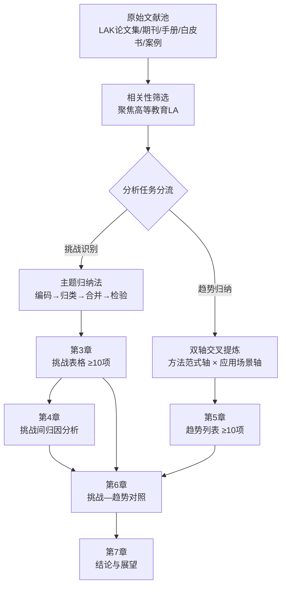
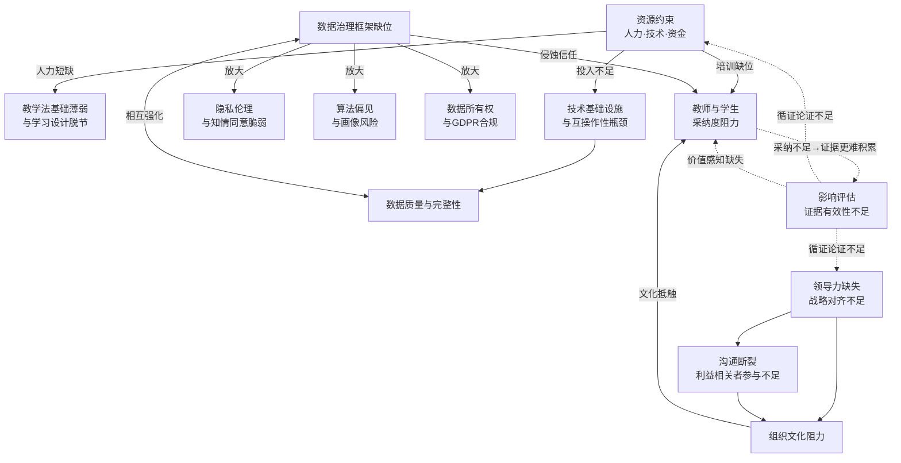
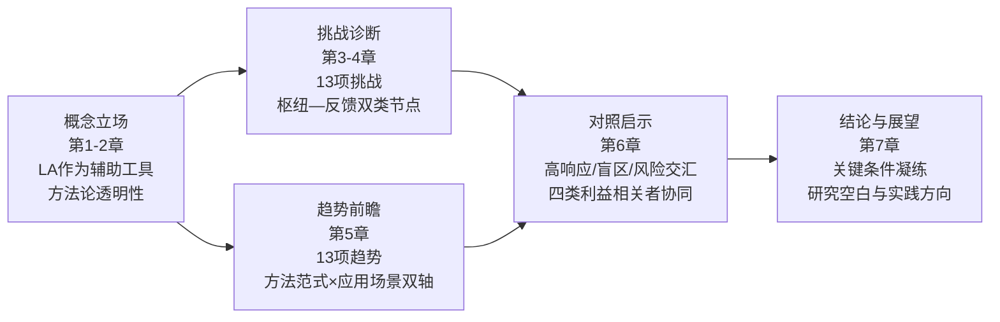

# 高等教育中的学习分析（Learning Analytics）：实施挑战与未来趋势研究报告
# 1 研究背景与导论

进入21世纪第二个十年以来，高等教育正在经历由数据驱动的深层变革。从在线课程平台到远程实验室，从学习管理系统（LMS）到智能导师系统，学习者的每一次点击、提交、停留乃至犹豫，都以日志的形式被沉淀为可分析的数字痕迹。如何让这些原本散落在系统后台的"数据噪音"转化为可指导教学决策与学习改进的"教育信号"，正是**学习分析（Learning Analytics, LA）**这一新兴交叉领域所要回答的核心问题。本章作为整份报告的开篇，将首先厘清学习分析的概念边界与学科渊源，通过与学术分析（Academic Analytics, AA）以及教育数据挖掘（Educational Data Mining, EDM）的比较定位，明确LA的方法论取向；随后，结合高等教育数字化转型与后疫情时代远程教学常态化的现实背景，论证系统调研LA实施挑战与未来趋势的紧迫性，并界定本报告的研究目标、时间范围与读者价值，为后续章节奠定概念基础与逻辑起点。

值得在开篇即予以强调的一点是：学习分析并非旨在以技术替代人类教育者的"自动化解决方案"，而更应被视为辅助教学决策与学习改进的**工具与伴侣**。其真正价值在于"使不可见的过程变得可见"——即把隐藏在学习行为背后的认知挣扎、策略选择与情境影响以数据化的方式呈现出来，从而拓展教师与学习者对学习过程本身的理解。这一基本立场将贯穿本报告的全部章节，也是审视后文所讨论的实施挑战与未来趋势的根本参照。

## 1.1 学习分析的概念界定与学科渊源

学习分析在学术语境中较为公认的定义来自Siemens与Long在2011年发表的奠基性文献《Penetrating the Fog: Analytics in Learning and Education》。两位学者指出，在高等教育进入"数据与证据驱动决策"的转型期之际，分析方法为高校领导者提供了一套用以改进教学、学习、组织效率与决策质量的模型；其潜在收益包括行政决策与资源配置的优化、风险学习者的识别，以及高校系统自身的创新与转型[^1]。这一表述虽更接近宏观层面的"教育分析"，但奠定了LA作为一种**循证教育治理范式**的学科基调。

在更聚焦学习者本身的层面，学习分析通常被定义为"为了理解、优化学习过程和学习环境，对学习者及其所在情境的数据进行的测量、收集、分析和汇总工作"[^2]。这一定义明确将LA的研究关切指向**学习过程的理解与优化**，而非单纯的管理效率或商业指标。从学科渊源上看，学习分析起源于**智能导师系统（Intelligent Tutoring Systems, ITS）**的相关研究，并在20世纪90年代之后随着数据收集和分析技术的发展而逐渐成形——研究者开始系统地收集学习者在学习过程中产生的细粒度数据，并进一步从客观数据中挖掘学习者的行为模式[^2]。这一脉络使LA天然具有三重学科血统：来自计算机科学与机器学习的**算法工具箱**、来自学习科学与教育心理学的**理论解释框架**，以及来自统计学与可视化研究的**数据呈现方法**。

在高等教育语境下，LA所涉及的数据类型相当多元：既包括LMS中的登录、点击与作业提交记录，也涵盖讨论区文本、视频观看轨迹、测验作答细节，乃至远程实验室所产生的实验操作日志。例如，远程实验室VISIR（Virtual Instruments Systems In Reality）使学生得以通过互联网操作真实的电子电路实验设备，其后台记录了完整的电路搭建与测量过程数据；研究者通过**学习分析仪表盘（如VISIR-DB）**对这些数据进行可视化与分析，以辅助教师识别学生的解题意图、检查解题过程中的先验步骤与潜在错误，从而提供更具针对性的反馈[^3]。这类应用清晰地展示了LA在高等教育中的典型分析对象（学习者行为）、分析层级（个体学习者—课程—机构）以及最终的应用归宿（教学反馈与学习改进）。

## 1.2 LA、AA与EDM的差异化定位

在现有文献中，学习分析（LA）、学术分析（AA）与教育数据挖掘（EDM）三个概念时常被混用，但其分析目标、数据粒度与方法取向存在重要差异，澄清三者的边界对于本报告聚焦的研究范围至关重要。

Siemens与Long将分析在教育中的应用更多放在**机构治理层面**进行讨论，强调其对行政决策、资源分配与院校创新转型的支撑作用[^1]，这一取向更接近后来文献中所称的**学术分析（Academic Analytics）**——即以校院两级管理者为主要受众、以招生留存率、毕业率、运营效率等机构指标为核心对象的分析活动。与之相对，学习分析则更聚焦于**学习者与课程层面**，关切的是学习过程本身的理解与优化，而非机构KPI的提升[^2]。

教育数据挖掘（EDM）则与LA在方法论层面有较大重叠却又有所区别。Baker与Siemens在比较两者时指出，EDM与LA都致力于从大规模教育数据集中提取有用且可付诸行动的信息，其共同的方法论能力包括：扫描大型数据集以发现仅在少数学生或偶发情境中出现的模式、考察不同学生如何选择不同学习资源并获得不同结果、以及对教育现象进行细粒度分析[^4]。然而，EDM在传统上更强调**算法层面的自动化挖掘**与模式发现，倾向于使用分类、聚类、关联规则等数据挖掘技术；而LA则更注重**人本解释**，强调将数据分析结果回置于教育情境之中，由教师、学习者与管理者参与意义建构。

进一步从特征工程的视角看，学习分析在识别学习者行为模式时所依赖的并非仅是分类算法的精度提升，而更需要"基于底层数据设计能够有效反映学习者行为模式的特征"——研究表明，**好的特征工程通常比一个特别的分类算法更为重要**[^2]。这一观察折射出LA与EDM之间的细微张力：LA更倾向于将算法视为服务于教育理解的工具，强调从客观行为数据中挖掘出投机取巧、挫折、疑惑等**具有教育学意义的行为模式**[^2]，并据此为学生提供优质的支持服务，这被视为学习分析在教育领域应用的核心价值所在[^2]。

下表对三者的差异化定位作一概要对比：

| 维度 | 学术分析（AA） | 学习分析（LA） | 教育数据挖掘（EDM） |
|------|----------------|----------------|----------------------|
| 主要分析对象 | 机构与院校层面的运行指标 | 学习者与课程层面的学习过程 | 教育数据集中潜藏的模式与规律 |
| 数据粒度 | 较粗（聚合统计为主） | 中等至细粒度（行为日志、过程数据） | 细粒度（事件级、交互级） |
| 方法取向 | 描述性与决策支持分析 | 人本解释 + 教育情境化分析 | 算法驱动的自动化挖掘 |
| 主要受众 | 高校管理层与决策者 | 教师、学习者、教学设计者 | 研究者与算法开发者 |
| 核心价值导向 | 组织效率与战略决策 | 理解与优化学习过程 | 模式发现与预测建模 |

需要指出的是，三者并非彼此割裂的孤岛，而是相互渗透的连续谱：AA为LA提供机构层面的数据基础与战略支持，EDM为LA提供算法工具与建模方法，而LA则在中间层把算法发现与机构治理转译为可被教育者理解和使用的洞察。**本报告将以LA为核心聚焦，兼顾EDM的技术方法以及AA层面的治理议题**，以此构建后续章节讨论挑战与趋势所需的概念坐标系。

## 1.3 高等教育数字化转型与后疫情情境下的现实紧迫性

将研究的视线从概念层面拉回现实，可以清晰地看到：过去十余年间，高等教育的教学场景已发生结构性变化，LA的研究价值与实施紧迫性也由此显著上升。

首先，**在线学习与混合式教学的常态化**为LA提供了前所未有的数据基础。MOOC、SPOC、翻转课堂、远程实验室等多种学习形态的普及，使得学习者的每一次交互都可被系统记录。以远程实验室为例，VISIR等系统将真实的实验设备通过互联网开放给远端学生操作，从而在科学与工程教育中实现了"实验场景的泛在化"；然而尽管远程实验室能够采集学生工作过程的细节数据，**这些数据的教育性使用仍处于欠开发状态**[^3]。这一现象具有典型代表性：高等教育中"数据丰富但洞察贫乏"的张力，正是当前LA研究亟需回应的核心命题。

其次，LA在高等教育治理与教学改革中所被寄予的期望并非空穴来风。Siemens与Long明确论述了分析在以下若干方面对高等教育的潜在贡献：改善行政决策与组织资源配置、识别有学习风险的学生、推动教学与组织系统的创新与转型[^1]。结合学习过程层面的分析潜力，LA可在如下几个维度提供切实价值：通过识别投机取巧、挫折、疑惑等行为模式[^2]，帮助教师在学习困境形成早期即予以介入；通过仪表盘等可视化工具对学生在特定活动中的表现进行评估，并为教师的"辅助评价"提供数据支撑[^3]；通过把数据洞察反馈给教学设计环节，推动教学方法的持续改进。

第三，**后疫情时代的远程与混合教学常态化**显著加剧了数据驱动教育治理的现实需求。在大规模在线教学场景下，传统的课堂观察、面对面交流等教学反馈通道被大大压缩，教师对学习者状态的感知严重依赖系统所记录的数字痕迹。这一转变同时带来两方面后果：一方面，对LA工具与仪表盘的实际需求迅速放大；另一方面，对数据隐私、算法偏见、伦理边界的关注也日益升温。如何在"数据可用性增加"与"伦理风险扩大"之间取得平衡，已成为高等教育不容回避的治理议题。

更为根本地，需要警惕的一种倾向是把LA神化为某种"教育自动化"方案。**学习分析在本质上是一个支持人类教育者作出更优决策的工具与伴侣，而非可以替代教师专业判断的"黑箱解决方案"**。其真正的力量在于把学习过程中那些原本不可见的复杂性——例如学习者犹豫的瞬间、试错的路径、求助的时机——以可被理解的形式呈现出来。早期对学习过程的研究多采用课堂观察、访谈、问卷等方法，关注的数据类型相对有限且以主观数据为主；过度依赖主观数据容易使研究结论受研究者价值判断或工具信效度影响，客观性与可推广性较低[^2]。LA的兴起正是对这一传统研究方法局限的回应，它通过收集学习过程中的细节客观数据，进一步从中挖掘学习者的行为模式[^2]，从而**"使不可见的学习过程变得可见"**。然而，这种"可见性"本身并不直接等于"可干预性"或"可改进性"——它仍需嵌入教师的教学法判断、学生的自我反思以及机构的治理框架，方能转化为真实的教育价值。这一基本立场，构成了本报告审视LA实施挑战与未来趋势的根本视角。

## 1.4 研究目标、范围与报告结构

基于以上背景与立场，本报告的核心研究问题可凝练为两个相互关联的方面：**其一，高等教育在实施学习分析时面临哪些关键挑战，这些挑战之间又呈现出怎样的关联结构？其二，截至2023年，学习分析在高等教育情境下呈现出哪些值得关注的未来发展趋势，这些趋势又在多大程度上回应当下的挑战？**

在研究范围上，本报告作出如下界定：

- **时间范围**：所引证据与所归纳趋势均截至2023年，对此后涌现的新进展不作前瞻覆盖；
- **机构层次**：聚焦于**高等教育阶段**（含本科、研究生、继续教育与远程教育），不涉及K-12与早期教育阶段，但在论及"扩展至K-12与终身学习"的趋势时会有简要提及；
- **主题边界**：以LA为研究核心，兼顾EDM在方法层面的贡献以及AA在治理层面的关联，但不对AA或EDM作独立完整的综述；
- **证据基础**：以同行评审文献为主，辅以行业白皮书、机构案例报告及代表性应用系统的研究成果，对方法与边界的说明详见第2章。

在报告结构上，全篇共由七章组成，整体逻辑遵循"概念—方法—挑战—关联—趋势—对照—结论"的递进脉络。第2章交代研究方法与资料范围；第3章以表格形式系统归纳至少10项关键实施挑战；第4章对挑战之间的关联性与因果链条进行归因分析；第5章以列表形式梳理至少10项未来发展趋势；第6章将挑战与趋势进行对照，提炼实践启示；第7章总结核心发现并展望后续研究方向。

在读者价值层面，本报告力图同时服务于四类典型读者：对**研究者**而言，本报告提供了挑战与趋势的结构化坐标系，可作为后续实证研究的问题清单；对**高校教师**而言，本报告所呈现的挑战分析有助于其理解LA工具的能力边界与使用前提，避免陷入"数据万能"或"数据无用"两种极端；对**高校管理者**而言，本报告对治理、伦理、规模化等议题的归纳可为机构层面的LA战略规划提供参考；对**技术开发者与供应商**而言，挑战与趋势的对照部分有助于其更准确地把握高等教育用户的真实需求与痛点。读者可依据自身角色选择不同的阅读路径：研究者可按章顺序通读，管理者可重点关注第3、4、6、7章，教师与开发者则可优先关注第3章与第5章的具体条目。

带着上述问题意识、研究边界与立场预设，下一章将首先说明本报告所采用的文献综述路径与证据筛选标准，为后续的挑战识别与趋势归纳提供方法论的透明性保障。

# 2 研究方法与资料范围说明

经第1章对学习分析（LA）概念边界与现实紧迫性的铺陈之后，本章将把视角转向**方法论的透明性建设**。在一份以"挑战归纳"和"趋势前瞻"为核心任务的研究报告中，结论的可靠性不仅取决于结论本身的措辞，更取决于其背后的证据筛选逻辑与整合路径是否清晰可查。换言之，读者有理由追问：报告所列出的至少10项实施挑战和至少10项未来趋势，究竟是从哪些类型的文献中提取出来的？又是依据怎样的标准纳入、合并或排除其他候选条目的？为回应这一质询，本章将依次说明文献综述路径与检索策略、证据来源类型与筛选标准、时间与主题边界、信息整合逻辑，以及最终的结构化呈现方式，以确保后续第3章至第7章的所有结论均可被回溯到具体来源，并具备读者层面的可复核性。

## 2.1 文献综述路径与检索策略

本报告所采用的方法论定位为**叙述性文献综述（narrative review）**，而非严格意义上的系统综述（systematic review）或元分析（meta-analysis）。这一选择基于两点考虑：其一，本报告的核心任务是对LA在高等教育情境下的"挑战格局"与"趋势走向"作出结构化梳理，其分析对象本身具有强烈的多维度、跨学科特征，难以通过单一的检索式与严格的入排标准穷尽相关证据；其二，叙述性综述在保留方法透明度的同时，能够更灵活地纳入综述性手册、行业讨论文件与代表性案例等异质来源，从而对挑战与趋势作出更具情境感的呈现。

在文献检索层面，本报告以学习分析领域内具有代表性的出版渠道为主要锚点。**国际学习分析与知识大会（LAK）论文集**与**《学习分析期刊》（Journal of Learning Analytics）**构成了核心证据池——前者自2011年起成为学习分析领域的标志性学术会议，其论文集已是教育技术领域被引率最高的出版物之一；后者已被Scopus与Emerging Sources Citation Index等主要期刊数据库索引，是该领域同行评审证据的重要载体[^5]。围绕这两个核心渠道，本报告进一步纳入了《学习分析手册》（Handbook of Learning Analytics）等综述性参考文献，以及英国开放大学等具有代表性实践经验的机构所发布的讨论性文件[^6]。

关键词组合方面，本报告以"learning analytics"为主词，分别与"higher education""challenges""implementation""adoption""ethics""privacy""dashboard""learning design""trends""future directions"等限定词进行交叉组合检索；同时，对学习分析与相邻领域的交叉地带，使用"educational data mining""academic analytics""multimodal learning analytics""quantitative ethnography""large-scale learning"等次级关键词作为补充检索线索，以便在保持以LA为核心的前提下，纳入对其方法论范式具有重要影响的相邻领域证据[^5]。在所有检索结果之上，本报告辅以**滚雪球追溯（snowball sampling）**策略：对核心文献的高频被引参考与重要后续引用进行回溯阅读，以最大程度地覆盖某一议题（如伦理、仪表盘设计、预测建模）下的关键文献谱系。

在面对LA、AA与EDM三者交叉的文献海洋时，本报告以第1章所确立的概念坐标系为筛选基准：以学习者与课程层面、聚焦学习过程理解与优化的研究为优先纳入对象；对仅涉及机构招生、毕业率等AA议题的文献仅作背景参照；对纯算法层面的EDM文献，仅在其与LA挑战与趋势具有方法学关联时予以纳入。

## 2.2 证据来源类型与筛选标准

为保障证据基础的多样性与可信度，本报告所纳入的资料构成具有**分层结构**。可将其大致划分为四类来源，并按权威性与相关性分别赋予不同的引用权重：

| 证据层级 | 主要来源类型 | 在本报告中的角色 |
|---------|------------|----------------|
| 第一层：同行评审学术成果 | LAK会议论文集、《学习分析期刊》及相关教育技术期刊 | 挑战与趋势归纳的主要证据基础 |
| 第二层：综述与手册类文献 | 《学习分析手册》、范式融合类综述 | 提供学科框架与范式视角 |
| 第三层：机构与行业讨论文件 | 英国开放大学等机构发布的讨论文件、白皮书 | 提供机构实施层面的实践证据 |
| 第四层：代表性案例与应用系统 | 远程实验室、仪表盘系统的研究报告 | 用于具象化挑战与趋势的应用场景 |

在筛选标准方面，本报告综合考虑以下四个维度：**相关性**——文献是否直接讨论高等教育情境下的LA实施挑战、影响因素或发展趋势；**权威性**——来源是否为公认的学术出版物或具有代表性的机构产出；**时效性**——优先纳入近十年内的文献，但对奠基性文献（如LAK元年的定义性论述、Siemens与Long的早期工作、Baker与Siemens对LA与EDM关系的比较等）不受时效限制；**方法透明度**——研究是否清晰交代其数据来源、分析方法与适用范围。

对于不同来源之间出现冲突或张力的情况，本报告采用以下处理原则：当同行评审文献与行业白皮书在事实层面存在差异时，以同行评审文献为准；当多条同行评审文献彼此矛盾时，优先采信来源权威、时效较新、信息详尽的证据，并在行文中如实说明分歧；当某项挑战或趋势仅由单一来源支撑时，本报告会在表述上作相应的限定（如"在部分研究中""有证据表明"），避免将单点证据过度泛化。**这一处理原则的核心目的并非追求"绝对中立"，而是确保读者在面对每一条结论时都能清楚地把握其证据强度。**

需要坦诚说明的是，受叙述性综述方法本身的局限以及本报告所能调用的具体证据集合的约束，本报告在某些挑战与趋势的论证上不可避免地存在证据厚度不均衡的现象：部分议题（如数据隐私、伦理、仪表盘设计、预测模型）由于在文献中讨论密集而具有充分的证据支撑；而另一些议题（如学习者主体性、跨机构协作、向K-12与终身学习场景的扩展）则更多依赖少数代表性文献与领域共识进行归纳。这一不均衡性将在第3章与第5章具体条目的表述中得以体现。

## 2.3 时间范围与主题边界界定

为与用户需求中所提出的"调研范围截至2023年"的明确要求相对应，本报告对**时间边界**作出严格界定：所有引证证据、归纳结论与趋势前瞻均以2023年（含）之前可观察到的研究进展与实践情况为基础；对2023年之后涌现的新方法、新工具、新政策不作前瞻性覆盖。这一限定并非对此后进展价值的否定，而是出于两点方法上的考虑：其一，截止时间的明确化是文献综述类研究保障可复核性的基本要求；其二，2023年这一节点恰好覆盖了从学习分析领域成立10周年（2020/2021年）后续若干年的成熟化发展，[^5]能够为挑战与趋势的归纳提供相对完整的证据基础。

在**主题边界**方面，本报告以高等教育阶段（含本科、研究生、继续教育与远程教育）的LA实施挑战与未来趋势为聚焦对象。与此相对应：

第一，对AA与EDM相关文献的引用被严格限定为**支撑性引用**——即仅在阐明LA的概念边界、方法学血统或与相邻领域的协作关系时予以引用，不对AA或EDM本身作独立完整的综述。例如，在讨论挑战中的"机构治理与战略对齐"议题时会触及AA的相关讨论；在讨论趋势中的"算法模型演进"议题时会触及EDM的方法学贡献，但两者均不构成独立章节。

第二，对**K-12及终身学习**相关文献的引用同样定位为辅助性——仅在第5章讨论"LA向K-12与终身学习场景扩展"这一趋势时作辅助证据使用，不对基础教育阶段的LA研究作系统覆盖。

第三，对**邻接方法论领域**——如教育数据挖掘（实体论范式）、量化民族志（存在论范式）、大规模学习（本质论范式）——的引用则定位为**范式视角的借鉴**：这些领域近年来对LA（本体论范式）的方法学影响日益显著，相关综述指出，重视协作与了解相关领域的研究成果，才能保证学习分析领域的健康发展[^5]，因此本报告在讨论趋势演进时会适度纳入这一范式融合视角，但不对各邻接领域作独立的方法论评述。

## 2.4 信息整合逻辑与分析框架

从原始文献到结构化结论的整合过程，是本报告方法论透明性的核心环节。本节将分别就**挑战识别**与**趋势归纳**两条主线，说明其各自的整合逻辑，并阐明二者之间如何通过对照分析建立关联。

在**挑战识别**环节，本报告采用**主题归纳法（thematic synthesis）**对多源证据进行处理。具体流程可概括为四个步骤：第一步，对纳入文献中明确论及"实施障碍""挑战""风险""阻碍""限制因素"等关键词的段落进行初步标记；第二步，对每一条候选挑战进行**初级编码**，以简短标签（如"教师参与度不足""数据治理缺位""仪表盘可用性差"等）加以概括；第三步，对初级编码进行**归类与合并**，将语义相近或属同一上位议题的条目合并为一项核心挑战（例如把"教师不愿使用LA工具"与"学生对LA干预的抵触"统一归入"教师与学生采纳度"议题）；第四步，对合并后的挑战集合进行**优先级排序与完整性检验**，确保最终呈现的至少10项挑战在维度上具有足够的覆盖广度——涵盖组织文化、教学法、资源、数据治理、数据质量、伦理与隐私、沟通、规模化、采纳度、领导力、技术基础设施、影响评估等关键维度。

在**趋势归纳**环节，本报告采用**双轴交叉提炼**的策略，分别从方法范式演进与应用场景演进两条线索切入。**第一条轴是方法范式演进**：参考相关综述所提出的本质论、实体论/还原论、本体论/辩证论、存在论四种范式的融合视角[^5]，从中识别出对LA未来方向具有显著塑造力的方法学变化（如多模态数据的引入、可解释AI的兴起、范式融合带来的新型分析能力等）。**第二条轴是应用场景演进**：从混合式教学、远程教育、个性化反馈、跨机构协作、向K-12与终身学习扩展等应用层面的变化中提取趋势条目。两条轴并非完全独立——例如"多模态学习分析"既是方法范式上的演进，也对应着混合学习场景下的应用扩展——因此最终的趋势列表是两条轴交叉合并后的产物。

在**挑战与趋势的关联映射**方面，本报告在第4章对挑战之间的因果关联进行归因分析的基础上，于第6章建立**挑战—趋势对照矩阵**：对每一条趋势，分析其在多大程度上可回应当前的某一项或某几项挑战；对每一条挑战，分析其是否可能在新趋势的推动下被放大或转化为新风险（例如，生成式AI驱动的LA可能在缓解"个性化反馈不足"挑战的同时，加剧"算法可解释性"与"数据隐私"两类风险）。这一对照框架将为第6章面向不同利益相关者的实践启示提供分析基础。

下图展示了从原始文献到最终结构化呈现的整合流程：

该流程的关键节点在于：**主题归纳法保障了挑战识别的覆盖广度与结构合理性，双轴交叉提炼则保障了趋势归纳的多维性与前瞻性，二者通过对照矩阵在第6章实现交汇**，最终构成本报告的完整分析闭环。

## 2.5 报告呈现方式与可追溯性保障

为同时满足用户需求中对"挑战以表格形式呈现"和"趋势以列表形式呈现"的明确要求，本报告对核心章节的输出格式作出如下结构化安排：

**第3章**将以**两列表格**的形式呈现至少10项关键实施挑战，左列为挑战名称，右列为对其成因、表现与影响的具体解释。表格之后将附以简要的解读性文字，对挑战的整体分布特征作必要的延伸说明，但不重复表格中已交代的具体内容。

**第4章**作为对第3章的深化，将以叙述性段落配合关联性图示的方式，对挑战之间的相互依赖与因果链条进行归因分析，从"挑战群"的视角揭示其作为系统性结构的存在方式。

**第5章**将以**带标题的列表**形式归纳至少10项未来发展趋势，每一条趋势包含一个明确的标题与一段简要说明，说明部分将阐明该趋势的内涵、驱动因素及其在文献中的证据依据。

**第6章**将通过**对照分析的形式**比较挑战与趋势的对应关系，并按高校管理层、教师、技术供应商、政策制定者四类利益相关者归纳实践启示。

**第7章**则对核心发现进行收束式总结，并对2023年之后的研究空白与实践方向作出前瞻性判断。

在**可追溯性保障**方面，本报告执行三项基本规范：其一，**引证规范**——正文中所有客观数据、第三方观点与非常识性事实均以引用角标的形式标注其来源出处，确保每一条挑战与趋势均可回溯至具体文献；其二，**术语规范**——对LA、AA、EDM、MMLA、SHEILA、LALA等核心术语在全篇报告中保持统一称谓与缩写，避免读者在跨章阅读时产生理解负担；其三，**证据强度规范**——对仅由单一来源支撑或属领域共识但缺乏密集文献支撑的条目，在表述上采用与之相称的限定性措辞，避免将薄弱证据过度泛化为强结论。

需要再次坦诚说明的是，受本报告所能调用的具体证据集合限制，部分议题在引证密度上存在不均衡，这一局限性已在2.2节作出说明，并将在第3章与第5章的具体表述中通过措辞的限定加以反映。读者在阅读后续章节时，可结合本章所交代的方法论框架对每一条结论的证据强度作独立判断。

带着上述方法论的透明性铺垫，下一章将正式进入本报告的第一项核心任务——以两列表格的形式系统归纳高等教育实施学习分析所面临的至少10项关键挑战。

# 3 高等教育实施学习分析的核心挑战（表格呈现）

经过第1章对学习分析（LA）概念边界的厘清与第2章对方法论路径的透明化交代，本章正式进入报告的第一项核心任务：以两列表格的形式系统呈现高等教育在实施LA过程中所面临的至少10项关键挑战。需要在开篇明确的是，本章的写作定位是**清单式的结构化呈现**，旨在为读者建立一份覆盖广度足够、解释深度可回溯的挑战目录；至于挑战之间如何相互依赖、如何形成阻碍LA规模化采纳的系统性结构，则将留待第4章的关联性归因分析中专门处理。本章因此将聚焦于"是什么"（What），暂不回答"为什么相互纠缠"（Why entangled）的问题。

## 3.1 挑战归纳的维度框架与表格结构说明

在正式呈现挑战清单之前，有必要先对本章所采用的结构化框架作一简要交代，以便读者在阅读表格时拥有一个清晰的认知坐标。

本章对挑战的组织遵循一个隐含的**六维度骨架**：组织治理（含组织文化、领导力与战略对齐）、教学法（含学习理论基础与学习设计融合）、资源与基础设施（含人力专长、资金投入与技术互操作性）、数据与伦理（含数据治理、数据质量、隐私合规与算法偏见）、采纳与沟通（含教师/学生采纳度、利益相关者参与、沟通机制）、规模化与影响评估（含跨机构协作、可持续性、学习成效证据）。这一骨架并非对挑战的硬性分类——许多挑战在性质上跨越多个维度（例如"数据所有权与跨境合规"既属数据治理也属伦理议题）——而是用以**确保最终的挑战清单在维度上具有均衡覆盖**，避免出现某一类议题被过度强调而另一类议题被系统性忽视的偏倚。

表格结构上，本章采用**"挑战名称 / 具体解释"两列**的简洁形式：左列以简短的标签命名挑战，便于读者快速识别与后续章节交叉引用；右列则就该挑战的成因、典型表现与对高等教育实施的潜在影响展开有限但具体的说明，并在必要处标注证据来源类型。对于由密集文献支撑的条目（如隐私伦理、数据治理），表述将相对确定；对于仅由少数代表性文献或领域共识支撑的条目（如跨机构协作、长期纵向证据缺失），则采用"在部分研究中""有证据表明"等限定性措辞，与第2.2节所声明的证据强度规范保持一致。

需要预先指出的一点是：本章所归纳的13项挑战略超出用户需求所要求的"至少10项"基准。这一选择基于覆盖广度与解释深度之间的平衡考虑——过少的条目难以覆盖六大维度，而过多的条目又会稀释每一项挑战的解释密度。最终保留的13项条目被认为是在保证维度均衡的前提下，对高等教育LA实施挑战的较为完整的呈现。

## 3.2 高等教育LA实施核心挑战表格

下表系统呈现高等教育在实施学习分析过程中所面临的13项核心挑战，覆盖前述六大维度，每一条挑战的具体解释均围绕其成因、典型表现与影响展开。

| 挑战 | 具体解释 |
|------|---------|
| **1. 组织文化与机构变革阻力** | LA的实施并非单纯的技术部署，而是一项涉及组织治理与文化重塑的复杂变革。自上而下的战略规划与自下而上的草根创新之间常存在张力：机构重组、人事调动可能导致试点项目中断，底层教师驱动的创新难以制度化为机构层面的常态实践，文化滞后使得数据洞察无法顺利转化为机构决策。这一挑战在多机构协同案例中尤为突出，相关跨机构合作研究表明，要使学习分析工具在真实课堂中持续生效，组织文化层面的弹性比技术本身更为关键[^7]。其影响是LA项目的可持续性差，难以从试点跃迁至规模化服务。 |
| **2. 薄弱的教学法基础与学习设计脱节** | 当前LA研究在很大程度上呈现"数据中心"取向，学习理论缺位、与学习设计的融合不足是反复被指出的薄弱环节。学界对此提出"中间空间"（middle space）问题，即分析结果如何真正嵌入教学与学习过程仍属未充分探索的领域——学生作为分析使用者所面临的解释挑战（情境化、信任、个体性）、决策挑战（行动选项的可获取性、改变的可行性）均未被系统回答[^8]。其典型表现为：LA工具流于监控与评价用途，难以支持真实的学习能动性，分析结果与课程设计割裂。 |
| **3. 资源约束（人力、技术与资金）** | 数据科学家、教学设计师与具备数据素养的教师严重短缺，持续投入不足使能力建设难以推进。多数高校仅能停留在试点或筹备阶段，无法进入服务化、常态化的运营阶段。这一约束直接导致LA成熟度无法跃迁，机构层面的战略对齐失败。即便有研究人员愿意在课堂中部署LA工具，缺乏稳定的技术与人力支撑也使其难以延展至更广范围[^7]。 |
| **4. 数据治理框架缺位** | 当前LA领域的伦理与治理指南呈现零散化态势，数据使用的范围、角色边界与责任分配往往不清晰，"普世价值"假设也使治理框架难以适应多元文化情境。Ferguson等人在《学习分析期刊》的特刊导言中系统梳理了LACE项目（European Learning Analytics Community Exchange）所识别的**22项伦理与隐私挑战**，并据此提炼出九项伦理目标，提示治理缺位会使LA陷入"老大哥式监控"的风险，难以建立"可信学习分析"[^9]。其影响是数据流动与使用缺乏制度化护栏，权力—监控冲突在所难免。 |
| **5. 数据质量与完整性** | LA所依赖的数据往往来自多源异构系统，学习者通常没有更正自身数据的权利，且数据常被剥离其原始语境进行二次分析。**不准确或不完整的数据会导致误导性的分析结果，进而影响基于分析所作出的教育决策**——这一警示在系统性文献综述中被反复强调。Namoun与Alshanqiti在2020年发表于《Applied Sciences》的系统综述《Predicting Student Performance Using Data Mining and Learning Analytics Techniques: A Systematic Literature Review》中指出，数据质量与完整性问题是预测学生表现类研究中影响结论效度的关键障碍。其典型表现包括：数据不完整、过期或不准确，不可被机器读取的学习活动（如线下互动、口头反馈）被系统性边缘化，最终造成模型信效度下降、教师与学生对分析结论的信任削弱。 |
| **6. 隐私与伦理问题** | 隐私与伦理是LA领域被讨论最为密集的议题之一。其核心张力在于：**学生往往不知道哪些数据正在被收集、又将被如何使用**，知情同意机制因未来用途的不可预知性而高度脆弱；同时，**数据泄露的风险始终存在，一旦发生可能暴露高度敏感的学生信息**，包括学业表现、心理状态乃至社会关系。Selwyn在2019年发表于《Journal of Learning Analytics》的批判性文章《What's the Problem with Learning Analytics?》中对这一议题作出了系统反思，提醒学界警惕LA所内含的监控逻辑与权力不对称。Pardo与Siemens在2014年的奠基性论述中也已指出，隐私与伦理问题与信任、问责、透明度等议题紧密交织，需要通过一套清晰的原则框架加以应对[^10]。一项针对美国高校学生隐私态度的实证研究则呈现出"知情但不在意"（aware, but don't really care）的悖论——学生意识到登录频率、页面浏览等行为正被记录，但对此并不特别担忧[^11]——这一发现提示隐私态度具有强烈的情境依赖性，但并不削弱伦理框架本身的重要性。 |
| **7. 算法偏见与画像风险** | 与隐私问题相邻但又有所区别的，是LA所采用的机器学习与数据挖掘技术本身所内含的偏见与画像风险。Hildebrandt在2017年的论述中区分了"个人数据处理"与"基于机器学习的画像"两个层面，指出后者可能通过隐性定向干预将学生推入预设的路径，违反非歧视原则与正当程序，侵蚀学习者的创造性、幽默感与"可争议性"（contestability）[^7]。其典型表现是：基于行为主义假设的预测模型可能在不知不觉中放大既有的结构性不平等，将"被算法标记为高危"的学生进一步边缘化。 |
| **8. 数据所有权、跨境合规与GDPR压力** | 关于学习数据所有权的理解在不同利益相关者之间存在多元立场，跨境数据流动则进一步引入了法律与文化差异的复杂性。GDPR等监管框架对"个人数据"采取广义定义，假名化数据仍属个人数据范畴，目的限制原则使得基于学习数据的二次画像难以仅通过去标识化加以解决——"通过设计实现数据保护"（Data Protection by Design）已成为法定义务[^7]。其影响是LA实施需在合规风险与分析效用之间作出持续权衡，匿名化保障不足或跨境数据流动模糊都可能引发信任崩塌。 |
| **9. 利益相关者参与不足与沟通断裂** | LA的成功实施高度依赖教师、学生、管理者与技术团队之间的协同设计，但权力不对称、数据与教学素养差异以及对监控的担忧使得真正的多方参与往往难以实现。一项面向德国高校学生（N=1169）与教师（N=497）的实证调查表明，**两类利益相关者在LA"理想状态"与"预期状态"之间存在显著差距**，且学生与教师群体之间、不同学科之间的态度也呈现明显异质性[^8]。跨机构合作案例进一步揭示，项目高度依赖关键人物所形成的"单点联系机制"——一旦关键人物离开或机构发生变革，整个项目可能陷入停摆[^7]。其影响是LA实施合法性受损，可持续性差，预期与责任难以对齐。 |
| **10. 教师与学生采纳度的差异化阻力** | 即便在治理框架与技术条件均具备的情境下，教师与学生的实际采纳度仍是LA落地的关键瓶颈。教师方面，工具与课堂教学流程脱节、对"快速创新循环"的需求未被满足，使LA工具难以融入日常教学[^7]。学生方面则呈现出更为复杂的图景：一方面如前述美国研究所示，部分学生对数据被记录持"不在意"态度[^11]；另一方面，在协同设计情境下，学生对"被监视"的担忧又表现得相当突出。这种**情境依赖性的采纳度差异**使得LA往往局限于个别课程或个别教师的"孤岛式"应用，难以形成机构层面的影响力。 |
| **11. 领导力缺失与机构战略对齐不足** | LA的规模化采纳需要机构层面的战略对齐与领导力支持，但当前许多高校的教育技术专家并不占据领导职位，LA项目以自下而上为主，难以获得机构层面的签字支持与持续资源投入。Tsai与Gašević基于八项学习分析政策的比较分析指出，缺乏制度化的政策框架与战略规划是LA从试点走向规模化的主要障碍之一[^12]。其影响是循证决策无法在机构层面落地，底层创新难以被结构化承接。 |
| **12. 技术基础设施与互操作性瓶颈** | LA在技术基础设施层面的核心瓶颈之一是**互操作性**——即不同系统之间的数据如何在保留原始语义的前提下被汇聚与处理。当前学界存在xAPI与Caliper Analytics两套主要的互操作规范，二者并存形成"双轨"格局；尽管已有学习记录仓库（Learning Record Warehouse, LRW）如OpenLRW提供内部转换器，但在实际部署中仍会出现语义转换损耗与版本兼容瓶颈[^13]。其典型表现是：跨系统数据汇聚受阻，机构面临供应商锁定风险，标准的频繁迭代抬高了机构的持续投入成本。这一挑战对那些希望在多个学习平台与教务系统之间建立统一数据底座的高校尤为突出。 |
| **13. 证据有效性不足与影响评估缺位** | LA的潜能与实效之间存在显著鸿沟，相关证据基础尚不充分。Viberg等人对2012—2018年间发表的252篇高等教育LA研究论文的系统综述发现：**仅有约9%的研究提供了LA提升学习效果的证据，35%呈现支持教与学的证据，6%反映广泛应用的证据，18%涉及伦理规范层面的证据**[^10]。该团队在2020年针对在线学习环境下自我调节学习的后续综述中进一步指出，相关实证研究普遍存在样本小、时长短、方法异质等问题，缺乏长期纵向证据[^10]。其影响是LA投资回报的不确定性增加，机构循证决策受限，研究产出难以常态化嵌入教学实践。 |

需要再次强调的是，上述13项挑战中各条目的证据厚度并不均衡：隐私伦理、数据治理、影响评估等议题由密集文献支撑，证据基础较为厚实；而跨机构协作、长期纵向证据缺失等议题则更多依赖少数代表性文献与领域共识。这一不均衡性在具体表述的限定性措辞中已得到反映，读者在援引时可结合每条解释中所标注的来源类型独立判断证据强度。

## 3.3 挑战分布特征的延伸解读

在完成对13项核心挑战的结构化呈现之后，本节就挑战的整体分布特征作三点收束性补充，以为第4章的关联性归因分析提供过渡。

**第一，关于证据密度的不均衡分布。** 从所归纳的挑战清单看，**隐私伦理、数据治理与影响评估**三个维度的文献证据最为厚实——LACE项目的22项挑战清单、Pardo与Siemens的原则框架、Hildebrandt关于机器学习画像的论述、Viberg等人的两次系统综述等共同构成了密集的证据网络[^10][^9][^7][^10]。**机构政策与战略对齐、利益相关者协同设计**两个维度的证据也较为充分，SHEILA项目、Tsai与Gašević的八政策比较分析以及德国高校的大样本调查提供了多元化的证据基础[^8][^12][^14]。相对而言，**跨机构协作的可持续性、长期纵向影响、教学法基础与学习设计的深度融合**等议题的文献支撑相对薄弱——前者主要依赖单个案例研究的二次推论[^7]，中者受限于研究周期与样本约束[^10]，后者则属于学界明确指出的"中间空间"空白[^8]。这一证据密度的不均衡分布本身就是一项值得关注的发现：**被讨论最为密集的并不一定是最难解决的，反而可能是最易获得共识与资助支持的；而那些证据相对薄弱的议题，恰恰可能是LA实施中"被低估的盲区"。**

**第二，关于"软性议题"与"硬性议题"的整体配比。** 在13项挑战中，可大致归为**"软性议题"**（组织文化、教学法基础、利益相关者参与、采纳度、领导力、沟通断裂等）的有6—7项，可归为**"硬性议题"**（数据质量、技术基础设施与互操作性、GDPR合规、算法偏见等）的有4—5项，其余2—3项（数据治理、影响评估）则跨越软硬两端。这一配比折射出一个重要事实：**LA实施挑战的主体并不在于技术本身，而在于围绕技术展开的人、组织与制度议题**。即便xAPI/Caliper互操作规范进一步成熟、机器学习算法进一步精进，LA在高等教育中能否真正落地仍主要取决于组织文化、教学法融合、采纳度提升与治理框架建设等"软性"工作。这一观察对高校管理层尤为重要——它意味着仅靠采购技术工具或聘请数据科学家并不足以解决LA实施的核心难题，机构必须同步投入到文化建设、能力提升与治理设计之中。

**第三，关于利益相关者视角下的挑战分布。** 从利益相关者的承担与感知视角看，13项挑战在四类主体之间呈现出大致如下的分布：**高校管理层**主要承担组织文化、领导力与战略对齐、规模化与可持续性、机构治理框架等议题；**教师**主要感知教学法基础薄弱、与学习设计脱节、采纳度阻力、数据解读负担等议题；**学生**主要感知隐私关切、画像风险、知情同意脆弱性以及参与不足等议题；**技术供应商与政策制定者**则主要面对基础设施与互操作性、合规压力、跨境数据流动等议题。值得关注的是，**数据质量与影响评估**两项挑战横跨所有利益相关者群体——管理层关心其对投资回报的影响、教师关心其对教学决策的支撑、学生关心其对自身判断的公平性、技术供应商关心其对系统设计的反馈、政策制定者关心其对监管框架的依据。这一分布特征为第6章面向不同利益相关者的实践启示提供了铺垫：**任何针对LA实施挑战的应对策略都必须考虑其在四类主体之间的差异化影响，避免"一刀切"的治理方案。**

综上，本章所归纳的13项挑战构成了高等教育LA实施所面临的关键议题清单，其分布特征既揭示了文献关注的重心，也暴露了学界尚未充分探讨的盲区。然而，正如本章开篇所声明的，这些挑战并非彼此孤立的清单条目，而是相互依赖、相互放大的系统性结构——例如资源不足会进一步削弱教学法基础，数据治理缺位会放大伦理与信任风险，沟通断裂会阻碍组织文化转型。**对这些挑战之间的关联机制与因果链条进行深入分析，正是下一章的核心任务。**

# 4 挑战之间的关联性与归因分析

第3章以表格形式系统呈现了高等教育实施学习分析（LA）所面临的13项核心挑战，并在收束性解读中已经提示：这些挑战在实践中并非彼此孤立的清单条目，而是相互依赖、相互放大的系统性结构。本章将沿此线索展开深入分析——把视角从"清单"转向"网络"，从"是什么"（What）转向"为什么相互纠缠"（Why entangled）。具体而言，本章将以"挑战群"视角揭示13项挑战之间的因果传导链条，识别处于网络上游、辐射效应广泛的**枢纽性挑战**与处于网络末端、通过反馈回路反向放大系统张力的**反馈性挑战**，进而帮助读者理解：高等教育LA的规模化采纳之所以难以通过单点突破实现，正是因为其所面对的并非"若干独立问题之和"，而是一个相互嵌套的因果结构。本章在报告整体逻辑中承担承上启下的功能——既深化第3章的结构化清单，又为第5章趋势归纳与第6章挑战—趋势对照矩阵的建立提供因果分析基础。

## 4.1 关联性分析的视角与方法

在正式展开因果链分析之前，有必要先就本章所采用的视角与方法框架作一交代，以保障后续推论的可追溯性与证据强度的透明性。

**从清单视角向系统视角的转换，源于清单本身的解释局限性。** 第3章所提供的13项挑战目录在覆盖广度上已足够完备，但单点清单难以回答一个反复出现的实践疑问：为何高等教育机构在实施LA时往往同时遭遇多项挑战？为何即便机构在某一项议题上取得突破（如完成了一份正式的数据治理政策），其LA项目仍可能在另一些议题上（如教师采纳度、影响评估）陷入停滞？这种"按下葫芦浮起瓢"的现象提示我们：挑战之间存在某种结构性的耦合关系，使得任何单点干预都可能被其他未被触及的挑战所抵消或放大。要回答这一疑问，必须超越清单视角，进入对**挑战间因果传导**的系统性分析。

本章的关联性分析沿三个维度切入：**传导方向**——即挑战A如何导致或加剧挑战B，明确因果链的箭头；**传导强度**——即两者之间是直接因果关系还是经由中介变量的间接关联，避免把所有共变现象都误判为因果；**传导节点**——即在因果网络中，某一挑战处于上游、中游还是下游位置，由此识别"枢纽性"与"末端性"节点。这三个维度共同构成了本章对挑战关联性的分析坐标。

需要坦诚说明的是，关联性分析在证据基础上比单点挑战识别更具推论性质——多数文献对单一挑战的成因与影响有较为详实的论述，但对挑战之间的耦合关系往往只能通过案例线索或综合推论加以揭示。因此，本章在论述每一条传导链时都将力求标注其证据来源，并对推论性较强的环节使用"在部分研究中""有证据提示"等限定性表述，避免将单一案例的关联机制过度泛化为普遍因果律。整体而言，本章的方法定位为**基于已纳入文献的结构性归因综合**，而非严格意义上的因果实证检验。

## 4.2 资源约束驱动的下游传导链

在13项挑战中，**资源约束（人力、技术、资金）**处于因果网络的最上游位置之一，其下游辐射效应贯穿教学法、技术基础设施、采纳度等多个维度。本节将沿三条主要路径展开论证。

**第一条路径：人力资源短缺直接传导至教学法基础薄弱与学习设计脱节。** 数据科学家、教学设计师与具备数据素养的教师之间的协同被广泛视为LA真正嵌入教学的前提条件——只有当三方角色齐备时，分析结果才能从"数据可视化"转化为"教学法决策"。然而在多数高校中，这一"铁三角"在人力配置上是残缺的：要么有数据科学家而无教学设计支撑，要么有教师热情而无数据分析能力。当人力短缺成为常态，LA工具便难以与具体的学习设计相耦合，沦为脱离课程语境的孤立部署。这一传导关系在Wise等人对"中间空间"（middle space）问题的论述中得到了清晰的概念性支持——他们指出，LA分析结果如何被学生作为分析使用者所采用，是一个未充分探索的领域，其背后既有理论框架缺位的问题，也有教学设计配套能力不足的现实约束[^8]。换言之，**教学法基础薄弱在表面上是一个学理性问题，在深层却是一个资源配置问题**。

**第二条路径：持续投入不足加剧技术基础设施与互操作性瓶颈，进而放大数据质量问题。** 高等教育机构若不能在LA基础设施上作出长期、稳定的资金承诺，则xAPI与Caliper Analytics双轨标准之间的转换、学习记录仓库（LRW）的部署与维护、跨系统数据汇聚的语义一致性保障等任务便难以持续推进。Rocha等人在Moodle LMS上实施学习记录仓库的研究中明确报告，即便采用了OpenLRW这样具备内部转换器的平台，在xAPI与Caliper格式之间的实际转换中仍会出现瓶颈[^13]——这一技术性瓶颈本身并非纯粹的"算法难题"，而是需要持续的工程投入与版本维护才能逐步缓解的"资源密集型问题"。当技术基础设施长期处于"打补丁"状态时，数据汇聚的完整性、一致性与时效性均会受损，**数据质量问题由此与技术基础设施瓶颈形成耦合**，进一步影响下游的分析效度与决策可靠性。

**第三条路径：资源约束抑制能力建设与培训，削弱教师与学生的采纳度。** LA工具的有效使用需要教师具备基本的数据解读能力、学生具备基本的数据素养，而这些能力的培育需要机构层面的系统性培训投入。McDonald等人在跨机构协作支持学生参与度的SRES案例中指出，该项目"源于真实课堂需求并在机构变革中保持韧性"的关键之一，正是参与各方在持续投入下所形成的能力积累[^7]。反之，当机构无法为教师培训、学生数据素养教育、配套教学法工作坊提供持续资源时，LA工具即便部署到位，也只能停留在少数早期采纳者的孤岛使用中，无法形成机构层面的影响力。

综合上述三条路径可见，**资源约束作为"基础性枢纽"，其影响并非通过某一条单一链路，而是同时沿教学法、基础设施与采纳度三个方向辐射展开**。这也解释了为何Tsai与Gašević在对八项LA政策的比较分析中反复强调机构层面的战略规划与资源承诺——若缺乏制度化的资源对齐，任何政策都只能停留于纸面[^12]。这一观察也意味着，在第6章讨论实践启示时，资源投入议题应被置于优先位置，因为它是多条下游链路的共同上游。

## 4.3 数据治理缺位对伦理、信任与采纳的放大效应

如果说资源约束是"基础性枢纽"，那么**数据治理框架缺位**则是另一类性质不同但同样关键的枢纽——它的核心特征不在于对下游议题的"驱动"，而在于对多项挑战的"放大"。本节将沿三个层面展开论证。

**第一个层面：治理缺位直接放大隐私伦理风险与算法偏见。** Ferguson等人在《学习分析期刊》关于伦理与隐私的特刊导言中系统梳理了欧洲学习分析社区交换项目（LACE）所识别的**22项伦理与隐私挑战**，并据此提炼出九项伦理目标——其核心论点是：伦理、数据保护与隐私三者虽然紧密交织，但需要被分别考量；缺乏清晰的治理框架将使三者之间的张力无法被结构化承接[^9]。Pardo与Siemens在其奠基性论述中也指出，LA所引发的隐私与伦理问题"与信任、问责、透明度等议题紧密交织"，需要通过一套明确的原则框架加以应对，否则相关张力便难以在实践层面被有效化解[^10]。更进一步，Hildebrandt关于机器学习画像的论述揭示了治理缺位的另一面后果：当数据保护框架未能在制度层面落地时，**机器学习画像所带来的隐性定向干预、非歧视原则的违反、正当程序的侵蚀都将缺乏制度护栏**，学生的创造性、幽默感与"可争议性"将面临系统性风险[^7]。这三组证据共同指向一个结论：治理框架缺位并非孤立的"政策空白"，而是直接放大隐私、伦理、算法偏见等多项挑战的关键枢纽。

**第二个层面：治理缺位通过削弱信任，间接抑制利益相关者参与度与采纳度。** 当数据使用的范围、角色边界与责任分配不清晰时，学生与教师对LA系统的信任便难以建立——他们既不知道哪些数据正在被收集，也不清楚数据将被用于何种目的、由谁负责、可被申诉的渠道在哪里。Vu等人对美国高校在线课程学生隐私态度的实证研究虽然呈现出"知情但不在意"的悖论现象，但其前提条件值得注意：该研究所调查的数据使用情境主要限于"为学术研究和教学改进目的"的常规分析[^11]——一旦数据使用目的扩展至高风险场景（如风险学生预警、自动化干预、跨机构数据流动），缺乏治理框架的状态下，学生的态度极可能从"不在意"翻转为强烈抵触。这一观察提示我们：**信任并非天然存在的禀赋，而是治理框架持续维护的产物**；治理缺位会以一种慢性而持续的方式侵蚀利益相关者参与LA实践的意愿，进而抑制采纳度——这条传导链虽不如"治理→伦理风险"那样直接，却同样具有深远的累积影响。

**第三个层面：治理缺位与数据质量问题相互强化。** 在无清晰责任分配的数据流动中，数据完整性与准确性都难以得到系统性保障——既缺乏明确的数据校验责任人，也缺乏对数据更正请求的标准化响应流程。学习者通常没有更正自身数据的权利这一现象，本身即是治理缺位在数据质量层面的直接投射。当错误数据进入分析管道并被反复使用时，模型的预测偏差、教师对系统的不信任、学生对分析结论的质疑都将进一步累积，**形成"治理缺位→数据质量下降→信任削弱→治理改进动力不足"的恶性循环**。

综合上述三个层面可见，数据治理缺位的特殊性在于其**横向放大作用**——它不像资源约束那样有清晰的下游路径，而是以"放大器"的方式作用于多项挑战。这一特征意味着，仅靠在某个具体议题上的应对（如出台一份隐私保护政策）并不足以化解治理缺位带来的系统性张力；机构必须从整体框架的角度入手，建立涵盖数据采集、存储、使用、共享、问责等环节的完整治理体系，方能切断这一放大链条。

## 4.4 沟通断裂与领导力缺失对组织文化转型的双重阻滞

资源约束与数据治理缺位主要属于"硬性枢纽"——前者直接关乎物质投入，后者直接关乎制度安排。与之相对的是另一类"软性枢纽"：**利益相关者沟通断裂、领导力缺失与组织文化阻力**三者之间的相互纠缠，构成了阻滞LA规模化采纳的另一重关键结构。本节将揭示这三项挑战如何构成一个相互锁定的"软性闭环"。

**首先，单点联系机制的脆弱性使跨机构协作难以制度化。** McDonald等人对SRES（Student Relationship Engagement System）跨机构合作的研究记录了一个具有代表性的现象：该项目"源自真实课堂需求并在机构变革中保持韧性"——但其韧性的代价正是高度依赖少数关键人物的持续投入[^7]。当关键人物因人事调动、岗位变化或机构重组而离开时，沟通节点便随之消失，项目随时面临停摆风险。这一案例揭示了沟通断裂与组织文化阻力之间的第一重关联：**机构若未能将分散的关键人物联系机制制度化为可被接管的协作节点，则跨机构协作的所有努力都难以沉淀为机构层面的文化资产**。

**其次，领导力缺失使LA项目长期停留于自下而上的草根创新阶段。** Tsai与Gašević基于对八项学习分析政策的比较分析指出，缺乏制度化的政策框架与战略规划是LA从试点走向规模化的主要障碍之一[^12]。当教育技术专家不占据领导职位，当LA项目主要依赖底层教师的自发推动时，机构层面的资源对齐、跨部门协调、与教学战略的整合都难以发生——草根创新的活力难以转化为组织层面的转型动力，反过来又使关心LA的领导者难以为其提供持续的战略背书。**这一"自下而上的活力"与"自上而下的领导力"之间的断裂，本身就是组织文化滞后的核心表征**。

**第三，学生与教师在"理想状态"与"预期状态"之间的显著差距，在缺乏沟通机制时会被进一步固化为文化抵触。** Fritz等人在德国某高校开展的SHEILA框架实证调查（N=1169学生，N=497教师）系统比较了两类利益相关者对LA的"理想期望"与"预期实现"之间的差距，并发现这一差距不仅显著存在，而且在不同学科之间呈现出明显异质性[^8]。这一发现具有深远意义：当机构没有建立常态化的沟通渠道，使利益相关者能够表达期望、参与设计、监督实施时，**"理想—预期"的差距便会逐步演化为一种沉默的不满，进而在文化层面凝固为对LA的整体怀疑**。Prieto Alvarez等人在博士论文中对"利益相关者参与LA设计过程"的系统研究进一步强调，真正有效的协同设计需要打破权力不对称、调和数据/教学素养差异、并直面对监控的担忧——这些工作本质上都属于沟通机制建设的范畴[^15]。当机构在沟通投入上长期欠债时，文化抵触便会以一种隐性但持续的方式累积。

综合上述三重关联可见，沟通断裂、领导力缺失与组织文化阻力构成了一个**相互锁定的软性闭环**：沟通断裂导致领导层无法获得来自一线的真实信号，领导力缺失使沟通机制建设缺乏制度支持，而文化阻力又使所有改善沟通与提升领导力的努力遭遇隐性抵抗。这一闭环的特殊性在于：**它无法通过任何单一的"硬性投入"加以打破——再多的资金、再先进的技术、再完备的政策，若没有在沟通、领导力与文化三个软性维度上同步推进，都难以撬动LA项目的实质性进展**。这也解释了为何许多机构在投入大量资源后仍发现LA落地缓慢——问题往往不在硬性投入的多寡，而在软性闭环的固化。

## 4.5 影响评估缺位对循环改进机制的阻断

在13项挑战中，**证据有效性不足与影响评估缺位**乍看之下处于因果网络的下游——它似乎是其他挑战累积之后的"结果"。然而仔细审视便会发现，影响评估缺位绝非纯粹的末端问题，而是通过两条反馈回路反向影响整个系统的运转，因此具有典型的"反馈性挑战"特征。本节将沿这两条反馈路径展开分析。

**第一条反馈路径：缺乏长期纵向证据使机构难以为LA投资作循证论证，进一步抑制资源投入与领导力支持。** Viberg等人对2012—2018年间发表的252篇高等教育LA研究论文的系统综述揭示了一个发人深省的图景：**仅有约9%的研究提供了LA提升学习效果的证据，35%呈现支持教与学的证据，6%反映广泛应用的证据，18%涉及伦理规范层面的证据**——这一数据后来在该团队2020年针对在线学习环境下自我调节学习的后续综述中得到进一步印证，相关研究普遍存在样本小、时长短、方法异质等问题[^10]。这一证据格局的实践后果是深远的：当机构管理层、教育政策制定者或资助机构面对"是否继续投入LA"的决策时，他们手中可援引的"投资回报"证据极为有限——9%的成效证据比例显然不足以支撑大规模、长周期的资源承诺。这便形成一条隐蔽却致命的反馈链路：**影响评估缺位→循证论证不足→资源投入与领导力支持难以持续→LA实施进一步受限→影响评估机制更加难以建立**。

**第二条反馈路径：影响评估缺位使教师与学生无法清晰感知LA的价值回报，加剧采纳度阻力。** 这一路径的逻辑同样值得重视：教师之所以愿意投入额外精力学习LA工具、调整教学流程，往往是因为他们相信这些投入会带来可观察的教学改进；学生之所以愿意配合数据采集、参与仪表盘反馈，也往往是基于他们对LA能改善学习体验的预期。然而，当影响评估机制长期缺位时，"价值回报"便始终停留在承诺层面而无法被实证支撑——肖俊洪在其译介Viberg等人综述时所引述的反思指出，"如果你没有得到提高，那么意义何在"——这一来自基于技术的协作教师培训案例的诘问，同样适用于LA[^10]。当教师与学生无法清晰感知LA带来的实际价值时，采纳度阻力便不仅源于操作复杂度或隐私顾虑，更源于**对"投入是否值得"这一根本问题的持续怀疑**。

需要进一步指出的是，影响评估缺位本身的成因也是多重的——它既受制于研究方法的异质性（不同研究采用不同的成效定义、不同的测量工具、不同的对照设计），也受制于教育情境的复杂性（学习成效受多重因素影响，难以将LA干预的贡献从混杂变量中精确剥离），还受制于伦理审批与实施周期的现实约束（长期纵向研究面临伦理审批与样本流失等挑战）。这一多重成因结构意味着，仅靠单一研究团队的努力难以根本性改善影响评估的现状；它需要整个学术共同体在方法标准化、数据共享、跨机构协作研究等方面的协同推进。

综合上述分析可见，影响评估缺位虽位于因果网络末端，却通过两条反馈回路反向作用于整个系统——它既向上游抑制资源投入与领导力支持，又向中游加剧采纳度阻力，**成为整个LA实施系统持续运转的关键瓶颈之一**。这一"反馈性挑战"的存在提示我们：要打破LA实施的系统性僵局，仅靠在上游（资源、治理、领导力）发力是不够的；机构与学术共同体必须同步在末端（影响评估、证据基础）上作长期投入，方能形成一个良性的循环改进机制。

## 4.6 挑战关联图谱与枢纽性识别

经过前四节对四条关键传导链的逐一剖析，本节将作整合性归纳：以可视化图谱的方式呈现13项挑战之间的因果网络，识别其中的"枢纽性挑战"与"反馈性挑战"，并对整个挑战群的结构特征作收束性评论。

下图以Mermaid流程图的方式呈现挑战间的关联结构。图中节点的位置（上游/中游/下游）大致反映其在因果链中的相对位置，箭头表示主要的传导方向：

图中实线表示直接的因果驱动或放大关系，虚线表示反馈回路。可以看到，**资源约束、数据治理缺位、领导力缺失**三者位于网络上游，分别沿"硬性资源链""制度放大链""软性闭环链"向下游辐射；**教学法薄弱、基础设施瓶颈、数据质量、隐私伦理、算法偏见、组织文化、沟通断裂**等位于网络中游，构成多条传导链的交汇地带；**采纳度阻力与影响评估缺位**位于网络末端，但通过两条反馈回路反向作用于整个系统。

基于上述图谱，可以识别出两类关键节点：

**第一类是枢纽性挑战**——它们处于多条传导链的上游，辐射效应广泛，其化解对整个系统具有杠杆效应。本章分析所识别的枢纽性挑战包括：**资源约束（沿教学法、基础设施、采纳度三个方向辐射）**、**数据治理缺位（横向放大伦理、偏见、合规、信任、数据质量等多项挑战）**、**领导力缺失（通过沟通与文化两个维度阻滞组织转型）**。这三项挑战的共同特征是其位于网络的"信号源"位置——任何一项的恶化都将沿多条路径向下游传导，反之，对任何一项的有效干预都能产生多链条的连锁改善效应。

**第二类是反馈性挑战**——它们位于网络末端，但通过反馈回路反向放大整个系统的张力。本章分析所识别的反馈性挑战主要包括：**影响评估缺位（向上抑制资源与领导力，向中抑制采纳度）**与**采纳度阻力（一方面是其他挑战累积的结果，另一方面又通过抑制LA实践产出来反向阻断证据积累）**。这两项挑战的共同特征是其位于网络的"反馈点"位置——它们看似是结果，实则又成为新一轮因果链的起点。

这一"枢纽—反馈"双类节点的识别带来一个重要的实践含义：**枢纽性挑战的化解需要机构层面的系统性投入与制度建设（资源对齐、治理框架、领导力培育），而反馈性挑战的改善则更有赖于长期证据积累与文化沉淀（影响评估机制的建立、采纳度的持续培育）**。两类挑战的应对策略具有本质差异，前者倾向于"自上而下"的制度推动，后者倾向于"自下而上"的实践积累；两者只有协同推进，才能形成完整的改善闭环。

最后，需要对挑战群的整体结构作三点收束性评论，以为后续章节铺垫：

**其一，挑战的耦合性远大于其独立性。** 在前四节的分析中可以反复看到，任何一项挑战的成因都不止一个、其影响也不止一个方向——资源约束既驱动教学法薄弱也驱动基础设施瓶颈，数据治理缺位既放大伦理风险也削弱采纳度，影响评估缺位既是结果也是新的起点。这一耦合性意味着，**任何单点突破策略都极有可能在短期内被其他未被触及的挑战所抵消**——这是高等教育LA实施屡屡陷入"治标不治本"困局的结构性原因。

**其二，软性挑战的隐性影响往往被低估。** 第3章已经指出，13项挑战中"软性议题"（组织文化、教学法基础、利益相关者参与、采纳度、领导力、沟通断裂等）的占比高于"硬性议题"。本章的关联性分析进一步揭示：软性挑战不仅在数量上占多数，而且通过沟通—领导力—文化的软性闭环、采纳度—影响评估的反馈回路等机制，对整个系统产生**深远而持续的隐性影响**。这一观察对那些倾向于"以技术解决一切问题"的实施思路构成了直接挑战——LA实施的真正难点不在于硬件、算法或数据架构，而在于围绕这些技术展开的人、组织与制度议题。

**其三，挑战群的系统性为趋势分析提供了关键参照。** 本章所建立的因果网络不仅是对当前问题的诊断工具，也将成为下一章趋势归纳与第6章对照分析的概念坐标系。具体而言：**未来趋势在多大程度上可以回应当下挑战，关键不在于其能否解决某一单点问题，而在于其能否触及枢纽性挑战或激活反馈回路中的良性循环**。例如，可解释AI在教育中的应用如果仅停留于算法层面的透明度提升而未触及治理框架建设，便难以从根本上化解伦理风险；学习分析与教学设计的深度融合如果缺乏资源支撑与领导力对齐，也难以从孤岛式应用扩展为机构层面的常态实践。这一参照将贯穿第6章对照矩阵的全部分析。

带着对挑战群系统性结构的整体把握，下一章将正式转入本报告的第二项核心任务——以列表形式系统呈现截至2023年学习分析在高等教育情境下值得关注的至少10项未来发展趋势。

# 5 学习分析的未来发展趋势（列表呈现）

经过第3章对13项核心实施挑战的结构化呈现与第4章对挑战间因果网络的归因分析之后，本章正式转入报告的第二项核心任务：以列表形式系统呈现截至2023年高等教育情境下学习分析（LA）领域可观察到的未来发展趋势。需要在开篇明确的是，本章的写作定位与第3章在结构上互为镜像——第3章回答"高等教育LA面临哪些挑战"，本章则回答"LA未来将朝哪些方向演进"；第3章以表格形式呈现挑战目录，本章以列表形式呈现趋势条目；两章共同构成本报告"诊断—前瞻"的核心分析框架，并为第6章"挑战—趋势对照矩阵"的建立预备结构化输入。

与第3章一样，本章的趋势归纳同样遵循"宁可覆盖广度足够，避免维度遗漏"的取向——清单可能略带冗余，但不应留有盲区。同时，与第3章保持一致的可追溯性原则在本章同样适用：对由密集文献支撑的趋势条目（如多模态学习分析、个性化反馈仪表盘、伦理治理框架制度化）表述将相对确定；对仅由少数代表性文献或领域共识支撑的条目（如向K-12与终身学习扩展、规模化跨机构协作的可持续性等）则采用限定性措辞，避免将薄弱证据过度泛化。

## 5.1 趋势归纳的双轴框架与列表结构说明

在正式呈现趋势列表之前，有必要先就本章所采用的归纳方法与呈现结构作一简要交代。

本章延续第2章2.4节所确立的**双轴交叉提炼策略**：**第一条轴是方法范式演进轴**，从LA作为方法学领域所经历的范式变化中提取趋势条目——包括人工智能与生成式AI的引入、多模态数据融合的方法学扩展、可解释AI与可信AI的兴起、以学习成效为导向的影响力评估范式的成熟等；**第二条轴是应用场景演进轴**，从LA在高等教育实践场景中所发生的应用层面变化中提取趋势条目——包括个性化反馈与仪表盘的语境化深化、与教学设计的深度融合、混合与远程教育情境下的常态化、学习者主体性的提升、向K-12与终身学习场景的扩展等。两条轴并非彼此独立——例如"多模态学习分析"既属方法范式演进（多源数据融合的方法学突破），也属应用场景演进（对协作学习、口头表达等过往难以客观评估的活动的细粒度刻画）；"生成式AI驱动的LA"既是算法层面的方法变革，也是反馈生成、智能辅导等具体应用场景的演化。因此，最终的趋势列表是两条轴交叉合并后的产物，而非两个独立子清单的简单拼接。

此外，本章还纳入两类**贯穿性议题**：**伦理与隐私保护框架的制度化**（与GDPR、欧盟AI Act等监管框架的对接）以及**政策与治理标准化的区域化演进**（以SHEILA、LALA等框架的演进为代表）。这两类议题既不纯属方法范式演进，也不纯属应用场景演进，但其在LA未来发展中的塑造力不可忽视，因此作为贯穿条目独立列出。

呈现结构上，本章采用**"标题+简要说明"的列表形式**：每一条趋势包含一个明确的中英对照标题，便于读者快速识别与跨章引用；说明部分则围绕三个要素展开——**内涵界定**（该趋势具体指什么）、**驱动因素**（为何这一趋势会在2023年前后成为关注焦点）、**证据依据**（文献中对该趋势的支撑性论述）。对证据厚度不均衡的条目，说明部分将采用与第2.2节及第3章所确立的可追溯性规范相一致的限定性措辞。

需要预先指出的一点是，本章所归纳的趋势条目共有**13项**，略超出用户需求所要求的"至少10项"基准。这一选择与第3章保持类似的方法考虑——过少的条目难以覆盖双轴的全部维度，过多的条目又会稀释每一项趋势的解释密度。最终保留的13项条目被认为是在保证双轴均衡的前提下，对截至2023年LA未来发展方向的较为完整的呈现。

## 5.2 高等教育LA未来发展趋势列表

下面以列表形式系统呈现高等教育LA领域截至2023年可观察到的13项未来发展趋势。

### 趋势1：人工智能与生成式AI驱动的学习分析（AI- and GenAI-Powered Learning Analytics）

**内涵界定**：以生成式人工智能（含大语言模型与多模态生成模型）为核心的新一代AI技术正在被引入LA管道，承担反馈生成、内容理解、对话式智能辅导、自动化评估与学习干预等任务。北京师范大学智慧学习研究院的研究指出，生成式AI涉及生成算法、大语言模型（LLM）与多模态三种典型技术，其中以ChatGPT为代表的应用所采用的Transformer自注意力机制使得"原来用'查字典'的方式无法找到的信息现在可以借助ChatGPT来获得，它还能根据语境正确理解词意"，《GPT-4技术报告》也显示其在多项专业与学术测试中表现已接近人类水平[^14]。

**驱动因素**：一方面是2022年底ChatGPT发布后引发的"机器取代人"忧虑迫使教育工作者重新思考人工智能的前景[^14]；另一方面是规模化在线学习环境对自动化反馈与智适应能力的现实需求——ACM Learning at Scale会议第五届大会的主题即为"增强规模化学习的创新"，明确提出开发自动化评估、学生知识模型、自动化反馈与学习干预，以提高规模化学习系统的智适应性[^14]。

**证据依据**：除上述技术综述外，Kizilcec在《国际人工智能教育期刊》的评论文章中强调，推进教育中的AI使用必须聚焦于理解教育者的视角——已有研究主要关注创建自适应/个性化系统与构建更精确公平的算法等技术改进，而对真实部署失败原因的研究则强调社会、心理与文化因素的作用[^16]。这一观察提示生成式AI驱动的LA不会仅是技术驱动的演进，更将与教育者的接受度、信任与使用实践形成深度耦合。

### 趋势2：多模态学习分析（Multimodal Learning Analytics, MMLA）的方法范式扩展

**内涵界定**：MMLA将LA的数据基础从传统的LMS点击流、作业记录等单一日志数据扩展到话语、行为、生理与情感等多源数据的融合分析，对协作模式、口头表达技能、认知投入、情感状态等过往难以客观评估的学习活动进行细粒度刻画。《Frontiers》多模态学习专题导言指出，**MMLA允许从眼动追踪、生理传感、语音视频等多种数据源中提取认知、行为与情感指标的痕迹**，这种多模态化使得对学习过程的刻画从"侧面肖像"走向"全方位、立体化"的全景图[^17][^18]。

**驱动因素**：数字技术与数据驱动方法的快速发展使得多感官刺激、混合学习空间、多模态行为与多源数据收集成为可能[^17]；低成本可穿戴设备的普及更使脑电、心率、皮电等生理数据被纳入教育研究[^18]；研究还表明使用多模态数据分析学习者效果的准确率高于使用单一数据，并能为深入探究学习者行为的内在机理提供支持[^18]。

**证据依据**：Xu等人对结对编程情境的MMLA研究通过对19对本科生的多模态过程与产出数据分析，识别出共识达成型、论证驱动型、个体导向型与试错型四种协作模式，并将其与不同水平的过程性与终结性表现相关联，提供了MMLA在协作问题解决场景下的实证证据[^19]。Spikol等人则在项目式学习的成功度估计中比较了不同的MMLA方法[^18]。彭红超等人的中国研究综述则系统梳理了多模态数据支持的教育科学研究在国内外的发展脉络，发现其大致经历了萌芽期、扩列期与裂变期三个阶段，且**多模态数据融合、研究范式转变与数据隐私依然是当前面临的发展挑战**[^18]。

### 趋势3：可解释与可信AI在教育中的应用（Explainable and Trustworthy AI in Education）

**内涵界定**：随着AI在教育中的广泛渗透，对算法黑箱、可解释性与可信度的诉求日益凸显，可解释AI（XAI）与可信AI正在成为LA领域的重要发展方向。这一趋势关切的核心是：当算法做出预测或推荐时，相关方（教师、学生、管理者）应能理解决策依据并拥有质疑算法结论的"可争议性"（contestability）。

**驱动因素**：第4章已论及Hildebrandt关于机器学习画像所带来的隐性定向干预与正当程序侵蚀的批判，正是这一类批判推动了可解释AI在教育情境下的紧迫性。在监管层面，**欧盟AI Act作为全球首部综合性AI法律框架于2024年正式生效**，其确立了"基于风险的规则"以促进可信赖AI的发展，并强调安全、基本权利与"以人为本"的AI原则[^14]——尽管AI Act的正式落地略晚于本报告2023年的时间截止点，但其立法进程在2023年已对LA领域形成显著影响。

**证据依据**：北京师范大学智慧学习研究院的研究明确提出构建包含**鲁棒性、合法性、合规性、合乎伦理性**四个基本准则的教育领域可信人工智能框架，开展教育领域智能技术治理[^14]。联合国教科文组织2021年发布的《人工智能与教育——政策制定者指南》也是这一趋势的国际性背书[^14]。需要坦诚说明的是，可解释AI在教育情境下的实证研究截至2023年仍处于早期阶段，相关条目更多依赖政策文献与领域共识，本报告对其表述因而保持适度限定。

### 趋势4：面向学习者的个性化反馈与仪表盘（Learner-Facing Personalized Feedback and Dashboards）

**内涵界定**：相对于早期"通用型仪表盘"被批评为过于泛化而难以为利益相关者所用的局限，新一代LA系统强调**语境化、个性化、行动导向**的反馈机制——教师可基于学习者参与度数据选择相关指标，向学生提供量身定制的反馈。Pardo等人提出的OnTask系统是这一方向的代表性范式：它通过"学生—教师中心的概念模型"将学生信息表示与教师创建的基本规则相结合，部署个性化学习支持行动（Personalized Learning Support Actions, PLSAs），并以开源平台形式推动该领域的采纳与探索[^20]。

**驱动因素**：大规模课程情境下教师难以为每位学生提供及时个性化反馈的现实约束[^19]；既有学生面向LA系统被批评过于泛化而无法为利益相关者所用的反弹[^19]；以及学生导向反馈对学业成就的重要性所形成的需求侧推力。

**证据依据**：Lim等人在南澳大学的三项学术案例研究记录了OnTask系统的实际部署效果，呈现了语境化LA反馈机制在真实高等教育情境下的运行经验[^19]。Pardo等人则在《学习分析期刊》上提出连接学习经验数据与个性化学生支持行动的三项贡献：概念模型、软件架构与开源实现[^20]。Hernández-García近期的"超越平均"研究则进一步将这一趋势推向"针对个体的精准教育（precision education）"——指出传统的群体水平分析虽对识别整体模式有价值，但对学习过程在个体内部如何展开提供的洞察有限，因此提出**针对个体的分析方法**作为新的方向，包括密集纵向研究等[^18]。

### 趋势5：学习分析与教学设计的深度融合（Learning Design + LA）

**内涵界定**：这一趋势回应第3章所识别的"教学法基础薄弱与学习设计脱节"挑战，强调将LA从"数据中心"取向重新定位至"中间空间"——即分析结果应深度嵌入教学设计与学习活动之中，而非孤立地以仪表盘形式呈现。其内涵包括两个层面：在概念层面，强调建立连接数据洞察与教学行动的概念模型；在工具层面，强调将LA能力嵌入教学设计工具与课程开发流程。

**驱动因素**：第4章关联性分析揭示的"教学法基础薄弱"与"中间空间"问题构成需求侧推力；OnTask等系统所示范的"教师基于数据创建规则、规则驱动个性化支持行动"的范式提供了供给侧路径[^20]。

**证据依据**：Pardo等人提出的学生—教师中心概念模型明确将LA与教学行动连接起来——其架构包含六类功能块以部署PLSAs，体现了从"分析"到"行动"的设计闭环[^20]。在更广泛的层面，Silvola等人对师范生需求的研究表明，学生希望LA工具能够"调适学习过程"以适应学习状况，这本质上是学习设计层面的诉求[^21]。

### 趋势6：反馈素养与学习者数据素养的协同培育（Feedback Literacy and Learner Data Literacy）

**内涵界定**：反馈素养（Feedback Literacy, FL）作为一种新兴的能力集合，其核心不仅是理解反馈，更是有效应用反馈以改善学习体验。这一趋势主张：LA所提供的反馈要真正转化为学习行动，必须同步培育学习者的反馈素养与数据素养——否则再精致的仪表盘也只能停留于"被看见"而难以"被使用"。

**驱动因素**：尽管LA反馈系统已被广泛部署，但其对学习结果影响的实证调查仍存在空白——既有研究主要聚焦自我调节与动机等个体差异，对反馈素养的潜能则关注不足[^16]。

**证据依据**：一项准实验研究以95名学生为对象比较了三种反馈条件（带FL练习的过程反馈、仅有过程反馈、结果反馈），结果显示**基于LA的过程反馈增强了知识迁移而非知识获取，且反馈素养在这一影响中具有显著的调节作用**——这强调了FL在最大化LA反馈收益中的关键角色，并提示在教育实践中应优先发展反馈素养[^16]。这是2023年前后将LA研究关注点从"反馈生成端"向"反馈接收端"延展的代表性证据。

### 趋势7：混合学习与远程教育情境下的LA常态化（LA in Blended and Remote Learning Contexts）

**内涵界定**：随着混合学习从"权宜之计"演化为"教育新常态"，LA在混合与远程教育情境下的常态化部署成为不可逆转的趋势。混合学习的"线上活动是必备而非辅助"这一定位决定了LA所依托的数字痕迹基础将更加厚实[^19][^21]。

**驱动因素**：2009年美国教育部研究报告确认混合式教学是最有效的方式，此后这一模式在政策与项目层面持续获得推广[^19]；中国教育部2020年印发的疫情期间在线教学指导意见促使**不到半年时间内全国1454所高校的103万名教师在线开出107万门课程，参加在线学习的大学生共计1775万人，合计23亿人次**[^21]；混合弹性（HyFlex）课程等更强调学生选择弹性的新模式也在国内外多所高校（密西根大学、旧金山州立大学、浙江大学、上海开放大学等）开展探索[^21]。2026年蔡毅在广东省政协会议上的建议进一步指出应推动从以教师为中心向以学习者为中心转变，运用AI探索混合式学习、探究式学习与协作式学习等新模式[^20]——这一观点虽超出本报告时间截止点，但其在2023年前后的政策与学术语境中已有明确铺垫。

**证据依据**：除上述政策与规模数据外，混合教学的"针对性"特征——即"借助在线学习平台的数据分析，教师可进行个性化教学，学生可根据自身的学习风格、兴趣和能力水平选择学习路径，实现因材施教"——本身就是LA在混合学习情境下落地的直接体现[^21]。

### 趋势8：学习者主体性与数据共创（Student Agency and Data Co-Creation）

**内涵界定**：传统LA研究中学习者往往被定位为"被分析的对象"，其需求、感知与期望未获得充分关注。新趋势主张将学习者从"被动的数据生产者"转变为"参与设计的主体"——通过让学习者参与LA工具的设计、数据共创与反馈机制设计，提升其学习主体性。

**驱动因素**：第4章所揭示的"沟通断裂与利益相关者参与不足"挑战构成需求侧推力；学生面向LA的研究兴趣增长则提供供给侧支撑——已有研究通常聚焦于课程层面的参与支持，而对学生视角的关注有限[^21]。

**证据依据**：Silvola等人对40名师范生小组对话视频录像的质性内容分析揭示，学生提出LA工具可通过"在学生与机构之间中介信息、促进有效学习、增强对自身作为学习者的自我意识、在面对挑战时提供帮助与支持、作为反馈通道以调适学习过程"等五个方面支持学业路径层面的参与；同时该研究也分析了学生对使用LA工具的期望与伦理顾虑[^21]。这一证据基础使"学习者主体性"成为一个在2023年前后获得清晰文献支撑的趋势条目。

### 趋势9：伦理与隐私保护框架的制度化（Institutionalization of Ethics and Privacy Frameworks）

**内涵界定**：与前述"可解释AI"趋势相邻但有所区别的，是LA领域伦理与隐私保护框架本身的制度化进程——从早期零散化的指南向系统化的制度框架演进。这一趋势既包括与GDPR、欧盟AI Act等外部监管框架的对接，也包括LA社区内部伦理目标与原则框架的成熟。

**驱动因素**：第4章关联性分析已揭示"数据治理缺位"作为枢纽性挑战的放大效应；外部监管层面，欧盟AI Act作为全球首部综合性AI法律框架确立了基于风险的规则，并通过AI Pact等机制鼓励AI提供者与部署者提前合规[^14]。

**证据依据**：Jones在面向学术人员的调查中发现一个发人深省的"脱节"现象——**尽管许多大学正在采纳关于伦理使用学生数据的政策与指南，但学术人员的调查结果显示这些政策与指南在影响其当前LA使用与知识的因素中排名靠后**[^22]。这一发现既凸显了制度化的必要性，也提示制度化不能停留于纸面而须配合实践性策略与支持机制以让员工通过高效、可持续、可达的流程接受并采纳LA[^22]。Jones据此提出PESTER计划等实践性策略，构成了2023年前后伦理框架制度化的具体路径之一。

### 趋势10：政策与治理标准化的区域化演进（Regional Evolution of LA Policy and Governance Standards）

**内涵界定**：LA政策与治理标准在区域层面呈现出差异化但相互参照的演进格局。**SHEILA（Supporting Higher Education to Integrate Learning Analytics）框架**与**LALA（Learning Analytics for Latin America）项目**分别代表欧洲与拉丁美洲两个区域在LA治理标准化方面的代表性努力，体现了LA从"全球通用框架"向"区域适配框架"的演进。

**驱动因素**：高等教育机构急需LA实施的政策与战略；不同区域在治理传统、文化语境与高等教育结构上存在显著差异，使得"一刀切"的全球框架难以直接套用。

**证据依据**：SHEILA框架与RAPID Outcome Mapping Approach（ROMA）相结合，为机构层面的LA政策开发提供了框架支持；苏格兰高等教育质量保证局（QAA）的"通过证据增强"主题进一步提供了与苏格兰高等教育界开展LA对话的平台，并通过研讨会促进部门理解与协作[^14]。LALA项目则旨在为拉丁美洲建立使用LA改善高等教育的能力，预期产出包括"用于决策的本地能力、围绕LA的实践共同体、以及指导拉美机构采纳LA工具的方法学框架"[^17]。两个项目共同体现了LA治理标准在欧洲与拉美的区域化演进路径。

### 趋势11：学习分析的规模化与跨机构协作（Scaling and Cross-Institutional Collaboration）

**内涵界定**：LA从单一机构的试点向跨机构、规模化部署演进，需要在工具开放性、数据互操作性与协作机制等多个层面同步突破。这一趋势的核心特征是**通过协作而非单点投资实现规模化**——既包括跨机构联合开发的开源工具（如SRES），也包括区域性平台（如英国JISC Learning Analytics平台）。

**驱动因素**：第4章所揭示的"资源约束"与"领导力缺失"作为枢纽性挑战需要通过协作以分担成本；技术层面，xAPI与Caliper Analytics双轨规范以及OpenLRW等学习记录仓库为跨机构数据汇聚提供了基础[^13][^22]。

**证据依据**：McDonald等人记录的跨机构合作案例描述了"源自真实课堂需求并在机构变革中保持韧性"的协作经验，并由此开发出新的开源学生参与度LA工具[^22]。在区域平台层面，英国JISC Learning Analytics作为伯恩茅斯大学等机构所采用的平台，向教学人员提供"对学生当前参与度与进展的洞察"，并通过Data Explorer（教师视图）与Study Goal（学生体验）形成完整的利益相关者覆盖[^19]。在底层数据基础设施层面，Learning Record Store（如Learning Pool的企业级LRS）允许追踪复杂的学习者行为而非仅限于完成率，**通过xAPI解锁更深层洞察、连接学习活动与业务影响**[^22]；Dominguez等人则首次记录了将多模态LA应用从实验室原型扩展并部署到全机构范围的过程与挑战[^18]。需要坦诚说明的是，跨机构协作的长期可持续性证据仍主要依赖少数代表性案例的二次推论，本报告对其表述因而保持限定。

### 趋势12：以学习成效为导向的影响力评估范式（Outcome-Oriented Impact Evaluation Paradigm）

**内涵界定**：直接回应第3章所识别的"证据有效性不足与影响评估缺位"挑战，新趋势主张LA研究应从"流程证据"向"成效证据"演进——即从"LA被使用了"扩展到"LA在多大程度上改善了学习成果"。这一范式转变既需要研究方法层面的精进（如更长的纵向跨度、更严格的对照设计），也需要研究问题层面的重定向（从描述性研究向干预效果研究）。

**驱动因素**：第4章揭示的"影响评估缺位"作为反馈性挑战的双重抑制作用——既向上游抑制资源与领导力支持，又向中游抑制采纳度——构成强烈的需求侧推力。

**证据依据**：相关综述研究指出LA基础反馈系统已被广泛实施，但其对学习结果影响的实证调查存在空白；Lyu等人的准实验研究即明确将"知识获取与迁移"作为衡量LA反馈影响的核心成效维度，体现了从过程证据向成效证据的转向[^16]。Hernández-García等人提出的"针对个体的精准教育"范式则在方法学层面提供了新的可能性——通过密集纵向研究等方法在个体水平捕捉学习过程的展开，避免了群体水平分析对个体内变化解释力不足的问题[^18]。

### 趋势13：LA向K-12与终身学习场景的扩展（Extension to K-12 and Lifelong Learning Settings）

**内涵界定**：LA最初以高等教育为主要应用场景，截至2023年其应用边界正逐步向K-12基础教育与终身学习场景扩展。这一扩展并非简单的"场景平移"——基础教育与终身学习在学习者特征、学习目标、伦理风险与数据治理要求等方面均与高等教育存在显著差异，因而LA向这些场景的扩展也将驱动方法范式本身的进一步演化。

**驱动因素**：教育数字化转型的整体推进；企业级Learning Record Store等基础设施在职业培训与企业学习领域的成熟度上升，使LA在终身学习场景下具备了类似企业BI的应用基础[^22]；同时，AI教育机器人在STEM教育、机器人编程、社交机器人支持下的语言学习等七大典型场景中的应用也提示LA将与基础教育阶段的智能技术形成更密切的耦合[^14]。

**证据依据**：北京师范大学智慧学习研究院梳理的七个教育机器人典型应用场景以及聊天机器人在学校教育中的价值分析[^14]、Learning Pool对Learning Record Store在企业培训领域的应用描述[^22]、以及混合学习从学校教育延伸至职业培训与企业内训的多元适用领域[^19]——共同构成了这一趋势的证据基础。需要坦诚说明的是，本报告以高等教育为聚焦对象，向K-12与终身学习扩展的相关证据较为分散，因而本条目的表述保持相对克制的限定性。

## 5.3 趋势分布特征的延伸解读

在完成对13项未来发展趋势的列表呈现之后，本节就趋势的整体分布特征作三点收束性解读，为第6章的挑战—趋势对照矩阵建立铺垫。

**第一，方法范式轴与应用场景轴上的趋势条目呈现大致均衡的分布，且两条轴之间存在显著的相互驱动关系。** 从所归纳的13项趋势看，可大致归为**方法范式演进**的有趋势1（AI/GenAI驱动）、趋势2（MMLA）、趋势3（可解释AI）、趋势12（成效评估范式）4项；可大致归为**应用场景演进**的有趋势4（个性化仪表盘）、趋势5（学习设计融合）、趋势6（反馈素养）、趋势7（混合远程情境）、趋势8（学习者主体性）、趋势13（K-12与终身学习）6项；另有趋势9（伦理框架制度化）、趋势10（政策治理标准化）、趋势11（规模化跨机构协作）3项属贯穿性议题。值得关注的是，两条轴之间并非彼此独立——**方法范式的演进推动应用场景的扩展，应用场景的扩展又反向催化方法范式的精进**。例如，生成式AI（方法范式）使个性化反馈（应用场景）的实施门槛大幅降低，而个性化反馈的普及又对生成式AI的可解释性（方法范式）提出更高要求；多模态学习分析（方法范式）使混合学习（应用场景）下原本难以观察的学习者状态得以捕捉，而混合学习场景的复杂性又驱动MMLA方法本身的精细化。**这一相互驱动关系意味着，LA未来发展不应被理解为"先有技术、再有应用"的线性路径，而是技术与场景共生演化的双向螺旋**。

**第二，技术驱动型趋势与制度驱动型趋势的整体配比呼应第3章关于"软性议题"与"硬性议题"配比的观察，提示LA未来发展同样呈现技术与制度双轮驱动的格局。** 在13项趋势中，可大致归为**技术驱动型**的有趋势1（AI/GenAI）、趋势2（MMLA）、趋势3（可解释AI）、趋势11的技术基础设施部分共3—4项；可大致归为**制度驱动型**的有趋势9（伦理框架制度化）、趋势10（政策治理标准化）、趋势11的协作机制部分、趋势12（成效评估范式）共3—4项；其余多数趋势（个性化仪表盘、学习设计融合、反馈素养、混合远程情境、学习者主体性、K-12与终身学习扩展）则跨越技术与制度两端，体现为**技术与制度的耦合驱动**。这一配比与第3章揭示的"挑战中软性议题略多于硬性议题"形成有趣的呼应——挑战层面以软性议题为主，趋势层面则呈现技术与制度的均衡分布，意味着**未来发展在某种程度上是对当前挑战分布的针对性回应**：制度驱动型趋势直接对应软性挑战的化解需求，而技术驱动型趋势则在硬性议题之外提供新的可能性。

**第三，趋势之间存在显著的潜在张力与协同关系，这一双重观察将自然过渡到第6章的对照矩阵分析。** 13项趋势并非彼此孤立的"未来良景"，而是相互交织的复杂图景，其内部张力主要体现在三组关系上：

第一组张力是**生成式AI赋能与可解释性/隐私风险之间的张力**——趋势1所带来的反馈生成与智能辅导能力的飞跃，可能在缓解"个性化反馈不足"挑战的同时加剧"算法黑箱"与"数据隐私"两类风险，使得趋势3（可解释AI）与趋势9（伦理框架制度化）的紧迫性同步上升。第二组张力是**多模态数据丰富性与伦理治理难度之间的张力**——趋势2所引入的脑电、心率、眼动等生理与情感数据虽然丰富了分析维度，但也使隐私边界的界定更加困难，相关综述明确指出"多模态数据融合、研究范式转变与数据隐私依然是当前面临的发展挑战"[^18]。第三组张力是**规模化扩展与机构可持续投入能力之间的张力**——趋势11所推动的跨机构协作虽然分担了单一机构的成本，但其长期可持续性仍高度依赖关键人物与机构变革的偶然性。

与此同时，趋势之间也存在显著的**协同关系**：例如趋势4（个性化反馈仪表盘）与趋势6（反馈素养）天然互补——前者解决"反馈生成"问题，后者解决"反馈使用"问题；趋势5（学习设计融合）与趋势8（学习者主体性）相互强化——教学设计的精进为学习者主体性的发挥提供空间，学习者主体性的提升又反过来推动教学设计的优化；趋势9（伦理框架）与趋势10（政策治理）则在制度层面相互呼应，共同构成LA治理体系的双支柱。

**这一张力—协同的双重结构意味着，单纯将未来趋势视为"挑战的自然解药"是一种过度乐观的判断**——某些趋势在化解既有挑战的同时也可能催生新的风险，某些趋势之间的协同需要通过主动设计才能实现。如何系统地比较每一条趋势与每一项挑战之间的对应关系，识别"哪些挑战可以被哪些趋势缓解、哪些挑战可能在新趋势下被放大或转化为新风险"，正是下一章"挑战—趋势对照矩阵"所要承担的核心任务。

# 6 挑战与趋势的对照与启示

经过第3章对13项核心实施挑战的结构化呈现、第4章对挑战间因果网络的归因分析，以及第5章对13项未来发展趋势的双轴交叉提炼，本报告已经分别完成了"诊断"与"前瞻"两项核心任务。然而，挑战与趋势之间的关系并非简单的"问题—答案"配对——某些趋势可以直接缓解挑战的核心成因，某些趋势仅在配套条件具备时才能发挥回应作用，还有某些趋势在化解既有挑战的同时可能催生或加剧新的风险。本章将沿此思路展开系统性的对照分析，并在此基础上面向高校管理层、教师、技术供应商与政策制定者四类利益相关者归纳差异化的实践启示，承担"诊断—前瞻—行动"的转化枢纽功能。

需要在开篇明确的是，本章的写作定位是**结构化的对照综合**，而非对前述章节的简单重述。第3章与第5章已分别完成各自的清单式呈现，本章不再重复其条目内容，而是聚焦于"对应关系"本身——即每一组挑战与趋势之间存在何种性质的关联、关联强度如何、是否存在张力或风险。这一聚焦决定了本章的论述将更多采用"比较—判断—启示"的逻辑链，而非"描述—列举—展开"的扩展性写作。

## 6.1 对照分析框架与矩阵建构方法

在正式展开对照分析之前，有必要先就本章所采用的"挑战—趋势对照矩阵"的建构逻辑与判读规则作一交代，以保障后续推论的可追溯性。

本章对"挑战与趋势之间的对应关系"区分三类性质：

**第一类是强回应关系**——指某一趋势直接针对某一挑战的核心成因展开作用，可在该趋势成熟落地时显著缓解相应挑战。例如，以学习成效为导向的影响力评估范式直接针对"证据有效性不足"这一挑战所标识的核心问题，可视为强回应。强回应关系的判定标准是：趋势在内涵层面明确指向挑战的核心成因，且文献中存在对二者关联的明示论述。

**第二类是间接回应关系**——指某一趋势虽具有缓解某挑战的潜力，但其作用需经由若干中介变量传导，或高度依赖配套条件方能落地。例如，反馈素养培育趋势可缓解学生对LA反馈的"不会使用"问题，但其对采纳度的实际提升效果取决于机构是否同步投入反馈素养培训资源。间接回应关系的判定标准是：趋势在内涵层面与挑战相关，但其作用机制存在显著的中介环节或前置条件。

**第三类是潜在放大关系**——指某一趋势在缓解某一挑战的同时，可能催生或加剧另一项挑战。例如，生成式AI驱动的LA在缓解"个性化反馈不足"的同时，可能加剧"算法黑箱"与"数据隐私"风险。潜在放大关系的判定标准是：趋势在化解一项挑战的过程中，因其内在机制或部署条件，会对另一项挑战形成新的压力。

矩阵的横纵轴设置上，横轴为第3章所归纳的13项挑战（C1—C13），纵轴为第5章所归纳的13项趋势（T1—T13）。需要明确的是，本章不追求对169（13×13）个交叉单元逐一判读——大多数交叉单元在实际中并无显著对应关系，逐一判读既无必要也会稀释关键洞察。本章将以第4章因果网络分析所识别的**枢纽性挑战**（资源约束C3、数据治理缺位C4、领导力缺失C11）与**反馈性挑战**（采纳度阻力C10、影响评估缺位C13）作为优先考察对象，因为这些挑战的化解或恶化对整个LA实施系统具有杠杆效应；同时也兼顾对其他高频对应关系的识别，以避免遗漏重要交汇点。

## 6.2 趋势对挑战的强回应映射

本节系统梳理趋势对挑战形成强回应的核心对应关系，沿四组主轴展开论证。

**第一组强回应：个性化反馈仪表盘（T4）与学习设计融合（T5）对"教学法基础薄弱与学习设计脱节"（C2）的直接回应。** 第3章将C2标识为LA领域反复被指出的薄弱环节——分析结果如何真正嵌入教学与学习过程仍属"中间空间"的未充分探索领域。趋势T4所代表的OnTask等系统通过"学生—教师中心概念模型"将学生信息表示与教师创建的基本规则相结合，部署个性化学习支持行动（PLSAs）[^20]，其架构包含六类功能块以实现从数据到行动的闭环[^20]；趋势T5则在概念层面明确将LA与教学设计相连接。两者共同针对C2的核心成因——分析与教学行动之间的脱节——展开作用，构成典型的强回应关系。Lim等人在南澳大学的三项案例研究记录了OnTask系统在大规模课程情境下"将基于参与度数据的指标转化为个性化反馈"的实际部署经验[^19]，为这一强回应映射提供了实证支撑。

**第二组强回应：以学习成效为导向的影响力评估范式（T12）对"证据有效性不足"（C13）这一反馈性挑战的回应。** 第4章关联性分析揭示，C13作为反馈性挑战通过两条回路反向抑制整个LA实施系统的运转——既向上游抑制资源投入与领导力支持，又向中游抑制采纳度。趋势T12在内涵上直接针对这一挑战所标识的核心问题：从"流程证据"向"成效证据"演进、从描述性研究向干预效果研究重定向。Lyu等人的准实验研究即明确将"知识获取与迁移"作为衡量LA反馈影响的核心成效维度[^16]，体现了从过程证据向成效证据的范式转向；Hernández-García等人提出的"针对个体的精准教育"范式则在方法学层面提供了密集纵向研究等新工具[^18]。这一强回应关系尤为重要——若T12能够有效落地，其对反馈回路的切断作用将解锁整个LA实施系统的良性循环。

**第三组强回应：伦理框架制度化（T9）与政策治理标准化区域化演进（T10）对"数据治理框架缺位"（C4）这一枢纽性挑战的回应。** 第4章将C4标识为通过"放大器"机制作用于隐私伦理、算法偏见、合规压力、信任侵蚀等多项下游挑战的横向枢纽。趋势T9通过推动LA社区内部伦理目标与原则框架的制度化——以及与GDPR、欧盟AI Act等外部监管框架的对接[^14]——直接回应C4所标识的治理缺位；趋势T10则通过SHEILA框架与RAPID Outcome Mapping Approach（ROMA）相结合为机构层面的LA政策开发提供框架支持[^14]，以及通过LALA项目为拉丁美洲建立"用于决策的本地能力、围绕LA的实践共同体、以及指导拉美机构采纳LA工具的方法学框架"[^17]，实现区域化适配。两者形成"全球—区域"双层治理体系，对C4的回应力度显著。

**第四组强回应：规模化与跨机构协作（T11）对"资源约束"（C3）这一枢纽性挑战的分担作用。** 第4章揭示C3作为基础性枢纽沿教学法、基础设施、采纳度三个方向辐射下游影响。趋势T11通过跨机构联合开发的开源工具（如SRES）[^22]、区域性平台（如英国JISC Learning Analytics提供的Data Explorer教师视图与Study Goal学生体验[^19]）、底层数据基础设施的协作建设（如xAPI兼容的Learning Record Store[^22][^13]），将单一机构原本难以独立承担的成本在多机构间分摊，实现规模化的资源杠杆效应。Dominguez等人首次记录的将多模态LA应用从实验室原型扩展到全机构范围的过程[^18]，进一步示范了规模化路径的可行性。

## 6.3 趋势对挑战的间接回应与有限回应

并非所有趋势都能对挑战形成直接而显著的缓解作用——许多趋势虽具回应潜力，但其作用需经由中介变量传导，或高度依赖配套条件方能落地。本节识别此类间接回应与有限回应关系，并强调"趋势并非挑战的自然解药"这一核心判断。

**第一组间接回应：反馈素养（T6）与学习者主体性（T8）对"教师与学生采纳度阻力"（C10）的间接缓解。** 第3章指出，采纳度阻力的核心特征是"情境依赖性的差异化"——同样的LA工具在不同教师、不同学生、不同学科语境下的采纳度差异显著。趋势T6通过培育学习者的反馈素养使LA反馈"被使用"而非仅"被看见"——Lyu等人的研究表明，**基于LA的过程反馈增强了知识迁移而非知识获取，且反馈素养在这一影响中具有显著的调节作用**[^16]；趋势T8则通过让学习者参与LA工具的设计与数据共创，使其从"被分析的对象"转变为"参与设计的主体"[^21]。然而需要清醒认识到，这两项趋势对C10的回应力度高度依赖配套条件：反馈素养的培育需要机构层面的系统性培训投入，学习者主体性的发挥需要协同设计机制的制度化承接——两者一旦缺乏配套，便容易停留于理念层面而难以转化为采纳度的实质提升。

**第二组间接回应：混合学习常态化（T7）对"领导力缺失与战略对齐不足"（C11）的有限回应。** 趋势T7所代表的混合学习从权宜之计向新常态的演进——中国2020年疫情期间"1454所高校的103万名教师在线开出107万门课程"[^21]、混合弹性（HyFlex）课程在密西根大学、旧金山州立大学、浙江大学、上海开放大学等机构的探索[^21]——为LA提供了远超以往的应用场景与数据基础。然而场景普及未必自动带动战略对齐：混合学习的常态化使LA"有用武之地"，但能否将"用武之地"转化为机构层面的战略承诺，仍取决于领导力本身的觉醒。第4章已揭示C11作为软性闭环中的关键节点，其化解需要沟通、领导力、文化三个维度的协同推进——T7仅在场景层面提供了机会窗口，并不必然带动机构层面的战略对齐。

**第三组间接回应：多模态学习分析（T2）对"数据质量与完整性"（C5）的双面效应。** 趋势T2将LA的数据基础从传统LMS点击流扩展到话语、行为、生理与情感等多源数据，研究表明使用多模态数据分析学习者效果的准确率高于使用单一数据[^18]，这对C5所标识的"不可被机器读取的学习活动被系统性边缘化"问题构成有效回应——线下协作、口头表达、生理状态等过往难以量化的维度得以纳入分析。然而T2同时也引入新的数据治理与质量挑战：相关综述明确指出，"多模态数据融合、研究范式转变和数据隐私依然是当前面临的发展挑战"[^18]；Xu等人的结对编程MMLA研究虽识别出四种协作模式[^19]，但其数据融合的复杂性远超传统单模态分析。**T2对C5的回应因而是双面的——丰富数据源的同时也引入新的数据治理难题**，需要在数据采集端与分析端同步推进治理框架建设方能转化为对C5的净改善。

## 6.4 趋势可能放大或新生的风险

延续第5章5.3节所识别的三组潜在张力，本节系统分析新趋势在化解既有挑战的同时可能催生或加剧的新风险。这一节的论述对于警惕"技术解决论"的天真乐观尤为重要。

**第一类风险：生成式AI驱动的LA（T1）在缓解个性化反馈不足的同时加剧算法黑箱、隐私侵蚀与教师专业判断被边缘化的风险。** ChatGPT等生成式AI使得规模化情境下的个性化反馈生成门槛大幅降低[^14]——这无疑对C2（教学法基础薄弱）与C10（采纳度阻力中的"反馈生成成本"维度）构成正向回应。然而其潜在风险也同步上升：其一，生成式AI的"黑箱"特征使C7（算法偏见与画像风险）显著加剧——Hildebrandt关于机器学习画像可能侵蚀"可争议性"的论述在大语言模型语境下变得更加紧迫；其二，生成式AI在学习者数据上的训练与推理环节使C6（隐私伦理）与C8（GDPR合规）面临新形态的挑战，知情同意机制对"模型训练用途"的覆盖能力存在结构性不足；其三，更深层的风险在于教师专业判断主体性的边缘化——Kizilcec明确指出，已有AIED研究主要关注创建自适应/个性化系统与构建更精确公平的算法等技术改进，而对真实部署失败原因的研究则强调社会、心理与文化因素的作用[^16]——若机构在引入生成式AI时未对教师的"中介与判断"角色予以制度性保护，则**LA作为"辅助工具与伴侣"的根本立场可能在不知不觉中被侵蚀**，沦为算法直接对学生施加影响的中介，与第1章所确立的根本立场背道而驰。

**第二类风险：多模态学习分析（T2）在丰富分析维度的同时使隐私边界界定更加困难，并可能放大对学习者的过度监控。** 当LA的数据采集扩展到脑电、心率、皮电、眼动等生理数据[^18]，以及语音、视频、面部表情等高度敏感的多模态数据时，C6（隐私伦理）与C8（GDPR合规中的"个人数据广义定义"问题）所面对的边界界定难度显著上升。GDPR将假名化数据仍纳入个人数据范畴的立场意味着，多模态生理数据即便经过技术处理仍可能受到严格的合规约束；更为根本的是，多模态数据的丰富性本身使学习者面临前所未有的被监控密度——Selwyn对LA内含监控逻辑与权力不对称的批判在多模态情境下变得更加切中要害。**T2对C5（数据质量）的正向回应若不伴随治理框架的同步升级，可能转化为对C4（治理缺位）与C6（隐私伦理）的实质性恶化。**

**第三类风险：规模化跨机构协作（T11）在分担资源压力的同时可能引发跨境合规与数据所有权的新冲突。** T11对C3（资源约束）的分担效应在前节已有论述，但其潜在风险同样值得重视：当LA数据在多机构间汇聚共享时，C8（数据所有权与跨境合规）所标识的"GDPR目的限制原则"与"通过设计实现数据保护"的法定义务面临新的实施难度；不同机构在治理传统、文化语境与监管框架上的差异也使协作治理的复杂度上升。SHEILA项目所采用的ROMA框架虽然为单一机构的政策开发提供了路径[^14]，但跨多机构的治理协调仍是一个相对薄弱的环节。**T11对C3的回应因此并非"无成本的分担"，而是以治理复杂度的上升为代价。**

**第四类风险：可解释AI（T3）与伦理框架制度化（T9）本身面临"政策落地与一线实践脱节"的Jones式风险。** Jones在面向学术人员的调查中发现的"脱节"现象——尽管许多大学正在采纳关于伦理使用学生数据的政策与指南，但学术人员的调查结果显示**这些政策与指南在影响其当前LA使用与知识的因素中排名靠后**[^22]——揭示了制度化趋势本身的内在风险。换言之，T3与T9在政策文本层面的完善并不自动转化为一线实践层面的改善；若机构在推进制度化时未配合PESTER计划等实践性策略与高效、可持续、可达的支持机制[^22]，则制度化可能停留于"合规仪式"而无法实质化解C4（治理缺位）的放大效应。这一风险提示我们：**制度建设本身需要避免成为新的"形式化"陷阱。**

## 6.5 挑战—趋势对照矩阵的整体格局

基于前三节的逐项分析，下表呈现挑战—趋势对照矩阵的简化版本。表中以三类符号标识对应关系性质：**■**表示强回应，**□**表示间接回应或部分回应，**△**表示潜在放大或风险交汇；空白单元表示无显著对应关系。受篇幅约束，矩阵仅呈现具有显著对应关系的交汇点，省略大量无显著关联的单元。

| 趋势＼挑战 | C1组织文化 | C2教学法 | C3资源 | C4治理 | C5质量 | C6伦理 | C7偏见 | C8合规 | C9参与 | C10采纳 | C11领导 | C12基建 | C13评估 |
|----------|---------|--------|------|------|------|------|------|------|------|-------|------|------|------|
| T1 AI/GenAI | | □ | | | | △ | △ | △ | | □ | | | |
| T2 MMLA | | □ | | △ | ■/△ | △ | | △ | | | | | |
| T3 可解释AI | | | | □ | | □ | ■ | □ | | □ | | | |
| T4 个性化仪表盘 | | ■ | | | | | | | | □ | | | □ |
| T5 学习设计融合 | | ■ | | | | | | | | □ | | | |
| T6 反馈素养 | | | | | | | | | | □ | | | □ |
| T7 混合常态化 | □ | | | | | | | | | | □ | | |
| T8 学习者主体性 | | | | | | □ | | | ■ | □ | | | |
| T9 伦理制度化 | | | | ■/△ | | ■ | □ | ■ | | | | | |
| T10 治理区域化 | □ | | | ■ | | | | □ | | | □ | | |
| T11 规模化协作 | | | ■ | | | | | △ | | | □ | □ | |
| T12 成效评估 | | | □ | | | | | | | □ | □ | | ■ |
| T13 K-12终身 | | | | △ | | △ | | △ | | | | | |

基于上述矩阵，可归纳出三点结构性观察：

**第一，"高响应区"集中于C2、C4、C13三项挑战，体现了趋势对核心挑战的协同回应能力。** C2（教学法基础薄弱）获得T4、T5两条趋势的强回应以及T1的间接回应；C4（数据治理缺位）获得T9、T10两条趋势的强回应以及T2、T3、T13的关联作用；C13（证据有效性不足）则获得T12的强回应以及T4、T6的间接回应。这一格局意味着，第4章所识别的部分枢纽性挑战与反馈性挑战已经在文献层面获得了较为系统的趋势性回应——这是LA领域过去若干年累积进展的重要成果。

**第二，"响应盲区"集中于C1（组织文化）、C9（利益相关者参与不足中的非学习者层面）、C12（技术互操作性中的标准统一）等议题，现有趋势对其回应较为薄弱。** C1作为软性闭环的核心节点，仅获得T7（混合常态化）与T10（治理区域化）的间接回应，缺乏直接针对组织文化转型的趋势性力量；C12所标识的xAPI与Caliper Analytics双轨格局问题，在现有趋势中也未见明确的统一化推动力——尽管T11（规模化协作）在客观上需要互操作性的改善，但这种"需求侧拉动"是否能转化为标准统一仍存在不确定性[^13]。这一观察提示读者：在判断LA未来发展时，不应被"高响应区"的乐观所遮蔽，而需同时关注"响应盲区"中的潜在停滞。

**第三，"风险交汇区"集中于C4（治理）、C6（伦理）、C7（偏见）、C8（合规）四项数据治理与伦理类挑战，体现了新趋势在化解既有挑战的同时持续催生新风险的结构性特征。** T1（生成式AI）、T2（多模态分析）、T11（跨机构协作）、T13（K-12与终身学习扩展）均在不同程度上对这一组挑战形成潜在放大效应。这意味着，**LA未来发展并非"问题的逐步终结"，而是"问题的持续重塑"——旧挑战在新趋势中获得部分缓解，但新形态的风险也在同步生成**。这一判断将贯穿后续四节面向不同利益相关者的实践启示。

## 6.6 面向高校管理层的实践启示

针对高校管理层在LA实施中所主要承担的组织文化、领导力、战略对齐、规模化与可持续性等议题，本节归纳四点差异化的实践建议。

**第一，将资源对齐与治理框架建设同步推进以撬动枢纽性挑战。** 第4章揭示资源约束（C3）与数据治理缺位（C4）作为基础性枢纽与放大性枢纽各自影响着多条下游传导链。管理层若仅在某一项议题上发力——例如出台一份数据治理政策却未配套资源投入，或加大技术采购却未建立治理框架——都可能陷入第4章所指出的"按下葫芦浮起瓢"困境。SHEILA项目所采用的ROMA框架与"探索性试点+机构政策开发+部门工作坊"的实施路径[^14]提供了一个值得借鉴的协同推进模式：将试点经验、文献证据与部门对话整合为机构层面的战略制定基础。

**第二，在引入生成式AI与多模态分析时优先建立伦理与可解释性配套机制。** 矩阵分析所揭示的"风险交汇区"提示管理层：T1（生成式AI）与T2（MMLA）虽具显著的能力扩展潜力，但若在引入时未同步建立可解释性接口、知情同意更新机制、教师专业判断保障等配套，则可能在不知不觉中加剧伦理与合规风险。北京师范大学智慧学习研究院所提出的"鲁棒性、合法性、合规性、合乎伦理性"四项基本准则为教育领域可信AI框架提供了概念基础[^14]，可作为机构层面配套机制设计的参考起点。

**第三，通过跨机构协作分担成本但同步制度化关键人物联系机制。** T11（规模化跨机构协作）虽可有效分担C3（资源约束）的压力，但其长期可持续性高度依赖于将"关键人物联系机制"制度化为可被接管的协作节点——McDonald等人记录的SRES跨机构合作案例所揭示的"机构变革中保持韧性"的经验[^22]，关键正是在于参与各方在持续投入下所形成的能力积累与制度化承接。管理层在推动跨机构协作时应避免将项目维系完全交由个别教师或技术骨干承担。

**第四，将影响评估嵌入LA投资循证决策框架而非事后追溯。** 第4章揭示C13（影响评估缺位）作为反馈性挑战通过两条回路反向抑制资源投入与采纳度。管理层若将影响评估视为"事后审计"而非"投资循证依据"，则将持续陷入"无证据—无信心—无投入—无证据"的恶性循环。借鉴T12（成效评估范式）所示范的"以学习成效为导向"的研究取向[^18]，将影响评估机制内嵌于LA项目的设计之初而非部署之后，是切断这一反馈回路的关键。

## 6.7 面向教师的实践启示

针对教师在LA实施中所主要感知的教学法薄弱、学习设计脱节、数据解读负担、采纳度阻力等议题，本节归纳四点教学实践层面的建议。

**第一，理解LA作为辅助工具而非自动化方案的能力边界。** 第1章所确立的根本立场——LA是"支持人类教育者作出更优决策的工具与伴侣，而非可以替代教师专业判断的'黑箱解决方案'"——在生成式AI高速发展的当下尤为重要。Kizilcec强调，已有AIED研究主要关注技术改进而对真实部署失败原因的社会、心理与文化因素关注不足[^16]——这意味着教师在面对越来越"智能"的LA工具时，更需要清醒地维持自身的专业判断主体性。

**第二，借助OnTask类系统将分析洞察嵌入个性化反馈实践。** 趋势T4（个性化反馈仪表盘）所代表的OnTask等系统通过"教师基于参与度数据创建规则、规则驱动个性化支持行动"的范式[^20]，为教师在大规模课程情境下提供个性化反馈提供了可操作路径。Lim等人在南澳大学的三项案例研究[^19]显示，这类语境化LA系统的实际部署需要教师对"哪些参与度指标对学生最具教育意义"作出主动选择——这正是教师专业判断在LA实践中得以发挥的关键环节。

**第三，同步培育自身数据素养与学生反馈素养以最大化LA反馈收益。** 趋势T6（反馈素养）的研究揭示，反馈素养在LA反馈对知识迁移的促进作用中具有显著调节效应[^16]——这一发现的实践含义是双向的：教师若希望自己提供的LA反馈真正被学生有效使用，需要同步培育学生的反馈素养；同时教师自身也需要发展对LA数据的解读素养，避免将描述性数据误读为因果证据或将群体规律误用于个体判断。

**第四，在面对生成式AI赋能时保持专业判断主体性而非依赖算法结论。** 6.4节所讨论的"教师专业判断被边缘化"风险，最终需要在教师的日常实践中得以化解。当生成式AI为学生提供反馈建议或为教师提供教学决策推荐时，教师应将其视为"参考意见"而非"权威结论"——保持对算法输出的批判性审视，并在必要时介入修正。这种主体性的保持不仅关乎教师自身的职业尊严，更关乎LA作为"使不可见过程变得可见"工具的根本价值的实现。

## 6.8 面向技术供应商的实践启示

针对技术供应商所主要面对的基础设施互操作性、可解释AI实现、合规设计等议题，本节归纳四点产品与平台开发层面的建议。

**第一，在xAPI/Caliper双轨标准下提供低损耗语义转换能力以缓解互操作性瓶颈。** 第3章C12所标识的互操作性瓶颈在Rocha等人对OpenLRW的研究中得到了具体印证——即便采用了具备内部转换器的平台，在xAPI与Caliper格式之间的实际转换中仍会出现瓶颈[^13]。技术供应商应将语义保真作为转换层设计的核心目标，避免因格式转换而损失原始数据的教育情境含义。Learning Pool等企业级LRS的实践表明，**通过xAPI解锁更深层洞察并连接学习活动与业务影响**，是规模化LA数据基础设施的关键设计取向[^22]。

**第二，在系统设计阶段即嵌入"通过设计实现数据保护"以应对GDPR与AI Act合规压力。** 欧盟AI Act作为"基于风险的规则"为AI开发者与部署者确立了具体的合规义务[^14]，结合GDPR对"通过设计实现数据保护"的法定要求，技术供应商需要将合规设计前置于系统架构阶段而非事后补救。AI Pact等自愿性倡议[^14]为供应商提前对接合规要求提供了渠道。

**第三，在生成式AI与多模态分析功能中默认提供可解释性接口。** 6.4节所揭示的"算法黑箱"风险，最终需要通过供应商在产品层面的可解释性设计来部分化解。"鲁棒性、合法性、合规性、合乎伦理性"的四项准则[^14]可作为可解释AI接口设计的指引——使教师与学生能够在使用LA结果时理解其决策依据并保持质疑算法结论的能力。

**第四，将学习者主体性与数据共创机制设计为产品基础特性而非附加模块。** 趋势T8（学习者主体性）的研究揭示，学生希望LA工具能够"在学生与机构之间中介信息、增强对自身作为学习者的自我意识、作为反馈通道以调适学习过程"[^21]——这些诉求要求供应商将学习者参与机制内嵌于产品的核心交互而非作为可选功能。JISC Learning Analytics平台所采用的"Data Explorer教师视图+Study Goal学生体验"双轨设计[^19]提供了一个值得借鉴的范式。

## 6.9 面向政策制定者的实践启示

针对政策制定者在LA治理标准化、跨境合规、区域适配等议题上的关切，本节归纳四点政策与制度建设层面的建议。

**第一，借鉴SHEILA与LALA等区域框架经验推动本土化LA治理标准。** SHEILA项目以ROMA框架支持机构层面的政策开发，并通过苏格兰QAA的"通过证据增强"主题与高等教育界开展对话[^14]；LALA项目则旨在为拉丁美洲建立"用于决策的本地能力、围绕LA的实践共同体以及指导拉美机构采纳LA工具的方法学框架"[^17]。两个项目的共同启示是：LA治理标准不应追求"一刀切的全球框架"，而应在"全球通用原则—区域适配机制—机构具体政策"的三层结构中实现差异化协同。

**第二，在AI Act等监管框架下为教育情境提供差异化合规指引。** 欧盟AI Act作为全球首部综合性AI法律框架，其"基于风险的规则"在通用层面提供了规制基础[^14]，但教育情境的特殊性——学习者作为未充分授权主体、知情同意机制的脆弱性、教育数据的高度敏感性——使得通用合规指引在教育场景下的适用性需要专门化的转译。政策制定者可借鉴联合国教科文组织《人工智能与教育——政策制定者指南》[^14]的取向，为教育情境提供差异化合规指引。

**第三，通过资助机制鼓励长期纵向影响评估研究以缓解反馈性挑战。** 第4章所揭示的C13作为反馈性挑战的双重抑制作用，其根本化解需要学术共同体在长期纵向研究、跨机构协作研究、方法标准化等方面的协同推进。政策制定者通过专项资助机制鼓励此类研究——尤其是覆盖多年学习周期、多机构样本、多种学习成效指标的研究——是从政策层面切断反馈回路的有效杠杆。

**第四，推动LA向K-12与终身学习扩展时同步建立差异化的伦理与数据治理护栏。** 趋势T13所代表的LA向K-12与终身学习扩展[^14]在矩阵分析中被识别为对C4、C6、C8构成潜在放大效应的高风险趋势。基础教育阶段学习者的知情同意能力更为脆弱，终身学习场景的数据流动跨越正规与非正规教育边界——这些都使得"高等教育LA治理框架"难以直接套用至新场景。政策制定者在推动场景扩展时，应同步建立差异化的伦理与数据治理护栏，避免将一种场景下的治理经验机械地复制到另一种场景。

## 6.10 对照分析的整体收束

经过本章前九节对挑战—趋势对照矩阵的逐项分析与四类利益相关者实践启示的归纳，本节作收束性反思，提出三点核心判断，为第7章的结论与展望提供承接基础。

**第一，趋势对挑战的回应并非自动发生，而需要主体性的制度设计与实践投入。** 本章的对照分析反复揭示一个朴素而深刻的事实：哪怕是被识别为"强回应"的趋势——如T4个性化反馈仪表盘对C2教学法薄弱的回应、T12成效评估范式对C13影响评估缺位的回应、T9与T10对C4治理缺位的回应——其回应力度都高度依赖于主体性的制度设计与实践投入。Jones所揭示的"政策落地与一线实践脱节"现象[^22]即是这一判断的反向印证：即便伦理与数据治理政策在文本层面已经完善，若缺乏配套的支持机制与实践性策略，仍难以转化为一线实践层面的实质改善。**这意味着，将未来趋势视为"挑战的自然解药"是一种结构性的天真——任何回应关系的实现都需要明确的主体（管理层、教师、供应商、政策制定者）作出明确的投入与设计。**

**第二，新趋势在解决旧问题的同时持续催生新问题，LA的实施挑战格局将持续演化而非走向终结。** 6.4节所识别的四类风险——生成式AI对算法黑箱与教师主体性的侵蚀、多模态分析对隐私边界的挑战、跨机构协作的合规复杂度上升、制度化本身的形式化陷阱——共同提示：LA的发展是一个"问题持续重塑"的过程而非"问题逐步终结"的线性进步。这一判断对所有利益相关者都具有深远的实践含义：**不应将LA实施视为"一次性达到稳态"的项目，而应将其视为"持续迭代应对的动态过程"——挑战格局会随趋势演进而重组，应对策略也需要持续更新。**

**第三，四类利益相关者的实践启示之间存在协同需求，单一主体的努力难以撬动系统性改善。** 本章6.6至6.9节虽然按利益相关者类别分别归纳启示，但深入审视便会发现：管理层的资源对齐若没有政策制定者的资助机制配合则难以持续；教师的专业判断主体性若没有供应商在产品层面的可解释性接口支撑则难以维持；供应商的合规设计若没有政策制定者的差异化指引则缺乏明确依据；政策制定者的标准化推动若没有管理层的机构层面承接则停留于文本——四类主体的实践启示构成一个相互嵌套的协同结构。这一协同需求与第4章所揭示的挑战群相互耦合的结构特征形成镜像：**挑战是相互耦合的，回应也必须是相互协同的；任何单一主体的孤立努力都难以撬动LA实施系统的实质性改善。**

带着对挑战—趋势对应关系、利益相关者协同需求以及LA挑战格局持续演化特征的整体把握，下一章将对整份报告作收束式总结，凝练LA在高等教育规模化采纳所需的关键条件，并对2023年之后的研究空白与实践方向提出前瞻判断。

# 7 结论与展望

行至全报告的收束章节，需要回到本研究开篇所确立的根本性追问：在高等教育进入数据驱动转型的时代背景下，学习分析（LA）究竟能为教学与学习带来怎样切实的价值？又有哪些条件必须被满足，方能使这种价值从局部试点扩展为机构层面的常态实践？经过前六章对概念边界的厘清、方法论的透明化交代、13项核心挑战的结构化呈现、挑战间因果网络的归因分析、13项未来发展趋势的双轴交叉提炼以及挑战—趋势对照矩阵的系统建构，本报告已经在"诊断—前瞻—行动"的逻辑链上完成了系统性的覆盖。本章作为整份报告的收束，将不再重复前述章节的具体条目内容，而是聚焦于**提炼、凝练与前瞻**三项核心任务：以整合性视角回顾全报告的核心发现，凝练LA在高等教育规模化采纳所需的关键条件集合，识别2023年之后值得深入探索的研究空白，并对面向未来的实践方向作出适度克制的前瞻判断。本章的最终落点是回到第1章所确立的根本立场——LA作为辅助教学决策与学习改进的工具与伴侣而非自动化解决方案——并以此为参照向不同读者提供差异化的收束建议。

## 7.1 核心发现的结构化总结

回望全报告的论述脉络，可以从四个维度对核心发现作整合性凝练。

**在概念立场维度**，第1章所确立的"LA作为辅助工具与伴侣而非自动化解决方案"的根本立场贯穿了全报告的全部分析。这一立场并非一种保守的姿态，而是基于对LA学科血统、方法学传统与应用场景的清醒认识——LA的真正价值在于"使不可见的学习过程变得可见"，把隐藏在学习行为背后的认知挣扎、策略选择与情境影响以数据化的方式呈现出来，从而拓展教师与学习者对学习过程本身的理解，而非以技术替代教育者的专业判断。这一立场在第6章面向生成式AI风险的讨论中获得了再次强调——当算法工具变得越来越"智能"时，对人类教育者专业判断主体性的制度性保护反而变得更加紧迫。**这一根本立场不仅是审视LA实施挑战与未来趋势的概念坐标，也是本章对所有结论作出价值判断的最终参照。**

**在挑战诊断维度**，第3章所归纳的13项核心挑战在第4章的关联性归因分析中被进一步揭示为一个相互耦合的因果网络。核心判断有三：其一，挑战的**耦合性远大于其独立性**——任何一项挑战的成因都不止一个、其影响也不止一个方向，"按下葫芦浮起瓢"是单点突破策略的结构性宿命；其二，**软性议题的隐性影响往往被低估**——组织文化、教学法基础、利益相关者参与、采纳度、领导力、沟通断裂等软性议题在数量上多于硬性议题，并通过沟通—领导力—文化的软性闭环与采纳度—影响评估的反馈回路对系统产生深远而持续的隐性影响；其三，挑战群中存在**枢纽性挑战**（资源约束、数据治理缺位、领导力缺失）与**反馈性挑战**（采纳度阻力、影响评估缺位）的双类节点结构，二者的应对策略具有本质差异——前者倾向于"自上而下"的制度推动，后者倾向于"自下而上"的实践积累。

**在趋势前瞻维度**，第5章所归纳的13项未来发展趋势体现了**方法范式轴与应用场景轴的双轴交叉演进格局**。方法范式轴上的进展（生成式AI驱动、多模态学习分析、可解释AI、成效评估范式）与应用场景轴上的演化（个性化反馈仪表盘、学习设计融合、反馈素养、混合远程情境、学习者主体性、向K-12与终身学习扩展）并非彼此独立，而是通过相互驱动的双向螺旋共生演化；伦理框架制度化、政策治理标准化、规模化跨机构协作三项贯穿性议题则构成了双轴演进的制度基底。**这一双轴格局意味着，LA未来发展不应被理解为"先有技术、再有应用"的线性路径，而是技术与场景共生演化、技术与制度双轮驱动的复合过程**。

**在对照启示维度**，第6章建构的挑战—趋势对照矩阵呈现出**"高响应区—响应盲区—风险交汇区"三类结构性观察**。高响应区集中于教学法薄弱、数据治理缺位与证据有效性不足三项挑战，体现了LA领域过去若干年累积进展的重要成果；响应盲区集中于组织文化、利益相关者参与与技术互操作性等议题，提示读者不应被高响应区的乐观所遮蔽；风险交汇区集中于数据治理与伦理类挑战，体现了新趋势在化解既有挑战的同时持续催生新风险的结构性特征。基于这一矩阵，第6章面向高校管理层、教师、技术供应商与政策制定者四类利益相关者归纳了差异化的实践启示，并以三点核心判断作收束：**趋势对挑战的回应并非自动发生而需要主体性的制度设计与实践投入；新趋势在解决旧问题的同时持续催生新问题；四类利益相关者的实践启示之间存在协同需求**。

下图以整合性视角呈现全报告的核心论证脉络：

上述四维核心发现的内在逻辑表明：本报告并非对LA领域的全景描述，而是以"高等教育规模化采纳的可能性条件"为核心问题，对挑战格局、趋势走向与利益相关者协同需求作出系统性回答。

## 7.2 LA规模化采纳的关键条件凝练

基于全报告的诊断与前瞻分析，可以凝练出LA在高等教育中实现规模化、可持续、负责任采纳所需的关键条件集合。需要在开篇即予以强调的是，**这些条件并非彼此独立、可分别达成的清单条目，而是相互嵌套、需协同满足的结构性集合**——任何一项条件的孤立达成都难以撬动LA实施系统的实质性改善，正如第4章因果网络分析所揭示的挑战群相互耦合的结构特征所示。

**第一项关键条件是资源对齐与治理框架建设的协同推进。** 第4章揭示资源约束与数据治理缺位作为基础性枢纽与放大性枢纽分别影响着多条下游传导链。机构若仅在某一项议题上发力——例如出台一份数据治理政策却未配套资源投入，或加大技术采购却未建立治理框架——都将陷入"按下葫芦浮起瓢"的结构性困境。这一条件的核心要求是：将资源投入与治理设计视为不可分割的协同议题，并通过制度化的政策开发流程（如SHEILA项目所采用的ROMA框架）将试点经验、文献证据与部门对话整合为机构层面的战略制定基础。

**第二项关键条件是制度化伦理框架与可解释AI配套机制构成的伦理护栏。** 矩阵分析所揭示的"风险交汇区"——数据治理缺位、隐私伦理、算法偏见与GDPR合规四项挑战在生成式AI与多模态分析等新趋势下的持续放大——决定了伦理护栏不能停留于事后追溯，而须前置于系统设计与部署的初始阶段。这一条件要求伦理框架的制度化（如LACE项目所识别的22项伦理隐私挑战与九项伦理目标的体系化）与可解释AI的实证应用（鲁棒性、合法性、合规性、合乎伦理性的四项准则）形成"政策—技术—实践"的三层呼应，避免Jones所揭示的"政策与一线实践脱节"风险。

**第三项关键条件是以学习成效为导向的影响评估机制作为循证决策的基础。** 第4章揭示影响评估缺位作为反馈性挑战通过两条回路反向抑制资源投入与采纳度——形成"无证据—无信心—无投入—无证据"的恶性循环。这一条件要求将影响评估从"事后审计"转变为"投资循证依据"，从"流程证据"扩展到"成效证据"，并借鉴针对个体的精准教育范式所示范的密集纵向研究方法，在个体水平捕捉学习过程的展开。**仅有当影响评估机制被内嵌于LA项目设计之初而非部署之后，反馈回路才可能被切断。**

**第四项关键条件是教学法基础与学习设计深度融合作为教育价值的根基。** Wise等人所论述的"中间空间"问题揭示了分析结果如何被作为分析使用者的学生采用仍属未充分探索的领域。这一条件要求LA摆脱"数据中心"取向，将分析结果深度嵌入教学设计与学习活动之中——OnTask等系统所示范的"学生—教师中心概念模型"与"个性化学习支持行动（PLSAs）"提供了从数据到行动的设计闭环范式。**若LA无法与教学设计形成实质性融合，则其再丰富的数据基础也只能停留于"被看见"而难以"被使用"。**

**第五项关键条件是学习者主体性与反馈素养培育作为采纳度提升的内在动力。** 准实验研究表明反馈素养在LA反馈对知识迁移的促进作用中具有显著的调节作用，这一发现的实践含义是：仅有当学习者从"被分析的对象"转变为"参与设计的主体"，并同步发展对LA数据的解读与使用能力时，LA的采纳度阻力才可能从根本上被化解。这一条件要求机构在工具部署的同时同步建立反馈素养培训机制与学习者数据共创渠道。

**第六项关键条件是跨机构协作与互操作性标准统一作为规模化基础设施。** 单一机构难以独立承担LA规模化所需的全部成本，跨机构协作是分摊资源压力的现实路径；同时，xAPI与Caliper Analytics双轨格局所带来的语义转换损耗与版本兼容瓶颈则要求供应商在低损耗语义转换层面持续投入。这一条件的特殊性在于：它不仅是技术议题，更是治理议题——跨机构数据汇聚伴随着跨境合规、数据所有权与协作治理复杂度的同步上升，需要在工具开放性、数据互操作性与协作机制三个层面同步突破。

**第七项关键条件是四类利益相关者协同行动作为系统性变革的整体支撑。** 第6章所归纳的高校管理层、教师、技术供应商与政策制定者四类利益相关者实践启示之间存在深度嵌套的协同需求——管理层的资源对齐需要政策制定者的资助机制配合；教师的专业判断主体性需要供应商的可解释性接口支撑；供应商的合规设计需要政策制定者的差异化指引；政策制定者的标准化推动需要管理层的机构承接。这一条件构成全部其他条件得以实现的元条件——任何单一主体的孤立努力都难以撬动LA实施系统的实质性改善。

下表对上述七项关键条件作整合呈现：

| 关键条件 | 核心要求 | 主要回应的挑战群 | 主要承担主体 |
|---------|---------|-----------------|------------|
| 资源—治理协同推进 | 投入与制度同步而非孤立 | 资源约束、治理缺位 | 管理层+政策制定者 |
| 伦理护栏制度化 | 政策—技术—实践三层呼应 | 治理、伦理、偏见、合规 | 政策制定者+供应商 |
| 成效导向影响评估 | 内嵌于设计之初 | 证据有效性、采纳度反馈回路 | 管理层+研究者 |
| 教学法与学习设计融合 | 摆脱数据中心取向 | 教学法薄弱、中间空间 | 教师+教学设计师 |
| 学习者主体性与反馈素养 | 培训与共创同步 | 采纳度、利益相关者参与 | 教师+学生+管理层 |
| 跨机构协作与互操作性 | 技术与治理双重突破 | 资源约束、基建瓶颈 | 供应商+管理层+政策 |
| 四类主体协同行动 | 系统性元条件 | 全部挑战群 | 全部主体 |

**这一关键条件集合的整体特征是其"结构性嵌套"——任何一项条件的达成都需要其他条件作为前提或配套，任何一项条件的缺失都将削弱其他条件的回应力度。** 这一特征再次印证第4章所揭示的挑战群相互耦合的结构本质：耦合的挑战只能由耦合的条件加以化解。

## 7.3 2023年之后的研究空白识别

基于第6章对照矩阵所揭示的"响应盲区"以及第3章与第4章所标识的薄弱证据议题，可以系统识别2023年之后值得深入探索的研究空白。需要在开篇明确的是，本节所识别的研究空白并非对2023年之后具体研究进展的预测，而是基于截至2023年文献证据厚度的盘点性判断——这些议题在现有文献中要么仅有少数代表性研究支撑，要么虽有讨论但缺乏长期纵向证据或跨机构实证比较。

**第一项研究空白是组织文化转型与LA采纳关系的长期追踪研究。** 第6章对照矩阵识别C1（组织文化与机构变革阻力）为响应盲区之一——现有趋势中仅有混合学习常态化与治理区域化对其形成间接回应，缺乏直接针对组织文化转型的趋势性力量。McDonald等人记录的SRES跨机构合作案例所揭示的"在机构变革中保持韧性"经验提供了重要的案例线索，但组织文化变量本身的复杂性（涵盖领导风格、决策传统、教学文化、技术接受度等多个维度）使其难以通过单一案例完全把握。这一空白对LA领域健康发展的潜在影响是：若组织文化转型的机制始终停留于经验描述而无系统理论建构，则LA从试点到规模化的跃迁将持续依赖偶然性。

**第二项研究空白是跨机构协作可持续性的纵向实证证据。** 趋势T11（规模化跨机构协作）虽被识别为对资源约束的强回应路径，但本报告在该条目的表述上明确保持限定——"跨机构协作的长期可持续性证据仍主要依赖少数代表性案例的二次推论"。SRES、JISC Learning Analytics、LALA等案例均提供了重要的协作实践证据，但跨机构协作在5年以上时间跨度上的可持续性、关键人物离任后的接续机制、机构间利益分配的动态调整等问题，仍缺乏纵向的实证追踪。

**第三项研究空白是生成式AI驱动LA对教师专业判断与学习者主体性影响的实证研究。** Kizilcec明确指出，已有AIED研究主要关注创建自适应/个性化系统与构建更精确公平的算法等技术改进，而对真实部署失败原因的研究则强调社会、心理与文化因素的作用。生成式AI在2022年底之后的爆发性渗透使这一空白变得尤为紧迫——若教师在与AI协同决策中的主体性被边缘化、若学习者在AI生成反馈面前丧失批判性接收能力，则LA作为"辅助工具与伴侣"的根本立场可能在不知不觉中被实质性侵蚀，但截至2023年针对这一议题的实证研究仍相对稀少。

**第四项研究空白是多模态学习分析在伦理与隐私治理层面的方法学探索。** 趋势T2在矩阵分析中被识别为对数据治理与隐私伦理构成潜在放大效应的高风险趋势。相关综述明确指出，"多模态数据融合、研究范式转变和数据隐私依然是当前面临的发展挑战"——这一三重挑战的并列陈述本身即暗示伦理与隐私问题的方法学应对尚未成熟。当数据采集扩展到脑电、心率、皮电、眼动等生理数据时，传统知情同意机制、数据假名化技术、目的限制原则的适用边界都需要专门化的方法学创新。

**第五项研究空白是可解释AI在教育情境下的实证应用研究。** 本报告在T3（可解释与可信AI）条目的表述中坦诚说明"可解释AI在教育情境下的实证研究截至2023年仍处于早期阶段，相关条目更多依赖政策文献与领域共识"。鲁棒性、合法性、合规性、合乎伦理性四项准则提供了概念基础，欧盟AI Act等监管框架提供了制度依据，但可解释AI如何在具体教育情境下落地为教师可理解、学生可质疑、决策可追溯的实际产品形态，仍是一个有待充分实证探索的领域。

**第六项研究空白是LA向K-12与终身学习扩展时的差异化治理研究。** 趋势T13在矩阵分析中被识别为对数据治理、伦理、合规多项挑战构成潜在放大效应的高风险趋势——基础教育阶段学习者的知情同意能力更为脆弱，终身学习场景的数据流动跨越正规与非正规教育边界，这些差异使得"高等教育LA治理框架"难以直接套用。然而本报告以高等教育为聚焦对象，向K-12与终身学习扩展的相关证据较为分散，差异化治理的具体机制研究尚显薄弱。

**第七项研究空白是学习者面向LA的"反馈使用端"研究。** Lyu等人的准实验研究虽然揭示了反馈素养在LA反馈对知识迁移促进作用中的显著调节效应，但这一发现尚需在更多课程类型、文化背景与学习者群体中得到验证。"反馈生成端"的研究已经相对成熟，但"反馈使用端"——即学习者如何感知、解读、信任、使用LA反馈——仍是一个证据相对薄弱的领域。这一空白与第3章C2所标识的"中间空间"问题在概念层面深度相关，是LA真正发挥教育价值的关键链条。

综合上述七项研究空白可见，2023年之后的LA研究需要在**"软性议题的实证化"、"新风险的方法学应对"与"反馈使用端的深度探索"**三个方向上同步推进——这一推进方向与第3章所揭示的"软性议题占多数"的挑战分布特征、与第6章所揭示的"风险交汇区"的趋势演进特征形成深度呼应。

## 7.4 面向未来的实践方向前瞻

在研究空白识别的基础上，可对2023年之后的实践方向作出适度克制的前瞻判断。本节强调"适度克制"——避免对2023年之后具体进展的过度预测，仅就基于现有趋势与挑战格局可作出的结构性判断展开论述。

**第一个实践方向是从"技术驱动"向"技术与制度双轮驱动"的实践范式转变。** 第5章5.3节关于技术驱动型趋势与制度驱动型趋势配比的分析揭示，截至2023年LA未来发展已经呈现出技术与制度的均衡分布——这一格局与早期LA"技术先行"的实践范式形成鲜明对比。前瞻判断是：2023年之后LA实施的成熟度评估将越来越多地以"技术能力—制度能力—文化能力"的三维框架替代单一的技术能力评估，机构层面的LA战略也将相应地从"采购什么工具"转向"构建什么能力"。

**第二个实践方向是从"单一机构试点"向"区域协作与生态共建"的实施路径演进。** SHEILA与LALA框架所体现的区域化治理标准演进，以及JISC Learning Analytics等区域平台的成熟，提示LA实施的基本单元正在从单一机构扩展至区域生态。前瞻判断是：2023年之后，区域层面的LA基础设施共建、跨机构协作研究联盟、本土化政策框架开发将成为重要的实践方向，而单一机构的"孤岛式"LA项目将面临越来越大的可持续性压力。

**第三个实践方向是从"流程证据"向"成效证据"的影响评估实践重构。** Viberg等人系统综述所揭示的"仅约9%的研究提供LA提升学习效果证据"的现状，决定了影响评估范式的重构是2023年之后无法回避的实践议题。前瞻判断是：成效证据的积累将不仅停留于学术研究层面，而将逐步渗透至机构层面的LA项目评估、政策层面的资助决策、供应商层面的产品验证——形成"研究—机构—政策—产品"四层联动的成效评估生态。

**第四个实践方向是从"被动合规"向"主动负责任设计"的伦理实践升级。** GDPR的"通过设计实现数据保护"已经将合规义务前置于系统设计阶段，欧盟AI Act的"基于风险的规则"进一步强化了这一前置取向。前瞻判断是：2023年之后LA领域的伦理实践将从"在系统部署后补充合规审查"演进为"在系统设计之初即嵌入负责任设计"，AI Pact等自愿性合规对接机制将获得更广泛的采纳。

**第五个实践方向是从"被分析的学习者"向"参与设计的学习者"的主体性实践转向。** Silvola等人对师范生小组对话的研究所揭示的学习者多元期望——LA作为"中介信息、促进有效学习、增强自我意识、提供帮助支持、调适学习过程"的工具——构成了学习者主体性实践的概念基础。前瞻判断是：2023年之后LA系统的设计将越来越多地纳入学习者协同设计环节，数据共创、隐私偏好定制、反馈反向评价等机制将从研究原型逐步走向产品基础特性。

**第六个实践方向是在生成式AI高速发展背景下保持"LA作为辅助工具与伴侣"根本立场的实践守护。** 这一方向不是对某种新趋势的前瞻，而是对全报告所确立的根本立场的守护性提醒。在生成式AI使LA能力空前扩展的背景下，最大的实践风险或许不在于技术能力的不足，而在于教育者与学习者主体性的悄然让渡。前瞻判断是：2023年之后LA领域的成熟度不仅体现于其能做什么，更体现于其在能做更多时仍能克制——保留教师专业判断的中介空间，保护学习者批判性接收的能力，避免将"使不可见过程变得可见"的工具异化为"使可见过程被自动处理"的黑箱。

需要再次强调，上述六个实践方向的前瞻判断保持适度克制的姿态——它们并非对2023年之后具体技术突破或政策动向的预测，而是基于截至2023年趋势演进格局可作出的结构性判断。具体进展的丰富性必将远超本报告所能预见的边界，但其内在逻辑应可在上述方向中得到承接。

## 7.5 对不同读者的差异化收束建议

承接第1章所识别的四类典型读者以及第6章所归纳的四类利益相关者实践启示，本节作出面向不同读者的差异化收束建议，作为整份报告的最终落点。

**对研究者的收束建议**：本报告所建构的"挑战—趋势对照矩阵"可作为后续实证研究的问题清单与方法学参照。具体而言，建议研究者将"响应盲区"中的议题（如组织文化转型、技术互操作性标准统一、非学习者层面的利益相关者参与）作为优先选题方向；将7.3节所识别的七项研究空白作为长期研究规划的坐标系；同时，建议研究者在方法学层面突破短周期、单机构、单模态、流程证据为主的传统取向，向长期纵向、多机构协作、多模态融合、成效证据导向的方向系统推进。**LA领域的健康发展高度依赖于研究者群体对薄弱证据议题的持续投入与对方法学规范化的协同努力。**

**对高校管理者的收束建议**：本报告7.2节所凝练的七项关键条件可作为机构LA战略规划的检查清单。具体而言，建议管理者在制定LA战略时同步审视"资源—治理协同""伦理护栏制度化""成效导向影响评估""教学法融合""学习者主体性""跨机构协作""利益相关者协同"七项条件的就绪程度，避免在任何一项条件上出现孤立达成或长期欠债。同时，建议管理者警惕"技术解决论"的天真乐观，认识到LA实施挑战的主体不在于技术本身而在于围绕技术展开的人、组织与制度议题——**仅靠采购技术工具或聘请数据科学家并不足以解决LA实施的核心难题**。

**对高校教师的收束建议**：在生成式AI高速渗透教育的背景下，建议教师将维持专业判断主体性置于优先位置，同时同步发展自身的数据素养与对学生反馈素养的培育能力。具体而言，教师可借助OnTask类系统将LA洞察嵌入个性化反馈实践，但应始终将算法输出视为"参考意见"而非"权威结论"，保持对系统建议的批判性审视；同时教师可将LA反馈视为与学生开展教学对话的中介，而非仅作为单向干预的依据。**教师的专业判断不仅关乎自身的职业尊严，更关乎LA作为"使不可见过程变得可见"工具的根本价值的实现。**

**对技术供应商的收束建议**：建议将负责任设计前置于产品开发的初始阶段，将合规设计、可解释性接口、学习者参与机制视为产品基础特性而非附加模块。具体而言，在xAPI/Caliper双轨格局下应将语义保真作为转换层设计的核心目标；在生成式AI与多模态分析功能中应默认提供可解释性接口；在产品交互设计中应内嵌"Data Explorer教师视图+Study Goal学生体验"双轨范式所示范的多利益相关者覆盖。**供应商对负责任设计的前置投入，将决定LA产品在伦理护栏日益严格的监管环境下的长期竞争力。**

**对政策制定者的收束建议**：建议借鉴SHEILA与LALA等区域框架经验，推动"全球通用原则—区域适配机制—机构具体政策"三层结构的本土化治理标准建设；同时在欧盟AI Act等通用监管框架下为教育情境提供差异化合规指引，避免通用框架在教育场景下的机械套用；通过专项资助机制鼓励长期纵向影响评估研究，从政策层面切断"影响评估缺位"反馈回路；在推动LA向K-12与终身学习扩展时同步建立差异化伦理与数据治理护栏。**政策制定者的工作不仅是规制技术，更是塑造LA作为公共教育治理工具的伦理底色与发展生态。**

带着上述差异化的建议，本报告至此完成全部论述。在整份报告的最终收束之处，需要再次重申第1章所确立的根本立场：**学习分析的真正价值不在于以技术替代教育者，而在于使原本不可见的学习过程变得可见——使学习者犹豫的瞬间、试错的路径、求助的时机、协作的模式、认知的挣扎得以被理解、被回应、被支持**。这种"可见性"本身并不直接等于"可干预性"或"可改进性"——它仍需嵌入教师的教学法判断、学生的自我反思以及机构的治理框架，方能转化为真实的教育价值。在LA作为一个学科与一项实践都日益走向成熟的当下，守护这一根本立场，或许比追逐任何具体技术潮流都更为重要。这也是本报告希望留给所有读者的最终参照——无论你是研究者、管理者、教师、技术开发者、政策制定者，还是这一切活动最终所服务的学习者本身。

# 参考内容如下：
[^1]:[Penetrating the FOG.](http://search.ebscohost.com/login.aspx?direct=true&db=aph&AN=65792961&site=ehost-live)
[^2]:[特征工程:学习分析中识别行为模式的重要方法 ](https://mp.weixin.qq.com/s?__biz=MzI0OTQzNzE1Mw==&mid=2247484111&idx=2&sn=cf3ddbc519aca3784c4a0763af45924f&chksm=e990cc41dee74557960941aba96009f15c9dd147baf09047f23066f76abe28e4e3538f691563&scene=27)
[^3]:[Your privacy, your choice](https://link.springer.com/article/10.1007/s10758-024-09752-3)
[^4]:[Educational Data Mining and Learning Analytics](https://www.upenn.edu/learninganalytics/ryanbaker/BakerSiemensHandbook2013.pdf)
[^5]:[赖安·S.贝克 等丨学习分析四种范式:论范式融合的重要性 ](https://mp.weixin.qq.com/s?__biz=MzA5NzE0Njg4MA==&mid=2247539642&idx=2&sn=fa4a0be16119bc5ff02dfebb38208fc6&chksm=90a75ad5a7d0d3c3ceaad3522c5af2da08e7e148dccfc0c7dd3a157789cf7c756cd6b5c1c31c&scene=27)
[^6]:[Learning Analytics and Enhancement: A Discussion Paper](https://www.enhancementthemes.ac.uk/docs/ethemes/evidence-for-enhancement/learning-analytics-discussion-paper.pdf?sfvrsn=ff06c181_6)
[^7]:[Implementing a Learning Record Warehouse for Different Interoperability Specifications in Moodle LMS](http://ieeexplore.ieee.org/document/10604489/)
[^8]:[OnTask: Delivering Data-Informed, Personalized Learning Support Actions](http://www.researchgate.net/publication/329569832_OnTask_Delivering_Data-Informed_Personalized_Learning_Support_Actions)
[^9]:[Learning analytics in higher education: a review of impact scientific literature](https://www.upo.es/revistas/index.php/IJERI/article/download/4584/4900/21879)
[^10]:[Engaging stakeholders in the learning analytics design process](https://opus.lib.uts.edu.au/bitstream/10453/189506/2/02whole.pdf)
[^11]:[Editorial: Advances in multimodal learning: pedagogies, technologies, and analytics](http://doi.org/10.3389/fpsyg.2023.1286092)
[^12]:[The LALA Project: Building Capacity to Use Learning Analytics to Improve Higher Education in Latin America](http://www.researchgate.net/publication/325127346_The_LALA_Project_Building_Capacity_to_Use_Learning_Analytics_to_Improve_Higher_Education_in_Latin_America)
[^13]:[Cross-institutional collaboration to support student engagement](http://doi.org/10.14742/apubs.2016.808)
[^14]:[彭红超 等丨多模态数据支持的教育科学研究发展脉络与挑战](https://www.163.com/dy/article/HHRS91BO0516QHFP.html)
[^15]:[Keeping everyone OnTask: Gauging the impact of personalised feedback through academic case studies](https://open-publishing.org/publications/index.php/APUB/article/download/1913/1735/8963)
[^16]:[Hernández-García](https://www.sciencedirect.com/author/27067725500/angel-hernandez-garcia)
[^17]:[To Advance AI Use in Education, Focus on Understanding Educators](https://link.springer.com/content/pdf/10.1007/s40593-023-00351-4.pdf)
[^18]:[Running head: ESTIMATING SUCCESS WITH MULTIMODAL LEARNING 1 ANALYTICS](https://discovery.ucl.ac.uk/id/eprint/10053470/1/Cukurova_Supervised%20machine%20learning%20in%20multimodal%20learning%20analytics%20for%20estimating%20success%20in%20project‐based%20learning_AAM.pdf)
[^19]:[Learning Record Store | Learning Pool](http://www.ht2labs.com/)
[^20]:[Feedback literacy matters: unlocking the potential of learning analytics-based feedback](http://www.tandfonline.com/doi/full/10.1080/02602938.2024.2367587)
[^21]:[Ethical considerations in the use of student data: International perspectives and educators' perceptions](https://2016conference.ascilite.org/wp-content/uploads/ascilite2016_jonesh_concise.pdf)
[^22]:[Scaling and Adopting a Multimodal Learning Analytics Application in an Institution-Wide Setting](http://doi.org/10.1109/tlt.2021.3100778)
