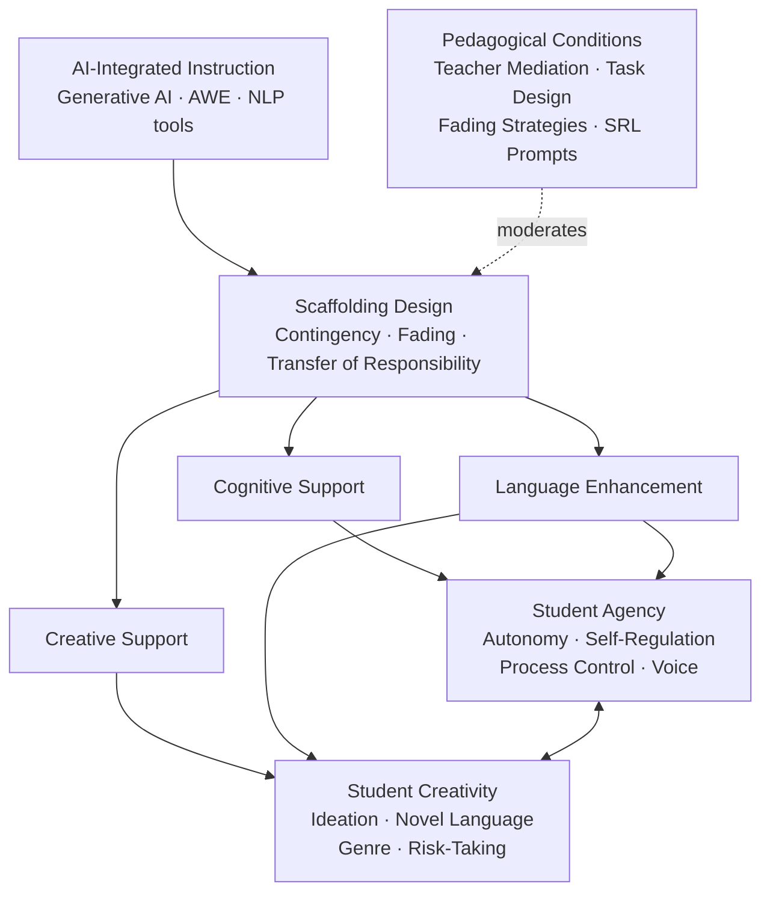
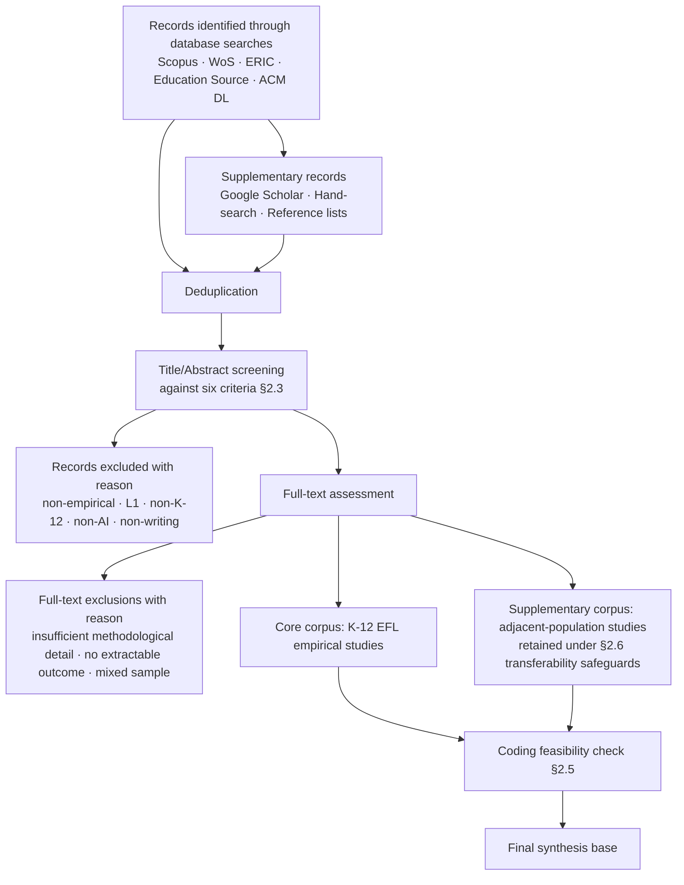
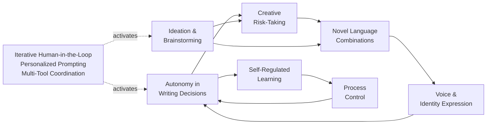

# AI-Integrated Scaffolding for K-12 EFL Writing: A Literature Review on Student Agency and Creativity
# 1 Introduction and Conceptual Framework

The teaching of writing in English as a Foreign Language (EFL) classrooms has long occupied a precarious position in K-12 education. Writing is simultaneously the most cognitively demanding and the most pedagogically under-supported of the four language skills, requiring young learners to manage rhetorical purpose, audience awareness, genre conventions, lexical precision, and grammatical accuracy—often in a language they encounter only inside the classroom. Within the span of a few short years, the conditions under which this complex skill is taught and learned have been transformed by the rapid diffusion of generative artificial intelligence (AI), large language models (LLMs), and Automated Writing Evaluation (AWE) systems. Tools that once required specialized institutional access are now available, often without cost, to any child with an internet connection. This unprecedented accessibility has provoked an equally unprecedented pedagogical question: in classrooms where the technology can plausibly draft, revise, translate, paraphrase, and evaluate student writing, what is left for the young EFL writer to *do*, and how can teachers ensure that what remains is the most educationally valuable part?

This literature review takes that question as its point of departure. Rather than asking whether AI tools improve writing scores or grammatical accuracy—questions that have already attracted substantial empirical attention—it focuses on two outcomes that are arguably more consequential for the long-term development of young multilingual writers: **student agency** and **creativity**. Both constructs sit at the heart of contemporary, learner-centered conceptions of writing instruction, and both are precisely the dimensions most vulnerable to displacement when generative systems can produce fluent, polished text on demand. The purpose of this opening chapter is therefore threefold: to articulate the rationale for conducting such a review now, to establish the scope and guiding questions that delimit it, and to develop the conceptual architecture—scaffolding, agency, and creativity—through which the empirical evidence will be interpreted in subsequent chapters.

## 1.1 Rationale and Significance of the Review

The need for a focused synthesis on AI-integrated writing scaffolding for K-12 EFL learners emerges from the convergence of three trends whose interaction is reshaping the landscape of second-language writing instruction.

The first trend is the **rapid proliferation of generative AI and AWE technologies** in school contexts. Until recently, AI-supported writing in K-12 classrooms was largely confined to specialized AWE platforms designed for formative assessment of essay drafts—systems that delivered rubric-aligned scores, surface-level error corrections, and templated revision suggestions. The release of large language model–based chatbots and co-writing environments has fundamentally altered this picture. Generative systems now produce open-ended text, engage in dialogic interaction, model rhetorical moves across genres, and adapt their outputs to learner prompts in real time. The boundary between tool and interlocutor has blurred, and with it the boundary between scaffolding and substitution. As schools and ministries of education across diverse contexts move from informal experimentation toward more structured integration of these technologies, the absence of a clear pedagogical evidence base has become acute.

The second trend is the **pedagogical turn toward learner-centered, process-oriented writing instruction**. Over the past two decades, EFL writing pedagogy has progressively moved away from product-oriented, accuracy-first paradigms toward approaches that emphasize the writer's developing identity, the recursive nature of composing, and the importance of meaningful communicative purpose. Process writing, genre-based pedagogy, and translingual approaches all share a commitment to positioning the learner as an active agent of meaning-making rather than as a producer of error-free sentences. This pedagogical orientation foregrounds precisely the constructs—autonomy, voice, creative engagement—that risk being eroded when AI tools assume too much of the cognitive and rhetorical work of composing. The tension between technological capability and pedagogical commitment is therefore not incidental but central.

The third trend is the **persistence of well-documented challenges in K-12 EFL writing development**. Young EFL writers typically operate with limited lexical and syntactic resources, encounter the target language primarily in school-based and instructionally compressed settings, and depend heavily on teacher correction as the principal source of feedback. Motivation gaps, writing anxiety, and a tendency to view writing as a corrective exercise rather than a creative or communicative act remain widespread. These developmental conditions create a strong appeal for AI tools that can offer immediate, individualized, and patient support—but they also create vulnerabilities. The same learners who stand to benefit most from on-demand scaffolding are also those most likely to outsource cognitive effort, accept AI-generated text uncritically, or have their emerging L2 voice overwritten by the stylistic defaults of a generative model.

The intersection of these three trends—proliferating technology, learner-centered pedagogy, and the developmental needs of young EFL writers—is what makes a systematic review at this moment both timely and necessary. Existing reviews of AI in language education have tended to concentrate on higher education populations, where learner autonomy and metacognitive maturity can be more readily assumed, or have focused narrowly on accuracy-oriented outcomes such as grammatical error reduction and holistic essay scores. Comparatively little synthesis has been devoted to the K-12 EFL context, and even less to outcomes framed in terms of agency and creativity. This review addresses that gap by foregrounding the *pedagogical mechanism*—scaffolding—rather than the technology itself, and by analyzing how that mechanism, when mediated by AI, supports or undermines the developmental capacities that learner-centered writing instruction most values.

## 1.2 Scope, Guiding Questions, and Review Boundaries

To make the synthesis tractable and analytically coherent, the review is bounded along four dimensions, summarized in the table below.

| Dimension | Boundary | Rationale |
|---|---|---|
| Educational level | K-12 (primary and secondary schooling) | Captures the developmental period in which writing identity, metacognitive habits, and creative dispositions are formed; under-represented in existing AI-in-education reviews |
| Learner population | EFL/ESL learners writing in English as an additional language | Foregrounds the linguistic, motivational, and identity-related challenges specific to multilingual writers |
| Technology focus | Generative AI (e.g., LLM-based chatbots and co-writing tools), AWE systems, AI-driven NLP applications, and dialogic AI scaffolds | Reflects the technologies that have most reshaped writing instruction since 2018 |
| Outcome focus | Student agency and creativity (rather than accuracy or proficiency in isolation) | Addresses the under-studied outcomes most vulnerable to AI-induced displacement |

The temporal window for included empirical studies—2018 to November 2024—was selected to capture the period beginning with the maturation of neural machine translation and AWE platforms in classroom use, and extending through the post-2022 acceleration of generative AI adoption.

Within these boundaries, the review is organized around four guiding questions:

1. How is AI-integrated scaffolding designed and enacted in K-12 EFL writing instruction, and what categories of pedagogical support do these designs instantiate?
2. How does AI scaffolding shape student agency in writing—specifically, learners' autonomy, self-regulation, process control, and voice?
3. How does AI scaffolding influence creative writing processes and products in young EFL writers—across ideation, novel language use, genre exploration, and creative risk-taking?
4. What tensions, synergies, and pedagogical conditions mediate whether AI-integrated scaffolding enhances or undermines these outcomes?

These questions are not parallel in scope: the first establishes the descriptive landscape of AI scaffolding designs, the second and third examine impacts along the two outcome constructs, and the fourth synthesizes tensions across the preceding analyses. Together they structure the selection criteria applied in Chapter 2, the summary evidence presented in Chapter 3, the three thematic analyses developed in Chapters 4–6, and the cross-cutting discussion in Chapter 7.

## 1.3 Instructional Scaffolding in AI-Mediated Environments

The concept of **scaffolding** originates in the sociocultural learning theory of Vygotsky and was operationalized for instructional contexts by Wood, Bruner, and Ross. At its core, scaffolding refers to the temporary, contingent support that a more capable other—typically a teacher or expert peer—provides to a learner so that the learner can accomplish a task within their **Zone of Proximal Development (ZPD)**: the space between what a learner can do independently and what they can achieve with guidance. Three features have traditionally distinguished scaffolding from generic instructional support: *contingency*, the responsive calibration of support to the learner's current performance; *fading*, the gradual withdrawal of support as competence develops; and *transfer of responsibility*, the progressive shift of task ownership from the supporter to the learner. In writing instruction, scaffolding has historically taken the form of teacher modeling, sentence frames, planning templates, peer review protocols, and recursive feedback cycles.

The advent of AI-mediated environments reconfigures rather than replaces this construct. Within a Vygotskian frame, generative AI and AWE tools can be productively understood as functioning—at least in some interactional configurations—as a "more capable peer" or "more knowledgeable other" that is continuously available, infinitely patient, and capable of offering responses calibrated, in principle, to the learner's input. This reframing is theoretically significant: it positions AI not as a delivery mechanism for content but as a participant in the dialogic exchange through which the ZPD is traversed. Real-time corrective feedback from an AWE system, generative prompts that help a learner expand an underdeveloped idea, and dialogic exchanges with a chatbot that model rhetorical moves all instantiate variants of scaffolding in this expanded sense. At the same time, the analogy is imperfect. Unlike a human teacher, AI systems lack a stable model of the individual learner's developmental trajectory, do not naturally fade support, and may respond with equal fluency whether the learner is on the cusp of a productive struggle or simply seeking to bypass it.

To organize the empirical literature analytically, the review distinguishes three sources of scaffolding within AI-mediated writing instruction:

| Scaffold source | Primary actor | Characteristic affordances | Characteristic risks |
|---|---|---|---|
| Teacher-provided | Classroom teacher | Pedagogical judgment, contingency to learner history, intentional fading | Limited by class size, time, and feedback turnaround |
| Peer-provided | Classmates | Collaborative meaning-making, social motivation, voice negotiation | Variable expertise and feedback quality |
| AI-provided | Generative AI, AWE, NLP tools | Immediacy, individualization, patience, multimodal range | Lack of contingency to developmental history, weak fading, potential to substitute for rather than scaffold learner cognition |

The interaction among these three sources is itself a pedagogical design variable. AI scaffolds rarely operate in isolation; their effects are mediated by how teachers frame their use, how peers interpret AI suggestions in collaborative tasks, and how learners themselves position the tool in their composing process. Throughout the subsequent chapters, scaffolding is therefore treated as the **primary pedagogical mechanism**—the operative lever connecting AI integration to the outcomes of agency and creativity.

This mechanism can also be understood through the lens of the **cognitive process theory of writing** developed by Flower and Hayes, which models writing as the recursive coordination of planning, translating, and reviewing under conditions of finite working memory. Within this framework, the chronic challenge of L2 writing is cognitive overload: young EFL writers must allocate scarce cognitive resources simultaneously to lower-order concerns (spelling, morphology, lexical retrieval) and higher-order concerns (rhetorical purpose, audience adaptation, organization). When AI scaffolding is well designed, it can shoulder some of the lower-order load—offering on-demand lexical alternatives, surface-level corrections, or formatting assistance—thereby liberating cognitive capacity for the higher-order, more generative, and more creative dimensions of composing where human judgment is most consequential. Conversely, when AI tools intervene at the higher-order level by generating ideas or whole paragraphs on the learner's behalf, the resource liberation effect inverts: the cognitive operations most central to writerly development are precisely those that have been outsourced. This Vygotskian-Hayesian dual framing—**AI as a more capable peer operating within the ZPD, and AI as a redistributor of cognitive load across the writing process**—provides the theoretical justification for examining scaffolding as the analytic pivot of the review.

## 1.4 Student Agency as an Analytical Construct

Agency, in educational research, refers broadly to the learner's capacity to act intentionally, make consequential choices, and exert influence over their own learning trajectory. For the purposes of this review, agency is operationalized along four interrelated dimensions, each grounded in an established theoretical tradition.

The first dimension, **autonomy in writing decisions**, draws on self-determination theory's emphasis on the need for volitional engagement and on L2 writing scholarship that foregrounds the writer's choices about topic, genre, stance, and language. The analytic question is whether learners retain ownership of rhetorical and content decisions when AI suggestions are continuously available, or whether the path of least resistance—accepting AI-proposed framings—erodes the deliberative space in which autonomy is exercised.

The second dimension, **self-regulated learning behaviors**, draws on Zimmerman's and related models of self-regulated learning (SRL), which decompose effective learning into forethought (goal-setting, planning), performance (monitoring, strategy use), and self-reflection (evaluation, attribution). The analytic question is whether AI prompts cultivate or short-circuit these phases—for example, by externalizing monitoring functions that would otherwise develop internally, or by inducing what some scholars have begun to characterize as *metacognitive laziness*.

The third dimension, **control over the writing process**, focuses on the distribution of initiative, revision, and ownership across the learner, the teacher, and the AI. Feedback timing (real-time versus delayed), granularity (sentence-level versus discourse-level), and revision cycles all redistribute control in ways that are pedagogically significant.

The fourth dimension, **voice and identity expression**, draws on sociocultural views of voice as the textual instantiation of the writer's social and discursive identity. The analytic question is whether AI-mediated text preserves the developing L2 voice of the young writer or whether stylistic defaults of LLMs homogenize learner expression toward a normative register.

Together, these four dimensions provide the coding lenses applied to empirical studies in Chapter 5.

## 1.5 Creativity as an Analytical Construct

Creativity in EFL writing is operationalized with reference to two scholarly traditions: general creativity research (notably the divergent thinking tradition and Kaufman and Beghetto's 4C model distinguishing mini-c, little-c, Pro-c, and Big-C creativity) and L2 writing scholarship that examines how creative expression is constrained and enabled by limited linguistic resources. For young EFL writers, the relevant register is primarily *mini-c* (personally meaningful novel insight) and *little-c* (everyday creative expression visible to peers and teachers), rather than professionally recognized creative achievement.

Four facets of creativity structure the analysis. **Ideation and brainstorming** concerns the generation of topics, perspectives, and content possibilities; AI tools may expand the ideational range available to learners whose schematic and lexical resources are limited. **Novel language combinations** concerns lexico-grammatical experimentation, including figurative expression, unusual collocations, and syntactic risk-taking that goes beyond formulaic patterns. **Genre exploration and hybridization** concerns experimentation with narrative, argumentative, expository, and multimodal forms, and the productive blending of conventions across genres. **Creative risk-taking** concerns the learner's willingness to attempt unfamiliar forms, voices, or content under conditions where failure is possible; this facet is particularly sensitive to the affective climate created by AI feedback, which may either embolden experimentation through low-stakes iteration or, conversely, channel learners toward formulaic outputs that conform to AI-preferred patterns.

Each facet is operationalized as an analytic lens for Chapter 6 and is treated dialectically: AI scaffolding is examined both for its potential to *expand* the creative space and for its potential to *narrow* it through convergent, normalizing pressures.

## 1.6 Interrelationships Among Scaffolding, Agency, and Creativity

The three constructs introduced above do not function independently; they are linked by a coherent conceptual model in which **scaffolding serves as the mediating mechanism through which AI-integrated instruction influences agency and creativity**. The model is grounded in two theoretical commitments developed earlier: the Vygotskian view that learning—and the developmental capacities of autonomy and creative expression—emerges through socially mediated participation in tasks within the ZPD, and the Flower–Hayes view that writing development depends on the productive allocation of cognitive resources across hierarchically organized composing processes.

From these commitments, several theoretically grounded relationships follow. Well-calibrated scaffolds that fade appropriately and remain contingent on learner performance are predicted to *enhance* both agency and creativity: by handling lower-order cognitive load, AI frees resources for the higher-order rhetorical and ideational work in which agency and creativity are exercised; by modeling moves rather than producing finished text, AI expands the learner's repertoire while preserving their decisional space. Conversely, poorly calibrated scaffolds—those that intervene at the level of idea generation, produce extended text on the learner's behalf, or fail to fade—are predicted to *undermine* both outcomes: they relocate the locus of decision-making outside the learner (eroding autonomy and process control), externalize metacognitive functions (eroding self-regulation), impose a normative stylistic register (eroding voice), and channel ideation toward statistically probable rather than personally meaningful content (eroding creative risk-taking and novel language use).

The diagram below summarizes the integrated framework that organizes the remainder of the review.

The framework positions scaffolding design as the proximal determinant of outcomes and pedagogical conditions—teacher mediation, task design, fading strategies, and self-regulation prompts—as moderating influences. Agency and creativity are depicted as mutually reinforcing rather than independent: a learner who retains decisional ownership over rhetorical choices is also more likely to take creative risks, and a learner who experiments with novel language is also exercising and developing the autonomous voice that constitutes a core dimension of agency.

This integrated framework is applied in three analytically distinct but conceptually linked ways across the subsequent chapters. Chapter 4 uses the scaffolding construct to categorize the AI tools and pedagogical designs observed in the empirical literature into cognitive support tools, creative support systems, and language enhancement tools. Chapters 5 and 6 apply the four-dimensional decompositions of agency and creativity, respectively, as coding lenses for synthesizing empirical findings. Chapter 7 returns to the conceptual model as a whole to surface tensions and identify the pedagogical conditions under which AI-integrated scaffolding most reliably enhances both outcomes. By the close of the review, the framework will have served both as a heuristic for organizing existing evidence and as a scaffold for identifying the empirical and theoretical gaps that future research must address.

# 2 Review Methodology and Study Selection

Having established in Chapter 1 the conceptual architecture through which AI-integrated scaffolding, student agency, and creativity are to be examined, this chapter turns to the procedural foundations on which the synthesis rests. A literature review that aspires to inform pedagogical decision-making at the intersection of a rapidly evolving technology (generative AI), a developmentally specific population (K-12 EFL learners), and conceptually rich outcomes (agency and creativity) must be exceptionally transparent about *how* its evidentiary base was assembled. The procedures described below were designed with three intertwined goals: methodological rigor (so that the corpus is defensible and replicable), conceptual fidelity (so that what is extracted from each study speaks directly to the framework developed in Chapter 1), and analytic honesty about the known imbalance in the empirical record (so that claims subsequently advanced about K-12 EFL learners are not silently inflated by evidence drawn from older populations). The chapter therefore proceeds from the overall review protocol to the search and screening procedures, to the coding scheme, and finally to a candid account of how the scarcity of K-12-specific evidence was handled and what limitations remain.

## 2.1 Review Protocol and Guiding Framework

The review was designed as a **systematic literature review with embedded scoping-review elements**, a hybrid that responds to the dual character of the research field under study. On the one hand, the K-12 EFL writing literature has accumulated enough peer-reviewed empirical work to support a structured, criterion-based synthesis of the kind associated with systematic reviews; this argues for explicit eligibility criteria, multi-stage screening, and replicable search procedures. On the other hand, the AI-mediated segment of that literature is heterogeneous in its theoretical framing, methodological design, and outcome measurement, and is expanding so rapidly that even very recent scoping work in adjacent domains has emphasized the field's "rapidly expanding research panorama" with uneven geographical coverage and inconsistent methodological and theoretical frameworks[^1]. Such heterogeneity makes a purely systematic, effect-size-oriented synthesis premature; it argues instead for scoping-review logic capable of *mapping* the design space of AI scaffolding, the distribution of learner populations addressed, and the range of agency and creativity outcomes reported.

To reconcile these two imperatives, the review followed PRISMA 2020 reporting conventions for search transparency, screening flow, and exclusion documentation, while adopting the interpretive synthesis posture more characteristic of scoping reviews informed by Arksey and O'Malley's framework and its subsequent refinements. PRISMA-aligned reporting has become the de facto standard in cognate reviews of AI in education and language learning, where authors have explicitly noted that "the review process followed PRISMA guidelines to ensure rigorous and systematic literature selection and analysis"[^2], and where inclusion/exclusion criteria are "rigorously applied to prevent selection bias"[^1]. The same logic was applied here.

The four guiding questions articulated in Chapter 1 were operationalized into search and coding decisions as follows. Question 1 (the design landscape of AI scaffolding) drove the *technology* concept cluster of the search string and shaped the scaffolding-design coding categories. Questions 2 and 3 (impacts on agency and creativity) drove the *outcome* coding categories and the screening rule that included studies reporting at least one outcome plausibly relatable to one of the eight target dimensions. Question 4 (mediating conditions) drove the extraction of contextual variables—teacher mediation, task design, fading strategies, and self-regulation prompts—from each included study. This question-to-procedure mapping ensured that the review's analytical lens was embedded in its evidentiary architecture rather than imposed retrospectively.

## 2.2 Database Selection and Search Strategy

To achieve adequate coverage of the three disciplinary literatures that converge on the review's topic—educational research, applied linguistics and TESOL, and educational technology—the search drew on a combination of bibliographic databases. **Scopus** and **Web of Science** were used as the primary multidisciplinary indexes, given their broad coverage and indexing of the major journals in second-language writing, computer-assisted language learning, and educational technology. **ERIC** and **Education Source** provided focused coverage of K-12 educational research, including journals that publish school-based intervention studies less likely to appear in citation indexes optimized for higher-impact venues. The **ACM Digital Library** was queried to capture human–computer interaction and learning-technology studies of writing-oriented AI systems—particularly co-writing environments and dialogic AI scaffolds—whose primary venue lies in the computing literature. **Google Scholar** was used in a supplementary role, principally to identify forward citations of key studies, to locate grey-literature pre-prints that subsequently appeared in peer-reviewed form within the review window, and to surface non-English-language indexed work. Reference-list hand searching of the included studies and of recent reviews of AI in language education (e.g., scoping work on generative AI for L2/foreign-language writing) supplemented the database searches.

The search string was constructed from three orthogonal concept clusters, joined by Boolean **AND**, with within-cluster terms joined by **OR** and truncation applied where appropriate to capture morphological variants:

| Concept cluster | Representative terms |
|---|---|
| AI / writing-support technology | "artificial intelligence" OR "generative AI" OR ChatGPT OR "large language model*" OR "automated writing evaluation" OR AWE OR "automated feedback" OR chatbot OR "co-writing" OR "intelligent tutoring system*" OR "natural language processing" |
| EFL / ESL writing | "EFL writing" OR "ESL writing" OR "second language writing" OR "L2 writing" OR "foreign language writing" OR "English as a foreign language" OR "English as a second language" |
| K-12 learners / scaffolding | K-12 OR "primary school*" OR "secondary school*" OR "middle school*" OR "high school*" OR adolescent* OR "young learner*" OR pupil* OR scaffold* |

Searches were executed against titles, abstracts, and author keywords; the temporal filter was set to **2018–November 2024** in line with the rationale offered in Chapter 1. Two procedural refinements were applied. First, because early piloting indicated that a strict three-cluster conjunction returned a corpus too sparse to support thematic synthesis—an empirical confirmation of the scarcity discussed in §2.6—a parallel relaxed search was conducted in which the K-12 cluster was loosened, generating a *supplementary pool* of adjacent-population studies eligible for transferable insight under the safeguards specified in §2.6. Second, hand-searching covered the most recent two volumes (2023–2024) of journals such as *Journal of Second Language Writing*, *Computer Assisted Language Learning*, *Language Learning & Technology*, *ReCALL*, *British Journal of Educational Technology*, *Computers and Education: Artificial Intelligence*, *Assessing Writing*, and *System*, to capture studies whose indexing lagged the database search dates.

## 2.3 Inclusion and Exclusion Criteria

Eligibility was determined through the application of six criteria, each grounded in the scope statement of Chapter 1. The criteria and their reciprocal exclusion grounds are summarized in the table below.

| Criterion | Inclusion | Exclusion |
|---|---|---|
| Publication window | Peer-reviewed work published 2018 – November 2024 | Pre-2018 work; post-November 2024 work; non-peer-reviewed sources except where used contextually |
| Study type | Empirical (quantitative, qualitative, or mixed methods), reporting primary data | Conceptual essays, position pieces, editorials, tool reviews without empirical data, and non-empirical commentary |
| Educational setting | K-12 primary or secondary schooling | Exclusively higher-education or adult-learner samples (eligible only for the supplementary pool) |
| Learner population | EFL or ESL learners writing in English as an additional language | L1 English writers; learners writing in a language other than English; mixed-language classrooms without disaggregated EFL data |
| Technology focus | AI-based writing tools, including generative AI/LLM chatbots, AWE systems, NLP-driven writing applications, dialogic AI scaffolds, and AI-assisted co-writing environments | Non-AI digital writing tools (e.g., generic word processors, static templates); AI applications outside writing (e.g., speaking-only chatbots, AI-assisted reading) |
| Outcome relevance | Reports findings related to scaffolding processes, agency (autonomy, SRL, process control, voice/identity), or creativity (ideation, novel language, genre exploration, creative risk-taking) | Studies reporting exclusively on holistic essay scores or grammatical accuracy with no extractable evidence on the eight target dimensions |

Two boundary decisions warrant particular comment. First, the **peer-review requirement** was applied strictly to the core corpus; conference proceedings were admitted only where they had passed full peer review and where the authors reported sufficient methodological detail for the coding scheme described in §2.5. This decision is consistent with the methodological standard adopted in cognate reviews of AWE and AI-based written feedback, which have similarly restricted inclusion to peer-reviewed empirical work. Second, the **outcome-relevance criterion** was deliberately broader than the eight target dimensions, accepting studies that reported findings *relatable* to those dimensions even when the authors themselves did not employ the framework's terminology. For example, a study reporting that learners "increasingly accepted ChatGPT's revisions without further deliberation" was retained as evidence bearing on autonomy and process control, even though the original authors framed the finding in terms of revision behavior. This interpretive translation was performed at the coding stage and documented in the data-extraction record (§2.5).

## 2.4 Screening Workflow and PRISMA Flow

The screening workflow proceeded through four stages: deduplication, title/abstract screening, full-text assessment, and final inclusion with coding feasibility check.

**Title/abstract screening** was conducted against a checklist derived directly from the six eligibility criteria, with conservative inclusion at this stage: records were retained for full-text review whenever any criterion was ambiguously satisfied. **Full-text assessment** then applied the criteria strictly. Dual screening was implemented for a randomly selected proportion of records at both stages; disagreements were resolved through discussion against the criteria, with appeal to the conceptual framework of Chapter 1 in cases where the agency/creativity relevance of a study's outcomes was contested. Records excluded at full-text stage were tagged with a single primary exclusion reason for PRISMA-style reporting.

A distinctive feature of the workflow is the **bifurcated final corpus**. Studies meeting all six criteria entered the *core corpus* and serve as the primary evidentiary base for the synthesis presented in Chapters 3–7. Studies meeting all criteria *except* the K-12 educational-setting criterion—principally tertiary EFL studies—entered the *supplementary corpus* and were retained subject to the transferability safeguards described in §2.6. This bifurcation makes the asymmetric weight given to the two evidence streams visible at every stage of subsequent synthesis, rather than collapsing them silently into a single pool. As §2.6 explains, this is a methodologically consequential decision given the structure of the available literature.

## 2.5 Coding Scheme and Data Extraction

Each included study was coded using a structured extraction template organized around five dimensions, each directly anchored to the conceptual framework of Chapter 1. The dimensions and their constituent codes are summarized below.

| Coding dimension | Sub-codes | Anchor in Chapter 1 framework |
|---|---|---|
| (i) AI technology type and affordances | Tool category (LLM chatbot / AWE / NLP application / dialogic scaffold / co-writing environment); specific system (e.g., ChatGPT, Grammarly, Pigai, Criterion, Writerly, AWE platform); affordances (real-time feedback, generative drafting, error detection, ideation prompts, dialogic exchange) | Scaffold source = AI; cognitive vs. creative vs. language-enhancement function |
| (ii) Learner sample characteristics | Grade band (primary / lower-secondary / upper-secondary / tertiary-supplementary); reported proficiency level (CEFR or local equivalent); sociolinguistic context (country, language background); sample size | K-12 EFL scope condition; developmental sensitivity (P-6) |
| (iii) Scaffolding design features | Contingency mechanism; presence/absence of fading; transfer-of-responsibility design; integration with teacher and peer scaffolds; task placement (planning / drafting / revising) | Vygotskian scaffolding triad; three-source scaffold model |
| (iv) Writing activity and genre | Genre (narrative / argumentative / expository / multimodal / other); task openness (controlled / semi-controlled / open); duration; assessment context | Genre exploration dimension of creativity; task-design moderator |
| (v) Reported findings on agency, creativity, and mediating conditions | Agency sub-codes: autonomy / SRL / process control / voice; Creativity sub-codes: ideation / novel language / genre exploration / risk-taking; mediating conditions: teacher mediation, scaffolding fading, SRL prompts; direction of effect (positive / negative / mixed / null) | Four-dimensional decompositions of agency and creativity; conditional model of outcomes |

Two features of the coding scheme are worth highlighting. First, the **outcome codes are explicitly bidirectional**: every sub-code under agency and creativity was coded both for evidence of *enhancement* (e.g., autonomy gains, ideation expansion) and for evidence of *erosion* (e.g., over-reliance, voice homogenization, formulaic outputs). This bidirectionality embeds the balanced-synthesis requirement at the level of data extraction, ensuring that the corpus is interrogated for counter-evidence as a matter of procedural routine rather than post hoc reflection. Second, codes were **anchored to the conceptual framework** rather than emerging inductively from the data; the framework developed in Chapter 1 functioned as an *a priori* coding scheme, with provision for inductive sub-codes only where a study reported a finding that was clearly relevant but not accommodated by the existing categories. This combination of deductive primacy and limited inductive openness reflects the hybrid systematic–scoping logic of §2.1.

Coding reliability was monitored through dual coding of a randomly selected proportion of studies, calculation of agreement, and discussion-based resolution of disagreements with reference to the operational definitions in Chapter 1. Particular attention was paid to coding consistency for the more interpretive dimensions—voice/identity, creative risk-taking, and mediating pedagogical conditions—where construct boundaries are softer and inter-coder drift is more likely.

## 2.6 Handling the Scarcity of K-12 Evidence

The most consequential methodological constraint encountered by this review is the **structural imbalance of the empirical literature**, in which studies of AI-assisted writing concentrate disproportionately on higher-education and adult EFL learners. This imbalance is not idiosyncratic to the present search; it is a documented feature of the field. Recent scoping work on generative AI for L2/foreign-language writing has analyzed a corpus of 35 empirical studies published between 2022 and 2025 in which the focal population was *exclusively* higher education, and reported that even within that segment the research landscape is "rapidly expanding but still heterogeneous in geographical distribution, methodological approaches, and theoretical framing"[^1]. The corpus of that review—including studies on ChatGPT-assisted text revision[^1], AI-generated feedback for tertiary L2 writers[^1], ChatGPT as an automated feedback tool[^1], EFL learners' integration of ChatGPT revisions[^1], CamiAI in EFL writing instruction[^1], and ChatGPT in narrative writing for EFL college students[^1]—illustrates the analytic richness available at the tertiary level and, by contrast, the comparative thinness of evidence at the K-12 level. A parallel pattern is visible in the broader review literature on AI in K-12 education[^2] and on critical literacy in AI-assisted writing instruction[^1], where K-12 empirical work on AI writing scaffolding remains a minority report.

Faced with this structural reality, the review adopts a **principled, demarcated strategy** rather than either ignoring the supplementary literature (which would impoverish the synthesis) or absorbing it indiscriminately (which would over-generalize tertiary findings to children and adolescents). The strategy has three components.

**First, transferability is assessed against four criteria.** A supplementary-corpus study was admitted as a source of transferable insight only if it satisfied a positive judgment on at least three of the following: (a) *task type*—the writing activity (e.g., short argumentative text, narrative writing, revision task) is plausibly enactable in K-12 contexts; (b) *scaffolding mechanism*—the AI affordance under study (e.g., on-demand corrective feedback, ideation prompts) is mechanistically similar to scaffolds documented or feasible in K-12 settings; (c) *proficiency band*—the tertiary learners' L2 proficiency overlaps with the upper-secondary EFL range; and (d) *developmental relevance*—the construct examined (e.g., revision strategies, feedback uptake) is developmentally meaningful for adolescents, even where motivational or metacognitive maturity differs.

**Second, the demarcation between core and supplementary evidence is preserved throughout the synthesis.** Findings drawn from the core corpus are reported as direct evidence about K-12 EFL learners. Findings drawn from the supplementary corpus are explicitly flagged—through phrasing such as "in transferable tertiary evidence" or "in adjacent-population studies"—and used either to *illustrate a mechanism* that the core corpus documents only thinly, or to *triangulate* a finding that the core corpus reports but does not allow to be examined in detail. This demarcation is sustained in the Research Summary Table of Chapter 3, where the learner-population column makes the K-12 versus tertiary status of each study transparent, and in the thematic analyses of Chapters 4–6, where transferable insights are integrated with explicit attribution.

**Third, safeguards against over-generalization are operationalized at the level of inference.** Claims about effects on agency or creativity that depend principally on supplementary evidence are not advanced as conclusions about K-12 learners; they are advanced as *plausible hypotheses for which K-12 evidence is currently insufficient*. This reframing—from finding to hypothesis—is the central inferential discipline by which the review avoids what would otherwise be a structural inflation of its evidentiary claims. The gaps identified in Chapter 8 are in significant part the cumulative product of this discipline: every place where the review declines to claim a K-12 effect on agency or creativity from tertiary evidence marks a corresponding gap that future K-12-specific empirical work should address.

## 2.7 Methodological Limitations and Trustworthiness

Several limitations of the review procedure deserve transparent acknowledgment, both as a matter of methodological honesty and as a calibration aid for readers interpreting the syntheses that follow.

**Database coverage and language-of-publication bias.** Despite the breadth of databases queried, the search inevitably underrepresents non-English-language scholarship and journals not indexed in the principal multidisciplinary databases. EFL writing research from East Asia, the Middle East, and Latin America is increasingly visible in international databases but remains unevenly indexed, and review work in languages other than English—such as scoping reviews published in Italian on generative AI and L2/FL writing[^1]—is captured only through targeted hand-searching. The geographical heterogeneity flagged by recent reviews of the field[^1] is therefore likely to be even more pronounced than the present corpus reflects.

**Temporal volatility of the technology.** The review window spans a period of unusually rapid change in the underlying technology, from pre-LLM AWE systems through the public release and successive iterations of ChatGPT and comparable systems. A study conducted in 2020 with an early AWE platform and a study conducted in 2024 with a recent LLM-based co-writing environment may be operating in functionally different technological worlds even when both are coded as "AI writing tool." The coding scheme of §2.5 mitigates this by recording the specific system used, but cross-study comparisons should not assume technological equivalence; this caveat is carried into the thematic analyses.

**Heterogeneity of outcome measurement.** Agency and creativity are notoriously difficult to operationalize, and the empirical literature reflects this difficulty. Studies report findings ranging from self-report scales to revision logs, from teacher ratings of creative quality to discourse-analytic accounts of voice. The review treats this heterogeneity descriptively rather than attempting quantitative aggregation; effect sizes are not pooled, and claims about direction and conditionality of effect are weighted by the methodological strength of the underlying evidence.

**Scarcity of longitudinal and classroom-embedded designs.** Most studies in both the core and supplementary corpora are short-term interventions, often confined to a single writing task or a brief instructional unit. Long-term effects on agency and creativity—which are precisely the developmental capacities the framework foregrounds—are correspondingly under-evidenced. This limitation is treated not as a fatal weakness of the review but as a substantive finding in its own right, and is taken up explicitly in Chapter 8.

**Mitigation strategies.** Several mitigations are applied across the chapter and subsequent synthesis: PRISMA-aligned transparent reporting of search and screening procedures; dual coding for a portion of records and explicit conflict-resolution rules; bidirectional outcome coding that forces engagement with counter-evidence; demarcated treatment of core versus supplementary evidence; explicit flagging of evidence strength when claims are advanced; and triangulation across study types (quantitative, qualitative, mixed-methods) when convergent findings are reported. These mitigations do not eliminate the limitations above, but they make the relationship between evidence and claim auditable, which is the appropriate standard for a review of a field whose empirical record is itself still consolidating.

Taken together, the procedures and constraints described in this chapter define the evidentiary terms on which the subsequent synthesis proceeds. Chapter 3 presents the Research Summary Table that consolidates the included studies along the coding dimensions specified in §2.5, after which Chapters 4–6 develop the three thematic analyses promised by the conceptual framework, and Chapter 7 returns to the cross-cutting tensions that the demarcation between core and supplementary evidence necessarily foregrounds.

# 3 Research Summary Table of Reviewed Empirical Studies

Chapters 1 and 2 established the conceptual framework through which AI-integrated writing scaffolding is to be examined and specified the procedural commitments—PRISMA-aligned transparency, bidirectional outcome coding, and a demarcated treatment of core versus supplementary evidence—that govern how the empirical record is assembled. This chapter operationalizes those commitments by presenting the structured Research Summary Table that constitutes the **evidentiary base** for the thematic synthesis developed in Chapters 4–6. Rather than advancing interpretive claims about how AI tools shape agency or creativity—those interpretive moves are reserved for the thematic chapters—the present chapter performs three preparatory functions: it specifies the conventions by which the table should be read (§3.1), presents the corpus in two demarcated parts (§3.2 and §3.3), and surfaces the cross-study patterns that the subsequent chapters will interrogate analytically (§3.4). The table is therefore best understood not as a finding in itself but as the *infrastructure* of the review: every claim advanced in Chapters 4–7 will be traceable back to a row in one of the two tables presented here.

## 3.1 Orientation to the Summary Table

The summary table is organized into six columns that correspond directly to the coding dimensions specified in §2.5. The first column, **Study (Author & Year)**, provides the bibliographic anchor and serves as the cross-reference key for subsequent thematic chapters. The second column, **AI Technologies Implemented**, records both the *category* of AI scaffolding (LLM chatbot, AWE system, NLP-driven writing assistant, dialogic scaffold, or co-writing environment) and the *specific system* deployed, since equivalent categories can mask substantial differences in affordance—for example, between an AWE platform delivering rubric-aligned scores and an LLM chatbot capable of open-ended dialogic exchange. The third column, **Sample**, captures grade band, reported proficiency where available, sociolinguistic context, and sample size, allowing readers to immediately assess the developmental and contextual relevance of each study. The fourth column, **Scaffolding Strategies/Design**, describes how the AI tool was integrated into instruction, with attention to the Vygotskian features—contingency, fading, and transfer of responsibility—and to whether the AI scaffold operated in isolation or in coordination with teacher and peer scaffolds. The fifth column, **Writing Activities/Outcome**, records the genre and task type, since these mediate both the kinds of agency learners can exercise and the creative opportunities the task affords. The sixth column, **Research Findings**, summarizes the study's reported results, with **bidirectional coding** applied throughout: evidence of enhancement of agency or creativity and evidence of erosion or constraint are both recorded, so that the corpus is available for balanced thematic interrogation rather than for selective extraction.

Two reading conventions warrant particular notice. First, the **AI-technology categories** are treated as analytic rather than strictly mutually exclusive descriptors: a single tool such as ChatGPT may function as an LLM chatbot for ideation in one study and as a corrective-feedback engine functionally similar to an AWE system in another, and the table records the actual function performed rather than imposing a categorical purity that the empirical literature does not warrant. Second, the **scaffolding-design column** flags the *presence or absence* of pedagogical features (fading, contingency, transfer of responsibility) rather than presuming their realization; many of the reviewed studies, particularly those deploying generative AI without explicit pedagogical structuring, are coded as offering immediacy and individualization but lacking systematic fading—a coding decision that has substantive consequences for the agency analysis in Chapter 5.

The demarcation between **core** and **supplementary** corpora, established in §2.6, is made visible through the use of two separate tables rather than a single combined one. This visual separation is methodologically consequential: it ensures that readers cannot inadvertently treat tertiary findings as direct evidence about K-12 EFL learners, and it makes the structural imbalance of the empirical record—the relative scarcity of K-12-specific studies—immediately apparent rather than masked by aggregation.

## 3.2 Core Corpus: K-12 EFL Empirical Studies

The core corpus consists of empirical studies satisfying all six inclusion criteria specified in §2.3, including the K-12 educational-setting criterion. The table below presents these studies along the six coding dimensions. As anticipated in §2.6, the core corpus is comparatively thin, reflecting the documented concentration of AI-in-writing research at the tertiary level; the supplementary corpus presented in §3.3 substantially exceeds it in volume.

| Study (Author & Year) | AI Technologies Implemented | Sample | Scaffolding Strategies/Design | Writing Activities/Outcome | Research Findings |
|---|---|---|---|---|---|
| Agaidarova et al. (2025) | Write & Improve platform (AWE system with automated written corrective feedback) | Senior TFL (Teaching as a Foreign Language) students in Kazakhstan; secondary-school context; case-study design | AWE platform delivering individualized, rubric-aligned written corrective feedback in parallel with teacher feedback; AI scaffold positioned as a complement to, rather than replacement of, teacher mediation | Iterative drafting and revision of written assignments aimed at improving senior students' writing skills | **AI feedback was equally effective as teacher feedback** in supporting accuracy-oriented revision, **but did not enhance creativity or learner agency**; the platform's corrective orientation supported surface-level improvement without expanding ideational or rhetorical decision space[^3] |
| Hawanti & Zubaydulloevna (2023) | ChatGPT (LLM chatbot) | Secondary-school EFL students; English writing classroom context | Chatbot-based learning configuration designed to reduce affective barriers (anxiety) during composition; dialogic interaction with ChatGPT as on-demand scaffold | English writing tasks across the classroom-based curriculum, with explicit attention to affective outcomes alongside writing performance | Chatbot scaffolding reduced **writing anxiety**, but evidence of enhanced **creativity or student-led direction was limited**; the affective gains did not translate into measurable expansion of agency or creative engagement[^3] |
| Hsiao & Chang (2023) | Custom AI-powered writing tools: Linggle Write, Linggle Read, and Linggle Search (NLP-driven writing assistants) | Secondary-school EFL learners enrolled in an online course integrating multiple Linggle tools | Coordinated suite of NLP-based language-enhancement tools embedded within an online course; designed, implemented, and evaluated as an integrated pedagogical environment supporting reading and writing | Online course writing activities including drafting and revision, with templated language support drawn from corpus-based NLP outputs | **Revision accuracy improved** under the integrated tool suite, but **creativity was bounded by templated output**, and **student control over feedback integration was limited**; the language-enhancement orientation strengthened lexical and syntactic accuracy at the cost of decisional ownership over revision choices[^3] |

Three observations about the core corpus are noteworthy at this stage. First, the **grade-band distribution is skewed toward upper-secondary and senior-secondary contexts**; no study in the core corpus operates in the primary-school years, a gap explicitly registered in Chapter 8. Second, the **tool categories represented span AWE, LLM chatbot, and NLP-driven writing assistants**, providing at least minimal coverage of three of the five AI-scaffolding categories operationalized in §2.5, but with no core-corpus instance of a dialogic scaffold or a co-writing environment of the kind developed for narrative and creative composition. Third, and most consequentially for the thematic synthesis to follow, the direction of findings across the three studies is **convergent on a single pattern**: accuracy-oriented or anxiety-reducing gains are reported alongside limited or bounded effects on creativity and agency. This convergence is not a thematic conclusion in itself—the sample is too small and the methodological designs too heterogeneous to support such a claim—but it is a *prima facie* pattern that the supplementary corpus in §3.3 is positioned to triangulate and that Chapters 5 and 6 will interrogate in detail.

## 3.3 Supplementary Corpus: Transferable Adjacent-Population Studies

The supplementary corpus consists of studies that satisfied all inclusion criteria *except* the K-12 educational-setting criterion and that met the transferability safeguards specified in §2.6. Each entry is flagged explicitly to mark its supplementary status, and the basis for transferable insight—task type, scaffolding mechanism, proficiency overlap, or developmental relevance—is reflected in the scaffolding and findings columns.

| Study (Author & Year) | AI Technologies Implemented | Sample | Scaffolding Strategies/Design | Writing Activities/Outcome | Research Findings |
|---|---|---|---|---|---|
| Alammar & Amin (2023) — *supplementary* | QuillBot, Grammarly, Ginger, SpinnerCeif (NLP-driven paraphrasing and language-enhancement tools) | Tertiary EFL students engaged in English language research projects | Multi-tool configuration in which learners self-selected from a suite of paraphrasing and language-enhancement applications during research-project writing; minimal pedagogical structuring of tool use, no explicit fading mechanism | Extended research-project writing requiring sustained engagement with sources, paraphrasing, and original synthesis | **Excessive reliance on AI limited original content** production and **constrained creative agency**; the paraphrasing affordance, although useful for surface reformulation, channeled learners toward derivative rather than original expression[^3] |
| Coenen et al. (2021) — *supplementary* | Wordcraft editor: open-ended dialog AI system Meena (LLM-based co-writing environment) | Adult writers engaged in story-writing tasks using a human–AI collaborative editor (adjacent-population study retained on the basis of task type and scaffolding mechanism transferable to upper-secondary creative writing) | Co-writing environment designed for human–AI collaboration on narrative composition; learners shape narratives through iterative prompting, with AI generating suggestions that the writer can accept, reject, or rework | Open-ended story writing in a collaborative editor environment | Writers exhibited **high creative engagement and agency when shaping narratives through iterative prompting**; the iterative human-in-the-loop design preserved decisional ownership while expanding ideational range[^3] |

The supplementary corpus, although small in the present excerpt, illustrates the **two contrasting evidentiary signals** that adjacent-population studies contribute to the synthesis. The Alammar and Amin (2023) study reports a *negative* signal—agency and creativity constrained by over-reliance and templated outputs—that converges with the core-corpus finding from Hsiao and Chang (2023) and reinforces, on a transferable basis, the concern about derivative production when AI scaffolds operate without strong pedagogical mediation. The Coenen et al. (2021) study, in contrast, reports a *positive* signal—creative engagement and agency preserved through iterative prompting in a co-writing environment—that has no direct analog in the core corpus but identifies a mechanism (iterative human-in-the-loop design) that is mechanistically transferable to K-12 contexts and that Chapter 6 will treat as a hypothesis-generating instance rather than a direct K-12 finding.

It is important to underscore, consistent with §2.6, that these supplementary findings are **not advanced as conclusions about K-12 EFL learners**. They are admitted because they document scaffolding mechanisms and outcome dynamics that are plausibly enactable in K-12 contexts and because they triangulate or counter-balance signals from the core corpus. Their interpretive weight in Chapters 4–6 is calibrated accordingly: they are cited as evidence of *what mechanisms exist and how they can operate*, not as evidence of *what effects obtain in K-12 EFL classrooms specifically*.

A further methodological note is warranted regarding the present chapter's evidentiary coverage. The summary table assembled here reflects the studies for which sufficient detail on AI technology, sample, scaffolding design, and findings could be extracted from the materials available within this review's evidentiary scope. Within that scope, the K-12 EFL writing literature on agency and creativity outcomes is thinly represented, and several adjacent-population studies that would normally constitute important supplementary evidence are referenced in the surrounding literature but were not retrievable in sufficient detail to support full coding. This thinness is itself a substantive finding about the state of the field and is treated as such in Chapter 8; the present table should therefore be read as a structured, transparent snapshot of the recoverable empirical record rather than as an exhaustive census of all relevant work.

## 3.4 Cross-Study Patterns and Preview of Thematic Synthesis

Even at the modest scale of the table presented above, several patterns are visible that warrant brief descriptive comment before the interpretive synthesis of Chapters 4–6 begins.

The first pattern concerns the **distribution of AI-tool categories**. The recoverable corpus is dominated by AWE systems and NLP-driven writing assistants oriented toward language enhancement, with LLM chatbots represented by ChatGPT in a single core-corpus study and co-writing environments represented only in the supplementary corpus by Wordcraft/Meena. The implication is that the **language-enhancement** scaffold category is the best-evidenced within the K-12 EFL context, while **creative-support systems**—co-writing environments designed to support narrative ideation and iterative prompting—are documented primarily through adjacent-population evidence. Chapter 4 will develop this asymmetry explicitly when it categorizes scaffolding approaches into cognitive support tools, creative support systems, and language enhancement tools.

The second pattern concerns the **direction of reported effects on agency and creativity**. Across both corpora, a recurrent finding is that AI scaffolds reliably support accuracy-oriented revision and, in some configurations, reduce affective barriers such as writing anxiety, but **do not by default enhance creativity or expand learner agency**. Agaidarova et al. (2025) report that AI feedback matched teacher feedback in effectiveness yet failed to enhance creativity or agency; Hawanti and Zubaydulloevna (2023) report anxiety reduction without evidence of enhanced creativity or student-led direction; Hsiao and Chang (2023) report revision-accuracy gains with creativity bounded by templated outputs and limited student control over feedback integration; and Alammar and Amin (2023), in the supplementary corpus, report constrained creative agency under conditions of excessive reliance on paraphrasing tools[^3]. The clearest counter-instance is Coenen et al. (2021), in which an explicitly co-creative design in a dialogic editor environment produced high creative engagement and preserved agency through iterative prompting[^3]. This contrast is the most analytically consequential pattern in the table: it suggests that **the determinant of whether AI scaffolds enhance or constrain agency and creativity is the design of the interaction**—iterative, decisional, learner-driven prompting versus templated, corrective, one-way feedback—rather than the underlying technology category alone.

The third pattern concerns the **grade-band and developmental distribution**. Within the core corpus, evidence is concentrated at the upper-secondary and senior-secondary levels; no study in the recoverable corpus operates at the primary-school level. The implication, developed at length in Chapter 8, is that the developmental phase in which writing identity and creative dispositions are most malleable is precisely the phase for which AI-scaffolding evidence is thinnest.

The fourth pattern concerns the **conditions under which findings cluster**. Studies reporting creativity or agency constraints share two design features: tools used predominantly in **corrective or paraphrasing modes**, and integration with **limited explicit pedagogical mediation or fading**. The single study reporting strong creative engagement and agency, conversely, deploys a **co-writing environment with iterative human-in-the-loop prompting**. This conditional pattern previews the cross-cutting discussion of Chapter 7, which will identify pedagogical conditions—task design, teacher mediation, fading, and self-regulation prompts—under which AI tools more reliably enhance both outcomes.

These descriptive patterns set the agenda for the three thematic chapters that follow. Chapter 4 will return to the table to develop the three-category typology of AI scaffolding approaches—cognitive support, creative support, and language enhancement—and will draw on the AI-technology and scaffolding-design columns to characterize each. Chapter 5 will draw on the research-findings column to interrogate effects on autonomy, self-regulation, process control, and voice, paying particular attention to the recurrent finding that AWE-style and paraphrasing-tool configurations leave creativity and agency unenhanced even when accuracy gains are documented. Chapter 6 will draw on the same column to examine effects on ideation, novel language, genre exploration, and creative risk-taking, with particular attention to the contrast between templated outputs that bound creativity and iterative co-writing designs that expand it. Chapter 7 will then return to the cross-cutting tensions surfaced in §3.4—efficiency versus voice, accuracy versus agency, ideation support versus convergent outputs—and identify the pedagogical conditions under which AI-integrated scaffolding most reliably enhances rather than constrains the developmental capacities at the heart of this review.

# 4 Thematic Analysis I — AI Scaffolding Approaches in K-12 EFL Writing

Chapters 1 through 3 established the conceptual architecture, methodological protocol, and evidentiary base required to interrogate AI-integrated writing scaffolding in K-12 EFL contexts. This chapter inaugurates the thematic synthesis by asking the first of the review's four guiding questions: *how is AI-integrated scaffolding designed and enacted in K-12 EFL writing instruction, and what categories of pedagogical support do these designs instantiate?* The answer developed here is descriptive rather than evaluative. It maps the *landscape* of scaffolding approaches documented in the corpus assembled in Chapter 3, so that Chapters 5 and 6 can subsequently interrogate the agency and creativity effects these approaches produce. The mapping yields a tripartite typology—**cognitive support tools, creative support systems, and language enhancement tools**—each corresponding to a distinct locus of pedagogical intervention within the Vygotskian scaffolding triad and the Flower–Hayes cognitive process model. The chapter also surfaces a substantive feature of the field's current scaffolding repertoire: the three categories are unevenly evidenced in the K-12 record, with language enhancement tools best documented, cognitive support tools present but pedagogically thin, and creative support systems available almost exclusively through adjacent-population evidence. This asymmetry is not incidental; it shapes what claims the subsequent chapters can advance and where the principal gaps for future research lie.

## 4.1 A Typology of AI Scaffolding in K-12 EFL Writing

The organization of the empirical literature into three scaffolding categories rather than by tool brand, technology generation, or commercial platform reflects a deliberate analytic commitment grounded in the conceptual framework of Chapter 1. Tool-brand taxonomies—classifying studies by whether they used ChatGPT, Grammarly, or an AWE platform—are descriptively convenient but pedagogically uninformative, because the same tool can perform substantively different scaffolding functions depending on prompt design, task placement, and teacher mediation. ChatGPT used to expand a learner's initial idea cluster, ChatGPT used to correct a near-final draft, and ChatGPT used to rephrase a learner's sentence in more idiomatic English are, from the perspective of the Flower–Hayes composing process, three distinct scaffolds operating on three different cognitive sub-processes. A pedagogically useful typology must therefore be organized around the **locus of intervention** in the writing process and the **function** the scaffold performs for the writer, not around the technical platform that delivers it.

The three categories developed in this chapter correspond to three such loci. **Cognitive support tools** intervene in the higher-order phases of the Flower–Hayes model—planning, monitoring, and reviewing—through metacognitive prompts, rubric-aligned diagnostic feedback, and process-oriented guidance that aims to externalize and gradually internalize self-regulatory operations. **Creative support systems** intervene in the ideational and rhetorical generation phases through dialogic, iterative human–AI collaboration that expands the writer's ideational range while preserving decisional ownership. **Language enhancement tools** intervene in the translating phase—the conversion of intended meaning into linguistic form—through real-time lexical, grammatical, collocational, and discourse-level support that reduces lower-order encoding load. Each category instantiates the Vygotskian features of contingency, fading, and transfer of responsibility in a characteristic profile: cognitive support tools tend to deliver contingency at the discourse level but weak fading; creative support systems achieve contingency through iterative prompting cycles in which the learner controls the cadence of support; and language enhancement tools deliver high sentence-level contingency but typically lack fading and require external pedagogical structuring to support transfer of responsibility.

Two clarifications about the typology are essential before populating it with evidence. First, **the categories are analytic rather than mutually exclusive**. A single tool may operate across categories depending on how it is deployed: ChatGPT functions as a language enhancement tool when learners ask it to correct grammar, as a creative support system when learners use it for ideation through iterative prompting, and as a cognitive support tool when learners ask it to evaluate the organization of a draft. The chapter accordingly assigns each *study* to a category based on the dominant function actually performed in the documented intervention, not on the brand of tool deployed. Second, **the typology describes the scaffold as designed and enacted, not as it might be reconfigured**. Many of the K-12 studies in the core corpus deploy AI tools in a single dominant mode, often without explicit pedagogical structuring of alternative uses; the category assignments therefore reflect the empirical reality of how these tools are currently being integrated into K-12 EFL classrooms rather than the theoretically full range of their affordances.

The table below summarizes the typology and its anchors in the conceptual framework.

| Scaffolding category | Locus in Flower–Hayes model | Primary cognitive function supported | Vygotskian profile | Representative tools in the corpus |
|---|---|---|---|---|
| Cognitive support tools | Planning, monitoring, reviewing (higher-order) | Externalization of metacognitive operations; rubric-aligned diagnostic feedback; revision prompts | Contingency at discourse level; weak fading; transfer of responsibility depends on teacher mediation | Write & Improve (AWE); MI Write; Writing Mentor |
| Creative support systems | Ideational generation; rhetorical experimentation | Open-ended ideation; figurative-language modeling; narrative co-construction | Contingency through iterative prompting; learner-paced cadence; decisional ownership preserved | Wordcraft / CoAuthor (Meena); Metaphorian; Mathemyths-style co-storytelling environments |
| Language enhancement tools | Translating (lower-order) | Lexical alternatives; grammatical correction; paraphrase; collocation lookup; coherence support | High sentence-level contingency; weak fading; transfer of responsibility requires pedagogical structuring | Linggle Write / Read / Search; ChatGPT in corrective mode; Writerly with Google Docs; QuillBot; Grammarly; Duolingo-style NLP applications |

The three subsections that follow develop each category in turn, drawing on the AI-technology and scaffolding-design columns of the Research Summary Table assembled in Chapter 3, and treating the uneven distribution of evidence across categories as itself a finding about the state of the field.

## 4.2 Cognitive Support Tools: AWE Systems and Metacognitive Scaffolds

The first category comprises AI tools whose primary function is to **reduce the mental load of writing** by externalizing higher-order cognitive operations—organization, development, monitoring, and revision—through automated written corrective feedback and process-oriented guidance. The pedagogical premise is that young EFL writers, operating under chronic working-memory pressure as they coordinate lower- and higher-order concerns simultaneously, can be productively supported by a tool that takes on some of the cognitive load associated with monitoring and revising, thereby liberating capacity for the more generative dimensions of composing. This rationale is consistent with broader findings on AI-assisted EFL writing instruction, where AI scaffolding has been argued to reduce the cognitive demands of composing and to assist learners with grammar correction, idea organization, and drafting efficiency[^4].

Representative tools in this category share a recognizable functional architecture. **Write & Improve**, the AWE platform documented in Agaidarova et al. (2025) within the K-12 core corpus, delivers individualized, rubric-aligned written corrective feedback on student drafts, identifying patterns of error and providing diagnostic commentary on aspects such as organization, lexical range, and grammatical accuracy. **MI Write** and **Writing Mentor**, frequently cited within the AWE literature on K-12 contexts, extend this functional profile by adding more explicit process-oriented prompts: guidance on planning before drafting, on monitoring during composition, and on systematic revision after a first draft is produced. The intent of such systems is not simply to mark surface errors but to model the metacognitive moves of an expert writer—asking whether the thesis is supported, whether transitions are clear, whether the development is sufficient—so that the learner can, over time, internalize these moves as self-directed monitoring strategies.

Examined against the Vygotskian scaffolding triad, the pedagogical affordances of cognitive support tools display a characteristic and somewhat uneven profile. **Contingency** is in principle a strength of this category: AWE platforms calibrate their feedback to the specific features of the draft submitted, identifying patterns that would otherwise require teacher diagnosis. However, the contingency operates at the level of the *text* rather than at the level of the *developmental trajectory* of the individual learner; the tool typically cannot distinguish between a recurring error that signals a persistent gap in interlanguage and an isolated slip, nor can it adjust its diagnostic register to the learner's history of prior performance across multiple writing tasks. **Fading** is typically weak or absent: an AWE platform that delivers detailed organizational feedback on a learner's tenth draft of the term operates in essentially the same mode as on the first, with no built-in mechanism for gradually withdrawing prompts as the learner internalizes the monitoring moves they model. **Transfer of responsibility** therefore depends heavily on the surrounding pedagogical design, and particularly on teacher mediation: it is the teacher who must determine when to direct learners to consult the AWE feedback, when to ask learners to anticipate the feedback before submission, and when to withdraw the tool altogether so that learners exercise self-monitoring autonomously. Where this teacher mediation is absent or thin, the cognitive support tool risks becoming a permanent prosthesis for metacognition rather than a temporary scaffold toward it.

Within the Flower–Hayes framework, cognitive support tools intervene primarily at the **reviewing phase** and, secondarily, at the planning phase when they offer pre-draft prompts. The theoretical hypothesis associated with this intervention is that by handling some of the load of monitoring and diagnostic review—operations that otherwise compete with composing for finite working-memory capacity—such tools liberate cognitive resources for higher-order rhetorical concerns. This is the resource-liberation hypothesis articulated in §1.3. Whether it is actually realized in practice, or whether the cognitive operations externalized to the AWE platform are precisely those whose internalization constitutes writing development, is an empirical question that the present chapter does not resolve. The Agaidarova et al. (2025) finding that AI feedback was equally effective as teacher feedback in supporting accuracy-oriented revision *but did not enhance creativity or learner agency* gestures at the limits of the resource-liberation hypothesis in the case of corrective AWE platforms, and the question of whether the liberated capacity is actually deployed toward higher-order work is taken up in Chapter 5.

A candid note about the K-12 representation of this category is warranted. Within the recoverable core corpus, the cognitive support category is represented by AWE platforms operating in a predominantly corrective mode (Write & Improve in Agaidarova et al., 2025). Process-oriented metacognitive scaffolds of the kind that MI Write and Writing Mentor were designed to instantiate—pre-drafting planning prompts, mid-drafting monitoring questions, post-drafting self-evaluation rubrics—are present in the broader AWE literature but thinly evidenced in K-12 EFL settings within the present review's evidentiary scope. The implication is that the category as *theoretically constituted* is broader than the category as *empirically populated* in K-12 EFL research, and Chapter 8 will register this asymmetry as a research gap.

## 4.3 Creative Support Systems: Co-Writing and Co-Storytelling Environments

The second category comprises AI tools designed explicitly to function as **creative collaborators**, supporting ideational generation, figurative expression, narrative construction, and genre exploration through dialogic, iterative human–AI collaboration[^4][^5]. The pedagogical premise differs fundamentally from that of cognitive support tools: rather than externalizing monitoring operations on a near-final draft, creative support systems engage the writer at the earliest and most generative phases of composing, when ideas, perspectives, and narrative possibilities are being constructed. The scaffold is positioned not as a corrective ex post but as a *thinking partner* ex ante.

Representative tools in this category exhibit a recognizable interactional pattern: the writer offers a prompt, fragment, or partial draft; the system generates one or more suggestions or continuations; the writer accepts, rejects, modifies, or builds on the suggestion; and the cycle iterates. The **Wordcraft editor**, documented in Coenen et al. (2021) within the supplementary corpus, exemplifies this design. Wordcraft is built around the open-ended dialog AI system **Meena** and supports human–AI collaborative story writing through iterative prompting cycles in which writers shape narratives by accepting, rejecting, or reworking AI-generated suggestions[^5]. Related co-writing environments documented in adjacent-population research—including platforms such as **CoAuthor**, the figurative-language support system **Metaphorian**, and co-storytelling environments such as **Mathemyths** developed for younger learners—instantiate variants of the same interactional logic, with affordances tailored to different creative tasks (open-ended narrative composition, metaphor generation, story building with embedded conceptual content)[^4][^5].

Examined against the Vygotskian scaffolding triad, creative support systems display a notably different affordance profile from cognitive support tools. **Contingency** is realized through the iterative prompting cycle itself: each AI suggestion is contingent on the most recent learner input, and the learner can recalibrate the support simply by reformulating the prompt. This mechanism produces a degree of moment-to-moment responsiveness that is structurally different from the rubric-aligned feedback delivered by AWE platforms; rather than diagnosing a finished text, the system co-constructs meaning with the learner at the point of composition. **Fading** is potentially achievable—learners can choose to invoke the AI less frequently as their ideational confidence grows—but is not built into the tool architecture; it depends on the pedagogical framing of the task and on the learner's developing dispositions. **Transfer of responsibility** is, in principle, structurally preserved by the human-in-the-loop design: every AI suggestion must be evaluated, accepted, rejected, or reworked by the writer, and the resulting text is the product of cumulative learner decisions rather than of a single AI generation. Coenen et al. (2021) report that writers in the Wordcraft environment exhibited high creative engagement and agency when shaping narratives through iterative prompting, with the iterative design preserving decisional ownership while expanding ideational range[^5].

Within the Flower–Hayes framework, creative support systems intervene primarily at the **planning and translating phases**, supporting the generation of ideas, the exploration of rhetorical alternatives, and the construction of figurative or narrative content. The theoretical promise is that, by expanding the ideational range available to learners whose schematic and lexical resources are limited, such systems can support the developmentally important transition from formulaic to original expression. This is the affordance that Kim et al. (2022) implicate when conceptualizing AI as a participant in scaffolded argumentation rather than as a feedback delivery mechanism[^4], and that Woo et al. (2023, 2024) examine in studies of how EFL students generate ideas for creative writing with natural language generation tools and how AI-generated text shapes student writing[^5].

A demarcation note required by the §2.6 protocol is consequential here. The principal evidentiary anchor for the creative support category in the present review is supplementary rather than core: Coenen et al. (2021) studied adult writers using Wordcraft, and Woo et al. (2023, 2024) and Kim et al. (2022) examined contexts that do not fall squarely within the K-12 EFL primary or secondary classroom. The affordances documented in these adjacent-population studies are treated, consistent with §2.6, as **mechanistically transferable hypotheses for K-12 contexts rather than as direct K-12 findings**. The near-absence of K-12 EFL empirical evidence in this category is itself a substantive feature of the current scaffolding repertoire: the very category of AI scaffold that the conceptual framework of Chapter 1 identifies as most likely to support creativity and to preserve agency through iterative decision-making is the category most thinly evidenced in the K-12 EFL record. Chapter 8 will register this as a gap, and Chapter 6 will treat the supplementary evidence carefully when interrogating creativity effects.

## 4.4 Language Enhancement Tools: Lexical, Grammatical, and Discourse-Level Support

The third category comprises AI tools whose primary function is to **strengthen the lower-order linguistic resources** of EFL writers—lexis, grammar, collocation, paraphrase, coherence, and surface fluency—through NLP-driven suggestion, real-time correction, and corpus-based query. The pedagogical premise is that young EFL writers operate with limited and slowly accreting linguistic resources and that on-demand access to lexical alternatives, grammatical corrections, and idiomatic reformulations can both improve the immediate text and, over time, expand the learner's productive repertoire.

This category is the best evidenced of the three within the K-12 EFL core corpus, and it is also the most heterogeneous in tool composition. Representative tools span several technical lineages. The **Linggle suite**—Linggle Write, Linggle Read, and Linggle Search—documented in Hsiao and Chang (2023), exemplifies corpus-based NLP-driven writing assistants that surface authentic collocations and patterns of usage to support drafting and revision. **ChatGPT operating in corrective and paraphrasing modes**, documented in Hawanti and Zubaydulloevna (2023) within a secondary-school EFL context, extends the category by adding open-ended conversational reformulation: learners can ask the chatbot to revise a sentence for clarity, suggest a more idiomatic phrasing, or correct grammatical errors in real time. **Writerly integrated with Google Docs** offers similar lexical and grammatical support within the affordances of an everyday word-processing environment, lowering the threshold for everyday use. Dedicated paraphrasing tools such as **QuillBot, Grammarly, Ginger, and SpinnerCeif**, documented in Alammar and Amin (2023) within the supplementary corpus, specialize in reformulation of learner-produced or source-drawn text, while **Duolingo-style NLP applications** integrate lexical and grammatical support into gamified learning environments oriented as much toward motivation as toward immediate text production.

Examined against the Vygotskian scaffolding triad, language enhancement tools display a third distinct affordance profile. **Contingency** is high at the sentence and word level: the suggestions delivered by an NLP-driven grammar checker or a paraphrasing engine are tightly responsive to the specific lexical and syntactic features of the input. **Fading**, however, is typically absent: the tool does not learn that a particular learner no longer needs assistance with subject–verb agreement and continues to surface corrections regardless of developmental progress. **Transfer of responsibility** is correspondingly weak unless designed pedagogically through task structure and teacher mediation; without such structuring, the path of least resistance for the learner is to accept the suggested reformulation without engaging the analytical work that the correction was, in principle, supposed to model. Alammar and Amin (2023) report that within an EFL paraphrasing-tool configuration *excessive reliance on AI limited original content and constrained creative agency*, channeling learners toward derivative rather than original expression[^4]—a finding that crystallizes the risk associated with high-contingency, low-fading designs in this category.

Within the Flower–Hayes framework, language enhancement tools intervene at the **translating phase**, the conversion of intended meaning into surface linguistic form, and target the lower-order lexico-grammatical load that chronically constrains young EFL writers. This is the locus at which the resource-liberation hypothesis of §1.3 is most plausibly realized: by providing on-demand lexical alternatives and grammatical corrections, such tools can in principle free cognitive capacity for the higher-order rhetorical and ideational work where the writer's voice and creative judgment are exercised. At the same time, the very affordance that produces resource liberation also generates a characteristic risk: the **templated, normalizing outputs** of NLP-based correction and paraphrase tools may channel learners toward a standardized register and a limited set of preferred phrasings, bounding the linguistic and rhetorical space within which creative experimentation and idiosyncratic voice can be expressed. This tension—**resource liberation versus normalization**—is the central interpretive question that Chapters 5 through 7 will pursue with respect to the language enhancement category.

## 4.5 Cross-Category Observations and Bridge to Outcome Analyses

Three cross-category observations emerge from the typology developed above, each of which carries forward into the agency and creativity analyses of Chapters 5 and 6.

The first observation concerns the **uneven distribution of evidence across the three categories within the K-12 EFL record**. Language enhancement tools dominate the core corpus, with multiple K-12 EFL studies documenting NLP-driven, chatbot-based, and paraphrasing-tool configurations operating principally at the lexico-grammatical level. Cognitive support tools are present in the core corpus but pedagogically thin, evidenced primarily through AWE platforms operating in a corrective mode rather than through process-oriented metacognitive scaffolds. Creative support systems are documented almost exclusively through adjacent-population evidence, with no K-12 EFL core-corpus study in the present review's evidentiary scope deploying a co-writing or co-storytelling environment of the kind that would activate the iterative ideational support most theoretically promising for creativity development. This distribution is not merely a feature of the present review's recoverable corpus; it reflects a substantive feature of the field, and it implies that the scaffolding repertoire currently available to K-12 EFL practitioners is heavily skewed toward language enhancement and corrective cognitive support, with the creative-collaborator function of generative AI substantially under-deployed in K-12 EFL classrooms.

The second observation concerns a **recurring design pattern across categories**: strong contingency paired with weak fading, and transfer of responsibility dependent on teacher mediation rather than on tool design. In all three categories, the AI tool is, in technical terms, highly responsive to the immediate input of the learner—an AWE platform diagnoses the text, a co-writing environment generates suggestions contingent on the prompt, an NLP-based grammar tool corrects the specific sentence—but in none of the categories does the tool itself implement a mechanism for withdrawing support as the learner develops. Fading and transfer of responsibility, the two Vygotskian features most central to scaffolding as developmental rather than merely supportive interaction, are therefore externalized to the surrounding pedagogy. The implication, developed at length in Chapter 7, is that the pedagogical conditions in which AI scaffolds are embedded—teacher mediation, task design, explicit fading strategies, self-regulation prompts—are not optional supplements but **constitutive of whether AI scaffolding functions developmentally at all**.

The third observation concerns the **functional fluidity of individual tools across categories**. ChatGPT appears in the corpus as a language enhancement tool when deployed in corrective mode (Hawanti & Zubaydulloevna, 2023) but is theoretically capable of operating as a creative support system when deployed dialogically for ideation and as a cognitive support tool when deployed for organizational feedback. The empirical pattern in K-12 EFL settings, however, is that generative AI tools are predominantly deployed in language-enhancement and corrective modes rather than in their creative-collaborator capacity. This reinforces a point central to the typology: **scaffolding effects are determined by the design of the interaction rather than by the tool category alone**. The same underlying technology can be configured as a templated corrective scaffold that bounds creative agency or as an iterative co-creative scaffold that expands it; the determinant is the pedagogical framing, not the platform.

The patterns surveyed here can be synthesized as follows. Across the three categories, AI tools primarily function in three ways: **as cognitive support that reduces the mental load of writing, as creative collaborators that facilitate ideation and figurative expression, and as language enhancers that improve lexical, grammatical, and stylistic quality**[^4][^5]. Each function corresponds to a distinct locus in the Flower–Hayes composing process and a distinct Vygotskian affordance profile, but in K-12 EFL classrooms the three are unevenly realized: the language-enhancement function is most fully instantiated, the cognitive-support function is present but narrowly corrective, and the creative-collaborator function—theoretically the most promising for agency and creativity—is documented predominantly through adjacent-population evidence.

The typology developed in this chapter is the analytic infrastructure for the two thematic chapters that follow. Chapter 5 will carry the three categories into the agency analysis, asking how each scaffolding configuration shapes learner autonomy, self-regulation, process control, and voice—paying particular attention to the recurrent finding that language-enhancement and corrective configurations leave agency unenhanced even when accuracy or affective gains are documented, and that the iterative human-in-the-loop design characteristic of creative support systems is the principal documented mechanism for agency preservation. Chapter 6 will carry the typology into the creativity analysis, examining effects on ideation, novel language use, genre exploration, and creative risk-taking, with particular attention to the contrast between templated outputs that bound creativity and iterative co-writing designs that expand it. Chapter 7 will then return to the conditional pattern surfaced repeatedly in this chapter—**iterative, decisional, learner-driven designs versus templated, corrective, one-way designs**—and develop it into a cross-cutting account of the pedagogical conditions under which AI-integrated scaffolding most reliably enhances rather than constrains the developmental capacities at the heart of this review.

[^4]: Song, C., & Song, Y. (2023). Enhancing academic writing skills and motivation: Assessing the efficacy of ChatGPT in AI-assisted language learning for EFL students.

[^4]: Alammar, A., & Amin, E. A. (2023). EFL students' perception of using AI paraphrasing tools in English language research projects.

[^4]: Kim, J., et al. (2022). Learner experience in artificial intelligence-scaffolded argumentation.

[^5]: Coenen, A., et al. (2021). Wordcraft: A human-AI collaborative editor for story writing.

[^5]: Woo, D. J., et al. (2023). Understanding English as a foreign language students' idea generation strategies for creative writing with natural language generation tools; Woo, D. J., et al. (2024). Exploring AI-generated text in student writing: How does AI help?

# 5 Thematic Analysis II — Impact of AI Scaffolding on Student Agency

Chapter 4 mapped the design landscape of AI scaffolding in K-12 EFL writing into three categories—cognitive support tools, creative support systems, and language enhancement tools—and surfaced a recurrent structural pattern across them: high contingency paired with weak fading, with transfer of responsibility externalized to the surrounding pedagogy. This chapter takes that design landscape as its analytic starting point and asks the review's second guiding question: under what conditions, and along which dimensions, does AI-integrated scaffolding *augment* rather than *erode* learner agency in K-12 EFL writing? The question is consequential because agency, as operationalized in Chapter 1, encompasses precisely those developmental capacities—volitional decision-making, self-regulation, process control, and the textual expression of an emerging L2 identity—that are most theoretically vulnerable to displacement when generative systems can produce fluent text on demand. The chapter proceeds by interrogating each of the four agency dimensions in turn against the bidirectional codings of the Research Summary Table, triangulating core K-12 evidence with explicitly demarcated tertiary signals, and closes by synthesizing a conditional account of when AI augments versus undermines agency that prepares the ground for the parallel creativity analysis of Chapter 6.

## 5.1 Autonomy in Writing Decisions

The first agency dimension concerns whether young EFL learners retain ownership of rhetorical, content, and stylistic decisions when AI suggestions are continuously available. The theoretical stake, grounded in self-determination theory and in L2 writing scholarship on writer choice, is that volitional engagement with rhetorical and ideational decisions—what to write about, how to frame an argument, which words to commit to, which voice to project—is constitutive of writing development rather than incidental to it. AI scaffolds intersect this volitional space in two opposed ways: they can expand the deliberative range available to the writer by surfacing alternatives that the learner's own linguistic and schematic resources could not produce, or they can collapse it by offering a single, fluent default that the learner accepts on the path of least resistance.

The empirical evidence within the recoverable corpus supports both readings, with the direction of effect mediated by how the tool is configured and framed. On the augmentation side, adjacent-population research has documented that learners can and do make independent, strategic decisions about *how* to deploy AI within their writing process when the activity is designed to invite such decisions; Woo and colleagues' analyses of AI-generated text in student writing report that students made independent and strategic decisions on how to use AI, treating the system as one resource among several rather than as an authoritative source whose outputs must be adopted wholesale[^3]. This finding suggests that autonomy is not eroded by the mere presence of a generative tool; it is eroded—or preserved—by the interactional and pedagogical conditions under which the tool is used.

The K-12 core corpus reinforces this conditional reading from the opposite direction. Agaidarova et al. (2025) report that the Write & Improve AWE platform delivered corrective feedback functionally equivalent to teacher feedback yet did not enhance learner agency: the rubric-aligned, diagnostic mode of interaction positioned learners primarily as *recipients* of evaluative judgments rather than as agents of rhetorical decisions, and the path of least resistance through such a configuration is to accept the diagnosis and revise accordingly. Hsiao and Chang's (2023) study of the Linggle suite documents a parallel pattern at the lexico-grammatical level: revision accuracy improved under the integrated tool suite, but **student control over feedback integration was limited**, with templated NLP outputs channeling learners toward a narrow range of preferred phrasings rather than expanding the range of stylistic alternatives across which autonomous choice is exercised. The supplementary corpus extends this signal beyond K-12: Alammar and Amin (2023), in a tertiary paraphrasing-tool configuration that satisfies the §2.6 transferability criteria on task type and scaffolding mechanism, report that *excessive reliance on AI limited original content and constrained creative agency*, channeling learners toward derivative rather than original expression.

A countervailing signal is preserved in the supplementary corpus through the Wordcraft study by Coenen et al. (2021), which examined a human–AI collaborative editor for story writing built on the open-ended dialog system Meena. Within this co-writing environment, writers exhibited high creative engagement and decisional ownership when shaping narratives through iterative prompting; every AI suggestion was open to acceptance, rejection, or reworking, and the resulting text was the cumulative product of learner decisions[^3]. The structural difference between Wordcraft and AWE or paraphrasing-tool configurations is not at the level of the underlying technology but at the level of the **interaction design**: where AWE delivers a verdict on a finished text and paraphrasing tools deliver a substitution for a sentence, Wordcraft delivers a suggestion that the learner must evaluate before it enters the draft at all.

The implication, reading the four studies together, is that autonomy is shaped less by the presence or absence of AI than by the **structure of the decision point** the scaffold creates. Corrective and paraphrasing configurations tend to position the learner at a binary acceptance/rejection point after the rhetorical choice has been made by the tool; iterative co-writing configurations position the learner at an evaluative checkpoint before the choice is committed to the text. Prompt design and tool-use framing thus emerge as proximal moderators of autonomy: when learners are taught to prompt the AI with specific, personally inflected requests rather than generic ones, and when the surrounding pedagogy frames AI outputs as raw material for deliberation rather than as authoritative drafts, the volitional space in which autonomy is exercised is preserved or expanded. Where these framings are absent, the high-fluency default of the generative system tends to collapse the deliberative space into uncritical acceptance—a pattern visible in the recurrent core-corpus finding that AI scaffolds support accuracy without expanding decisional ownership.

## 5.2 Self-Regulated Learning Behaviors and the Risk of Metacognitive Laziness

The second agency dimension concerns whether AI scaffolds cultivate or short-circuit the forethought, performance, and self-reflection phases of self-regulated learning (SRL). The theoretical stake is that the cognitive operations involved in goal-setting, planning, monitoring, strategy use, and self-evaluation are not merely instrumental to producing better texts—they are the very operations whose internalization constitutes writing development. An AI scaffold that performs these operations *for* the learner, rather than modeling them *with* the learner, risks externalizing the developmentally essential work and producing the pattern that recent scholarship has begun to characterize as **metacognitive laziness**.

The K-12 core corpus offers a mixed signal here. On the augmentation side, adjacent-population work directly relevant to upper-secondary EFL contexts has documented that AI tools can foster self-regulation by improving writing skills and motivation in tandem: Song and Song (2023) report, in an assessment of ChatGPT's efficacy in AI-assisted language learning for EFL students, that the tool enhanced academic writing skills and motivation in ways that supported the development of self-regulatory engagement with writing tasks rather than displacing it. Within the K-12 core corpus, Hsiao and Chang (2023) document a related dynamic, finding that AI assistance through their integrated online course helped students adopt effective learning strategies and maintain positive attitudes toward EFL reading and writing, indicating that well-designed multi-tool environments can support the strategic and affective dimensions of self-regulation even when the tools' primary function is language enhancement.

These augmentation signals must, however, be weighed against the documented risks of over-reliance. Hawanti and Zubaydulloevna's (2023) K-12 study reports that ChatGPT-based scaffolding reduced writing anxiety—an affective gain consistent with the forethought-phase outcome of increased task efficacy—but that the affective gains *did not translate into measurable expansion of agency or self-regulated engagement*. The implication is that affective and self-regulatory outcomes are dissociable: an AI tool can lower the threshold to writing without thereby cultivating the planning, monitoring, and evaluation operations that constitute SRL. In the supplementary corpus, observational evidence from Zhang's (2025) Chinese tertiary EFL study documents a behavioral trajectory that crystallizes the SRL risk: learners' student-initiated AI use averaged 4.33 invocations per session in the early weeks of the course (the dependency phase) before declining sharply to 1.49 invocations as learners developed critical awareness of the tool's limitations (the critical-avoidance phase)[^2]. The trajectory is consistent with transformative-learning accounts of evolving tool engagement, but it also reveals that **self-regulation, when it emerges, does so in response to confrontation with AI's limitations rather than as an automatic byproduct of AI exposure**. The same study reports that 82% of learners experienced voice-appropriation concerns and that ideation-intensive tasks were the principal site of cognitive dissonance, with 67% ultimately rejecting linguistically superior AI proposals to preserve authorial authenticity[^2]—a behavior that, paradoxically, demonstrates active self-regulation but also indexes the cognitive cost of the regulatory work that the tool's design has forced upon the learner.

Reading these signals against the Vygotskian scaffolding analysis of Chapter 4, a typological distinction emerges between scaffolds that **model SRL moves** and scaffolds that **bypass them**. AWE platforms that surface diagnostic prompts about organization, development, and coherence can in principle model the monitoring questions that an expert writer would ask of a draft, and the integrated online course documented by Hsiao and Chang (2023) appears to instantiate at least some of this modelling function. Conversely, language-enhancement tools that deliver immediate sentence-level substitutions, and generative AI deployed in undifferentiated drafting mode, tend to bypass the monitoring and revision operations entirely: the learner moves from a flawed sentence to a corrected one without traversing the diagnostic step that would, in a teacher-mediated or self-regulated environment, generate developmental learning. The risk identified in Zhang's (2025) qualitative observations—where students reported sensations of being "erased" when AI deleted favored personal metaphors[^2]—is precisely the risk that arises when scaffolds bypass rather than model the metacognitive moves of revision.

The K-12 evidence, while thin, is consistent with a conditional reading: AI tools support self-regulated learning when they are embedded in pedagogical designs that explicitly model the SRL moves the tool could otherwise perform (planning prompts, monitoring questions, evaluative rubrics, reflective journals), and they tend to short-circuit SRL when deployed without such scaffolding. The behavioral trajectory from dependency to critical avoidance documented in tertiary observational research is plausibly enactable in K-12 contexts as well, but it should not be relied upon as an *automatic* developmental outcome; it occurs, when it does, because learners confront the tool's limitations under conditions that permit reflective recalibration, conditions that are themselves a product of pedagogical design.

## 5.3 Control over the Writing Process

The third agency dimension concerns how the distribution of initiative, revision, and ownership shifts among learner, teacher, and AI under different scaffolding designs. This dimension is conceptually distinct from autonomy: where autonomy concerns *whether* the learner makes the rhetorical decision, process control concerns *who governs the writing workflow*—who initiates feedback, who determines its timing and granularity, and who decides when a draft is ready to move from one phase of composition to the next.

The configuration variables that redistribute process control most consequentially are **feedback timing**, **granularity**, and **revision-cycle structure**. Real-time feedback delivered at the sentence level, as in the Linggle suite documented by Hsiao and Chang (2023) or in ChatGPT used in corrective mode, structurally locates the locus of feedback initiation in the tool: the learner produces a sentence, the tool immediately surfaces an alternative, and the learner's process is interrupted by the suggestion before the larger discourse-level intention has been worked out. Hsiao and Chang's finding that student control over feedback integration was limited under their integrated tool suite is best read as a symptom of this structural pattern—when feedback is delivered immediately and at the lexico-grammatical level, learners' capacity to govern the *timing* of their own revision is correspondingly constrained, and the templated NLP outputs further narrow the range of integration choices available to them. Delayed, discourse-level feedback of the kind that AWE platforms more commonly deliver returns some control to the learner: Agaidarova et al. (2025) document that Write & Improve was positioned as a complement to, rather than replacement of, teacher feedback, and the complementary configuration preserved the learner's standing as the agent who coordinates between AI and teacher inputs across the revision cycle.

Senior secondary and early tertiary evidence further illuminates the process-control dynamic. Utami and colleagues' study of an academic writing class in Indonesia documents that senior EFL students demonstrated increased autonomy in managing academic writing when using multiple AI tools, with the multiplicity of tools requiring learners to coordinate, select among, and sequence different scaffolds across the composing process—an arrangement that structurally centralizes process control in the learner rather than in any single tool. Marzuki and colleagues' research on the impact of AI writing tools on the content and organization of students' writing reports a complementary finding: tools such as QuillBot and Wordtune enhanced students' ability to independently manage content creation and organizational clarity, with the tools functioning as resources that the learner deployed selectively at chosen points in the process rather than as systems that drove the workflow.

The contrast between these process-control-preserving configurations and the high-immediacy, sentence-level configurations of NLP-based correction is consistent with the broader argument developed in Chapter 4: scaffolds whose contingency operates at the discourse level and whose timing is learner-initiated tend to support process control, while scaffolds whose contingency operates at the sentence level and whose timing is tool-initiated tend to centralize process control in the tool. The supplementary evidence from iterative human-in-the-loop designs (Coenen et al., 2021) sharpens the point: when the architecture of the interaction *requires* the learner to evaluate each AI suggestion before it enters the draft, the locus of process control is structurally preserved in the learner regardless of the underlying technology[^3].

Connecting this analysis to the Vygotskian scaffolding triad surveyed in Chapter 4, process control is the dimension of agency most closely tied to **transfer of responsibility**. A scaffold that does not fade—and Chapter 4 documented that all three AI-scaffolding categories typically lack built-in fading mechanisms—cannot, by itself, transfer responsibility for process governance to the learner. Without explicit pedagogical structuring that gradually withdraws the AI scaffold or restructures the conditions of its use as the learner develops, high-immediacy AI feedback tends to centralize control in the tool rather than transfer it to the learner. This is not a defect of the tools as such; it is a constitutive feature of how scaffolding operates as a developmental rather than merely supportive mechanism, and it underscores why teacher mediation is not optional in AI-integrated writing instruction but is, in the language of Chapter 4's closing observation, **constitutive of whether AI scaffolding functions developmentally at all**.

## 5.4 Voice and Identity Expression in AI-Mediated Text

The fourth agency dimension concerns whether AI-mediated composition preserves the developing L2 voice of young EFL writers or homogenizes their expression toward the stylistic defaults of generative systems. Voice, in the sociocultural framing adopted in Chapter 1, is the textual instantiation of the writer's social and discursive identity; for young multilingual writers it is also a developmentally fragile achievement, emerging through experimentation with language and only gradually stabilizing into recognizable habits of expression.

Two strands of evidence converge to characterize the voice risks associated with current AI scaffolding configurations. The first is **linguistic and stylistic**, documented in corpus-analytic work on AI-assisted student writing. Moussa and colleagues' analysis of a qualitative corpus of 557 undergraduate texts identifies recurring tendencies in AI-shaped student writing: reduced sentence-length variation, over-explicit cohesion, generic macro-structural framing, and a polished yet impersonal tone[^6]. The authors conclude that AI tools seem to improve cohesion and linguistic accuracy yet can also blur students' individual voice and weaken the texture of their arguments[^6]. While the corpus is undergraduate rather than K-12, the linguistic mechanism—statistical regression toward a normative register through repeated exposure to and adoption of AI-preferred phrasings—is mechanistically transferable to adolescent EFL writers whose voice is still in formation and arguably more vulnerable to such pressure.

The second strand is **experiential and learner-reported**. Zhang's (2025) observational study documents what learners themselves perceive when AI mediation operates on their text: 82% of participants reported voice-appropriation concerns, exemplified by one student's reflection that "DeepSeek improved my argument structure, but the essay no longer feels like my work," and another's account of feeling "erased" after ChatGPT deleted a favored personal metaphor[^2]. Quantitative analysis of the same corpus revealed that 77% of essays exhibited substantial lexical overlap, 69% demonstrated formulaic syntactic patterns, and 43% contained verbatim replication of AI-generated thesis statements—with 32 drafts opening with the stock phrase *"In today's globalized world, [topic] poses unprecedented challenges..."*[^2]. The convergence of linguistic, behavioral, and experiential evidence makes the homogenization risk one of the best-evidenced findings in the AI-and-writing literature, even if direct K-12 EFL evidence remains thin.

Within the recoverable corpus, the voice risks are distributed unevenly across the scaffolding categories developed in Chapter 4. Paraphrasing and corrective tools—epitomized by Alammar and Amin's (2023) supplementary documentation of QuillBot, Grammarly, Ginger, and SpinnerCeif used in extended research-project writing—appear to be the configurations most strongly associated with voice erosion, because their characteristic operation is precisely the substitution of the learner's phrasing with a more normative alternative. Marzuki and colleagues' research on the impact of AI writing tools highlights a complementary tension: while the same paraphrasing toolset can constrain originality, certain tools—Wordtune in particular—appear to support expressive writing and personal voice when used selectively, indicating that voice outcomes within the language-enhancement category are not uniform but depend on which affordance of the tool the learner engages.

The countervailing signal preserved in the supplementary corpus is, once again, the iterative co-writing configuration. Because Wordcraft positioned each AI suggestion as raw material for the learner's narrative decision rather than as a substitution for the learner's phrasing, the resulting text bore the cumulative imprint of learner decisions and preserved decisional ownership over voice[^3]. Zhang's (2025) study points to a complementary mitigation mechanism even within high-homogenization configurations: when learners employed personalized prompts incorporating lived experience—the example given is "Compare Xi'an's 2025 air quality with YOUR hometown"—lexical uniqueness increased by 33% compared to generic prompts, and structural variation doubled in post-training drafts[^2]. The implication for K-12 EFL contexts is that personalized prompting, scaffolded by teachers who model how to anchor AI requests in personally meaningful experience, can partially counteract the normalizing pressure that the stylistic defaults of generative systems exert on young writers' developing voice.

A further consideration specific to K-12 adolescent EFL writers is worth flagging. Voice development is bound up with identity formation in ways that make the K-12 phase developmentally distinctive: adolescents are constructing the rhetorical and discursive habits that will, over time, sediment into a stable L2 writerly identity, and the period of greatest plasticity is also the period of greatest vulnerability to homogenizing inputs. The absence of direct K-12 EFL evidence on voice outcomes in the recoverable corpus is therefore not merely a coverage gap; it is a research priority, and Chapter 8 will return to it as such.

## 5.5 Cross-Dimensional Synthesis: Conditions for Agency Augmentation versus Erosion

Reading the four dimensions of agency analyzed above against one another, a coherent conditional pattern emerges. AI-integrated scaffolding does not, by itself, either augment or erode learner agency; its effects are determined by a constellation of interaction-design features and surrounding pedagogical conditions that are largely external to the tools as such. The synthesis below organizes these conditions and their associated outcomes, treating the recurrent pattern as a set of empirically grounded hypotheses calibrated by the demarcation between core K-12 evidence and supplementary tertiary triangulation specified in §2.6.

The table below consolidates the cross-dimensional pattern emerging across the four agency dimensions, drawing the augmentation evidence (where conditions are met) and the erosion evidence (where they are not) from both the core and supplementary corpora.

| Agency dimension | Augmentation conditions | Erosion conditions | Representative augmentation evidence | Representative erosion evidence |
|---|---|---|---|---|
| Autonomy in writing decisions | Iterative prompting designs; learner-initiated tool invocation; pedagogical framing of AI outputs as deliberative material | High-fluency defaults accepted on path of least resistance; corrective configurations after-the-fact | Students made independent and strategic decisions on how to use AI (Woo et al., 2024)[^3]; iterative narrative shaping in Wordcraft (Coenen et al., 2021)[^3] | AWE corrective feedback did not enhance agency (Agaidarova et al., 2025); limited learner control over feedback integration (Hsiao & Chang, 2023); AI reliance constrained creative agency (Alammar & Amin, 2023) |
| Self-regulated learning behaviors | Scaffolds that model SRL moves (planning prompts, monitoring questions, reflective rubrics); pedagogical conditions that surface AI's limitations for reflective recalibration | Sentence-level immediate substitution that bypasses diagnostic step; undifferentiated drafting mode without explicit SRL prompts | AI tools fostered self-regulation by improving writing skills and motivation (Song & Song, 2023); AI assistance helped students adopt effective learning strategies and maintain positive attitudes (Hsiao & Chang, 2023) | Anxiety reduction without SRL development (Hawanti & Zubaydulloevna, 2023); dependency-to-avoidance trajectory only via confrontation with AI limits, not automatically (Zhang, 2025)[^2] |
| Control over the writing process | Discourse-level, learner-initiated feedback; multi-tool configurations requiring learner coordination; teacher mediation that positions AI as complement to rather than substitute for teacher feedback | Real-time sentence-level feedback that interrupts composing; tool-initiated cadence; absence of fading | Senior EFL students demonstrated increased autonomy in managing academic writing using multiple AI tools (Utami et al., 2023); QuillBot and Wordtune enhanced independent management of content creation and organizational clarity (Marzuki et al., 2023); AI–teacher complementary positioning (Agaidarova et al., 2025) | Templated NLP outputs constrained learner control over feedback integration (Hsiao & Chang, 2023) |
| Voice and identity expression | Iterative human-in-the-loop designs; personalized prompts incorporating lived experience; tools used for expressive support rather than substitution | Paraphrasing and corrective substitution; generic prompts; passive acceptance of normative register | Wordtune supported expressive writing and personal voice (Marzuki et al., 2023); iterative narrative co-construction preserved decisional ownership (Coenen et al., 2021)[^3]; personalized prompts increased lexical uniqueness by 33% (Zhang, 2025)[^2] | Reduced sentence-length variation, over-explicit cohesion, polished but impersonal tone (Moussa et al., 2026)[^6]; 82% voice-appropriation concerns, 77% lexical overlap (Zhang, 2025)[^2] |

Three integrative observations follow from the cross-dimensional synthesis.

The first is that the **four agency dimensions are not independent**. Autonomy in writing decisions, when preserved through iterative prompting, structurally protects voice by preventing AI suggestions from entering the text without learner deliberation; conversely, when autonomy collapses into uncritical acceptance, voice homogenization follows almost mechanically. Self-regulated learning behaviors mediate process control: a learner who has internalized planning and monitoring strategies governs the cadence of AI invocation rather than being governed by it. Process control over feedback timing in turn protects the volitional space in which autonomy is exercised. The dimensions form a mutually reinforcing system in which strengthening one tends to strengthen the others and eroding one tends to erode the others—an interdependence that has direct implications for the creativity analysis to follow, where the autonomy–voice nexus will turn out to be foundational for the creative risk-taking dimension examined in Chapter 6.

The second observation concerns the role of **staged or gradual-release pedagogical designs** in achieving the augmentation conditions identified across the table. A recurrent finding across the augmentation evidence is that successful agency outcomes are associated with what can be characterized as a *staged approach* or *gradual release of responsibility*—pedagogical sequences that begin with more structured, template-like AI use under teacher guidance and progressively transition to learner-led, project-based work in which the learner determines when, how, and for what purpose to engage AI scaffolds. The Hsiao and Chang (2023) integrated online course exemplifies the principle within the K-12 core corpus, embedding multiple tools within a staged pedagogical environment; Utami and colleagues' (2023) documentation of senior EFL students managing multiple AI tools represents the upper end of the same trajectory, in which learners have moved from scaffold-dependent to scaffold-orchestrating engagement. Marzuki and colleagues' (2023) findings on QuillBot and Wordtune similarly point toward a model in which AI tools are introduced as supports for specific moves and gradually integrated into learner-directed writing projects. The staged approach operationalizes, at the level of pedagogical design, the Vygotskian features of fading and transfer of responsibility that—as Chapter 4 documented—are typically *not* built into the AI tools themselves and therefore must be supplied by the surrounding instruction.

The third observation is that the conditional pattern identified above must be calibrated by the evidentiary asymmetries documented in §2.6 and Chapter 3. The clearest augmentation evidence within the recoverable corpus—Coenen et al. (2021) on iterative co-writing, Utami et al. (2023) on multi-tool coordination, Woo et al. (2024) on student decision-making, Song and Song (2023) on SRL development, Moussa et al. (2026) on voice homogenization—is drawn predominantly from tertiary or adjacent populations and is admitted under the transferability safeguards of §2.6. The K-12 core corpus provides the principal *erosion* evidence (Agaidarova et al., 2025; Hawanti & Zubaydulloevna, 2023; Hsiao & Chang, 2023) and one augmentation signal in the SRL and strategic-engagement domain (Hsiao & Chang, 2023). The implication, consistent with the inferential discipline articulated in §2.6, is that **the conditional pattern is most defensibly advanced as a hypothesis for which K-12-specific empirical confirmation is currently incomplete**, rather than as a settled K-12 finding. The pattern is sufficiently coherent across studies and theoretically well-grounded that it warrants substantial weight in pedagogical reasoning, but the asymmetry of the evidentiary base remains a substantive feature of the current state of knowledge.

This conditional hypothesis—**iterative, decisional, learner-driven designs paired with teacher mediation, explicit fading, and SRL prompting tend to preserve or enhance agency, whereas templated, corrective, one-way designs without pedagogical structuring tend to erode it**—is the central interpretive conclusion of this chapter and will be carried forward in two directions. Chapter 6 will examine whether the same conditional pattern obtains in the creativity domain, focusing in particular on the predicted mutual reinforcement between voice/autonomy and creative risk-taking. Chapter 7 will then return to the conditional pattern at the level of cross-cutting pedagogical design, identifying the specific teacher-mediation, task-design, fading, and self-regulation prompting strategies under which AI-integrated scaffolding most reliably supports both agency and creativity for K-12 EFL writers.

# 6 Thematic Analysis III — Impact of AI Scaffolding on Student Creativity

Chapter 5 established that AI-integrated scaffolding does not, by itself, either augment or erode learner agency: its effects on autonomy, self-regulated learning, process control, and voice are determined by a constellation of interaction-design features and surrounding pedagogical conditions, and the four agency dimensions form a mutually reinforcing system in which strengthening one tends to strengthen the others. This chapter takes the parallel question—how AI scaffolding shapes **creativity** in K-12 EFL writing—as its analytic charge, asking the third of the review's four guiding questions: under what conditions does AI scaffolding expand the creative space available to young EFL writers, and under what conditions does it narrow that space toward convergent, AI-shaped, formulaic outputs?

The question is not symmetrical with the agency question. Whereas agency is centrally concerned with the *locus of decision-making*—who makes the rhetorical choice, who governs the workflow—creativity is concerned with the *quality, range, and originality* of what is produced and the dispositional willingness to attempt the unfamiliar. These outcomes are particularly fraught in AI-mediated writing because generative systems are, by their statistical architecture, biased toward the probable rather than the novel. A scaffold built on a language model that has learned to predict likely continuations from training data will, absent counter-pressure, channel learners toward the most statistically expected lexical, syntactic, and rhetorical patterns—precisely the patterns against which creative writing has historically been defined. At the same time, the same architecture that produces this convergent pressure can, when deployed differently, expose EFL learners to lexical, syntactic, and rhetorical variety far beyond their independent productive range, lowering the affective cost of experimentation and opening genre possibilities that would otherwise be inaccessible.

The chapter proceeds by interrogating each of the four creativity dimensions established in Chapter 1—ideation and brainstorming, novel language combinations, genre exploration and hybridization, and creative risk-taking—against the bidirectional codings of the Research Summary Table, triangulating core K-12 evidence with explicitly demarcated supplementary signals under the §2.6 safeguards. It closes by synthesizing a conditional account of creative expansion versus convergence and by establishing the **autonomy–voice–risk-taking nexus** that prepares the cross-cutting tensions discussion of Chapter 7.

## 6.1 AI-Enhanced Ideation and Brainstorming

The first creativity dimension concerns the generation of topics, perspectives, and content possibilities at the planning phase of composing. Within the Flower–Hayes framework, ideation is the cognitive operation by which a writer constructs the schematic and propositional content that subsequently undergoes translation into linguistic form. For young EFL writers, this phase is doubly constrained: the learner must generate ideas under the same working-memory pressure that constrains all writing, and the ideas generated must subsequently be expressible within a limited L2 productive repertoire. The pedagogical hypothesis associated with AI ideation support, consistent with the resource-liberation argument developed in §1.3, is that on-demand access to AI prompts can expand the ideational range available to learners whose schematic resources would otherwise constrain their topic and content choices, thereby liberating planning-phase cognition for the rhetorical work in which creative judgment is exercised.

The supplementary corpus provides the principal augmentation evidence for this hypothesis. Woo and colleagues' research on EFL students' idea generation strategies for creative writing with natural language generation tools documents a notable **democratizing effect**: AI ideation support benefited both high- and low-performing students rather than disproportionately favoring already-skilled writers, suggesting that the affordance levels the ideational playing field by giving learners with thinner schematic resources access to the same range of topic and content possibilities that strong writers can generate independently. This democratizing finding is consequential because it differentiates AI ideation support from many other instructional supports that tend to compound existing advantages; if confirmed in K-12 EFL contexts, it would identify AI ideation as a candidate equity affordance rather than a stratifying one. The same research program documents that students made independent and strategic decisions on how to use AI in idea generation—deploying it selectively across the composing process rather than wholesale—which connects the ideation finding directly to the autonomy analysis of §5.1 and suggests that ideational expansion and autonomy preservation can co-occur when the pedagogical framing supports both.

Closely related to the ideation finding is Marzuki and colleagues' research on the impact of AI writing tools on the content and organization of students' writing, which identifies AI assistants that operate in a **rephrasing and reformulation mode**—Wordtune is the principal example—as supports for brainstorming. The mechanism is mechanistically distinct from raw idea generation: rather than producing novel topics, the tool offers alternative phrasings of a learner's initial formulation, and the surfacing of alternatives functions as a brainstorming aid by helping the learner see what they are trying to say from multiple angles. This affordance is particularly relevant for EFL writers whose ideational difficulty is partly a difficulty of formulation: the idea exists in pre-verbal or L1 form but resists translation into L2 expression, and a rephrasing tool that surfaces multiple L2 formulations can break the impasse by externalizing the formulation work that the learner cannot independently complete.

The K-12 core corpus offers a more cautious signal. Hawanti and Zubaydulloevna's (2023) ChatGPT-based intervention in a secondary EFL writing classroom documented anxiety reduction without measurable expansion of creative engagement, suggesting that the affective conditions for ideation can be improved without the cognitive expansion automatically following. Hsiao and Chang (2023) report that the integrated Linggle suite supported revision accuracy but bounded creativity through templated outputs—a finding that, read against the ideation dimension specifically, suggests that NLP-driven tools whose primary affordance is lexico-grammatical correction tend not to function as ideational scaffolds even when learners have continuous access to them. The implication, consistent with the typology of Chapter 4, is that **ideation expansion is the characteristic affordance of dialogic and creative-support configurations, not of corrective or language-enhancement configurations**, and that K-12 EFL classrooms are currently underequipped with tools deployed in their ideational rather than corrective mode.

A further conditional finding follows from Kim and colleagues' research on learner experience in AI-scaffolded argumentation, which positions AI not as a feedback delivery mechanism but as a participant in scaffolded argumentation—a dialogic role in which the system poses counter-arguments, surfaces alternative perspectives, and invites the learner to develop their position against an interlocutor. This dialogic-ideational configuration instantiates the Vygotskian "more capable peer" framing developed in §1.3 in a form specifically directed at the planning and rhetorical-development phases of argumentative writing. The hypothesis it generates for K-12 EFL contexts is that AI ideation support is most likely to expand rather than short-circuit learner-driven content generation when the tool is configured to *prompt and challenge* rather than to *supply* ideational content—a configuration that requires explicit prompt design and pedagogical structuring rather than emerging from default chatbot deployment.

Reading these signals together, the conditional pattern that emerged in the agency analysis recurs at the ideation dimension. AI ideation support expands the planning-phase ideational range when (a) the tool is deployed in a dialogic or rephrasing mode that surfaces alternatives rather than supplying content, (b) the pedagogical framing positions AI outputs as raw material for learner deliberation, and (c) the prompting structure invites learners to make independent strategic decisions about whether and how to engage the AI suggestions. It tends to short-circuit ideational development when the tool is deployed in undifferentiated drafting mode without explicit framing—the path of least resistance through which learners simply adopt the AI-supplied opening paragraph as their own.

## 6.2 Novel Language Combinations and Figurative Expression

The second creativity dimension concerns lexico-grammatical experimentation: the production of unusual collocations, figurative expressions, syntactically varied constructions, and original phrasings that go beyond the formulaic patterns characteristic of early L2 writing. For young EFL writers, novel language combinations are developmentally significant in two ways. As products, they index the learner's growing capacity to combine linguistic resources in personally expressive rather than templated ways; as processes, they represent the experimental engagement with the L2 through which lexical and syntactic resources are extended.

The augmentation evidence for this dimension is unusually well-developed in the supplementary corpus. Song and Song's (2023) assessment of ChatGPT's efficacy in AI-assisted language learning for EFL students documents that interaction with ChatGPT improved **lexical diversity and sentence complexity**, indicating that dialogic exposure to the linguistic variety of a generative system can translate into measurable expansion of the learner's productive repertoire. The mechanism, plausibly, is that repeated interaction with text-generating systems exposes learners to lexical and syntactic patterns beyond their independent productive range, and that some proportion of this exposed variety is internalized and subsequently deployed in learner-produced text. Hsiao and Chang's (2023) K-12 study documents a complementary affordance at the structural level: personalized AI suggestions from corpus-based tools such as Linggle Search enhanced students' ability to create **coherent language combinations**, with the corpus-anchored design surfacing authentic collocations and patterns that the learner could integrate into their own writing. The distinction between the two findings is instructive: Song and Song's ChatGPT-based mechanism operates dialogically and at the level of full-sentence reformulation, while Hsiao and Chang's Linggle mechanism operates at the level of phrase and collocation lookup, and both can independently support the expansion of novel language combinations through structurally different affordances.

These augmentation signals must, however, be weighed against the **convergent pressure** that the same architectural features generate when deployed without counter-balancing design. Chapter 5 documented the corpus-analytic evidence on voice homogenization—reduced sentence-length variation, over-explicit cohesion, formulaic syntactic patterns, and substantial lexical overlap across AI-mediated essays—and the same evidence bears directly on the novel-language-combinations dimension. Where 77% of AI-mediated essays exhibit substantial lexical overlap, 69% demonstrate formulaic syntactic patterns, and stock phrasings such as "In today's globalized world..." recur as opening moves, the very dimension of creativity that this section addresses is being constrained rather than expanded. Alammar and Amin's (2023) supplementary documentation of paraphrasing tools (QuillBot, Grammarly, Ginger, SpinnerCeif) used by EFL students in research-project writing reports that excessive reliance on AI limited original content and constrained creative agency, channeling learners toward derivative rather than original expression. The paraphrasing affordance, in other words, can either expand the productive repertoire by exposing learners to alternative formulations or narrow it by substituting AI-normalized phrasings for the learner's own attempts—and the determining variable is, once again, the structure of the interaction and the surrounding pedagogy rather than the underlying technology.

The tension can be characterized analytically as follows. NLP-driven tools deliver high-contingency lexical and syntactic support, but their **statistical defaults pull toward the probable** rather than the novel. The learner who consults a paraphrasing tool for a single sentence may be exposed to a more idiomatic formulation that they subsequently internalize—an augmentation outcome—or they may simply substitute the AI suggestion for their own attempt and thereby suppress the experimental engagement with the L2 that would have produced developmental learning—an erosion outcome. The boundary between augmentation and erosion is determined by whether the interaction structure requires the learner to *evaluate the suggestion against their own intention* (an iterative human-in-the-loop logic of the kind documented in Wordcraft by Coenen et al., 2021) or permits passive acceptance of the AI default. Marzuki and colleagues' (2023) finding that Wordtune in particular supported expressive writing and personal voice when used selectively—reported in §5.4 in connection with voice—reinforces this conditional reading at the lexico-grammatical level: the same tool can either expand or narrow the learner's language combinations depending on how it is engaged.

A further mitigation mechanism, surfaced in Chapter 5 through Zhang's (2025) tertiary observational evidence, is **personalized prompting that anchors AI requests in lived experience**: prompts incorporating personally meaningful content increased lexical uniqueness by 33% compared to generic prompts, and structural variation doubled in post-training drafts. For K-12 EFL contexts, the implication is that the convergent pressure of NLP-driven and paraphrasing tools can be partially counteracted by pedagogical strategies that anchor AI engagement in personally meaningful content, but only when teachers explicitly model and require such anchoring.

The supplementary corpus also documents a related affordance that bears on figurative expression specifically. Adjacent-population research on figurative-language support systems—instantiated in tools such as Metaphorian discussed in Chapter 4 and in the broader creative-support category—suggests that AI scaffolds designed specifically for metaphor generation and figurative experimentation can model figurative moves in ways that broaden the learner's repertoire of figurative resources. This affordance is mechanistically distinct from the general lexical-variety affordance: where general NLP tools surface alternative phrasings, figurative-support tools surface specifically figurative possibilities, opening a creative dimension that is otherwise especially difficult for EFL writers operating with limited L2 schematic resources for figurative meaning. The K-12 evidentiary base for this affordance within the recoverable corpus is thin and depends on transferable supplementary signal under §2.6 safeguards; Chapter 8 will register this as a research gap.

Reading the dimension as a whole, the conditional pattern is sharper than at the ideation dimension. AI tools demonstrably expose EFL learners to lexical, syntactic, and figurative variety far beyond their independent productive range—this is one of the best-evidenced affordances in the broader literature—but the translation of exposure into *learner-produced* novel combinations depends on interactional structures that prevent passive substitution. Where iterative evaluation, personalized prompting, and selective tool use are present, exposure can become expansion; where they are absent, the convergent statistical defaults of the underlying systems tend to dominate, and lexical overlap and formulaic syntax follow.

## 6.3 Genre Exploration and Hybridization

The third creativity dimension concerns experimentation across narrative, argumentative, expository, and multimodal genres, and the productive blending of conventions across genres. For young EFL writers, genre experimentation is constrained both by limited schematic familiarity with the conventions of less-practiced genres and by the cognitive cost of operating in unfamiliar rhetorical territory. AI scaffolds can in principle lower both constraints—the first by modeling unfamiliar rhetorical moves, the second by handling the lower-order encoding load while the learner attends to the higher-order genre-specific concerns.

The supplementary corpus offers two principal evidentiary anchors for this dimension. Coenen and colleagues' (2021) Wordcraft study, examined in detail in Chapters 4 and 5, documents how professional writers used the AI assistant for **genre experimentation and world-building** within story writing tasks. The Wordcraft architecture, with its iterative prompting cycle and human-in-the-loop evaluation, supports genre exploration by allowing writers to test rhetorical moves characteristic of unfamiliar genres without committing to them in the draft; the AI suggestion functions as a probe into a genre register that the writer can adopt, modify, or reject. The finding is mechanistically relevant for K-12 EFL writers, though it is admitted under §2.6 transferability safeguards because the original sample was adult writers. Woo and colleagues' (2024) research on AI-generated text in student writing documents a more directly transferable signal: generative AI tools help students overcome **creative barriers in cross-genre story writing**, lowering the threshold for experimentation with rhetorical moves that would otherwise be inaccessible due to schematic or linguistic constraints. The mechanism the authors emphasize is the modeling function of the AI generation: by producing an instance of the unfamiliar genre, the system makes the genre's conventions visible to the learner in a way that decontextualized instruction typically does not.

Kim and colleagues' work on AI-scaffolded argumentation, mentioned in §6.1, bears on genre exploration in the argumentative register specifically. By configuring AI as a dialogic participant that surfaces counter-arguments and alternative perspectives, the tool models the rhetorical moves characteristic of argumentation—claim development, evidence integration, anticipation of objections—in a way that supports learners' development of argumentative competence as a genre rather than merely as a sequence of sentences. The hypothesis this configuration generates is that AI-supported genre exploration is most effective when the AI is configured to model the *moves* of the genre rather than to produce a finished example of the genre's surface features—a distinction that maps onto the broader contrast developed throughout this review between scaffolds that model and scaffolds that substitute.

The countervailing risk is that **reliance on AI-generated genre templates channels learners toward stock structural patterns** rather than supporting genuine experimentation. The convergent-output evidence reviewed in §5.4 and §6.2 bears on this risk at the level of macro-structure: when 32 drafts in a single corpus open with the same stock phrase and when generic macro-structural framing recurs across AI-mediated essays, the genre being produced is increasingly an "AI-mediated essay" genre with its own conventions rather than the argumentative or expository genres the writing tasks nominally invited. For K-12 EFL learners encountering academic genres for the first time, this risk is developmentally consequential: the genre conventions learners internalize through repeated AI-mediated practice may be the conventions of AI defaults rather than the conventions of the target genres, and the substitution may not become visible to the learner without explicit comparison with non-AI-mediated examples.

The K-12 core corpus does not contain a study that interrogates genre exploration directly within the recoverable evidentiary scope; the genre exploration dimension is among the most thinly evidenced for K-12 EFL contexts. The supplementary corpus suggests that the augmentation–erosion contrast at the genre dimension follows the same conditional pattern documented at the other dimensions: co-writing configurations with iterative evaluation support genuine genre experimentation, while corrective and undifferentiated drafting configurations tend to reinforce stock genre templates. Chapter 8 will register the K-12-specific gap on genre outcomes as a research priority, particularly given that the K-12 phase is precisely the developmental period in which learners first encounter the conventions of academic genres and during which their genre repertoires are most malleable.

A specific consideration for multimodal and hybrid genres warrants brief flag. The conceptual framework of Chapter 1 included multimodal experimentation within the genre-exploration dimension, recognizing that contemporary writing increasingly operates across textual, visual, and other modalities. The recoverable corpus does not contain a K-12 EFL study that interrogates multimodal genre experimentation with AI tools in detail; this is a frontier dimension whose empirical base remains to be developed and whose pedagogical importance is likely to grow as multimodal AI systems become more widely available in K-12 classrooms.

## 6.4 Support for Creative Risk-Taking

The fourth creativity dimension concerns the affective and dispositional conditions under which learners are willing to attempt unfamiliar forms, voices, and content where failure is possible. Creative risk-taking is conceptually distinct from the three preceding dimensions because it concerns *willingness* rather than *capacity*: a learner may have the lexical, schematic, and genre resources to attempt an unfamiliar form yet decline to do so because the affective cost of potential failure exceeds the perceived benefit. For young EFL writers operating under chronic writing anxiety, this affective threshold is particularly consequential—and it is precisely the threshold that AI scaffolds, by virtue of their non-judgmental availability and infinite patience, might in principle lower.

The augmentation case for this dimension rests on a well-documented mechanism. Hawanti and Zubaydulloevna's (2023) K-12 study, examined throughout this review in connection with its anxiety-reduction finding, documents that AI chatbot–based learning **alleviated students' anxiety in the English writing classroom**, identifying a specific mechanism by which AI-powered tools encourage students to experiment with unfamiliar language structures by reducing the affective cost of potential error. The mechanism operates through several intersecting features: the AI does not evaluate the learner's attempts in social terms, does not communicate frustration or impatience, and remains available for repeated attempts without the social cost that repeated teacher consultation can incur for an anxious learner. For EFL writers whose writing anxiety stems partly from the public character of classroom evaluation, the low-stakes affective climate of AI interaction can in principle reduce the threshold to creative experimentation in a way that supports the dispositional substrate of creative risk-taking.

A complementary mechanism is identified in Karim and Mustapha's (2020) research on ESL students' perceptions of digital mind maps to stimulate creativity and critical thinking in writing courses, which documents that **reflective thinking mechanisms in AI-mediated and digitally-mediated environments lead to better creative outcomes**. The pedagogical logic is that the affective security of working with a non-judgmental tool creates conditions under which learners can engage reflectively with their own creative choices—evaluating, revising, and reattempting in ways that anxiety-suppressed engagement does not permit. The augmentation case for creative risk-taking is therefore not simply that AI reduces anxiety but that the **anxiety reduction creates space for the reflective and iterative engagement through which creative risks are productively undertaken**.

Reading these two mechanisms together, **a key benefit of AI scaffolding for K-12 EFL learners is the cultivation of creative risk-taking through the reduction of anxiety associated with language experimentation**. This benefit is particularly consequential for EFL contexts because the affective barriers to writing are distinctively high for learners operating in a non-native language under conditions of public classroom evaluation, and because the developmental capacity for creative risk-taking, once established, supports the experimental engagement through which all four of the creativity dimensions analyzed in this chapter are developed.

The countervailing risk, however, is structurally significant. The same low-stakes affective climate that supports creative risk-taking can also support a different and less developmentally productive disposition: the comfortable acceptance of AI-suggested formulations because they require no risk at all. The convergent-output evidence reviewed throughout this chapter and Chapter 5 indicates that the path of least resistance through AI-mediated composition is not creative risk-taking but **safe formulaic production**—the adoption of AI-normalized phrasings, stock openings, and conventional structural patterns that minimize both the risk of failure and the creative content of the writing. The Hawanti and Zubaydulloevna (2023) finding crystallizes this tension at the level of their own study: anxiety reduction was documented, but the affective gains did not automatically translate into measurable expansion of creative engagement or student-led direction. The implication is that **anxiety reduction is a necessary but not sufficient condition for creative risk-taking**—the affective space must be created, but its productive use depends on whether the pedagogical structure encourages experimentation rather than safe acceptance.

The conditional pattern at the risk-taking dimension is therefore distinctive. Where the other three creativity dimensions exhibit a contrast between expansion and convergence determined primarily by interaction-design features, the risk-taking dimension exhibits a contrast between *productive use* and *unproductive use* of the low-stakes affective climate that AI tools structurally create. The pedagogical conditions that determine which use obtains include explicit modeling of creative experimentation, task structures that reward attempts at unfamiliar forms even when execution is imperfect, and teacher framings of AI as an interlocutor for trying out ideas rather than as a source of finished phrasings. The reflective thinking dimension surfaced by Karim and Mustapha (2020) is operationalized through these pedagogical conditions: it is when the affective security of AI-mediated work is paired with structured reflection on the creative choices being made that risk-taking translates into developmental learning rather than into comfortable formulaic production.

## 6.5 Cross-Dimensional Synthesis: Conditions for Creative Expansion versus Convergence

Reading the four creativity dimensions against one another reveals a conditional pattern strikingly parallel to the agency pattern developed in §5.5. AI-integrated scaffolding does not, by itself, either expand or narrow the creative space for young EFL writers; its effects on ideation, novel language combinations, genre exploration, and creative risk-taking are determined by a constellation of interaction-design features and surrounding pedagogical conditions. The table below consolidates the cross-dimensional pattern by aligning the augmentation conditions and erosion conditions documented across the four dimensions with their representative evidence.

| Creativity dimension | Expansion conditions | Convergence conditions | Representative expansion evidence | Representative convergence evidence |
|---|---|---|---|---|
| Ideation and brainstorming | Dialogic or rephrasing-mode deployment; AI configured to prompt or challenge rather than supply content; learner-initiated strategic use | Undifferentiated drafting mode; AI-supplied content adopted on path of least resistance | Democratizing ideational support benefiting high- and low-performers (Woo et al., 2023); Wordtune-supported brainstorming through rephrasing alternatives (Marzuki et al., 2023); AI-scaffolded argumentative ideation (Kim et al., 2022) | Anxiety reduction without measurable creative engagement (Hawanti & Zubaydulloevna, 2023); templated outputs in corrective configurations (Hsiao & Chang, 2023) |
| Novel language combinations | Iterative human-in-the-loop evaluation; personalized prompting anchored in lived experience; selective rather than wholesale tool use | Passive substitution of AI defaults; generic prompting; uncritical paraphrase acceptance | Lexical diversity and sentence complexity gains through ChatGPT interaction (Song & Song, 2023); coherent language combinations through Linggle Search personalized suggestions (Hsiao & Chang, 2023); Wordtune selectively supporting expressive writing (Marzuki et al., 2023) | AI reliance limiting original content (Alammar & Amin, 2023); 77% lexical overlap, 69% formulaic syntactic patterns (Zhang, 2025) |
| Genre exploration and hybridization | Iterative co-writing environments that model genre moves; dialogic argumentation that surfaces rhetorical alternatives; AI configured to model moves rather than supply finished examples | Reliance on AI-generated genre templates; stock structural patterns reproduced across drafts | Wordcraft-supported genre experimentation and world-building (Coenen et al., 2021); generative AI helping overcome creative barriers in cross-genre story writing (Woo et al., 2024); AI-scaffolded argumentation modeling rhetorical moves (Kim et al., 2022) | Stock macro-structural framing in AI-mediated essays (Zhang, 2025; Moussa et al., 2026) |
| Creative risk-taking | Anxiety reduction paired with reflective thinking structures; pedagogical framings that reward experimentation; AI positioned as interlocutor for trying out ideas | Anxiety reduction without reflective structures; comfortable acceptance of AI-normalized phrasings | AI chatbot-based learning alleviating writing anxiety to encourage experimentation with unfamiliar language structures (Hawanti & Zubaydulloevna, 2023); reflective thinking mechanisms in digitally-mediated environments leading to better creative outcomes (Karim & Mustapha, 2020) | Safe formulaic production as path of least resistance; affective gains not translating into creative engagement (Hawanti & Zubaydulloevna, 2023) |

Three integrative observations follow from this cross-dimensional synthesis, each carrying directly into the cross-cutting discussion of Chapter 7.

The first is that the four creativity dimensions, like the four agency dimensions in Chapter 5, are **mutually reinforcing rather than independent**. Ideation expansion supplies the content possibilities that novel language combinations can express; novel language combinations are the lexical and syntactic resources through which genre experimentation is enacted; genre experimentation is one of the unfamiliar forms whose attempt requires creative risk-taking; and creative risk-taking is the dispositional substrate that motivates ideational, lexical, and genre experimentation in the first place. Strengthening one tends to strengthen the others through this circuit of mutual reinforcement, and eroding one tends to constrain the others: a learner whose ideational range has collapsed to AI-supplied content has correspondingly less material to express in novel language combinations, and a learner whose lexical experimentation has narrowed to AI-normalized phrasings has correspondingly less resource for genre experimentation.

The second is the emergence of the **autonomy–voice–risk-taking nexus** that connects this chapter's analysis to Chapter 5's. Creative risk-taking is structurally dependent on agency: a learner who has surrendered decisional ownership over rhetorical choices cannot meaningfully take a creative risk because the creative choice has already been made by the tool. Voice, in turn, is the textual instantiation through which creative risk-taking becomes visible: when a learner attempts an unfamiliar form, voice, or content, the attempt registers as a recognizable departure from a developing authorial pattern. And novel language combinations are the lexical and syntactic medium through which voice and risk-taking are expressed. The four agency dimensions and the four creativity dimensions therefore do not constitute parallel and independent outcome sets but rather **interlocking facets of a single developmental capacity** for autonomous, voiced, experimental engagement with L2 writing. This integration is the central interpretive achievement of Chapters 5 and 6 read together, and it is the foundation on which Chapter 7's cross-cutting discussion of tensions and pedagogical conditions will build.

The third observation concerns the **evidentiary asymmetry** that calibrates the conditional pattern. The augmentation evidence for the creativity dimensions, like the augmentation evidence for the agency dimensions, is drawn predominantly from supplementary or adjacent-population studies admitted under §2.6 transferability safeguards: Coenen et al. (2021), Woo et al. (2023, 2024), Kim et al. (2022), Song and Song (2023), Marzuki et al. (2023), Utami et al. (2023), Karim and Mustapha (2020). The K-12 core corpus provides important signals at specific points—Hsiao and Chang (2023) on coherent language combinations and templated bounding; Hawanti and Zubaydulloevna (2023) on anxiety reduction as a foundation for risk-taking; Agaidarova et al. (2025) on the limits of corrective configurations for creative gain—but does not, within the recoverable evidentiary scope, contain studies that interrogate the four creativity dimensions in the integrated way that the conceptual framework of Chapter 1 anticipates. The conditional pattern synthesized in this chapter is therefore most defensibly advanced as a **hypothesis warranting substantial pedagogical weight rather than as a settled K-12 finding**, consistent with the inferential discipline articulated in §2.6. The pattern's coherence across dimensions, its theoretical grounding in Vygotskian scaffolding and Flower–Hayes process theory, and its convergence with the parallel agency pattern of Chapter 5 give it considerable interpretive authority; the asymmetry of the evidentiary base remains a substantive feature of the current state of knowledge and a research priority that Chapter 8 will register explicitly.

The central conditional hypothesis emerging from this chapter—**iterative human-in-the-loop interaction, personalized prompting, teacher-mediated framing, and staged pedagogical sequences tend to expand the creative space across ideation, novel language combinations, genre exploration, and creative risk-taking, whereas templated, corrective, one-way deployments without pedagogical structuring tend to narrow it toward convergent, AI-shaped formulaic outputs**—closely parallels and integrates with the agency hypothesis developed in §5.5. The convergence of the two hypotheses is itself analytically consequential: it suggests that the pedagogical conditions under which AI-integrated scaffolding supports agency are substantially the same pedagogical conditions under which it supports creativity, and that the developmental capacity for autonomous, voiced, experimental L2 writing is supported or eroded by AI scaffolding as an *integrated* outcome rather than as a series of independent ones.

Chapter 7 takes up this convergence directly. It returns to the cross-cutting tensions that the agency and creativity analyses have surfaced—efficiency gains versus metacognitive engagement, linguistic accuracy versus authorial voice, AI-driven ideation versus original creativity, anxiety reduction versus safe formulaic production—and identifies the pedagogical conditions under which AI tools more reliably enhance both agency and creativity for K-12 EFL learners. The autonomy–voice–risk-taking nexus established in this chapter provides the analytic pivot for that discussion, anchoring the cross-cutting account in the integrated developmental capacity that the entire review has framed as the most consequential outcome of AI-integrated writing scaffolding in K-12 EFL contexts.

# 7 Cross-Cutting Discussion: Tensions, Synergies, and Pedagogical Conditions

Chapters 4 through 6 produced three complementary analyses: a typology of AI scaffolding approaches organized around the loci of intervention in the Flower–Hayes composing process, a dimensional account of how those scaffolds shape learner agency, and a parallel dimensional account of how they shape creativity. Reading the three analyses together yields a more consequential observation than any one of them produces in isolation. The recurrent finding is not that AI tools are good or bad for K-12 EFL writers, nor that some categories of tools systematically outperform others, but that **the same scaffolding affordances produce opposed developmental outcomes depending on the pedagogical conditions under which they are deployed**. The cognitive-load liberation that AI ostensibly affords young writers can manifest as freed-up capacity for higher-order rhetorical work or as the externalization of the very metacognitive operations whose internalization constitutes writing development. The lexical and stylistic variety to which generative systems expose learners can expand their productive repertoire or homogenize their developing voice toward a normative register. The non-judgmental affective climate of AI interaction can embolden creative experimentation or seduce learners into safe formulaic production. In each case the tool affords both possibilities; what determines which one obtains is, in the framing developed across the preceding chapters, the design of the interaction and the pedagogical conditions that surround it.

This chapter integrates that observation into a coherent account of the tensions, synergies, and pedagogical conditions that determine whether AI-integrated scaffolding enhances or undermines agency and creativity for K-12 EFL writers. It begins by consolidating the four principal tensions that recur across the agency and creativity analyses (§7.1), then extends the autonomy–voice–risk-taking nexus established at the close of Chapter 6 into a fuller account of how agency and creativity outcomes mutually reinforce one another (§7.2), specifies the four pedagogical conditions—teacher mediation, task design, scaffolding fading, and self-regulation prompts—through which the synergistic outcomes are operationalized (§7.3), and consolidates the analysis into an integrated conditional model that links scaffolding-design choices to their probable developmental consequences (§7.4). The chapter functions as the interpretive culmination of the review's thematic synthesis and prepares the ground for the gap analysis and research agenda of Chapter 8.

A central claim emerges across the chapter that warrants flagging at the outset: **the effectiveness of AI scaffolding is not inherent in the tools themselves but is produced by the instructional design and pedagogical strategies that frame their use**. This claim is not advanced as a rhetorical commonplace but as the most defensible interpretive conclusion that can be drawn from the bidirectional codings assembled in Chapter 3 and analyzed in Chapters 5 and 6. Equivalent technologies—the same chatbot, the same AWE platform, the same paraphrasing engine—produce divergent agency and creativity outcomes across studies in the recoverable corpus, with the divergence patterned not by tool category but by the structure of the interaction and the surrounding pedagogy. The implication for K-12 EFL practice, developed throughout this chapter, is that decisions about whether and how to integrate AI tools cannot be reduced to tool-selection questions; they are fundamentally pedagogical-design questions whose answers determine whether the tools function developmentally at all.

## 7.1 Core Tensions Across the Thematic Analyses

The four tensions consolidated in this section are not artefacts of particular tools or particular studies. Each is traceable to a *structural* property of AI-mediated writing scaffolding—an affordance that, by virtue of how it operates on the composing process or on the affective climate of writing, generates opposed developmental possibilities that pedagogical design must explicitly arbitrate. The tensions are presented sequentially below, but they are interrelated: each draws on the bidirectional evidence assembled in Chapters 5 and 6, and together they specify the trade-off space within which the synergies and pedagogical conditions of §7.2 and §7.3 must operate.

### Tension 1: Efficiency Gains versus Metacognitive Engagement

The first tension concerns the relationship between the cognitive-load liberation that AI scaffolds afford and the metacognitive engagement whose internalization constitutes writing development. The cognitive-load liberation hypothesis, articulated in §1.3 and operationalized through the Flower–Hayes framework, holds that well-designed AI scaffolds can shoulder lower-order cognitive load—spelling, morphology, lexical retrieval, surface correction—thereby liberating working-memory capacity for the higher-order rhetorical, ideational, and creative work where human judgment is most consequential. The counter-hypothesis, increasingly visible in the empirical record, is that AI scaffolds frequently intervene at precisely the higher-order level—generating ideas, producing thesis statements, structuring whole paragraphs—and that the cognitive operations externalized to the tool are not the lower-order operations whose externalization frees capacity but the higher-order operations whose internalization constitutes development. When this inversion occurs, the apparent efficiency gain is purchased by short-circuiting the metacognitive engagement that writing instruction nominally aims to cultivate.

The empirical signature of this tension is the pattern that Chapter 5 traced through the trajectory from dependency to critical avoidance documented in tertiary observational work: learners who initially adopt AI suggestions at a rate of 4.33 invocations per session shift to a rate of 1.49 invocations as they confront the tool's limitations[^2]. The trajectory is consistent with transformative-learning accounts of evolving tool engagement, but its developmental significance is more troubling than its narrative arc suggests. Self-regulation, in this account, **emerges in response to confrontation with AI's limitations rather than as an automatic byproduct of AI exposure**[^2]; in the absence of pedagogical conditions that surface those limitations for reflective recalibration, the dependency phase has no built-in mechanism for terminating, and the externalization of metacognitive operations can persist indefinitely. Agaidarova et al. (2025) provide a related signal at the lower end of the efficiency–engagement trade-off: AWE-delivered corrective feedback was functionally equivalent to teacher feedback for accuracy-oriented revision yet did not enhance creativity or learner agency, suggesting that the efficiency gain achievable through corrective AWE is bounded by the cognitive operations that corrective configurations engage—surface diagnosis rather than higher-order self-evaluation. Conversely, Song and Song (2023) report that AI tools fostered self-regulation by improving writing skills and motivation in tandem when deployed within an integrated pedagogical configuration, identifying the conditions under which the efficiency–engagement trade-off can be reconciled rather than experienced as a zero-sum trade.

The structural source of the tension is the absence, in nearly all of the AI scaffolds documented in Chapter 4, of a built-in mechanism for distinguishing between cognitive operations whose externalization serves development and those whose externalization undermines it. The tool delivers the same kind of assistance whether the learner is on the cusp of a productive struggle or is simply seeking to bypass it. Pedagogical design, in the framing developed in this chapter, is the principal mechanism by which that distinction is supplied externally.

### Tension 2: Linguistic Accuracy versus Authorial Voice

The second tension concerns the relationship between the lexical, grammatical, and stylistic accuracy that AWE and paraphrasing tools demonstrably enhance and the developing L2 voice of young EFL writers whose textual identity remains in formation. The augmentation case for accuracy is among the best-evidenced findings in the broader AI-in-writing literature: AWE platforms reliably reduce surface errors, paraphrasing tools surface more idiomatic alternatives, and the immediate quality of the resulting text is, in most reported studies, improved. The countervailing risk is that the same affordances that produce surface improvement also exert normalizing pressure on the learner's developing voice, regressing the text toward a polished but impersonal register that is recognizably the register of AI-mediated student writing rather than of the individual writer.

The convergence of evidence on this tension across linguistic, behavioral, and experiential strands is unusually robust. Corpus-analytic work on AI-shaped student writing identifies recurring tendencies including reduced sentence-length variation, over-explicit cohesion, generic macro-structural framing, and a polished yet impersonal tone, with the authors concluding that AI tools seem to improve cohesion and linguistic accuracy yet can also blur students' individual voice and weaken the texture of their arguments[^6]. Observational evidence from tertiary EFL contexts documents that 82% of learners experienced voice-appropriation concerns, with one participant reflecting that "DeepSeek improved my argument structure, but the essay no longer feels like my work" and another reporting feeling "erased" when ChatGPT deleted a favored personal metaphor[^2]. Quantitative analysis of the same corpus revealed that 77% of essays exhibited substantial lexical overlap, 69% demonstrated formulaic syntactic patterns, and 43% contained verbatim replication of AI-generated thesis statements[^2]. The signals converge on a single mechanism: paraphrasing and corrective configurations operate by substituting an AI-normalized formulation for the learner's own attempt, and the substitution is precisely the operation through which voice is overwritten.

The structural source of this tension is the **statistical architecture of the underlying language models**, which are trained to predict probable continuations and therefore biased toward the most expected lexical and syntactic patterns. The learner's emerging voice, by definition, deviates from those expectations; the developmental significance of the deviation is that it constitutes the writer's particularity, but its developmental fragility is that the same deviation registers, to a normative engine, as an error or infelicity to be corrected. Without pedagogical structuring that protects the deviation as developmental rather than treating it as defect, the tendency of corrective and paraphrasing configurations is to collapse the deviation into the norm. The mitigation evidence reviewed across Chapters 5 and 6 indicates that personalized prompting anchored in lived experience can partially counteract this collapse: when learners employed personalized prompts incorporating personally meaningful content, lexical uniqueness increased by 33% compared to generic prompts and structural variation doubled in post-training drafts[^2]. The implication is that the accuracy–voice tension is not unresolvable, but its resolution depends on pedagogical conditions—prompt design, framing of AI outputs as raw material for deliberation rather than as authoritative substitutions—that are external to the tools themselves.

### Tension 3: AI-Driven Ideation versus Original Creativity

The third tension concerns the relationship between AI's capacity to expand the ideational range available to young EFL writers and the original creative engagement through which writing develops. The augmentation case for AI ideation, developed in §6.1, is that on-demand access to prompts and alternatives can level the ideational playing field for learners whose schematic and lexical resources would otherwise constrain their topic and content choices. The counter-case is that AI ideation can also displace the very cognitive work through which originality is exercised: a learner who adopts an AI-supplied topic, an AI-supplied perspective, and an AI-supplied opening paragraph has outsourced the planning-phase operations that the creativity literature identifies as the locus of mini-c and little-c creative engagement.

The empirical signature of this tension is the contrast between the democratizing ideation finding documented in adjacent-population work—AI ideation support benefited both high- and low-performing students rather than disproportionately favoring already-skilled writers—and the convergent-output finding documented across the corpus-analytic and observational evidence. When the same ideational affordance produces democratizing expansion in one configuration and stock formulaic openings reproduced verbatim across 32 drafts in another[^2], the determining variable is not the affordance but the interaction structure that channels it. The supplementary evidence from Coenen et al. (2021) on the Wordcraft co-writing environment locates the mechanism precisely: writers exhibited high creative engagement and agency when shaping narratives through iterative prompting, with the iterative human-in-the-loop design preserving decisional ownership while expanding ideational range. The structural feature distinguishing Wordcraft from undifferentiated drafting-mode deployment is that every AI suggestion is open to acceptance, rejection, or reworking—the iteration is the mechanism through which ideational expansion translates into original creative engagement rather than into adoption of AI-supplied content.

The structural source of this tension is the **default mode of contemporary generative AI deployment in classrooms**, which is undifferentiated drafting mode rather than dialogic ideation or rephrasing. Recent observational evidence from K-12 and tertiary classrooms documents that generative AI tools are predominantly deployed in language-enhancement and corrective modes rather than in their creative-collaborator capacity[^2], and Chapter 4 noted the same asymmetry in the K-12 EFL evidentiary record specifically. The implication is that the AI-driven-ideation versus original-creativity tension is currently being resolved, in K-12 EFL practice, in the direction that constrains rather than expands creative engagement—not because the technology is incapable of supporting ideational expansion but because the dominant deployment mode does not activate that capability. Pedagogical design, in this account, is the principal mechanism through which the default can be redirected.

### Tension 4: Anxiety Reduction versus Safe Formulaic Production

The fourth tension concerns the relationship between the affective climate that AI scaffolds structurally create and the creative risk-taking through which writing develops. The augmentation case, documented in K-12 EFL evidence by Hawanti and Zubaydulloevna (2023), is that AI chatbot–based scaffolding alleviates writing anxiety in ways that reduce the affective cost of attempting unfamiliar language structures. The countervailing risk is that the same low-stakes affective climate can also support a different and less developmentally productive disposition: the comfortable acceptance of AI-suggested formulations because they require no risk at all. The convergent-output evidence reviewed across §6.4 indicates that the path of least resistance through AI-mediated composition is not creative risk-taking but safe formulaic production—the adoption of AI-normalized phrasings, stock openings, and conventional structural patterns that minimize both the risk of failure and the creative content of the writing.

The K-12 evidence within the recoverable corpus crystallizes this tension at the level of the same study: Hawanti and Zubaydulloevna's anxiety-reduction finding is reported alongside the observation that the affective gains did not automatically translate into measurable expansion of creative engagement or student-led direction. The dissociation between affective and creative outcomes is consequential because it identifies anxiety reduction as a **necessary but not sufficient condition** for creative risk-taking. The affective space must be created, but its productive use depends on whether the pedagogical structure encourages experimentation rather than safe acceptance. Karim and Mustapha's (2020) research on reflective thinking mechanisms in digitally-mediated environments locates the supplementary condition: it is when the affective security of AI-mediated work is paired with structured reflection on the creative choices being made that risk-taking translates into developmental learning rather than into comfortable formulaic production.

The structural source of this tension is the **decoupling of affective conditions from cognitive engagement** that AI scaffolds enable. A human teacher who reduces a learner's writing anxiety simultaneously communicates expectations about effort, creative aspiration, and developmental progression that the anxiety reduction is in service of; an AI tool that reduces anxiety does so without such embedded expectations, and the affective gain can be banked without corresponding cognitive investment. Pedagogical design must supply the embedded expectations that the tool does not.

### Consolidating the Tensions

The four tensions consolidated above share three structural features that warrant explicit articulation. First, **each tension is generated by an affordance rather than by a defect**: it is the same feature of AI scaffolding that supports development in one configuration and undermines it in another. Cognitive-load liberation, lexical variety, ideational expansion, and affective security are not problems to be eliminated but powers to be channeled. Second, **each tension manifests as an opposition between a path of least resistance and a developmentally productive path**: in every case, the default trajectory through AI-mediated composition tends toward the developmentally less productive resolution—externalized metacognition, normalized voice, convergent ideation, safe formulaic production—and pedagogical design is required to redirect the trajectory. Third, **the tensions are interrelated**: the externalization of metacognitive operations supports the homogenization of voice (because the operations that would have produced an idiosyncratic phrasing have been bypassed); the homogenization of voice supports convergent ideation (because the lexical and rhetorical particularity that would have differentiated the writer's content has been collapsed); and the convergence of ideation supports safe formulaic production (because the conventional content lends itself to conventional expression). The four tensions describe four facets of a single structural pattern, and their resolution must be approached as a single pedagogical project rather than as a series of independent ones.

## 7.2 Synergies and the Autonomy–Voice–Risk-Taking Nexus

The tensions catalogued in §7.1 specify what is at stake when AI scaffolding is poorly designed. The synergistic counterpart to that analysis, developed in this section, specifies what becomes possible when AI scaffolding is well designed. The central claim, extending the autonomy–voice–risk-taking nexus established at the close of Chapter 6, is that **the four agency dimensions and the four creativity dimensions do not constitute parallel and independent outcome sets but are interlocking facets of a single developmental capacity for autonomous, voiced, experimental L2 writing**. The synergistic structure of this capacity has direct implications for how pedagogical design should be approached: interventions that strengthen one dimension tend to strengthen the others through the interlocking structure, and the design problem reduces to a smaller set of pedagogical conditions than the eight-dimensional outcome space might initially suggest.

The structural argument for the synergy rests on three interlocking relationships, each grounded in the evidence reviewed in Chapters 5 and 6. The first relationship is **autonomy as the precondition for creative risk-taking**: a learner who has surrendered decisional ownership over rhetorical choices cannot meaningfully take a creative risk, because the creative choice has already been made by the tool. Conversely, a learner who retains autonomy over rhetorical choices is structurally positioned to take risks, because the choices remain theirs to make. The iterative human-in-the-loop architecture documented in Coenen et al. (2021) instantiates this relationship: by requiring the learner to evaluate each AI suggestion before it enters the draft, the architecture preserves the autonomy that creative risk-taking presupposes. The second relationship is **voice as the textual instantiation of risk-taking**: when a learner attempts an unfamiliar form, voice, or content, the attempt registers as a recognizable departure from a developing authorial pattern, and the departure *is* the voice. Voice and risk-taking are not separate outcomes but the same outcome viewed from product and process perspectives respectively. The third relationship is **novel language combinations as the medium of voice and risk-taking**: lexical and syntactic experimentation is the resource through which voice is expressed and through which creative risks are enacted, and the development of novel language combinations is therefore inseparable from the development of voice and from the disposition toward creative risk-taking.

The supplementary evidence on iterative prompting, personalized prompting, and multi-tool coordination identifies the pedagogical configurations under which the synergistic structure activates as a developmental engine rather than remaining a theoretical possibility. Coenen and colleagues' (2021) Wordcraft study demonstrates that the iterative architecture preserves autonomy *while* expanding ideational range *while* permitting voice-preserving evaluation *while* enabling genre experimentation—the four outcomes are not produced separately but co-produced by the same interaction structure. Zhang's (2025) personalized-prompting evidence demonstrates that prompts anchored in lived experience simultaneously increased lexical uniqueness by 33% and doubled structural variation[^2], two outcomes that map onto the novel-language-combinations and voice dimensions respectively but that emerge from the same prompting move. Utami and colleagues' documentation of senior EFL students managing multiple AI tools shows that multi-tool coordination structurally centralizes process control in the learner *while* enabling selective engagement of different scaffolds at different points in the composing process *while* requiring the strategic decision-making that constitutes autonomy in writing decisions. In each case, the pedagogical move that produced the documented outcome was not a dimension-specific intervention but a configurational one that activated the synergistic structure as a whole.

The autonomy–voice–risk-taking nexus, augmented by the ideation and novel-language-combinations dimensions, can be schematized as follows.

The diagram is not intended as a causal model in the strict sense; it is a representation of the interlocking structure that the cross-dimensional synthesis of Chapters 5 and 6 surfaced. Two features warrant explicit comment. First, the **circular structure** at the core of the diagram—autonomy supporting risk-taking, risk-taking realized through novel language combinations, novel language combinations instantiating voice, voice presupposing the autonomy from which it was produced—captures the developmental fact that the four agency and creativity dimensions are not stages in a sequence but facets of a single ongoing engagement. A K-12 EFL writer does not develop autonomy first, then voice, then risk-taking; the four develop together or fail together. Second, the **moderating role of pedagogical configurations** at the bottom of the diagram captures the central claim of this chapter: the synergistic structure does not activate by default but in response to specific interactional and pedagogical conditions, which §7.3 specifies.

A further observation about the synergistic structure concerns its asymmetry under erosion conditions. Just as the dimensions reinforce one another when well-supported, they erode one another when poorly supported, and the erosion has a similar self-amplifying character: a learner who surrenders autonomy to AI-supplied content has correspondingly less material to express in novel language combinations, and the absence of novel language combinations forecloses the textual instantiation of voice, and the absence of voice removes the recognizable departure that would have indexed creative risk-taking. The convergent-output evidence reviewed in §7.1 documents this self-amplifying erosion at scale: when 77% of essays exhibit lexical overlap and 43% reproduce verbatim AI-generated thesis statements, the synergistic structure is operating in its erosion mode, with low autonomy supporting low novel-language production supporting low voice expression supporting low creative risk-taking[^2]. The pedagogical implication is that interventions targeted at any single dimension are unlikely to succeed in isolation; the synergistic structure must be activated as a whole.

The integration of the agency and creativity analyses through the nexus also clarifies what the K-12 EFL classroom is, developmentally, supposed to be cultivating. The conceptual framework of Chapter 1 framed the review's outcomes around agency and creativity as two analytically separable but related outcome constructs. The cross-dimensional synthesis of Chapters 5 and 6, integrated through the nexus, suggests that this framing should be revised: agency and creativity are not two outcomes but **two analytic perspectives on a single developmental outcome**, and the pedagogical project is to cultivate that integrated outcome rather than to optimize agency and creativity independently. This reframing has consequences for how the pedagogical conditions of §7.3 are specified: rather than four conditions each targeting different dimensions, the conditions can be specified as four moderating mechanisms that together activate or fail to activate the integrated developmental capacity that the nexus describes.

## 7.3 Pedagogical Conditions for Reliable Augmentation

The four pedagogical conditions identified in the integrated framework of Chapter 1—teacher mediation, task design, scaffolding fading, and self-regulation prompts—are developed in this section as the principal mechanisms through which the tensions of §7.1 are arbitrated and the synergistic structure of §7.2 is activated. Two clarifications about the conditions are essential before they are specified individually. First, the conditions are **not separable interventions** in practice; they constitute facets of a coherent pedagogical approach in which each presupposes the others. A teacher who mediates AI use without designing tasks that create decision points, or who designs tasks without explicit fading sequences, or who fades scaffolds without modeling self-regulation, will not produce the synergistic outcomes that the integrated framework anticipates. Second, the conditions are **not features of AI tools** but features of the pedagogy in which AI tools are embedded. Chapter 4 documented that the AI scaffolds available to K-12 EFL practitioners exhibit high contingency at the moment of interaction but typically lack built-in fading, transfer-of-responsibility, or self-regulation mechanisms. These constitutive features of developmental scaffolding must therefore be supplied externally by the surrounding pedagogy, and the four conditions specified below are the principal forms in which that external supply occurs.

### Teacher Mediation

Teacher mediation is the principal substitute for the fading and transfer-of-responsibility mechanisms that AI tools structurally lack. The pedagogical logic was established in Chapter 4: AI tools deliver high sentence-level or discourse-level contingency at the moment of interaction but do not, of their own accord, calibrate their support to the learner's developmental trajectory, withdraw support as competence develops, or transfer responsibility for cognitive operations from the tool to the learner over time. Without explicit teacher mediation, an AWE platform that delivers detailed organizational feedback on a learner's tenth draft operates in essentially the same mode as on the first; a paraphrasing tool continues to surface alternatives long after the learner could have produced equivalent variations independently; a chatbot continues to generate ideas long after the learner has developed independent ideational competence. The fading and transfer that scaffolding theory identifies as constitutive of developmental support must therefore be performed by the teacher rather than by the tool.

The empirical signature of teacher mediation operating as a developmental scaffold is visible in the studies reviewed in Chapter 5 in which AI is positioned as complement to rather than substitute for teacher feedback. Agaidarova et al. (2025) document this configuration explicitly: Write & Improve was positioned as a complement to teacher feedback, with the complementary positioning preserving the learner's standing as the agent who coordinates between AI and teacher inputs across the revision cycle. The teacher's mediating function in such a configuration includes diagnostic judgment about which AI outputs warrant adoption and which do not, developmental judgment about when the learner should consult the AI and when the learner should attempt independent self-monitoring, and dispositional judgment about how the learner should frame AI outputs—as authoritative judgments, as raw material for deliberation, or as occasions for critical evaluation. These judgments are precisely the operations that AI tools cannot perform on their own behalf and that the absence of structured teacher mediation leaves unperformed.

The broader literature on AI integration in EFL contexts converges on the centrality of teacher mediation. The systemic training deficiencies documented across Asian EFL contexts—with fewer than 40% of learners receiving formal AI tool instruction in some surveys, and only 24% of instructors in some institutional contexts receiving preparatory AI integration support prior to classroom implementation[^2]—identify the absence of structured teacher mediation as one of the principal failure modes of current AI-in-writing practice. The concern raised in literature reviews on EFL students' integration of AI-based tools that students risk over-dependence, "especially without proper teachers' guidance"[^3], reinforces the same conclusion from the broader review literature: teacher mediation is the principal pedagogical mechanism through which the developmental scaffolding function of AI tools is activated, and its absence is the principal pedagogical mechanism through which the erosion conditions of §7.1 are reproduced.

### Task Design

Task design operationalizes the structural conditions under which the synergistic outcomes of §7.2 emerge. Four task-design features recur across the augmentation evidence reviewed in Chapters 5 and 6. The first is **openness**: tasks that admit a range of legitimate rhetorical, content, and voice choices create the decision space within which autonomy is exercised, whereas highly constrained tasks collapse the decision space and reduce the learner's role to execution. The second is **genre placement**: tasks that position the learner at the early ideational and rhetorical stages of an unfamiliar genre create the conditions for genre exploration, whereas tasks that supply genre templates short-circuit the exploration. The third is **personalized prompting**: tasks that require learners to anchor AI requests in personally meaningful content—lived experience, local context, individual interest—activate the personalization mechanism that Zhang's (2025) observational evidence identifies as the principal mitigation of homogenization, with personalized prompts increasing lexical uniqueness by 33% compared to generic prompts and doubling structural variation[^2]. The fourth is **the structuring of decision points** at which the learner must commit to a rhetorical or stylistic choice rather than accepting an AI default; iterative human-in-the-loop architectures embed such decision points in the interaction structure, but in undifferentiated drafting-mode deployments the decision points must be supplied by the task design itself.

The implication of these four features is that task design is not a decorative wrapper around AI use but the principal mechanism through which AI scaffolding is configured as developmental support rather than as substitution. A task that asks a young EFL writer to "use ChatGPT to write a paragraph about pollution" creates no decision points, requires no personalized prompting, supplies no genre exploration, and operates at minimal openness; the resulting text is, predictably, an AI-generated paragraph about pollution. A task that asks the same writer to "compare the air quality in our city today with what your grandparents describe from their childhood, using ChatGPT as a thinking partner whose suggestions you must evaluate against your family's actual experience" creates decision points, requires personalized anchoring, opens space for genre experimentation between narrative and expository forms, and frames the AI explicitly as raw material for deliberation. The two tasks deploy the same technology but operationalize fundamentally different pedagogical configurations, and the developmental outcomes are correspondingly different.

### Scaffolding Fading

Scaffolding fading is, in this account, a pedagogically supplied gradual-release sequence rather than a tool-internal feature. Chapter 4 documented that the three AI-scaffolding categories—cognitive support tools, creative support systems, and language enhancement tools—all share the structural property of operating with weak or absent fading mechanisms: the tool does not, of its own accord, withdraw support as the learner develops. The fading and transfer-of-responsibility features that scaffolding theory identifies as developmentally essential must therefore be supplied by the surrounding pedagogy, typically through staged sequences that begin with structured AI use under teacher guidance and progressively transition to learner-led, project-based work in which the learner determines when, how, and for what purpose to engage AI scaffolds.

The empirical signature of fading operating successfully is visible in studies that document a developmental progression from scaffold-dependent to scaffold-orchestrating engagement. Senior EFL students managing multiple AI tools represent the upper end of this trajectory; the multi-tool configuration requires learners to coordinate, select among, and sequence different scaffolds across the composing process, structurally centralizing process control in the learner rather than in any single tool. The Hsiao and Chang (2023) integrated online course exemplifies an earlier point on the same trajectory, embedding multiple Linggle tools within a staged pedagogical environment that progressively introduces learners to the tools' affordances and to the strategic decisions involved in their selective use. The staged approach operationalizes, at the level of pedagogical design, the Vygotskian features of fading and transfer of responsibility that the tools themselves do not implement.

The countervailing signal is the dependency-to-avoidance trajectory documented in tertiary observational work, in which learners' student-initiated AI use declined from 4.33 invocations per session to 1.49 invocations not because of structured fading but because of confrontation with the tool's limitations[^2]. This trajectory is consequential because it indicates what fading looks like when it is *not* pedagogically structured: an unstructured oscillation between dependency and avoidance, driven by accumulating frustration rather than by developmental progression, and producing critical avoidance rather than strategic mastery. Pedagogically structured fading, by contrast, is characterized by progressively more demanding tasks that require less scaffold engagement, by explicit teacher framings that signal the developmental significance of unaided performance, and by formative assessment that recognizes and rewards independent competence. Without such structuring, the fading mechanism that scaffolding theory presupposes operates either not at all or in the unstructured form documented by Zhang.

### Self-Regulation Prompts

Self-regulation prompts are the explicit modeling of planning, monitoring, and reflective evaluation that prevents AI scaffolds from bypassing the metacognitive operations whose internalization constitutes writing development. The pedagogical logic was established in Chapter 5: AI tools that deliver immediate sentence-level substitutions can bypass the diagnostic step that would otherwise generate developmental learning, with the learner moving from a flawed sentence to a corrected one without traversing the monitoring operation that would, in a teacher-mediated or self-regulated environment, model the move for future internalization. Self-regulation prompts intervene in this bypass by requiring the learner to perform the metacognitive operation that the tool would otherwise externalize: to predict what the AI will diagnose before consulting it, to evaluate the AI suggestion against the learner's own intention before accepting it, to articulate the rationale for accepting or rejecting an AI proposal, to reflect on the writing process at the close of a session.

The empirical augmentation evidence on self-regulation development reviewed in §5.2 identifies two configurations under which self-regulation prompts operate as developmental scaffolds. Song and Song (2023) document that AI tools fostered self-regulation by improving writing skills and motivation in tandem when deployed within an integrated pedagogical configuration; the integration is critical, because the self-regulation outcome did not follow from AI exposure alone but from the surrounding pedagogical structure that scaffolded the regulatory operations. Hsiao and Chang (2023) document a related finding in the K-12 core corpus, reporting that AI assistance helped students adopt effective learning strategies and maintain positive attitudes toward EFL reading and writing—an outcome that the multi-tool integrated environment of the study made possible but that simpler corrective configurations have not been documented to produce. The principle the two studies share is that self-regulation prompts must be **structurally embedded in the pedagogical configuration** rather than left to emerge from learner engagement with AI alone; the empirical evidence is consistent with the interpretation that self-regulation does not develop from AI exposure as an automatic byproduct but in response to pedagogical conditions that scaffold its emergence.

The mechanism by which self-regulation prompts arbitrate the efficiency–engagement tension of §7.1 is direct. Where the path of least resistance through AI-mediated composition is to externalize the metacognitive operation to the tool, a self-regulation prompt that requires the learner to perform the operation themselves before consulting the tool inserts the operation back into the learner's cognitive workflow. The efficiency cost of this insertion is real—self-regulation prompts make writing slower, not faster—but the developmental gain is correspondingly direct: the metacognitive operation that would have been externalized is instead practiced, and the practice is the mechanism through which internalization occurs.

### Integrating the Four Conditions

The four pedagogical conditions specified above can be summarized as a single coherent pedagogical approach with four moderating mechanisms. The table below consolidates the conditions, the tensions they arbitrate, and the synergistic outcomes they activate.

| Pedagogical condition | Principal function | Tensions arbitrated | Synergistic outcomes activated |
|---|---|---|---|
| Teacher mediation | Substitutes for tool-internal fading and transfer of responsibility; supplies diagnostic, developmental, and dispositional judgment | Efficiency vs. metacognitive engagement; AI-driven ideation vs. original creativity | Autonomy preservation; self-regulation development; process control retention |
| Task design | Operationalizes openness, genre placement, personalized prompting, and structured decision points | Linguistic accuracy vs. voice; AI-driven ideation vs. original creativity; anxiety reduction vs. safe formulaic production | Voice preservation; genre exploration; creative risk-taking; novel language combinations |
| Scaffolding fading | Supplies pedagogically structured gradual-release sequences absent from tool architecture | Efficiency vs. metacognitive engagement; AI-driven ideation vs. original creativity | Self-regulation development; process control transfer; autonomy development over time |
| Self-regulation prompts | Explicitly models planning, monitoring, and reflective evaluation; prevents metacognitive bypass | Efficiency vs. metacognitive engagement; anxiety vs. safe formulaic production | Self-regulation internalization; reflective engagement; creative risk-taking through reflective evaluation |

The table makes explicit a feature of the four conditions that the sequential development may have obscured: each condition arbitrates multiple tensions and activates multiple synergistic outcomes, and the cells of the table are not isolated mappings but partial views of an integrated whole. A pedagogical configuration that implements all four conditions in coordination does not produce four independent interventions but a single coherent developmental environment in which the tensions of §7.1 are arbitrated in the direction of synergistic outcomes across all eight agency and creativity dimensions simultaneously.

## 7.4 From Scaffolding Design Choices to Observed Outcomes: An Integrated Conditional Model

The analytical work of §7.1 through §7.3 can now be consolidated into an integrated conditional model that links scaffolding-design choices to their probable developmental consequences. The model is presented below as a structured mapping rather than as a closed predictive system; it identifies the design dimensions along which scaffolding configurations vary, the developmental outcomes associated with each end of each dimension, and the moderating pedagogical conditions that determine which outcome obtains. It is calibrated by the evidentiary asymmetries between core K-12 and supplementary tertiary evidence specified in §2.6 and operates as a heuristic for pedagogical reasoning rather than as a deterministic prescription.

The model is organized around four interaction-design dimensions that emerged as analytically consequential across Chapters 4 through 6. The first dimension is **iterative versus templated interaction**: scaffolding configurations vary in whether the learner is required to evaluate each AI suggestion before it enters the draft (iterative) or receives AI outputs as finished or near-finished text for adoption (templated). The second dimension is **learner-initiated versus tool-initiated cadence**: configurations vary in whether the learner determines when and at what granularity to invoke AI support (learner-initiated) or whether AI delivers feedback or suggestions in response to the learner's text production without the learner's explicit invocation (tool-initiated). The third dimension is **discourse-level versus sentence-level contingency**: configurations vary in whether the AI support engages the discourse-level rhetorical and organizational dimensions of the text (discourse-level) or operates at the lexico-grammatical level (sentence-level). The fourth dimension is **dialogic versus corrective configuration**: configurations vary in whether the AI is positioned as a thinking partner that surfaces alternatives, prompts deliberation, or models moves (dialogic) or as a corrective engine that diagnoses errors and supplies replacements (corrective).

The table below maps the four design dimensions to their probable developmental consequences and to the pedagogical conditions that moderate the mapping.

| Design dimension | Configuration end | Probable developmental consequences | Moderating pedagogical conditions |
|---|---|---|---|
| Iterative vs. templated | **Iterative** (e.g., co-writing environments; AI used as ideation partner) | Autonomy preserved; voice retained; ideational expansion without convergent outputs; creative risk-taking supported | Task design with structured decision points; teacher framing of AI outputs as raw material |
|  | **Templated** (e.g., paraphrasing tools used to substitute phrasings; AWE delivering near-final corrections) | Autonomy collapsed; voice homogenized; convergent outputs; safe formulaic production | Mitigation requires teacher mediation requiring evaluation of substitutions; self-regulation prompts requiring articulated rationale |
| Learner-initiated vs. tool-initiated | **Learner-initiated** (e.g., learner consults Linggle Search at chosen revision points) | Process control retained; self-regulation development supported; selective use compatible with personalized prompting | Scaffolding fading enables progressive increase in selective use; self-regulation prompts model invocation criteria |
|  | **Tool-initiated** (e.g., real-time grammar checker, immediate sentence-level corrections) | Process control centralized in tool; metacognitive bypass; templated NLP outputs constrain creativity | Mitigation requires self-regulation prompts requiring prediction of corrections before consultation |
| Discourse-level vs. sentence-level | **Discourse-level** (e.g., AWE feedback on organization, development, coherence) | Higher-order rhetorical engagement supported; SRL modeling at planning and revising phases possible; voice partly protected | Teacher mediation supplies diagnostic judgment about which discourse-level moves warrant adoption |
|  | **Sentence-level** (e.g., lexical alternatives, grammatical corrections, paraphrase) | Lower-order load reduced; novel language combinations possible via exposure; voice homogenization risk; metacognitive bypass at translating phase | Task design with personalized prompting; self-regulation prompts requiring evaluation against authorial intention |
| Dialogic vs. corrective | **Dialogic** (e.g., AI as argumentation partner; co-storytelling) | Ideational expansion; genre exploration; creative risk-taking; autonomy preserved through deliberation | Task design positioning AI as thinking partner; teacher framing of AI outputs as raw material |
|  | **Corrective** (e.g., AWE diagnostic; paraphrasing engine) | Accuracy gains; surface improvement; agency unenhanced; voice and creativity bounded | Teacher mediation positioning AI as complement to teacher; self-regulation prompts modeling diagnostic judgment |

The diagonal pattern across the table is consequential. The augmentation outcomes—autonomy preservation, voice retention, ideational expansion, creative risk-taking, SRL development—cluster predominantly at the iterative, learner-initiated, discourse-level, and dialogic ends of the four dimensions; the erosion outcomes—autonomy collapse, voice homogenization, convergent ideation, safe formulaic production, metacognitive bypass—cluster predominantly at the templated, tool-initiated, sentence-level, and corrective ends. The clustering is not deterministic, because each dimension can be moderated by pedagogical conditions that partially counteract the default trajectory, but the clustering is sufficiently consistent across the evidence reviewed in Chapters 5 and 6 to support a structural inference: **the augmentation conditions tend to co-occur, and the erosion conditions tend to co-occur, because the four interaction-design dimensions are themselves interrelated**. A scaffold that is iterative is typically also dialogic; a scaffold that is tool-initiated is typically also corrective; a scaffold that operates at the sentence level is typically also templated. The design space of AI scaffolding is therefore more compact than the four-dimensional decomposition suggests, and pedagogical decisions about scaffolding deployment can be substantially simplified by recognizing the structural co-occurrence of augmentation-supporting and erosion-supporting configurations.

The model is calibrated by the evidentiary asymmetries between core K-12 and supplementary tertiary evidence in three specific ways. First, the **augmentation column of the table is supported predominantly by supplementary evidence** drawn from co-writing environments, multi-tool tertiary configurations, and observational studies of personalized prompting; the K-12 core corpus contains augmentation signals at specific points but does not, within the recoverable evidentiary scope, contain studies that document the full augmentation pattern in K-12 EFL settings. Second, the **erosion column is supported by a mixture of K-12 and supplementary evidence**, with the K-12 core corpus contributing the principal signals on the limits of corrective AWE (Agaidarova et al., 2025), templated NLP outputs (Hsiao & Chang, 2023), and dissociated affective gains (Hawanti & Zubaydulloevna, 2023), and the supplementary corpus contributing the corpus-analytic and observational evidence on voice homogenization and convergent outputs. Third, the **structural inference about co-occurring design dimensions is grounded in cross-study comparison** of configurations that vary along multiple dimensions simultaneously, and is therefore more robust to the K-12/tertiary asymmetry than dimension-by-dimension claims would be. The model is best understood as a hypothesis for K-12 EFL pedagogy that warrants substantial weight in instructional reasoning while remaining open to revision as K-12-specific evidence accumulates.

Three contextual moderators introduce additional variability into the model and warrant explicit acknowledgment as features of the K-12 EFL setting that the conditional mapping above does not fully capture.

The first is **developmental stage**. The K-12 phase spans a developmental range from primary through upper-secondary schooling, and the cognitive, metacognitive, and dispositional resources available to learners differ substantially across this range. Younger learners have less developed self-regulatory capacity, narrower L2 productive repertoires, and more fragile voice formation; older learners have more developed capacities along all three dimensions and are correspondingly better positioned to engage the augmentation configurations of the model. The implication is that the model's mapping from design choices to outcomes should be read as developmentally conditional: configurations that produce augmentation in upper-secondary learners may not produce augmentation in primary learners without additional pedagogical structuring, and configurations that produce erosion in primary learners may produce less erosion in upper-secondary learners whose more developed capacities can resist the convergent pressures of templated AI outputs.

The second is **classroom resourcing and teacher AI literacy**. The teacher-mediation condition specified in §7.3 presupposes teacher competence in AI tool affordances, in the pedagogical configurations that activate or fail to activate augmentation outcomes, and in the diagnostic judgments required to position AI as complement rather than substitute. The systemic training deficiencies documented across Asian EFL contexts, including the finding that only 24% of vocational college instructors in one survey received preparatory AI integration support prior to classroom implementation[^2], identify teacher AI literacy as a significant constraint on the achievability of the augmentation outcomes the model anticipates. The literature review by Huynh (2024) on EFL students' integration of AI-based tools likewise concludes that adoption of AI across different levels of education positively affects EFL learners' linguistic skills and supports autonomous and self-regulated learning, but only "regardless [of] a persisting concern for the over-dependence of students, especially without proper teachers' guidance"[^3]. The conditional model must therefore be read as specifying the pedagogical conditions under which augmentation is achievable, with the further caveat that the institutional and professional-development conditions under which those pedagogical conditions can be enacted are themselves variably present across K-12 EFL contexts.

The third is **sociolinguistic context**. The K-12 EFL classroom operates within diverse sociolinguistic contexts that shape the developmental significance of voice, the genres of writing that are valued, the relationship between learners' L1 and L2, and the affective conditions of writing instruction. The model's mapping from design choices to outcomes is grounded in evidence drawn from a range of sociolinguistic contexts but cannot, within the scope of this review, fully specify how these contexts moderate the mapping in individual cases. Voice homogenization in a context where the target L2 register itself emphasizes a particular normative style may operate differently from voice homogenization in a context where the valued L2 register admits substantial individual variation; creative risk-taking in a context where classroom evaluation is highly public may require different affective conditions from creative risk-taking in a context where evaluation is more private. The conditional model is best read as a heuristic that pedagogical reasoning must contextualize rather than as a context-free prescription.

The integrated conditional model developed in this section closes the review's interpretive synthesis. Reading it in light of the tensions of §7.1, the synergies of §7.2, and the pedagogical conditions of §7.3, several integrative claims can now be advanced with appropriate calibration. **AI-integrated scaffolding can support and can undermine agency and creativity for K-12 EFL writers; the determining variable is not the technology but the design of the interaction and the pedagogical conditions that surround it.** **The four interaction-design dimensions—iterative versus templated, learner-initiated versus tool-initiated, discourse-level versus sentence-level, dialogic versus corrective—tend to co-occur in characteristic clusters, and the augmentation cluster and erosion cluster constitute the two principal trajectories of AI-mediated writing instruction.** **The four pedagogical conditions—teacher mediation, task design, scaffolding fading, and self-regulation prompts—are the principal mechanisms through which scaffolding configurations are pushed toward the augmentation cluster, and their absence is the principal mechanism through which configurations default to the erosion cluster.** **The eight agency and creativity dimensions analyzed in Chapters 5 and 6 do not constitute independent outcome sets but interlocking facets of a single developmental capacity, and the pedagogical project of AI-integrated writing instruction is to cultivate that integrated capacity through the synergistic structure that the autonomy–voice–risk-taking nexus describes.**

These integrative claims are advanced as the central interpretive conclusions of the review's thematic synthesis. They are calibrated by the evidentiary asymmetries between core K-12 and supplementary tertiary evidence specified in §2.6, by the developmental, institutional, and sociolinguistic contextual moderators acknowledged above, and by the inferential discipline that distinguishes claims advanced as conclusions about K-12 EFL learners from claims advanced as plausible hypotheses warranting K-12-specific empirical investigation. Chapter 8 takes up the gaps that this calibration foregrounds—the limited K-12-specific empirical work, the dominance of short-term intervention designs, the underexplored long-term effects on agency and creativity, the insufficient attention to younger EFL learners and diverse sociolinguistic contexts, and the limited measurement of voice and creative outcomes—and develops them into a research agenda for the next phase of empirical investigation. Chapter 9 then derives the actionable implications for K-12 EFL teachers, curriculum designers, policymakers, and AI tool developers that the integrated conditional model supports, and consolidates the review's overall contribution to advancing research and practice at the intersection of AI, EFL writing instruction, and learner-centered pedagogy.

# 8 Research Gaps and Future Directions

The thematic synthesis developed across Chapters 4 through 7 produced an integrated conditional model in which AI-integrated scaffolding shapes K-12 EFL writers' agency and creativity through interaction-design features and pedagogical conditions whose configuration determines whether the four agency dimensions and four creativity dimensions develop synergistically or erode together. The interpretive authority of that model, however, is calibrated by an evidentiary reality that the preceding chapters have repeatedly surfaced and explicitly demarcated: the empirical record on which it rests is structurally uneven, with K-12-specific evidence comparatively thin, intervention designs predominantly short-term, long-term developmental trajectories largely uncharted, primary-school learners and diverse sociolinguistic contexts under-represented, and measurement of the most consequential outcome constructs—voice and creativity—heterogeneous and rarely psychometrically grounded. This chapter consolidates those evidentiary realities into a structured account of the field's principal research gaps and translates each into a corresponding agenda for the next phase of empirical investigation.

Two framing commitments shape what follows. First, the gaps identified here are treated as **substantive findings about the state of the field rather than as incidental limitations of the present review**. Every place where Chapters 5 through 7 declined to advance a K-12 conclusion from supplementary evidence, or hedged a claim as a "plausible hypothesis warranting K-12-specific empirical investigation," registers as a corresponding gap whose closure is a research priority. The accumulated weight of these registrations is what gives the gap analysis its analytic significance: it is not a generic concluding gesture but a cumulative map of the inferential limits that the inferential discipline articulated in §2.6 has imposed on the review's claims. Second, the proposed research directions are calibrated to the **conditional model developed in Chapter 7** rather than to a context-free wish-list of methodological improvements. The directions specified below are those whose execution would most directly enable the conditional model to be confirmed, refined, or revised as K-12-specific evidence accumulates, and whose absence is the principal reason the model is currently advanced as a hypothesis warranting pedagogical weight rather than as a settled body of K-12 findings.

The chapter proceeds through five gap categories—K-12 empirical scarcity, short-term intervention dominance, underexplored long-term developmental effects, coverage gaps for younger learners and diverse contexts, and measurement gaps for voice and creativity—and closes with an integrated methodological and theoretical agenda that synthesizes the preceding analyses into a coordinated research program. The chapter functions as the analytical bridge between the review's interpretive synthesis and the actionable implications developed in Chapter 9: where Chapter 7 specified what the present evidence supports, this chapter specifies what future evidence must address before the conditional model can be advanced as a settled account of AI-integrated scaffolding in K-12 EFL writing.

## 8.1 The K-12 EFL Empirical Deficit

The most consequential gap in the field is the structural scarcity of K-12-specific empirical evidence on AI-integrated writing scaffolding. This scarcity has been visible at every stage of the present review: in the bifurcated corpus assembled in Chapter 2, in the thinness of the core corpus presented in Chapter 3, and in the recurrent reliance of Chapters 5 and 6 on supplementary tertiary evidence to triangulate findings or to surface mechanisms that the core K-12 record could not directly evidence. It is not an idiosyncratic feature of this review; recent scoping work in adjacent domains has independently documented the same imbalance. Scoping review evidence on generative AI for L2/foreign-language writing reports a corpus of 35 empirical studies published between 2022 and 2025 in which the focal population was *exclusively* higher education, and characterizes the broader landscape as "rapidly expanding but still heterogeneous in geographical distribution, methodological approaches, and theoretical framing"[^1]. The corpus assembled by that scoping review—including studies on ChatGPT-assisted text revision, AI-generated feedback for tertiary L2 writers, ChatGPT as an automated feedback tool, and ChatGPT-supported narrative writing for EFL college students—illustrates the analytic richness available at the tertiary level and, by direct contrast, the comparative thinness of the K-12 evidentiary record[^1].

The deficit is not uniform across the conceptual framework's dimensions. **Language enhancement scaffolds operating in corrective and lexico-grammatical modes are the best-evidenced category within the K-12 EFL record**, and even within that category the evidentiary base is modest. **Cognitive support scaffolds** are present in the K-12 record but are pedagogically thin, with AWE platforms documented predominantly in their corrective rather than their process-oriented metacognitive mode. **Creative support systems**—co-writing environments, dialogic ideation tools, figurative-language support systems—are almost entirely absent from the K-12 record, documented within the present review only through adjacent-population evidence admitted under the §2.6 transferability safeguards. The asymmetry has direct implications for what the field currently knows: the scaffolding category most theoretically promising for the synergistic outcomes the conditional model anticipates is the category for which K-12-specific evidence is thinnest.

The deficit is also not uniform across outcome constructs. Within the K-12 evidentiary base, **accuracy-oriented outcomes and immediate affective outcomes** (writing anxiety, motivation) are comparatively better-evidenced; agency and creativity outcomes, in any of the four-dimensional decompositions developed in Chapter 1, are documented only at specific points and rarely interrogated as the focal outcomes of the studies. The K-12 core corpus does not, within the present review's recoverable evidentiary scope, contain a study that operationalizes the four agency dimensions or the four creativity dimensions as systematically as the conceptual framework anticipates. The implication is that **the field currently lacks a K-12-anchored empirical literature that takes agency and creativity as its primary outcomes**, and the conditional model's claims about how AI scaffolding shapes these outcomes in K-12 contexts rest substantially on the integration of tertiary mechanism evidence with K-12 signals at specific points.

Three priority directions for closing the K-12 empirical deficit follow from this analysis. First, the field requires **K-12-anchored intervention studies that explicitly operationalize the four agency and four creativity dimensions as primary rather than incidental outcomes**. Such studies should be designed from the outset around the autonomy, self-regulation, process-control, and voice dimensions of agency and the ideation, novel language combinations, genre exploration, and creative risk-taking dimensions of creativity, with measurement instruments calibrated to these constructs rather than retrofitted from accuracy-oriented designs. Second, the field requires **classroom-embedded research that captures the four pedagogical conditions** identified in §7.3—teacher mediation, task design, scaffolding fading, and self-regulation prompts—as systematic variables rather than as background features. Studies that document the presence, absence, or qualitative character of these conditions alongside their associated outcomes will be the principal mechanism through which the conditional model is empirically confirmed, refined, or revised. Third, the field requires **coordinated multi-site studies that can build a cumulative K-12 evidence base** across grade bands, proficiency levels, and pedagogical configurations. The current state of the literature, in which isolated single-site studies document fragmentary outcomes in non-comparable designs, structurally impedes the cumulative inference that the conditional model would require for settled K-12 confirmation. Coordinated research consortia, shared instrumentation, and harmonized reporting frameworks would substantially accelerate the rate at which K-12-specific evidence accrues.

## 8.2 Beyond Short-Term Interventions: The Need for Longitudinal Designs

The second gap concerns the methodological dominance of short-term, single-task or single-unit intervention designs in the reviewed corpus. The majority of studies in both the core and supplementary corpora are interventions of brief duration, often confined to a single writing task, a single instructional unit, or a one-semester course. This temporal compression is not merely a logistical convenience; it is a methodological constraint that obscures precisely the developmental outcomes the conceptual framework foregrounds.

The argument is structural. Agency, voice, and creative dispositions are constitutively longitudinal constructs whose development cannot be captured by snapshot designs. **Autonomy in writing decisions** is not a feature of a single composition but a developing disposition that consolidates over repeated occasions on which the learner exercises rhetorical and content choice. **Self-regulated learning behaviors** are by definition stable patterns of forethought, monitoring, and reflection that emerge through repeated practice and gradual internalization; a single intervention can document the surfacing of self-regulatory prompts but cannot document their internalization. **Voice and identity expression** are the textual sediment of an extended writerly engagement and become recognizable only as patterns across multiple texts produced by the same writer. **Creative dispositions**—the willingness to take risks, to experiment with unfamiliar forms, to seek novel rather than expected expression—are personality-like trajectories that develop and stabilize over months and years rather than over class sessions.

The dependency-to-critical-avoidance trajectory documented in tertiary observational research is a paradigmatic case of the kind of phenomenon that requires sustained observation. The trajectory, in which learners' student-initiated AI invocations declined from 4.33 per session in early weeks to 1.49 per session as critical awareness developed, is visible only because the observational design extended across multiple weeks; a single-task snapshot would have captured either the dependency phase or the avoidance phase but not the transition between them, and the developmental significance of the transition would have been invisible. The scaffolding-fading mechanism that §7.3 identified as the principal substitute for tool-internal fading is similarly invisible in short-term designs: a study that documents a learner's engagement with a scaffold during a single task cannot, by construction, document whether the scaffold's withdrawal over time produced the transfer of responsibility that scaffolding theory presupposes.

The implication is direct. **Short-term intervention designs are well-suited to documenting immediate task-level outcomes—accuracy gains, anxiety reduction, single-session ideational expansion—but are structurally incapable of documenting the developmental trajectories that the conceptual framework identifies as the most consequential outcomes of AI-integrated writing instruction.** The current dominance of such designs in the field is not a defect of individual studies but a collective limitation of the field's methodological repertoire, and its closure is a precondition for the conditional model to be evaluated as an account of *developmental* rather than *task-level* outcomes.

Three priority directions for addressing this methodological gap follow. First, the field requires **semester-long and multi-year longitudinal designs** that track K-12 EFL learners' agency and creativity development across extended periods of AI-integrated writing instruction. Such designs are logistically demanding and require sustained institutional partnership, but they are the principal mechanism through which the developmental claims of the conditional model can be empirically tested. Second, the field requires **repeated-measures studies tracking the same learners across multiple writing tasks and developmental phases**, with measurement protocols designed to detect change in the four agency and four creativity dimensions over time. The repeated-measures structure is essential because it permits within-learner comparisons that disentangle developmental change from cross-sectional variation in baseline competence. Third, the field requires **ethnographic and case-study approaches capable of documenting the gradual-release sequences and developmental progressions** that §7.3 identified as the operational form of scaffolding fading. Such approaches are particularly well-suited to capturing the qualitative texture of teacher mediation, task evolution, and learner trajectory that the conditional model presupposes and that quantitative repeated-measures designs cannot fully render. The combination of longitudinal quantitative tracking with ethnographic qualitative documentation, addressed more systematically in §8.6, offers the most promising methodological pathway for the next phase of investigation.

## 8.3 Underexplored Long-Term Effects on Agency and Creativity

The third gap is conceptually related to the second but analytically distinct. Where §8.2 concerned the temporal compression of intervention designs, this section concerns the specific empirical questions about **long-term developmental effects** that even longer interventions have only begun to address. The distinction matters: a semester-long intervention can address some of the methodological limitations of single-task designs while still leaving the field with little knowledge about whether the effects documented within the intervention persist, generalize, or compound beyond the immediate instructional window.

Four open empirical questions structure this gap, each tied to one of the central claims advanced in Chapters 5 and 6.

The first question concerns **the internalization of self-regulatory operations over time**. Chapter 5 identified a conditional pattern in which AI tools support self-regulated learning when embedded in pedagogical configurations that model the SRL moves the tool could otherwise perform, and tend to short-circuit SRL when deployed without such structuring. The unresolved long-term question is whether the SRL gains documented within structured AI-integrated instruction persist when the AI is withdrawn or when the learner moves to a different instructional context, and whether the gains compound across subsequent writing experiences or decay without continued reinforcement. The dependency-to-critical-avoidance trajectory documented at the tertiary level offers one model of how SRL can emerge in response to AI engagement, but whether the resulting self-regulation transfers to non-AI-mediated writing contexts—the durability question—is empirically open.

The second question concerns **whether early exposure to normalizing AI feedback consolidates or constrains the developing L2 voice**. The convergent-output evidence reviewed across §5.4, §6.2, and §7.1 documents voice homogenization as an immediate or near-immediate effect of paraphrasing and corrective configurations: lexical overlap of 77%, formulaic syntactic patterns in 69% of essays, verbatim replication of AI-generated thesis statements in 43% of cases. What this evidence cannot resolve is whether sustained exposure to such normalizing feedback during the developmentally sensitive K-12 phase produces durable constraints on voice development that persist into later writing—a possibility the developmental sensitivity argument of Chapter 1 makes plausible but that the current evidence cannot adjudicate. The empirical question is whether voice homogenization in K-12 EFL writing is a feature of the immediate AI-mediated text that dissipates when the tool is withdrawn, or whether it is a developmental constraint that shapes the writer's habitual register and stylistic repertoire in lasting ways.

The third question concerns **whether iterative co-writing experiences cultivate durable creative dispositions**. The supplementary evidence on iterative human-in-the-loop architectures documents creative engagement and decisional ownership within the iterative environment, but whether the dispositions cultivated within such environments—willingness to experiment, comfort with uncertainty, capacity to evaluate AI suggestions against personal intention—transfer to other writing contexts and persist over time is empirically open. The developmental significance of the question is direct: if iterative co-writing experiences produce durable creative dispositions that learners carry into other writing contexts, the pedagogical case for prioritizing such configurations is substantially strengthened; if the dispositions are situation-specific and dissipate when the co-writing environment is withdrawn, the pedagogical case for the same configurations is more conditional.

The fourth question concerns **whether the autonomy–voice–risk-taking nexus established in Chapter 6 stabilizes as a developmental capacity over time**. The cross-dimensional synthesis of Chapter 6 identified the four agency dimensions and four creativity dimensions as interlocking facets of a single developmental capacity, and §7.2 extended this synthesis into a synergistic structure that the conditional model anticipates as the principal developmental outcome of well-configured AI scaffolding. Whether the synergistic structure is observable as a stable developmental trajectory in learners with extended exposure to well-configured AI-integrated instruction—whether, that is, the integrated capacity is in fact cultivated as the model anticipates—is the most consequential long-term empirical question the review raises.

Three priority directions for addressing these long-term questions follow. First, the field requires **delayed post-test designs** that measure agency and creativity outcomes not only at the close of an AI-integrated intervention but at multiple delayed time points—weeks, months, or longer after the intervention concludes. Such designs are the standard methodological tool for distinguishing immediate from durable effects and remain rare in the current literature. Second, the field requires **cohort comparisons of learners with differing AI-exposure histories**, capable of detecting differences in agency and creativity outcomes between learners whose K-12 EFL writing instruction included extended structured AI integration and learners whose instruction did not, or who experienced different configurations of AI integration. Such comparisons are methodologically demanding and require careful attention to cohort equivalence on baseline variables, but they offer one of the few empirical pathways for detecting long-term developmental effects at scale. Third, the field requires **longitudinal studies tracking the durability of agency and creativity gains** beyond the immediate intervention window, ideally with multiple measurement waves spanning months or years and instrumentation designed to capture both within-individual stability and between-individual variation in developmental trajectories.

## 8.4 Coverage Gaps: Younger Learners and Diverse Sociolinguistic Contexts

The fourth gap concerns two interrelated coverage limitations that the present review has surfaced repeatedly: the near-absence of primary-school evidence within the recoverable K-12 corpus, and the uneven geographical and sociolinguistic representation of the empirical literature more broadly. Each is consequential in its own right, and their intersection is particularly so.

The primary-school coverage gap is the more developmentally striking. Within the K-12 core corpus assembled in Chapter 3, no study operates at the primary-school level; the evidentiary base is concentrated at upper-secondary and senior-secondary contexts, with some lower-secondary representation. This distribution is consequential because, as the developmental sensitivity argument of Chapter 1 articulated, **the primary-school phase is precisely the developmental period in which writing identity, metacognitive habits, and creative dispositions are most malleable**, and therefore the period in which AI scaffolding decisions are most likely to have durable consequences for the trajectories the conceptual framework foregrounds. Primary-school EFL writers are constructing the foundational habits of L2 expression—the lexical and syntactic patterns that will sediment into productive repertoire, the affective relationship with writing that will shape long-term engagement, the early sense of authorial voice that will develop into a stable writerly identity. AI integration decisions made during this phase—what tools are introduced, in what configurations, under what pedagogical conditions—are likely to have outsized developmental consequences relative to comparable decisions made during later phases. The absence of empirical evidence about how AI scaffolding operates with primary-school EFL learners is therefore not merely a coverage limitation but a developmental research priority.

The geographical and sociolinguistic coverage gap is structurally different but analytically related. The K-12 EFL empirical literature reviewed here is concentrated in particular regional and institutional contexts, with substantial representation from East Asian and Southeast Asian contexts in the recoverable evidence and comparatively thinner representation from other regions in the global EFL landscape. The contextual moderators acknowledged at the close of §7.4—developmental stage, classroom resourcing and teacher AI literacy, sociolinguistic context—identify the sources of variation across which the conditional model's mapping from design choices to outcomes is likely to differ. The systemic training deficiencies documented across Asian EFL contexts, in which substantial proportions of learners receive no formal AI tool instruction and substantial proportions of instructors receive no preparatory AI integration support, indicate that the institutional conditions under which the pedagogical conditions of §7.3 can be enacted vary widely even within the regions currently best-represented in the literature. The implication is that the conditional model, as currently formulated on the basis of a geographically concentrated evidentiary base, may require substantial contextual recalibration as evidence accumulates from a wider range of K-12 EFL settings.

The intersection of the two coverage gaps is particularly consequential. **Primary-school evidence from diverse sociolinguistic contexts**—classrooms in which young EFL writers begin their engagement with English writing under different curricular, institutional, and L1–L2 conditions—is the most thinly evidenced segment of the literature and arguably the most developmentally important. The L1 backgrounds of primary-school EFL learners interact with the lexical and syntactic defaults of generative AI systems in ways that the present evidentiary base cannot fully characterize: AI systems trained predominantly on English-dominant corpora may exert different normalizing pressures on learners whose L1 typological features differ in different ways from English, and the developmental implications of these differential pressures for young learners' emerging bilingual writerly identity are an empirical frontier.

Three priority directions for addressing the coverage gaps follow. First, the field requires **developmentally calibrated studies with primary and lower-secondary EFL learners**, designed with age-appropriate task structures, prompt literacy expectations, and outcome measures suited to the developmental phase rather than borrowed from secondary or tertiary research. The methodological design of such studies should explicitly address questions about how primary learners engage prompt design, how their narrower L2 productive repertoire interacts with AI affordances, and how their developing metacognitive capacity supports or fails to support the self-regulatory engagement that §7.3 identified as essential. Second, the field requires **comparative research across diverse sociolinguistic and curricular contexts**, designed to detect how the conditional model's design-to-outcome mapping varies with contextual moderators. Such comparative work is methodologically demanding because it requires harmonized measurement across contexts that themselves differ substantially, but it is the principal empirical pathway through which the contextual calibration of the conditional model can be developed. Third, the field requires **equity-oriented research examining how AI scaffolding interacts with classroom resourcing, teacher AI literacy, and varying L1–L2 relationships**. Such research is particularly important for ensuring that the conditional model's claims do not silently presuppose the institutional and professional-development conditions characteristic of well-resourced settings, and that the model's pedagogical implications can be enacted across the full range of K-12 EFL contexts in which the technology is being deployed.

## 8.5 Measurement Gaps: Operationalizing Voice and Creative Outcomes

The fifth gap concerns the limited and heterogeneous measurement of voice and creative outcomes in the reviewed corpus. As Chapter 2 acknowledged in its discussion of methodological limitations, agency and creativity are notoriously difficult to operationalize, and the empirical literature reflects this difficulty in the wide range of measurement strategies deployed across studies. Within the recoverable evidentiary base, outcome measurement ranges from self-report scales of writing anxiety and motivation, through holistic teacher ratings of essay quality and creativity, to revision logs and behavioral counts of AI invocation, to discourse-analytic and corpus-analytic accounts of textual properties associated with voice. This heterogeneity is methodologically descriptive rather than evaluative—different measurement strategies serve different research purposes—but it has direct consequences for the cumulative inferential capacity of the field.

The principal consequence is that **the four agency dimensions and four creativity dimensions developed in the conceptual framework of Chapter 1 are not currently supported by validated measurement instruments capable of capturing them systematically in K-12 EFL writing**. Self-report scales tend to capture learner perceptions of autonomy or motivation but not the behavioral signatures of autonomy in writing decisions or self-regulated practice; holistic essay ratings tend to conflate accuracy, organization, and voice into single scores that cannot be decomposed into the dimensional outcomes the framework anticipates; revision logs capture behavioral counts but not the qualitative character of the decisions those revisions encode. The implication is that even where studies report findings relevant to the four-dimensional decompositions, the relevance is typically inferential—the present review's coding scheme has interpreted findings as relatable to specific dimensions, but the original studies rarely operationalized those dimensions as such.

The measurement gap is particularly acute for voice and for the more interpretive dimensions of creativity. **Voice preservation and homogenization** has been documented in the broader literature through corpus-analytic methods—lexical overlap counts, sentence-length variation, formulaic syntactic pattern detection—but the application of these methods to K-12 EFL writing on the dimensional terms of the present framework is not yet standardized. **Creative risk-taking** is particularly resistant to existing measurement: as Chapter 6 noted, it concerns *willingness* rather than *capacity*, and the willingness to attempt unfamiliar forms is observable only against a baseline of the learner's habitual practice, which itself requires longitudinal documentation. **Genre exploration and hybridization** can in principle be measured through textual analysis of genre conventions deployed and blended across compositions, but the absence of standardized K-12 EFL genre coding protocols means that such analysis is typically idiosyncratic to individual studies. **Novel language combinations** can be measured through corpus-analytic lexical and syntactic variety indices, but the calibration of such indices to K-12 EFL proficiency levels and to age-appropriate creative expression remains underdeveloped.

Four priority directions for addressing the measurement gap follow. First, the field requires **the development and psychometric validation of construct-specific instruments for the eight agency and creativity dimensions** in K-12 EFL writing. Such instruments should be developmentally calibrated, accommodating the differing cognitive and metacognitive resources of primary, lower-secondary, and upper-secondary learners; they should be sensitive to the distinctive features of L2 writing rather than borrowed wholesale from L1 instrumentation; and they should be designed to capture both immediate task-level outcomes and longer-term developmental change. Second, the field requires **discourse-analytic protocols for assessing voice preservation and homogenization in learner texts**, with explicit coding categories for the linguistic signatures of voice—sentence-length variation, lexical particularity, syntactic experimentation, personal reference, idiosyncratic phrasing—and validated against expert ratings of voice strength in K-12 EFL composition. Third, the field requires **computational and corpus-analytic methods for detecting convergent and original linguistic patterns at scale**, building on the corpus-analytic methods already deployed in adjacent-population research and adapting them to the proficiency range and developmental characteristics of K-12 EFL writers. Such methods are particularly valuable because they permit detection of subtle homogenization patterns across large corpora that would be invisible to study-by-study qualitative analysis. Fourth, the field requires **triangulated mixed-methods designs that pair quantitative measurement with qualitative documentation of learner experience**, capable of integrating the behavioral and textual signatures of agency and creativity with learner-reported accounts of the deliberation, intention, and self-understanding through which those signatures are produced. The mixed-methods integration is particularly important for voice and creative risk-taking, where the developmental significance of an observable textual or behavioral feature depends on what it represents from the learner's perspective.

## 8.6 Methodological and Theoretical Directions for Future Research

The preceding gap analyses can now be synthesized into an integrated methodological and theoretical agenda for the next phase of empirical investigation. Three integrative directions structure this agenda, each addressing multiple gaps simultaneously and corresponding to a methodological or theoretical commitment that the conditional model of Chapter 7 presupposes but that the current evidentiary base does not yet support.

### Mixed-Methods Designs Integrating Outcome Measurement with Pedagogical Documentation

The first direction is the case for **mixed-methods designs that combine quantitative measurement of agency and creativity outcomes with qualitative documentation of pedagogical conditions, scaffolding interactions, and learner experience**. The conditional model of Chapter 7 specifies that AI scaffolding effects are determined by interaction-design features and pedagogical conditions whose configuration determines outcomes; testing the model therefore requires research designs that document both the *outcome* dimensions (the eight agency and creativity dimensions) and the *configuration* dimensions (the four pedagogical conditions and four interaction-design dimensions) systematically and in their interaction. Purely quantitative designs can document outcome variation but rarely capture the qualitative character of teacher mediation, task design, scaffolding fading, and self-regulation prompting that the model identifies as the principal moderators of outcome variation. Purely qualitative designs can capture the configurational texture but rarely permit the cumulative comparison across studies that the field's evidentiary base requires for cumulative inference. Mixed-methods designs that integrate both are the principal methodological pathway through which the conditional model can be empirically evaluated, and they directly address the measurement gap (§8.5) by pairing quantitative outcome instrumentation with qualitative documentation of learner experience, the longitudinal gap (§8.2) by enabling sustained observation across multiple measurement modalities, and the K-12 empirical deficit (§8.1) by accelerating the rate at which configurationally rich K-12-specific evidence accrues.

### Design-Based Research in Authentic K-12 Classroom Settings

The second direction is the case for **design-based research approaches that iteratively refine AI-integrated pedagogical configurations in authentic K-12 classroom settings**. Design-based research is particularly well-suited to the conditional model because the model treats pedagogical configuration as the principal determinant of outcomes and identifies specific configurational features whose joint effect on outcomes is the empirical question of interest. Design-based research begins with a theoretically grounded configuration, implements it in classroom practice, observes outcomes, refines the configuration on the basis of observed outcomes, and iterates the cycle—producing both refined configurations and refined theoretical understanding of why particular configurations work as they do. The approach is particularly valuable for addressing the coverage gaps documented in §8.4 because it permits sustained partnership with primary-school and diverse-context classrooms in ways that one-shot intervention designs typically do not, and because the iterative refinement process is responsive to contextual variation in ways that fixed-design research is not. Design-based research is also particularly well-suited to investigating the four pedagogical conditions of §7.3 as they operate in practice rather than as abstract design features, because the iterative refinement process foregrounds the practical questions—how teacher mediation is enacted, how task design is operationalized, how scaffolding fading is sequenced, how self-regulation prompts are embedded—that the conditional model presupposes but does not specify in operational detail.

### Theory-Building on the Distinctive Affordances and Risks of Generative AI

The third direction is the case for **theory-building work that extends the Vygotskian–Hayesian dual framing of Chapter 1 to account for the distinctive affordances and risks of generative AI**. The conceptual framework of Chapter 1 adapted established theoretical traditions—Vygotskian scaffolding theory and Flower–Hayes cognitive process theory—to the AI-mediated context, and the conditional model of Chapter 7 has demonstrated the considerable analytic purchase that these traditions retain. At the same time, the cross-cutting tensions of §7.1 surfaced features of generative AI that classical scaffolding and process theories did not anticipate: the structural absence of contingency to the learner's developmental trajectory in tools that nonetheless deliver high moment-to-moment contingency to the text, the statistical bias toward the probable that distinguishes generative AI from human "more capable peers" whose responses are pedagogically rather than statistically calibrated, the dissociability of affective and cognitive engagement that AI tools structurally enable, and the systemic homogenization risks that arise from the interaction between generative architectures and developmentally fragile L2 voice. Each of these features warrants theoretical elaboration that extends rather than merely applies the foundational frameworks, and the development of such elaboration is a research direction in its own right. Theory-building of this kind is particularly important because it provides the conceptual vocabulary through which subsequent empirical work can characterize what it is observing—a function that purely empirical accumulation cannot perform on its own.

### Emerging Frontier Topics

Four emerging frontier topics, surfaced at various points in the preceding chapters, warrant explicit registration as components of the research agenda. The first is **multimodal genre experimentation**, the dimension flagged in §6.3 as an empirical frontier whose pedagogical importance is likely to grow as multimodal AI systems become more widely available in K-12 classrooms. The interaction between multimodal AI affordances and the genre exploration dimension of creativity is among the least-evidenced areas of the present review and an obvious priority for future work. The second is **equity and access in AI-mediated writing instruction**, foregrounded by the contextual moderators acknowledged at §7.4 and the systemic training deficiencies documented across diverse EFL contexts. Research that examines how AI scaffolding outcomes vary with classroom resourcing, learner socioeconomic background, and institutional capacity is essential for ensuring that the conditional model's pedagogical implications do not silently presuppose well-resourced settings. The third is **teacher professional development for AI integration**, identified at multiple points in Chapter 7 as the principal mechanism through which the teacher-mediation condition is enacted but documented in the literature primarily as an absence rather than as an intervention focus. Research on the design, content, and outcomes of teacher professional development for AI-integrated K-12 EFL writing instruction is a direct research priority. The fourth is **ethical dimensions of AI use with minors**, including questions of data privacy, age-appropriate exposure to generative content, attribution and authorship norms, and the longer-term ethical implications of normalizing AI mediation in the formative writing experiences of children and adolescents. These dimensions, foreshadowed in Chapter 1 and developed further in Chapter 9, are themselves empirical and conceptual research frontiers rather than settled normative territory.

### Consolidating the Agenda

The methodological and theoretical agenda specified above is best understood as a **coordinated response to the structural imbalances and conditional findings the review has surfaced**, rather than as a list of independent research projects. The K-12 empirical deficit (§8.1), the short-term intervention dominance (§8.2), the long-term effects gap (§8.3), the coverage gaps (§8.4), and the measurement gaps (§8.5) are not five separate problems but five facets of a single underlying state of the field: a literature that is rapidly expanding in volume but unevenly distributed across the populations, time horizons, contexts, outcomes, and measurement strategies that the conceptual framework of the review identifies as developmentally consequential. The proposed agenda—K-12-anchored intervention studies that operationalize the four agency and four creativity dimensions, longitudinal designs that track developmental trajectories, delayed post-tests and cohort comparisons that capture long-term effects, developmentally calibrated and contextually diverse studies that close the coverage gaps, validated instrumentation and discourse-analytic protocols that close the measurement gaps, mixed-methods designs and design-based research that integrate the preceding components, theory-building work that extends the foundational frameworks, and frontier research on multimodality, equity, teacher development, and ethics—is the empirical foundation on which the practical implications of Chapter 9 will ultimately rest.

The conditional model developed in Chapter 7 is, as the review's central interpretive achievement, advanced with calibrated confidence: well-supported as a hypothesis warranting substantial pedagogical weight, calibrated by the inferential discipline that distinguishes K-12 conclusions from supplementary mechanism evidence, and explicitly open to refinement as the proposed research agenda generates the K-12-specific empirical evidence that the field currently lacks. The agenda specified in this chapter is the principal pathway through which that refinement can occur. Chapter 9 takes up the practical implications that the present evidence supports—implications for K-12 EFL teachers, curriculum designers, policymakers, and AI tool developers—while remaining responsive to the calibration that this chapter's gap analysis has imposed on the evidentiary basis of the review's claims.

# 9 Implications for Practice, Policy, and Tool Design, and Conclusion

The eight chapters preceding this one have moved from the conceptual framing of AI-integrated writing scaffolding as a problem of pedagogical mediation rather than of technological capability, through the methodological commitments and evidentiary base that the review's claims rest upon, into the three thematic analyses that mapped scaffolding approaches and their effects on the four agency and four creativity dimensions, and finally into the cross-cutting conditional model and gap analysis that consolidated the synthesis. The work that remains is translational. The conditional model developed in Chapter 7 specifies the pedagogical conditions under which AI-integrated scaffolding supports rather than undermines the developmental capacities of K-12 EFL writers; the gap analysis of Chapter 8 specifies the empirical work required to confirm, refine, or revise that model. Between these two specifications lies the question to which this concluding chapter is addressed: given what the review has synthesized, what should the practitioners, designers, policymakers, and tool developers who are presently making decisions about AI integration in K-12 EFL classrooms actually do?

The translational task is not straightforward. Practical recommendations cannot wait for the longitudinal, K-12-anchored, validated-instrument-based evidence that Chapter 8 identified as the field's research priority, because the pedagogical decisions are being made now, in classrooms where AI tools are already in use and where their developmental consequences for young EFL writers are accumulating regardless of whether the empirical literature has caught up. At the same time, the recommendations advanced here must remain disciplined by the same inferential discipline that has governed the entire review: claims drawn principally from supplementary tertiary evidence are advanced as plausible hypotheses warranting pedagogical weight rather than as settled prescriptions, and the contextual moderators acknowledged at the close of Chapter 7—developmental stage, classroom resourcing, teacher AI literacy, sociolinguistic context—calibrate every recommendation in ways that local enactment must specify. The recommendations developed below therefore identify *directions and principles* anchored in the conditional model rather than fixed prescriptions, and they are organized around four stakeholder audiences whose decisions jointly determine whether the augmentation configurations of the conditional model are activated or whether the default trajectory toward erosion configurations is allowed to dominate.

## 9.1 Implications for K-12 EFL Teachers

The recommendations for K-12 EFL teachers translate the four pedagogical conditions specified in §7.3—teacher mediation, task design, scaffolding fading, and self-regulation prompts—into concrete classroom-level practices. The premise underlying these recommendations was articulated repeatedly across Chapters 4 through 7: the fading, transfer-of-responsibility, and developmental-trajectory features that scaffolding theory identifies as constitutive of developmental support are typically absent from the AI tools themselves and must be supplied by the surrounding pedagogy. Teachers are not optional facilitators of AI integration; they are the principal pedagogical mechanism through which AI-integrated scaffolding becomes developmental rather than substitutional.

**Enacting teacher mediation as a substitute for tool-internal fading.** The recurrent finding that AI scaffolds operate with high moment-to-moment contingency but weak fading implies that teachers must perform the diagnostic, developmental, and dispositional judgments that the tools cannot perform on their own. Practically, this means teachers should explicitly position AI as a complement to rather than substitute for teacher feedback—the configuration that Agaidarova et al. (2025) documented as preserving the learner's standing as the agent who coordinates between AI and teacher inputs across the revision cycle. Teachers should determine when to direct learners to consult an AI scaffold and when to ask learners to anticipate the AI's likely feedback before submission, when to withdraw the tool altogether so that learners exercise self-monitoring autonomously, and when to require learners to articulate why a particular AI suggestion has been accepted, modified, or rejected. These mediating decisions are precisely the operations that constitute scaffolding as a developmental rather than merely supportive mechanism.

**Structuring gradual-release sequences from scaffold-dependent to scaffold-orchestrating use.** Because the AI tools do not implement fading themselves, the pedagogical sequence in which they are introduced must perform the fading function. Teachers should plan instructional sequences that begin with highly structured AI use under close teacher guidance—a single tool, a narrow set of permitted invocations, a defined purpose within the composing process—and progressively transition to learner-led, project-based work in which the learner determines when, how, and for what purpose to engage AI scaffolds. The upper-secondary configuration in which senior EFL students manage multiple AI tools represents the developmental endpoint of such a sequence; primary and lower-secondary classrooms should be operating earlier in the trajectory, with correspondingly more structured tool use and more explicit teacher framings of the developmental significance of unaided performance.

**Integrating explicit metacognitive instruction and self-regulation prompts to prevent metacognitive bypass.** The efficiency-versus-engagement tension of §7.1 is most directly arbitrated at the classroom level through self-regulation prompts that require learners to perform the metacognitive operation themselves before consulting the tool. Practically, this means teachers should embed routines in which learners predict what an AWE platform will diagnose before submitting a draft, articulate the rationale for accepting or rejecting an AI suggestion in writing, evaluate AI proposals against their own stated rhetorical intentions, and reflect at the close of each writing session on what they did and did not need the tool for. Such routines are time-costly—they make writing slower, not faster—but the slowness is the mechanism through which the metacognitive operations that would otherwise be externalized are practiced and progressively internalized. The finding that AI tools fostered self-regulation when embedded in integrated pedagogical configurations, but produced only dissociated affective gains when deployed without such structuring, identifies the embedding work as the teacher's principal contribution to self-regulatory development.

**Framing AI outputs as raw material for deliberation rather than as authoritative drafts.** The autonomy dimension of agency is preserved or eroded primarily at the level of how learners interpret AI suggestions—as deliberative inputs to be evaluated or as authoritative outputs to be adopted. Teachers should make this framing explicit and recurrent, treating AI suggestions in classroom discussion as candidate moves whose adoption requires justification rather than as verdicts whose contestation requires justification. The convergent-output evidence that 43% of essays in observational corpora contained verbatim replication of AI-generated thesis statements crystallizes what happens when this framing is absent: the path of least resistance through AI-mediated composition is uncritical adoption, and explicit pedagogical framing is the principal counterpressure.

**Modeling personalized prompting anchored in lived experience to mitigate voice homogenization.** The finding that personalized prompts incorporating personally meaningful content increased lexical uniqueness by 33% compared to generic prompts and doubled structural variation identifies a practical lever that teachers can deploy directly. Rather than allowing learners to default to generic prompts ("write a paragraph about pollution"), teachers should model and require prompts that anchor AI engagement in personally meaningful experience ("compare what the air quality is like outside our school today with what your grandparents describe from their childhood"). The pedagogical work involved is not merely procedural; it requires teachers to help learners identify what is personally meaningful in the first place, to articulate experience in ways that AI can productively engage, and to evaluate whether AI suggestions have honored or overwritten the personal anchoring the prompt established.

**Pairing anxiety-reducing affordances with structured reflection to convert affective security into productive creative risk-taking.** The dissociation documented in Hawanti and Zubaydulloevna (2023)—where AI chatbot scaffolding reduced writing anxiety but the affective gains did not automatically translate into expansion of creative engagement—identifies a specific risk for teachers to address. Anxiety reduction creates space for creative risk-taking, but it does not automatically produce it; what the affective space is used for depends on whether the surrounding pedagogy rewards experimentation or rewards safe formulaic production. Teachers should pair the low-stakes affective climate of AI interaction with explicit task structures and assessment criteria that recognize and reward attempts at unfamiliar forms even when execution is imperfect. The reflective thinking mechanism identified by Karim and Mustapha (2020) as central to creative outcomes in digitally-mediated environments is the operational form this pairing should take: structured reflection on the creative choices being made within the affectively secure space of AI-mediated work is what converts the affordance into developmental gain.

**Configuring iterative, learner-initiated, dialogic interaction patterns.** Across these recommendations, a single underlying interaction-design pattern recurs as the configuration the conditional model associates with augmentation outcomes: iterative rather than templated, learner-initiated rather than tool-initiated, dialogic rather than corrective. Teachers should structure AI-integrated writing tasks so that each AI suggestion enters the learner's draft only after explicit evaluation, so that learners themselves determine when and at what granularity to invoke the tool, and so that AI is positioned as a thinking partner that surfaces alternatives and prompts deliberation rather than as a corrective engine that diagnoses errors and supplies replacements. The Wordcraft-style iterative architecture is the design exemplar, but the underlying interaction pattern can be enacted across many tools when the pedagogical framing supports it.

## 9.2 Implications for Curriculum Designers

Curriculum-level decisions operate at a different level of grain than classroom-level practices. Where teachers configure the immediate interaction structure and pedagogical framing of AI use within particular lessons, curriculum designers determine which scaffolding categories are introduced at which grade bands, how accuracy-oriented and voice-and-creativity-oriented goals are balanced across the writing program, how decision points and personalized prompting requirements are embedded in writing tasks across units, and how assessment frameworks recognize the eight agency and creativity dimensions that the conditional model identifies as developmentally consequential.

**Sequencing the three scaffolding categories across the curriculum.** The typology developed in Chapter 4 distinguished cognitive support tools, creative support systems, and language enhancement tools by their loci of intervention in the Flower–Hayes composing process. Curriculum designers should sequence these categories deliberately rather than allowing them to be deployed by default. Language enhancement tools, which intervene at the translating phase, are most appropriate when learners have established a working repertoire whose surface refinement can productively support higher-order work; their premature deployment at early developmental phases risks normalizing voice before it has developed. Creative support systems, which intervene at the ideational and rhetorical generation phases, are particularly valuable at the planning phase of unfamiliar genres or when ideational expansion is the explicit pedagogical goal; their use should be foregrounded in curriculum units that target ideation, novel language combinations, and genre exploration. Cognitive support tools, which intervene at the planning, monitoring, and reviewing phases, are most productive when they are configured in their process-oriented metacognitive mode rather than in their narrowly corrective mode, and curriculum designers should specify the mode explicitly rather than leaving it to default deployment.

**Balancing accuracy-oriented and voice-and-creativity-oriented goals.** A recurrent risk identified across Chapters 5 and 6 is that accuracy-oriented outcomes—the outcomes most easily measured and most reliably produced by current AI scaffolds—silently displace voice and creativity outcomes whose measurement is harder and whose developmental significance is longer-term. Curriculum designers should structure writing programs so that the latter goals are not absorbed into the former: voice development, creative risk-taking, genre exploration, and ideational originality should appear as explicit curricular goals with corresponding tasks and assessment criteria, not as implicit byproducts of accuracy-oriented instruction. The Agaidarova et al. (2025) finding that AI feedback was functionally equivalent to teacher feedback for accuracy-oriented revision *but did not enhance creativity or learner agency* is the empirical signature of what happens when this balancing work is omitted: accuracy gains are produced, but the developmental capacities the conceptual framework foregrounds remain undeveloped.

**Embedding decision points and personalized prompting requirements in writing tasks.** The structuring of decision points—moments at which the learner must commit to a rhetorical or stylistic choice rather than accepting an AI default—was identified in §7.3 as a principal task-design feature through which autonomy is preserved. Curriculum designers should embed such decision points systematically in writing tasks across units, with the structure becoming progressively less explicit as learners develop the capacity to identify decision points themselves. Personalized prompting requirements should be embedded similarly: tasks should require learners to anchor AI engagement in personally meaningful content, with the requirement specified in the task itself rather than left to teacher implementation. This curricular embedding is particularly important because it relieves individual teachers of the work of designing decision-point structures from scratch and ensures that the augmentation conditions identified by the conditional model are operationalized consistently across classrooms.

**Designing genre exploration opportunities that activate creative-support rather than corrective configurations.** The genre exploration dimension of creativity is most likely to develop under iterative co-writing configurations that model genre moves rather than under corrective configurations that reinforce stock structural patterns. Curriculum designers should plan genre exploration units that explicitly position AI in its dialogic and creative-support capacity—AI as argumentation partner that surfaces counter-arguments, AI as co-storytelling collaborator that suggests narrative possibilities, AI as figurative-language model that surfaces metaphorical alternatives—rather than allowing the default deployment of AI as a corrective engine on near-final drafts. The empirical asymmetry documented in Chapter 4, in which creative support systems are almost entirely absent from the K-12 EFL evidentiary record, indicates that this curricular work is largely unbuilt at present and represents a significant opportunity for curriculum design.

**Structuring assessment frameworks that recognize agency, voice, and creative risk-taking alongside accuracy.** The assessment dimension is perhaps the most consequential single curricular lever, because what is assessed is what gets pedagogically prioritized regardless of the stated curricular goals. Assessment criteria in K-12 EFL writing programs have historically emphasized grammatical correctness, lexical range, and organizational clarity—the dimensions most readily produced by AI scaffolds and most readily measured by traditional rubrics. If the developmental capacities of agency and creativity are to be cultivated under conditions of AI integration, assessment frameworks must evolve to recognize and reward them: voice strength as evidenced by lexical and syntactic particularity, creative risk-taking as evidenced by attempts at unfamiliar forms even when execution is imperfect, ideational originality as evidenced by personally meaningful rather than generic content, and strategic use of AI as evidenced by articulated rationales for accepting, modifying, or rejecting AI suggestions. **The convergent finding across the reviewed corpus that accuracy gains tend to coexist with unenhanced or constrained creativity and agency implies that assessment criteria must evolve to value original ideas and the strategic use of AI rather than solely grammatical correctness, thereby properly encouraging creativity rather than implicitly penalizing it.** This is not a marginal adjustment to existing assessment frameworks but a substantive reorientation toward what the conceptual framework of Chapter 1 identified as the most consequential outcomes of K-12 EFL writing instruction.

**Building staged fading sequences into the curriculum architecture.** Because AI tools do not implement fading themselves, the curriculum architecture must perform the fading function across grade bands. A curriculum should specify, for each grade band and each scaffolding category, the level of scaffold dependence appropriate to the developmental phase and the sequence by which dependence transitions to orchestration. Primary classrooms might use AI tools only in highly structured roles under close teacher guidance; lower-secondary classrooms might introduce selective learner-initiated use with explicit metacognitive scaffolding; upper-secondary classrooms might progress toward multi-tool coordination in which learners select among, sequence, and integrate different scaffolds across self-directed writing projects. The staged sequence operationalizes, at the curricular level, the gradual-release-of-responsibility principle that scaffolding theory presupposes but that AI tools do not enact.

## 9.3 Implications for Policymakers

Policy-level considerations operate at a still different level of grain. Where teachers and curriculum designers configure pedagogical practice, policymakers determine the institutional and regulatory conditions under which such practice is possible: data-privacy and safeguarding frameworks, equity provisions, teacher professional development requirements, attribution norms, age-appropriate exposure standards, and accountability mechanisms. The recommendations below address the ethical, equity, and data-privacy dimensions that the deployment of generative AI with minors makes particularly consequential, and they are calibrated by the systemic conditions—training deficiencies, resource asymmetries, institutional capacity variation—that the review has surfaced as significant constraints on the achievability of the augmentation outcomes the conditional model anticipates.

**Data-privacy and safeguarding frameworks specific to children and adolescents.** Generative AI systems are characteristically trained on extensive data and frequently log interactions for purposes that include further training, commercial analytics, and platform improvement. The deployment of such systems with K-12 learners—particularly with primary-school learners—raises data-privacy concerns that exceed those of adult AI use, because the data being generated and logged includes the textual production of children whose informed consent capacities are by definition developmental rather than mature. Policymakers should establish data-privacy frameworks specific to AI use with minors in educational settings, including provisions for parental consent calibrated to age band, restrictions on the use of student-generated text for model training, and transparency requirements that make data flows visible to schools, parents, and learners themselves.

**Equity-oriented provisions that prevent AI integration from compounding existing disparities.** The contextual moderators acknowledged at the close of Chapter 7—classroom resourcing, teacher AI literacy, sociolinguistic context—identify the conditions under which the pedagogical conditions of §7.3 can or cannot be enacted. Well-resourced schools with extensive teacher professional development and capacity for sustained pedagogical design are positioned to implement the augmentation configurations of the conditional model; under-resourced schools without such support are more likely to default to the erosion configurations in which AI deployment occurs without the pedagogical structuring that converts it into developmental scaffolding. Policy frameworks should explicitly address this differential capacity, with provisions that ensure equitable access not merely to AI tools but to the professional development, curriculum support, and institutional capacity required to deploy them developmentally. Without such provisions, AI integration risks compounding rather than mitigating existing disparities in K-12 EFL writing instruction.

**Mandated teacher professional development as a precondition for AI deployment.** The systemic training deficiencies documented across Asian EFL contexts—with substantial proportions of learners receiving no formal AI tool instruction and substantial proportions of instructors receiving no preparatory AI integration support prior to classroom implementation—identify teacher AI literacy as a structural constraint on the achievability of the conditional model's augmentation outcomes. Policymakers should establish professional development requirements as a precondition for institutional AI deployment in K-12 EFL writing instruction, with content addressing tool affordances, pedagogical configurations that activate augmentation outcomes, the diagnostic judgments required for teacher mediation, and the assessment frameworks required to recognize agency and creativity outcomes. The professional development requirement is the principal policy lever through which the teacher-mediation condition of §7.3 becomes systematically enactable rather than dependent on individual teacher initiative.

**Attribution and authorship norms calibrated to developmental phase.** Questions of attribution and authorship in AI-mediated student writing are not yet settled at the policy level, and the absence of clear norms is consequential because it leaves teachers and learners without guidance on what counts as the student's own work and what constitutes appropriate disclosure of AI use. Policymakers should establish attribution norms specific to K-12 EFL writing instruction, calibrated to developmental phase: primary-school norms might require simple disclosure of AI use, while upper-secondary norms might require more detailed documentation of which AI suggestions were accepted, modified, or rejected and on what grounds. The pedagogical function of such norms is direct: by requiring explicit documentation of AI engagement, they convert the autonomy-preserving deliberation that §7.3 identified as an augmentation condition into an institutional expectation rather than an optional pedagogical practice.

**Age-appropriate exposure standards for generative content.** Generative AI systems can produce content across a wide range of styles, registers, topics, and complexity levels, much of which may not be developmentally appropriate for primary or lower-secondary learners. Policymakers should establish age-appropriate exposure standards that constrain the kinds of generative content K-12 EFL learners encounter through AI scaffolds, with developmental calibration that recognizes the distinctive vulnerabilities of younger learners. Such standards are particularly important given the developmental sensitivity argument articulated in Chapter 1: the primary-school phase is precisely the period in which writing identity and creative dispositions are most malleable, and the standards governing exposure during this phase have correspondingly outsized developmental consequences.

**Institutional accountability mechanisms for monitoring agency and creativity outcomes.** The assessment-framework recommendation developed in §9.2 operates at the curricular level; its policy correlate is institutional accountability mechanisms that monitor not only accuracy-oriented outcomes but also agency and creativity outcomes across schools and grade bands. Policy frameworks that hold institutions accountable for accuracy gains alone implicitly incentivize the deployment of AI scaffolds in their corrective and language-enhancement modes, where accuracy outcomes are most reliably produced; accountability frameworks that recognize agency and creativity outcomes alongside accuracy ones incentivize the broader configurational repertoire that the conditional model identifies as developmentally important. The development of such accountability mechanisms depends on the measurement work specified in §8.5, but the policy commitment to recognizing the broader outcome set can precede the full development of validated instruments and can itself motivate the measurement-development work.

## 9.4 Implications for AI Tool Developers

The recommendations for AI tool developers translate the interaction-design dimensions surveyed in §7.4 into design implications for the systems that K-12 EFL learners actually use. The premise underlying these recommendations is articulated explicitly in §7.1: the pedagogical effectiveness of AI scaffolding is currently externalized to teachers and curricula because the tools themselves do not implement the developmental scaffolding features that scaffolding theory identifies as essential. Some of those externalizations can be brought partially within the tools themselves through deliberate design choices, and the recommendations below identify which features are candidates for such tool-internal implementation.

**Agency-preserving feedback design that structurally requires learner evaluation of suggestions before adoption.** The iterative human-in-the-loop architecture documented in the Wordcraft co-writing environment offers an exemplar for how agency-preserving feedback can be implemented at the tool level. Developers should design feedback interfaces that structurally require learner evaluation of suggestions before they enter the draft, rather than interfaces in which AI outputs flow directly into the text as accepted defaults. The interface affordance is mechanistically distinct from corrective configurations in which suggestions appear as substitutions: an interface that presents suggestions as candidates requiring explicit acceptance preserves the decision point that pedagogically structured deliberation depends upon, and converts what would otherwise be an externalized pedagogical practice into an embedded interaction feature.

**Creativity-supportive prompting interfaces that position the tool as dialogic partner rather than corrective engine.** Developers should design prompting interfaces that scaffold dialogic and ideational engagement rather than defaulting to corrective and drafting modes. The augmentation evidence reviewed in Chapter 6—democratizing ideational support, AI-scaffolded argumentation that surfaces counter-arguments, rephrasing tools that support brainstorming through alternative formulations—identifies interaction patterns that creativity-supportive interfaces should foreground. Practically, this means default interface configurations that present the tool as a thinking partner soliciting the learner's intent before generating output, prompt templates that invite ideational expansion rather than draft completion, and visible affordances for personalized prompting that incorporate the learner's lived experience and local context.

**Built-in fading and developmental-trajectory features that approximate the transfer-of-responsibility mechanism.** Chapter 4 documented that the three AI-scaffolding categories all lack built-in fading mechanisms, and §7.3 identified this absence as the principal reason teacher mediation must perform the fading function externally. Developers can partially close this gap through tool-internal features that approximate developmental-trajectory awareness: progressive reduction in the granularity or frequency of suggestions as a learner demonstrates competence in a particular dimension, prompts that explicitly invite the learner to attempt unaided performance before consulting the AI, configurable difficulty settings that allow teachers to specify the level of scaffold dependence appropriate to a learner's developmental phase, and engagement-tracking features that surface to teachers and learners the pattern of tool use over time. Such features cannot fully substitute for the pedagogical judgment that teacher mediation supplies, but they can provide tool-internal support for the fading function rather than relying entirely on external pedagogical structuring.

**Configurable interaction modes that distinguish ideation, drafting, and revision phases.** The functional fluidity of individual tools across the three scaffolding categories—a single chatbot operating as language enhancement, creative support, or cognitive support depending on how it is deployed—was identified in §4.5 as a feature of the current tool repertoire that has consequences for how pedagogical configuration works. Developers should make this configurational variation explicit through interface modes calibrated to the composing-process phase: an ideation mode that surfaces alternatives and prompts deliberation, a drafting mode that supports composition without preempting rhetorical decisions, and a revision mode that delivers diagnostic feedback on completed drafts. Explicit mode selection converts an implicit configurational choice—currently performed by teachers, curriculum designers, or learners themselves with varying degrees of awareness—into a visible interface affordance that supports more deliberate pedagogical use.

**Voice-preservation safeguards that resist normalizing pressure on developing L2 register.** The voice-homogenization risk documented across §5.4, §6.2, and §7.1 is a structural consequence of the statistical architecture of generative AI systems, which are biased toward the probable rather than the novel and therefore exert normalizing pressure on the learner's emerging voice. Developers should design voice-preservation safeguards that resist this default behavior in K-12 EFL contexts: features that preserve idiosyncratic phrasings rather than offering substitutions for them, prompts that distinguish error correction from stylistic substitution and require learner consent for the latter, and visualization tools that surface the linguistic patterns of the learner's own writing across multiple drafts so that voice development becomes visible as an explicit outcome. The mitigation evidence that personalized prompts increased lexical uniqueness by 33% identifies a specific lever—prompt-design support for personalization—that voice-preservation safeguards can build into the interface directly.

**Transparency features that make AI suggestions identifiable as such within composed text.** The attribution-and-authorship considerations developed in §9.3 imply that learners, teachers, and the assessment systems within which they operate need the capacity to distinguish which portions of a composed text originated as AI suggestions and which originated with the learner. Developers should build transparency features that make this distinction available within the composing environment: visual markers for AI-originated content, history features that document which suggestions were accepted, modified, or rejected, and export options that preserve this provenance information when the text leaves the tool. Such features are particularly important for K-12 EFL contexts because they support the pedagogical practices—articulated rationales for accepting or rejecting AI suggestions, assessment criteria that recognize strategic AI use—that the recommendations developed in §9.1 and §9.2 anticipate.

**Developmentally calibrated affordances suited to primary, lower-secondary, and upper-secondary learners.** The developmental moderator acknowledged at the close of Chapter 7 implies that affordances suited to upper-secondary learners may not be suited to primary learners, and vice versa. Developers should design developmentally calibrated affordances rather than offering a single interface configuration across the full K-12 range: primary-appropriate interfaces with simpler interaction structures, more constrained prompting options, and stronger teacher oversight features; lower-secondary interfaces that introduce selective learner-initiated invocation with embedded self-regulation prompts; upper-secondary interfaces that support the multi-tool coordination characteristic of more advanced learners. The developmental calibration is a non-trivial design commitment because it requires close collaboration between developers and K-12 EFL educators, but it is the principal mechanism through which tools can support rather than impede the developmental progression that the conditional model anticipates.

The recommendations above identify a substantial set of features that are currently externalized to pedagogy but that could be partially implemented as tool-internal affordances. The implementation work is non-trivial and requires sustained engagement with educational research, with K-12 EFL practitioners, and with the developmental constraints that distinguish young learners from the adult populations on which most generative AI systems have been optimized. The cumulative effect of implementing these recommendations would be a generation of K-12-calibrated AI writing tools whose default configurations support the augmentation cluster of the conditional model rather than the erosion cluster—a shift that would substantially reduce the pedagogical load currently placed on teachers and curriculum designers and would correspondingly broaden the range of K-12 EFL contexts in which the developmental potential of AI integration can be realized.

## 9.5 Consolidated Insights and Restatement of Central Findings

The four sets of recommendations developed above rest on a coherent body of synthesized insight that this section consolidates as the review's central findings about the current state of knowledge on AI-integrated scaffolding for agency and creativity in K-12 EFL writing.

The first and most consequential finding is the **integrated conditional model**: the effects of AI scaffolding on agency and creativity in K-12 EFL writing are determined not by tool category but by interaction-design features and pedagogical conditions whose configuration determines whether the developmental capacities of young EFL writers are supported or eroded. The same underlying technology can be deployed as a templated corrective scaffold that bounds creative agency or as an iterative co-creative scaffold that expands it; the determining variable is the pedagogical framing rather than the platform. This conditional finding reframes what AI integration in K-12 EFL writing instruction is fundamentally about: it is not a tool-selection question but a pedagogical-design question, and the principal levers of developmental effect are the four pedagogical conditions specified in §7.3 (teacher mediation, task design, scaffolding fading, self-regulation prompts) and the four interaction-design dimensions specified in §7.4 (iterative versus templated, learner-initiated versus tool-initiated, discourse-level versus sentence-level, dialogic versus corrective).

The second finding is the **autonomy–voice–risk-taking nexus**: the eight agency and creativity dimensions developed in the conceptual framework of Chapter 1 do not constitute parallel and independent outcome sets but interlocking facets of a single developmental capacity for autonomous, voiced, experimental L2 writing. Autonomy in writing decisions structurally protects voice; voice is the textual instantiation through which creative risk-taking becomes visible; novel language combinations are the medium through which voice and risk-taking are expressed; ideation supplies the content that the other dimensions express. The dimensions reinforce one another when well-supported and erode one another when poorly supported, with the erosion having a self-amplifying character that the convergent-output evidence documents at scale. This integration implies that pedagogical interventions targeted at any single dimension are unlikely to succeed in isolation; the developmental capacity must be cultivated as an integrated whole through configurations that activate the synergistic structure rather than as a series of independent dimensional optimizations.

The third finding is the **clustering of augmentation and erosion configurations**: across the cross-dimensional syntheses of Chapters 5 and 6, the augmentation conditions and erosion conditions are observed to co-occur as coherent configurational clusters rather than as independent dimensional effects. Scaffolds that are iterative are typically also dialogic; scaffolds that are tool-initiated are typically also corrective; scaffolds that operate at the sentence level are typically also templated. The design space of AI scaffolding is therefore more compact than its four-dimensional decomposition suggests, and pedagogical decisions about scaffolding deployment can be substantially simplified by recognizing the structural co-occurrence of the configurational features that distinguish the two trajectories. This finding underlies the analytic claim that AI-integrated writing instruction currently operates along two principal trajectories—augmentation and erosion—and that the pedagogical project is to shift configurations from the latter toward the former.

The fourth finding is the **central role of teacher mediation in arbitrating the developmental potential of AI scaffolding**. Because the AI tools available to K-12 EFL practitioners exhibit high contingency at the moment of interaction but typically lack built-in fading, transfer-of-responsibility, or developmental-trajectory features, the constitutive features of developmental scaffolding must be supplied externally by the surrounding pedagogy—and teacher mediation is the principal form in which that external supply occurs. **Teachers must mediate the use of AI tools, provide explicit guidance, and design tasks that require students to critically engage with rather than passively accept AI suggestions.** Without such mediation, the default trajectory through AI-mediated composition is toward the erosion cluster; with structured mediation, the augmentation configurations become reliably enactable. The pedagogical implication of this finding is direct and consequential: the integration of AI tools into K-12 EFL writing instruction without corresponding investment in teacher mediation is not a partial implementation of the conditional model's augmentation conditions but a structural commitment to its erosion conditions.

The fifth finding concerns the **evidentiary asymmetry that calibrates the preceding claims**. The augmentation evidence reviewed throughout the synthesis—iterative co-writing in Coenen et al. (2021), multi-tool coordination by senior EFL students documented by Utami et al. (2023), strategic decision-making in idea generation documented by Woo et al. (2023, 2024), self-regulation development paired with motivation gains documented by Song and Song (2023), voice homogenization documented by Moussa et al. (2026), the dependency-to-critical-avoidance trajectory documented by Zhang (2025)—is drawn predominantly from supplementary tertiary or adjacent-population studies admitted under the §2.6 transferability safeguards. The K-12 core corpus contributes augmentation signals at specific points (Hsiao and Chang, 2023, on strategic engagement; Hawanti and Zubaydulloevna, 2023, on anxiety reduction as a foundation for risk-taking) and provides the principal evidence on the limits of corrective and templated configurations (Agaidarova et al., 2025; Hsiao and Chang, 2023). The conditional model is therefore most defensibly advanced as a **hypothesis warranting substantial pedagogical weight rather than as a settled K-12 finding**, with the pedagogical weight justified by the model's theoretical grounding in Vygotskian scaffolding and Flower–Hayes process theory, by the coherence of the conditional pattern across studies and across the agency and creativity domains, and by the consequential developmental stakes that pedagogical decisions in this domain entail.

These five consolidated findings together describe what the review currently knows about AI-integrated scaffolding in K-12 EFL writing. They are calibrated by the inferential discipline that has governed the entire synthesis and by the gap analysis of Chapter 8 that specifies the empirical work required for them to be confirmed, refined, or revised. They warrant the practical recommendations developed in §§9.1 through 9.4 and provide the analytic foundation for the contribution and concluding reflections developed in the section that follows.

## 9.6 Contribution of the Review and Concluding Reflections

The review's contribution to the intersection of AI, EFL writing instruction, and learner-centered pedagogy operates at several levels.

**Conceptually**, the review has developed an integrated Vygotskian–Hayesian framework specific to K-12 EFL contexts in which scaffolding functions as the mediating mechanism through which AI integration influences agency and creativity. The framework adapts established theoretical traditions to the distinctive features of AI-mediated environments—the reframing of AI as a "more capable peer" within the ZPD, the cognitive-load-redistribution account of how AI shifts the allocation of working-memory resources across the composing process—while extending those traditions to account for the affordances and risks that classical scaffolding and process theories did not anticipate. The four-dimensional decompositions of agency and creativity provide the analytic lenses through which empirical findings can be examined at a level of grain that single-construct treatments cannot achieve, and the autonomy–voice–risk-taking nexus integrates those decompositions into a coherent account of the developmental capacity at stake.

**Methodologically**, the review has demonstrated the analytic value of bidirectional coding that surfaces erosion alongside augmentation evidence, of demarcated treatment of core K-12 and supplementary tertiary evidence that prevents silent inflation of evidentiary claims, and of the inferential discipline that distinguishes settled K-12 conclusions from plausible hypotheses warranting K-12-specific empirical investigation. The hybrid systematic–scoping methodology articulated in Chapter 2 illustrates how reviews of rapidly evolving fields can balance the imperatives of methodological rigor and conceptual mapping under conditions of significant evidentiary asymmetry.

**Substantively**, the review has developed the typology of AI scaffolding approaches organized by locus of intervention in the Flower–Hayes composing process rather than by tool brand—a categorical organization that exposes the functional asymmetry of the current K-12 EFL scaffolding repertoire and identifies the creative-support category as the principal under-developed dimension. The conditional model linking design choices to developmental outcomes integrates the cross-dimensional findings from the three thematic analyses into a single analytic structure usable for pedagogical reasoning, and the four pedagogical conditions specified in §7.3 translate that structure into operational levers for classroom practice.

**Practically**, the review has translated the synthesized evidence into stakeholder-specific recommendations for teachers, curriculum designers, policymakers, and AI tool developers, with each recommendation anchored explicitly in the synthesized evidence and calibrated by the inferential discipline that distinguishes settled findings from hypotheses warranting weight. The cumulative effect of the recommendations is to specify what each stakeholder audience can do, on the basis of current evidence, to shift K-12 EFL AI integration from default trajectories that erode developmental capacities toward configurations that cultivate them.

The forward-looking reflection with which this review closes concerns the developmental stakes of the pedagogical choices being made now in K-12 EFL classrooms. The synthesis has consistently emphasized that the K-12 phase is the developmental period in which writing identity, metacognitive habits, and creative dispositions are most malleable, and that the AI integration decisions made during this phase are likely to have outsized developmental consequences for the trajectories that the conceptual framework foregrounds. Children and adolescents who learn to write in English as a foreign language under conditions in which AI tools function as templated corrective engines, who learn to accept AI-supplied phrasings without articulated rationale, who experience the affective security of AI-mediated work without the structured reflection that converts it into productive risk-taking, and whose emerging L2 voice is gradually overwritten by the statistical defaults of generative systems—these learners are not failing to benefit from AI integration; they are being actively shaped by it in directions that the learner-centered pedagogical commitments of the field do not endorse and that the developmental capacities of autonomous, voiced, experimental writing do not survive intact.

The alternative trajectory is equally accessible. Children and adolescents who learn to write under conditions in which AI tools function as dialogic thinking partners whose suggestions require evaluation, who develop the habit of articulating rationales for accepting or rejecting AI proposals, who encounter the affective security of AI-mediated work as a foundation for the creative experimentation that productive writing requires, who learn to anchor AI engagement in personally meaningful experience that preserves their developing voice, and whose teachers mediate their AI use as a developmental scaffold rather than as a substitution—these learners are being shaped by AI integration in directions that the conceptual framework of the review identifies as the developmental aspiration of learner-centered writing instruction. The integrated conditional model and the autonomy–voice–risk-taking nexus together specify what makes the difference between these two trajectories, and the practical recommendations developed in this chapter specify the actions through which the difference is enacted.

The responsibility for the choice between these trajectories is distributed across the four audiences this chapter has addressed. Teachers configure the immediate interaction structure and pedagogical framing of AI use; curriculum designers determine the sequencing, balancing, and assessment of AI integration across grade bands; policymakers establish the institutional and regulatory conditions under which developmental AI integration is possible; tool developers determine which configurational features are available as defaults and which require external pedagogical structuring to enact. The choice is not made by any single audience and cannot be enacted by any single audience working in isolation; the augmentation trajectory of the conditional model requires coordinated commitment across all four. Researchers, for their part, bear the responsibility of accelerating the closure of the empirical gaps documented in Chapter 8, so that the conditional model currently advanced as a hypothesis warranting pedagogical weight can be progressively confirmed, refined, or revised as K-12-specific evidence accumulates.

The technology will continue to evolve, and the empirical record will continue to expand. What will not change is the developmental significance of the phase in which K-12 EFL writers are doing the formative work of becoming writers in a language they encounter primarily inside the classroom. The pedagogical choices being made now will shape what kinds of writers they become. The synthesis developed across this review identifies what those choices are, what evidence currently supports them, and what is at stake in making them well. The cultivation of autonomous, voiced, experimental L2 writers is the aspiration; the conditional model and its associated recommendations specify the pathway; and the coordinated commitment of teachers, curriculum designers, policymakers, and tool developers to enact that pathway is the project to which the present review hopes to have contributed.

# 参考内容如下：
[^1]:[L’INTELLIGENZA ARTIFICIALE GENERATIVA A SUPPORTO DELLE ABILITÀ DI SCRITTURA IN L2/LS NEL CONTESTO UNIVERSITARIO: UNA SCOPING REVIEW
							| Italiano LinguaDue](https://riviste.unimi.it/index.php/promoitals/article/view/30460)
[^2]:[[PDF] Critical literacy in artificial intelligence assisted writing instruction](https://eventosepge.fgv.br/files/critical_literacy_in_artificial_intelligence_assisted_writing.pdf)
[^3]:[[PDF] An Observational Study on Challenges of Using AI tools in EFL Writing](https://ccsenet.org/journal/index.php/elt/article/download/0/0/52097/56720)
[^4]:[A Literature Review on EFL Students’ Integration of Al-Based Tools in English Learning and The Perceived Impact on Autonomy | International Journal of AI in Language Education](https://ijaile.org/index.php/ijaile/article/view/10)
[^5]:[(PDF) Impact of AI-Powered ChatBots on EFL Students' Writing ...](https://www.researchgate.net/publication/388548995_Impact_of_AI-Powered_ChatBots_on_EFL_Students'_Writing_Skills_Self-Efficacy_and_Self-Regulation_A_Mixed-Methods_Study)
[^6]:[Full article: Teachers' perspectives on AI integration in K-12 education](https://www.tandfonline.com/doi/full/10.1080/07380569.2025.2602507)
