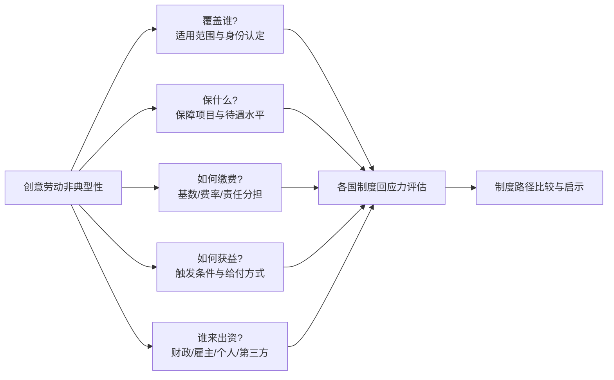

# 非典型雇佣下的文化创意从业者社会保障：法、德、韩、阿、乌五国制度比较研究（截至2021年初）
# 1 研究背景与问题界定：创意劳动的非典型性与社保困境

文化创意产业（Cultural and Creative Sector, CCS）在过去二十年逐渐被国际社会确认为一种兼具经济价值与公共文化价值的"双重资产"。联合国教科文组织（UNESCO）的统计显示，文化与创意部门约贡献全球GDP的3.1%[^1]，并在社会凝聚、教育资源供给与个体福祉建构等方面发挥着难以替代的作用[^1]。然而，正是在这一被视为"未来产业"的领域内部，劳动关系却呈现出与战后福利国家社会保障制度所预设的"标准雇佣范式"格格不入的非典型形态。当2020年新冠疫情骤然降临、文化场所大规模停业、演出与展览全面取消时，长期潜伏于这一行业的社保脆弱性以前所未有的烈度暴露于公众视野：UNESCO数据显示，疫情使全球文化与休闲部门增加值蒸发约7500亿美元，2020年一年内损失了约1000万个工作岗位，多个国家的部门收入下滑幅度达到20%至40%[^2][^1]。

这一冲击不仅是周期性的经济震荡，更是一次系统性的"压力测试"，它使得本研究所欲探讨的核心问题——**为何建立在标准雇佣关系之上的传统社会保障制度，对于以项目制、间歇性、多雇主、跨身份为特征的创意劳动者而言，长期处于结构性失灵状态？各国又以何种制度安排试图弥合这一鸿沟？**——具有了前所未有的紧迫性。本章作为整篇比较研究的逻辑起点，旨在厘清创意劳动非典型性的具体内涵、传统社保制度的回应盲区、不同险种上的差异化表现，并最终提炼出贯穿法、德、韩、阿、乌五国横向比较的统一分析框架与判断基准。

## 1.1 文化创意产业的范围界定与劳动形态特征

在展开制度分析之前，有必要先就"文化创意产业"在本研究中的范围作出界定。本研究采纳UNESCO在《2005年保护和促进文化表现形式多样性公约》及其后续政策报告中所采用的较为宽泛的界定方式，即将CCS理解为以创造、生产、传播和消费具有文化、艺术或遗产内容的产品与服务为核心业务的产业集合[^1]。在这一框架下，本研究所讨论的"创意从业者"主要涵盖以下职业群体：表演艺术领域的演员、舞者、音乐家与歌手；视觉艺术领域的画家、雕塑家、摄影师；影视与视听产业中的导演、编剧、剪辑师以及灯光、音响、舞美等技术工种；出版与文字创作领域的作家、记者、自由撰稿人、翻译；设计领域的平面设计师、工业设计师、时装设计师；以及随着数字技术发展而新生的数字内容创作者、独立游戏开发者、网络主播等新兴职业类别。

这些看似异质的职业群体之所以在社会保障研究中被作为一个共同体来考察，是因为他们在劳动形态上共享一组高度相似的结构性特征，这些特征构成了与"标准雇佣关系"的本质区隔。

**第一，收入波动性强且总体水平偏低。**创意从业者的收入往往随项目周期剧烈起伏，丰收年份与零收入月份并存的现象极为普遍；加之大量"准入门槛低、竞争激烈、赢者通吃"的市场结构特征，绝大多数从业者长期处于中低收入区间，与其所产出的文化产品的市场价值之间存在显著落差。这一点也是UNESCO报告强调需要建立"针对线上消费的艺术家与内容生产者公平报酬机制"的现实背景[^2]。

**第二，项目制与短期合同主导。**与制造业、公共部门等领域以长期全职合同为常态不同，创意行业的雇佣关系普遍以"一部影片"、"一台演出"、"一档节目"、"一本书"为单元组织，短则数日，长则数月，合同期满即雇佣关系终止。这种项目化雇佣使得"稳定雇主—连续缴费"的传统社保逻辑难以自然延伸至该行业。

**第三，多雇主并行与雇佣身份频繁切换。**一位音乐家可能同时在剧院演出、为唱片公司录音、在音乐学院兼课、在网络平台直播；一位设计师可能同时为多家广告公司提供自由设计服务并保留个人工作室。这种"组合式职业生涯"（portfolio career）使得"主雇主"在法律上往往难以确定，雇主责任主体处于离散乃至缺位状态。

**第四，自雇与受雇身份的模糊与流动。**许多创意从业者在不同项目中以不同法律身份出现——同一名编剧今天作为公司雇员、明天作为独立承包人、后天作为版权许可人——这种身份的频繁切换与传统社保制度以"明确单一身份"为前提的注册、缴费、待遇核定逻辑形成根本张力。

**第五，工作的间歇性与"隐性劳动"。**创意劳动具有显著的间歇性：演出之外的排练、出版之前的构思、展览之前的创作，这些"无合同、无报酬"的准备性劳动构成了创意成果的真正基础，但在传统劳动法与社保法视野下却几乎不可见。这导致"工作时间"与"领薪时间"严重错位。

**第六，跨界与跨平台流动。**特别是在数字平台兴起后，创作者越来越频繁地在不同国别、不同平台、不同业态之间流动，进一步弱化了任何单一管辖权下的社保制度对其完整职业生涯进行覆盖的能力。

这六项特征叠加在一起，使得创意从业者构成了广义"非典型雇佣"（atypical forms of employment）人群中具有高度内部一致性的一个独特子集。已有研究指出，非典型雇佣——包括非全日制工作、定期合同、临时派遣以及（虚假或依附性的）自雇——本身就与劳动力市场分割与不稳定化（precarisation）密切相关，对劳动者个人、劳动力市场运作与社会整体均产生负面后果[^3]。创意从业者由于其劳动形态的多重非典型性叠加，往往处于这一谱系中风险最为集中的一端。

## 1.2 非典型雇佣与传统社保制度的结构性冲突

战后西欧、北美所建立、并被多数发展中国家在不同程度上模仿的现代社会保障制度，其制度逻辑深深嵌入在福特制时代的"标准雇佣关系"（standard employment relationship）之上。这一关系的典型形象是：一名劳动者与一名雇主签订无固定期限的全职合同，按月领取稳定工资，在一个明确的工作场所、按照固定工时提供劳动；雇主依法定基数与费率按月为其代扣代缴养老、医疗、失业、工伤、生育等险种保费，并承担其中相当比例的雇主缴费；劳动者经过若干年连续缴费后即可触发各项待遇资格，并在退休时获得与其在职工资挂钩的替代性收入。

这一制度逻辑对创意劳动而言至少在四个层面发生系统性失灵。

**其一，缴费基数的不稳定。**传统社保的缴费基数通常以"上一计费周期工资"为锚，并设有上下限。但创意从业者的收入呈现高方差、低均值的分布特征，月度乃至年度收入差异可达数倍甚至数十倍。以"上月工资"为锚的缴费机制要么在高峰期使缴费基数虚高、负担不可承受，要么在低谷期使基数低于下限而被排除在制度之外。

**其二，缴费连续性的断裂。**多数险种的待遇资格——尤其是失业保险与养老保险——以"连续缴费月数"或"累计缴费年限"为门槛。项目制创意从业者在两个项目之间的"空窗期"通常无人为其缴费，导致连续性反复中断，待遇资格难以累积。即便项目密集时累计工时或收入并不少，但因为分布"不规则"而被排除在保障之外。

**其三，雇主责任主体的离散与缺位。**传统社保以"雇主代扣代缴+承担相当比例费用"为核心融资支柱。多雇主、短雇主、自雇等情形使得这一支柱出现裂缝：每一个临时雇主都倾向于将创意从业者归类为独立承包人以规避社保义务；而当从业者以自雇身份出现时，雇主缴费部分则完全消失，全部成本转嫁至从业者本人。这不仅意味着待遇水平的下降，也意味着行业整体的社保融资基础被显著削弱。

**其四，身份认定的模糊化与制度性排斥。**社保制度往往按"劳动者/自雇者/无业者"等明确身份进行分类管理，每一类身份对应不同的强制参保规则、缴费比例与待遇结构。当一名创意从业者同时具备多重身份、或其身份难以被任一类别清晰容纳时，制度的回应往往是"默认排除"或"按最不利身份归类"。其结果是一种隐性的制度性排斥：创意从业者并非被法律明文拒绝，而是因为无法在制度的分类框架中找到合适的位置而事实上被边缘化。

上述四重失灵的累积效应是显著的。已有针对欧盟劳动力市场的研究表明，自1990年代以来，欧盟劳动力市场的"灵活度"持续提升而"保障度"则趋于下降，临时合同就业者的工作贫困风险显著加大[^4]。在欧盟范围内，工作贫困率在2011年介于3.3%（捷克）至14.1%（希腊）之间[^4]，而非典型雇佣是其主要驱动力之一。创意从业者作为非典型雇佣的"高浓度"群体，所承受的"工作而不脱贫"以及"工作而无保障"的双重风险更为突出。

由此可以提炼出本研究的一个核心命题：**传统社保制度并非有意拒斥创意从业者，而是其底层制度逻辑——以稳定雇佣为前提的连续缴费与雇主分担——与创意劳动的非典型性之间存在结构性不兼容。任何有效的制度回应都不能仅止于"将艺术家纳入既有制度"，而必须从缴费基数算法、资格触发条件、责任分担结构等更基础的制度技术层面进行重新设计。**这也正是本研究将在第二章建立四维评估框架、并通过五国比较加以验证的基本判断。

## 1.3 险种维度下的具体社保困境

为了使上述结构性冲突更为具体，下表按养老、医疗、失业、工伤、生育五大传统社保险种，分别归纳创意从业者所面临的典型困境与其制度成因。需要说明的是，这一归纳基于上节的分析框架综合而成，旨在为后续国别比较提供问题清单，而非穷尽各国具体制度的所有细节。

| 险种 | 创意从业者面临的典型困境 | 主要制度成因 |
|------|--------------------------|--------------|
| 养老保险 | 累计缴费年限不足、缴费基数偏低导致退休待遇低下；老年时面临贫困风险 | 项目制工作下缴费中断频繁；自雇身份下缺失雇主缴费；低收入期被排除在强制参保门槛之外 |
| 医疗保险 | 项目空窗期出现断缴、待遇中断；自费门槛过高使预防性医疗被搁置 | 医疗保险通常与雇佣身份挂钩，雇佣中断即保障中断；自雇缴费率高、负担重 |
| 失业保险 | 因身份不符（自雇被排除）或缴费时长不足而无法触发；项目结束实际失业但法律上不构成"失业" | 失业保险设计以"非自愿失去稳定雇佣"为前提，难以容纳"项目自然结束"这一创意行业常态 |
| 工伤保险 | 排练、拍摄现场、远程创作过程中发生事故时认定困难；自雇者往往不在强制参保范围 | 工伤认定以明确雇主—雇员关系为前提；自由职业者的"工作时间/工作场所"难以法律化界定 |
| 生育保险 | 女性创作者在生育期间收入中断且无替代性给付；产假与项目周期冲突 | 生育津贴通常按上一段连续缴费工资核定，创意从业者基数不稳定或缺乏可计算基数 |

从这一清单可以看出，创意从业者的社保困境并非在所有险种上均匀分布，而是呈现出显著的差异化结构。养老与医疗这类长周期、累计性的险种，问题集中于"缴费连续性"与"基数稳定性"；失业与工伤这类与"雇佣事件"直接挂钩的险种，问题集中于"身份认定"与"事件定义"；生育保险则同时叠加了基数与连续性两个维度的脆弱性，并因性别因素而对女性从业者构成额外不利。

这种险种间的差异化表现具有重要的方法论意义：它意味着各国制度回应的效果不应被笼统评价，而应按险种分层考察。一国可能在某一险种上提供了创新性安排（如法国通过失业保险特殊化将"项目空窗期"纳入补偿范围），同时在另一险种上仍存在显著盲区。本研究在第八章的横向比较中将对此加以系统对照。

## 1.4 疫情冲击下创意劳动脆弱性的暴露与放大

新冠疫情为上述结构性问题提供了一次罕见的、规模空前的"压力测试"。UNESCO在其2022年发布的《重塑创意政策：将文化作为全球公共物品》（Re|Shaping Policies for Creativity）报告中提供了一组令人警醒的数据：疫情导致全球文化与休闲部门的增加值（Gross Value Added）下降了约7500亿美元，2020年一年内损失约1000万个工作岗位；在多个国家，该部门的收入下滑幅度达到20%至40%[^2]。该报告进一步指出，疫情期间公众对数字文化内容的访问量显著增加，但与此同时，"为线上被消费的艺术家与内容生产者建立公平报酬机制"的紧迫性进一步凸显[^2]。

这场冲击的特殊意义在于，它并非随机地、均匀地袭击各行各业，而是以高度结构化的方式对创意行业造成了"超额损害"。当公共卫生措施要求物理性聚集场所关闭时，那些以现场表演、展览、放映为核心业态的领域几乎在一夜之间收入归零；而创意从业者所普遍依赖的项目合同也因此被大量取消或无限期推迟。在此情境下，那些处于自雇或非典型雇佣身份的创作者发现：他们既不能像稳定雇员那样依赖雇主停工不停薪或带薪休假，也往往不能像正规失业者那样触发失业保险的标准给付。UNESCO报告强调，疫情证明了文化与创意部门在社会凝聚、教育资源与个体福祉方面的内在价值，但同时也"削弱了该部门生成经济增长的潜能"，并暴露出确保文化表现形式多样性所面临的重大挑战[^1]。

对本研究而言，疫情冲击具有双重的现实意义。**其一，它使长期被视为"边缘技术性议题"的创意从业者社保问题骤然升格为各国政府不得不正面回应的公共政策议题**——许多国家在2020年至2021年初出台了大量紧急性收入支持、专项救助基金、临时性扩大失业保险覆盖等措施。**其二，它也使各国既有的、面向创意从业者的常态化制度安排（无论是法国的间歇工制度、德国的KSK，还是韩国、阿根廷、乌拉圭的相应安排）经历了一次实战检验**：那些在制度设计上对非典型性具有较强容纳力的国家，其紧急回应往往能够"嵌入"既有制度框架内运作；而那些此前依赖自愿参保或缺乏专门安排的国家，则不得不仓促搭建临时性救助通道。这一对比本身即构成本研究比较分析的重要素材。

需要指出的是，本研究的时间边界设定为2021年初，因此疫情期间出现的诸多紧急性措施仅作为问题暴露的佐证而非主要分析对象；本研究的核心关注点仍在于各国在疫情前已经建立的、用以应对创意劳动非典型性的常态化制度安排，以及这些安排在疫情这一极端情境下所显示出的相对韧性与不足。

## 1.5 比较研究的核心问题框架与判断基准

基于前文对非典型性特征、结构性冲突、险种困境与疫情压力测试的分析，本研究将以一组贯穿全篇的核心问题框架来评估各国制度的回应力。该框架包含五个相互关联的维度，可概括为"五问"：

**第一问——覆盖谁？**关注制度的法定适用范围与身份认定逻辑：是仅覆盖狭义的艺术家（如表演者、视觉艺术家），还是延伸至技术工种（如灯光师、舞美、剪辑师）、教师、新兴数字创作者；是采用职业目录式列举，还是采用"是否从事艺术活动"的功能性判断；非本国公民、跨界从业者、收入低于某门槛者是否被纳入。这一维度的实质是制度的"覆盖广度"。

**第二问——保什么？**关注保障项目的完整性与待遇水平：制度是覆盖养老、医疗、失业、工伤、生育全险种，还是聚焦于其中一两项；除传统社保险种外，是否还包括职业培训、创作准备金、版权与报酬保护等支持性措施；待遇水平相对于行业平均收入或法定最低工资的替代率如何。这一维度的实质是制度的"保障深度"。

**第三问——如何缴费？**关注缴费机制对非典型性的适应方式：缴费基数采用实际收入、虚拟基数还是收入预估；费率是否与一般劳动者一致或有专门调整；个人、雇主（使用者）、国家的缴费比例如何分担；是否存在最低缴费门槛或低收入豁免。这一维度直接决定了制度的可参与性与可持续性。

**第四问——如何获益？**关注待遇触发条件与给付方式：失业、工伤、生育等事件性给付的认定逻辑是否考虑到创意劳动的特殊性（如以工时累计代替连续就业、以年度收入代替月度收入）；待遇给付是按月发放、按项目空窗期发放，还是一次性发放；是否存在收入平滑机制以应对项目间的空窗期。这一维度反映了制度从"缴费"到"受益"的转化效率。

**第五问——谁来出资？**关注筹资结构的责任分担：成本是主要由从业者个人承担（自雇模式），还是由国家通过一般税收补贴（普惠模式），抑或由艺术作品的使用者（出版社、剧院、画廊、广告公司、广播公司等）通过专项税或行业费分担（使用者付费原则），或者由全社会通过跨行业团结分摊（社会保险逻辑）。这一维度反映了一国对"创意劳动谁来供养"这一根本伦理问题的回答。

这"五问"框架将作为后续各章国别分析与第八章横向比较的统一坐标。在第二章中，本研究将进一步把这五个问题归并到"法律载体—覆盖人群—运行机制—筹资结构"四个评估维度之下，并就方法论作出详细说明；而从第三章到第七章，每一个国别案例（法国、德国、韩国、阿根廷、乌拉圭）都将被置于这一统一坐标之下加以剖析，以期最终得出关于制度路径、覆盖效果与适应性张力的可比较结论。

需要预先说明的是，鉴于创意劳动的非典型性本身具有内在多样性，没有任何一国制度能够完美回答上述五问；本研究的目的也并非寻找一个"最佳实践"模板，而是通过五国比较揭示不同制度路径在覆盖广度、保障深度、行政可行性与财政可持续性上的不同权衡，并从中提炼对发展中国家与转型经济体具有参考意义的制度设计启示。

# 2 比较分析框架：四维度评估模型与方法论说明

第一章已经厘清了创意劳动的非典型性特征、传统社保制度的结构性失灵以及由此提炼出的"五问"核心问题框架。然而，要将这一问题意识真正转化为可操作的跨国比较研究，仅有问题清单是不够的：还需要一个能够穿透各国制度术语差异、聚焦于功能等效性的统一分析坐标。法国的"间歇性从业人员制度"、德国的"艺术家社会保险法"、韩国的"艺术家福利法"、阿根廷的"演员法"与"单一税"、乌拉圭的"艺术家及相关职业法"——这五套制度在法律名称、行政架构、术语体系上存在显著差异，若不经方法论上的"翻译"与归并，比较便会沦为彼此孤立的国别描述。本章的核心任务正在于此：将"五问"框架进一步浓缩为四个评估维度，明确各维度的内涵与观察指标，并就案例选择、资料来源、横向对照路径与研究边界作出系统说明。本章作为承上启下的方法论枢纽，为第三至第七章的国别分析提供统一模板，为第八章的横向比较预设可对照的输出维度。

## 2.1 从"五问"到"四维"：评估框架的逻辑转化

第一章末尾所提出的"覆盖谁、保什么、如何缴费、如何获益、谁来出资"五问，构成了从问题意识出发的自然分类。但在进入跨国比较的操作层面时，这五个问题之间并非完全平行，而是存在内在的功能聚类关系。本研究在此基础上将其归并为四个评估维度，归并的逻辑可以从分析操作性、跨国可比性与制度功能聚焦三个层面加以论证。

**从分析操作性看**，"保什么"与制度的法律承载方式实际上是同一制度选择的两面：一国是通过专门立法将艺术家纳入特定险种，还是在普惠法中嵌入特殊条款将其覆盖至全险种，决定了"保障内容清单"的边界与结构。因此本研究将"保什么"与"法律载体"合并为**第一维度：法律与制度载体**——立法形式与保障范围是同一制度技术选择的产物，分开考察会造成重复且割裂的分析。

**从跨国可比性看**，"覆盖谁"独立构成**第二维度：覆盖人群边界**，原因在于这一问题在五国之间呈现出最大的制度差异——德国的KSK覆盖130余种自雇艺术职业，法国的间歇工制度则严格限定于演艺与视听行业的雇员身份从业者，韩国《艺术家福利法》的适用对象又与传统社保的"劳动者"身份认定相互交错。这一维度的独立性使其能够作为跨国对照的关键变量，揭示不同国家对"谁是创意从业者"这一根本问题的不同回答。

**从制度功能聚焦看**，"如何缴费"与"如何获益"虽分属缴费端与给付端，但在功能上共同回答了"制度如何在技术层面适应非典型性"这一问题——缴费基数算法、资格门槛设计、福利触发条件、收入平滑机制等具体技术之间存在紧密的内部联动：以"工时累计"为资格门槛的制度必然要求相应的工时记录与缴费基数算法，以"年度收入预估"为缴费基数的制度则需要配套的年度结算与待遇核定机制。因此本研究将其合并为**第三维度：运行机制对非典型性的适应**，以聚焦于制度的"真实回应力"。

**"谁来出资"**则独立构成**第四维度：筹资结构与责任分担**，原因在于这一问题不仅是技术性的成本分摊问题，更是关于"创意劳动谁来供养"的伦理选择，需要单独考察个人、国家、使用者与跨行业团结四种责任主体的相对权重。

由"五问"到"四维"的归并并非随意压缩，而是基于制度功能的内在聚类。四个维度之间存在清晰的内在关联：**法律载体决定了边界划设的方式（专门法倾向于职业列举式、普惠法倾向于功能判断式），边界划设进而影响运行机制的具体设计（覆盖自雇者必然要求设计有别于雇员的缴费基数算法），运行机制又反过来约束筹资结构的选择（"工时换福利"模式天然适配跨行业团结分摊，"使用者付费"模式则需要可识别的作品使用环节作为征收基础）。**这种内在关联性意味着，对任一国制度的剖析都不能孤立地评价某一维度，而必须把握四维度之间的耦合逻辑。

## 2.2 维度一：法律与制度载体

第一维度关注一国针对创意从业者的社保安排在何种法律框架与制度载体上得以实现。本研究区分三种典型的承载方式。

**第一种是专门立法路径**，即通过独立的艺术家社会保障法或文化从业者地位法为创意劳动者建立专属制度框架。这种路径的典型代表是德国1983年颁布的《艺术家社会保险法》（Künstlersozialversicherungsgesetz, KSVG），以及韩国2011年的《艺术家福利法》、乌拉圭2008年的《艺术家及相关职业法》（Ley 18.384）。专门立法的优势在于能够为创意从业者建立法律上明确的特殊身份与配套制度，避免被普惠制度的标准雇员逻辑所"碾压"；其潜在不足在于可能形成制度孤岛，与一般社保体系的衔接成本较高。

**第二种是普惠法中的特殊条款路径**，即在一般社会保障法律中嵌入针对艺术家或非典型雇佣者的差异化规则。法国针对演艺与视听行业从业者的间歇性失业保险安排即属此类——它并非一部独立的"艺术家法"，而是作为法国一般失业保险体系（由全国雇主与雇员协议管理）下的特殊附则Annexes VIII与X而存在，制度上嵌入于UNEDIC（全国工商业就业联合会）所管理的跨行业失业保险框架之内。这一路径的优势在于充分利用既有制度基础设施、避免重复建设；其潜在不足在于特殊条款受制于整体框架的逻辑边界，改革空间往往受限于跨行业谈判格局。

**第三种是行业基金或集体协议路径**，即通过行业自治组织、集体劳动协议或专项基金提供补充性保障。阿根廷的"演员退休基金"、乌拉圭基于Ley 18.384建立的国家艺术家登记册（Registro Nacional de Artistas）配套基金、韩国艺术家福利财团（KAWF）所运营的创作准备金等，都在不同程度上体现了这一路径的特征。

对每一国制度的法律载体类型识别，需要进一步关注三项观察指标：**立法层级**（议会立法、行政法规还是行业协议）、**制度成文化程度**（条款的明确性与可诉性）与**制度稳定性**（自颁布以来经历重大修订的频次与争议程度）。这三项指标共同决定了一国制度对创意从业者权利保障的"刚性"水平。需要指出的是，三种路径并非互斥，多数国家实际上是混合采用的——例如法国虽以"嵌入式"为主，但同时也存在配套的集体协议；德国虽以专门立法为主，但KSVG实际上是将艺术家"接入"既有的法定养老、医疗与长期护理保险体系，本质上也是一种"嵌入"。

## 2.3 维度二：覆盖人群边界

第二维度聚焦于各国制度如何回答"谁是受保护的创意从业者"这一根本性问题。这一维度的实质重要性在于：制度的覆盖广度直接决定了其社会政策意义——一个仅覆盖少数明星艺术家的制度与一个覆盖广义文化技术工种的制度，在功能上是截然不同的两类制度。

本研究将从四组边界划设逻辑入手考察这一维度。

**第一组：职业列举式 vs 功能判断式的界定方法。**职业列举式以预先公布的职业目录为依据进行覆盖判定，德国KSVG所覆盖的130余种艺术与新闻职业即属典型；功能判断式则以"是否从事创造性艺术活动"或"是否以艺术活动为主要收入来源"为判断依据。两种方法各有优劣：列举式具有明确性与行政可操作性，但在面对数字时代新兴职业（如网络主播、独立游戏开发者、内容创作者）时回应迟缓；功能判断式具有动态适应性，但行政认定成本较高且易引发争议。

**第二组：狭义艺术家与广义文化技术工种的纳入与排除。**这是各国制度最关键的边界分歧之一。法国间歇工制度的一大制度特征即是同时覆盖艺术家（Annexe X）与技术工种（Annexe VIII，包括灯光师、音响师、剪辑师、舞美等）；而某些国家的"艺术家法"则仅覆盖具备创作主体地位的狭义艺术家，将技术工种留在普通劳动法框架之内。这一边界差异直接关乎制度的"行业覆盖完整性"——一台演出的福利保障是否仅及于演员而不及于幕后技术工种。

**第三组：教师、培训者、文化遗产从业者等准创意职业的边界处理。**音乐教师、表演培训师、博物馆与文化遗产从业者、文化机构行政人员等群体处于"创意—非创意"的灰色地带，各国制度的处理逻辑差异显著。

**第四组：新兴数字内容创作者、平台劳动者、跨境从业者的制度回应。**这一群体在传统制度设计时尚未出现或规模较小，因此各国制度的回应往往滞后于现实变化。本研究将着重考察各国在2021年初是否已经就这一新兴群体启动制度调整。

除上述四组显性边界外，本研究还将识别每一国制度的**隐性边界条件**，主要包括：(1) 最低收入门槛——例如德国KSVG要求年度艺术收入超过一定阈值才能强制参保；(2) 最低工时门槛——例如法国间歇工制度要求在过去365天内累计工作满507小时方可触发失业补偿资格[^5]；(3) 国籍与居留要求——例如对非本国公民艺术家的参保限制。这些隐性边界往往比职业目录式的显性边界对实际覆盖率产生更大影响，且在跨国比较中容易被忽视，需要在国别分析中专门加以揭示。

## 2.4 维度三：运行机制对非典型性的适应

第三维度是本研究评估"制度对非典型性真实回应力"的核心维度。如第一章所论证，传统社保制度对创意劳动的失灵主要发生在缴费基数、缴费连续性、雇主责任、身份认定四个底层技术环节。第三维度即从制度技术层面考察各国如何对这些环节进行针对性重构。

本维度具体考察四类机制。

**第一类：资格门槛设计。**关键观察点在于一国是否摆脱了"以连续就业月数为资格门槛"的传统逻辑，转而采用更适应非典型性的替代性算法。法国间歇性从业人员制度（régime des intermittents du spectacle）的核心制度创新即在于此：它以"在过去365天内累计工作507小时"作为触发失业补偿资格的门槛[^5]，将间歇性、项目制的工作时间通过"工时累计"的方式"翻译"为可计算的社保权利，从而避免了对"连续就业"的硬性要求。这一"工时换福利"的资格算法是评估各国制度技术创新性的重要指标。

**第二类：缴费基数测算方法。**针对创意从业者收入波动性强的特征，各国制度发展出多种基数算法：(1) **实际收入算法**——按每一份合同的实际报酬计算缴费，简单但受月度波动影响大；(2) **虚拟基数算法**——当实际收入低于法定最低标准时，按虚拟基数（如乌拉圭Ley 18.384中的"ficto"机制）维持缴费连续性；(3) **年度收入预估算法**——以艺术家自主申报的年度收入预估为基数，年终结算调整，德国KSVG即采用此种逻辑；(4) **多档定额算法**——如阿根廷的"单一税"（Monotributo）按收入分档设定定额缴费。这四种算法在简便性、公平性与抗波动性上各有权衡，构成各国制度差异化设计的重要技术点。

**第三类：福利触发条件，特别是事件性给付的重新定义。**失业、工伤、生育等事件性给付传统上以"明确的雇佣事件"为触发依据，而创意劳动中"项目自然结束"是否构成"失业事件"、排练或居家创作中发生的伤害是否构成"工伤"，是各国制度回应非典型性的关键技术节点。法国制度承认"项目空窗期"为可补偿的失业事件，德国KSVG将自雇艺术家的医疗保险待遇与雇员等同对待，是这一技术维度上的典型创新。

**第四类：收入平滑机制。**即制度如何在项目空窗期为从业者提供过渡性收入或维持其社保资格的延续性。法国间歇工制度通过失业补偿在项目空窗期提供替代性收入；乌拉圭通过"ficto"虚拟基数维持缴费连续性，从而避免空窗期对养老与医疗权利的累计中断；阿根廷的"单一税"通过定额化设计降低空窗期的缴费压力。这些机制的存在与否，是评估制度对创意劳动收入碎片化"容纳力"的关键观察点。

需要强调的是，第三维度并非孤立地考察某一项技术安排，而是关注上述四类机制之间的内部协同——例如"工时换福利"的资格门槛必须与"按工时记录计算缴费基数"的算法协同运作，否则会出现资格条件与缴费基础脱节的制度漏洞。本维度是评估制度真实回应力的核心维度，也是国别分析中最需要技术性细节展开的维度。

## 2.5 维度四：筹资结构与责任分担

第四维度回应第一章末尾提出的"谁来供养创意劳动"这一根本伦理问题。这不仅是技术性的成本分摊问题，更涉及一国对创意劳动公共价值的根本判断。本研究区分四种典型的筹资责任分配模式。

**第一种：个人自担模式。**从业者以自雇身份承担全部缴费成本（包括原本应由雇主承担的部分）。这一模式在制度设计上最为简单，但实际上将创意劳动非典型性的全部经济后果转嫁至个人，导致低收入从业者实际上被排除在保障之外。该模式在专门制度尚未建立的国家或险种上较为常见，例如韩国对自由职业艺术家工伤保险的"自愿+全额自付"安排即近似于此种模式的变体。

**第二种：国家补贴模式。**通过一般税收对创意从业者社保给予普惠性或专项补贴。这一模式体现了"创意劳动具有公共文化价值、应由全社会通过财政共担"的政策判断。德国KSVG下的联邦补贴（约占艺术家社会保险基金筹资的20%）、阿根廷"文化单一税"（Monotributo Social/Cultural）下的国家补贴均属此种模式。

**第三种：使用者付费模式。**由艺术作品的使用者——出版社、剧院、画廊、广播公司、广告公司、唱片公司等——通过专项税或行业费分担成本，体现"谁受益谁付费"的原则。德国KSVG下的"艺术家社会税"（Künstlersozialabgabe）是这一模式最典型、最具制度创新性的体现：联邦政府向使用艺术家作品的企业按其支付给艺术家的报酬总额征收专项税，以充实艺术家社会保险基金。这一模式的伦理基础在于：使用者从艺术作品中获得了商业价值，理应分担艺术家的社会保障成本。

**第四种：跨行业团结分摊模式。**通过社会保险制度的横向再分配让全社会共担风险。法国间歇工制度的筹资即典型体现了这一逻辑——其失业补偿支出长期超过该群体自身缴费收入，差额由跨行业失业保险（即UNEDIC体系中的其他行业雇主与雇员）通过跨行业团结分摊。这一安排引发了2003年的著名社会冲突——其他行业代表质疑为何要为演艺行业"埋单"，而演艺界则强调创意劳动的特殊价值与对法国文化的公共贡献。这一争议本身即揭示了"跨行业团结"模式在政治可持续性上的内在张力。

四种模式在实践中往往是混合存在的。德国KSVG即同时包含个人缴费（约50%）、联邦补贴（约20%）与使用者付费（约30%）三种来源；法国制度则混合了雇主雇员缴费与跨行业团结分摊。本维度的考察重点不在于识别"纯粹"的某一种模式，而在于把握各国筹资结构中不同来源的**相对权重**及其所反映的政策伦理倾向。本研究将以定量描述（各来源所占比例）与定性分析（各来源所体现的责任伦理）相结合的方式呈现各国筹资结构。

四个评估维度及其观察指标的整体逻辑，可汇总为下表，作为后续国别分析的统一坐标。

| 评估维度 | 核心问题 | 主要观察指标 | 对应"五问"映射 |
|----------|----------|--------------|----------------|
| 维度一：法律与制度载体 | 制度以何种法律形式承载？ | 立法路径（专门法/嵌入式/行业基金）、立法层级、保障险种范围、制度成文化程度与稳定性 | "保什么"+ 制度形式 |
| 维度二：覆盖人群边界 | 谁被纳入受保护范围？ | 显性边界（职业列举/功能判断）、技术工种纳入与否、准创意职业处理、新兴数字创作者回应、隐性边界（收入/工时/国籍门槛） | "覆盖谁" |
| 维度三：运行机制对非典型性的适应 | 制度技术上如何应对项目制与收入波动？ | 资格门槛设计（工时累计/收入累计）、缴费基数算法（实际/虚拟/预估/定额）、福利触发条件重定义、收入平滑机制 | "如何缴费"+"如何获益" |
| 维度四：筹资结构与责任分担 | 制度成本由谁承担？ | 四种模式（个人/国家/使用者/跨行业团结）的相对权重、混合方式、政治可持续性 | "谁来出资" |

## 2.6 案例选择逻辑与可比性基础

本研究选择法国、德国、韩国、阿根廷、乌拉圭五国作为比较对象，这一选择基于三个层面的方法论考量。

**第一，制度路径的多样性。**五国分别代表了不同的制度承载方式：法国以普惠失业保险中的特殊附则为主（嵌入式路径）；德国以独立的《艺术家社会保险法》为主（专门立法路径）；韩国以《艺术家福利法》与艺术家福利财团（KAWF）为载体，但工伤保险等险种仍采用自愿参保模式（混合渐进路径）；阿根廷采用"行业立法（演员法）+ 普惠简化税制（Monotributo）"的双轨模式；乌拉圭则通过《艺术家及相关职业法》创设独立法律身份并配套"虚拟基数"（ficto）等创新机制。五国在制度路径上的差异化覆盖，使得比较研究能够充分揭示不同路径选择的内在逻辑与相对优劣。

**第二，地理与发展阶段的多样性。**五国跨越西欧（法国、德国）、东亚（韩国）与拉美（阿根廷、乌拉圭）三大区域，涵盖成熟福利国家、追赶型经济体与中等收入国家三种发展阶段。这种多样性意味着比较研究的结论不局限于单一发展水平或文化政策传统，而能够为不同国情的国家提供差异化的参考。

**第三，文化政策传统的差异。**法国体现了强国家干预与社会团结传统（"文化例外"政策的发源地）；德国体现了行业自治与法团主义传统（KSK由艺术家、使用者、国家三方代表共同治理）；韩国体现了快速立法与渐进改革传统（2011年立法、随后多次扩展）；阿根廷体现了行业立法与普惠税制并行的实用主义路径；乌拉圭则体现了拉美中等收入国家以法律创新回应非正规化挑战的尝试。这种文化政策传统的差异为理解制度选择的深层社会-政治根源提供了丰富的对照样本。

五国之间可比性的基础在于：**均为在2021年初已经建立专门或差异化的创意从业者社保安排的国家**，因此能够在"已有制度回应"的共同前提下进行结构化对比。这一共同前提排除了"完全没有专门制度"的国家（其比较将沦为"有制度 vs 无制度"的简单对照），从而使比较聚焦于"不同制度路径之间的相对优劣"这一更具方法论价值的层面。

可比性的限度同样需要明确：五国在国民经济总量、文化产业规模、社会保障总体水平、行政能力等方面存在显著差异，因此本研究的横向比较聚焦于制度路径与技术安排的功能等效性，而不进行待遇水平的绝对数值对比；对各国制度的评价也将以"在本国国情下的适应性"而非"绝对优劣"为基准。

## 2.7 国别分析的统一模板与横向对照路径

为确保第三至第七章的国别分析具备充分的可比性，本研究将采用统一的章节结构模板。每一国别章节将依次包含：(1) 制度沿革与法律框架（对应维度一）；(2) 覆盖人群与边界划设（对应维度二）；(3) 缴费与给付的运行机制（对应维度三）；(4) 筹资结构与责任分担（对应维度四）；(5) 制度运行中的争议、改革与可持续性挑战。在涉及具体制度术语时，本研究将统一采用"原文术语 + 中文意译"的双标注方式（如"intermittents du spectacle / 演艺间歇工"），以兼顾学术严谨性与中文读者的可读性。

第八章的横向比较将以四维度为列、五国为行构建对照矩阵，并在此基础上沿两条路径展开。**路径一：按维度分层对照。**即在四个维度上分别进行五国横向对比，揭示各维度内部的制度选择差异及其后果。**路径二：按险种分层对照。**呼应第一章1.3节关于"创意从业者社保困境在不同险种上的差异化表现"的判断，本研究将按养老、医疗、失业、工伤、生育五大险种分别审视各国制度的覆盖完整性。这两条路径相互交叉，最终汇聚到四个综合判断指标——**覆盖广度**（被纳入的人群规模与边界完整性）、**保障深度**（待遇水平与险种完整性）、**行政可行性**（资格认定与缴费便利程度）、**财政可持续性**（筹资结构的长期稳定性）——上对五国进行相对定位。

最后，本研究的方法论边界需要明确界定，以避免对研究结论的过度解读。**第一，资料来源边界。**本研究以制度文本（立法、行政法规、行业协议）与既有研究文献（学术论文、国际组织报告、政策评估报告）为主要资料来源，**不进行原始实证调查**，因此对各国制度的"实际运行效果"的判断主要依赖既有评估文献而非一手调研数据。**第二，时间截点边界。**本研究的信息边界设定为2021年初，疫情期间各国出台的紧急性救助措施仅作为问题暴露的佐证，不作为常态化制度分析的主要对象。**第三，分析层次边界。**本研究聚焦于国家层面的制度安排，对地方政府层面（如法国大区、德国各州）的补充性安排与行业自治组织（如工会、行业协会）的内部互助机制仅作必要提及而不展开系统比较。

这些边界并非研究的"缺陷"，而是为聚焦核心问题所作的方法论取舍。在明确边界的前提下，本研究力求在四维度评估框架的统一坐标下，为"如何为非典型创意劳动构建有效社会保障"这一根本问题提供基于五国比较证据的结构化回答。承接本章建立的框架，第三章将首先进入法国案例——一个以"工时换福利"为核心制度技术、以跨行业团结分摊为筹资基础、并因此引发深远社会争议的代表性范例。

# 3 法国：演艺间歇工制度（Intermittents du spectacle）

承接第二章建立的四维度评估框架，本章进入五国比较的首个国别案例——法国。在第二章对"嵌入式特殊附则"路径的概念性界定基础上，法国针对演艺与视听行业从业者所建立的间歇性失业补偿制度提供了一个高度成熟、技术细密、争议深远的实例：它并非一部独立的"艺术家法"，而是嵌入于全国跨行业失业保险体系（UNEDIC）之中的两个特殊附则——Annexe VIII与Annexe X——所共同构成的差异化规则集合。该制度以"在过去365天内累计工作507小时"的工时门槛为核心技术，将项目制、非连续就业的创意劳动"翻译"为可计算的社保权利，由此被广为援引为"工时换福利"模式的范例。本章将在第二章四维度坐标下依次剖析其制度沿革与法律框架（维度一）、覆盖人群边界（维度二）、运行机制（维度三）、筹资结构（维度四），并以2003年改革引发的社会冲突与后续调整为切口，揭示该模式在政治-财政可持续性上的内在张力。

需要预先说明的是，法国制度的独特之处不仅在于具体技术安排，更在于其所体现的政策伦理：将演艺与视听行业的间歇性视为该行业的"内在属性"而非个体的"职业失败"，并以跨行业团结分摊的方式让全社会共担其社会保障成本。这一伦理选择既是该制度长期得以维系的政治基础，也是其反复成为争议焦点的根源。

## 3.1 制度沿革与法律框架：从战后行业惯例到Annexes VIII与X的制度化

法国演艺间歇工制度的制度化路径，与其说是一次自上而下的立法创设，不如说是对一项早已存在的行业用工惯例的法律承认与制度规整。在战后法国电影与现场演艺产业重建过程中，"按需用工"——即围绕单部影片、单场演出、单档节目组织雇佣关系——已成为产业组织的基本形态；与之相应，演员、技术工人在不同项目间反复就业、反复失业的"间歇性"职业生涯模式也早已成为行业常态。

法国在制度承载方式上的关键选择，是将这一行业现实嵌入到1958年以后逐步建立的全国跨行业失业保险体系（UNEDIC，由全国雇主组织与雇员工会共同管理的工商业就业联合会）之中，而非通过独立立法另起炉灶。其制度技术工具是UNEDIC一般失业保险公约（convention d'assurance chômage）下的两个特殊附则：**Annexe VIII**——覆盖视听与演艺行业的技术工种与工人；**Annexe X**——覆盖演艺行业的艺术家。两个附则共同构成了对"演艺间歇工"（intermittents du spectacle）的差异化失业保险规则集合。在法国本土制度文献中，这一群体被定义为"以短期合同（CDD）或所谓'惯用短期合同'（CDD-U，contrat de travail à durée déterminée dit d'usage）受雇于演艺行业、并以雇员身份按工时或按场次（cachet）领取报酬"的艺术家、工人或技术人员[^6]。所谓CDD-U，即"在某些活动领域中，由于活动性质本身以及这些岗位天然的临时性特征，习惯上不使用无固定期限合同"，因而在这些行业中合法适用的短期合同形态[^6]。

这一"嵌入式"路径在法律承载方式上呈现出三个特征。**第一，立法层级的混合性**——制度规则并非由议会立法直接规定，而是由全国雇主与雇员组织通过集体协议（即UNEDIC公约）定期重新谈判后达成，经政府批准后对全行业生效。这一治理形态使制度具备准法律效力，但其规则的形成与修订机制根本上嵌入于劳资集体谈判格局之中。**第二，规则的可变性**——由于公约本身具有时效性（通常每3至4年重新谈判一次），Annexes VIII与X的具体技术参数（如工时门槛的核算周期、补偿计算方式、最高最低补偿额等）会随公约更新而发生调整，构成制度的内在动态性。**第三，与一般劳动法的耦合**——间歇工的雇员身份本身由法国劳动法典加以确认（详见3.2节），失业保险的具体规则再以此为基础在UNEDIC框架内细化，从而形成"劳动法定身份+集体协议定规则"的双层结构。

由此可以判断，法国制度在第二章维度一的分类中属于典型的"普惠法中的特殊条款"路径——它充分利用了既有的跨行业失业保险基础设施（行政机构、缴费征收、给付通道），通过差异化的特殊附则回应行业特殊性，避免了制度孤岛的形成，但也因此使制度的存续与变化深度依赖跨行业谈判格局的政治动态。这一路径选择的后果将在3.5节关于2003年改革的讨论中得到充分展现。

## 3.2 覆盖人群边界：艺术家、技术工种与CDD-U的雇佣形态

法国间歇工制度在覆盖人群上采用"雇员身份+CDD或CDD-U短期合同+演艺行业"的三要素复合判定逻辑。这一判定逻辑的精妙之处在于：它既不采用纯粹的职业列举式（仅列出受保护职业的目录），也不采用纯粹的功能判断式（仅以是否从事艺术活动为依据），而是通过"合同形态+行业边界+身份属性"三重要素的叠加，划设出一条既具有行政可操作性、又能容纳行业内部多样性的覆盖边界。

**"推定雇员"作为身份认定的基础**。该制度的覆盖逻辑首先建立在法国劳动法对演艺艺术家"雇员身份推定"（présomption de salariat）的基础之上。根据法国劳动法典自1969年起确立的规则，演艺艺术家与某一自然人或法人之间订立的、由后者支付报酬以换取艺术给付的任何合同，均被推定为劳动合同——即使艺术家保留了创作自由、即使其本人为创作工具的所有者、即使其同时为多个雇主提供服务，这一推定仍然成立。这一"推定雇员"原则的制度意义在于：它从法律源头切断了将演艺创作者归类为独立承包人的可能性，从而为其进入失业保险这一"雇员专属制度"扫清了身份障碍。可以说，法国制度的覆盖范围之广，首先得益于这一在劳动法层面预先完成的身份重塑工程。

**Annexe X与Annexe VIII的双轨结构**。在身份障碍扫除之后，制度通过两个附则实现对"幕前-幕后"行业完整链条的覆盖。Annexe X所覆盖的是演艺艺术家（artistes du spectacle）——包括演员、舞者、音乐家、歌手、马戏与街头艺术表演者等具备创作主体地位的从业者；Annexe VIII所覆盖的则是视听与演艺行业的技术工种（ouvriers et techniciens du spectacle）——包括灯光师、音响师、剪辑师、摄影师、舞美、布景师、化妆师等支撑创作的技术性劳动者[^6]。这一双轨结构使法国制度在跨国比较中具有显著特点：与某些"艺术家法"仅覆盖具备创作主体地位的狭义艺术家不同，法国制度在制度设计的初始阶段即承认创意生产是艺术家与技术工种的协同产物，技术工种同样面临项目制工作的间歇性，理应同等纳入失业补偿体系。

**与相邻群体的界分**。法国制度在内部具有清晰的边界划设逻辑，将三类相邻群体明确排除在"间歇工"范畴之外[^6]：

第一类是**演艺行业的长期合同雇员（CDI）**。由长期合同雇佣的演艺从业者（如国家剧院的常驻乐团成员、公共广播机构的常职技术人员）属于稳定雇佣关系，在制度上回归一般失业保险规则，不适用Annexes VIII与X的特殊安排。这一区分体现了制度的"非典型性导向"——特殊保护针对的是非典型雇佣形态本身，而非该行业的所有从业者。

第二类是**独立艺术家-作者（artistes-auteurs）**。这一群体并非雇员，而是以独立劳动者身份从事创作，其收入形式不是工资而是版税、转播费、邻接权报酬等"财产性权利"（droits patrimoniaux）[^6]。这一群体由法国独立的artistes-auteurs社保体系覆盖——具体而言，该体系由两个主要机构分管：**Agessa**（作家社会保障管理协会）覆盖作家、音乐创作者、电影与音像作品作者、摄影师；**MDA**（艺术家之家，Maison des Artistes）覆盖图形与造型艺术家（如画家、雕塑家等）。设立两个不同机构的根本原因，在于两类创意收入在性质上的差异——版税与许可费类收入（适用于作家、作曲家等）与艺术品销售类收入（适用于造型艺术家等）在征收、申报、缴费基数计算上存在显著不同，分别管理有助于精准适应。该体系的资金来源也体现了"使用者付费"的理念：缴费来自艺术家本人、雇主（如委托创作的机构）以及艺术作品的"使用者"（如广播公司）——后者须支付相当于其利润或支付给艺术家佣金1.1%的费用，缴费基数则与版税、版权费或许可费等非传统收入来源挂钩。这一独立体系与本章所讨论的Annexes VIII与X构成**法国创意劳动社保的"双轨并行"格局**：前者面向以财产性权利为收入主体的独立创作者，后者面向以工资性收入为主体的演艺与视听从业者，二者在覆盖人群上互补而不重叠。

第三类是**新兴数字内容创作者与平台从业者**。截至2021年初，法国制度对网络主播、独立游戏开发者、自媒体内容创作者等新兴数字职业的覆盖回应较为有限。这些从业者既不必然受雇于传统演艺行业，也未必符合CDD-U的合同形态要求，因而在身份认定上面临制度灰区。这一回应限度构成法国制度在数字时代面临的主要挑战之一，但在2021年初尚未形成系统性的制度调整。

可见，法国制度的覆盖广度在传统意义上的演艺与视听行业内是充分的（幕前幕后完整覆盖），但其边界严格限定于"雇员身份"——这意味着以独立承包人或自雇身份从事创意劳动者必须通过Agessa/MDA体系而非Annexes VIII与X获得保障，二者之间不存在缴费记录的横向打通。这种边界划设逻辑在中长期内的可持续性，将取决于法国制度对数字时代创意劳动多样化形态的适应能力。

## 3.3 "工时换福利"：507小时门槛与失业补偿的运行机制

如果说覆盖人群边界回答了"谁有资格"，那么运行机制则回答了"如何获得补偿"。法国制度对创意劳动非典型性的核心技术回应，集中体现在"工时换福利"这一资格触发逻辑之中。这一机制的精髓在于：**它放弃了一般失业保险以"连续就业月数"为门槛的传统逻辑，转而以"在过去365天内累计达到507小时工作时长"作为触发失业补偿资格的核心条件，从而将间歇性、项目制的工作时间通过累计的方式转化为可计算的社保权利。**

**507小时门槛的制度逻辑**。507这一数字并非随机选择，而是经过精算的资格阈值——它大致相当于全日制工作下约三个月的工时量（按法国法定每周35小时计算），意味着一名间歇工只要在一年内累计达到这一工时即可触发后续约一年期的失业补偿期。这一门槛的制度功能可从两个层面理解：**其一**，它过滤掉了将间歇性失业保险作为"主业补贴"的偶发性短期工作者，确保受补偿群体确实以演艺与视听为主要职业身份；**其二**，它使资格触发不再依赖"连续就业"——一名间歇工可能在一年内承接5份各持续3周的演出合同、共计累计507小时，即可触发资格，这在一般失业保险的"连续就业月数"逻辑下是无法实现的。这一算法本质上承认了"项目自然结束"作为创意行业的常态而非个体职业失败，从而使每一次项目结束后的空窗期均成为可补偿的"失业状态"。

**工时与cachet的换算规则**。由于演艺艺术家的报酬形式不仅有按小时计酬，还广泛存在"按场次计酬"的所谓cachet（一种与具体工作时长解耦的、按演出场次或表演任务核定的整笔报酬）[^6]，制度必须建立cachet与工时的换算规则，方能将这类报酬形态纳入工时累计体系。具体的换算系数由UNEDIC公约的技术附件规定，将每一份cachet折算为相应工时单位计入累计。这一换算机制的制度意义在于：它使艺术家在不同报酬形态之间的切换（按小时、按天、按场次）不再影响其社保权利的累计，从而消除了"报酬形式选择"对"福利资格触发"的扭曲效应。

**缴费基数与日补偿额的计算**。失业补偿的具体金额以参考期间内的实际收入为基础进行核定，最终给付以"日补偿额"（allocation journalière）的形式发放。日补偿额的核算公式综合考虑参考期间内的累计收入、累计工时、行业平均工时基数等参数，并设有最低保障线与最高封顶线，以确保补偿水平既能在项目空窗期为间歇工提供有意义的替代性收入，又不至于因高收入项目而出现补偿过度。

**给付期与续期机制**。资格一旦触发，间歇工即进入约一年期的补偿期（具体期长随公约调整有所变化），在此期间项目空窗期可获得日补偿额；补偿期结束之前，间歇工需通过新一轮的工时累计（即再次在过去365天内累积达到507小时）实现资格续期。这一"工作—空窗—补偿—再工作—续期"的循环机制是制度对创意劳动职业生涯特征的根本回应：它承认间歇性是常态而非例外，并将这一常态嵌入制度运行的内在节律。

**对"项目自然结束"的承认**。法国制度的运行机制中还隐含着一项制度伦理层面的重要突破——它承认"项目自然结束"（即CDD合同期满）作为可补偿的失业事件，区别于一般失业保险通常要求的"非自愿失去稳定雇佣"前提。在一般失业保险的逻辑下，合同到期是"预期性事件"而非"失业事件"；但在法国间歇工制度下，由于CDD-U本身即是法律承认的合法雇佣形态，且其反复结束-续约本就是行业惯例的内在组成部分，因此每一次CDD-U结束都被视为可触发补偿的失业事件。这一定义上的突破，是法国制度区别于其他国家失业保险的关键制度技术。

需要补充说明的是，制度运行中对"职业真实性"的认定并非毫无争议——例如在司法实践中曾出现关于某一具体劳务给付是否构成"艺术性给付"（从而决定其应适用Annexe X的间歇工规则还是一般失业保险规则）的争议[^7]。在Toulouse大审法院2016年审理的一起案例中，一名以"在画展中提供音乐伴奏"为艺术给付的当事人被Pôle Emploi（法国就业服务局）拒绝按Annexe X的间歇工规则计算其权利，转而按一般失业保险规则核定，由此引发关于"何种音乐表演构成艺术性给付"的诉讼，最终法院判决恢复其在Annexe X下的权利并赔偿被错误扣减的补偿款[^7]。这类司法案例揭示出"工时换福利"机制虽在技术上化解了项目制劳动的资格触发难题，但在认定环节仍存在边界判断的灰色地带。

整体观之，法国"工时换福利"机制是第二章维度三所讨论的"资格门槛设计""缴费基数测算""福利触发条件重定义""收入平滑机制"四类技术安排的高度协同产物：工时累计的资格逻辑必须与工时记录、cachet换算、日补偿额计算、给付期续期等机制协同运作，方能构成一套完整的、对项目制劳动具有真实回应力的制度运行体系。这种内部协同性正是法国制度在跨国比较中具有方法论参考价值的根本原因。

## 3.4 筹资结构与跨行业团结分摊

法国间歇工制度的筹资结构在第二章维度四所区分的四种模式中，呈现出一种以"跨行业团结分摊"为核心、辅以雇主-雇员缴费与国家过渡性补贴的混合特征。理解这一筹资结构，是理解该制度政治可持续性争议的关键。

**缴费主体与费率结构**。Annexes VIII与X的失业保险费由雇主与雇员按工资总额的法定比例向UNEDIC缴纳，缴费机制与一般雇员相同。但出于反映该群体待遇使用强度更高这一精算事实——间歇工因其间歇性必然更频繁地触发补偿——该行业适用相对于一般雇员略高的费率，即所谓"附加缴费"（surcontribution）。这一附加缴费的政治意涵在于：制度承认间歇工行业自身应为其更高的待遇使用强度承担部分额外成本，但同时也承认该行业自身缴费不可能完全覆盖其待遇支出。

**收支缺口与跨行业团结分摊**。Annexes VIII与X长期以来在UNEDIC体系内呈现持续的收支缺口——失业补偿支出显著超过该群体自身缴费收入，差额由跨行业失业保险中其他行业雇主与雇员通过UNEDIC体系的横向再分配进行弥补。这一安排即所谓"跨行业团结分摊"（solidarité interprofessionnelle）：制造业、零售业、服务业等行业的雇主与雇员所缴纳的失业保险费在UNEDIC统一账户中与演艺行业的缴费汇集，并依据统一规则给付，由此实现演艺行业补偿赤字由全社会共担。这一安排所体现的政策伦理是：**演艺与视听行业的间歇性并非个体职业失败，而是该行业内在的生产组织特征；而该行业所产出的文化产品具有公共价值（即所谓"文化例外"），因此其社保成本应由社会整体而非该行业自身独立承担。**

**国家角色与FSS专项基金**。国家在该制度中的角色主要体现在三个层面：**第一**，作为UNEDIC公约的最终批准者，国家在公约谈判陷入僵局时具有介入与仲裁的政治权力；**第二**，在2003年改革引发持续政治冲突之后，为稳定制度筹资基础、缓解UNEDIC体系内的"团结分摊"政治压力，法国政府逐步以一般税收提供过渡性补充资金，并于2016年前后建立专门基金（FSS, Fonds Spécifique de Solidarité的演艺间歇工版本）作为对UNEDIC跨行业分摊的辅助性补强；**第三**，国家通过文化部、就业部等部门参与制度运行的监督与统计。

**筹资结构的内在张力**。这一筹资结构的特点是：演艺行业自身缴费占比有限、跨行业雇主与雇员的"团结分摊"是核心来源、国家以一般税收提供有限的辅助性补充。这种结构在政治上的脆弱性显而易见——它依赖于其他行业代表对"演艺行业值得我们供养"这一价值判断的持续认同。一旦这一认同发生动摇，跨行业团结的政治合法性即面临质疑，进而触发制度调整的政治压力。这正是2003年改革爆发的财政-政治根源，也是该制度在过去二十年间反复成为UNEDIC谈判焦点的根本原因。

## 3.5 制度张力与可持续性争议：2003年改革及其社会冲突

法国间歇工制度在制度设计上的精巧性，并未豁免其在政治-财政可持续性上的反复争议。理解这些争议——尤其是2003年改革所引发的社会冲突——是理解该制度真实运行图景的必要环节。

**2003年改革的财政-政治背景**。进入21世纪初，间歇工人数显著扩张。已有研究表明，在20年间，法国视听与现场演艺行业的艺术家与技术人员数量翻了一番；这一增长由间歇性雇员就业的发展所推动，伴随着极为活跃的劳动力市场（在现场演艺领域尤为明显，以企业创设数量与工作机会总量衡量）。然而，从业人员的扩张速度持续快于工作机会的扩张速度，导致1990年代以来个体处境恶化——年度工作量与报酬下降近四分之一；2008年以来恢复增长之后，活动与收入紧缩的长期趋势重新延续[^8]。这一供给端的过剩与个体处境的恶化，意味着UNEDIC体系内Annexes VIII与X的补偿支出持续扩张，与该群体自身缴费收入之间的缺口不断扩大，进而加剧了跨行业其他行业代表对"为演艺行业埋单"的不满。

**改革内容与技术调整**。2003年UNEDIC谈判达成的改革协议，核心是收紧间歇工的资格触发条件——将工时累计的参考期间从原来的12个月调整为更短的核算窗口（具体参数随后续公约多次调整），并修订日补偿额的计算公式。这些调整在技术上看似细微，但对边缘性间歇工（即工时累计刚好接近门槛的从业者）构成了显著的资格剥离效应——一部分原本能够触发补偿的从业者在新规则下将被排除在外。

**社会冲突与"文化例外"的政治动员**。2003年夏季，改革协议的公布引发法国演艺界大规模抗议。多个文化节庆——包括著名的阿维尼翁戏剧节（Festival d'Avignon）——因间歇工大规模罢工而被迫取消或缩减规模，构成法国战后文化部门最重大的劳工冲突之一。演艺界在政治动员中所援引的核心论据是"文化例外"（exception culturelle）——即演艺与视听行业并非普通商业部门，而是承载法国国家文化身份与社会文化福祉的特殊领域，其从业者的社会保障不应被简化为"行业自负盈亏"的经济计算。这一论据使冲突从单纯的劳资谈判议题上升为关于"国家与文化关系"的根本性政治辩论，并最终迫使政府介入调停、推迟或缓和改革的实施力度。

**后续制度调整与FSS基金的建立**。2003年冲突之后，法国制度进入"反复谈判-反复争议-反复调整"的长期循环。每一轮UNEDIC公约更新均伴随关于Annexes VIII与X参数的激烈博弈。一项重要的制度演变是：为缓解跨行业团结分摊的政治可持续性争议，法国在2016年前后建立专项基金作为UNEDIC体系外的辅助性筹资通道，使一部分原本由跨行业分摊承担的成本通过国家一般税收消化，从而降低其他行业代表对"团结分摊"的政治敏感性。这一调整在某种程度上是对"跨行业团结"模式的局部修正——它承认在某些情境下国家直接承担可能比跨行业分摊更具政治可行性。

**深层张力的持续性**。这些反复改革与争议所揭示的，是法国制度内在的几组结构性张力：**其一**，"职业完整性"与"制度可持续性"之间的张力——任何收紧资格门槛的改革都会以剥夺边缘从业者的职业完整性为代价，而任何维持宽松门槛的选择都会加剧财政压力；**其二**，"演艺行业特殊性"与"跨行业团结边界"之间的张力——一旦其他行业代表对"特殊性"的政治认同弱化，跨行业团结的政治基础即面临松动；**其三**，"职业真实性"认定的行政与司法争议——如3.3节所提及的Toulouse判例所示[^7]，对具体劳务是否构成"艺术性给付"的认定本身即是制度边界博弈的微观战场。

**疫情压力测试下的相对韧性**。承接第一章对疫情冲击的判断，可以观察到法国制度在2020-2021年新冠冲击下展现出相对其他国家更强的吸收能力。这一相对韧性的根源在于：制度本身已对"项目空窗期"具有补偿机制，因此疫情期间演出全面取消所导致的"超长空窗期"在一定程度上可以"嵌入"既有制度框架内运作——法国政府随后实施了所谓"白年"（année blanche）安排，即将间歇工的工时累计参考期间冻结延长，使疫情期间未能累计足够工时的间歇工仍能维持其原有资格状态。这一应对方式与其说是制度创新，不如说是既有制度逻辑的延展——恰恰证明了一个对非典型性具有内在容纳力的制度在面对极端冲击时所具有的相对优势。

## 3.6 法国模式的小结：嵌入式路径与"工时换福利"的制度遗产

在四维度框架下对法国模式作出阶段性总结，可以将其制度特征凝练为以下结构（见下表），并由此初步定位其在覆盖广度、保障深度、行政可行性、财政可持续性四个综合指标上的相对表现，为第八章横向比较预设入口。

| 评估维度 | 法国Annexes VIII与X的具体安排 | 主要制度特征 |
|----------|------------------------------|--------------|
| 维度一：法律与制度载体 | UNEDIC一般失业保险公约下的两个特殊附则，由雇主-雇员集体协议谈判、政府批准生效 | 嵌入式立法路径，依托既有跨行业基础设施，规则随公约定期重新谈判 |
| 维度二：覆盖人群边界 | 演艺艺术家（X）+ 视听与演艺技术工种（VIII），以"雇员身份+CDD/CDD-U+演艺行业"复合判定，以劳动法典中的"推定雇员"为身份基础[^6] | 幕前幕后完整覆盖；与artistes-auteurs体系（Agessa/MDA）形成双轨并行 |
| 维度三：运行机制 | 365天内累计507小时为资格门槛；cachet按场次换算工时；日补偿额按参考期间收入核定；通过新一轮工时累计实现续期；承认"项目自然结束"为可补偿失业事件 | "工时换福利"为核心技术创新，对项目制劳动具有内在容纳力 |
| 维度四：筹资结构 | 雇主-雇员缴费（附加费率）+ 跨行业团结分摊（核心）+ 国家一般税收补充（2016年后FSS基金） | 以跨行业团结为伦理基础，依赖"文化例外"政治共识 |

**覆盖广度方面**，法国制度在演艺与视听行业内的覆盖完整性显著——以幕前艺术家与幕后技术工种的双轨并行实现了行业生态的完整保护；但其边界严格限定于雇员身份，使以独立创作为主的artistes-auteurs由另一独立体系（Agessa/MDA）覆盖，二者之间不存在缴费记录的横向打通。同时，对新兴数字内容创作者与平台从业者的回应在2021年初仍较为有限。

**保障深度方面**，法国制度聚焦于失业补偿一项，养老、医疗、生育等其他险种则通过一般社保体系覆盖（间歇工以雇员身份按既有规则参保），并非该制度的直接保障内容。这意味着法国模式的保障深度评估须分险种考察——失业补偿一险上的深度极高（替代率有保障、补偿期可循环续期），但全险种意义上的"专门保障深度"则相对有限。

**行政可行性方面**，工时记录与认定的复杂性构成制度运行的主要行政成本来源——每一份合同的工时、每一笔cachet的换算、每一位间歇工的累计工时账户均需精确记录与核算，这对雇主、雇员与UNEDIC行政机构均提出较高合规要求；同时如Toulouse判例所示[^7]，对"艺术性给付"的认定本身也是行政与司法争议的潜在源头。

**财政可持续性方面**，制度依赖跨行业团结分摊的政治脆弱性已在2003年以来的反复争议中得到充分展示——一旦跨行业其他代表对"为演艺行业埋单"的政治认同发生动摇，制度即面临收紧压力。2016年后FSS专项基金的建立可视为对这一脆弱性的部分制度性回应，但根本性的财政伦理张力仍持续存在。

整体观之，法国模式的独特贡献在于以制度技术创新（"工时换福利"）回应了项目制劳动的核心难题——通过工时累计这一可计算的逻辑，将间歇性、不连续的工作时间"翻译"为可触发的社保权利，并通过承认"项目自然结束"为可补偿失业事件，使创意劳动的内在节律首次获得制度承认。但其聚焦失业一险、依赖雇员身份推定、并将创意劳动按"工资性收入"与"财产性权利收入"分流处理的路径选择，也构成了与后续德国（KSVG下的全险种覆盖与自雇艺术家"准雇员化"）、韩国（《艺术家福利法》体系下的有限工伤参保）、阿根廷（演员法+单一税双轨）、乌拉圭（艺术家法+ficto虚拟基数）四国制度对照的关键差异点。这些差异将构成第八章横向比较的核心维度，也将为本研究在第九章关于"如何为非典型创意劳动构建有效社会保障"这一根本问题的政策启示提炼提供首要参照点。

# 4 德国：艺术家社会保险法（Künstlersozialversicherungsgesetz, KSVG）

承接第三章对法国"嵌入式特殊附则+雇员身份推定+跨行业团结分摊"路径的剖析，本章进入五国比较的第二个核心案例——德国。如果说法国制度的根本特征是"将创意从业者推定为雇员后纳入既有失业保险体系"，那么德国制度则提供了一条截然不同的回应路径：**通过一部独立的联邦专门立法，正面承认自雇艺术家与出版人的身份本身，并将其以"准雇员"的特殊地位接入既有的法定养老、医疗与长期护理三大险种体系，由艺术家个人、联邦政府与艺术作品的"使用者"三方共同分担成本**。这一路径在第二章四维度框架下分别对应着"专门立法+嵌入既有险种"的混合载体、对自雇身份的直接保护逻辑、年度收入预估为基数的缴费机制以及"使用者付费"为核心的三方筹资结构。它构成了与法国模式在制度承载、覆盖逻辑与筹资伦理上的根本性对照，也是国际比较文献中被反复援引的"使用者付费"原则的最纯粹、最成熟实践。

本章将依次考察KSVG的立法沿革与法律框架（4.1）、覆盖人群边界与"主要职业"判定逻辑（4.2）、"准雇员化"制度设计与年度收入预估的运行机制（4.3）、三方筹资结构与艺术家社会税的制度创新（4.4）、近四十年实施中的争议与跨境适用（4.5），最终以四维度对照表的形式凝练德国模式的制度遗产并初步定位其与法国模式的根本差异（4.6）。

## 4.1 制度沿革与法律框架：从1981年立法动议到KSVG的全险种专门法路径

德国《艺术家社会保险法》（Künstlersozialversicherungsgesetz，简称KSVG）于1981年由联邦议会通过、1983年正式生效，是战后联邦德国在社会保障立法史上为某一特定职业群体专门设立社保框架的标志性立法。这部法律的诞生回应了一个长期存在的结构性困境：在战后德国以"标准雇佣关系"为支柱、以雇主代扣代缴+雇主匹配缴费为筹资基础的法定社保体系中，自雇艺术家与自由撰稿人因不存在"雇主"这一缴费支柱主体，事实上长期被排斥于法定养老保险（GRV，Gesetzliche Rentenversicherung）与法定医疗保险（GKV，Gesetzliche Krankenversicherung）的强制保护之外，只能通过私人保险或完全自负方式获得保障。

KSVG的立法路径选择具有几个值得关注的制度技术特征。**第一，它是独立的联邦专门立法**——这与法国通过UNEDIC公约下的Annexes VIII与X以"集体协议+政府批准"形式承载特殊规则的路径形成鲜明对照。KSVG作为联邦议会通过的正式法律，具有最高立法层级的稳定性，其规则的修订须经议会立法程序，而非劳资集体谈判的周期性博弈。这种立法层级上的"刚性"使德国制度在政治可持续性上较法国制度具有更稳固的法律根基。**第二，KSVG并非另起炉灶建立一套与一般法定社保平行的体系**，而是以"接入式"逻辑将自雇艺术家与出版人以特殊身份嵌入既有的法定养老保险、法定医疗保险以及1994年后建立的法定长期护理保险（GPV，Gesetzliche Pflegeversicherung）三大险种之中——艺术家在这三大险种中享受与一般雇员等同的待遇结构，区别仅在于其缴费的分担机制由KSVG专门规定。**第三，KSVG的执行机构是艺术家社会保险基金**（Künstlersozialkasse，简称KSK）——一个根据法律设立的联邦公法机构，其内部治理结构反映了KSVG的三方筹资逻辑：艺术家代表、使用者代表与国家代表共同参与基金的治理与运行决策；KSK本身并不直接给付养老金或报销医疗费，而是承担"中介性"职能——征收艺术家个人缴费、稽核使用者所缴的艺术家社会税、接收联邦补贴，并向相应的法定养老保险机构、法定医疗保险机构（艺术家可自选具体的Krankenkasse）与长期护理保险机构转付完整保费。

综合上述特征，可以判断德国模式在第二章维度一所列三种法律载体中呈现为一种**"专门立法+嵌入既有险种"的混合承载方式**：在立法形式上是典型的"专门立法路径"（独立联邦法律为特定职业群体确立特殊保障框架），但在险种载体上又是"嵌入式路径"（不创设新险种，而是将艺术家接入既有的三大法定社保险种）。这种混合性使KSVG兼具专门立法的"身份明确性"与嵌入式路径的"基础设施复用优势"——艺术家无需进入一个与社会其他群体隔离的"艺术家专属"保险体系，而是与雇员、其他自雇者一同分享既有法定社保的待遇结构，由此避免了制度孤岛风险。

## 4.2 覆盖人群边界：130余种职业的列举式界定与"主要职业"判定

在覆盖人群上，KSVG采用职业列举式与功能判断式相结合的复合界定方法，其覆盖广度在国际比较中位居前列。

**法律定义层面**，KSVG将其保护对象界定为"自雇艺术家"（selbständige Künstler）与"自雇出版人/新闻从业者"（selbständige Publizisten）两大类。"艺术家"涵盖音乐（作曲家、演奏家、歌手）、表演艺术（演员、舞者、导演）、造型艺术（画家、雕塑家、摄影师、设计师等）三大领域；"出版人/Publizisten"则覆盖作家、自由记者、自由撰稿人、翻译等以文字写作或新闻出版活动为业的自由职业者。两大类合并起来在KSK的实际运行目录中涉及约130余种自雇职业。这一覆盖广度——尤其是将"新闻出版从业者"明确与艺术家并列纳入同一保护框架——是德国模式区别于其他国家"艺术家法"的显著特征：它承认作家、记者、撰稿人等"以文字为业"的自由职业者面临着与艺术家完全等同的非典型雇佣困境，并以制度安排回应了这一共同性。

**功能性判定标准**。在KSK的实际行政认定中，列举式职业目录并非孤立运作，而是与一组功能性判定标准耦合使用，主要包括：(1) **以艺术或出版活动为主要职业**——即艺术/出版活动须构成申请人的主业而非偶发性副业；(2) **从该活动取得主要收入**——艺术/出版收入须构成申请人主要的劳动性收入来源；(3) **在德国境内从事该活动**——以居住地与活动开展地的属地原则界定管辖；(4) **不属于法定豁免情形**——例如已在其他法定社保框架内享有充分覆盖者。这种"列举目录提供初步识别+功能标准实质审查"的复合判定逻辑，使KSVG在保持行政可操作性的同时具备一定的动态适应能力。

**隐性边界条件**。KSVG的强制参保门槛之一是申请人的年度艺术或出版收入须至少达到约**3,900欧元**，这一阈值作为参保的最低收入条件，意味着艺术/出版收入低于此门槛者不被纳入强制参保范围[^9]。这一隐性边界的制度逻辑在于：低于该阈值的从业者往往被推定为"业余从业者"或"以艺术活动为副业者"，将其强制纳入KSVG既会扩大制度的行政负担，也可能因实际收入过低而难以维持有意义的缴费水平。然而，这一阈值同时也构成对边缘性、初入行从业者的事实排除，是KSVG在"严格性"与"包容性"之间作出的政策权衡。为部分缓解这一张力，KSVG对入职初期的从业者设有有限的豁免与过渡安排（即从业初期可在数年内不受最低收入门槛约束），以避免该门槛对青年艺术家职业生涯起步阶段构成阻碍。

**对兼业、跨境与新兴数字创作者的边界处理**。对兼业从业者——即同时从事艺术活动与其他非艺术性受雇工作的人群——KSVG通过"主要职业"标准加以识别：若其他受雇工作已使其在既有社保体系中获得充分覆盖且占据主要收入地位，则艺术活动通常作为副业不纳入KSVG。对跨境从业者——即在德国注册但短期赴欧盟、EWR国家或瑞士从事艺术活动者——KSVG的覆盖延续依赖欧盟社保协调规则与双边/多边社保协议（详见4.5节）。对数字时代新兴创作者——网络出版人、博主、独立游戏开发者、自媒体内容创作者等——KSK在实际行政中通过对"出版人/Publizisten"概念的扩展性解释将相当一部分网络写作者与数字出版从业者纳入了保护范围，但对依托商业平台的内容创作者（如视频博主、网络主播）的覆盖回应在2021年初仍存在制度灰区。

**与法国路径的根本对照**。德国KSVG对"自雇身份"的直接保护，与法国制度对演艺艺术家"雇员身份推定"（présomption de salariat）的路径选择构成根本性差异。法国通过劳动法层面预先将艺术家归类为雇员，从而使其能够进入"雇员专属"的失业保险体系；而德国则不掩饰艺术家的自雇本质，反而以专门立法直接承认这一身份并为之设计差异化的缴费分担机制。这两种制度选择背后的伦理逻辑截然不同：法国路径暗含"创意劳动应当被视为类雇佣关系"的判断，德国路径则承认"创意劳动本质上是独立劳动，但社会应当为这一独立劳动提供与雇员等同的保障"。这一对照将在第八章横向比较中作为关键变量加以展开。

需要补充的一项制度对照是，德国法律也将以版税、稿酬等财产性权利收入为主体的创作者一并纳入KSVG框架，而不像法国那样将其分流至独立的artistes-auteurs体系（Agessa/MDA）。这意味着在德国，一位作家无论其收入主要来自图书版税还是来自专栏稿费，均通过同一套KSK机制获得养老、医疗与长期护理保险，由此避免了法国式"双轨并行"所带来的制度复杂性与跨体系权利转换难题。

## 4.3 "准雇员化"制度设计与运行机制：年度收入预估为基数的缴费与给付

KSVG的核心制度技术，可凝练为"准雇员化"（quasi-Arbeitnehmer-Status）这一概念——它将自雇艺术家与出版人在法定养老、医疗与长期护理保险中**视同雇员**对待，使其在缴费分担机制上仅承担一般雇员个人份额的部分，而原本应由"雇主"承担的另一部分则由KSK通过艺术家社会税收入与联邦补贴汇集后代为承担。

**缴费分担的运行逻辑**。在德国一般法定社保框架下，雇员的养老、医疗与长护保险费由雇员与雇主各承担约50%。对自雇艺术家而言，KSVG的根本性安排是：**艺术家本人仅承担约相当于一般雇员个人份额的50%保费，余下的50%由KSK通过艺术家社会税与联邦补贴的混合资金代为承担并转付给相应的法定保险机构**。这一安排在制度伦理上的含义极为深远——它实质上承认了"自雇艺术家不应因缺乏雇主而独自承担本应由雇主分担的成本"，并通过艺术家社会税让艺术作品的使用者（即在某种意义上发挥着"准雇主"功能的群体）承担这一缺失的雇主份额。这是德国模式区别于绝大多数国家"自雇者自负全部社保成本"路径的根本性制度创新。

**年度收入预估为缴费基数**。KSVG的另一项关键技术安排是缴费基数算法：艺术家在每一日历年开始时向KSK申报当年的"预期年度艺术收入"（Schätzung des voraussichtlichen Jahresarbeitseinkommens），以该预估值作为当年的缴费基数，按月分摊缴纳保费；年度结束后通过实际收入与预估收入的对比进行结算调整——若实际收入显著高于或低于预估值，则通过补缴或退还机制加以校正，KSK同时保留对申报偏差进行核查的权力。这一基数算法直接回应了第一章所论及的"创意从业者收入高方差、低均值"的根本特征：以"年度"而非"月度"为基数核算单位，平滑了月度间收入剧烈波动对缴费稳定性的冲击；以"预估+结算"的两步式核算逻辑，使艺术家无需在每一份合同结束后即时调整缴费基数，大幅降低了行政复杂性。在第二章维度三所区分的四种缴费基数算法中，KSVG所采用的正是"年度收入预估算法"的典型代表。

**给付端待遇水平的等同性**。在缴费机制做出特殊安排的同时，KSVG在给付端则坚持艺术家与一般法定保险雇员的**完全等同**：养老金按缴费积分（Entgeltpunkte）累计核定、医疗保险按需提供与一般雇员相同的医疗服务、长期护理保险按需要等级（Pflegegrade）给付相应护理待遇。这一"差异化缴费+等同化给付"的设计具有重要的制度伦理含义——它使创意从业者在年老、患病或失能时能够获得与一般雇员相同水平的保护，而无需因其职业的非典型性承担保障深度上的折扣。在第二章维度二所讨论的"保障深度"指标上，KSVG的给付端等同性使其在跨国比较中显著优于多数仅覆盖部分险种或提供降级待遇的制度。

**KSVG覆盖的险种范围与缺口**。KSVG所覆盖的险种严格限定于**养老保险（GRV）、医疗保险（GKV）与长期护理保险（GPV）**三项[^9]，而**不包括工伤赔偿（Unfallversicherung），且失业保险的获取途径有限**。这一覆盖范围的边界具有重要的制度意涵：

- **养老、医疗、长护三险种的完整覆盖**意味着KSVG解决了创意劳动在长周期、累计性险种上面临的核心困境——退休时的贫困风险、疾病时的医疗中断、失能时的护理缺口均在制度上得到回应。

- **工伤赔偿的缺失**则源于德国法定工伤保险体系（gesetzliche Unfallversicherung）以雇主缴费为唯一筹资基础的传统设计——既然自雇艺术家不存在法定雇主，将其纳入工伤保险即面临筹资逻辑上的根本性障碍。自雇艺术家因此需要通过行业协会自愿性参保、私人事故保险等替代渠道补充工伤保障，这构成KSVG的制度盲区之一。

- **失业保险的有限获取**——KSVG下的自雇艺术家原则上不被纳入德国法定失业保险（Arbeitslosenversicherung，由BA联邦就业局运营）的强制范围；只有少数情形下可通过自愿参保（Versicherungspflichtversicherung auf Antrag）获得失业保险，这意味着自雇艺术家在项目空窗期所面临的收入中断在多数情况下无法获得KSVG体系内的替代性给付。这一盲区与法国Annexes VIII与X以失业补偿为核心保护项目的制度选择形成镜像式对照：**德国制度在长周期险种上覆盖完整但缺失短周期事件性给付，法国制度则在失业一险上提供深度保护而其他险种依赖一般社保**。这种镜像式对照将在第八章横向比较中作为关键发现加以展开。

**对非典型性的适应能力评估**。回到第二章维度三所列四类机制的评估框架，KSVG的运行机制可作如下定位：在**资格门槛设计**上，KSVG采用最低年度收入门槛（约3,900欧元）而非工时累计门槛，反映了其面向自雇身份的根本逻辑；在**缴费基数测算**上，年度收入预估算法是其对收入波动性的核心技术回应；在**福利触发条件**上，KSVG并不重新定义事件性给付的触发条件（因其覆盖的养老、医疗、长护三险种均为累计性或需求触发型），而是通过等同化给付确保艺术家不因身份特殊而受到事件认定上的歧视；在**收入平滑机制**上，年度预估+结算调整的基数算法本身即起到平滑作用，使月度间的收入波动不会直接传导至缴费水平。综合而言，KSVG的运行机制对创意劳动非典型性的适应能力在长周期险种上是高度成熟的，但其制度边界的另一面是对失业空窗期与工伤事件的回应缺失。

## 4.4 三方筹资结构与"艺术家社会税"：使用者付费原则的制度创新

如果说"准雇员化"是KSVG的运行机制核心，那么三方筹资结构则是其制度伦理的根本体现。**KSVG的资金来源由三个部分构成：艺术家个人缴费约占基金收入的50%、艺术品"使用者"通过艺术家社会税缴纳约30%、联邦政府通过财政补贴承担约20%**[^9]。这一三方分摊结构在第二章维度四所区分的四种筹资模式中，呈现为以"使用者付费"为核心、辅以国家补贴与个人缴费的混合模式，是国际比较文献中"使用者付费"原则最纯粹、最成熟的制度实践。

下表汇总了KSVG筹资结构的三大来源及其制度逻辑：

| 资金来源 | 占比 | 缴费主体 | 制度伦理基础 |
|----------|------|----------|--------------|
| 艺术家个人缴费 | 约50% | 自雇艺术家与出版人本人 | 个人对其社会保障的责任承担，相当于一般雇员的个人份额 |
| 艺术家社会税（Künstlersozialabgabe） | 约30% | 艺术作品的"使用者"企业 | "谁使用艺术作品谁分担社保成本"——填补缺失的雇主份额 |
| 联邦补贴 | 约20% | 联邦政府一般税收 | 承认创意劳动的公共文化价值，由全社会通过财政共担 |

**艺术家社会税的征收逻辑**。Künstlersozialabgabe（直译为"艺术家社会税费"，本研究统一译为"艺术家社会税"）是KSVG最具制度创新意义的设计。其征收逻辑可表述为：**联邦政府向使用自雇艺术家与出版人作品/给付的企业征收一项专项税，税基为该企业在一个日历年内向所有自雇艺术家与出版人所支付报酬的总额，税率每年由联邦劳动与社会事务部根据基金收支状况公告并动态调整**。所谓"使用者"涵盖出版社、剧院、画廊、广告代理公司、广播电视机构、唱片公司、电影制作公司、出版商以及其他在其商业经营中持续或频繁使用艺术作品/出版给付的企业。

**艺术家社会税的具体税率**约为使用者向艺术家与作者支付报酬总额的**4.2%**[^9]。这一比例并非象征性的征收，而是足以构成KSK基金重要资金支柱的实质性税负，使得艺术作品的使用者实际上承担了相当于"缺失雇主份额"的社保成本。**2018年的数据显示，德国约有18万家"使用者"企业向艺术家社会保险基金缴纳了艺术家社会税**[^9]，这一数字反映了艺术家社会税征收基础的广泛性——不仅大型出版集团、广播公司或唱片公司被纳入征收范围，大量在日常经营中使用艺术作品或出版给付的中小企业（如使用自由设计师的中小广告主、定期使用自由撰稿人的中小媒体、在产品推广中使用摄影作品的制造商）也都构成征收对象。

**"使用者付费"原则的伦理基础**。艺术家社会税所体现的"谁使用艺术作品谁分担社保成本"原则，对第一章末尾所提出的"谁来供养创意劳动"这一根本问题给出了一个独特的回答：**艺术作品在其使用环节产生商业价值，而这一价值的创造主体——艺术家——则因为自雇身份缺失了雇主的社保分担。既然使用者从艺术作品中获得了商业回报，则其理应通过专项税承担艺术家的部分社保成本，从而填补"缺失的雇主份额"。**这一伦理逻辑与法国"跨行业团结分摊"模式的伦理基础形成根本性对照：法国模式所依赖的伦理共识是"演艺行业的特殊性使其值得由全社会跨行业共担"（即一种基于文化例外的横向团结），而德国模式所依赖的伦理共识则是"使用艺术作品的特定企业群体应承担相应社保成本"（即一种基于使用关系的纵向责任）。两种伦理选择在政治可持续性上呈现出截然不同的特征——法国模式因依赖跨行业政治共识而在面对其他行业代表的质疑时较为脆弱（如2003年改革所揭示），德国模式则因责任主体的明确化（使用者群体与艺术家群体之间存在直接的商业使用关系）而在政治正当性上更为稳健。

**联邦补贴的角色**。联邦政府以一般税收方式承担约20%的KSK资金来源，其制度意涵在于：**国家承认创意劳动具有不能仅通过商业使用关系完全内化的公共文化价值，因此应由全社会通过财政共担相应的社保成本**。联邦补贴的存在使KSVG的筹资结构在"使用者付费"与"国家补贴"两种伦理之间取得了平衡——既不让全部成本由艺术家个人承担（避免了"自雇者自负全部社保成本"的传统模式），也不让全部成本由使用者承担（避免了对使用者群体的过度负担），更不让全部成本由国家承担（避免了纯粹的财政依赖与制度依赖性），而是通过三方分摊实现了责任的多元化分配。

**基金会员规模与制度覆盖**。KSVG实施近四十年来，KSK已成长为德国最重要的自雇者社保经办机构之一。**截至2016年6月，艺术家社会保险基金共有183,796名成员**[^9]。这一规模在德国自雇艺术家与出版人的总体职业人口中占据相当比例——参考既有研究的估计，**KSVG所覆盖的范围约相当于德国自雇艺术家与创意工作者总人口的约35%**[^9]。这一覆盖率数据具有双重意涵：一方面，它表明KSVG已在数量级上实现了对自雇创意劳动的实质性覆盖，远超许多国家的同类专门制度；另一方面，约35%的覆盖率也意味着仍有相当比例的自雇创意从业者因不符合最低收入门槛、属于法定豁免情形、未主动申请参保或处于制度灰区而未被纳入。这一覆盖缺口构成KSVG在覆盖广度评估上的主要局限。

## 4.5 制度运行中的挑战、改革调整与跨境适用

KSVG实施近四十年来，制度运行积累了一系列围绕覆盖边界、征收稽核、行政成本与跨境适用等议题的争议与调整。

**艺术家社会税的征收范围扩展与稽核加强**。KSVG实施初期，艺术家社会税的征收主要聚焦于以艺术作品使用为主业的"典型使用者"（出版社、剧院、广播公司等）。然而随着时间推移，制度运行中逐渐发现大量"非典型使用者"——即并非以艺术作品使用为主业但在日常经营中持续或频繁使用艺术作品的中小企业（如定期委托自由设计师设计宣传材料的制造企业、使用自由撰稿人的中小媒体等）——长期游离于征收范围之外，构成征收基础的"逃逸缺口"。德国在2007年前后的改革加强了对中小企业的稽核与征收，明确了"使用者"概念的扩张性解释，以确保征收基础的完整性。这一改革本质上是对"使用者付费"原则的实质性贯彻，但也加重了中小企业的合规负担，引发了关于"征收范围扩张是否过度"的政策辩论。

**强制参保门槛的政策权衡**。如4.2节所提及，KSVG的最低年度艺术收入门槛（约3,900欧元）构成边缘性、初入行从业者的事实排除。这一阈值的制度设计反映了"保护初入行从业者"与"防止制度滥用"之间的张力：阈值过低则可能使大量业余从业者或副业从事者被纳入强制参保，加重KSK的行政负担并稀释保护资源；阈值过高则可能将青年艺术家与边缘性从业者排除在外，违背制度的包容性目标。KSVG通过对入职初期的过渡性豁免安排，部分缓解了这一张力，但并未根本性消除其内在矛盾。

**KSK资格审查的行政成本与边界判断争议**。KSK在实际行政认定中所采用的"主要职业""主要收入""在德国境内活动"等功能性判定标准虽然具备动态适应性，但也带来了边界判断的争议。对于兼业从业者——例如一位以教师为主业、以业余创作为副业的写作者——是否应将其艺术活动纳入KSVG，依赖于KSK对"主要"概念的具体解释；对于跨界从业者——例如一位同时从事图形设计与商业策划的工作者——是否应被认定为"艺术家"，同样依赖于功能判定。这些边界判断在实践中难免出现申请人与KSK之间的争议，并通过社会法院系统加以解决，构成KSVG行政运行的重要成本来源。

**跨境社保协调与艺术家国际流动性**。KSK的官方材料明确指出，**艺术家与出版人的职业生涯中跨境活动是常态**，并就跨境社保延续机制作了系统说明[^9]。根据欧盟社保协调规则与德国与其他国家的双边/多边社保协议，KSVG成员在临时性、出于职业原因的跨境活动中，其社保关系原则上保持在德国KSVG框架内延续而不发生切换。具体而言：**在欧盟成员国（包括比利时、保加利亚、丹麦、爱沙尼亚、芬兰、法国、希腊、英国与北爱尔兰、爱尔兰、意大利、克罗地亚、拉脱维亚、立陶宛、卢森堡、马耳他、荷兰、奥地利、波兰、葡萄牙、罗马尼亚、瑞典、斯洛伐克、斯洛文尼亚、西班牙、捷克、匈牙利、塞浦路斯等）、欧洲经济区国家（冰岛、列支敦士登、挪威）以及瑞士的临时性职业性停留，原则上不影响艺术家在KSVG框架内的社保覆盖**[^9]。这一跨境延续机制对德国艺术家的国际流动性具有重要的支持作用——艺术家可在欧洲范围内自由从事跨境演出、合作创作、短期工作而无需为每一次跨境活动重新办理社保手续。KSK同时建议艺术家在跨境活动前与其医疗保险机构（或私人医疗保险）协商，以明确既有医疗保险所覆盖的境外医疗风险范围以及是否需要补充保险[^9]。这一跨境协调机制亦为欧盟范围内的社保协调与跨境劳动力流动的法律框架提供了具体实施样本[^10]。

**KSVG在新冠疫情冲击下的相对韧性**。承接第一章对疫情压力测试意义的判断，可以观察到KSVG在2020-2021年新冠冲击下展现出"既有制度框架可被嵌入紧急救助"的相对韧性。由于KSVG对自雇艺术家的养老、医疗、长期护理保险覆盖具有连续性，疫情期间艺术家的医疗保障与长期护理保障并未因收入骤降而中断；联邦政府在疫情期间出台的多轮紧急救助措施可通过KSVG既有的艺术家身份认定通道精准触达自雇艺术家群体，避免了"识别困难"导致的救助盲区。然而，KSVG在失业保险覆盖上的盲区也在疫情中暴露：自雇艺术家因项目全面取消而面临的收入空窗期无法通过KSVG体系内的常态化机制获得替代性给付，需要依靠联邦紧急救助专项基金、地方政府救助以及一次性现金支援等临时性通道加以弥补。这一对比印证了第一章关于"对非典型性具有内在容纳力的制度在面对极端冲击时所具有的相对优势"的判断，同时也揭示了KSVG在险种覆盖完整性上的固有局限。

## 4.6 德国模式的小结：专门立法路径与"使用者付费"的制度遗产

在四维度框架下对德国模式作出阶段性总结，可以将其制度特征凝练为下表，并由此初步定位其在覆盖广度、保障深度、行政可行性、财政可持续性四个综合指标上的相对表现，为第八章横向比较预设入口。

| 评估维度 | 德国KSVG/KSK的具体安排 | 主要制度特征 |
|----------|------------------------|--------------|
| 维度一：法律与制度载体 | 1981年通过、1983年生效的独立联邦专门法；以"接入式"将艺术家嵌入既有GRV/GKV/GPV三大险种；KSK为联邦公法机构，三方共治 | 专门立法+嵌入既有险种的混合载体，立法刚性强、基础设施复用 |
| 维度二：覆盖人群边界 | 自雇艺术家与出版人/Publizisten，涵盖音乐、表演、造型艺术与文字写作等130余种职业；以最低年度艺术收入约3,900欧元为参保门槛；2016年成员约183,796人，约覆盖35%的自雇艺术家与创意工作者[^9] | 列举式+功能判定的复合界定；对自雇身份直接保护，无须"雇员推定" |
| 维度三：运行机制 | "准雇员化"——艺术家仅承担一般雇员个人份额的50%保费；以年度收入预估为基数、按月缴费+年终结算调整；养老、医疗、长护三险种给付与雇员等同；不覆盖工伤，失业保险获取途径有限[^9] | 年度收入预估算法应对收入波动；长周期险种覆盖完整、短周期事件性给付缺失 |
| 维度四：筹资结构 | 三方分摊：艺术家个人约50% + 艺术家社会税（使用者）约30% + 联邦补贴约20%；使用者按支付给艺术家报酬总额的4.2%缴纳；2018年约18万家使用者企业缴费[^9] | "使用者付费"原则的最纯粹实践，三方分摊取得多元伦理平衡 |

**覆盖广度方面**，KSVG的覆盖广度在国际比较中位居前列——130余种自雇职业的列举式覆盖、对作家与新闻从业者的同等纳入、对兼业与跨境从业者的有限延伸、以及约35%自雇创意工作者的实际覆盖率，使其在数量级上实现了对自雇创意劳动的实质性保护[^9]。但其边界严格限定于"自雇艺术家与出版人"，使**演艺与视听行业的技术工种、表演辅助岗位等以受雇身份从事的群体**主要通过一般雇员社保体系覆盖而非KSVG——这一安排与法国Annexes VIII与X对幕前幕后完整覆盖形成镜像式对照：法国以"雇员身份推定"覆盖了演艺生态链的雇员侧，德国以"自雇身份直接保护"覆盖了创意生产的自雇侧，两种制度各自完整地覆盖了创意行业的一个面向，但都未单独覆盖整个行业生态。同时，对数字时代新兴创作者的回应在2021年初仍存在制度灰区。

**保障深度方面**，KSVG在养老、医疗、长期护理三大长周期险种上的给付完全等同于一般雇员，使创意从业者在长周期风险上获得与一般雇员等同的保障深度，这是国际比较中极为罕见的制度成就。但其**对工伤保险的缺失、对失业保险的有限覆盖**[^9]则构成保障深度评估上的明显缺口——艺术家在项目空窗期的收入风险与创作过程中的事故风险均无法通过KSVG体系内的常态化机制获得回应。这一险种覆盖结构与法国"失业一险深度保护、其他险种依赖一般社保"的结构形成鲜明对照，构成两国制度的根本性差异。

**行政可行性方面**，KSVG的行政复杂性主要体现在两个环节：**其一**，对艺术家本人的资格审查与年度收入预估的核查——KSK需要在职业目录与功能标准的耦合下对申请人进行个案认定，并对年度收入预估与实际收入的偏差进行结算校正；**其二**，对使用者企业的艺术家社会税征收稽核——KSK需要识别广泛分布的"使用者"群体（特别是大量中小企业）、核定其支付给艺术家的报酬总额、并按4.2%的税率征收专项税[^9]。这两环节的行政成本是KSVG长期运行中持续存在的合规挑战，2007年改革加强对中小企业稽核即是对这一挑战的回应。

**财政可持续性方面**，三方筹资结构的多元化使KSVG在财政上较单一来源的制度更为稳健——艺术家个人缴费、使用者付费与国家补贴三个支柱共同支撑基金运行，任一支柱的短期波动可由其他支柱缓冲。然而，艺术家社会税的征收基数依赖于"使用者企业向艺术家所支付报酬的总额"——这一基数本身随文化产业结构变迁而具有内在波动性：数字平台的兴起、出版业的转型、广告业的结构调整等都可能影响传统使用者企业的报酬支付规模，进而影响艺术家社会税的征收基础。这一潜在压力构成KSVG财政可持续性评估上的中长期挑战，但截至2021年初仍未对基金的整体运行构成根本性冲击。

**与法国模式的根本对照**。承接第三章对法国模式的剖析，可以在此初步对照两种制度路径的根本性差异（见下表）：

| 对照维度 | 法国Annexes VIII与X | 德国KSVG |
|----------|---------------------|----------|
| 立法载体 | 嵌入式（UNEDIC公约下的特殊附则） | 专门立法（独立联邦法律）+嵌入既有险种 |
| 身份逻辑 | 雇员身份推定（présomption de salariat） | 自雇身份直接保护（准雇员化） |
| 险种焦点 | 失业一险深度保护，其他险种依赖一般社保 | 养老/医疗/长护三险种完整覆盖，失业/工伤缺失 |
| 资格门槛 | 工时累计（365天内507小时） | 最低年度艺术收入（约3,900欧元） |
| 基数算法 | 实际工时+cachet换算 | 年度收入预估+年终结算调整 |
| 筹资伦理 | 跨行业团结分摊（横向团结） | 使用者付费（纵向责任）+ 联邦补贴 |
| 覆盖侧重 | 演艺与视听行业的雇员侧（含技术工种） | 自雇艺术家与出版人侧（含作家、记者） |

两种路径在制度承载、覆盖逻辑、运行机制与筹资伦理上展现出系统性的差异，但并非简单的"优劣对照"——而是反映了两国在"如何回应创意劳动非典型性"这一共同问题上所作出的不同制度选择：**法国选择了在既有社保基础设施上以差异化规则容纳非典型性，并通过雇员身份推定与跨行业团结分摊实现保护；德国选择了以专门立法承认自雇身份，并通过准雇员化与使用者付费实现保护**。这两种选择各自完整地构成了一套内在自洽的制度逻辑，并各自暴露出对应的覆盖盲区。这一对照为后续章节对韩国（《艺术家福利法》体系下的有限工伤参保）、阿根廷（演员法+单一税双轨）、乌拉圭（艺术家法+ficto虚拟基数）三国制度的剖析提供了重要的逻辑坐标，也将构成第八章横向比较的核心维度之一。

承接本章建立的德国分析坐标，第五章将转入东亚案例——韩国2011年《艺术家福利法》体系，考察一个在制度承载方式上接近德国"专门立法"路径、但在覆盖险种与参保强制性上呈现出"有限自愿"特征的中间形态，并由此进一步丰富五国比较的制度光谱。

# 5 韩国：艺术家福利法体系与工伤保险的有限覆盖

承接第三章对法国"嵌入式雇员推定"路径与第四章对德国"自雇身份直接保护+使用者付费"路径的剖析，本章将视线转向东亚——韩国针对自由职业艺术家所建立的社会保障安排，呈现出与前两国均不相同的第三种路径形态。其核心特征可凝练为：**以2011年通过、2012年生效的《艺术家福利法》（Artist Welfare Act）为标志性立法承认艺术家身份，通过艺术家福利基金会（Artist Welfare Foundation）提供创作准备金、职业培训、医疗与法律支持等多元化"非传统社保"性质的支持性措施，但在传统社保险种——尤其是工伤保险——的接入上则采用"自愿参保+政府补贴部分保费"的有限覆盖逻辑**。这一路径所体现的制度张力在于：在身份认定层面取得了立法层面的实质突破，但在险种接入层面却长期未能突破传统社保以"从属性劳动者"为预设主体的制度逻辑，由此形成"身份进步性"与"险种保守性"之间的内在矛盾。

本章将依次考察该法的立法沿革与制度框架（5.1）、覆盖人群边界与艺术家身份认定（5.2）、艺术家福利基金会的支持性措施（5.3）、工伤保险机制的设计与参保实践（5.4）、典型事故所暴露的"非劳动者身份"认定壁垒及韩国劳动法体系的渐进调整（5.5）、改革呼声与制度演进张力（5.6），并最终在四维度框架下凝练韩国模式的制度遗产（5.7），为第八章横向比较提供东亚案例坐标。

## 5.1 立法沿革与法律框架：从2011年立法到2012年工伤险扩展

韩国《艺术家福利法》的诞生回应了一个长期存在的结构性困境：在以制造业与正规雇员为预设主体的韩国社会保障体系中，艺术家因其项目制、自由职业为主的工作形态长期被排斥于失业保险与工伤保险等核心险种之外。根据当时韩国文化旅游学会的数据，**2009年韩国职业艺术家平均月收入仅约17.5万韩元（约合723美元）**，而各核心险种的参保率呈现显著分层：约98%的艺术家参加了健康险，60%拥有国民养老金，但仅有28%购买了失业险、30%购买了工伤险[^11]。这组数据所揭示的不仅是覆盖率的落差，更是制度逻辑的结构性失灵——健康险与国民养老金作为更接近"普惠性"设计的险种尚可通过个人参保通道延伸至艺术家群体，而以"标准雇佣关系"为预设的失业险与工伤险则在身份认定层面将艺术家事实上排除在外。

正是在这一背景下，韩国国会于2011年11月通过《艺术家福利法》，并于**2012年11月正式生效**。这部法律是韩国首部针对特定职业群体的福利专门立法，时任文化体育观光部长崔光植在法律通过后表示："一般都是向弱势人群提供福利服务，如老、弱、病残等。这是政府第一次向指定工作人群提供的福利"[^11]。这一表述揭示了该立法在韩国福利政策传统中的标志性意义——它打破了以"弱势人群属性"为分类基础的传统福利逻辑，转而以"职业群体特殊性"为分类基础建立专门保护框架，由此与国际比较中的德国KSVG（同样以特定职业群体为保护对象）形成了制度承载逻辑上的呼应。

该法生效的最直接制度成果，是将工伤保险扩展至**约5.7万名韩国表演艺人**——韩国文化及体育观光部宣布，这一数量的表演艺术家将从2012年11月起受益于工伤保险[^11]。这一制度跃迁的政策意涵深远：韩国企业员工传统上可以投保的两大核心险种——失业险与工伤险——长期将艺人排除在投保范围之外，而新的法律正是旨在以专门立法的方式为艺人的职业安全与权利提供保护[^11]。

需要在四维度框架下对韩国制度的法律载体类型作出定位。从立法形式上看，《艺术家福利法》属于第二章维度一所讨论的**"专门立法路径"**——一部独立的国会立法为特定职业群体确立特殊保障框架；但与德国KSVG的纯粹"接入既有险种"逻辑不同，韩国制度在险种载体上呈现出**"渐进式扩展"**特征：法律本身并未一次性将艺术家全面纳入养老、医疗、失业、工伤等所有险种，而是聚焦于推动工伤保险这一核心险种的扩展性接入，并通过艺术家福利基金会（详见5.3）建立支持性基金作为传统险种覆盖不足的补充性安排。这种"专门立法+渐进险种扩展+支持性基金"的混合载体方式，构成了韩国模式在第二章维度一上的独特定位——它在立法刚性上接近德国KSVG，但在险种覆盖完整性上则远未达到德国模式的水平。

可以由此初步提炼出韩国制度与法国、德国模式的根本对照：法国在制度逻辑上以"雇员身份推定"切断了艺术家被归类为独立承包人的可能，从而使其能够进入既有失业保险体系；德国则以"自雇身份直接保护+使用者付费"填补了缺失的雇主份额；而韩国在2011年立法的当下，选择了一条更为渐进、更为保守的路径——立法承认艺术家身份的同时，在险种接入上仍以传统社保的"自愿参保+个人付费"逻辑为主，由此形成了"身份立法层面的突破"与"险种接入层面的保守"之间的张力。这一张力的具体表现将在5.4节关于工伤保险机制设计的剖析中得到充分展开。

## 5.2 覆盖人群边界与艺术家身份认定

《艺术家福利法》在覆盖人群边界上采用以"艺术活动证明"为核心的功能性认定逻辑——艺术家通过提交其创作业绩、发表作品或参与项目的证明材料，向相关行政机构申请获得法定艺术家身份，进而成为该法所确立的支持性措施与险种参保通道的合格主体。这种功能性认定方式与德国KSVG的"职业列举式+功能判断式"复合界定方法在精神上接近，但在具体行政实施上更依赖个案审查而非预先公布的职业目录。

根据2008年的统计数据，**韩国当时约有17.5万名职业艺术家**[^11]，覆盖表演艺术（演员、舞者、音乐家、歌手）、视觉艺术（画家、雕塑家、摄影师）、文学创作（作家、诗人、评论家）、电影与视听（导演、编剧、相关创作者）、传统艺术（韩国传统音乐、舞蹈、工艺）等多元领域。这一规模与法国Annexes VIII与X所覆盖的演艺间歇工群体、德国KSVG所覆盖的约18万自雇艺术家与出版人在数量级上处于可比范围，构成了跨国比较的合理基础。

然而，2009年的参保率数据揭示了韩国艺术家在不同险种上覆盖完整性的显著落差。下表汇总了这一险种间的分层结构，并附以制度成因的初步判断：

| 险种 | 2009年艺术家参保率 | 制度成因初步判断 |
|------|---------------------|------------------|
| 健康险 | 约98% | 韩国全民健康保险的普惠性设计；个人参保通道相对成熟 |
| 国民养老金 | 约60% | 国民养老金具备自雇者参保通道，但参保门槛与缴费压力仍构成约40%的缺口 |
| 失业险 | 约28% | 失业险以"标准雇佣关系"为预设主体，自由职业艺术家在身份认定层面事实上被排除 |
| 工伤险 | 约30% | 工伤险以"雇主缴费"为筹资基础，自雇艺术家因缺失雇主而难以纳入 |

这组数据所揭示的核心规律是：**在偏向普惠性、个人参保通道相对成熟的险种上（健康险、国民养老金），艺术家的参保率较高；而在严格依赖雇主缴费与标准雇佣关系认定的险种上（失业险、工伤险），艺术家的参保率则显著偏低**[^11]。这一规律印证了第一章1.3节关于"创意从业者社保困境在不同险种上呈现差异化结构"的判断——养老与医疗作为长周期、累计性险种的覆盖问题主要源于缴费连续性与基数稳定性，而失业与工伤作为与"雇佣事件"直接挂钩的险种，其覆盖问题则主要源于身份认定与事件定义。韩国数据为这一理论判断提供了具体的实证印证。

需要进一步指出，这一参保率落差正是2011年《艺术家福利法》立法的现实驱动力——立法的核心政策目标之一即是回应工伤险与失业险上的覆盖缺口，通过专门立法为艺术家进入这两大核心险种创设制度通道。然而，如5.4节将详细剖析的，立法在工伤险接入上所采用的"自愿+部分补贴"机制并未根本性解决覆盖率低迷的问题，由此形成了"立法承认身份但参保率仍然低迷"的制度悖论。

在边界划设的隐性层面，《艺术家福利法》对教师、培训者、新兴数字创作者等灰色地带群体的回应在2021年初仍相对有限。音乐教师、表演培训师等以教学为主业的从业者通常不被认定为该法下的艺术家；而依托数字平台的网络主播、独立游戏开发者、自媒体内容创作者等新兴职业类别则面临认定困难——其创作活动是否构成"艺术活动"、其平台合作关系是否属于"标准艺术活动"，均依赖艺术家福利基金会的个案判断，缺乏明确的目录式指引。这一边界的回应限度构成韩国模式在数字时代面临的主要挑战之一。

## 5.3 艺术家福利基金会（Artist Welfare Foundation）与支持性措施

《艺术家福利法》的核心执行机构是韩国艺术家福利基金会（Artist Welfare Foundation），作为该法所设立的法定运营主体，其功能定位涵盖了从身份认定、险种参保通道、支持性基金运营到法律咨询等多元化职能。在韩国制度的整体架构中，基金会承担着"传统社保覆盖不足时的补充性保护机制"的角色，构成了韩国模式区别于法国与德国的重要制度特征。

基金会所提供的支持性措施覆盖范围广泛，主要包括以下几类：**社会保险补贴、工伤保险补贴、医疗费用支持、面向低收入艺术家的贷款、法律咨询、性暴力防治支持、艺术家培训以及儿童保育服务**。这一服务清单呈现出明显的"综合性福利支持"特征——它并非简单地等同于传统社保的某一险种，而是在传统社保覆盖之外提供一组多元化的支持性安排，以回应艺术家在职业生涯各阶段所面临的具体困境。

以筹资规模而言，2019年韩国政府为艺术家社保相关补贴所提供的总额达到**312.09亿韩元**，构成了基金会运营各项支持性措施的重要资金支柱。这一规模意味着韩国政府在艺术家福利领域已建立起具备实质性财政承诺的支持体系，超越了象征性立法的层面。然而，与德国KSVG联邦补贴约占基金收入20%、并以艺术家社会税与个人缴费共同支撑的多元筹资结构相比，韩国基金会的支持性措施在筹资伦理上更接近"国家补贴模式"——成本主要由政府一般税收承担，**缺失类似德国艺术家社会税的"使用者付费"机制**。这一筹资结构的差异在第八章横向比较中将作为关键变量加以展开。

从制度功能的角度看，基金会所运营的支持性措施与传统社保险种之间形成了**互补性而非替代性**的关系。具体而言：

**在养老与医疗维度**，传统社保（国民养老金与全民健康保险）覆盖艺术家的长周期累计性保障需求，而基金会的医疗费用支持则填补了低收入艺术家在自付环节难以承受的医疗费用缺口，构成"基本险种保障+专项基金补充"的双层结构。

**在工伤维度**，基金会承担了工伤保险的保费补贴职能（详见5.4），通过降低艺术家的自付保费比例提升其参保意愿，构成对工伤险"自愿+全额自付"原始设计的实质性修正。

**在失业与收入波动维度**，基金会通过创作准备金、面向低收入艺术家的贷款等机制为艺术家在项目空窗期提供过渡性收入支持，这一安排在功能上接近第二章维度三所讨论的"收入平滑机制"——尽管它并非通过失业保险的常态化给付实现，而是通过专项基金的有限援助实现，由此形成了"有限的、援助式的收入平滑"而非"系统化的、权利型的收入平滑"。

**在职业发展与权益保护维度**，艺术家培训、法律咨询、性暴力防治支持等措施构成了对艺术家在职业生涯中所面临的非经济性困境的回应，这些措施在传统社保框架内通常没有对应险种，是韩国基金会所特有的"扩展性支持"功能。

**在家庭维度**，儿童保育服务回应了艺术家在育儿期间所面临的工作-家庭平衡困境，对女性艺术家具有特别的支持意义。

综合而言，韩国基金会所运营的支持性措施在第二章维度三上对应着"援助型收入平滑机制"，在维度四上对应着以"国家补贴模式"为主的筹资结构。这一安排的制度优势在于：通过多元化的支持性措施，基金会能够灵活回应艺术家职业生涯中的各类具体困境，而不必受制于传统社保险种的刚性边界；其制度局限则在于：援助型支持本质上是"基金运营方酌情判断"而非"参保人权利触发"，其保障的稳定性与可预期性远不如基于法定权利的传统社保给付。这一局限在5.6节关于改革呼声的讨论中将得到进一步剖析。

## 5.4 工伤保险的"自愿+保费补贴"机制及其参保率困境

如果说基金会所运营的支持性措施构成了韩国模式的"补充性"侧面，那么工伤保险的"自愿参保+政府补贴部分保费"机制则构成了该模式在传统社保险种接入上的核心安排。这一机制的具体设计与运行实践，是理解韩国模式与法国、德国模式根本差异的关键所在。

**制度设计的核心特征**。根据《艺术家福利法》的安排，韩国艺术家可通过自愿参保的方式加入工伤保险计划，而政府则通过艺术家福利基金会为参保艺术家提供保费补贴。具体而言，**政府的保费补贴覆盖了50%-90%的保费**，剩余部分由艺术家本人承担。这一安排在制度设计上较"完全自愿+全额自付"的极端模式有所改良——通过政府补贴的引入，艺术家的实际自付保费比例被显著压低，参保的经济门槛因此得到一定缓解。

然而，即便在这一改良性安排下，"自愿参保"的根本逻辑仍构成对参保率的实质性约束。**截至2019年，共有3,235名艺术家加入了韩国工伤保险计划**。将这一数字与5.2节所提及的约17.5万职业艺术家总规模相比对，参保率仅约2%——即便考虑到2009年至2019年期间艺术家总数可能有所变动，这一参保率水平相对于2009年30%的工伤险参保率数据呈现出显著下滑趋势，揭示了即便在政府补贴大幅降低自付门槛的情况下，"自愿+部分自付"模式在创意从业者群体中的内在失灵。

**与法、德两国路径的根本对照**。这一参保率困境在跨国比较中具有重要的诊断意义。回顾第三章对法国Annexes VIII与X的剖析，法国制度通过"演艺艺术家雇员身份推定"切断了艺术家被归类为独立承包人的可能，使其能够以雇员身份强制进入失业保险体系，由此规避了"自愿参保"模式的内在失灵；回顾第四章对德国KSVG的剖析，德国制度则通过"艺术家社会税"让艺术作品的使用者承担相当于"缺失雇主份额"的社保成本，使自雇艺术家仅需承担一般雇员个人份额的保费（约50%），由此通过筹资结构的重构而非参保模式的强制化解决了同一问题。**韩国模式则在这两个维度上均未作出根本性突破——既未通过雇员身份推定将艺术家强制纳入工伤险，也未通过使用者付费机制填补缺失的雇主份额，而是通过"政府补贴部分保费"的方式部分缓解自付压力**。这一缓解虽具有实质意义（50%-90%的保费补贴远超象征性水平），但终究未改变"参保决策权在艺术家个人"这一根本机制，由此使参保率在很大程度上仍受制于艺术家的经济能力、风险预期与信息获取水平。

**"自愿+部分自付"模式的内在失灵机制**可从三个层面加以剖析。**其一，低收入与高自付率的双重排斥效应**——5.2节所提及的2009年艺术家平均月收入约17.5万韩元（约723美元）[^11]的数据表明，韩国艺术家整体处于中低收入区间；在这一收入水平下，即便自付保费比例仅占总保费的10%-50%，对边缘性艺术家而言仍可能构成实质性的经济负担。**其二，风险预期的认知偏差**——艺术家对工伤风险的主观预期往往低于实际风险水平，特别是在艺术活动场域中（如舞台演出、影视拍摄）的事故风险被系统性低估，这进一步削弱了自愿参保的动机。**其三，行政信息成本**——自愿参保要求艺术家主动了解参保规则、办理参保手续、维持缴费连续性，这些行政成本对自由职业者构成额外的参与门槛。三种机制的叠加使"自愿+部分自付"模式在制度实践中陷入参保率低迷的困境。

**与劳动法层面的"从属性"概念扩展之间的关联**。这一参保率困境的深层制度根源，在于韩国劳动法体系长期以"从属性劳动者"为预设主体的制度逻辑。已有研究指出，**在韩国劳动法中，雇员长期被司法判例定义为"以从属关系定义的劳动合同当事方"**[^12]。这一定义在面对数字平台劳动者等新兴形态时已经日益模糊，由此引发了"将从属性概念扩展至经济依附性"的学界讨论[^12]——即承认那些在法律上为自雇身份但在经济上依附于特定使用者的劳动者，应享有与雇员等同的劳动法保护。这一概念扩展的立法体现在2007年《工伤补偿保险法》（Workmen's Compensation Insurance Act）的修订中：**该修订引入了"特殊形态劳动者"（persons with a particular activity）这一新法律类别，即经济依附性自雇劳动者**[^12]。2019年《职业安全卫生法》（Occupational Safety and Health Act）的修订则进一步将经济依附性自雇劳动者、数字平台递送员与特许经营商纳入其适用范围[^12]。

这两次立法修订的意义在于：它们在韩国劳动法体系内为"非典型雇佣"群体的保护打开了制度通道。然而，从艺术家保护的视角看，这一通道的实际适用范围与艺术家群体的契合度仍存在限度——艺术家的工作形态多以多雇主、多项目并行为特征，并非典型的"对单一使用者经济依附"形态；其经济关系也较平台递送员等更为分散。这意味着即便"特殊形态劳动者"类别为某些艺术家提供了制度入口，多数自由职业艺术家仍处于这一类别的覆盖边缘。这一劳动法层面的渐进调整与艺术家保护需求之间的不完全契合，构成了韩国模式在"身份立法承认"与"险种实际接入"之间张力的另一重表现。

## 5.5 典型舞台事故与"非劳动者身份"认定壁垒

工伤保险参保率的低迷及"自愿+部分自付"机制的内在失灵，在韩国艺术家职业生涯的具体事故场景中暴露出深刻的制度结构性缺陷。当艺术家因未参保工伤险或被认定为"非劳动者身份"而无法触发工伤待遇时，其所面临的不仅是个体的经济困境，更是制度设计层面"专门立法承认身份"与"传统险种接入受阻"之间断裂的具体体现。

在舞台演出、影视拍摄、户外艺术项目等场景中，艺术家所面临的工伤风险并不亚于建筑工人或制造业工人——舞台演员在动作场景中的跌落与碰撞、舞者在长时间排练中的肌肉骨骼损伤、影视工作者在拍摄现场的意外伤害、户外艺术家在装置安装过程中的事故风险，均构成实质性的职业风险。然而当此类事故发生时，韩国艺术家往往面临两重制度壁垒：**第一重壁垒是未参保**——如5.4节所示，工伤险参保率长期低迷，多数艺术家事实上处于未参保状态；**第二重壁垒是即便参保，工伤事件的认定也可能因"非劳动者身份"问题而陷入争议**——韩国传统劳动法以"从属性劳动者"为预设主体的工伤认定逻辑，对自由职业艺术家在排练场、拍摄现场等"工作时间/工作场所"的定义构成了认定困难。

这一认定困难的法理根源，在于韩国劳动法对"劳动者"概念的传统界定。**判例长期将雇员视为"以从属关系定义的劳动合同当事方"**[^12]——这一从属关系的判定主要依赖工作时间的固定性、工作场所的明确性、对雇主指令的接受程度等指标。然而艺术家的劳动形态在这些维度上均呈现出"非典型性"：排练时间往往由艺术家自主安排，拍摄现场的"工作时间"难以精确界定，对导演或制作方的指令服从程度也介于"雇员服从"与"自雇协作"之间的灰色地带。这种形态学上的非典型性，使得艺术家在工伤认定环节往往面临"法律技术性排斥"——并非法律明文拒绝其工伤申请，而是因其工作形态难以被传统"从属性"框架精确容纳而陷入认定困难。

承接5.4节所提及的2007年与2019年两次立法修订所开启的"从属性概念扩展"路径，可以观察到韩国劳动法体系正在以渐进方式回应这一认定困难。**2007年《工伤补偿保险法》引入的"特殊形态劳动者"类别**[^12]为某些经济依附性较强的艺术家（如长期为某一剧院或制作公司提供服务的演员、技术工种）提供了进入工伤险体系的潜在通道；**2019年《职业安全卫生法》修订将经济依附性自雇劳动者、数字平台递送员与特许经营商纳入其适用范围**[^12]，则为新兴数字创作者的职业安全保护打开了制度空间。这些渐进调整虽未直接以"艺术家"为针对对象，但其所体现的"从属性扩展至经济依附性"的概念演进，对艺术家保护具有重要的潜在意义——它意味着韩国劳动法体系正在缓慢突破"标准雇佣关系"的预设主体，向涵盖更广泛的非典型劳动者形态演进。

然而需要强调的是，这一概念扩展进程在2021年初仍处于早期阶段，其对艺术家工伤认定壁垒的实质性突破仍较为有限。多数自由职业艺术家在事故发生时仍面临"未参保"与"认定困难"的双重风险，由此构成了韩国模式在保障深度上的核心缺口——专门立法虽承认了艺术家身份，但传统社保险种的"标准雇佣关系"逻辑并未因这一身份承认而发生根本性调整，二者之间的断裂在具体事故场景中以最直接的方式暴露出来。

## 5.6 改革呼声与制度演进的张力

韩国学界、艺术界与文化政策研究者长期以来呼吁扩大艺术家社会保障覆盖范围，其改革主张主要围绕以下几个核心议题展开。

**议题之一：工伤险的强制化**。鉴于"自愿+部分自付"模式参保率长期低迷的实证表现，要求将艺术家工伤险由自愿改为强制参保的呼声持续存在。这一改革主张的逻辑在于：强制参保能够规避艺术家个体在风险预期与经济能力上的认知与承受偏差，通过制度刚性确保覆盖完整性。然而该主张也面临"强制参保是否构成对自雇身份的过度干预""强制参保的筹资负担如何分担"等实质性挑战，使其在2021年初仍未转化为立法行动。

**议题之二：使用者分担机制的引入**。借鉴德国KSVG的艺术家社会税路径，部分研究者主张韩国应在艺术家社保筹资结构中引入"使用者付费"机制，由演艺机构、广播公司、出版社、画廊等艺术作品使用者按一定比例承担艺术家社保成本。这一主张的核心意义在于：通过筹资结构的重构填补缺失的雇主份额，从而使艺术家的自付比例降至与一般雇员个人份额相当的水平。该方向上的政策讨论与德国模式形成了直接的跨国对照，但截至2021年初尚未形成具体立法动议。

**议题之三：失业保险的常态化覆盖**。承接5.2节所提及的2009年艺术家失业险参保率仅约28%的实证数据[^11]，要求将艺术家系统性纳入失业保险体系的呼声同样存在。这一方向的改革面临的挑战与工伤险类似——失业险的"非自愿失去稳定雇佣"前提与艺术家"项目自然结束"的工作形态之间存在根本性的认定逻辑冲突，需要借鉴法国Annexes VIII与X的"工时换福利"逻辑或其他制度技术创新方能实现实质性突破。

**议题之四：艺术活动证明制度的边界扩展**。围绕新兴数字创作者、跨界从业者、教师与培训者等灰色地带群体的认定问题，学界主张扩展《艺术家福利法》下"艺术活动"概念的边界，使更广泛的创意从业者群体能够获得法定艺术家身份。这一方向的改革更多涉及行政认定标准的调整，技术难度相对较低，但仍需在"扩展性"与"行政可操作性"之间作出权衡。

这些改革呼声所反映的共同制度断裂是：**《艺术家福利法》在"身份立法承认"层面取得了实质突破，但在"传统社保险种实际接入"层面则相对保守；专门立法的进步性与险种接入机制的传统性之间形成了内在矛盾**。这一矛盾的根源在于韩国制度在2011年立法时所作出的路径选择——以专门立法承认艺术家身份的同时，在险种接入上选择了渐进式扩展而非根本性重构，从而保留了传统社保以"从属性劳动者"为预设主体的制度逻辑。

新冠疫情的冲击对这一制度断裂构成了重要的压力测试。疫情期间，演出全面取消、展览大规模延期使韩国艺术家的项目收入急剧萎缩，而其因长期未参保失业险所形成的"事件性给付缺位"使其难以通过常态化制度获得收入替代。韩国政府在疫情期间通过艺术家福利基金会等渠道出台了多轮紧急救助措施，但这些措施的临时性与援助型本质未能根本性弥补常态化制度的缺口。这一对比印证了第一章关于"对非典型性具有内在容纳力的制度在面对极端冲击时具有相对优势"的判断——韩国模式因常态化制度对非典型性的容纳力不足，在疫情冲击下不得不更多依赖临时性救助通道，由此进一步凸显了改革的紧迫性。

从第二章四维度视角凝练，韩国模式的制度张力可归纳为：**维度一上的"专门立法+渐进险种扩展"的进步性，与维度三上"未根本性重构资格门槛与基数算法"的保守性之间的内在矛盾；维度二上"艺术活动证明"认定通道的建立，与维度四上"个人自担为主+缺失使用者付费"筹资结构的传统性之间的不平衡**。这些张力的最终化解，依赖于韩国制度在未来是否能够在险种接入机制与筹资结构两个根本性维度上作出突破性调整。

## 5.7 韩国模式的小结：渐进立法路径与有限覆盖的制度遗产

在四维度评估框架下对韩国模式作出阶段性总结，可以将其制度特征凝练为下表，并由此初步定位其在覆盖广度、保障深度、行政可行性、财政可持续性四个综合指标上相对于法国与德国模式的位置，为第八章横向比较预设入口。

| 评估维度 | 韩国《艺术家福利法》体系的具体安排 | 主要制度特征 |
|----------|--------------------------------------|--------------|
| 维度一：法律与制度载体 | 2011年通过、2012年生效的独立《艺术家福利法》；艺术家福利基金会为执行机构；工伤险、医疗、贷款、培训等多元化支持性安排；险种接入采用渐进式扩展 | 专门立法+KAWF支持性基金+渐进险种扩展的混合载体；立法形式上接近德国KSVG，但险种覆盖完整性远未达到 |
| 维度二：覆盖人群边界 | 以"艺术活动证明"为核心的功能性认定；覆盖表演艺术、视觉艺术、文学、电影、舞蹈、传统艺术等领域；2008年约17.5万职业艺术家[^11]；2009年各险种参保率分层显著（健康险98%、养老60%、失业28%、工伤30%）[^11] | 功能性认定通道相对开放，但参保率在不同险种间呈现显著分层，揭示身份认定与险种接入之间的断裂 |
| 维度三：运行机制 | 工伤险采用"自愿参保+政府补贴50%-90%保费"模式；2019年仅3,235名艺术家加入工伤保险；KAWF提供创作准备金、贷款等援助型收入平滑；传统险种未发展出针对非典型性的资格门槛或基数算法创新 | 援助型而非权利型收入平滑；险种接入机制基本延续传统社保逻辑，缺乏制度技术层面的根本性创新 |
| 维度四：筹资结构 | 2019年政府补贴总额达312.09亿韩元；以个人自担为主、国家补贴为辅；缺失使用者付费机制；与德国KSVG三方分摊（个人50%+使用者30%+联邦20%）相比，使用者付费支柱完全缺位 | 以"国家补贴模式"为主，未引入"使用者付费"机制；筹资伦理上未将艺术作品使用者纳入责任分担框架 |

**覆盖广度方面**，韩国模式通过"艺术活动证明"的功能性认定通道为艺术家身份的承认提供了相对开放的入口，覆盖了表演艺术、视觉艺术、文学、电影、舞蹈、传统艺术等多元领域的职业群体；但这一立法层面的覆盖广度并未充分转化为险种接入层面的实际参保率——2009年失业险与工伤险参保率分别仅约28%与30%[^11]、2019年工伤险参保人数仅3,235人的实证数据揭示了"立法覆盖广度"与"实际参保覆盖广度"之间的显著落差。同时，对教师、培训者、新兴数字创作者等灰色地带群体的回应在2021年初仍较为有限。

**保障深度方面**，韩国模式在传统社保险种上的保障深度呈现出明显的分层结构——健康险与国民养老金作为偏向普惠性的险种参保率较高、保障深度相对充分，而失业险与工伤险作为以雇主缴费为基础的事件性险种则参保率低迷、保障深度受限。艺术家福利基金会所运营的支持性措施虽在功能上对传统社保的覆盖缺口提供了补充，但其援助型本质使其保障的稳定性与可预期性远不如基于法定权利的传统社保给付。这一保障深度结构与法国"失业一险深度保护"、德国"养老/医疗/长护三险种完整覆盖"的制度形态形成了显著对照——韩国模式在任一传统险种上均未实现接近法德水平的深度保护，而是通过KAWF的多元化支持性措施提供了一种"广度但不深"的福利安排。

**行政可行性方面**，韩国模式的行政复杂性主要集中在两个环节：**其一**，对艺术家身份的"艺术活动证明"认定——由于缺乏明确的职业目录式指引，认定过程在很大程度上依赖艺术家福利基金会的个案判断，这既提供了一定的灵活性，也带来了认定标准不一致的潜在风险；**其二**，对工伤险参保的行政通道运营——由于采用自愿参保模式，基金会需要承担参保宣传、保费补贴核算、参保手续办理等多重行政职能，这些行政成本相对于实际参保人数（2019年仅3,235人）显得相对高昂。

**财政可持续性方面**，韩国模式的财政伦理选择是以"国家补贴模式"为主——2019年政府补贴312.09亿韩元的财政承诺为基金会运营提供了实质性资金支柱。然而，单一依赖财政补贴的筹资结构在政治可持续性上存在固有脆弱性：一旦财政预算压力上升或政策优先级发生调整，艺术家社保补贴可能面临削减风险。与德国KSVG通过三方分摊（个人50%+使用者30%+联邦20%）实现财政责任多元化分配的安排相比，韩国模式缺失"使用者付费"这一重要的筹资支柱，其财政可持续性更依赖于政府的持续政策承诺。

**与法、德两国模式的根本对照**。承接第三章与第四章所建立的法、德两国分析坐标，可以在此初步对照三种制度路径的根本性差异（见下表），为第八章横向比较预设进一步入口：

| 对照维度 | 法国Annexes VIII与X | 德国KSVG | 韩国《艺术家福利法》体系 |
|----------|---------------------|----------|--------------------------|
| 立法载体 | 嵌入式（UNEDIC公约下的特殊附则） | 专门立法+嵌入既有险种 | 专门立法+KAWF支持性基金+渐进险种扩展 |
| 身份逻辑 | 雇员身份推定 | 自雇身份直接保护（准雇员化） | 艺术活动证明的功能性认定，身份认定与险种接入分离 |
| 险种焦点 | 失业一险深度保护 | 养老/医疗/长护三险种完整覆盖 | 工伤险的有限自愿参保+KAWF多元化支持性措施 |
| 资格门槛 | 工时累计（365天内507小时） | 最低年度艺术收入（约3,900欧元） | 工伤险无工时/收入门槛，仅自愿参保意愿 |
| 基数算法 | 实际工时+cachet换算 | 年度收入预估+年终结算 | 传统险种延续既有规则，未发展针对非典型性的基数算法 |
| 筹资伦理 | 跨行业团结分摊（横向团结） | 使用者付费（纵向责任）+联邦补贴 | 国家补贴为主+个人自担+缺失使用者付费 |
| 参保结果 | 制度刚性高，覆盖完整 | 约35%自雇创意工作者实际覆盖 | 工伤险参保率长期低迷（2019年仅3,235人） |

三种路径在制度承载、身份逻辑、险种焦点、资格门槛、基数算法、筹资伦理与参保结果等维度上展现出系统性的差异。**法国模式以雇员身份推定为入口、以工时累计为门槛、以跨行业团结为筹资逻辑，在失业险一险上实现了深度保护**；**德国模式以自雇身份承认为入口、以年度收入预估为基数、以使用者付费为筹资支柱，在养老/医疗/长护三险种上实现了完整覆盖**；**韩国模式则以艺术活动证明为入口、以自愿参保为险种接入机制、以国家补贴为筹资主体，呈现出"广度但不深"的福利安排——立法覆盖广度可观但实际参保覆盖广度有限、支持性措施多元但传统险种深度不足、筹资有政府承诺但缺失使用者付费支柱**。

整体观之，韩国模式的独特贡献在于：通过专门立法在制度层面承认了艺术家作为特定职业群体的福利保护需求，并通过艺术家福利基金会建立了一套多元化的支持性措施安排，这在缺乏专门艺术家社保制度的发展中国家与转型经济体中具有重要的参考意义。但其在险种接入机制（"自愿+部分自付"）与筹资结构（缺失使用者付费）两个根本性维度上的保守性，使其未能突破"专门立法承认身份但传统险种实际接入受阻"的制度断裂。这一断裂的化解依赖于韩国制度在未来是否能在劳动法层面对"从属性"概念的扩展进程取得更实质性突破、在筹资结构上引入使用者付费机制、在险种接入机制上从"自愿"转向"强制"——这些方向上的改革进展将决定韩国模式在中长期内能否突破"有限覆盖"的制度遗产。

承接本章建立的韩国分析坐标，第六章将转入拉美案例——阿根廷通过《演员法》与"单一税"（Monotributo）所建立的"行业立法+普惠简化税制"双轨模式，考察一个在制度路径上与韩国"专门立法+渐进险种扩展"既有相似性又有显著差异性的中等收入国家实践，并由此进一步丰富五国比较的制度光谱。

# 6 阿根廷：演艺人员法定地位与简化税制下的社保整合

承接第三、四、五章对法国、德国、韩国三国制度路径的剖析，本章将视线转向拉美——阿根廷针对创意从业者所建立的社会保障安排，呈现出一条与前述三国均不相同的第四种路径形态。其核心特征可凝练为："**行业立法+普惠简化税制**"的双轨制度模式：一方面通过《演员法》（Ley del Actor，Ley 27.203，2015年通过；亦见诸文献作Ley 27.023的引述）等行业专门立法，正面承认演员、戏剧与电影艺人、音乐剧歌手、导演、提词员（apuntador）及助理等演艺职业群体作为受《劳动法》（Ley de Contrato de Trabajo）约束的**受抚养雇员**（trabajadores dependientes）的法定地位，并为其设计了独特的"服务年限累计"算法以适应项目制工作的间歇性；另一方面通过普惠性的"单一税"（Monotributo）以及面向低收入边缘群体的"文化单一税"（Monotributo Social/Cultural），以**多档定额缴费**的方式为自雇创意工作者打包提供税务、医疗（obra social）与养老（jubilación）的整合性接入。

在第二章四维度评估框架下，这一双轨模式呈现出与法国"嵌入式+雇员推定"、德国"专门立法+使用者付费"、韩国"专门立法+自愿参保"截然不同的制度逻辑——它既不依靠跨行业团结分摊，也不依靠使用者付费机制，而是以行业立法承认特殊雇佣身份、以普惠简化税制降低正规化门槛，由此尝试在中等收入国家的财政与行政能力约束下构建一套兼具针对性与广覆盖性的实用主义解决方案。本章将依次考察阿根廷创意劳动非正规化的结构性背景（6.1）、《演员法》的立法内涵与"服务年限"特殊算法（6.2）、演员退休基金与行业养老金的运作逻辑（6.3）、单一税作为简化税制的社保整合通道（6.4）、文化单一税的针对性安排（6.5）、双轨模式在覆盖广度与保障深度上的实际表现（6.6），最终在四维度框架下凝练阿根廷模式的制度遗产与张力（6.7）。

## 6.1 阿根廷创意劳动非正规化的结构性背景与制度回应路径

理解阿根廷针对创意从业者的社保制度选择，必须首先把握其所处的整体劳动力市场环境。阿根廷劳动力市场长期以来面临着相当规模的非正规雇佣问题，这一结构性特征在2001-2002年货币局制度（convertibilidad）崩溃之后的所谓"后兑换性时期"（posconvertibilidad）经历了复杂的演变。已有研究指出，2003至2019年间阿根廷城市受薪就业的非正规化程度受制于"经济结构的限制"与"监管框架"两条主线，而这一时期的劳动改革——无论是基什内尔时期还是马克里政府时期的"Cambiemos"——均试图以不同方式回应非正规化挑战，其中马克里时期的劳动政策被认为"加剧了劳动力市场关系中较脆弱的方面"[^13]。这一宏观背景对理解创意从业者社保困境至关重要：创意劳动并非孤立地呈现非正规化特征，而是嵌入于阿根廷整体劳动力市场的非正规化结构之中——其项目制、间歇性、多雇主的工作形态在普遍非正规化的劳动力市场环境中更难获得制度性保护。

这一非正规化背景在表演艺术等具体创意领域中的表现尤为突出。已有研究在考察阿根廷"替代性剧场圈"（circuito alternativo de las artes escénicas）时发现，该领域的劳动关系长期以"非正规性、不稳定性"为常态，从业者在自我认同上经历了从"业余爱好者"到"工作者"（trabajadorxs）的渐进过程，这一过程伴随着集体组织化、数据收集、向国家提出诉求等多重实践，并在新冠疫情期间因社会预防性强制隔离（ASPO）所引发的危机而进一步加速[^14]。这一研究所揭示的微观图景与前述宏观背景相互印证：阿根廷创意从业者的社保困境既是普遍非正规化的产物，也通过其自身的高度非正规化特征反过来加剧了制度回应的难度。

正是在这一结构性背景下，阿根廷选择了"双轨"制度回应路径。**第一条轨道**是行业专门立法路径——以《演员法》（Ley del Actor）等针对具体演艺职业群体的专门立法为代表，通过承认特殊雇佣地位、设计针对性的服务年限累计算法等方式，为已具备一定正规化雇佣形态的演艺从业者提供差异化保护。**第二条轨道**是普惠简化税制路径——以单一税（Monotributo）与文化单一税（Monotributo Social/Cultural）为代表，通过将税务、医疗与养老缴费"打包"于多档定额缴费之中，降低自雇创意工作者从非正规向正规身份过渡的行政与经济门槛。两条轨道针对不同的覆盖对象、采用不同的制度技术，在功能上互补地构成了阿根廷模式的整体架构。

这一双轨路径的选择体现了中等收入国家在财政与行政能力约束下的实用主义考量：既无力照搬法国"跨行业团结分摊"所依赖的成熟跨行业失业保险基础设施，也难以建立德国"艺术家社会税"所要求的精密使用者识别与稽核体系；但通过将专门立法的针对性与简化税制的广覆盖性相结合，能够在有限的制度能力下尽可能扩大对创意从业者的保护范围。这一逻辑将在后续章节的具体制度分析中得到逐步展开。

## 6.2 《演员法》（Ley 27.203/2015）与演艺人员的法定地位承认

阿根廷《演员法》的立法名称与编号在不同文献中存在略微差异——主流文献与立法档案中通常援引为Ley 27.203，于2015年通过；另有部分二手文献将其引述为Ley 27.023。本研究统一采用Ley 27.203的表述，但承认在跨语言文献中可能见到的两种引用形式。无论编号如何，该法在阿根廷演艺从业者社保保护历史上的标志性地位是不存在争议的——它是阿根廷首部以"演员"这一特定职业群体为针对对象、系统性确立其法定雇佣地位与劳动权利的专门立法。

**覆盖人群的明确列举**。该法在覆盖人群边界上采用了相对宽泛的职业列举式界定方法，明确将以下职业群体纳入其保护范围：**戏剧演员、电影演员、音乐剧歌手、导演、提词员（apuntador）以及助理**等。这一列举体现了立法者对"演艺生态链"完整性的认识——不仅覆盖了具备创作主体地位的演员与音乐剧歌手，还延伸至导演这一统筹性职业群体，更将提词员、助理等支撑性辅助岗位纳入同一保护框架。这一覆盖广度在跨国比较中具有重要意义：它与法国Annexes VIII与X对幕前艺术家（Annexe X）与幕后技术工种（Annexe VIII）的双轨覆盖在精神上相近，承认创意生产是艺术家与辅助性职业群体协同产物的制度伦理；与韩国《艺术家福利法》以"艺术活动证明"为认定基础的功能性逻辑形成对照，阿根廷的职业列举式界定具有更强的行政可操作性。

**核心制度机制：受抚养雇员身份的承认**。《演员法》最具实质意义的制度内涵，在于其明确将所覆盖的职业人员均**视为受《劳动法》（Ley de Contrato de Trabajo）约束的受抚养雇员**（trabajadores dependientes/dependent workers）。这一身份认定的制度意涵极为深远——它从立法层面切断了将演员、导演等演艺职业群体归类为独立承包人或自雇者的法律可能，从而使其能够进入阿根廷以雇员为预设主体的劳动法保护框架与社保体系。这一安排与法国《劳动法典》自1969年起确立的"演艺艺术家雇员身份推定"（présomption de salariat）原则在制度精神上高度相似——均通过劳动法层面预先完成的身份重塑工程，为演艺从业者扫清进入"雇员专属"社保制度的身份障碍；但与法国通过劳动法典中的一般性推定条款实现这一目标不同，阿根廷采用的是专门立法的独立路径，由此使身份承认的法律刚性更高、针对性更强。

**服务年限的特殊累计算法**。《演员法》最具技术创新意义的设计，在于其为演艺从业者计算服务年限提供了一种特殊的累计方法，以适应项目制工作的间歇性特征。根据该法的核心机制，**演艺从业者在一个日历年内工作满4个月或120天，即可被记为一整年的服务年限**。这一"4个月/120天=1年"的累计规则的制度意涵需要在第二章维度三的"资格门槛设计"框架下加以理解：它在精神上与法国Annexes VIII与X的"365天内累计507小时"门槛具有功能等效性——均通过将间歇性的工作时间转化为可计算的连续性社保权利，回应了项目制劳动在传统社保"连续就业年限"逻辑下所面临的资格触发困境。

具体而言，这一算法的功能意义可从三个层面剖析。**第一**，它在制度层面承认了演艺职业生涯的内在节律——一名演员在一年中可能仅有数月时间在具体项目中工作（如某部话剧的排练与公演周期、某部电影的拍摄期），其余时间处于项目空窗期；按传统社保以"全年12个月连续就业"为基准的服务年限计算逻辑，这名演员将仅被记为不足一年的服务年限，由此使其难以累计足够的退休资格。**第二**，"4个月即记为1年"的算法在精算上以行业平均工作量为基准，承认演艺行业的"正常"工作密度本就显著低于制造业或公共部门，因此服务年限的累计基数应作出相应调整。**第三**，这一算法直接连接到演员退休基金的待遇核定逻辑（详见6.3节）——服务年限的特殊累计使演员能够在合理的职业生涯长度内累积足够的缴费年限以触发退休待遇资格，避免了"项目制工作下永远无法满足传统退休资格"的制度悖论。

**在四维度框架下的定位**。综合上述分析，《演员法》在第二章维度一所讨论的法律载体类型中属于典型的"**行业专门立法**"路径——一部独立的国会立法为特定职业群体确立特殊保障框架。这一路径选择与德国KSVG、韩国《艺术家福利法》在立法形式上具有相似性，但在制度内涵上存在显著差异：德国KSVG聚焦于将自雇艺术家以"准雇员化"身份接入既有法定养老/医疗/长护三大险种，韩国《艺术家福利法》聚焦于通过艺术家福利基金会提供多元化支持性措施，而阿根廷《演员法》则聚焦于在劳动法框架下承认特殊雇佣身份并设计针对性的服务年限算法。三种专门立法路径所聚焦的核心制度技术各不相同，揭示了"专门立法"作为一种制度承载方式所具有的内在多样性。

在维度二的覆盖人群边界上，《演员法》采用了"职业列举式+受抚养雇员身份认定"的复合界定方法——列举式提供了明确的覆盖职业目录，受抚养雇员身份认定则切断了被归类为独立承包人的法律可能。这一复合方法的优势在于行政可操作性与覆盖完整性兼具，但其局限在于：列举式目录对新兴数字创意职业（如网络主播、数字内容创作者）的回应能力有限，且其覆盖范围严格限定于演艺与电影领域的雇员身份从业者，对以自雇形态从事创意活动的群体（如自由作家、独立视觉艺术家）则不在其覆盖范围之内——这些群体需要通过下文将剖析的"单一税"通道进入社保体系，由此形成了阿根廷模式的"双轨"格局。

## 6.3 演员退休基金与行业养老金制度的运作逻辑

承接《演员法》对演艺从业者法定身份的承认与服务年限特殊算法的设计，阿根廷还为这一职业群体建立了行业专属的养老金安排——演员退休基金（及相关行业退休制度），作为其在退休时获得养老待遇的具体制度载体。这一行业基金路径与阿根廷普惠养老体系（SIPA，Sistema Integrado Previsional Argentino）之间形成了"行业专属基金+普惠养老体系"的衔接关系，构成阿根廷《演员法》制度安排在退休保障维度上的具体落地。

需要预先说明的是，鉴于本章可用的具体搜索结果对演员退休基金的运行机制、缴费基数算法、待遇核定规则的详细文献支撑相对有限，本节的分析将主要基于《演员法》的制度逻辑延伸与阿根廷一般养老体系的基本框架展开，对具体的精算参数与运行细节不作超出资料支撑范围的推断。

**制度逻辑的核心连接点**。演员退休基金的运作逻辑与《演员法》6.2节所剖析的"4个月/120天=1年"服务年限算法形成直接的制度对接——演员在一个日历年内工作满4个月或120天即被记为一整年的服务年限，这一累计的服务年限直接构成其在退休时触发养老待遇资格的核心条件。这一对接安排的制度意涵在于：服务年限的特殊累计算法不仅是一项独立的技术安排，更是行业养老金制度运作的基础参数——通过这一算法，演员能够在合理的职业生涯长度内累积足够的服务年限以满足退休资格条件，避免了传统养老金制度以"连续就业年限"为基准时演艺从业者必然面临的资格触发困难。

**与SIPA普惠养老体系的衔接关系**。阿根廷自2008年起将原有的混合型养老体系整合为以国家管理为主体的SIPA（综合养老体系），覆盖所有受雇劳动者与自雇缴费者的基础养老保障需求。演员退休基金作为面向特定职业群体的行业专属安排，其与SIPA之间的衔接关系体现了"行业基金提供针对性保障+普惠体系提供基础性保障"的双层结构。从《演员法》将演员明确界定为受《劳动法》约束的受抚养雇员这一前提出发，演员的雇主须按一般雇员的标准为其向SIPA缴纳社会保障费——这一缴费义务为演员在SIPA框架内累积基础养老权利提供了制度通道；同时，行业基金的针对性安排则在SIPA基础保障之上提供差异化的、回应行业特殊性的补充性保障。

**筹资来源的初步轮廓**。基于阿根廷一般雇员养老体系的筹资框架与《演员法》对受抚养雇员身份的承认，演员退休基金的筹资来源在制度逻辑上应包括：**雇主缴费**——演员的雇主（如剧院、电影制作公司、电视台等）须按一般雇主缴费义务为其支付社会保障费；**个人缴费**——演员本人按一般雇员个人缴费比例承担相应保费；以及可能存在的**行业专项贡献**——以行业自治协议或专门立法形式建立的针对性筹资支柱。这一筹资结构在第二章维度四所讨论的四种模式中，主要体现为"个人+雇主"的传统雇主-雇员分担模式，与韩国"国家补贴为主"或德国"使用者付费+联邦补贴+个人缴费"的模式形成对照。

**行业基金路径对项目制劳动的容纳能力**。从制度技术角度评估，演员退休基金通过《演员法》的服务年限特殊算法实现了对项目制、间歇性劳动的关键容纳——服务年限的累计不依赖于"全年连续就业"，而是以"4个月/120天=1年"的折算规则适应行业的内在节律。这一技术安排在功能上接近法国"工时换福利"机制的核心逻辑：均通过将间歇性的工作量"翻译"为可计算的社保权利，回应项目制劳动的资格触发困境。但二者在具体技术路径上存在显著差异——法国以"工时累计"（507小时/年）为基础参数，技术上更精细但行政复杂性更高；阿根廷以"月份/天数累计"（4个月或120天）为基础参数，技术上相对简洁但精度较低。这一差异反映了两国在行政能力与制度复杂性偏好上的不同选择。

**中长期可持续性挑战**。行业基金路径在中长期面临的核心挑战，在于其筹资基础的窄化与待遇支付的扩张之间的潜在张力。鉴于演艺从业者的人口规模相对有限，行业基金所能汇集的缴费基数本身受到行业规模的约束；同时，服务年限特殊算法的设计——"4个月即记为1年"——在精算上对待遇支付的扩张具有放大效应，使基金面临收支平衡的潜在压力。这一挑战在中等收入国家的财政能力约束下尤为突出，可能需要通过国家一般税收的辅助性补充或与SIPA普惠体系的进一步整合来加以缓解。然而由于资料支撑有限，本研究对这一挑战的具体表现与制度回应不作超出资料范围的推断，仅作为四维度评估的初步判断纳入第6.7节的小结。

## 6.4 "单一税"（Monotributo）作为简化税制的社保整合通道

如果说《演员法》与演员退休基金构成了阿根廷模式针对演艺从业者雇员侧的第一条轨道，那么"单一税"（Monotributo）则构成了面向自雇创意工作者的第二条轨道。单一税并非专门面向创意从业者设计的制度，而是阿根廷面向所有低收入自雇者的普惠性简化税制——但正因其普惠性与"打包缴费"的整合性设计，它在功能上成为大量自雇创意工作者获得社保覆盖的核心通道。

**单一税的基本制度逻辑**。单一税作为简化税制（régimen simplificado）的制度精髓在于"**多档定额缴费的打包整合**"——将传统体系下分别由不同税种与社保险种构成的多笔缴费（包括所得税、增值税以及医疗与养老缴费）合并为一笔按收入分档设定的定额月缴费，由此大幅降低自雇者的合规复杂性与行政成本。具体而言，自雇者按其年度营业收入归入相应档位（不同档位对应不同的月缴费金额），按月缴纳定额费用即可同时完成税务与社保缴费义务，无需分别计算所得税、增值税、医疗保险费、养老保险费等多项缴费。

**对创意工作者收入波动性的容纳能力**。单一税的多档定额结构在第二章维度三所讨论的四种缴费基数算法中属于典型的"**多档定额算法**"，其对创意从业者收入波动性的容纳能力主要体现在三个层面。**第一**，定额化设计使月度缴费金额与具体月份的实际收入解耦——即便某月收入为零（项目空窗期）或异常高（项目密集期），月缴费金额仍按所在档位的固定额度收取，由此避免了"上月工资为基数"的传统算法所带来的高峰期负担过重与低谷期被排除在外的双重困境。**第二**，分档机制允许自雇者随其年度收入水平的变动在不同档位之间调整，使其缴费水平在中长期内与实际收入能力保持动态匹配——年度收入显著上升则升档、显著下降则降档。**第三**，"打包整合"降低了合规门槛——自雇创意工作者无需分别学习与履行多套税务与社保规则，仅需完成一项月度缴费即可同时满足税务、医疗与养老的多重制度义务，这一行政简化对降低非正规化倾向具有实质意义。

**社保接入的整合性内涵**。单一税最具制度创新意义的特征，在于其将社保接入"嵌入"于简化税制之中——参保单一税即同时意味着自动接入其医疗（obra social，即工会管理的医疗保险机构）与养老（jubilación，即SIPA体系下的养老缴费）覆盖。这一整合性设计的政策意涵深远：它使从非正规向正规身份过渡的决策不再被分解为"是否报税""是否参保医疗""是否参保养老"等多项独立选择，而是统合为"是否加入单一税"这一单一决策。对长期处于非正规状态的自雇创意工作者而言，这一整合性显著降低了正规化的心理与行政门槛。

**作为"非正规化—正规化"过渡通道的功能定位**。单一税在阿根廷劳动力市场治理中的核心功能定位，是为低收入自雇者提供从非正规向正规过渡的制度通道。承接6.1节所剖析的阿根廷劳动力市场长期非正规化背景，单一税被设计为一种"低门槛入口"——通过将税务负担与社保缴费降至与低收入自雇者经济能力相匹配的水平，激励原本处于非正规状态的劳动者主动进入正规体系。从创意从业者保护视角看，单一税通道使大量自由作家、独立视觉艺术家、自由音乐人、独立电影制作人等不被《演员法》所覆盖的自雇创意工作者群体能够通过这一普惠通道获得基础性社保覆盖，由此填补了行业立法路径所无法覆盖的人群缺口。

**现实局限**。然而单一税路径的功能定位也面临一系列现实局限。**第一**，单一税所提供的医疗与养老保障在待遇水平上属于基础性而非充分性保障——其缴费基数（即各档位的定额）通常远低于一般雇员的实际工资基数，由此使养老金待遇水平相应偏低；医疗保险通过工会obra social系统提供，待遇水平受具体obra social的服务能力约束。**第二**，多档定额结构虽然降低了合规门槛，但其档位划分本身可能未能充分反映创意从业者收入波动的剧烈程度——一名创意工作者可能在年度内经历从顶层档位收入到接近零收入的剧烈波动，但月度缴费仍须按所属档位继续支付，这在极端低收入月份仍可能构成实质性负担。**第三**，作为面向所有低收入自雇者的普惠性制度，单一税并未针对创意劳动的特殊性（如版权收入、表演性收入等）设计专门的认定与计算规则，这意味着其对创意从业者的"针对性回应"程度低于德国KSVG等专门制度。

**在四维度框架下的定位**。综合上述分析，单一税在第二章维度一所讨论的法律载体类型中属于"**普惠简化税制**"路径——它并非针对创意从业者的专门立法，而是面向所有低收入自雇者的普惠性税务-社保整合制度。在维度二的覆盖人群边界上，单一税以"年度营业收入门槛"为隐性边界，所有年度收入低于法定上限的自雇者均可参加。在维度三的运行机制上，多档定额算法是其对收入波动性的核心技术回应。在维度四的筹资结构上，单一税以"个人自担为主"的筹资模式为主，国家通过简化税制设计本身（即较低的定额相对于实际收入水平）实际上承担了隐性的财政让渡。

## 6.5 "文化单一税"（Monotributo Social/Cultural）与低收入创意工作者的针对性安排

在一般"单一税"的基础上，阿根廷进一步建立了面向低收入边缘群体的"单一税社会版"（Monotributo Social）及其文化领域的针对性变体——通常被概括称为"**文化单一税**"（Monotributo Social/Cultural）。这一专项安排是对普惠简化税制的差异化补充，通过国家补贴大幅降低自付门槛，将更广泛的边缘性创意从业者纳入社保覆盖。

**针对性安排的制度逻辑**。文化单一税的核心制度逻辑在于：承认一般单一税的最低档位定额对部分极低收入的创意工作者仍可能构成实质性经济负担，因此通过国家补贴的引入降低或免除其部分缴费义务，使更广泛的边缘性创意从业者能够获得社保接入。这一安排在第二章维度四所讨论的筹资模式中明确体现了"**国家补贴模式**"的伦理逻辑——承认创意劳动具有不能仅通过个人缴费完全内化的公共价值，由全社会通过财政共担其部分社保成本。

**与韩国国家补贴模式的对照**。文化单一税的国家补贴安排与韩国艺术家福利基金会通过政府补贴覆盖工伤险50%-90%保费的安排在精神上具有相似性——均通过国家财政补贴降低自雇创意工作者的实际自付门槛，以提升其社保覆盖率。然而二者在具体制度设计上存在显著差异：韩国模式以工伤险为补贴的核心险种，且参保仍采用自愿模式；阿根廷文化单一税则以"打包覆盖税务、医疗与养老"为补贴对象，且通过简化税制的整合性设计使社保覆盖具备一定的"自动接入"特征——一旦加入文化单一税即同时获得多重制度义务的整合性履行通道。这一差异反映了两国在补贴对象选择与制度技术路径上的不同侧重。

**作为双轨模式衔接通道的功能**。文化单一税在阿根廷双轨模式中的功能定位具有重要的桥梁意义——它既不属于《演员法》所覆盖的雇员侧行业立法路径，也不完全等同于普惠单一税的标准设计，而是位于二者之间的"补贴性过渡安排"。对低收入创意工作者而言，文化单一税提供了一条比一般单一税更具可负担性的正规化入口，使最边缘的创意从业者群体（包括替代性剧场圈中的非正规从业者、新兴的独立创意工作者等）能够通过这一通道获得基础性社保覆盖。这一桥梁功能对阿根廷双轨模式的覆盖完整性具有重要意义——它在一定程度上填补了《演员法》行业立法所无法覆盖的边缘人群缺口，避免了"行业立法仅保护已具备一定正规化形态的从业者、普惠单一税仅触及具备一定经济能力的自雇者、最边缘人群仍处于双重制度缝隙"的覆盖空白。

需要说明的是，文化单一税的具体参保门槛、补贴比例、运行机构等技术参数在本研究可获得的搜索结果中支撑有限，本研究对此不作超出资料范围的具体推断。但从制度逻辑层面可以判断：文化单一税的引入显著扩展了阿根廷双轨模式的覆盖广度，使该模式在"边缘性创意从业者"这一最具脆弱性的群体上具有了实质性的制度回应能力——这一回应能力是与韩国"自愿+部分补贴"模式相比可能形成相对优势的关键所在。

## 6.6 双轨模式在覆盖广度与保障深度上的实际表现

基于前述对《演员法》、演员退休基金、单一税与文化单一税四项制度安排的分析，可以综合评估阿根廷"行业立法+普惠简化税制"双轨模式在覆盖广度与保障深度上的实际表现。这一评估的关键切口，是考察非正规化高度集中的具体创意领域——如替代性剧场圈（circuito alternativo de las artes escénicas）——以揭示双轨模式的实际渗透率与制度盲区。

**覆盖广度的层级结构**。阿根廷双轨模式所形成的覆盖广度具有清晰的层级结构。**第一层**是《演员法》所覆盖的演艺与电影领域受抚养雇员群体——演员、音乐剧歌手、导演、提词员、助理等，这一层的覆盖具有较高的制度刚性，但其覆盖人群限定于已具备一定正规化雇佣形态的演艺从业者。**第二层**是通过单一税通道接入社保的自雇创意工作者群体——自由作家、独立视觉艺术家、自由音乐人、独立电影制作人等，这一层的覆盖范围在理论上覆盖所有低收入自雇创意工作者，但实际参保率受制于自雇者主动选择正规化的意愿与经济能力。**第三层**是通过文化单一税专项安排覆盖的边缘性低收入创意工作者群体，这一层通过国家补贴降低门槛，进一步扩展覆盖广度至最具脆弱性的边缘人群。

**替代性剧场圈所揭示的实际渗透率**。然而即便存在上述三层覆盖结构，阿根廷创意领域的实际制度渗透率仍面临显著挑战。已有针对替代性剧场圈的研究指出，该领域的劳动关系长期以"非正规性、不稳定性"为常态，从业者经历了从"业余爱好者"到"工作者"的自我认同转变过程；新冠疫情期间的社会预防性强制隔离（ASPO）所引发的危机进一步加速了这一转变进程，期间各类从业者组织开展了大量数据收集、向国家提出诉求、推动制度回应等集体行动[^14]。这一研究所揭示的图景表明：即便存在《演员法》与单一税通道的双轨制度安排，替代性剧场圈中的大量从业者在疫情前仍处于"非正规—自我认同模糊—制度覆盖缺失"的多重困境之中——其作为"工作者"的身份认同尚处于建构过程之中，制度回应的可及性也相应受限。

这一实证图景对双轨模式覆盖广度的评估具有重要含义：**制度安排的"理论覆盖"与"实际渗透"之间存在显著落差**。理论上，《演员法》所覆盖的演艺从业者可通过其雇主获得社保接入；理论上，自雇创意工作者可通过单一税或文化单一税获得整合性社保覆盖。但在实际运行中，替代性剧场圈等高度非正规化领域的从业者往往因其雇佣关系本身的非正规性（如以"合作""分成"等替代性形式而非正式合同的形式开展工作）而未能进入《演员法》的实际保护范围；同时也可能因经济能力限制或制度信息不足而未能主动接入单一税通道。这一"双重缝隙"构成了阿根廷双轨模式在覆盖广度上的核心局限。

**保障深度的分层结构**。在保障深度维度上，阿根廷双轨模式同样呈现出分层特征。**对《演员法》覆盖的雇员侧从业者**而言，其在SIPA框架下的养老待遇与演员退休基金的针对性补充共同构成相对充分的退休保障，其医疗保障也通过工会obra social系统获得制度对接，整体保障深度较为可观。**对单一税通道接入的自雇创意工作者**而言，其养老待遇受制于多档定额结构下相对较低的缴费基数，养老金待遇水平因此偏低；其医疗保障同样通过obra social系统提供但待遇水平受具体机构的服务能力约束。**对文化单一税覆盖的边缘性低收入创意工作者**而言，其保障深度进一步受限于补贴性缴费的较低基数。

这一分层结构所体现的制度伦理是：阿根廷模式在保障深度上采取了"差异化深度"的设计——对已具备一定正规化形态的雇员侧从业者提供较为充分的保障，对自雇者提供基础性保障，对边缘性低收入者提供最低限度的接入性保障。这一差异化设计在中等收入国家的财政与制度能力约束下具有实用主义合理性，但也使最需要保护的边缘性创意从业者实际上获得的保障深度最为有限——这一张力与第一章所提出的"工作而无保障"困境之间的关系，构成了阿根廷模式在中长期面临的核心议题之一。

**对收入剧烈波动的容纳能力**。综合考察阿根廷双轨模式对收入波动的容纳能力，可以判断其在不同轨道上呈现出不同的技术响应：**《演员法》通过"4个月/120天=1年"的服务年限算法为雇员侧从业者的间歇性工作提供了制度承认**——使其能够在合理职业生涯长度内累积足够服务年限以触发退休资格；**单一税通过多档定额结构为自雇者的月度收入波动提供了缴费稳定性**——使月度缴费与具体月份的实际收入解耦；**文化单一税通过国家补贴进一步降低了极低收入月份的实际负担**——使最边缘的从业者能够维持参保连续性。三种技术安排在功能上相互补充，整体上对收入波动具有一定的容纳能力。然而这一容纳能力的局限在于：所有技术安排均聚焦于"缴费侧"的稳定性而非"给付侧"的收入平滑——阿根廷模式并未发展出类似法国Annexes VIII与X在项目空窗期提供失业补偿的"收入替代性给付"机制，由此使创意从业者在项目空窗期的实际收入风险无法通过常态化制度获得直接回应。

## 6.7 阿根廷模式的小结：双轨路径的制度遗产与张力

在第二章四维度评估框架下对阿根廷模式作出阶段性总结，可以将其制度特征凝练为下表，并由此初步定位其在覆盖广度、保障深度、行政可行性、财政可持续性四个综合指标上相对于法国、德国、韩国模式的位置，为第八章横向比较预设入口。

| 评估维度 | 阿根廷双轨模式的具体安排 | 主要制度特征 |
|----------|----------------------------|--------------|
| 维度一：法律与制度载体 | 《演员法》（Ley 27.203/2015）作为行业专门立法+演员退休基金作为行业养老金安排+单一税（Monotributo）作为普惠简化税制+文化单一税（Monotributo Social/Cultural）作为针对性补贴安排 | 行业立法+普惠简化税制的双轨混合载体，体现中等收入国家的实用主义路径 |
| 维度二：覆盖人群边界 | 第一轨：演员、音乐剧歌手、导演、提词员、助理等演艺职业群体的职业列举式覆盖+受抚养雇员身份认定；第二轨：所有年度收入低于法定上限的自雇者（含创意工作者）；第三轨：低收入边缘性创意从业者通过文化单一税获得补贴性接入 | 三层覆盖结构，覆盖广度形式上较为完整，但实际渗透率受制于劳动关系非正规化的现实约束 |
| 维度三：运行机制 | 《演员法》的"4个月/120天=1年"服务年限累计算法+演员退休基金的雇员-雇主缴费机制+单一税的多档定额缴费结构+文化单一税的国家补贴降低自付门槛 | 服务年限特殊算法与多档定额算法共同构成对项目制与收入波动的技术回应；缺失给付侧的收入替代性机制 |
| 维度四：筹资结构 | 第一轨：雇员-雇主缴费分担（传统模式）；第二轨：个人自担为主+国家通过简化税制设计承担隐性财政让渡；第三轨：国家补贴显著降低自付门槛 | 以"个人+雇主"传统分担与"国家补贴"补充相结合，缺失"使用者付费"机制 |

**覆盖广度方面**，阿根廷双轨模式在形式上构建了较为完整的三层覆盖结构——演员法所覆盖的演艺雇员、单一税所触及的自雇创意工作者、文化单一税所专门照顾的边缘性低收入从业者——这一覆盖广度在中等收入国家的实践中具有相对完整性。但其实际渗透率受制于阿根廷劳动力市场整体的非正规化现实[^13]，特别是在替代性剧场圈等高度非正规化的创意领域，从业者作为"工作者"的身份认同尚处于建构过程、制度回应的可及性相应受限[^14]。这一"理论覆盖"与"实际渗透"之间的落差，构成阿根廷模式覆盖广度评估的核心张力。

**保障深度方面**，阿根廷模式呈现出"差异化深度"的分层结构——对演员法覆盖的雇员侧从业者提供较为充分的保障（含养老与医疗），对单一税接入的自雇者提供基础性保障，对文化单一税覆盖的边缘性低收入者提供最低限度的接入性保障。这一分层结构在中等收入国家财政能力约束下具有实用主义合理性，但其对项目空窗期的"收入替代性给付"机制的缺失——与法国Annexes VIII与X在失业一险上深度保护的形态形成对照——使创意从业者在项目空窗期的实际收入风险无法通过常态化制度获得直接回应，构成保障深度评估上的核心缺口。

**行政可行性方面**，阿根廷模式的行政简化具有突出特征：**单一税的"打包缴费"设计**大幅降低了自雇者的合规复杂性，使其无需分别履行多套税务与社保规则；**《演员法》的"4个月/120天=1年"服务年限算法**在精度上虽不及法国"507小时"门槛精细，但其简洁性使行政认定与运行成本显著降低。这一行政简化导向反映了中等收入国家在行政能力约束下的实用主义选择——以可操作的简洁机制换取更广覆盖的实际可行性。

**财政可持续性方面**，阿根廷模式的筹资结构具有混合性——演员法轨道以传统雇员-雇主分担为主，单一税轨道以个人自担+国家隐性财政让渡为主，文化单一税轨道以国家显性补贴为主。这一混合筹资结构使财政风险在不同轨道之间得以分散，但也使整体制度对国家财政能力的依赖度较高——特别是文化单一税的国家补贴支柱与单一税设计中较低定额相对于实际收入的隐性财政让渡，均依赖于国家持续的政策承诺。在阿根廷宏观经济波动性较高的背景下，这一财政依赖度构成中长期可持续性的潜在脆弱点。

**与法、德、韩三国模式的根本对照**。承接第三、四、五章所建立的法、德、韩三国分析坐标，可以在此初步对照四种制度路径的根本性差异（见下表），为第八章横向比较预设进一步入口：

| 对照维度 | 法国Annexes VIII与X | 德国KSVG | 韩国《艺术家福利法》体系 | 阿根廷双轨模式 |
|----------|---------------------|----------|--------------------------|----------------|
| 立法载体 | 嵌入式特殊附则 | 专门立法+嵌入既有险种 | 专门立法+KAWF支持性基金 | 行业专门立法+普惠简化税制 |
| 身份逻辑 | 雇员身份推定 | 自雇身份直接保护 | 艺术活动证明的功能性认定 | 受抚养雇员身份承认+自雇者通过简化税制接入 |
| 险种焦点 | 失业一险深度保护 | 养老/医疗/长护三险种完整覆盖 | 工伤险有限自愿+多元化支持 | 养老/医疗的双轨覆盖（缺失失业险与工伤险针对性安排） |
| 资格门槛 | 工时累计（507小时/365天） | 最低年度艺术收入（约3,900欧元） | 工伤险无门槛仅自愿意愿 | 服务年限特殊算法（4个月/120天=1年）+单一税营业收入门槛 |
| 基数算法 | 实际工时+cachet换算 | 年度收入预估+年终结算 | 传统险种延续既有规则 | 雇员侧按工资基数+自雇者按多档定额 |
| 筹资伦理 | 跨行业团结分摊 | 使用者付费+联邦补贴+个人 | 国家补贴为主+个人自担 | 个人+雇主传统分担+国家补贴补充 |
| 覆盖结构 | 行业雇员侧完整覆盖 | 自雇侧约35%实际覆盖 | 立法广度可观但实际参保有限 | 三层覆盖结构形式完整但实际渗透受非正规化制约 |

四种路径在制度承载、身份逻辑、险种焦点、资格门槛、基数算法、筹资伦理与覆盖结构等维度上展现出系统性差异。**阿根廷模式的独特定位**在于：它既不像法国那样依赖跨行业团结分摊所要求的成熟基础设施，也不像德国那样依赖使用者付费所要求的精密稽核体系，更不像韩国那样仅停留在身份立法承认而未在险种接入机制上突破——而是通过"行业立法承认特殊身份+普惠简化税制提供接入通道"的双轨组合，在中等收入国家的财政与行政能力约束下构建了一套兼具针对性与广覆盖性的实用主义解决方案。其制度遗产的核心贡献在于：**证明了行业专门立法与普惠简化税制在功能上可以互补地构成创意从业者社保保护的有效组合**——前者通过身份承认与服务年限特殊算法回应雇员侧从业者的项目制困境，后者通过打包缴费与多档定额降低自雇侧从业者的正规化门槛。这一双轨组合所体现的实用主义路径，对其他中等收入国家与转型经济体具有重要的参考意义。

然而阿根廷模式的内在张力同样不容忽视：**其一**，"理论覆盖"与"实际渗透"之间的显著落差——尽管双轨模式形式上构建了较为完整的覆盖结构，但在劳动力市场整体非正规化的现实约束下，特别是替代性剧场圈等高度非正规化领域，制度的实际渗透率仍受到显著限制；**其二**，跨轨衔接的顺畅性挑战——一名创意工作者可能在职业生涯中同时具备雇员身份（受《演员法》覆盖）与自雇身份（通过单一税接入），两轨之间的缴费记录、服务年限累计、待遇资格触发是否能够顺畅衔接，构成制度运行中的实际难题；**其三**，对新兴数字创意从业者的回应能力——《演员法》的职业列举式覆盖范围限定于传统演艺与电影领域，对网络主播、独立游戏开发者、数字内容创作者等新兴职业的覆盖回应能力有限，这一群体主要依赖单一税通道获得基础性社保接入，但单一税本身并未针对数字创意劳动的特殊性作出制度回应；**其四**，财政可持续性对国家政策承诺的依赖性——文化单一税的国家补贴支柱与单一税设计中的隐性财政让渡均依赖于国家持续的财政能力与政策意愿，在阿根廷宏观经济波动较为剧烈的背景下，这一依赖度构成潜在的可持续性脆弱点。

整体观之，阿根廷模式的双轨路径在制度光谱中占据了一个独特位置——它在制度承载方式上同时具备"行业专门立法"与"普惠制度延伸"两种逻辑，在覆盖人群上同时触及雇员侧与自雇侧、正规与非正规、核心与边缘三组维度，在运行机制上同时采用"服务年限特殊算法"与"多档定额缴费"两种技术，在筹资结构上同时采用"传统雇员-雇主分担"与"国家补贴介入"两种伦理。这一多层次、多维度的制度组合，为后续第七章对乌拉圭《艺术家及相关职业法》（Ley 18.384）与"ficto"虚拟基数机制的剖析提供了重要的拉美对照坐标——乌拉圭作为同一区域的中等收入国家，其制度选择与阿根廷模式之间的异同将构成第八章横向比较中拉美内部对照的核心维度。

# 7 乌拉圭：《艺术家及相关职业法》（Ley 18.384）及其配套机制

承接第六章对阿根廷"行业立法+普惠简化税制"双轨模式的剖析，本章进入五国比较的最后一个国别案例——乌拉圭。作为同处南锥体的中等收入国家，乌拉圭在2008年通过的《艺术家及相关职业法》（Ley 18.384）为五国比较提供了一个与阿根廷模式既相邻又分化的拉美对照样本：与阿根廷将演艺人员通过《演员法》纳入劳动法体系、并通过普惠单一税覆盖自雇者的双轨设计不同，乌拉圭选择了一条**以单一专门立法同时承载身份认定、缴费机制创新与多方筹资分担**的整合性路径。其制度精髓可凝练为：以独立法律形式承认艺术家与相关技术工种的特殊职业身份，通过国家艺术家登记册（Registro Nacional de Artistas）实现身份的制度化，以"虚拟最低工资"（ficto）机制回应创意劳动收入碎片化对缴费连续性的核心冲击，并通过对服务年限的灵活折算规则（一年内工作满150天即记为整年、或一年内签订至少四份合同满足特定条件亦可记为整年）回应项目制工作的间歇性特征，最终由从业者、使用者与国家三方共担成本以体现社会团结伦理。

本章将依次考察该法的立法沿革与法律框架（7.1）、覆盖人群与登记机制（7.2）、ficto虚拟基数与服务年限灵活折算的核心技术创新（7.3）、2013年Ley 19.154关于退休金与艺术活动兼容性的补充立法（7.4）、三方共担的筹资结构（7.5），并在小结中凝练乌拉圭模式的制度遗产与拉美内部对照意义（7.6），为第八章横向比较提供五国分析的最后一个坐标。

需要预先说明的是，鉴于本研究可获得的关于乌拉圭具体制度运行参数的搜索结果支撑较为有限，本章的分析将在制度逻辑层面展开，对未获充分文献支撑的精算细节不作超出资料范围的具体推断；这一资料限制本身在7.6节的方法论反思中将作出必要说明。

## 7.1 立法沿革与法律框架：从行业诉求到Ley 18.384的制度化

理解乌拉圭《艺术家及相关职业法》的立法选择，需要将其置于乌拉圭整体社会保障体系的制度脉络之中。乌拉圭现代社保体系的核心法律基础是**1995年9月3日通过的Ley 16.713**，该法所建立的养老体系基于**"普遍性原则"（principio de universalidad）**，立即且强制性地覆盖了**所有受社会保障银行（Banco de Previsión Social，BPS）保护的活动**[^15]。Ley 16.713明确规定该养老体系强制覆盖在法律生效时年龄低于四十岁的所有人，并要求行政部门在1997年1月1日前将该体系扩展至其他国家性社保机构与非国家公法社保人，使其根据各自的筹资方式、特殊性与活动性质适应于Ley 16.713所确立的体系[^15]。这一"普遍性+强制性+BPS统一管理"的基本框架，构成乌拉圭后续所有针对特定职业群体的社保立法所必须嵌入的制度母体。

正是在这一普遍性社保框架已经成型的基础上，乌拉圭于**2008年通过Ley 18.384**，专门针对艺术家与相关职业从业者建立差异化的法律地位与社保安排。该法的立法路径选择具有几个值得关注的制度技术特征。**第一**，它在立法形式上属于第二章维度一所讨论的"专门立法路径"——以一部独立的国会立法为特定职业群体确立法律身份与差异化规则，而非通过对Ley 16.713的修正案或行政法规以"嵌入式特殊条款"实现。**第二**，它在险种载体上则采用了"接入既有体系"的逻辑——并未另起炉灶建立一套与BPS平行的"艺术家专属"养老或医疗体系，而是将艺术家与相关职业从业者以特殊身份嵌入BPS统一管理的社保框架之中。**第三**，Ley 18.384的制度内涵超越了单纯的社保权利确认，而是同时涵盖了职业身份的法律承认、雇佣关系的特殊规则、缴费基数的差异化设计与筹资责任的多方分担，构成了一套整合性的"职业身份+劳动关系+社保接入"专门立法。

由此可以判断，乌拉圭模式在第二章维度一的分类中呈现为一种**"专门立法+嵌入既有社保体系"的混合承载方式**——在立法形式上具备专门立法的针对性与刚性，在险种载体上则充分利用Ley 16.713所建立的BPS统一管理框架的基础设施优势，避免了制度孤岛风险。这一混合性使乌拉圭模式与德国KSVG"专门立法+嵌入既有GRV/GKV/GPV三大险种"的承载方式在精神上具有相似性，但二者在制度技术细节上存在显著差异——德国通过"准雇员化"为自雇艺术家设计差异化的缴费分担机制，乌拉圭则通过"ficto虚拟基数"为收入波动的艺术家设计差异化的缴费基数算法。这一对照将在后续章节的剖析中逐步展开。

**与阿根廷《演员法》的拉美内部对照**。承接第六章对阿根廷《演员法》的剖析，可以在此初步指出乌拉圭Ley 18.384与阿根廷模式的关键差异。阿根廷《演员法》虽同样属于行业专门立法，但其覆盖范围严格限定于演艺与电影领域的雇员身份从业者（演员、音乐剧歌手、导演、提词员、助理等），自雇创意工作者则需要通过普惠单一税或文化单一税通道获得社保接入，由此形成"行业立法+普惠简化税制"的双轨模式；而乌拉圭Ley 18.384则在单一立法框架下同时回应了不同雇佣形态的创意从业者——根据该法的核心制度安排，**所覆盖的职业人员无论其雇佣状态是受抚养（雇员）还是自雇，均受《劳动法》（Ley de Contrato de Trabajo）与社保法规约束**。这一"雇佣状态中立"的覆盖逻辑构成乌拉圭模式区别于阿根廷双轨模式的关键特征——它通过单一立法实现了对雇员与自雇两种身份形态的整合性覆盖，避免了双轨模式所面临的"跨轨衔接"挑战，但其代价是制度内部的运行机制必须足够灵活以容纳不同雇佣形态的差异。这一"雇佣状态中立"的覆盖逻辑及其制度后果将在7.2节关于覆盖人群边界与7.3节关于运行机制的分析中得到展开。

**与其他三国专门立法路径的对照**。在更广的跨国比较视角下，乌拉圭Ley 18.384与德国KSVG、韩国《艺术家福利法》、阿根廷《演员法》共同构成了五国比较中的"专门立法路径"集合，但四国之间的具体制度内涵存在显著差异：**德国KSVG**聚焦于通过"准雇员化"使自雇艺术家以等同于雇员的待遇结构接入既有养老/医疗/长护三大险种；**韩国《艺术家福利法》**聚焦于通过艺术家福利基金会提供多元化支持性措施并推动工伤险的有限自愿参保；**阿根廷《演员法》**聚焦于在劳动法框架下承认演艺雇员身份并设计"4个月/120天=1年"的服务年限算法；**乌拉圭Ley 18.384**则聚焦于在BPS统一框架下通过雇佣状态中立的覆盖逻辑、ficto虚拟基数与服务年限灵活折算回应创意劳动的多重非典型性。这四种专门立法路径所聚焦的核心制度技术各不相同，进一步揭示了第四章曾指出的"专门立法作为一种制度承载方式所具有的内在多样性"——这一多样性在拉美区域内部（阿根廷与乌拉圭之间）以及跨区域（德国、韩国、阿根廷、乌拉圭之间）均得到充分体现。

## 7.2 覆盖人群边界与国家艺术家登记册（Registro Nacional de Artistas）

Ley 18.384在覆盖人群边界上采用了"艺术家+相关职业"（artistas y actividades conexas）的双层职业列举式界定方法，使其覆盖范围超越具备创作主体地位的狭义艺术家而延伸至支撑性技术工种。这一覆盖广度的制度逻辑在跨国比较中具有重要意义——它在精神上与法国Annexes VIII（技术工种）与Annexe X（艺术家）的双轨覆盖、阿根廷《演员法》对演员与提词员、助理等辅助岗位的同等纳入形成呼应，承认创意生产是艺术家与相关技术职业群体协同产物的制度伦理。

**"艺术家"与"相关职业"的双层界定**。该法所界定的"艺术家"涵盖表演艺术（演员、舞者、音乐家、歌手）、视觉艺术（画家、雕塑家、摄影师）、视听创作（导演、编剧、相关创作者）等具备创作主体地位的从业者；"相关职业"（actividades conexas）则涵盖灯光师、音响师、舞美师、技术人员、舞台工作人员等支撑创意生产的技术工种。这一"幕前+幕后"完整覆盖的逻辑使Ley 18.384在覆盖广度上具有显著的行业生态完整性——一台演出、一部影片、一场展览的相关从业者均可能在同一制度框架下获得保护，避免了某些"仅覆盖狭义艺术家"的专门立法所产生的行业内部割裂。

**雇佣状态中立的核心制度安排**。Ley 18.384最具特征的制度选择，在于其对所覆盖职业人员的雇佣状态采取了中立立场——**所覆盖的职业人员无论其雇佣状态是受抚养（雇员）还是自雇，均受《劳动法》与社保法规约束**。这一安排的制度意涵需要从两个层面理解。**第一**，它从立法层面切断了将艺术家强制归类为某一特定身份（雇员或独立承包人）的法律必要性，承认创意劳动在现实中本就在雇员与自雇身份之间频繁切换——正如第一章1.1节所论及的，许多创意从业者"在不同项目中以不同法律身份出现"，这一身份模糊与流动是创意劳动非典型性的核心特征之一。**第二**，它使保护逻辑不再依赖于身份的预先归类，而是直接以"从事艺术或相关职业"这一功能性事实为基础——一旦从业者被认定为艺术家或相关职业从业者，无论其在具体项目中以何种法律身份出现，均受该法所确立的劳动法与社保法规的约束。

这一"雇佣状态中立"的覆盖逻辑在五国比较中具有独特地位。**法国制度**通过"演艺艺术家雇员身份推定"将所有演艺从业者归类为雇员，从而切断了其被归类为独立承包人的可能；**德国KSVG**则反向操作，明确以"自雇艺术家"为保护对象，将受雇于稳定雇主的艺术家排除在外（其通过一般雇员社保体系获得覆盖）；**阿根廷《演员法》**则将演艺职业群体明确界定为受《劳动法》约束的受抚养雇员，自雇创意工作者通过单一税另一轨道接入。在这三种路径中，"身份归类"均是制度运行的前提性步骤；而**乌拉圭Ley 18.384**则取消了这一前提性步骤，直接以"从事艺术或相关职业"为覆盖基础，无论身份如何均纳入同一制度框架。这一安排的制度优势在于：它避免了身份归类争议所带来的行政成本与边界纠纷，使覆盖逻辑更直接地回应创意劳动的实际形态；其潜在局限则在于：制度内部必须发展出足够精细的差异化运行规则以容纳不同雇佣形态——这一规则即在7.3节将剖析的ficto虚拟基数与服务年限灵活折算机制中得到体现。

**国家艺术家登记册作为身份制度化载体**。Ley 18.384建立了**国家艺术家登记册（Registro Nacional de Artistas）**作为艺术家身份制度化的核心载体。这一登记制度的功能定位可从三个层面理解。**第一**，作为身份认定的官方通道——艺术家与相关职业从业者通过向登记册申请登记，获得法律意义上的"艺术家"或"相关职业从业者"身份，从而成为Ley 18.384所确立的劳动法与社保保护的合格主体。**第二**，作为社保权利绑定的制度入口——登记不仅是身份的承认，更是进入ficto虚拟基数机制与服务年限灵活折算规则的前提条件；未登记的从业者即便事实上从事艺术活动，也无法触发Ley 18.384所提供的差异化保护。**第三**，作为行业信息汇集的统计基础——登记册的运行为乌拉圭文化政策与社保政策提供了关于艺术家群体规模、结构、活动特征的基础数据，是制度精准化运行的信息支撑。

在第二章维度二的覆盖人群边界框架下评估这一登记机制，可以观察到其呈现"功能性认定+登记制度化"的复合特征——既不像德国KSVG那样依赖预先公布的130余种职业目录，也不像法国制度那样依赖"演艺艺术家"在劳动法典中的预先界定，而是通过登记环节实现对个体从业者的具体认定。这一安排的行政可操作性介于"列举式"与"纯功能判断式"之间——登记申请的审查过程兼具职业类别识别与个案功能判定的双重逻辑，在保留一定灵活性的同时维持了行政认定的规范性。

**对兼业、新兴数字创意从业者的回应能力**。乌拉圭登记机制对兼业从业者（如以教学为主业、以创作为副业者）与新兴数字创意工作者（如网络主播、独立游戏开发者、自媒体内容创作者）的覆盖回应在2021年初仍存在制度灰区。这一回应限度构成乌拉圭模式在数字时代面临的主要挑战之一，但鉴于乌拉圭整体劳动力市场规模较小、数字平台经济的相对发展程度有限，这一挑战在2021年初的紧迫性较其他国家相对缓和。

**与阿根廷模式的拉美内部对照**。承接7.1节对乌拉圭与阿根廷立法路径差异的初步定位，可以在覆盖人群边界维度上进一步剖析二者的拉美内部对照。**阿根廷双轨模式**通过两条独立轨道分别覆盖雇员侧（《演员法》）与自雇侧（单一税）从业者，二者之间存在制度边界的明确划分；**乌拉圭整合性模式**则通过雇佣状态中立的覆盖逻辑在单一立法框架下同时覆盖雇员与自雇从业者，二者之间的边界由具体的运行机制差异化地处理。这一对照所揭示的，是同一拉美区域中等收入国家在面对相似的创意劳动非典型性挑战时所作出的不同制度选择——阿根廷选择"分轨保护"的路径以分别针对不同雇佣形态作出差异化回应，乌拉圭选择"整合覆盖"的路径以避免轨道间衔接的制度复杂性。两种选择各自具有内在合理性，分别反映了两国在劳动力市场结构、行政能力与制度传统上的差异，这一区域内部多样性将在第八章横向比较中作为重要发现加以展开。

## 7.3 "虚拟最低工资"（ficto）机制：对收入碎片化的核心技术回应

Ley 18.384最具制度创新意义的技术安排，是"虚拟最低工资"（ficto）机制——这一机制是该法对第一章所论及的"创意从业者收入高方差、低均值"困境的直接技术回应，构成五国比较中独具特色的缴费基数算法实践。

**ficto机制的运行逻辑**。ficto的核心制度逻辑可凝练为：**当艺术家在某一计费周期内的实际收入低于法定最低工资标准时，制度以一个"虚拟基数"（即ficto）作为缴费基数维持其养老与医疗缴费的连续性**，而非按实际收入计算缴费或将其排除在制度之外。这一基数算法在第二章维度三所讨论的四种缴费基数算法中属于典型的"**虚拟基数算法**"——通过制度性地"拟制"一个最低缴费基数，平滑实际收入与所需缴费基础之间的落差。

这一机制的制度功能可从三个层面加以剖析。**第一**，它从根本上规避了"实际收入算法"在低收入月份的内在缺陷——按实际收入计算缴费时，若实际收入低于法定最低参保门槛，从业者要么被排除在制度之外，要么需要承担与其实际收入不匹配的过重缴费负担；ficto机制通过"虚拟基数"的拟制，使从业者在低收入月份仍能以一个可承受的基数维持参保连续性，避免了"低收入即被排除"的制度悖论。**第二**，它直接回应了创意劳动累计性险种（养老与医疗）对"缴费连续性"的核心需求——如第一章1.2节所论，养老与医疗作为长周期、累计性险种，其待遇资格的触发以"累计缴费年限"为门槛；ficto机制通过维持缴费连续性，使艺术家在项目空窗期或低收入期不会因缴费中断而损失累计年限，从而有效保护了其在长周期险种上的累计权利。**第三**，它体现了一种"权利保护优先于精算精确"的制度伦理选择——制度宁可以"虚拟基数"为代价维持参保连续性，也不愿因坚持"实际收入与缴费基数严格对应"的精算逻辑而牺牲累计权利，这一选择揭示了乌拉圭模式对创意劳动累计性保障需求的根本认知。

**与其他四国缴费基数算法的技术对照**。将ficto机制置于五国缴费基数算法的整体光谱中加以对照，可以更清晰地把握其独特定位（见下表）：

| 缴费基数算法类型 | 代表国家 | 核心技术逻辑 | 对收入波动的回应方式 |
|------------------|----------|--------------|----------------------|
| 实际工时+cachet换算 | 法国Annexes VIII/X | 以实际工时与按场次换算工时为基数 | 通过"工时累计"将不连续工作转化为可计算权利，资格门槛侧重 |
| 年度收入预估算法 | 德国KSVG | 以年度收入预估为基数、年终结算调整 | 以年度而非月度为单位平滑月度波动 |
| 多档定额算法 | 阿根廷单一税 | 按年度营业收入分档设定定额月缴费 | 月度缴费与具体月份实际收入解耦 |
| 虚拟基数算法 | 乌拉圭ficto | 实际收入低于法定标准时以虚拟基数维持缴费 | 通过拟制最低基数维持缴费连续性 |

四种算法在制度技术上各具特色，反映了不同国家对收入波动性的不同回应路径。**法国**侧重资格门槛的重新设计（"工时累计"），通过将不连续工作转化为可计算的工时权利回应非典型性；**德国**侧重时间维度的扩展（"年度而非月度"），通过预估+结算的两步式核算平滑波动；**阿根廷**侧重缴费金额的稳定化（"多档定额"），通过将月度缴费与具体月份收入解耦回应波动；**乌拉圭**则独特地侧重缴费连续性的维护（"虚拟基数兜底"），通过拟制最低基数避免低收入期的缴费中断。这四种技术路径各自具备内在合理性，但其制度后果存在显著差异——尤其在低收入期的处理上，乌拉圭ficto机制相对于其他三种算法具有更明确的"权利连续性"保护功能。

**服务年限的灵活折算规则**。除ficto缴费基数算法外，Ley 18.384还引入了对"服务年限"的灵活折算规则，以进一步回应创意劳动的间歇性特征。根据该法的核心制度安排：**艺术家在一年内工作满150天即可被记为一整年的服务年限**；**或者，艺术家在一年内签订至少四份合同（满足特定条件）也可被记为一整年的服务年限**。这两条灵活性规则共同构成了乌拉圭模式对项目制劳动间歇性的双重技术回应。

这两条规则的制度逻辑可与阿根廷《演员法》"4个月/120天=1年"的服务年限算法进行直接对照。**第一条规则（150天=1年）**在精神上与阿根廷的120天算法高度相似，均承认演艺与创意行业的"正常"工作密度本就显著低于制造业或公共部门，因此服务年限的累计基数应作出相应调整；其差异在于精算参数的具体设定——乌拉圭以150天为门槛、阿根廷以120天为门槛，这一差异反映了两国在精算判断上的不同选择，但在制度精神上属于同一类型的"服务年限特殊累计"安排。**第二条规则（一年内四份合同=1年）**则在跨国比较中具有独特性——它以"合同数量"而非"工作时长"为累计依据，承认创意劳动者可能在一年内承接多份短期合同，每份合同的具体时长可能较短但其数量本身已构成有意义的职业活动量。这一基于"合同数量"的累计逻辑在五国比较中构成乌拉圭模式的独特技术贡献，反映了对创意劳动"项目制、合同碎片化"特征的精细回应。

两条规则在制度运行中是**并行可选**的——一名艺术家只要满足其中任一条件即可被记为整年服务年限，由此为不同工作形态的创意从业者提供了多元化的资格触发路径。一名长期参与单一项目的演员可通过"150天"规则累计服务年限，一名频繁承接多份短期合同的自由音乐人则可通过"四份合同"规则累计——两条规则的并行设计使制度能够同时容纳"项目密集型"与"合同碎片化"两种工作形态，是乌拉圭模式对创意劳动内在多样性的精细回应。

**"排练时间作为有效服务时间"的承认**。Ley 18.384在制度技术层面的另一项创新，是其对**排练时间作为有效服务时间**的承认——只要排练相关的劳动以合同形式确认（即签订合同），则该排练时间被视为有效的服务时间，纳入服务年限累计与社保缴费基础。这一承认在制度伦理层面具有重要意义——它直接回应了第一章1.1节所论及的创意劳动"工作的间歇性与隐性劳动"特征：演出之外的排练、出版之前的构思、展览之前的创作，这些"准备性劳动"构成了创意成果的真正基础，但在传统劳动法与社保法视野下却几乎不可见。乌拉圭通过明确承认排练时间为有效服务时间（条件是签订合同），首次在制度层面将创意劳动的"准备性环节"纳入保护范围，由此使"工作时间"与"领薪时间"之间的传统错位得到部分制度性修正。

这一安排在五国比较中具有独特性——其他四国制度在2021年初均未明确将"排练时间"等准备性劳动作为独立的有效服务时间加以承认；法国Annexes VIII与X虽通过工时累计涵盖了部分准备性工时，但其前提仍是该工时纳入合同认定的工作范围之内，并未独立承认"排练"这一活动类别。乌拉圭对排练时间的明确承认，标志着创意劳动"隐性劳动"在制度承认层面的实质性突破，是该模式技术细节中值得特别关注的制度贡献。

**ficto与服务年限灵活折算的协同效应**。将ficto缴费基数算法与服务年限灵活折算规则（150天=1年、四份合同=1年、排练时间被承认）合并考察，可以观察到二者在制度运行中形成了显著的协同效应。**ficto机制**确保了即便在低收入期艺术家仍能维持缴费连续性，**服务年限灵活折算**则确保了即便在间歇性工作模式下艺术家仍能累积有意义的服务年限。二者共同构成了乌拉圭模式对"创意劳动累计性保障需求"的双重技术回应——前者保护"缴费基数维度"的累计权利，后者保护"服务时长维度"的累计权利，二者协同作用使艺术家在长周期险种上的累计权利获得了全面的制度保护。这一协同性使乌拉圭模式在第二章维度三所讨论的"运行机制对非典型性的适应"上具有独特的技术细密度。

## 7.4 2013年Ley 19.154：退休金与艺术活动兼容性的补充立法

2013年通过的Ley 19.154作为对Ley 18.384的重要补充立法，所确立的核心规则涉及退休金与艺术活动的兼容性问题——即已达退休资格的艺术家在领取养老金的同时能否继续从事艺术创作活动而不丧失养老待遇。这一补充立法的制度意涵超越其表面的技术性条款，而是承载了对"创意职业生涯长度与传统退休制度刚性"之间根本性张力的制度回应。

**制度逻辑的核心**。传统养老制度普遍以"退出劳动力市场"为养老金触发的隐含前提——劳动者一旦达到退休年龄并领取养老金，原则上即被认为已退出劳动力市场，若其继续从事劳动则可能面临养老金被减额或暂停的制度后果。这一"非工作即领养老金"的二元逻辑在面对创意劳动者时呈现出根本性的不适应：**创意职业生涯具有显著的非线性特征**——许多艺术家在传统退休年龄之后仍持续创作、持续发表作品、持续参与文化活动；他们的"职业生涯"并不在某一特定年龄节点终止，而是可能延续至生命的最后阶段。一位作家可能在80岁仍在写作，一位画家可能在90岁仍在创作，一位资深音乐家可能在退休年龄后仍频繁参与演出与录音——这种职业延续性是创意劳动区别于以体力劳动为基础的传统职业的核心特征之一。

传统养老制度的"非工作即领养老金"逻辑对创意劳动者构成的限制，因此具有特殊的不当性：要求一位仍能创作且愿意创作的艺术家在领取养老金后停止创作，不仅剥夺了其继续从事其热爱与擅长之活动的权利，也使社会失去了其继续创作可能带来的文化贡献。Ley 19.154通过明确允许已达退休资格的艺术家在领取养老金的同时继续从事艺术创作活动而不丧失养老待遇，从制度层面承认了创意职业生涯的非线性特征，使艺术家在老年阶段的职业延续性与社会参与获得了制度保护。

**在跨国比较视角下的独特性**。在五国制度光谱中评估Ley 19.154所确立的兼容性安排，可以观察到其相对独特的制度地位。**法国、德国、韩国、阿根廷四国制度**在2021年初均未确立类似的"退休金与艺术活动全面兼容"的明确立法——这些国家的养老金制度对退休后劳动收入的处理通常依赖于一般养老金法的标准规则，对艺术家并未作出专门豁免；其结果是已退休的艺术家若继续从事有报酬的创作活动，可能面临养老金被减额、暂停或需要重新缴纳社保的制度后果，由此对其继续创作构成隐性的经济抑制。乌拉圭Ley 19.154则通过专门立法明确确立了艺术家的"养老金+创作活动"兼容性，使其相对于其他四国在这一具体维度上具有制度领先性。

**对"创意职业生涯长度与传统退休制度刚性"张力的回应**。Ley 19.154的制度贡献需要在更广的"创意职业生涯特征"框架下加以理解。第一章1.1节所论及的创意劳动六项结构性特征中，"工作的间歇性与隐性劳动"与"跨界与跨平台流动"等特征已得到Ley 18.384通过ficto机制、服务年限灵活折算、排练时间承认等技术安排的回应；而"创意职业生涯长度"这一特征——即创意职业生涯可能远长于传统职业生涯的事实——则在2008年Ley 18.384通过时尚未获得明确回应。Ley 19.154在2013年的补充立法，正是对这一遗留议题的针对性回应——它将乌拉圭模式对创意劳动非典型性的制度回应从"中段职业生涯"（缴费基数与服务年限累计）扩展至"职业生涯尾段"（退休后的职业延续性），由此构成了对创意职业生涯全周期的完整制度回应。

**与德国KSVG养老保险设计的对照**。在跨国比较中，可以将Ley 19.154的兼容性安排与德国KSVG所提供的养老保障作初步对照。德国KSVG使自雇艺术家以"准雇员化"身份接入法定养老保险（GRV），其养老金待遇按缴费积分（Entgeltpunkte）累计核定、与一般雇员等同；但KSVG并未对艺术家退休后继续从事艺术活动作出专门的兼容性规定，已退休的艺术家若继续从事有报酬的艺术活动仍需遵循德国一般养老保险法对退休后劳动收入的标准处理规则。这一对照所揭示的是：**德国模式在"养老金待遇水平"上具有显著优势（与雇员等同的待遇结构），而乌拉圭模式在"养老金与艺术活动兼容性"上具有专门优势（明确的法定兼容规则）**。两种安排各自回应了创意劳动养老保障的不同维度，构成跨国制度光谱中的互补性贡献。

需要说明的是，鉴于本研究可获得的关于Ley 19.154具体条款细节的搜索结果支撑较为有限，本节的分析主要从制度逻辑与跨国比较视角展开，对该法的具体适用范围、待遇调整规则、与一般养老金法的衔接细节等技术参数不作超出资料范围的具体推断。但其作为对Ley 18.384体系的重要补充立法、回应"创意职业生涯长度与传统退休制度刚性"张力的制度贡献，在跨国比较视角下的独特性是清晰可识别的。

## 7.5 筹资结构与三方共担的社会团结逻辑

Ley 18.384体系的筹资结构在第二章维度四所区分的四种筹资模式中，呈现为一种**由从业者、使用者与国家三方共同承担**的混合模式。这一三方共担安排在制度伦理层面承载了"社会团结"（solidaridad social）的核心逻辑——承认创意劳动具有不能仅通过商业关系完全内化的公共文化价值，由社会多元主体共同分担其社保成本。

**三方共担的制度构成**。该体系的筹资来源在制度逻辑上包括三个主要支柱。**第一，从业者本人缴费**——艺术家与相关职业从业者按其实际收入或ficto虚拟基数（实际收入低于法定标准时）的法定比例承担个人缴费部分，体现个人对其社保权利的责任承担。**第二，使用者缴费**——艺术作品的雇主、委托方或使用者按其支付给艺术家的报酬或合同金额的法定比例承担相应缴费，体现"谁使用艺术作品谁分担社保成本"的责任原则。**第三，国家承担**——国家通过一般税收或专项财政安排承担三方分担中的国家份额，体现承认创意劳动公共文化价值的财政伦理。三方共担的具体比例参数在本研究可获得的搜索结果中支撑有限，本研究不作超出资料范围的具体推断；但三方分担的基本结构本身在制度逻辑层面是清晰的。

**与德国KSVG筹资结构的精神呼应**。乌拉圭三方共担的筹资安排与第四章所剖析的德国KSVG三方筹资结构（个人约50% + 艺术家社会税约30% + 联邦补贴约20%）在制度精神上具有显著的呼应。两国均通过三方分担实现了筹资责任的多元化分配，均将"使用者付费"原则纳入筹资结构，均承认创意劳动具有需要由全社会通过财政共担的公共文化价值。然而二者在具体制度技术上存在显著差异：**德国艺术家社会税**通过一个独立的专项税征收通道，由联邦政府向使用艺术家作品的企业按其支付给艺术家报酬总额的4.2%征收，征收基数广泛（涵盖约18万家使用者企业），制度细密度极高；**乌拉圭使用者缴费**则在BPS统一管理框架下作为社保缴费的一部分由使用者直接承担，征收机制相对简洁但缺乏德国艺术家社会税那样的独立专项税设计。这一差异反映了两国在制度技术能力与行政复杂性偏好上的不同选择——德国选择了"独立专项税+精密稽核"的精细路径，乌拉圭选择了"嵌入既有社保缴费框架+三方分担"的简化路径。

**"社会团结"伦理的制度含义**。乌拉圭三方共担安排所体现的"社会团结"逻辑，与法国Annexes VIII与X所依赖的"跨行业团结分摊"伦理具有部分相似性但存在重要差异。**法国跨行业团结**所依赖的伦理共识是"演艺行业的特殊性使其值得由全社会跨行业共担"——即一种基于"文化例外"政治共识的横向团结，由其他行业的雇主与雇员共同为演艺行业的失业补偿赤字埋单；**乌拉圭社会团结**则不依赖于跨行业的横向再分配，而是通过三方分担直接将社保成本分配给与艺术家具有直接关系的责任主体——艺术家本人（个人责任）、使用者（使用关系责任）与国家（公共价值承认）。这一安排在政治可持续性上相对于法国模式具有更稳健的优势——它不依赖于其他行业代表对"为演艺行业埋单"的政治认同，而是通过责任主体的明确化（艺术家、使用者、国家三方之间的明确关系）实现筹资伦理的内在自洽。

**与阿根廷模式的拉美内部对照**。承接第六章对阿根廷双轨模式筹资结构的剖析，可以在此对照两国在拉美内部的筹资伦理差异。**阿根廷模式**的筹资结构呈现为两轨并行——演员法轨道以传统雇员-雇主分担为主、单一税轨道以个人自担+国家隐性财政让渡为主、文化单一税以国家显性补贴为主；**乌拉圭模式**则在单一立法框架下整合了从业者、使用者与国家三方共担的安排。这一对照所揭示的，是两国在筹资伦理上的不同侧重——**阿根廷模式**在轨道结构上分别针对不同身份从业者作出差异化的筹资安排，但在筹资伦理上缺失明确的"使用者付费"原则（演员法轨道中的雇主缴费在功能上更接近传统雇员-雇主分担而非专门的"艺术作品使用者付费"）；**乌拉圭模式**则在筹资伦理上明确确立了"使用者付费"作为三方分担的核心支柱之一，使其在筹资结构上更接近德国KSVG的伦理逻辑。这一差异使乌拉圭模式在拉美内部呈现出"使用者付费原则的引入"这一独特特征，构成其相对于阿根廷模式的制度贡献之一。

**财政可持续性的初步评估**。从筹资结构对中长期可持续性的支撑能力评估，乌拉圭三方共担模式具有相对稳健的特征——三个筹资支柱的多元化使任一支柱的短期波动可由其他支柱缓冲，避免了单一筹资来源所带来的可持续性脆弱。然而作为中等收入国家，乌拉圭整体财政能力与产业规模均存在约束——使用者缴费的基数受制于乌拉圭文化产业的规模，国家承担的份额受制于一般财政能力，这些约束使乌拉圭模式的筹资规模相对于德国KSVG等成熟国家制度而言较为有限。这一规模约束在中长期内可能构成保障深度的实质性限制，但截至2021年初，三方共担结构的基本运行稳定性是清晰可识别的。

## 7.6 乌拉圭模式的小结：专门立法路径与ficto创新的制度遗产

在第二章四维度评估框架下对乌拉圭模式作出阶段性总结，可以将其制度特征凝练为下表，并由此初步定位其在覆盖广度、保障深度、行政可行性、财政可持续性四个综合指标上相对于法国、德国、韩国、阿根廷四国模式的位置，为第八章横向比较预设最后一个分析坐标。

| 评估维度 | 乌拉圭Ley 18.384体系的具体安排 | 主要制度特征 |
|----------|---------------------------------|--------------|
| 维度一：法律与制度载体 | 2008年通过的独立专门法Ley 18.384+2013年补充立法Ley 19.154+国家艺术家登记册（Registro Nacional de Artistas）作为身份制度化载体；嵌入Ley 16.713所建立的BPS统一管理社保框架 | "专门立法+嵌入既有社保体系"的混合载体，立法刚性较高，避免制度孤岛 |
| 维度二：覆盖人群边界 | "艺术家+相关职业"双层职业列举式覆盖（含表演艺术、视觉艺术、视听创作、技术工种等）；雇佣状态中立——所覆盖职业人员无论受抚养（雇员）或自雇身份均受《劳动法》与社保法规约束；通过Registro Nacional de Artistas实现身份制度化 | 单一立法实现雇员与自雇身份的整合性覆盖，行业生态完整性较高 |
| 维度三：运行机制 | ficto虚拟基数（实际收入低于法定标准时以虚拟基数维持缴费连续性）；服务年限灵活折算（一年内150天=1年、或一年内四份合同=1年）；排练时间作为有效服务时间被承认（条件是签订合同）；2013年Ley 19.154确立退休金与艺术活动兼容性 | 多重技术安排协同回应创意劳动非典型性，覆盖从缴费连续性、服务年限累计到职业生涯尾段的全周期 |
| 维度四：筹资结构 | 三方共担——从业者本人缴费+使用者缴费+国家承担；体现"社会团结"伦理；将"使用者付费"原则纳入筹资结构 | 与德国KSVG三方筹资结构在精神上呼应，相对于阿根廷模式增加了"使用者付费"支柱 |

**覆盖广度方面**，乌拉圭模式通过雇佣状态中立的覆盖逻辑在单一立法框架下同时覆盖了演艺与相关技术工种的雇员与自雇从业者，覆盖结构在形式上较为完整。其相对于阿根廷双轨模式的优势在于避免了"跨轨衔接"的制度复杂性——一名在职业生涯中频繁切换身份的创意从业者无需在不同轨道之间办理身份转换，而是在同一制度框架下持续受保护。然而作为中等收入国家，乌拉圭模式在新兴数字创意从业者覆盖、兼业从业者认定等灰色地带的回应能力仍较为有限，且其覆盖的实际渗透率受制于乌拉圭整体创意产业规模与登记机制的实际触达能力——这一限度与第六章所讨论的阿根廷"理论覆盖与实际渗透落差"问题在拉美区域内部具有共性。

**保障深度方面**，乌拉圭模式通过将艺术家接入BPS统一管理的社保框架，使其在养老与医疗等核心险种上获得基础性保障；ficto虚拟基数机制确保了低收入期的缴费连续性，服务年限灵活折算规则确保了间歇性工作下的服务年限累计，2013年Ley 19.154确保了退休后的艺术活动延续性——三项技术安排共同构成对创意劳动累计性保障需求的全面回应。然而保障深度的具体待遇水平受制于乌拉圭中等收入国家的整体社保水平，与德国KSVG"与雇员等同"的待遇结构相比仍存在差距；且乌拉圭模式对失业一险与工伤一险的针对性安排在2021年初的具体形态在本研究资料中未获得充分展开，构成保障深度评估上的资料局限。

**行政可行性方面**，乌拉圭模式的行政复杂性主要体现在两个环节：**其一**，国家艺术家登记册的运行——身份认定的具体审查、登记的维护与更新、信息汇集与统计构成持续的行政职能；**其二**，ficto虚拟基数的具体核算与服务年限灵活折算规则的适用——这些技术安排虽在制度逻辑上清晰，但在具体个案运行中仍需精细的行政判断。整体而言，乌拉圭模式的行政复杂性介于法国"工时换福利"的精细化运行（行政复杂性较高）与阿根廷"单一税打包缴费"的极简化运行（行政复杂性较低）之间，是中等行政复杂性的实用主义安排。

**财政可持续性方面**，三方共担结构的多元化使乌拉圭模式具有相对稳健的财政基础，但其整体筹资规模受制于中等收入国家的财政能力与文化产业规模约束。与德国KSVG拥有约18万家使用者企业的广泛征收基数相比，乌拉圭使用者缴费的基数规模显著较小；与法国UNEDIC体系所背靠的跨行业失业保险全国基金相比，乌拉圭BPS体系的财政承载力同样有限。这些规模约束使乌拉圭模式在保障深度的扩展空间上受到客观限制，但其三方共担结构本身的内在稳定性在中长期内是清晰可识别的。

**两项核心制度遗产**。综合以上分析，可以将乌拉圭模式的核心制度遗产凝练为两项。

**其一，"专门立法承载身份+登记制度化身份+嵌入既有社保体系"的混合载体路径**。这一路径在制度承载方式上同时具备专门立法的针对性与刚性、登记制度的身份明确性、既有社保体系的基础设施复用优势。它既区别于法国"嵌入式特殊附则"的纯粹嵌入路径（缺乏专门立法的独立刚性），也区别于韩国"专门立法+KAWF独立运营"的相对孤立路径（与一般社保体系的衔接较弱），更区别于德国KSVG通过独立KSK机构运营的高度专门化路径（行政复杂性较高）；它在制度光谱中占据了"专门立法刚性+登记制度化身份明确性+既有体系基础设施复用"的独特平衡位置。

**其二，ficto虚拟基数与服务年限灵活折算的协同技术回应**。这一技术组合通过ficto机制保护缴费连续性、通过150天/四份合同规则保护服务年限累计、通过排练时间承认拓展有效工作认定范围、通过Ley 19.154保护退休后职业延续性，构成对创意劳动非典型性的多维度、全周期技术回应。这一技术细密度在中等收入国家的制度实践中具有突出意义——它证明了即便在财政与行政能力存在约束的情况下，仍然可以通过制度技术的精细化设计实现对创意劳动非典型性的有效回应，为其他中等收入国家与转型经济体提供了重要的参考样本。

**与法、德、韩、阿四国模式的根本对照**。承接第三至六章所建立的法、德、韩、阿四国分析坐标，可以在此完整对照五种制度路径的根本性差异（见下表），为第八章横向比较预设完整入口：

| 对照维度 | 法国Annexes VIII与X | 德国KSVG | 韩国《艺术家福利法》体系 | 阿根廷双轨模式 | 乌拉圭Ley 18.384体系 |
|----------|---------------------|----------|--------------------------|----------------|------------------------|
| 立法载体 | 嵌入式特殊附则 | 专门立法+嵌入既有险种 | 专门立法+KAWF支持性基金 | 行业专门立法+普惠简化税制 | 专门立法+登记制度化+嵌入既有社保体系 |
| 身份逻辑 | 雇员身份推定 | 自雇身份直接保护 | 艺术活动证明的功能性认定 | 受抚养雇员身份承认+自雇者通过简化税制接入 | 雇佣状态中立——雇员与自雇均受同一立法保护 |
| 险种焦点 | 失业一险深度保护 | 养老/医疗/长护三险种完整覆盖 | 工伤险有限自愿+多元化支持 | 养老/医疗的双轨覆盖 | 养老/医疗为核心+退休后职业延续性专项保护 |
| 资格门槛 | 工时累计（507小时/365天） | 最低年度艺术收入（约3,900欧元） | 工伤险无门槛仅自愿意愿 | 服务年限算法（120天=1年） | 服务年限灵活折算（150天=1年或四份合同=1年） |
| 基数算法 | 实际工时+cachet换算 | 年度收入预估+年终结算 | 传统险种延续既有规则 | 雇员侧按工资基数+自雇者按多档定额 | ficto虚拟基数（低收入期拟制最低基数） |
| 筹资伦理 | 跨行业团结分摊 | 使用者付费+联邦补贴+个人 | 国家补贴为主+个人自担 | 个人+雇主传统分担+国家补贴补充 | 从业者+使用者+国家三方共担的社会团结 |
| 拉美内部对照特征 | — | — | — | 双轨分立、缺失使用者付费 | 单一立法整合覆盖、引入使用者付费原则 |

五种路径在制度承载、身份逻辑、险种焦点、资格门槛、基数算法、筹资伦理等维度上展现出系统性差异，构成创意劳动社保制度光谱的完整图谱。**乌拉圭模式的独特定位**在于：它通过单一专门立法整合了身份认定、缴费机制创新与多方筹资分担，在中等收入国家的制度实践中证明了制度技术细密化与筹资伦理多元化的可行性。其相对于阿根廷模式的拉美内部对照意义尤为突出——两国同为南锥体中等收入国家，但在面对相似的创意劳动非典型性挑战时作出了截然不同的制度选择：阿根廷选择"分轨保护"以分别针对不同雇佣形态作出差异化回应，乌拉圭选择"整合覆盖"以避免轨道间衔接的制度复杂性；阿根廷在筹资伦理上未明确引入"使用者付费"原则，乌拉圭则将"使用者付费"作为三方共担的核心支柱之一。这一拉美内部多样性在跨国比较中具有重要的方法论意义——它揭示了即便在相似的区域经济与文化政策传统下，制度选择的内在多样性仍是显著的，为第八章横向比较中"区域内部对照"这一分析维度提供了具体素材。

承接本章建立的乌拉圭分析坐标，第八章将基于第二章建立的四维框架对五国制度进行系统性横向比较，归纳出"失业保险特殊化"（法国）、"准雇员化的强制保险"（德国）、"行业立法+特殊税制/虚拟工资"（阿根廷、乌拉圭）以及"有限自愿参保"（韩国）等典型路径，比较各模式在覆盖广度、保障深度、行政可行性与财政可持续性上的相对优劣，并分析"使用者付费"原则、"工时/收入门槛"设计与"虚拟缴费基数"等关键制度技术在不同国情下的可移植性与边界条件。

# 8 横向比较：制度路径、覆盖效果与适应性张力

承接第二至七章对评估框架与五国国别案例的逐一剖析，本章进入整篇研究在比较分析层面的核心环节。前五章的国别叙述虽各自完整地呈现了一国制度的承载方式、覆盖逻辑、运行机制与筹资伦理，但要使比较研究真正"穿透国别术语的差异、聚焦于功能等效性"，仍需将这些分散的国别图景置于第二章所建立的四维评估框架之下进行系统性的横向对照。本章的方法论任务即在于此：将法、德、韩、阿、乌五国制度按"路径归纳—四维矩阵—险种分层—制度技术可移植性—共有张力"的递进逻辑加以整合，使各国制度在同一坐标系下相互映照，揭示出单一国别分析难以观察到的结构性规律。

本章作为整篇研究承上启下的综合性章节，既是对第三至七章具体国别发现的提炼性总结，也是对第九章政策启示提炼的结构化铺垫。在展开具体对照之前，需要再次强调本研究的方法论立场：横向比较的目的并非寻找一个"最佳实践"模板，而是通过差异的结构化呈现揭示不同制度路径在覆盖广度、保障深度、行政可行性与财政可持续性上的不同权衡，从而为发展中国家与转型经济体在自身国情约束下的制度选择提供"基于比较证据的判断"而非"基于模仿的处方"。

## 8.1 四种典型路径的归纳与逻辑分化

将五国制度从其各自的法律名称、行政架构与术语体系中抽离出来，可以按"制度承载方式—身份逻辑—核心技术工具—筹资伦理"四个底层维度归纳出四种典型路径形态。这一归纳并非对国别制度的简单贴标签，而是基于制度技术内在逻辑的功能性分类——五国制度在这一分类下的相对位置，构成后续具体对照的逻辑起点。

**第一种路径：法国的"失业保险特殊化"**。其制度承载方式是嵌入式特殊附则（UNEDIC公约下的Annexes VIII与X），身份逻辑是劳动法层面的雇员身份推定（présomption de salariat），核心技术工具是以工时累计（365天内507小时）为门槛的"工时换福利"算法，筹资伦理是依托跨行业失业保险体系的横向团结分摊。这一路径的根本特征是：**不创设独立的"艺术家制度"，而是通过劳动法的预先身份重塑与失业保险的差异化规则，将创意劳动的非典型性"装入"既有的跨行业失业保险基础设施之中**。其制度优势在于基础设施复用与覆盖完整性，制度脆弱性在于跨行业政治共识的可持续性（如2003年改革冲突所揭示）。

**第二种路径：德国的"准雇员化强制保险"**。其制度承载方式是独立联邦专门立法（KSVG）+接入既有三大险种（GRV/GKV/GPV），身份逻辑是对自雇身份的直接承认与"准雇员化"对待，核心技术工具是年度收入预估为基数的缴费机制，筹资伦理是个人（约50%）、使用者（约30%通过艺术家社会税）、联邦补贴（约20%）的三方分摊。这一路径的根本特征是：**承认创意劳动本质上是独立劳动，但通过专项税让艺术作品使用者承担"缺失的雇主份额"，由此使自雇艺术家获得与雇员等同的保障深度**。其制度优势在于使用者付费原则的伦理稳健性与长周期险种的完整覆盖，制度局限在于失业与工伤险种上的覆盖缺口。

**第三种路径：阿根廷与乌拉圭代表的"行业立法+特殊税制/虚拟工资"拉美路径**。其制度承载方式是行业专门立法（《演员法》、Ley 18.384）+针对性技术安排（单一税/文化单一税、ficto），身份逻辑是将演艺从业者承认为受劳动法约束的雇员（阿根廷）或采取雇佣状态中立的覆盖逻辑（乌拉圭），核心技术工具是服务年限的灵活折算算法（阿根廷120天=1年、乌拉圭150天=1年或四份合同=1年）与缴费基数的差异化设计（阿根廷多档定额、乌拉圭ficto虚拟基数），筹资伦理是个人+雇主的传统分担+国家补贴介入（阿根廷）或从业者+使用者+国家三方共担的社会团结（乌拉圭）。需要特别指出的是，**阿根廷与乌拉圭虽同属拉美路径，但在制度技术细节上存在显著的内部分化**：阿根廷采用"行业立法+普惠简化税制"的双轨结构以分别覆盖雇员与自雇身份，乌拉圭则通过单一立法的雇佣状态中立逻辑实现整合覆盖；阿根廷筹资伦理上未明确引入"使用者付费"原则，乌拉圭则将"使用者付费"作为三方共担的核心支柱之一。这一拉美内部多样性本身即是跨国比较的重要发现。

**第四种路径：韩国代表的"有限自愿参保"过渡形态**。其制度承载方式是专门立法（《艺术家福利法》）+艺术家福利基金会（KAWF）的多元化支持性措施+渐进式险种扩展，身份逻辑是以"艺术活动证明"为基础的功能性认定，核心技术工具是工伤险的"自愿参保+政府补贴50%-90%保费"机制与KAWF运营的援助型支持措施，筹资伦理是以国家补贴为主、个人自担为辅、缺失使用者付费支柱。这一路径之所以被定位为"过渡形态"，是因为它在"身份立法承认"层面取得了实质突破，但在"传统社保险种实际接入"层面则相对保守——立法的进步性与险种接入机制的传统性之间存在内在矛盾，其制度走向取决于未来在筹资结构与险种接入机制两个根本性维度上的突破能力。

下表汇总了四种路径在四个底层维度上的对照关系，作为后续具体对照的逻辑骨架：

| 制度维度 | 失业保险特殊化（法国） | 准雇员化强制保险（德国） | 行业立法+特殊税制/虚拟工资（阿根廷、乌拉圭） | 有限自愿参保（韩国） |
|----------|------------------------|---------------------------|----------------------------------------------|------------------------|
| 承载方式 | 嵌入式特殊附则 | 专门立法+接入既有险种 | 行业专门立法+针对性技术安排（单一税/ficto） | 专门立法+KAWF独立运营 |
| 身份逻辑 | 雇员身份推定 | 自雇身份直接保护 | 受抚养雇员（阿）/雇佣状态中立（乌） | 艺术活动证明的功能性认定 |
| 核心技术 | 工时累计换福利 | 年度收入预估为基数 | 服务年限灵活折算+多档定额或ficto | 自愿+政府补贴部分保费 |
| 筹资伦理 | 跨行业团结分摊 | 个人+使用者+联邦三方分摊 | 个人+雇主+国家（阿）/三方共担（乌） | 国家补贴为主 |

**四种路径背后的深层差异**。这四种路径的分化并非偶然的制度选择，其背后反映了三组深层差异：**其一，制度传统差异**——法国战后跨行业社会团结传统、德国法团主义与行业自治传统、拉美劳动法保护主义传统、韩国渐进立法与发展型国家传统，各自塑造了不同的制度承载偏好；**其二，行政能力差异**——成熟福利国家具备运营复杂稽核与精密缴费基数算法的行政能力，中等收入国家则倾向于通过简化设计（如单一税打包缴费、服务年限折算）降低行政复杂性；**其三，政策伦理选择差异**——对"创意劳动谁来供养"这一根本问题，四种路径分别给出了"全社会通过跨行业团结"（法国）、"使用者通过专项税+全社会通过财政"（德国）、"使用者通过雇主缴费+国家通过简化税制让渡"（阿根廷与乌拉圭）、"国家通过财政补贴为主"（韩国）的不同回答。这三组深层差异共同构成了路径分化的结构性根源，也意味着任何制度路径的跨国移植都必须直面这些深层条件的本土适配问题。

## 8.2 覆盖广度的横向对照：谁被纳入、谁被排除

覆盖广度评估的关键方法论原则是：**严格区分立法层面的"理论覆盖"与实际参保层面的"有效覆盖"**。这一区分对五国比较至关重要——某些国家的立法覆盖范围在文本上极为宽泛（如韩国《艺术家福利法》在身份认定上的开放性），但实际参保率却长期低迷（如2019年工伤险参保仅3,235人）；另一些国家的立法覆盖范围相对窄化（如德国KSVG严格限定于自雇艺术家与出版人），但其实际参保覆盖率却接近自雇创意工作者总人口的约35%。立法广度与实际覆盖率之间的落差本身即是各国制度运行效果的核心评估指标。

**第一组对照：狭义艺术家vs广义文化技术工种的纳入范围**。法国Annexes VIII与X通过双附则的设计同时覆盖了艺术家（Annexe X）与技术工种（Annexe VIII，包括灯光师、音响师、剪辑师、舞美、布景师、化妆师等），形成幕前幕后完整覆盖；阿根廷《演员法》明确列举了演员、音乐剧歌手、导演、提词员（apuntador）及助理等多元职业群体；乌拉圭Ley 18.384通过"艺术家+相关职业"（actividades conexas）的双层界定将技术工种与艺术家纳入同一框架。这三国在"行业生态完整性"上呈现出共同特征——承认创意生产是艺术家与辅助性职业群体协同产物的制度伦理。**德国KSVG**则呈现出不同的覆盖逻辑——其覆盖范围严格限定于"自雇艺术家与出版人"，演艺与视听行业的技术工种以受雇身份从事时主要通过一般雇员社保体系覆盖而非KSVG。这一差异构成法、阿、乌三国与德国在覆盖结构上的根本性对照：**法、阿、乌覆盖了行业生态链的雇员侧（含技术工种），德国覆盖了创意生产的自雇侧（含作家、记者）**，两种制度各自完整地覆盖了创意行业的一个面向，但都未单独覆盖整个行业生态。韩国《艺术家福利法》在立法广度上虽涵盖表演艺术、视觉艺术、文学、电影、舞蹈、传统艺术等多元领域（2008年约17.5万职业艺术家），但实际参保率分层显著——健康险约98%、国民养老金约60%、失业险约28%、工伤险约30%，揭示了立法覆盖与实际覆盖之间的显著落差。

**第二组对照：雇员身份与自雇身份的覆盖整合度**。这一维度上五国制度呈现出从"单向覆盖"到"双轨分立"再到"整合覆盖"的光谱分布。**法、德两国制度呈现单向覆盖**——法国通过雇员身份推定将所有演艺从业者归类为雇员、自雇创作者则需通过独立的artistes-auteurs体系（Agessa/MDA）覆盖；德国KSVG明确以自雇艺术家为保护对象、受雇于稳定雇主的艺术家则通过一般雇员社保体系覆盖。两种制度各自将创意从业者按身份分流至不同制度通道，分别完整覆盖一种身份形态。**阿根廷模式呈现双轨分立**——《演员法》覆盖演艺雇员侧、单一税通道覆盖自雇侧，两条轨道相互独立但形式上构成互补的整体覆盖结构。**乌拉圭模式呈现整合覆盖**——Ley 18.384通过雇佣状态中立的覆盖逻辑使所覆盖职业人员无论受抚养（雇员）还是自雇身份均受同一立法保护，避免了双轨分立的衔接复杂性。**韩国模式则呈现身份认定与险种接入分离**——以"艺术活动证明"为入口的认定通道在身份层面具有开放性，但险种接入层面的"自愿+部分自付"逻辑使覆盖整合度的实质性突破有限。这一光谱分布所揭示的方法论意义在于：在面对创意劳动"身份模糊与流动"这一非典型性特征时，五国制度作出了从"强制身份归类"到"取消身份归类"的不同回应，乌拉圭的雇佣状态中立逻辑构成五国比较中最具创新性的整合方案。

**第三组对照：收入与工时门槛对边缘从业者的隐性排斥效应**。五国制度均设有显性或隐性的边界门槛，这些门槛对边缘性从业者（青年艺术家、低收入创作者、初入行从业者）构成不同程度的事实排斥。**法国507小时门槛**对工时累计接近但未达标的边缘性间歇工构成显著的资格剥离效应（2003年改革收紧门槛即引发大规模抗议）；**德国KSVG约3,900欧元的最低年度艺术收入门槛**对低于该阈值的从业者构成强制参保的事实排除，KSVG对入职初期从业者的有限豁免与过渡安排部分缓解但未根本消除这一张力；**阿根廷单一税的多档定额结构**虽具有相对包容性，但其最低档位定额仍对极低收入的创意工作者构成实质负担，文化单一税的国家补贴对此作出针对性回应；**乌拉圭ficto虚拟基数机制**直接回应了这一问题——通过拟制最低基数维持低收入期的缴费连续性，避免了"低收入即被排除"的制度悖论，是五国比较中对边缘从业者保护最有力的技术安排之一；**韩国的最低门槛在法律文本上较为开放，但"自愿+部分自付"的参保机制本身即构成对边缘从业者的隐性经济门槛**——2009年艺术家平均月收入约17.5万韩元（约723美元）的低收入背景下，即便自付保费比例仅占10%-50%仍可能对边缘从业者构成实质负担。

**第四组对照：新兴数字创作者与跨境从业者的回应能力差异**。在2021年初的时点上，五国制度对网络主播、独立游戏开发者、自媒体内容创作者等新兴数字职业的回应能力均较为有限，但具体形态存在差异。**德国KSK**通过对"出版人/Publizisten"概念的扩展性解释将相当一部分网络写作者与数字出版从业者纳入了保护范围，但对依托商业平台的视频博主、网络主播等的覆盖仍存在制度灰区；**法国制度**对新兴数字创作者的回应受制于Annexes VIII与X的雇员身份与演艺行业边界，回应较为有限；**韩国制度**的"艺术活动证明"认定通道在理论上具备一定灵活性，但具体新兴职业的认定标准在2021年初仍缺乏明确指引；**阿根廷与乌拉圭模式**对新兴数字职业的回应能力则受制于行业列举式覆盖的边界局限。在跨境从业者维度上，**德国KSVG通过欧盟社保协调规则与德国与其他国家的双边/多边社保协议实现了对跨境职业活动的覆盖延续**——艺术家在欧盟成员国（包括法国、意大利、西班牙、奥地利、葡萄牙等近30个国家）、欧洲经济区国家（冰岛、列支敦士登、挪威）以及瑞士的临时性、出于职业原因的跨境活动中，社保关系原则上保持在德国KSVG框架内延续而不发生切换，这一跨境协调机制对德国艺术家的国际流动性具有重要支持作用；其他四国对跨境从业者的回应则相对依赖一般社保协调框架而缺乏专门安排。

综合四组对照可以提炼出一个核心判断：**没有任何一国制度实现了完整的覆盖广度**——法国与阿根廷、乌拉圭聚焦行业雇员侧而未充分覆盖独立自雇创作者（法国通过Agessa/MDA双轨弥补但形成体系分割）、德国聚焦自雇侧而未直接覆盖技术工种雇员、韩国立法广度可观但实际参保有限。覆盖广度的"完整性悖论"提示我们：创意劳动内在的多重非典型性（雇员/自雇切换、行业生态多样性、跨界流动性）使任何单一制度难以实现完整覆盖，而是必须通过制度组合（如法国的Annexes+Agessa/MDA双轨、阿根廷的演员法+单一税双轨、乌拉圭的雇佣状态中立整合）实现近似完整的覆盖。这一发现对第九章关于"制度组合优于单一制度"的政策启示构成关键证据基础。

## 8.3 保障深度的横向对照：替代率与险种完整性

保障深度的横向对照需要回到第一章1.3节所建立的险种维度分析框架——按养老、医疗、失业、工伤、生育五大传统社保险种分别审视五国制度的覆盖完整性与待遇水平。这一分险种分层评估的方法论意义在于：**一国制度的保障深度不应被笼统评价，而应按险种分层考察**——一国可能在某一险种上提供了创新性深度保护，同时在另一险种上仍存在显著盲区。

下表按五大险种汇总了五国制度的覆盖完整性对照：

| 险种 | 法国 | 德国 | 韩国 | 阿根廷 | 乌拉圭 |
|------|------|------|------|--------|--------|
| 养老 | 一般社保体系覆盖（间歇工以雇员身份按既有规则参保） | KSVG接入GRV，与雇员等同待遇 | 国民养老金约60%参保率（2009年数据） | 演员退休基金+SIPA衔接；单一税轨道接入SIPA | Ley 18.384接入BPS+服务年限灵活折算+ficto+Ley 19.154退休后兼容 |
| 医疗 | 一般社保体系覆盖 | KSVG接入GKV，与雇员等同待遇 | 健康险约98%参保率（2009年数据） | obra social通过演员法雇员渠道或单一税通道 | Ley 18.384接入BPS医疗保障 |
| 失业 | Annexes VIII与X深度专门保护（507小时门槛+空窗期补偿+收入替代性给付） | KSVG不覆盖，自愿参保通道有限 | 失业险约28%参保率（2009年数据）；缺失针对艺术家的专门设计 | 无针对艺术家的失业险专门安排 | 无针对艺术家的失业险专门安排 |
| 工伤 | 间歇工以雇员身份按一般规则覆盖 | KSVG不覆盖（自雇者需通过行业协会自愿参保或私人事故保险） | 工伤险约30%（2009年），"自愿+50%-90%补贴"模式下2019年仅3,235人参保 | 演员法雇员侧按一般工伤规则覆盖；自雇侧通过单一税通道有限覆盖 | Ley 18.384接入BPS框架 |
| 生育 | 一般社保体系覆盖 | KSVG接入GKV框架下覆盖 | 一般规则覆盖，针对艺术家的专门安排有限 | 一般规则覆盖+KAWF基金会育儿支持 | 一般规则覆盖+三方共担框架 |

**典型的镜像式对照**。表中数据揭示了五国制度在险种维度上的若干"镜像式对照"，这些对照构成横向比较的重要发现。

**法国与德国之间的"失业-长周期险种"镜像**：法国Annexes VIII与X在失业一险上提供深度专门保护（资格门槛重新设计、空窗期补偿、收入替代性给付完整），但养老、医疗、生育等其他险种依赖一般社保体系而非该制度的直接保障；德国KSVG则在养老、医疗、长期护理三大长周期险种上提供完整覆盖（与雇员等同的待遇结构），但失业保险获取途径有限、工伤保险完全不覆盖。这一镜像式对照所揭示的政策选择是：**两国在"短周期事件性给付"与"长周期累计性给付"之间作出了不同的优先级排序**——法国优先解决项目空窗期的收入中断问题，德国优先解决退休、患病、失能时的长期保障问题。两种选择各自具有内在合理性，分别回应了创意劳动非典型性在不同险种上的差异化困境，但都未实现险种覆盖的全面完整性。

**韩国的"广度但不深"模式**：韩国通过KAWF运营创作准备金、职业培训、医疗费用支持、面向低收入艺术家的贷款、法律咨询、性暴力防治支持、艺术家培训、儿童保育服务等多元化支持性措施（2019年政府补贴总额达312.09亿韩元），呈现出"广度可观但传统险种深度不足"的福利安排。其多元化支持的优势在于灵活回应艺术家职业生涯中的各类具体困境（如儿童保育对女性艺术家的支持意义、性暴力防治对行业脆弱性的回应），但援助型支持的本质使其保障的稳定性与可预期性远不如基于法定权利的传统社保给付——援助型支持本质上是"基金运营方酌情判断"而非"参保人权利触发"，这一结构性差异对中长期保障深度构成核心约束。

**阿根廷与乌拉圭的"养老/医疗核心+缺失收入替代"结构**：两国制度均以养老与医疗作为核心保障险种，并通过各自的制度技术（阿根廷《演员法》服务年限算法+单一税通道、乌拉圭Ley 18.384+ficto+服务年限灵活折算）实现了对累计性险种的覆盖；但两国均缺失针对创意从业者项目空窗期的"收入替代性给付"机制——这一缺失意味着艺术家在项目结束后的收入中断风险无法通过常态化制度获得直接回应，需依赖个人储蓄、家庭支持或临时性救助加以应对。这一结构性缺口与法国Annexes VIII与X在失业一险上深度保护的形态形成鲜明对照，揭示了拉美中等收入国家在财政能力约束下的制度优先级选择——优先保障长周期累计性险种、暂时搁置短周期收入替代机制的建设。

**累计性险种与事件性险种的差异化表现**。综合五国数据可以观察到一个跨国规律：**累计性险种（养老、医疗）的覆盖问题主要源于缴费连续性与基数稳定性，事件性险种（失业、工伤、生育）的覆盖问题主要源于身份认定与事件定义**。五国制度对这两类险种的回应策略相应呈现差异化特征——对累计性险种，技术安排聚焦于缴费连续性的维护（德国年度收入预估、阿根廷多档定额、乌拉圭ficto）与服务年限的灵活累计（阿根廷120天=1年、乌拉圭150天=1年或四份合同=1年）；对事件性险种，技术安排聚焦于资格触发条件的重新定义（法国"项目自然结束"作为可补偿失业事件的承认、韩国对工伤认定中"非劳动者身份"壁垒的渐进调整）。这一差异化策略印证了第一章关于"创意从业者社保困境在不同险种上呈现差异化结构"的判断，也为第九章按险种作出差异化政策启示提炼提供了实证基础。

**待遇替代率层面的初步评估**。需要说明的是，由于本研究的方法论边界设定为"聚焦制度路径与技术安排的功能等效性而不进行待遇水平的绝对数值对比"，对各国制度待遇替代率的具体数值评估受到资料支撑的客观限制。但从制度逻辑层面可作初步判断：**德国KSVG通过"差异化缴费+等同化给付"的设计使艺术家在三大长周期险种上获得与雇员等同的替代率，是五国比较中替代率最高的制度安排**；**法国Annexes VIII与X的日补偿额按参考期间收入核定，对项目空窗期的收入替代具有实质意义**；**阿根廷与乌拉圭模式由于缴费基数（单一税多档定额、ficto虚拟基数）通常低于一般雇员实际工资水平，养老金待遇水平相应偏低**；**韩国传统险种受参保率低迷约束，实际待遇覆盖广度有限**。这一替代率层面的初步判断意味着：保障深度评估不仅取决于险种覆盖的完整性，更取决于具体待遇水平相对于行业平均收入与法定最低工资的实际替代能力，这一双重维度共同构成保障深度的综合评估框架。

## 8.4 行政可行性的横向对照：资格认定与缴费便利

行政可行性评估关注一国制度在实际运行中所产生的合规成本与认定争议，是评估制度可持续运行的关键技术维度。本研究将沿四类技术安排展开横向对照：身份认定机制、缴费基数算法、资格触发条件、使用者稽核负担。

**身份认定机制的行政复杂性对照**。五国身份认定机制在行政可操作性上呈现明显的复杂度梯度。**德国KSVG的"列举式职业目录+功能性判定标准"复合方法**——以约130余种职业目录提供初步识别框架，以"主要职业""主要收入""在德国境内活动"等功能标准作实质审查——其行政复杂性较高，KSK需对兼业从业者、跨界从业者作个案判断，相关边界判断纠纷通过社会法院系统加以解决。**法国劳动法雇员推定**——以劳动法典第1969年起确立的"演艺艺术家与某一自然人或法人之间订立的、由后者支付报酬以换取艺术给付的任何合同，均被推定为劳动合同"为原则——在身份认定上具有较高的法律刚性，但具体劳务是否构成"艺术性给付"仍可能引发争议（如Toulouse大审法院2016年案例所示，关于"在画展中提供音乐伴奏"是否构成艺术性给付的诉讼最终通过司法判决加以解决）。**韩国"艺术活动证明"**——以艺术家提交创作业绩、发表作品或参与项目的证明材料为基础——在行政上依赖艺术家福利基金会的个案判断，缺乏明确目录式指引，认定标准一致性面临挑战。**乌拉圭"国家艺术家登记册"**——通过登记环节实现身份的制度化——在身份明确性上具有优势，但登记的实际触达能力受制于中等收入国家的行政资源。**阿根廷"职业列举+单一税营业收入门槛"**——演员法轨道采用职业列举式（演员、音乐剧歌手、导演、提词员、助理等）、单一税轨道采用营业收入门槛——是五国比较中行政可操作性最高的安排，列举式与定额门槛的简洁性显著降低了认定成本。

**缴费基数算法的行政负担对照**。五国缴费基数算法在记录、申报与稽核环节的行政负担存在显著差异。**法国"实际工时+cachet换算"算法**——每一份合同的工时、每一笔cachet的换算、每一位间歇工的累计工时账户均需精确记录与核算——其行政复杂性是五国中最高的，对雇主、雇员与UNEDIC行政机构均提出较高合规要求。**德国"年度收入预估+年终结算"算法**——艺术家年初申报预估、按月分摊缴费、年终结算调整——其行政复杂性中等，预估申报的核查与结算调整构成主要行政成本。**阿根廷"多档定额"算法**——按年度营业收入归入相应档位、按月缴纳定额——其行政复杂性最低，"打包整合"设计大幅降低自雇者的合规复杂性。**乌拉圭"ficto虚拟基数"算法**——实际收入低于法定标准时以虚拟基数维持缴费——其行政复杂性中等，对实际收入与ficto基数之间切换的精细判断构成主要行政成本。**韩国传统险种延续既有规则**——未发展针对非典型性的专门基数算法——其行政简洁性源于"未作差异化设计"，但相应代价是对创意劳动非典型性的回应能力不足。

**资格触发条件的认定争议与司法成本**。资格触发条件的认定争议在五国中以法国最为突出——如3.3节所提及，Toulouse判例所揭示的"何种音乐表演构成艺术性给付"的认定争议表明，"工时换福利"机制虽在技术上化解了项目制劳动的资格触发难题，但在认定环节仍存在边界判断的灰色地带。德国KSVG的兼业认定、韩国的工伤认定"非劳动者身份壁垒"、阿根廷与乌拉圭的雇佣身份认定均在各自具体场景中构成认定成本，但其司法争议密度低于法国的"艺术性给付"边界争议。

**使用者稽核负担**。"使用者付费"原则的实施必然伴随对使用者企业的稽核负担，这一负担在五国中以德国最为典型。**德国艺术家社会税**的征收涉及约18万家"使用者"企业（2018年数据），KSK需要识别广泛分布的使用者群体（特别是大量中小企业，如使用自由设计师的中小广告主、定期使用自由撰稿人的中小媒体、在产品推广中使用摄影作品的制造商）、核定其支付给艺术家的报酬总额、并按4.2%的税率征收专项税。2007年前后的改革加强了对中小企业的稽核与征收，明确了"使用者"概念的扩张性解释——这一改革本质上是对"使用者付费"原则的实质性贯彻，但也加重了中小企业的合规负担，引发了关于"征收范围扩张是否过度"的政策辩论。**乌拉圭使用者缴费**则在BPS统一管理框架下作为社保缴费的一部分由使用者直接承担，缺乏德国艺术家社会税那样的独立专项税设计，其稽核负担相应较低但精细度也较低。其他三国制度由于未将"使用者付费"作为筹资核心支柱，相应的使用者稽核负担也较为有限。

综合四类技术安排的行政复杂性对照可以提炼出一个跨国规律：**行政简洁性与制度技术精细度之间存在内在权衡**——以阿根廷单一税的极简化设计为代表的简化路径降低了行政负担但精细度有限，以法国"工时换福利"+精确cachet换算的精细化设计为代表的复杂路径提供了高精细度但行政成本高昂。这一权衡对发展中国家与转型经济体的制度选择具有重要启示——在行政能力相对有限的国情下，制度技术的精细化未必是最优选择，简化设计可能更具实际可行性。乌拉圭模式所代表的"中等行政复杂性的实用主义安排"——介于法国精细化运行与阿根廷极简化运行之间——提供了一种平衡路径，对类似国情的国家具有参考意义。

## 8.5 财政可持续性的横向对照：筹资结构与政治稳定性

财政可持续性评估的核心方法论原则是：**筹资结构不仅是技术性的成本分摊问题，更是关于制度长期政治稳定性的根本性安排**。五国筹资结构在四种典型筹资模式（个人自担、国家补贴、使用者付费、跨行业团结分摊）上的相对权重差异，直接决定了制度在面对政治-财政变动时的相对韧性。下表汇总了五国筹资结构的相对权重对照：

| 筹资模式相对权重 | 法国 | 德国 | 韩国 | 阿根廷 | 乌拉圭 |
|--------------------|------|------|------|--------|--------|
| 个人缴费 | 雇员份额（标准雇员比例） | 约50%（KSVG成员缴费） | 个人自担为主 | 个人+单一税定额 | 三方共担中的从业者份额 |
| 雇主/使用者付费 | 雇主份额（标准雇主比例+附加费率） | 约30%（艺术家社会税4.2%） | 缺失 | 演员法轨道雇主缴费+缺失专门使用者付费 | 三方共担中的使用者份额 |
| 国家承担 | FSS专项基金（2016年后辅助性补充） | 约20%（联邦补贴） | 312.09亿韩元（2019年）+占主导 | 单一税隐性财政让渡+文化单一税显性补贴 | 三方共担中的国家份额 |
| 跨行业团结分摊 | 核心（UNEDIC体系内横向再分配） | 缺失 | 缺失 | 缺失 | 缺失 |

**法国跨行业团结分摊的政治脆弱性**。法国制度的筹资特点是演艺行业自身缴费占比有限、跨行业雇主与雇员的"团结分摊"是核心来源、国家以一般税收提供有限的辅助性补充。这一结构在政治上的脆弱性显而易见——它依赖于其他行业代表对"演艺行业值得我们供养"这一价值判断的持续认同。已有研究指出，**在20年间法国视听与现场演艺行业的艺术家与技术人员数量翻了一番**，这一增长由间歇性雇员就业的发展所推动，伴随着极为活跃的劳动力市场；但从业人员的扩张速度持续快于工作机会的扩张速度，导致1990年代以来个体处境恶化——年度工作量与报酬下降近四分之一；2008年以来恢复增长之后，活动与收入紧缩的长期趋势重新延续。这一供给端的过剩与个体处境的恶化，意味着UNEDIC体系内Annexes VIII与X的补偿支出持续扩张，加剧了跨行业其他代表对"为演艺行业埋单"的政治不满，2003年改革引发阿维尼翁戏剧节大规模罢工的社会冲突即是这一政治张力的集中爆发。2016年前后法国建立FSS专项基金作为UNEDIC体系外的辅助性筹资通道，使一部分原本由跨行业分摊承担的成本通过国家一般税收消化，可视为对"跨行业团结"模式政治可持续性的局部修正。

**德国KSVG三方分摊的多元化稳健性**。德国KSVG"个人约50%+使用者约30%+联邦约20%"的三方分摊结构是五国比较中筹资多元化程度最高的安排。其制度优势在于：任一筹资支柱的短期波动可由其他支柱缓冲；"使用者付费"原则的伦理基础在于责任主体的明确化（使用者群体与艺术家群体之间存在直接的商业使用关系），相对于法国"跨行业团结"依赖跨行业政治共识的伦理基础更为稳健。然而KSVG的财政可持续性同样面临中长期挑战——艺术家社会税的征收基数依赖于"使用者企业向艺术家所支付报酬的总额"，这一基数本身随文化产业结构变迁而具有内在波动性：数字平台的兴起、出版业的转型、广告业的结构调整等都可能影响传统使用者企业的报酬支付规模，进而影响艺术家社会税的征收基础。

**韩国单一依赖国家补贴的政治依赖性**。韩国制度的筹资特点是以国家补贴为主、个人自担为辅、缺失使用者付费支柱——2019年政府补贴312.09亿韩元的财政承诺为基金会运营提供了实质性资金支柱。然而单一依赖财政补贴的筹资结构在政治可持续性上存在固有脆弱性：一旦财政预算压力上升或政策优先级发生调整，艺术家社保补贴可能面临削减风险。与德国KSVG通过三方分摊实现财政责任多元化分配的安排相比，韩国模式缺失"使用者付费"这一重要的筹资支柱，其财政可持续性更依赖于政府的持续政策承诺。这一筹资结构的局限是韩国学界长期主张引入德国式艺术家社会税机制的核心动因。

**阿根廷双轨筹资的宏观经济脆弱性**。阿根廷模式的筹资结构具有混合性——演员法轨道以传统雇员-雇主分担为主，单一税轨道以个人自担+国家隐性财政让渡为主，文化单一税轨道以国家显性补贴为主。这一混合筹资结构使财政风险在不同轨道之间得以分散，但也使整体制度对国家财政能力的依赖度较高——特别是文化单一税的国家补贴支柱与单一税设计中较低定额相对于实际收入的隐性财政让渡，均依赖于国家持续的政策承诺。**在阿根廷宏观经济波动性较高的背景下，这一财政依赖度构成中长期可持续性的潜在脆弱点**——任何重大的财政紧缩、汇率危机或政策调整都可能直接冲击单一税与文化单一税的筹资稳定性。

**乌拉圭三方共担在中等收入国家规模约束下的稳定性**。乌拉圭三方共担结构（从业者+使用者+国家）在制度伦理层面承载了"社会团结"逻辑，在政治可持续性上相对于法国跨行业团结具有更稳健的优势——不依赖于其他行业代表对"为演艺行业埋单"的政治认同，而是通过责任主体的明确化实现筹资伦理的内在自洽。然而作为中等收入国家，乌拉圭整体财政能力与产业规模均存在约束——使用者缴费的基数受制于乌拉圭文化产业的规模（远小于德国约18万家使用者企业的征收基础），国家承担的份额受制于一般财政能力，这些约束使乌拉圭模式的筹资规模相对于德国KSVG等成熟国家制度而言较为有限。这一规模约束在中长期内可能构成保障深度的实质性限制，但三方共担结构本身的内在稳定性是清晰可识别的。

**筹资伦理选择的政治可持续性逻辑**。综合五国筹资结构对照可以提炼出一个深层判断：**筹资伦理选择（横向团结vs纵向责任vs国家承担vs三方共担）的政治可持续性差异源于责任主体的"明确化"程度**——责任主体越明确（如德国"使用者付费"中使用者与艺术家之间的直接商业关系），筹资伦理的政治正当性越稳健；责任主体越模糊或依赖跨界政治共识（如法国"跨行业团结"中其他行业为演艺行业埋单的间接关系），筹资伦理的政治正当性越脆弱。这一规律对发展中国家与转型经济体的制度设计具有重要启示——在政治共识相对脆弱的国情下，应优先选择责任主体明确的筹资伦理（如使用者付费或三方共担），避免对跨行业政治共识的过度依赖。

## 8.6 关键制度技术的可移植性与边界条件

横向比较的方法论使命之一，是评估关键制度技术在不同国情下的可移植性与适用边界。本节聚焦于五国比较中最具创新性的三类制度技术——"使用者付费"原则、"工时/收入门槛"设计、"虚拟缴费基数"机制——对其发挥效用所依赖的前提条件作出系统性方法论评估。

**"使用者付费"原则的可移植性与边界条件**。这一原则在德国艺术家社会税与乌拉圭使用者缴费两国制度中得到具体实践。其发挥效用所依赖的前提条件可归纳为三项：**其一，可识别的艺术作品商业使用环节**——使用者付费要求存在明确可识别的"使用艺术作品的企业"群体作为征收对象，这一前提在传统创意产业（出版社、剧院、广播公司、广告代理公司等）中较为充分，但在数字平台经济中（创作者直接面向用户而非通过传统使用者中介）则面临识别困难；**其二，精密的稽核能力**——使用者付费要求税务或社保机构具备识别广泛分布使用者群体、核定其向艺术家支付报酬总额、并实施有效稽核的行政能力（德国2007年改革加强对中小企业稽核即是稽核能力建设的典型案例）；**其三，使用者群体的财政承受能力**——使用者付费要求使用者企业（特别是大量中小企业）具备承担专项税或社保缴费的财政能力，过高的费率可能反向抑制使用者对艺术作品的需求。

在发展中国家与转型经济体的国情下评估这一原则的可移植性，可以观察到三组限制：**其一**，发展中国家的传统创意产业规模可能相对有限，使用者群体的征收基数较小，难以支撑像德国艺术家社会税那样的规模性筹资；**其二**，发展中国家的税务与社保稽核能力可能存在不足，难以实施德国式的"广泛识别+精密稽核"安排；**其三**，发展中国家的数字平台经济在创意产业中的占比可能较高（如网络直播、短视频、自媒体内容创作等），传统使用者付费的识别框架对这一新兴形态的回应能力有限。这些限制并不意味着使用者付费原则在发展中国家完全不可移植，而是提示其本土化调适方向——例如可考虑以更为简化的形式（类似乌拉圭嵌入既有社保缴费框架的安排而非德国式独立专项税）引入这一原则，或可考虑将平台企业纳入"使用者"的扩展定义。

**"工时/收入门槛"设计的可移植性与边界条件**。这一类技术在五国比较中呈现多种具体形态——法国507小时（365天内累计）、德国约3,900欧元年度艺术收入门槛、阿根廷120天（一年内累计）、乌拉圭150天或一年内四份合同（择一即可）。其发挥效用所依赖的前提条件可归纳为：**其一，相应的工时记录或合同认定基础设施**——工时门槛要求每一份合同的工时（及cachet等替代性报酬形态的折算工时）能够被精确记录与累计，这一基础设施在法国跨行业失业保险体系中已经成熟，但在缺乏类似基础设施的国家则需要专门建设；**其二，雇佣形态的可文档化**——工时/合同门槛要求创意从业者的工作以"合同"形式被正式记录，这一前提在劳动力市场高度非正规化的国情下面临根本性挑战（如第六章所剖析的阿根廷替代性剧场圈中以"合作""分成"等替代性形式开展工作的从业者难以被传统合同框架容纳）；**其三，精算参数的本土化校准**——具体的工时数（507、120、150）或合同数（4份）等精算参数需要根据本国创意行业的"正常"工作密度作出适应性调整，不能简单移植。

在发展中国家国情下评估这一类技术的可移植性，可以观察到一个关键挑战：**劳动力市场高度非正规化是工时/合同门槛设计的根本性约束**——在非正规劳动关系普遍存在的国情下，即便引入了精细的工时累计算法，也可能因大量创意劳动游离于正式合同关系之外而难以发挥实际作用。这一挑战提示发展中国家在引入该类技术时需要同步推动劳动关系的正规化进程，否则技术安排可能流于形式。

**"虚拟缴费基数"机制（ficto）的可移植性与边界条件**。这一机制在乌拉圭Ley 18.384体系中得到独特实践——当艺术家实际收入低于法定最低工资标准时，以虚拟基数维持养老与医疗缴费的连续性。其发挥效用所依赖的前提条件可归纳为：**其一，财政对"拟制成本"的承担能力**——ficto机制本质上是以"权利保护优先于精算精确"为伦理基础，制度宁可以"虚拟基数"为代价维持参保连续性，也不愿因坚持"实际收入与缴费基数严格对应"的精算逻辑而牺牲累计权利；这一伦理选择的实施依赖于财政对"拟制基数与实际收入之间差额"所产生的隐性成本的承担能力；**其二，社保体系的统一管理基础**——ficto机制要求社保体系能够在不同缴费基数（实际收入vs虚拟基数）之间作精细的切换与记录，这一精细管理依赖于乌拉圭BPS等统一管理机构的行政基础；**其三，法定最低工资标准的清晰界定**——ficto机制以"法定最低工资标准"作为虚拟基数的参考锚定，这一锚定要求一国具备清晰的法定最低工资制度。

在发展中国家与转型经济体国情下评估这一机制的可移植性，可以观察到其相对于其他制度技术的独特优势——**ficto机制对创意劳动收入碎片化的核心冲击作出了最直接的回应，且其行政复杂性介于法国精细化与阿根廷极简化之间，对中等行政能力的国情具有较好的适配性**。其本土化调适方向可包括：根据本国财政能力调整虚拟基数的具体水平、根据创意产业规模调整覆盖范围、根据社保体系特征调整与既有缴费机制的衔接方式。乌拉圭模式所代表的"中等收入国家通过制度技术精细化设计实现对创意劳动非典型性有效回应"的实践，为类似国情的国家提供了重要参考样本。

**三类制度技术可移植性的综合判断**。综合上述分析可以提炼出一个跨技术规律：**任何关键制度技术的可移植性都是"条件性"而非"绝对性"的**——其在源国发挥效用的前提条件（基础设施、行政能力、政治共识、产业结构、伦理基础）是技术本身的内在组成部分，跨国移植必须同时移植这些前提条件或寻找本土替代物。这一规律对第九章关于"避免移植主义、强调本土化调适"的政策启示构成关键方法论基础。同时也需要认识到：制度技术的本土化调适并非简单的"参数调整"，而可能涉及制度精神的实质性重塑——如使用者付费原则在发展中国家的本土化可能需要重新界定"使用者"概念以容纳数字平台经济，工时门槛设计在非正规化国情下可能需要重新设计认定逻辑以容纳非合同性劳动关系。这种实质性重塑的难度往往被低估，构成跨国制度移植的深层挑战。

## 8.7 五国制度共有的适应性张力

在归纳具体差异的基础上，本节提炼五国制度共同面临的三组结构性张力，作为本章的综合判断。这三组张力并非某一国制度的特殊困境，而是任何试图回应创意劳动非典型性的制度都必然面对的内在矛盾，构成跨国比较的深层发现。

**第一组张力："专门保护针对性"与"与一般社保体系衔接性"之间的张力**。专门制度过度独立则形成制度孤岛、过度嵌入则受制于一般体系的传统逻辑——这一张力在五国制度中以不同方式得到体现。**法国制度**通过嵌入式特殊附则路径选择了"高衔接性"侧——其Annexes VIII与X深度嵌入UNEDIC跨行业失业保险体系，充分利用既有基础设施，但其规则的变化深度依赖跨行业谈判格局，特殊保护的针对性受制于一般体系的传统逻辑（如2003年改革所揭示）；**德国KSVG**则选择了"中等衔接性"侧——通过专门立法+接入既有三大险种的混合载体，既保留了专门立法的针对性刚性，又利用了既有险种的基础设施优势，在两侧取得了相对平衡；**韩国《艺术家福利法》**通过KAWF独立运营的安排选择了"低衔接性"侧——KAWF的多元化支持性措施与传统社保险种之间形成补充性而非替代性关系，但这一独立性也带来了与一般社保体系衔接较弱的潜在制度孤岛风险；**阿根廷双轨模式**则呈现张力的内部化——演员法轨道高度衔接劳动法体系、单一税轨道高度衔接简化税制体系，两轨之间的衔接成本构成制度内部张力；**乌拉圭模式**通过"专门立法+登记制度化+嵌入既有社保体系"的混合载体在两侧取得了相对平衡，与德国模式在精神上相近。这一张力没有"最优解"——任何制度设计都必须在两侧之间作出权衡，权衡的具体位置取决于一国的制度传统、行政能力与政策伦理。

**第二组张力："覆盖广度"与"保障深度"之间的权衡**。以韩国"广而不深"与德国"深而较窄"的对照为典型。**韩国《艺术家福利法》**通过相对开放的"艺术活动证明"认定通道实现了较广的立法覆盖（覆盖表演艺术、视觉艺术、文学、电影、舞蹈、传统艺术等多元领域，2008年约17.5万职业艺术家），并通过KAWF运营多元化支持性措施在功能上回应艺术家职业生涯的多重困境；但其在传统社保险种上的保障深度受限（失业险约28%、工伤险约30%参保率、2019年工伤险参保仅3,235人）。**德国KSVG**则相反——其覆盖范围严格限定于自雇艺术家与出版人（约2016年6月183,796名成员、约35%自雇创意工作者覆盖率），但其在养老、医疗、长期护理三大长周期险种上的保障深度达到与雇员等同的水平。这一对照所揭示的是创意从业者社保制度设计的根本性权衡——在有限的财政与行政资源约束下，制度必须在"覆盖更多人但保障较浅"与"覆盖较少人但保障较深"之间作出选择。法国与阿根廷、乌拉圭模式则代表了介于两侧之间的中间形态——通过差异化设计（如阿根廷的演员法+单一税+文化单一税三层覆盖、乌拉圭的ficto+服务年限灵活折算+三方共担的协同机制）试图同时兼顾广度与深度，但其代价是制度内部复杂性的提升。

**第三组张力："制度刚性"与"数字时代新兴形态回应力"之间的张力**。五国制度在面对网络主播、独立游戏开发者、自媒体内容创作者、平台内容创作者等新兴群体时均呈现回应迟缓——这一普遍现象的根源在于：现有制度安排（无论是法国Annexes VIII与X的演艺行业边界、德国KSVG的传统职业目录、韩国《艺术家福利法》的艺术活动证明、阿根廷《演员法》的演艺职业列举、乌拉圭Ley 18.384的艺术家+相关职业界定）均建立在传统创意产业的职业分类与劳动关系形态之上，对依托数字平台的新兴创意劳动形态缺乏针对性的认定与覆盖逻辑。**德国KSK**通过对"出版人/Publizisten"概念的扩展性解释将相当一部分网络写作者与数字出版从业者纳入了保护范围，是五国中相对最具回应能力的安排，但对视频博主、网络主播等的覆盖仍存在制度灰区。这一张力的根源在于制度刚性的内在保守性——任何已经稳定运行的制度都倾向于保护其既有的运行逻辑而抵制对新兴形态的快速适应，而创意劳动在数字时代的形态变化速度远快于制度调整速度。这一张力对第九章关于"制度对新兴形态回应能力的前瞻性建设"的政策启示构成关键证据。

**疫情压力测试下的相对韧性对照**。承接第一章关于"对非典型性具有内在容纳力的制度在面对极端冲击时具有相对优势"的判断，五国制度在2020-2021年新冠冲击下的相对表现提供了重要的实证印证。**法国制度**因其Annexes VIII与X对"项目空窗期"已具有补偿机制，在疫情期间通过"白年"（année blanche）安排将间歇工的工时累计参考期间冻结延长，使疫情期间未能累计足够工时的间歇工仍能维持其原有资格状态——这一应对方式与其说是制度创新，不如说是既有制度逻辑的延展。**德国KSVG**通过既有自雇艺术家身份认定通道使联邦政府疫情期间的多轮紧急救助措施能够精准触达自雇艺术家群体；但其在失业保险覆盖上的盲区也在疫情中暴露——自雇艺术家因项目全面取消而面临的收入空窗期无法通过KSVG体系内的常态化机制获得替代性给付，需要依靠联邦紧急救助专项基金、地方政府救助以及一次性现金支援等临时性通道加以弥补。**韩国制度**因常态化制度对非典型性的容纳力不足，疫情冲击下不得不更多依赖临时性救助通道（通过KAWF等渠道出台多轮紧急救助），临时性与援助型本质使其未能根本性弥补常态化制度的缺口。**阿根廷与乌拉圭模式**的疫情应对受到中等收入国家整体财政能力约束，但其行业立法所确立的雇员身份与简化税制/虚拟基数所提供的缴费连续性维护机制为紧急救助的精准触达提供了一定的制度基础。这一对照印证了一个核心判断：**疫情压力测试所揭示的不是某一国制度的绝对优劣，而是"对非典型性的内在容纳力"作为制度评估关键指标的现实重要性**——具有内在容纳力的制度能够将极端冲击"嵌入"既有框架内运作，缺乏容纳力的制度则不得不仓促搭建临时性救助通道，二者在冲击应对能力上的差异显著。

**综合性结论**。综合五国制度的横向对照与三组共有张力的提炼，可以为第九章政策启示提炼提供以下结构化结论入口：**第一**，没有任何一国制度提供了完整的"最佳实践"模板，每一种制度路径都在特定维度上具有相对优势同时存在相应盲区，跨国制度借鉴必须在差异化优势与本国国情之间作出审慎权衡；**第二**，制度成功的共同要素可初步识别为"明确的法律身份+灵活的缴费基数+多元筹资分担+对行业生态的嵌入"，其反面（依赖自愿参保、忽视技术工种、行政门槛过高、单一筹资支柱）则构成典型失败模式；**第三**，关键制度技术的可移植性是条件性而非绝对性的，其本土化调适不仅涉及参数调整，更可能涉及制度精神的实质性重塑；**第四**，疫情压力测试印证了"对非典型性具有内在容纳力的制度"的现实重要性，这一指标应成为评估发展中国家与转型经济体制度设计的核心标准之一。这些结论将在第九章关于"如何为非典型创意劳动构建有效社会保障"的政策启示提炼中得到系统性展开。

# 9 研究结论与制度设计启示

承接第八章对五国制度路径、覆盖效果与适应性张力的横向比较，本章作为整篇研究的收束性章节，回归第一章所提出的核心研究问题——为何传统社保制度对创意劳动长期处于结构性失灵状态、各国又以何种制度安排试图弥合这一鸿沟——并基于五国比较证据作出系统性回应。本章不再增加新的国别证据或制度细节，而是以"问题回应—成功要素—失败模式—改革议程—政策启示—前瞻性建设—方法论反思"的递进逻辑，将前八章积累的发现凝结为可供发展中国家与转型经济体借鉴的结构化判断。在展开具体回应之前，仍需重申本研究的方法论立场：本章的政策启示并非以"最佳实践"模板的形式呈现，而是基于差异化制度路径的结构化证据，为不同国情下的制度选择提供"判断的依据"而非"模仿的处方"——这一立场是贯穿全章的根本原则。

## 9.1 核心研究问题的综合性回应

第一章在论证创意劳动六项非典型性特征（收入波动、项目制雇佣、多雇主并行、自雇与受雇身份的模糊、工作的间歇性与隐性劳动、跨界跨平台流动）与传统社保制度四重结构性失灵（缴费基数不稳定、缴费连续性断裂、雇主责任主体离散、身份认定模糊）之后，提出了贯穿全篇的核心命题：**传统社保制度并非有意拒斥创意从业者，而是其底层制度逻辑——以稳定雇佣为前提的连续缴费与雇主分担——与创意劳动的非典型性之间存在结构性不兼容**。经过第三至七章对五国制度的逐一剖析与第八章的横向比较，这一命题在实证层面得到了充分的印证。

**结构性失灵的真实根源**。五国比较证据共同表明，传统社保制度对创意劳动的失灵机制本质上是技术性的而非伦理性的——没有任何一国的传统社保法律在文本上明确排斥艺术家或自由职业者，而是其制度技术（缴费基数算法、资格触发条件、雇主代扣代缴机制、身份分类管理）所预设的"标准雇佣关系"前提与创意劳动的实际形态发生了系统性错位。这一错位的"无意识性"具有重要的方法论含义：它意味着对创意劳动社保困境的有效回应不能停留在"价值承认"的伦理层面（即仅在政策话语中承认艺术家的特殊价值与保护需求），而必须深入到制度技术的底层重构。五国制度的成功之处恰恰在于其在制度技术层面所作出的针对性调整——法国通过"工时累计"重构资格门槛、德国通过"年度收入预估"重构缴费基数、韩国通过"艺术活动证明"重构身份认定、阿根廷通过"服务年限折算"与"多档定额"重构累计逻辑、乌拉圭通过"ficto虚拟基数"重构缴费连续性。这些技术调整的共同特征是它们没有试图"将艺术家强行装入既有制度的标准雇佣框架"，而是从根本上质疑并重构了这一框架所预设的前提条件。

**制度回应的"重新设计"逻辑**。五国比较所揭示的第二个根本判断是：**有效的制度安排必须从缴费基数算法、资格触发条件、责任分担结构等基础技术层面进行重新设计，而非简单将艺术家纳入既有制度**。这一判断在五国实践中具有清晰的反向证据——韩国《艺术家福利法》之所以呈现"立法进步性与险种接入保守性"的内在矛盾（参见第五章5.6节），恰恰是因为它在身份立法层面取得了实质突破，但在险种接入机制（工伤险的"自愿+部分自付"）与筹资结构（缺失使用者付费支柱）上仍延续了传统社保的标准雇佣逻辑，未能在底层技术层面作出根本性重构，由此使立法的进步性未能充分转化为实际参保率的提升（2019年工伤险参保仅3,235人）。这一反向证据印证了"重新设计"逻辑的必要性——身份承认是必要条件而非充分条件，必须辅以缴费基数、资格门槛、筹资结构三个底层维度的协同重构方能实现实质性回应。

**回应五国差异化路径的统一性**。回归第八章所归纳的四种典型路径——"失业保险特殊化"（法国）、"准雇员化强制保险"（德国）、"行业立法+特殊税制/虚拟工资"（阿根廷与乌拉圭）以及"有限自愿参保"（韩国）——五国在制度承载、身份逻辑、核心技术与筹资伦理上的显著差异并未削弱本研究核心判断的统一性，反而通过差异化路径共同印证了同一规律：**任何对创意劳动非典型性具有内在容纳力的制度，都必然在缴费基数算法、资格触发条件、责任分担结构三个底层维度的至少其中一个上作出了实质性的技术创新**。法国的工时累计、德国的年度收入预估、阿根廷的服务年限折算、乌拉圭的ficto虚拟基数——这些技术创新尽管在具体形态上各不相同，但其共同的功能定位都是将创意劳动的"非连续性""波动性""间歇性"等特征"翻译"为可计算、可累积、可触发的社保权利。这种"功能等效性下的形态多样性"本身即是本研究通过跨国比较所揭示的最重要规律之一。

## 9.2 制度成功的共同要素

基于五国比较证据，本研究将"制度成功"界定为：在覆盖广度、保障深度、行政可行性、财政可持续性四个综合指标上达到相对均衡且具有实证可观察的实际效果（如较高的实际参保率、较稳健的财政基础、对极端冲击的相对韧性等）。在这一界定下，五国制度的成功要素可凝练为以下四项，每一项均以五国具体实践为证据基础。

**要素一：明确的法律身份承认**。这是制度运行的根本前提——只有当创意从业者获得清晰可识别的法律身份后，其才能进入社保制度的具体运行机制并触发相应权利。五国实践揭示了明确身份承认可以通过多种路径实现：法国通过劳动法典自1969年起确立的"演艺艺术家与某一自然人或法人之间订立的、由后者支付报酬以换取艺术给付的任何合同，均被推定为劳动合同"的雇员身份推定原则，从立法源头切断了将艺术家归类为独立承包人的可能；德国KSVG通过对自雇艺术家与出版人身份的直接立法承认，避免了将创意劳动强行归类为雇员的虚构；阿根廷《演员法》通过将演艺职业群体明确界定为受《劳动法》约束的受抚养雇员，实现了与法国相似的身份重塑功能；乌拉圭Ley 18.384则通过更具创新性的"雇佣状态中立"逻辑，使所覆盖职业人员无论受抚养（雇员）还是自雇身份均受同一立法保护。这四种路径所共有的特征是：**都通过立法明确化避免了身份模糊带来的制度排斥**——艺术家不再因其在不同项目中切换的法律身份而被反复排除在不同险种之外，而是获得了稳定的法律保护地位。与之形成对照，韩国《艺术家福利法》虽通过"艺术活动证明"实现了身份认定的相对开放，但其立法承认与传统险种接入机制之间的分离使身份承认未能转化为实质性的制度刚性，由此提示**身份承认的有效性不仅在于其立法存在，更在于其与具体险种接入机制的内在贯通**。

**要素二：灵活的缴费基数算法**。这是制度对创意劳动收入波动性的核心技术回应，是制度技术细密度的集中体现。五国实践展示了四种典型算法——德国的"年度收入预估算法"（以艺术家年初申报的预期年度艺术收入为基数、按月分摊缴费、年终结算调整）、乌拉圭的"虚拟基数算法"（实际收入低于法定标准时以ficto虚拟基数维持缴费连续性）、阿根廷的"多档定额算法"（按年度营业收入归入档位、按月缴纳定额）、法国的"工时累计算法"（以365天内累计507小时为门槛，配合cachet按场次换算工时）。这四种算法在制度技术上各具特色，但其共同的功能定位都是**摆脱传统"以上月工资为基数"的算法对收入波动的高度敏感性，转而以"年度""虚拟""定额"或"累计"等更具平滑性的算法适应非典型性**。这些算法的成功之处不仅在于其技术上的内在合理性，更在于其与各国一般社保制度的协同性——德国年度预估算法与GRV/GKV/GPV既有的年度核算框架兼容，乌拉圭ficto机制与BPS统一管理体系兼容，阿根廷多档定额与SIPA养老缴费框架兼容，法国工时累计与UNEDIC失业保险体系兼容。这种"技术创新与既有体系兼容"的协同性是算法发挥实际效用的关键。

**要素三：多元筹资分担结构**。这是制度财政可持续性的根本保障。五国比较证据表明，**任何依赖单一筹资来源的制度都在政治可持续性上存在固有脆弱性**——韩国以国家补贴为主、缺失使用者付费支柱的筹资结构在政治预算压力下的脆弱性、法国以跨行业团结分摊为核心的筹资结构在其他行业政治认同动摇时的脆弱性（如2003年改革冲突所揭示），均印证了这一判断。与之形成对照，德国KSVG"个人约50%+使用者约30%（艺术家社会税4.2%）+联邦补贴约20%"的三方分摊结构与乌拉圭Ley 18.384"从业者+使用者+国家"的三方共担结构，在筹资多元化上达到了五国比较中的最高水平，相应在政治可持续性上呈现出最稳健的特征。三方分摊的稳健性根源在于责任主体的明确化——艺术家、使用者、国家三方之间的关系是直接而非间接的，每一方的责任承担都有清晰的伦理基础（个人对其社保权利的责任、使用者通过商业使用关系的责任、国家对创意劳动公共文化价值的承认），这一清晰性使筹资伦理的政治正当性不依赖于跨界政治共识的持续维持。**特别值得强调的是"使用者付费"原则的制度创新意义**——这一原则承认艺术作品的使用者从中获得了商业回报，理应通过专项税或社保缴费分担"缺失的雇主份额"，由此在自雇劳动场景下重建了类似传统雇员-雇主分担的责任结构。德国艺术家社会税（涵盖约18万家使用者企业，按支付给艺术家报酬总额的4.2%征收）作为这一原则的最纯粹实践，与乌拉圭三方共担框架下的使用者份额一同，构成了五国比较中"使用者付费"原则的两个典型实例。

**要素四：对行业生态的完整嵌入**。这是制度覆盖广度的关键支撑。创意生产并非孤立的艺术家个体活动，而是艺术家与技术工种、辅助岗位协同合作的产物——一台演出需要演员、舞者、灯光师、音响师、舞美师的共同参与，一部影片需要导演、演员、剪辑师、摄影师的协同贡献。任何忽视技术工种与辅助岗位的制度安排都将导致行业生态的割裂保护。五国比较中，法国Annexes VIII（技术工种）与Annexe X（艺术家）的双附则设计、阿根廷《演员法》对演员、音乐剧歌手、导演、提词员、助理的完整列举、乌拉圭Ley 18.384"艺术家+相关职业"的双层界定，均体现了对行业生态完整性的制度承认。**特别需要指出的是，"对行业生态的完整嵌入"不仅是覆盖范围的扩展问题，更是制度伦理的根本选择**——它意味着制度承认创意成果的创造是协同性的而非孤立性的，相应的社保保护也应在协同性的层面展开。这一伦理选择对发展中国家的制度设计具有重要启示——避免将专门保护仅限于明星艺术家或具备创作主体地位的狭义艺术家，而应将技术工种与辅助岗位同等纳入保护框架。

四项要素之间并非孤立平行，而是存在内在的协同关系：**明确的身份承认为缴费基数算法的实施提供前提条件，灵活的基数算法为多元筹资分担的运行提供技术基础，多元筹资分担为对行业生态的完整嵌入提供财政能力，对行业生态的完整嵌入又反过来支撑身份承认的覆盖完整性**。这种四要素的协同关系意味着任何单一要素的孤立改进都难以实现制度的整体成功，发展中国家在借鉴五国经验时应注意四要素的协同推进而非选择性引入。

## 9.3 典型失败模式的识别与剖析

在归纳成功要素的同时，五国比较的反面证据同样为制度设计提供了重要的警示。本研究从五国实践中识别出三类典型失败模式，并对每类模式的内在机理及其对覆盖率、保障深度与制度可持续性的具体冲击作出剖析。

**失败模式一：依赖自愿参保**。这一模式以韩国工伤险的"自愿+50%-90%政府补贴部分保费"机制为最典型代表。其内在机理在于：将参保决策权完全交予艺术家个人，即便辅以政府对自付部分的补贴，仍未能改变"参保决策的个人化"这一根本特征。这一模式的实证后果是清晰的——2019年韩国参加工伤保险的艺术家仅3,235人，相对于约17.5万的职业艺术家总数而言参保率约为2%，远低于2009年30%的工伤险参保率水平。这一参保率困境的失灵机制可从三个层面剖析：**其一，低收入与高自付率的双重排斥效应**——5.2节所提及的2009年韩国艺术家平均月收入约17.5万韩元（约723美元）的数据表明，即便自付保费比例仅占总保费的10%-50%，对边缘性艺术家而言仍可能构成实质性经济负担；**其二，风险预期的认知偏差**——艺术家对工伤风险的主观预期往往低于实际风险水平，舞台演出、影视拍摄、户外艺术项目中的事故风险被系统性低估，进一步削弱了自愿参保的动机；**其三，行政信息成本**——自愿参保要求艺术家主动了解参保规则、办理参保手续、维持缴费连续性，这些行政成本对自由职业者构成额外参与门槛。三种机制的叠加使"自愿+部分自付"模式在制度实践中陷入参保率持续低迷的困境。这一失败模式的警示意义在于：**任何将参保决策完全交予个人的制度安排，都难以在创意从业者群体中实现有意义的覆盖率，即便辅以财政补贴也无法根本性扭转这一局面**——制度的强制性是覆盖完整性的必要条件。

**失败模式二：忽视技术工种与辅助岗位**。这一模式并非以任何一国为单一典型代表，而是作为反向警示存在于多国制度的边界设计中。其内在机理在于：当制度的覆盖范围仅限于具备创作主体地位的狭义艺术家（如仅覆盖演员而不覆盖灯光师、音响师、舞美师；仅覆盖作家而不覆盖排版师、编辑助理；仅覆盖画家而不覆盖装裱师、布展助理）时，行业生态的协同性被人为割裂，技术工种与辅助岗位即便面临与艺术家同等的项目制工作非典型性也无法获得制度保护。这一模式的失败后果在五国比较中以反向证据呈现——成功覆盖技术工种的国家（法国、阿根廷、乌拉圭）在行业覆盖完整性上显著优于仅覆盖狭义艺术家的安排。德国KSVG虽以自雇艺术家与出版人为核心保护对象，但其将受雇于稳定雇主的技术工种通过一般雇员社保体系覆盖，由此通过制度分流而非排除的方式回避了这一失败模式；然而其代价是不同身份的创意从业者被分流至不同制度通道，跨身份切换时的衔接成本由从业者个人承担。这一模式的警示意义在于：**任何专门制度的覆盖边界设计都必须从行业生态的协同性出发，避免将保护人为限定于具备创作主体地位的狭义艺术家**——尤其在发展中国家的制度设计中，技术工种与辅助岗位往往构成创意行业从业者数量更庞大、收入更低、保护需求更迫切的群体，对其的覆盖完整性直接关系到制度的社会政策意义。

**失败模式三：行政门槛过高**。这一模式以多种具体形态出现在五国制度中——德国KSVG约3,900欧元的最低年度艺术收入门槛对入门级艺术家的事实排除（虽通过入职初期的过渡性豁免部分缓解但未根本消除）、法国507小时工时门槛对边缘性间歇工的资格剥离效应、韩国"艺术活动证明"个案审查的认定标准一致性挑战、各国对新兴数字创意从业者的认定模糊性等，均在不同程度上构成"行政门槛过高"的具体表现。其内在机理在于：制度通过设置门槛实现"过滤业余从业者"与"防止滥用"的政策目标，但同一门槛同时对真正需要保护的边缘性从业者（青年艺术家、低收入创作者、初入行从业者、跨界从业者）构成隐性排斥。**这一模式所揭示的根本张力是制度的"严格性"与"包容性"之间的内在矛盾**——严格的门槛保护了制度的精准性但牺牲了包容性，宽松的门槛保护了包容性但可能稀释保护资源。五国实践中对这一矛盾的回应路径各不相同：德国通过入职初期过渡性豁免、阿根廷通过文化单一税的国家补贴显著降低自付门槛、乌拉圭通过ficto虚拟基数机制规避"低收入即被排除"的悖论，均在不同层面尝试缓解这一张力。这一模式的警示意义在于：**任何制度设计都必须对其门槛所产生的隐性排斥效应作出预先评估，并通过补贴、豁免或虚拟基数等技术安排为边缘从业者保留制度入口**——尤其在发展中国家，边缘从业者往往占据创意从业者总数的相当比例，对其的隐性排斥可能使专门制度沦为"少数明星艺术家的特权安排"而失去广泛的社会政策意义。

三类失败模式的提炼并非孤立的反向警示，而是与9.2节所归纳的四项成功要素形成镜像式对应：**依赖自愿参保**反向印证了"明确的法律身份+强制性参保机制"的必要性；**忽视技术工种**反向印证了"对行业生态的完整嵌入"的重要性；**行政门槛过高**反向印证了"灵活的缴费基数算法"对边缘从业者保护的关键作用。这种正反两面的对照构成本研究为发展中国家制度设计提供的最直接、最具操作性的经验教训。

## 9.4 截至2021年初各国改革议程的梳理

任何制度都处于持续的动态调整之中。本节系统梳理五国在2021年初正在推进或酝酿中的改革议程，为理解各国制度的未来走向提供动态视角。需要说明的是，本节的梳理以本研究截至2021年初的资料边界为限，疫情后各国制度的中长期调整将在9.7节的方法论反思中作为未来研究方向加以提及。

**法国：UNEDIC周期性谈判与"白年"安排的延续与退出**。法国Annexes VIII与X的特殊附则规则深度嵌入于UNEDIC公约的周期性谈判机制之中（通常每3至4年重新谈判一次），改革议程因此具有内在的周期性特征。在2021年初的时点上，法国制度面临两组并行的改革压力：**其一**，跨行业团结分摊的政治可持续性争议在反复改革后并未根本消除——演艺行业自身缴费占比有限、跨行业其他行业代表对"为演艺行业埋单"的政治认同持续受到考验、2016年前后建立的FSS专项基金虽缓解但未根本消除筹资伦理张力。**其二**，疫情期间出台的"白年"（année blanche）安排——即将间歇工的工时累计参考期间冻结延长，使疫情期间未能累计足够工时的间歇工仍能维持其原有资格状态——所引发的延续与退出机制成为焦点：若"白年"安排长期延续，可能改变Annexes VIII与X的精算平衡；若仓促退出，则可能使疫情中受冲击的间歇工面临"白年到期后无法续期"的资格剥离困境。这两组改革压力在2021年初共同构成了法国制度面临的紧迫议程，其具体走向取决于UNEDIC公约更新中的劳资博弈格局以及法国政府的政策意愿。

**德国：使用者识别范围扩展与数字平台经济回应**。德国KSVG/KSK的改革议程在2021年初围绕三组议题展开：**其一**，使用者识别范围的进一步扩展——承接2007年前后改革加强对中小企业稽核的方向，对大量在日常经营中持续或频繁使用艺术作品的"非典型使用者"的稽核力度持续受到关注，以确保艺术家社会税征收基础的完整性；**其二**，对数字平台经济的回应——KSK通过对"出版人/Publizisten"概念的扩展性解释将相当一部分网络写作者与数字出版从业者纳入了保护范围，但对依托商业平台的视频博主、网络主播等的覆盖仍存在制度灰区，这一灰区的制度填补成为持续讨论的方向；**其三**，艺术家社会税征收基础的中长期维护——数字平台的兴起、出版业的转型、广告业的结构调整等可能影响传统使用者企业的报酬支付规模，进而影响艺术家社会税的征收基础，这一潜在压力构成KSVG财政可持续性评估上的中长期议题。三组议题共同构成了德国模式在数字时代面临的"传统制度与新兴形态适应"挑战的具体表现。

**韩国：工伤险强制化、使用者付费引入与失业险常态化的改革呼声**。韩国学界、艺术界与文化政策研究者长期以来呼吁扩大艺术家社会保障覆盖范围，其改革议程在2021年初围绕三组核心议题展开：**其一，工伤险的强制化**——鉴于"自愿+部分自付"模式参保率长期低迷的实证表现（2019年仅3,235人参保），要求将艺术家工伤险由自愿改为强制参保的呼声持续存在；**其二，使用者付费机制的引入**——借鉴德国KSVG的艺术家社会税路径，部分研究者主张韩国应在艺术家社保筹资结构中引入"使用者付费"机制，由演艺机构、广播公司、出版社、画廊等艺术作品使用者按一定比例承担艺术家社保成本，以填补缺失的雇主份额；**其三，失业保险的常态化覆盖**——承接2009年艺术家失业险参保率仅约28%的实证数据，要求将艺术家系统性纳入失业保险体系的呼声同样存在，这一方向的改革需要借鉴法国Annexes VIII与X的"工时换福利"逻辑或其他制度技术创新方能实现实质性突破。三组议题的共同改革指向是：在制度承载层面的专门立法已成型的基础上，进一步在险种接入机制（从"自愿"转向"强制"）、筹资结构（从"单一国家补贴"转向"多元三方分摊"）、险种覆盖完整性（从"工伤一险有限覆盖"扩展至"工伤+失业的全险种覆盖"）三个根本性维度作出突破。截至2021年初，三组改革呼声尚未转化为具体立法行动，但其作为持续的改革议程构成韩国模式未来走向的关键变量。

**阿根廷与乌拉圭：宏观经济压力与非正规化挑战下的渐进调整**。阿根廷与乌拉圭作为中等收入国家，其制度改革议程深受宏观经济波动与劳动力市场非正规化挑战的影响。**阿根廷**在2021年初面临的主要议程包括：单一税档位定额的动态调整（应对通胀压力对实际缴费水平的侵蚀）、文化单一税国家补贴的财政可持续性（在宏观经济压力下的财政能力约束）、双轨模式跨轨衔接的优化（演员法雇员侧与单一税自雇侧之间缴费记录与服务年限累计的顺畅衔接）、对替代性剧场圈等高度非正规化领域的覆盖能力扩展。**乌拉圭**在2021年初面临的主要议程包括：国家艺术家登记册的实际触达能力扩展、ficto虚拟基数水平的精算调整、三方共担筹资结构在中等收入国家整体财政能力约束下的稳定性维护、对新兴数字创意从业者的认定标准明确化。两国改革议程的共同特征是：均以"在既有制度框架内的渐进优化"为主而非根本性重构，反映了中等收入国家在制度资源约束下的实用主义改革取向。这一渐进改革路径与法国、德国、韩国所面临的"根本性结构调整压力"形成对照——成熟福利国家与转型经济体的改革议程往往涉及制度的根本性重构，而中等收入国家的改革则更侧重既有制度的渐进优化。

**五国改革议程的共同方向**。综合五国改革议程可以观察到一个跨国趋势：**对数字时代新兴创意从业者的覆盖回应能力建设，已成为五国共同面临的改革焦点**。无论是德国对"出版人/Publizisten"概念的扩展性解释、韩国"艺术活动证明"对新兴职业的认定模糊性、法国Annexes VIII与X对平台从业者的覆盖局限，还是阿根廷与乌拉圭对网络主播等新兴职业的覆盖灰区，均反映了五国制度在面对数字平台经济兴起这一根本性变化时的共同滞后。这一共同滞后及其改革指向将在9.6节关于"制度对新兴形态的前瞻性建设"中作为核心议题加以展开。

## 9.5 面向发展中国家与转型经济体的政策启示

基于五国比较证据，本节为发展中国家与转型经济体提炼制度设计的政策启示。每一项启示均以五国具体经验为证据支撑，并明确其适用边界条件。

**启示一：避免简单的"最佳实践"移植主义，强调制度技术的本土化调适**。五国比较证据表明，没有任何一国制度提供了完整的"最佳实践"模板——每一种制度路径都在特定维度上具有相对优势同时存在相应盲区，关键制度技术的可移植性是"条件性"而非"绝对性"的。承接第八章8.6节对三类关键制度技术（使用者付费、工时/收入门槛、虚拟缴费基数）可移植性的剖析，本研究强调：**任何关键制度技术的移植必须同时考虑其在源国发挥效用的前提条件（基础设施、行政能力、政治共识、产业结构、伦理基础），并寻找本土等价物或作出实质性调适**。例如，德国艺术家社会税的成功依赖于精密的稽核能力与广泛的使用者群体（约18万家使用者企业），发展中国家在引入这一原则时可考虑以更为简化的形式（类似乌拉圭嵌入既有社保缴费框架的安排而非独立专项税）实施；法国"工时换福利"机制的成功依赖于跨行业失业保险基础设施与雇佣形态的可文档化，劳动力市场高度非正规化的国情下可考虑借鉴阿根廷"服务年限折算"或乌拉圭"合同数量累计"等更具弹性的算法。**这一启示的核心方法论含义是：跨国制度借鉴应聚焦于"功能等效性"而非"形态相似性"——重要的不是引入与源国完全相同的制度形态，而是实现相同的功能目标**。

**启示二：优先选择责任主体明确的筹资伦理以提升政治可持续性**。五国比较证据表明，筹资伦理选择的政治可持续性差异源于责任主体的"明确化"程度——责任主体越明确（如德国"使用者付费"中使用者与艺术家之间的直接商业关系、乌拉圭三方共担中三方主体之间的清晰关系），筹资伦理的政治正当性越稳健；责任主体越模糊或依赖跨界政治共识（如法国"跨行业团结"中其他行业为演艺行业埋单的间接关系），筹资伦理的政治正当性越脆弱。**对发展中国家与转型经济体而言，由于其政治共识相对脆弱、跨界政治协调成本较高，应优先选择责任主体明确的筹资伦理（如使用者付费或三方共担）而非依赖跨界团结的安排**。具体而言，本研究建议：在传统创意产业（出版、广播、剧院、画廊等）规模相对发达的国家，可优先引入使用者付费原则，以建立"使用者—艺术家"的直接责任关系；在数字平台经济在创意产业中占比较高的国家，应考虑将平台企业纳入"使用者"扩展定义，使新兴使用者群体同样承担社保责任；在整体行政能力相对有限的国家，可采用三方共担的简化形式（如乌拉圭模式而非德国独立专项税模式）以平衡责任分担与行政可行性。这一启示的适用边界条件在于：使用者付费原则的实施依赖于可识别的艺术作品商业使用环节，对完全依赖个体直接面向用户的创意从业者（如独立网络主播、独立游戏开发者）的覆盖能力有限，需辅以国家补贴或个人缴费机制加以补充。

**启示三：在行政能力有限的国情下优先采用简化设计而非过度精细化技术**。五国比较揭示了"行政简洁性与制度技术精细度之间存在内在权衡"的跨国规律——以阿根廷单一税的极简化设计为代表的简化路径降低了行政负担但精细度有限，以法国"工时换福利"+精确cachet换算的精细化设计为代表的复杂路径提供了高精细度但行政成本高昂。**对行政能力相对有限的发展中国家而言，简化设计往往比过度精细化技术更具实际可行性**。具体的设计取向包括：**优先采用多档定额缴费机制**（如阿根廷单一税模式）而非按实际工时或实际收入精算的复杂机制；**优先采用服务年限折算算法**（如阿根廷120天=1年、乌拉圭150天=1年或四份合同=1年）而非工时累计算法；**优先采用嵌入既有社保缴费框架的简化路径**（如乌拉圭三方共担嵌入BPS体系）而非独立专项税征收的精细路径。乌拉圭模式所代表的"中等行政复杂性的实用主义安排"——介于法国精细化运行与阿根廷极简化运行之间——为类似国情的国家提供了一种平衡路径。这一启示的适用边界条件在于：简化设计的代价是精细度的牺牲，可能在特定群体（如收入极高的明星艺术家或收入极低的边缘从业者）的覆盖与缴费上产生不公平问题，需通过补充性安排（如文化单一税的针对性补贴）加以缓解。

**启示四：同步推动劳动关系正规化进程以为制度技术发挥效用提供基础设施**。承接第六章6.1节对阿根廷劳动力市场非正规化结构的剖析与第八章8.6节对工时门槛设计可移植性的评估，五国比较证据表明：**任何制度技术的实际效用都受制于劳动关系的正规化程度——在非正规劳动关系普遍存在的国情下，即便引入了精细的技术安排，也可能因大量创意劳动游离于正式合同关系之外而难以发挥实际作用**。阿根廷替代性剧场圈中以"合作""分成"等替代性形式开展工作的从业者难以被传统合同框架容纳的具体案例（参见第六章6.6节），即是这一规律的实证印证。对发展中国家与转型经济体而言，本研究建议在引入专门制度的同时同步推动劳动关系正规化进程，具体路径包括：通过普惠简化税制（如阿根廷单一税）降低正规化的行政与经济门槛、通过法律承认非典型劳动形态的合同形式（如法国CDD-U"惯用短期合同"在演艺行业的合法适用）使创意从业者的实际工作能够被纳入正规合同框架、通过行业协议建立标准化的报酬支付与缴费机制（如德国艺术家社会税的征收依赖于使用者企业向艺术家所支付报酬总额的统计）。这一启示的方法论含义是：**专门制度的成功不能孤立于劳动力市场整体的正规化进程，二者必须协同推进**。

**启示五：以"对非典型性的内在容纳力"作为制度评估的核心指标**。承接第一章对疫情压力测试意义的判断与第八章对疫情下五国制度相对韧性的对照，本研究将"对非典型性的内在容纳力"——即制度在常态化运行中能否将创意劳动的项目制、间歇性、收入波动等特征"嵌入"既有框架内运作而无需依赖临时性救助通道——作为评估发展中国家与转型经济体制度设计的核心指标。法国Annexes VIII与X在疫情下通过"白年"安排实现既有制度逻辑的延展、德国KSVG通过既有自雇艺术家身份认定通道使紧急救助精准触达，均印证了具有内在容纳力的制度在面对极端冲击时的相对优势。**对发展中国家与转型经济体而言，本研究建议在制度设计初期即以这一指标为导向，避免建立仅能应对正常状态而无法容纳极端冲击的脆弱制度**。具体而言：制度应预先设计针对收入断崖式下降的缴费连续性保护机制（如乌拉圭ficto虚拟基数）、针对长期项目空窗期的资格触发延展机制（如法国"白年"安排的常态化设计）、针对身份认定无法及时调整的临时性救助接入通道。这一指标的方法论价值在于：它将"日常制度运行"与"危机应对能力"统一在同一评估框架下，避免了将危机应对仅作为临时性救助而忽视其与常态化制度衔接的方法论缺陷。

五项启示之间并非孤立平行，而是构成一个相互支撑的体系：**本土化调适**是制度技术选择的方法论前提，**责任主体明确化**是筹资伦理的政治可持续性基础，**简化设计**是行政可行性的实用主义取向，**劳动关系正规化**是制度技术发挥效用的基础设施条件，**对非典型性的容纳力**是制度整体评估的核心指标。这一体系化的启示对发展中国家与转型经济体的制度设计具有结构化的指导意义。

## 9.6 制度组合优于单一制度的判断及前瞻性建设

基于第八章8.2节所揭示的"覆盖广度完整性悖论"——没有任何一国制度实现了完整的覆盖广度，每一种单一制度都在某一维度上存在覆盖盲区——本研究提出一项贯穿全篇的核心判断：**任何单一制度难以完整覆盖创意劳动的多重非典型性，必须通过制度组合实现近似完整的覆盖**。

**制度组合的具体形态**。五国比较中存在多种制度组合的具体形态，每一种都为发展中国家提供了不同的借鉴样本。**法国的"Annexes VIII与X+Agessa/MDA"双轨组合**——前者面向以工资性收入为主体的演艺与视听从业者（含技术工种），后者面向以版税、转播费、邻接权报酬等"财产性权利"为收入主体的独立创作者（作家、音乐创作者、电影与音像作品作者、摄影师由Agessa覆盖，图形与造型艺术家由MDA覆盖）——通过两套独立制度的互补实现对雇员侧与自雇侧创意从业者的整合覆盖。**阿根廷的"演员法+单一税+文化单一税"三层组合**——演员法覆盖演艺与电影领域的受抚养雇员、单一税通道覆盖所有低收入自雇者（含创意工作者）、文化单一税专门针对极低收入边缘性创意工作者——通过三层制度的协同实现对不同身份与不同收入水平创意从业者的差异化覆盖。**德国的"KSVG+一般雇员社保体系"互补组合**——KSVG覆盖自雇艺术家与出版人、一般雇员社保体系覆盖以受雇身份从事的技术工种与稳定雇佣艺术家——通过制度分流而非排除的方式回避了单一制度的覆盖盲区。这些制度组合的共同特征是：**通过多个制度的协同覆盖弥补任何单一制度的内在边界，实现近似完整的行业生态保护**。

**制度组合设计的方法论原则**。从五国实践中可以提炼出制度组合设计的几项方法论原则：**其一，覆盖互补原则**——不同制度应在覆盖人群上形成互补而非重叠，避免资源浪费与制度套利；**其二，缴费记录衔接原则**——不同制度之间的缴费记录与服务年限累计应能顺畅衔接，避免从业者在身份切换时损失累计权利（阿根廷双轨模式在这一原则上的衔接挑战即是反向警示）；**其三，行政接口统一原则**——不同制度的行政接口（如缴费征收、身份认定、待遇核定）应尽可能统一以降低从业者的合规成本（乌拉圭通过BPS统一管理框架嵌入Ley 18.384即是这一原则的体现）；**其四，覆盖完整性自检原则**——制度组合的设计应通过对行业生态各类从业者（艺术家、技术工种、自雇者、雇员、兼业者、跨境从业者等）的覆盖完整性自检，识别并填补制度组合的内部缝隙。这些原则共同构成制度组合设计的方法论指引。

**对数字时代新兴形态的前瞻性回应**。承接第八章8.7节对"制度刚性与数字时代新兴形态回应力之间张力"的剖析与9.4节对五国改革议程共同方向的提炼，**制度对数字时代新兴创意从业者的前瞻性回应能力建设**已成为五国共同面临的改革焦点。本研究基于五国比较证据，提出可考虑的前瞻性建设方向包括以下三组。

**第一组：将平台企业纳入"使用者"扩展定义**。承接第八章8.6节对"使用者付费"原则可移植性的剖析，传统使用者付费框架的核心局限在于其识别框架建立在传统创意产业的使用者群体（出版社、剧院、广播公司、广告代理公司等）之上，对依托数字平台的创意经济中"创作者直接面向用户而非通过传统使用者中介"的形态缺乏覆盖能力。前瞻性的制度建设方向应考虑将平台企业（视频平台、音频平台、直播平台、内容聚合平台等）纳入"使用者"的扩展定义——承认平台企业从创意内容中获得了商业回报（通过广告分成、订阅收入、用户流量等），理应按其向平台创作者支付报酬的总额承担相应的使用者付费义务。这一扩展涉及的技术细节包括：平台企业与创作者之间报酬支付关系的认定与统计、跨境平台企业的征收管辖问题、平台企业与传统使用者企业之间的费率公平问题等。这些技术细节的具体设计需要在借鉴德国艺术家社会税征收机制的基础上作出针对性创新。

**第二组：建立功能性认定与列举式目录相结合的动态认定机制**。五国比较中，纯粹列举式的认定方法（如德国KSVG的130余种职业目录）对新兴职业的回应迟缓、纯粹功能性的认定方法（如韩国"艺术活动证明"）则面临认定标准一致性挑战。前瞻性的制度建设方向应考虑建立"列举式目录提供初步识别+功能性标准实质审查+定期目录更新"的动态认定机制——以列举式目录确保大多数典型职业的快速认定与行政可操作性，以功能性标准容纳列举之外的新兴职业与边缘形态，以定期目录更新（如每3-5年评估一次）使制度能够及时吸纳已稳定形成的新兴职业（如近年逐渐稳定的视频创作者、播客主、独立游戏开发者等）。这一动态认定机制的设计需要在借鉴德国KSK"列举+功能"复合方法的基础上引入定期更新与动态调整的制度安排。

**第三组：推动跨境社保协调框架的扩展**。承接第四章4.5节对德国KSVG跨境社保协调机制的剖析，数字时代创意从业者的跨境流动性显著提升——一名网络写作者可能同时在多个国家发表作品、一名独立音乐人可能跨境承接演出合同、一名平台创作者可能跨境获得平台广告分成。这种跨境流动性对传统以"属地原则"为基础的社保管辖框架构成根本挑战。前瞻性的制度建设方向应考虑推动跨境社保协调框架的扩展，使创意从业者在跨境职业活动中能够保持社保覆盖的连续性。具体路径可包括：在区域经济一体化框架内借鉴欧盟社保协调规则的经验建立区域性的社保协调机制（如南美南方共同市场Mercosur框架下的拉美区域协调可能性）、通过双边或多边社保协议明确跨境职业活动中的社保管辖规则、建立创意从业者跨境社保信息的数据共享机制等。这些跨境协调安排对深度参与全球创意经济的发展中国家具有特别重要的意义。

**制度组合与前瞻性建设的综合意义**。综合"制度组合优于单一制度"的判断与对数字时代新兴形态的前瞻性建设方向，本研究对发展中国家与转型经济体的核心建议是：**避免追求建立一个完美覆盖所有创意从业者的"理想单一制度"，而应通过多个互补性制度的协同组合实现近似完整的覆盖，同时通过持续的制度更新与前瞻性建设保持对新兴形态的回应能力**。这一建议的方法论含义是承认制度的"内在不完美性"——任何制度都存在覆盖盲区与适应滞后，制度的有效性不在于追求绝对完美，而在于通过组合协同与持续更新实现相对充分的回应。

## 9.7 研究方法论边界与未来研究方向

任何研究都有其方法论边界，明确这些边界既是学术诚信的要求，也是为后续研究提供清晰起点的方法论贡献。本节对本研究的方法论边界作出反思性说明，并在此基础上提出未来研究方向。

**方法论边界一：资料来源的限制**。本研究以制度文本（立法、行政法规、行业协议）与既有研究文献（学术论文、国际组织报告、政策评估报告）为主要资料来源，**不进行原始实证调查**。这一资料来源边界意味着本研究对各国制度"实际运行效果"的判断主要依赖既有评估文献而非一手调研数据。在某些维度上，这一限制对研究结论的影响较为有限——例如对制度承载方式、覆盖人群边界、运行机制技术安排、筹资结构权重等可通过制度文本与既有文献清晰识别的维度，本研究的结论具有较高的可靠性。然而在另一些维度上，这一限制可能对研究结论的精确性构成约束——例如对各国制度待遇水平的绝对数值对比、对参保从业者实际生活水平的评估、对制度对从业者职业选择与劳动力市场参与的行为效应等需要一手调研数据支撑的维度，本研究只能基于既有文献作出初步判断而非精确评估。这一限制在第二章2.7节已作预先说明，本研究在国别分析中对资料支撑相对有限的具体参数（如阿根廷演员退休基金的精算细节、乌拉圭三方共担的具体比例、Ley 19.154的条款细节等）均明确表达了资料局限并避免超出资料范围的具体推断。

**方法论边界二：时间截点的限制**。本研究的信息边界设定为2021年初，疫情期间各国出台的诸多紧急性救助措施仅作为问题暴露的佐证而非主要分析对象，疫情后各国制度的中长期调整不在本研究分析范围。这一时间边界的设定意味着：本研究所提炼的制度成功要素、典型失败模式、政策启示等均基于2021年初的时点判断；2021年后各国制度可能出现的重要调整（如法国"白年"安排的最终退出机制、德国KSK对数字平台经济回应的具体立法、韩国工伤险强制化的可能进展、阿根廷与乌拉圭在持续宏观经济波动下的制度调适等）均未纳入本研究分析框架。这一限制对研究结论的影响是：本研究的具体判断在2021年后可能需要根据新的制度演进作出相应更新，但其方法论框架（四维评估模型、五问问题清单、四种典型路径归纳、三类失败模式识别等）仍具有跨时期的方法论价值。

**方法论边界三：分析层次的限制**。本研究聚焦于国家层面的制度安排，对地方政府层面（如法国大区文化补贴、德国各州的艺术家支持基金、阿根廷各省的文化政策）的补充性安排与行业自治组织（如工会、行业协会、艺术家联合会）的内部互助机制仅作必要提及而未展开系统比较。这一分析层次的限制意味着：五国制度的实际保护图景可能比本研究所呈现的国家层面图景更为丰富——地方政府的补充性安排可能在特定地区或特定行业内构成实质性的保护增量，行业自治组织的内部互助机制可能在国家制度的覆盖盲区中发挥重要的填补作用。然而由于跨国比较地方层面制度的资料获取难度极高且其安排往往高度本土化、难以归纳为可比较的结构化变量，本研究选择将分析层次聚焦于国家层面以确保比较的可操作性与可比性。这一选择是研究方法论上的实用主义取舍，而非对地方层面与行业自治层面重要性的否认。

**未来研究方向一：基于一手实证调查的待遇水平绝对数值对比**。承接方法论边界一的限制，未来研究的一个重要方向是基于一手实证调查对五国（或更广泛国家）制度的待遇水平作出绝对数值对比——通过对参保艺术家的样本调查获取其实际缴费金额、实际领取的养老金、医疗待遇报销水平、失业补偿额度等具体数值，建立跨国可比的待遇替代率指标，进而对各国制度的保障深度作出更精确的量化评估。这一方向的研究将填补现有比较文献在"制度路径定性比较"与"待遇水平定量比较"之间的方法论缝隙，对发展中国家在制度设计时的待遇水平预测具有重要参考价值。

**未来研究方向二：疫情后各国制度调整的纵向追踪研究**。承接方法论边界二的限制，未来研究的另一重要方向是对疫情后（2021年至今）各国制度调整的纵向追踪研究。新冠疫情作为对各国制度的极端压力测试，不仅暴露了既有制度的覆盖盲区与适应能力局限，也催生了各国不同程度的制度调整动议——这些调整在2021年后的具体走向、改革议程的最终立法化进度、临时性救助措施向常态化制度的转化路径等，均构成未来研究的丰富素材。基于纵向追踪的研究可以揭示极端冲击下制度演进的内在动力学，对理解制度变迁的政治经济学具有独特价值。

**未来研究方向三：数字平台经济对创意劳动社保的结构性冲击研究**。承接9.6节对数字时代新兴形态前瞻性建设的剖析，数字平台经济对创意劳动社保的结构性冲击构成未来研究的另一重要方向。具体的研究议题包括：平台创作者（视频博主、音频博主、网络主播、独立游戏开发者、自媒体内容创作者等）的劳动形态与传统创意从业者的异同、平台企业作为新型"使用者"的责任承担机制与征收技术、跨境平台经济对属地原则社保框架的冲击与协调机制、平台算法对创意劳动收入分布的极化效应与社保制度的回应等。这些议题在2021年初的研究尚处于初步阶段，未来研究的深入有望为新兴形态的制度回应提供更充分的实证基础。

**未来研究方向四：发展中国家与转型经济体制度试验的案例积累**。本研究虽以五国比较为基础，但五国中包含两个成熟福利国家（法国、德国）、一个东亚追赶型经济体（韩国）与两个拉美中等收入国家（阿根廷、乌拉圭），对更广泛的发展中国家与转型经济体的覆盖仍有限。未来研究的一个重要方向是积累更多发展中国家与转型经济体的制度试验案例——例如非洲国家的艺术家社保试点、东南亚国家的创意产业劳动力市场治理、中东欧转型经济体的文化政策调整、中亚国家的非典型雇佣保护探索等。这些案例的积累将为本研究所提炼的政策启示提供更广泛的适用性检验，也将丰富全球范围内对创意劳动社保保护的制度想象力。

**结语：跨国比较的方法论价值与持续意义**。本研究通过对法国、德国、韩国、阿根廷、乌拉圭五国制度的系统性比较，揭示了创意劳动非典型性与传统社保制度结构性失灵之间的根本矛盾，提炼了五国制度的差异化回应路径，归纳了制度成功的共同要素与典型失败模式，并为发展中国家与转型经济体的制度设计提供了基于比较证据的政策启示。然而本研究的方法论意义不仅在于其具体结论，更在于其所示范的跨国比较研究方法——**通过统一的评估框架穿透国别术语的差异、聚焦于功能等效性、在差异化路径中识别共同规律**。这一方法对任何面对全球性挑战（无论是创意劳动社保、平台经济治理、气候变化应对，还是数字时代的劳动法重构）的政策研究都具有持续的方法论参考价值。在创意经济持续成长、数字技术深度重塑劳动形态、新冠疫情暴露非典型雇佣脆弱性的全球背景下，"为非典型创意劳动构建有效社会保障"这一根本问题的紧迫性不会消退，而是会随着创意产业在经济结构中权重的提升而愈加凸显。本研究的具体结论将在未来不可避免地被新的制度演进所部分修订，但其所提炼的核心判断——**制度的有效性源于对非典型性的内在容纳力、制度组合优于单一制度、本土化调适重于移植主义、责任主体明确化是政治可持续性的根本基础**——则有望在更长的时间维度内为后续的制度探索提供持续的方法论坐标。

# 参考内容如下：
[^1]:[Reshape policies to give creators adequate protections says a new UNESCO report ](https://city.cri.cn/20230522/bb8f8497-f2d0-710b-2168-e82dd1047757.html)
[^2]:[UNESCO launches a Report on the impacts suffered by the creative industry during the pandemic](https://www.unesco.org/en/articles/unesco-launches-report-impacts-suffered-creative-industry-during-pandemic)
[^3]:[ATYPICAL FORMS OF EMPLOYMENT – A HINT OF PRECARIOUSNESS? STRUGGLING WITH THE SEGMENTATION AND PRECARISATION OF THE LABOUR MARKET](http://www.researchgate.net/publication/344974176_ATYPICAL_FORMS_OF_EMPLOYMENT_-_A_HINT_OF_PRECARIOUSNESS_STRUGGLING_WITH_THE_SEGMENTATION_AND_PRECARISATION_OF_THE_LABOUR_MARKET)
[^4]:[工作贫困:现状,成因及政府 劳动力市场政策的作用 ——来自欧盟的经验 *](http://ilas.cass.cn/xkjs/kycg/shwh/201702/W020170217578189853472.pdf)
[^5]:[INTERGOVERNMENTAL COMMITTEE FOR THE PROTECTION AND PROMOTION OF THE DIVERSITY OF CULTURAL EXPRESSIONS](https://www.unesco.org/creativity/sites/default/files/medias/fichiers/2022/12/14igc_13_1980_recommendation_en.pdf)
[^6]:[LES INTERMITTENTS DU SPECTACLE](https://www.ilo.org/wcmsp5/groups/public/---ed_dialogue/---sector/documents/publication/wcms_807497.pdf)
[^7]:[CHOMAGE 1° Régime particulier – Intermittents du spectacle – Caractère artistique de la prestation – Accompagnement music](https://ledroitouvrier.cgt.fr/IMG/pdf/201610_juris_videcoq.pdf)
[^8]:[Tendances de l'emploi dans le spectacle](https://www.coreps-occitanie.fr/les-actus/contexte/download/445/718/15.html)
[^9]:[KÜNSTLER SOZIALKASSE](https://derfairsicherungsladen.de/wp-content/uploads/2018/05/KSK-Die-soziale_Absicherung.pdf)
[^10]:[Social Security and Tax Law in Cross-Border Cases](https://ec.europa.eu/social/BlobServlet?docId=26147&langId=en)
[^11]:[工业事故险不再将韩国艺人拒之门外](https://news.vobao.com/hangye/705746960770.shtml)
[^12]:[A Labour Law For All: the debate on the future of labour law in South Korea](http://doi.org/10.4000/12z6m)
[^13]:[La precariedad en los vínculos laborales](https://www.unsam.edu.ar/escuelas/eidaes/docs/Doc7-Investigacion-Balza.pdf)
[^14]:[Argentina de Empresarios Teatrales (AADET); Ricardo Talento, director y fundador del Circuito Cultural Barracas; Paula Broner, ](http://jornadassociologia.fahce.unlp.edu.ar/xi-jornadas/actas/ponencia-220714111357920011/@@display-file/file/CararoFunesPONmesa32.pdf)
[^15]:[TITULO I DE LAS DISPOSICIONES GENERALES](https://images.policy.mofcom.gov.cn/flaw/200904/e1a70cdb-756d-492a-a70c-ca03d6375aad.pdf)
